# SeededGrasp: Language-Guided Grasping in Complex Scenes with Multiple Embodiments

- 원문: [https://arxiv.org/abs/2607.20207](https://arxiv.org/abs/2607.20207)
- PDF: [https://arxiv.org/pdf/2607.20207v1](https://arxiv.org/pdf/2607.20207v1)
- arXiv ID: `2607.20207`

---

# **SeededGrasp: 복잡한 장면에서 다중 에이전트를 위한 언어 지향적 그립핑**  
Yang Xu<sup>1,2,\*</sup>, Gurpreet Singh Mukker<sup>1,\*</sup>, Raymond Wang<sup>3,\*</sup>, Jasper Gerigk<sup>1,2</sup>, Maria Attarian<sup>1,2,4</sup>, Igor Gilitschenski<sup>1,2</sup>  
<sup>1</sup>토론토 대학교  
<sup>2</sup>Vector 연구소  
<sup>3</sup>브리티시 컬럼비아 대학교  
<sup>4</sup>구글 딥마인드  

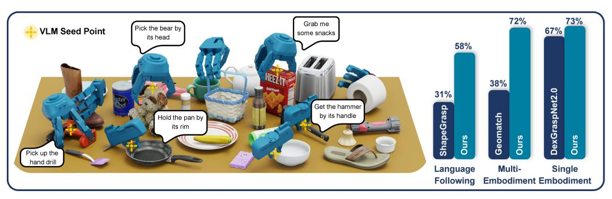  
그림 1: 제안한 방법인 SeededGrasp의 예시 그립핑 및 성능 요약.  

**초록:** 복잡한 장면에서 실용적인 로봇 그립핑은 3차원 공간 추론과 작업 특화 요구사항의 일치를 동시에 요구한다. 비전-언어 모델(VLMs)은 언어를 통해 이러한 요구사항을 자연스럽게 지정할 수 있는 방법을 제공하지만, 기존 접근법들은 VLM을 사용하여 공간 인식이 제한된 상태에서 그립핑을 직접 예측하거나, VLM을 그립핑 모델과 함께 학습하여 훨씬 더 많은 데이터와 컴퓨팅 자원을 필요로 한다. 이러한 한계는 성능을 저해하며, 복잡한 장면에서 다중 에이전트로 확장하는 것을 방해해왔다. 우리는 SeededGrasp를 제안함으로써 이 문제를 해결한다. SeededGrasp는 VLM이 후속 경량 그립핑 생성 모델의 조건으로 사용될 시드 포인트를 예측하는 새로운 데이터 효율적 프레임워크이다. 우리의 아키텍처는 고수준 의미적 추론과 저수준 기하학적 실행을 분리하여, 비싼 엔드투엔드 학습을 피하면서 다중 에이전트 지원을 가능하게 한다. 이러한 모델을 학습하기 위해, 우리는 혼잡한 장면에서 250만 개 이상의 그립핑을 포함하는 최초의 다중 에이전트 테이블탑 그립핑 데이터셋을 공개한다. 실험 결과는 우리의 접근법이 기존 베이스라인을 능가하며, 시뮬레이션에서 72%, 실제 세계 실험에서 78%의 성공률을 달성함을 보여준다. 데이터 및 코드는 프로젝트 사이트에서 확인할 수 있다: https://uoft-isl.github.io/seeded-grasp/.  

**키워드:** 정교한 그립핑, 자연어, 다중 에이전트  

#### 1 서론  
정교한 그립핑은 일반적인 조작을 위한 기본 요구사항이지만 여전히 어려운 과제이다. 로봇이 물리적 세계에서 효과적으로 작동하려면, 정확하고 안정적이며 작업 인식적인 방식으로 물체와 접촉해야 한다. 또한, 혼잡한 장면과 같은 접촉이 풍부하고 다중 물체 환경에서는 모델이 물체의 주변 환경을 존중해야 한다 [1, 2]. 또한, 하위 작업들이 서로 다른 기능적 요구사항을 부과하므로, 언어 지시를 따를 수 있는 능력은 매우 유리하다 [3, 4, 5]. 이 과제는 다양한 로봇 종단 장치의 존재로 더욱 복잡해진다. 일반적으로 널리 사용되는 간단한 두 손가락 그립퍼는 핀치 그립핑에만 제한되어 더 복잡한 물체 기하학에 대응하기 어렵다. 반면, Allegro Hand와 같은 고정교성 그립퍼는 물체에 여러 방식으로 접근할 수 있지만 제어가 어렵다 [6, 7]. 다중 에이전트를 지원하는 것은 그립핑 성능을 향상시키는 추가적인 이점을 제공하며, 단일 다중 에이전트 모델이 특화된 모델보다 더 유용하고 데이터 효율적임을 보여준다 [8, 9, 10, 11]. 이 모든 고려사항은 본 논문에서 다루는 문제를 동기부여한다: 복잡한 장면과 다양한 에이전트를 넘나들며, 고수준 언어적 의도를 저수준 접촉 기하학에 연결하는 시스템을 설계하는 것이다. 기존 접근법들은 이 문제의 일부만 해결하며 중요한 공백이 남아 있다. 일부 방법은 고립된 물체에 초점을 맞추는데, 이는 인식과 접촉 추론을 단순화하지만 실제 세계의 혼잡한 장면의 복잡성을 포착하지 못한다 [12, 13]. 언어 기반 그립핑 시스템을 연구하는 작업들은 종종 대규모 주석 데이터셋과 VLM을 포함한 비싼 엔드투엔드 학습을 요구한다 [5, 14] 또는 사전 학습된 VLM을 활용하여 복잡한 포즈 최적화 파이프라인을 통해 고수준 표현을 예측한다 [3, 15, 16]. 이러한 접근법들은 밀집된 가려짐과/또는 다중 에이전트 그립핑이 존재하는 혼잡한 다중 물체 환경에 잘 확장되지 않으며, 각 그립퍼에 대해 대규모 데이터셋을 수집할 수 없다. 또한, 기존 그립핑 데이터셋은 혼잡한 다중 물체 장면과 다중 에이전트 포즈를 동시에 제공하지 않는다 [2, 12, 17]. 이 불일치는 우리의 접근법과 새로운 데이터셋 생성을 동기부여한다. 본 연구에서는, 혼잡한 장면에서 언어 기반 다중 에이전트 그립핑을 위한 모듈러 프레임워크인 SeededGrasp를 제시한다. 우리의 핵심 아이디어는 VLM이 장면의 포인트 클라우드에서 작업 특화 포인트를 선택하여 그립핑이 중심이 되어야 할 위치를 지정하는 것이다. 이 시드 포인트는 VLM이 대상 물체와 관련 부위를 분리할 수 있게 하면서, 그립핑 모델이 어떻게 그립핑할지에 대한 유연성을 부여한다. 이 시드 포인트를 조건으로, 우리는 그립핑 생성을 위한 경량 플로우 매칭 모델을 학습한다 [18]. 모델을 학습하기 위해, 우리는 합성 데이터 생성 파이프라인을 개발하고, 610개의 장면, 334개의 물체, 3개의 그립퍼에 걸쳐 256만 개의 그립핑을 포함하는 새로운 데이터셋을 구축하였다. 우리는 시뮬레이션과 실제 세계 실험 모두에서 SeededGrasp를 평가하였으며, 시뮬레이션에서는 모든 베이스라인을 능가하고, 실제 세계에서는 시뮬레이션에서 실제로의 전이 능력을 입증하였다. 요약하면, 우리의 기여는 두 가지이다:  
- 1) 사전 학습된 VLM이 제로샷으로 시드 포인트를 예측하여, 경량 플로우 매칭 모델을 조건으로 하여 효율적이고 다중 에이전트 그립핑 생성을 가능하게 하는 새로운 접근법.  
- 2) 세 개의 그립퍼에 걸쳐 610개의 혼잡한 장면을 포함하는 256만 개의 그립핑을 가진 새로운 그립핑 데이터셋.  

#### 2 관련 연구  

**분석적 및 시뮬레이션 기반 그립핑 생성.** 로봇 그립핑에 대한 초기 연구는 분석적 안정성 기준을 사용하여 그립핑 생성을 검색 또는 최적화 문제로 정식화하였다 [19]. 최근의 최적화 기반 접근법은 정교한 그립핑 생성의 속도와 품질을 크게 향상시켰다 [[20,](#page-9-0) [21,](#page-9-0) [22\]](#page-9-0). 이러한 방법들은 추론 시 상대적으로 비효율적이며 일반적으로 혼잡한 장면에서는 작동하지 않거나 언어로부터의 의미적 의도를 통합하지 못하지만, 유효한 그립핑 데이터셋을 생성하는 데 매우 유용하다.  

**데이터셋.** 그립핑 학습의 진전은 데이터셋 품질과 밀접하게 연결되어 있다. 대규모 합성 데이터셋은 병렬 턱 및 정교한 그립핑 모두에서 주요 진전을 가능하게 하였다 [[12,](#page-8-0) [23,](#page-9-0) [24\]](#page-9-0), 최근의 데이터셋은 혼잡한 장면 [[2,](#page-8-0) [25\]](#page-9-0) 및 다중 에이전트 [[9,](#page-8-0) [17\]](#page-9-0)로 확장되었다. 그러나 기존 데이터셋 중 어느 것도 혼잡한 장면에서의 다중 에이전트 그립핑 데이터를 제공하지 않는다. 본 연구에서는, GraspIt [[19\]](#page-9-0)을 사용하여 시뮬레이션에서 생성된 그립핑을 다양한 물체와 그립퍼에 걸쳐 안정성 기준으로 필터링한 MultiGripperGrasp(MGG) 데이터셋 [[17\]](#page-9-0)을 기반으로 데이터셋을 구축하였다.  

**혼잡한 장면에서의 그립핑.** 조작에서의 주요 과제는 공중에 떠 있는 고립된 물체에서 혼잡하고 접촉이 풍부한 장면으로 이동하는 것으로, 모델은 가려짐과 주변 물체와의 상호작용을 추론해야 한다. 최근의 학습 기반 방법은 포인트 클라우드나 깊이 이미지를 입력으로 사용하여 장면 관측치에서 직접 그립핑 분포를 예측함으로써 이 문제를 해결한다 [[1\]](#page-8-0). 정교한 손의 경우, 이는 생성 모델, 접촉 인식 표현, 충돌 인식 공식으로 이어졌으며, 다중 물체 장면의 복잡성을 더 잘 포착한다 [[2,](#page-8-0) [26,](#page-9-0) [27\]](#page-9-0). 그럼에도 불구하고, 대부분의 연구는 혼잡한 환경에서의 기하학적 타당성에 초점을 맞추며 일반적으로 고정된 그립퍼 에이전트에 대해 개발되었다. 반면, 우리의 연구는 다중 에이전트에 걸쳐 공유 모델을 학습한다.  

**다중 에이전트 그립핑.** 또 다른 연구 방향은 그립핑 모델이 다양한 그립퍼 및 정교한 손 간에 일반화할 수 있는 방법을 연구한다. 각 종단 장치에 대해 별도의 정책을 학습하는 대신, 이러한 방법들은 로봇 기하학 또는 운동학 구조를 조건으로 삼아 예측을 조정한다 [[8,](#page-8-0) [11,](#page-8-0) [28,](#page-9-0) [29\]](#page-9-0). 일부 접근법은 접촉 맵이나 키포인트와 같은 손 비의존적 중간 표현을 사용하고, 이후 특정 그립퍼 구성을 해결한다 [[9,](#page-8-0) [10\]](#page-8-0). 다른 접근법은 형태를 직접 인코딩하고 그립핑 생성을 엔드투엔드로 학습한다 [[11,](#page-8-0) [30,](#page-9-0) [31\]](#page-9-0). 이 모든 방법들은 그립퍼 구조에 대한 조건부 설정과 다중 에이전트 학습이 그립핑 품질을 향상시킬 수 있음을 보여준다. 그러나 이들은 주로 기하학적으로 유효한 그립핑을 생성하는 데 초점을 맞추며, 우리 연구처럼 다중 물체 장면과 언어 기반 조건을 다루지 않는다.  

**언어 기반 그립핑.** 자연어는 어떤 물체를 그립핑할지, 그리고 어떻게 그립핑할지를 지정하기 위한 직관적인 인터페이스이다. 이러한 조건부 지원은 언어 기반 방법의 동기를 부여하였다. 최근 몇 가지 접근법 [[3,](#page-8-0) [16\]](#page-8-0)은 VLM을 플러그 앤 플레이 모듈로 사용하여 텍스트에서 작업 관련 영역, 기능, 또는 물체 부위를 추론한 후, 휴리스틱을 사용하여 그립핑을 제안하고 미세 조정한다. 이러한 방법들은 종종 정확도가 낮은 결과를 초래한다. 다른 연구들은 VLM 기반 의미적 기반과 플로우 매칭 [[18\]](#page-9-0) 같은 생성 모델링 기법을 결합하여 전체 파이프라인을 엔드투엔드로 학습하는 더 큰 시스템을 구축한다 [[5,](#page-8-0) [14,](#page-8-0) [32,](#page-9-0) [33\]](#page-9-0). 그러나 이러한 시스템은 대규모 언어 주석 데이터셋을 필요로 하며 학습 비용이 크다. 우리의 방법은 사전 학습된 VLM과 학습된 플로우 매칭 그립핑 생성 모듈을 연결하는 효율적인 인터페이스로 시드 포인트를 도입함으로써 이 두 접근법을 연결하며, 언어 주석 데이터셋의 필요성을 제거한다.  

# 3 데이터셋 생성  
우리의 시드 포인트 조건부 그립핑 예측 모델을 학습하기 위해, 각 그립퍼에 대해 혼잡한 장면에서 유효한 그립핑 데이터셋이 필요하다. 우리는 원시 그립핑 포즈를 처음부터 생성하는 대신, 다양한 그립퍼와 물체에 걸쳐 수백만 개의 합성 공중 그립핑 포즈를 제공하는 MultiGripperGrasp(MGG) 데이터셋 [[17\]](#page-9-0)을 기반으로 구축한다. 이 데이터셋을 적응시키는 것은 혼잡한 장면을 생성하고, 이러한 안정적인 공중 포즈를 학습용 유효한 장면 내 그립핑으로 변환하는 것을 포함한다. MGG 데이터셋은 원래 인프라를 사용하여 재필터링되었으며, 이 인프라는 공중 중력 및 6축 그립핑 테스트를 포함한다 [[17\]](#page-9-0). 여러 물체 및 그립퍼 모델은 높은 그립핑 품질을 보장하기 위해 개선되었다. 이 필터링 과정 후, 병렬 턱 및 정교한 그립핑 운동학의 좋은 균형을 대표하면서 품질 데이터의 양이 가장 많은 세 개의 그립퍼가 선택되었다: Franka Panda, Robotiq 3-Finger, 그리고 Allegro 그립퍼. 혼잡한 장면은 Google Scanned Objects [[34\]](#page-9-0) 및 YCB [[35\]](#page-9-0) 데이터셋에서 학습용 284개, 평가용 50개의 보이지 않는 물체를 사용하여 생성되었다. 이 물체들은 단순한 형태와 불규칙한 기하학을 모두 포함한다. 각 장면은 무작위로 하나에서 열 개의 물체를 샘플링하고, 임의의 방향으로 공중에 초기화한 후 테이블 상에 떨어뜨려 구성되었다. 이 절차는 희소 및 밀집 영역을 모두 포함하는 혼잡한 장면을 생성한다. 총 504개의 학습 장면과 106개의 평가 장면이 생성되었다.

각 장면에 대한 그립은 기존의 MGG 그립을 변환하고 그 타당성을 검사하여 생성되었다. 존재하는 각 객체에 대해, 관련된 공중 그립을 장면의 글로벌 프레임으로 변환하였다. 자연스럽게, 많은 그립이 테이블 또는 다른 객체와의 충돌로 인해 혼잡한 환경에서 비가능하다. 수백만 개의 그립에 대해 동적이고 장면 내에서의 들어올리기 테스트를 수행하는 것은 계산적으로 불가능하므로, 휴리스틱 충돌 검사 집합이 타당성을 효율적으로 판단하였다. 구체적으로, 그립퍼는 타당한 각도(≥0.5 라디안)에서 객체에 접근해야 하며, 모든 그립퍼 링크는 테이블 위에 충분한 여유(≥0.5 cm)를 유지해야 하고, 그립퍼는 객체와 과도하게 교차해서는 안 된다(10 mm 교차 임계값을 적용하여). 각 장면에 대해, 사방향에서 촬영한 네 개의 RGB-D 이미지를 융합하여 2048개 포인트의 포인트 클라우드를 생성하고, 테이블 평면에서 벗어나는 편향을 적용한 가장 먼 포인트 샘플링을 통해 다운샘플링하였다. 본 논문에서는 추론 시 VLM이 종점 포인트 선택을 위해 조망도(BEV)를 캡처하지만, 우리의 접근법은 대상 객체가 보이는 임의의 시점으로 일반화된다. | 로봇 모델 | 총 그립 수 | 재필터링 후 | 장면 내(학습) | 장면 내(평가) | |------------------|--------------|-------------------|------------------|-----------------| | Franka Panda | 2.76 M | 1.57 M | 1.61 M | 469 K | | Robotiq 3 Finger | 2.72 M | 990 K | 246 K | 27 K | | Allegro | 2.77 M | 766 K | 161 K | 48 K | 표 1: 로봇 모델별 그립 데이터셋 통계. 세 개의 그립퍼 모두 동일한 수의 그립으로 시작했으나, Robotiq와 Allegro 그립은 장면 내에서 훨씬 낮은 빈도로 타당하였다. 총합으로, 우리의 데이터셋은 세 개의 로봇 그립퍼에 대해 학습 및 평가 세트로 나누어진 256만 개의 그립 포즈로 구성된다(표 1 참조). 특히, 데이터셋 분포는 Franka Panda 그립퍼에 치우쳐 있다. 그 단순한 운동학 구조로 인해 필터링을 통과하는 그립 포즈의 비율이 더 높다. 우리의 파이프라인은 추가적인 목표 지향적 데이터 생성을 통해 분포를 균형 있게 조정할 수 있지만, 본 연구의 범위에서는 추가 생성이 불필요함이 확인되었다(제 5.2절). #### 4 모델 그림 2에 나타난 바와 같이, 우리의 그립 생성 파이프라인은 두 단계로 구성된다: 첫 번째는 종점 포인트를 예측하고, 두 번째는 종점 포인트 예측을 기반으로 그립 포즈를 예측한다. 이 접근법은 DexGraspNet2.0(DGN2.0) [2]에서 영감을 받았으나, 종점 포인트 예측 모델을 학습할 필요가 없다. 대신, 우리는 오프-the-shelf VLM을 사용하여 BEV 장면 이미지와 사용자 지시에 기반하여 적절한 그립 위치를 예측한다(제 4.3절). 이 예측된 종점 포인트는 학습된 흐름-일치 모델에 전달되어 선택된 그립퍼에 대한 그립 포즈를 합성한다(제 4.1 및 4.2절). 이 설계는 그립 생성에 대한 정밀한 자연어 제어를 가능하게 하며, 학습 비용을 낮추고 수많은 후보 포즈를 생성하고 필터링할 필요를 없앤다. 또한, 이 접근법은 이 모듈식 설계에서 선택된 VLM에 특화되지 않아, 향후 VLM 개선에 따른 자연스러운 성능 확장이 가능하다. #### 4.1 모델 아키텍처 **포인트 클라우드 인코딩.** 그립퍼 및 장면 기하학은 모두 색상이 없는 포인트 클라우드이며, 각각 $p_r \in \mathbb{R}^{1024 \times 3}$ 및 $p_c \in \mathbb{R}^{2048 \times 3}$로 표기한다. 포인트 좌표는 푸리에 인코딩 [36]을 적용하고, 로컬 법선 벡터 $(n \in \mathbb{R}^3)$ 및 곡률 $(\sigma(p) \in \mathbb{R})$와 연결된다. 이들은 로컬 근방의 주성분 분석을 통해 추정되어 표면 표현을 풍부하게 한다. 또한, 장면 포인트 클라우드의 각 포인트 표현에는 종점 포인트까지의 거리가 포함된다. GeoMatch [10]에 따라, 그래프 컨볼루션 네트워크는 16개의 최근접 이웃을 사용하여 포인트 클라우드를 인코딩하여, 각 포인트 특징 벡터 $f_p \in \mathbb{R}^{512}$를 생성한다. 각 포인트 클라우드에 대한 글로벌 표현을 추출하기 위해, 각 포인트 특징 벡터는 최대 및 평균 풀링을 통해 집계된다. 또한, 대상 그립 위치 주변의 로컬 기하학을 포착하기 위해, 장면 포인트 클라우드 내 종점 포인트의 16개 최근접 이웃의 특징을 글로벌 장면 특징과 연결한다. 각 로봇 기하학에 대해 학습 가능한 쿼리 $q_r \in \mathbb{R}^{512}$를 도입하여 특정 그립퍼 선택을 인코딩한다. 이러한 보조 벡터를 연결하여 로봇 및 장면 포인트 클라우드에 대한 최종 특징 벡터 $f_r \in \mathbb{R}^{3 \times 512}$ 및 $f_c \in \mathbb{R}^{18 \times 512}$를 생성한다. **그립 포즈 파라미터화.** 각 포즈는 벡터 $g = (T, R, \theta)$로 파라미터화되며, $T \in \mathbb{R}^3$은 평행이동, $R \in SO(3)$은 오일러 각 [37]로 파라미터화된 회전, $\theta$는 월드 프레임 내 그립퍼의 조인트 구성이다. 평가된 그립퍼마다 작동 조인트 수가 다르므로, 포즈 표현은 최대 자유도(Allegro 손의 경우 16개 조인트)를 수용하도록 패딩된다. **그립 포즈 생성.** 로봇 및 장면 특징에 조건을 두어 안정적인 그립 포즈의 분포 $p(g \mid f_r, f_c)$는 본질적으로 복잡하고 다중 모달이다. 따라서, 우리는 흐름-일치를 사용하여 $p(g \mid f_r, f_c)$를 모델링하고 샘플링한다 [18]. 흐름-일치 모델 $u_{\theta}(t, g_t, f_r, f_c)$는 실제 벡터장 $u_t(t, g_t, f_r, f_c)$를 예측하도록 학습된다. 시간 단계 $t \in [0, 1]$ 및 조건 특징 $f_r$과 $f_c$가 주어졌을 때, 모델은 노이즈가 있는 그립 포즈 샘플 $g_t$를 대상 데이터 분포의 샘플로 변환한다. 해당 상미분방정식(ODE)을 수치적으로 풀어(제 4.3절에서 상세 설명), 초기 노이즈 샘플 $g_0$을 반복적으로 변환하여 깨끗한 그립 포즈 $g_1$을 생성한다. 기본 네트워크는 표준 Diffusion Transformer(DiT) 아키텍처를 사용하며, 교차 주의 메커니즘을 통해 로봇 및 장면 조건 신호를 주입한다 [38]. #### 4.2 모델 학습 **데이터 준비.** SeededGrasp는 전체 합성된 그립 데이터셋에서 학습된다. VLM을 매번 쿼리하지 않고 그립 예측 모델을 학습하기 위해, 그립퍼의 손바닥 중심 위치에 가장 가까운 대상 객체의 여덟 개 포인트 중 하나를 실제 종점 포인트로 샘플링한다. 충돌이 적어 자연스럽게 휴리스틱 필터링을 더 높은 비율로 통과하는 단순한 객체 및 그립퍼 기하학에 대한 과적합을 완화하기 위해, 그립 포즈를 그립퍼, 장면, 객체 전체에 걸쳐 균일하게 샘플링한다. 일반화를 촉진하기 위해, 포인트 클라우드 및 그립 포즈에 적용 가능한 경우 임의의 Z축 회전, XY 평면 이동, 가우시안 노이즈를 적용한다. 또한, 모든 그립 포즈는 각 특정 그립퍼의 조인트 각도에 대해 고유한 범위를 적용하여 [-1,1] 범위로 min-max 정규화되며, 이는 조인트 한계, 스케일, 단위의 차이를 고려하여 다중 실체 학습을 용이하게 한다. **학습 세부사항.** 네트워크는 조건부 흐름-일치 손실 $\mathcal{L}_{cfm}$을 사용하여 최적화되며, 이는 예측된 벡터장 $u_{\theta}$의 평행이동, 회전, 조인트 각도 구성 요소에 걸쳐 계산된다. 총 손실은 선형 결합으로 표현된다: $\mathcal{L} = \lambda_{trans} \mathcal{L}_{trans} + \lambda_{rot} \mathcal{L}_{rot} + \lambda_{joints} \mathcal{L}_{joints}$, 여기서 $\lambda = (0.4, 0.04, 0.8)$ 계수는 각 항을 균형 있게 조정하는 스케일링 인자이다. 특정 그립퍼에 대해 사용되지 않는 조인트 차원은 $\mathcal{L}_{joints}$ 계산 중 마스킹되며, 후속 평균 연산을 통해 다양한 실체 간 조인트 손실이 균형을 유지하도록 한다. 표준 L2 손실 대신, $\mathcal{L}_{cfm}$에는 L1 손실이 사용된다: $$\mathcal{L}_{cfm} = \mathbb{E}_{t \sim \beta(1.5, 1.0), (q_t, f_r, f_c) \sim \mathcal{U}} [|u_{\theta}(t, g_t, f_r, f_c) - u_t(t, g_t, f_r, f_c)|]$$ 이 대체는 생성된 그립 포즈가 장면 기하학에 더 정밀하게 부합하도록 한다. 또한, 학습 중 시간 단계 $t$는 베타 분포에서 샘플링되어 손실이 후기 시간 단계 $(t \to 1)$에 치우치도록 유도되며, 이 시점에서 고정밀 벡터장이 정확한 그립 포즈를 완성하는 데 필수적이다 [32]. 분류기 없는 가이던스도 통합되어 모델이 조건 신호에 더 잘 부합하도록 한다 [39]. 학습 중에 조건 특징 $f_r$과 $f_c$를 무작위로 드롭아웃함으로써, 네트워크는 조건부 및 무조건 벡터장을 동시에 학습한다. 추론 중에는 이러한 벡터장을 외삽하여 생성된 샘플을 더 강한 조건으로 밀어넣는다(w=1.1 사용), 이를 통해 주변 장면 기하학과의 정렬이 향상된다. <span id="page-5-0"></span> | 방법 | 성공률 (%) (Allegro 데이터만) | | 방법 | 성공률 (%) | | | |--------|---------------------------------|-----------|----------|-------------|---------|---------| | | Graspness 종점 | VLM 종점 | | Franka | Robotiq | Allegro | | DGN2.0 | 53.15 | 66.67 | Geomatch | 25.35 | 35.71 | 37.97 | | Ours | 66.22 | 72.97 | Ours | 71.38 | 72.16 | 72.07 | 표 2: 왼쪽: 우리 방법과 DGN2.0 [\[2\]](#page-8-0)은 DGN2.0의 Graspness 모듈과 VLM에서 생성된 종점 포인트에 대해 Allegro 데이터만으로 학습되었다. 오른쪽: 다중 실체 데이터에서, SeededGrasp는 혼잡한 장면의 복잡한 객체에서 Geomatch [\[10\]](#page-8-0)을 능가한다. # 4.3 모델 추론 VLM 종점 포인트 예측. 추론 중, VLM은 사용자의 지시(프롬프트는 제 [A.6]절에서 상세 설명)와 일치하는 안정적인 그립 위치를 제로샷으로 식별하도록 유도된다. 이미지에서 예측된 점은 이후 3D 장면 포인트 클라우드에 투영되어 생성 모듈로 전달된다. VLM은 미세 조정이나 few-shot 예시 없이도 이 작업을 효과적으로 수행한다. 우리는 제 [5.2]절에서 다양한 모델을 비교하였고, Gemini 모델이 가장 우수함을 발견하였다. **그립 포즈 생성.** 최종 그립 포즈는 선택된 종점 포인트, 현재 예측 포인트 클라우드, 대상 로봇 쿼리 벡터에 조건을 두고 초기 포즈 상태를 노이즈 제거하여 생성된다. 추론 경로를 단순화하고 수치적 오차 축적을 최소화하기 위해, 초기 상태 $g^0$은 순수한 노이즈가 아니라 종점 포인트 근처의 고정된 정규 그립 포즈로 초기화된다. 전진 오일러 적분을 사용하여, 단계 크기 0.2로 $g^0$을 $t = 0$에서 $t = 1$까지 예측된 벡터장 $u_{\theta}(t, g_t, f_r, f_c)$를 따라 수치적으로 적분한다. # 5 실험 결과

우리의 접근 방식은 이전 연구보다 더 넓은 기능 집합을 지원하므로 단일 일대일 비교가 불가능하다. 따라서 우리는 특정 기능을 분리하기 위해 세 가지 독립적인 축을 따라 우리의 방법을 평가한다. 첫째, 모델이 이전 연구보다 종점(seed points)을 사용하여 성공적인 그립을 더 효과적으로 생성할 수 있으며, VLM이 특별히 훈련된 종점 생성 모듈보다 더 나은 종점을 생성할 수 있음을 보여준다(제 5.1.1절). 둘째, SeededGrasp가 모든 신체 형태(embodiments)에 걸쳐 효과적으로 그립을 생성할 수 있음을 보여준다(제 5.1.2절). 셋째, 종점이 언어 조건부 그립을 위한 더 효과적인 VLM 인터페이스임을 입증한다(제 [5.1.3]절(#page-6-0)). 이후 제 [5.2]절(#page-6-0)에서 그립 인코딩, VLM 모델, 데이터셋 크기를 절제한다. 마지막으로 제 [5.3]절(#page-7-0)에서 실제 실험을 수행하고 시뮬레이션에서 실제로의 전이(sim-to-real) 능력을 입증한다. 흐름 매칭 모델은 두 대의 A100 GPU를 사용하여 48시간 동안 훈련되었으며, 모든 평가에서 종점 예측에 Gemini 3.1 Flash를 사용한다.

## 5.1 시뮬레이션 결과

### 5.1.1 종점 선택 및 조건부 그립 예측:  
우리는 동일한 종점을 입력으로 받을 수 있는 DGN2.0과 우리의 흐름 매칭 모델을 비교한다. DGN2.0은 단일 그립만 지원하므로, 두 방법 모두 Allegro 데이터만 사용하여 훈련하였다. SeededGrasp는 DGN2.0의 Graspness Score Module에서 생성된 종점을 조건으로 사용할 때, 단일 신체 형태 그립에서 기준선보다 13% 더 높은 성능을 보였다(표 2). 또한, Gemini 3.1 Flash가 예측한 종점은 두 방법 모두에서 DGN2.0의 특별히 훈련된 종점 생성 모듈[2](#page-8-0)보다 더 높은 성공률을 달성하였다(표 2). DGN2.0과 달리, 우리의 모델은 명시적인 객체 세그멘테이션 마스크나 그 graspness 모듈에서 생성된 추가 특징 벡터를 필요로 하지 않으며, 여러 종단 장치를 지원한다.

### 5.1.2 다중 신체 형태 성능:  
DGN2.0은 단일 그립만 지원하므로, 우리는 다중 신체 형태 성능을 위해 Geomatch[10](#page-8-0)과 비교한다(표 2). 우리의 모델은 중공간 단일 객체 그립을 위해 설계된 Geomatch보다 더 복잡한 객체와 혼잡한 장면을 더 잘 처리하며, 성공률을 약 35% 향상시켰다. 이 차이는 Geomatch의 아키텍처[10](#page-8-0)에 기인한다. Geomatch는 접촉점(predicting contact points)을 예측한 후 역운동학(Inverse Kinematics, IK) 최적화를 통해 관절 각도를 결정한다. 이 과정은 정확한 초기 추정값이 필요하며, Geomatch의 휴리스틱은 우리 데이터셋에 존재하는 복잡한 기하 구조에서 자주 실패하였다. 이는 다중 카메라 포인트 클라우드를 융합하여 생성된 객체가 바닥이 없는 불완전하고 빈 껍질 형태가 되는 문제를 더욱 악화시킨다. 자세한 내용은 부록의 그림 [6](#page-14-0)을 참조하라.

| Method | | Obj. & Part Recog. Succ. (%) | Overall Grasp Succ. (%) |  
|------------------------|-------------|------------------------------|-------------------------|--|  
| ShapeGrasp w/ Obj.Seg. | 57.5 | 51.6 | 31.1 |  
| GraspMAS | 42.5 | 29.0 | 24.5 |  
| Ours | 89.6 | 80.6 | 58.2 |  

표 3: 언어 조건부 그립 품질. 중앙: SeededGrasp는 대상 객체 및 그 부품을 더 높은 비율로 정확히 식별한다. 우측: 언어 지시가 정확히 수행된 프롬프트에 대해 더 높은 그립 성공률을 달성한다.

### 5.1.3 언어 조건부 그립 프롬프팅 방법:  
우리는 SeededGrasp를, VLM이 그립을 예측할 수 있도록 허용하는 두 가지 대안 제로샷 기법인 ShapeGrasp[3](#page-8-0)과 GraspMAS[16](#page-8-0)과 비교한다. 이 두 기법은 모두 평행 턱 그립만 지원하며, 장면의 BEV 이미지에 전적으로 의존한다. ShapeGrasp는 이미지에서 객체를 세그멘테이션한 후, VLM에 사용자 지시와 가장 잘 일치하는 객체를 선택하도록 프롬프트한다. GraspMAS는 Planner, Observer, Coder로 구성된 에이전트 기반의 폐쇄 루프 과정을 사용하여 객체를 선택하고 그립을 예측한다. 언어 지시를 따르고 효과적인 그립을 생성하는 능력을 평가하기 위해, 우리는 226개의 장면-프롬프트 쌍으로 구성된 테스트 데이터셋을 구축하였다. 이는 164개의 *쉬운* 프롬프트와 62개의 *어려운* 프롬프트로 나뉘어 있으며, 각각 작업을 직접적 또는 간접적으로 설명한다. 프롬프트 예시는 제 [A.3]절(#page-12-0)을 참조하라. 예측 결과는 사용자 지시 준수 여부를 수동으로 평가하였다. 표 3에 나타난 바와 같이, SeededGrasp는 대상 객체를 정확히 인식하고, 올바른 부품을 식별하며, 유효한 그립을 생성하는 면에서 두 기준선을 모두 능가한다. 두 기준선 모두 장면의 BEV 이미지만을 VLM에 전달하며 포인트 클라우드 정보를 활용할 수 없기 때문에 어려움을 겪는다. 우리의 종점 인터페이스는 복잡한 프롬프팅 아키텍처를 필요로 하지 않으며, 그립 예측에 VLM에 전적으로 의존하는 단점을 회피한다. 구체적인 실패 사례에 대한 자세한 내용은 제 [A.3.1]절(#page-13-0)을 참조하라.

#### 5.2 절제 연구

**그립 인코딩:** 모델은 로봇 포인트 클라우드와 학습 가능한 그립 특화 쿼리 벡터를 사용하여 그립 정보를 인코딩한다. 표 4에 나타난 바와 같이, 특히 운동학적으로 더 복잡한 Robotiq 3-Finger 및 Allegro 그립의 경우 두 가지를 모두 사용하는 것이 중요하다. 이는 네트워크가 각 신체 형태의 고유한 기하학적 복잡성을 더 잘 포착하고 그립 간에 일반화할 수 있도록 돕는다.

| Method | Success (%) | | | |  
|------------------------------|--------------|------------------|---------|--|  
| SeededGrasp w/o Query Vector | 72.41 | 69.07 | 59.01 | |  
| SeededGrasp w/o Robot PC | 72.76 | 67.53 | 62.16 | |  
| SeededGrasp | 71.38 | 72.16 | 72.07 | |  

표 4: 그립 표현을 하나라도 제거하면 성공률이 감소한다.

제안된 프레임워크는 특정 VLM에 무관하므로, 여러 주요 VLM 계열의 그립 성공률을 평가하여 백본 아키텍처의 영향을 평가하였다. 표 [5](#page-7-0)는 Gemini 3.1 Flash가 경쟁 아키텍처를 크게 능가하며, 현재 VLM의 능력에 따라 적절한 VLM을 선택하는 것이 중요함을 보여준다(자세한 결과는 부록의 표 [6](#page-16-0) 참조). 또한, 더 높은 추론 수준을 사용하는 것이 성능 향상에 도움이 되지 않았다.

| | GPT 5.4 | Qwen 3.5 Flash [40] | Gemini 3.1 Flash |  
|-------------|---------|---------------------|------------------|  
| Success (%) | 42.61 | 54.42 | 71.87 |  

<span id="page-7-0"></span>표 5: 다양한 VLM을 사용한 종점 예측에 따른 세 가지 그립(Franka, Robotiq 3-Finger, Allegro)의 평균 성공률. Gemini 3.1 Flash가 다른 모델들을 크게 능가한다.

**데이터셋 규모:** 데이터량이 생성 품질에 미치는 영향을 평가하기 위해, 모델을 훈련 장면의 25%, 50%, 75%를 사용하여 재훈련하였다. 데이터셋 크기가 증가함에 따라 성능도 향상되지만, 약 71.5%에서 포화되며, 데이터셋 크기를 더 증가시켜도 미미한 개선만 얻을 수 있음을 나타낸다(플롯은 부록의 그림 [10](#page-15-0) 참조). 훈련 장면 수를 줄이면 Robotiq 3-Finger 및 Allegro 그립의 성능이 비례적으로 더 심각하게 저하된다. 이 차이는 Franka Panda가 장면당 타당한 그립 자세의 밀도가 더 높기 때문에 데이터셋 다운샘플링에 더 강건하기 때문으로 추정된다.

#### 5.3 실제 평가

실제 실험을 위해, Delto DG-3F-B 세 손가락 그립을 사용하여 실제 객체 집합에 대해 예측된 그립의 품질을 평가하였다. 우리는 두 대의 고정된 ZED 스테레오 카메라를 사용하여 테이블 장면의 포인트 클라우드를 생성하였다. 모델은 Delto 그립으로 훈련되지 않았으므로, Robotiq 3-Finger 그립의 예측을 특정 관절에 일정한 오프셋과 추가 관절에 고정된 값으로 Delto에 매핑하였다. 실행 중에는 그립 위치 위에서 객체에 접근하며, 그립 후 각 손가락 끝의 두 관절을 더 닫아 힘 폐쇄를 수행하였다. 우리는 장면에 네 개의 임의의 방해물이 있는 상태에서, 15개의 미지의 객체 각각에 대해 세 번의 트라이얼을 수행하였다. Robotiq 3-Finger 예측에 의존하는 단점은 Delto 손가락이 Robotiq 손가락보다 길거나 두껍지 않다는 점이다. 그럼에도 불구하고, 모델은 전체 성공률 78%를 달성하였다. 개별 객체 성공률은 부록의 표 [7](#page-17-0)을 참조하라.

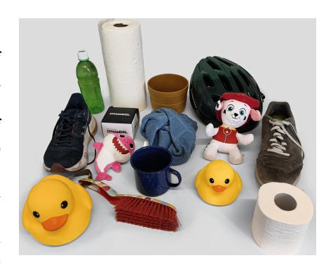  
그림 3: 실제 설정에서 사용된 모든 객체

# 6 한계

실제 배포 시, 그립은 로봇 팔에 장착되며, 장애물을 피할 때 특히 모든 예측된 자세에 도달할 수 없다. 현재 우리의 모델은 팔의 운동학을 인식하지 않고 그립 자세만 예측하므로, 실행 불가능한 동작을 제안할 수 있다. 향후 연구에서는 그립 선택과 팔 운동 계획을 공동으로 해결해야 한다. 또한, 단일 이미지 VLM 조건을 넘어서 다중 시점 관점을 통합하면, 일부 시점에서 최적의 그립 영역이 가려지는 혼잡한 장면에서 공간 추론과 강건성이 향상될 수 있다. 일반화는 또한 신체 형태별 학습된 쿼리에서 관절 공간의 통합 표현으로 전환함으로써 다양한 형태의 미지 하드웨어로의 전이를 개선할 수 있다. 마지막으로, 현재 MGG 데이터셋에서 파워 그립이 과대 대표되어 표면에 평평하게 놓인 객체를 처리할 때 모델의 효과가 제한되므로, 훈련 데이터의 다양성을 확장할 필요가 있다.

# 7 결론

우리는 혼잡한 장면에서 언어 기반의 다중 신체 형태 그립을 위한 SeededGrasp 프레임워크를 제시한다. SeededGrasp는 VLM이 예측한 종점을 사용하여 의미적 의도를 인코딩하고, 흐름 매칭 모델을 사용하여 그립을 생성한다. 우리의 합성 데이터셋으로 훈련된 이 모델은 시뮬레이션과 실제 실험 모두에서 강력한 그립 성능을 달성하였다. 이는 종점 조건부가 언어 기반화와 그립 생성 사이의 효과적인 다리임을 입증한다.

## <span id="page-8-0"></span>감사의 말

이 연구는 [Vector Institute](https://vectorinstitute.ai/) 및 [Digital Research Alliance of Canada.](https://alliancecan.ca/)의 일부 지원을 받아 수행되었다.

# References

- [1] M. Sundermeyer, A. Mousavian, R. Triebel, 및 D. Fox. Contact-GraspNet: 복잡한 장면에서 효율적인 6-DoF 그립 생성. *ICRA*, 2021.  
- [2] J. Zhang, H. Liu, D. Li, X. Yu, H. Geng, Y. Ding, J. Chen, 및 H. Wang. DexGraspNet 2.0: 대규모 합성 복잡한 장면에서 생성적 섬세한 그립 학습. *CoRL*, 2024.  
- [3] S. Li, S. Bhagat, J. Campbell, Y. Xie, W. Kim, K. P. Sycara, 및 S. Stepputtis. ShapeGrasp: 기하학적 분해를 통해 대규모 언어 모델을 이용한 제로샷 작업 지향 그립. *IROS*, 2024.  
- [4] C. Tang, D. Huang, W. Ge, W. Liu, 및 H. Zhang. GraspGPT: 대규모 언어 모델의 의미적 지식을 활용한 작업 지향 그립. *IEEE Robotics and Automation Letters*, 8(11):7551–7558, 2023.  
- [5] J. He, D. Li, X. Yu, Z. Qi, W. Zhang, J. Chen, Z. Zhang, Z. Zhang, L. Yi, 및 H. Wang. DexVLG: 대규모 섬세한 비전-언어-그립 모델. *ICCV*, 2025.  
- [6] J. Chen, Y. Ke, L. Peng, 및 H. Wang. Dexonomy: 그립 분류법에 따른 모든 섬세한 그립 유형 합성. *RSS*, 2025.  
- [7] T. Feix, J. Romero, H.-B. Schmiedmayer, A. M. Dollar, 및 D. Kragic. 인간 그립 유형의 GRASP 분류법. *IEEE Transactions on Human-Machine Systems*, 46(1):66–77, 2016.  
- [8] X. Fei, Z. Xu, H. Fang, T. Zhang, 및 L. Shao. T(r,o) grasp: 교차 실체 섬세한 그립을 위한 로봇-물체 공간 변환의 효율적 그래프 확산. arXiv, 2025.  
- [9] P. Li, T. Liu, Y. Li, Y. Geng, Y. Zhu, Y. Yang, 및 S. Huang. GenDexGrasp: 일반화 가능한 섬세한 그립. *ICRA*, 2023.  
- [10] M. Attarian, M. A. Asif, J. Liu, R. Hari, A. Garg, I. Gilitschenski, 및 J. Tompson. 다중 실체 그립을 위한 기하학 매칭. *CoRL*, 2023.  
- [11] Z. Wei, Z. Xu, J. Guo, Y. Hou, C. Gao, Z. Cai, J. Luo, 및 L. Shao. D(R, O) Grasp: 교차 실체 섬세한 그립을 위한 로봇 및 물체 상호작용의 통합 표현. *ICRA*, 2025.  
- [12] R. Wang, J. Zhang, J. Chen, Y. Xu, P. Li, T. Liu, 및 H. Wang. DexGraspNet: 시뮬레이션 기반 일반 물체를 위한 대규모 로봇 섬세한 그립 데이터셋. *ICRA*, 2023.  
- [13] A. Mousavian, C. Eppner, 및 D. Fox. 6-DOF GraspNet: 객체 조작을 위한 변분적 그립 생성. *ICCV*, 2019.  
- [14] S. Deng, M. Yan, S. Wei, H. Ma, Y. Yang, J. Chen, Z. Zhang, T. Yang, X. Zhang, H. Cui, Z. Zhang, 및 H. Wang. GraspVLA: 수십억 규모의 합성 행동 데이터로 사전 학습된 그립 기반 모델. *CoRL*, 2025.  
- [15] J. Jian, Y.-L. Wei, C. Mou, Y. Lin, X. Zhu, Y. Shen, W.-S. Zheng, 및 R. Hu. Zerodexgrasp: 프롬프트 기반 다단계 의미적 추론을 통한 제로샷 작업 지향 섬세한 그립 합성, 2025. URL <https://arxiv.org/abs/2511.13327>.  
- [16] Q. Nguyen, T. Le, H. H. Nguyen, T. Vo, T. D. Ta, B. Huang, M. N. Vu, 및 A. Nguyen. GraspMAS: 멀티 에이전트 시스템을 이용한 제로샷 언어 기반 그립 탐지. *IROS*, 2025.  
- <span id="page-9-0"></span>[17] L. F. Casas Murillo, N. Khargonkar, B. Prabhakaran, 및 Y. Xiang. MultiGripperGrasp: 병렬 턱 그리퍼에서 섬세한 손까지 로봇 그립을 위한 데이터셋. *IROS*, 2024.  
- [18] Y. Lipman, R. T. Q. Chen, H. Ben-Hamu, M. Nickel, 및 M. Le. 생성 모델을 위한 플로우 매칭. *ICLR*, 2023.  
- [19] A. T. Miller 및 P. K. Allen. GraspIt!: 로봇 그립을 위한 다목적 시뮬레이터. *IEEE Robotics and Automation Magazine*, 11(4):110–122, 2004.  
- [20] T. Liu, Z. Liu, Z. Jiao, Y. Zhu, 및 S.-C. Zhu. 미분 가능한 힘 폐쇄 추정기를 사용한 임의의 손 구조로 다양한 물리적 안정적인 그립 합성. *IEEE Robotics and Automation Letters*, 7(1):470–477, 2022.  
- [21] D. Turpin, T. Zhong, S. Zhang, G. Zhu, J. Liu, R. Singh, E. Heiden, M. Macklin, S. Tsogkas, S. Dickinson, 및 A. Garg. Fast-Grasp'D: 미분 가능한 시뮬레이션을 통한 다지능 섬세한 그립 생성. *ICRA*, 2023.  
- [22] J. Chen, Y. Ke, 및 H. Wang. BODex: 이중 최적화를 통한 확장 가능한 효율적인 로봇 섬세한 그립 합성. *ICRA*, 2025.  
- [23] J. Mahler, J. Liang, S. Niyaz, M. Laskey, R. Doan, X. Liu, J. A. Ojea, 및 K. Goldberg. Dex-Net 2.0: 합성 포인트 클라우드 및 분석적 그립 메트릭을 이용한 견고한 그립 계획을 위한 딥러닝. *RSS*, 2017.  
- [24] C. Eppner, A. Mousavian, 및 D. Fox. ACRONYM: 시뮬레이션 기반 대규모 그립 데이터셋. *ICRA*, 2021.  
- [25] H.-S. Fang, C. Wang, M. Gou, 및 C. Lu. GraspNet-1Billion: 일반 객체 그립을 위한 대규모 벤치마크. *CVPR*, 2020.  
- [26] J. Lundell, F. Verdoja, 및 V. Kyrki. DDGC: 복잡한 환경에서 생성적 딥 섬세한 그립. *IEEE Robotics and Automation Letters*, 6(4):6899–6906, 2021.  
- [27] Y. Li, W. Wei, D. Li, P. Wang, W. Li, 및 J. Zhong. HGC-Net: 복잡한 환경에서 인체 유사 손의 딥 그립. *ICRA*, 2022.  
- [28] L. Shao, F. Ferreira, M. Jorda, V. Nambiar, J. Luo, E. Solowjow, J. A. Ojea, O. Khatib, 및 J. Bohg. UniGrasp: 다지능 로봇 손을 위한 통합 그립 모델 학습. *IEEE Robotics and Automation Letters*, 5(2):2286–2293, 2020.  
- [29] Z. Xu, B. Qi, S. Agrawal, 및 S. Song. AdaGrasp: 적응형 그리퍼 인식 그립 정책 학습. *ICRA*, 2021.  
- [30] Y. Wei, M. Attarian, 및 I. Gilitschenski. GeoMatch++: 다중 실체 그립을 위한 형태 조건화 기하학 매칭. *CoRL 워크숍: 로봇 정밀 및 섬세한 조작 학습*, 2024.  
- [31] R. Freiberg, A. Qualmann, N. A. Vien, 및 G. Neumann. 다중 실체 그립 에이전트를 향한 연구. *IEEE Robotics and Automation Letters*, 2026.  
- [32] K. Black, N. Brown, D. Driess, A. Esmail, M. Equi, C. Finn, N. Fusai, L. Groom, K. Hausman, B. Ichter, S. Jakubczak, T. Jones, L. Ke, S. Levine, A. Li-Bell, M. Mothukuri, S. Nair, K. Pertsch, L. X. Shi, J. Tanner, Q. Vuong, A. Walling, H. Wang, 및 U. Zhilinsky. π0: 일반 로봇 제어를 위한 비전-언어-행동 흐름 모델. arXiv, 2024.  
- [33] J. Wen, Y. Zhu, J. Li, M. Zhu, K. Wu, Z. Xu, N. Liu, R. Cheng, C. Shen, Y. Peng, F. Feng, 및 J. Tang. TinyVLA: 로봇 조작을 위한 빠르고 데이터 효율적인 비전-언어-행동 모델 구축. *IEEE Robotics and Automation Letters*, 2025.  
- <span id="page-10-0"></span>[34] L. Downs, A. Francis, N. Koenig, B. Kinman, R. Hickman, K. Reymann, T. B. McHugh, 및 V. Vanhoucke. Google 스캔된 객체: 고품질 3D 스캔 가정용 물품 데이터셋. *ICRA*, 2022.  
- [35] B. Calli, A. Singh, A. Walsman, S. Srinivasa, P. Abbeel, 및 A. M. Dollar. YCB 객체 및 모델 세트: 조작 연구를 위한 공통 벤치마크. *ICAR*, 2015.  
- [36] B. Mildenhall, P. P. Srinivasan, M. Tancik, J. T. Barron, R. Ramamoorthi, 및 R. Ng. NeRF: 시야 합성을 위한 신경 복사장으로 장면 표현. *Communications of the ACM*, 65(1):99–106, 2022.  
- [37] A. J. Bose, T. Akhound-Sadegh, G. Huguet, K. Fatras, J. Rector-Brooks, C.-H. Liu, A. C. Nica, M. Korablyov, M. Bronstein, 및 A. Tong. 단백질 백본 생성을 위한 SE(3)-확률적 흐름 매칭. *ICLR*, 2024.  
- [38] W. Peebles 및 S. Xie. 트랜스포머를 이용한 확장 가능한 확산 모델. *ICCV*, 2023.  
- [39] J. Ho 및 T. Salimans. 분류기 없는 확산 가이던스. *NeurIPS 워크숍: 딥 생성 모델 및 하류 응용*, 2021.  
- [40] Q. Team. Qwen3.5: 네이티브 멀티모달 에이전트를 통한 생산성 가속, 2026년 2월. URL <https://qwen.ai/blog?id=qwen3.5>.  

# A 부록  

## A.1 평가 설정  
모든 세 축에 대한 평가는 일관성을 위해 Isaac Sim에서 수행되었으며, 합격/불합격 기준을 사용하였다. 초기화 중 객체와의 심각한 침투가 발생하거나, 그리퍼가 테이블 위에서 객체를 30cm 높이로 들어 올리지 못하고 떨어뜨리는 경우 그립은 실패로 간주된다. 이러한 기준은 모든 베이스라인 및 절제 연구의 성공률을 결정한다.  

#### A.2 베이스라인 설정 세부사항  
DexGraspNet2.0: 공정한 비교를 위해, 우리의 모델과 DGN2.0은 Allegro Hand 데이터로 학습된 모델을 사용하여 훈련 및 평가되었다. 이는 원래 베이스라인에서 사용된 Leap Hand과 형태적으로 유사하다. DGN2.0의 대부분 파이프라인은 전체 장면 포인트 클라우드를 작동하지만, 관심 객체의 초기 시드 포인트를 선택하기 위해 명시적인 객체 마스크를 엄격히 요구한다.  

Geomatch: Geomatch는 동시 다중 실체 학습을 지원하지만, 사용자 생성 시드 포인트로 조건화할 수 없다. 대신, top-k 파라미터를 통해 최적의 입력 조건을 자율적으로 결정한다. 또한 Geomatch는 기본적으로 다중 객체 장면을 지원하지 않기 때문에 입력에 객체 마스크가 필요했으며, 단일 객체 장면에서만 평가되었다. 시뮬레이션에서도 평가를 위해 단일 객체 장면만 초기화되었다.  

ShapeGrasp 및 GraspMAS: 두 베이스라인 모두 병렬 핸드 그리퍼를 사용하며, 장면의 조망도(BEV) 이미지에 전적으로 의존한다. ShapeGrasp는 단일 객체 이미지만 처리하며, 객체 세그멘테이션 마스크를 제공받았다. 이는 2D 및 3D 두 가지 작동 모드를 갖는다. 본 평가에서는 ShapeGrasp의 3D 모드가 테스트 중 너무 자주 실패했기 때문에, gemini-3-flash-preview(우리 방법에서 사용된 모델과 동일)를 사용하여 2D 모드로 평가하였다.  

GraspMAS는 Planner, Observer, Coder로 구성된 에이전트 기반 폐쇄 루프 워크플로우를 사용하며, 이 파이프라인에 가장 높은 성능을 발휘한 gpt-4o를 사용하여 평가되었다.  

## <span id="page-12-0"></span>A.3 언어 조건 그립 테스트 데이터셋  
섹션 [5.1](#page-5-0)에서 설명한 대로, 우리는 방법들이 그립 작업을 수행하기 위한 올바른 객체 및 그 부분을 식별하는 성능을 테스트하기 위해 두 가지 프롬프트 세트를 생성하였다.  

**쉬운 프롬프트**: '쉬운' 프롬프트 세트는 방법이 올바른 객체 또는 그 부분을 식별하기 위해 거의 또는 전혀 사고를 필요로 하지 않도록 설계되었다. 잡아야 할 부분이 프롬프트에 직접 명시되었다. 이러한 프롬프트의 예시는 아래와 같다.  
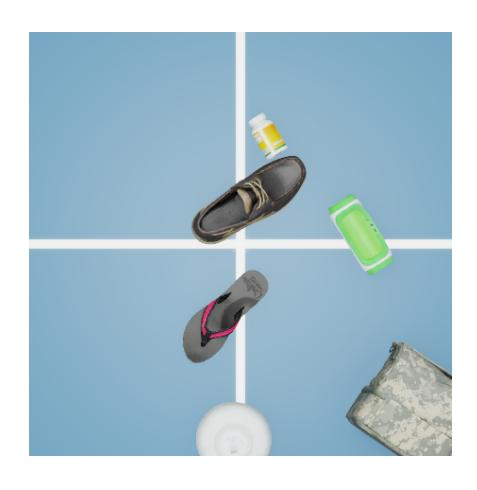  
(a) "분홍색과 검은색 끈으로 플립플롭을 잡아라"  
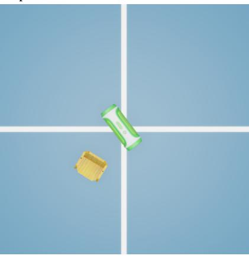  
(c) 원통형 본체의 중심부를 잡아 녹색과 흰색 스피커를 그립하라  
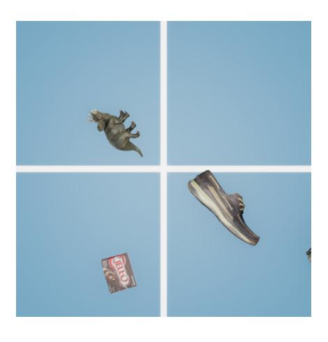  
(b) "앞쪽 발가락 부분을 잡아 갈색 신발을 그립하라"  
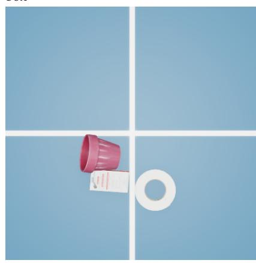  
(d) 왼쪽 열린 상단 림을 잡아 빨간 화분을 그립하라  

**그림 4**: 장면 내 객체에 대한 쉬운 프롬프트 예시  

<span id="page-13-0"></span>**어려운 프롬프트**: '어려운' 프롬프트 세트는 방법이 올바른 객체 또는 그 부분을 식별하기 위해 사고를 필요로 하도록 설계되었다. 프롬프트는 수행해야 할 작업을 설명하며, 방법은 객체 내에서 잡기에 가장 적합한 부분을 찾아야 한다. 예를 들어, 그림 5a에서 방법은 끈이 매달린 부분이 아닌 다른 위치를 가리켜야 한다. 예시 그림 5b에서는 C자형 본체를 잡아야 하며, 예시 그림 5c에서는 가위의 빨간 손잡이를 잡아야 한다.  
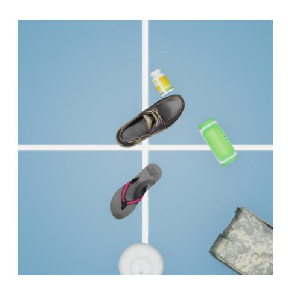  
(a) "신발 끈이 매달린 곳을 제외한 어디든 잡아라"  
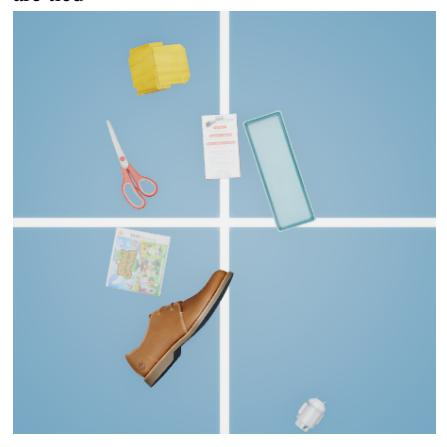  
(c) 쉽게 무언가를 자를 수 있도록 가위를 그립하라  
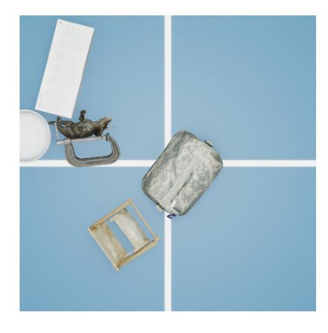  
(b) "손잡이를 풀 때 클램프를 잡아라"  
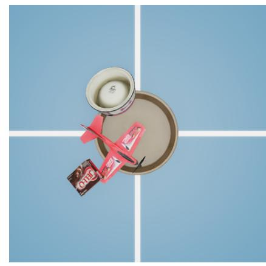  
(d) 비행기 장난감의 승객이 앉는 부분을 잡아라  

**그림 5**: 장면 내 객체에 대한 어려운 프롬프트 예시  

## A.3.1 베이스라인 실패 사례  
Geomatch: 이 방법의 대부분의 실패는 IK 최적화 알고리즘과의 열악한 상호작용으로 인해 객체 침투가 발생하기 때문이다. 첫째, 여러 카메라 뷰를 융합하면 테이블 위에 놓인 객체 아래부분의 기하학 정보가 누락된 부분 포인트 클라우드가 생성된다. 둘째, 우리의 데이터셋에는 복잡한 비볼록 객체가 많이 포함되어 있다. 두 사례 모두 그림 [6](#page-14-0)에 제공되었다.

ShapeGrasp: ShapeGrasp는 입력 이미지의 객체를 분해한 후, 그립이 성공적으로 이루어질 수 있도록 입력 프롬프트와 가장 잘 일치하는 객체의 부분을 선택한다. 그림 [7](#page-14-0)과 그림 [8](#page-14-0)은 객체 부분 분할의 우수한 사례와 실패 사례를 보여준다. <span id="page-14-0"></span>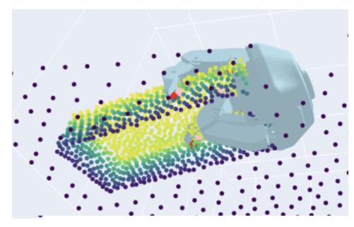 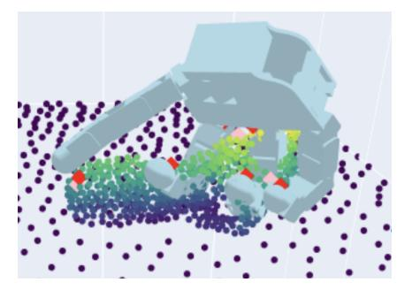 (a) 부분적인 장면 포인트 클라우드로 인한 실패 (b) 복잡한 객체 기하학 구조로 인한 실패 그림 6: Geomatch의 실패 사례 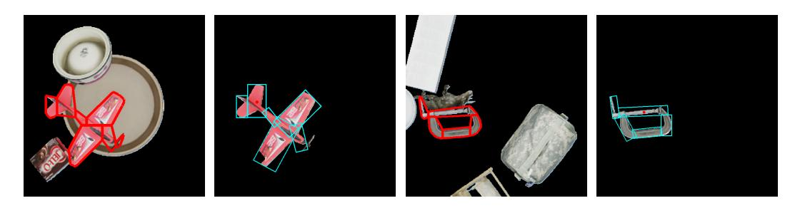 그림 7: ShapeGrasp에 의한 부분 세그멘테이션의 우수한 사례. 객체는 합리적인 수의 부분으로 분할되며, 각 부분은 그 고유한 기능 구성으로 쉽게 식별할 수 있다. 이 방법은 객체가 비오목(non-convex)이고 더 작은 오목부분으로 분해될 수 있을 때(예: 빨간 장난감 비행기 및 C-클램프) 잘 작동한다. 이미 대부분 오목한 객체의 경우, 분해가 지나치게 공격적일 수 있다(예: 녹색 스피커) 또는 지나치게 느슨할 수 있다(예: 갈색 신발), 이 경우 실제 그립 예측이 너무 부정확해질 수 있다. GraspMAS: 이 베이스라인의 실패 사례는 장면에서 잘못된 객체를 인식하거나 그립 위치가 너무 부정확하여 객체의 잘못된 부분을 잡는 데서 비롯되었다. 이러한 부정확한 예측의 예시는 그림 [9](#page-15-0)에 제시되어 있다. 또한 섹션 [5.1.3](#page-6-0)에서 언급했듯이, GraspMAS와 ShapeGrasp는 모두 장면의 윗뷰(Bird's Eye View) 이미지만 사용한다. 올바른 부분을 식별하는 것은 첫 번째 단계에 불과하며, 해당 지역 내에서도 모델은 3D 기하학 전체에 걸쳐 수많은 유효한 그립 위치와 방향을 평가해야 한다. 이는 객체 기하학이 매우 복잡하고 BEV 이미지에서 자주 가려질 때 더욱 어려워진다. 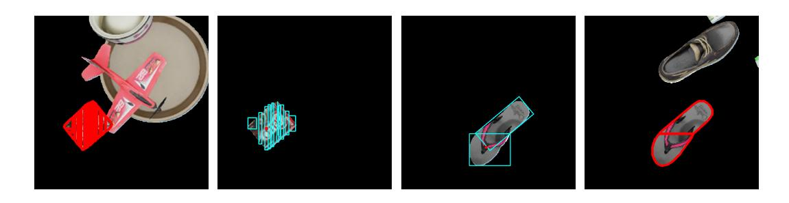 그림 8: ShapeGrasp에 의한 부분 세그멘테이션의 실패 사례. 객체가 지나치게 공격적으로 분할되거나 너무 느슨하게 분할됨 <span id="page-15-0"></span>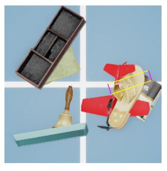 "갈색 플립플롭을 밑창의 발뒤꿈치 부분으로 잡아주세요" 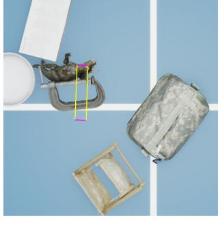 "클램프를 조임 손잡이로 잡아주세요" 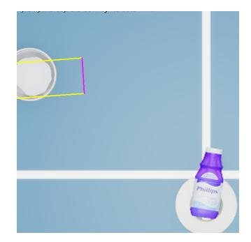 "흰색 그릇을 외곽 가장자리로 잡아주세요" 그림 9: GraspMAS의 부정확한 그립 위치. 첫 두 예시는 잘못된 부분을 잡고 있으며, 세 번째 예시는 위치가 너무 부정확하다. #### A.4 데이터셋 크기 절감 실험 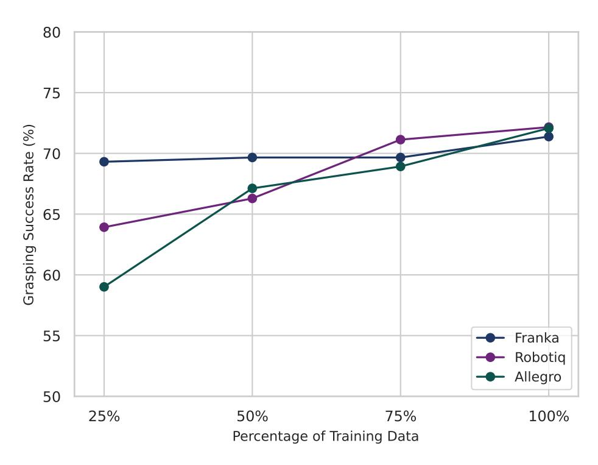 그림 10: 다양한 학습 데이터 양에 따른 성공률 프랑카 그리퍼의 경우 데이터셋 크기를 줄여도 큰 영향이 없으나, 로보티크 3지향 그리퍼와 알레그로 손은 전체 데이터셋을 사용할 때 이점을 얻는다. 그러나 데이터셋의 더 많은 부분을 사용할수록 성능 향상의 한계가 점차 감소한다. ## A.5 VLM 절감 실험 표 [6](#page-16-0)은 표 [5](#page-7-0)의 확장 버전으로, 각 그리퍼별 성공률을 포함한다. 세 개의 VLM의 상대적 순위는 모든 그리퍼에서 동일하다. <span id="page-16-0"></span> | 방법 | 성공률 (%) | | | | |---------------------|--------------|------------------|---------|--| | | 프랑카 판다 | 로보티크 3지향 | 알레그로 | | | GPT 5.4 | 37.7 | 41.47 | 48.65 | | | Qwen 3.5 Flash [40] | 46.79 | 51.85 | 64.63 | | | Gemini 3.1 Flash | 71.38 | 72.16 | 72.07 | | 표 6: 세 가지 그리퍼 모두에 대한 시드 포인트 예측에 사용된 다양한 VLM의 성공률. Gemini 3.1 Flash가 다른 모델들을 크게 앞선다. #### A.6 VLM 프롬프트 프롬프트는 (i) 시스템 프롬프트를 포함하는 role=system 메시지와 (ii) 텍스트와 이미지 부분이 번갈아 나타나는 단일 role=user 메시지로 구성된 채팅 스타일 요청으로 전송된다. 각 장면 i에 대해, 사용자 메시지는 먼저 "Scene number i: Object description: <USER INSTRUCTION>" 형태의 텍스트 세그먼트를 추가한 후, data:image/jpeg;base64,<BASE64 IMAGE i> 형태의 데이터 URL을 사용하여 해당 이미지를 이미지 URL 콘텐츠 부분으로 추가한다. #### 시스템 프롬프트 (API 메시지 role = system) 당신은 로봇 조작 전문가입니다. 제공된 각 장면의 이미지에서 지정된 객체에 대해 안정적인 그립 위치를 결정해 주세요. 로봇 그리퍼는 정확히 그 위치에서 객체를 잡으려 시도합니다. 원하는 그립 위치를 0–1000 범위로 정규화된 픽셀 좌표 (y, x)로 표현하세요. 결과를 다음 형식의 JSON으로 출력하세요: 예시 JSON 결과: ``` { "scene_number": { "object": "object_description", "coords": [y, x], "explanation": "brief_justification" } } ``` 핵심 요구사항: - 1. 그립 위치가 주변 객체와 충돌하지 않도록 하세요. - 2. 그립 위치는 객체 표면 위에 있어야 하며, 장면의 3D 포인트 클라우드에 투영될 것입니다. 위치는 그리퍼가 잡을 대상 객체 위에 있어야 하며, 빈 공간(예: 공극이 있는 객체의 내부)에는 배치할 수 없습니다. - 3. 그리퍼가 선택한 그립 위치 주변으로 객체를 포괄할 수 있어야 합니다. 그리퍼는 표준 크기이며, 큰 객체를 완전히 감싸지 못합니다. 이 경우 가장자리나 돌출부가 더 나은 그립 위치가 될 수 있으며, 객체 본체 전체를 잡으려 시도하지 마세요. - 4. 출력은 지정된 JSON 형식을 따라야 합니다. ``` #### 사용자 메시지 콘텐츠 (API 메시지 role = user), 3개의 장면 Scene number 1: Object description: <USER INSTRUCTION> { "type":"image_url", "image_url": { ``` ``` "url":"data:image/jpeg;base64,<BASE64_IMAGE_3>" } Scene number 2: Object description: <USER INSTRUCTION> { "type":"image_url", "image_url": { "url":"data:image/jpeg;base64,<BASE64_IMAGE_3>" } ``` ## A.7 실제 세계 개별 아이템 성공률 모델은 모든 객체에 대해 실현 가능한 그립을 예측할 수 있었다. 실패의 주요 원인은 그리퍼가 객체에서 너무 멀리 떨어져 있어 객체를 실제로 잡지 못한 채 닫히는 것이었다. 이는 그립이 종종 매우 기울어져 있을 때 더욱 심화되었다. | 객체 | 성공률 | |---------------------|--------------| | 분홍색 상어 퍼즐 | 7/10 | | 빨간색 퍼즐 강아지 | 9/10 | | 검은색 골판지 상자 | 8/10 | | 화장지 롤 | 9/10 | | 페이퍼타월 롤 | 9/10 | | 큰 고무 오리 | 6/10 | | 작은 고무 오리 | 9/10 | | 파란색 스니커즈 | 7/10 | | 회색 신발 | 8/10 | | 파란색 수건 | 8/10 | | 자전거 헬멧 | 8/10 | | 갈색 양동이 | 7/10 | | 파란색 머그잔 | 8/10 | | 녹색 병 | 6/10 | | 다색 청소용 빗자루 | 8/10 | 표 7: 실제 세계 개별 객체에 대한 그립 성공률.

