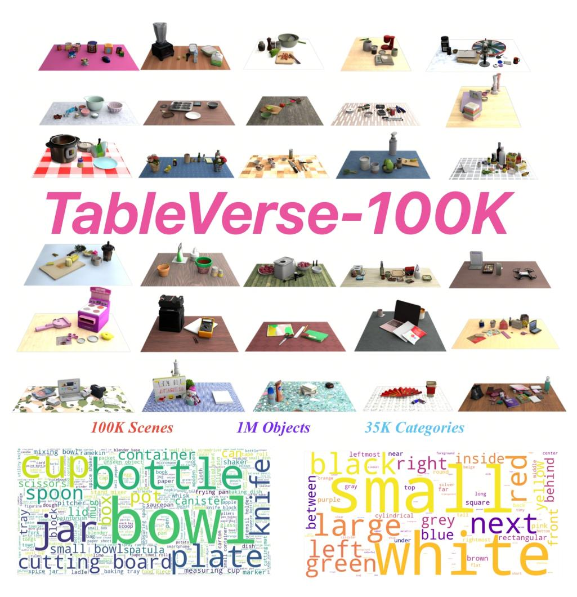
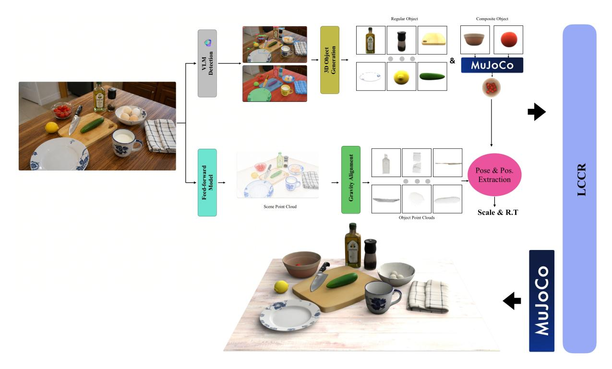
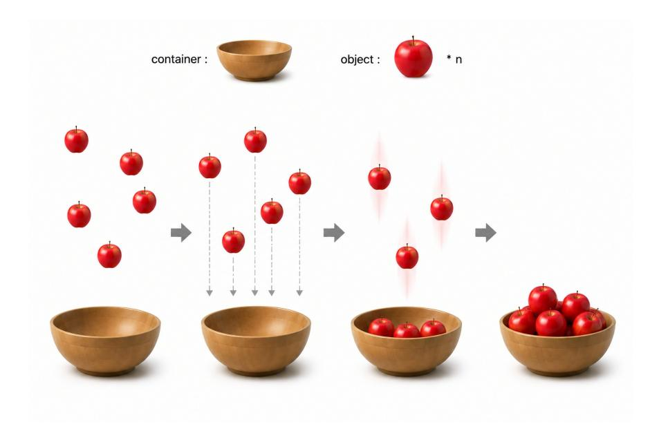
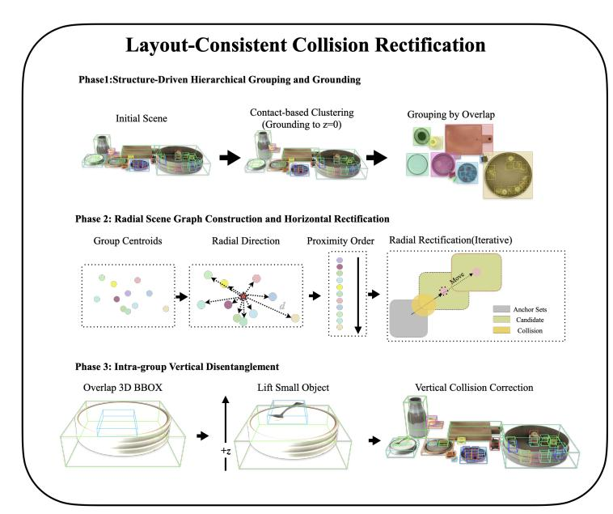
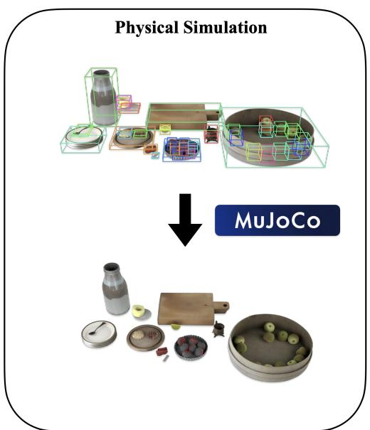
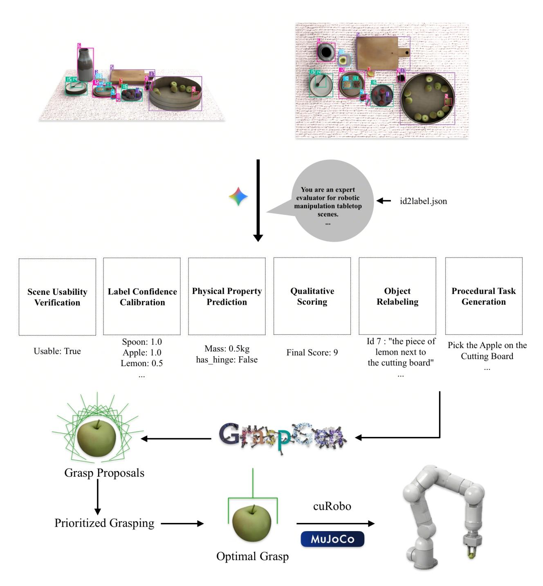
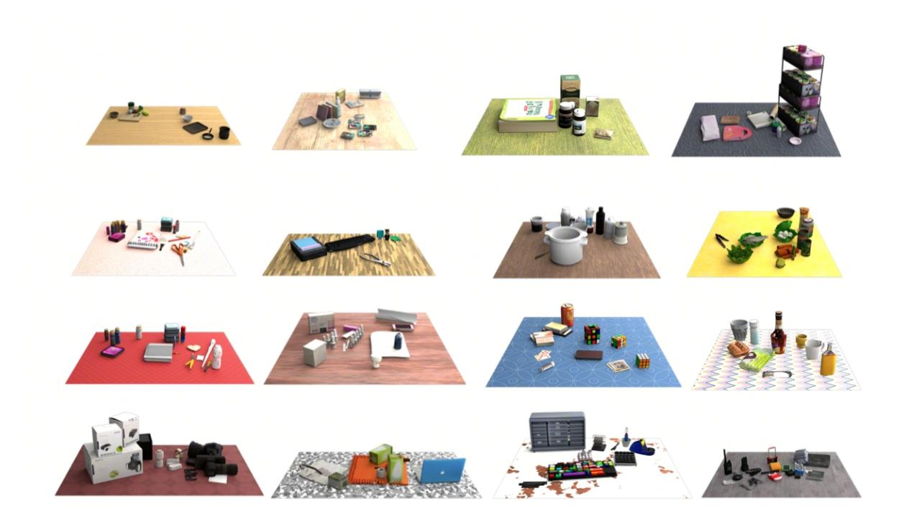
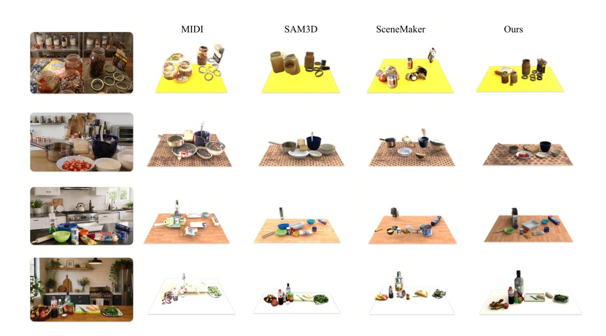
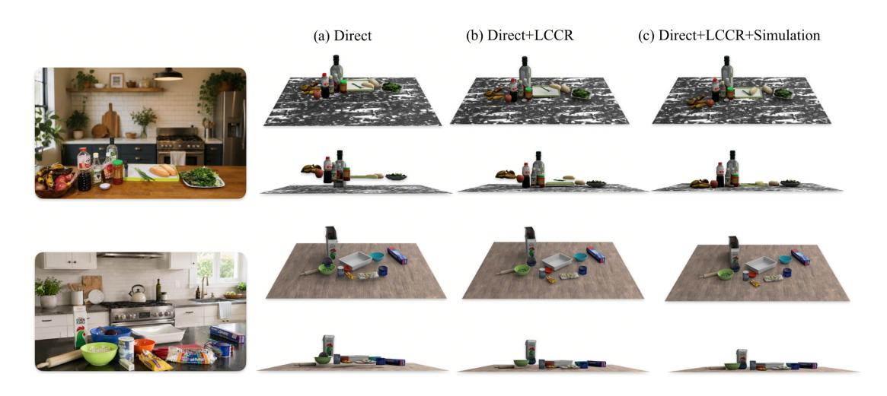
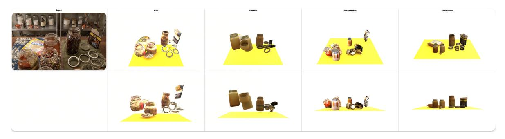

# TABLEVERSE: A LARGE-SCALE TABLETOP DATASET WITH REAL-WORLD GROUNDED LAYOUTS FOR GENERALIZABLE MANIPULATION (TABLEVERSE: 실세계 기반 레이아웃을 갖춘 대규모 테이블탑 데이터셋, 일반화 가능한 조작을 위한)

- 원제: TableVerse: A Large-scale Tabletop Dataset with Real-world Grounded Layouts for Generalizable Manipulation
- 원문: [https://arxiv.org/abs/2607.21017](https://arxiv.org/abs/2607.21017)
- PDF: [https://arxiv.org/pdf/2607.21017v1](https://arxiv.org/pdf/2607.21017v1)
- arXiv ID: `2607.21017`

---

# TABLEVERSE: A LARGE-SCALE TABLETOP DATASET WITH REAL-WORLD GROUNDED LAYOUTS FOR GENERALIZABLE MANIPULATION (TABLEVERSE: 실세계 기반 레이아웃을 갖춘 대규모 테이블탑 데이터셋, 일반화 가능한 조작을 위한)

Boyuan Wang<sup>∗</sup> , Yue Zhang<sup>∗</sup> , Xutao Xue<sup>∗</sup> , Xueyu Song, Yu Sun†

> ByteDance <sup>∗</sup>Equal contribution †Corresponding author sun.ny@bytedance.com



Figure 1: TableVerse-100K 데이터셋의 통계 개요 및 규모. 우리 프레임워크는 100K개의 물리적으로 일관되고 실세계 기반의 인터랙티브 장면, 거의 1M개의 개별 객체 인스턴스, 35K개 이상의 다양한 의미 범주를 포함하는 자동화된 Real2Sim 테이블탑 자산 생산에서 전례 없는 이정표를 세운다. 이 거대한 규모는 풍부하고 장기 꼬리 데이터 분포를 제공하여 로봇 조작을 위한 견고하고 고도로 일반화 가능한 시각-운동 정책 학습을 촉진한다.

# ABSTRACT (추상)

일반화 가능한 로봇 조작 정책의 개발은 본질적으로 대규모, 고충실도 장면 데이터의 가용성에 의해 제한된다. 최근 자동 합성 방법은 텍스트-투-레이아웃 환각 또는 단순화된 절차적 생성으로 이 격차를 해소하려 하지만, 물리적으로 비현실적이며 실제 인간 환경의 복잡하고 밀집된 혼란을 포착하지 못하는 경우가 많다. 본 논문에서는 TableVerse를 소개한다. 이는 완전 자동화된 Real2Sim 파이프라인으로, 상상적 레이아웃 생성에서 구조화되지 않은 *in-the-wild* 이미지 데이터로부터 결정론적 재구성으로 패러다임을 전환한다. 우리 프레임워크는 스크립트가 없는 인터넷 미디어를 고충실도, 시뮬레이션 준비된 테이블탑 환경으로 원활하게 변환하며, 정확한 미터 단위 스케일, 진정한 토폴로지, 검증된 기계적 안정성을 제공한다. 또한, 자동화된 작업 조건부 궤적 생성 프레임워크가 통합되어 고품질, 충돌이 없는 픽 앤 플레이스 시연을 합성한다. 이 완전한 파이프라인을 활용해 TableVerse-100K Dataset을 구축하였다. 이는 100,000개의 독특하고 물리적으로 일관된 환경과 인터랙티브 조작 궤적을 포함하는 대규모 코퍼스로 구성된다. 다양한 자산 구성을 포착하고, 현실적인 공간 분포와 고품질 시연을 제공함으로써 TableVerse-100K는 고도로 확장 가능하고 고충실도 데이터 기반을 구축하며, 일반화 가능한 로봇 조작 연구를 촉진하는 데 큰 가치를 제공한다. 우리의 프로젝트 페이지는 <https://bytedance.github.io/TableVerse>에서 확인할 수 있다.

키워드 (Keywords) Real2Sim, 조작, 장면 생성, 궤적 생성

# 1 Introduction (서론)

일반화 가능한 로봇 조작은 실제 세계 레이아웃 분포를 충실히 반영하는 대규모, 물리 시뮬레이션 준비된 데이터를 요구한다. 그러나 기존의 자동 생성 방법은 일반적으로 단순하고 희박한 레이아웃을 합성하도록 제한되며, 물리적으로 심각한 충돌을 일으켜 안정적인 물리 시뮬레이션에 사용할 수 없게 만든다. 구조화되지 않은 *in-the-wild* 실제 세계 데이터를 직면했을 때, 이러한 기존 패러다임은 치명적으로 실패하며 실제 인간 환경의 밀집된 혼란과 복잡한 토폴로지를 재구성할 수 없다는 것을 완전히 증명한다.

이 격차를 해소하기 위해 우리는 TableVerse를 소개한다. 이는 구조화되지 않은 인터넷 미디어를 직접 인터랙티브 시뮬레이션 환경으로 변환하는 확장 가능한 real-to-sim 파이프라인이다. 우리 프레임워크는 감지에서 시뮬레이션으로의 원활한 워크플로를 조정한다: 단일 뷰 관측에서 테이블탑 자산을 추출하고 분해하여 정확한 미터 단위 스케일을 복원하고, 교차하는 메시를 분리하기 위해 레이아웃 보존 기하학적 최적화를 적용하며, MuJoCo 물리 안정화를 활용해 물체를 현실적인 휴지 상태로 정착시킨다. 마지막으로 TableVerse는 가속된 모션 플래닝을 배포하여 작업 조건부, 충돌이 없는 전문가 궤적을 자동으로 합성하며, 원시 웹 데이터를 완전 인터랙티브 디지털 트윈으로 변환한다.

우리는 이 폐쇄 루프 워크플로우를 활용하여 TableVerse-100K Dataset을 구축합니다. 이 데이터셋은 100, 000개의 독특하고 물리적으로 일관된 테이블탑 환경을 포함하며, 연속적인 전문가 조작 궤적과 짝을 이룹니다. 우리 지식에 따르면, 이는 테이블탑 조작을 위한 가장 크고 물리적으로 충실한 데이터셋 중 하나이며, 실제 인간 환경의 밀집된 잡동사니와 이질적인 물리학을 포착하여 다운스트림 정책 학습을 확장하기 위한 고도로 확장 가능한 데이터 기반을 제공합니다.

요약하면, 우리의 주요 기여는 세 가지입니다. 첫째, 우리는 TableVerse Pipeline을 개발했습니다. 이는 자동화되고 관찰 기반의 Real2Sim 프레임워크로, 스크립트가 없는 *in-the-wild* 인터넷 미디어를 고품질의 시뮬레이션 준비가 된 환경으로 원활하게 변환합니다. 둘째, 우리는 LCCR Optimization framework를 도입했습니다. 이는 계층적 장면 그래프를 통해 교차하는 메쉬를 우아하게 분리하고 물리 기반의 휴지상태 안정화 단계와 밀접하게 결합된 레이아웃 일관성 있는 기하학적 정정 모듈입니다. 셋째, 우리는 TableVerse-100K Dataset을 구축하고 공개했습니다. 이 데이터셋은 100, 000개의 다양하고 물리 기반의 테이블탑 장면으로 구성되며, 연속적인 전문가 궤적이 보강되어 일반화된 로봇 조작 연구를 촉진하기 위한 고도로 확장 가능한 벤치마크를 제공합니다.

# 2 Related Work

# 2.1 3D Scene Reconstruction and Layout Synthesis

자동화된 3D 테이블탑 생성은 시각 기반 재구성과 언어 기반 레이아웃 합성을 아우릅니다. 시각 영역에서 단일 뷰 방법은 기하학적 충실도와 물리적 실현 가능성을 균형 있게 유지하지 못합니다: MIDI [\[Huang](#page-12-0) [et al., 2025\]](#page-12-0)은 다중 인스턴스 주의에도 불구하고 밀집된 가림막에서 성능이 저하됩니다; SAM3D [\[Chen et al., 2025\]](#page-12-1)은 레이아웃 토큰과 포인트 맵을 통해 3D 포즈를 회귀하지만, 메트릭 제약이 부족합니다; 그리고 SceneMaker [\[Shi et al., 2025\]](#page-13-0)은 밀집 클러스터에서 심각한 메쉬 침투를 유발합니다.

동시에, 언어 기반 패러다임은 LLM을 활용해 텍스트 쿼리 [\[Feng et al., 2023,](#page-12-2) [Yang et al., 2023\]](#page-13-1), 상징적 그래프 [\[Hao et al., 2026\]](#page-12-3), 또는 생성된 2D 선행 정보를 [\[Wang et al., 2025\]](#page-13-2) 통해 장면을 합성합니다. 그러나 연속적인 기하학적 기반이 부족해 이 접근 방식은 심각한 규모 오류를 겪습니다. 특히, 추상적 상징 선행 정보에 의해 제한된 LLM 레이아웃은 지나치게 단순하고 흩어져 있어, 실제 환경의 밀집 잡동사니, 수직 스태킹, 복합 자산 구조를 포착하지 못해 로봇 조작에 대한 막대한 현실 격차를 남깁니다.

# 2.2 Tabletop Scene Datasets

대규모 실내 방 수준 데이터셋은 풍부하지만 [\[Yu et al., 2025,](#page-13-3) [Fu et al., 2020,](#page-12-4) [Dai et al., 2017,](#page-12-5) [Zhou et al.,](#page-13-4) [2025\]](#page-13-4), 테이블탑 환경에 전적으로 초점을 맞춘 전문 벤치마크는 여전히 제한적입니다. 기존 파이프라인은 합성 자산 구성을 크게 의존합니다: TO-Scene [\[Xu et al., 2022\]](#page-13-5)은 단순한 탑다운 \"click-and-drop\" 메커니즘을 통해 CAD 모델로 시뮬레이션 장면을 채우며, 복잡한 계층적 중첩이나 수직 스태킹을 완전히 무시합니다. 대안으로 MesaTask-10K [\[Hao et al., 2026\]](#page-12-3)은 텍스트-투-레이아웃 생성과 자산 검색을 사용합니다. 그러나 이는 과도하게 이상화된 깔끔함 편향을 겪어, 실제 인간 환경의 밀집, 혼란스러운, 잡동사니 분포를 반영하지 못하는 희박하고 질서 있는 레이아웃을 생성합니다. 합성 상상에서 결정론적 *in-the-wild* 재구성으로 패러다임을 전환함으로써, 우리의 TableVerse-100K dataset은 이러한 격차를 메우고, 물리적으로 기반이 된 진정한 데스크톱 분포와 함께 전례 없는 규모를 제공합니다.

# 2.3 6-DoF Grasp Synthesis and Robotic Motion Planning

효율적인 시연 생성은 견고한 6-DoF 그랩 합성 및 충돌 없는 모션 플래닝에 의존한다. 초기의 분석적 또는 데이터 기반 그랩 방법은 사전 모델링된 템플릿이나 휴리스틱 디스크립터에 크게 의존했다 [\[Mahler et al., 2017,](#page-12-6) [Ten Pas et al., 2017,](#page-13-6) [Liang et al., 2019\]](#page-12-7), 반면 현대의 밀집 아키텍처는 원시 포인트 클라우드를 직접 연속적인 6-DoF 그랩 공간에 매핑한다 [\[Sundermeyer et al., 2021,](#page-13-7) [Fang et al., 2020\]](#page-12-8). 밀집된 잡음에서 심각한 시각적 차폐를 처리하기 위해 GraspGen [\[Murali et al., 2025\]](#page-12-9)은 견고한 포즈 샘플링을 위한 생성적 디퓨전 프레임워크를 도입했으며, 우리는 이를 채택해 고품질 후보 그랩을 합성한다. 궤적 실행을 위해 전통적인 최적화 플래너와 기초 모델 기반 컨트롤러가 광범위하게 탐구되었다 [\[Schulman et al., 2013,](#page-12-10) [Liang](#page-12-11) [et al., 2023,](#page-12-11) [Huang et al., 2023\]](#page-12-12), 그 결과 GenManip과 같은 LLM 기반 다단계 시뮬레이션 워크플로우가 등장했다 [\[Gao](#page-12-13) [et al., 2025\]](#page-12-13). 그러나 이러한 합성 파이프라인은 텍스트-투-레이아웃 공간 환상이나 과도하게 단순화된 객체 배열에 의해 병목 현상을 겪는다. 반면, TableVerse는 관측 기반의 혼돈스러운 Real2Sim 환경을 cuRobo를 통한 병렬화되고 GPU 가속된 모션 최적화와 결합하여, 대규모의 물리적으로 검증된 전문가 궤적 코퍼스를 성공적으로 생성한다 [\[Sundaralingam et al., 2023\]](#page-13-8).

# 3 Method

본 장에서는 구조화되지 않은 인터넷 미디어에서 직접 고품질의 시뮬레이션 준비가 된 3D 탁상 환경과 연속적인 전문가 궤적을 생성하기 위한 새로운 단안 실-시뮬 프레임워크 TableVerse를 제시한다. 우리의 접근 방식의 핵심은 확률적 공간 환상을 결정론적 인식-물리 워크플로우로 대체함으로써, 파이프라인이 실제 세계의 메트릭 스케일, 객체 토폴로지 및 접촉 역학을 보존할 수 있는 능력을 부여하는 데 있다.

우리는 Figure [2.](#page-3-0)에 전체 시스템 워크플로우를 개요한다. 구체적으로, Section 3.1에서 오픈-어휘 하이브리드 객체 추출, 구조적 복합 자산 분해, 그리고 거친-세밀한 6-DoF 포즈 등록을 자세히 설명한다. 초기 기하학적 정렬 잡음 해결 및 메쉬 간 침투를 완전히 제거하면서 거시적 공간 배치를 엄격히 보호하기 위해 Section 3.2에서 새로운 Layout-Consistent Collision Rectification (LCCR) 모듈을 도입한다. 이 폐쇄 루프 자동화 파이프라인을 활용하여 Section 3.3에서 규모 확장 합성, MLLM 기반 검증 및 대규모 TableVerse-100K 데이터셋의 선별을 상세히 다룬다. 마지막으로 Section 3.4에서는 재구성된 디지털 트윈 내에서 고수준 조작 사양을 연속적이고 충돌이 없는 로봇 관절 공간 경로로 변환하는 작업-조건부 궤적 생성 프레임워크를 제시한다.

### 3.1 Instance-level Object Extraction and Generation

Open-Vocabulary Hybrid Object Detection MLLM과 GroundingSAM-v2 [\[Ren et al., 2024\]](#page-12-14)를 연쇄적으로 적용할 때 발생하는 오류 누적을 우회하기 위해, 우리는 테이블탑 장면에서 직접 오픈-어휘 감지를 위해 Seed-1.8 [\[Seed, 2026\]](#page-13-9)를 사용한다. 자산은 *정규 객체*와 *복합 객체* (중첩된 내용을 담는 컨테이너)로 분류되며, 메쉬화가 불가능한 물질(예: 액체, 가루)은 정규 단일 엔티티로 대체된다. 내부 항목 클러스터에 대해,



Figure 2: TableVerse 파이프라인 개요 (Overview of the TableVerse pipeline for automated tabletop scene synthesis). 주어진 비구조화된 단일 뷰 실세계 관측을 바탕으로, 우리 프레임워크는 물리적으로 준비된 디지털 트윈을 네 단계의 순차적 단계로 구축합니다: (1) 인스턴스 추출: 오픈-버캐블러리 객체 탐지와 고충실도 마스크 생성을 수행합니다; (2) 복합 자산 해체: 3D 재구성과 격리된 자유 낙하 조립을 통해 중첩된 엔티티를 분리합니다; (3) 메트릭 스케일 및 포즈 정렬: 장면 포인트 클라우드를 추출하고 거친-정밀 등록을 실행하여 정확한 치수와 6-DoF 포즈를 회귀합니다; 그리고 (4) LCCR 및 물리 안정화: 토폴로지 제약 하에 레이아웃-일관성 기하 최적화를 통해 메쉬 간 침투를 해결하고, 최종적으로 MuJoCo 시뮬레이션을 수행하여 물체를 기계적으로 안정된 휴지 상태로 정착시킵니다.

검출기는 공간적 모호성을 방지하기 위해 단일 대표 경계 상자와 인스턴스 수를 함께 출력합니다. 이 경계 상자들은 이후 SAM2 [\[Ravi et al., 2025\]](#page-12-15)로 전달되어 정밀한 인스턴스 분할 마스크를 추출합니다.

Composite Object Generation: *in-the-wild* 이미지에서 흔히 발생하는 심각한 가려짐을 완화하기 위해, 우리는 SAM3D를 활용해 추출된 마스크에서 3D 메쉬를 재구성합니다. 복합 객체의 경우, 컨테이너와 그 안에 포함된 내용물은 별도의 개별 메쉬로 재구성됩니다. Figure [3,](#page-4-0)에서 보듯이, 우리는 이 자산들을 격리된 MuJoCo [\[Todorov et al., 2012\]](#page-13-10) 자유 낙하 시뮬레이션에 초기화하여 내용물을 컨테이너에 '드롭(drop)'합니다. 이 물리 기반 조립은 모든 구성 요소가 독립적인 구조적 조작 특성을 유지하는 물리적으로 유효한 복합 자산을 생성합니다.

Object Position and Pose Extraction: 정확한 메트릭 스케일과 공간 간격을 복구하기 위해, 우리는 Depth Anything 3 [\[Lin et al., 2025\]](#page-12-16)을 활용해 단일 카메라 입력에서 장면 포인트 클라우드를 추출합니다. 특히, 세그먼트 분해 전에, 우리는 세분화된 테이블 또는 바닥 표면 마스크를 사용해 지배적인 평면 법선과 절대 중력 벡터를 추정합니다. 이후 전역 중력 정렬 변환을 적용해 장면 방향을 정규 좌표계로 교정하여 하향 물리 벡터가 시뮬레이션 현실과 원활히 정렬되도록 합니다. 이 좌표 정규화 이후, 객체별 포인트 클라우드 세그먼트는 SAM2 마스크를 통해 구조적으로 격리됩니다. 캡처로 인한 센싱 아티팩트와 배경 간섭을 제거하기 위해, 각 격리된 세그먼트는 통계적 및 반경 기반 디노이징을 거쳐 잡음과 잡다한 이상값을 명시적으로 제거합니다. 이후 정제된 관측 포인트 클라우드와 샘플링된 메쉬 정점 사이에 거친-정밀 정렬을 수행합니다. 구체적으로, 우리는 z축 회전에 대한 연속 탐색을 실행해 최소 Chamfer 거리로 최적의 초기 헤딩을 식별하고, 이어서 Iterative Closest Point (ICP) 등록을 통해 최종 6-DoF 포즈와 치수를 정확히 회귀합니다.



Figure 3: **복합 객체 생성을 위한 물리 기반 조립 워크플로우** (Physics-guided assembly workflow for composite object generation). 자산 다양성과 상호작용 복잡성을 향상시키기 위해, 우리 파이프라인은 구조적으로 복합 엔티티를 분리합니다. 개별 구성 요소(컨테이너와 그 안에 포함된 내용물)는 SAM3D를 통해 별도의 격리된 메쉬로 재구성되며, 이후 격리된 MuJoCo 환경에 초기화됩니다. 짧은 자유 낙하 시뮬레이션을 실행하면 내부 항목이 자연스럽게 '드롭(drop)'되어 컨테이너에 정착하며, 유효한 물리 접촉을 구축하고 downstream 작업을 위해 독립적인 구조적 조작 특성을 보존합니다.

#### <span id="page-4-0"></span>3.2 레이아웃-일관성 충돌 정정 (Layout-Consistent Collision Rectification)

직접 원본 등록에서 초기 레이아웃을 배포하면 자산 불일치와 최적화 잡음으로 인해 심각한 메쉬 침투가 발생한다. 이러한 오류를 물리 엔진을 직접 초기화하여 단순히 해결하면, 장면을 불안정하게 만드는 거대한 반발 토크가 발생하며, 이는 밀집된 *in-the-wild* 잡음에 의해 악화된다. 특히, 표준 물리 시뮬레이터는 수치적 접촉 완화를 통해 미세한 침투를 본질적으로 해결할 수 있지만, 깊은 기하학적 교차에 직면하면 치명적으로 실패한다. 부드럽게 정착되는 대신, 깊게 교차한 기하학은 폭발적이고 비물리적 제약력을 유발하여 장면 잡음을 즉시 흩뜨리거나 영구적으로 왜곡시킨다. 따라서 이러한 심각한 거시적 겹침을 기하학적 최적화를 통해 명시적으로 사전 정정한 뒤, 최종 기계적 안정화를 위해 레이아웃을 시뮬레이션 엔진에 위임하는 것이 필수적이다.

이를 해결하기 위해 우리는 **Layout-Consistent Collision Rectification** (**LCCR**) 모듈을 도입하였다. LCCR은 세 단계의 순차적 워크플로우를 통해 교차한 메쉬를 우아하게 분리하면서 거시적 공간 배치를 엄격히 보존한다. 자세한 운영 스키마는 Figure 4에 나타난다.

**Phase 1: Hierarchical Contact Grouping and Grounding**  
우리는 먼저 물리적 접촉에 있는 객체들을 클러스터링(복합 자산을 단일 엔터티로 취급)하고, 모든 그룹을 가장 낮은 정점을 테이블 평면(z=0)으로 이동시켜 접지한다. 수직 스태킹을 수평 등록 잡음으로부터 분리하기 위해, 우리는 모든 자산을 수평 평면에 투영하여 상단 뷰 2D 바운딩 박스를 추출한다. 상당한 면적 겹침 비율( $\geq 50\%$ )을 보이는 객체들은 포함 또는 스태킹 관계를 보호하기 위해 통합된 계층적 그룹으로 병합된다. 반대로, < 50% 겹침을 보이는 쌍은 수평 엔터티로 분리되어, 우발적인 측면 클리핑을 의도된 수직 배열과 효과적으로 분리한다.

**Phase 2: Radial Graph Construction and Horizontal Rectification**  
수평 충돌을 배치 보존적으로 해결하기 위해, 우리는 근접 기반의 방사형 장면 그래프를 구축한다. 이 그래프는 점진적 확장 워크플로우를 관리한다. $\mathcal{G} = \{G_1, G_2, \ldots, G_N\}$ 를 2D 바운딩 박스 중심 좌표 $c_i \in \mathbb{R}^2$ 를 갖는 그룹 집합이라 하자. 가장 공간적으로 중앙에 있는 그룹은 좌표 원점에서 유일하게 정의되는 루트 $G_{\text{root}}$ 이다. 다른 모든 그룹 $G_i$ 에 대해, 그 수평 레이아웃은 방사형 방향 단위 벡터 $\vec{v}_i$ 로 매개화된다:

$$\vec{v}_i = \frac{c_i - c_{\text{root}}}{\|c_i - c_{\text{root}}\|_2} \tag{1}$$





<span id="page-5-0"></span>Figure 4: **Layout-Consistent Collision Rectification (LCCR) 모듈의 상세 스키마**. 파이프라인은 초기 등록된 겹친 메쉬를 입력으로 받아 세 단계의 순차적 프로세스를 통해 공간적 교차를 해결한다: (1) **Hierarchical Contact Grouping & Grounding**: 인접 자산을 클러스터링하고 2D 겹침 임계값을 통해 의도된 수직 스태킹과 수평 잡음을 분리한다; (2) **Radial Graph Construction & Horizontal Rectification**: 근접 기반 방사형 장면 그래프를 구축하고 방위 레이아웃 벡터를 따라 엔터티를 강직적으로 이동시켜 측면 겹침을 제거한다; 그리고 (3) **Vertical Disentanglement & Physics Stabilization**: 스태킹 그룹 내에서 z축 높이를 조정하여 남은 수직 교차를 해결하고, 중력 기반 MuJoCo 시뮬레이션을 통해 객체가 기계적으로 안정된 정지 상태로 자연스럽게 정착하도록 한다.

To eliminate lateral overlap without altering the macroscopic azimuthal arrangement, the rectification proceeds in an inside-out, sequential manner. We first sort all non-root groups  $\mathcal{G}\setminus\{G_{\text{root}}\}$  in ascending order based on their initial Euclidean distance to the root, forming an ordered sequence  $\mathcal{S}=(G_{(1)},G_{(2)},\ldots,G_{(N-1)})$ , where  $\|c_{(1)}-c_{\text{root}}\|_2 \leq \|c_{(2)}-c_{\text{root}}\|_2 \leq \cdots \leq \|c_{(N-1)}-c_{\text{root}}\|_2$ . We then initialize an active anchor set containing only the fully settled meshes, starting with  $\mathcal{A}_0=G_{\text{root}}$ . For each step  $k=1,2,\ldots,N-1$  in the sorted sequence, the optimal translation distance  $d_{(k)}^*$  for the k-th group  $G_{(k)}$  is determined by searching outward along its specific radial heading  $\vec{v}_{(k)}$  until it clears all previously rectified boundaries:

$$d_{(k)}^* = \min\{d \ge 0 \mid (G_{(k)} + d\vec{v}_{(k)}) \cap \mathcal{A}_{k-1} = \emptyset\}$$
 (2)

식 (2)를 해결하면, $G_{(k)}$ 는 레이아웃 보존 및 충돌이 없는 좌표 $c_{(k)}^* = c_{(k)} + d_{(k)}^* \vec{v}_{(k)}$ 로 강체 변환되며, 활성 앵커 세트는 새로 정착된 엔티티를 포함하도록 재귀적으로 확장된다:

$$\mathcal{A}_k = \mathcal{A}_{k-1} \cup \{ G_{(k)} + d_{(k)}^* \vec{v}_{(k)} \}$$
(3)

그래프 시퀀스 S 를 반복함으로써 이 확장 최적화는 측면 겹침을 제거하면서 원래 방위각 의미를 엄격히 보존한다.

**Phase 3: Vertical Disentanglement and Physics Stabilization** 마지막으로, Phase 1에서 식별된 고겹침 그룹 내에서 내부 수직 침투를 해결한다. 3D 교차가 그룹 내에서 감지되면, 수평 발자국(투영 xy-영역)이 더 작은 객체가 아래에 있는 지지 메쉬와 완전히 분리될 때까지 양의 z축을 따라 위쪽으로 이동한다.

이 기하학적 정정 이후, 완전히 충돌이 없는 레이아웃이 MuJoCo[Todorov et al., 2012] 물리 엔진으로 가져온다. 자산이 기하학적으로 분리된 상태로 엔진에 들어가므로 폭발적인 접촉력을 완전히 우회한다. 표준 중력 하에서 짧은 전방 시뮬레이션을 수행하면 객체가 자연스럽게 정착되어 미세 간극을 닫고 다운스트림 작업을 위한 안정적인 기계적 접촉 역학을 구축한다.



<span id="page-6-0"></span>Figure 5: MLLM-driven 큐레이션 및 주석 파이프라인의 상세 스키마. 다중 뷰 정사각형 및 항공 시점 렌더링이 시각적 합성으로 결합되어 Gemini 2.5 Pro가 조정된 7차원 시나리오 평가, 물리적 속성 예측 및 구조화된 픽 앤 플레이스 작업 생성을 수행하도록 한다.

# 3.3 TableVerse-100K Dataset (TableVerse-100K 데이터셋)

우리의 자동 Real2Sim 파이프라인을 활용하여 합성 워크플로우를 확장해 TableVerse-100K Dataset을 구축한다. 이 데이터셋은 100K개의 고유하고 물리적으로 일관되며 지시어 주석이 달린 탁상 환경을 포함한다. 총합적으로 이 전례 없는 규모는 35K가 넘는 다양한 의미 범주를 아우르는 1M개의 개별 객체 인스턴스를 포함하며, 일반화 가능한 정책 학습을 위한 매우 다양한 장기 꼬리 분포를 구축한다. 데이터 소싱 파이프라인은 비구조화된 인터넷 이미지를 대상으로 하며, 자동 시각 필터링을 실행해 유효한 탁상 표면을 포함하는 야생 사진을 명시적으로 분리한다. 이러한 혼란스러운 실제 이미지들은 이후 재구성 워크플로우에 입력되어 초기 시뮬레이션 3D 디지털 트윈 풀을 생성한다.



Figure 6: TableVerse에서 다양한 탁상 질감 증강을 시각화한 것. 1,700개가 넘는 고해상도 텍스처 맵이 동적으로 테이블 표면에 적용되어 견고한 도메인 무작위화를 위한 시각적 다양성을 확장한다.

<span id="page-7-0"></span>퇴화된 레이아웃을 걸러내고 환경을 고품질 메타데이터로 풍부하게 하기 위해, 우리는 Gemini 2.5 Pro \[Gemini Team, Google, 2025\] 에 의해 구동되는 자동화된 선별 및 주석 워크플로우를 구현한다. 이는 Figure [5.](#page-6-0)에 요약되어 있다. 각 후보 장면마다, 우리는 수평으로 연결된 고해상도 복합 이미지를 프로시저적으로 렌더링한다. 이 이미지는 *Front View* (수직 레이어링을 캡처)와 *Top-Down View* (수평 레이아웃을 노출)를 쌍으로 구성한다. 이 다중 시점 시각 프롬프트와 사용자 제공 라벨 매핑을 바탕으로, MLLM은 결정론적 일곱 단계 평가 및 주석 파이프라인을 실행하는 엄격한 데이터 오라클 역할을 한다:

- (A) 사용성 게이트: 엄격한 이진 타당성 필터를 실행한다. 장면이 극단적인 지역 파티션(단일 로봇 작업 공간 범위를 위반하는 고립 클러스터)이나 비테이블탑 엔티티(예: 인간 또는 대형 가전)를 보이면 무효화되며 최종 점수를 4로 제한한다.
- (B) 심각한 라벨 오류 검사: 높은 임계값의 의미론적 건전성 검사를 구현한다. 이는 명백한 인식 오류를 걸러내면서 동일 카테고리 동의어, 상위어, 저폴리곤 기하학, 또는 브랜드 수준 시각적 부정확성을 명시적으로 허용하여 견고한 데이터 필터링을 보장한다.
- (C) 라벨 신뢰도 보정: 각 인스턴스에 대해 [0, 1] 범위의 연속적 정렬 신뢰도 점수를 부여하며, 0.7 미만의 점수는 보수적인 속성 예측을 강제한다.
- (D) 물리적 속성 예측: 각 자산에 대해 고유한 물질 및 구조 역학을 추론하고, 절대 질량(kg)을 예측하며, 물체가 관절 구조를 포함하는지 여부를 판단하기 위한 동역학 감사를 수행한다.

- (E) **품질 점수:** 1에서 10까지의 종합 점수를 부여하며, 다중 기준 가중 스키마에 의해 결정된다: 객체 수와 카테고리 다양성(45%, $n \ge 5$ 를 선호), 기하학적 타당성(15%), 로봇 그랩 가능성(15%), 레이아웃 명료성(25%).
- (F) 객체 재라벨링: 원래 주석과 완전히 독립적으로, 시각 전용 카테고리 이름과 시점 불변, 문맥 기반 구별 설명 문구 배열을 부여하며, 인위적 인스턴스 인덱스를 엄격히 금지한다.
- (G) **픽 앤 플레이스 작업 생성:** 물리적 간격, 일상 생활 타당성, 초기 상태 제약 하에 10개의 서로 다른 공간 관계 열거형에 매핑된 픽 앤 플레이스 조작 명령의 종합 목록을 프로시저적으로 합성한다.

궁극적으로, 검증된 레이아웃, 모양, 그리고 관절 구조는 완전 호환되고 시뮬레이션 준비가 된 **MJCF** (**MuJoCo XML**) 파일로 내보내어지며, 절대 메트릭 변환과 예측된 접촉 역학을 캡슐화한다. 또한 시각적 다양성을 극대화하고 하위 시각-운동 정책이 균질한 배경에 과적합되는 것을 방지하기 위해 대규모 도메인 랜덤화를 구현한다. 우리는 Sharetextures<sup>1</sup>, AmbientCG<sup>2</sup>, 그리고 CC0-Textures<sup>3</sup>를 포함한 전문 텍스처 플랫폼에서 수집한 1,700개가 넘는 고해상도 텍스처 맵을 대규모 저장소로 큐레이션한다. 이 맵들은 시뮬레이션 초기화 시 테이블탑 표면에 동적으로 매핑된다 (Figure 6). 이러한 광범위한 외관 수준 증강은 하위 정책 학습의 견고성과 가려짐 저항성을 크게 강화한다.

#### 3.4 작업-조건 기반 궤적 생성 (Task-Conditioned Trajectory Generation)

우리는 충돌이 없는 재구성된 장면 레이아웃과 작업 사양을 기반으로 고수준 조작 지시를 연속적이고 실행 가능한 로봇 궤적으로 변환하는 작업 조건 기반 궤적 생성 프레임워크를 제안한다. 그림 5에 나타난 바와 같이, 이 프레임워크는 MLLM 기반 시나리오 평가와 다운스트림 궤적 합성을 폐쇄 루프 결합으로 연결하며, 프로시저적으로 생성된 작업 지시를 우선순위가 지정된 6D 그립 선택, 관계 제약 기반 배치 샘플링, 물리 검증된 동작 실행으로 구성된 전용 조작 루프로 직접 라우팅한다.

**상향식 우선순위 6D 그립 합성** 고품질 그립을 생성하기 위해, 대상 물체의 표면 기하학은 먼저 GraspGen [Murali et al., 2025]에 의해 처리되어 다수의 후보 6D 그립 포즈를 예측한다. $\mathcal{G} = \{g_i\}_{i=1}^M$ . 각 후보 $g_i = (\mathbf{R}_i, \mathbf{t}_i)$ 은 회전 행렬 $\mathbf{R}_i \in SO(3)$ 과 이동 벡터 $\mathbf{t}_i \in \mathbb{R}^3$ 으로 매개화된다. 로컬 그리퍼 프레임에서 정의된 표준 도구 접근 축을 $\vec{z}_{\text{local}} = [0, 0, 1]^T$ 라고 두자. 그립 접근 벡터가 세계 프레임으로 변환된 것은 $\vec{a}_i = \mathbf{R}_i \vec{z}_{\text{local}}$ 으로 표현된다. 이송 중 그립 안정성을 보장하기 위해, 우리는 방향 정렬에 기반한 상향식 우선순위 필터를 구현한다. $\vec{a}_i$ 와 세계 수직 축 $\vec{z}_w = [0, 0, 1]^T$ 사이의 방향 정렬을 기준으로, 그립 후보는 엄격한 방향 제약을 만족하면 고품질 포즈로 선택된다:

$$\vec{a}_i \cdot \vec{z}_w \le \gamma_{\text{strict}}$$ (4)

여기서 $\gamma_{\text{strict}$는 거의 수직 아래 접근 각도를 강제하는 음수 임계값이다. 이 기준을 충족하지 못하는 후보는 동적으로 접촉 신뢰성을 극대화하기 위해 적응적으로 완화하거나 폐기된다.

**관계 제약 기반 배치 및 동작 계획** 공간 배치 전제 조건 $\mathcal{R}$ (예: 위, 안)을 충족하기 위해, 목표 배치 포즈 $\mathbf{T}_{place}$ 는 참조 자산의 기하학에서 유도된 국소 경계 영역 내에서 샘플링된다. 후보 포즈는 축 정렬 경계 상자 모듈을 통해 검증되어 주변 모든 자산 $\mathcal{O}_{adj}$ 에 대해 충분한 여유 공간을 보장한다:

$$|\Delta x| \ge b_{\text{src},x} + b_{\text{adj},x} + \epsilon \quad \land \quad |\Delta y| \ge b_{\text{src},y} + b_{\text{adj},y} + \epsilon$$ (5)

여기서 $\Delta x$와 $\Delta y$는 중심점 사이의 상대적 수평 거리를 나타내며, $b_{\cdot,x}$와 $b_{\cdot,y}$는 경계 상자 반경을 나타내고, $\epsilon$는 물리적 여유 안전 마진을 나타낸다. GenManip [Gao et al., 2025]에 명시된 구조화된 6단계 조작 전략(사전 그립, 그립, 사후 그립, 사전 배치, 배치, 사후 배치 단계)을 따라, 샘플링된 포즈를 연결하는 충돌 없는 관절 공간 궤적이 최적화되고 GPU 가속 cuRobo [Sundaralingam et al., 2023] 모션 플래너를 사용해 실행된다.

<span id="page-8-0"></span><sup>1</sup>https://www.sharetextures.com/

<span id="page-8-1"></span><sup>&</sup>lt;sup>2</sup>https://ambientcg.com/

<span id="page-8-2"></span><sup>3</sup>https://cc0-textures.com/

# 4 Experimental Results (실험 결과)

# 4.1 Setup (설정)

구현 세부 사항: 우리의 파이프라인은 오픈월드 인식, 기하학 처리 및 검증을 위한 전문 모듈을 통합합니다. 우리는 오픈-어휘 객체 감지를 위해 Seed-1.8 [\[Seed, 2026\]](#page-13-9)를 사용하고, 예측된 바운딩 박스를 SAM2 [\[Ravi et al., 2025\]](#page-12-15)로 전달하여 고품질 인스턴스 세분화를 수행합니다. 추출된 객체 마스크는 이후 SAM3D에 입력되어 각 개별 자산에 대한 초기 3D 메쉬를 재구성합니다. 동시에, Depth Anything 3 [\[Lin et al., 2025\]](#page-12-16)는 단일 시점 입력에서 메트릭 장면 포인트 클라우드를 추출합니다. 물리적으로 일관된 좌표계를 구축하기 위해, 우리는 분할된 테이블 또는 바닥 표면 마스크를 활용하여 중력 정렬 변환을 계산하고, 메쉬 등록 전에 추출된 포인트 클라우드의 전역 방향을 명시적으로 교정합니다. MuJoCo 시뮬레이션 아티팩트를 방지하기 위해, 모든 3D 객체 메쉬는 CoACD [\[Wei](#page-13-11) [et al., 2022\]](#page-13-11)를 통해 근사적 볼록 분해를 거칩니다. 마지막으로, 우리는 각 장면에 대해 정사각형 다중 시점 투영을 렌더링하고 Gemini 2.5 Pro [\[Gemini](#page-12-17) [Team, Google, 2025\]](#page-12-17)를 사용하여 다차원 장면 평가, 신뢰도 필터링 및 작업 지시 주석을 수행합니다.

베이스라인: 우리는 TableVerse를 대표적인 단일 시점 3D 장면 재구성 방법 세 가지와 비교합니다: MIDI [\[Huang et al., 2025\]](#page-12-0), SAM3D [\[Chen et al., 2025\]](#page-12-1), 그리고 SceneMaker [\[Shi et al., 2025\]](#page-13-0). 3D 레이아웃 평가를 상위 인식 실패와 분리하고 공정한 비교를 보장하기 위해, 우리는 모든 베이스라인에 우리 파이프라인에서 생성된 정확한 인스턴스 마스크를 제공합니다. 특히, 이 베이스라인들은 계층적 복합 자산을 모델링할 수 없으므로, 우리는 외부 컨테이너의 마스크만 제공하고 내부 중첩 객체를 생략하여 그들의 단일 자산 가정에 부합하도록 합니다.

평가 지표: 우리의 프레임워크가 정확한 메트릭 스케일을 갖춘 시뮬레이션 준비 장면을 생성할 수 있는 능력을 입증하기 위해, 우리는 두 가지 주요 차원에서 환경을 평가합니다: (1) 장면 충돌율 (Scene Collision Rate, %) ↓: 물리적 완화 이전에 볼륨 메쉬 간 침투(클리핑)가 발생한 생성 장면의 비율로, 초기 기하학적 유효성을 반영합니다. (2) GPT-Score: 1~10점으로 평가되는 세 개의 하위 차원을 포함하는 다차원 MLLM 평가—*Layout Fidelity (LF)* ↑ (공간적 레이아웃 및 스케일 정렬), *Visual Quality (VQ)* ↑ (텍스처 및 렌더링 자연스러움), 그리고 *Geometry Quality (GQ)* ↑ (정확한 카테고리, 형태, 구조적 세부 사항을 왜곡이나 붕괴 없이 보존)—과 함께 모든 테스트 장면에서 교차 방법 선호 순위를 평균한 *Average Rank (Avg. Rank)* ↓를 측정합니다.

# 4.2 대안 방법과의 비교 (Comparisons with Alternative Methods)

우리 파이프라인의 생성 품질과 물리적 충실도를 평가하기 위해, 우리는 원시 인터넷 이미지에서 선별한 100개의 비스크립트 테이블탑 샘플로 구성된 테스트 세트를 구축했습니다. 이 벤치마크는 밀집된 레이아웃, 수직 스태킹, 중첩된 복합 자산, 저해상도, 혼잡한 배경 등 다양한 실제 세계 코너 케이스를 포함합니다. 우리는 TableVerse를 세 가지 최첨단 단일 시점 장면 재구성 베이스라인과 비교합니다: MIDI [\[Huang et al., 2025\]](#page-12-0), SAM3D [\[Chen et al., 2025\]](#page-12-1), 그리고 SceneMaker [\[Shi et al., 2025\]](#page-13-0). 정량적 결과는 Table [1.](#page-9-0)에 요약되어 있습니다.

<span id="page-9-0"></span>Table 1: 100개의 인더와일드 테스트 샘플에 대한 베이스라인 단일 시점 장면 합성 방법과의 정량적 비교. Layout Fidelity (LF), Visual Quality (VQ), 그리고 Geometry Quality (GQ)는 MLLM 기반 GPT-Score의 하위 차원입니다.

| 방법 | 장면 충돌률 (%) ↓ | GPT-Score |  |  |  |
|-------------------|----------------------------|-----------|------|------|-------------|
|  |  | LF ↑ | VQ ↑ | GQ ↑ | 평균 순위 ↓ |
| MIDI | 90.0% | 5.81 | 5.08 | 4.83 | 2.73 |
| SAM3D | 81.0% | 5.73 | 5.44 | 5.47 | 2.67 |
| SceneMaker | 72.0% | 4.90 | 5.48 | 4.85 | 3.22 |
| TableVerse (우리의) | 0.0% | 7.14 | 7.08 | 7.03 | 1.38 |

정량적 및 정성적 분석  
표 [1,](#page-9-0) 에서 명시된 바와 같이 TableVerse는 모든 차원에서 모든 기준선보다 현저히 우수하며, 다차원 GPT-Score 평가 내에서 최고 평균 교차-방법 순위(1.38)와 함께 절대 0.0% 장면 충돌률을 확보합니다. 기존 패러다임은 스크립트가 없는 인터넷 데이터를 처리할 때 심각한 구조적 및 물리적 취약성을 보입니다. 특히 *SceneMaker*는 밀집된 잡음과 복잡한 배경에서 크게 저하되어 레이아웃 충실도(4.90 LF)가 심각하게 손상되고 전체 순위(3.22)가 최악이 됩니다. 한편, *SAM3D*는 강직한 메트릭 정렬과 물리적 경계 제약이 전혀 없으며, 81.0%의 장면 충돌률을 유발해 생성된 환경을 완전히 시뮬레이션 불가능하게 만듭니다. 마찬가지로, *MIDI*는 가장 광범위한 메시 침투(90.0% 충돌률)를 겪으며 완전히 실패합니다.



Figure 7: 대안 방법과의 비교.

반면, 결정론적 순방향 깊이 정렬과 우리의 레이아웃 보존 LCCR 최적화 및 물리적 안정화를 결합함으로써 TableVerse는 물리적 이상을 완전히 제거하고 레이아웃 충실도(7.14 LF), 시각 품질(7.08 VQ), 고충실도 기하학 회복(7.03 GQ)에서 대규모 우위를 확보하며 실제 세계 참조와 충실히 일치합니다.

## 4.3 Ablation Study

<span id="page-10-0"></span>

Figure 8: LCCR 모듈의 정성적 제거. (a) 직접 정렬은 심각하고 시뮬레이션 불가능한 메시 침투를 보여줍니다. (b) Direct + LCCR은 기하학적으로 충돌을 제거하지만 부유형 아티팩트와 미세 간극을 도입합니다. (c) 우리의 전체 파이프라인은 MuJoCo 시뮬레이션을 활용해 물체를 안정적이고 물리적으로 준비된 휴지 상태로 정착시킵니다.

Layout-Consistent Collision Rectification (LCCR) 모듈의 효능을 검증하기 위해, 우리는 세 가지 구성에서 정제된 테스트 세트의 100개 테이블탑 환경을 평가합니다: (1) Direct: 충돌 처리를 하지 않는 순방향 깊이 포인트 클라우드에 3D 메시를 기준선 정렬; (2) Direct + LCCR: 수평 방사형 확장과 수직 발자국 기반 정렬을 통한 기하학적 메시 분리; (3) Direct + LCCR + Simulation (Ours): 정제된 레이아웃이 전방 MuJoCo 시뮬레이션을 거쳐 안정된 휴지 상태에 도달하는 완전한 프레임워크. 정량적 및 정성적 결과는 표 [2](#page-11-0)와 Figure [8,](#page-10-0)에서 요약됩니다.

<span id="page-11-0"></span>Table 2: Ablation study of the LCCR module across 100 evaluation scenes.

| Configuration (Configuration) | Scene Collision Rate (%) ↓ |  |  |
|-----------------------------------|----------------------------|--|--|
| Direct | 79.0% |  |  |
| Direct + LCCR | 0.0% |  |  |
| Direct + LCCR + Simulation (Ours) | 0.0% |  |  |

결과 분석: 표 [2,](#page-11-0)에서 보듯이, 순진한 *Direct* 정렬은 인지 노이즈로 인해 79.0%의 충돌률을 보이며, 원시 출력은 시뮬레이션이 불가능하다 (Figure [8a](#page-10-0)). 우리의 *LCCR* 알고리즘은 부피 겹침을 완전히 제거하여 0.0%의 충돌률을 달성한다 (Figure [8b](#page-10-0)), 이는 레이아웃 보존 최적화를 검증한다. 기하학적 정정은 충돌을 0으로 보장하지만, 순수한 강체 변환은 인위적인 미세 간극이나 부동 자산을 남긴다. 최종 전방 *Simulation* 단계는 중력 하에서 물체를 정착시켜 남은 간극을 닫는다 (Figure [8c](#page-10-0)), 접촉 검증된 물리 준비가 된 디지털 트윈을 확보한다.

# 5 한계

우리 방법은 인터넷 데이터를 처리할 때 안정적인 성능을 보이지만, 여전히 몇 가지 한계가 있다. 이러한 한계는 SAM3D와 데이터 입력의 제약에서 비롯된다. 때때로 컨테이너 내부의 객체가 해상도가 낮고 픽셀 수가 적어 SAM3D가 완전히 다른 객체를 생성한다. 또한 SAM3D를 사용해 전체 장면의 모든 객체에 대해 3D 모델을 생성하는 것은 시간이 많이 걸린다. 향후 연구에서는 3D로 생성된 모델이 장면에 대해 일회성 추론을 수행하도록 하여 배치 처리 속도를 향상시키는 방안을 고려할 것이다.

# 6 결론

본 논문에서는 Real2Sim을 위한 완전 자동화된, 인간 개입이 필요 없는 데스크탑 장면 합성 파이프라인을 제안한다. 이 파이프라인은 단일 실외 이미지에서 시뮬레이션 준비가 된 장면 자산을 생성할 수 있게 하며, 결합된 자산 합성 방식을 도입해 컨테이너 내부 객체가 '보이지만 실체가 없는' 이전의 한계를 해결한다. 제안한 LCCR+Mujoco 접근법은 생성된 장면 자산을 시뮬레이션 엔진에 직접 로드하고 사용할 수 있게 한다. 또한 이 자동 처리 파이프라인을 기반으로 TableVerse-100K라는 데이터셋을 생성하고 이를 활용해 시뮬레이션에서 궤적 데이터를 생성하였다. 이 데이터셋은 높은 자산 및 레이아웃 다양성을 보여주며, 로봇 조작 분야에 귀중한 통찰을 제공한다.

# References

- <span id="page-12-1"></span>Xingyu Chen, Fu-Jen Chu, Pierre Gleize, Kevin J Liang, Alexander Sax, Hao Tang, Weiyao Wang, Michelle Guo, Thibaut Hardin, Xiang Li, et al. Sam 3d: 이미지에서 무엇이든 3dfy. *arXiv preprint arXiv:2511.16624*, 2025.
- <span id="page-12-5"></span>Angela Dai, Angel X. Chang, Manolis Savva, Maciej Halber, Thomas A. Funkhouser, and Matthias Nießner. Scannet: 실내 장면의 풍부하게 주석된 3D 재구성. *2017 IEEE Conference on Computer Vision and Pattern Recognition (CVPR)*, pages 2432–2443, 2017. URL <https://api.semanticscholar.org/CorpusID:7684883>.
- <span id="page-12-8"></span>Hao-Shu Fang, Chenxi Wang, Minghao Gou, and Cewu Lu. Graspnet-1billion: 일반 물체 그립을 위한 대규모 벤치마크. In *Proceedings of the IEEE/CVF conference on computer vision and pattern recognition*, pages 11444–11453, 2020.
- <span id="page-12-2"></span>Weixi Feng, Wanrong Zhu, Tsu-Jui Fu, Varun Jampani, Arjun Reddy Akula, Xuehai He, Sugato Basu, Xin Eric Wang, and William Yang Wang. Layoutgpt: 대형 언어 모델을 활용한 구성적 시각 계획 및 생성. *ArXiv*, abs/2305.15393, 2023. URL <https://api.semanticscholar.org/CorpusID:258865950>.
- <span id="page-12-4"></span>Huan Fu, Bowen Cai, Lin Gao, Ling-Xiao Zhang, Cao Li, Zengqi Xun, Chengyue Sun, Yiyun Fei, Yu qiong Zheng, Ying Li, Yi Liu, Peng Liu, Lin Ma, Le Weng, Xiaohang Hu, Xin Ma, Qian Qian, Rongfei Jia, Binqiang Zhao, and Hao Helen Zhang. 3d-front: 레이아웃과 의미를 갖춘 3D 가구가 배치된 방. *2021 IEEE/CVF International Conference on Computer Vision (ICCV)*, pages 10913–10922, 2020. URL [https://api.semanticscholar.org/CorpusID:](https://api.semanticscholar.org/CorpusID:227013144) [227013144](https://api.semanticscholar.org/CorpusID:227013144).
- <span id="page-12-13"></span>Ning Gao, Yilun Chen, Shuai Yang, Xinyi Chen, Yang Tian, Hao Li, Haifeng Huang, Hanqing Wang, Tai Wang, and Jiangmiao Pang. Genmanip: 일반화 가능한 지시 따르기 조작을 위한 LLM 기반 시뮬레이션. In *Proceedings of the Computer Vision and Pattern Recognition Conference*, pages 12187–12198, 2025.
- <span id="page-12-17"></span>Gemini Team, Google. Gemini 2.5: 고급 추론, 다중 모달리티, 장기 컨텍스트, 차세대 에이전시 기능으로 한계를 뛰어넘다. 2025. doi: 10.48550/arXiv.2507.06261.
- <span id="page-12-3"></span>Jinkun Hao, Naifu Liang, Zhen Luo, Xudong Xu, Weipeng Zhong, Ran Yi, Yichen Jin, Zhaoyang Lyu, Feng Zheng, Lizhuang Ma, et al. Mesatask: 3D 공간 추론을 통한 작업 중심 테이블탑 장면 생성. *Advances in neural information processing systems*, 38:122057–122099, 2026.
- <span id="page-12-12"></span>Wenlong Huang, Chen Wang, Ruohan Zhang, Yunzhu Li, Jiajun Wu, and Li Fei-Fei. Voxposer: 언어 모델을 활용한 로봇 조작용 조합 가능한 3D 가치 맵. *arXiv preprint arXiv:2307.05973*, 2023.
- <span id="page-12-0"></span>Zehuan Huang, Yuan-Chen Guo, Xingqiao An, Yunhan Yang, Yangguang Li, Zi-Xin Zou, Ding Liang, Xihui Liu, Yan-Pei Cao, and Lu Sheng. MIDI: 단일 이미지에서 3D 장면 생성용 다중 인스턴스 확산. In *Proceedings of the IEEE/CVF Conference on Computer Vision and Pattern Recognition (CVPR)*, pages 23646–23657, 2025.
- <span id="page-12-7"></span>Hongzhuo Liang, Xiaojian Ma, Shuang Li, Michael Görner, Song Tang, Bin Fang, Fuchun Sun, and Jianwei Zhang. Pointnetgpd: 포인트 세트에서 그립 구성을 감지. In *2019 international conference on robotics and automation (ICRA)*, pages 3629–3635. IEEE, 2019.
- <span id="page-12-11"></span>Jacky Liang, Wenlong Huang, Fei Xia, Peng Xu, Karol Hausman, Brian Ichter, Pete Florence, and Andy Zeng. Code as policies: 구현된 제어를 위한 언어 모델 프로그램. In *2023 IEEE International conference on robotics and automation (ICRA)*, pages 9493–9500. IEEE, 2023.
- <span id="page-12-16"></span>Haotong Lin, Sili Chen, Junhao Liew, Donny Y Chen, Zhenyu Li, Guang Shi, Jiashi Feng, and Bingyi Kang. Depth anything 3: 모든 관점에서 시각 공간 복원. *arXiv preprint arXiv:2511.10647*, 2025.
- <span id="page-12-6"></span>Jeffrey Mahler, Jacky Liang, Sherdil Niyaz, Michael Laskey, Richard Doan, Xinyu Liu, Juan Aparicio Ojea, and Ken Goldberg. Dex-net 2.0: 합성 포인트 클라우드와 분석적 그립 메트릭으로 견고한 그립을 계획하는 딥러닝. *arXiv preprint arXiv:1703.09312*, 2017.
- <span id="page-12-9"></span>Adithyavairavan Murali, Balakumar Sundaralingam, Yu-Wei Chao, Wentao Yuan, Jun Yamada, Mark Carlson, Fabio Ramos, Stan Birchfield, Dieter Fox, and Clemens Eppner. Graspgen: 온-젠레이터 훈련을 통한 6-DOF 그립을 위한 확산 기반 프레임워크. *arXiv preprint arXiv:2507.13097*, 2025.
- <span id="page-12-15"></span>Nikhila Ravi, Valentin Gabeur, Yuan-Ting Hu, Ronghang Hu, Chaitanya Ryali, Tengyu Ma, Haitham Khedr, Roman Rädle, Chloe Rolland, Laura Gustafson, et al. Sam 2: 이미지와 비디오에서 무엇이든 세그먼트. In *International Conference on Learning Representations*, volume 2025, pages 28085–28128, 2025.
- <span id="page-12-14"></span>Tianhe Ren, Shilong Liu, Ailing Zeng, Jing Lin, Kunchang Li, He Cao, Jiayu Chen, Xinyu Huang, Yukang Chen, Feng Yan, et al. Grounded sam: 다양한 시각 작업을 위한 오픈월드 모델 조립. *arXiv preprint arXiv:2401.14159*, 2024.
- <span id="page-12-10"></span>John Schulman, Jonathan Ho, Alex X Lee, Ibrahim Awwal, Henry Bradlow, and Pieter Abbeel. 순차적 볼록 최적화를 통한 지역 최적, 충돌 없는 궤적 찾기. In *Robotics: science and systems*, volume 9, pages 1–10. Berlin, Germany, 2013.

- <span id="page-13-9"></span>ByteDance Seed. Seed1.8 모델 카드: 일반화된 실제 세계 에이전시를 향해. 2026. URL [https://api.](https://api.semanticscholar.org/CorpusID:286762238) [semanticscholar.org/CorpusID:286762238](https://api.semanticscholar.org/CorpusID:286762238).
- <span id="page-13-0"></span>Yukai Shi, Weiyu Li, Zihao Wang, Hongyang Li, Xingyu Chen, Ping Tan, and Lei Zhang. Scenemaker: 분리된 디오클루전 및 포즈 추정 모델을 사용한 오픈-셋 3D 장면 생성. *arXiv preprint arXiv:2512.10957*, 2025.
- <span id="page-13-8"></span>Balakumar Sundaralingam, Siva Kumar Sastry Hari, Adam Fishman, Caelan Garrett, Karl Van Wyk, Valts Blukis, Alexander Millane, Helen Oleynikova, Ankur Handa, Fabio Ramos, et al. curobo: 병렬화된 충돌 없는 최소 제크 로봇 동작 생성. *arXiv preprint arXiv:2310.17274*, 2023.
- <span id="page-13-7"></span>Martin Sundermeyer, Arsalan Mousavian, Rudolph Triebel, and Dieter Fox. Contact-graspnet: 혼잡한 장면에서 효율적인 6-자유도 그립 생성. In *2021 IEEE international conference on robotics and automation (ICRA)*, pages 13438–13444. IEEE, 2021.
- <span id="page-13-6"></span>Andreas Ten Pas, Marcus Gualtieri, Kate Saenko, and Robert Platt. 포인트 클라우드에서 그립 포즈 감지. *The International Journal of Robotics Research*, 36(13-14):1455–1473, 2017.
- <span id="page-13-10"></span>Emanuel Todorov, Tom Erez, and Yuval Tassa. Mujoco: 모델 기반 제어를 위한 물리 엔진. *2012 IEEE/RSJ International Conference on Intelligent Robots and Systems*, pages 5026–5033, 2012. URL [https://api.](https://api.semanticscholar.org/CorpusID:5230692) [//api.semanticscholar.org/CorpusID:5230692](https://api.semanticscholar.org/CorpusID:5230692).
- <span id="page-13-2"></span>Ziqian Wang, Yonghao He, Licheng Yang, Wei Zou, Hongxuan Ma, Liu Liu, Wei Sui, Yuxin Guo, and Hu Su. Tabletopgen: 텍스트 또는 단일 이미지에서 인스턴스 수준의 인터랙티브 3D 탁상 장면 생성. *arXiv preprint arXiv:2512.01204*, 2025.
- <span id="page-13-11"></span>Xinyue Wei, Minghua Liu, Zhan Ling, and Hao Su. 충돌 인식 곡률 및 트리 탐색을 갖는 3D 메쉬를 위한 근사 볼록 분해. *ACM Transactions on Graphics (TOG)*, 41(4):1–18, 2022.
- <span id="page-13-5"></span>Mutian Xu, P. Chen, Haolin Liu, and Xiaoguang Han. To-scene: 3D 탁상 장면 이해를 위한 대규모 데이터셋. *ArXiv*, abs/2203.09440, 2022. URL <https://api.semanticscholar.org/CorpusID:247519171>.
- <span id="page-13-1"></span>Yue Yang, Fan-Yun Sun, Luca Weihs, Eli VanderBilt, Alvaro Herrasti, Winson Han, Jiajun Wu, Nick Haber, Ranjay Krishna, Lingjie Liu, Chris Callison-Burch, Mark Yatskar, Aniruddha Kembhavi, and Christopher Clark. Holodeck: 언어 가이드형 3D 구현 AI 환경 생성. *2024 IEEE/CVF Conference on Computer Vision and Pattern Recognition (CVPR)*, pages 16277–16287, 2023. URL [https://api.semanticscholar.org/CorpusID:](https://api.semanticscholar.org/CorpusID:266210109) [266210109](https://api.semanticscholar.org/CorpusID:266210109).
- <span id="page-13-3"></span>Huangyue Yu, Baoxiong Jia, Yixin Chen, Yandan Yang, Puhao Li, Rongpeng Su, Jiaxin Li, Qing Li, Wei Liang, Song-Chun Zhu, et al. Metascenes: 실제 세계 3D 스캔을 위한 자동 복제 생성으로의 길. In *Proceedings of the Computer Vision and Pattern Recognition Conference*, pages 1667–1679, 2025.
- <span id="page-13-4"></span>Wenxu Zhou, Kaixuan Nie, Hang Du, Dong Yin, Wei Huang, Siqi Guo, Xiaobo Zhang, and Peng Hu. Il3d: LLM 기반 3D 장면 생성을 위한 대규모 실내 레이아웃 데이터셋. *ArXiv*, abs/2510.12095, 2025. URL [https://api.](https://api.semanticscholar.org/CorpusID:282064609) [//api.semanticscholar.org/CorpusID:282064609](https://api.semanticscholar.org/CorpusID:282064609).

# A 오픈-어휘 객체 탐지 및 프롬프트 세부사항 (A Open-Vocabulary Object Detection and Prompt Details)

우리는 비극적이지 않은, *in-the-wild* 인터넷 이미지를 시뮬레이션 준비가 된 탁상 레이아웃으로 고정시키기 위해, 파이프라인을 오픈 월드 시각 인식 프론트엔드로 시작한다. 우리는 Seed-1.8 [\[Seed, 2026\]](#page-13-9)을 핵심 오픈-어휘 객체 탐지기로 사용하여 탁상에 있는 임의의, 사전 정의되지 않은 대상 객체를 로컬라이즈한다. 단일 뷰 시각 입력을 주면, 모델은 구조화된 텍스트 프롬프트를 언어적 쿼리로 사용해 장면을 추론하고, 배경 잡음(예: human hands, body parts)을 걸러내며, 각 유효한 조작 가능한 자산에 대해 정밀한 2D 바운딩 박스와 의미 범주 라벨을 출력한다.

Seed-1.8 하이브리드 탐지 프롬프트: 오픈 어휘 탐지 과정을 결정적으로 안내하기 위해, Seed-1.8에 입력되는 정확하고 컴파일된 텍스트 프롬프트 템플릿이 아래에 제시된다. 이 블록은 상세한 아키텍처 제약을 수용하기 위해 자동으로 페이지를 나누어 표시된다.

### 하이브리드 객체 탐지 및 장면 파싱을 위한 시스템 프롬프트 (System Prompt for Hybrid Object Detection & Scene Parsing)

하이브리드 객체 검출을 수행하고 있습니다. 두 개의 범주를 생성하십시오: (1) 일반 검출 및 (2) 복합 객체 (container_fill).

### [모든 객체에 대한 규칙 (Rules for All Objects)]

- 인간 요소 제외: 사람과 손/팔을 감지 및 합성에서 제외합니다 (바운딩 박스나 'hand', 'person', 'arm' 같은 라벨을 출력하지 마세요).
- 인물 앞에 있는 객체 추정: 전체 인물(머리 + 상체)이 보이면 먼저 주요 인물의 바운딩 박스를 추정합니다. 인물 앞에 있는 객체(손에 잡혀 있거나 인물의 몸으로 가려지지 않은 경우)만 유지합니다. 인물 뒤에 있는 객체는 포함하지 마세요 (즉, 바운딩 박스가 인물의 바운딩 박스와 50% 이상 겹치고 잡히지 않은 객체는 제외). 손/팔만 보이면 인물이 없다고 간주하고 일반적으로 전경을 감지합니다.
- 테이블 표면: 항상 보이는 테이블/작업 표면(테이블, 책상, 조리대, 작업대)을 감지합니다. 'table' 라벨이 붙은 정확히 하나의 바운딩 박스를 반환합니다. 이 박스도 인물 앞에 있는 규칙을 따라야 합니다.

# [컨테이너 로직 (Logic for Containers)]

- 내용 제약: container_fill 내용은 독립적인 3D 자산으로 생성 가능한 명확한 경계가 있는 이산적이고 고체이며 독립적인 객체만 포함한다. 액체(물, 커피 등), 가루/입자, 소스/거품, 반사/글레어, 그림자, 또는 일반적인 재료는 포함하지 않는다.  
- 대체 규칙: 컨테이너가 비어 있거나 액체/소스와 같은 비고체/비3D 생성 가능한 내용을 포함하면, 합성을 만들지 않는다. 대신 해당 컨테이너를 'detections' 리스트에 단일 일반 객체로 포함해야 한다. 보이는 전경 컨테이너를 무시하지 않는다.

#### [바운딩 박스 표현 및 정밀도 (BBox Representation & Precision)]

- 그룹화 금지(안티-그룹화): 개수가 1보다 큰 내용물에 대해, 정확히 하나의 bbox만 출력한다. 이 bbox는 단 하나의 대표적인 개체를 정확히 덮어야 한다. 여러 개체나 무더기를 포함하는 큰 bbox를 만들지 않는다. 가장 눈에 띄는 개체를 선택해 박스를 그리며, 'count'를 전체 개수로 반영한다. bbox 좌표 [xmin, ymin, xmax, ymax]는 [0, 1000] 범위로 정규화되어야 한다.  
- 완전성 및 중복 제거: 모든 전경 객체는 출력에 정확히 한 번만 나타나야 한다:  
  i. 유효한 3D 생성 가능한 내용물을 가진 컨테이너 → 'composites'에만 출력한다.  
  ii. 컨테이너가 비어 있거나 액체/가루 내용물을 포함하면 → 'detections'에만 출력한다.  
  iii. 일반 고체 객체(컨테이너가 아님) → 'detections'에만 출력한다.

#### [지표 및 설명 (Metrics & Descriptions)]

container_fill에 대해, container.description 및 각 contents[i].description에 대해 정확한 영어 설명을 제공한다. 보이는 속성(색상, 상대 크기, 모양, 재질, 질감, 표시)을 포함하고, 추측은 하지 않는다.

{
  "detections": [
    {
      "label": string,
      "bbox_xyxy": [xmin, ymin, xmax, ymax],
      "score": float,
      "description": string (optional)
    }
  ],
  "composites": [
    {
      "type": "container_fill",
      "description": string,
      "container": {
        "label": string,
        "bbox": [xmin, ymin, xmax, ymax],
        "description": string,
      },
      "contents": [
        {
          "label": string,
          "bbox": [xmin, ymin, xmax, ymax],
          "count": int,
          "description": string,
        }
      ]
    }
  ]
}

Post-Processing 및 Mask Seeding
원시 2D 바운딩 박스와 JSON 속성은 Seed-1.8에 의해 생성되어 다운스트림 모듈을 원활하게 부트스트랩하도록 구조화됩니다. 감지 범주에 속하는 라벨은 SAM2에 직접 전달되어 표준 단일 인스턴스 마스크 생성을 수행합니다. 합성으로 분류된 엔티티의 경우, 가장 바깥쪽 컨테이너 좌표가 매크로 앵커 역할을 하며, contents 배열에 있는 개별 바운딩 박스는 픽셀 수준 시드로 동적으로 확장됩니다. 이 하이브리드 토폴로지 정의는 본문에 상세히 기술된 계층적 메쉬-투-포인트 클라우드 기반화 및 레이아웃 일관성 모듈에 직접 공급됩니다.

# <span id="page-15-0"></span>B 상세 데이터셋 큐레이션 및 MLLM 주석 파이프라인 (Detailed Dataset Curation and MLLM Annotation Pipeline)

이 섹션에서는 Gemini 2.5 Pro [\[Gemini](#page-12-17) [Team, Google, 2025\]](#page-12-17)에 의해 구동되는 자동 데이터셋 큐레이션, 다중 시점 프롬프트 실행, 다차원 의미 주석 프로토콜을 위한 기반 기술 자산 및 프롬프트 소스를 제공합니다. 본문 3.3절에 서술된 매크로 워크플로우를 따라, TableVerse-100K 데이터셋을 큐레이션하는 데 사용된 종합적이고 편집되지 않은 시스템 프롬프트가 Box [B.](#page-15-0)에 제공됩니다.

### 데이터 세트 큐레이션, 속성 예측 및 픽앤플레이스 생성용 시스템 프롬프트 (System Prompt for Dataset Curation, Attribute Prediction & Pick-and-Place Generation)

#### [역할 및 맥락] (Role and Context)

당신은 로봇 비전 및 조작 분석 시스템의 전문가입니다. 두 개의 다른 시점에서 캡처된 탁상 조작 장면이 제시됩니다:

- LEFT: 약간 상승된 (기울어진) 카메라 각도에서 촬영된 전면 뷰.
- RIGHT: 같은 장면의 상단 뷰.

각 객체는 2D 바운딩 박스, 숫자 ID, 그리고 사용자가 별도로 제공한 텍스트 라벨({id: label} 형태)로 주석이 달려 있습니다. 라벨 매핑을 주의 깊게 읽고 판단하십시오.

### [당신의 과제 (Your Task)]

이 장면에 대해 일곱 개의 출력을 생성하십시오: (A) 사용성 게이트, (B) 심각한 라벨 오류 검사, (C) 라벨 신뢰도, (D) 물리적 특성, (E) 품질 점수, (F) 객체 재라벨링, 그리고 (G) 픽 & 플레이스 작업 생성. A–E 항목은 데이터 큐레이션을 안내합니다. F와 G 항목은 장면이 사용 가능한지 여부와 관계없이 반드시 생성해야 합니다.

### [PART A. 사용성 게이트 (Usability Gate)]

다음과 같은 하드 실패 조건 중 하나라도 충족되면 usable = false로 설정하십시오 (그렇지 않으면 usable = true).

- EXTREME_REGIONAL_PARTITION: TOP 뷰에서 객체들이 두 개 이상의 공간적으로 분리된 클러스터를 형성하며, 클러스터 사이의 빈 대역이 가장 큰 클러스터의 가장 긴 차원보다 넓거나, 객체들이 주요 그룹에서 멀리 떨어져 있어 단일 로봇 작업 공간이 합리적으로 커버할 수 없을 때.  
- NON_TABLETOP_OBJECT: 장면에 일상적인 조작 장면에서 실제로는 탁자 위에 나타나서는 안 되는 객체들(예: 대형 가전제품, 인간/신체 부위, 또는 살아있는 동물)이 포함되어 있습니다. 위반 ID를 evidence_ids.NON_TABLETOP_OBJECT에 나열하십시오.

usable = false인 경우 최종 품질 점수를 4로 제한하십시오.

### [PART B. 심각한 라벨 오류 검사 (Severe Label Error Check)]

장면에 명백히 잘못된 텍스트 라벨이 있는지 판단합니다 (예: 'scissors' 라벨이 붙은 상자가 컵을 보여주는 경우). 높은 기준을 적용합니다. 심각한 오류로 간주되지 않는 경우는 다음과 같습니다: 동의어 (*mug* vs *cup*), 상위 개념 (*tool* for screwdriver), 스타일/재질 부정확성, 저폴리곤 기하학, 또는 일반 라벨 (*object*). 오류가 존재하면 has_severe_label_error = true 로 설정하고 수정된 라벨을 제공합니다.

#### [PART C & D. 라벨 신뢰도 및 물리적 속성 (Label Confidence & Physical Properties)]

- 라벨 신뢰도: 모든 객체 ID에 대해 [0, 1] 범위의 신뢰도 값을 출력합니다. 값이 높을수록 확신이 높습니다. 신뢰도 < 0.7인 경우, 제공된 라벨 이름만을 사용해 물리적 속성을 보수적으로 추정합니다.  
- 물리적 속성: mass_kg (보이는 크기와 재질에 기반한 양의 실수), has_hinge (불리언), hinge_category (다음 허용 열거형 중 하나로 엄격히 분류: *Bottle, Box, Bucket, Laptop, Pliers, Scissors, TrashCan* 또는 *null*).

### [PART E. 품질 점수 (1–10) (Quality Score (1–10))]

전체 품질을 1–10의 정수 척도로 평가합니다. 다음 네 가지 가중 기준에 따라 평가합니다:

- 객체 수 및 카테고리 다양성 (45%): 혼잡 밀도 n ≥ 5인 장면을 보상합니다. 객체 수가 5 미만이면 엄격한 페널티를 부과합니다.  
- 기하학적 타당성 (15%): 왜곡, 파손, 용융, 또는 비물리적 기하학을 벌점합니다.  
- 로봇용 그라스 가능성 (15%): 명확한 그라스 가능 특징을 가진 객체를 선호합니다; 너무 크거나 무겁거나 평평한 객체는 그라스하기 어려우므로 벌점합니다.  
- 레이아웃 명확성 및 합리성 (25%): 깔끔한 다중 객체 설정을 보상합니다; 심각한 비물리적 클리핑, 떠 있는 객체, 또는 렌더링 결함을 벌점합니다.

#### [PART F. 객체 재라벨링 (Object Relabeling)]

모든 주석이 달린 객체 ID마다, 시각적 증거만으로 간결한 `relabel_name`을 독립적으로 할당하고, 동일한 인스턴스를 구분하기 위해 여러 개의 짧은 명사구와 형용사를 포함하는 `distinguishing_phrases` 목록을 지정한다 (예: *"the ceramic cup nearest to the camera"*). 인위적인 렌더 접미사(예: `bowl_1`)를 사용하지 않는다.

### [PART G. Pick & Place Task Generation] (픽 앤 플레이스 작업 생성)

이 장면에 대해 사용 가능 여부와 관계없이 픽 앤 플레이스 작업 목록을 생성한다.

- 템플릿: 각 설명은 정확히 다음과 같아야 한다: Pick up <X> and place it <relation> <Y>, 여기서 <X>는 잡을 물체의 자연어 이름(옵션으로 색상/위치 같은 구분자 포함), <Y>는 참조/컨테이너 물체이며, <relation>은 고정된 열거형에서 엄격히 선택해야 한다: {"위에", "안에", "안으로", "옆에", "왼쪽에", "오른쪽에", "뒤에", "앞에", "안에", "밖에"}.

- 하드 제약조건: (1) X_id와 Y_id는 서로 다른 유효한 ID여야 한다. (2) 초기 상태는 관계를 만족하지 않아야 한다(상단/전면 뷰를 함께 판단). (3) 작업은 물리적으로 실행 가능해야 한다(X는 잡을 수 있어야 하고, 목표 배치가 맞아야 하며; *in/into/inside*는 실제 컨테이너에만, *on*은 안정적인 표면에만 사용). (4) 일상 생활의 타당성을 유지해야 한다(비논리적 조합을 피한다). (5) 다양성: 자연스럽게 지원되는 만큼 많은 작업을 생성하고, 서로 다른 자산을 커버하며, 트리플을 반복하지 않으며, 리스트에서 최소 3개의 서로 다른 관계를 사용하도록 시도한다. (6) 유효한 작업을 구성할 수 없으면 빈 리스트를 반환한다.

#### [출력 JSON 스키마]

Return ONLY a valid JSON object without markdown fences or extra introductory/concluding prose:

```
{
  "사용성": {
    "사용가능": boolean,
    "이유_코드": [
      "극단적_지역_분할" | "테이블탑_비_객체"
    ],
    "증거_ID": {
      "테이블탑_비_객체": [int, ...]
    }
  }
}
```

},
  "severe_label_error": {
    "has_severe_label_error": boolean,
    "evidence_ids": [int, ...],
    "correct_labels": { "string_id": "string_corrected_label" }
  },
  "label_confidence": { "string_id": float },
  "physical_properties": {
    "string_id": {
      "mass_kg": float,
      "has_hinge": boolean,
      "hinge_category": string | null
    }
  },
  "per_criterion": {
    "category_diversity": { "score": int },
    "geometric_plausibility": {
      "score": int,
      "bad_geometry_ids": [int, ...]
    },
    "graspability": {
      "score": int,
      "graspable_ids": [int, ...],
      "ungraspable_ids": [int, ...]
    },
    "layout_clarity": { "score": int }
  },
  "object_relabeling": {
    "string_id": {
      "relabel_name": string,
      "distinguishing_phrases": [string, ...]
    }
  },
  "final_score": int,
  "generated_tasks": [
    {
      "instruction": string,
      "X_id": int,
      "X_name": string,
      "Y_id": int,
      "Y_name": string,
      "relation": "on" | "in" | "into" | "next to" | "to the left of"
                 | "to the right of" | "behind" | "in front of"
                 | "inside" | "outside",
      "initial_relation_satisfied": false
    }
  ]
}

# C 구현 및 평가 세부 사항 (C Implementation and Evaluation Details)

# C.1 기본 구현 세부 사항 (Baseline Implementation Details)

엄격하고 공정한 비교를 보장하기 위해, 우리는 평가 대상 모든 기초 모델에 대해 시각 입력 프론트엔드를 표준화합니다. MIDI [\[Huang et al., 2025\]](#page-12-0), SAM3D [\[Chen et al., 2025\]](#page-12-1), 그리고 SceneMaker [\[Shi et al., 2025\]](#page-13-0)은 네이티브 오픈-버보캐리어 객체 탐지 및 자율 마스크 추출 기능이 없으므로, 우리는 우리의 인식 파이프라인에서 생성된 고품질 인스턴스 마스크를 일관되게 공급합니다. 이 격리-비교 설계는 다운스트림 성능 차이가 오직 각 방법의 핵심 3D 합성 및 공간 정렬 능력을 반영하도록 보장합니다.

SceneMaker 포인트 클라우드 업샘플링 SceneMaker [\[Shi et al., 2025\]](#page-13-0)은 본질적으로 각 인스턴스마다 추출된 고정 1024차원 포인트 클라우드를 기반으로 포즈 및 스케일 회귀 네트워크를 조건화합니다. 그러나 우리의 *인더와일드* 평가 벤치마크는 낮은 시각 해상도와 밀집된 객체 클러스터링을 포함한 심각한 실세계 도전을 제시합니다. 이러한 비구조화된 조건에서, 심하게 가려지거나 작은 객체는 미세한 마스크 픽셀 발자국을 생성하여 부족하고 희박한 포인트 수를 초래하고, 이는 6-DoF 포즈 추정에서 파국적인 실패를 유발합니다. 데이터 희소성 아티팩트를 완화하고, 객체 누락을 방지하며, 회귀 안정성을 확보하기 위해 우리는 인스턴스 수준 포인트 클라우드 업샘플링 단계를 구현합니다. 1024 포인트 미만을 생성하는 인스턴스 마스크에 대해, 우리는 가장 가까운 이웃 업샘플링을 수행하여 좌표 집합을 정확히 1024 포인트로 늘린 뒤 SceneMaker의 조건화 네트워크에 전달합니다.

# C.2 GPT-Score 평가 프롬프트 소스 (GPT-Score Evaluation Prompt Source)

다차원 GPT-Score(레이아웃 충실도, 시각 품질, 기하학 품질로 구성)를 계산하기 위해 다중모달 대형 언어 모델(MLLM)을 지시하는 정확한 평가 프롬프트는 아래에 상세히 기술되어 있습니다:



그림 9: MLLM에 입력 관찰로 제공되는 연결된 2×5 그리드 이미지 예시입니다. 행 1은 실제 참조 이미지와 그 뒤를 따라오는 네 가지 방법의 정면-비스듬 렌더링을 포함합니다. 행 2는 빈 슬롯과 수직 정렬 및 물리적 아티팩트를 검사하기 위해 사용되는 순수 정면 렌더링으로 구성됩니다.

### 실시간-시뮬레이션 평가를 위한 시스템 프롬프트 (System Prompt for Real-to-Sim Evaluation)

당신은 탁상형 실세계-시뮬레이션 장면 재구성을 평가하는 전문가입니다.

[입력 스티치 이미지 레이아웃]

입력은 2행 5열 그리드입니다:

- Row 1, Col 1: 입력 관측 이미지 (참조).  
- Row 1, Col 2–5: 전면-비스듬 렌더링 (약간 위에서 내려다보는 각도) 방법 순서: Column 2: MIDI | Column 3: SAM3D | Column 4: SceneMaker | Column 5: TableVerse.  
- Row 2, Col 1: 빈칸.  
- Row 2, Col 2–5: 동일한 방법에 대해 완전 전면 뷰 렌더링 (하향 각도 없음) 같은 순서대로.

# [평가 범위]

- 테이블탑 장면만 평가한다; 배경은 무시한다.  
- CRITICAL: 재구성된 3D 장면은 객체만 포함하고, 테이블탑 표면 자체는 포함하지 않는다.  
- 참조 이미지는 비표준 시점에서 촬영될 수 있다. 재구성된 전면 뷰는 기본 위쪽 방향을 사용해야 하며, 이는 테이블탑에서 수직으로 벗어나는 법선 방향이다.

[평가 지표] (점수: 1–10)

- 1. 배치 충실도 (LF): 참조 배치의 보존 정도를 측정한다. 객체 간 공간 관계, 크기, 방향(포즈), 위치에 집중한다. 누락/추가 객체 또는 잘못된 포즈를 벌점한다.  
- 2. 시각 품질 (VQ): 렌더링 및 텍스처 자연스러움을 측정한다. 명확하고 인식 가능한 자연스러운 자산을 보상한다. 변형된 형태, 나쁜 텍스처, 심각한 아티팩트를 벌점한다.  
- 3. 지오메트리 품질 (GQ): 객체 지오메트리가 참조와 일치하는지 측정한다. 올바른 카테고리, 형태 비율, 구조를 보상한다. 부서진, 녹인, 붕괴된 자산을 벌점한다.

#### [종합 순위 규칙]

순위 1 (최우수)부터 4 (최하)까지. 순위는 고유한 정수(1, 2, 3, 4)이어야 한다. LF, VQ, GQ 및 전체 시뮬레이션 준비도를 기준으로 한다.

[출력 형식]

마크다운 코드 블록이나 추가 문장 없이 유효한 JSON 객체만 반환한다. "reason" 문자열은 원시 줄바꿈 없이 한 줄로 유지한다.

[정확한 JSON 스키마는 소스 코드에 정의된 대로]

# D 궤적 생성의 알고리즘 및 수학적 세부사항

### D.1 포인트 클라우드 전처리 및 다단계 그랩 완화 (Point Cloud Pre-processing and Multi-Stage Grasp Relaxation)

타깃 객체의 표면 정점들을 그랩 감지 네트워크에 입력하기 전에, 원시 추출된 포인트 클라우드는 딥 추론 중 번역 불변성 편향을 최소화하기 위해 초기 정렬을 거쳤다. $\mathcal{P}_{\text{raw}} = \{\mathbf{p}_i\}_{i=1}^N \in \mathbb{R}^{N \times 3}$ 를 자산 표면에서 처음 샘플링된 포인트 클라우드라고 두자. 객체의 공간 중심을 다음과 같이 계산한다:

$$\mathbf{t}_{\text{center}} = \frac{1}{N} \sum_{i=1}^{N} \mathbf{p}_i \tag{6}$$

그런 다음 포인트 클라우드는 정밀하게 정규 원점으로 변환되어 $\mathcal{P} = \{\mathbf{p}_i - \mathbf{t}_{center}\}$ 를 생성하며, 이는 이후 GraspGen에 입력되어 6D 후보 집합 $\mathcal{G}$ 를 예측한다.

엄격한 탑다운 제약 $(\vec{a}_i \cdot \vec{z}_w \leq \gamma_{\text{strict}})$ 가 빈 집합을 초래하는 심하게 가려진 또는 밀집된 환경에서 실행 견고성을 보장하기 위해, 프레임워크는 계층적 다단계 완화 중재 루프로 전환한다:

- Stage 1 (Strict Top-Down): 접근 벡터가 $\gamma_{\text{strict}}$ 로 정의된 좁은 하향 원뿔 안에 엄격히 정렬된 후보를 필터링한다.
- Stage 2 (Hemispheric Downward): Stage 1이 유효한 포즈를 반환하지 않을 경우, 방향 경계가 적응적으로 완화되어 반구형 검사를 만족하는 일반화된 하향 방향을 허용한다:

$$\vec{a}_i \cdot \vec{z}_w < 0 \tag{7}$$

• Stage 3 (Confidence Fallback): 기하학적 제약으로 인해 후보 집합이 완전히 비어 있는 경우, 방향 필터링을 완전히 우회한다. 시스템은 동적으로 절대 네트워크 신뢰도로 전환하여 최적의 그랩 $g^*$ 를 다음과 같이 선택한다:

$$g^* = \arg\max_{g_i \in \mathcal{G}} s_i \tag{8}$$

여기서 $s_i$ 는 후보 $g_i$ 에 대해 네트워크 디코더가 출력한 스코어링 스칼라를 나타낸다.

#### D.2 관계-특정 배치 도메인의 수학적 구성 (Mathematical Construction of Relation-Specific Placement Domains)

주요 텍스트는 $\Omega_{\mathcal{R}}(\mathcal{O}_{\text{ref}})$ 를 샘플링 배치 좌표를 위한 유효한 국지화 경계 영역으로 지정한다. 의미 공간 전제 $\mathcal{R}$ 에 따라 이 샘플링 공간은 참조 자산 $\mathcal{O}_{\text{ref}}$ 의 3D 경계 상자 반경 $(b_x, b_y, b_z)$ 와 중심점 $(c_x, c_y, c_z)$ 에서 분석적으로 구성된다.

• 포함 및 스태킹 ( $\mathcal{R} \in \{\text{top}, \text{in}\}$ ): 평면 표면 위에 스태킹할 때, 배치 도메인은 수학적으로 참조 자산의 상단 면에 의해 제한된 2D 수평 평면으로 제한된다:

$$\Omega_{\text{top}} = \{ (x, y, z) \mid x \in [c_x - b_x, c_x + b_x], \ y \in [c_y - b_y, c_y + b_y], \ z = c_z + b_z \}$$
(9)

• 방향성 인접성 ( $\mathcal{R} \in \{\text{left}, \text{right}, \text{front}, \text{back}\}$ ): 방향성 배열을 위해, 도메인은 $\mathcal{O}_{\text{ref}}$ 의 주 좌표축을 따라 투영된 반평면 오프셋으로 공식화된다. 예를 들어, 세계 Y축을 따라 위치한 영역 $\Omega_{\text{right}}$ 는 다음과 같이 정의된다:

$$\Omega_{\text{right}} = \{ (x, y, z) \mid x \in [c_x - b_x, c_x + b_x], \ y > c_y + b_y + \delta_{\text{margin}}, \ z = c_z - b_z \}$$
 (10)

여기서 $\delta_{\text{margin}}$ 는 초기 접촉을 방지하기 위한 기본 물리적 파싱 버퍼를 나타낸다.

후보는 이 정의된 경계 집합 내에서 거부 샘플링 루프를 사용해 반복적으로 샘플링되며, 주요 텍스트에 공식화된 AABB 비침입 기준이 충족될 때까지 진행된다.

\n### D.3 좌표 정렬 및 하이브리드 장애물 중재 (Coordinate Alignment and Hybrid Obstacle Arbitration)\n

cuRobo를 통해 조인트-스페이스 궤적을 생성하기 전에, 모든 비타깃 장면 항목은 로봇 베이스 Frobot의 로컬 프레임으로 동적으로 매핑된다. Tworld→robot ∈ SE(3)를 로봇 베이스가 세계 좌표계에 대해 갖는 알려진 기구학 변환으로 두고, 세계 프레임에서 Tasset ∈ SE(3)에 위치한 장면 자산의 경우, 그 계획 좌표는 다음과 같이 평가된다:

$$\mathbf{T}_{\text{planning}} = \mathbf{T}_{\text{world} \to \text{robot}} \cdot \mathbf{T}_{\text{asset}} \tag{11}$$

좁은 공간(예: 중공 용기 내부나 밀집된 선반)에서 동작 최적화 성공률을 극대화하기 위해, 플래너는 하이브리드 충돌 표현 계층을 운영한다. 환경 경계는 실제 세계 기하학과 정확히 일치하도록 고품질 비볼록 삼각 메쉬(M)를 우선적으로 추출한다. 메쉬 생성 파이프라인이 비다중점 정점 구성이나 토폴로지 붕괴를 만날 경우, 플래너는 동적으로 대체 중재자를 활성화하여 해당 자산을 보수적이고 외접된 축 정렬 경계 상자(Axis-Aligned Bounding Box) 볼륨으로 변환한다. 이 수학적 대체는 최적화 발산을 방지하고 궤적 생성 루프의 알고리즘 연속성을 보존한다.

