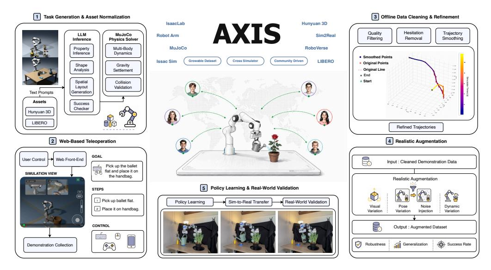
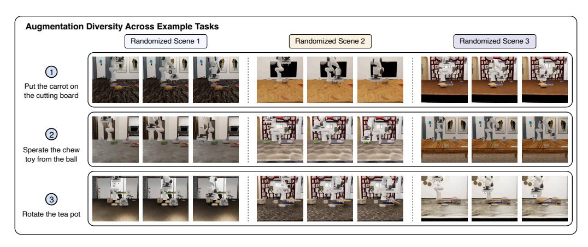
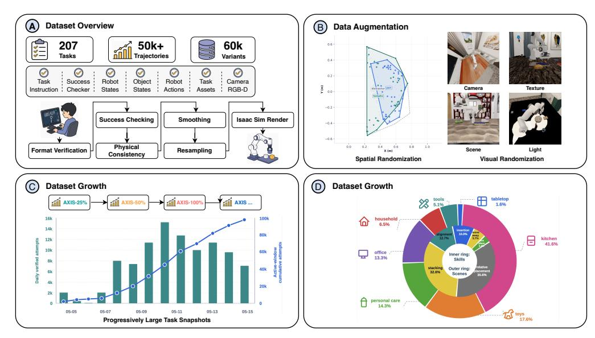
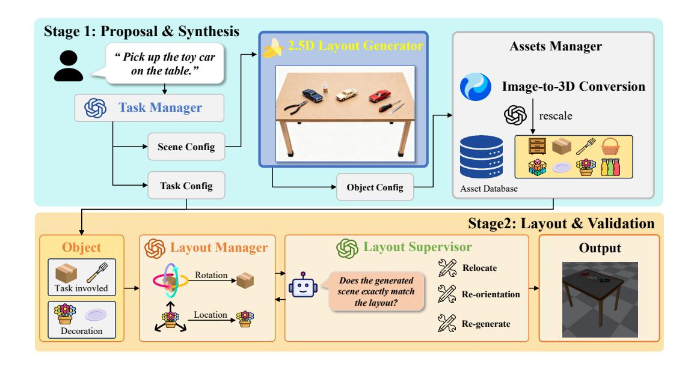
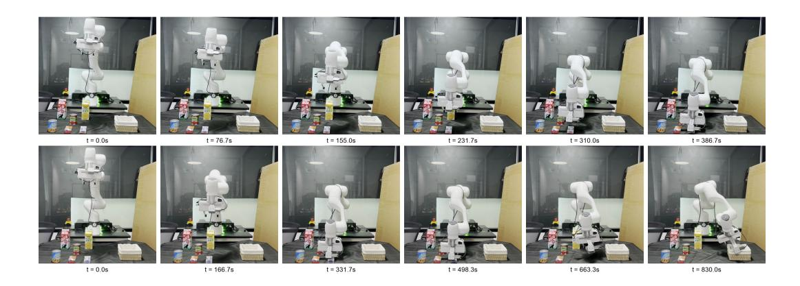
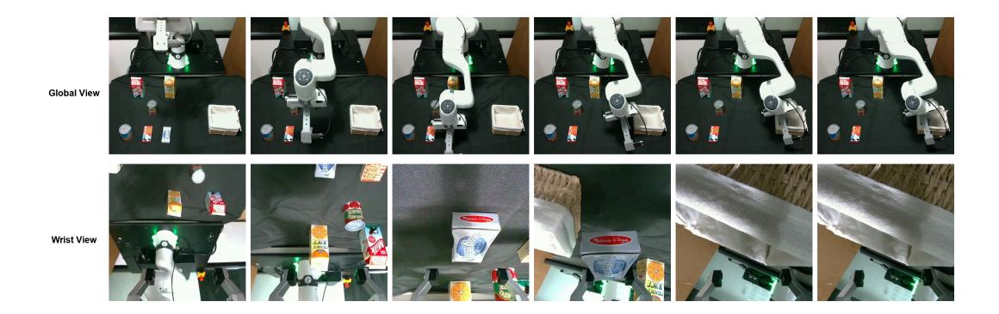
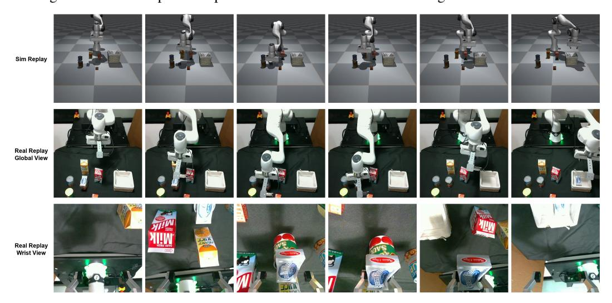

# AXIS: 확장 가능한 로봇 조작을 위한 성장 가능한 커뮤니티 기반 데이터 엔진 (AXIS: A Growable Community-Driven Data Engine for Scalable Robot Manipulation)

- 원제: AXIS: A Growable Community-Driven Data Engine for Scalable Robot Manipulation
- 원문: [https://arxiv.org/abs/2607.21588](https://arxiv.org/abs/2607.21588)
- PDF: [https://arxiv.org/pdf/2607.21588v1](https://arxiv.org/pdf/2607.21588v1)
- arXiv ID: `2607.21588`

---

# AXIS: 확장 가능한 로봇 조작을 위한 성장 가능한 커뮤니티 기반 데이터 엔진 (AXIS: A Growable Community-Driven Data Engine for Scalable Robot Manipulation)

Mengfei Zhao\*,‡, Dihong Huang1,2\*, Yikai Tang2*, Peihao Li2*, Mingxuan Yan3*, Ruiqi Zhuang1*, Yanjia Huang4*, Jie Wang1,5, Hai Zhai1, Tony Zhou1,6, Rui Zhang1,7, Zhexi Luo1,8, Yuchen Huang1,7, Jianfei Yang9‡, Jiachen Li3‡

1Axis Robotics 2캘리포니아 대학교 버클리 (University of California, Berkeley) 3조지아 공과대학교 (Georgia Institute of Technology) 4텍사스 A&M 대학교 (Texas A&M University) 5존스 홉킨스 대학교 (Johns Hopkins University) 6펜실베이니아 대학교 (University of Pennsylvania) 7미시간 대학교 (University of Michigan) 8싱가포르 국립대학교 (National University of Singapore) 9양양공과대학교 (Nanyang Technological University)

*동일 기여 ‡zhaomengfei248@gmail.com, jianfei.yang@ntu.edu.sg, jiachen_li@gatech.edu

그림 1: AXIS: 성장 가능한 커뮤니티 기반 데이터 엔진으로, 작업 생성, 웹 텔레오퍼레이션, 데이터 정제, 현실적인 증강, 정책 학습을 통합하고 실제 검증을 수행합니다.

**Abstract:** 효과적인 로봇 조작 정책을 학습하려면 다양하고 고품질의 시연이 필요하지만, 기존 데이터 파이프라인은 전문 하드웨어, 중앙 집중형 운영자, 또는 고정된 작업 세트에 의존하기 때문에 확장하기 어렵습니다. 우리는 성장 가능한 커뮤니티 기반 데이터 엔진이자 벤치마크인 AXIS를 제시합니다. AXIS는 대규모 시연 수집을 위한 브라우저 기반 텔레오퍼레이션을 가능하게 하고, 새로운 조작 작업을 자동으로 생성 및 검증하며, 커뮤니티가 수집한 시연을 자동 성공 검사, 품질 필터링, 궤적 부드럽게 처리, 시각 및 물리 기반 증강을 통해 학습 준비가 된 데이터로 변환합니다. 현재 AXIS 데이터셋은 207개의 다양한 작업과 50K+ 궤적을 포함합니다. 동시에 AXIS는 데이터를 작업 스냅샷으로 구성하고 체계적인 보류 프로토콜을 통해 정책을 평가합니다. 우리는 통합된 AXIS 평가 스위트에서 VLA(vision-language-action) 정책을 비교하고, 서로 다른 데이터 볼륨에 걸친 확장 동작을 분석합니다. AXIS에서의 지속적인 사전 학습은 $\pi_{0.5}$의 전체 성공률을 5.8% 향상시키며, RoboCasa365에서 사전 학습된 모델보다 37.3% 우수하고, 데이터 볼륨이 증가함에 따라 일관된 확장성을 보이며, 가장 큰 이득은 레이아웃, 센서 노이즈, 카메라 교란에서 관찰됩니다.

프로젝트 웹사이트: https://axisaiorg.github.io/AXIS-V1/

키워드: 확장 가능한 로봇 학습, 조작 데이터셋, 데이터 수집

# 1 서론 (Introduction)

범용 로봇 조작은 다양한 물체, 장면 및 작업 목표에 걸쳐 동작할 수 있는 정책이 필요합니다. 모방 학습과 시각-언어-행동(VLA) 모델의 최근 진전은 정책 성능이 로봇 시연 데이터의 규모, 다양성 및 품질에 크게 의존함을 보여주었습니다 [\[1,](#page-8-0) [2\]](#page-8-0). 그러나 물리적 로봇 시연을 수집하는 것은 여전히 비용이 많이 들며, 원격 조작 시스템은 종종 특수 하드웨어나 로컬 시뮬레이터 설치를 요구하고, 대부분의 공개 조작 데이터 세트는 일회성 수집 이후 고정된 상태를 유지합니다 [\[3,](#page-8-0) [4\]](#page-8-0). 그 결과, 로봇 데이터 세트는 훈련을 위해 의도된 모델보다 훨씬 느리게 성장했습니다. 기존 조작 데이터 파이프라인의 근본적인 한계는 데이터 수집이 여전히 대부분 폐쇄적이고 중앙집중화되어 있다는 점입니다. 전문가 운영자나 전담 팀은 로컬 하드웨어에서 시연을 수집하고, 오프라인에서 처리한 뒤, 결과 데이터 세트를 고정된 벤치마크로 공개합니다 [\[4,](#page-8-0) [5\]](#page-8-0). 이 패러다임은 데이터 품질에 대한 강력한 제어를 제공하지만, 지속적인 작업 확장, 광범위한 커뮤니티 참여, 또는 로봇 역량이 진화함에 따라 빠른 반복을 자연스럽게 지원하지 못합니다. 대신 로봇 학습을 확장하려면 작업, 물체, 장면, 기여자, 시각 조건 및 물리적 변화를 포함한 여러 차원에서 지속적으로 확장할 수 있는 데이터 인프라가 필요합니다.

우리는 다음 세대 로봇 조작 데이터 세트가 *성장 가능*해야 한다고 주장합니다: 정적 시연 모음으로서 기능하기보다, 새로운 데이터를 지속적으로 생성, 수집, 검증, 처리 및 평가할 수 있는 메커니즘을 제공해야 합니다. 이러한 성장은 또한 구조화되어야 하며, 새로운 작업과 시연을 재현 가능한 데이터 세트 스냅샷으로 조직하여 시간에 따라 일관된 벤치마킹을 지원해야 합니다. 이를 위해 우리는 확장 가능한 로봇 조작을 위한 커뮤니티 주도 데이터 엔진 및 벤치마크인 AXIS를 소개합니다. AXIS는 단순한 원칙에 기반합니다: 대규모 데이터 수집을 광범위하게 접근 가능하게 만들면서, 필요에 따라 고품질 데이터 처리를 확장합니다. 현재 이 플랫폼은 Franka Research 3 로봇과 평행 손가락 그리퍼를 장착한 탁상 조작을 목표로 하며, 픽앤플레이스, 스태킹, 푸시, 포어, 관절 물체 조작, 도구 사용 행동 등 광범위한 작업을 지원합니다. 각 작업은 자연어 지침, 매개변수화된 장면 구성, 그리고 구조화된 성공 검사기로 지정됩니다.

AXIS는 세 개의 밀접하게 통합된 레이어로 구성됩니다. *인프라스트럭처 레이어*는 자동화된 작업 생성과 브라우저 기반 MuJoCo-WASM 원격 조작을 결합합니다. 새로운 작업은 고수준 지침, 물체 자산, 장면 레이아웃, 그리고 작업별 성공 조건에서 생성되어, 사용자들이 일반 입력 장치를 사용해 시연을 수집할 수 있는 공유 웹 인터페이스를 통해 배포됩니다. *데이터 세트 레이어*는 통합된 궤적 표현, 자동 성공 검증, 품질 필터링, 정적 세그먼트 제거, 궤적 부드럽게 처리, 재표본화, 그리고 IsaacSim 기반 시각 및 물리 증강을 통해 원시 커뮤니티 시연을 훈련 준비 데이터로 변환합니다. 마지막으로 *모델 레이어*는 공유 작업 정의와 성공 검사기를 사용해 전통적인 시각-운동 모방 학습 정책과 현대 VLA 모델의 훈련 및 평가를 지원합니다. AXIS는 또한 데이터 세트 성장을 측정 가능하도록 설계되었습니다. 이는 시연을 점진적으로 더 큰 작업 스냅샷으로 조직하고, 고정된 보류 프로토콜을 사용해 정책을 평가함으로써, 정책 아키텍처, 훈련 예산, 롤아웃 프로토콜, 평가 작업, 그리고 성공 기준은 고정된 채로 오직 훈련 스냅샷만 성장하는 통제된 확장 연구를 가능하게 합니다.

기여. 첫째, 우리는 브라우저 기반 MuJoCo-WASM 원격 조작과 자동화된 작업 생성을 통해 확장 가능한 조작 데이터 수집을 위한 웹 기반, 커뮤니티 주도 인프라인 AXIS를 제시한다. 둘째, 우리는 207개의 작업과 5만 개 이상의 궤적을 포함하는 성장 가능한 조작 데이터셋을 구축하고, 궤적 표준화, 성공 검증, 품질 필터링, 시간적 부드럽게 처리, 재샘플링, IsaacSim 기반 시각 및 물리 증강, 버전 관리된 작업 스냅샷팅을 위한 통합 데이터 처리 파이프라인을 함께 제공한다. 셋째, 우리는 정책 학습과 본체 내 데이터셋 스케일링을 연구하기 위한 체계적인 평가 프로토콜을 도입하며, 표준화된 벤치마크 비교와 고정된 보류 평가 세트 하에서 AXIS-25%/50%/100% 데이터셋 스냅샷을 사용한 제어된 스케일링 실험을 포함한다.

핵심 결과. 우리는 두 가지 상호 보완적인 실험 프로토콜을 통해 AXIS를 평가한다. 첫 번째로, 대표적인 모방 학습과 VLA 정책을 통합 평가 스위트 아래에서 비교하며, 우리의 데이터셋을 일관된 벤치마크로 사용한다. 두 번째로, 최적화 예산과 보류 평가 프로토콜을 변경하지 않고 점진적으로 더 큰 데이터셋 스냅샷에서 고정 정책 레시피를 훈련시켜 데이터셋 스케일링을 조사한다. 결과는 대규모, 커뮤니티가 수집한 시연과 자동 처리 및 증강을 결합하면 다운스트림 정책 학습이 크게 향상된다는 것을 보여준다. AXIS-100%에서 π0.5의 지속적 사전 훈련은 전체 LIBERO-Plus 성공률을 5.8% 향상시키며, 부피가 일치하는 RoboCasa365 지속적 사전 훈련 기준보다 37.3% 더 우수하다. 성능은 데이터셋 크기에 따라 일관되게 스케일링된다 (AXIS-25%/50%/100%에 대해 84.7%/85.7%/88.8%), 가장 큰 개선은 카메라(+15.6%), 센서 노이즈(+16.6%), 레이아웃(+3.1%), 로봇 포즈(+5.1%) 변동에서 관찰되며, 이는 AXIS의 성장 가능한 설계가 확장 가능한 로봇 조작으로 가는 실용적인 경로를 제공함을 입증한다.

## 2 관련 연구 (Related Work)

대규모 및 크라우드소싱된 로봇 조작 데이터.

대규모 로봇 학습은 점점 더 다중 로봇 전이, 교차 환경 궤적, 야외 시연, 다중 구현 데이터, 그리고 기관 집계에 걸친 광범위한 조작 코퍼스를 활용한다 [\[6,](#page-8-0) [7,](#page-8-0) [8,](#page-8-0) [9,](#page-9-0) [10,](#page-9-0) [11\]](#page-9-0).

이 데이터셋은 확장 가능한 로봇 정책을 지원해 왔으며 [\[1,](#page-8-0) [12\]](#page-9-0), 최근 벤치마크는 평생 학습, 가정용 작업, 구성적 추론, 메모리, 그립핑, 그리고 부품 수준 감독까지 범위를 확장했다 [\[13,](#page-9-0) [14,](#page-9-0) [15,](#page-9-0) [16,](#page-9-0) [17,](#page-9-0) [18,](#page-9-0) [19,](#page-9-0) [20\]](#page-9-0).

크라우드소싱 시스템은 수집 범위를 넓히지만 [\[21,](#page-9-0) [22\]](#page-9-0), 많은 자원은 고정된 릴리스에 머물거나 물리적 로봇과 특정 설정에 의존한다.

AXIS는 대신 브라우저 기반 시뮬레이션 원격 조작을 사용해 커뮤니티 수집을 진행하고, 데이터를 버전이 지정된 스냅샷으로 정리하여 데이터셋 성장을 일회성 릴리스가 아니라 측정 가능한 형태로 만든다.

로봇 데이터 수집을 위한 원격 조작 인터페이스.  
로봇 시연은 일반적으로 원격 조작을 통해 수집되며, 이는 kinesthetic teaching [23] 및 leader-follower rigs [24,] [25,] [26]부터 commodity devices [14,] [27,] [28,] [29,] [30,] [31] 그리고 웨어러블 캡처 [32,] [33]까지 다양합니다.  
이러한 인터페이스는 정밀도, 비용, 구현 충실도, 보정 부담, 접근성 등을 균형 있게 고려합니다.  
웹 시스템은 온보딩을 단축하지만, 기존 연구는 주로 원격 물리 로봇을 대상으로 하여 [22,] [34] 로봇 가용성, 유지보수, 안전성에 의해 수집이 제한됩니다. 반면 고충실도 시뮬레이터는 설치가 무겁고 GPU 자원이 필요합니다 [35,] [36].  
AXIS는 MuJoCo-WASM을 사용한 브라우저 기반 원격 조작으로 수집을 고가의 시뮬레이션과 분리하고, 고충실도 재생 및 증강은 백엔드 처리에 남겨둡니다.

시뮬레이션은 확장 가능한 작업 변형, 재생 및 검증을 지원하며, 상호작용 및 프로토타이핑용 경량 엔진 [37,] [38,] [39,] [40,] [41]과 병렬 시뮬레이션, 렌더링, 복잡한 장면을 위한 GPU 지향 플랫폼 [42,] [43,] [44,] [45,] [35,] [36]을 포함합니다.  
표준화된 작업 세트는 공통 인터페이스와 성공 기준을 정의합니다 [46,] [47,] [48,] [15,] [2]; 데이터 생성 방법은 궤적 재타게팅 및 합성을 통해 시연을 확장합니다 [49,] [50]; LLM/VLM 기반 시스템은 작업 및 자산 생성을 확장합니다 [51,] [52,] [53,] [54].  
AXIS는 자동화된 작업 생성, 브라우저 기반 원격 조작, IsaacSim 기반 증강을 통해 이러한 구성 요소를 하나의 확장 가능한 데이터 파이프라인으로 통합합니다.

데이터 확장은 일반 조작 정책의 훈련 및 평가와 밀접하게 연결됩니다.  
확산 스타일 정책과 액션 청킹 트랜스포머는 여전히 강력한 기준이며, ACT는 청킹된 액션 예측에 일반적으로 사용됩니다 [25].  
VLA 모델은 로봇 궤적에 대해 대형 비전-언어 백본을 미세 조정하며, 명령어 수행 조작을 향상시켰습니다 [55,] [56,] [57,] [58,] [59,] [60,] [61,] [62,] [63,] [64].  
평가 역시 공유 인터페이스와 견고성 테스트로 이동했으며, 이는 평생 작업, 교란 인식 확장, 시뮬-실제 상관 평가, 조합 장면 변동 등을 포함합니다 [13,] [65,] [66,] [67].  
AXIS는 단일 세트를 고정시키기보다 버전이 지정된 훈련 스냅샷을 고정된 보류 프로토콜과 함께 공개하여, 데이터가 증가함에 따라 공유 데이터, 관측, 성공 검사 규칙 하에서 정책을 비교할 수 있도록 합니다.

# 3 확장 가능한 로봇 데이터 수집 (Scalable Robot Data Collection)

데이터셋 레이어는 검증, 필터링, 정제 및 증강을 통해 원시 커뮤니티 시연을 훈련 준비가 된 로봇 궤적으로 변환합니다. 시연은 스크립트된 컨트롤러가 아니라 인간 운영자로부터 수집되므로, 결과 데이터는 접근 방향, 그립 타이밍, 수정 행동, 실행 스타일 등에서 행동 다양성을 포함합니다.

Figure 2: 세 가지 예시 작업에 대한 증강 다양성 시각화.  
각 작업(행)마다 외관, 조명, 환경 및 초기 물체 위치를 무작위화하여 얻은 세 가지 증강 변형(열)을 보여줍니다.  
증강 전반에 걸쳐 재질과 질감(예: 테이블, 바닥, 물체), 조명 조건(예: 밝기와 그림자), 배경 및 장면 레이아웃(예: 벽, 가구, 장식), 초기 상태(예: 물체 위치와 방향)를 변형합니다.  
이 과정은 데이터 다양성을 크게 증가시키고 환경 변동에 대한 정책의 견고성을 향상시킵니다.

Completed demonstrations are serialized into a unified trajectory format.  
각 궤적에는 작업 메타데이터, 로봇 구현체, 환경 식별자, 시뮬레이터 버전, 타임스탬프, 관측값, 로봇 상태, 동작 및 성공 정보가 포함됩니다.  
옵션 필드에는 물체 상태, 카메라 스트림, 분할 마커 및 실패 라벨(가능한 경우)이 포함됩니다.  
이 형식은 시연을 재생 가능하고 필터링 가능하며 다운스트림 정책 학습과 호환되도록 합니다.

Raw community demonstrations may contain jitter, stalls, corrupted frames, discontinuities, or incorrect success labels.  
따라서 데이터셋은 누락된 키, 이상한 수치 값, 잘못된 상태 전이, 물리적으로 불가능한 프레임 간 변화 및 실패한 작업 완료에 대한 일관성 검사를 사용해 필터링됩니다.  
프론트엔드 덤프에 성공 메타데이터가 포함되어 있지만, AXIS는 프론트엔드 성공 플래그에만 의존하기보다 백엔드 검증 중에 작업별 성공 검사기를 재사용합니다.  
보존된 궤적은 정적 또는 손상된 세그먼트를 제거하고, 고주파 텔레오퍼레이션 아티팩트를 부드럽게 하며, 고정된 제어 주파수로 재샘플링하여 정제됩니다.  
이 과정은 시연된 조작 행동의 기하학적 구조를 보존하면서 보다 안정적인 동작 시퀀스를 생성합니다.  
정제된 시연은 시각 및 물리 증강을 위해 IsaacSim 백엔드에서 재생됩니다.  
물리적 무작위화는 물체 포즈, 잡동사니 구성, 질량, 마찰 및 관련 동역학 매개변수를 변형합니다.  
렌더링 무작위화는 카메라 시점, 조명, 질감 및 시각적 외관을 변형합니다.  
이러한 변형은 작업 의미를 보존하면서 적용되어, 모든 변형에 대해 추가 인간 시연을 요구하지 않고도 훈련 분포를 확장합니다.  
결과적으로, 접근 가능한 웹 수집 시연을 VLA 및 로봇 정책 학습을 위한 고품질 데이터로 변환하는 확장 가능한 파이프라인이 만들어집니다.

## 4 The AXIS Franka Dataset

Dataset overview.  
AXIS는 평행 손가락 그리퍼를 장착한 Franka Research 3 로봇을 중심으로 구축된 대규모 테이블탑 조작 데이터셋입니다.  
Fig. [3,](#page-4-0)에 요약된 바와 같이 현재 데이터셋 스냅샷은 207개의 조작 작업, 5만 개가 넘는 인간 시연 궤적, 그리고 6만 개가 넘는 작업 또는 장면 변형을 포함합니다.  
각 작업은 언어 지침, 매개변수화된 시뮬레이션 장면, 작업 자산 및 구조화된 성공 검사기로 지정됩니다.  
각 시연 궤적은 두 카메라 뷰의 RGB-D 렌더링, 로봇 상태, 물체 상태, 로봇 동작, 작업 메타데이터 및 성공 라벨을 포함한 동기화된 다중 모달 정보를 담고 있습니다.  
이 통합 데이터 스키마는 동일한 궤적을 모방 학습, 재생 기반 검증, 시각 증강 및 벤치마크 평가에 사용할 수 있게 합니다.  
작업 세트는 픽앤플레이스, 재배치, 쌓기, 정렬, 밀기, 붓기, 삽입, 정렬, 그리고 관절형 또는 컨테이너형 물체와의 상호작용을 포함한 일반적인 테이블탑 조작 동작의 광범위한 범위를 다루며, 현재 작업 분포는 일곱 개의 장면 범주에 걸쳐 있습니다.

Figure 3: AXIS 데이터셋 개요.

**검증 및 정제.** 데이터 품질을 보장하기 위해 모든 시연은 궤적 완전성, 작업 성공, 물리적 일관성을 검증하는 표준화된 검증 파이프라인을 거친다. 유효한 궤적은 이후에 부드럽게 처리되고 통합된 제어 주파수로 재표본화되어 시간적 일관성을 향상시키고 원격 조작 노이즈를 줄인다. Table 1에 표시된 바와 같이 정제 과정은 가속도와 jerk를 크게 감소시키면서 높은 재생 성공률을 유지한다. 추가 구현 세부 사항은 부록에 제공된다.

**데이터 증강.** 다양성과 견고성을 향상시키기 위해 AXIS는 공간적 및 시각적 무작위화를 통한 증강을 도입한다. 이러한 증강은 작업 의미와 성공 조건을 보존하면서 추가적인 유효한 장면 구성을 생성한다. Fig. 2에 표시된 바와 같이, 결과 변형은 객체 배치, 시점, 질감, 조명 및 배경의 변화를 포함하며, 데이터셋을 60K가 넘는 장면 변형으로 확장한다. 이러한 다양성은 AXIS가 환경 변동 하에서 견고성 및 일반화 연구에 특히 유용하게 만든다.

Benchmarking platform. AXIS는 데이터가 증가함에 따라 정책 학습을 연구하기 위한 확장 가능한 벤치마크로 설계되었다. 훈련 데이터는 점진적으로 더 큰 작업 스냅샷으로 구성되며, AXIS-25%, AXIS-50%, AXIS-100%를 포함한다. 각 스냅샷은 동일한 데이터 형식, 검증 파이프라인, 작업 정의, 롤아웃 예산, 성공 검사기를 유지하여, 오직 훈련 데이터의 양과 다양성만을 변형하는 통제된 확장 연구를 가능하게 한다. 데이터셋은 또한 커뮤니티 주도형 작업 및 궤적 수집을 통해 지속적으로 확장 가능하다. Fig. 3에 표시된 활성 수집 창에서 일일 검증 시도 수는 최고점에서 약 15K에 달하며, 활성 창 누적 시도 수는 100K에 접근한다. 이러한 통계는 AXIS가 일회성 정적 릴리스가 아니라 점진적 데이터셋 성장을 지원하도록 설계되었음을 나타낸다.

벤치마크는 두 가지 상호 보완적인 평가 모드를 지원합니다. 첫 번째로, AXIS는 기존의 시각-운동 모방 학습 방법과 시각-언어-행동 정책을 포함한 대표적인 정책 계통 간 직접 비교를 가능하게 합니다. 두 번째로, AXIS는 동일한 신체 구조 내에서 스케일링 연구를 지원합니다. 이때 정책은 AXIS-25%, AXIS-50%, AXIS-100% 및 향후 더 큰 스냅샷에서 훈련되어 추가적인 작업 범위가 보류된 조작 일반화를 개선하는지 측정합니다. 이러한 특성은 AXIS를 단순한 대규모 조작 데이터셋이 아니라, 확장 가능한 로봇 학습과 데이터 기반 일반화를 연구하기 위한 장기적인 벤치마크로 자리매김하게 합니다.

### 5 Experiments (실험)

AXIS를 성장 가능한 데이터 엔진으로 평가하기 위해, 우리는 세 가지 질문을 중심으로 실험을 구성한다. (i) 지속적인 사전 학습 $\pi_{0.5}$ [62]가 AXIS에서 downstream LIBERO-Plus [65] 성능을 향상시키는가, 그리고 그 향상은 AXIS에 특이한 것인지, 매칭된 볼륨의 기준선과 비교했을 때 추출된

Table 1: 데이터 정제의 텔레오퍼레이션 궤적 품질에 미치는 영향 (Effect of data refinement on teleoperation trajectory quality). 원시 텔레오퍼레이션에 비해 최종 스무딩 및 재샘플링된 궤적은 평균 가속도와 평균 제크를 각각 63.9%와 80.8% 감소시킨다.

| 데이터 버전 | 샘플링 속도 | 평균 가속도 | 평균 제르크 | 재생 성공 |
|----------------------|---------------|-------------------|-----------|----------------|
| 원시 텔레오퍼레이션 | 5.0 Hz | 1.3539 | 11.5899 | 100.0% |
| 스무딩 | 5.0 Hz | 0.6382 | 2.9160 | 91.4% |
| 스무딩 + 리샘플링 | 20 Hz | 0.4885 | 2.2243 | 86.2% |

RoboCasa365 [\[15\]](#page-9-0)? (ii) 개선이 AXIS 볼륨에 따라 확장되는가, 그리고 다운스트림 LIBERO 파인튜닝 데이터가 부족할 때 가장 큰가? (iii) AXIS 지속적 사전학습이 가장 도움이 되는 LIBERO-Plus 변형 축은 무엇이며, 그 패턴이 AXIS IsaacSim 증강 파이프라인에서 명시적으로 무작위화된 변형과 일치하는가?

## 5.1 실험 설정 (Experimental Setup)

AXIS 데이터셋. AXIS 훈련 코퍼스는 브라우저 기반 MuJoCo-WASM 원격 조작 프런트엔드를 통해 수집되며 통합 AXIS 궤적 형식으로 저장된다. 로봇 구현체는 평행 손가락 그리퍼를 갖춘 Franka Research 3 로봇 팔이며, 작업은 물체 집기-놓기, 쌓기 및 정렬, 관절 물체 상호작용, 밀기, 붓기, 도구 사용 스타일 조작 등 테이블탑 조작 동작을 포함한다. 원시 시연은 AXIS 처리 파이프라인(성공 검증, 정적 세그먼트 제거, Savitzky-Golay 스무딩, 고정률 재샘플링)을 거쳐 무작위 시각 및 물리 조건 하에서 IsaacSim에서 재생된다. 우리는 AXIS-100% 스냅샷을 가장 큰 지속적 사전학습 풀로 사용하고, 스케일링 실험에 사용되는 25% 및 50% 하위 집합을 만들기 위해 작업 수준에서 교체 없이 균일하게 샘플링한다.

훈련 파이프라인. 모든 조건은 동일한 3단계 훈련 파이프라인을 공유한다: 공개된 π0.5 체크포인트에서 시작하고; 선택적으로 시뮬 코퍼스(AXIS 하위 집합 또는 RoboCasa365 하위 집합)에서 사전학습하며; LIBERO-Plus와 함께 제공되는 LIBERO 궤적 세트에서 파인튜닝한다. 지속적 사전학습 단계는 모든 비베이직 조건에서 동일한 옵티마이저 설정, 학습률, 배치 크기 및 그래디언트 단계 예산을 사용한다; 파인튜닝 단계는 모든 조건에서 π0.5 기본 LIBERO 레시피를 사용한다. RoboCasa-매치된 제어는 RoboCasa365 궤적을 교체 없이 샘플링하여 궤적 수가 AXIS-100%와 동일해질 때까지 수행하며, 원시 훈련 볼륨을 통제한다.

평가 프로토콜. 모든 정책은 LIBERO-Plus 견고성 스위트에서 평가된다. 이 스위트는 LIBERO를 확장하여 카메라, 조명, 센서 노이즈, 배경, 레이아웃, 언어, 로봇 등 일곱 축에 걸친 체계적 변형을 포함한다. 각 (작업, 변형 축) 쌍마다 롤아웃 예산을 모든 조건에서 일정한 K로 고정하고, 롤아웃에 대한 평균 성공률을 보고한다. 분포 내 건전성 검사로서, 우리는 AXIS-100% 자체의 보류된 작업 분할에 대한 성공률도 추가로 보고한다; 이는 AXIS 지속적 사전학습이 정책을 AXIS 작업 분포에서 파괴적으로 이동시키지 않음을 확인한다.

#### 5.2 주요 결과: AXIS 지속적 사전학습 vs. 매치된 시뮬 베이스라인 (Main Results: AXIS Continual Pretraining vs. Matched Sim Baseline)

첫 번째 실험은 AXIS 데이터가 다운스트림 조작 벤치마크에 대한 지속적 사전학습으로 유용한지, 그리고 이 이점이 AXIS에 특화된 것인지 아니면 매치된 시뮬 코퍼스에 일반적인 것인지 테스트한다. 우리는 AXIS를 π0.5 [\[62\]](#page-12-0) 위에 *지속적 사전학습* 데이터로 취급하고, 결과 모델을 표준 LIBERO 궤적에서 파인튜닝하며, LIBERO-Plus 견고성 벤치마크 [\[65\]](#page-12-0)에서 평가한다. 이 설계는 다운스트림 작업군, 파인튜닝 데이터, 평가 분포를 모든 방법에 대해 고정시켜 지속적 사전학습 코퍼스의 효과를 고립한다.

우리는 네 가지 훈련 조건을 비교한다. (1) π0.5 베이직은 공개된 π0.5 체크포인트에서 직접 LIBERO 파인튜닝을 수행하며, 기준선을 설정한다. (2) π0.5 + AXIS-25%는 AXIS-100%의 25% 무작위 하위 집합에서 사전학습한 뒤 LIBERO 파인튜닝을 수행하여 저용량 스케일링 포인트를 제공한다. (3) π0.5 + AXIS-100%는 전체 AXIS-100% 스냅샷에서 사전학습하며, 우리의 주요 조건이다. (4) π0.5 + RoboCasa-매치된 조건은 RoboCasa365 [\[15\]](#page-9-0) 하위 집합을 AXIS-100%와 궤적 수가 일치하도록 매치하여 사전학습한다; 이는 비교 가능한 크기의 Franka-시뮬 훈련 코퍼스가 있을 가능성을 통제한다.

Table 2: 주요 결과.  
모든 조건은 공개된 π0.5 체크포인트에서 시작하며, 나열된 코퍼스에서 선택적으로 사전 학습을 수행한 뒤, 동일한 하이퍼파라미터를 사용해 LIBERO 트래젝터리에서 미세 조정(fine‑tune)을 수행하고 LIBERO‑Plus에서 평가한다.  
RoboCasa‑매칭 제어는 AXIS‑100%와 동일한 트래젝터리 수를 사용한다.  
각 변형(perturbation)별 열은 해당 LIBERO‑Plus 축에서의 성공률을 보고한다.

| 모델 | # 사전학습 시연 | 전체 ↑ | Cam. | Light | Noise | B.G. | Layout | Lang. | Robot |
|---------------------------------|------------------|-----------|------|-------|-------|-------|--------|-------|-------|
| π0.5 vanilla | 0 | 83.9 | 72.5 | 98.2 | 82.5 | 94.4 | 82.9 | 89.6 | 74.4 |
| π0.5 + AXIS-25% | 0.25 NAXIS | 84.7 | 77.5 | 91.2 | 86.2 | 100.0 | 85.5 | 81.8 | 76.9 |
| π0.5 + AXIS-50% | 0.50 NAXIS | 85.7 | 68.8 | 98.2 | 91.2 | 96.3 | 88.2 | 84.4 | 79.5 |
| π0.5 + AXIS-100% (ours) | NAXIS | 88.8 | 83.8 | 96.5 | 96.2 | 98.1 | 85.5 | 88.3 | 78.2 |
| π0.5 + RoboCasa-matched (ctrl.) | NAXIS | 57.5 | 35.2 | 79.5 | 63.2 | 81.7 | 68.0 | 49.2 | 39.4 |

우리는 유사한 이득을 가져올 것이다. 함께, 조건 (1)-(3)은 AXIS가 도움이 되는지, 더 많은 AXIS가 더 도움이 되는지를 측정하고; 조건 (4)는 이득이 AXIS 특이적인지 아니면 이 부피에서의 시뮬레이션 연속 사전 학습에 일반적인지를 측정한다. 모든 조건은 동일한 다운스트림 LIBERO 미세 조정 레시피(π0.5 기본 옵티마이저, 배치 크기, 스케줄, 단계 예산), 동일한 LIBERO 궤적 세트, 동일한 LIBERO-Plus 평가 프로토콜, 그리고 작업 및 왜곡 조건당 동일한 롤아웃 수를 공유한다. 훈련 하이퍼파라미터도 조건 (2)-(4) 전반에 걸쳐 일치한다: 동일한 학습률, 배치 크기, 그래디언트 단계 예산, 옵티마이저 상태 초기화.

표 2가 다루는 핵심 질문은 AXIS 연속 사전 학습이 기존의 π0.5 연속 사전 학습을 넘어서는 이점을 제공하는지, 그리고 그 이점이 AXIS 데이터에 특이한 것인지 여부이다. AXIS 연속 사전 학습은 베이직 π0.5 기준선보다 다운스트림 성능을 일관되게 향상시키며, 더 많은 AXIS 데이터가 추가될수록 이득이 증가한다. AXIS-25%와 AXIS-100% 사이의 성능 격차는 이러한 이점이 아직 포화되지 않았음을 시사하며, 추가 AXIS 데이터가 다운스트림 조작 과제에서의 견고성을 계속 향상시킨다는 것을 나타낸다. 부피가 일치한 RoboCasa365 대조군은 이러한 이득이 AXIS 자체에서 비롯된 것인지, 아니면 단순히 추가 시뮬레이션 데이터 때문인지 테스트한다. 동일한 훈련 부피를 사용함에도 불구하고 RoboCasa-matched는 거의 모든 왜곡 범주와 전체 벤치마크에서 두 AXIS 변형보다 성능이 낮다. 이는 이득이 데이터셋 크기만으로 설명되지 않으며, AXIS 파이프라인 고유의 특성(크라우드소싱 작업 생성, 다양한 시연, 대규모 환경 랜덤화 등)에 의해 설명된다는 것을 시사한다.

전반적으로 결과는 AXIS를 확장 가능한 데이터 엔진으로 지원한다: AXIS 데이터를 늘리면 일관된 다운스트림 개선이 이루어지며, 이러한 이득은 훈련 부피만이 아니라 AXIS 파이프라인의 다양성과 범위에서 비롯된다.

#### 5.3 각-왜곡 견고성 분석 (Per-Perturbation Robustness Analysis)

AXIS 데이터셋이 어디에서 도움이 되고 어디에서 도움이 되지 않는지 이해하기 위해, 우리는 전체 LIBERO 미세 조정 예산에서 베이직 π0.5 및 RoboCasa-matched 대조군과 비교하여 AXIS-100% 조건의 각 왜곡별 분해를 보고한다. LIBERO-Plus 왜곡 축은 서로 다른 분포 변화를 탐지한다: *Camera*는 시점(viewpoint)을 바꾸고, *Light*는 조명을 바꾸며, *Sensor Noise*는 카메라 관측에 광학적 왜곡(가우시안 노이즈 및 대비 진동)을 추가하고, *Background*는 장면 외관과 테이블/벽 질감을 바꾸며, *Layout*는 객체의 초기 위치와 방향을 바꾸고, *Language*는 작업 문구를 바꾸며, *Robot*은 로봇의 초기 자세를 바꾼다. 서로 다른 훈련 코퍼스는 그들의 훈련 분포가 무엇을 포함하느냐에 따라 이 축들에서 불균형적으로 도움이 될 것으로 예상된다; AXIS의 IsaacSim 증강은 특히 카메라, 조명, 질감, 레이아웃 왜곡을 목표로 하므로 우리는 해당 축에서 가장 강력한 상대적 이득을 기대한다.

우리는 Table [3](#page-7-0)을 사용하여 AXIS 데이터셋이 어디에서 도움이 되고 어디에서 도움이 되지 않는지 이해한다. AXIS 증강 설계에서 예상한 대로, 가장 큰 이득은 시각 및 장면 관련 왜곡에서 나타난다. 여기에는 카메라 시점, 센서 노이즈, 배경 외관, 객체 배치가 포함되며, 이는 Isaac-Sim 랜덤화가 LIBERO-Plus의 대응하는 견고성 도전에 효과적으로 전이됨을 보여준다. 또한 AXIS는 언어 및 로봇 자세 변동에서도 성능을 향상시키며, 이는 이러한 요소를 명시적으로 증강하지 않았음에도 불구하고 발생한다. 이는 AXIS가 단순한 왜곡별 견고성 이상을 제공함을 시사한다: 다양한 작업, 행동, 상호작용 맥락에 노출됨으로써 근본적인

Table 3: 전체 LIBERO 미세조정 예산에서의 각 변형별 LIBERO-Plus 세분화. 각 행은 해당 변형 축에 대한 성공률(%)을 보고한다. ∆van은 π0.5 vanilla 대비 AXIS-100%의 절대 개선량이다. AXIS−RC는 AXIS-100%와 매칭된 부피의 RoboCasa365 컨트롤 간의 차이로, 동일 크기의 시뮬 코퍼스에 대한 이득을 측정하며, 경로별 우위가 아니라 같은 크기의 시뮬 코퍼스에 대한 이득을 측정한다.

| 왜곡 축 | π0.5 베이직 | + AXIS-25% | + AXIS-100% | + RoboCasa-m. | ∆van | AXIS−RC |
|-------------------|--------------|------------|-------------|---------------|-------|---------|
| 카메라 | 72.5 | 77.5 | 83.8 | 35.2 | +11.3 | +48.6 |
| 조명 | 98.2 | 91.2 | 96.5 | 79.5 | −1.7 | +17.0 |
| 센서 노이즈 | 82.5 | 86.2 | 96.2 | 63.2 | +13.7 | +33.0 |
| 배경 | 94.4 | 100.0 | 98.1 | 81.7 | +3.7 | +16.4 |
| 레이아웃 | 82.9 | 85.5 | 85.5 | 68.0 | +2.6 | +17.5 |
| 언어 | 89.6 | 81.8 | 88.3 | 49.2 | −1.3 | +39.1 |
| 로봇 | 74.4 | 76.9 | 78.2 | 39.4 | +3.8 | +38.8 |
| 전반 | 83.9 | 84.7 | 88.8 | 57.5 | +4.9 | +31.3 |

조작 표현, 분포 이동 하에서 더 넓은 이득을 가져옵니다. 동일한 볼륨의 RoboCasa365 기준선과의 비교는 이 결론을 강화합니다. AXIS는 거의 모든 변형 축에서 RoboCasa365 제어를 능가하며, 그 이점이 추가 시뮬레이션 데이터뿐 아니라 제공되는 환경, 작업 및 시연의 다양성에서 비롯된다는 것을 나타냅니다. 전반적으로 AXIS는 광범위하게 견고성을 향상시키며, 특히 시각적 및 기하학적 변형에 대해 설계된 강력한 이득을 보입니다.

## 6 논의 (Discussion)

왜 성장 가능한 데이터셋이 중요한가. 정적 데이터셋은 벤치마킹에 유용하지만, 로봇 조작 학습은 모델 능력과 관찰된 실패에 따라 성장할 수 있는 데이터 소스에서도 이점을 얻습니다. AXIS는 데이터 수집을 반복적인 피드백 루프로 전환합니다: 우리의 작업 생성 모듈은 새로운 조작 문제를 통해 의미적 다양성을 확장하고, 커뮤니티 원격 조작은 다양한 인간 전략과 수정을 통해 행동적 다양성을 추가하며, 시각 및 물리 증강은 외관, 장면 구성 및 역학의 변화를 통해 환경적 다양성을 확장합니다. 이러한 의미에서 데이터셋 성장은 정책 견고성을 향상시키는 메커니즘이 되며, 일회성 배포 프로세스가 아닙니다.

커뮤니티 수집 및 데이터 품질. 커뮤니티 주도 수집은 규모와 접근성을 향상시키지만, 운영자 기술, 움직임 부드러움, 전략 및 작업 완료 품질에 상당한 변동성을 도입합니다. 유용한 변동성은 정책을 다양한 그립, 회복 및 교정 패턴에 노출시키지만, 해로운 변동성은 손상된 상태, 유휴 구간, 실패한 롤아웃, 불연속성 또는 불안정한 동작으로 나타납니다. AXIS는 검증, 정리, 부드럽게 하기, 재생 및 증강을 데이터셋 구축의 핵심 단계로 만들어 이 tradeoff를 해결하며, 광범위한 참여와 하위 정책 학습에 필요한 품질 관리를 통합합니다.

# 7 결론 (Conclusion)

우리는 로봇 조작을 위한 확장 가능한 학습을 위한 커뮤니티 기반 데이터 엔진 및 벤치마크인 AXIS를 도입하였다. AXIS는 브라우저 기반 MuJoCo-WASM 원격 조작, 자동화된 작업 생성, 분산 시연 수집, 표준화된 궤적 처리, IsaacSim 기반 증강, 그리고 고정 프로토콜 평가를 결합한다. 이는 새로운 작업, 시연, 증강 조건을 통해 확장 가능한 학습 준비가 된 데이터셋을 구축하며, 시각-언어-행동 정책 간의 통제된 비교를 가능하게 한다. 보다 넓게는 AXIS가 작업 생성, 커뮤니티 수집, 정책 훈련, 실패 기반 개선을 연결하는 지속적으로 확장 가능한 로봇 데이터 파이프라인을 향해 나아가고 있음을 시사한다.

제한점 및 향후 연구. AXIS는 현재 시뮬레이션된 Franka 테이블탑 조작에 초점을 맞추고 있으며, 시뮬레이션-실제 전이(sim-to-real transfer)는 아직 해결되지 않은 과제로 남아 있다. 향후 연구에서는 AXIS를 더 많은 로봇 구현체, 풍부한 센싱 모달리티, 장기 수평 작업, 세분화된 주석, 그리고 실패 기반 데이터 수집을 포함하도록 확장하여 보다 일반화되고 확장 가능한 로봇 학습을 지원할 예정이다.

# 저자 기여 및 감사

핵심 기여자: Mengfei Zhao, Dihong Huang, Yikai Tang, Peihao Li, Mingxuan Yan, Ruiqi Zhuang, Yanjia Huang, Jie Wang, Hai Zhai, Tony Zhou, Rui Zhang, Zhexi Luo, 그리고 Yuchen Huang. 이 프로젝트 멤버들은 데이터 수집, 시스템 개발, 실험, 결과 분석, 논문 작성 등 과학적 성과에 실질적인 기여를 했다.

주요 연구 책임자(PIs): Jianfei Yang과 Jiachen Li. PIs는 프로젝트 감독 및 연구 방향을 제공했다.

데이터 수집 기여자: AXIS 웹 기반 원격 조작 플랫폼을 통해 시연을 제공한 Axis Robotics 커뮤니티의 70,000명 이상의 회원에게 감사한다. 그들의 참여가 AXIS를 지속적으로 성장하는 커뮤니티 기반 데이터 엔진으로 만든다.

산업 지원: Axis Robotics의 협력자들에게 데이터 기여, 엔지니어링 지원, 인프라 지원, 데이터셋 개발 협업에 대해 감사드립니다.

# References

- [1] A. Brohan, N. Brown, J. Carbajal, Y. Chebotar, J. Dabis, C. Finn, K. Gopalakrishnan, K. Hausman, A. Herzog, J. Hsu, J. Ibarz, B. Ichter, A. Irpan, T. Jackson, S. Jesmonth, N. Joshi, R. Julian, D. Kalashnikov, Y. Kuang, I. Leal, K.-H. Lee, S. Levine, Y. Lu, U. Malla, D. Manjunath, I. Mordatch, O. Nachum, C. Parada, J. Peralta, E. Perez, K. Pertsch, J. Quiambao, K. Rao, M. Ryoo, G. Salazar, P. Sanketi, K. Sayed, J. Singh, S. Sontakke, A. Stone, C. Tan, H. Tran, V. Vanhoucke, S. Vega, Q. Vuong, F. Xia, T. Xiao, P. Xu, S. Xu, T. Yu, and B. Zitkovich. Rt-1: 실세계 제어를 위한 로봇 트랜스포머. In *arXiv preprint arXiv:2212.06817*, 2022.

- [2] H. Geng, F. Wang, S. Wei, Y. Li, B. Wang, B. An, C. T. Cheng, H. Lou, P. Li, Y.-J. Wang, et al. Roboverse: 확장 가능하고 일반화 가능한 로봇 학습을 위한 통합 플랫폼, 데이터셋 및 벤치마크. In *Robotics: Science and Systems (RSS)*, 2025.

- [3] J. Duan, S. Yu, H. L. Tan, H. Zhu, and C. Tan. 구현형 AI에 대한 조사: 시뮬레이터에서 연구 과제로. *IEEE Transactions on Emerging Topics in Computational Intelligence*, 6(2): 230–244, 2022.

- [4] H. Choi, C. Crump, C. Duriez, A. Elmquist, G. Hager, D. Han, F. Hearl, J. Hodgins, A. Jain, F. Leve, et al. 로봇공학에서 시뮬레이션 사용에 관한 논의: 기회, 도전, 그리고 앞으로 나아갈 제안. *Proceedings of the National Academy of Sciences*, 118(1):e1907856118, 2021.

- [5] J. Eßer, N. Bach, C. Jestel, O. Urbann, and S. Kerner. Guided reinforcement learning: 효율적이고 효과적인 실세계 로봇공학을 위한 리뷰 및 평가 [설문]. *IEEE Robotics & Automation Magazine*, 30(2):67–85, 2022.

- [6] S. Dasari, F. Ebert, S. Tian, S. Nair, B. Bucher, K. Schmeckpeper, S. Singh, S. Levine, and C. Finn. Robonet: 대규모 다중 로봇 학습. In *Conference on Robot Learning*, pages 885–897. PMLR, 2020.

- [7] F. Ebert, Y. Yang, K. Schmeckpeper, B. Bucher, G. Georgakis, K. Daniilidis, C. Finn, and S. Levine. Bridge data: 교차 도메인 데이터셋으로 로봇 기술의 일반화 강화. *arXiv preprint arXiv:2109.13396*, 2021.

- [8] H. R. Walke, K. Black, T. Z. Zhao, Q. Vuong, C. Zheng, P. Hansen-Estruch, et al. Bridgedata v2: 대규모 로봇 학습을 위한 데이터셋. In J. Tan, M. Toussaint, and K. Darvish, editors, *Proceedings of The 7th Conference on Robot Learning*, volume 229 of *Proceedings of Machine Learning Research*, pages 1723–1736. PMLR, 06–09 Nov 2023.

- [9] A. Khazatsky, K. Pertsch, S. Nair, A. Balakrishna, S. Dasari, S. Karamcheti, S. Nasiriany, M. K. Srirama, L. Y. Chen, K. Ellis, et al. Droid: 대규모 실세계 로봇 조작 데이터셋 (Droid: A large-scale in-the-wild robot manipulation dataset). In *Robotics: Science and Systems*, 2024.
- [10] K. Wu, C. Hou, J. Liu, Z. Che, X. Ju, Z. Yang, M. Li, Y. Zhao, Z. Xu, G. Yang, et al. Robomind: 다중 구현형 인텔리전스 규범 데이터 기반 로봇 조작 벤치마크 (Robomind: Benchmark on multi-embodiment intelligence normative data for robot manipulation). In *Robotics: Science and Systems (RSS) 2025*, 2025.
- [11] A. O'Neill, A. Rehman, A. Maddukuri, A. Gupta, A. Padalkar, et al. Open X-Embodiment: 로봇 학습 데이터셋 및 RT-X 모델 (Open X-Embodiment: Robotic learning datasets and RT-X models). In *2024 IEEE International Conference on Robotics and Automation (ICRA)*, pages 6892–6903, 2024.
- [12] B. Zitkovich, T. Yu, S. Xu, P. Xu, T. Xiao, F. Xia, J. Wu, et al. Rt-2: 비전-언어-행동 모델이 웹 지식을 로봇 제어에 전이 (Rt-2: Vision-language-action models transfer web knowledge to robotic control). In J. Tan, M. Toussaint, and K. Darvish, editors, *Proceedings of The 7th Conference on Robot Learning*, volume 229 of *Proceedings of Machine Learning Research*, pages 2165–2183. PMLR, 06–09 Nov 2023.
- [13] B. Liu, Y. Zhu, C. Gao, Y. Feng, Q. Liu, Y. Zhu, and P. Stone. Libero: 지속적 로봇 학습을 위한 지식 전이 벤치마킹 (Libero: Benchmarking knowledge transfer for lifelong robot learning). In A. Oh, T. Naumann, A. Globerson, K. Saenko, M. Hardt, and S. Levine, editors, *Advances in Neural Information Processing Systems*, volume 36, pages 44776–44791. Curran Associates, Inc., 2023.
- [14] S. Nasiriany, A. Maddukuri, L. Zhang, A. Parikh, A. Lo, A. Joshi, A. Mandlekar, and Y. Zhu. Robocasa: 일반 로봇을 위한 일상 작업의 대규모 시뮬레이션 (Robocasa: Large-scale simulation of everyday tasks for generalist robots). In *Robotics: Science and Systems (RSS)*, 2024.
- [15] S. Nasiriany, S. Nasiriany, A. Maddukuri, and Y. Zhu. Robocasa365: 일반 로봇 훈련 및 벤치마킹을 위한 대규모 시뮬레이션 프레임워크 (Robocasa365: A large-scale simulation framework for training and benchmarking generalist robots). In *International Conference on Learning Representations (ICLR)*, 2026.
- [16] Z. Chen, C. Gao, L. Shao, J. Shi, J. Huo, and Y. Gao. Manilong-shot: 상호작용 인식 원샷 모방 학습을 통한 장기 조작 (Manilong-shot: Interaction-aware oneshot imitation learning for long-horizon manipulation). In *Proceedings of the AAAI Conference on Artificial Intelligence*, volume 40, pages 18189–18197, 2026.
- [17] Y. Dai, H. Fu, J. Lee, Y. Liu, H. Zhang, J. Yang, C. Finn, N. Fazeli, and J. Chai. Robomme: 로봇 일반 정책의 메모리 벤치마킹 및 이해 (Robomme: Benchmarking and understanding memory for robotic generalist policies). *arXiv preprint arXiv:2603.04639*, 2026.
- [18] S. K. Srinivas, Y. Shukla, A. Arnold, and S. Chitta. Graspfactory: 대규모 객체 중심 그리핑 데이터셋 (Graspfactory: A large object-centric grasping dataset). *arXiv preprint arXiv:2509.20550*, 2025.
- [19] P. Li, H. Geng, J. Crate, Y. Han, J. Zhang, F. Wang, C. T. Cheng, R. Dong, Y.-J. Wang, H. Lou, et al. Rose: 일상 비디오에서 객체, 장면, 궤적 재구성을 통한 로봇 조작 (Rose: Reconstructing objects, scenes, and trajectories from casual videos for robotic manipulation). In *NeurIPS 2025 Workshop on Bridging Language, Agent, and World Models for Reasoning and Planning*, 2025.
- [20] Y. Yin, Z. Han, S. Aarya, S. Xu, J. Wang, J. Peng, A. Wang, A. Yuille, and T. Shu. Partinstruct: 세분화된 로봇 조작을 위한 부품 수준 지시 따르기 (Partinstruct: Part-level instruction following for fine-grained robot manipulation). In *Proceedings of Robotics: Science and Systems (RSS)*, 2025.
- [21] A. Mandlekar, Y. Zhu, A. Garg, J. Booher, M. Spero, A. Tung, J. Gao, J. Emmons, A. Gupta, E. Orbay, S. Savarese, and L. Fei-Fei. RoboTurk: 모방을 통한 로봇 기술 학습을 위한 크라우드소싱 플랫폼 (RoboTurk: A crowdsourcing platform for robotic skill learning through imitation). In *Conference on Robot Learning (CoRL)*, 2018.
- [22] S. Mirchandani, M. Tang, J. Duan, J. I. Hamid, M. Cho, and D. Sadigh. Robocade: 로봇 데이터 수집을 게임화 (Robocade: Gamifying robot data collection). *arXiv preprint arXiv:2512.21235*, 2025.
- [23] P. Kormushev, S. Calinon, and D. G. Caldwell. 운동감각 교육 및 촉각 입력을 통한 위치 및 힘 기술 모방 학습 (Imitation learning of positional and force skills demonstrated via kinesthetic teaching and haptic input). *Advanced Robotics*, 25(5):581–603, 2011.

- [24] P. Wu, Y. Shentu, Z. Yi, X. Lin, and P. Abbeel. Gello: A general, low-cost, and intuitive teleoperation framework for robot manipulators. *arXiv preprint arXiv:2309.13037*, 2023.
- [25] T. Z. Zhao, V. Kumar, S. Levine, and C. Finn. Learning fine-grained bimanual manipulation with low-cost hardware. In *Robotics: Science and Systems*, 2023.
- [26] Y. Zou, Z. Zhou, C. Shi, Z. Ye, J. Huang, Y. Ding, and B. Zhao. U-arm: Ultra low-cost general teleoperation interface for robot manipulation. *arXiv preprint arXiv:2509.02437*, 2025.
- [27] D. Honerkamp, H. Mahesheka, J. O. von Hartz, T. Welschehold, and A. Valada. Zero-cost whole-body teleoperation for mobile manipulation. *IEEE Robotics and Automation Letters*, 2025.
- [28] C. Zhou, C. Peers, Y. Wan, R. Richardson, and D. Kanoulas. Teleman: Teleoperation for legged robot loco-manipulation using wearable imu-based motion capture. *arXiv preprint arXiv:2209.10314*, 2022.
- [29] A. George, A. Bartsch, and A. B. Farimani. Openvr: Teleoperation for manipulation. *SoftwareX*, 29:102054, 2025.
- [30] K. Lu, Y. He, C. Lu, and P. Li. I know kung fu: Synthetic dexterous hand demonstration collection via vr teleoperation. In *NeurIPS 2025 Workshop on Space in Vision, Language, and Embodied AI*, 2025.
- [31] J. Wang, C.-C. Chang, J. Duan, D. Fox, and R. Krishna. Eve: Enabling anyone to train robot using augmented reality. *arXiv preprint arXiv:2404.06089*, 2024.
- [32] C. Wang, H. Shi, W. Wang, R. Zhang, L. Fei-Fei, and C. K. Liu. Dexcap: Scalable and portable mocap data collection system for dexterous manipulation. *arXiv preprint arXiv:2403.07788*, 2024.
- [33] M. Xu, H. Zhang, Y. Hou, Z. Xu, L. Fan, M. Veloso, and S. Song. Dexumi: Using human hand as the universal manipulation interface for dexterous manipulation. *arXiv preprint arXiv:2505.21864*, 2025.
- [34] C.-L. Fok, F. Sun, M. Mangum, A. K. Mok, B. He, and L. Sentis. Web-based teleoperation of a humanoid robot. *arXiv preprint arXiv:1607.05402*, 2016.
- [35] NVIDIA. Isaac sim, 2025. Robotics simulator, accessed 2026-03-06.
- [36] F. Xiang, Y. Qin, K. Mo, Y. Xia, H. Zhu, F. Liu, M. Liu, H. Jiang, Y. Yuan, H. Wang, L. Yi, A. X. Chang, L. J. Guibas, and H. Su. Sapien: A simulated part-based interactive environment. *arXiv preprint arXiv:2003.08515*, 2020.
- [37] E. Todorov, T. Erez, and Y. Tassa. Mujoco: A physics engine for model-based control. In *2012 IEEE/RSJ International Conference on Intelligent Robots and Systems*, pages 5026– 5033. IEEE, 2012.
- [38] N. Koenig and A. Howard. Design and use paradigms for gazebo, an open-source multi-robot simulator. In *IEEE/RSJ International Conference on Intelligent Robots and Systems*, pages 2149–2154, Sendai, Japan, Sept. 2004.
- [39] E. Rohmer, S. P. N. Singh, and M. Freese. Coppeliasim (formerly v-rep): A versatile and scalable robot simulation framework. In *2013 IEEE/RSJ International Conference on Intelligent Robots and Systems*, 2013.
- [40] R. Tedrake and the Drake Development Team. Drake: Model-based design and verification for robotics, 2019.

- [41] E. Coumans and Y. Bai. Pybullet, 게임, 로보틱스 및 기계 학습을 위한 물리 시뮬레이션 파이썬 모듈, 2016. Accessed: 2026-03-06.
- [42] V. Makoviychuk, L. Wawrzyniak, Y. Guo, M. Lu, K. Storey, M. Macklin, D. Hoeller, N. Rudin, A. Allshire, A. Handa, and G. State. Isaac gym: 로봇 학습을 위한 고성능 GPU 기반 물리 시뮬레이션. In *Proceedings of the Neural Information Processing Systems Track on Datasets and Benchmarks*, 2021. NeurIPS 2021 Datasets and Benchmarks Track.
- [43] K. Zakka, B. Tabanpour, Q. Liao, M. Haiderbhai, S. Holt, J. Y. Luo, A. Allshire, E. Frey, K. Sreenath, L. A. Kahrs, C. Sferrazza, Y. Tassa, and P. Abbeel. Mujoco playground: GPU 가속 로봇 학습 및 시뮬레이션-실제 전이용 오픈소스 프레임워크, 2025.
- [44] C. D. Freeman, E. Frey, A. Raichuk, S. Girgin, I. Mordatch, and O. Bachem. Brax: 대규모 강체 시뮬레이션을 위한 미분가능 물리 엔진. In *Proceedings of the Neural Information Processing Systems Track on Datasets and Benchmarks*, 2021. NeurIPS 2021 Datasets and Benchmarks Track.
- [45] Genesis Authors. Genesis: 로봇공학 및 그 이상을 위한 범용 및 생성형 물리 엔진, 2024. Software project, accessed 2026-03-06.
- [46] J. Gu, F. Xiang, X. Li, Z. Ling, X. Liu, T. Mu, Y. Tang, S. Tao, X. Wei, Y. Yao, X. Yuan, P. Xie, Z. Huang, R. Chen, and H. Su. ManiSkill2: 일반화 가능한 조작 기술을 위한 통합 벤치마크. In *International Conference on Learning Representations (ICLR)*, 2023.
- [47] S. Tao, F. Xiang, A. Shukla, Y. Qin, X. Hinrichsen, X. Yuan, C. Bao, X. Lin, Y. Liu, T. kai Chan, Y. Gao, X. Li, T. Mu, N. Xiao, A. Gurha, Z. Huang, R. Calandra, R. Chen, S. Luo, and H. Su. ManiSkill3: 일반화 가능한 구현형 AI를 위한 GPU 병렬 로봇 시뮬레이션 및 렌더링. *arXiv preprint arXiv:2410.00425*, 2024.
- [48] Y. Zhu, J. Wong, A. Mandlekar, R. Mart´ın-Mart´ın, A. Joshi, S. Nasiriany, and Y. Zhu. robosuite: 로봇 학습을 위한 모듈형 시뮬레이션 프레임워크 및 벤치마크. *arXiv preprint arXiv:2009.12293*, 2020.
- [49] A. Mandlekar, S. Nasiriany, B. Wen, I. Akinola, Y. Narang, L. Fan, Y. Zhu, and D. Fox. MimicGen: 인간 시연을 활용한 확장 가능한 로봇 학습용 데이터 생성 시스템. In *Conference on Robot Learning (CoRL)*, 2023.
- [50] Z. Jiang, Y. Xie, K. Lin, Z. Xu, W. Wan, A. Mandlekar, L. Fan, and Y. Zhu. DexMimicGen: 모방 학습을 통한 양손 섬세 조작용 자동 데이터 생성. *arXiv preprint arXiv:2410.24185*, 2024.
- [51] L. Wang, Y. Ling, Z. Yuan, M. Shridhar, C. Bao, Y. Qin, B. Wang, H. Xu, and X. Wang. GenSim: 대형 언어 모델을 통한 로봇 시뮬레이션 과제 생성. In *International Conference on Learning Representations (ICLR)*, 2024.
- [52] P. Hua, M. Liu, A. Macaluso, Y. Lin, W. Zhang, H. Xu, and L. Wang. GenSim2: 다중 모달 및 추론 LLM을 활용한 로봇 데이터 생성 확장. In *Conference on Robot Learning (CoRL)*, 2024.
- [53] Y. Wang, Z. Xian, F. Chen, T.-H. Wang, Y. Wang, K. Fragkiadaki, Z. Erickson, D. Held, and C. Gan. RoboGen: 생성형 시뮬레이션을 통한 자동 로봇 학습용 무한 데이터 활용. In *International Conference on Machine Learning (ICML)*, 2024.
- [54] Y. He, X. Wang, P. Li, Y. Huang, J. Masterjohn, J. Wu, L. Guibas, Y. Yang, Y. Jiang, and C. Jiang. Fishbone: 하나의 3D 자산에서 백만 개의 제어 가능한 편집으로. *arXiv preprint arXiv:2605.24805*, 2026.

- [55] Octo Model Team, D. Ghosh, H. Walke, K. Pertsch, K. Black, O. Mees, S. Dasari, J. Hejna, T. Kreiman, C. Xu, J. Luo, Y. L. Tan, P. Sanketi, Q. Vuong, T. Xiao, D. Sadigh, C. Finn, and S. Levine. Octo: 오픈소스 범용 로봇 정책. In *Robotics: Science and Systems (RSS)*, 2024.
- [56] M. J. Kim, K. Pertsch, S. Karamcheti, T. Xiao, A. Balakrishna, S. Nair, R. Rafailov, E. Foster, G. Lam, P. Sanketi, Q. Vuong, T. Kollar, B. Burchfiel, R. Tedrake, D. Sadigh, S. Levine, P. Liang, and C. Finn. OpenVLA: 오픈소스 비전-언어-액션 모델. In *Conference on Robot Learning (CoRL)*, 2024.
- [57] M. J. Kim, C. Finn, and P. Liang. 비전-언어-액션 모델 미세조정: 속도와 성공 최적화. *arXiv preprint arXiv:2502.19645*, 2025.
- [58] S. Liu, L. Wu, B. Li, H. Tan, H. Chen, Z. Wang, K. Xu, H. Su, and J. Zhu. RDT-1B: 양손 조작을 위한 확산 기반 기초 모델. *arXiv preprint arXiv:2410.07864*, 2024.
- [59] Q. Li, Y. Liang, Z. Wang, L. Luo, X. Chen, M. Liao, F. Wei, Y. Deng, S. Xu, Y. Zhang, X. Wang, B. Liu, J. Fu, J. Bao, D. Chen, Y. Shi, J. Yang, and B. Guo. CogACT: 인지와 행동을 융합한 로봇 조작을 위한 기초 비전-언어-액션 모델. *arXiv preprint arXiv:2411.19650*, 2024.
- [60] H. Shi, B. Xie, Y. Liu, L. Sun, F. Liu, T. Wang, E. Zhou, H. Fan, X. Zhang, and G. Huang. Memoryvla: 로봇 조작을 위한 비전-언어-액션 모델의 지각-인지 메모리. *arXiv preprint arXiv:2508.19236*, 2025.
- [61] K. Black, N. Brown, D. Driess, A. Esmail, M. Equi, C. Finn, N. Fusai, L. Groom, K. Hausman, B. Ichter, S. Jakubczak, T. Jones, L. Ke, S. Levine, A. Li-Bell, M. Mothukuri, S. Nair, K. Pertsch, L. X. Shi, J. Tanner, Q. Vuong, A. Walling, H. Wang, and U. Zhilinsky. π0: 범용 로봇 제어를 위한 비전-언어-액션 흐름 모델. *arXiv preprint arXiv:2410.24164*, 2024.
- [62] Physical Intelligence, K. Black, N. Brown, J. Darpinian, K. Dhabalia, D. Driess, A. Esmail, M. Equi, C. Finn, N. Fusai, M. Y. Galliker, D. Ghosh, L. Groom, K. Hausman, B. Ichter, S. Jakubczak, T. Jones, L. Ke, D. LeBlanc, S. Levine, A. Li-Bell, M. Mothukuri, S. Nair, K. Pertsch, A. Z. Ren, L. X. Shi, L. Smith, J. T. Springenberg, K. Stachowicz, J. Tanner, Q. Vuong, H. Walke, A. Walling, H. Wang, L. Yu, and U. Zhilinsky. π0.5: 오픈월드 일반화를 갖춘 비전-언어-액션 모델. *arXiv preprint arXiv:2504.16054*, 2025.
- [63] NVIDIA, J. Bjorck, F. C. neda, N. Cherniadev, X. Da, R. Ding, L. Fan, Y. Fang, D. Fox, F. Hu, S. Huang, J. Jang, Z. Jiang, J. Kautz, K. Kundalia, L. Lao, Z. Li, Z. Lin, K. Lin, G. Liu, E. Llontop, L. Magne, A. Mandlekar, A. Narayan, S. Nasiriany, S. Reed, Y. L. Tan, G. Wang, Z. Wang, J. Wang, Q. Wang, J. Xiang, Y. Xie, Y. Xu, Z. Xu, S. Ye, Z. Yu, A. Zhang, H. Zhang, Y. Zhang, Y. Zhang, L. Fan, and Y. Zhu. GR00T N1: 범용 휴머노이드 로봇을 위한 오픈 기반 기초 모델. *arXiv preprint arXiv:2503.14734*, 2025.
- [64] B. Chen, T. Zhang, H. Geng, C. Zhang, P. Li, K. Song, W. T. Freeman, J. Malik, P. Abbeel, R. Tedrake, et al. 대형 비디오 플래너가 일반화 가능한 로봇 제어를 가능하게 한다. *arXiv preprint arXiv:2512.15840*, 2025.
- [65] S. Fei, S. Wang, J. Shi, Z. Dai, J. Cai, P. Qian, L. Ji, X. He, S. Zhang, Z. Fei, J. Fu, J. Gong, and X. Qiu. LIBERO-Plus: 비전-언어-액션 모델의 심층 견고성 분석. *arXiv preprint arXiv:2510.13626*, 2025.
- [66] X. Li, K. Hsu, J. Gu, K. Pertsch, O. Mees, H. R. Walke, C. Fu, I. Lunawat, I. Sieh, S. Kirmani, S. Levine, J. Wu, C. Finn, H. Su, Q. Vuong, and T. Xiao. 시뮬레이션에서 실제 로봇 조작 정책 평가. *arXiv preprint arXiv:2405.05941*, 2024.
- [67] W. Pumacay, I. Singh, J. Duan, R. Krishna, J. Thomason, and D. Fox. THE COLOSSEUM: 로봇 조작의 일반화를 평가하기 위한 벤치마크. In *Robotics: Science and Systems (RSS)*, 2024.

## 부록 내용

| A | 데이터셋 비교 | 15 |
|---|------------------------------------------------------|----|
| B | Web-Infra: 브라우저 기반 인프라 | 16 |
| C | TaskGen: 태스크 생성 및 배포 | 17 |
| D | 데이터 정제 및 궤적 정제 | 18 |
| E | AXIS 데이터 렌더링 | 19 |
| F | π0.5 지속적 사전학습 | 22 |
| G | LIBERO 사후학습 from AXIS-Pretrained Parameters | 23 |
| H | 실시간 추론 및 실제 세계 배포 | 24 |

# 데이터셋 비교 (A Dataset Comparison)

Table 4: 대표 로봇 조작 데이터셋의 수집 설정, 규모, 작업 범위 및 감독에 따른 비교.

| 데이터셋 | 연도 | 설정 | 규모 | 작업 범위 | 데이터 / 감독 |
|---------------------------|------|-------------------------|--------------------------------------------|----------------------------------|--------------------------------------------------------------------------------------------|
| RoboNet [6] | 2019 | 실제 로봇 | 162K 트레젝터리 | 다양한 조작 작업 | RGB 비디오, 로봇 동작, 그리퍼 상태, 그리고 동작 트레젝터리 |
| LIBERO [13] | 2023 | 시뮬레이션 | 6.5K 트레젝터리 | 130 작업 | RGB 비디오, 고유감각, 언어 지시, 그리고 전문가 시연 |
| BridgeData V2 [8] | 2023 | 실제 로봇 | 60K 트레젝터리; 24 환경 | 13 기술 | RGB 비디오, 고유감각, 목표 이미지, 그리고 언어 지시 |
| Open X Embodiment [11] | 2024 | 실제 로봇 | 1M+ 에피소드; 60 데이터셋 | 500+ 기술 | RGB 비디오, 끝효과기 포즈, 언어 지시, 그리고 동작 트레젝터리 |
| DROID [9] | 2024 | 실제 로봇 | 76K 트레젝터리; 564 장면 | 86 작업 | RGB-D 비디오, 고유감각, 원격 조작 동작, 그리고 언어 지시 |
| RoboMIND [10] | 2024 | 실제 로봇 | 107K 트레젝터리; 96 객체 | 279 작업 | RGB-D 비디오, 고유감각, 언어, 원격 조작, 그리고 실패 시연 |
| PartInstruct [20] | 2025 | 시뮬레이션 | 513 객체; 1,302 작업; 10K+ 시연 | 16 부품‑수준 작업 클래스 | 언어, 부품‑수준 3D 객체 데이터, 기술 시퀀스, 그리고 전문가 시연 |
| 우리 연구 | 2026 | 웹 기반 시뮬레이션 | 50,129 에피소드 | 207 작업 | 브라우저 기반 에피소드 확장 가능한 사용자 기여 조작 데이터 |

Table 4는 실제 로봇 공학, 시뮬레이션 환경, 대규모 구체화 학습 벤치마크를 아우르는 대표적인 로봇 조작 데이터셋을 요약한다. 기존 데이터셋은 일반적으로 대규모 실제 데이터 수집(예: RoboNet, Open X-Embodiment, DROID, RoboMIND) 또는 전문가 시연이 포함된 고도로 통제된 시뮬레이션 벤치마크(LIBERO, PartInstruct) 중 하나를 강조한다. 이러한 데이터셋은 로봇 학습을 크게 진전시켰지만, 수집 파이프라인은 종종 특수 로봇 하드웨어, 전문가 운영자, 중앙 집중형 인프라를 필요로 하여 확장성과 접근성을 제한한다.

반면, 우리 데이터셋은 표준 웹 브라우저를 통해 직접 로봇 조작 데이터를 수집할 수 있는 웹 기반 시뮬레이션 패러다임을 채택한다. 이 프레임워크는 확장성, 지속적 성장, 커뮤니티 참여라는 세 가지 핵심 속성을 강조한다. 물리적 로봇, 특수 인프라, 전문가 운영자의 부재는 참여 장벽을 크게 낮추고 광범위한 사용자 커뮤니티로부터 대규모 데이터 기여를 가능하게 한다. 커뮤니티가 확장됨에 따라 새로운 작업, 객체, 상호작용 시나리오를 지속적으로 통합할 수 있다. 현재 릴리스는 207개의 조작 작업에 걸친 50,129개의 에피소드를 포함하며, 커뮤니티 주도 데이터 생성이 로봇 조작에 미칠 잠재력을 보여준다. 우리는 이 프레임워크를 기존 실제 및 시뮬레이터 기반 데이터셋에 대한 보완적 방향으로, 그리고 지속 가능한 경로로서 점점 성장하는 로봇 조작 코퍼스를 향한 길로 상상한다.

## B Web-Infra: Browser-Based Infrastructure (웹 기반 인프라: 브라우저 기반 인프라)

AXIS는 확장 가능한 로봇 시연 수집, 궤적 처리, 정책 평가를 위한 크로스 시뮬레이터·크로스 머신 인프라이다. 핵심 시스템 결정은 대화형 데이터 수집과 계산 집약적인 백엔드 처리를 분리하는 것이다. 기여자들은 일반 장치를 사용해 브라우저 기반 MuJoCo WebAssembly 프런트엔드에서 로봇을 원격 조작하고, 업로드된 시연은 검증, 정리, 재생, 렌더링, 증강, 하위 정책 학습 파이프라인으로의 내보내기를 위해 백엔드 머신으로 라우팅된다. 이 분리는 가벼운 브라우저 시뮬레이터의 한계를 전체 파이프라인에 강제하지 않으면서 데이터 기여자들의 진입 비용을 낮춘다.

파이프라인 수준에서 AXIS는 여섯 단계: 브라우저 기반 원격 조작 및 로깅, 통합 형식으로의 궤적 업로드, 백엔드 재생 및 현실적인 증강, 데이터 정리 및 큐레이션, 시뮬레이트-투-리얼 평가를 포함한 모델 훈련, 그리고 실제 로봇 배포를 따른다. 파이프라인은 의도적으로 비대칭이다: 지연 민감한 상호작용은 일반 웹 클라이언트에 남아 있고, 처리량 민감한 렌더링, 재생, 모델 훈련 및 평가가 백엔드 머신에서 실행된다. 데이터 렌더링은 8×RTX 4090 GPU에서 수행되며, 모든 모델 훈련 및 평가는 8×A100 GPU에서 수행된다. 이 조직은 동일한 시연이 작업 검증, 정제된 제어 감독, 현실적인 RGB 렌더링, 도메인-랜덤화 증강, 하위 정책 학습 및 평가 등 여러 목적에 활용될 수 있게 한다.

인프라는 공유된 작업 및 궤적 추상화를 중심으로 구성된다. 작업 수준에서 환경은 공통 관찰, 행동, 재설정, 단계, 성공 검사 인터페이스를 노출하므로 MuJoCo-WASM에서 수집된 작업은 작업 논리를 재작성하지 않고도 백엔드 시뮬레이터에서 검증, 재생, 렌더링이 가능하다. 궤적 수준에서 각 시연은 메타데이터, 시계열 신호, 에피소드 수준 주석을 통합 형식으로 저장한다. 메타데이터에는 작업 이름, 환경 식별자, 로봇 구현체, 시뮬레이터 버전, 사용 가능한 경우 기여자 식별자, 타임스탬프가 포함된다. 시계열 필드에는 행동, 로봇 상태, 관찰, 선택적 객체 상태 또는 시각적 관찰이 포함된다. 에피소드 수준 필드에는 성공 라벨, 세분화 마커, 사용 가능한 경우 실패 모드, 그리고 작업별 성공 검사기 링크가 포함된다.

Stage 실행 사이트 파이프라인에서의 역할 Task 배포 브라우저 클라이언트 파라미터화된 작업, 로봇 모델, 장면 객체 및 성공 검사기를 MuJoCo-WASM 프런트엔드에 로드합니다. Teleoperation 브라우저 클라이언트 키보드, 마우스, 조이스틱 또는 게임패드 명령을 엔드 이펙터 목표 및 조인트 수준 로봇 동작으로 매핑합니다. Logging 브라우저 클라이언트 물리 루프 내부에서 시간 정렬된 상태-동작 샘플을 버퍼링하고 성공적인 시도를 작업 메타데이터와 함께 직렬화합니다. Upload and indexing 백엔드 서비스 버전이 지정된 메타데이터와 함께 궤적을 저장하여 검증, 재생, 렌더링 및 훈련에 대해 검색할 수 있도록 합니다. Cleaning and replay 백엔드 머신 무효한 에피소드를 필터링하고, 움직임을 부드럽게 하고 재표본을 추출하며, 성공을 검증하고, 렌더링을 위해 궤적을 재구성합니다. Learning export 백엔드 머신 정제 및 렌더링된 데이터를 모방 학습 및 VLA 훈련을 위해 패키징합니다.

Table 5: Web-Infra 파이프라인의 기능적 분해.

브라우저 프런트엔드는 작업 선택, 대화형 3D 시각화, 카메라 제어, 제어-상태 표시, 자동 궤적 패키징을 모두 포괄하는 엔드-투-엔드 원격 조작 인터페이스로 구현됩니다. 핵심 대시보드는 MuJoCo-WASM 및 WebGL 뷰포트 위에 헤드업 디스플레이 역할을 합니다. 상단 상태 영역은 경과 시간 및 렌더링 속도와 같은 실시간 지표를 보고하고, 제어 패널은 그리퍼 동작, 카르테시안 이동, 회전, 동작 버튼 및 카메라 제어를 그룹화하여 신규 기여자가 사용 가능한 입력을 빠르게 이해할 수 있도록 합니다. 인터페이스는 키보드, 마우스, 가상 조이스틱 및 게임패드 제어를 지원하여 데이터 수집을 특수 실험실 하드웨어가 아닌 이질적인 개인용 컴퓨터와 호환되도록 합니다.

브라우저 제어를 반응형으로 유지하기 위해 AXIS는 단일 UI 루프 대신 조정된 런타임을 사용합니다. MuJoCo 물리 스텝과 Three.js 렌더링은 메인 React UI 스레드와 분리됩니다.

Figure 4: TaskGen 파이프라인 개요. 언어 지침은 작업, 장면 및 객체 사양으로 변환되며; 객체 모델은 검색되거나 생성되고 정규화됩니다; 레이아웃이 제안되고, 인스턴스화되고, 검증되고, 배포됩니다.

스레드. 가벼운 브로드캐스터는 인터페이스에 가끔 상태 업데이트를 전송하고, 궤적 관리자는 고주파 제어 루프 내부에서 상태-동작 샘플을 직접 버퍼링합니다. 이 설계는 원격 조작 중 빈번한 UI 재렌더링을 방지하고, 기록된 샘플이 시뮬레이터 상태와 정렬되도록 합니다. 내장 검사기가 작업 완료를 확인하면, 버퍼링된 샘플과 작업 메타데이터가 표준화된 궤적 기록으로 패키징되어 백엔드 업로드됩니다.

운영자 명령은 6자유도 카르테시안 엔드 이펙터 목표로 매핑되고, 역운동학을 통해 조인트 수준 로봇 명령으로 변환됩니다. 보다 복잡한 엔드 이펙터의 경우, AXIS는 보간 기반 그립 제어도 지원합니다.  $\mathbf{q}_{rest} \in \mathbb{R}^n$ 은 완전히 열린 손 포즈를,  $\mathbf{q}_{tmpl} \in \mathbb{R}^n$ 은 파워, 정밀, 또는 기능적 그립과 같은 그립 템플릿을 나타냅니다. 명령된 손 포즈는

$$\mathbf{q}(t) = \mathbf{q}_{\text{rest}} + \alpha(t) \left( \mathbf{q}_{\text{tmpl}} - \mathbf{q}_{\text{rest}} \right), \tag{1}$$

여기서  $\alpha(t) \in [0,1]$  은 운영자에 의해 제어됩니다. 이는 16개 이상의 액추에이터 조인트를 가진 고차원 손 구성을 단일 스칼라 제어 축으로 축소합니다. 새로운 그리퍼나 다재다능한 손은 따라서 휴지 상태와 작업별 템플릿 라이브러리를 정의함으로써 핵심 원격 조작 컨트롤러를 변경하지 않고도 통합될 수 있습니다.

## C TaskGen: 작업 생성 및 배포 (Task Generation and Deployment)

TaskGen은 고수준 조작 지시를 시뮬레이션 준비가 된 작업 인스턴스로 변환한다. 예를 들어 *pick up the toy car on the table* 같은 지시가 주어지면, 작업 관리자는 요청을 작업, 장면, 객체 구성으로 분해한다. 작업 구성은 조작 목표와 필요한 객체 상호작용을 지정한다. 장면 구성은 지지면, 혼잡도, 공간 제약과 같은 작업 공간 컨텍스트를 정의한다. 객체 구성은 장면에 등장할 객체 모델, 그 의미적 역할, 그리고 작업 완료에 필요한지 여부 또는 장식적 맥락으로 포함되는지를 결정한다. 각 작업은 또한 1에서 5까지의 난이도 레벨이 할당되며, 이는 객체 수, 공간 제약의 엄격성, 전반적인 장면 복잡성을 제어한다.

TaskGen은 다양한 객체를 장면에 채우기 위해 객체-모델 매니저를 사용한다. 객체 모델은 기존 데이터베이스에서 가져오거나 이미지-투-3D 변환 파이프라인을 통해 생성할 수 있다. 생성된 메시는 물리적 스케일이 일관되지 않을 수 있으므로, 객체-모델 매니저는 이를 합리적인 크기로 정규화한 뒤 작업 데이터베이스에 추가한다. 이 정규화 과정은...

단계는 다운스트림 텔레오퍼레이션 및 재생에 중요합니다: 객체 크기는 도달 가능성, 그립 가능성, 충돌 행동, 그리고 기하학적 성공 조건의 유효성에 영향을 미칩니다.

작업 사양, 선택된 객체 모델, 난이도 레벨에 따라 2.5D 레이아웃 생성기가 초기 장면 배열을 제안한다. 생성기는 작업 공간에 어떤 객체가 나타나야 하고, 그 대략적인 공간 관계가 어떻게 되는지를 설명한다. 레이아웃 매니저는 각 객체에 정확한 위치와 방향을 할당하여 제안을 완전한 3D 환경으로 인스턴스화한다. 레이아웃 감독자는 인스턴스화된 장면이 의도된 작업 제약을 만족하는지 검증한다. 감독자가 도달 불가능한 객체, 유효하지 않은 지지 관계, 또는 언어 목표와 객체 배치 간의 불일치와 같은 불일치를 감지하면, 시스템은 재배치, 재방향 지정, 또는 부분 재생성을 통해 장면을 반복적으로 수정한다.

표 6: TaskGen 파이프라인 구성 요소와 그 출력.

| 구성 요소 | 입력 | 출력 / 검증 역할 |  |
|-----------------------------|--------------------------------------------------------------|-------------------------------------------------------------------------------------------------------|--|
| 작업 관리자 | 언어 지침, 난이도 수준 | 구조화된 작업, 장면, 및 객체 구성을 포함한 의미론적 객체 역할. |  |
| Object-model 관리자 | Object 요구사항 및 모델 데이터베이스 | 검색된 또는 이미지-투-3D 생성된 객체 모델이 현실적인 물리적 규모에 맞게 정규화되지 않음. |  |
| 2.5D 레이아웃 생성기 | 작업 사양, 객체 모델, 혼잡 설정 | 작업에 참여한 객체와 장식용 객체를 포함 하는 작업 공간 위의 초기 객체 배열. |  |
| 레이아웃 관리자 | 2.5D 제안 및 객체 기 하학 | 전체 3D 장면과 객체 포즈, 방향, 지원 관계, 그리고 작업 공간 배치. |  |
| 레이아웃 감독 | 구현된 장면 및 작업 제약 | 재배치, 재방향 지정, 또는 부분 재생성 등과 같은 교정 조치가 포함된 검증된 장면. |  |
| 성공 검사기 | 작업 목표 및 객체 상호 작용 | 브라우저 col lection 및 백엔드 검증 중에 재사용되는 자동 완료 테스트. |  |

유효한 레이아웃이 생성된 후, TaskGen은 시나리오 샘플링을 지원하기 위해 초기 조건에 대한 분포를 정의한다. 이 분포는 객체 포즈, 잡동사니 구성, 카메라 시점 등을 변형하면서 핵심 작업 의미를 보존한다. 생성된 각 인스턴스는 기하학적 제약과 객체 상호작용을 사용해 완료를 인코딩하는 작업별 성공 검사기와 짝을 이룬다. 이 검사기는 브라우저 원격 조작 중에 성공적인 시연을 종료하고 패키징하는 데 사용되며, 백엔드 검증 시에는 업로드된 궤적이 전송 후에도 작업 일관성을 유지하는지 확인하는 데 도움을 준다.

TaskGen의 출력은 세 부분으로 구성된다: 매개변수화된 작업 정의(장면 구성 및 객체 배치를 설명), 시뮬레이터 간 실행을 위한 통합 관찰 및 동작 인터페이스, 그리고 자동 평가를 위한 작업별 성공 검사기. 이 분해는 작업 성장을 일회성 대신 지속적으로 만들며, 새로운 언어 지시문, 객체, 레이아웃 및 난이도 설정을 작업 풀에 추가하고, 브라우저에 배포하고, 기여자에 의해 수집한 뒤 동일한 백엔드 파이프라인을 통해 재생하거나 렌더링할 수 있다.

# 데이터 정리 및 궤적 정제 (D Data Cleaning and Trajectory Refinement)

원시 웹 시연은 정책 학습에 사용되기 전에 필터링 및 정제가 필요합니다. 브라우저 원격 조작은 진동, 정지된 샘플, 의도치 않은 진동, 저주파 샘플링 아티팩트, 손상된 기록, 그리고 가끔 발생하는 작업 완료 불일치를 초래할 수 있습니다. 따라서 AXIS는 데이터 정리를 두 가지 목표를 가진 생산 파이프라인으로 간주합니다: 사용 불가능한 에피소드를 필터링하고, 경계에 있는 에피소드를 시간적으로 부드럽고 재생 가능한 궤적으로 정제합니다.

검증 단계는 기본 구조적, 수치적, 물리적, 또는 작업 수준 검사를 위반하는 궤적을 제거합니다. 구조적 검사는 필수 필드 누락, 불완전한 메타데이터, 손상된 기록, 또는 상태와 동작 스트림 간 길이 불일치를 가진 시연을 거부합니다. 수치적 검사는 무한이 아닌 값과 이상한 기록을 거부합니다. 물리적 검사는 로봇 상태의 연속 변화를 계산하고, 미리 정의된 합리적 임계값을 초과하는 델타를 가진 궤적을 거부하여 극단적인 불연속성 및 유효하지 않은 상태 전이를 포착합니다. 작업 수준 검사는 실패한 것을 제거합니다.

#### Algorithm 1 경로 정리 및 정제 (Algorithm 1 Trajectory cleaning and refinement)

**요구 사항:** 원본 에피소드 S, 정적 임계값  $\epsilon$ , 원본 타임스텝  $\Delta t_{\rm raw}$ , 목표 타임스텝  $\Delta t$ , Savitzky–Golay 매개변수 W, P

**보장 사항:** 스무딩 및 재샘플링된 에피소드  $S_{\text{final}}$

- 1: Step 1: Validation and segmentation  
- 2: Reject S if required fields, finite values, length consistency, physical continuity, or task success checks fail.  
- 3:  $S_{\text{clean}} \leftarrow \text{RemoveStaticSegments}(S, \epsilon)$  
- 4:  $T_{\text{clean}} \leftarrow \text{RebuildUniformTime}(S_{\text{clean}}, \Delta t_{\text{raw}})$  
- 5:  $Q_{\text{clean}} \leftarrow \text{ROBOTJOINTSEQUENCE}(S_{\text{clean}})$  
- 6: Step 2: Robot-motion smoothing  
- 7:  $Q_{\text{smooth}} \leftarrow \text{SavitzkyGolay}(Q_{\text{clean}}, W, P)$  
  - ▷ 필요 시 이산 그리퍼 전환은 연속 스무딩에서 제외될 수 있다.  
- 8: Step 3: Fixed-frequency resampling  
- 9:  $T_{\text{new}} \leftarrow \text{Arange}(T_{\text{clean}}[0], T_{\text{clean}[-1], \Delta t)$  
- 10:  $Q_{\text{final}} \leftarrow \text{CUBICSPLINE}(T_{\text{clean}}, Q_{\text{smooth}})(T_{\text{new}})$  
- 11: Step 4: Extra-state alignment and export  
- 12:  $S_{\text{final}} \leftarrow \text{ALIGNNONROBOTSTATE}(T_{\text{new}}, Q_{\text{final}}, S_{\text{clean}})$  return  $S_{\text{final}}$

에피소드를 재생성하고 백엔드 시뮬레이션 환경에서 작업별 검사기를 사용하여 명목상 성공 라벨을 재검증할 수 있다.

검증 후 파이프라인은 불필요한 정적 세그먼트를 제거한다. 샘플은 모든 로봇 관절의 절대 변동이 설정된 임계값 이하일 때 정적으로 분류된다; 현재 처리 파이프라인에서는 이 임계값이 $5\times 10^{-3}$ 이다. 이러한 샘플을 제거하면 인간의 주저로 인한 인위적 일시 정지와 유휴 세그먼트가 사라지며, 의미 있는 제어 변화를 포함하는 에피소드의 부분은 보존된다. 남은 트레젝터리는 부드럽게 하고 재샘플링하기 위해 일관된 시간 시퀀스를 형성하도록 다시 타이밍된다.

연속 로봇 동작 또는 관절 트레젝터리는 Savitzky-Golay 필터로 부드럽게 처리된다. 현재 구현은 로봇 동작 부드럽게 처리에 윈도우 크기 15와 다항식 차수 3을 사용하며, 이산 그리퍼 전환은 부드럽게 처리 단계에서 제외될 수 있어 열림-닫힘 이벤트가 물리적으로 모호해지지 않는다. 이 단계는 급격한 수정과 작은 진동과 같은 고주파 텔레오퍼레이션 아티팩트를 줄이면서 원본 시연을 관련 없는 계획 경로로 대체하지 않는다.

브라우저 시연은 낮거나 불규칙한 속도로 기록될 수 있으므로, 정제된 트레젝터리는 삼차 스플라인 보간을 사용해 고정된 제어 주파수로 재샘플링된다. 웹 인터페이스는 6–8 Hz에서만 트레젝터리를 생성할 수 있지만, 후속 제어 및 정책 학습은 더 높은 주파수를 요구한다; 현재 목표 주파수는 20 Hz이다. 로봇 상태와 연속 동작 목표는 부드럽게 처리 후 보간된다. 로봇이 아닌 상태, 예를 들어 물체 포즈는 동작-스무딩 필터를 우회하고 보간만으로 시간적으로 정렬된다. 결과 트레젝터리는 시연된 작업 실행에 충실하면서 더 부드럽고 밀집되며 재생 및 정책 학습 요구사항에 더 잘 정렬된다.

정제된 출력은 이후 렌더링 및 증강 단계로의 전달 지점 역할을 한다. 보존된 에피소드는 검증된 메타데이터, 시간적으로 정렬된 로봇 및 객체 상태, 부드럽게 처리된 로봇 움직임, 성공 주석, 그리고 에피소드 경계 등을 포함한다. 동일한 정제된 기록은 검증을 위해 재생하거나, RGB 관측 스트림으로 렌더링하거나, IsaacSim 장면 또는 카메라 무작위화를 통해 변형하거나, 모방 학습 및 VLA 훈련을 위해 내보낼 수 있다. 이렇게 데이터 정제는 단순히 품질 관리 단계일 뿐만 아니라 웹에서 수집된 시연을 더 큰 AXIS 데이터셋과 모델 훈련 파이프라인에서 활용 가능하도록 만드는 인터페이스이기도 하다.

### **E** 축 데이터 렌더링

AXIS는 검증된 작업 궤적을 상태 재생을 통해 LIBERO 스타일의 시각적 모방 학습 데이터로 변환한다. 렌더링 소스는 시뮬레이터를 통해 재실행되어야 하는 행동 로그가 아니다.

표 7: 16개의 LIBERO 작업에 걸친 궤적 최적화의 정량적 평가 (Quantitative evaluation of trajectory optimization across 16 LIBERO tasks)  
부드러움(최대 가속도 및 최대 제크)은 제안된 처리 전후를 비교한다.

|  | 부드러움 |  |  |  |  |  |
|------------------------------------------------------------------|------------|-----------------------------|-----------|-------|--------|-----------------------------|
| LIBERO 과제 | 평균 가속도 |  | 평균 제르크 |  |  | 위치 편차 (m) 제거 비율 |
|  | 이전 | 후 | 이전 | 후 |  |  |
| 작업 1: 검은 그릇을 캐비닛 위에 놓기 |  | 0.2458 0.0738 2.6425 1.3363 |  |  | 0.0235 | 6.46% |
| 작업 2: 뒤쪽 버터를 캐비닛 상단 서랍에 넣고 닫기 |  | 0.3067 0.0943 3.7395 1.6208 |  |  | 0.0654 | 5.73% |
| 작업 3: 검은 그릇을 접시에 놓기 |  | 0.3559 0.1011 5.1358 2.3634 |  |  | 0.0201 | 7.17% |
| 작업 4: 검은 그릇을 캐비닛 위에 놓기 |  | 0.3225 0.0859 4.6724 2.0785 |  |  | 0.0142 | 3.77% |
| 작업 5: 프라이팬을 스토브에 놓기 |  | 0.1832 0.1055 2.4771 1.1374 |  |  | 0.0106 | 1.24% |
| 작업 6: 모카 포트를 스토브에 놓기 |  | 0.1819 0.1090 2.5239 1.6784 |  |  | 0.0064 | 1.94% |
| 작업 7: 스토브 켜기 |  | 0.2689 0.1295 3.8291 2.3017 |  |  | 0.0142 | 3.81% |
| 작업 8: 캐비닛 하단 서랍 닫기 |  | 0.1574 0.0741 1.9118 0.6659 |  |  | 0.0057 | 4.59% |
| 작업 9: 검은 그릇을 캐비닛 하단 서랍에 넣기 |  | 0.1551 0.0913 1.8665 1.3193 |  |  | 0.0161 | 2.03% |
| 작업 10: 와인 병을 와인 선반에 놓기 |  | 0.1841 0.1114 2.0298 1.0022 |  |  | 0.0625 | 4.86% |
| 작업 11: 캐비닛 상단 서랍 닫기 |  | 0.1224 0.0683 1.5424 0.5822 |  |  | 0.0053 | 2.62% |
| 작업 12: 검은 그릇을 캐비닛 상단 서랍에 넣기 |  | 0.2109 0.1418 2.6997 2.1633 |  |  | 0.0961 | 11.4% |
| 작업 13: 검은 그릇을 접시에 놓기 |  | 0.1682 0.0816 2.2262 1.1552 |  |  | 0.2511 | 2.14% |
| 작업 14: 검은 그릇을 캐비닛 위에 놓기 |  | 0.1375 0.0736 1.8499 0.9924 |  |  | 0.0108 | 6.73% |
| 작업 15: 오른쪽 모카 포트를 스토브에 놓기 |  | 0.1890 0.1130 2.5768 1.4929 |  |  | 0.0134 | 3.19% |
| 작업 16: 스토브 끄기 |  | 0.2149 0.1213 2.8268 1.5823 |  |  | 0.0219 | 8.93% |
| 평균 |  | 0.2128 0.0985 2.7844 1.4670 |  |  | 0.0398 | 4.79% |

대신, 각 적격 시도는 패킹된 시뮬레이터 상태로 표현되며, 이는 타임스텝별 재생에 필요한 로봇 및 객체 상태를 제공한다. 이 구분은 작은 시뮬레이터, 접촉, 또는 컨트롤러 차이로 인해 액션 롤아웃이 원래 검증된 궤적에서 벗어날 수 있는 반면, 상태 재생은 렌더링된 시각 스트림을 성공적인 작업 실행과 정렬된 상태로 유지하기 때문에 중요하다.

작업 허용은 보수적이다. 작업은 원격과 현지 모두에서 충분한 검증된 시도가 있어야 하며, 선택된 각 시도는 액션‑청크 훈련을 지원할 만큼 충분히 길어야 한다. 후보 시도는 가장 짧은 검증된 시뮬레이션 시간순으로, 그 다음에 시도 ID순으로 순위가 매겨져, 렌더링된 코퍼스를 압축된 성공 사례에 기울이게 한다. 기본 설정은 허용된 작업에 대해 모든 적격 시도를 렌더링하므로, 검증 임계값이 충족된 후 데이터 생성 단계는 범위 보장을 강조한다.

각 렌더링된 에피소드는 두 개의 RGB 관측 스트림을 포함한다: 로봇 외부에서 작업 공간을 관찰하는 서드‑뷰 카메라와 엔드‑에펙터 근처에 장착된 손목 카메라. 이 이중 시점 설계는 렌더링, AXIS 사전 훈련, 그리고 LIBERO 사후 훈련 전반에 걸쳐 일관되게 사용된다.

렌더링 중에 시뮬레이터 상태는 각 타임스텝에서 명시적으로 설정된다. 재생 기록에는 로봇 관절 위치, 관절 속도, 관절 위치 목표, 객체 위치, 객체 회전, 객체 선형 속도, 그리고 객체 각속도가 포함된다. 관절 위치 목표는 하위 단계 액션 감독 및 일관성 검사를 지원하기 위해 보존되며, 객체 상태 필드는 새로운 역학 롤아웃에 의존하지 않고 작업 관련 상호작용을 재구성하는 데 필요하다.

IsaacSim 렌더링 경로에서는 재생 중에 물리 스텝이 비활성화된다. 따라서 재생 상태가 권위적이다: 렌더러는 상태가 설정된 후 카메라와 센서를 새로 고치지만, 다음 상태를 결정하기 위해 새로운 물리 통합 스텝을 사용하지 않는다. 이는 데이터 생성 프로세스를 컨트롤러를 재시뮬레이션하기보다 검증된 궤적을 시각화하는 것에 가깝게 만든다. 또한 이는 설명한다

Table 8: 기본 렌더링, 카메라 및 도메인 랜덤화 매개변수.

| Category | Parameter | Value |
|--------------------------------------|----------------------------------|----------------------------------------------------------------|
| Rendering backend | Simulator | IsaacSim / IsaacLab |
| Rendering backend | Render mode | Ray-traced lighting |
| Rendering backend | Render resolution | $256 \times 256$ |
| Rendering backend | Camera data type | RGB |
| Rendering backend | Depth | Disabled by default |
| Robot | Robot model | Franka, fixed base, position control |
| Third-view camera | Position | (1.21, 0.0, 0.885) |
| Third-view camera | Look-at target | (0.3, 0.0, 0.0) |
| Third-view camera | Focal length | 24.0 |
| Third-view camera | RGB field of view | 70° 수평, 43° 수직 |
| Third-view camera | Focus distance | 400.0 |
| Third-view camera | Clipping range | (0.05, 100000.0) |
| Wrist camera | Mount link | Franka hand |
| Wrist camera | Local position | (0.16, 0.0, 0.01) |
| Wrist camera | Local quaternion | (0.0, -0.38268343, 0.0, -0.92387953) |
| Wrist camera | RGB field of view | 87° 수평, 58° 수직 |
| Third-view camera random- | Position delta | $\pm 0.10$ m along each axis |
| ization | D 11/2: 1/ 1 1: | 1.00 |
| Third-view camera random- ization | Roll/pitch/yaw delta | $\pm 8^{\circ}$ |
| Wrist camera randomization | Depth / lateral / vertical delta | $\pm 0.02 \text{ m}, \pm 0.015 \text{ m}, \pm 0.005 \text{ m}$ |
| Wrist camera randomization | Roll / pitch / yaw delta | $\pm 8^{\circ}, \pm 4^{\circ}, \pm 4^{\circ}$ |
| Scene randomization | Randomization level | Level 3 |
| Scene randomization | Scene mode | Mode 3, full USD scene |
| Lighting randomization | Main light intensity | 12,000–35,000 |
| Lighting randomization | Corner light intensity | 5,000–15,000 |
| Lighting randomization | Main color temperature | 2,800–6,500 K |
| Lighting randomization | Sphere color temperature | 2,500–6,000 K |
| Lighting randomization | Disk orientation delta | ±15° |
| Lighting randomization | Sphere position delta | $\pm (0.5, 0.5, 0.3) \text{ m}$ |

왜 table-height 또는 scene-geometry randomization이 재생된 로봇/물체 상태와 카메라 look-at 대상에 대한 대응 조정과 결합되어야 하는가. 랜덤화된 장면은 시각적 및 기하학적 맥락을 변경하지만, 재생된 궤적은 여전히 랜덤화된 테이블에 물리적으로 배치되어야 한다.

검증은 시연 수준에서 수행된다. 시연은 필수 RGB 비디오 또는 메타데이터가 누락되었거나, 관절 트레이스가 비어 있거나, 비무한, 모두 0, 길이 불일치, 또는 액션-청크 훈련에 너무 짧은 경우 거부된다. 검증된 출력은 제3뷰 RGB 스트림, 손목 RGB 스트림, 메타데이터, 관절 위치 트레이스, 관절 위치-타깃 트레이스, 그리고 에피소드 경계 정보를 포함한다. 이 요소들은 제3뷰 RGB, 손목 RGB, 상태, 그리고 7D LIBERO 스타일 관절 위치 액션과 함께 훈련 준비 기록으로 패키징된다.

기본 렌더링 백엔드는 IsaacSim / IsaacLab을 사용하며 레이 트레이싱 조명을 적용한다. 깊이 정보는 기본적으로 비활성화되어 있으므로 안정적인 시각 데이터는 제3뷰 RGB와 손목 RGB로 구성된다. 제3뷰 카메라는 고정된 외부 RGB 센서를 근사하고, 손목 카메라는 Franka 손에 장착되어 eye-in-hand 센서를 근사한다. 카메라 포즈 랜덤화와 전체 장면 랜덤화가 모두 활성화되어 있다.

무작위 설정은 단순한 카메라 진동보다 더 광범위합니다. Scene mode 3은 전체 USD 장면 구성을 활성화하며, level 3은 장면, 재질, 조명 및 카메라 변화를 포함합니다. 의도된 효과는 검증된 궤적에 연결된 기본 상태/행동 감독을 유지하면서 시각적 다양성을 증가시키는 것입니다. 깊이가 기본적으로 비활성화되어 있기 때문에, 렌더링된 데이터 양의 대부분은 RGB 비디오, 메타데이터 및 손목 RGB 관측에서 나옵니다.

# F π0.5 Continual Pretraining

AXIS 사전 훈련은 검증된 에피소드를 LIBERO 스타일의 시각적 모방 학습 형식으로 변환하여 사용합니다. 기본 스냅샷은 논문 전체에 걸친 AXIS 출시 규모를 따릅니다: 207개의 작업과 50,129개의 에피소드. 각 에피소드는 연속적인 로봇 상태/행동 감독과 제3자 시점 카메라, 손목 카메라, 그리고 에피소드 경계 정보를 쌍으로 제공합니다.

| 표 9: AXIS-Datasets 스냅샷 및 기본 π0.5 (Table 9: AXIS-Datasets snapshot and default π0.5) |  | 입력 차원. |  |
|--------------------------------------------------|--|-------------------|--|
| -------------------------------------------------- | -- | ------------------- | -- |

| 데이터셋 / 모델 파라미터 | 값 |
|--------------------------------------|------------------------------|
| AXIS 작업 수 | 207 |
| AXIS 에피소드 수 | 50,129 |
| 관측 카메라 | 서드뷰 RGB 및 손목 RGB |
| 이미지 해상도 | 256 × 256 |
| 상태 차원 | 8D 로봇 상태 |
| 행동 차원 | 7D 관절 위치 행동 |
| 행동 수평선 | 10 |
| 패딩 후 모델 행동 차원 | 32 |
| 패딩 후 모델 상태 차원 | 32 |

훈련 샘플은 개별 에피소드 내에서 관측-행동 청크로 구성된다. 각 선택된 타임스텝에서 샘플러는 현재 상태와 이미지 관측을 읽은 뒤, 동일한 에피소드에서 10단계 행동 청크를 구성한다. 타임스텝이 에피소드 경계에 가까우면 행동 목표는 에피소드 끝에서 잘린다. 이는 행동 감독이 다음 시연으로 넘어가는 것을 방지하고 행동 목표가 현재 관측과 의미적으로 일관되도록 한다. 훈련 표현은 의도적으로 단순하다: 각 샘플은 로봇 상태, 10단계 행동 목표, 서드뷰 RGB, 손목 RGB, 그리고 행동 청크를 단일 시연 내에 유지하기 위해 필요한 에피소드 경계 정보를 포함한다. 이 표현은 이후 LIBERO 호환 모델 입력 형식으로 매핑된다. 사전 학습은 공식 π0.5 기반 JAX 파라미터에서 초기화되고 전체 모델 파인튜닝을 수행한다. 모델은 PaliGemma Gemma-2B 백본과 Gemma-300M 행동 전문가를 사용한다. LoRA 어댑터는 사용되지 않는다: 비전 인코더, 언어 백본, 행동 전문가는 모두 학습 가능하다. π0.5 모드가 활성화되고 행동 지평선은 10이며 토크나이저는 최대 프롬프트 길이 200 토큰을 사용한다. 입력 뷰 세트는 의도적으로 좁으며 렌더링된 데이터셋과 일치한다: 서드뷰 이미지는 외부 장면 뷰를 제공하고 손목 이미지는 눈-인-핸드 컨텍스트를 제공한다. 상태는 언어 프롬프트로 이산화되지 않고 연속 모델 입력으로 남아 있다. 이는 언어를 작업 지시용으로 예약하면서 연속 관측 경로에서 낮은 수준의 로봇 상태를 보존한다.

전환 스택은 먼저 서드뷰와 손목 관측을 LIBERO 스타일 관측 레이아웃으로 매핑하고, 이미지 레이아웃을 표준화하며, 상태와 행동에 대해 분위수 정규화를 적용한다. 이미지는 256 × 256에서 224 × 224로 패드-리사이즈된다. 모델 손실 계산 중에 시각적 증강은 95% 랜덤 크롭, [−5 ◦, 5 ◦] 회전, 밝기/대비/채도 지터를 추가로 적용한다. 프롬프트는 PaliGemma SentencePiece 토크나이저로 토큰화된다. 마지막으로 상태는 8D에서 32D로 패딩되고, 행동 청크는 7D에서 32D로 패딩된다; 추론 시 출력은 처음 일곱 행동 차원으로 다시 슬라이스된다.

π0.5에 대해, 상태 및 행동 정규화는 분위수 통계량을 사용합니다:

$$x_{\text{norm}} = \frac{x - q_{01}}{q_{99} - q_{01} + 10^{-6}} \times 2.0 - 1.0.$$

통계는 상태와 행동에 대해 계산된다. 행동 통계는 훈련과 동일한 10단계 시야를 사용하며, 에피소드 경계에서 클리핑을 포함한다. 이미지는 이러한 통계를 통해 정규화되지 않으며, 관측 구성 중에 uint8 이미지 값을 모델의 이미지 범위로 변환한다.

프리트레이닝 손실은 행동 청크에 대한 흐름 매칭이며, 일단계 행동 복제는 아니다. 정규화되고 패딩된 행동(형상 [batch, 10, 32])이 주어지면, 훈련 단계는 가우시안 잡음을 샘플링한다.

 그리고 연속적인 타임스텝을 사용해, 노이즈가 있는 행동 접미사를 만들고, 모델이 속도 목표를 예측하도록 훈련한다:

$$\epsilon \sim \mathcal{N}(0,1), \qquad t \sim \text{Beta}(1.5,1) \times 0.999 + 0.001,$$  
  $$x_t = t\epsilon + (1-t)a, \qquad u_t = \epsilon - a.$$

모델은 관측 접두어 토큰과 노이즈가 있는 행동 접미어 토큰을 받아, 최종 행동 시야 위치에 대한 행동 속도를 예측한다. 손실은 예측된 속도와 ut 사이의 평균 제곱 오차이며, 행동 시야와 행동 차원에 걸쳐 평균화된다. 행동이 32차원으로 패딩되므로, 사용되지 않은 차원은 명시적인 행동 손실 가중치가 도입되지 않는 한 고정된 0 타깃이 된다. 따라서 모델은 추론 시 첫 7차원만 반환되더라도 전체 패딩된 행동 인터페이스에 대해 최적화된다.

| 값 |
|----------------------------------|
| 8 |
| 8×A100 GPU |
| 100,000 |
| AdamW |
| 0.9 |
| 0.95 |
| 10−8 |
| 10−10 |
| 1.0 전역 노름 |
| 5 × 10−5 |
| 10,000 |
| 5 × 10−5에서 효과적으로 일정하다 |
| 0.999 |
|  |

표 10: 기본 π0.5 AXIS 사전학습 최적화 설정.

학습 길이는 각 샘플이 에피소드 내에서 추출된 관측-행동 청크이기 때문에 epoch 대신 최적화 단계로 보고된다. 체크포인트에는 학습 상태, 추론용 파라미터, 데이터셋 정규화 아티팩트가 포함된다. EMA가 활성화되면 추론용 파라미터는 EMA-스무딩된 가중치를 사용하며, 이는 다운스트림 LIBERO 포스트-트레이닝 초기화의 대상이 된다.

# G LIBERO AXIS-Pretrained Parameters에서의 포스트-트레이닝

LIBERO 포스트-트레이닝은 AXIS-Pretrained π0.5 추론 파라미터에서 시작한다. 모델 파라미터만 전송된다. 옵티마이저 상태, 학습 단계, EMA 상태는 새로운 LIBERO 실행을 위해 초기화된다. 이는 학습 재개와 다르다: 재개는 동일한 LIBERO 실행을 계속할 때만 적합하며, 이는 AXIS 체크포인트를 초기화 소스로 사용하기보다 전체 학습 상태를 복원한다.

AXIS-TO-LIBERO 전송은 데이터셋 정규화를 별도로 유지한다. AXIS 체크포인트는 가중치를 제공하지만, LIBERO 포스트-트레이닝은 포스트-트레이닝 체크포인트와 함께 저장된 LIBERO 전용 정규화 통계를 사용한다. 이는 LIBERO 정책이 서비스 시에 AXIS 상태/행동 정규화를 사용하지 않도록 방지한다. AXIS-TO-LIBERO 설정은 최종 AXIS 전체 사전학습 파라미터를 초기화로 사용하고 LIBERO 단계를 30,000 단계 동안 학습한다. LIBERO 포스트-트레이닝은 공식 LIBERO LeRobot 데이터셋을 사용한다. 데이터는 3번째 뷰 카메라 이미지, 손목 카메라 이미지, 8D 연속 정책 상태, 작업 언어 프롬프트, 그리고 네이티브 LIBERO 델타 액션을 제공한다. LIBERO 액션은 이미 델타 액션이므로 추가 델타 변환이 적용되지 않는다. 이는 포스트-트레이닝 시각 입력을 AXIS 사전학습 설정과 일관되게 유지한다.

포스트-트레이닝 입력 표현은 π0.5와 정렬을 유지한다. 3번째 뷰 카메라와 손목 카메라는 시각 관측을 제공하며, 상태는 패딩 전 8D 연속 벡터이며, 액션 타깃은 10단계 청크이다. 출력 변환은 첫 번째 7개의 액션 차원을 반환한다-

그림 5: 실제 Franka 롤아웃. 첫 번째 행은 그라스핑 작업을, 두 번째 행은 픽 앤 플레이스 작업을 보여준다. 타임스탬프는 실제 실행 시간의 경과를 나타낸다.

차원. LIBERO 전용 정규화 통계는 포스트-트레이닝 체크포인트와 함께 저장되며, 다운스트림 정책 로딩에 필요하다.

표 11: 기본 LIBERO 포스트-트레이닝 데이터, 입력, 및 최적화 설정.

| LIBERO / 사후 훈련 파라미터 | 값 |
|----------------------------------|------------------------------------|
| 데이터셋 | 공식 LIBERO LeRobot 릴리스 |
| 예상 에피소드 | 1,693 |
| 이미지 모양 | [256, 256, 3] |
| 상태 차원 | 8D LIBERO 정책 상태 |
| 행동 수평 | 10 |
| 행동 의미 | 네이티브 LIBERO 델타 행동 |
| 추가 델타 변환 | 비활성화 |
| 활성 카메라 | 서드뷰 카메라 및 손목 카메라 |
| 학습 단계 | 30,000 |
| 전역 배치 크기 | 64 |
| 학습 및 평가 하드웨어 | 8×A100 GPUs |
| 옵티마이저 | AdamW |
| 그라디언트 클리핑 | 1.0 전역 노름 |
| 최대 학습률 | 5 × 10−5 |
| 워밍업 단계 | 10,000 |
| 워밍업 이후 학습률 | 실질적으로 5 × 10−5에서 일정 |
| EMA 감쇠 | 0.999 |

기본 8×A100 설정은 전역 배치 크기를 64로 사용하며, 이는 GPU당 약 8개의 샘플을 보존한다. 최적화 설정은 사전 학습 학습률과 EMA 선택을 그대로 반영하면서 데이터 분포와 초기화를 변경한다.

LIBERO 사후 훈련 체크포인트는 추론 매개변수와 LIBERO 전용 정규화 아티팩트를 포함해야 한다. 모델 가중치만 로드하는 것은 정규화 통계가 훈련된 정책을 올바르게 구축하는 데 필요하므로 다운스트림 정책 구성에 충분하지 않다. 따라서 체크포인트는 추론용 모델 가중치, 같은 실행을 재개하기 위한 훈련 상태, 그리고 데이터셋별 정규화 통계를 저장한다.

# H 실시간 추론 및 실제 롤아웃 (Real-Time Inference and Real-World Rollouts)

이 섹션은 본 논문의 시뮬레이션 기반 LIBERO-Plus 평가를 정성적 실제 롤아웃으로 보완한다. 우리는 그리퍼가 장착된 Franka 로봇에서 실시간 추론을 평가한다. 정성적 롤아웃을 위해 우리는 두 가지 작업: 그라스핑과 픽앤플레이스를 선택했다.

Figure 6: 실시간 픽 앤 플레이 롤아웃. 두 행은 전역 및 손목 뷰를 보여준다.

그림 7: 픽 앤 플레이스 재생. 세 행은 각각 시뮬레이션 재생, 실제 전역 뷰, 실제 손목 뷰를 보여준다.

실시간 추론 중에, 정책은 전역 카메라와 손목 장착 카메라로부터 RGB 관측값을 받고, 연속적인 로봇 상태와 함께 받는다. 정책은 단기 행동 청크를 예측하며, 이는 배포 시 Franka 컨트롤러에 실행 가능한 명령으로 변환된다. 이 설정은 훈련 파이프라인과 동일한 유형의 시각 및 고유 감각 입력을 사용하지만, 보정, 타이밍 및 저수준 컨트롤러 실행은 실제 로봇 시스템에 맡긴다.

실제 세계 키프레임 외에도, 우리는 시뮬레이션 재생과 실제 실행 사이의 정성적 비교를 포함한다. 시뮬레이션 행은 재생된 작업 궤적을 시각화하고, 실제 행은 해당 뷰 관측값을 보여준다. 이 비교는 재생 파이프라인과 실제 로봇 설정 간의 관측 수준 대응을 설명하기 위한 것이다. 이러한 예시는 데이터 활용 가능성과 정책 실행 가능성에 대한 정성적 증거를 제공한다.

