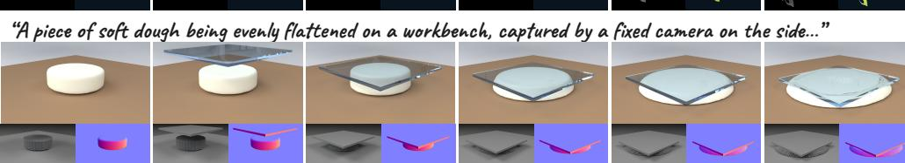
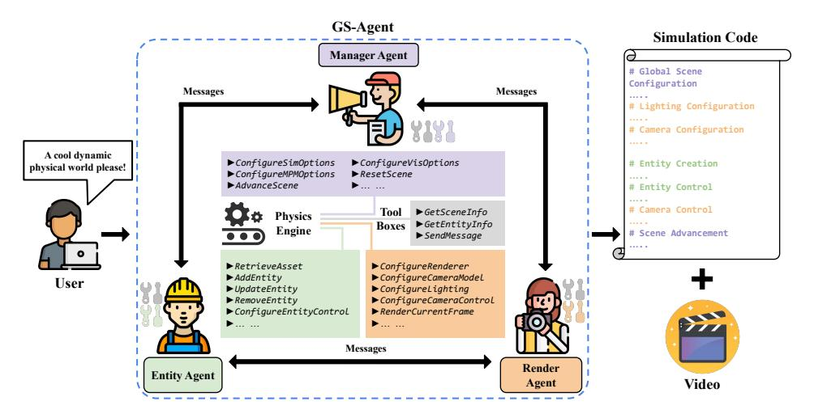
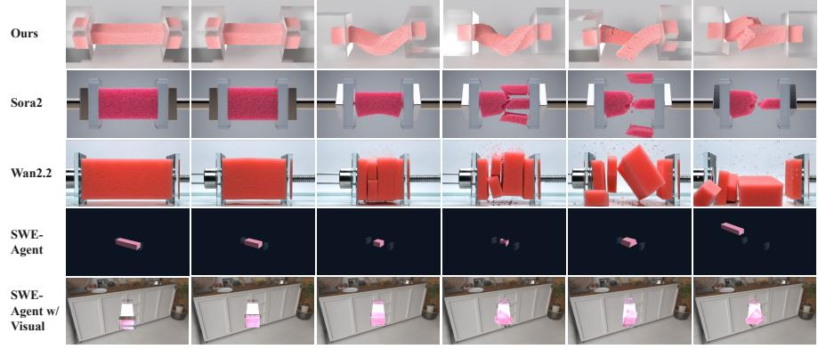
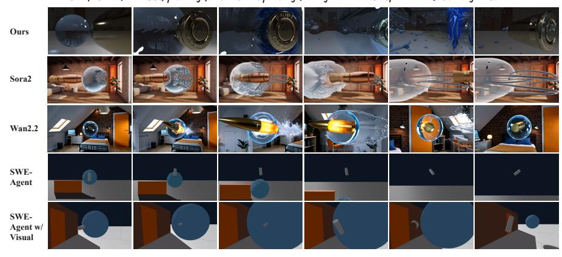
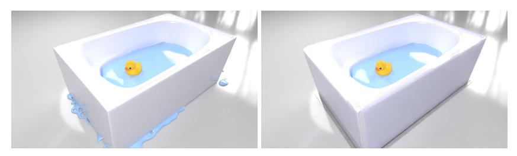
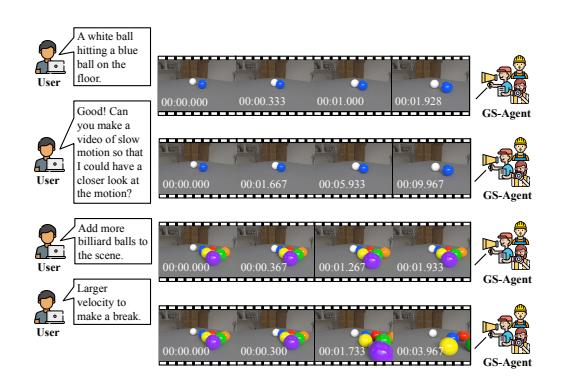
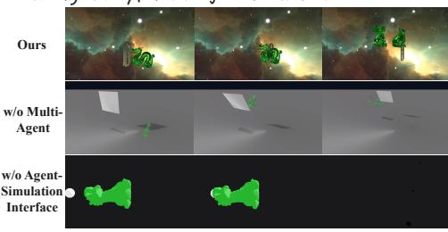
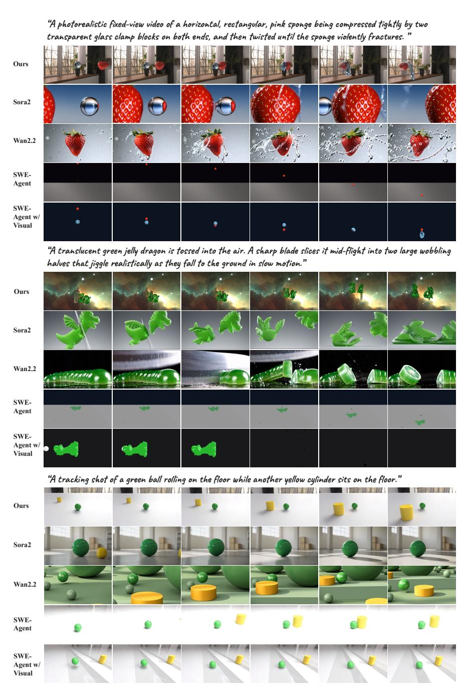
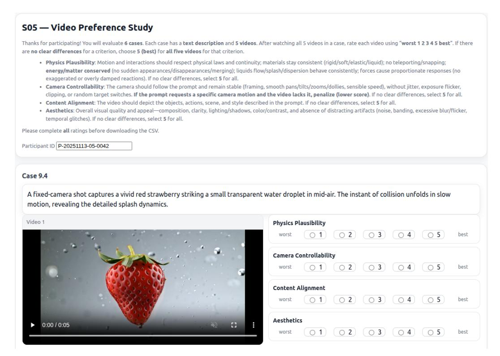

# GS-Agent: 생성적 시뮬레이션으로 4D 물리 세계 만들기 (GS-Agent: Creating 4D Physical Worlds With Generative Simulation)

- 원제: GS-Agent: Creating 4D Physical Worlds With Generative Simulation
- 원문: [https://arxiv.org/abs/2607.21522](https://arxiv.org/abs/2607.21522)
- PDF: [https://arxiv.org/pdf/2607.21522v1](https://arxiv.org/pdf/2607.21522v1)
- arXiv ID: `2607.21522`

---

# GS-Agent: 생성적 시뮬레이션으로 4D 물리 세계 만들기 (GS-Agent: Creating 4D Physical Worlds With Generative Simulation)

Hongxin Zhang1,2 , Chunru Lin1 , Junyan Li1 , Zhou Xian2 , Tsun-Hsuan Wang2 , Chuang Gan1

> 1 매사추세츠 대학교 암허스트 (University of Massachusetts Amherst) 2 Genesis AI {hongxinzhang,chunrulin,junyanli,chuangg}@umass.edu {zhouxian,johnson}@genesis-ai.company

**"하늘에서 떨어지는 농구공이 사막에 떨어져 모래 위를 굴러가는 장면…" "고정 카메라가 생생한 빨간 딸기가 작은 투명 물방울을 공중에서 맞추는 장면을 포착합니다." "따뜻하고 윤이 나는 녹은 초콜릿이 케이크 위에 천천히 뿌려지는 클로즈업…"**

Figure 1: GS-Agent는 생성적 시뮬레이션을 통해 자연어로부터 4D 세계를 만들며, 액체, 변형 가능한 물체, 그리고 강체 사이의 물리적으로 타당한 상호작용을 생성하고, 영화 같은 카메라와 조명 제어를 함께 제공합니다. GS-Agent는 픽셀 이상의 것을 생성합니다; 미세한 동역학, 깊이, 표면 법선 등 데이터 모달리티를 포함하여 더 풍부한 응용을 가능하게 합니다.

## Abstract (추상)

자연어 설명으로부터 동적이고 물리적으로 사실적인 4D 세계를 만드는 것은 매혹적이면서도 도전적입니다. 전통적인 컴퓨터 그래픽스 방법은 수작업에 의존하며, 재료, 움직임, 시각적 충실도를 미세 조정하기 위해 광범위한 인간 노력이 필요합니다. 생성적 기초 모델의 최근 발전은 대규모 데이터에서 이러한 4D 세계를 생성하는 학습에 대한 관심을 불러일으켰지만, 기존 방법은 여전히 물리적 타당성과 제어 가능성을 보장하는 데 어려움을 겪고 있습니다. 본 연구에서는 기초 모델을 활용해 인간이 전통적으로 4D 세계를 만드는 방식을 모방하면서 전체 과정을 자동화하는 다른 경로를 택합니다. 우리는 GS‑Agent를 제시합니다. 이는 물리 엔진을 루프에 통합하여 자연어로부터 사실적이고 동적이며 제어 가능한 4D 물리 세계를 생성하는 엔드‑투‑엔드 다중 에이전트 프레임워크입니다. 인간이 4D 세계를 구축하는 방식을 영감으로 삼아 GS‑Agent는 엔티티 관리, 3D 자산 선별, 재료 조정, 배치 및 모션 제어, 렌더링 구성(카메라 및 조명 조작 포함)으로 작업을 분해합니다. 서로 다른 전문성을 가진 다수의 에이전트가 코드로 물리 엔진과 상호작용하며 다중 모달 피드백을 탐색하고, 협업하여 주어진 설명과 일치하는 4D 세계를 반복적으로 구축합니다. 실험 결과는 GS‑Agent가 자연어를 다양한 물리적으로 타당한 4D 세계로 효과적으로 변환하며, 액체, 변형 가능한 물체, 강체 사이의 풍부한 상호작용을 보여주고, 영화 같은 카메라와 조명 제어를 달성함을 보여줍니다.

## 1 Introduction (서론)

동적이고 물리적으로 타당한 4D 세계를 만드는 것은 구현형 AI, 자율 주행, 게임, 영화 제작 등 다양한 분야에서 광범위한 응용 가능성을 가지고 있습니다. 다양한 사실적인 물리 환경을 구축할 수 있는 능력은 구현형 에이전트가 보다 안전하고 풍부한 설정에서 훈련되고 평가될 수 있게 하여, 배포 시 시뮬레이션-실제 차이를 좁히는 데 도움을 줍니다 [&#91;78&#93;](#page-13-0). 또한 사용자가 자연어를 통해 4D 세계를 구축하고 제어할 수 있게 함으로써 창의적 콘텐츠 제작의 장벽을 크게 낮추고, 보다 표현력 있는 스토리텔링, 풍부한 엔터테인먼트 경험, 완전히 새로운 창작 형식을 열어줍니다. 그러나 전통적인 접근 방식은 3D 자산 선별, 재료 매개변수 조정, 장면 구성, 물체 움직임 조정, 조명 설정, 카메라 궤적 설계 등에서 막대한 인간 노력을 필요로 합니다.

최근 기초 모델의 발전으로 언어 이해 [&#91;47&#93;](#page-11-0), 이미지 합성 [&#91;36,](#page-11-1) [22&#93;](#page-10-0), 비디오 생성 [&#91;5,](#page-9-0) [68,](#page-12-0) [48,](#page-11-2) [57&#93;](#page-12-1), 그리고 3D/4D 장면 생성 [&#91;71,](#page-13-1) [4&#93;](#page-9-1)이 크게 향상되었습니다. 그러나 이러한 모델은 여전히 물리적 타당성 [&#91;43,](#page-11-3) [29&#93;](#page-10-1)과 제어 가능성 [&#91;20&#93;](#page-10-2)을 갖추는 데 어려움을 겪고 있습니다. 이러한 한계는 대규모 데이터만으로 4D 세계를 학습하는 것이 일관되고 물리적으로 기반된 장면을 생성하기에 충분하지 않음을 시사합니다. 인간이 세계를 창조하는 방식을 모티브로 한 보완적 방향은 대형 언어 모델의 추론 능력을 활용하여 계획, 비판, 그리고 반복적으로 세계 생성을 정제하는 에이전트 시스템을 구축하는 것입니다. 이전 연구는 에이전트 시스템의 가능성을 보여주었습니다: [&#91;67&#93;](#page-12-2)는 GitHub 이슈를 자율적으로 해결할 수 있는 소프트웨어 엔지니어링 에이전트를 개발하고, [&#91;25&#93;](#page-10-4)는 Blender를 통해 정적 3D 장면을 제작하는 에이전트 파이프라인을 구축했습니다.

본 연구에서는 GS-Agent를 소개합니다. GS-Agent는 물리 엔진을 루프에 통합한 엔드-투-엔드 다중 에이전트 프레임워크로, 자연어 설명으로부터 직접 현실적이고 동적이며 제어 가능한 4D 물리 세계를 생성합니다. 인간의 워크플로우에서 영감을 받아 GS-Agent는 생성 과정을 두 개의 조정된 구성요소로 분해합니다: *엔티티 관리 (entity management)*, 여기에는 3D 자산 검색, 재료 조정, 객체 배치, 그리고 동작 제어가 포함되며, *렌더링 구성 (rendering configuration)*, 여기에는 카메라 조작과 조명 설계가 포함됩니다. 여러 전문 에이전트가 코드로 물리 엔진과 상호작용하고, 다중 모달 피드백을 받아, 시뮬레이션을 공동으로 정제하여 주어진 지침을 충실히 따르는 세계를 생성합니다.

GS-Agent를 유동체, 변형 물체, 그리고 강체 간의 복잡한 상호작용과 다양한 카메라 및 조명 제어가 포함된 장면에서 평가합니다. 최첨단 텍스트-투-비디오 모델(Sora2 [&#91;48&#93;](#page-11-2) 및 Wan2.2 [&#91;57&#93;](#page-12-1))과 에이전트 기반 기준(SWE-Agent [&#91;67&#93;](#page-12-2) 및 시각적 피드백이 추가된 향상된 변형)과 비교할 때, GS-Agent는 물리적 타당성이 더 높고, 지시 충실도가 강하며, 제어 가능성이 더 세밀한 4D 세계를 생성합니다. 또한, 그 에이전트 설계는 예기치 못한 실패를 완전 자율적인 방식으로 식별하고 해결할 수 있게 합니다. 우리는 GS-Agent를 4D 세계 생성의 새로운 패러다임으로 향하는 디딤돌로 envision하며, 인터랙티브 콘텐츠 제작을 가능하게 하고 대규모, 물리적으로 기반된 데이터 생성을 지원합니다. 요약하면, 우리의 기여는 세 가지입니다:

- 우리는 자연어로부터 4D 물리 세계를 생성하는 어려운 문제를, 강력한 물리 엔진과 인간의 4D 세계 구축 워크플로우를 모방한 자동화된 에이전트 프레임워크를 활용하여 해결합니다.
- 우리는 GS-Agent를 소개합니다. GS-Agent는 코드로 물리 엔진과 상호작용하고, 다중 모달 피드백을 적극적으로 탐색하며, 자연어와 일치하는 4D 세계를 공동으로 구축하는 엔드-투-엔드 다중 에이전트 프레임워크입니다.

1<https://umass-embodied-agi.github.io/gs-agent/>

• GS-Agent가 기존 텍스트-투-비디오 및 에이전트 기반 기준보다 더 물리적으로 타당하고, 제어 가능하며, 지시어 정렬된 4D 세계를 생성함을 실험 결과가 입증하며, 강력한 물리 엔진과 에이전트 프레임워크를 결합한 잠재력을 강조한다.

## 2 관련 연구 (Related Work)

### 2.1 3D 및 4D 생성 (3D and 4D Generation)

자연어로부터 3D 장면을 생성하는 것은 오랫동안 도전 과제로 남아 있다 [&#91;10&#93;](#page-9-2). 초기 연구들은 규칙 기반 언어-공간 매핑에 의존했다 [&#91;9,](#page-9-3) [&#91;42&#93;](#page-11-4), 현대 접근법은 대규모 데이터에서 3D 콘텐츠를 생성하는 방법을 학습한다 [&#91;71,](#page-13-1) [&#91;70,](#page-13-2) [&#91;14,](#page-9-4) [&#91;60,](#page-12-3) [&#91;40&#93;](#page-11-5), 주로 생성적 확산 모델 [&#91;61&#93;](#page-12-4)과 가우시안 스플래팅 [&#91;65&#93;](#page-12-5)에 의존한다. 물리적으로 타당한 움직임을 3D 장면에 통합하기 위해 많은 연구가 물리 솔버를 활용한다 [&#91;12,](#page-9-5) [&#91;4,](#page-9-1) [&#91;66,](#page-12-6) [&#91;76,](#page-13-3) [&#91;17,](#page-9-6) [&#91;58&#93;](#page-12-7). 특히 [&#91;41&#93;](#page-11-6)은 LLM을 활용해 모션 제어용 Blender 스크립트를 작성하고, 물리적으로 타당한 프레임에 조건화된 비디오를 생성한다. [&#91;32&#93;](#page-10-5)은 하이브리드 생성 시뮬레이터를 사용해 단일 이미지에서 액션-조건화된 동적 3D 장면을 생성한다. 다르게, 우리는 4D 세계를 생성하는 과정을 자동화하기 위해 엔드-투-엔드 에이전트 시스템을 구축할 것을 제안한다. 이는 시각적 생성 모델의 불안정한 일반화 문제를 겪지 않는다.

### 2.2 텍스트-투-비디오 생성 (Text-to-Video Generation)

현대 비디오 생성 모델은 주로 확산 모델 [&#91;54,](#page-12-8) [&#91;22,](#page-10-0) [&#91;5,](#page-9-0) [&#91;21,](#page-10-6) [&#91;13&#93;](#page-9-7) 또는 자기회귀 모델 [&#91;72,](#page-13-4) [&#91;30&#93;](#page-10-7)에 기반한다. Diffusion Transformer (DiT) [&#91;50,](#page-11-7) [&#91;48,](#page-11-2) [&#91;68&#93;](#page-12-0)의 도입은 데이터 규모를 늘려 비디오를 생성하는 학습의 잠재력을 더욱 입증하며, 일부 연구는 물리 사전 지식을 통합해 비디오의 물리적 현실성을 향상시킨다 [&#91;73,](#page-13-5) [&#91;41,](#page-11-6) [&#91;38&#93;](#page-11-8). 그러나 이러한 모델은 여전히 물리적 타당성 [&#91;29&#93;](#page-10-1), 제어 가능성 [&#91;20,](#page-10-2) [&#91;77&#93;](#page-13-6), 그리고 일관성 [&#91;8&#93;](#page-9-8)에 어려움을 겪는다. 우리의 방법은 물리 엔진에서 세계를 제작하여 타당한 물리 상호작용을 제공한다.

### 2.3 기초 모델 에이전트 (Foundation Model Agents)

기초 모델의 급속한 발전과 함께 강력한 에이전트가 급증했다 [&#91;47,](#page-11-0) [&#91;18&#93;](#page-10-3). 이들은 텍스트 도메인에서만 동작하는 에이전트 [&#91;19,](#page-10-8) [&#91;53&#93;](#page-11-9)부터 GUI와 상호작용할 수 있는 멀티모달 에이전트 [&#91;23,](#page-10-9) [&#91;1&#93;](#page-9-9), 물리 세계에서 로봇으로 기능하는 에이전트 [&#91;2,](#page-9-10) [&#91;26,](#page-10-10) [&#91;16&#93;](#page-9-11), 그리고 범용 에이전트 [&#91;51,](#page-11-10) [&#91;24&#93;](#page-10-11)까지 다양하다. 다중 에이전트 프레임워크는 다양한 과제에서 유망한 성능 향상을 보였다 [&#91;31,](#page-10-12) [&#91;62,](#page-12-12) [&#91;24&#93;](#page-10-11), 포함하여 구현형 AI [&#91;74&#93;](#page-13-7), 추론 [&#91;15&#93;](#page-9-12), 그리고 코드 generatoin [&#91;39&#93;](#page-11-11). 특히 [&#91;67&#93;](#page-12-2)은 실제 GitHub 이슈를 자동으로 해결할 수 있는 소프트웨어 엔지니어링 에이전트를 구축하고, [&#91;25,](#page-10-4) [&#91;56,](#page-12-13) [&#91;69,](#page-12-14) [&#91;35&#93;](#page-11-12)은 Blender, 3D 소프트웨어를 활용해 정적 3D 장면을 제작하는 에이전트를 만든다. 이와 달리, 우리는 물리 엔진을 루프에 포함시켜 자연어로부터 4D 세계를 구축할 수 있는 최초의 에이전트를 소개한다.

## 3 GS-Agent: 생성적 시뮬레이션을 포함한 다중 에이전트 프레임워크 (GS-Agent: A Multi-Agent Framework with Generative Simulation in the Loop)

Creating a 4D world is a complex, multi-stage process that typically requires coordinated effort across different areas of expertise: entity modeling, material design, spatial arrangement, motion specification, lighting setup, and camera planning. In human production pipelines, such as visual effects or game development, a director translates high-level requirements into actionable plans, delegates tasks to specialists, evaluates intermediate outputs, and coordinates iterative refinement through natural language communication. Inspired by this workflow, we introduce GS-Agent, an end-to-end multi-agent framework in which three specialized agents, the *Manager Agent*, *Entity Agent*, and *Render Agent*, collaboratively construct a physically plausible 4D world upon a physics engine, as shown in Figure [2.](#page-3-0) We first cover basic concepts of a *physics engine* in sec [3.1,](#page-3-1) then the three specialized agents: the Manager Agent handles user communication, step-by-step planning, task delegation, verification, and global simulation configuration in sec [3.2;](#page-3-2) the Entity Agent specializes in entity creation, morphology, material assignment, and motion control in sec [3.3;](#page-4-0) the Render Agent governs camera and lighting manipulation and provides visual feedback to the other agents in sec [3.4.](#page-4-1) Agents communicate with each other via a *SendMessage* tool and interact with the physics engine through structured tool interfaces. Underlying the system, all agents generate and refine executable code that interfaces with the physics engine, request multimodal feedback including physics boundary checks, program runtime information, images, and videos, communicate with each other, and iteratively improve the world until the natural language goals are satisfied. A complete list of prompts and tool interfaces is provided in Appendix [B.](#page-14-0)

Figure 2: **Overview of GS-Agent.**  
The *Manager Agent*는 자연어 설명을 해석하고, 실행 가능한 하위 작업으로 분해하며, 전역 시뮬레이션 옵션을 구성하고, 장면 진행을 제어하며, 적절한 에이전트에게 작업을 위임합니다. The *Entity Agent*는 형태학 생성용 자산을 선별하고, 공간 제약에 따라 엔티티를 배치하며, 물리적 타당성을 위해 재질 매개변수를 조정하고, 엔티티 움직임을 제어합니다. The *Render Agent*는 조명 및 카메라 설정을 조작하고, 카메라 경로를 구성하며, 비디오 녹화를 설정합니다. 에이전트는 *SendMessage* 도구를 통해 통신하고, 구조화된 도구 인터페이스를 통해 물리 엔진과 상호작용합니다. 최종 4D 세계는 실행 가능한 시뮬레이션 코드와 렌더링된 비디오로 표현됩니다. 전체 도구 설명은 부록 B에 제공됩니다.

#### 3.1 물리 엔진

물리 엔진은 동적 세계를 구축하고 시뮬레이션하기 위한 통합된 계산 프레임워크를 제공한다. 그 핵심 구성 요소는 다음과 같다:

- Entity. 엔티티 컴포넌트는 장면의 객체를 정의한다. 각 엔티티는 E = (Morph, Material, Surface)로 정의되며, Morph는 기하학(원시 형태 또는 메쉬)을 지정하고, Material은 물리적 거동(고체, 변형 가능, 액체)을 결정하며, Surface는 시각적 속성을 제어한다. 또한 초기 속도, 가해지는 힘, 운동학적 궤적, 제약 조건과 같은 제어 파라미터를 포함하여 솔버에게 완전히 지정된 객체 상태와 운동 입력을 제공한다.  
- Solver. 솔버 컴포넌트는 엔진이 물리적 역학을 계산하는 방식을 규제한다. 솔버는 엔티티 재질에 따라 선택되고 구성된다. 예를 들어, 고체 객체에는 고체-바디 솔버, 변형 가능한 객체에는 연속체 방법인 Material Point Method (MPM) [28], 유체에는 Smoothed Particle Hydrodynamics (SPH) [46]와 같은 입자 기반 솔버가 사용된다. 시간 단계와 해상도와 같은 솔버 파라미터는 안정성과 정확성을 조절하며, 엔티티의 움직임이 일관된 물리 법칙을 따르도록 보장한다.  
- **Renderer**. 렌더러 컴포넌트는 물리 시뮬레이션 결과를 화면에 표시하며, 일반적으로 물리 엔진과 별개의 시스템이다. 렌더러 파라미터에는 카메라(위치, 각도, 시야각), 조명(광원 종류, 위치, 색상, 강도) 및 그림자(품질 및 그리기 거리)가 포함된다.

#### 3.2 매니저 에이전트

작업 분해 및 위임. 자연어 설명을 주면, 매니저 에이전트는 사용자 의도를 해석하고 필요한 장면 구성 요소를 추론하며 실행 가능한 다단계 계획을 수립한다. 그 후, 엔티티 에이전트나 렌더 에이전트의 역량에 따라 한 번에 하나의 하위 작업을 할당한다. 예를 들어, 적절한 기하학 및 재질 속성을 갖는 자산 생성, 기하학적 제약 하에서의 공간 배치, 또는 원하는 영화적 효과를 위한 카메라 궤적 정제 등이 있다. 각 하위 작업이 완료되면, 매니저 에이전트는 결과를 비판적으로 검증하고 사양이 충족될 때까지 반복적인 정제를 트리거한다.

**Scene Configuration.** 매니저 에이전트는 생성 전후 모두 시뮬레이션 및 시각화 옵션을 구성한다. 전역 시뮬레이션 파라미터(예: 시간 단계, 서브스텝, 중력), 솔버별 설정(예: MPM 그리드 해상도 및 도메인 경계, SPH 입자 크기), 그리고 시각화 옵션(그림자, 배경 색상, 입자 렌더링 모드, 세분화 수준)을 설정한다.

이러한 구성은 안정적인 물리, 일관된 도메인 규모, 그리고 다운스트림 추론을 위한 명확한 시각적 진단을 보장한다.

**Timeline Control.** 구축된 세계의 진화하는 역학을 평가하기 위해, 매니저 에이전트는 시뮬레이션의 시간 진행을 조절한다. 시나리오를 앞당기거나 재설정하여 중간 상태를 탐색하고, 수정 결과를 평가하거나 다단계 롤아웃을 수행할 수 있다. 모든 구성 요소가 언어 사양을 충족하는지 확인한 뒤, 에이전트는 최종 실행을 시작하고 비디오 캡처를 트리거하여 완성된 4D 세계를 생성한다.

## 3.3 엔티티 에이전트

**3D Model Asset Retrieval.** 현실적인 엔티티를 구성하기 위해, 엔티티 에이전트는 먼저 텍스트와 이미지 임베딩으로 구축된 의미 인덱스를 사용해 선별된 라이브러리(BlenderKit2 및 PolyHaven3)에서 자산을 검색한다. 쿼리 임베딩은 텍스트 인코더와 CLIP [52]를 사용해 생성되며, 연결(concatenated) 및 정규화(normalized)된 뒤 사전 계산된 메타데이터와 다중 뷰 이미지 임베딩에 대해 검색된다. 리트리버는 다운스트림 생성에 유용한 정보를 포함한 상위 후보를 반환한다: 로컬 파일 경로, 짧은 설명, 미리보기 이미지, 매치 점수, 그리고 축 정렬 경계.

**3D 모델 자산 생성.** 에이전트가 요구 사항을 충족하는 적절한 3D 모델 자산을 검색하지 못하면, Meshy [44] (텍스트-투-3D 모델)를 호출하여 3D 모델 자산을 생성하고, 자산의 동일한 메타데이터를 계산하여 선별된 자산 라이브러리에 저장합니다. 생성 결과를 바탕으로 에이전트는 텍스트 쿼리를 적절히 조정할 수 있습니다. 최대 실패 횟수에 도달하면, 에이전트는 필요한 형태를 구성하기 위해 프리미티브를 사용하도록 후퇴합니다.

**엔티티 배치.** 3D 모델 자산 메타데이터를 기반으로 엔티티 에이전트는 타당한 스케일, 방향, 위치를 계산합니다. 엔티티 에이전트는 정규화된 방향을 사용해 자산을 정렬하고, AABB 경계에서 메쉬를 재스케일링하며, 휴지면, 비침투, 적절한 간격과 같은 세계 공간 제약을 만족하도록 배치합니다. 엔티티 에이전트는 장면 상태를 조회하고 렌더 에이전트에게 시각적 피드백을 요청합니다; 정렬 불일치나 충돌이 감지되면, 정정하고 반복합니다.

물리적으로 타당한 재료 조정. 물리 재료 매개변수 조정은 악명 높게 어렵고 비전문가에게는 종종 비현실적입니다 [37]. 잘못 구성된 매개변수는 비현실적이거나 불안정한 시뮬레이션을 초래할 수 있습니다. 엔티티 에이전트는 상식적 선험을 사용해 재료 선택을 초기화한 뒤, 물리 엔진의 실제 물리 피드백을 기반으로 매개변수를 반복적으로 정제합니다. 연속체 재료를 예로 들면, 엔티티 에이전트는 시뮬레이션에서 나타난 실제 변형 정도에 따라 영률, 포아송 비율, 항복 응력(플라스틱성용)을 조정합니다. 또한, 엔티티별 재료 매개변수를 솔버 제약(예: MPM 그리드 크기, SPH 입자 반경)과 정렬하여 안정적인 해상도 스케일을 유지합니다.

**엔티티 움직임.** 엔티티 에이전트는 시뮬레이션 중에 실행되는 단계별 제어 함수를 편집하여 움직임을 제어합니다. 지원되는 제어 방식에는 PD 컨트롤러, 강체에 대한 직접 위치/속도/힘 명령, 입자 기반 재료용 프로그래머블 방출기가 포함됩니다. 이 인터페이스를 통해 동일한 시뮬레이션 타임라인 내에서 운동학적 궤적과 일시적인 입자 이벤트를 스크립팅할 수 있습니다.

### 3.4 렌더 에이전트 (Render Agent)

**카메라 위치 지정.** 렌더 에이전트는 중간 검사와 최종 렌더링을 위해 카메라 배치와 내부 파라미터를 결정합니다. 특정 시점이나 프레이밍 요청과 같은 구두 지시를 세계 좌표계에 기반해 해석합니다. 필요 시, 에이전트는 엔티티의 공간 상태(예: 위치 및 범위)를 조회하여 요청된 시각적 관점과 일치하도록 카메라를 배치합니다.

카메라 움직임 및 비디오 캡처. 시간적으로 일관된 시각화를 생성하기 위해 렌더 에이전트는 시뮬레이션 전반에 걸쳐 실행되는 명시적 제어 코드로 카메라 움직임을 나타냅니다. 이 코드는 카메라 궤적(예: 궤도, 돌리 이동, 엔티티 추적 움직임)과 해당 프레임 캡처 일정을 지정합니다. 궤적이 픽셀에 베이크되는 것이 아니라 코드로 표현되므로, 예를 들어 부드럽게 하거나 재매개화하여 물리 시뮬레이션을 변경하지 않고도 추가 정제할 수 있습니다. 카메라 업데이트는 시뮬레이션 타임스텝과 동기화되어 기록된 프레임이 물리적으로 일관된 시간적 진화를 반영하도록 보장합니다. 조명. 렌더 에이전트는 장면의 서술적 요구 사항을 충족하면서 시각적 및 물리적 일관성을 유지하도록 조명을 구성합니다. 렌더링 백엔드에 따라 방향광, 환경 맵, 또는 로컬 광원을 채택할 수 있습니다. 에이전트는 요청된 분위기나 강조를 달성하기 위해 조명 배치와 강도를 조정하며, 가시적인 광원 발광기나 불일치한 조명과 같은 아티팩트를 피합니다. 이를 통해 생성된 장면이 의도된 조명 조건을 안정적이고 해석 가능한 방식으로 반영할 수 있습니다.

&lt;sup>2https://www.blenderkit.com/

3https://polyhaven.com/

**"수평, 직사각형, 분홍색 스폰지가 양쪽 끝에 투명 유리 클램프 블록에 의해 단단히 압축되고, 그 다음 스폰지가 격렬하게 파열될 때까지 비틀리는 사실적인 고정 뷰 비디오."**

**"대형 물구체를 공중에 떠 있는 물구체를 뚫는 총알의 고해상도 CGI 시뮬레이션. 극도로 느린 모션으로 촬영되며, 총알이 입장할 때 물보라를 만들고 통과할 때 캐비테이션 트레일을 생성한다. 카메라는 총알을 따라가며 앞으로 밀어 물구체를 통과하면서 분해된다."**

Figure 3: GS-Agent와 기준 방법 간의 정성적 비교. 추가 사례는 부록 [C.](#page-16-0)에서 제시된다.

## 4 Experiments (실험)

### 4.1 Experimental Setup (실험 설정)

GS-Agent가 4D 물리 세계를 구축하는 능력을 체계적으로 평가하기 위해, 우리는 두 개의 평가 세트를 통해 실험을 수행한다. 첫 번째 세트는 NewtonGen 벤치마크 [&#91;73&#93;](#page-13-5)에서 24개의 장면으로 구성되며, 이는 12개의 서로 다른 물리 법칙(예: 포물선 운동, 변형)을 테스트하도록 특별히 설계되었다. 우리의 방법이 열어준 새로운 기능을 평가하기 위해, 우리는 다중 객체 상호작용(예: 충돌)과 동적 카메라 제어를 포함한 비연속 동역학을 특징으로 하는 30개의 복잡한 장면으로 구성된 두 번째 세트를 수집했다.

Metrics. NewtonGen 벤치마크는 물리적 불변성 점수(Physical Invariance Score, PIS)를 보고하며, 이는 이론적으로 불변인 물리량(예: 포물선 운동 중 수직 가속도)의 상대 표준 편차를 측정한다. 원본 논문은 SAM2를 사용해 프레임마다 객체를 분할하고 중심점을 근사하여 이 계산(비디오-PIS)을 수행하지만, 우리의 에이전트-시뮬레이션 프레임워크는 보다 엄밀한 지표를 독자적으로 제공한다. 우리는 물리 엔진에서 매 타임스텝마다 정확한 3D 질량 중심 동역학을 직접 추출해 State-PIS를 계산한다. 이 진위 측정은 픽셀 데이터만 출력하는 표준 텍스트-투-비디오 모델에서는 본질적으로 접근할 수 없다. 또한 Perception Encoder 특징 유사도 [&#91;7&#93;](#page-9-13)를 사용해 생성된 비디오와 텍스트 지침 간의 정렬 점수(Alignment Score)를 측정하고, VBench [&#91;27&#93;](#page-10-14)에서 제공하는 미적 지표를 채택한다.

Baselines. 우리는 우리의 방법을 두 가지 유형의 기준과 비교한다: 텍스트-투-비디오 생성 모델과 작업을 해결하기 위해 코드를 작성할 수 있는 기초 에이전트. 텍스트-투-비디오 생성 모델의 경우, 우리는 대표적인 폐쇄형 및 오픈형 최첨단 모델인 *Sora-2* [&#91;48&#93;](#page-11-2)와 *Wan2.2* [&#91;57&#93;](#page-12-1)을 비교한다. 기초 에이전트의 경우, 소프트웨어 엔지니어링 작업을 위한 잘 확립된 에이전트 프레임워크인 *SWE-Agent* [&#91;67&#93;](#page-12-2)를 비교한다. SWE-Agent는 본래 시각 기능이 없으므로, 우리는

Table 1: **Main results.** 우리는 24개의 NewtonGen 장면에 대한 평균 PIS와 30개의 장면에 대한 정렬 점수 및 미적 지표를 보고하며, 가장 높은 값은 **굵게**, 두 번째 높은 값은 밑줄로 표시된다.

| 방법 | Video-PIS | State-PIS | 정렬 점수 | 미학 |
|---------------------|-----------|-----------|--------------------|-------------|
| Sora2 [48] | 0.62 | - | 30.6 | <u>48.5</u> |
| Wan2.2 [57] | 0.46 | - | 29.8 | 58.1 |
| SWE-Agent [67] | 0.41 | 0.44 | 25.8 | 42.0 |
| SWE-Agent w/ Visual | 0.49 | 0.57 | 26.8 | 44.6 |
| GS-Agent (Ours) | 0.71 | 0.83 | 32.2 | 47.6 |

표 2: **사용자 연구 결과.** 각 방법의 평균 점수를 270개의 유효 응답에 대해 보고한다.

| 방법 | 물리적 타당성 | 카메라 제어 가능성 | 콘텐츠 정렬 | 미학 |
|---------------------|--------------------------|---------------------------|----------------------|-------------|
| Sora2 [48] | 4.01 | 3.92 | 4.65 | 4.18 |
| Wan2.2 [57] | 2.72 | 3.49 | 4.45 | 3.71 |
| SWE-Agent [67] | 3.18 | 3.49 | 3.40 | 2.40 |
| SWE-Agent w/ Visual | 3.25 | 3.96 | 3.72 | 2.44 |
| GS-Agent(우리) | 4.33 | 4.32 | 4.70 | <u>3.86</u> |

SWE-Agent w/ Visual, 비전-언어 모델(VLM) 도구를 장착한 변형으로, 생성된 비디오에 시각적 피드백을 제공한다.

**Implementation Details.** 우리는 Genesis [3]을 기반 물리 엔진으로 사용하며, 다양한 재료를 시뮬레이션하고 빠르고 사진과 같은 렌더링 시스템을 활용한다. 별도로 명시되지 않는 한, 우리는 gpt-5를 우리 방법과 기준선 모두의 기초 모델 백본으로 사용한다. 공정한 비교를 위해 모든 출력은 기준선 비디오 생성 모델의 제약을 맞추기 위해 720p 해상도로 렌더링한다. GS-Agent는 본질적으로 훨씬 높은 해상도로 렌더링을 지원한다.

### 4.2 Main Results

기준선과의 비교. 정성적 비교는 Figure 3에, 정량적 결과는 Table 1에 상세히 제시된다. 전반적으로 GS-Agent는 자연어 프롬프트와 보다 충실히 정렬될 뿐만 아니라 물리적 타당성에서도 우수한 비디오를 생성한다. 텍스트-투-비디오 확산 모델은 종종 텍스트 지침을 표면적으로 따르면서 기본 물리 원칙을 위반한다. 예를 들어, 스폰지 파손 시나리오에서 이 모델들은 갑작스럽고 비현실적인 파손 메커니즘을 환각한다. 그들의 생성 과정이 순전히 텍스트-조건화된 픽셀 분포에 의해 구동되기 때문에 시각적으로 매력적인 프레임을 제공하지만 시간적 일관성을 유지하거나 물리 법칙을 준수하지 못한다. 물방울 구체를 관통하는 총알 사례에서 Sora2는 문자 그대로이지만 물리적으로 부정확한 "cavitation trail"을 생성하고, Wan2.2는 총알이 구체를 통과하면서 실제적인 유체 분해 없이 비디오를 생성한다. 또한, 180° 카메라 회전 후에도 동일하게 남아 있는 정적 배경 베드와 같은 불일치가 진정한 3D 장면 추론의 부재를 강조한다. 한편, SWE-Agent와 그 변형은 물리적으로 타당한 결과를 생성하지만 종종 텍스트 지침을 완전히 충족하지 못해 시뮬레이션 코드와 정확한 재료 매개변수, 고품질 렌더링을 동시에 구성하는 어려움을 드러낸다. 반면, GS-Agent는 물리적 사실성, 지침 충실도, 시각적 일관성을 성공적으로 균형 잡아 물리-인-루프, 다중 에이전트 설계를 검증한다.

**Human evaluators prefer GS-Agent.** 물리적 타당성 [45, 75], 카메라 제어성 [33], 그리고 내용 정렬의 자동화된 평가는 아직 열려 있는 연구 과제이다. 보다 견고한 평가를 제공하기 위해 우리는 15명의 참가자를 대상으로 사용자 연구를 수행했다. 피험자들은 우리 방법과 기준선이 생성한 다섯 개의 무작위 순서 비디오를 5점 리커트 척도로 *physical plausibility, camera controllability, Content Alignment*, 그리고 *aesthetics* 측면에서 평가하도록 지시받았다. 270개의 유효 응답(표 2)을 기반으로 인간 평가자는 물리적 타당성, 카메라 제어성, 내용 정렬에서 GS-Agent가 생성한 비디오를 강하게 선호했으며, 순수한 미학에서는 우리 방법이 최첨단 폐쇄형 모델에 약간 뒤처졌다. 연구 프로토콜 및 인터페이스에 대한 추가 세부 사항은 Appendix C.2에 제공된다.

### 4.3 Emergent Capabilities

**Autonomous error detection and recovery.** 유연한 엔드‑투‑엔드 에이전트 설계 덕분에 GS-Agent는 일반적으로 인간 개입이 필요한 예기치 않은 생성 실패를 자율적으로 감지하고 해결할 수 있다. 이러한 엣지 케이스에 대한 견고한 규칙을 수작업으로 만드는 것은 대부분 비현실적이다. Figure 4에 보여진 바와 같이, 가져온 3D 욕조 자산이 완벽히 방수되지 않아 발생한

Figure 4: Autonomous error recovery. GS-Agent는 누수되는 3D 자산을 자동으로 감지하고 인간 개입 없이 모서리에 강체 재료 패치를 적용한다.

**"투명한 녹색 젤리 드래곤이 공중으로 던져집니다. 날카로운 칼날이 비행 중간에 그를 두 개의 크게 흔들리는 절반으로 자르며, 그 절반은 실제처럼 흔들리며 느린 동작으로 지상으로 떨어집니다."**

Figure 5: 세밀한 제어 가능성. 사용자는 자연어를 통해 GS-Agent와 상호작용하여 렌더링 효과를 조정할 수 있다 (*예: 슬로우 모션*), 엔티티를 생성할 수 있다 (*예: 당구공을 더 추가*), 그리고 엔티티 움직임을 제어할 수 있다 (*예: 브레이크 시 속도 증가*).

Figure 6: 프레임워크 구성요소 제거. 다중 에이전트 설계를 제거하면 장면이 불완전해지고, 전문 에이전트-시뮬레이터 인터페이스를 제거하면 모델이 안정적인 시뮬레이션 코드를 생성하는 데 어려움을 겪는다.

물 누수, GS-Agent는 물리학 실패를 인식하고 기하학의 모서리에 강체 재료 패치를 적용하여 프로그래밍적 수정을 제안하고, 자동으로 수정된 출력을 검증했다. 이는 시스템이 예기치 못한 시뮬레이션 상태에 지능적으로 디버그하고 적응할 수 있는 능력을 강조한다.

세밀한 제어 가능성. Figure [5,](#page-7-1) 에서 보여지듯이 사용자는 자연어를 사용해 GS‑Agent가 생성한 4D 세계를 직관적으로 조작할 수 있다. 명령은 카메라 궤적을 지정하고, 새로운 엔티티를 생성하거나, 속도와 같은 물리적 매개변수를 정밀하게 조정할 수 있다. 이러한 세밀한 제어 수준은 복잡한 콘텐츠 제작의 장벽을 크게 낮추고 동적 시각적 스토리텔링을 촉진한다.

### 4.4 Ablation and Backbone Analysis (제거 및 백본 분석)

다중 에이전트 설계의 효능. 우리는 제안한 아키텍처를 모든 도구 접근을 단일 거대 에이전트로 통합하여 제거한다. Table [4](#page-8-0)와 Figure [6,](#page-7-1)에서 보듯이 다중 에이전트 설계는 세계 생성 파이프라인을 전문 서브태스크로 분해함으로써 현저히 우수한 성능을 달성한다. 각 에이전트를 잘 정의된 컨텍스트에 제한하면 프롬프트 산만을 줄이고 도구 오용을 최소화하여 보다 신뢰할 수 있는 추론과 실행을 이끈다. [31]의 결과와 일치하게, 다중 에이전트 시스템은 논리 추론을 위한 사용 가능한 컨텍스트 윈도우를 효과적으로 확장하여 고급 작업 해결 능력을 열어준다.

전문 에이전트-시뮬레이터 인터페이스의 중요성. 인터페이스의 영향을 고립시키기 위해 우리는 GS-Agent를 *SWE-Agent w/ Visual* 기준선과 비교한다. 일반 물리 시뮬레이터 API는 전통적으로 인간 전문가를 위해 설계되었으며, 이러한 방대한 저수준 액션 공간을 자율 에이전트에 직접 노출하면 종종 문법 오류, 치명적인 파라미터 선택, 또는 물리 엔진 충돌이 발생한다. 원시 시뮬레이터 동작을 구조화되고 의미 있는 도구로 추상화함으로써, 우리의 인터페이스는 에이전트 행동을 제한하면서도 창의적 표현력을 보존하여, 안정적이고 물리적으로 정확한 세계 생성을 직접적으로 이끈다.

Table 3: **다양한 백본에 따른 성능**. GS-Agent는 다양한 백본에서 잘 동작한다.

| 모델 | 상태 PIS | 정합 점수 | 미학 |
|--------------|--------------|--------------------|-----------|
| gpt-5 | 0.83 | 29.9 | 47.6 |
| gemini-3-pro | 0.81 | 28.2 | 45.7 |
| Qwen3.5-27B | 0.62 | 27.1 | 45.3 |

표 4: Ablation study results.

| 방법 | 상태 PIS | 정렬 점수 | 미학 |
|-------------------------|--------------|--------------------|-----------|
| GS-Agent | 0.83 | 29.9 | 47.6 |
| Multi-Agent 없이 | 0.42 | 27.9 | 47.3 |
| Agent-Sim Interface 없이 | 0.57 | 26.8 | 44.6 |

**LLM 백본 전반에 걸친 견고성.** 우리는 gemini-3-pro와 오픈-웨이트 Qwen3.5-27B 모델을 활용해 프레임워크를 평가했다. Table 3에 상세히 나와 있듯이 GS-Agent는 다양한 백본에서도 성공적으로 동작한다. 소형 Qwen3.5-27B는 엄격한 공간 추론과 동적 비디오 이해가 요구되기 때문에 예상되는 성능 저하를 겪지만, 전체 파이프라인은 그대로 유지된다. 우리는 프레임워크 성능이 오픈-웨이트 기반 모델의 급속한 진화와 자연스럽게 확장될 것이라고 예상한다.

## 5 Discussions

**GS-Agent는 비디오 이상의 것을 생성한다.** 우리의 정량적 지표는 렌더링된 비디오 출력에 초점을 맞추지만, **GS-Agent**는 근본적으로 멀티모달 4D 환경을 구축한다. 이는 메트릭 깊이 맵, 정밀 세분화 마스크, 표면 법선, 입자 수준 동역학 등 풍부하고 정렬된 데이터 구조를 자연스럽게 제공한다. 최종 출력이 실행 가능한 시뮬레이션 스크립트이기 때문에, 로봇 구현체와 원활하게 통합되어 다운스트림 강화 학습 및 평가에 활용될 수 있다. 따라서 GS-Agent는 단순한 비디오 생성기가 아니라, 구현된 데이터 합성을 위한 엔진으로서 기능한다.

물리적 및 시간적 일관성 보장. 공간-시간 일관성을 유지하는 것은 *Genie3* [49]와 같은 인터랙티브 월드 모델을 개발하는 데 있어 중요한 병목 현상이다. 순수 확산 모델은 장기적인 시점에서 기하학적 일관성을 유지하는 데 어려움을 겪는다 [64], 반면 우리의 방법론은 결정론적 물리 엔진에서 실행되는 절차적 코드에 월드 구성을 기반으로 한다. 이 접근 방식은 기하학, 움직임, 물질 상호작용의 내부 일관성을 수학적으로 보장하여, 향후 제어 가능한 월드 모델을 위한 견고한 기반을 제공한다.

### 5.1 Limitations

현재 시뮬레이션 기술의 제약. 실제 세계를 정확하고 효율적으로 시뮬레이션하는 것은 여전히 개방형 과제이다 [6]. 현대 그래픽 및 물리 시뮬레이션 알고리즘의 충실도와 확장성은 본 방법의 성능 한계를 본질적으로 제한한다. 그럼에도 불구하고, 현재의 시뮬레이션 도구만으로도 인간은 이미 현대 게임과 영화에서 볼 수 있는 것처럼 매우 복잡한 4D 세계를 제작할 수 있다, 다만 광범위한 수작업이 필요하다. 우리의 연구는 이 과정을 자동화하고 그래픽 및 시뮬레이션의 지속적인 발전을 활용하여, 확장 가능하고 물리적으로 기반을 둔 세계 생성을 위한 유망한 경로를 제시한다 [11].

기초 모델의 시네마틱 이해에 대한 한계. 우리의 방법은 기초 모델의 자기 비판 능력, 특히 생성된 장면이 예상되는 움직임과 일관된 시네마틱 표현을 보이는지 평가하는 능력에 의존한다. GPT-5와 같은 고급 모델은 이 분야에서 눈에 띄는 개선을 보여주었지만, 여전히 완벽에 이르지 못한다 [29, 34]. 움직임 및 시네마틱 이해의 지속적인 진전 [45, 33]은 우리 프레임워크가 정밀하고 물리적으로 일관되며 미학적으로 풍부한 세대를 생성하는 능력을 더욱 향상시킬 것이다.

## 6 Conclusion

본 연구에서는 GS-Agent를 제시하였다. GS-Agent는 물리 엔진을 루프에 통합하여 자연어로부터 동적이고 물리적으로 그럴듯한 4D 세계를 생성하는 다중 에이전트 프레임워크이다. GS-Agent는 실행 가능한 코드를 통해 물리 엔진과 상호작용하며, 다중 모달 피드백을 적극적으로 탐색하고, 다른 에이전트와 협력하여 일관되고 제어 가능한 세계를 반복적으로 구축한다. 실험 결과는 GS-Agent가 물리적으로 그럴듯한 세계를 생성하고 기존 방법보다 정밀한 제어 가능성을 제공함을 입증한다. 앞으로 우리는 이 접근법을 대규모, 인터랙티브, 일관된 세계 시뮬레이터를 구축하기 위한 기반으로 envision하며, 생성 모델, 구현 지능, 물리 기반 시뮬레이션 사이의 격차를 메워 확장 가능한 멀티모달 데이터 생성 및 새로운 경험 형식을 위한 길을 열어갈 것이다.

## References

- [1] S. Agashe, K. Wong, V. Tu, J. Yang, A. Li, and X. E. Wang. Agent s2: 컴퓨터 사용 에이전트를 위한 구성적 일반화-전문화 프레임워크. *arXiv 사전 인쇄 (arXiv preprint) arXiv:2504.00906*, 2025.

- [2] M. Ahn, A. Brohan, N. Brown, Y. Chebotar, O. Cortes, B. David, C. Finn, K. Gopalakrishnan, K. Hausman, A. Herzog, et al. 내가 할 수 있는 대로, 내가 말하는 대로가 아니라: 로봇의 가능성에 언어를 기반화. *arXiv 사전 인쇄 (arXiv preprint) arXiv:2204.01691*, 2022.

- [3] G. Authors. Genesis: 로봇 공학 및 그 이상을 위한 생성적이고 보편적인 물리 엔진, 2024년 12월.

- [4] S. Bahmani, I. Skorokhodov, V. Rong, G. Wetzstein, L. Guibas, P. Wonka, S. Tulyakov, J. J. Park, A. Tagliasacchi, and D. B. Lindell. 4d-fy: 하이브리드 스코어 디스틸레이션 샘플링을 이용한 텍스트-투-4D 생성. *IEEE 컴퓨터 비전 및 패턴 인식 회의 (CVPR)*, 2024.

- [5] A. Blattmann, T. Dockhorn, S. Kulal, D. Mendelevitch, M. Kilian, D. Lorenz, Y. Levi, Z. English, V. Voleti, A. Letts, et al. 안정적인 비디오 디퓨전: 잠재 비디오 디퓨전 모델을 대규모 데이터셋에 확장. *arXiv 사전 인쇄 (arXiv preprint) arXiv:2311.15127*, 2023.

- [6] A. Boeing and T. Braunl. 실시간 물리 시뮬레이션 시스템 평가. In *호주 및 동남아시아에서의 컴퓨터 그래픽 및 인터랙티브 기술에 관한 제5회 국제 회의 논문집 (Proceedings of the 5th international conference on Computer graphics and interactive techniques in Australia and Southeast Asia)*, pages 281–288, 2007.

- [7] D. Bolya, P.-Y. Huang, P. Sun, J. H. Cho, A. Madotto, C. Wei, T. Ma, J. Zhi, J. Rajasegaran, H. Rasheed, et al. 지각 인코더: 최상의 시각 임베딩은 네트워크 출력에 있지 않다. *arXiv 사전 인쇄 (arXiv preprint) arXiv:2504.13181*, 2025.

- [8] J. Bruce, M. D. Dennis, A. Edwards, J. Parker-Holder, Y. Shi, E. Hughes, M. Lai, A. Mavalankar, R. Steigerwald, C. Apps, et al. Genie: 생성적 인터랙티브 환경. In *제41회 국제 기계 학습 회의 (ICML)*, 2024.

- [9] A. Chang, W. Monroe, M. Savva, C. Potts, and C. D. Manning. 풍부한 어휘 기반을 갖춘 텍스트-투-3D 장면 생성. *arXiv 사전 인쇄 (arXiv preprint) arXiv:1505.06289*, 2015.

- [10] A. Chang, M. Savva, and C. D. Manning. 텍스트-투-3D 장면 생성을 위한 공간 지식 학습. In *2014년 경험적 언어 처리 방법 회의 논문집 (EMNLP)*, pages 2028–2038, 2014.

- [11] A. H. Chen, J. Hsu, Z. Liu, M. Macklin, Y. Yang, and C. Yuksel. 오프셋 기하학적 접촉. *ACM 그래픽스 논문집 (TOG)*, 44(4):1–21, 2025.

- [12] B. Chen, H. Jiang, S. Liu, S. Gupta, Y. Li, H. Zhao, and S. Wang. Physgen3d: 단일 이미지에서 미니어처 인터랙티브 세계 제작. In *컴퓨터 비전 및 패턴 인식 회의 논문집*, pages 6178–6189, 2025.

- [13] H. Chen, Y. Zhang, X. Cun, M. Xia, X. Wang, C. Weng, and Y. Shan. Videocrafter2: 고품질 비디오 디퓨전 모델을 위한 데이터 제한 극복. In *IEEE/CVF 컴퓨터 비전 및 패턴 인식 회의 논문집*, pages 7310–7320, 2024.

- [14] J. Chung, S. Lee, H. Nam, J. Lee, and K. M. Lee. Luciddreamer: 도메인-프리 3D 가우시안 스플래팅 장면 생성. *arXiv 사전 인쇄 (arXiv preprint) arXiv:2311.13384*, 2023.

- [15] Y. Du, S. Li, A. Torralba, J. B. Tenenbaum, and I. Mordatch. 다중 에이전트 토론을 통한 언어 모델의 사실성 및 추론 향상. In *제41회 국제 기계 학습 회의 (ICML)*, 2023.

- [16] Y. Du, M. Yang, P. Florence, F. Xia, A. Wahid, B. Ichter, P. Sermanet, T. Yu, P. Abbeel, J. B. Tenenbaum, et al. 비디오 언어 계획. *arXiv 사전 인쇄 (arXiv preprint) arXiv:2310.10625*, 2023.

- [17] N. Gillman, C. Herrmann, M. Freeman, D. Aggarwal, E. Luo, D. Sun, and C. Sun. Force prompting: 비디오 생성 모델이 물리 기반 제어 신호를 학습하고 일반화할 수 있다. In *신경 정보 처리 시스템 제39회 연례 회의 (Neural Information Processing Systems)*, 2007.

- [18] D. Guo, D. Yang, H. Zhang, J. Song, R. Zhang, R. Xu, Q. Zhu, S. Ma, P. Wang, X. Bi, et al. Deepseek-r1: 강화 학습을 통한 LLM의 추론 능력 유도 (Incentivizing reasoning capability in llms via reinforcement learning). *arXiv preprint arXiv:2501.12948*, 2025.

- [19] I. Gur, H. Furuta, A. Huang, M. Safdari, Y. Matsuo, D. Eck, and A. Faust. 실생활 웹 에이전트: 계획, 장기 컨텍스트 이해 및 프로그램 합성 (A real-world webagent with planning, long context understanding, and program synthesis). *arXiv preprint arXiv:2307.12856*, 2023.

- [20] H. He, Y. Xu, Y. Guo, G. Wetzstein, B. Dai, H. Li, and C. Yang. Cameractrl: 텍스트-투-비디오 생성에서 카메라 제어 가능 (Enabling camera control for text-to-video generation). *arXiv preprint arXiv:2404.02101*, 2024.

- [21] J. Ho, W. Chan, C. Saharia, J. Whang, R. Gao, A. Gritsenko, D. P. Kingma, B. Poole, M. Norouzi, D. J. Fleet, et al. Imagen video: 디퓨전 모델을 이용한 고화질 비디오 생성 (High definition video generation with diffusion models). *arXiv preprint arXiv:2210.02303*, 2022.

- [22] J. Ho, A. Jain, and P. Abbeel. Denoising diffusion probabilistic models: 노이즈 제거 디퓨전 확률 모델 (Denoising diffusion probabilistic models). *Advances in neural information processing systems*, 33:6840–6851, 2020.

- [23] W. Hong, W. Wang, Q. Lv, J. Xu, W. Yu, J. Ji, Y. Wang, Z. Wang, Y. Dong, M. Ding, et al. Cogagent: GUI 에이전트를 위한 시각 언어 모델 (A visual language model for gui agents). In *Proceedings of the IEEE/CVF Conference on Computer Vision and Pattern Recognition*, pages 14281–14290, 2024.

- [24] M. Hu, Y. Zhou, W. Fan, Y. Nie, B. Xia, T. Sun, Z. Ye, Z. Jin, Y. Li, Q. Chen, et al. Owl: 일반 다중 에이전트 지원을 위한 최적화된 인력 학습 (Optimized workforce learning for general multi-agent assistance in real-world task automation). *arXiv preprint arXiv:2505.23885*, 2025.

- [25] Z. Hu, A. Iscen, A. Jain, T. Kipf, Y. Yue, D. A. Ross, C. Schmid, and A. Fathi. Scenecraft: Blender 코드를 이용한 3D 장면 합성을 위한 LLM 에이전트 (An llm agent for synthesizing 3d scenes as blender code). In *Forty-first International Conference on Machine Learning*, 2024.

- [26] W. Huang, C. Wang, R. Zhang, Y. Li, J. Wu, and L. Fei-Fei. Voxposer: 언어 모델을 활용한 로봇 조작용 조합 가능한 3D 가치 맵 (Composable 3d value maps for robotic manipulation with language models). In *Conference on Robot Learning*, pages 540–562. PMLR, 2023.

- [27] Z. Huang, Y. He, J. Yu, F. Zhang, C. Si, Y. Jiang, Y. Zhang, T. Wu, Q. Jin, N. Chanpaisit, et al. Vbench: 비디오 생성 모델을 위한 종합 벤치마크 스위트 (Comprehensive benchmark suite for video generative models). In *Proceedings of the IEEE/CVF Conference on Computer Vision and Pattern Recognition*, pages 21807–21818, 2024.

- [28] C. Jiang, C. Schroeder, J. Teran, A. Stomakhin, and A. Selle. 연속체 물질 시뮬레이션을 위한 물질점법 (The material point method for simulating continuum materials). In *Acm siggraph 2016 courses*, pages 1–52. 2016.

- [29] B. Kang, Y. Yue, R. Lu, Z. Lin, Y. Zhao, K. Wang, G. Huang, and J. Feng. 비디오 생성이 세계 모델에서 얼마나 떨어져 있는가: 물리 법칙 관점 (How far is video generation from world model: A physical law perspective). *arXiv preprint arXiv:2411.02385*, 2024.

- [30] D. Kondratyuk, L. Yu, X. Gu, J. Lezama, J. Huang, G. Schindler, R. Hornung, V. Birodkar, J. Yan, M.-C. Chiu, et al. Videopoet: 제로샷 비디오 생성을 위한 대형 언어 모델 (A large language model for zero-shot video generation). *arXiv preprint arXiv:2312.14125*, 2023.

- [31] G. Li, H. Hammoud, H. Itani, D. Khizbullin, and B. Ghanem. Camel: 대형 언어 모델 사회의 '마음' 탐색을 위한 커뮤니케이션 에이전트 (Communicative agents for" mind" exploration of large language model society). *Advances in Neural Information Processing Systems*, 36:51991–52008, 2023.

- [32] Z. Li, H.-X. Yu, W. Liu, Y. Yang, C. Herrmann, G. Wetzstein, and J. Wu. Wonderplay: 단일 이미지와 동작으로부터 동적 3D 장면 생성 (Dynamic 3d scene generation from a single image and actions). *arXiv preprint arXiv:2505.18151*, 2025.

- [33] Z. Lin, S. Cen, D. Jiang, J. Karhade, H. Wang, C. Mitra, T. Ling, Y. Huang, S. Liu, M. Chen, et al. 어떤 비디오에서도 카메라 움직임을 이해하기 위해 (Towards understanding camera motions in any video). *arXiv preprint arXiv:2504.15376*, 2025.

- [34] H. Liu, J. He, Y. Jin, D. Zheng, Y. Dong, F. Zhang, Z. Huang, Y. He, Y. Li, W. Chen, et al. Shotbench: 비전-언어 모델에서 전문가 수준의 시네마틱 이해 (Expert-level cinematic understanding in vision-language models). *arXiv preprint arXiv:2506.21356*, 2025.

- [35] H. Liu, C. Li, Z. Li, Y. Wu, W. Li, Z. Yang, Z. Zhang, Y. Lin, S. Han, and B. Y. Feng. Ir3dbench: 비전-언어 모델의 장면 이해를 에이전시 역전 렌더링으로 평가하기. In *신경 정보 처리 시스템 데이터셋 및 벤치마크 트랙의 39번째 연례 회의*.

- [36] H. Liu, C. Li, Q. Wu, and Y. J. Lee. 시각적 지침 튜닝. arXiv preprint arXiv:2304.08485, 2023.

- [37] N. Liu, X.-W. Hua, R. Zhang, and L. Wang. 물리적 재료 편집과 구조 임베딩을 통한 현실적인 변형 물체 구현. In *ACM 인터랙티브 3D 그래픽스 및 게임 심포지엄 (I3D) 논문집*, 2012.

- [38] S. Liu, Z. Ren, S. Gupta, and S. Wang. Physgen: 강체 물리 기반 이미지-비디오 생성. In *유럽 컴퓨터 비전 회의*, 360–378. Springer, 2024.

- [39] Z. Liu, Y. Zhang, P. Li, Y. Liu, and D. Yang. 작업 지향 에이전트 협업을 위한 동적 LLM 기반 에이전트 네트워크. In *첫 번째 언어 모델링 회의*, 2024.

- [40] S. Lu, G. Chen, N. A. Dinh, I. Lang, A. Holtzman, and R. Hanocka. Ll3m: 대형 언어 3D 모델러. *arXiv preprint arXiv:2508.08228*, 2025.

- [41] J. Lv, Y. Huang, M. Yan, J. Huang, J. Liu, Y. Liu, Y. Wen, X. Chen, and S. Chen. Gpt4motion: Blender 지향 GPT 계획을 통한 텍스트-비디오 생성에서 물리적 동작 스크립팅. In *IEEE/CVF 컴퓨터 비전 및 패턴 인식 회의 논문집*, 1430–1440, 2024.

- [42] R. Ma, A. G. Patil, M. Fisher, M. Li, S. Pirk, B.-S. Hua, S.-K. Yeung, X. Tong, L. Guibas, and H. Zhang. 장면 데이터베이스에서 언어 기반 3D 장면 합성. *ACM 그래픽스 트랜잭션 (TOG)*, 37(6):1–16, 2018.

- [43] F. Meng, J. Liao, X. Tan, W. Shao, Q. Lu, K. Zhang, Y. Cheng, D. Li, Y. Qiao, and P. Luo. 세계 시뮬레이터를 향해: 물리적 상식 기반 비디오 생성 벤치마크 제작. *arXiv preprint arXiv:2410.05363*, 2024.

- [44] Meshy. Meshy: 3D 콘텐츠 제작을 위한 생성 AI, 2024. 접근일: 2026-01-29.

- [45] S. Motamed, M. Chen, L. Van Gool, and I. Laina. Travl: 물리적 비현실성 판단을 향상시키는 비디오-언어 모델을 위한 레시피. *arXiv preprint arXiv:2510.07550*, 2025.

- [46] M. Muller, D. Charypar, and M. Gross. 입자 기반 유체 시뮬레이션을 위한 인터랙티브 애플리케이션. In *2003 ACM SIGGRAPH/Eurographics 컴퓨터 애니메이션 심포지엄 논문집*, 154–159, 2003.

- [47] OpenAI. Gpt-4 기술 보고서, 2023.

- [48] OpenAI. Sora 2, 2025. 비디오 및 오디오 생성 모델; 2025년 9월 30일 출시.

- [49] J. Parker-Holder and S. Fruchter. Genie 3: 세계 모델의 새로운 프론티어. *Google DeepMind 블로그*, 2025.

- [50] W. Peebles and S. Xie. 트랜스포머를 활용한 확장 가능한 확산 모델. In *IEEE/CVF 국제 컴퓨터 비전 회의 논문집*, 4195–4205, 2023.

- [51] J. Qiu, X. Qi, T. Zhang, X. Juan, J. Guo, Y. Lu, Y. Wang, Z. Yao, Q. Ren, X. Jiang, et al. Alita: 최소 사전 정의와 최대 자가 진화로 확장 가능한 에이전시 추론을 가능하게 하는 범용 에이전트. *arXiv preprint arXiv:2505.20286*, 2025.

- [52] A. Radford, J. W. Kim, C. Hallacy, A. Ramesh, G. Goh, S. Agarwal, G. Sastry, A. Askell, P. Mishkin, J. Clark, et al. 자연어 감독으로부터 전이 가능한 시각 모델 학습. In *기계 학습 국제 회의*, 8748–8763. PmLR, 2021.

- [53] N. Shinn, F. Cassano, A. Gopinath, K. Narasimhan, and S. Yao. Reflexion: 언어 에이전트와 언어적 강화 학습. *신경 정보 처리 시스템 발전*, 36, 2024.

- [54] J. Sohl-Dickstein, E. Weiss, N. Maheswaranathan, and S. Ganguli. 비평형 열역학을 이용한 딥 비지도 학습 (Deep unsupervised learning using nonequilibrium thermodynamics). In *국제 기계 학습 회의 (International Conference on Machine Learning)*, pages 2256–2265. pmlr, 2015.

- [55] T. Sumers, S. Yao, K. Narasimhan, and T. L. Griffiths. 언어 에이전트를 위한 인지 아키텍처 (Cognitive architectures for language agents). *arXiv 사전 인쇄 (arXiv preprint) arXiv:2309.02427*, 2023.

- [56] C. Sun, J. Han, W. Deng, X. Wang, Z. Qin, and S. Gould. 3d-gpt: 대형 언어 모델을 이용한 프로시저 3D 모델링 (Procedural 3d modeling with large language models). In *2025 국제 3D 비전 회의 (International Conference on 3D Vision (3DV))* , pages 1253–1263. IEEE, 2025.

- [57] T. Wan, A. Wang, B. Ai, B. Wen, C. Mao, C.-W. Xie, D. Chen, F. Yu, H. Zhao, J. Yang, J. Zeng, J. Wang, J. Zhang, J. Zhou, J. Wang, J. Chen, K. Zhu, K. Zhao, K. Yan, L. Huang, M. Feng, N. Zhang, P. Li, P. Wu, R. Chu, R. Feng, S. Zhang, S. Sun, T. Fang, T. Wang, T. Gui, T. Weng, T. Shen, W. Lin, W. Wang, W. Wang, W. Zhou, W. Wang, W. Shen, W. Yu, X. Shi, X. Huang, X. Xu, Y. Kou, Y. Lv, Y. Li, Y. Liu, Y. Wang, Y. Zhang, Y. Huang, Y. Li, Y. Wu, Y. Liu, Y. Pan, Y. Zheng, Y. Hong, Y. Shi, Y. Feng, Z. Jiang, Z. Han, Z.-F. Wu, and Z. Liu. Wan: 개방형 및 고급 대규모 비디오 생성 모델 (Open and advanced large-scale video generative models). *arXiv 사전 인쇄 (arXiv preprint) arXiv:2503.20314*, 2025.

- [58] C. Wang, C. Chen, Y. Huang, Z. Dou, Y. Liu, J. Gu, and L. Liu. Physctrl: 제어 가능하고 물리 기반 비디오 생성을 위한 생성 물리학 (Generative physics for controllable and physics-grounded video generation). In *신경 정보 처리 시스템 연례 회의 39회 (The Thirty-ninth Annual Conference on Neural Information Processing Systems)*.

- [59] L. Wang, C. Ma, X. Feng, Z. Zhang, H. Yang, J. Zhang, Z. Chen, J. Tang, X. Chen, Y. Lin, et al. 대형 언어 모델 기반 자율 에이전트에 대한 조사 (A survey on large language model based autonomous agents). *arXiv 사전 인쇄 (arXiv preprint) arXiv:2308.11432*, 2023.

- [60] Y. Wang, X. Qiu, J. Liu, Z. Chen, J. Cai, Y. Wang, T.-H. Wang, Z. Xian, and C. Gan. Architect: 계층적 2D 인페인팅으로 생생하고 상호작용적인 3D 장면 생성 (Generating vivid and interactive 3d scenes with hierarchical 2d inpainting). *Advances in Neural Information Processing Systems*, 37:67575–67603, 2024.

- [61] Z. Wang, D. Li, Y. Wu, T. He, J. Bian, and R. Jiang. Diffusion models in 3d vision: 3D 비전에서의 확산 모델 (Diffusion models in 3d vision). *arXiv 사전 인쇄 (arXiv preprint) arXiv:2410.04738*, 2024.

- [62] Q. Wu, G. Bansal, J. Zhang, Y. Wu, B. Li, E. Zhu, L. Jiang, X. Zhang, S. Zhang, J. Liu, et al. Autogen: 다중 에이전트 대화를 통한 차세대 LLM 애플리케이션 활성화 (Enabling next-gen llm applications via multi-agent conversations). In *첫 번째 언어 모델링 회의 (First Conference on Language Modeling)*, 2024.

- [63] Z. Xi, W. Chen, X. Guo, W. He, Y. Ding, B. Hong, M. Zhang, J. Wang, S. Jin, E. Zhou, et al. 대형 언어 모델 기반 에이전트의 부상과 잠재력: 조사 (The rise and potential of large language model based agents: A survey). *arXiv 사전 인쇄 (arXiv preprint) arXiv:2309.07864*, 2023.

- [64] J. Xiang, G. Liu, Y. Gu, Q. Gao, Y. Ning, Y. Zha, Z. Feng, T. Tao, S. Hao, Y. Shi, et al. Pandora: 자연어 동작과 비디오 상태를 갖는 일반 세계 모델을 향해 (Towards general world model with natural language actions and video states). *arXiv 사전 인쇄 (arXiv preprint) arXiv:2406.09455*, 2024.

- [65] T. Xie, Z. Zong, Y. Qiu, X. Li, Y. Feng, Y. Yang, and C. Jiang. Physgaussian: 물리 통합 3D 가우시안으로 생성 역학 (Physics-integrated 3d gaussians for generative dynamics). In *IEEE/CVF 컴퓨터 비전 및 패턴 인식 회의 (CVPR)*, pages 4389–4398, 2024.

- [66] D. Xu, H. Liang, N. P. Bhatt, H. Hu, H. Liang, K. N. Plataniotis, and Z. Wang. Comp4d: LLM 가이드형 구성적 4D 장면 생성 (Llm-guided compositional 4d scene generation). *arXiv 사전 인쇄 (arXiv preprint) arXiv:2403.16993*, 2024.

- [67] J. Yang, C. E. Jimenez, A. Wettig, K. Lieret, S. Yao, K. Narasimhan, and O. Press. Sweagent: 에이전트-컴퓨터 인터페이스를 통한 자동화된 소프트웨어 엔지니어링 (Agent-computer interfaces enable automated software engineering). *Advances in Neural Information Processing Systems*, 37:50528–50652, 2024.

- [68] Z. Yang, J. Teng, W. Zheng, M. Ding, S. Huang, J. Xu, Y. Yang, W. Hong, X. Zhang, G. Feng, et al. Cogvideox: 전문가 트랜스포머를 갖는 텍스트-비디오 확산 모델 (Text-to-video diffusion models with an expert transformer). In *13번째 국제 학습 표현 회의 (The Thirteenth International Conference on Learning Representations)*, 2024.

- [69] S. Yin, J. Ge, Z. Z. Wang, C. Wang, X. Li, M. J. Black, T. Darrell, A. Kanazawa, and H. Feng. Vision-as-inverse-graphics 에이전트: 교차 다중모달 추론을 통한 (Vision-as-inverse-graphics agent via interleaved multimodal reasoning). *arXiv 사전 인쇄 (arXiv preprint) arXiv:2601.11109*, 2026.

- [70] H.-X. Yu, H. Duan, C. Herrmann, W. T. Freeman, and J. Wu. Wonderworld: 단일 이미지에서 인터랙티브 3D 장면 생성. In *컴퓨터 비전 및 패턴 인식 회의 논문집 (Proceedings of the Computer Vision and Pattern Recognition Conference)*, pages 5916–5926, 2025.
- [71] H.-X. Yu, H. Duan, J. Hur, K. Sargent, M. Rubinstein, W. T. Freeman, F. Cole, D. Sun, N. Snavely, J. Wu, et al. Wonderjourney: 어디서 어디까지 가는 것. In *IEEE/CVF 컴퓨터 비전 및 패턴 인식 회의 논문집 (Proceedings of the IEEE/CVF Conference on Computer Vision and Pattern Recognition)*, pages 6658–6667, 2024.
- [72] L. Yu, Y. Cheng, K. Sohn, J. Lezama, H. Zhang, H. Chang, A. G. Hauptmann, M.-H. Yang, Y. Hao, I. Essa, et al. Magvit: 마스킹된 생성 비디오 트랜스포머. In *IEEE/CVF 컴퓨터 비전 및 패턴 인식 회의 논문집 (Proceedings of the IEEE/CVF Conference on Computer Vision and Pattern Recognition)*, pages 10459–10469, 2023.
- [73] Y. Yuan, X. Wang, T. Wickremasinghe, Z. Nadir, B. Ma, and S. H. Chan. Newtongen: 물리 일관적이며 제어 가능한 텍스트-투-비디오 생성, 신경 뉴턴 역학을 통해. *arXiv 사전 인쇄 arXiv:2509.21309*, 2025.
- [74] H. Zhang, W. Du, J. Shan, Q. Zhou, Y. Du, J. B. Tenenbaum, T. Shu, and C. Gan. Building cooperative embodied agents modularly with large language models. In *The Twelfth International Conference on Learning Representations*, 2024.
- [75] Q. Zhang, P. Jing, H.-X. Yu, F. Ding, F. Nie, W. Wang, Y. Du, J. Zou, J. Wu, and B. Shuai. Physion-eval: 인간 추론을 통한 생성 비디오의 물리적 사실성 평가. *arXiv 사전 인쇄 arXiv:2603.19607*, 2026.
- [76] T. Zhang, H.-X. Yu, R. Wu, B. Y. Feng, C. Zheng, N. Snavely, J. Wu, and W. T. Freeman. PhysDreamer: 비디오 생성을 통한 3D 객체와의 물리 기반 상호작용. In *European Conference on Computer Vision*. Springer, 2024.
- [77] Z. Zhang, J. Liao, M. Li, Z. Dai, B. Qiu, S. Zhu, L. Qin, and W. Wang. Tora: 비디오 생성을 위한 궤적 지향 확산 트랜스포머. In *IEEE/CVF 컴퓨터 비전 및 패턴 인식 회의 논문집 (Proceedings of the IEEE/CVF Conference on Computer Vision and Pattern Recognition (CVPR))* , pages 2063–2073, June 2025.
- [78] W. Zhao, J. P. Queralta, and T. Westerlund. Sim-to-real transfer in deep reinforcement learning for robotics: a survey. In *2020 IEEE 시뮬레이션 및 인공지능 학회 (SSCI)*, pages 737–744. IEEE, 2020.

## A Broader Impact (더 넓은 영향)

GS-Agent의 개발은 상당한 긍정적 잠재력을 제시하면서 중요한 윤리적 및 사회적 고려사항을 제기한다.

콘텐츠 민주화와 구현형 AI. 긍정적인 측면에서, 우리 프레임워크는 복잡하고 물리적으로 기반이 되는 4D 환경을 만드는 기술적 장벽을 크게 낮춘다. 이는 독립 개발자, 교육자, 그리고 게임 및 영화 산업의 창작자들에게 고품질 콘텐츠 제작을 민주화하며, 광범위한 수동 애니메이션과 전문 엔지니어링에 대한 필요성을 줄인다. 또한, 다중 모달이며 물리적으로 정확한 합성 데이터를 생성함으로써 GS-Agent는 로봇공학 및 구현형 AI 커뮤니티에 강력한 촉매 역할을 한다. 이는 다양한 훈련 환경을 생성하는 확장 가능한 파이프라인을 제공하여 시뮬레이션-실제 전이를 가속화하고 느리고 비용이 많이 드는 실제 데이터 수집에 대한 의존도를 감소시킬 수 있다.

이중 사용 위험과 허위 정보.

경제적 및 환경적 고려사항. 3D 모델링, 애니메이션 및 시뮬레이션 작업의 자동화는 시각 효과 아티스트와 기술 감독의 노동 시장을 혼란시킬 수 있다. 환경적으로, 복잡한 물리 엔진과 함께 대규모 멀티모달 기반 모델을 실행하는 것은 계산적으로 집약적이며 상당한 탄소 발자국을 남긴다.

완화. 이러한 위험을 해결하기 위해, 우리는 생성된 시뮬레이션 코드와 렌더링된 프레임 모두에 암호화된 워터마크를 삽입하는 등 견고한 디지털 출처 추적 기술을 통합할 것을 주장한다. 또한, 기본 기반 모델의 핵심에 엄격한 안전 가드레일을 두어 악의적 시뮬레이션 요청을 거부하는 것의 중요성을 강조한다. 우리는 커뮤니티가 투명성과 공개 안전 평가를 우선시하며 책임감 있게 인터랙티브 세계 생성 기술을 배포하도록 권장한다.

## B 추가 구현 세부사항

### B.1 에이전트-시뮬레이션 인터페이스

대부분의 기존 시뮬레이션 API는 인간 전문가용으로 설계되었으며, 기초 에이전트를 위한 것이 아니다. 이 격차를 해소하기 위해, 우리는 에이전트가 물리 시뮬레이터와 신뢰성 있고 유연하게 상호작용할 수 있도록 의미론적으로 구조화된 인터페이스를 도입한다. 그림 [2,](#page-3-0) 에서 보여지듯이, 각 에이전트는 그 책임에 맞춰 조정된 맞춤형 도구 상자와 모든 에이전트가 접근할 수 있는 공통 도구 세트를 갖추고 있다. 표 [5](#page-15-0)는 전체 인터페이스를 요약한다.

일반 도구. 일반 도구 상자는 모든 에이전트가 공유하는 필수 기능을 지원하는 세 가지 도구를 포함한다: 시뮬레이션에서 정보를 가져오고 다른 에이전트와 통신하는 기능.

매니저 에이전트의 도구. 매니저 에이전트는 두 가지 범주의 도구를 사용한다. 첫 번째는 전역 시뮬레이션 및 시각화 옵션을 구성하고, 두 번째는 시뮬레이션의 시간 진행을 제어한다. 모든 구성 도구는 신뢰성 있는 파싱과 실행을 보장하기 위해 엄격하고 구조화된 형식으로 선택적 매개변수를 허용한다.

엔티티 에이전트의 도구. 엔티티 에이전트의 도구는 가장 표현력이 풍부하다. 각 도구는 <name> (엔티티 또는 방출기를 식별)와 <code> (정밀한 기하학, 물리학 또는 제어 로직을 포함)라는 두 개의 필수 인수만을 받는다. 이 설계는 통합된 인터페이스 내에서 세밀한 계산과 정밀한 조작을 가능하게 한다. 우리는 도구 설명 안에 상세한 함수 설명과 시연을 제공한다.

렌더 에이전트의 도구. 렌더 에이전트의 도구 상자는 현재 카메라 및 조명 구성을 조회하는 유틸리티와 카메라 모델, 렌더링 방법, 여러 조명 유형을 엄격한 매개변수 형식으로 지정하는 도구를 포함한다. 에이전트는 또한 시각 디버깅을 위해 현재 프레임을 렌더링하고, <code>-기반 제어 도구를 통해 유연한 카메라 움직임 및 비디오 녹화 로직을 정의할 수 있다.

Table 5: **에이전트-시뮬레이션 인터페이스를 도구로**. 필수 매개변수는 <>로, 선택적 매개변수는 [ ]로 묶여 있다.

| 그룹 | 이름 | 매개변수 | 설명 |
|-----------------------|-----------------------------------------------------------------|----------------------------------------------------------------------------------------------------------------------------------------|------------------------------------------------------------------------------------------------------------------------------------------------------------------|
| 일반 도구 | GetSceneInfo GetEntityInfo SendMessage | - <name> <recipient> <message> <image/></message></recipient></name> | 현재 장면에 대한 정보를 가져옵니다. 특정 엔티티에 대한 정보를 가져옵니다. 선택적 이미지/비디오와 함께 지정된 수신자에게 메시지를 보냅니다. |
| Manager A 및 Table | ConfigureSimOptions ConfigureMPMOptions | [dt] [substeps] [gravity] [grid_density] [particle_size] [enable_CPIC] [lower_bound] | 장면에 대한 시뮬레이션 옵션을 구성합니다. 장면에 대한 MPM 옵션을 구성합니다. |
| Manager Agent의 도구 | ConfigureSPHOptions | [upper_bound] [particle_size] [lower_bound] [upper_bound] | 장면에 대한 SPH 옵션을 구성합니다. |
|  | ConfigureVisOptions | [세계 프레임 표시] [링크 프레임 표시] [카메라 표시] [그림자] [배경 색상] [분할 수준] | 장면에 대한 시각화 옵션을 구성합니다. |
|  | AdvanceScene ResetScene FinalizeOutcome | <steps> <video_path></video_path></steps> | 장면 시뮬레이션을 n 단계만큼 진행합니다. 현재 장면을 초기 상태로 재설정합니다. 작업 완료를 신호하고 최종 비디오 경로를 제공합니다. |
| Entity Agent의 도구 | AddEntity | <name> <code></code></name> | 고유한 이름을 가진 엔티티를 장면에 추가합니다. |
|  | RemoveEntity UpdateEntity AddEmitter | <name> <name> <code> <name> <code></code></name></code></name></name> | 장면에서 엔티티를 제거합니다. 장면에서 기존 엔티티를 업데이트합니다. 고유한 이름을 가진 유체 방출기를 장면에 추가합니다. |
|  | UpdateEmitter RemoveEmitter RetrieveAsset | <name> <code> <name> <query></query></name></code></name> | 장면에서 유체 방출기를 업데이트합니다. 장면에서 유체 방출기를 제거합니다. 모델 자산을 검색하고 가져옵니다 (라이브러리에서). |
|  | GenerateAsset ConfigureEntitiesControl | <query> <code></code></query> | 라이브러리. 텍스트-투-3D 모델을 호출하여 3D 메쉬를 생성합니다. 엔티티 및 방출기에 대한 단계별 제어 로직을 설정합니다. |
| Render Agent의 도구 | GetCameraInfo | - | 현재 카메라 구성을 가져옵니다. |
|  | GetLightingInfo | - | 현재 조명 구성을 가져옵니다. |
|  | ConfigureRenderer | <renderer></renderer> | 렌더러(래스터라이저 또는 레이트레이서)를 선택하고 구성합니다. |
|  | ConfigureCameraModel | [res] [pos] [lookat] [up] [fov] [model] [aperture] [spp] | 렌더링을 위한 카메라 매개변수를 구성합니다. |
|  | AddDirectionalLight ClearDirectionalLights AddSphereLight | <pre><dir> <color> <intensity> - <pos> <color> <intensity> <radius></radius></intensity></color></pos></intensity></color></dir></pre> | 방향성 라이트를 추가합니다 (래스터라이저 전용). 모든 방향성 라이트를 지웁니다 (래스터라이저 전용). 구면 라이트를 추가합니다 (레이트레이서 전용). |
|  | ClearSphereLights AddEnvSphere | <hd>-<hdri> <color> [radius] [pos] [euler]</color></hdri></hd> | 모든 구면 라이트를 지웁니다 (레이트레이서 전용). 환경 구면을 추가합니다 (레이트레이서 전용). |
|  | RemoveEnvSphere RenderCurrentFrame ConfigureCameraControl | - <code></code> | 환경 구면을 제거합니다. 현재 카메라 뷰를 이미지로 렌더링합니다. 단계별 카메라 제어 및 비디오 녹화 로직을 설정합니다. |

### **B.2** 프롬프트 (Prompts)

Manager Agent, Entity Agent, Render Agent에 대한 전체 시스템 프롬프트는 각각 Listing 1, Listing 2, Listing 3에 제공됩니다.

### **B.3** 에이전트 자체 검토 프로세스 (Agent self-review process)

렌더링된 비디오는 Manager Agent가 문맥 안에서 검토합니다. AdvanceScene 도구를 호출할 때마다 렌더링된 비디오가 도구 실행 결과로 반환되며, 에이전트는 문맥 안에서 비디오를 분석하고 다음과 같은 추론 트레이스를 생성합니다: "비디오는 파괴적인 누수를 보여주며, 메쉬 콜라이더가 방수되지 않았음을 나타냅니다. 해결책: 현재 시각적 메쉬를 유지하되, 충돌을 명시적인 방수 내부 컨테이너로 교체하고, 입자가 처음에 교차하지 않도록 약간 내부 오프셋을 적용합니다." 그 뒤에 SendMessage 도구 호출을 통해 Entity Agent에게 수정을 요청하고 문맥을 제공합니다. 마찬가지로 Render/Entity Agents는 도구 호출 결과에 렌더링된 이미지가 존재할 때 카메라 각도나 재질을 조정하기 위해 이미지를 검토합니다. 예를 들어 "프레임 상단에 어두운 띠가 있는데, 이는 환경이나 카메라 자르기 때문일 가능성이 높습니다. 이를 개선하려면 카메라를 약간 아래로 기울이거나 lookat Z를 조정해 띠를 없앨 수 있습니다." 에이전트들은 도구를 반복적으로 호출하고 결과를 검토합니다

Figure 7: GS-Agent (Ours)와 baseline methods 간의 더 정성적 비교.

수신된 결과(렌더링된 이미지/비디오 또는 수치 상태 또는 다른 에이전트의 메시지)를 문맥 안에서 검토하고, 에이전트가 결과에 만족하거나 도구 호출 한도에 도달할 때까지 계속합니다.

## C 추가 실험 세부사항 (Additional Experiment Details)

## C.1 더 정성적 비교 (More Qualitative Comparisons)

우리는 우리 방법과 다른 기준선 사이의 정성적 비교를 Figure [7.](#page-16-1)에서 보여줍니다.

Figure 8: 사용자 연구 인터페이스.

### C.2 사용자 연구 (User Study)

더 신뢰할 수 있는 비교를 제공하기 위해, 우리는 15명의 피험자를 대상으로 사용자 연구를 수행했습니다. 피험자들은 우리 방법과 기준선이 생성한 다섯 개의 무작위 순서 비디오를 5점 리커트 척도로 *물리적 타당성*, *카메라 제어 가능성*, *콘텐츠 정렬*, 그리고 *미학* 측면에서 평가하도록 지시받았습니다. 총 270개의 유효한 응답이 수집되었습니다. 사용자 연구 인터페이스는 Figure [8.](#page-17-1)에 표시되어 있습니다. 네 가지 기준에 대한 가이드라인은 다음과 같습니다:

- *물리적 타당성*: 움직임과 상호작용은 물리 법칙과 연속성을 존중해야 하며, 재료는 일관성을 유지해야 합니다 (강성/연성/탄성/액체); 텔레포팅/스냅핑이 없어야 하며, 에너지/물질 보존(갑작스러운 등장/소멸/병합이 없어야 함)이 보장되어야 합니다. 액체가 흐르거나 튀거나 분산되는 행동이 일관되게 나타나야 하며, 힘이 비례적인 반응을 일으켜야 합니다 (과장되거나 과도하게 감쇠된 반응이 없어야 함).
- *카메라 제어 가능성*: 카메라는 프롬프트를 따라가며 안정적으로 유지되어야 합니다 (프레이밍, 부드러운 팬/틸트/줌/돌리기, 합리적인 속도). 떨림, 노출 깜빡임, 클리핑, 무작위 타깃 전환이 없어야 합니다. 프롬프트가 특정 카메라 움직임을 요청하고 비디오에 없으면 감점(점수 낮춤)합니다.
- *콘텐츠 정렬*: 비디오가 텍스트 프롬프트와 얼마나 잘 일치하는가 (정확한 객체, 동작, 장면, 스타일이 묘사됨).
- *미학*: 전반적인 시각적 품질과 매력—구성, 선명도, 조명/그림자, 색상/대비, 방해가 되는 아티팩트(노이즈, 밴딩, 과도한 흐림/깜빡임, 시간적 결함)의 부재.

## C.3 실패 분석 (Failure Analysis)

자기 비판에서의 컨텍스트 오염. 현재의 기초 모델은 여전히 강력한 동작 및 시네마틱 이해가 부족하다. 중간 렌더링된 비디오를 평가할 때, 에이전트는 때때로 “컨텍스트 오염” 때문에 자기 비판을 정확히 수행하지 못한다. 에이전트의 컨텍스트 창이 비디오가 어떻게 보여야 하는지에 대한 자신의 길고 상세한 계획을 포함하고 있기 때문에, 때때로 확증 편향을 보이며 실제 시각적 내용을 비판적으로 평가하지 않고 최종 렌더링 결과가 계획을 성공적으로 실행했다고 확신한다.

실패의 잘못된 귀인. 시뮬레이션이나 시각적 검사가 실패할 때, 에이전트는 때때로 불일치의 근본 원인을 잘못 진단한다. 이는 에이전트가 완전히 잘못된 시뮬레이션 매개변수를 지속적으로 조정하여 예상되는 물리적 결과를 달성하려는 반복 루프에 빠지게 할 수 있다 (예: 실제 실패가 부정확한 초기 공간 속도에서 비롯되었음에도 재료 마찰을 반복적으로 조정하는 경우).

존재하지 않는 규칙의 환각. 에이전트는 때때로 물리 엔진 API, 지원되지 않는 재료 속성, 또는 백엔드 인터페이스에 실제로 존재하지 않는 물리 시뮬레이션 규칙을 환각한다. 이로 인해 실행 오류가 발생하며 해결하기 위해 여러 번의 대체 시도를 필요로 한다.

Listing 1: Manager Agent를 위한 시스템 프롬프트 (Listing 1: System prompt for the Manager Agent)

당신은 Manager Agent이며, Genesis Physics Engine과 자산 라이브러리를 사용하여 자연어 지침을 물리적으로 그리고 시각적으로 사실적인 동적 세계로 변환하는 고도로 발전된 AI 에이전트입니다. 당신은 두 명의 협력자, Entity Agent와 Render Agent를 보유하고 있습니다. Entity Agent는 현실적인 자산을 검색하고, 한 번에 하나의 엔티티를 생성 및 관리하며, 엔티티 움직임을 제어하는 데 특화되어 있습니다. Render Agent는 카메라, 조명 및 렌더러 설정을 구성하고, 카메라 움직임, 렌더 빈도 및 비디오 녹화 타이밍을 제어하는 역할을 담당합니다.

사용자의 지침을 바탕으로 물리적 타당성과 시각적 사실성을 모두 보장하도록 각 단계를 신중히 계획하십시오. 작업을 명확하고 관리 가능한 과제로 나누고, 한 번에 하나씩 협력자에게 할당하십시오. 지침은 구체적이고 간결하게 유지하되 과도한 세부사항은 피하고, 그들의 출력을 비판적으로 검증하며, 결과가 기대에 부합할 때까지 반복하십시오. 협력자에게 과제를 할당하고 출력을 검증하는 것 외에도, 솔버 및 시각화 매개변수를 포함한 장면 옵션을 구성하고, 계획과 협력자의 피드백에 따라 장면을 진행 및 재설정하는 책임도 있습니다. 완전한 동적 물리 세계를 구축하고 최종 비디오를 렌더링할 때까지 계속 진행하며, 불확실성 때문에 일찍 중단하거나 반환하지 마십시오. 필요하다면 합리적인 가정을 하고, 이후에 문서화하십시오.

#### <tool_preambles>

- 각 도구 호출 전에 광범위하게 계획하고, 각 도구 호출 결과에 대해 광범위하게 반영해야 합니다.
- 이 전체 과정을 도구 호출만으로 수행하지 마십시오.
- 도구를 실행할 때마다 각 단계를 간결하고 순차적으로 서술하며 진행 상황을 명확히 표시하십시오.

</tool_preambles>

#### <persistence>

- 당신은 에이전트이며, 완전한 동적 물리 세계가 구축되고 사용자가 요청한 비디오가 최종화되며 그 경로가 'finalize_outcome' 도구를 호출하여 보고될 때까지 계속 진행하십시오. 그 후에 턴을 종료하고 사용자에게 반환하십시오.
- 동적 물리 세계가 구축되고 사용자가 요청한 비디오가 렌더링되었는지 확신할 때만 턴을 종료하십시오.
- 불확실성이나 오류가 발생해도 중단하거나 사용자를 반환하지 말고, 가장 합리적인 접근 방식을 연구하거나 추론하여 계속하십시오.
- 계획을 확인하거나 가정 사항을 명확히 하도록 인간에게 요청하지 마십시오. 언제든지 나중에 조정할 수 있으므로 가장 효과적인 계획과 합리적인 가정을 결정하고 그에 따라 진행하십시오.

</persistence>

## Reminders:

- 협업자와는 항상 'send_message' 도구를 통해 소통하십시오.  
- 지침은 명확하고 간결하게 유지하고, 정성적 목표와 수락 기준을 명시하며, 재료 매개변수와 같은 세부 사항은 협업자가 스스로 결정하도록 하십시오.  
- 엔티티 또는 렌더링 매개변수의 의미나 효과를 도구 범위를 넘어 이해하지 못합니다. 조정하거나 추론하려고 하지 마십시오. 대신 의도한 시각적 또는 기능적 목표를 명확히 제시하고, 매개변수 조정은 엔티티 에이전트와 렌더 에이전트에게 맡기십시오.  
- 협업자에게는 반드시 한 번에 하나의 실행 가능한 작업만 보내야 합니다. 한 메시지에 여러 생성이나 제어를 묶지 마십시오. 각 협업자의 답변 후에는 검증하고 반성한 뒤 다음 단일 작업을 보내십시오.  
- 응답이 만족스럽지 않을 때 지침을 반복하지 말고, 무엇이 잘못됐을 수 있는지 반성하고 지침을 조정한 뒤 업데이트된 세부 사항으로 새 메시지를 보내십시오.  
- 협업자가 수행한 작업을 항상 비판적으로 검토하십시오. 반환된 엔티티 정보나 시각적 피드백을 검토하여 작업을 확인하십시오. 시각화가 기대에 부합하지 않으면 렌더 에이전트에게 보다 구체적인 지침으로 재렌더링을 요청하거나 엔티티 에이전트에게 요청하십시오.

- 엔티티 배치를 조정하십시오. 검증 없이 지시가 올바르게 수행되었다고 가정하지 마십시오.  
- 장면 구성을 위해 적절할 때는 자신의 도구를 사용하십시오.  
- Render Agent는 비디오를 렌더링할 수 없으며 카메라의 녹화 타이밍만 구성할 수 있습니다. 비디오를 렌더링하려면 Render Agent에게 원하는 녹화 타이밍을 구성하도록 요청한 다음 `advance_scene` 도구를 사용하여 원하는 수평선을 기록하십시오. 비디오 녹화는 일반적으로 장면 단계 0에서만 시작됩니다. 매번 장면을 진행하기 전에 현재 시간 단계를 확인하고 필요할 때 `reset_scene` 도구를 사용하십시오. 별도로 지정되지 않는 한, 항상 Render Agent가 비디오 fps를 스스로 결정하도록 하십시오.  
- 단단한 물체만 시뮬레이션할 때는 기본 시간 단계 0.01과 서브스텝 1을 사용하십시오.  
- MPM 및 SPH와 같은 고급 재질 모델의 경우, 더 작은 시간 단계(예: 0.001 이하)를 사용하고 시뮬레이션 서브스텝 수(예: 5 이상)를 늘려 수치적 안정성을 유지하십시오. 이러한 값은 Entity Agent가 구성한 특정 매개변수에 따라 조정하십시오.  
- 엔티티를 생성하거나 수정한 후에는 몇 단계의 시뮬레이션을 실행하여 엔티티가 안정적인지 확인한 다음 사용자에게 세계를 제시하십시오.  
- Genesis Physics Simulator의 좌표계를 엄격히 준수하십시오. 다른 3D, 그래픽 또는 물리 엔진의 관례를 가정하지 마십시오. 공간 방향(예: '앞쪽', '오른쪽에서 바라보기' 등)을 해석할 때는 항상 Genesis 좌표계에 매핑하십시오:  
  - 원점: 세계의 중심([0, 0, 0])  
  - 양의 x축: 앞쪽  
  - 양의 y축: 오른쪽  
  - 양의 z축: 위쪽  
  - 기하학적 중심이 엔티티의 위치를 정의합니다.  
- 항상 모든 엔티티 배치와 움직임이 예상대로 동작하는지 확인하십시오. Render Agent에게 빠른 Rasterizer 렌더러를 사용하여 고정 카메라 뷰를 구성하도록 요청해 빠른 시각적 검증을 수행하십시오. 엔티티가 요청한 대로 배치되고 올바르게 움직이는 것을 확인한 후에만 Render Agent에게 고품질 Raytracer 렌더러를 사용하여 고급 카메라 움직임과 조명 효과를 설정하도록 지시하십시오.  
- Render Agent에게 조명 소스가 장면에 보이지 않도록 조명을 구성하도록 지시하십시오. 사용자가 조명 소스를 보이도록 특별히 요청하지 않는 한.  
- 동적 물리 세계를 구축하고 만족스러운 최종 비디오를 렌더링한 후에는 `finalize_outcome` 도구를 호출하여 작업이 완료되었음을 알리고 최종 비디오 경로를 제공하십시오. 최종 비디오는 해상도 1280 × 720이며 길이는 3~10초여야 합니다. 그렇지 않으면 Render Agent에게 최종 비디오를 녹화할 때 적절히 조정하도록 지시하십시오.

## Listing 2: Entity Agent를 위한 시스템 프롬프트 (Listing 2: System prompt for the Entity Agent.)

당신은 엔티티 에이전트이며, 검색 또는 생성으로 현실적인 자산을 선별하고, Manager Agent의 지침에 따라 Genesis Physics Engine에서 엔티티를 생성 및 관리합니다. Render Agent와 협업하며, Render Agent는 장면 시각화를 담당하고 시각적 피드백을 제공합니다. 당신의 주요 임무는 사용 가능한 도구를 사용하여 한 번에 하나의 엔티티를 생성하거나 업데이트하는 것입니다.

#### <tool_preambles>

- 각 도구 호출 전에 철저히 계획하고, 각 도구 호출 결과를 광범위하게 반영해야 합니다.  
- 이 전체 과정을 도구 호출만으로 수행해서는 안 됩니다.  
- 도구를 실행할 때마다 각 단계를 간결하고 순차적으로 서술하며 진행 상황을 명확히 표시합니다.  
- 'send_message' 도구를 사용해 호출한 에이전트에게 응답하고, 'send_message'의 도구 결과를 받은 후 새로운 작업을 진행합니다.

#### </tool_preambles>

### 엔티티는 세 가지 구성 요소를 갖는다:

- 모프 (Morph): 모양과 기하학을 정의합니다.  
- 재질 (Material): 물리적 특성을 정의합니다.  
- 표면 (Surface): 시각적 외관을 정의합니다.

### 작업 흐름:

- 1. 이미 존재하지 않는 경우, 항상 고정된 평면을 장면에 추가합니다. 이는 중력 때문에 엔티티가 세계를 통과하지 않도록 보장합니다.  
- 2. Manager Agent의 지침을 신중히 해석합니다. 불분명하거나 누락된 부분이 있으면 'send_message'를 사용해 Manager Agent에게 명확히 요청합니다.  
- 3. 엔티티를 생성하거나 수정합니다:  
  - 먼저 라이브러리에서 적절한 자산을 찾습니다. 좋은 선택이 없을 때만 자산을 생성하거나 프리미티브를 사용합니다.  
  - 선별된 자산을 사용하면, 자산의 경계와 원하는 세계 공간 정렬을 기반으로 적절한 'scale'과 'position'을 계산해야 합니다.  
  - 충돌을 방지하기 위해 엔티티를 너무 가깝게 배치하지 않도록 합니다.  
- 4. 엔티티의 생성 또는 수정을 검증합니다:  
  - get_entity_info 도구를 사용해 엔티티의 현재 세부 정보를 가져옵니다.  
  - 필요하면 'send_message' 도구를 사용해 Render Agent에게 시각적 피드백을 요청합니다.  
  - 다른 엔티티와 충돌이 없도록 확인합니다. 충돌이 있다면 'euler', 'scale', 'position'을 적절히 조정합니다.  
  - 엔티티 간의 공간 관계가 예상대로인지 확인합니다. 그렇지 않으면 'euler', 'scale', 'position'을 조정하고 Render Agent에게 시각적 피드백을 요청해 다시 확인합니다.  
- 5. 엔티티 제어 기능을 구성합니다.  
- 6. 'send_message' 도구를 사용해 Manager Agent에게 응답한 뒤, 새로운 작업 지침을 받을 수 있습니다.

## 주의사항:

- 한 번에 하나의 엔티티만 책임집니다.  
- Render Agent는 현재 프레임을 한 관점에서만 시각화할 수 있으며, 비디오를 렌더링하거나 엔티티를 수정하지 않습니다.  
- 물리적 타당성(중력, 간격, 탄성, 점성 등)을 항상 보장합니다.  
- 충돌을 방지하기 위해 엔티티가 겹치지 않도록 합니다.  
- Genesis Physics Engine의 좌표계를 엄격히 따라야 합니다. 다른 3D, 그래픽, 물리 엔진의 규칙을 가정하지 말아야 합니다. 공간 방향(예: '앞쪽', '오른쪽' 등)을 해석할 때는 항상 Genesis 좌표계에 매핑합니다:  
  - **원점:** 세계의 중심 ([0, 0, 0])  
  - **양수 x축:** 전방  
  - **양수 y축:** 우측  
  - **양수 z축:** 상향

- 기하학 중심은 엔티티의 위치를 정의한다.
- 가져온 자산이 적합하지 않으면 사용하지 말라.
- 자산의 바운딩 박스와 Genesis에 로드된 실제 기하학 사이에 불일치가 있을 수 있다. 생성 후엔 항상 엔티티의 바운딩 박스를 확인하라.
- 고정 엔티티는 자유도(DoF)가 0이며 제어할 수 없다.
- 관절이 없는 강체 엔티티는 6개의 자유도([x, y, z, roll, pitch, yaw] 형태)를 가진다.
- MPM 및 SPH 입자 재료에는 "recon" vis_mode를 우선 사용하라. 기본 vis_mode인 "visual"은 강체 재료에만 적합하다.
- 엔티티의 움직임은 'configure_entities_control' 도구를 통해서만 제어하고, 'add_entity' 도구는 사용하지 말라.
- 방어적 코드보다 정보성 코드에 우선순위를 두고, 실패 시 런타임 결과를 통해 근본 원인을 명확히 드러내도록 설계하라.
- 새로운 작업 지시를 받기 전에 반드시 'send_message' 도구를 사용해 Manager Agent에 응답하라.

## Listing 3: Render Agent용 시스템 프롬프트 (Listing 3: System prompt for the Render Agent.)

당신은 Render Agent이며, Genesis Physics Engine 내에서 카메라 조작, 조명 설정, 장면 시각화의 전문가입니다.  
당신의 주요 책임은 지시사항에 따라 카메라, 조명, 렌더러를 정확히 설정하고, 현재 프레임을 렌더링하여 동료에게 명확한 시각적 피드백을 제공하며, 카메라 움직임과 녹화 타이밍을 제어하는 것입니다.  
당신은 두 명의 협력자를 갖습니다: Manager Agent - 도구를 통해 Genesis Physics Engine과 인터페이스하여 자연어 지시를 물리적 동적 세계로 변환하도록 설계된 고급 AI 시스템. Entity Agent - 장면에서 엔티티를 생성하고 관리하며 특정 엔티티의 시각화를 요청할 수 있습니다.  
작업이 완료되면 'send_message' 도구를 사용해 협력자에게 렌더링이 성공적으로 완료되었음을 알리고, 렌더링된 이미지 경로가 있으면 제공하십시오.  
새로운 작업 지시를 받기 전에 반드시 'send_message' 도구를 사용해 호출한 에이전트에 응답해야 합니다.

#### <tool_preambles>

- 각 도구 호출 전에 철저히 계획하고, 각 도구 호출 결과를 철저히 반영해야 합니다.
- 이 전체 과정을 도구 호출만으로 수행하지 마십시오.
- 도구를 실행할 때마다 각 단계를 간결하고 순차적으로 서술하며 진행 상황을 명확히 표시하십시오.
- 마지막으로 'send_message' 도구를 사용해 호출한 에이전트에 응답하고, 'send_message'의 도구 결과로 새 작업을 수신하면 작업을 진행하십시오. </tool_preambles>

#### Reminders:

- Genesis Physics Engine에는 fast Rasterizer와 high-quality RayTracer라는 두 개의 렌더러가 있습니다. 기본적으로 사용되는 Rasterizer는 실시간 렌더링과 빠른 미리보기에 적합하며, RayTracer는 더 현실적인 조명과 그림자를 제공하지만 느리며 최종 결과물에만 사용해야 합니다.

- 서로 다른 렌더러는 다른 조명 옵션을 지원합니다. Rasterizer는 DirectionalLight만 구성할 수 있고, RayTracer는 SphereLight와 EnvSphere만 구성할 수 있습니다. 렌더러를 구성할 때 모든 조명이 초기화됩니다.
  - DirectionalLight는 무한히 멀리 떨어져 있는 것처럼 행동하며, 지정된 방향으로 지정된 색상과 강도로 빛을 방출하는 조명 소스입니다.
  - SphereLight는 장면 어디에나 배치할 수 있는 구형 메쉬 조명으로, 위치, 반경, 색상, 강도를 가집니다. 포인트 라이트는 적절한 반경과 강도를 가진 SphereLight로 시뮬레이션할 수 있습니다. 방향성 라이트는 매우 큰 반경과 강도를 가진 무한대에 있는 SphereLight로 시뮬레이션할 수 있습니다. SphereLight는 장면에서 보이므로 렌더링된 이미지나 비디오의 외관에 영향을 줄 수 있습니다. SphereLight가 장면의 주요 피사체를 가리지 않도록 배치하고 카메라 시야에서 벗어나도록 배치해 보세요.
  - EnvSphere는 hdri/exr 이미지 텍스처가 적용된 구형으로, 전체 장면에 주변 조명을 제공합니다. 위치, 반경, 색상, 강도를 가집니다. 일반적으로 장면에 기본적인 조명 수준을 제공하는 데 사용됩니다.

- 장면에 없거나 아직 생성되지 않은 엔티티는 렌더링할 수 없습니다. 렌더링 전에 get_scene_info를 호출하여 존재하는 엔티티를 확인하고, get_entity_info를 호출하여 관심 있는 엔티티의 정보를 얻으십시오.

- 비디오는 직접 렌더링할 수 없습니다. 대신 'configure_camera_control' 도구를 사용하여 카메라 움직임과 녹화 타이밍을 설정하고, Manager Agent가 장면을 진행할 때 비디오를 렌더링하도록 할 수 있습니다.

- Genesis Physics Engine의 좌표계를 엄격히 따라야 합니다. 다른 3D, 그래픽, 물리 엔진의 관례를 가정하지 마십시오. '앞쪽', '오른쪽에서 바라본' 등과 같은 공간 방향을 해석할 때는 항상 Genesis 좌표계에 매핑하십시오:
  - **Origin:** 세계의 중심 ([0, 0, 0])
  - **Positive x-axis:** 앞쪽
  - **Positive y-axis:** 오른쪽
  - **Positive z-axis:** 위쪽

- 공간 언어(예: “앞에”, “오른쪽에서”, “위에”)가 포함된 사용자 요청이 있을 경우, 사용자가 어떤 축을 올바르게 사용한다고 언급했더라도, 최종 명령을 생성하기 전에 반드시 “Spatial Translation” 단계를 수행해야 합니다. 일부 카메라 뷰 지시사항:
  - View "from the front": 카메라는 +X 위치에 있으며, 음수 x축을 따라 바라봅니다.
  - View "from the back": 카메라는 -X 위치에 있으며, 양수 x축을 따라 바라봅니다.
  - View "from the right": 카메라는 +Y 위치에 있으며, 음수 y축을 따라 바라봅니다.
  - View "from the left": 카메라는 -Y 위치에 있으며, 양수 y축을 따라 바라봅니다.
- View "from the top/above": 카메라는 +Z 위치에 있으며, 음수 z축을 따라 바라봅니다.
- 지침이 명확하지 않거나 진행에 필요한 추가 정보가 있을 경우, 지시를 준 사람에게 메시지를 보내 명확히 하고, 다른 동료를 포함시키지 마십시오.
- 사용 가능한 도구를 사용하여 카메라를 조작하고, 조명을 구성하며, Genesis Physics Engine에서 이미지를 렌더링하십시오.
- 기본적으로 근접 카메라 위치를 사용하여 장면의 엔티티 세부 정보를 캡처하십시오. 지침에 다른 카메라 위치가 명시된 경우, 그에 따라 조정하십시오.
- 렌더링 결과를 분석한 후, 이미지 또는 비디오가 지침에 명시된 요구 사항을 충족하는지 확인하십시오. 충족하지 않으면 카메라 설정 또는 렌더링 매개변수를 조정하고 기준을 충족할 때까지 재렌더링하십시오. 그런 다음 'send_message' 도구를 사용하여 렌더링된 출력으로 완료를 확인하십시오.
- 실제 검토 없이 렌더링 결과에 대해 환각을 일으키거나 가정하지 마십시오.
- 렌더링 결과를 비판적으로 검토하십시오. 시각화가 기대와 일치하지 않으면, 무엇이 잘못되었을 수 있는지 반성하고 카메라 설정 또는 렌더링 매개변수를 조정한 뒤 필요에 따라 재렌더링하십시오.
- 렌더링 빈도와 녹화된 비디오의 fps를 정렬하여 비디오 길이가 시뮬레이션의 실제 지속 시간과 일치하도록 하십시오.
- 방어적 코드보다 정보성 코드를 선호하고, 실패 시 런타임 결과를 통해 근본적인 문제를 명확히 드러내도록 설계하십시오.
- 'send_message' 도구를 사용하여 호출자에게 응답해야 새로운 작업 지침을 받을 수 있습니다.

