# 에피소드 평가를 넘어: 순차적 구현 질문 응답에서 메모리 아키텍처 병목 현상 (Beyond Episodic Evaluation: Memory Architectural Bottlenecks in Sequential Embodied Question Answering)

- 원제: Beyond Episodic Evaluation: Memory Architectural Bottlenecks in Sequential Embodied Question Answering
- 원문: [https://arxiv.org/abs/2607.21571](https://arxiv.org/abs/2607.21571)
- PDF: [https://arxiv.org/pdf/2607.21571v1](https://arxiv.org/pdf/2607.21571v1)
- arXiv ID: `2607.21571`

---

# 에피소드 평가를 넘어: 순차적 구현 질문 응답에서 메모리 아키텍처 병목 현상 (Beyond Episodic Evaluation: Memory Architectural Bottlenecks in Sequential Embodied Question Answering)

Zikui Cai1,\*,†, Kaushal Janga1,\*, Tan Dat Dao1,\*, Seungjae Lee1,\*, Shivin Dass2, Mingyo Seo2, Kaiyu Yue1, Mintong Kang3, Nandhu Pillai1, Monte Hoover1, Aadi Palnitkar1, Ruchit Rawal1, Ruijie Zheng1, Bo Li3, Yuke Zhu2, Roberto Martín-Martín2, Tom Goldstein1, 및 Furong Huang1

초록—Embodied question answering (EQA)는 전통적으로 에피소드 형식으로 평가되며, 에이전트는 각 과제를 독립적으로 해결하고 에피소드 간에 내부 상태를 재설정합니다. 그러나 실제 로봇은 지속적으로 작동하며 이전 상호작용에서 획득한 정보를 축적, 보존 및 선택적으로 재사용해야 합니다. 이러한 실용적 요구에도 불구하고, EOA에서 순차적 메모리를 지원하는 데 필요한 아키텍처 메커니즘은 아직 충분히 탐구되지 않았습니다. 본 연구에서는 EQA 에이전트가 순차적으로 평가될 때, 동일한 장면에서 여러 질문에 답하면서 메모리를 쿼리 간에 전달하는 상황에서 서로 다른 메모리 아키텍처가 어떻게 동작하는지 조사합니다. 우리는 기존 메모리를 단순히 보존하는 것만으로는 종종 충분하지 않다는 것을 발견했습니다. 2D 점유 지도와 같은 이동 가능성 정보만 보존하는 에이전트는 로봇이 탐색한 위치를 기억하지만 이후 질문에 필요한 시각-의미 증거는 기억하지 못합니다. 짧은 수평 에피소드 데이터로 훈련된 에이전트는 다른 도전에 직면합니다: 연속적이고 다중 질문 히스토리에 노출될 때, 그들이 상속받은 컨텍스트는 재사용 가능한 장면 표현을 형성하기보다 심각한 시간 불일치를 겪습니다. 이 아키텍처 병목을 극복하기 위해, 우리는 구조화되고 공간적으로 기반된 메모리의 필요성을 강조합니다: 지속적인 시각 관측을 메트릭 3D 기하학에 매핑하는 아키텍처는 일관된 장면 표현에서 시각-의미 증거를 보존합니다. 시뮬레이션 환경에서의 광범위한 실험은 이 형태의 메모리가 순차적 설정에서 정확도-효율성 tradeoff를 깨뜨리며, 동시에 더 높은 답변 정확도와 낮은 탐색 비용을 달성함을 보여줍니다. 우리는 또한 실제 모바일 로봇에서 이러한 결과를 검증하여, 공간적으로 기반된 시각 메모리가 물리적 환경에서 지속적이고 지능적인 운영을 가능하게 하는 데 필수적임을 입증합니다.

### I. Introduction (I. 서론)

Embodied question answering (EQA) [1]는 물리적 세계에 기반한 자연어 질의를 답변하기 위해 물리적 에이전트가 환경을 인지하고, 추론하며, 상호작용해야 하는 핵심 AI 기능입니다 [2, 3]. EQA는 가정용 보조 로봇부터 산업용 탐색 및 구조, 창고 물류에 이르기까지 다양한 실제 시나리오에서 장기 과제를 수행해야 하는 에이전트에게 필수적인 기반 블록 역할을 합니다. 지난 몇 년 동안 EQA 벤치마크와 시스템에서 상당한 진전이 있었으며 [4–11], 이를 통해 에이전트는 복잡한 장면에서 시각적으로 기반된 다양한 질문에 대해 강력한 성능을 달성할 수 있게 되었습니다. 그러나 대부분의 기존 평가는

¹메릴랜드 대학교, 컬리지 파크. ²텍사스 대학교, 오스틴. ³일리노이 대학교 어바나-샴페인. *동일 기여. †Corresponding to: zikui@umd.edu. 프로젝트 페이지: https://sequential-eqa.github.io/. 코드: https://github.com/jangablox/sequential-eqa.

에피소드 형식으로, 각 질문은 독립적인 과제로 간주되고 에이전트의 내부 상태는 에피소드 간에 재설정됩니다 [1, 4–6]. 이러한 에피소드 가정은 점점 실제 배포와 불일치하며, 로봇은 지속적으로 작동하고 이전 상호작용에서 획득한 지식을 재사용하여 이후 과제를 효율적으로 수행해야 합니다.

구체적으로, EQA 에피소드는 에이전트가 “What color is the mug on the kitchen counter?”와 같은 자연어 질문을 받으며 부분적으로 관측되는 3D 환경에 위치할 때 시작된다. 답변을 위해 에이전트는 어디로 이동할지 결정하고, 시각 관측을 수집하며, 충분한 증거를 모았는지 판단해야 한다. 전통적으로 이 과정은 활성 인식, 위치 추정, 매핑, 충돌 없는 탐색을 위한 모듈형 로봇 파이프라인에 의존했다 [1, 4, 12, 13]. 최근 LLM과 VLM의 발전으로 에이전트가 언어를 기반으로 불완전한 장면 정보를 추론하고 언어를 기반으로 근거를 찾는 능력이 크게 향상되었지만, 이후 질문마다 이 집중적인 탐색 루프를 처음부터 반복하는 것은 비용이 너무 높다. 구현된 에이전트가 지속적이고 장기적인 운영으로 전환함에 따라, 중복 재탐색을 피하기 위해 지속적인 메모리를 유지하는 것이 불가피한 필요가 된다. 그러나 현재 시스템에서 흔히 암묵적으로 가정하는 것은 에이전트의 메모리를 “on” 상태로 두는 것이 작업 간에 효율성을 균일하게 향상시키고 의사결정 품질을 저하시키지 않는다는 것이다. 본 연구에서는 이 가정을 도전하고, 에피소딕에서 시퀀셜 EQA로 전환될 때 서로 다른 메모리 구조가 어떻게 동작하는지에 대한 중요한 아키텍처 병목 현상을 조사한다.

이를 체계적으로 연구하기 위해 우리는 Fig. 1에 그려진 Sequential-EQA 평가 프로토콜을 도입한다. 최소한의 개입으로, OpenEQA [6]와 같은 널리 사용되는 EQA 벤치마크를 동일한 환경 내에서 여러 질문을 연속적으로 제시하고, 질문 간에 에이전트의 내부 상태를 이어받는 방식으로 순차 평가 설정으로 변환한다. 이때 기본 환경과 모델 파라미터는 그대로 둔다. 우리는 단기 에피소드 버퍼와 지속적인 공간-의미 표현 등 서로 다른 메모리 메커니즘을 활용하는 기존의 구현형 QA 방법들을 평가한다. 이 방법들은 원래 독립적인 에피소드를 위해 설계되었으며, 우리는 성능 최적화를 위해 추가적인 최적화 없이 메모리를 작업 간에 재사용하도록 의도적으로 적응시켜 실패 모드를 연구한다.

Specifically, we compare three representative memory

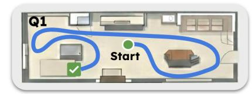

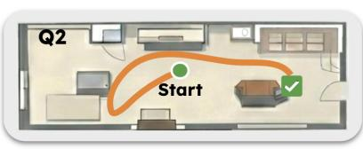

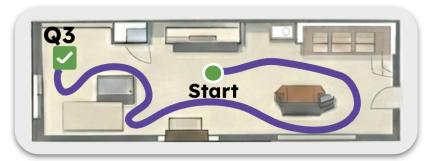

(a) 에피소드 평가

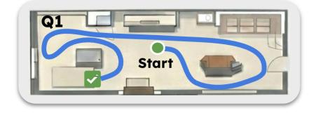

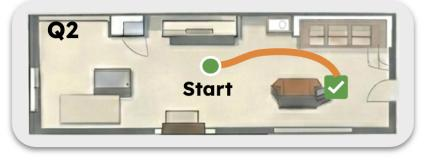

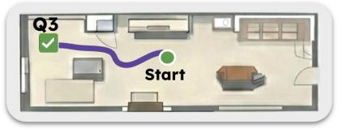

(b) 순차 평가

그림 1: **에피소드와 순차 평가 패러다임의 비교.** (a) **에피소드 평가**에서는 에이전트의 메모리가 각 작업 후에 초기화된다. 새로운 쿼리(예: Q2)가 주어질 때마다, 에이전트는 환경이 새롭듯이 전체 탐색 과정을 반복해야 한다. (b) 반대로, **순차 평가**는 에이전트가 연속적인 작업 간에 지속적인 메모리를 유지하도록 허용한다. 초기 작업(Q1)은 전체 탐색이 필요하지만, 이후 작업(Q2)에서는 에이전트가 이전 지식을 활용해 목표물에 직접 이동함으로써 중복 탐색을 제거하고 효율성을 크게 향상시킨다.

아키텍처: 경량 기하학적 메모리, 엔드-투-엔드 VLA 에이전트의 암시적 메모리, 그리고 구조화된 3D 공간 메모리. 우리의 연구 결과는 메모리를 단순히 재사용하는 것이 기존 아키텍처에서 심각한 취약점을 드러낸다는 것을 보여준다. 2D 점유 지도(예: ExploreEQA [\[14\]](#page-7-8))와 같은 약한 메모리 구조에 의존하는 에이전트는 복잡한 순차적 추론에 필요한 풍부한 의미 정보를 보존하지 못한다. 반대로, 단기 호라이즌 에피소드 데이터(예: 비전-언어-액션(VLA) 접근 방식 UniNavid [\[15\]](#page-7-9))에서 엔드-투-엔드로 훈련된 에이전트는 연속적이고 다중 질의 기록에 노출될 때 심각한 분포 외 성능 저하를 겪는다. 이러한 아키텍처에서는 메모리 재사용이 탐색 비용을 크게 줄이지만, 의미 간섭과 덮어쓰기로 인해 정확도가 정체되거나 체계적으로 저하된다.

Using Sequential-EQA, we demonstrate the necessity of structured, spatially-grounded memory.  
우리는 Sequential-EQA를 사용하여 구조화되고 공간 기반의 메모리의 필요성을 입증한다.  

We show that 3D-Mem [\[16\]](#page-7-10), an architecture that maps persistent visual observations to rigid 3D geometry and leverages strong Vision-Language Models (VLMs), effectively accumulates environmental knowledge over time.  
우리는 3D-Mem [\[16\]](#page-7-10), 지속적인 시각 관측을 견고한 3D 기하학에 매핑하고 강력한 Vision-Language Models (VLMs)를 활용하는 아키텍처가 시간에 따라 환경 지식을 효과적으로 축적한다는 것을 보여준다.  

Unlike reactive baselines, 3D-Mem uniquely breaks the accuracy-efficiency tradeoff in sequential settings.  
반응형 기준선과 달리, 3D-Mem은 연속 설정에서 정확도-효율성 tradeoff를 독특하게 깨뜨린다.  

By anchoring visual memory to spatial coordinates, it avoids catastrophic forgetting and semantic noise, simultaneously achieving higher answer accuracy and drastically lower navigation costs on subsequent queries.  
시각 메모리를 공간 좌표에 고정함으로써, 3D-Mem은 파괴적 망각과 의미적 잡음을 피하고 동시에 더 높은 답변 정확도와 이후 쿼리에서 크게 낮은 탐색 비용을 달성한다.

우리의 결과가 단순히 시뮬레이션 아티팩트에 불과하지 않도록, 우리는 실제 물리적 실내 환경에서 동작하는 모바일 로봇에서 평가를 재현한다. 실제 배포는 공간 기반 시각 메모리가 현실적인 센싱 및 액추에이션 노이즈 하에서 지속적이고 지능적인 운영을 가능하게 하는 데 필수적임을 확인한다.

In summary, our main contributions are:

• 우리는 Sequential-EQA를 도입한다, 이는 EQA를 고립된 에피소드에서 연속적인 것으로 전환하는 평가 프로토콜이다.

- 다중 쿼리 연산, 기본 모델이나 환경을 수정하지 않고 메모리 재사용 효율성을 측정합니다.  
- 우리는 중요한 구조적 병목 현상을 식별합니다: 메모리 지속성은 지식 축적을 의미하지 않으며, 이는 VLMagent와 VLA 패러다임을 아우르는 네 가지 아키텍처에서 입증되었습니다.  
- 우리는 공간적으로 기반화된 3D 메모리가 정확도–효율성 tradeoff를 깨는 데 필요함을 보여주며, 순차 설정에서 동시에 +33.3% 정확도 향상과 +53.3% 탐색 비용 감소를 달성합니다.  
- 우리는 실내 및 실외 환경에서 물리적 사지 로봇을 사용해 검증하며, 식별된 병목 현상이 시뮬레이션을 넘어 일반화됨을 확인합니다.

### II. 관련 연구 (Related Work)

임베디드 AI의 메모리 아키텍처. 메모리는 임베디드 인텔리전스에서 핵심적인 역할을 한다. 이전 연구에서는 정보 구축 및 보존을 위해 시맨틱 및 볼륨 맵 [21], 장면 그래프 [22], 그리고 다른 구조화된 메모리 표현 [23, 24] 등을 포함한 다양한 표현을 탐구했다. 이러한 표현은 관측을 시간에 걸쳐 통합함으로써 위치 추정, 객체 검색, 그리고 에피소드 내 추론을 가능하게 한다. 최근 시스템은 구조화된 공간 메모리와 대형 Vision‑Language Models를 결합하여 시맨틱 기반과 탐색 전략을 개선한다 [14, 16, 25, 26]. 그러나 대부분의 기존 메모리 메커니즘은 단일 에피소드 내 의사결정을 지원하도록 설계되었다. 그 성능은 메모리가 여러 시계열 연결된 쿼리 전반에 걸쳐 지속되어야 하는 조건에서 거의 평가되지 않는다. 따라서 이러한 아키텍처가 장기 재사용을 지원하는 형태로 환경 지식을 인코딩하는지, 아니면 주로 단기 탐색 보조 역할을 수행하는지 불분명하다. 본 연구는 에피소드형 훈련된 에이전트를 순차 평가로 전환함으로써 이 질문을 고립시킨다. 훈련 절차를 변경하지 않는다.

임베디드 AI의 메모리 아키텍처. 메모리는 임베디드 인텔리전스에서 핵심적인 역할을 한다. 이전 연구에서는 정보 구축 및 보존을 위해 시맨틱 및 볼륨 맵 [21], 장면 그래프 [22], 그리고 다른 구조화된 메모리 표현 [23, 24] 등을 포함한 다양한 표현을 탐구했다. 이러한 표현은 관측을 시간에 걸쳐 통합함으로써 위치 추정, 객체 검색, 그리고 에피소드 내 추론을 가능하게 한다. 최근 시스템은 구조화된 공간 메모리와 대형 Vision‑Language Models를 결합하여 시맨틱 기반과 탐색 전략을 개선한다 [14, 16, 25, 26]. 그러나 대부분의 기존 메모리 메커니즘은 단일 에피소드 내 의사결정을 지원하도록 설계되었다. 그 성능은 메모리가 여러 시계열 연결된 쿼리 전반에 걸쳐 지속되어야 하는 조건에서 거의 평가되지 않는다. 따라서 이러한 아키텍처가 장기 재사용을 지원하는 형태로 환경 지식을 인코딩하는지, 아니면 주로 단기 탐색 보조 역할을 수행하는지 불분명하다. 본 연구는 에피소드형 훈련된 에이전트를 순차 평가로 전환함으로써 이 질문을 고립시킨다. 훈련 절차를 변경하지 않는다.

### III. SEQUENTIAL EVALUATION PROTOCOL (시퀀셜 평가 프로토콜)

전통적인 에피소드 평가는 각 질문을 독립적으로 다룬다: 에이전트는 재설정되고 내부 메모리, 지도, 인지 표현이 전이되지 않는다. 이는 평가를 단순화하지만 에이전트가 이전 상호작용에서 지식을 축적할 수 있는지 여부를 무시한다. 우리는 대신 내부 상태를 재설정하지 않고 동일한 환경에서 질문 시퀀스를 연속적으로 평가하여 메모리 지속성이 실제로 이후 답변을 향상시키는지 여부를 드러낸다.

### A. Problem Formulation: Episodic vs. Sequential (문제 정의: 에피소드형 대 시퀀셜형)

우리는 EQA 작업을 환경 $\mathcal{E}$ 안에서 정의한다. 이 환경은 N개의 질문으로 구성된 순서가 있는 집합 $Q = \{q_1, q_2, \dots, q_N\}$ 를 포함한다. 에이전트는 정책 $\pi$와 내부 상태(메모리) $m \in \mathcal{M}$ 로 특징지어지며, 이는 공간 지도, 잠재 임베딩, 또는 탐색 기록을 포함할 수 있다.

**에피소드 평가:** 표준 에피소드 프로토콜에서는 각 질문 $q_i \in Q$ 를 분리된 마르코프 결정 과정(MDP)으로 취급한다. 에이전트의 메모리는 매 질문 시작 시 null 상태 $m_0 = \emptyset$ 로 재초기화된다. 질문 $q_i$ 에 대한 궤적 $\tau_i$ 는 다음과 같이 생성된다:

$$\tau_i \sim \pi(q_i, m_0). \tag{1}$$

이것은 에이전트가 이전 시도에서 얻은 환경 지식을 무시하도록 보장한다.

**순차 평가:** 순차 프로토콜에서는 메모리가 질문 집합 Q 전체에 걸쳐 누적된다. $m_i$ 가 질문 $q_i$ 의 종료 상태에서의 메모리라면, 질문 $q_{i+1}$ 에 대한 궤적은 다음과 같이 생성된다

$$\tau_{i+1} \sim \pi(q_{i+1}, m_i). \tag{2}$$

이것은 정책이 누적된 환경 문맥을 활용하도록 허용한다.

### B. Sequentializing an Existing Benchmark (기존 벤치마크 시퀀셜화)

메모리 재사용을 분리하기 위해, 동일한 환경 $\mathcal{E}$ 에서 질문들을 시퀀스 $\mathcal{S}$ 로 그룹화한다. 원본 데이터셋 $\mathcal{D}_{\text{episodic}} = \{(q_j, \mathcal{E}_j)\}_{j=1}^M$ 를 주어진 경우, 순차 버전은 다음과 같다:

$$\mathcal{D}_{\text{seq}} = \{ (\mathcal{S}_k, \mathcal{E}_k) \}_{k=1}^K.$$

(3)

각 $S_k = (q_{k,1}, \dots, q_{k,N_k})$ 는 장면 $\mathcal{E}_k$ 에서 선택된 모든 질문을 포함한다; 따라서 $N_k$ 는 장면마다 다르다. 시퀀스 순서는 고정된 시드로 무작위로 섞이며, 모든 에이전트와 에피소드/순차 비교에 대해 일정하게 유지된다. 재현성을 위해 생성된 시퀀스, 분할 코드, 평가 구성을 공개할 예정이다.

### C. Evaluation Metrics (평가 지표)

우리는 메모리 보존의 효능을 작업 성공과 탐색 효율성 두 측면에서 정량화한다. $y_{k,i}$ 를 시퀀스 $S_k$ 에서 *i*번째 질문에 대한 성공 지표(이진 또는 실수값 점수)라 하고, $L_{k,i}$ 를 해당 질문 동안 이동한 지오데식 경로 길이(미터)라 하자.

**정확도 지표.** 성공률(SR)은 에피소드 재설정 하에서의 평균 정확도이다:

$$SR = \frac{1}{\sum_{k=1}^{K} N_k} \sum_{k=1}^{K} \sum_{i=1}^{N_k} y_{k,i} \quad \text{s.t.} \quad m_{0,k,i} = \emptyset.$$

(4)

메모리와 함께한 성공률 $(SR_{\text{mem}})$ 은 상태 지속성 하에서의 평균 정확도이다:

$$SR_{\text{mem}} = \frac{1}{\sum_{k=1}^{K} N_k} \sum_{k=1}^{K} \sum_{i=1}^{N_k} y_{k,i} \quad \text{s.t.} \quad m_{0,k,i} = m_{T_{k,i-1},k,i-1}.$$

(5)

메모리 이점(MA)은 순차 메모리를 사용했을 때의 절대 성능 향상이다:

$$MA = SR_{\text{mem}} - SR. \tag{6}$$

**효율성 지표.** 경로 길이(PL)은 정보 재사용 없이 필요한 총 탐색 비용이다:

$$PL = \sum_{k=1}^{K} \sum_{i=1}^{N_k} L_{k,i}$$

s.t.  $m_{0,k,i} = \emptyset$ . (7)

메모리와 함께한 경로 길이 ($PL_{\text{mem}}$) 는 이전 탐색을 활용했을 때의 총 비용이다:

$$PL_{\text{mem}} = \sum_{k=1}^{K} \sum_{i=1}^{N_k} L_{k,i} \quad \text{s.t.} \quad m_{0,k,i} = m_{T_{k,i-1},k,i-1}.$$

(8)

단계 이점(SA)은 정규화된 효율성 향상으로, 백분율로 표현된다:

$$SA = \left(\frac{PL - PL_{\text{mem}}}{PL}\right) \times 100\%. \tag{9}$$

### IV. MEMORY REPRESENTATION PARADIGMS IN EQA (EQA에서의 메모리 표현 패러다임)

Existing EQA systems differ in how they connect perception, memory, and action. **VLM-agent methods (VLM-에이전트 방법)** keep a pretrained VLM frozen and collect structured observations for inference, using memories such as 2D maps [14], dense semantic libraries [26], or 3D reconstructions [16]. This makes memory design modular, but also means that retrieval quality and representation structure strongly determine performance. **VLA methods (VLA-방법)** instead fine-tune the VLM to output actions or waypoints end-to-end, with memory implicit in short-horizon hidden states. This tight perception-action coupling can be effective within the training distribution, but limits memory to the horizon seen during training, which becomes vulnerable under sequential evaluation.

### A. Evaluated Agents (평가된 에이전트)

우리는 이 패러다임 경계들을 포괄하는 대표적인 네 개의 에이전트를 선택하며, 메모리, 검색, 적응에서의 핵심 구조적 차이점은 표 I에 요약되어 있다.

**VLM-agent with geometric memory (VLM-에이전트와 기하학적 메모리)**. ExploreEQA [14]는 통과 가능한 공간과 프런티어 점수를 인코딩한 2D 점유 맵을 유지한다. 고정된 VLM은 현재 질문에 대해 의미적 관련성을 기준으로 후보 프런티어를 점수화하여 탐색을 잠재적 답변 위치로 유도한다. 맵이 객체 수준의 외관이나 의미 속성 대신에 단지 기하학적 점유만 저장하기 때문에, 에이전트가 어디를 갔는지는 기억하지만 그곳에서 관찰된 것이 무엇인지는 기억하지 못한다.

**VLM-agent with dense episodic semantic memory (VLM-에이전트와 밀집된 에피소드 의미 메모리)**. MemoryEQA [26]는 각 항목이 RGB 프레임을 공간적 포즈, 자연어 설명, 그리고 특징 임베딩에 바인딩하는 명시적 의미 라이브러리를 구축한다. 추론 시에는 엔트로피 기반 검색 전략이 현재 쿼리에 가장 관련성 높은 항목을 선택한다. 의미적으로 풍부하지만, 항목은 독립적인 포즈 태그가 붙은 이벤트로 저장되고 전역 공간 구조에 융합되지 않으므로, 관점 간 일관된 추론이 제한된다.

# VLM-agent with structured 3D spatial-semantic memory. 3D-Mem [16] (VLM-에이전트와 구조화된 3D 공간-의미 메모리. 3D-Mem [16])는 환경의 지속적인 메트릭 재구성을 구축하며, 시각적 임베딩을 직접 3D 좌표에 바인딩한다. 서로 다른 관점에서의 관측은 공간적으로 일관된 표현으로 융합되어 레이아웃과 객체 정체성을 모두 보존한다. 검색은 구조화된 3D 기하학을 통해 수행되며, 에이전트가 공간 관계를 명시적으로 추론하고 쿼리 간에 지식을 구성적으로 축적할 수 있게 한다.

**VLA with implicit latent memory (VLA와 암묵적 잠재 메모리)**. UniNavid [15]는 변환기 기반 VLM을 미세 조정하여 연속 RGB 프레임의 짧은 창과 언어 쿼리에서 직접 탐색 웨이포인트를 예측한다. 메모리는 이 창에 걸친 모델의 어텐션 상태에 암묵적으로 존재한다. 훈련이 항상 새로운 에피소드에서 시작되기 때문에, 모델은 쿼리 경계 간에 관측을 통합할 메커니즘이 없으며, 이는 설계상 본질적으로 에피소드형이다.

## B. Memory Adaptation Protocol (메모리 적응 프로토콜)

메모리 아키텍처의 기여를 순차 훈련의 혼란 효과에서 분리하기 위해, 우리는 최소한의

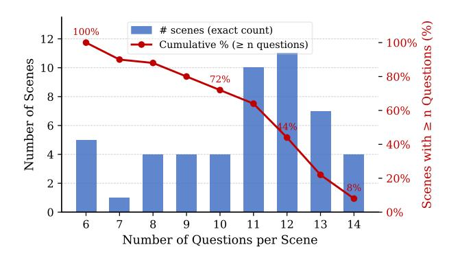

Fig. 2: 순차화된 OpenEQA 벤치마크에서 장면별 질문 분포. 막대는 정확히 $N_k$개의 질문을 포함하는 장면 수를 보여주며, 겹쳐진 선은 최소 $N_k$개의 질문을 가진 장면의 누적 비율을 나타낸다. 우리는 생성된 모든 장면 수준 시퀀스를 평가하며, 집계 지표는 모든 질문을 풀링하고, 쿼리-인덱스 분석은 $N_k \ge i$인 장면을 평균한다.

지속성 프로토콜은 모델 가중치나 훈련 절차를 수정하지 않고 각 에이전트를 에피소드 평가에서 순차 평가로 전환합니다. 이 설계 선택은 고의적입니다: 우리의 목표는 작업별 최적화 후 가장 성능이 좋은 순차 에이전트를 찾는 것이 아니라, 어떤 아키텍처적 특성이 쿼리 간 지식 축적을 본질적으로 지원하는지를 진단하는 것입니다. 프로토콜은 모든 에이전트에 균일하게 적용됩니다. 한 장면 내 연속 질문 $q_i$와 $q_{i+1}$ 사이 경계에서 우리는 세 가지 연산을 수행합니다: (1) **상태 상속**: 에이전트의 최종 메모리 상태 $m_{T_{i,i}}$는 다음 쿼리의 초기 상태 $m_{0,i+1}$로 그대로 전달되며, 절단이나 요약이 없습니다. (2) **쿼리 업데이트**: 작업별 입력이 $q_{i+1}$로 교체되고, 목표 지향 플래너는 이에 따라 재초기화됩니다. (3) **고정 가중치**: 모든 네트워크 매개변수 $\theta$는 시퀀스 전체에서 완전히 변하지 않으며, 불확실성 재조정이나 보조 적응이 적용되지 않습니다. 이 최소 개입은 에피소드와 순차 조건 간의 성능 차이가 상속된 표현의 구조에만 기인하도록 보장합니다. 이 프로토콜에서 이익을 얻는 에이전트는 그들의 메모리 아키텍처가 설계상 구성적이기 때문이며, 실패하는 에이전트는 그들의 표현이 교차 쿼리 재사용을 지원하도록 구조화되지 않았기 때문입니다.

### V. 실험 결과 및 분석 (Experimental Results and Analysis)

### A. 실험 설정 (Experimental Setup)

**Dataset.** 우리는 OpenEQA [6] 데이터셋의 질문을 장면별로 재구성하여 순차 벤치마크를 구축하고, 앞서 언급한 4가지 유형의 대표 에이전트를 평가한다. OpenEQA는 공간적 및 의미적 추론이 필요한 자유형 질문과 실제 실내 환경을 제공한다. 우리의 순차 프로토콜에 따라, 동일한 장면에 속하는 모든 선택된 질문은 하나의 순서가 지정된 시퀀스로 연결되며, 에이전트의 내부 상태는 재설정 없이 그들 사이에서 보존된다. 우리는 모든 결과 장면 수준 시퀀스를 평가하며, 각 장면을 고정된 수평선으로 잘라내지 않는다: 집계 결과는 모든 질문을 포함한다.

TABLE I: 구현된 EQA에서 메모리 패러다임 비교. 우리는 각 방법을 아키텍처 패러다임, 저장되는 특정 내용, 그리고 주요 검색 메커니즘에 따라 분류한다.

| 방법 | 패러다임 | 저장되는 내용 | 검색 메커니즘 |  |
|-------------|-----------|-----------------------------------------------|----------------------------------|--|
| Explore-EQA | VLM-Agent | 점유율 + 프론티어 점수 | VLM에 의한 프론티어 순위 매기기 |  |
| MemoryEQA | VLM-Agent | RGB + 포즈 + 언어 설명 + 임베딩 | 엔트로피 기반 적응형 검색 |  |
| 3D-Mem | VLM-Agent | 3D 포인트 클라우드 + 시각 임베딩 | 공간 인덱싱된 3D 조회 |  |
| UniNavid | VLA | Transformer 은닉 상태 | 암시적 어텐션 |  |

TABLE II: Sequential-EQA 벤치마크에서의 성능 비교. 결과는 에피소드(SR %) 및 순차(SRmem %) 조건에서의 성공률, 메모리 이점(MA %), 경로 길이(PL), 단계 이점(SA %)를 보여준다.  $\uparrow$  는 높은 값이 더 좋음을,  $\downarrow$  는 낮은 값이 더 좋음을 나타낸다. 표준 오차는 Fig. 3에 표시된다.

| 방법 | SR↑ | SR mem ↑ | MA ↑ | PL ↓ | $PL_{mem} \downarrow$ | SA ↑ |
|------------|------|---------------------|------|------|-----------------------|------|
| ExploreEQA | 43.8 | 46.5 | 2.7 | 84.3 | 84.3 | 0.0 |
| MemoryEQA | 61.0 | 62.4 | 1.4 | 43.6 | 43.9 | -0.5 |
| 3D-Mem | 25.5 | 58.8 | 33.3 | 5.6 | 2.6 | 53.3 |
| UniNavid | 36.4 | 37.3 | 0.9 | 12.2 | 12.4 | -1.5 |

모든 시퀀스 중에서, 쿼리별 인덱스 플롯은 인덱스 i에서 시퀀스 길이가 $N_k \geq i$ 를 만족하는 장면만 포함한다.  
Figure 2는 결과 벤치마크에서 장면별 시퀀스 길이 분포를 보여준다.  
대부분의 장면은 10~13개의 질문을 포함하며, 60%가 넘는 장면은 최소 10개의 쿼리 시퀀스를 제공한다.  
정확한 섞인 시퀀스 파일, 분할 생성 코드, 평가 하이퍼파라미터는 벤치마크와 함께 공개되어 무작위 순서를 재현 가능하게 하고 향후 통제된 비교를 지원할 것이다.

**기초 모델 및 컴퓨팅 자원 (Foundation model and compute resources).** 우리는 Qwen3 VL 8B-Instruct [27] VLM을 FB8 양자화와 함께 사용하며, 모든 실험은 A5000 GPU에서 수행됩니다.

# B. 순차적 메모리가 일관되게 성능을 향상시키지 않는다 (Sequential Memory Does Not Uniformly Improve Performance)

내부 상태를 보존하면 중복 탐색을 줄이고 유용한 환경 지식을 축적할 것이라는 자연스러운 기대가 있다. 그러나 표 II는 이 가정이 부분적으로만 성립함을 보여준다. 순차적 평가는 표준 에피소드 테스트에서 결합된 두 효과를 분리한다: 메모리가 에이전트가 더 나은 답변을 할 수 있도록 돕는지(측정값 MA)와 메모리가 에이전트가 더 적게 움직이도록 돕는지(측정값 SA). 결과는 네 가지 주요 시사점을 이끌어낸다.

정확도와 효율성. 표 II는 메모리 지속성만으로는 답변 품질이 신뢰할 수 있게 향상되지 않는다는 것을 보여준다. ExploreEQA, UniNavid, 그리고 MemoryEQA는 모두 거의 0에 가까운 메모리 이점 (MA < 3%)을 얻지만, 이는 서로 다른 아키텍처적 이유 때문이다. ExploreEQA는 탐색된 기하학은 보존하지만 객체 수준의 의미 증거는 보존하지 않으므로, 관찰된 내용을 기억하기보다 에이전트가 어디를 갔는지를 기억한다. UniNavid는 짧은 에피소드적 수평에서 훈련되었음에도 불구하고 쿼리 경계 간에 순환적 맥락을 상속받는다; 이는 순차적 맥락을 재사용 가능한 장면이 아니라 out-of-distribution 입력으로 만든다.

모델. MemoryEQA는 풍부한 RGB 관측, 포즈, 설명 및 임베딩을 저장하지만, 이러한 항목은 전역적으로 정렬된 장면 표현이 아니라 독립적인 이벤트로 누적되어 시퀀스가 커질수록 검색 노이즈를 증가시킵니다.

반면에, 3D-Mem은 +33.3% MA와 +53.3% SA를 통해 답변 정확도와 탐색 효율성을 모두 향상시킵니다. 이 향상은 단순히 궤적 압축에 그치지 않습니다: 에이전트는 탐색을 덜하면서 더 많은 질문에 올바르게 답변합니다. 관측을 메트릭 3D 기하학에 고정함으로써, 각 쿼리는 구조화되지 않은 이력을 추가하는 대신 일관된 장면 표현을 풍부하게 합니다.

Figure 3은 같은 패턴을 시각화한다. 대부분의 방법에서 메모리 지속성은 답변 품질보다 탐색 비용을 더 쉽게 변화시킨다. 오직 3D-Mem만이 더 높은 정확도와 더 낮은 탐색 비용이라는 바람직한 영역으로 이동하며, 이는 공간적으로 기반된 메모리가 이전 관측을 단순히 경로를 단축시키는 대신 재사용 가능한 증거로 전환한다는 것을 나타낸다.

### **순차 평가에서의 핵심 시사점**

**지속성** (Persistence) ≠ **축적** (Accumulation).  
순차적인 쿼리 간에 상태를 단순히 보존하는 것만으로는 성공적인 환경 지식 축적을 보장하지 않는다.

**공간 기반이 중요합니다.** 공간적으로 기반화된 메모리만이 누적된 관측을 일관되게 번역하여 답변 정확도와 탐색 효율성에서 동시에 이득을 가져온다.

**효율성과 성공의 분리: 조기 종료를 통한**.  
짧은 탐색 경로가 더 나은 추론을 의미하지는 않는다; 구조화되지 않은 메모리는 에이전트가 올바른 증거를 찾지 못하고 익숙한 영역에서 일찍 멈추도록 편향시킬 수 있다.

**구조화된 메모리가 교차 쿼리 누적을 지원합니다.** 관측을 기하학적으로 구조화하면 에이전트의 표현이 이후 쿼리에서 기하급수적으로 더 유용해집니다.

**쿼리 위치별 동적 변화.** 집계 지표는 평균 이득을 보여 주지만, 메모리가 시퀀스가 진행됨에 따라 더 유용해지는지 여부를 드러내지 못한다. 따라서 우리는 쿼리 위치 i에 따라 정확도와 탐색 시간을 분석한다.

Figure 4는 $N_k \ge i$인 장면들에 대해 각 위치를 평균화하므로, 이후 포인트는 더 긴 시퀀스의 하위 집합을 사용합니다. 메모리 재사용 하에서는 탐색 시간이 일반적으로 감소합니다. 이는 약한 메모리라도 반복 탐색을 줄이거나 에이전트를 익숙한 영역으로 편향시킬 수 있기 때문입니다. 그러나 낮은 탐색 비용은 지식 축적의 충분한 증거가 되지 않습니다: 그것은 ...

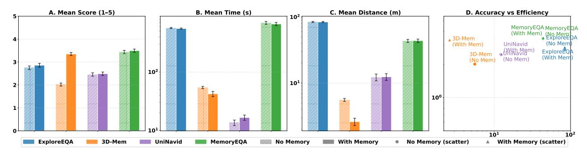

Fig. 3: 순차 메모리 재사용 하에서의 정확도–효율성 tradeoff. 왼쪽에서 오른쪽으로: 평균 답변 점수 $(1-5;\uparrow)$, 평균 탐색 시간(초; $\downarrow$), 평균 탐색 거리(미터; $\downarrow$), 그리고 효율성 대비 정확도의 결합 산점도. 밝은 막대는 에피소드(메모리 없음) 평가를 나타내며, 어두운 막대는 순차(메모리 포함) 평가를 나타냅니다. 오차 막대는 표준 오차를 나타냅니다.

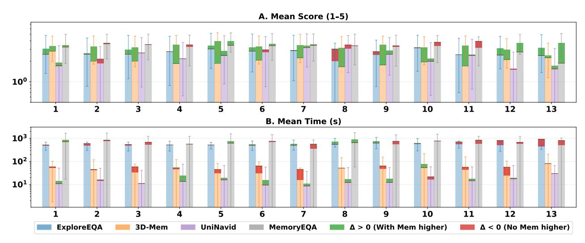

Fig. 4: **순차 메모리 재사용 하에서의 쿼리 인덱스별 정확도 및 탐색 시간.** 패널 A는 평균 답변 점수 $(1-5; \uparrow)$, 로그 스케일을 보여줍니다; 패널 B는 평균 탐색 시간(초; $\downarrow$, 로그 스케일)을 보여줍니다. x축은 장면 시퀀스 내 쿼리 위치 i이며, 각 위치는 $N_k \ge i$인 모든 시퀀스를 평균화합니다. $\Delta$는 순차와 에피소드 성능의 차이를 나타내며, 부호에 따라 색상으로 구분됩니다: $\Delta > 0$인 경우 초록, $\Delta < 0$인 경우 빨강. 메트릭 방향이 패널마다 다르므로 초록은 패널 A에서만 개선을 나타내며, 패널 B에서 빨강/음수 $\Delta$는 시간이 짧을수록 좋기 때문에 개선을 나타냅니다.

또한 조기 중단 또는 불완전한 이력에 대한 과도한 의존을 반영할 수 있습니다.

정확도는 이 구분을 드러냅니다. ExploreEQA, UniNavid, 그리고 MemoryEQA는 쿼리 위치에 따라 안정적인 개선을 보이지 않으며, 이득과 손실이 이력이 누적됨에 따라 번갈아 나타납니다. 이는 그들의 보존된 상태가 장면 이해를 단조롭게 개선하지 않는다는 것을 시사합니다. 오직 3D-Mem만이 쿼리 위치에 걸쳐 지속적인 양의 정확도 $\Delta$를 보이며, 시간이 지남에 따라 더 완전해지는 표현과 일치합니다. 종합적으로, 집계 및 쿼리별 분석은 유용한 순차 메모리가 지속적이며 공간적으로 구성적이어야 함을 보여줍니다.

### C. Qualitative Analysis (정성적 분석)

Figure 5는 벤치마크에서 대표적인 장면에 대해 에피소드와 순차 평가 간의 행동 차이를 구체적으로 보여줍니다. 3D-Mem을 중심 아키텍처로 사용합니다. 왼쪽 패널은 쿼리마다 하나씩, 동일한 시작 위치에서 상속된 상태 없이 시작하는 세 개의 에피소드 궤적을 보여줍니다. 에이전트는 매 질문마다 아파트의 큰 부분을 재탐색하며, 상당한 중복 경로 길이를 누적합니다.

시퀀스 전체에 걸쳐 상당한 중복 경로 길이를 누적합니다. 이러한 탐색에도 불구하고, 에이전트는 3개 질문 중 1개만 정확히 답합니다: '연기 탐지기의 색깔은 무엇인가?'라는 질문에 대해, 그는 코트 클로짓에 대한 답을 반환합니다 — 이는 할당된 에피소드 예산 내에서 관측 범위가 불완전함을 나타내는 증상입니다.

오른쪽 패널은 동일한 세 개의 쿼리를 순차 평가에서 보여줍니다. 이전 쿼리에서 누적된 지속적인 3D 맵을 사용하여, 에이전트는 처음부터 재탐색하기보다 이전에 관측한 영역으로 직접 이동합니다. 경로 길이는 Q2와 Q3에서 급격히 감소하며, 이는 표 II에 보고된 53.3%의 집계 SA와 일치합니다. 가장 중요한 것은 정확도가 효율성과 함께 개선된다는 점입니다: 세 개의 질문 모두 정확히 답하며, 연기 탐지기 질문 역시 에이전트가 첫 번째 쿼리 탐색에서 이미 융합된 3D 표현을 활용해 정확히 답합니다.

이 예시는 3D-Mem의 순차적 이점 뒤에 있는 핵심 메커니즘을 보여줍니다. 개선은 단순히 에이전트가 덜 이동한다는 것만이 아니라, 이전 탐색이 공간적으로 일관된 기록을 남겨 두어 이후 쿼리가 이를 검색할 수 있게 한다는 점입니다.

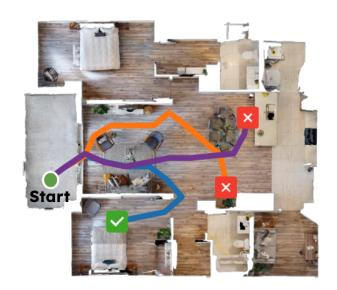

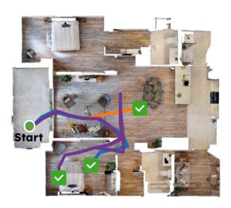

(a) **3D-Mem**은 대표적인 MP3D 장면에서의 궤적을 보여준다. 에피소드 평가에서 에이전트는 각 질의마다 처음부터 재탐색하며, 정답을 1/3만 맞춘다. 지속적인 3D 메모리는 보다 직접적인 탐색과 모든 3개의 질문에 대한 정답을 가능하게 한다.

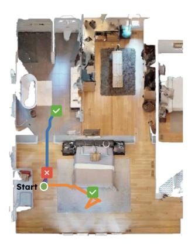

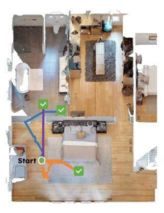

(b) **UniNaviD**은 다른 MP3D 장면에서의 궤적을 보여준다. 에이전트는 에피소드별로 2/3의 질문에 정답을 맞추며, 순차적 상태 상속이 Q2를 수정하여 3/3을 달성한다. 3D-Mem과 달리, 탐색 효율성은 설정 간에 거의 변하지 않는다.

그림 5: 에피소드(왼쪽)와 순차(오른쪽) 평가에서 세 개의 연속 질문(Q1: 파랑, Q2: 주황, Q3: 보라)에 대한 에이전트 궤적의 정성적 비교.

직접적으로. 효율성과 정확성은 동일한 원인, 즉 에피소드 경계에서 관측을 버리지 않고 구성적으로 누적하는 표현을 공유하기 때문에 함께 향상된다.

### VI. 실험 로봇 검증 (Real-Robot Validation)

시뮬레이션 결과가 실제 배치 조건을 반영하는지 확인하기 위해, 우리는 다양한 환경에서 실제 모바일 로봇에 대해 네 가지 방법을 평가한다. 이 실험은 시뮬레이션된 병목 현상—순차적 맥락에서의 분포 이동과 구조화된 공간 메모리 부족—이 센싱 노이즈, 조작 오류, 환경 변동성 하에서도 지속되는지 테스트한다.

# *A. 실험 설정 (Experimental Setup)*

우리는 Intel RealSense D435i 깊이 카메라와 온보드 LiDAR L2를 장착한 Unitree Go2 사족 로봇을 배치한다. ExploreEQA, MemoryEQA, 3D-Mem, UniNavid는 각 환경에서 에피소드와 순차 시연 모두에서 평가된다. 모든 시연은 물체 인식, 개수 세기, 위치 파악을 포함한 다섯 개의 질문으로 구성된다. 또한, 각 시연은 질의마다 로봇을 동일한 시작 위치로 재설정하지만, 순차 시연은 다섯 개의 공간적으로 의존적인 질문에 걸쳐 상태를 보존한다. 테스트된 환경은 가구가 배치된

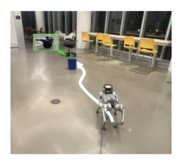

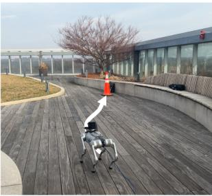

(a) 질문 1: 실내 (\"검은 의자 옆에 있는 냄비의 색은 무엇인가?\")와 야외 (\"콘의 색은 무엇인가?\")

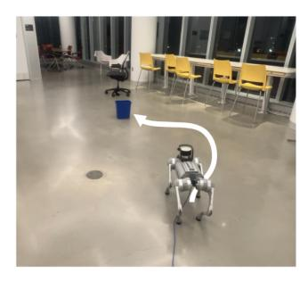

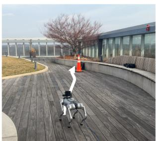

(b) 질문 2: 실내 (\"이 방에 노란 의자가 몇 개 있나요?\")와 야외 (\"콘 뒤에 있는 물체는 무엇인가?\")

그림 6: **Unitree Go2의 실제 배치 (Real-world deployment of the Unitree Go2).** 두 환경 모두에서 UniNavid는 이전 지식을 활용하지 못한다. 실내 설정(왼쪽)에서는 에이전트가 첫 번째 만남이 없었던 것처럼 두 번째 질문을 위해 의자에 다시 탐색한다. 마찬가지로 야외 설정(오른쪽)에서는 에이전트가 두 번째 질의에 대해 탐색 패턴을 반복한다. 두 경우 모두 에이전트는 불규칙한 회전을 보이고 정답을 제공하지 못해, **순차 메모리 재사용 병목 현상**이 물리적 배치에서도 일반화됨을 확인한다.

실내 실험실 공간, 개방형 로비, 그리고 긴 복도. UniNavid는 야외 옥상 테라스에서도 테스트되었다.

### *B. 결과 및 분석 (Results and Analysis)*

그림 [6](#page-6-1)은 실내와 야외 환경 모두에서 UniNavid를 보여준다. UniNavid는 모든 장면에서 에피소드와 순차 설정 모두에서 15%의 정확도를 달성했다. 실패 심각도는 실내와 야외 설정 모두에서 유사하다. 3D-Mem은 시뮬레이션에서의 성능과 일관되었으며, 에피소드에서 순차로 전환할 때 성공률을 20%에서 40%로 향상시켰다. ExploreEQA는 실제로 정확도가 33%에서 26%로 감소했지만, 이는 작은 테스트 크기 때문일 수 있다. 마지막으로, MemoryEQA는 메모리를 유지할 때 정확도를 40%에서 47%로 향상시켰다.

이러한 결과는 시뮬레이션 경향이 이상화된 역학의 산물이 아님을 시사한다. 물리적 센싱 노이즈와 액추에이션 오류는 약한 메모리 아키텍처를 증폭시킨다: 노이즈가 있는 관측은 증거 품질을 감소시키고, 드리프트는 더 긴 경로에서 누적된다. 구조화된 지도 없이 에이전트는 이후 쿼리가 이전 증거에서 답변될 수 있는지 판단할 수 있는 안정적인 기준이 없다. 따라서 구조화된 공간 메모리는 배포 가능한 연속 EQA 에이전트에 필수적이다.

### VII. 결론 (Conclusion)

우리는 Sequential-EQA를 도입하였다. 이는 구현된 질문응답(embodied question answering)을 고립된 에피소드에서 연속적이며 다중 쿼리 평가로 전환하는 평가 프로토콜이다. 우리의 분석은 중요한 아키텍처 격차를 드러낸다: 메모리 지속성은 지식 축적을 보장하지 않는다. 대부분의 패러다임은 의미적 간섭 또는 공간 기반 부족으로 인해 보존된 상태를 더 나은 성능으로 전환하지 못한다. 반면 구조화된 3D 공간 메모리는 이 병목 현상을 성공적으로 해소한다. 시각-의미 증거를 메트릭 기하학에 고정함으로써 중복 탐색을 제거하고 망각을 방지한다. 우리의 발견은 순차 에이전트를 발전시키려면 단순히 메모리 용량을 확장하는 것이 아니라 더 나은 공간 메모리 구조를 구축해야 함을 시사한다. 메모리 재사용에서 이러한 숨겨진 실패 모드를 드러내면서 Sequential-EQA는 커뮤니티에 시뮬레이션과 물리적 배포 사이의 격차를 메우는 프레임워크를 제공한다. 궁극적으로 이 메모리 효율성 병목 현상을 해결하는 것이 일상적이며 장기적인 구현된 보조자들이 인간 환경에서 일관되게 운영될 수 있도록 하는 핵심이다. 우리는 이 연구가 물리적 세계에서 연속적이고 신뢰성 있게 동작할 수 있는 차세대 메모리 아키텍처를 고무시키길 바란다.

### REFERENCES (참고문헌)

-  A. Das, S. Datta, G. Gkioxari, S. Lee, D. Parikh, and D. Batra, "Embodied question answering," *IEEE/CVF Conference on Computer Vision and Pattern Recognition*에서, 2018.
- [2] P. Anderson, Q. Wu, D. Teney, J. Bruce, M. Johnson, N. Sünderhauf, I. Reid, S. Gould, and A. Van Den Hengel, "Vision-and-language navigation: Interpreting visually-grounded navigation instructions in real environments," *IEEE/CVF Conference on Computer Vision and Pattern Recognition*에서, 2018, pp. 3674–3683.
- [3] J. Thomason, M. Murray, M. Cakmak, and L. Zettlemoyer, "Visionand-dialog navigation," *Conference on Robot Learning*에서, 2020, pp. 394–406.
- [4] E. Wijmans, S. Datta, O. Maksymets, A. Das, G. Gkioxari, S. Lee, I. Essa, D. Parikh, and D. Batra, "Embodied question answering in photorealistic environments with point cloud perception," IEEE/CVF Conference on Computer Vision and Pattern Recognition에서, 2019.
- [5] K. Jiang, Y. Liu, W. Chen, J. Luo, Z. Chen, L. Pan, G. Li, and L. Lin, "Beyond the destination: A novel benchmark for explorationaware embodied question answering," *IEEE/CVF International Conference on Computer Vision*에서, 2025.
- [6] A. Majumdar, A. Ajay, X. Zhang, P. Putta, S. Yenamandra, M. Henaff, S. Silwal, P. Mcvay, O. Maksymets, S. Arnaud, K. Yadav, Q. Li, B. Newman, M. Sharma, V. Berges, S. Zhang, P. Agrawal, Y. Bisk, D. Batra, M. Kalakrishnan, F. Meier, C. Paxton, A. Sax, and A. Rajeswaran, "Openeqa: Embodied question answering in the era of foundation models," *IEEE/CVF Conference on Computer Vision and Pattern Recognition*에서, 2024.
- [7] M. Khanna, R. Ramrakhya, G. Chhablani, S. Yenamandra, T. Gervet, M. Chang, Z. Kira, D. S. Chaplot, D. Batra, and R. Mottaghi, "Goat-bench: A benchmark for multi-modal lifelong navigation," *IEEE/CVF Conference on Computer Vision and Pattern Recognition*에서, 2024, pp. 16373–16383.
- [8] L. Yu, X. Chen, G. Gkioxari, M. Bansal, T. L. Berg, and D. Batra, "Multi-target embodied question answering," *IEEE/CVF Conference on Computer Vision and Pattern Recognition*에서, 2019, pp. 6309–6318.
- [9] T.-C. Chi, M. Shen, M. Eric, S. Kim, and D. Hakkani-Tur, "Just ask: An interactive learning framework for vision and language navigation," AAAI Conference on Artificial Intelligence에서, vol. 34, 2020, pp. 2459–2466
- [10] R. Krishna, Y. Zhu, O. Groth, J. Johnson, K. Hata, J. Kravitz, S. Chen, Y. Kalantidis, L.-J. Li, D. A. Shamma, M. S. Bernstein, and L. Fei-Fei, "Visual genome: Connecting language and vision using crowdsourced dense image annotations," *International Journal of Computer Vision*에서, vol. 123, no. 1, pp. 32–73, 2017.

- [11] M. Shridhar, J. Thomason, D. Gordon, Y. Bisk, W. Han, R. Mottaghi, L. Zettlemoyer, and D. Fox, "Alfred: 일상 작업을 위한 기반화된 지침 해석 벤치마크," in *IEEE/CVF Conference on Computer Vision and Pattern Recognition*, 2020, pp. 10740– 10749.
- [12] B. Yamauchi, "자율 탐사를 위한 프론티어 기반 접근법," in *Proceedings 1997 IEEE International Symposium on Computational Intelligence in Robotics and Automation CIRA'97.'Towards New Computational Principles for Robotics and Automation*', IEEE, 1997, pp. 146–151.
- [13] S. Thrun et al., "로봇 매핑: 설문 조사," *Exploring artificial intelligence in the new millennium*, vol. 1, no. 1-35, p. 1, 2002.
- [14] A. Z. Ren, J. Clark, A. Dixit, M. Itkina, A. Majumdar, and D. Sadigh, "확신할 때까지 탐색: 구현된 질문 응답을 위한 효율적 탐색," in *Proceedings of Robotics: Science and Systems*, Delft, Netherlands, Jul. 2024.
- [15] J. Zhang, K. Wang, S. Wang, M. Li, H. Liu, S. Wei, Z. Wang, Z. Zhang, and H. Wang, "Uni-NaVid: 구현된 탐색 과제를 통합하기 위한 비디오 기반 시각-언어-행동 모델," in *Proceedings of Robotics: Science and Systems*, Los Angeles, CA, USA, Jun. 2025.
- [16] Y. Yang, H. Yang, J. Zhou, P. Chen, H. Zhang, Y. Du, and C. Gan, "3d-mem: 구현된 탐색 및 추론을 위한 3D 장면 메모리," in IEEE/CVF Conference on Computer Vision and Pattern Recognition, 2025, pp. 17294–17303.
- [17] D. Gordon, A. Kembhavi, M. Rastegari, J. Redmon, D. Fox, and A. Farhadi, "Iqa: 인터랙티브 환경에서의 시각적 질문 응답," in *IEEE/CVF Conference on Computer Vision and Pattern Recognition*, 2018.
- [18] Y. Li, Y. Chen, A. Dao, L. Li, Z. Cai, Z. Tan, T. Chen, and Y. Kong, "Industryeqa: 산업 시나리오에서 구현된 질문 응답의 최전선을 밀어내다," in *Advances in Neural Information Processing* Systems, 2025.
- [19] M. Chang, G. Chhablani, A. Clegg, M. D. Cote, R. Desai, M. Hlavac, V. Karashchuk, J. Krantz, R. Mottaghi, P. Parashar, S. Patki, I. Prasad, X. Puig, A. Rai, R. Ramrakhya, D. Tran, J. Truong, J. M. Turner, E. Undersander, and T.-Y. Yang, "Partnr: 구현된 다중 에이전트 과제에서 계획 및 추론을 위한 벤치마크," in *International Conference* on Learning Representations, 2025.
- [20] M. F. Ginting, D.-K. Kim, X. Meng, A. M. Reinke, B. J. Krishna, N. Kayhani, O. Peltzer, D. Fan, A. Shaban, S.-K. Kim, M. Kochenderfer, A.-a. Agha-mohammadi, and S. Omidshafiei, "Enter the mind palace: 장기적 활성 구현 질문 응답을 위한 추론 및 계획," in *Proceedings of the 9th Conference on Robot Learning*, ser. Proceedings of Machine Learning Research, vol. 305, PMLR, 2025, pp. 5072–5106.
- [21] N. M. M. Shafiullah, C. Paxton, L. Pinto, S. Chintala, and A. Szlam, "CLIP-Fields: 로봇 메모리를 위한 약한 감독의 의미 필드," in *Proceedings of Robotics: Science and Systems*, Daegu, Republic of Korea, Jul. 2023.
- [22] X. Chang, P. Ren, P. Xu, Z. Li, X. Chen, and A. Hauptmann, "장면 그래프에 대한 종합적 조사: 생성 및 적용," *IEEE Transactions on Pattern Analysis and Machine Intelligence*, vol. 45, no. 1, pp. 1–26, 2021.
- [23] S. Gupta, J. Davidson, S. Levine, R. Sukthankar, and J. Malik, "인지 매핑 및 시각 탐색을 위한 계획," in *IEEE/CVF Conference on Computer Vision and Pattern Recognition*, 2017, pp. 2616–2625.
- [24] D. S. Chaplot, D. P. Gandhi, A. Gupta, and R. R. Salakhutdinov, "목표 지향적 의미 탐색을 이용한 객체 목표 탐색," *Advances in Neural Information Processing Systems*, vol. 33, pp. 4247–4258, 2020.
- [25] N. Yokoyama, S. Ha, D. Batra, J. Wang, and B. Bucher, "Vlfm: 제로샷 의미 탐색을 위한 시각-언어 프론티어 맵," in *IEEE International Conference on Robotics and Automation*, 2024, pp. 42–48.
- [26] M. Zhai, Z. Gao, Y. Wu, and Y. Jia, "메모리 중심 구현 질문 응답," arXiv preprint arXiv:2505.13948, 2025.
- [27] Qwen Team, "Qwen3-VL 기술 보고서," arXiv preprint arXiv:2511.21631, 2025.

