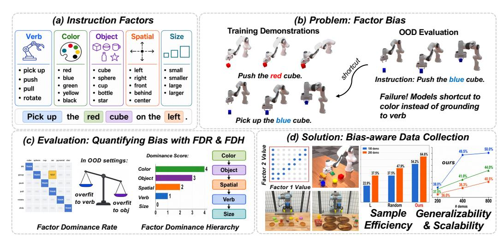
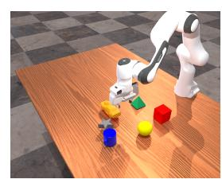
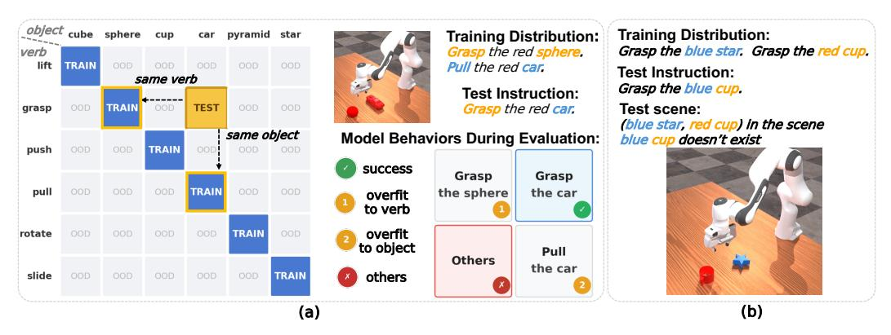
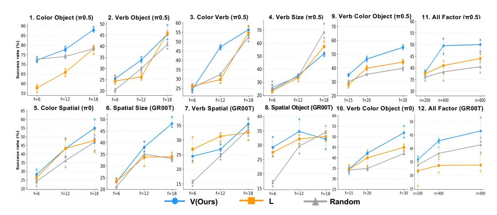
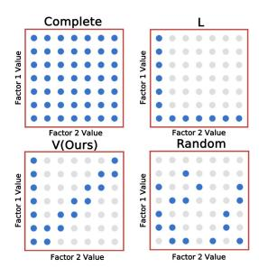
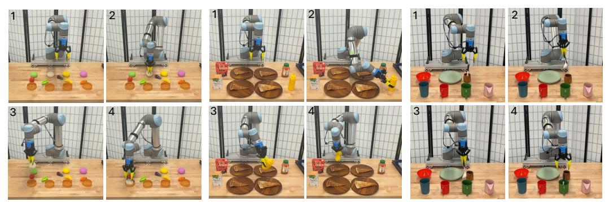
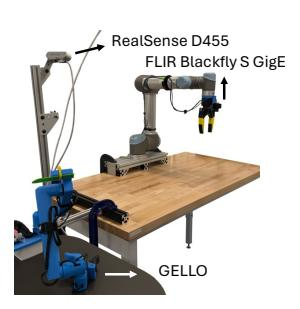
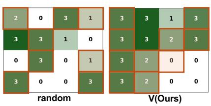
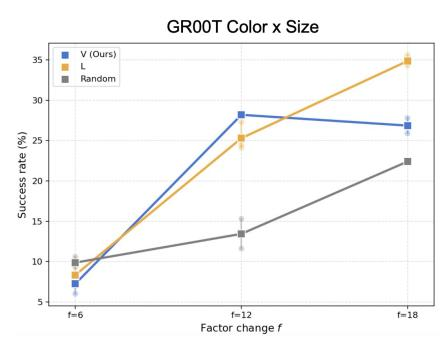

# 전략적으로 확장하기: 편향 인식 평가와 데이터 수집을 통한 로봇 조작의 구성적 일반화 학습

- 원제: Scale Up Strategically: Learning Compositional Generalization via Bias-Aware Evaluation and Data Collection for Robotic Manipulation
- 원문: [https://arxiv.org/abs/2607.21582](https://arxiv.org/abs/2607.21582)
- PDF: [https://arxiv.org/pdf/2607.21582v1](https://arxiv.org/pdf/2607.21582v1)
- arXiv ID: `2607.21582`

---

# <span id="page-0-0"></span>전략적으로 확장하기: 편향 인식 평가와 데이터 수집을 통한 로봇 조작의 구성적 일반화 학습

Yu Qi<sup>1</sup> , Zhang Ye<sup>1</sup> , Xinyi Xu<sup>1</sup> , Yuxuan Lu<sup>1</sup> , Amitoj Sandhu<sup>2</sup> , Boce Hu<sup>1</sup> , Haojie Huang<sup>1</sup> , Jonathan Tremblay2† , Lawson L.S. Wong1† <sup>1</sup>노스이스턴 대학교 <sup>2</sup>NVIDIA †Equal Advising

초록: 구성적 일반화는 로봇이 다양한 지시를 따르기 위해 필수적이다. 그러나 사전 학습된 정책은 단축 경로를 취해, 언어를 기반으로 하기보다 눈에 띄는 단서를 우선시하는 것으로 알려져 있다. 우리는 이 실패를 개별 *지시 요인*으로 국소화하는 진단 프레임워크를 제시한다. 예를 들어, 색상, 동사, 객체, 크기, 공간 속성 등 재사용 가능한 의미 구성 요소를 말한다. 우리의 프레임워크는 지시 요인 편향을 공식화한다. 이는 미세 조정된 정책이 지배적인 요인에 과도하게 의존하여 단축 경로를 취하는 경향이며, 두 가지 지표를 통해 정량화한다: 요인 지배율(Factor Dominance Rate, FDR), 요인 간 쌍별 편향을 포착하고, 요인 지배 계층(Factor Dominance Hierarchy, FDH), 이를 전역 순위로 집계한다. 여섯 개의 기초 정책에 대한 평가 결과, 색상 ≥ 객체 ≥ 공간 ≥ 동사 ≥ 크기라는 일관된 순서를 보여주며, 색상이 지배적이고 동사와 크기가 가장 부족하게 기반화되었다. 우리는 진단이 실행 가능함을 보여준다: 편향 인식 데이터 수집 전략이 고정 예산을 부족하게 기반화된 요인에 재배치하면 시뮬레이션과 실제 로봇에서 반대의 시연 수를 절반으로 사용해도 기준선보다 우수한 성능을 보이며, 보다 샘플 효율적이고 일반화 가능한 정책 학습을 가능하게 한다.

키워드: 로봇 조작, 로봇 학습 벤치마크



그림 1: (a) 우리는 언어 지시를 요인으로 분해한다. (b) 우리는 요인 편향 문제를 식별한다: 미세 조정 중에 사전 학습된 모델이 다른 요인에 비해 특정 요인을 포함한 훈련 데이터에 과적합되는 경향이 있다. 예를 들어, 모델이 큐브를 집는 대신 푸시(동사) 대신 "파란색"(색상)에 과적합된다. (c) 우리는 요인 지배율(FDR)을 사용해 쌍별 요인 평가와 요인 지배 계층(FDH)을 사용해 전역 순위를 정량화한다. (d) 우리는 샘플 효율적이고 일반화 가능한 정책 학습을 위해 진단 지향 편향 인식 데이터 수집을 도입한다.

# <span id="page-1-0"></span>1 서론

데이터를 확장하는 것은 현대 로봇 학습에서 일반화의 주된 방법이지만, 더 많은 데이터가 정책이 언어를 따르도록 신뢰성 있게 가르쳐 주지는 않는다. 대규모, 다양한 시연으로 훈련된 일반 로봇 정책은 단어를 해석했기 때문이 아니라, 가장 신뢰성 있게 올바른 행동을 예측하는 단서에 매달려 명령을 성공적으로 수행하는 경우가 많다. 예를 들어, 그림 [1](#page-0-0) (b)에서 정책은 동사(action verb)를 무시하고 객체-유형-행동(object‑type‑action) 관계에 대해 단축 경로를 사용한다. 이러한 행동은 기계 학습 전반에 걸쳐 잘 문서화되어 있으며, 로봇 정책에서도 점점 더 관찰된다.

이러한 단축 경로는 로봇 기초 정책에서 연구되어 왔으며, 이 정책들은 지시를 기반화하기보다 시각적으로 눈에 띄는 단서에 의존하는 것으로 관찰된다 [\[3,](#page-16-0) [4\]](#page-16-0). 그러나 기존 분석은 여전히 거친 수준이며, 다양한 조건 하에서 집계된 성공률만을 보고한다: 데이터셋 다양성 [\[5,](#page-16-0) [6\]](#page-16-0), 언어 변형 [\[7,](#page-16-0) [8\]](#page-16-0), 시각적 견고성 [\[9,](#page-16-0) [10\]](#page-16-0). 이는 정책이 실패했는지 여부는 드러내지만, 왜 실패했는지는 알려주지 않는다. 결과적으로, 정책이 실제로 어떤 지시 부분에 의존하고 있는지, 얼마나 강하게 의존하는지, 그리고 실패를 어떻게 수리할 수 있는지는 여전히 불분명하다.

이 연구에서는 지시 요인 수준에서 이러한 단축 행동을 체계적으로 연구한다. 지시 요인은 재사용 가능하고 독립적인 의미 구성요소(예: 설명 색상, 동작 동사, 객체 유형 등)로 정의한다. Fig. [1](#page-0-0)은 정책이 분포 외 설정에서 요인별로 불균형적으로 일반화됨을 보여준다. 우리는 이러한 실패를 지시 요인 편향이라고 부른다: 미세 조정된 정책은 단축으로서 지배적인 요인에 과도하게 의존하고, 다른 요인에 대한 기반이 부족하다. 이 편향을 평가하기 위해 일상 로봇 테이블탑 지시의 다섯 가지 일반 차원(색상, 동사, 객체, 크기, 공간적 속성)을 대상으로 구조화된 벤치마크를 구축한다. 심층 분석을 위해 두 가지 진단 지표를 도입한다: 요인 지배율(FDR), 이는 요인 간 편향을 측정하고, 요인 지배 계층(FDH), 이는 요인 간 FDR 점수를 전역 순위로 집계한다. 마지막으로, 여섯 개의 기초 정책 전반에 걸쳐 요인 편향은 놀라울 정도로 일관적이다: 색상이 가장 지배적인 요인이고, 동사와 크기가 가장 기반이 부족하며, 유도된 계층은 색상 ≥ 객체 ≥ 공간적 ≥ 동사 ≥ 크기이며, 이는 다수의 아키텍처에서 광범위하게 성립한다.

이 진단의 실용적 가치 중 하나는 단축 진단을 편향 인식 데이터 수집 원칙으로 전환하는 데 있다. 지시 공간은 요인의 수에 따라 조합적으로 증가하므로, 특히 실제 로봇 환경에서는 완전한 범위 확보가 종종 불가능하다. 우리는 모델에 무관한 전략을 제안하여 제한된 시연 예산을 기반이 부족한 요인(즉, FDH에서 낮게 평가된 요인)으로 재배치한다. 우리 전략은 대부분의 시뮬레이션 및 실제 로봇 환경에서 기초 대비 우수하며, 실제 로봇에서는 시연 수의 절반으로 더 강력한 성능을 달성한다. 이러한 결과는 데이터 양과 다양성을 늘리는 것 외에도, 요인 편향을 완화하도록 데이터 분포를 조정하면 구성적 일반화를 보다 효과적으로 향상시킬 수 있음을 보여준다.

요약하면, 우리의 기여는 세 가지이다:

- 우리는 사전 학습된 로봇 정책에서 구성적 언어 일반화를 병목 현상시키는 체계적이며 이전에 측정되지 않은 실패 모드로서 언어 지시에서의 요인 편향을 확인한다.  
- 우리는 요인 편향 평가를 위한 최초의 정량적 프레임워크를 도입하고, FDR과 FDH를 제안하여 사전 학습된 정책 백본 전반에 걸쳐 일관된 결과를 드러낸다.  
- 우리는 일치된 시연 예산 하에서 기초 대비 우수한 단순하면서도 효과적인 편향 인식 데이터 수집 전략을 제안하며, 다수의 모델을 대상으로 한 시뮬레이션 및 실제 로봇 실험을 통해 검증하였다.

\n# 2 관련 연구 (Related Works)\n

로봇 조작에서의 구성적 일반화. 우리는 언어 지시의 구성적 일반화 [\[2,](#page-16-0) [11,](#page-16-0) [12,](#page-16-0) [13,](#page-16-0) [14\]](#page-16-0)를 연구한다—새로운 지시 조합을 위해 학습된 프리미티브를 재조합하는 능력. 이전 연구는 명시적 구조적 선험(모듈형 아키텍처 [\[15\]](#page-16-0), 상징적 플래너 [\[16,](#page-17-0) [17\]](#page-17-0), 프로그래밍 정책 [\[18\]](#page-17-0))을 통해 또는 RT-1/2 [\[19,](#page-17-0) [20\]](#page-17-0) 및 Openpi [\[21,](#page-17-0) [22\]](#page-17-0)와 같은 모델에서 대규모 멀티태스크 학습을 통해 암묵적으로 추구한다. 이 모델들은 DROID [\[23\]](#page-17-0) 및 Open X-Embodiment [\[24\]](#page-17-0)에서 훈련된다. 본 연구에서는 처음으로 사전 학습된 로봇 정책에서 구성적 일반화를 병목 현상시키는 체계적이며 이전에 측정되지 않은 실패 모드로서 <span id="page-2-0"></span>언어 지시에서의 요인 편향을 식별하고 평가한다.

Evaluation of Shortcut Behaviors in Robot Foundation Models. Prior works observe that pretrained robot policies exhibit shortcut behaviors, deferring to visually salient cues rather than grounding in instructions [\[3,](#page-16-0) [25,](#page-17-0) [4,](#page-16-0) [24,](#page-17-0) [23\]](#page-17-0). Our evaluation differs in two respects. First, prior studies measure success rate under dataset diversity [\[5,](#page-16-0) [6,](#page-16-0) [26\]](#page-17-0), background texture [\[27\]](#page-17-0), language perturbation [\[7,](#page-16-0) [8\]](#page-16-0), and visual robustness [\[9,](#page-16-0) [10\]](#page-16-0), yet fine-grained shortcut analysis along instruction factors remains under-explored. Second, they typically report task success rate [\[7,](#page-16-0) [8,](#page-16-0) [28,](#page-17-0) [29,](#page-17-0) [30,](#page-17-0) [31\]](#page-18-0) in simulation rather than diagnosing failure behaviors—revealing whether a policy fails but not why, making actionable improvements hard to derive. We fill this gap in the literature with a systematic framework for evaluating factor-bias failure behaviors, the FDR and FDH evaluation metrics, and a bias-aware data collection strategy for compositional generalization.

Data Collection Strategy in Robotic Manipulation. Collecting robot demonstrations at scale remains a major bottleneck in imitation learning [\[32,](#page-18-0) [33\]](#page-18-0). A large body of work reduces this cost by improving data acquisition pipelines, including scalable teleoperation, motion capture, and sim-and-real co-training, active learning [\[34,](#page-18-0) [35,](#page-18-0) [36,](#page-18-0) [37,](#page-18-0) [38\]](#page-18-0). Complementary to these collection efficiency efforts, other studies argue that task coverage—not dataset size—is often the real bottleneck to generalization [\[39,](#page-18-0) [6,](#page-16-0) [5\]](#page-16-0). Building on compositional generalization over environmental factors [\[40\]](#page-18-0) and motivated by our factor bias diagno-



Figure 2: Simulation setup in Maniskill.

우리는 편향 인식 데이터 수집 전략을 제안합니다. 이 전략은 조합적 일반화 성능을 향상시키기 위해 대표성이 낮은 요인에 시연을 할당합니다.

# 3 Problem Formulation

Fig. 2에 표시된 바와 같이, 우리의 실험은 ManiSkill [\[41\]](#page-18-0)에서 다중 작업 테이블탑 조작 설정에서 수행되며, 각 자연어 지침은 템플릿 "*[Verb] the [Size] [Color] [Object] on the [Spatial Attribute] of the table*"에 따라 다섯 가지 요소로 분해된다 (예: "*가장 작은 빨간 큐브를 테이블 왼쪽에 잡아라*").

팩터 어휘집은 로봇 조작에서 일상적인 지시문에 흔히 등장하는 다섯 가지 공통 요소로 구성된다: *동사* (*grasp, lift, push, pull, rotate, slide*), *색상* (*red, yellow, blue, orange, green, black*), *물체* (*cube, sphere, cup, car, pyramid, star*), *크기* (*small, large, smaller, larger, smallest, largest*), 그리고 *공간 속성* (*left, right, middle, front, behind*). 이들의 데카르트 곱은 6×6×6×6×5 = 6,480개의 고유 지시문 공간을 정의한다; 각 장면은 무작위 공간 구성을 가진 최대 세 개의 방해 요소를 추가한다. 정책은 이 지시문 공간 또는 그 하위 공간에서 훈련되고 평가된다. 보다 자세한 실험 설정은 부록 자료에 제공된다.

# 4 Evaluation of Factor Bias

이 절에서는 우리의 요인 수준 진단 프레임워크를 소개한다. 먼저 요인 우위율(Factor Dominance Rate, FDR)을 정의하여 쌍별 요인 우위를 측정하고, 이후 쌍별 점수를 요인 우위 계층 구조(Factor Dominance Hierarchy, FDH)로 집계하여 모델 전반에 걸친 전역 편향 패턴을 드러낸다.

#### 4.1 Factor Dominance Rate (FDR) for Pairwise Factor Bias Evaluation

설정. (f1, f2)라는 요인 쌍 내에서 편향을 탐지하기 위해, 우리는 두 요인을 의도적으로 상관시키는 훈련 분포에서 정책을 미세 조정한다 (그림 [3](#page-3-0) (a)에서 각 f<sup>1</sup> 값은 하나의 f<sup>2</sup> 값과 짝을 이루며 (파란 셀)). 이때 다른 모든 요인과 공간 배치를 무작위화한다. 이후 보이지 않는 대각선 이외의 조합(회색 셀)에서 평가하고, 결과 과적합을 유도하는 요인을 관찰한다.

추론 장면의 구성. 장면의 설정은 요인 유형에 따라 결정된다. 우리는 행동 중심 요인(동사 *)을 구분한다. 이 요인은 정책이 어떻게 ...와 상호작용하는지를 결정한다.

<span id="page-3-0"></span>

Figure 3: 요인 상관 관계 실험 설정.  
(a) (verb, object) 설정. 추론 시 장면에는 같은 색을 가진 두 객체만 존재한다: 대상 객체('car')와 훈련 시 동사와 짝을 이룬 객체('sphere'). 우리는 FDR을 계산하여 훈련에서 짝을 이룬 동사에 과적합되는지, 아니면 훈련에서 짝을 이룬 객체에 과적합되는지를 확인한다.  
(b) (color, object) 설정은 유사한 훈련 및 추론 설정을 따른다; 추론 시에는 지시된 객체가 장면에 존재하지 않는다.

객체는 객체 중심 요인(*color*, *object*, *size*, *spatial attribute*)에서 비롯되며, 어떤 객체가 선택되고 어디에 배치되는지를 결정한다. 이는 Fig. 3(a)와 (b)에 표시된 두 가지 경우를 제공한다.

- Verb vs. an object-centric factor (Fig. 3 (a)). 장면에는 같은 색을 공유하는 두 객체가 있다: 지시된 대상(예: *car*)와 훈련 시 지시된 동사와 짝을 이룬 객체(예: *grasp*에 대한 *sphere*). 동사에 과적합되면 동사와 짝을 이룬 객체(구체적으로는 구를 잡는 행동)를 수행하고, 객체에 과적합되면 해당 객체의 훈련 동사(*pull*)를 지시된 대상(*car*)에 적용한다.  
- Two object-centric factors (Fig. 3 (b)). 우리는 고의적으로 불가능한 지시(예: *"grasp the blue cup"*)를 장면에 있는 두 훈련-짝 객체(블루 스타와 레드 컵)만 포함된 장면에 전달한다. 하나의 객체가 두 속성을 모두 만족하지 않으므로 정책이 작동하는 객체는 색상에 의해 주도되는지, 객체에 의해 주도되는지를 나타낸다. 블루 스타를 향해 손을 뻗는 것은 색상을 따르고 객체를 무시한 것이며, 레드 컵을 향해 손을 뻗는 것은 객체를 따르고 색상을 무시한 것이다.

점수 매기기. 규칙 기반 성공은 작업 완료만 포착하고 과적합 실패를 특정 요인에 귀속시키는 신뢰할 수 있는 방법을 제공하지 않는다. 따라서 우리는 Gemini-2.5-Flash [\[42\]](#page-18-0)를 사용하여 각 에이전트-뷰 롤아웃을 성공, f1에 과적합, 또는 f2에 과적합으로 분류한다. 대규모 롤아웃 비디오 수를 고려해 평가 효율성과 품질을 균형 있게 하기 위해 이 모델을 판정 모델로 선택한다. 부록 자료에서는 그 판단이 인간 주석과 매우 일치함을 보여준다. 마지막으로 두 과적합 모드의 수 Nf<sup>1</sup>, Nf<sup>2</sup>를 사용해 점수를 계산하며, 따라서 FDR은 다음과 같이 계산된다:

$$FDR(f_1, f_2) = \frac{N_{f_1} - N_{f_2}}{N_{f_1} + N_{f_2} + \epsilon} \in (-1, 1), \quad \epsilon \to 0.$$

(1)

FDR의 부호는 요인 우위의 방향을 나타낸다: 양수 값은 f1이 우위임을, 음수 값은 f2가 우위임을 나타낸다. 그 절댓값은 편향의 강도를 반영한다. 0에 가까운 값은 두 요인이 균형 있게 기초되어 있음을 시사한다.

FDR 실험 결과. 표 [1,](#page-4-0) 에서는 여섯 개의 로봇 정책 모델에 대한 실험 결과를 보고한다. 각 쌍별 FDR 점수에 대해 300개의 시연을 훈련에 사용하고, 400개의 롤아웃을 OOD 셀 전역에서 균일하게 샘플링해 모델 평가에 활용한다. 이 점수들은 다음 절에서 FDH를 계산하는 데 추가로 사용된다.

#### 4.2 요인 우위 계층 (Factor Dominance Hierarchy (FDH) and Findings)

우리는 쌍별 FDR 점수를 전역 순위인 Factor Dominance Hierarchy (FDH)로 집계한다. Copeland ranking: 각 요인 f<sup>i</sup>는 Copeland 점수 C(fi) = <sup>j</sup≯=<sup>i</sup> <sup>⊮</sup>[FDR(f<sup>i</sup>, f<sup>j</sup>) > τ] 를 받는다. 여기서 τ는 동점 임계값(우리는 τ = 5%)이며, 요인은 +1점을 획득한다.

<span id="page-4-0"></span>Table 1: **Factor Dominance Rate (FDR, %)**, VLA 및 비디오 액션 모델 백본 전반에 걸친 쌍별 요인 우위 평가를 위한 것이다. 각 FDR은 OOD 분포에서 균일하게 샘플링된 400개의 롤아웃으로 계산된다. 양수 값은 첫 번째 요인이 우위임을 나타내며, 음수 값은 두 번째 요인이 우위임을 나타낸다. 0에 가까운 값일수록 더 균형 잡힌 근거를 의미한다.

| 인수 쌍 (Factor Pair) | $\pi_{0.5}$ [22] | $] \pi_0 [21]$ | OpenVLA-oft [43] | <b>GR00T-N1.7</b> [44] | XVLA [45] | Genie-Envisioner [46] |
|-------------------|------------------|----------------|------------------|------------------------|-----------|-----------------------|
| (동사, 색상) | -4.0 | -6.0 | -6.2 | -6.8 | -1.0 | -22.0 |
| (동사, 객체) | -9.2 | -16.7 | 16.0 | -25.3 | -19.0 | -25.0 |
| (동사, 크기) | 26.3 | 41.3 | 4.5 | 25.1 | 38.0 | 32.6 |
| (동사, 공간적) | -7.4 | -2.1 | 4.5 | -12.2 | -5.0 | -14.2 |
| (색상, 객체) | 57.3 | 42.1 | 17.5 | 22.8 | 31.0 | 22.2 |
| (색상, 크기) | 54.0 | 52.4 | 33.6 | 52.4 | 56.0 | 30.9 |
| (색상, 공간적) | 38.6 | 32.6 | 39.5 | 8.4 | 19.0 | 36.5 |
| (객체, 크기) | 22.0 | 31.2 | 1.6 | 52.4 | 29.0 | 11.4 |
| (객체, 공간적) | -3.8 | -2.9 | 17.0 | 9.5 | 9.0 | 20.9 |
| (크기, 공간적) | -7.9 | -13.0 | 19.8 | -11.0 | -32.0 | -23.7 |

Table 2: **Factor Dominance Hierarchy (FDH)**, 각 모델에 대해 Copeland 순위법을 사용해 쌍별 FDR 점수에 따라 도출된 결과입니다. >는 엄격한 우위를 나타내며, $\approx$는 성능이 비슷함(동점)을 나타냅니다.

| 모델 | Factor Dominance Hierarchy (FDH) |
|--------------------------------------------------|----------------------------------------------------------------------------------------------------------------------------------------------------|
| $\pi_{0.5}$ [22] $\pi_0$ [21] | 색 (color) > 객체 (object) $\approx$ 공간적 (spatial) > 동사 (verb) > 크기 (size)<br>색 > 객체 > 공간적 $\approx$ 동사 > 크기 |
| OpenVLA-oft [43]<br>GR00T-N1.7 [44]<br>XVLA [45] | 색상 > 객체 $\approx$ 동사 $\approx$ 크기 > 공간<br>색상 > 객체 > 공간 > 동사 > 크기<br>색상 $\approx$ 객체 > 공간 > 동사 > 크기 |
| Genie-Envisioner [46] | 색상 > 객체 > 공간적 > 동사 > 크기 |

각 쌍별 승리마다 1, 패배 또는 무승부마다 0을 부여합니다. 요인들은 $C(f_i)$의 내림차순으로 정렬됩니다. 우리는 Tab. 2에서 모든 모델의 FDH를 보고하며, 다음 세 가지 발견을 관찰합니다:

발견 1: 색상은 가장 지배적인 지시 요인입니다. 평가된 모든 백본에서 색상은 일관되게 가장 지배적인 요인으로 나타납니다. 한 가지 가능한 설명은 색상이 매우 눈에 띄는 저수준 시각적 신호를 구성한다는 것입니다: 시각 인코더에 의해 신뢰성 있게 캡처되며, 대규모 훈련 데이터에서 단축 상관관계를 유도할 가능성이 가장 높습니다.

**발견 2:** 동사와 크기는 상대적으로 간과됩니다. 색상에 비해 동사와 크기 요인은 대부분의 백본에서 가장 약한 지배력을 보이며, OpenVLA-oft를 제외하고는 동사와 크기 기반이 더 강합니다. 한 가지 가능한 설명은 이러한 요인들이 대규모 시연에서 일관되게 학습하기 어렵다는 점이며, 특히 크기는 종종 상대적 기하학적 관계에 의존하고 기존 데이터셋이 이와 관련해 충분한 다양성을 제공하지 못할 수 있다는 것입니다.

발견 3: 서로 다른 모델은 FDH 일관성을 공유합니다. Tab. 2에서 OpenVLA-oft [43]를 제외하고, 요인 계층 구조는 아키텍처 전반에 걸쳐 광범위하게 일관됩니다: $color \ge object \ge spatial \ge verb \ge size$ . 이 일관성은 요인 편향 계층 구조가 다수의 정책 백본에서 크게 공유되는 특성임을 나타내며, 이는 모델-agnostic 데이터 수집 전략을 동기화합니다. 이 전략은 Sec. 5에서 설명됩니다.

### 5 요인 편향을 활용한 전략적 데이터 수집

우리는 *발견 3*에서 관찰된 일관된 요인 계층 구조가 데이터 수집을 직접 안내할 수 있다고 가정합니다. 전역적으로 최적의 샘플링 전략을 찾는 대신, 우리는 구성적 일반화와 데이터 효율성에서 상당한 이득을 가져다 주는 단순하면서도 효과적인 편향 인식 데이터 수집 전략을 제공하는 것을 목표로 합니다.

**방법.** Fig. 5는 2개의 요인에 대한 다양한 샘플링 전략을 시각화합니다. 축은 두 요인의 가능한 값을 나열하고, 파란 점은 수집된 샘플을 표시하며 회색 점은 보류된 샘플을 표시합니다. **V** (**우리의 방법**)는 Gao et al. [40]에서 영감을 받아 왼쪽 가장자리 열을 수집합니다—$f_1$을 고정하고 $f_2$를 변동시키며, $FDR(f_2, f_1) > \tau$인 경우, 즉 $f_1$이 언더그라운드된 요인임을 의미합니다. 또한 대각선 및 부대각선 축을 포함합니다. 세 개 이상의 요인($N_f \geq 3$)인 경우, 열은

<span id="page-5-0"></span>

Figure 4: 시뮬레이션 실험 결과. 각 패널은 요인 변화 f 또는 시연 예산 n에 따른 성공률을 플롯합니다. 11번과 12번 플롯에서는 f = 50이며, 나머지 모든 플롯에서는 n = 200입니다. 각 체크포인트는 세 개의 무작위 시드에서 평가되며, 각 시드는 200개의 롤아웃을 가집니다. 점은 시드별 실행을 나타내고, 선은 평균 값을 나타냅니다. 추가 결과 및 세부 사항은 보충 자료에 제공됩니다.

언더그라운드된 요인마다 추가되며, FDH에 의해 낮게 순위가 매겨진 요인을 우선시합니다. **Complete** 전략은 모든 가능한 조합을 활용하며 상한 성능 기준으로 작용하지만, 특히 실제 로봇 시나리오에서는 비현실적입니다. **Random** 전략은 전체 공간에서 가능한 요인 조합을 무작위로 샘플링합니다. **L** 전략은 각 요인을 고정하고 나머지 요인을 균일하게 샘플링합니다. 세부 사항은 보충 자료에 제공됩니다.

# 6 실험

*발견 3*에서 드러난 일관성이 효과적인 데이터 수집 전략으로 이어지는지 테스트하기 위해, 우리는 시뮬레이션( Sec. 6.1)과 실제 로봇 실험( Sec. [6.2.](#page-6-0))에서 여러 모델을 대상으로 실험을 수행했습니다. 또한 Gao et al. [\[40\]](#page-18-0)과 동일한 설정을 따랐습니다. 우리는 모든 방법에서 총 요인 변화 f와 시연 예산 n의 합을 동일하게 유지하여 공정한 비교를 보장합니다.

언더그라운드 요인 선택. V에서 설계된 전략을 공식화하기 위해, 모든 설정마다 편향을 재추정하는 대신 *발견 3*에서 관찰된 단일 전역 순서(색상 ≥ 객체 ≥ 공간 ≥ 동사 ≥ 크기)를 재사용한다. 구체적으로, N<sup>f</sup> = 2일 때, 우리는 단일 하위-



그림 5: 방법들.

순위가 낮은 요인; N<sup>f</sup> = 3일 때는 두 개의 가장 낮은 순위; N<sup>f</sup> > 3일 때는 세 개의 가장 낮은 순위. 요인들은 항상 지배력의 오름차순으로 선택된다, 즉 가장 약한 것부터 위쪽으로.

요인 변화 (f). 두 요인 구성 간의 요인 변화는 해밍 거리 [\[47\]](#page-19-0)로 계산된다. 한 요인 값의 변화(예: 빨간 큐브를 파란 큐브로 교체)는 1 요인 변화로 계산된다. Gao et al. [\[40\]](#page-18-0)에서는 f가 환경 설정을 위한 인간 노력(인력)을 나타낸다. 우리 설정에서는 f가 지시 공간에서의 구성 다양성과 작업 전환 비용을 측정한다. 전략이 서로 다른 총 요인 변화 f를 초래할 때, 우리는 모든 방법에서 f를 균등하게 하기 위해 무작위 구성을 추가로 샘플링한다. 자세한 내용은 부록에 제공된다.

시연 예산 (n). 이는 수집이 허용되는 총 시연 수를 나타낸다.

### 6.1 시뮬레이션 실험

실험 설정. 우리는 π<sup>0</sup> [\[21\]](#page-17-0), π0.<sup>5</sup> [\[22\]](#page-17-0), GR00T-N1.7 [\[44\]](#page-18-0)에서 데이터 수집 전략의 효과를 검증한다. 우리는 Verb-Color-Object 및 All-Factor 설정과 함께 쌍별 요인 변화 실험을 고려한다. 각 작업은 별도의 지시 하위공간을 갖는다: 예를 들어, Color Spatial에서는 색상과 공간이 변동하며 나머지 요인들은 두 값 내에서 무작위화된다. 방해 요소와

<span id="page-6-0"></span>

Figure 7: 실제 로봇 실험. 우리는 세 가지 조작 과제인 *Bun*, *Pizza*, 그리고 *Cup*에 대해 실험을 수행한다. 각 과제는 16개의 지시 변형을 포함하며, 공간 구성이 무작위화된다.

객체 위치 무작위화는 Sec. [3.](#page-2-0)에 정의되어 있다. 실험 매개변수와 결과는 Fig. [4.](#page-5-0)에 보고된다. 추가 세부 사항은 부록 자료에 제공된다.

결과 및 분석. Fig. [4,](#page-5-0)에서 보듯이, 일치된 요인 변화와 시연 예산 하에서 V는 대부분의 설정에서 L 및 Random 기준선과 일치하거나 이를 능가한다. 이득은 강하게 지배적인 요인이 있을 때 가장 크다: 색상 지배적인 쌍에서 V는 색상 객체에서 +10점, 색상 공간에서 +7점을 가장 좋은 기준선보다 향상시킨다. 이점은 색상에 국한되지 않는다—V는 GR00T에서 공간–크기 기반을 +14점 향상시키고, All Factor 설정(n = 800)에서 시연 예산에 따라 더 잘 확장된다. 주요 예외는 π0.5에서 Verb Size 설정이며, 여기서 V(51%)는 f = 18에서 Random(68%)보다 뒤처진다; 이는 크기가 상대 기하학에서 본질적으로 기반을 잡기 어렵기 때문(발견 2)이며, 따라서 추가적인 크기 시연은 덜 신뢰할 수 있는 이점을 제공한다. 이득은 N<sup>f</sup> ≥ 3일 때 특히 두드러진다. 그림 9–10(Verb Color Object)에서 V는 f = 20에서 이미 f = 30에서만 도달한 기준선 성능과 일치하며, f = 30에서 가장 좋은 기준선보다 최대 15점을 향상시킨다. 그림 11–12(All Factor)에서 V는 시연 예산의 절반(n = 400 vs. n = 800)만 사용해 모든 기준선을 능가하며, 제안된 전략이 샘플 효율적이고 확장 가능함을 확인한다.

### 6.2 실제 로봇 실험 (Real-robot Experiment)



Figure 6: UR5 설정.

Fig. 6에 표시된 바와 같이, 우리는 세 가지 일상적인 조작 과제인 *Bun*, *Pizza*, 그리고 *Cup*을 수행한다. UR5 로봇은 맞춤형 그리퍼, 에이전트 뷰 카메라로 RealSense D455, 그리고 손에 장착된 카메라로 FLIR를 장착하고 있다. 시연은 GELLO [\[48\]](#page-19-0)를 사용해 수집된다.

작업 설계. Fig. 7에 표시된 대로, 각 작업은 자연스러운 언어-조건화 설정이며, 두 개의 지시 요인(f1, f2)을 동시에 변형하여 16개의 지시 변형을 형성한다 (즉, 각 작업마다 4×4 그리드). *Bun*은 색상 공간을 변형한다: 정책은 지정된 색상의 번을 지정된 위치에서 집어야 한다 (예: *"초록색 번을 왼쪽에 있는 첫 번째 찜통 바구니에 넣어라"*). *Pizza*는 공간 객체를 변형한다: 정책은 지정된 양념을 집어 피자에 짜야 한다 at

고정된 위치 (예: *"add mustard sauce to the pizza in the top left corner"*). *Cup* varies Verb Color: 정책은 특정 색상의 컵에 대해 특정 기술을 수행하도록 요구한다 (예: *"put the stirring spoon into the red cup"*). 자세한 내용은 부록 자료에 제공된다.

Experiment Setup. 우리는 Sec. [5](#page-4-0)에서 정의된 Random 및 L 기준선에 대해 우리 전략 V를 평가한다. 대상은 GR00T-N1.7 [\[44\]](#page-18-0)이며, 일치된 인자 변화 f = 12와 두 개의 시연 예산 n = 100 및 n = 200을 사용한다. 또한, 완전 전략(Complete strategy)을 포함한다. 이는 전체 지시어 공간을 완전하게 커버하며 상한선 참조로 사용된다. 추론 시, 각 체크포인트는 총 48개의 롤아웃(지시어당 3개)에서 균일하게 평가된다.

Result and Analysis. 우리는 Tab. [3.](#page-7-0)에서 실제 로봇 실험 결과를 보고한다. 세 가지 작업 모두에서 V는 두 기준선을 지속적으로 능가하며, L보다 +28.7 포인트, Random보다

<span id="page-7-0"></span>

| 방법 | Bun(100) | Bun(200) | Pizza(100) | Cup(100) |
|---------|--------------|--------------|--------------|--------------|
| L | 22.9%(11/48) | 37.5%(18/48) | 35.4%(17/48) | 37.5%(18/48) |
| 무작위 | 37.5%(18/48) | 47.9%(23/48) | 50.0%(24/48) | 47.9%(23/48) |
| V(우리의) | 54.2%(26/48) | 64.6%(31/48) | 62.5%(30/48) | 66.7%(32/48) |

Table 3: GR00T-N1.7에서의 실제 로봇 실험 결과 [\[44\]](#page-18-0). 괄호 안의 숫자는 훈련 시연 수를 나타낸다.

|  | 1 |  |
|------------------|------------------|-----------|
| 90 |  | • |
| 80 |  |  |
| 8 70 | ) <del>-</del> L |  |
| 성공률 (%) |  |  |
| <b>S</b> 50 |  |  |
| 9 40 | 1 | _ |
| 30 |  |  |
| 20 |  |  |
|  | 100 데모 | 200 데모 |

그림 9: *Bun*에서의 스케일링 동작.

평균적으로 +16.7점을 달성했다. 이 이점은 두 가지 시연 예산 모두에서 유지된다: *Bun*에서 V는 n = 100(54.2%)에서 이미 n = 200의 L(37.5%)과 Random(47.9%)를 앞선다. 이는 편향‑인식 할당이 훨씬 더 샘플 효율적임을 보여준다: 반만의 시연으로 더 높은 성공률을 달성한다. 예산이 n = 100에서 n = 200으로 증가함에 따라 모든 방법이 개선되지만 V는 명확한 우위를 유지한다. 이 결과는 시뮬레이션 결과를 물리적 플랫폼에 전이시켜, 시연을 언더‑그라운드된 요인에 할당하면 보다 일반화 가능하고 데이터 효율적인 언어‑조건화 정책을 얻을 수 있음을 확인한다.



그림 8: *Bun* 결과 시각화.

부분적 커버리지는 작은 시연 예산 하에서 전체 커버리지보다 더 나은 성능을 낼 수 있다. 그림 9에서, 우리의 V 전략은 n = 100에서 Complete보다 큰 차이로 우수하다. 이는 시연 밀도 때문이라고 생각한다: 고정된 작은 예산 하에서 Complete는 전체 조합 공간에 걸쳐 시연을 희박하게 분포시켜 각 지시를 과소 샘플링하게 만들지만, V는 예산을 적은 조합에 집중시켜 각 지시마다 충분한 시연을 제공해 신뢰할 수 있는

행동을 학습하고 조합적 일반화를 통해 보류된 조합을 복구한다.

샘플링 전략은 일반화 행동을 형성한다. 그림 8에 표시된 바와 같이, 우리는 *Bun*(n = 200, f = 12)에서 셀별 평가 결과를 시각화한다. 갈색 셀은 수집된(학습) 조합을 표시하고, 숫자는 성공적인 롤아웃 수를 나타낸다. Random는 예산을 격자 전체에 분산시키며, 성공도 이에 따라 분산된다. 반면 V는 구조화된 방식으로 수집을 집중시켜 분포 밖 셀에서 더 성공적인 일반화를 이끈다. 이 행동은 시연 예산이 제한되고 각 수집된 궤적이 비용이 많이 드는 실제 로봇 환경에서 특히 가치가 있다. 광범위한 지시 커버리지를 피함으로써 편향‑인식 샘플링은 더 큰 지시 공간으로 확장될 가능성이 있다.

### 7 결론 (Conclusion)

본 연구에서는 사전 학습된 로봇 정책을 미세 조정할 때 발생하는 세밀한 단축 실패로서의 지시 요인 편향을 연구한다. 우리는 정책이 종종 지배적인 지시 요인에 과도하게 의존하면서 다른 요인은 언더‑그라운드되어, 분포 외 지시에서의 조합적 일반화를 제한한다는 것을 보여준다. 이 행동을 정량화하기 위해 요인‑상관 실험을 도입하고, 쌍별 및 전역 요인‑편향 진단을 위해 Factor Dominance Rate (FDR)와 Factor Dominance Hierarchy (FDH)를 제안한다. 여섯 개의 기초 정책 전반에 걸쳐 일관된 패턴을 발견한다: 색상은 가장 지배적인 요인이며, 동사와 크기는 종종 언더‑그라운드된다. 이 진단에 기초해, 우리는 언더‑그라운드 요인에 시연을 재배치하는 모델‑불가지 bias‑aware 데이터 수집 전략을 제안하며, 요인 편향을 완화하도록 데이터 분포를 형성하면 단순히 데이터 양과 다양성을 늘리는 것보다 조합적 일반화를 향상시킬 수 있음을 보여준다.

제한점 및 향후 연구. 본 평가는 제어된 요인 공간을 갖는 탁상 조작 환경에서 수행되었으며, 식별된 요인 편향 패턴과 우리의 편향‑인식 전략이 더 복잡한 오픈‑월드 시나리오(더 풍부한 객체 다양성 또는 다단계 작업)에서 일반화되는지 여부는 아직 미해결이다. 또한, 제안된 V 전략은 전역적으로 최적화된 전략이 아니라 편향‑인식 할당의 한 예시일 뿐이며, 향후 연구에서는 활성 학습이나 커리큘럼 설계와 같은 커버리지 정책에 대한 체계적인 탐색을 통해 설계를 강화할 수 있다.

### 목차 (Table of Content)

| 1 |  | 서론 | 2 |
|---|-----|-----------------------------------------------------------------|----|
| 2 |  | 관련 연구 | 2 |
| 3 |  | 문제 정의 | 3 |
| 4 |  | 인자 편향 평가 | 3 |
|  | 4.1 | 쌍별 인자 편향 평가를 위한 인자 지배율 (FDR) | 3 |
|  | 4.2 | 인자 지배 계층 (FDH) 및 결과 | 4 |
| 5 |  | 인자 편향을 활용한 전략적 데이터 수집 | 5 |
| 6 |  | 실험 | 6 |
|  | 6.1 | 시뮬레이션 실험<br> | 6 |
|  | 6.2 | 실제 로봇 실험<br> | 7 |
| 7 |  | 결론 | 8 |
| A |  | 인자 평가 공간 | 10 |
| B |  | 인자 편향 및 인자 지배율 평가 | 10 |
|  | B.1 | 실험 설정 | 11 |
|  | B.2 | Gemini-2.5-Flash와 인간 합의로 점수 매기기<br> | 11 |
|  | B.3 | Copeland 순위를 통한 인자 지배 계층 (FDH) | 12 |
| C |  | 실험 | 13 |
|  | C.1 | 다른 데이터 수집 전략<br> | 13 |
|  | C.2 | 전략별 인자 변화 수<br> | 15 |
|  | C.3 | 시뮬레이션 실험 설정 | 15 |
|  | C.4 | 시뮬레이션 실험 결과<br> | 15 |
|  | C.5 | 실제 로봇 실험<br> | 16 |

# <span id="page-9-0"></span>요인 평가 공간

본 논문 3절(주요 논문 페이지 3)에서 설명한 대로, 모든 지시는 템플릿에서 생성됩니다.

*"[Verb] the [Size] [Color] [Object] on the [Spatial Attribute] of the table."*

전체 요인 어휘는 표 4에 재현되어 있다. 다섯 요인의 데카르트 곱은 6 × 6 × 6 × 6 × 5 = 6,480개의 고유 지시문을 만든다.

표 4: 요인 어휘. 다섯 개의 지시 요인과 그 값들. 우리는 정책이 객체와 상호작용하는 *방법*을 결정하는 *행위 중심* 요인(Verb)과, 어떤 객체가 선택되고 *어디*에 위치하는지를 결정하는 네 개의 *객체 중심* 요인(Color, Object, Size, Spatial Attribute)을 구분한다.

| 요인 | 형식 | 값 |
|-------------------|----------------|--------------------------------------------------|
| 동사 | 행동 중심 | 잡기, 들어올리기, 밀기, 당기기, 회전, 미끄러짐 |
| 색상 | 객체 중심 | 빨강, 노랑, 파랑, 주황, 초록, 검정 |
| 객체 | 객체 중심 | 정육면체, 구, 컵, 자동차, 피라미드, 별 |
| 크기 | 객체 중심 | 작은, 큰, 더 작은, 더 큰, 가장 작은, 가장 큰 |
| 공간 속성 | 객체 중심 | 왼쪽, 오른쪽, 중앙, 앞쪽, 뒤쪽 |

장면 구성을 위해, 각 장면은 지시된 대상 객체와 무작위로 샘플링된 수의 방해 객체를 함께 인스턴스화하며, 재설정 시마다 재구성되어 고정된 객체나 공간적 선행 정보를 활용할 수 없도록 한다. 이는 ManiSkill에서 Panda 팔과 손목 카메라를 사용해 구현되었으며, agentic-view와 inhand-view 카메라의 해상도는 모두 256×256이다.

# B Factor 편향 및 Factor 지배율 평가 (Factor Bias and Factor Dominance Rate)

본 절에서는 본 논문의 Sec. 3에서 소개된 factor-편향 평가에 대한 전체 실험 세부사항을 제공한다.

훈련 및 추론 지시문 세부사항. Fig. [3\(](#page-3-0)a에 표시된 바와 같이, 훈련 언어 지시문은 대각선 셀에서 샘플링되고, 평가 언어 지시문은 회색 셀에서 샘플링된다. 보다 구체적으로, 훈련 및 추론 지시문의 지시 공간을 아래와 같이 나열한다.

#### 훈련 지시문 공간 (Training Instruction Space)

- COLOR OBJECT: \"[Verb] the [color] [object].\" 대각선에서 6개의 (color, object) 쌍을 바인딩한다: *red+cube, yellow+sphere, blue+cup, orange+car, green+pyramid, black+star*. Carrier verb ∈ {*Grasp, Lift*}. ⇒ 12 training instructions.  
- COLOR SPATIAL: \"[Verb] the [color] cube at the [spatial].\" 대각선에서 5개의 (color, spatial) 쌍을 바인딩한다: *red+on the left, blue+in the middle, yellow+on the right, green+at the back, orange+in front*. Object는 *cube*로 고정된다. Carrier verb ∈ {*Grasp, Lift*}. ⇒ 10 training instructions.  
- COLOR VERB: \"[Verb] the [color] [object].\" 대각선에서 6개의 (verb, color) 쌍을 바인딩한다: *lift+red, grasp+yellow, push+blue, pull+orange, rotate+green, slide+black*. Carrier object ∈ {*cube, sphere*}. ⇒ 12 training instructions.  
- COLOR SIZE: \"[Verb] the [size] [color] cube.\" 대각선에서 6개의 (color, size) 쌍을 바인딩한다: *red+small, blue+smaller, green+smallest, yellow+large, orange+larger, black+largest*. Object는 *cube*로 고정된다. Carrier verb ∈ {*Grasp, Lift*}. ⇒ 12 training instructions.  
- OBJECT SPATIAL: \"[Verb] the [object] at the [spatial].\" 대각선에서 5개의 (object, spatial) 쌍을 바인딩한다: *cube+on the left, cup+in the middle, sphere+on the right, pyramid+at the back, car+in front*. Carrier verb ∈ {*Grasp, Lift*}. ⇒ 10 training instructions.

- OBJECT VERB: \"[Verb] the [color] [object].\" 대각선에서 6개의 (verb, object) 쌍을 바인딩한다: *lift+cube, grasp+sphere, push+cup, pull+car, rotate+pyramid, slide+star*. Carrier color ∈ {*yellow, red*}. ⇒ 12 training instructions.  
- OBJECT SIZE: \"[Verb] the [size] [object].\" 대각선에서 6개의 (object, size) 쌍을 바인딩한다: *cube+small, cup+smaller, sphere+large, pyramid+smallest, car+larger, star+largest*. Carrier verb ∈ {*Grasp, Lift*}. ⇒ 12 training instructions.  
- SPATIAL VERB: \"[Verb] the [object] at the [spatial].\" 대각선에서 5개의 (verb, spatial) 쌍을 바인딩한다: *lift+on the left, push+in the middle, grasp+on the right, rotate+at the back, pull+in front*. Carrier object ∈ {*cube, sphere*}. ⇒ 10 training instructions.  
- SPATIAL SIZE: \"Lift the [size] [object] at the [spatial].\" 대각선에서 5개의 (spatial, size) 쌍을 바인딩한다: *on the left+small, in the middle+smaller, on the right+large, at the back+smallest, in front+larger*. Verb는 *Lift*로 고정된다. Carrier object ∈ {*cube, sphere*}. ⇒ 10 training instructions.  
- VERB SIZE: \"[Verb] the [size] [object].\" 대각선에서 6개의 (verb, size) 쌍을 바인딩한다: *lift+small, grasp+large, push+smaller, pull+larger, rotate+smallest, slide+largest*. Carrier object ∈ {*cube, sphere*}. ⇒ 12 training instructions.

평가 지시문 공간. Factor 평가 지시문 공간에서는 각 요인 쌍에 대해 전체 그리드에서 오직 두 개의 주요 요인만 샘플링된다. 예를 들어, COLOR, OBJECT에서는 색상과 객체를 나열하는 전체 그리드에서 지시문이 샘플링된다. 다른 값들은 동일한 분포에서 샘플링된다.

#### B.1 실험 설정 (Experiment Setup)

각 쌍별 요인 상관 관계 실험마다, 훈련 중에 300개의 시연이 쌍별 요인 훈련 지시 공간에서 무작위로 샘플링됩니다. 평가 시에는 각 평가 지시 공간에서 400개의 롤아웃이 무작위로 수행됩니다.

#### B.2 Gemini-2.5-Flash와 인간 합의 (Scoring with Gemini-2.5-Flash and Human Agreement)

왜 VLM 판사가 필요한가? Rule-based success checks는 작업이 완료되었는지만 보고; 특정 요인에 *overfitting failure*를 귀속시킬 수 없습니다. 따라서 우리는 Gemini-2.5-Flash [\[42\]](#page-18-0)를 사용해 각 에이전트-뷰 롤아웃을 *success*, *overfitting to* f1, *overfitting to* f2, 또는 *other* 중 하나로 분류합니다.

왜 Gemini-2.5-Flash를 구체적으로 선택했는가? 롤아웃 비디오가 많기 때문에 각 모델은 FDR과 FDH를 계산하기 위해 4000개의 비디오가 필요합니다. Gemini-2.5-Flash는 주석 품질과 처리량/비용 사이에서 유리한 균형을 제공합니다.

판사 입력 및 프로토콜. 각 롤아웃마다 판사는 지시문, 장면에 있는 두 후보 객체에 대한 설명, 그리고 기록된 에이전트-뷰 비디오를 받습니다; 그리고 결과 라벨과 짧은 정당화를 반환합니다.

판사 모델 프롬프트. 우리의 프롬프트는 동사-충돌 템플릿과 두 객체-충돌 템플릿으로 나뉩니다.

동사-충돌 템플릿: 여기 네 가지 동사-주요 실험이 있습니다 (VERB COLOR, VERB OBJECT, VERB SIZE, VERB SPATIAL):

이 로봇 조작 영상을 주의 깊게 시청하세요.

**로봇에게 주어진 지시:** \"{instruction}\"

이것은 동사 편향에 관한 CONFLICT 실험이다. 로봇은 특정 동사-속성 쌍으로 훈련되었다:

- Verb \"{verb_i}\"는 하나의 속성 집합(지시 동사)과 쌍을 이룬다
- Verb \"{verb_j}\"는 {factor2_desc}와 쌍을 이룬다

<span id="page-11-0"></span>로봇은 어떤 행동을 수행할지 선택해야 한다. 주의 깊게 관찰하라.

다음과 같은 정확한 형식으로 답하십시오:

ROBOT_ACTION: [1문장으로 물리적 행동을 설명]

ACTION_TYPE: [\"{verb_i}\"(지시된 동사인 경우), \"{verb_j}\"(경쟁 동사인 경우), \"other\"(그 외인 경우)]

FACTOR_FOLLOWED: [\"verb\"(로봇이 지시된 동사 '{verb_i}'를 따랐을 때), \"{factor2}\"(로봇이 {factor2} 요인을 따랐을 때( '{verb_j}' 수행), \"neither\"(불분명할 때)]

REASONING: [당신의 판단을 설명하는 1-2 문장]

두 개 객체 충돌 템플릿. (동사-주요가 아닌 6가지 실험: COLOR OBJECT, COLOR SIZE, COLOR SPATIAL, OBJECT SIZE, SPATIAL OBJECT, SPATIAL SIZE):

이 로봇 조작 영상을 주의 깊게 시청하세요.

**로봇에게 주어진 지시:** "{instruction}"

이것은 요인 편향에 관한 실험입니다. 장면에는 두 개의 객체가 있습니다:

- 객체 A: {factor1}='{val_i}' 를 가지고 있습니다 -- 지시에서 '{factor1}' 와 일치합니다 - 객체 B: {factor2}='{val_j}' 를 가지고 있습니다 -- 지시에서 '{factor2}' 와 일치합니다

어떤 객체도 두 속성을 동시에 갖지 않습니다. 로봇은 하나를 선택해야 합니다.

다음과 같은 정확한 형식으로 답하십시오:

ROBOT_ACTION: [로봇 팔이 한 문장으로 수행한 동작을 기술] OBJECT_TOUCHED: [A ({factor1}과 일치하는 객체), B ({factor2}과 일치하는 객체), neither]

FACTOR_FOLLOWED: ["{factor1}" 로봇이 객체 A를 선택한 경우, "{factor2}" 로봇이 객체 B를 선택한 경우, "neither"]

REASONING: [당신의 판단을 설명하는 1-2 문장]

출력 파싱. 응답은 필드별로 파싱됩니다 (다섯 개의 KEY: value 라인에 대한 정규식). FACTOR FOLLOWED만이 FDR 통계에 사용되며, 나머지 필드는 감사 및 정성적 검사를 지원합니다. neither로 표시된 롤아웃은 Nf<sup>1</sup> + Nf<sup>2</sup> 에서 제외됩니다.

Nf<sup>1</sup>과 Nf<sup>2</sup>가 두 과적합 모드의 개수인 경우, 요인 지배율은

$$FDR(f_1, f_2) = \frac{N_{f_1} - N_{f_2}}{N_{f_1} + N_{f_2} + \epsilon} \in (-1, 1) \text{ 범위에 있다}, \quad \epsilon \to 0.$$

(2)

인간 주석과의 일치. 판단자를 검증하기 위해, 우리는 무작위로 샘플링된 롤아웃 하위 집합에서 그 라벨을 인간 주석과 비교합니다. 판단자는 인간 주석과 88.7%의 전체 일치를 달성하여 인간 라벨과의 강한 일관성을 나타냅니다

표 5: Gemini-2.5-Flash 판사와 인간 주석 간의 일치율, pi0.5 롤아웃의 보류된 샘플에 대해.

|  | 성공 | 과적합-f1 | 과적합-f2 | 전체 |
|----------------------|---------|------------|------------|---------|
| 일치율 (%) | 90.0 | 83.0 | 93.0 | 88.7 |
| # 주석 달린 롤아웃 (annotated rollouts) |  |  | 80 |  |

### B.3 요인 우위 계층 구조 (FDH) via Copeland Ranking (Factor Dominance Hierarchy (FDH) via Copeland Ranking)

우리는 쌍별 FDR 점수를 Copeland 순위로 전역 순위로 집계한다. 각 요인 f<sup>i</sup>는 Copeland 점수를 받는다:

$$C(f_i) = \sum_{j \neq i} \mathbb{1}\left[ \text{FDR}(f_i, f_j) > \tau \right], \tag{3}$$

<span id="page-12-0"></span>여기서 τ는 동점 임계값(우리는 τ = 5%)이다. 각 요인은 쌍별 승리마다 +1, 패배 또는 동점마다 0을 기록한다; 우리는 Tab. 6에 표시된 대로 Copeland 점수의 상세 실험 결과를 보고한다.

표 6: 모델별 Copeland 점수 C(fi) (τ = 5%).

| 모델 | 색상 | 객체 | 공간적 | 동사 | 크기 |
|------------------|-------|--------|---------|------|------|
| π0.5 | 3 | 2 | 2 | 1 | 0 |
| π0 | 4 | 2 | 1 | 1 | 0 |
| OpenVLA-oft | 4 | 1 | 0 | 1 | 1 |
| GR00T-N1.7 | 4 | 3 | 2 | 1 | 0 |
| XVLA | 3 | 3 | 1 | 1 | 0 |
| Genie-Envisioner | 4 | 3 | 2 | 1 | 0 |

Table 7: 모델별 Copeland 점수 C(fi) (τ = 10%).

| 모델 | 색상 | 객체 | 공간 | 동사 | 크기 |
|------------------|-------|--------|---------|------|------|
| π0.5 | 3 | 1 | 0 | 1 | 0 |
| π0 | 3 | 2 | 1 | 1 | 0 |
| OpenVLA-oft | 3 | 1 | 0 | 1 | 1 |
| GR00T-N1.7 | 2 | 2 | 2 | 1 | 0 |
| XVLA | 3 | 2 | 1 | 1 | 0 |
| Genie-Envisioner | 4 | 3 | 2 | 1 | 0 |

FDH의 동점 임계값에 대한 민감도. 또한, Tab. 6에서 τ = 5%일 때와 Tab. 7에서 τ = 10%일 때를 표시한 대로 Copleland 점수의 상세 실험 결과를 보고한다. 또한, 해당 FDH를 아래와 같이 보고한다:

τ = 5%:

- π0.5: 색상 > {객체 ≈ 공간} > 동사 > 크기  
- π0: 색상 > 객체 > {공간 ≈ 동사} > 크기  
- OpenVLA-oft: 색상 > {객체 ≈ 동사 ≈ 크기} > 공간  
- GR00T-N1.7: 색상 > 객체 > 공간 > 동사 > 크기  
- XVLA: {색상 ≈ 객체} > {공간 ≈ 동사} > 크기  
- Genie-Envisioner: 색상 > 객체 > 공간 > 동사 > 크기

τ = 10%:

- π0.5: 색상 > {객체 ≈ 동사} > {공간 ≈ 크기}  
- π0: 색상 > 객체 > {공간 ≈ 동사} > 크기  
- OpenVLA-oft: 색상 > {객체 ≈ 동사 ≈ 크기} > 공간  
- GR00T-N1.7: {색상 ≈ 객체 ≈ 공간} > 동사 > 크기  
- XVLA: 색상 > 객체 > {공간 ≈ 동사} > 크기  
- Genie-Envisioner: 색상 > 객체 > 공간 > 동사 > 크기

요약하면, 서로 다른 모델 간의 결과는 일관되며, 특히 색상 ≥ 객체 ≥ 공간 ≥ 동사 ≥ 크기가 모델과 서로 다른 threshold 전반에 걸쳐 일관된다.

### C 실험 (C Experiment)

### C.1 다른 데이터 수집 전략 (C.1 Different Data Collection Strategy)

아래에 우리의 데이터 수집 전략을 설명한다.

• **Complete**. 하위 공간의 *모든* 셀에서 수집한다, 즉 인자 값의 전체 카르테시안 곱이다. 이는 명령어 공간을 완전하게 커버하며 상한선 참조로 사용된다; 규모가 커질수록 특히 실제 로봇에서는 비현실적이다. 본 실험에서는 실제 로봇 실험 *Bun*에서 **Complete**의 성능을 상한선 성능으로 보고한다.

- **Random**. 전체 하위 공간에서 예산 n에 도달할 때까지 인자 조합을 균일하게 무작위로 샘플링한다.  
- **L**. 각 인자를 하나의 값으로 고정하고 나머지 인자들을 균일하게 샘플링한다; N<sup>f</sup> = 2일 때는 하나의 전체 행과 하나의 전체 열을 수집하여 그리드에 "L" 모양을 형성한다.  
- **V(Ours).** Gao et al. [\[40\]](#page-18-0)의 직관을 따라, 우리는 *undergrounded* 인자에 따라 커버리지를 할당한다. (f1, f2) 쌍에서 FDR(f2, f1) > τ (즉, f<sup>2</sup>가 지배하고 f<sup>1</sup>이 *undergrounded*인 경우)에서는 왼쪽 열을 수집한다—f<sup>1</sup>을 고정하고 f2를 변형하며, 추가로 그리드의 대각선과 부대각선을 포함하여 공동 커버리지를 보존한다. N<sup>f</sup> ≥ 3인 경우, 각 under-grounded 인자마다 하나의 추가 열이 추가되며, FDH에 의해 낮게 순위된 인자들을 우선한다.

아래 표에서 N개의 인자를 다룰 때 **L**과 **V(Ours)**의 의사 코드를 제공한다.

### Algorithm 1 V (Ours): bias-aware data collection for N factors (Algorithm 1 V (Ours): bias-aware data collection for N factors)

```
Input: scene S; factor grid F (N factors × k values); base configuration f
                                                              ∗
1: f ← f
        ∗
   // 단계 1 (N spokes): 각 인자를 다른 인자들을 기준값으로 두고 단독으로 스윕한다.
2: for i ← 1 to N do
3: f ← f
           ∗ ▷ spokes 사이를 재설정
4: for j ← 1 to k do
5: f[i] ← Fi,j
6: SETFACTORS(S, f); COLLECTDATA(S)
7: end for
8: end for
   // 단계 2 (주 대각선): 모든 인자를 함께 진행한다.
9: for j ← 1 to k do
10: f[i] ← Fi,j for all i ← 1 to N
11: SETFACTORS(S, f); COLLECTDATA(S)
12: end for
   // 단계 3 (N sub-diagonals): 한 인자가 나머지보다 한 단계 앞서 있다.
13: for ℓ ← 1 to N do ▷ 어떤 인자가 선두인지
14: for j ← 1 to k − 1 do
15: f[i] ← Fi,j for all i ̸= ℓ
16: f[ℓ] ← Fℓ,j+1
17: SETFACTORS(S, f); COLLECTDATA(S)
18: end for
19: end for
20: // 중복된 구성은 제외한다
```

#### Algorithm 2 L 전략 배치 (Algorithm 2 L Strategy Deployment)

```
Input: scene S, factor values F (크기 N 인자 × k 값), base factor values f
                                                                           ∗
                                                                             (크기 N 인자)
1: for i ← 1 to N do
2: f ← f
           ∗
3: for j ← 1 to k do
4: fi ← Fi,j
5: SETFACTORS(S, f)
6: COLLECTDATA(S)
7: end for
8: end for
9: // 중복된 구성은 제외한다
```

#### <span id="page-14-0"></span>C.2 전술별 인자 변경 수량 (Factor-change counting per strategy)

Let $N_f$ be the number of instruction factors in an experiment (예를 들어, factor pair의 경우 $N_f$ =2, full space의 경우 $N_f$ =5) and let $k_i$ be the number of values of factor i (여기서 $k_i$ =6은 verb, color, object, size에 해당하고, $k_i$ =5는 spatial factor에 해당한다). Following Gao et al. [40], the cost of a collection schedule is the *total number of factor changes*: each transition between two consecutive configurations contributes its *Hamming distance* (the number of factors whose value changes; changing all $N_f$ factors at once costs $N_f$ ).

- Complete. visits all  $\prod_{i=1}^{N_f} k_i$  factor combinations, costing  $\mathcal{O}(\prod_i k_i)$  factor changes (e.g.  $6\times 6=36$  for a factor pair, and  $6\times 6\times 6\times 6\times 6\times 5=6480$  for the full five-factor space) exponential in  $N_f$  and infeasible at scale; used only as an upper-bound reference.
- **V** (Ours). starts from the base  $f^*$  and varies one factor at a time in a staircase order, so each step changes exactly one factor and all values are covered in  $\mathcal{O}(\sum_i k_i)$  changes (linear). **Specifically**, when  $N=2, N_f \approx 3*k$ .
- L. starts from  $f^*$  and lets each configuration deviate from  $f^*$  by a single factor (a cross through  $f^*$ ), also  $\mathcal{O}(\sum_i k_i)$ . Specifically,  $N=2, N_f\approx 2*k$
- **Random.** samples whole configurations IID; under independent uniform resampling of each factor, each transition has expected Hamming distance  $\sum_{i=1}^{N_f} (k_i-1)/k_i$ , so the expected total factor change after n demonstrations is  $\mathbb{E}[f_{\text{Random}}] = (n-1)\sum_i (k_i-1)/k_i = \mathcal{O}(nN_f)$ , i.e. approximately  $N_f$  changes per added demo.

두 구성 활용 스케줄(V와 L)은 선형, $\mathcal{O}(\sum_i k_i)$ 이며, 완전(Complete)의 지수적 $\prod_i k_i$ 와 대조된다. 공정한 비교를 위해 모든 방법에서 총 인자 변경 수 f와 예산 n을 고정한다.

추가로, 전략 간 총 인자 변경 수 f를 맞추기 위해 **Random** 전략을 사용해 소수의 추가 시연을 샘플링한다. 이 수가 매우 적기 때문에 원래 샘플링 분포를 크게 변경하지 않는다. 우리는 **Random**가 특히 고차원 설정에서 훨씬 높은 인자 변경 비용을 발생시키기 때문에 이 조정을 사용한다.

#### **C.3** 시뮬레이션 실험 설정 (Simulation experiment settings)

**Simulation platform.** 시뮬레이션 시연은 ManiSkill [41] (mplib, per-environment solver)에서 스크립트 기반 모션 플래닝으로 생성되며, 원격 조작이나 학습된 정책은 사용되지 않는다. 전략에 의해 선택된 각 지시 구성에 대해, 우리는 Panda arm에 손목 카메라를 장착하고 목표 + 최대 세 개의 무작위 방해물로 구성된 인자화된 장면을 구축한 뒤, 지시된 동사를 실행한다. 목표 수의 *successful* 시연이 달성될 때까지 재시도하며 실패를 버린다. 각 시연은 에이전트 뷰와 손목 이미지 $(256 \times 256)$, 8차원 상태와 8차원 행동을 기록한 뒤 LeRobot 형식으로 변환된다.

Simulation setup. 각 인자 쌍 실험마다 두 개의 주요 인자는 $6 \times 6$ (또는 $6 \times 5$) 대각선 그리드에서 변동한다; 지시 템플릿에 나타나는 운반 인자는 2개의 무작위 샘플 값을 갖는다; 지시문에 포함되지 않은 나머지 인자들은 기본 장면 값으로 고정된다. 장면 수준의 방해물 객체(개수와 위치)는 에피소드마다 무작위화된다. 특정 데이터 샘플링 전략은 $N_f$ 에 의해 결정된다. 기본적으로 N=200 시연이 훈련용으로 수집된다. 추론 시, 기본적으로 200 롤아웃이 수행되며, 평가를 위해 세 개의 랜덤 시드가 사용되고, 각 성능과 평균을 보고한다.

**사전 학습된 모델 체크포인트 (Pretrained model checkpoints).**  
우리는 모든 정책을 공개된 사전 학습된 체크포인트에서 초기화하고, 각 모델의 기본 훈련 구성을 사용해 수집한 시연에 대해 사후 훈련을 수행합니다. 모든 모델은 수렴할 때까지 훈련됩니다.

#### **C.4** 시뮬레이션 실험 결과

우리는 Fig. 10에 추가 실험 결과를 제공하며, 이는 두 가지 측면에서 우리의 주요 결과와 일치합니다. 첫째, 편향 인식 수집(V)은 *높은* 요인 변화 예산에서 가장 큰 이득을 가져옵니다:

<span id="page-15-0"></span>on *Spatial*×*Size* (GR00T)과 *Color*×*Spatial* (π0)에서, V는 f=18(48.1 대 33.9/28.7 및 54.9 대 47.8/46.8)에서 L과 Random보다 명확히 우수하며, 작은 f에서는 세 전략이 거의 구분되지 않습니다. 둘째, *size*를 포함하는 쌍(*Color*×*Size*, *Verb*×*Size*)에서는 이 이점이 사라집니다—L은 V와 일치하거나 초과하며, 절대 성공률은 낮은 수준을 유지합니다—이는 *size*가 수집 전략과 관계없이 가장 어려운 요인임을 나타냅니다. 이것은 우리의 요인 우위 분석과 일치하며, 여기서 size는 가장 미미하게 학습된 요인(계층에서 가장 낮음)입니다: 제한된 데이터 예산 하에서는 어떤 전략도 size를 신뢰할 수 있게 포착하지 못하고, 예산이 증가함에 따라 구조화된 할당이 도움이 되기 시작합니다.

### C.5 실제 로봇 실험 (Real-robot Experiment)

작업. 우리는 다중 작업 언어가 자연스럽게 요구되는 세 가지 실제 로봇 작업에서 모델의 성능을 평가합니다. 아래에 세부 사항을 제공하며, 추가 실험 롤아웃 비디오는 보충 자료에 포함되어 있습니다.

*Bun.* 이 작업에서 로봇은 특정 색상의 번을 집어 들고 스티머의 특정 위치에 놓도록 요청받습니다. 무작위 방해물은 스티머와 물체 근처에 배치됩니다. 방해물의 위치는 무작위입니다. 지시 예시: "put (green, white, yellow, purple) bun into the (first, second, third, fourth) steamer basket on the left."

*Pizza.* 이 설정에서 로봇은 피자에 다른 소스를 넣도록 요청받습니다. 소스의 위치는 서로 교환됩니다. 지시 예시: "add (mustard sauce, toppings, mint, tomato sauce)" to the pizza in the (top left, bottom right, top right, bottom left)



Figure 10: 추가 결과 (Additional Results).

*Cup.* 이 설정에서 로봇은 피자에 다른 소스를 넣도록 요청받습니다. 소스의 위치는 서로 교환됩니다. 예시 언어 지시문에는 "put the stirring spoon into the (blue, red, green, pink) cup", "serve the (pink, blue, red, green) cup on the tray", "shape the (pink, blue, red, green) cup", "pour out the water from (pink, blue, red, green) cup"가 포함됩니다.

평가 설정. 각 모델은 48개의 에피소드에서 롤아웃됩니다. 각 에피소드에서 성공 조건은 로봇이 두 번의 시도에서 작업을 수행할 수 있는 것입니다. 예시 템플릿은 "Put the stirring spoon into the (pink, red, blue, green cup"

# <span id="page-16-0"></span>참고문헌 (References)

- [1] R. Geirhos, J.-H. Jacobsen, C. Michaelis, R. Zemel, W. Brendel, M. Bethge, and F. A. Wichmann. 딥 뉴럴 네트워크에서의 단축 학습. *Nature Machine Intelligence*, 2(11):665–673, 2020.

- [2] B. Lake and M. Baroni. 시스템성 없이 일반화: 시퀀스-투-시퀀스 순환 네트워크의 구성적 능력에 대하여. In *International conference on machine learning*, pages 2873–2882. PMLR, 2018.

- [3] A. Agrawal, D. Batra, D. Parikh, and A. Kembhavi. 가정만 하지 말고; 보고 답하라: 시각적 질문 응답을 위한 선험적 가정 극복. In *Proceedings of the IEEE conference on computer vision and pattern recognition*, pages 4971–4980, 2018.

- [4] Y. Fang, Y. Feng, D. Jing, J. Liu, Y. Yang, Z. Wei, D. Szafir, and M. Ding. 시각이 언어를 초월할 때: VLAS에서의 반사실적 실패 평가 및 완화. *arXiv preprint arXiv:2602.17659*, 2026.

- [5] Y. Xing, X. Luo, J. Xie, L. Gao, H. Shen, and J. Song. 일반형 로봇 정책에서의 단축 학습: 데이터셋 다양성과 분할의 역할. *arXiv preprint arXiv:2508.06426*, 2025.

- [6] F. Lin, Y. Hu, P. Sheng, C. Wen, J. You, and Y. Gao. 로봇 조작을 위한 모방 학습에서의 데이터 스케일링 법칙. In *International Conference on Learning Representations*, volume 2025, pages 54877–54910, 2025.

- [7] S. Fei, S. Wang, J. Shi, Z. Dai, J. Cai, P. Qian, L. Ji, X. He, S. Zhang, Z. Fei, et al. Libero-plus: 시각-언어-행동 모델의 심층적 견고성 분석. *arXiv preprint arXiv:2510.13626*, 2025.

- [8] B. Liu, Y. Zhu, C. Gao, Y. Feng, Q. Liu, Y. Zhu, and P. Stone. Libero: 평생 로봇 학습을 위한 지식 전이 벤치마킹. *Advances in Neural Information Processing Systems*, 36:44776–44791, 2023.

- [9] S. Choi, Y. Lee, Y. Park, C. D. Kim, R. Krishna, D. Fox, and Y. Yu. vla-eval: 시각-언어-행동 모델을 위한 통합 평가 도구. *arXiv preprint arXiv:2603.13966*, 2026.

- [10] E. Liu, S. Liang, L. Lu, X. Zeng, X. Cao, A. Liu, and S. Pang. Roboview-bias: 로봇 조작을 위한 구현형 에이전트의 시각적 편향 벤치마킹. *arXiv preprint arXiv:2509.22356*, 2025.

- [11] D. Hupkes, V. Dankers, M. Mul, and E. Bruni. 구성성 해체: 신경망은 어떻게 일반화하는가? *Journal of Artificial Intelligence Research*, 67:757–795, 2020.

- [12] D. Keysers, N. Scharli, N. Scales, H. Buisman, D. Furrer, S. Kashubin, N. Momchev, ¨ D. Sinopalnikov, L. Stafiniak, T. Tihon, et al. 구성적 일반화 측정: 현실 데이터에 대한 종합적 방법. *arXiv preprint arXiv:1912.09713*, 2019.

- [13] B. Lin, D. Bouneffouf, and I. Rish. 응용 분야에서의 구성적 일반화에 관한 조사. *arXiv preprint arXiv:2302.01067*, 2023.

- [14] C. Li, C. Jing, Z. Li, M. Zhai, Y. Wu, and Y. Jia. 대형 시각-언어 모델을 위한 문맥 내 구성적 일반화. In *Proceedings of the 2024 Conference on Empirical Methods in Natural Language Processing*, pages 17954–17966, 2024.

- [15] C. Devin, A. Gupta, T. Darrell, P. Abbeel, and S. Levine. 다중 작업 및 다중 로봇 전이를 위한 모듈형 신경망 정책 학습. In *2017 IEEE international conference on robotics and automation (ICRA)*, pages 2169–2176. IEEE, 2017.

- [16] D. Xu, S. Nair, Y. Zhu, J. Gao, A. Garg, L. Fei-Fei, and S. Savarese. 신경망 기반 작업 프로그래밍: 계층적 작업 전반에 걸친 일반화 학습. In *2018 IEEE 국제 로봇 및 자동화 학술대회 (ICRA)*, pages 3795–3802. IEEE, 2018.
- [17] Y.-L. Kuo, B. Katz, and A. Barbu. 딥 합성 로봇 계획자: 자연어 명령을 따르는. In *2020 IEEE 국제 로봇 및 자동화 학술대회 (ICRA)*, pages 4906–4912. IEEE, 2020.
- [18] W. Qiu and H. Zhu. 오라클 없이 프로그래밍적 강화 학습. In *국제 학습 표현 회의*, 2022.
- [19] A. Brohan, N. Brown, J. Carbajal, Y. Chebotar, J. Dabis, C. Finn, K. Gopalakrishnan, K. Hausman, A. Herzog, J. Hsu, et al. Rt-1: 실세계 제어를 위한 로봇 트랜스포머. *arXiv preprint arXiv:2212.06817*, 2022.
- [20] B. Zitkovich, T. Yu, S. Xu, P. Xu, T. Xiao, F. Xia, J. Wu, P. Wohlhart, S. Welker, A. Wahid, et al. Rt-2: 시각-언어-행동 모델이 웹 지식을 로봇 제어에 전이. In *로봇 학습 회의*, pages 2165–2183. PMLR, 2023.
- [21] K. Black, N. Brown, D. Driess, A. Esmail, M. Equi, C. Finn, N. Fusai, L. Groom, K. Hausman, B. Ichter, et al. backslashpi0: 일반 로봇 제어를 위한 시각-언어-행동 흐름 모델. *arXiv preprint arXiv:2410.24164*, 2024.
- [22] P. Intelligence, K. Black, N. Brown, J. Darpinian, K. Dhabalia, D. Driess, A. Esmail, M. Equi, C. Finn, N. Fusai, et al. pi0.5: 오픈 월드 일반화를 갖는 시각-언어-행동 모델. *arXiv preprint arXiv:2504.16054*, 2025.
- [23] A. Khazatsky, K. Pertsch, S. Nair, A. Balakrishna, S. Dasari, S. Karamcheti, S. Nasiriany, M. K. Srirama, L. Y. Chen, K. Ellis, et al. Droid: 대규모 실세계 로봇 조작 데이터셋. *arXiv preprint arXiv:2403.12945*, 2024.
- [24] A. O'Neill, A. Rehman, A. Maddukuri, A. Gupta, A. Padalkar, A. Lee, A. Pooley, A. Gupta, A. Mandlekar, A. Jain, et al. Open x-embodiment: 로봇 학습 데이터셋과 rt-x 모델: Open x-embodiment 협업 0. In *2024 IEEE 국제 로봇 및 자동화 학술대회 (ICRA)*, pages 6892–6903. IEEE, 2024.
- [25] R. Cadene, C. Dancette, M. Cord, D. Parikh, et al. Rubi: 시각 질문 응답을 위한 단일 모달 편향 감소. *Advances in neural information processing systems*, 32, 2019.
- [26] M. Shi, L. Chen, J. Chen, Y. Lu, C. Liu, G. Ren, P. Luo, D. Huang, M. Yao, and H. Li. 다양성만이 확장 가능한 로봇 조작에 필요한가? *IEEE Transactions on Robotics*, 2026.
- [27] S. Wu, X. Luo, J. Zhang, J. Xie, J. Song, H. T. Shen, and L. Gao. 로봇 기초 모델을 위한 정책 대비 디코딩. *arXiv preprint arXiv:2505.13255*, 2025.
- [28] T. Chen, Z. Chen, B. Chen, Z. Cai, Y. Liu, Z. Li, Q. Liang, X. Lin, Y. Ge, Z. Gu, et al. Robotwin 2.0: 견고한 양손 로봇 조작을 위한 강력한 도메인 무작위화를 갖는 확장 가능한 데이터 생성기 및 벤치마크. *arXiv preprint arXiv:2506.18088*, 2025.
- [29] S. Nasiriany, A. Maddukuri, L. Zhang, A. Parikh, A. Lo, A. Joshi, A. Mandlekar, and Y. Zhu. Robocasa: 일반 로봇을 위한 일상 작업의 대규모 시뮬레이션. *arXiv preprint arXiv:2406.02523*, 2024.
- [30] O. Mees, L. Hermann, E. Rosete-Beas, and W. Burgard. Calvin: 장기 로봇 조작 과제를 위한 언어 조건화 정책 학습 벤치마크. *IEEE Robotics and Automation Letters*, 7(3):7327–7334, 2022.

- [31] X. Yang, R. Dagli, A. Zook, H. Hadfield, A. Goyal, S. Birchfield, F. Ramos, and J. Tremblay. Robolab: 작업 일반화 정책 분석을 위한 고충실도 시뮬레이션 벤치마크. *arXiv preprint arXiv:2604.09860*, 2026.
- [32] A. Mandlekar, Y. Zhu, A. Garg, J. Booher, M. Spero, A. Tung, J. Gao, J. Emmons, A. Gupta, E. Orbay, et al. Roboturk: 모방을 통한 로봇 기술 학습을 위한 크라우드소싱 플랫폼. In *Conference on Robot Learning*, pages 879–893. PMLR, 2018.
- [33] M. Kelly, C. Sidrane, K. Driggs-Campbell, and M. J. Kochenderfer. Hg-dagger: 인간 전문가와의 상호작용적 모방 학습. In *2019 International Conference on Robotics and Automation (ICRA)*, pages 8077–8083. IEEE, 2019.
- [34] C. Wang, H. Shi, W. Wang, R. Zhang, L. Fei-Fei, and C. K. Liu. Dexcap: 정교한 조작을 위한 확장 가능하고 휴대 가능한 모션 캡처 데이터 수집 시스템. *arXiv preprint arXiv:2403.07788*, 2024.
- [35] M. Lepert, J. Fang, and J. Bohg. Phantom: 인간 비디오만으로 로봇을 훈련시키는 방법. *arXiv preprint arXiv:2503.00779*, 2025.
- [36] A. Maddukuri, Z. Jiang, L. Y. Chen, S. Nasiriany, Y. Xie, Y. Fang, W. Huang, Z. Wang, Z. Xu, N. Chernyadev, et al. Sim-and-real co-training: 시각 기반 로봇 조작을 위한 간단한 레시피. *arXiv preprint arXiv:2503.24361*, 2025.
- [37] V. Saxena, M. Bronars, N. R. Arachchige, K. Wang, W. C. Shin, S. Nasiriany, A. Mandlekar, and D. Xu. 대규모 데이터셋에서 로봇 조작을 학습할 때 중요한 요소. International Conference on Learning Representations 2025, 2025.
- [38] M. Salganicoff, L. H. Ungar, and R. Bajcsy. 시각 기반 로봇 그리핑을 위한 액티브 러닝. *Machine Learning*, 23(2):251–278, 1996.
- [39] S. Belkhale, Y. Cui, and D. Sadigh. 모방 학습에서 데이터 품질. *Advances in neural information processing systems*, 36:80375–80395, 2023.
- [40] J. Gao, A. Xie, T. Xiao, C. Finn, and D. Sadigh. 조합적 일반화를 통한 로봇 조작 데이터 수집의 효율화. *arXiv preprint arXiv:2403.05110*, 2024.
- [41] T. Mu, Z. Ling, F. Xiang, D. Yang, X. Li, S. Tao, Z. Huang, Z. Jia, and H. Su. Maniskill: 대규모 시연을 통한 일반화 가능한 조작 기술 벤치마크. *arXiv preprint arXiv:2107.14483*, 2021.
- [42] G. Comanici, E. Bieber, M. Schaekermann, I. Pasupat, N. Sachdeva, I. Dhillon, M. Blistein, O. Ram, D. Zhang, E. Rosen, et al. Gemini 2.5: 고급 추론, 멀티모달리티, 긴 컨텍스트, 그리고 차세대 에이전시 기능으로 한계를 뛰어넘다. *arXiv preprint arXiv:2507.06261*, 2025.
- [43] M. J. Kim, K. Pertsch, S. Karamcheti, T. Xiao, A. Balakrishna, S. Nair, R. Rafailov, E. Foster, G. Lam, P. Sanketi, et al. Openvla: 오픈소스 비전-언어-행동 모델. *arXiv preprint arXiv:2406.09246*, 2024.
- [44] J. Bjorck, F. Castaneda, N. Cherniadev, X. Da, R. Ding, L. Fan, Y. Fang, D. Fox, F. Hu, ˜ S. Huang, et al. Gr00t n1: 일반화 인간형 로봇을 위한 오픈 기반 모델. *arXiv preprint arXiv:2503.14734*, 2025.
- [45] J. Zheng, J. Li, Z. Wang, D. Liu, X. Kang, Y. Feng, Y. Zheng, J. Zou, Y. Chen, J. Zeng, et al. Xvla: 소프트 프롬프트 트랜스포머를 활용한 확장 가능한 크로스-에뮬리버스 비전-언어-행동 모델. *arXiv preprint arXiv:2510.10274*, 2025.
- [46] Y. Liao, P. Zhou, S. Huang, D. Yang, S. Chen, Y. Jiang, Y. Hu, J. Cai, S. Liu, J. Luo, et al. Genie envisioner: 로봇 조작을 위한 통합 세계 기반 플랫폼. *arXiv preprint arXiv:2508.05635*, 2025.

- <span id="page-19-0"></span>[47] wikipedia. 해밍 거리. [https://en.wikipedia.org/wiki/Hamming_distance](https://en.wikipedia.org/wiki/Hamming_distance), 2025. Accessed: 2026-05-25.
- [48] P. Wu, Y. Shentu, Z. Yi, X. Lin, and P. Abbeel. Gello: 로봇 조작기를 위한 일반적이고, 저비용이며 직관적인 원격 조작 프레임워크. In *2024 IEEE/RSJ International Conference on Intelligent Robots and Systems (IROS)*, pages 12156–12163. IEEE, 2024.

