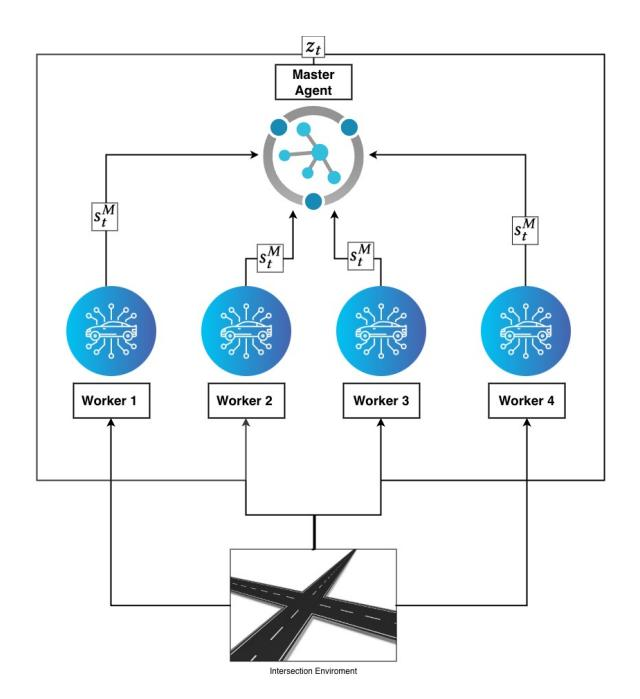
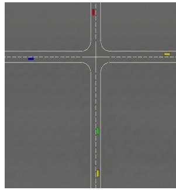
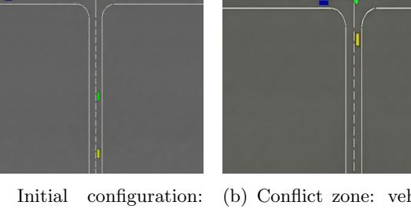
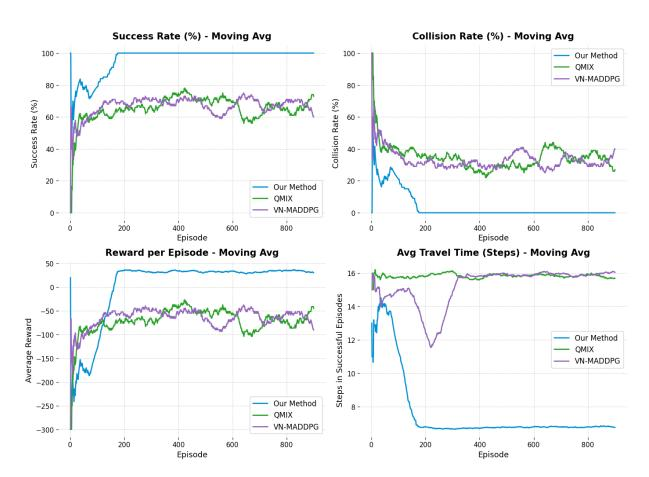
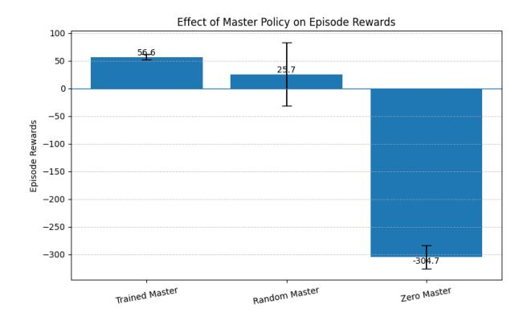
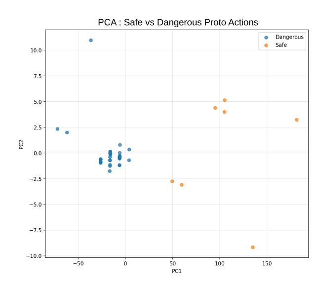
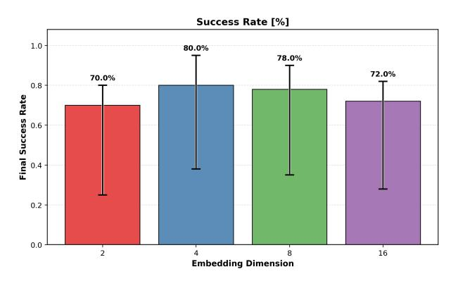
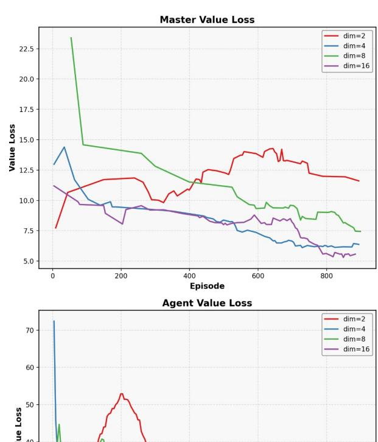
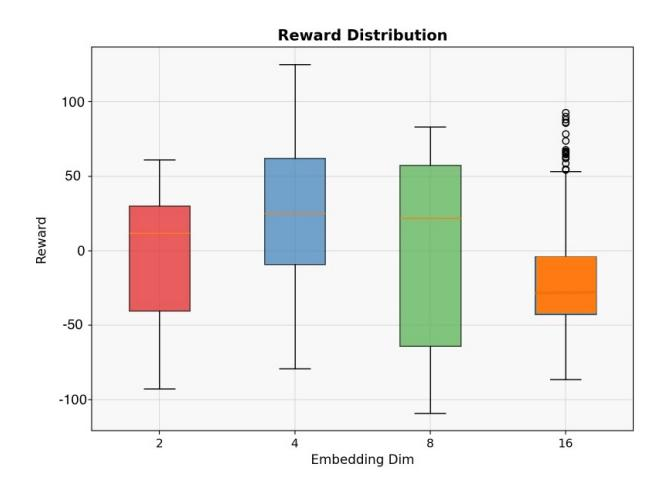

# 비신호 교차로에서 자율주행 차량을 위한 컴팩트 잠재 조정 (Compact Latent Coordination for Autonomous Vehicles at Unsignalized Intersections)

- 원제: Compact Latent Coordination for Autonomous Vehicles at Unsignalized Intersections
- 원문: [https://arxiv.org/abs/2607.21488](https://arxiv.org/abs/2607.21488)
- PDF: [https://arxiv.org/pdf/2607.21488v1](https://arxiv.org/pdf/2607.21488v1)
- arXiv ID: `2607.21488`

---

# <span id="page-0-0"></span>비신호 교차로에서 자율주행 차량을 위한 컴팩트 잠재 조정 (Compact Latent Coordination for Autonomous Vehicles at Unsignalized Intersections)

Gil Lifshits, 베가스 유대인 대학 (Ben-Gurion University of the Negev), gillif@post.bgu.ac.il

Igal Bilik, 베가스 유대인 대학 (Ben-Gurion University of the Negev), bilik@bgu.ac.il

Gilad Katz, 베가스 유대인 대학 (Ben-Gurion University of the Negev), giladkz@bgu.ac.il

2026년 7월 24일

# 초록 (Abstract)

차량 조정.

비신호 교차로에서 자율주행 차량을 조정하는 것은 다중 에이전트 강화 학습(MARL) 시스템에 있어 여전히 중요한 과제로 남아 있으며, 이 시스템들은 일반적으로 조합적 행동 공간, 특권 정보에 대한 의존성, 혹은 경직된 에이전트 설계로 인해 어려움을 겪는다. 우리는 Master-Agent Proto-plan System (MAPS)를 제안한다. MAPS는 중앙집중식 Master 에이전트가 전역 조정 전략을 인코딩하는 컴팩트하고 연속적인 임베딩(프로토-플랜) 을 생성하는 계층적 딥 강화 학습(Deep Reinforcement Learning, DRL) 아키텍처이다. 분산된 Worker 에이전트는 이 프로토-플랜을 로컬 관측과 결합해 차량별 제어를 수행함으로써 전략적 의도를 전술적 실행에서 분리하고 각 모듈을 독립적으로 최적화할 수 있다. 이 조정 메커니즘의 개념 증명을 위해 우리는 HighwayEnv에서 72개의 교차로 구성을 대상으로 MAPS를 테스트한다. MAPS는 충돌 없는 탐색을 달성하면서 평균 주행 시간을 크게 단축하고, 최첨단 기준선보다 우수한 성능을 보인다. 학습된 프로토-플랜은 강력한 일반화 성능을 보이며, 세 개의 에이전트로 훈련된 시스템이 5개 에이전트 시나리오에 제로샷으로 배포될 때 94%의 성공률을 달성함으로써 프로토-플랜 기반 계층적 학습이 다중-

## 1 서론 (Introduction)

비신호 교차로에서 다수의 자율주행 차량(AV)을 조정하는 것은 지능형 교통의 핵심 과제로, 차량은 복잡하고 동적인 시나리오를 공동으로 탐색하면서 충돌 없는 운행을 보장하고 처리량을 유지해야 한다 [&#91;Wang et al.(2024)&#93;](#page-13-0). 이 다중 에이전트 조정 문제의 난이도는 다중 에이전트 딥 강화 학습(MADRL) 분야에서 광범위한 연구를 촉진했다 [&#91;Chen et al.(2024)&#93;](#page-12-0), 가치 분해 방법 [&#91;Huang et al.(2023)&#93;](#page-12-1), 그래프 기반 표현 [&#91;Cai et al.(2022)&#93;](#page-12-2), 정책 최적화 [&#91;Peng et al.(2023),](#page-13-1) [Xu et al.(2022)&#93;](#page-14-0), 그리고 계층적 프레임워크 [&#91;Al-Sharman et al.(2022),](#page-12-3) [Liu et al.(2025),](#page-13-2) [Zhao et al.(2024)&#93;](#page-14-1).

주목할 만한 진전에도 불구하고 기존 접근 방식은 여러 한계를 공유한다. 첫째, 많은 연구가 실제 교차로의 다양성을 반영하지 않는 단순화된 레이아웃에서 훈련 및 평가되기 때문에 일반화가 제한적이다. 둘째, 최첨단 방법은 종종 미래 궤적, 게임 이론적 사전, 규칙 기반 안전 레이어, 혹은 전문가 시연과 같은 특권 정보를 의존하며, 이는 실제 배포에서 이용 불가능할 수 있다. 셋째, 대부분의 방법은 작은 사전 정의된 기동 세트로 구성된 고정된 이산 행동 공간을 사용하며, 이는 에이전트 수에 따라 조합적으로 확장되고 차량 능력이 변할 때 재설계가 필요하다.

우리는 이러한 한계를 [master-agent](#page-0-0) [proto-plan system (MAPS),](#page-0-0) 고정된, per-vehicle 행동 할당을 프로토-플랜으로 대체하는 계층적 [DRL](#page-0-0) 아키텍처를 통해 해결한다. 프로토-플랜은 학습된 연속 임베딩 벡터로, 고수준 조정 전략을 인코딩한다. 중앙집중식 Master 에이전트는 전역 교통 상태를 관찰하고 단일 프로토-플랜을 생성하며, 분산된 Worker 에이전트는 이 프로토-플랜과 자신의 로컬 관측을 결합해 차량별 행동을 선택한다. 이 분해는 조정과 제어를 분리하고, 차량 수와 관계없이 통신 오버헤드를 O(d)로 유지하며, 각 모듈을 독립적으로 업데이트할 수 있게 한다.

72개의 교차로 구성에서 수행된 실험은 MAPS가 평가 중에 충돌 없이 평균 이동 시간을 7.8 스텝으로 줄여 최적의 기준선보다 38% 향상된 결과를 달성함을 보여준다. 이 아키텍처는 또한 강력한 제로샷 전이(zeroshot transfer)를 입증한다: 세 개의 활성 에이전트만으로 훈련된 모델이 미세 조정 없이 5개 에이전트 시나리오에 배포될 때 94%의 성공률을 달성한다.

#### 우리의 기여는 다음과 같다:

- 우리는 MAPS를 도입한다. MAPS는 계층적 [DRL](#page-0-0) 아키텍처로, 엄격한 조정 명령을 연속적인 프로토-플랜 임베딩으로 대체하며, 함대 규모가 커져도 행동 및 통신 복잡도를 O(d)로 유지한다.  
- 우리는 점진적 훈련을 통해 제로샷 일반화를 입증한다: 세 에이전트로 훈련된 모델이 다섯 에이전트 배치에 직접 전이되며, 학습된 프로토-플랜이 전이 가능한 조정 전략을 포착함을 확인한다.  
- 우리는 효과적인 다중 차량 조정이 바로 사용 가능한 운동학적 상태(위치와 속도)만으로 충분하며, 특권 정보나 전문가 시연에 의존하지 않음을 보여준다.

범위. 본 연구는 프로토-플랜 조정 메커니즘을 계층적 다중 에이전트 시스템에서 기초적인 진보로 도입한다. 우리의 주요 기여는 연속적이며 학습된 임베딩이 기존의 이산 명령 구조보다 더 견고하고 확장 가능한 조정 인터페이스를 제공한다는 아키텍처적 시연이다. 다중 에이전트 조정 과제를 원시 인식과 저수준 차량 역학의 복잡성에서 분리함으로써, 우리는 통제된 시뮬레이션 조건 하에서 프로토-플랜의 효능을 엄밀히 검증한다. 이 설계 선택은 충돌 없는 탐색과 제로샷 전이 등 관찰된 성능 향상이 계층적 아키텍처 자체에 내재되어 있음을 확인할 수 있게 한다. 본 연구는 MAPS 프레임워크에 대한 확정적 개념 증명으로서 기능하지만, 아키텍처는 고충실도 환경과 복잡한 센서 스위트에 대한 모듈식 확장성을 위해 설계되었으며, 이는 섹션 [5.4.](#page-11-0)에서 논의된다.

## 2 관련 연구

### 2.1 다중 에이전트 강화 학습

[MARL](#page-0-0)은 단일 에이전트 RL을 부분 관측, 비정상적 동역학, 협력–경쟁 트레이드오프를 직면한 다수의 의사결정자와 함께하는 환경으로 확장한다. 최근 연구는 대규모 시스템에서 확장성, 안전성, 조정에 초점을 맞춘다 [&#91;Liu et al.(2024)&#93;](#page-13-3). 모델 기반 접근법으로는 Ma 등 [&#91;Ma et al.(2024)&#93;](#page-13-4)이 있다. 이들은 전역 동역학을 토폴로지적으로 분리하여 지역 모델 학습을 수행하면서 전역 가치 정보를 근사화하여 규모에 따른 샘플 효율성을 향상시킨다. 안전이 중요한 설정에서는 Zhang 등 [&#91;Zhang et al.(2024b)&#93;](#page-14-2)이 κ-hop 이웃을 통한 지역 신뢰 구간 업데이트를 통해 공동 제약을 시행함으로써 중앙집중형 비평가 없이 분산 학습을 가능하게 한다. 한편 Hsu와 Pajic [&#91;Hsu and Pajic(2025)&#93;](#page-12-4)은 함수 근사와 함께 안전한 협력 [MARL](#page-0-0)에 대한 불이익 보장을 제공한다.

그래프 기반 표현은 구조적 선행 정보를 효과적으로 인코딩한다. GNN 기반 방법은 에이전트 실패와 통신 장애 상황에서도 견고한 다중 로봇 조정을 지원한다 [Weil et al.(2024)]. 교통 관리에서는 분산형 그래프 기반 MARL과 교통 디지털 트윈이 대규모 네트워크에서 신호 타이밍을 개선한다 [Wang et al.(2025a)], 그리고 EECG [Peng et al.(2025)]는 GNN과 호기심 기반 탐험 및 진화적 최적화를 통합하여 부분 관측 작업에서 신용 할당을 향상시킨다. 이러한 접근 방식은 중요한 조정 측면을 다루지만 일반적으로 에이전트가 동료 스케일링 표현을 추론해야 하는 고정된 행동 공간 구조 내에서 작동한다. 우리의 연구는 보완적이다: 학습 알고리즘을 개선하는 대신 프로토-플랜 임베딩을 통해 계층적 통신 메커니즘을 도입하여 조정을 상수 크기 신호로 압축함으로써 기존 RL 알고리즘의 보다 효과적인 적용을 가능하게 한다.

### 2.2 자율 주행을 위한 MARL (MARL for Autonomous Driving)

자율 주행에 [MARL](#page-0-0)을 적용하려면 안전성, 효율성, 실시간 반응성이 요구된다. Xu et al. [&#91;Xu et al.(2022)&#93;](#page-14-0)은 교차로 탐색을 위해 메타 탐험과 쌍둥이 지연 변형을 갖춘 DDPG 기반 알고리즘을 제안하며, 다중 목표 최적화를 위한 보상 설계에 주목한다. 가치 분해에서는 QMIXwD [&#91;Huang et al.(2023)&#93;](#page-12-1)가 초기 탐험을 향상시키기 위해 자체 생성 시연을 통합하고, VN-MADDPG [&#91;Zhang et al.(2024a)&#93;](#page-14-4)는 MADDPG를 변동 잡음과 중요도 샘플링으로 확장하여 다중 차량 학습을 보다 효율적으로 만든다. 그래프 기반 모델은 차량 상호작용을 효과적으로 포착한다. DQ-GAT [&#91;Cai et al.(2022)&#93;](#page-12-2)는 항공 시점 맵과 그래프 어텐션을 활용해 복잡한 공간 관계를 모델링하고, Spatharis와 Blekas [&#91;Spatharis and Blekas(2024)&#93;](#page-13-7)는 경로 에이전트와 충돌 항을 포함한 협업 프레임워크를 제안해 확장 가능한 SUMO 조정을 실현한다. 정책 최적화에서는 Peng et al. [&#91;Peng et al.(2023)&#93;](#page-13-1)가 난이도 수준에 따라 단계적으로 감소하는 클리핑을 적용한 커리큘럼 PPO를 도입하고, Xu et al. [&#91;Xu et al.(2022)&#93;](#page-14-0)는 TD3와 LSTM 기반 동작 예측을 결합해 부드러운 궤적을 제공한다.

계층적 아키텍처는 특히 우리의 연구와 관련이 깊으며, 전략적 의사결정과 전술적 의사결정을 분리한다. Al-Sharman et al. [&#91;Al-Sharman et al.(2022)&#93;](#page-12-3)는 SAC-MPC 계층을 통해 고수준 행동 계획을 저수준 제어에서 분리한다. MA-GA-DDPG [&#91;Liu et al.(2025)&#93;](#page-13-2)는 MADDPG를 다중 헤드 어텐션과 level-k 게임 사전 지식으로 보강하고, 협력형 CAV 행동을 위한 안전 검사기를 통합한다. SafeR-ADAIM [&#91;Zhao et al.(2024)&#93;](#page-14-1)은 밀집 교차로 안전을 위한 위험 인식 제약 최적화를 보여준다. 이러한 계층적 방법은 일반적으로 이산 명령이나 명시적 하위 목표를 발행하여, 함대 규모에 따라 조합적으로 증가하는 행동 공간을 만들고 새로운 행동을 위해 재설계가 필요하다. 유사하게, CommNet [&#91;Sukhbaatar et al.(2016)&#93;](#page-13-8) 및 Tar-MAC [&#91;Das et al.(2019)&#93;](#page-12-5)와 같은 피어 투 피어 학습 통신 방법은 각 에이전트가 메시지를 보내고 받도록 요구하며, 에이전트당 집계가 피어 수에 따라 확장된다. MAPS는 두 가지 패러다임에서 벗어난다: Master는 고정 차원 잠재 공간에서 조정 의도를 인코딩하는 연속 프로토플랜 임베딩을 생성한다. 이는 조합적 확장을 방지하고, 사전 정의된 명령어 사전을 필요로 하지 않으며, 함대 규모와 관계없이 Worker 입력 크기를 일정하게 유지하고, 섹션 5.1에서 보인 바와 같이 더 큰 에이전트 집단에 대한 제로샷 전이(Zero-shot transfer)를 가능하게 한다.

## 3 제안된 접근 방식 (Proposed Approach)

### 3.1 개요 (Overview)

우리는 다중 차량 교차점 조정을 두 단계로 구성된 계층적 마코프 결정 과정으로 공식화한다 (Figure [1])(#page-3-0): 전역 교통 상태를 관측하고 원하는 조정 전략을 나타내는 프로토-플랜 임베딩 z<sup>t</sup> ∈ R d 를 생성하는 중앙집중식 Master 에이전트와, 각 차량을 제어하는 분산형 Worker 에이전트가 프로토-플랜과 지역 관측을 결합하여 차량별 행동을 선택한다.  
Master의 행동 공간은 차량별 명령의 열거가 아니라 연속적인 잠재 공간이며, 이는 |A|<sup>N</sup>의 조합적 확장성을 피하면서 차량 수에 관계없이 통신 오버헤드를 O(d)로 유지한다.

### 3.2 문제 정의 (Problem Formulation)

우리는 문제를 계층적 제어를 갖는 분산형 부분 관측 마코프 결정 과정(Dec-POMDP)으로 모델링한다. 이는 튜플 ⟨N , S, {Oi}, {Ai}, T , {Ri}, γ⟩ 로 정의되며, 여기서 N = {1, …, N} 은 차량 집합, S 는 전역 상태 공간(위치와 속도), O<sup>i</sup>와 A<sup>i</sup>는 the

<span id="page-3-0"></span>

그림 1: 계층적 MARL 프레임워크. Master 에이전트는 전역 상태 $s_t^M$ 를 관측하고 proto-plan 임베딩 $z_t$ 를 생성한다. 각 Worker i는 $z_t$ 와 로컬 관측을 받아 차량별 행동 $a_t^i$ 를 생성한다.

Worker i의 로컬 관측 및 행동 공간, $\mathcal{T}: \mathcal{S} \times \mathcal{A}_1 \times \cdots \times \mathcal{A}_N \to \Delta(\mathcal{S})$ 는 전이 함수이며, $R_i: \mathcal{S} \times \mathcal{A}_i \to \mathbb{R}$ 은 에이전트 i의 보상, $\gamma \in [0,1)$ 은 할인 인자이다.

목표는 정책 집합 $\{\pi_i\}_{i=1}^N$ 를 찾아 기대 누적 할인 보상을 최대화하는 것이다:

$$J = \mathbb{E}\left[\sum_{t=0}^{T} \gamma^t \sum_{i=1}^{N} R_i(s_t, a_t^i)\right],\tag{1}$$

각 Worker i는 전체 상태 $s_t \in \mathcal{S}$ 대신 로컬 관측 $o_t^i \in \mathcal{O}_i$ 만 접근하도록 제한된다. Master는 전역 상태를 관측하고 *proto-plan* 을 통해 조정 의도를 전달함으로써 이 정보 격차를 메우며, 중앙집중형 훈련-분산형 실행(CTDE) 패러다임 [Lowe et al.(2017), Wang et al.(2025b)] 를 실현한다.

### 3.3 상태 공간 표현 (State Space Representation)

#### 3.3.1 Master 상태 공간 (Master State Space)

Master는 모든 N 차량의 동역학 정보를 연결하여 형성된 전역 상태 $s_t^M$ 를 관측한다:

$$s_t^M = [x_1, y_1, v_{x_1}, v_{y_1}, \dots, x_N, y_N, v_{x_N}, v_{y_N}] \in \mathbb{R}^{4N},$$

(2)

여기서 $(x_i, y_i)$ 와 $(v_{x_i}, v_{y_i})$ 는 교차점 중심 전역 좌표계에서 차량 i의 위치와 속도를 나타낸다. 차량은 접근 방향(N, E, S, W) 순으로 정렬되고, 그 다음으로 교차점 중심에 대한 거리가 가까운 순으로 정렬된다.

입력 레이어는 최대 $N_{\rm max}$ 차량을 수용한다. $k < N_{\rm max}$ 차량만 활성화된 경우, 나머지 슬롯은 0으로 패딩된다:

$$s_t^M = \left[ x_1, y_1, v_{x_1}, v_{y_1}, \dots, x_k, y_k, v_{x_k}, v_{y_k}, \mathbf{0}_{4(N_{\text{max}} - k)} \right]. \tag{3}$$

#### 3.3.2 Worker 상태 공간 (Worker State Space)

각 Worker i는 자신의 동역학과 proto-plan 을 결합한 로컬 상태를 관측한다:

$$s_t^{W_i} = [x_i, y_i, v_{x_i}, v_{y_i}, z_t] \in \mathbb{R}^{4+d}, \tag{4}$$

여기서 $z_t \in \mathbb{R}^d$ 는 실험에서 d = 4인 *proto-plan* 임베딩이다. Worker는 다른 차량의 직접 관측을 받지 않으며, 전적으로 *proto-plan* 에 의존해 조정 정보를 얻는다. 이는 각 Worker's 입력 크기를 차량 수와 관계없이 4 + d 로 일정하게 유지해 확장성과 프라이버시를 모두 향상시킨다.

### 3.4 행동 공간 및 Proto-Plan 메커니즘 (Action Space and Proto-Plan Mechanism)

#### 3.4.1 Master 행동 공간 (Master Action Space)

마스터의 행동 공간은 $\mathcal{A}_M = \mathbb{R}^d$ 로 정의된다. 전역 상태 $s_t^M$ 를 주어지면, 마스터 정책은 *proto-plan* 임베딩을 출력한다:

$$z_t = \pi_M^{\theta_M}(s_t^M), \tag{5}$$

여기서 $\pi_M^{\theta_M}$ 은 신경망 가중치 $\theta_M$ 로 파라미터화되며, tanh 출력층이 $z_t \in (-1,1)^d$ 를 제한한다.

전통적인 계층적 RL이 '차량 1은 양보하고, 차량 2는 진행한다'와 같은 이산 고수준 명령을 발행하는 것과 달리, proto-plan은 조정 전략을 연속 공간의 밀집 벡터로 인코딩한다. 개별 차원의 의미는 수동 지정이 아니라 엔드‑투‑엔드 학습에서 나타난다.

이 메커니즘은 학습된 통신 프로토콜 [Sukhbaatar et al.(2016),](#page-13-8) [Das et al.(2019)](#page-12-5) 와 표면적으로 유사하지만, 설계는 근본적으로 다르다. 첫째, proto-plan 통신은 비대칭이며 일대다이다: 하나의 Master가 모든 Worker에게 고정 크기 벡터를 방송하는 반면, CommNet과 TarMAC는 대형 규모에 따라 메시지 복잡도가 증가하는 대칭 피어‑투‑피어 메시징을 사용한다. 둘째, proto-plan은 개별 에이전트에 대한 메시지가 아니라 압축된 전역 조정 전략이며, 개념적으로는 계층적 RL에서 학습된 옵션이나 서브골에 더 가깝다. 셋째, Worker는 함대 구성을 완전히 분리한다: 활성 에이전트와 관계없이 동일한 d‑차원 입력을 받으며, 반면 피어‑투‑피어 프로토콜은 각 에이전트가 가변 수의 피어로부터 메시지를 집계하도록 요구한다. 이러한 아키텍처적 분리는 Master가 모든 조정 복잡성을 흡수하게 하여 Worker 정책이 함대 크기에 무관하게 유지되도록 하고, Section [5.3.](#page-10-0) 에서 보여진 제로‑샷 전이 가능하게 한다.

#### 3.4.2 작업자 행동 공간 (Worker Action Space)

각 Worker는 이산 행동 공간 A<sup>W</sup> = {가속, 감속} 을 사용하며, 각 행동은 목표 속도를 ∆vtarget = ±5 m/s 만큼 변경한다. 저수준 컨트롤러는 새로운 목표 속도에 도달하기 위해 필요한 물리적 가속도를 계산한다. 제어 주파수는 1 Hz이며, '속도 유지' 옵션은 제공되지 않는다.

각 타임스텝에서 Worker 정책은 로컬 상태를 기반으로 행동을 선택한다:

$$a_t^i = \pi_W^{\theta_W}(s_t^{W_i}). \tag{6}$$

### 3.5 보상 구조 (Reward Structure)

#### 3.5.1 작업자 보상 함수 (Worker Reward Function)

각 Worker는 안전하고 효율적인 주행을 장려하는 보상을 받는다:

$$r_t^{W_i} = \begin{cases} +R_{\text{success}} & \text{if vehicle } i \text{ crosses successfully} \\ -R_{\text{collision}} & \text{if vehicle } i \text{ is involved in a collision} \\ -R_{\text{step}} & \text{otherwise (per time step)} \end{cases}$$

$$(7)$$

여기서 Rsuccess = 50, Rcollision = 300, Rstep = 5 이다. 비대칭적 크기 (Rcollision ≫ Rsuccess > Rstep)는 안전이 가장 우선, 그 다음 효율성, 마지막으로 처리량이라는 엄격한 우선순위 계층을 강제한다 [Hua et al.(2025),](#page-12-6) [Zheng and Gu(2025)](#page-14-6). 보상 정규화를 생략하여 가파른 가치 기울기를 유지하고, 충돌 패널티가 누적 단계 비용을 엄격히 지배하도록 한다.

#### 3.5.2 마스터 보상 함수 (Master Reward Function)

마스터의 보상은 최소 연산자를 통해 개별 Worker 보상을 집계한다:

$$R_t^M = \begin{cases} \min_{i \in \mathcal{W}_{\text{active}}(t)} r_t^{W_i} & \text{if } \mathcal{W}_{\text{active}}(t) \neq \emptyset \\ 0 & \text{otherwise} \end{cases}$$

(8)

여기서 Wactive(t) = {i ∈ N | fi(t) = 0} 은 아직 목적지에 도달하지 않은 차량 집합이다. 이 maximin 목표는 마스터가 최악의 개별 결과를 최대화하도록 강제하며, 어느 한 차량을 희생하는 조정 전략을 방지한다. 최소 연산자를 평균으로 대체하면 훈련 시 SR이 84%로, 평가 시 80%로 감소한다.

#### 3.5.3 에피소드 종료 (Episode Termination)

에피소드는 (i) 모든 차량이 목적지에 도달했을 때, (ii) 충돌이 발생했을 때, 또는 (iii) 50 스텝 한계에 도달했을 때 종료된다.

### 3.6 네트워크 아키텍처 (Network Architecture)

Master와 Worker 에이전트는 Proximal Policy Optimization (PPO) [Schulman et al.(2017)]을 사용해 훈련된다. 각 Worker 모듈은 네 개의 완전 연결층(64, 32, 16, 8 뉴런; ReLU 활성화)을 갖는 별도의 정책 및 가치 네트워크로 구성된다. 정책 네트워크는 softmax를 통해 두 행동에 대한 범주형 분포를 출력하고, 가치 네트워크는 스칼라 추정치를 출력한다. Master는 고차원 글로벌 입력 ($4N_{\rm max}$ 특징)을 수용하기 위해 세 개의 층(128, 256, 128 뉴런)을 사용하며, tanh 출력층이 d-차원 프로토-플랜을 생성한다.

모든 Worker 에이전트는 파라미터 $\theta_W$를 공유하여 학습 가능한 파라미터를 줄이고 일반화 가능한 제어 전략을 장려한다. Workers가 로컬, 자기 중심적 관측에 기반해 동작하므로, 하나의 정책이 다양한 상황적 맥락을 통합된 주행 행동으로 매핑할 수 있다.

### 3.7 훈련 과정 (Training Process)

훈련은 Algorithm 1에 공식화된 대로 Master와 Worker 모듈의 교대 최적화를 통해 진행된다. 초기 사이클(사이클 0)에서는 두 정책이 공동으로 업데이트되어 초기 조정을 확립한다. 이후 사이클에서는 Master를 고정(Workers가 현재 프로토-플랜 표현에 적응)하고 Workers를 고정( Master가 Workers의 현재 행동을 고려해 보다 효과적인 프로토-플랜을 생성하도록 학습)하는 것을 번갈아 수행한다. 이는 다중 에이전트 최적화에 내재된 비정상성을 감소시켜, 각 모듈이 고정된 상대방에 대해 학습함으로써 보다 신뢰할 수 있는 그라디언트 추정과 안정적인 수렴을 이룬다.

경험은 Master용 전용 롤아웃 버퍼와 각 Worker용 개별 버퍼에 수집된다. 전체 훈련 하이퍼파라미터 세트는 표 2에 제공된다.

#### <span id="page-5-1"></span>3.7.1 일반화를 위한 점진적 훈련 (Incremental Training for Generalization)

학습된 프로토-플랜의 전이 가능성을 평가하기 위해 점진적 훈련 프로토콜을 사용한다. Master의 입력 레이어는 처음부터 $N_{\rm max}=5$ 에이전트에 맞춰 크기가 지정되며, 사용되지 않은 슬롯은 0으로 패딩된다. 훈련은 두 단계로 진행된다:

- 1. **단계 1:** 1개의 학습 에이전트로 수렴할 때까지 훈련한다.  
- 2. **단계 2:** 2개의 추가 에이전트를 도입(총 3개)하고 훈련을 계속한다.

결과 모델은 미세조정 없이 5-에이전트 구성에서 평가되며, 결과는 섹션 5에 보고된다.

<span id="page-5-0"></span>알고리즘 1 교대 마스터-워커 훈련 Input: 구성  $\mathcal{E}$ , 환경 E, 마스터 정책  $\pi_M$ , 워커 정책  $\pi_W$ Output: 훈련된 정책  $\pi_M$ ,  $\pi_W$ ; 충돌 수 c; 훈련 통계

```
1: N \leftarrow number of vehicles in E   # E의 차량 수
 2: Initialize rollout buffers \mathcal{B}_M for Master and \mathcal{B}_W   # 롤아웃 버퍼 \mathcal{B}_M (마스터용) 및 \mathcal{B}_W (워커용) 초기화
    for Workers   # 워커용
 3: Initialize collision count c \leftarrow 0   # 충돌 카운트 초기화
 4: Initialize statistics container S   # 통계 컨테이너 초기화
 5: for cycle = 0 to \mathcal{E}.NUM_CYCLES - 1 do
                  episode   # 에피소드
                                                              \mathbf{to}   # 까지
       \mathcal{E}.EPISODES_PER_CYCLE do
 7:
          (r_{\text{ed}}, \tau) \leftarrow \text{EXECUTEEPISODE}(\pi_M, \pi_W, E)
          Store trajectory \tau in appropriate buffers   # 적절한 버퍼에 궤적 \tau 저장
 8:
          if collision detected in \tau then   # τ에서 충돌 감지 시
 9:
             c \leftarrow c + 1
10:
11:
          end if
          Record episode statistics in \mathcal{S}   # 통계 \mathcal{S}에 에피소드 통계 기록
12:
          if cycle = 0 then
13:
             UPDATEPPO(\pi_M, \mathcal{B}_M);
                                                            UP-
14:
             DATEPPO(\pi_W, \mathcal{B}_W)
                                                        {Joint}   # 공동
          else if cycle mod 2 = 0 then
15:
             UPDATEPPO(\pi_M, \mathcal{B}_M)
                                                {Master only}   # 마스터 전용
16:
17:
          else
             UPDATEPPO(\pi_W, \mathcal{B}_W)
                                              {Workers only}   # 워커 전용
18.
19:
          end if
          E.Reset()
20.
       end for
22: end for
23: return \pi_M, \pi_W, c, \mathcal{S}
```

## 4 실험 설정 (Experimental Setup)

### 4.1 시뮬레이션 환경 (Simulation Environment)

우리는 HighwayEnv 시뮬레이터 [&#91;Leurent(2018)&#93;](#page-13-11)를 사용하여 우리의 접근 방식을 평가한다. 이는 자율 주행 연구를 위한 오픈소스 강화 학습 환경이다. 모듈형 아키텍처는 상태 표현, 행동 공간, 보상 함수를 사용자 정의할 수 있게 해 주어, 우리의 계층적 프레임워크에 잘 맞는다. 우리는 HighwayEnv의 단순화된 동역학을 특징으로 고의적으로 사용한다: 인식 파이프라인과 상세 차량 역학을 추상화함으로써 시뮬레이터는 다중 에이전트 조정 과제를 고립시켜, 성능 차이가 조정 아키텍처에 기인하도록 하여 혼란 요인을 배제한 통제된 테스트베드를 제공한다.

### 4.2 시나리오 구성 (Scenario Configuration)

#### 4.2.1 교차점 시나리오 (Intersection Scenarios)

우리는 접근 방향(N, S, E, W), 교차점에서의 초기 거리, 그리고 회전 의도(직진, 좌회전, 우회전)를 변형시켜 18개의 기본 시나리오를 구성했다. 각 기본 시나리오는 모든 네 개의 정방향(0°, 90°, 180°, 270°)으로 회전되어 72개의 고유한 구성을 만든다. 이 회전 증강은 특정 접근 방향에 과적합되는 것을 방지하고 대칭 교통 패턴 전반에 걸친 일반화를 보장한다.

#### 4.2.2 시나리오 설계 원칙 (Scenario Design Principles)

시나리오는 두 가지 속성을 만족하도록 수작업으로 설계되었다. 첫째, 해결 가능성: 각 시나리오는 규칙 기반 정책을 실행해 검증된 최소 하나 이상의 충돌 없는 조정 전략을 허용한다. 둘째, 비난의성: 모든 시나리오는 고유하게 충돌하는 궤적을 가지며, 고정된 양보와 같은 단순 반응 행동으로는 해결될 수 없다. 이 시나리오에서 두 기준선의 높은 충돌률(Table [1)](#page-8-2))은 비난의적 조정이 필요함을 실증적으로 확인한다.

#### 4.2.3 차량 초기화 및 에이전트 할당 (Vehicle Initialization and Agent Assignment)

각 에피소드 시작 시, 다섯 대의 차량은 교차점 진입점에서 0~75 m 거리의 접근 차선에 배치되며, 모두 20 m/s로 초기화된다. 각 차량의 접근 방향과 의도된 궤적은 시나리오 정의에 의해 지정된다. 다섯 대 중 세 대는 MAPS 학습 에이전트에 의해 제어되고, 나머지 두 대는 20 m/s의 일정 속도 궤적을 따라 비협조적 배경 교통을 시뮬레이션한다. 할당은 시나리오마다 고정된다. Figure [2](#page-7-0)는 예시 초기 구성을 그리고 그에 따른 충돌 구역을 보여준다.

#### 4.2.4 훈련 및 평가 프로토콜 (Training and Evaluation Protocol)

Training은 72가지 구성을 균일하게 무작위로 샘플링한 시나리오를 사용하여 Algorithm [1,](#page-5-0)의 교대 최적화 절차를 통해 900 에피소드에 걸쳐 수행된다. 평가는 동일한 시나리오 분포에서 균일하게 추출된 100 에피소드에 걸쳐 모든 탐색 노이즈를 제거하고 결정론적으로 수행된다. 결정론적 평가는 학습된 정책이 견고한 협력 전략으로 수렴했는지 여부를 테스트하며, 균일 샘플링은 전체 교통 패턴 범위에 걸쳐 커버리지를 보장한다. 모든 방법은 결정론적 재현성을 위해 고정된 난수 시드를 사용한다; 그 영향은 Section [5.4.](#page-11-0)에서 논의한다.

### <span id="page-6-0"></span>4.3 기준 방법

Table [2](#page-15-0) (Appendix 참조)는 모든 실험에서 우리 접근법이 사용한 훈련 구성을 요약한다. 우리는 MAPS를 두 가지 최근 방법과 비교한다. 이 방법들은 다중 에이전트 교차점 협력에 대한 서로 다른 패러다임을 대표한다: 시연을 활용한 가치 분해(value decomposition with demonstrations)와 적응형 탐색을 갖춘 액터-크리틱(actor-critic with adaptive exploration).

QMIXwD [&#91;Huang et al.(2023)&#93;](#page-12-1). 이 기준은 시연 학습을 QMIX 가치 분해 프레임워크에 통합함으로써 탐색 문제를 해결한다. 사전 훈련 단계는 전문가 시연과 자체 생성된 상호작용 데이터를 모두 활용하여 분포적

<span id="page-7-0"></span>



(a) 초기 구성: 다섯 대의 차량이 교차점으로부터 다양한 거리를 두고 모든 방향에서 접근한다.

(b) 충돌 구역: 차량들이 교차점 중앙에서 수렴하며 충돌을 피하기 위해 조정된 타이밍이 필요하다.

Figure 2: *HighwayEnv* 환경에서의 예시 시나리오로, 초기 차량 배치와 그에 따른 고밀도 충돌 구역을 보여준다.

shift. 원래 방법론을 따라, 우리 구현은 감독 마진 항(supervised margin term), $TD(\lambda)$ 손실, 그리고 $L_2$ 정규화를 결합한 손실을 사용한다. 시연 데이터셋은 사전 훈련된 탐욕 정책에서 추출한 전문가 궤적 10%와 자체 생성 데이터 90%로 구성된다.

**VN-MADDPG** [Zhang et al.(2024a)]. 이 기준은 MADDPG 액터-크리틱 프레임워크를 변동 노이즈 탐색과 중요도 샘플링 메커니즘으로 확장하여 연속 다중 에이전트 행동 공간에서 학습 효율을 향상시킨다.

공정한 비교를 위해 모든 방법은 원본 논문을 따라 구현되었으며 동일한 관측을 받고 동일한 시나리오 분포에서 동일한 900 에피소드 동안 훈련되었다. 기준 하이퍼파라미터는 원본 출판물에 따르며.

기준 선택 근거. 우리는 두 가지 주요 패러다임을 대표하는 기준을 선택했다: 시연을 활용한 가치 분해(QMIXwD)와 적응형 탐색을 갖춘 액터-크리틱(VN-MADDPG). Section 2의 다른 계층적 방법들, 예를 들어 MA-GA-DDPG [Liu et al.(2025)] 및 SafeR-ADAIM [Zhao et al.(2024)]는 추가 특권 메커니즘—레벨-k 게임이론 사전 지식과 안전 검사 모듈, 또는 도메인 특화 안전 레이어를 갖춘 위험 인식 제약 최적화—에 의존하기 때문에 포함되지 않았다. 우리의 핵심 주장은 프로토-플랜 협력 메커니즘 자체에 관한 것이므로, MAPS처럼 동역학 관측에서만 학습된 협력을 기반으로 하는 방법들과 비교한다. 이를 통해 성능 차이가 보조 안전 모듈이 아니라 아키텍처 설계에 기인하도록 보장한다.

#### **평가 지표** 4.4

우리는 안전성, 효율성 및 학습 안정성을 포착하는 네 가지 보완적 지표를 사용해 성능을 평가한다:

- 성공률 (SR): 모든 차량이 충돌 없이 교차로를 통과하는 에피소드의 비율:  $SR = N_{\text{success}}/N_{\text{total}} \times$ 100%. 보완 충돌률은 CR = 100% - SR. 모든 차량이 통과를 완료하지 못하고 50단계 시간 제한에 도달한 에피소드는 실패로 계산된다.  
- 훈련 충돌 횟수 (CC): 모든 훈련 에피소드에서의 충돌 이벤트 총합,  $CC = \sum_{k=1}^{K} c_k$  여기서 $c_k \in \{0, 1\}$ . 이는 학습 안전성을 추적하며, 값이 낮을수록 훈련 중 위험한 경험이 적음을 나타낸다.  
- 누적 에피소드 보상 (R): 에피소드 동안 누적된 총 보상, R = $\sum_{t=1}^{T} r_t$ . 값이 높을수록 안전성과 효율성을 동시에 향상시켰음을 의미한다.  
- 평균 이동 시간 (ATT): 활성 학습 에이전트가 교차로를 통과하는 평균 시뮬레이션 단계 수:  $ATT = \frac{1}{|\mathcal{W}_{\text{active}}|} \sum_{i=1}^{|\mathcal{W}_{\text{active}}|} \tau_i$ , 여기서 $\tau_i$ 는 차량 i의 이동 시간이다. 이는 통과 효율성을 반영한다: 비효율적인 조정은 더 긴 에피소드를 초래하고, 조기 충돌은 인위적으로 단계 수를 줄인다.

<span id="page-8-3"></span>

그림 3: MAPS와 기준선 비교를 위한 훈련 동역학 (Training dynamics comparing MAPS and baselines): (a) 성공률, (b) 충돌률, (c) 누적 에피소드 보상, (d) 평균 이동 시간. 이동 평균 윈도우 크기: 20.

표 1: 충돌 횟수 및 효율성 비교 (Comparison of collision counts and efficiency across methods).

| 접근 방식 | 충돌<br>(학습 - 900) | 충돌<br>(평가 - 100) | 평균 단계<br>(평가) |
|-------------|-----------------------------|----------------------------|---------------------------|
| MAPS (우리의) | 21 | 0 | 7.8 |
| VN-MADDPG | 132 | 35 | 12.7 |
| QMIXwD | 147 | 31 | 13.2 |

## <span id="page-8-1"></span>5 Evaluation Results (평가 결과)

### <span id="page-8-0"></span>5.1 Main Results (주요 결과)

Table [1](#page-8-2)는 비교 결과를 요약하고, Figure [3](#page-8-3)은 학습 중 학습 동역학을 보여준다. MAPS는 충돌 없는 평가를 달성하면서 가장 낮은 평균 이동 시간을 기록한 유일한 접근 방식이다.

#### 5.1.1 Safety Performance (안전 성능)

MAPS는 평가 중 충돌이 없으며(100% 성공률), VN-MADDPG는 35건(65% SR), QMIXwD는 31건(69% SR)의 충돌을 기록한다.

안전상의 이점은 훈련에서도 이어진다. MAPS는 900개의 훈련 에피소드 동안 21건의 충돌만 발생시키며, 이는 VN-MADDPG(132건)와 QMIXwD(147건)에 비해 84–85% 감소한 것이다. 이는 계층적 아키텍처가 더 빠르게 안전한 행동을 학습한다는 것을 시사한다. 두 비율 z-검정은 두 기준 모델 모두에서 이러한 감소가 통계적으로 유의미함(p < 0.001)을 확인한다.

#### 5.1.2 Efficiency Performance (효율성 성능)

MAPS는 우수한 통과 효율성을 보여준다: 차량은 교차로를 통과하는 데 평균 7.8 시뮬레이션 스텝이 필요하며, 이는 VN-MADDPG(12.7)와 QMIXwD(13.2)에 비해 38% 감소한 것이다. 이 성과는 MAPS가 불필요한 양보를 최소화하는 선제적 조정 전략을 학습하고, 프로토-플랜 메커니즘이 워커가 임박한 충돌에 반응하기보다 조정 요구를 예측하도록 가능하게 함으로써 얻어진다.

#### 5.1.3 Learning Dynamics (학습 동역학)

Figure [3](#page-8-3)은 몇 가지 주목할 만한 패턴을 보여준다. MAPS는 약 180개의 에피소드 내에 거의 최적의 성능에 수렴하며, 이후 학습 곡선은 두 기준 모델보다 현저히 낮은 변동성을 보인다. VN-MADDPG와 QMIXwD는 훈련 전반에 걸쳐 성공률과 보상에서 지속적인 진동을 보이며, 일관된 조정을 유지하는 데 어려움을 시사한다. 동일한 900-에피소드 훈련 예산을 공유함에도 불구하고 MAPS는 훨씬 나은 최종 결과를 달성하며, 이는 계층적 분해가 평면 다중 에이전트 아키텍처보다 더 다루기 쉬운 학습 문제를 제공함을 나타낸다.

### 5.2 Ablation Studies (감소 연구)

#### 5.2.1 Contribution of the Master Agent (마스터 에이전트의 기여)

학습된 프로토-플랜의 기여를 분리하기 위해, 우리는 워커 정책을 고정하고 추론 중에 마스터의 출력만 조작한다. 세 가지 조건을 평가한다:

$$z_t^{\text{trained}} = \pi_M(s_t^M),$$

(9)

$$z_t^{\text{random}} \sim \mathcal{U}(-1, 1)^d, \tag{10}$$

$$z_t^{\text{zero}} = \mathbf{0}_d, \tag{11}$$

$$z_t^{\text{zero}} = \mathbf{0}_d, \tag{11}$$

여기서 $\pi_M$는 훈련된 마스터 정책이다. 모든 조건에서 워커는 동일한 훈련된 정책 $\pi_W$를 사용하며, $s_t^{W_i}$는 동적 관측과 조작된 $z_t$를 연결하여 구성된다.

Figure 4는 400개의 평가 에피소드 동안 누적 에피소드 보상을 보고한다. 훈련된 마스터는 가장 높은 보상(평균 보상: 56.6)을 달성하고, 무작위 프로토-플랜은 중간 수준의 성능(25.7)을 보이며, 제로-출력 조건은 강한 부정 보상(-304.7)으로 붕괴한다. 이는 프로토-플랜 채널이 조정에 필수적이며, 워커가 그 내용을 기반으로 행동을 조정하도록 학습했다는 것을 보여준다.

#### Proto-Plan Embedding Analysis 5.2.2 (프로토-플랜 임베딩 분석 5.2.2)

마스터가 인코딩한 정보를 해석하기 위해, 우리는 평가 중 수집된 d-차원 프로토-플랜 벡터를 PCA를 사용해 2차원으로 투영하고, 각 타임스텝을 안전 예측(어떤 차량 간 거리가 5m 미만이면 위험)으로 라벨링한다. Figure 5는 프로토-플랜이 안전 상태와 위험 상태에 대해 서로 다른 영역을 차지함을 보여주며, 이는 마스터가 전역 상호작용 위험을 압축된 표현으로 학습했다는 것을 시사한다. 첫 두 주성분은 전체 분산의 76%를 포착한다(PC1: 63%, PC2: 13%).

#### 5.2.3 Sensitivity to Embedding Dimension (임베딩 차원에 대한 민감도)

우리는 임베딩 차원 $d \in \{2,4,8,16\}$ 에 걸쳐 아키텍처를 평가했습니다. Figure 6에 표시된 바와 같이, d=4가 가장 좋은 성능(80.0% SR)을 보이며, d=2는 70.0%, d=8은 78.0%, d=16은 72.0%에 해당합니다.

평가 프로토콜에 대한 주의사항. 이 ablation 연구에서 보고된 성공률은 Table 1의 성공률과 다릅니다. 이는 두 실험이 서로 다른 훈련 구성을 사용했기 때문입니다. Figure 6은 단일 단계 훈련을 사용합니다.

<span id="page-9-0"></span>

Figure 4: Workers가 고정된 세 가지 proto-plan 조건에서 누적 에피소드 보상. 훈련된 Master는 무작위 및 제로 기준보다 현저히 우수하며, 학습된 proto-plans가 필수적인 조정 정보를 인코딩한다는 것을 확인합니다.

<span id="page-9-1"></span>

Figure 5: proto-plan 벡터의 PCA 투영, 안전 판별(위험: 차량 간 거리 < 5 m)별 색상 지정. Proto-plans는 Workers가 조정 결정을 위해 사용하는 안전 관련 컨텍스트를 인코딩합니다.

임베딩 차원의 효과를 분리하기 위한 훈련 설정이며, 반면 Table 2는 최종 단계별 훈련된 모델(Phase $1 \rightarrow$ Phase 2)을 보고합니다.

<span id="page-10-1"></span>

Figure 6: proto-plan 임베딩 차원이 성공률에 미치는 영향. 성능은 d=4(80.0%)에서 최고이며, 이는 4차원 벡터가 표현 용량과 최적화 안정성 사이에서 최적의 균형을 제공함을 나타냅니다.

훈련 동역학 분석은 d=4가 가장 안정적인 보상 분포를 제공함을 확인합니다. Figures [7](#page-10-2)와 [8](#page-11-1)은 직접적인 최적화 및 보상 증거를 제공합니다. Figure [7](#page-10-2)는 d=4가 Master와 Worker의 가치 손실 전반에 걸쳐 가장 균형 잡힌 수렴을 달성하며, 최종 손실이 낮고 후기 단계 진동이 감소함을 보여줍니다. Figure [8](#page-11-1)은 d=4가 가장 강력한 중앙 경향과 견고한 분산을 가진 보상 품질을 극대화함을 보여주며, 고차원 설정(특히 d=16)은 중앙 경향이 저하되고 잔여값이 빈번히 발생합니다. 이 결과들은 4차원 proto-plan이 최적의 운영 지점임을 시사합니다: 최적화가 안정적이며, 낮은 손실 솔루션으로 신뢰성 있게 수렴하고, 가장 강력한 정책 수준 보상을 제공합니다.

이 패턴은 표현 용량과 학습 가능성 사이의 트레이드오프를 반영합니다: d=2는 필요한 조정 컨텍스트를 인코딩하기에 충분한 용량을 제공하지 못하고, d≥8은 최적화 난이도를 증가시켜 더 노이즈가 많은 정책을 초래합니다. 이 결과는 효과적인 함대 조정이 매우 낮은 차원 신호로 압축될 수 있다는 중심 논지를 지지하며, proto-plan 메커니즘이 대역폭 제약 상황에서도 실용적임을 보여줍니다.

<span id="page-10-2"></span>

Figure 7: 임베딩 차원별 Master와 Worker 가치 손실 궤적. d=4 설정은 모듈 전반에 걸쳐 가장 균형 잡히고 안정적인 공동 수렴을 보여주며, 최종 손실이 낮고 후기 단계 진동이 감소합니다.

### <span id="page-10-0"></span>5.3 보이지 않는 함대 크기에 대한 제로샷 전이 (Zero-Shot Transfer to Unseen Fleet Sizes)

학습된 proto-plans가 전이 가능한 조정 전략을 포착하는지 평가하기 위해, 세 개의 활성 에이전트(Section [3.7.1)](#page-5-1)로 훈련된 모델을 미세 조정 없이 다섯 개 에이전트 구성에서 테스트합니다. 100개의 테스트 에피소드에서 시스템은 94%의 성공률을 달성하며, 견고한 일반화를 보여줍니다.

<span id="page-11-1"></span>

Figure 8: 임베딩 차원별 보상 분포. d=4 정책은 가장 강력한 중앙 보상 프로필과 견고한 분산을 보이며, 고차원 설정(특히 d=16)은 중앙 경향이 저하되고 이상치가 증가합니다.

대규모 함대 크기로의 일반화. 6개의 실패 에피소드는 고밀도 또는 회전 시나리오에서의 충돌로 인한 것이며, 뚜렷한 패턴은 없습니다.

이 결과는 세 가지 아키텍처적 특성에 기인할 수 있다: (1) 프로토-플랜 임베딩은 특정 에이전트 수에 무관한 형식으로 조정 정보를 전달한다; (2) 워커 파라미터 공유는 제어 정책이 차량 인스턴스 전반에 걸쳐 일반화되도록 보장한다; 그리고 (3) 맥시민 보상 구조는 특정 에이전트 구성을 의존하지 않는 전략을 장려한다. 이 세 특성은 프로토-플랜 기반 조정이 추가 학습 없이도 훈련 범위를 넘어 일반화된다는 것을 시사한다.

### <span id="page-11-0"></span>5.4 Limitations and Design Scope

우리는 의도적인 범위 설정 결정과 향후 연구 방향을 반영하는 여러 한계를 식별합니다.

시뮬레이션 정밀도. 우리의 평가에서는 HighwayEnv라는 운동학 시뮬레이터를 사용하며, 이는 인지 노이즈, 센서 지연, 그리고 상세한 차량 역학을 추상화한다. 이 선택은 의도적이다: 다중 에이전트 조정 메커니즘을 혼란 요인으로부터 분리하여 프로토-플랜 아키텍처를 검증하기 위한 통제된 테스트베드를 제공한다. 그러나 더 높은 정밀도의 환경(SUMO 또는 CARLA 등)에서의 검증이 필요하다. 이는 풍부한 역학과 센서 노이즈가 존재할 때 조정의 이점이 전이되는지를 확인하기 위해서다.

행동 공간. 현재 Worker 행동 공간은 이진 장축 속도 제어(가속/감속)로 제한되어 있다. 이는 단순화된 것이지만, 아키텍처는 Worker 행동 공간에 무관하다: 연속 가속, 측면 기동, 또는 더 풍부한 이산 행동 세트는 Worker 정책 헤드만 수정하면 교체할 수 있으며, Master나 proto-plan 메커니즘에는 변경이 필요 없다. 이러한 확장 평가가 향후 연구의 우선 과제이다.

플릿 크기. 아키텍처는 세 대에서 다섯 대로의 zero-shot transfer를 보여주지만, 현재 Master는 고정 크기 연결 입력(4Nmax features)을 사용하여 하드 최대값을 부과한다. 대규모 플릿으로 확장하려면 Master를 위한 permutation-invariant 입력 처리, 예를 들어 attention-based 또는 set-based 아키텍처를 활용하면 유리할 것이다. 이는 proto-plan broadcast mechanism을 보존하는 자연스러운 확장이다. 본 연구는 core coordination mechanism을 검증하지만, large-scale deployment는 아직 open question이다.

기준 범위. 우리는 두 가지 대표적인 플랫 MARL 방법과 비교한다. 권한이 부여된 메커니즘(게임 사전, 안전 검사관)을 포함하는 계층적 기준선은 성능 차이가 보조 모듈이 아니라 조정 아키텍처를 반영하도록 제외하였다 (자세한 내용은 Section [4.3](#page-6-0)를 참조하십시오).

## 6 Conclusions and Future Work

우리는 신호가 없는 교차로에서 다중 차량 조정에 대한 계층적 DRL 아키텍처인 MAPS를 제시하였다. 이 아키텍처는 중앙 집중형 Master가 생성하고 분산형 Workers가 소비하는 연속적인 프로토플랜 임베딩을 사용하여 전략적 조정을 전술적 제어와 분리하면서 조합적 행동 공간 확장을 방지한다. 72개의 교차로 구성에 대한 평가에서 최적 기준선 대비 38% 감소된 이동 시간과 충돌 없는 탐색을 보여주었으며, 절제 연구(ablation studies)는 프로토플랜이 의미 있는 조정 정보를 인코딩한다는 것을 확인하였다. 이 아키텍처는 세 대에서 다섯 대로의 제로샷 일반화에서 94%의 성공률을 달성하였다.

핵심 통찰은 다중 차량 조정이 4차원 연속 신호로 압축된다는 것이며, 이는 통신 제약 및 대역폭 제한이 있는 V2X 시스템에서 배포를 가능하게 한다. 향후 연구는 다음과 같다: (1) 프로토 플랜을 확장하여 장기 전략을 인코딩하고, 여러 시간 단계에 걸쳐 통신 비용을 상쇄한다; (2) 중간 수준의 마스터를 통해 상위 노드에서 로컬 워커로 정제된 플랜을 전달함으로써 계층적 확장을 탐색한다; (3) 차량 클래스별 워커 모듈을 통해 이질적 함대를 조사하고, 모듈성을 활용해 재학습 없이 새로운 에이전트 유형을 통합한다.

# References

- <span id="page-12-3"></span>[Al-Sharman et al.(2022)] Mohammad Al-Sharman, Rowan Dempster, Mohamed A. Daoud, Mahmoud Nasr, Derek Rayside, and William Melek. 2022. 신호 없는 교차로에서의 자체 학습 자율 주행: 실현 가능한 의사결정을 위한 계층적 강화 학습 접근법. doi:[10.36227/techrxiv.20770486.v1](https://doi.org/10.36227/techrxiv.20770486.v1) 사전 인쇄본.

- <span id="page-12-2"></span>[Cai et al.(2022)] Peide Cai, Hengli Wang, Yuxiang Sun, and Ming Liu. 2022. DQ-GAT: 안전하고 효율적인 자율 주행을 위한 딥 Q-러닝과 그래프 어텐션 네트-

- 네트워크. IEEE 지능형 교통 시스템 학회 논문집 23, 11 (2022), 21102–21112. doi:[10.1109/TITS.2022.3189917](https://doi.org/10.1109/TITS.2022.3189917)

- <span id="page-12-0"></span>[Chen et al.(2024)] Kaixin Chen, Bing Li, Rongqing Zhang, and Xiang Cheng. 2024. 이종 차량을 이용한 자율 교차로 관리: 다중 에이전트 강화 학습 접근법. In 2024 IEEE 지능형 차량 심포지엄 (IV). 2255–2260. doi:[10.1109/](https://doi.org/10.1109/IV55156.2024.10588863) [IV55156.2024.10588863](https://doi.org/10.1109/IV55156.2024.10588863)

- <span id="page-12-5"></span>[Das et al.(2019)] Abhishek Das, Th´eophile Gervet, Joshua Romoff, Dhruv Batra, Devi Parikh, Mike Rabbat, and Joelle Pineau. 2019. TarMAC: 목표 지향 다중 에이전트 통신. In Proceedings of the 36th International Conference on Machine Learning (Proceedings of Machine Learning Research, Vol. 97), Kamalika Chaudhuri and Ruslan Salakhutdinov (Eds.). PMLR, 1538– 1546. [https://proceedings.mlr.press/v97/](https://proceedings.mlr.press/v97/das19a.html) [das19a.html](https://proceedings.mlr.press/v97/das19a.html)

- <span id="page-12-4"></span>[Hsu and Pajic(2025)] Hao-Lun Hsu and Miroslav Pajic. 2025. 함수 근사화를 이용한 안전한 협력 다중 에이전트 강화 학습. In Proceedings of the 7th Annual Learning for Dynamics & Control Conference (Proceedings of Machine Learning Research, Vol. 283). PMLR, 1353–1364. [https://proceedings.](https://proceedings.mlr.press/v283/hsu25a.html) [mlr.press/v283/hsu25a.html](https://proceedings.mlr.press/v283/hsu25a.html)

- <span id="page-12-6"></span>[Hua et al.(2025)] Min Hua, Xinda Qi, and Dong Chen. 2025. 연결 및 자동화 차량 제어를 위한 다중 에이전트 강화 학습: 최근 발전 및 향후 전망. IEEE 자동화 과학 및 공학 학회 논문집 22 (2025).

- <span id="page-12-1"></span>[Huang et al.(2023)] Chang Huang, Junqiao Zhao, Hongtu Zhou, Hai Zhang, Xiao Zhang, and Chen Ye. 2023. 시그널 없는 교차로에서의 다중 에이전트 의사결정: 시연을 통한 강화 학습. In 2023 IEEE 지능형 차량 심포지엄 (IV). IEEE, 1– 8. doi:[10.1109/IV55152.2023.10186792](https://doi.org/10.1109/IV55152.2023.10186792)

- <span id="page-13-11"></span>[Leurent(2018)] Edouard Leurent. 2018. 자율 주행 의사결정을 위한 환경. [https://github.com/eleurent/](https://github.com/eleurent/highway-env) [highway-env](https://github.com/eleurent/highway-env).

- <span id="page-13-3"></span>[Liu et al.(2024)] Dingbang Liu, Fenghui Ren, Jun Yan, Guoxin Su, Wen Gu, and Shohei Kato. 2024. 다중 에이전트 강화 학습 확장: 확장성 문제에 대한 광범위한 조사. IEEE Access 12 (2024), 94610–94631. doi:[10.1109/ACCESS.2024.3410318](https://doi.org/10.1109/ACCESS.2024.3410318)

- <span id="page-13-2"></span>[Liu et al.(2025)] Jiaqi Liu, Peng Hang, Xiaoxiang Na, Chao Huang, and Jian Sun. 2025. 신호 없는 교차로에서 CAV를 위한 협력적 의사결정: 주의와 계층적 게임 사전 정보를 활용한 MARL 접근법. IEEE Transactions on Intelligent Transportation Systems 26, 1 (Jan. 2025), 443–455. doi:[10.1109/](https://doi.org/10.1109/TITS.2024.3503092) [TITS.2024.3503092](https://doi.org/10.1109/TITS.2024.3503092)

- <span id="page-13-9"></span>[Lowe et al.(2017)] Ryan Lowe, Yi I Wu, Aviv Tamar, Jean Harb, OpenAI Pieter Abbeel, and Igor Mordatch. 2017. 혼합 협력-경쟁 환경을 위한 다중 에이전트 액터크리틱. Advances in neural information processing systems 30 (2017).

- <span id="page-13-4"></span>[Ma et al.(2024)] Chengdong Ma, Aming Li, Yali Du, Hao Dong, and Yaodong Yang. 2024. 대규모 네트워크 제어를 위한 효율적이고 확장 가능한 강화 학습. Nature Machine Intelligence 6, 9 (2024), 1006–1020. [doi:](https://doi.org/10.1038/s42256-024-00879-7)10. [1038/s42256-024-00879-7](https://doi.org/10.1038/s42256-024-00879-7)

- <span id="page-13-6"></span>[Peng et al.(2025)] Kexing Peng, Pengyi Li, and Jianye Hao. 2025. 에피소드형 다중 에이전트 강화 학습을 위한 진화 알고리즘으로 그래프 기반 조정 강화. In Proceedings of the 24th International Conference on Autonomous Agents and Multiagent Systems (AAMAS 2025). International Foundation for Autonomous Agents and Multiagent Systems, Detroit, MI, USA, 1623–1631. [https://www.ifaamas.org/](https://www.ifaamas.org/Proceedings/aamas2025/pdfs/p1623.pdf) [Proceedings/aamas2025/pdfs/p1623.pdf](https://www.ifaamas.org/Proceedings/aamas2025/pdfs/p1623.pdf)

- <span id="page-13-1"></span>[Peng et al.(2023)] Zengqi Peng, Xiao Zhou, Yubin Wang, Lei Zheng, Ming Liu, and Jun Ma. 2023. 신호 없는 교차로에서 자율 주행을 위한 단계 감소 클리핑을 적용한 커리큘럼 근접 정책 최적화. In 2023 IEEE 26th International Conference on Intelligent Transportation Systems (ITSC). IEEE, 5027–5033. doi:[10.1109/ITSC57777.2023.10422594](https://doi.org/10.1109/ITSC57777.2023.10422594)

- <span id="page-13-10"></span>[Schulman et al.(2017)] John Schulman, Filip Wolski, Prafulla Dhariwal, Alec Radford, and Oleg Klimov. 2017. 근접 정책 최적화 알고리즘. arXiv preprint arXiv:1707.06347 (2017)

- <span id="page-13-7"></span>[Spatharis and Blekas(2024)] Christos Spatharis and Konstantinos Blekas. 2024. 신호 없는 교차로가 있는 교통 구역에서 자율 주행을 위한 다중 에이전트 강화 학습. Journal of Intelligent Transportation Systems 28, 1 (2024), 103–119. doi:[10.1080/15472450.](https://doi.org/10.1080/15472450.2022.2109416) [2022.2109416](https://doi.org/10.1080/15472450.2022.2109416)

- <span id="page-13-8"></span>[Sukhbaatar et al.(2016)] Sainbayar Sukhbaatar, arthur szlam, and Rob Fergus. 2016. 역전파를 이용한 다중 에이전트 통신 학습. In Advances in Neural Information Processing Systems, D. Lee, M. Sugiyama, U. Luxburg, I. Guyon, and R. Garnett (Eds.), Vol. 29. Curran Associates, Inc. [https://proceedings.](https://proceedings.neurips.cc/paper_files/paper/2016/file/55b1927fdafef39c48e5b73b5d61ea60-Paper.pdf) [neurips.cc/paper\\_files/paper/2016/file/](https://proceedings.neurips.cc/paper_files/paper/2016/file/55b1927fdafef39c48e5b73b5d61ea60-Paper.pdf) [55b1927fdafef39c48e5b73b5d61ea60-Paper.](https://proceedings.neurips.cc/paper_files/paper/2016/file/55b1927fdafef39c48e5b73b5d61ea60-Paper.pdf) [pdf](https://proceedings.neurips.cc/paper_files/paper/2016/file/55b1927fdafef39c48e5b73b5d61ea60-Paper.pdf)

- <span id="page-13-0"></span>[Wang et al.(2024)] Bowen Wang, Xinle Gong, Yafei Wang, Peiyuan Lyu, and Sheng Liang. 2024. 신호 없는 교차로에서 연결 및 자율 차량을 위한 협력: 반복 학습 기반 충돌 없는 동작 계획 방법. IEEE Internet of Things Journal 11, 3 (2024), 5439–5454. doi:[10.1109/JIOT.2023.](https://doi.org/10.1109/JIOT.2023.3306572) [3306572](https://doi.org/10.1109/JIOT.2023.3306572)

- <span id="page-13-5"></span>[Wang et al.(2025a)] Kang Wang, Zhishu Shen, Zhen Lei, Xianhui Liu, and Tiehua Zhang. 2025a. 다중 에이전트 강화 학습을 향해

- 공간-시간 하이퍼그래프를 통한 기반 교통 신호 제어. IEEE Transactions on Mobile Computing 24, 9 (2025), 8258–8271. doi:[10.1109/TMC.2025.3556243](https://doi.org/10.1109/TMC.2025.3556243)  
- <span id="page-14-5"></span>[Wang et al.(2025b)] Ye Wang, Jingjing Wang, Ruijie Zhu, Hang Fu, Jianrui Chen, and C. L. Philip Chen. 2025b. 그래프 정보 표현에 의존한 다중 에이전트 조정 촉진. IEEE Transactions on Neural Networks and Learning Systems 36, 10 (2025), 17929– 17940. doi:[10.1109/TNNLS.2025.3575196](https://doi.org/10.1109/TNNLS.2025.3575196)  
- <span id="page-14-3"></span>[Weil et al.(2024)] Jannis Weil, Zhenghua Bao, Osama Abboud, and Tobias Meuser. 2024. 재귀적 메시지 전달을 통한 그래프에서의 다중 에이전트 강화 학습 일반화 향상. In Proceedings of the 23rd International Conference on Autonomous Agents and Multiagent Systems (AAMAS '24). 1919–1927.  
- <span id="page-14-0"></span>[Xu et al.(2022)] Shu-yuan Xu, Xue-mei Chen, Zijia Wang, Yu-hui Hu, and Xin-tong Han. 2022. 딥 강화 학습 기반 무신호 교차로에서 자율 주행 차량의 의사결정 모델. In 2022 7th IEEE International Conference on Advanced Robotics and Mechatronics (ICARM). IEEE, 672–677. doi:[10.1109/ICARM54641.2022.9959664](https://doi.org/10.1109/ICARM54641.2022.9959664)  
- <span id="page-14-4"></span>[Zhang et al.(2024a)] Hao Zhang, Yu Du, Shixin Zhao, Ying Yuan, and Qiuqi Gao. 2024a. VN-MADDPG: 무신호 교차로에서 자율 주행 차량을 위한 변동 노이즈 기반 다중 에이전트 강화 학습 알고리즘. Electronics 13, 16 (2024), 3180. [doi:](https://doi.org/10.3390/electronics13163180)10. [3390/electronics13163180](https://doi.org/10.3390/electronics13163180)  
- <span id="page-14-2"></span>[Zhang et al.(2024b)] Lijun Zhang, Lin Li, Wei Wei, Huizhong Song, Yaodong Yang, and Jiye Liang. 2024b. 안전한 다중 에이전트 강화 학습을 위한 확장 가능한 제약 정책 최적화. In Advances in Neural Information Processing Systems, Vol. 37. doi:[10.52202/](https://doi.org/10.52202/079017-4400) [079017-4400](https://doi.org/10.52202/079017-4400) NeurIPS.

- <span id="page-14-1"></span>[Zhao et al.(2024)] Rui Zhao, Yun Li, Kui Wang, Yuze Fan, Fei Gao, and Zhenhai Gao. 2024. 안전한 딥 강화 학습을 통한 연결된 자율 주행 차량의 교차로에서의 중앙집중형 협력. IEEE Transactions on Mobile Computing 23, 12 (2024), 12830–12847. doi:[10.1109/TMC.2024.3417441](https://doi.org/10.1109/TMC.2024.3417441)  
- <span id="page-14-6"></span>[Zheng and Gu(2025)] Zhi Zheng and Shangding Gu. 2025. 자율 주행에서 이중 최적화를 이용한 안전한 다중 에이전트 강화 학습. IEEE Transactions on Artificial Intelligence 6, 4 (2025), 829–840. doi:[10.1109/TAI.2025.](https://doi.org/10.1109/TAI.2025.10752922) [10752922](https://doi.org/10.1109/TAI.2025.10752922)

# A The Hyperparameters of Our Proposed Approach (우리 제안 접근법의 하이퍼파라미터)

<span id="page-15-0"></span>Table 2: Training Hyperparameters (훈련 하이퍼파라미터)

| 파라미터 | 값 |  |  |
|---------------------------------|------------------|--|--|
| 알고리즘 | PPO |  |  |
| 옵티마이저 | Adam |  |  |
| 손실 함수 | MSE |  |  |
| 할인 인자 (γ) | 0.99 |  |  |
| 학습률 (마스터 & 에이전트) | 0.005 |  |  |
| 배치 크기 | 32 |  |  |
| 롤아웃 버퍼 크기 (N ST EP S) | 64 |  |  |
| 클립 범위 (PPO) | 0.2 |  |  |
| 추가 구성 |  |  |  |
| 주기당 에피소드 수 | 300 |  |  |
| 총 주기 수 | 3 |  |  |
| 그라디언트 업데이트 빈도 | 2 에피소드마다 |  |  |
| 최대 에피소드 시간 | 50 스텝 |  |  |
| 에이전트 상태 입력 크기 | 8 |  |  |
| proto-plan 임베딩 차원 | 4 |  |  |
| 행동 공간 크기 | 2 |  |  |
| 에이전트 수 | 5 |  |  |
| 시드 | 42 |  |  |
| 딥러닝 프레임워크 | PyTorch |  |  |
| RL 라이브러리 | Stable |  |  |
|  | Baselines3 |  |  |
| 하드웨어 | CPU |  |  |
| 대략적인 훈련 시간 | 20분 |  |  |
| 보상 구조 |  |  |  |
| 목표 도달 보상 | 50 |  |  |
| 충돌 보상 | -300 |  |  |
| 기아 보상 | -5 |  |  |

