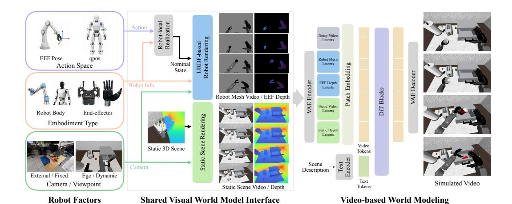
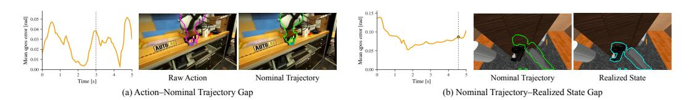
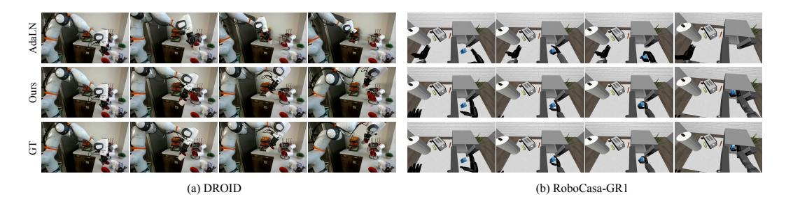
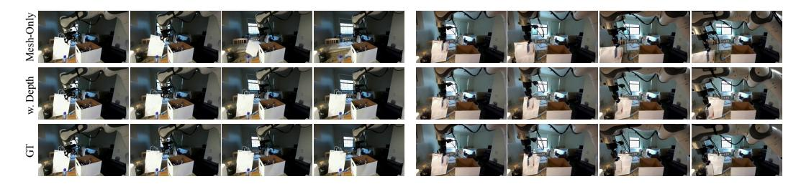
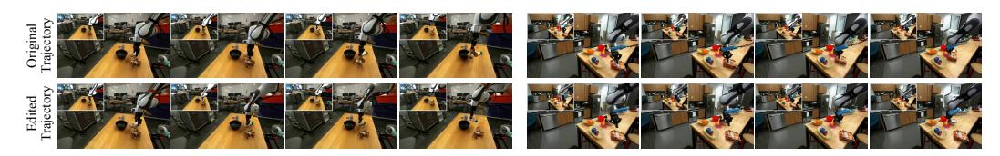
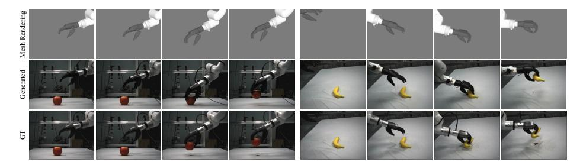
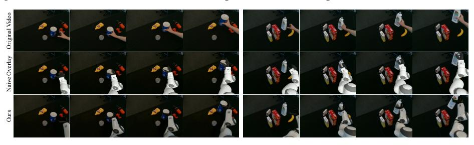
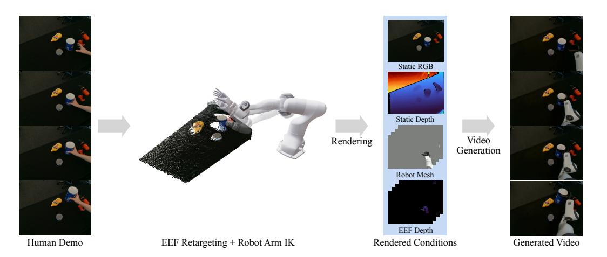
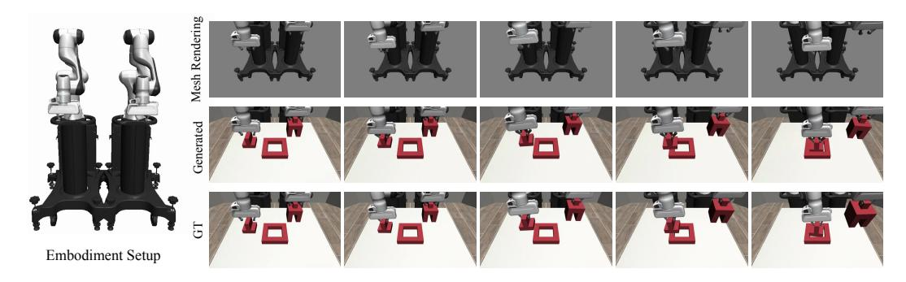
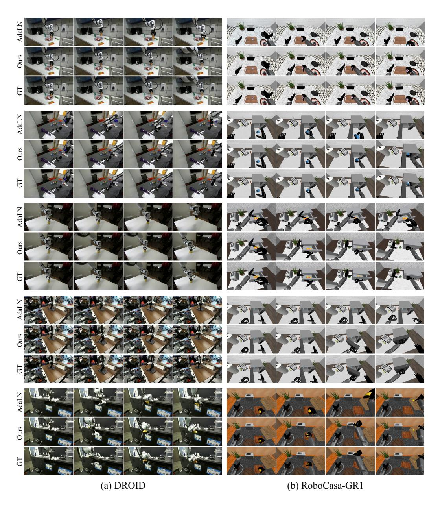

# 로봇-분해된 세계 모델: 로봇 렌더링을 통한 (Robot-Factored World Models via Robot Rendering)

- 원제: Robot-Factored World Models via Robot Rendering
- 원문: [https://arxiv.org/abs/2607.22535](https://arxiv.org/abs/2607.22535)
- PDF: [https://arxiv.org/pdf/2607.22535v1](https://arxiv.org/pdf/2607.22535v1)
- arXiv ID: `2607.22535`

---

# 로봇-분해된 세계 모델: 로봇 렌더링을 통한 (Robot-Factored World Models via Robot Rendering)

Byungjun Kim1 Taeksoo Kim1 Hyunsoo Cha1 Hanbyul Joo1,2 1서울대학교 2RLWRLD {byungjun.kim,taeksu98,243stephen,hbjoo}@snu.ac.kr

초록: 액션-조건화된 비디오 세계 모델은 초기 관측과 액션 신호를 통해 미래 관측을 예측한다. 로봇공학에서는 액션이 두 가지 별개의 과정을 통해 미래 관측에 영향을 미친다: 먼저 로봇 본체와 컨트롤러에 의해 로봇 동작으로 실현되고, 이후 장면은 접촉 및 물체 움직임을 통해 반응한다. 액션 명령에 직접 조건화하면 세계 모델이 실현 과정을 스스로 학습하도록 요구하고, 기록된 미래 상태에 조건화하면 예측해야 할 상호작용 결과가 유출된다. 우리는 로봇-분해된 세계 모델 (robot-factored world models)을 제안한다. 이는 두 가지 로봇 특화 요인을 세계 모델 밖으로 옮긴다. 첫 번째, 액션 실현: 각 명령은 로봇 자체의 컨트롤러와 운동학을 거쳐 배포 가능한 명목 궤적(노미널 트래젝터리)으로 변환된다. 이는 액션 실현 학습과 미래 상태 유출을 모두 방지하는 중간 신호다. 두 번째, 로봇 렌더링: 이 명목 궤적은 로봇 URDF를 통해 렌더링되어 로봇의 기하학, 운동학, 외관을 모델에서 분리하고 명시적인 렌더링된 로봇 기하학으로 변환한다. 깊이 모호성을 해소하기 위해 엔드 이펙터 깊이와 장면 깊이를 쌍으로 사용하여 이미지 평면 겹침을 넘어선 접촉 및 가림에 대한 기하학적 단서를 제공한다. 이러한 요소들—카메라 인식 정적 RGB/깊이 컨텍스트와 렌더링된 로봇 기하학—은 시점과 로봇 구현체에 걸쳐 일관성을 유지하는 공유 시각적 세계 모델 인터페이스를 형성한다. 따라서 모델은 액션을 단지 가시적인 로봇 기하학으로만 인식하고 물체가 어떻게 반응하는지를 학습한다. 우리의 실험 결과는 렌더링된 인터페이스가 벡터-조건화된 기준선보다 우수하며, 추론 시 보지 못한 로봇 구현체에도 일반화된다는 것을 보여준다. 또한 우리는 모델이 인간 시연을 리타게팅하고 손 동작을 로봇 기하학으로 렌더링함으로써 로봇 조작 영상을 생성할 수 있음을 입증한다.

키워드: 로봇 세계 모델, 행동-조건화된 비디오 생성

## 1 서론 (Introduction)

세계 모델은 에이전트의 행동에 대한 반응으로 환경이 어떻게 진화하는지를 예측하여 실제 세계에서 행동하지 않고도 행동을 예측할 수 있도록 한다 [1]. 최근 비디오 생성 모델의 발전으로 픽셀 공간에서 직접 미래 관측을 예측하는 세계 모델이 가능해졌다 [2,] [3,] [4,] [5]. 로봇공학에서는 이는 매력적인 활용을 제시한다: 후보 행동에 조건화된 비디오 세계 모델은 그 행동이 만들어낼 미래를 롤아웃하여 정책 개선을 위한 학습된 환경으로 활용하거나 실제 실행 전에 행동을 순위 매기는 데 사용될 수 있다 [6] [7]. 이는 중심적인 질문을 제기한다: 로봇 행동을 비디오 세계 모델에 어떻게 제시해야 할까?

물리적 로봇의 경우, 행동은 장면 상호작용이 발생하기 전에 구현(embodiment)-특정 실현 과정을 통해 미래 관측에 영향을 미칩니다. 따라서 로봇-특정 제어 신호에 직접 조건화된 세계 모델은 해당 신호가 로봇 동작으로 실현되는 방식과 장면이 그 동작에 어떻게 반응하는지를 모두 학습해야 합니다. 기존의 로봇 비디오 세계 모델은 이 부담을 대부분 네트워크 내부에 두고 있습니다: 로봇 제어 신호를 조건화 층을 통해 주입함으로써 [&#91;3,](#page-8-0) [4,](#page-8-0) [5&#93;](#page-8-0), 모델이 보는 신호는 여전히 구현(embodiment)-특정 행동 표현에 묶여 있습니다. Visual Action Prompts (VAP) [&#91;8&#93;](#page-8-0)는 행동을 이미지 공간의 시각적 조건으로 표현할 것을 제안합니다. 그러나 로봇 세계 모델의 경우 핵심 질문은 어떤 로봇 신호를 렌더링해야 하는가입니다. VAP는 이 아이디어를 로깅된 로봇 상태 궤적을 렌더링함으로써 구현합니다. 이 궤적은 미래 비디오와 시각적으로 정렬됩니다. 하지만 이러한 로깅된 상태는 장면 상호작용의 실현 결과이므로 이미 접촉, 순응성, 지연, 폐쇄 루프 보정 등을 인코딩하고 있습니다. 따라서 이를 렌더링하면 정렬된 프롬프트를 제공하지만 동시에 세계 모델이 예측해야 할 상호작용을 누설하게 됩니다. 따라서 배포 가능한 시각적 조건화 신호를 찾아내어 장면 반응 예측을 모델의 과제로 유지하는 것이 도전 과제입니다.

이러한 도전 과제를 해결하기 위해, 우리는 배포 가능한 명목 궤적을 중심으로 구축된 로봇-분리형 시각적 세계 모델 인터페이스를 도입합니다. 행동 시퀀스를 주어진 경우, 우리는 장면 상호작용을 관찰하기 전에 로봇 자체의 컨트롤러와 운동학을 통해 이를 실행하여 이 명목 궤적을 생성합니다: 장면 상호작용 이전에 행동에서 실현된 동작입니다. 이 궤적은 추론 시에 사용 가능하며, 자유 공간에서 실현된 동작과 일치하고, 접촉에 의해 매개되는 상호작용이 예측되어야 할 부분에서는 차이가 발생합니다. 우리는 명목 궤적을 로봇 URDF를 통해 카메라 정렬된 로봇 기하학으로 렌더링합니다. 카메라 인식 정적 RGB/깊이 컨텍스트와 렌더링된 로봇 기하학이 결합되어 고정 및 동적 관점 모두에 대한 공유 시각적 세계 모델 인터페이스를 형성합니다. 모델은 행동을 가시적인 로봇 기하학으로 인식하고, 그 주변에서 장면이 어떻게 반응하는지를 학습합니다. 이 렌더링된 로봇 기하학은 이미지 공간에서 행동을 위치시키지만, RGB만으로는 로봇과 장면 사이의 공간적 관계를 해결할 수 없습니다. 따라서 우리는 인터페이스를 엔드 이펙터와 장면 깊이로 보강하여 이미지 평면 겹침을 넘어 근접성, 접촉 및 가림에 대한 기하학적 단서를 제공합니다.

인터페이스가 행동을 구현(embodiment)-특정 제어 신호가 아니라 렌더링된 로봇 기하학으로 표현하기 때문에, 세계 모델의 조건화를 로봇-특정 행동 표현과 분리합니다. 이로써 보이지 않는 로봇에 대한 구현 일반화와 재타깃팅된 인간 시연에서 기반된 로봇 상호작용 비디오 생성을 지원합니다.

요약하면, 우리의 기여는 다음과 같습니다:

- (1) 우리는 배포 현실적인 시각적 세계 모델 인터페이스를 도입합니다. 이 인터페이스는 행동을 명목 로봇 궤적으로 실현하고, 이를 카메라 정렬된 URDF 메쉬 RGB와 엔드 이펙터 깊이로 렌더링합니다. 또한 카메라 인식 정적 RGB/깊이 컨텍스트를 사용해 장면 외관과 관점을 분리합니다.  
- (2) 우리는 인터페이스를 엔드 이펙터와 장면 깊이로 보강하여 깊이 인식 기능을 부여합니다. 이를 통해 RGB 이미지 평면 겹침을 넘어 근접성, 가림, 그리고 잠재적 접촉에 대한 기하학적 단서를 제공합니다.  
- (3) 우리는 렌더링된 인터페이스가 로봇 구현체와 동작 소스 전반에 걸쳐 공유됨을 보여줍니다. 이를 통해 보이지 않는 로봇에 대한 구현 일반화와 재타깃팅된 인간 시연에서 기반된 로봇 상호작용 비디오 생성을 가능하게 합니다.

## 2 Related Work

행동-조건화된 로봇 세계 모델. 세계 모델은 행동에 따라 관측이 어떻게 진화하는지를 예측하며, 상상, 계획, 정책 평가 및 정책 개선에 사용되어 왔습니다 [1,] [9,] [10,] [11,] [12]. 최근의 비디오 세계 모델은 이 아이디어를 게임, 운전, 탐색 및 로봇 조작을 위한 픽셀 공간 롤아웃으로 확장했습니다 [13,] [14,] [7,] [6,] [3,] [4,] [5,] [15,] [16,] [17,] [18,] [19,] [20,] [21,] [22,] [2]. 이러한 접근 방식은 주로 행동이 어떻게 표현되고 모델에 제시되는지에서 차이가 납니다. 일부 모델은 로봇 특화 행동 신호에 직접 조건화합니다 [3,] [4,] [7], 반면 다른 모델은 대규모 비디오에서 잠재적 또는 추상적 행동 표현을 학습합니다 [5,] [23,] [24,] [25,] [26,] [27]. 직접 행동 인터페이스는 구현 특화 제어 공간에 묶여 있는 반면, 잠재 행동 접근 방식은 학습된 추상화 뒤에 구현 기하학을 숨깁니다. 우리의 연구는 대신 장면 상호작용 전에 실현된 명목 궤적에 조건화하여 구현 기하학을 노출하면서 미래 상호작용 누수를 방지합니다.

비디오 생성에 대한 시각적 조건화. 시각적 조건화는 깊이, 포즈, 에지, 마스크, 옵티컬 플로우, 궤적, 참조 프레임과 같은 공간 신호를 사용해 이미지 및 비디오 확산 모델을 조정하는 표준 메커니즘입니다 [28,] [29,] [30,] [31,] [32,] [33,] [34,] [35,] [36,] [37]. 병행 문헌은 객체 움직임, 카메라 움직임, 드래그 편집, 포인트 트랙을 직접 비디오 조건으로 다룹니다 [38,] [39,] [40,] [41,] [42,] [43]. 이들 연구는 시각적 조건화를 이미지 및 비디오 생성을 제어하는 일반적인 메커니즘으로 확립합니다.

임베디드 비디오 예측을 위해 시각적 제어는 행동하는 몸체 자체를 나타낼 수 있습니다. Visual Action Prompts [8]는 로봇 상태를 이미지 공간 프롬프트로 렌더링하고, Dexterous World Models [44]는 정적 장면 렌더링과 손 메쉬 궤적에 기반해 비디오 생성을 조건화하여 상호작용에 의해 유도된 장면 역학을 모델링합니다. 우리는 이러한 접근 방식의 시각적 조건화 원칙을 공유하지만, 렌더링되는 로봇 신호가 다릅니다: 장면 상호작용 전에 계산된 명목 궤적을 사용하고, 이미 상호작용 결과를 반영한 기록된 상태를 사용하지 않습니다.

## 3 방법 (Method)

### 3.1 로봇-분해형 시각적 세계-모델 인터페이스 (Robot-Factored Visual World-Model Interface)

행동-조건화된 로봇 세계 모델은 현재 관측과 제안된 행동 시퀀스 $a_{1:F}$에서 미래 비디오 $V_{1:F}$를 예측합니다. $a_{1:F}$에 직접 조건화하면 비디오 모델은 두 가지 별개의 과정을 학습하도록 요구합니다: 로봇 행동이 로봇 움직임으로 실현되는 방식과 장면이 그 움직임에 반응하는 방식. 전자는 로봇 특화 구현 및 제어에 의존하고, 후자는 세계 모델이 해결해야 할 공통 예측 문제입니다. 따라서 우리는 행동 실현과 장면 반응 예측을 분리하고, 세계 모델 조건화 전에 실현 과정을 명시적으로 모델링합니다.

우리는 이 실현 과정을 행동을 명목 궤적으로 매핑하는 연산자 $\Phi_R$로 표현합니다:

$$\mathbf{q}_{1:F} = \Phi_R(\mathbf{a}_{1:F}; \mathbf{q}_0), \tag{1}$$

$q_{1:F}$는 장면 상호작용 전에 행동으로부터 실현된 명목 궤적입니다. 이후 우리는 이 명목 궤적을 목표 카메라 궤적 $C_{1:F}$에 따라 렌더링합니다:

$$(\mathbf{M}_{1:F}^{\text{rgb}}, \mathbf{D}_{1:F}^{\text{eef}}) = \Pi_R(\mathbf{q}_{1:F}; \mathcal{C}_{1:F}),$$

(2)

여기서  $\mathbf{M}_{1:F}^{\mathrm{rgb}}$  는 로봇 메쉬 RGB 비디오이며,  $\mathbf{D}_{1:F}^{\mathrm{eef}}$  는 엔드 이펙터 전용 깊이이다. 렌더링 연산자  $\Pi_R$  는 로봇 URDF와 기하학을 사용해 명목 궤적을 대상 카메라 프레임에 투영한다. 동시에, 초기 장면 상태  $\mathbf{S}_0$  은 동일한 카메라 궤적에 따라 렌더링된 정적 컨텍스트 스트림으로 표현된다:

$$(\mathbf{B}_{1: F}^{\mathrm{rgb}}, \mathbf{D}_{1: F}^{\mathrm{scene}}) = \Pi_{S}(\mathbf{S}_{0}; \mathcal{C}_{1: F}), \tag{3}$$

여기서  $\mathbf{B}^{\mathrm{rgb}}_{1: F}$  와  $\mathbf{D}^{\mathrm{scene}}_{1: F}$  는 대상 카메라 좌표계에서 외관 및 기하학적 컨텍스트를 제공한다. 이들 스트림은 함께 세계 모델의 조건화 인터페이스를 정의하며, 이는 학습한다

$$p_{\theta}\left(\mathbf{V}_{1: F} \mid \mathbf{B}_{1: F}^{\mathrm{rgb}}, \mathbf{D}_{1: F}^{\mathrm{scene}}, \mathbf{M}_{1: F}^{\mathrm{rgb}}, \mathbf{D}_{1: F}^{\mathrm{eef}}, \mathcal{T}\right),\tag{4}$$

여기서  $\mathcal{T}$  는 비디오 모델에 제공되는 텍스트 프롬프트이다. 이는 장면 컨텍스트만 포함하고 의도된 행동이나 미래 결과에 대한 설명은 제외한다.

이 분해는 로봇-특정 제어 신호를 모델이 바라보는 가시적 로봇 기하학으로 변환한다. 실현 및 렌더링 연산자는 고정된 사전 처리 단계이며, 학습된 모델은 렌더링된 로봇 동작 주변에서 장면 반응을 예측하는 공통 문제를 남긴다.

### 3.2 명목 궤적 조건화 (Nominal Trajectory Conditioning)

배포 시점의 시각적 조건화 신호는 두 가지 요구 사항을 충족해야 한다: 추론 시점에 사용 가능해야 하고, 행동에서 실현된 로봇 동작에 대해 여전히 정보를 제공해야 한다. 원시 액션  $a_{1:F}$  는 정책, 원격 조작자, 또는 데이터셋 컨트롤러가 방출하는 것으로, 예를 들어 관절 공간 또는 작업 공간 제어 명령이다. 이는 배포 시점에 사용 가능하지만, 그 의미는 특정 로봇과 컨트롤러에 묶여 있다. 명목 궤적  $q_{1:F}$  는 액션과 상호작용 사이에 위치한다: 이는 장면 상호작용을 관찰하기 전, 로봇 자체 컨트롤러와 운동학에 의해 실현되는 로봇 전용 동작이다. 이는 배포 시점에 사용 가능하며, 미래 상호작용 결과와 독립적이다. 실현 상태  $x_{1:F}$  는 장면에서 행동을 실행한 후 기록된 로봇 상태이다. 이는 미래 비디오와 시각적으로 정렬되어 있지만, 이미 접촉, 순응성, 지연, 실패 및

Figure 1: **시각적 세계 모델 인터페이스.**

Figure 2: 액션-상태 실현 격차. (a) 로봇-특정 컨트롤러와 하드웨어 제약은 원시 액션과 명목 궤적 사이에 격차를 만든다. (b) 장면 상호작용은 명목 궤적과 실현 상태 사이에 격차를 만든다. 명목 궤적은 배포 가능 조건화 신호로 사용된다.

다른 상호작용 결과. 실현 상태를 프롬프트로 렌더링하는 것은 오라클 진단 역할을 하며, 배포 가능 조건화 신호는 명목 궤적이다. Figure 2는 명목 궤적이 세계 모델 조건화에 적절한 중간 신호로 사용되는 이유를 보여준다.

이러한 신호 간의 불일치는 두 가지 격차로 분해될 수 있다. 액션-실현 격차는 원시 액션과 컨트롤러가 실현한 명목 동작 사이의 차이이다. 명목-실현 격차는 명목 궤적과 실제로 관찰된 접촉이 풍부한 롤아웃에서의 상태 사이의 차이이다. 우리의 분해는 첫 번째 격차를 로봇-특정 실현 프로세스에 할당하고, 두 번째 격차와 물체 움직임 및 가려짐 변화를 세계 모델에 남긴다. 각 로봇은 자체 컨트롤러와 함께  $\Phi_R$  를 인스턴스화하므로 로봇-특정 행동 의미는...

### 3.3 Camera-Aware Static Context (카메라 인식 정적 컨텍스트)

정적 컨텍스트 스트림은 (3)식에서 정의되며, 초기 장면 상태의 카메라 정렬된 표현을 세계 모델에 제공한다. 이 스트림은 로봇 상호작용과 무관하게 장면 외관, 장면 깊이, 시점 정보를 제공하므로 모델은 상호작용에 의해 발생하는 변화를 집중적으로 다루면서 정적 스트림은 장면 내용을 보존한다 [44].

정적 장면 표현과 카메라 궤적이 제공될 때, $\Pi_S$는 대상 비디오에서 사용되는 동일한 $\mathcal{C}_{1:F}$를 따라 정적 장면 RGB와 깊이를 생성한다. 고정 카메라의 경우, 초기 프레임을 예측 수평선 전체에 반복하여 동일한 스트림을 인스턴스화한다. 이 공식은 고정 및 동적 뷰 클립에 공통의 카메라 정렬된 조건화 인터페이스를 제공하며, 동작 정보는 렌더링된 명목 로봇 기하학을 통해 별도로 입력된다.

### 3.4 Rendered Robot Action Prompts (렌더된 로봇 액션 프롬프트)

렌더러 $\Pi_R$는 (2)식에서 명목 궤적을 대상 카메라 프레임에서 렌더링된 로봇 기하학으로 변환한다. 우리는 로봇을 URDF 메쉬 RGB로 렌더링하여 링크 기하학, 손목 오프셋, 그리퍼 모양, 엔드 이펙터 구조를 보존한다. 이는 동작을 대상 비디오와 동일한 시각 좌표에서 비디오 모델에 표시되도록 한다.

RGB 메쉬 렌더링은 이미지 공간에서 로봇을 위치시키고, 깊이는 엔드 이펙터가 물체와 겹치는 경우 그 앞에 있는지, 뒤에 있는지, 또는 접촉 깊이에 있는지를 해결한다. 따라서 우리는 엔드 이펙터 전용 깊이 $\mathbf{D}^{\text{eef}}_{1:F}$를 정적 장면 깊이 $\mathbf{D}^{\text{scene}}_{1:F}$와 함께 포함한다. 우리는 상호작용이 가장 일어날 가능성이 있는 엔드 이펙터에 깊이 렌더링을 집중한다. 이 깊이 신호들은 근접성, 예상 접촉, 그리고 명백한 2D 겹침을 넘어선 가려짐을 구분하는 데 도움을 준다.

### 3.5 Learning the Scene-Response Model (장면 반응 모델 학습)

우리는 Eq. 4를 잠재 비디오 확산 모델로 인스턴스화한다. Dexterous World Models [44]의 잔차-동역학 공식에 따라, 우리는 비디오 인페인팅 백본 [45]을 사용하며, 정적 컨텍스트 비디오는 조건화 입력으로 사용되고 예측 수평선 전체에 전체 마스크가 적용된다. 따라서 모델은 정적 장면 컨텍스트와 렌더링된 로봇 기하학에 조건화된 상호작용에 의해 유발된 장면 변화를 생성하도록 학습한다.

모든 조건화 스트림은 백본 모델 [47]의 사전 학습된 비디오 VAE [46]에 의해 인코딩된다. 정적 RGB 컨텍스트, 렌더링된 로봇 RGB, 장면 깊이, 그리고 엔드 이펙터 깊이 스트림이 인코딩되어 노이즈가 있는 비디오 잠재 변수와 연결된다:

$$c = \left[ \mathcal{E}(\mathbf{B}_{1:F}^{\text{rgb}}), \mathcal{E}(\mathbf{M}_{1:F}^{\text{rgb}}), \mathcal{E}(\mathbf{D}_{1:F}^{\text{scene}}), \mathcal{E}(\mathbf{D}_{1:F}^{\text{eef}}) \right]. \tag{5}$$

여기서  $\mathcal{E}$  는 각 조건화 스트림에 적용되는 사전 학습된 비디오 VAE 인코더를 나타낸다.

훈련은 잠재 흐름 매칭 목표 [48, 49]를 최소화한다. 샘플링된 노이즈 잠재 변수  $\epsilon$ 와 노이즈 수준  $\sigma$ 에 대해, 우리는  $z_{\sigma} = (1 - \sigma)z_0 + \sigma\epsilon$  를 만들고 목표 속도  $u = \epsilon - z_0$  를 사용한다:

$$\mathcal{L} = \mathbb{E}_{\boldsymbol{z}_0, \sigma, \boldsymbol{\epsilon}} \left[ \| \boldsymbol{u} - v_{\theta} \left( \boldsymbol{z}_{\sigma}, \sigma \mid \boldsymbol{c}, \mathcal{T} \right) \|_{2}^{2} \right].$$

(6)

텍스트 프롬프트  $\mathcal{T}$  는 장면 컨텍스트만 포함하고, 의도된 행동이나 미래 결과에 대한 설명은 제외한다.

\n## 4 Experiments (실험)\n\n

\n### 4.1 Experimental Setup (실험 설정)\n\n

**Datasets.** 우리는 DROID [50]의 향상된 외부(subset)와 RoboCasa [51]에서 수집된 RoboCasa-GR1 롤아웃을 사용한다. 이 롤아웃은 인간형 VLA DiT4DiT [52]를 24개의 작업에 걸쳐 각 작업마다 50개의 에피소드를 실행하여 수집된다. 두 데이터셋은 81프레임, $480 \times 832$, 16fps 클립으로 처리되어 41,642개의 DROID 클립과 9,380개의 RoboCasa-GR1 클립을 생성한다. 평가에는 256개의 보류된 DROID 클립과 128개의 보류된 RoboCasa-GR1 클립을 사용한다. HRDexDB [53]과 DexYCB [54]는 정성적 연구를 제공한다.

**Nominalization.** DROID의 경우, 원시 텔레옵레이터 관절 및 그리퍼 목표가 장면이 없는 로봇 전용 Isaac Lab [55] 환경에서 재생되므로 로봇 자체 컨트롤러와 작동 한계가 물리적으로 추적 가능한 명목 궤적을 제공한다. RoboCasa-GR1의 경우, DiT4DiT [52] 컨트롤러 동작이 클립 시작 상태에서 충돌이 없는 그림자 롤아웃에서 재생되어 Fourier GR-1 명목 상태를 얻는다. 두 경우 모두 명목 궤적은 추론 시에 사용 가능하며 로봇 조건화 신호로 렌더링된다.

**Baselines.** 우리는 *Ctrl-World* [4]와 비교한다. *Ctrl-World*는 Stable Video Diffusion (SVD) [56] 기반의 7-DoF 카르테시안 포즈 조건형 세계 모델이며, *AdaLN* [57] *state vector* 베이스라인은 ...

Table 1: 주요 액션-인터페이스 비교. 각 백본 셀은 모델, 학습 해상도, 학습 데이터(D+R: DROID+RoboCasa-GR1)를 나열한다. SVD 1.5B는 DROID만 학습하므로 RoboCasa-GR1에서는 평가되지 않는다(대시 표시); 낮은 해상도는 재구성 지표를 부풀리므로 숫자는 백본 내에서만 비교 가능하다. DROID와 RoboCasa-GR1은 평균이 아닌 별도로 보고되며, 각 백본에서 가장 좋은 값은 굵게 표시된다.

| 백본 | 방법 | DROID |  |  | RoboCasa-GR1 |  |  |
|-----------------------------|-----------------------------------------------------------------|----------------|----------------|---------------------------------------|----------------|----------------|----------------|
|  |  |  |  | PSNR↑ SSIM↑ LPIPS↓ PSNR↑ SSIM↑ LPIPS↓ |  |  |  |
| SVD 1.5B 192×320, DROID | Ctrl-World pose [4] 렌더링된 메쉬 (우리의) | 23.15 25.05 | 0.884 0.899 | 0.104 0.091 | – – | – – | – – |
| Wan 2.1 14B 480×832, D+R | AdaLN state vector 렌더링된 메쉬 + EEF/scene depth (우리의) | 18.57 21.87 | 0.824 0.859 | 0.224 0.178 | 17.67 24.61 | 0.835 0.889 | 0.194 0.131 |

Figure 3: 정성적 비교. 렌더링된 로봇 기하학은 로봇 주도 장면 변화를 지역화하고, 깊이는 접촉 관련 근접성 및 가림을 해결하는 데 도움을 준다.

동일한 배포 가능 명목 궤적을 수치 상태 값으로 사용한다. SVD 기반 비교를 위해, 우리는 포즈 조건화 또는 렌더링 인터페이스와 함께 동일한 백본을 재학습하고 DROID 보류 세트에서 평가한다. Wan [&#91;47&#93;](#page-10-0)/Wan2.1-Fun InP [&#91;45&#93;](#page-10-0)에서는 수치 상태 벡터 조건화와 메쉬 및 깊이와 함께 우리의 렌더링 인터페이스를 비교한다.

### 4.2 Main Comparison (주요 비교)

정량적 비교. 먼저 렌더링된 인터페이스가 벡터 또는 포즈 조건화 대안보다 모델이 직면한 행동 표현으로 더 나은지 여부를 묻는다. 우리는 PSNR, SSIM, 그리고 LPIPS [&#91;58&#93;](#page-11-0)를 클립 단위로 계산하고 평가 세트 전체에서 평균한다. 백본 제어 SVD 비교 내에서, 렌더링된 인터페이스는 Ctrl-World 스타일의 카르테시안 포즈 조건보다 우수하다. 공동 훈련된 Wan 설정에서는 렌더링된 인터페이스가 DROID와 RoboCasa-GR1 모두에서 AdaLN 상태 벡터 기준선을 능가한다. 이 결과는 핵심 인터페이스 설계를 지지한다: 렌더링된 로봇 기하학은 비디오 모델에 로봇 움직임의 픽셀 공간 증거를 직접 제공하며, 수치 행동 또는 상태 조건은 모델이 추가적인 기반 매핑을 학습하도록 요구한다. 백본 셀은 해상도와 훈련 데이터가 다르므로, 우리는 각 백본 내에서만 비교한다.

정성적 비교. Figure 3은 재구성 지표가 가장 진단이 어려운 경우를 강조한다: 작은 물체 움직임, 짧은 접촉, 가림 순서, 놓친 그립, 그리고 접촉이 없는 결과. AdaLN 상태 벡터 기준선은 종종 장면 외형을 보존하지만, 의도된 행동은 약하거나 잘못 배치된다. 반대로 렌더링된 로봇 기하학은 목표 카메라 프레임에서 행동을 직접 노출하므로, 예측된 장면 변화가 로봇 움직임 및 접촉 영역 주변에 더 잘 지역화된다.

### 4.3 Action Realization and Depth Ablations (행동 실현 및 깊이 절감)

Table 2는 Sections 3.2 및 3.4에서 도입된 두 가지 요인, 즉 명목 궤적 조건화와 깊이 인식 렌더링 인터페이스를 분리한다. 모든 변형은 DROID에서 훈련 및 평가되며, 데이터셋과 백본은 고정된다.

Figure 4: 깊이 절감. 엔드 이펙터와 장면 깊이는 접촉 관련 근접성과 이미지 평면 겹침을 구분하는 데 도움을 준다.

Figure 5: 프롬프트 추적 탐지. 렌더링된 명목 궤적만 변경하면 예측된 장면 반응이 바뀐다.

명목 궤적 조건화. 첫 두 행은 원시 행동 메쉬와 명목 궤적 렌더링을 비교하며, 두 경우 모두 메쉬 RGB만 조건화한다. 이는 행동 실현 격차를 분리한다: 원시 행동 메쉬는 로봇-내부 실현 이전에 명령을 노출하고, 명목 궤적 렌더링은 컨트롤러를 보여준다-

Table 2: Ablation study on DROID.

| 변형 |  | PSNR ↑ SSIM ↑ LPIPS ↓ |  |
|-----------------------------------|-------|-----------------------|-------|
| 원본 액션 메쉬 | 21.57 | 0.860 | 0.175 |
| 노미널 메쉬 | 22.44 | 0.872 | 0.164 |
| 노미널 메쉬 + EEF/scene depth | 23.08 | 0.874 | 0.161 |

배포 시 사용 가능한 실현된 로봇 동작.

표준 궤적 렌더링이 원시 액션 메쉬보다 모든 지표에서 개선되며(표 2), 액션 실현을 로봇‑로컬 스택에 할당하면 배포 시 사용 가능한 동작에서 더 잘 정렬된 렌더링된 로봇 기하학을 생성함을 보여준다.

깊이 인식 인터페이스 (depth-aware interface). 최종 행은 기본 궤적 렌더링 (nominal trajectory rendering) 위에 엔드 이펙터와 장면 깊이 (scene depth)를 추가한다. 이는 Section [3.4:](#page-4-0)에서 RGB mesh rendering이 이미지 평면에서 로봇 동작을 로컬라이즈하는 반면, 깊이 쌍 (depth pair)은 접촉 관련 3D 근접성 및 가림 순서 (occlusion order)를 노출한다는 것을 평가한다. 깊이를 추가하면 세 가지 지표 모두가 더 향상된다 (Table 2). Figure 4는 정성적 효과를 보여준다: 깊이가 생략되면 모델은 객체가 더 멀리 있어도 이미지 평면 겹침을 접촉으로 처리할 수 있다.

### 4.4 정성적 인터페이스 분석 (Qualitative Interface Analysis)

우리는 렌더링된 인터페이스의 두 가지 정성적 특성인 프롬프트 추종(prompt following)과 구현체 일반화(embodiment generalization)를 연구한다. Figure 5는 렌더링된 로봇 동작을 변경함으로써 프롬프트 추종을 탐구하고, Figure [6](#page-7-0)은 로봇 기하학을 변경함으로써 구현체 일반화를 탐구한다.

대조적 궤적 편집. 실제 DROID 에피소드에서는 초기 장면을 고정하고, 원래의 명목상 로봇 렌더링과 cuRobo [59](#page-11-0)가 동일한 Panda 운동학 하에서 재해석한 편집된 궤적을 비교한다. 그림 5는 렌더링된 명목 궤적만을 변경해도 예측된 장면 반응이 변한다는 것을 보여준다. 이는 모델이 렌더링된 로봇 기하학을 모델이 인식하는 행동 신호로 사용한다는 것을 시사한다.

보이지 않는 구현체 구성을. Figure [6](#page-7-0)은 HRDexDB [&#91;53&#93;](#page-10-0)를 사용하며, 이는 보이지 않는 xArm 6 팔과 Inspire F1 손 페어링을 제공한다. 우리는 보류된 로봇 동작을 카메라 정렬된 URDF 기하학으로 렌더링하고 동일한 훈련된 모델을 통해 전달한다. 조건화 메커니즘은 고정되어 있으며, 렌더링된 로봇 기하학만이 변한다. 이는 구현체 일반화를 보여준다.

Figure 6: 제로샷 구현 조합. HRDexDB에는 보이지 않는 xArm 6–Inspire F1 페어링이 포함되어 있으며; 렌더링된 URDF 모션은 여전히 예측된 장면 반응을 유도한다.

그림 7: 애플리케이션: 인간 시연을 로봇 비디오로 변환. 재타게팅된 인간 동작은 로봇 기하학으로 렌더링되고 로봇 상호작용 롤아웃으로 변환된다.

인터페이스 수준: 보이지 않는 로봇 기하학은 렌더링된 기하학으로 표현되면 동일한 시각적 조건화 경로에서 소비될 수 있다.

### 4.5 인간 시연에서 로봇 비디오로 (Human Demonstration to Robot Video)

인간 시연을 로봇 비디오로

<<
>>

공유된 렌더링 인터페이스의 다운스트림 애플리케이션으로서, Figure 7은 DexYCB [54] 인간 조작 비디오를 사용하여 손 동작을 로봇 [60,] [61]에 재타깃팅하고, 결과를 로봇 데이터에 사용되는 동일한 메쉬-및-깊이 인터페이스로 렌더링합니다.

<<
>>

동작이 재타깃팅된 인간 시연에서 유래했기 때문에, 이 애플리케이션은 렌더링 인터페이스가 컨트롤러 특정 동작 표현에서 분리되어 있음을 보여줍니다: 세계 모델은 동작 소스와 관계없이 렌더링된 로봇 기하학을 소비합니다.

## 5 결론 및 한계 (Conclusion and Limitations)

우리는 로봇-분리된 세계 모델을 제시한다. 이 모델은 비디오 세계 모델에서 행동 실현과 로봇 렌더링을 분리한다. 행동은 배포 가능한 명목 궤적으로 실현되고, 카메라 정렬된 로봇 기하학으로 렌더링되어, 모델은 행동을 가시적인 로봇 기하학으로 받아들이고 장면이 그 주변에서 어떻게 반응하는지 학습한다. DROID와 RoboCasa-GR1에서의 실험은 렌더링된 인터페이스가 벡터-조건부 기준보다 우수하며, 동일한 인터페이스가 보이지 않는 로봇 구현체와 재타깃된 인간 시연에도 확장된다는 것을 보여준다.

우리는 렌더링 기반 액션 인터페이스가 액션 추적과 일반화를 향상시키지만, 여전히 몇 가지 한계가 존재한다. 이 인터페이스는 알려진 로봇 URDF와 카메라-로봇 캘리브레이션을 필요로 하며, 이는 캘리브레이션된 설정에서는 표준이지만 새로운 구현마다 필요하다. 카메라가 움직일 때, 정적 컨텍스트 스트림은 정적 장면 표현을 가정한다. 시뮬레이션에서는 완전히 제공되지만 실제 세계에서는 부분적으로만 관측된다; 피드포워드 3D 재구성이 이를 제공할 수 있지만, 외관 격차를 해소하려면 추가 훈련이 필요할 수 있다. 마지막으로, DROID 에피소드는 대부분 성공적이어서 모델은 그립 실패, 미끄러짐, 잘못 예측된 접촉을 거의 보지 못한다; 실패 데이터를 수집하면 이러한 경우의 견고성을 향상시킬 수 있다.

# 참고문헌

- [1] D. Ha and J. Schmidhuber. Recurrent world models facilitate policy evolution. In *NeurIPS*, 2018.
- [2] A. Bar, G. Zhou, D. Tran, T. Darrell, and Y. LeCun. Navigation world models. In *CVPR*, 2025.
- [3] F. Zhu, H. Wu, S. Guo, Y. Liu, C. Cheang, and T. Kong. Irasim: A fine-grained world model for robot manipulation. In *ICCV*, 2025.
- [4] Y. Guo, L. X. Shi, J. Chen, and C. Finn. Ctrl-world: A controllable generative world model for robot manipulation. In *ICLR*, 2026.
- [5] S. Gao, W. Liang, K. Zheng, A. Malik, S. Ye, S. Yu, W.-C. Tseng, Y. Dong, K. Mo, C.-H. Lin, Q. Ma, S. Nah, L. Magne, J. Xiang, Y. Xie, R. Zheng, D. Niu, Y. L. Tan, K. Zentner, G. Kurian, S. Indupuru, P. Jannaty, J. Gu, J. Zhang, J. Malik, P. Abbeel, M.-Y. Liu, Y. Zhu, J. Jang, and L. Fan. Dreamdojo: A generalist robot world model from large-scale human videos. *arXiv preprint arXiv:2602.06949*, 2026.
- [6] A. K. Sharma, Y. Sun, N. Lu, Y. Zhang, J. Liu, and S. Yang. World-gymnast: Training robots with reinforcement learning in a world model. *arXiv preprint arXiv:2602.02454*, 2026.
- [7] J. Quevedo, A. K. Sharma, Y. Sun, V. Suryavanshi, P. Liang, and S. Yang. Worldgym: World model as an environment for policy evaluation. *arXiv preprint arXiv:2506.00613*, 2025.
- [8] Y. Wang, C. Wen, H. Guo, S. Peng, M. Qin, H. Bao, X. Zhou, and R. Hu. Precise action-to-video generation through visual action prompts. In *ICCV*, 2025.
- [9] D. Hafner, T. Lillicrap, I. Fischer, R. Villegas, D. Ha, H. Lee, and J. Davidson. Learning latent dynamics for planning from pixels. In *ICML*, 2019.
- [10] D. Hafner, J. Pasukonis, J. Ba, and T. Lillicrap. Mastering diverse domains through world models. *arXiv preprint arXiv:2301.04104*, 2023.
- [11] P. Wu, A. Escontrela, D. Hafner, P. Abbeel, and K. Goldberg. Daydreamer: World models for physical robot learning. In *CoRL*, 2023.
- [12] N. Hansen, H. Su, and X. Wang. Td-mpc2: Scalable, robust world models for continuous control. In *ICLR*, 2024.
- [13] N. Agarwal, A. Ali, M. Bala, Y. Balaji, E. Barker, T. Cai, P. Chattopadhyay, Y. Chen, Y. Cui, Y. Ding, et al. Cosmos world foundation model platform for physical ai. *arXiv preprint arXiv:2501.03575*, 2025.
- [14] J. Jang, S. Ye, Z. Lin, J. Xiang, J. Bjorck, Y. Fang, F. Hu, S. Huang, K. Kundalia, Y.-C. Lin, et al. Dreamgen: Unlocking generalization in robot learning through video world models. *arXiv preprint arXiv:2505.12705*, 2025.
- [15] J. Bruce, M. D. Dennis, A. Edwards, J. Parker-Holder, Y. Shi, E. Hughes, M. Lai, A. Mavalankar, R. Steigerwald, C. Apps, et al. Genie: Generative interactive environments. In *ICML*, 2024.
- [16] E. Alonso, A. Jelley, V. Micheli, A. Kanervisto, A. Storkey, T. Pearce, and F. Fleuret. Diffusion for world modeling: Visual details matter in atari. *NeurIPS*, 2024.
- [17] D. Valevski, Y. Leviathan, M. Arar, and S. Fruchter. Diffusion models are real-time game engines. In *ICLR*, 2025.
- [18] Z. Yang, Y. Chen, J. Wang, S. Manivasagam, W.-C. Ma, A. J. Yang, and R. Urtasun. Unisim: A neural closed-loop sensor simulator. In *CVPR*, 2023.

- [19] J. Wu, S. Yin, N. Feng, X. He, D. Li, J. Hao, and M. Long. ivideogpt: 인터랙티브 비디오GPT는 확장 가능한 세계 모델이다. *NeurIPS*, 2024.
- [20] H. Zhu, Y. Wang, J. Zhou, W. Chang, Y. Zhou, Z. Li, J. Chen, C. Shen, J. Pang, and T. He. Aether: 기하학 인식 통합 세계 모델링. *ICCV*, 2025.
- [21] J. Zhou, H. Gao, V. Voleti, A. Vasishta, C.-H. Yao, M. Boss, P. Torr, C. Rupprecht, and V. Jampani. Stable virtual camera: 확산 모델을 활용한 생성적 시점 합성. *ICCV*, 2025.
- [22] L. Russell, A. Hu, L. Bertoni, G. Fedoseev, J. Shotton, E. Arani, and G. Corrado. Gaia-2: 자율 주행을 위한 제어 가능한 다중 시점 생성적 세계 모델. *arXiv preprint arXiv:2503.20523*, 2025.
- [23] S. Gao, S. Zhou, Y. Du, J. Zhang, and C. Gan. Adaworld: 잠재 행동을 이용한 적응형 세계 모델 학습. *arXiv preprint arXiv:2503.18938*, 2025.
- [24] M. Huang, Y. Xiang, Z. Liang, J. Huang, J. Wang, Z. Xu, F. Tan, H. Zhou, M. Yang, and G. Che. Coworld-vla: 자율 주행을 위한 다중 전문가 세계 모델에서 사고하기. *arXiv preprint arXiv:2605.10426*, 2026.
- [25] A. Liang, P. Czempin, M. Hong, Y. Zhou, E. Biyik, and S. Tu. Clam: 라벨이 없는 시연에서 로봇 학습을 위한 연속 잠재 행동 모델. *arXiv preprint arXiv:2505.04999*, 2025.
- [26] Q. Bu, Y. Yang, J. Cai, S. Gao, G. Ren, M. Yao, P. Luo, and H. Li. Univla: 작업 중심 잠재 행동으로 어디서든 행동을 학습하기. *arXiv preprint arXiv:2505.06111*, 2025.
- [27] Q. Garrido, T. Nagarajan, B. Terver, N. Ballas, Y. LeCun, and M. Rabbat. Learning latent action world models in the wild. *arXiv preprint arXiv:2601.05230*, 2026.
- [28] L. Zhang, A. Rao, and M. Agrawala. Adding conditional control to text-to-image diffusion models. *ICCV*, 2023.
- [29] Y. Zhang, Y. Wei, X. ZHANG, W. Zuo, Q. Tian, et al. Controlvideo: 훈련 없이 제어 가능한 텍스트-투-비디오 생성. *ICLR*, 2024.
- [30] X. Wang, H. Yuan, S. Zhang, D. Chen, J. Wang, Y. Zhang, Y. Shen, D. Zhao, and J. Zhou. Videocomposer: 모션 제어 가능성을 갖춘 구성적 비디오 합성. *NeurIPS*, 2023.
- [31] Y. Guo, C. Yang, A. Rao, Z. Liang, Y. Wang, Y. Qiao, M. Agrawala, D. Lin, and B. Dai. Animatediff: 특정 튜닝 없이 개인화된 텍스트-투-이미지 확산 모델을 애니메이션화. *arXiv preprint arXiv:2307.04725*, 2023.
- [32] Z. Wang, Z. Yuan, X. Wang, Y. Li, T. Chen, M. Xia, P. Luo, and Y. Shan. Motionctrl: 비디오 생성을 위한 통합적이고 유연한 모션 컨트롤러. *ACM SIGGRAPH*, 2024.
- [33] S. Yin, C. Wu, J. Liang, J. Shi, H. Li, G. Ming, and N. Duan. Dragnuwa: 텍스트, 이미지, 궤적을 통합해 비디오 생성에서 세밀한 제어. *arXiv preprint arXiv:2308.08089*, 2023.
- [34] Z. Zhang, J. Liao, M. Li, Z. Dai, B. Qiu, S. Zhu, L. Qin, and W. Wang. Tora: 비디오 생성을 위한 궤적 지향 확산 트랜스포머. *CVPR*, 2025.
- [35] M. Niu, X. Cun, X. Wang, Y. Zhang, Y. Shan, and Y. Zheng. Mofa-video: 고정된 이미지-투-비디오 확산 모델에서 생성적 모션 필드 적응을 통한 제어 가능한 이미지 애니메이션. *ECCV*, 2024.
- [36] H. Zhou, C. Wang, R. Nie, J. Liu, D. Yu, Q. Yu, and C. Wang. Trackgo: 제어 가능한 비디오 생성을 위한 유연하고 효율적인 방법. *AAAI*, 2025.

- Z. Jiang, Z. Han, C. Mao, J. Zhang, Y. Pan, and Y. Liu. Vace: 올인원 비디오 생성 및 편집. In *국제컴퓨터비전학회(ICCV)*, 2025.
- D. Geng, C. Herrmann, J. Hur, F. Cole, S. Zhang, T. Pfaff, T. Lopez-Guevara, Y. Aytar, M. Rubinstein, C. Sun, et al. Motion prompting: 모션 트래젝터리로 비디오 생성 제어. In *국제컴퓨터비전 및 패턴인식학회(CVPR)*, 2025.
- J. Shin, Z. Li, R. Zhang, J.-Y. Zhu, J. Park, E. Shechtman, and X. Huang. Motionstream: 실시간 비디오 생성과 인터랙티브 모션 컨트롤. *arXiv 사전출판 arXiv:2511.01266*, 2025.
- H. Qiu, Z. Chen, Z. Wang, Y. He, M. Xia, and Z. Liu. Freetraj: 비디오 디퓨전 모델에서 튜닝 없이 궤적 제어. *arXiv 사전출판 arXiv:2406.16863*, 2024.
- W.-D. K. Ma, J. P. Lewis, and W. B. Kleijn. Trailblazer: 디퓨전 기반 비디오 생성용 궤적 제어. In *ACM SIGGRAPH 아시아*, 2024.
- Y. Jain, A. Nasery, V. Vineet, and H. Behl. Peekaboo: 마스크드 디퓨전으로 인터랙티브 비디오 생성. In *국제컴퓨터비전 및 패턴인식학회(CVPR)*, 2024.
- Y. Li, X. Wang, Z. Zhang, Z. Wang, Z. Yuan, L. Xie, Y. Shan, and Y. Zou. Image conductor: 인터랙티브 비디오 합성을 위한 정밀 제어. In *인공지능학회(AAAI)*, 2025.
- B. Kim, T. Kim, J. Lee, and H. Joo. Dexterous world models. *arXiv 사전출판 arXiv:2512.17907*, 2025.
- aigc apps. Videox-fun: 디퓨전 트랜스포머를 위한 비디오 생성 파이프라인, 2026. URL <https://github.com/aigc-apps/VideoX-Fun>.
- D. P. Kingma and M. Welling. 오토인코딩 변분 베이즈. In *국제기계학습학회(ICLR)*, 2014.
- Team Wan, A. Wang, B. Ai, B. Wen, C. Mao, C.-W. Xie, D. Chen, F. Yu, H. Zhao, J. Yang, et al. Wan: 오픈 및 고급 대규모 비디오 생성 모델. *arXiv 사전출판 arXiv:2503.20314*, 2025.
- Y. Lipman, R. T. Q. Chen, H. Ben-Hamu, M. Nickel, and M. Le. 생성 모델링을 위한 플로우 매칭. In *국제기계학습학회(ICLR)*, 2023.
- X. Liu, C. Gong, and Q. Liu. 플로우 스트레이트 앤 패스트: 정정된 플로우로 데이터 생성 및 전송 학습. In *국제기계학습학회(ICLR)*, 2023.
- A. Khazatsky, K. Pertsch, S. Nair, A. Balakrishna, S. Dasari, S. Karamcheti, S. Nasiriany, M. K. Srirama, L. Y. Chen, K. Ellis, et al. Droid: 대규모 실세계 로봇 조작 데이터셋. In *로보틱스 과학 및 시스템(RSS)*, 2024.
- S. Nasiriany, A. Maddukuri, L. Zhang, A. Parikh, A. Lo, A. Joshi, A. Mandlekar, and Y. Zhu. Robocasa: 범용 로봇을 위한 일상 작업 대규모 시뮬레이션. In *로보틱스 과학 및 시스템(RSS)*, 2024.
- T. Ma, J. Zheng, Z. Wang, C. Jiang, A. Cui, J. Liang, and S. Yang. Dit4dit: 일반화 가능한 로봇 제어를 위한 비디오 역학 및 행동 공동 모델링. *arXiv 사전출판 arXiv:2603.10448*, 2026.
- J. Lim, T. Ha, M. Choi, J. Kim, B. Kim, S. Jeon, and H. Joo. Hrdexdb: 정교한 인간 및 로봇 손 그립 대규모 데이터셋. *arXiv 사전출판 arXiv:2604.14944*, 2026.
- Y.-W. Chao, W. Yang, Y. Xiang, P. Molchanov, A. Handa, J. Tremblay, Y. S. Narang, K. Van Wyk, U. Iqbal, S. Birchfield, J. Kautz, and D. Fox. DexYCB: 물체 손 그립 캡처 벤치마크. In *국제컴퓨터비전 및 패턴인식학회(CVPR)*, 2021.

- [55] M. Mittal, P. Roth, J. Tigue, A. Richard, O. Zhang, P. Du, A. Serrano-Muñoz, X. Yao, R. Zürbrügg, N. Rudin, et al. Isaac lab: 다중 모달 로봇 학습을 위한 GPU 가속 시뮬레이션 프레임워크. *arXiv preprint arXiv:2511.04831*, 2025.
- [56] A. Blattmann, T. Dockhorn, S. Kulal, D. Mendelevitch, M. Kilian, D. Lorenz, Y. Levi, Z. English, V. Voleti, A. Letts, et al. Stable video diffusion: 잠재 비디오 디퓨전 모델을 대규모 데이터셋에 확장. *arXiv preprint arXiv:2311.15127*, 2023.
- [57] W. Peebles and S. Xie. Scalable diffusion models with transformers. In *ICCV*, 2023.
- [58] R. Zhang, P. Isola, A. A. Efros, E. Shechtman, and O. Wang. The unreasonable effectiveness of deep features as a perceptual metric. In *CVPR*, 2018.
- [59] B. Sundaralingam, S. K. S. Hari, A. Fishman, C. Garrett, K. Van Wyk, V. Blukis, A. Millane, H. Oleynikova, A. Handa, F. Ramos, N. Ratliff, and D. Fox. curobo: 병렬화된 충돌 없는 최소 제크 로봇 동작 생성. *arXiv preprint arXiv:2310.17274*, 2023.
- [60] Y. Qin, W. Yang, B. Huang, K. Van Wyk, H. Su, X. Wang, Y.-W. Chao, and D. Fox. Anyteleop: 일반적인 시각 기반 정교한 로봇 팔-손 원격 조작 시스템. In *RSS*, 2023.
- [61] C. M. Kim, B. Yi, H. Choi, Y. Ma, K. Goldberg, and A. Kanazawa. Pyroki: 로봇 운동학 최적화를 위한 모듈형 툴킷. In *IROS*, 2025.
- [62] NVIDIA, J. Bjorck, F. Castañeda, N. Cherniadev, X. Da, R. Ding, L. Fan, Y. Fang, D. Fox, F. Hu, S. Huang, J. Jang, Z. Jiang, J. Kautz, K. Kundalia, L. Lao, Z. Li, Z. Lin, K. Lin, G. Liu, E. Llontop, L. Magne, A. Mandlekar, A. Narayan, S. Nasiriany, S. Reed, Y. L. Tan, G. Wang, Z. Wang, J. Wang, Q. Wang, J. Xiang, Y. Xie, Y. Xu, Z. Xu, S. Ye, Z. Yu, A. Zhang, H. Zhang, Y. Zhao, R. Zheng, and Y. Zhu. Gr00t n1: 일반형 휴머노이드 로봇을 위한 오픈 파운데이션 모델. *arXiv preprint arXiv:2503.14734*, 2025.
- [63] B. Wen, M. Trepte, J. Aribido, J. Kautz, O. Gallo, and S. Birchfield. Foundationstereo: 제로샷 스테레오 매칭. In *CVPR*, 2025.
- [64] S. Bai, Y. Cai, R. Chen, K. Chen, X. Chen, et al. Qwen3-vl 기술 보고서. *arXiv preprint arXiv:2511.21631*, 2025.
- [65] E. J. Hu, Y. Shen, P. Wallis, Z. Allen-Zhu, Y. Li, S. Wang, L. Wang, and W. Chen. LoRA: 대형 언어 모델의 저랭크 적응. In *ICLR*, 2022.
- [66] I. Loshchilov and F. Hutter. Decoupled weight decay regularization. In *ICLR*, 2019.
- [67] L. Contributors. Lightx2v: 라이트 비디오 생성 추론 프레임워크, 2025. URL [https:](https://github.com/ModelTC/lightx2v) [//github.com/ModelTC/lightx2v](https://github.com/ModelTC/lightx2v).
- [68] B. Zi, W. Peng, X. Qi, J. Wang, S. Zhao, R. Xiao, and K.-F. Wong. Minimax-remover: 악성 노이즈를 억제해 비디오 객체 제거를 돕는다. *Advances in Neural Information Processing Systems*, 38: 75518–75547, 2026.
- [69] Z. Jiang, Y. Xie, K. Lin, Z. Xu, W. Wan, A. Mandlekar, L. J. Fan, and Y. Zhu. DexMimicGen: 모방 학습을 통한 양손 정교 조작용 자동 데이터 생성. In *ICRA*, pages 16923–16930, 2025.

### 인터페이스 구성 세부사항 (A Interface Construction Details)

데이터셋별 명시화. 본 논문은 원시 액션(raw actions), 명시적 로봇 전용 경로(nominal robot-only trajectories), 그리고 실현된 로봇 상태(realized robot states)를 구분한다. DROID [&#91;50&#93;](#page-10-0)의 경우, 시연은 인간 원격 조작을 통해 수집되며, 데이터셋은 관절 공간과 엔드 이펙터 공간 액션을 포함한 표준화된 로봇 액션 표현을 제공한다. 우리 전처리 단계에서, 우리는 기록된 관절 및 그리퍼 타깃 시퀀스를 명시적 재생을 위한 원시 액션으로 사용한다. 이러한 타깃은 팔이 물리적으로 추적할 수 있는 속도보다 더 빠르게 지정될 수 있으므로, 직접 렌더링하면 종종 기록된 비디오보다 앞서 움직이는 동작이 생성된다. 우리는 Isaac Lab [&#91;55&#93;](#page-11-0)의 장면이 없고 로봇 전용 환경에서 액션을 재생한다. 이 환경에서 Panda 컨트롤러와 구동 한계는 원시 액션 시퀀스를 물리적으로 추적 가능한 명시적 경로로 변형한다.

For RoboCasa-GR1의 경우, DiT4DiT [52] 정책은 29D 컨트롤러 액션을 출력하고, 렌더러는 39D Fourier GR-1 관절/손/허리 상태를 소비합니다. 우리는 클립 시작 상태에서 각 액션 시퀀스를 충돌이 없는 그림자 롤아웃에서 재생하고, 그 결과로 생성된 Fourier GR-1 명목 상태를 렌더링합니다. RoboCasa-GR1 코퍼스는 DiT4DiT VLA 정책을 실행하여 생성된 에피소드 트래젝터리로 구성되며, 이는 GR00T [62] 프로젝트에서 공개한 Fourier GR-1 휴머노이드 테이블탑 설정을 RoboCasa [51] 시뮬레이터 위에 배치한 것입니다.1 두 로봇 데이터셋 모두에서, 세계 모델은 배포 호환 조건 신호로서 명목 로봇 기하학을 수신합니다.

정적 컨텍스트 및 장면 설명. 정적 컨텍스트 스트림은 로봇 상호작용을 제거하면서 각 대상 클립의 카메라 트래젝터리를 따릅니다. 고정 뷰 DROID 클립의 경우, RGB 컨텍스트는 예측 수평선 전체에 걸쳐 반복되는 초기 관측값입니다. 장면 깊이가 활성화되면, 우리는 FoundationStereo [63]를 사용해 ZED 스테레오 관측에서 추정된 메트릭 깊이를 사용하고, 이를 동일한 고정 카메라 프레임에 정렬합니다. RoboCasa-GR1 동적 뷰 클립의 경우, 시뮬레이터는 카메라 트래젝터리와 로봇이 없는 장면을 제공하므로, 우리는 로봇 없이 해당 트래젝터리를 따라 정적 RGB와 정적 깊이를 렌더링합니다. 이 구성을 통해 카메라 인식 장면 컨텍스트를 제공하면서, 액션 정보는 명목 로봇 메쉬와 엔드 이펙터 깊이 스트림에 남겨둡니다.

각 클립은 Qwen3-VL [64]에 의해 생성된 장면 설명 T와 짝을 이룹니다. 이 언어 조건은 보이는 장면의 외관과 컨텍스트만을 설명합니다. 이는 장면 수준의 의미적 컨텍스트를 제공하며, 명목 로봇 기하학은 액션 정보를 전달합니다.

## B Model, Baseline, and Evaluation Details

Wan 적응. Wan [47] 2.1 14B 변형은 VideoX-Fun [45]의 사전 학습된 Wan2.1-Fun-V1.1-14B-InP 이미지-투-비디오 모델을 기반으로 합니다. 우리는 다른 모든 사전 학습된 가중치를 고정하면서 두 개의 학습 가능한 추가 요소로 적응시킵니다: (i) 패치-임베딩 프로젝션을 확장하여 추가 조건 채널을 수용하고, (ii) LoRA [65] 가중치를 랭크 64와 α=64로 트랜스포머에 부착합니다. 기본 모델은 36개의 입력 잠재 채널을 가집니다. 각 렌더링된 스트림은 VAE로 인코딩되어 16채널 잠재로 변환되고 채널 축을 따라 연결되므로, 패치 임베딩은 36 + C 입력 채널로 증가합니다. 여기서 C는 변형의 조건 채널 수입니다. 확장된 패치-임베딩 가중치는 LoRA 가중치와 함께 훈련됩니다. 훈련은 잠재 흐름 매칭 목표 [48,] [49]를 사용합니다. 노이즈가 있는 잠재는 데이터와 노이즈 사이를 선형 보간하고, DiT는 해당 속도를 예측합니다.

조건 채널. 각 렌더링된 스트림은 16개의 잠재 채널을 기여합니다:

- *Mesh RGB만* (원시 액션 메쉬 또는 명목 궤적 렌더링): C = 16.
- *Mesh RGB* + *엔드 이펙터 깊이* + *장면 깊이*: C = 48.

정적 RGB 컨텍스트는 Wan2.1-Fun InP 이미지-조건 경로를 따르며, 추가 렌더링 스트림 경로는 로봇 메쉬와 깊이 조건을 전달합니다. 정적 비디오는 16개의 잠재 채널을 기여합니다,

1 <https://github.com/robocasa/robocasa-gr1-tabletop-tasks>

표 3: Wan 2.1 14B 세계 모델의 훈련 하이퍼파라미터.

| 하이퍼파라미터 | 값 |  |  |
|---------------------------|----------------------------------------|--|--|
| 기본 모델 | Wan2.1-Fun-V1.1-14B-InP |  |  |
| LoRA 랭크 / α | 64 / 64 |  |  |
| 학습 가능한 파라미터 | extended patch embedding + LoRA |  |  |
| 옵티마이저 | AdamW [66] (β1=0.9, β2=0.95) |  |  |
| 가중치 감소 | 0.01 |  |  |
| 학습률 | 1 × 10−4 |  |  |
| LR 스케줄 | 코사인 재시작, 100 warmup 스텝 |  |  |
| 그라디언트 클리핑 | 1.0 |  |  |
| 배치 크기 / 그라디언트 누적 | GPU당 1 / 4 |  |  |
| 정밀도 | bf16 |  |  |
| 그라디언트 체크포인팅 | enabled |  |  |
| 해상도 | 480 × 832 |  |  |
| 클립 길이 / fps | 81 frames / 16 |  |  |

그리고 인페인팅 마스크는 4개의 시간 압축된 마스크 채널을 기여합니다. 우리는 마스크를 모든 픽셀이 알려진 상태(m=1, 우리 규칙에 따라)로 설정하므로 정적 스트림은 장면 외관을 보존하고, 렌더링된 로봇 스트림은 행동-조건화된 변화를 설명합니다. Dexterous World Models [44]에서 영감을 받아, 이는 정적 장면 조건화와 행동-조건화된 상호작용 역학을 분리합니다.

AdaLN 상태-벡터 기반. 우리는 AdaLN [57] 조건화를 사용해 수치 상태 벡터를 디퓨전 트랜스포머에 주입합니다. DROID의 경우, AdaLN 기반은 프레임당 7D 명시적 엔드-에펙터 상태, [x, y, z, roll, pitch, yaw, g]를 사용하며, 이는 로봇 전용 Isaac Lab 명시적 조인트 롤아웃과 명시적 그리퍼 스칼라 g에서 Panda 순방향 운동학으로 계산됩니다. RoboCasa-GR1의 경우, DiT4DiT [52] 정책 액션은 29D 컨트롤러 액션으로, 왼팔 7, 오른팔 7, 왼손 6, 오른손 6, 허리 3 순서로 배치됩니다. 클립 시작 상태에서 재생한 후, AdaLN 기반은 결과 39D 명시적 Fourier GR-1 상태를 사용하며, 이는 왼팔 7, 오른팔 7, 왼손 11, 오른손 11, 허리 3 순서로 배치됩니다. DROID+RoboCasa 공동 훈련의 경우, DROID는 처음 7개 항목을 채우고 RoboCasa는 다음 39개 항목을 0으로 패딩된 46D 유니온 벡터에 채웁니다. 각 Wan 잠재 프레임마다 4개의 원시 프레임 상태가 스택되어 184D AdaLN 입력을 생성합니다.

추론. Wan 2.1 14B 변형은 LightX2V [67] CFG-및-스텝-디스틸드 LoRA를 사용해 4개의 디노이징 스텝과 가이드 스케일 1.0으로 샘플링됩니다. SVD 기반 변형은 192×320 해상도에서 25개의 오일러 스텝을 사용합니다. 사전 학습된 Wan 2.1 14B 트랜스포머를 패치-임베딩 프로젝션과 작업별 LoRA 가중치를 통해 확장했기 때문에, LightX2V 디스틸레이션 LoRA가 직접 적용되어 디노이징 스텝을 10배 줄입니다.

### C 오라클-상태 진단 (Oracle-State Diagnostic)

로그된 실현 로봇 상태는 오프라인 데이터셋에서 사용 가능하므로, 이러한 상태에서 렌더링된 조건 프롬프트를 사용해 비디오 디퓨전 모델을 훈련시킬 수 있습니다. 이러한 상태는 행동이 장면과 상호작용한 후에만 관측되므로 오라클 진단이 됩니다. 표 [4]는 이 문제를 세 가지 설정으로 나누며, 모든 설정은 깊이 없이 렌더링된 로봇 메쉬 RGB에 조건을 부여합니다. Nominal/nominal은 우리의 배포 호환 설계로, 훈련과 추론 프롬프트 모두 장면 상호작용 전에 계산된 명시적 로봇 상태에서 렌더링됩니다. Logged/logged는 오라클 진단으로, 훈련과 추론 모두 실현된 미래 상태를 사용합니다. Logged/nominal은 로깅된 실현 상태에서 렌더링된 프롬프트로 비디오 모델을 훈련시키지만, 추론 시에는 명시적 로봇 상태에서 렌더링된 프롬프트를 사용하여 배포 시점 가용성 제약을 충족합니다. Nominal/nominal 행은 가장 강력한 배포 호환 설정을 제공하며, 장면 상호작용 전에 명시적 궤적 프롬프트를 사용한 훈련과 추론의 가치를 보여줍니다.

표 4: 오라클-상태 조건 진단. Logged/logged는 미래에 실현된 로봇 상태를 오라클 진단으로 사용하며, logged/nominal은 로깅된 상태 훈련 프롬프트와 배포 시점의 명시적 프롬프트 간의 호환성을 측정합니다.

| 데이터셋 | 학습 상태 | 추론 상태 | PSNR | SSIM | LPIPS |
|--------------|-------------|-----------------|-------|-------|-------|
| DROID | 정상 | 정상 | 21.74 | 0.856 | 0.179 |
| DROID | 로그된 | 로그된 | 22.37 | 0.861 | 0.174 |
| DROID | 로그된 | 정상 | 21.12 | 0.846 | 0.187 |
| RoboCasa-GR1 | 정상 | 정상 | 25.70 | 0.904 | 0.120 |
| RoboCasa-GR1 | 로그된 | 로그된 | 28.26 | 0.918 | 0.112 |
| RoboCasa-GR1 | 로그된 | 정상 | 24.69 | 0.897 | 0.126 |

그림 8: 인간 시연을 로봇 비디오 파이프라인으로 변환. 인간 동작은 로봇 데이터에 사용되는 동일한 렌더링된 메쉬-및-깊이 인터페이스로 변환되어 세계 모델에 전달되기 전에 사용된다.

# D 인간 시연을 로봇 비디오 파이프라인으로

그림 8은 DexYCB [&#91;54&#93;](#page-10-0) RGB-D 클립이 프레임별 21점 3D 손 관절점을 사용하여 로봇 시연에 사용되는 동일한 렌더링된 로봇 인터페이스로 변환되는 방식을 보여준다.

*장면 인페인팅.* 초기 프레임에 보이는 인간 손이 있을 때, 우리는 비디오 인페인팅 모델 [&#91;68&#93;](#page-11-0)을 사용해 선택적으로 제거한다. 이는 정적 RGB 컨텍스트에 로봇이 없는 장면 이미지를 제공한다; 초기 프레임에 보이는 손이 없는 클립은 원본 장면 관측을 사용한다.

*손 리타게팅.* 우리는 AnyTeleop [&#91;60&#93;](#page-11-0) 리타게팅 설정을 사용해 인간 손끝 움직임을 로봇 손으로 매핑한다.

*팔 리타게팅.* 손목 궤적과 손 방향은 목표 엔드 이펙터 움직임을 정의하며, 이는 PyRoki [&#91;61&#93;](#page-11-0) 역운동학을 통해 로봇 팔에 매핑된다.

*메쉬 렌더링 및 컨디셔닝 어셈블리.* 조합된 Panda 팔과 Inspire 손 궤적은 보정된 로봇 기하학을 사용해 DexYCB 카메라 프레임에서 렌더링된다. 이후 우리는 로봇 세계 모델에서 사용되는 동일한 컨디셔닝 스트림을 조립한다: 정적 RGB, 정적 깊이, 로봇 메쉬 비디오, 엔드 이펙터 깊이. 동일한 훈련된 세계 모델은 이 스트림을 받아 인간에서 유래한 움직임으로부터 로봇 조작 롤아웃을 생성한다.

# E 추가 정성적 결과

제로샷 다중 구현체 추론. 그림 [9](#page-15-0)은 두 개의 Franka Panda 팔과 평행턱 그리퍼를 가진 DexMimic-Gen [&#91;69&#93;](#page-11-0) 시나리오에서 제로샷 추론을 탐구한다. 컨디셔닝 신호가 카메라 프레임에서 렌더링된 로봇 기하학이기 때문에, 동일한 비디오 모델은 새로운

그림 9: 제로샷 다중 구현체 추론. DexMimicGen에서 가져온 양손 Franka Panda 설정이 로봇 기하학으로 렌더링되어 동일한 비디오 모델에 전달된다.

렌더링된 인터페이스를 통한 다중 팔 프롬프트. 이 정성적 결과는 렌더링된 인터페이스가 동일한 컨디셔닝 경로를 통해 새로운 구현체 및 엔드 이펙터 구성을 지원하는 방식을 보여준다.

DROID 및 RoboCasa-GR1 비교. 그림 [10](#page-16-0)은 DROID 예시를 왼쪽에, RoboCasa-GR1 예시를 오른쪽에 두고 추가적인 정성적 비교를 제공한다. 이 예시들에서 AdaLN 상태-벡터 컨디셔닝은 장면 외형을 보존할 수 있지만, 종종 의도된 로봇 움직임을 약하게 구현하거나 잘못 배치한다. 렌더링된 로봇 기하학은 목표 카메라 프레임에서 동작을 가시화하므로, 생성된 비디오는 명령된 움직임을 보다 일관되게 따르고 로봇 및 접촉 영역 주변의 장면 변화를 로컬라이즈한다.

그림 10: DROID 및 RoboCasa-GR1에 대한 추가 정성적 비교. 렌더링된 로봇 기하학은 목표 카메라 프레임에서 동작을 노출시키며, AdaLN 상태-벡터 컨디셔닝보다 명령된 로봇 움직임을 보다 일관되게 따른다.

