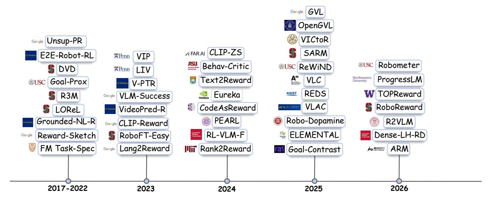
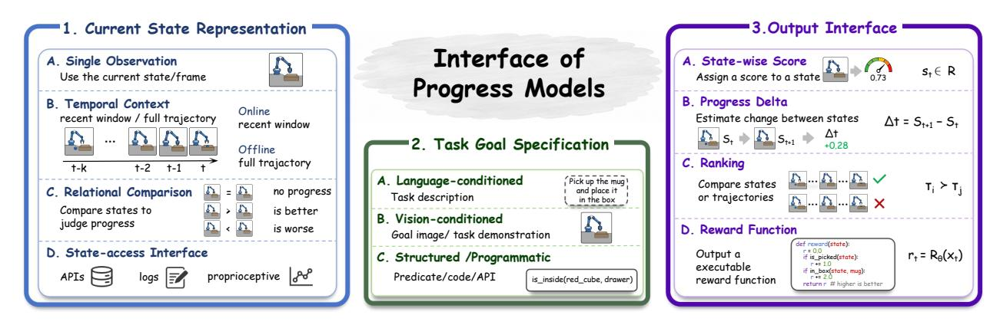
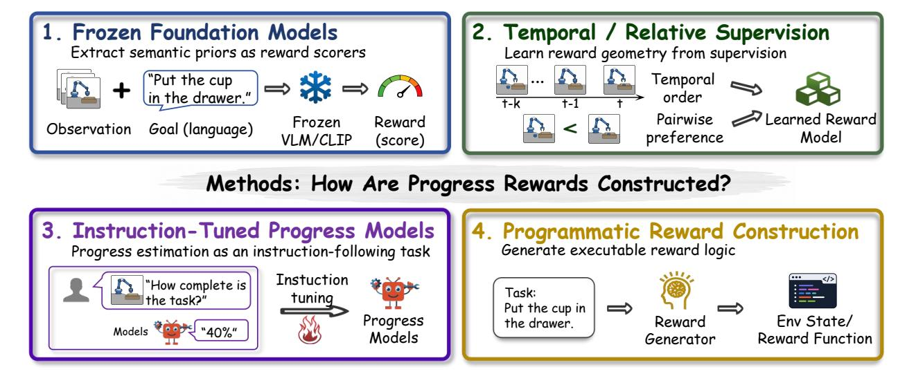
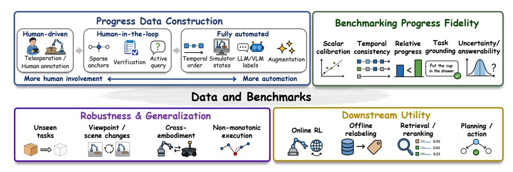

# 로봇 학습을 위한 진행 보상 모델링: 종합적 조사 (Progress Reward Modeling for Robotic Learning: A Comprehensive Survey)

- 원제: Progress Reward Modeling for Robotic Learning: A Comprehensive Survey
- 원문: [https://arxiv.org/abs/2607.21655](https://arxiv.org/abs/2607.21655)
- PDF: [https://arxiv.org/pdf/2607.21655v1](https://arxiv.org/pdf/2607.21655v1)
- arXiv ID: `2607.21655`

---

# **로봇 학습을 위한 진행 보상 모델링: 종합적 조사 (Progress Reward Modeling for Robotic Learning: A Comprehensive Survey)**

**Jianshu Zhang**1∗ , **Keliang Wu**1∗ , **Haoran Lu**1∗ , **Anbang Liu**1 , **Ce Zhang**2 , **Weijie Yin**3 , **Chengxuan Qian**4 , **Xiyuan Yang**5 , **Zhenyu Pan**1 , **Guo Ye**1 , **Han Liu**1

로봇 학습은 큰 행동 공간을 가진 동적 환경에서 진행된다. 종단 성공 신호는 로봇에게 작업이 완료되었는지 여부만 알려준다. 현재 행동이 진전을 이루고 있는지, 변하지 않은 상태인지, 혹은 이전 진전을 되돌리고 있는지를 설명하지 않는다. 이러한 이유로 최근 연구들은 작업 실행 중에 피드백을 제공하는 진행 보상을 점점 더 탐구하고 있다. 그러나 현재 문헌은 공통 프레임워크가 부족하다. 기존 방법들은 서로 다른 관측, 목표 사양, 출력 신호, 감독 소스, 그리고 평가 프로토콜을 사용한다. 이는 이들을 비교하고 결과가 실제로 무엇을 검증하는지 이해하기 어렵게 만든다. 본 조사에서는 로봇 학습을 위한 진행 보상 모델링에 대한 통합적 관점을 제공한다. 우리는 이 분야를 세 단계로 구성한다. 먼저 진행 모델의 인터페이스를 연구한다. 이는 모델이 받는 정보와 생성되는 진행 신호의 형태를 묻음으로써 문제를 외부에서 정의한다. 그 다음 모델 내부로 이동하여 이 신호를 구성하는 데 사용되는 방법을 연구한다. 이는 진행 추정과 보상 생성 뒤에 있는 서로 다른 가정과 메커니즘을 드러낸다. 마지막으로 이러한 방법을 지원하는 데이터와 벤치마크를 살펴본다. 이는 진행 감독이 어떻게 얻어지는지와 서로 다른 평가가 실제로 무엇을 측정하는지를 보여준다. 이 세 가지 관점은 진행 모델이 무엇인지, 어떻게 구축되는지, 그리고 그 품질이 어떻게 검증되는지를 연결한다. 우리는 또한 현재 접근 방식의 주요 제한점을 요약하고 미래 연구 방향을 논의한다.

<https://github.com/sterzhang/Awesome-Progress-Models>

## **1 Introduction**

로봇 학습은 동적, 순차적, 고차원 환경에서 이루어집니다 [(Lu et al.,](#page-12-0) [2024;](#page-12-0) [Wu](#page-13-0) [et al.,](#page-13-0) [2025;](#page-13-0) [Generalist AI Team,](#page-11-0) [2025;](#page-11-0) [Physical Intelligence,](#page-13-1) [2026;](#page-13-1) [NVIDIA,](#page-13-2) [2025)](#page-13-2). 로봇은 여러 단계에 걸쳐 물체와 물리적 세계와 상호작용해야 하며, 유사한 행동은 현재 상태와 목표에 따라 작업 진행에 매우 다른 영향을 미칠 수 있습니다 [(Intelligence et al.,](#page-12-1) [2025;](#page-12-1) [Ye et al.,](#page-14-0) [2026)](#page-14-0). 동일한 작업은 다른 행동 시퀀스를 통해서도 완료될 수 있습니다 [(Yuan et al.,](#page-14-1) [2026;](#page-14-1) [Baumli et al.,](#page-11-1) [2023)](#page-11-1). 이러한 특성은 큰 행동 공간을 만들고 최종 작업 결과만으로 학습하기 어렵게 만듭니다.

대부분의 로봇 학습 시스템은 종료 성공 신호에 의존합니다[(Liu et al.,](#page-12-2) [2023;](#page-12-2) [Chen et al.,](#page-11-2) [2026b;](#page-11-2) [Lu et al.,](#page-12-3) [2026)](#page-12-3). 이러한 신호는 로봇에게 작업이 최종적으로 완료되었는지 여부를 알려 주지만, 중간 실행에 대한 정보는 거의 제공하지 않습니다. 행동이 작업을 전진시키는지, 의미 있는 변화를 일으키지 않는지, 혹은 이전 진행을 되돌리는지 설명할 수 없습니다. 이 문제는 성공적인 결과가 드물고 많은 결정을 내려야 하는 장기 목표 작업에서 더욱 심각해집니다[(Chen](#page-11-3) [et al.,](#page-11-3) [2026c;](#page-11-3) [Yong et al.,](#page-14-2) [2026)](#page-14-2).

**진행 보상은 작업 실행이 시간에 따라 어떻게 변하는지를 설명함으로써 더 풍부한 신호를 제공합니다.** 작업이 완료되기 전에 밀집된 피드백을 제공하고 정책 학습 중에 신용 할당을 개선할 수 있습니다. 또한 유용한 행동과 무관한 움직임을 구분하고, 정체 또는 회귀를 식별하며, 최종 결과 이전에 실패를 감지하는 데 도움을 줄 수 있습니다. 정책 학습을 넘어 진행 신호는 온라인 모니터링, 궤적 재정렬, 데이터 필터링, 계획, 행동 선택 및 실패 복구를 지원할 수 있습니다. 신뢰할 수 있는 진행 모델은 보상 함수뿐만 아니라 지속적인 로봇 행동의 일반 평가자로서 역할을 할 수 있습니다.

1노스웨스턴 대학교 (Northwestern University), 2카네기 멜론 대학교 (Carnegie Mellon University), 3위스콘신 대학교 매디슨 (University of Wisconsin–Madison),

4캘리포니아 대학교 산타바바라 (University of California, Santa Barbara), 5일리노이 대학교 어반-챔피언 (University of Illinois Urbana-Champaign)

∗Equal Contribution

**Figure 1** 로봇 학습을 위한 진행 보상 모델링의 진화

그러나 진행을 추정하는 것은 작업이 성공했는지 예측하는 것보다 더 어렵습니다. 성공 감지는 일반적으로 최종 목표가 달성되었는지 여부에 대한 이진 결정입니다. 진행 추정은 대신 현재 관측을 더 긴 작업의 진화하는 실행에 배치해야 합니다. 모델은 작업의 어느 부분이 완료되었는지, 현재 무엇이 일어나고 있는지, 실행이 목표에서 얼마나 멀리 떨어져 있는지를 추론해야 합니다. 이 매핑은 또한 작업에 따라 달라지며, 동일한 관측이 다른 작업에서 다른 단계 또는 다른 양의 진행을 나타낼 수 있기 때문입니다. 또한 현재 관측은 자체적으로 충분한 정보를 포함하지 않을 수 있습니다. 진행은 이전 행동, 완료된 하위 목표, 이전 진행이 취소되었는지 여부에 따라 달라질 수 있기 때문입니다. 따라서 진행은 이미지나 프레임의 직접적으로 관찰 가능한 속성이 아니라 잠재적이고 과거에 의존하는 작업 상태입니다. 진행 모델은 어떤 증거가 관련 있는지, 그리고 그 증거가 작업 진행에 어떻게 매핑되어야 하는지를 결정해야 합니다.

최근 몇 년 동안 진행 보상 모델링은 [Figure 1.](#page-1-0)에서 보여지는 것처럼 급속히 성장해 왔습니다. 초기 연구들은 시연, 시간적 순서, 시각적 목표 구조에서 목표 근접성 및 보상 표현을 학습했습니다 [(Lee et al.,](#page-12-4) [2021;](#page-12-4) [Ma et al.,](#page-12-5) [2023b,](#page-12-5)[a;](#page-12-6) [Sermanet et al.,](#page-13-3) [2017)](#page-13-3). 이후 연구들은 기초 모델 유사도 점수와 언어 조건 보상을 탐구했습니다 [(Baumli et al.,](#page-11-1) [2023;](#page-11-1) [Rocamonde et al.,](#page-13-4) [2024;](#page-13-4) [Nair et al.,](#page-13-5) [2022)](#page-13-5), 선호 기반 보상 학습 [(Wang et al.,](#page-13-6) [2024;](#page-13-6) [Liu et al.,](#page-12-7) [2024;](#page-12-7) [Yang et al.,](#page-13-7) [2024)](#page-13-7), 그리고 언어 모델을 사용한 자동 보상 생성 [(Xie et al.,](#page-13-8) [2024;](#page-13-8) [Yu et al.,](#page-14-3) [2023;](#page-14-3) [Ma et al.,](#page-12-8) [2024;](#page-12-8) [Venuto et al.,](#page-13-9) [2024)](#page-13-9). 최근 시스템들은 대형 Vision‑Language Models를 사용하여 작업 진행 및 완료를 추정합니다 [(Zhang](#page-14-4) [et al.,](#page-14-4) [2026a;](#page-14-4) [Liang et al.,](#page-12-9) [2026;](#page-12-9) [Lee et al.,](#page-12-10) [2026;](#page-12-10) [Chen et al.,](#page-11-4) [2026a)](#page-11-4), 상태 전이와 모델 진행 변화를 비교합니다 [(Zhai et al.,](#page-14-5) [2025;](#page-14-5) [Tan et al.,](#page-13-10) [2025;](#page-13-10) [Mao et al.,](#page-13-11) [2026)](#page-13-11), 작업 성공을 감지합니다 [(Du et al.,](#page-11-5) [2023)](#page-11-5), 그리고 명시적 시간 메모리를 사용하여 긴 실행을 추론합니다 [(Zhang et al.,](#page-14-6) [2026b)](#page-14-6). 이 성장하는 연구 집단은 진행 모델링이 로봇 학습에서 중요한 방향이 되고 있음을 보여줍니다.

이러한 진전에도 불구하고 문헌은 여전히 분산되어 있다. 유사한 용어로 기술된 방법들은 종종 다른 문제를 해결한다. 한 방법은 단일 이미지에서 성공 확률을 예측할 수 있는 반면, 다른 방법은 비디오에서 진행률 비율을 추정하거나 두 개의 궤적을 비교하거나 실행 가능한 보상 프로그램을 생성한다. 또한 작업 목표가 지정되는 방식, 감독이 얻어지는 방식, 그리고 출력이 사용되는 방식에서도 차이가 있다. 평가 방법 역시 이와 마찬가지로 이질적이다. 시간적 순서, 스칼라 예측 오차, 선호도 정확도, 성공 감지, 그리고 다운스트림 정책 성능은 서로 다른 특성을 검증한다. 그 결과, 방법들을 직접 비교하거나 보고된 결과가 실제로 무엇을 입증하는지 판단하기가 어렵다.

본 설문에서는 **로봇 학습을 위한 진행 보상 모델링의 통합적 관점**을 제시한다. 이 다양한 분야를 세 단계로 연결하여 정리한다. 첫째, [Section 2](#page-2-0)에서는 진행 모델의 인터페이스를 연구한다. 각 모델을 작업 조건부 블랙박스로 간주하고, 현재 작업 상태를 어떻게 표현하는지, 작업 목표를 어떻게 명시하는지, 그리고 진행과 관련된 출력이 어떤 형태를 갖는지를 살펴본다. 이 관점은 서로 다른 아키텍처를 가진 방법들을 공통 입력–출력 구조를 통해 비교할 수 있게 한다.

그림 2 진행 모델의 인터페이스. 기존 진행 모델 인터페이스를 세 가지 관점에서 정리한다: 현재 작업 상태 표현, 작업 목표 명시, 그리고 모델 출력 형태.

둘째, Section 3에서는 이 블랙박스를 열어 진행 보상이 어떻게 구성되는지 살펴본다. 기존 접근법을 진행 신호의 출처와 이를 사용 가능한 보상으로 변환하는 메커니즘에 따라 정리한다. 이 관점은 고정된 기초 모델 점수화, 시간적 및 상대적 학습, 지시어 조정 진행 예측, 그리고 프로그램적 보상 구축 뒤에 있는 가정을 드러낸다.

셋째, Section 4에서는 이러한 방법들을 데이터와 평가 증거와 연결한다. 진행 감독이 인간 주석, 인간 주도 자동화, 또는 완전 자동화 절차를 통해 어떻게 생성되는지 살펴본다. 이후 진행 충실도 벤치마크와 견고성, 일반화, 다운스트림 활용성 평가를 구분한다. 이 구분은 보상이 정책을 개선하더라도 진행을 충실히 나타내지 못할 수 있고, 반대로 정확한 진행 추정기가 폐쇄 루프 제어에 부적합할 수 있기 때문에 중요하다.

범위 및 기여. 본 설문은 로봇 학습을 위한 진행 및 진행 유사 보상 모델에 초점을 맞춘다. 모든 보상 모델을 하나의 범주로 다루는 대신, 이들이 어떻게 정의되고, 구성되며, 감독되고, 그리고 작업 진행을 평가하는지를 연구한다. 우리의 기여는 세 가지다. 첫째, 작업 상태 표현, 목표 명시, 출력 형태를 통해 진행 모델을 조직하는 인터페이스 기반 관점을 제시한다. 둘째, 진행 보상을 구성하는 주요 메커니즘의 분류를 제공하고 그 근본 가정을 명확히 한다. 셋째, 데이터 구축 파이프라인과 평가 프로토콜을 연결하고, 서로 다른 벤치마크가 무엇을 검증할 수 있고 검증할 수 없는지를 설명한다. 또한 현재 방법들의 주요 한계를 요약하고 Section 5에서 향후 방향을 논의한다.

## 2 인터페이스: 진행 모델의 입력과 출력

진행 모델의 인터페이스는 모델이 접근할 수 있는 증거와 제공할 수 있는 진행 또는 보상 신호의 종류를 결정한다. 그림 2에 나타난 바와 같이, 우리는 인터페이스를 세 가지 질문을 중심으로 정리한다. 입력 인터페이스의 핵심 질문은: (i) 현재 작업 상태가 어떻게 표현되는가 (section 2.1)와 (ii) 작업 목표가 어떻게 명시되는가 (section 2.2)이다. 출력 인터페이스의 핵심 질문은: (iii) 모델 출력이 어떤 형태를 갖는가 (section 2.3)이다.

### 2.1 입력 인터페이스: 현재 작업 상태는 어떻게 표현되는가?

단일 관측 입력은 가장 단순합니다: 모델은 현재 관측과 작업 조건을 받아 보상, 성공, 가치 또는 목표 근접성을 직접 추정합니다. 이 설계는 현재 상태가 진행 상황을 판단하기에 충분한 증거를 포함한다고 가정합니다. 이는 작업 완료 또는 지각 보상 모델(Singh et al., 2019; Lee et al., 2021; Yang et al., 2024; Sermanet et al., 2017)과 CLIP 기반 또는 최신 VLM 기반 보상 방법(관측을 언어 또는 시각 목표와 비교)에서도 나타납니다(Baumli et al., 2023; Rocamonde et al., 2024; Mahmoudieh et al., 2022; Cui et al., 2022; Ma et al., 2023a; Yang et al., 2023; Hung et al., 2025; Zhang et al., 2026a). 장점은 낮은 지연 시간과 쉬운 온라인 사용이며, 한계는 시각적으로 유사한 상태가 실행 이력에 따라 다른 의미를 가질 수 있다는 점입니다.

**Temporal context**는 모델에 관측 시퀀스를 제공함으로써 이 모호성을 부분적으로 해결합니다. 작업이 아직 진행 중인 동안 모델이 직접 출력할 수 있는 온라인 진행 추정에서는 많은 방법이 궤적 접두사 또는 짧은 최근 윈도우를 사용하여 현재 진행 상황을 예측하기 전에 이미 발생한 일을 추론하도록 합니다 [(Chen et al.,](#page-11-4) [2026a;](#page-11-4) [Mao et al.,](#page-13-11) [2026;](#page-13-11) [Zhang et al.,](#page-14-7) [2025;](#page-14-7) [Alakuijala](#page-11-7) [et al.,](#page-11-7) [2025;](#page-11-7) [Escontrela et al.,](#page-11-8) [2023;](#page-11-8) [Zhang et al.,](#page-14-6) [2026b;](#page-14-6) [Liang et al.,](#page-12-9) [2026;](#page-12-9) [Lee et al.,](#page-12-10) [2026;](#page-12-10) [Chen et al.,](#page-11-9) [2025b;](#page-11-9) [Du et al.,](#page-11-5) [2023;](#page-11-5) [Kim et al.,](#page-12-12) [2025)](#page-12-12). 다른 방법들은 작업 실행 후 전체 궤적을 입력으로 사용하여 행동을 평가하고, 롤아웃을 순위 매기고, 선호 라벨을 생성하거나, 오프라인에서 시계열 진행을 분석합니다 [(Guan et al.,](#page-12-13) [2024;](#page-12-13) [Chen et al.,](#page-11-10) [2021;](#page-11-10) [Ma et al.,](#page-12-14) [2025;](#page-12-14) [Budzianowski et al.,](#page-11-11) [2025;](#page-11-11) [Liu et al.,](#page-12-7) [2024)](#page-12-7). 핵심 트레이드오프는 명확합니다: 더 긴 문맥은 더 강력한 시계열 증거를 제공하지만 온라인 사용성을 약화시킵니다.

세 번째 인터페이스는 **comparison**을 통해 진행 상황을 추정합니다. 단일 상태가 고립되어 좋은지 판단하는 대신, 모델은 행동 전후, 초기와 현재 관측, 현재와 목표 상태, 또는 두 후보 롤아웃과 같은 두 개 이상의 참조 상태를 비교합니다. 이 공식화에서 진행은 한 관측의 내재적 속성이라기보다 관계적 판단이 됩니다. 전후 비교는 진행 변화량, 밀집 보상, 선호 라벨을 추정하는 데 자연스럽게 적합합니다 [(Zhai et al.,](#page-14-5) [2025;](#page-14-5) [Nair](#page-13-5) [et al.,](#page-13-5) [2022;](#page-13-5) [Ma et al.,](#page-12-5) [2023b;](#page-12-5) [Wang et al.,](#page-13-6) [2024)](#page-13-6). 초기-현재 비교는 실행이 시작점에서 얼마나 멀리 이동했는지에 대한 보다 전역적인 관점을 제공합니다 [(Yan et al.,](#page-13-15) [2026;](#page-13-15) [Yong et al.,](#page-14-2) [2026)](#page-14-2), 반면 목표 조건화 비교는 현재 상태 또는 전이를 원하는 최종점에 기반합니다 [(Bhateja et al.,](#page-11-12) [2023;](#page-11-12) [Tan](#page-13-10) [et al.,](#page-13-10) [2025)](#page-13-10). 비교 기반 인터페이스는 종종 더 유익하고 직관적이지만, 지역 비교는 여전히 장기 종속성을 놓칠 수 있고, 진행이 일련의 쌍별 판단을 통해 추론될 때 누적 오류가 발생할 수 있습니다.

마지막으로, 일부 방법은 환경 코드, 시뮬레이터 API, 훈련 통계, 또는 고유 감각 기능과 같은 **상태 접근 인터페이스** (state-access interfaces)를 사용하여 보상을 구성한다 [(Yu et al.,](#page-14-3) [2023;](#page-14-3) [Xie et al.,](#page-13-8) [2024;](#page-13-8) [Ma et al.,](#page-12-8) [2024;](#page-12-8) [Venuto](#page-13-9) [et al.,](#page-13-9) [2024;](#page-13-9) [Chen et al.,](#page-11-13) [2025a;](#page-11-13) [Cabi et al.,](#page-11-14) [2020)](#page-11-14). 이러한 인터페이스는 관련 작업 상태가 명시적으로 표현되고 직접 접근 가능할 때 매우 효과적이다. 그러나 이 가정은 실제 환경에서는 종종 비현실적이며, 진행과 관련된 변수는 보통 잡음이 많고, 불완전하며, 작업에 따라 달라지거나 깨끗한 API를 통해 접근할 수 없기 때문이다. 따라서 상태 접근 인터페이스는 시뮬레이션이나 장비가 갖춰진 환경에서 가장 실용적이지만, 개방형 실제 물리적 장면에는 덜 적합하다.

### **2.2 입력 인터페이스: 작업 목표는 어떻게 지정되는가?** (Input Interface: How Is the Task Goal Specified?)

**언어 기반 목표** (Language-conditioned goals)는 대부분의 진행 보상 모델에서 사용된다 [(Liang et al.,](#page-12-9) [2026;](#page-12-9) [Chen et al.,](#page-11-4) [2026a;](#page-11-4) [Zhai et al.,](#page-14-5) [2025;](#page-14-5) [Baumli et al.,](#page-11-1) [2023;](#page-11-1) [Rocamonde et al.,](#page-13-4) [2024;](#page-13-4) [Xie et al.,](#page-13-8) [2024;](#page-13-8) [Lee et al.,](#page-12-10) [2026;](#page-12-10) [Hung et al.,](#page-12-11) [2025;](#page-12-11) [Guan et al.,](#page-12-13) [2024;](#page-12-13) [Nair et al.,](#page-13-5) [2022;](#page-13-5) [Mahmoudieh et al.,](#page-13-13) [2022;](#page-13-13) [Mao et al.,](#page-13-11) [2026;](#page-13-11) [Yu et al.,](#page-14-3) [2023;](#page-14-3) [Ma](#page-12-6) [et al.,](#page-12-6) [2023a;](#page-12-6) [Budzianowski et al.,](#page-11-11) [2025;](#page-11-11) [Nair et al.,](#page-13-16) [2023;](#page-13-16) [Zhang et al.,](#page-14-7) [2025;](#page-14-7) [Chen et al.,](#page-11-9) [2025b;](#page-11-9) [Du et al.,](#page-11-5) [2023;](#page-11-5) [Wang et al.,](#page-13-6) [2024;](#page-13-6) [Alakuijala et al.,](#page-11-7) [2025;](#page-11-7) [Yang et al.,](#page-13-14) [2023;](#page-13-14) [Kim et al.,](#page-12-12) [2025)](#page-12-12). 주요 이유는 언어 목표가 인코딩하기 쉽고, 기존 언어 또는 시각-언어 모델과 호환되며, 상대적으로 단순한 작업에 대해 종종 효과적이기 때문이다. 그러나 언어는 특히 작업이 길어지고, 더 구성적이며, 상호작용에 의존할수록 진행의 물리적 세부 사항을 과소 명시할 수 있다.

**시각 기반 목표** (Vision-conditioned goals)는 원하는 실행 과정을 보다 직접적으로 명시한다. 목표 이미지, 목표 상태, 또는 시연 궤적은 언어만으로는 설명하기 어려운 물리적 세부 사항을 포착할 수 있다. 목표 이미지 및 시각 참조 방법은 현재 관측을 원하는 시각적 최종점과 비교한다 [(Singh et al.,](#page-13-12) [2019;](#page-13-12) [Ma et al.,](#page-12-5) [2023b;](#page-12-5) [Yang et al.,](#page-13-7) [2024;](#page-13-7) [Bhateja et al.,](#page-11-12) [2023;](#page-11-12) [Tan et al.,](#page-13-10) [2025;](#page-13-10) [Cui](#page-11-6) [et al.,](#page-11-6) [2022;](#page-11-6) [Venuto et al.,](#page-13-9) [2024)](#page-13-9), 반면 시연 기반 방법은 최종 상태뿐 아니라 의도된 절차를 명시하기 위해 전체 궤적을 사용한다 [(Chen et al.,](#page-11-13) [2025a,](#page-11-13) [2021;](#page-11-10) [Lee et al.,](#page-12-4) [2021;](#page-12-4) [Liu et al.,](#page-12-7) [2024;](#page-12-7) [Sermanet et al.,](#page-13-3) [2017;](#page-13-3) [Zhang et al.,](#page-14-4) [2026a)](#page-14-4). 시각 목표는 따라서 언어적 모호성을 줄이고 더 풍부한 물리적 및 동적 기반을 제공한다. 그러나 일반적으로 수동으로 선별된 목표 이미지나 시연이 필요하며, 시점 변화, 구현 차이, 객체 외형, 장면 배치와 같은 시각적 변동에 민감할 수 있다.

세 번째 목표 사양 형태는 **구조화된 또는 프로그래밍식 목표**입니다. 시뮬레이션 또는 API가 풍부한 환경에서, 작업 목표는 술어, 객체 상태, 제약 조건, 또는 생성된 목표 함수를 통해 표현될 수 있습니다. 이 인터페이스는 정밀하고, 밀집하며, 구성적인 보상 구성을 지원합니다 [(Xie et al.,](#page-13-8) [2024;](#page-13-8) [Ma et al.,](#page-12-8) [2024;](#page-12-8) [Yu et al.,](#page-14-3) [2023;](#page-14-3) [Venuto et al.,](#page-13-9) [2024;](#page-13-9) [Yong et al.,](#page-14-2) [2026)](#page-14-2). 그러나 이는 명시적으로 표현된 상태 변수에 대한 접근에 의존하며, 이는 종종 개방형 실세계 설정에서는 사용할 수 없습니다. 따라서 구조화된 또는 프로그래밍식

목표는 시뮬레이션 또는 장비가 장착된 환경에서 가장 효과적이지만, 진행 상황을 원시 시각 관찰에서 추론해야 할 때는 덜 적합합니다.

### **2.3 출력 인터페이스: 모델은 무엇을 예측합니까? (Output Interface: What Does the Model Predict?)**

출력 인터페이스는 **모델 예측이 진행 상황으로 해석되는 방식을 결정**합니다. 다양한 진행 모델은 스칼라 점수, 전이 수준 델타, 순위 또는 선호도, 또는 실행 가능한 보상 함수를 출력할 수 있습니다. 이러한 출력은 모두 진행 신호로 사용될 수 있지만, 진행을 인코딩하는 방식은 다릅니다: 일부는 상태가 얼마나 바람직한지 추정하고, 일부는 전이가 작업을 앞으로 나아가게 하는지 측정하며, 일부는 비교를 통해서만 진행을 정의하고, 일부는 보상 계산 절차를 지정합니다.

가장 일반적인 출력은 **상태별 스칼라 점수**입니다. 이러한 점수는 상태나 클립을 하나의 숫자에 매핑하며, 이후 작업 진행 상황, 성공 가능성, 가치, 목표 유사성, 또는 목표까지의 거리로 해석됩니다. 명시적 진행 추정의 경우, 스칼라는 작업이 얼마나 진행되었는지를 직접 나타냅니다 [(Liang et al.,](#page-12-9) [2026;](#page-12-9) [Tan et al.,](#page-13-10) [2025;](#page-13-10) [Hung et al.,](#page-12-11) [2025;](#page-12-11) [Chen et al.,](#page-11-9) [2025b;](#page-11-9) [Kim et al.,](#page-12-12) [2025;](#page-12-12) [Zhang et al.,](#page-14-4) [2026a)](#page-14-4). 성공 또는 완료 모델의 경우, 스칼라는 진행 상황을 간접적으로 해석합니다: 높은 완료 가능성은 현재 상태가 작업 성공에 더 가까워졌음을 의미합니다 [(Chen et al.,](#page-11-4) [2026a;](#page-11-4) [Baumli et al.,](#page-11-1) [2023;](#page-11-1) [Du et al.,](#page-11-5) [2023;](#page-11-5) [Escontrela](#page-11-8) [et al.,](#page-11-8) [2023;](#page-11-8) [Yang et al.,](#page-13-14) [2023;](#page-13-14) [Lee et al.,](#page-12-10) [2026;](#page-12-10) [Budzianowski et al.,](#page-11-11) [2025)](#page-11-11). 마찬가지로, 가치, 유사성, 또는 거리 기반 방법은 진행을 가치 증가, 목표와의 유사성 증가, 또는 목표까지의 거리 감소로 간주합니다 [(Rocamonde et al.,](#page-13-4) [2024;](#page-13-4) [Lee et al.,](#page-12-4) [2021;](#page-12-4) [Ma et al.,](#page-12-14) [2025,](#page-12-14) [2023b;](#page-12-5) [Zhang et al.,](#page-14-7) [2025;](#page-14-7) [Alakuijala et al.,](#page-11-7) [2025;](#page-11-7) [Bhateja et al.,](#page-11-12) [2023;](#page-11-12) [Sermanet et al.,](#page-13-3) [2017;](#page-13-3) [Ma et al.,](#page-12-6) [2023a)](#page-12-6). 따라서 상태별 점수는 가장 직접적이고 재사용 가능한 출력 형태를 제공하지만, 그 의미는 스칼라가 어떻게 보정되는지와 어떤 의미적 양을 근사하려는지에 따라 달라집니다.

두 번째 출력 형태는 **progress delta**이다. 대신에 상태의 절대 진행도를 추정하는 대신, 모델은 전이가 작업 상태를 개선하는지 악화시키는지를 예측한다. 이 경우, 진행도는 행동 전후와 같은 두 관측치 사이의 지역적 변화로 표현된다. VLAC는 앞뒤 관측치에서 부호가 있는 상대 진행도를 직접 예측한다 [(Zhai et al.,](#page-14-5) [2025)](#page-14-5), ARM은 장기 조작을 위한 지역적 이점과 같은 진행도를 모델링한다 [(Mao et al.,](#page-13-11) [2026)](#page-13-11), 그리고 Robo-Dopamine은 상태 쌍 사이의 홉 값을 학습한다 [(Tan](#page-13-10) [et al.,](#page-13-10) [2025)](#page-13-10). 델타 출력은 자연스럽게 강화 학습과 정렬된다. 그러나 이들은 전역 작업 완료가 아니라 지역적 개선을 설명하기 때문에, 총 진행도를 회복하려면 일반적으로 시간에 따라 누적하거나 결합해야 한다.

세 번째 출력 형태는 **ranking**이다. 여기서 진행 상황은 절대 점수로 표현되지 않고, 상태, 클립, 또는 궤적에 대한 순서로 표현된다. 다른 참조보다 선호되는 경우, 상태나 궤적은 더 발전된 것으로 간주된다 [(Cui et al.,](#page-11-6) [2022;](#page-11-6) [Liu et al.,](#page-12-7) [2024;](#page-12-7) [Wang et al.,](#page-13-6) [2024;](#page-13-6) [Yang et al.,](#page-13-7) [2024;](#page-13-7) [Cabi et al.,](#page-11-14) [2020)](#page-11-14). 이 출력은 보정된 보상 값보다 감독하기가 더 쉽다. 모델은 절대 점수를 부여하기보다 대안을 더 신뢰성 있게 비교할 수 있기 때문이다. 그러나 선호 출력은 진행 상황을 상대적으로만, 간접적으로 정의하므로, 이후 사용을 위해 보통 스칼라 보상으로 변환해야 한다.

마지막으로, 프로그래밍 방식은 값이 아니라 **보상 함수**를 출력한다. 여기서 진행 상황은 사용 가능한 상태 변수, 특징, 또는 관측치에 대한 실행 가능한 계산으로 인코딩된다 [(Xie et al.,](#page-13-8) [2024;](#page-13-8) [Yu et al.,](#page-14-3) [2023;](#page-14-3) [Ma et al.,](#page-12-8) [2024;](#page-12-8) [Venuto et al.,](#page-13-9) [2024;](#page-13-9) [Chen et al.,](#page-11-13) [2025a)](#page-11-13). 이 출력은 진행 상황을 어떻게 계산해야 하는지 명시적으로 지정하기 때문에 유연하고 해석 가능하다. 그러나 그 신뢰성은 생성된 코드, 사용 가능한 상태 변수, 그리고 엔지니어링된 특징이 실제로 의도된 작업 목표를 포착하는지 여부에 달려 있다.

## **3 Methods: How Are Progress Rewards Constructed?**

이 섹션은 진행 보상이 어떻게 구성되는지에 초점을 둔다. [Figure 3,](#page-5-0) 우리는 진행 신호가 얻어지고 사용 가능한 보상으로 변환되는 메커니즘에 따라 기존 방법들을 정리한다. 우리는 네 가지 주요 패러다임을 식별한다: 고정된 기초 모델 스코어링, 시간적 또는 상대적 감독으로부터 학습, 지시 조정된 진행 예측, 그리고 프로그램적 보상 구성.

그림 3: 진행 보상의 구성.  
우리는 기존 방법을 진행 신호가 발생하는 위치와 그것이 사용 가능한 보상으로 변환되는 방식에 따라 네 가지 패러다임으로 정리한다.

### 3.1 Frozen Foundation Models as Semantic Reward Scorers

가장 단순한 패러다임은 보상 모델을 전혀 훈련하지 않는다. 대신, 사전 훈련된 기초 모델에서 보상과 유사한 신호를 직접 추출한다. CLIP 스타일의 방법은 현재 관측과 언어 목표 사이의 이미지-텍스트 유사도를 계산하고, 그 결과 정렬 점수를 보상으로 사용한다 (Baumli et al., 2023; Rocamonde et al., 2024; Mahmoudieh et al., 2022). TOPReward는 이 아이디어를 임베딩 공간에서 토큰 공간으로 옮긴다. 고정된 VLM에 과제 완성 질문을 프롬프트하고, “true” 토큰의 확률을 숨겨진 보상으로 사용한다 (Chen et al., 2026a). GVL과 OpenGVL은 VLM을 사용해 비디오에서 시간적 진행이나 프레임 순서를 추정한다 (Ma et al., 2025; Budzianowski et al., 2025).

이 패러다임의 주요 강점은 **제로-샷** (zero-shot) 사용성이다. 작업별 보상 라벨이나 미세 조정이 필요 없다. 그러나 결과 스코어는 보정된 진행 보상이라기보다 의미적 선행 (semantic prior)으로 이해되는 것이 더 적절하다. 따라서 이러한 방법들은 보상으로 사용되기 전에 정규화, 임계값 설정, 차분, 프롬프트 엔지니어링 등을 필요로 한다.

### **3.2 시계열 및 상대적 감독으로부터 보상 학습** (Learning Rewards from Temporal and Relative Supervision)

A second group of methods learns rewards from supervision to determine which state is closer to the goal or which behavior shows more progress. One common source of supervision is the **시계열 순서** (temporal order within successful demonstrations). These methods often assume that later states are closer to task completion than earlier states. 목표 근접성 모방 학습 (goal-proximity imitation learning)은 시연 시간을 진행의 대리 변수로 사용하고 목표 근접성의 변화를 보상으로 변환한다 (Lee et al., 2021). VIP는 현재 상태와 목표 사이의 거리가 목표 달성 가능성을 반영하도록 시각적 표현을 학습하며, 이 거리를 보상으로 사용하도록 허용한다 (Ma et al., 2023b). 다른 방법들은 지각적 거리나 감지된 하위 작업 구조에서 보상을 구성한다 (Sermanet et al., 2017; Kim et al., 2025). 관련된 감독 형태는 보상 스케치이며, 사용자는 각 타임스텝을 라벨링하는 대신 거친 보상 곡선을 제공한다 (Cabi et al., 2020).

Another source of supervision is **선호도 또는 순위 정보** (preference or ranking information). Instead of assigning an absolute progress value, these methods compare two states, clips, or trajectories and determine which one is better. RL-VLM-F uses a frozen VLM to generate pairwise preferences and then trains a scalar reward model from these comparisons (Wang et al., 2024). PEARL transfers preference information across different tasks (Liu et al., 2024), while Rank2Reward learns shaped reward functions from rankings of passive videos (Yang et al., 2024). Relative supervision is usually easier to collect than accurate progress scores, but it does not directly provide a usable scalar reward. The learned comparisons must still be converted into a reward function, and the result may depend on whether the observed preferences can be represented by a single consistent score.

### **3.3 지침에 맞춘 진행 예측** (Instruction-Tuned Progress Prediction)

A third paradigm **진행 추정치를 명시적 지침-추종 과제로 공식화한다** (formulates progress estimation as an explicit instruction-following task for foundation models). Rather than relying only on 동결된 의미적 선행 (frozen semantic priors) or 약한 시계열 구조 (weak temporal structure), these methods specify the desired progress judgment through 작업별 프롬프트 (task-specific prompts) and then fine-tune VLMs or video-language models to follow this instruction.

모델이 절대 진행률, 작업 성공, 상대적 개선, 선호도 또는 추론 기반 진행률 점수를 예측하도록 요청될 수 있는 형식에 따라 다릅니다. 따라서 학습 예시는 시각적 관찰 또는 궤적과 명시적인 진행률 관련 지시문 및 목표 응답을 쌍으로 제공하여 모델이 전용 기능으로 진행률 추정 능력을 습득하도록 합니다. RoboReward는 루브릭 기반 프롬프트를 사용해 VLM을 미세 조정하여 로봇 롤아웃에 대한 구조화된 진행률 점수를 생성합니다 [(Lee et al.,](#page-12-10) [2026)](#page-12-10). Robometer는 진행률, 성공 및 선호도 예측을 공동으로 훈련시켜, 공유 모델이 밀집 라벨과 궤적 비교에서 여러 진행률 관련 지시문에 답할 수 있도록 합니다 [(Liang et al.,](#page-12-9) [2026)](#page-12-9). Robo-Dopamine은 초기, 목표, 전후 관찰에서 홉 기반 진행률을 추정합니다 [(Tan et al.,](#page-13-10) [2025)](#page-13-10), 반면 VLAC는 전후 비교 프롬프트를 따르고 부호가 있는 진행률 변화를 예측하도록 훈련됩니다 [(Zhai et al.,](#page-14-5) [2025)](#page-14-5). Video-Language Critic은 성공 및 실패 비디오 클립을 전이 가능한 스칼라 보상 판단으로 매핑하는 방법을 학습합니다 [(Alakuijala et al.,](#page-11-7) [2025)](#page-11-7). ProgressLM은 VLM을 추가로 훈련시켜 진행률을 예측하기 전에 명시적인 진행률 추론을 생성하도록 하며, 지시 튜닝을 사용해 최종 점수를 절차적 이해에 기반하도록 합니다 [(Zhang et al.,](#page-14-4) [2026a)](#page-14-4).

핵심 아이디어는 진행률 예측이 시각적 표현 학습의 암묵적 부수 결과로 간주되지 않는다는 점이다. 대신, 진행률은 프롬프트에서 명시적으로 정의되고, 훈련 목표에서 감독되며, 모델의 지시 따르기 능력으로 학습된다.

### **3.4 프로그램적 보상 구성**

관찰에서 보상 값을 직접 추정하는 대신, 일부 방법은 보상을 실행 가능한 프로그램으로 표현한다. 이들은 진행률 추정 과제를 코드, 술어, 특징 함수, 또는 정책 학습 중 평가될 수 있는 구조화된 보상 논리로 변환한다. Text2Reward와 Language2Rewards는 자연어 작업 설명을 실행 가능한 보상 함수로 변환한다 [(Xie et al.,](#page-13-8) [2024;](#page-13-8) [Yu et al.,](#page-14-3) [2023)](#page-14-3). Eureka는 정책 학습의 피드백을 사용해 LLM이 생성한 보상 프로그램을 추가로 정제한다 [(Ma et al.,](#page-12-8) [2024)](#page-12-8). Code as Reward는 VLM 추론을 활용해 시각적 작업 설명에서 실행 가능한 보상 논리를 합성한다 [(Venuto et al.,](#page-13-9) [2024)](#page-13-9), 반면 ELEMENTAL은 VLM이 생성한 특징 함수를 역강화 학습과 결합해 작업 보상을 구성한다 [(Chen et al.,](#page-11-13) [2025a)](#page-11-13). 이러한 방법은 작업이 명시적 하위 목표, 술어, 기하학적 관계, 또는 API를 통해 노출되는 환경 상태로 분해될 수 있을 때 특히 효과적이다. 그들의 유연성은 결과 보상 함수를 상대적으로 해석 가능하고 수정하기 쉽도록 만든다. 그러나 이들은 보상 예측에서 작업 분해, 특징 설계, 신뢰할 수 있는 상태 접근으로 과제의 상당 부분을 전환한다. 사용 가능한 기호 변수나 API가 작업의 중요한 측면을 포착하지 못할 때, 생성된 보상은 구현 측면에서 정밀할 수 있지만 의도된 행동과 여전히 정렬되지 않을 수 있다.

## **4 데이터 및 벤치마크**

본 절에서는 진행률 감독이 어떻게 구성되고 진행률 모델이 어떻게 평가되는지를 살펴본다. [그림 4,](#page-7-0)에서 보듯이, 우리는 먼저 인간 개입 정도에 따라 진행률 데이터 구성을 정리한다. 이후 기존 벤치마크를 세 가지 평가 목표에 따라 그룹화한다: 진행률 충실도, 견고성 및 일반화, 그리고 다운스트림 활용도. 이러한 조직은 진행률 감독이 어떻게 확보되는지와 서로 다른 평가 결과가 실제로 무엇을 검증할 수 있는지를 연결한다.

### **4.1 데이터: 진행 상황 감독은 어떻게 구성되는가?**

진행 모델은 작업 완료, 진행 변화, 또는 상대적 행동 품질을 설명하는 감독과 함께 궤적을 필요로 한다. 기존 연구는 직접적인 인간 판단, 인간 입력과 자동 처리의 조합, 또는 완전 자동 규칙과 모델을 통해 이러한 감독을 얻는다. 이러한 관행을 정리하기 위해 **우리는 진행 데이터 구축을 인간 참여 정도에 따라 특성화한다**. 이 관점

Figure 4 진행 모델링을 위한 데이터 및 벤치마크. 우리는 진행 데이터 구축을 인간 참여 정도에 따라 조직하고, 벤치마크를 진행 충실도, 견고성 및 일반화, 그리고 다운스트림 유틸리티로 그룹화한다.

이는 중앙적인 트레이드오프를 드러낸다: 인간 감독은 더 강력한 의미적 기반을 제공하는 반면, 자동화는 더 큰 규모를 가능하게 한다.

인간 주도형 구축. 인간 주도형 파이프라인은 사람에게 작업 실행을 제공하거나 진행을 직접 정의하도록 의존한다. 인간 운영자는 원격 조작을 통해 로봇 시연을 수집하거나 인간 작업 비디오를 기록함으로써 실제 행동에 기반한 성공적이거나 불완전한 실행을 제공한다 (Chen et al., 2026a; Tan et al., 2025; Zhai et al., 2025; Ma et al., 2025, 2023a; Zhang et al., 2025). 주석자는 스칼라 진행 점수 (Lee et al., 2026; Rocamonde et al., 2024)를 할당하거나, 성공 컷오프를 식별하거나 (Liang et al., 2026; Du et al., 2023), 또는 키프레임과 서브태스크 경계 (Tan et al., 2025; Chen et al., 2025b; Kim et al., 2025)를 표시할 수 있다. 인간 감독의 다른 형태에는 궤적 수준 보상 스케치 그리기 (Cabi et al., 2020) 및 실행 비교 또는 바람직하지 않은 행동 주석 (Guan et al., 2024; Liu et al., 2024)가 포함된다.

주요 장점은 인간이 시간이나 상태 변수만으로는 추론하기 어려운 작업 의미를 포착할 수 있다는 점이다. 예를 들어, 그립 안정성, 허용 가능한 접촉, 또는 암묵적 행동 선호도 등이 있다. 그러나 밀집형 수동 주석은 비용이 많이 들고 주관적이며, 특히 다수의 유효한 전략을 가진 장기 작업에서는 확장하기 어렵다.

인간-인-루프 구축. 인간-인-루프 파이프라인은 희소한 인간 입력을 사용하여 자동 처리를 안내하거나 제한하거나 검증한다. 일반적인 전략은 성공 프레임, 키프레임, 또는 단계 경계만 주석하고, 그 다음에 이러한 의미적 앵커 사이에 밀집형 진행 라벨을 보간하는 것이다 (Tan et al., 2025; Chen et al., 2025b; Du et al., 2023; Zhang et al., 2026a). 모델은 대신 단계 라벨이나 진행 주석을 제안하고, 이후 인간이 확인하고 수정한다 (Kim et al., 2025; Hung et al., 2025). 액티브 러닝 방법은 불확실하거나 정보가 풍부한 상태에 대해서만 인간 라벨을 요청함으로써 비용을 추가로 절감한다 (Singh et al., 2019; Liu et al., 2024).

인간 참여는 프롬프트, 작업 어휘, 템플릿, 환경 추상화, 또는 보상 API 설계를 통해서도 발생할 수 있으며, 이후 LLM이나 스크립트가 대규모로 주석과 보상 사양을 생성한다 (Yu et al., 2023; Xie et al., 2024; Venuto et al., 2024). 인간 검토 또는 롤아웃 피드백은 잘못 생성된 라벨이나 보상을 수정하는 데 사용될 수 있다 (Ma et al., 2024; Chen et al., 2025a). 따라서 인간은 의미적 제어를 유지하면서 자동화는 밀집성과 규모를 제공하지만, 희소 검증은 여전히 체계적인 라벨링 오류를 감지하지 못할 수 있다...

완전 자동화된 구축. 완전 자동화 파이프라인은 인스턴스 수준의 인간 주석 없이 진행 상황 감독을 도출한다. 가장 일반적인 접근 방식은 시간 구조를 사용한다: 성공적인 시연에서 나중 프레임은 완료에 더 가까운 것으로 간주되어 정규화된 진행 레이블, 목표 근접성 목표, 또는 쌍별 순위를 생성한다 (Lee et al., 2021; Ma et al., 2023b, 2025; Budzianowski et al., 2025; Yang et al., 2024; Bhateja et al., 2023). 전후 쌍도 시간적 거리나 상대 진행 변화에 따라 라벨링될 수 있다 (Zhai et al., 2025; Tan et al., 2025). 이러한 감독은 매우 확장 가능하지만, 작업 진행이 시간과 충분히 상관관계가 있다고 가정한다.

구조화된 환경은 또 다른 자동 라벨 소스를 제공한다. 시뮬레이터 상태, 객체 포즈, 기하학적 술어, 그리고 실제 보상은 성공 라벨, 단계 인덱스, 연속 진행, 또는 궤적 선호도를 생성할 수 있다 [(Baumli et al.,](#page-11-1) [2023;](#page-11-1) [Cui et al.,](#page-11-6) [2022;](#page-11-6) [Mahmoudieh et al.,](#page-13-13) [2022;](#page-13-13) [Ma et al.,](#page-12-6) [2023a)](#page-12-6). 전문가 정책과 모션 플래너는 성공적인 궤적을 생성할 수 있다 [(Escontrela et al.,](#page-11-8) [2023)](#page-11-8), 반면에 노이즈가 있거나 무작위 정책은 실패 실행을 생성한다 [(Alakuijala et al.,](#page-11-7) [2025;](#page-11-7) [Chen et al.,](#page-11-10) [2021)](#page-11-10). 이러한 라벨은 일관되고 저렴하지만, 사용 가능한 상태와 술어에 의해 표현되는 속성만을 포착한다.

기초 모델은 자동 주석자 역할을 할 수도 있다. LLM과 VLM은 하위 목표 분해, 단계 경계, 언어 변형, 진행 점수, 그리고 쌍별 선호도를 생성한다 [(Hung et al.,](#page-12-11) [2025;](#page-12-11) [Mao et al.,](#page-13-11) [2026;](#page-13-11) [Yong et al.,](#page-14-2) [2026;](#page-14-2) [Wang et al.,](#page-13-6) [2024)](#page-13-6). 그러나 모델이 생성한 감독은 주석 모델의 편향과 오류를 그대로 물려받는다.

자동화는 또한 행동 범위를 넓히는 데 사용된다. 성공적인 궤적은 잘라내거나, 반전하거나, 불일치 지침과 짝지어지거나, 행동 노이즈로 변형되어 부분적, 회귀적, 실패 예제를 생성할 수 있다 [(Zhang et al.,](#page-14-7) [2025;](#page-14-7) [Zhai et al.,](#page-14-5) [2025;](#page-14-5) [Lee et al.,](#page-12-10) [2026;](#page-12-10) [Liang et al.,](#page-12-9) [2026;](#page-12-9) [Yang et al.,](#page-13-14) [2023)](#page-13-14). 이러한 증강은 성공만의 편향을 줄이지만, 합성 실패는 물리적으로 그럴듯해야 하며, 악용 가능한 아티팩트를 도입하지 않도록 해야 한다.

### **4.2 진행도 충실도 벤치마킹 (Benchmarking Progress Fidelity)**

가장 직접적인 벤치마크 질문은 모델 출력이 작업 진행을 충실히 나타내는가이다. 그러나 **진행도 충실도는 단일 속성이 아니다**: 서로 다른 기준 신호는 보정, 시간적 일관성, 상대 순서, 작업 기반화, 또는 불확실성을 테스트한다.

**스칼라 보정**은 예측 점수가 완료 비율, 루브릭 점수, 단계 라벨, 또는 홉 기반 진행 값과 같은 명시적 진행 참조와 일치하는지를 평가한다 [(Lee et al.,](#page-12-10) [2026;](#page-12-10) [Zhang et al.,](#page-14-4) [2026a;](#page-14-4) [Chen et al.,](#page-11-9) [2025b;](#page-11-9) [Mao et al.,](#page-13-11) [2026;](#page-13-11) [Tan et al.,](#page-13-10) [2025)](#page-13-10). 일반적인 지표에는 회귀 오차와 상관계수가 포함되며, 이는 모델이 절대 진행을 추정한다는 가장 직접적인 증거를 제공할 수 있다.

Temporal consistency는 예측 점수가 궤적의 진행을 복원하는지 여부를 평가한다. 순서 정확도, 순위 상관계수, 단조성 기반 지표는 성공적인 시연에서 이후 상태가 이전 상태보다 높은 점수를 받는 경향이 있는지를 테스트한다 [(Ma et al.,](#page-12-14) [2025;](#page-12-14) [Budzianowski et al.,](#page-11-11) [2025;](#page-11-11) [Chen](#page-11-4) [et al.,](#page-11-4) [2026a;](#page-11-4) [Zhang et al.,](#page-14-7) [2025;](#page-14-7) [Zhai et al.,](#page-14-5) [2025;](#page-14-5) [Tan et al.,](#page-13-10) [2025)](#page-13-10). 이 평가는 절대 보정보다 주로 시간적 일관성을 측정한다.

Relative progress 벤치마크는 모델이 작업 진행 또는 품질에 따라 상태, 클립 또는 궤적을 올바르게 순서화하는지 평가한다 [(Liang et al.,](#page-12-9) [2026;](#page-12-9) [Yang et al.,](#page-13-7) [2024;](#page-13-7) [Wang et al.,](#page-13-6) [2024)](#page-13-6). 이들은 선호 학습 및 궤적 선택에 특히 적합하다, 왜냐하면 쌍별 판단이 보정된 스칼라 라벨보다 얻기 쉬운 경우가 많기 때문이다.

Task grounding 벤치마크는 예측된 진행이 일반적인 움직임, 장면 변화, 또는 시간 위치가 아니라 지정된 목표에 따라 조건화되는지를 테스트한다. 반사적 지시, 일치하지 않는 비디오–언어 쌍, 그리고 대비적 작업 프롬프트가 일반적으로 사용되어 동일한 관찰이 다른 목표 하에서 서로 다른 판단을 받는지 확인한다 [(Zhang et al.,](#page-14-7) [2025;](#page-14-7) [Zhai et al.,](#page-14-5) [2025;](#page-14-5) [Ma et al.,](#page-12-14) [2025)](#page-12-14). 이 구분은 필수적이다, 왜냐하면 부드럽고 시간적으로 그럴듯한 보상 곡선이라도 모델이 작업 지시를 무시하면 여전히 부정확할 수 있기 때문이다.

마지막으로, **answerability and uncertainty** 벤치마크는 모델이 진행 상황을 신뢰할 수 없을 때 이를 인식할 수 있는지 평가한다 [(Zhang et al.,](#page-14-4) [2026a,](#page-14-4)[b)](#page-14-6). 진행 상황은 가려짐, 누락된 이력, 시점 부족, 또는 목표가 불명확한 경우에 모호해질 수 있다. 항상 확신 있는 점수를 반환하는 모델은 평균 예측 오차가 낮더라도 위험할 수 있다. 선택적 예측, 기권, 또는 신뢰도 보정의 벤치마킹은 신뢰할 수 있는 진행 추정과 강제 추측을 구분하는 데 필요하다.

### **4.3 Benchmarking Robustness and Generalization** (강건성 및 일반화 벤치마킹)

참조 라벨을 일치시키는 것 외에도, 진행 모델은 작업, 관측, 구현체, 실행 행동의 변화에 따라 그 의미를 보존해야 한다. **강건성 벤치마크는 학습된 진행 개념이 데이터셋 특유의 지름길이 아니라 전이 가능한 작업 구조를 반영하는지 테스트한다.**

Task generalization은 보이지 않는 작업, 지시, 객체 또는 작업군에 대한 성능을 평가한다 [(Zhang et al.,](#page-14-7) [2025,](#page-14-7) [2026a;](#page-14-4) [Liu et al.,](#page-12-7) [2024;](#page-12-7) [Alakuijala et al.,](#page-11-7) [2025;](#page-11-7) [Zhang et al.,](#page-14-4) [2026a)](#page-14-4). Viewpoint 및 scene robustness는 카메라 변화, 가림, 방해물, 배경 변동, 시연과 배치 시점 간 차이 등에서 진행 추정치가 안정적으로 유지되는지를 평가한다 [(Zhang et al.,](#page-14-4) [2026a;](#page-14-4) [Du et al.,](#page-11-5) [2023)](#page-11-5). Cross-view 평가는 모델이 표면적인 시각적 유사성 매칭이 아니라 작업 관련 상태를 포착하는지를 테스트한다. Cross-embodiment generalization은 인간, 수동 비디오, 또는 하나의 로봇 플랫폼에서 학습된 진행 지식이 다른 구현체로 전이되는지를 평가한다 [(Ma et al.,](#page-12-14) [2025;](#page-12-14) [Alakuijala](#page-11-7) [et al.,](#page-11-7) [2025;](#page-11-7) [Ma et al.,](#page-12-5) [2023b](#page-12-5)[,a;](#page-12-6) [Nair et al.,](#page-13-16) [2023;](#page-13-16) [Bhateja et al.,](#page-11-12) [2023;](#page-11-12) [Chen et al.,](#page-11-10) [2021;](#page-11-10) [Sermanet et al.,](#page-13-3) [2017)](#page-13-3). 이러한 전이는 인간 및 인터넷 비디오가 로봇 시연보다 훨씬 풍부하기 때문에 매력적이다. 그러나 구현체는 동역학, 접촉, 실행 가능한 행동, 시점, 실행 스타일이 다르기 때문에 도전적이다. 가장 까다로운 견고성 설정은 비단조적이며 불완전한 실행이다. 실제 정책은 실패하거나, 후퇴하거나, 행동을 재시도하거나, 이전 상태를 재방문하거나, 부작업을 비정상적인 순서로 완료할 수 있다 [(Liang et al.,](#page-12-9) [2026;](#page-12-9) [Lee et al.,](#page-12-10) [2026;](#page-12-10) [Zhai et al.,](#page-14-5) [2025;](#page-14-5) [Zhang et al.,](#page-14-7) [2025;](#page-14-7) [Mao et al.,](#page-13-11) [2026;](#page-13-11) [Chen](#page-11-9) [et al.,](#page-11-9) [2025b;](#page-11-9) [Hung et al.,](#page-12-11) [2025;](#page-12-11) [Tan et al.,](#page-13-10) [2025;](#page-13-10) [Yong et al.,](#page-14-2) [2026)](#page-14-2). 성공적이고 단조로운 시연만을 기반으로 한 벤치마크는 모델이 실제 진행과 경과 시간을 구분하는지를 드러내지 못한다. 실패, 역전, 정체, 회복 행동을 평가하는 것이 배포 관련 진행 추정에 필수적이다.

### **4.4 하위 유틸리티 벤치마킹 (Benchmarking Downstream Utility)**

진행 모델은 궁극적으로 로봇 학습 및 의사결정을 지원하기 위해 설계된다. 따라서 많은 벤치마크는 그 출력이 정책 학습, 궤적 선택, 데이터 선별, 또는 계획을 개선하는지를 평가한다. 보상은 보정되지 않아도 유용할 수 있지만, 잘 보정된 추정기는 여전히 희소하거나, 잡음이 많거나, 제어에 비용이 많이 든다.

온라인 정책 학습은 진행 보상이 밀집하고, 안정적이며, 상호작용 강화 학습을 지원할 만큼 충분히 정렬되어 있는지를 평가한다 [(Lee et al.,](#page-12-10) [2026;](#page-12-10) [Liang et al.,](#page-12-9) [2026;](#page-12-9) [Zhang et al.,](#page-14-7) [2025;](#page-14-7) [Zhai et al.,](#page-14-5) [2025;](#page-14-5) [Yang et al.,](#page-13-7) [2024;](#page-13-7) [Wang et al.,](#page-13-6) [2024;](#page-13-6) [Xie et al.,](#page-13-8) [2024;](#page-13-8) [Ma et al.,](#page-12-8) [2024;](#page-12-8) [Venuto et al.,](#page-13-9) [2024)](#page-13-9). 성공률, 샘플 효율성, 학습 안정성은 일반적인 지표이다. 그러나 이러한 결과는 탐색, 정책 구조, 재설정 설계, 환경 역학에 의해 영향을 받는다. 정책 성능이 향상되었다고 해서 보상이 진정한 진행 추정기임을 증명하는 것은 아니다.

**오프라인 학습 및 보상 재라벨링**은 모델이 성공, 부분, 실패 또는 이질적인 궤적을 포함하는 고정 데이터 세트에 유용한 신호를 할당할 수 있는지 평가한다 [(Liang et al.,](#page-12-9) [2026;](#page-12-9) [Zhang et al.,](#page-14-7) [2025;](#page-14-7) [Bhateja et al.,](#page-11-12) [2023;](#page-11-12) [Cabi et al.,](#page-11-14) [2020)](#page-11-14). 이 설정은 보상이 다른 정책에 의해 생성된 행동에서도 의미를 유지하는지, 그리고 오프라인 강화 학습, 데이터 가중치 부여, 또는 궤적 필터링을 지원할 수 있는지를 테스트한다. 이는 고품질 시연의 분포 밖에서 보상 보정에 특히 민감하다.

**검색, 필터링 및 재정렬** 벤치마크는 진행 점수를 사용하여 유용한 시연을 식별하고, 실패를 감지하고, 후보 롤아웃을 순위 매기거나 여러 시도 중 최적의 결과를 선택한다 [(Ma et al.,](#page-12-14) [2025;](#page-12-14) [Budzianowski](#page-11-11) [et al.,](#page-11-11) [2025;](#page-11-11) [Liang et al.,](#page-12-9) [2026;](#page-12-9) [Du et al.,](#page-11-5) [2023;](#page-11-5) [Lee et al.,](#page-12-10) [2026;](#page-12-10) [Tan et al.,](#page-13-10) [2025;](#page-13-10) [Alakuijala et al.,](#page-11-7) [2025;](#page-11-7) [Chen et al.,](#page-11-13) [2025a;](#page-11-13) [Guan et al.,](#page-12-13) [2024)](#page-12-13). 이 평가들은 주로 비교 판단을 테스트한다. 따라서 점수가 절대적 해석이 없더라도 성공할 수 있으며, 보상 보정의 증거로 간주되어서는 안 된다.

**계획 및 행동 선택**은 더 강력한 요구를 부과한다: 보상 지형은 부드럽고, 정보가 풍부하며, 가상 상태나 후보 행동을 평가할 수 있을 만큼 쿼리 효율적이어야 한다 [(Ma et al.,](#page-12-6) [2023a,](#page-12-6)[b;](#page-12-5) [Chen](#page-11-10) [et al.,](#page-11-10) [2021;](#page-11-10) [Nair et al.,](#page-13-5) [2022;](#page-13-5) [Yu et al.,](#page-14-3) [2023;](#page-14-3) [Xie et al.,](#page-13-8) [2024;](#page-13-8) [Venuto et al.,](#page-13-9) [2024)](#page-13-9). 최종 성공을 정확히 인식하는 보상이라도 희박하거나, 불연속적이거나, 시각적으로 취약하거나, 계산 비용이 많이 든다면 계획에 비효율적일 수 있다. 따라서 계획 벤치마크는 진행 신호가 유용한 지역적 안내를 제공하는지를 테스트하며, 단순히 완료된 작업을 인식하는지 여부만을 평가하지 않는다.

## **5 한계점 및 향후 연구 방향**

최근의 진전에도 불구하고, 현재의 진행 모델은 여전히 여러 실용적 한계에 직면해 있다. 특히, 세밀한 민감도, 적응형 시계열 모델링, 효율적인 온라인 추론, 그리고 신뢰할 수 있는 장기 기억을 종종 결여한다. 이러한 한계를 해결하는 것이 진전 보상이 실시간 로봇 학습에서 널리 사용되기 전에 필요하다.

**첫째, 현재 진행 추정은 여전히 과도하게 거친 수준이다.** 많은 모델은 희소하게 샘플링된 프레임, 짧은 클립, 이산 진행 구간, 또는 광범위한 작업 단계를 사용한다 [(Liang et al.,](#page-12-9) [2026;](#page-12-9) [Chen et al.,](#page-11-4) [2026a;](#page-11-4) [Tan et al.,](#page-13-10) [2025;](#page-13-10) [Chen](#page-11-9) [et al.,](#page-11-9) [2025b)](#page-11-9). 이러한 표현은 주요 작업 전환을 포착할 수 있지만, 정밀 정렬, 미세한 물체 움직임, 불안정한 그립, 또는 초기 접촉 실패와 같은 작지만 중요한 변화를 놓칠 수 있다. 향후 모델은 더 세밀한 공간 및 시간 해상도를 제공하고, 시각적 증거를 고유 감각, 힘, 촉각 감지 또는 다른 신호와 결합하여 미묘한 물리적 진행을 드러내야 한다.

**두 번째, 진행은 고정된 속도로 변한다고 가정해서는 안 된다.**  
많은 기존 방법은 시간 순서 또는 정규화된 타임스탬프를 감독으로 사용하여 진행이 시간에 따라 부드럽게 증가하도록 유도한다 [(Lee](#page-12-4) [et al.,](#page-12-4) [2021;](#page-12-4) [Ma et al.,](#page-12-5) [2023b,](#page-12-5) [2025;](#page-12-14) [Zhang et al.,](#page-14-7) [2025;](#page-14-7) [Zhai et al.,](#page-14-5) [2025)](#page-14-5). 그러나 실제 작업 진행은 종종 불균등하다. 주요 하위 목표가 급격한 증가를 초래할 수 있고, 대기, 탐색, 또는 신중한 정렬은 긴 플래토를 만들 수 있다. 모델은 또한 느리지만 의미 있는 실행과 진행이 없는 행동을 구분해야 한다. 향후 연구는 작업 이벤트, 실행 속도, 단계 난이도에 따라 진행 변화의 크기를 조정하고, 정체와 회귀를 나타내는 시간에 적응하는 진행 모델을 개발해야 한다.

**세 번째, 추론 지연이 온라인 배포를 제한한다.**  
대형 Vision-Language 모델은 보통 여러 프레임을 처리하고, 작업 지시를 해석하며, 현재 실행을 추론한 뒤 보상을 생성해야 한다 [(Alakuijala et al.,](#page-11-7) [2025;](#page-11-7) [Liang et al.,](#page-12-9) [2026;](#page-12-9) [Zhang et al.,](#page-14-6) [2026b;](#page-14-6) [Yan et al.,](#page-13-15) [2026)](#page-13-15). 이 비용은 오프라인 평가에는 허용될 수 있지만, 모든 제어 단계에서 사용하기는 어렵다. 향후 시스템은 스트리밍 비주얼 인코더, 캐시된 작업 표현, 모델 증류, 계층적 보상 쿼리링을 탐색해야 한다. 경량 모델은 빈번한 로컬 업데이트를 처리할 수 있고, 대형 모델은 중요한 작업 전환이나 불확실한 상태에서만 호출된다.

**마지막으로, 장기 진행은 더 강력하고 명시적인 메모리를 요구한다.**  
많은 작업에서 시각적으로 유사한 관측은 앞선 실행 이력에 따라 다른 단계나 다른 진행량에 해당할 수 있다. 현재 관측만으로는 이미 완료된 하위 목표, 발생 순서, 이전 진행이 보존되었는지 취소되었는지를 알 수 없다. 반복 행동은 간단한 예시를 제공한다: 로봇이 여러 개의 물체를 집어 놓아야 할 때, 첫 번째와 두 번째 집기 동작은 거의 동일해 보이지만, 서로 다른 완료 횟수를 나타낸다. 따라서 메모리 없는 모델은 전체 작업에서 다른 위치에 있는 상태에 대해 유사한 진행 값을 할당할 수 있다. 짧은 관측 창은 관련 이벤트가 창 밖에 있을 때 제한된 지원만 제공한다 [(Zhai et al.,](#page-14-5) [2025;](#page-14-5) [Liang et al.,](#page-12-9) [2026;](#page-12-9) [Mao et al.,](#page-13-11) [2026;](#page-13-11) [Chen et al.,](#page-11-9) [2025b)](#page-11-9). 향후 진행 모델은 완료된, 보류 중인, 무효화된 하위 목표와 전체 작업 실행 내에서 현재 관측을 찾는 데 필요한 기타 이력 의존 정보를 기록하는 압축된 작업 메모리를 유지해야 한다.

## **참고문헌 (References)**

- Minttu Alakuijala, Reginald McLean, Isaac Woungang, Nariman Farsad, Samuel Kaski, Pekka Marttinen, and Kai Yuan. 비디오-언어 비평가: 언어-조건 로보틱스를 위한 전이 가능한 보상 함수, 2025. [https:](https://arxiv.org/abs/2405.19988) [//arxiv.org/abs/2405.19988](https://arxiv.org/abs/2405.19988).

- Kate Baumli, Satinder Baveja, Feryal Behbahani, Harris Chan, Gheorghe Comanici, Sebastian Flennerhag, Maxime Gazeau, Kristian Holsheimer, Dan Horgan, Michael Laskin, Clare Lyle, Hussain Masoom, Kay McKinney, Volodymyr Mnih, Alexander Neitz, Dmitry Nikulin, Fabio Pardo, Jack Parker-Holder, John Quan, Tim Rocktäschel, Himanshu Sahni, Tom Schaul, Yannick Schroecker, Stephen Spencer, Richie Steigerwald, Luyu Wang, and Lei Zhang. 비전-언어 모델을 보상의 출처로. arXiv preprint arXiv:2312.09187, 2023.

- Chethan Bhateja, Derek Guo, Dibya Ghosh, Anikait Singh, Manan Tomar, Quan Vuong, Yevgen Chebotar, Sergey Levine, and Aviral Kumar. 인터넷 비디오를 통한 가치 함수 사전 훈련으로 로봇 오프라인 RL, 2023. [https:](https://arxiv.org/abs/2309.13041) [//arxiv.org/abs/2309.13041](https://arxiv.org/abs/2309.13041).

- Paweł Budzianowski, Emilia Wiśnios, Michał Tyrolski, Gracjan Góral, Igor Kulakov, Viktor Petrenko, and Krzysztof Walas. Opengvl – 데이터 큐레이션을 위한 시각적 시간 진행 벤치마킹. arXiv preprint arXiv:2509.17321, 2025.

- Serkan Cabi, Sergio Gómez Colmenarejo, Alexander Novikov, Ksenia Konyushkova, Scott Reed, Rae Jeong, Konrad Zolna, Yusuf Aytar, David Budden, Mel Vecerik, Oleg Sushkov, David Barker, Jonathan Scholz, Misha Denil, Nando de Freitas, and Ziyu Wang. 보상 스케치와 배치 강화 학습으로 데이터 기반 로보틱스 확장, 2020. <https://arxiv.org/abs/1909.12200>.

- Annie S. Chen, Suraj Nair, and Chelsea Finn. 실제 환경 인간 비디오에서 일반화 가능한 로봇 보상 함수 학습, 2021. <https://arxiv.org/abs/2103.16817>.

- Letian Chen, Nina Marie Moorman, and Matthew Craig Gombolay. ELEMENTAL: 로보틱스에서 보상 설계를 위한 시연 및 비전-언어 모델 기반 상호작용 학습. In Proceedings of the 42nd International Conference on Machine Learning, volume 267 of Proceedings of Machine Learning Research, pages 8700–8725. PMLR, 2025a. <https://proceedings.mlr.press/v267/chen25at.html>.

- Qianzhong Chen, Justin Yu, Mac Schwager, Pieter Abbeel, Yide Shentu, and Philipp Wu. Sarm: 장기 로봇 조작을 위한 단계 인식 보상 모델링, 2025b. <https://arxiv.org/abs/2509.25358>.

- Shirui Chen, Cole Harrison, Ying-Chun Lee, Angela Jin Yang, Zhongzheng Ren, Lillian J. Ratliff, Jiafei Duan, Dieter Fox, and Ranjay Krishna. Topreward: 로보틱스를 위한 숨겨진 제로샷 보상으로서 토큰 확률, 2026a. <https://arxiv.org/abs/2602.19313>.

- Tianxing Chen, Yue Chen, Zixuan Li, Junyuan Tang, Kailun Su, Weijie Wan, Baijun Chen, Haoran Lu, Haowen Yan, Honghao Su, et al. Robodojo: 일반 로봇 조작 정책의 종합 평가를 위한 통합 시뮬레이션-실제 벤치마크, 2026b. arXiv preprint arXiv:2607.04434, 2026b.

- Tianxing Chen, Yuran Wang, Mingleyang Li, Yan Qin, Hao Shi, Zixuan Li, Yifan Hu, Yingsheng Zhang, Kaixuan Wang, Yue Chen, Hongcheng Wang, Renjing Xu, Ruihai Wu, Yao Mu, Yaodong Yang, Hao Dong, and Ping Luo. Rmbench: 메모리 의존 로봇 조작 벤치마크와 정책 설계에 대한 통찰, 2026c. <https://arxiv.org/abs/2603.01229>.

- Yuchen Cui, Scott Niekum, Abhinav Gupta, Vikash Kumar, and Aravind Rajeswaran. 기반 모델이 로봇 조작을 위한 제로샷 작업 사양을 수행할 수 있는가? In Proceedings of The 4th Annual Learning for Dynamics and Control Conference, volume 168 of Proceedings of Machine Learning Research, pages 893–905. PMLR, 2022. <https://proceedings.mlr.press/v168/cui22a.html>.

- Yuqing Du, Ksenia Konyushkova, Misha Denil, Akhil Raju, Jessica Landon, Felix Hill, Nando de Freitas, and Serkan Cabi. 비전-언어 모델을 성공 탐지기로. In Sarath Chandar, Razvan Pascanu, Hanie Sedghi, and Doina Precup, editors, Proceedings of The 2nd Conference on Lifelong Learning Agents, volume 232 of Proceedings of Machine Learning Research, pages 120–136. PMLR, 2023. <https://proceedings.mlr.press/v232/du23b.html>.

- Alejandro Escontrela, Ademi Adeniji, Wilson Yan, Ajay Jain, Xue Bin Peng, Ken Goldberg, Youngwoon Lee, Danijar Hafner, and Pieter Abbeel. 비디오 예측 모델을 강화 학습을 위한 보상으로서. In Advances in Neural Information Processing Systems, volume 36, pages 68760–68783. Curran Associates, Inc., 2023. [https://proceedings.](https://proceedings.neurips.cc/paper_files/paper/2023/file/d9042abf40782fbce28901c1c9c0e8d8-Paper-Conference.pdf) [neurips.cc/paper\\_files/paper/2023/file/d9042abf40782fbce28901c1c9c0e8d8-Paper-Conference.pdf](https://proceedings.neurips.cc/paper_files/paper/2023/file/d9042abf40782fbce28901c1c9c0e8d8-Paper-Conference.pdf).

- Generalist AI Team. Gen-0: 물리적 상호작용으로 확장되는 구현형 기반 모델. Generalist AI Blog, 2025. November 4, 2025.

- Lin Guan, Yifan Zhou, Denis Liu, Yantian Zha, Heni Ben Amor, and Subbarao Kambhampati. 작업 성공만으로는 충분하지 않다: 비디오-언어 모델을 행동 비평가로 활용하여 바람직하지 않은 에이전트 행동을 포착하는 연구. 2024년 첫 번째 언어 모델링 회의에서. <https://openreview.net/forum?id=otKo4zFKmH>
- Kuo-Han Hung, Pang-Chi Lo, Jia-Fong Yeh, Han-Yuan Hsu, Yi-Ting Chen, and Winston H. Hsu. Victor: 장기 수평 조작을 위한 계층적 시각-지시 상관 보상을 학습하기. 2025년 13번째 국제 학습 표현 회의에서. <https://openreview.net/forum?id=UpQLu9bzAR>
- Physical Intelligence, Kevin Black, Noah Brown, James Darpinian, Karan Dhabalia, Danny Driess, Adnan Esmail, Michael Equi, Chelsea Finn, Niccolo Fusai, Manuel Y. Galliker, Dibya Ghosh, Lachy Groom, Karol Hausman, Brian Ichter, Szymon Jakubczak, Tim Jones, Liyiming Ke, Devin LeBlanc, Sergey Levine, Adrian Li-Bell, Mohith Mothukuri, Suraj Nair, Karl Pertsch, Allen Z. Ren, Lucy Xiaoyang Shi, Laura Smith, Jost Tobias Springenberg, Kyle Stachowicz, James Tanner, Quan Vuong, Homer Rich Walke, Anna Walling, Haohuan Wang, Lili Yu, and Ury Zhilinsky. π0.5: 개방형 세계 일반화가 가능한 시각-언어-행동 모델. ArXiv, abs/2504.16054, 2025. <https://api.semanticscholar.org/CorpusID:277993634>
- Changyeon Kim, Minho Heo, Doohyun Lee, Honglak Lee, Jinwoo Shin, Joseph J. Lim, and Kimin Lee. 세분화된 시연에서 하위 과제 인식 시각 보상 학습. 2025년 13번째 국제 학습 표현 회의에서. <https://openreview.net/forum?id=mqKVe6F3Up>
- Tony Lee, Andrew Wagenmaker, Karl Pertsch, Percy Liang, Sergey Levine, and Chelsea Finn. Roboreward: 로봇공학을 위한 범용 시각-언어 보상 모델, 2026. <https://arxiv.org/abs/2601.00675>
- Youngwoon Lee, Andrew Szot, Shao-Hua Sun, and Joseph J Lim. 목표 근접성을 추론하여 관찰을 통한 일반화 가능한 모방 학습. Advances in Neural Information Processing Systems, 제34권, 16118–16130쪽. Curran Associates, Inc., 2021. [https://proceedings.neurips.cc/paper_files/paper/2021/file/](https://proceedings.neurips.cc/paper_files/paper/2021/file/868b7df964b1af24c8c0a9e43a330c6a-Paper.pdf) [868b7df964b1af24c8c0a9e43a330c6a-Paper.pdf](https://proceedings.neurips.cc/paper_files/paper/2021/file/868b7df964b1af24c8c0a9e43a330c6a-Paper.pdf)
- Anthony Liang, Yigit Korkmaz, Jiahui Zhang, Minyoung Hwang, Abrar Anwar, Sidhant Kaushik, Aditya Shah, Alex S. Huang, Luke Zettlemoyer, Dieter Fox, Yu Xiang, Anqi Li, Andreea Bobu, Abhishek Gupta, Stephen Tu, Erdem Biyik, and Jesse Zhang. Robometer: 궤적 비교를 통한 범용 로봇 보상 모델 확장, 2026. <https://arxiv.org/abs/2603.02115>
- Bo Liu, Yifeng Zhu, Chongkai Gao, Yihao Feng, Qiang Liu, Yuke Zhu, and Peter Stone. Libero: 지속적인 로봇 학습을 위한 지식 이전 벤치마킹, 2023. <https://arxiv.org/abs/2306.03310>
- Runze Liu, Yali Du, Fengshuo Bai, Jiafei Lyu, and Xiu Li. PEARL: 로봇 조작을 위한 제로샷 교차 과제 선호 정렬 및 견고한 보상 학습. 2024년 41번째 국제 기계 학습 회의 논문집, Proceedings of Machine Learning Research 제235권, 30946–30964쪽. PMLR, 2024. <https://proceedings.mlr.press/v235/liu24o.html>
- Haoran Lu, Ruihai Wu, Yitong Li, Sijie Li, Ziyu Zhu, Chuanruo Ning, Yan Shen, Longzan Luo, Yuanpei Chen, and Hao Dong. Garmentlab: 의류 조작을 위한 통합 시뮬레이션 및 벤치마크. A. Globerson, L. Mackey, D. Belgrave, A. Fan, U. Paquet, J. Tomczak, and C. Zhang, 편집자, Advances in Neural Information Processing Systems, 제37권, 11866–11903쪽. Curran Associates, Inc., 2024. doi: 10.52202/079017-0379. [https://](https://proceedings.neurips.cc/paper_files/paper/2024/file/15f80ec0fed53885d2ca6272edb96ede-Paper-Conference.pdf) [proceedings.neurips.cc/paper_files/paper/2024/file/15f80ec0fed53885d2ca6272edb96ede-Paper-Conference.pdf](https://proceedings.neurips.cc/paper_files/paper/2024/file/15f80ec0fed53885d2ca6272edb96ede-Paper-Conference.pdf)
- Haoran Lu, Songling Liu, Yue Chen, Guo Ye, Mutian Shen, Shuyang Yu, Yu Xiao, Jihai Zhao, Shang Wu, Jianshu Zhang, Xiangtian Gui, Chuye Hong, Yuran Wang, Maojiang Su, Jiayi Wang, Ruihai Wu, Zhaoran Wang, and Han Liu. Magicsim: 실행 가능한 구현형 상호작용을 위한 통합 인프라, 2026. <https://arxiv.org/abs/2606.17511>
- Yecheng Jason Ma, Vikash Kumar, Amy Zhang, Osbert Bastani, and Dinesh Jayaraman. LIV: 로봇 제어를 위한 언어-이미지 표현 및 보상. 2023a년 40번째 국제 기계 학습 회의 논문집, Proceedings of Machine Learning Research 제202권, 23301–23320쪽. PMLR, 2023a. [https:](https://proceedings.mlr.press/v202/ma23b.html) [//proceedings.mlr.press/v202/ma23b.html](https://proceedings.mlr.press/v202/ma23b.html)
- Yecheng Jason Ma, Shagun Sodhani, Dinesh Jayaraman, Osbert Bastani, Vikash Kumar, and Amy Zhang. Vip: 가치-암시 사전 훈련을 통한 보편적 시각 보상 및 표현을 향해, 2023b. <https://arxiv.org/abs/2210.00030>
- Yecheng Jason Ma, William Liang, Guanzhi Wang, De-An Huang, Osbert Bastani, Dinesh Jayaraman, Yuke Zhu, Linxi Fan, and Anima Anandkumar. Eureka: 대형 언어 모델을 활용한 인간 수준 보상 설계. 2024년 12번째 국제 학습 표현 회의에서. <https://openreview.net/forum?id=IEduRUO55F>
- Yecheng Jason Ma, Joey Hejna, Ayzaan Wahid, Chuyuan Fu, Dhruv Shah, Jacky Liang, Zhuo Xu, Sean Kirmani, Peng Xu, Danny Driess, Jonathan Tompson, Osbert Bastani, Dinesh Jayaraman, Wenhao Yu, Tingnan Zhang,

- Dorsa Sadigh, and Fei Xia. 비전 언어 모델은 인컨텍스트 가치 학습자이다. 제13회 국제 학습 표현 회의, 2025. <https://openreview.net/forum?id=friHAl5ofG>.

- Parsa Mahmoudieh, Deepak Pathak, and Trevor Darrell. 기초화된 자연어를 통한 제로샷 보상 사양. Kamalika Chaudhuri, Stefanie Jegelka, Le Song, Csaba Szepesvari, Gang Niu, and Sivan Sabato, 편집자, 제39회 국제 기계 학습 회의 논문집, Machine Learning Research 논문집 162권, 14743–14752쪽. PMLR, 2022년 7월 17–23일. <https://proceedings.mlr.press/v162/mahmoudieh22a.html>.

- Yiming Mao, Zixi Yu, Weixin Mao, Yinhao Li, Qirui Hu, Zihan Lan, Minzhao Zhu, and Hua Chen. Arm: 장기 수평 조작을 위한 이점 보상 모델링, 2026. <https://arxiv.org/abs/2604.03037>.

- Suraj Nair, Eric Mitchell, Kevin Chen, brian ichter, Silvio Savarese, and Chelsea Finn. 오프라인 데이터와 크라우드소싱 주석을 통한 언어 조건부 로봇 행동 학습. 제5회 로봇 학습 회의 논문집, Machine Learning Research 논문집 164권, 1303–1315쪽. PMLR, 2022. [https://](https://proceedings.mlr.press/v164/nair22a.html) [proceedings.mlr.press/v164/nair22a.html](https://proceedings.mlr.press/v164/nair22a.html).

- Suraj Nair, Aravind Rajeswaran, Vikash Kumar, Chelsea Finn, and Abhinav Gupta. R3M: 로봇 조작을 위한 보편적 시각 표현. Karen Liu, Dana Kulic, and Jeff Ichnowski, 편집자, 제6회 로봇 학습 회의 논문집, Machine Learning Research 논문집 205권, 892–909쪽. PMLR, 2023. <https://proceedings.mlr.press/v205/nair23a.html>.

- NVIDIA. Gr00t n1: 일반형 휴머노이드 로봇을 위한 공개 기반 모델. arXiv:2503.14734, 2025.

- Physical Intelligence. Pi-0.7: 자율 조정 가능한 일반형 로봇 기반 모델, 부상 능력 포함. arXiv preprint, 2026. CorpusID: 287607456.

- Juan Rocamonde, Victoriano Montesinos, Elvis Nava, Ethan Perez, and David Lindner. 비전-언어 모델은 강화 학습을 위한 제로샷 보상 모델이다. 제12회 국제 학습 표현 회의, 2024. <https://openreview.net/forum?id=N0I2RtD8je>.

- Pierre Sermanet, Kelvin Xu, and Sergey Levine. 모방 학습을 위한 비지도 지각 보상, 2017. <https://arxiv.org/abs/1612.06699>.

- Avi Singh, Larry Yang, Kristian Hartikainen, Chelsea Finn, and Sergey Levine. 보상 설계 없이 종단 간 로봇 강화 학습, 2019. <https://arxiv.org/abs/1904.07854>.

- Huajie Tan, Sixiang Chen, Yijie Xu, Zixiao Wang, Yuheng Ji, Cheng Chi, Yaoxu Lyu, Zhongxia Zhao, Xiansheng Chen, Peterson Co, Shaoxuan Xie, Guocai Yao, Pengwei Wang, Zhongyuan Wang, and Shanghang Zhang. Robo-dopamine: 고정밀 로봇 조작을 위한 일반 프로세스 보상 모델링. arXiv preprint arXiv:2512.23703, 2025.

- David Venuto, Mohammad Sami Nur Islam, Martin Klissarov, Doina Precup, Sherry Yang, and Ankit Anand. 보상으로서의 코드: VLMS로 강화 학습 강화. 제41회 국제 기계 학습 회의 논문집, 2024.

- Yufei Wang, Zhanyi Sun, Jesse Zhang, Zhou Xian, Erdem Biyik, David Held, and Zackory Erickson. Rl-vlm-f: 시각 언어 기반 모델 피드백을 통한 강화 학습. 제41회 국제 기계 학습 회의 논문집, Machine Learning Research 논문집 235권, 51484–51501쪽, 2024. <https://proceedings.mlr.press/v235/wang24bn.html>.

- Ruihai Wu, Haozhe Chen, Mingtong Zhang, Haoran Lu, Yitong Li, and Yunzhu Li. 신경 역학 보강 확산 정책. 2025 IEEE 국제 로봇 및 자동화 회의 (ICRA), 13234–13241쪽, 2025. doi: 10.1109/ICRA55743.2025.11128651.

- Tianbao Xie, Siheng Zhao, Chen Henry Wu, Yitao Liu, Qian Luo, Victor Zhong, Yanchao Yang, and Tao Yu. Text2reward: 언어 모델을 이용한 강화 학습 보상 형성. 제12회 국제 학습 표현 회의, 2024. <https://openreview.net/forum?id=tUM39YTRxH>.

- Hongyu Yan, Qiwei Li, Jiaolong Yang, and Yadong Mu. Progressvla: 비전-언어 로봇 조작을 위한 진행도 기반 확산 정책, 2026. <https://arxiv.org/abs/2603.27670>.

- Daniel Yang, Davin Tjia, Jacob Berg, Dima Damen, Pulkit Agrawal, and Abhishek Gupta. Rank2reward: 수동 비디오에서 형성된 보상 함수 학습, 2024. <https://arxiv.org/abs/2404.14735>.

- Jingyun Yang, Max Sobol Mark, Brandon Vu, Archit Sharma, Jeannette Bohg, and Chelsea Finn. 로봇 파인튜닝을 쉽게: 자율 실세계 강화 학습을 위한 사전 훈련 보상 및 정책, 2023. <https://arxiv.org/abs/2310.15145>.

- Seonghyeon Ye, Yunhao Ge, Kaiyuan Zheng, 그리고 Joel Jang. 세계 행동 모델은 제로샷 정책이다. arXiv:2602.15922, 2026.
- Silong Yong, Stephen Sheng, Carl Qi, Xiaojie Wang, Evan Sheehan, Anurag Shivaprasad, Yaqi Xie, Katia Sycara, 그리고 Yesh Dattatreya. 장기 수평 로봇 과제에 대한 일반화 가능한 조밀 보상, 2026. <https://arxiv.org/abs/2604.00055>.
- Wenhao Yu, Nimrod Gileadi, Chuyuan Fu, Sean Kirmani, Kuang-Huei Lee, Montserrat Gonzalez Arenas, Hao-Tien Lewis Chiang, Tom Erez, Leonard Hasenclever, Jan Humplik, Brian Ichter, Ted Xiao, Peng Xu, Andy Zeng, Tingnan Zhang, Nicolas Heess, Dorsa Sadigh, Jie Tan, Yuval Tassa, 그리고 Fei Xia. 로봇 기술 합성을 위한 언어에서 보상으로. In Jie Tan, Marc Toussaint, and Kourosh Darvish, editors, 제7회 로봇 학습 회의 논문집, 머신러닝 연구 논문집 229권, 374–404쪽. PMLR, 2023. <https://proceedings.mlr.press/v229/yu23a.html>.
- Tianyuan Yuan, Zibin Dong, Yicheng Liu, 그리고 Hang Zhao. Fast-wam: 세계 행동 모델은 테스트 시점의 미래 상상을 필요로 하는가?, 2026. <https://arxiv.org/abs/2603.16666>.
- Shaopeng Zhai, Qi Zhang, Tianyi Zhang, Fuxian Huang, Haoran Zhang, Ming Zhou, Shengzhe Zhang, Litao Liu, Sixu Lin, 그리고 Jiangmiao Pang. 로봇 실세계 강화 학습을 위한 시각-언어-행동 비평가 모델. arXiv preprint arXiv:2509.15937, 2025.
- Jiahui Zhang, Yusen Luo, Abrar Anwar, Sumedh Anand Sontakke, Joseph J Lim, Jesse Thomason, Erdem Biyik, 그리고 Jesse Zhang. Rewind: 언어 안내 보상이 새로운 시연 없이 로봇 정책을 가르친다, 2025. <https://arxiv.org/abs/2505.10911>.
- Jianshu Zhang, Chengxuan Qian, Haosen Sun, Haoran Lu, Dingcheng Wang, Letian Xue, 그리고 Han Liu. Progresslm: 시각-언어 모델에서 진행 추론을 향해, 2026a. <https://arxiv.org/abs/2601.15224>.
- Yuelin Zhang, Sijie Cheng, Chen Li, Zongzhao Li, Yuxin Huang, Yang Liu, 그리고 Wenbing Huang. 시각-언어 모델을 이용한 반복적 추론으로 장기 수평 구현 과제 진행을 추정, 2026b. [https://arxiv.org/abs/](https://arxiv.org/abs/2603.17312) [2603.17312](https://arxiv.org/abs/2603.17312).

