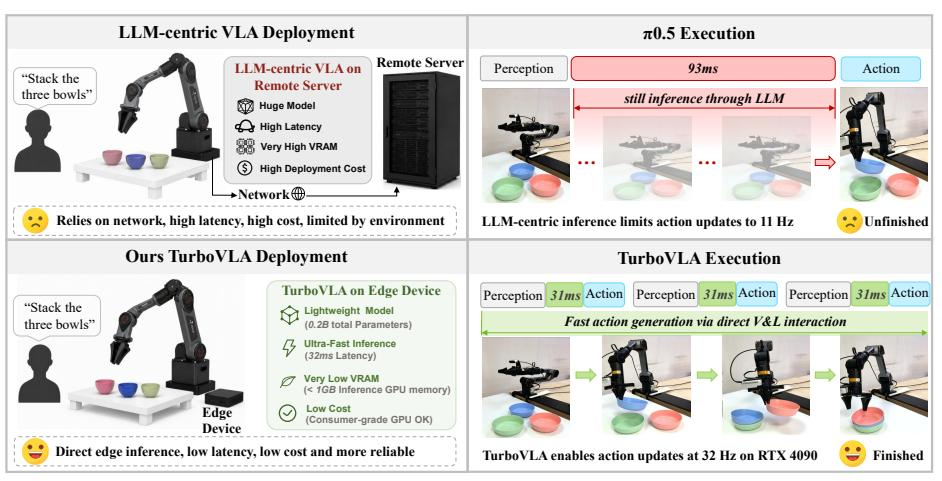
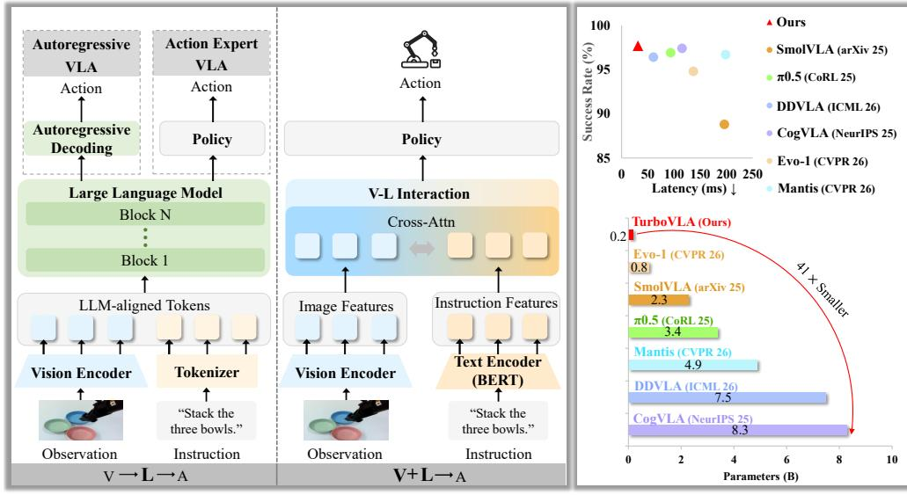
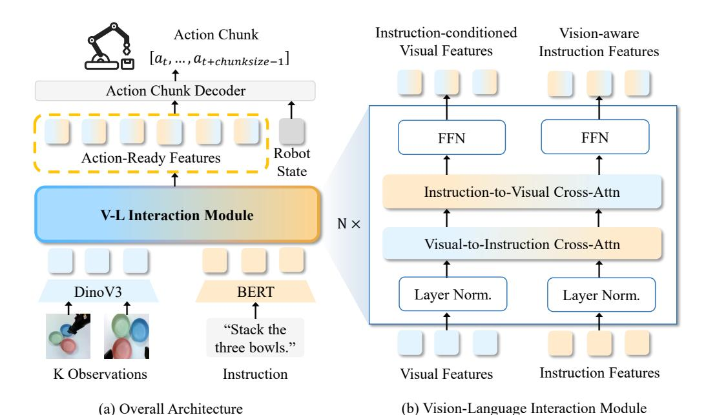
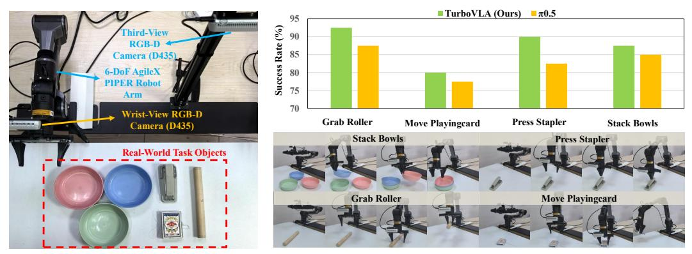
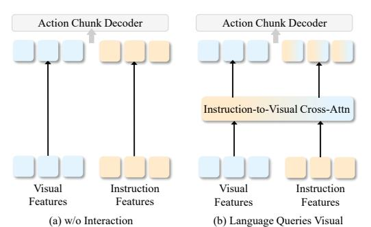
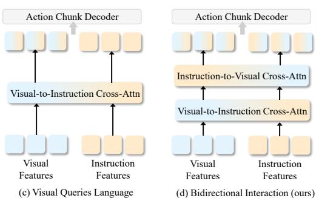
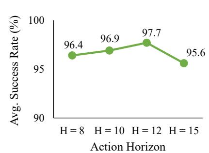

# TurboVLA: Real-Time Vision-Language-Action Model at 32 Hz on an RTX 4090 with <1 GB VRAM

- 원제: TurboVLA: Real-Time Vision-Language-Action Model at 32 Hz on an RTX 4090 with <1 GB VRAM
- 원문: [https://arxiv.org/abs/2607.27205](https://arxiv.org/abs/2607.27205)
- PDF: [https://arxiv.org/pdf/2607.27205v1](https://arxiv.org/pdf/2607.27205v1)
- arXiv ID: `2607.27205`

---

## TURBOVLA: RTX 4090에서 32Hz, 1GB VRAM 이하에서 실시간 비전-언어-행동 모델 (TURBOVLA: REAL-TIME VISION-LANGUAGE-ACTION MODEL AT 32 HZ ON AN RTX 4090 WITH <1 GB VRAM)

Hengyi Xie1∗ , Chenfei Yao1∗ , Xianjin Wu1 , Xuanyang Xi2 , Yiping Tang2 , Di Xu2 , Yingying Zhu1 , Dingkang Liang1† , Xiang Bai1 , Han Ding1

§ <https://github.com/H-EmbodVis/TurboVLA>

<https://H-EmbodVis.github.io/TurboVLA>

Figure 1: TurboVLA는 0.2B 파라미터, 0.9 GB 추론 VRAM 및 31.2 ms 정책 지연으로 컴팩트한 로컬 배포와 실시간 언어-조건화 조작을 가능하게 합니다.

# 개요 (ABSTRACT)

Vision-language-action (VLA) 모델은 일반적으로 LLM 중심 V → L → A 경로 (LLM-centric V → L → A pathway)를 채택합니다. 시각 관측은 대형 언어 모델의 표현 공간으로 투영된 뒤 로봇 동작으로 디코딩됩니다. 효과적이지만, 이 설계는 정책 호출마다 상당한 연산 및 메모리 오버헤드를 발생시킵니다. 본 연구에서는 TurboVLA를 도입합니다. TurboVLA는 기존의 V → L → A 경로를 직접적인 V + L → A 매핑으로 재구성한 새로운 VLA 패러다임입니다. 대형 언어 모델을 인식과 행동 사이의 중앙 인터페이스로 사용하지 않고, TurboVLA는 시각 관측과 언어 지시를 독립적으로 인코딩하고, 경량 양방향 비전-언어 상호작용을 통해 직접 정보를 교환하며, 컴팩트한 디코더로 연속 동작 청크를 예측합니다. 이 단순한 설계는 시각 및 언어 특성에서 직접 작업 조건화된 표현을 구성하여 VLA 추론의 연산 및 메모리 비용을 크게 줄입니다. LIBERO에서 TurboVLA는 0.2B 파라미터, 31.2 ms 추론 지연, 0.9 GB 추론 VRAM으로 소비자용 RTX 4090에서 평균 97.7%의 성공률을 달성하며, 훨씬 더 큰 VLA 정책을 매칭하거나 능가합니다. 이 결과는 TurboVLA를 기존 LLM 중심 VLA 패러다임 (LLM-centric VLA paradigm) 에 대한 단순하고 효과적인 대안으로 확립하며, 비전, 언어, 행동이 효율적인 로봇 조작을 위해 어떻게 연결될 수 있는지에 대한 새로운 관점을 제공합니다.

1화중과학기술대학교 (Huazhong University of Science and Technology), 2화웨이 기술(주) (Huawei Technologies Co. Ltd), 중국 (China) {hengyi xie, yaochenfei, dkliang, xbai}@hust.edu.cn {xixuanyang, tangyiping, xudi21}@huawei.com

∗Equal contribution, listed alphabetically by surname. † Project Lead.

(a) 기존 LLM 중심 VLA (왼쪽)와 우리 방법 (오른쪽)의 비교

(b) 성능 향상

Figure 2: LLM 중심 VLA에서 TurboVLA로 (LLM-centric VLA to TurboVLA). (a) LLM 중심 VLA는 대형 언어 모델 표현에서 동작을 예측하는 반면, TurboVLA는 시각 및 지시 특성을 직접 융합하여 연속 제어를 수행합니다. (b) TurboVLA는 LIBERO에서 매우 경쟁력 있는 성능을 달성하며, 훨씬 낮은 지연과 모델 규모를 자랑합니다.

## 1 서론 (1 Introduction)

Vision-language-action (VLA) 모델은 언어 조건화 로봇 조작을 위한 강력한 프레임워크가 되었으며, 시각 관측, 자연어 지시, 로봇 동작을 통합 정책 내에서 연결합니다 (Brohan et al., 2023; Zitkovich et al., 2023; Kim et al., 2024; Octo Model Team et al., 2024; Black et al., 2025a; Physical Intelligence et al., 2025; Liu et al., 2025; Li et al., 2024; Fu et al., 2025). 일반적인 설계는 이 과정의 중심에 대형 언어 모델을 배치하는 것입니다. 이러한 시스템은 간접적인 $V \to L \to A$ 경로를 따라 시각 관측을 언어 정렬된 표현으로 변환하고, 작업 지시와 결합한 뒤 대형 언어 모델에서 처리하고, 이후 동작으로 디코딩합니다 (Driess et al., 2023; Zitkovich et al., 2023; Kim et al., 2024). 이 설계는 대규모 사전 학습에서 광범위한 의미 지식을 로봇 제어로 전달하고, 개방형 어휘 이해, 의미 일반화, 고수준 추론을 지원합니다.

LLM 중심 VLA 모델은 실시간 로봇 실행에 상당한 병목 현상을 초래하며, 이는 반응성 상호작용, 고처리량 조작, 그리고 자원 제약이 있는 로봇 플랫폼에 배포할 때 중요하다. Fig. 2(a)에 요약된 바와 같이, 기존의 LLM 중심 VLA 모델은 주로 두 가지 액션 생성 설계를 따른다. Open-VLA (Kim et al., 2024) 및 RT-2 (Zitkovich et al., 2023)와 같은 자기회귀형 VLA 모델은 액션을 토큰으로 표현하므로 언어 생성의 순차 디코딩 비용을 그대로 물려받는다. 최근 방법들은 병렬 액션 디코딩, 연속 액션 헤드, 또는 전용 액션 전문가(Black et al., 2025a; Physical Intelligence et al., 2025; Kim et al., 2025; Li et al., 2024; Shukor et al., 2025)를 통해 이 비용을 완화한다. 이러한 액션 전문가 설계는 토큰별 액션 생성을 피하지만, 시각 관찰과 지시사항은 여전히 수십억 파라미터를 가진 언어 모델을 통해 처리되며, 이는 액션을 예측하기 전에 수행된다. 이러한 대형 언어 모델 코어는 상당한 계산 및 메모리 오버헤드를 부과하여 높은 추론 지연 시간을 초래하고 제어 빈도를 제한한다. 이는 보다 근본적인 질문을 제기한다: 대형 언어 모델에 중심을 두지 않고, 시각과 언어를 직접적으로 액션에 매핑하여 실행 수준 조작을 위한 단순하고 우아하며 효율적인 VLA를 어떻게 설계할 수 있을까?

우리의 핵심 관찰은 언어가 지시 기반 조작에 필요하지만, 실행 수준 제어는 대형 언어 모델에 중심을 둘 필요가 없다는 점이다. 지시가 이미 의도된 조작 기술을 명시하면, 실행 정책은 개방형 언어 생성이나 자율적인 작업 분해를 수행할 필요가 없다. 대신, 현재 시각적 증거가 액션을 어떻게 안내해야 하는지를 결정하기 위해 지시를 사용해야 한다. 현재의 LLM 중심 VLA 모델에서는 이 상호작용이 범용 언어 모델 표현을 통해 매개된다.

그의 폭넓은 추론 및 생성 능력은 많은 실행 수준 작업의 요구를 초과한다. BERT [(Devlin et al.,](#page-11-4) [2019)](#page-11-4)와 같은 경량 텍스트 인코더는 지시의 실행 관련 의미를 제공할 수 있으며, 컴팩트한 교차 모달 상호작용은 언어와 시각이 함께 제어 지향적 표현을 구축하도록 허용한다 [(Lynch & Sermanet,](#page-13-4) [2020;](#page-13-4) [Shridhar et al.,](#page-13-5) [2022;](#page-13-5) [Jang et al.,](#page-12-3) [2022;](#page-12-3) [Mees et al.,](#page-13-6) [2022b)](#page-13-6). 이는 다른 VLA 패러다임을 시사한다: 인식과 제어를 LLM 중심 잠재 공간 주위에 조직하는 대신, 시각과 언어가 직접 상호작용하여 연속 액션 예측에 특화된 표현을 형성할 수 있다.

따라서 우리는 TurboVLA를 제안한다. 이는 실시간 언어 기반 조작을 위한 단순하면서도 효율적인 V + L → A 모델이다. Fig. [2(](#page-1-0)a)에서 보듯이, TurboVLA는 시각 인코더와 경량 텍스트 인코더를 사용해 시각 관찰과 작업 지시를 별도로 처리한다. Grounding DINO [(Liu](#page-13-7) [et al.,](#page-13-7) [2024b)]와 같은 고급 시각 기반 모델에서 사용되는 효율적인 교차 모달 상호작용에 영감을 받아, TurboVLA는 대형 언어 모델 중심 실행 경로를 직접 시각-언어 상호작용으로 대체하여 수십억 파라미터 언어 모델을 통한 다중 모달 입력 처리의 계산 및 메모리 오버헤드를 회피한다. 컴팩트한 교차 주의 모듈은 지시와 시각 특징을 효율적으로 융합하며, 이는 단일 순방향 패스 [(Zhao et al.,](#page-15-1) [2023)](#page-15-1)에서 연속 액션 청크로 디코딩된다. 자기회귀형 액션 토큰 생성을 피함으로써 이 경량 설계는 추론 지연 시간과 GPU 메모리 사용량을 크게 감소시킨다.

광범위한 실험 결과, TurboVLA는 실시간 실행을 달성하면서도 강력한 조작 성능을 유지한다.  

소비자용 RTX 4090에서, 현재 멀티모달 관측을 수신하여 액션 청크를 생성할 때까지의 엔드-투-엔드 정책 지연은 단 31.2 ms이며, 이는 초당 30개 이상의 액션 청크 예측(32 Hz)에 해당한다.  

TurboVLA는 0.2 B 파라미터만을 포함하며, 이는 π0의 파라미터 수의 약 6%에 해당한다.5 [(Physical Intelligence](#page-13-1) [et al.,](#page-13-1) [2025)](#page-13-1), 추론 시 1 GB 이하의 VRAM만을 사용한다.  

이러한 경량 설계에도 불구하고, TurboVLA는 LIBERO [(Liu et al.,](#page-12-4) [2023)](#page-12-4)에서 평균 97.7%의 성공률을 달성하며, 훨씬 더 큰 VLA 시스템과 동일한 성능을 보인다.  

Fig. [2(](#page-1-0)b)에서 요약한 바와 같이, TurboVLA는 조작 성능, 추론 지연, 모델 규모 사이에서 유리한 균형을 제공하여, 지연 민감하고 자원 제약이 있는 로봇 시스템에서 언어 조건화된 조작 정책을 배포하는 하드웨어 장벽을 낮춘다.  

더 넓은 관점에서, 이 결과는 VLA 커뮤니티가 실행 수준 제어가 여전히 대형 언어 모델에 중심을 두어야 하는지 여부를 검토하고, 미래 시스템을 단순한 작업 성공을 넘어 평가하도록 동기를 부여한다.  

우리의 기여는 다음과 같이 요약된다:

- 기존 VLA 모델의 LLM 중심 설계를 재검토하고, 대형 언어 모델 코어가 실시간 액션 실행의 주요 병목 현상임을 확인한다. 이 분석을 바탕으로, 대형 언어 모델을 실행 수준 제어에서 제외하면서 언어 조건화를 유지하는 실시간 VLA 패러다임을 제시한다.  

- 우리는 경량화된 지시 인코딩, 직접적인 시각-언어 상호작용, 로봇 상태 조건화, 그리고 비자기회귀 연속 액션 청크 예측을 결합한 단순하고 효율적인 V + L → A 모델인 TurboVLA를 제안한다.  

- LIBERO에서의 실험 결과, TurboVLA는 소비자용 RTX 4090에서 0.2 B 파라미터와 1 GB 이하의 추론 VRAM만으로 초당 30개 이상의 온라인 정책 추론을 수행하면서 평균 97.7%의 성공률을 달성한다. LIBERO를 넘어, TurboVLA는 도전적인 양손 조작 및 실제 환경에서도 효과를 유지한다.

## 2 RELATED WORK (관련 연구)

시각-언어-행동 모델.

시각-언어-행동(VLA) 모델은 시각적 관찰, 작업 지시, 그리고 행동 예측을 하나의 통합 정책 안에서 통합하며, 종종 대규모 시각-언어 사전학습을 활용해 의미적 일반화를 달성한다.  
RT-1 [(Brohan et al.,](#page-11-0) [2023)](#page-11-0)은 확장 가능한 트랜스포머 기반 로봇 제어를 입증했으며, RT-2 [(Zitkovich et al.,](#page-15-0) [2023)](#page-15-0)와 OpenVLA [(Kim et al.,](#page-12-0) [2024)](#page-12-0)는 행동-토큰 인터페이스를 통해 사전학습된 시각-언어 모델을 로봇 궤적에 적용했다.  
연속 제어 모델인 π0 [(Black et al.,](#page-11-1) [2025a)](#page-11-1)와 π0.5 [(Physical Intelligence et al.,](#page-13-1) [2025)](#page-13-1)은 대신 사전학습된 다중모달 백본에 전용 행동 전문가를 부착한다.  
이 일반화된 VLA 방향은 또한 교차 구현체 데이터셋 [(O'Neill et al.,](#page-13-8) [2024)](#page-13-8), 재사용 가능한 정책 표현 [(Octo Model Team et al.,](#page-13-0) [2024)](#page-13-0), 확산 기반 로봇 정책 [(Liu et al.,](#page-13-2) [2025;](#page-13-2) [Li et al.,](#page-12-1) [2024)](#page-12-1), 그리고 다양한 구현체를 위한 기초 모델 [(Bjorck et al.,](#page-11-5) [2025;](#page-11-5) [Bu et al.,](#page-11-6) [2025;](#page-11-6) [Wang et al.,](#page-14-0) [2026c)](#page-14-0)을 통해 발전했다.  
최근 접근법은 시각적 예측력 [(Yang](#page-14-1) [et al.,](#page-14-1) [2026)](#page-14-1), 예측적 세계 지식 [(Zhang et al.,](#page-15-2) [2025c)](#page-15-2), 그리고 잠재적 추론 [(Bai et al.,](#page-11-7) [2026)](#page-11-7)을 통해 VLA 학습을 강화한다.  
다른 방법들은 포즈 중심 사전학습 또는 포인트-행동 상호작용(Lin et al., 2026a; Chen et al., 2026a)을 통해 기하학 인식 제어 표현을 통합한다.  
최근 연구는 시간적 움직임 신호와 단기 미래 예측(Fang et al., 2026)을 통합함으로써 VLA 정책을 동적 조작으로 확장한다.  
이러한 연구들은 대규모 사전학습된 다중모달 표현과 점점 더 표현력이 풍부한 중간 표현의 이점을 보여준다.  
TurboVLA는 다른 아키텍처 선택에 초점을 맞춘다: 모든 제어 단계를 대규모 생성적 다중모달 백본을 통해 라우팅하는 대신, 작업 텍스트를 별도로 인코딩하고 이를 시각적 관찰 및 로봇 상태와 직접 통합하여 실행 수준의 행동 예측을 수행한다.

VLA 정책에서의 효율적인 실행. 최근 연구는 행동 측면 재설계와 백본 측면 최적화를 통해 VLA 효율성을 향상시켰다. Action-as-token 정책은 언어 모델의 순차 디코딩 과정을 계승하여, 연속 행동 전문가(Black et al., 2025a; Physical Intelligence et al., 2025; Kim et al., 2025), 압축되고 구조화된 행동 토크나이저(Pertsch et al., 2025; Liu et al., 2026), 그리고 병렬 디코딩을 활용한 행동 청킹(Liu et al., 2025; Liang et al., 2026c)을 촉진한다. TinyVLA (Wen et al., 2025), RoboMamba (Liu et al., 2024a), SmolVLA (Shukor et al., 2025), Evo-1 (Lin et al., 2026b) 등 압축된 VLA 아키텍처는 사전 학습된 멀티모달 표현을 유지하면서 모델 규모나 추론 비용을 줄인다. 보완적인 연구 라인은 양자화(Xu et al., 2026; Wang et al., 2025), 토큰 재사용 또는 가지치기(Xu et al., 2025; Jiang et al., 2025), 동적 깊이(Yang et al., 2025), 구조적 가지치기(Wang et al., 2026a; Zhang et al., 2026), 그리고 증류(Chen et al., 2026c; Jeon et al., 2026)를 통해 중복 백본 계산을 줄인다. 기타 방법은 기본 정책을 변경하지 않으면서 반응성을 향상시킨다. 예를 들어 비동기 행동 청크 실행(Black et al., 2025b), 스트리밍 추론 및 수평 인식 흐름 샘플링(Lu et al., 2026), 그리고 투기적 추론(Niu et al., 2026)이 있다. 이러한 접근 방식은 행동 생성을 가속화하거나 계산을 줄이면서도 실행 표현으로서 대규모 멀티모달 백본을 대부분 유지한다. 반면에 TurboVLA는 낮은 수준의 제어 경로에서 대규모 생성 언어 백본을 제거하고, 압축된 시각, 텍스트, 그리고 고유 감각 특징으로부터 직접 행동 표현을 구성한다.

로봇 제어를 위한 언어 인터페이스. 텍스트 지침은 생성 언어 모델링을 위한 프롬프트가 아니라, 인식과 제어를 조건화하는 작업 사양으로 활용될 수 있다. 초기 모방 학습 방법은 공유 정책이 시각 관측과 자연어 명령을 서로 다른 조작 행동으로 직접 매핑할 수 있음을 보여주었다(Lynch & Sermanet, 2020; Stepputtis et al., 2020). CLIPort(Shridhar et al., 2022)는 사전 학습된 시각-언어 의미와 공간 조작 경로를 결합하고, BC-Z(Jang et al., 2022)는 사전 학습된 텍스트 또는 인간-비디오 임베딩에 기반한 다중 작업 정책을 조건화한다. CALVIN(Mees et al., 2022b)과 HULC(Mees et al., 2022a)는 구조화되지 않은 시연으로부터 장기 수평 제어에 텍스트 작업 조건화를 확장한다. PerAct(Shridhar et al., 2023)는 텍스트 목표를 볼륨 기반 변환기 정책에 통합하고, VIMA(Jiang et al., 2023)는 교차 텍스트 및 시각 프롬프트를 통해 작업을 표현한다. 실행 수준 정책을 넘어, 구현된 멀티모달 언어 모델은 언어 이해, 3D 기반화, 그리고 작업 스케줄링을 결합하여 기반화된 행동 계획을 생성한다(Liang et al., 2026a). 이러한 계획 지향적 기능은 본 연구에서 다루는 효율적인 실행 수준 제어와 상호 보완적이다. 이러한 연구들은 텍스트 표현을 로봇 제어를 위한 효과적인 작업 입력으로 확립한다. TurboVLA는 현재 VLA 패러다임 하에서 이 인터페이스를 연구하며, 압축된 텍스트 인코더와 직접적인 시각-텍스트 상호작용이 고성능, 실시간 연속 제어에 충분한지 검토한다.

## 3 Preliminaries (전제)

**LLM 중심 시각-언어-행동 모델.** 대부분의 기존 VLA 모델(Kim et al., 2024; Black et al., 2025a; Physical Intelligence et al., 2025; Zhou et al., 2025; Fu et al., 2025)은 시각-행동 경로의 중심에 대형 언어 모델을 배치한다. 시각 관측 $\mathcal{O}_n$ 을 주면, 시각 인코더는 먼저 시각 특징을 추출하고 이를 언어 모델의 토큰 공간으로 투영한다. 투영된 시각 토큰은 토큰화된 작업 지침과 이어 붙여져 대형 언어 모델에 의해 공동으로 처리된다:

$$\widetilde{Z}_n^v = P_v(E_v(\mathcal{O}_n)), \qquad H_n^L = F_L\left(\left[\widetilde{Z}_n^v; \operatorname{Tok}(x)\right]\right),$$

(1)

여기서 $E_v$는 시각 인코더를 나타내고, $P_v$는 시각 특징을 언어 모델 임베딩 공간으로 매핑하며, Tok(x)는 지시 토큰을 나타내고, $F_L$은 대형 언어 모델이다. 특히 L 단계는 단순히 언어를 인코딩하는 역할만 하는 것이 아니다. 그것은 중앙 ...

Figure 3: TurboVLA 개요. (a) TurboVLA는 간단하면서도 효율적으로 시각 관측과 언어 지시를 연속적인 행동 청크로 매핑한다. 이는 컴팩트 모달리티 인코더, 시각-언어 상호작용, 그리고 행동 청크 디코더를 통해 이루어진다. (b) 상호작용 모듈은 가능한 한 단순하게 설계되었다. 그것은 스택된 양방향 교차 주의(attention)를 사용하여 시각 인식된 지시 특징과 지시 조건화된 시각 특징을 생성한다.

시각 인식과 로봇 행동 사이의 다리: 시각 정보는 언어 모델 공간과 정렬되고, 작업 지시와 통합되며, 행동이 예측되는 다중 모달 표현으로 변환된다. 따라서 우리는 이 지배적인 계산 경로를 $V \to L \to A$ 로 요약한다. 여기서 L은 LLM 중심의 다중 모달 인터페이스를 나타낸다.

기존의 LLM 중심 VLA 모델은 주로 $H_n^L$에서 행동이 어떻게 생성되는지에 따라 차이가 있다. 자기회귀 모델은 로봇 행동을 이산화하고 언어 모델 표현에서 순차적으로 예측한다 (Zitkovich et al., 2023; Kim et al., 2024), 반면 행동 전문가 모델은 별도의 연속 디코더를 사용한다,

$$\hat{\mathbf{A}}_n = D_{\text{act}}\left(H_n^L, s_n\right),\tag{2}$$

동시에 행동을 생성한다 (Black et al., 2025a; Physical Intelligence et al., 2025; Kim et al., 2025; Li et al., 2024). 행동 전문가 모델은 토큰 단위 행동 생성을 피하지만, 동일한 표현 종속성을 유지한다. 이는 행동 디코더가 대형 언어 모델에서 생성된 특징을 사용하기 때문이다. 따라서 서로 다른 행동 생성 메커니즘을 사용함에도 불구하고 두 설계 모두 시각 인식에서 행동 예측으로 가는 중앙 다리로서 $\boldsymbol{L}$을 유지한다.

**직접 시각-언어 상호작용.** 교차 주의(attention)는 시각 특징과 언어 특징 사이에서 정보를 직접 교환하는 간단하고 효율적인 메커니즘을 제공한다. 시각 특징 $Z^v$와 지시 특징 $Z^l$이 주어지면, 언어 조건화된 시각 특징은 다음과 같이 얻을 수 있다

$$\widetilde{Z}^{v} = Z^{v} + \operatorname{Attn}(Q_{v}, K_{l}, V_{l}), \qquad (3)$$

반면 시각 인식된 지시 특징은 쿼리와 컨텍스트 모달리티를 교환함으로써 생성된다. 이러한 양방향 상호작용은 작업 언어가 시각 처리를 형성하도록 하고, 시각 컨텍스트가 지시 표현을 정제하도록 한다. Grounding DINO (Liu et al., 2024b)와 같은 시각-언어 기반 모델은 이 유형의 직접 교차 모달 상호작용을 사용하여 텍스트 개념과 시각 콘텐츠 사이의 세밀한 대응을 구축한다. 이러한 모델이 객체 위치 지정에 결과 특징을 사용한다면, 우리는 연속 행동 예측을 위한 제어 지향 표현을 구축하기 위해 직접 시각-언어 상호작용을 사용한다.

## 4 TurboVLA

우리는 **TurboVLA**를 소개한다. 이는 실행 수준의 언어-조건화 조작을 위한 직접적이고 단순한 $V + L \rightarrow A$ 패러다임이다. 그림 3(a)에서 보듯이, TurboVLA는 먼저 비전 인코더와 가벼운 텍스트 인코더를 사용해 시각 관측과 작업 지시를 인코딩한다. 그 다음, 간단하고 압축된 비전-언어 상호작용 모듈이 두 모달리티 간 정보를 직접 교환하여 실행 준비가 된 특징을 구성한다. 마지막으로, 액션 청크 디코더는 이 특징들을 현재 로봇 상태와 결합해 단일 전방 패스에서 연속 액션의 완전한 시퀀스를 예측한다. LLM 중심의 VLA 모델과 달리, 우리 방법은 액션 예측 전에 시각 및 텍스트 입력을 대형 언어 모델을 거치지 않는다.

### 4.1 다중 모달 특징 인코딩

LLM 중심 실행 경로의 오버헤드를 줄이면서도 단순하지만 충분한 지시 이해를 유지하기 위해 TurboVLA는 컴팩트한 모달리티별 인코더를 사용한다. 실행 수준 지시는 일반적으로 개체, 속성, 공간 관계를 통해 조작 기술을 지정하며, 개방형 생성이나 작업 수준 계획을 요구하지 않는다. 따라서 우리는 BERT (Devlin et al., 2019)와 같은 가벼운 인코더로 지시를 인코딩하고, 시각 관측은 비전 인코더로 처리한다. 그림 3(a)에서 보듯이, 생성된 특징은 이후 비전-언어 상호작용 및 액션 예측을 위해 공유 은닉 차원 d로 투영된다. 작업 지시 x가 주어지면, 텍스트 인코더는 토큰 수준 지시 특징을 추출한다:

$$Z^{l} = P_{l}\left(f_{\text{text}}(x)\right) \in \mathbb{R}^{N_{l} \times d},\tag{4}$$

여기서 $P_l$은 인코더 출력을 정책 차원으로 투영하고, $N_l$은 지시 토큰 수이다. 우리는 풀링된 임베딩 대신 전체 토큰 시퀀스를 보존하여 개체, 속성, 공간 관계가 세밀한 시각 조건화에 사용될 수 있도록 한다.

각 카메라 관측 $I_n^{(i)}$ 에 대해, 이미지 인코더는 공간 시각 특징을 추출하고, 이를 투영한 뒤 위치 및 카메라 뷰 임베딩으로 보강한다:

$$Z_n^{v,(i)} = P_v \left( f_{\text{img}} \left( I_n^{(i)} \right) \right) + E_{\text{pos}}^{(i)} + e_{\text{view}}^{(i)}, \qquad Z_n^v = \left[ Z_n^{v,(1)}; \dots; Z_n^{v,(K)} \right]. \tag{5}$$

여기서 $E_{\rm pos}^{(i)}$는 뷰 내 공간 구조를 보존하고, $e_{\rm view}^{(i)$는 카메라 소스를 식별한다. K개의 스트림을 연결하면 다중 관점에서의 보완적 단서를 유지한다.

로봇 상태는 작업 조건화된 장면 특징을 실행 가능한 액션으로 변환하는 데 필요하지만, 시각-언어 상호작용에는 필요하지 않다. 우리는 이를 별도로 인코딩한다:

$$Z_n^s = f_{\text{state}}(s_n) \in \mathbb{R}^{N_s \times d},\tag{6}$$

여기서 $f_{\rm state}$는 가벼운 투영 네트워크이다. 상태 특징은 액션 디코더에 직접 도입되어 교차 모달 상호작용이 작업 조건화된 장면 이해에 집중하도록 한다. 이러한 모달리티별 인코더는 고차원 LLM 인터페이스를 실행 수준 조작에 맞춘 컴팩트한 특징 시퀀스로 대체하여 중간 활성화 메모리와 다운스트림 어텐션 비용을 줄이면서 제어에 필요한 정보를 보존한다.

### 4.2 비전-언어 상호작용 모듈

독립적으로 인코딩된 시각 및 텍스트 특징은 아직 현재 지시와 관련된 시각 콘텐츠를 식별하지 못한다. LLM 중심 VLA는 대형 언어 백본 내에서 이 정렬을 수행하지만, TurboVLA는 그림 3(b)의 간단하면서도 효율적인 비전-언어 상호작용 모듈을 사용해 두 스트림 간 정보를 직접 교환한다.

$V_n^0=Z_n^v$와 $L_n^0=Z^l$을 초기 시각 및 지시 특징으로 두고, 상호작용 모듈은 N개의 양방향 교차 모달 레이어를 통해 두 스트림을 점진적으로 업데이트한다:

$$(V_n^{\ell}, L_n^{\ell}) = \text{FusionLayer}_{\ell} (V_n^{\ell-1}, L_n^{\ell-1}), \qquad \ell = 1, \dots, N.$$

(7)

각 레이어는 레이어 정규화, 양방향 교차 주의, 그리고 잔차 연결이 있는 모달리티별 피드포워드 네트워크로 구성된다. 비주얼-투-인스트럭션 어텐션은 장면 컨텍스트를 주입한다

인스트럭션 스트림으로, 반면 인스트럭션-투-비주얼 어텐션은 비주얼 특징을 작업 의미론에 따라 조건화한다. 최종 레이어 이후, 업데이트된 스트림은 다음과 같이 연결된다

$$Z_n^{vl} = \left[ V_n^N; L_n^N \right]. \tag{8}$$

이 간결한 상호작용 모듈을 통해 대상 객체, 속성, 공간 관계를 포함한 정보가 관련 비주얼 특징을 조절할 수 있으며, 동시에 인스트럭션 표현은 현재 장면에 맞게 조정된다. 이 단순한 상호작용 설계는 대형 언어 모델의 광범위한 생성 및 추론 능력에 의존하지 않고도 작업별 멀티모달 정보를 효율적으로 제공하여 행동 예측을 가능하게 한다.

### 4.3 연속 행동 청크 예측

우리는 ACT 스타일(Zhao et al., 2023)의 경량 변환기 디코더를 사용하여 융합된 멀티모달 표현과 로봇 상태 특징을 연속 행동 시퀀스로 매핑한다:

$$\hat{\mathbf{A}}_n = D_{\theta} \left( Q_a, \left[ Z_n^{\text{vl}}; Z_n^s \right] \right) \in \mathbb{R}^{H \times d_a}, \tag{9}$$

여기서 $Q_a = [q_1, \dots, q_H]$는 H개의 학습 가능한 행동 쿼리를 포함하고, $D_\theta$는 행동 청크 디코더를 나타낸다. 이 단계에서 로봇 상태를 도입하면 현재 구현 구성을 제공하면서 이전 상호작용 모듈은 작업 조건화된 장면 이해에 집중할 수 있다.

모든 행동 쿼리는 병렬로 디코딩되어 정책이 행동 토큰화나 순차 생성 없이 단일 전방 패스로 완전한 H-스텝 행동 청크를 예측할 수 있다. 우리는 전문가 행동 청크에 대해 행동 복제(behavior cloning)를 통해 TurboVLA를 훈련시킨다. 목표 시퀀스 $\mathbf{A}_n^* = [a_{n,1}^*, \ldots, a_{n,H}^*]$가 주어지면, 훈련 목표는 $\ell_1$ 손실이며 보조 언어 모델링 목표는 필요 없다. 이처럼 압축된 특징 인코딩, 직접 비주얼-언어 상호작용, 병렬 행동 디코딩이 결합되어 Fig. 3(a)에 표시된 효율적인 $V + L \to A$ 실행 경로를 형성한다.

## 5 실험

우리는 TurboVLA가 LLM 중심 VLA 정책의 모델 규모, 추론 지연, 메모리 오버헤드를 크게 줄이면서도 강력한 언어 조건화 조작 성능을 유지할 수 있는지 평가한다. 먼저 LIBERO(Liu et al., 2023), RoboTwin 2.0(Chen et al., 2026b), 그리고 실제 배포에 대한 구현 세부사항과 평가 프로토콜을 설명한다. 이후 단일 팔 조작에서 성능-효율성 trade-off를 평가하고, 제안된 아키텍처가 양손 다중 작업 제어에 얼마나 확장 가능한지 검토하며, 실제 배포에서의 효과를 검증하고, 직접 비주얼-언어 상호작용 설계의 주요 구성 요소를 분석한다.

### 5.1 구현 세부사항

우리는 DINOv3(Siméoni et al., 2025)를 시각 백본으로, BERT(Devlin et al., 2019)를 경량 인스트럭션 인코더로 사용한다. 시각 및 텍스트 특징은 d=256의 공유 공간으로 투영되고, grounding-사전 학습된 특징 강화 가중치(Liu et al., 2024b)로 초기화된 N=6개의 양방향 비주얼-언어 상호작용 레이어에서 처리된다. ACT 스타일 변환기 디코더(Zhao et al., 2023)는 결과 멀티모달 특징과 로봇 상태를 연속 행동 청크로 매핑한다. 모든 벤치마크에서 우리는 $\ell_1$ 손실을 사용한 행동 복제(behavior cloning)로 훈련하며, 학습률은 $5\times 10^{-5}$를 사용하고 4개의 RTX 4090 GPU에서 수행한다. 벤치마크별 설정은 아래에 설명한다.

### 5.2 벤치마크 및 지표

우리는 TurboVLA를 세 가지 상호 보완적인 설정에서 평가합니다: LIBERO에서의 단일 팔 조작 (Liu et al., 2023), RoboTwin 2.0에서의 양팔 조작 (Chen et al., 2026b), 그리고 실제 로봇 플랫폼에서의 배포.

**LIBERO**는 LIBERO-Object, LIBERO-Spatial, LIBERO-Goal, LIBERO-Long의 네 개 스위트로 구성되며, 각 스위트는 10개의 언어 조건화 조작 과제를 포함합니다. 우리는 OpenVLA와 함께 공개된 수정된 no_noops RLDS 데이터셋 (Kim et al., 2024)을 사용하고, DINOv3 ViT-B 백본을 가진 혼합 스위트 모델을 공동으로 학습합니다. 모델은 연속 7-DoF 동작의 12단계 청크를 예측하며, 80k 단계 동안 10k 워밍업 단계와 유효 배치 크기.

256. VLA-Adapter 롤아웃 프로토콜 [(Wang et al.,](#page-14-9) [2026b)](#page-14-9)을 따르며, 추가적인 기법을 도입하지 않고, 우리는 각 과제마다 50개의 롤아웃을 수행하고 2,000번의 시도에서 스위트 수준 및 평균 성공률을 보고합니다.

RoboTwin 2.0은 조정된 양팔 조작을 요구하는 50개의 언어 조건화 양팔 조작 과제를 포함합니다. 사용 가능한 컴퓨팅 예산을 고려하여, 우리는 공식적인 정제된 시연에만 학습을 제한하고 무작위 장면 데이터를 포함하지 않습니다. 우리는 DINOv3 ViT-L 백본을 가진 다중 작업 모델을 공동으로 학습하여 14차원 절대 관절 위치 동작의 50단계 청크를 예측합니다. 학습은 55k 단계 동안 1k 워밍업 단계와 192의 유효 배치 크기로 진행됩니다. StarVLA [(StarVLA Community,](#page-14-10) [2026)](#page-14-10) 훈련 및 평가 프레임워크를 따르며, 추가적인 기법을 도입하지 않고, 우리는 각 과제마다 100개의 정제된 설정 롤아웃을 수행하고 모든 50개 과제에 대한 평균 성공률을 보고합니다.

실제 세계 평가. 우리는 Fig. [4.](#page-9-0)에 표시된 AgileX Piper 플랫폼을 사용하여 실제 실험을 수행했습니다. 우리는 *grab roller*, *move playing card away*, *press stapler*, *stack three bowls*라는 네 가지 대표적인 언어 조건화 조작 과제를 고려합니다. 이 과제들은 정확한 객체 기반화, 시점 견고성, 그리고 실제 센서 노이즈 하에서 안정적인 폐쇄 루프 실행을 요구합니다. 우리는 LIBERO에서 사전 학습된 TurboVLA 체크포인트에서 정책을 초기화하고, 4 × 65개의 텔레오퍼레이티드 실제 세계 시연을 12.5k 단계 동안 미세 조정합니다. 각 과제는 40번의 시도에서 평가되며, 성공률을 보고합니다. 우리는 동일한 플랫폼, 훈련 데이터 및 평가 프로토콜 하에서 π0.5와 비교합니다.

지표 및 비교. 우리는 모든 벤치마크에서 주요 지표로 과제 성공률을 사용합니다. 또한 총 파라미터 수, 추론 지연 시간, 그리고 추론 VRAM을 보고합니다. 비교에 포함된 다른 실행 가능한 방법들에 대해, 이 효율성 지표는 RTX 4090에서 배치 크기 1로 공식 아키텍처, 구현 및 체크포인트를 사용해 측정됩니다. 지연 시간은 멀티모달 입력에서 동작 청크 또는 동등한 수의 자기 회귀 동작 토큰을 생성할 때까지 측정되며, 추론 VRAM은 전체 온라인 정책의 최고 GPU 메모리 사용량을 나타냅니다.

### 5.3 주요 결과

Tab. [1](#page-8-0)과 Tab. [2](#page-8-1)은 시뮬레이션 벤치마크에서 TurboVLA의 보완적 평가를 제시합니다. 이 결과를 바탕으로 우리는 다음과 같은 관찰을 도출합니다.

1) LLM 중심 실행 경로를 넘어서는 것은 성능–효율성 경계를 개선한다. Tab. [1,](#page-8-0) 에 요약된 바와 같이 TurboVLA는 대규모 *Capability-oriented VLAs*의 조작 능력을 훨씬 낮은 비용으로 일치시킨다. 평균 성공률은 97.7%로, π0.5 [(Physical Intelligence et al.,](#page-13-1) [2025)](#page-13-1)의 96.9%와 비교된다. 이는 매개변수의 약 6%만 사용하면서 추론 지연 시간을 93.6 ms에서 31.2 ms로 크게 줄인 것이다. 또한 우리 방법은 평균 성공률에서 최근 VLA-JEPA [(Sun et al.,](#page-14-11) [2026)](#page-14-11)를 능가하며, 3배 이상 빠르고 매개변수의 약 7%만 사용한다. 이 비교는 강력한 실행 수준 조작이 인식과 행동 사이의 중앙 인터페이스로 다십억 매개변수 LLM을 사용하는 것과 본질적으로 연결되어 있지 않음을 시사한다. *Acceleration-oriented VLAs*에 비해 이점은 명확하다: OpenVLA-OFT [(Kim](#page-12-2) [et al.,](#page-12-2) [2025)](#page-12-2)와 Discrete Diffusion VLA [(Liang et al.,](#page-12-7) [2026c)](#page-12-7)는 행동 생성 최적화와 각각 112.2 ms와 60.8 ms의 추론 지연 시간을 달성하지만, 두 모델 모두 실행의 중심에 대형 언어 백본을 유지하고 있어 더 느리고 평균 성공률이 낮다. *Lightweight VLAs*와 비교해 TurboVLA는 트레이드오프의 양쪽을 더욱 개선한다. 최근 Evo-1 [(Lin et al.,](#page-12-9) [2026b)](#page-12-9)와 VLA-Adapter [(Wang et al.,](#page-14-9) [2026b)](#page-14-9)를 평균 성공률에서 능가하면서 훨씬 작고 빠르다. 이 성능–효율성 이점은 RoboTwin 2.0 벤치마크에도 확장된다. Tab. [2,](#page-8-1) 에서 보듯이 TurboVLA는 50개의 양손 작업에서 43.4 ms 추론 지연 시간으로 평균 성공률 60.2%를 달성하며, π0.5의 57.0%와 95.6 ms, StarVLA-α [(Ye et al.,](#page-14-12) [2026)](#page-14-12)의 50.3%와 74.9 ms를 능가한다.

이러한 결과는 행동 생성 가속화만으로도, 모델 규모 축소만으로도 충분하지 않음을 보여준다. 다중 모달 실행 경로를 재설계함으로써 TurboVLA는 단순하고 직관적인 V + L → A 패러다임이 단일 팔과 양손 제어 환경 모두에서 강력한 조작 성능, 낮은 지연 시간, 그리고 컴팩트한 모델 규모를 동시에 달성하는 보다 효과적인 방법임을 검증한다.

2) 건축 효율성은 실용적인 배포 가능성으로 이어진다. 실제 로봇 배포는 정책 정확도, 응답 지연, 그리고 레지던트 메모리에 의해 공동으로 제한되며, 다른 어떤 것에 의해 제한되지 않는다.

Table 1: LIBERO에서의 비교. "Emb. PT."는 LIBERO를 넘어선 로봇 데이터에 대한 추가 구현(pretraining)을 나타낸다. Params는 총 파라미터 수를 의미한다. Latency는 멀티모달 입력에서 액션 청크 또는 동등한 수의 자기회귀 액션 토큰을 생성하는 데 걸리는 시간을 의미한다. Latency와 Inference VRAM은 모두 배치 크기 1인 단일 RTX 4090에서 측정된다. TurboVLA의 경우 보고된 파라미터 수는 DINOv3 ViT-B 구성에 해당한다.

| 방법 |  | 임베디드 배포 효율성 |  |  | y LIBERO 성공률 (%) |  |  |  |  |
|------------------------------------------------------------|---|--------------------------|---------------|-------|---------------------------|------|------|------|-------|
|  |  | 파라미터 (B)↓ | VRAM (GB)↓ |  | 공간 | 목표 | 목표 | 긴 | 평균↑ |
| Non-VLA 정책 기준선 |  |  |  |  |  |  |  |  |  |
| 확산 정책 (Chi et al., 2023) (RSS'23) | X | 0.3 | 1.1 | 924.8 | 78.3 | 92.5 | 68.3 | 50.5 | 72.4 |
| 능력 지향 VLAs |  |  |  |  |  |  |  |  |  |
| OpenVLA (Kim et al., 2024) (CoRL'24) | 1 | 7.5 | 14.9 | 202.9 | 84.7 | 88.4 | 79.2 | 53.7 | 76.5 |
| $\pi_0$ (Black et al., 2025a) (RSS'25) | ✓ | 3.2 | 12.3 | 84.2 | 96.8 | 98.8 | 95.8 | 85.2 | 94.2 |
| UniVLA (Bu et al., 2025) (RSS'25) | 1 | 7.6 | 15.0 | 173.8 | 96.5 | 96.8 | 95.6 | 92.0 | 95.2 |
| $\pi_{0.5}$ (Physical Intelligence et al., 2025) (CoRL'25) | 1 | 3.4 | 12.8 | 93.6 | 98.8 | 98.2 | 98.0 | 92.4 | 96.9 |
| CogVLA (Li et al., 2025) (NeurIPS'25) | ✓ | 8.3 | 16.1 | 115.5 | 98.6 | 98.8 | 96.6 | 95.4 | 97.4 |
| Mantis (Yang et al., 2026) (CVPR'26) | 1 | 4.9 | 7.9 | 198.7 | 98.8 | 99.2 | 94.4 | 94.2 | 96.7 |
| MM-ACT (Liang et al., 2026b) (CVPR'26) | X | 8.2 | 16.3 | 723.2 | 97.8 | 99.4 | 94.8 | 93.0 | 96.3 |
| VLA-JEPA (Sun et al., 2026) (ECCV'26) | 1 | 2.8 | 5.3 | 108.7 | 96.2 | 99.6 | 97.2 | 95.8 | 97.2 |
| VEGA-3D (Wu et al., 2026) (ECCV'26) | ✓ | 9.0 | 16.0 | 546.4 | 97.4 | 99.4 | 97.0 | 95.2 | 97.3 |
| 가속 지향 VLAs |  |  |  |  |  |  |  |  |  |
| OpenVLA-OFT (Kim et al., 2025) (RSS'25) | 1 | 7.7 | 15.7 | 112.2 | 97.6 | 98.4 | 97.9 | 94.5 | 97.1 |
| DDVLA (Liang et al., 2026c) (ICML'26) | ✓ | 7.5 | 14.5 | 60.8 | 97.2 | 99.4 | 96.8 | 92.2 | 96.4 |
| 경량 VLAs |  |  |  |  |  |  |  |  |  |
| SmolVLA (Shukor et al., 2025) (ArXiv'25) | X | 2.3 | 7.1 | 203.1 | 93.0 | 94.0 | 91.0 | 77.0 | 88.8 |
| DreamVLA (Zhang et al., 2025c) (NeurIPS'25) | X | 0.7 | 1.5 | 128.0 | 97.5 | 94.0 | 89.5 | 89.5 | 92.6 |
| VLA-Adapter (Wang et al., 2026b) (AAAI'26) | X | 1.5 | 4.3 | 87.3 | 97.8 | 99.2 | 97.2 | 95.0 | 97.3 |
| Evo-1 (Lin et al., 2026b) (CVPR'26) | X | 0.8 | 1.7 | 137.2 | 92.7 | 97.7 | 96.3 | 92.3 | 94.8 |
| TurboVLA (우리) | X | 0.2 | 0.9 | 31.2 | 99.2 | 99.8 | 97.4 | 94.2 | 97.7 |

Table 2: RoboTwin 2.0에서의 비교, 모든 방법이 깨끗한 설정에서만 훈련 및 평가되었습니다. "Emb. PT."는 RoboTwin 2.0을 넘어선 로봇 데이터에 대한 추가적인 구현(pretraining)을 나타내며, Params는 총 파라미터 수를 나타냅니다. Per-task 방법은 50개의 각 작업마다 별도의 정책을 훈련시키는 반면, multi-task 방법은 모든 작업에 대해 단일 정책을 공동으로 훈련시킵니다. TurboVLA의 경우, 보고된 파라미터 수는 DINOv3 ViT-L 구성에 해당합니다.

| 방법 | 임베딩 사전학습 | 파라미터 (B) | 지연 (ms) | 평균 성공률 (%) |
|-------------------------------------------------------|------------|------------|-----------|------------------|
| 단일 작업 훈련 |  |  |  |  |
| 확산 정책 (Chi et al., 2023) | x | 0.1 | 794.1 | 28.0 |
| ACT (Zhao et al., 2023) | x | 0.1 | 20.4 | 29.7 |
| DP3 (Ze et al., 2024) | x | 0.3 | 78.4 | 55.2 |
| \pi <i>0</i> (Black et al., 2025a) | \checkmark | 3.2 | 87.6 | 46.4 |
| FlowPolicy (Zhang et al., 2025b) | x | 0.3 | - | 41.0 |
| RDT (Liu et al., 2025) | \checkmark | 1.7 | 204.8 | 34.5 |
| SeedPolicy (Gui et al., 2026) | x | 0.2 | 823.9 | 42.8 |
| 다중 작업 훈련 |  |  |  |  |
| UP-VLA (Zhang et al., 2025a) | \checkmark | 1.6 | 74.3 | 52.9 |
| \pi <i>{0.5}</i> (Physical Intelligence et al., 2025) | \checkmark | 3.4 | 95.6 | 57.0 |
| StarVLA-(\alpha) (Ye et al., 2026) | x | 3.8 | 74.9 | 50.3 |
| TurboVLA (Ours) | x | 0.4 | 43.4 | 60.2 |

단일 효율성 지표. Tab. 1에 요약된 바와 같이, 대부분의 고성능 VLA 정책은 수십억 파라미터 규모에서 운영되며, 추론 VRAM이 수 기가바이트를 요구하고, 추론 지연 시간은 일반적으로 TurboVLA보다 상당히 높다. 이러한 자원 요구 사항은 고메모리 GPU를 갖춘 플랫폼으로 배포를 제한하거나 추가 압축 및 시스템 수준 최적화를 필요로 할 수 있다. 반면, 완전한 TurboVLA 정책은 97.7% 평균을 결합한다

Figure 4: AgileX Piper 플랫폼에서의 실제 평가. 왼쪽: 손목 관점 RGB-D 카메라와 제3관점 RGB-D 카메라를 사용한 단일 팔 설정과 네 가지 작업에 사용된 물체들. 오른쪽 상단: 네 가지 실제 조작 작업에서 TurboVLA와 π0.5의 성공률 비교. 오른쪽 하단: TurboVLA의 정성적 실행 예시.

31.2 ms 액션-청크 추론과 0.9 GB 추론 VRAM으로 성공. 이 유리한 효율성 프로필은 실제 로봇 배포에도 잘 적용된다. Fig. [4,](#page-9-0)에서 보듯이, TurboVLA는 네 가지 실제 AgileX Piper 작업에서 92.5%, 80%, 90%, 그리고 87.5%의 성공률을 달성하며, π0.5를 지속적으로 능가한다. 이 결과는 제안된 직접 V + L → A 경로가 실제 실행 수준 조작에서 충분하고 효과적임을 보여준다.

### 5.4 실험 제거 연구 (ABlation Study)

우리는 LIBERO에서 ablation을 수행하여 네 가지 질문을 연구한다: 의미적 언어 조건화가 필요한가, 지시는 어떻게 인코딩해야 하는가, 가장 효과적인 시각-언어 상호작용 설계는 무엇인가, 그리고 방법이 상호작용 깊이 N과 행동 수평 H에 얼마나 민감한가.

의미적 언어 조건화 및 지시 인코딩. 우리는 먼저 언어 자체의 역할을 연구한다. Tab. [3](#page-10-0)은 언어를 제거하면 평균 성공률이 97.7%에서 70.8%로 감소하며, LIBERO-Goal에서 가장 큰 감소가 발생한다(97.4% → 11.6%). 이는 동일한 장면에 여러 행동이 호환될 때 정책이 시각적 선행 지식만으로는 의존할 수 없음을 확인한다. 의미적 지시를 학습된 task-ID 임베딩으로 대체하면 성능의 일부를 회복하지만, 여전히 전체 모델보다 2.3% 낮은 수준을 유지하며, 이는 자연어 지시가 닫힌 집합 작업 정체성보다 더 많은 정보를 제공함을 시사한다. 그 다음, 제안된 아키텍처가 특정 텍스트 백본에 의존하는지 여부를 조사한다. Tab. [4,](#page-10-0)에서 T5-small [(Raffel et al.,](#page-13-15) [2020)]은 경쟁력 있는 97.1% 평균 성공률을 달성하며, SigLIP [(Zhai et al.,](#page-14-15) [2023)] 텍스트 인코더는 95.5%에 도달한다. 이는 실행 수준 지시가 대형 생성형 언어 모델 없이 경량 텍스트 인코더로 효과적으로 처리될 수 있음을 시사하며, 제안된 아키텍처가 특정 텍스트 표현에 묶여 있지 않음을 보여준다.

시각-언어 상호작용 설계. 의미적 지시 특징의 중요성을 확립한 뒤, 우리는 시각 및 언어 특징이 행동 디코딩 전에 어떻게 상호작용해야 하는지를 연구한다. Fig. [5,](#page-10-0)에서 보듯이, 우리는 상호작용이 없고, 두 가지 비대칭 교차 주의 변형, 그리고 제안된 양방향 상호작용을 비교하며, 다른 모든 아키텍처 및 훈련 설정은 동일하게 유지한다. Tab. [5,](#page-10-0)에서 직접 연결은 95.2% 평균 성공률을 달성하고, 두 개의 단방향 교차 주의 변형은 각각 96.1%와 96.5%로 향상시킨다. 양방향 상호작용은 97.7%로 최고 성능을 보이며, 이는 장면 인식 지시 특징과 지시 조건화 시각 특징이 행동 예측을 위해 상호 보완적 정보를 제공함을 나타낸다.

상호작용 깊이와 행동 수평. 마지막으로 우리는 정책의 두 가지 실용적인 하이퍼파라미터를 탐구한다. 표 6은 상호작용 층의 수를 N = 2에서 N = 6으로 늘리면 평균 성공률이 93.5%에서 97.7%로 꾸준히 향상되는 반면, N = 8인 더 깊은 모델은 96.6%로 약간 감소함을 보여준다. 따라서 우리는 용량과 효율성 사이의 좋은 균형을 위해 N = 6을 사용한다. 또한 나머지 아키텍처를 그대로 두고 행동 수평 H를 변형한다. 그림 6에 나타난 바와 같이 성능은 H = 8에서 96.4%에서 H = 12에서 97.7%로 향상되며, 그 후 H = 15에서 95.6%로 감소한다. 이는 너무 짧은 수평이 시간적 표현력을 제한하고, 너무 긴 수평이 청크 예측을 더 어렵게 만든다는 것을 시사한다. 따라서 우리는 모든 주요 실험에서 H = 12를 사용한다.

표 3: 언어 조건화의 효과.

| 조건 |  |  |  |  |  |
|----------------------|------|------|------|-----------|------|
| 언어 없이 | 공간. | 목적. | 목표 | 장기 평균. |  |
| 작업 ID 임베딩 | 95.6 | 98.6 | 95.8 | 91.6 | 95.4 |
| 의미론적 지시 | 99.2 | 99.8 | 97.4 | 94.2 | 97.7 |

표 5: 시각-언어 상호작용의 효과.

| 텍스트 인코더 | 전체 파라미터 (M) | 공간. | 목표. | 목표 | 긴 | 평균 |
|--------------|--------------------|------|------|------|------|------|
| SigLIP-Base | 216.9 | 98.6 | 99.6 | 94.8 | 89.0 | 95.5 |
| T5-Small | 141.9 | 98.8 | 99.8 | 96.8 | 92.8 | 97.1 |
| BERT | 216.1 | 99.2 | 99.8 | 97.4 | 94.2 | 97.7 |

Table 4: Instruction encoder의 효과.

Table 6: Interaction depth N의 효과.

| 상호작용 디자인 | 공간. | 목표. | 목표 | 장기 | 평균. |  |
|---------------------------|--------------------|-------|------|------|------|------|
| 상호작용 없이 | 97.4 | 99.8 | 90.8 | 92.8 | 95.2 |  |
| 언어 쿼리 시각화 | 98.4 | 99.4 | 94.2 | 92.4 | 96.1 |  |
| 시각 쿼리 언어 |  | 98.6 | 94.4 | 93.0 | 96.5 |  |
|  |  | 100.0 |  |  |  |  |
| 양방향 상호작용 | 99.2 | 99.8 | 97.4 | 94.2 | 97.7 |  |
| N | 전체 파라미터 (M) | 공간. | 목표. | 목표 | 장기 | 평균. |
| 2 | 206.6 | 96.6 | 99.6 | 88.4 | 89.4 | 93.5 |
| 4 | 211.3 | 98.0 | 99.4 | 93.2 | 92.2 | 95.7 |
| 6 | 216.1 | 99.2 | 99.8 | 97.4 | 94.2 | 97.7 |
| 8 | 220.8 | 98.2 | 99.6 | 95.8 | 92.8 | 96.6 |
|  |  |  |  |  |  |  |

그림 5: 시각-언어 상호작용 변형. (a) 직접적으로 시각 및 지시 기능을 연결한다. (b) 시각 기능을 사용해 지시 기능만 업데이트한다. (c) 지시 기능을 사용해 시각 기능만 업데이트한다. (d) 양방향 상호작용이 두 기능 스트림을 동시에 업데이트한다.

전반적으로, 이러한 ablation 결과는 TurboVLA가 의미적 언어 정보를 버리거나 명시적 교차 모달 모델링을 하지 않고도 효율성을 달성한다는 것을 보여준다. 그 성능은 가벼운 지시 인코딩과 충분히 양방향 시각-언어 상호작용이 결합되어 가능하며, 제안된 직접 실행 경로가 LLM 중심의 VLA 아키텍처에 대한 효과적인 대안임을 뒷받침한다.

## 6 결론 (CONCLUSION)

본 논문에서는 TurboVLA를 제안한다. 이는 단순하면서도 효율적인 V + L → A 패러다임으로, 시각-언어-행동 학습을 위한 기존 LLM 중심 실행 경로를 넘어선다. 가벼운 지시 인코딩, 압축된 시각 표현, 양방향 시각-언어 상호작용, 그리고 액션-청크 디코딩을 결합함으로써 TurboVLA는 작업 조건화된 조작 능력을 보존하면서 모델 크기, 추론 지연, 메모리 소비를 크게 줄인다. 우리의 결과는 실행 수준 제어가 반드시 일반 목적 LLM을 인식과 행동 사이의 중앙 인터페이스로 필요로 하지 않으며, 이 아키텍처가 VLA 시스템에서 대형 언어 모델의 역할을 더 깊이 탐구할 수 있는 새로운 통찰을 제공하길 바란다.

그림 6: LIBERO에서 행동 수평 H의 효과.

그럼에도 불구하고, TurboVLA는 주로 구체적인 실행 수준 지시를 위해 설계되었으며, 고수준 작업 계획에 필요한 복잡한 의미적 이해와 추론을 제공하지 못할 수 있다. 향후 연구에서는 LLM의 고수준 계획 능력과 TurboVLA의 효율적인 실행 경로를 결합하여 지능적이면서도 효율적인 계층적 시스템을 구축할 방안을 탐구할 것이다.

## 참고문헌 (REFERENCES)

- Shuanghao Bai, Jing Lyu, Wanqi Zhou, Zhe Li, Dakai Wang, Lei Xing, Xiaoguang Zhao, Pengwei Wang, Zhongyuan Wang, Cheng Chi, et al. 잠재적 추론 vla: 시각-언어-행동 모델을 위한 잠재적 사고와 예측. In *ICML 논문집*, 2026.
- Johan Bjorck, Fernando Castaneda, Nikita Cherniadev, Xingye Da, Runyu Ding, Linxi Fan, Yu Fang, ˜ Dieter Fox, Fengyuan Hu, Spencer Huang, et al. Gr00t n1: 범용 휴머노이드 로봇을 위한 개방형 기초 모델. *arXiv 사전 인쇄 arXiv:2503.14734*, 2025.
- Kevin Black, Noah Brown, Danny Driess, Adnan Esmail, Michael Equi, Chelsea Finn, Niccolo Fusai, Lachy Groom, Karol Hausman, Brian Ichter, et al. π0: 일반 로봇 제어를 위한 시각-언어-행동 흐름 모델. In *로보틱스: 과학과 시스템 논문집*, 2025a.
- Kevin Black, Manuel Galliker, and Sergey Levine. 실시간 실행을 위한 액션 청킹 흐름 정책. In *NeurIPS 논문집*, volume 38, pp. 33383– 33407, 2025b.
- Anthony Brohan, Noah Brown, Justice Carbajal, Yevgen Chebotar, Joseph Dabis, Chelsea Finn, Keerthana Gopalakrishnan, Karol Hausman, Alex Herzog, Jasmine Hsu, et al. Rt-1: 대규모 실제 제어를 위한 로보틱스 트랜스포머. In *로보틱스: 과학과 시스템 논문집*, 2023.
- Qingwen Bu, Yanting Yang, Jisong Cai, Shenyuan Gao, Guanghui Ren, Maoqing Yao, Ping Luo, and Hongyang Li. Univla: 작업 중심 잠재 행동으로 어디서든 행동하는 학습. In *로보틱스: 과학과 시스템 논문집*, 2025.
- Shizhe Chen, Paul Pacaud, and Cordelia Schmid. Pointact: 다중 스케일 포인트-액션 상호작용을 갖는 시각-언어-행동 모델. In *로보틱스: 과학과 시스템 논문집*, 2026a.
- Tianxing Chen, Zanxin Chen, Baijun Chen, Zijian Cai, Yibin Liu, Zixuan Li, Qiwei Liang, Xianliang Lin, Yiheng Ge, Zhenyu Gu, et al. Robotwin 2.0: 견고한 양손 로봇 조작을 위한 강력한 도메인 랜덤화가 적용된 확장 가능한 데이터 생성기 및 벤치마크. In *ICML 논문집*, 2026b.
- Yuxuan Chen, Yixin Han, Yize Huang, and Xiao Li. Rlrc: 압축된 시각-언어-행동 모델을 위한 강화학습 기반 복구. *IEEE 로보틱스 및 자동화 Letters*, 2026c.
- Cheng Chi, Zhenjia Xu, Siyuan Feng, Eric Cousineau, Yilun Du, Benjamin Burchfiel, Russ Tedrake, and Shuran Song. Diffusion policy: 액션 디퓨전을 통한 시각-운동 정책 학습. In *로보틱스: 과학과 시스템 논문집*, 2023.
- Jacob Devlin, Ming-Wei Chang, Kenton Lee, and Kristina Toutanova. Bert: 언어 이해를 위한 심층 양방향 트랜스포머 사전 학습. In *ACL 2019 인간 언어 기술 학회 북미 지부 회의 논문집, 1권 (장문 및 단문 논문)*, pp. 4171–4186, 2019.
- Danny Driess, Fei Xia, Mehdi SM Sajjadi, Corey Lynch, Aakanksha Chowdhery, Brian Ichter, Ayzaan Wahid, Jonathan Tompson, Quan Vuong, Tianhe Yu, et al. Palm-e: 구현된 멀티모달 언어 모델. In *ICML 논문집*, 2023.
- Heng Fang, Shangru Li, Shuhan Wang, Xuanyang Xi, Dingkang Liang, and Xiang Bai. 동적 환경에서 일반화 가능한 로봇 조작을 향해. In *ECCV 논문집*, 2026.
- Haoyu Fu, Diankun Zhang, Zongchuang Zhao, Jianfeng Cui, Dingkang Liang, Chong Zhang, Dingyuan Zhang, Hongwei Xie, Bing Wang, and Xiang Bai. Orion: 시각-언어 지시 행동 생성을 통한 전체적인 종단 간 자율 주행 프레임워크. In *IEEE CVPR 논문집*, pp. 24823–24834, 2025.
- Youqiang Gui, Yuxuan Zhou, Shen Cheng, Xinyang Yuan, Haoqiang Fan, Peng Cheng, and Shuaicheng Liu. Seedpolicy: 로봇 조작을 위한 자기 진화 디퓨전 정책을 통한 수평 스케일링. *arXiv 사전 인쇄 arXiv:2603.05117*, 2026.

- Eric Jang, Alex Irpan, Mohi Khansari, Daniel Kappler, Frederik Ebert, Corey Lynch, Sergey Levine, and Chelsea Finn. Bc-z: 로봇 모방 학습을 통한 제로샷 작업 일반화. In *로봇 학습 회의 논문집*, pp. 991–1002. PMLR, 2022.
- Boseong Jeon, Yunho Choi, and Taehan Kim. Shallow-π: 흐름 기반 VLA를 위한 지식 증류. In *IEEE 국제 지능형 로봇 및 시스템 회의 논문집*, 2026.
- Titong Jiang, Xuefeng Jiang, Yuan Ma, Xin Wen, Bailin Li, Kun Zhan, Peng Jia, Yahui Liu, Sheng Sun, and Xianpeng Lang. 더 잘 배울수록 더 똑똑하게 가지치기: 미분 가능한 토큰 가지치기를 통한 효율적인 시각‑언어‑행동 모델 향상. *arXiv 사전 인쇄 arXiv:2509.12594*, 2025.
- Yunfan Jiang, Agrim Gupta, Zichen Zhang, Guanzhi Wang, Yongqiang Dou, Yanjun Chen, Li Fei-Fei, Anima Anandkumar, Yuke Zhu, and Linxi Fan. Vima: 다중 모달 프롬프트를 이용한 일반 로봇 조작. In *국제 기계 학습 회의 논문집*, 2023.
- Moo Jin Kim, Karl Pertsch, Siddharth Karamcheti, Ted Xiao, Ashwin Balakrishna, Suraj Nair, Rafael Rafailov, Ethan Foster, Grace Lam, Pannag Sanketi, et al. Openvla: 오픈소스 시각‑언어‑행동 모델. In *로봇 학습 회의 논문집*, 2024.
- Moo Jin Kim, Chelsea Finn, and Percy Liang. 시각‑언어‑행동 모델 미세 조정: 속도와 성공률 최적화. In *로봇공학: 과학과 시스템 논문집*, 2025.
- Qixiu Li, Yaobo Liang, Zeyu Wang, Lin Luo, Xi Chen, Mozheng Liao, Fangyun Wei, Yu Deng, Sicheng Xu, Yizhong Zhang, et al. Cogact: 로봇 조작에서 인지와 행동을 시너지화하는 기초 시각‑언어‑행동 모델. *arXiv 사전 인쇄 arXiv:2411.19650*, 2024.
- Wei Li, Renshan Zhang, Rui Shao, Jie He, and Liqiang Nie. Cogvla: 지시 기반 라우팅 및 희소화로 인지 정렬된 시각‑언어‑행동 모델. In *신경 정보 처리 시스템 발전 논문집*, volume 38, pp. 137646–137675, 2025.
- Dingkang Liang, Cheng Zhang, Xiaopeng Xu, Jianzhong Ju, Zhenbo Luo, and Xiang Bai. 함께 요리하고 청소하기: 병렬 작업 실행을 위한 구현형 에이전트 교육. In *AAAI 인공지능 회의 논문집*, volume 40, pp. 18415–18424, 2026a.
- Haotian Liang, Xinyi Chen, Bin Wang, Mingkang Chen, Yitian Liu, Yuhao Zhang, Zanxin Chen, Tianshuo Yang, Yilun Chen, Jiangmiao Pang, et al. Mm-act: 다중 모달 병렬 생성에서 학습하여 행동하기. In *IEEE 국제 컴퓨터 비전 및 패턴 인식 회의 논문집*, pp. 35080–35090, 2026b.
- Zhixuan Liang, Yizhuo Li, Tianshuo Yang, Chengyue Wu, Sitong Mao, Liuao Pei, Tian Nian, Shunbo Zhou, Xiaokang Yang, Jiangmiao Pang, et al. Discrete diffusion vla: 시각‑언어‑행동 정책에서 행동 디코딩에 이산 확산 적용. In *국제 기계 학습 회의 논문집*, 2026c.
- Haitao Lin, Hanyang Yu, Jingshun Huang, He Zhang, Yonggen Ling, Ping Tan, Xiangyang Xue, and Yanwei Fu. Posevla: 일반화 가능한 시각‑언어‑행동 정책을 위한 범용 포즈 사전 훈련. In *로봇공학: 과학과 시스템 논문집*, 2026a.
- Tao Lin, Yilei Zhong, Yuxin Du, Jingjing Zhang, Jiting Liu, Yinxinyu Chen, Encheng Gu, Ziyan Liu, Hongyi Cai, Yanwen Zou, et al. Evo-1: 의미 정렬을 보존한 경량 시각‑언어‑행동 모델. In *IEEE 국제 컴퓨터 비전 및 패턴 인식 회의 논문집*, pp. 13397–13406, 2026b.
- Bo Liu, Yifeng Zhu, Chongkai Gao, Yihao Feng, Qiang Liu, Yuke Zhu, and Peter Stone. Libero: 평생 로봇 학습을 위한 지식 전이 벤치마킹. In *신경 정보 처리 시스템 발전 논문집*, volume 36, pp. 44776–44791, 2023.
- Chaoqi Liu, Xiaoshen Han, Jiawei Gao, Yue Zhao, Haonan Chen, and Yilun Du. Oat: 순서 있는 행동 토큰화. In *로봇공학: 과학과 시스템 논문집*, 2026.
- Jiaming Liu, Mengzhen Liu, Zhenyu Wang, Pengju An, Xiaoqi Li, Kaichen Zhou, Senqiao Yang, Renrui Zhang, Yandong Guo, and Shanghang Zhang. Robomamba: 로봇 추론 및 조작을 위한 효율적인 시각‑언어‑행동 모델. In *신경 정보 처리 시스템 발전 논문집*, volume 37, pp. 40085–40110, 2024a.

- Shilong Liu, Zhaoyang Zeng, Tianhe Ren, Feng Li, Hao Zhang, Jie Yang, Qing Jiang, Chunyuan Li, Jianwei Yang, Hang Su, et al. Grounding dino: dino와 grounded pre-training을 결합한 오픈셋 객체 탐지. In *유럽 컴퓨터 비전 학회 논문집*, pp. 38–55. Springer, 2024b.

- Songming Liu, Lingxuan Wu, Bangguo Li, Hengkai Tan, Huayu Chen, Zhengyi Wang, Ke Xu, Hang Su, and Jun Zhu. Rdt-1b: 양손 조작을 위한 확산 기반 기초 모델. In *국제 학습 표현 회의 논문집*, 2025.

- Yuxiang Lu, Zhe Liu, Xianzhe Fan, Zhenya Yang, Jinghua Hou, Junyi Li, Kaixin Ding, and Hengshuang Zhao. Faster: 실시간 흐름 VLAS를 재고하다. *arXiv preprint arXiv:2603.19199*, 2026.

- Corey Lynch and Pierre Sermanet. 언어 조건부 모방 학습: 구조화되지 않은 데이터에서. In *로보틱스: 과학과 시스템 논문집*, 2020.

- Oier Mees, Lukas Hermann, and Wolfram Burgard. 언어 조건부 로봇 모방 학습에서 구조화되지 않은 데이터가 중요한 이유. *IEEE Robotics and Automation Letters*, 7(4):11205–11212, 2022a.

- Oier Mees, Lukas Hermann, Erick Rosete-Beas, and Wolfram Burgard. Calvin: 장기 로봇 조작 과제를 위한 언어 조건부 정책 학습 벤치마크. *IEEE Robotics and Automation Letters*, 7(3):7327–7334, 2022b.

- Jiahui Niu, Kefan Gu, Yucheng Zhao, Shengwen Liang, Tiancai Wang, Xing Hu, Ying Wang, and Huawei Li. Realtime-vla flash: 확산 기반 VLAS를 위한 투기적 추론 프레임워크. *arXiv preprint arXiv:2605.13778*, 2026.

- Octo Model Team, Dibya Ghosh, Homer Walke, Karl Pertsch, Kevin Black, Oier Mees, Sudeep Dasari, Joey Hejna, Tobias Kreiman, Charles Xu, et al. Octo: 오픈소스 범용 로봇 정책. In *로보틱스: 과학과 시스템 논문집*, 2024.

- Abby O'Neill, Abdul Rehman, Abhiram Maddukuri, Abhishek Gupta, Abhishek Padalkar, Abraham Lee, Acorn Pooley, Agrim Gupta, Ajay Mandlekar, Ajinkya Jain, et al. Open x-embodiment: 로봇 학습 데이터셋 및 rt-x 모델. In *IEEE 국제 로보틱스 및 자동화 회의 논문집*, pp. 6892–6903. IEEE, 2024.

- Karl Pertsch, Kyle Stachowicz, Brian Ichter, Danny Driess, Suraj Nair, Quan Vuong, Oier Mees, Chelsea Finn, and Sergey Levine. Fast: 시각-언어-행동 모델을 위한 효율적인 액션 토큰화. In *로보틱스: 과학과 시스템 논문집*, 2025.

- Physical Intelligence, Kevin Black, Noah Brown, James Darpinian, Karan Dhabalia, Danny Driess, Adnan Esmail, Michael Equi, Chelsea Finn, Niccolo Fusai, et al. π0.5: 오픈월드 일반화를 갖는 시각-언어-행동 모델. In *로봇 학습 회의 논문집*, 2025.

- Colin Raffel, Noam Shazeer, Adam Roberts, Katherine Lee, Sharan Narang, Michael Matena, Yanqi Zhou, Wei Li, and Peter J Liu. 전이 학습의 한계를 탐구: 통합 텍스트-투-텍스트 트랜스포머. *Journal of Machine Learning Research*, 21(140):1–67, 2020.

- Mohit Shridhar, Lucas Manuelli, and Dieter Fox. Cliport: 로봇 조작을 위한 무엇과 어디의 경로. In *로봇 학습 회의 논문집*, pp. 894–906. PMLR, 2022.

- Mohit Shridhar, Lucas Manuelli, and Dieter Fox. Perceiver-actor: 로봇 조작을 위한 다중 작업 트랜스포머. In *로봇 학습 회의 논문집*, pp. 785–799. PMLR, 2023.

- Mustafa Shukor, Dana Aubakirova, Francesco Capuano, Pepijn Kooijmans, Steven Palma, Adil Zouitine, Michel Aractingi, Caroline Pascal, Martino Russi, Andres Marafioti, et al. Smolvla: 저렴하고 효율적인 로봇 공학을 위한 시각-언어-행동 모델. *arXiv preprint arXiv:2506.01844*, 2025.

- Oriane Simeoni, Huy V Vo, Maximilian Seitzer, Federico Baldassarre, Maxime Oquab, Cijo Jose, ´ Vasil Khalidov, Marc Szafraniec, Seungeun Yi, Michael Ramamonjisoa, et al. Dinov3. *arXiv preprint arXiv:2508.10104*, 2025.

- StarVLA Community. Starvla: 비전-언어-행동 모델 개발을 위한 레고 같은 코드베이스. *arXiv preprint arXiv:2604.05014*, 2026.
- Simon Stepputtis, Joseph Campbell, Mariano Phielipp, Stefan Lee, Chitta Baral, and Heni Ben Amor. 언어 조건부 모방 학습을 통한 로봇 조작 과제. In *Proc. of Advances in Neural Information Processing Systems*, volume 33, pp. 13139–13150, 2020.
- Jingwen Sun, Wenyao Zhang, Zekun Qi, Shaojie Ren, Zezhi Liu, Hanxin Zhu, Guangzhong Sun, Xin Jin, and Zhibo Chen. Vla-jepa: 잠재 세계 모델을 활용한 비전-언어-행동 모델 강화. In *Proc. of European Conference on Computer Vision*, 2026.
- Hanzhen Wang, Jiaming Xu, Yushun Xiang, Jiayi Pan, Yongkang Zhou, Yong-Lu Li, and Guohao Dai. Specprune-vla: 행동 인식형 자기-가설적 가지치기를 통한 비전-언어-행동 모델 가속화. In *Proc. of Intl. Conf. on Machine Learning*, 2026a.
- Hongyu Wang, Chuyan Xiong, Ruiping Wang, and Xilin Chen. Bitvla: 로봇 조작을 위한 1비트 비전-언어-행동 모델. *arXiv preprint arXiv:2506.07530*, 2025.
- Yihao Wang, Pengxiang Ding, Lingxiao Li, Can Cui, Zirui Ge, Xinyang Tong, Wenxuan Song, Han Zhao, Wei Zhao, Pengxu Hou, et al. Vla-adapter: 소형 비전-언어-행동 모델을 위한 효과적인 패러다임. In *Proc. of the AAAI Conf. on Artificial Intelligence*, pp. 18638–18646, 2026b.
- Yuqi Wang, Xinghang Li, Wenxuan Wang, Junbo Zhang, Yingyan Li, Yuntao Chen, Xinlong Wang, and Zhaoxiang Zhang. 통합 비전-언어-행동 모델. In *Proc. of Intl. Conf. on Learning Representations*, 2026c.
- Junjie Wen, Yichen Zhu, Jinming Li, Minjie Zhu, Zhibin Tang, Kun Wu, Zhiyuan Xu, Ning Liu, Ran Cheng, Chaomin Shen, et al. Tinyvla: 로봇 조작을 위한 빠르고 데이터 효율적인 비전-언어-행동 모델을 향해. *IEEE Robotics and Automation Letters*, 2025.
- Xianjin Wu, Dingkang Liang, Tianrui Feng, Kui Xia, Yumeng Zhang, Xiaofan Li, Xiao Tan, and Xiang Bai. Generation models know space: 장면 이해를 위한 암묵적 3D 선행 지식 활용. In *Proc. of European Conference on Computer Vision*, 2026.
- Siyu Xu, Yunke Wang, Chenghao Xia, Dihao Zhu, Tao Huang, and Chang Xu. Vla-cache: 적응형 토큰 캐싱을 통한 효율적인 비전-언어-행동 조작. In *Proc. of Advances in Neural Information Processing Systems*, volume 38, pp. 164448–164473, 2025.
- Yuhao Xu, Yantai Yang, Zhenyang Fan, Yufan Liu, Yuming Li, Bing Li, and Zhipeng Zhang. Qvla: 비전-언어-행동 모델 양자화에서 모든 채널이 동일하지 않다. In *Proc. of Intl. Conf. on Learning Representations*, 2026.
- Yantai Yang, Yuhao Wang, Zichen Wen, Luo Zhongwei, Chang Zou, Zhipeng Zhang, Chuan Wen, and Linfeng Zhang. Efficientvla: 비전-언어-행동 모델을 위한 훈련 없이 가속화 및 압축. In *Proc. of Advances in Neural Information Processing Systems*, volume 38, pp. 40891–40914, 2025.
- Yi Yang, Xueqi Li, Yiyang Chen, Jin Song, Yihan Wang, Zipeng Xiao, Jiadi Su, You Qiaoben, Pengfei Liu, and Zhijie Deng. Mantis: 분리된 시각적 예측을 갖춘 다목적 비전-언어-행동 모델. In *Proc. of IEEE Intl. Conf. on Computer Vision and Pattern Recognition*, pp. 42505–42515, 2026.
- Jinhui Ye, Ning Gao, Senqiao Yang, Jinliang Zheng, Zixuan Wang, Yuxin Chen, Pengguang Chen, Yilun Chen, Shu Liu, and Jiaya Jia. Starvla-alpha: 비전-언어-행동 시스템의 복잡성 감소. In *Proc. of European Conference on Computer Vision*, 2026.
- Yanjie Ze, Gu Zhang, Kangning Zhang, Chenyuan Hu, Muhan Wang, and Huazhe Xu. 3D 확산 정책: 단순 3D 표현을 통한 일반화 가능한 시각-운동 정책 학습. In *Proc. of Robotics: Science and Systems*, 2024.
- Xiaohua Zhai, Basil Mustafa, Alexander Kolesnikov, and Lucas Beyer. 언어 이미지 사전학습을 위한 시그모이드 손실. In *Proc. of IEEE Intl. Conf. on Computer Vision*, pp. 11975–11986, 2023.

- Jianke Zhang, Yanjiang Guo, Yucheng Hu, Xiaoyu Chen, Xiang Zhu, and Jianyu Chen. Up-vla: 구현된 에이전트를 위한 통합적 이해 및 예측 모델. In *Proc. of Intl. Conf. on Machine Learning*, 2025a.
- Qinglun Zhang, Zhen Liu, Haoqiang Fan, Guanghui Liu, Bing Zeng, and Shuaicheng Liu. Flowpolicy: 일관성 흐름 매칭을 통한 빠르고 견고한 3D 흐름 기반 정책으로 로봇 조작 가능하게 함. In *Proc. of the AAAI Conf. on Artificial Intelligence*, volume 39, pp. 14754–14762, 2025b.
- Rongyu Zhang, Menghang Dong, Yuan Zhang, Liang Heng, Xiaowei Chi, Gaole Dai, Li Du, Dan Wang, Yuan Du, and Shanghang Zhang. Mole-vla: 효율적인 로봇 조작을 위한 혼합 레이어를 통한 동적 레이어 스킵 비전-언어-행동 모델. In *Proc. of the AAAI Conf. on Artificial Intelligence*, volume 40, pp. 18764–18772, 2026.
- Wenyao Zhang, Hongsi Liu, Zekun Qi, Yunnan Wang, Xinqiang Yu, Jiazhao Zhang, Runpei Dong, Jiawei He, He Wang, Zhizheng Zhang, et al. Dreamvla: 종합적 세계 지식으로 꿈꾸는 비전-언어-행동 모델. In *Proc. of Advances in Neural Information Processing Systems*, volume 38, pp. 24195–24228, 2025c.
- Tony Z Zhao, Vikash Kumar, Sergey Levine, and Chelsea Finn. 저비용 하드웨어로 정밀한 양손 조작 학습. In *Proc. of Robotics: Science and Systems*, 2023.
- Xin Zhou, Dingkang Liang, Sifan Tu, Xiwu Chen, Yikang Ding, Dingyuan Zhang, Feiyang Tan, Hengshuang Zhao, and Xiang Bai. Hermes: 동시에 3D 장면 이해와 생성이 가능한 통합 자율 주행 세계 모델. In *Proc. of IEEE Intl. Conf. on Computer Vision*, pp. 27817–27827, 2025.
- Brianna Zitkovich, Tianhe Yu, Sichun Xu, Peng Xu, Ted Xiao, Fei Xia, Jialin Wu, Paul Wohlhart, Stefan Welker, Ayzaan Wahid, et al. Rt-2: 웹 지식을 로봇 제어에 전이하는 비전-언어-행동 모델. In *Proc. of the Conference on Robot Learning*, pp. 2165–2183. PMLR, 2023.

