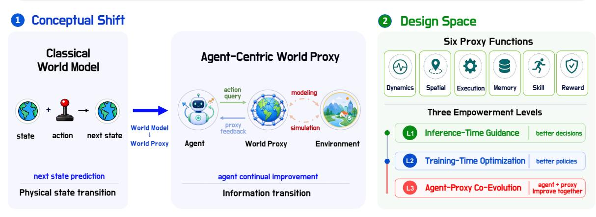
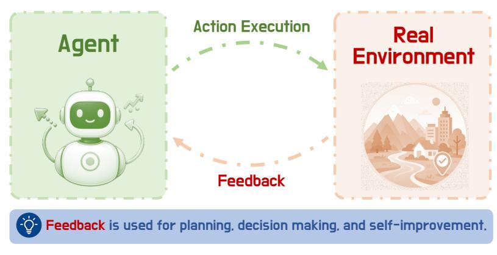
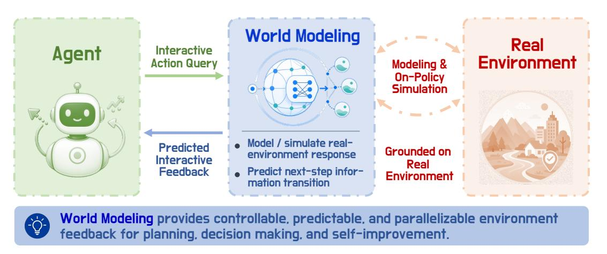
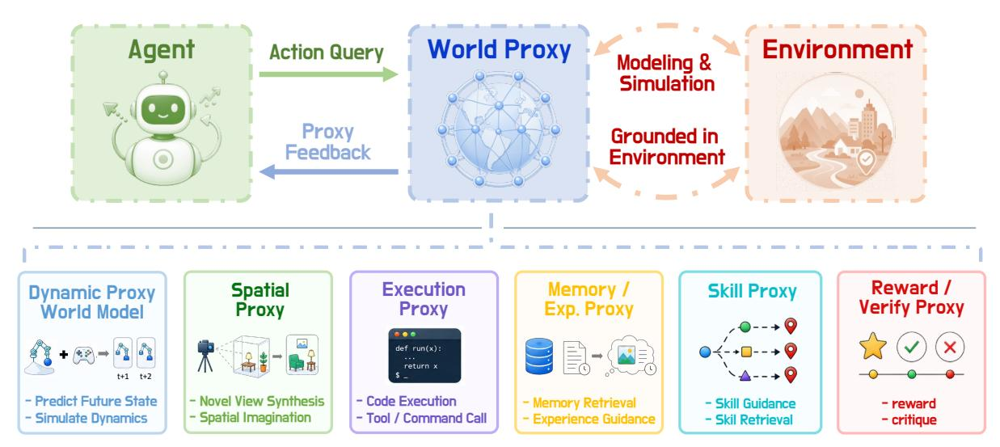
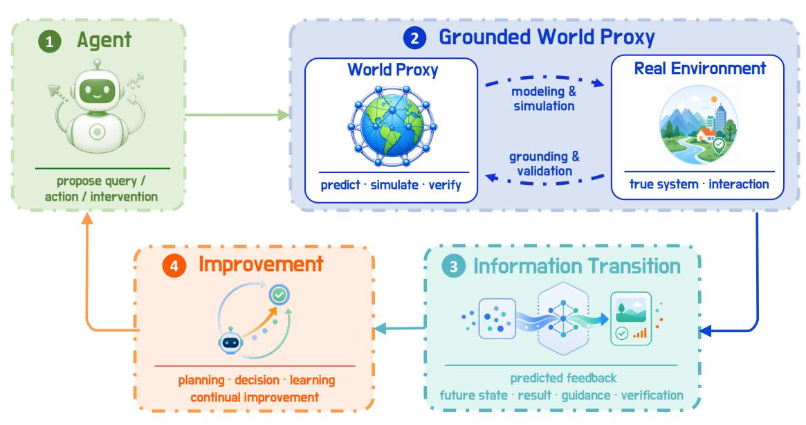
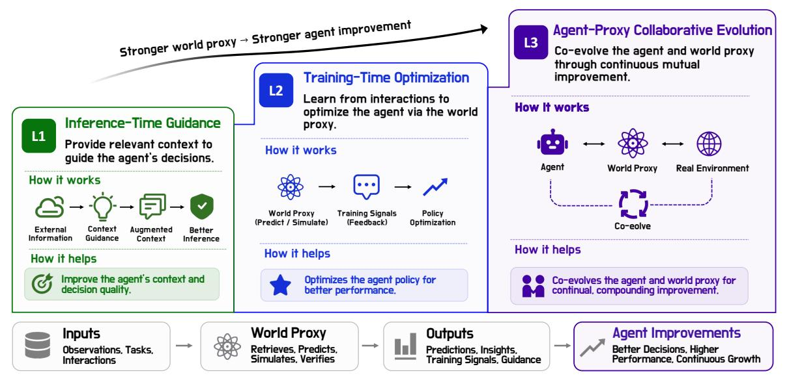
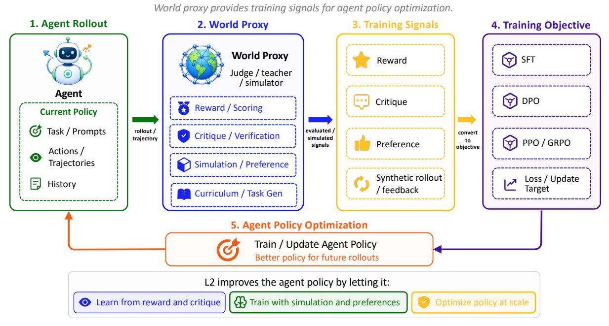
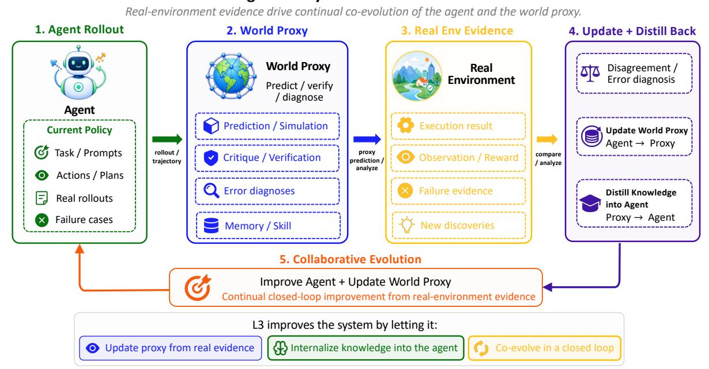

# 세계 모델링은 어디로 가는가? (Quo Vadis, World Modeling?)

- 원제: Quo Vadis, World Modeling?
- 원문: [https://arxiv.org/abs/2608.02713](https://arxiv.org/abs/2608.02713)
- PDF: [https://arxiv.org/pdf/2608.02713v1](https://arxiv.org/pdf/2608.02713v1)
- arXiv ID: `2608.02713`

---

# **세계 모델링은 어디로 가는가? (Quo Vadis, World Modeling?)**


# **지속적으로 향상되는 에이전트를 위한 대화형 세계 프록시 (Towards Interactive World Proxies for Continually Improving Agents)**

KnowledgeX Lab @ Shanghai AI Laboratory APRIL Lab @ Zhejiang University LV-Lab @ National University of Singapore

지속적으로 향상되는 에이전트는 정적 감독을 넘어서는 동적 상호작용 피드백을 필요로 한다. 그러나 직접적인 실제 환경과의 상호작용은 비용이 많이 들고, 느리며, 안전하지 않고 병렬화하기 어렵다. 세계 모델링은 에이전트가 실제 행동을 수행하기 전에 저비용, 보다 통제 가능한 피드백을 질의할 수 있도록 하는 자연스러운 중간 프록시를 제공한다. 전통적인 세계 모델은 주로 미래 물리적 상태 예측을 통해 이 프록시를 구현하며, 이는 원시 상태 전이 이상의 실행 가능한 피드백을 필요로 하는 에이전트에게는 유용하지만 한정적이다. 본 연구에서는 **Agent-Centric Interactive World Proxies**를 개념화하여 물리적 상태 전이에서 **agent-usable information transitions**(실행 결과, 검색된 경험 또는 기술, 검증 신호 등)으로 근본적인 패러다임을 전환함으로써 세계 모델링의 범위를 확장하고 지속적으로 향상되는 에이전트에게 다용도 피드백을 제공한다. 이 설계 공간을 체계적으로 매핑하기 위해 우리는 피드백 매체를 기반으로 세계 프록시를 *dynamics*, *spatial*, *execution*, *memory/experience*, *skill*, *reward/verification*의 여섯 가지 기능적 형태로 구성한다. 이들은 함께 세계 모델링이 에이전트 향상을 지원하는 주요 방식을 특징짓는다. 또한 우리는 이 프록시들이 세 가지 진행 단계에서 에이전트를 어떻게 강화하는지 분석한다: **L.1 Inference-Time Guidance**에서는 프록시 출력이 문맥 내 정보를 풍부하게 하여 우수한 결정을 가능하게 하고, **L.2 Training-Time Optimization**에서는 프록시 출력이 보상, 비판, 또는 합성 롤아웃을 제공하여 정책 학습을 돕는다. **L.3 Agent-Proxy Co-Evolution**에서는 실제 환경 증거가 프록시와 에이전트를 지속적으로 업데이트하여 공동 진화를 이끈다. 궁극적으로 본 연구는 세계 모델링을 에이전트 중심 패러다임으로 재구성하고, 에이전트가 더 나은 계획을 세우고, 더 빠르게 학습하며, 지속적으로 진화하도록 돕는 세계 프록시 구축 로드맵을 제시한다.

**프로젝트 페이지:** <https://worldbench.github.io/awesome-agentic-world-model>

**GitHub 저장소:** <https://github.com/worldbench/awesome-agentic-world-model>

**날짜:** 2026년 8월 5일




세계 프록시는 미래 상태 예측에서 에이전트가 활용할 수 있는 피드백으로 확장되어 추론 안내, 훈련 최적화, 지속적 향상을 지원한다.

**Figure 1. Agent-Centric World Proxies의 개념적 전환 및 설계 공간**  
우리는 물리적 상태 예측을 위한 세계 모델에서 정보 전이 예측을 위한 대화형 세계 프록시로 전환함으로써, 여섯 가지 프록시 기능과 세 가지 강화 수준을 통해 지속적인 에이전트 향상을 가능하게 한다: **L.1** 추론 시 안내, **L.2** 훈련 시 최적화, **L.3** 에이전트-프록시 공동 진화.

# **목차 (Contents)**

| 1 |  | Motivation: Why Improving Agents Need World Modeling | 3 |
|---|-----|-----------------------------------------------------------------|----|
|  | 1.1 | From Static Supervision to Continual Improvement | 3 |
|  | 1.2 | Bottlenecks of Direct Real-Environment Interaction | 3 |
|  | 1.3 | World Modeling as an Intermediate Proxy | 4 |
| 2 |  | Definition: From World Models to Agent-Centric World Proxies | 5 |
|  | 2.1 | Rethinking World Models | 5 |
|  | 2.2 | From World Model to World Proxy | 6 |
|  | 2.3 | Agent-Centric World Proxy Definition | 7 |
|  | 2.4 | What Makes a Good World Proxy? | 9 |
| 3 |  | Empowerment: How World Proxies Improve Agents | 9 |
|  | 3.1 | L1: Inference-Time Guidance | 11 |
|  | 3.2 | L2: Training-Time Optimization | 12 |
|  | 3.3 | L3: Agent-Proxy Co-Evolution | 14 |
| 4 |  | Instantiations: Functional Forms of Agent-Centric World Proxies | 16 |
|  | 4.1 | Overview | 16 |
|  | 4.2 | Dynamics Proxy (World Model) | 16 |
|  | 4.3 | Spatial Proxy | 18 |
|  | 4.4 | Execution Proxy | 18 |
|  | 4.5 | Memory / Experience Proxy | 19 |
|  | 4.6 | Skill Proxy | 20 |
|  | 4.7 | Reward / Verification Proxy | 21 |
|  | 4.8 | Putting It Together: Functions Meet Levels | 21 |
| 5 |  | Conclusion: Quo Vadis, World Modeling? | 22 |
| 6 |  | List of Contributors | 23 |

## <span id="page-2-0"></span>**1 동기: 왜 향상된 에이전트는 세계 모델링이 필요한가**

### <span id="page-2-1"></span>**1.1 정적 감독에서 지속적 개선으로**

진정으로 유능한 에이전트는 앞에 놓인 과제를 단순히 완수하는 것 이상을 수행한다. 그것은 낯선 것을 탐험하고, 세계로부터 피드백을 받아들이며, 성공과 실패를 모두 다음 시도를 위한 모멘텀으로 전환한다[[157](#page-33-0), [203](#page-36-0)]. 이러한 능력은 훈련 시점에 한 번 부여되는 것이 아니라, 상호작용을 통해 반복적으로 획득된다.

그러나 오늘날 대부분의 에이전트는 여전히 학생들이 시험을 위해 암기하는 방식으로 가르쳐진다: 전문가 궤적, 인간 주석, 또는 감독 학습 정제 코퍼스와 같은 정적, 오프라인 데이터에서 학습한다 [&#91;10,](#page-23-0) [122](#page-31-0)]. 이러한 데이터는 이미 존재하는 패턴을 포착하지만, 에이전트가 스스로 시도할 때 반응을 제공하지 못한다. 따라서 에이전트의 역량은 **훈련된 분포에 의해 제한된다**고, **활동적 시행착오를 통해서만 드러날 수 있는 새로운 정보**는 접근 불가한 상태에 머물러 있다[[155](#page-33-1)]. 이것이 진정한 자기 개선이 깨뜨려야 할 천장이다.

*어떻게 에이전트는 정적 감독을 넘어 활동적 상호작용을 통해 유용한 피드백을 수집하고, 이를 끝없이 개선에 활용할 수 있을까?*

가장 직접적인 답은 에이전트를 실제 환경에 자유롭게 두고, 돌아오는 모든 것에서 학습하도록 하는 것이다:

에이전트 → 행동 → 실제 환경 → 피드백 → 에이전트 개선



**그림 2. 기본 에이전트-환경 상호작용 루프.** 에이전트는 실제 행동을 수행하고, 계획, 학습, 개선을 위해 피드백을 받는다.

환경은 관측, 실행 결과, 보상 또는 오류로 응답하며, 에이전트는 그 신호를 계획, 의사결정, 정책 학습 및 지속적 개선에 다시 통합한다[[59,](#page-26-0) [136](#page-32-0), [146&#93;](#page-32-1)]. 이는 깔끔한 루프이며, 오랫동안 전체 이야기가었다.

### <span id="page-2-2"></span>**1.2 직접적인 실제 환경 상호작용의 병목 현상**

실제 환경은 가장 신뢰할 수 있는 피드백을 제공하지만, 에이전트가 수천 번의 오류를 범하고, 동시에 많은 가능성을 탐색하며, 결정을 내리기 전에 몇 단계 앞을 추론해야 할 때, 단독 훈련 환경으로서는 부적합하다. 이러한 결함은 네 가지 반복되는 축에서 드러나며, 표 [1:]에 정리되어 있다(#page-3-1). 그것은 **비용이 많이 들고, 위험하며, 고집스럽게 과거를 바라보고, 병렬화가 어렵다**.

**표 1.** 직접적인 실제 환경 상호작용의 병목 현상.

<span id="page-3-1"></span>

| 병목 현상 | 설명 | 예시 |
|----------------------------------------------|----------------------------------------------------------------------------------------------------------------------------------------------------------------------------------------------|----------------------------------------------------------------------------------------------------------------------------------------------------------------------------------------------------------------------------------------------------------|
| 낮은 학습<br>효율과 높은<br>비용 | 에이전트는 많은 시도와 오류가 필요하지만, 실제 상호작용은 보통 비용이 많이 들고 느리다. | <ul> <li>Embodied Agents(구체화된 에이전트): 로봇 시도와 오류는 장치 마모 및 안전 비용을 발생시킨다 [173].</li> <li>Digital Agents(디지털 에이전트): 웹, GUI, 또는 게임 에이전트는 대규모 샘플링 중에 계산 및 상호작용 자원을 소비한다 [77, 103, 177, 213].</li> </ul> |
| 복구 불가능한<br>및 위험한<br>상호작용 | 실제 환경에서의 잘못된 조작은 종종 되돌리기 어렵고, 심지어 되돌릴 수 없는 결과를 초래할 수 있다 [94, 198]. | <ul> <li>Embodied Agents(구체화된 에이전트): 로봇은 물체와 충돌하거나 손상시킬 수 있고, 자율주행 차량은 보행자를 부딪힐 수 있다.</li> <li>Digital Agents(디지털 에이전트): 웹 에이전트는 잘못 제출하거나 삭제하거나 정보를 전송할 수 있다.</li> </ul> |
| 제한된<br>전방 지향<br>피드백 | 실제 환경 피드백은 보통 <b>수동적</b>이며 사후적이다: 실행된 행동의 결과만을 드러내어, 미래 예측이나 다단계 추론을 어렵게 만든다 [125]. | <ul> <li>Embodied Agents(구체화된 에이전트): 로봇은 행동이 충돌을 일으킬지 사전에 쉽게 알 수 없다.</li> <li>Digital Agents(디지털 에이전트): 웹 또는 코드 에이전트는 결과를 알기 전에 실행해야 하는 경우가 많다.</li> </ul> |
| 병렬화가 어려운 | 실제 환경 인스턴스는 제한적이며 시뮬레이션 환경처럼 대규모로 복제하기 어렵다 [90, 111, 121, 134, 149, 150]. | Embodied Agents(구체화된 에이전트): 물리적 로봇 플랫폼은 수가 제한적이다.     Digital Agents(디지털 에이전트): 온라인 서비스와 사용자 환경은 배치로 복제하기 어렵다. |

요컨대, 실제 세계는 근거를 마련하는 데 필수적이지만 규모화에는 부적합하다. 효율적으로 개선하려면 에이전트는 중간 단계가 필요하다: 시도하고, 예측하고, 가정에 대해 추론할 수 있는 장소가 필요하지만 실제 실행의 전체 비용을 지불하지 않아도 된다.

### <span id="page-3-0"></span>1.3 중간 프록시로서의 세계 모델링 (World Modeling as an Intermediate Proxy)

그것은 에이전트와 세계 사이에 위치한 **프록시**이다 [57, 146]:

에이전트  $\leftrightarrow$  세계 모델링  $\leftrightarrow$  실제 환경.



**Figure 3. 에이전트 중심의 세계 모델링으로서의 중간 프록시.** 세계 모델링은 에이전트와 실제 환경 사이에 저비용 피드백을 제공한다.

핵심적으로, 여기서의 World Modeling은 현실을 대체하거나 가장 사진 같은 미래를 구현하려는 경쟁이 아니다. 그 역할은 더 겸손하고 유용하다: **intermediate proxy**(중간 프록시)로서 **grounded in the real environment**(실제 환경에 기반)하여 에이전트에게 상호작용 피드백을 **cheaper**(더 저렴하고), **more controllable**(더 통제 가능하며), **more predictable**(더 예측 가능한) 형태로 제공한다.

구체적으로, 이러한 프록시는 에이전트가 어떤 행동을 취하기 전에 옵션을 탐색할 수 있게 한다. *내가 이 행동을 취하면 어떤 일이 일어날까? 다른 관점에서 나는 무엇을 볼까? 이 명령어나 도구 호출은 무엇을 반환할까? 내가 이전에 이런 상황을 겪은 적이 있나, 그리고 이 계획은 실행해도 안전한가?* 이 각각은 프록시가 저렴하게 답할 수 있는 질문이며, 각각은 에이전트가 실제 세계에서 비용이 많이 들거나 되돌릴 수 없는 행동을 피하도록 돕는다. 이런 관점에서, 지속적으로 개선되는 에이전트를 위한 World Modeling은 더 이상 다음 상태 예측에 국한되지 않는다; 그것은 실제 환경 증거에 기반한, 에이전트가 직면한 프록시가 되어 시뮬레이션, 검색, 안내, 검증을 수행한다.

### **유용한 프록시를 만드는 요소는 무엇인가?** (What makes a useful proxy?)

그러한 프록시가 단순한 시뮬레이터나 데이터베이스와 구분되는 것은 그것이 최적화된 목적이다. 지속적으로 개선되는 에이전트를 진정으로 지원하려면, Agent-Centric World Modeling은 최소 세 가지 요구 사항을 충족해야 한다.

# **핵심 요구 사항** (Key Requirements)

- **1. 에이전트 지향 폐쇄 루프:**  
  - **에이전트가 시작한 쿼리, 행동, 또는 개입**을 지원하고, 의사결정 및 개선을 위한 조건부 피드백을 반환한다.  

- **2. 실환경 기반화:**

**real-environment** 데이터, 규칙, 궤적, 또는 상호작용 증거를 학습하여 에이전트 결정과 관련된 결과와 피드백을 근사한다.

**3. 실행 가능한 정보 이득:**

**더 나은 맥락**, **더 안전한 결정**, 더 **효과적인 탐색**, 또는 **더 높은 품질의 훈련 신호**, 시각적 사실성이나 예측 정확도만이 아니라.

## <span id="page-4-0"></span>**2 정의: 세계 모델에서 에이전트 중심 세계 프록시로** (2 Definition: From World Models to Agent-Centric World Proxies)

### <span id="page-4-1"></span>**2.1 세계 모델 재고** (2.1 Rethinking World Models)

세계 모델이 어디로 가야 할지 묻기 위해서는 그 시작점을 기억하는 것이 도움이 된다. 고전적인 세계 모델은 보통 상태 전이 모델로 정의된다 [&#91;57,](#page-26-1) [59,](#page-26-0) [88](#page-28-1):

$$\hat{s}_{t+1} = \mathcal{WM}(s_t, a_t).$$

즉, 물리적 시점 t에서 시스템은 상태 s_t에 있고, 행동 a_t를 실행하며, 세계 모델은 다음 물리적 상태 ̂_{t+1}를 예측한다.

이 형태는 로봇공학, 모델 기반 RL, 비디오 예측 및 관련 설정에 적합하다 [&#91;18](#page-24-0), [119](#page-30-1), [173&#93;](#page-34-0). 핵심 초점은 다음과 같다:

현재 상태 + 행동 → 미래 상태.

다시 말해, 전통적인 세계 모델은 물리적 시간에 따라 상태 전이의 단일 스레드를 추적한다. 심지어 학습된 잠재 공간에서 예측하는 현대의 자기지도 변형들 [&#91;194&#93;](#page-35-0)은 원시 픽셀 대신 [&#91;5](#page-23-1), [6](#page-23-2)] 이 백본을 상속한다: 상태가 입력되고, 행동이 적용되며, 미래가 출력된다.

그러나 **지속적으로 개선되는 에이전트**에게는 다음 상태를 훨씬 넘어서는 피드백이 필요하다. 과제 해결 과정에서, 이러한 에이전트는 다음과 같은 일을 할 필요가 있다:

- **simulate** 행동, 명령, API 호출, 또는 도구 호출의 결과를 시뮬레이션한다[[52,](#page-26-2) [106](#page-30-2), [148](#page-32-4)];
- **retrieve** 메모리, 경험, 또는 실패 사례에서 관련 정보를 검색한다[[123](#page-31-4), [124,](#page-31-5) [140](#page-32-5)];
- **query** 현재 작업에 대한 재사용 가능한 기술 또는 서브 정책을 질의한다[[2](#page-23-3), [98](#page-29-3), [157&#93;](#page-33-0);
- **verify** 계획, 궤적, 또는 행동이 안전하고 실행 가능한지 여부를 확인한다[[32,](#page-25-0) [99](#page-29-4), [112&#93;](#page-30-3);
- **obtain** 보상, 비판, 선호도, 또는 오류 진단 신호를 훈련을 위해 획득한다[[30,](#page-25-1) [122](#page-31-0), [128&#93;](#page-31-6).

이것들을 통합하는 것은 그들이 반환하는 답변의 *종류*이다. 아무 것도 단순히 다음 상태가 아니며, 각각은 정보의 다른 종류, 결과, 기억, 기술, 판단 등으로, 에이전트가 즉시 행동할 수 있는 것이다.

따라서 고전적인 World Model은 필수적인 출발점이지만, 오직 출발점에 불과하다: 그것은 에이전트-세계 상호작용의 한 메커니즘만을 포착하며, 지속적으로 개선되는 에이전트가 의존하는 전체 레퍼토리를 포착하지 못한다.

### <span id="page-5-0"></span>**2.2 World Model에서 World Proxy로**

이보다 넓은 상호작용 세트를 포용하기 위해 우리는 **World Model**을 **World Proxy**로 일반화한다. 이 움직임은 대체보다 같은 핵심 아이디어의 확장이다: 실제 환경에 기반한 중간 메커니즘으로, 에이전트가 직접 실행을 통해 얻어야 할 피드백을 제공한다. 변화하는 것은 범위이다. World Proxy는 다음 상태를 예측하는 것에 그치지 않고, 실행 결과를 시뮬레이션하고, 경험을 검색하고, 기술 안내를 제공하거나, 행동을 검증하고 평가할 수 있다[[52](#page-26-2), [99](#page-29-4), [124,](#page-31-5) [157](#page-33-0)].



**Figure 4. World Model에서 World Proxy로.** World Proxy는 에이전트가 마주하는 프록시 층으로, 역학 예측, 공간 합성, 실행 시뮬레이션, 메모리 검색, 기술 안내, 또는 보상/검증 피드백으로 구현될 수 있다.

구체적으로, 이 더 넓은 관점은 고전적 정의를 세 축으로 확장하며, 표 [2](#page-6-1)에 요약된다:

**Table 2.** 환경 중심 예측에서 에이전트 중심 상호작용 모델링으로.

<span id="page-6-1"></span>

| 재고 | 이전 | 이후 | 핵심 아이디어 |
|--------------------------------------------------------|------------|-------------|------------------------------------------------------------------------------------------------------------------------------------------------------------------------------------------------------------------------------------------------------------------------|
| 물리적 시간 단계<br>→ 상호작용 단계 | 𝑡 → 𝑡 + 1 | ℓ → ℓ + 1 | 에이전트 상호작용은 항상 물리적 시간을 진행시키는 것은 아니다. 에이전트는 관점을 질의하거나, 실행을 시뮬레이션하거나, 경험을 검색하거나, 계획을 검증할 수 있다. 우리는 각 에이전트-세계 상호작용을 설명하기 위해 상호작용 단계 ℓ을 사용한다. |
| 상태 전이<br>→ 정보 전이 | 𝑠𝑡 → 𝑠̂𝑡+1 | 𝑠ℓ → 𝑠̂ℓ+1 | 세계 프록시의 출력은 다음 상태 예측에 국한되지 않는다. 그것은 새로운 관측, 실행 결과, 검색된 기억 또는 스킬, 보상, 검증 피드백, 또는 다른 에이전트가 활용할 수 있는 정보와 같은 정보 전이로 볼 수 있다. |
| 외부 조건<br>→ 에이전트 주도 상호작용 | 외부 | ℱ<br>𝑢<br>ℓ | 상호작용 조건은 에이전트 주도여야 한다: 에이전트가 목표와 상황에 따라 적극적으로 제안한 질의, 행동, 또는 개입이어야 하며, 단순히 외부에서 주어진 조건만이 아니라. |

*Note.* ℱ는 역학 예측, 공간 렌더링, 실행 시뮬레이션, 메모리 검색, 스킬 가이드, 보상/검증 등과 같은 다양한 **프록시 함수**를 나타낸다.

따라서, 에이전트 중심 세계 프록시의 핵심 질문은 예측이 정확한지 여부뿐 아니라:

*이 상호작용 이후 에이전트가 얻는 새로운 정보는 무엇인가?*

이러한 관점에서 **세계 프록시**의 출력은 단순히 환경 상태가 아니라 **에이전트가 활용 가능한 피드백**으로 구성되어야 한다. 이 변화는 미묘하지만 해방적이다: 메모리 조회, 코드 실행, 보상 추정은 모두 같은 게임의 한 수로 취급될 수 있으며, 각각 에이전트가 바로 이전에 보유하지 않았던 정보를 전달한다[[30](#page-25-1), [140,](#page-32-5) [148&#93;](#page-32-4).

### <span id="page-6-0"></span>**2.3 에이전트 중심 세계 프록시 정의**

이러한 요소들을 종합하면, 우리는 이제 아이디어를 정확히 명시할 수 있다. 에이전트 중심 세계 프록시를 다음과 같이 정의한다:

에이전트 중심 세계 프록시는 **환경 기반 프록시**이며, **정보 전이**를 모델링하거나 예측한다. 이는 **에이전트가 주도한 상호작용**에 조건화되어, 에이전트 개선을 위한 **정보 이득**을 제공하는 것을 목표로 한다.

형식적으로, 이는 다음과 같이 표현된다:

$$\hat{s}_{\ell+1} = \mathcal{WP}(s_{\ell}, u_{\ell}^{\mathcal{F}}), \qquad s_{\ell} \in \mathcal{S}.$$

### where:

- ℓ: **interaction step**, 에이전트와 월드 프록시 사이의 ℓ번째 상호작용을 나타내며, 물리적 시간에 한정되지 않는다;  
- : **information state space**, 물리적 상태, 관측, 메모리, 지식, 실행 결과, 검증, 안내 등 포함될 수 있는 일반화된 공간;  
- ℱ: **proxy function**, 동역학 예측, 공간 렌더링, 실행 시뮬레이션, 메모리 검색, 스킬 가이드, 보상/검증 등;

- ℱ ℓ : **query, action, or intervention**, 에이전트가 특정 프록시 함수 하에서 적극적으로 제안하는 것;  
- ̂ℓ+1: **feedback**, 월드 프록시가 반환하는 피드백으로, 미래 상태, 새로운 관측, 실행 결과, 검색된 메모리/스킬, 보상, 또는 검증 결과 등이 포함된다;

그러나 단일 예측은 아직 개선이 아니다. **continually improving agent**(지속적으로 개선되는 에이전트)를 위해 프록시는 일회성 오라클로 머물 수 없으며, 에이전트와 루프를 닫아야 한다[[41](#page-25-2), [140](#page-32-5), [157&#93;](#page-33-0):

에이전트

$$\to u_\ell^{\mathcal F} \to \mathcal W \mathcal P \to \hat s_{\ell+1} \to \text{에이전트}.$$



**그림 5. Agent-in-the-Loop World Proxy.** 에이전트는 World Proxy를 질의하며, World Proxy는 결과 정보 전이를 예측, 시뮬레이션, 검색, 또는 검증하고, 에이전트 개선을 위한 피드백을 반환한다.

ℓ번째 상호작용 단계에서, 이 루프는 네 단계로 나눌 수 있다:

- **1단계: 에이전트가 상호작용을 제안한다** 에이전트는 현재 목표, 컨텍스트 상태 및 기타 조건에 따라 상호작용 요청 ℱ ℓ을 적극적으로 제안한다.

- **2단계: World Proxy가 정보 전이를 예측한다** World Proxy는 현재 정보 상태 <sup>ℓ</sup>와 에이전트 상호작용 ℱ ℓ에 따라 피드백을 예측하거나 생성한다.

- **3단계: 프록시 피드백이 에이전트에게 반환된다** 예측된 ̂ℓ+1이 새로운 피드백 또는 정보 이득(예: 미래 상태, 예측 관측, 실행 결과, 검색된 가이드, 검증 결과)으로 반환된다.

- **4단계: 에이전트가 피드백을 개선에 활용한다** 에이전트는 피드백을 활용해 계획, 의사결정, 정책 학습, 또는 지속적 개선을 수행한다.

한 번 실행하면 단일 예측이 되고, 여러 단계에 걸쳐 반복하면 개선의 궤적이 된다. 각 답변은 조용히 에이전트가 다음에 물어볼 질문을 재구성한다.

### <span id="page-8-0"></span>**2.4 좋은 World Proxy를 만드는 요소** (What Makes a Good World Proxy?)

모든 중간 모듈이 효과적인 World Proxy가 되는 것은 아니다. 지속적으로 개선되는 에이전트에게는 좋은 World Proxy가 에이전트의 폐쇄 루프 내에서 **근거가 있는, 통제 가능한, 실행 가능한, 확장 가능한, 그리고 미래 지향적인** 피드백을 제공해야 한다.

**표 3.** 효과적인 World Proxy의 기준.

| 기준 | 의미 |
|-------------------------|------------------------------------------------------------------------------------------------------------|
| 근거성 | 실제 환경 데이터, 규칙, 궤적, 또는 상호작용 증거에 의존하며, 분리된<br>생성. |
| 제어 가능성 | 에이전트가 주도하는 질의, 행동, 또는 개입을 지원하고 해당<br>피드백을 반환한다. |
| 피드백 유용성 | 계획, 의사결정, 정책 학습, 또는 지속적 개선을 향상시킨다. |
| 비용 및 확장성 | 실제 상호작용 비용을 줄이면서 작업 및 설정 전반에 안전하게 확장한다. |
| 전향적 능력 | 실제 실행 전에 결과, 반사실, 또는 위험을 예측한다. |

실제적으로, 유용한 World Proxies는 실제 환경 기반화, 확장성, 실행 가능한 피드백을 균형 있게 갖추어야 한다. 기반화에서 너무 멀어지는 프록시는 곧 유용성을 잃고, 자신 있게 틀린 프록시는 없을 때보다 나쁠 수 있다[[153](#page-33-2)].

# **Takeaway**

## **1. From World Model to World Proxy:**

미래 상태 예측을 넘어 공간 렌더링, 실행 시뮬레이션, 메모리 검색, 기술 안내, 보상 모델링, 검증으로 확장한다.

**2. From Realism to Information Gain:**

예측 정확도를 넘어 계획, 의사결정, 학습 및 지속적 개선을 위한 **에이전트가 활용 가능한 피드백**을 우선시한다.

**3. From one-shot prediction to closed loop:**

Use agent-initiated interaction and proxy feedback to drive **iterative improvement**.

## <span id="page-8-1"></span>**3 Empowerment: How World Proxies Improve Agents**

With the World Proxy defined, the obvious question is what it actually buys us:

*World Proxies가 어떻게 에이전트가 계획, 학습, 진화하도록 도울 수 있을까?*

한 가지 방법은 Chu et al.[[31](#page-25-3)]이 수행한 것처럼 세계 모델을 **자신의 내재적 능력**으로 평가하는 것이다:

- **L.1 Predictor**: 단계별 / 지역 전이 예측;
- **L.2 Simulator**: 장기, 행동-조건부 롤아웃;
- **L.3 Evolver**: 세계 모델 자기 반성.

#### 지속적으로 개선되는 에이전트를 위한 World Proxy의 세 단계

가이드에서 최적화, 공동 진화까지



**Figure 6. L1 to L3 World Proxies for Agent Improvement.** L1은 추론 시점 컨텍스트를 보강하고, L2는 훈련 신호를 제공하며, L3는 에이전트-프록시 공동 진화를 가능하게 한다.

이 단계들은 세계 모델의 *자체* 역량을 평가한다. 우리의 질문은 독립적으로 모델이 얼마나 유능한가가 아니라, 그것이 에이전트를 얼마나 더 잘 만들 수 있는가이다. 우리는 이 에이전트 중심 축에 대해 **L1-L3** 약어를 재사용하여 두 척도가 동일하지 않으면서도 비슷한 의미를 갖도록 한다; Table [4](#page-10-1)은 두 해석을 나란히 배치해 구분을 명확히 한다.

#### **World-Proxy-Driven Agent Improvement**

우리는 **에이전트 중심 관점**을 취한다: 세계 모델 자체가 얼마나 강력한가를 묻는 대신, World Proxy가 에이전트 개선을 어떻게 이끄는가를 묻는다. 이는 세 단계로 이어진다:

- **L.1 Inference-Time Guidance**
- **Proxy Role:** 추론 시점 컨텍스트를 보강한다.
- **Agent Effect:** 더 나은 결정.
- **L.2 Training-Time Optimization**
- **Proxy Role:** 보상, 검증, 또는 시뮬레이션 신호를 제공한다.
- **Agent Effect:** 정책을 최적화한다.
- **L.3 Agent-Proxy Co-Evolution**
- **Proxy Role:** 에이전트-프록시-환경 루프를 닫는다.
- **Agent Effect:** 지속적인 공동 진화를 이끈다.

<span id="page-10-1"></span>**Table 4.** **L1-L3** 약어의 두 가지 상반된 해석: 세계 모델의 *내재적* 역량 [&#91;31&#93;](#page-25-3)과 이 논문에서 사용되는 *에이전트 중심* 권한 부여. 단계들은 정신적으로 일치하지만 정의는 다르다.

| 레벨 | 내재적 WM 능력 (Chu et al.) | 에이전트 중심의 권한 부여 (우리 연구) |
|-------|-----------------------------------------------------|-----------------------------------------------------------------|
| L.1 | 예측기: 일단계 / 지역 전이 예측 | 추론 시 가이드: 문맥을 풍부하게 더 나은 결정을 위해<br>결정 |
| L.2 | 시뮬레이터: 장기, 행동-조건화된 롤아웃 | 학습 시 최적화: 에이전트 정책을 재구성 |
| L.3 | 진화자: 세계 모델 자기 반성 | 에이전트-프록시 공동 진화: 지속적인 상호<br>개선 |

세 수준을 함께 읽으면, 점진적 헌신의 사다리를 형성한다. **L1**은 에이전트를 건드리지 않고 단지 다음 행동을 알려준다; **L2**는 에이전트의 파라미터에 접근해 정책을 재작성한다; **L3**은 에이전트와 프록시가 서로를 재구성하도록 한다. 각 단계에서 능력은 성장하고, 프록시에 대한 입증 부담도 증가한다. 피드백이 깊을수록 실수가 더 큰 비용을 초래하기 때문이다.

### <span id="page-10-0"></span>**3.1 L1: Inference-Time Guidance**

#### <span id="page-10-2"></span>**Agent Current Context** Task / Goal Observation History Memory **1. Agent Query World Proxy Memory / Skill Retrieval** 관련 경험, 스킬, 규칙, 사례를 검색한다 **2. World Proxy Execution Simulation** 행동 시퀀스 결과를 시뮬레이션한다 **Verification Feedback** 안전성, 실현 가능성, 제약, 위험을 확인한다 관련 정보 **3. Context Guidance** 스킬/전략 원본 컨텍스트 **4. Augmented Context** 검색된 정보 시뮬레이션 결과 검증 피드백 **query / action / intervention predicted / retrieved information add to context** 역사/사례 검증/위험 신호 **L1 Inference-Time Guidance** *World proxy는 더 나은 추론 시점 결정을 위해 컨텍스트 가이던스를 제공한다.* **5. Agent Decision** Decision / Plan / Action 더 나은 추론 시점 결정 L1은 현재 에피소드를 개선하여 에이전트가: 더 많은 맥락을 보게 하며 (더 많은 맥락) 더 나은 추론을 하게 하고 (더 나은 추론) 더 안전한 행동을 하게 하고 (더 안전한 행동) 메모리/스킬/검증기를 사용하게 한다

**Figure 7. L1 Inference-Time Guidance via World Proxy.** 에이전트는 World Proxy를 질의하며, 이는 관련 정보를 검색, 시뮬레이션 또는 검증한다. 반환된 가이던스는 에이전트의 컨텍스트에 추가되어 더 나은 추론 시점 결정을 가능하게 한다.

우리는 가장 가벼운 접근으로 시작한다. **L1**에서 World Proxy는 에이전트의 파라미터를 전혀 변경하지 않는다; 단지 추론 시점에 추가 컨텍스트, 경험, 스킬, 또는 검증 피드백을 전달하여 에이전트가 내릴 결정이 더 잘 알려진 것이 되도록 한다[[52,](#page-26-2) [62,](#page-27-0) [85](#page-28-2), [169,](#page-34-2) [188,](#page-35-1) [189](#page-35-2)]. 재학습이 없으므로 **L1**은 저렴하고 완전히 되돌릴 수 있다; 그러나 그 한계는 에이전트의 기존 역량이며, 이는 에이전트가 이미 알고 있는 것을 재구성할 수 있을 뿐이다. 공식적으로:

$$\hat{s}^{guide}_{\ell+1} = \mathcal{WP}\left(s^{agent}_{\ell}, u^{\mathcal{F}}_{\ell}\right), \qquad s^{agent+}_{\ell} = s^{agent}_{\ell} \oplus \hat{s}^{guide}_{\ell+1}.$$

여기서  $\hat{s}^{guide}_{\ell+1}$  은 World Proxy가 반환한 가이던스를 나타내며,  $\oplus$  은 이를 에이전트의 현재 컨텍스트에 정보 보강으로 추가함을 의미한다.

#### **Process**

흐름은 한 방향으로 진행되며, 에이전트의 질문에서 그 다음 움직임을 위한 풍부한 문맥으로 이어진다; 그림 7은 해당 시각적 레이아웃을 보여준다:

에이전트 쿼리 → 프록시 검색 / 시뮬레이션 / 검증 → 가이드 → 증강된 컨텍스트 → 에이전트 결정

### **구현**

- 메모리/스킬 검색: 현재 과제에 따라 과거 경험, 전략, 스킬, 또는 도구 사용 규칙을 검색한다 [124, 135, 140, 144, 157, 193];
- 실행 시뮬레이션: 실제 실행 전에 행동 또는 행동 시퀀스의 결과를 시뮬레이션한다 [52, 132, 148];
- 검증 피드백: 현재 계획/행동이 안전하고 실행 가능하며 제약 조건과 일치하는지 판단한다 [32, 99, 112].

실제로, 이는 에이전트가 도약하기 전에 사전 점검을 하는 것이다: *Purchase* 버튼을 클릭하려는 웹 에이전트는 먼저 프록시에게 결과 페이지를 상상하도록 요청하고, 그 페이지에 오류나 원치 않는 요금이 표시되면 계획을 수정한다. 이 과정은 라이브 사이트를 접촉하지 않고 수행된다 [52].

#### **핵심 포인트**

L1은 에이전트가 현재 에피소드 내에서 더 풍부한 문맥을 얻도록 하여, “더 많이 보고, 더 정확히 추론하고, 더 견고하게 행동할 수 있다”게 만든다.

### <span id="page-11-0"></span>3.2 L2: 훈련 시 최적화 (Training-Time Optimization)

L2는 위험을 높인다. 월드 프록시는 추론 시에 컨텍스트를 속삭이는 것 이상의 역할을 수행한다; 보상 모델, 검증자, 비평가, 또는 시뮬레이터로서 에이전트의 정책을 재구성하는 훈련 신호를 생성한다[28, 30, 32, 99, 122]. 이는 에이전트의 현재 컨텍스트를 넘어서는 한계를 끌어올리지만, 이득은 그 뒤에 있는 신호만큼만 신뢰할 수 있다: 편향된 보상이 조용히 편향된 행동을 가르친다. 공식적으로:

$$\hat{s}_{\ell+1}^{opt} = \mathcal{WP}\left(s_{\ell}^{agent}, u_{\ell}^{\mathcal{F}}\right), \quad \text{agent}^+ = Train\left(\text{agent}, \hat{s}_{\ell+1}^{opt}\right).$$

여기서 $\hat{s}_{\ell+1}^{opt}$는 보상, 검증, 비판, 또는 시뮬레이션 롤아웃과 같은 월드 프록시가 생성한 훈련 신호를 나타낸다. 이 신호는 SFT, DPO[128], PPO[137], 또는 GRPO[138]와 같은 목표로 변환될 수 있다.

L1과 비교해 L2의 핵심 변화는:

프록시 출력이 컨텍스트 → 프록시 출력이 훈련 신호

#### **L2 훈련 시 최적화 (L2 Training-Time Optimization)**

<span id="page-12-0"></span>

**Figure 8. L2 훈련 시 최적화: 월드 프록시에 의해 주도되는 훈련 시 최적화.** 에이전트는 롤아웃을 생성하고, 월드 프록시가 이를 평가, 검증, 또는 시뮬레이션한다. 결과로 나온 보상, 비판, 선호, 또는 검증 신호는 에이전트 정책을 최적화하기 위한 훈련 목표로 변환된다.

#### **프로세스 (Process)**

이제 루프는 학습으로 다시 굽는다: 롤아웃에 대한 프록시의 판결은 순간적인 힌트가 아니라 정책에 대한 기울기가 된다; Fig. [8](#page-12-0)은 해당 시각적 레이아웃을 제공한다.

```
에이전트 롤아웃 ⟶ 프록시 검증 / 시뮬레이션 ⟶ 보상 / 비판 / 선호
               ⟶ 훈련 목표 ⟶ 에이전트 정책 최적화
```

#### **구현 (Implementations)**

- **Proxy-as-Reward**:
  - 월드 프록시 또는 검증자는 궤적을 점수화하여 보상을 형성한다[[10](#page-23-0), [30](#page-25-1), [122&#93;](#page-31-0)].
- **Proxy-as-Critic**:
  - 실패 원인을 식별하고 비판, 오류 진단, 또는 제약 위반을 출력한다[[109](#page-30-4), [112](#page-30-3), [200&#93;](#page-36-2)].
- **Proxy-as-Simulator**:
  - 합성 궤적을 생성하거나 DPO / RLHF / GRPO를 위한 선호 쌍을 구성한다[&#91;28](#page-24-1), [161](#page-33-3), [168&#93;](#page-34-3)].
- **Proxy-Guided Curriculum**:
  - 에이전트의 현재 실패 모드에 기반해 더 어려운 또는 보다 목표 지향적인 과제를 생성한다[[167](#page-34-4), [206](#page-36-3)].

실제로, 에이전트의 자체 롤아웃이 훈련 연료가 된다: 프록시는 이를 점수화하고, 검증하거나 재생성하여 합성 궤적과 선호 쌍으로 변환한다. 따라서 정책은 실제 상호작용을 수집하는 것으로는 결코 도달할 수 없는 규모에서 최적화될 수 있다[&#91;28,](#page-24-1) [168&#93;](#page-34-3).

#### **핵심 포인트 (Key Point)**

L2는 월드 프록시를 "추론 시 조언자"에서 "훈련 시 판사, 교사, 또는 시뮬레이션 환경"으로 업그레이드하여 에이전트 정책을 직접 최적화한다.

### <span id="page-13-0"></span>3.3 L3: 에이전트-프록시 공동 진화 (Agent-Proxy Co-Evolution)

#### **L3 에이전트-프록시 협업 진화 (L3 Agent-Proxy Collaborative Evolution)**

<span id="page-13-1"></span>

**Figure 9. L3 에이전트-프록시 공동 진화.** 실제 환경의 증거가 월드 프록시를 업데이트하고, 유용한 프록시 지식이 에이전트 정책에 다시 증류되어 지속적인 개선을 이끈다.

L3은 에이전트, 월드 프록시, 실제 환경 사이의 지속적인 루프를 닫아 아크를 완성한다. 실제 궤적, 실패, 그리고 새로운 발견이 프록시를 업데이트하고, 정제된 프록시는 에이전트를 안내하고, 검증하며, 훈련시켜 두 개체가 서로를 개선하도록 한다[41, 130, 140, 157]. 이는 가장 강력한 단계이지만, 프록시와 정책이 동시에 변할 때 두 개체를 정렬 상태로 유지하는 기계가 필요하다. 공식적으로:

$$\hat{s}_{\ell+1}^{proxy} = \mathcal{WP}\left(s_{\ell}^{agent}, u_{\ell}^{\mathcal{F}}\right), \qquad (agent^+, \mathcal{WP}^+) = CoEvolve\left(agent, \mathcal{WP}, \hat{s}_{\ell+1}^{proxy}, s_{\ell+1}^{env}\right)$$

여기서 $\hat{s}_{\ell+1}^{proxy}$는 프록시 피드백을, $s_{\ell+1}^{env}$는 실제 환경 증거를, 그리고 $CoEvolve(\cdot)$는 에이전트와 세계 프록시를 모두 업데이트한다.

#### **프로세스**

이제 루프는 실제 환경 격차를 업데이트 신호로 사용한다; 그림 9는 해당 시각적 레이아웃을 보여준다:

에이전트 실행 \longrightarrow 프록시 예측 / 검증 \longrightarrow 실제 환경 증거 \longrightarrow 불일치 / 오류 진단 \longrightarrow 프록시 업데이트 + 에이전트에 증류 \longrightarrow 공진화

### **구현**

- **Proxy** → **Agent Internalization**: 메모리, 스킬, 제약, 검증 규칙, 또는 보상 신호가 에이전트 파라미터나 정책에 증류되어 외부 피드백을 내부 역량으로 전환한다[[2](#page-23-3), [98](#page-29-3), [157&#93;](#page-33-0).

- **Agent** → **Proxy Update**: 실제 상호작용 궤적, 효과적인 경험, 실패 사례, 그리고 환경 피드백이 세계 프록시의 메모리, 스킬 라이브러리, 검증자, 시뮬레이터, 또는 보상 모델을 업데이트한다 [&#91;20](#page-24-2), [41,](#page-25-2) [140&#93;](#page-32-5).

실제로, 모든 배포가 프록시의 예측을 활용하고 새로운 궤적을 다시 공급하는 웹 에이전트를 상상해 보라: 프록시와 정책이 함께 재훈련되어 각 사이클마다 에이전트가 상상하는 것과 실제 세계가 반환하는 것 사이의 격차를 축소한다[[41&#93;](#page-25-2).

#### **핵심 포인트**

**L3**는 세계 프록시를 단순한 정적 도구 이상으로 만든다: 실제 환경 증거를 통해 지속적으로 업데이트되는 **공진화 파트너**가 된다.

# **작업 예시: 한 웹 에이전트가 사다리를 올라가는 과정**

세 수준을 세 개의 별도 트릭이 아니라 하나의 연속체로 보려면, 다단계 온라인 구매를 완료하는 단일 웹 에이전트를 따라가며 동일한 실행 프록시가 각 단계에서 역할을 심화하는 것을 관찰하라:

- **L.1 Guidance.** *Purchase*를 클릭하기 전에, 에이전트는 프록시에게 결과 페이지를 상상하도록 요청한다; 그 페이지가 오류나 원치 않는 요금을 표시하면, 에이전트는 계획을 수정하고 실제 사이트를 접촉하지 않는다 [&#91;52](#page-26-2)].

- **L.2 Optimization.** 상상된 롤아웃은 버려지지 않는다: 프록시가 이를 평가하고 합성 궤적 및 선호 쌍으로 재생하며, 에이전트의 정책은 실제 상호작용이 도달할 수 없는 규모로 이 가공된 경험을 기반으로 최적화된다[[28&#93;](#page-24-1)].

- **L.3 Co‑Evolution.** 배포 후, 에이전트의 실제 궤적이 프록시를 재훈련시키는 데 반영되고, 정제된 프록시는 다시 더 나은 안내와 훈련 신호를 제공하여 각 사이클마다 에이전트가 상상하는 것과 웹이 실제 반환하는 것 사이의 격차를 축소한다 [&#91;41&#93;](#page-25-2).

한 에이전트, 한 프록시 함수, 세 단계의 상승 역할: **advisor**, **teacher**, 그리고 **partner**.

# **핵심 요약**

#### **세계 프록시가 에이전트를 세 단계의 진보적 수준을 통해 강화합니다:**

- **L.1 Inference-Time Guidance.** 세계 프록시는 메모리, 스킬, 시뮬레이션, 또는 검증 피드백을 제공하여 **추론 시 컨텍스트를 풍부하게** 하고 더 나은 결정을 지원한다.

- **L.2 Training‑Time Optimization.** 세계 프록시는 보상 모델, 비평가, 검증자, 또는 시뮬레이터 역할을 하며 **훈련 신호**를 생성하여 직접적으로 **에이전트 정책을 최적화**한다.

- **L.3 Agent‑Proxy Co‑Evolution.** 실제 환경 증거가 세계 프록시를 업데이트하며, 그 지식은 **에이전트에 증류**되어 **지속적인 개선**을 위해 사용된다.

## <span id="page-15-0"></span>4 인스턴스화: 에이전트 중심 세계 프록시의 기능적 형태 (4 Instantiations: Functional Forms of Agent-Centric World Proxies)

If Section 3이 World Proxy가 *어떻게* 도움이 되는지를 묻는다면, 이 섹션은 *어떤 형태*로 나타나는지를 묻는다. 정의에서 단일 기호 $\mathcal{F}$는 전체 프록시 함수 가족을 조용히 대체한다; 여기서는 이를 여섯 가지 구체적 형태로 풀어낸다: **동역학 예측**, **공간 관측**, **실행 시뮬레이션**, **메모리 검색**, **스킬 가이드**, **및 보상/검증**. 각각은 자체 연구 영역으로 성장했으며, 최근 몇몇 서베이에서 깊이 매핑했다 [44, 95, 151, 215].

#### Agent-Centric World Proxies의 기능 형태 **동적 프록시(세계 모델)** 3 실행 프록시 **공간 프록시** t+2 뷰 / 포즈 상태 + 액션 미래 상태 새로운 뷰 코드 / 명령 실행 결과 **세계 프록시 환경** 쿼리 / 액션 모델링 & **시뮬레이션** 프록시 피드백 **스킬 프록시 보상 / 검증 프록시** 4 메모리 / 경험 프록시 행동 / 보상 / 과제 / 쿼리 목표 / 컨텍스트 스킬 가이드 트래젝터리 검증

**그림 10. Agent-Centric World Proxies의 기능 형태.** World Proxy는 동역학을 시뮬레이션하고, 공간 관측을 렌더링하며, 실행 결과를 예측하고, 메모리를 검색하고, 스킬을 제안하거나 보상/검증 피드백을 제공할 수 있다.

### <span id="page-15-1"></span>4.1 개요

여섯 가지 형태는 기계적 장치보다는 에이전트가 묻는 *질문*에 더 차이가 있다. Table 5는 한눈에 각 기능을 그가 소비하는 입력, 대체하는 세계의 조각, 그리고 반환하는 것을 매칭한다; 이후 각각을 차례로 살펴본다.

### <span id="page-15-2"></span>4.2 동역학 프록시(세계 모델)

#### **공식**

$$\hat{s}_{\ell+1}, \hat{r}_{\ell+1} = \mathcal{W}\mathcal{P}^{\text{dyn}}\left(s_{\ell}, u_{\ell}^{\text{dyn}}\right).$$

#### 의미

동역학 프록시는 World Model의 고전적 형태이다. 현재 상태, 이력, 그리고 에이전트의 행동 또는 미래 쿼리를 주면, 미래 상태를 예측하고 보상도 예측할 수 있다. 그것은

프록시를 가장 문자 그대로 해석하면, 환경의 동역학을 학습한 대체물이며, 여섯 가지 형태 중 교과서적 세계 모델에 가장 가까운 형태이다.

**Table 5.** Agent-Centric World Proxies의 기능 형태.

<span id="page-16-0"></span>

| Proxy Function | Agent Input | What it Proxies | Proxy Output | Typical Examples |
|---------------------------|---------------------------------------------------------|-----------------------------------------------------------------------|----------------------------------------------------------------|---------------------------------------------------------------------------------------------------|
| Dynamics (World<br>Model) | state / history + action<br>/ future query | real-world dynamics and<br>temporal transitions | future state, rollout,<br>predicted reward | video prediction,<br>action-conditioned generation,<br>robotics dynamics model,<br>model-based RL |
| Spatial | scene context +<br>viewpoint / pose /<br>location query | spatial observation under<br>alternative viewpoints | novel observation,<br>rendered view, spatial<br>representation | NeRF, 3D Gaussian Splatting, novel<br>view synthesis, spatial imagination |
| Execution | code / command / click<br>/ API call / tool call | consequences of<br>executable interactions in<br>digital environments | execution result, state<br>change, stdout / stderr | browser simulator, GUI simulator,<br>code execution predictor, API<br>response simulator |
| Memory / Experience | task context + retrieval<br>query | reusable past interaction<br>evidence | retrieved experience,<br>failure cases,<br>constraints | experience memory, reflection<br>memory, failure memory |
| Skill | goal / context + skill<br>query | reusable action knowledge<br>or behavior priors | skill suggestion, action<br>prior | skill library, reusable behavior<br>module |
| Reward / Verification | plan / trajectory /<br>answer / action | evaluation feedback,<br>preferences, criteria | reward, critique,<br>preference, verification | reward model, verifier, critic,<br>trajectory evaluator, LLM-as-Judge |

### 여기:

- <sup>ℓ</sup> : 현재 상태 또는 과거 관측값;
- dyn ℓ : 에이전트가 제안한 행동, 행동 시퀀스, 또는 미래 질의;
- ̂ℓ+1: 예측된 미래 상태;
- ̂ℓ+1: 예측 보상 (선택 사항).

상호작용 단계 ℓ이 물리적 시간 단계와 일치할 때, 이 형태는 고전적인 다음 상태 예측으로 축소된다:

$$\hat{s}_{t+1} = \mathcal{WM}(s_t, a_t).$$

#### **전형적인 예시**

- 비디오 예측 / 미래 프레임 예측 [&#91;8](#page-23-4), [63,](#page-27-1) [66](#page-27-2), [102](#page-29-6), [156,](#page-33-5) [172](#page-34-5), [182&#93;](#page-35-4);
- 행동 조건부 비디오 생성[[1,](#page-23-5) [9](#page-23-6), [18,](#page-24-0) [19](#page-24-3), [35,](#page-25-4) [49](#page-26-4), [50,](#page-26-5) [113](#page-30-5), [154,](#page-33-6) [172](#page-34-5), [184](#page-35-5), [187,](#page-35-6) [192](#page-35-7), [207](#page-36-4)];
- 인터랙티브 게임 세계 시뮬레이션[[25,](#page-24-4) [35](#page-25-4), [50](#page-26-5), [54,](#page-26-6) [154](#page-33-6), [192](#page-35-7)];
- 로보틱스 역학 예측 [&#91;6,](#page-23-2) [57,](#page-26-1) [59](#page-26-0)–[61,](#page-27-3) [76](#page-28-3), [173](#page-34-0)];
- 자율 주행 궤적 예측 [&#91;15](#page-24-5), [47](#page-26-7), [67](#page-27-4), [97,](#page-29-7) [114,](#page-30-6) [118](#page-30-7), [133](#page-31-9), [166,](#page-34-6) [179,](#page-34-7) [181](#page-35-8), [185](#page-35-9), [204](#page-36-5), [211&#93;](#page-37-2);
- 모델 기반 강화 학습 [&#91;4](#page-23-7), [57–](#page-26-1)[59](#page-26-0), [76,](#page-28-3) [79,](#page-28-4) [116](#page-30-8), [136,](#page-32-0) [205&#93;](#page-36-6).

#### **핵심 포인트**

**동역학 프록시**는: 에이전트가 주어진 행동을 실행했을 때 환경이 어떻게 변할지에 초점을 둔다.

### <span id="page-17-0"></span>4.3 공간 프록시

#### **공식**

$$\hat{o}_{\ell+1}^{\mathrm{view}} = \mathcal{WP}^{\mathrm{spatial}}\left(s_{\ell}, u_{\ell}^{\mathrm{spatial}}\right).$$

#### **의미**

공간 프록시는 공간적 또는 시점 조건 하에서 관측값을 생성한다. 에이전트는 새로운 위치, 카메라 포즈, 또는 시점을 질의하고, 월드 프록시는 해당 관측값 또는 공간 표현을 반환한다. 실질적으로 이는 에이전트가 움직이기 전에 *보게* 하여, 비싼 물리적 재배치를 저렴한 아직 보지 못한 관점에 대한 질의로 바꾼다.

#### 여기:

- $s_{\ell}$ : 알려진 시각적, 기하학적, 또는 공간 정보;
- $u_\ell^{\text{spatial}}$ : 질의된 시점, 포즈, 또는 공간 위치;
- $\hat{o}_{\ell+1}^{\text{view}}$ : 해당 시점에서 예측되거나 렌더링된 관측값.

### **전형적인 예시**

- NeRF 기반 신경 렌더링 [13, 14, 26, 117, 120, 147, 190];
- 3D 가우시안 스플래팅 [27, 42, 81, 107, 171, 195];
- 3D/4D 장면 재구성 [86, 89, 96, 158, 159, 163, 165, 183, 202];
- 3D/4D 장면 생성 [29, 45, 64, 92, 145, 170, 176, 186, 191, 201];
- 탐색에서 시각적 상상 (Navigation WM [12, 37, 38, 69, 83]);
- 공간 추론 및 조작 [16, 17, 22, 24, 71, 73, 74, 105, 141, 142, 160, 164, 197, 199, 208, 209].

#### **핵심 포인트**

**공간 프록시**는: 에이전트가 다른 시점이나 위치에서 관측할 내용에 초점을 둔다.

### <span id="page-17-1"></span>4.4 실행 프록시

#### **공식**

$$\hat{s}_{\ell+1}^{\text{exec}}, \hat{y}_{\ell+1}^{\text{exec}} = \mathcal{WP}^{\text{exec}}\left(s_{\ell}, u_{\ell}^{\text{exec}}\right).$$

#### **의미**

실행 프록시는 실행 가능한 상호작용을 시뮬레이션한다. 에이전트는 코드, 명령, 웹 클릭, API 호출, 또는 도구 호출을 발행하고, 월드 프록시는 결과 상태와 피드백을 예측한다. 동역학 프록시가 연속 물리학을 모델링하는 반면, 실행 프록시는 디지털 시스템의 이산적이고 종종 취약한 논리를 모델링한다. 이때 단일 잘못된 문자나 클릭이 결과를 완전히 뒤집을 수 있다.

#### 여기: (Here:)

- $s_{\ell}$ : 현재 웹, 코드, 파일, 프로그램, 또는 도구 상태;
- $u_{\ell}^{\text{exec}}$ : 에이전트가 발행한 실행 가능한 상호작용;
- $\hat{s}_{\ell+1}^{\text{exec}}$ : 예측된 실행 후 상태;
- $\hat{y}_{\ell+1}^{\text{exec}}$ : 예측된 피드백, 예를 들어 stdout, stderr, 오류 메시지, 테스트 결과, 또는 페이지 변경.

### **전형적인 예시** (Typical Examples)

- 브라우저 / 웹 상호작용 시뮬레이터: 클릭, 입력, 또는 탐색 후 페이지 상태와 피드백을 시뮬레이션합니다 [23, 43, 48, 52, 139, 175];
- GUI 환경 시뮬레이터: 버튼 클릭, 창 전환, 또는 양식 입력 후 인터페이스 변화를 예측합니다 [3, 21, 53, 68, 84, 93, 108, 212];
- 코드 실행 예측기: 코드 실행 후 stdout, 오류 메시지, 또는 테스트 결과를 예측합니다 [20, 33, 34, 110, 129, 148];
- Shell / 파일 시스템 전이 모델: 명령 실행 후 파일 상태, stdout, 또는 stderr를 예측합니다 [33, 34, 53, 110, 129, 132, 148, 177];
- API / 도구 호출 응답 시뮬레이터: API 또는 도구 호출 후 반환 결과를 예측합니다 [46, 55, 62, 70, 106, 131, 135].

#### **핵심 포인트** (Key Point)

Execution Proxy는 에이전트가 작업을 수행한 후 디지털 환경이 반환할 내용을 중심으로 한다.

### <span id="page-18-0"></span>4.5 메모리 / 경험 프록시 (Memory / Experience Proxy)

#### **공식** (Formula)

$$\hat{m}_{\ell+1} = \mathcal{WP}^{\text{mem}}\left(s_{\ell}, u_{\ell}^{\text{mem}}\right).$$

#### **의미** (Meaning)

Memory / Experience Proxy는 과거 상호작용, 궤적, 실패, 또는 제약 조건에서 작업과 관련된 정보를 검색한다. 그 출력은 물리적 상태가 아니라 계획 및 의사결정을 위한 경험적 피드백이다.

#### 여기: (Here:)

- $s_{\ell}$ : 현재 작업 컨텍스트, 에이전트 메모리, 또는 환경 정보;
- $u_{\rho}^{\text{mem}}$ : 에이전트가 발행한 검색 쿼리;
- $\hat{m}_{\ell+1}$ : 검색된 경험, 실패 사례, 제약 조건, 또는 위험 힌트.

일반적인 정적 메모리 저장소는 반드시 World Proxy가 아니다. 그것은 **store-retrieve dynamic system**이 에이전트의 쿼리에 응답하여 환경-, 과제-, 또는 의사결정과 관련된 정보를 반환하고 이를 계획, 의사결정, 또는 개선에 다시 피드백할 때만 Memory / Experience Proxy가 된다. 가장 관련성 높은 조각을 기억하는 생성형 에이전트는 ...

과거가 행동하기 전에, 또는 마지막 시도가 실패한 이유를 정확히 기억하는 반성적 에이전트, 둘 다 이 관점에 해당한다.

### **전형적인 예시** (Typical Examples)

- 경험 기반 세계 메모리: 성공적이거나 실패한 궤적에서 재사용 가능한 경험을 검색한다 [28, 123, 124, 126, 140, 144, 174];
- 제약 / 실패 메모리: 과거 실패에서 제약, 위험, 회피 전략을 검색한다 [20, 28, 41, 130, 140, 168];
- 반성 메모리 모델: 이전 실수, 교정 피드백, 또는 개선 힌트를 반환한다 [123, 124, 126, 130, 140, 144].

#### **핵심 포인트 (Key Point)**

메모리/경험 프록시는 에이전트가 현재 결정을 위해 필요한 이전 경험, 실패 사례, 또는 제약 조건에 집중한다.

### <span id="page-19-0"></span>4.6 스킬 프록시( Skill Proxy )

#### **공식**

$$\hat{g}_{\ell+1}^{\text{skill}} = \mathcal{W}\mathcal{P}^{\text{skill}}\left(s_{\ell}, u_{\ell}^{\text{skill}}\right).$$

#### 의미

스킬 프록시는 재사용 가능한 행동 지식을 검색하거나 추천한다. 메모리/경험 프록시는 과거에 일어난 일에 초점을 맞추는 반면, 스킬 프록시는 에이전트가 현재 할 수 있는 일에 초점을 둔다.

현재 목표, 작업 컨텍스트 및 환경 상태를 기반으로 재사용 가능한 스킬, 도구 사용 루틴, 또는 행동 사전 정보를 추천한다. 예를 들어, 오픈월드 에이전트는 한 번 정립한 루틴을 보관해 두고, 특정 도구를 제작하거나 다단계 양식을 완성하는 등, 나중에 전체를 소환할 수 있다. 이렇게 하면 단계별로 재발견할 필요가 없다.

#### 여기:

- $s_{\ell}$ : 현재 작업, 목표, 환경 상태, 또는 에이전트 컨텍스트;  
- $u_{\ell}^{\text{skill}}$ : 에이전트가 발행한 스킬 또는 정책 쿼리;  
- $\hat{g}_{\ell+1}^{\text{skill}}$ : 검색된 스킬, 도구 사용 루틴, 재사용 가능한 행동 모듈, 또는 행동 사전;

#### **전형적 예시 (Typical Examples)**

- 스킬 라이브러리: 현재 작업에 대한 실행 가능한 스킬을 검색합니다 [2, 20, 72, 75, 98, 157];  
- 도구 사용 루틴: 도구 호출 워크플로우 또는 운영 템플릿을 검색합니다 [46, 55, 62, 103, 131, 135];  
- 재사용 가능한 행동 모듈: 재사용 가능한 행동 전략을 제공합니다 [2, 72, 75, 98, 149, 157].

#### **핵심 포인트 (Key Point)**

A **Skill Proxy**는 현재 작업에 사용 가능한 재사용 가능한 스킬 또는 행동 전략에 초점을 맞춥니다.

### <span id="page-20-0"></span>보상 / 검증 프록시 (Reward / Verification Proxy)

#### **공식 (Formula)**

$$\hat{v}^{\mathrm{eval}}_{\ell+1} = \mathcal{W}\mathcal{P}^{\mathrm{eval}}\left(s_{\ell}, u^{\mathrm{eval}}_{\ell}\right).$$

#### **의미 (Meaning)**

Reward / Verification Proxy는 에이전트의 행동, 궤적, 답변 또는 계획을 평가합니다. 이는 보상 모델, 검증자, 비평가 또는 평가자로서 기능합니다. 에이전트에게 다음에 세계가 어떻게 보일지 알려주는 대신, 행동이 얼마나 좋은지를 알려주며 전체 롤아웃을 하나의 실행 가능한 판단으로 압축합니다.

#### **여기서 (Here)**

- $s_{\ell}$ : 현재 작업, 컨텍스트, 환경 정보, 또는 과거 궤적;  
- $u_{\ell}^{\text{eval}}$: 에이전트가 제출한 계획, 궤적, 답변, 또는 행동;  
  $v_{\ell+1}^{\text{eval}}$: 예측 보상, 검증 결과, 비판, 선호도, 또는 실패 사유.

이것은 **피드백 지향형 World Proxy**입니다: 전체 환경을 시뮬레이션할 필요 없이, 에이전트의 행동이 환경, 규칙, 또는 평가 시스템에 의해 어떻게 판단될지를 예측합니다.

### **전형적 예시 (Typical Examples)**

- 보상 모델 [10, 11, 30, 122, 143, 216];  
- 선호도 모델 [7, 11, 40, 65, 115, 128, 196];  
- 검증자 [32, 99, 112, 138, 152, 162];  
- 비평가 모델 [11, 104, 109, 112, 140, 200];  
- 궤적 평가자 [87, 91, 103, 127, 153, 177, 213];  
- LLM-as-Judge [39, 51, 82, 100, 104, 210].

#### **핵심 포인트 (Key Point)**

A Reward / Verification Proxy는 에이전트의 행동이 올바르고, 안전하며, 실현 가능한지, 그리고 어떻게 개선해야 하는지에 초점을 맞춥니다.

#### <span id="page-20-1"></span>함께 맞추기: 기능과 수준의 결합 (Putting It Together: Functions Meet Levels)

이 논문의 두 축은 직교합니다: 어떤 프록시 기능(섹션 4)도 어떤 수준(섹션 3)에서 에이전트를 강화할 수 있습니다. L1-L3에 대한 여섯 가지 기능을 읽으면 설계 공간이 단순한 지도처럼 변하며, 각 셀에 대표 시스템이 배치됩니다 (표 6). 이 매핑은 예시적이며 독점적이지 않으며, 많은 시스템이 한 수준 이상을 넘나들고, 희소한 셀은 아직 크게 열려 있는 영역을 표시합니다.

두 가지 패턴이 두드러집니다. 열을 *아래로* 읽으면 단일 수준이 많은 기능적 구현을 허용함을 보여주며, 행을 가로로 읽으면 같은 기능이 L1에서 L3으로 상승하면서 고문에서 교사, 파트너로 발전할 수 있음을 보여줍니다. 공백 모서리, 공간 및 보상 프록시가 공동 진화 수준에 있는 것은 우연이 아니라 초대입니다.

### <span id="page-21-1"></span>**표 6. 기능** × **수준.** 각 프록시 기능이 L1, L2, L3에서 에이전트를 강화하는 대표적인 방법. 희소 셀은 미개발 방향을 표시합니다. (Table 6. Functions × Levels. Representative ways each proxy function empowers agents across L1, L2, and L3. Sparse cells flag underexplored directions.)

| 기능 | L.1 추론 시 가이드 | L.2 훈련 시 최적화 | L.3 에이전트-프록시 공동 진화 |
|-----------------|-----------------------------------------------------------------------|------------------------------------------------------|-------------------------------------------------|
| 동역학 | 가상 롤아웃을 통한 계획 [62, 136] | 가상에서 정책을 학습 [60, 76] | 실제 로봇에서 온라인 모델 학습 [173] |
| 공간 | 탐색을 위한 가상 시점 상상 [12, 83] | 합성 관측치로 훈련 [214] | 미탐색 |
| 실행 | 행동 전 시뮬레이션 [23, 52] | RL을 위한 경험 합성 [28] | 공진화 모델을 통한 자기 개선 [41] |
| 메모리 | 의사결정 시점에서 경험 검색 [124, 144] | 과거 성공과 실패에서 학습 [130, 174] | 메모리 업데이트 후 증류 [20] |
| 기술 | 라이브러리에서 기술 재사용 [157] | 새로운 기술 생성 및 훈련 [75] | 에이전트와 함께 성장하는 기술 라이브러리 [75, 157] |
| 보상 / 검증 | 추론 시 계획 비판 [100, 200] 보상/검증 신호를 위한 | RL [161, 168] | 신흥 |

## 핵심 요약 (Takeaway)

**다른 대리 함수, 하나의 목적: 에이전트가 활용 가능한 피드백.**

- **향후 상태 예측을 넘어:** World Proxy는 역학을 예측하고, 공간 관측을 렌더링하며, 실행을 시뮬레이션하고, 경험을 검색하며, 기술을 제안하거나 보상/검증 피드백을 제공할 수 있다.
- **기능이 피드백 유형을 정의한다:** 역학, 공간, 실행, 메모리, 기술, 검증 대리 함수는 에이전트가 근사하는 **정보 전이**가 다르다.
- **실행 가능성은 공통 기준이다:** 기능에 관계없이 출력은 에이전트가 계획하고, 결정하고, 학습하고, 검증하거나 **지속적으로 개선**하도록 도와야 한다.

## <span id="page-21-0"></span>5 결론: 세계 모델링은 어디로 가는가? (5 Conclusion: Quo Vadis, World Modeling?)

우리는 질문으로 시작했으니, 답으로 마무리하자. 역사상 대부분의 기간 동안 세계 모델링은 **세계를 예측하는** 예술로 추구되어 왔다: 주어진 상태와 행동에 대해 다음 프레임을 가능한 한 충실하게 렌더링한다[[36&#93;](#page-25-14).

이 논문은 세상을 예측하는 것에서 **에이전트를 서비스하는(serving the agent)** 방향으로 조용하지만 중요한 변화를 주장했다. 목표가 지속적인 개선이 되면, 올바른 객체는 더 이상 상태 예측기가 아니라 **에이전트 중심 세계 프록시(Agent-Centric World Proxy)**가 된다: 에이전트가 필요로 하는 정보 전이를 반환하는 환경 기반 메커니즘으로, 미래 상태, 렌더링된 시각, 실행 결과, 검색된 메모리 또는 스킬, 혹은 계획에 대한 판단을 포함한다.

이 재구성은 나머지 이야기를 조직했다. 우리는 *왜* 실제 환경만으로는 지속적인 개선을 이룰 수 없는지, *무엇*이 물리적 상태 전이가 상호작용 정보 전이가 될 때 변하는지, *어떻게* 프록시가 **L.1 추론 시 가이드(inference-time guidance)**, **L.2 훈련 시 최적화(training-time optimization)**, 그리고 **L.3 에이전트-프록시 공동 진화(Agent-Proxy co-evolution)** 전반에 걸쳐 에이전트를 강화하는지, 그리고 *어떤 형태*로 나타나는지를 보았다: 동역학, 공간, 실행, 메모리, 스킬, 그리고 보상/검증. 통합되는 주제는 시각적 사실주의 자체를 위한 것이 아니라 **실행 가능한 정보 이득(actionable information gain)**이다.

같은 재구성은 열린 문제를 더욱 선명하게 만든다. 프록시는 신뢰할 수 있을 때만 유용하며, 신뢰는 보장하기 가장 어려운 부분이다.

# **열린 과제 (Open Challenges)**

- **1. 충실도와 상상력의 한계.** 생성 모델은 모델링한다고 주장하는 동역학을 위반하면서도 설득력 있게 보일 수 있다[[56](#page-26-14), [78,](#page-28-13) [80,](#page-28-14) [153](#page-33-2)]. 오류는 긴 롤아웃에서 누적된다; **보정된 불확실성(calibrated uncertainty)**, 단순히 선명한 픽셀만이 아니라, 결여된 요소이다.  
- **2. 프록시를 언제 신뢰할지 아는 것.** 에이전트는 온라인으로 프록시 피드백에 따라 행동할지 실제 환경으로 돌아갈지를 결정해야 한다. 오늘날 에이전트는 그 판단을 잘 내리지 못한다[[125&#93;](#page-31-1); 프록시를 신탁처럼 대우하면 무언의 실패를 초래한다.  
- **3. 보상 해킹과 안전성.** 프록시가 보상이나 검증자(**L2**)가 될 때, 에이전트는 맹점을 이용하도록 유도된다. 위험한 탐험을 안전하게 만드는 같은 샌드박스는 새로운 공격 표면을 열어준다 [&#91;94](#page-29-1), [101,](#page-29-14) [178](#page-34-13), [180](#page-34-14), [198&#93;](#page-36-1).  
- **4. 정보 이득을 측정하는 평가.** 현재 벤치마크는 사실주의, 충실도, 제어 가능성, 혹은 인간 정렬 품질을 평가하지만 여전히 프록시를 *고립적으로(isolation)* 평가한다. 우리는 **에이전트 중심 벤치마크(agent-centric benchmarks)**가 필요하다: 피드백이 에이전트가 계획하고, 학습하고, 개선하는 데 도움이 되었는가?

이러한 모든 것은 낙관주의의 이유가 아니라 의제다. 세계 모델을 완벽한 거울이 아니라 유용한 대화 상대가 되도록 요구하고, 그 대화 상대가 현실과의 접촉을 통해 근거를 갖고, 보정되며, 지속적으로 수정되도록 요구하면 각 항목이 해결 가능해진다. **L3 루프(L3 loop)**, 즉 실제 환경 증거가 프록시를 정직하게 유지하고 프록시가 에이전트를 개선하도록 하는 **L3 루프**는 학습 메커니즘이자 안전 메커니즘이기도 하다.

그럼, *quo vadis*? 우리는 다가오는 몇 년 동안 가장 가치 있는 세계 모델이 그들이 얼마나 생생하게 꿈꾸는지보다, 그 모델을 질의하는 에이전트를 얼마나 더 잘 만들 수 있는지에 따라 평가될 것이라고 기대한다. 이 논문이 **세계 시뮬레이터 구축**에서 **에이전트가 학습할 수 있는 세계 프록시 구축**으로 대화를 이끌어낸다면, 그 목적을 달성한 것이다.

## <span id="page-22-0"></span>**6 기여자 목록 (List of Contributors)**

• **개념 및 설계 (Concept & Design):** *Yu Yang, Xuemeng Yang, Licheng Wen*

• **작성 및 편집 (Writing & Editing):**

*Yu Yang, Xuemeng Yang, Licheng Wen, Lingdong Kong, Xiaobin Hu, Dongyue Lu, Wei Chow*

• **그림 및 시각 디자인 (Figures & Visual Design):** *Xiyan Huang, Yuxiang Feng*

• **토론 및 통찰 (Discussion & Insights):**

*Yue Liao, Jianbiao Mei, Daocheng Fu, Rong Wu, Pinlong Cai, Ran Yi, Ying Tai, Jiangning Zhang*

• **자문 (Advising):** *Botian Shi, Yong Liu, Shuicheng Yan*

# **참고문헌 (References)**

- <span id="page-23-5"></span>[1] Niket Agarwal, Arslan Ali, Maciej Bala, Yogesh Balaji, et al. Cosmos 세계 기반 모델 플랫폼 물리 AI를 위한. *arXiv preprint arXiv:2501.03575*, 2025. URL <https://arxiv.org/abs/2501.03575>.
- <span id="page-23-3"></span>[2] Michael Ahn, Anthony Brohan, Noah Brown, Yevgen Chebotar, Omar Cortes, Byron David, Chelsea Finn, Chuyuan Fu, et al. 내가 할 수 있는 대로, 내가 말하는 대로가 아니라: 로봇의 가능성에 언어를 기반화한다. In *Conf. Robot Learn.*, 2022. URL <https://arxiv.org/abs/2204.01691>.
- <span id="page-23-11"></span>[3] Jiaxin Ai, Tao Hu, Xuemeng Yang, Shu Zou, Hairong Zhang, Daocheng Fu, Yu Yang, Hongbin Zhou, Nianchen Deng, Pinlong Cai, et al. ComAct: COM-as-Action 패러다임을 통한 전문 소프트웨어 조작 재구성. *arXiv preprint arXiv:2606.13239*, 2026. URL <https://arxiv.org/abs/2606.13239>.
- <span id="page-23-7"></span>[4] Eloi Alonso, Adam Jelley, Vincent Micheli, Anssi Kanervisto, Amos Storkey, Tim Pearce, and François Fleuret. Diffusion for world modeling: Visual details matter in Atari. In *Adv. Neural Inf. Process. Syst.*, volume 37, 2024. URL <https://arxiv.org/abs/2405.12399>.
- <span id="page-23-1"></span>[5] Mahmoud Assran, Quentin Duval, Ishan Misra, Piotr Bojanowski, Pascal Vincent, Michael Rabbat, Yann LeCun, and Nicolas Ballas. Self-supervised learning from images with a joint-embedding predictive architecture. In *IEEE/CVF Conf. Comput. Vis. Pattern Recog.*, 2023. URL [https://arxiv.org/abs/2301.](https://arxiv.org/abs/2301.08243) [08243](https://arxiv.org/abs/2301.08243).
- <span id="page-23-2"></span>[6] Mido Assran, Adrien Bardes, David Fan, Quentin Garrido, Russell Howes, Matthew Muckley, Ammar Rizvi, Claire Roberts, Koustuv Sinha, et al. V-JEPA 2: Self-supervised video models enable understanding, prediction and planning. *arXiv preprint arXiv:2506.09985*, 2025. URL [https://arxiv.org/abs/2506.](https://arxiv.org/abs/2506.09985) [09985](https://arxiv.org/abs/2506.09985).
- <span id="page-23-13"></span>[7] Mohammad Gheshlaghi Azar, Mark Rowland, Bilal Piot, Daniel Guo, Daniele Calandriello, Michal Valko, and Rémi Munos. A general theoretical paradigm to understand learning from human preferences. In *Int. Conf. Artif. Intell. Stat.*, 2024. URL <https://arxiv.org/abs/2310.12036>.
- <span id="page-23-4"></span>[8] Mohammad Babaeizadeh, Mohammad Taghi Saffar, Suraj Nair, Sergey Levine, Chelsea Finn, and Dumitru Erhan. FitVid: Overfitting in pixel-level video prediction. *arXiv preprint arXiv:2106.13195*, 2021. URL <https://arxiv.org/abs/2106.13195>.
- <span id="page-23-6"></span>[9] Jianhong Bai, Menghan Xia, Xiao Fu, Xintao Wang, Lianrui Mu, Jinwen Cao, Zuozhu Liu, Haoji Hu, Xiang Bai, Pengfei Wan, and Di Zhang. ReCamMaster: Camera-controlled generative rendering from a single video. *arXiv preprint arXiv:2503.11647*, 2025. URL <https://arxiv.org/abs/2503.11647>.
- <span id="page-23-0"></span>[10] Yuntao Bai, Andy Jones, Kamal Ndousse, Amanda Askell, Anna Chen, Nova DasSarma, Dawn Drain, Stanislav Fort, et al. Training a helpful and harmless assistant with reinforcement learning from human feedback. *arXiv preprint arXiv:2204.05862*, 2022. URL <https://arxiv.org/abs/2204.05862>.
- <span id="page-23-12"></span>[11] Yuntao Bai, Saurav Kadavath, Sandipan Kundu, Amanda Askell, Jackson Kernion, Andy Jones, Anna Chen, Anna Goldie, et al. Constitutional AI: Harmlessness from AI feedback. *arXiv preprint arXiv:2212.08073*, 2022. URL <https://arxiv.org/abs/2212.08073>.
- <span id="page-23-10"></span>[12] Amir Bar, Gaoyue Zhou, Danny Tran, Trevor Darrell, and Yann LeCun. Navigation world models. In *IEEE/CVF Conf. Comput. Vis. Pattern Recog.*, pages 15791–15801, 2025. URL [https://arxiv.org/abs/](https://arxiv.org/abs/2412.03572) [2412.03572](https://arxiv.org/abs/2412.03572).
- <span id="page-23-8"></span>[13] Jonathan T. Barron, Ben Mildenhall, Matthew Tancik, Peter Hedman, Ricardo Martin-Brualla, and Pratul P. Srinivasan. Mip-NeRF: A multiscale representation for anti-aliasing neural radiance fields. In *IEEE/CVF Int. Conf. Comput. Vis.*, pages 5835–5844, 2021. URL <https://arxiv.org/abs/2103.13415>.
- <span id="page-23-9"></span>[14] Jonathan T. Barron, Ben Mildenhall, Dor Verbin, Pratul P. Srinivasan, and Peter Hedman. Mip-NeRF 360: Unbounded anti-aliased neural radiance fields. In *IEEE/CVF Conf. Comput. Vis. Pattern Recog.*, pages 5470–5479, 2022. URL <https://arxiv.org/abs/2111.12077>.

- [15] Hengwei Bian, Lingdong Kong, Haozhe Xie, Liang Pan, Yu Qiao, and Ziwei Liu. DynamicCity: 대규모 4D 점유율 생성 from dynamic scenes. In *Int. Conf. Learn. Represent.*, 2025. URL https://arxiv.org/abs/2410.18084

- [16] Anthony Brohan, Noah Brown, Justice Carbajal, Yevgen Chebotar, Xi Chen, Krzysztof Choromanski, Tianli Ding, Danny Driess, Avinava Dubey, Chelsea Finn, Pete Florence, Chuyuan Fu, Karol Hausman, Alex Herzog, Jasmine Hsu, Brian Ichter, Sergey Levine, Yao Lu, Igor Mordatch, Pierre Sermanet, Ted Xiao, Peng Xu, Tianhe Yu, Brianna Zitkovich, et al. RT-2: Vision-language-action models transfer web knowledge to robotic control. In *Conf. Robot Learn.*, 2023. URL https://arxiv.org/abs/2307.15818

- [17] Anthony Brohan, Noah Brown, Justice Carbajal, Yevgen Chebotar, Joseph Dabis, Chelsea Finn, Keerthana Gopalakrishnan, Karol Hausman, Alex Herzog, Jasmine Hsu, Brian Ichter, Sergey Levine, Yao Lu, Igor Mordatch, Ofir Nachum, Carolina Parada, Pierre Sermanet, Ted Xiao, Peng Xu, Tianhe Yu, Brianna Zitkovich, et al. RT-1: Robotics transformer for real-world control at scale. In *Robot. Sci. Syst.*, 2023. URL https://arxiv.org/abs/2212.06817

- [18] Tim Brooks, Bill Peebles, Connor Holmes, Will DePue, Yufei Guo, Li Jing, David Schnurr, Joe Taylor, et al. Video generation models as world simulators. Technical report, OpenAI, 2024. URL https://openai.com/research/video-generation-models-as-world-simulators

- [19] Jake Bruce, Michael Dennis, Ashley Edwards, Jack Parker-Holder, Yuge Shi, Edward Hughes, Matthew Lai, Aditi Mavalankar, et al. Genie: Generative interactive environments. In *Int. Conf. Mach. Learn.*, pages 4603–4623, 2024. URL https://arxiv.org/abs/2402.15391

- [20] Natasha Butt, Blazej Manczak, Auke Wiggers, Corrado Rainone, David W. Zhang, Michaël Defferrard, and Taco Cohen. CodeIt: Self-improving language models with prioritized hindsight replay. In *Int. Conf. Mach. Learn.*, pages 5013–5034, 2024. URL https://arxiv.org/abs/2402.04858

- [21] Yilin Cao, Yufeng Zhong, Zhixiong Zeng, Liming Zheng, Jing Huang, Haibo Qiu, Peng Shi, Wenji Mao, and Guanglu Wan. MobileDreamer: Generative sketch world model for GUI agent. *arXiv preprint arXiv:2601.04035*, 2026. URL https://arxiv.org/abs/2601.04035

- [22] Ziang Cao, Fangzhou Hong, Zhaoxi Chen, Liang Pan, and Ziwei Liu. PhysX-Anything: Simulation-ready physical 3D assets from single image. *arXiv preprint arXiv:2511.13648*, 2025. URL https://arxiv.org/abs/2511.13648

- [23] Hyungjoo Chae, Namyoung Kim, Kai Tzu-iunn Ong, Minju Gwak, Gwanwoo Song, Jihoon Kim, Sunghwan Kim, Dongha Lee, and Jinyoung Yeo. Web agents with world models: Learning and leveraging environment dynamics in web navigation. In *Int. Conf. Learn. Represent.*, 2025. URL https://arxiv.org/abs/2410.13232

- [24] Ying Chai, Litao Deng, Ruizhi Shao, Jiajun Zhang, Kangchen Lv, Liangjun Xing, Xiang Li, Hongwen Zhang, and Yebin Liu. GAF: Gaussian action field as a 4D representation for dynamic world modeling in robotic manipulation. *arXiv preprint arXiv:2506.14135*, 2025. URL https://arxiv.org/abs/2506.14135

- [25] Haoxuan Che, Xuanhua He, Quande Liu, Cheng Jin, and Hao Chen. GameGen-X: Interactive openworld game video generation. In *Int. Conf. Learn. Represent.*, 2025. URL https://arxiv.org/abs/2411.00769

- [26] Anpei Chen, Zexiang Xu, Andreas Geiger, Jingyi Yu, and Hao Su. TensoRF: Tensorial radiance fields. In *Eur. Conf. Comput. Vis.*, pages 333–350, 2022. URL https://arxiv.org/abs/2203.09517

- [27] Guikun Chen and Wenguan Wang. A survey on 3D gaussian splatting. *ACM Comput. Surv.*, 2024. URL https://arxiv.org/abs/2401.03890

- [28] Zhaorun Chen, Zhuokai Zhao, Kai Zhang, Bo Liu, Qi Qi, Yifan Wu, Tarun Kalluri, Sara Cao, et al. Scaling agent learning via experience synthesis. *arXiv preprint arXiv:2511.03773*, 2025. URL https://arxiv.org/abs/2511.03773

- <span id="page-25-6"></span>[29] Zhaoxi Chen, Guangcong Wang, and Ziwei Liu. SceneDreamer: 2D 이미지 컬렉션에서 무제한 3D 장면 생성. *IEEE Trans. Pattern Anal. Mach. Intell.*, 2023. URL [https://arxiv.org/abs/2302.](https://arxiv.org/abs/2302.01330) [01330](https://arxiv.org/abs/2302.01330).

- <span id="page-25-1"></span>[30] Paul F. Christiano, Jan Leike, Tom B. Brown, Miljan Martic, Shane Legg, and Dario Amodei. 인간 선호도를 이용한 딥 강화 학습. In *Adv. Neural Inf. Process. Syst.*, 2017. URL [https:](https://arxiv.org/abs/1706.03741) [//arxiv.org/abs/1706.03741](https://arxiv.org/abs/1706.03741).

- <span id="page-25-3"></span>[31] Meng Chu, Xuan Billy Zhang, Kevin Qinghong Lin, Lingdong Kong, Jize Zhang, Teng Tu, Weijian Ma, Ziqi Huang, et al. 에이전틱 세계 모델링: 기초, 역량, 법칙 및 그 이상. *arXiv preprint arXiv:2604.22748*, 2026. URL <https://arxiv.org/abs/2604.22748>.

- <span id="page-25-0"></span>[32] Karl Cobbe, Vineet Kosaraju, Mohammad Bavarian, Mark Chen, Heewoo Jun, Lukasz Kaiser, Matthias Plappert, Jerry Tworek, Jacob Hilton, Reiichiro Nakano, Christopher Hesse, and John Schulman. 수학 단어 문제를 해결하기 위한 검증자 훈련. *arXiv preprint arXiv:2110.14168*, 2021. URL [https://arxiv.](https://arxiv.org/abs/2110.14168) [org/abs/2110.14168](https://arxiv.org/abs/2110.14168).

- <span id="page-25-10"></span>[33] Jade Copet, Quentin Carbonneaux, Gal Cohen, Jonas Gehring, Jacob Kahn, Jannik Kossen, Felix Kreuk, Emily McMilin, Michel Meyer, Yuxiang Wei, David Zhang, Kunhao Zheng, Jordi Armengol-Estapé, Pedram Bashiri, Maximilian Beck, et al. CWM: 세계 모델을 활용한 코드 생성 연구를 위한 오픈-웨이트 LLM. *arXiv preprint arXiv:2510.02387*, 2025. URL <https://arxiv.org/abs/2510.02387>.

- <span id="page-25-11"></span>[34] Nicola Dainese, Matteo Merler, Minttu Alakuijala, and Pekka Marttinen. 몬테카를로 트리 탐색으로 안내되는 대형 언어 모델을 이용한 코드 세계 모델 생성. In *Adv. Neural Inf. Process. Syst.*, volume 37, 2024. URL <https://arxiv.org/abs/2405.15383>.

- <span id="page-25-4"></span>[35] Decart, Julian Quevedo, Quinn McIntyre, Spruce Campbell, Xinlei Chen, and Robert Wachen. Oasis: 트랜스포머 안의 우주. Blog post, 2024. URL <https://oasis-model.github.io>.

- <span id="page-25-14"></span>[36] Jingtao Ding, Yunke Zhang, Yu Shang, Jie Feng, Yuheng Zhang, Zefang Zong, Yuan Yuan, Hongyuan Su, et al. 세계 모델에 대한 종합 조사: 세계를 이해할까, 미래를 예측할까?. *ACM Comput. Surv.*, 2025. URL <https://arxiv.org/abs/2411.14499>.

- <span id="page-25-7"></span>[37] Yifei Dong, Fengyi Wu, Guangyu Chen, Lingdong Kong, Xu Zhu, Qiyu Hu, Yuxuan Zhou, Jingdong Sun, Jun-Yan He, Qi Dai, Alexander G. Hauptmann, and Zhi-Qi Cheng. 메모리 보강 계획 및 예측을 통한 시각적 탐색을 위한 통합 세계 모델 향해. *arXiv preprint arXiv:2510.08713*, 2025. URL <https://arxiv.org/abs/2510.08713>.

- <span id="page-25-8"></span>[38] Yifei Dong, Fengyi Wu, Yilong Dai, Lingdong Kong, Guangyu Chen, Xu Zhu, Qiyu Hu, Tianyu Wang, et al. 시각적 탐색을 위한 언어 조건부 세계 모델링. *arXiv preprint arXiv:2603.26741*, 2026. URL <https://arxiv.org/abs/2603.26741>.

- <span id="page-25-13"></span>[39] Yann Dubois, Balázs Galambosi, Percy Liang, and Tatsunori B. Hashimoto. 길이 제어형 AlpacaEval: 자동 평가자 편향을 해소하는 간단한 방법. In *Conf. Lang. Model.*, 2024. URL [https://arxiv.org/](https://arxiv.org/abs/2404.04475) [abs/2404.04475](https://arxiv.org/abs/2404.04475).

- <span id="page-25-12"></span>[40] Kawin Ethayarajh, Winnie Xu, Niklas Muennighoff, Dan Jurafsky, and Douwe Kiela. KTO: 전망 이론 최적화를 통한 모델 정렬. In *Int. Conf. Mach. Learn.*, 2024. URL [https://arxiv.org/](https://arxiv.org/abs/2402.01306) [abs/2402.01306](https://arxiv.org/abs/2402.01306).

- <span id="page-25-2"></span>[41] Tianqing Fang, Hongming Zhang, Zhisong Zhang, Kaixin Ma, Wenhao Yu, Haitao Mi, and Dong Yu. WebEvolver: 공진화 세계 모델로 웹 에이전트 자기 개선 강화. In *Proc. Conf. Empir. Methods Nat. Lang. Process.*, pages 8959–8975, 2025. URL <https://arxiv.org/abs/2504.21024>.

- <span id="page-25-5"></span>[42] Ben Fei, Jingyi Xu, Rui Zhang, Qingyuan Zhou, Weidong Yang, and Ying He. 3D 가우시안: 새로운 시대를 열다: 설문 조사. *IEEE Trans. Vis. Comput. Graph.*, 2024. URL <https://arxiv.org/abs/2402.07181>.

- <span id="page-25-9"></span>[43] Jichen Feng, Yifan Zhang, Chenggong Zhang, Yifu Lu, Shilong Liu, and Mengdi Wang. 웹 세계 모델. *arXiv preprint arXiv:2512.23676*, 2025. URL <https://arxiv.org/abs/2512.23676>.

- <span id="page-26-3"></span>[44] Tuo Feng, Wenguan Wang, and Yi Yang. 자율 주행을 위한 세계 모델에 대한 조사. *arXiv preprint arXiv:2501.11260*, 2025. URL https://arxiv.org/abs/2501.11260.
- <span id="page-26-8"></span>[45] Rafail Fridman, Amit Abecasis, Yoni Kasten, and Tali Dekel. SceneScape: 텍스트 기반 일관된 장면 생성. In *Adv. Neural Inf. Process. Syst.*, 2023. URL https://arxiv.org/abs/2302.01133.
- <span id="page-26-11"></span>[46] Giridhar Ganapavarapu and Dhaval Patel. MCP-Cosmos: MCP 환경에서 복잡한 작업 실행을 위한 세계 모델 보강 에이전트. *arXiv preprint arXiv:2605.09131*, 2026. URL [https://arxiv.org/](https://arxiv.org/abs/2605.09131) [abs/2605.09131](https://arxiv.org/abs/2605.09131).
- <span id="page-26-7"></span>[47] Shenyuan Gao, Jiazhi Yang, Li Chen, Kashyap Chitta, Yihang Qiu, Andreas Geiger, Jun Zhang, and Hongyang Li. Vista: 높은 충실도와 다용도 제어성을 갖춘 일반화 가능한 운전 세계 모델. In *Adv. Neural Inf. Process. Syst.*, volume 37, 2024. URL https://arxiv.org/abs/2405.17398.
- <span id="page-26-9"></span>[48] Yifei Gao, Junhong Ye, Jiaqi Wang, and Jitao Sang. WebSynthesis: 효율적인 WebUI-trajectory 합성을 위한 세계 모델 지향 MCTS. *arXiv preprint arXiv:2507.04370*, 2025. URL [https://arxiv.org/](https://arxiv.org/abs/2507.04370) [abs/2507.04370](https://arxiv.org/abs/2507.04370).
- <span id="page-26-4"></span>[49] Zelin Gao, Qiuyu Wang, Yanhong Zeng, Jiapeng Zhu, Ka Leong Cheng, Yixuan Li, Hanlin Wang, Yinghao Xu, et al. 오픈소스 세계 모델 발전. *arXiv preprint arXiv:2601.20540*, 2026. URL [https:](https://arxiv.org/abs/2601.20540) [//arxiv.org/abs/2601.20540](https://arxiv.org/abs/2601.20540).
- <span id="page-26-5"></span>[50] Google DeepMind. Genie 3: 세계 모델을 위한 새로운 최전선. DeepMind Technical Blog, 2025. URL https://deepmind.google/discover/blog/genie-3-a-new-frontier-for-world-models/.
- <span id="page-26-13"></span>[51] Jiawei Gu, Xuhui Jiang, Zhichao Shi, Hexiang Tan, Xuehao Zhai, Chengjin Xu, Wei Li, Yinghan Shen, et al. LLM-as-a-judge에 대한 조사. *arXiv preprint arXiv:2411.15594*, 2024. URL https://arxiv.org/abs/2411.15594.
- <span id="page-26-2"></span>[52] Yu Gu, Kai Zhang, Yuting Ning, Boyuan Zheng, Boyu Gou, Tianci Xue, Cheng Chang, Sanjari Srivastava, Yanan Xie, Peng Qi, Huan Sun, and Yu Su. 당신의 LLM이 인터넷의 비밀스러운 세계 모델인가? 웹 에이전트를 위한 모델 기반 계획. *Trans. Mach. Learn. Res.*, 2025. URL https://arxiv.org/abs/2411.06559.
- <span id="page-26-10"></span>[53] Yiming Guan, Rui Yu, John Zhang, Lu Wang, Chaoyun Zhang, Liqun Li, Bo Qiao, Si Qin, et al. 컴퓨터 사용을 위한 세계 모델. *arXiv preprint arXiv:2602.17365*, 2026. URL https://arxiv.org/abs/2602.17365.
- <span id="page-26-6"></span>[54] Junliang Guo, Yang Ye, Tianyu He, Haoyu Wu, Yushu Jiang, Tim Pearce, and Jiang Bian. MineWorld: 마인크래프트에서 실시간 및 오픈소스 상호작용형 세계 모델. *arXiv preprint arXiv:2504.08388*, 2025. URL https://arxiv.org/abs/2504.08388.
- <span id="page-26-12"></span>[55] Shangmin Guo, Omar Darwiche Domingues, Raphaël Avalos, Aaron Courville, and Florian Strub. 세계 모델링이 언어 모델 에이전트를 향상시킨다. *arXiv preprint arXiv:2506.02918*, 2025. URL https://arxiv.org/abs/2506.02918.
- <span id="page-26-14"></span>[56] Zhixiang Guo, Siyuan Liang, András Balogh, Noah Lunberry, Rong-Cheng Tu, Márk Jelasity, and Dacheng Tao. 세계 모델이 잘못 꿈꾸는 순간: 물리 조건 기반 적대적 공격. *arXiv preprint arXiv:2602.18739*, 2026. URL https://arxiv.org/abs/2602.18739.
- <span id="page-26-1"></span>[57] David Ha and Jürgen Schmidhuber. 순환 세계 모델이 정책 진화를 촉진한다. In *Adv. Neural Inf. Process. Syst.*, volume 31, 2018. URL https://arxiv.org/abs/1803.10122.
- [58] Danijar Hafner, Timothy Lillicrap, Ian Fischer, Ruben Villegas, David Ha, Honglak Lee, and James Davidson. 픽셀에서 계획을 위한 잠재 동역학 학습. In *Int. Conf. Mach. Learn.*, pages 2555–2565, 2019. URL https://arxiv.org/abs/1811.04551.
- <span id="page-26-0"></span>[59] Danijar Hafner, Timothy Lillicrap, Jimmy Ba, and Mohammad Norouzi. 꿈을 통해 제어하기: 잠재적 상상으로 행동을 학습한다. In *Int. Conf. Learn. Represent.*, 2020. URL https://arxiv.org/abs/1912.01603.

- <span id="page-27-14"></span>[60] Danijar Hafner, Jurgis Pasukonis, Jimmy Ba, and Timothy Lillicrap. 세계 모델을 통한 다양한 제어 과제 마스터링. *Nature*, 640(8059):647–653, 2025. URL <https://arxiv.org/abs/2301.04104>.

- <span id="page-27-3"></span>[61] Nicklas Hansen, Hao Su, and Xiaolong Wang. TD-MPC2: 연속 제어를 위한 확장 가능하고 견고한 세계 모델. In *Int. Conf. Learn. Represent.*, 2024. URL <https://arxiv.org/abs/2310.16828>.

- <span id="page-27-0"></span>[62] Shibo Hao, Yi Gu, Haodi Ma, Joshua Jiahua Hong, Zhen Wang, Daisy Zhe Wang, and Zhiting Hu. 언어 모델을 활용한 추론은 세계 모델을 활용한 계획이다. In *Proc. Conf. Empir. Methods Nat. Lang. Process.*, pages 8154–8173, 2023. URL <https://arxiv.org/abs/2305.14992>.

- <span id="page-27-1"></span>[63] Jonathan Ho, Tim Salimans, Alexey Gritsenko, William Chan, Mohammad Norouzi, and David J. Fleet. 비디오 확산 모델. In *Adv. Neural Inf. Process. Syst.*, volume 35, 2022. URL <https://arxiv.org/abs/2204.03458>.

- <span id="page-27-5"></span>[64] Lukas Höllein, Ang Cao, Andrew Owens, Justin Johnson, and Matthias Nießner. Text2Room: 2D 텍스트-투-이미지 모델에서 텍스처가 있는 3D 메쉬 추출. In *IEEE/CVF Int. Conf. Comput. Vis.*, 2023. URL <https://arxiv.org/abs/2303.11989>.

- <span id="page-27-13"></span>[65] Jiwoo Hong, Noah Lee, and James Thorne. ORPO: 참조 모델 없이 단일화된 선호 최적화. In *Proc. Conf. Empir. Methods Nat. Lang. Process.*, 2024. URL <https://arxiv.org/abs/2403.07691>.

- <span id="page-27-2"></span>[66] Tobias Höppe, Arash Mehrjou, Stefan Bauer, Didrik Nielsen, and Andrea Dittadi. 비디오 예측 및 인필링을 위한 확산 모델. *Trans. Mach. Learn. Res.*, 2022. URL <https://arxiv.org/abs/2206.07696>.

- <span id="page-27-4"></span>[67] Anthony Hu, Lloyd Russell, Hudson Yeo, Zak Murez, George Fedoseev, Alex Kendall, Jamie Shotton, and Gianluca Corrado. GAIA-1: 자율 주행을 위한 생성적 세계 모델. *arXiv preprint arXiv:2309.17080*, 2023. URL <https://arxiv.org/abs/2309.17080>.

- <span id="page-27-10"></span>[68] Tao Hu, Jiaxin Ai, Licheng Wen, Xueheng Li, Shu Zou, Siqi Li, Nianchen Deng, Xinyu Cai, Hongbin Zhou, Pinlong Cai, et al. IterCAD: 시각 기반 CAD 생성 및 편집을 위한 반복적 다중모달 에이전트. *arXiv preprint arXiv:2606.13368*, 2026. URL <https://arxiv.org/abs/2606.13368>.

- <span id="page-27-6"></span>[69] Tianshuai Hu, Zeying Gong, Lingdong Kong, Xiaodong Mei, Yiyi Ding, Qi Zeng, Ao Liang, Rong Li, Yangyi Zhong, and Junwei Liang. NavThinker: 사회적 네비게이션에서 결합 예측 및 계획을 위한 행동 조건화 세계 모델. *arXiv preprint arXiv:2603.15359*, 2026. URL <https://arxiv.org/abs/2603.15359>.

- <span id="page-27-11"></span>[70] Xiaomeng Hu, Yinger Zhang, Fei Huang, Jianhong Tu, Yang Su, Lianghao Deng, Yuxuan Liu, Yantao Liu, Dayiheng Liu, and Tsung-Yi Ho. OccuBench: 언어 세계 모델을 통한 실제 전문 과제에서 AI 에이전트 평가. *arXiv preprint arXiv:2604.10866*, 2026. URL <https://arxiv.org/abs/2604.10866>.

- <span id="page-27-7"></span>[71] Suning Huang, Qianzhong Chen, Xiaohan Zhang, Jiankai Sun, and Mac Schwager. ParticleFormer: 다중 객체, 다중 재료 로봇 조작을 위한 3D 포인트 클라우드 세계 모델. *arXiv preprint arXiv:2506.23126*, 2025. URL <https://arxiv.org/abs/2506.23126>.

- <span id="page-27-12"></span>[72] Wenlong Huang, Fei Xia, Ted Xiao, Harris Chan, Jacky Liang, Pete Florence, Andy Zeng, Jonathan Tompson, et al. Inner monologue: 언어 모델을 활용한 계획을 통한 구현된 추론. In *Conf. Robot Learn.*, 2022. URL <https://arxiv.org/abs/2207.05608>.

- <span id="page-27-8"></span>[73] Wenlong Huang, Chen Wang, Ruohan Zhang, Yunzhu Li, Jiajun Wu, and Li Fei-Fei. VoxPoser: 언어 모델을 활용한 로봇 조작을 위한 조합 가능한 3D 가치 지도. In *Conf. Robot Learn.*, 2023. URL <https://arxiv.org/abs/2307.05973>.

- <span id="page-27-9"></span>[74] Wenlong Huang, Yu-Wei Chao, Arsalan Mousavian, Ming-Yu Liu, Dieter Fox, Kaichun Mo, and Li Fei-Fei. PointWorld: 야외 로봇 조작을 위한 3D 세계 모델 확장. *arXiv preprint arXiv:2601.03782*, 2026. URL <https://arxiv.org/abs/2601.03782>.

- <span id="page-28-10"></span>[75] Xu Huang, Junwu Chen, Yuxing Fei, Zhuohan Li, Philippe Schwaller, and Gerbrand Ceder. CAS-CADE: 자율 개발 및 진화를 통한 누적 에이전시 스킬 생성. *arXiv 사전 인쇄 arXiv:2512.23880*, 2025. URL <https://arxiv.org/abs/2512.23880>
- <span id="page-28-3"></span>[76] Michael Janner, Justin Fu, Marvin Zhang, and Sergey Levine. 모델을 언제 신뢰할 것인가: 모델 기반 정책 최적화. In *Adv. Neural Inf. Process. Syst.*, volume 32, 2019. URL [https://arxiv.org/abs/](https://arxiv.org/abs/1906.08253) [1906.08253](https://arxiv.org/abs/1906.08253)
- <span id="page-28-0"></span>[77] Carlos E. Jimenez, John Yang, Alexander Wettig, Shunyu Yao, Kexin Pei, Ofir Press, and Karthik Narasimhan. SWE-bench: 언어 모델이 실제 GitHub 이슈를 해결할 수 있을까? In *Int. Conf. Learn. Represent.*, 2024. URL <https://arxiv.org/abs/2310.06770>
- <span id="page-28-13"></span>[78] Bowen Jing, Ruiyang Hao, Weitao Zhou, and Haibao Yu. CounterScene: 안전 핵심 폐쇄 루프 평가를 위한 생성적 세계 모델에서의 반사실적 인과 추론. *arXiv 사전 인쇄 arXiv:2603.21104*, 2026. URL <https://arxiv.org/abs/2603.21104>
- <span id="page-28-4"></span>[79] Lukasz Kaiser, Mohammad Babaeizadeh, Piotr Milos, Blazej Osinski, Roy H. Campbell, K. Czechowski, D. Erhan, Chelsea Finn, et al. Atari를 위한 모델 기반 강화 학습. In *Int. Conf. Learn. Represent.*, 2020. URL <https://arxiv.org/abs/1903.00374>
- <span id="page-28-14"></span>[80] Bingyi Kang, Yang Yue, Rui Lu, Zhijie Lin, Yang Zhao, Kaixin Wang, Gao Huang, and Jiashi Feng. 비디오 생성이 세계 모델에서 얼마나 떨어져 있는가: 물리 법칙 관점. In *Int. Conf. Mach. Learn.*, 2025. URL <https://arxiv.org/abs/2411.02385>
- <span id="page-28-5"></span>[81] Bernhard Kerbl, Georgios Kopanas, Thomas Leimkühler, and George Drettakis. 3D 가우시안 스플래팅을 위한 실시간 방사선 필드 렌더링. *ACM Trans. Graph.*, 42(4), 2023. URL [https://arxiv.org/abs/](https://arxiv.org/abs/2308.04079) [2308.04079](https://arxiv.org/abs/2308.04079)
- <span id="page-28-12"></span>[82] Seungone Kim, Jamin Shin, Yejin Cho, Joel Jang, Shayne Longpre, Hwaran Lee, Sangdoo Yun, Seongjin Shin, Sungdong Kim, James Thorne, and Minjoon Seo. Prometheus: 언어 모델에서 세밀한 평가 능력 유도. In *Int. Conf. Learn. Represent.*, 2024. URL [https://arxiv.org/abs/](https://arxiv.org/abs/2310.08491) [2310.08491](https://arxiv.org/abs/2310.08491)
- <span id="page-28-8"></span>[83] Jing Yu Koh, Honglak Lee, Yinfei Yang, Jason Baldridge, and Peter Anderson. PathDreamer: 실내 탐색을 위한 세계 모델. In *IEEE/CVF Int. Conf. Comput. Vis.*, pages 14738–14748, 2021. URL <https://arxiv.org/abs/2105.08756>
- <span id="page-28-9"></span>[84] Woosung Koh, Sungjun Han, Segyu Lee, Se-Young Yun, and Jamin Shin. 생성적 시각 코드 모바일 세계 모델. *arXiv 사전 인쇄 arXiv:2602.01576*, 2026. URL <https://arxiv.org/abs/2602.01576>
- <span id="page-28-2"></span>[85] Takeshi Kojima, Shixiang Shane Gu, Machel Reid, Yutaka Matsuo, and Yusuke Iwasawa. 대형 언어 모델은 제로샷 추론자이다. In *Adv. Neural Inf. Process. Syst.*, 2022. URL [https://arxiv.org/abs/](https://arxiv.org/abs/2205.11916) [2205.11916](https://arxiv.org/abs/2205.11916)
- <span id="page-28-6"></span>[86] Lingdong Kong, Wesley Yang, Jianbiao Mei, Youquan Liu, Ao Liang, Dekai Zhu, Dongyue Lu, Wei Yin, et al. 3D 및 4D 세계 모델링: 설문 조사. *arXiv 사전 인쇄 arXiv:2509.07996*, 2025. URL [https:](https://arxiv.org/abs/2509.07996) [//arxiv.org/abs/2509.07996](https://arxiv.org/abs/2509.07996)
- <span id="page-28-11"></span>[87] Lingdong Kong, Ao Liang, Tianyi Yan, Hongsi Liu, Wesley Yang, Ziqi Huang, Xian Sun, Wei Yin, et al. 당신의 운전 세계 모델은 다재다능한 플레이어인가? In *IEEE/CVF Conf. Comput. Vis. Pattern Recog.*, pages 36385–36399, 2026. URL <https://arxiv.org/abs/2605.10858>
- <span id="page-28-1"></span>[88] Yann LeCun. 자율 기계 지능을 향한 길. *OpenReview 사전 인쇄*, 2022. URL [https:](https://openreview.net/pdf?id=BZ5a1r-kVsf) [//openreview.net/pdf?id=BZ5a1r-kVsf](https://openreview.net/pdf?id=BZ5a1r-kVsf)
- <span id="page-28-7"></span>[89] Vincent Leroy, Yohann Cabon, and Jerome Revaud. MASt3R을 이용한 3D 이미지 매칭 기반화. In *Eur. Conf. Comput. Vis.*, 2024. URL <https://arxiv.org/abs/2406.09756>

- <span id="page-29-2"></span>[90] Chengshu Li, Ruohan Zhang, Josiah Wong, Cem Gokmen, Sanjana Srivastava, Roberto Martín-Martín, Chen Wang, Gabrael Levine, et al. BEHAVIOR-1K: 1,000개의 일상 활동과 현실적인 시뮬레이션을 갖춘 인간 중심의 구현형 AI 벤치마크. *arXiv preprint arXiv:2403.09227*, 2024. URL [https:](https://arxiv.org/abs/2403.09227) [//arxiv.org/abs/2403.09227](https://arxiv.org/abs/2403.09227).

- <span id="page-29-12"></span>[91] Dacheng Li, Yunhao Fang, Yukang Chen, Shuo Yang, Shiyi Cao, Justin Wong, Michael Luo, Xiaolong Wang, et al. WorldModelBench: 비디오 생성 모델을 세계 모델로 평가하기. *arXiv preprint arXiv:2502.20694*, 2025. URL <https://arxiv.org/abs/2502.20694>.

- <span id="page-29-9"></span>[92] Haoran Li, Haolin Shi, Wenli Zhang, Wenjun Wu, Yong Liao, Lin Wang, Lik-Hang Lee, and Pengyuan Zhou. DreamScene: 형성 패턴 샘플링을 통한 3D 가우시안 기반 텍스트-투-3D 장면 생성. In *Eur. Conf. Comput. Vis.*, 2024. URL <https://arxiv.org/abs/2404.03575>.

- <span id="page-29-10"></span>[93] Shufan Li, Konstantinos Kallidromitis, Akash Gokul, Yusuke Kato, Kazuki Kozuka, and Aditya Grover. MobileWorldBench: 모바일 에이전트를 위한 의미론적 세계 모델링을 향해. *arXiv preprint arXiv:2512.14014*, 2025. URL <https://arxiv.org/abs/2512.14014>.

- <span id="page-29-1"></span>[94] Xiao Li, Xiang Zheng, Yifeng Gao, Xinyu Xia, Yixu Wang, Xin Wang, et al. Safety in embodied AI: 위험, 공격 및 방어에 대한 조사. *arXiv preprint arXiv:2605.02900*, 2026. URL [https://arxiv.org/abs/](https://arxiv.org/abs/2605.02900) [2605.02900](https://arxiv.org/abs/2605.02900).

- <span id="page-29-5"></span>[95] Xinqing Li, Xin He, Le Zhang, Min Wu, Xiaoli Li, and Yun Liu. A comprehensive survey on world models for embodied AI. *arXiv preprint arXiv:2510.16732*, 2025. URL <https://arxiv.org/abs/2510.16732>.

- <span id="page-29-8"></span>[96] Zhengqi Li, Richard Tucker, Forrester Cole, Qianqian Wang, Linyi Jin, Vickie Ye, Angjoo Kanazawa, Aleksander Holynski, and Noah Snavely. MegaSaM: 일상 동적 비디오에서 정확하고 빠르며 견고한 구조와 움직임 추정. In *IEEE/CVF Conf. Comput. Vis. Pattern Recog.*, 2025. URL [https://arxiv.](https://arxiv.org/abs/2412.04463) [org/abs/2412.04463](https://arxiv.org/abs/2412.04463).

- <span id="page-29-7"></span>[97] Ao Liang, Youquan Liu, Yu Yang, Dongyue Lu, Linfeng Li, Lingdong Kong, Huaici Zhao, and Wei Tsang Ooi. LiDARCrafter: LiDAR 시퀀스로부터 동적 4D 세계 모델링. In *AAAI Conf. Artif. Intell.*, volume 40, pages 18406–18414, 2026. URL <https://arxiv.org/abs/2508.03692>.

- <span id="page-29-3"></span>[98] Jacky Liang, Wenlong Huang, Fei Xia, Peng Xu, Karol Hausman, Brian Ichter, Pete Florence, and Andy Zeng. Code as policies: 구현형 제어를 위한 언어 모델 프로그램. In *IEEE Int. Conf. Robot. Autom.*, 2023. URL <https://arxiv.org/abs/2209.07753>.

- <span id="page-29-4"></span>[99] Hunter Lightman, Vineet Kosaraju, Yura Burda, Harri Edwards, Bowen Baker, Teddy Lee, Jan Leike, John Schulman, Ilya Sutskever, and Karl Cobbe. Let's verify step by step. In *Int. Conf. Learn. Represent.*, 2024. URL <https://arxiv.org/abs/2305.20050>.

- <span id="page-29-13"></span>[100] Kevin Qinghong Lin, Siyuan Hu, Linjie Li, Zhengyuan Yang, Lijuan Wang, Philip Torr, and Mike Zheng Shou. Computer-use agents as judges for generative user interface. *arXiv preprint arXiv:2511.15567*, 2025. URL <https://arxiv.org/abs/2511.15567>.

- <span id="page-29-14"></span>[101] Hanqing Liu, Songping Wang, Jiahuan Long, Jiacheng Hou, Jialiang Sun, Chao Li, Yang Yang, Wei Peng, Xu Liu, Tingsong Jiang, Wen Yao, and Yao Mu. JailWAM: 로봇 제어에서 세계 행동 모델 탈옥. *arXiv preprint arXiv:2604.05498*, 2026. URL <https://arxiv.org/abs/2604.05498>.

- <span id="page-29-6"></span>[102] Hao Liu, Wilson Yan, Matei Zaharia, and Pieter Abbeel. World model on million-length video and language with blockwise RingAttention. In *Int. Conf. Learn. Represent.*, 2025. URL [https://arxiv.org/](https://arxiv.org/abs/2402.08268) [abs/2402.08268](https://arxiv.org/abs/2402.08268).

- <span id="page-29-0"></span>[103] Xiao Liu, Hao Yu, Hanchen Zhang, Yifan Xu, Xuanyu Lei, Hanyu Lai, Yu Gu, et al. AgentBench: LLM을 에이전트로 평가하기. In *Int. Conf. Learn. Represent.*, 2024. URL <https://arxiv.org/abs/2308.03688>.

- <span id="page-29-11"></span>[104] Yang Liu, Dan Iter, Yichong Xu, Shuohang Wang, Ruochen Xu, and Chenguang Zhu. G-Eval: GPT-4를 이용한 NLG 평가로 더 나은 인간 정렬. In *Proc. Conf. Empir. Methods Nat. Lang. Process.*, 2023. URL <https://arxiv.org/abs/2303.16634>.

- <span id="page-30-11"></span>[105] Guanxing Lu, Baoxiong Jia, Puhao Li, Yixin Chen, Ziwei Wang, Yansong Tang, and Siyuan Huang. GWM: 로봇 조작을 위한 확장 가능한 가우시안 세계 모델을 향한. In *IEEE/CVF 국제 컴퓨터 비전 학회 (IEEE/CVF Int. Conf. Comput. Vis.)*, pages 9263–9274, 2025. URL <https://arxiv.org/abs/2508.17600>.

- <span id="page-30-2"></span>[106] Jiarui Lu, Thomas Holleis, Yizhe Zhang, Bernhard Aumayer, Feng Nan, Felix Bai, Shuang Ma, Shen Ma, Mengyu Li, Guoli Yin, Zirui Wang, and Ruoming Pang. ToolSandbox: LLM 도구 사용 능력을 위한 상태 기반, 대화형, 상호작용 평가 벤치마크. In *북미 챕터 언어학회 회의 (Proc. Conf. N. Am. Chapter Assoc. Comput. Linguist.)*, 2025. URL <https://arxiv.org/abs/2408.04682>.

- <span id="page-30-10"></span>[107] Tao Lu, Mulin Yu, Linning Xu, Yuanbo Xiangli, Limin Wang, Dahua Lin, and Bo Dai. Scaffold-GS: 시점 적응형 렌더링을 위한 구조화된 3D 가우시안. In *IEEE/CVF 컴퓨터 비전 및 패턴 인식 학회 (IEEE/CVF Conf. Comput. Vis. Pattern Recog.)*, 2024. URL <https://arxiv.org/abs/2312.00109>.

- <span id="page-30-12"></span>[108] Dezhao Luo, Bohan Tang, Kang Li, Georgios Papoudakis, Jifei Song, Shaogang Gong, Jianye Hao, Jun Wang, and Kun Shao. ViMo: 앱 에이전트를 위한 생성형 시각적 GUI 세계 모델. *arXiv 사전 인쇄 arXiv:2504.13936*, 2025. URL <https://arxiv.org/abs/2504.13936>.

- <span id="page-30-4"></span>[109] Aman Madaan, Niket Tandon, Prakhar Gupta, Skyler Hallinan, Luyu Gao, Sarah Wiegreffe, Uri Alon, Nouha Dziri, et al. Self-Refine: 자기 피드백을 통한 반복적 정제. In *신경 정보 처리 시스템 학회 (Adv. Neural Inf. Process. Syst.)*, 2023. URL <https://arxiv.org/abs/2303.17651>.

- <span id="page-30-13"></span>[110] Gallil Maimon, Ori Yoran, Felix Kreuk, Michael Hassid, Gal Cohen, Pierre Chambon, and Yossi Adi. Selfexecution 시뮬레이션이 코딩 모델을 향상시킨다. *arXiv 사전 인쇄 arXiv:2604.03253*, 2026. URL [https:](https://arxiv.org/abs/2604.03253) [//arxiv.org/abs/2604.03253](https://arxiv.org/abs/2604.03253).

- <span id="page-30-0"></span>[111] Viktor Makoviychuk, Lukasz Wawrzyniak, Yunrong Guo, Michelle Lu, Kier Storey, Miles Macklin, David Hoeller, Nikita Rudin, Arthur Allshire, Ankur Handa, and Gavriel State. Isaac Gym: 로봇 학습을 위한 고성능 GPU 기반 물리 시뮬레이션. In *신경 정보 처리 시스템 학회*, 2021. URL [https:](https://arxiv.org/abs/2108.10470) [//arxiv.org/abs/2108.10470](https://arxiv.org/abs/2108.10470).

- <span id="page-30-3"></span>[112] Nat McAleese, Rai Michael Pokorny, Juan Felipe Ceron Uribe, Evgenia Nitishinskaya, Maja Trebacz, and Jan Leike. LLM 비평가가 LLM 버그를 잡는 데 도움을 준다. *arXiv 사전 인쇄 arXiv:2407.00215*, 2024. URL [https://](https://arxiv.org/abs/2407.00215) [arxiv.org/abs/2407.00215](https://arxiv.org/abs/2407.00215).

- <span id="page-30-5"></span>[113] Jianbiao Mei, Tao Hu, Xuemeng Yang, Licheng Wen, Yu Yang, Tiantian Wei, Yukai Ma, Min Dou, Botian Shi, and Yong Liu. Dreamforge: 다중 시점 운전 장면을 위한 모션 인식형 자기 회귀 비디오 생성. *arXiv 사전 인쇄 arXiv:2409.04003*, 2024. URL <https://arxiv.org/abs/2409.04003>.

- <span id="page-30-6"></span>[114] Jianbiao Mei, Yu Yang, Xuemeng Yang, Licheng Wen, Jiajun Lv, Botian Shi, and Yong Liu. Visioncentric 4D 점유 예측 및 계획을 암시적 잔여 세계 모델을 통해. *arXiv 사전 인쇄 arXiv:2510.16729*, 2025. URL <https://arxiv.org/abs/2510.16729>.

- <span id="page-30-14"></span>[115] Yu Meng, Mengzhou Xia, and Danqi Chen. SimPO: 참조 없는 보상을 통한 단순 선호 최적화. In *신경 정보 처리 시스템 학회*, 2024. URL <https://arxiv.org/abs/2405.14734>.

- <span id="page-30-8"></span>[116] Vincent Micheli, Eloi Alonso, and François Fleuret. Transformers는 샘플 효율적인 세계 모델이다. In *국제 학습 표현 학회 (Int. Conf. Learn. Represent.)*, 2023. URL <https://arxiv.org/abs/2209.00588>.

- <span id="page-30-9"></span>[117] Ben Mildenhall, Pratul P. Srinivasan, Matthew Tancik, Jonathan T. Barron, Ravi Ramamoorthi, and Ren Ng. NeRF: 시점을 합성하기 위한 신경 방사장으로 장면을 표현. In *유럽 컴퓨터 비전 학회 (Eur. Conf. Comput. Vis.)*, 2020. URL <https://arxiv.org/abs/2003.08934>.

- <span id="page-30-7"></span>[118] Chen Min, Dawei Zhao, Liang Xiao, Jian Zhao, Xinli Xu, Zheng Zhu, Lei Jin, Jianshu Li, et al. DriveWorld: 자율 주행을 위한 세계 모델을 통한 4D 사전 훈련된 장면 이해. In *IEEE/CVF 컴퓨터 비전 및 패턴 인식 학회*, pages 15522–15533, 2024. URL <https://arxiv.org/abs/2405.04390>.

- <span id="page-30-1"></span>[119] Thomas M. Moerland, Joost Broekens, Aske Plaat, and Catholijn M. Jonker. 모델 기반 강화 학습: 설문. *기계 학습 트렌드 기초 (Found. Trends Mach. Learn.)*, 16(1), 2023. URL [https://arxiv.org/abs/2006.](https://arxiv.org/abs/2006.16712) [16712](https://arxiv.org/abs/2006.16712).

- <span id="page-31-10"></span>[120] Thomas Müller, Alex Evans, Christoph Schied, and Alexander Keller. 다중 해상도 해시 인코딩을 활용한 즉시 신경 그래픽 프리미티브. *ACM Trans. Graph.*, 41(4), 2022. URL [https://arxiv.org/abs/](https://arxiv.org/abs/2201.05989) [2201.05989](https://arxiv.org/abs/2201.05989).

- <span id="page-31-2"></span>[121] Soroush Nasiriany, Abhiram Maddukuri, Lance Zhang, Adeet Parikh, Aaron Lo, Abhishek Joshi, Ajay Mandlekar, and Yuke Zhu. RoboCasa: 일반 로봇을 위한 일상 작업의 대규모 시뮬레이션. In *Robot. Sci. Syst.*, 2024. URL <https://arxiv.org/abs/2406.02523>.

- <span id="page-31-0"></span>[122] Long Ouyang, Jeff Wu, Xu Jiang, Diogo Almeida, Carroll L. Wainwright, Pamela Mishkin, Chong Zhang, Sandhini Agarwal, et al. 인간 피드백을 통해 지시를 따르도록 언어 모델을 훈련시키기. In *Adv. Neural Inf. Process. Syst.*, 2022. URL <https://arxiv.org/abs/2203.02155>.

- <span id="page-31-4"></span>[123] Charles Packer, Sarah Wooders, Kevin Lin, Vivian Fang, Shishir G. Patil, Ion Stoica, and Joseph E. Gonzalez. MemGPT: LLM을 운영 체제로 만들기. *arXiv preprint arXiv:2310.08560*, 2023. URL <https://arxiv.org/abs/2310.08560>.

- <span id="page-31-5"></span>[124] Joon Sung Park, Joseph C. O'Brien, Carrie J. Cai, Meredith Ringel Morris, Percy Liang, and Michael S. Bernstein. Generative agents: 인간 행동의 인터랙티브 시뮬레이터. In *Annu. ACM Symp. User Interface Softw. Technol.*, pages 1–22, 2023. URL <https://arxiv.org/abs/2304.03442>.

- <span id="page-31-1"></span>[125] Cheng Qian, Emre Can Acikgoz, Bingxuan Li, Xiusi Chen, Yuji Zhang, Bingxiang He, Qinyu Luo, Dilek Hakkani-Tür, Gokhan Tur, Yunzhu Li, and Heng Ji. 현재 에이전트는 세계 모델을 예측 도구로 활용하지 못한다. *arXiv preprint arXiv:2601.03905*, 2026. URL <https://arxiv.org/abs/2601.03905>.

- <span id="page-31-13"></span>[126] Shuofei Qiao, Runnan Fang, Ningyu Zhang, Yuqi Zhu, Xiang Chen, Shumin Deng, Yong Jiang, Pengjun Xie, Fei Huang, and Huajun Chen. 세계 지식 모델을 활용한 에이전트 계획. In *Adv. Neural Inf. Process. Syst.*, volume 37, 2024. URL <https://arxiv.org/abs/2405.14205>.

- <span id="page-31-14"></span>[127] Yiran Qin, Zhelun Shi, Jiwen Yu, Xijun Wang, Enshen Zhou, Lijun Li, Zhenfei Yin, Xihui Liu, et al. World-SimBench: 비디오 생성 모델을 세계 시뮬레이터로 만들기. *arXiv preprint arXiv:2410.18072*, 2024. URL <https://arxiv.org/abs/2410.18072>.

- <span id="page-31-6"></span>[128] Rafael Rafailov, Archit Sharma, Eric Mitchell, Stefano Ermon, Christopher D. Manning, and Chelsea Finn. 직접 선호 최적화: 당신의 언어 모델은 비밀리에 보상 모델이다. In *Adv. Neural Inf. Process. Syst.*, 2023. URL <https://arxiv.org/abs/2305.18290>.

- <span id="page-31-11"></span>[129] Babak Rahmani. 코드 세계 모델 디버깅. *arXiv preprint arXiv:2602.07672*, 2026. URL [https:](https://arxiv.org/abs/2602.07672) [//arxiv.org/abs/2602.07672](https://arxiv.org/abs/2602.07672).

- <span id="page-31-8"></span>[130] Baochang Ren, Yunzhi Yao, Rui Sun, Shuofei Qiao, Ningyu Zhang, and Huajun Chen. 지식 기반 경험 학습을 통한 에이전트 세계 모델 정렬. *arXiv preprint arXiv:2601.13247*, 2026. URL <https://arxiv.org/abs/2601.13247>.

- <span id="page-31-12"></span>[131] Zhenzhen Ren, Xinpeng Zhang, Zhenxing Qian, Yan Gao, Yu Shi, Shuxin Zheng, and Jiyan He. GTM: AI 에이전트를 위한 도구 세계 시뮬레이션. *arXiv preprint arXiv:2512.04535*, 2025. URL [https://arxiv.](https://arxiv.org/abs/2512.04535) [org/abs/2512.04535](https://arxiv.org/abs/2512.04535).

- <span id="page-31-7"></span>[132] Luke Rivard, Sun Sun, Hongyu Guo, Wenhu Chen, and Yuntian Deng. NeuralOS: 신경 생성 모델을 통한 운영 체제 시뮬레이션. In *Int. Conf. Learn. Represent.*, 2026. URL [https:](https://arxiv.org/abs/2507.08800) [//arxiv.org/abs/2507.08800](https://arxiv.org/abs/2507.08800).

- <span id="page-31-9"></span>[133] Lloyd Russell, Anthony Hu, Lorenzo Bertoni, George Fedoseev, Jamie Shotton, Elahe Arani, and Gianluca Corrado. GAIA-2: 자율 주행을 위한 다중 시점 제어 가능한 생성 세계 모델. *arXiv preprint arXiv:2503.20523*, 2025. URL <https://arxiv.org/abs/2503.20523>.

- <span id="page-31-3"></span>[134] Manolis Savva, Abhishek Kadian, Oleksandr Maksymets, Yili Zhao, Erik Wijmans, Bhavana Jain, Julian Straub, Jia Liu, Vladlen Koltun, Jitendra Malik, Devi Parikh, and Dhruv Batra. Habitat: 구현형 AI 연구를 위한 플랫폼. In *IEEE/CVF Int. Conf. Comput. Vis.*, pages 9339–9347, 2019. URL [https:](https://arxiv.org/abs/1904.01201) [//arxiv.org/abs/1904.01201](https://arxiv.org/abs/1904.01201).

- <span id="page-32-6"></span>[135] Timo Schick, Jane Dwivedi-Yu, Roberto Dessì, Roberta Raileanu, Maria Lomeli, Luke Zettlemoyer, Nicola Cancedda, and Thomas Scialom. Toolformer: 언어 모델이 스스로 도구를 사용하는 방법을 가르칠 수 있다. In *Adv. Neural Inf. Process. Syst.*, 2023. URL <https://arxiv.org/abs/2302.04761>
- <span id="page-32-0"></span>[136] Julian Schrittwieser, Ioannis Antonoglou, Thomas Hubert, Karen Simonyan, Laurent Sifre, Simon Schmitt, Arthur Guez, Edward Lockhart, Demis Hassabis, Thore Graepel, Timothy Lillicrap, and David Silver. 학습된 모델로 계획을 세워 Atari, Go, 체스, 쇼기 마스터하기. *Nature*, 588(7839), 2020. URL <https://arxiv.org/abs/1911.08265>
- <span id="page-32-8"></span>[137] John Schulman, Filip Wolski, Prafulla Dhariwal, Alec Radford, and Oleg Klimov. 근접 정책 최적화 알고리즘. *arXiv preprint arXiv:1707.06347*, 2017. URL [https://arxiv.org/abs/1707.](https://arxiv.org/abs/1707.06347) [06347](https://arxiv.org/abs/1707.06347)
- <span id="page-32-9"></span>[138] Zhihong Shao, Peiyi Wang, Qihao Zhu, Runxin Xu, Junxiao Song, Xiao Bi, Haowei Zhang, Mingchuan Zhang, Y. K. Li, Y. Wu, and Daya Guo. DeepSeekMath: 공개 언어 모델에서 수학적 추론의 한계를 확장하다. *arXiv preprint arXiv:2402.03300*, 2024. URL [https://arxiv.org/abs/2402.](https://arxiv.org/abs/2402.03300) [03300](https://arxiv.org/abs/2402.03300)
- <span id="page-32-14"></span>[139] Zhouzhou Shen, Xueyu Hu, Xiyun Li, Tianqing Fang, Juncheng Li, and Shengyu Zhang. 행동 수정을 통한 세계 모델 보강 웹 에이전트. *arXiv preprint arXiv:2602.15384*, 2026. URL [https:](https://arxiv.org/abs/2602.15384) [//arxiv.org/abs/2602.15384](https://arxiv.org/abs/2602.15384)
- <span id="page-32-5"></span>[140] Noah Shinn, Federico Cassano, Edward Berman, Ashwin Gopinath, Karthik Narasimhan, and Shunyu Yao. Reflexion: 언어 에이전트가 언어적 강화 학습을 수행한다. In *Adv. Neural Inf. Process. Syst.*, 2023. URL <https://arxiv.org/abs/2303.11366>
- <span id="page-32-12"></span>[141] Mohit Shridhar, Lucas Manuelli, and Dieter Fox. CLIPort: 로봇 조작을 위한 무엇과 어디 경로. In *Conf. Robot Learn.*, 2021. URL <https://arxiv.org/abs/2109.12098>
- <span id="page-32-13"></span>[142] Mohit Shridhar, Lucas Manuelli, and Dieter Fox. Perceiver-actor: 로봇 조작을 위한 다중 작업 트랜스포머. In *Conf. Robot Learn.*, 2022. URL <https://arxiv.org/abs/2209.05451>
- <span id="page-32-15"></span>[143] Nisan Stiennon, Long Ouyang, Jeff Wu, Daniel M. Ziegler, Ryan Lowe, Chelsea Voss, Alec Radford, Dario Amodei, and Paul Christiano. 인간 피드백을 통한 요약 학습. In *Adv. Neural Inf. Process. Syst.*, 2020. URL <https://arxiv.org/abs/2009.01325>
- <span id="page-32-7"></span>[144] Theodore R. Sumers, Shunyu Yao, Karthik Narasimhan, and Thomas L. Griffiths. 언어 에이전트를 위한 인지 아키텍처. *Trans. Mach. Learn. Res.*, 2024. URL <https://arxiv.org/abs/2309.02427>
- <span id="page-32-11"></span>[145] Wenqiang Sun, Shuo Chen, Fangfu Liu, Zilong Chen, Yueqi Duan, Jun Zhang, and Yikai Wang. DimensionX: 하나의 이미지에서 컨트롤 가능한 비디오 디퓨전을 통해 3D 및 4D 장면을 생성한다. *arXiv preprint arXiv:2411.04928*, 2024. URL <https://arxiv.org/abs/2411.04928>
- <span id="page-32-1"></span>[146] Richard S. Sutton. Dyna, 학습, 계획 및 반응을 위한 통합 아키텍처. *ACM SIGART Bull.*, 2(4):160–163, 1991. URL <https://dl.acm.org/doi/10.1145/122344.122377>
- <span id="page-32-10"></span>[147] Matthew Tancik, Ethan Weber, Evonne Ng, Ruilong Li, Brent Yi, Justin Kerr, Terrance Wang, Alexander Kristoffersen, et al. Nerfstudio: 신경 방사장 개발을 위한 모듈형 프레임워크. In *Proc. ACM SIGGRAPH Asia Conf.*, 2023. URL <https://arxiv.org/abs/2302.04264>
- <span id="page-32-4"></span>[148] Hao Tang, Darren Key, and Kevin Ellis. WorldCoder, 모델 기반 LLM 에이전트: 코드 작성과 환경 상호작용을 통해 세계 모델을 구축한다. In *Adv. Neural Inf. Process. Syst.*, volume 37, 2024. URL <https://arxiv.org/abs/2402.12275>
- <span id="page-32-2"></span>[149] Stone Tao, Fanbo Xiang, Arth Shukla, Yuzhe Qin, Xander Hinrichsen, Xiaodi Yuan, Chen Bao, Xinsong Lin, et al. ManiSkill3: 일반화 가능한 구현형 AI를 위한 GPU 병렬 로봇 시뮬레이션 및 렌더링. *arXiv preprint arXiv:2410.00425*, 2024. URL <https://arxiv.org/abs/2410.00425>
- <span id="page-32-3"></span>[150] Emanuel Todorov, Tom Erez, and Yuval Tassa. MuJoCo: 모델 기반 제어를 위한 물리 엔진. In *IEEE/RSJ Int. Conf. Intell. Robots Syst.*, pages 5026–5033, 2012. URL [https://ieeexplore.ieee.org/](https://ieeexplore.ieee.org/document/6386109) [document/6386109](https://ieeexplore.ieee.org/document/6386109)

- <span id="page-33-4"></span>[151] Sifan Tu, Xin Zhou, Dingkang Liang, Xingyu Jiang, Yumeng Zhang, Xiaofan Li, and Xiang Bai. 세계 모델이 자율 주행을 형성하는 역할: 종합적 조사. *arXiv preprint arXiv:2502.10498*, 2025. URL <https://arxiv.org/abs/2502.10498>.

- <span id="page-33-13"></span>[152] Jonathan Uesato, Nate Kushman, Ramana Kumar, Francis Song, Noah Siegel, Lisa Wang, Antonia Creswell, Geoffrey Irving, and Irina Higgins. 과정 및 결과 기반 피드백으로 수학 단어 문제 해결. *arXiv preprint arXiv:2211.14275*, 2022. URL <https://arxiv.org/abs/2211.14275>.

- <span id="page-33-2"></span>[153] Keyon Vafa, Justin Y. Chen, Ashesh Rambachan, Jon Kleinberg, and Sendhil Mullainathan. 생성 모델에 내재된 세계 모델 평가. In *Adv. Neural Inf. Process. Syst.*, volume 37, 2024. URL <https://arxiv.org/abs/2406.03689>.

- <span id="page-33-6"></span>[154] Dani Valevski, Yaniv Leviathan, Moab Arar, and Shlomi Fruchter. 확산 모델은 실시간 게임 엔진이다. In *Int. Conf. Learn. Represent.*, 2025. URL <https://arxiv.org/abs/2408.14837>.

- <span id="page-33-1"></span>[155] Gido M. van de Ven, Nicholas Soures, and Dhireesha Kudithipudi. 지속적 학습과 치명적 망각. In *Learning and Memory: A Comprehensive Reference*. Academic Press, 2025. URL [https:](https://arxiv.org/abs/2403.05175) [//arxiv.org/abs/2403.05175](https://arxiv.org/abs/2403.05175).

- <span id="page-33-5"></span>[156] Vikram Voleti, Alexia Jolicoeur-Martineau, and Christopher Pal. MCVD: 예측, 생성 및 보간을 위한 마스킹된 조건부 비디오 확산. In *Adv. Neural Inf. Process. Syst.*, 2022. URL <https://arxiv.org/abs/2205.09853>.

- <span id="page-33-0"></span>[157] Guanzhi Wang, Yuqi Xie, Yunfan Jiang, Ajay Mandlekar, Chaowei Xiao, Yuke Zhu, Linxi Fan, and Anima Anandkumar. Voyager: 대형 언어 모델을 갖춘 개방형 구현 에이전트. *Trans. Mach. Learn. Res.*, 2024. URL <https://arxiv.org/abs/2305.16291>.

- <span id="page-33-7"></span>[158] Hengyi Wang and Lourdes Agapito. 공간 메모리를 이용한 3D 재구성. In *Int. Conf. 3D Vis.*, 2025. URL <https://arxiv.org/abs/2408.16061>.

- <span id="page-33-8"></span>[159] Jianyuan Wang, Minghao Chen, Nikita Karaev, Andrea Vedaldi, Christian Rupprecht, and David Novotny. VGGT: 시각 기하학 기반 변환기. *arXiv preprint arXiv:2503.11651*, 2025. URL [https:](https://arxiv.org/abs/2503.11651) [//arxiv.org/abs/2503.11651](https://arxiv.org/abs/2503.11651).

- <span id="page-33-11"></span>[160] Jiaxu Wang, Yicheng Jiang, Tianlun He, Jingkai Sun, Qiang Zhang, Junhao He, Jiahang Cao, Zesen Gan, Mingyuan Sun, Qiming Shao, and Xiangyu Yue. MVISTA-4D: 로봇 조작을 위한 테스트 타임 행동 추론이 포함된 뷰 일관성 4D 세계 모델. *arXiv preprint arXiv:2602.09878*, 2026. URL <https://arxiv.org/abs/2602.09878>.

- <span id="page-33-3"></span>[161] Kangrui Wang, Pingyue Zhang, Zihan Wang, Yaning Gao, Linjie Li, Qineng Wang, Hanyang Chen, Chi Wan, Yiping Lu, Zhengyuan Yang, et al. VAGEN: 다중 턴 VLM 에이전트를 위한 세계 모델 추론 강화. In *Adv. Neural Inf. Process. Syst.*, 2025. URL <https://arxiv.org/abs/2510.16907>.

- <span id="page-33-14"></span>[162] Peiyi Wang, Lei Li, Zhihong Shao, R. X. Xu, Damai Dai, Yifei Li, Deli Chen, Y. Wu, and Zhifang Sui. Math-Shepherd: 인간 주석 없이 단계별로 LLM 검증 및 강화. In *Annu. Meet. Assoc. Comput. Linguist.*, 2024. URL <https://arxiv.org/abs/2312.08935>.

- <span id="page-33-9"></span>[163] Qianqian Wang, Yifei Zhang, Aleksander Holynski, Alexei A. Efros, and Angjoo Kanazawa. 지속적인 3D 인식 모델과 지속 상태. *arXiv preprint arXiv:2501.12387*, 2025. URL [https://arxiv.](https://arxiv.org/abs/2501.12387) [org/abs/2501.12387](https://arxiv.org/abs/2501.12387).

- <span id="page-33-12"></span>[164] Qineng Wang, Baiqiao Yin, Pingyue Zhang, Jianshu Zhang, Kangrui Wang, Zihan Wang, Jieyu Zhang, Keshigeyan Chandrasegaran, et al. MindCube: 제한된 시점에서의 공간적 정신 모델링. *arXiv preprint arXiv:2506.21458*, 2025. URL <https://arxiv.org/abs/2506.21458>.

- <span id="page-33-10"></span>[165] Shuzhe Wang, Vincent Leroy, Yohann Cabon, Boris Chidlovskii, and Jerome Revaud. DUSt3R: 기하학적 3D 시각을 쉽게 만든다. In *IEEE/CVF Conf. Comput. Vis. Pattern Recog.*, 2024. URL [https://arxiv.org/](https://arxiv.org/abs/2312.14132) [abs/2312.14132](https://arxiv.org/abs/2312.14132).

- <span id="page-34-6"></span>[166] Xiaofeng Wang, Zheng Zhu, Guan Huang, Xinze Chen, Jiagang Zhu, and Jiwen Lu. DriveDreamer: 자율 주행을 위한 실세계 기반 세계 모델 향상. In *Eur. Conf. Comput. Vis.*, 2024. URL https://arxiv.org/abs/2309.09777.

- <span id="page-34-4"></span>[167] Zhaoyang Wang, Canwen Xu, Boyi Liu, Yite Wang, Siwei Han, Zhewei Yao, Huaxiu Yao, and Yuxiong He. Agent world model: 에이전트 강화 학습을 위한 무한 합성 환경. In *Int. Conf. Mach. Learn.*, 2026. URL https://arxiv.org/abs/2602.10090.

- <span id="page-34-3"></span>[168] Zihan Wang, Kangrui Wang, Qineng Wang, Pingyue Zhang, Linjie Li, Zhengyuan Yang, Xing Jin, Kefan Yu, Minh Nhat Nguyen, Licheng Liu, et al. RAGEN: 다중 턴 강화 학습을 통한 LLM 에이전트의 자기 진화 이해. *arXiv preprint arXiv:2504.20073*, 2025. URL [https://arxiv.org/](https://arxiv.org/abs/2504.20073) [abs/2504.20073](https://arxiv.org/abs/2504.20073).

- <span id="page-34-2"></span>[169] Jason Wei, Xuezhi Wang, Dale Schuurmans, Maarten Bosma, Brian Ichter, Fei Xia, Ed Chi, Quoc V. Le, and Denny Zhou. Chain-of-thought prompting: 대형 언어 모델에서 추론을 유도한다. In *Adv. Neural Inf. Process. Syst.*, volume 35, pages 24824–24837, 2022. URL https://arxiv.org/abs/2201.11903.

- <span id="page-34-9"></span>[170] World Labs Team. Marble: 다중 모달 세계 모델. World Labs Technical Post, 2025. URL [https:](https://www.worldlabs.ai/blog/marble-world-model) [//www.worldlabs.ai/blog/marble-world-model](https://www.worldlabs.ai/blog/marble-world-model).

- <span id="page-34-8"></span>[171] Guanjun Wu, Taoran Yi, Jiemin Fang, Lingxi Xie, Xiaopeng Zhang, Wei Wei, Wenyu Liu, Qi Tian, and Xinggang Wang. 4D gaussian splatting: 실시간 동적 장면 렌더링을 위한. In *IEEE/CVF Conf. Comput. Vis. Pattern Recog.*, 2024. URL https://arxiv.org/abs/2310.08528.

- <span id="page-34-5"></span>[172] Jialong Wu, Shaofeng Yin, Ningya Feng, Xu He, Dong Li, Jianye Hao, and Mingsheng Long. iVideoGPT: 인터랙티브 VideoGPT는 확장 가능한 세계 모델이다. In *Adv. Neural Inf. Process. Syst.*, volume 37, pages 68082–68119, 2024. URL https://arxiv.org/abs/2405.15223.

- <span id="page-34-0"></span>[173] Philipp Wu, Alejandro Escontrela, Danijar Hafner, Ken Goldberg, and Pieter Abbeel. DayDreamer: 물리 로봇 학습을 위한 세계 모델. In *Conf. Robot Learn.*, 2023. URL [https://arxiv.org/abs/2206.](https://arxiv.org/abs/2206.14176) [14176](https://arxiv.org/abs/2206.14176).

- <span id="page-34-12"></span>[174] Rong Wu, Daocheng Fu, Licheng Wen, Xuemeng Yang, Shu Zou, Jianbiao Mei, Yuxin Wang, Hairong Zhang, Yu Yang, Tao Hu, et al. Memharness: 메모리는 재구성되며 재생되지 않는다. *arXiv preprint arXiv:2607.28272*, 2026. URL https://arxiv.org/abs/2607.28272.

- <span id="page-34-11"></span>[175] Zikai Xiao, Jianhong Tu, Chuhang Zou, Yuxin Zuo, Zhi Li, Peng Wang, Bowen Yu, Fei Huang, Junyang Lin, and Zuozhu Liu. WebWorld: 웹 에이전트 훈련을 위한 대규모 세계 모델. *arXiv preprint arXiv:2602.14721*, 2026. URL https://arxiv.org/abs/2602.14721.

- <span id="page-34-10"></span>[176] Haozhe Xie, Zhaoxi Chen, Fangzhou Hong, and Ziwei Liu. CityDreamer: 무한 3D 도시의 구성적 생성 모델. In *IEEE/CVF Conf. Comput. Vis. Pattern Recog.*, 2024. URL [https://arxiv.org/](https://arxiv.org/abs/2309.00610) [abs/2309.00610](https://arxiv.org/abs/2309.00610).

- <span id="page-34-1"></span>[177] Tianbao Xie, Danyang Zhang, Jixuan Chen, Xiaochuan Li, Siheng Zhao, Ruisheng Cao, Toh Jing Hua, Zhoujun Cheng, et al. OSWorld: 실제 컴퓨터 환경에서 개방형 과제를 위한 다중 모달 에이전트 벤치마킹. In *Adv. Neural Inf. Process. Syst.*, volume 37, 2024. URL [https://arxiv.org/abs/2404.](https://arxiv.org/abs/2404.07972) [07972](https://arxiv.org/abs/2404.07972).

- <span id="page-34-13"></span>[178] Shuhan Xu, Siyuan Liang, Hongling Zheng, Yong Luo, Han Hu, Lefei Zhang, and Dacheng Tao. CtrlAttack: 확산 모델에서 세계 모델 제어에 대한 통합 공격. *arXiv preprint arXiv:2603.13435*, 2026. URL https://arxiv.org/abs/2603.13435.

- <span id="page-34-7"></span>[179] Xiang Xu, Ao Liang, Youquan Liu, Linfeng Li, Lingdong Kong, Ziwei Liu, and Qingshan Liu. U4D: LiDAR 시퀀스로부터 불확실성 인식 4D 세계 모델링. In *IEEE/CVF Conf. Comput. Vis. Pattern Recog.*, pages 10027–10039, 2026. URL https://arxiv.org/abs/2512.02982.

- <span id="page-34-14"></span>[180] Bo Yan, Weikai Lin, Yada Zhu, and Song Wang. SafeDream: 조기 탈옥 탐지를 위한 사전 예방적 안전 세계 모델. *arXiv preprint arXiv:2604.16824*, 2026. URL https://arxiv.org/abs/2604.16824.

- <span id="page-35-8"></span>[181] Tianyi Yan, Tao Tang, Xingtai Gui, Yongkang Li, Jiasen Zheng, Weiyao Huang, Lingdong Kong, Wencheng Han, et al. AD-R1: 공정한 세계 모델을 활용한 종단 간 자율 주행을 위한 폐쇄 루프 강화 학습. In *IEEE/CVF Conf. Comput. Vis. Pattern Recog.*, pages 1085–1095, 2026. URL [https:](https://arxiv.org/abs/2511.20325) [//arxiv.org/abs/2511.20325](https://arxiv.org/abs/2511.20325).
- <span id="page-35-4"></span>[182] Wilson Yan, Yunzhi Zhang, Pieter Abbeel, and Aravind Srinivas. VideoGPT: VQ-VAE와 트랜스포머를 이용한 비디오 생성. *arXiv preprint arXiv:2104.10157*, 2021. URL [https://arxiv.org/abs/2104.](https://arxiv.org/abs/2104.10157) [10157](https://arxiv.org/abs/2104.10157).
- <span id="page-35-11"></span>[183] Jianing Yang, Alexander Sax, Kevin J. Liang, Mikael Henaff, Hao Tang, Ang Cao, Joyce Chai, Franziska Meier, and Matt Feiszli. Fast3R: 한 번의 순방향 패스로 1000장 이상의 이미지 3D 재구성에 도전. *arXiv preprint arXiv:2501.13928*, 2025. URL <https://arxiv.org/abs/2501.13928>.
- <span id="page-35-5"></span>[184] Sherry Yang, Yilun Du, Seyed Kamyar Seyed Ghasemipour, Jonathan Tompson, Leslie Pack Kaelbling, Dale Schuurmans, and Pieter Abbeel. Learning interactive real-world simulators. In *Int. Conf. Learn. Represent.*, 2024. URL <https://arxiv.org/abs/2310.06114>.
- <span id="page-35-9"></span>[185] Yu Yang, Jianbiao Mei, Yukai Ma, Siliang Du, Wenqing Chen, Yijie Qian, Yuxiang Feng, and Yong Liu. Driving in the occupancy world: Vision-centric 4d occupancy forecasting and planning via world models for autonomous driving. In *AAAI Conf. Artif. Intell.*, volume 39, pages 9327–9335, 2025. URL [https:](https://arxiv.org/abs/2408.14197) [//arxiv.org/abs/2408.14197](https://arxiv.org/abs/2408.14197).
- <span id="page-35-12"></span>[186] Yu Yang, Alan Liang, Jianbiao Mei, Yukai Ma, Yong Liu, and Gim Hee Lee. X-scene: 고충실도와 유연한 제어성을 갖춘 대규모 주행 장면 생성. In *Adv. Neural Inf. Process. Syst.*, volume 38, pages 104415–104451, 2026. URL <https://arxiv.org/abs/2506.13558>.
- <span id="page-35-6"></span>[187] Yu Yang, Yue Liao, Jianbiao Mei, Baisen Wang, Xuemeng Yang, Licheng Wen, Jiangning Zhang, Xiangtai Li, Liang Lv, Hanlin Chen, et al. SPIRAL: 자기 진화형 행동 조건 비디오 생성 via reflective planning agents. *arXiv preprint arXiv:2603.08403*, 2026. URL <https://arxiv.org/abs/2603.08403>.
- <span id="page-35-1"></span>[188] Shunyu Yao, Dian Yu, Jeffrey Zhao, Izhak Shafran, Thomas L. Griffiths, Yuan Cao, and Karthik Narasimhan. Tree of thoughts: 대형 언어 모델을 활용한 신중한 문제 해결. In *Adv. Neural Inf. Process. Syst.*, volume 36, 2023. URL <https://arxiv.org/abs/2305.10601>.
- <span id="page-35-2"></span>[189] Shunyu Yao, Jeffrey Zhao, Dian Yu, Nan Du, Izhak Shafran, Karthik Narasimhan, and Yuan Cao. ReAct: 언어 모델에서 추론과 행동을 시너지화. In *Int. Conf. Learn. Represent.*, 2023. URL [https:](https://arxiv.org/abs/2210.03629) [//arxiv.org/abs/2210.03629](https://arxiv.org/abs/2210.03629).
- <span id="page-35-10"></span>[190] Alex Yu, Sara Fridovich-Keil, Matthew Tancik, Qinhong Chen, Benjamin Recht, and Angjoo Kanazawa. Plenoxels: 신경망 없이도 빛 방출 필드. In *IEEE/CVF Conf. Comput. Vis. Pattern Recog.*, pages 5501–5510, 2022. URL <https://arxiv.org/abs/2112.05131>.
- <span id="page-35-13"></span>[191] Hong-Xing Yu, Haoyi Duan, Charles Herrmann, William T. Freeman, and Jiajun Wu. WonderWorld: 단일 이미지에서 상호작용형 3D 장면 생성. In *IEEE/CVF Conf. Comput. Vis. Pattern Recog.*, 2025. URL <https://arxiv.org/abs/2406.09394>.
- <span id="page-35-7"></span>[192] Jiwen Yu, Yiran Qin, Xintao Wang, Pengfei Wan, Di Zhang, and Xihui Liu. GameFactory: 생성적 상호작용 비디오로 새로운 게임 제작. In *IEEE/CVF Int. Conf. Comput. Vis.*, pages 11590–11599, 2025. URL <https://arxiv.org/abs/2501.08325>.
- <span id="page-35-3"></span>[193] Xinlei Yu, Chengming Xu, Guibin Zhang, Zhangquan Chen, Yudong Zhang, Yongbo He, Peng-Tao Jiang, Jiangning Zhang, Xiaobin Hu, and Shuicheng Yan. Vismem: 잠재적 시각-언어 모델의 잠재적 시각 기억. *arXiv preprint arXiv:2511.11007*, 2025. URL [https://arxiv.org/abs/2511.](https://arxiv.org/abs/2511.11007) [11007](https://arxiv.org/abs/2511.11007).
- <span id="page-35-0"></span>[194] Xinlei Yu, Zhangquan Chen, Yongbo He, Tianyu Fu, Guanting Dong, Cheng Yang, Chengming Xu, Yue Ma, Xiaobin Hu, Zhe Cao, et al. The latent space: 기초, 진화, 메커니즘, 능력 및 전망. *arXiv preprint arXiv:2604.02029*, 2026. URL <https://arxiv.org/abs/2604.02029>.

- <span id="page-36-7"></span>[195] Zehao Yu, Anpei Chen, Binbin Huang, Torsten Sattler, and Andreas Geiger. Mip-Splatting: 에일리어스 없는 3D 가우시안 스플래팅. In IEEE/CVF Conf. Comput. Vis. Pattern Recog., pages 19447–19456, 2024. URL https://arxiv.org/abs/2311.16493.

- <span id="page-36-14"></span>[196] Zheng Yuan, Hongyi Yuan, Chuanqi Tan, Wei Wang, Songfang Huang, and Fei Huang. RRHF: 인간 피드백과 언어 모델을 정렬하기 위한 응답 순위 매기기, 눈물 없이. In Adv. Neural Inf. Process. Syst., 2023. URL https://arxiv.org/abs/2304.05302.

- <span id="page-36-10"></span>[197] Andy Zeng, Pete Florence, Jonathan Tompson, Stefan Welker, Jonathan Chien, Maria Attarian, Travis Armstrong, Ivan Krasin, Dan Duong, Ayzaan Wahid, Vikas Sindhwani, and Johnny Lee. Transporter networks: 로봇 조작을 위한 시각 세계 재배치. In Conf. Robot Learn., 2020. URL https://arxiv.org/abs/2010.14406.

- <span id="page-36-1"></span>[198] Zifan Zeng, Chongzhe Zhang, Feng Liu, Joseph Sifakis, Qunli Zhang, Shiming Liu, and Peng Wang. World models: 안전 관점. arXiv preprint arXiv:2411.07690, 2024. URL https://arxiv.org/abs/2411.07690.

- <span id="page-36-11"></span>[199] Jirong Zha, Yuxuan Fan, Xiao Yang, Chen Gao, and Xinlei Chen. LLM에 3D 기능을 부여하는 방법은? LLM의 공간 추론에 대한 조사. In Int. Joint Conf. Artif. Intell., pages 10817–10825, 2025. URL https://arxiv.org/abs/2504.05786.

- <span id="page-36-2"></span>[200] Di Zhang, Junxian Li, Jingdi Lei, Xunzhi Wang, Yujie Liu, Zonglin Yang, Jiatong Li, Weida Wang, et al. Critic-V: VLM 비평가가 멀티모달 추론에서 VLM 오류를 포착하도록 돕는다. In IEEE/CVF Conf. Comput. Vis. Pattern Recog., pages 9050–9061, 2025. URL https://arxiv.org/abs/2411.18203.

- <span id="page-36-9"></span>[201] Jingbo Zhang, Xiaoyu Li, Ziyu Wan, Can Wang, and Jing Liao. Text2NeRF: 텍스트 기반 3D 장면 생성을 위한 신경 방사장. IEEE Trans. Vis. Comput. Graph., 2024. URL https://arxiv.org/abs/2305.11588.

- <span id="page-36-8"></span>[202] Junyi Zhang, Charles Herrmann, Junhwa Hur, Varun Jampani, Trevor Darrell, Forrester Cole, Deqing Sun, and Ming-Hsuan Yang. MonST3R: 움직임이 있는 상황에서 기하학을 추정하는 간단한 접근법. In Int. Conf. Learn. Represent., 2025. URL https://arxiv.org/abs/2410.03825.

- <span id="page-36-0"></span>[203] Kai Zhang, Xiangchao Chen, Bo Liu, Tianci Xue, Zeyi Liao, Zhihan Liu, Xiyao Wang, Yuting Ning, et al. 조기 경험을 통한 에이전트 학습. In Int. Conf. Mach. Learn., 2026. URL https://arxiv.org/abs/2510.08558.

- <span id="page-36-5"></span>[204] Lunjun Zhang, Yuwen Xiong, Ze Yang, Sergio Casas, Rui Hu, and Raquel Urtasun. Copilot4D: 이산 확산을 통한 자율 주행용 비지도 세계 모델 학습. In Int. Conf. Learn. Represent., 2024. URL https://arxiv.org/abs/2311.01017.

- <span id="page-36-6"></span>[205] Weipu Zhang, Gang Wang, Jian Sun, Yetian Yuan, and Gao Huang. STORM: 강화 학습을 위한 효율적인 확률적 트랜스포머 기반 세계 모델. In Adv. Neural Inf. Process. Syst., volume 36, 2023. URL https://arxiv.org/abs/2310.09615.

- <span id="page-36-3"></span>[206] Xichen Zhang, Ziyi He, Yinghao Zhu, Sitong Wu, Shaozuo Yu, Meng Chu, Wenhu Zhang, Haoru Tan, and Jiaya Jia. SearchGym: 비용 효율적이고 고충실도 환경 시뮬레이션을 통한 실제 검색 에이전트 부트스트래핑. arXiv preprint arXiv:2601.14615, 2026. URL https://arxiv.org/abs/2601.14615.

- <span id="page-36-4"></span>[207] Yifan Zhang, Chunli Peng, Boyang Wang, Puyi Wang, Qingcheng Zhu, Fei Kang, Biao Jiang, Zedong Gao, Eric Li, Yang Liu, and Yahui Zhou. Matrix-Game: 상호작용형 세계 기초 모델. arXiv preprint arXiv:2506.18701, 2025. URL https://arxiv.org/abs/2506.18701.

- <span id="page-36-12"></span>[208] Zhang Zhang, Qiang Zhang, Wei Cui, Shuai Shi, Yijie Guo, Gang Han, Wen Zhao, Jingkai Sun, et al. 로봇용 점유 세계 모델. arXiv preprint arXiv:2505.05512, 2025. URL https://arxiv.org/abs/2505.05512.

- <span id="page-36-13"></span>[209] Haoyu Zhen, Qiao Sun, Hongxin Zhang, Junyan Li, Siyuan Zhou, Yilun Du, and Chuang Gan. TesserAct: 4D 구현형 세계 모델 학습. arXiv preprint arXiv:2504.20995, 2025. URL https://arxiv.org/abs/2504.20995.

- <span id="page-37-5"></span>[210] Lianmin Zheng, Wei-Lin Chiang, Ying Sheng, Siyuan Zhuang, Zhanghao Wu, Yonghao Zhuang, Zi Lin, Zhuohan Li, et al. LLM-as-a-judge를 MT-Bench와 챗봇 아레나로 평가. In *Advances in Neural Information Processing Systems(Adv. Neural Inf. Process. Syst.)*, 2023. URL <https://arxiv.org/abs/2306.05685>.

- <span id="page-37-2"></span>[211] Wenzhao Zheng, Weiliang Chen, Yuanhui Huang, Borui Zhang, Yueqi Duan, and Jiwen Lu. OccWorld: 자율 주행을 위한 3D 점유 세계 모델 학습. In *European Conference on Computer Vision(Eur. Conf. Comput. Vis.)*, 2024. URL <https://arxiv.org/abs/2311.16038>.

- <span id="page-37-3"></span>[212] Yuhao Zheng, Li'an Zhong, Yi Wang, Rui Dai, Kaikui Liu, Xiangxiang Chu, Linyuan Lv, Philip Torr, and Kevin Qinghong Lin. Code2World: 렌더링 가능한 코드 생성을 통한 GUI 세계 모델. *arXiv 사전 인쇄 arXiv:2602.09856*, 2026. URL <https://arxiv.org/abs/2602.09856>.

- <span id="page-37-0"></span>[213] Shuyan Zhou, Frank F. Xu, Hao Zhu, Xuhui Zhou, Robert Lo, Abishek Sridhar, Xianyi Cheng, Tianyue Ou, Yonatan Bisk, Daniel Fried, Uri Alon, and Graham Neubig. WebArena: 자율 에이전트 구축을 위한 현실적인 웹 환경. In *International Conference on Learning Representations(Int. Conf. Learn. Represent.)*, 2024. URL [https://arxiv.org/abs/](https://arxiv.org/abs/2307.13854) [2307.13854](https://arxiv.org/abs/2307.13854).

- <span id="page-37-6"></span>[214] Haoyi Zhu, Yifan Wang, Jianjun Zhou, Wenzheng Chang, Yang Zhou, Zizun Li, Junyi Chen, Chunhua Shen, Jiangmiao Pang, and Tong He. Aether: 기하학 인식 통합 세계 모델링. In *IEEE/CVF International Conference on Computer Vision(IEEE/CVF Int. Conf. Comput. Vis.)*, pages 8535–8546, 2025. URL <https://arxiv.org/abs/2503.18945>.

- <span id="page-37-1"></span>[215] Zheng Zhu, Xiaofeng Wang, Wangbo Zhao, Chen Min, Bohan Li, Nianchen Deng, Min Dou, Yuqi Wang, et al. Sora는 세계 시뮬레이터인가? 일반 세계 모델 및 그 이상에 대한 종합 조사. *arXiv 사전 인쇄 arXiv:2405.03520*, 2024. URL <https://arxiv.org/abs/2405.03520>.

- <span id="page-37-4"></span>[216] Daniel M. Ziegler, Nisan Stiennon, Jeffrey Wu, Tom B. Brown, Alec Radford, Dario Amodei, Paul Christiano, and Geoffrey Irving. 인간 선호도를 기반으로 한 언어 모델 미세 조정. *arXiv 사전 인쇄 arXiv:1909.08593*, 2019. URL <https://arxiv.org/abs/1909.08593>.

