# Zetta $ζ$: An Efficient Closed-Loop Embodied Harness for Self-Evolving Physical Intelligence

- 원제: Zetta $ζ$: An Efficient Closed-Loop Embodied Harness for Self-Evolving Physical Intelligence
- 원문: [https://arxiv.org/abs/2608.16590](https://arxiv.org/abs/2608.16590)
- PDF: [https://arxiv.org/pdf/2608.16590v1](https://arxiv.org/pdf/2608.16590v1)
- arXiv ID: `2608.16590`

---


# Zetta: 효율적인 폐쇄형 구현형 하네스, 자기 진화 물리적 지능을 위한 (Zetta : An Efficient Closed-Loop Embodied Harness for Self-Evolving Physical Intelligence)

**Xin Ding**<sup>∗</sup> **, Liang Mi**<sup>∗</sup> **, Mingzhe Huang**<sup>∗</sup> **, Zixuan Wang**<sup>∗</sup> **, Chao Zhang**<sup>∗</sup> **, Zixu Hao**<sup>∗</sup> **, Fu Chen, Xiangyu Li, Yikai Zheng, Yaoyu Guo, Weijun Wang, Kun Li, Hao Wu**†,‡ **, Yunxin Liu**† **, Ting Cao**†

**Institute for AI Industry Research (AIR), Tsinghua University; Z-Trans AI**

<sup>∗</sup>**동등 기여** †**응답 저자** ‡**AIR, Tsinghua 방문 중 수행된 연구**

**Technical lead: Xin Ding, Liang Mi**

**Project lead: Ting Cao (tingcao@mail.tsinghua.edu.cn)**

<span id="page-0-0"></span>**Project Page:** <https://air-embodied-brain.github.io/zetta>

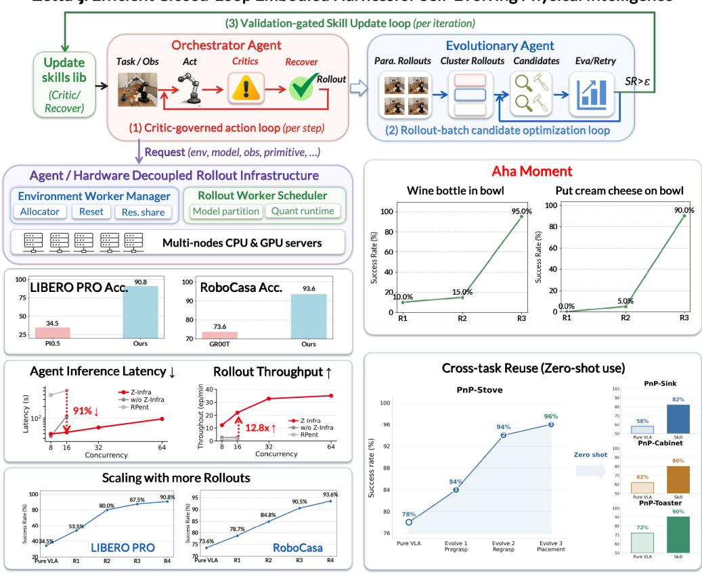

Figure 1 | **Zetta는 구현형 자기 진화를 위한 루프를 닫는다. 빈번한 런타임 비평가가 실행 중에 회복을 트리거하고, 검증된 실패는 재사용 가능한 비평가 및 회복 기술로 정제된다. 하드웨어 분리된 롤아웃 레이어는 이 과정을 이질적 환경, 모델, CPU, GPU에 걸쳐 확장한다. Zetta는 지속적인 동일 작업 개선, 제로샷 기술 전이, 로봇의 "Aha moment", 그리고 가속된 에이전트 실행을 가능하게 한다.**

**Abstract.** 구현형 에이전트는 엔드투엔드 정책 모델이 남긴 격차를 메우기 위해 점점 더 많이 사용되고 있다. 그러나 에이전트 경로는 물리적 실행에서 폐쇄형 학습을 실현하지 못했다: 기존 하네스는 대부분 개방형으로 남아 롤아웃 중에 고정된 기술을 따르고, 에피소드가 끝난 뒤에만 반영한다. 이러한 사후 반성은 실행이 진행되는 동안 지배할 수 없으며, 물리적 상호작용은 오늘날의 대형 에이전트 모델을 넘어서는 주파수로 로봇-환경 상태를 빠르게 추적해야 하는 결정을 요구한다. 우리는 코드 기반 런타임 비평가와 회복 기술을 온라인으로 진화시키면서 기본 정책은 고정된 폐쇄형 구현형 하네스인 Zetta를 제시한다. 세 가지 시계열 분리된 루프를 통해 Zetta는 행동-주파수 지배, 롤아웃 수준 비평가-회복 제안, 그리고 검증-가드된 기술 업데이트를 제공한다. Z-Infra와 함께, 에이전트 논리를 이질적 실행 자원에서 분리하는 롤아웃 인프라와 함께 Zetta는 현재 롤아웃 예산 하에서 LIBERO-Pro와 RoboCasa에서 최첨단 성공률을 달성하며, 90.8%와 93.6%를 기록하고 11.1배의 추론 속도 향상을 이룬다; 성공은 자기 탐색 경험과 함께 계속 확장된다; 학습된 기술은 제로샷으로 전이되며, 명확한 로봇의 "Aha Moments"가 나타난다. 이 결과는 폐쇄형 하네스 자기 진화가 신뢰할 수 있는 물리적 지능을 위한 확장 경로를 열어준다는 것을 보여준다.

## 목차 (Contents)

| 1 |  | 서론 | 3 |
|---|-----|------------------------------------------------------------------------------|----|
| 2 |  | 구현된 에이전트의 배포 시점 진화 가능화 | 4 |
|  | 2.1 | 문제 정의: 듀얼-에이전트 거버넌스 및 진화적 아키텍처<br> | 4 |
|  | 2.2 | 시스템 도전 과제 및 설계 원칙<br> | 6 |
|  | 2.3 | 단계 I: 경험적 실패 프로파일링 및 기준선 설정 (루프 1)<br> | 7 |
|  | 2.4 | 단계 II-1: 실패 클러스터링 및 원인 진단<br> | 9 |
|  | 2.5 | 단계 II-2: 비평가-가이드 하니스 수리 및 검증<br> | 10 |
|  | 2.6 | 단계 III: 하니스 통합, 패키징 및 일반화<br> | 11 |
| 3 |  | Z-Infra: 구현된 에이전트 롤아웃 인프라 | 12 |
|  | 3.1 | 개요<br> | 12 |
|  | 3.2 | 도전 과제 및 핵심 아이디어<br> | 13 |
|  | 3.3 | 시스템 아키텍처<br> | 13 |
|  | 3.4 | 프로그래밍 지원<br> | 17 |
| 4 |  | 실험 | 19 |
|  | 4.1 | 실험 설정<br> | 19 |
|  | 4.2 | 물리적 지능 \"Aha\" 순간<br> | 20 |
|  | 4.3 | 물리적 지능 확장 및 제로샷 능력<br> | 22 |
|  | 4.4 | 시뮬레이션 벤치마크 결과<br> | 26 |
|  | 4.5 | 사례 연구<br> | 27 |
|  | 4.6 | Z-Infra 성능 평가<br> | 30 |
| 5 |  | 관련 연구 | 31 |
|  | 5.1 | 구현된 기초 모델 격차: 물리적 지능 확장<br> | 31 |
|  | 5.2 | 라이브 하니스 격차: 구현된 자기 진화<br> | 32 |
|  | 5.3 | 롤아웃 인프라 격차: 구현된 자기 진화<br> | 33 |
| 6 |  | 결론 | 33 |
| A |  | RoboCasa 원자적 작업 매핑 | 33 |
| B |  | LIBERO-Pro 작업 매핑 | 34 |
| C |  | 사례 연구: 비평가-가이드 회복 for PnP-Stove | 35 |
| D |  | 사례 연구: 비평가-가이드 회복 for Libero-Pro Goal-T2 | 36 |

## <span id="page-2-0"></span>1. 서론 (Introduction)

물리적 인텔리전스는 효과적인 확장을 위해 두 가지 상호 보완적인 경로를 따라 발전하고 있다. 첫 번째는 엔드-투-엔드 정책 모델을 확장하는 것으로, 비전-언어-행동 모델(VLAs)과 세계-행동 모델(WAMs)를 포함한 모델들이 DROID 및 Open X-Embodiment과 같은 대규모 시연 코퍼스에서 훈련된다 [3, 4, 7–26], [27, 28]. 그러나 체현된 데이터는 여전히 부족하며, 제한된 데이터 분포에서 훈련된 모델은 실제 배포의 변화하는 역학에 대해 취약하다 [29–34]; 시연에서 신뢰할 수 있는 실제 실행으로의 격차는 여전히 열려 있다.

두 번째 경로는 대형 언어 모델을 구현된 에이전트로 사용하여 정책 모델, 코드, 도구 및 제어 프리미티브를 조정한다 [5, 35–38], 환경에서의 자기 탐색을 통해 학습하는 것을 목표로 한다. 이러한 시스템은 엔드-투-엔드 정책의 한계를 완화하지만, 기존의 구현된 에이전트 하네스는 실제로 이 학습을 실현하지 못한다. 따라서 기존 구현된 에이전트 하네스는 대부분 개방형 루프(open-loop) 상태를 유지한다: 실행이 시작되면 에이전트는 진화하는 로봇-환경 상태에 따라 지속적으로 결정을 조정하지 않고, 대신 고정된 스킬이나 사전 계획된 궤적을 따르며 에피소드가 완료된 후에만 반성한다. 본 연구는 자기 탐색에서 학습하고 자기 진화를 시연하는 폐쇄형 루프(closed-loop) 구현된 에이전트 하네스를 가능하게 한다: 롤아웃 경험이 증가함에 따라 성공률이 계속 향상된다.

구현된 에이전트에 대한 폐쇄형 루프 실행을 실현하는 것은 본질적으로 로봇과 변화하는 환경 사이의 고주파 상호작용에 의해 제한된다. 물리적 작업은 현재 로봇 및 환경 상태와 결합된 결정을 필요로 하며, 종종 밀리초 수준의 지연 예산 내에서 변한다 [39, 40]. 대형 에이전트 모델은 실제 시스템에서 이 주파수로 결정을 내릴 수 없다 [41–43]. 따라서 기존 방법은 주로 에피소드 또는 궤적 수준에서 반성을 수행한다. 이는 완료된 실패를 진단할 수 있지만, 물리적 실행이 진행되는 동안 이를 지배할 수 없다 [44–48]. 이러한 사후 반성은 고유한 한계를 가진다: 에이전트는 온라인으로 대안 행동을 테스트하여 반성이 올바른지 확인할 수 없으며, 전체 궤적에 대한 신용 할당이 어렵고, 회고 분석은 종종 실패 순간의 정확한 상태에 접근하지 못한다. 결과적으로 실행 후 요약된 경험은 재사용이 어렵고 효과적인 학습을 위한 지원이 제한적이다. 경험은 변화하는 실제 세계 역학에 잘 적응하지 못한다 [49–51].

이러한 도전을 해결하기 위해, 본 연구의 핵심 아이디어는 **폐쇄형 루프 실행을 위해 온라인으로 진화하는 코드 기반 비평가를 도입**하는 것이다. 이는 물리적 실행을 관리하고 행동과 환경의 변화하는 역학에 따라 에이전트 개입을 트리거한다. 이 아이디어를 바탕으로 우리는 물리적 지능을 확장하도록 자기 진화하는 폐쇄형 구현 하네스 Zetta를 제시한다 (Figure 1). 기본 정책 모델은 고정된 상태에서 런타임 비평가의 하네스 $H = \{C, R, T\}$ 를 진화시키며, 이는 롤아웃에서 파생된 복구 스킬에 해당한다. 구체적으로, 우리는 자기 진화를 가능하게 하는 세 가지 다른 시간 규모 루프를 제안한다. 첫째, *Critic-Governed Action Loop*는 학습된 비평가를 행동 주파수로 실행하고 필요 시 해당 복구 스킬을 호출한다. 둘째, *Rollout-Batch Candidate Optimization Loop*는 각 반복에서 실패를 클러스터링하고 진단한 뒤, 후보 비평가와 복구를 제안한다. 스킬과 코드는 기울기를 제공하지 않으므로, 우리는 SkillOpt와 EmbodiSkill [46, 52]을 활용해 코드 공간에서 경계가 있는 안정적인 업데이트를 수행하는 SGD와 유사한 최적화 과정을 구성한다. 셋째, *Validation-Gated Skill Update Loop*는 성공률을 향상시키고 롤아웃 전반에 걸쳐 일반화되는 비평가 및 복구 후보만을 허용한 뒤, 이를 스킬 메모리에 추가한다. 첫 번째 루프는 폐쇄형 실행을 가능하게 하고, 두 번째와 세 번째 루프는 자기 진화를 실현한다.

폐쇄 루프는 하네스(harness) 학습을 자기 탐색으로 가능하게 한다. 이 학습 과정은 롤아웃(rollout) 처리량을 지능 확장(intelligence scaling)의 속도 제한자로 만든다: 환경(environment)은 학습 데이터의 원천이다,

따라서 더 빠른 롤아웃은 더 빠른 진화를 만든다. 따라서 우리는 Z-Infra를 제안하고 구현하였다. 이는 본체 에이전트(self-evolving embodied agents)를 위해 특별히 설계된 최초의 롤아웃 인프라스트럭처이다. Z-Infra는 독립적인 환경 및 모델(worker) 풀, 배치 추론(batched inference), 모델 파티셔닝(model partitioning), 비동기 스케줄링(asynchronous scheduling)을 통해 에이전트 로직을 이종 실행 자원(heterogeneous execution resources)에서 분리한다. 이 설계는 같은 에이전트를 머신, 가속기, 모델, 환경(machines, accelerators, models, and environments)에 걸쳐 확장시키며, 특정 하드웨어 구성(hardware configuration)에 로직을 묶지 않는다.

#### 주요 결과는 (Our main results are)

- 현재 롤아웃 예산 하에서 Zetta는 최첨단(task success) 성과를 달성하며, 현재 정책 모델(policy models)과 본체 에이전트 기준선(embodied-agent baselines)을 크게 개선한다: LIBERO-Pro에서 90.8%, RoboCasa에서 93.6%. 성능은 진화 라운드(evolution rounds)를 거치면서 계속 향상되므로, 추가 롤아웃 경험은 더 많은 이득을 가져올 것으로 예상된다.
- 성공률은 진화 반복(evolution iterations)에 따라 증가한다: LIBERO-Pro에서 34.5%에서 90.8%로, RoboCasa에서 73.6%에서 93.6%로 상승한다.
- 학습된 기술은 유사한 작업에 제로샷 전이(transfer zero-shot) 능력을 보여준다. 예를 들어, RoboCasa의 PnP-Stove 작업을 예로 들면, 진화 과정에서 학습된 pregrasp, regrasp, 안정적 배치(stable-placement) 기술은 목표 특정 최적화(target-specific optimization) 없이 세 개의 관련 PnP 작업에 제로샷 전이된다: PnP-Sink에서 성공률이 58%에서 82%로, PnP-Cabinet에서 62%에서 80%로, PnP-Toaster에서 72%에서 90%로 향상된다.
- 우리는 초기 진화 라운드에서 성공률이 낮다가 에이전트가 핵심 비평자–회복 메커니즘(key critic–recovery mechanism)을 발견하면 급격히 상승하는 명확한 “아하 순간”(aha moments)을 관찰한다. 예를 들어, Wine Bottle in Bowl에서 15%에서 95%로, Put Cream Cheese on Bowl에서 5%에서 90%로 상승한다.
- Zetta의 추론 지연(inference latency)은 RPent에 비해 91% 감소하며, 이는 11.1배(speedup) 가속을 의미한다.
- Z-Infra는 유효 롤아웃 처리량(valid rollout throughput)을 1.7에서 35.1 에피소드/분으로 증가시켜 20.6배 개선을 가져오며, 이는 하네스 진화 루프를 직접 가속화한다.

#### 기여 내용은 (Our contributions are)

- 학습 가능한 코드 기반 비평가와 행동, 롤아웃 배치, 반복 시계열에서 동작하는 세 개의 조정된 진화 루프를 통해 자기 진화형 구현형 에이전트를 최초로 실현하였다.  
- 구현형 에이전트 자기 진화를 지원하도록 설계된 최초의 인프라로, 에이전트 로직을 이질적인 하드웨어 자원에서 분리하여 확장 가능한 롤아웃 생성 및 실행을 가능하게 한다.  
- 구현형 하네스의 확장성을 입증한다: 롤아웃 및 진화 반복이 증가함에 따라 기존 모델 또는 구현형 에이전트 중 SOTA에 도달하는 작업 성공률을 점진적으로 향상시킨다.

## <span id="page-3-0"></span>**2. 구현형 에이전트 배포 시점 진화 활성화 (Enabling Deployment-Time Evolution of Embodied Agents)**

### <span id="page-3-1"></span>**2.1. 문제 정의: 이중 에이전트 거버넌스 및 진화적 아키텍처 (Problem Formulation: Dual-Agent Governance and Evolutionary Architecture)**

우리는 장기 로봇 조작 과제를 권한 제한된 거버넌스 및 진화 프로세스로 공식화한다. 이 프레임워크는 판결을 위한 온라인 **Orchestrator Agent**와 최적화를 위한 오프라인 **Evolutionary Agents**를 포함하여, 기본 정책 파라미터를 변경하지 않고도 폐쇄 루프 기능 진화를 가능하게 한다.

#### *2.1.1. 고정 런타임 구성요소*

실행은 진화 전반에 걸쳐 내부 파라미터와 로직이 변하지 않는 두 개의 핵심 엔티티에 의해 주도된다:

- 1. **Action Policy ()**: 관측과 목표를 주어 저수준 행동 = ( , ; )을 생성하며, 파라미터는 제약 ∇ = 0을 만족한다.  
- 2. **Orchestrator Agent (**Aℎ**)**: 고정된 멀티모달 추론 연산자 [&#91;72](#page-42-0)[–74&#93;](#page-42-1)로서 Aℎ는 실시간 증거를 감사하고 모드 전환을 승인하는 고수준 지휘관 역할을 수행한다. 그 의사결정 논리는 진화 과정에서도 변하지 않는다.

#### 2.1.2. 진화 가능한 하네스 (Evolvable Harness (*H*))

Harness H는 진화 과정의 대상이며, Aℎ가 환경을 인지하고 개입할 수 있는 수단을 제공한다. 우리는 이를 다음과 같이 정의한다:

$$\mathcal{H} = \{C, R, \mathcal{T}\} \tag{1}$$

• **Runtime Critic ()**: 지속적으로 궤적 0:을 스캔하여 **구조화된 제안**을 생성하는 **고주파** 모니터링 함수 집합 :

$$P_t = C(\tau_{0:t}) = \langle e_t, \hat{\sigma}_t \rangle \tag{2}$$

여기서 e_t는 실패(예: 충돌, 진행 정지)의 감사 가능한 증거를 나타내며, ˆ는 제안된 실행 모드를 나타낸다.

- **Recovery Playbook ()**: 특정 원인 실패 메커니즘에 매핑된 전략의 구조화된 라이브러리로, 판단을 위한 실행 가능한 옵션을 제공한다.

- **Heterogeneous Toolset (**T**)**: 실행 가능한 도구와 연산자(예: 플래너, 그랩 감지기, 복구 모듈)[&#91;75](#page-42-2)[–77&#93;](#page-42-3)로 구성된 모음으로, 진화 과정에서 생성, 인스턴스화, 선택 및 정제될 수 있다. 이 도구 세트는 모니터링 요구사항과 복구 논리를 충족하도록 진화하며, 하네스가 미리 정의된 도구의 매개변수만 조정하는 대신 실행 능력을 획득하고 적응하도록 한다.

#### *2.1.3. 권한 계층: 온라인 판단 논리*

실행 중에 최종 운영 모드(= 0 VLA 또는 WAM의 경우, > 0 특수 도구의 경우)는 판정 함수에 의해 결정된다:

$$\sigma_t = \mathcal{A}_{orch}(P_t, R, \mathcal{T}, \mathcal{K})$$

(3)

여기서 ... 는 실시간 제안이며, K는 **작업 지식 컨텍스트(task knowledge context)**를 나타낸다. 여기에는 사전 정의된 마일스톤, 성공 기준, 환경 제약이 포함된다. 이 프로토콜은 **evidencedriven decision-making**을 강제한다: 고주파로 동작하지만, 증거가 검증되고 Aℎ에 의해 수락될 경우에만 개입이 허용된다.

#### *2.1.4. 오프라인 최적화: 진화 에이전트* (Offline Optimization: Evolutionary Agents)

H를 최적화하기 위해, 우리는 **Evolutionary Agents** A를 오프라인 정제의 주된 동력으로 도입한다. A는 실패한 롤아웃 데이터 D를 분석하여 하네스 구성요소를 반복적으로 개선한다:

$$\mathcal{H}^{(k+1)} \leftarrow \mathcal{A}_{evo}(\mathcal{D}_{fail}^{(k)}, \mathcal{H}^{(k)}) \tag{4}$$

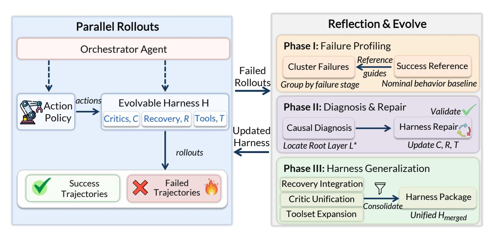

Figure 2 | **Zetta 진화 프레임워크 개요**. 시스템은 온라인 실행과 오프라인 진화 사이를 연속 루프로 운영한다. (**왼쪽) 병렬 롤아웃:** 액션 정책이 작업을 실행하고, *Evolvable Harness* ( $\mathcal{H}$ )가 비평가( $\mathcal{C}$ ), 복구( $\mathcal{R}$ ), 도구( $\mathcal{T}$ )로 구성되어 있으며, 모두 *Orchestrator Agent*의 고수준 판정 하에 모니터링된다. 롤아웃은 성공과 실패 궤적으로 분류된다. (**오른쪽) 반성 및 진화:** 실패 궤적은 세 단계 오프라인 진화 주기를 유발한다. *단계 I*는 성공 참조 기준에 대해 클러스터링하여 실패를 프로파일링한다. *단계 II*는 원인 진단을 수행하여 근본 실패 층( $\mathcal{L}^*$ )을 찾고, 이후 최소 하네스 수리를 통해  $\mathcal{C}$ ,  $\mathcal{R}$ ,  $\mathcal{T}$ 를 업데이트한다. *단계 III*는 시드별 수리를 통합된 버전 관리된 *Harness Package* ( $\mathcal{H}_{merged}$ )로 일반화하고, 이를 실행 루프로 다시 투입한다.

$\mathcal{A}_{evo}$는 실패 증거에서 인과 메커니즘을 추출하고, 수리 패치를 생성하며, 지역 경험을 버전화된 하네스로 추상화한다. 또한 $\mathcal{A}_{orch}$의 런타임 동작을 가용 센싱(C)과 액션(R, $\mathcal{T}$) 공간을 재구성하여 수정한다.

**Optimization Objective** Zetta의 궁극적 목표는 $\pi_{VLA}$와 $\mathcal{H}_{orch}$를 불변으로 유지하면서 기대 작업 성공률 J를 최대화하는 최적 구성 $\mathcal{H}^*$를 찾는 것이다:

$$\max_{\mathcal{H}} J(\mathcal{H}) = \mathbb{E}_{g,s_0 \sim \mathcal{D}} \left[ \text{Success}(\tau) \mid \pi, \mathcal{A}_{orch}, \mathcal{H} \right]$$

(5)

### <span id="page-5-0"></span>2.2. 시스템 도전 과제 및 설계 원칙 (System Challenges and Design Principles)

현재 고정된 Vision-Language-Action (VLA) 정책을 기반으로 한 구현형 AI 시스템의 한계를 해결하기 위해, 우리는 Zetta 프레임워크 설계를 동기화하는 세 가지 핵심 도전 과제를 식별한다.

**Challenge 1: 고정된 기초 모델에서의 오픈 루프(semantics-physics) 격차.** SOTA VLA/WAM 모델은 강력한 의미 이해를 갖지만 **오픈 루프** 피드포워드 정책으로 동작한다.

inference [3, 4, 16, 78]. 그들은 물리적 실행 오류(예: 물체 미끄러짐, 소규모 충돌)를 실시간으로 교정할 수 있는 폐쇄 루프 감각-운동 인지를 갖지 못한다. 결과적으로, 작은 교란이 종종 전체 작업 실패로 이어진다. 이는 정책이 자신의 물리적 상태를 모니터링하거나 조정할 수 없기 때문이다.

**Zetta Design Principle: 고주파 상태 거버넌스.** 우리는 고정된 VLA/WAM에 분리된 **고주파 런타임 크리틱** (*C*)을 추가한다. 액션 정책의 추론 속도보다 높은 속도로 작동하는 이 크리틱은 물리적 실행 상태를 지속적으로 모니터링하고, 명목 분포에서 가장 이른 편차 징후를 감지하면 개입을 트리거하여 시스템을 폐쇄 루프 거버넌스 패러다임으로 변환한다.

**Challenge 2: 과다 매개변수 수리의 일반화 함정.** 물리적 실패의 근본 원인을 파악하는 것은 복잡하다. 임시 디버깅은 종종 \"과적합\" 수리를 초래한다—특정 실패 사례에서 성공을 강제하기 위해 저수준 제어 매개변수를 조정한다 [79–81]. 즉각적인 결함을 해결하면서도 이러한 수정은 VLA의 의미 일반화에 필수적인 행동 분포를 손상시켜, 보지 못한 보류 시드에서 심각한 성능 저하를 초래하고, 전반적인 일반화 가능성을 희생한다.

**Zetta Design Principle: 최소 개입을 위한 계층적 인과 진단.** 우리는 엄격한 **Top-Down Hierarchical Causal Diagnosis** 로직을 구현한다. 진단 에이전트 $\mathcal{A}_{diag}$는 우선순위 순서대로 레이어를 순회한다: $Evaluation \rightarrow Critic \rightarrow State \rightarrow Planning \rightarrow Recovery \rightarrow Parameter.[82–84]$ \"고수준 로직이 실패를 해결하면 저수준 매개변수를 절대 수정하지 않는다\"는 원칙을 준수함으로써 패치는 최소 효과적인 레이어에 적용되어 기초 모델의 무결성을 보존한다.

**Challenge 3: 전문가-인-루프 디버깅의 확장성.** 인간 전문가가 장기 꼬리 작업 분포에서 개별 실패 사례를 수동으로 분석하고 패치하는 것에 의존하는 것은 비용이 많이 들고 근본적으로 확장 불가능하다 [85–88]. 이 접근 방식은 일반 목적 조작에 내재된 무한한 초기 조건 변동을 따라잡을 수 없다.

**Zetta Design Principle: 자동화된 진화적 일반화.** 우리는 수동 디버깅을 **완전 자동화된 진화 학습 루프(Loop 1-3)**로 대체한다. 진화 에이전트 $\mathcal{A}_{evo}$는 시드별 실패를 *task invariants*에 기반해 일반화된 하네스로 추상화한다. 또한 강제된 **Held‑out Generalization Protocol**이 통합된 하네스를 엄격히 격리된 테스트 세트에서 검증하여 견고한 거버넌스 전략의 자동 확장을 가능하게 한다.

### <span id="page-6-0"></span>2.3. Phase I: 경험적 실패 프로파일링 및 기준선 설정 (Loop 1) (Phase I: Empirical Failure Profiling and Baseline Establishment (Loop 1))

진화 주기의 시작에서, 우리는 미리 정의된 개발 시드 집합 $\mathcal{D}_{dev}$ 전반에 걸쳐 Action 정책 $\pi$의 대규모 샘플링을 수행한다. 목표는 거버넌스 개입 없이 순수 VLA 폐쇄 루프 실행을 통해 성능 기준선을 설정하는 것이다. 결과로 얻은 원시 코퍼스는 $\mathcal{B}_{raw} = \{\tau^{(j)} \mid seed_j \in \mathcal{D}_{dev}\}$ 으로 정의된다.

**Deterministic Scheduling and Execution Protocol** 실험적 엄밀성과 재현성을 확보하기 위해 Loop 1은 두 가지 결정적 차원을 통해 엄격한 인프라 관리를 시행한다:

• **Deterministic Routing**: 모든 롤아웃 작업은 중앙 집중형 리소스 스케줄러를 통해 배포된다. 스케줄러는 실시간 부하와 계산 노드의 메모리 임계값(예를 들어

4090 GPU 풀). 이 메커니즘은 배치 내 모든 롤아웃이 동일한 소프트웨어 컨테이너, 시뮬레이터 버전 및 하드웨어 구성을 사용하도록 보장하여 환경 이질성으로 인한 관측 노이즈를 제거한다.

• Validity Determination and Isolation: 시스템은 *인프라* 실패와 정책 실패를 명시적으로 구분한다. 우리는 유효성 함수 $Valid(seed_j) \in \{True, False\}$ 를 정의한다. 롤아웃은 센서 데이터와 비디오 증거의 전체 추적을 완료한 경우에만 유효 롤아웃 집합 $\mathcal V$ 에 포함된다:

$$V = \{seed_j \in \mathcal{D}_{dev} \mid Valid(seed_j) = True\}$$

(6)

인프라가 무효인 시도(예: 네트워크 변동, 시뮬레이터 충돌)에서는 원래 논리 시드를 사용하여 유효한 궤적이 생성될 때까지 필수 재실행 정책이 적용된다. 이는 정책 이외의 요인으로 인해 $\mathcal V$ 의 통계적 분포가 기울어지지 않도록 보장한다.

**Multi-dimensional Evidence Acquisition** 각 유효 롤아웃 $\tau^{(j)} \in \mathcal{V}$ 에 대해, 시스템은 포괄적인 관측 스트림을 보존하기 위해 **append-only** 모드를 사용한다. 완전한 궤적 인스턴스 $\tau^{(j)}$ 는 다중 모달 시계열로 표현된다:

$$\\tau^{(j)} = \\{(s_t, a_t, \\mu_t, \\phi_t)\\}_{t=0}^T$$

(7)

여기서  $\mu_t$  는 작업별 의미적 이정표의 완료 상태를 나타내며,  $\phi_t$  는 충돌 강도와 접촉력 벡터와 같은 생리 보조 신호를 포착한다.

**분류 및 색인** 결과 코퍼스는 진화 에이전트  $\mathcal{A}_{evo}$ 를 위한 두 개의 핵심 저장소로 처리된다:

1. 성공 참조 색인 ( $I_{succ}$ ): 성공적인 궤적  $V_{succ} \subset V$  은 이정표별로 집계된다:

$$I_{succ}(\mu) = \{ s_t \mid \tau \in \mathcal{V}_{succ}, \mu_t = \mu \}$$

(8)

이 색인은 작업 성공의 "명목 분포"를 드러내며, 편차를 식별하기 위한 벤치마크 역할을 한다.

2. 실패 시드 매니페스트 ( $\mathcal{M}_{fail}$ ) 및 첫 번째 누락 이정표 ( $m^*$ ): 모든 실패 샘플과 그 증거 체인이 매니페스트에 정리된다. 실패가 발생한 작업 단계를 위치시키기 위해 첫 번째 누락 이정표 ( $m^*$ ) 를 도입한다.

작업별 의미적 이정표의 순서가 지정된 시퀀스  $M = \langle m_1, m_2, \dots, m_{goal} \rangle$  가 주어지면,  $m^*$  는 트레젝터리 기록에서 관측되지 않은 시퀀스의 첫 번째 요소로 정의된다:

$$m^* = \min\{m_k \in M \mid m_k 
otin \{\mu_t\}_{t=0}^T\}$$

(9)

$m^*$ 의 도입은 두 가지 목적을 가진다: 실패에 대한 대략적인 클러스터링 기준을 제공하고, $m^* - 1$ 에서 $m^*$ 로의 전환 동안 증거에 초점을 맞추어 $\mathcal{A}_{diag}$ 를 사용함으로써 원인 진단의 검색 공간을 좁히는 것이다.

<span id="page-7-0"></span>진화 주기: 데이터에서 활용까지. 섹션 2.1에서 정리된 진화 에이전트 $\mathcal{A}_{evo}$를 기반으로, 운영 논리는 세 부분 파이프라인을 통해 구현된다: **Diagnosis** ($\mathcal{A}_{diag}$), **Repair** ($\mathcal{A}_{repr}$), 그리고 **Generalization** ($\mathcal{A}_{gen}$). 이 구조는 원시 실패 코퍼스 $\mathcal{M}_{fail}$에서 인과 지식을 체계적으로 추출하도록 보장한다. 파이프라인의 시작점으로서, $\mathcal{A}_{diag}$의 주요 임무는 실패의 근본 원인 메커니즘을 식별하는 것이다.

### **2.4. Phase II 단계 1: 실패 클러스터링 및 원인 진단 (Phase II Stage 1: Failure Clustering and Causal Diagnosis)**

#### *2.4.1. 메커니즘 수준 실패 클러스터링 및 메도이드 시드 선택 (Mechanism-Level Failure Clustering and Medoid Seed Selection)*

진단은 루프 1에서 생성된 Failed-Seed Manifest M의 구조적 분석으로 시작된다. 최종 결과를 기반으로 한 피상적 분류 대신, A는 **Earliest Observable Divergence (EOD)**를 기준으로 시드들을 클러스터링한다. 우리는 M의 궤적에서 상태 분포가 '건전' 분포에서 벗어나는 첫 번째 시점 t를 정의한다:

$$t_{EOD} = \min\{t \mid \operatorname{dist}(s_t, s_t^{ref}) > \epsilon, s_t^{ref} \in I_{succ}(\mu_t)\}$$

(10)

여기서 dist(·)는 상태 공간 거리 측정기이며, ε는 사전 정의된 임계값이다.

A는 첫 번째 누락된 이정표 <sup>∗</sup>, 로봇-객체 상대 포즈, 그리고 활성 툴 ID를 포함한 맥락을 활용하여 M을 상호 배타적인 클러스터 K = {1, 2, …}로 분할한다. 각 클러스터는 유사한 실패 서명을 공유하는 시드들을 포함한다. 계산 부하를 줄이고 메커니즘 불변성을 추출하기 위해, 각 클러스터에 대해 **medoid seed** ∈ 를 선택한다. 이는 특징 공간에서 클러스터 중심에 가장 가까운 샘플로 정의되며, 심층 인과 진단의 주요 대상이 된다.

**단일 시점 기반 관찰 프로토콜** 다중 모달 모델에서 공간적 추론 불일치와 다중 시점 환각을 제거하기 위해, A는 엄격한 **단일 시점 기반 프로토콜**을 준수한다:

- **Primary View Selection**: 에이전트는 사용 가능한 비디오 스트림 중에서 가장 명확하게 엔드 이펙터, 목표 객체, 그리고 핵심 접촉 인터페이스를 보여주는 각도를 기본 시점으로 지정해야 한다.  

- **Evidence Consistency**: 기본 시점이 설정되면, 진단 과정 전반에 걸친 모든 시각적 추론은 그 시점에 고정되어야 한다. 기본 시점이 충분한 증거를 제공하지 못할 경우, 시스템은 시점 전환 대신 내부 시뮬레이터 상태, 센서 궤적, 물리적 신호를 활용해 교차 모달 검증을 수행하도록 명시된다.

#### *2.4.2. 상향식 계층적 인과 진단 (Top-Down Hierarchical Causal Diagnosis)*

선택된 경우, A는 진단 레이어 공간 \(L = \{\, , , , , , \}\) 전반에 걸쳐 체계적인 상향식 검사 논리를 수행한다. 작업은 다음과 같은 가장 높은 우선순위 레이어 \(*\)를 찾아 근본 원인을 위치시키는 것이다:

$$L^* = \arg\max_{L \in \mathcal{L}} \{ \text{IsRootCause}(L) \mid \text{증거로부터 } \tau, \text{Primary View} \}$$

(11)

검사 순서는 계층적 우선순위를 따른다:

- 1. **평가 레이어 ()**: 성공 기준 또는 마일스톤 진행 논리에서 오류를 확인한다.
- 2. **비평가 레이어 ()**: 런타임 비평가가 거짓 음성 또는 거짓 양성을 나타내는지 판단한다.
- 3. **상태 표현 레이어 ()**: 객체 포즈 또는 접촉 정보가 물리적 실제와 일치하지 않는지 확인한다.
- 4. **계획/제어 레이어 ()**: VLA 정책 또는 도구가 올바른 상태에도 불구하고 물리적 제약을 처리하지 못했는지 분석한다.

- 5. **복구 레이어** ($L_{recv}$): 실패가 복구 중에 발생했다면 플레이북 논리의 결함을 확인한다.
- 6. **파라미터 레이어** ($L_{param}$): 특정 제어 이득 또는 동작 임계값을 검사한다.

클러스터 일관성 및 수리 사양  
$L^*$ 를 $seed_{med}$ 에 대해 결정한 뒤, $\mathcal{A}_{diag}$ 는 $K_i$ 의 다른 구성원들에 걸쳐 메커니즘의 일관성을 검증한다. 마지막으로, 에이전트는 검증된 각 메커니즘에 대해 **Repair Candidate** 사양을 출력하며, 이는 국소화된 레이어, 인과 증거 체인, 그리고 하네스 구성요소 $(C, R, \mathcal{T})$ 를 업데이트하기 위한 기능적 요구사항을 상세히 기술한다.

### 2.5. Phase II Stage 2: Critic-Guided Harness Repair and Validation (Phase II Stage 2: Critic-Guided Harness Repair and Validation)

이 단계는 Repair Agent $\mathcal{A}_{repr}$에 의해 주도되며, 그 목표는 diagnosis 과정에서 식별된 특정 root layer $L^*$를 해결하면서 base Action Policy $\pi$의 무결성을 엄격히 보존하는 최소한의 harness patch $\mathcal{H}_{patch} = \{C^*, R^*, \mathcal{T}^*\}$를 구현하는 것이다.

#### 2.5.1. Harness Component Instantiation and Re-entry Logic

$\mathcal{A}_{repr}$ 은 진단 사양에 의해 지정된 필수 거버넌스 구성요소를 인스턴스화함으로써 시작한다. 이는 하네스 전반에 걸친 목표 지향적 업데이트를 포함한다:

- **비평가 향상 (Critic Enhancement)** ($C^*$): 고주파 모니터링 기능의 개발 또는 정제, 고장 전형적 전조 조건을 감지하도록 설계되어 편차 발생 시 구조화된 제안 $P_t$ 를 생성한다.  
- **복구 초안 작성 (Recovery Drafting)** ($R^*$) 및 **도구 적응 (Tool Adaptation)** ($\mathcal{T}^*$): 실행 가능한 복구 플레이북 정의와 원인 고장 메커니즘을 해결하기 위한 실행 가능한 도구의 적응 또는 합성.

핵심적으로, **안전하고 원활한 통합을 보장하기 위해**, $\mathcal{A}_{repr}$는 $R^*$와 $\mathcal{T}^*$의 복구 로직에 엄격한 **VLA 재진입 계약(VLA Re-entry Contract)**을 삽입한다. 이 계약은 제어가 기본 정책 $\pi_{VLA}$로 반환될 시점을 결정하는 논리적 술어 $\Psi(s_t)$를 정의한다. 제어 인계는 원래의 실패 증거 $e_t$가 명시적으로 제거되고 물리적 상태가 안정된 접촉력으로 정의되는 평형에 도달한 경우에만 허용된다. 우리는 이 술어를 다음과 같이 정의한다:

$$\Psi(s_t) = \mathbb{1}(\text{FailureCleared}) \land \mathbb{1}(\text{Stability}(s_t) > \gamma)$$

(12)

여기서 **Failure Cleared**(실패 해제) 항목은 특정 조건(예: 충돌 위험 또는 자세 편차)인 증거 $e_t$ 가 복구 조치에 의해 완전히 해결되었는지를 확인하는 불린 함수이다. 동시에 **Stable Contacts**(안정된 접촉) 항목은 physio-auxiliary signals $\phi_t$ 를 평가하여 로봇과 물체 사이의 연결이 물리적 평형에 도달했는지를 보장한다. 구체적으로, Stability($s_t$)는 접촉 토크 진동과 그립 힘의 크기를 측정하며, $\gamma$는 VLA가 안전하게 인수할 수 있도록 보장하는 안정성 임계값으로, 일시적인 동적 효과로 인한 부차적 실패를 방지한다. 이 계약은 정책 재개 시 불안정이 부차적 실패를 유발하는 것을 방지하는 중요한 안전장치 역할을 한다.

#### 2.5.2. Closed-Loop Validation Protocol and Success Criteria

구현 후, 패치 $\mathcal{H}_{patch}$ 은 원본 메디오이드 시드(원본 medoid seed)에서 엄격한 두 단계의 폐쇄 루프 검증을 거친다. 첫 번째로, *진단 재생* 이 향상된 비평가(enhanced critic) $C^*$ 이제 정확히

분기점을 식별한다. 두 번째로, 초기 상태에서 *새로운 폐쇄 루프 롤아웃*이 실행된다. 수리 패치는 작업이 목표 마일스톤에 도달하고 모든 개입이 재진입 계약에 따라 Aℎ에 의해 적절히 판결될 때만 검증되고 성공적으로 *통과*된 것으로 간주된다:

Success

$$(\mathcal{H}_{patch}) = \mathbb{1}(\mu_{T,new} = m_{goal} \land \forall t \in Intv, Adjudicated by \mathcal{A}_{orch})$$

(13)

여기서 ,는 새로운 궤적의 최종 이정표이며, Intv는 개입 간격을 나타낸다. 검증된 패치와 그 증거는 이후 A에 다중 시드 통합을 위해 제출된다.

### <span id="page-10-0"></span>**단계 III: 하네스 통합, 패키징 및 일반화 (Phase III: Harness Consolidation, Packaging and Generalization)**

이 최종 단계에서 진화 주기의 일반화 에이전트 A는 검증된 시드별 패치를 견고하고 통합된 거버넌스 하네스로 변환한다. 목표는 지역 수리를 메커니즘 수준의 불변으로 추상화하여 전체 실패 클러스터를 해결할 수 있도록 하는 것이며, 그 결과 버전이 지정된 **merged harness** H가 생성된다.

#### *2.6.1. 메커니즘 통합 및 하네스 패키징 (Mechanism Consolidation and Harness Packaging)*

A는 교차 시드 분석을 수행하여 Hℎ, (for ∈ )와 같은 이질적인 패치를 단일, 일관된 구성 H = {, , T }로 통합한다. 이 과정은 거버넌스 논리를 특정 사례에서 일반 메커니즘으로 끌어올리고, 이를 휴대 가능한 표준화된 파일 구조에 캡슐화한다.

통합 연산자는 지역 경험을 작업 불변으로 추상화한다:

- **Critic Unification**: 개별 모니터링 기능은 통합된 Critic으로 추상화된다. 트리거 조건에 논리 OR 연산을 적용하고 노이즈 임계값을 동적으로 조정함으로써 클러스터 내 다양한 초기 조건에서도 신뢰할 수 있는 실패 감지를 보장한다.
- **Recovery Integration**: 시드별 Recovery Playbooks는 , 로 추상화되어 동일한 실패 모드의 형태 변화를 처리하도록 행동 시퀀스를 일반화하고 VLA Re‑entry Contract Ψ()를 표준화한다.
- **Toolset Expansion**: Heterogeneous Toolset T는 기존 조정된 연산자뿐만 아니라 **newly synthesized tools**를 포함하도록 확장된다. 이 실행 가능한 스크립트는 수리 단계에서 생성된 고정밀 임피던스 제어와 같은 전문 물리 기술을 캡슐화하여 기본 VLA의 능력을 넘어서는 제약을 해결한다.

수학적으로, 이 통합은 다음과 같이 정의된다:

$$\mathcal{H}_{merged} = \text{Consolidate}\left(\left\{\mathcal{H}_{patch,j} \mid seed_j \in K_i\right\}\right)$$

(14)

이러한 진화된 기능의 이식성과 버전 관리를 보장하기 위해 A는 거버넌스 논리를 자체 포함 패키지로 외부화하고, 구성 요소를 별도 디렉터리에 매핑한다:

• .: 고수준 거버넌스 로직을 선언하며, 정의된 마일스톤, 오케스트레이터 판정 규칙, 그리고 일반화된 재진입 예측자 Ψ()를 포함한다.

- /: 진화된 비평가와 도구 세트 T에 대한 실행 가능한 구현 및 스크립트를 포함한다.  
- /: 일반화된 복구 플레이북을 저장하며, 특정 증거를 구조화된 개입 전략에 매핑한다.  
- /: 런타임 실행을 위한 일반화된 수치 경계 및 임계값을 정의하는 구성 파일을 보유한다.


#### 2.6.2. 엄격한 일반화 검증 및 전환 프로토콜 (Rigorous Generalization Validation and Transition Protocol)


최종 검증된 하니스 H는 이중 평가 프로토콜을 통해 엄격한 성능 기준을 충족해야 하며, 이를 통해 진정한 일반화를 확인한다.

**역사적 회귀 및 보류 평가** 먼저, 하니스는 **역사적 회귀** 테스트를 거치며, 원래 클러스터 내에서 실패한 모든 롤아웃을 100% 성공률로 해결해야 한다:

$$\forall seed_j \in K_i, Success(seed_j \mid \mathcal{H}_{merged}) = 1$$

(15)

둘째, 보다 넓은 적용 가능성을 확인하기 위해, 하니스는 완전히 격리된 데이터셋 Dℎ−에서 **보류 평가**를 받는다. 진화의 효과는 기본 VLA 정책 대비 성공률 증가 Δ로 정량화된다:

$$\Delta SR = SR(\mathcal{D}_{held-out} \mid \mathcal{H}_{merged}) - SR(\mathcal{D}_{held-out} \mid \pi_{VLA})$$

(16)

**동적 전이 프로토콜**  
진화적 반복은 H가 이전에 보지 못한 데이터에서 견고한 성능을 입증할 때만 완료된 것으로 간주된다. Dℎ−에서의 평가가 H의 수정을 유발하는 새로운 실패 메커니즘을 드러내면, 시스템은 엄격한 데이터 분리 정책을 시행한다. 원래 보류된 시드는 개발 시드로 재분류된다 (D ← D ∪ { }), 그리고 새로운, 이전에 보지 못한 세트가 최종 검증을 위해 선택되어야만 반복이 종료된다.

## <span id="page-11-0"></span>3. Z-Infra: 구현형 에이전트 롤아웃 인프라 (3. Z-Infra: Embodied Agent Rollout Infrastructure)

### <span id="page-11-1"></span>3.1. 개요 (3.1. Overview)

롤아웃 인프라는 앞서 설명한 자가 진화하는 구현형 에이전트의 실행 백본 역할을 한다. 그 주요 책임은 이질적인 컴퓨팅 자원에서 대규모 병렬 롤아웃(에이전트-환경 상호작용의 완전한 에피소드)을 효율적으로 실행하면서 상위 레이어 에이전트 로직에 단순하고 통합된 인터페이스를 제공하는 것이다.

단일 롤아웃은 다음과 같이 진행된다. 에이전트는 먼저 *session*을 요청하여 적절한 시뮬레이션 환경에 격리된 환경 인스턴스를 프로비저닝하고, 그 다음에 리셋 호출을 통해 에피소드를 초기화한다. 메인 실행 루프는 반복된다: 에이전트는 환경 상태를 관찰하고 policy_step을 호출하여 정책 모델에 행동을 요청하거나 필요에 따라 인지 모델과 원시 연산을 호출한다. 이 루프는 종료(성공, 실패, 타임아웃)될 때까지 계속되며, 그 시점에서 세션이 해제된다.

자가 진화하는 에이전트는 *여러 개의 롤아웃을 동시에* 실행하며, 다양한 과제를 탐색하고 학습된 기술을 테스트하며 반성을 위한 경험을 수집한다. 따라서 공유 컴퓨팅 자원의 효율적인 멀티플렉싱이 필수적이다. 본 연구는 주로 CPU 중심의 MuJoCo [&#91;92&#93;](#page-43-4)/robosuite [&#91;93&#93;](#page-43-5) 스택을 LIBERO [&#91;6&#93;](#page-37-3)와 RoboCasa [&#91;2&#93;](#page-36-2)에서 사용하지만, 구현형 시뮬레이션은 GPU 병렬 MuJoCo 백엔드(MJX [&#91;94&#93;](#page-43-6), MJLab [&#91;95&#93;](#page-43-7)) 및 PhysX 기반 스택(SAPIEN/ManiSkill [&#91;96,](#page-43-8) [97&#93;](#page-43-9), Isaac Sim/Isaac Lab [&#91;98,](#page-44-0) [99&#93;](#page-44-1))도 포함한다. 롤아웃 인터페이스는 이러한 백엔드 차이를 수용하면서 에이전트에게 동일한 세션 수준 상호작용 모델을 제공하도록 설계되었다.

### <span id="page-12-0"></span>3.2. 도전 과제 및 핵심 아이디어 (3.2. Challenges and Key Ideas)

위에서 설명한 에이전트 롤아웃 작업은 두 가지 기본 인프라 과제를 제시한다:

**자원 이질성.** 단일 롤아웃은 동시에 다양한 컴퓨팅 자원을 요구한다. CPU 중심 시뮬레이션의 경우, MuJoCo/robosuite 환경은 세션별 시뮬레이션 상태를 유지하며 환경 스텝 중 호스트 CPU와 메모리를 소비한다. 반면 전통적인 렌더링 파이프라인은 일반적으로 GPU를 사용한다. GPU 병렬 시뮬레이션 백엔드는 대신 가속기에서 환경 배치를 진행하며, 상태 레이아웃, 리셋 의미, 렌더링, 장치 메모리에 대한 요구 사항이 다르다. 정책 모델은 자기 회귀 또는 확산 기반 행동 생성을 위해 GPU 가속기를 필요로 하며, 계산 기능을 저장하기 위해 GPU 메모리도 필요로 한다 [&#91;100,](#page-44-2) [107,](#page-44-3) [125,](#page-46-0) [126&#93;](#page-46-1). 경량 인지 모델 [&#91;59,](#page-41-0) [60,](#page-41-1) [76,](#page-42-9) [77,](#page-42-3) [101–](#page-44-4)[104&#93;](#page-44-5)는 GPU 자원을 공유할 수 있지만, 지연 요구 사항이 다르다. 원시 연산(좌표 변환, 충돌 검사 등)은 순수 CPU 계산으로 마이크로초 수준의 지연을 기대한다. 이러한 워크로드는 서로 다른 워커 및 스케줄링 요구 사항을 초래하므로, 모든 워크로드 유형에 맞는 단일 자원 풀이나 스케줄링 정책은 존재하지 않는다.

**Execution Dynamism.** 예측 가능한 데이터 병렬 패턴을 갖는 훈련 파이프라인과 달리, 에이전트 롤아웃은 본질적으로 예측 불가능한 실행 프로파일을 보인다. 에이전트는 런타임 관찰을 기반으로 호출할 도구를 동적으로 선택한다. 한 타임스텝은 정책 호출만 필요할 수 있지만, 다음 타임스텝은 인식, 계획, 그리고 여러 개의 원시 연산을 체인으로 연결할 수 있다. 세션은 에이전트가 작업을 탐색하고 실패를 반성하며 수정된 전략으로 재시도할 때 불규칙한 간격으로 생성, 일시 중지, 파괴된다. 이로 인해 배치 크기와 도착 간격이 크게 변동하는 폭발적인 GPU 추론 요구가 발생하며, 정적 자원 할당 및 요청 스케줄링이 비효율적이다.

**Key Idea: Decoupled Abstraction Layers.** 우리는 이러한 도전을 해결하기 위해 에이전트 로직과 하드웨어 자원 관리를 완전히 분리하는 추상화 계층을 도입한다. 에이전트는 가상 롤아웃 인터페이스와만 상호작용하며, 실행할 *무엇* (어떤 모델, 어떤 환경, 어떤 연산)을 지정하고, *어디서* 또는 *어떻게* 실행되는지는 신경 쓰지 않는다. 인프라는 워커 할당, 요청 라우팅, 배치 형성, 하드웨어 매핑을 독립적으로 처리하여, 에이전트 코드를 변경하지 않고도 다중 노드, 다중 GPU 클러스터에서 투명하게 확장할 수 있다. 이러한 관심사의 분리는 각 계층을 독립적으로 최적화할 수 있게 한다: 에이전트 개발자는 작업 로직과 스킬 구성을 집중하고, 인프라 엔지니어는 스케줄링, 배치, 하드웨어 활용을 최적화한다.

### <span id="page-12-1"></span>**3.3. 시스템 아키텍처 (System Architecture)**

인프라는 실행 파이프라인의 각 단계에서 별도의 문제를 해결하는 세 개의 계층으로 구성된다 (Figure [3)](#page-13-0)). **Control Plane**은 모든 에이전트 상호작용의 단일 진입점으로서, 백엔드 이질성을 추상화하고 요청 라우팅, 자원

<span id="page-13-0"></span>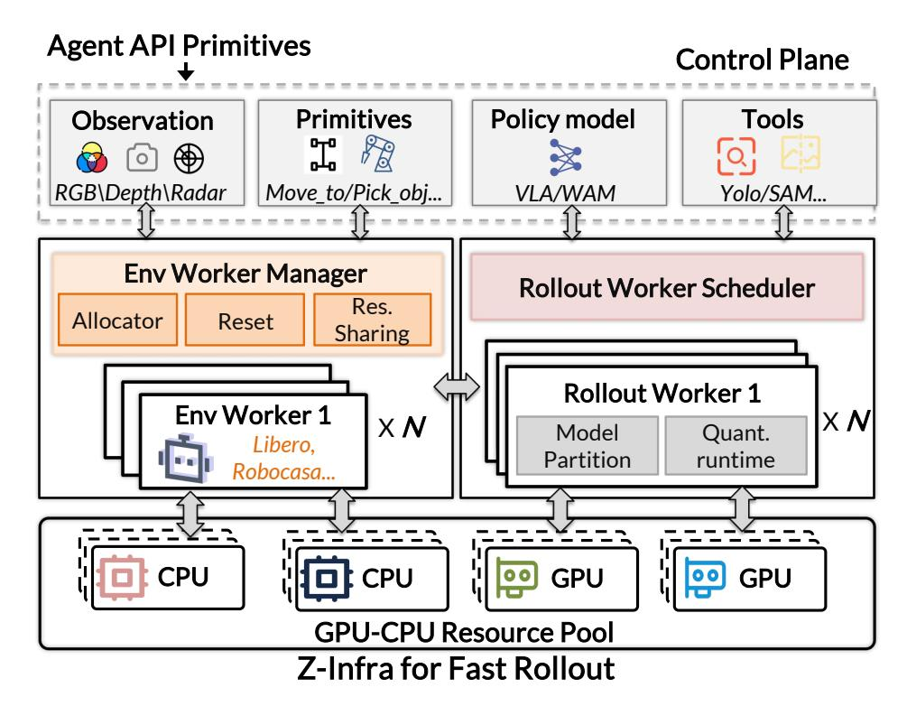

Figure 3 | 롤아웃 인프라의 3계층 아키텍처. 컨트롤 플레인은 에이전트 요청을 특수화된 Env Workers와 Rollout Workers에 라우팅하며, 이들은 각각 환경 시뮬레이션과 모델 추론을 관리한다.

관리 및 장애 허용. **Environment Worker Layer**는 다양한 계통의 시뮬레이션 환경의 수명 주기와 실행을 관리하며, 세션 프로비저닝, 환경 스텝, 관측 캡처를 처리한다. **Rollout Worker Layer**는 VLA/WAM 정책과 인식 모델에 대해 GPU에 상주하는 모델 서빙을 제공하며, 변동 요청 패턴 하에서 처리량을 극대화하기 위해 동적 스케줄링을 적용한 배치 추론을 구현한다. 이 계층들은 한계가 있는 비동기 채널을 통해 통신하며, 백프레셔를 강제하고 다중 노드 GPU 클러스터에서 투명한 확장을 가능하게 한다.

#### 3.3.1. 컨트롤 플레인 (Control Plane)

Control Plane은 인프라의 조정 허브 역할을 하며, 에이전트 로직을 분산 자원 관리와 분리한다. 이는 요청 유형(환경 연산 vs. 모델 추론)과 자원 요구 사항(환경 계통, 모델 유형)에 따라 각 요청을 적절한 워커 풀로 라우팅하는 통합 API를 노출한다. Gateway는 세션과 Env Worker 랭크 간의 바인딩을 추적하는 전역 세션 레지스트리를 유지하며, 에이전트가 워커 토폴로지를 관리할 필요 없이 효율적인 요청 디스패치를 가능하게 한다. 워커 상태는 주기적인 하트비트로 모니터링된다: Env Worker가 실패하면, Gateway는 타임아웃을 감지하고 영향을 받은 세션을 LOST로 표시한 뒤, 에이전트에게 실패 알림을 반환한다. 에이전트는 이후 건강한 워커에서 세션을 재생성할 수 있다.

#### 3.3.2. 환경 워커 (Environment Worker)

Environment Worker 레이어는 세션 격리와 자원 활용 극대화를 유지하면서 대규모에서 이질적인 시뮬레이션 환경을 관리하는 과제를 해결한다. 각 Env Worker는 분산 액터이며, 여러 환경 슬롯을 호스팅한다. 각 슬롯은 활성 세션에 바인딩되고 자체 실행 상태를 유지한다. 이 레이어는 서로 다른 API(재설정 서명, 관측 구조, 행동 형식)와 실행 모델(CPU 서브프로세스 vs. GPU 배치 시뮬레이션)을 가진 다양한 환경 가족을 지원해야 하며, Control Plane에 일관된 인터페이스를 제공해야 한다.

**세션 기반 수명 주기 관리.** 우리는 장기적인 에이전트-환경 상호작용을 지원하기 위해 세션 추상화를 도입한다. 각 세션은 독립 실행 컨텍스트를 캡슐화하며, Env Worker의 특정 환경 슬롯에 바인딩되고 명확히 정의된 수명 주기: CREATE(생성) $\rightarrow$ RUNNING(실행 중) $\rightarrow$ TERMINATED(종료)를 거친다. 생성 시, Gateway는 자원 가용성 및 환경 가족 호환성을 기반으로 적절한 Env Worker를 선택하고 슬롯을 할당한 뒤, 세션 핸들을 에이전트에게 반환한다.

Gateway가 유지하는 세션 레지스트리는 효율적인 자원 회계 및 수용 제어를 가능하게 한다. 시스템은 언제든지 각 환경 가족별 활성 세션 수, 작업자 간 분포, 남은 임대 기간을 정확히 알 수 있다. 작업자가 포화 상태일 때, 새로운 세션 요청은 백프레셔 신호와 함께 거부되어 급증하는 과부하를 방지한다.

새로운 환경 가족을 온보딩하려면, 개발자는 선언적 등록 프레임워크를 통해 네 가지 원시를 구현한다: (i) init—구성 사전으로부터 환경을 생성; (ii) reset—작업별 매개변수에 따라 초기 상태로 재설정; (iii) step—행동을 실행하고 관측, 보상, 종료 플래그를 반환; (iv) obs_schema—관측의 구조와 인코딩을 선언. 정규화 레이어는 가족별 관측을 표준 형식(명명된 텐서와 선언된 형태 및 데이터 타입을 갖는 사전)으로 변환하여 상위 레이어 코드가 가족에 독립적으로 동작하도록 보장한다.

리소스 공유 그룹. MuJoCo 기반 환경(예: LIBERO [6], RoboCasa [2])을 이용한 병렬 벤치마크 롤아웃을 위해, 우리는 모델 컴파일과 렌더링 컨텍스트 설정을 여러 세션에 걸쳐 amortize(분산)하는 리소스 공유 최적화를 구현한다. 리소스 공유 그룹은 동일한 환경 구조와 구성을 가진 세션의 실행 단위이다. 그룹은 환경 모델을 한 번 ModelTemplate으로 컴파일하며, 이는 재사용 가능한 읽기 전용 mjModel 표현과 초기 시뮬레이션 상태를 보존한다. 각 슬롯은 이 템플릿에서 fork(분기) 원시를 통해 초기화되어, 그룹이 불변 모델 리소스를 재사용하면서 각 슬롯은 자체 mjData와 에피소드 상태를 유지한다. 이는 공유 모델 구조와 가변 시뮬레이션 상태를 분리한다: 한 슬롯을 리셋하거나 스텝해도 그룹 내 다른 슬롯의 상태는 변경되지 않는다.

그룹은 또한 슬롯이 필요로 하는 실행 리소스를 소유한다. 각 슬롯은 스레드-로컬 렌더 컨텍스트를 갖는 고정 스레드에 할당되며, 이 컨텍스트들은 공유 렌더 컨텍스트 그룹에 속해 있어, 서로 다른 슬롯 간에 GPU 렌더링 리소스를 교차 스레드 컨텍스트 충돌 없이 재사용할 수 있다. 다중 스레드 실행에서 이 리소스 공유를 효과적으로 만들기 위해, 환경 스텝 루틴은 제어 실행, 액션 보간, 물리 서브스텝, 렌더링을 결합한 고성능 C++ 컨트롤러로 재구현되며, Python 측 오버헤드를 최소화한다. GIL이 비판적 경로 동안 해제되면, 여러 슬롯이 물리 및 렌더링 작업을

같은 워커 프로세스 내에서 병렬로 진행된다.

#### *3.3.3. 롤아웃 워커 (Rollout Worker)*

The Rollout Worker 레이어는 동적이고 폭발적인 요청 패턴 하에서 다양한 신경망 모델을 제공하면서 GPU 활용도를 극대화하는 과제를 해결한다. 각 Rollout Worker는 GPU에 상주하는 액터로, 배치 추론을 실행하고 결과를 비동기적으로 반환한다. 워커는 정책 모델이 전용 고메모리 GPU를 차지하고, 가벼운 인식 모델은 공유 GPU에 함께 배치되는 특수 풀로 구성된다. 이 레이어는 처리량(큰 배치가 GPU 커널 오버헤드를 상쇄)과 지연(요청이 무한히 대기하지 않도록)을 균형 있게 조정해야 하며, 호환성 제약(모델 종류, 입력 모달리티, 텐서 형태가 일치하는 요청만 배치 가능)을 처리한다.

**스케줄러.** Rollout Worker 스케줄러는 GPU에 상주하는 워커 풀에서 도착부터 결과 전달까지 추론 요청의 전체 수명 주기를 관리한다. 추론 요청을 수신하면 스케줄러는 먼저 모델 정체성, 입력 모달리티, 텐서 형태를 기준으로 호환성 그룹으로 분류한 뒤 해당 그룹별 요청 큐에 넣는다. 스케줄러는 워커 부하를 모니터링하고, 첫 도착-첫 서비스(FCFS) 방식으로 사용 가능한 워커에게 배치 요청을 전달하여 전체 자원 활용도를 높이면서도 요청당 지연을 낮게 유지한다. Rollout Worker가 배치를 완료하면 각 결과에 라우팅 토큰을 부여하고 공유 결과 채널에 게시한다. 원본 Env Worker는 토큰 매칭으로 결과를 가져와 완전 비동기 요청-응답 패턴을 차단 없이 가능하게 한다.

**모델 파티셔닝.** 현대 VLA/WAM 아키텍처(예: 0.<sup>5</sup> [&#91;3&#93;](#page-36-0))는 관찰과 지시를 잠재 표현으로 인코딩하는 Vision‑Language Model(VLM)과 이 표현을 확산 또는 자기회귀 생성으로 모터 명령으로 디코딩하는 Action Expert(AE)의 두 기능적으로 구분된 단계로 구성된다. 이 단계들은 계산 특성이 크게 다르다. 우리는 이러한 차이를 활용해 VLM과 AE를 별도의 프로세스로 배포하고 독립적인 스케줄링 정책을 적용한다. VLM의 중간 활성화는 CUDA IPC를 통해 VLM과 AE 프로세스 간에 전송되어 비싼 전송 오버헤드를 방지한다. PyTorch로 구현된 0.<sup>5</sup> 모델에서 이 파티셔닝 전략은 평균 추론 지연을 53% 감소시키고 단일 모듈 배치 대비 200 ms SLO 이하에서 goodput를 2.4배 향상시킨다.

**양자화 런타임.** 정책 추론 처리량과 GPU 메모리 효율성을 향상시키기 위해 Rollout Worker에 *옵션* 플러그인으로 양자화(예: W8A8, W4A16, W4A8)를 도입한다. 일반 LLM 서빙 프레임워크에서의 모델 수준 양자화와 달리, 우리는 정책 모델 내부의 서로 다른 모듈을 별도로 양자화하고, 모델 파티셔닝과 공동 설계하여 정책 성공률과 추론 효율성을 균형 있게 조정한다. RTX 4090에서 0.<sup>5</sup> 모델에 대해 현재는 계산 집약적인 프리픽스 MLP 모듈에 W8A8 양자화를 적용하고, 다른 모듈은 BF16을 유지해 추가 오버헤드를 방지함으로써 LIBERO에서 성공률을 저하시키지 않으면서 1.18×–1.32× 추론 속도 향상을 달성한다.

#### *3.3.4. 구현 (Implementation).*

인프라는 분산 실행을 위해 Ray[&#91;108&#93;](#page-44-8)를 기반으로 구축된다. 각 Env Worker와 Rollout Worker는 해당 런타임 로직을 감싸는 Ray 액터이며, 리소스 주석은 배치 전략을 통해 선언된다. 우리는 Ray의 배치 전략을 사용해 각 워커를 전용 GPU/CPU에 바인딩한다. 예를 들어, 배치 선언: "0-7"은 8개의 랭크를 프로비저닝하며, 각 랭크는 하나의 GPU(예: 단일 노드에서 8개의 A100, 또는 다중 노드 설정에서 분산)에 매핑된다. 각 롤아웃 랭크는 모델의 독립적인 복사본을 로드해 랭크 풀 전반에 걸쳐 데이터 병렬 추론을 가능하게 한다.

세 개의 레이어 간 통신은 제어 흐름과 데이터 흐름을 분할하는 다섯 개의 경계가 있는 Ray 채널을 중심으로 구조화된다. 명령 및 제어 채널은 Gateway에서 Env Workers로 생명 주기 작업과 우선순위 신호를 라우팅하고, 반대로 결과 채널은 단계 결과를 역방향으로 반환한다. 추론 요청은 Env Workers에서 모든 Rollout Workers가 경쟁적으로 소비하는 공유 채널로 흐르며, 부하 인식 분배를 가능하게 한다; 응답은 삽입된 토큰을 통해 다시 라우팅된다.

### <span id="page-16-0"></span>3.4. 프로그래밍 지원 (Programming Support)

인프라스트럭처는 에이전트 개발자의 인지 부하를 최소화하면서 고급 사용 사례에 대한 완전한 유연성을 유지하도록 설계된 계층화된 프로그래밍 모델을 노출한다. 이 모델은 세 가지 핵심 추상화에 따라 구성된다: **sessions**는 관리되는 생명 주기를 갖는 장기간 실행되는 환경 인스턴스를 나타내고, **episodes**는 reset에서 종료까지 세션 내에서 실행되며, **steps**는 에피소드 내에서 개별 행동을 실행한다. 에이전트는 배치, 비동기 추론 및 리소스 관리를 투명하게 처리하는 깔끔한 API를 통해 상호작용한다—개발자는 *무엇*을 원하는지(예: "이 환경에서 이 정책을 실행")를 지정하고, 인프라스트럭처는 *어떻게* 작업자를 스케줄링하고, 요청을 배치하고, 결과를 효율적으로 라우팅할지 결정한다.

API 개요. 표 1은 상위 계층 에이전트에 노출되는 핵심 API를 다섯 개의 범주로 구성하여 요약한다: Session Management는 환경 생명 주기를 처리한다(생성, 갱신, 종료); Observation & State는 환경 내부를 탐지한다; Low-Level Control은 모터 명령(카르테시안 서보링, 그리퍼 제어)을 실행한다; Policy Execution은 모델 서빙을 통합한다(policy_step은 원자적 observe‑infer‑step 연산, run_episode는 자율 실행); Perception & Planning은 고수준 서비스(분할, 그랩 생성, 모션 플래닝)를 제공한다. 모든 API는 다중 세션에 걸친 투명한 배치를 지원한다.

**실행 흐름.** Listing 1은 세 개의 인프라스트럭처 레이어를 거쳐 policy_step 호출을 보여준다. 에이전트 관점에서 상호작용은 간단하다: 세션을 생성하고, 에피소드를 재설정한 뒤 policy_step을 반복한다. 내부적으로 Gateway는 각 단계를 세션의 Env Worker로 라우팅하고, Env Worker는 라우팅 토큰과 함께 추론 요청을 패키징하여 공유 채널에 제출한 뒤 다른 세션을 서비스하기 위해 yield한다. Rollout Worker는 요청을 끌어와 배치 추론을 수행하고 토큰을 통해 결과를 다시 라우팅한다. Env Worker는 환경을 한 단계 진행시키고 결과를 반환하여 파이프라인을 완료하며, 같은 워커의 다른 세션은 계속 진행한다.

```
# === 에이전트 측 ===
sessions = await gateway.create_sessions(env_family="maniskill", n=16)
obs = await sessions.reset(task_id="pick_cube")
for _ in range(max_steps):
    result = await sessions.policy_step(instruction="pick_up_the_red_cube")
await sessions.close()
# === 게이트웨이: policy_step 디스패치 ===
async def policy_step(session_id, instruction):
    worker_rank = registry.get_worker(session_id)
    return await send_command(worker_rank, "POLICY_STEP",
                               session_id=session_id, instruction=instruction)
# === EnvWorker: policy_step 처리 ===
async def handle_policy_step(session_id, instruction):
    token = make_routing_token(self.rank, session_id)
    await infer_req_ch.put(observation=session.obs, instruction=instruction,
                           routing_token=token) # 블로킹이 아니며, yield
    action = await infer_resp_ch.get(key=token) # 응답 시 깨어남
    outcome = env.step(action)
    return StepResult(outcome)
# === RolloutWorker: 배치 추론 ===
async def serve():
    while True:
        batch = await scheduler.next_batch() # work-stealing
        actions = model.infer([r.obs for r in batch],
                              [r.inst for r in batch])
        for req, action in zip(batch, actions):
            await infer_resp_ch.put(key=req.routing_token, action=action)
```

Listing 1 | Agent, Gateway, EnvWorker, RolloutWorker 계층을 아우르는 policy_step 호출에 대한 단순화된 의사코드.

<span id="page-18-2"></span>

| API 프리미티브 | 기능성 |  |  |  |  |  |  |
|---------------------------------------------|---------------------------------------------------------------------------------------------------------|--|--|--|--|--|--|
| 세션 관리 — 한 번 생성하고, 여러 번 실행 | 여러 에피소드를 실행하고, 완료 시 닫음 |  |  |  |  |  |  |
| <pre>create_sessions(requests)</pre> | env_family, env_config, lease_seconds를 사용해 세션을 일괄 생성합니다. SessionHandle와 세션 ID를 반환합니다. |  |  |  |  |  |  |
| renew_sessions(session_ids) | 활성 세션의 임대 기간을 연장합니다. |  |  |  |  |  |  |
| close_sessions(session_ids) | 세션을 닫고 리소스를 해제합니다 (멱등성). |  |  |  |  |  |  |
| 환경 제어 — 직접 상호작용 | 또는 커스텀 제어 로직 |  |  |  |  |  |  |
| <pre>reset(session_ids, reset_spec)</pre> | task_id, seed, instruction으로 새 에피소드를 시작합니다. 에피소드 ID와 초기 관측값을 반환합니다. |  |  |  |  |  |  |
| observe(session_ids) | 부작용 없이 현재 관측값을 읽습니다. |  |  |  |  |  |  |
| action_step(session_ids, | 행동을 실행하고, 관측값, 보상, 종료 여부, 잘린 여부를 반환합니다. |  |  |  |  |  |  |
| actions) | 플래그. |  |  |  |  |  |  |
| 정책 추론 — 통합 모델 서비스 | 및 스텝 |  |  |  |  |  |  |
| <pre>policy_step(session_ids, | 원자적 관측 $\rightarrow$ 추론 $\rightarrow$ 단계. 단계 결과를 반환한다 w |  |  |  |  |  |  |
| <pre>policy_req)</pre> | 실행된 행동. |  |  |  |  |  |  |
| <pre>policy_infer(session_ids, | Inference only (no stepping). Returns actions for agent pos |  |  |  |  |  |  |
| <pre>policy_req)</pre> | 처리. |  |  |  |  |  |  |
| <pre>run_episode(session_ids, | Execute complete episodes in workers. Returns summary (steps, |  |  |  |  |  |  |
| episode_req) | reward, stop_reason). |  |  |  |  |  |  |

Table 1 | 에이전트에게 노출되는 Core API 프리미티브. 모든 프리미티브는 세션 간 배칭을 지원한다.

## <span id="page-18-0"></span>4 실험 (Experiments)

### <span id="page-18-1"></span>4.1 실험 설정 (Experimental Setup)

우리는 **8 NVIDIA GeForce RTX 4090 GPU**가 장착된 고성능 클러스터를 사용하여 LIBERO-Pro [1] 및 RoboCasa [2] 벤치마크에서 프레임워크를 평가한다. 이를 통해 병렬 롤아웃과 가속된 오프라인 진화를 가능하게 한다.

이 실험에서는 기저에 고정된 기본 정책으로서 특정 사전 학습된 모델을 사용한다:

- **LIBERO-Pro Benchmark**: $\pi_{0.5}$ [3] 모델을 기본 정책으로 사용한다.  
- **RoboCasa Benchmark**: GR00T N1.5 [4] 모델을 기본 정책으로 사용한다.

모든 실험에서 배포 시점의 진화는 이러한 기본 VLA 모델의 가중치를 미세 조정하지 않는다.

RoboCasa와 LIBERO-Pro 모두에 대해 **strict generalization evaluation protocol**을 준수한다: 진화가 완료된 후 최종 하네스는 **separate**, **strictly isolated set of test seeds**에서 평가된다. 이 테스트 시드는 진화 에이전트가 진화 및 개발 과정 전반에 걸쳐 한 번도 본 적이 없다.

각 벤치마크에 대한 구체적인 구현 세부 사항은 다음과 같다:

**RoboCasa: Random-Distribution Generalization.** 이 항목은 도전적인 장테일 분포에 대해 프레임워크의 일반화 능력을 평가하며, 개발과 테스트 모두에 무작위로 샘플링된 시드를 활용한다.

- 1. **Setup**: 각 작업마다 개발 및 진화를 위해 50개의 환경 시드를 무작위로 샘플링한다.  
- 2. **Evolutionary and Repair Cycle**: 각 라운드에서 이 50개의 시드에서 실패 궤적을 수집하고, 실패 시그니처를 기준으로 클러스터링한다. 각 실패 클러스터마다 진단 및 수리 개발을 위해 대표 메도이드 시드를 선택한다.  
- 3. **Final Evaluation (Held-Out)**: 완료 시, 개발 세트와 겹치지 않는 별도의 50개의 RoboCasa 환경 시드 집합에서 최종 평가를 수행하여 최종 성공률을 보고한다.

**LIBERO-Pro: Development-Test Generalization.** 이 항목은 개발 세트에서 완전히 보지 못한 작업 환경으로 일반화되는 프레임워크의 능력을 테스트한다.

- 1. **Setup**: 각 작업마다 진화를 위해 50개의 개발 시드(부모 시드, 시드 1-20 제외)를 무작위로 샘플링한다.  
- 2. **Evolutionary Cycle and Repair**: 50개의 개발 시드에서 추적된 궤적을 클러스터링한 결과를 바탕으로 최대 실패 클러스터의 오류 시드를 수리 개발 대상으로 삼는다. 이 과정은 해당 개발 시드에서 성공률이 ≥ 50%에 도달할 때까지 반복된다.  
- 3. **Final Evaluation (Held-Out)**: 완료 시, 시드 1~20에 한정된 완전히 격리된 시드에서 최종 평가를 수행하여 SR을 보고한다.

### <span id="page-19-0"></span>**4.2. 물리적 지능 \"Aha\" 순간 (Physical Intelligence \"Aha\" Moments)**

Z-Harness가 추가 정책 훈련이 아니라 물리적 지능을 통해 불연속적인 능력 향상을 가능하게 함을 검증하기 위해, 개별 외부 루프 사이클 내에서 세밀한 진화 궤적을 분석한다. 우리는 **\"Aha\" moments**—시스템이 정체된 성능에서 높은 성공률로 전환되는 순간을 제시한다. 이는 작업의 실제 물리적 병목 현상을 식별하고 해결함으로써 발생한다.

우리는 **\"Aha\" moment**을 경험적으로 정의한다. 이는 단일 실패 클러스터의 진화 과정에서 **선택된 누적 내부 버전**(v0, v1, v2)을 통해 성공률을 추적함으로써 정의된다. 이 체크포인트들은 외부 루프 롤아웃이나 추가 VLA 훈련이 아닌, 오프라인 진단 및 수리 중 진화 에이전트가 수행한 중간 개선을 나타낸다. 기본 VLA 정책은 전 과정에서 고정된다.

RoboCasa와 LIBERO-Pro의 대표적인 작업에 대한 사례 연구를 통해 우리는 다음을 입증한다:

- 1. **정체된 초기 수리:** 초기 수정은 지역적 증상을 다루거나 특정 실패 사례에 과적합되기 때문에 성능이 정체되는 현상으로 인해 미미한 향상만을 가져온다.  
- 2. **병목 현상 식별:** 진정한 'Aha' 순간은 에이전트가 VLA 실행을 도메인 영역으로 복원하기 위해 필요한 핵심 물리 상태 변수(예: 그립 유지 (grasp retention), 엔드 이펙터 재정렬 (end-effector re-alignment), 또는 의미적 접근 기하학 (semantic approach geometry))를 분리할 때 발생한다.  
- 3. **불연속적 확장:** 이 근본 병목을 해결하면 성공률이 급격하고 불연속적으로 증가하여, 하네스가 작업별 궤적 조정이 아니라 재사용 가능한 구현형 지능을 획득함을 보여준다.

#### 4.2.1. LIBERO-Pro에서의 'Aha' 순간 (4.2.1. "Aha" Moments on LIBERO-Pro)

Figure [4](#page-20-0)은 LIBERO-Pro에서 대표적인 'Aha' 순간을 보여 주며, 내부 진화가 증상적 수리에서 근본적 수리로 진행되는 과정을 나타낸다. 체크포인트 v0, v1, v2는 RoboCasa에서 관찰된 정체에서 돌파로의 궤적을 반영한다.

<span id="page-20-0"></span>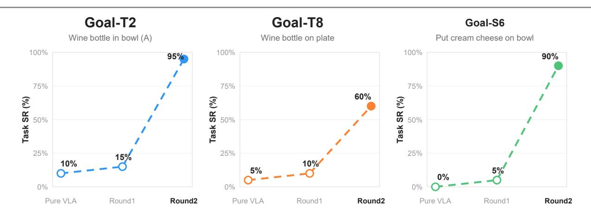

Figure 4 | **LIBERO-Pro에서의 물리적 지능 "Aha" 순간**. RoboCasa와 유사하게 v0은 Pure-VLA 기준선이며 v1은 증상적 수리(예: staging 또는 local gates)를 나타내어 성능이 정체된다. v2에서의 'Aha' 순간은 에이전트가 결정적인 물리 병목(예: 그립 유지 또는 의미적 접근 (semantic approach))을 식별하고 해결할 때 발생하며, 실행 신뢰성이 급격히 증가한다.

**Goal-T2**(그릇에 병을 놓는 작업)에서는 v1 수정이 접근 기하학을 개선하기 위해 pre-grasp staging을 도입한다. 그러나 성능은 정체된다(10% → 15%) 왜냐하면 운송 중 물체 손실을 해결하지 못하기 때문이다. 'Aha' 순간은 v2에서 에이전트가 *그립 유지*를 결정적 병목으로 인식할 때 발생한다. 운송 전 안정성을 검증하는 retained-object critic을 구현하면 성공률이 불연속적으로 95%로 상승한다.

**Goal-T8**(비슷한 정체 현상)에서는 v1 수정이 성공률을 미미하게 향상시킨다(5% → 10%) 왜냐하면 리프팅 중 약한 그립이 해결되지 않기 때문이다. v2의 'Aha' 순간은 전체 contact–grasp–retention sequence(연락–그립–보유 시퀀스)를 모니터링하여 운송을 시작하기 전에 안정적인 보유를 보장하는 복구를 구현하는 것과 관련된다. 이로 인해 성공률이 급격히 60%로 상승하며, 시스템이 최종적으로 획득에서 운송까지의 물리적 전환을 마스터한다.

**Goal-S6**(크림 치즈를 놓는 작업)에서는 초기 v1 수정이 조기 낙하를 방지하기 위해 release gate에 초점을 맞춘다. 이는 후기 단계 증상만을 수리하기 때문에 성공률은 5%로 정체된다. v2의 'Aha' 순간은 초점이 *pre-contact phase (pre-contact phase)*로 이동한다: 에이전트는 접근 중 의미적 진행 부족이 주요 병목임을 인식한다. 정밀 조정된 semantic pick-and-place recovery(의미적 픽 앤 플레이스 복구)를 구현함으로써 시스템은 접근, 그립, 운송 실패를 동시에 해결하며 성공률이 급격히 90%로 상승한다.

두 벤치마크 전반에 걸쳐 이러한 'Aha' 순간은 물리적 지능의 확장 가능한 단위가 신뢰할 수 있는 VLA 실행을 위해 복원해야 할 상태 변수(예: 그립 안정성, 접근 기하학)의 식별임을 확인시켜 준다.

#### 4.2.2. RoboCasa에서의 'Aha' 순간 (4.2.2. "Aha" Moments on RoboCasa)

Figure [5](#page-21-1)은 세 가지 대표적인 RoboCasa 작업에서 이 현상을 보여 준다. Loop-2 Stage-2 내에서 세 개의 선택된 체크포인트에서 성공률을 보고한다. L2-v0은 Pure-VLA 기준선이며, L2-v1은 에이전트가 여전히 실패를 분석하고 critic 및 recovery 구현을 반복적으로 수정하는 중간 상태를 나타낸다. 이 단계에서 대부분의 수정은 미미한 향상만을 가져오거나 과적합된다.

<span id="page-21-1"></span>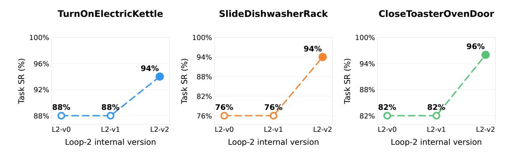

Figure 5 | **RoboCasa에서의 물리적 지능 'Aha' 순간**. L2-v0은 원래 Pure-VLA 기준선이며, L2-v1은 중간 내부 버전이다. 평평한 L2-v0–L2-v1 구간은 초기 후보 수정이 개별 실패에 과적합되는 시기를 요약한다. 에이전트가 핵심 물리적 병목(예: EEF 정렬 또는 중심 접촉)을 식별하면 L2-v2는 성공률이 급격히 상승한다.

관찰된 실패로 인해 성공률이 기준에 근접하게 남는다.

L2-v2에서 'Aha' 순간이 발생하며, 내부 버전이 실제 물리적 병목을 최종적으로 분리한다. 성공률이 급격히 상승한다: TurnOnElectricKettle에서 88%에서 94%로, SlideDishwasherRack에서 76%에서 94%로, CloseToasterOvenDoor에서 82%에서 96%로. TurnOnElectricKettle의 경우, 'Aha'는 단순한 EEF 재정렬이 VLA가 기대하는 기하학을 복원한다는 것을 인식하는 것이었다. SlideDishwasherRack의 핵심은 접촉 손실 후 중심 접촉을 재설정하는 것이었다. 이러한 불연속적 이득은 고정된 VLA에 필요한 물리적 상태를 복원하는 하네스의 향상된 능력을 반영한다.

### <span id="page-21-0"></span>**4.3. 물리적 지능 확장 및 제로샷 역량 (Physical Intelligence Scaling and Zero-shot Capability)**

우리는 물리적 지능의 확장을 두 가지 상호 보완적인 축을 따라 조사한다: (1) **작업 내 확장(Intra-task scaling)**, 이는 반사 기반 진화를 통해 작업이 Critic–Recovery 메커니즘을 축적함에 따라 성능이 어떻게 향상되는지를 측정한다; (2) **작업 간 제로샷 전이(Cross-task zero-shot transfer)**, 이는 소스 작업에서 발견된 메커니즘이 유사한 물리적 실패 모드를 공유하는 비진화 대상 작업에 적용될 수 있는지를 검토한다. 모든 실험에서 기본 VLA 정책은 고정된다.

#### *4.3.1. LIBERO-Pro에서의 확장 및 제로샷 역량 (Scaling and Zero-shot Capability on LIBERO-Pro)*

**누적 진화를 통한 확장**. Figure [6](#page-22-0)은 LIBERO-Pro Goal-T와 Goal-S에서의 성능 확장을 보고한다. 하네스가 Critic–Recovery 메커니즘을 축적함에 따라 평균 성공률이 Goal-T에서 31.0%에서 92.5%로, Goal-S에서 38.0%에서 89.0%로 증가한다. 이 개선은 모델 용량을 늘리거나 가중치를 미세 조정하지 않고 달성된다. 대신, 연속적인 반사 라운드가 반복되는 *물리적 병목*을 식별하고 수리한다. 예를 들어, 잘못된 접근 기하학, 불안정한 그립 유지, 불완전한 작업 관계 등이 있다. 이러한 결과는 물리적 실행 신뢰성이 컴팩트 런타임 메커니즘의 누적 획득을 통해 확장될 수 있음을 시사한다.

<span id="page-22-0"></span>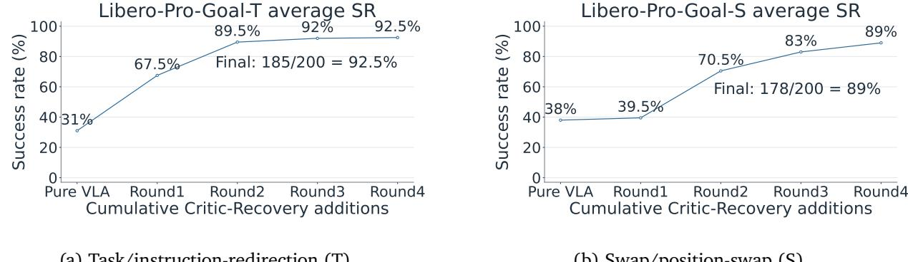

(a) 작업/지시 재지정 (T).

(b) 교환/위치 교환 (S).

<span id="page-22-1"></span>Figure 6 | LIBERO-Pro Goal에서의 누적 물리적 지능 확장. Goal-T 및 Goal-S 변동 하에서 열 개 작업의 평균 성능. 각 점은 선택된 누적 하네스 버전을 나타낸다. 기본 VLA는 진화 전반에 걸쳐 고정된다.

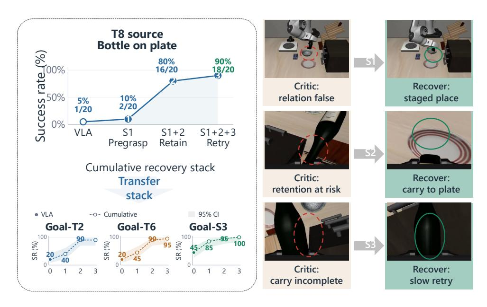

Figure 7 | Goal-T8 소스 작업에서의 작업 간 확장. Goal-T8에서 발견된 세 개의 누적 Critic–Recovery 기능이 Goal-T2, Goal-T6, 그리고 Goal-S3에 전이된다. 곡선은 각 누적 스택의 완전 고정 시드 평가를 보고한다. 음영 영역은 Wilson 95% 신뢰 구간을 나타낸다. 오른쪽 프레임은 추가 전이 측정 대신 해당 실패 및 복구 메커니즘을 보여준다.

**Goal-T에서의 제로샷 능력**. 우리는 진화 과정에서 발견된 메커니즘이 재사용 가능한 물리 원리를 인코딩하는지 평가한다. 그림 7은 소스 작업으로 Goal-T8(와인 병 배치)를 사용한다. 세 가지 누적 기능이 발견되었다: (1) 사전 그립 단계(pre‑grasp staging), (2) 그립 보존 Critic, (3) 실패‑가드 재시도. 이 메커니즘을 Goal‑T2, Goal‑T6, Goal‑S3에 제로샷으로 적용하면 상당한 성능 향상을 얻는다(예: Goal‑S3에서 $9/20 \rightarrow 20/20$). 전이는 메커니즘이 작업 독립적인 물리 변수—예를 들어 EEF 정렬 및 접촉 안정성—를 기반으로 작동하기 때문에 성공한다, 소스 작업 경로를 기억하지 않는다. <span id="page-23-0"></span>

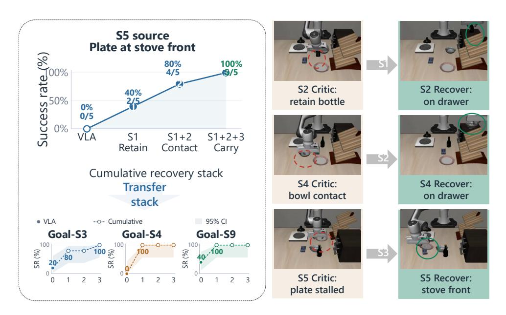

그림 8 | **Goal‑S5 소스 작업에서의 교차 작업 스케일링.** Goal‑S5에서 발견된 누적 Critic–Recovery 기능이 Goal‑S3, Goal‑S4, Goal‑S9에 전이된다. 각 작업 내에서 네 개의 팔 모두 동일한 고정 시드, 정책 RNG, 체크포인트, 실행 예산을 사용한다. 그림자 영역은 Wilson 95% 신뢰 구간을 나타낸다.

**Goal‑S에서의 제로샷 능력.** 그림 [8](#page-23-0)은 Goal‑S5를 소스 작업으로 사용한 보완 연구를 제공한다. 진화된 메커니즘에는 EEF–물체 근접성에 기반한 접촉 자격을 갖춘 인수인계와 견고한 운송을 위한 정지 명령 캐리 게이트가 포함된다. 고정된 정책을 변경하지 않고 동일한 누적 스택을 Goal‑S3, Goal‑S4, Goal‑S9에 *제로샷*으로 평가했다. 결과는 단일 작업에서 학습된 메커니즘이 여러 미진화 작업에서 공유 그립, 접촉, 운송 실패를 성공적으로 복구할 수 있음을 보여주며, 스케일러블 단위가 물리적 실패 상태에서 복구 행동으로의 재사용 가능한 매핑임을 입증한다.

#### 4.3.2. Scaling and Zero‑shot Capability on Robo‑Casa (Robo‑Casa에서의 스케일링 및 제로샷 능력)

**Cumulative evolution을 통한 스케일링.** 18개의 RoboCasa 작업에서의 총체적 스케일링 추세가 그림 [9.](#page-23-1)에 표시된다. 전역 반영 및 수리 4라운드를 거쳐 매크로 평균 성공률이 증가한다.

<span id="page-23-1"></span>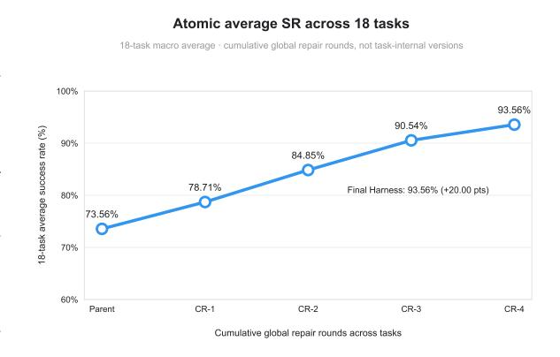

그림 9 | **18개의 RoboCasa 작업에서의 누적 반영 스케일링.** 매크로 평균 성공률이 고정된 부모 하네스에서 73.56%에서 78.71%, 84.85%, 90.54%, 93.56%로 전역 수리 4라운드 후 증가한다. 각 체크포인트는 이전에 검증된 Critic, Recovery, Tool 기능을 유지한다.

73.56%에서 93.56%로. VLA가 고정되어 있으므로 이 20.00 퍼센트 포인트 증가는 누적된

하네스 내에서 검증된 실행 지식의 누적이다. 여기서 스케일링 변수는 누적 반영 경험이며, 이는 더 깊은 물리적 병목 현상을 해결함으로써 고정된 정책의 능력을 지속적으로 향상시킨다.

**Pick‑and‑Place 능력의 제로샷 전이.** 우리는 PnP‑Stove(그림 [10)](#page-24-0)에서 발견된 메커니즘의 제로샷 전이 가능성을 조사한다. 소스 작업에서 세 번의 누적 라운드가 진행되어: (1) *pre‑grasp alignment*, (2) *re‑grasp after grasp loss*, (3) *stable placement*을 생성했다. 추가 훈련이나 진화 루프 없이 이 누적 스택을 PnP‑Sink, PnP‑Cabinet, PnP‑Toaster에 적용한다. 이 전이 작업에서의 매크로 평균 성공률이 64%에서 84%로 증가한다. 이 20 퍼센트 포인트 제로샷 증가는 에이전트가 특정 물체 정체성이나 가구 기하학을 초월하는 일반적인 pick‑and‑place 원칙을 학습함을 보여준다.

<span id="page-24-0"></span>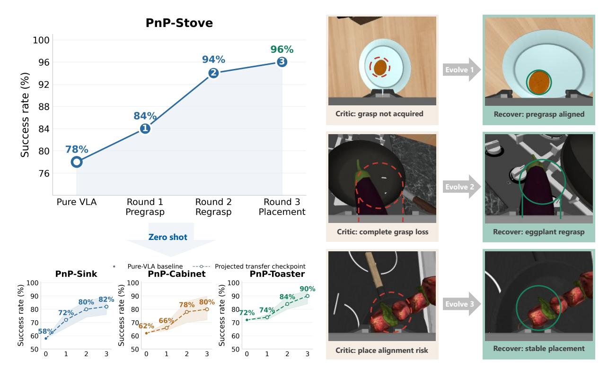

그림 10 | **PnP 작업에서의 반영 기반 스케일링 및 전이.** PnP‑Stove에서 연속 라운드가 물체 상대 pregrasp alignment, 그립 손실 후 제한된 regrasp, 안정적 배치를 추가한다. 하단 패널은 추가 훈련이나 진화 루프 없이 누적 체크포인트를 PnP‑Sink, PnP‑Cabinet, PnP‑Toaster에 적용한다. 오른쪽 패널은 Critic이 식별한 실패 서명과 해당 복구를 보여준다.

**관절 상호작용 기능의 제로샷 전이**. 두 번째 연구는 TurnOffStove에 초점을 맞추며, 여기서 에이전트는 (1) *target localization*, (2) *collision-aware approach*, (3) *stable-contact* 기술을 발전시킨다 (Figure [11)](#page-25-1). 이 기술들은 많은 관절 상호작용 작업에서 공유되는 물리적 불변성을 설명한다. 우리는 이 소스-작업 메커니즘을 TurnOnSinkFaucet, OpenCabinet, 그리고

<span id="page-25-1"></span>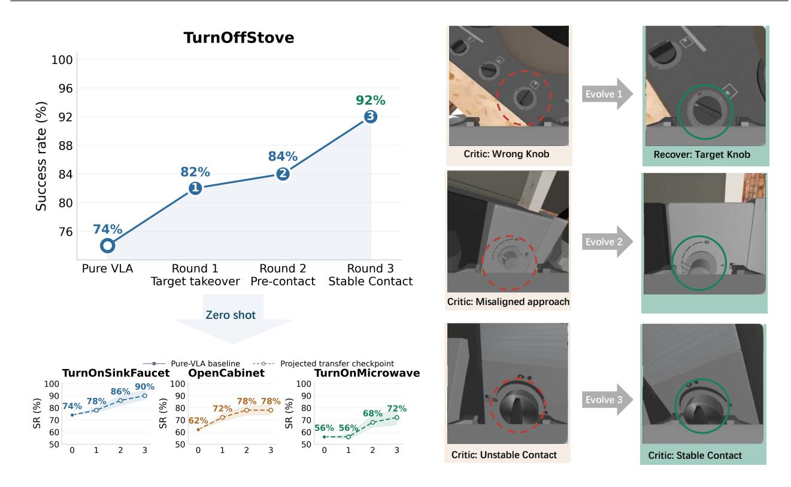

Figure 11 | **반사 기반 확장 및 전이: 관절 상호작용 작업**. TurnOffStove에서 연속 라운드마다 target localization, collision-aware pre-contact approach, 그리고 stable EEF–target contact를 추가한다. 하단 패널은 누적 체크포인트를 TurnOnSinkFaucet, OpenCabinet, TurnOnMicrowave에 추가 훈련이나 진화 루프 없이 적용한다. 오른쪽 패널은 진단된 target, approach, contact 실패와 복구된 상태를 함께 보여준다.

TurnOnMicrowave. 전이-작업 매크로 평균이 64%에서 80%로 증가하며, 타깃-작업 적응 없이 16 퍼센티지포인트 향상을 보인다. 이 결과는 우리 프레임워크에서 확장 가능한 단위가 작업별 궤적이 아니라 관찰 가능한 물리적 실패 상태에서 강건한 복구 행동으로의 재사용 가능한 매핑임을 확인한다.

### <span id="page-25-0"></span>**4.4. 시뮬레이션 벤치마크 결과 (Results on Simulation benchmark)**

**RoboCasa** Table [2](#page-26-1)은 모든 18개의 RoboCasa Atomic-Seen 작업에 대한 성공률을 보고한다. 본문에서는 간결한 작업 식별자를 사용하며, 공식 RoboCasa 이름은 Appendix [A.](#page-32-1)에 나열되어 있다. 고정된 GR00T 사후 훈련 VLA와 비교할 때, Zetta는 매크로 평균 성공률을 73.56%에서 93.56%로 향상시켜 절대 20.00 퍼센티지 포인트를 얻는다. 이 향상은 모든 작업에서 일관되며, 특히 T4, T5, T15와 같은 접촉이 풍부하거나 장기 수평 조작 작업에서 크게 나타난다.

**Libero-Pro** Table [3](#page-26-2)은 Goal과 LIBERO-10 스위트에서 40개의 작업-설정 쌍에 대한 결과를 보고한다. 고정된 0.<sup>5</sup> 기준과 비교할 때, Zetta는 전체 매크로 평균을 32.00%에서 71.13%로 향상시켜 절대 39.13 퍼센티지 포인트를 얻는다. 이 향상은 Goal (T)와 Goal (S)에서 가장 크며, 각각 평균이 31.0%에서 92.5%로, 38.0%에서 89.0%로 증가한다. LIBERO-10에서는

<span id="page-26-1"></span>Table 2 | **18개의 RoboCasa Atomic-Seen 작업에 대한 성공률 (%)**. 작업 식별자는 Appendix [A.](#page-32-1)을 따른다. 각 작업에 대한 최상의 결과는 굵게 표시된다. "Avg."는 모든 18개 작업에 대한 매크로 평균이다.

| 방법 | T1 | T2 | T3 | T4 | T5 | T6 | T7 | T8 | T9 | 평균 |
|------------------|-----|-----|-----|-----|-----|-----|-----|-----|-----|-------|
| Pure VLA (GR00T) | 78 | 74 | 78 | 58 | 48 | 62 | 72 | 74 | 70 | 73.56 |
| Zetta | 96 | 92 | 94 | 96 | 86 | 80 | 96 | 96 | 86 | 93.56 |
| 방법 | T10 | T11 | T12 | T13 | T14 | T15 | T16 | T17 | T18 | 평균 |
| Pure VLA (GR00T) | 62 | 92 | 76 | 88 | 96 | 50 | 90 | 82 | 74 | 73.56 |
| Zetta | 94 | 98 | 94 | 94 | 100 | 100 | 94 | 96 | 92 | 93.56 |

Zetta는 T 및 S 설정을 50.0%에서 63.0%로, 9.0%에서 40.0%로 개선한다. 전반적으로 Zetta는 32개의 과제-설정 쌍을 개선하고 나머지 8개에서는 기준선과 동일한 성능을 보인다.

<span id="page-26-2"></span>Table 3 | **성공률 (%) on LIBERO-Pro.**  
각 과제별 최우수 결과는 굵게 표시된다. `"Average"`는 10개 과제에 대한 매크로 평균이다.

| 설정 | 방법 | 작업 0 | 작업 1 | 작업 2 | 작업 3 | 작업 4 | 작업 5 | 작업 6 | 작업 7 | 작업 8 | 작업 9 | 평균 |
|---------------|--------|--------|--------|--------|--------|--------|--------|--------|--------|--------|--------|---------|
| 목표 (T) | 𝜋0.5 | 0.0 | 95.0 | 10.0 | 0.0 | 100.0 | 0.0 | 20.0 | 80.0 | 5.0 | 0.0 | 31.0 |
|  | Zetta | 80.0 | 100.0 | 95.0 | 80.0 | 100.0 | 100.0 | 95.0 | 95.0 | 80.0 | 100.0 | 92.5 |
| 목표 (S) | 𝜋0.5 | 0.0 | 60.0 | 0.0 | 45.0 | 0.0 | 0.0 | 0.0 | 100.0 | 100.0 | 75.0 | 38.0 |
|  | Zetta | 90.0 | 65.0 | 80.0 | 85.0 | 95.0 | 95.0 | 100.0 | 100.0 | 100.0 | 80.0 | 89.0 |
| LIBERO-10 (T) | 𝜋0.5 | 5.0 | 95.0 | 95.0 | 0.0 | 0.0 | 80.0 | 85.0 | 75.0 | 65.0 | 0.0 | 50.0 |
|  | Zetta | 35.0 | 95.0 | 100.0 | 0.0 | 25.0 | 100.0 | 95.0 | 80.0 | 100.0 | 0.0 | 63.0 |
| LIBERO-10 (S) | 𝜋0.5 | 0.0 | 35.0 | 0.0 | 0.0 | 5.0 | 50.0 | 0.0 | 0.0 | 0.0 | 0.0 | 9.0 |
|  | Zetta | 90.0 | 50.0 | 95.0 | 75.0 | 15.0 | 65.0 | 5.0 | 0.0 | 0.0 | 5.0 | 40.0 |

**최종 최고 정확도와 다른 SOTA 비교** On LIBERO-Pro에서 최종 Zetta 구성은 Goal (T)와 Goal (S)에서 각각 92.5%와 89.0%의 평균 성공률을 달성하고, 해당 LIBERO-10 설정에서는 63.0%와 40.0%를 기록한다. 강력한 동결된 0.<sup>5</sup> VLA와 비교할 때, 이는 전체 평균을 32.00%에서 71.13%로 끌어올린다. 특히, 이러한 성과는 추가 VLA 훈련 없이 달성된다: Zetta는 실행 실패를 감지하고 테스트 시점에 목표 지향적 복구를 적용함으로써 모든 작업-설정 쌍에서 기준선을 개선하거나 일치시킨다.

### <span id="page-26-0"></span>4.5. 사례 연구 (Case Studies)

**Robocasa에서 반복되는 비평가–복구 개입** Figure [12](#page-27-0)은 하네스가 단일 에피소드 내에서 여러 개별 실패를 해결하는 대표적인 PnP 실행을 보여준다. 기본 VLA는 먼저 물체를 집고 운반을 시작한다. 물체가 그리퍼에서 미끄러질 때, 런타임 비평가는 그립 손실을 감지하고 정규 궤적을 중단한다. 해당 복구는 물체에 대한 통제된 재접근을 수행하고 새로운 그립을 설정한 뒤, 제어를 VLA로 다시 반환하여 운반을 이어간다.

두 번째 개입은 초기 재그랩 포즈가 실행 불가능할 때 발생한다. 같은 동작을 반복해서 실행하기보다, 비판자는 무효한 접근 기하학을 보고하고 복구는 ...

# <span id="page-27-0"></span>비평가가 그립 실패를 목표 지향적 복구로 전환 (Critics turn grasp failures into targeted recoveries)

지역 증거가 집중된 수리를 유발하고, 그 뒤에 제어가 정규 궤적으로 복귀한다.

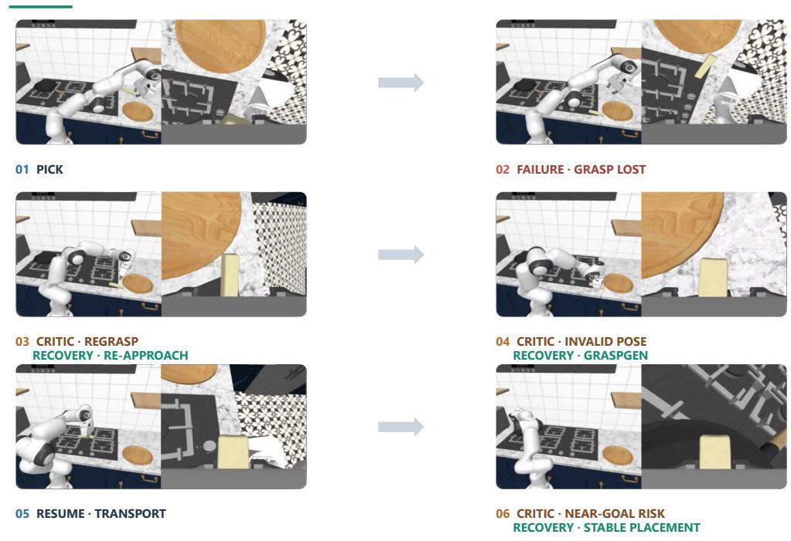

Figure 12 | **PnP 에피소드 동안 비평가–복구 개입의 시퀀스.** VLA는 먼저 물체를 집고 운반한다. 비평가는 그립 손실을 감지하고 재접근 복구를 트리거한다; 유효하지 않은 재그립 포즈는 GraspGen을 트리거하여 실현 가능한 그립 포즈를 합성한다; 목표 근처에서는 최종 비평가가 안정적인 CAP 배치를 호출한다. 각 지역 수리 후, 복구 상태가 검증된 뒤에만 제어가 정규 VLA로 복귀한다.

GraspGen은 실현 가능한 엔드 이펙터 포즈를 생성한다. 생성된 포즈는 물체를 재그립하기 위해 실행되어 안정적인 운반에 필요한 접촉 구성을 복원한다. 마지막으로 물체가 목적지에 접근할 때, 비평가는 목표 근접 배치 위험을 감지하고 CAP 기반의 안정적인 배치 복구에 제어를 넘긴다. 이 복구는 하네스가 재진입 조건을 검증하고 에피소드를 종료하기 전에 최종 배치를 완료한다.

이 예시는 하네스가 단일 에피소드 수준 재시도에 국한되지 않음을 보여준다: 비평가는 실행을 지속적으로 모니터링하고, 서로 다른 물리적 실패 모드에 대해 다양한 복구를 트리거하며, 각 지역 수리 후 VLA에 제어를 반환한다. 결과 행동은 재접근, GraspGen 기반 재그립, CAP 기반 배치를 포함한 목표 지향적 개입 시퀀스로, 정규 정책을 보존하면서 장기 실행을 접촉 및 그립 실패에 견고하게 만든다.

**Libero-Pro에서 승격 라운드에 걸친 실패 프론티어 이동** Figure [13](#page-28-0)은 로봇이 스토브 앞쪽으로 플레이트를 밀어야 하는 LIBERO-Pro Goal-S5에서 해당 반복적 행동을 제시한다. RoboCasa 예시와 달리, 패널은 단일 에피소드 내에서 여러 독립적인 비평가 활성화를 묘사하지 않는다. 대신, 이들은 연속 승격 라운드에서 대표적인 에피소드를 요약한다

라운드와 함께 각 승격된 비평가–복구 기술이 가장 이른 미해결 실패를 이후 실행 단계로 이동시키는 방식을 보여준다.

라운드 0에서는 부모 VLA가 제한된 복구로의 시기적절한 인계 없이 계속 실행되어 결국 에피소드 예산을 소진한다. 라운드 1에서는 보존-가드 인계를 도입한다. 이는 개입 부재를 해결하지만, 에피소드는 이제 안정적인 그립을 검증할 수 없으므로 중단된다. 라운드 2에서는 닫는 접촉 비평가와 접촉-가드 그립 복구를 추가한다. 플레이트가 성공적으로 획득되지만, 운송 중 새로운 실패가 드러난다: 보존된 그립이 플레이트를 운반하는 동안 잃어버린다. 따라서 실패 경계는 복구 호출에서 그립 검증을 거쳐 운반 보존으로 이동했다.

<span id="page-28-0"></span>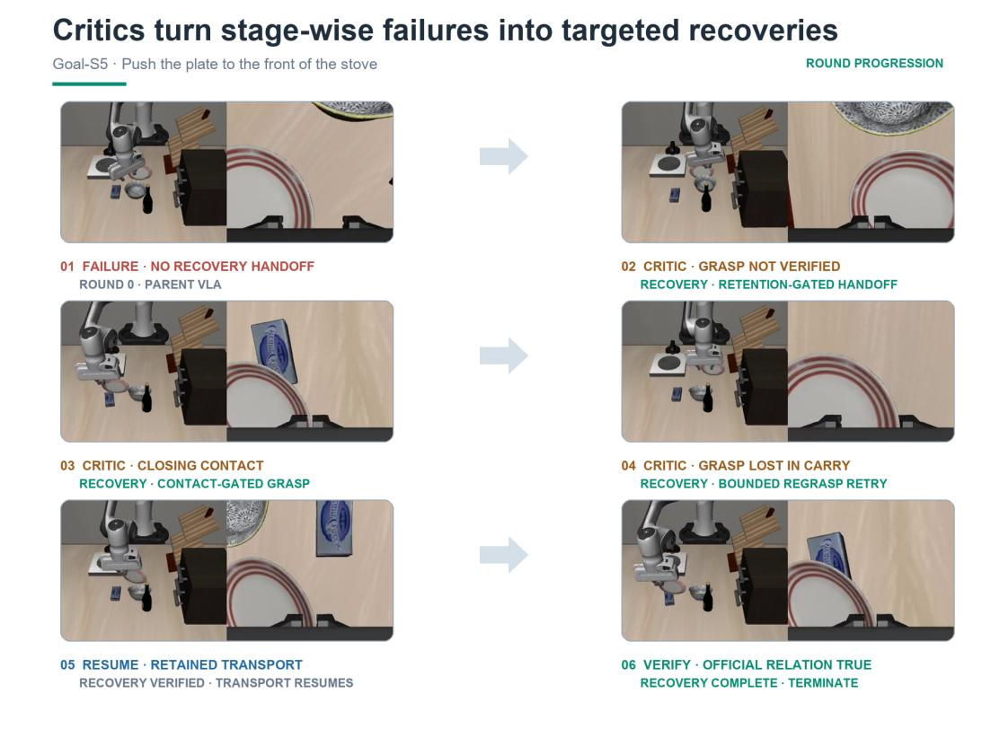

Figure 13 | **Critic–recovery promotion progressively moves the failure frontier in LIBERO-Pro Goal-S5.** 부모 VLA는 적시 복구 전환 없이 실행 예산을 소진한다. 연속적인 프로모션 라운드가 보존 게이트 전환, 접촉 게이트 그립 복구, 그리고 제한된 재그립 재시도를 도입한다. 각 추가는 이전에 노출된 실패를 해결하고 이후 단계의 병목 현상을 드러내며, 보존된 운송이 재개되고 공식 스토브-프론트 관계가 만족될 때까지 진행된다.

Round 3은 제한된 재그립 재시도로 이 후기 단계의 실패를 해결한다. 비평가가 운반 중 플레이트 손실을 감지하면, 복구는 전체 에피소드를 재시작하거나 명목 동작을 무한히 반복하지 않는다. 대신 제한된 재그립 시도를 수행하고 복원된 보존 상태를 검증한 뒤 스토브-프론트 영역으로 운송을 재개한다. 에피소드는 공식 LIBERO 관계가 참이 되는 순간에만 종료된다. 특히, Round 2와 3은 동일한 환경 시드와 정책 RNG를 사용하여 운반 재시도 메커니즘의 기여를 직접 분리한다. 동일 시드 인접 라운드 비교는 보존 전환과 접촉 게이트 그립 추가를 동일하게 검증한다.

#### <span id="page-29-1"></span>부하 하에서 지연 폭발: Z-Infra 없이 가장 급격히 감소, Z-Infra와 함께 가장 평탄 (Latency Blowup Under Load: Without Z-Infra Degrades Steepest, With Z-Infra Flattest 5139 Mean episode wall-clock (s) At concurrency 16: 2.6× slower than w/ Z-Infra 12.0× slower (RPent) than w/ Z-Infra 1129 955 102 Z-Harness w/ Z-Infra Z-Harness w/o Z-Infra 345 --------------------------------------8 16 32 64 Concurrency)

Figure 14 | 에피소드당 지연과 동시성의 관계. Z-Infra는 제어된 성장을 유지하는 반면, 기준선은 폭발적인 저하 또는 본질적으로 높은 오버헤드를 보인다. 두 기준선 모두 동시성 16을 초과하면 OOM을 겪는다.

두 사례 연구는 상호 보완적인 구성성 형태를 드러낸다. RoboCasa는 단일 장기 수평 에피소드 내에서 여러 특화된 복구를 온라인으로 조합하고, LIBERO-Pro는 외부 루프 반복을 통해 프로모션된 비평가-복구 기술을 조합한다. 두 경우 모두 가장 이른 미해결 실패를 국지화하고, 제한된 수리 적용하며, 수리된 상태를 검증한 뒤 실행을 진행함으로써 개선이 이루어진다.

### <span id="page-29-0"></span>4.6. Z-Infra 성능 평가 (Z-Infra Performance Evaluation)

Z-Infra는 높은 동시성에서도 제어된 지연 성장을 유지하며, 중간 동시성에서 **Ours without Z-Infra**보다 7.7배, **RPent**보다 12.8배 높은 처리량을 달성하고, RPent에 비해 에피소드당 지연을 11.9배 감소시킨다. 우리는 LIBERO Goal [6]에서 다양한 동시성 수준(1, 8, 16, 32, 64)에서 처리량 확장 동작을 평가한다. 모든 실험은 동일한 모델 체크포인트와 액션 예산을 사용하여 8×A100 GPU에서 수행된다.

부하 하에서의 지연. Z-Infra는 높은 동시성에서도 지연 증가를 통제하며, 반면 기준선은 폭발적인 저하를 보이거나 본질적으로 높은 오버헤드를 갖는다. Figure 14에 나타난 바와 같이, Z-Infra의 에피소드당 지연은 동시성 8에서 39초에서 동시성 32에서 57초(46% 증가)로, 동시성 64에서 95초로 증가한다. 반대로, Z-Infra 없이 우리의 방법은 동시성 8에서 34초에서 동시성 16에서 112초(3.3배 증가)로 폭발적인 지연 저하를 경험한다. RPent는 에이전트-인-더-루프 설계가 모든 의사결정 지점에서 LLM API 호출을 요구하기 때문에 본질적으로 높은 지연(392초→513초)을 보인다. 우리의 접근법은 오프라인 Reflection & Evolve 단계에서만 에이전트를 호출함으로써 에이전트 오버헤드를 줄이고, 온라인 롤아웃은 경량 런타임 크리틱 하에서 순수 VLA 정책을 실행한다. Z-Infra는 동시성이 증가해도 지연 증가가 비선형적으로 유지되도록 보장하며, 연쇄 지연 없이 효율적인 자원 활용을 유지한다.

<span id="page-30-2"></span>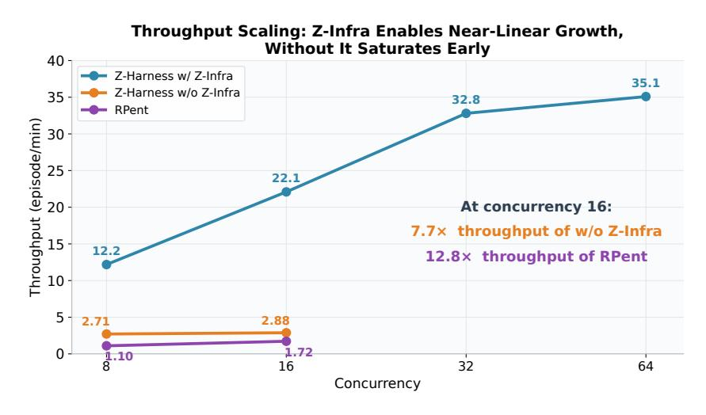

Figure 15 | 롤아웃 처리량과 동시성. Z-Infra는 동시성 64에서 35.1 ep/min까지 확장하며, 동시성 16에서 기준선보다 $7.7 \times$ 및 $12.8 \times$ 높은 처리량을 달성한다. 기준선은 OOM으로 인해 동시성 16을 초과하면 실패한다.

처리량 확장. Z-Infra는 하드웨어 포화까지 효과적인 처리량 확장을 달성하지만, 기준선은 자원 경쟁으로 인해 낮은 동시성 수준을 넘어 확장에 실패한다. Figure 15에 나타난 바와 같이, Z-Infra의 처리량은 동시성 8에서 12.18 ep/min에서 동시성 32에서 32.8 ep/min(2.7배 가속)로 증가하며, 동시성 16에서 22.09 ep/min에 도달한다—Z-Infra 없이 우리의 방법(2.88 ep/min)보다 7.7배, RPent(1.72 ep/min)보다 12.8배 높은 수준이다. 동시성 32를 초과하면 처리량은 동시성 64에서 35.1 ep/min에서 정체되며, 이는 8-GPU 구성이 포화되었음을 나타낸다. 성능 격차는 Z-Infra의 지속적인 워커 설계와 동적 배칭 및 비동기 스케줄링에 기인한다. 이는 에피소드당 초기화 오버헤드를 제거하고, 변동 요청 패턴에서도 높은 GPU 활용도를 유지한다.

## <span id="page-30-0"></span>5. Related Work (관련 연구)

우리는 폐쇄형 구현 학습의 동기에 따라 관련 연구를 정리한다. 첫째, 물리적 지능은 기초 모델과 에이전트 활용을 통해 확장되고 있지만 배포 격차는 여전히 존재한다. 둘째, 자가 진화 에이전트는 디지털 영역에서 강력한 진전을 보였으나, 구현된 자가 진화는 에이전트가 연속적인 물리 세계를 해석하고 행동해야 하기 때문에 더 어렵다. 셋째, 기존 롤아웃 시스템은 대부분 표준 RL 워크로드를 위해 설계되었으나, 구현된 자가 진화는 이질적인 모델, 도구, 시뮬레이터, 로봇, 메모리, 그리고 비평가 실행을 필요로 한다.

### <span id="page-30-1"></span>5.1. 물리적 지능 확장을 위한 구현 기반 기초 모델 격차 (Embodied Foundation Model Gaps for Physical Intelligence Scaling)

최근 물리적 인텔리전스 연구는 두 가지 상호 보완적인 경로를 따라 진전되고 있다. 첫 번째 경로는 일반 로봇 제어를 위한 엔드-투-엔드 정책 모델을 훈련시키며, 여기에는 RT-1/RT-2, OpenVLA, $\pi_0$, $\pi_{0.5}$, GR00T, CogACT, UniVLA, FAST와 같은 VLA 모델과 DreamZero, Cosmos-Policy, FAST-WAM과 같은 세계-행동 모델이 포함된다 [3, 4, 7–16]. 이 라인은 유망하지만 실제 배포는 여전히 **지속적인 격차**를 드러낸다: 데이터는 비싸고, 물리적 분포는 변하며, 작은 실행 오류가 장기 경로 작업에서 연쇄적으로 발생할 수 있어 엔드-투-엔드 모델이 시연을 넘어 실제 세계

생산성.

우리는 LLM, 코드, 도구, 메모리, 계획, 검증, 복구를 기반으로 기초 정책 주위에서 활용하여 이 격차를 메우는 두 번째 경로를 탐구한다. PaLM-E와 Code as Policies와 같은 초기 시스템은 언어 모델이 구현형 추론 및 계획에 잠재력을 보였으며, RoboCat은 에이전트가 다양한 과제와 구현형에서 자체 시도에서 데이터를 수집함으로써 조작 역량을 확장할 수 있음을 보여 주었다[&#91;64,](#page-41-2) [65,](#page-41-3) [109&#93;](#page-45-0). Claude Plays Robotics, CaP-X, HarnessVLA, Guava 등 최근 시스템과 시연은 코딩 에이전트와 실행 스캐폴드가 완전히 해결된 엔드-투-엔드 정책을 기다리지 않고도 동결되거나 사전 훈련된 로봇 정책을 보다 신뢰할 수 있게 만들 수 있음을 시사한다[&#91;5,](#page-37-1) [35,](#page-39-1) [38,](#page-39-2) [110&#93;](#page-45-1). 따라서 최첨단은 단일 엔드-투-엔드 정책에만 의존하는 것에서 계획, 메모리, 도구, 검증, 복구와 함께 정책을 조정하는 스캐폴드 시스템으로 이동하고 있다.

그러나 많은 구현형 에이전트는 에피소드적이다: 시도 내에서 복구할 수는 있지만 실행 추적을 장기적인 개선으로 전환하는 경우는 드물다. 우리의 연구는 배포 피드백을 재사용 가능한 비평가, 복구, 미래 롤아웃으로 전환하는 폐쇄 루프 하네스를 연구함으로써 구현형 에이전트 경로를 따른다.

### <span id="page-31-0"></span>**5.2. Live Harness Gaps for Embodied Self-Evolution**

일반 에이전트 자기 진화는 주로 실행이 저렴하고, 인터페이스가 이산적이며, API가 명시적이고, 로그가 정확하며, 평가가 비교적 쉬운 디지털 도메인에서 연구되었다. Reflexion, Self-Refine, Voyager, OPRO는 언어 또는 게임 에이전트가 언어적 피드백, 반복적 개정, 실행 가능한 스킬 라이브러리, 프롬프트 및 프로그램 검색을 통해 개선될 수 있음을 보여 주었다[&#91;44,](#page-39-7) [69](#page-41-4)[–71&#93;](#page-42-10). 최근 조사들은 이 루프를 생성, 실행, 평가, 반성, 메모리 업데이트, 때로는 모델 또는 프롬프트 최적화로 요약한다[&#91;111](#page-45-2)[–113&#93;](#page-45-3).

구현형 에이전트는 연속적인 세계에서 운영되기 때문에 이 문제의 더 어려운 버전에 직면한다: 하네스는 로봇 상태와 세계 상태를 모두 평가하고, 언제 정책, 도구, 비평가 또는 복구 모듈을 호출할지 결정하며, 초기 오류가 물리적 실패로 이어지는 것을 방지해야 한다. 또한 현재 VLAs는 본국 디지털 도메인에서 최첨단 LLM보다 훨씬 약하고 덜 신뢰할 수 있으므로 구현형 에이전트는 강력한 실행을 지원하기 위해 더 많은 외부 도구, 검증자, 메모리 및 빈번한 비평가가 필요하다. ENPIRE, Visual Verification/VERITAS, Learning While Deploying, SOP와 같은 실제 정책 개선 시스템은 로봇 배포를 한 번의 훈련 파이프라인이 아니라 실행, 검증, 데이터 선택, 정책 업데이트의 폐쇄 루프로 구성할 수 있음을 보여 주었다[&#91;37,](#page-39-8) [66,](#page-41-5) [67,](#page-41-6) [114&#93;](#page-45-4). ASPIRE, ReSYNC, VASO, EmbodiSkill과 같은 스킬 중심 시스템은 실패와 반성에서 재사용 가능한 프로그램, 개념, 계약 또는 스킬을 발견하는 데 중점을 둔다[&#91;36,](#page-39-9) [46,](#page-40-3) [63,](#page-41-7) [115&#93;](#page-45-5). RoboTTT, R&B-EnCoRe, EEAgent, SEEA-R1과 같은 테스트 타임 및 추론 지향 시스템은 장기 컨텍스트, 풍부한 피드백, 반성 또는 강화 튜닝을 통해 적응이 일어날 수 있음을 추가로 보여 주었다[&#91;62,](#page-41-8) [68,](#page-41-9) [116–](#page-45-6)[118&#93;](#page-45-7).

우리는 기존 시스템이 일반적으로 코드, 프롬프트, 검증기, 메모리, 정책 데이터 등 스택의 한 층만 개선하지만, 고주파 런타임 비평가, 재현 가능한 실패 추적, 재사용 가능한 복구 기술, 고처리량 롤아웃 실행을 동시에 다루는 경우는 드물다는 점을 인식한다. 우리의 설계는 런타임 비평가와 복구 행동에 반영을 기반으로 하여, 롤아웃 인프라를 활용해 구현된 에이전트를 반복적으로 평가, 재생, 개선함으로써 이 결합된 격차를 해결한다.

### **5.3. Embodied Self-Evolution을 위한 Rollout Infrastructure Gap (Rollout Infrastructure Gaps for Embodied Self-Evolution)**

자체 진화하는 구현형 에이전트를 위해 특별히 설계된 인프라 작업은 아직 거의 없다. 대부분의 성숙한 롤아웃 시스템은 A3C 스타일 비동기 액터, IMPALA, SEED RL, RLlib/Ray, Acme, 그리고 최근 대규모 RL 시스템인 RLinf [119–124]과 같은 일반 RL 또는 분산 학습에서 유래한다. 이러한 시스템은 액터-러너 분리, 확장 가능한 경험 수집, 중앙집중식 추론, 유연한 실행 그래프와 같은 중요한 아이디어를 확립했다.

그러나 **구현형 롤아웃은 표준 롤아웃 런타임에서 중심이 되지 않는 작업 부하를 추가한다**: VLA 추론, 확산 또는 흐름 액션 헤드, 인지 인코더, 도구 호출, 메모리 검색, 시뮬레이터, 실제 로봇 작업자, 재설정, 안전 검사, 검증기/비평가 모델. 결과적으로 처리량은 환경 단계뿐 아니라 CPU, GPU, 로봇, 클라우드 자원 간의 이질적 모델 서비스와 조정에 의해 제한된다. 또 다른 병목은 확장성이다: 새로운 시뮬레이터, 도구, 모델 백엔드, 에이전트 변형을 추가하려면 안정적인 인터페이스 뒤에 새 컴포넌트를 등록하는 대신 오케스트레이션 코드를 변경해야 하는 경우가 많다. 이러한 한계는 단위 시간당 더 적은 실패가 발견, 진단, 재생, 재사용 가능한 개선으로 전환되기 때문에 자체 진화를 직접적으로 늦춘다. 우리의 롤아웃 인프라는 분리된 실행, 연속 배치, 자원 공유 환경, 세밀한 프로세서 제어를 통해 이 구현형 작업 부하 혼합을 설계했다.

## <span id="page-32-0"></span>**6. 결론 (Conclusion)**

우리는 Zetta를 제시했다. Zetta는 정적, 오픈 루프 에이전트 하니스와 물리적 실행이 요구하는 고주파 거버넌스 사이의 격차를 닫는 폐쇄 루프 구현형 하니스이다. 이는 기반 정책 모델을 고정한 채 코드 기반 런타임 비평가와 복구 기술을 온라인으로 진화시킴으로써 달성된다. 액션, 롤아웃 배치, 반복 시계열에서 운영되는 세 개의 조정된 루프를 통해 Zetta는 축적된 롤아웃 경험을 검증되고 일반화 가능한 실행 행동 개선으로 전환한다. 이 진화를 지속하기 위해 우리는 자체 진화하는 구현형 에이전트를 위해 설계된 최초의 롤아웃 인프라인 Z-Infra를 구축했다. 이는 에이전트 로직을 이질적 실행 자원에서 분리한다. LIBERO와 RoboCasa에서의 실험은 이 자체 진화가 고정된 정책의 성능 한계에 가까워지면서 작업 성공률을 확장하고 작업 간 전이 가능함을 보여주며, 하니스 자체 진화가 신뢰할 수 있는 구현형 인텔리전스로 가는 실현 가능한 경로임을 입증한다.

앞으로 우리는 Zetta와 Z-Infra를 실제 로봇에 확장할 계획이다: 시뮬레이션-실제 차이를 연결하여 실제 기계에 대해 빠르고 대규모 병렬 롤아웃 수집 및 자체 진화를 직접 가능하게 하고, 실제 로봇 환경을 시뮬레이션과 함께 Z-Infra 내에서 일등급 작업자로 통합한다.

# **감사 (Acknowledgment)**

우리는 엔지니어링 및 실제 로봇 시연에 기여한 Fucheng Jia, Mingju Wang, An Pan, Zexu Wang, Zijian Wang, Shuhao Wu, Wenhui Gu, Jiawei He, Yi Tao, Wei Sun에게 감사한다.

# <span id="page-32-1"></span>**A. RoboCasa 원자적 과제 매핑 (RoboCasa Atomic Task Mapping)**

Table [4](#page-33-1)은 Table [2](#page-26-1)에서 사용된 compact identifiers를 [RoboCasa 1.0.1](https://robocasa.ai/docs/build/html/tasks/atomic_tasks.html) [Atomic Tasks documentation.](https://robocasa.ai/docs/build/html/tasks/atomic_tasks.html)의 공식 task 이름으로 매핑한다. 이 18개의 task는 완전한 Atomic-Seen split을 구성한다.

<span id="page-33-1"></span>Table 4 | Compact identifiers에서 공식 RoboCasa task 이름으로의 매핑.

| ID 공식 작업 이름 | ID | 공식 작업 이름 |
|------------------------------|-----|----------------------|
| T1 NavigateKitchen | T10 | OpenCabinet |
| T2 TurnOnMicrowave | T11 | CloseFridge |
| T3 PickPlaceCounterToStove | T12 | SlideDishwasherRack |
| T4 PickPlaceSinkToCounter | T13 | TurnOnElectricKettle |
| T5 PickPlaceDrawerToCounter | T14 | OpenStandMixerHead |
| T6 PickPlaceCounterToCabinet | T15 | CloseBlenderLid |
| T7 PickPlaceToasterToCounter | T16 | OpenDrawer |
| T8 TurnOnSinkFaucet | T17 | CloseToasterOvenDoor |
| T9 CoffeeSetupMug | T18 | TurnOffStove |

# <span id="page-33-0"></span>**B.** LIBERO-Pro 작업 매핑 (LIBERO-Pro Task Mapping)

LIBERO-Pro는 원래의 LIBERO 벤치마크를 확장하여 분포 전이 하에서 일반화를 평가하기 위한 제어된 변형을 추가한다. 본문에서는 LIBERO-Goal과 LIBERO-10 스위트를 평가하며, LIBERO-10은 간결성을 위해 "Long"으로 표시된다. 각 스위트는 10개의 작업(Task 0–9)을 포함한다.

우리는 두 가지 LIBERO-Pro 교란 설정을 고려한다. 'T'는 지시를 다른 유효한 타깃 객체 또는 목표 조건으로 재지정하는 작업/지시 재지정 교란을 나타낸다. 'S'는 관련 객체의 초기 위치를 스왑하거나 재배치하면서 지시는 고정된다.

표 5는 본문에서 사용된 간결한 작업 식별자를 해당 LIBERO 작업 지시문으로 매핑한다. T 설정에서는 표가 기본 작업 인덱스를 식별하며, 평가되는 지시는 지시 재지정 때문에 달라질 수 있다.

<span id="page-34-1"></span>Table 5 | **본문에서 사용된 LIBERO-Pro 작업 식별자를 해당 LIBERO 작업으로 매핑**. 'Goal'은 LIBERO-Goal에 해당하고, 'Long'은 LIBERO-10에 해당한다. 같은 작업 인덱스가 T와 S 교란 설정 모두에 사용된다.

| ID | LIBERO-Goal | ID | LIBERO-10 (Long) |
|--------|------------------------------------------------|--------|--------------------------------------------------------------------------------------------|
| Task 0 | 캐비닛의 중간 서랍을 열다 | Task 0 | 알파벳 수프와 토마토 소스를 모두 바구니에 넣는다<br> |
| Task 1 | 그릇을 스토브 위에 놓는다 | Task 1 | 크림치즈 박스와 버터를 모두 바구니에 넣는다<br> |
| Task 2 | 와인 병을 캐비닛 위에 놓는다 | Task 2 | 스토브를 켜고 모카 포트를 그 위에 놓는다 |
| Task 3 | 상단 서랍을 열고 그릇을 안에 넣는다<br> | Task 3 | 검은 그릇을 캐비닛 하단 서랍에 넣고 닫는다<br> |
| Task 4 | 그릇을 캐비닛 위에 놓는다 | Task 4 | 흰색 머그를 왼쪽 접시에 놓고 노란색과 흰색 머그를 오른쪽 접시에 놓는다<br> |
| Task 5 | 접시를 스토브 앞쪽으로 밀어넣는다 | Task 5 | 책을 집어 들고 캐디의 뒷칸에 놓는다<br> |
| Task 6 | 크림치즈를 그릇에 넣는다 | Task 6 | 흰색 머그를 접시에 놓고 초콜릿 푸딩을 접시 오른쪽에 놓는다<br> |
| Task 7 | 스토브를 켠다 | Task 7 | 알파벳 수프와 크림치즈 박스를 모두 바구니에 넣는다<br> |
| Task 8 | 그릇을 접시에 놓는다 | Task 8 | 모카 포트를 두 개 모두 스토브에 놓는다 |
| Task 9 | 와인 병을 선반에 놓는다 | Task 9 | 노란색과 흰색 머그를 전자레인지에 넣고 닫는다<br> |

# <span id="page-34-0"></span>**C. 사례 연구: PnP-Stove를 위한 비평가-가이드 회복 (C. Case Study: Critic-Guided Recovery for PnP-Stove)**

우리는 PickPlaceCounterToStove (PnP-Stove)를 진화된 기술의 대표적인 예로 사용한다. VLA는 동결된 상태로 유지되며 명목상 작업 정책을 실행한다. 실행 중에 가벼운 비평가는 작업 진행 상황과 물리적 그립 상태를 모니터링한다. 여기에는 공식 그립 예측자, 양쪽 손가락 접촉, 물체–그리퍼 드리프트, 운반 진행, 배치, 그리고 방출 후 분리 등이 포함된다. 비평가는 구조화된 제안만을 생성하며, 행동을 실행하거나 성공을 선언하지 않는다. 오케스트레이터는 VLA를 계속할지 아니면 회복을 호출할지를 결정한다.

진화는 세 가지 재사용 가능한 기능을 추가한다. 첫째, 물체-상대 전그립이 그리퍼를 보다 신뢰할 수 있는 획득 자세로 이동시킨다. 둘째, 그립 실패가 발생하면 한계가 있는 재그립이 트리거된다: 로봇은 방출하고 재배치하며 이전에 실패한 그립과 다른 새로운 제안을 선택한다. 셋째, 배치 회복은 물체가 지지대를 감지할 때까지 낮추고, 방출한 뒤 그리퍼가 안전하게 분리될 때까지 후퇴한다. 알고리즘 [1](#page-35-1)은 완전한 비평가–회복 루프를 요약한다.

# **알고리즘 1: PnP-Stove를 위한 단순화된 비평가-가이드 기술 (Algorithm 1: Simplified critic-guided skill for PnP-Stove)**

입력: Frozen VLA ; runtime critic ; recovery library ; failed-grasp memory M
  출력: Official task success or a bounded failure record
1 while the episode is active do
2 execute one VLA or recovery action chunk and collect state window 
3  ← () // 제안만
4 if the official task predicate is satisfied then
 5 return success
6 if  reports normal progress then
 7 continue the frozen VLA
8 else if  reports failed or unstable grasp then
 9 freeze unsafe motion, release, and restage
10 obtain a fresh object-relative grasp not equivalent to M
11 execute pregrasp, acquisition, and a short stability check
12 if the retry fails, add it to M and repeat within budget
13 else if  reports stalled transport with a stable grasp then
14 preserve the grasp and switch from coarse base carry to fine arm alignment
15 else if  reports supported placement then
16 release the object and retreat until the gripper-far predicate holds
17 the Orchestrator approves every intervention and any return to nominal execution
18 return bounded failure record

이 기술은 비평가와 회복이 물체-상대 기하학과 일반 물리적 예측자에 의해 정의되기 때문에 전이된다. 이는 스토브 전용 이미지 템플릿이나 재생된 소스 궤적이 아니라서다. 따라서 관련 픽앤플레이스 작업은 살아있는 물체와 대상 수용기를 재바인딩함으로써 동일한 그립, 운반, 배치 회복 로직을 재사용할 수 있다.

# <span id="page-35-0"></span>**D. 사례 연구: Libero-Pro Goal-T2를 위한 비평가-가이드 회복 (D. Case Study: Critic-Guided Recovery for Libero-Pro Goal-T2)**

우리는 Goal-T2: PutWineBottleInBowl을 진화된 Libero-Pro 기술의 대표적인 예로 사용한다. VLA는 동결된 상태로 유지되며 명목상 작업 정책을 실행한다. 실행 중에 가벼운 비평가는 작업 진행 상황과 물리적 상호작용 상태를 모니터링한다. 여기에는 요청된 동작, 실현된 엔드에펙터 움직임, 그리퍼 개방, 손가락–물체 접촉, 물체–그리퍼 드리프트, 그립 유지, 대상-상대 운반, 그리고 공식 작업 예측자 등이 포함된다. 비평가는 구조화된 제안만을 생성하며, 행동을 실행하거나 성공을 선언하지 않는다. 오케스트레이터는 VLA를 계속할지 아니면 회복을 호출할지를 결정한다.

진화는 세 가지 재사용 가능한 기능을 추가한다. 첫째, 객체-상대 전그랩 회복은 그리퍼를 충돌이 안전한 자세로 이동시켜 획득을 재시도한다. 둘째, 보유-객체 비평가(retained-object critic)는 빈 그리퍼나 미끄러지는 그리퍼와의 동작과 성공적인 운반을 구분한다; 그립 손실은 제한된 방출, 재배치, 그리고 다른 제안에서의 재그립을 유발한다. 셋째, 배치 회복은 보유된 병을 실시간 그릇과 정렬하고, 포함이 확립될 때까지 낮추고, 방출한 뒤, 배치된 물체를 방해하지 않고 후퇴한다. 알고리즘 [2](#page-36-4)는 완전한 비평가–회복 루프를 요약한다.

# **Algorithm 2:** 단순화된 비평가-지향 스킬 (Simplified critic-guided skill for Libero-Pro Goal-T2)

입력: Frozen VLA ; runtime critic ; recovery library ; failed-grasp memory M
출력: 공식 작업 성공 또는 제한된 실패 기록
1 while the episode is active do
2 execute one VLA or recovery action chunk and collect state window 
3  ← () // 제안만
4 if the official task predicate is satisfied then
 5 return success
6 if  reports normal progress then
 7 continue the frozen VLA
8 else if  reports non-approach or failed acquisition then
 9 freeze unsafe motion, open the gripper, and restage
10 obtain a fresh object-relative pregrasp not equivalent to M
11 execute approach, acquisition, and a short lift check
12 if the retry fails, add it to M and repeat within budget
13 else if  reports grasp loss or unstable retention then
14 stop transport before the empty gripper reaches the target
15 release residual contact, return to pregrasp, and reacquire the bottle
16 else if  reports stable grasp near the bowl then
17 align the bottle with the live receptacle and lower it into containment
18 release and retreat until gripper–object separation is confirmed
19 the Orchestrator approves every intervention and any return to nominal execution
20 return bounded failure record

이 스킬은 비평가와 회복이 객체-상대 기하학, 구현된 로봇 동작, 그리고 일반적인 접촉 및 그립-보유 예측자에 의해 정의되기 때문에 전이된다. Goal-T2-특정 이미지 템플릿이나 재생된 소스 트래젝터리 대신에. 관련 Libero-Pro 픽앤플레이스 작업은 동일한 전그랩, 보유, 배치 회복 로직을 라이브 객체와 대상 수용기에 재바인딩하여 재사용할 수 있다.

# **References** (참고문헌)

- <span id="page-36-3"></span>[1] Xueyang Zhou, Yangming Xu, Guiyao Tie, Yongchao Chen, Guowen Zhang, Duanfeng Chu, Pan Zhou, and Lichao Sun. Libero-pro: Towards robust and fair evaluation of vision-language-action models beyond memorization. *arXiv preprint arXiv:2510.03827*, 2025.
- <span id="page-36-2"></span>[2] Soroush Nasiriany, Abhiram Maddukuri, Lance Zhang, Adeet Parikh, Aaron Lo, Abhishek Joshi, Ajay Mandlekar, and Yuke Zhu. RoboCasa: Large-scale simulation of everyday tasks for generalist robots. *arXiv preprint arXiv:2406.02523*, 2024.
- <span id="page-36-0"></span>[3] Physical Intelligence, Kevin Black, Noah Brown, James Darpinian, Karan Dhabalia, Danny Driess, Adnan Esmail, Michael Equi, Chelsea Finn, Niccolo Fusai, et al. 0.5: A vision-language-action model with open-world generalization. *arXiv preprint arXiv:2504.16054*, 2025.
- <span id="page-36-1"></span>[4] Johan Bjorck, Fernando Castañeda, Nikita Cherniadev, Xingye Da, Runyu Ding, Linxi Fan, Yu Fang, Dieter Fox, Fengyuan Hu, Spencer Huang, et al. Gr00t n1: An open foundation model for generalist humanoid robots. *arXiv preprint arXiv:2503.14734*, 2025.

- <span id="page-37-1"></span>[5] Yixian Zhang, Huanming Zhang, Feng Gao, Xiao Li, Zhihao Liu, Chunyang Zhu, Jiaxing Qiu, Yuchen Yan, Jiyuan Liu, Wenhao Tang, et al. Harness vla: 메모리 가이드 에이전트를 통해 고정된 vla를 신뢰할 수 있는 조작 프리미티브로 유도. *arXiv preprint arXiv:2607.08448*, 2026.
- <span id="page-37-3"></span>[6] Bo Liu, Yifeng Zhu, Chongkai Gao, Yihao Feng, Qiang Liu, Yuke Zhu, and Peter Stone. LIBERO: 평생 로봇 학습을 위한 지식 전이 벤치마킹. In *Advances in Neural Information Processing Systems (NeurIPS)*, 2023.
- <span id="page-37-0"></span>[7] Anthony Brohan, Noah Brown, Justice Carbajal, Yevgen Chebotar, Joseph Dabis, Chelsea Finn, Keerthana Gopalakrishnan, Karol Hausman, Alex Herzog, Jasmine Hsu, et al. Rt-1: 대규모 실제 환경 제어를 위한 로보틱스 트랜스포머. *arXiv preprint arXiv:2212.06817*, 2022.
- [8] Anthony Brohan, Noah Brown, Justice Carbajal, Yevgen Chebotar, Xi Chen, Krzysztof Choromanski, Tianli Ding, Danny Driess, Avinava Dubey, Chelsea Finn, et al. Rt-2: 비전-언어-행동 모델이 웹 지식을 로봇 제어에 전이. *arXiv preprint arXiv:2307.15818*, 2023.
- [9] Moo Jin Kim, Karl Pertsch, Siddharth Karamcheti, Ted Xiao, Ashwin Balakrishna, Suraj Nair, Rafael Rafailov, Ethan Foster, Grace Lam, Pannag Sanketi, et al. OpenVLA: 오픈소스 비전-언어-행동 모델. *arXiv preprint arXiv:2406.09246*, 2024.
- [10] Kevin Black, Noah Brown, Danny Driess, Adnan Esmail, Michael Equi, Chelsea Finn, Niccolo Fusai, Lachy Groom, Karol Hausman, Brian Ichter, et al. 0: 일반 로봇 제어를 위한 비전-언어-행동 플로우 모델. *arXiv preprint arXiv:2410.24164*, 2024.
- [11] Qixiu Li, Yaobo Liang, Zeyu Wang, Lin Luo, Xi Chen, Mozheng Liao, Fangyun Wei, Yu Deng, Sicheng Xu, Yizhong Zhang, et al. CogACT: 로봇 조작에서 인지와 행동을 시너지화하기 위한 기초 비전-언어-행동 모델. *arXiv preprint arXiv:2411.19650*, 2024.
- [12] Qingwen Bu, Yanting Yang, Jisong Cai, Shenyuan Gao, Guanghui Ren, Maoqing Yao, Ping Luo, and Hongyang Li. UniVLA: 작업 중심 잠재 행동으로 어디서든 행동을 학습. *arXiv preprint arXiv:2505.06111*, 2025.
- [13] Karl Pertsch, Kyle Stachowicz, Brian Ichter, Danny Driess, Suraj Nair, Quan Vuong, Oier Mees, Chelsea Finn, and Sergey Levine. FAST: 비전-언어-행동 모델을 위한 효율적인 행동 토큰화. *arXiv preprint arXiv:2501.09747*, 2025.
- [14] Seonghyeon Ye, Yunhao Ge, Kaiyuan Zheng, Shenyuan Gao, Sihyun Yu, et al. 세계 행동 모델은 제로샷 정책이다. *arXiv preprint arXiv:2602.15922*, 2026.
- [15] Moo Jin Kim, Yihuai Gao, Tsung-Yi Lin, Yen-Chen Lin, Yunhao Ge, Grace Lam, Percy Liang, Shuran Song, Ming-Yu Liu, Chelsea Finn, and Jinwei Gu. Cosmos policy: 시각-운동 제어 및 계획을 위한 비디오 모델 미세조정. *arXiv preprint arXiv:2601.16163*, 2026.
- <span id="page-37-2"></span>[16] Tianyuan Yuan, Zibin Dong, Yicheng Liu, and Hang Zhao. Fast-WAM: 세계 행동 모델은 테스트 시 미래 상상력이 필요한가? *arXiv preprint arXiv:2603.16666*, 2026.
- [17] Ryan Yu, Pushi Zhang, Starrick Liu, Brae Liu, Miracle Kang, Shalfun Li, Lights Shi, Ellie Ma, Ping Yang, Chris Pan, et al. Wall-oss-0.5 기술 보고서. *arXiv preprint arXiv:2605.30877*, 2026.

- [18] Xiaomi Robotics Team, Jun Guo, Piaopiao Jin, Jason Li, Peiyan Li, Yingyan Li, Futeng Liu, Wanli Peng, Optimus Qin, Yifei Su, et al. Xiaomi-robotics-1: Scaling vision-language-action models with over 100k hours of real-world trajectories. *arXiv preprint arXiv:2607.15330*, 2026.
- [19] Lin Li, Qihang Zhang, Yiming Luo, Shuai Yang, Ruilin Wang, Fei Han, Mingrui Yu, Zelin Gao, Nan Xue, Xing Zhu, et al. Causal world modeling for robot control. *arXiv preprint arXiv:2601.21998*, 2026.
- [20] Wei Wu, Fan Lu, Yunnan Wang, Shuai Yang, Shi Liu, Fangjing Wang, Qian Zhu, He Sun, Yong Wang, Shuailei Ma, et al. A pragmatic vla foundation model. *arXiv preprint arXiv:2601.18692*, 2026.
- [21] Qiuyue Wang, Mingsheng Li, Jian Guan, Jinhui Ye, Sicheng Xie, Yitao Liu, Junhao Chen, Zhixuan Liang, Jie Zhang, Xintong Hu, et al. Qwen-vla: Unifying vision-language-action modeling across tasks, environments, and robot embodiments. *arXiv preprint arXiv:2605.30280*, 2026.
- [22] Haoqi Yuan, Zhixuan Liang, Anzhe Chen, Ye Wang, Haoyang Li, Pei Lin, Yiyang Huang, Zixing Lei, Tong Zhang, Jiazhao Zhang, et al. Qwen-robotmanip technical report: Alignment unlocks scale for robotic manipulation foundation models. *arXiv preprint arXiv:2606.17846*, 2026.
- [23] Dongyoung Kim, Huiwon Jang, Myungkyu Koo, Suhyeok Jang, Taeyoung Kim, et al. RLDX-1 technical report. *arXiv preprint arXiv:2605.03269*, 2026.
- [24] Tao Jiang, Tianyuan Yuan, Yicheng Liu, Chenhao Lu, Jianning Cui, Xiao Liu, Shuiqi Cheng, Jiyang Gao, Huazhe Xu, and Hang Zhao. Galaxea open-world dataset and G0 dual-system VLA model. *arXiv preprint arXiv:2509.00576*, 2025.
- [25] Jinliang Zheng, Jianxiong Li, Zhihao Wang, Dongxiu Liu, Xirui Kang, Yuchun Feng, Yinan Zheng, Jiayin Zou, Yilun Chen, Jia Zeng, et al. X-VLA: Soft-prompted transformer as scalable crossembodiment vision-language-action model. *arXiv preprint arXiv:2510.10274*, 2025.
- <span id="page-38-0"></span>[26] NVIDIA. Cosmos 3: Omnimodal world models for physical AI. *arXiv preprint arXiv:2606.02800*, 2026.
- <span id="page-38-1"></span>[27] Alexander Khazatsky, Karl Pertsch, et al. DROID: A large-scale in-the-wild robot manipulation dataset. *arXiv preprint arXiv:2403.12945*, 2024.
- <span id="page-38-2"></span>[28] Open X-Embodiment Collaboration, Abby O'Neill, Abdul Rehman, Abhinav Gupta, et al. Open X-Embodiment: Robotic learning datasets and RT-X models. *arXiv preprint arXiv:2310.08864*, 2023.
- <span id="page-38-3"></span>[29] Suneel Belkhale, Yuchen Cui, and Dorsa Sadigh. Data quality in imitation learning. *arXiv preprint arXiv:2306.02437*, 2023.
- [30] Stéphane Ross, Geoffrey J. Gordon, and J. Andrew Bagnell. A reduction of imitation learning and structured prediction to no-regret online learning. *arXiv preprint arXiv:1011.0686*, 2011.
- [31] Anusha Nagabandi, Ignasi Clavera, Simin Liu, Ronald S. Fearing, Pieter Abbeel, Sergey Levine, and Chelsea Finn. Learning to adapt in dynamic, real-world environments through meta-reinforcement learning. *arXiv preprint arXiv:1803.11347*, 2018.

- [32] Ajay Mandlekar, Danfei Xu, Josiah Wong, Soroush Nasiriany, Chen Wang, Rohun Kulkarni, Li Fei-Fei, Silvio Savarese, Yuke Zhu, and Roberto Martín-Martín. 오프라인 인간 시연으로부터 로봇 조작을 학습할 때 중요한 요소는 무엇인가? *arXiv preprint arXiv:2108.03298*, 2021.

- [33] Max Simchowitz, Daniel Pfrommer, and Ali Jadbabaie. 연속적인 행동이 있을 때 모방 학습의 함정. *arXiv preprint arXiv:2503.09722*, 2025.

<span id="page-39-0"></span>[34] Annie Xie, Lisa Lee, Ted Xiao, and Chelsea Finn. 시각적 로봇 조작을 위한 모방 학습에서 일반화 격차를 분해한다. *arXiv preprint arXiv:2307.03659*, 2023.

<span id="page-39-1"></span>[35] Letian Fu, Justin Yu, Karim El-Refai, Ethan Kou, Haoru Xue, Huang Huang, Wenli Xiao, Guanzhi Wang, Dantong Niu, Fei-Fei Li, et al. Cap-x: 로봇 조작을 위한 코딩 에이전트 벤치마킹 및 개선 프레임워크. *arXiv preprint arXiv:2603.22435*, 2026.

<span id="page-39-9"></span>[36] Runyu Lu, Yubo Wu, Ethan Kou, Letian Fu, Wenli Xiao, Ajay Mandlekar, Yinzhen Xu, Guanya Shi, Ken Goldberg, Ang Chen, et al. Aspire: 로봇 공학을 위한 에이전시/스킬 발견. *arXiv preprint arXiv:2607.00272*, 2026.

<span id="page-39-8"></span>[37] Wenli Xiao, Jia Xie, Tonghe Zhang, Haotian Lin, Letian Fu, Haoru Xue, Jalen Lu, Yi Yang, Cunxi Dai, Zi Wang, Jimmy Wu, Guanzhi Wang, S. Shankar Sastry, Ken Goldberg, Linxi Fan, Yuke Zhu, and Guanya Shi. ENPIRE: 실제 세계에서 에이전시 로봇 정책 자체 개선. *arXiv preprint arXiv:2606.19980*, 2026.

<span id="page-39-2"></span>[38] Anthropic. Claude는 로봇 공학을 연주한다. [https://www.anthropic.com/research/](https://www.anthropic.com/research/claude-plays-robotics) [claude-plays-robotics](https://www.anthropic.com/research/claude-plays-robotics), 2026.

<span id="page-39-3"></span>[39] Yitang Li, Yuanhang Zhang, Wenli Xiao, Chaoyi Pan, Haoyang Weng, Guanqi He, Tairan He, and Guanya Shi. Hold my beer: 부드러운 인간형 로봇 보행 및 엔드 이펙터 안정화 제어를 학습한다. *arXiv preprint arXiv:2505.24198*, 2025.

<span id="page-39-4"></span>[40] Jaemin Lee, Mingyo Seo, Andrew Bylard, Robert Sun, and Luis Sentis. 산업용 조작기에서 특이점 허용 계층적 작업 제어를 갖춘 실시간 모델 예측 제어. *arXiv preprint arXiv:2209.11880*, 2022.

<span id="page-39-5"></span>[41] Jianke Zhang, Yanjiang Guo, Xiaoyu Chen, Yen-Jen Wang, Yucheng Hu, Chengming Shi, and Jianyu Chen. HiRT: 계층적 로봇 변환기를 이용한 로봇 제어 강화. *arXiv preprint arXiv:2410.05273*, 2024.

[42] Shenhao Yan, Ge Wang, Qi Liu, Weilin Meng, Jiahao Yang, Chengsi Yao, Fan Feng, Xiaoguang Ma, Yiming Zhao, and Yatong Han. Acting while understanding: 실시간 시각-언어-행동 모델을 위한 비동기적 의미-행동 분리. *arXiv preprint arXiv:2606.15285*, 2026.

<span id="page-39-6"></span>[43] Hengkai Tan, Songming Liu, Kai Ma, Chengyang Ying, Xingxing Zhang, Hang Su, and Jun Zhu. Fourier 컨트롤러 네트워크를 이용한 구현 학습에서 실시간 의사결정. *arXiv preprint arXiv:2405.19885*, 2024.

<span id="page-39-7"></span>[44] Noah Shinn, Federico Cassano, Ashwin Gopinath, Karthik Narasimhan, and Shunyu Yao. Reflexion: 언어 에이전트와 언어적 강화 학습. In *Advances in Neural Information Processing Systems (NeurIPS)*, 2023.

- [45] Zeyi Liu, Arpit Bahety, and Shuran Song. REFLECT: Summarizing robot experiences for failure explanation and correction. *arXiv preprint arXiv:2306.15724*, 2023.
- <span id="page-40-3"></span>[46] Ruofei Ju, Xinrui Wang, Xin Ding, Yifan Yang, Hao Wu, Shiqi Jiang, Qianxi Zhang, Hao Wen, Xiangyu Li, Weijun Wang, et al. Embodiskill: Skill-aware reflection for self-evolving embodied agents. *arXiv preprint arXiv:2605.10332*, 2026.
- [47] Yining Hong, Huang Huang, Manling Li, Li Fei-Fei, Leonidas Guibas, Jiajun Wu, and Yejin Choi. Learning from trials and errors: Reflective test-time planning for embodied LLMs. *arXiv preprint arXiv:2602.21198*, 2026.
- <span id="page-40-0"></span>[48] Youhe Feng, Hansen Shi, Haoyang Li, Xinlei Guo, Yang Wang, Chengyang Zhang, Jinkai Zhang, Xiaohan Zhang, Jie Tang, and Jing Zhang. ProcVLM: Learning procedure-grounded progress rewards for robotic manipulation. *arXiv preprint arXiv:2605.08774*, 2026.
- <span id="page-40-1"></span>[49] Yueyang Weng, Xiaopeng Zhang, Yongjin Mu, Yingcong Zhu, and Yanjie Li. Temporal action selection for action chunking. *arXiv preprint arXiv:2511.04421*, 2025.
- [50] Ryan Julian, Benjamin Swanson, Gaurav S. Sukhatme, Sergey Levine, Chelsea Finn, and Karol Hausman. Never stop learning: The effectiveness of fine-tuning in robotic reinforcement learning. *arXiv preprint arXiv:2004.10190*, 2020.
- <span id="page-40-2"></span>[51] Annie S. Chen, Govind Chada, Laura Smith, Archit Sharma, Zipeng Fu, Sergey Levine, and Chelsea Finn. Adapt on-the-go: Behavior modulation for single-life robot deployment. *arXiv preprint arXiv:2311.01059*, 2023.
- <span id="page-40-4"></span>[52] Yifan Yang, Ziyang Gong, Weiquan Huang, Qihao Yang, Ziwei Zhou, Zisu Huang, Yan Li, Xuemei Gao, Qi Dai, Bei Liu, et al. Skillopt: Executive strategy for self-evolving agent skills. *arXiv preprint arXiv:2605.23904*, 2026.
- [53] Yitang Li, Yuanhang Zhang, Wenli Xiao, Chaoyi Pan, Haoyang Weng, Guanqi He, Tairan He, and Guanya Shi. Hold my beer: Learning gentle humanoid locomotion and end-effector stabilization control, 2025. URL <https://arxiv.org/abs/2505.24198>.
- [54] Jaemin Lee, Mingyo Seo, Andrew Bylard, Robert Sun, and Luis Sentis. Real-time model predictive control for industrial manipulators with singularity-tolerant hierarchical task control, 2022. URL <https://arxiv.org/abs/2209.11880>.
- [55] Rohan Sinha, Amine Elhafsi, Christopher Agia, Matthew Foutter, Edward Schmerling, and Marco Pavone. Real-time anomaly detection and reactive planning with large language models. In *Proceedings of Robotics: Science and Systems (RSS)*, 2024. arXiv:2407.08735.
- [56] Shenhao Yan, Ge Wang, Qi Liu, Weilin Meng, Jiahao Yang, Chengsi Yao, Fan Feng, Xiaoguang Ma, Yiming Zhao, and Yatong Han. Acting while understanding: Asynchronous semantic-action decoupling for real-time vision-language-action models, 2026. URL [https://arxiv.org/abs/](https://arxiv.org/abs/2606.15285) [2606.15285](https://arxiv.org/abs/2606.15285).
- [57] Jianke Zhang, Yanjiang Guo, Xiaoyu Chen, Yen-Jen Wang, Yucheng Hu, Chengming Shi, and Jianyu Chen. Hirt: Enhancing robotic control with hierarchical robot transformers, 2025. URL <https://arxiv.org/abs/2410.05273>.

- [58] Hengkai Tan, Songming Liu, Kai Ma, Chengyang Ying, Xingxing Zhang, Hang Su, and Jun Zhu. Fourier controller networks for real-time decision-making in embodied learning, 2024. URL <https://arxiv.org/abs/2405.19885>.
- <span id="page-41-0"></span>[59] Xin Ding, Hao Wu, Yifan Yang, Shiqi Jiang, Qianxi Zhang, Donglin Bai, Zhibo Chen, and Ting Cao. Streammind: Unlocking full frame rate streaming video dialogue through event-gated cognition. In *2025 IEEE/CVF International Conference on Computer Vision (ICCV)*, pages 13448–13459. IEEE, 2025.
- <span id="page-41-1"></span>[60] Yikai Zheng, Xin Ding, Yifan Yang, Shiqi Jiang, Hao Wu, Qianxi Zhang, Weijun Wang, Ting Cao, and Yunxin Liu. Em-garde: A propose-match framework for proactive streaming video understanding, 2026. URL <https://arxiv.org/abs/2603.19054>.
- [61] Bingjia Huang, Xiangyu Li, Xiang Wang, Liang Mi, Zixu Hao, Weijun Wang, Hao Wu, Kun Li, Yunxin Liu, and Ting Cao. Actprobe: Action-space probe for early failure detection of generative robot policies, 2026. URL <https://arxiv.org/abs/2606.08508>.
- <span id="page-41-8"></span>[62] Jianzong Wang, Botao Zhao, Yayun He, Junqing Peng, and Xulong Zhang. Evolvable embodied agent for robotic manipulation via long short-term reflection and optimization. *arXiv preprint arXiv:2604.13533*, 2026.
- <span id="page-41-7"></span>[63] Bowen Li, Mayank Mishra, Y Isabel Liu, Stone Tao, Nishanth Kumar, Alexander G Gray, Ruwan Wickramarachchi, Jonathan Francis, Sebastian Scherer, and Tom Silver. Recover, discover, plan: Learning skills and concepts from robot failures. *arXiv preprint arXiv:2606.18328*, 2026.
- <span id="page-41-2"></span>[64] Danny Driess, Fei Xia, Mehdi S. M. Sajjadi, Corey Lynch, Aakanksha Chowdhery, Brian Ichter, Ayzaan Wahid, Jonathan Tompson, Quan Vuong, Tianhe Yu, et al. PaLM-E: An embodied multimodal language model. In *International Conference on Machine Learning (ICML)*, 2023.
- <span id="page-41-3"></span>[65] Jacky Liang, Wenlong Huang, Fei Xia, Peng Xu, Karol Hausman, Brian Ichter, Pete Florence, and Andy Zeng. Code as policies: Language model programs for embodied control. In *IEEE International Conference on Robotics and Automation (ICRA)*, 2023.
- <span id="page-41-5"></span>[66] Mingtong Zhang and Dhruv Shah. Visual verification enables inference-time steering and autonomous policy improvement. *arXiv preprint arXiv:2606.18247*, 2026.
- <span id="page-41-6"></span>[67] Yi Wang, Xinchen Li, Pengwei Xie, Pu Yang, Buqing Nie, Yunuo Cai, Qinglin Zhang, Chendi Qu, Jeffrey Wu, Jianheng Song, et al. Learning while deploying: Fleet-scale reinforcement learning for generalist robot policies. *arXiv preprint arXiv:2605.00416*, 2026.
- <span id="page-41-9"></span>[68] NVIDIA GEAR Lab. RoboTTT: Context scaling for robot policies. [https://research.nvidia.](https://research.nvidia.com/labs/gear/robottt/) [com/labs/gear/robottt/](https://research.nvidia.com/labs/gear/robottt/), 2026.
- <span id="page-41-4"></span>[69] Aman Madaan, Niket Tandon, Prakhar Gupta, Skyler Hallinan, Luyu Gao, Sarah Wiegreffe, Uri Alon, Nouha Dziri, Shrimai Prabhumoye, Yiming Yang, et al. Self-refine: Iterative refinement with self-feedback. In *Advances in Neural Information Processing Systems (NeurIPS)*, 2023.
- [70] Guanzhi Wang, Yuqi Xie, Yunfan Jiang, Ajay Mandlekar, Chaowei Xiao, Yuke Zhu, Linxi Fan, and Anima Anandkumar. Voyager: An open-ended embodied agent with large language models. *arXiv preprint arXiv:2305.16291*, 2023.

- <span id="page-42-10"></span>[71] Chengrun Yang, Xuezhi Wang, Yifeng Lu, Hanxiao Liu, Quoc V. Le, Denny Zhou, and Xinyun Chen. 대형 언어 모델을 최적화기로 사용. In *국제 학습 표현 회의 (ICLR)*, 2024.
- <span id="page-42-0"></span>[72] Anthropic. claude sonnet 4.5 소개. [https://www.anthropic.com/news/](https://www.anthropic.com/news/claude-sonnet-4-5) [claude-sonnet-4-5](https://www.anthropic.com/news/claude-sonnet-4-5), September 2025. Accessed: 2026-08-16.
- [73] OpenAI. gpt-5.5 소개, April 2026. URL [https://openai.com/index/](https://openai.com/index/introducing-gpt-5-5/) [introducing-gpt-5-5/](https://openai.com/index/introducing-gpt-5-5/).
- <span id="page-42-1"></span>[74] OpenAI. Gpt-5.6: 당신의 야망에 따라 확장되는 최첨단 인텔리전스, July 2026. URL [https:](https://openai.com/index/gpt-5-6/) [//openai.com/index/gpt-5-6/](https://openai.com/index/gpt-5-6/).
- <span id="page-42-2"></span>[75] Matt Zucker, Nathan Ratliff, Anca D Dragan, Mihail Pivtoraiko, Matthew Klingensmith, Christopher M Dellin, J Andrew Bagnell, and Siddhartha S Srinivasa. Chomp: 모션 플래닝을 위한 공변 해밀턴 최적화. *국제 로봇 연구 저널(The International journal of robotics research)*, 32(9-10):1164– 1193, 2013.
- <span id="page-42-9"></span>[76] Martin Sundermeyer, Arsalan Mousavian, Rudolph Triebel, and Dieter Fox. Contact-graspnet: 혼잡한 장면에서 효율적인 6-도F 그립 생성. In *2021 IEEE 국제 로봇 및 자동화 회의 (ICRA)*, pages 13438–13444. IEEE, 2021.
- <span id="page-42-3"></span>[77] Alexander Kirillov, Eric Mintun, Nikhila Ravi, Hanzi Mao, Chloe Rolland, Laura Gustafson, Tete Xiao, Spencer Whitehead, Alexander C Berg, Wan-Yen Lo, et al. 모든 것을 분할. In *2023 IEEE/CVF 국제 컴퓨터 비전 회의 (ICCV)*, pages 3992–4003. IEEE, 2023.
- <span id="page-42-4"></span>[78] Lin Li, Qihang Zhang, Yiming Luo, Shuai Yang, Ruilin Wang, Fei Han, Mingrui Yu, Zelin Gao, Nan Xue, Xing Zhu, et al. 로봇 제어를 위한 인과 세계 모델링. *arXiv 사전 인쇄 arXiv:2601.21998*, 2026.
- <span id="page-42-5"></span>[79] Fabio Muratore, Fabio Ramos, Greg Turk, Wenhao Yu, Michael Gienger, and Jan Peters. 랜덤화된 시뮬레이션에서의 로봇 학습: 리뷰. *로봇 및 AI 분야의 프론티어스(Frontiers in Robotics and AI)*, 9:799893, 2022.
- [80] Jie Tan, Tingnan Zhang, Erwin Coumans, Atil Iscen, Yunfei Bai, Danijar Hafner, Steven Bohez, and Vincent Vanhoucke. Sim-to-real: 사지동물 로봇을 위한 민첩한 보행 학습. *arXiv 사전 인쇄 arXiv:1804.10332*, 2018.
- <span id="page-42-6"></span>[81] Krishan Rana, Vibhavari Dasagi, Jesse Haviland, Ben Talbot, Michael Milford, and Niko Sünderhauf. 베이지안 컨트롤러 융합: 로봇을 위한 딥 강화 학습에서 컨트롤 프리어 활용. *국제 로봇 연구 저널*, 42(3):123–146, 2023.
- <span id="page-42-7"></span>[82] Ola Pettersson. 로봇에서의 실행 모니터링: 설문. *로봇 및 자율 시스템(Robotics and Autonomous Systems)*, 53 (2):73–88, 2005.
- [83] Bruce R Donald. 불확실성을 가진 로봇 동작 계획을 위한 오류 감지 및 복구의 기하학적 접근. *인공지능(Artificial Intelligence)*, 37(1-3):223–271, 1988.
- <span id="page-42-8"></span>[84] Qiao Gu, Yuanliang Ju, Shengxiang Sun, Igor Gilitschenski, Haruki Nishimura, Masha Itkina, and Florian Shkurti. Safe: 시각‑언어‑행동 모델을 위한 다중 작업 실패 감지. *신경 정보 처리 시스템의 진보(Advances in Neural Information Processing Systems)*, 38:40041–40076, 2026.

- <span id="page-43-0"></span>[85] Zheyuan Hu, Robyn Wu, Naveen Enock, Jasmine Li, Riya Kadakia, Zackory Erickson, and Aviral Kumar. Rac: Robot learning for long-horizon tasks by scaling recovery and correction. *IEEE Transactions on Robotics*, 2026.
- [86] Junhong Zhu, Ji Zhang, Jingkuan Song, Lianli Gao, and Heng Tao Shen. Beyond the majority: Long-tail imitation learning for robotic manipulation. *arXiv preprint arXiv:2602.06512*, 2026.
- [87] Yi Li, Yuquan Deng, Jesse Zhang, Joel Jang, Marius Memmel, Caelan Garrett, Fabio Ramos, Dieter Fox, Anqi Li, Abhishek Gupta, et al. Hamster: Hierarchical action models for open-world robot manipulation. In *International Conference on Learning Representations*, volume 2025, pages 24040–24068, 2025.
- <span id="page-43-1"></span>[88] Fangchen Liu, Kuan Fang, Pieter Abbeel, and Sergey Levine. Moka: Open-world robotic manipulation through mark-based visual prompting. *arXiv preprint arXiv:2403.03174*, 2024.
- <span id="page-43-2"></span>[89] Qiong Wu, Xiangcong Yang, Yiyi Zhou, Chenxin Fang, Baiyang Song, Xiaoshuai Sun, and Rongrong Ji. Grounded chain-of-thought for multimodal large language models. In *Proceedings of the IEEE/CVF Conference on Computer Vision and Pattern Recognition*, pages 33577–33587, 2026.
- [90] Zihao Dongfang, Xu Zheng, Ziqiao Weng, Yuanhuiyi Lyu, Danda Pani Paudel, Luc Van Gool, Kailun Yang, and Xuming Hu. Are multimodal large language models ready for omnidirectional spatial reasoning? In *Proceedings of the IEEE/CVF Conference on Computer Vision and Pattern Recognition*, pages 9759–9769, 2026.
- <span id="page-43-3"></span>[91] Wenlong Huang, Fei Xia, Ted Xiao, Harris Chan, Jacky Liang, Pete Florence, Andy Zeng, Jonathan Tompson, Igor Mordatch, Yevgen Chebotar, et al. Inner monologue: Embodied reasoning through planning with language models. *arXiv preprint arXiv:2207.05608*, 2022.
- <span id="page-43-4"></span>[92] Emanuel Todorov, Tom Erez, and Yuval Tassa. Mujoco: A physics engine for model-based control. In *2012 IEEE/RSJ international conference on intelligent robots and systems*, pages 5026–5033. IEEE, 2012.
- <span id="page-43-5"></span>[93] Yuke Zhu, Josiah Wong, Ajay Mandlekar, Roberto Martín-Martín, Abhishek Joshi, Kevin Lin, Abhiram Maddukuri, Soroush Nasiriany, and Yifeng Zhu. robosuite: A modular simulation framework and benchmark for robot learning. *arXiv preprint arXiv:2009.12293*, 2020.
- <span id="page-43-6"></span>[94] MuJoCo Developers. MJX: Mujoco XLA. [https://mujoco.readthedocs.io/en/stable/](https://mujoco.readthedocs.io/en/stable/mjx.html) [mjx.html](https://mujoco.readthedocs.io/en/stable/mjx.html). Accessed: 2026-08-16.
- <span id="page-43-7"></span>[95] Kevin Zakka, Qiayuan Liao, Brent Yi, Louis Le Lay, Koushil Sreenath, and Pieter Abbeel. mjlab: A lightweight framework for gpu-accelerated robot learning. *arXiv preprint arXiv:2601.22074*, 2026.
- <span id="page-43-8"></span>[96] Fanbo Xiang, Yuzhe Qin, Kaichun Mo, Yikuan Xia, Hao Zhu, Fangchen Liu, Minghua Liu, Hanxiao Jiang, Yifu Yuan, He Wang, et al. Sapien: A simulated part-based interactive environment. In *2020 IEEE/CVF Conference on Computer Vision and Pattern Recognition (CVPR)*, pages 11094–11104. IEEE, 2020.
- <span id="page-43-9"></span>[97] Jiayuan Gu, Fanbo Xiang, Xuanlin Li, Zhan Ling, Xiqiang Liu, Tongzhou Mu, Yihe Tang, Stone Tao, Xinyue Wei, Yunchao Yao, et al. Maniskill2: A unified benchmark for generalizable manipulation skills. *arXiv preprint arXiv:2302.04659*, 2023.

- <span id="page-44-0"></span>[98] Sicong Gao, Maurice Pagnucco, Tomasz Bednarz, and Yang Song. Nvidia isaac sim: 로봇공학을 위한 확장 가능하고 GPU 가속 시뮬레이션 활성화. *arXiv 사전발행 arXiv:2606.03551*, 2026.
- <span id="page-44-1"></span>[99] Mayank Mittal, Pascal Roth, James Tigue, Antoine Richard, Octi Zhang, Peter Du, Antonio Serrano-Munoz, Xinjie Yao, René Zurbrügg, Nikita Rudin, et al. Isaac lab: 다중 모달 로봇 학습을 위한 GPU 가속 시뮬레이션 프레임워크. *arXiv 사전발행 arXiv:2511.04831*, 2025.
- <span id="page-44-2"></span>[100] Xiangyu Li, Huaizhi Tang, Xin Ding, Weijun Wang, Ting Cao, and Yunxin Liu. Oxygen: 다중 작업 병렬성 하에서 VLA 추론을 위한 통합 kv 캐시 관리. *arXiv 사전발행 arXiv:2603.14371*, 2026.
- <span id="page-44-4"></span>[101] Nicolas Carion, Laura Gustafson, Yuan-Ting Hu, Shoubhik Debnath, Ronghang Hu, Didac Suris, Chaitanya Ryali, Kalyan Vasudev Alwala, Haitham Khedr, Andrew Huang, Jie Lei, Tengyu Ma, Baishan Guo, Arpit Kalla, Markus Marks, Joseph Greer, Meng Wang, Peize Sun, Roman Rädle, Triantafyllos Afouras, Effrosyni Mavroudi, Katherine Xu, Tsung-Han Wu, Yu Zhou, Liliane Momeni, Rishi Hazra, Shuangrui Ding, Sagar Vaze, Francois Porcher, Feng Li, Siyuan Li, Aishwarya Kamath, Ho Kei Cheng, Piotr Dollár, Nikhila Ravi, Kate Saenko, Pengchuan Zhang, and Christoph Feichtenhofer. Sam 3: 개념을 이용한 모든 것 세그먼트, 2025. URL https://arxiv.org/abs/2511.16719.
- [102] Glenn Jocher, Jing Qiu, Mengyu Liu, Shuai Lyu, Fatih Cagatay Akyon, and Muhammet Esat Kalfaoglu. Ultralytics YOLO26: 통합 실시간 엔드-투-엔드 비전 모델. 2026. doi: 10. 48550/arXiv.2606.03748. URL https://arxiv.org/abs/2606.03748.
- [103] Joseph Redmon, Santosh Divvala, Ross Girshick, and Ali Farhadi. You only look once: 통합, 실시간 객체 탐지. In *IEEE 컴퓨터 비전 및 패턴 인식 회의 논문집 (CVPR)*, pages 779–788, 2016.
- <span id="page-44-5"></span>[104] Hao-Shu Fang, Minghao Gou, Chenxi Wang, and Cewu Lu. 다양한 센서 품질에 걸친 견고한 그립: graspnet-1billion 데이터셋. *국제 로봇 연구 학회지*, 2023.
- <span id="page-44-6"></span>[105] Woosuk Kwon, Zhuohan Li, Siyuan Zhuang, Ying Sheng, Lianmin Zheng, Cody Hao Yu, Joseph E. Gonzalez, Hao Zhang, and Ion Stoica. Pagedattention을 이용한 대형 언어 모델 서비스의 효율적 메모리 관리. In *ACM SIGOPS 29회 운영 체제 원리 심포지엄 논문집*, 2023.
- <span id="page-44-7"></span>[106] Lianmin Zheng, Liangsheng Yin, Zhiqiang Xie, Chuyue Sun, Jeff Huang, Cody H Yu, Shiyi Cao, Christos Kozyrakis, Ion Stoica, Joseph E Gonzalez, et al. Sglang: 구조화된 언어 모델 프로그램의 효율적 실행. *신경 정보 처리 시스템의 진보*, 37:62557–62583, 2024.
- <span id="page-44-3"></span>[107] Ling Xu, Borui Li, Hao Wu, Chuyu Han, Xiangyu Li, Mohan Hua, Shiqi Jiang, Ting Cao, Chuanyou Li, Sheng Zhong, and Shuai Wang. Embodied.cpp: 이질적 로봇에서 실행 가능한 구현 AI 모델의 이식 가능한 추론 런타임, 2026. URL https://arxiv.org/abs/2607.02501.
- <span id="page-44-8"></span>[108] Philipp Moritz, Robert Nishihara, Stephanie Wang, Alexey Tumanov, Richard Liaw, Eric Liang, Melih Elibol, Zongheng Yang, William Paul, Michael I. Jordan, and Ion Stoica. Ray: 신흥 AI 애플리케이션을 위한 분산 프레임워크. In *13회 USENIX 운영 체제 심포지엄*

- *Design and Implementation (OSDI 18)*, 페이지 561–577, 캘리포니아 주 카를스바드, 2018년 10월. USENIX Association. ISBN 978-1-939133-08-3. URL [https://www.usenix.org/conference/osdi18/](https://www.usenix.org/conference/osdi18/presentation/moritz) [presentation/moritz](https://www.usenix.org/conference/osdi18/presentation/moritz).

- <span id="page-45-0"></span>[109] Konstantinos Bousmalis, Giulia Vezzani, Dushyant Rao, Coline Devin, Alex X Lee, Maria Bauzá, Todor Davchev, Yuxiang Zhou, Agrim Gupta, Akhil Raju, et al. Robocat: 로봇 조작을 위한 자가 개선 일반화 에이전트. *arXiv preprint arXiv:2306.11706*, 2023.

- <span id="page-45-1"></span>[110] Haowen Liu, Xirui Li, Shaoxiong Yao, Peng Shi, Tianyi Zhou, Jia-Bin Huang, Furong Huang, and Jiayuan Mao. Guava: 구현된 조작을 위한 효과적이고 보편적인 활용 수단. *arXiv preprint arXiv:2606.18363*, 2026.

- <span id="page-45-2"></span>[111] Huan-ang Gao, Jiayi Geng, Wenyue Hua, Mengkang Hu, Xinzhe Juan, Hongzhang Liu, Shilong Liu, Jiahao Qiu, Xuan Qi, Yiran Wu, et al. 자가 진화 에이전트에 대한 조사: 인공지능 초지능으로 가는 길에서 무엇, 언제, 어떻게, 어디에서 진화할 것인가. *arXiv preprint arXiv:2507.21046*, 2025.

- [112] Zhe Ren, Yimeng Chen, Dandan Guo, Guowei Rong, Tonghui Li, RB Xiong, Qingfeng Lan, Wenyi Wang, Li Nanbo, Yibo Yang, et al. 현대 에이전시 시스템에서의 자가 개선: 조사. *arXiv preprint arXiv:2607.13104*, 2026.

- <span id="page-45-3"></span>[113] Xin Ding, Xinrui Wang, Yifan Yang, Hao Wu, Shiqi Jiang, Qianxi Zhang, Liang Mi, Hanxin Zhu, Kun Li, Yunxin Liu, et al. Memcompiler: 컴파일, 주입하지 말라–상태-조건 메모리 for 구현된 에이전트. *arXiv preprint arXiv:2605.07594*, 2026.

- <span id="page-45-4"></span>[114] AgiBot Research. SOP: 실제 세계에서 범용 로봇을 확장. [https://www.agibot.](https://www.agibot.com/research/sop) [com/research/sop](https://www.agibot.com/research/sop), 2026.

- <span id="page-45-5"></span>[115] Yunhao Yang, Neel P Bhatt, Kevin Wang, Samuel Tetteh, Zhangyang Wang, and Ufuk Topcu. Vaso: 물리적 AI 에이전트를 위한 공식적으로 검증 가능한 자가 진화 기술. *arXiv preprint arXiv:2606.05395*, 2026.

- <span id="page-45-6"></span>[116] Stanford AI Lab and collaborators. R&B-EnCoRe: 구현된 추론 시각-언어-행동 모델의 자가 개선 사전 훈련. <https://robotics.stanford.edu/blog/rnb-encore/>, 2026.

- [117] Wanxin Tian, Shijie Zhang, Kevin Zhang, Xiaowei Chi, Chun-Kai Fan, Junyu Lu, Yulin Luo, Qiang Zhou, Yiming Zhao, Ning Liu, et al. Seea-r1: 자가 진화 구현 에이전트를 위한 트리 구조 강화 학습 미세 조정. *Advances in Neural Information Processing Systems*, 38:78458–78499, 2026.

- <span id="page-45-7"></span>[118] Xin Ding, Jianyu Wei, Yifan Yang, Shiqi Jiang, Qianxi Zhang, Hao Wu, Fucheng Jia, Liang Mi, Yuxuan Yan, Weijun Wang, et al. Adanav: 시각-언어 탐색을 위한 불확실성을 포함한 적응형 추론. *arXiv preprint arXiv:2509.24387*, 2025.

- <span id="page-45-8"></span>[119] Volodymyr Mnih, Adrià Puigdomènech Badia, Mehdi Mirza, Alex Graves, Timothy Lillicrap, Tim Harley, David Silver, and Koray Kavukcuoglu. 딥 강화 학습을 위한 비동기 방식. In *International Conference on Machine Learning (ICML)*, 2016.

- [120] Lasse Espeholt, Hubert Soyer, Remi Munos, Karen Simonyan, Volodymyr Mnih, Tom Ward, Yotam Doron, Vlad Firoiu, Tim Harley, Iain Dunning, et al. IMPALA: 확장 가능한 분산 딥-RL with

- 중요도 가중치(actor-learner) 아키텍처. 2018년 *International Conference on Machine Learning (ICML)*에서 발표.  
- [121] Lasse Espeholt, Raphael Marinier, Piotr Stanczyk, Ke Wang, and Marcin Michalski. SEED RL: 확장 가능하고 효율적인 딥-RL, 가속된 중앙 추론. 2020년 *International Conference on Learning Representations (ICLR)*에서 발표.  
- [122] Eric Liang, Richard Liaw, Robert Nishihara, Philipp Moritz, Roy Fox, Joseph E. Gonzalez, Ken Goldberg, and Ion Stoica. RLlib: 분산 강화 학습을 위한 추상화. 2018년 *International Conference on Machine Learning (ICML)*에서 발표.  
- [123] Matthew W. Hoffman, Bobak Shahriari, John Aslanides, Gabriel Barth-Maron, Nikola Momchev, Danila Sinopalnikov, Piotr Stańczyk, Sabela Ramos, Anton Raichuk, Damien Vincent, et al. Acme: 분산 강화 학습을 위한 연구 프레임워크. *arXiv preprint arXiv:2006.00979*, 2020.  
- <span id="page-46-2"></span>[124] Chao Yu, Yuanqing Wang, Zhen Guo, Hao Lin, Si Xu, Hongzhi Zang, Quanlu Zhang, Yongji Wu, Chunyang Zhu, Junhao Hu, et al. RLinf: 매크로-투-마이크로 흐름 변환을 통한 유연하고 효율적인 대규모 강화 학습. *arXiv preprint arXiv:2509.15965*, 2025.  
- <span id="page-46-0"></span>[125] Yunchao Ma, Yizhuang Zhou, Yunhuan Yang, Tiancai Wang, and Haoqiang Fan. 실시간 속도로 VLA 실행. *arXiv preprint arXiv:2510.26742*, 2025.  
- <span id="page-46-1"></span>[126] Jiaming Tang, Yufei Sun, Yilong Zhao, Shang Yang, Yujun Lin, Zhuoyang Zhang, James Hou, Yao Lu, Zhijian Liu, and Song Han. Vlash: 미래 상태 인식 비동기 추론을 통한 실시간 VLA. *arXiv preprint arXiv:2512.01031*, 2025.

