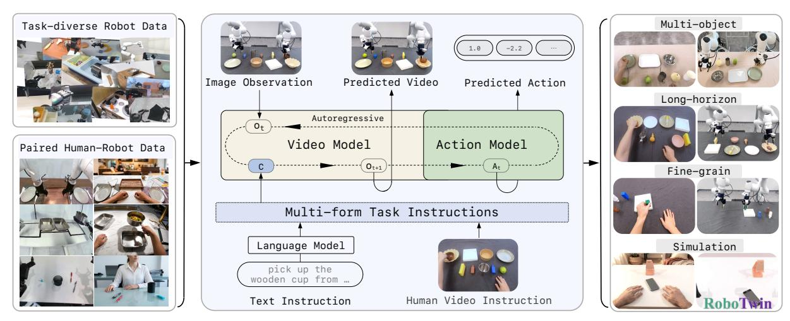
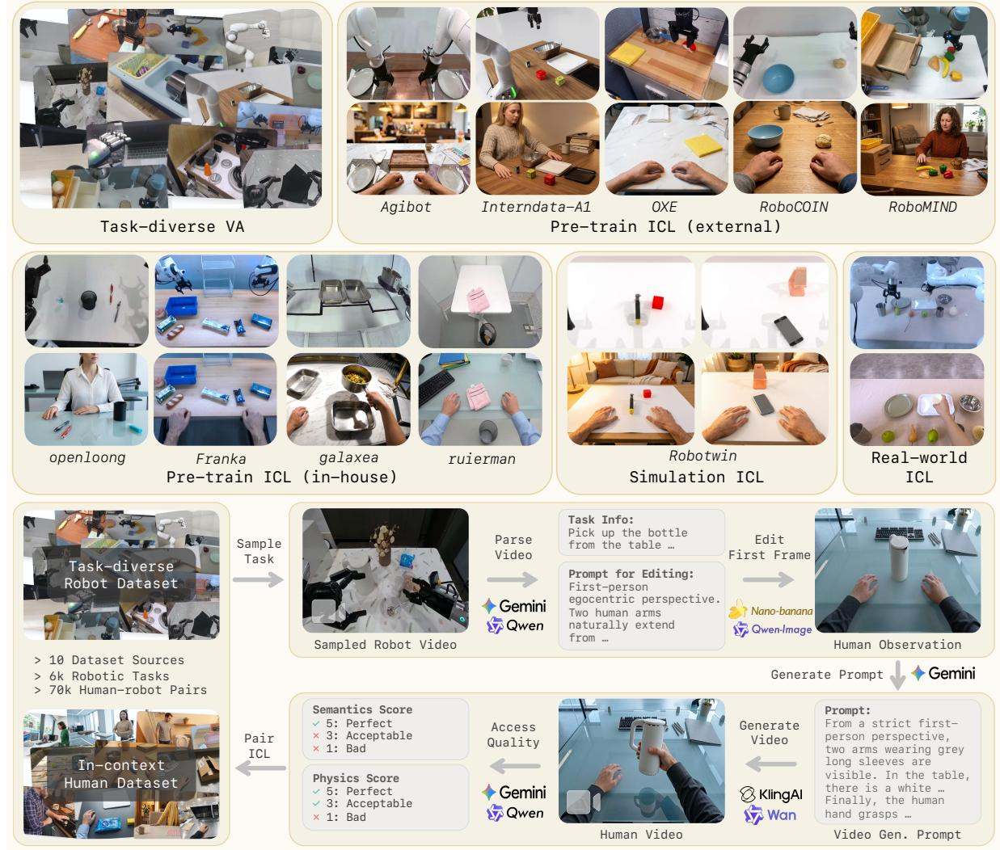
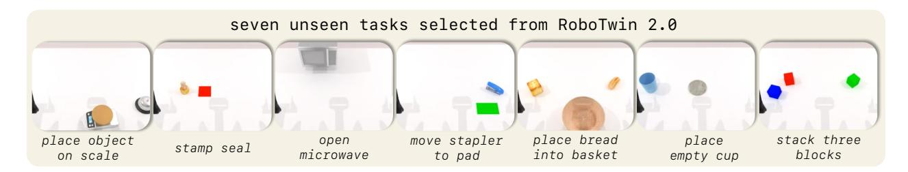
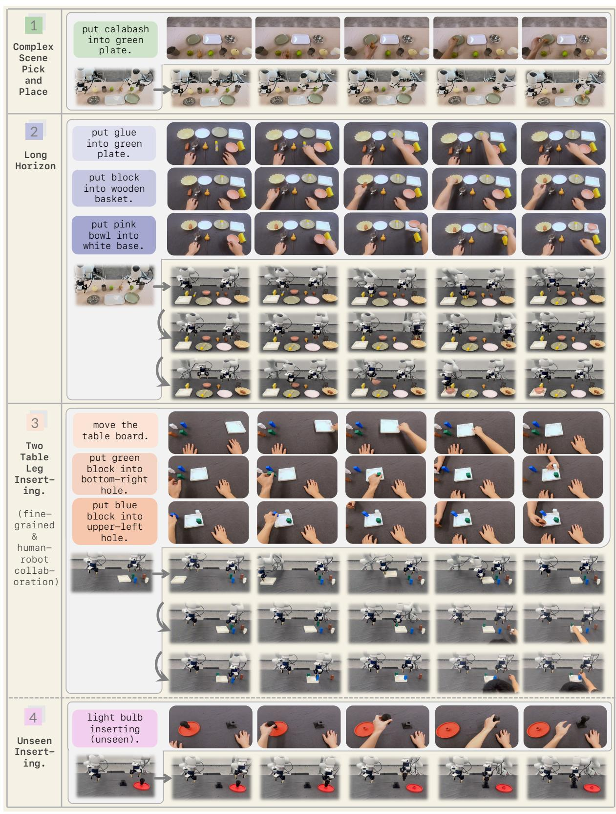
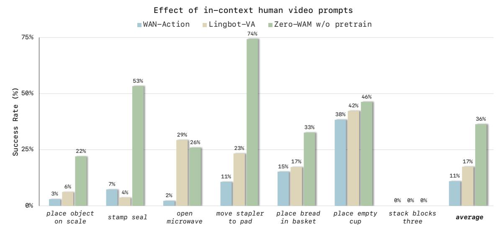
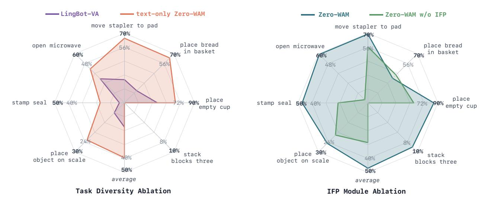

# Zero-WAM: In-Context World-Action Modeling from Human Videos for Open-Ended Task Generalization

- 원제: Zero-WAM: In-Context World-Action Modeling from Human Videos for Open-Ended Task Generalization
- 원문: [https://arxiv.org/abs/2608.26103](https://arxiv.org/abs/2608.26103)
- PDF: [https://arxiv.org/pdf/2608.26103v2](https://arxiv.org/pdf/2608.26103v2)
- arXiv ID: `2608.26103`

---

## Zero-WAM: 인-컨텍스트 월드-액션 모델링(From Human Videos for Open-Ended Task Generalization)

Jiaming Zhou1,2 , Qihang Zhang1,∗ , Gangwei Xu1 , Cunxin Fan1 , Yujie Zhao1 , Ruilin Wang1 , Yiming Luo1 , Shuai Yang1 , Xing Zhu1 , Yujun Shen1 , Junwei Liang2,3,† , Yinghao Xu3,1,†

> 1Robbyant, 2HKUST (GZ), 3HKUST

> ∗프로젝트 리드, †응답 저자

<https://robbyant-research.github.io/Zero-WAM/>

## 초록 (Abstract)

크로스-태스크 제로샷 일반화(Zero-shot cross-task generalization)은 훈련 중에 본 적 없는 조작 과제를 수행해야 하는 정책에 대해 여전히 로봇 학습의 핵심 과제로 남아 있다. 대형 언어 모델에서는 새로운 과제를 단순히 문맥에 명시함으로써 파라미터 업데이트 없이 수행할 수 있다. 이러한 인-컨텍스트 학습(in-context learning, ICL)은 일반화를 과제 명세 문제로 전환한다. 크로스-태스크 일반화를 달성하기 위해 우리는 이 패러다임을 로봇 조작에 적용하고, 조작에 대한 자연스러운 과제 명세가 인간 비디오라는 점을 주장한다: 언어와 달리 인간 비디오는 의도된 과제 진행에 대한 풍부한 시각적 단서를 제공한다. 우리는 Zero-WAM을 제시한다. Zero-WAM은 인-컨텍스트 인간 비디오 가이던스를 따라 보이지 않는 과제를 실행하는 인과적 비디오-액션 모델이다. 과제 풍부한 인간-로봇 쌍 데이터의 부족을 해결하기 위해, 우리는 과제 샘플링된 로봇 궤적을 의미적으로 일치하는 인간 비디오로 변환하는 자동 파이프라인을 제안한다. 이를 통해 HumanGen이라는 8.6K 과제에 걸친 74.2K 인간-로봇 ICL 쌍 데이터셋을 생성한다. 모델 학습을 위해, 우리는 인-컨텍스트 미래 청크 예측(in-context future chunk prediction, IFP) 목표를 도입한다. 이 목표는 본 과제에서 학습된 지름길을 억제하고, 정책이 비디오 프롬프트에서 과제 정보를 추출하도록 강제한다. RoboTwin 2.0 시뮬레이션에서 보이지 않는 7개 과제에 대해 Zero-WAM은 평균 성공률 47.0%를 달성하며, 가장 강력한 비디오-액션 기반 기준보다 절대 29.5% 포인트 향상을 보인다. 실제 세계 평가에서는 인간 비디오 가이던스를 따라 보이지 않는 과제 구성을 일반화한다. 이에는 다중 객체 장면, 장기 조작, 세밀한 삽입이 포함된다.

그림 1 Zero-WAM 개요. Zero-WAM은 인-컨텍스트 인간 비디오 프롬프트 또는 언어 지시문으로부터 미래 로봇 비디오와 실행 가능한 액션을 예측한다. 인간 비디오 지시문은 과제 샘플링된 로봇 궤적에서 대규모로 생성되며, 과제 균형이 잡힌 로봇 비디오-액션 사전 학습 코퍼스와 함께 제공된다. 우리는 보이지 않는 시뮬레이션 과제와 복잡한 실제 과제에서 Zero-WAM의 효과를 검증한다.

## 1 서론 (Introduction)

크로스-태스크 제로샷 일반화는 범용 로봇 조작에 필수적이다: 로봇은 배치 시점에만 사용 가능한 정보만으로 연습하지 않은 과제에서 어떻게 행동해야 할지 추론해야 한다. 인-컨텍스트 학습[1,](#page-15-0) [2](#page-15-1)에서 모델이 파라미터 업데이트 없이 입력 문맥만으로 새로운 문제를 해결하는 것에서 영감을 받아, 우리는 로봇 과제 일반화를 배치 시점 문맥을 통해 보이지 않는 과제를 명시하는 것으로 본다. 이 관점은 개방형 과제 일반화를 향한 경로를 제시한다: 정책은 문맥에서 의도된 과제를 추론하고 이를 실행 가능한 로봇 행동으로 변환할 수 있다.

최근 시각-언어-행동(VLA) 모델 [3,] [4,] [5,] [6,] [7,] [8,] [9,] [10] 및 비디오-행동 모델 [11,] [12,] [13,] [14,] [15,] [16]은 로봇 정책의 역량을 크게 확장했으나, 두 모델 모두 주로 언어를 작업 인터페이스로 사용한다. 그러나 언어는 조작 작업을 충분히 명시하지 못하는 경우가 많다: 공간 제약, 중간 상태, 그리고 시간 구조를 표현하기가 번거롭고, 상세한 지시라도 장면이 어떻게 변해야 하는지에 대한 직접적인 시각적 증거를 제공하지 않는다. 인간 시연 비디오는 의도된 작업에 대한 자연스러운 컨텍스트 내 사양을 제공한다 [17,] [18]. 원하는 시각적 상태 변화와 그 시간적 진화를 직접적으로 제시함으로써, 장면이 어떻게 변해야 하는지에 대한 구체적인 시각적 증거를 제공한다. 인간 비디오는 실행 가능한 로봇 행동을 제공하지 않지만, 정책이 원하는 작업 진화를 추론하고 로봇의 구현과 역학을 통해 이를 실현할 수 있는 시각적 참조를 제공한다.

인간 비디오를 대규모로 활용하는 것은 두 가지 핵심 과제를 제시한다. 첫째, 대규모의 작업이 풍부한 인간-로봇 쌍 데이터는 여전히 드물고 수집 비용이 높다 [19,] [20,] [21]. 인간 비디오 지시로부터 학습하려면 실행 가능한 행동을 보존하는 의미적으로 대응되는 로봇 궤적이 필요하지만, 이러한 쌍은 대규모로 제공되지 않는다. 둘째, 보인 작업에 대해 훈련된 정책은 컨텍스트 내 비디오를 무시하도록 단축 경로를 학습할 수 있다. 특히, 다음 로봇 비디오-행동 청크는 로봇 기록과 텍스트 지시만으로 예측되는 경우가 많다. 결과적으로 모델은 인간 비디오를 사용하도록 학습하지 않고도 익숙한 훈련 작업에서 좋은 성능을 보일 수 있으며, 테스트 시점에 비디오를 과소 활용하게 되어, 보지 않은 작업을 지정해야 할 때 정확히 필요한 순간에 비디오를 활용하지 못한다.

이러한 과제를 해결하기 위해 우리는 제로샷 로봇 작업 일반화를 위해 컨텍스트 내 인간 비디오 지시를 따르는 인과적 비디오-행동 모델인 Zero-WAM을 소개한다. Zero-WAM은 단일 정책 내에서 두 가지 형태의 작업 사양을 지원한다: 언어 지시와 인간 시연 비디오. 두 형태 중 어느 것이 주어지든, 모델은 자기회귀적으로 미래 로봇 비디오와 실행 가능한 행동을 예측한다. 인간 비디오는 Zero-WAM이 시연된 시각적 상태 변화를 기반으로 이러한 예측을 조건화하도록 하여, 언어와 로봇 기록만으로는 얻을 수 없는 의도된 작업 진화에 대한 정보를 제공한다.

인간 비디오 지침으로 훈련을 확장하기 위해, 우리는 작업 샘플링된 로봇 궤적을 사용하여 의미적으로 일치하는 인간 조작 비디오를 구성하는 인컨텍스트 인간 비디오 생성 파이프라인을 제안한다. 각 인간 비디오는 실행 가능한 로봇 동작을 보유한 해당 로봇 궤적과 짝을 이루어 인간-로봇 인컨텍스트 학습(ICL) 쌍을 형성한다. 결과적으로 HumanGen 데이터셋은 8.6K 작업에 걸쳐 74.2K 인간-로봇 ICL 쌍을 포함한다. 우리는 또한 공개 로봇 궤적을 6,000개가 넘는 조작 작업으로 재분할하고 작업 수준에서 궤적을 샘플링함으로써 로봇 사전 훈련 데이터를 작업 균형으로 선별한다. 이 절차는 훈련 epoch당 약 400K 로봇 궤적을 생성하며, 이를 Task-diverse VA라고 부른다. 작업 균형 샘플링은 인컨텍스트 인간 비디오 생성 파이프라인에 풍부한 작업 소스 궤적을 제공하고, 소수의 작업에서 반복되는 텔레오퍼레이션 궤적에 의해 비디오-액션 사전 훈련이 지배되는 것을 방지한다. HumanGen과 Task-diverse VA는 함께 인과적 비디오-액션 사전 훈련을 위한 확장 가능한 인간 비디오 작업 사양과 다양한 로봇 비디오-액션 역학을 제공한다. [Figure 2](#page-3-0)는 결과 데이터 구성을 요약하고 인컨텍스트 인간 비디오 생성 파이프라인을 보여준다.

Zero-WAM이 로봇 기록과 텍스트의 지름길에 의존하지 않고 인컨텍스트 인간 비디오를 사용하도록 보장하기 위해, 우리는 인컨텍스트 미래 청크 예측(IFP) 목표를 도입한다. 표준 다음 청크 예측은 특히 훈련 중에 관찰된 작업에 대해 오직 지역 로봇 기록만으로 해결될 수 있다. IFP는 대신 현재 로봇-비디오 표현에서 미래 로봇 비디오의 여러 스트라이드 청크를 감독하여 모델이 인간 비디오가 전달하는 장기 작업 진화를 인코딩하도록 유도한다.

우리는 RoboTwin 2.0 [&#91;22&#93;](#page-17-3) 시뮬레이션과 실제 로봇 조작에서 Zero-WAM의 제로샷 크로스-태스크 일반화를 평가한다. RoboTwin 2.0에서 Zero-WAM은 7개의 보이지 않는 작업에 대해 평균 46.95%의 성공률을 달성하며, LingBot-VA [&#91;11&#93;](#page-16-6)를 절대 29.50 퍼센트 포인트 차이로 능가한다. 실제 실험은 다중 객체 장면, 장기 조작, 정밀 삽입을 포함한 보이지 않는 작업 구성을 인간 비디오가 안내하는 일반화가 가능함을 보여주며, Zero-WAM은 세 가지 작업군에서 모두 LingBot-VA를 능가한다.

우리의 기여는 다음과 같이 요약된다:

- 우리는 제로샷 로봇 작업 일반화를 인컨텍스트 세계 동작 모델링으로 공식화한다. 단일 인과 정책이 언어와 인간 비디오를 모두 작업 지침으로 지원한다.
- 우리는 작업 샘플링된 로봇 궤적을 의미적으로 일치하는 인간 비디오 지침으로 자동 변환하는 확장 가능한 인컨텍스트 인간 비디오 생성 파이프라인을 제안한다. 이를 통해 8.6K 작업에 걸쳐 74.2K 인간-로봇 ICL 쌍을 포함하는 HumanGen 데이터셋을 만들며, 동일한 작업 수준 샘플링은 Task-diverse VA 데이터를 생성한다. 이는 자기 회귀 로봇 비디오-액션 사전 훈련을 위한 작업 균형 코퍼스로 사용된다.
- 우리는 인컨텍스트 미래 청크 예측 목표를 갖는 Zero-WAM을 제안한다. 이는 보인 작업 궤적에서의 지름길 학습을 억제하고 인컨텍스트 인간 비디오 프롬프트 사용을 강화한다.
- 우리는 RoboTwin에서 효과적인 제로샷 크로스-태스크 일반화를 입증한다. Zero-WAM은 비디오-액션 기준보다 크게 향상되며, 추가적으로 실제 환경에서 보이지 않는 작업 구성을 일반화하고, 해당 로봇 데이터를 수집하거나 모델 파라미터를 업데이트하지 않는다.

## 2 데이터 수집 (Data Curation)

제로샷 로봇 작업 일반화는 보지 못한 작업으로 전이되는 명령 인터페이스와, 단순히 로봇 궤적 수를 늘리는 대신 다양한 작업 동역학을 포괄하는 훈련 데이터를 필요로 한다. 엔지니어링 기반으로, 우리는 먼저 작업 수준에서 공개 로봇 사전 훈련 데이터를 재샘플링하여 Task-diverse VA 데이터를 구축한다 [(Section 2.1)](#page-2-0). 같은 작업 수준 샘플링을 기반으로, 우리는 작업 샘플링된 로봇 영상을 인간 비디오 지시문으로 변환하는 인컨텍스트 인간 비디오 생성 파이프라인을 도입한다 [(Section 2.2)](#page-2-1). 생성된 인간-로봇 ICL 쌍은 HumanGen을 구성하며, 여기에는 Pre-train ICL (External), Pre-train ICL (In-house), Simulation ICL, 그리고 Real-world ICL이 포함된다 [(Section 2.3)](#page-4-0). [Figure 2](#page-3-0)는 이 데이터 구성을 요약하고 HumanGen 데이터를 생성하는 파이프라인을 보여준다.

### 2.1 작업 다양성 비디오-액션 데이터 (Task-Diverse Video-Action Data)

작업 다양성 VA 데이터는 AgiBot [23](#page-17-4), InternData-A1 [24](#page-17-5), Open-X-Embodiment [4](#page-15-3), RoboCOIN [25](#page-17-6), RoboMIND [26](#page-17-7)를 포함한 공개 로봇 비디오-액션(VA) 사전 훈련 데이터셋에서 수집된다. 이 소스 데이터셋은 LingBot-VA [11](#page-16-6)에서 사용한 동일한 공개 VA 사전 훈련 데이터셋이다. 이 데이터셋들은 많은 수의 로봇 궤적과 광범위한 작업 범위를 포함하지만, 많은 궤적이 동일한 작업의 반복적인 원격 조작에서 나온다. 원시 분포를 그대로 사용하면 사전 훈련이 중복 궤적에 과도하게 영향을 받아, 모델이 소스 데이터셋에 이미 존재하는 작업 다양성의 이점을 충분히 활용하지 못하게 된다. 우리는 각 데이터셋을 작업으로 재분할하여, 각 작업을 조작 동작과 객체의 조합으로 정의함으로써 이를 해결한다. 작업 라벨은 원본 데이터셋 메타데이터가 있을 때는 이를 사용하고, 메타데이터가 부족할 경우 로봇 궤적에서 추출한다. 그 다음, 각 작업에서 제한된 수의 궤적을 샘플링하며, 샘플링 한계는 각 소스 데이터셋의 작업 내 다양성에 따라 조정된다. 다섯 개의 소스 데이터셋 전반에 걸쳐, 우리는 각 훈련 에포크마다 6,000개가 넘는 작업과 약 400K개의 해당 로봇 궤적을 샘플링한다. 이 균형 잡힌 비디오-액션 코퍼스는 일반 도메인 비디오 생성 모델을 자가 회귀 로봇 비디오-액션 모델로 적응시키는 데 효과적이다.

### 2.2 인컨텍스트 인간 비디오 생성 파이프라인 (In-Context Human Video Generation Pipeline)

인간 비디오 시연은 시각적 상태 변화를 통해 작업 의미를 직접 전달하며, 로봇 시연보다 수집이 용이하고, 테스트 시 사용되는 로봇 구현체에 의존하지 않는다. 따라서 작업이 풍부한 인간-로봇 인컨텍스트 학습 쌍을 확장하는 것은 작업 간 일반화에 효과적인 경로가 된다.

이러한 인간-로봇 동작 데이터 쌍을 수동으로 수집하는 것은 어려우며, 높은 작업 다양성이 요구될 때 비용이 특히 막대한 수준이 된다. 따라서 우리는 로봇 사전 훈련 코퍼스에서 시작한다.

Figure 2 데이터 구성 및 인컨텍스트 인간 비디오 생성. 상단: 작업 다양성 VA 데이터 (Task-diverse VA data)는 작업 균형을 맞춘 로봇 비디오-액션 사전 훈련 데이터를 제공하며, HumanGen은 Pre-train ICL (External), Pre-train ICL (In-house), Simulation ICL, 그리고 Real-world ICL 쌍을 포함한다. 하단: 인컨텍스트 인간 비디오 생성 파이프라인은 작업 샘플링된 로봇 영상을 인간 비디오 지시문으로 변환한다.

다시 작업 수준에서 샘플 트레젝터리를 생성하고, [Section 2.1.](#page-2-0)을 따릅니다. 이는 실행 가능한 동작 주석이 있는 광범위한 로봇 비디오 세트를 제공합니다. 이후 우리는 이 로봇 트레젝터리를 동일한 작업 의미를 가진 인간 조작 비디오로 변환하는 인컨텍스트 인간 비디오 생성 파이프라인을 도입합니다. 인간-로봇 ICL 쌍에서 시각적 정렬의 다양성을 높이기 위해, 생성된 인간 비디오는 동일한 작업 의미를 보존하면서 배경, 시점, 환경 스타일, 객체 인스턴스 및 객체 배치에 변화를 포함합니다.

그림 2의 하단 부분은 인간 비디오 지시를 생성하기 위한 인컨텍스트 인간 비디오 생성 파이프라인을 보여준다. 각 샘플링된 로봇 비디오마다, 우리는 먼저 VLM(Gemini 3.1 Pro [27](#page-17-8) 또는 Qwen3.6-Plus [28](#page-17-9))를 사용하여 작업 분석을 수행한다. VLM은 작업 이름, 초기 객체 상태, 객체 상태 변화, 최종 객체 상태 등 작업 수준 정보를 추출한다. 또한 첫 번째 로봇 비디오 프레임을 인간 조작 장면의 초기 관찰로 변환하는 이미지 편집 프롬프트를 생성한다. 우리는 작업 의미를 보존하면서 위에서 설명한 시각 정렬 변형을 이 이미지 편집 프롬프트를 통해 주입한다. 첫 번째 로봇 프레임과 이미지 편집 프롬프트를 주면, 이미지 편집 모델(Nano Banana 2 [29](#page-17-10) 또는 Qwen-Image-2.0 [30](#page-17-11))이 해당 작업에 대한 초기 인간 관찰 이미지를 생성한다. 그 다음 우리는 VLM을 사용하여 편집된 인간 관찰과 추출된 객체 상태 정보를 함께 처리하여, 인간 손이 객체를 어떻게 조작해야 작업을 완료하도록

Table 1: 기존 작업 수준(task-level) 인간-로봇 쌍 데이터셋과의 비교. “Multi-source”는 데이터셋이 여러 데이터 소스에서 구성되었는지를 나타낸다. “Embod.”는 로봇 구현체(embodiment)의 수를 나타낸다. “Human view”는 인간 비디오의 시점을 지정한다. “Human acquisition”은 인간 비디오가 수동으로 수집되는지 자동으로 생성되는지를 나타낸다. “Align. div.”는 인간-로봇 쌍이 배경, 시점, 환경 스타일, 객체 인스턴스, 객체 배치 등 시각적 정렬의 다양한 정도를 포함하는지를 나타낸다. “Samples”는 인간 비디오 지침의 수를 나타내며, “Tasks”는 작업 범주의 수를 나타낸다.

| 데이터셋 | 다중 소스 | 본체화 | 인간 관점 | 인간 획득 | 정렬 분할 | 샘플 | 작업 |
|------------------|--------------|--------|-------------|-------------------|-------------|---------|-------|
| MIME [19] | ✗ | 1 | 제3자 | 수동 | ✗ | 8.3K | 20 |
| EgoMimic [20] | ✗ | 1 | 자기 | 수동 | ✗ | 2.1K | 3 |
| BC-Z [17] | ✗ | 1 | 자기 | 수동 | ✓ | 18.7K | 100 |
| EgoHumanoid [33] | ✗ | 1 | 자기 | 수동 | ✗ | 1.2K | 4 |
| RH20T [21] | ✗ | 4 | 자기 & 제3자 | 수동 | ✗ | 110K | 147 |
| EgoScale [34] | ✗ | 1 | 자기 | 수동 | ✗ | 10.3K | 344 |
| HumanGen (ours) | ✓ | >45 | 자기 & 제3자 | 자동 생성 | ✓ | 74.2K | 8.6K |

작업. 이 프롬프트는 비디오 생성 모델 (Wan 2.7 [&#91;31&#93;](#page-17-14) 또는 Kling AI 3.0 [&#91;32&#93;](#page-17-15))에 전달되어 인간 조작 비디오를 합성한다. 마지막으로 VLM은 각 생성된 비디오를 작업 의미 보존 및 물리적 타당성 측면에서 평가하고, 자격을 갖춘 인간 비디오는 원래 로봇 궤적과 ICL 샘플로 짝지어진다.

### 2.3 인-컨텍스트 HumanGen 데이터셋

HumanGen은 인-컨텍스트 인간 비디오 생성 파이프라인으로 생성된 인간-로봇 ICL 쌍의 모음이다. 각 쌍은 생성된 인간 비디오 지시와 실행 가능한 동작을 포함하는 로봇 궤적을 포함한다. HumanGen은 데이터 소스별로 Pre-train ICL (External), Pre-train ICL (In-house), Simulation ICL, 그리고 Real-world ICL로 구성된다. Task-diverse VA 데이터를 큐레이션할 때 사용한 것과 동일한 작업 다양성 샘플링 원칙을 따라, 소스 로봇 비디오는 원시 궤적 빈도 대신 작업별로 샘플링되어, ICL 데이터가 소수의 작업 반복 실행으로 지배되지 않도록 한다.

Pre-train ICL (External). 이 하위 집합은 Task-diverse VA 데이터에 사용된 동일한 다섯 개의 공개 로봇 비디오-액션 데이터셋: AgiBot [&#91;23&#93;](#page-17-4), InternData-A1 [&#91;24&#93;](#page-17-5), Open-X-Embodiment [&#91;4&#93;](#page-15-3), RoboCOIN [&#91;25&#93;](#page-17-6), 그리고 RoboMIND [&#91;26&#93;](#page-17-7)에서 구축된다. 이 데이터셋은 45개가 넘는 다양한 로봇 구현체, 장면, 물체를 포함한다. 각 데이터셋에서 작업별로 로봇 궤적을 샘플링하고 인-컨텍스트 인간 비디오 생성 파이프라인을 사용해 의미적으로 일치하는 인간 비디오로 변환한다. 구체적으로, AgiBot에서 3,354개의 작업과 6,660개의 궤적, InternData-A1에서 261개의 작업과 12,515개의 궤적, Open-X-Embodiment에서 438개의 작업과 9,290개의 궤적, RoboCOIN에서 512개의 작업과 6,513개의 궤적, RoboMIND에서 497개의 작업과 6,210개의 궤적을 샘플링한다. 총합으로 Pre-train ICL (External)은 5,062개의 작업과 41,188개의 인간-로봇 ICL 쌍을 포함한다. 이 하위 집합에서는 인간과 로봇 비디오 간의 시각적 정렬을 인위적으로 다양화한다: 장면 환경, 탁상 배경, 물체 인스턴스, 물체 배치의 변화를 강제하고 1인칭과 3인칭 시점을 균형 있게 한다. 작업 의미가 이러한 시각적 변형에서도 보존되기 때문에, 모델은 장면, 물체, 시점의 변화에 불변인 인간-로봇 작업 대응을 학습하도록 유도되어 시각적으로 다양한 ICL 프롬프트에 대한 견고성을 향상시킨다.

Pre-train ICL (In-house). 작업 범위를 더욱 확대하기 위해, 내부 로봇 데이터셋에서 작업별로 로봇 궤적을 샘플링한다. 이 하위 집합은 양손 Franka와 Galaxea R1 Pro와 같은 여러 로봇 구현체를 포함하며, 3,522개의 작업과 30,247개의 인간-로봇 ICL 쌍을 포함한다. 이 하위 집합에 대한 대응 인간 비디오를 인-컨텍스트 인간 비디오 생성 파이프라인으로 생성할 때, 3인칭 시점 비율을 줄이고 장면, 물체, 물체 배치 변화를 감소시킨다. 이는 작업 다양성을 유지하면서 보다 시각적으로 정렬된 ICL 샘플을 생성한다.

Simulation ICL. 시뮬레이션에서 교차 작업 평가를 지원하기 위해, 50개의 RoboTwin 작업 [&#91;22&#93;](#page-17-3)에 대한 ICL 데이터를 생성한다. 이 하위 집합은 2,500개의 ICL 샘플을 포함하며, 각 작업마다 50개의 샘플이 있다. 이 중 43개의 작업은 사후 훈련(2,150개의 훈련 샘플)에 사용되고, 나머지 7개의 작업은 제로샷 교차 작업 평가를 위해 보이지 않는 작업으로 보류된다.

실제 세계 ICL. 실제 세계 ICL은 양손 Franka 평가 구현에서 수집된 인간-로봇 쌍을 포함한다. 평가에 사용된 세 가지 실제 세계 작업군에 걸쳐 총 252개의 인간-로봇 ICL 쌍이 포함된다: 30개의 객체-컨테이너 배치 훈련 작업 조합에서 120쌍, 16개의 세 객체 순차 조작 훈련 작업 조합에서 96쌍, 그리고 두 테이블 다리 삽입을 위한 36쌍. 이 하위 집합은 사후 훈련에 사용되어 모델이 교차 작업 평가를 위해 평가 로봇 동역학을 맞출 수 있도록 한다.

기존 데이터셋과의 비교. 표 1은 HumanGen과 기존 작업 수준의 인간-로봇 쌍 데이터셋을 비교한다. 통계는 해당 공식 논문에서 가져왔다. 이전 데이터셋이 수작업 인간 데이터 수집에 의존한 것과 달리, HumanGen은 인컨텍스트 인간 비디오 생성 파이프라인을 사용해 로봇 궤적에서 의미적으로 일치하는 인간 비디오를 자동으로 생성함으로써 인간-로봇 ICL 쌍을 확장 가능하게 구성한다. HumanGen은 또한 공용, 사내, 시뮬레이션, 실제 세계 등 여러 데이터 소스를 결합하고, 훨씬 더 많은 로봇 구현을 포괄하며, 자아 및 제3자 시점의 인간 데이터를 포함하고, 다양한 시각 정렬 정도를 갖는 쌍 데이터를 제공한다. 가장 중요한 것은 HumanGen이 훨씬 더 넓은 작업 범위를 포함한다는 점이며, 이는 제로샷 교차 작업 일반화의 핵심 요소이다.

## 3 Zero-WAM: 인컨텍스트 월드 액션 모델링 (Zero-WAM: In-Context World Action Modeling)

제로샷 교차 작업 조작에서 로봇은 미세 조정 없이 새로운 작업을 수행해야 한다. 우리는 대규모 인간-로봇 ICL 쌍과 작업 균형이 잡힌 로봇 비디오-액션 데이터를 사전 학습한 세계 액션 모델(WAM)을 통해 이 능력을 추구한다. 배포 시 Zero-WAM은 언어 지시문 또는 인간 비디오 시연을 작업 사양으로 사용하여 미지의 작업 실행을 유도한다.

### 3.1 전제 조건 (Preliminaries)

비디오 생성용 흐름 매칭. 비디오 생성을 위해 흐름 매칭[35]은 깨끗한 비디오와 가우시안 잡음 사이의 연속 경로를 따라 속도장을 학습한다. 깨끗한 비디오 $\mathbf{x}_0$, 잡음 $\boldsymbol{\epsilon} \sim \mathcal{N}(\mathbf{0}, \mathbf{I})$, 흐름 시간 $t \in [0, 1]$가 주어지면, 잡음이 가미된 비디오와 목표 속도는 다음과 같다.

$$\mathbf{x}_t = (1 - t)\mathbf{x}_0 + t\boldsymbol{\epsilon}, \qquad \mathbf{v}_t^* = \boldsymbol{\epsilon} - \mathbf{x}_0. \tag{1}$$

조건 c가 주어지면 흐름 매칭 손실은 다음과 같다

$$\mathcal{L}_{\text{fm}} = \mathbb{E}_{\mathbf{x}_0, \boldsymbol{\epsilon}, t} \left[ \| \mathbf{v}_{\boldsymbol{\theta}}(\mathbf{x}_t, t, c) - \mathbf{v}_t^{\star} \|_2^2 \right]. \tag{2}$$

추론 시에는 잡음에서 시작해 학습된 속도장을 역으로 적분하여 t = 0으로 되돌려 비디오를 생성한다.

인과적 비디오-액션 모델링. 우리는 LingBot-VA 시리즈[11, 12]의 인과적 비디오-액션 프레임워크를 따르며, 여기서 각 제어 단계는 인과 예측 문제이다: 작업 조건과 과거 관측을 주면 모델은 다음 로봇 비디오 청크와 그에 시간적으로 정렬된 실행 가능한 액션 청크를 예측한다.

각 로봇 궤적은 $\tau = \{(\mathbf{x}^i, \mathbf{a}^i)\}_{i=1}^N$ 으로 청크화된다. 여기서 $\mathbf{x}^i$는 비디오 청크, $\mathbf{a}^i$는 시간적으로 정렬된 액션 청크이다. 본 방법 전반에 걸쳐 청크 수준 표기법을 사용한다. 구현에서는 각 비디오 또는 액션 청크를 트랜스포머에 입력하기 전에 모달리티별 표현으로 인코딩하고, 어텐션 마스크는 이 토큰화된 표현 위에서 작동한다. 우리는 c를 작업 조건을 나타내는 기호로 사용하며, 이는 언어 지시문 또는 동일 작업 인간 비디오 지시문일 수 있다. 청크 인덱스 i에서 인과 모델은 다음 비디오 청크 $\mathbf{x}^{i+1}$와 정렬된 액션 청크 $\mathbf{a}^{i+1}$를 예측한다:

$$p_{\theta}(\mathbf{x}^{i+1}, \mathbf{a}^{i+1} \mid \mathbf{x}^{\leq i}, \mathbf{a}^{\leq i}, c). \tag{3}$$

이 공동 예측은 비디오 예측과 그 뒤를 따르는 액션 디코딩으로 분해된다.

$$p_{\theta}(\mathbf{x}^{i+1}, \mathbf{a}^{i+1} \mid \mathbf{x}^{\leq i}, \mathbf{a}^{\leq i}, c) = p_{\theta}^{\text{vid}}(\mathbf{x}^{i+1} \mid \mathbf{x}^{\leq i}, \mathbf{a}^{\leq i}, c)$$

$$\cdot p_{\theta}^{\text{act}}(\mathbf{a}^{i+1} \mid \mathbf{x}^{\leq i}, \mathbf{a}^{\leq i}, \mathbf{x}^{i+1}, c),$$

$$(4)$$

여기서 $p_{\theta}^{\text{vid}}$는 다음 비디오 청크를 예측하고, $p_{\theta}^{\text{act}}$는 예측된 다음 로봇 비디오 청크에서 실행 가능한 액션을 디코딩하는 역동역학 모델로 작동한다. 훈련 중에는 모델이 정답 트레저리 프리픽스 $(\mathbf{x}^{\leq i}, \mathbf{a}^{\leq i})$를 주고 다음 비디오-액션 청크에 대해 감독된다. Task-diverse VA 데이터의 트레저리에서는 조건이 언어 지시문 $c = \ell$ 이다. HumanGen 데이터의 트레저리에서는 조건이 $c = \{\mathbf{h}, \ell\}$ 이며, 여기서 **h**는 동일 작업의 인간 비디오 지시문이고 $\ell$은 언어 지시문이다.

**Mixture-of-Transformers Design.** 우리는 $p_{\theta}^{\text{vid}}$와 $p_{\theta}^{\text{act}}$를 Mixture-of-Transformers (MoT) 설계 하에 비디오 Transformer와 액션 Transformer로 구현한다. 각 모달리티는 자체 파라미터(분리된 QKV 프로젝션, FFN, 출력 헤드)를 가지며, 비디오와 액션 표현은 단일 시퀀스에 남아 공유 어텐션 레이어를 통해서만 상호작용한다. 이 시퀀스 내에서 액션 청크 표현은 미래 비디오 표현 뒤에 배치되어, 액션 디코딩이 예측된 미래 로봇 비디오에 주의를 기울일 수 있도록 한다.

모델 인스턴스화. LingBot-VA를 따라, 우리는 Wan-2.2-TI2V-5B [36]을 변환하여 Zero-WAM을 인스턴스화한다. 이 모델은 양방향 텍스트/이미지-투-비디오 생성 모델이며, 앞서 설명한 인과적 비디오-액션 정책으로 변환된다. 이 프레임워크를 기반으로, 본 절의 나머지 부분은 Zero-WAM에 특화된 구성 요소를 제시한다: 인간 비디오를 인컨텍스트 작업 사양으로 사용(Section 3.2) 및 인컨텍스트 미래 청크 예측(Section 3.3).

#### 인간 비디오를 사용한 작업 사양 3.2

보지 못한 작업에 대해 원하는 행동을 언어로 완전히 명시하는 것은 종종 어렵고, 지시문은 정책이 아직 관찰하지 않은 작업 역학에 기반해야 한다. 따라서 우리는 인간 비디오를 인컨텍스트 작업 사양으로 채택하여 원하는 역학을 직접 제시한다: 배포 시 보지 못한 작업을 시연하는 인간 비디오가 지시문 역할을 한다. 이 인터페이스를 따르도록 정책을 훈련시키기 위해, 우리는 HumanGen 데이터셋에서 훈련한다. 이 데이터셋은 작업 수준(Section 2)에서 소스 로봇 트레저리를 샘플링하여 만든다. 각 의미적으로 매칭된 쌍은 생성된 인간 비디오 h(시각적 작업 사양 역할)와 해당 로봇 트레저리(감독된 미래 비디오 및 액션 청크 제공)를 포함한다. 인간 비디오와 짝을 이룬 로봇 트레저리가 구현체, 시점, 배경, 물체 배치에서 다를 수 있으므로, 모델은 인간 비디오에서 동작을 복사하기보다 작업 수준의 대응을 학습해야 한다.

훈련 중에는 인간 비디오 청크, 로봇 비디오 청크, 액션 청크의 토큰화된 표현에 대해 교사 강제(attention mask)를 적용한다. 인간 비디오 h는 로봇 트레저리 앞에 덧붙여져 로봇 비디오 예측을 위한 프리픽스 메모리 역할을 한다. 청크 인덱스 i에서 비디오 Transformer는 컨텍스트 $\mathcal{C}^{\mathrm{vid},i}$에서 다음 로봇 비디오 청크 $\mathbf{x}^{i+1}$를 예측한다:

$$C^{\text{vid},i} = [[\mathbf{h}, \mathbf{x}^{\leq i}], \mathbf{a}^{\leq i}, \ell], \tag{5}$$

$$\mathcal{C}^{\text{vid},i} = [[\mathbf{h}, \mathbf{x}^{\leq i}], \mathbf{a}^{\leq i}, \ell], 
p_{\theta}^{\text{vid}}(\mathbf{x}^{i+1} \mid \mathcal{C}^{\text{vid},i}) = p_{\theta}^{\text{vid}}(\mathbf{x}^{i+1} \mid [\mathbf{h}, \mathbf{x}^{\leq i}], \mathbf{a}^{\leq i}, \ell).$$

(6)

다음 로봇 액션 청크 예측을 위해, 액션 Transformer는 로봇 도메인 히스토리와 예측된 다음 로봇 비디오 청크에서 $\mathbf{a}^{i+1}$ 를 예측한다. 이는 섹션 3.1의 역동학 인과 분해를 따른다. 액션 Transformer는 인간 비디오 h 를 직접 주목하지 않는다: h 가 전달하는 작업 의미는 이미 예측된 다음 로봇 비디오 청크에 흡수되어 있으므로, 액션 디코딩은 표준 역동학으로 축소된다. 따라서 액션 예측 조건은 표준 로봇 비디오-액션 훈련과 동일하게 유지된다:

$$C^{\text{act},i} = [\mathbf{x}^{\leq i}, \mathbf{a}^{\leq i}, \mathbf{x}^{i+1}, \ell], \tag{7}$$

$$p_{\theta}^{\text{act}}(\mathbf{a}^{i+1} \mid \mathcal{C}^{\text{act},i}) = p_{\theta}^{\text{act}}(\mathbf{a}^{i+1} \mid \mathbf{x}^{\leq i}, \mathbf{a}^{\leq i}, \mathbf{x}^{i+1}, \ell).$$

(8)

훈련 시, 액션 컨텍스트에서 $\mathbf{x}^{i+1}$ 은 교사 강제(teacher forcing) 하에서 실제 다음 로봇 비디오 청크이다; 추론 시에는 비디오 Transformer가 생성한 비디오 청크로 대체된다.

ROPE[37]는 ICL 인간 비디오에 대한 오프셋이다. ICL 인간 비디오와 다중 뷰 로봇 비디오는 동일한 VAE 인코더로 인코딩되므로 같은 시각적 잠재 공간을 공유한다. 토큰 시퀀스 내에서 우리는 높이 축 RoPE 좌표를 통해 ICL 인간 비디오를 로봇 비디오와 구분한다: 로봇 비디오 잠재는 원래 좌표를 유지하고, 인간 비디오 잠재는 높이 축을 따라 오프셋으로 이동한다. (q, y, x)를 시각적 잠재의 시간, 수직, 수평 좌표라 하고, $H_{\rm mv}$ 를 다중 뷰 로봇 비디오 잠재 레이아웃의 높이라 하면, 우리는 RoPE 좌표를 다음과 같이 할당한다

$$pos_{robot}(q, y, x) = (q, y, x), \tag{9}$$

$$pos_{robot}(q, y, x) = (q, y, x),$$

$$pos_{human}(q, y, x) = (q, y + \Delta_H, x),$$

$$\Delta_H > H_{mv}.$$

(10)

이 오프셋은 인간 비디오 잠재를 로봇 비디오 잠재의 좌표 범위 밖에 배치하여, 동일한 시퀀스에서 상호작용할 때 ICL 인간 비디오와 로봇 비디오 간의 표현 혼동을 방지한다.

### 인-컨텍스트 미래 청크 예측 (In-Context Future Chunk Prediction)

인-컨텍스트 샘플의 경우, 모델은 인간 비디오 h 에서 작업 진화를 추론하고 이를 로봇 도메인으로 전이해야 한다. 그러나 보인 작업에 대해 교사 강제 훈련 중에는 최근 로봇 히스토리( $\mathbf{x}^{\leq i}$ )를 외삽함으로써 즉각적인 다음 로봇 비디오 청크를 예측할 수 있다. 이는 모델이 인-컨텍스트 인간 비디오를 사용하도록 학습하지 않고도 훈련 손실을 줄일 수 있는 지름길을 만든다. 모델이 보지 않은 작업에서 평가될 때, 이 지름길은 로봇 히스토리에 계속 의존하고 새로운 작업을 지정할 때 필요한 ICL 신호를 과소 활용하게 만든다. 이 지름길을 방지하기 위해 우리는 Next Forcing[14]의 다중 청크 예측에서 영감을 받아 인-컨텍스트 미래 청크 예측을 도입한다: 현재 로봇-비디오 표현에서 여러 개의 스트라이드된 미래 로봇 비디오 청크를 예측하도록 요구하는 훈련 전용 보조 목표이다.

임의의 $s \ge 1$ 을 시간적 스트라이드로 두고, 예측할 미래 청크 수를 K 라 하자. k번째 미래 목표는 로봇 비디오 청크 $\mathbf{x}^{j_k}$ 이며, 목표 인덱스 $j_k$ 는 다음과 같이 정의된다

$$j_k = (i+1) + 1 + (k-1)s, \qquad k = 1, \dots, K.$$

(11)

우리는 이러한 목표를 예측하기 위해 K개의 IFP 모듈 $\{G_k\}_{k=1}^K$ 를 추가한다. 여기서 $G_k$ 는 흐름 매칭 목표에 따라 k번째 스트라이드된 미래 비디오 청크를 디노이즈하는 역할을 담당한다. 각 IFP 모듈은 비디오 브랜치의 단일 Transformer 레이어와 동일한 아키텍처를 가지며, 마지막 비디오 Transformer 레이어에서 초기화된다.

IFP는 메인 브랜치에서 생성된 현재 로봇-비디오 표현을 대상으로 동작한다. 현재 로봇 비디오 청크 $\mathbf{x}^{i+1}$ 를 $\mathcal{C}^{\mathrm{vid},i}$ 에서 예측할 때, 우리는 메인 비디오 Transformer의 M개의 중간 레이어에서 로봇-비디오 숨겨진 표현을 수집한다. $\{\mathbf{r}_m^{i+1}\}_{m=1}^M$ 를 $\mathbf{x}_t^{i+1}$, 즉 흐름 시간 t에서 노이즈가 가해진 $\mathbf{x}^{i+1}$ 의 수집된 특징 표현으로 둔다. 우리는 이 다중 레이어 표현들을 연결하고, 경량 MLP 프로젝션 $P_{\text{fuse}}$ 를 사용해 다시 단일 레이어 숨겨진 차원으로 투영한다:

$$\phi^{i+1} = P_{\text{fuse}}\left(\text{Concat}\left(\left\{\mathbf{r}_{m}^{i+1}\right\}_{m=1}^{M}\right)\right). \tag{12}$$

각 IFP 모듈 $G_k$ 는 이 융합된 현재 표현, 정제된 로봇 비디오/행동 이력, 그리고 언어 지시를 조건으로 하여 자신의 스트라이드된 미래 청크 $\mathbf{x}^{j_k}$ 를 예측한다:

$$p_{\theta,k}^{\text{ifp}}\left(\mathbf{x}^{j_k} \mid \boldsymbol{\phi}^{i+1}, \mathbf{x}^{\leq i}, \mathbf{a}^{\leq i}, \ell\right), \qquad k = 1, \dots, K.$$

(13)

IFP 손실은 위에서 정의한 흐름 매칭 목표를 각 스트라이드된 목표에 적용하며, $w_k$ 는 k번째 미래 비디오 청크 목표에 대한 손실 가중치를 나타낸다:

$$\mathcal{L}_{\text{ifp}} = \sum_{k=1}^{K} w_k \mathcal{L}_{\text{fm}} \left( \mathbf{x}^{j_k}; \boldsymbol{\phi}^{i+1}, \mathbf{x}^{\leq i}, \mathbf{a}^{\leq i}, \ell \right).$$

(14)

중요하게도, IFP 모듈은 인간 비디오 프롬프트 h 에 직접적으로 조건화되지 않는다. 그들의 유일한 접근 방식은 $\phi^{i+1}$ 를 통해서이며, 이는 메인 로봇-비디오 Transformer가 인컨텍스트 인간 비디오와 상호작용한 후에 추출된다. IFP 모듈이 h 에 직접 조건화된다면, 보조 브랜치는 인컨텍스트 작업 정보를 인코딩하도록 메인 로봇-비디오 Transformer를 강제하지 않고 독립적인 인간-비디오 조건화 미래 예측기를 학습할 수 있다. 그러나 IFP 모듈은 추론 시 제거되므로, 배포된 정책은 보조 감독으로부터 아무 이득도 얻지 못한다. 따라서 우리는 IFP 를 오직 $\phi^{i+1}$ 에만 조건화한다. 이렇게 하면 미래 손실이 메인 브랜치에서 생성된 현재 로봇-비디오 표현을 감독한다. 여러 미래 청크가 시간 스트라이드를 사용해 병렬로 예측되며, 이는 예측 난이도를 증가시키지만 훈련 중 미래 청크 예측 간의 시간 의존성을 도입하지 않는다.

### 3.4 훈련 및 추론 (Training and Inference)

훈련 데이터 혼합. 우리는 Zero-WAM을 Task-diverse VA와 HumanGen 데이터의 혼합에서 훈련한다. Task-diverse VA는 다양한 로봇 도메인 비디오-행동 역학을 제공하고, HumanGen은 실행 가능한 로봇 행동에 기반한 인간 비디오 작업 사양을 제공한다. 두 데이터 패밀리는 원시 데이터셋 크기에 비례하지 않고 샘플링 가중치로 추출된다.

훈련 목표. 각 목표 다음 비디오 청크 x i+1 에 대해, 우리는 노이즈 ϵ i+1 과 흐름 시간 t 를 샘플링하고 다음을 형성한다

$$\mathbf{x}_{t}^{i+1} = (1-t)\mathbf{x}^{i+1} + t\mathbf{\epsilon}^{i+1}, \qquad \mathbf{v}_{t}^{\star,i+1} = \mathbf{\epsilon}^{i+1} - \mathbf{x}^{i+1}.$$

(15)

작업 조건 c 가 주어지면, 다음 청크 비디오 손실은 다음과 같다

$$\mathcal{L}_{\text{fm}}^{i+1}(c) = \left\| \mathbf{v}_{\theta}^{\text{vid}} \left( \mathbf{x}_{t}^{i+1}, t \mid \mathbf{x}^{\leq i}, \mathbf{a}^{\leq i}, c \right) - \mathbf{v}_{t}^{\star, i+1} \right\|_{2}^{2}.$$

$$(16)$$

행동 청크 예측을 위해, 우리는 행동 공간에서 유사한 흐름 매칭 목표를 사용한다. 가우시안 노이즈 ϵ i+1a ∼ N(0, I) 와 흐름 시간 r ∈ [0, 1] 을 주어, 우리는 다음을 형성한다

$$\mathbf{a}_r^{i+1} = (1-r)\mathbf{a}^{i+1} + r\epsilon_a^{i+1}, \qquad \mathbf{u}_r^{\star,i+1} = \epsilon_a^{i+1} - \mathbf{a}^{i+1},$$

(17)

그리고 최적화한다.

$$\mathcal{L}_{a}^{i+1}(c) = \left\| \mathbf{u}_{\theta}^{\text{act}} \left( \mathbf{a}_{r}^{i+1}, r \mid \mathbf{x}^{\leq i}, \mathbf{a}^{\leq i}, \mathbf{x}^{i+1}, c \right) - \mathbf{u}_{r}^{\star, i+1} \right\|_{2}^{2}.$$

$$(18)$$

Task-diverse VA 샘플의 경우, 조건은 언어 전용이며, c = ℓ이고 손실은

$$\mathcal{L}_{\text{VA}} = \mathbb{E}_{i,t,r,\epsilon,\epsilon_a} \left[ \mathcal{L}_{\text{fm}}^{i+1}(\ell) + \lambda_a \mathcal{L}_a^{i+1}(\ell) \right]. \tag{19}$$

HumanGen 샘플의 경우, 비디오 예측은 c = {h, ℓ}에 조건화되고, 인컨텍스트 미래 청크 예측으로 보강된다. 액션 손실은 여전히 ℓ에 조건화된다. 이는 액션 Transformer가 인간 비디오를 직접 주시하지 않기 때문이다:

$$\mathcal{L}_{\text{ICL}} = \mathbb{E}_{i,t,r,\epsilon,\epsilon_a} \left[ \mathcal{L}_{\text{fm}}^{i+1}(c) + \lambda_a \mathcal{L}_a^{i+1}(\ell) + \lambda_{\text{ifp}} \mathcal{L}_{\text{ifp}} \right]. \tag{20}$$

추론. 테스트 시 IFP 모듈은 제거되고, Zero-WAM은 두 가지 작업 사양 모드를 지원한다. 언어 전용 모드에서는 모델이 텍스트 지침에 조건화된다, 즉 c = ℓ이다. ICL 모드에서는 인간 비디오가 한 번 인코딩되고 그 토큰이 프리픽스 메모리로 캐시되므로 모델이 c = {h, ℓ}에 조건화된다. 여기서 언어 지침 ℓ은 선택 사항이다. 두 모드 모두 모델은 먼저 다음 로봇 비디오 청크를 생성한 뒤 정렬된 액션 청크를 디코딩한다.

## 4 실험 (Experiments)

### 4.1 구현 (Implementation)

구현 세부 사항. LingBot-VA [11]를 따라, 우리는 Zero-WAM을 Wan-2.2-TI2V-5B [36]에서 인스턴스화하고, 이미지-투-비디오 생성 백본을 [Section 3.]에 설명된 인과적 비디오-액션 모델로 변환한다. 비디오 Transformer는 Wan-2.2 백본을 따르며, 은닉 차원 dv = 3072와 30개의 Transformer 레이어를 갖는다. 액션 Transformer는 은닉 차원 da = 3072를 사용하고, 파라미터는 비디오 브랜치에서 초기화되며, MoT 아키텍처를 통해 비디오 Transformer와 연결된다. 두 스트림 모두 RoPE 위치 인코딩을 사용하며, ICL 인간 비디오에 대한 높이축 RoPE 오프셋은 ∆H = 32로 설정된다. 우리는 Wan-2.2 VAE를 사용해 로봇 비디오와 인간 비디오를 잠재 표현으로 인코딩한다. 언어 지침은 T5 [38]로 인코딩된다. IFP 모듈은 시간 간격 s = 2로 K = 4개의 미래 로봇 비디오 청크를 예측한다. 해당 미래 예측 손실 가중치는 (w1, …, w4) = (0.5, 0.25, 0.15, 0.15)이다.

훈련 세부 사항. 우리는 [Section 3.]에 정의된 흐름 매칭 비디오 손실, 액션 손실, IFP 손실을 사용해 Zero-WAM을 훈련한다. AdamW 옵티마이저 [39]를 사용하며, 최고 학습률은 1 × 10−4, 가중치 감쇠는 0.01이다. 사전 훈련 중에는 Task-diverse VA 데이터와 HumanGen 데이터가 1:5 비율로 샘플링된다. ICL이 아닌 샘플의 경우 언어 지침을 0.1 확률로 드롭한다. ICL 샘플의 경우 ICL

Figure 3 RoboTwin 2.0 시뮬레이션에서 보지 못한 작업들. 이 작업들은 보지 못한 객체 조작, 연결된 객체 조작, 양손 조작, 그리고 장기 수평 조작을 포함한다.

인간 비디오 잠재 변수가 0.1의 확률로 사용되고, 언어 지시 드롭아웃을 Wan-2.2 기본값 0.1에서 0.4로 증가시켜 모델이 인간 비디오 지시를 학습할 때 언어에 대한 의존도를 줄인다. 사전 학습 중에는 로봇 비디오 청크 크기가 1에서 4 사이에서 무작위로 샘플링된다. 사전 학습은 15,360 GPU 시간을 소요한다. LingBot-VA를 따라, 각 GPU는 서로 다른 토큰 길이를 가진 샘플을 하나의 시퀀스로 패킹하고, 어텐션 마스크를 사용해 서로 다른 샘플을 분리하여, 최대 토큰 길이를 160K로 유지하면서 학습 처리량을 향상시킨다.

**추론 세부사항.** 사전 학습된 Zero-WAM은 두 가지 추론 모드를 지원한다. 언어 전용 모드에서는 모델이 ICL 인간 비디오 없이 언어 지시를 조건화하고, 비디오 CFG 스케일을 5로 설정한다. ICL 모드에서는 모델이 ICL 인간 비디오를 조건화하고 언어 지시를 비활성화한다. 우리는 가이드 스케일 5의 ICL 클래스프리 가이던스를 사용한다 [40]. 두 모드 모두 추론 청크 크기를 2로 고정하고, 액션 CFG 스케일을 1.0으로 설정한다.

### 4.2 시뮬레이션 실험 (Simulation Experiments)

설정. 우리는 RoboTwin 2.0 시뮬레이션의 깨끗한 설정에서 제로샷 교차-작업 일반화를 평가한다 [22]. RoboTwin 2.0은 각 작업마다 50개의 로봇 궤적을 가진 50개의 양손 조작 작업을 포함한다. 각 궤적마다 제안된 인컨텍스트 인간 비디오 생성 파이프라인으로 대응하는 인간 비디오 지시를 생성하여 HumanGen 데이터의 Simulation ICL 하위 집합을 형성한다. 교차-작업 일반화를 평가하기 위해 RoboTwin 2.0을 작업 수준에서 분할한다: 43개의 작업은 사후 학습에 사용되고 7개의 작업은 보이지 않는 작업으로 평가에 예약되어, 평가된 작업은 훈련 중 로봇 시연으로 나타나지 않는다. 보이지 않는 작업은 스케일에 물건 놓기, 스탬프 봉인, 전자레인지 열기, 스테이플러를 패드로 이동, 바구니에 빵 놓기, 빈 컵 놓기, 블록 세 개 쌓기이다. 그림 3에 표시된 바와 같이, 이 작업들은 보이지 않는 물체와 대상 용기와 함께 픽 앤 플레이스 작업, 보이지 않는 연결형 물체 조작, 보이지 않는 장기 수평 조작을 포함한다.

**훈련.** RoboTwin 2.0에서 우리는 *Task-diverse VA* 데이터와 인컨텍스트 *HumanGen* 데이터로 사전 학습된 체크포인트에서 Zero-WAM을 초기화한다. 64개의 GPU를 사용해 4,000 사후 학습 단계 동안 훈련한다. 사후 학습 중에는 *Task-diverse VA*, *HumanGen*, RoboTwin 데이터를 2:10:3 비율로 공동 샘플링한다. 사전 학습과 마찬가지로 각 GPU는 최대 160K 토큰까지 여러 샘플을 패킹한다.

**기준선.** 우리는 동일한 교차-작업 프로토콜 하에서 두 가지 비디오-액션 기준선을 비교한다. Zero-WAM이 Wan-2.2에서 초기화되었으므로, 우리는 Wan-2.2-TI2V-5B에서 초기화하고 동일한 MoT 인과 비디오-액션 프레임워크를 채택하며 43개의 보인 RoboTwin 작업만으로 훈련하는 직접 Wan 기반 기준선을 만든다. 이 기준선을 WAN-Action이라고 부른다. 또한 선도적인 비디오-액션 모델인 LingBot-VA와 비교하며, 릴리스된 사전 학습 체크포인트를 사용하고 동일한 보인 작업에서 사후 학습한다. 두 기준선 모두 사후 학습 중에 보인 작업 로봇 비디오-액션 궤적만 사용하며, 표준 교차-작업 설정을 따른다 [41].

**평가.** 모든 실험은 세 개의 무작위 시드에 대해 평가된다. 각 시드마다 시뮬레이션에서 보이지 않는 작업마다 100개의 폐쇄 루프 롤아웃을 실행하고 작업 성공률을 계산한다. 최종 결과는 세 시드에 대한 평균과 표준 편차를 보고한다. 인간 비디오 조건화 변형의 경우, 작업은 생성된 인간 비디오 지시로 지정되며, 언어 전용 변형의 경우 작업은 텍스트만으로 지정된다.

&lt;sup>1스탬프 봉인 및 스테이플러를 패드로 이동 작업에 대해, 우리는 성공 기준을 약간 조정하여 교차-작업 일반화 평가에 더 적합하도록 한다. 모든 방법에 동일한 수정된 기준을 적용하여 공정한 비교를 보장하고, 수정된 작업 버전을 공개할 예정이다.

표 2 7개의 보지 못한 RoboTwin 작업에 대한 제로샷 교차 작업 결과. 우리는 작업 성공률과 세 개 평가 시드에 대한 매크로 평균을 보고한다.

| 작업 | WAN-Action | LingBot-VA | Zero-WAM |  |
|-----------------------|------------|-------------|------------|--|
| 물체를 저울에 놓는다 | 3.00±2.16 | 6.17±4.87 | 24.67±2.05 |  |
| 봉인을 찍는다 | 7.33±1.25 | 3.67±2.49 | 47.00±4.55 |  |
| 전자레인지를 여는 | 2.26±1.60 | 29.33±10.66 | 59.00±2.83 |  |
| 스테이플러를 패드로 옮긴다 | 10.67±1.70 | 23.33±8.22 | 69.14±2.93 |  |
| 빵을 바구니에 넣는다 | 15.26±2.55 | 17.33±6.18 | 35.00±3.74 |  |
| 빈 컵을 놓는다 | 38.33±2.05 | 42.33±7.85 | 84.87±0.18 |  |
| 블록을 세 개 쌓는다 | 0.00±0.00 | 0.00±0.00 | 9.00±2.16 |  |
| 평균 | 10.98±1.07 | 17.45±1.40 | 46.95±0.72 |  |

표 3 실세계 미지 구성 평가. 30개의 실제 로봇 시연에서 작업 성공률을 보고한다. LingBot-VA는 언어 지시로 평가되며, Zero-WAM은 인간 비디오 지시를 사용한다.

| 작업 | 조합 훈련 | 데모 훈련 | LingBot-VA | Zero-WAM |
|--------------------------------------|--------------|-------------|------------|----------|
| 물체-컨테이너 배치 | 30 | 120 | 43.3 | 53.3 |
| 세 물체 순차 조작 | 16 | 96 | 10.0 | 33.3 |
| 두 테이블 다리 삽입 | – | 36 | 0.0 | 16.7 |

결과. [Table 2](#page-10-0) 은 보이지 않는 각 작업마다 한 행씩으로 구성된 주요 RoboTwin 결과를 요약한다. 세 가지 방법은 RoboTwin 사후 훈련 전에 학습된 내용을 순서대로 비교한다: WAN-Action은 보인 RoboTwin 작업만을 사용해 일반적인 Wan-2.2 비디오 사전 모델을 조정한다; LingBot-VA는 기존 로봇 비디오-액션 사전 훈련의 혜택을 추가로 받는다; Zero-WAM은 작업 균형 로봇 데이터와 인간-로봇 ICL 쌍에 대해 추가 사전 훈련된다. 일곱 개의 보이지 않는 작업에서 Zero-WAM은 평균 성공률 46.95%를 달성하며, LingBot-VA는 17.45%, WAN-Action은 10.98%로, 각각 29.50 및 35.97 퍼센트 포인트의 향상을 보인다.

개선은 단일 쉬운 작업에 의해 주도되는 것이 아니라 보이지 않는 작업 세트 전체에서 일관된다. Zero-WAM은 일곱 개의 모든 작업에서 두 기준선보다 우수하며, 특히 열린 전자레인지와 스탬프 봉인에서 큰 이득을 보인다. 이때 정책은 작업 사양에서 보이지 않는 관절형 물체 또는 재배치 역학을 추론해야 한다. 또한 빈 컵 배치에서는 84.87%를 달성해 두 기준선을 두 배 이상 뛰어넘는다. Stack blocks three는 가장 어려운 보이지 않는 장기 수평 작업이지만, Zero-WAM은 주요 비교 중에서 유일하게 0이 아닌 성공률을 달성한다. 이 결과는 인간 비디오 지시와 작업 균형 로봇 사전 훈련이 모델의 보이지 않는 작업 역학을 실행하는 능력을 공동으로 향상시킨다는 것을 시사한다.

### 4.3 실제 세계 실험 (Real-World Experiments)

우리는 실제 양손 Franka 로봇에서 Zero-WAM의 효과를 검증한다. 세 가지 작업군을 평가한다: 물체-컨테이너 배치, 세 개 물체 순차 조작, 두 테이블 다리 삽입. 각 작업군마다 실제 로봇 동작학에 정책을 적응시키기 위해 보인 작업 시연을 소량 수집하고, 평가 대상 작업 구성을 제외한다. 테스트 시 Zero-WAM은 언어 지시 없이 인간 비디오 지시만을 조건으로 하여 보이지 않는 작업 구성을 실제 로봇에서 실행한다. 반면 LingBot-VA 기준선은 상세한 텍스트 작업 설명을 제공받는다.

물체-컨테이너 배치. 로봇은 물체를 집어 단일 팔 조작 또는 양손 협동으로 목표 컨테이너에 배치해야 한다. 우리는 30개의 물체-컨테이너 훈련 조합에서 120개의 보인 작업 시연을 수집해 Franka 구현에 정책을 적응시킨다. 평가를 위해 물체와 컨테이너 세트의 일부를 제외해 각 테스트 구성이 로봇 훈련 시연에서 보지 못한 물체 또는 컨테이너를 최소 하나 포함하도록 한다. Zero-WAM은 53.3%의 성공률을 달성하며, 언어 조건화된 LingBot-VA는 43.3%이다.

그림 4 인간 비디오 지시를 사용한 Zero-WAM의 정성적 실제 세계 평가.

그림 5 RoboTwin 보이지 않는 작업에 대한 인컨텍스트 인간 비디오 프롬프트의 효과. 막대는 작업 성공률과 그 매크로 평균을 보고한다.

세 개 물체 순차 조작. 이 작업은 정책이 장기 조작 순서를 지정하는 인간 비디오를 따를 수 있는지를 평가한다. 장면에는 여러 물체와 컨테이너가 포함되며, 각 테스트 에피소드는 인간 비디오 지시에서 보여지는 무작위 순서로 세 개의 물체를 선택한다. 우리는 16개의 훈련 작업 조합에서 96개의 시연을 수집하고, 이에 해당하는 인간 비디오 지시도 함께 수집한다. 테스트 시 인간 비디오는 보이지 않는 물체와 컨테이너를 포함해 임의 순서로 세 개의 물체를 조작하며, Zero-WAM은 33.3%의 성공률을 달성해 LingBot-VA의 10.0% 성공률을 크게 능가한다.

Two-table-leg insertion.  
이 작업은 정밀한 인간-비디오 작업 사양을 테스트한다.  
작업은 테이블탑 베이스의 선택된 구멍에 두 개의 테이블 다리를 삽입하는 것으로, 인간 비디오는 어떤 색의 다리를 어떤 목표 구멍에 삽입해야 하는지를 지정한다.  
이 정밀 삽입 설정에 대해 36개의 시연만 수집하였다.  
테스트 시, 인간 비디오는 두 테이블 다리의 목표 구멍을 지정하고, 로봇은 두 삽입을 모두 완료해야 한다.  
정밀 물리적 삽입의 어려움으로 절대 성공률이 제한되지만, Zero-WAM은 보지 못한 삽입 구성에서도 성공하고, LingBot-VA는 성공하지 못한다.  
또한 보지 못한 색상과 유형의 테이블 다리와 테이블탑 베이스에 대한 성공적인 정성적 전이도 관찰되며, 이는 정밀 작업 사양이 인간 비디오 지시에서 언어만으로 지시할 때보다 더 신뢰성 있게 따르는 것을 시사한다.

### 4.4 Ablation Studies (Ablation Studies)

모든 ablation은 RoboTwin에서 동일한 43개의 관찰된 작업과 7개의 보이지 않은 작업을 사용하여 수행된다. RoboTwin은 고정된 작업 수준 분할 하에서 대규모 폐쇄 루프 평가를 가능하게 하여, 작은 실제 세계 시험 세트보다 ablation 비교를 더 신뢰할 수 있게 한다. ablation은 Zero-WAM에서 세 가지 요인을 분리한다: 인간 비디오 ICL, IFP, 그리고 작업 균형 로봇 사전 훈련.

인컨텍스트 인간 비디오 프롬프트의 효과

그림 5는 43개의 관찰된 RoboTwin 과제 데이터만으로 모든 비교 변형을 훈련시켜 대규모 사전 학습과 인컨텍스트 학습의 효과를 분리한다.

Zero-WAM(사전 학습 없이)은 Wan-2.2 사전 학습 가중치에서 초기화되고, ICL 인간 비디오를 지시문으로 사용해 훈련된다.

WAN-Action은 동일한 Wan-2.2 사전 학습 가중치에서 초기화되지만, RoboTwin 훈련 중에는 언어 지시문만 사용한다.

LingBot-VA는 RoboTwin에서 언어 지시문을 사용하지만, 로봇 비디오-액션 사전 학습을 유지한다.

WAN-Action과 비교해 인간 비디오 지시문을 추가하면 평균 성공률이 10.98%에서 36.36%로 상승하여, ICL이 텍스트 전용 조건화보다 더 많은 과제 정보를 제공함을 보여준다.

Zero-WAM(사전 학습 없이)은 LingBot-VA(평균 성공률 17.45%)를 크게 능가하며, 로봇 비디오-액션 사전 학습에도 불구하고 인간 비디오 지시문이 보지 못한 과제를 지정하는 데 중요함을 추가로 입증한다.

그러나 세 변형 모두에서 ...

그림 6 보지 못한 RoboTwin 작업에서 작업 균형 로봇 사전 학습과 컨텍스트 내 미래 청크 예측의 제거 실험.  
왼쪽: 작업 균형 로봇 데이터 제거 실험, LingBot-VA와 텍스트 전용 Zero-WAM 변형을 비교.  
오른쪽: IFP 모듈 제거 실험, 전체 Zero-WAM과 Zero-WAM w/o IFP를 비교.  
레이다 축은 각 작업별 성공률과 macro 평균을 나타낸다.

스택 블록스 세 개, 반면 전체 Zero-WAM은 본 실험에서 비제로 성공을 달성한다. 이 결과는 소규모 ICL 훈련 데이터가 보지 못한 장기 수평 과제를 효과적으로 해결하기에 충분하지 않음을 시사하며, 대규모 과제 다양성 ICL 사전 훈련의 필요성을 강조한다.

인‑컨텍스트 미래 청크 예측의 효과. 인간 비디오를 지시문으로 사용해 훈련할 때, 모델은 여전히 언어 지시문과 과거 로봇 시각 관측에 의존해 다음 로봇 비디오 청크를 추론할 수 있으며, 인‑컨텍스트 인간 비디오 프롬프트를 충분히 활용하지 못할 수 있다. 우리의 IFP(인‑컨텍스트 미래 청크 예측) 목표는 현재 로봇‑비디오 표현에서 스트라이드된 미래 로봇 비디오 청크를 감독함으로써, 메인 비디오 분기가 인간 비디오가 전달하는 작업 진화를 인코딩하도록 유도한다. [Figure 6](#page-13-0) (오른쪽)은 IFP를 추가하면 7개 작업 평균이 28.55 %에서 46.95 %로 향상되는 것을 보여준다. 이득은 특히 보이지 않는 관절형 물체 조작 과제인 open microwave와 보이지 않는 희귀 물체 재배치 과제인 stamp seal에서 크게 나타난다. 특히 stack blocks three, 보이지 않는 장기 수평 조작 과제에서 IFP는 제로 성공 장벽을 깨고 성공률을 0.00 %에서 9.00 %로 향상시킨다. 이 결과는 IFP가 ICL(인‑컨텍스트 학습) 데이터에서 학습된 인간 비디오 추적 능력을 효과적으로 끌어내는 데 유용함을 시사한다.

작업 균형 로봇 데이터의 효과. 마지막으로, 우리는 작업 수준 샘플링 전략이 로봇 사전 훈련에서 일반화를 개선한다는 것을 검증한다. 특히 교차 작업 전이에서, 텍스트 전용 Zero‑WAM 변형을 구성한다. 이 변형에서는 ICL 샘플이 여전히 사전 훈련 중 포함되지만, 인간‑비디오 조건이 마스킹되어 각 인간‑로봇 쌍이 일반적인 텍스트‑조건 로봇 비디오‑액션 샘플로 축소된다. 이는 인간 비디오를 추가 작업 사양 신호로 제거하고, 작업 균형 로봇 사전 훈련 데이터의 효과를 고립시킨다. 우리는 주로 LingBot‑VA와 비교한다. 왜냐하면 우리의 작업 샘플링 로봇 데이터 대부분이 LingBot‑VA가 사용한 전체 사전 훈련 코퍼스를 포함하고 있기 때문이다. 이는 LingBot‑VA가 원본 사전 훈련 분포를 확장하는 것 이상의 교차 작업 일반화 개선 여부를 평가하기 위한 자연스러운 기준이 된다. [Figure 6](#page-13-0) (왼쪽)은 텍스트 전용 Zero‑WAM 변형이 39.44 %의 7개 작업 평균을 달성하며, LingBot‑VA를 21.99 % 포인트 앞지른다. 이득은 move stapler to pad, place bread in basket, place empty cup와 같은 작업에서 특히 명확하며, 이는 작업 균형 로봇 사전 훈련이 인간‑비디오 조건 없이도 교차 작업 전이를 개선함을 나타낸다.

## 5 결론 및 논의 (Conclusions and Discussions)

결론. 본 연구는 로봇 조작에서 제로샷 교차 작업 일반화를 다룬다. 정책은 해당 로봇 데이터를 수집하거나 모델 파라미터를 업데이트하지 않고도 보이지 않는 작업을 수행해야 한다. 우리는 인과적 비디오‑액션 모델링을 통해 이 문제에 접근하며, 이 설정의 핵심은 확장 가능한 인‑컨텍스트 작업 인터페이스라는 점을 주장한다.

확장 가능한 인‑컨텍스트 작업 인터페이스: 대규모로 생성된 인간 비디오 지시문과 작업 균형 데이터 구축에 의해 지원된다. 이를 위해 우리는 HumanGen을 구축한다. HumanGen은 작업 수준 로봇 궤적을 의미적으로 일치하는 인간 비디오 지시문으로 변환하는 확장 가능한 인‑컨텍스트 인간 비디오 생성 파이프라인을 통해 생성된다. 또한 우리는 작업 수준에서 궤적을 샘플링하여 로봇 사전 훈련 데이터에서 Task‑diverse VA 데이터를 선별한다. 이러한 데이터 소스를 기반으로 Zero‑WAM은 동일한 정책 내에서 언어와 인간 비디오 시연을 모두 작업 사양으로 지원한다. 모델은 미래 비디오와 실행 가능한 액션을 예측하도록 훈련되며, 보이지 않는 작업 사양에 대해 인‑컨텍스트 인간 비디오를 따르도록 추가적으로 형성된다. RoboTwin과 실제 세계 조작 실험에서 Zero‑WAM은 시뮬레이션에서 보이지 않는 작업과 실제 세계에서 보이지 않는 작업 구성을 어떠한 작업‑특정 로봇 데이터나 파라미터 업데이트 없이도 수행할 수 있음을 보여준다. 이는 확장 가능한 인간 비디오 지시문과 작업 균형 로봇 사전 훈련 데이터를 결합한 것이 일반화 가능한 로봇 조작을 위한 실용적인 경로임을 입증한다.

Discussions. 제로샷 교차 작업 일반화는 개방형 실제 환경에서 범용 로봇 정책을 배포하는 데 필수적이다. 이 목표를 향한 진전은 로봇 기반 정책의 더 강력한 전이 가능한 사전 지식과 다중 모달리티를 통해 의도를 전달할 수 있는 보다 풍부한 작업 인터페이스를 모두 필요로 한다. 인간 시연은 이러한 작업 사양의 자연스러운 소스이며, 그 규모와 다양성의 지속적인 성장이 중요하다. 본 연구는 주로 정지된 탁상 조작에 초점을 맞추었지만, 향후 연구는 모바일 조작 및 상당히 장기적인 시나리오를 포함한 보다 복잡하고 동적이며 비구조화된 환경으로 이 패러다임을 확장해야 한다.

자기중심 인간 비디오(egocentric human video)는 로봇 시연(robot demonstrations)보다 훨씬 큰 규모로 수집될 수 있기 때문에 전이 가능한 경험의 가용 소스 중 특히 유망하다. 그러나 인간과 로봇 사이의 구현, 관찰(observation), 행동(action) 간의 격차로 인해 그 활용은 복잡하다. 본 연구에서 도입한 의미적으로 정렬된 인간–로봇 데이터(semantically aligned human–robot data)는 풍부한 자기중심 인간 비디오와 상대적으로 부족한 로봇 궤적(robot trajectories) 사이의 다리 역할을 할 수 있다. 작업 의미(task semantics) 수준에서 대응을 확립함으로써, 정확한 동작 수준 정렬을 요구하지 않고도 로봇 정책(robot policies)이 인간 경험에서 폭넓은 작업 지식을 습득하도록 허용하면서 실행 가능한 행동 감독(executable action supervision)을 위해 필요한 로봇 데이터(robot data)를 훨씬 적게 의존하게 할 수 있다.

## 6 관련 연구 (Related Works)

### 6.1 교차 작업 로봇 조작 (Cross-Task Robotic Manipulation)

교차 작업 로봇 조작은 정책이 해당 작업에 대한 로봇 시연을 수집하지 않고도 보지 못한 조작 작업을 수행할 수 있는지 평가한다. 시각적 일반화와 달리, 예를 들어 보인 작업 주위의 장면이나 객체 속성을 변경하는 것과 같은 경우, 교차 작업 일반화는 더 어려우며, 모델은 지시와 현재 관찰에서 이전에 보지 못한 작업 조건 동역학을 추론해야 한다.

Vision‑language‑action(VLA) 모델들 [&#91;42,](#page-18-5) [43,](#page-18-6) [3,](#page-15-2) [44,](#page-18-7) [5,](#page-16-0) [6,](#page-16-1) [45,](#page-18-8) [46,](#page-18-9) [47&#93;](#page-18-10), 예를 들어 π0.5와 같은 모델은 이질적인 로봇 데이터를 대상으로 언어 조건화된 조작 정책을 확장하기 위한 실용적인 프레임워크를 제공한다. 그러나 VLA‑스타일 확장은 교차 작업 격차를 해소하지 못했다. 이는 시각‑언어 표현 공간과 로봇 행동 공간 사이에 여전히 큰 불일치가 존재하기 때문이다. AGNOSTOS [&#91;41&#93;](#page-18-4)는 제로샷 교차 작업 조작에서 대표적인 VLA 정책을 평가하고, 이들이 이 도전을 효과적으로 해결하지 못함을 보여주며, 보지 못한 작업의 로봇 궤적을 인컨텍스트 가이드로 활용하는 참조 행동 시퀀스 전략으로 이를 완화한다. 그러나 이 해결책은 테스트 시 보지 못한 작업의 로봇 궤적을 제공해야 하므로 테스트 시간 비용을 증가시킨다.

최근, 세계 행동 모델(WAMs) [&#91;48,](#page-18-11) [49,](#page-18-12) [50,](#page-18-13) [51,](#page-18-14) [52,](#page-18-15) [53,](#page-18-16) [54,](#page-18-17) [55,](#page-19-0) [56,](#page-19-1) [57&#93;](#page-19-2)은 보다 유망한 방향을 제시했다: 보지 못한 작업 일반화의 핵심 과제를 직접 행동 일반화에서 보지 못한 비디오 생성으로 전환한다. 이는 이전 연구 [&#91;58,](#page-19-3) [59&#93;](#page-19-4)가 정확히 예측된 미래 비디오에서 정확한 로봇 행동을 해독할 수 있음을 보여주었기 때문이다.

### 6.2 세계 행동 모델 (World Action Models)

로봇을 위한 세계 행동 모델 [&#91;11,](#page-16-6) [12,](#page-16-7) [13,](#page-16-8) [14,](#page-16-9) [60,](#page-19-5) [61,](#page-19-6) [15,](#page-16-10) [16,](#page-16-11) [62,](#page-19-7) [63,](#page-19-8) [64&#93;](#page-19-9)은 지시와 현재에서 비디오나 잠재 표현과 같은 미래 시각 상태와 실행 가능한 로봇 행동을 공동으로 예측한다.

관찰. 주요 패러다임은 비디오-액션 모델링이다. LingBot-VA 시리즈 [11,] [12]는 인과적 비디오 예측과 액션 예측을 결합한 자기회귀 정책으로 이 방향을 발전시키며, 구현된 제어를 위한 원시 비디오-액션 사전 훈련을 추가로 연구한다. DreamZero [13]는 시각 도메인 변동 하에서 WAM을 제로샷 정책으로 평가하며, 정책 전이(transfer)가 직접적인 언어-투-액션 예측에만 의존하기보다 생성된 미래 동역학에서 이익을 얻을 수 있음을 보여준다. EgoWAM [65]는 이 관점을 시각자(egocentric) 인간 데이터에 확장하여, 의미적 특징이나 3D 모션 플로우와 같은 세계 모델 목표가 인간-로봇 전이에서 개선될 수 있음을 시연한다.

테스트 시점에 WAM이 보지 못한 작업을 수행하도록 하기 위해 최근 연구는 테스트 타임 훈련을 탐구한다. WAM-TTT [66]는 배포 시 원시 인간 비디오에서 가벼운 메모리를 업데이트하여 고정된 WAM을 조정한다. RoboTTT [67]는 빠른 가중치( fast-weight) 테스트 타임 훈련을 사용해 긴 실행 기록을 정책 상태에 압축한다. 이러한 방법은 테스트 시점에 보지 못한 작업을 실행할 수 있게 하지만, 여전히 메모리나 빠른 가중치 업데이트를 통한 테스트 타임 적응이 필요하다. 반면, 우리의 Zero-WAM은 다른 경로를 택한다: 인간-로봇 ICL 데이터와 작업 균형 비디오-액션 데이터를 사전 훈련과 사후 훈련에 포함시켜, 정책이 테스트 시점에 제로샷 교차 작업 일반화를 위해 인컨텍스트 인간 비디오 지침을 직접 따를 수 있도록 한다.

### 6.3 인간 비디오 데이터 (Human Video Data)

인간 비디오는 로봇 조작을 위한 중요한 데이터 소스로 부상했다. 이는 로봇만으로는 확장하기 어려운 다양한 물체 상호작용을 포함하고 있기 때문이다. 최근 연구는 대규모 야외 인간 비디오 또는 인간 상호작용 시연을 활용해 로봇 관련 시각 표현, 조작 선행 지식, 또는 정책 사전 훈련 목표를 학습하며, 로봇 행동에 대한 근거 정도는 다양하다 [68,] [69,] [70,] [71,] [34,] [72,] [73,] [74,] [75]. 다른 방법들은 보다 작업에 정렬된 인간 데이터를 향해 나아가며, 짝을 이룬, 재타깃팅된, 혹은 인간과 로봇 시연을 공동으로 훈련한 데이터와 야외 및 작업 중인 인간 데이터를 혼합한 데이터를 포함한다 [65,] [76,] [20,] [77,] [78,] [79,] [80], 이를 통해 작업 정렬된 인간-로봇 데이터가 인간-로봇 도메인 격차를 효과적으로 줄일 수 있음을 보여준다. 이러한 연구들은 주로 인간 비디오를 훈련 감독이나 적응 데이터로 활용하지만, 또 다른 방법 집단은 인간 비디오 시연을 작업 프롬프트로 직접 조건화한다 [81,] [17,] [18,] [82,] [83,] [84,] [85,] [86,] [87,] [88]. 이는 인간 비디오를 보다 직접적인 작업 인터페이스로 만들며, 이 라인은 우리의 인컨텍스트 인간 비디오 지침 사용과 가장 가깝다. 그러나 기존의 비디오-프롬프트 시스템은 제한된 작업 집합을 다루거나 작업 범위가 확대될 때 추가적인 수동 인간 비디오 수집을 요구한다. 보다 넓게 보면, 인간 비디오의 이러한 활용 전반에서 제로샷 교차 작업 일반화는 여전히 작업 다양성, 인간-로봇 의미 정렬, 실행 가능한 로봇 행동 근거를 동시에 제공하는 확장 가능한 데이터 메커니즘이 부족하다: 야외 인간 비디오는 광범위한 행동 범위를 제공하지만 정렬된 로봇 데이터를 결여하고, 작업 정렬된 인간-로봇 데이터셋은 작업 간 확장 비용이 높으며, 인간 비디오에 조건화된 정책은 종종 수동 사전 지식에 의해 주도되는 모듈식 정보 추출 및 정렬에 의존한다.

우리의 Zero-WAM은 이 누락된 데이터 환경을 목표로 한다. 작업별로 인간 시연을 수집하는 대신, 우리는 작업 샘플링된 로봇 비디오-액션 데이터에서 HumanGen 데이터를 자동으로 생성한다. 각 생성된 인간 비디오는 실행 가능한 행동을 보유한 로봇 궤적과 짝을 이루기 때문에, HumanGen은 작업 다양성 로봇 역학과 함께 인간 비디오 지시를 확장하며, 인간 비디오 작업 사양을 제로샷 교차 작업 일반화를 위한 WAM 훈련의 확장 가능한 구성 요소로 만든다.

## 참고문헌 (References)

- [1] Tom B Brown, Benjamin Mann, Nick Ryder, Melanie Subbiah, Jared Kaplan, Prafulla Dhariwal, Arvind Neelakantan, Pranav Shyam, Girish Sastry, Amanda Askell, et al. 언어 모델은 소수 샷 학습자이다, 2020.
- [2] Qingxiu Dong, Lei Li, Damai Dai, Ce Zheng, Jingyuan Ma, Rui Li, Heming Xia, Jingjing Xu, Zhiyong Wu, Tianyu Liu, et al. 인컨텍스트 학습에 대한 조사, 2022.
- [3] Moo Jin Kim, Karl Pertsch, Siddharth Karamcheti, Ted Xiao, Ashwin Balakrishna, Suraj Nair, Rafael Rafailov, Ethan Foster, Grace Lam, Pannag Sanketi, et al. OpenVLA: 오픈소스 비전-언어-액션 모델, 2024.
- [4] Quan Vuong, Sergey Levine, Homer Rich Walke, Karl Pertsch, Anikait Singh, Ria Doshi, Charles Xu, Jianlan Luo, Liam Tan, Dhruv Shah, et al. Open x-embodiment: 로봇 학습 데이터셋과 rt-x 모델. In Towards Generalist Robots: Learning Paradigms for Scalable Skill Acquisition@ CoRL2023, 2023.

- [5] Kevin Black, Noah Brown, Danny Driess, Adnan Esmail, Michael Equi, Chelsea Finn, Niccolo Fusai, Lachy Groom, Karol Hausman, Brian Ich터, et al. π0: 일반 로봇 제어를 위한 비전-언어-액션 흐름 모델. arXiv preprint arXiv:2410.24164, 2024.
- [6] Kevin Black, Noah Brown, James Darpinian, Karan Dhabalia, Danny Driess, Adnan Esmail, Michael Equi, Chelsea Finn, Niccolo Fusai, et al. π0.5: 오픈 월드 일반화를 지원하는 비전-언어-액션 모델. arXiv preprint arXiv:2504.16054, 2025.
- [7] Wei Wu, Fangjing Wang, Fan Lu, He Sun, Shi Liu, Yunnan Wang, Yibin Yan, Yong Wang, Shuailei Ma, Xinyang Wang, Yibin Liu, Shuai Yang, Tianxiang Zhou, Kejia Zhang, Lei Zhou, Cheng Su, Nan Xue, Bin Tan, Han Zhang, Youchao Zhang, Fei Liao, Xing Zhu, Yujun Shen, and Kecheng Zheng. From Foundation to Application: Improving VLA Models in Practice. arXiv:2607.06403, 2026. Preprint.
- [8] Haoqi Yuan, Zhixuan Liang, Anzhe Chen, Ye Wang, Haoyang Li, Pei Lin, Yiyang Huang, Zixing Lei, Tong Zhang, Jiazhao Zhang, Jie Zhang, Jingyang Fan, Gengze Zhou, Qihang Peng, Chenxu Lv, Xiaoyue Chen, An Yang, Fei Huang, Junyang Lin, Dayiheng Liu, Jingren Zhou, Chenfei Wu, and Xiong-Hui Chen. Qwen-RobotManip Technical Report: Alignment Unlocks Scale for Robotic Manipulation Foundation Models. arXiv:2606.17846, 2026. Preprint.
- [9] Jinliang Zheng, Jianxiong Li, Zhihao Wang, Dongxiu Liu, Xirui Kang, Yuchun Feng, Yinan Zheng, Jiayin Zou, Yilun Chen, Jia Zeng, Ya-Qin Zhang, Jiangmiao Pang, Jingjing Liu, Tai Wang, and Xianyuan Zhan. X-VLA: 소프트 프롬프트 트랜스포머를 활용한 확장 가능한 크로스-에뮬리언스 비전-언어-액션 모델. arXiv:2510.10274, 2025. Preprint.
- [10] NVIDIA, Johan Björck, Fernando Castañeda, Nikita Cherniadev, Xingye Da, Runyu Ding, Linxi Fan, Yu Fang, Dieter Fox, Fengyuan Hu, Spencer Huang, Joel Jang, Zhenyu Jiang, Jan Kautz, Kaushil Kundalia, Lawrence Lao, Zhiqi Li, Zongyu Lin, Kevin Lin, Guilin Liu, Edith Llontop, Loic Magne, Ajay Mandlekar, Avnish Narayan, Soroush Nasiriany, Scott Reed, You Liang Tan, Guanzhi Wang, Zu Wang, Jing Wang, Qi Wang, Jiannan Xiang, Yuqi Xie, Yinzhen Xu, Zhenjia Xu, Seonghyeon Ye, Zhiding Yu, Ao Zhang, Hao Zhang, Yizhou Zhao, Ruijie Zheng, and Yuke Zhu. GR00T N1: 일반형 휴머노이드 로봇을 위한 오픈 기초 모델. arXiv:2503.14734, 2025. Preprint.
- [11] Lin Li, Qihang Zhang, Yiming Luo, Shuai Yang, Ruilin Wang, Fei Han, Mingrui Yu, Zelin Gao, Nan Xue, Xing Zhu, Yujun Shen, and Yinghao Xu. Causal World Modeling for Robot Control. arXiv preprint arXiv:2601.21998, 2026.
- [12] Qihang Zhang, Lin Li, Luyao Zhang, Shuai Yang, Yiming Luo, Shuaiting Li, Ruilin Wang, Junke Wang, Jiahao Shao, Gangwei Xu, et al. Native Video-Action Pretraining for Generalizable Robot Control. arXiv preprint arXiv:2607.08639, 2026.
- [13] Seonghyeon Ye, Yunhao Ge, Kaiyuan Zheng, Shenyuan Gao, Sihyun Yu, George Kurian, Suneel Indupuru, You Liang Tan, Chuning Zhu, Jiannan Xiang, et al. World Action Models Are Zero-Shot Policies. arXiv preprint arXiv:2602.15922, 2026.
- [14] Gangwei Xu, Qihang Zhang, Jiaming Zhou, Xing Zhu, Yujun Shen, Xin Yang, and Yinghao Xu. Next Forcing: 다중 청크 예측을 통한 인과적 세계 모델링. arXiv:2606.11187, 2026. Preprint.
- [15] Tianyuan Yuan, Zibin Dong, Yicheng Liu, and Hang Zhao. Fast-WAM: 세계 액션 모델은 테스트 타임 미래 상상력이 필요한가? arXiv preprint arXiv:2603.16666, 2026.
- [16] Shalfun Li, Victor Yao, Charles Yang, Truth Qu, Regis Cheng, Ryan Yu, Howard Lu, Newton Von, Vincent Chen, Yohann Tang, Maeve Zhang, Ellie Ma, Gody Li, Sage Yang, Lorien Shu, J. W. Gao, Ethan Chen, Colin Ye, Yu Sun, Elise Mon, PS Zhang, Neo Li, Lily Li, James Wang, Ping Yang, Chris Pan, Lucy Liang, Hang Su, Roy Gan, Hao Wang, and Qian Wang. WALL-WM: 이벤트 조인트에서 세계 액션 모델링을 조각하다. arXiv:2606.01955, 2026. Preprint.
- [17] Eric Jang, Alex Irpan, Mohi Khansari, Daniel Kappler, Frederik Ebert, Corey Lynch, Sergey Levine, and Chelsea Finn. BC-Z: 로봇 모방 학습을 통한 제로샷 작업 일반화. In Conference on Robot Learning, pages 991–1002, 2022.
- [18] Vidhi Jain, Maria Attarian, Nikhil J Joshi, Ayzaan Wahid, Danny Driess, Quan Vuong, Pannag R Sanketi, Pierre Sermanet, Stefan Welker, Christine Chan, et al. Vid2Robot: 크로스 어텐션 트랜스포머를 활용한 엔드-투-엔드 비디오-조건화 정책 학습. arXiv preprint arXiv:2403.12943, 2024.

- [19] Pratyusha Sharma, Lekha Mohan, Lerrel Pinto, and Abhinav Gupta. 다중 상호작용을 쉽게 만드는 (MIME): 대규모 시연 데이터 모방. In 제2회 로봇 학습 회의 논문집, 머신러닝 연구 논문집 87권, 페이지 906–915. PMLR, 2018.
- [20] Simar Kareer, Dhruv Patel, Ryan Punamiya, Pranay Mathur, Shuo Cheng, Chen Wang, Judy Hoffman, and Danfei Xu. EgoMimic: 자가 중심 비디오를 통한 모방 학습 확장. arXiv 사전 인쇄 arXiv:2410.24221, 2024.
- [21] Hao-Shu Fang, Hongjie Fang, Zhenyu Tang, Jirong Liu, Junbo Wang, Haoyi Zhu, and Cewu Lu. Rh20t: 한 번에 다양한 기술을 학습하기 위한 로봇 데이터셋. arXiv 사전 인쇄 arXiv:2307.00595, 2023.
- [22] Tianxing Chen, Zanxin Chen, Baijun Chen, Zijian Cai, Yibin Liu, Zixuan Li, Qiwei Liang, Xianliang Lin, Yiheng Ge, Zhenyu Gu, Weiliang Deng, Yubin Guo, Tian Nian, Xuanbing Xie, Qiangyu Chen, Kailun Su, Tianling Xu, Guodong Liu, Mengkang Hu, Huan-ang Gao, Kaixuan Wang, Zhixuan Liang, Yusen Qin, Xiaokang Yang, Ping Luo, and Yao Mu. RoboTwin 2.0: 강력한 도메인 랜덤화를 통한 견고한 양손 로봇 조작을 위한 확장 가능한 데이터 생성기 및 벤치마크. arXiv:2506.18088, 2025. 사전 인쇄.
- [23] Qingwen Bu, Jisong Cai, Li Chen, Xiuqi Cui, Yan Ding, Siyuan Feng, Shenyuan Gao, Xindong He, Xu Huang, Shu Jiang, et al. Agibot world colosseo: 확장 가능하고 지능적인 구현 시스템을 위한 대규모 조작 플랫폼. arXiv 사전 인쇄 arXiv:2503.06669, 2025.
- [24] Yang Tian, Yuyin Yang, Yiman Xie, Zetao Cai, Xu Shi, Ning Gao, Hangxu Liu, Xuekun Jiang, Zherui Qiu, Feng Yuan, Yaping Li, Ping Wang, Junhao Cai, Jia Zeng, Hao Dong, and Jiangmiao Pang. InternData-A1: 일반화 정책 사전 학습을 위한 고충실도 합성 데이터 개척. arXiv:2511.16651, 2025. 사전 인쇄.
- [25] Shihan Wu, Xuecheng Liu, Shaoxuan Xie, Pengwei Wang, Xinghang Li, Bowen Yang, Zhe Li, Kai Zhu, Hongyu Wu, Yiheng Liu, Zhaoye Long, Runtian Xu, Yue Wang, Chong Liu, Dihan Wang, Ziqiang Ni, Xiang Yang, You Liu, Ruoxuan Feng, Lei Zhang, et al. RoboCOIN: 통합 조작을 위한 오픈소스 양손 로봇 데이터 수집. arXiv:2511.17441, 2025. 사전 인쇄.
- [26] Kun Wu, Chengkai Hou, Jiaming Liu, Zhengping Che, Xiaozhu Ju, Zhuqin Yang, Meng Li, Yinuo Zhao, Zhiyuan Xu, Guang Yang, Shichao Fan, Xinhua Wang, Fei Liao, Zhen Zhao, Guangyu Li, Zhao Jin, Lecheng Wang, Jilei Mao, Ning Liu, Pei Ren, Qiang Zhang, Yaoxu Lyu, Mengzhen Liu, Jingyang He, Yulin Luo, Zeyu Gao, Chenxuan Li, Chenyang Gu, Yankai Fu, Di Wu, Xingyu Wang, Sixiang Chen, Zhenyu Wang, Pengju An, Siyuan Qian, Shanghang Zhang, and Jian Tang. RoboMIND: 로봇 조작을 위한 다중 구현 지능 규범 데이터 벤치마크. 로봇 과학 및 시스템 회의 논문집에 수록, 미국 캘리포니아 주 로스앤젤레스, 2025.
- [27] Google DeepMind. Gemini 3.1 Pro. 모델 카드, https://deepmind.google/models/model-cards/gemini-3-1-pro/, 2026년 2월.
- [28] Qwen Team. Qwen3.6-Plus: 실제 세계 에이전트로 향해. 공식 블로그, https://qwen.ai/blog?id=qwen3.6, 2026년 4월.
- [29] Google DeepMind. Gemini 3.1 Flash Image. 모델 카드, [https://deepmind.google/models/model-cards/](https://deepmind.google/models/model-cards/gemini-3-1-flash-image/) [gemini-3-1-flash-image/](https://deepmind.google/models/model-cards/gemini-3-1-flash-image/), 2026년 2월.
- [30] Bing Zhao, Chenfei Wu, Deqing Li, Hao Meng, Jiahao Li, Jie Zhang, Jingren Zhou, Junyang Lin, Kaiyuan Gao, Kuan Cao, et al. Qwen-Image-2.0 기술 보고서. arXiv:2605.10730, 2026. 사전 인쇄.
- [31] Alibaba Cloud. Wan2.7: 텍스트-투-비디오 API 참조. Alibaba Cloud Model Studio 문서, [https:](https://www.alibabacloud.com/help/en/model-studio/text-to-video-api-reference) [//www.alibabacloud.com/help/en/model-studio/text-to-video-api-reference](https://www.alibabacloud.com/help/en/model-studio/text-to-video-api-reference), 2026년 7월.
- [32] Kuaishou Technology. Kling AI가 3.0 모델을 출시하며 누구나 감독이 될 수 있는 시대를 열다. 공식 보도 자료, https://ir.kuaishou.com/node/11216/pdf, 2026년 2월.
- [33] Modi Shi, Shijia Peng, Jin Chen, Haoran Jiang, Tianyu Li, Di Huang, Ping Luo, Hongyang Li, and Li Chen. EgoHumanoid: 로봇 없이 자가 중심 시연으로 야외에서의 로코-조작을 개방. arXiv 사전 인쇄 arXiv:2602.10106, 2026.
- [34] Ruijie Zheng, Dantong Niu, Yuqi Xie, Jing Wang, Mengda Xu, Yunfan Jiang, Fernando Castañeda, Fengyuan Hu, You Liang Tan, Letian Fu, Trevor Darrell, Furong Huang, Yuke Zhu, Danfei Xu, and Linxi Fan. EgoScale: 다양한 자가 중심 인간 데이터로 정교한 조작을 확장. arXiv:2602.16710, 2026. 사전 인쇄.
- [35] Yaron Lipman, Ricky T. Q. Chen, Heli Ben-Hamu, Maximilian Nickel, and Matt Le. 흐름 매칭을 통한 생성 모델링. 국제 학습 표현 회의에 수록, 2023.
- [36] Wan Team, Ang Wang, Baole Ai, Bin Wen, Chaojie Mao, Chen-Wei Xie, Di Chen, Feiwu Yu, Haiming Zhao, Jianxiao Yang, Jianyuan Zeng, Jiayu Wang, Jingfeng Zhang, Jingren Zhou, Jinkai Wang, Jixuan Chen, Kai Zhu,

- Kang Zhao, Keyu Yan, Lianghua Huang, et al. Wan: 대규모 비디오 생성 모델(Open and Advanced Large-Scale Video Generative Models). arXiv:2503.20314, 2025. Preprint.  
- [37] Jianlin Su, Murtadha Ahmed, Yu Lu, Shengfeng Pan, Bo Wen, and Yunfeng Liu. RoFormer: 회전 위치 임베딩을 활용한 강화된 트랜스포머(Enhanced Transformer with Rotary Position Embedding). Neurocomputing, 568:127063, 2024.  
- [38] Colin Raffel, Noam Shazeer, Adam Roberts, Katherine Lee, Sharan Narang, Michael Matena, Yanqi Zhou, Wei Li, and Peter J. Liu. 통합 텍스트-투-텍스트 트랜스포머를 이용한 전이 학습 한계 탐구(Exploring the Limits of Transfer Learning with a Unified Text-to-Text Transformer). Journal of Machine Learning Research, 21(140):1–67, 2020.  
- [39] Ilya Loshchilov and Frank Hutter. 분리된 가중치 감쇠 정규화(Decoupled Weight Decay Regularization). In International Conference on Learning Representations, 2019.  
- [40] Jonathan Ho and Tim Salimans. 분류기 없는 확산 가이드(Classifier-Free Diffusion Guidance). arXiv:2207.12598, 2022. Preprint.  
- [41] Jiaming Zhou, Ke Ye, Jiayi Liu, Teli Ma, Zifan Wang, Ronghe Qiu, Kun-Yu Lin, Zhilin Zhao, and Junwei Liang. 교차 과제 일반화에서 시각-언어-행동 조작 한계 탐구(Exploring the Limits of Vision-Language-Action Manipulations in Cross-Task Generalization). arXiv preprint arXiv:2505.15660, 2025.  
- [42] Anthony Brohan, Noah Brown, Justice Carbajal, Yevgen Chebotar, Joseph Dabis, Chelsea Finn, Keerthana Gopalakrishnan, Karol Hausman, Alex Herzog, Jasmine Hsu, et al. RT-1: 실세계 제어를 위한 대규모 로보틱스 트랜스포머(Robotics Transformer for Real-World Control at Scale). arXiv preprint arXiv:2212.06817, 2022.  
- [43] Anthony Brohan, Noah Brown, Justice Carbajal, Yevgen Chebotar, Xi Chen, Krzysztof Choromanski, Tianli Ding, Danny Driess, Avinava Dubey, Chelsea Finn, et al. RT-2: 웹 지식을 로보틱스 제어에 전이하는 시각-언어-행동 모델(Vision-Language-Action Models Transfer Web Knowledge to Robotic Control). arXiv preprint arXiv:2307.15818, 2023.  
- [44] Octo Model Team, Dibya Ghosh, Homer Walke, Karl Pertsch, Kevin Black, Oier Mees, Sudeep Dasari, Joey Hejna, Tobias Kreiman, Charles Xu, et al. Octo: 오픈소스 범용 로봇 정책(Open-Source Generalist Robot Policy). arXiv preprint arXiv:2405.12213, 2024.  
- [45] Xiao-Ming Wu, Bin Fan, Kang Liao, Jian-Jian Jiang, Runze Yang, Yihang Luo, Zhonghua Wu, Wei-Shi Zheng, and Chen Change Loy. VLANeXt: 강력한 VLA 모델 구축을 위한 레시피(Recipes for building strong VLA models). In International Conference on Machine Learning, 2026.  
- [46] Hengyi Xie, Chenfei Yao, Xianjin Wu, Yingying Zhu, Dingkang Liang, Xiang Bai, and Han Ding. TurboVLA: RTX 4090에서 32Hz 실시간 시각-언어-행동 모델(<1GB VRAM) (Real-time vision-language-action model at 32 hz on an RTX 4090 with < 1 GB VRAM). arXiv:2607.27205, 2026. Preprint.  
- [47] Ryan Yu, Pushi Zhang, Starrick Liu, Brae Liu, Miracle Kang, Shalfun Li, Lights Shi, Ellie Ma, Ping Yang, Chris Pan, Jerry Chen, Dongxiu Liu, Rain Sun, Miles Guo, Byron Zhang, Hugo Zhou, Zach Xu, Vincent Chen, Harrison Huang, James Wang, Dance Kuzi, Andy Zhai, Hang Su, Roy Gan, Lucy Liang, Hao Wang, and Qian Wang. Wall-OSS-0.5 기술 보고서(technical report). arXiv:2605.30877, 2026. Preprint.  
- [48] Mengqi Zhang, Sahil Khose, Simar Kareer, Yuchen Song, Unnat Jain, and Judy Hoffman. DeVA: 물리적 가이던스를 통한 분리된 비디오-행동 모델(Robot policy learning) (Decoupled video-action model with physical guidance for robot policy learning). arXiv:2607.24159, 2026. Preprint.  
- [49] Weiheng Zhao, Haoyi Jiang, Xin Shi, Liu Liu, Fan Huang, Zhizhong Su, Wei Sui, and Xinggang Wang. Faster-WAM: 견고한 세계 행동 모델을 위한 효율적 추론 시점 미래 조건화(Efficient inference-time future conditioning for robust world action models). arXiv:2608.04404, 2026. Preprint.  
- [50] Liheng Ma, Rui Heng Yang, Zhanguang Zhang, Mateo Clemente, Ziwen Hu, Tongtong Cao, and Yingxue Zhang. Faster-WAM: 세계 행동 모델에 깊은 행동 모듈이 필요한가? (Do world action models need deep action modules?). arXiv:2608.02365, 2026. Preprint.  
- [51] Yao Feng, Hengkai Tan, Xinyi Mao, Chendong Xiang, Guodong Liu, Shuhe Huang, Hang Su, and Jun Zhu. Vidar: 범용 조작을 위한 구현된 비디오 확산 모델(Embodied video diffusion model for generalist manipulation). arXiv:2507.12898, 2025. Preprint.  
- [52] Yucheng Hu, Yanjiang Guo, Pengchao Wang, Xiaoyu Chen, Yen-Jen Wang, Jianke Zhang, Koushil Sreenath, Chaochao Lu, and Jianyu Chen. Video Prediction Policy: 예측적 시각 표현을 갖춘 범용 로봇 정책(Video Prediction Policy: A generalist robot policy with predictive visual representations). arXiv:2412.14803, 2025. Preprint.  
- [53] Shuang Li, Yihuai Gao, Dorsa Sadigh, and Shuran Song. Unified Video Action Model(통합 비디오 액션 모델). arXiv:2503.00200, 2025. Preprint.  
- [54] Angen Ye, Boyuan Wang, Chaojun Ni, Guan Huang, Guosheng Zhao, Hao Li, Hengtao Li, Jie Li, Jindi Lv, Jingyu Liu, Min Cao, Peng Li, Qiuping Deng, Wenjun Mei, Xiaofeng Wang, Xinze Chen, Xinyu Zhou, Yang Wang, Yifan Chang, Yifan Li, Yukun Zhou, Yun Ye, Zhichao Liu, and Zheng Zhu. GigaWorld-Policy: 효율적인 행동 중심 세계-행동 모델(Efficient action-centered world–action model). arXiv:2603.17240, 2026. Preprint.

- [55] Jiangran Lyu, Kai Liu, Xuheng Zhang, Haoran Liao, Yusen Feng, Wenxuan Zhu, Tingrui Shen, Jiayi Chen, Jiazhao Zhang, Yifei Dong, Wenbo Cui, Senmao Qi, Shuo Wang, Yixin Zheng, Mi Yan, Xuesong Shi, Haoran Li, Dongbin Zhao, Ming-Yu Liu, Zhizheng Zhang, Li Yi, Yizhou Wang, and He Wang. LDA-1B: Scaling latent dynamics action model via universal embodied data ingestion. arXiv:2602.12215, 2026. Preprint.
- [56] Yilun Du, Mengjiao Yang, Bo Dai, Hanjun Dai, Ofir Nachum, Joshua B. Tenenbaum, Dale Schuurmans, and Pieter Abbeel. Learning Universal Policies via Text-Guided Video Generation. arXiv:2302.00111, 2023. Preprint.
- [57] Junbang Liang, Pavel Tokmakov, Ruoshi Liu, Sruthi Sudhakar, Paarth Shah, Rares Ambrus, and Carl Vondrick. Video Generators are Robot Policies. arXiv:2508.00795, 2025. Preprint.
- [58] Jonas Pai, Liam Achenbach, Victoriano Montesinos, Benedek Forrai, Oier Mees, and Elvis Nava. mimic-video: Video-action models for generalizable robot control beyond VLAs. arXiv preprint arXiv:2512.15692, 2025.
- [59] Mimic Robotics. Introducing FLUX-mimic: Scaling Video-Action Models for General Purpose Dexterity. Official blog, <https://www.mimicrobotics.com/blog/introducing-flux-mimic>, 2026.
- [60] Mingyu Liu, Jiuhe Shu, Hui Chen, Zeju Li, Canyu Zhao, Jiange Yang, Shenyuan Gao, Hao Chen, and Chunhua Shen. STAMO: Unsupervised learning of generalizable robot motion from compact state representation. In Proceedings of the IEEE/CVF Conference on Computer Vision and Pattern Recognition, pages 35014–35024, 2026.
- [61] Yue Su, Sijin Chen, Haixin Shi, Mingyu Liu, Zhengshen Zhang, Ningyuan Huang, Weiheng Zhong, Zhengbang Zhu, Yuxiao Liu, and Xihui Liu. World Guidance: World modeling in condition space for action generation. arXiv preprint arXiv:2602.22010, 2026.
- [62] MotuBrain Team, Chendong Xiang, Fan Bao, Haitian Liu, Hengkai Tan, Hongzhe Bi, James Li, Jiabao Liu, Jingrui Pang, Kiro Jing, Louis Liu, Mengchen Cai, Rongxu Cui, Ruowen Zhao, Runqing Wang, Shuhe Huang, Yao Feng, Yinze Rong, Zeyuan Wang, and Jun Zhu. MotuBrain: An advanced world action model for robot control. arXiv:2604.27792, 2026. Preprint.
- [63] Pengfei Zhou, Shengcong Chen, Di Chen, Jiaxu Wang, Rongjun Jin, Bingwen Zhu, Yike Pan, Songen Gu, Kuanning Wang, Shufeng Nan, Xingyu Qiu, Chenhao Qiu, Pu Yang, Yunuo Cai, Jianxiong Gao, Yifan Li, Yanwei Fu, Xiangyu Yue, Zhi Chen, and Jianlan Luo. τ0-WM: A unified video-action world model for robotic manipulation. arXiv:2606.01027, 2026. Preprint.
- [64] Teli Ma, Jia Zheng, Zifan Wang, Chunli Jiang, Andy Cui, Junwei Liang, and Shuo Yang. DiT4DiT: Jointly modeling video dynamics and actions for generalizable robot control. arXiv:2603.10448, 2026. Preprint.
- [65] Baoyu Li, Xinchen Yin, Mengying Lin, Yixin Zhang, and Danfei Xu. EgoWAM: World Action Models Beyond Pixels with In-the-Wild Egocentric Human Data. arXiv preprint arXiv:2607.08436, 2026.
- [66] Yusen Feng, Bingchen Han, Jiangran Lyu, Kai Liu, Yixin Zheng, Yuxuan Wan, Weiheng Liu, Sun Han, Ruiqin Li, Yulong Zhang, et al. WAM-TTT: Steering World-Action Models by Watching Human Play at Test Time. arXiv preprint arXiv:2607.06988, 2026.
- [67] Yunfan Jiang, Yevgen Chebotar, Ruijie Zheng, Fengyuan Hu, Yunhao Ge, Jimmy Wu, Tianyuan Dai, Scott Reed, Li Fei-Fei, Yuke Zhu, et al. RoboTTT: Context Scaling for Robot Policies. arXiv preprint arXiv:2607.15275, 2026.
- [68] Suraj Nair, Aravind Rajeswaran, Vikash Kumar, Chelsea Finn, and Abhinav Gupta. R3m: A universal visual representation for robot manipulation. arXiv preprint arXiv:2203.12601, 2022.
- [69] Shikhar Bahl, Abhinav Gupta, and Deepak Pathak. Human-to-robot imitation in the wild. arXiv preprint arXiv:2207.09450, 2022.
- [70] Yixuan Luo, Zhe Yang, Hengyuan Zhao, Zecheng Deng, Zichen Peng, Yingfeng Liao, Yecheng Jason Yang, Bolei Zhou, Alan Yuille, Yue Wang, et al. Being-H0: Vision-Language-Action Pretraining from Large-Scale Human Videos. arXiv preprint arXiv:2507.15597, 2025.
- [71] Qixiu Li, Yu Deng, Yaobo Liang, Lin Luo, Lei Zhou, Chengtang Yao, Lingqi Zeng, Zhiyuan Feng, Huizhi Liang, Sicheng Xu, Yizhong Zhang, Xi Chen, Hao Chen, Lily Sun, Dong Chen, Jiaolong Yang, and Baining Guo. Scalable vision-language-action model pretraining for robotic manipulation with real-life human activity videos. arXiv preprint arXiv:2510.21571, 2025.
- [72] Wei-Jin Huang, Yue-Yi Zhang, Yi-Lin Wei, Zhi-Wei Xia, Juantao Tan, Yuan-Ming Li, Zhilin Zhao, and Wei-Shi Zheng. Beyond Mimicry: Learning whole-body human-humanoid interaction from human-human demonstrations. In IEEE Conference on Computer Vision and Pattern Recognition, 2026.

- [73] Zhi Wang, Botao He, Kelin Yu, Seungjae Lee, Ruohan Gao, Furong Huang, and Yiannis Aloimonos. HumanEgo: 인간 자가 시점 비디오 몇 분으로부터의 제로샷 로봇 학습. arXiv:2605.24934, 2026. Preprint.  
- [74] Sicheng Xie, Haidong Cao, Zejia Weng, Zhen Xing, Haoran Chen, Shiwei Shen, Jiaqi Leng, Zuxuan Wu, and Yu-Gang Jiang. Human2Robot: 인간-로봇 페어 비디오에서 로봇 동작을 학습. arXiv:2502.16587, 2025. Preprint.  
- [75] Ye Wang, Pei Lin, Xiong-Hui Chen, Haoqi Yuan, Zhixuan Liang, Yiyang Huang, Anzhe Chen, Zixing Lei, Jie Zhang, Tao Zhang, Haoyang Li, Tong Zhang, Chenxi Xiao, Ziyuan Jiao, and Qin Jin. Ego2Robot: 자가 시점 인간 데이터에서 확장 가능한 로봇 데이터 합성. arXiv:2608.02580, 2026. Preprint.  
- [76] Jiaming Zhou, Teli Ma, Kun-Yu Lin, Zifan Wang, Ronghe Qiu, and Junwei Liang. Mitigating the human-robot domain discrepancy in visual pre-training for robotic manipulation. arXiv preprint arXiv:2406.14235, 2024.  
- [77] Shenzhe Cai, David Gaddy, Kevin Lin, Homer Walke, Mohan Kumar Srirama, Karl Pertsch, Bingyi Kang, Kuan Fang, Joseph J Lim, Shikhar Bahl, et al. In-N-On: 인간-로봇 정책 학습을 위한 야외 및 작업 중 인간 비디오를 활용한 통합. arXiv preprint arXiv:2511.15704, 2025.  
- [78] Physical Intelligence. Emergence of Human to Robot Transfer in VLAs. Technical report, https://www.pi.website/download/human_to_robot.pdf, 2025.  
- [79] Bhawna Paliwal, Haritheja Etukuru, William Liang, Pieter Abbeel, Nur Muhammad Mahi Shafiullah, and Jitendra Malik. Do as I Do: 일상 인간 비디오에서의 정교한 조작 데이터. arXiv preprint arXiv:2606.19333, 2026.  
- [80] Huayi Zhou, Ruixiang Wang, Yunxin Tai, Yueci Deng, Guiliang Liu, and Kui Jia. You Only Teach Once: 비디오 시연으로 한 번에 양손 로봇 조작을 학습. arXiv preprint arXiv:2501.14208, 2025.  
- [81] Tianhe Yu, Chelsea Finn, Annie Xie, Sudeep Dasari, Tianhao Zhang, Pieter Abbeel, and Sergey Levine. One-Shot Imitation from Observing Humans via Domain-Adaptive Meta-Learning. In Robotics: Science and Systems, 2018.  
- [82] Ke Ye, Jiaming Zhou, Yuanfeng Qiu, Jiayi Liu, Shihui Zhou, Kun-Yu Lin, and Junwei Liang. From Watch to Imagine: 인간 시연과 미래 상상으로 장기 조작을 안내. arXiv:2509.22205, 2025. Preprint.  
- [83] Austin Patel, Ben Pekarek, Joel Enrique Castro Hernandez, and Shuran Song. Behavior Prompting Policy: 조작을 위한 시연을 프롬프트로 활용. arXiv:2606.30457, 2026. Preprint.  
- [84] Generalist Team. GEN-1.5: 구현된 기초 모델은 한 번에 학습하는 학습자. Generalist AI Blog, 2026. https://generalistai.com/blog/gen-1.5.  
- [85] Skild AI. Introducing S1: 로봇공학을 위한 문맥 내 학습. Official blog, https://skild.ai/blogs/s1, August 2026.  
- [86] Dyna Robotics. Dyna-2: 100만 시간 규모의 세계-행동 모델 스케일링 법칙. Official research report, https://www.dyna.co/dyna-2, August 2026.  
- [87] Guangyan Chen, Meiling Wang, Te Cui, Zichen Zhou, Qi Shao, Shalfun Li, Hang Su, Roy Gan, Hao Wang, Mengyin Fu, Yi Yang, and Yufeng Yue. HOST: 로봇이 단일 인간 비디오에서 몇 초 만에 조작 기술을 습득. arXiv:2607.20033, 2026. Preprint.  
- [88] Rhoda AI Team. Causal video models are data-efficient robot policy learners. Rhoda AI Blog, 2026. https://www.rhoda.ai/research/direct-video-action.

