# LightNav-0: 일반화된 구현형 탐색을 위한 VLM 공간 지능 유도 (LightNav-0: Eliciting VLM Spatial Intelligence for Generalist Embodied Navigation)

- 원제: LightNav-0: Eliciting VLM Spatial Intelligence for Generalist Embodied Navigation
- 원문: [https://arxiv.org/abs/2608.30935](https://arxiv.org/abs/2608.30935)
- PDF: [https://arxiv.org/pdf/2608.30935](https://arxiv.org/pdf/2608.30935)
- arXiv ID: `2608.30935`

---

# LightNav-0: 일반화된 구현형 탐색을 위한 VLM 공간 지능 유도 (LightNav-0: Eliciting VLM Spatial Intelligence for Generalist Embodied Navigation)

#### **Light Origins 팀** (Light Origins Team)

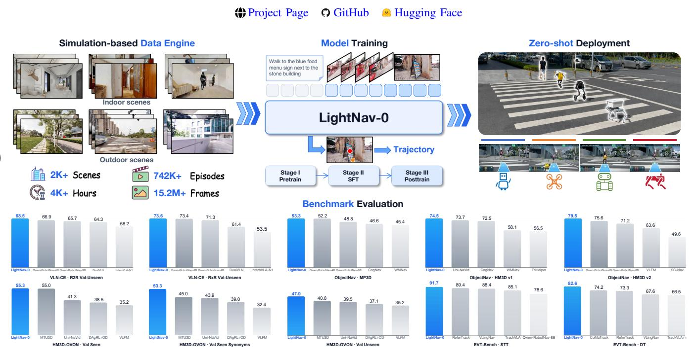

Fig. 1. **LightNav-0:** 단일 자가 회귀 모델이 활용성 및 객체 포인트를 통해 공간 의도를 표현하고, 작업-또는 구현형 특정 예측 헤드 없이 RVQ-tokenized 궤적을 예측하는 컴팩트한 일반화 구현형 탐색 모델이다. 이 단일 모델은 지시 따르기, 객체 목표 탐색, 구현형 시각 추적을 아우르는 10개의 공개 시뮬레이션 설정에서 단안 성공률을 최첨단 수준으로 달성하며, 인간형, 사지형, 항공형, 그리고 바퀴형 로봇에 제로샷으로 전이된다. 파란 막대는 LightNav-0을, 회색 막대는 기존 방법을 나타낸다.

Abstract—구현형 탐색은 에이전트가 다양한 목표와 시각 관찰을 작업, 환경, 로봇 구현형에 걸쳐 행동으로 변환하도록 요구한다. 현대의 비전-언어 모델(VLMs)은 이미 시각 기반 정착, 공간 추론, 포인팅을 위한 공간 선행 지식을 인코딩하고 있지만, 이러한 기능은 로봇 제어를 위해 직접 유도되는 경우가 드물다. 기존 탐색 시스템은 대신 작업-또는 구현형 특정 구성요소(웨이포인트 예측기, 토폴로지 지도, 행동 헤드 등)에 의존하여 인식, 추론, 행동을 분리하고 일반화 범위를 제한한다. 본 연구에서는 사전 학습된 VLM의 공간 지능을 유도하고 탐색과 정렬시키는 컴팩트한 일반화 구현형 탐색 모델 **LightNav-0**을 제시한다. **LightNav-0**은 이중 채널 포인팅을 통해 작업-, 장면-, 구현형-불편한 공간 의도를 표현하고, 잔여 벡터-양자화된 행동 토크나이저를 통해 이 의도를 정밀하고 구현형-특정 궤적으로 매핑한다. 시간 인식 시각 기록 압축, ER midtraining, 감독 기반 미세 조정, 강화 학습과 결합된 이 구성은 지시 따르기, 개방형 어휘 객체 탐색, 시각 추적을 단일 모델 내에서 지원한다. 탐색 훈련 코퍼스는 2K+ 장면과 4K+ 시간의 구현형 탐색 데이터를 포함한다. LightNav-ER는 8개의 구현형-추론 벤치마크에서 가장 높은 전체 세트 평균을 달성한다,

LightNav-0는 10개의 공개 탐색 시뮬레이션 설정에서 단안 성공률을 최첨단 수준으로 달성한다. 실세계 평가는 로봇 구현형, 다양한 장면, 정적 및 동적 목표에 걸친 제로샷 일반화를 추가로 입증한다. 이러한 결과는 컴팩트 VLM을 일반화 구현형 탐색을 위한 통합적이고 전이 가능한 백본으로 확립한다.

#### I. 서론 (I. INTRODUCTION)

구현형 탐색은 에이전트가 물리적 세계를 이동하며 주어진 목표를 달성하기에 적합한 위치에 도달하도록 하는 능력이다. 이는 자연어 지시 따르기, 지정된 객체나 장소 탐색, 이동 목표 추적 등 다양한 목표 지향 행동을 포함한다 [4, 66, 84]. 이러한 작업 전반에서 에이전트는 관찰 속에서 언어적 또는 시각적 목표를 정착시키고, 공간 및 시간적 맥락을 유지하며, 다중 모달 이해를 실행 가능한 행동으로 변환해야 한다. 따라서 일반 탐색 모델은 환경뿐 아니라 작업과 로봇 구현형 전반에 걸쳐 전이되어야 한다. 그러나 대부분의 기존 시스템은 단일 작업 또는 벤치마크에 최적화되어 있으며 웨이포인트 예측기, 토폴로지 지도, 행동 헤드 등과 같은 특수 구성요소에 의존한다 [2, 38,

[66,](#page-24-0) [69&#93;](#page-24-1). 이 분할은 개방형 어휘 전이를 제한하고, 플랫폼 간에 학습된 추론의 재사용을 방해하며, 구현형 탐색을 현대 비전-언어 모델의 확장 혜택에서 고립시킨다.

현대 VLM은 이미 내비게이션에 필요한 많은 기능을 인코딩하고 있다. 여기에는 오픈-어휘 인식, 공간 추론, 지시 이해, 그리고 시계열 비디오 해석이 포함된다 [5,] [29,] [63]. 이는 다른 설계 원칙을 시사한다: 소형 VLM이 일반 구현형 내비게이션을 위한 공유 추론 백본으로 활용될 수 있다. 우리는 이 원칙을 Qwen3-VL-4B-Instruct [5]에 적용하여, 개별 작업이나 구현체에 대한 작업별 예측 헤드를 도입하지 않고 사전 학습된 아키텍처를 그대로 유지한다. 내비게이션 기능은 어휘 확장, 통합 감독, 단계적 훈련을 통해 획득되며, 모델을 소형으로 유지하면서 의미적 및 공간적 선행 지식을 보존한다.

범용 VLM과 이질적인 구현형 내비게이션 정책을 연결하려면, 공간적으로 의미가 있고 특정 행동 공간에 독립적인 중간 표현이 필요하다. 우리는 포인팅이 자연스럽게 그러한 인터페이스를 제공한다고 주장한다. 최근 VLM은 이미지 평면 포인트로 직접 기반된 공간 결정을 표현할 수 있다 [17,] [86], 이를 통해 내비게이션 모델은 시각적 정착, 공간 추론, 장면 이해에서 백본의 사전 학습된 능력을 보존하고 활용할 수 있다. 따라서 우리는 채널별 이미지 그리드 토큰을 사용한 이중 채널 포인팅을 과제와 로봇 구현체 전반에 걸친 공유 인터페이스로 정의한다. 어포던스 포인트는 실행 가능한 방향 또는 자유 공간 웨이포인트를 나타내고, 객체 포인트는 작업 목표를 로컬라이즈한다. 즉, 목표 객체 또는 목표 위치를 가리킨다. 이 기반된 공간 의도를 행동 디코딩 전에 예측함으로써, 정밀하고 구현체별 내비게이션 행동 생성을 안내하는 명시적 추론 단계를 제공한다. 이 공유 표현은 별도의 작업별 설계 없이 지시 따르기, 객체 탐색, 목표 추적을 지원한다.

이 인터페이스를 기반으로, 우리는 소형 VLM 백본과 토큰 기반 출력만을 사용하여 엔드투엔드 시스템을 구축한다. 자동 이중 채널 주석 파이프라인은 내비게이션 목표를 공유 포인팅 공간에 투영한다. 시간 인식형 시각적 히스토리 압축은 제한된 시각 토큰 예산 안에서 최근 세부 정보와 장기 맥락을 모두 보존한다. RVQ 기반 액션 토크나이저는 단기 궤적을 언어 모델 토큰으로 변환하고, 이후 실행 레이어가 이를 플랫폼별 제어로 매핑한다. 구현체 추론 중간 훈련, DAgger [60]를 이용한 감독형 미세 조정, 그리고 온라인 강화 학습은 인식, 추론, 제어를 점진적으로 정렬한다.

우리는 LightNav-0를 지시 따르기 VLN, 객체 목표 내비게이션, 구현형 시각 추적을 포함한 10개의 공개 내비게이션 시뮬레이션 설정에서 평가한다. 보완적인 포인팅 및 공간-VQA 평가를 통해 내비게이션 적응이 VLM의 원래 정착 능력을 보존하는지 테스트한다. 실제 시연은 로봇 구현체, 야외 장면, 동적 목표 간의 전이성을 추가로 탐구한다. 이 실험들은 핵심 가설을 입증한다: 소형 VLM 백본이 교차 작업 및 교차 구현체 내비게이션을 위한 통합적이고 전이 가능한 기반을 제공할 수 있다.

# II. 관련 연구 (RELATED WORK)

## *A. 일반형 구현형 내비게이션* (Generalist Embodied Navigation)

구현형 내비게이션은 오랫동안 지시 따르기 VLN [4,] [37,] [39], 객체 내비게이션 [6,] [84], 그리고 구현형 시각 추적 [66] 등 별개의 문제로 연구되어 왔다. 해결책은 손으로 설계된 인터페이스를 통해 인식, 매핑, 계획 모듈을 연결하거나 [50,] [80,] [81,] [83] 개별 작업에 특화된 엔드투엔드 정책을 학습한다 [58,] [88], 그러나 작업, 센서 스위트, 로봇이 바뀌면 두 접근 모두 전이가 잘 되지 않는다.

비디오 기반 시각-언어-행동(VLA) 모델은 이러한 파이프라인을 단일 시각-언어 백본으로 대체했다. NaVid [90]는 처음으로 비디오 VLM이 단일 RGB만으로 탐색 행동을 예측할 수 있음을 보여주었으며, 이후 모델들은 더 많은 작업을 통합하고 스트리밍 효율성을 개선했다 [16,] [76,] [92]. 최근 탐색 기반 기초 모델들은 이 레시피를 작업, 환경, 구현체 전반에 걸쳐 확장하고 있다. 예를 들어 NavFoM [91], ABot-N0/N1 [18,] [27], Qwen-RobotNav [93], 그리고 Qwen-VLA [56] 등이 있다. 그러나 이들의 행동 인터페이스는 크게 다르다. 언어 토큰으로 디코딩되는 이산 원자 명령어 [53,] [76,] [90]는 동작을 거칠게 양자화한다. 파노라마 관측이나 토폴로지 그래프에서 예측되는 웨이포인트는 지침을 잘 따르지만 추가 센싱과 명시적 지도가 필요하다 [2,] [38,] [69,] [70]. 앵커 기반 디퓨전 [66], 플로우 매칭 [7,] [8], 또는 회귀 헤드 [35,] [93]에 기반한 연속 행동 모듈은 부드럽게 동작하지만, 행동 생성을 언어 모델 외부에 두고 있다. 순수하게 자기회귀적 양자화 [34,] [54]는 생성 과정을 모델 내부에 두지만, 토큰 효율성을 위해 정밀도를 희생한다.

이러한 설계들에서 전이 가능한 탐색 능력은 종종 사전 학습된 백본 외부에 추가된 구조에 의존한다: 파노라마 또는 다중 카메라 프론트 엔드, 작업 및 구현체 식별자 토큰, 그리고 별도의 행동 헤드 또는 전문가. LightNav-0은 단일 컴팩트 백본을 단일 RGB로 구동하며, 고정된 시각 토큰 예산 하에서 관측 기록을 압축하고, 작업 식별자나 보조 예측 헤드를 도입하지 않는다. 그 잔여 벡터-양자화 토크나이저는 원래 언어 모델 헤드의 세 토큰에서 10개의 SE(2) 웨이포인트를 디코딩하여, 디퓨전 플래너, 플로우 매칭 전문가, 또는 구현체별 행동 헤드 없이도 고정밀 연속 제어를 가능하게 한다.

## *B. Linguistic and Visual Chain-of-Thought* (언어 및 시각적 사고 체인)

사고 체인 프롬프트[74]는 행동을 수행하기 전에 명시적 추론 트레이스를 생성함으로써 구현체 행동에 확장되었다. 언어 측면에서, 구현체 사고 체인은 낮은 수준 명령 전에 기반이 되는 언어 계획을 생성한다[87,] [99]. 탐색에서는 OctoNav[25]와 Nav-R1[48]이 합성된 사고 체인에서 차가운 시작 think-before-action 행동을 보이며, VLingNav[67]는 고정된 속도가 아닌 적응적으로 추론을 유발한다. Hydra-Nav[71]는 단일 VLM 내에서 느린 시공간적 숙고와 빠른 반응 실행을 통합하며, 중요한 탐색 정체 지점에서 느린 시스템을 선택적으로 호출하도록 학습한다. Aux-Think[68]는 텍스트 추론이 보조 훈련 신호로 가장 유익하다고 보고한다. 이는 매 단계마다 긴 근거를 디코딩하는 것이 비용이 많이 들고 제어를 저하시킬 수 있기 때문이다.

두 번째 가족은 단어 대신 시각적으로 추적(trace)을 표현한다. CoT-VLA [97](#page-25-9)는 예측된 미래 프레임을 통해 추론하고, ThinkAct [30](#page-22-9)는 잠재적 시각적 계획을 강화하며, NavForesee [45](#page-23-8)는 시각-언어 세계 모델 안에서 계층적으로 계획한다. 몇몇 방법은 추적을 이미지 평면에 배치한다: AO-Planner [13](#page-21-7)는 VLM과 함께 능동성 기반 픽셀 웨이포인트를 선택하고, 실행을 저수준 플래너에 위임한다. 듀얼 시스템 모델인 DualVLN과 InternVLA-N1 [32,](#page-22-10) [75](#page-24-12)는 느린 7B 플래너로 가장 멀리 도달 가능한 픽셀 목표를 기반으로 하고, 그 다음 빠른 디퓨전 스타일 궤적 정책에 넘긴다. Robostral Navigate [9](#page-21-8)는 추적을 하나의 단안 모델 안에 보관하며, 현재 카메라 뷰에서 가리키는 방식으로 다음 웨이포인트를 예측한다. 다른 방법들은 위치 대신 기하학적 추적을 만들며, 3D geometry foundation model [89](#page-25-10)에서 가져온 사전 지식이나 부피 예측에 의해 감독되는 단일 점유 토큰을 사용하고, 이를 공간적 사상 체인으로 재주입한다 [47](#page-23-9).

LightNav-0은 고정 길이 트레이스에서 명시적 추론과 시각적 기반화를 결합한다. 이 모델의 이중 채널 포인팅 프리픽스는 실행 가능한 지역 움직임을 위한 어포던스 포인트와 목표 물체 또는 목표 위치를 위한 물체 포인트를 예측한다. 두 포인트는 채널별 이미지 그리드 토큰으로 표현되며, 백본의 사전 학습된 공간 기반화를 대체하는 대신 활용한다. 동일한 표현은 명령어 수행 VLN, 오픈-어휘 물체 탐색, 그리고 구현된 시각 추적을 지원한다. 프리픽스는 행동과 동일한 토큰 공간에서 감독되며, 결정마다 일정한 토큰 수를 소비한다. 따라서 자유 형식 텍스트 심사나 두 번째 계획 시스템의 가변 디코딩 지연 없이 명시적 추론 단계의 해석 가능성을 유지한다.

#### *C. 강화 학습 사후 훈련 (Reinforcement Learning Post-Training)*

강화 학습은 구현형 탐색에서 모방을 보완해 왔다. 대규모 분산 온-폴리시 훈련[77]과 그 트랜스포머 규모의 후속작[88]부터 모방 사전 훈련 후 RL 미세 조정[59]까지 이어진다. 이러한 정책은 작업별이며 몇 개의 이산 원시 동작에 대해 동작한다. 따라서 행동 확률이 즉각적이며 롤아웃 비용이 낮다. 정책이 일반화된 VLA가 되면 이 두 특성은 자동으로 발생하지 않는다.

For VLM 기반 정책에서 지배적인 방법은 검증 가능한 보상 사후 훈련이다.  
그룹 상대 정책 최적화[&#91;28,](#page-22-11) [61&#93;](#page-24-14)는 학습된 크리틱을 제거하고 두 번째 RL 단계를 규모에 맞게 실용화했으며, 같은 방법은 다중 모달 추론[&#91;24,](#page-22-12) [31&#93;](#page-22-13)에도 적용되었다.  
네비게이션은 이를 빠르게 채택했다.  
VLN-R1[&#91;53&#93;](#page-23-5)는 다단계 행동 예측에 대해 시간 감쇠 보상을 적용하고, Nav-R1[&#91;48&#93;](#page-23-7)는 형식, 이해, 궤적 보상을 결합한다.  
OctoNav[&#91;25&#93;](#page-22-8)는 온라인 탐색 단계 이전에 검증 가능한 보상을 사용해 추론 트레이스를 정제하고, ActiveVLN[&#91;96&#93;](#page-25-11)은 최적화를 다중 턴 온-폴리시 롤아웃으로 확장한다.  
ABot-N1[&#91;27&#93;](#page-22-5)는 같은 기계를 한 단계 위로 옮긴다. 느린 시스템의 연쇄 사고와 픽셀 목표 출력을 행동으로 간주하고, 그 출력에 대해 형식, 목표, 안전 간격 보상을 형성하지만 이는 포인트 목표 작업에만 해당한다.  
Robostral Navigate[&#91;9&#93;](#page-21-8)은 대신 보상을 목표까지의 단일 종단 거리로 축소하고, 그룹 상대 이점 추정 하에 CISPO로 최적화한다. 또한 롤아웃 풀을 탐색해 감독 정책이 해결하지 못한 작업만 남긴다.  
이러한 시스템은 보상 설계가 다르지만 행동 인터페이스는 일치한다: 최적화기가 보는 것은 항상 이산 언어 토큰이다. 이 선택이 업데이트를 저렴하게 유지하는 이유이며, 정책 기울기에 필요한 양은 이미 토큰 로그 확률이기 때문이다. 그 비용은 거친 행동 공간이다.

연속 헤드를 부착한 정책은 정밀도를 회복하지만 그 양을 잃는다.  
SimpleVLA-RL[&#91;42&#93;](#page-23-11)는 자기 회귀 정책을 유지하고 결과 전용 보상을 제공하지만, 흐름 기반 정책은 정책 기울기가 적용되기 전에 노이즈 제거 과정을 마코프 결정 프로세스로 재구성해야 한다[&#91;14,](#page-21-9) [95&#93;](#page-25-12).

따라서 공개된 질문은 보상을 어떻게 재구성하느냐가 아니라, 정책이 정밀하게 행동하면서도 실행 가능한 행동당 확률을 노출할 수 있는가이다.  
LightNav-0의 잔여 벡터 양자화 인터페이스는 두 가지를 동시에 제공한다.  
각 결정 단계의 궤적은 언어를 생성하는 동일한 헤드에서 방출되는 세 개의 RVQ 토큰으로 구성되므로, 그 로그 확률은 정확하고 그룹 상대 업데이트가 그대로 적용된다.  
보조 MDP, 노이즈 재구성, 별도 크리틱이 필요 없지만 디코딩은 여전히 10개의 연속 SE(2) 웨이포인트를 회복한다.  
전체 궤적이 세 토큰만을 소비하므로, 신용 할당 수평선이 짧게 유지되고 각 롤아웃이 저렴하다.

# III. 모델 아키텍처 (MODEL ARCHITECTURE)

## *A. 아키텍처 개요* (Architecture Overview)

LightNav-0는 이질적인 구현형 내비게이션 과제를 조건부 토큰 생성으로 공식화한다.  
결정 단계 t에서 모델은 자연어 지시문 I와 자가 중심 RGB 히스토리 O1:t = {o1, …, ot}를 받는다.  
그는 이중 채널 포인팅 접두사를 생성한 뒤 짧은 수평 행동 시퀀스를 만든다.  
디코딩된 행동은 10개의 미래 SE(2) 웨이포인트 궤적이며, 이는 서로 다른 로봇 구현체의 하위 제어기에 공통적인 기하학적 인터페이스를 제공한다.  
작업 의미는 전적으로 지시문과 감독 형식에 의해 지정되며, 우리는 작업 식별 토큰을 도입하지 않는다.

우리는 Qwen3-VL-4B-Instruct [5](#page-21-2)에서 LightNav-0을 인스턴스화한다. 이 모델의 백본은 네이티브 해상도의 비전 트랜스포머와 36층 언어 모델로 구성된다. 탐색 전용 모듈을 도입하는 대신 사전 학습된 아키텍처를 그대로 유지하고, 인덱스된 ⟨aposi ⟩, ⟨oposi ⟩, 그리고 RVQ 액션 토큰으로만 어휘를 확장한다. 중간 단계의 공간 예측과 액션 코드는 모두 원래의 자기 회귀 언어 모델 헤드를 통해 디코딩되며, 웨이포인트 예측기, 작업별 액션 헤드, 또는 구현체별 전문가가 없다. Fig. [2,](#page-3-0)에 표시된 바와 같이, 타임스탬프가 달린 시각적 기록, 현재 관측, 그리고 지시문에서 나온 토큰이 각 결정 단계에서 단일 인과적 시퀀스 안에 교차 삽입된다. 이 간결한 공식은

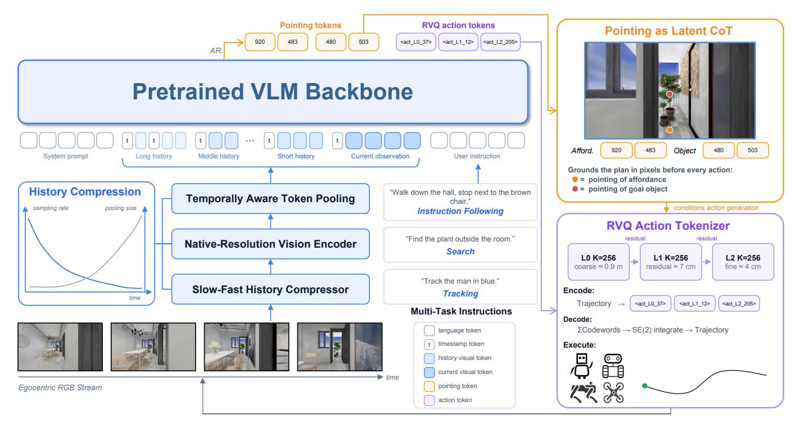

Fig. 2. **LightNav-0 개요.** 간결한 사전 학습된 VLM은 시간적으로 압축된 자가 중심 RGB 기록과 자연어 목표를 소비한다. 먼저 명시적 공간 추론 트레이스로 포인팅을 방출하고, 이어서 세 개의 잔여 벡터 양자화(RVQ) 액션 토큰을 생성한다. 액션 토큰은 10개의 미래 SE(2) 웨이포인트로 디코딩되며, 구현체별 저수준 컨트롤러에 의해 실행된다. 동일한 백본, 토큰 인터페이스, 그리고 목표는 모든 탐색 작업에 사용된다.

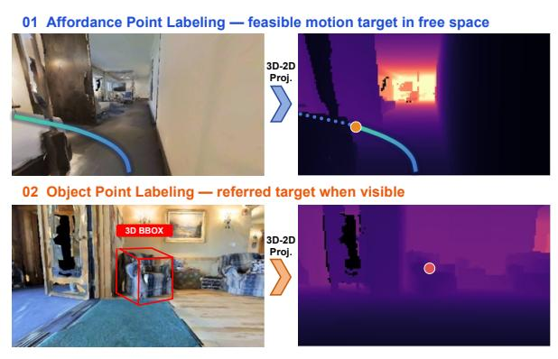

Fig. 3. 자동 이중 채널 포인팅 주석. 어퍼런스 채널은 실행 가능한 지역 방향 또는 자유 공간 웨이포인트를 표시하고, 객체 채널은 작업 목표를, 즉 대상 객체나 목표 위치를 로컬라이즈한다.

백본의 사전 학습된 시각 기반 정렬 및 공간 추론 능력을 활용하면서, 이를 작업 및 구현체 전반에 걸쳐 공유되는 통합 제어 인터페이스와 정렬한다.

#### B. 시간 인식 시각 기록 압축 (Temporally Aware Visual History Compression)

탐색은 최근 기하학적 세부 정보와 장기 맥락을 모두 필요로 하지만, 모든 과거 프레임을 네이티브 해상도로 인코딩하면 시각 토큰 수가 무한히 증가한다. 따라서 우리는 시간적 최신성에 따라 기록을 압축한다. 설계는 에빙하우스 망각 곡선[21]의 정성적 형태를 따른다: 최근 관측은 더 높은 샘플링률과 더 정밀한 공간 해상도를 가지며, 반면 오래된 관측은 덜 자주 샘플링되고 더 공격적으로 풀링된다.

시간 $t_i$에 획득된 과거 프레임의 경우, 그 나이를 $\Delta T_i = t - t_i$로 정의한다. 샘플링률은 지수적으로 감소한다,

$$f_s(i) = f_s^{\text{max}} \exp\left(-\frac{\Delta T_i}{\tau_s}\right)$$

(1)

여기서 $f_s^{\max}$는 최대 샘플링률이며, $\tau_s$는 시간적 감쇠를 제어한다. 선택된 프레임은 네이티브 해상도 비전 트랜스포머에 의해 독립적으로 인코딩된다. 결과 패치 그리드 $\mathbf{V}_i$를 주어진 경우, 우리는 공간 풀링 스트라이드를 다음과 같이 설정한다,

$$s_{i} = \max \left\{ 1, \left[ \exp \left( \frac{\Delta T_{i}}{\tau_{p}} \right) \right] \right\}$$

$$\widetilde{\mathbf{V}}_{i} = \mathcal{G}_{s_{i}}(\mathbf{V}_{i})$$

(2)

여기서 $\tau_p$는 공간 압축 속도를 제어하고, $\mathcal{G}_{s_i}$는 스트라이드 $s_i$를 갖는 그리드 풀링을 나타낸다. 따라서 시간적으로 멀리 떨어진 관측은 더 적은 수의 더 거친 토큰을 기여하며, 현재 관측은 가장 정밀한 시각 세부 정보를 유지한다. 타임스탬프 토큰은 풀링 후에도 시간 순서를 보존한다.

컴프레서는 비전 트랜스포머 이후에 동작하며, 256K, 576K, 1M의 가변 픽셀 예산 하에서 가변 길이, 네이티브 해상도 입력을 지원한다. 선택된 예산 내에서 프레임 샘플링과 계층별 적응 풀링은 장기, 중기, 단기 기록 전반에 걸쳐 토큰을 공동으로 할당한다. 이 느림-빠름 할당은 컨텍스트를 제한한다

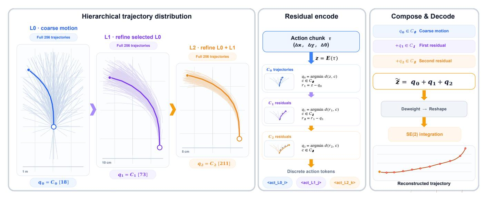

그림 4. 계층적 잔차 벡터 양자화 액션 토크나이저. 10단계 SE(2) 궤적은 거친 256개 항목 코드북과 두 개의 잔차 256개 항목 코드북으로 양자화된다. 각 단계는 모든 256 후보를 시각화하고 선택된 코드워드를 강조한다. 비어 있지 않은 토큰 접두사는 실행 가능한 거친 궤적으로 디코드되며, 이후 잔차 단계는 점진적으로 기하학적 정밀도를 향상시킨다.

전체 기록을 단일 고정 해상도 표현으로 압축하지 않는 길이.

#### C. 다중 채널 포인팅을 잠재 공간 추론으로 (Dual-Channel Pointing as Latent Spatial Reasoning)

VLM은 2D 토큰 격자에서 시각적 증거를 나타내지만, 탐색은 미터 단위 공간에서 기하학적으로 정밀한 동작을 요구한다. 따라서 우리는 각 투영된 점을 수평 및 수직 좌표 토큰 대신 채널별 이미지 그리드 토큰으로 인코딩한다. 현재 뷰를 $H_g$ 행과 $W_g$ 열로 분할하자. 투영된 점 $\mathbf{p} = (u, v) \in [0, 1]^2$ 은 평면화된 격자 인덱스를 할당받는다.

$$r(\mathbf{p}) = \min\{H_g - 1, \lfloor H_g v \rfloor\}$$

$$c(\mathbf{p}) = \min\{W_g - 1, \lfloor W_g u \rfloor\}$$

$$i(\mathbf{p}) = r(\mathbf{p})W_g + c(\mathbf{p})$$

(3)

가치화 채널과 객체 채널은 이 공유 격자 위에 인덱스된 서로 다른 토큰 패밀리를 사용한다. 가치화 점 $p^a$ 는 단일 토큰 $\langle apos_{ia} \rangle$ 로 직접 인코딩되며, 여기서 $i^a = i(\mathbf{p}^a)$ 이다. 토큰 패밀리 (aposi) 는 가치화 점을 나타내고, 선택된 셀은 자유 공간에서 실행 가능한 로컬 방향 또는 착륙 위치를 표시한다. 객체 점 $\mathbf{p}^{o}$ 는 단일 토큰 $\langle opos_{i^o} \rangle$ 로 직접 인코딩되며, 여기서 $i^o = i(\mathbf{p}^o)$ 이다. 토큰 패밀리 $\langle opos_i \rangle$ 는 객체 점을 나타내고, 작업 목표를 로컬라이즈한다. 목표 객체이거나 목표 위치일 수 있다. 해당 토큰 패밀리 내 예약 인덱스는 유효한 이미지 그리드 셀이 없는 경우를 나타내며, 여기에는 제자리 회전, 정지, 목표 가시성 부재가 포함된다.

각 결정 단계에서 전체 탐색 출력은 다음과 같이 직렬화된다

$$\mathbf{y}_{t} = [\langle \operatorname{apos}_{i_{t}^{a}} \rangle, \langle \operatorname{opos}_{i_{t}^{o}} \rangle, \\ \langle \operatorname{act}\_\operatorname{L0}_{k_{0,t}} \rangle, \langle \operatorname{act}\_\operatorname{L1}_{k_{1,t}} \rangle, \langle \operatorname{act}\_\operatorname{L2}_{k_{2,t}} \rangle]$$

$$(4)$$

따라서 포인팅 접두사는 정확히 두 개의 원자 토큰을 포함하고, 바로 뒤에 세 개의 RVQ 액션 토큰이 이어진다. 별도의 채널 마커나 좌표 토큰은 생성되지 않는다. 인과적 주의(attention)는 이 압축된 접두사를 명시적 잠재 공간 추적으로 만들어 궤적 생성을 조건화한다. 동일한 격자 인덱싱 스킴은 탐색, 포인팅, 공간-VQA 감독 전반에 공유되어 탐색 훈련이 백본의 시각적 정착 기능을 재사용할 수 있게 한다. 그림 3에 나타난 바와 같이 자동 주석은 가치화 목표와 작업 관련 객체 또는 목표 위치를 현재 뷰에 투영한다. 각 유효한 가치화 투영은 인덱스된 $\langle apos_i \rangle$ 토큰을 할당받으며, 각 유효한 객체 또는 목표 투영은 인덱스된 $\langle opos_i \rangle$ 토큰을 할당받는다. 격자가 이미지 평면에서 정의되고 구현 특화 제어 공간이 아니라서, 표현은 탐색 과제와 로봇 플랫폼 전반에 걸쳐 공통적이다.

#### D. 잔차 벡터 양자화 액션 토크나이저 (Residual Vector-Quantized Action Tokenizer)

언어 모델 헤드에서 연속적인 제어를 직접 방출하면 토큰 예측과 기하학적 정밀도 사이에 불일치가 발생한다. 대신 각 액션 청크를 10개의 미래 SE(2) 웨이포인트로 표현하고, 잔차 벡터 양자화를 사용해 전체 경로를 토크나이즈한다. 이는 Fig. 4에 시각화되어 있다. $\mathbf{z}_t \in \mathbb{R}^{10 \times 3}$ 를 벡터화된 웨이포인트 시퀀스로 둔다. 토크나이저는 256개의 코드워드를 갖는 3개의 레벨별 코드북 $\mathcal{C}^{(0)}, \mathcal{C}^{(1)}, \mathcal{C}^{(2)}$ 를 포함한다. 첫 번째 레벨은 거친 경로를 캡처하고, 다음 두 레벨은 차례로 그 잔차를 양자화한다:

$$k_{\ell} = \arg\min_{k} d_{J} \left( \mathbf{r}^{(\ell)}, \mathbf{e}_{k}^{(\ell)} \right)$$

$$ \mathbf{r}^{(\ell+1)} = \mathbf{r}^{(\ell)} - \mathbf{e}_{k_{\ell}}^{(\ell)} $$

$$ \mathbf{r}^{(0)} = \mathbf{z}_{t} $$

$$(6)$$

$$\mathbf{r}^{(\ell+1)} = \mathbf{r}^{(\ell)} - \mathbf{e}_{k_{\ell}}^{(\ell)} \qquad \mathbf{r}^{(0)} = \mathbf{z}_{t}$$

(6)

여기서 $d_J$ 는 잔여 k-평균 적합 과정에서 사용되는 야코비안 가중 트래젝터리 거리이다. 통합 트래젝터리 공간에서의 가중치는 코드북을 형성할 때 변위와 헤딩 오류를 균형 있게 만든다. 우리는 다음과 같이 트래젝터리를 할당한다:

$$d_{\text{traj}}(\mathbf{z}, \hat{\mathbf{z}}) = \text{ADE}(\mathbf{z}, \hat{\mathbf{z}}) + \lambda \left| \Delta \theta(\mathbf{z}) - \Delta \theta(\hat{\mathbf{z}}) \right| \tag{7}$$

이 식은 트래젝터리 수준에서 위치 편차와 누적 헤딩 오류를 모두 측정한다. 트래젝터리 오류 분석을 바탕으로 λ 를 모든 실험에서 0.3 으로 설정한다.

세 개의 레벨별 인덱스는 레벨별 액션 토큰 [⟨act L0k0,t ⟩,⟨act L1k1,t ⟩,⟨act L2k2,t ⟩] 으로 방출된다. 길이 L인 생성된 접두어에 대해 우리는 다음과 같이 재구성한다:

$$\hat{\mathbf{z}}_t^{(L)} = \sum_{\ell=0}^{L-1} \mathbf{e}_{k_\ell}^{(\ell)} \qquad L \in \{1, 2, 3\}$$

(8)

그리고 zˆ (L) t 를 SE(2) 에 통합하여 10개의 웨이포인트를 복원한다. 첫 번째 토큰은 대략적인 경로를 지정하고, 이후의 각 토큰은 앞선 레벨이 남긴 잔여를 보정한다. 비어 있지 않은 모든 접두어는 동일한 디코더에 의해 재구성되고 통합되어 실행 가능한 경로를 제공하며, 불완전한 액션 표현이 아니다. 계산량이나 지연 시간이 제한된 경우, 생성은 첫 번째 RVQ 토큰 이후 또는 두 번째 토큰 이후에 중단될 수 있으며, 이때 기하학적 정밀도를 낮추고 자기회귀 비용을 절감한다. 완전한 3레벨 디코딩은 가장 높은 정밀도를 제공하며, 3개의 토큰으로 최대 2563 코드 조합을 나타낼 수 있다. 평균 변위 오차는 0.72 cm이며, 이는 단일 레벨 K = 4096 VADv2 스타일 계획 어휘집([15])의 2.48 cm와 비교된다. 이 기준은 VAD([33])가 도입한 벡터화된 계획 공식화를 따르지만, 잔여 정제 없이 단일 경로 토큰을 사용한다. 공유된 경로는 최종적으로 로봇의 하위 수준 컨트롤러에 의해 플랫폼별 명령으로 변환된다.

#### *E. 통합 자기회귀 목표* (Unified Autoregressive Objective)

네비게이션과 보조 VQA 예제는 동일한 인과적 언어 모델 목표로 훈련된다. 입력 컨텍스트 x와 감독된 출력 위치 M에 대해 우리는 다음을 최소화한다:

$$ \mathcal{L}_{CE} = -\sum_{j \in \mathcal{M}} \log p_{\theta}(y_j \mid \mathbf{x}, y_{< j}).$$

(9)

네비게이션의 경우, 감독된 시퀀스는 하나의 ⟨aposi⟩ 토큰, 하나의 ⟨oposi⟩ 토큰, 그리고 3개의 RVQ 액션 토큰을 포함한다. 포인팅 또는 공간 VQA의 경우, 해당 인덱스 토큰 또는 언어 응답을 포함한다. 이 형식은 모든 작업을 공유 토큰 공간과 예측 헤드를 통해 노출한다. 또한 별도로 균형을 맞춘 네비게이션 손실을 피하고, 모든 샘플이 동일한 패킹된 자기회귀 훈련 루프를 공유하도록 한다.

#### *F. 학습 및 추론 효율성* (Training and Inference Efficiency)

컴팩트하고 순수하게 자기회귀적인 인터페이스는 각 샘플을 공통 최대값으로 패딩하지 않고 가변 길이 샘플을 패킹할 수 있게 한다. 우리는 동적으로 각 8,192‑토큰 훈련 시퀀스에 약 8.6개의 샘플을 패킹한다. 융합된 비전 로터리‑포지션‑임베딩 연산과 8의 배수로 정렬된 LM‑헤드 차원은 커널 및 메모리 오버헤드를 추가로 감소시킨다. 이러한 최적화는 모델이 작업별 액션 모듈을 포함하지 않기 때문에 균일하게 적용된다.

추론 시, 비전 트랜스포머와 언어 모델은 단일 프로세스에서 실행되며, 자기회귀 디코딩은 vLLM [41](#page-23-12)으로 제공된다. 이 단일 프로세스 구현은 시각적 특징의 프로세스 간 전송을 피하고 NVIDIA GeForce RTX 4090에서 생성된 토큰당 약 4 ms의 추론 지연 시간을 달성한다. 각 추론 단계는 ⟨apos^i⟩와 ⟨opos^i⟩ 접두사 뒤에 최대 3개의 RVQ 액션 토큰을 필요로 한다. 자원 제약이 있는 배포는 첫 번째 또는 두 번째 RVQ 수준 이후에 중단하고 해당 거친 궤적을 실행할 수 있으며, 세 번째 수준은 최대 기하학적 정밀도가 필요할 때 생성된다.

# IV. 데이터 & 벤치마크 (DATA & BENCHMARS)

우리의 데이터 설계는 모델과 동일한 원칙을 따른다: 이질적인 구현된 작업은 액션으로 매핑되기 전에 공통의 지각 및 공간 기반을 공유해야 한다. 따라서 우리는 훈련 데이터를 두 개의 결합된 혼합물로 구성한다. 탐색 코퍼스는 2K+ 장면과 4K+ 시간의 구현된 궤적을 포함한다. 구현‑추론(ER) 중간 훈련은 36개의 소스를 활용해 공간 이해, 시간 추론, 시각적 기반을 강화한다. 감독 기반 미세 조정(SFT)은 이후 16개의 탐색 소스와 33개의 보조 ER 및 VQA 소스를 결합한다. 활성 샘플링 일정에 따라 최적화 샘플의 77.6%는 탐색‑액션 감독을 포함하고 22.4%는 ER 중간 훈련 중 획득한 지각 및 추론 능력을 연습한다. 이 비율은 고유한 코퍼스 범위가 아니라 작업 균형 최적화 혼합을 설명한다. 이 분리는 통합된 포인팅‑액션 인터페이스를 변경하지 않고 작업 및 장면 다양성을 증가시킬 수 있게 한다.

#### *A. 구현된 추론 데이터*

Molmo2-ER의 기능 지향적 조직에 따라 [22](#page-22-16), 우리는 ER 코퍼스를 가장 직접적으로 탐색을 지원하는 역량을 중심으로 구성한다. 두 단계 데이터 커리큘럼은 Fig. [5.](#page-6-0)에 표시된다. 혼합은 샘플링 질량의 35.14%를 포인팅에, 25.05%를 단일 이미지 VQA에, 19.81%를 비디오 추론에, 20.00%를 일반 시각 및 추상 추론에 할당한다. 단일 벤치마크 형식에 최적화하기보다, 이 소스들은 합성 장면, 실제 이미지, 자가 중심 비디오, 다중 시점 관찰, 로봇 상호작용 데이터 전반에 걸쳐 상호 보완적 감독을 모델에 노출시킨다.

*1) Image Embodied QA:* 11개의 단일 이미지 VQA 소스가 인덱스 감독을 제공한다. 세 개의 독립 컬렉션은 SenseNova-SI Spatial, CLEVR Spatial VQA, SAT Spatial VQA이다. 나머지 여덟 개는 VSTP-SI Depth Comparison, VSTP-SI Distance, VSTP-SI Scene Caption, VSTP-SI Measurement, VSTP-MI Correspondence, VSTP-MI Object– Object Relation, VSTP-MI Camera Motion, 그리고 VSTP-MI Scene Caption이다. 이들의 질문은 상대 위치, 메트릭 깊이 및 거리, 객체–객체 관계, 카메라 움직임, 물리적 측정, 장면 설명, 그리고 활용성 지향 추론을 다룬다. 이 혼합은 모델이 정성적 관계, 예를 들어 좌/우 및 앞/뒤와 같은 관계를 회복하도록 가르친다.

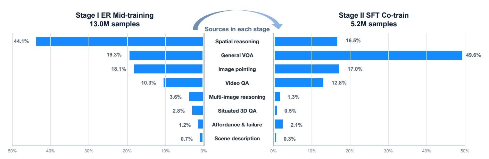

Fig. 5. **2단계 구현된 추론 데이터 커리큘럼.** 단계 I는 공간 추론, 일반 VQA, 이미지 포인팅, 비디오 QA, 다중 이미지 추론, 상황화된 3D QA, 활용성 및 실패 이해, 그리고 장면 설명을 포함한다. 단계 II는 감독 공동 훈련 중 재조정된 ER 혼합을 통해 이러한 역량을 유지한다.

그리고 통과 가능한 자유 공간과 시각적으로는 그럴듯하지만 기하학적으로는 부적합한 대상들을 구분하기 위해 필요한 정량적 신호들.

- 2) Video Embodied QA: 아홉 개의 비디오 소스가 인덱스된 감독을 제공한다. 로봇 중심 감독은 RoboVQA-Reasoning, RoboVQA-Understanding, 그리고 Robo-FAC Failure-VQA에서 나온다. 보다 넓은 비디오 및 상황-공간 감독은 VSI-590K Spatial, SIMS-VSI Spatial, ViCA-322K, LLaVA-Video-VQA, SQA3D-Situated, 그리고 SpatialLadder Spatial에서 제공된다. 데이터는 짧은 로봇 상호작용과 최대 64 프레임의 클립을 포함하며, 시계열 순서, 궤적 인식 공간 관계, 계획, 가능성 예측, 미래 상태 추론, 실패 이해에 대한 감독을 포함한다. 비디오 감독은 탐색에 중요하다. 왜냐하면 행동 가능성은 현재 뷰뿐 아니라 물체, 사람, 그리고 에이전트 자체가 시간에 따라 어떻게 변하는지에 달려 있기 때문이다.  

- 3) Pointing and Grounding: 포인팅은 ER 중간 훈련의 가장 큰 전문화된 구성 요소이다: 13개의 소스가 샘플링 확률의 35.14%를 차지한다. 객체 및 지시점 감독은 RefSpatial-2D와 RefSpatial-3D [98], PixMo Points Single, PixMo Points Multi, COCO Pointing [44], CoSyn Point, RefL4, 그리고 RoboRefIt에서 가져온다. 가능성, 자유 공간, 궤적 포인트 감독은 RoboPoint [86], RoboAfford, HANDAL, FSD Free-Point, 그리고 FSD Visual-Trace에서 나온다. 이 소스들은 지시된 객체 위치 지정, 자유 공간 선택, 상호작용 가능성, 시각적 궤적 추적을 모두 다룬다. 이들은 VLM이 이미지 평면에서 직접 공간 결정을 표현하도록 가르친다. 탐색 SFT 단계에서 같은 능력은 가능성 포인트 토큰  $\langle apos_i \rangle$ 와 객체 포인트 토큰  $\langle opos_i \rangle$ 가 사용하는 그리드로 구현된다.  

- 4) Multi-image and Ego-Exo Correspondence: 다중 이미지 샘플은 이미지-VQA와 비디오 풀 모두에서 추출된다. 명시적으로 다중 이미지 하위 집합은 VSTP-MI Correspondence, VSTP-MI Object-Object Relation, VSTP-MI Camera Motion, 그리고 VSTP-MI Scene Caption을 포함하며, 시계열 교차 뷰 샘플은 위에 나열된 9개의 비디오 소스에서 상속된다. 그들은 모델이 관점 간 물체를 연결하도록 요구한다.

카메라 움직임을 추정하고, 시각 프레임이 변할 때 공간 관계를 보존한다. 이 감독은 역사 압축을 보완한다: 비록 탐색 정책이 시간적으로 압축된 컨텍스트를 받지만, 서로 다른 시간이나 시점에서 캡처된 관측이 동일한 장면 구조를 가리킨다는 것을 인식해야 한다.

5) 추상화된 구현적 추론: 3개의 일반 소스가 ER 샘플링 질량의 20.00%를 차지한다: LLaVA-OneVision Spatial VQA, Euclid30K-Math, 그리고 MMIF-23K-Instruct. 이들은 광범위한 시각적 질문 응답, 지시 이해, 수학적 추론, 그리고 구성적 공간 관계를 다룬다. 우리는 이 구성요소를 유지하여 사전 학습된 VLM에서 상속된 언어적·시각적 폭이 전문화로 인해 붕괴되는 것을 방지한다. 합성 관계 문제는 추가적으로 참조 프레임과 다단계 합성을 자연 이미지의 외형 편향에서 분리한다.

#### B. 탐색 데이터 (Navigation Data)

네비게이션 감독은 로봇 플랫폼이 아니라 작업 목표에 따라 조직된다. 이는 지시 따르기, 객체 목표 탐색, 그리고 체현형 시각 추적을 포함한다. 감독 혼합의 작업 수준 구성을 Fig. 6에 요약한다. 고정된 센서 구성을 줄이기 위해, 우리는 네비게이션 데이터 생성 전반에 걸쳐 카메라 무작위화를 적용한다. 시야, 카메라 높이, 피치는 각각 $[90^{\circ}, 130^{\circ}]$, [0.5, 1.5] m, $[-15^{\circ}, 15^{\circ}]$에서 샘플링된다. 이 증강은 학습 궤적에 의해 표현되는 시각적 기하학과 시점을 확장한다. 모든 샘플은 동일한 출력 시퀀스로 변환된다: 가능성 포인트, 객체 포인트, 그리고 세 개의 잔차 벡터-양자화된 궤적 토큰. 결과적으로 지시 따르기, 객체 탐색, 그리고 목표 추적은 목표 의미론, 시간 구조, 종료 조건이 다르더라도 단일 자기회귀 학습 스트림에서 교차할 수 있다.

1) 지시 따르기: 지시 따르기 혼합은 R2R [4]와 RxR [39]의 무작위화된 카메라 전문가 궤적과 자체 증류 경로 및 ScaleVLN 데이터를 결합한다. 합성 및 자체 증류 소스는 sub-

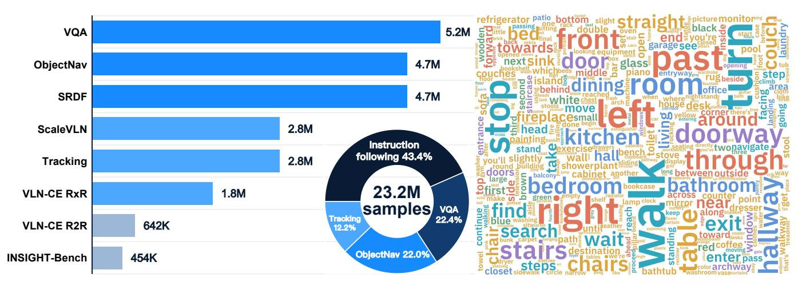

Fig. 6. 지도된 미세조정 코퍼스의 구성. 작업 균형 최적화 혼합은 VQA와 지시 따르기, 객체 탐색, 추적, VLN-CE, ScaleVLN [72], SRDF [73], 그리고 INSIGHT-Bench 데이터를 결합한다. 작업 비율과 지시어 워드클라우드는 통합 학습 코퍼스의 다양성을 보여준다.

상당히 더 넓은 장면과 지시 다양성을 제공한다, 인간이 주석한 말뭉치만으로는. 함께, 전문가, 합성, 그리고 자체 증류 경로를 사용하면 모델이 세밀한 언어 정렬과 대규모 기하학적 변형을 모두 경험하게 된다.

- Object-Goal Navigation: Object-Goal 혼합에는 PIRL-Nav [59], HM3D [57], MP3D [12], VLNVerse [43], Habitat-GS [78], InteriorGS [51]에서 파생된 의미론적 및 전문가 시연이 포함된다. 또한 HM3D-OVON [84]와 MP3D에서 탐색 궤적을 자체 수집하여 실행 가능한 착륙 영역과 참조 객체를 공동 감독한다. 마지막으로, in-loop DAgger 샘플은 정책이 전문가가 방문한 상태뿐 아니라 자신의 행동에 의해 유도된 상태에 노출되도록 한다.

- Embodied Visual Tracking: Tracking 데이터는 EVT-Bench [66]에서 파생된 무작위 카메라 사람 추적 궤적을 포함한다. 목표 도달 과제와 달리, 추적은 지속적인 대상 정체성과 연속적인 상대 위치 제어를 요구한다; 동일한 혼합에 포함함으로써 공유 정책이 학습하는 시간적 행동 범위가 확장된다.

- Quality Control and Sampling: 균형 잡힌 학습 인덱스를 구성하기 전에 작업 인식 필터를 적용한다. 지시 따르기와 객체 탐색에서는 정지 감독이 최종 프레임에서만, 그리고 대상이 보일 때만 유지된다; 대상이 전혀 관찰되지 않는 에피소드는 제거된다. 정지 샘플은 혼합의 2%로 제한하여 조기 종료가 토큰 예측을 지배하지 않도록 한다. 이중 채널 포인팅 라벨은 공유 그리드 형식을 사용하며, 각 10개 웨이포인트 동작 청크는 K=256 RVQ 레벨 3개로 인코딩된다. 일반적인 움직임 패턴의 지배를 줄이기 위해, 궤적 클러스터는 최대 클러스터 비율 5%로 균형을 맞춘다.

#### C. 평가 벤치마크 (Evaluation Benchmarks)

우리는 ER 체크포인트를 상호 보완적인 공간 능력을 분리하는 8개의 벤치마크에서 평가한다: Point-Bench [17], RefSpatial [98], RoboSpatial의 POI 및 VQA 트랙 [62],

Where2Place [86], CV-Bench [64], ERQA [26], 그리고 Emb-Spatial [20]. 함께 이들은 시각적 포인팅, 공간 지시, 상호작용 사이트 예측, 어포던스 그라운딩, 기하학적 인식, 그리고 체현형 질문 응답을 측정한다.

네비게이션 평가는 세 가지 작업군에 걸쳐 10개의 시뮬레이션 설정으로 구성된다. 연속 명령어 추적은 R2R 및 RxR val-unseen 분할에서 측정된다 [37]. 폐쇄형 어휘를 사용하는 ObjectNav는 MP3D 및 HM3D v1/v2에서 평가되며, 개방형 어휘 일반화는 HM3D-OVON에서 측정된다. 구현된 시각 추적은 EVT-Bench의 STT 및 DT 설정에서 평가된다 [66]. 모든 네비게이션 벤치마크는 벤치마크별 미세 조정 없이 동일한 체크포인트를 사용한다.

#### D. 인사이트-벤치 (INSIGHT-Bench)

INSIGHT-Bench는 이질적인 메쉬 기반 및 3D 가우시안 스플래팅 환경으로 데이터 분포를 확장한다. 이 데이터셋은 1,683개의 장면과 53,090개의 훈련 에피소드를 포함하며, 210개의 장면과 1,097개의 평가 에피소드를 포함한다. 그림 10은 두 분할의 소스 구성을 자세히 설명한다.

1) 사전 주석: 장면 소스는 두 경로를 통해 타깃 인벤토리 단계에 진입한다. 라벨이 없는 Habitat-GS 캡처는 HM3D/MP3D 및 VLNVerse와 함께 그림 7에 있는 자동 다중 뷰 사전 주석 파이프라인을 사용하고, InteriorGS는 시각적 탐지를 우회하고 공식 정답 박스를 직접 제공한다. 두 경로 모두 에피소드 합성 전에 동일한 3D 타깃 표현으로 변환된다. 이 소스들에 대해 단계 1의 주황색 점은 샘플링된 탐색 가능한 관점이며, 각 관점은 4개의 방향에서 RGB 및 메트릭 깊이 관측을 제공한다. 우리는 Molmo2 [19]를 사용해 오픈셋 포인팅을 수행하고, 오픈-어휘 객체 프롬프트에서 렌더링된 관점에서 후보 타깃을 로컬라이즈한다. 메트릭 깊이는 이미지 공간 예측을 3D로 올린다. 단계 4는 범주 호환 관측을 인접한 3D 위치와 그룹화하고, 최소 두 개의 서로 다른 관점에서 최소 두 개의 관측으로 지원되고 3D 로컬라이제이션 분산이 0.6m 이하인 경우에만 병합된 인스턴스를 유지한다. 각 수락된 클러스터는

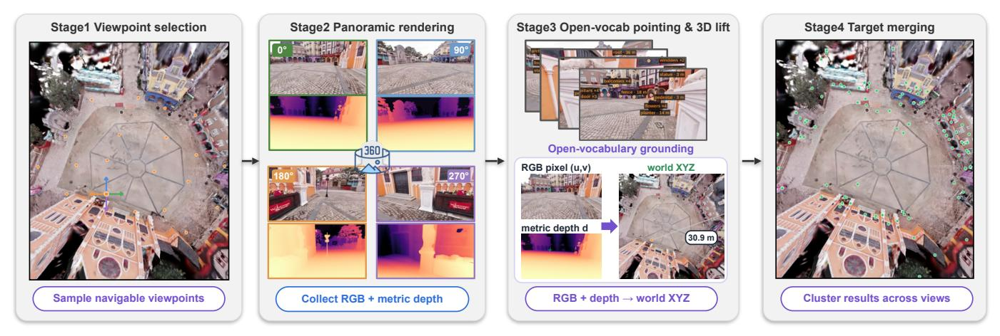

그림 7. INSIGHT-Bench의 자동 사전 주석 파이프라인. 파이프라인은 먼저 탐색 가능한 관점(주황색 점)을 샘플링하고 4개의 방향에서 RGB 및 메트릭 깊이 관측을 렌더링한다. Molmo2는 오픈셋 이미지 공간 포인팅 예측을 생성하고, 이를 3D로 올려 관점 간에 병합한다. 초록색 점은 결과적으로 공간적으로 일관된 3D 타깃 인스턴스를 나타낸다.

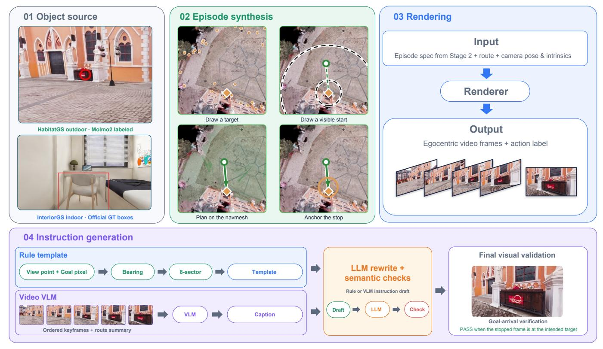

그림 8. INSIGHT-Bench의 자동 데이터 생성 및 명령어 라벨링 파이프라인. 모든 장면 소스는 공통 3D 타깃 인벤토리로 변환된다; 이후 우리는 타깃이 최소 한 개의 오프라인 인벤토리 뷰에서 보이는 시작 포즈와 타깃을 그린 뒤, 네비게이션 메쉬에서 경로를 계획하고 정지점을 고정하며, 행동 라벨이 달린 자가 중심 클립을 렌더링한다. 평가되는 정책은 단일 카메라이며, 타깃은 초기 전방 관측에 나타나지 않아도 된다. 명령어는 규칙-템플릿 경로 또는 비디오-VLM 경로 중 하나로 초안 작성되고, LLM이 의미 검사를 거쳐 재작성하며, 최종 프레임에서 시각적 목표 도착 검사를 통해 확인된다.

그림에서 초록색 점으로 표시되는 하나의 타깃 인스턴스로 표현된다. 이 교차 관점 일관성 게이트는 단일 관점 탐지와 기하학적으로 불안정한 매치를 에피소드 생성 전에 제거한다. 결과 타깃 기하학은 에이전트 관점으로 다시 투영되어 객체-포인트 감독을 구성하며, 탐색 가능한 자유 공간은 해당 어포던스 포인트 타깃을 제공한다.

*2) 데이터 생성 및 명령어 라벨링:* 이후 우리는 타깃이 최소 한 개의 오프라인 인벤토리 뷰에서 보이는 시작 포즈와 함께 타깃을 샘플링한다. 이 생성 시점 제약은 기하학적 라벨링을 가능하게 하지만 정책에 타깃 가시성을 보장하지는 않는다: 평가는 단지 전방 단일 카메라 스트림만 사용하며, 타깃은

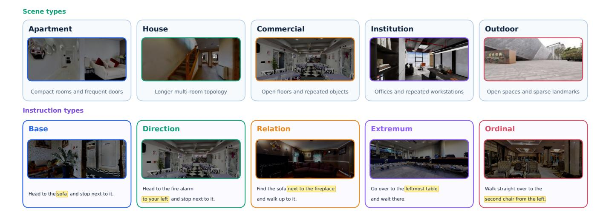

그림 9. INSIGHT-Bench의 이축 진단 분류법. 장면 축은 소스 데이터셋과 무관하게 지배적 기능과 레이아웃에 따라 환경을 그룹화한다. 지시 축은 목표를 해결하는 데 필요한 공간적 메커니즘을 식별한다.

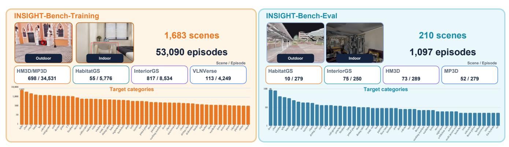

그림 10. **INSIGHT-Bench의 구성.** 훈련 세트는 HM3D/MP3D, Habitat-GS, InteriorGS, VLNVerse에서 수집한 1,683개의 장면과 53,090개의 에피소드를 포함하고, 평가 세트는 Habitat-GS, InteriorGS, HM3D, MP3D에서 수집한 210개의 장면과 1,097개의 에피소드를 포함한다. 하단 히스토그램은 로그 스케일에서 상위 50개의 탐색 대상 빈도를 보여준다.

초기 관찰에 나타날 필요는 없다. 우리는 탐색 메시에 경로를 계획하고, 정지 위치를 고정하며, Fig. 8에 표시된 대로 행동 라벨이 있는 자가 시점 비디오 프레임을 렌더링한다. 이 공통 인터페이스는 메쉬 기반 시뮬레이터와 Gaussian‑splatting 장면을 동일한 경로 형식과 호환되게 하면서 장면별 모델 구성요소를 도입하지 않고 시각적 다양성을 증가시킨다.

각 지시는 두 가지 대체 초안 경로 중 하나를 거쳐, 공통 재작성기와 최종 시각 검사를 거친다. 규칙 기반 경로는 이미 대상 인벤토리에 포함된 증거를 재사용한다: 각 기반 대상은 감지된 카메라 뷰와 해당 뷰 내에서 목표 픽셀의 수평 위치를 기록한다. 이 두 요소는 에이전트의 시작 방향에 대한 대상의 방향을 결정하므로, 방향 단어는 외형에서 추론되는 것이 아니라 기록된 기하학에서 읽어낸다.

문구는 두 단계로 선택된다. 먼저 감지된 뷰가 회전 가족을 고정한다: 왼쪽 뷰에서 발견된 대상은 왼쪽으로 회전하여 도달하고, 뒤쪽 뷰에서 발견된 대상은 뒤돌아 회전한다. 목표 픽셀은 그 가족 내에서 문구를 정제하여 *ahead*와 *front‑left*, *front‑right*, 또는 *behind‑left*, *behind‑right*를 구분한다. 결과 영역은 균일한 각도 구간이 아니라 뷰에 의존한다. 뷰가 지배하도록 함으로써 문구가 충실하게 유지된다: 뒤쪽 뷰에서 보인 대상이 왼쪽 범위에 해당하면 에이전트의 왼쪽 뒤쪽에 있으며, 이를 왼쪽 회전으로 묘사하면 에이전트가 잘못된 방향으로 이동한다. 각 영역은 회전 동사 문구와 위치 문구를 포함하므로 "Turn left and go to the chair and stop."와 "The chair is on your left; go to it and stop." 두 문장이 모두 나타난다. 계획된 경로가 대상까지의 직선에서 크게 벗어나는 에피소드는 항상 위치 형태를 취한다. 이는 대상의 방향을 설명하기 때문이며, 회전 동사는 실제로 실행되는 경로를 설명하는 것으로 읽힌다.

비디오‑조건 경로는 기하학 대신 기록을 통해 동일한 에피소드를 설명한다. 렌더링된 클립 전체에서 균일하게 배치된 6개의 프레임을 실행된 경로 요약과 함께 Seed2.0 [10]에 제출하며, 이는 대상의 정적 위치가 아니라 경로를 따라 움직임을 묘사하도록 요청한다. 따라서 초안은 다음을 언급한다

INSIGHT‑BENCH 평가 세트의 에피소드 분포(두 진단 축). 행은 장면을 지배적 기능과 레이아웃별로 그룹화하고, 열은 대상 식별에 필요한 공간적 메커니즘별로 지시를 그룹화한다. "SCENES"는 고유한 평가 환경 수를, 나머지 셀은 평가 에피소드 수를 센다.

| 장면 유형 | 장면 | 에피소드 | 베이스 | 방향 | 관계 | 극값 | 순서 |
|-------------|--------|----------|------|-----------|----------|----------|---------|
| 아파트 | 120 | 239 | 50 | 50 | 50 | 50 | 39 |
| 주택 | 61 | 216 | 50 | 50 | 31 | 50 | 35 |
| 상업 | 10 | 195 | 42 | 40 | 30 | 50 | 33 |
| 기관 | 11 | 219 | 50 | 49 | 32 | 50 | 38 |
| 야외 | 8 | 228 | 45 | 50 | 50 | 50 | 33 |
| 총계 | 210 | 1,097 | 237 | 239 | 193 | 250 | 178 |

경로를 따라 지나가는 랜드마크는 어떤 템플릿보다도 더 자유롭게 표현된다.

두 경로 모두 최종 지시문 대신 초안을 생성한다. 같은 모델이 이후에 각 초안을 재작성하여 의미를 바꾸지 않으면서 어휘를 확장한다. 각 재작성은 이미지에 표시된 의미 검사(목표의 머리 명사 보존, 구역이 암시하는 방향 보존, 반대 방향 도입 금지)를 통과해야만 수락된다. 실패한 재작성은 해당 소스 초안으로 되돌아가므로, 재작성 과정에서 어떤 에피소드도 손실되지 않는다.

마지막으로 시각적 도착 검사가 렌더링된 에피소드를 마무리한다. 같은 포인팅 모델이 렌더링된 클립의 마지막 프레임(기본적으로 끝에서부터 1번째, 3번째, 6번째, 10번째 프레임)에 적용되어 지시된 목표를 찾도록 요청한다. 어느 프레임이라도 목표를 포함하면 에피소드는 확인되고, 아무 프레임도 포함하지 않으면 검토를 위해 의심으로 표시된다. 이 4개의 구성 요소는 벤치마크 전반에서 상호 보완적인 역할을 수행한다: 규칙 경로는 정확한 자가중심 방향을 제공하고, 비디오 경로는 경로 수준 언어를 제공하며, 재작성자는 어휘 다양성을 제공하고, 검사는 목표 정체성과 궤적 의미를 보존한다.

*3) 진단 분류학:* 우리는 INSIGHT-Bench를 두 개의 독립적인 축을 따라 구성한다. 각 에피소드는 동결된 장면-클래스 매핑에서 5개의 장면 수준 라벨 중 하나를 상속한다: 아파트는 컴팩트한 방과 빈번한 문을 포함하고, 주택은 더 긴 다중 방 토폴로지를 가지며, 상업 장면은 개방형 평면도와 반복되는 객체 인스턴스를 포함하고, 기관은 복도와 반복되는 방 또는 작업 공간을 강조하며, 야외 장면은 비교적 희박한 랜드마크를 가진 개방형 통과 가능한 영역을 포함한다. 이 라벨들은 소스 데이터셋이나 렌더링 표현이 아니라 기능적 레이아웃을 설명한다.

지시 라벨은 목표를 인스턴스화하는 데 사용된 기하학적 증명에서 에피소드 수준으로 할당되며, 표면 문구에서 사후 추론되는 것이 아니다. *base* 지시는 공간 수식어 없이 고유하게 해결 가능한 목표를 명명한다; *direction*은 자가중심 측면 또는 방위를 추가한다; *relation*은 고유한 기준 객체를 통해 목표를 식별한다; *extremum*은 가장 가까운 또는 가장 왼쪽과 같은 argmin 또는 argmax 인스턴스를 선택한다; 그리고 *ordinal*은 안정적인 순서 집합에서 순위가 매겨진 인스턴스를 선택한다. Fig. [9](#page-9-1)은 두 축을 모두 보여주며, Tab. [I](#page-10-0)은 그 완전한 5 × 5 에피소드 분포를 보고한다.

분류학은 단일 집계 성공률을 하나의

진단 결과로 전환한다. 행별 차이는 장면 기능과 레이아웃에 대한 민감도를 드러내고, 열별 차이는 기본 언어 메커니즘을 고립시키며, 개별 셀은 반복되는 상업 레이아웃에서 순위 참조와 같은 상호작용을 드러낸다. 관계 및 순위 에피소드의 낮은 수치는 무시되는 절단이 아니라 더 엄격한 고유성 및 순서 게이트를 반영한다. 따라서 우리는 집계 성공률을 전반적인 건강 지표로 취급하고, 장면, 지시, 교차 범주 결과를 사용하여 실질적인 결론을 도출한다.

*4) 벤치마크 통계:* 훈련 및 평가 장면 세트는 엄격히 분리되어 있다. 구체적으로, 210개의 평가 장면 중 어느 것도 1,683개의 훈련 장면과 데이터 소스 전반에 걸쳐 겹치지 않는다. Habitat-GS 캡처는 연속적으로 55개의 훈련 장면과 10개의 평가 장면으로 분할되며, InteriorGS는 817개의 훈련 장면과 75개의 평가 장면을 기여하고, HM3D 파티션은 모든 수집 실행이 소비하는 동결된 장면 허용 목록에 의해 고정된다. 훈련 분할은 장면당 평균 31.5개의 에피소드를 가지며, 평가 분할은 평균 5.2개의 에피소드를 가진다. 벤치마크는 기존 실내 메쉬와 가우시안-스플래팅 재구성을 결합하므로, 통합된 시각 인터페이스에서 훈련된 정책이 렌더링 표현과 장면 유형을 넘어 전이되는지 테스트한다.

## V. 훈련 레시피 (V. TRAINING RECIPE)

#### *A. Embodied-Reasoning 중간 훈련* (A. Embodied-Reasoning Mid-training)

사전 학습된 VLM은 이미 광범위한 의미론적 및 공간적 선행 정보를 인코딩하지만, 이러한 선행 정보는 구현된 의사결정에 필요한 형태로 일관되게 노출되지 않는다. 따라서 우리는 탐색 행동을 도입하기 전에 백본을 전문화하는 구현-추론 중간 훈련을 시작한다. Fig. [5,](#page-6-0) 에 요약된 바와 같이, 단계 I는 공간 추론, 일반 VQA, 이미지 포인팅, 비디오 QA, 다중 이미지 추론, 상황화된 3D QA, 활용성 및 실패 이해, 장면 설명을 아우르는 작업 균형 혼합을 사용한다. 이 상호 보완적인 작업들은 모델이 시각적 증거를 위치시키고, 관점과 시간을 가로질러 추론하며, 실현 가능한 자유 공간을 식별하고, 구현된 상호작용의 결과를 예측하도록 공동으로 훈련시킨다. 특히, 이 단계는 완전히 네이티브 자동 회귀 인터페이스를 통해 작동하며 탐색 전용 예측 헤드를 도입하지 않는다. 우리는 이 결과로 얻은 구현-추론 체크포인트를 LightNav-ER라고 부르며, 이후 탐색 정렬을 초기화하는 데 사용한다.

전문화만으로는 백본에서 상속받은 일반 시각-언어 역량이 좁아질 수 있다. 따라서 우리는 specialize-then-retain 커리큘럼을 채택한다: 이후 감독 단계에서 재조정된 ER 혼합을 탐색 데이터와 함께 반복 훈련한다. 이 두 번째 단계는 ER 중간 훈련에서 습득한 포인팅, 근거화, 공간 추론 기술을 보존하면서 이를 구현된 행동 생성과 정렬한다. 결과 커리큘럼은 교차 작업 탐색 감독이 도입되기 전에 공통의 지각 및 추론 기반을 확립한다.

ER 중간 훈련에서는 학습률 1 × 10−5와 워밍업 비율 0.01을 사용한다. 전역 배치 크기는 128이며, 최대 시퀀스 길이는 10,240 토큰이다. 이 단계는 NVIDIA H100 GPU에서 훈련되며 약 170 H100 GPU-시간의 연산을 소비한다.

## B. 감독 기반 미세 조정 (B. Supervised Fine-tuning)

다음으로 우리는 LightNav-ER 체크포인트를 통합된 탐색 토큰 공간에 정렬하기 위해 감독 기반 미세 조정을 수행한다. 그림 [6](#page-7-0)에서 제시된 작업 균형 최적화 혼합은 보존된 ER 및 VQA 데이터를 지시 따르기, 객체 탐색, 그리고 구현된 시각 추적과 결합한다. 탐색 예제는 모든 작업에서 동일한 목표 구조를 사용하여 직렬화된다: 하나의 ⟨aposi⟩ 토큰과 하나의 ⟨oposi⟩ 토큰이 잠재적 공간 추적을 제공하고, 그 뒤에 단기 궤적을 지정하는 세 개의 RVQ 토큰이 따른다. 보조 추론 예제와 탐색 궤적은 위에서 설명한 공유 인과 언어 모델 목표로 최적화되어, 공유 백본과 출력 헤드가 작업, 장면, 구현체 전반에 걸쳐 학습할 수 있게 한다. 탐색 혼합에는 추가로 DAgger로 수집된 예제 [60](#page-23-0)가 포함되어, 정책이 자신의 예측에 의해 유도된 상태에 노출되고, 훈련-배포 상태 분포 격차를 줄인다.

우리는 학습률 1.5 × 10−5와 warmup 비율 0.01로 훈련한다. 전역 배치 크기는 320이며, 최대 시퀀스 길이는 8,192 토큰이다. 훈련은 NVIDIA H100 GPU에서 수행되며 약 950 H100 GPU-시간의 연산을 소비한다. 동적 시퀀스 패킹과 함께 이 구성은 긴 시각적 이력을 수용하면서도 크고 다양한 전역 배치를 유지한다.

## *온라인 RL 사후 훈련* (*C. Online RL Post-training*)

Although DAgger는 SFT에 정책 유도 상태를 추가하지만, 결과적으로 목표는 토큰 수준 모방이며, 작업 성공을 결정하는 폐쇄 루프 행동을 직접 최적화하지 않는다. 따라서 우리는 작업 수준 목표에 대해 전체 정책 롤아웃을 최적화하기 위해 온라인 강화 학습을 도입한다. 이는 Fig. [11.](#page-12-0) 에서 보여지는 것처럼 장기 행동을 정제한다. 지속 추적, 경로 일관 목표 도달, 효율적 탐색, 적절한 종료 등을 포함한다. 동일한 백본, 토큰 인터페이스, 롤아웃 기계는 구현된 시각 추적, 명령 따르기 VLN, 개방형 어휘 객체 목표 탐색을 지원하며, 작업별 보상 함수만 다르다.

*1) 문제 설정 및 그룹-상대 목표:* 에피소드는 궤적 τ = (s1, a1, …, sT, aT) 이다. 상태 st는 지시문 I와 압축된 이력 O1:t를 쌍으로 하며, 행동 at는 단계 t에서 방출되는 토큰 블록이다: 이중 채널 포인팅 접두사 뒤에 세 개의 RVQ 행동 토큰이 따른다.

우리는 Group Relative Policy Optimization (GRPO) [&#91;61&#93;](#page-24-14)를 사용해 최적화한다. 이는 학습된 가치 함수를 그룹 기준선으로 대체한다. 각 에피소드 시드마다 G개의 독립 궤적을 롤아웃하고, 각 궤적을 단일 스칼라 R(τ (g)) 로 점수화한 뒤, 그룹 내 표준화된 보상을 이점으로 사용한다,

$$A^{(g)} = \frac{R(\tau^{(g)}) - \mu_R}{\sigma_R + \epsilon_{\text{num}}}$$

$$\mu_R = \frac{1}{G} \sum_g R(\tau^{(g)})$$

(10)

여기서 σR는 그룹 표준 편차이며, ϵnum = 10−6는 수치 안정성 상수이다. 그룹 내에서 표준화를 하면 장면 난이도 오프셋이 제거되므로, 같은 시작 상태에서 G개의 시도 중 순위만이 기울기를 전달한다.

각 작업은 모든 결정 단계에 할당되는 하나의 종단 스칼라로 점수화된다. rt = R(τ) 는 모든 t에 대해 동일하며, 따라서 궤적의 모든 토큰이 이점 A(g)를 공유한다. 단계별 모양 조정은 세 가지 서로 호환되지 않는 기하학에 대해 세 번 정의된 수동 설계된 잠재력이 필요하다. 대리 함수는 토큰 수준에서 적용되며, ρ는 응답 토큰의 중요 비율이다,

$$\mathcal{L}_{RL} = -\mathbb{E}\Big[\min\left(\rho A, \operatorname{clip}(\rho, 1 - \varepsilon, 1 + \varepsilon) A\right)\Big] + \beta D_{KL}(\pi_{\theta} \parallel \pi_{ref}),$$

(11)

여기서 πref는 동결된 감독 정책이며, β는 업데이트를 그에 고정시킨다.

*2) 롤아웃 인프라 및 훈련 세트 구성:* 온라인 RL은 기울기 계산이 아니라 시뮬레이션 처리량에 의해 제한되므로, 시뮬레이션과 최적화를 분리한다. 각 시뮬레이터는 하나의 장면을 보유한 독립 프로세스이며, 행동 생성은 별도의 추론 서버에서 제공된다. 장면 해시는 같은 에피소드 시드에서 발생한 모든 G 롤아웃을 해당 장면을 보유한 시뮬레이터에 할당해 중복 장면 로딩을 방지한다.

훈련 세트의 균일 샘플링은 대부분 예산을 낭비한다. 감독 정책이 항상 해결하는 에피소드와 절대로 해결하지 못하는 에피소드는 모두 σR ≈ 0을 발생시키고 기울기가 없기 때문이다. 따라서 우리는 감독 체크포인트와 함께 모든 후보에 대해 K개의 롤아웃을 실행하고, 이를 항상 해결, 혼합, 절대 해결 못함으로 분류한다. 혼합 에피소드는 결정 경계에 위치하며, 그룹 내 분산을 보장하는 유일한 경우이므로 풀을 지배한다. Robostral Navigate [&#91;9&#93;](#page-21-8)는 관련 필터를 적용하지만, 감독 정책이 해결하지 못한 작업만 남긴다. 우리는 대신 두 극단의 소수만 보관한다: 항상 해결된 에피소드는 획득한 행동을 보존하고, 절대 해결 못한 에피소드는 탐색을 위한 도전적인 사례를 제공한다. 아래에서 설명한 연속 종단 신호는 여전히 이러한 실패를 순위화하고, 따라서 단계적 시행착오 학습을 지원한다.

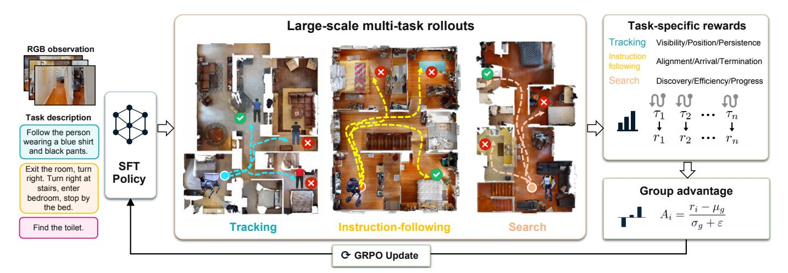

그림 11. 온라인 다중 작업 강화 학습 파이프라인. 우리는 감독 정책에서 온라인 최적화를 초기화하고 모든 탐색 작업에 대해 대규모 롤아웃을 수집한다. 작업별 보상은 EVT에 대해 가시성, 위치, 지속성을 평가하고, 지시 따르기에서는 정렬, 도착, 종료를, 객체 목표 탐색에서는 발견, 효율성, 진행을 평가한다. 보상은 각 롤아웃 그룹 내에서 정규화되어 GRPO 정책 업데이트를 위한 이점을 계산한다.

- *3) 작업별 최종 보상:* 각 탐색 작업마다 목표와 성공 기준에 맞춘 별도의 최종 보상을 정의한다. 모든 거리는 미터 단위, 방위각은 라디안으로 보고한다.  
- *a) 구현된 시각 추적:* 여기서 목표는 고정 위치가 아니라 움직이는 에이전트이므로 도착해야 할 목표 좌표가 없고 정책이 종료를 발행할 종료 지점도 없다. 모든 값이 0인 계획은 추종자를 제자리에 두고, 목표가 다시 움직이자 추종이 재개된다. 종료는 환경이 결정한다: 목표가 경로를 끝내거나, 추종자가 회복 불가능하게 잃거나, 단계 예산이 소진되면 종료된다. 환경은 추종자가 그 순간 목표보다 1~3 m 뒤에 있고 목표를 향해 정렬되어 있을 때만 성공을 선언한다. 너무 가깝게 접근해도 계산되지 않는다. 따라서 에피소드 동안 중요한 것은 최종 이벤트가 아니라 올바른 거리에서 지속적인 가시성이다. 각 단계에서 우리는 목표의 가시성 vt ∈ {0, 1}, 방위각 αt, 거리 δt 를 읽는다. 이 값들은 단계별 품질 qt = vt c(αt) b(δt)를 주며, 두 위치 요인은 평평한 상단 방위 항과 양쪽 범위 밴드이다,

$$c(\alpha) = \begin{cases} 1, & |\alpha| \le \alpha_0, \\ \exp\left(-\frac{(|\alpha| - \alpha_0)^2}{2\sigma_\alpha^2}\right), & |\alpha| > \alpha_0, \end{cases}$$

(12)

$$b(\delta) = \begin{cases} \exp\left(-\frac{(\delta_{\text{low}} - \delta)^2}{2\sigma_{\text{near}}^2}\right), & \delta < \delta_{\text{low}}, \\ 1, & \delta_{\text{low}} \le \delta \le \delta_{\text{high}}, \\ \exp\left(-\frac{(\delta - \delta_{\text{high}})^2}{2\sigma_{\text{far}}^2}\right), & \delta > \delta_{\text{high}}. \end{cases}$$

(13)

방위각 요인은 dead zone α0 = 0.14 rad와 폭 σα = 0.35 rad를 사용한다. 거리 밴드는 [δlow, δhigh] = [1.5, 3.0] m이며, σnear = 0.35 m, σfar = 1.0 m이다. 평평한 상단과 밴드 내부에서는 요인이 정확히 1이므로 미세한 진동이 그룹 변동을 일으키지 않는다. 두 번째 단계별 항은 시각이 아니라 움직임을 평가한다. mt ∈ [0, 1]을 정의하여 단계 t에서 방출된 10‑waypoint 계획이 동일 상태에서의 특권 오라클 계획과 얼마나 일치하는지를 측정한다. indicator 함수 1[·]를 쓰고 두 단계별 항을 충돌 비용과 결합하면

$$R_{\text{EVT}} = 1 [\text{success}] - 0.5 \times 1 [\text{collision}] + \frac{1}{T_{\text{norm}}} \sum_{t=1}^{T} (0.7 q_t + 0.3 m_t).$$

(14)

지속성은 정규화기에서 나온다.

$$T_{\text{norm}} = \begin{cases} T, & \text{자연 종료,} \\ \max(T, T_0), & \text{조기 종료,} \end{cases}$$

(15)

자연 종료는 목표가 끝나거나 예산이 도달한 경우이며, 조기 종료는 목표가 잃어버리거나 충돌이 발생한 경우이다. 실행된 단계만 평균화하면 조기 종료를 보상하게 된다. 왜냐하면 조기에 충돌하는 추종자는 시계를 멈추면서 평균이 높아지기 때문이다. 조기 종료를 일정한 지평선 T0 = 300 단계에 대해 부과하면 실행되지 않은 단계들을 품질이 0인 것으로 계산하여 평균 품질을 지속성으로 전환한다.

*b) 지시 따르기:* dT를 최종 포즈에서 목표까지의 지오데식 거리라고 하고, nDTW를 실행된 경로와 주석된 참조 경로 사이의 정규화된 동적 시간 왜곡 유사도라고 하자. 성공 반경 3.0 m에서 우리는 다음을 사용한다

$$\begin{split} R_{\text{VLN}} &= \left(1 + \text{nDTW}\right) \mathbb{1}[\text{success}] \\ &+ \exp\left(-\frac{\max(d_T, d_{\text{clip}})^2}{\sigma_d^2}\right) - 0.25 \times \mathbb{1}[\text{timeout}]. \end{split} \tag{16}$$

첫 번째 항은 도착을 한 번만 보상하고, 실행된 경로가 설명된 경로와 정렬을 유지했을 때 최대 두 배까지 보상한다. 이 보너스는 지시를 무시하고 목표에 도달하는 지름길을 방지한다. 가우시안 커널, 폭 σd = 3.0 m는 성공 경계 양쪽에서 도착을 평가하고, 근접 실패를 멀리 떨어진 정지보다 높은 순위로 매긴다. 클립 dclip = 2.0 m는 그 반경 안에서 평탄화한다.

c) Object goal navigation: Object goal navigation은 경로 대신 카테고리를 명시하므로 경로 충실도는 의미가 없으며, 객체에 도달하는 것만이 중요하다. 초기 목표까지의 지오데식 거리 를 $d_0$ 라고 하고, 실행된 경로의 길이를 $\tilde{\ell}$ 라고 하자. 우리는 에피소드별 경로 길이 효율을 $PL = d_0/\max(d_0, \tilde{\ell})$ 로 정의한다. 이 값은 SPL이 데이터셋에서 평균하는 양이다 [3]. 성공 반경이 1.0 m인 경우 우리는 다음과 같이 사용한다

$$R_{\text{OBJ}} = (1 + 0.25 \,\text{PL}) \,\mathbb{1}[\text{success}] + 0.25 \,\exp\left(-\frac{\max(d_T, d_{\text{clip}})^2}{\sigma_d^2}\right). \tag{17}$$

첫 번째 항은 Eq. (16)을 반영한다. 도착은 한 번 지급되며, 객체에 단거리 경로로 도달했을 때 더 많이 지급된다. 이는 건물 전체를 철저히 탐색하는 것을 방지한다. 측정되는 품질만 다르다: 여기서는 경로 효율성, 거기서는 경로 충실도이며, 이는 객체 탐색이 경로를 지정하지 않기 때문이다. 그라디언트 근접 항은 전체 실패 집단을 포함하며, 객체까지 거리를 반으로 줄인 실행을 시작 방을 떠나지 않은 실행보다 높은 순위로 매긴다. 그것이 없으면 모든 실패가 동일한 보상 값을 공유하고 Eq. (10)에 기여하지 않는다. 해당 반경이 지시 따르기에서 사용되는 $3.0\,\mathrm{m}$ 대신 $1.0\,\mathrm{m}$이므로 클립이 $d_{\mathrm{clip}}=1.0\,\mathrm{m}$로 조정되며, $\sigma_d$는 변하지 않는다.

4) 최적화 세부 사항: 각 반복은 서로 다른 장면을 가진 B개의 에피소드 시드를 추출하고, 시드당 G개의 궤적을 실행한다. 각 결정 단계가 하나의 학습 샘플이므로, 한 반복은 한 번의 업데이트에 필요한 샘플보다 훨씬 많은 샘플을 생성한다. 따라서 우리는 에피소드당 보존되는 샘플 수를 제한하고, 이벤트 층화(event stratification)를 통해 선택한다. 첫 번째와 마지막 결정은 항상 보존되며, 정지 방출, 정체 감지, 충돌, 또는 큰 각도 회전과 같은 이산 이벤트를 포함하는 결정과 그 직전·후 결정도 함께 보존한다. 남은 할당량은 타임라인 전체에 균일하게 분포된다. 균일한 하위 샘플링은 이러한 결정들을 그 희귀성 비율에 따라 버리겠지만, 실제로 최종 보상이 발생하는 지점이 바로 이들이다.

그룹 크기는 G=8이며, 각 반복에서 B=32개의 시드를 뽑아 업데이트당 256개의 에피소드를 생성한다. 클립 범위는 $\varepsilon=0.2$이며, KL 계수는 $\beta=0.01$이다. 훈련은 8개의 H100 GPU가 있는 단일 노드에서 실행된다.

#### VI. 실험 (EXPERIMENTS)

#### A. 실험 설정 (Experimental Setup)

1) 벤치마크: 우리는 공간 지능, 시뮬레이션 탐색, 그리고 실제 세계 전이 성능을 평가한다. 공간 지능 측면에서 LightNav-ER는 8개의 구현형 추론 벤치마크에서 테스트된다: Point-Bench [17], RefSpatial [98], RoboSpatial의 POI 및 VQA 트랙 [62], Where2Place [86], CV-Bench [64], ERQA [26], 그리고 EmbSpatial [20]. 탐색 측면에서는 단일 공유 LightNav-0 체크포인트가 벤치마크별 미세 조정 없이 10개의 공개 시뮬레이션 설정(세 가지 작업군과 INSIGHT-Bench)을 대상으로 평가된다. 지시 따르기는 VLN-CE [37]에서 R2R [4]와 RxR [39]의 val‑unseen 분할에서 측정된다; 객체 목표 탐색은 MP3D [12], HM3D v1/v2 [57], 그리고 HM3D-OVON [84]에서 평가된다; 그리고 구현형 시각 추적은

the STT 및 DT 분할 of EVT-Bench [66]. 우리는 동일한 체크포인트를 네 개의 물리적 로봇 구현체에 배포하여 시뮬레이션을 넘어선 제로샷 실세계 배포를 평가한다.

INSIGHT-Bench는 공유 배포 프로토콜 하에서 평가된다. 모든 모델은 210 장면에서 동일한 1,097개의 에피소드를 보고, 1.0 m 높이의 카메라에서 120°, 480×270 해상도의 전방 RGB 스트림을 수신하며, 300개의 행동 예산을 받는다. 에피소드는 모델이 목표 반경 내에서 정지하고 최종 프레임의 120° 시야 안에 목표가 있을 때만 성공한다. 실내 장면의 반경은 2.0 m, 실외 장면은 3.0 m이며, 실외 환경이 훨씬 크고 탐색 가능한 목표가 그에 따라 더 멀리 떨어져 있기 때문이다.

- 2) Baselines: 본체 기반 추론에서는 두 개의 범용 4B VLM, Qwen3-VL과 사후 학습된 Owen3.5-4B 체크포인트 [55], 그리고 공간적으로 특화된 8B Molmo2-ER 모델과 비교한다. 내비게이션 비교는 세 가지 대표적인 가족을 포함한다: 감지, 매핑, 계획을 분리하는 모듈형 시스템; 학습된 웨이포인트 예측기를 포함한 작업별 엔드‑투‑엔드 정책; 그리고 일반형 VLM/VLA 내비게이션 정책. INSIGHT‑Bench에서는 추가로 6개의 오픈소스 내비게이션 정책을 공통 행동 인터페이스를 통해 실행한다: Janus VLN [89], NaVid [90], Uni‑NaVid [92], TAMP‑Nav [23], InternVLA‑N1 [32], 그리고 StreamVLN [76]. 각 정책은 NaVid와 StreamVLN에서 사용되는 것처럼 어댑터를 통해 공유 전방 스트림을 수신하고, 모델의 기본 훈련 시야에 맞게 중앙 크롭할 수 있다. TAMP‑Nav는 4개의 카메라 360° 관측과 깊이 보조 픽셀‑투‑3D 실행을 위해 설계되었으나, 우리는 시각 입력을 공유 전방 뷰로 제한한다. InternVLA‑N1은 출시된 RGB 전용 경로를 일정 깊이와 함께 따른다. 에피소드 세트, 시뮬레이터, 행동 예산, 성공 기준은 이 모든 실행에서 동일하다. 모든 내비게이션 결과는 단일 뷰 RGB, 파노라마 또는 다중 카메라 RGB, 깊이, 그리고 오도메트리 사용을 명시적으로 식별한다.  

- 3) Metrics: 본체 기반 추론에서는 각 벤치마크의 주요 점수를 백분율로 보고, 모든 결과가 제공될 때만 8개의 벤치마크에 대해 무가중 매크로 평균을 계산한다. 연속 VLN에서는 내비게이션 오류(NE), 오라클 성공률(OS), 성공률(SR), 경로 길이에 가중된 성공률(SPL), 그리고 정규화된 동적 시간 왜곡(nDTW)을 보고한다. ObjectNav와 HM3D‑OVON은 SR과 SPL로 평가된다. INSIGHT‑Bench는 SR, SPL, 그리고 종료 시 NE로 평가된다. EVT‑Bench는 성공률, 추적률(TR), 충돌률(CR)을 보고한다. NE와 CR을 제외한 모든 지표에서 값이 높을수록 성능이 우수함을 각 표의 화살표로 표시한다.

#### B. 구현된 추론 벤치마크 평가 (Embodied Reasoning Benchmark Evaluation)

우리는 먼저 구현된 추론(embodied-reasoning) 중간 훈련(midtraining)이 시각-언어 모델(VLM)의 공간적 능력을 강화하는지 평가한다. 이는 다운스트림 탐색 정렬(downstream navigation alignment) 전에 수행된다. 우리는 4B ER 체크포인트(4B ER checkpoint)를 언어 기반 포인팅(language-guided pointing), 공간 참조(spatial referring), 로봇 공간 추론(robotic spatial reasoning), 활용성 예측(affordance prediction), 시각 인식(visual perception), 구현된 질문 응답(embodied question answering) 등 8개의 벤치마크에서 테스트한다.

구현된 추론 및 공간 지능 평가(Embodied Reasoning and Spatial-Intelligence Evaluation). 우리는 4B 일반 목적 VLMS(4B general-purpose VLMS), 8B MOLMO2-ER 모델(8B MOLMO2-ER model), 그리고 우리의 4B LIGHTNAV-ER 체크포인트(4B LIGHTNAV-ER checkpoint)를 POINT-BENCH[17](#page-22-2), REFSPATIAL[98](#page-25-13), ROBOSPATIAL[62](#page-24-18), WHERE2PLACE[86](#page-25-1), CV-BENCH[64](#page-24-19), ERQA[26](#page-22-17), 그리고 EMBSPATIAL[20](#page-22-18) 등 8개 벤치마크에서 비교한다. 모든 값은 백분율이며 값이 높을수록 좋다. AVG.은 8개 벤치마크 전체의 가중치 없는 평균이다. 굵게 및 밑줄은 최상과 두 번째 최상을 나타낸다.

| 방법 | 매개변수. | 포인트 | Bench RefSpatial | RoboSpatial POI | RoboSpatial VQA | Where2Place CV-Bench ERQA EmbSpatial Avg. |  |  |  |  |
|-----------------|---------|-------|------------------|--------------------|--------------------|-------------------------------------------|------|------|------|------|
| Qwen3-VL [5] | 4B | 58.2 | 45.5 | 64.8 | 69.7 | 64.0 | 85.6 | 39.5 | 77.6 | 63.1 |
| Qwen3.5-4B [55] | 4B | 60.4 | 54.6 | 47.9 | 59.7 | 61.3 | 85.0 | 40.8 | 76.8 | 60.8 |
| Molmo2-ER [22] | 8B | 77.3 | 52.5 | 32.0 | 73.4 | 54.0 | 87.8 | 46.8 | 78.8 | 62.8 |
| LightNav-ER | 4B | 64.5 | 57.4 | 56.5 | 71.9 | 76.6 | 88.4 | 43.8 | 79.8 | 67.4 |

Tab. [II](#page-14-0)은 각 벤치마크의 주요 점수를 백분율로 보고하며, 값이 높을수록 성능이 우수함을 나타낸다. 매크로 평균은 모든 8개 벤치마크에서 결과를 가진 모델에 대해서만 계산된다.

LightNav-ER은 8개 벤치마크 중 4개에서 1위를, 나머지 4개에서 2위를 차지하며, 전체 세트 평균 67.4를 달성한다. 이는 Qwen3-VL-4B가 달성한 가장 강력한 기준 평균을 +4.3(6.8%)만큼 초과하고, 8B Molmo2-ER 평균을 +4.6(7.3%)만큼 앞선 것으로, 파라미터의 50%만 사용했음에도 불구하고이다. LightNav-ER은 또한 모든 8개 벤치마크에서 Qwen3.5-4B를 능가한다. Molmo2-ER은 Point-Bench, RoboSpatial-VQA, ERQA에서 여전히 강하며, Qwen3-VL은 RoboSpatial-POI에서 우위를 점한다. 따라서 이 비교는 각 개별 과제에서의 균일한 지배가 아니라 광범위하고 균형 잡힌 공간적 역량을 보여준다.

Qwen3-VL-4B 초기화와 비교할 때, ER 중간 훈련은 8개 벤치마크 중 7개 점수를 향상시키고 매크로 평균을 63.1에서 67.4로 끌어올려 절대적 개선이 +4.3(6.8%)이 된다. 가장 큰 향상은 Where2Place(+12.6; 19.7%)와 RefSpatial(+11.9; 26.2%)에서 나타나며, 이는 자유 공간 기반화와 다단계 공간 지시를 직접적으로 수행한다.

## *C. 시뮬레이션 벤치마크 평가* (Simulation Benchmark Evaluation)

우리는 LightNav-0을 지시 따르기, 객체 목표 탐색, 그리고 구현된 시각 추적 분야에서 보고된 최첨단 시스템과 비교한다. 센싱 가정을 명확히 하기 위해, 모든 비교는 각 방법이 단일 뷰 RGB, 파노라마 또는 다중 카메라 RGB, 깊이, 그리고 오도메트리 입력을 사용하는지 여부를 보고한다.

*1) 비전-언어 탐색:* Tab. [III,](#page-15-0)에 표시된 바와 같이 LightNav-0은 모든 4개 지표에서 가장 강력한 단일 카메라 R2R 결과를 달성한다. 이전 최우수 단일 카메라 항목과 비교할 때, SR은 66.9에서 68.5로 (+1.6; 2.4%) 상승하고 SPL은 62.3에서 62.8로 (+0.5; 0.8%) 상승하며, NE는 4.05에서 3.91로 (-0.14 m; 3.5% 감소) 감소한다. OS는 73.7에 도달해 Qwen-RobotNav-4B의 73.6보다 약간 높다. SR, SPL, NE의 동시 향상은 경로 효율성과 종단 정밀도 기준에서 개선된 목표 도달 신뢰성이 유지되고 있음을 시사한다.

더 긴 RxR 벤치마크에서도 LightNav-0은 단일 카메라 NE, SR, SPL에서 가장 우수한 성능을 보인다. SR은 Qwen-RobotNav-8B에서 73.4에서 73.6로 (+0.2; 0.3%) 상승하고 SPL은 63.5에서 64.5로 (+1.0; 1.6%) 상승하며, NE는 4.09에서 3.66으로 (-0.43 m; 10.5% 감소) 감소한다. nDTW는 67.4로 DualVLN의 70.0보다 낮아, 높은 성공률과 종단 정확도가 궤적 충실도에 균일하게 반영되지 않음을 보여준다. 파노라마 방식은 두 데이터셋 모두에서 소폭의 이점을 유지하지만, LightNav-0은 전방 RGB 보기만 사용하고 깊이와 오도메트리를 사용하지 않으면서도 경쟁력을 유지한다.

*2) 객체 목표 탐색:* LightNav-0은 깊이와 오도메트리를 사용하지 않음에도 불구하고 Tab. [IV,](#page-16-0)에서 세 가지 폐쇄 어휘 ObjectNav 설정 모두에서 가장 강력한 단일 카메라 SR과 SPL을 달성한다. MP3D에서는 SR을 CogNav에서 46.6에서 53.3로 (+6.7; 14.4%) 상승시키고, SPL을 VLFM에서 17.5에서 21.2로 (+3.7; 21.1%) 상승시킨다. HM3D v1에서는 SR이 73.7에서 74.5로 (+0.8; 1.1%) 상승하고 SPL이 37.3에서 43.9로 (+6.6; 17.7%) 상승한다. HM3D v2에서는 LightNav-0이 SR을 77.0에서 79.5로 (+2.5; 3.2%) 향상시키고 SPL을 41.3에서 43.7로 (+2.4; 5.8%) 향상시킨다.

같은 RGB 전용 정책은 나열된 다중 뷰 시스템을 능가한다. MP3D에서는 SR이 Qwen-RobotNav-4B보다 1.1 포인트, SPL이 Qwen-RobotNav-8B보다 3.5 포인트 높다. HM3D v1에서는 깊이와 오도메트리 지원 WMNav를 +16.4 SR, +12.7 SPL로 능가하고, HM3D v2에서는 최상의 다중 뷰 항목을 +3.9 SR, +10.7 SPL로 초과한다. 이러한 비교는 넓은 시야각이나 특권적 기하학이 이점의 원인임을 배제한다.

Open‑vocabulary 평가는 동일한 패턴을 보인다 (Tab. [V)](#page-16-1)). 검증 세트에서 보인 카테고리에서 LightNav-0은 가장 강력한 기존 단일 카메라 SR을 55.0에서 55.3 (+0.3; 0.5%)로 향상시킨다. SR 향상은 검증 세트 동의어에서 +8.3 (18.4%)로, 검증 세트 미보여 카테고리에서 +6.2 (15.2%)로 확대된다. SPL은 보인 카테고리에서 23.6에서 30.4 (+6.8; 28.8%)로, 동의어에서 21.8에서 29.3 (+7.5; 34.4%)로 상승한다. 미보여 카테고리에서는 SPL이 19.8에서 24.1 (+4.3; 21.7%)로 증가한다. 이러한 차이는 깊이와 오도메트리를 추가로 사용할 수 있는 단일 카메라 방법과 비교하여 측정되며, 단일 RGB 입력 정책에 대해 특히 주목할 만한 결과이다.

*3) INSIGHT-Bench:* Tab. [VI,](#page-16-2)에 표시된 바와 같이 LightNav-0은 모든 집계 지표에서 최우수 결과를 달성한다. SR은 JanusVLN 대비 27.4에서 43.7 (+16.3; 59.5%)로 향상되고, SPL은 24.0에서 41.5 (+17.5; 72.9%)로 상승하며, NE는 NaVid의 4.25 m에서 3.88 m (-0.37 m; 8.7%)로 감소한다.

Tab. [VII](#page-17-0)의 지시축은 그 이점이 집중되는 위치를 보여준다. LightNav-0은 모든 지시 유형에서 선두를 달리고, 마진은 Direction에서 가장 크며, 이는 NaVid의 29.7에서 57.7 (+28.0; 94.3%)로 상승한다. Direction은 또한 유일한 유형이다 on

연속 시각-언어 내비게이션에서의 성능. R2R [4] 및 RXR [39] 연속 환경에서의 VAL-UNSEEN SPL 분할에 대한 비교 [37]. S.RGB, PANO., DEPTH, AND ODOM.은 각각 단일 뷰 RGB, 파노라마 또는 다중 카메라 RGB, 깊이, 오도메트리 입력을 나타낸다. *는 웨이포인트 예측기를 사용하는 방법을 나타낸다. 단일 카메라 설정에서는 굵은 글씨와 밑줄이 가장 우수한 것과 두 번째 우수한 것을 나타낸다.

| 방법 | 관찰 |  |  |  | R2R Val-Unseen |  |  |  | RxR Val-Unseen |  |  |  |
|-----------------------|--------------|--------------|--------------|--------------|----------------|-------------|-------------|------|----------------|------|-------------|-------------|
| Wednod | S.RGB | Pano. | 깊이 | Odom. | NE↓ | OS↑ | SR↑ | SPL↑ | NE↓ | SR↑ | SPL↑ | nDTW↑ |
| 다중 시점 방법 |  |  |  |  |  |  |  |  |  |  |  |  |
| CMA* [37] |  | $\checkmark$ | $\checkmark$ | $\checkmark$ | 6.20 | 52.0 | 41.0 | 36.0 | 8.76 | 26.5 | 22.1 | _ |
| HPN+DN* [38] |  | $\checkmark$ | $\checkmark$ | $\checkmark$ | 6.31 | 40.0 | 36.0 | 34.0 | _ | _ | _ | _ |
| Sim2Sim* [36] |  | $\checkmark$ | $\checkmark$ | $\checkmark$ | 6.07 | 52.0 | 43.0 | 36.0 | 8.76 | 26.5 | 22.1 | _ |
| Reborn* [1] |  | $\checkmark$ | $\checkmark$ | $\checkmark$ | 5.40 | 57.0 | 50.0 | 46.0 | 5.98 | 48.6 | 42.0 | _ |
| GridMM* [69] |  | $\checkmark$ | $\checkmark$ | $\checkmark$ | 5.11 | 61.0 | 49.0 | 41.0 | _ | _ | _ | _ |
| DreamWalker* [65] |  | $\checkmark$ | $\checkmark$ | $\checkmark$ | 5.53 | 59.0 | 49.0 | 44.0 | _ | _ | _ | _ |
| ETPNav* [2] |  | $\checkmark$ | $\checkmark$ | $\checkmark$ | 4.71 | 65.0 | 57.0 | 49.0 | 5.64 | 54.7 | 44.8 | _ |
| HNR* [70] |  | $\checkmark$ | $\checkmark$ | $\checkmark$ | 4.42 | 67.0 | 61.0 | 51.0 | 5.50 | 56.3 | 46.7 | _ |
| InstructNav [50] |  | $\checkmark$ | $\checkmark$ | $\checkmark$ | 6.89 | _ | 31.0 |  | _ | _ | _ | _ |
| AO-Planner [13] |  | $\checkmark$ | $\checkmark$ |  |  | 59.0 |  |  | _ | _ | _ | _ |
| NavFoM [91] |  | $\checkmark$ |  |  | 4.61 | 72.1 | 61.7 | 55.3 | 4.74 | 64.4 | 56.2 | 65.8 |
| NavForesee [45] |  | $\checkmark$ |  |  |  |  |  | 59.7 |  | 66.3 | 53.2 | _ |
| SPAN-Nav [47] |  | $\checkmark$ |  |  | 4.07 | 75.3 | 66.3 | 59.3 | 4.20 | 69.7 | 60.1 | 67.9 |
| ABot-N0 [18] |  | $\checkmark$ |  |  | 3.80 | 70.8 | 66.4 | 63.9 | 3.83 | 69.3 | 60.0 | _ |
| Qwen-RobotNav-4B [93] |  | $\checkmark$ |  |  | 3.80 | 77.2 | 69.5 | 63.6 |  |  | 65.0 | 71.9 |
| Qwen-RobotNav-8B [93] |  | $\checkmark$ |  |  | 3.53 | 78.5 | 72.1 | 66.6 | 3.58 | 76.5 | 65.7 | 72.5 |
| ABot-N1 [27] |  | ✓ |  |  | 3.91 | 71.7 | 68.3 | 66.6 | 3.43 | 70.9 | 61.4 | _ |
| Monocular methods |  |  |  |  |  |  |  |  |  |  |  |  |
| NaVid [90] | $\checkmark$ |  |  |  | 5.47 | 49.0 | 37.0 | 35.0 | _ | _ | _ | _ |
| Uni-NaVid [92] | $\checkmark$ |  |  |  | 5.58 | 53.5 | 47.0 | 42.7 | 6.24 | 48.7 | 40.9 | _ |
| NaVILA [16] | $\checkmark$ |  |  |  | 5.22 | 62.5 | 54.0 | 49.0 | 6.77 | 49.3 | 44.0 | _ |
| StreamVLN [76] | $\checkmark$ |  |  |  |  | 64.2 |  |  |  | 52.9 |  | _ |
| CorrectNav [85] | $\checkmark$ |  |  |  |  | 67.5 |  |  |  | 69.3 |  | _ |
| DualVLN [75] | $\checkmark$ |  |  |  | 4.05 | 70.7 |  | 58.5 | 4.58 | 61.4 | 51.8 | 70.0 |
| InternVLA-N1 [32] | $\checkmark$ |  | $\checkmark$ |  | 4.83 | 63.3 | 58.2 | 54.0 | 5.91 | 53.5 | 46.1 | 65.3 |
| Qwen-VLA [56] | $\checkmark$ |  |  |  | 5.10 | 69.0 | 57.3 | 51.2 | 5.80 | 59.6 | 47.8 | _ |
| Qwen-RobotNav-4B [93] | $\checkmark$ |  |  |  | 4.22 | <u>73.6</u> | <u>66.9</u> | 60.5 | 4.15 | 71.3 | 61.5 | 68.6 |
| Qwen-RobotNav-8B [93] | $\checkmark$ |  |  |  |  | 72.7 |  | 59.6 |  |  | <u>63.5</u> | <u>69.9</u> |
| LightNav-0 | $\checkmark$ |  |  |  | 3.91 | 73.7 | 68.5 | 62.8 | 3.66 | 73.6 | 64.5 | 67.4 |

LightNav-0은 자체 Base 점수 45.1을 초과하지만, 모든 6개의 기준선은 자가 중심 방위가 추가되면 Base 점수 이하로 떨어진다. 이는 Sec. IV의 경로 조건부 감독과 일치하며, 자가 중심 방위가 규칙 템플릿에 명시적으로 표시되고 재작성 과정에서 보존된다. Extremum은 37.2로 가장 어려운 유형이며, NaVid보다 +14.8(66.1%) 앞서 있다. 이는 argmin 또는 argmax 인스턴스를 선택하려면 위치를 비교하기 전에 여러 후보를 감지해야 하기 때문이다.

장면 축도 같은 패턴을 따른다. LightNav-0은 Apartment 장면에서 61.1로 가장 강력하며, 최상의 오픈소스 결과를 +21.4(53.9%) 초과한다. 야외에서는 JanusVLN을 16.7에서 34.2(+17.5; 104.8%)로 개선하며 가장 큰 상대 마진을 얻는다. 야외 결과는 훈련 중 야외 3DGS 궤적을 포함한 것과 일치하며, 평가된 오픈소스 정책은 주로 실내 Habitat 환경에서 훈련된다. Institution은 29.2로 가장 약한 장면 유형이지만, 여전히 최상의 오픈소스 결과를 +10.9(59.6%) 초과한다. 그 대형 공간과 반복되는 문, 의자, 작업대는 먼 인식과 인스턴스 구분을 어렵게 만든다.

Fig. 12의 결합 행렬은 두 축이 독립적이고 균일한 패널티를 부여하는 대신 상호작용함을 보여준다. House–Direction은 74.0%(37/50)에 도달하지만, Institution–Extremum은 18.0%(9/50)으로 떨어지며, 이는 장면 유형 간 31.9점, 지시 유형 간 20.5점의 마진 범위에 비해 56.0점의 큰 범위를 나타낸다. 더 큰 교차 셀 범위는 어려운 언어가 장면별 모호성을 복합화함을 시사한다: 익숙한 주거 토폴로지와 명시적 자가 중심 단서는 House–Direction을 선호하지만, 대형 기관 공간에서 반복되는 인스턴스는 Extremum이 요구하는 전역 비교를 특히 취약하게 만든다.

4) Embodied Visual Tracking: EVT-Bench (Tab. VIII)에서 LightNav-0은 두 추적 체제 모두에서 가장 높은 SR을 달성한다. 단일 대상 추적에서는 SR을 ReferTrack의 89.4에서 91.7(+2.3; 2.6%)로 올린다. 방해 추적에서는 에이전트가 방해물 사이에서 대상 정체성을 유지해야 하므로 마진이 73.3에서 82.6(+9.3; 12.7%)으로 증가한다. LightNav-0은 또한 이전 최고 단안 방해 추적 CR을 5.51에서 4.62(-0.89; 16.2% 감소)로 낮춘다. ReferTrack은 두 체제 모두에서 가장 높은 TR과 가장 낮은 단일 대상 CR을 유지하며, 지속적인 시각적 잠금이 보완적임을 시사한다.

TABLE IV

객체 목표 탐색 성능. MP3D [12] 및 HM3D [57] ObjectNav [6]에서 비교. 단안 설정에서는 굵게와 <u>밑줄</u>이 최고와 두 번째 최고를 나타낸다.

| 방법 | 관찰 |  |  |  | MP3D |  | HM3D v1 |  | HM3D v2 |  |
|-----------------------|--------------|--------------|--------------|--------------|-------------|-------------|-------------|-------------|-------------|-------------|
| 1100100 | S.RGB | Pano. | Depth | Odom. | SR↑ | SPL↑ | SR↑ | SPL↑ | SR↑ | SPL↑ |
| 다중 시점 방법 |  |  |  |  |  |  |  |  |  |  |
| WMNav [52] |  | $\checkmark$ | $\checkmark$ | $\checkmark$ | 45.4 | 17.2 | 58.1 | 31.2 | _ | _ |
| Qwen-RobotNav-4B [93] |  | $\checkmark$ |  |  | 52.2 | 16.0 | _ | _ | 75.6 | 30.6 |
| Qwen-RobotNav-8B [93] |  | $\checkmark$ |  |  | 48.8 | 17.7 | _ | _ | 71.2 | 33.0 |
| 단안 방법 |  |  |  |  |  |  |  |  |  |  |
| VLFM [83] | $\checkmark$ |  | $\checkmark$ | $\checkmark$ | 36.4 | <u>17.5</u> | 52.5 | 30.4 | 63.6 | 32.5 |
| OpenFMNav [40] | $\checkmark$ |  | $\checkmark$ | $\checkmark$ | 37.2 | 15.7 | 52.5 | 24.1 | _ | _ |
| SG-Nav [80] | $\checkmark$ |  | $\checkmark$ | $\checkmark$ | 40.2 | 16.0 | 54.0 | 24.9 | 49.6 | 25.5 |
| TriHelper [94] | $\checkmark$ |  | $\checkmark$ | $\checkmark$ | _ | _ | 56.5 | 25.3 | _ | _ |
| FiLM-Nav [82] | $\checkmark$ |  | $\checkmark$ | $\checkmark$ | _ | _ | 61.7 | <u>37.3</u> | <u>77.0</u> | <u>41.3</u> |
| CogNav [11] | $\checkmark$ |  | $\checkmark$ | $\checkmark$ | <u>46.6</u> | 16.1 | 72.5 | 26.2 | _ |  |
| Uni-NaVid [92] | $\checkmark$ |  |  |  | _ | _ | <u>73.7</u> | 37.1 | _ | _ |
| LightNav-0 | ✓ |  |  |  | 53.3 | 21.2 | 74.5 | 43.9 | 79.5 | 43.7 |

TABLE V

**OPEN-VOCABULARY OBJECT NAVIGATION에서의 성능.** HM3D-OVON 벤치마크 [84]에서 보인 카테고리, 동의어, 그리고 보지 못한 카테고리 설정에 대한 비교. 단안 설정에서는 **BOLD**와 <u>UNDERLINED</u>가 최우수와 두 번째 우수임을 나타낸다.

| 방법 | 관찰 |  |  |  | 관측 |  | 동의어 |  | 미관측 |  |
|-----------------------|--------------|--------------|--------------|--------------|-------------------|-------------------|----------|------|--------|-------------------|
| 메디카 | S.RGB | Pano. | 깊이 | Odom. | SR↑ | SPL↑ | SR↑ | SPL↑ | SR↑ | SPL↑ |
| 멀티뷰 방법 |  |  |  |  |  |  |  |  |  |  |
| NavFoM [91] |  | $\checkmark$ |  |  | 37.7 | 25.5 | 43.3 | 29.9 | 43.6 | 31.3 |
| Qwen-RobotNav-4B [93] |  | $\checkmark$ |  |  | 57.7 | 24.4 | 60.1 | 25.1 | 53.1 | 20.9 |
| Qwen-RobotNav-8B [93] |  | $\checkmark$ |  |  | 56.1 | 28.5 | 57.8 | 28.8 | 51.2 | 24.0 |
| ABot-N0 [18] |  | $\checkmark$ |  |  | 55.3 | 32.1 | 55.4 | 33.2 | 54.0 | 30.5 |
| 모노큘러 방법 |  |  |  |  |  |  |  |  |  |  |
| VLFM [83] | $\checkmark$ |  | $\checkmark$ | $\checkmark$ | 35.2 | 18.6 | 32.4 | 17.3 | 35.2 | 19.6 |
| DAgRL+OD [84] | $\checkmark$ |  | $\checkmark$ | $\checkmark$ | 38.5 | 21.1 | 39.0 | 21.4 | 37.1 | 19.8 |
| MTU3D [100] | $\checkmark$ |  | $\checkmark$ | $\checkmark$ | 55.0 | 23.6 | 45.0 | 14.7 | 40.8 | $\overline{12.1}$ |
| Uni-NaVid [92] | $\checkmark$ |  |  |  | $\overline{41.3}$ | $\overline{21.1}$ | 43.9 | 21.8 | 39.5 | 19.8 |
| LightNav-0 | $\checkmark$ |  |  |  | 55.3 | 30.4 | 53.3 | 29.3 | 47.0 | 24.1 |

TABLE VI

INSIGHT-BENCH에서의 전반적 성능. 굵게 및 밑줄은 최상위와 두 번째 최상위 결과를 나타낸다.

| 방법 | SR↑ | SPL↑ | NE↓ (m) |
|-------------------|-------------|------|-------------|
| JanusVLN [89] | <u>27.4</u> | 24.0 | 4.89 |
| NaVid [90] | 26.9 | 23.0 | <u>4.25</u> |
| Uni-NaVid [92] | 24.3 | 22.1 | 4.91 |
| TAMP-Nav [23] | 16.0 | 15.8 | 6.29 |
| InternVLA-N1 [32] | 11.7 | 11.0 | 5.45 |
| StreamVLN [76] | 11.6 | 10.8 | 6.56 |
| LightNav-0 | 43.7 | 41.5 | 3.88 |

전문 트래커의 강점

크로스 모달리티 비교는 방해 상황에서 특히 강력하다: LightNav-0은 82.6 SR을 달성하며, 최적 다중 시점 결과인 CoMaTrack의 74.2를 +8.4(11.3%)만큼 초과한다. 반면 그 단일 대상 SR은 CoMaTrack의 92.1과 0.4 이내이다. Co-MaTrack은 여전히 낮은 CR을 달성하고, ReferTrack은 더 높은 방해 추적 TR을 유지하므로 결과는 더 강력한

에피소드 수준의 성공이 모든 추적 지표에서 균일한 우위보다 중요하다. VLN 및 ObjectNav 결과와 함께, 이는 명확히 다른 감지 및 시간 요구를 가진 지시 따르기, 탐색, 추적 과제에서 하나의 컴팩트 RGB-전용 정책을 사용하는 것을 지지한다.

#### D. 크로스 도메인 및 실제 세계 일반화 (Cross-Domain and Real-World Generalization)

우리는 통합 공간 인터페이스가 훈련에 사용된 시뮬레이션 도메인을 넘어 전이되는지 정성적으로 평가한다. 이 시연은 도메인별 미세 조정 없이 동일한 LightNav-0 체크포인트를 사용한다. 가상 환경과 물리 환경이 표준화된 액션 공간이나 성공 프로토콜을 공유하지 않으므로, 정량적 벤치마크 비교 대신 롤아웃을 사용해 전이 범위를 평가한다.

1) 크로스 도메인 일반화: 그림 13에 나타난 바와 같이 LightNav-0은 시각 스타일, 장면 구조, 제어 역학이 현저히 다른 4개의 게임 도메인에서 동작한다. 모델은 Counter-Strike 1.6과 VizDoom에서 다단계 공간 지시를 따르고, 움직이는 Creeper를 유지한다

TABLE VII INSIGHT-BENCH에서 세밀한 성공률. 첫 5열은 지시 유형별 에피소드를 그룹화하고, 다음 5열은 장면 유형별이다. 굵게 및 밑줄은 최상위와 두 번째 최상위를 나타낸다.

| 방법 |  |  | 지시 유형 |  |  |  |  | 장면 유형 |  |  | 평균 |
|------------------------|------|------|------------------|------|------|------|------|-----------------------------------------------------------------------------------------|------|------|------|
|  |  |  |  |  |  |  |  | 기본 방향 관계 극단 순서 아파트 주택 상업 기관 야외 |  |  |  |
| JanusVLN [89] | 32.5 | 28.5 | 28.5 | 22.0 | 25.8 | 39.7 | 35.2 | 26.7 | 18.3 | 16.7 | 27.4 |
| NaVid [90] | 37.6 | 29.7 | 18.7 | 22.4 | 24.2 | 37.7 | 39.8 | 24.6 | 18.3 | 13.6 | 26.9 |
| Uni-NaVid [92] | 32.9 | 29.3 | 21.8 | 16.8 | 19.7 | 39.3 | 28.7 | 23.1 | 15.5 | 14.0 | 24.3 |
| TAMP-Nav [23] | 18.1 | 14.2 | 17.6 | 10.8 | 20.8 | 26.8 | 18.5 | 15.9 | 9.6 | 8.3 | 16.0 |
| InternVLA-N1 [32] 18.1 |  | 13.0 | 9.8 | 8.4 | 7.9 | 12.1 | 19.0 | 12.3 | 7.8 | 7.5 | 11.7 |
| StreamVLN [76] | 15.6 | 9.6 | 14.5 | 8.0 | 10.7 | 19.7 | 15.7 | 12.8 | 4.1 | 5.3 | 11.6 |
| LightNav-0 | 45.1 | 57.7 | 37.8 | 37.2 | 38.2 | 61.1 | 50.5 | 42.1 | 29.2 | 34.2 | 43.7 |

|  | 기초 | 방향 | 관계 | 극값 | 순서 | 합계 |
|-------------|---------|-----------|----------|----------|---------|-----------|
|  | 68.0% | 72.0% | 54.0% | 66.0% | 41.0% | 61.1% |
| 아파트 | 34/50 | 36/50 | 27/50 | 33/50 | 16/39 | 146/239 |
| 주택 | 60.0% | 74.0% | 29.0% | 32.0% | 48.6% | 50.5% |
|  | 30/50 | 37/50 | 9/31 | 16/50 | 17/35 | 109/216 |
| 상업 | 38.1% | 52.5% | 40.0% | 34.0% | 48.5% | 42.1% |
|  | 16/42 | 21/40 | 12/30 | 17/50 | 16/33 | 82/195 |
| 기관 | 28.0% | 44.9% | 31.2% | 18.0% | 23.7% | 29.2% |
|  | 14/50 | 22/49 | 10/32 | 9/50 | 9/38 | 64/219 |
| 야외 | 28.9% | 44.0% | 30.0% | 36.0% | 30.3% | 34.2% |
|  | 13/45 | 22/50 | 15/50 | 18/50 | 10/33 | 78/228 |
| 합계 | 45.1% | 57.7% | 37.8% | 37.2% | 38.2% | 43.66% |
|  | 107/237 | 138/239 | 73/193 | 93/250 | 68/178 | 479/1,097 |

그림 12. LightNav-0의 INSIGHT-Bench 평가 분할에서 장면–지시 능력 매트릭스. 각 셀은 평가된 에피소드 대비 SR과 성공한 에피소드를 보고한다. 따뜻한 색상 셀은 전체 SR 43.66% 이하이며, 차가운 색상 셀은 이를 초과한다. 채도는 색상표 스케일에서 이 편차의 크기를 인코딩하고, 얇은 테두리는 행, 열, 전체 합계에 해당한다. 오른쪽 아래 셀은 집계 결과(479/1,097)이다. 가장 좋은 교차점은 House–Direction(74.0%, 37/50)이며, 가장 나쁜 교차점은 Institution–Extremum(18.0%, 9/50)이다.

TABLE VIII 임베디드 비주얼 트래킹 성능. EVT-BENCH에서의 비교 [66](#page-24-0). 단일 카메라 설정에서 굵게 및 밑줄은 최상 및 두 번째 최상을 나타낸다.

| 방법 | STT |  | DT |  |  |  |  |
|---------------------------------|-----------|---------------------------------|----|-----------|-----------------|--|--|
|  | SR↑ TR↑ | CR↓ |  | SR↑ TR↑ | CR↓ |  |  |
| 멀티뷰 방법 |  |  |  |  |  |  |  |
| TrackVLA++ [46] | 86.0 81.0 | 2.10 |  | 66.5 68.8 | 4.71 |  |  |
| NavFoM [91] | 86.0 80.5 | – |  | 61.4 68.2 | – |  |  |
| CoMaTrack [49] | 92.1 90.3 | 0.90 |  | 74.2 80.5 | 2.10 |  |  |
| Qwen-RobotNav-4B [93] 77.4 90.0 |  | 6.40 | – | – | – |  |  |
| Qwen-RobotNav-8B [93] 78.6 89.7 |  | 5.70 | – | – | – |  |  |
| ABot-N0 [18] | 86.9 87.6 | 8.54 |  |  | 66.7 75.4 11.60 |  |  |
| ABot-N1 [27] | 87.0 86.9 | 6.83 |  |  | 65.2 72.7 14.70 |  |  |
| 모노큘러 방법 |  |  |  |  |  |  |  |
| TrackVLA [66] | 85.1 78.6 | 1.65 |  | 57.6 63.2 | 5.80 |  |  |
| Uni-NaVid [92] |  | 53.3 67.2 12.60 31.9 50.1 21.30 |  |  |  |  |  |
| VLingNav [67] | 88.4 81.2 | 2.07 |  | 67.6 73.5 | 5.51 |  |  |
| ReferTrack [79] | 89.4 92.5 | 1.60 |  | 73.3 81.8 | 7.60 |  |  |
| LightNav-0 | 91.7 87.7 | 1.87 |  | 82.6 80.1 | 4.62 |  |  |

우리는 Minecraft에서 목표를 설정하고 Trigger Rally에서 운전하면서 일련의 체크포인트를 따라간다. 이러한 설정에서 가능성 포인트(affordance point)는 탐색 가능한 공간에서 전이 가능한 중간 목표를 제공하며, 객체 포인트(object point)는 해당 목표나 랜드마크를 식별한다. 일인칭 탐색, 목표 추적, 차량 제어 전반에 걸친 일관된 시뮬레이션 결과는 학습된 포인팅-트레젝터리 인터페이스가 훈련 시뮬레이터의 외관 통계나 이동 역학에 묶여 있지 않음을 시사한다.

*2) 실세계 일반화:* 동일한 체크포인트가 작업 또는 장면별 적응 없이 물리적 환경에 배포된다. Fig. [15,](#page-19-0)에서 보듯이, 이는 상당한 시각적 변동성 하에서 시각 추적, 지시 따르기, 객체 탐색을 지원한다. 추적 전이(Tracking transfer)는 제로샷 일반화의 특히 엄격한 테스트를 제공한다. 추적 감독이 인간 목표만 포함하더라도 LightNav-0는 추가 훈련 없이 인간형 로봇, 바퀴 로봇, 카트 등 이전에 보지 못한 동적 목표 클래스를 따라간다. 이러한 시뮬레이션 전반에서 모델은 시점, 배경 잡음, 조명 변화에도 불구하고 목표 식별을 유지하며, 탐색 및 검색을 위한 자유 공간 목적지를 기반화한다. 이 결과는 학습된 공간 인터페이스가 훈련 중 나타난 장면, 작업 의미론, 목표 범주를 넘어 일반화됨을 보여준다.

우리는 LightNav-0를 네 가지 이질적인 로봇에 배포한다.

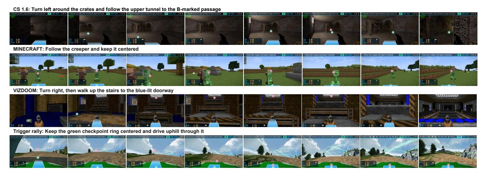

Fig. 13. **게임 도메인 간 제로샷 일반화.** 동일한 LightNav-0 체크포인트는 Counter-Strike 1.6과 VizDoom에서 언어 지시를 따르고, Minecraft에서 움직이는 목표를 추적하며, Trigger Rally에서 체크포인트 조건부 운전을 수행한다. 청록색과 자홍색 마커는 각각 예측된 가능성 포인트와 객체 포인트를 시각화한다.

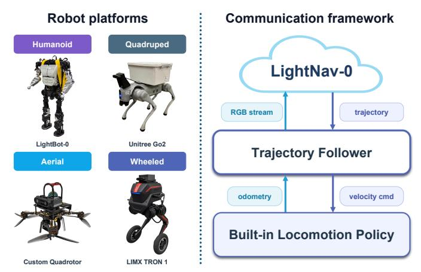

Fig. 14. **로봇 플랫폼 및 통신 프레임워크.** LightNav-0는 인간형, 사지형, 항공형, 바퀴형 플랫폼으로부터 RGB 스트림을 수신하고, 각 로봇의 내장 이동 정책과 오도메트리 및 속도 명령을 통해 인터페이스되는 공유 트레젝터리 팔로워에 의해 실행되는 궤적을 예측한다.

Fig. 14에 표시된 통합 플랫폼 및 통신 인터페이스를 통해 구현된 구현체들. 이 분리는 고수준 RGB-투-트레젝터리 정책을 변경하지 않으면서, 공유 트레젝터리 팔로워가 각 플랫폼의 내장 이동 정책이 요구하는 오도메트리 및 속도 명령으로 예측을 변환한다. 따라서 정성적 결과는 개별 로봇에 맞춰 조정된 별도 정책이 아니라 두 도메인과 구현체 전반에 걸친 공유 탐색 모델의 전이를 테스트한다.

#### E. 제거 연구

우리는 공간 추론을 구현된 제어와 연결하는 두 구성요소를 제거한다: 구현 추론 초기화(embodied-reasoning initialization)와 이중 채널 포인팅(dual-channel pointing). 각 변형은 전체 모델이 사용한 동일한 8개의 시뮬레이션 설정에서 평가되며, 지시 따르기, 폐쇄형 어휘 ObjectNav, 개방형 어휘 ObjectNav를 포함한다.

- a) Embodied-reasoning initialization: Tab. IX는 원본 Qwen3-VL 체크포인트와 LightNav-ER에서 초기화된 정책을 비교한다. ER 초기화는 8개 설정에서 평균 SR을 60.8에서 63.1 (+2.4; 3.9%)로, 평균 SPL을 39.0에서 40.0 (+1.0; 2.6%)로 상승시킨다. SR은 8개 설정 모두에서 개선되며, MP3D에서 가장 크게 (+4.2), 그 다음이 OVON Unseen (+4.0), HM3D v1 (+3.1)로, ER 중간 훈련 중 획득한 공간적 선행 지식이 목표 도달 신뢰성에 일관되게 전이됨을 시사한다. SPL의 변화가 작고 덜 균일한 것은 ER 초기화가 주로 의미적·공간적 의사결정을 개선하고, 경로 효율성은 다운스트림 탐색 정렬에 더 의존한다는 것을 시사한다.

- b) Dual-channel pointing: Tab. X의 모든 벤치마크에서 affordance-point와 object-point 감독을 제거하면 SR과 SPL이 모두 감소한다. Dual-channel pointing은 평균 SR을 54.7에서 63.1 (+8.4; 15.4%)로, 평균 SPL을 34.3에서 40.0 (+5.7; 16.6%)로 상승시킨다. 가장 큰 개선은 HM3D v1에서 나타나며 (+13.5 SR, +12.7 SPL); MP3D는 다음으로 큰 SR 증가(+12.0)를 보이고, HM3D v2는 다음으로 큰 SPL 증가(+10.3)를 보인다. 이러한 이득은 seen, synonym, unseen OVON 분할에서도 지속되며, pointing이 명령 따르기나 고정된 객체 분류에 특화된 신호가 아니라 작업-불특정적 공간 인터페이스임을 뒷받침한다.

#### F. 스케일링 분석 (Scaling Analysis)

Fig. 16은 모델 용량, 데이터 양, 환경 범위에 따른 구별되는 스케일링 행동을 보여준다. 백본을 2B에서 4B로 늘리면 R2R SR/SPL이 59.9/55.4에서 68.5/62.8로, RxR SR/SPL이 64.0/57.9에서 73.6/64.5로 상승하며, 이는 4가지 지표에서 6.6–9.6 포인트의 향상을 의미한다. 8B로 추가 스케일링은 일관되게 유익하지 않다: R2R SR/SPL이 1.6/0.5 포인트 감소하고 RxR SR이 0.5 포인트 감소하지만 RxR SPL은 2.0 포인트 상승한다. 테스트된 체크포인트 중 4B 모델이 가장 강력한 용량–성능 트레이드오프를 제공하며, 혼합 8B 결과

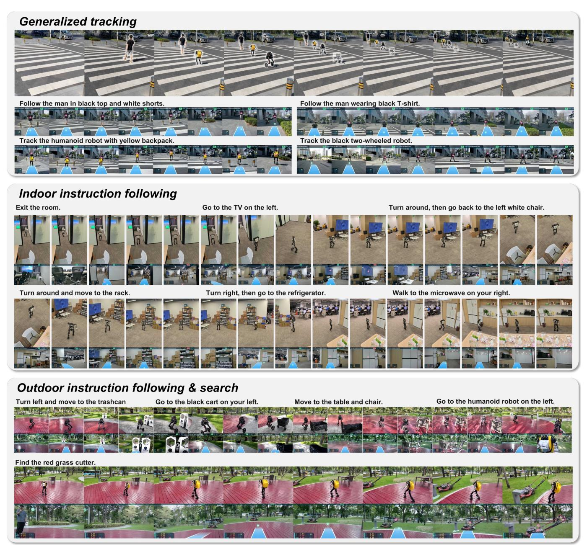

그림 15. 실세계에서의 제로샷 일반화: 작업 및 장면 전반에 걸쳐. LightNav-0은 사람과 로봇 목표를 따라가며 실내 및 실외 탐색 지시를 수행하고, 모델 적응 없이 개방형 어휘 객체를 검색한다. 각 롤아웃은 로봇의 외부 뷰와 정책에서 사용되는 해당 자아중심 관측을 결합한다.

추가 파라미터만으로는 이 규모에서 더 나은 탐색 성능이 보장되지 않음을 나타낸다.

데이터 스케일링은 단조롭지만 포화되는 개선을 가져온다. 1/16에서 전체 훈련 세트로 이동하면 R2R SR/SPL이 53.0/47.1에서 68.5/62.8로, RxR SR/SPL이 56.2/49.5에서 73.6/64.5로 상승하여 15.0–17.4 포인트의 이득을 얻는다. 이 개선의 대부분은 최종 두 배 증가 이전에 얻어진다: 데이터 비율을 1/2에서 전체 세트로 늘리면 R2R에서 0.8/0.9 포인트, RxR에서 1.4/0.4 포인트만 추가된다. 따라서 추가 훈련 데이터는 테스트 범위에서 여전히 유익하지만, 훈련 세트가 전체 규모에 가까워질수록 한계 수익이 감소한다.

환경 스케일링도 단조롭고 데이터 비율이 일치할 때 비교적 강력하다. 훈련 환경을 1/8에서 전체 세트로 늘리면 R2R SR/SPL이 16.7/16.2 포인트, RxR SR/SPL이 21.1/19.1 포인트 상승하며, 중간 단계마다 모든 4가지 측정치가 개선된다. 일치된 1/8-전체 범위에서 이러한 이득은 데이터 스케일링만으로 얻은 것보다 크다( R2R에서 13.2/13.1 포인트, RxR에서 12.3/8.7 포인트). 테스트된 스윕에서 더 넓은 환경 범위가 가장 신뢰할 수 있는 스케일링 축이며, 모델 스케일링은 4B를 초과하면 포화되고 및 데이터

구체화-이성화 초기화의 효과. 우리는 원본 QWEN3-VL 체크포인트(original QWEN3-VL checkpoint)와 LightNav-er에서 초기화된 항법 정책(navigation policies)을 지시 따르기(instruction following), 닫힌 어휘 객체 탐색(closed-vocabulary objectnav), 그리고 열린 어휘 객체 탐색(open-vocabulary objectnav)에서 비교한다. 모든 결과는 단일 시점 RGB 관측(single-view RGB observations)으로 얻어졌다. 볼드체는 각 열에서 더 나은 결과를 표시한다.

| Initialization | R2R |  |  | RxR |  | HM3D v1 |  | HM3D v2 |  | MP3D |  | OVON Seen |  | OVON Synonyms |  | OVON Unseen |  |
|-------------------------|--------------|--------------|--------------|--------------|--------------|--------------|--------------|--------------|--------------|--------------|--------------|--------------|--------------|---------------|--------------|--------------|--|
|  | SR↑ | SPL↑ | SR↑ | SPL↑ | SR↑ | SPL↑ | SR↑ | SPL↑ | SR↑ | SPL↑ | SR↑ | SPL↑ | SR↑ | SPL↑ | SR↑ | SPL↑ |  |
| Qwen3-VL LightNav-ER | 65.8 68.5 | 59.9 62.8 | 72.6 73.6 | 64.9 64.5 | 71.4 74.5 | 42.0 43.9 | 78.0 79.5 | 41.9 43.7 | 49.1 53.3 | 19.8 21.2 | 53.7 55.3 | 31.2 30.4 | 52.5 53.3 | 29.7 29.3 | 43.0 47.0 | 22.4 24.1 |  |

## 표 X (TABLE X)

듀얼-채널 포인팅의 효과. 어포던스-포인트와 오브젝트-포인트 감독을 제거하면서 나머지 모델 및 액션 표현을 유지한다. 모든 결과는 단일 뷰 RGB 관측으로 얻어졌다. 볼드체는 각 열에서 더 나은 결과를 표시한다.

| Variant | R2R |  | RxR |  | HM3D v1 |  | HM3D v2 |  | MP3D |  | OVON Seen |  | OVON Synonyms |  | OVON Unseen |  |
|----------------------------|--------------|--------------|--------------|--------------|--------------|--------------|--------------|--------------|--------------|--------------|--------------|--------------|---------------|--------------|--------------|--------------|
|  | SR↑ | SPL↑ | SR↑ | SPL↑ | SR↑ | SPL↑ | SR↑ | SPL↑ | SR↑ | SPL↑ | SR↑ | SPL↑ | SR↑ | SPL↑ | SR↑ | SPL↑ |
| 포인터 없이 LightNav-0 | 59.5 68.5 | 55.8 62.8 | 70.8 73.6 | 64.2 64.5 | 61.0 74.5 | 31.2 43.9 | 67.9 79.5 | 33.4 43.7 | 41.3 53.3 | 15.2 21.2 | 48.2 55.3 | 26.1 30.4 | 45.8 53.3 | 25.6 29.3 | 43.1 47.0 | 22.8 24.1 |

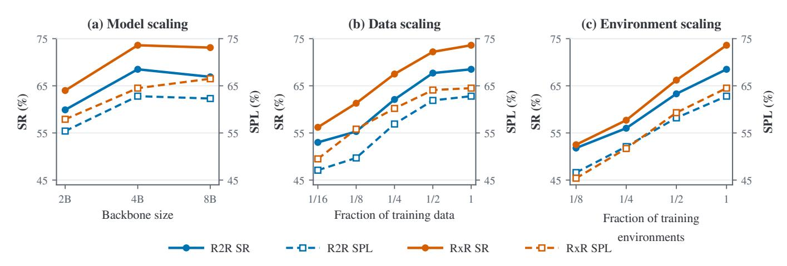

Fig. 16. 연속형 VLN에서 모델, 데이터, 환경 스케일링. 왼쪽 및 오른쪽 수직 축은 각각 SR과 SPL을 보고한다. (a) 백본을 2B에서 4B 파라미터로 스케일링하면 R2R과 RxR에서 두 지표 모두 향상되지만, 8B 체크포인트는 혼합된 변화를 보인다. (b) 훈련 데이터 비율을 늘리면 전체 데이터 영역 근처에서 감소하는 수익률과 함께 단조로운 이득이 나타난다. (c) 훈련 환경 비율을 확장하면 두 벤치마크 모두에서 두 지표가 일관되게 향상된다.

스케일링은 전체 데이터 영역 근처에서 감소하는 수익률을 보인다.

## VII. 결론 (CONCLUSION)

우리는 LightNav-0을 제시하였다. 이는 사전 학습된 VLM의 공간 지능을 활용하는 컴팩트한 범용 구현형 탐색 모델로, 작업별 탐색 아키텍처를 도입하지 않는다. 이중 채널 포인팅은 작업 및 구현형에 무관한 공간 의도를 표현하며, 시간적 히스토리 압축과 계층적 RVQ 액션 토큰은 원래의 자기회귀 언어 모델 헤드를 통해 장기 시각적 맥락을 정밀한 단기 궤적에 연결한다. 2K+ 장면과 4K+ 시간의 구현형 궤적을 포괄하는 통합 코퍼스에서 훈련함으로써 명령 따르기, 객체 목표 탐색, 구현형 시각 추적 전반에 걸쳐 동일한 단일 RGB 정책을 정렬한다. LightNav-0이 초기화되는 구현형 추론 체크포인트인 LightNav-ER는 8개의 구현형 추론 벤치마크에서 가장 높은 전체 세트 평균을 달성한다. 결과적으로 LightNav-0 체크포인트는 10개의 공개 탐색 시뮬레이션 설정에서 가장 높은 단일 RGB 성공률을 달성하고, 작업 또는 로봇별 모델 적응 없이 네 개의 실제 로봇 구현형에 전이된다. 이 결과들은 컴팩트한 VLM이 각 작업이나 플랫폼마다 별도의 예측 헤드를 필요로 하지 않고 범용 구현형 탐색을 위한 통합적이고 전이 가능한 기초를 제공할 수 있음을 시사한다.

이 프레임워크를 확장할 수 있는 몇 가지 방향이 있다. 첫째, 현재 모델은 단일 결정 경로를 사용하며 고주파 로컬 제어와 느린 의미적 사색을 명시적으로 분리하지 않는다. 이중 시스템은 장애물 회피 및 빈번한 궤적 수정을 위한 경량 반응형 정책과 장기 추론을 위한 느린 VLM 플래너를 결합할 수 있다. 둘째, 인터넷 규모의 비디오에 대한 강력한 사전 학습은 개방형 세계 개념 범위를 넓히고, 선별된 구현형 데이터셋만으로는 드물게 접할 수 있는 장면, 상호작용, 움직임 패턴을 모델에 노출시킬 수 있다.

## 기여자 및 감사의 글 (CONTRIBUTORS AND ACKNOWLEDGEMENTS)

# 기여자 (Contributors)

훈련 인프라: Qianli Ma, Ran Mei, and Jia Wei 데이터 인프라: Fei Huang, Shaoan Wang, Jingyi Xu, Yueyu Wang, and Aocheng Luo

중간 훈련: Shaoan Wang and Fan Yang

지도 기반 미세 조정: Shaoan Wang and Aocheng Luo

후 훈련: Aocheng Luo and Shaoan Wang

벤치마크: Fei Huang, Shaoan Wang, Jingyi Xu, and Yueyu

Wang

실제 세계 배포: Xiaoyang Wang, Jiangpeng Hu, Xuhao Liu, Hongming Chen, Yuanbin Shao, Yiyang Lin, and Ziliang Li

작성: Shaoan Wang, Tingxiang Fan, Aocheng Luo, Fei Huang, Liang Pan, Xinhang Liu, and Yuntao Ma 프로젝트 리더: Tingxiang Fan and Shaoan Wang

# 감사의 글 (Acknowledgements)

우리는 Bo Liang, Yuxuan Xie, Jiaxin Li, 그리고 Tianwei Zhang에게 초기 단계 인프라와 초기 기술 탐색에 대한 기여에 대해 감사한다. 또한 Shiyao Zhang과 Shuqi Liao에게 실제 비디오 촬영 및 편집에 대해 감사하고, Kaisong Chen에게 표지 디자인에 대해 감사한다. LimX Dynamics와 Manycore Tech의 협력자들에게 물리적 배포와 시뮬레이션 전반에 걸친 지원에 대해 감사한다.

## 참고문헌 (REFERENCES)

- [1] Dong An, Zun Wang, Yangguang Li, Yi Wang, Yicong Hong, Yan Huang, Liang Wang, and Jing Shao. rxr-habitat 시각-언어 탐색 대회에서 1위 솔루션 (cvpr 2022). arXiv preprint arXiv:2206.11610, 2022.
- [2] Dong An, Hanqing Wang, Wenguan Wang, Zun Wang, Yan Huang, Keji He, and Liang Wang. Etpnav: 연속 환경에서 시각-언어 탐색을 위한 토폴로지 계획 진화. IEEE TPAMI, 2024.
- [3] Peter Anderson, Angel Chang, Devendra Singh Chaplot, Alexey Dosovitskiy, Saurabh Gupta, Vladlen Koltun, Jana Kosecka, Jitendra Malik, Roozbeh Mottaghi, Manolis Savva, et al. 구현된 탐색 에이전트 평가에 관한 연구. arXiv preprint arXiv:1807.06757, 2018.
- [4] Peter Anderson, Qi Wu, Damien Teney, Jake Bruce, Mark Johnson, Niko Sunderhauf, Ian Reid, Stephen ¨ Gould, and Anton Van Den Hengel. 시각-언어 탐색: 실제 환경에서 시각 기반 탐색 지시 해석. In Proceedings of the IEEE conference on computer vision and pattern recognition, pages 3674–3683, 2018.
- [5] Shuai Bai, Yuxuan Cai, Ruizhe Chen, Keqin Chen, Xionghui Chen, Zesen Cheng, Lianghao Deng, Wei

- Ding, Chang Gao, Chunjiang Ge, et al. Qwen3-VL technical report. *arXiv preprint arXiv:2511.21631*, 2025.
- [6] Dhruv Batra, Aaron Gokaslan, Aniruddha Kembhavi, Oleksandr Maksymets, Roozbeh Mottaghi, Manolis Savva, Alexander Toshev, and Erik Wijmans. ObjectNav Revisited: On Evaluation of Embodied Agents Navigating to Objects. In *arXiv:2006.13171*, 2020.
- [7] Kevin Black, Noah Brown, Danny Driess, Adnan Esmail, Michael Equi, Chelsea Finn, Niccolo Fusai, Lachy Groom, Karol Hausman, Brian Ichter, et al. π0: A vision-language-action flow model for general robot control. *arXiv preprint arXiv:2410.24164*, 2024.
- [8] Kevin Black, Noah Brown, James Darpinian, Karan Dhabalia, Danny Driess, Adnan Esmail, Michael Robert Equi, Chelsea Finn, Niccolo Fusai, Manuel Y Galliker, et al. π0.5: a vision-language-action model with openworld generalization. In *9th Annual Conference on Robot Learning*, 2025.
- [9] Abdelaziz Bounhar, Abhijeet Somani, Aditi Kabra, Adrian Valente, Adrien Petralia, Adrien Sade, Alan Jeffares, Albert Jiang, Aleksandr Timashov, Alexandre Cahill, et al. Robostral navigate. *arXiv preprint arXiv:2607.20785*, 2026.
- [10] ByteDance Seed. Seed2.0 model card: Towards intelligence frontier for real-world complexity. *arXiv preprint arXiv:2607.00248*, 2026.
- [11] Yihan Cao, Jiazhao Zhang, Zhinan Yu, Shuzhen Liu, Zheng Qin, Qin Zou, Bo Du, and Kai Xu. Cognav: Cognitive process modeling for object goal navigation with llms. In *Proceedings of the IEEE/CVF International Conference on Computer Vision*, pages 9550– 9560, 2025.
- [12] Angel Chang, Angela Dai, Thomas Funkhouser, Maciej Halber, Matthias Niebner, Manolis Savva, Shuran Song, Andy Zeng, and Yinda Zhang. Matterport3d: Learning from rgb-d data in indoor environments. In *2017 International Conference on 3D Vision (3DV)*, pages 667–676. IEEE, 2017.
- [13] Jiaqi Chen, Bingqian Lin, Xinmin Liu, Xiaodan Liang, and Kwan-Yee K Wong. Affordances-oriented planning using foundation models for continuous vision-language navigation. *arXiv preprint arXiv:2407.05890*, 2024.
- [14] Kang Chen, Zhihao Liu, Tonghe Zhang, Zhen Guo, Si Xu, Hao Lin, Hongzhi Zang, Quanlu Zhang, Zhaofei Yu, Guoliang Fan, et al. πRL: Online rl fine-tuning for flow-based vision-language-action models. *arXiv preprint arXiv:2510.25889*, 2025.
- [15] Shaoyu Chen, Bo Jiang, Hao Gao, Bencheng Liao, Qing Xu, Qian Zhang, Chang Huang, Wenyu Liu, and Xinggang Wang. Vadv2: End-to-end vectorized autonomous driving via probabilistic planning. *arXiv preprint arXiv:2402.13243*, 2024.
- [16] An-Chieh Cheng, Yandong Ji, Zhaojing Yang, Xueyan Zou, Jan Kautz, Erdem Biyik, Hongxu Yin, Sifei Liu, and Xiaolong Wang. NaVILA: Legged robot vision-

- 언어-행동 모델 탐색을 위한. In *RSS*, 2025.
- [17] Long Cheng, Jiafei Duan, Yi Ru Wang, Haoquan Fang, Boyang Li, Yushan Huang, Elvis Wang, Ainaz Eftekhar, Jason Lee, Wentao Yuan, Rose Hendrix, Noah A. Smith, Fei Xia, Dieter Fox, and Ranjay Krishna. Pointarena: Probing multimodal grounding through language-guided pointing. *arXiv preprint arXiv:2505.09990*, 2025.
- [18] Zedong Chu, Shichao Xie, Xiaolong Wu, Yanfen Shen, Minghua Luo, Zhengbo Wang, Fei Liu, Xiaoxu Leng, Junjun Hu, Mingyang Yin, et al. Abot-n0: Technical report on the vla foundation model for versatile embodied navigation. *arXiv preprint arXiv:2602.11598*, 2026.
- [19] Christopher Clark, Jieyu Zhang, Zixian Ma, Jae Sung Park, Mohammadreza Salehi, Rohun Tripathi, Sangho Lee, Zhongzheng Ren, Chris Dongjoo Kim, Yinuo Yang, Vincent Shao, Yue Yang, Weikai Huang, Ziqi Gao, Taira Anderson, Jianrui Zhang, Jitesh Jain, George Stoica, Winson Han, Ali Farhadi, and Ranjay Krishna. Molmo2: Open weights and data for vision-language models with video understanding and grounding. *arXiv preprint arXiv:2601.10611*, 2026.
- [20] Mengfei Du, Binhao Wu, Zejun Li, Xuanjing Huang, and Zhongyu Wei. Embspatial-bench: Benchmarking spatial understanding for embodied tasks with large vision-language models. *arXiv preprint arXiv:2406.05756*, 2024.
- [21] Hermann Ebbinghaus. Memory: A contribution to experimental psychology. *Annals of neurosciences*, 20 (4):155, 2013.
- [22] Haoquan Fang, Jiafei Duan, Donovan Clay, Sam Wang, Shuo Liu, Weikai Huang, Xiang Fan, Wei-Chuan Tsai, Shirui Chen, Yi Ru Wang, et al. Molmoact2: Action reasoning models for real-world deployment. *arXiv preprint arXiv:2605.02881*, 2026.
- [23] Hongyan Feng, Sunlai Chen, Xuanyu Liu, Miao Pan, Yangfan Xie, Yuxiang Cui, Zhongxiang Zhou, Rong Xiong, Wenqi Zhang, Jianwei Yin, Yueting Zhuang, and Xuhong Zhang. Embodied-Navigator: Point, think, memorize, and align for efficient navigation. *arXiv preprint arXiv:2608.17512*, 2026.
- [24] Kaituo Feng, Kaixiong Gong, Bohao Li, Zonghao Guo, Yibing Wang, Tianshuo Peng, Junfei Wu, Xiaoying Zhang, Benyou Wang, and Xiangyu Yue. Video-r1: Reinforcing video reasoning in mllms. *arXiv preprint arXiv:2503.21776*, 2025.
- [25] Chen Gao, Liankai Jin, Xingyu Peng, Jiazhao Zhang, Yue Deng, Annan Li, He Wang, and Si Liu. Octonav: Towards generalist embodied navigation. *arXiv preprint arXiv:2506.09839*, 2025.
- [26] Gemini Robotics Team. Gemini robotics: Bringing ai into the physical world. *arXiv preprint arXiv:2503.20020*, 2025.
- [27] Ruiyan Gong, Yingnan Guo, Junjun Hu, Jintao Kong, Xiaoxu Leng, Tianlun Li, Weize Li, Fei Liu, Zhicheng Liu, Jia Lu, et al. Abot-n1: Toward a general visual

- Yang Cai. Comatrack: 경쟁적 다중 에이전트 게임이론적 추적을 위한 시각-언어-행동 모델. *arXiv preprint arXiv:2603.22846*, 2026.
- [50] Yuxing Long, Wenzhe Cai, Hongcheng Wang, Guanqi Zhan, and Hao Dong. Instructnav: 미지 환경에서 일반 지침 탐색을 위한 제로샷 시스템. *arXiv preprint arXiv:2406.04882*, 2024.
- [51] Bingchen Miao, Rong Wei, Zhiqi Ge, Xiaoquan Sun, Shiqi Gao, Jingzhe Zhu, Renhan Wang, Siliang Tang, Jun Xiao, Rui Tang, and Juncheng Li. Embodied navigation을 위한 물리적으로 실행 가능한 3D 가우시안에 접근. In *The Fourteenth International Conference on Learning Representations*, 2026.
- [52] Dujun Nie, Xianda Guo, Yiqun Duan, Ruijun Zhang, and Long Chen. Wmnav: 객체 목표 탐색을 위한 세계 모델에 시각-언어 모델 통합. *arXiv preprint arXiv:2503.02247*, 2025.
- [53] Zhangyang Qi, Zhixiong Zhang, Yizhou Yu, Jiaqi Wang, and Hengshuang Zhao. Vln-r1: 강화 학습 미세 조정을 통한 시각-언어 탐색. *arXiv preprint arXiv:2506.17221*, 2025.
- [54] Delin Qu, Haoming Song, Qizhi Chen, Yuanqi Yao, Xinyi Ye, Yan Ding, Zhigang Wang, JiaYuan Gu, Bin Zhao, Dong Wang, et al. Spatialvla: 시각-언어-행동 모델을 위한 공간 표현 탐구. *arXiv preprint arXiv:2501.15830*, 2025.
- [55] Qwen Team. Qwen3.5: 네이티브 멀티모달 에이전트로 향하는 길, 2026년 2월. URL [https://qwen.ai/blog?id=](https://qwen.ai/blog?id=qwen3.5) [qwen3.5.](https://qwen.ai/blog?id=qwen3.5)
- [56] Qwen Team. Qwen-VLA: 작업, 환경 및 로봇 구현 전반에 걸친 시각-언어-행동 모델링 통합. *arXiv preprint arXiv:2605.30280*, 2026.
- [57] Santhosh Kumar Ramakrishnan, Aaron Gokaslan, Erik Wijmans, Oleksandr Maksymets, Alexander Clegg, John M Turner, Eric Undersander, Wojciech Galuba, Andrew Westbury, Angel X Chang, et al. Habitat‑matterport 3d 데이터셋 (hm3d): 체현형 AI를 위한 1000개의 대규모 3D 환경. In *Thirty-fifth Conference on Neural Information Processing Systems Datasets and Benchmarks Track (Round 2)*, 2021.
- [58] Ram Ramrakhya, Eric Undersander, Dhruv Batra, and Abhishek Das. Habitat-web: 대규모 인간 시연에서 체현형 객체 탐색 전략 학습. In *Proceedings of the IEEE/CVF Conference on Computer Vision and Pattern Recognition*, pages 5173–5183, 2022.
- [59] Ram Ramrakhya, Dhruv Batra, Erik Wijmans, and Abhishek Das. Pirlnav: 모방 및 강화 학습 미세 조정을 통한 객체 탐색 사전 학습. In *Proceedings of the IEEE/CVF Conference on Computer Vision and Pattern Recognition*, pages 17896–17906, 2023.
- [60] Stephane Ross, Geoffrey Gordon, and Drew Bagnell. 모방 학습과 구조화된 예측을 무위험 온라인 학습으로 환원. In *Proceedings of the fourteenth international conference on artificial intelligence and statistics*, pages 627–635. JMLR Workshop and

- 학회 논문집, 2011.
- [61] Zhihong Shao, Peiyi Wang, Qihao Zhu, Runxin Xu, Junxiao Song, Xiao Bi, Haowei Zhang, Mingchuan Zhang, YK Li, Yang Wu, et al. Deepseekmath: 개방형 언어 모델에서 수학적 추론의 한계를 밀어내다. *arXiv preprint arXiv:2402.03300*, 2024.
- [62] Chan Hee Song, Valts Blukis, Jonathan Tremblay, Stephen Tyree, Yu Su, and Stan Birchfield. Robospatial: 로봇공학을 위한 2D 및 3D 시각-언어 모델에 공간 이해를 가르치다. *arXiv preprint arXiv:2411.16537*, 2024.
- [63] Gemini Team, Rohan Anil, Sebastian Borgeaud, Jean-Baptiste Alayrac, Jiahui Yu, Radu Soricut, Johan Schalkwyk, Andrew M Dai, Anja Hauth, Katie Millican, et al. Gemini: 매우 능력 있는 멀티모달 모델의 한 가족. *arXiv preprint arXiv:2312.11805*, 2023.
- [64] Shengbang Tong, Ellis Brown, Penghao Wu, Sanghyun Woo, Manoj Middepogu, Sai Charitha Akula, Jihan Yang, Shusheng Yang, Adithya Iyer, Xichen Pan, Austin Wang, Rob Fergus, Yann LeCun, and Saining Xie. Cambrian-1: 완전 개방형, 시각 중심의 멀티모달 LLM 탐구. *arXiv preprint arXiv:2406.16860*, 2024.
- [65] Hanqing Wang, Wei Liang, Luc Van Gool, and Wenguan Wang. Dreamwalker: 연속 시각-언어 탐색을 위한 정신적 계획. In *ICCV*, 2023.
- [66] Shaoan Wang, Jiazhao Zhang, Minghan Li, Jiahang Liu, Anqi Li, Kui Wu, Fangwei Zhong, Junzhi Yu, Zhizheng Zhang, and He Wang. Trackvla: 야생에서 구현된 시각 추적. *arXiv preprint arXiv:2505.23189*, 2025.
- [67] Shaoan Wang, Yuanfei Luo, Xingyu Chen, Aocheng Luo, Dongyue Li, Chang Liu, Sheng Chen, Yangang Zhang, and Junzhi Yu. Vlingnav: 적응형 추론과 시각 보조 언어 기억을 갖춘 구현형 탐색. *arXiv preprint arXiv:2601.08665*, 2026.
- [68] Shuo Wang, Yongcai Wang, Wanting Li, Xudong Cai, Yucheng Wang, Maiyue Chen, Kaihui Wang, Zhizhong Su, Deying Li, and Zhaoxin Fan. Aux-think: 데이터 효율적인 시각-언어 탐색을 위한 추론 전략 탐구. *arXiv preprint arXiv:2505.11886*, 2025.
- [69] Zihan Wang, Xiangyang Li, Jiahao Yang, Yeqi Liu, and Shuqiang Jiang. Gridmm: 시각-언어 탐색을 위한 그리드 메모리 맵. In *Proceedings of the IEEE/CVF International Conference on Computer Vision*, pages 15625–15636, 2023.
- [70] Zihan Wang, Xiangyang Li, Jiahao Yang, Yeqi Liu, Junjie Hu, Ming Jiang, and Shuqiang Jiang. Lookahead 탐색: 신경 방사 표현을 이용한 연속 시각-언어 탐색. In *CVPR*, 2024.
- [71] Zixuan Wang, Huang Fang, Shaoan Wang, Yuanfei Luo, Heng Dong, Wei Li, and Yiming Gan. Hydra-nav: 적응형 이중 프로세스 추론을 통한 객체 탐색. *arXiv preprint arXiv:2602.09972*, 2026.
- [72] Zun Wang, Jialu Li, Yicong Hong, Yi Wang, Qi Wu, Mohit Bansal, Stephen Gould, Hao Tan, and Yu Qiao.

- 비전-언어 탐색에서 데이터 생성 확장. *IEEE/CVF 국제 컴퓨터 비전 학회 논문집*, 2023.

- [73] Zun Wang, Jialu Li, Yicong Hong, Songze Li, Kunchang Li, Shoubin Yu, Yi Wang, Yu Qiao, Yali Wang, Mohit Bansal, and Limin Wang. 자기 개선 데이터 플라이휠을 이용한 언어 가이드형 탐색 학습 부트스트래핑. *arXiv preprint arXiv:2412.08467*, 2024.

- [74] Jason Wei, Xuezhi Wang, Dale Schuurmans, Maarten Bosma, Fei Xia, Ed Chi, Quoc V Le, Denny Zhou, et al. 사고 연쇄 프롬프트가 대형 언어 모델에서 추론을 유도한다. *신경 정보 처리 시스템의 진보*, 35:24824–24837, 2022.

- [75] Meng Wei, Chenyang Wan, Jiaqi Peng, Xiqian Yu, Yuqiang Yang, Delin Feng, Wenzhe Cai, Chenming Zhu, Tai Wang, Jiangmiao Pang, and Xihui Liu. 지면은 느리고, 움직임은 빠르다: 일반화 가능한 비전-언어 탐색을 위한 이중 시스템 기반 모델. *arXiv preprint arXiv:2512.08186*, 2025.

- [76] Meng Wei, Chenyang Wan, Xiqian Yu, Tai Wang, Yuqiang Yang, Xiaohan Mao, Chenming Zhu, Wenzhe Cai, Hanqing Wang, Yilun Chen, et al. Streamvln: 슬로우패스트 컨텍스트 모델링을 통한 스트리밍 비전-언어 탐색. *arXiv preprint arXiv:2507.05240*, 2025.

- [77] Erik Wijmans, Abhishek Kadian, Ari Morcos, Stefan Lee, Irfan Essa, Devi Parikh, Manolis Savva, and Dhruv Batra. DD-PPO: 25억 프레임에서 거의 완벽한 포인트골 목표 탐색기 학습. In *학습 표현 국제 회의 (ICLR)*, 2020.

- [78] Ziyuan Xia, Jingyi Xu, Chong Cui, Yuanhong Yu, Jiazhao Zhang, Qingsong Yan, Tao Ni, Junbo Chen, Xiaowei Zhou, Hujun Bao, Ruizhen Hu, and Sida Peng. Habitat-GS: 동적 가우시안 스플래팅을 갖춘 고충실도 탐색 시뮬레이터. *arXiv preprint arXiv:2604.12626*, 2026.

- [79] Hanjing Ye, Tianle Zeng, Jiazhao Zhang, Shaoan Wang, Zibo Zhang, Weixi Situ, Yuchen Zhou, Yonggen Ling, and Hong Zhang. Refertrack: 구현된 시각 추적을 위한 지시 후 추적. *arXiv preprint arXiv:2607.20061*, 2026.

- [80] Hang Yin, Xiuwei Xu, Zhenyu Wu, Jie Zhou, and Jiwen Lu. Sg-nav: LLM 기반 제로샷 객체 탐색을 위한 온라인 3D 장면 그래프 프롬프트. *신경 정보 처리 시스템의 진보*, 37:5285–5307, 2024.

- [81] Hang Yin, Xiuwei Xu, Linqing Zhao, Ziwei Wang, Jie Zhou, and Jiwen Lu. Unigoal: 보편적 제로샷 목표 지향 탐색을 향해. In *컴퓨터 비전 및 패턴 인식 회의 논문집*, pages 19057–19066, 2025.

- [82] Naoki Yokoyama and Sehoon Ha. Film-nav: VLM 파인튜닝을 통한 효율적이고 일반화 가능한 탐색. *arXiv preprint arXiv:2509.16445*, 2025.

- [83] Naoki Yokoyama, Sehoon Ha, Dhruv Batra, Jiuguang Wang, and Bernadette Bucher. Vlfm: 제로샷 의미론적 탐색을 위한 비전-언어 프런티어 맵. In

- *2024 IEEE International Conference on Robotics and Automation (ICRA)*, pages 42–48. IEEE, 2024.
- [84] Naoki Yokoyama, Ram Ramrakhya, Abhishek Das, Dhruv Batra, and Sehoon Ha. Hm3d-ovon: A dataset and benchmark for open-vocabulary object goal navigation. In *2024 IEEE/RSJ International Conference on Intelligent Robots and Systems (IROS)*, pages 5543– 5550. IEEE, 2024.
- [85] Zhuoyuan Yu, Yuxing Long, Zihan Yang, Chengyan Zeng, Hongwei Fan, Jiyao Zhang, and Hao Dong. Correctnav: Self-correction flywheel empowers visionlanguage-action navigation model. *arXiv preprint arXiv:2508.10416*, 2025.
- [86] Wentao Yuan, Jiafei Duan, Valts Blukis, Wilbert Pumacay, Ranjay Krishna, Adithyavairavan Murali, Arsalan Mousavian, and Dieter Fox. Robopoint: A visionlanguage model for spatial affordance prediction for robotics. *arXiv preprint arXiv:2406.10721*, 2024.
- [87] Michał Zawalski, William Chen, Karl Pertsch, Oier Mees, Chelsea Finn, and Sergey Levine. Robotic control via embodied chain-of-thought reasoning. *arXiv preprint arXiv:2407.08693*, 2024.
- [88] Kuo-Hao Zeng, Zichen Zhang, Kiana Ehsani, Rose Hendrix, Jordi Salvador, Alvaro Herrasti, Ross Girshick, Aniruddha Kembhavi, and Luca Weihs. Poliformer: Scaling on-policy rl with transformers results in masterful navigators. In *8th Annual Conference on Robot Learning*, 2024.
- [89] Shuang Zeng, Dekang Qi, Xinyuan Chang, Feng Xiong, Shichao Xie, Xiaolong Wu, Shiyi Liang, Mu Xu, and Xing Wei. Janusvln: Decoupling semantics and spatiality with dual implicit memory for vision-language navigation. *arXiv preprint arXiv:2509.22548*, 2025.
- [90] Jiazhao Zhang, Kunyu Wang, Rongtao Xu, Gengze Zhou, Yicong Hong, Xiaomeng Fang, Qi Wu, Zhizheng Zhang, and He Wang. NaVid: Video-based VLM plans the next step for vision-and-language navigation. *Robotics: Science and Systems*, 2024.
- [91] Jiazhao Zhang, Anqi Li, Yunpeng Qi, Minghan Li, Jiahang Liu, Shaoan Wang, Haoran Liu, Gengze Zhou, Yuze Wu, Xingxing Li, et al. Embodied navigation foundation model. *arXiv preprint arXiv:2509.12129*, 2025.
- [92] Jiazhao Zhang, Kunyu Wang, Shaoan Wang, Minghan Li, Haoran Liu, Songlin Wei, Zhongyuan Wang, Zhizheng Zhang, and He Wang. Uni-NaVid: A videobased vision-language-action model for unifying embodied navigation tasks. *Robotics: Science and Systems*, 2025.
- [93] Jiazhao Zhang, Gengze Zhou, Hale Yin, Yiyang Huang, Zixing Lei, Qihang Peng, Haoqi Yuan, Jie Zhang, Xudong Guo, Xiaoyue Chen, et al. Qwen-RobotNav technical report: A scalable navigation model designed for an agentic navigation system. *arXiv preprint arXiv:2606.18112*, 2026.
- [94] Lingfeng Zhang, Qiang Zhang, Hao Wang, Erjia Xiao,

- Zixuan Jiang, Honglei Chen, and Renjing Xu. Trihelper: 동적 지원을 통한 제로샷 객체 탐색. In *2024 IEEE/RSJ 지능형 로봇 및 시스템 국제학회*, pages 10035–10042, 2024.
- [95] Tonghe Zhang, Chao Yu, Sichang Su, and Yu Wang. Reinflow: 온라인 강화 학습으로 흐름 매칭 정책을 미세 조정. *arXiv 사전출판 arXiv:2505.22094*, 2025.
- [96] Zekai Zhang, Weiye Zhu, Hewei Pan, Xiangchen Wang, Rongtao Xu, Xing Sun, and Feng Zheng. Activevln: 시각-언어 탐색에서 다중 턴 RL을 통한 능동 탐색을 향해. *arXiv 사전출판 arXiv:2509.12618*, 2025.
- [97] Qingqing Zhao, Yao Lu, Moo Jin Kim, Zipeng Fu, Zhuoyang Zhang, Yecheng Wu, Zhaoshuo Li, Qianli Ma, Song Han, Chelsea Finn, et al. Cot-vla: 시각-언어-행동 모델을 위한 시각적 사유 체인 추론. In *컴퓨터 비전 및 패턴 인식 회의 논문집*, pages 1702–1713, 2025.
- [98] Enshen Zhou, Jingkun An, Cheng Chi, Yi Han, Shanyu Rong, Chi Zhang, Pengwei Wang, Zhongyuan Wang, Tiejun Huang, Lu Sheng, and Shanghang Zhang. Roborefer: 로봇공학용 시각-언어 모델에서 공간 지시와 추론을 향해. *arXiv 사전출판 arXiv:2506.04308*, 2025.
- [99] Zhongyi Zhou, Yichen Zhu, Xiaoyu Liu, Zhibin Tang, Junjie Wen, Yaxin Peng, Chaomin Shen, and Yi Xu. Chatvla-2: 오픈월드 추론을 갖춘 시각-언어-행동 모델. In *신경 정보 처리 시스템 39차 연례 회의*, 2025.
- [100] Ziyu Zhu, Xilin Wang, Yixuan Li, Zhuofan Zhang, Xiaojian Ma, Yixin Chen, Baoxiong Jia, Wei Liang, Qian Yu, Zhidong Deng, et al. Move to understand a 3d scene: 시각 기반 정착과 탐색을 연결해 효율적이고 다재다능한 구현형 탐색을 이해하기. In *IEEE/CVF 국제 컴퓨터 비전 학회 논문집*, pages 8120–8132, 2025.

