# OpenWAM: 개방형, 모듈식 탐구를 통한 체계적인 세계-행동 모델 사전학습

- 원제: OpenWAM: An Open, Modular Exploration Towards Systematic World-Action Model Pretraining
- 원문: [https://arxiv.org/abs/2609.07398](https://arxiv.org/abs/2609.07398)
- PDF: [https://arxiv.org/pdf/2609.07398](https://arxiv.org/pdf/2609.07398)
- arXiv ID: `2609.07398`

---

# OpenWAM: 개방형, 모듈식 탐구를 통한 체계적인 세계-행동 모델 사전학습

Yuran Wang<sup>1,\*,‡</sup>, Siqiao Huang<sup>2,\*,‡</sup>, Mingleyang Li<sup>3,\*</sup>, Chenhao Zhang<sup>3,\*</sup>, Jiaqi Liang<sup>3,\*</sup>, Weiyang Jin<sup>4</sup>, Yue Chen<sup>3</sup>, Xuemin Chi<sup>5</sup>, Donghao Zhou<sup>6</sup>, Qize Yu<sup>3</sup>, Yu-Kai Wang<sup>3</sup>, Yuhan Rui<sup>3</sup>, Shenzhe Yao<sup>2</sup>, Zhen Yuan<sup>4</sup>, Zhenhao Shen<sup>3</sup>, Kefei Zhu<sup>3</sup>, Zijie Zhu<sup>4</sup>, Ning Gao<sup>7</sup>, Xiaowei Chi<sup>3</sup>, Guanqi He<sup>2</sup>, Shanghang Zhang<sup>3</sup>, Hao Dong<sup>3</sup>, Lin Shao<sup>1,†</sup>, Hang Zhao<sup>2,†</sup>

<sup>1</sup>싱가포르 국립대학교, <sup>2</sup>칭화대학교, <sup>3</sup>베이징대학교, <sup>4</sup>홍콩대학교, <sup>5</sup>저장대학교, <sup>6</sup>홍콩 중국대학, <sup>7</sup>상하이 교통대학교

<sup>*</sup>동일 기여, <sup>‡</sup>프로젝트 리드, <sup>†</sup>동일 지도

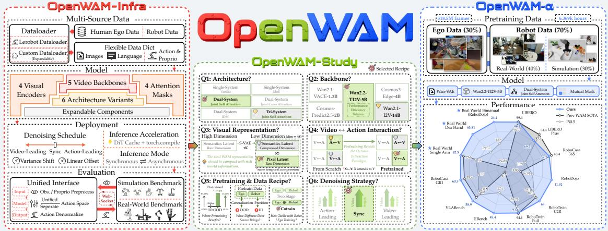

Figure 1 OpenWAM 개요. OpenWAM-Infra(왼쪽)는 세계–행동 모델링을 통합된 학습, 배포, 평가와 함께 조합 가능한 모듈로 분해한다; OpenWAM-Study(가운데)는 통제된 질문을 통해 설계 공간을 해결하고 사전학습 레시피를 추출한다; OpenWAM- $\alpha$ (오른쪽)는 5억1,850만 프레임의 자가 중심 및 로봇 데이터를 사전학습하여 시뮬레이션에서 실제 세계까지 최고 수준의 성능을 유지한다.

프로젝트 페이지: https://openwam-official.github.io/

코드: https://github.com/OpenWAM-Official/OpenWAM

모델 & 데이터: https://huggingface.co/OpenWAM

#### 초록 (Abstract)

World-Action Models(세계-행동 모델)은 비디오-생성 사전 지식에서 세계 지식을 상속받아, 구현된 경험을 통해 실행 가능한 제어 신호로 전달한다.  
그러나 기존 시스템은 단일체적이다: 생성 백본, 시각적 표현, 아키텍처, 정보 흐름, 추론 절차, 그리고 훈련 데이터가 밀접하게 결합되어 있어, 어떤 설계 선택이 중요한지와 그 이유를 모호하게 만든다.  
우리는 OpenWAM(오픈WAM)을 소개한다. 이는 세계-행동 사전 훈련을 통제된 실험 프로그램으로 전환하는 공개 연구 스택이다.  
OpenWAM-Infra(오픈WAM-인프라)는 WAM 설계 공간을 통합된 훈련, 추론, 배포, 평가를 갖춘 조합 가능한 모듈로 분해한다.  
이 기반 위에서 OpenWAM-Study(오픈WAM-스터디)는 통제된 실험을 통해 세 가지 질문을 탐구한다: 무엇을 상속받을 것인가, 세계와 행동 학습이 어떻게 상호작용하는가, 그리고 그 시너지 효과가 어떻게 확장되는가; 그리고 세 가지 원칙을 도출한다: 상향식 지식은 충분히 강력한 생성 백본과 압축되고 정보가 풍부한 잠재 공간을 통해 전달된다; 세계-행동 시너지는 전용 행동 용량, 명시적 세계-행동 정보 흐름, 그리고 동기화된 공동 노이즈 제거를 필요로 한다; 그리고 구현된 사전 훈련은 주로 도메인 외 일반화 성능을 향상시키며, 한 단계의 공동 훈련을 통해 자아중심 및 로봇 데이터를 통합하여 세계 범위와 행동 기반화를 결합한다.  
이러한 원칙을 조합하여 우리는 OpenWAM- $\alpha$(오픈WAM-알파)를 구축한다. 이는 약 6,400시간의 자아중심 인간 및 로봇 데이터를 사전 훈련한 공개 WAM이며, 시뮬레이션과 실제 세계 벤치마크에서 평가된다.  
여덟 개의 시뮬레이션 벤치마크와 실제 로봇 실험을 통해, 이들은 단일 팔 및 양손 조작에서 정교한 손에 이르기까지 다양한 구현체를 포괄한다. OpenWAM- $\alpha$는 일관되게 뛰어난 성능을 제공하며, 시뮬레이션에서 물리적 세계까지 최상위 수준을 유지한다.  
우리는 인프라, 평가 프로토콜, 사전 훈련된 모델, 데이터 레시피를 포함한 전체 스택을 공개하여 향후 연구를 촉진한다.

## 목차 (Contents)

| 1<br>서론 |  |  |  |  |  |  |  |  |
|-------------------|-------------------------------------------------------------------------------------------------------------------------------------------------------------------------------------------------------------------------------------------------------------------------------------------------------------------------------------------------------------------------------------------------------------------------------------------------------------------------------------------------------------------------------------------------------------------------------------------------------------------------------------------------------------|----------------------------------------------------------------------------|--|--|--|--|--|--|
| 2 | 관련 연구 | 4 |  |  |  |  |  |  |
| 3 | OpenWAM-Infra: 세계–행동 모델링을 위한 모듈형 인프라스트럭처 (World–Action Modeling)<br>3.1<br>조합 가능한 모델<br>3.2<br>학습 런타임<br>3.3<br>배포 런타임<br>3.4<br>평가 프로토콜<br> | 5<br>5<br>7<br>8<br>9 |  |  |  |  |  |  |
| 4 | OpenWAM-Study: 세계–행동 모델의 설계 원칙 (World–Action Models)<br>4.1<br>상류 세계 지식 상속<br>4.1.1<br>생성적 세계 선행<br>4.1.2<br>시각적 표현 선행<br><br>4.2<br>세계와 행동 학습 간 시너지 구축<br><br>4.2.1<br>아키텍처 용량<br>4.2.2<br>학습 시 정보 흐름<br><br>4.2.3<br>추론 시 정보 흐름<br>4.3<br>도메인 간 지식 통합<br>4.3.1<br>문제 설정 및 평가 프로토콜<br>4.3.2<br>체화된 사전학습이 주로 OOD 일반화를 확장<br>4.3.3<br>사전학습이 선호되는 정보 흐름을 변경<br>4.4<br>결론 | 11<br>11<br>11<br>12<br>13<br>13<br>13<br>14<br>15<br>15<br>15<br>16<br>16 |  |  |  |  |  |  |
| 5 | OpenWAM-α: 원칙에서 사전학습 모델로<br>5.1<br>OpenWAM-α 아키텍처, 훈련, 배포<br><br>5.1.1<br>아키텍처<br>5.1.2<br>훈련<br>5.1.3<br>배포<br>5.2<br>다중 도메인 사전학습 데이터 및 선별<br>5.2.1<br>사전학습 데이터 혼합<br><br>5.2.2<br>데이터 선별<br><br>5.3<br>시뮬레이션 벤치마크 평가<br><br>5.3.1<br>OpenWAM-α는 어떻게 성능을 보이는가?<br><br>5.3.2<br>VLA 대 WAM: 어느 패러다임이 우세?<br><br>5.4<br>실제 로봇 평가 | 17<br>17<br>18<br>18<br>18<br>19<br>19<br>20<br>20<br>21<br>23<br>24 |  |  |  |  |  |  |
| 6 | 결론 | 26 |  |  |  |  |  |  |
|  | 참고문헌 | 27 |  |  |  |  |  |  |
|  | 부록 | 33 |  |  |  |  |  |  |
| A | 제한점 및 향후 연구 | 33 |  |  |  |  |  |  |
| B | 훈련 세부사항<br>33 |  |  |  |  |  |  |  |
| C | 실제 세계 평가 프로토콜 | 35 |  |  |  |  |  |  |
| D | 벤치마크별 시뮬레이션 결과 | 39 |  |  |  |  |  |  |

## <span id="page-2-0"></span>1 서론 (Introduction)

*"지식은 행동의 시작이며, 행동은 지식의 완성이다."*

*—* Yang-ming Wang*, "실용 생활 지침"* [(Wang,](#page-30-0) [1963)](#page-30-0)

지능은 세상을 인식하는 것 이상의 것을 요구한다: 구체화된 에이전트는 세상이 어떻게 변하는지 예측하고 원하는 변화를 가져오기 위해 행동해야 한다. 현대의 시각 및 시각–언어 모델은 대규모 이미지–텍스트 데이터에서 풍부한 의미 표현을 학습했다 [(Radford et al.,](#page-29-0) [2021;](#page-29-0) [Caron et al.,](#page-27-0) [2021;](#page-27-0) [Tong](#page-30-1) [et al.,](#page-30-1) [2024)](#page-30-1). 비디오 생성 모델은 시각 세계가 시간에 따라 어떻게 진화할 수 있는지를 합성하는 방법을 학습함으로써 한 단계 더 나아간다 [(Ho et al.,](#page-27-1) [2022;](#page-27-1) [Brooks et al.,](#page-26-1) [2024)](#page-26-1). 그러나 구체화된 시스템은 세상에서 일어날 수 있는 것뿐만 아니라 그것을 일으키기 위해 취할 수 있는 행동을 학습해야 한다.

이 구분은 구체화된 학습에서 근본적인 데이터 비대칭을 드러낸다. 변화하는 세계의 비디오는 풍부하지만 실행 가능한 행동 라벨이 있는 로봇 궤적은 상대적으로 드물다 [(Ye](#page-30-2) [et al.,](#page-30-2) [2026d)](#page-30-2). ACT [(Zhao et al.,](#page-31-0) [2023)](#page-31-0) 및 Diffusion Policy [(Chi et al.,](#page-27-2) [2025)](#page-27-2)와 같은 초기 접근법은 주로 로봇 시연만으로 시각적 규칙성과 제어를 함께 학습한다. 최근에는 Vision–Language–Action (VLA) 모델 [(Brohan et al.,](#page-26-2) [2023;](#page-26-2) [Kim et al.,](#page-28-0) [2024;](#page-28-0) [Black et al.,](#page-26-3) [2024)](#page-26-3)이 사전 학습된 시각–언어 모델에서 의미 및 언어 지식을 상속받는다. World–Action Models (WAMs) [(Pai et al.,](#page-29-1) [2025;](#page-29-1) [Ye et al.,](#page-30-3) [2026c;](#page-30-3) [Li et al.,](#page-28-1) [2026b)](#page-28-1)는 다른 초기화 방식을 제공한다: 비디오 생성 사전 학습에서 시각 동역학에 대한 생성 사전(프리어)을 상속받고 이를 구체화된 경험을 통해 적응시킨다. 비디오 생성은 시간적 진화를 명시적으로 모델링하도록 훈련되므로, 행동이 물리적 변화를 어떻게 상호작용하는지 학습하기 위한 직접적인 출발점을 제공한다. 이 의미에서 WAM은 비디오 생성 사전에서 세계 지식을 상속받고, 이후 구체화된 경험을 통해 이 세계에서 행동을 취하는 방법을 학습한다.

그러나 WAM의 약속은 단순히 비디오 모델로 정책을 초기화하거나 비디오 생성기에 행동 헤드를 부착하는 것에만 있지 않다. 그 핵심 가설은 세계 예측과 행동 생성이 시너지롭게 학습될 수 있다는 것이다: 세계 모델링은 상태, 동역학, 가능한 미래에 대한 구조화된 지식을 제공하여 행동에 정보를 주고, 행동 학습은 제어에 중요한 변화를 모델에 집중시킨다. 그러나 이 시너지를 실현하는 것은 비단순하다. 유용한 지식은 상위 비디오 모델의 서로 다른 부분에 존재할 수 있고, 명목상 결합된 세계와 행동 예측은 여전히 효과적인 정보 경로가 부족할 수 있으며, 한 학습 도메인에 맞는 설계가 새로운 장면이나 구현체에서 그 이점을 유지하지 못할 수 있다. 이러한 도전은 세 가지 핵심 질문으로 이어진다.

```
Question 1: WAM이 상속해야 할 세계 지식은 무엇인가?
```

Question 2: 세계와 행동 학습 사이에 시너지를 어떻게 만들 수 있을까?

Question 3: 이 시너지를 도메인 전반에 걸쳐 어떻게 확장할 수 있을까?

이러한 질문에 답하는 것은 기존의 단일체 시스템에서 어려우며, 이때 생성적 백본, 시각적 표현, 모델 아키텍처, 정보 흐름, 추론 절차, 그리고 훈련 데이터 구성이 종종 밀접하게 결합되어 있다 [(Kim et al.,](#page-28-2) [2026b;](#page-28-2) [Bi et al.,](#page-26-4) [2026;](#page-26-4) [Zhang et al.,](#page-31-1) [2026b)](#page-31-1). 따라서 우리는 세계-행동 모델을 체계적으로 개발하기 위한 오픈 연구 스택인 OpenWAM을 소개한다. OpenWAM-Infra는 WAM 설계 공간을 모듈형 구성요소로 분해하면서, 도메인과 구현체 전반에 걸쳐 통합된 훈련, 추론, 배포, 평가를 제공한다 [(Section 3)](#page-4-0). 이러한 모듈성은 세계-행동 모델링을 상호 연결된 구현 선택의 집합에서 통제된 실험 프로그램으로 전환한다.

이 프레임워크를 기반으로 OpenWAM-Study는 World–Action Models(세계–행동 모델)의 설계 원칙을 조사한다 [(Section 4)](#page-10-0). 본 연구는 세 가지 주요 결과를 도출한다. 첫째, 상위 세계 지식은 충분히 강력한 생성 백본과 압축되고 정보가 풍부한 시각 잠재 공간을 통해 가장 효과적으로 전달된다. 둘째, 세계–행동 시너지 효과는 파라미터 수나 단순한 공동 예측만으로는 나타나지 않는다. 충분한 행동‑특화 용량, 명시적인 세계‑투‑행동 정보 흐름, 그리고 공동 테스트‑타임 디노이징 스케줄이 있을 때 가장 잘 촉진된다. 셋째, 구현 사전 훈련은 주로 도메인 외 일반화 성능을 향상시키며, 도메인 내부 적합은 그렇지 않다: 인간 자아중심 비디오는 세계 범위를 확장하고, 로봇 궤적은 실행 가능한 행동 지식을 제공하며, 이들의 공동 훈련은 실험에서 가장 강력한 실용적 통합 전략을 제공한다. 이 세 가지 결과는 세계 지식 상속, 세계–행동 시너지 활성화, 그리고 그 시너지를 도메인 전반에 걸쳐 확장하는 실용적 레시피를 제시한다.

마지막으로, 우리는 도출된 설계 원칙을 OpenWAM‑α, 즉 공개 사전 학습된 World–Action Model [(Section 5)](#page-16-0)으로 통합한다. 518M 프레임(≈6,400 시간)의 자가 중심 인간 및 로봇 데이터를 통합 80‑D 액션 공간을 통해 사전 학습한 OpenWAM‑α는 통제된 환경에서 추출된 레시피가 이질적인 데이터, 도메인, 구현체에 걸쳐 확장될 때에도 효과적임을 입증한다. 이 모델은 다섯 가지 구현체 범주를 포괄하는 여덟 개의 시뮬레이션 벤치마크에서 일관되게 강력한 성능을 제공하며, 단일 팔, 양손, 정밀 손 플랫폼에서의 실제 로봇 실험에서도 이 성과를 유지한다. 점수 자체를 넘어, 이러한 대규모 평가가 구현체 기반 기초 모델의 설계 및 확장 동작에 대한 추가 통찰을 제공한다. 커뮤니티가 이 결과를 재현하고 확장할 수 있도록, 우리는 모델과 함께 인프라, 평가 프로토콜, 사전 학습 가중치, 데이터 레시피를 포함한 전체 스택을 공개한다.

In summary, our major contributions are as follows:

- OpenWAM-Infra: World–Action Modeling을 위한 모듈형 인프라. 모델, 표현, 훈련, 추론, 배포, 평가 선택을 분해하여 WAM 설계와 구현체 전반에 걸친 통제된 비교를 가능하게 한다 [(Section 3)](#page-4-0).
- OpenWAM-Study: World–Action 시너지에 대한 설계 원칙. 상위 사전 지식, 아키텍처 용량, 정보 흐름, 노이즈 제거, 다중 도메인 사전 훈련을 통제된 실험을 통해 세계 지식이 행동 학습과 생산적으로 상호작용할 수 있는 방식을 규명한다 [(Section 4)](#page-10-0).
- OpenWAM-α: 사전 훈련된 World–Action Model. 도출된 원칙을 구현하고 확장하여 도메인과 구현체 전반에 걸친 일반화 및 효율성을 평가하는 공개 모델을 구현한다 [(Section 5)](#page-16-0).

## <span id="page-3-0"></span>2 관련 연구

World–Action Models. World models [(LeCun et al.,](#page-28-3) [2022;](#page-28-3) [Ha & Schmidhuber,](#page-27-3) [2018)](#page-27-3)는 관측으로부터 예측 구조를 학습하며, 오랫동안 계획을 통한 제어를 지원해 왔다 [(Zhou et al.,](#page-31-2) [2024;](#page-31-2) [Maes et al.,](#page-29-2) [2026;](#page-29-2) [Huang et al.,](#page-28-4) [2026)](#page-28-4), 모델 기반 강화 학습 [(Hafner et al.,](#page-27-4) [2019;](#page-27-4) [M. Moerland et al.,](#page-29-3) [2023)](#page-29-3), 그리고 정책 평가 [(Huang et al.,](#page-28-5) [2025;](#page-28-5) [Wang et al.,](#page-30-4) [2026b)](#page-30-4)에서 활용되어 왔다. World–Action Models (WAMs) [(Ye et al.,](#page-30-3) [2026c;](#page-30-3) [Pai et al.,](#page-29-1) [2025;](#page-29-1) [Li et al.,](#page-28-1) [2026b)](#page-28-1)는 이 예측 능력을 정책 모델로서 활용함으로써 실행 가능한 행동에 보다 직접적으로 연결한다. 반면 VLA 모델 [(Brohan et al.,](#page-26-2) [2023;](#page-26-2) [Kim et al.,](#page-28-0) [2024;](#page-28-0) [Black et al.,](#page-26-3) [2024)](#page-26-3)은 주로 시각–언어 사전 학습 [(Beyer et al.,](#page-26-5) [2024;](#page-26-5) [Bai et al.,](#page-26-6) [2025)](#page-26-6)을 통해 의미 및 언어 지식을 상속받으며, WAMs는 비디오 생성 사전 지식으로 초기화되어 행동 학습이 풍부한 시각적 동적 사전 지식을 가진 모델에서 시작하도록 한다 [(Wan et al.,](#page-30-5) [2025;](#page-30-5) [Ali et al.,](#page-26-7) [2025)](#page-26-7). 그러나 기존 시스템은 여전히 대부분 단일체이며, 모델 아키텍처, 학습 절차, 데이터 레시피, 샘플링 일정의 변경이 종종 결합된다. 따라서 어떤 구성 요소가 세계 지식을 전달하고, 어떤 상호작용이 세계–행동 시너지를 만들며, 어떤 이점이 도메인 전반에 걸쳐 지속되는지는 불분명하다. OpenWAM은 이러한 결합된 선택을 제어 변수로 드러내고, 정확히 이 세 가지 질문을 중심으로 조직한다.

일반형 로봇 정책 학습을 위한 오픈 연구 생태계.

오픈 모델과 코드베이스는 일반형 로봇 학습을 점점 더 접근하기 쉽게 만들었다.

OpenVLA [(Kim et al.,](#page-28-0) [2024)](#page-28-0)는 오픈-웨이트 사전학습 기반을 구축했으며, StarVLA [(Community,](#page-27-5) [2026)](#page-27-5)는 다양한 설계 선택을 위한 모듈형이며 성능이 뛰어난 플랫폼을 제공한다.

StarVLA-α [(Ye et al.,](#page-30-6) [2026b)](#page-30-6)는 최소주의 설계의 사전학습 모델로 이 범위를 보완하고, XPolicyLab [(Community et al.,](#page-27-6) [2026)](#page-27-6)는 정책 평가 및 배포를 위한 통합 표준과 오픈 생태계를 제공한다.

이러한 노력은 VLA 연구 커뮤니티에서 개발 복잡성을 크게 줄였지만, WAM 커뮤니티에서는 이러한 오픈 연구 생태계가 거의 존재하지 않는다.

이 영역에서 강력한 사전학습 모델과 함께 모듈형 시스템은 연구를 민주화하고, 세계–행동 모델 사전학습을 이해하고 확장하는 데 원칙적인 기반을 제공할 것이다.

모델 설계에 대한 과학적 이해를 향해. 모델 설계를 경험적 과학으로 다루는 연구가 늘어나고 있다 [(Allen-Zhu,](#page-26-8) [2026;](#page-26-8) [Karras et al.,](#page-28-6) [2022;](#page-28-6) [McKinzie et al.,](#page-29-4) [2024;](#page-29-4) [Liu et al.,](#page-28-7) [2022;](#page-28-7) [Wen et et al.,](#page-30-7) [2026)](#page-30-7): 복잡한 시스템을 제어 변수로 분해하고, 관측된 성과 뒤에 있는 메커니즘을 테스트하며, 레시피를 도출하고, 그것이 규모에 견디는지 검증한다. 다중 모달 학습에서는 Cambrian-1 [(Tong et al.,](#page-30-1) [2024)](#page-30-1)와 Beyond Language Modeling [(Tong et al.,](#page-30-8) [2026)](#page-30-8)이 시각 표현, 모달리티별 용량, 데이터 구성, 통합 사전학습을 체계적으로 연구한다; Towards Physics of Multimodal Pretraining [(Han](#page-27-7) [et al.,](#page-27-7) [2026)](#page-27-7)는 지식 흐름, 시너지 대 경쟁, 모달리티 통합 시기를 더 분리한다. 로봇 학습에서는 Action Chunking [(Simchowitz et al.,](#page-29-5) [2025;](#page-29-5) [Zhang et al.,](#page-31-3) [2025b;](#page-31-3) [Lazzati](#page-28-8)

[et al.,](#page-28-8) [2026)](#page-28-8)와 Generative Control Policies [(Pan et al.,](#page-29-6) [2026)](#page-29-6)가 이 주제들에 대한 커뮤니티의 이해를 크게 재구성했다. 데이터 및 시스템 수준에서 Large Behavior Models [(Barreiros et al.,](#page-26-9) [2026)](#page-26-9), LBM co-train [(Lin et al.,](#page-28-9) [2026a)](#page-28-9), StarVLA-α [(Ye et al.,](#page-30-6) [2026b)](#page-30-6), 그리고 OpenHLM [(Hu et al.,](#page-28-10) [2026)](#page-28-10)도 유사하게...

OpenWAM-Infra는 이 방법론을 WAM에 적용한다: OpenWAM-Infra는 제어 실험을 위한 기초를 구축하고, OpenWAM-Study는 이를 상속, 시너지, 확장성에 관한 제어 과학적 질문으로 바꾸며, OpenWAM-α는 이 결과 레시피를 이질적 다중 도메인 사전학습에서 확장한다.

## <span id="page-4-0"></span>3 OpenWAM-Infra: 세계-행동 모델링을 위한 모듈형 인프라스트럭처 (OpenWAM-Infra: A Modular Infrastructure for World–Action Modeling)

대부분의 기존 세계–행동 모델은 아키텍처와 인프라 구현에서 크게 다르며, 공유 표준이 없다. 각 시스템은 단일 모델 설계 주위에 구축되므로, 그 모델, 훈련, 서비스, 평가 구성 요소도 특이하게 조직되고 종종 밀접하게 결합된다. 이는 두 가지 문제를 야기한다: 1) 이러한 코드베이스는 사용자가 확장하거나 구축하기 어렵고, 2) 구성 요소 간의 결합이 모듈이 서로 간섭하도록 하여 제어 비교에서 도출된 결론을 혼란스럽게 만든다. OpenWAM-Infra는 이 두 문제를 해결하기 위해 세계–행동 모델링을 명시적 인터페이스를 가진 네 개의 분리된 구성 요소로 분해한다: 교환 가능한 인코더, 스트림 백본, 가시성 주의 마스크를 조합한 조합 가능한 모델 [(Section 3.1)](#page-4-1); 모든 모델을 하나의 트레이너로 훈련하는 훈련 런타임 [(Section 3.2)](#page-6-0); 모든 결과 체크포인트를 하나의 정책 서버를 통해 제공하는 배포 런타임 [(Section 3.3)](#page-7-0); 그리고 모든 벤치마크가 해당 서버에 도달하도록 하는 평가 프로토콜 [(Section 3.4)](#page-8-0). 이 구성 요소들은 서로 독립적이거나 엄격한 일방향 종속성으로 연결되어 있어 코드베이스를 확장하기 쉽고, 모듈 간 상호 간섭을 차단하며, OpenWAM-Study [(Section 4)](#page-10-0)가 제어 실험을 수행하고 OpenWAM-α [(Section 5)](#page-16-0)가 규모에 맞게 구현되는 기반을 제공한다.

### <span id="page-4-1"></span>3.1 조합 가능한 모델 (Composable Model)

<span id="page-4-2"></span>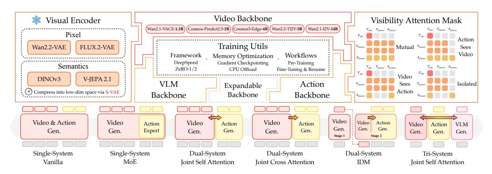

그림 2 OpenWAM Model Infra.  
상단: 교환 가능한 세 가지 모듈 클래스: 시각 인코더 E(왼쪽); 스트림 백본 S(가운데); 가시성 주의 마스크 M(오른쪽).  
중앙의 Training Utils 패널은 훈련 런타임의 유틸리티를 요약한다 [(Section 3.2)](#page-6-0).  
하단: 구성 규칙 C가 모듈을 조합해 싱글-시스템, 듀얼-시스템, 트라이-시스템 패밀리에서 여섯 가지 아키텍처 변형을 만든다.

그림 2에 표시된 대로 OpenWAM-Infra는 세계–행동 모델( World–Action Model, WAM)을 세 가지 교환 가능한 모듈 클래스로 구성하고, 구성 규칙 C가 이를 C(E, S, M) 형태로 구체적인 아키텍처로 조합한다:

- 시각 인코더 E: 관측값을 세계 스트림이 예측하는 잠재 시퀀스로 매핑한다;  
- 스트림 백본 S: 모델의 토큰 스트림을 처리한다: 세계 스트림 W, 행동 스트림 A, 선택적으로 이해 스트림 U, 그리고 설계자가 도입할 수 있는 추가 스트림들; 서로 다른 스트림은 하나의 백본을 공유할 수 있다;

• 가시성 주의 마스크 M: 스트림과 토큰 간의 주의 관계를 지정한다, 즉, 어떤 토큰이 어떤 토큰을 주의할 수 있는지, 스트림 내부와 스트림 간 모두를 포함한다.

시각 인코더. 인코더 E는 관측값을 세계 스트림이 예측하는 잠재 시퀀스로 매핑하며 항상 고정(frozen) 상태로 유지된다. 서로 다른 인코더는 잠재 공간에서 다른 정보를 캡처하고, 그 결과로 서로 다른 세계 스트림 동작을 유도한다. 대부분의 경우, 비디오 백본은 자연스럽게 매칭된 인코더와 함께 제공되며, 이 경우 기본 DiT의 사전 학습된 파라미터가 그대로 재사용되어 사전 학습의 전체 이점을 유지한다. 이 기본 설정을 넘어 OpenWAM-Infra는 플러그 가능한 인코더를 추가로 지원한다: E를 교체하면 예측할 잠재 표현이 바뀌며, 기본 DiT는 사전 학습 파라미터의 영향을 제외하도록 재초기화될 수 있다. 현재 OpenWAM-Infra는 픽셀 재구성 목표로 훈련된 두 개의 재구성 인코더를 제공한다: Wan2.2-VAE [(Wan et al.,](#page-30-5) [2025)](#page-30-5)와 FLUX.2-VAE [(Black Forest Labs,](#page-26-10) [2025)](#page-26-10), 그리고 두 개의 표현 인코더 [(Zheng et al.,](#page-31-4) [2026a)](#page-31-4): DINOv3 [(Siméoni et al.,](#page-29-7) [2025)](#page-29-7)와 V-JEPA 2.1 [(Mur-Labadia et al.,](#page-29-8) [2026)](#page-29-8), 그리고 잠재 차원을 압축하는 선택적 S-VAE [(Zhang et al.,](#page-31-5) [2025a)](#page-31-5) 모듈을 포함한다. 이러한 기능은 모두 [Section 4.1.2.](#page-10-3)에서 시각 표현 연구를 지원한다.

스트림 백본. S에 있는 백본은 [Figure 2.](#page-4-2) 중앙 패널 주위에 배치된다. 비디오 백본(W)은 미래 세계 시각 상태의 시간적 진화를 예측하고, 행동 백본(A)은 다가오는 행동 청크를 예측한다 [(Zhao et al.,](#page-31-0) [2023)](#page-31-0); 이 둘이 모여 모델의 세계–행동 코어를 형성한다. 선택적 VLM 백본(U)은 현재 관측값에 대한 의미적 이해를 이 코어에 보완한다. 이 외에도 백본 명단은 자체적으로 확장 가능하다: 추가 백본을 등록해 설계자가 도입할 수 있는 추가 스트림을 실행할 수 있다. 종류에 관계없이 모든 백본은 하나의 코드 계약을 통해 실행되며, 그 전방 패스를 세 단계로 분해한다:

- prepare: 스택 이전에 한 번 호출되며, 입력을 초기 토큰 상태에 임베딩한다;  
- per-layer block step: 층마다 한 번 호출되며, 이 상태를 하나의 트랜스포머 층을 통해 진행시킨다;  
- finalize: 스택 이후 한 번 호출되며, 최종 상태를 스트림의 예측으로 매핑한다.

각 층은 블록 스텝을 사전 주의(pre-attention) 절반과 사후 주의(post-attention) 절반으로 추가로 분할할 수 있다. 사전 주의 절반은 층의 쿼리, 키, 값을 방출하고, 사후 주의 절반은 주의 출력(attention output)을 소비한다. 이렇게 하면 두 절반 사이의 주의가 스트림 간에 공동으로 계산될 수 있다.

비디오 백본에 대해 OpenWAM-Infra는 모델 파라미터가 증가하는 다섯 개의 사전 학습된 비디오 생성 모델을 지원한다. 이 모델들은 Wan2.1-VACE-1.3B, Cosmos-Predict2.5-2B, Cosmos3-Edge-4B, Wan2.2-TI2V-5B, 그리고 Wan2.1-I2V-14B이며, 각각 [(Wan et al.,](#page-30-5) [2025;](#page-30-5) [Ali et al.,](#page-26-7) [2025)](#page-26-7)에 기초한다. VLM 백본에 대해서는 OpenWAM-Infra가 현재 Qwen3-VL 계열만 지원한다 [(Bai et al.,](#page-26-6) [2025)](#page-26-6). 액션 백본에 대해서는 OpenWAM-Infra가 두 가지 옵션을 제공한다: ActionDiT에 존재하는 별도 파라미터 세트, 혹은 액션 토큰이 비디오 토큰 시퀀스에 합류하여 공동으로 처리되는 공유 비디오 백본.

Visibility Attention Mask. 마스크 M은 스트림이 상호작용하는 혼합 자기-주의를 통해 정보 흐름을 조정한다: 이는 내부 모달리티와 교차 모달리티 블록으로 분해되며, 토큰이 서로를 강화할 때는 주의를 허용하고, 상호 영향이 분리되어야 할 때는 주의를 제한한다. 비디오와 액션 모달리티에 대해 이 분해는 다음과 같이 읽는다

$$\mathcal{M} = \begin{pmatrix} \mathcal{M}_{V \leftarrow V} & \mathcal{M}_{V \leftarrow A} \\ \mathcal{M}_{A \leftarrow V} & \mathcal{M}_{A \leftarrow A} \end{pmatrix},\tag{1}$$

여기서 블록 MX←<sup>Y</sup>는 모달리티 X의 토큰이 모달리티 Y의 토큰에 주의를 기울일 수 있는지를 지정한다. OpenWAM-Infra는 두 내부 모달리티 블록을 고정한다: M<sup>V</sup> <sup>←</sup><sup>V</sup>는 첫 번째 프레임 인과적 주의를 채택하며, 이때 노이즈가 있는 프레임은 서로와 깨끗한 첫 번째 프레임에 주의를 기울이고, 깨끗한 프레임은 오직 자신에게만 주의를 기울여 깨끗한 조건이 노이즈로부터 보호된다. MA←<sup>A</sup>는 양방향 주의를 채택하며, 이때 한 청크의 노이즈가 있는 액션 토큰은 서로를 볼 수 있어 예측된 액션이 서로를 알린다. 두 교차 모달리티 블록은 OpenWAM-Infra가 지원하는 네 가지 주의 마스크 모드를 정의한다. 이는 [Figure 2:](#page-4-2) 오른쪽 패널에 그려져 있다. mutual은 MA←<sup>V</sup>와 M<sup>V</sup> <sup>←</sup>A를 모두 활성화하여 두 모달리티가 서로를 주의하도록 한다; action-sees-video는 MA←<sup>V</sup>만 활성화하여 액션이 예측된 세계를 읽도록 하고 비디오 생성은 방해받지 않게 한다; video-sees-action은 M<sup>V</sup> <sup>←</sup>A만 활성화하여 반대로 한다; isolated는 둘 다 비활성화하여 두 모달리티를 독립적으로 디노이즈한다. 이 기본 지원을 바탕으로 [Section 4.2.2](#page-12-2)에서는 제어된 설정에서 이 모드들을 비교한다.

Architectures. 구성 규칙 C는 정보가 스트림을 가로지르는 위치와 방식을 지정하며, 이는 위에서 정의한 실행 계약을 통해 순수하게 수행된다: 참여 백본의 **prepare**, **per-layer block**, 그리고 **finalize** 단계를 순차화하고, 상호작용이 주의 안에서 발생해야 할 때는 블록 단계를 **pre-attention**과 **post-attention** 절반으로 분할하여 주의 계산 자체를 대체한다. 백본 내부를 수정하지 않는다. 따라서 구성 규칙은 자체적으로 파라미터를 갖지 않으며, 학습된 용량은 모두 스트림 백본에 존재한다. 구체적인 아키텍처는 선택 $C(\mathcal{E}, \mathcal{S}, \mathcal{M})$이며, 현재 지원되는 설계는 Figure 2의 하단 행에서 왼쪽에서 오른쪽으로 세 개의 가족으로 나뉜다.

- Single-System. 이 가족은 비디오 백본만으로 구성된다: 액션 백본은 공유 형태를 가져와 그 토큰을 비디오 시퀀스에 주입하므로 하나의 트랜스포머가 두 모달리티를 대부분의 파라미터를 공유하며 처리한다; 대표 시스템으로는 Cosmos Policy (Kim et al., 2026b)와 DreamZero (Ye et al., 2026c)가 있다. OpenWAM-Infra는 모달리티별 용량 차이를 두는 두 가지 변형을 제공한다:
  - Vanilla은 비디오, 액션, 그리고 proprioceptive 토큰을 동일한 attention과 dense feed-forward 블록을 통해 하나의 시퀀스로 처리하며, 모달리티별 용량을 제공하지 않는다.
  - MoE는 공유 시퀀스와 self-attention을 유지하지만 액션 토큰을 전용 feed-forward expert로 hard-routes하고, 비디오 토큰은 기본 경로를 따라가며, 스트림을 분리하지 않고 모달리티별 용량을 추가한다 (Mu & Lin, 2025).

- Dual-System. 이 가족은 독립적인 비디오 백본과 액션 백본(전용 ActionDiT)을 포함한다: 두 스트림은 별도의 파라미터 세트를 보유하고 self- 또는 cross-attention을 통해 연결된다; 대표 시스템으로는 Fast-WAM (Yuan et al., 2026b)와 LingBot-VA (Li et al., 2026b)가 있다. OpenWAM-Infra는 두 스트림이 통신하는 방식에 따라 세 가지 변형을 제공한다:
  - Joint self-attention은 지정된 bridge layers에서 두 스트림의 hidden states를 하나의 joint sequence로 병합하여, 상태가 다시 각 스트림으로 돌아가기 전에 양방향 토큰 수준 상호작용을 허용한다.
  - Joint cross-attention은 액션 스트림이 bridge layers에서 video-to-action cross-attention을 통해 비디오 특징을 질의하도록 하며, end-to-end로 훈련되어 액션 학습 gradients가 비디오 스트림을 업데이트한다; 선택적으로, gradient는 비디오 특징에서 detached되어 비디오 파라미터 업데이트에서 액션 학습을 격리한다.
  - IDM은 액션 모듈을 비디오 특징에 조건화된 inverse-dynamics 모델로 정의하며, teacher-forced 비디오 상태로 훈련되고 두 단계의 추론에서 실행된다: 먼저 비디오 궤적이 생성되고, 그 이후에 액션이 예측된다.

- Tri-System. 이 가족은 dual 레이아웃을 VLM 백본으로 확장한다: 고정된 vision—language 모델이 별도의 trainable 이해 스트림에 피드한다; 대표 시스템으로는 Motus (Bi et al., 2026)가 있다. OpenWAM-Infra는 단일 변형을 제공한다:
  - Joint self-attention은 joint sequence를 세 스트림 모두에 확장하여, 스트림별 파라미터를 유지하면서 정보를 교환한다; 이해 스트림은 read-only tail로 참여하며, 다른 스트림은 이를 주의(attend)할 수 있지만, 이해 스트림은 오직 자신에게만 주의한다.

각 아키텍처 $C(\mathcal{E}, \mathcal{S}, \mathcal{M})$ 내에서, 모든 모듈(시각 인코더, 스트림 백본, 가시성 어텐션 마스크)은 레지스트리에서 인스턴스화되며, 이는 조합 규칙과는 독립적으로 동작한다. 모든 조합은 구성(configuration)에서 조립되며, 트레이너와 정책 서버는 실행 중인 아키텍처를 인지하지 못한다.

### <span id="page-6-0"></span>3.2 학습 런타임

**Training Formulation.** OpenWAM-Infra는 모든 아키텍처를 하나의 트레이너 아래에서, 하나의 샘플 계약과 하나의 공동 흐름 매칭 목표에 대해 훈련한다. 트레이너는 아키텍처 내부를 검사하지 않는다: 선택된 아키텍처에게 자신의 입력을 준비하고 자신의 순방향 패스를 실행하도록 요청한 뒤, 결과 예측에 대해 목표를 최적화한다. 샘플을 $(\ell, \mathbf{o}_{1:T}, \mathbf{a}_{1:H}, \mathbf{q}, \mathbf{m})$ 로 정의한다. 이는 언어 지시문, 비디오 윈도우, 액션 청크, 선택적 고유 감각 상태, 그리고 차원별 유효성 마스크이다. 입력 준비 중에 아키텍처의 시각 인코더 $\mathcal{E}$ 가 $\mathbf{o}_{1:T}$ 를 잠재 변수 $\mathbf{z}$ 로 인코딩하고, $\ell$ 은 선택적으로 $\mathbf{q}$ 와 결합되어 컨텍스트 $\mathbf{c}$ 가 된다. 논문 전반에 걸쳐 t=0 은 순수 노이즈를, t=1 은 깨끗한 데이터를 나타낸다. 각 스트림은 자체 타임스텝에 노이즈를 주며, 비디오는 $t_v$, 액션은 $t_a$ 를 사용하여, 보간값 $\mathbf{z}^{t_v} = t_v \mathbf{z} + (1 - t_v) \boldsymbol{\epsilon}_v$ 와 $\mathbf{a}^{t_a} = t_a \mathbf{a} + (1 - t_a) \boldsymbol{\epsilon}_a$ 를 생성한다.

가우시안 노이즈 ϵv, ϵa와 함께; 아키텍처의 하나의 공동 순방향 패스 (vˆz, vˆa) = vθ(z tv , a ta , tv, ta, c)가 두 속도를 모두 예측하며, 목표는 다음과 같은 형태를 갖는다

<span id="page-7-2"></span>

$$\mathcal{L} = \lambda_v \mathbb{E}_{t_v, \epsilon_v} \left[ w(t_v) \left\| \hat{\mathbf{v}}_z - (\mathbf{z} - \epsilon_v) \right\|_2^2 \right] + \lambda_a \mathbb{E}_{t_a, \epsilon_a} \left[ w(t_a) \left\| \mathbf{m} \odot \left( \hat{\mathbf{v}}_a - (\mathbf{a} - \epsilon_a) \right) \right\|_2^2 \right], \tag{2}$$

여기서 λv, λ^a 및 w(⋅)는 스트림과 타임스텝에 가중치를 부여하고, 유효성 마스크 m은 구현체가 실제로 채우는 좌표에만 액션 항을 제한하며, 깨끗한 조건화 프레임은 비디오 항에서 제외된다. t^v와 t^a가 독립적으로 샘플링되기 때문에 훈련은 전체 (tv, ta) 노이즈 평면을 커버한다. 따라서 어떤 추론 스케줄이라도, 두 스트림을 공유 타임스텝에서 동기적으로 디노이즈하거나 한 스트림이 다른 스트림을 선도하는 비동기적으로 디노이즈하든, 이 평면을 따라 경로를 그리며 분포 내에 머물게 된다.

Training Utilities. [Figure 2,](#page-4-2)의 중앙에 있는 Training Utils 패널에서 보듯이, OpenWAM-Infra 훈련을 지원하는 세 가지 핵심 유틸리티가 있다:

- 1. Framework. OpenWAM-Infra는 Accelerate를 통해 DeepSpeed ZeRO(1단계 또는 2단계)를 통합하고, 기본적으로 혼합 정밀도(bf16 기본), gradient accumulation, gradient clipping을 지원한다. 단일 진입점으로 단일 GPU 실행에서 다중 노드 작업까지 확장된다.  

- 2. Memory optimization. 메모리 소비를 줄이기 위해 OpenWAM-Infra는 gradient checkpointing을 제공하며, 체크포인트된 활성화의 CPU offload를 선택적으로 지원하고, optimizer-state를 CPU로 offload한다.  

- 3. Workflows. OpenWAM-Infra는 세 가지 훈련 워크플로우를 지원한다. Pretraining은 새 실행을 시작한다. Fine-tuning은 이전 체크포인트에서 초기화된 새로운 실행을 시작한다: 아키텍처는 체크포인트 자체 기록에서 재구성되고, 새로운 구성은 그 위에 겹쳐지며, 가중치가 속한 모듈의 정체성은 덮어쓰기를 방지한다. Resume는 동일한 실행을 정확히 이어간다: 전체 optimizer와 scheduler 상태가 복원되고, 훈련은 기록된 위치에서 data stream에 재진입하며, 데이터셋의 정규화 통계가 실행과 함께 기록된 통계와 다르면 실행이 계속되지 않는다.

자체 포함형 체크포인트. 자체 포함형 체크포인트는 세 부분으로 구성된다: 모델 가중치, 모든 모듈의 재구성 사양(토크나이저와 같은 아티팩트 포함)이 병합된 완전해진 구성, 그리고 액션 정규화 통계. 파인튜닝, 재개, 배포는 모두 이 기록에서 아키텍처를 재구성한 뒤 파라미터를 로드한다; 배포 시 정규화 기록이 없으면 하드 에러가 발생한다. 따라서 평가는 인코더, 액션 레이아웃, 또는 훈련된 모델의 스케일링을 조용히 변경할 수 없으며, 체크포인트는 배포 런타임이 제공하는 정확한 것이다.

### <span id="page-7-0"></span>3.3 배포 런타임 (Deployment Runtime)

모든 체크포인트는 하나의 정책 서버에 의해 제공되며, 이 서버는 자체 기록에서 아키텍처를 재구성하고 두 가지 선택을 독립적으로 유지한다: 추론이 실행되는 시점(추론 모드)과 두 스트림이 노이즈 제거되는 방식(노이즈 제거 일정). [Figure 3](#page-7-1)은 각각의 선택을 패널 (a)와 (b)에 보여준다.

<span id="page-7-1"></span>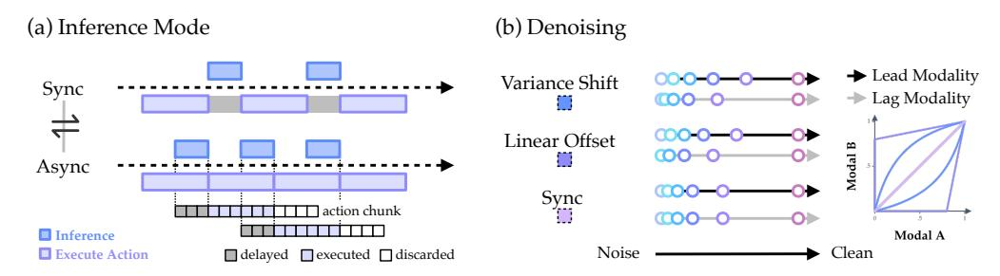

Figure 3 배포 런타임의 추론 모드와 denoising 스케줄. (a) 동기 및 비동기 추론 모드의 그림. (b) 세 가지 denoising 스케줄(분산 이동, 선형 오프셋, 동기)의 그림; 예시로 다섯 단계가 그려져 있고 같은 색의 원은 두 모달리티가 같은 denoising 단계에서 도달하는 타임스텝을 나타낸다.

Inference Modes.  
OpenWAM-Infra는 공통 버퍼 메커니즘 [(Fig](#page-7-1)[ure 3(](#page-7-1)a)을 통해 두 가지 추론 모드를 제공한다:  
각 추론은 버퍼링되는 액션 청크를 생성하며, 서버는 요청마다 하나의 액션을 팝한다.  
동기 추론에서는 버퍼가 비어 있을 때마다 서버가 새로운 추론을 차단하여 실행한다.

추론 지연(stalls for the inference latency)을 방지하기 위해 비동기 추론(asynchronous inference)에서는 H를 예측 청크(predicted chunk)의 길이, $n \le H$를 추론 수평(inference horizon), d < n을 선행 임계값(lead threshold)으로 정의한다. d는 기본적으로 n/2로 설정된다. 버퍼에 d개의 행동만 남으면, 단일 백그라운드 워커(background worker)가 다음 청크를 프리페치(prefetch)하고, 그 행동들은 계속 실행된다. 채택된 청크는 순서대로 다음과 같이 분할된다: 이전 버퍼에서 이미 처리되었고 추론이 진행되는 동안 건너뛴 d개의 지연 접두사(delayed prefix), 새로운 버퍼가 되는 다음 n개의 행동 윈도우(executed window), 그리고 남은 $\max\{H-d-n,0\}$개의 행동을 버리는 꼬리(tail). 두 모드는 클라이언트에게 구분되지 않는다: 모든 요청은 하나의 관측값 입력과 하나의 행동 출력으로 처리된다.

**디노이징 스케줄.** 디노이징 스케줄은 t=0이 순수 노이즈이고 t=1이 정제된 데이터인 공동 노이즈 평면을 따라 가는 경로 $\tau = \{(t_v^i, t_a^i)\}_{i=0}^N$ 이다. Figure 3(b)는 OpenWAM-Infra가 지원하는 세 가지 스케줄을 그린다. 동기 스케줄에서는 두 스트림이 대각선 방향으로 동기화된 단계로 동시에 진행된다: 각 단계는 하나의 공동 전방 패스와 각 스트림이 자체 타임스텝 증가분만큼 이동하는 결합된 오일러 업데이트를 수행한다. 비디오 잠재 변수 $\mathbf{z}$는 $\mathbf{z}^{t_v^{i+1}} = \mathbf{z}^{t_v^i} + (t_v^{i+1} - t_v^i) \hat{\mathbf{v}}_z$ 를 따르고, 행동 청크 a는 $\mathbf{a}^{t_a^{i+1}} = \mathbf{a}^{t_a^i} + (t_a^{i+1} - t_a^i) \hat{\mathbf{v}}_a$ 를 따른다. 비동기 스케줄은 한 스트림이 두 개의 조합 가능한 가족(Baade et al., 2026)을 통해 선두를 잡도록 한다,

<span id="page-8-2"></span>

$$f_{\alpha}(s) = \frac{\alpha s}{1 + (\alpha - 1)s}, \qquad h_o(s) = \max\left\{\frac{s - o}{1 - o}, 0\right\},\tag{3}$$

s=i/N은 전역 진행(global progress)을 나타낸다. 분산 이동 곡선($f_{\alpha}$)은 $\alpha>1$일 때 선도 스트림(leading stream)을 대각선 위로 끌어올려, 더 빨리 정제된 데이터(clean data)에 도달하도록 한다. 그리고 선형 오프셋($h_o$)은 후행 스트림(lagging stream)을 순수 노이즈(pure noise) 상태로 유지한다, 전역 진행이 o를 초과할 때까지. 선도를 세계 스트림(world stream) 또는 행동 스트림(action stream)에 할당하면 비디오 선도(video-lead)와 행동 선도(action-lead) 영역이 생성되며, $(\alpha,o)=(1,0)$은 동기화된 대각선(synchronized diagonal)을 정확히 복원한다: 동기화된 서비스(synchronous serving)는 별도의 코드 경로가 아니라 특수한 경우이며, 모든 비동기 실행(asynchronous run)은 정렬된 기준선(baseline)을 갖는다. 훈련이 두 타임스텝을 독립적으로 샘플링하기 때문에(Section 3.2), 모든 경로는 분포 내(in-distribution)에 머물러 있다. 스케줄 형태와 무관하게, 각 스트림의 타임스텝 변형(timestep warp)은 체크포인트(checkpoint)에 저장된 핵심 속성(backbone property)이며 추론 시 재사용된다. 따라서 훈련 및 서비스 노이즈 그리드(training and serving noise grids)는 드리프트할 수 없다.

가속화. OpenWAM-Infra는 네 개의 서빙 측 가속화 기능을 제공하며, 각각 독립적으로 구성 가능하다.

- 프롬프트 임베딩 캐시: 서버 수명(serverlifetime) 캐시는 각 프롬프트를 텍스트 인코더(text-encoder) 임베딩에 매핑하여, 요청당 경로(per-request path)에서 텍스트 인코더를 제거한다.  
- 비디오 디코드 건너뛰기: 컨트롤은 픽셀 대신 액션을 소비하므로, 서빙 경로(serving path)는 VAE 비디오 디코딩을 완전히 건너뛸 수 있다.  
- 컴파일: 각 아키텍처는 내부 공동 노이즈 제거 루프(inner joint denoising loop)를 위한 고정형 torch.compile 경로를 등록하고, CUDA 그래프 하에서 재생하여 레이어별 실행 오버헤드(per-layer launch overhead)를 제거한다. 첫 번째 요청은 컴파일 워밍업(compilation warmup)을 수행한다.

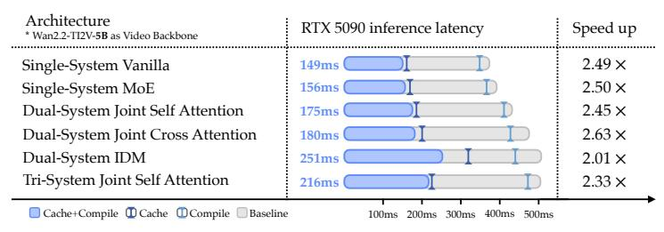

그림 4: 아키텍처별 서비스 지연 시간. Wan2.2-TI2V-5B를 비디오 백본으로 사용한 RTX 5090에서의 추론 지연 시간. 프롬프트 임베딩 캐시 (promptembedding cache)와 비디오 디코드 스킵 (video-decode skip)이 기본적으로 활성화되어 있으며, 그림은 컴파일과 DiT 속도 캐시 (DiT velocity cache)를 제외한 결과를 보여준다.

• **DiT 속도 캐시(velocity cache)**: 최근 두 스트림의 속도 예측이 *both* 스트림이 유사성-안정적(코사인 유사도가 임계값 이상)일 때, 다음 공동 전방 패스가 건너뛰어지고 캐시된 속도가 대신 통합되며, 연속 스킵 수는 제한된다. 이는 Ye et al. (2026c)의 교차 단계 재사용을 따른다.

Wan2.2-TI2V-5B를 비디오 백본으로 사용하면, Figure 4는 서로 다른 아키텍처에서의 추론 속도 향상을 보여준다.

### <span id="page-8-0"></span>3.4 평가 프로토콜 (3.4 Evaluation Protocol)

OpenWAM-Infra는 Section 3.3의 정책 서버를 통해 훈련된 체크포인트를 평가한다: 각 벤치마크는 클라이언트로 연결되어 관측치를 전송하고, 서버가 반환한 행동을 실행한다. 이는 Figure 5에 표시되어 있다.

Client-Server 파이프라인. Benchmarks는 하나의 지속적인 WebSocket 연결을 통해 얇은 클라이언트로 배포 런타임에 도달하며, 모델이나 훈련 스택에서 아무것도 가져오지 않는다. 제어 단계 k에서 클라이언트는 관측치 $(\mathbf{o}_k, \ell, \mathbf{q}_k)$ 를 전송한다: 최대 세 개의 카메라 뷰 $\mathbf{o}_k$ 를 포함하며, 머리 뷰는 필수이고 손목 뷰는 선택 사항이다; 언어 지침 $\ell$; 그리고 선택적으로 원시 로봇 상태 $\mathbf{q}_k$ 를 포함한다. 응답은 단일 행동 $\mathbf{a}_k$ 이다.

<span id="page-9-0"></span>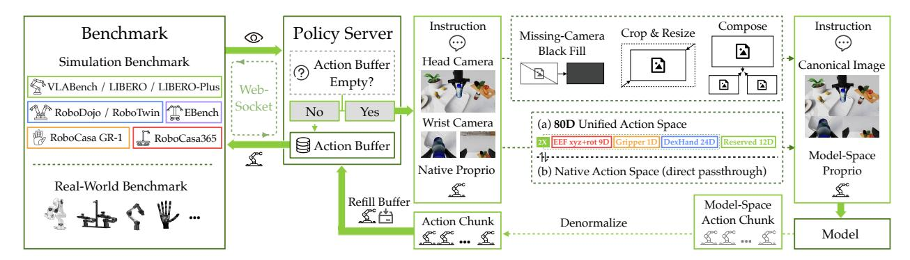

Figure 5 OpenWAM-Infra의 평가 프로토콜. Benchmarks는 WebSocket을 통해 얇은 클라이언트로 정책 서버에 연결한다. 서버는 각 관측치를 정규화하고, 고유 감각 상태를 모델 측 행동 표현(80-D 통합 행동 공간 또는 벤치마크의 고유 행동 공간)으로 매핑하며, 예측된 행동 청크를 원래 물리 단위로 역정규화한 뒤 행동을 반환한다.

로봇의 기본 물리 단위. 모든 모델-대응 변환은 서버 측에서 실행되며, Section 3.2의 자체 포함된 체크포인트에 의해 구동된다: Figure 5에 제시된 대로, 뷰는 자르고, 크기를 조정하고, 체크포인트가 학습한 정규 이미지 레이아웃으로 구성되며, 누락된 카메라는 검은 프레임으로 채워지고, $\mathbf{q}_k$는 정규화되어 아래에 정의된 모델 측 액션 표현으로 매핑된다. Section 3.3의 서빙 스택 하에서 추론은 모델 공간 액션 청크 $\hat{\mathbf{a}}_{1:H}$를 생성하며, 이는 다시 매핑되어 정규화가 해제된 기본 단위로 변환되어 서버가 요청에 응답하는 액션 버퍼를 다시 채운다; 정규화된 값은 로봇에 도달하지 않는다. 에피소드 간에, 단일 리셋 요청이 모든 에피소드별 실행기 상태를 지운다.

벤치마크 스위트. OpenWAM-Infra는 현재 8개의 시뮬레이션 벤치마크를 통합하고 있다: LIBERO와 LIBERO-Plus (Liu et al., 2023; Fei et al., 2025), VLABench (Zhang et al., 2024), RoboTwin2.0 (Chen et al., 2025), RoboDojo (Chen et al., 2026b), RoboCasa365 (Nasiriany et al., 2026), RoboCasa-GR1 (NVIDIA et al., 2025; Nasiriany et al., 2024), 그리고 EBench (Gao et al., 2026), 이들은 단일 팔 및 양팔 테이블탑 조작, 정밀 손 인간형 제어, 모바일 조작을 포괄한다. 프로토콜이 이미지, 텍스트, 액션 벡터만 교환하기 때문에 실제 로봇 플랫폼은 시뮬레이터와 동일한 인터페이스를 통해 연결된다. 각 번들 어댑터는 해당 벤치마크의 학습 리더가 수행하는 관측 전처리를 재현하므로, 평가 시점의 뷰는 학습 분포와 일치한다; 새로운 벤치마크를 통합하는 것은 이러한 어댑터를 작성하는 것에 불과하며, 모델과 두 런타임은 그대로 둔다.

액션 공간 정의. 액션은 이 파이프라인을 두 가지 표현 중 하나로 교차한다 (Figure 5). 기본적으로 모든 벤치마크는 자체 액션 공간을 유지한다 — 예를 들어 RoboTwin2.0은 14-D 조인트 공간 또는 20-D 양팔 엔드에펙터 공간 중 하나로 제공되며, LIBERO는 10-D 엔드에펙터 공간으로 제공된다 — 따라서 단일 벤치마크에서 학습된 체크포인트는 액션을 그대로 전달한다. 그러나 여러 구현체에서 하나의 모델을 학습하려면, 너비와 의미가 모두 다른 본체에 대해 단일 액션 헤드를 필요로 한다. 따라서 OpenWAM-Infra는 고정 슬롯 의미를 갖는 통합 액션 공간 $\mathbf{u} \in \mathbb{R}^{80}$을 정의한다: 두 개의 대칭 34-D 팔 블록으로, 각각 엔드에펙터 위치(3), 6D 회전(6), 그리퍼(1), 그리고 정밀 손(24)을 포함하며, 그 뒤에 EBench와 RoboCasa365의 모바일 베이스와 같은 구현체별 채널을 위한 12개의 예약 슬롯이 있다. 슬롯 의미가 고정되어 있으므로, 구현체가 공유하는 구조는 동일한 좌표에 위치한다. 각 데이터셋은 자체 차원에서 이 슬롯으로의 인덱스 맵 $\pi$를 선언하며, 정규화는 분산 전 적용되고 수집 후 역전된다,

<span id="page-9-1"></span>

$$\mathbf{u} = \operatorname{Scatter}_{\pi}(\operatorname{Norm}(\mathbf{a})), \quad \mathbf{a} = \operatorname{Norm}^{-1}(\operatorname{Gather}_{\pi}(\mathbf{u})),$$

(4)

그리고 들어오는 관절 감각은 동일한 맵을 정방향으로 통과한다. Equation (2)의 유효성 마스크 **m**은 정확히 매핑된 슬롯을 표시하므로, 매핑되지 않은 좌표는 훈련 중에 기울기를 받지 않으며 추론 시에는 분석적 노이즈 경로에 남아 있다.

## <span id="page-10-0"></span>4 OpenWAM-Study: 세계-행동 모델을 위한 설계 원칙 (Design Principles for World–Action Models)

OpenWAM-Study 개요. OpenWAM-Infra의 기반 위에 구축하여, 우리는 통제된 실험을 통해 세계-행동 모델의 설계 원칙을 체계적으로 분석한다. 이 섹션에서는 먼저 WAM이 상위 세계 선행 지식을 어떻게 상속해야 하는지 Section [4.1,](#page-10-1)를 통해 연구하고, 그 다음 세계 선행 지식과 액션 학습 사이의 시너지 구축 방법을 Section [4.2,](#page-12-0)에서 이해하며, 마지막으로 어떤 설계 선택이 교차 도메인 구현체 사전 학습에 일반화되는지 Section [4.3.](#page-13-1)에서 테스트한다.

평가 프로토콜. 본 절에서는 50개 이상의 과제를 포괄하는 널리 채택된 양손 조작 벤치마크인 RoboTwin2.0 [(Chen et al.,](#page-27-9) [2025)](#page-27-9)을 평가 환경으로 사용한다. 실험에서는 두 가지 설정에서 평가한다: (1) 도메인 내 성능 (RoboTwin2.0-Full): [Bi et al.](#page-26-4) [(2026)](#page-26-4)에 따라, 깨끗한 장면에서 수집된 2,500개의 시연과 무작위화가 심한 장면에서 수집된 25,000개의 시연으로 구성된 전체 다중 작업 데이터 코퍼스를 사용해 모델을 학습하고, 깨끗한 환경과 무작위화된 환경에서 별도로 평가한다. (2) 도메인 외 일반화 (RoboTwin2.0-Clean2Random): [Yuan](#page-30-10) [et al.](#page-30-10) [(2026a)](#page-30-10)에 따라, 깨끗한 데이터만으로 모델을 학습하고, 깨끗한 환경과 무작위화된 환경에서 별도로 평가한다. 학습 혼합물은 무작위화된 장면 구성을 한 번도 본 적이 없으므로, 모델이 새로운 장면에 대한 일반화 능력을 평가하는 대리 지표 역할을 한다. 성공률을 지표로 사용한다.

### <span id="page-10-1"></span>4.1 상류 세계 지식 상속

본 절에서는 다음 질문에 초점을 맞춘다:

### 질문 1: WAM이 상속해야 할 세계 지식은 무엇이며, 가장 좋은 상속 방법은 무엇인가?

세계 지식은 크게 두 가지 채널을 통해 상속될 수 있다: 생성적 세계 선행과 시각적 표현 선행. 생성적 세계 선행은 비디오 생성 백본에 내장된 시각적 및 동적 지식을 의미하며, 시각적 표현 선행은 시각 인코더에 의해 유도된 표현 공간을 의미한다 [(Radford et al.,](#page-29-0) [2021;](#page-29-0) [Caron et al.,](#page-27-0) [2021;](#page-27-0) [Wan et al.,](#page-30-5) [2025)](#page-30-5).

#### <span id="page-10-2"></span>4.1.1 생성적 세계 선행

생성적 세계 선행이 WAM 성능을 얼마나, 어느 정도로 촉진하는지 이해하기 위해, 파라미터 수가 다른 네 개의 비디오 생성 백본을 비교한다: Wan2.1- VACE-1.3B [(Wan et al.,](#page-30-5) [2025)](#page-30-5), Cosmos-Predict2.5-2B [(Ali](#page-26-7) [et al.,](#page-26-7) [2025)](#page-26-7), Wan2.2-TI2V-5B [(Wan et al.,](#page-30-5) [2025)](#page-30-5), 그리고 Wan2.1- I2V-14B [(Wan et al.,](#page-30-5) [2025)](#page-30-5). 우리는 비디오 생성 모듈과 행동 생성 모듈이 공동 자체 주의(attention)로 연결된 듀얼 시스템 아키텍처를 갖는 World–Action Model을 구현한다. 이때 비디오 생성 모듈의 파라미터는 사전 학습된 비디오 생성 모델에서 복사된다. 결과는 RoboTwin2.0-Full에서 평가된다.

테스트된 네 개의 백본 전반에 걸쳐, 결과 WAM의 평균 성공률은 비디오 생성 백본의 용량이 증가함에 따라 일관되게 향상된다 [(Figure 6)](#page-10-4). Wan2.1-I2V-14B가 가장 우수하며, Wan2.2-TI2V-5B는 전자가 거의 3배의 파라미터 수를 갖음에도 불구하고 단지 1.40점만 뒤처진다. 네 개의 백본에서 성능과 학습·배포 효율성을 균형 있게 고려하여, 우리는 남은 통제 연구의 기본값으로 5B 모델을 채택한다. 이 백본들은 아키텍처도 다르므로, 사전 학습

<span id="page-10-4"></span>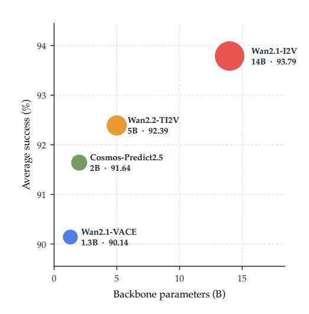

Figure 6 WAM 성능: 비디오 백본 크기별. 비디오 생성 백본 크기가 커질수록 결과 WAM의 성능이 일관되게 향상된다.

<span id="page-10-3"></span>데이터와 목표를 고려할 때, 이 비교는 백본 선택을 파라미터 수만으로 전체 이득을 귀속시키지 않고도 중요한 설계 변수로 확립한다. 5B 기본값은 상속된 세계 선행을 고정한 채 이후 행동 측면 ablation을 관리 가능하게 유지한다.

<span id="page-11-0"></span>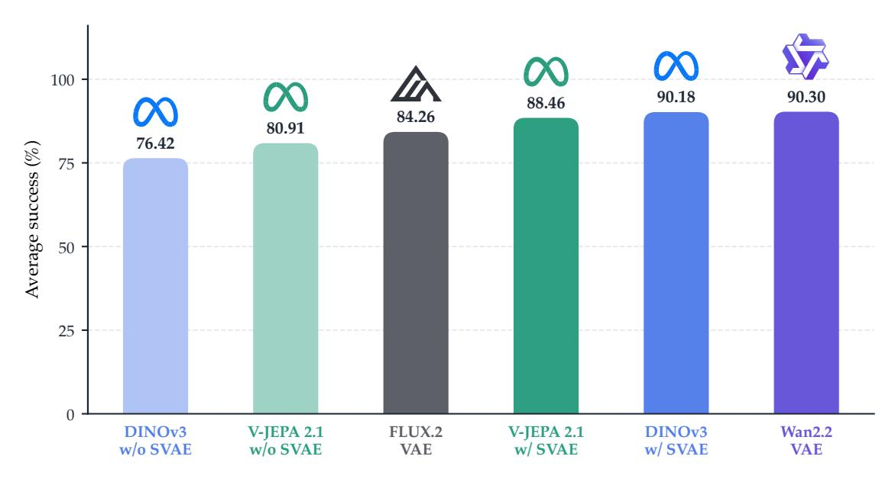

Figure 7 시각적 표현 사전. 우리는 재구성형 및 표현 인코더를 모두 사용한 WAM을 구축하고, S-VAE [(Zhang et al.,](#page-31-5) [2025a)](#page-31-5)와 함께 표현 인코더의 변형을 포함한다. 이는 표현 인코더가 생성한 고차원 잠재 변수를 DiT 처리에 적합한 저차원 벡터로 변환하는 어댑터다.

#### 4.1.2 시각적 표현 사전 (Visual Representation Priors)

최근 생성 및 세계 모델링에서 표현 인코더를 활용한 발전에 힘입어 [(Zheng et al.,](#page-31-4) [2026a;](#page-31-4) [Singh et al.,](#page-29-13) [2026;](#page-29-13) [Zhou et al.,](#page-31-2) [2024;](#page-31-2) [Jha](#page-28-12) [et al.,](#page-28-12) [2026;](#page-28-12) [Lyu et al.,](#page-29-14) [2026)](#page-29-14), 우리는 세계–행동 모델의 맥락에서 잠재 공간 설계에 대해 의문을 제기한다.

이 실험 세트에서는 두 범주에서 대표적인 인코더를 선택한다. 재구성 인코더의 경우, 우리는 4배 시간 압축률을 가진 최첨단 비디오 인코더인 Wan2.2-VAE [(Wan et al.,](#page-30-5) [2025)](#page-30-5)와 FLUX.2-VAE [(Black Forest Labs,](#page-26-10) [2025)](#page-26-10)을 사용한다. FLUX.2-VAE는 잠재 공간을 기반으로 고성능 이미지 생성 모델을 제공하는 고급 이미지 인코더이다. 표현 인코더의 경우, 우리는 DINOv3 [(Siméoni et al.,](#page-29-7) [2025)](#page-29-7), 최신 세대의 DINO [(Caron et al.,](#page-27-0) [2021)](#page-27-0)인 클래식 비전 인코더를 사용하고, V-JEPA 2.1 [(Mur-Labadia et al.,](#page-29-8) [2026)](#page-29-8)을 사용한다. V-JEPA 2.1은 공동 임베딩 예측 아키텍처[(LeCun et al.,](#page-28-3) [2022)](#page-28-3)를 기반으로 한 밀집 특징 인코더이다. 시각적 표현만으로 성능 향상을 분리하기 위해, 우리는 Wan2.2-TI2V-5B의 모델 아키텍처를 상속받되 모델 가중치를 무작위로 초기화한다. 공정한 비교를 위해, 우리는 Wan2.2-VAE와 동일한 4배 시간 압축을 FLUX.2-VAE, DINOv3, V-JEPA 2.1에 적용한다: 이 인코더들은 본래 시간 압축을 수행하지 않으므로, 우리는 연속된 네 프레임의 특징을 평균화하여 4배 다운샘플링을 부과한다.

현대 Diffusion Transformer 아키텍처는 [(Peebles & Xie,](#page-29-15) [2023)](#page-29-15) 주로 재구성 인코더에 최적화되어 있으므로, 고차원 잠재를 생성하는 표현 인코더를 단순히 채택하면 (예: DINOv3의 768-D 특징, V-JEPA 2.1의 1024-D) 아키텍처 불일치로 인해 성능 저하가 발생할 수 있다 [(Zheng et al.,](#page-31-4) [2026a)](#page-31-4). [Jha et al.](#page-28-12) [(2026)](#page-28-12)의 접근을 따라, 우리는 표현 인코더용 변형을 포함한다. 여기서는 S-VAE [(Zhang et al.,](#page-31-5) [2025a)](#page-31-5) 어댑터를 훈련시켜, 표현 인코더가 생성한 고차원 특징을 낮은 차원 벡터(이 실험에서는 48-D, Wan2.2-VAE의 잠재 차원과 일치)로 변환한다.

[Figure 7,](#page-11-0)에서 보듯이, 표현 인코더는 S-VAEs의 도움으로 세계–행동 모델링에서 재구성 인코더와 동등하거나 더 우수한 성능을 낼 수 있다. 구체적으로, 표현 인코더를 단순히 채택하면 재구성 인코더 FLUX.2-VAE로 훈련된 모델보다 성능이 떨어지지만, S-VAE를 이용한 차원 축소를 적용하면 표현 인코더의 축소 변형(DINOv3 w/ SVAE, V-JEPA 2.1 w/ SVAE)이 FLUX.2-VAE를 현저히 능가한다. DINOv3 w/ SVAE는 Wan2.2-VAE와 거의 동등한 성능을 달성하며, 남은 미미한 차이는 Wan2.2-VAE의 두 가지 고유 장점에 기인한다: 이는 비디오 백본 아키텍처에 특화된 재구성 인코더이며, 그 시간 압축은 프레임 평균을 통해 부과되는 것이 아니라 인코더에 의해 원래부터 학습된다.

WAM 잠재 공간의 품질을 결정하는 것은 재구성형과 표현 인코더 간의 범주적 구분이 아니라 잠재 변수 자체의 운영적 특성이다: 압축성(시간적 및 토큰 차원 모두)과 풍부한 세계 정보. 표현 인코더의 우선조건은 시간 압축과 차원 축소를 통해 고성능 WAMs를 구축하는 데 활용될 수 있다. 또한 본래의 시간 압축을 갖춘 표현 인코더를 개발하는 연구를 적극 장려하며, 이는 더 나은 우선조건 상속으로 이어질 수 있다.

발견 1: WAM은 충분히 능력 있는 생성 백본과 압축되고 정보가 풍부한 시각적 표현 공간을 통해 상류의 세계 지식을 가장 효과적으로 상속한다. 재구성 인코더가 유일한 옵션은 아니다; 차원 압축을 갖춘 표현 인코더도 성능이 좋다.


### <span id="page-12-0"></span>4.2 세계와 행동 학습 간 시너지 구축 (Building Synergy between World and Action Learning)


정확한 사전 지식만으로는 충분하지 않다; 세계-행동 모델은 세계와 행동 학습 사이에 시너지를 구축해야 한다. 이는 시스템의 서로 다른 수준에서 세 가지 결정을 요구한다: 행동-특정 용량이 존재하는 위치, 훈련 중에 사용 가능한 다중 모달 정보 경로, 그리고 추론이 그 경로가 학습된 노이즈-상태 관계를 보존하는지 여부.

Question 2: How should inherited world knowledge interact with action learning?


#### <span id="page-12-1"></span>4.2.1 아키텍처 용량 (Architectural Capacity)


세계–행동 모델링에서 핵심적인 질문은 WAM이 필요로 하는 행동‑특정 용량이 얼마나 되는지와 비디오와 행동 스트림을 얼마나 강하게 분리해야 하는가이다.  

세 가지 아키텍처 패밀리([Section 3.1](#page-4-1))는 정확히 이 용량 축을 포괄하며, 우리는 그 여섯 가지 변형을 모두 평가한다. 비디오 특징에서 기울기를 분리한 엔드투엔드와 함께 공동 교차 주의를 적용하여 일곱 개의 기준선을 도출한다 [(Table 1)](#page-12-3).

<span id="page-12-3"></span>Table 1 Architecture Ablation. RoboTwin2.0- Full에서 평균 성공률(%)을 나타냅니다. 굵은 글씨는 최고값을 표시합니다.

|  | 아키텍처 | 성공률 (%) |  |  |  |  |  |  |
|---------------|--------------------------|------------------|------------|---------|--|--|--|--|
| 시스템 | 변형 | 클린 | 무작위화된 | 평균 |  |  |  |  |
|  | 바닐라(Vanilla) | 85.20 | 85.80 | 85.50 |  |  |  |  |
| 단일 시스템 | MoE | 86.22 | 83.04 | 84.63 |  |  |  |  |
|  | 공동 자기 주의(Self-Attention) | 92.34 | 92.38 | 92.36 |  |  |  |  |
|  | 공동 교차 주의(Cross-Attention) | 87.86 | 88.64 | 88.25 |  |  |  |  |
| 듀얼 시스템 | 분리된 교차 주의 | 92.06 | 91.64 | 91.85 |  |  |  |  |
|  | IDM | 87.76 | 88.14 | 87.95 |  |  |  |  |
| 트리 시스템 | 공동 자기 주의 | 92.84 | 92.36 | 92.60 |  |  |  |  |

결과. [표 1,](#page-12-3)와

아키텍처 용량이 증가함에 따라 단일-에서 이중- 및 삼중-시스템으로의 성능이 지속적으로 향상된다. 공동 자기-주의는 가장 강력한 이중-시스템 변형이며, 삼중-시스템 모델은 전체적으로 가장 우수한 성능을 달성한다. 성능과 아키텍처 복잡성을 균형 있게 조정하고, 세계 지식과 행동 학습 간의 상호작용을 VLM의 이해 기능이 잠재적으로 미치는 영향으로부터 분리함으로써, 우리는 나머지 실험에서 이 상호작용만을 반영하도록 이중-시스템 공동 자기-주의를 채택한다.

#### <span id="page-12-2"></span>4.2.2 훈련 시 정보 흐름

아키텍처 비교는 공동 자기-주의를 세계와 행동 스트림 사이의 인터페이스로 선택하지만, 공동 주의만으로는 어떤 정보 흐름이 가장 좋은 시너지 효과를 창출하는지 명시하지 않는다. 우리는 훈련 시에 주의 마스킹에 의해 제어되는 네 가지 정보 흐름 전략을 비교한다: 격리된, 교차 스트림이 없는

통신; Video Sees Action, 액션 특징을 월드 스트림에 노출하는 방식; Action Sees Video, 월드 특징을 액션 스트림에 노출하는 방식; 그리고 Mutual, 양방향을 모두 가능하게 하는 방식.

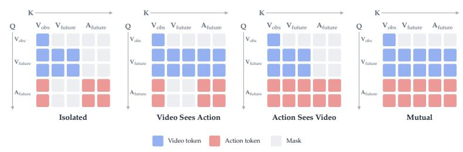

<span id="page-13-2"></span>Figure 8 Attention Masking Strategies. 우리는 훈련 시 attention masking을 통해 교차 모달리티 정보 흐름을 제어한다.

<span id="page-13-3"></span>Table 2 Action learning requires access to world information. 액션 학습은 월드 정보를 접근해야 한다. 성공률(%) on RoboTwin2.0-Full.

| 마스크 | 성공률 (%) |  |  |  |  |  |  |
|-------------------|------------------|---------|---------|--|--|--|--|
|  | 클린 | 랜덤. | 평균 |  |  |  |  |
| 단독 | 88.08 | 86.74 | 87.41 |  |  |  |  |
| 비디오가 행동을 본다 | 87.92 | 87.34 | 87.63 |  |  |  |  |
| 행동이 비디오를 본다 | 92.98 | 91.80 | 92.39 |  |  |  |  |
| 상호 | 92.50 | 91.80 | 92.15 |  |  |  |  |

우리는 행동 스트림이 세계 특징에 접근할 수 있는지 여부에 따라 비교가 명확히 구분된다 (Figure 8 및 Table 2). 고립된 마스크와 비디오-시-행동 마스크는 약 5점 정도 성능이 떨어지지만, 행동-시-비디오와 상호 가시성은 모두 강력한 성능을 유지한다. 따라서 이 설정에서는 세계-투-행동 흐름이 필요하다. 반대로, 역방향 행동-투-세계 경로를 추가해도 초기부터의 결과는 거의 변하지 않으며, 행동-시-비디오와 상호 가시성은 사전학습 후에 다시 검토할 수 있는 두 가지 유효한 마스크로 남는다.

#### <span id="page-13-0"></span>4.2.3 추론 시 정보 흐름

학습 시 주의 마스킹은 완전 마스킹을 구현하고, 추론 시 노이즈 제거 일정은 보다 부드러운 정보 게이트, 즉 부분 마스킹을 제공한다. 이 ablation에서는 상호 가시성을 고정하고, 비디오와 행동 스트림을 독립적으로 샘플링된 노이즈 수준으로 학습시켜 공동 노이즈 상태의 2차원 공간을 커버한다.

우리는 Section 3.3의 일정 추상화를 구현한다: 동기화된 노이즈 제거는 대각선 $(t_v^i, t_a^i) = (s_i, s_i)$ 를 따르고, 방정식 (3)의 분산-시프트와 선형-오프셋 계통은 어느 스트림이 선도하도록 허용한다 (Baade et al., 2026).

<span id="page-13-4"></span>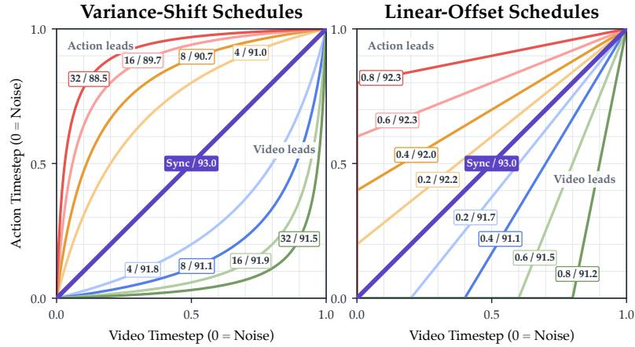

Figure 9 추론 시 노이즈 제거 일정을 통한 정보 흐름. 각 곡선은 행동 노이즈 제거 진행을 비디오 노이즈 제거 진행에 대해 추적한다. 대각선 위/아래의 곡선은 각각 행동/비디오를 먼저 노이즈 제거한다.

우리는 양쪽 선도 방향에서 $\alpha \in \{4, 8, 16, 32\}$ 과 $o \in \{0.2, 0.4, 0.6, 0.8\}$ 를 평가한다.

**결과.** 동기화된 노이즈 제거가 가장 우수하며, 어느 스트림이 선도하든, 상대 진행이 어떻게 매개화되든 비동기 일정은 성능을 향상시키지 않는다 (Figure 9). 분산-시프트 일정에서는 비디오 선도가 행동 선도보다 우수하고, 선형-오프셋 일정에서는 행동 선도가 비디오 선도보다 우수하다. 이는 학습 시 명시적 비디오-투-행동 정보 흐름이 필요하지만, 추론 시 노이즈 제거 일정을 통해 이러한 선행을 강제해도 이득이 없으며, 이는 세계-행동 모델링의 표현 학습 가설(Yuan et al., 2026b)을 지지하고, 테스트 시 암묵적 계획-후-IDM 일정(Ye et al., 2026c)과는 대조된다.

**발견 2:** 세계-행동 시너지에는 학습 시 명시적 세계-투-행동 정보 흐름과 추론 시 동기화된 공동 노이즈 제거가 필요하다. 우리는 동기화된 노이즈 제거와 함께 이중 시스템 공동 자기 주의를 계속 적용하고, 일방향과 상호 가시성 사이의 최종 선택은 사전학습으로 미루기로 한다.

### 4.3 도메인 간 지식 통합

이전 연구들은 어떤 세계 선행 지식을 상속받고, 세계와 행동 스트림이 어떻게 상호작용해야 하는지를 식별한다. 그러나 단일 도메인에서의 강력한 성능만으로는 전이 가능한 세계-행동 지식이 확립되지 않는다: 모델은 단순히 대상 작업의 시각 및 행동 분포에 맞춰질 수 있으며, 이는 교차 도메인 사전학습이 명확히 한다. 로봇 궤적은 실행 가능한 행동 감독을 제공하지만 시각적 범위가 제한적이며, 자기중심 비디오는 더 넓은 시각적 다양성을 제공하지만 로봇 행동 라벨이 부족하다. 따라서 우리는 사전학습 이득이 어디에서 발생하는지, 이 두 소스를 어떻게 결합해야 하는지, 그리고 초기부터 식별된 정보 흐름 선택이 사전학습 후에도 유효한지를 묻는다.

질문 3: 세계-행동 지식을 도메인 간에 어떻게 통합하고 전이할 수 있는가?

#### <span id="page-14-0"></span>4.3.1 문제 설정 및 평가 프로토콜

제어된 전이 프로토콜(Controlled Transfer Protocol). 모든 실행은 백본, 최적화 예산, 추론 절차를 고정하고 — 앞서 선택한 동기화된 노이즈 제거를 갖는 이중 시스템 공동 자기 주의 아키텍처(dual-system joint self-attention architecture) — 모델이 구현 데이터로 사전 학습되는 여부와 방식을 변형한다; 정보 흐름 마스크(information-flow mask)는 최종 ablation에서 재검토된다. 평가를 위해 두 가지 상호 보완적인 프로토콜이 사용된다: RoboTwin2.0-Clean2Random은 Clean 데이터에서 미세 조정하고 Clean을 도메인 내(ID)로, Randomized를 도메인 외(OOD)로 평가하여 전이를 드러낸다; RoboTwin2.0-Full은 전체 RoboTwin2.0 훈련 세트에서 미세 조정하고 두 조건 모두에서 평균 성공률을 보고한다.

Embodied Pretraining Data Mixture.  
우리는 동일한 600시간 데이터 예산 하에서 세 가지 사전학습 전략과 스크래치에서 시작하는 감독형 미세조정(sup‑vised fine‑tuning)을 비교한다. 이때, EgoDex [(Hoque](#page-27-12) [et al.,](#page-27-12) [2025)](#page-27-12)에서 자가중심 인간 비디오를, RoboCOIN [(Wu et al.,](#page-30-11) [2025)](#page-30-11)에서 실제 로봇 조작 궤적을 추출한다.  
Robot‑only는 전체 600시간 예산을 로봇 데이터에만 할당한다. 두 가지 혼합 변형은 각각 350시간의 자가중심 데이터와 250시간의 로봇 데이터를 결합하며, 이는 두 단계(ego → robot) 또는 한 단계(ego + robot 공동 학습) 중 하나로 수행된다.  
네 가지 변형 모두 동일한 다운스트림 미세조정 과정을 거친다.

#### <span id="page-14-1"></span>4.3.2 구현된 사전학습은 주로 OOD 일반화를 확장한다 (Embodied Pretraining Primarily Expands OOD Generalization)

사전 학습은 주로 OOD 일반화에 개선을 가져온다.  
그림 10에 표시된 바와 같이(??) [Fig](#page-14-3)[ure 10,](#page-14-3) embodied pretraining은 도메인 내 성능에 적은 향상을 주지만, OOD 평가에서는 강력한 성능 향상을 가져온다.  
따라서 embodied pretraining은 이미 포화된 ID 벤치마크를 더 잘 맞추기보다 downstream 학습 분포를 넘어서는 지식을 주로 기여한다.

## 로봇과 자가중심 데이터는 서로 다른 강점을 기여한다. Robotonly 사전학습은 가장 강력하다 (Robot and Egocentric Data Contribute Different Strengths. Robotonly pretraining yields the strongest)

<span id="page-14-3"></span>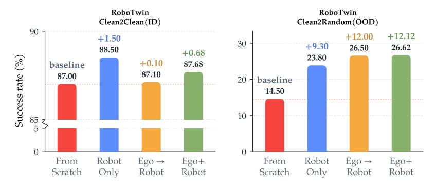

Figure 10 Embodied Pretraining은 OOD 일반화를 주로 개선한다. RoboTwin2.0-Clean2Random에서의 성공률은 각 평가 설정 내에서 낮은 성능부터 높은 성능 순으로 정렬된다.

ID 성능은, 두 혼합 전략 모두 OOD에서 더 잘 일반화한다는 점을 보여준다. 이 트레이드오프는 로봇 경로가 실행 가능한 행동 기반을 강화하고, 자아중심 비디오가 시각 및 상호작용 분포를 확장한다는 통찰과 일치한다.

<span id="page-14-2"></span>Absorbing Egocentric Videos: Sequential versus Co-Training. 순차적 훈련과 일단계 공동 훈련의 성능은 도메인 내와 OOD 평가 모두에서 거의 일치하며, 두 소스를 모두 사용하는 것이 그 정확한 순서보다 더 중요함을 시사한다. 공동 훈련은 전반적으로 가장 강력하며 추가적인 커리큘럼 전환을 제거하므로, 우리는 이를 실용적인 기본값으로 채택한다.

#### 4.3.3 Pretraining은 선호되는 정보 흐름을 바꾼다 (Pretraining Changes the Preferred Information Flow)

초기화부터의 ablation은 행동 스트림이 세계 스트림을 보아야 함을 확립하지만, 단방향 및 상호 가시성은 거의 동일하게 유지된다. 우리는 두 도메인 모두에서 RoboTwin2.0-Clean2Random과 RoboTwin2.0-Full을 대상으로 교차 도메인 사전 훈련 후 이 비교를 반복한다.

Mutual Visibility Becomes Preferable with Embodied Pretraining. 본체 기반 사전학습이 없으면 RoboTwin2.0- Full은 일방향 가시성을 약간 선호하지만, 사전학습 이후에는 동일한 프로토콜이 Mutual을 선호한다. RoboTwin2.0- Clean2Random은 ID와 OOD 모두에서 같은 반전을 보이며, 두 스플릿에서 유사한 이득을 나타낸다 [(Figure 11)](#page-15-1). 따라서 이 반전은 도메인 시프트나 평가 프로토콜의 아티팩트가 아니다: 사전학습은 세계–행동 상호작용을 진정한 양방향 교환으로 바꾸며, 예측된 미래 프레임이 행동 생성을 위한 시각적 안내를 제공하고, 예측된 행동이 그 프레임에서 조작기의 동작 합성을 알린다. 본체 기반 사전학습이 없으면 데이터 부족이 두 스트림이 이러한 상응 관계를 신뢰성 있게 구축하는 것을 방해할 가능성이 높으며, 훨씬 풍부한 사전학습 데이터가 이 격차를 메우고, 따라서 Mutual은 본체 기반 사전학습이 적용되면 그 이점을 실현한다. 우리는 Mutual을 최종 레시피에 반영한다.

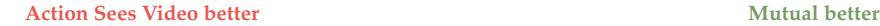

<span id="page-15-1"></span>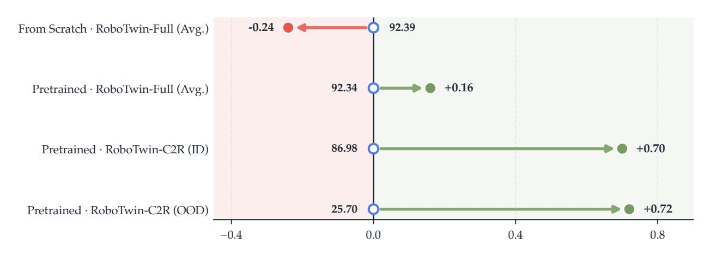

Figure 11 사전학습이 선호되는 정보 흐름을 바꾼다. 중앙 마커는 Action Sees Video의 절대 성공률을 나타내며, 화살표는 일치하는 Mutual 결과에서 끝나며, 수평 변위는 Mutual − Action Sees Video를 퍼센트 포인트로 보고한다. 녹색과 빨간색은 각각 이득과 감소를 나타낸다.

Finding 3: 본체 기반 사전학습은 주로 OOD 일반화를 확장한다. 로봇 궤적은 행동 기반을 보존하고, 자가중심 비디오는 전이 범위를 넓히며, 일단계 공동 훈련은 두 가지를 효과적으로 통합한다. 사전학습 규모에서 Mutual 세계–행동 가시성은 일관되게 선호된다.

### <span id="page-15-0"></span>4.4 결론 (Concluding Remarks)

세 가지 질문은 상속된 세계 지식을 구체적인 모델 설계로 바꾼다: 개별적으로 가장 좋은 하이퍼파라미터 목록이 아니라, 각 결정이 이전에 만든 조건 하에서 테스트되는 순서이다. 다음 섹션은 이러한 기본값을 OpenWAM-α에 통합하고, 이들이 전면 규모의 이질적 사전학습을 견디는지 여부를 묻는다.

<span id="page-15-2"></span>Table 3 OpenWAM-Study가 축적한 레시피. 각 증거 기반 선택이 OpenWAM-α의 기본값이 된다.

| 단계 | 발견 | 전달된 기본값 |
|-------------|------------------------------------------------------------------------------------------------------------------|---------------------------------------------------------|
| 상속 | 능력 있는 비디오 백본과 압축된 표현<br>latents은 가장 강력한 상위 사전 지식을 전달한다. | Wan2.2-TI2V-5B; 압축된<br>latent |
| 상호작용 | 전용 행동 용량과 세계-행동 가시성<br>은 필수이며, 동기화된 노이즈 제거가 가장 효과적이다. | 이중 공동 자기 주의;<br>동기화된 노이즈 제거 |
| 통합 | 체현 사전 훈련은 주로 OOD<br>일반화를 개선하고 일관되게 상호 가시성을 선호한다. | 단일 단계 ego + robot<br>공동 훈련; 상호 가시성 |

## <span id="page-16-0"></span>5 OpenWAM- $\alpha$ : 원리에서 사전학습 모델까지 (From Principles to a Pretrained Model)

Overview of OpenWAM- $\alpha$ . Motivated by the design principles and empirical insights uncovered through OpenWAM-Study, we instantiate these findings at scale in OpenWAM- $\alpha$ , an open foundation world–action model for systematically investigating the capabilities and scaling behavior of world–action models across diverse robotic tasks. In Section 5.1, we specify the final architecture, training recipe, and deployment scheme of OpenWAM- $\alpha$  under the guidance of the insights established in Section 4. Section 5.2 then details the pretraining data configuration together with the associated data curation and cleaning pipeline. Finally, Section 5.3 evaluates OpenWAM- $\alpha$  across a diverse set of simulation benchmarks, with analyses of its performance and the key empirical findings revealed by these evaluations, and Section 5.4 further evaluates it on real-world tasks.

### <span id="page-16-1"></span>5.1 OpenWAM- $\alpha$ Architecture, Training, and Deployment

그림 12에 나타난 바와 같이, **OpenWAM-Study**에서 파생된 설계 원칙은 OpenWAM- $\alpha$의 아키텍처, 훈련, 그리고 배포 단계 전반에 걸쳐 구성을 결정한다. 다음 단락에서는 각 단계를 차례로 자세히 설명한다.

<span id="page-16-3"></span>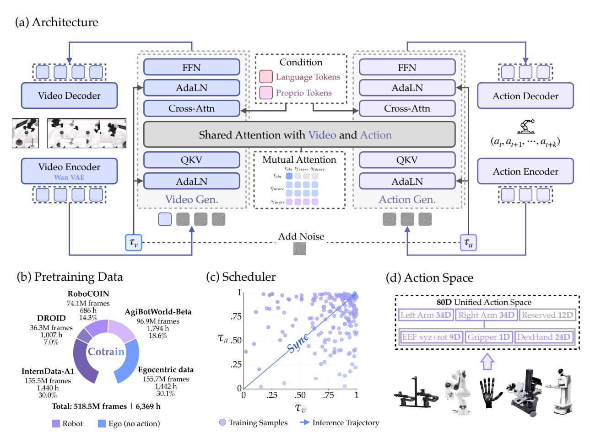

그림 12 OpenWAM- $\alpha$ 개요. (a) 듀얼 시스템 아키텍처: 비디오 생성 DiT와 ActionDiT가 상호 가시성 마스크 아래에서 공유 어텐션을 통해 미래 프레임과 액션 청크를 동시에 denoise하며, 각각 언어와 고유 감각을 cross-attention을 통해 조건화하고 고유한 노이즈 타임스텝을 갖는다. (b) 사전 학습 혼합: 518.5M 프레임(6,369시간)의 자가 중심 및 로봇 데이터가 한 단계에서 공동 학습된다. (c) 타임스텝 샘플링: 학습은 전체 공동 노이즈 평면을 커버하고, 추론은 동기화된 대각선을 따른다. (d) 80-D 통합 액션 공간은 고정 슬롯 의미를 공유한다.

#### 5.1.1 아키텍처 (Architecture)

OpenWAM- $\alpha$  adopts the architecture that OpenWAM-Study converges to (Table 3), assembled from the modules of Section 3.1 as the composition  $C(\mathcal{E}, \mathcal{S}, \mathcal{M})$ : the frozen Wan2.2-VAE as the visual encoder  $\mathcal{E}$ ; the pretrained Wan2.2-TI2V-5B DiT (Wan et al., 2025) executing the world stream and a dedicated 1B-parameter ActionDiT executing the action stream, coupled through joint self-attention, as the stream backbones  $\mathcal{S} = \{\mathcal{W}, \mathcal{A}\}$ ; and the mutual mode with first-frame-causal intra-video attention as the visibility mask  $\mathcal{M}$ . Conditioned on the current observation  $\mathbf{o}_1$  (all camera views tiled into one canvas), the language instruction  $\ell$ , and the proprioceptive state  $\mathbf{q} \in \mathbb{R}^{80}$  expressed in the unified action space, OpenWAM- $\alpha$  jointly denoises the future frames  $\mathbf{o}_{2:T}$  of a T-frame video window  $\mathbf{o}_{1:T}$  in latent space, together with a continuous action chunk  $\mathbf{a} = \mathbf{a}_{1:H} \in \mathbb{R}^{H \times 80}$  (Zhao et al., 2023) (Figure 12a).

토큰화 및 컨텍스트.  
동결된 Wan2.2-VAE는  $\mathbf{o}_{1:T}$ 를 인과적으로 인코딩한다 – 첫 번째 프레임만, 이후 프레임은 4개씩 그룹으로 – T' = 1 + (T-1)/4개의 잠재 프레임  $\mathbf{z}$ 로, 따라서 첫 번째 잠재 프레임은 현재를 깨끗하게 고정하는 앵커 역할을 한다.  
(1,2,2) 패치 임베딩은 잠재 비디오를 너비 3072의 world-stream 토큰으로 평면화하며, (프레임, 높이, 너비) 그리드에 3D RoPE를 운반한다. H개의 노이즈가 가미된 액션 단계 각각은 1D RoPE를 청크 인덱스에 따라 운반하는 너비 1024의 action-stream 토큰으로 선형 임베딩된다.  
동결된 umT5 인코더는  $\ell$ 를 4096 차원의 컨텍스트로 매핑하고, 선형 프로젝션은  $\mathbf{q}$ 를 하나의 추가 컨텍스트 토큰으로 첨부한다. 두 스트림은 각각의 블록별 교차 어텐션을 통해 생성된 컨텍스트  $\mathbf{c}$ 를 소비한다.

Stream Bridging and Prediction. All 30 paired layers of the two backbones act as bridge layers, where stream-owned projections map the two residual widths into a shared attention space of 24 heads  $\times$  128 dimensions; under the configured  $\mathcal{M}$ , the two streams read each other freely while the clean first-frame rows attend to neither noised future frames nor actions. AdaLN injects each stream's own denoising timestep –  $t_v$  token-wise into the world stream, with first-frame tokens pinned to the clean endpoint  $t_v = 1$ , and  $t_a$  into the action stream – and linear heads decode both final states into velocities, realizing the joint forward pass of Section 3.2 at any joint noise state  $(t_v, t_a)$ ; how training and inference each cover this plane is specified in Sections 5.1.2 and 5.1.3.

#### <span id="page-17-0"></span>5.1.2 Training

**Co-Training Setup.**

Section 4.3에서 확인된 일단계 공동 훈련 전략을 따라, OpenWAM- $\alpha$는 Section 5.2의 ego + robot 혼합물에서 단일 단계로 끝에서 끝까지 훈련된다. 비디오 DiT(사전 학습된 Wan2.2-TI2V-5B 가중치로 초기화됨), ActionDiT, 그리고 proprioception encoder는 모두 업데이트된다; umT5 텍스트 인코더와 Wan2.2-VAE만은 동결된다.

**Unified Action Supervision.** 이질적인 구현체는 Section 3.4의 통합 액션 공간에서 만난다: 고정 슬롯 의미를 가진 80차원 벡터로, 두 개의 대칭 34-D 팔 블록(엔드‑에펙터 위치(3), 6D 회전(6), 그리퍼(1), 그리고 정교한 손(24))과 구현체‑특정 채널을 위한 12개의 슬롯(그림 12d)으로 구성된다. 각 데이터셋은 자체 액션과 상태를 이 슬롯에 분산시키며, 방정식 (2)의 유효성 마스크 **m** 은 액션 감독을 채워진 좌표에 한정한다. 윈도우 시작 시 로봇 상태는 **c** 에서 proprioception 토큰을 공급한다.

**목표 및 타임스텝 샘플링.**

OpenWAM- $\alpha$ 은(는) Equation (2)의 공동 흐름 매칭 목표(Black et al., 2024)로 훈련되며, $\lambda_v = \lambda_a = 1$로 인스턴스화되고 중간 노이즈 수준에서 최고점을 갖는 벨 모양의 타임스텝 가중치 $w(\cdot)$가 적용된다. 각 스트림의 타임스텝은 $t_v = 1 - f_{\rho}(u_v)$ 및 $t_a = 1 - f_{\rho}(u_a)$로 독립적으로 그려지며, $u_v, u_a \sim \mathcal{U}[0, 1]$이다. Equation (3)의 타임스텝 워프 $f_{\rho}$가 두 스트림 모두에 동일하게 적용되며, $\rho = 5$로 설정해 샘플링을 높은 노이즈 쪽으로 기울인다 (Figure 12c).

#### <span id="page-17-1"></span>5.1.3 Deployment

동기화된 노이즈 제거. 테스트 시 OpenWAM- $\alpha$는 Section 4.2.3에서 선택된 동기화 스케줄을 따른다: 두 스트림이 공동 노이즈 평면의 대각선을 따라 동기화된 단계로 진행하며, 이는 학습 워프에서 $t^i = 1 - f_{\rho}(1 - i/N)$ 로 구현된다. 여기서 $\rho = 5$이고 N = 10 단계이므로 어느 스트림도 선행하지 않는다. 노이즈 제거는 가우시안 노이즈에서 시작하며, 첫 번째 잠재 프레임은 현재 관측의 인코딩으로 고정되고 매 단계마다 다시 고정된다. 각 단계는 하나의 공동 전방 패스와 Section 3.3의 결합된 오일러 업데이트를 수행하여, 행동 청크가 점진적으로 더 깨끗해지는 세계 특징에 대해 정제되고, 반대로 모든 30개의 브리지 레이어에서 세계 특징이 정제된다. 완성된 청크는 Equation (4)의 역 매핑을 통해 각 로봇의 고유 행동 공간으로 반환된다.

**추론 모드.** 이후의 모든 벤치마크 평가(시뮬레이션과 실제 세계 모두)는 동기화 추론을 사용한다: 행동 버퍼가 비어 있을 때마다 실행은 중지되고 모델이 현재 관측에서 새로운 청크를 예측할 때까지 대기한다. 그 후 로봇은 예측된 청크를 정확히 그대로 실행한다. 보고된 결과는 따라서 모델이 가장 직접적인 방식으로 수행한 성능을 반영한다.

추론 가속화. OpenWAM- $\alpha$는 Section 3.3의 가속 스택을 통해 제공된다: 공동 노이즈 제거 루프는 고정 형태의 그래프로 컴파일되어 CUDA 그래프 하에서 재생되며, 안정적인 속도 예측은 인접 단계에서 재사용되고, 프롬프트 임베딩은 캐시된다. 제어 경로에서는 VAE 디코드가 실행되지 않는다. N-단계 루프는 RTX 5090에서 한 청크당 약 170 ms에 완료되어 실시간 제어 예산 내에 잘 들어간다.

### <span id="page-18-0"></span>5.2 다중 도메인 사전 학습 데이터 및 선별 (Multi-Domain Pretraining Data and Curation)

OpenWAM- $\alpha$는 다중 도메인 데이터(자기 중심 인간 데이터, 실제 세계 로봇 데이터, 합성 로봇 데이터)를 다섯 출처에서 추출한 세 가지 데이터 유형으로 사전 학습된다. 원시 풀 1.33B 프레임 ( $\approx$ 14,300시간)에서 선별 및 소스별 하위 샘플링을 통해 518M 프레임 ( $\approx$ 6,400시간)의 학습 세트를 구성한다(Table 4). 이 섹션에서는 혼합이 어떻게 구성되는지(Section 5.2.1)와 각 소스가 어떻게 정제되는지(Section 5.2.2)를 설명한다. 또한 프리트레이닝 단계 하이퍼파라미터 설정 및 기타 관련 세부 정보를 Section B에 제공한다.

<span id="page-18-3"></span>Table 4 The OpenWAM- $\alpha$  pretraining data. #Emb. counts each source's distinct embodiments. Task Coverage marks the manipulation settings each source spans. Full reports each source's raw size before processing, while Curated + Sampled reports the data actually used for training, after cleaning (Section 5.2.2) and per-source whole-episode subsampling (Section 5.2.1); Share is each source's actual per-epoch sample share under proportional sampling.

|  |  |  |  | Task Coverage |  |  |  | Full |  | Curated + Sampled |  |  |
|------------------------------------|-------------|-------------------|-----|---------------|--------------|----------|-----------|------------|--------|-------------------|-------|-----------|
| Source | Туре | # Emb. (Emb.) | FPS | Single | Bimanual | Mobile | Dexterous | Frames (M) | Hours | Frames (M) | Hours | Share (%) |
| Egocentric data (ours) | Human video | 1 | 30 | in- | the-wild hun | nan mani | pulation | 744.9 | 6,897 | 155.7 | 1,442 | 30.1 |
| AgiBotWorld-Beta (Bu et al., 2025) | Real robot | 1 | 15 |  | ✓ | ✓ | ✓ | 124.5 | 2,306 | 96.9 | 1,794 | 18.6 |
| RoboCOIN (Wu et al., 2025) | Real robot | 15 | 30 |  | ✓ | ✓ | ✓ | 104.5 | 956 | 74.1 | 686 | 14.3 |
| DROID (Khazatsky et al., 2024) | Real robot | 1 | 10 | ✓ |  |  |  | 46.3 | 1,285 | 36.3 | 1,007 | 7.0 |
| InternData-A1 (Tian et al., 2025) | Simulation | 4 | 30 | ✓ | ✓ |  |  | 313.7 | 2,904 | 155.5 | 1,440 | 30.0 |
| Total |  | 21  로봇 + 인간 |  |  |  |  |  | 1,333.9 | 14,348 | 518.5 | 6,369 | 100.0 |

#### <span id="page-18-1"></span>5.2.1 사전 학습 데이터 혼합 (Pretraining Data Mixture)

데이터 구성. 섹션 4.3의 공동 훈련 레시피를 따라, 혼합은 세 가지 상호 보완적인 데이터 유형을 결합한다. 자기중심 인간 데이터는 조작 중심 세계 모델링을 위해 신중히 구축한 데이터셋에서 나온다 – 71.6K개의 장기형 1인칭 녹음으로, 각 녹음은 0.25–6분이며, 3,006개의 일상 조작 과제를 포함한다. 이는 광범위한 시각적 및 상호작용 다양성을 제공하지만 로봇 행동 라벨이 없으므로 행동 및 고유 감각 채널은 완전히 마스킹되고, 오직 세계 스트림만을 감독한다. 실제 로봇 데이터(AgiBotWorld-Beta (Bu et al., 2025), RoboCOIN (Wu et al., 2025), 그리고 DROID (Khazatsky et al., 2024))는 17개의 물리 플랫폼에서 실행 가능한 궤적을 통해 행동 스트림을 기반화하며, 동시에 물리 세계와 상호작용하는 로봇의 가장 신뢰할 수 있는 시각 관측을 제공한다. 합성 로봇 데이터(InternData-A1 (Tian et al., 2025))는 단일 팔 및 양팔 조작 기술의 보다 포괄적인 범위를 다양한 환경 변동 하에서 포함하여 로봇 데이터의 범위를 더욱 넓힌다.

데이터 예산 및 샘플링. 사전 훈련의 계산 자원과 시간 비용을 고려하여, 각 소스는 소스별 시간 예산에 따라 서브샘플링된다. 예산은 프레임 기반 목표에서 도출된다 – 자기중심 및 합성 소스는 각각 전체 훈련 프레임의 30%를 기여하고, 나머지 40%는 세 개의 실제 로봇 소스에 그들의 선별된 유효 프레임 수에 비례하여 분배된다 – 따라서 서로 다른 기본 프레임 속도를 가진 소스들은 모델이 실제로 소비하는 데이터 양으로 균형을 맞춘다. 각 소스 내에서 시간 예산은 구성된 하위 데이터셋에 물리적으로 분배되며, 전체 에피소드는 고정된 시드 하에서 선별된 풀에서 서브샘플링되어 예산이 충족될 때까지 진행된다. 훈련은 실제 소스별 수에 비례하여 샘플을 추출하므로, 보존된 모든 샘플은 각 에포크마다 정확히 한 번씩 방문된다.

#### 5.2.2 데이터 정제 (Data Curation)

다른 소스와 구현체를 통합하면 시각 및 신호 채널 모두에서 이질적인 결함이 도입된다. 우리의 정제 프로토콜은 Qwen-RobotManip의 데이터 정제 파이프라인 [(Yuan et al.,](#page-30-10) [2026a)](#page-30-10)에서 영감을 받았으며, 수집된 소스에서 관찰되는 실패 모드에 대한 규칙을 보완하고, 두 단계에서 운영된다: 모든 소스가 공유하는 시각 수준 정제와 로봇 데이터에 특화된 신호 수준 정제.

시각 수준 정제. 모든 소스는 먼저 일관된 시각 품질 스크린을 통과하여 디코딩 불가 비디오, 동결 또는 중복 프레임, 검정, 흰색 및 단색 프레임, 과다 및 과소 노출 및 노출 깜박임, 흐릿한 프레임, 그리고 급격한 시각적 점프를 제거한다. 자기중심 데이터는 자체적인 한 가지 실패 모드를 추가로 보인다: 손이 시야에서 사라지는 구간은 조작 신호를 포함하지 않으므로 제거된다; 빈 또는 유효하지 않은 언어 주석이 있는 녹음도 마찬가지로 폐기된다.

신호 수준 정제. 로봇 데이터는 상태 및 행동 채널을 추가로 포함하며, 이는 네 단계에서 정제된다:

- 1. 신호 무결성. 기록된 엔드 이펙터(`end-effector`) 상태가 명령된 동작을 추적하지 못할 때(진폭 비율 ≥ 3×, 축별 상관계수 < 0.5) 또는 비디오–신호 불일치가 프레임의 2% 이상에 영향을 미칠 때 에피소드를 완전히 폐기한다.  
- 2. 상태 기반 유휴 감지. 상태 채널(`state channel`)은 유휴 영상의 주요 기준이다: 상태가 정지한 선행 및 후행 구간(단일 프레임 차이의 p99.5에서 보정된 로봇별 운동 임계값으로 감지하고, 평균 엔드 이펙터 변위와 지오데식 회전 속도(`geodesic rotation rates`)가 2 cm/s 및 5 ◦/s 이하일 때 확인되는 구간)은 잘라내며, 중간 에피소드 일시 정지는 절대로 자르지 않는다. 이는 자르면 시간적으로 인접하지 않은 프레임을 연결하게 되기 때문이다. 상태 불연속성(jerk 및 spike outliers 등)은 견고한 median–MAD 임계값으로 추가적으로 선별한다.  
- 3. 시각적 교차 검증. 상태가 움직일 때, 시각(`visuals`)과 교차 검증한다: 모든 카메라 뷰가 시각적으로 정지해 보이는 상태 움직임은 센서 진동(`sensor jitter`)으로 간주하고 잘라내며, 반대로 고정된 카메라에서 실제로 움직이는 팔이 관찰되면 캡처 결함(`capture defect`)으로 간주해 에피소드를 제거한다.  
- 4. 에피소드 수준 삭제. 위 단계들로 인해 프레임의 70% 이상이 손실되거나 비디오가 길이의 90% 이상이 동결(`frozen`)된 에피소드는 완전히 삭제한다.

### <span id="page-19-0"></span>5.3 시뮬레이션 벤치마크 평가

사전 학습된 OpenWAM-α 베이스 모델을 시작으로, OpenWAM-Infra에 통합된 여덟 개의 시뮬레이션 벤치마크에서 감독 학습 기반 파인튜닝 및 평가를 수행한다 [(Section 3.4)](#page-8-0), 다섯 가지 구현 범주를 포괄한다:

- Single-arm: LIBERO [(Liu et al.,](#page-28-11) [2023)](#page-28-11), LIBERO-Plus [(Fei et al.,](#page-27-8) [2025)](#page-27-8), and VLABench [(Zhang et al.,](#page-31-6) [2024)](#page-31-6);  
- Bimanual: RoboTwin2.0 [(Chen et al.,](#page-27-9) [2025)](#page-27-9) and RoboDojo [(Chen et al.,](#page-27-10) [2026b)](#page-27-10);  
- Mobile single-arm: RoboCasa365 [(Nasiriany et al.,](#page-29-10) [2026)](#page-29-10);  
- Mobile bimanual: EBench [(Gao et al.,](#page-27-11) [2026)](#page-27-11);  
- Dexterous-hand: RoboCasa-GR1 [(NVIDIA et al.,](#page-29-11) [2025;](#page-29-11) [Nasiriany et al.,](#page-29-12) [2024)](#page-29-12).

RoboTwin2.0의 경우 두 가지 변형을 평가한다. RoboTwin2.0-Full은 정제된 데이터와 무작위화된 데이터의 혼합을 사용해 파인튜닝한 뒤 두 조건 모두에서 평가하여 모델의 in-distribution (ID) 성능을 탐색한다; RoboTwin2.0-Clean2Random는 정제된 데이터만으로 파인튜닝하고 두 조건 모두에서 평가하여 out-of-distribution (OOD) 일반화를 탐색한다.

[Figure 13](#page-20-1)은 각 벤치마크에서 OpenWAM-α와 대표적인 VLA 및 WAM 기준 모델의 점수를 요약하며, 모든 막대가 실제 점수로 라벨링되어 모델이 어느 위치에 있는지 명확히 보여준다. [Figure 14](#page-20-2)는 이 시각을 보완하여 구현 범주별로 그룹화된 모든 리더보드에서 OpenWAM-α를 가장 강력한 VLA와 WAM과 비교함으로써 두 패러다임을 직접적으로 비교할 수 있게 한다. 자세한

각 벤치마크별 훈련 및 평가 설정, 하이퍼파라미터 설정과 평가 세부사항을 포함한 구성은 Section B.2에 제공된다. 두 그림 뒤에 있는 각 벤치마크 표는 Section D에 보고된다. 이러한 점수를 통해 본 평가의 핵심 두 가지 질문에 답하고자 한다: (1) OpenWAM-α는 어떻게 수행되는가, 그리고 (2) VLA와 WAM 중 어느 패러다임이 우세한가? 다음 두 하위 절이 차례로 이를 다룬다.

그림 13 OpenWAM- $\alpha$와 대표적인 VLA 및 WAM 기준선 간의 점수 비교를 시뮬레이션 벤치마크 전반에 걸쳐 보여준다. 각 패널 내에서 기준선은 점수 순으로 정렬되며, 모든 막대는 실제 값으로 라벨링된다.

각 벤치마크별 학습 및 평가 설정, 하이퍼파라미터 설정과 평가 세부사항은 섹션 (Section) B.2에 제공된다. 두 그림 뒤에 있는 각 벤치마크별 표는 섹션 D에 보고된다. 이 점수들을 통해 우리는 이 평가의 핵심인 두 가지 질문에 답하고자 한다: (1) OpenWAM- $\alpha$는 어떻게 수행되는가, 그리고 (2) VLA와 WAM 중 어느 패러다임이 우세한가? 다음 두 하위 절이 차례로 이를 다룬다.

#### <span id="page-20-0"></span>5.3.1 OpenWAM-α가 어떻게 수행되는가? (How Does OpenWAM- $\alpha$ Perform?)

대부분의 벤치마크에서 OpenWAM-  $\alpha$  우수한 성능을 제공한다:

- 단일 팔 벤치마크 LIBERO와 VLABench, 양팔 벤치마크 RoboTwin2.0-Full, 모바일 단일 팔 벤치마크 RoboCasa365, 그리고 정밀한 손 벤치마크 RoboCasa-GR1에서 OpenWAM- $\alpha$ 는 최상위 계층에 확고히 자리하며, 최우수 모델과의 차이는 미미하다.  
- 모바일 양팔 벤치마크 EBench에서 OpenWAM-α는 최첨단 성능을 보이며, SR과 Score 모두에서 후위자 QWEN-ROBOTMANIP를 약 4점 차이로 앞선다.  
- 양팔 벤치마크 RoboTwin2.0-Clean2Random와 RoboDojo에서 최우수 모델(VLA)과의 차이는 남아 있지만, OpenWAM- $\alpha$ 는 두 리더보드 모두에서 가장 강력한 WAM이며, 다른 WAM보다 명확한 차이로 앞서 있다.

<span id="page-20-2"></span>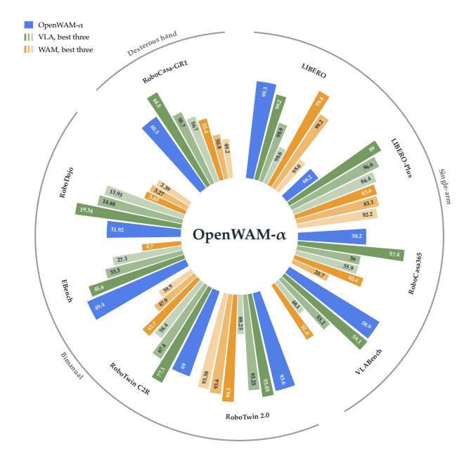

Figure 14 OpenWAM- $\alpha$는 각 벤치마크별로 각 가족의 최고값과 비교되며, 구현체별로 그룹화된다.

표 5 LIBERO-Plus의 평가 결과. 굵은 글씨는 최우수 값을, 밑줄은 두 번째 최우수 값을 나타낸다.

<span id="page-21-0"></span>

|  | 카메라 | 로봇 | 언어 | 빛 | 배경 | 노이즈 | 레이아웃 | Avg |
|--------------------------------------------------|--------|-------|----------|-------|------------|-------|--------|------|
|  |  | VLA |  |  |  |  |  |  |
| $\pi_0$ (Black et al., 2024) | 13.8 | 6.0 | 58.8 | 85.0 | 81.4 | 79.0 | 68.9 | 53.6 |
| OpenVLA-OFT (Kim et al., 2025) | 56.4 | 31.9 | 79.5 | 88.7 | 93.3 | 75.8 | 74.2 | 69.6 |
| StarVLA (Community, 2026) | 52.5 | 49.8 | 88.5 | 95.7 | 95.7 | 73.0 | 76.9 | 74.1 |
| <b>ABot-M0</b> (Yang et al., 2026b) | 60.4 | 67.9 | 86.4 | 96.2 | 91.6 | 86.4 | 82.6 | 80.5 |
| $\pi_{0.5}$ (Physical Intelligence et al., 2025) | 78.4 | 73.6 | 80.8 | 96.2 | 94.1 | 89.0 | 84.5 | 84.4 |
| ACoT-VLA (Zhong et al., 2026) | 72.6 | 82.6 | 87.5 | 97.7 | 96.5 | 87.8 | 88.1 | 86.6 |
| Qwen-RobotManip ( $Yuan\ et\ al.,\ 2026a$ ) | 87.2 | 75.5 | 85.6 | 96.6 | 97.7 | 97.7 | 87.3 | 89.0 |
|  |  | WAM |  |  |  |  |  |  |
| Fast-WAM (Yuan et al., 2026b) | 16.4 | 44.5 | 68.9 | 78.2 | 53.7 | 37.7 | 60.7 | 51.5 |
| Being-H0.7 (Luo et al., 2026b) | 82.0 | 59.0 | 82.8 | 97.8 | 90.0 | 93.5 | 88.5 | 82.1 |
| Cosmos-Policy (Kim et al., 2026b) | 75.8 | 63.3 | 81.7 | 96.5 | 88.9 | 92.7 | 82.2 | 82.2 |
| ImageWAM (Zhang et al., 2026c) | 80.8 | 50.3 | 91.4 | 98.1 | 85.5 | 93.8 | 80.5 | 83.1 |
| ABot-M0.5 (Chen et al., 2026a) | 70.5 | 87.4 | 88.6 | 94.0 | 89.7 | 75.5 | 85.2 | 83.4 |
| OpenWAM- $\alpha$ | 33.8 | 76.1 | 88.0 | 97.0 | 87.1 | 39.8 | 77.5 | 69.2 |

예상치 못한 예외는 단일 팔 벤치마크 LIBERO-Plus이며, 여기서 OpenWAM- $\alpha$  의 점수가 다른 곳에 비해 현저히 낮아 Table 5에 표시된 바와 같이 나타난다. LIBERO-Plus의 각 변형별 분해는 의미가 있다: 손실이 *camera* 및 *noise* 변형 아래에 집중되고, *background* 및 *layout* 변형에서도 눈에 띄는 결손이 있다. 같은 리더보드에서 ABot-M0.5, ImageWAM, 그리고 Being-H0.7 — 모두 WAMs 자체 — 가 강력하게 수행하며, 점수가 최첨단에 근접한다. 따라서 우리는 OpenWAM- $\alpha$  를 이 모델들과 두 축, 사전 학습 데이터와 아키텍처를 따라 비교하여 근본 원인을 식별한다.

Figure 15는 ABot‑M0.5와 Being‑H0.7의 사전학습 데이터 중 단일팔 부분과 OpenWAM‑$\alpha$의 단일팔 부분을 대비한다. 두 기준선은 다양하고 방대한 단일팔 컬렉션을 사전학습에 사용한다. 이 컬렉션은 다양한 구현체, 장면, 카메라 시점을 포함하고 있어 사전학습 단계에서 이미 LIBERO‑Plus 테스트 장면과 유사한 시점, 잡음, 배경 및 레이아웃을 갖는 시각 정보와 세계 지식을 접한다. 반면 OpenWAM‑$\alpha$의 단일팔 데이터(표 4)는 양적·다양성 모두에서 훨씬 작으며, 두 개의 소스만을 사용한다: 고정된 단일팔 플랫폼과 고정된 카메라 시점에서 수집된 DROID와 합성 InternData‑A1의 단일팔 부분. 이러한 제한된 단일팔 범위로 인해 모델은 훨씬 적은 단일팔 세계 지식을 습득하고, 그 결과 LIBERO‑Plus의 OOD 변형에서 단일팔 일반화가 저하된다. 반대로 OpenWAM‑$\alpha$ 혼합물은 자아중심적, 양팔, 정밀한 손 데이터가 풍부하며, 모델은 이에 따라 양팔 및 정밀한 손 벤치마크에서 강력하다.

<span id="page-21-1"></span>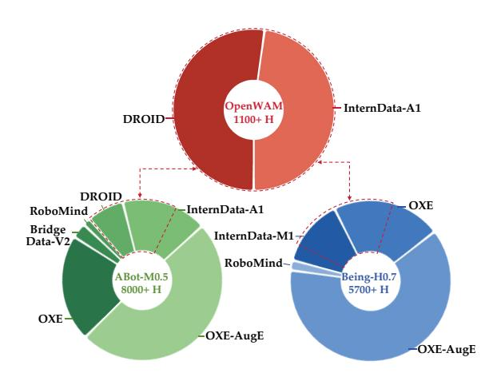

Figure 15 ABot-M0.5, Being-H0.7, 및 OpenWAM- $\alpha$ 의 단일-팔 사전학습 데이터. 점선은 OpenWAM- $\alpha$ 의 단일-팔 데이터가 ABot-M0.5와 Being-H0.7가 소비하는 양의 일부에 불과함을 나타낸다.

Fast-WAM, ABot-M0.5, 그리고 OpenWAM- $\alpha$는 하나의 핵심 예측 목표를 공유한다—시간적 지평에 걸쳐 미래를 예측한 픽셀 수준의 비디오이며, 이는 재구성형 Wan2.2‑VAE에 의해 생성된 중간 잠재 변수를 사용한다. LIBERO-Plus에서 세 모델 모두 동일한 특성을 보이며, 카메라 및 노이즈 변형 하에서의 점수가 다른 변형 하에서의 점수보다 명확히 낮다. 그리고 ABot-M0.5만이 사전학습 데이터에 의해 Fast-WAM 및 OpenWAM- $\alpha$에 비해 손실의 대부분을 회복한다. 픽셀 수준.

정보는 명백히 카메라 및 노이즈 변동에 극도로 민감하며, 이는 픽셀 수준 예측 아키텍처의 고유한 한계이며, 오직 대규모 사전학습만이 이를 보완할 수 있다. 두 가지 추가 기준이 이 해석을 뒷받침한다. ImageWAM은 사전학습이 없음에도 불구하고 LIBERO-Plus에서 눈에 띄게 강력하다: 그 예측 대상 역시 픽셀 수준 잠재 변수이지만, 현재 관측의 단일 미래 프레임만을 예측한다—롤아웃보다 편집에 가깝다—따라서 프레임 간에 오류가 누적되지 않으며, 미래 픽셀 예측이 카메라 및 노이즈 점수에 미치는 영향이 그에 따라 줄어든다. Being‑H0.7은 반대로 V‑JEPA 2.1로 관측을 인코딩한다: 그 중간 잠재 변수는 여전히 시간적(여러 프레임이 공동으로 인코딩됨)이며, 픽셀 재구성이 아니라 의미 수준 특징이므로 모델이 카메라 및 노이즈 변동에 훨씬 더 견고해진다. LIBERO‑Plus와 달리 다른 벤치마크의 OOD 설계는 의도적인 카메라나 노이즈 방해를 가하지 않으므로 OpenWAM‑α는 그곳에서 여전히 매우 경쟁력 있다; LIBERO‑Plus에서는 카메라 및 노이즈 방해가 위에서 언급한 단일 팔 데이터 부족을 가중시켜 OpenWAM‑α의 성능이 필연적으로 저하된다.

핵심 요약 1: 구현된 모델이 벤치마크에서 얼마나 잘 일반화되는지는 궁극적으로 그 모델의 사전학습 혼합이 구현과 환경 모두에서 벤치마크의 테스트 조건에 가까운 데이터를 포함하고 있는지에 달려 있다. [Section 4.3,](#page-13-1) 를 확장하면, 구현 기반 기초 모델의 결정적 요소는 여전히 대규모, 다양하고 장면이 풍부한 로봇 조작 데이터이며, 이는 모델이 이후에 직면할 수 있는 광범위한 테스트 시나리오를 한 번에 포괄하고 구현에 기반한 정밀한 행동/시각 정보를 제공한다 — 더 강력한 일반화로 가는 가장 직접적인 경로이다.

핵심 요약 2: 대규모 데이터를 기반으로 픽셀 잠재 공간에서 미래를 예측하는 WAM은 뛰어난 성능을 달성할 수 있지만, 시각적 교란에 대한 견고성은 본질적으로 제한적이다. [Section 4.1.2,](#page-10-3) 를 반영하듯, 환경 변동에 견고하고 정보가 풍부하며 충분히 압축된 표현이 여전히 필요하다 WAM 성능을 더 끌어올리려면.

#### <span id="page-22-0"></span>5.3.2 VLA 대 WAM: 어느 패러다임이 우세한가? (VLA versus WAM: Which Paradigm Prevails?)

모든 벤치마크에서 [(Figure 14)](#page-20-2), VLA와 WAM 그룹은 전체 성공률에서 실질적인 격차가 없으며, 각 그룹은 리더보드 상단에 두드러진 모델을 배치한다: WAM에서는 ABot-M0.5와 OpenWAM-α, VLA에서는 Xiaomi-Robotics-1과 Qwen-RobotManip. 이 모델들은 사전학습 데이터, 아키텍처, 훈련 구성 등에서 차이가 있으므로 어느 패러다임이 우수하다고 단정할 수 없다. 그러나 세밀한 점수는 일관된 패턴을 드러낸다: 각 패러다임은 고유한 이점 영역을 보유한다 [(Figure 16)](#page-23-1).

분포 내에서, WAM이 더 잘 맞춘다. 가장 명확한 비교는 StarVLA와 Fast-WAM, 두 모델 모두 구현 사전학습이 없는 경우 [(Figure 16a](#page-23-1): LIBERO, RoboTwin2.0-Clean2Random의 Clean 분할, 그리고 RoboTwin2.0-Full에서 WAM이 ID 작업에서 눈에 띄게 높은 점수를 달성하며, VLA에 비해 훈련 분포를 더 효과적으로 적합한다. 사전학습된 모델은 양방향에서 동일한 이야기를 전한다 [(Figure 16b](#page-23-1): OpenWAM-α는 LIBERO, VLABench의 In-dist. 분할, 그리고 RoboTwin2.0-Clean2Random의 Clean 분할에서 세 가지 가장 강력한 VLA를 이끌며, RoboDojo의 Gen-Std 분할에서 최고와 작은 차이만을 유지한다 — 비록 이 VLA들의 사전학습 데이터가 우리보다 많음에도 불구하고. 이 이점은 WAM 훈련에서 비디오-잠재 감독에 기인한다: VLA는 행동 감독에만 최적화되고 중간 잠재 목표가 없으나, 비디오-잠재 항은 파라미터 최적화에 추가 정보를 주입하여 WAM이 훈련 데이터를 더 밀접하게 맞출 수 있게 한다.

분포 외에서, VLA가 더 잘 일반화한다. 동일한 StarVLA–Fast-WAM 비교가 분포 외에서 반전된다 [(Figure 16a](#page-23-1): LIBERO-Plus에서 VLA가 크게 앞서며, RoboTwin2.0-Clean2Random의 Randomized 분할에서도 두 모델이 붕괴되었음에도 순위는 여전히 VLA를 선호한다. 사전학습된 모델은 반전을 반영한다 [(Figure 16c](#page-23-1): LIBERO-Plus, RoboTwin2.0-Clean2Random의 Randomized 분할, 그리고 RoboDojo의 Open 분할에서 OpenWAM-α는 최첨단 VLA보다 뚜렷한 차이를 보인다. 메커니즘은 ID 이점의 반대편이다: 장기 미래 예측은 적합을 돕는 감독 신호를 추가하지만, 분포 전이 하에서는 같은 장기가 더 무거운 오류 누적을 의미한다 — 행동만을 사용하는 VLA는 이 부담을 지지 않으므로, WAM은 보이지 않는 평가 환경에서 VLA보다 눈에 띄게 낮은 성능을 보인다.

<span id="page-23-1"></span>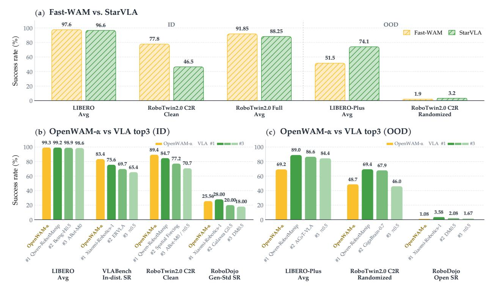

그림 16 ID 및 OOD 비교: 두 패러다임 간. (a) Fast-WAM versus StarVLA, 구현(pre)pretraining 없이 두 모델, ID 및 OOD 분할에서. (b) OpenWAM- $\alpha$ versus 세 가지 가장 강력한 VLA, ID 분할에서. (c) OpenWAM- $\alpha$ versus 세 가지 가장 강력한 VLA, OOD 분할에서.

핵심적으로, 두 가지 결함은 데이터로 해결될 수 있다. VLAs의 ID 적합 결함이든 WAMs의 OOD 일반화 결함이든, 충분히 풍부한 사전 학습 데이터—복잡한 환경 변화를 포괄하고 정밀한 행동 주석을 포함—는 두 패러다임이 상속된 선험적 지식을 활용해 테스트 시점에서 강력한 적합과 강력한 일반화를 모두 달성하도록 한다. 따라서 데이터는 모델 개발의 최우선 과제이다. 동시에 VLAs와 WAMs는 관찰에서 행동까지 동일한 핵심 정보 흐름을 기반으로 구축된 엔드-투-엔드 모델이며, 두 패러다임의 상호 보완적 강점을 결합하고 이를 통해 엔드-투-엔드 모델의 능력 경계를 더 밀어내는 방법은 추구할 가치가 있는 질문이다.

**핵심 포인트 3:** 어느 패러다임도 완전히 우세하지 않다: 비디오-잠재 감독은 WAMs에게 ID 적합에서 우위를 주며, VLAs는 OOD에서 더 잘 일반화한다 — 그리고 두 결함은 충분히 크고 다양한 사전 학습 데이터로 보완될 수 있다. 두 엔드-투-엔드 패러다임의 상호 보완적 강점을 결합하는 것은 능력 경계를 더 밀어내는 유망한 경로다.

### <span id="page-23-0"></span>5.4 실제 로봇 평가 (Real-Robot Evaluation)

시뮬레이션을 넘어 OpenWAM- $\alpha$의 일반적 능력과 일반화 가능성을 추가로 검증하기 위해, 우리는 Figure 17에 표시된 실험 설정을 사용해 — 단일 팔, 양팔, 정밀 손 — 세 가지 구현체에서 종합적인 실제 로봇 평가를 수행한다. 구체적으로:

- 단일 팔 실험은 Franka-Research-3 플랫폼에서 수행되며, 스태킹, 픽앤플레이스, 행잉이라는 세 가지 작업군을 포함해 모델의 기본 및 세밀한 조작 능력을 탐구한다. 성능은 작업 성공률(SR)로 측정된다.
- 양팔 실험은 공식 RoboDojo 실 로봇 플랫폼에서 수행되며, ARX X5, Piper, Piper X라는 세 가지 구현체를 포함한다. RoboDojo 작업 분류에 따라 평가가 일반화, 정밀도, 장기 시야, 메모리, 오픈 작업을 포괄하며 모델을 종합적으로 평가한다. 성능은 SR과 진행 점수(Progress Score)로 측정된다.

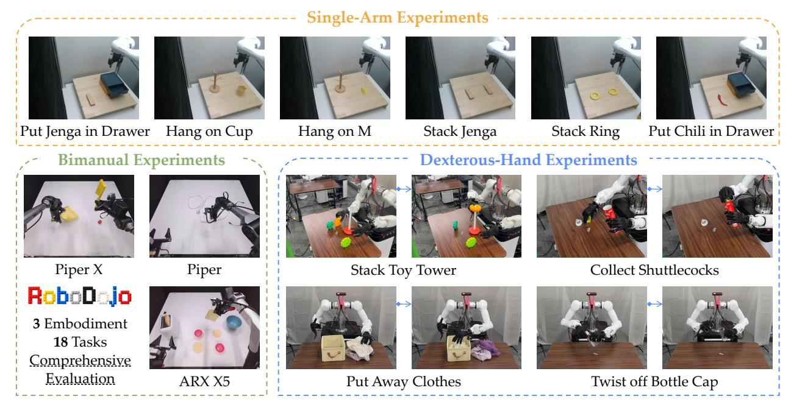

**Figure 17 실험 로봇 실험 설정: 세 가지 구현체** *Top*: Franka-Research-3 플랫폼의 6개 단일 팔 작업. *Bottom left*: RoboDojo 실세계 트랙의 세 가지 양팔 구현체 (Piper X, Piper, ARX X5), 총 18개 작업을 포함. *Bottom right*: Wuji-hand 및 Tianji-arm 플랫폼의 네 개의 정밀 손 작업, 각각 실행의 핵심 중간 단계로 설명.

• 정밀 손 실험은 Wuji 정밀 손과 Tianji 로봇 팔을 결합한 플랫폼에서 수행된다 — OpenWAM- $\alpha$ 사전학습 혼합에 없는 구현체 및 동작 공간 — 그리고 양팔 상호작용, 장기 목표, 정밀 조작 작업을 포함하며, 모델이 보지 못한 구현체와 동작 차원에 얼마나 잘 적응하고 일반화되는지를 탐구한다. 성능은 SR(성공률)과 Progress Score(진행 점수)로 측정된다.

각 구현체의 작업 설정 및 평가 프로토콜은 Section C에 문서화되어 있으며, 이 실험에 사용된 SFT 구성은 Section B.2에 제공된다.

Table 6, Table 7, 그리고 Table 8은 각각 단일 팔, RoboDojo 양팔, 정밀 손 실험의 상세 점수를 보고한다.

Table 6 단일 팔 실험 로봇 작업에 대한 평가 결과. 굵은 글씨는 최고값, 밑줄은 두 번째 최고값을 나타낸다.

|  | 스택<br>Jenga | 스택<br>Ring | 두다 Chili<br>드로어에 | 두다 Jenga<br>드로어에 | 걸다<br>M에 | 걸다<br>컵에 | 평균 |
|--------------------------------------------------|------------------|-----------------------------|------------------------|------------------------|--------------|------------------|--------------------------------|
| $\pi_{0.5}$ (물리적 지능 et al., 2025) | 13/20 (65%) | 7/20~(35%) | 14/20 (70%) | 15/20 (75%) | 7/20 (35%) | 10/20 (50%) | 66/120 (55.0%) |
| LingBot-VA (Li et al., 2026b) | $16/20 \ (80\%)$ | 15/20 (75%) | $17/20 \ (85\%)$ | $17/20 \ (85\%)$ | 13/20 (65%) | $15/20 \ (75\%)$ | $\underline{93/120\ (77.5\%)}$ |
| OpenWAM- $\alpha$ | 17/20 (85%) | $\underline{12/20\ (60\%)}$ | 20/20 (100%) | 20/20 (100%) | 13/20 (65%) | 17/20 (85%) | 99/120 (82.5%) |

단일 팔 플랫폼 (Table 6)에서 OpenWAM- $\alpha$는 LingBot-VA(대표적인 WAM)와 $\pi_{0.5}$(대표적인 VLA)를 명확히 앞서며, 대다수의 작업에서 최고 평균 성공률을 달성하고, 일반적이며 세밀한 조작 능력의 초기 증거를 제공한다.  

다음으로 RoboDojo-Real (Table 7)을 살펴본다. 이는 세 가지 양손 구현체와 다양한 작업 차원을 아우르는 일반화된 조작 정책을 종합적으로 평가하는 실제 로봇 벤치마크이다. OpenWAM- $\alpha$는 리더보드를 정복하며: 구현체와 그 작업 전반에 걸쳐 일관되게 강력하고, 그들 중 대다수에서 최첨단 수준에 도달해 모델의 일반성과 강건성을 실제 세계에서 확인시킨다.

OpenWAM- $\alpha$의 확장성과 일반화를 더 탐구하기 위해, 우리는 Wuji-hand와 Tianji-arm 플랫폼에서 구축된 네 가지 정교한 조작 과제에 사전 학습된 모델을 미세 조정하고, 도메인 내 및 도메인 외 설정 모두에서 테스트한다(Table 8). 플랫폼 자체도, 그 행동 공간도 — 9차원

<span id="page-25-1"></span>표 7 이중 팔 RoboDojo 실세계 트랙 평가 결과. 각 셀은 점수 / SR(%)를 보고한다. 굵은 글씨는 최상값을, 밑줄은 두 번째 최상값을 나타낸다. 행은 구현체별로 색칠된다.

| 정책 | 체현 | 작업 1 | 작업 2 | 작업 3 | 작업 4 | 작업 5 | 작업 6 | Emb. 평균 | 전체 평균 |
|-------------------------------------------|----------------------------|-----------------------------------------|-----------------------------------------|---------------------------------------------------|-----------------------------------------|-----------------------------------------------|-------------------------------------------|-----------------------------------------------------------------|--------------|
| X-VLA (Zheng et al., 2026b) | ARX X5<br>Piper<br>Piper X | 0.0 / 0.0<br>0.0 / 0.0<br>0.0 / 0.0 | 0.0 / 0.0<br>5.3 / 0.0<br>0.0 / 0.0 | 0.0 / 0.0<br>0.0 / 0.0<br>0.0 / 0.0 | 2.0 / 0.0<br>0.0 / 0.0<br>0.0 / 0.0 | 20.7 / 10.0<br>53.0 / 50.0<br>0.0 / 0.0 | 18.0 / 0.0<br>37.0 / 0.0<br>0.7 / 0.0 | 6.8 / 1.7<br>15.9 / 8.3<br>0.1 / 0.0 | 7.6 / 3.3 |
| Xiaomi-Robotics-0 (Cai et al., 2026c) | ARX X5<br>Piper<br>Piper X | 24.0 / 20.0<br>0.0 / 0.0<br>0.0 / 0.0 | 0.0 / 0.0<br>0.0 / 0.0<br>0.7 / 0.0 | 3.0 / 0.0<br>0.0 / 0.0<br>4.0 / 0.0 | 4.0 / 0.0<br>0.0 / 0.0<br>0.0 / 0.0 | 40.0 / 20.0<br>23.0 / 20.0<br>0.0 / 0.0 | 19.0 / 10.0<br>22.7 / 0.0<br>2.7 / 0.0 | 15.0 / 8.3<br>7.6 / 3.3<br>1.2 / 0.0 | 7.9 / 3.9 |
| GalaxeaVLA (G0) (Jiang et al., 2025) | ARX X5<br>Piper<br>Piper X | 1.0 / 0.0<br>0.0 / 0.0<br>0.0 / 0.0 | 0.0 / 0.0<br>0.0 / 0.0 | 3.0 / 0.0<br>32.7 / 10.0 13.3 / 10.0<br>0.0 / 0.0 | 6.0 / 0.0<br>0.0 / 0.0<br>4.0 / 0.0 | 0.0 / 0.0<br>56.0 / 50.0<br>0.0 / 0.0 | 10.3 / 0.0<br>6.0 / 0.0 | 3.4 / 0.0<br>30.0 / 10.0 22.0 / 13.3<br>1.7 / 0.0 | 9.0 / 4.4 |
| InternVLA-A1 (Cai et al., 2026a) | ARX X5<br>Piper<br>Piper X | 0.0 / 0.0<br>0.0 / 0.0<br>0.0 / 0.0 | 0.0 / 0.0<br>7.3 / 0.0<br>0.0 / 0.0 | 0.0 / 0.0<br>0.0 / 0.0<br>4.0 / 0.0 | 0.0 / 0.0<br>0.0 / 0.0<br>2.0 / 0.0 | 48.0 / 20.0<br>73.0 / 70.0<br>0.0 / 0.0 | 12.0 / 0.0<br>10.0 / 0.0 | 10.0 / 3.3<br>59.0 / 40.0 23.2 / 18.3<br>2.7 / 0.0 | 12.0 / 7.2 |
| π0.5 (Physical Intelligence et al., 2025) | ARX X5<br>Piper<br>Piper X | 24.6 / 20.0<br>10.0 / 10.0<br>0.0 / 0.0 | 1.8 / 0.0<br>28.0 / 0.0<br>14.8 / 10.0 | 25.8 / 10.0<br>10.0 / 10.0<br>0.0 / 0.0 | 47.0 / 20.0<br>0.0 / 0.0<br>29.5 / 10.0 | 40.0 / 20.0<br>72.0 / 60.0<br>7.5 / 0.0 | 3.0 / 0.0 | 26.8 / 10.0 27.7 / 13.3<br>72.0 / 50.0 32.0 / 21.7<br>9.1 / 3.3 | 22.9 / 12.8 |
| OpenWAM-α | ARX X5<br>Piper<br>Piper X | 31.0 / 0.0<br>8.3 / 0.0<br>0.0 / 0.0 | 0.0 / 0.0<br>60.0 / 40.0<br>28.0 / 10.0 | 13.0 / 0.0<br>36.7 / 30.0<br>18.0 / 0.0 | 52.0 / 20.0<br>0.0 / 0.0<br>52.3 / 20.0 | 100.0 / 100.0<br>100.0 / 100.0<br>40.0 / 40.0 | 38.0 / 20.0<br>75.0 / 50.0<br>24.7 / 10.0 | 39.0 / 23.3<br>46.7 / 36.7<br>27.2 / 13.3 | 37.6 / 24.4 |

작업 순서. ARX X5: 덮기_블록, 빵_만들기, 음식_만들기, 과일_포장_및_붓기, 보안함_보관, 튜브_삽입. Piper: 블록_쌓기_및_덮기, 펜_홀더_채우기, 물건_바구니_넣기, 충전기_삽입, 그릇_쌓기, 병_세우기. Piper X: 물건_분류, LEGO_분해, 머그_걸이, 물건_배낭_포장, 블록_청소, 펜_캡_씌우기.

<span id="page-25-2"></span>표 8 Dexterous-Hand Real-Robot Tasks에 대한 평가 결과. 각 셀은 Score / SR(%)를 보고한다; OOD 열은 해당 작업의 모든 변형 설정을 집계한다. 굵은 글씨는 최상의 값을 나타낸다.

|  |  | 장난감 탑 쌓기 | 셔틀콕 수집하기 |  |  |  |
|-----------|---------------------------|---------------------------|---------------------------|-----------------------------|--|--|
| 방법 | ID | OOD | ID | OOD |  |  |
| π0.5 | 16/30 (53.3) / 1/10 (10%) | 12/30 (40.0) / 1/10 (10%) | 11/35 (31.4) / 2/10 (20%) | 17/54 (31.5) / 3/15 (20%) |  |  |
| OpenWAM-α | 21/30 (70.0) / 4/10 (40%) | 17/30 (56.7) / 3/10 (30%) | 29/35 (82.9) / 6/10 (60%) | 30/57 (52.6) / 4/15 (26.7%) |  |  |
|  |  |  | 병뚜껑을 돌려서 열기 |  |  |  |
|  |  | 옷 정리하기 |  |  |  |  |
| 방법 | ID | OOD | ID | OOD |  |  |
| π0.5 | 26/30 (86.7) / 6/10 (60%) | 45/60 (75.0) / 9/20 (45%) | 8/10 (80.0) / 3/10 (30%) | 13/20 (65.0) / 6/20 (30%) |  |  |

OpenWAM-α 사전 훈련 혼합물에 엔드 이펙터 포즈와 21개의 섬세한 손 관절이 결합된 형태가 항상 등장하지만, 그럼에도 불구하고 OpenWAM-α는 모든 작업과 설정에서 π0.<sup>5</sup>를 명확한 차이로 능가하며, 모델이 완전히 보지 못한 구현체에도 신뢰성 있고 안정적으로 적응함을 보여준다.

이러한 실험은 OpenWAM-α를 세 가지 구현체 유형과 광범위한 실제 조작 과제에 걸쳐 평가한다. 결과는 OpenWAM-α가 모든 설정에서 강력하게 수행하며 오늘날 선도 모델과 동등한 수준임을 보여 주며, 이는 커뮤니티가 향후 개발 및 비교에 강력한 기준으로 활용할 수 있음을 시사한다.

## <span id="page-25-0"></span>6 Conclusions

본 연구는 OpenWAM을 소개한다. OpenWAM은 세계–행동 모델링을 밀접하게 연결된 구현 선택 집합에서 통제된 실험 프로그램으로 전환하는 오픈 연구 스택이다. OpenWAM-Infra는 WAM 설계 공간을 세 가지 아키텍처 패밀리로 조립되는 구성 가능한 모듈로 분해하며, 단일 트레이너, 정책 서버, 그리고 여덟 개의 시뮬레이션 벤치마크와 실제 로봇을 아우르는 평가 프로토콜에 의해 제공된다. 이 기반 위에서 OpenWAM-Study는 WAM이 상속해야 할 세계 지식, 세계와 행동 학습이 어떻게 시너지 효과를 창출하는지, 그리고 그 시너지가 도메인 전반에 걸쳐 어떻게 통합되는지를 조사하여 답을 구체적인 레시피로 정제했다. OpenWAM-α는 이후 이 레시피를 자가 중심 인간 및 로봇 데이터에 대규모로 적용하여 통합된 행동 공간을 통해 일관되게 강력한 결과를 시뮬레이션 벤치마크와 단일 팔, 양팔, 섬세한 손 플랫폼의 실제 로봇 실험에서 제공한다.

우리는 인프라, 평가 프로토콜, 사전 학습 가중치, 데이터 레시피를 포함한 전체 스택을 공개한다. 이는 OpenWAM-α가 향후 개발 및 비교를 위한 강력한 기준으로 활용될 수 있는 공유되고 재현 가능한 세계–행동 연구 기반을 제공한다. 앞으로 이 결과는 정밀한 행동 주석이 달린 더 크고 다양한 구현체 데이터를, 환경 변동에 대해 컴팩트하고 견고한 시각적 표현을, 그리고 WAM과 VLA의 상호 보완적 강점을 결합한 엔드‑투‑엔드 설계를 가장 유망한 방향으로 제시한다. 제한 사항 및 향후 연구에 대한 보다 자세한 논의는 [Section A.](#page-32-1)에서 제공된다.

## Acknowledgements

Nilaksh와 Chuning Zhu에게 유익한 논의에 감사한다. Wuji Technology에게는 프로젝트 완성을 위해 필수적인 컴퓨팅 자원을 제공해 주어 감사한다.

## <span id="page-26-0"></span>References

- <span id="page-26-7"></span>[1] Ali, A., Bai, J., Bala, M., Balaji, Y., Blakeman, A., Cai, T., Cao, J., Cao, T., Cha, E., Chao, Y.-W., et al. World simulation with video foundation models for physical ai. arXiv preprint arXiv:2511.00062, 2025.
- <span id="page-26-8"></span>[2] Allen-Zhu, Z. Physics of language models: Part 4.1, architecture design and the magic of canon layers. Advances in Neural Information Processing Systems, 38:42349–42369, 2026.
- <span id="page-26-11"></span>[3] Baade, A., Chan, E. R., Sargent, K., Chen, C., Johnson, J., Adeli, E., and Fei-Fei, L. Latent forcing: Reordering the diffusion trajectory for pixel-space image generation. arXiv preprint arXiv:2602.11401, 2026.
- <span id="page-26-6"></span>[4] Bai, S., Cai, Y., Chen, R., Chen, K., Chen, X., Cheng, Z., Deng, L., Ding, W., Gao, C., Ge, C., Ge, W., Guo, Z., Huang, Q., Huang, J., Huang, F., Hui, B., Jiang, S., Li, Z., Li, M., Li, M., Li, K., Lin, Z., Lin, J., Liu, X., Liu, J., Liu, C., Liu, Y., Liu, D., Liu, S., Lu, D., Luo, R., Lv, C., Men, R., Meng, L., Ren, X., Ren, X., Song, S., Sun, Y., Tang, J., Tu, J., Wan, J., Wang, P., Wang, P., Wang, Q., Wang, Y., Xie, T., Xu, Y., Xu, H., Xu, J., Yang, Z., Yang, M., Yang, J., Yang, A., Yu, B., Zhang, F., Zhang, H., Zhang, X., Zheng, B., Zhong, H., Zhou, J., Zhou, F., Zhou, J., Zhu, Y., and Zhu, K. Qwen3-vl technical report, 2025. URL <https://arxiv.org/abs/2511.21631>.
- <span id="page-26-13"></span>[5] Bai, Y., Wang, H., Dai, M., Zhong, Q., Liu, Y., and Lin, L. Bridge-wa: Predicting where and how the world changes for robotic action. arXiv preprint arXiv:2607.02195, 2026.
- <span id="page-26-9"></span>[6] Barreiros, J., Beaulieu, A., Bhat, A., Cory, R., Cousineau, E., Dai, H., Fang, C.-H., Hashimoto, K., Irshad, M. Z., Itkina, M., et al. A careful examination of large behavior models for multitask dexterous manipulation. Science Robotics, 11(113):eaea6201, 2026.
- <span id="page-26-5"></span>[7] Beyer, L., Steiner, A., Pinto, A. S., Kolesnikov, A., Wang, X., Salz, D., Neumann, M., Alabdulmohsin, I., Tschannen, M., Bugliarello, E., et al. Paligemma: A versatile 3b vlm for transfer. arXiv preprint arXiv:2407.07726, 2024.
- <span id="page-26-4"></span>[8] Bi, H., Tan, H., Xie, S., Wang, Z., Huang, S., Liu, H., Zhao, R., Feng, Y., Xiang, C., Rong, Y., et al. Motus: A unified latent action world model. In Proceedings of the IEEE/CVF Conference on Computer Vision and Pattern Recognition, pp. 35101–35113, 2026.
- <span id="page-26-3"></span>[9] Black, K., Brown, N., Driess, D., Esmail, A., Equi, M., Finn, C., Fusai, N., Groom, L., Hausman, K., Ichter, B., et al. π0: A vision-language-action flow model for general robot control. arXiv preprint arXiv:2410.24164, 2024.
- <span id="page-26-10"></span>[10] Black Forest Labs. FLUX.2: Analyzing and enhancing the latent space of FLUX. Technical blog, 2025. URL <https://bfl.ai/research/representation-comparison>.
- <span id="page-26-2"></span>[11] Brohan, A., Brown, N., Carbajal, J., Chebotar, Y., Chen, X., Choromanski, K., Ding, T., Driess, D., Dubey, A., Finn, C., et al. Rt-2: Vision-language-action models transfer web knowledge to robotic control. arXiv preprint arXiv:2307.15818, 2023.
- <span id="page-26-1"></span>[12] Brooks, T., Peebles, B., Holmes, C., DePue, W., Guo, Y., Jing, L., Schnurr, D., Taylor, J., Luhman, T., Luhman, E., Ng, C., Wang, R., and Ramesh, A. Video generation models as world simulators, 2024. URL <https://openai.com/research/video-generation-models-as-world-simulators>.
- <span id="page-26-12"></span>[13] Bu, Q., Cai, J., Chen, L., Cui, X., Ding, Y., Feng, S., Gao, S., He, X., Huang, X., Jiang, S., et al. Agibot world colosseo: A large-scale manipulation platform for scalable and intelligent embodied systems. arXiv preprint arXiv:2503.06669, 2025.

- <span id="page-27-15"></span>[14] Cai, J., Cai, Z., Cao, J., Chen, Y., He, Z., Jiang, L., Li, H., Li, H., Li, Y., Liu, Y., et al. Internvla-a1: 로봇 조작을 위한 이해, 생성 및 행동 통합. arXiv preprint arXiv:2601.02456, 2026a.

- <span id="page-27-17"></span>[15] Cai, J., Ling, L., Chu, S., Liu, Z., Kang, J., Liang, Z., Xu, W., Mao, Y., Zhang, W., Yang, X., et al. Aha-wam: 관측 가이드 컨텍스트 라우팅을 통한 비동기적 지평선 적응형 세계-행동 모델링. arXiv preprint arXiv:2606.09811, 2026b.

- <span id="page-27-14"></span>[16] Cai, R., Guo, J., He, X., Jin, P., Li, J., Lin, B., Liu, F., Liu, W., Ma, F., Ma, K., et al. Xiaomi-robotics-0: 실시간 실행이 가능한 오픈소스 비전-언어-행동 모델. arXiv preprint arXiv:2602.12684, 2026c.

- <span id="page-27-0"></span>[17] Caron, M., Touvron, H., Misra, I., Jégou, H., Mairal, J., Bojanowski, P., and Joulin, A. 자기 지도 비전 트랜스포머에서 나타나는 새로운 특성. In 2021 IEEE/CVF international conference on computer vision (ICCV), pp. 9630–9640. IEEE, 2021.

- <span id="page-27-13"></span>[18] Chen, R., Yang, Y., Tang, Z., Huo, D., Lin, T., Wu, H., Liu, H., Chen, Y., Zheng, L., Yuan, B., et al. Abot-m0.5: 통합 이동 및 조작 세계-행동 모델. arXiv preprint arXiv:2607.00678, 2026a.

- <span id="page-27-9"></span>[19] Chen, T., Chen, Z., Chen, B., Cai, Z., Liu, Y., Li, Z., Liang, Q., Lin, X., Ge, Y., Gu, Z., et al. Robotwin 2.0: 견고한 양손 로봇 조작을 위한 강력한 도메인 랜덤화가 적용된 확장 가능한 데이터 생성기 및 벤치마크. arXiv preprint arXiv:2506.18088, 2025.

- <span id="page-27-10"></span>[20] Chen, T., Chen, Y., Li, Z., Tang, J., Su, K., Lu, H., Wan, W., Chen, B., Liu, S., Yan, H., Su, H., Dou, Z., Wang, K., Zhang, D., Liu, Y., Qin, Y., Liang, Q., Wu, Q., Lin, Z., Lin, W., Wang, Y., He, M., Wu, T., Wu, R., Zhou, J., Lei, K.-C., Yu, H., Ji, Y., Jin, W., Lin, G., Li, X., Xiong, Q., Xu, R., Li, Z., Chai, W., Xie, E., Wang, Z., Mu, Y., Dong, H., Matusik, W., Ding, M., Ding, W., Luo, P., and Tomizuka, M. Robodojo: 범용 로봇 조작 정책의 종합 평가를 위한 통합 시뮬레이션-실제 벤치마크, 2026b. URL <https://arxiv.org/abs/2607.04434>.

- <span id="page-27-16"></span>[21] Chi, C., Xu, Z., Pan, C., Cousineau, E., Burchfiel, B., Feng, S., Tedrake, R., and Song, S. Universal manipulation interface: 실제 환경에서 로봇 없이 실제 환경 로봇 교육. arXiv preprint arXiv:2402.10329, 2024.

- <span id="page-27-2"></span>[22] Chi, C., Xu, Z., Feng, S., Cousineau, E., Du, Y., Burchfiel, B., Tedrake, R., and Song, S. Diffusion policy: 행동 확산을 통한 시각-운동 정책 학습. The International Journal of Robotics Research, 44(10-11):1684–1704, 2025.

- <span id="page-27-5"></span>[23] Community, S. Starvla: 비전-언어-행동 모델 개발을 위한 레고 같은 코드베이스. arXiv preprint arXiv:2604.05014, 2026.

- <span id="page-27-6"></span>[24] Community, X., Chen, T., Chen, Y., Nian, T., Cai, Z., Chen, G., Lin, W., Liang, Q., Xiang, P., Su, K., et al. XPolicyLab: 로봇 정책 평가 및 배포를 위한 통합 표준 및 오픈 생태계. arXiv preprint arXiv:2608.09892, 2026.

- <span id="page-27-19"></span>[25] Dexmal. DM0.5. 기술 블로그, 2026. URL <https://www.dexmal.com/blog/dm0.5>.

- <span id="page-27-8"></span>[26] Fei, S., Wang, S., Shi, J., Dai, Z., Cai, J., Qian, P., Ji, L., He, X., Zhang, S., Fei, Z., Fu, J., Gong, J., and Qiu, X. Libero-plus: 비전-언어-행동 모델의 심층 견고성 분석. arXiv preprint arXiv:2510.13626, 2025.

- <span id="page-27-11"></span>[27] Gao, N., Zheng, J., Gao, X., Ma, H., Wang, H., Wang, Y., Chen, J., Chen, Z., Zhang, S., Jia, M., Jiang, X., Zhu, Z., Li, X., Wang, S., Li, H., Cai, W., Yang, Y., Xu, X., Lyu, Z., Mu, Y., Wang, T., Pang, J., Zeng, J., Zhang, W., and Shen, C. Ebench: 범용 모바일 조작 정책의 원소 진단. arXiv preprint arXiv:2606.18239, 2026.

- <span id="page-27-18"></span>[28] Guo, J., Li, Q., Li, P., Chen, Z., Sun, N., Su, Y., Wang, H., Zhang, Y., Li, X., and Liu, H. 비디오 선행 정보를 활용한 비동기적 디노이징을 통한 통합 4D 세계-행동 모델링. arXiv preprint arXiv:2604.26694, 2026.

- <span id="page-27-3"></span>[29] Ha, D. and Schmidhuber, J. 세계 모델. arXiv preprint arXiv:1803.10122, 2(3):440, 2018.

- <span id="page-27-4"></span>[30] Hafner, D., Lillicrap, T., Ba, J., and Norouzi, M. Dream to control: 잠재적 상상을 통한 행동 학습. arXiv preprint arXiv:1912.01603, 2019.

- <span id="page-27-7"></span>[31] Han, J., Tong, S., Fan, D., Chen, M., Torr, P., Kokkinos, F., and Lewis, M. 다중 모달 사전 학습의 물리학을 향해: 지식 흐름, 모달리티 시너지, 초기 통합, 그리고 레시피. arXiv preprint arXiv:2608.05000, 2026.

- <span id="page-27-1"></span>[32] Ho, J., Salimans, T., Gritsenko, A., Chan, W., Norouzi, M., and Fleet, D. J. 비디오 확산 모델. Advances in neural information processing systems, 35:8633–8646, 2022.

- <span id="page-27-12"></span>[33] Hoque, R., Huang, P., Yoon, D. J., Sivapurapu, M., and Zhang, J. Egodex: 대규모 자가 중심 비디오에서 정교한 조작을 학습. arXiv preprint arXiv:2505.11709, 2025.

- <span id="page-28-10"></span>[34] Hu, Y., Zhu, H., Zheng, B., Hu, Y., Zhang, T., Chen, Z., Zhao, J., Nai, R., and Gao, Y. Openhlm: 전신 인간형 로코-조작을 위한 경험적 레시피. arXiv preprint arXiv:2606.22174, 2026.
- <span id="page-28-5"></span>[35] Huang, S., Wu, J., Zhou, Q., Miao, S., and Long, M. Vid2world: 비디오 확산 모델을 상호작용형 세계 모델로 제작하기. arXiv preprint arXiv:2505.14357, 2025.
- <span id="page-28-4"></span>[36] Huang, S., Kaushik, P., Chen, M., Pan, H., Geng, K., Chehab, O., Moreno-Pino, F., and Simchowitz, M. Nano world models: 미래 비디오 예측의 최소주의 구현. arXiv preprint arXiv:2605.23993, 2026.
- <span id="page-28-12"></span>[37] Jha, S., Zholus, A., Chandar, S., et al. Reconstruction or semantics? 로봇 세계 모델에 유용한 잠재 공간을 만드는 것은 무엇인가. arXiv preprint arXiv:2605.06388, 2026.
- <span id="page-28-15"></span>[38] Jiang, T., Yuan, T., Liu, Y., Lu, C., Cui, J., Liu, X., Cheng, S., Gao, J., Xu, H., and Zhao, H. Galaxea 오픈월드 데이터셋과 g0 듀얼-시스템 vla 모델. arXiv preprint arXiv:2509.00576, 2025.
- <span id="page-28-6"></span>[39] Karras, T., Aittala, M., Aila, T., and Laine, S. 확산 기반 생성 모델의 설계 공간을 밝히다. Advances in neural information processing systems, 35:26565–26577, 2022.
- <span id="page-28-13"></span>[40] Khazatsky, A., Pertsch, K., Nair, S., Balakrishna, A., Dasari, S., Karamcheti, S., Nasiriany, S., Srirama, M. K., Chen, L. Y., Ellis, K., et al. Droid: 대규모 실외 로봇 조작 데이터셋. arXiv preprint arXiv:2403.12945, 2024.
- <span id="page-28-19"></span>[41] Kim, D., Jang, H., Koo, M., Jang, S., Kim, T., Kim, B., Yoon, B., Jang, C., Choi, D., Han, D., et al. Rldx-1 기술 보고서. arXiv preprint arXiv:2605.03269, 2026a.
- <span id="page-28-0"></span>[42] Kim, M. J., Pertsch, K., Karamcheti, S., Xiao, T., Balakrishna, A., Nair, S., Rafailov, R., Foster, E., Lam, G., Sanketi, P., et al. Openvla: 오픈소스 비전-언어-행동 모델. arXiv preprint arXiv:2406.09246, 2024.
- <span id="page-28-14"></span>[43] Kim, M. J., Finn, C., and Liang, P. Fine-tuning vision-language-action models: 속도와 성공률 최적화. arXiv preprint arXiv:2502.19645, 2025.
- <span id="page-28-2"></span>[44] Kim, M. J., Gao, Y., Lin, T.-Y., Lin, Y.-C., Ge, Y., Lam, G., Liang, P., Song, S., Liu, M.-Y., Finn, C., et al. Cosmos policy: 시각-운동 제어 및 계획을 위한 비디오 모델 미세조정. arXiv preprint arXiv:2601.16163, 2026b.
- <span id="page-28-8"></span>[45] Lazzati, F., Stachowicz, K., Chen, W., Metelli, A. M., Wagenmaker, A., and Levine, S. Why does action chunking improve behavioral cloning performance in robotic control? 로봇 제어에서 행동 청킹이 행동 복제 성능을 향상시키는 이유. arXiv preprint arXiv:2608.02547, 2026.
- <span id="page-28-3"></span>[46] LeCun, Y., et al. A path towards autonomous machine intelligence version 0.9. 2, 2022-06-27. Open Review, 62(1): 1–62, 2022.
- <span id="page-28-17"></span>[47] Li, F., Song, W., Zhao, H., Wang, J., Ding, P., Wang, D., Zeng, L., and Li, H. Spatial forcing: 암시적 공간 표현 정렬을 위한 비전-언어-행동 모델. In International Conference on Learning Representations, 2026a.
- <span id="page-28-1"></span>[48] Li, L., Zhang, Q., Luo, Y., Yang, S., Wang, R., Han, F., Yu, M., Gao, Z., Xue, N., Zhu, X., et al. Causal world modeling for robot control. arXiv preprint arXiv:2601.21998, 2026b.
- <span id="page-28-9"></span>[49] Lin, F., Arora, K., Mercat, J., Nishimura, H., Shah, P., Xu, C., Zhang, M., Zolotas, M., Angeles, M., Pfannenstiehl, O., et al. 로봇 조작을 위한 대규모 행동 모델 공동 훈련의 데이터 모달리티와 전략에 대한 체계적 연구. arXiv preprint arXiv:2602.01067, 2026a.
- <span id="page-28-20"></span>[50] Lin, X., Lian, S., Yu, B., Yang, R., Shen, Z., Wu, C., Miao, Y., Jin, Y., Shi, Y., He, J., Huang, C., Cheng, B., and Chen, K. Physbrain: 인간 자기중심 데이터가 비전-언어 모델에서 물리적 지능으로 가는 다리, 2026b. URL <https://arxiv.org/abs/2512.16793>.
- <span id="page-28-11"></span>[51] Liu, B., Zhu, Y., Gao, C., Feng, Y., Liu, Q., Zhu, Y., and Stone, P. LIBERO: 지속적인 로봇 학습을 위한 지식 전이 벤치마킹. arXiv preprint arXiv:2306.03310, 2023.
- <span id="page-28-16"></span>[52] Liu, I., Cheng, A.-C., Yan, R., Chen, G., Qiu, R.-Z., Zou, X., Yi, S., Yin, H., Wang, X., and Liu, S. Long-horizon manipulation via trace-conditioned vla planning. arXiv preprint arXiv:2604.21924, 2026a.
- <span id="page-28-18"></span>[53] Liu, Y., Dong, Z., Ye, B., Yuan, T., Jiang, T., Yang, A., Cao, S., Liu, H., Sun, Y., Guo, Z., et al. G0.5: 로봇 추론과 행동을 위한 하나의 자기회귀 스트림. arXiv preprint arXiv:2608.11739, 2026b.
- <span id="page-28-7"></span>[54] Liu, Z., Mao, H., Wu, C., Feichtenhofer, C., Darrell, T., and Xie, S. 2020년대를 위한 컨브넷. CoRR, abs/2201.03545, 2022. URL <https://arxiv.org/abs/2201.03545>.

- <span id="page-29-18"></span>[55] Luo, H., Wang, Y., Zhang, W., Zheng, S., Xi, Z., Xu, C., Xu, H., Yuan, H., Zhang, C., Wang, Y., et al. Being-h0.5: Scaling human-centric robot learning for cross-embodiment generalization. arXiv preprint arXiv:2601.12993, 2026a.
- <span id="page-29-17"></span>[56] Luo, H., Zhang, W., Feng, Y., Zheng, S., Xu, H., Xu, C., Xi, Z., Fu, Y., and Lu, Z. Being-h0.7: A latent world-action model from egocentric videos. arXiv preprint arXiv:2605.00078, 2026b.
- <span id="page-29-14"></span>[57] Lyu, J., Liu, K., Zhang, X., Liao, H., Feng, Y., Zhu, W., Shen, T., Chen, J., Zhang, J., Dong, Y., et al. Lda-1b: Scaling latent dynamics action model via universal embodied data ingestion. arXiv preprint arXiv:2602.12215, 2026.
- <span id="page-29-3"></span>[58] M. Moerland, T., Broekens, J., Plaat, A., and M. Jonker, C. Model-based reinforcement learning: A survey. Foundations and Trends in Machine Learning, 16(1):1–118, 2023.
- <span id="page-29-19"></span>[59] Ma, T., Zheng, J., Wang, Z., Jiang, C., Cui, A., Liang, J., and Yang, S. Dit4dit: Jointly modeling video dynamics and actions for generalizable robot control. arXiv preprint arXiv:2603.10448, 2026.
- <span id="page-29-2"></span>[60] Maes, L., Lidec, Q. L., Scieur, D., LeCun, Y., and Balestriero, R. Leworldmodel: Stable end-to-end joint-embedding predictive architecture from pixels. arXiv preprint arXiv:2603.19312, 2026.
- <span id="page-29-4"></span>[61] McKinzie, B., Gan, Z., Fauconnier, J.-P., Dodge, S., Zhang, B., Dufter, P., Shah, D., Du, X., Peng, F., Belyi, A., et al. Mm1: methods, analysis and insights from multimodal llm pre-training. In European Conference on Computer Vision, pp. 304–323. Springer, 2024.
- <span id="page-29-9"></span>[62] Mu, S. and Lin, S. A comprehensive survey of mixture-of-experts: Algorithms, theory, and applications. arXiv preprint arXiv:2503.07137, 2025.
- <span id="page-29-8"></span>[63] Mur-Labadia, L., Muckley, M., Bar, A., Assran, M., Sinha, K., Rabbat, M., LeCun, Y., Ballas, N., and Bardes, A. V-jepa 2.1: Unlocking dense features in video self-supervised learning. arXiv preprint arXiv:2603.14482, 2026.
- <span id="page-29-12"></span>[64] Nasiriany, S., Maddukuri, A., Zhang, L., Parikh, A., Lo, A., Joshi, A., Mandlekar, A., and Zhu, Y. Robocasa: Large-scale simulation of everyday tasks for generalist robots. In Robotics: Science and Systems (RSS), 2024.
- <span id="page-29-10"></span>[65] Nasiriany, S., Nasiriany, S., Maddukuri, A., and Zhu, Y. Robocasa365: A large-scale simulation framework for training and benchmarking generalist robots. In International Conference on Learning Representations (ICLR), 2026.
- <span id="page-29-11"></span>[66] NVIDIA, Bjorck, J., Castañeda, F., Cherniadev, N., et al. GR00T N1: An open foundation model for generalist humanoid robots. arXiv preprint arXiv:2503.14734, 2025.
- <span id="page-29-1"></span>[67] Pai, J., Achenbach, L., Montesinos, V., Forrai, B., Mees, O., and Nava, E. mimic-video: Video-action models for generalizable robot control beyond vlas. arXiv preprint arXiv:2512.15692, 2025.
- <span id="page-29-6"></span>[68] Pan, C., Anantharaman, G., Huang, N.-C., Jin, C., Pfrommer, D., Yuan, C., Permenter, F., Qu, G., Boffi, N., Shi, G., et al. Much ado about noising: Dispelling the myths of generative robotic control. In International Conference on Learning Representations, volume 2026, pp. 90575–90614, 2026.
- <span id="page-29-15"></span>[69] Peebles, W. and Xie, S. Scalable diffusion models with transformers. In 2023 IEEE/CVF International Conference on Computer Vision (ICCV), pp. 4172–4182. IEEE, 2023.
- <span id="page-29-16"></span>[70] Physical Intelligence, Black, K., Brown, N., Darpinian, J., Dhabalia, K., Driess, D., Esmail, A., Equi, M., Finn, C., Fusai, N., et al. π0.5: A vision-language-action model with open-world generalization. arXiv preprint arXiv:2504.16054, 2025.
- <span id="page-29-0"></span>[71] Radford, A., Kim, J. W., Hallacy, C., Ramesh, A., Goh, G., Agarwal, S., Sastry, G., Askell, A., Mishkin, P., Clark, J., et al. Learning transferable visual models from natural language supervision. In International conference on machine learning, pp. 8748–8763. PmLR, 2021.
- <span id="page-29-5"></span>[72] Simchowitz, M., Pfrommer, D., and Jadbabaie, A. The pitfalls of imitation learning when actions are continuous. arXiv preprint arXiv:2503.09722, 2025.
- <span id="page-29-7"></span>[73] Siméoni, O., Vo, H. V., Seitzer, M., Baldassarre, F., Oquab, M., et al. Dinov3. arXiv preprint arXiv:2508.10104, 2025.
- <span id="page-29-13"></span>[74] Singh, J., Zheng, B., Wu, Z., Zhang, R., Shechtman, E., and Xie, S. Improved baselines with representation autoencoders. arXiv preprint arXiv:2605.18324, 2026.
- <span id="page-29-20"></span>[75] Sun, N., Zhang, Y., Yang, Y., Zhao, W., Li, P., Guo, J., Song, W., Ding, P., Suo, R., Su, Y., et al. Revisiting embodied chain-of-thought for generalizable robot manipulation. arXiv preprint arXiv:2606.03784, 2026.

- <span id="page-30-16"></span>[76] Team, G., Ye, A., Sun, A., Jin, C., Cheng, C., Shi, C., Shang, D., Zhang, D., Huang, G., Wang, G., et al. Gigabrain-0.7: 세 시스템 아키텍처를 통한 구현형 기반 모델의 확장으로 새로운 능력의 부상. arXiv preprint arXiv:2608.15875, 2026a.
- <span id="page-30-15"></span>[77] Team, X. R., Guo, J., Jin, P., Li, J., Li, P., Li, Y., Liu, F., Peng, W., Qin, O., Su, Y., et al. Xiaomi-robotics-1: 10만 시간 이상의 실제 세계 궤적을 활용한 시각-언어-행동 모델 확장. arXiv preprint arXiv:2607.15330, 2026b.
- <span id="page-30-12"></span>[78] Tian, Y., Yang, Y., Xie, Y., Cai, Z., Shi, X., Gao, N., Liu, H., Jiang, X., Qiu, Z., Yuan, F., et al. Interndata-a1: 일반화 정책 사전 학습을 위한 고충실도 합성 데이터 선구. arXiv preprint arXiv:2511.16651, 2025.
- <span id="page-30-1"></span>[79] Tong, S., Brown, E., Wu, P., Woo, S., Middepogu, M., Akula, S. C., Yang, J., Yang, S., Iyer, A., Pan, X., et al. Cambrian-1: 완전 개방형, 시각 중심의 다중모달 llm 탐구. Advances in Neural Information Processing Systems, 37:87310–87356, 2024.
- <span id="page-30-8"></span>[80] Tong, S., Fan, D., Nguyen, J., Brown, E., Zhou, G., Qian, S., Zheng, B., Vallaeys, T., Han, J., Fergus, R., et al. Beyond language modeling: 다중모달 사전 학습 탐구. arXiv preprint arXiv:2603.03276, 2026.
- <span id="page-30-5"></span>[81] Wan, T., Wang, A., Ai, B., Wen, B., Mao, C., Xie, C.-W., Chen, D., Yu, F., Zhao, H., Yang, J., et al. Wan: 공개 및 고급 대규모 비디오 생성 모델. arXiv preprint arXiv:2503.20314, 2025.
- <span id="page-30-18"></span>[82] Wang, Q., Li, M., Guan, J., Ye, J., Xie, S., Liu, Y., Chen, J., Liang, Z., Zhang, J., Hu, X., et al. Qwen-vla: 작업, 환경, 로봇 구현체 전반에 걸친 시각-언어-행동 모델링 통합. arXiv preprint arXiv:2605.30280, 2026a.
- <span id="page-30-0"></span>[83] Wang, Y. Instructions for Practical Living, and Other Neo-Confucian Writing. Columbia University Press, New York" 1963.
- <span id="page-30-4"></span>[84] Wang, Y., Syed, R., Wu, F., Zhang, M., Onol, A., Barreiros, J., Nayyeri, H., Dear, T., Zhang, H., and Li, Y. Interactive world simulator for robot policy training and evaluation. arXiv preprint arXiv:2603.08546, 2026b.
- <span id="page-30-20"></span>[85] Wang, Z., Chen, Y., Liu, Y., Ye, J., Chen, P., Lu, C., Liu, S., Yu, B., and Jia, J. Vp-vla: 시각-언어-행동 모델을 위한 인터페이스로서의 시각적 프롬프트. arXiv preprint arXiv:2603.22003, 2026c.
- <span id="page-30-7"></span>[86] Wen, K., Hall, D., Ma, T., and Liang, P. Fantastic pretraining optimizers and where to find them. In International Conference on Learning Representations, volume 2026, pp. 144731–144838, 2026.
- <span id="page-30-11"></span>[87] Wu, S., Liu, X., Xie, S., Wang, P., Li, X., Yang, B., Li, Z., Zhu, K., Wu, H., Liu, Y., et al. Robocoin: 통합 조작을 위한 오픈소스 양손 로봇 데이터 수집. arXiv preprint arXiv:2511.17441, 2025.
- <span id="page-30-14"></span>[88] Xu, M., Zhang, H., Hou, Y., Xu, Z., Fan, L., Veloso, M., and Song, S. Dexumi: 인간 손을 보편적 조작 인터페이스로 활용한 정교한 조작. In Conference on Robot Learning, pp. 437–459. PMLR, 2025.
- <span id="page-30-17"></span>[89] Yang, L., Song, W., Wang, X., Sheng, P., Fang, Z., Zhou, Z., He, J., Yan, H., Chen, J., Sun, N., Sun, Q., Wang, P., Liu, L., Wang, Y., Gao, Y., Dayoub, F., and Li, H. 4d-wam: 궤적 필드를 통한 시공간 인식의 세계 행동 모델에 주입, 2026a. URL https://arxiv.org/abs/2608.08023.
- <span id="page-30-13"></span>[90] Yang, Y., Zeng, S., Lin, T., Chang, X., Qi, D., Xiao, J., Liu, H., Chen, R., Chen, Y., Huo, D., et al. Abot-m0: 행동 매니폴드 학습을 통한 로봇 조작용 Vla 기반 모델. arXiv preprint arXiv:2602.11236, 2026b.
- <span id="page-30-19"></span>[91] Ye, A., Wang, B., Ni, C., Huang, G., Zhao, G., Li, H., Li, H., Li, J., Lv, J., Liu, J., et al. Gigaworld-policy: 효율적인 행동 중심 세계-행동 모델. arXiv preprint arXiv:2603.17240, 2026a.
- <span id="page-30-6"></span>[92] Ye, J., Gao, N., Yang, S., Zheng, J., Wang, Z., Chen, Y., Chen, P., Chen, Y., Liu, S., and Jia, J. Starvla-α: 시각-언어-행동 시스템의 복잡성 감소. arXiv preprint arXiv:2604.11757, 2026b.
- <span id="page-30-3"></span>[93] Ye, S., Ge, Y., Zheng, K., Gao, S., Yu, S., Kurian, G., Indupuru, S., Tan, Y. L., Zhu, C., Xiang, J., et al. 세계 행동 모델은 제로샷 정책이다. arXiv preprint arXiv:2602.15922, 2026c.
- <span id="page-30-2"></span>[94] Ye, Y., Fu, Y., Lv, Y., Hou, B., Cen, J., Kong, L., Zheng, D., Chen, T., Liu, J., Cao, Z., et al. Data pyramid for embodied manipulation. arXiv preprint arXiv:2607.24744, 2026d.
- <span id="page-30-10"></span>[95] Yuan, H., Liang, Z., Chen, A., Wang, Y., Li, H., Lin, P., Huang, Y., Lei, Z., Zhang, T., Zhang, J., et al. Qwen-robotmanip technical report: Alignment unlocks scale for robotic manipulation foundation models. arXiv preprint arXiv:2606.17846, 2026a.
- <span id="page-30-9"></span>[96] Yuan, T., Dong, Z., Liu, Y., and Zhao, H. Fast-wam: 테스트 시점 미래 상상력이 세계 행동 모델에 필요한가? arXiv preprint arXiv:2603.16666, 2026b.

- <span id="page-31-10"></span>[97] Zhang, H., Xiang, L., Lin, H., Huang, Z., Wang, M., Zhong, D., Dong, Y., Wu, Y., Rao, Y., Zhang, D., et al. Hy-embodied-0.5-vla: 시각-언어-행동 모델에서 실제 로봇 학습 스택으로. arXiv preprint arXiv:2606.14409, 2026a.

- <span id="page-31-1"></span>[98] Zhang, Q., Li, L., Zhang, L., Yang, S., Luo, Y., Li, S., Wang, R., Wang, J., Shao, J., Xu, G., et al. 일반화 가능한 로봇 제어를 위한 네이티브 비디오-행동 사전학습. arXiv preprint arXiv:2607.08639, 2026b.

- <span id="page-31-6"></span>[99] Zhang, S., Xu, Z., Liu, P., Yu, X., Li, Y., Gao, Q., Fei, Z., Yin, Z., Wu, Z., Jiang, Y.-G., and Qiu, X. Vlabench: 장기 추론 과제를 포함한 언어-조건부 로봇 조작을 위한 대규모 벤치마크. arXiv preprint arXiv:2412.18194, 2024.

- <span id="page-31-5"></span>[100] Zhang, S., Zhang, H., Zhang, Z., Ge, C., Xue, S., Liu, S., Ren, M., Kim, S. Y., Zhou, Y., Liu, Q., et al. 의미와 재구성이 모두 중요하다: 텍스트-이미지 생성 및 편집을 위한 표현 인코더 준비. arXiv preprint arXiv:2512.17909, 2025a.

- <span id="page-31-3"></span>[101] Zhang, T. T., Pfrommer, D., Pan, C., Matni, N., and Simchowitz, M. 행동 청킹과 탐색적 데이터 수집은 연속 제어를 위한 행동 클로닝에서 기하급수적 개선을 가져온다. arXiv preprint arXiv:2507.09061, 2025b.

- <span id="page-31-8"></span>[102] Zhang, Y., Zhang, W., Qi, Z., Zhang, H., Lin, H., Zhang, J., Mu, Y., Yang, X., Zeng, W., and Jin, X. Imagewam: 세계 행동 모델은 실제로 비디오 생성이 필요할까, 아니면 단순히 이미지 편집만으로 충분할까? arXiv preprint arXiv:2606.19531, 2026c.

- <span id="page-31-0"></span>[103] Zhao, T. Z., Kumar, V., Levine, S., and Finn, C. 저비용 하드웨어로 세밀한 양손 조작을 학습한다. arXiv preprint arXiv:2304.13705, 2023.

- <span id="page-31-4"></span>[104] Zheng, B., Ma, N., Tong, S., and Xie, S. 표현 오토인코더를 갖는 디퓨전 트랜스포머. In International Conference on Learning Representations, volume 2026, pp. 35791–35820, 2026a.

- <span id="page-31-9"></span>[105] Zheng, J., Li, J., Wang, Z., Liu, D., Kang, X., Feng, Y., Zheng, Y., Zou, J., Chen, Y., Zeng, J., et al. X-vla: 확장 가능한 크로스-에뮬리언스 시각-언어-행동 모델로서 소프트 프롬프트 트랜스포머. In International Conference on Learning Representations, 2026b.

- <span id="page-31-7"></span>[106] Zhong, L., Liu, Y., Wei, Y., Xiong, Z., Liu, S., and Ren, G. Acot-vla: 시각-언어-행동 모델을 위한 행동 사유 체인. In Proceedings of the IEEE/CVF Conference on Computer Vision and Pattern Recognition, pp. 8152–8162, 2026.

- <span id="page-31-2"></span>[107] Zhou, G., Pan, H., LeCun, Y., and Pinto, L. Dino-wm: 사전 학습된 시각적 특징을 활용한 세계 모델이 제로샷 계획을 가능하게 한다. arXiv preprint arXiv:2411.04983, 2024.

- <span id="page-31-11"></span>[108] Zhu, C., Yu, R., Feng, S., Burchfiel, B., Shah, P., and Gupta, A. 통합 세계 모델: 대규모 로봇 데이터셋에서 사전학습을 위해 비디오와 행동 디퓨전을 결합한다. arXiv preprint arXiv:2504.02792, 2025.

## <span id="page-32-0"></span>부록 (Appendix)

본 부록은 본문을 지원하는 보충 분석 및 구현 세부 사항을 제공한다:

- [§A](#page-32-1) 우리 작업의 한계와 향후 연구 방향을 논의한다.
- [§B](#page-32-2) 사전 학습 구성 및 사후 학습 중 사용된 데이터셋별 SFT 구성을 문서화한다.
- [§C](#page-33-0) 실제 실험의 작업 설정 및 평가 프로토콜을 상세히 기술한다.
- <span id="page-32-1"></span>• [§D](#page-38-0) 전체 벤치마크별 시뮬레이션 점수를 보고한다.

## 한계 및 향후 연구 (Limitations and Future Work)

OpenWAM은 완전 개방형이며 세계–행동 모델 사전 학습을 향한 체계적인 탐색을 제공하지만, 몇 가지 한계가 있으며 탐구할 가치가 있는 흥미로운 미래 연구 방향을 제시한다.

- 1. 훈련 단계. 우리는 주로 세계-행동 모델링의 체화 사전 훈련 단계에 집중한다. 사후 훈련 및 적응 방법은 체화 기반 기초 모델에 상당한 개선을 가져올 수 있으며, 이러한 방법의 경험적 레시피와 기저 메커니즘은 아직 미해결이다.

- 2. 아키텍처. OpenWAM이 현재 지원하는 여섯 가지 아키텍처 변형 전반에 걸쳐, 우리는 주로 교차 모달리티 주의 또는 하드 라우팅 MoE를 통한 모달리티 융합을 탐구한다. Unified Multimodal Model (UMM) 커뮤니티의 경험을 바탕으로, 우리는 토크나이제이션 단계 초기 융합 및 소프트 라우팅 MoE와 같은 보다 자연스러운 모달리티 융합 기법을 향후 연구에서 탐구할 것을 권장한다.

- 3. 사전 훈련 데이터 혼합. 우리는 UMI 스타일(예: UMI [(Chi et al.,](#page-27-16) [2024)](#page-27-16), DexUMI [(Xu et al.,](#page-30-14) [2025)](#page-30-14)) 수집 데이터를 포함하지 않았다. 이론적으로 UMI 스타일 데이터는 인간 자아중심 비디오와 유사한 작업 및 장면 다양성을 제공하며, 이는 도메인 외 일반화 능력의 핵심 요소이다. 로봇 실행 가능한 행동을 포함하지만 장면 및 작업 수준에서 다양성이 있는 데이터를 UMI 스타일 인터페이스 또는 사후 처리 파이프라인을 통해 수집하거나, 공동 훈련하면 자율 체화형 기계 지능으로 가는 보다 데이터 효율적인 경로를 제공할 수 있다. 또한, 우리는 체화 AI를 위한 시뮬레이션의 추가 돌파구를 기대한다: 시뮬레이션은 물리적 세계의 시간 및 인건비에 구애받지 않고 다양하고 현실적인 움직임 궤적을 가진 로봇 조작 데이터를 자연스럽게 생성할 수 있어, 로봇 데이터를 수십 배 확장할 수 있는 무한한 잠재력을 지닌다.

- 4. 시각 인코더. 후보 인코더의 시간 및 토큰 차원 압축을 고려하여, 우리는 궁극적으로 OpenWAM의 최종 인코더로 Wan2.2-VAE를 채택했다 — 이는 최적의 해결책이라기보다 현재 이용 가능한 최선의 균형을 반영한 선택이다. 우리의 평가 결과, Wan2.2-VAE와 같은 픽셀 재구성 인코더는 시점, 잡음 및 장면 변동에 충분히 견고하지 않다. 충분한 환경 정보를 담으면서도 컴팩트한 잠재 표현이 여전히 필요하며, 이는 WAM 성능을 더욱 끌어올리기 위해 더 깊이 탐구할 가치가 있다.

## <span id="page-32-2"></span>B 훈련 세부사항 (B Training Details)

이 섹션은 OpenWAM-α를 훈련하고 적응시키는 데 사용된 최적화 및 데이터 로딩 구성을 문서화한다. 우리는 세부 사항을 두 단계로 정리한다: 다중 도메인 사전 훈련과 사후 훈련 중 데이터셋별 감독형 미세조정(SFT).

## B.1 사전학습 구성 (Pretraining Configuration)

다중 도메인 사전학습에 사용된 핵심 하이퍼파라미터는 [표 9.](#page-33-2)에 요약되어 있다. 사전학습은 노드당 8개의 NVIDIA H200 GPU(총 128 GPU)를 사용하며 약 7일이 소요된다. GPU당 24개의 클립과 그래디언트 누적 없이, 전역 배치 크기는 옵티마이저 단계당 3,072개의 클립이다. 소스 수준 데이터 예산과 실제 혼합 비율은 별도로 [표 4.](#page-18-3)에 보고된다.

표 9 OpenWAM-α 사전학습 구성

<span id="page-33-2"></span>

| Configuration | Value |
|-----------------------|--------------------------------------------|
| Compute | 16 nodes (128 NVIDIA H200 GPUs) |
| Training time | ≈<br>7 days |
| Optimizer | AdamW |
| Batch size | 3,072 (24 per GPU) |
| Learning rate | 10−4<br>1 × |
| LR schedule | Cosine; 5% warmup; minimum ratio 0.01 |
| Weight decay | 0.01 |
| Optimizer momentum | =<br>β1, β2<br>0.9, 0.95 |
| Training iterations | 155,862 (1 epoch) |
| Gradient clipping | Global norm 1.0 |
| Model precision | bfloat16 |
| Distributed training | DeepSpeed ZeRO Stage 2 |
| Input clip | 33 frames; video stride 4; window stride 1 |
| Image resolution | 384 ×<br>320 |
| Multi-view input | Enabled |
| Image augmentation | ColorJitter(0.2, 0.2, 0.2, 0.0) |
| Flow shifts | Video/action: 5.0/5.0 |
| Loss weights | =<br>=<br>λv<br>1.0, λa<br>1.0 |
| Unified control space | 80-D action; 80-D proprioceptive state |

## <span id="page-33-1"></span>B.2 Dataset-Specific SFT Configuration (데이터셋별 SFT 구성)

모든 downstream 모델은 동일한 사전 학습된 OpenWAM-α 체크포인트에서 초기화된다. Supervised fine-tuning은 [Table 9](#page-33-2)의 사전 학습 구성을 그대로 유지하며, [Table 10:](#page-33-3)에 요약된 세 가지 벤치마크 종속 설정(전역 배치 크기, 훈련 epoch 또는 step 수, 이미지 증강 적용 여부)만 다르게 한다. 훈련 길이는 fine-tuning 세트에 대한 epoch 단위로 표시되며, 괄호 안에 해당 옵티마이저 step 수가 기재되거나, epoch 기반 스케줄이 사용되지 않은 경우 직접 옵티마이저 step 수로 표시된다. 이미지 증강이 활성화된 경우, 사전 학습에서 사용된 것과 동일한 ColorJitter(0.2, 0.2, 0.2, 0.0)을 적용한다. LIBERO-Plus는 추가 fine-tuning 없이 LIBERO 체크포인트로 평가된다.

Table 10 OpenWAM-α의 데이터셋별 SFT 구성. 나열되지 않은 설정은 사전 학습과 동일하며 [(Table 9)](#page-33-2) 참조; "–"는 이미지 증강이 없음을 나타낸다.

<span id="page-33-3"></span><span id="page-33-0"></span>

| 벤치마크 | 배치 크기 | 학습 에폭 / 스텝 | 증강 |  |  |  |
|--------------------------------------|------------------------|--------------------------|--------------|--|--|--|
| 시뮬레이션 벤치마크 |  |  |  |  |  |  |
| LIBERO | 256 | 10 에폭 (10,690 스텝) | – |  |  |  |
| VLABench | 196 | 6k 스텝 | ColorJitter |  |  |  |
| RoboTwin2.0-Full | 256 | 5 에폭 (118,655 스텝) | – |  |  |  |
| RoboTwin2.0-Clean2Random | 256 | 5 에폭 (10,740 스텝) | ColorJitter |  |  |  |
| RoboDojo | 256 | 60k 스텝 | ColorJitter |  |  |  |
| RoboCasa365 | 1,024 | 60k 스텝 | ColorJitter |  |  |  |
| EBench | 256 | 100k 스텝 | ColorJitter |  |  |  |
| RoboCasa-GR1 | 256 | 100k 스텝 | ColorJitter |  |  |  |
|  | 실제 로봇 실험 |  |  |  |  |  |
| 단일 팔 (Franka-Research-3) | 256 | 10 에폭 (9,860 스텝) | – |  |  |  |
| 양팔 (RoboDojo 실세계 트랙) | 256 | 30k 스텝 | ColorJitter |  |  |  |
| 다재다능한 손 (Wuji + Tianji) | 256 | 5 에폭 (10,925 스텝) | – |  |  |  |

## C 실세계 평가 프로토콜 (Real-World Evaluation Protocols)

이 섹션에서는 각 구현체에 대해 [Section 5.4:](#page-23-0) 실세계 평가를 상세히 기술하며, 작업 설정과 해당 평가 프로토콜을 문서화한다.

### C.1 단일 팔 실 로봇 실험 (Single-Arm Real-Robot Experiments)

작업 설정. 우리는 Franka-Research-3 플랫폼에서 단일 팔 정책을 평가하며, 스태킹, 행잉, 드로어 조작을 포함한 여섯 개의 실제 테이블탑 작업을 사용한다. 작업은 Franka-Research-3 팔과 병렬 그리퍼, RGB 관측 카메라를 사용하며, 이는 [Figure 18.](#page-34-0)에서 보여진다. 각 작업은 자연어 지침으로 지정되고 고정된 물리 장면으로 인스턴스화된다: 스태킹 작업은 두 개의 목표 물체를 테이블탑에 배치하고, 행잉 작업은 물체와 선반을 작업 공간에 배치하며, 드로어 작업은 물체를 상단 드로어 옆 테이블에 배치한다.

표 11 단일 팔 실 로봇 평가에 사용된 작업 지침

| Task | Instruction |
|---------------------|--------------------------------------------------------------------------------------------------|
| Stack Ring | 왼쪽에 있는 노란색 링을 집어 다른 링 위에 쌓아라. |
| Stack Jenga | 왼쪽에 있는 젠가 블록을 집어 다른 젠가 위에 쌓아라. |
| Hang on Cup | 테이블에 있는 컵을 집어 선반에 걸어라. |
| Hang on M | 테이블에 있는 M자형 물체를 집어 선반에 걸어라. |
| Put Chili in Drawer | 테이블에 있는 칠리를 집어 서랍에 넣고, 그 다음 상단 서랍을 닫아라. |
| Put Jenga in Drawer | 테이블에 있는 젠가 블록을 집어 서랍에 넣고, 그 다음 상단 서랍을 닫아라. |

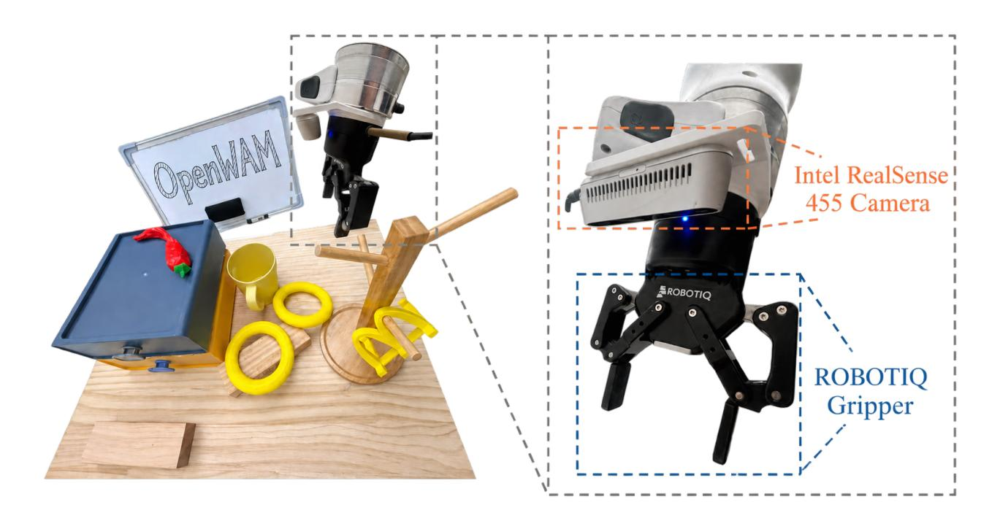

Figure 18은 Franka-Research-3 플랫폼에서 싱글 암 실로봇 설정을 보여준다. 작업 공간에는 여섯 개의 작업에서 사용되는 서랍, 쌓기 물체, 매달린 부착물 등이 포함되며, 로봇은 폐쇄 루프 실행을 위해 Intel RealSense 카메라와 Robotiq 평행 그리퍼를 장착하고 있다.

해당 실행 시퀀스는 [Figure 19,](#page-35-0)에서 시각화되며, 각 행은 작업의 하나의 롤아웃 비디오에서 균일하게 샘플링된 여섯 개의 프레임을 포함한다.

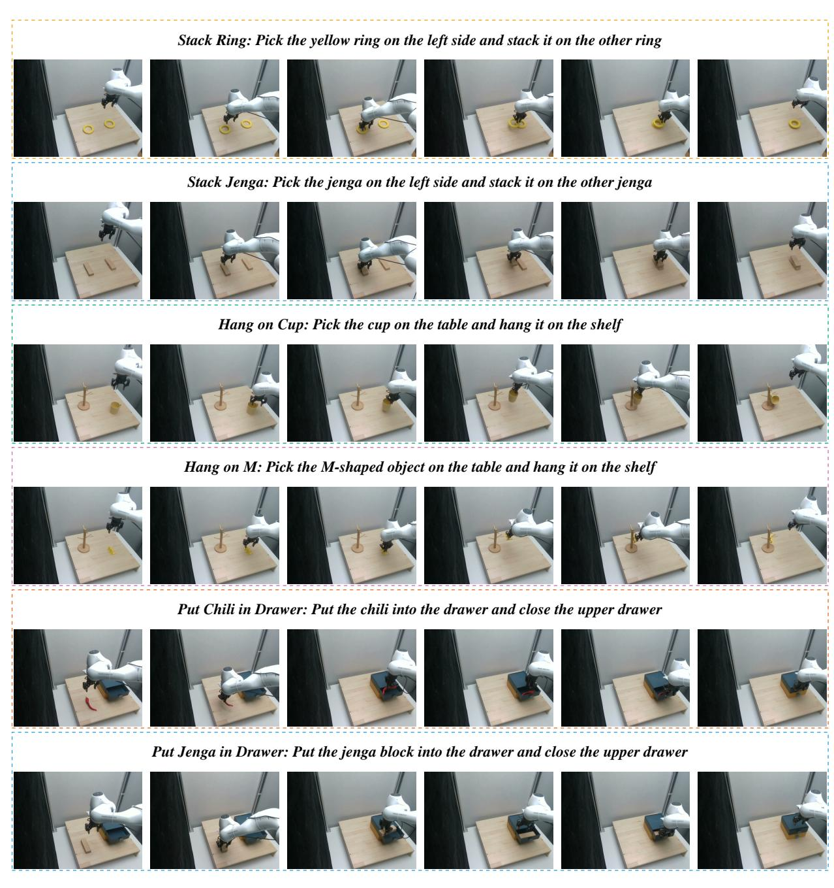

그림 19는 Franka-Research-3 플랫폼에서의 단일 팔 작업 실행 시퀀스를 보여준다. 각 행은 하나의 작업을 나타내며, 해당 좌측 뷰 롤아웃 비디오에서 균일하게 샘플링된 6개의 프레임을 포함한다.

평가 프로토콜. 각 단일 팔 작업에 대해, 우리는 100개의 작업별 실제 로봇 시연으로 정책을 미세 조정한다. 미세 조정 후, 각 작업은 20개의 독립적인 실제 세계 시험에서 평가되며, 성공률은 [Table 6.](#page-24-1)에서 20개 중 성공한 시험 수로 보고한다. 스태킹 시험은 왼쪽 물체가 선택되어 목표 물체 위에 안정적으로 쌓일 때만 성공한다. 행잉 시험은 물체가 선택되어 선반에 매달려 있는 상태를 유지할 때만 성공한다. 드로어 시험은 물체가 서랍 안에 놓이고 상단 서랍이 닫히도록 밀어 넣었을 때만 성공한다.

## C.2 Dexterous-Hand Real-Robot Experiments (Dexterous-Hand Real-Robot 실험)

작업 설정. 우리는 Dexterous-Hand 정책을 네 가지 실제 세계 조작 작업에 대해 평가한다: Stack Toy Tower, Collect Shuttlecocks, Twist off Bottle Cap, 그리고 Put Away Clothes. 각 작업은 원하는 조작 목표를 정의하는 자연어 지시문으로 명시된다. 작업 지시문은 [Table 12.](#page-36-0)에 요약되어 있다.

<span id="page-36-0"></span>Table 12 실세계 평가에 사용된 작업 지시문.

| 작업 | 지시 |
|----------------------|------------------------------------------------------------------------------|
| 장난감 탑 쌓기 | 디스크를 가장 큰 것부터 가장 작은 것 순서대로 탑 기둥에 쌓는다. |
| 셔틀콕 수집 | 모든 셔틀콕을 셔틀콕 튜브에 넣는다. |
| 병뚜껑 돌리기 | 병뚜껑을 돌려서 뺀다. |
| 옷 정리 | 테이블 위 쌓인 옷을 집어들어 바구니에 넣는다. |

모든 실험은 물리적 다재다능 손 플랫폼에서 수행된다. 로봇은 작업 지시를 받고 해당 장면에서 자율적으로 조작을 수행한다. [Figure 20](#page-36-1)은 물리적 로봇, 다재다능 손, 작업 공간, 카메라 시점, 그리고 평가에 사용된 대표 객체를 보여준다.

<span id="page-36-1"></span>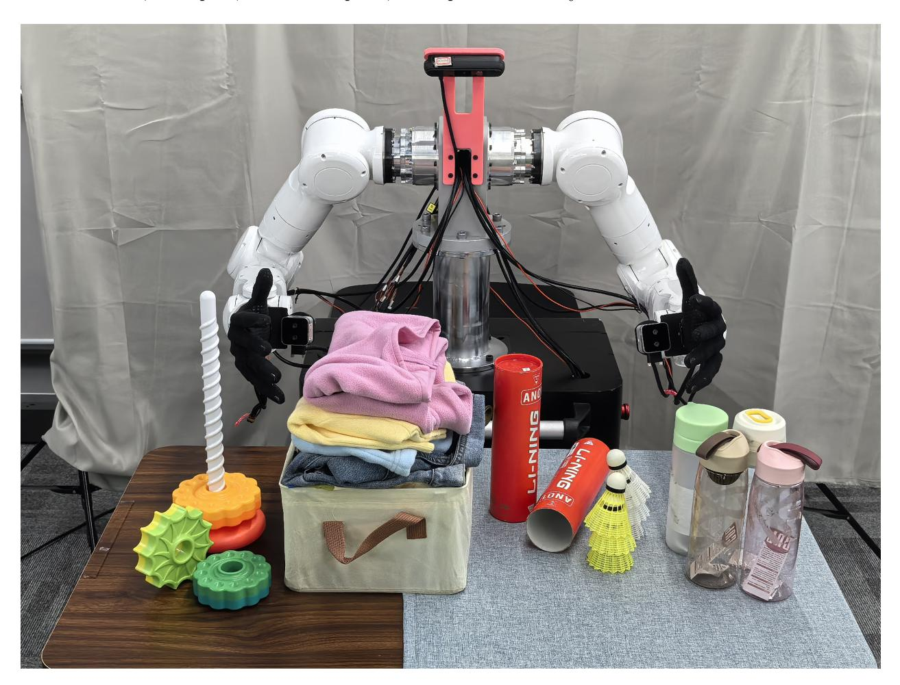

Figure 20 실제 실험 설정. 그림은 물리적 다재다능 손 플랫폼, 작업 공간, 관측 카메라, 그리고 네 가지 조작 과제에 대한 대표 객체를 보여준다.

각 과제마다 우리는 in-distribution (ID) 조건과 여러 out-of-distribution (OOD) 조건에서 정책을 평가한다. OOD 조건은 객체 정체성, 객체 배치, 조명 또는 배경 외관을 한 번에 하나씩 변경하면서 작업 지시와 전체 조작을 보존한다.

<span id="page-37-0"></span>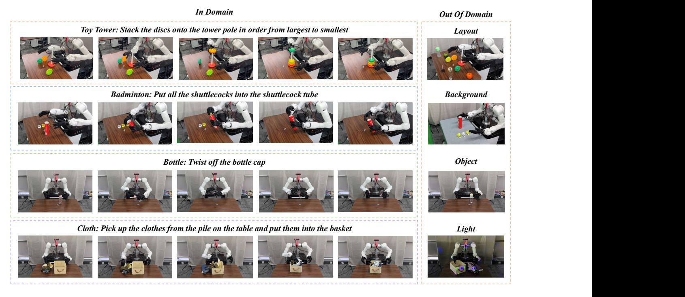

Figure 21 작업 실행 시퀀스 및 평가 조건. 각 행은 한 과제의 주요 조작 단계들을 보여주며, 열은 해당 ID 장면과 OOD 변형을 보여준다. OOD 조건은 객체 정체성, 객체 배치, 조명 및 배경 외관의 변화를 포함한다.

목표. 작업 실행 시퀀스와 해당 ID/OOD 구성이 [Figure 21.](#page-37-0)에 표시된다.

평가 프로토콜. 각 과제는 ID 및 OOD 조건 하에서 여러 독립적인 시도에서 평가된다. 우리는 두 가지 보완적인 지표를 보고한다: 진행 점수 (Score)와 최종 성공률.

최종 성공률. 실험은 전체 작업 목표가 달성될 때만 최종 성공으로 계산된다. 최종 성공률은 다음과 같이 계산된다

$$S_{\rm final} = \frac{N_{\rm success}}{N_{\rm trial}} \times 100\%,$$

여기서 Nsuccess는 전체 작업 기준을 만족하는 시도 수이며, Ntrial은 유효 시도 수의 총합이다.

진행 점수. 진행 점수는 최종 작업 상태가 달성되었는지 여부와 관계없이 성공적으로 완료된 필수 조작 요소의 비율을 측정한다. 시도 i에 대해 n<sup>i</sup>는 성공적으로 완료된 요소 수, m<sup>i</sup>는 해당 시도에 존재하는 요소의 총 수를 나타낸다. 진행 점수는 다음과 같이 계산된다

$$S_{\rm process} = \frac{\sum_i n_i}{\sum_i m_i} \times 100\%.$$

### 작업별 기준 (Task-Specific Criteria)

- 셔틀콕 수집. 각 시도는 테이블 위에 두 개에서 네 개의 셔틀콕을 포함한다. 시도는 모든 셔틀콕이 셔틀콕 튜브에 배치될 때에만 최종 성공으로 계산된다. 진행 점수는 튜브에 성공적으로 배치된 셔틀콕 비율이다.

- 장난감 탑 쌓기. 각 시도는 세 개의 디스크를 포함한다. 시도는 세 개의 디스크가 크기 순으로 탑 기둥에 성공적으로 삽입될 때에만 최종 성공으로 계산된다. 진행 점수는 디스크가 성공적으로 삽입된 비율이다.

- 옷 정리. 각 시도는 세 개에서 네 개의 의류 항목을 포함한다. 시도는 모든 의류 항목이 바구니에 배치될 때에만 최종 성공으로 계산된다. 진행 점수는 바구니에 성공적으로 배치된 의류 항목 비율이다.

- 병뚜껑 풀기. 시도는 병뚜껑이 완전히 풀리고 로봇이 병 또는 병뚜껑을 안정적으로 잡고 있을 때 최종 성공으로 계산된다. 진행 점수는 병뚜껑이 성공적으로 풀렸는지 여부를 기록하며, 최종 안정 잡기가 달성되었는지 여부와는 무관하다.

## C.3 양손 실 로봇 실험 (Bimanual Real-Robot Experiments)

우리는 RoboDojo-Real의 모든 18개 과제를 대상으로 종합적인 평가를 수행한다. 평가는 RoboDojo 팀이 제공한 공식 실로봇 평가 플랫폼을 사용하며, ARX X5, Piper, Piper X의 세 가지 양손형 구현체를 포함한다. 평가는 공식 평가 팀이 정의한 통합 프로토콜을 엄격히 준수한다. 플랫폼 및 과제 사양에 대한 자세한 문서는 RoboDojo 웹사이트(<https://robodojo-benchmark.com/>)와 동반 공식 문서([https://](https://robodojo-benchmark.com/doc/real-tasks/) [robodojo-benchmark.com/doc/real-tasks/](https://robodojo-benchmark.com/doc/real-tasks/))에 제공된다.

## <span id="page-38-0"></span>D 벤치마크별 시뮬레이션 결과

아래 표는 [Figure 13,](#page-20-1)에 요약된 전체 벤치마크별 점수를 보고한다. 단, LIBERO-Plus의 점수는 본문에 이미 [Table 5](#page-21-0)에서 보고되었다. 각 표에서 기준선은 VLA 또는 WAM으로 그룹화된다; 볼드체는 최상값을, 밑줄은 두 번째 최상값을 나타낸다.

Table 13 LIBERO 평가 결과. 볼드체는 최상값을, 밑줄은 두 번째 최상값을 나타낸다.

|  | 공간 | 객체 | 목표 | 긴 | 평균 |  |  |  |  |  |  |
|----------------------------------------------|---------|--------|------|------|------|--|--|--|--|--|--|
|  | VLA |  |  |  |  |  |  |  |  |  |  |
| OpenVLA (Kim et al., 2024) | 84.7 | 88.4 | 79.2 | 53.7 | 76.5 |  |  |  |  |  |  |
| π0<br>(Black et al., 2024) | 98.0 | 96.8 | 94.4 | 88.4 | 94.4 |  |  |  |  |  |  |
| StarVLA (Community, 2026) | 97.8 | 98.6 | 96.2 | 93.8 | 96.6 |  |  |  |  |  |  |
| π0.5<br>(Physical Intelligence et al., 2025) | 98.8 | 98.2 | 98.0 | 92.4 | 96.9 |  |  |  |  |  |  |
| GR00T-N1.6 (NVIDIA et al., 2025) | 97.7 | 98.5 | 97.5 | 94.4 | 97.0 |  |  |  |  |  |  |
| OpenVLA-OFT (Kim et al., 2025) | 97.6 | 98.4 | 97.9 | 94.5 | 97.1 |  |  |  |  |  |  |
| X-VLA (Zheng et al., 2026b) | 98.2 | 98.6 | 97.8 | 97.6 | 98.1 |  |  |  |  |  |  |
| ABot-M0 (Yang et al., 2026b) | 98.8 | 99.8 | 99.0 | 96.6 | 98.6 |  |  |  |  |  |  |
| Being-H0.5 (Luo et al., 2026a) | 99.2 | 99.6 | 99.4 | 97.4 | 98.9 |  |  |  |  |  |  |
| Qwen-RobotManip (Yuan et al., 2026a) | – | – | – | – | 99.2 |  |  |  |  |  |  |
| WAM |  |  |  |  |  |  |  |  |  |  |  |
| Fast-WAM (Yuan et al., 2026b) | 97.0 | 95.2 | 97.6 |  |  |  |  |  |  |  |  |
| Motus (Bi et al., 2026) | 96.8 | 99.8 | 96.6 | 97.6 | 97.7 |  |  |  |  |  |  |
| ImageWAM (Zhang et al., 2026c) | 97.2 | 99.2 | 98.8 | 98.4 | 98.4 |  |  |  |  |  |  |
| LingBot-VA (Li et al., 2026b) | 98.5 | 99.6 | 97.2 | 98.5 | 98.5 |  |  |  |  |  |  |
| DiT4DiT (Ma et al., 2026) | – | – | – | – | 98.6 |  |  |  |  |  |  |
| Being-H0.7 (Luo et al., 2026b) | – | – | – | – | 99.2 |  |  |  |  |  |  |
| ABot-M0.5 (Chen et al., 2026a) | 100.0 | 99.8 | 99.4 | 98.4 | 99.4 |  |  |  |  |  |  |
| OpenWAM-α | 99.6 | 99.6 | 99.8 | 98.2 | 99.3 |  |  |  |  |  |  |

표 14 VLABench 평가 결과. 굵은 글씨는 최상값을, 밑줄은 두 번째 최상값을 나타낸다.

|  | In-dist. |  | 카테고리 |  |  | 일상지식 |  | 지시 |  |  | 텍스처 |  |  | 평균 |  |  |  |  |
|-------------------------------------------------------------------------------------------------------------------------------------|----------|----|-----------|------|----|-------------|------|-------------|-----------|------|---------|-----------|------|-----|-----------|-------------------------------------------------------------------------------------------|----|-----------|
|  | SR | PS | IS | SR | PS | IS | SR | PS | IS | SR | PS | IS | SR | PS | IS | SR | PS | IS |
|  |  |  |  |  |  | VLA |  |  |  |  |  |  |  |  |  |  |  |  |
| π0 (Black et al., 2024) |  |  |  |  |  |  |  |  |  |  |  |  |  |  |  | 47.0 62.7 67.8 21.2 33.6 44.0 29.1 43.0 54.9 17.3 38.7 58.0 32.2 42.5 50.6 29.4 44.1 55.0 |  |  |
| LoHo-Manip (Liu et al., 2026a) | 54.0 | – | – | 23.0 | – | – | 36.0 | – | – | 42.0 | – | – | 39.0 | – | – | 39.0 | – | – |
| ACoT-VLA (Zhong et al., 2026) | – |  | 66.1 79.8 | – |  | 38.9 54.1 | – |  | 37.8 52.3 | – |  | 39.6 56.8 | – |  | 54.6 74.6 | – |  | 47.4 63.5 |
| π0.5 (Physical Intelligence et al., 2025) 65.4 77.8 80.4 38.2 49.7 52.0 43.9 57.3 60.0 48.2 64.2 67.0 44.9 62.3 65.0 48.1 62.3 64.9 |  |  |  |  |  |  |  |  |  |  |  |  |  |  |  |  |  |  |
| ERVLA (Sun et al., 2026) |  |  |  |  |  |  |  |  |  |  |  |  |  |  |  | 69.7 81.1 84.2 47.0 61.0 66.4 44.0 55.0 57.2 58.0 70.2 73.8 47.4 62.3 70.6 53.2 65.9 70.4 |  |  |
| Xiaomi-Robotics-1 (Team et al., 2026b) |  |  |  |  |  |  |  |  |  |  |  |  |  |  |  | 75.6 85.0 79.8 53.0 66.6 66.4 48.4 58.3 58.2 55.8 66.8 70.2 62.6 74.9 74.8 59.1 70.3 69.9 |  |  |
|  |  |  |  |  |  | WAM |  |  |  |  |  |  |  |  |  |  |  |  |
| Bridge-WA (Bai et al., 2026) |  |  |  |  |  |  |  |  |  |  |  |  |  |  |  | 78.0 85.8 85.0 23.0 28.8 39.0 51.1 64.4 74.2 67.0 80.3 82.0 45.0 60.3 76.0 52.8 64.0 71.2 |  |  |
| OpenWAM-α |  |  |  |  |  |  |  |  |  |  |  |  |  |  |  | 83.4 87.9 75.2 38.1 45.9 45.9 58.0 64.8 57.9 53.8 64.5 66.5 61.4 72.9 71.6 58.9 67.2 63.5 |  |  |

표 15 RoboTwin2.0-Clean2Random에 대한 평가 결과. 굵게 표시된 값이 최상값이며, 밑줄은 두 번째 최상값을 나타낸다.

|  | Clean | Randomized | Avg |  |  |  |  |  |  |  |
|----------------------------------------------|-------|------------|------|--|--|--|--|--|--|--|
| VLA |  |  |  |  |  |  |  |  |  |  |
| StarVLA (Community, 2026) | 46.5 | 3.2 | 24.9 |  |  |  |  |  |  |  |
| GR00T-N1.7 (NVIDIA et al., 2025) | 43.6 | 20.7 | 32.2 |  |  |  |  |  |  |  |
| X-VLA (Zheng et al., 2026b) | 68.0 | 20.9 | 44.5 |  |  |  |  |  |  |  |
| Spatial Forcing (Li et al., 2026a) | 77.2 | 26.7 | 52.0 |  |  |  |  |  |  |  |
| ABot-M0 (Yang et al., 2026b) | 70.7 | 36.0 | 53.4 |  |  |  |  |  |  |  |
| π0.5<br>(Physical Intelligence et al., 2025) | 70.7 | 46.0 | 58.4 |  |  |  |  |  |  |  |
| GigaBrain-0.7 (Team et al., 2026a) | 66.8 | 67.9 | 67.4 |  |  |  |  |  |  |  |
| Qwen-RobotManip (Yuan et al., 2026a) | 84.7 | 69.4 | 77.1 |  |  |  |  |  |  |  |
| WAM |  |  |  |  |  |  |  |  |  |  |
| AHA-WAM (Cai et al., 2026b) | 64.3 | 3.2 | 33.8 |  |  |  |  |  |  |  |
| Fast-WAM (Yuan et al., 2026b) | 77.8 | 1.9 | 39.9 |  |  |  |  |  |  |  |
| X-WAM (Guo et al., 2026) | 70.0 | 25.8 | 47.9 |  |  |  |  |  |  |  |
| 4D-WAM (Yang et al., 2026a) | 81.5 | 41.8 | 61.7 |  |  |  |  |  |  |  |
| OpenWAM-α | 89.4 | 48.7 | 69.0 |  |  |  |  |  |  |  |

표 16 RoboTwin2.0-Full에 대한 평가 결과. 굵은 글씨는 최상의 값, 밑줄은 두 번째 최상의 값을 나타낸다.

|  | Clean | Randomized | Avg |  |  |  |  |  |  |  |  |  |
|----------------------------------------------|-------|------------|-------|--|--|--|--|--|--|--|--|--|
| VLA |  |  |  |  |  |  |  |  |  |  |  |  |
| X-VLA (Zheng et al., 2026b) | 72.80 | 72.84 | 72.82 |  |  |  |  |  |  |  |  |  |
| π0.5<br>(Physical Intelligence et al., 2025) | 82.70 | 76.80 | 79.75 |  |  |  |  |  |  |  |  |  |
| ABot-M0 (Yang et al., 2026b) | 86.06 | 85.08 | 85.57 |  |  |  |  |  |  |  |  |  |
| Qwen-VLA (Wang et al., 2026a) | 86.10 | 87.20 | 86.65 |  |  |  |  |  |  |  |  |  |
| StarVLA (Community, 2026) | 88.18 | 88.32 | 88.25 |  |  |  |  |  |  |  |  |  |
| Galaxea G0.5 (Liu et al., 2026b) | 93.70 | 92.80 | 93.25 |  |  |  |  |  |  |  |  |  |
| Qwen-RobotManip (Yuan et al., 2026a) | 93.70 | 94.00 | 93.85 |  |  |  |  |  |  |  |  |  |
| WAM |  |  |  |  |  |  |  |  |  |  |  |  |
| Motus (Bi et al., 2026) | 88.66 | 87.02 | 87.84 |  |  |  |  |  |  |  |  |  |
| Fast-WAM (Yuan et al., 2026b) | 91.90 | 91.80 | 91.85 |  |  |  |  |  |  |  |  |  |
| LingBot-VA (Li et al., 2026b) | 92.93 | 91.55 | 92.24 |  |  |  |  |  |  |  |  |  |
| ImageWAM (Zhang et al., 2026c) | 93.20 | 93.56 | 93.38 |  |  |  |  |  |  |  |  |  |
| LingBot-VA 2.0 (Zhang et al., 2026b) | 93.80 | 93.40 | 93.60 |  |  |  |  |  |  |  |  |  |
| ABot-M0.5 (Chen et al., 2026a) | 94.00 | 94.20 | 94.10 |  |  |  |  |  |  |  |  |  |
| OpenWAM-α | 93.74 | 93.46 | 93.60 |  |  |  |  |  |  |  |  |  |

표 17 RoboDojo에서의 평가 결과. 굵은 글씨는 최상의 값을, 밑줄은 두 번째 최상의 값을 나타낸다.

|  | Gen-Std |  |  | Gen-Rand | 정밀도(Precision) |  | 장기 수평(Long-Horizon) |  | 메모리(Memory) |  | 오픈(Open) |  | 평균(Avg) |  |
|------------------------------------------------------------|---------|------------------|------|----------|-----------|------------------------------------------|-------------------|------------------------------------------|--------|------------|------|-------|------|-------------|
|  | 성공률 | 점수 | SR | 점수 | SR | 점수 | SR | 점수 | SR | 점수 | SR | 점수 | SR | 점수 |
|  |  |  |  | VLA |  |  |  |  |  |  |  |  |  |  |
| StarVLA-α (Ye et al., 2026b) | 5.00 | 7.54 | 0.00 | 0.33 | 4.33 | 9.90 | 6.50 | 14.15 | 2.44 | 3.34 | 0.58 | 0.68 | 3.24 | 6.40 |
| X-VLA (Zheng et al., 2026b) |  | 12.00 17.90 1.00 |  | 3.04 |  | 12.00 18.32 | 9.75 | 16.53 | 3.56 | 4.76 | 0.50 | 0.55 | 6.52 | 10.13 |
| π0.5 (Physical Intelligence et al., 2025) |  | 15.00 20.93 1.00 |  | 5.82 | 5.50 |  | 12.40 14.67 23.54 |  | 4.56 | 5.78 | 1.67 | 1.98 | 6.91 | 11.41 |
| Spatial Forcing (Li et al., 2026a) |  | 15.00 21.25 4.00 |  | 6.98 |  | 10.58 17.33 14.58 23.26 |  |  | 4.11 | 5.43 | 1.58 | 1.78 | 8.04 | 12.38 |
| Hy-Embodied-0.5-VLA (Zhang et al., 2026a) 17.00 21.98 0.00 |  |  |  | 1.57 | 8.00 |  |  | 13.81 14.92 25.74 12.11 13.37 0.58 |  |  |  | 0.65 | 8.80 | 13.07 |
| Xiaomi-Robotics-1 (Team et al., 2026b) |  | 28.00 35.65 6.00 |  |  |  | 11.44 18.83 26.69 23.67 38.39 |  |  | 6.56 | 7.81 | 3.58 | 3.94 |  | 13.93 20.07 |
| Galaxea G0.5 (Liu et al., 2026b) |  |  |  |  |  | 20.00 26.74 6.00 11.16 20.42 28.25 32.25 |  | 44.12 | 7.33 | 8.61 | 1.58 | 1.73 |  | 14.88 20.23 |
| DM0.5 (Dexmal, 2026) |  | 18.00 23.49 4.00 |  | 8.06 |  |  |  | 16.75 24.82 19.50 33.70 47.44 47.74 2.08 |  |  |  | 2.43 |  | 19.34 24.90 |
|  |  |  |  | WAM |  |  |  |  |  |  |  |  |  |  |
| Fast-WAM (Yuan et al., 2026b) | 2.00 | 4.33 | 0.00 | 0.34 | 0.00 | 1.96 | 5.17 | 9.14 | 3.44 | 3.55 | 0.42 | 0.42 | 2.03 | 3.48 |
| AHA-WAM (Cai et al., 2026b) | 6.00 | 10.32 0.00 |  | 1.26 | 2.42 | 5.86 | 2.67 | 8.61 | 2.78 | 2.97 | 0.83 | 0.88 | 2.39 | 4.82 |
| GigaWorld-Policy (Ye et al., 2026a) | 6.00 | 10.28 0.00 |  | 0.41 | 1.83 | 6.15 | 8.92 | 15.51 | 2.22 | 3.46 | 0.50 | 0.54 | 3.27 | 6.20 |
| X-WAM (Guo et al., 2026) | 5.00 | 11.24 1.00 |  | 3.54 | 1.83 | 6.72 | 9.08 | 17.47 | 4.67 | 6.32 | 0.25 | 0.57 | 3.83 | 7.69 |
| OpenWAM-α |  | 25.56 33.16 4.11 |  | 8.26 | 9.25 |  | 18.45 25.33 34.93 |  | 9.11 | 10.41 1.08 |  | 1.41 |  | 11.92 17.18 |

표 18 EBench 평가 결과. 굵은 글씨는 최상값을, 밑줄은 두 번째 최상값을 나타낸다.

|  | 테이블 탑 |  | 단순 PnP |  | 장기 수평 |  | 전체 |  |  |
|----------------------------------------------|-----------|-------|------------|-------|--------------|-------|---------|-------|--|
|  | SR | 점수 | SR | 점수 | SR | 점수 | SR | 점수 |  |
| VLA |  |  |  |  |  |  |  |  |  |
| StarVLA-OFT (Community, 2026) | – | – | – | – | – | – | 0.0 | 0.2 |  |
| π0<br>(Black et al., 2024) | 15.7 | 30.0 | 35.0 | 39.0 | 17.0 | 41.0 | 23.6 | 37.0 |  |
| X-VLA (Zheng et al., 2026b) | 8.6 | 24.0 | 50.0 | 54.0 | 6.2 | 25.0 | 23.7 | 36.0 |  |
| InternVLA-A1 (Cai et al., 2026a) | 4.3 | 11.0 | 43.0 | 47.0 | 17.9 | 46.0 | 23.9 | 36.0 |  |
| π0.5<br>(Physical Intelligence et al., 2025) | 12.9 | 32.0 | 45.0 | 50.0 | 18.1 | 39.0 | 27.1 | 41.0 |  |
| GigaBrain-0.7 (Team et al., 2026a) | – | – | – | – | – | – | 33.3 | 46.0 |  |
| Qwen-RobotManip (Yuan et al., 2026a) | 50.0 | 70.0 | 56.5 | 60.0 | 29.9 | 55.0 | 45.6 | 60.0 |  |
| WAM |  |  |  |  |  |  |  |  |  |
| Fast-WAM (Yuan et al., 2026b) | – | – | – | – | – | – | 4.7 | 7.6 |  |
| OpenWAM-α | 30.0 | 44.2 | 67.5 | 72.0 | 44.3 | 72.6 | 49.4 | 64.7 |  |

표 19 RoboCasa365에서의 평가 결과. 굵은 글씨는 최상의 값을, 밑줄은 두 번째 최상의 값을 나타낸다.

|  | Atomic | CompSeen | CompUnseen | Avg |
|----------------------------------------------|--------|----------|------------|------|
|  | VLA |  |  |  |
| Diffusion Policy (Chi et al., 2025) | 15.7 | 0.2 | 1.3 | 6.1 |
| π0<br>(Black et al., 2024) | 36.3 | 5.2 | 0.7 | 15.0 |
| π0.5<br>(Physical Intelligence et al., 2025) | 39.6 | 7.1 | 1.2 | 16.9 |
| GR00T-N1.5 (NVIDIA et al., 2025) | 50.7 | 14.8 | 2.7 | 23.9 |
| Qwen-RobotManip (Yuan et al., 2026a) | 68.6 | 20.1 | 14.9 | 35.9 |
| RLDX-1 (Kim et al., 2026a) | 67.6 | 27.9 | 8.5 | 36.0 |
| Xiaomi-Robotics-1 (Team et al., 2026b) | 80.2 | 57.1 | 32.1 | 57.4 |
|  | WAM |  |  |  |
| GigaWorld-Policy (Ye et al., 2026a) | 44.4 | 11.8 | 2.9 | 20.7 |
| ABot-M0.5 (Chen et al., 2026a) | 75.9 | 38.3 | 2.7 | 40.4 |
| OpenWAM-α | 69.7 | 32.1 | 8.9 | 38.2 |

표 20 RoboCasa-GR1에 대한 평가 결과. 굵은 글씨는 최상값을, 밑줄은 두 번째 최상값을 나타낸다.

|  | SR (%) |  |  |  |  |
|----------------------------------------------|--------|--|--|--|--|
| VLA |  |  |  |  |  |
| π0<br>(Black et al., 2024) | 13.6 |  |  |  |  |
| π0.5<br>(Physical Intelligence et al., 2025) | 37.0 |  |  |  |  |
| GR00T-N1.5 (NVIDIA et al., 2025) | 48.0 |  |  |  |  |
| StarVLA (Community, 2026) | 48.8 |  |  |  |  |
| GR00T-N1.6 (NVIDIA et al., 2025) | 49.9 |  |  |  |  |
| VP-VLA (Wang et al., 2026c) | 53.8 |  |  |  |  |
| Being-H0.5 (Luo et al., 2026a) | 53.9 |  |  |  |  |
| Qwen-VLA-Instruct (Wang et al., 2026a) | 56.7 |  |  |  |  |
| RLDX-1 (Kim et al., 2026a) | 58.7 |  |  |  |  |
| PhysBrain 1.0 (Lin et al., 2026b) | 64.5 |  |  |  |  |
| WAM |  |  |  |  |  |
| UWM (Zhu et al., 2025) | 20.0 |  |  |  |  |
| Being-H0.7 (Luo et al., 2026b) | 49.2 |  |  |  |  |
| DiT4DiT (Ma et al., 2026) | 50.8 |  |  |  |  |
| LDA-1B (Lyu et al., 2026) | 55.4 |  |  |  |  |
| OpenWAM-α | 60.5 |  |  |  |  |

