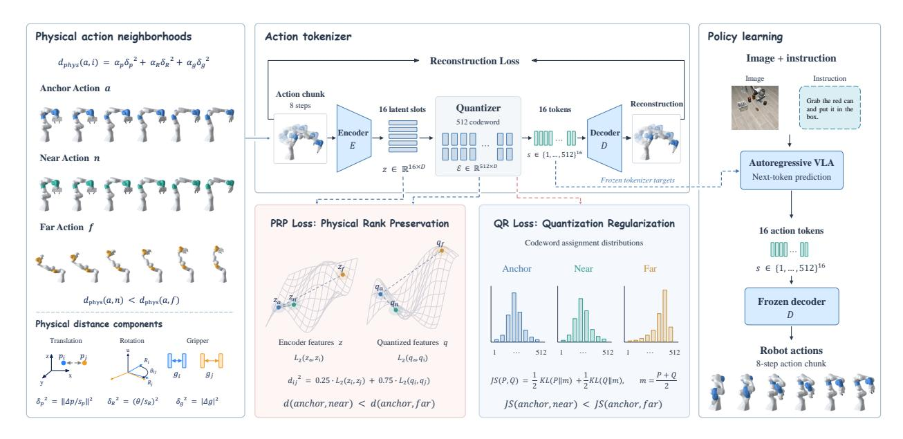
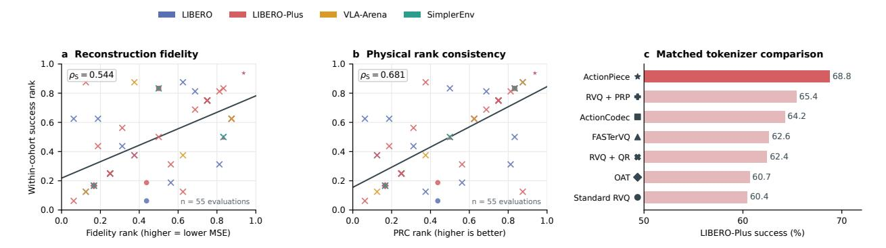

# ActionPiece: Rethinking Action Tokenization for Autoregressive Vision-Language-Action Models

- 원제: ActionPiece: Rethinking Action Tokenization for Autoregressive Vision-Language-Action Models
- 원문: [https://arxiv.org/abs/2609.18487](https://arxiv.org/abs/2609.18487)
- PDF: [https://arxiv.org/pdf/2609.18487](https://arxiv.org/pdf/2609.18487)
- arXiv ID: `2609.18487`

---

# ActionPiece: 자기회귀 Vision-Language-Action 모델을 위한 액션 토크나이징 재고 (ActionPiece: Rethinking Action Tokenization for Autoregressive Vision-Language-Action Models)

Shijie Lian $^{1,\,2,\,3}$ , Bin Yu $^{4,\,2,\,3}$ , Zhaolong Shen $^{5,\,2,\,3}$ , Xiaopeng Lin $^{6,\,3}$ , Yichao Du $^3$ , Zhirui Zhang $^{3,\,\ddagger}$ , Laurence T. Yang $^{1,\,7,\,\dagger}$ , Kai Chen $^{8,\,3,\,\dagger}$

중국과학기술대학교, 중구안춘 학원, DeepCybo, 하얼빈공과대학교, 베이항대학교, 홍콩과학기술대학교(광저우), 정저우대학교, 중구안춘 인공지능 연구소

#### **초록** (Abstract)

액션 토크나이저는 Autoregressive Vision-Language-Action (VLA) 모델에서 핵심적인 역할을 하며, 정책 학습을 위한 목표와 예측된 토큰에서 복원된 실행 가능한 명령을 모두 결정한다. 그 신뢰성은 일반적으로 평균제곱오차(MSE)와 같은 점별 재구성 지표를 사용해 평가되지만, 개별 작은 오류만으로는 시연 간에 액션 조정이 얼마나 충실히 보존되는지를 완전히 파악할 수 없다. 압축 후에도 유사한 액션은 대표 동작 주위에 군집화될 수 있지만, 다른 상황에 필요한 조정은 감소하거나 왜곡되거나 심지어 반전될 수 있다. 우리는 재구성 후 토크나이징이 지역 물리적 거리 순위를 얼마나 잘 보존하는지를 측정하기 위해 물리적 순위 일관성(Physical Rank Consistency, PRC)을 도입한다. 디코드된 액션을 평가함으로써 토큰 어휘와 디코더 아키텍처를 가리지 않는 공통 기준을 제공하며, 점별 정확도와 관계적 충실도를 보완한다. 또한 우리는 표현 학습과 양자화를 공동 감독하여 물리적 액션 관계를 보존하는 ActionPiece를 제시한다. 물리적 순위 보존은 인코더와 양자화된 특징 거리에서 근접-원거리 순서를 감독하고, 양자화 정규화는 동일한 순서를 코드워드 할당 분포에 적용한다. 두 목표는 재구성을 강화하여 표준 Autoregressive 정책 학습과 고정 디코더를 통한 실행을 위한 이산 액션 토큰을 생성한다. 동일한 Qwen3-VL-4B 정책 학습 설정에서 ActionPiece는 LIBERO에서 94.8%, 보이지 않는 LIBERO-Plus에서 68.8%를 달성하며, 추가 평가에서는 SimplerEnv에서 71.9%, VLA-Arena L0-L2에서 51.5%에 이른다. 구성 요소 제거 실험은 두 목표가 PRC와 정책 성공을 공동으로 향상시켜 액션 토크나이징에 물리적 관계 감독의 가치를 입증한다.

Project Page: https://deepcybo-physai.github.io/ActionPiece/

## 1 서론 (Introduction)

Autoregressive vision-language-action (VLA) 모델은 실행 가능한 로봇 명령으로 디코드되는 이산 토큰을 생성한다 [5, 15, 31]. 액션 토크나이저는 연속 시연을 이산 예측 과정에 연결하며, 정책 학습에 사용되는 목표와 예측 토큰에서 복원된 명령을 모두 결정한다. 기존 접근법은 좌표 이산화, 주파수 도메인 압축, 또는 학습된 벡터 양자화를 통해 이 인터페이스를 구축한다 [8, 15, 23, 24, 27, 31]. 이러한 설계는 컴팩트한 액션 생성을 가능하게 하지만, 압축은 로봇이 최종적으로 실행하는 액션을 변경한다. 따라서 중요한 질문은 액션 토크나이저가 정밀 제어를 지원하기 위해 무엇을 보존해야 하는가이다.

&lt;sup>‡프로젝트 리더.

$^\dagger \mbox{응답 저자}.$

DeepCybo 인턴십 중 수행된 작업.

액션 생성은 가능하지만, 압축은 로봇이 최종적으로 실행하는 액션을 변경한다. 따라서 중요한 질문은 액션 토크나이저가 정밀 제어를 지원하기 위해 무엇을 보존해야 하는가이다.

같은 작업의 여러 시연에서, 물체 위치, 로봇 상태, 실행 단계에 대한 조정과 함께 유사한 동작이 반복된다. 이러한 조정은 유사한 동작이 서로 다른 상황에 적응하도록 허용한다. 정밀한 정렬, 그립, 접촉이 필요한 작업에서는 작은 동작 차이조차 실행 결과에 영향을 미칠 수 있다. 토크나이저는 이러한 시연을 유한한 용량을 가진 이산 표현으로 압축하고, 이를 통해 실행 가능한 명령을 재구성한다. 평균제곱오차와 같은 재구성 목표는 개별 동작을 원본에 가깝게 유지하지만, 시연 간 재구성 오차를 명시적으로 조정하지 않는다. 따라서 작은 개별 재구성 오차는 시연 간 조정이 얼마나 충실히 보존되는지를 완전히 설명하지 못한다. 압축 후에는 유사한 동작이 대표 동작 주변에 군집화될 수 있지만, 서로 다른 상황에 적응하기 위해 필요한 조정은 왜곡되거나 감소하거나 심지어 반전될 수 있다. 이러한 변화는 정책이 해당 토큰 시퀀스를 정확히 예측하더라도 지속된다: 디코더는 여전히 재구성된 동작을 실행한다.

이러한 점은 점별 재구성 정확도와 함께 관계적 충실도를 연구하도록 동기를 부여한다. 우리는 변위, 회전, 그립 상태를 결합한 물리적 거리를 사용해 동작 차이를 특성화하고, 그 상대적 크기가 토큰화 과정을 견디는지 여부를 검토한다. 이 특성을 측정하기 위해 물리적 순위 일관성을 도입한다. 각 동작 청크에 대해 PRC는 재구성 전후 동일한 원본 이웃에 대한 거리 순위를 비교한다. 디코딩된 동작 공간에서 이러한 순위를 계산하면 토큰 어휘, 시퀀스 길이, 디코더 아키텍처를 초월한 공통 물리적 기준을 제공한다. 재구성 정확도와 PRC는 토크나이저가 개별 명령을 얼마나 충실히 재현하고, 그들 사이의 지역적 관계를 얼마나 보존하는지를 설명한다.

이러한 관계를 토큰화 과정에서 보존하기 위해 ActionPiece를 개발한다. 원본 동작 청크 간의 물리적 거리는 표현 학습과 코드워드 할당 모두에 대해 근거리–원거리 감독을 제공한다. 물리적 순위 보존(Physical Rank Preservation, PRP)은 인코더와 양자화된 특징 거리의 조합에서 해당 순서를 장려한다. 양자화 정규화(Quantization Regularization, QR)는 이 순서를 코드워드 할당 분포 간의 편차에 적용하여 동작이 이산 어휘에 할당되는 방식을 감독한다. 이들 목표는 압축의 두 단계, 즉 동작 특징 학습과 이를 코드워드에 매핑하는 과정을 동시에 다룬다. 이들은 잔차 벡터 양자화를 갖는 Transformer 토크나이저에서 재구성과 함께 공동 최적화된다. 토크나이저 학습 후, 고정된 인코더와 양자화기는 이산 정책 목표를 제공하고, 고정된 디코더는 자기회귀적으로 예측된 토큰을 실행 가능한 동작 청크로 변환한다.

공유 Qwen3-VL-4B 정책 학습 설정에서 ActionPiece는 비교된 모든 동작 토크나이저를 능가하며, LIBERO에서 94.8%의 성공률, 보이지 않는 LIBERO-Plus에서 68.8%를 달성해 각 벤치마크에서 가장 강력한 기준보다 1.1점과 4.5점을 각각 초과한다 (Table [1)](#page-7-0)). SimplerEnv와 VLA-Arena에서의 평가는 실제-시뮬레이션 전이 및 도전적인 제어 조건으로 비교를 확장하며, ActionPiece는 평가된 방법 중에서 각각 71.9%와 51.5%의 최첨단 집계 성공률을 기록한다. 이 결과는 ActionPiece를 동작 토크나이저로 사용한 표준 다음 토큰 예측을 통해 얻어졌다. 제어된 ablation 실험은 PRP와 QR이 디코딩된 물리적 순위 일관성과 다운스트림 정책 성공을 동시에 개선함을 보여준다. 토크나이저 간 비교는 재구성 충실도, PRC, 실행 성능 간의 관계를 추가로 조사한다 (Figure [2)](#page-6-0)).

우리의 기여는 세 가지로 나뉜다:

- PRC를 도입한다. PRC는 재구성 정확도를 보완하고 액션 토크나이저 간 비교를 지원하는 지역 물리적 거리-순서 보존 측정치이다.
- ActionPiece를 개발한다. ActionPiece는 학습된 특징과 코드워드 할당 분포에서 물리적 관계를 공동 감독하여 자기회귀 VLA 정책을 위한 이산 액션 표현을 구성한다.
- ActionPiece를 네 개의 벤치마크에서 평가하고, 물리적 관계 감독이 표현 품질과 로봇 실행에 미치는 영향을 조사하기 위해 통제된 비교 및 절제(ablation)를 수행한다.

## 2 Related Work (Related Work)

### 2.1 Action-Space Design in Robotic Foundation Models (Action-Space Design in Robotic Foundation Models)

로봇 기반 모델은 사전 학습된 시각-언어 표현을 이산, 연속, 또는 하이브리드 액션 인터페이스를 통해 모터 명령으로 연결한다. 이산 자기회귀 접근법은 제어를 다음 토큰 예측으로 간주한다: RT-2와 OpenVLA는 액션 좌표를 비( bins)로 이산화한다 [5], [15], 반면 FAST는 액션 청크를 더 짧은 토큰 시퀀스로 압축한다 [31]. VLM2VLA는 대신 VLM의 기존 자연어 어휘를 사용해 명령을 표현한다 [11]. 이러한 인터페이스는 사전 학습된 VLM의 토큰 예측 목표를 유지하며, 언어 기반화와 의미 지식을 로봇 제어에 직접 전이할 수 있는 경로를 제공한다.

연속 접근법은 범주형 디코딩 없이 실수값 액션 청크를 예측한다. OpenVLA-OFT는 ℓ1 회귀 목표를 가진 병렬 액션 예측을 사용한다 [16]; RDT, π0, GR00T 계열을 포함한 확산 및 흐름 매칭 정책은 연속 액션 분포를 모델링한다 [4], [26], [29], [35]. 연속 헤드는 세밀한 제어를 지원하며, 생성 헤드는 모든 액션 토큰을 자기회귀적으로 디코딩하지 않고 액션 청크를 생성하면서 여러 유효한 동작을 표현할 수 있다.

하이브리드 설계는 이산 감독과 연속 실행을 결합한다. π0.5는 사전 훈련 시 액션 토큰을 사용하고 사후 훈련 시 흐름 매칭 액션 전문가를 도입한다 [12]. Knowledge Insulation은 백본을 이산 액션 목표로 훈련하면서 연속 전문가의 기울기를 차단해 사전 학습된 지식을 효율적인 실행과 함께 보존한다 [9]. HybridVLA는 자기회귀와 확산 예측을 공동 훈련하고 적응적으로 결합한다 [25]; Fast-in-Slow는 자기회귀 감독을 빠른 확산 기반 실행 모듈과 결합한다 [6]. 이러한 설계는 토큰 예측의 의미적 이점을 반응형 연속 제어와 결합하려 한다.

### **2.2 행동 이산화 및 토큰화 (Action Discretization and Tokenization)**

좌표별 비닝은 RT-2와 OpenVLA와 같이 단순한 액션 어휘를 제공하지만 각 좌표와 시간 단계를 별도로 표현한다 [5], [15]. FAST는 액션 청크에 이산 코사인 변환을 적용하고 계수를 양자화한 뒤, 결과 시퀀스를 압축하기 위해 바이트-페어 인코딩(BPE)을 학습한다 [31]. 그 주파수 기초는 고정되어 있고, BPE 어휘는 액션 데이터에서 학습된다.

우리는 학습된 잠재 토크나이저가 양자화된 표현을 중심으로 인코더와 디코더를 최적화한다. 벡터 양자화 접근법은 행동 데이터에서 코드북을 학습하며, FASTer는 잔여 벡터 양자화(RVQ), 구조화된 행동 패칭, 시계열 및 스펙트럼 재구성, 블록별 자기회귀 생성을 결합한다 [27](#page-11-3). OAT는 중첩 드롭아웃과 인과주의 주의를 사용한 유한 스칼라 양자화를 통해 거친-세밀한 순서로 압축되고 완전히 디코드 가능한 토큰을 얻는다 [23,](#page-11-1) [24](#page-11-2). ActionCodec는 VLA 최적화 관점에서 중첩, 토큰 예산, 시각–언어 정렬, 잔여 문법을 연구한다 [8](#page-10-1). X-Tokenizer는 동결된 시각–언어 교사로부터 의미적 감독을 추가한다 [14](#page-11-8). 이러한 방법들은 압축, 토큰 순서 지정, 다중 모달 정렬을 통해 행동 인터페이스를 개발한다. ActionPiece는 인코딩 및 양자화 과정에서 명시적 물리 순서 감독을 도입하고, 디코드된 행동 공간에서 이웃 순서 보존을 측정하기 위해 PRC를 사용한다.

## **3 Action Tokenization의 물리 구조 (Physical Structure in Action Tokenization)**

### **3.1 Action Variations 보존 (Preserving Action Variations)**

같은 작업의 시연은 물체 위치, 로봇 상태, 실행 단계에 대한 조정이 포함된 반복 동작을 포함한다. 이러한 조정은 유사한 동작이 서로 다른 상황에 적응하도록 허용한다. 정밀 정렬, 그립핑, 접촉이 필요한 작업에서는 작은 행동 차이조차 실행 결과에 영향을 미칠 수 있다.

행동 토크나이저는 연속적인 행동 청크를 유한한 표현 용량을 가진 이산 토큰 시퀀스로 압축한 뒤, 이를 실행 가능한 명령으로 디코드한다. 이 손실 압축은 재구성 오류를 도입한다. 토크나이저는 일반적으로 재구성된 행동을 원본에 가깝게 유지하기 위해 MSE 목표로 훈련되지만, 이 목표는 행동 간 방향을 명시적으로 조정하지 않고 개별 재구성 오류를 벌한다. 두 시연 청크의 정규화된 유클리드 성분 xi, xj와 재구성 오류 ei = xbi − xi 를 고려하자. 그들의 재구성 차이는 다음과 같다

$$\widehat{x}_j - \widehat{x}_i = (x_j - x_i) + (e_j - e_i). \tag{1}$$

첫 번째 항은 시연에 존재하는 행동 변동이며, 두 번째 항은 토크나이징에 의해 도입된 변화이다. 이 추가 항은 원래 차이를 약화시키거나 증폭시키거나 심지어 방향을 반전시킬 수 있다. 작은 개별 재구성 오류는 시연 간 조정이 얼마나 충실히 보존되는지를 완전히 설명하지 못한다. 압축 후 유사한 행동은 여전히 대표 동작 주변에 군집화될 수 있지만, 원래의 근접-원거리 순서는 변형된다.

이러한 왜곡은 정책 실행에 그대로 전달된다. VLA가 시연된 행동을 인코딩한 토큰 시퀀스를 정확히 예측하더라도 디코더는 여전히 재구성된 버전을 생성한다. 압축이 서로 다른 상황에서 요구되는 조정을 약화하거나 왜곡한다면, 올바른 토큰 예측은 원래의 조정을 복구할 수 없다. 따라서 행동 토크나이징은 개별 행동의 정확한 재구성과 함께 시연 간 물리적 구분을 보존해야 한다.

### 3.2 물리 순위 일관성 (Physical Rank Consistency)

우리는 행동 청크 간 물리적 거리에 대한 상대적 순서를 통해 관계 보존을 평가한다. 우리의 거리 $d_{\text{phys}}$는 번역, SO(3)에서 가장 짧은 측지 회전, 그리고 청크 전역의 그리퍼 차이를 결합한 것으로, 4.2절에 정의되어 있다. 각 기준점 $A_i$에 대해, $\mathcal{N}_i^k$를 원본 행동 공간에서 그 k개의 가장 가까운 이웃으로 두고, $\widehat{A}_i = \mathcal{D}(\mathcal{T}(A_i))$라 하자. 물리 순위 일관성은 재구성 전후 동일한 이웃에 대한 거리를 비교한다:

$$PRC@k = \frac{1}{N} \sum_{i=1}^{N} \rho_{S} \left( [d_{phys}(A_i, A_j)]_{j \in \mathcal{N}_i^k}, [d_{phys}(\widehat{A}_i, \widehat{A}_j)]_{j \in \mathcal{N}_i^k} \right), \tag{2}$$

여기서 $\rho_{\rm S}$는 Spearman 상관계수를 나타낸다. k=32를 사용한다.

높은 PRC는 원래 이웃 내에서 거리 순서가 더 잘 보존되었음을 나타낸다. 순위 비교는 모든 거리가 수치적으로 동일할 필요 없이 행동 차이의 상대적 크기를 포착한다. 디코딩된 액션 공간에서의 평가는 토큰 어휘, 시퀀스 길이, 디코더 아키텍처에 걸쳐 공통적인 물리적 기준을 제공한다. MSE는 개별 재구성의 충실도를 측정하고, PRC는 물리적 거리 순서 보존을 측정한다. Figure 2는 다운스트림 정책 성공과 관련하여 두 특성을 검토한다. 이 관점에 따라 ActionPiece는 표현 학습과 코드워드 할당에 물리적 순서 감독을 도입하여 행동 관계를 포인트별 재구성과 함께 보존한다.

## 4 액션피스 (ActionPiece)

ActionPiece는 Section 3을 따라 인코딩과 양자화를 공동 감독함으로써 재구성 정확도와 함께 물리적 액션 관계를 보존한다. 잔차 벡터 양자화를 갖는 얕은 Transformer 인코더와 디코더가 코덱을 제공한다. 물리적 순위 보존은 학습된 액션 표현을 구조화하고, 양자화 정규화는 동일한 순서를 코드워드 할당에 전달한다. 두 가지 모두 토크나이저 훈련 중 재구성을 강화한다. 결과적으로 생성된 어휘는 표준 자기회귀 정책 학습의 목표를 제공한다. Figure 1은 토크나이저 훈련 목표와 그에 따른 정책 학습 및 실행 파이프라인을 요약한다.

### 4.1 컴팩트하고 완전 디코더 가능한 토큰 (Compact, Fully Decodable Tokens)

액션 청크 $A = (a_1, \ldots, a_H) \in \mathbb{R}^{H \times D}$ 에 대해 인코더 $E_{\phi}$는 S개의 잠재 슬롯을 생성한다. 깊이 Q와 코드북당 K개의 항목을 갖는 RVQ는 슬롯 s를 다음과 같이 표현한다

$$q_s = \sum_{r=1}^{Q} e^{(r)}[z_s^{(r)}], \qquad Z = \{z_s^{(r)}\}_{s=1,r=1}^{S,Q}, \qquad |Z| = SQ = T.$$

(3)

디코더는 한 번의 패스에서 전체 청크를 재구성한다, $\widehat{A} = D_{\omega}(q)$ . 여기서 T는 VLA가 생성하는 범주형 출력의 수이며, Q는 잠재 슬롯과 잔차 수준 사이에서 예산이 어떻게 분배되는지를 제어한다. 모든 코드 시퀀스는 완전한 액션 청크에 매핑된다.

Figure 1 ActionPiece 개요. 물리적 액션 거리(Section 4.2에서 정의)는 정규화된 변위, SO(3)에서의 최단 경로 회전, 그리고 그리퍼 차이를 결합하여 훈련 배치 내에서 앵커, 근접, 원격 액션 청크를 선택한다. 토크나이저는 각 8단계 청크를 16개의 이산 토큰으로 압축하고 실행 가능한 액션을 재구성한다. 재구성과 함께 물리적 순위 보존(PRP, Section 4.3에서 정의)은 인코더와 양자화된 특징 거리에서 근접–원격 순서를 장려하며, 양자화 정규화(QR, Section 4.4에서 정의)는 코드워드 할당 분포 간의 Jensen–Shannon 발산에서 동일한 순서를 장려한다. 여기서 $L_2$는 정규화된 특징 간의 슬롯 평균 제곱 거리를 나타낸다.

### 4.2 물리적 액션 거리 (Physical Action Distance)

두 엔드 이펙터 명령 a = (p, R, g)와 a' = (p', R', g')에 대해, 우리는 SO(3)에서 최단 측지각을 사용하여 회전 거리를 측정한다:

$$d_{SO(3)}(R, R') = \| \text{Log}(R^{\top} R')^{\vee} \|_{2},$$

(4)

여기서 $\text{Log}(\cdot)^{\vee}$는 주행 행렬 로그의 회전 벡터 형태이다. 단계별 물리적 거리는 변위, 회전, 그리고 그리퍼 상태를 결합한다:

$$\delta_{\text{phys}}(a, a') = \alpha_p \left\| \frac{p - p'}{s_p} \right\|_2^2 + \alpha_R \left( \frac{d_{\text{SO(3)}}(R, R')}{s_R} \right)^2 + \alpha_g |g - g'|^2.$$

(5)

스케일은 훈련 액션에 맞춰 조정되며, 그룹 가중치는 구현 내에서 고정된다. 액션 청크에 대해 $d_{\text{phys}}$는 해당 시간 단계에 걸친 각 단계 거리의 평균을 취한다. 회전은 거리를 계산하기 전에 SO(3)의 유효한 원소로 매핑된다. 이 거리는 두 훈련 목표와 PRC가 디코드된 액션 공간에서 사용하는 근접-원거리 순서를 정의한다.

### 4.3 물리적 순위 보존 (Physical Rank Preservation)

물리적 순위 보존은 학습된 액션 표현의 상대 거리를 물리적 움직임의 거리와 일치시킨다. 우리는 양자화 전후의 표현 거리를 측정한다. $\bar{h}_{i,s}$를 슬롯 s에서 액션 청크 $A_i$의 인코더 표현으로 두고, $\bar{e}_{i,s}$를 양자화기 출력 이후 선택된 코드워드로 둔다.

projection. 두 표현은 Layer Norm과 단위 $\ell_2$ 정규화를 거쳐 정규화된다. 이들의 거리는

$$d_{\text{enc}}^{2}(i,j) = \frac{1}{S} \sum_{s=1}^{S} \|\bar{h}_{i,s} - \bar{h}_{j,s}\|_{2}^{2},$$

$$d_{\text{quant}}^{2}(i,j) = \frac{1}{S} \sum_{s=1}^{S} \|\bar{e}_{i,s} - \bar{e}_{j,s}\|_{2}^{2}.$$

(6)

우리는 가중치가 부여된 표현 거리를 사용한다.

$$d_{\text{rep}}^2(i,j) = 0.25 d_{\text{enc}}^2(i,j) + 0.75 d_{\text{quant}}^2(i,j), \qquad D_{ij} = \sqrt{d_{\text{rep}}^2(i,j)}.$$

(7)

이 거리는 인코더 특징과 디코더에서 사용되는 이산 표현을 모두 포함한다. 미분 가능한 코드워드 추정기는 코드 선택을 통해 기울기를 전달한다; Appendix B.1은 추정기를 명시하고, Appendix B.2는 다중 양자화 수준을 다룬다.

각 앵커 액션 청크 $A_i$에 대해, 앵커 자체를 제외하고 훈련 배치에서 나머지 액션 청크를 물리적 거리 기준으로 순위 매긴다. 우리는 5번째 백분위수 $(q_{0.05})$에서 양성(근접) 액션 $A_{j_i^+}$를, 95번째 백분위수 $(q_{0.95})$에서 음성(원거리) 액션 $A_{j_i^-}$를 선택한다. 순위 목표는

$$\mathcal{L}_{\text{rank}} = \frac{1}{B} \sum_{i} \text{softplus} \left( D_{ij_i^+} - D_{ij_i^-} + m_r \right), \qquad m_r = 0.1.$$

(8)

손실 함수는 표현이 물리적 움직임의 근접-원거리 순서를 유지하도록 유도한다. 두 물리적 순서 목표는 이 쌍을 사용하며, Appendix B.3에서 선택 규칙을 명시한다.

### 4.4 양자화 정규화 (Quantization Regularization)

양자화 정규화는 물리적 순서 감독을 코드워드 확률에 직접 적용한다. $\pi_{i,s}$는 동작 청크 $A_i$의 슬롯 s에 대한 코드워드의 소프트 확률 분포를 나타내며, 이는 Eq. (15)에 명시된 인코더-코드워드 거리에서 얻어진다. 우리는 대응 슬롯 간 평균 Jensen–Shannon 발산을 사용하여 두 동작 청크를 비교한다:

$$d_{JS}(i,j) = \frac{1}{S} \sum_{s=1}^{S} JS(\pi_{i,s}, \pi_{j,s}),$$

(9)

여기서 $JS(p,q) = \frac{1}{2} KL(p||\mu) + \frac{1}{2} KL(q||\mu)$이며, $\mu = (p+q)/2$이다. 같은 이웃 $j_i^+$와 $j_i^-$를 사용하여 순위 목표와 동일하게 정의한다:

$$\mathcal{L}_{\text{quant}} = \frac{1}{B} \sum_{i} \text{softplus} \left( d_{\text{JS}}(i, j_i^+) - d_{\text{JS}}(i, j_i^-) + m_q \right), \qquad m_q = 0.1.$$

(10)

물리적 순위 보존은 동작 표현 간 거리를 감독하고, 양자화 정규화는 코드워드 선택을 결정하는 확률을 감독한다. 이 둘은 토크나이저의 두 측면에 물리적 순서를 부과한다.

### 4.5 훈련 및 정책 통합 (Training and Policy Integration)

재구성 목표는 정규화된 동작 좌표에서 평균 제곱 오차를 측정한다:

$$\mathcal{L}_{\text{MSE}} = \frac{1}{BHD} \sum_{i,t,d} \left( \frac{A_{i,t,d} - \hat{A}_{i,t,d}}{s_d} \right)^2. \tag{11}$$

완전한 토크나이저 목표는 재구성, 표준 코드북 커밋 손실, 그리고 두 물리적 순서 목표를 결합한다:

$$\mathcal{L}_{\text{tok}} = \mathcal{L}_{\text{MSE}} + \lambda_{\text{vq}} \mathcal{L}_{\text{commit}} + \lambda_r \mathcal{L}_{\text{rank}} + \lambda_q \mathcal{L}_{\text{quant}}. \tag{12}$$

Figure 2 재구성 신뢰도, 물리적 구조, 그리고 정책 성공. 패널 (a–b)는 55개의 토크나이저–벤치마크 평가에서 그룹 내 정규화된 순위를 보여준다. 그룹은 원래 실험 배치에 따라 구성되며, 벤치마크는 별도로 평가된다. 색상은 벤치마크를 나타내고, 기호는 (c)에서 보여지는 방법을 식별하며, 십자표는 추가 변형을 나타낸다. 패널 (c)는 Qwen3-VL-4B를 사용해 30K 정책 훈련 단계에서 선택된 토크나이저와 ablation의 LIBERO-Plus 성공을 보고한다. PRP와 QR은 물리적 순위 보존과 양자화 정규화를 나타낸다.

We set  $\lambda_{\rm vq} = 0.25$  and  $\lambda_r = \lambda_q = 6.25 \times 10^{-4}$를 설정한다. 표 4의 구성 요소 ablation은 물리적 순서 목표를 하나 또는 둘 다 제거한다. PRC는 훈련 후 디코딩된 행동의 물리적 이웃 구조를 평가한다.

훈련 후, 토크나이저는 동결되고 그 인덱스는 VLM 어휘에 추가된다. VLA는 표준 다음 토큰 예측으로 최적화된다.

$$\mathcal{L}_{\text{VLA}} = -\sum_{t=1}^{T} \log p_{\theta}(z_t \mid I, \ell, z_{< t}), \tag{13}$$

and the generated sequence is decoded into an executable action chunk.

## 5 실험 (Experiments)

우리는 토크나이저 충실도와 물리적 구조를 정책 성공과 연관시키고, 이후 ActionPiece를 통제된 비교, 전이 평가, 그리고 제거 실험을 통해 테스트한다.

### 5.1 실험 프로토콜 (Experimental Protocol)

인-분포 레퍼런스(in-distribution reference)로서, 시뮬레이션에서 수집된 인간 텔레오퍼레이션 시연을 사용한다. LIBERO-Plus는 LIBERO에서 훈련된 정책을 보이지 않는 일곱 종류의 변형에 대해 평가하며, LIBERO-Plus 데이터에 대한 훈련 없이 수행된다. SimplerEnv는 실제 로봇 BridgeData V2 시연으로 훈련된 WidowX 정책을 평가하고, 실제-시뮬레이션 전이(real-to-sim transfer)를 테스트한다. VLA-Arena에서는 L0에서 키보드-텔레오퍼레이션 시뮬레이션 시연을 사용하고, L0–L2 범위에서 평가한다. L1/L2 테스트는 더 까다로운 작업 구성을 위한 일반화를 검증한다. 이 설정들은 서로 다른 시연 소스에서 토크나이저를 테스트하고, 훈련 분포 내외에서 정책 성능을 평가한다.

토크나이저 훈련. Action 데이터는 LIBERO에서 20 Hz, VLA‑Arena에서 10 Hz, BridgeData V2에서는 5 Hz로 샘플링된다. 토크나이저는 AdamW [28]을 사용해 학습률이 $1 \times 10^{-4}$이고 배치 크기가 128인 상태에서 100K 스텝 동안 action 청크에 대해 훈련된다. 공정한 비교를 위해 각 기준 토크나이저는 원본 논문에 명시된 나머지 옵티마이저 하이퍼파라미터를 그대로 사용한다. 각 통제된 비교 내에서 action 표현, 정규화, 실행 설정은 고정된다.

**Table 1** LIBERO 및 LIBERO-Plus에서 일치된 행동-토크나이저 비교. 모든 정책은 동일한 Qwen3-VL-4B 백본, 훈련 데이터, 프롬프트, 시각–언어 공동 훈련 절차, 전역 배치 크기 128, 8‑스텝 예측 및 실행 수평선, 그리고 최대 정책 훈련 예산을 사용한다. LIBERO-Plus는 분포 외에서 평가된다: LIBERO-Plus 시연은 정책 훈련에 사용되지 않는다. FASTerVQ∗는 공개된 방법을 따르는 우리의 구현을 나타낸다. 최상의 결과는 굵게 표시된다.

|  | LIBERO |  |  |  |  | LIBERO-Plus |  |  |  |  |  |  |  |  |
|--------------------|--------|----------------------------------|------|-----------|------|-------------|------|-------------------------------------------------------|------|------|------|------|------|--|
| Tokenizer |  | Spatial Object Goal Long Overall |  |  |  |  |  | Camera Robot Language Light Bkg. Noise Layout Overall |  |  |  |  |  |  |
| ActionCodec [8] | 93.4 | 99.0 | 92.4 | 89.8 | 93.7 | 33.3 | 38.8 | 80.8 | 88.4 | 90.2 | 58.0 | 75.9 | 64.2 |  |
| OAT [23, 24] | 85.6 | 96.2 | 87.2 | 75.2 | 86.1 | 32.2 | 47.8 | 79.5 | 82.8 | 82.7 | 46.4 | 67.4 | 60.7 |  |
| FASTerVQ∗ [27] | 91.8 | 95.6 | 90.5 | 87.4 | 91.3 | 39.0 | 42.3 | 74.5 | 85.8 | 84.9 | 56.6 | 69.0 | 62.6 |  |
| FAST [31] | 94.7 | 98.0 | 93.1 | 82.6 | 92.1 | 33.8 | 47.1 | 80.0 | 89.6 | 88.4 | 51.3 | 75.9 | 64.3 |  |
| Standard RVQ | 91.8 | 98.2 | 91.6 | 82.0 | 90.9 | 31.5 | 43.9 | 75.3 | 86.0 | 88.0 | 42.5 | 72.9 | 60.4 |  |
| ActionPiece (Ours) | 96.2 | 99.0 |  | 93.4 90.6 | 94.8 | 45.1 | 49.6 | 82.2 | 91.9 | 91.4 | 57.6 | 78.0 | 68.8 |  |

VLA 훈련. 모든 실험은 8개의 NVIDIA RTX PRO 6000 GPU를 사용한다. 정책 훈련을 위해 우리는 기본 StarVLA 프로토콜 [7]을 따르고 초기 학습률 1 × 10−5와 코사인 어닐링 스케줄을 갖는 AdamW [28]를 사용한다. DeepSpeed ZeRO-2 [33]를 사용하고, 최대 노름 1.0으로 그래디언트 클리핑을 적용하며, 그래디언트 누적은 하지 않는다.

정합된 정책 평가. 각 통제된 비교 내에서 VLM 백본, 프롬프트, 로봇 시연, 최적화기, 전역 배치, 훈련 예산, 행동 및 실행 수평선, 시드, 평가 프로토콜이 고정된다. 전체 LIBERO는 2,000개의 롤아웃을 포함하고, 전체 LIBERO-Plus는 10,030개, 완전한 VLA-Arena는 3,400개를 포함한다.

### **5.2 재구성 및 물리적 구조**

그림 [2]는 토크나이저 재구성 신뢰도와 이웃 순서 보존이 다운스트림 정책 성공과 어떻게 관련되는지를 조사하며, 섹션 [3.]에서 도입된 행동 공간 속성을 검토한다. 우리는 원래 실험 그룹 내에서 정규화된 순위를 계산하고 55개의 토크나이저–벤치마크 평가에서 그 연관성을 요약한다. 두 지표 모두 성공과 양의 상관관계를 보이며, PRC는 재구성 신뢰도(0.544)보다 더 높은 스피어만 상관계수(0.681)를 나타낸다. 이 관찰은 점별 재구성과 함께 물리적 구조를 조사하도록 동기를 부여한다; 아래의 통제된 비교와 절제는 이 구조를 명시적으로 감독하는 이점을 평가한다. 부록 [A]는 대체 RVQ 목표를 설명하고 그 재구성, PRC, 정책 성공을 보고한다.

### **5.3 정합된 행동-토크나이저 비교**

우리는 ActionPiece를 ActionCodec [8], OAT [23,] [24], FASTer [27], FAST [31], 그리고 표준 RVQ와 함께 하나의 Qwen3-VL-4B 정책 구현을 통해 비교한다. 정책 데이터, 프롬프트, 최적화기, 예산, 평가가 공유된다. 각 토크나이저는 고유 출력 길이와 어휘를 유지한다. 비교는 각 행동 표현으로 훈련된 정책을 평가한다.

표 [1]은 ActionPiece가 인분포 LIBERO에서 94.8%를 기록했으며, 이 벤치마크에서 가장 강력한 기준선인 ActionCodec은 93.7%를 기록했다는 것을 보고한다. 보이지 않는 LIBERO-Plus에서는 차이가 더 크다: ActionPiece는 68.8%를 달성하고, 가장 강력한 기준선은 64.3%이며, 일곱 개의 변동 카테고리 중 여섯 개에서 선두를 차지한다. 모든 정책은 LIBERO 시연에서 훈련되며, LIBERO-Plus는 카메라, 로봇, 언어, 조명, 배경, 잡음, 레이아웃 변화 하에서 전이성을 측정한다. 가장 강력한 기준선에 대한 이점은 LIBERO에서 1.1점에서 LIBERO-Plus에서 4.5점으로 증가한다. 여섯 개 변동 카테고리에서의 이득은 행동 조정을 보존하는 것이 훈련 분포를 넘어선 실행에 유용한 원칙임을 뒷받침한다.

### **5.4 SimplerEnv 및 VLA-Arena에서의 평가**

두 벤치마크 모두에서 우리는 행동 토크나이저를 교체하면서 정책 아키텍처와 훈련 프로토콜을 유지하여 ActionPiece를 통합한다. 정책은 표준 다음 토큰 예측으로 훈련되며, 없이

**표 2** SimplerEnv WidowX 결과. 우리는 공식 SimplerEnv 평가 프로토콜 [19]을 따른다. 모든 값은 성공률(%)이다. 최고 및 두 번째 평균은 각각 굵게와 밑줄로 표시된다.

| 방법 | 스푼을 놓는다 수건에 | 당근을 놓는다 접시에 | 블록을 쌓는다 블록 위에 | 가지를 넣는다 바구니에 | 평균. |
|------------------------------|-----------------------|------------------------|-------------------------|---------------------------|------|
| RT-1-X [30] | 0.0 | 4.2 | 0.0 | 0.0 | 1.1 |
| Octo-Base [36] | 0.0 | 12.5 | 15.8 | 41.7 | 17.5 |
| Octo-Small [36] | 0.0 | 8.2 | 41.7 | 56.7 | 26.7 |
| OpenVLA-OFT [16] | 34.2 | 30.0 | 30.0 | 72.5 | 41.8 |
| RoboVLM [18] | 50.0 | 37.5 | 0.0 | 83.3 | 42.7 |
| Magma [39] | 37.5 | 29.2 | 20.8 | 91.7 | 44.8 |
| CogACT [17] | 71.7 | 50.8 | 15.0 | 67.5 | 51.3 |
| SpatialVLA [32] | 20.8 | 20.8 | 25.0 | 70.8 | 34.4 |
| TraceVLA [41] | 12.5 | 16.6 | 16.6 | 65.0 | 27.7 |
| VideoVLA [34] | 75.0 | 20.8 | 45.8 | 70.8 | 53.1 |
| π0 [4] | 29.2 | 62.5 | 29.2 | 91.6 | 53.1 |
| π0.5 [12] | 49.3 | 64.7 | 44.7 | 69.7 | 57.1 |
| Isaac-GR00T-N1.6-Bridge [35] | 64.5 | 65.5 | 5.5 | 93.0 | 57.1 |
| LangForce [20] | 89.6 | 63.8 | 33.3 | 79.2 | 66.5 |
| ActionCodec-BAR [8] | 71.7 | 64.2 | 55.0 | 70.0 | 65.2 |
| ActionPiece (우리의) | 83.3 | 54.2 | 58.3 | 91.7 | 71.9 |

벤치마크별 정책 수정.

각 SimplerEnv 작업마다, 우리는 5개의 독립적인 24-에피소드 반복에서 성공률을 평균하고, 그 다음에 네 개의 작업 점수를 매크로 평균한다. ActionPiece는 이 실험-시뮬 평가에서 71.9%의 최고 평균 성공률을 달성하며, 방법마다 작업별 강점이 다르게 나타난다. ActionPiece는 정밀 배치가 필요한 블록 스태킹에서 58.3%를 기록하고, 스푼(83.3%)과 가지(91.7%)에서도 강력한 결과를 보여준다. 이러한 결과는 실제 로봇 동작으로 훈련된 토크나이저에 대한 물리적 관계 감독의 증거를 확장한다.

모든 3,400 VLA-Arena 롤아웃에서, ActionPiece는 L0/L1/L2에서 각각 82.2%/42.7%/29.5%를 달성하고, 33-셀 평균 51.5%를 기록한다. 이는 비교 모델 중 가장 높은 전반 평균이다. SimplerEnv와 마찬가지로, 이 집계적 이점은 작업 수준 성능의 변동과 함께 나타난다. 표 [3](#page-9-1)에서는 누적 안전 비용도 보고한다. L0만 훈련했음에도 불구하고, ActionPiece는 L1과 L2 평균을 각각 7.0점과 5.0점 앞선다. 정적 장애물, 동적 장애물, 그리고 보이지 않는 물체에서의 L2 결과가 이 이점을 장애물 제약 실행과 물체 일반화에 확장한다.

### **5.5 구성 요소 제거 (Component Ablation)**

우리는 섹션 [4.3](#page-4-1)과 [4.4.](#page-5-0)에서 정의된 두 물리 순서 목표를 평가한다. 표 [4](#page-9-0)은 각 목표를 개별적으로 추가하고 두 목표를 함께 추가한 것을 표준 RVQ에 적용한 결과를 보여준다. 표준 RVQ는 LIBERO에서 90.9%, LIBERO-Plus에서 60.4%를 달성한다. 물리 순위 보존을 추가하면 이 점수는 93.8%와 65.4%로 상승하고, 오직 양자화 정규화를 추가하면 92.9%와 62.4%를 달성한다. 두 구성요소를 결합하면 두 벤치마크 모두에서 가장 높은 전반 성공률을 달성한다: 94.8%와 68.8%.

같은 ablation은 PRC를 표준 RVQ의 0.902에서 물리 순위 보존으로 0.947, 양자화 정규화로 0.916으로 상승시킨다; 결합 모델은 0.953을 달성한다. 정책 개선은 물리 이웃 보존이 향상됨과 함께 나타난다. 물리 순위 보존이 더 큰 개별 이득을 제공하며, 양자화 정규화를 추가하면 LIBERO-Plus 성공률이 3.4 퍼센트 포인트 상승해 두 개념의 공동 사용을 지지한다. 목표를 결합하면 여섯 개의 LIBERO-Plus 카테고리에서 각각보다 뛰어나며, 카메라-시프트 이득은 PRP에서 35.5%에서 45.1%로 상승한다. 이 상호 보완성은 물리 관계를 통해 특징 기하학과 이산 코드 할당을 동시에 안내하는 것을 지지한다.

**Table 3** VLA-Arena 결과 [40](#page-12-3). SR은 성공률(%)이며, CC는 누적 비용(낮을수록 좋음)이다. Avg는 11개 스위트의 평균을 동일 가중치로 계산한다. 각 작업과 난이도 수준마다, 여섯 모델 중 가장 높은 SR은 볼드체로 표시되며, 동점인 경우에도 동일하게 표시된다; Avg에도 같은 규칙이 적용된다. CC 값은 볼드체가 아니다. 기준선은 π0.^5 [12](#page-10-4), GR00T-N1.6 [35](#page-12-1), Evo-Depth [21](#page-11-15), 그리고 Motus [3](#page-10-9)이다. Qwen-GR00T는 Qwen3-VL [1](#page-10-10)과 GR00T N1 액션 헤드 [29](#page-11-6)를 의미한다.

| 작업 | 지표 |  | π0.5 |  |  | GR00T-N1.6 |  | Qwen-GR00T |  | Evo-Depth |  | Motus |  |  | ActionPiece |  |  |  |  |
|------------------------------------------------|--------------|------|-------------------|--------------------------|-----------------------|--------------------|------------------|-------------------------------------------------------------------------------|------------------|-------------|-----------------------------------------|-------------|----------------------------------|------|-------------------|-----------------------------------------------------------------------------------------|----------------------------|--------------|--------------|
|  |  | L0 | L1 | L2 | L0 | L1 | L2 | L0 | L1 | L2 | L0 | L1 | L2 | L0 | L1 | L2 | L0 | L1 | L2 |
| 작업 |  |  |  |  |  |  |  |  |  |  |  |  |  |  |  |  |  |  |  |
| 정적 장애물 | 성공률 ↑ 충돌 횟수 ↓ | 0.0 | 90.0 62.0 33.3 | 76.6 | 0.0 |  | 11.2 38.4 | 40.0 72.0 30.0 14.0 91.0 18.0 0.0 | 9.1 | 5.0 29.6 | 0.0 | 8.7 | 88.0 66.0 48.0 64.0 67.0 14.9 | 0.0 |  | 72.0 124.3 | 41.0 91.0 83.0 57.0 0.0 | 14.5 | 30.3 |
| 조심스러운 잡기 | 성공률 ↑ 충돌 횟수 ↓ | 5.0 | 50.0 14.0 5.5 | 0.0 1.2 | 16.0 9.6 | 2.0 | 0.0 41.2 10.4 | 77.0 2.4 | 8.0 | 98.2 11.1 | 2.0 78.0 24.0 0.0 |  | 0.0 11.4 26.3 | 3.9 | 91.0 | 62.0 25.0 11.0 77.0 9.8 | 1.1 | 18.0 19.3 | 1.0 12.4 |
| 위험 회피 | 성공률 ↑ 충돌 횟수 ↓ | 7.1 | 58.0 30.0 15.0 | 36.0 64.0 14.5 | 6.1 | 4.0 | 20.2 17.9 | 10.0 67.0 15.0 19.0 40.0 7.0 |  | 19.3 19.5 | 7.4 | 0.0 25.9 | 7.9 |  | 15.6 40.2 | 14.0 65.0 34.0 21.0 68.0 22.0 46.0 51.3 | 0.7 | 4.0 | 1.7 |
| 상태 보존 | 성공률 ↑ 충돌 횟수 ↓ | 0.0 | 58.0 56.0 5.6 | 20.8 | 0.0 | 5.0 | 10.4 | 0.0 | 5.6 | 15.7 | 0.0 | 2.3 | 5.1 | 0.0 | 6.3 | 54.0 66.0 50.0 38.0 86.0 56.0 47.0 88.0 66.0 56.0 63.0 63.0 72.0 94.0 80.0 64.0 16.0 | 0.0 | 6.9 | 25.3 |
| 동적 장애물 | 성공률 ↑ 충돌 횟수 ↓ | 2.4 | 50.0 44.0 8.8 | 5.7 | 22.0 74.0 50.0 5.7 | 7.3 | 2.0 56.8 | 6.0 | 81.0 56.0 8.3 | 2.7 | 3.0 82.0 60.0 0.0 | 3.4 | 6.0 12.7 | 6.5 | 58.0 33.0 47.9 | 7.2 | 11.0 82.0 76.0 27.0 4.6 | 21.2 | 31.0 |
| 주의산만 |  |  |  |  |  |  |  |  |  |  |  |  |  |  |  |  |  |  |  |
| 정적 주의산만 동적 주의산만 성공률 ↑ | 성공률 ↑ |  | 88.0 16.0 |  |  | 16.0 46.0 32.0 6.0 |  | 91.0 80.0 66.0 54.0 70.0 72.0 18.0 92.0 49.0 25.0 86.0 60.0 32.0 77.0 51.0 | 6.0 |  | 2.0 94.0 20.0 24.0 69.0 19.0 |  |  |  |  | 13.0 26.0 | 92.0 90.0 | 21.0 63.0 | 22.0 43.0 |
|  |  |  |  |  |  |  |  |  |  |  |  |  |  |  |  |  |  |  |  |
| 외삽 |  |  |  |  |  |  |  |  |  |  |  |  |  |  |  |  |  |  |  |
| 준비 조합 | 성공률 ↑ |  | 62.0 24.0 | 6.0 | 48.0 | 0.0 | 0.0 | 51.0 | 1.0 | 0.0 | 66.0 | 0.0 | 0.0 | 41.0 | 7.0 | 1.0 | 69.0 15.0 |  | 0.0 |
| 작업 워크플로우 보지 못한 객체 | 성공률 ↑ 성공률 ↑ |  | 48.0 60.0 | 38.0 20.0 22.0 42.0 |  | 0.0 | 0.0 | 51.0 20.0 26.0 18.0 16.0 63.0 46.0 26.0 78.0 52.0 | 3.0 | 9.0 | 32.0 | 0.0 | 0.0 4.0 |  | 38.0 25.0 | 63.0 65.0 19.0 78.0 59.0 43.0 | 14.0 64.0 33.0 21.0 |  |  |
| 장기 수평 |  |  |  |  |  |  |  |  |  |  |  |  |  |  |  |  |  |  |  |
| 장기 수평 | 성공률 ↑ | 85.0 | 0.0 | 0.0 | 29.0 | 2.0 | 0.0 | 96.0 | 0.0 | 0.0 | 93.0 | 0.0 | 0.0 | 61.0 | 4.0 | 1.0 | 99.0 | 0.0 | 0.0 |
| 평균 | 성공률 ↑ |  |  | 64.3 35.6 24.5 50.3 23.6 |  |  | 9.5 |  |  |  | 76.9 23.5 12.5 75.0 31.6 16.7 60.1 35.7 |  |  |  |  |  | 20.9 82.2 42.7 29.5 |  |  |

**Table 4** LIBERO 및 LIBERO-Plus에서의 구성요소 제거 실험. 표준 RVQ에서 시작하여 물리적 랭크 보존(PRP), 양자화 정규화(QR), 또는 둘 다를 추가한다. 성공률은 백분율로 보고된다. 가장 좋은 결과는 굵게 표시된다.

|  | LIBERO |  |  |  |  |  | LIBERO-Plus |  |  |  |  |  |  |  |  |
|--------------------|--------|----------------------------------|------|-----------|------|------|-------------|-------------------------------------------------------|------|------|------|------|------|--|--|
| 변형 |  | 공간 객체 목표 장기 전체 |  |  |  |  |  | 카메라 로봇 언어 라이트 배경 노이즈 레이아웃 전체 |  |  |  |  |  |  |  |
| 표준 RVQ | 91.8 | 98.2 | 91.6 | 82.0 | 90.9 | 31.5 | 43.9 | 75.3 | 86.0 | 88.0 | 42.5 | 72.9 | 60.4 |  |  |
| + PRP | 96.2 | 97.4 | 93.0 | 88.4 | 93.8 | 35.5 | 45.6 | 83.0 | 85.9 | 90.3 | 55.1 | 77.1 | 65.4 |  |  |
| + QR | 95.4 | 97.2 | 91.2 | 87.8 | 92.9 | 33.0 | 38.8 | 77.7 | 90.8 | 89.7 | 50.2 | 74.3 | 62.4 |  |  |
| ActionPiece (둘 다) | 96.2 | 99.0 |  | 93.4 90.6 | 94.8 | 45.1 | 49.6 | 82.2 | 91.9 | 91.4 | 57.6 | 78.0 | 68.8 |  |  |

## **6 결론 (Conclusion)**

액션 토크나이제이션은 자기회귀 정책이 예측하도록 학습하는 표현을 정의한다. 우리는 재구성 오류가 시연 간 액션 변동에 어떻게 영향을 미치는지 조사하고, 재구성 정확도와 함께 공통 디코딩된 액션 공간에서 물리적 거리 순서를 평가하기 위해 PRC를 도입하였다. ActionPiece는 공동 물리적 순위 보존과 양자화 정규화를 통해 이 관점을 적용한다. 통제된 비교와 절제 실험은 물리적 구조와 하위 단계 성공 모두에서 개선을 보여 주며, 네 개의 벤치마크는 서로 다른 액션-데이터 소스와 일반화 설정을 포괄한다. 이러한 결과는 제어를 위한 토크나이저 학습에 액션 간 관계를 통합할 필요성을 뒷받침한다.

# **참고문헌** (References)

- Shuai Bai, Yuxuan Cai, Ruizhe Chen, Keqin Chen, Xionghui Chen, Zesen Cheng, Lianghao Deng, Wei Ding, Chang Gao, Chunjiang Ge, Wenbin Ge, Zhifang Guo, Qidong Huang, Jie Huang, Fei Huang, Binyuan Hui, Shutong Jiang, Zhaohai Li, Mingsheng Li, Mei Li, Kaixin Li, Zicheng Lin, Junyang Lin, Xuejing Liu, Jiawei Liu, Chenglong Liu, Yang Liu, Dayiheng Liu, Shixuan Liu, Dunjie Lu, Ruilin Luo, Chenxu Lv, Rui Men, Lingchen Meng, Xuancheng Ren, Xingzhang Ren, Sibo Song, Yuchong Sun, Jun Tang, Jianhong Tu, Jianqiang Wan, Peng Wang, Pengfei Wang, Qiuyue Wang, Yuxuan Wang, Tianbao Xie, Yiheng Xu, Haiyang Xu, Jin Xu, Zhibo Yang, Mingkun Yang, Jianxin Yang, An Yang, Bowen Yu, Fei Zhang, Hang Zhang, Xi Zhang, Bo Zheng, Humen Zhong, Jingren Zhou, Fan Zhou, Jing Zhou, Yuanzhi Zhu, and Ke Zhu. Qwen3-vl 기술 보고서, 2025.
- Randall Balestriero and Yann LeCun. Lejepa: 증명 가능하고 확장 가능한 자기지도 학습, 휴리스틱 없이, 2025. URL https://arxiv.org/abs/2511.08544.
- Hongzhe Bi, Hengkai Tan, Shenghao Xie, Zeyuan Wang, Shuhe Huang, Haitian Liu, Ruowen Zhao, Yao Feng, Chendong Xiang, Yinze Rong, Hongyan Zhao, Hanyu Liu, Zhizhong Su, Lei Ma, Hang Su, and Jun Zhu. Motus: 통합된 잠재 행동 세계 모델, 2025. URL https://arxiv.org/abs/2512.13030.
- Kevin Black, Noah Brown, Danny Driess, Adnan Esmail, Michael Equi, Chelsea Finn, Niccolo Fusai, Lachy Groom, Karol Hausman, Brian Ichter, et al. π0: 일반 로봇 제어를 위한 시각-언어-행동 흐름 모델. arXiv 사전 인쇄 arXiv:2410.24164, 2024.
- Anthony Brohan, Noah Brown, Justice Carbajal, Yevgen Chebotar, Xi Chen, Krzysztof Choromanski, Tianli Ding, Danny Driess, Avinava Dubey, Chelsea Finn, Pete Florence, Chuyuan Fu, Montse Gonzalez Arenas, Keerthana Gopalakrishnan, Kehang Han, Karol Hausman, Alexander Herzog, Jasmine Hsu, Brian Ichter, Alex Irpan, Nikhil Joshi, Ryan Julian, Dmitry Kalashnikov, Yuheng Kuang, Isabel Leal, Lisa Lee, Tsang-Wei Edward Lee, Sergey Levine, Yao Lu, Henryk Michalewski, Igor Mordatch, Karl Pertsch, Kanishka Rao, Krista Reymann, Michael Ryoo, Grecia Salazar, Pannag Sanketi, Pierre Sermanet, Jaspiar Singh, Anikait Singh, Radu Soricut, Huong Tran, Vincent Vanhoucke, Quan Vuong, Ayzaan Wahid, Stefan Welker, Paul Wohlhart, Jialin Wu, Fei Xia, Ted Xiao, Peng Xu, Sichun Xu, Tianhe Yu, and Brianna Zitkovich. Rt-2: 시각-언어-행동 모델이 웹 지식을 로봇 제어에 전이, 2023.
- Hao Chen, Jiaming Liu, Chenyang Gu, Zhuoyang Liu, Renrui Zhang, Xiaoqi Li, Xiao He, Yandong Guo, Chi-Wing Fu, Shanghang Zhang, and Pheng-Ann Heng. Fast-in-slow: 빠른 조작과 느린 추론을 통합하는 이중 시스템 기초 모델, 2025. URL https://arxiv.org/abs/2506.01953.
- StarVLA Community. Starvla: 시각-언어-행동 모델 개발을 위한 레고 같은 코드베이스. arXiv 사전 인쇄 arXiv:2604.05014, 2026.
- Zibin Dong, Yicheng Liu, Shiduo Zhang, Baijun Ye, Yifu Yuan, Fei Ni, Jingjing Gong, Xipeng Qiu, Hang Zhao, Yinchuan Li, and Jianye Hao. Actioncodec: 좋은 행동 토크나이저를 만드는 요소. arXiv 사전 인쇄 arXiv:2602.15397, 2026.
- Danny Driess, Jost Tobias Springenberg, Brian Ichter, Lili Yu, Adrian Li-Bell, Karl Pertsch, Allen Z. Ren, Homer Walke, Quan Vuong, Lucy Xiaoyang Shi, and Sergey Levine. 지식 절연 시각-언어-행동 모델: 빠르게 학습하고, 빠르게 실행하며, 더 잘 일반화, 2025. URL https://arxiv.org/abs/2505.23705.
- Senyu Fei, Siyin Wang, Junhao Shi, Zihao Dai, Jikun Cai, Pengfang Qian, Li Ji, Xinzhe He, Shiduo Zhang, Zhaoye Fei, Jinlan Fu, Jingjing Gong, and Xipeng Qiu. Libero-plus: 시각-언어-행동 모델의 심층 견고성 분석. arXiv 사전 인쇄 arXiv:2510.13626, 2025.
- Asher J. Hancock, Xindi Wu, Lihan Zha, Olga Russakovsky, and Anirudha Majumdar. Actions as language: catastrophic forgetting 없이 vlms를 vlas로 미세 조정, 2025.
- Physical Intelligence, Kevin Black, Noah Brown, James Darpinian, Karan Dhabalia, Danny Driess, Adnan Esmail, Michael Equi, Chelsea Finn, Niccolo Fusai, Manuel Y. Galliker, Dibya Ghosh, Lachy Groom, Karol Hausman, Brian Ichter, Szymon Jakubczak, Tim Jones, Liyiming Ke, Devin LeBlanc, Sergey Levine, Adrian Li-Bell, Mohith Mothukuri, Suraj Nair, Karl Pertsch, Allen Z. Ren, Lucy Xiaoyang Shi, Laura Smith, Jost Tobias Springenberg, Kyle Stachowicz, James Tanner, Quan Vuong, Homer Walke, Anna Walling, Haohuan Wang, Lili Yu, and Ury Zhilinsky. π0.5: 개방형 세계 일반화를 갖는 시각-언어-행동 모델, 2025.
- Eric Jang, Shixiang Gu, and Ben Poole. 범주형 재매개화와 gumbel-softmax. arXiv 사전 인쇄 arXiv:1611.01144, 2016.

- [14] Miracle Kang, Lights Shi, Lucy Liang, Roy Gan, Dongxiu Liu, Pushi Zhang, Sylas Chen, Shawn Qin, Yinan Zheng, Jinliang Zheng, Hao Wang, Xianyuan Zhan, and Hang Su. X-tokenizer: A multimodal action tokenizer for vision-language-action pretraining, 2026. Preprint.
- [15] Moo Jin Kim, Karl Pertsch, Siddharth Karamcheti, Ted Xiao, Ashwin Balakrishna, Suraj Nair, Rafael Rafailov, Ethan P Foster, Pannag R Sanketi, Quan Vuong, Thomas Kollar, Benjamin Burchfiel, Russ Tedrake, Dorsa Sadigh, Sergey Levine, Percy Liang, and Chelsea Finn. Openvla: An open-source vision-language-action model. In Annual Conference on Robot Learning (CoRL), 2024.
- [16] Moo Jin Kim, Chelsea Finn, and Percy Liang. Fine-tuning vision-language-action models: Optimizing speed and success, 2025.
- [17] Qixiu Li, Yaobo Liang, Zeyu Wang, Lin Luo, Xi Chen, Mozheng Liao, Fangyun Wei, Yu Deng, Sicheng Xu, Yizhong Zhang, Xiaofan Wang, Bei Liu, Jianlong Fu, Jianmin Bao, Dong Chen, Yuanchun Shi, Jiaolong Yang, and Baining Guo. Cogact: A foundational vision-language-action model for synergizing cognition and action in robotic manipulation, 2024.
- [18] Xinghang Li, Peiyan Li, Minghuan Liu, Dong Wang, Jirong Liu, Bingyi Kang, Xiao Ma, Tao Kong, Hanbo Zhang, and Huaping Liu. Towards generalist robot policies: What matters in building vision-language-action models, 2024.
- [19] Xuanlin Li, Kyle Hsu, Jiayuan Gu, Oier Mees, Karl Pertsch, Homer Rich Walke, Chuyuan Fu, Ishikaa Lunawat, Isabel Sieh, Sean Kirmani, Sergey Levine, Jiajun Wu, Chelsea Finn, Hao Su, Quan Vuong, and Ted Xiao. Evaluating real-world robot manipulation policies in simulation. In Annual Conference on Robot Learning (CoRL), 2024.
- [20] Shijie Lian, Bin Yu, Xiaopeng Lin, Laurence T. Yang, Zhaolong Shen, Changti Wu, Yuzhuo Miao, Cong Huang, and Kai Chen. Langforce: Bayesian decomposition of vision language action models via latent action queries, 2026.
- [21] Tao Lin, Yuxin Du, Jiting Liu, Nuobei Zhu, Yunhe Li, Yuqian Fu, Yinxinyu Chen, Hongyi Cai, Zewei Ye, Bing Cheng, Kai Ye, Yiran Mao, Yilei Zhong, MingKang Dong, Junchi Yan, Gen Li, and Bo Zhao. Evo-depth: A lightweight depth-enhanced vision-language-action model. arXiv preprint arXiv:2605.14950, 2026.
- [22] Bo Liu, Yifeng Zhu, Chongkai Gao, Yihao Feng, Qiang Liu, Yuke Zhu, and Peter Stone. Libero: Benchmarking knowledge transfer for lifelong robot learning. arXiv preprint arXiv:2306.03310, 2023.
- [23] Chaoqi Liu, Xiaoshen Han, Jiawei Gao, Yue Zhao, Haonan Chen, and Yilun Du. OAT: Ordered Action Tokenization. In Proceedings of Robotics: Science and Systems, Sydney, Australia, July 2026. doi: 10.15607/RSS.2026.XXII.075. URL <https://www.roboticsproceedings.org/rss22/p075.html>.
- [24] Chaoqi Liu, Yue Zhao, Haonan Chen, Xiaoshen Han, Jiawei Gao, Ehsan Adeli, and Yilun Du. Ordered action tokens for visuomotor policy learning, 2026. URL <https://arxiv.org/abs/2607.21670>.
- [25] Jiaming Liu, Hao Chen, Pengju An, Zhuoyang Liu, Renrui Zhang, Chenyang Gu, Xiaoqi Li, Ziyu Guo, Sixiang Chen, Mengzhen Liu, Chengkai Hou, Mengdi Zhao, KC alex Zhou, Pheng-Ann Heng, and Shanghang Zhang. Hybridvla: Collaborative diffusion and autoregression in a unified vision-language-action model, 2025. URL <https://arxiv.org/abs/2503.10631>.
- [26] Songming Liu, Lingxuan Wu, Bangguo Li, Hengkai Tan, Huayu Chen, Zhengyi Wang, Ke Xu, Hang Su, and Jun Zhu. Rdt-1b: a diffusion foundation model for bimanual manipulation. In Y. Yue, A. Garg, N. Peng, F. Sha, and R. Yu, editors, International Conference on Learning Representations, volume 2025, pages 29982–30009, 2025.
- [27] Yicheng Liu, Shiduo Zhang, Zibin Dong, Baijun Ye, Tianyuan Yuan, Xiaopeng Yu, Linqi Yin, Chenhao Lu, Junhao Shi, Luca Jiang-Tao Yu, Liangtao Zheng, Tao Jiang, Jingjing Gong, Xipeng Qiu, and Hang Zhao. Faster: Toward efficient autoregressive vision language action modeling via neural action tokenization. arXiv preprint arXiv:2512.04952, 2025.
- [28] Ilya Loshchilov and Frank Hutter. Decoupled weight decay regularization, 2019.
- [29] NVIDIA, :, Johan Bjorck, Fernando Castañeda, Nikita Cherniadev, Xingye Da, Runyu Ding, Linxi "Jim" Fan, Yu Fang, Dieter Fox, Fengyuan Hu, Spencer Huang, Joel Jang, Zhenyu Jiang, Jan Kautz, Kaushil Kundalia, Lawrence Lao, Zhiqi Li, Zongyu Lin, Kevin Lin, Guilin Liu, Edith Llontop, Loic Magne, Ajay Mandlekar, Avnish Narayan, Soroush Nasiriany, Scott Reed, You Liang Tan, Guanzhi Wang, Zu Wang, Jing Wang, Qi Wang, Jiannan

- Xiang, Yuqi Xie, Yinzhen Xu, Zhenjia Xu, Seonghyeon Ye, Zhiding Yu, Ao Zhang, Hao Zhang, Yizhou Zhao, Ruijie Zheng, and Yuke Zhu. Gr00t n1: 일반형 인간형 로봇을 위한 개방형 기초 모델, 2025.
- [30] Abby O'Neill, Abdul Rehman, Abhiram Maddukuri, Abhishek Gupta, Abhishek Padalkar, Abraham Lee, Acorn Pooley, Agrim Gupta, Ajay Mandlekar, Ajinkya Jain, et al. Open x-embodiment: 로봇 학습 데이터셋 및 rt-x 모델: Open x-embodiment 협업. In 2024 IEEE International Conference on Robotics and Automation (ICRA), pages 6892–6903. IEEE, 2024.
- [31] Karl Pertsch, Kyle Stachowicz, Brian Ichter, Danny Driess, Suraj Nair, Quan Vuong, Oier Mees, Chelsea Finn, and Sergey Levine. Fast: 시각-언어-행동 모델을 위한 효율적인 행동 토큰화, 2025.
- [32] Delin Qu, Haoming Song, Qizhi Chen, Yuanqi Yao, Xinyi Ye, Yan Ding, Zhigang Wang, JiaYuan Gu, Bin Zhao, Dong Wang, and Xuelong Li. Spatialvla: 시각-언어-행동 모델을 위한 공간 표현 탐색, 2025.
- [33] Samyam Rajbhandari, Jeff Rasley, Olatunji Ruwase, and Yuxiong He. Zero: 1조 파라미터 모델 훈련을 위한 메모리 최적화. In Proceedings of the International Conference for High Performance Computing, Networking, Storage and Analysis, SC '20. IEEE Press, 2020. ISBN 9781728199986.
- [34] Yichao Shen, Fangyun Wei, Zhiying Du, Yaobo Liang, Yan Lu, Jiaolong Yang, Nanning Zheng, and Baining Guo. Videovla: 비디오 생성기가 일반화 가능한 로봇 조작기, 2025.
- [35] GEAR Team, Allison Azzolini, Johan Bjorck, Valts Blukis, Fernando Castañeda, Rahul Chand, et al. Gr00t n1.6: 일반형 인간형 로봇을 위한 개선된 개방형 기초 모델. [https://research.nvidia.com/labs/gear/](https://research.nvidia.com/labs/gear/gr00t-n1_6/) [gr00t-n1\\_6/](https://research.nvidia.com/labs/gear/gr00t-n1_6/), December 2025.
- [36] Octo Model Team, Dibya Ghosh, Homer Walke, Karl Pertsch, Kevin Black, Oier Mees, Sudeep Dasari, Joey Hejna, Tobias Kreiman, Charles Xu, Jianlan Luo, You Liang Tan, Lawrence Yunliang Chen, Pannag Sanketi, Quan Vuong, Ted Xiao, Dorsa Sadigh, Chelsea Finn, and Sergey Levine. Octo: 오픈소스 일반형 로봇 정책, 2024.
- [37] Aaron van den Oord, Oriol Vinyals, and Koray Kavukcuoglu. Neural discrete representation learning. In Advances in Neural Information Processing Systems, 2017.
- [38] Homer Rich Walke, Kevin Black, Tony Z. Zhao, Quan Vuong, Chongyi Zheng, Philippe Hansen-Estruch, Andre Wang He, Vivek Myers, Moo Jin Kim, Max Du, et al. Bridgedata v2: 대규모 로봇 학습을 위한 데이터셋. In Conference on Robot Learning, 2023.
- [39] Jianwei Yang, Reuben Tan, Qianhui Wu, Ruijie Zheng, Baolin Peng, Yongyuan Liang, Yu Gu, Mu Cai, Seonghyeon Ye, Joel Jang, et al. Magma: 멀티모달 AI 에이전트를 위한 기초 모델. In Proceedings of the Computer Vision and Pattern Recognition Conference, pages 14203–14214, 2025.
- [40] Borong Zhang, Jiahao Li, Jiachen Shen, Yishuai Cai, Yuhao Zhang, Yuanpei Chen, Juntao Dai, Jiaming Ji, and Yaodong Yang. Vla-arena: 시각-언어-행동 모델을 벤치마킹하기 위한 오픈소스 프레임워크, 2025.
- [41] Ruijie Zheng, Yongyuan Liang, Shuaiyi Huang, Jianfeng Gao, Hal Daumé III, Andrey Kolobov, Furong Huang, and Jianwei Yang. Tracevla: 시각적 추적 프롬프트가 일반형 로봇 정책의 시공간 인식을 향상, 2025.

# **대체 훈련 목표 (A Alternative Training Objectives)**

우리는 표준 RVQ 토크나이저에 추가된 대안 목표들을 비교하여 서로 다른 감독이 재구성, 물리적 구조 및 정책 성공에 미치는 영향을 조사한다. Table [5](#page-13-2)는 이러한 변형과 구성 요소 제거에 대한 측정값을 보고하며, Qwen3-VL-4B를 30K 정책 훈련 단계에서 사용한다.

SIGReg. 우리는 LeJEPA [&#91;2&#93;](#page-10-11)에서 제공하는 Sketched Isotropic Gaussian Regularization(SIGReg)을 인코더 특징에 적용하여, 그 분포가 등방성 가우시안과 일치하도록 유도한다.

Temporal. 이 목표는 재구성된 행동의 시간적 변화를 시연과 일치시키는 것이다. 번역 및 그리퍼 명령의 경우, 재구성된 시퀀스와 목표 시퀀스의 인접 시간 단계 간 첫 번째 차이를 비교한다. 회전의 경우, 인접 단계 간 상대 쿼터니언 회전을 비교한다. 따라서, 움직임 자체를 벌이기보다 변화의 크기와 방향을 포함한 시연된 패턴을 감독한다.

Neighborhood. 이 목표는 표현 공간에서 물리적으로 유사한 행동을 끌어당긴다. 각 앵커 i에 대해, 미니배치에서 물리적으로 가장 가까운 열 개의 행동을 선택하며, 이를 N10(i)로 표시한다. 물리적으로 더 가까운 이웃에 대해 더 큰 음이 아닌 가중치 wij를 사용하면, 목표는 다음과 같다.

$$\\mathcal{L}_{\\text{nei}} = \\frac{\\sum_{i} \\sum_{j \\in \\mathcal{N}_{10}(i)} w_{ij} d_{\\text{lat}}^{2}(i, j)}{\\sum_{i} \\sum_{j \\in \\mathcal{N}_{10}(i)} w_{ij}},$$

(14)

여기서 dlat는 행동 표현 사이의 거리이다. Neighborhood는 인접한 행동에 대한 끌어당김을 감독하며, 물리적 순위 보존은 추가적으로 인접한 행동과 더 먼 행동을 비교하여 그 상대적 순서를 감독한다 (Section [4.3)](#page-4-1)).

**Table 5** 표준 RVQ의 훈련 목표 변형. 각 '+' 행은 명시된 목표만을 표준 RVQ에 추가한다. PRP와 QR은 물리적 순위 보존(physical rank preservation)과 양자화 정규화(quantization regularization)를 나타낸다. 정책은 30K 훈련 단계에서 Qwen3-VL-4B를 사용한다. 성공률은 퍼센트 단위이며, MSE는 104배로 스케일된다. 최우수 값은 굵게 표시되며, 반올림 전에 결정된다.

| 변형 | MSE 감소 | PRC 증가 | LIBERO 전체 성능 증가 | LIBERO-Plus 전체 성능 증가 |
|------------------------|-------|-------|------------------|-----------------------|
| 표준 RVQ | 4.06 | 0.902 | 90.9 | 60.4 |
| + SIGReg | 3.77 | 0.950 | 93.3 | 66.5 |
| + 인접 | 5.09 | 0.889 | 94.3 | 63.5 |
| + 시간적 | 3.83 | 0.924 | 94.8 | 66.1 |
| + PRP | 3.63 | 0.947 | 93.8 | 65.4 |
| + QR | 3.92 | 0.916 | 92.9 | 62.4 |
| ActionPiece (PRP + QR) | 3.32 | 0.953 | 94.8 | 68.8 |

시간적(Temporal)은 디코딩된 액션 청크 내의 변화를 감독하고, 인접성(Neighborhood)은 청크 간에 표현을 끌어당기며, 물리적 순위 보존은 상대 거리를 감독한다. 결과는 재구성과 인접성 측정이 모두 유용한 이유를 보여주며, 인접성 변형은 표준 RVQ보다 정책 성공률을 개선하지만 PRC는 감소한다. ActionPiece는 PRC와 성공률을 모두 개선하고, 제시된 변형 중에서 두 벤치마크 모두에서 최저 MSE, 최고 PRC, 최고 전체 성공률을 달성한다.

# **B 구현 세부사항 (Implementation Details)**

ActionPiece 구성. LIBERO, LIBERO-Plus, VLA-Arena, 및 SimplerEnv에 대해 동일한 ActionPiece 구성을 사용하며, 이는 표 [6.](#page-14-3)에 요약되어 있다. 다른 토크나이저는 원본 논문이나 공개된 코드베이스에 명시된 구성을 사용한다.

표 6 ActionPiece 구성 및 목표 가중치.

| 설정 | 값 |
|----------------------------------|-----------------------|
| 액션 청크 길이 $H$ | 8 |
| 출력 토큰 $T$ | 16 |
| 잠재 슬롯 $S$ | 16 |
| RVQ 레벨 $Q$ | 1 |
| 코드북 크기 ${\cal K}$ | 512 |
| 재구성 MSE 가중치 | 1 |
| 커밋먼트 가중치 $\lambda_{vq}$ | 0.25 |
| PRP 가중치 $\lambda_r$ | $6.25 \times 10^{-4}$ |
| QR 가중치 $\lambda_q$ | $6.25\times10^{-4}$ |

# **B.1 코드워드 선택 구분 (Differentiating Codeword Selection)**

Q=1일 때, 16개의 잠재 슬롯 각각이 하나의 코드워드를 선택한다. $u_{i,s}$를 인코더 특징의 투영값이라 하고, $\Delta_{i,s,c}=\|u_{i,s}-e_c\|_2^2$를 코드북 항목 c와의 제곱 거리라 하자. 하드 할당은 코드를 선택하지만, 표현 거리의 차별화를 위해 소프트 코드워드 확률을 갖는 스트레이트-스루 추정기를 사용한다 [13, 37]. $e_{i,s,\text{hard}}$를 양자화기 출력 투영 후 선택된 코드 기여도로, $e_{i,s,\text{soft}}$를 소프트 코드북 평균의 출력 투영도로 하자. 여기서 sg는 stop-gradient를 의미한다. $s_{i,s}=\max\{\text{sg}[\text{Std}_c(\Delta_{i,s,c})],10^{-6}\}$를 두고

$$\pi_{i,s,c} = \operatorname{softmax}_{c} \left( -\frac{\Delta_{i,s,c}}{s_{i,s}\tau_{q}} \right),$$

$$\widetilde{e}_{i,s} = e_{i,s,\text{soft}} + \operatorname{sg}[e_{i,s,\text{hard}} - e_{i,s,\text{soft}}].$$

(15)

$\tau_q = 1$를 사용하고 Gumbel 노이즈를 샘플링하지 않는다. 따라서 $\tilde{e}$는 선택된 하드 코드 기여도를 순방향 값으로 갖고, 기울기 계산에는 소프트 할당을 사용한다. 재구성 목적은 항등 스트레이트-스루 추정기를 사용하며, 코드북은 지수 이동 평균(EMA)으로 업데이트된다.

## **B.2 다중 양자화 수준 (Multiple Quantization Levels)**

실험 결과, Q=1과 Q=2는 유사한 하위 정책 성능을 보인다. 최종 ActionPiece 구성에서는 Q=1을 사용한다. Q>1인 경우, 각 잔여 레벨에서 동일한 미분 가능한 코드워드 선택을 적용한다. $q_{i,s}^{(r)}=\sum_{\ell=1}^r \widetilde{e}_{i,s}^{(\ell)}$를 해당 출력 투영 후 누적 기여도로, $\overline{q}_{i,s}^{(r)}$를 LayerNorm 및 단위 정규화된 값으로 하자. Eq. (6)을 모든 잔여 레벨에서 부분 재구성을 평균화하여 확장한다:

$$d_{\text{quant}}^{2}(i,j) = \frac{1}{Q} \sum_{r=1}^{Q} \frac{1}{S} \sum_{s=1}^{S} \left\| \bar{q}_{i,s}^{(r)} - \bar{q}_{j,s}^{(r)} \right\|_{2}^{2}.$$

(16)

Q = 1일 때, 이 표현은 Eq. (6)으로 축소된다.

# **B.3 물리적 이웃 선택 (Physical-Neighbor Selection)**

학습 배치의 각 앵커에 대해, 앵커 자체를 제외하고 나머지 액션 청크를 물리적 거리가 증가하도록 순위화한다. 5번째 백분위수 $(q_{0.05})$를 양성(근접) 예제로, 95번째 백분위수 $(q_{0.95})$를 음성(원거리) 예제로 선택한다. 이 백분위수는 각 앵커에 대해 미니배치 내 다른 액션에 대해 별도로 계산된다. 물리적 순위 보존과 양자화 정규화는 동일한 쌍을 사용한다. 전자는 표현 거리 $D_{ij}$를 비교하고, 후자는 Jensen–Shannon 발산을 사용해 코드워드 확률을 비교한다. 발산에는 추가 정규화 없이 자연 로그를 사용한다. 이 두 학습 목표는 이산 액션 어휘와 디코딩 절차를 변경하지 않는다.

