# PANOVLN: 효과적인 파노라마 비전-언어 탐색으로 향하기 (PANOVLN: TOWARDS EFFECTIVE PANORAMIC VISION-AND-LANGUAGE NAVIGATION)

- 원제: PanoVLN: Towards Effective Panoramic Vision-and-Language Navigation
- 원문: [https://arxiv.org/abs/2609.34759](https://arxiv.org/abs/2609.34759)
- PDF: [https://arxiv.org/pdf/2609.34759](https://arxiv.org/pdf/2609.34759)
- arXiv ID: `2609.34759`

---

# PANOVLN: 효과적인 파노라마 비전-언어 탐색으로 향하기 (PANOVLN: TOWARDS EFFECTIVE PANORAMIC VISION-AND-LANGUAGE NAVIGATION)

Zhen Wang1 Changpeng Wang1 Zhe Liu2 Zhangyang Qi2 Yuxiang Lu2 Zimo Zeng1 Donglian Qi1 Xi Chen2

1Zhejiang University 2The University of Hong Kong

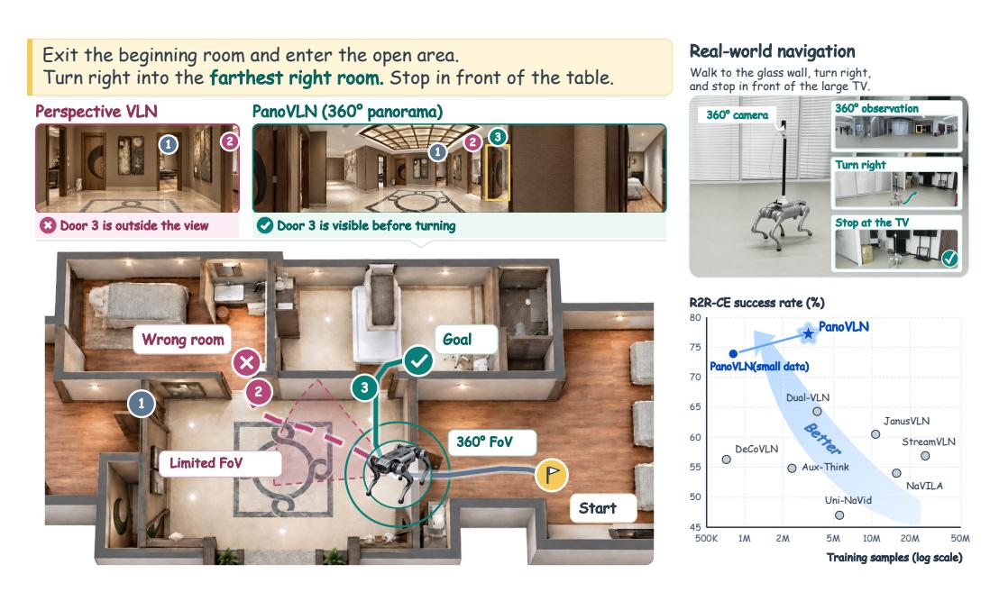

Figure 1: PanoVLN은 파노라마의 더 넓은 시각적 맥락을 완전히 활용하여 비전-언어 탐색을 보다 정확하고 효율적으로 만든다.

# 개요 (ABSTRACT)

최근 비전-언어 모델(VLMs)은 비전-언어 탐색(VLN)을 발전시켜, 모델이 시각 관찰과 언어 지시로부터 탐색 행동을 예측할 수 있게 했다. 본 연구에서는 파노라마 관찰을 활용한 VLN을 탐구하고 PanoVLN을 제안한다. 동기는 직관적이다: 보다 완전한 시각적 맥락이 더 나은 탐색 결정을 가능하게 해야 한다. 예를 들어, 파노라마는 원근 카메라의 시야 밖에 있는 통로를 드러내어, 모델이 추가 탐색 없이 의도된 경로를 식별할 수 있게 한다. 그러나 우리는 단순히 원근 이미지를 파노라마로 교체해도 성능이 제한적으로 향상될 뿐임을 발견했다. 우리의 진단은 더 넓은 가시성을 완전히 활용하려면 행동 예측, 훈련 감독, 시각 표현에 대한 수정이 필요함을 시사한다. 첫째, 더 넓은 가시성은 장기 행동 계획을 지원한다. 우리는 모델이 더 긴 행동 시퀀스를 예측하도록 하여, 단일 파노라마에서 더 큰 회전과 이후 움직임을 가능하게 한다. 구체적으로, 우리는 재계획 전에 몇 개의 예측된 행동을 실행할지 동적으로 결정하는 신뢰도 기반 실행(CGE) 전략을 도입한다. 둘째, 더 넓은 가시성은 더 복잡한 경로 선택을 가져온다. 따라서 우리는 빈번한 분기점과 명확한 지시를 가진 훈련 경로를 구성하여 경로 선택에 대한 목표 지도를 제공한다. 셋째, 파노라마 탐색은 개별 랜드마크를 인식하는 것을 넘어 시야 방향 간의 공간 관계를 이해해야 한다. 우리는 RGB 파노라마에서 의미 및 기하학적 특징을 결합하여 시각 토큰을 추가하지 않고도 장면 내용과 공간 배치를 모두 포착한다. 4B 백본과 RGB 전용 입력으로 PanoVLN은 R2R-CE와 RxR-CE Val-Unseen에서 각각 11.9%와 8.7%의 성공률로 이전 SOTA를 능가한다. 사물인터넷 로봇에서의 실제 실험은 이전 VLN 방법보다 더 빠른 탐색과 더 적은 정지 시간을 보여준다. 우리의 프로젝트 페이지는 <https://wangzhen-w.github.io/PanoVLN/>에서 확인할 수 있다.

## 1 서론 (INTRODUCTION)

비전-언어 탐색은 에이전트가 자연어 지시를 따라 환경을 탐색하도록 요구한다 [(Anderson et al., 2018;](#page-10-0) [Krantz et al., 2020)](#page-11-0). 최근 비전-언어 모델은 시각 관찰과 지시로부터 탐색 행동을 예측함으로써 이 과제를 발전시켰다 [(Zhang et al., 2024;](#page-13-0) [Cheng et al., 2025;](#page-10-1) [Wei et al., 2026b)](#page-13-1).

이전 연구의 대부분은 원근 이미지를 입력으로 사용한다; 본 연구에서는 파노라마 관찰이 각 결정에 대해 주변 환경의 더 많은 부분을 제공함으로써 탐색을 더욱 향상시킬 수 있는지 탐구한다. 동기는 직관적이다: 등각 파노라마(ERP)는 360◦ 시야를 제공하여 다양한 시야 방향에서 통로, 랜드마크, 경로 대안을 드러내고, 탐색 결정을 위한 보다 완전한 시각적 기반을 제공한다.

그러나 우리는 동일한 훈련 및 추론 설정에서 원근 이미지를 ERP로 단순히 교체해도 성능이 향상되지 않는다는 것을 발견했다. 이 관찰에 동기를 받아 우리는 상세한 진단 분석을 수행했고, 파노라마 맥락을 활용하려면 목표 지향적 조정이 필요함을 발견했다. 구체적으로, 우리는 행동 예측, 훈련 감독, 시각 표현을 파노라마 입력에 맞게 조정하고 PanoVLN을 제안한다.

우리는 경로가 방향을 바꾸면 시점 이미지의 왼쪽 또는 오른쪽 가장자리를 넘어설 수 있다. 파노라마의 360◦ 시야는 경로가 어디로 이어지는지 보여 주어 더 긴 탐색 동작 시퀀스에 시각적 맥락을 제공한다. 따라서 우리는 PanoVLN을 더 긴 예측 수평선으로 학습시키며, 수평선 연구 결과 파노라마 정책이 시점 정책보다 훨씬 긴 동작 시퀀스를 선호함을 보여준다. 앞으로 더 멀리 예측된 동작은 자연스럽게 신뢰도가 낮아 전체 시퀀스를 실행하는 것이 항상 바람직하지 않다. 따라서 우리는 *confidence-guided execution* (CGE)를 도입하여 동작 불확실성을 이용해 재관찰 및 재계획 전에 실행할 예측 동작 수를 결정한다.

둘째, 파노라마는 분기점에서 특히 유용하다. 넓은 시야가 여러 가능한 경로를 드러낼 수 있다. 그러나 기존 VLN 훈련 데이터에서 분기점은 상대적으로 드물어 이 이점을 활용하도록 학습하는 데 제한된 감독을 제공한다. 따라서 우리는 800개의 HM3D 장면에서 98K개의 궤적을 포함하는 데이터셋을 구축했다 [(Ramakrishnan et al., 2021)](#page-11-1). 이 경로들은 빈번한 분기점을 포함하고, 지침은 어떤 경로를 따라야 하는지 명확히 지정한다. 우리는 지침을 경로 관찰과 비교해 생성하고 검증하여 서술된 움직임과 선택이 시각적으로 기반이 되는지 확인한다. 또한 회전 및 정지 지점 주변의 샘플링 빈도를 높여 경로 결정과 완료가 가장 중요한 곳에서 더 강한 감독을 제공한다. 이러한 선택들은 경로 결정을 학습하고 선택된 경로를 완수하도록 밀집되고 목표 지향적인 감독을 제공한다.

셋째, 파노라마 관측을 탐색에 활용하려면 장면의 서로 다른 부분 간의 공간적 관계를 이해해야 한다. VLM의 시각적 특징은 주로 장면 의미를 포착하지만, 탐색은 또한 랜드마크, 통로 및 기타 장면 요소가 공간적으로 어떻게 배열되어 있는지에 달려 있다. 따라서 우리는 같은 RGB 파노라마에서 PanoVGGT [(Guo et al., 2026b)](#page-11-2)로 추출한 기하학적 특징을 VLM의 의미적 특징과 결합한다. 우리는 대응되는 ERP 영역의 특징을 정렬하고 융합하여 추가 시각 토큰이나 깊이 입력 없이 의미적 및 기하학적 정보를 제공한다.

4B 백본과 RGB 전용 관측으로 PanoVLN은 R2R-CE Val-Unseen에서 77.3%, RxR-CE Val-Unseen에서 78.0%의 성공률을 달성하며, 각각 이전 최첨단보다 11.9%와 8.7%를 초과한다. 사지형 로봇에서 PanoVLN은 실내 및 실외 경로를 더 짧은 시간에 탐색하며, 이전 VLN 기준보다 정책 호출과 일시 중지 횟수가 적다.

## 2 관련 연구 (RELATED WORK)

시각-언어 탐색. 연속 환경에서의 시각-언어 탐색(VLN-CE)은 탐색 그래프에서 실행 가능한 동작으로 지침을 따르는 경로를 확장한다 [(An](#page-10-0)[derson et al., 2018;](#page-10-0) [Ku et al., 2020;](#page-11-3) [Krantz et al., 2020)](#page-11-0). 웨이포인트 및 지도 기반 방법은 도달 가능한 위치를 예측하고, 공간 표현을 유지하거나 후보 경로를 미리 살펴보며 계획 및 제어를 지원한다 [(Hong et al., 2022;](#page-11-4) [Georgakis et al., 2022;](#page-10-2) [Wang et al., 2023a;](#page-12-0) [An et al., 2025;](#page-10-3) [Wang et al., 2024)](#page-12-1). VLM 기반 정책은 시각적 기록이나 스트리밍 비디오를 사용해 탐색 명령을 예측하며, 때로는 중간 결정을 별도의 실행 정책에 전달한다 [(Zhang et al.,](#page-13-0) [2024;](#page-13-0) [2025a;](#page-13-2) [Wei et al., 2026b;](#page-13-1) [Cheng et al., 2025;](#page-10-1) [Wei et al., 2026a)](#page-12-2). 보완 연구는 웨이포인트 감독, 탐색 데이터 규모, 지침 생성을 개선한다 [(Raychaudhuri et al.,](#page-12-3) [2021;](#page-12-3) [Wang et al., 2023b;](#page-12-4) [Yan et al., 2024)](#page-13-3). PanoVLN은 이러한 발전을 바탕으로 전방위 시각 관측이 시각-언어 탐색을 어떻게 지원하는지 연구한다.

파노라마 기하학. 파노라마 기하학 방법은 깊이와 3D 장면 구조를 추정할 때 구면 투영을 고려한다. 깊이 추정은 ERP–큐브맵 융합, 카메라 독립 구면 표현, 그리고 파노라마 입력용으로 훈련된 모델을 사용해 왔다 [(Jiang et al., 2021;](#page-11-5) [Piccinelli et al., 2025;](#page-11-6) [Li et al., 2026;](#page-11-7) [Lin et al., 2025)](#page-11-8). Feed-forward 재구성 모델은 이미지에서 카메라와 장면 기하학을 공동으로 추정하며, PanoVGGT는 이 접근법을 파노라마에 확장한다 [(Wang et al., 2025a;](#page-12-5) [Guo et al., 2026b)](#page-11-2). 탐색 방법도 교차 모달 지도, 그리드 메모리, 사전 시각화 장면 특징, 또는 별도의 공간 및 의미 메모리를 통해 공간 배치를 나타낸다 [(Georgakis et al., 2022;](#page-10-2) [Wang et al., 2023a;](#page-12-0) [2024;](#page-12-1) [Zeng et al., 2026)](#page-13-4). PanoVLN은 파노라마 기하학을 VLN에 도입해 공간 추론을 강화한다.

## 3 방법 (METHOD)

본 연구에서는 VLN 과제에서 파노라마가 제공하는 완전한 시각적 맥락을 완전히 활용하는 방법을 연구한다. 파노라마를 입력으로 사용하는 기본 모델을 시작으로 세 가지 핵심 적응을 수행한다. 첫째, 더 넓은 가시성을 완전히 활용하기 위해 더 긴 행동 시퀀스를 학습하고 실행한다. 둘째, 파노라마 환경에 더 적합한 의사결정 중심 훈련 데이터셋을 구축한다. 셋째, 파노라마 관측을 보다 잘 이해하기 위해 기하학 인식형 시각 표현을 개발한다.

### 3.1 전제 (PRELIMINARIES)

시점 기반 기준. 우리는 VLN-CE용 VLM 기반 정책을 시작으로 한다 [(Krantz et al., 2020)](#page-11-0). 단계 t에서 정책은 자연어 지시문 x, 현재 시점 RGB 이미지 It, 그리고 샘플링된 시각적 이력 I<t를 받는다. 시각 인코더는 이미지 특징을 추출하고, 이를 언어 모델의 임베딩 공간에 투영한 뒤 지시 토큰과 결합한다. 언어 모델은 A = {forward, left, right, stop}에서 행동 시퀀스를 자기회귀적으로 예측한다. 정책은 전문가 행동 시퀀스로부터 학습하고, 추론 시에는 예측의 고정 길이 접두사를 실행한 뒤 다시 관찰한다. 이동 행동은 고정된 변환 및 회전 증가분을 사용한다. stop 행동은 에피소드를 종료하며, 성공은 벤치마크의 목표 영역 내에서 정지해야 한다.

파노라마 기반 기준. 우리는 훈련과 추론 시 현재 및 과거 시점의 관점 이미지를 RGB 등각원 파노라마로 교체함으로써 파노라마 기반 기준을 얻는다. ERP는 360° × 180° 시야각을 직사각형으로 선형 매핑한다. 에이전트의 헤딩은 중앙에 위치하며, 왼쪽과 오른쪽 이미지 경계는 에이전트 뒤쪽에 있는 시멘을 따라 인접해 있다. 정책 입력은 Ot = (x, P<t, Pt) 가 되며, 여기서 Pt는 현재 ERP, P<t는 샘플링된 파노라마 히스토리이다. 우리는 동일한 VLM, 훈련 궤적, 액션 감독 및 실행 절차를 유지한다. 실험 결과, 입력만 교체한 경우 성능 향상이 제한적이며, 때로는 탐색 성능을 저하시킬 수 있어 아래에서 설명하는 적응이 필요하다.

### 3.2 더 긴 액션 시퀀스 감독 및 실행 (LONGER ACTION-SEQUENCE SUPERVISION AND EXECUTION)

파노라마는 시점 이미지의 시야각을 넘어선 뒤에 경로가 어디로 이어지는지를 보여줄 수 있다. 짧은 액션 타깃은 감독을 위해 이 시각적 맥락의 일부만 사용한다. 따라서 우리는 더 긴 액션 시퀀스 감독을 사용하고, 예측 불확실성에 따라 실행 길이를 조정한다.

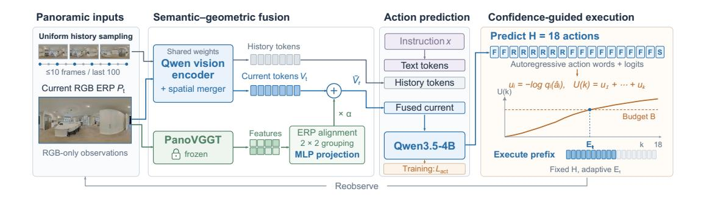

Figure 2: **PanoVLN pipeline.** 현재 및 과거 파노라마는 고정된 시각 토큰 예산을 공유한다. 정렬된 기하학적 특징이 현재 시각 토큰을 풍부하게 하고, 불확실성이 예측된 액션 시퀀스 중 얼마나 실행할지를 결정한다.

**Action-sequence supervision.** 훈련 시점 t에서 목표 $\mathbf{A}_t^* = (a_{t,1}^*, \dots, a_{t,H}^*)$ 은 다음 H개의 전문가 행동을 포함하며, 궤적 끝 이후에는 정지 토큰으로 패딩된다. 정책은 이 행동들을 자기회귀적으로 예측한다. 교사 강제(teacher forcing)를 사용하여 우리는 다음을 최소화한다

$$\mathcal{L}_{\text{act}} = -\frac{1}{H} \sum_{i=1}^{H} \log p_{\theta} \left( a_{t,i}^* \mid \mathcal{O}_t, \mathbf{A}_{t,< i}^* \right), \tag{1}$$

여기서 $\mathbf{A}_{t,< i}^*$ 은 앞선 전문가 행동을 포함하고, $p_{\theta}$ 는 VLM의 다음 토큰 분포이다.

Confidence-guided execution (CGE). 예측 수평선 H는 정책이 얼마나 앞을 예측하는지를 결정하고, 실행 길이는 언제 재관찰을 수행하는지를 결정한다. CGE는 예측된 행동의 불확실성에 따라 이 길이를 선택한다.

주어진 $\mathcal{O}_t$와 앞선 예측을 바탕으로, $z_{t,i}(a)$ 를 위치 i에서 행동 a의 로짓이라고 하자. $\mathcal{A}$ 를 정규화하여, 생성된 행동 $\hat{a}_{t,i}$ 에 대한 불확실성을 다음과 같이 정의한다

$$q_{t,i}(a) = \frac{\exp z_{t,i}(a)}{\sum_{b \in \mathcal{A}} \exp z_{t,i}(b)},$$

$$u_{t,i} = -\log q_{t,i}(\hat{a}_{t,i}).$$

(2)

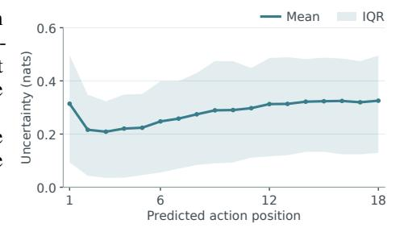

Figure 3: **Action uncertainty.** 불확실성은 초기 하강 이후 상승하며, 정책 호출마다 변동이 있어 적응형 실행을 동기화한다.

평균 불확실성은 초기 하강 이후 상승하며, 정책 호출마다 상당한 변동이 있다 (Figure 3).

Let $U_t(k) = \sum_{i=1}^k u_{t,i}$, with $U_t(0) = 0$. CGE는 불확실성 예산 B에 대해 $U_t(k) \leq B$ 를 만족하는 동안 접두사를 확장하며, 최소 $E_{\min}$ 개의 행동을 선택한다:

$$E_t = \max\{k \in \{1, \dots, H\} : k \le E_{\min} \text{ or } U_t(k) \le B\}.$$

(3)

에이전트는 이 접두사를 실행한 뒤, 정지하지 않는 한 재관찰한다.

### 3.3 DECISION-CENTRIC DATA CONSTRUCTION (DECISION-CENTRIC DATA CONSTRUCTION)

기존 VLN 훈련 데이터는 여러 가시 경로 중 빈번한 경로 선택이 있는 궤적이 상대적으로 적다. 이는 파노라마 관측에서 의도된 경로를 선택하도록 학습하는 데 제한된 감독을 제공한다. 따라서 우리는 빈번한 분기점을 가진 궤적을 구성하고, 선택된 경로를 명확히 식별하는 지침과 짝지어 만든다. 또한 데이터 구축 과정에서 회전과 정지 지점을 더 밀집하게 샘플링한다.

**Route construction and filtering.** 우리는 800개의 HM3D 장면에서 98K개의 탐색 궤적을 구성하며, 이동 가능한 공간을 네비게이션 메시를 사용해 연결된 영역으로 나눈다. *분기점(branching point)* 은 들어오는 경로를 제외하고 서로 다른 영역으로 이어지는 최소 두 개의 가시적이고 통과 가능한 경로를 가진다. 우리는 서로 다른 영역에서 끝점을 샘플링하고 분기점을 거치는 경로를 보존한다. 렌더링 품질 검증

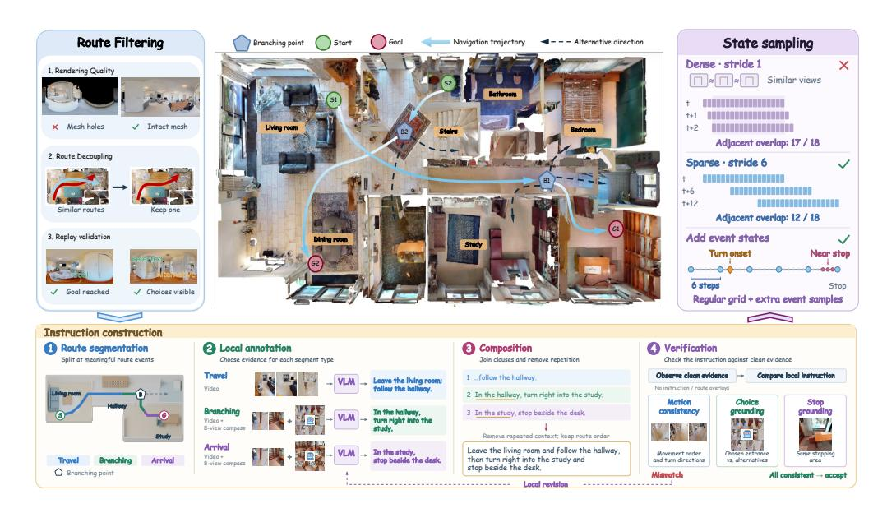

Figure 4: **Data construction pipeline**. 우리는 빈번한 분기점을 가진 경로를 구성하고, 지침을 생성 및 검증하며, 훈련 상태를 샘플링한다.

메시 구멍이나 불완전한 기하학을 가진 후보를 제거하고, 그 다음 근접 중복 제거를 수행한다. 전문가가 남은 경로를 기본 행동 시퀀스로 변환하며, 재생(replay)은 목표 도달 가능성과 각 분기점에서 선택된 경로와 그 대안의 가시성을 검증한다.

**Instruction construction.** 우리는 궤적을 경로 이벤트별로 *travel*, *branching*, *arrival* 세그먼트로 나눈다. 각 세그먼트는 전문가 경로가 지면에 표시된 1인칭 비디오를 사용하며, 분기와 도착은 8개 시점의 나침반 이미지를 추가로 사용한다. Qwen3.8-27B (Qwen Team, 2026b)는 움직임을 설명하고, 가시적 단서에서 선택된 경로를 식별하며, 정지 위치를 명시한다. 우리는 경로 순서대로 설명을 결합하고, 반복을 제거하며, 문장을 다듬는다.

우리는 깨끗한 비디오와 나침반 이미지를 사용하여 지시문 세그먼트를 검증한다. 모션 일관성 검사는 재생과 비교하여 이동 순서와 회전 방향을 확인한다. 선택 기반 정착은 지시문이 대안 중에서 시연된 입구를 식별하는지 여부를 확인하고, 정지 기반 정착은 관찰된 도착 영역을 설명하는지 여부를 확인한다. 일치하지 않는 세그먼트는 로컬에서 수정하고 재검증하며, 세 가지 검사를 모두 통과한 샘플만 보존한다.

**Training sample selection.** 인접한 상태는 종종 유사한 관측과 겹치는 행동 목표를 갖는다. H=18에 대해 우리는 stride-six 그리드를 사용하여 인접한 그리드 목표 간의 겹침을 17에서 12개의 행동으로 줄인다. 지속 회전 시작과 종료 직전의 상태를 추가하여 회전과 정지를 감독한다. 각 상태는 H-단계 전문가 행동 시퀀스와 짝을 이룬다. 그리드는 경로 커버리지를 유지하며, 추가된 상태는 행동 전환을 강조한다.

### 3.4 공간 인식 시각적 표현 (Geometry-aware visual representation)

파노라마 관측은 주변 장면의 서로 다른 부분을 하나의 시야에 가져와 그들의 공간적 관계가 탐색에 중요하게 만든다. 따라서 우리는 시각 토큰을 추가하지 않고 현재 RGB 파노라마에서 의미론적 및 정렬된 기하학적 특징을 융합한다.

**Visual context allocation.** 우리는 현재 ERP에 $N_c$ 토큰을 할당하고 각 과거 프레임에 $N_h < N_c$ 토큰을 할당한다. 더 세밀한 현재 특징은 경로 선택을 지원하고, 더 거친 과거 특징은 지시 진행 상황에 대한 문맥을 제공한다. 우리는 최근 시간 창에서 최대 M개의 과거 관측을 균일하게 샘플링하여 총 시각 토큰 예산을 $N_c + MN_h$ 로 만든다.

**Spatially aligned geometric fusion.** 사전 학습된 PanoVGGT 인코더(Guo et al., 2026b)는 현재 RGB 파노라마에서 기하학적 특징을 추출한다. 우리는 이를 ERP 좌표계에서 재샘플링하고

Table 1: **시뮬레이션 벤치마크 비교.** 우리는 R2R-CE와 RxR-CE Val-Unseen에서 표시된 관측 모달리티로 성능을 평가한다. * 은 Hong et al. (2022)의 웨이포인트 예측기를 나타내며, † 은 R2R-CE와 RxR-CE를 넘어서는 탐색 데이터 없이 훈련된 것을 나타낸다. NE는 미터 단위이며, 다른 점수는 백분율이다. PanoVLN은 두 벤치마크 모두에서 가장 높은 SR과 SPL을 달성한다.

| 방법 | 관찰 |  |  | R2R Val-Unseen |  |  | RxR Val-Unseen |  |  |  |  |  |
|--------------------------------------------|-------------|--------------|--------------|----------------|------|------|----------------|------|-------|-------------|------|-------|
| 111011100 | Pano. | Odo. | 깊이 | S.RGB | NE↓ | OS↑ | SR↑ | SPL↑ | NE↓ | SR↑ | SPL↑ | nDTW↑ |
| CMA* Hong et al. (2022) | <b> </b> | ✓ | ✓ |  | 6.20 | 52.0 | 41.0 | 36.0 | 8.76 | 26.5 | 22.1 | 47.0 |
| GridMM* Wang et al. (2023a) | ✓ | $\checkmark$ | $\checkmark$ |  | 5.11 | 61.0 | 49.0 | 41.0 | - | _ | _ | _ |
| ETPNav* An et al. (2025) | ✓ | $\checkmark$ | $\checkmark$ |  |  | 65.0 |  |  |  | 54.7 |  | 61.9 |
| HNR* Wang et al. (2024) | ✓ | $\checkmark$ | $\checkmark$ |  | 1 | 67.0 |  | 51.0 | 5.50 | 56.3 | 46.7 | 63.5 |
| ScaleVLN* Wang et al. (2023b) | ✓ | ✓ | ✓ |  | 4.80 | - | 55.0 | 51.0 | _ | _ | - | _ |
| InstructNav Long et al. (2025) | <b>\</b> | $\checkmark$ | ✓ |  | 6.89 | - | 31.0 | 24.0 | _ | _ | _ | _ |
| LAW Raychaudhuri et al. (2021) |  | $\checkmark$ | $\checkmark$ | $\checkmark$ | 6.83 | 44.0 | 35.0 | 31.0 | 10.90 | 8.0 | 8.0 | 38.0 |
| CM 2 Georgakis et al. (2022) |  | $\checkmark$ | $\checkmark$ | $\checkmark$ | 7.02 | 41.5 | 34.3 | 27.6 | _ | _ | _ | _ |
| WS-MGMap Chen et al. (2022) |  | $\checkmark$ | $\checkmark$ | $\checkmark$ | 6.28 | 47.6 | 38.9 | 34.3 | _ | _ | _ | - |
| CMA Krantz et al. (2020) |  |  | $\checkmark$ | $\checkmark$ | 7.37 | 40.0 | 32.0 | 30.0 | _ | - | - | - |
| MapNav † Zhang et al. (2025b) |  | ✓ | ✓ | ✓ | 4.93 | 53.0 | 39.7 | 37.2 | 7.62 | 32.6 | 27.7 | 43.5 |
| StreamVLN † Wei et al. (2026b) |  |  |  | $\checkmark$ | 5.43 | 62.5 | 52.8 | 47.2 | 6.72 | 48.6 | 42.5 | 60.2 |
| Aux-Think † Wang et al. (2025b) |  |  |  | $\checkmark$ | 6.08 | 60.0 | 54.8 | 46.9 | 6.24 | 52.2 | 40.2 | _ |
| JanusVLN † Zeng et al. (2026) |  |  |  | $\checkmark$ | 5.17 | 58.0 | 52.8 | 49.2 | 6.46 | 51.4 | 44.3 | 59.1 |
| CorrectNav † Yu etir. (2026) |  |  |  | $\checkmark$ | 4.24 | 67.5 | 65.1 | 62.3 | 4.09 | 69.3 | 63.3 | 75.2 |
| PanoVLN † (Ours) | ✓ |  |  |  | 3.10 | 79.7 | 73.9 | 67.9 | 3.14 | 74.1 | 63.9 | 71.4 |
| NaVid Zhang et al. (2024) |  |  |  | <b>√</b> | 5.47 | 49.1 | 37.4 | 35.9 | _ | _ | _ |  |
| Uni-NaVid Zhang et al. (2025a) |  |  |  | $\checkmark$ | 5.58 | 53.3 | 47.0 | 42.7 | 6.24 | 48.7 | 40.9 | _ |
| NaVILA Cheng et al. (2025) |  |  |  | $\checkmark$ | 5.22 | 62.5 | 54.0 | 49.0 | 6.77 | 49.3 | 44.0 | 58.8 |
| StreamVLN Wei et al. (2026b) |  |  |  | $\checkmark$ | 4.90 | 63.6 | 56.4 | 50.2 | 5.65 | 54.4 | 45.4 | 63.7 |
| JanusVLN Zeng et al. (2026) |  |  |  | $\checkmark$ | 4.78 | 65.2 | 60.5 | 56.8 | 6.06 | 56.2 | 47.5 | 62.1 |
| DualVLN Wei et al. (2026a) |  |  |  | $\checkmark$ | 4.05 | 70.7 | 64.3 | 58.5 | 4.58 | 61.4 | 51.8 | 70.0 |
| AwareVLN Guo et al. (2026a) |  |  |  | $\checkmark$ | 4.02 | 73.5 | 65.4 | 55.1 | 3.95 | 67.6 | 56.1 | 65.7 |
| PanoVLN (Ours) | ✓ |  |  |  | 2.83 | 83.1 | 77.3 | 70.6 | 2.85 | <b>78.0</b> | 65.9 | 73.3 |

그들을 그룹화하여 VLM의 병합된 현재 토큰 $V_t$와 동일한 영역을 덮도록 한다. 학습 가능한 MLP $f_{\psi}$는 정렬된 기하학적 그룹 $G_t$를 시각 토큰 임베딩 공간으로 투영하여 잔차 융합을 수행한다:

$$\bar{V}_t = V_t + \alpha f_{\psi}(G_t), \tag{4}$$

여기서 $\alpha$는 고정된 잔여 스케일이다. 융합은 대응되는 ERP 영역에서 의미와 기하학을 결합하여 토큰 수와 순서를 보존한다. 지시문, 기록, 그리고 융합된 토큰이 행동 예측을 조건화한다. 우리는 Eq. 1에 따라 VLM과 투영을 학습하고 기하학 인코더를 동결한다.

## 4 실험 (EXPERIMENTS)

### 4.1 실험 설정 (EXPERIMENTAL SETUP)

우리는 Matterport3D 장면(Chang et al., 2017)에서 Habitat(Savva et al., 2019)을 사용해 R2R-CE와 RxR-CE Val-Unseen 분할(Krantz et al., 2020; Ku et al., 2020)을 평가한다. 우리는 탐색 오류(Navigation Error, NE), 오라클 성공률(Oracle Success Rate, OS), 성공률(Success Rate, SR), 경로 길이 가중 성공률(Success Weighted by Path Length, SPL), 그리고 정규화된 동적 시간 왜곡(Normalized Dynamic Time Warping, nDTW)를 보고한다. OS는 경로가 목표 지점에서 3m 이내에 들어가는지를 기록하며, SR은 그 지점에서 정지하는 것을 요구한다. SPL은 경로 효율성을, nDTW는 참조 경로와의 일치를 측정한다. NE는 미터 단위이며, 다른 점수는 0–100 척도를 사용한다.

PanoVLN은 RGB 전용 관측값을 사용한다. 기본 모델은 Qwen3.5-4B(Qwen Team, 2026a)와 동결된 PanoVGGT 인코더(Guo et al., 2026b)를 결합하고 실행을 위해 H=18 예측 수평선과 CGE를 사용한다. PanoVLN$^\dagger$는 R2R-CE와 RxR-CE 탐색 데이터를 학습하며, 전체 모델은 추가로 우리에서 구축한 데이터셋을 사용한다. 각 연구마다 절감 구성은 명시되어 있다. 학습 설정과 탐색 프롬프트는 부록 B에 있다.

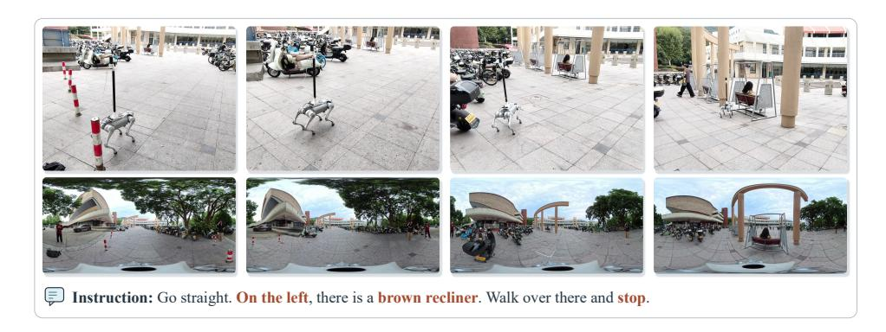

Figure 5: **실제 세계 탐색.** PanoVLN은 사족동물 로봇에 배포되어 장면별 미세 조정 없이 실제 세계 지시 수행으로 전이된다.

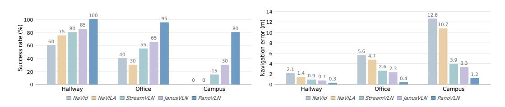

Figure 6: **실제 세계 탐색 성능.** 우리는 Hallway, Office, Campus 각각에서 20개의 공유 지시-경로 쌍에 대해 SR과 NE를 비교하며 가장 우수한 탐색 성능을 달성한다.

### 4.2 시뮬레이션 실험 (SIMULATION EXPERIMENTS)

**이전 방법과의 비교.** PanoVLN은 R2R-CE에서 77.3%, RxR-CE에서 78.0%의 SR을 달성하며, 이전 최고 결과를 각각 11.9, 8.7 퍼센트 포인트(%) 뛰어넘는다(Table 1). PanoVLN$^{\dagger}$는 두 벤치마크 모두에서 제한 데이터 그룹의 SR과 SPL을 선도한다. 우리의 의사결정 중심 트레젝터리를 추가하면 미지의 장면에서 성능이 더욱 향상된다.

**파노라마 컨텍스트 활용.** 동일한 ERP와 지시문을 사용해 단기 수평선 훈련은 앞쪽에 주의를 집중시켜 시점 정책과 유사하게 되며, PanoVLN은 방향별로 지시된 구간에 주의를 기울인다. 짧은 목표는 종종 경로 간 초기 움직임을 공유하고, 긴 목표는 경로 선택과 이후 움직임을 포함하여, 예측에 관련된 구별 시각적 단서를 제공하고 전체 파노라마 사용을 장려한다.

### 4.3 실제 세계 실험 (REAL-WORLD EXPERIMENTS)

**배포 및 평가.** 모든 방법은 Unitree Go2, 동일한 Insta $360 \times 5$를 1.5m 높이에 장착하고 원격 RTX 3090을 사용한다. PanoVLN은 약 $12 \times 6$ GPU 메모리를 사용하며, 네트워크 오버헤드는 추론을 제외하고 호출당 평균 $272 \times 6$ ms를 차지한다. 실행은 동기식이며, 로봇은 응답을 기다린 뒤 행동을 수행하고 다음 예측을 요청한다.

우리는 NaVid(Zhang et al., 2024), NaVILA(Cheng et al., 2025), StreamVLN(Wei et al., 2026b), JanusVLN(Zeng et al., 2026), 그리고 PanoVLN을 각 설정마다 20개의 공유 지시-경로 쌍에 대해 장면별 미세 조정 없이 비교한다. Hallway는 연속 회전을 테스트하고, Office는 잡동사니와 방 전환을 추가한다. Campus는 정원, 운동장, 광장을 포함하며, 실내 훈련에서 야외 공간과 다양한 지형으로의 전이를 테스트한다.

**네비게이션 성능.** 결과는 지역 경로 복잡성과 장면 유형 간 전이를 모두 테스트한다 (그림 6; 정성적 실험은 보조 영상에 있다). NaVid는 긴 경로에서 지시 진행에 어려움을 겪으며, 혼잡과 방 전환은 Office에서 NaVILA를 방해한다. StreamVLN과 JanusVLN은 실내 경로를 보다 신뢰성 있게 처리하지만, 개방형 야외 레이아웃으로 전이하는 데 어려움을 겪는다.

표 2: 실제 환경 실행 효율성. PanoVLN은 비교된 방법 중에서 가장 우수한 전반적 네비게이션 효율성을 달성한다

| Method |  | Navigation | Continuity |  | Planning |  |  |
|----------------|------------|----------------|------------|----------|----------|---------------|--|
|  | Time (s) ↓ | Speed (cm/s) ↑ | Wait (%) ↓ | Pauses ↓ | Calls ↓ | Latency (s) ↓ |  |
| NaVid | 135.2 | 12.9 | 23.2 | 15.7 | 29.4 | 0.90 |  |
| NaVILA | 194.0 | 8.2 | 24.7 | 29.6 | 41.3 | 1.05 |  |
| StreamVLN | 117.8 | 13.3 | 27.1 | 8.3 | 34.3 | 0.58 |  |
| JanusVLN | 412.9 | 5.3 | 39.2 | 95.3 | 101.7 | 1.32 |  |
| PanoVLN (우리의) | 86.4 | 25.7 | 13.6 | 5.4 | 7.4 | 1.08 |  |

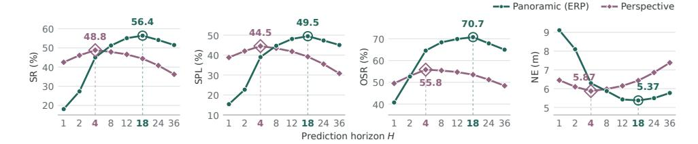

Figure 7: 예측 수평선 제거. 파노라마 정책은 더 긴 감독을 통해 이득을 보며, 장기 수평선에서 관점 정책을 능가한다.

캠퍼스에서. PanoVLN은 연속적인 실내 경로 선택을 따르고, 이 능력을 야외로 이전하여 외관과 공간 배치의 변화에도 불구하고 지시-경로 기반을 유지한다.

실행 효율성. Table [2](#page-7-0)은 시도 평균을 보고한다 (Appendix [B.2)](#page-15-0) 참조). *Time*은 탐색 지속 시간; *Speed*는 대기 시간을 포함한 거리/시간 비율; *Wait*는 정책 응답 대기 시간 비율; *Pauses*는 1초보다 긴 정지 구간 수; *Calls*는 정책 요청 수; *Latency*는 네트워크 통신을 제외한 요청당 추론 시간이다.

동기 실행 하에서 빈번한 정책 요청은 추론 및 통신 지연을 추가하고 움직임을 중단시킨다. JanusVLN은 각 행동마다 예측을 요청한다; StreamVLN은 호출당 지연이 낮지만 4개의 행동마다 재계획한다. PanoVLN은 더 긴 구간을 예측하고, CGE는 새로운 관측을 요청하기 전에 자신 있는 접두사를 선택한다. 예측이 자신 있게 유지되는 동안 움직임을 지속하면 중단이 줄어들고 전체 탐색 시간이 감소한다.

### 4.4 ABlation 연구 (ABlation Studies)

수평선, 실행, 샘플링, 그리고 기하학 연구는 R2R-CE와 RxR-CE 훈련 데이터를 사용한다; 데이터 연구는 추가 경로를 변형한다. 평가는 해당 Val-Unseen 분할을 사용한다.

예측 수평선. VLM, 시각 토큰 예산, 무작위 시작 샘플링을 고정한 채 예측 수평선을 변형하며, 기하학-프리 정책을 4,000 업데이트 동안 훈련한다 (Figure [7)](#page-7-1). ERP 정책은 짧은 수평선에서 관점 정책을 따라가지만, 목표가 길어질수록 이를 능가한다. 관점 성능은 H = 4에서 최고를 기록하고, ERP는 H = 18을 선호한다.

짧은 목표는 보이는 경로가 분기하기 전에 끝날 수 있다; 더 긴 ERP 목표는 의도된 선택을 감독한다. 더 긴 관점 목표는 현재 시야 밖의 신호를 점점 더 필요로 한다. ERP는 실행을 6개의 행동으로 고정한 채 H = 8에서 H = 18으로 개선되며, 이 이득을 더 긴 감독과 연결한다. 이러한 결과는 감독을 보이는 경로 정보와 일치시키는 것을 선호한다; 이후 우리는 H = 18을 사용한다.

훈련 상태 샘플링. 무작위 시작과 우리의 턴 및 종료 인식 샘플링을 비교한다. 두 변형 모두 기하학-프리 H = 18 아키텍처, 4,000 업데이트, 6개의 행동 실행을 사용한다. 무작위 변형은 Figure [7.](#page-7-1)에서 H = 18 ERP 실행이다.

Table 3: 훈련 데이터 비교.

| 샘플링 NE↓ OS↑ SR↑ SPL↑ |  |  |  |
|---------------------------|------|-----------|------|
| 무작위 | 5.37 | 70.7 56.4 | 49.5 |
| 우리 | 4.40 | 69.9 62.8 | 57.2 |

긴 직진 구간은 유사한 목표를 제공하고, 짧은 회전 및 정지 상태는 경로 전환 및 완료를 결정한다. 우리의 샘플링은 이러한 상태에 더 많은 감독을 부여한다 (Table [3)](#page-7-2).

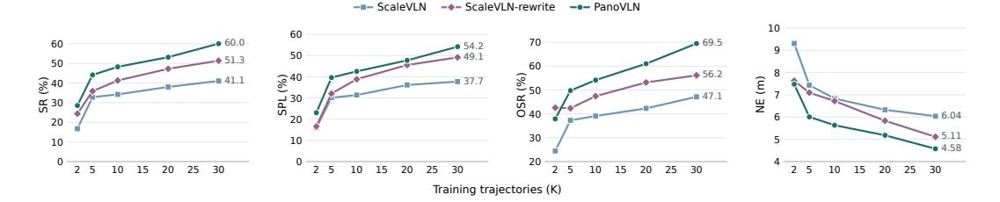

Figure 8: **훈련 데이터 비교.** 우리는 R2R-CE Val-Unseen에서 훈련 규모별로 데이터 소스를 비교한다. 우리의 데이터는 일관되게 가장 우수한 탐색 성능을 제공한다.

Table 4: **실행 전략 비교.** 우리는 고정, 무작위, 그리고 신뢰도 기반 실행을 비교한다. CGE는 두 벤치마크 모두에서 가장 우수한 탐색 성능을 달성한다.

| 실행 전략 |  | R2R-CE |  |  |  | RxR-CE |  |  |  |
|----------------------|------|--------|------|------|------|--------|------|-------|--|
| Znovanon saucegy | NE↓ | OS↑ | SR↑ | SPL↑ | NE↓ | SR↑ | SPL↑ | nDTW↑ |  |
| 고정: 1개 동작 | 4.42 | 68.2 | 64.6 | 60.5 | 4.11 | 65.7 | 55.6 | 70.3 |  |
| 고정: 6개 동작 | 4.43 | 70.8 | 64.2 | 58.7 | 4.25 | 65.4 | 54.2 | 69.0 |  |
| 고정: 12개 동작 | 4.65 | 69.7 | 61.4 | 55.4 | 4.98 | 61.1 | 46.4 | 64.6 |  |
| 고정: 18개 동작 | 4.89 | 67.0 | 57.2 | 50.9 | 5.64 | 54.9 | 43.4 | 59.8 |  |
| 무작위: 1-18개 동작 | 4.62 | 68.5 | 61.3 | 55.6 | 5.07 | 59.9 | 52.3 | 64.9 |  |
| CGE (우리) | 4.10 | 71.0 | 66.6 | 61.5 | 4.06 | 66.5 | 56.4 | 70.8 |  |

Table 5: **지오메트리 인코더 비교.** 본 연구에서는 서로 다른 인코더에서 추출한 지오메트리 특징을 비교한다. PanoVGGT는 두 벤치마크 모두에서 가장 높은 성공률을 보인다.

| 추가 인코더 | R2R-CE |  |  |  | RxR-CE |  |  |  |
|-----------------|--------|------|------|------|--------|------|------|-------|
| 추가 인코더 | NE↓ | OS↑ | SR↑ | SPL↑ | NE↓ | SR↑ | SPL↑ | nDTW↑ |
| 없음 | 4.10 | 71.0 | 66.6 | 61.5 | 4.06 | 66.5 | 56.4 | 70.8 |
| UniK3D | 3.77 | 73.2 | 67.8 | 63.3 | 3.92 | 65.4 | 57.3 | 68.1 |
| $DA^2$ | 4.01 | 72.3 | 65.5 | 61.6 | 4.35 | 63.0 | 55.9 | 67.7 |
| DAP | 4.15 | 70.9 | 64.5 | 60.4 | 4.48 | 61.1 | 54.3 | 66.5 |
| PanoVGGT (우리) | 3.91 | 73.6 | 68.6 | 63.7 | 4.02 | 67.1 | 57.2 | 71.5 |

Comparable OS와 높은 SR은 목표 영역에서 보다 신뢰할 수 있는 종료를 나타내며, 행동 시퀀스를 언제 변경하거나 종료할지 학습하는 가치가 있음을 강조한다.

**Confidence-guided execution.** Table 4는 동일한 기하학적 제약이 없는 H=18 체크포인트를 사용하여, 한 에폭 동안 우리 샘플링으로 훈련된 고정, 무작위, 그리고 confidence-guided 실행을 비교한다.

긴 고정 프리픽스는 점점 더 불확실한 행동에 전념하며, 무작위 프리픽스는 모델의 신뢰도를 무시한다. CGE는 각 상태에 맞게 실행을 조정하여 무작위 프리픽스와 모든 고정 전략(단일 행동 실행 포함)을 능가한다. 이 연구는 두 가지 선택을 구분한다: 긴 타깃은 경로 선택을 가르치고, CGE는 재관찰 시기를 결정한다.

**Geometric features.** 우리는 동일한 융합 설계, 시각 토큰 예산, 그리고 CGE를 사용하여 고정된 UniK3D (Piccinelli et al., 2025), DA2 (Li et al., 2026), DAP (Lin et al., 2025), 그리고 PanoVGGT 인코더를 비교한다 (Table 5). 대체 인코더는 혼합된 효과를 보이지만, PanoVGGT는 두 벤치마크 모두에서 SR을 향상시킨다. 그 파노라마 기능은 랜드마크를 인접한 통과 및 방향과 연결하여, 의미적 외형과 공간적 단서를 결합해 경로 선택을 보완한다.

Training data. 우리는 ScaleVLN [(Wang et al., 2023b)](#page-12-4), ScaleVLN-rewrite, 그리고 일치된 궤적 수를 가진 우리 데이터를 비교한다. PanoVGGT와 CGE를 사용하되 DAgger [(Ross et al., 2011)](#page-12-8) 없이 (Figure [8)](#page-8-2). ScaleVLN-rewrite는 원래 경로를 유지하고 우리 지시 파이프라인을 사용해 지시문을 재생성한다. ScaleVLN 대비 이득은 향상된 지시 품질의 이점을 보여준다. 우리의 전체 파이프라인은 명확한 지시와 의사결정이 풍부한 경로를 결합해, 파노라마에서 보이는 경로 중 언어 기반 선택을 반복적으로 감독함으로써 훈련 규모 전반에 걸쳐 추가 이득을 제공한다. Appendices [C.1](#page-16-0)과 [C.2](#page-16-1)은 데이터 구성 및 백본 비교를 제공한다.

## 5 결론 (CONCLUSION)

우리는 RGB 파노라마에서 시각-언어 탐색을 위한 PanoVLN을 제시하였다. 이는 더 긴 행동 감독, confidence-guided 실행, 의사결정 중심 훈련, 그리고 기하학적 특징을 결합한다. 4B 백본을 사용해 R2R-CE와 RxR-CE에서 최첨단 성공률을 달성하고, 더 적은 일시 정지로 실제 세계 탐색 속도를 높인다. 우리의 결과는 더 넓은 가시성이 탐색 정책이 학습하고 행동하는 방식을 형성해야 함을 시사한다.

# REFERENCES

- Dong An, Hanqing Wang, Wenguan Wang, Zun Wang, Yan Huang, Keji He, and Liang Wang. ETP-Nav: Evolving topological planning for vision-language navigation in continuous environments. *IEEE Transactions on Pattern Analysis and Machine Intelligence*, 47(7):5130–5145, July 2025. doi: 10.1109/TPAMI.2024.3386695. URL [https://doi.org/10.1109/TPAMI.2024.3386695]([386695](https://doi.org/10.1109/TPAMI.2024.3386695)).
- Peter Anderson, Qi Wu, Damien Teney, Jake Bruce, Mark Johnson, Niko Sünderhauf, Ian Reid, Stephen Gould, and Anton van den Hengel. Vision-and-language navigation: Interpreting visuallygrounded navigation instructions in real environments. In *Proceedings of the IEEE Conference on Computer Vision and Pattern Recognition (CVPR)*, pp. 3674–3683, June 2018. URL [https:](https://openaccess.thecvf.com/content_cvpr_2018/html/Anderson_Vision-and-Language_Navigation_Interpreting_CVPR_2018_paper.html) [//openaccess.thecvf.com/content\\_cvpr\\_2018/html/Anderson\\_Vision-a](https://openaccess.thecvf.com/content_cvpr_2018/html/Anderson_Vision-and-Language_Navigation_Interpreting_CVPR_2018_paper.html) [nd-Language\\_Navigation\\_Interpreting\\_CVPR\\_2018\\_paper.html](https://openaccess.thecvf.com/content_cvpr_2018/html/Anderson_Vision-and-Language_Navigation_Interpreting_CVPR_2018_paper.html).
- Shuai Bai, Yuxuan Cai, Ruizhe Chen, Keqin Chen, Xionghui Chen, Zesen Cheng, Lianghao Deng, Wei Ding, Chang Gao, Chunjiang Ge, Wenbin Ge, Zhifang Guo, Qidong Huang, Jie Huang, Fei Huang, Binyuan Hui, Shutong Jiang, Zhaohai Li, Mingsheng Li, Mei Li, Kaixin Li, Zicheng Lin, Junyang Lin, Xuejing Liu, Jiawei Liu, Chenglong Liu, Yang Liu, Dayiheng Liu, Shixuan Liu, Dunjie Lu, Ruilin Luo, Chenxu Lv, Rui Men, Lingchen Meng, Xuancheng Ren, Xingzhang Ren, Sibo Song, Yuchong Sun, Jun Tang, Jianhong Tu, Jianqiang Wan, Peng Wang, Pengfei Wang, Qiuyue Wang, Yuxuan Wang, Tianbao Xie, Yiheng Xu, Haiyang Xu, Jin Xu, Zhibo Yang, Mingkun Yang, Jianxin Yang, An Yang, Bowen Yu, Fei Zhang, Hang Zhang, Xi Zhang, Bo Zheng, Humen Zhong, Jingren Zhou, Fan Zhou, Jing Zhou, Yuanzhi Zhu, and Ke Zhu. Qwen3-VL technical report, 2025a. URL <https://arxiv.org/abs/2511.21631>.
- Shuai Bai, Keqin Chen, Xuejing Liu, Jialin Wang, Wenbin Ge, Sibo Song, Kai Dang, Peng Wang, Shijie Wang, Jun Tang, Humen Zhong, Yuanzhi Zhu, Mingkun Yang, Zhaohai Li, Jianqiang Wan, Pengfei Wang, Wei Ding, Zheren Fu, Yiheng Xu, Jiabo Ye, Xi Zhang, Tianbao Xie, Zesen Cheng, Hang Zhang, Zhibo Yang, Haiyang Xu, and Junyang Lin. Qwen2.5-VL technical report, 2025b. URL <https://arxiv.org/abs/2502.13923>.
- Angel Chang, Angela Dai, Thomas Funkhouser, Maciej Halber, Matthias Niessner, Manolis Savva, Shuran Song, Andy Zeng, and Yinda Zhang. Matterport3D: Learning from RGB-D data in indoor environments. In *2017 International Conference on 3D Vision (3DV)*, 2017. URL [https:](https://niessner.github.io/Matterport/) [//niessner.github.io/Matterport/](https://niessner.github.io/Matterport/).
- Peihao Chen, Dongyu Ji, Kunyang Lin, Runhao Zeng, Thomas H. Li, Mingkui Tan, and Chuang Gan. Weakly-supervised multi-granularity map learning for vision-and-language navigation. In *Advances in Neural Information Processing Systems*, volume 35, pp. 38149–38161, 2022. doi: 10.52202/068431-2764. URL [https://proceedings.neurips.cc/paper\\_files/p](https://proceedings.neurips.cc/paper_files/paper/2022/hash/f959b05dd74ba8a735276c3df4ae8b71-Abstract-Conference.html) [aper/2022/hash/f959b05dd74ba8a735276c3df4ae8b71-Abstract-Confere](https://proceedings.neurips.cc/paper_files/paper/2022/hash/f959b05dd74ba8a735276c3df4ae8b71-Abstract-Conference.html) [nce.html](https://proceedings.neurips.cc/paper_files/paper/2022/hash/f959b05dd74ba8a735276c3df4ae8b71-Abstract-Conference.html).
- An-Chieh Cheng, Yandong Ji, Zhaojing Yang, Zaitian Gongye, Xueyan Zou, Jan Kautz, Erdem Biyik, Hongxu Yin, Sifei Liu, and Xiaolong Wang. NaVILA: Legged robot vision-language-action model for navigation. In *Proceedings of Robotics: Science and Systems*, Los Angeles, CA, USA, June 2025. doi: 10.15607/RSS.2025.XXI.018. URL [https://www.roboticsproceedings.](https://www.roboticsproceedings.org/rss21/p018.html) [org/rss21/p018.html](https://www.roboticsproceedings.org/rss21/p018.html).
- Georgios Georgakis, Karl Schmeckpeper, Karan Wanchoo, Soham Dan, Eleni Miltsakaki, Dan Roth, and Kostas Daniilidis. Cross-modal map learning for vision and language navigation. In *Proceedings of the IEEE/CVF Conference on Computer Vision and Pattern Recognition (CVPR)*, pp. 15460–15470, June 2022. URL [https://openaccess.thecvf.com/content/CV](https://openaccess.thecvf.com/content/CVPR2022/html/Georgakis_Cross-Modal_Map_Learning_for_Vision_and_Language_Navigation_CVPR_2022_paper.html) [PR2022/html/Georgakis\\_Cross-Modal\\_Map\\_Learning\\_for\\_Vision\\_and\\_L](https://openaccess.thecvf.com/content/CVPR2022/html/Georgakis_Cross-Modal_Map_Learning_for_Vision_and_Language_Navigation_CVPR_2022_paper.html) [anguage\\_Navigation\\_CVPR\\_2022\\_paper.html](https://openaccess.thecvf.com/content/CVPR2022/html/Georgakis_Cross-Modal_Map_Learning_for_Vision_and_Language_Navigation_CVPR_2022_paper.html).
- Wenxuan Guo, Xiuwei Xu, Yichen Liu, Xiangyu Li, Hang Yin, Huangxing Chen, Wenzhao Zheng, Jianjiang Feng, Jie Zhou, and Jiwen Lu. AwareVLN: Reasoning with self-awareness for visionlanguage navigation. In *Proceedings of the IEEE/CVF Conference on Computer Vision and Pattern Recognition (CVPR)*, pp. 4065–4075, June 2026a. URL [https://openaccess.thecvf.](https://openaccess.thecvf.com/content/CVPR2026/html/Guo_AwareVLN_Reasoning_with_Self-awareness_for_Vision-Language_Navigation_CVPR_2026_paper.html) [com/content/CVPR2026/html/Guo\\_AwareVLN\\_Reasoning\\_with\\_Self-aware](https://openaccess.thecvf.com/content/CVPR2026/html/Guo_AwareVLN_Reasoning_with_Self-awareness_for_Vision-Language_Navigation_CVPR_2026_paper.html) [ness\\_for\\_Vision-Language\\_Navigation\\_CVPR\\_2026\\_paper.html](https://openaccess.thecvf.com/content/CVPR2026/html/Guo_AwareVLN_Reasoning_with_Self-awareness_for_Vision-Language_Navigation_CVPR_2026_paper.html).

- Yijing Guo, Mengjun Chao, Luo Wang, Tianyang Zhao, Haizhao Dai, Yingliang Zhang, Jingyi Yu, and Yujiao Shi. PanoVGGT: 파노라마 이미지에서 피드포워드 3D 재구성. In *Proceedings of the IEEE/CVF Conference on Computer Vision and Pattern Recognition (CVPR)*, pp. 36444–36453, 2026년 6월. URL [https://openaccess.thecvf.com/content/CV](https://openaccess.thecvf.com/content/CVPR2026/html/Guo_PanoVGGT_Feed-Forward_3D_Reconstruction_from_Panoramic_Imagery_CVPR_2026_paper.html) [PR2026/html/Guo\\_PanoVGGT\\_Feed-Forward\\_3D\\_Reconstruction\\_from\\_Pa] [noramic\\_Imagery\\_CVPR\\_2026\\_paper.html].

- Yicong Hong, Zun Wang, Qi Wu, and Stephen Gould. Bridging the gap between learning in discrete and continuous environments for vision-and-language navigation. In *Proceedings of the IEEE/CVF Conference on Computer Vision and Pattern Recognition (CVPR)*, pp. 15439–15449, 2022년 6월. URL [https://openaccess.thecvf.com/content/CVPR2022/html/Hong\\_Bri](https://openaccess.thecvf.com/content/CVPR2022/html/Hong_Bridging_the_Gap_Between_Learning_in_Discrete_and_Continuous_Environments_CVPR_2022_paper.html) [dging\\_the\\_Gap\\_Between\\_Learning\\_in\\_Discrete\\_and\\_Continuous\\_Enviro] [nments\\_CVPR\\_2022\\_paper.html].

- Hualie Jiang, Zhe Sheng, Siyu Zhu, Zilong Dong, and Rui Huang. UniFuse: 360◦ 파노라마 깊이 추정용 단방향 융합. *IEEE Robotics and Automation Letters*, 2021. doi: 10.1109/LRA.2021.3058957. URL <https://arxiv.org/abs/2102.03550>.

- Jacob Krantz, Erik Wijmans, Arjun Majumdar, Dhruv Batra, and Stefan Lee. Beyond the nav-graph: 연속 환경에서의 시각-언어 내비게이션. In *Computer Vision – ECCV 2020*, volume 12373 of *Lecture Notes in Computer Science*, pp. 104–120. Springer, 2020. doi: 10.1007/978-3-030-58604-1_7. URL [https://doi.org/10.1007/978-3-030-58604-1\\_7](https://doi.org/10.1007/978-3-030-58604-1_7).

- Alexander Ku, Peter Anderson, Roma Patel, Eugene Ie, and Jason Baldridge. Room-across-room: 다국어 시각-언어 내비게이션과 밀집 시공간 기반 정밀화. In *Proceedings of the 2020 Conference on Empirical Methods in Natural Language Processing (EMNLP)*, pp. 4392–4412, Online, 2020년 11월. Association for Computational Linguistics. doi: 10.18653/v1/2020.emnlp-main.356. URL <https://aclanthology.org/2020.emnlp-main.356/>.

- Haodong Li, Wangguandong Zheng, Jing He, Yuhao Liu, Xin Lin, Xin Yang, Ying-Cong Chen, and Chunchao Guo. DA^2 : 모든 방향에서의 깊이 추정. In *The Fourteenth International Conference on Learning Representations*, 2026. URL [https://proceedings.iclr.cc/paper\\_fi](https://proceedings.iclr.cc/paper_files/paper/2026/hash/786e39208b37bfcb0ad89413f155df99-Abstract-Conference.html) [les/paper/2026/hash/786e39208b37bfcb0ad89413f155df99-Abstract-C] [onference.html].

- Xin Lin, Meixi Song, Dizhe Zhang, Wenxuan Lu, Haodong Li, Bo Du, Ming-Hsuan Yang, Truong Nguyen, and Lu Qi. Depth any panoramas: 파노라마 깊이 추정을 위한 기초 모델, 2025. URL <https://arxiv.org/abs/2512.16913>.

- Yuxing Long, Wenzhe Cai, Hongcheng Wang, Guanqi Zhan, and Hao Dong. InstructNav: 미지 환경에서의 일반 지시 내비게이션을 위한 제로샷 시스템. In *Proceedings of The 8th Conference on Robot Learning*, volume 270 of *Proceedings of Machine Learning Research*, pp. 2049–2060. PMLR, 2025. URL [https://proceedings.mlr.press/v270/long25b](https://proceedings.mlr.press/v270/long25b.html) [.html](https://proceedings.mlr.press/v270/long25b.html).

- Luigi Piccinelli, Christos Sakaridis, Mattia Segu, Yung-Hsu Yang, Siyuan Li, Wim Abbeloos, and Luc Van Gool. UniK3D: 범용 카메라 단안 3D 추정. In *Proceedings of the IEEE/CVF Conference on Computer Vision and Pattern Recognition (CVPR)*, pp. 1028–1039, 2025년 6월. URL [https://openaccess.thecvf.com/content/CVPR2025/html/Piccinelli_UniK3D_Universal_Camera_Monocular_3D_Estimation_CVPR_2025_paper.html] [inelli\\_UniK3D\\_Universal\\_Camera\\_Monocular\\_3D\\_Estimation\\_CVPR\\_2025] [\\_paper.html].

- Qwen Team. Qwen3.5: 네이티브 멀티모달 에이전트 향해, 2026년 2월. URL [https://qwen](https://qwen.ai/blog?id=qwen3.5) [.ai/blog?id=qwen3.5](https://qwen.ai/blog?id=qwen3.5).

- Qwen Team. Qwen3.8-Max: 코딩과 협업을 위한 새로운 기준, 2026년 8월. URL [https://qwen](https://qwen.ai/blog?id=qwen3.8) [//qwen.ai/blog?id=qwen3.8](https://qwen.ai/blog?id=qwen3.8).

- Santhosh K. Ramakrishnan, Aaron Gokaslan, Erik Wijmans, Oleksandr Maksymets, Alex Clegg, John Turner, Eric Undersander, Wojciech Galuba, Andrew Westbury, Angel X. Chang, Manolis Savva, Yili Zhao, and Dhruv Batra. Habitat-Matterport 3D dataset (HM3D): 구현형 AI를 위한 1000개의 대규모 3D 환경, 2021. URL <https://arxiv.org/abs/2109.08238>.

- Sonia Raychaudhuri, Saim Wani, Shivansh Patel, Unnat Jain, and Angel Chang. 연속 환경에서 시각-언어 탐색을 위한 언어 정렬 웨이포인트(LAW) 감독. In *Proceedings of the 2021 Conference on Empirical Methods in Natural Language Processing*, pp. 4018–4028, 온라인 및 도미니카 공화국 푼타카나, 2021년 11월. 계산언어학회. doi: 10.18653/v1/2021.emnlp-main.328. URL [https:](https://aclanthology.org/2021.emnlp-main.328/) [//aclanthology.org/2021.emnlp-main.328/](https://aclanthology.org/2021.emnlp-main.328/).

- Stephane Ross, Geoffrey Gordon, and Drew Bagnell. 모방 학습과 구조화된 예측을 무위험 온라인 학습으로 환원. In *Proceedings of the Fourteenth International Conference on Artificial Intelligence and Statistics*, volume 15 of *Proceedings of Machine Learning Research*, pp. 627–635. PMLR, 2011. URL [https://proceedings.mlr.press/v15/ross11a.](https://proceedings.mlr.press/v15/ross11a.html) [html](https://proceedings.mlr.press/v15/ross11a.html).

- Manolis Savva, Abhishek Kadian, Oleksandr Maksymets, Yili Zhao, Erik Wijmans, Bhavana Jain, Julian Straub, Jia Liu, Vladlen Koltun, Jitendra Malik, Devi Parikh, and Dhruv Batra. Habitat: 구현형 AI 연구를 위한 플랫폼. In *Proceedings of the IEEE/CVF International Conference on Computer Vision (ICCV)*, 2019년 10월. URL [https://openaccess.thecvf.com/content_ICCV_2019/html/Savva_Habitat_A_Platform_for_Embodied_AI_Research_ICCV_2019_paper.html](https://openaccess.thecvf.com/content_ICCV_2019/html/Savva_Habitat_A_Platform_for_Embodied_AI_Research_ICCV_2019_paper.html) [ent_ICCV_2019/html/Savva_Habitat_A_Platform_for_Embodied_AI_Rese](https://openaccess.thecvf.com/content_ICCV_2019/html/Savva_Habitat_A_Platform_for_Embodied_AI_Research_ICCV_2019_paper.html) [arch_ICCV_2019_paper.html](https://openaccess.thecvf.com/content_ICCV_2019/html/Savva_Habitat_A_Platform_for_Embodied_AI_Research_ICCV_2019_paper.html).

- Jianyuan Wang, Minghao Chen, Nikita Karaev, Andrea Vedaldi, Christian Rupprecht, and David Novotny. VGGT: 시각적 기하학 기반 트랜스포머. In *Proceedings of the IEEE/CVF Conference on Computer Vision and Pattern Recognition (CVPR)*, 2025a. URL [https://arxiv.org/abs/2503.11651](https://arxiv.org/abs/2503.11651) [v.org/abs/2503.11651](https://arxiv.org/abs/2503.11651).

- Shuo Wang, Yongcai Wang, Wanting Li, Xudong Cai, Yucheng Wang, Maiyue Chen, Kaihui Wang, Zhizhong Su, Deying Li, and Zhaoxin Fan. Aux-Think: 데이터 효율적인 시각-언어 탐색을 위한 추론 전략 탐색. In *Advances in Neural Information Processing Systems*, volume 38, pp. 34960–34984, 2025b. doi: 10.52202/085713-1040. URL [https://proceedings.neurips.cc/paper_files/paper/2025/hash/2c90bf5bffe6497730ecade3a3a37458-Abstract-Conference.html](https://proceedings.neurips.cc/paper_files/paper/2025/hash/2c90bf5bffe6497730ecade3a3a37458-Abstract-Conference.html) [ngs.neurips.cc/paper_files/paper/2025/hash/2c90bf5bffe6497730eca](https://proceedings.neurips.cc/paper_files/paper/2025/hash/2c90bf5bffe6497730ecade3a3a37458-Abstract-Conference.html) [de3a3a37458-Abstract-Conference.html](https://proceedings.neurips.cc/paper_files/paper/2025/hash/2c90bf5bffe6497730ecade3a3a37458-Abstract-Conference.html).

- Zihan Wang, Xiangyang Li, Jiahao Yang, Yeqi Liu, and Shuqiang Jiang. GridMM: 시각-언어 탐색을 위한 그리드 메모리 맵. In *Proceedings of the IEEE/CVF International Conference on Computer Vision (ICCV)*, pp. 15625–15636, 2023년 10월 a. URL [https://openaccess.t](https://openaccess.thecvf.com/content/ICCV2023/html/Wang_GridMM_Grid_Memory_Map_for_Vision-and-Language_Navigation_ICCV_2023_paper.html) [hecvf.com/content/ICCV2023/html/Wang_GridMM_Grid_Memory_Map_for_](https://openaccess.thecvf.com/content/ICCV2023/html/Wang_GridMM_Grid_Memory_Map_for_Vision-and-Language_Navigation_ICCV_2023_paper.html) [Vision-and-Language_Navigation_ICCV_2023_paper.html](https://openaccess.thecvf.com/content/ICCV2023/html/Wang_GridMM_Grid_Memory_Map_for_Vision-and-Language_Navigation_ICCV_2023_paper.html).

- Zihan Wang, Xiangyang Li, Jiahao Yang, Yeqi Liu, Junjie Hu, Ming Jiang, and Shuqiang Jiang. 연속 시각-언어 탐색을 위한 신경 방사 표현을 활용한 Lookahead 탐색. In *Proceedings of the IEEE/CVF Conference on Computer Vision and Pattern Recognition (CVPR)*, pp. 13753–13762, 2024년 6월. URL [https://openaccess.thecvf.com/content/CVPR2024/html/Wang_Lookahead_Exploration_with_Neural_Radiance_Representation_for_Continuous_Vision-Language_Navigation_CVPR_2024_paper.html](https://openaccess.thecvf.com/content/CVPR2024/html/Wang_Lookahead_Exploration_with_Neural_Radiance_Representation_for_Continuous_Vision-Language_Navigation_CVPR_2024_paper.html) [ent/CVPR2024/html/Wang_Lookahead_Exploration_with_Neural_Radianc](https://openaccess.thecvf.com/content/CVPR2024/html/Wang_Lookahead_Exploration_with_Neural_Radiance_Representation_for_Continuous_Vision-Language_Navigation_CVPR_2024_paper.html) [e_Representation_for_Continuous_Vision-Language_Navigation_CVPR_](https://openaccess.thecvf.com/content/CVPR2024/html/Wang_Lookahead_Exploration_with_Neural_Radiance_Representation_for_Continuous_Vision-Language_Navigation_CVPR_2024_paper.html) [2024_paper.html](https://openaccess.thecvf.com/content/CVPR2024/html/Wang_Lookahead_Exploration_with_Neural_Radiance_Representation_for_Continuous_Vision-Language_Navigation_CVPR_2024_paper.html).

- Zun Wang, Jialu Li, Yicong Hong, Yi Wang, Qi Wu, Mohit Bansal, Stephen Gould, Hao Tan, and Yu Qiao. 시각-언어 탐색에서 데이터 생성 규모 확대. In *Proceedings of the IEEE/CVF International Conference on Computer Vision (ICCV)*, pp. 12009–12020, 2023년 10월 b. URL [https://openaccess.thecvf.com/content/ICCV2023/html/Wang_Scaling_Data_Generation_in_Vision-and-Language_Navigation_ICCV_2023_paper.html](https://openaccess.thecvf.com/content/ICCV2023/html/Wang_Scaling_Data_Generation_in_Vision-and-Language_Navigation_ICCV_2023_paper.html) [ng_Scaling_Data_Generation_in_Vision-and-Language_Navigation_ICCV](https://openaccess.thecvf.com/content/ICCV2023/html/Wang_Scaling_Data_Generation_in_Vision-and-Language_Navigation_ICCV_2023_paper.html) [V_2023_paper.html](https://openaccess.thecvf.com/content/ICCV2023/html/Wang_Scaling_Data_Generation_in_Vision-and-Language_Navigation_ICCV_2023_paper.html).

- Meng Wei, Chenyang Wan, Jiaqi Peng, Xiqian Yu, Yuqiang Yang, Delin Feng, Wenzhe Cai, Chenming Zhu, Tai Wang, Jiangmiao Pang, and Xihui Liu. Ground slow, move fast: 일반화 가능한 시각-언어 탐색을 위한 이중 시스템 기반 모델. In *The Fourteenth International Conference on Learning Representations*, 2026a. URL [https://proceedings.iclr.cc/paper_files/paper/2026/file/14da7aea05debb963b3d8d46449d51a0-Paper-Conference.pdf](https://proceedings.iclr.cc/paper_files/paper/2026/file/14da7aea05debb963b3d8d46449d51a0-Paper-Conference.pdf) [.cc/paper_files/paper/2026/file/14da7aea05debb963b3d8d46449d51a0](https://proceedings.iclr.cc/paper_files/paper/2026/file/14da7aea05debb963b3d8d46449d51a0-Paper-Conference.pdf) [-Paper-Conference.pdf](https://proceedings.iclr.cc/paper_files/paper/2026/file/14da7aea05debb963b3d8d46449d51a0-Paper-Conference.pdf).

- Meng Wei, Chenyang Wan, Xiqian Yu, Tai Wang, Yuqiang Yang, Xiaohan Mao, Chenming Zhu, Wenzhe Cai, Hanqing Wang, Yilun Chen, Xihui Liu, and Jiangmiao Pang. StreamVLN: SlowFast 컨텍스트 모델링을 통한 스트리밍 비전-언어 내비게이션. In *2026 IEEE 국제 로봇공학 및 자동화 학회 (ICRA)*, Vienna, Austria, June 2026b. URL [https:](https://arxiv.org/abs/2507.05240) [//arxiv.org/abs/2507.05240](https://arxiv.org/abs/2507.05240).

- Yu Yan, Rongtao Xu, Jiazhao Zhang, Peiyang Li, Xiaodan Liang, and Jianqin Yin. InstruGen: 대규모 멀티모달 모델을 통한 비전-언어 내비게이션 자동 지시 생성. arXiv preprint arXiv:2411.11394, 2024. URL <https://arxiv.org/abs/2411.11394>.

- Zhuoyuan Yu, Yuxing Long, Zihan Yang, Chengyan Zeng, Hongwei Fan, Jiyao Zhang, and Hao Dong. CorrectNav: 자기수정 플라이휠이 비전-언어-행동 내비게이션 모델을 강화한다. *AAAI 인공지능 학회 논문집*, 40(22):18737–18745, 2026. doi: 10.1609/aaai.v40i22.38942. URL [https://ojs.aaai.org/index.php/AAAI/articl](https://ojs.aaai.org/index.php/AAAI/article/view/38942) [e/view/38942](https://ojs.aaai.org/index.php/AAAI/article/view/38942).

- Shuang Zeng, Dekang Qi, Xinyuan Chang, Feng Xiong, Shichao Xie, Xiaolong Wu, Shiyi Liang, Mu Xu, and Xing Wei. JanusVLN: 이중 암시 메모리를 활용한 의미와 공간성 분리로 비전-언어 내비게이션. In *제14회 국제 학습 표현 회의*, 2026. URL [https://proceedings.iclr.cc/paper\\_files/pape](https://proceedings.iclr.cc/paper_files/paper/2026/hash/3812c3c803e986eca64000fe92467991-Abstract-Conference.html) [r/2026/hash/3812c3c803e986eca64000fe92467991-Abstract-Conference.](https://proceedings.iclr.cc/paper_files/paper/2026/hash/3812c3c803e986eca64000fe92467991-Abstract-Conference.html) [html](https://proceedings.iclr.cc/paper_files/paper/2026/hash/3812c3c803e986eca64000fe92467991-Abstract-Conference.html).

- Jiazhao Zhang, Kunyu Wang, Rongtao Xu, Gengze Zhou, Yicong Hong, Xiaomeng Fang, Qi Wu, Zhizheng Zhang, and He Wang. NaVid: 비디오 기반 VLM이 비전-언어 내비게이션의 다음 단계 계획. In *로보틱스: 과학과 시스템 논문집*, Delft, Netherlands, July 2024. doi: 10.15607/RSS.2024.XX.079. URL [https://roboticsproceedings.org/](https://roboticsproceedings.org/rss20/p079.html) [rss20/p079.html](https://roboticsproceedings.org/rss20/p079.html).

- Jiazhao Zhang, Kunyu Wang, Shaoan Wang, Minghan Li, Haoran Liu, Songlin Wei, Zhongyuan Wang, Zhizheng Zhang, and He Wang. Uni-NaVid: 구현형 내비게이션 과제를 통합하는 비디오 기반 비전-언어-행동 모델. In *로보틱스: 과학과 시스템 논문집*, Los Angeles, CA, USA, June 2025a. doi: 10.15607/RSS.2025.XXI.013. URL [https:](https://www.roboticsproceedings.org/rss21/p013.html) [//www.roboticsproceedings.org/rss21/p013.html](https://www.roboticsproceedings.org/rss21/p013.html).

- Lingfeng Zhang, Xiaoshuai Hao, Qinwen Xu, Qiang Zhang, Xinyao Zhang, Pengwei Wang, Jing Zhang, Zhongyuan Wang, Shanghang Zhang, and Renjing Xu. MapNav: VLM 기반 비전-언어 내비게이션을 위한 주석된 의미 지도 기반의 새로운 메모리 표현. In *계산언어학회 63회 연례 회의 논문집 (Volume 1: Long Papers)*, pp. 13032–13056, Vienna, Austria, July 2025b. Association for Computational Linguistics. doi: 10.18653/v1/2025.acl-long.638. URL [https://aclanthology.org/202](https://aclanthology.org/2025.acl-long.638/) [5.acl-long.638/](https://aclanthology.org/2025.acl-long.638/).

# A 대형 언어 모델의 사용 (A THE USE OF LARGE LANGUAGE MODELS)

우리는 GPT-5.6 및 GPT-6을 사용해 원고의 언어와 레이아웃을 편집했다. 저자들은 모든 편집을 검토하고 기술 내용, 실험 결과 및 결론에 대해 책임을 진다.

데이터셋 구축을 위해 Qwen3.8-27B [(Qwen Team, 2026b)](#page-11-9)가 궤적 비디오와 나침반 이미지를 기반으로 지시문을 생성한다. 우리는 이를 관측과 비교해 검증하고, 잘못된 경로나 정지 설명을 수정하며, 검증에 실패한 샘플은 제외한다 (Section [3.3)](#page-3-2)).

# B 구현 세부사항 (B IMPLEMENTATION DETAILS)

# B.1 모델 및 훈련 설정 (B.1 MODEL AND TRAINING SETTINGS)

Table [6](#page-14-1)은 모델 및 훈련 설정을 나열하고; Figure [9](#page-14-2)는 훈련 및 추론 프롬프트를 제공한다.

Table 6: 기본 PanoVLN 설정. 이미지 차원은 너비 × 높이.

| 설정 | 값 |
|-------------------------------------|--------------------------------------------------------------------------|
| VLM / frozen geometry encoder | Qwen3.5-4B / PanoVGGT |
| 지오메트리 특징 / 융합 | 마지막 집계 레이어; 2×2 그룹화; 시각적 합병 후 융합 |
| 지오메트리 정규화 / 투영 | RMSNorm / MLP (8192 → 4096 → 2560, GELU) |
| 잔차 스케일 | α = 0.2 |
| 현재 / 과거 ERP 리사이즈 | 960 × 480 / 448 × 224, 자르기 전 |
| 시각 인코더 ERP 크롭 | 각 극에서 20◦  |
| 지오메트리 인코더 입력 | 1036 × 518; 전체 파노라마 |
| 시각적 역사 | 최근 100 관측 중 최대 10개의 이전 프레임 |
| 옵티마이저 / 에폭 | Fused AdamW / 1 |
| 효과적인 배치 크기 | 128 (8 GPU × 4 예시 × 4 누적 단계) |
| 시각 인코더 학습률 | 2 × 10−6 |
| 언어 / 합병 / 프로젝터 학습률 | 2 × 10−5 |
| 학습률 스케줄 / 워밍업 | Cosine / 훈련 단계의 3% |
| 가중치 감쇠 / 기울기 클리핑 | 0.01 / 최대 노름 10 |
| 정밀도 / 랜덤 시드 | bfloat16 / 42 |
| 그라디언트 체크포인팅 | 활성화 |
| 예측 수평선 / 디코딩 | 18개 행동 / 그리디 |
| CGE 예산 / 최소 실행 | B = 1.2 / Emin = 4 행동 |
| 행동 공간 | 전진: 25 cm; 좌우: 15◦ ; 정지 |

#### 시스템 (System)

당신은 자율 주행 보조 시스템이다. 당신의 임무는 주행 지시를 따르는 것이다. 지시와 최근 관측, 현재 관측을 바탕으로 네 가지 동작(15도 좌우 회전, 25센티미터 전진, 또는 작업이 완료되면 정지)을 사용해 행동 시퀀스를 설계한다. 실행 순서대로 정확히 18개의 동작 단어를 반환하고, 단어들은 공백으로 구분한다. 작업이 18개보다 적게 끝나면 남은 위치를 정지(stop)로 채운다.

### 사용자 (User)

지시: *[navigation instruction]*

역사 메모리 관측은 오래된 것부터 새로운 것 순으로 정렬된 파노라마 뷰이다:

*[history panorama 1]* · · · *[history panorama* m*]*

현재 관측 (파노라마 뷰):

*[current panorama]*

다음 행동 시퀀스를 설계하라.

그림 9: 주행 프롬프트 (H = 18). 기울임꼴 필드는 입력이며, 사용 불가능 시 역사는 생략된다.

# B.2 실제 세계 실행 지표

표 [2](#page-7-0)는 동기 실행(Sec. [4.3)](#page-6-1) 하에서 완전 주행 시험의 시간 및 계획 비용을 요약한다. 로봇은 예측을 요청하고, 응답을 기다린 뒤 선택된 동작을 실행하고, 다음 요청을 시작한다. 우리는 각 시험마다 여섯 가지 지표를 계산한 뒤, 시험 전체에 대해 평균한다.

주행 시간 및 속도. 시험 i에 대해, Ti를 초 단위로 경과한 주행 시간, Li를 미터 단위로 이동한 거리를 의미한다. 두 가지 주행 지표는

$$Time_i = T_i, Speed_i = \frac{100L_i}{T_i} cm/s. (5)$$

시간은 행동 실행과 정책 응답 대기 시간을 모두 포함한다. 속도는 경과 시간 단위당 실행된 궤적을 따라 진행한 정도를 측정하며, 분모에 대기 시간이 포함된다. 따라서 로봇 움직임과 시도 중 발생하는 중단의 결합 효과를 포착한다.

대기 시간 및 움직임 중단. K^{i} 를 정책 요청 수, w_{ij} 를 요청 j 를 발행한 시점부터 응답을 받은 시점까지의 경과 시간이라고 하자. 총 정책 대기 시간은 W^{i} = \sum_{j=1}^{K^{i}} w_{ij} 이며,

$$Wait_i = 100 \frac{W_i}{T_i} \%. \tag{6}$$

각 대기 구간은 모델 추론과 네트워크 통신을 포함한다. Wait는 이러한 응답 구간이 시도에서 차지하는 비율을 측정한다. Pauses는 시도 중 1초를 초과하는 연속 정지 구간의 수를 센다. 그 지속 시간을 d_{ik} 로 표기한다,

$$Pauses_i = \sum_k \mathbf{1}[d_{ik} > 1 s]. \tag{7}$$

연속 구간은 한 번만 계산된다. Wait는 정책 관련 지연의 지속 시간을 나타내고, Pauses는 지속적인 움직임 중단의 빈도를 나타낸다. 1초 이내에 수신된 응답은 임계값보다 긴 정지 구간을 만들지 않아도 Wait에 기여한다.

정책 호출 및 추론 지연. Calls는 시도 중 발행된 요청 수를 센다. ℓ_{ij} 를 RTX 3090에서 요청 j 에 대한 모델 추론 시간이라고 하자. 우리는 다음을 계산한다,

$$Calls_i = K_i, \qquad Latency_i = \frac{1}{K_i} \sum_{j=1}^{K_i} \ell_{ij} \text{ s.}$$

(8)

Latency는 서버 측 모델 추론을 측정한다; Wait에 사용되는 요청–응답 구간은 통신을 포함한다. 측정된 평균 네트워크 오버헤드는 호출당 272 ms 이다. Calls와 Latency는 각각 계획의 빈도와 지속 시간을 설명하며, 함께 탐색 중 누적된 정책 관련 대기를 설명한다.

집계. 각 방법에 대해 표는 평가된 시도에 대한 각 시도 수준 지표의 산술 평균을 보고한다. Speed와 Wait는 각 시도마다 별도로 계산한 뒤 평균을 낸다. Latency는 먼저 시도 내 요청에 대해 평균을 내고, 그 다음 시도에 대해 평균을 낸다. Pauses와 Calls는 개별 시도에 대한 정수 개수이며, 보고된 평균은 소수일 수 있다.

# C MORE 절제 연구 (C MORE ABLATION STUDIES)

이 연구들은 훈련 소스 구성과 VLM 백본을 조사함으로써 Sec. [4.4](#page-7-3)를 보완한다. 두 연구 모두 Sec. [4.1.](#page-5-1)에서 R2R-CE와 RxR-CE Val-Unseen 평가 프로토콜을 사용한다.

### C.1 훈련 데이터 구성

Table [7](#page-16-2)는 Qwen3.5-4B, PanoVGGT, CGE, H = 18, 그리고 샘플 선택을 고정한 채 훈련 소스를 추가한다. R2R-CE와 RxR-CE를 시작으로 DAgger는 각각 SR을 5.3점과 7.0점, SPL을 4.2점과 6.7점 상승시킨다. 이 구성은 Table [1.](#page-5-0)에서 PanoVLN†에 해당한다. 우리에서 구성한 데이터셋을 추가하면 SR이 3.4/3.9점, SPL이 2.7/2.0점 더 향상되어 완전한 PanoVLN 모델을 만든다. RxR-CE nDTW도 71.4에서 73.3으로 증가하여 지시된 경로와의 일치도가 높아지고 완성도가 향상되었음을 나타낸다.

따라서 두 개의 추가 소스는 보완적인 이득을 제공한다: DAgger가 이미 정책을 강화한 이후에도 우리의 의사결정 중심 데이터는 유용하다. 이 누적 비교는 전체 훈련 레시피를 평가하며, Figure [8](#page-8-2)는 일치된 궤적 수에서 데이터 구축 전략을 비교함으로써 이를 보완한다.

Table 7: R2R-CE 및 RxR-CE Val-Unseen에서의 훈련 데이터 구성. 모든 설정은 PanoVGGT, CGE, 그리고 H = 18 예측 설정을 유지한다.

| 훈련 데이터 |  |  |  | R2R-CE |  |  |  | RxR-CE |  |  |  |
|---------------|---|---|------------------------------------------------------------|--------|------|------|------|--------|------|------|------|
|  |  |  | R2R RxR DAgger PanoVLN NE↓ OS↑ SR↑ SPL↑ NE↓ SR↑ SPL↑ nDTW↑ |  |  |  |  |  |  |  |  |
| ✓ | ✓ |  |  | 3.91 | 73.6 | 68.6 | 63.7 | 4.02 | 67.1 | 57.2 | 71.5 |
| ✓ | ✓ | ✓ |  | 3.10 | 79.7 | 73.9 | 67.9 | 3.14 | 74.1 | 63.9 | 71.4 |
| ✓ | ✓ | ✓ | ✓ | 2.83 | 83.1 | 77.3 | 70.6 | 2.85 | 78.0 | 65.9 | 73.3 |

# C.2 시각-언어 백본 (VISION-LANGUAGE BACKBONE)

Table [8](#page-16-3)은 모든 네 가지 훈련 소스(PanoVGGT, CGE, 시각적 역사, H=18)를 고정한 상태에서 백본 선택 [(Bai et al., 2025a](#page-10-7)[;b)](#page-10-8)을 평가한다. Qwen3-VL-4B는 이미 R2R-CE와 RxR-CE에서 각각 76.2%와 75.7%의 SR을 달성하며, 이에 상응하는 SPL 점수는 70.4%와 64.9%이다. 이를 Qwen3.5-4B로 교체하면 SR이 각각 1.1점과 2.3점 향상되고, 나머지 보고된 지표들도 개선된다. 이러한 적은 일관된 이득은 우리의 기본 백본을 정당화하며, 강력한 Qwen3-VL-4B 결과는 PanoVLN의 성능이 단일 VLM 백본에 국한되지 않음을 보여준다.

Table 8: R2R-CE 및 RxR-CE Val-Unseen에서의 VLM 백본 비교. 모든 백본은 전체 훈련 데이터 구성(PanoVGGT, CGE, H=18)을 사용한다.

| 백본 |  |  | R2R-CE |  | RxR-CE |  |  |  |
|---------------|------|------|--------|------|--------|------|------|-------|
|  | NE↓ | OS↑ | SR↑ | SPL↑ | NE↓ | SR↑ | SPL↑ | nDTW↑ |
| Qwen2.5-VL-7B | 2.96 | 82.2 | 75.9 | 68.6 | 2.88 | 76.3 | 65.1 | 72.7 |
| Qwen3-VL-4B | 2.91 | 81.5 | 76.2 | 70.4 | 2.96 | 75.7 | 64.9 | 71.6 |
| Qwen3.5-4B | 2.83 | 83.1 | 77.3 | 70.6 | 2.85 | 78.0 | 65.9 | 73.3 |

#### D 훈련 데이터 분석 (D TRAINING DATA ANALYSIS)

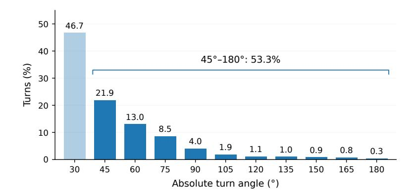

Figure 10: R2R-CE와 RxR-CE에서 참조 경로 회전 분포, 최소 $30^{\circ}$ 이상의 54,457 회전으로 정규화. $45^{\circ}$–$180^{\circ}$ 범주는 회전의 53.3%를 차지한다.

**참조 경로 회전.**

Figure 10은 R2R-CE와 RxR-CE에서 참조 경로를 따라 방향 변화를 요약한다. 집계된 분포는 $15^{\circ}$ 각도 범주를 사용하며, 최소 $30^{\circ}$인 54,457개의 회전에 대해 정규화된다. $45^{\circ}-180^{\circ}$ 범주는 이 회전의 53.3%를 차지하며, 이는 참조 경로에서 상당한 방향 변화가 흔함을 보여준다.

입사 경로와 정렬된 전방 $90^\circ$ 시야에서는 $45^\circ$를 초과하는 출구 방향이 현재 시야 범위 밖에 있다. ERP 관측은 회전 전에 이러한 방향을 보존하여, 회전 이후 경로에 대한 시각적 맥락을 제공한다.

### E 정성적 결과 (E QUALITATIVE RESULTS)

#### E.1 쌍별 파노라마 주의 사례 (PAIRED PANORAMIC ATTENTION CASES)

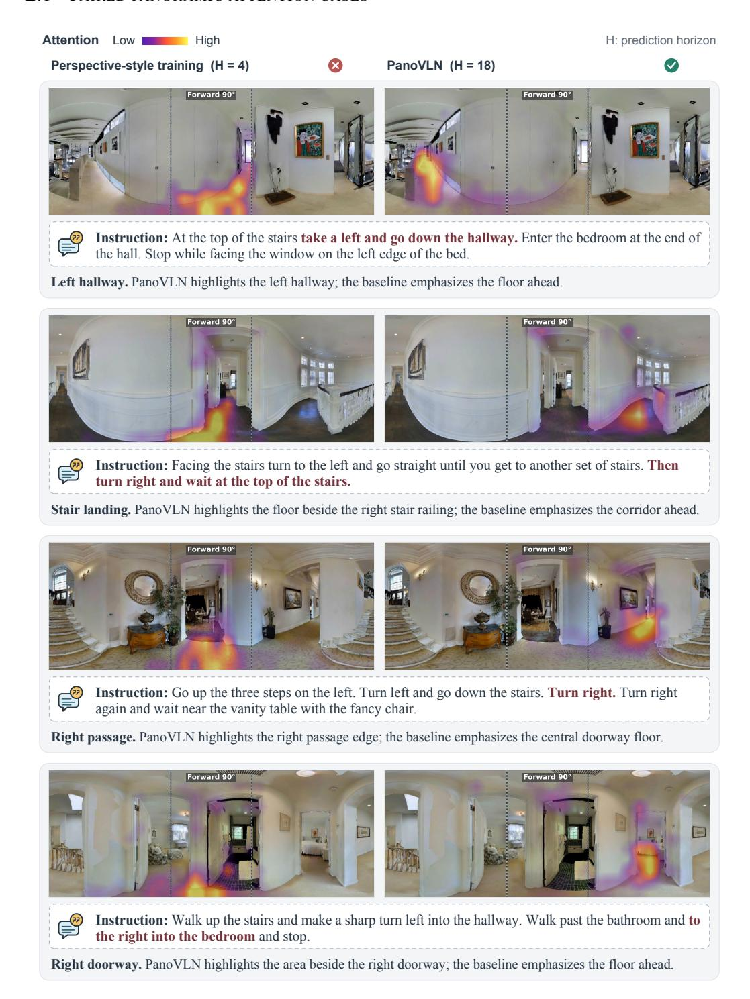

Figure 11: 동일한 ERP와 지시문을 사용하는 추가 쌍별 주의 사례. 빨간 굵은 텍스트는 관련 경로 절을 표시하며, 점선은 앞쪽 $90^{\circ}$ 구간을 경계한다. 각 사례는 가시적 핫스팟 위치를 식별한다.

### E.2 실제 탐색 사례 (REAL-WORLD NAVIGATION CASES)

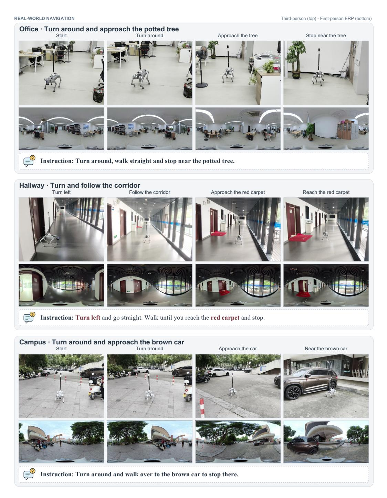

Figure 12: 복도, 사무실, 캠퍼스에서의 실제 탐색 사례. 각 행은 하나의 시도에서 지시문과 연속 관측을 보여주며, 경로 주석이 포함된다.

### E.3 R2R-CE 탐색 사례 (R2R-CE NAVIGATION CASES)

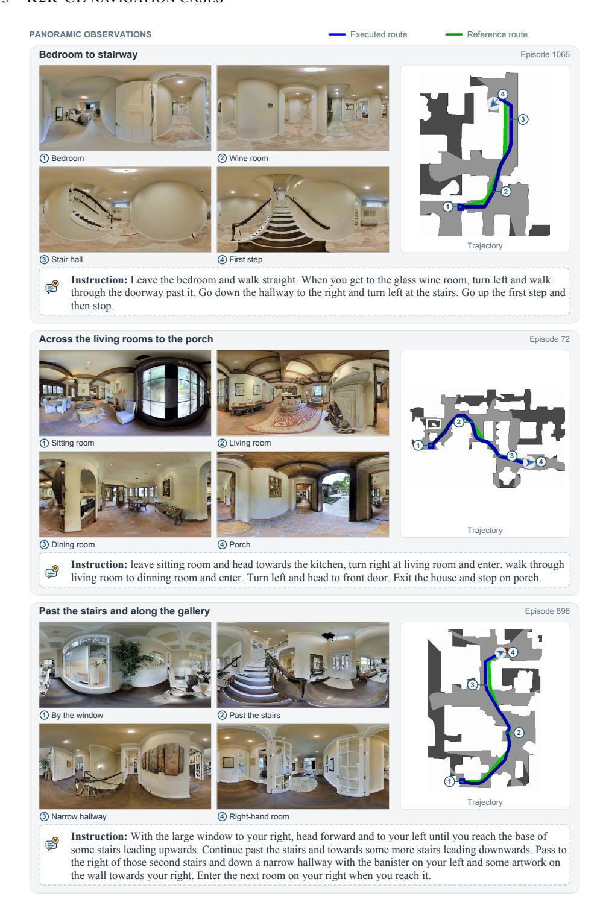

Figure 13: R2R-CE Val-Unseen에서의 탐색 사례. 각 사례는 읽기 순서대로 네 개의 파노라마 관측과 전체 지시문을 보여준다. 번호 매겨진 마커는 각 관측을 궤적상의 위치와 연결하며, 파란색과 초록색은 실행된 경로와 참조 경로를 나타낸다.

### E.4 RxR-CE 탐색 사례 (RXR-CE NAVIGATION CASES)

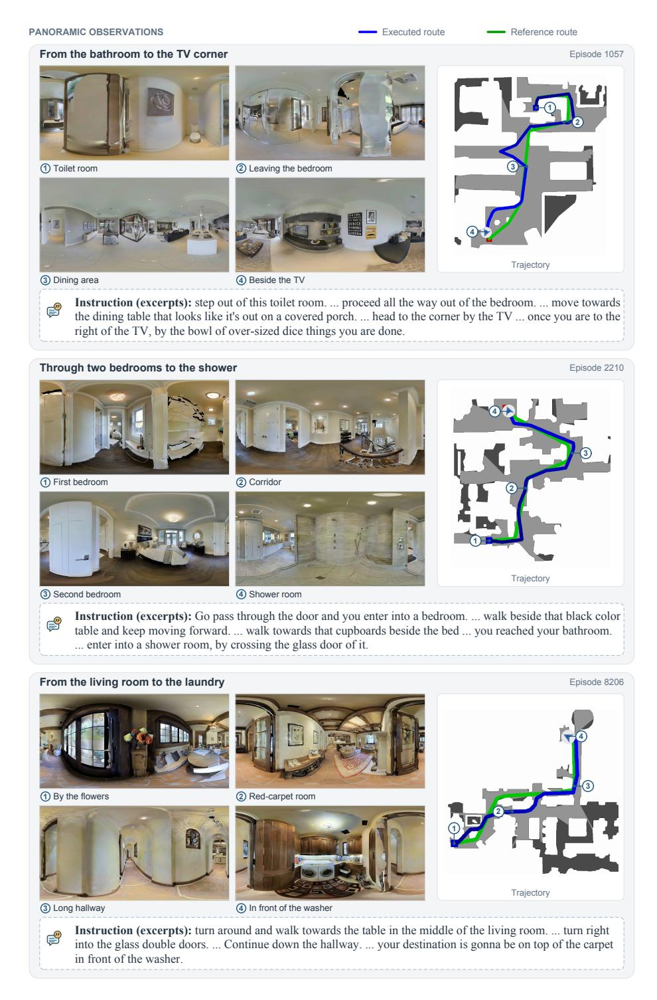

Figure 14: RxR-CE Val-Unseen에서의 탐색 사례. 각 사례마다 네 개의 파노라마 관측이 번호 매겨진 마커를 통해 궤적에 연결된다. 파란색과 초록색은 실행된 경로와 참조 경로를 나타낸다. 지시문 발췌는 원문을 그대로 유지하며, 생략은 줄임표로 표시된다.

