# Self Gradient Forcing: Native Long Video Extrapolation

- 원문: [https://arxiv.org/abs/2607.20368](https://arxiv.org/abs/2607.20368)
- PDF: [https://arxiv.org/pdf/2607.20368v1](https://arxiv.org/pdf/2607.20368v1)
- arXiv ID: `2607.20368`

---

# SELF GRADIENT FORCING: 네이티브 장영상 외삽

주쥔하오, 장시이, 편우스uan, 이야오웨이, 루야원, 유이쥔, 진웨이양, 장송춘, 허샹롱, 장서잉, 이하오란, 황하오양, 설제위, 단난  
조이 퓨처 아카데미, JD

# 요약

최근의 자기회귀 비디오 확산 방법은 학생 모델이 실제 비디오 컨텍스트가 아니라 자신의 롤아웃에서 생성된 이력에 기반하여 학습되는 자기 강제(Self Forcing)에 기반하여 점점 더 구축되고 있다. 이는 노출 편향(exposure bias)을 줄이지만, 역사적 키-값 캐시는 여전히 미래 프레임에서 고정된 롤아웃 상태로만 사용된다. 그 결과, 미래 손실은 이전에 생성된 레이턴트가 이후 비디오 레이턴트 생성을 위해 더 유용한 키와 값으로 어떻게 기록되어야 할지를 감독할 수 없다. 우리는 이를 *역사적 컨텍스트-그래디언트 갭*(historical context-gradient gap)이라 부른다. 우리는 Self Gradient Forcing(SGF)를 제안한다. 이는 전체 직렬 롤아웃을 통해 역전파하지 않고도 이 누락된 감독 신호를 복원하는 두 단계 학습 전략이다. 첫 번째 단계는 추론과 일치하는 그래디언트 없는 자기회귀 롤아웃을 수행하고, 샘플링된 디노이징 종료 단계에서 자기 생성된 컨텍스트와 모델에 입력된 노이즈 레이턴트를 기록한다. 두 번째 단계는 기록된 종료 단계에 대해 병렬 컨텍스트-그래디언트 복원을 수행한다. 생성된 컨텍스트는 그라디언트 정지(clean-latent) 입력으로 사용되며, 모델은 컨텍스트 KV 표현과 미래-컨텍스트 인과적 주의를 재계산한다. 따라서 SGF는 미래 비디오 레이턴트에 대한 손실을 사용하여 컨텍스트를 더 효과적인 인과적 메모리로 인코딩하도록 모델을 학습시키며, 네이티브 자기회귀 학습 목적 내에서 누락된 메모리 기록 감독을 제공한다. 다양한 초기화 하에서 광범위한 장수준 프레임 단위 및 청크 단위 실험을 통해, SGF는 Self Forcing보다 더 강력한 네이티브 장영상 외삽을 달성하며, 특히 주체 정체성, 배경/레이아웃 일관성, 시간적 안정성에서 두드러진 성능 향상을 보인다. 놀랍게도, 단 5초의 학습 윈도우만 사용해도 SGF는 수 분 길이의 영상을 외삽할 수 있다. 코드와 모델은 프로젝트 페이지 <https://zhuang2002.github.io/SelfGradientForcing>에서 공개될 예정이다.

# 1 서론

장형 자기회귀 비디오 생성은 생성이 학습 윈도우를 훨씬 초월해도 장면, 객체, 레이아웃 및 역학이 일관성을 유지해야 한다. 자기회귀 비디오 확산에서 이 일관성은 모델이 생성한 이력으로부터 외삽하는 데 의존한다: 롤아웃이 시작된 후, 각 새로운 프레임 또는 청크는 프롬프트와 이전에 생성된 콘텐츠에 조건부로 설정된다. 그러나 교사 강제(Teacher-Forcing, TF) 학습에서는 모델이 실제 비디오 컨텍스트에 조건부로 설정되지만, 추론 시에는 자기 생성된 이력에 조건부로 설정된다. 이 학습-추론 불일치는 노출 편향을 생성하며, 네이티브 장영상 외삽을 어렵게 만든다. 자기 강제(Self Forcing) [\(Huang et al.,](#page-10-0) [2025\)](#page-10-0)는 학생 모델을 자기 자기회귀 롤아웃에서 생성된 이력에 기반하여 학습시켜 이 불일치를 완화하며, 이중 방향 비디오 모델로부터 분포 일치 디스틸레이션(DMD) 감독을 사용한다. 이 자기 롤아웃 방식은 자기회귀 비디오 확산의 점점 더 흔한 학습 패러다임이 되었다 [\(Huang et al., 2025;](#page-10-0) [Liu et al., 2025;](#page-10-1) [Cui et al., 2025;](#page-9-0) [Yang et al., 2025;](#page-11-0) [Chen et al., 2026b;](#page-9-1)[a;](#page-9-2) [Xu et al., 2026a;](#page-11-1) [Ji et al., 2026;](#page-10-2) [Tian et al., 2026;](#page-11-2) [Hu et al., 2026;](#page-10-3) [Meng et al.,](#page-10-4) [2026\)](#page-10-4). 그러나 자기 롤아웃 학습을 가능하게 하기 위해, 이러한 방법들은 일반적으로 중요한 계산 제약을 계승한다: 역사적 KV 캐시를 통한 청크 간 그래디언트 흐름이 단절된다. 그 결과, 자기 강제는 모델을 자기 생성된 이력에 노출시키지만, 그 이력이 미래에서 읽을 수 있는 메모리로 어떻게 기록되어야 할지를 미래 손실로 학습시키지 않는다. 롤아웃 중, 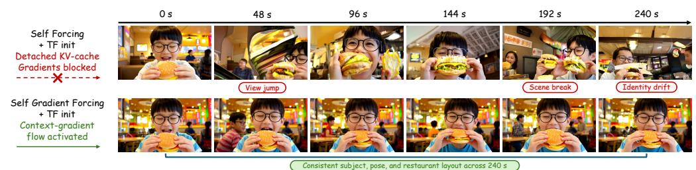 프롬프트: 깔끔하게 빗어낸 머리카락을 가진 중국 소년이 안경을 쓰고 따뜻하고 매력적인 패스트푸드 레스토랑에 앉아 있으며, 눈을 감은 채 육즙이 풍부한 치즈버거를 큰 입으로 베어물고 있다. 그는 양손으로 버거를 잡고, 약간 꿈꾸는 듯한 표정으로 순간을 즐기고 있다, ...  
그림 1: Self Gradient Forcing을 통한 장수준 일관성. 동일한 프롬프트, 시드, TF 초기화 하에서, Self Forcing은 자기 생성된 이력을 사용하여 학습하지만, 미래 손실로 클린 타임스텝 KV 기록 계산을 감독하지 않으며, 결국 뷰 점프, 장면 단절, 정체성 드리프트를 보인다. SGF는 자기 생성된 메모리 기록을 위한 제한된 컨텍스트-그래디언트 경로를 복원하여 240초 동안 주체 정체성, 자세, 레스토랑 레이아웃을 더 잘 유지한다. 생성된 레이턴트는 클린 컨텍스트 타임스텝에서 인과적 DiT에 의해 처리되며 인과적 KV 캐시로 저장된다; 이후 청크는 이를 고정된 역사적 컨텍스트로 읽는다. 따라서 미래 손실은 노이즈 디노이징 토큰이 캐시된 이력을 읽도록 학습할 수 있지만, 역사적 K/V 항목을 기록한 클린 타임스텝 계산으로는 역전파할 수 없다. 우리는 이 누락된 크레딧 할당 경로를 *역사적 컨텍스트-그래디언트 갭*이라 부른다. 그림 [1](#page-1-0)은 정성적 효과를 보여준다: 자기 강제 모델은 여러 프레임 동안 지역적으로 타당하게 유지될 수 있지만, 외삽이 계속됨에 따라 정체성, 시점, 레이아웃 일관성이 점차 붕괴된다. TF, 일관성 디스틸레이션(CD), 또는 ODE 초기화 [\(Huang et al., 2025;](#page-10-0) [Zhu et al., 2026;](#page-11-3) [Zhao et al., 2026\)](#page-11-4) 후, 모델은 클린 컨텍스트 타임스텝에서 실제 비디오 컨텍스트를 캐시에 기록하기 위한 유용한 사전 지식을 갖는다. 그러나 최종 자기 롤아웃 목적은 컨텍스트 분포와 감독을 모두 변경한다: 이력은 자기 생성되며, 샘플링된 노이즈 디노이징 타임스텝에서 몇 단계의 DMD 손실만 적용된다. 이는 자기 생성된 이력에 대한 캐시 기록 갭을 남긴다. 이 갭은 동일한 인과적 DiT가 타임스텝 간 파라미터를 공유하기 때문에 더욱 커질 수 있다: 노이즈 디노이징 단계에서의 업데이트는 클린 타임스텝 캐시 기록 계산을 변경할 수 있지만, 이후 청크 손실은 그것이 기록한 역사적 KV 항목으로 역전파되지 않는다. 따라서 컨텍스트 기록 경로는 장 자기회귀 롤아웃이 요구하는 것에서 벗어날 수 있다. 직접적인 해결책은 역사적 KV 캐시를 미분 가능하게 유지하여 미래 손실이 클린 타임스텝 K/V 기록 계산으로 역전파되도록 하는 것이다. 실제로 이는 미래 청크가 이를 소비할 때까지 모든 역사적 캐시 기록에 대한 autograd 그래프를 유지해야 한다는 것을 의미한다. 이러한 그래프는 롤아웃 길이, 트랜스포머 깊이, 순차적 캐시 업데이트와 함께 증가하므로, 직접적인 KV-그래디언트 경로는 확장하기 어렵다. 우리는 Self Gradient Forcing(SGF)을 제안한다. 이는 이 직렬 그래프 유지 문제를 제한된 병렬 재계산 문제로 전환한다. SGF는 샘플링된 롤아웃을 통한 전체 역전파 없이 누락된 메모리 기록 감독을 복원하는 두 단계 학습 전략이다. 첫 번째 단계는 진짜 직렬 그래디언트 없는 자기회귀 롤아웃을 수행하고, 샘플링된 디노이징 종료 단계에서 자기 생성된 컨텍스트와 모델에 입력된 노이즈 레이턴트를 기록한다. 두 번째 단계는 롤아웃 캐시를 버리고 동일한 종료 단계 계산을 병렬로 재구성한다: 생성된 컨텍스트는 그라디언트 정지 클린 레이턴트 입력으로 재처리되며, 기록된 노이즈 레이턴트는 다시 예측 입력으로 공급된다. 모델은 컨텍스트 숨겨진 상태, KV 표현, 미래-컨텍스트 인과적 주의를 재계산하므로, 미래 비디오 레이턴트에 대한 손실은 이후 생성을 위한 클린 타임스텝 K/V 표현을 기록하는 공유 파라미터를 업데이트한다. 자기 강제 기반 자기회귀 비디오 확산을 위한 네이티브 학습 프레임워크로서, SGF는 고정 캐시 자기 강제에서 사용되지 않은 컨텍스트 기록 그래디언트를 복원하며, 기존 강제 개선과 정교하게 독립적이므로 기존 방법 위에 직접 적용할 수 있다. 우리는 다양한 초기화 하에서 프레임 단위 및 청크 단위 자기회귀 생성에 대해 SGF를 평가한다. 경험적으로, SGF는 5초에서는 자기 강제와 유사하며, 60초 및 240초에서는 네이티브 장영상 외삽을 크게 향상시키며, 주체 정체성, 배경/레이아웃 일관성, 시간적 안정성에서 가장 뚜렷한 성능 향상을 보인다. 특히, 단 5초 윈도우로 학습된 모델도 분 단위 영상을 외삽할 수 있다. 우리는 두 단계 복원 정확도, 인과적 비디오 VAE의 시작 경계 효과, 그리고 싱크 레이턴트 수가 스트리밍 생성 품질에 미치는 영향을 분석한다.

## 우리의 기여는 다음과 같다:

- 우리는 고정 캐시 자기 강제에서 역사적 컨텍스트-그래디언트 갭을 식별한다. 이 갭은 미래 손실이 캐시 읽기를 감독하지만, 자기 생성된 이력을 K/V 메모리에 기록하는 클린 컨텍스트 기록 계산은 감독하지 않는다. 몇 단계 DMD 동안 다른 타임스텝에서 공유된 DiT 파라미터가 업데이트되면서, 이 비감독 경로는 벗어날 수 있다.
- 우리는 SGF를 도입한다. 이는 직렬 첫 번째 단계가 자기 생성된 롤아웃 상태를 기록하고, 병렬 두 번째 단계가 샘플링된 종료 단계 계산을 재구성하며, 자기 생성된 컨텍스트 KV 표현과 미래-컨텍스트 인과적 주의를 통한 그래디언트를 포함하는 두 단계 학습 전략이다.
- 우리는 5초, 60초, 240초에서 다양한 초기화 하에서 프레임 단위 및 청크 단위 생성에 대해 광범위한 실험을 수행하며, SGF가 5초에서는 자기 강제와 일치하고 60초 및 240초에서는 장영상 외삽을 크게 향상시킨다는 것을 보여준다. 우리는 두 단계 복원 정확도, 인과적 VAE 경계 진단, 그리고 싱크 레이턴트가 스트리밍 생성 품질에 미치는 영향을 연구한다.

# 2 관련 연구

자기회귀 비디오 확산. 현대 비디오 생성은 확산 목적, 가속 샘플러, 레이턴스 확산, 확산 트랜스포머에 기반하며, 이는 이미지 및 비디오 생성기에서 사용되는 모델링 및 확장 원칙을 제공한다 [\(Ho et al., 2020;](#page-10-5) [Song et al., 2021;](#page-11-5) [Rombach et al.,](#page-10-6) [2022;](#page-10-6) [Peebles & Xie, 2023\)](#page-10-7). 비디오 확산 시스템은 3D 디노이징, 계층적 생성, 레이턴스 비디오 모델링, 모션 모듈, 공간-시간 아키텍처, 다중모달 자기회귀 토큰 모델링을 통해 이러한 기반을 확장한다 [\(Ho et al., 2022b;](#page-10-8)[a;](#page-10-9) [Singer et al., 2023;](#page-10-10) [Blattmann et al.,](#page-9-3) [2023b;](#page-9-3)[a;](#page-9-4) [Guo et al., 2024;](#page-9-5) [Chen et al., 2024b;](#page-9-6) [Bar-Tal et al., 2024;](#page-9-7) [Kondratyuk et al., 2024\)](#page-10-11). 그러나 장형 생성의 경우 핵심 차이는 생성된 이력의 인과적 사용이다: 각 생성된 레이턴스 프레임 또는 청크는 이후 생성을 위한 컨텍스트의 일부가 된다. 확산 강제(Diffusion Forcing) [\(Chen](#page-9-8) [et al., 2024a\)](#page-9-8)는 다음 토큰 예측과 확산을 독립적으로 시퀀스 요소를 노이즈화함으로써 연결하며, CausVid [\(Yin et al., 2025\)](#page-11-6)은 이중 방향 비디오 확산을 인과적 캐싱을 사용하는 빠른 자기회귀 학생 모델로 디스틸레이션한다. SGF는 이 자기회귀 비디오 확산 인터페이스를 따르며, 인과적 KV 상태에 기록된 자기 생성된 이력이 미래에 읽을 수 있는 메모리로 미래 감독을 받는지를 묻는다.

자기 생성 기록을 위한 강제 목적 함수. 티처 포싱은 정답 접두사에 기반하여 학습하는 반면, 자기회귀 추론은 자기 생성 기록에 조건을 둔다. Self Forcing [\(Huang et al.,](#page-10-0) [2025\)](#page-10-0)는 이 노출 편향을 학생 모델이 자신의 롤아웃으로 생성한 기록을 사용하여 학습하고, 양방향 티처로부터 분포 매칭 디스틸레이션 감독을 통해 직접 줄인다. 이후의 강제 방법들은 이 자기 롤아웃 학습 패러다임을 기반으로 구축된다. Causal Forcing [\(Zhu et al., 2026\)](#page-11-3) 및 Causal Forcing++ [\(Zhao et al., 2026\)](#page-11-4)는 보완적인 초기화 불일치를 해결한다: 인과적 학생 모델은 추론 시 이용할 수 없는 흐름 맵을 가진 양방향 티처 궤적에 의존해서는 안 된다. Rolling Forcing [\(Liu et al., 2025\)](#page-10-1), Self-Forcing++ [\(Cui et al., 2025\)](#page-9-0), Matrixgame3 [\(Wang](#page-11-7) [et al., 2026\)](#page-11-7), 그리고 ShotStream [\(Luo et al., 2026\)](#page-10-12)는 더 긴 구간과 윈도우 기반 노이즈 제거를 통해 롤아웃 노출을 추가로 확장한다. Video-Mirai [\(Yu et al., 2026\)](#page-11-8) 및 Next Forcing [\(Xu et al.,](#page-11-9) [2026b\)](#page-11-9)는 다음 단계 감독이 이후 프레임에 필요한 정보를 버릴 수 있다는 관련된 관찰을 제시하고, 미래 인식 또는 다중 청크 감독을 도입한다. 이러한 방법들은 감독의 기록 분포, 인과적 초기화, 또는 시간적 범위를 개선한다. SGF는 고정 캐시 자기 롤아웃 학습에서 남은 공백을 해결한다: 미래 손실은 이후 노이즈 제거 토큰이 캐시된 기록을 읽는 방식을 감독할 수 있지만, 클린 타임스텝 계산이 어떻게 자기 생성 기록을 KV 메모리에 기록하는지는 감독할 수 없다. 장기 맥락 및 캐시 설계. 일련의 연구는 어떤 맥락을 사용 가능한지, 이를 어떻게 위치시키는지, 또는 어떻게 유지하는지를 변경함으로써 장기 생성을 개선한다. Gen-L-Video는 긴 다중 텍스트 비디오에 대해 겹치는 시간적 공동 노이즈 제거를 수행한다 [\(Wang et al., 2023\)](#page-11-10); FreeNoise는 노이즈를 재스케줄링하고 윈도우 시간적 주의를 융합한다 [\(Qiu et al., 2024\)](#page-10-13); FIFO-Diffusion는 다양한 노이즈 레벨에서 프레임 큐를 유지한다 [\(Kim et al., 2024\)](#page-10-14); StreamingT2V는 자기회귀 파이프라인에서 단기 및 장기 메모리를 결합한다 [\(Henschel et al., 2025\)](#page-9-9). 반복 시퀀스 모델링 및 효율적 주의는 세그먼트 반복 [\(Dai et al., 2019\)](#page-9-10), 로테이터 위치 임베딩 [\(Su et al., 2021\)](#page-11-11), 주의 싱크 [\(Xiao et al., 2024\)](#page-11-12), 캐시 유지 [\(Zhang et al., 2023;](#page-11-13) [Li et al., 2024\)](#page-10-15), 스트리밍 장기 튜닝 [\(Yang et al., 2025;](#page-11-0) [Chen et al., 2026b\)](#page-9-1), 장기 맥락 감독(Chen et al., 2026a), 학습 가능한 희소 주의(Xu et al., 2026a; Zhuang et al., 2026), KV 압축(Ji et al., 2026), 헤드별 캐시 동작(Tian et al., 2026), 검색 증강 잠재 기록(Hu et al., 2026), 그리고 신뢰 가능한 정렬을 통한 게이트된 재기억(Meng et al., 2026)을 연구한다. 이러한 방법들은 생성기에 노출되는 메모리를 변경한다. SGF는 이 방향과 독립적이다: 주어진 맥락 및 캐시 설계 하에서, SGF는 자기 생성 콘텐츠가 미래에서 읽을 수 있는 KV 표현에 어떻게 기록되는지를 개선한다. 우리는 SGF를 프레임 단위 및 청크 단위 생성, 여러 초기화, 그리고 외삽 범위에 걸쳐 평가하며, 더 나은 KV 메모리 기록이 짧은 윈도우 강제 학습 조건에서도 장기 자기회귀 비디오 생성을 개선함을 보여준다. ### 3 방법 #### 3.1 역사적 맥락-그래디언트 공백 자기회귀 비디오 확산은 잠재 블록을 순차적으로 생성한다. 블록 j에서, 인과적 생성기는 원시 과거 잠재 변수가 아닌 역사적 K/V 캐시에 주의를 기울이며 $z_j^t$를 노이즈 제거한다. 블록 i < j가 생성된 후, 그 예측된 클린 잠재 변수 $\tilde{x}_i$는 클린 맥락 타임스텝 $t_{\text{ctx}} = 0$에서 처리되며, 생성된 K/V 항목은 캐시에 추가된다. 따라서 이후 블록들은 $\tilde{x}_i$ 자체가 아니라, $\tilde{x}_i$에서 작성된 클린 타임스텝 메모리 표현에 조건을 둔다. $C_{\theta}$를 클린 맥락 타임스텝에서 인과적 생성기가 유도하는 캐시 작성 계산이라 하자. 순차적 롤아웃에서 이 업데이트는 재귀적이다: 모델은 기존 캐시를 읽고 다음 역사적 K/V 항목을 작성한다, $$\mathsf{KV}_{i}^{0}(\theta) = \mathcal{C}_{\theta}(\tilde{x}_{i}, t_{\mathrm{ctx}}; \mathsf{KV}_{< i}^{0}), \qquad t_{\mathrm{ctx}} = 0. \tag{1}$$ 새로운 항목 $\mathsf{KV}^0_i$는 이후 블록, 즉 후속 캐시 업데이트에 사용되는 상태의 일부가 된다. 미래 손실이 이 역사적 항목을 통해 미분 가능하다면, $\tilde{x}_i$를 $\mathsf{K/V}$ 메모리에 인코딩한 클린 맥락 계산에 기여도를 할당할 수 있다. 이는 단지 이후 노이즈 토큰이 자기 생성 기록을 읽는 방식을 학습하는 것뿐만 아니라, 미래 노이즈 제거를 위해 이전 생성된 잠재 변수가 어떻게 메모리에 기록되어야 하는지도 학습하게 된다. 고정 캐시 Self Forcing은 이 메모리 작성 신호를 제거한다. 이 방법은 자기 생성 기록을 사용하여 학습하여 학습과 추론 간 불일치를 줄이며, 이후 블록 손실은 기록된 캐시를 읽는 대상 측 노이즈 제거 계산을 여전히 업데이트할 수 있다. 그러나 역사적 K/V 항목은 분리된 롤아웃 상태로 처리된다. 따라서 미래 손실은 이러한 항목을 생성한 $t_{\rm ctx}=0$ 계산을 감독하지 않는다. 이 누락은 최종 Self Forcing 중에 문제가 된다. 왜냐하면 동일한 DiT 파라미터가 노이즈 제거와 클린 맥락 캐시 작성 모두에 공유되기 때문이다. 노이즈 타임스텝에서의 DMD 손실은 공유 파라미터를 업데이트한다, $$\theta_{r+1} = \theta_r - \eta \nabla_{\theta} \mathcal{L}_{SF}(\theta_r), \quad \mathsf{KV}_i^0(\theta_{r+1}) \not\equiv \mathsf{KV}_i^0(\theta_r) \text{ 일반적으로}. \tag{2}$$ 따라서 학습은 클린 맥락 캐시 작성기를 변경할 수 있지만, 고정 캐시 Self Forcing은 자기 생성 잠재 변수가 K/V 메모리에 어떻게 인코딩되는지에 대한 미래 손실 보정을 제공하지 않는다. 우리는 이 누락된 감독 경로를 *역사적 맥락-그래디언트 공백*이라 부른다. 그림 2는 SGF가 고정 캐시 재구성 대신 맥락-그래디언트 재구성을 도입함으로써 이 누락된 경로를 복원하는 방식을 보여준다. #### 3.2 직접적인 미분 가능 캐시 공백을 닫는 직접적인 방법은 순차적 역사적 K/V 캐시를 미분 가능하게 유지하는 것이다. 그러면 미래 손실은 캐시된 K/V 항목을 통해 이들을 생성한 이전 클린 맥락 호출로 역전파할 수 있다. 그러나 이는 이를 소비하는 모든 이후 블록이 처리될 때까지 모든 캐시 작성에 대한 역전파 그래프를 유지해야 한다는 것을 의미한다. 자기회귀 롤아웃은 노이즈 제거 단계와 트랜스포머 레이어를 통해 캐시를 반복적으로 작성, 읽고 확장하므로, 그래프는 고정 윈도우 계산이 아니라 롤아웃 길이에 따라 증가한다. 병목은 단순히 K/V 텐서의 저장이 아니라, 재귀적 캐시 궤적에 연결된 저장된 활성화 값이다. 이는 장기 자기 롤아웃에 대한 직접적인 미분 가능 캐시 학습을 비현실적으로 만든다. #### 3.3 Self Gradient Forcing 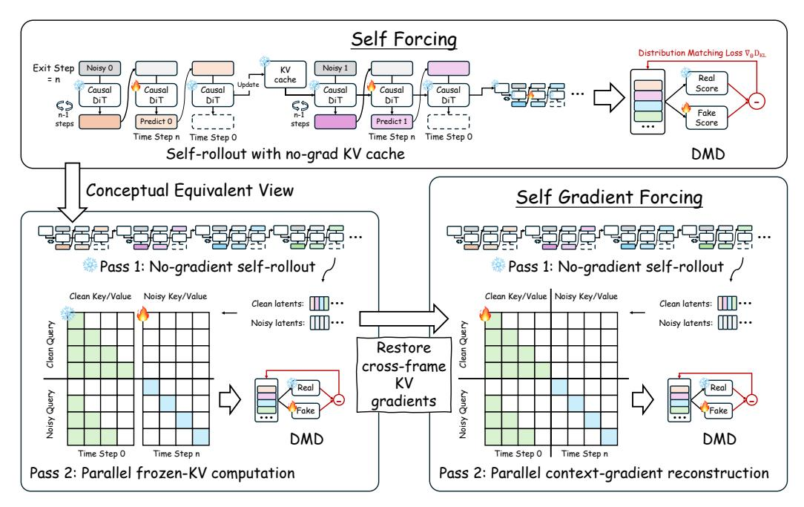 그림 2: 고정 캐시 Self Forcing에서 Self Gradient Forcing으로의 전환. Self Forcing은 자기 생성 기록을 사용하여 학습하지만, 역사적 K/V 항목을 분리된 캐시 상태로 처리한다. SGF는 노그래디언트 롤아웃을 그대로 유지하고, 병렬 재구성 패스를 추가한다. 여기서 분리된 맥락 잠재 변수는 클린 맥락 타임스텝에서 다시 인코딩되어, 미래 DMD 손실이 순차적 롤아웃 역전파 없이 K/V 작성을 감독한다. 알고리즘 1은 SGF 학습 단계를 요약한다. SGF는 Self Forcing의 등가적인 두 번의 패스 관점에서 이해할 수 있다. 이 관점에서, 패스 1은 일반적인 노그래디언트 자기 롤아웃을 수행하고 샘플링된 종료 상태를 기록하며, 패스 2는 병렬로 해당 인과적 계산을 재구성한다. 고정 캐시 Self Forcing은 패스 2에서 재구성된 맥락 K/V 경로를 분리된 메모리로 처리한다. SGF는 패스 1과 재구성 기하학을 그대로 유지하지만, 패스 2의 그래디언트 경계를 변경하여 미래 DMD 손실이 클린 맥락 K/V 작성도 감독하도록 한다. # 패스 1: 노그래디언트 자기 롤아웃. 첫 번째 패스는 추론 시 사용되는 일반적인 순차적 자기회귀 롤아웃이다. 각 블록 i에 대해, 모델은 현재 역사적 캐시를 사용하여 노이즈 제거를 수행하고 샘플링된 종료 상태를 기록한다: 노이즈 입력 $z_i^{t^*}$와 예측된 클린 잠재 변수 $\tilde{x}_i$이다. 잠재 변수 $\tilde{x}_i$는 이후 블록을 위한 순차적 K/V 캐시를 업데이트하기 위해 클린 맥락 타임스텝 $t_{\text{ctx}}=0$에서 처리된다. 이 패스의 모든 계산은 그래디언트 추적 없이 실행되며, 기록된 상태는 패스 2를 위한 고정된 데이터로 처리된다. **SF 패스 2: 고정 K/V 계산.** 고정 캐시 Self Forcing은 분리된 맥락 K/V 경로를 가진 샘플링된 종료 계산의 병렬 재구성으로 볼 수 있다. 기록된 노이즈 잠재 변수 $Z^{\star} = \{z_i^{t^{\star}}\}_{i=1}^{N}$ 및 맥락 잠재 변수 $\tilde{X}_{\text{ctx}} = \{\tilde{x}_i\}_{i=1}^{N}$이 주어지면, 인과적 마스크 $\mathcal{M}_{\text{rec}}$ 하에서 타겟 예측을 재구성한다: $$\hat{X}_{\text{tar}} = G_{\theta} \left( Z^{\star}, t^{\star}; \tilde{X}_{\text{ctx}}, t_{\text{ctx}}, \mathcal{M}_{\text{rec}} \right). \tag{3}$$ 마스크 $\mathcal{M}_{\rm rec}$는 순차적 캐시가 유도하는 싱크-플러스-윈도우 주의 관계를 재현한다. 그러나 고정 캐시 Self Forcing에서는 클린 맥락 측에서 생성된 K/V 항목이 노이즈 타겟 토큰이 이를 참조할 때 분리된 메모리로 처리된다. 따라서 DMD 손실은 미래 노이즈 토큰이 자기 생성 기록을 읽는 방식을 학습하지만, 그 기록이 K/V 메모리에 어떻게 인코딩되는지는 학습하지 않는다. **SGF 패스 2: 맥락-그래디언트 재구성.** SGF는 패스 1과 재구성 기하학을 그대로 유지하지만, 재구성된 맥락 K/V 경로에 대한 그라디언트 정지 경계를 제거한다. 맥락 잠재 변수 $\tilde{X}_{\text{ctx}}$ 자체는 여전히 그라디언트 정지 입력으로 남아 있으므로, SGF는 샘플링된 롤아웃 궤적을 최적화하지 않는다. 대신, 모델은 이 고정된 자기 생성 잠재 변수를 $t_{\text{ctx}}=0$에서 다시 인코딩하며, 생성된 K/V 항목은 미래 타겟 토큰이 이를 참조할 때 미분 가능하게 유지된다:

$$
\nabla_{\theta} \mathcal{L}_{\text{DMD}}(\hat{X}_{\text{tar}}) \supset \frac{\partial \mathcal{L}_{\text{DMD}}}{\partial \mathsf{KV}_{\text{ctx}}^{\text{rec}}} \frac{\partial \mathsf{KV}_{\text{ctx}}^{\text{rec}}}{\partial \theta}.
$$ (4) 따라서, 향후 DMD 손실은 타겟 측 노이즈 제거 및 클린 컨텍스트 K/V 기록을 모두 감독한다. Pass-2 재구성은 Pass 1에서 샘플링된 종료 계산을 복원하도록 설계되었다. 결정론적 레이어, 일치하는 위치 인덱스, 동일한 인과적 재구성 기하학을 사용할 때, $\hat{X}_{\text{tar}}$는 이에 대응하는 종료 상태에 대한 기록된 예측 컨텍스트 잠재변수 $\tilde{X}_{\text{ctx}}$와 이론적으로 동일하다. 실제 구현에서는 부동소수점 및 구현 수준의 효과로 인해 작은 편차가 여전히 나타날 수 있다. 부록 D는 이 복원 정확도를 경험적으로 검증한다. 이 두 단계 설계는 직접적인 미분 가능한 캐시로 인한 메모리 폭발을 피한다. Pass 1은 직렬적이지만 그래디언트가 없고, Pass 2는 그래디언트를 허용하지만 $\mathcal{M}_{\rm rec}$ 하에서 고정 창 크기로 병렬이다. 따라서 SGF는 전체 자기 롤아웃을 통한 반복적 자동미분 그래프를 열지 않고도 누락된 메모리 기록 감독을 복원한다.

#### 3.4 그래디언트 경계
SGF는 샘플링된 종료 계산의 경계된 재구성이며, 전체 롤아웃 BPTT가 아니다. 기록된 컨텍스트 잠재변수 $\tilde{X}_{\text{ctx}}$, 노이즈 샘플, 스케줄러 상태, Pass-1 직렬 캐시 트레일은 모두 그라디언트 정지(stop-gradient)이다. 그래디언트는 Pass-2 재구성만을 통해 흐른다: 클린 컨텍스트 순방향, K/V 투영, 미래-컨텍스트 어텐션, 타겟 측 노이즈 제거 계산. 이 경계는 메모리 기록 감독을 복원하면서도 훈련 그래프를 고정 창 크기로 병렬 상태로 유지한다.

#### 3.5 스트리밍 컨텍스트 정책
프레임 단위 스트리밍 생성에서, Self Forcing과 SGF는 모두 동일한 싱크-플러스-FIFO 컨텍스트 정책을 사용한다. 우리는 고정된 싱크 접두사와 최근 잠재변수의 FIFO 창을 유지하여, 컨텍스트 선택이 아닌 SGF의 효과만을 격리한다. Wan 비디오 VAE의 경우, 그 비대칭 그룹화 패턴으로 인해 유도된 시간적 경계 접두사를 보존하기 위해 네 개의 싱크 잠재변수를 사용한다. 부록 E는 경계 진단 및 싱크 개수에 대한 절제 실험을 제공한다.

#### 4 실험
SGF가 단기 수준 품질을 희생하지 않고 원래의 장기 비디오 외삽을 개선하는지 평가한다. 부록에는 전체 5초 VBench 표, 두 단계 복원 정확도, 싱크/컨텍스트 절제 실험, 추가 정성적 비교(부록 B, D, E, G)가 제공된다.

#### 4.1 실험 설정
모든 모델은 동일한 5초 훈련 창으로 훈련된다. 따라서 60초 및 240초 결과는 훈련 수평을 초월한 원래의 외삽을 테스트한다. 이전 장기 비디오 외삽 관행(Yesiltepe et al., 2025)에 따라, SGF를 5초, 60초, 240초에서 일치하는 Self Forcing 기준과 비교한다. 각 일치 쌍은 동일한 초기화, 프롬프트 세트, 랜덤 시드, 싱크/FIFO 정책, 슬라이딩 윈도우, 청킹 전략, 샘플링 구성 공유한다. 유일한 차이는 샘플링된 종료 손실이 Self Forcing처럼 고정된 과거 KV 캐시를 읽는지, 아니면 SGF처럼 그래디언트를 사용하여 자기 생성된 컨텍스트를 재구성하는지이다. 프레임 단위 생성의 경우, 싱크 4, 총 윈도우 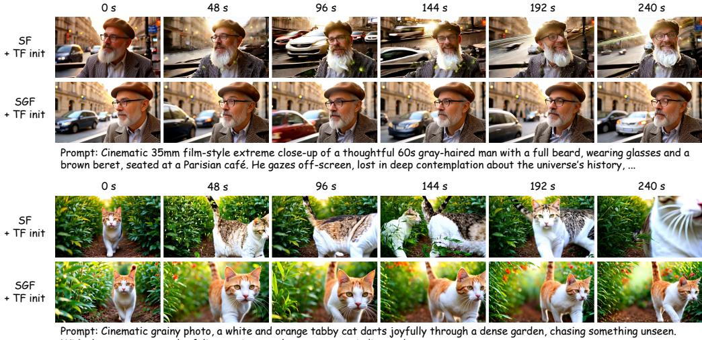 넓고 기쁜 눈이 좁고 굽이진 길을 따라 달리며 잎사귀를 스캔한다. ... 그림 3: TF 초기화 하의 프레임 단위 240초 비교. 두 행은 동일한 프롬프트, 랜덤 시드, 초기화, 수평, 추론 기하학을 사용한다. 21, FIFO 16, 현재 청크 1; 청크 단위 생성의 경우, 싱크 3, 총 윈도우 12, FIFO 6, 현재 청크 3, 청크 크기 3을 사용한다. 5초 평가는 표준 VBench 프로토콜을 따르며 단기 수평의 정상성 검사로 사용된다. 전체 5초 VBench 결과는 부록 [B,](#page-12-0)에 보고되며, 프레임 단위 및 청크 단위 설정 모두에서 SGF와 Self Forcing은 대체로 유사하다. 따라서 본문에서는 메모리 기록 오류가 축적될 시간을 갖는 60초 및 240초 외삽에 초점을 맞춘다. 60초 설정은 VBench-Long 프롬프트를 사용하고, 240초 설정은 128개의 무작위 샘플링된 MovieGen 프롬프트[$Polyak et al., 2024$](#page-10-16)를 사용한다. 두 장기 수평 모두 공식 VBench-Long 지표를 보고한다: 미적 품질, 배경 일관성, 동적 정도, 이미징 품질, 움직임 부드러움, 주체 일관성, 깜빡임. VBench 방향에 따라 높을수록 좋다. GSB 인간 선호도 결과는 쌍별 비교로 별도 보고된다.

### 4.2 장기 비디오 생성(60초 및 240초)
정량적 결과. 표 [1](#page-7-0) 및 [2](#page-7-1)는 프레임 단위 및 청크 단위 자기회귀 생성에 대한 장기 수평 자동 지표를 보고한다. 모든 비교는 각 생성 설정 내에서 통제되며, 초기화별로 쌍별로 해석해야 한다. 두 생성 세분화 및 두 장기 수평 모두에서, SGF는 대부분의 품질 및 일관성 지표에서 일치하는 Self Forcing 기준을 개선한다. 미적 품질, 배경 일관성, 이미징 품질, 움직임 부드러움, 주체 일관성, 깜빡임 지표에서 이득이 특히 일관되다. 이러한 지표들은 SGF가 목표로 하는 실패 모드를 직접 반영한다: 자기 생성된 잠재변수가 장기 외삽 동안 유용하게 유지되는 메모리 표현에 기록되는가이다. 동적 정도는 주요 예외로, Self Forcing이 더 높은 점수를 얻을 수 있다. 이는 반드시 더 나은 움직임 품질을 의미하지는 않는다: 부록 [G](#page-19-0)는 장기 Self Forcing 롤아웃이 종종 장면 점프, 깨진 카메라 기하학, 객체 변형을 포함하여 크지만 부조화된 명백한 움직임을 생성하고 동적 정도를 과대평가할 수 있음을 보여준다. 반면, SGF는 더 안정적인 이미지 품질과 더 타당한 카메라 진화를 유지하므로, 이러한 경우 낮은 동적 정도 점수는 더 나쁜 생성 품질의 증거가 아니다.

정성적 결과. 그림 [3](#page-6-0)은 TF 초기화 하의 대표적인 240초 프레임 단위 비교를 보여준다. 두 방법은 동일한 프롬프트, 시드, 수평, 추론 기하학을 사용하므로 시각적 차이는 샘플링 변동이 아니라 훈련 목적을 반영한다. Self Forcing은 롤아웃 초기에는 지역적으로 타당하게 유지되지만, 점차 정체성 드리프트, 크롭 드리프트, 레이아웃 변화를 축적하며, 자기 생성된 K/V 메모리가 후속 잠재변수 생성에 덜 신뢰할 수 있음을 나타낸다. 반면, SGF는 미래 손실을 사용하여 자기 생성된 잠재변수의 클린 컨텍스트 K/V 표현을 감독하여, 전체 롤아웃 동안 주체 정체성, 카메라 관계, 질감 있는 배경을 더 잘 보존한다. 다른 초기화 하의 추가 프레임 단위 및 청크 단위 비교는 부록 [G.](#page-19-0)에 제공된다.

### 4.3 사용자 연구
자동 지표는 인간이 인지하는 장기 수평 일관성을 직접적으로 캡처하지 못하므로, 10개의 일치하는 비교에 걸쳐 1,900개 이상의 쌍별 판단을 포함하는 무작위 GSB 선호도 연구를 수행한다. 각 쌍은 동일한 초기화, 프롬프트 세트, 수평, 추론 기하학 하에서 SGF와 일치하는 Self Forcing 기준을 비교한다. GSB = (G−B)/(G+S+B)×100%를 보고하며, G는 SGF를 선호, B는 Self Forcing을 선호, S는 명확한 선호가 없음을 의미한다. 따라서 양수 점수는 SGF 선호를 의미한다. 표 [3,](#page-8-0)에 나타난 바와 같이, 모든 점수가 양수이며, 평가자들이 장기 수평 생성에서 SGF를 Self Forcing보다 일관되게 선호함을 나타낸다.

표 3: 프레임 단위 및 청크 단위 생성에서 SGF 대 일치하는 Self Forcing 기준의 장기 수평 GSB 선호도 점수. 각 셀은 동일한 초기화, 프롬프트 세트, 롤아웃 수평, 추론 기하학 하에서 (G − B)/(G + S + B) × 100%를 보고한다. 양수 값은 Self Forcing보다 SGF를 선호함을 의미한다.

| 설정 | 수평 범위 | 인과적 ODE 초기화 | 인과적 CD 초기화 | TF 초기화 |
|------------|---------|-----------------|----------------|---------|
| 프레임 단위 | 60초 | 29.6% | 36.8% | 45.1% |
| 프레임 단위 | 240초 | 38.6% | 35.9% | 48.7% |
| 청크 단위 | 60초 | – | 32.9% | 37.5% |
| 청크 단위 | 240초 | – | 34.3% | 44.9% |

표 4: 컨텍스트-그래디언트 복원의 학습 가능성. 직접적인 미분 가능한 캐시 학습은 시리얼 캐시 형성 그래프를 유지하며 메모리 부족(OOM)이 발생한다. SGF는 샘플링된 종료 단계에서 경계가 있는 병렬 컨텍스트-그래디언트 재구성을 사용하여, 적절한 최대 메모리 및 실행 시간 오버헤드로 컨텍스트 K/V 그래디언트를 복원한다.

| 학습 변형 | 최대 메모리 | 안정적 메모리 | 5단계당 시간 |
|--------------------------------------------------|-------------|---------------|----------------|
| Self Forcing, 고정된 과거 KV 캐시 | 79.01GB | 79.01GB | 10.39s |
| SGF, 시리얼 Pass 1 + 병렬 Pass 2 | 87.01GB | 63.73GB | 11.71s |
| Self Forcing, 미분 가능한 과거 KV 캐시 | OOM | OOM | – |

### 4.4 정성적 결과

부록 [G.](#page-19-0)에 제공된 장기 수평 정성적 비교를 요약한다. 각 스트립은 동일한 프롬프트, 랜덤 시드, 초기화, 수평 범위, 추론 기하학 하에서 SGF와 Self Forcing을 비교한다. 따라서 시각적 차이는 샘플링 변동이 아니라 학습 목적을 반영한다. 이러한 스트립은 SGF가 목표로 하는 시간적 실패 모드를 시각화한다: 생성된 과거는 지역적으로 타당하게 유지되면서도, 후속 잠재 변수에 대한 메모리로 점차 덜 유용해진다. 그림 [7](#page-19-1)과 [3](#page-6-0)에 나타난 TF 초기화된 프레임 단위 60초 및 240초 비교가 가장 명확한 예시이며, 추가적인 프레임 단위 및 청크 단위 사례는 다른 초기화를 포함한다. 부록의 모든 예시에서 Self Forcing은 종종 장기적 드리프트를 축적하며, 이는 장면 점프, 깨진 카메라 기하학, 객체 변형, 신원 드리프트, 자르기 드리프트, 배경/레이아웃 교체 등을 포함한다. 이러한 실패는 크기는 크지만 일관되지 않은 겉보이는 움직임을 생성하며, 이는 지각 품질이 나빠지더라도 동적 정도가 증가하는 이유를 설명한다. 반면, SGF는 주체의 신원, 카메라 관계, 장면 레이아웃, 시간적 안정성을 더 잘 보존하며, 주체 일관성, 배경 일관성, 깜빡임, 움직임 부드러움에서의 향상과 일치한다.

### 4.5 학습 가능성

컨텍스트 그래디언트 복원이 학습을 금지할 만큼 비싸게 만드는지 분석한다. 표 [4](#page-8-1)는 고정 캐시 Self Forcing, SGF, 그리고 직접적인 미분 가능한 캐시 변형을 비교한다. 과거 KV 캐시를 통해 직접적으로 그래디언트를 활성화하면, 각 캐시 항목이 이를 생성한 시리얼 캐시 형성 그래프를 유지하기 때문에 메모리 부족(OOM)이 발생한다. SGF는 이러한 반복적 그래프를 회피한다: Pass 1은 그래디언트 없는 롤아웃이며, 그래디언트는 경계가 있는 Pass-2 재구성에서만 열린다. 우리의 구현에서 Pass 2는 컴파일된 정적 블록 희소 인과적 마스크와 FlexAttention을 사용하여, 재구성된 미래-컨텍스트 어텐션을 메모리 효율적으로 수행한다. 측정된 오버헤드는 적다. 고정 캐시 Self Forcing과 비교할 때, SGF는 최대 메모리를 79.01GB에서 87.01GB로 증가시키지만, 안정적 메모리는 79.01GB에서 63.73GB로 감소한다. 따라서 컨텍스트-그래디언트 경로를 활성화해도 직접적인 미분 가능한 캐시 학습과 같은 반복적 메모리 증가를 유발하지 않는다. 실행 시간도 유사하게 가깝다: 5개 학습 단계당 벽시계 시간은 10.39s에서 11.71s로 증가한다. 이는 종료 단계 n에서 Self Forcing이 n−1개의 그래디언트 없는 생성기 순방향 계산과 종료 단계에서 하나의 그래디언트 활성화된 순방향/역방향 계산을 수행하는 반면, SGF는 Pass 1에서 n개의 그래디언트 없는 순방향 계산과 Pass 2에서 하나의 그래디언트 활성화된 순방향/역방향 계산을 수행하기 때문이다. 가짜 점수 및 생성기 업데이트가 5:1 스케줄을 따르므로, 추가적인 Pass-2 작업은 각 5단계 주기 내에서 생성기 업데이트에만 영향을 미친다.

# 5 결론

우리는 Self Gradient Forcing(SGF)을 제시하였다. 이는 고정 캐시 Self Forcing에서의 과거 컨텍스트-그래디언트 간극을 해소하는 두 단계 학습 전략이다. 시리얼 자기 롤아웃을 그래디언트 없이 유지하고, 샘플링된 종료 계산을 병렬로 재구성함으로써, SGF는 전체 롤아웃 역전파 없이 미래 손실이 자기 생성된 과거가 K/V 메모리에 어떻게 기록되는지를 감독할 수 있게 한다. 프레임 단위 및 청크 단위 생성, 여러 초기화, 그리고 5초, 60초, 240초 수평 범위에 걸쳐 SGF는 단기 수평 품질을 유지하면서 장영상 신원, 레이아웃 일관성, 시간적 안정성을 향상시킨다. 이러한 향상은 정성적 비교 및 인간 선호도에 의해 확인되었으며, 향후 연구는 SGF를 더 강력한 초기화, 장컨텍스트 튜닝, 검색, 캐시 압축 기법과 결합할 수 있다.

# 참고문헌

- Omer Bar-Tal, Hila Chefer, Omer Tov, Charles Herrmann, Roni Paiss, Shiran Zada, Ariel Ephrat, Junhwa Hur, Guanghui Liu, Amit Raj, Yuanzhen Li, Michael Rubinstein, Tomer Michaeli, Oliver Wang, Deqing Sun, Tali Dekel, and Inbar Mosseri. Lumiere: A space-time diffusion model for video generation. *arXiv preprint arXiv:2401.12945*, 2024.
- Andreas Blattmann, Tim Dockhorn, Sumith Kulal, Daniel Mendelevitch, Maciej Kilian, Dominik Lorenz, Yam Levi, Zion English, Vikram Voleti, Adam Letts, Varun Jampani, and Robin Rombach. Stable video diffusion: Scaling latent video diffusion models to large datasets. *arXiv preprint arXiv:2311.15127*, 2023a.
- Andreas Blattmann, Robin Rombach, Huan Ling, Tim Dockhorn, Seung Wook Kim, Sanja Fidler, and Karsten Kreis. Align your latents: High-resolution video synthesis with latent diffusion models. *arXiv preprint arXiv:2304.08818*, 2023b.
- Boyuan Chen, Diego Marti Monso, Yilun Du, Max Simchowitz, Russ Tedrake, and Vincent Sitzmann. Diffusion forcing: Next-token prediction meets full-sequence diffusion. *arXiv preprint arXiv:2407.01392*, 2024a.
- Haoxin Chen, Yong Zhang, Xiaodong Cun, Menghan Xia, Xintao Wang, Chao Weng, and Ying Shan. Videocrafter2: Overcoming data limitations for high-quality video diffusion models. In *IEEE/CVF Conference on Computer Vision and Pattern Recognition*, 2024b.
- Shuo Chen, Cong Wei, Sun Sun, Tiancheng Shen, Ping Nie, Kai Zou, Ge Zhang, Ming-Hsuan Yang, and Wenhu Chen. Context forcing: Consistent autoregressive video generation with long context. In *International Conference on Machine Learning*, 2026a.
- Yukang Chen, Luozhou Wang, Wei Huang, Shuai Yang, Bohan Zhang, Yicheng Xiao, Ruihang Chu, Weian Mao, Qixin Hu, Shaoteng Liu, Yuyang Zhao, Huizi Mao, Ying-Cong Chen, Enze Xie, Xiaojuan Qi, and Song Han. Longlive-2.0: An nvfp4 parallel infrastructure for long video generation. *arXiv preprint arXiv:2605.18739*, 2026b.
- Justin Cui, Jie Wu, Ming Li, Tao Yang, Xiaojie Li, Rui Wang, Andrew Bai, Yuanhao Ban, and Cho-Jui Hsieh. Self-forcing++: Towards minute-scale high-quality video generation. *arXiv preprint arXiv:2510.02283*, 2025.
- Zihang Dai, Zhilin Yang, Yiming Yang, Jaime Carbonell, Quoc V. Le, and Ruslan Salakhutdinov. Transformer-xl: Attentive language models beyond a fixed-length context. In *Annual Meeting of the Association for Computational Linguistics*, 2019.
- Yuwei Guo, Ceyuan Yang, Anyi Rao, Zhengyang Liang, Yaohui Wang, Yu Qiao, Maneesh Agrawala, Dahua Lin, and Bo Dai. Animatediff: Animate your personalized text-to-image diffusion models without specific tuning. In *International Conference on Learning Representations*, 2024.
- Roberto Henschel, Levon Khachatryan, Hayk Poghosyan, Daniil Hayrapetyan, Vahram Tadevosyan, Zhangyang Wang, Shant Navasardyan, and Humphrey Shi. Streamingt2v: Consistent, dynamic, and extendable long video generation from text. In *IEEE/CVF Conference on Computer Vision and Pattern Recognition*, 2025.

- Jonathan Ho, Ajay Jain, 및 Pieter Abbeel. Denoising diffusion probabilistic models. In *Advances in Neural Information Processing Systems*, 2020.  
- Jonathan Ho, William Chan, Chitwan Saharia, Jay Whang, Ruiqi Gao, Alexey Gritsenko, Diederik P. Kingma, Ben Poole, Mohammad Norouzi, David J. Fleet, 및 Tim Salimans. Imagen video: High definition video generation with diffusion models. *arXiv preprint arXiv:2210.02303*, 2022a.  
- Jonathan Ho, William Chan, Chitwan Saharia, Jay Whang, Ruiqi Gao, Alexey Gritsenko, Diederik P. Kingma, Ben Poole, Mohammad Norouzi, David J. Fleet, 및 Tim Salimans. Video diffusion models. *arXiv preprint arXiv:2204.03458*, 2022b.  
- Qixin Hu, Shuai Yang, Wei Huang, Song Han, 및 Yukang Chen. Longlive-rag: A general retrieval-augmented framework for long video generation. *arXiv preprint arXiv:2606.02553*, 2026.  
- Xun Huang, Zhengqi Li, Guande He, Mingyuan Zhou, 및 Eli Shechtman. Self forcing: Bridging the train-test gap in autoregressive video diffusion. *arXiv preprint arXiv:2506.08009*, 2025.  
- Yicheng Ji, Zhizhou Zhong, Jun Zhang, Qin Yang, Xitai Jin, Ying Qin, Wenhan Luo, Shuiyang Mao, Wei Liu, 및 Huan Li. Forcing-kv: Hybrid kv cache compression for efficient autoregressive video diffusion models. *arXiv preprint arXiv:2605.09681*, 2026.  
- Jihwan Kim, Junoh Kang, Jinyoung Choi, 및 Bohyung Han. Fifo-diffusion: Generating infinite videos from text without training. In *Advances in Neural Information Processing Systems*, 2024.  
- Dan Kondratyuk, Lijun Yu, Xiuye Gu, Jose Lezama, Jonathan Huang, Grant Schindler, Rachel Hornung, Vighnesh Birodkar, Jimmy Yan, Ming Chuang, David Ross, Irfan Essa, Yonatan Bisk, Mohammad Norouzi, Gerard de Melo, 및 Bryan Seybold. Videopoet: A large language model for zero-shot video generation. In *International Conference on Machine Learning*, 2024.  
- Yuhong Li, Yingbing Huang, Bowen Yang, Bharat Venkitesh, Acyr Locatelli, Hanchen Ye, Tianle Cai, Patrick Lewis, 및 Deming Chen. Snapkv: LLM knows what you are looking for before generation. In *Advances in Neural Information Processing Systems*, 2024.  
- Kunhao Liu, Wenbo Hu, Jiale Xu, Ying Shan, 및 Shijian Lu. Rolling forcing: Autoregressive long video diffusion in real time. *arXiv preprint arXiv:2509.25161*, 2025.  
- Yawen Luo, Xiaoyu Shi, Junhao Zhuang, Yutian Chen, Quande Liu, Xintao Wang, Pengfei Wan, 및 Tianfan Xue. Shotstream: Streaming multi-shot video generation for interactive storytelling. *arXiv preprint arXiv:2603.25746*, 2026.  
- Yu Meng, Xiangyang Luo, Letian Li, Wenyuan Jiang, Chen Gao, Xinlei Chen, Yong Li, 및 Xiao-Ping Zhang. Tethercache: Stabilizing autoregressive long-form video generation with gated recall and trusted alignment. *arXiv preprint arXiv:2606.13035*, 2026.  
- William Peebles 및 Saining Xie. Scalable diffusion models with transformers. In *IEEE/CVF International Conference on Computer Vision*, 2023.  
- Adam Polyak, Amit Zohar, Andrew Brown, Andros Tjandra, Animesh Sinha, Ann Lee, Apoorv Vyas, Bowen Shi, Chih-Yao Ma, Ching-Yao Chuang, et al. Movie gen: A cast of media foundation models. *arXiv preprint arXiv:2410.13720*, 2024.  
- Haonan Qiu, Menghan Xia, Yong Zhang, Yingqing He, Xintao Wang, Ying Shan, 및 Ziwei Liu. Freenoise: Tuning-free longer video diffusion via noise rescheduling. In *International Conference on Learning Representations*, 2024.  
- Robin Rombach, Andreas Blattmann, Dominik Lorenz, Patrick Esser, 및 Björn Ommer. High-resolution image synthesis with latent diffusion models. In *IEEE/CVF Conference on Computer Vision and Pattern Recognition*, 2022.  
- Uriel Singer, Adam Polyak, Thomas Hayes, Xi Yin, Jie An, Songyang Zhang, Qiyuan Hu, Harry Yang, Oron Ashual, Oran Gafni, Devi Parikh, Sonal Gupta, 및 Yaniv Taigman. Make-a-video: Text-to-video generation without text-video data. In *International Conference on Learning Representations*, 2023.  
- Jiaming Song, Chenlin Meng, 및 Stefano Ermon. Denoising diffusion implicit models. In *International Conference on Learning Representations*, 2021.  
- Jianlin Su, Yu Lu, Shengfeng Pan, Ahmed Murtadha, Bo Wen, 및 Yunfeng Liu. Roformer: Enhanced transformer with rotary position embedding. *arXiv preprint arXiv:2104.09864*, 2021.  
- Jiahao Tian, Yiwei Wang, Gang Yu, 및 Chi Zhang. Head forcing: Long autoregressive video generation via head heterogeneity. *arXiv preprint arXiv:2605.14487*, 2026.  
- Fu-Yun Wang, Wenshuo Chen, Guanglu Song, Han-Jia Ye, Yu Liu, 및 Hongsheng Li. Gen-l-video: Multi-text to long video generation via temporal co-denoising. *arXiv preprint arXiv:2305.18264*, 2023.  
- Zile Wang, Zexiang Liu, Jiaxing Li, Kaichen Huang, Baixin Xu, Fei Kang, Mengyin An, Peiyu Wang, Biao Jiang, Yichen Wei, Yidan Xietian, Jiangbo Pei, Liang Hu, Boyi Jiang, Hua Xue, Zidong Wang, Haofeng Sun, Wei Li, Wanli Ouyang, Xianglong He, Yang Liu, Yangguang Li, 및 Yahui Zhou. Matrix-game 3.0: Real-time and streaming interactive world model with long-horizon memory. *arXiv preprint arXiv:2604.08995*, 2026.  
- Guangxuan Xiao, Yuandong Tian, Beidi Chen, Song Han, 및 Mike Lewis. Efficient streaming language models with attention sinks. In *International Conference on Learning Representations*, 2024.  
- Boxun Xu, Yuming Du, Zichang Liu, Siyu Yang, Ziyang Jiang, Siqi Yan, Rajasi Saha, Albert Pumarola, Wenchen Wang, 및 Peng Li. Sparse forcing: Native trainable sparse attention for real-time autoregressive diffusion video generation. *arXiv preprint arXiv:2604.21221*, 2026a.  
- Gangwei Xu, Qihang Zhang, Jiaming Zhou, Xing Zhu, Yujun Shen, Xin Yang, 및 Yinghao Xu. Next forcing: Causal world modeling with multi-chunk prediction. *arXiv preprint arXiv:2606.11187*, 2026b.  
- Shuai Yang, Wei Huang, Ruihang Chu, Yicheng Xiao, Yuyang Zhao, Xianbang Wang, Muyang Li, Enze Xie, Yingcong Chen, Yao Lu, Song Han, 및 Yukang Chen. Longlive: Real-time interactive long video generation. *arXiv preprint arXiv:2509.22622*, 2025.  
- Hidir Yesiltepe, Tuna Han Salih Meral, Adil Kaan Akan, Kaan Oktay, 및 Pinar Yanardag. Infinity-RoPE: Action-controllable infinite video generation emerges from autoregressive self-rollout. *arXiv preprint arXiv:2511.20649*, 2025.  
- Tianwei Yin, Qiang Zhang, Richard Zhang, William T. Freeman, Fredo Durand, Eli Shechtman, 및 Xun Huang. From slow bidirectional to fast autoregressive video diffusion models. In *IEEE/CVF Conference on Computer Vision and Pattern Recognition*, 2025.  
- Yonghao Yu, Lang Huang, Runyi Li, Zerun Wang, 및 Toshihiko Yamasaki. Video-mirai: Autoregressive video diffusion models need foresight. *arXiv preprint arXiv:2606.03971*, 2026.  
- Zhenyu Zhang, Ying Sheng, Tianyi Zhou, Tianlong Chen, Lianmin Zheng, Ruisi Cai, Zhao Song, Yuandong Tian, Christopher Re, Clark Barrett, Zhangyang Wang, 및 Beidi Chen. H2o: Heavyhitter oracle for efficient generative inference of large language models. In *Advances in Neural Information Processing Systems*, 2023.  
- Min Zhao, Hongzhou Zhu, Kaiwen Zheng, Zihan Zhou, Bokai Yan, Xinyuan Li, Xiao Yang, Chongxuan Li, 및 Jun Zhu. Causal forcing++: Scalable few-step autoregressive diffusion distillation for real-time interactive video generation. *arXiv preprint arXiv:2605.15141*, 2026.  
- Hongzhou Zhu, Min Zhao, Guande He, Hang Su, Chongxuan Li, 및 Jun Zhu. Causal forcing: Autoregressive diffusion distillation done right for high-quality real-time interactive video generation. *arXiv preprint arXiv:2602.02214*, 2026.  
- Junhao Zhuang, Shi Guo, Xin Cai, Xiaohui Li, Yihao Liu, Chun Yuan, 및 Tianfan Xue. Flashvsr: Towards real-time diffusion-based streaming video super-resolution. In *IEEE/CVF Conference on Computer Vision and Pattern Recognition*, 2026.  

# A 추가 실험 세부 사항  

**베이스라인 프로토콜.** 우리는 5초, 60초, 240초에서 매칭된 Self Forcing 및 SGF 쌍을 평가한다. 5초 설정은 표준 VBench 프로토콜을 따르며 16개의 품질 및 의미적 차원을 모두 보고한다. 60초 설정은 VBench-Long 프로토콜을 사용하며, 240초 설정은 동일한 VBench-Long 품질 지표를 사용하여 128개의 무작위로 샘플링된 MovieGen 프롬프트를 사용한다. 장기 예측 평가에서는 텍스트 정렬 메트릭을 생략하고, 자기회귀적 외삽 하에서의 시각적 지속성을 중심으로 평가한다.  

**Self Forcing 체크포인트 출처.** 프레임 단위 및 청크 단위의 인과적-ODE Self Forcing 베이스라인은 공개된 Causal Forcing 체크포인트[$Zhu et al., 2026$](#page-11-3)를 사용한다. 청크 단위의 양방향-ODE Self Forcing 베이스라인은 공개된 Self Forcing 체크포인트[$Huang et al., 2025$](#page-10-0)를 사용한다. 우리 표에 포함된 모든 다른 Self Forcing 체크포인트는 해당 SGF 체크포인트와 동일한 학습 설정 하에서 우리에 의해 재현되었으며, 평가 프롬프트, 랜덤 시드, 샘플링 구성, 추론 컨텍스트 기하학은 각 비교 내에서 일치시켰다.  

# A.1 프레임 단위 구성  

프레임 단위 학습에서는 슬라이딩 윈도우 폐기 없이 전체 5초 학습 창을 사용한다. 따라서 Pass-2 재구성은 기록된 프레임 시퀀스에 대해 스크린-플러스-FIFO 슬라이딩 윈도우 마스크가 아니라 표준 티처 포싱 스타일의 인과적 마스크를 사용한다. 이 마스크는 프레임 단위 Pass-1 학습 롤아웃에서 사용된 전체 컨텍스트 인과 관계와 일치한다. 추론 및 장기 평가 시, 프레임 단위 생성은 스크린 4, FIFO 16, 현재 청크 1을 사용하여 스트리밍 모드로 실행되며, 총 컨텍스트 창은 21개의 잠재 프레임이다. 이 스트리밍 정책은 Self Forcing 및 SGF 모두에서 공유되며, 각 매칭 쌍 내에서 프롬프트 세트, 랜덤 시드, 샘플링 구성, 초기화, 추론 컨텍스트 정책은 고정된다. 유일하게 의도된 차이점은 샘플링된 종료 손실의 기울기 경계이다: Self Forcing은 과거 KV 캐시를 고정된 롤아웃 상태로 소비하는 반면, SGF는 클린 컨텍스트 K/V 경로를 통해 기울기를 통과시켜 자기 생성된 컨텍스트를 재구성한다. 이에 해당하는 5초 결과는 표 [5](#page-13-0)에, 60초 및 240초 결과는 표 [1](#page-7-0)에 보고된다.  

### A.2 청크 단위 구성  

청크 단위 학습에서는 Pass-1 롤아웃 동안 슬라이딩 윈도우 컨텍스트를 사용한다. 윈도우는 스크린 3, FIFO 6, 현재 청크 3을 포함하며, 청크 크기는 3이다. Pass-2 재구성 마스크는 Pass-1 슬라이딩 윈도우 캐시 관계와 일치하도록 구성되며, 컨텍스트 기울기 복구는 샘플링된 롤아웃 동안 사용된 동일한 어텐션 기하학을 따른다. 동일한 청크 단위 컨텍스트 정책이 추론 및 장기 평가에 사용된다. 우리는 공개된 양방향-ODE Self Forcing 및 인과적-ODE Self Forcing 체크포인트를 참조 베이스라인으로 포함한다. 통제된 SGF 비교는 매칭된 인과적-CD 및 TF 쌍이며, Self Forcing 및 SGF는 동일한 초기화 및 추론 기하학을 공유한다. 이 설정은 메모리가 더 거시적 시간 단위로 업데이트될 때 컨텍스트 기울기 신호가 여전히 유용한지 테스트한다. 5초 청크 단위 결과는 표 [6](#page-14-0)에, 60초 및 240초 결과는 표 [2](#page-7-1)에 보고된다. 인간 선호도 점수는 별도로 표 [3](#page-8-0)에 보고된다.

# B 전체 메트릭 테이블  
이 부록은 완전한 5초 VBench 결과를 보고한다. 메트릭은 행으로, 모델 변형은 열로 구성되며, 볼드체는 각 매칭된 Self Forcing–SGF 쌍 내에서 더 나은 값을 표시한다. 이 단기 수평 결과는 정상성 검사(sanity check)로 사용된다: SGF는 장기 자기회귀 외삽을 개선하도록 설계되었으므로, 표준 5초 비디오 품질을 저하시켜서는 안 된다. 장기 수평 60초 및 240초 결과는 본문에 보고된다.   
표 5: 프레임 단위 5초 VBench 메트릭. 평가는 sink 4, FIFO 16, 현재 청크 1을 사용하여 총 21개의 잠재 프레임 컨텍스트 윈도우를 구성한다. 쌍을 이룬 열은 동일한 초기화 하에서 SGF의 그래디언트 경계 변화를 분리한다.  
| 메트릭 | 인과적 ODE 초기화 | | | 인과적 CD 초기화 | TF 초기화 | |  
|-------------|-----------------|-------|-------|----------------|---------|-------|  
| | SF | SGF | SF | SGF | SF | SGF |  
| 미학 | 0.651 | 0.665 | 0.663 | 0.672 | 0.667 | 0.671 |  
| 배경 | 0.928 | 0.956 | 0.963 | 0.968 | 0.959 | 0.959 |  
| 동적 | 0.989 | 0.703 | 0.616 | 0.375 | 0.633 | 0.653 |  
| 이미징 | 0.694 | 0.713 | 0.711 | 0.714 | 0.698 | 0.713 |  
| 움직임 | 0.972 | 0.985 | 0.983 | 0.989 | 0.986 | 0.983 |  
| 주체 | 0.911 | 0.963 | 0.953 | 0.976 | 0.961 | 0.968 |  
| 깜빡임 | 0.947 | 0.984 | 0.993 | 0.993 | 0.988 | 0.990 |  
| 객체 | 0.938 | 0.951 | 0.955 | 0.960 | 0.941 | 0.950 |  
| 다중 | 0.789 | 0.865 | 0.861 | 0.883 | 0.849 | 0.855 |  
| 행동 | 0.968 | 0.962 | 0.954 | 0.950 | 0.962 | 0.958 |  
| 색상 | 0.842 | 0.863 | 0.885 | 0.883 | 0.847 | 0.882 |  
| 공간 | 0.732 | 0.778 | 0.771 | 0.780 | 0.781 | 0.739 |  
| 장면 | 0.563 | 0.567 | 0.574 | 0.584 | 0.538 | 0.547 |  
| 외관 | 0.206 | 0.204 | 0.199 | 0.204 | 0.204 | 0.203 |  
| 시간적 | 0.246 | 0.250 | 0.242 | 0.242 | 0.239 | 0.239 |  
| 일관성 | 0.264 | 0.262 | 0.263 | 0.263 | 0.262 | 0.264 |  

# B.1 프레임 단위 5초 VBench  
프레임 단위 5초 설정은 컨텍스트-그래디언트 재구성 목적함수를 추가함으로써 단기 비디오 생성 품질이 유지되는지를 평가한다. 프레임 단위 학습은 슬라이딩 윈도우 제거 없이 전체 5초 학습 윈도우를 사용하며, Pass-2 재구성은 표준 티처 포싱 스타일의 인과적 마스크를 사용한다. 평가 시, 우리는 장기 수평 프레임 단위 실험과 동일한 스트리밍 정책을 사용한다: sink 4, FIFO 16, 현재 청크 1로, 총 21개의 잠재 프레임 컨텍스트 윈도우를 구성한다. 5초 비디오의 경우, 이 윈도우는 생성된 전체 잠재 시퀀스를 커버하므로, 이 표는 주로 단기 수평 품질을 측정하며 장거리 외삽은 측정하지 않는다.  

# B.2 청크 단위 5초 VBench  
청크 단위 5초 설정은 메모리가 더 거친 시간적 세분화로 업데이트될 때 SGF가 Self Forcing과 비교할 수 있는지 확인한다. 프레임 단위 학습과 달리, 청크 단위 학습은 이미 Pass 1에서 슬라이딩 윈도우 컨텍스트를 사용하며, sink 3, FIFO 6, 현재 청크 3, 청크 크기 3을 적용한다. Pass-2 재구성 마스크는 이 슬라이딩 윈도우 캐시 관계와 일치하므로, 복원된 컨텍스트-그래디언트 경로는 샘플링된 롤아웃과 동일한 어텐션 기하학을 따른다. 공개된 양방향-ODE 및 인과적-ODE Self Forcing 행은 참조 베이스라인으로 포함되며, 통제된 SGF 비교는 매칭된 인과적-CD 및 TF 쌍이다.  

# C 직접 캐시-그래디언트 가능성  
이 부록은 본문의 학습 가능성 논의를 확장한다. 측정된 비교 결과는 표 [4.](#page-8-1)에 보고된다. 여기서 우리는 자기회귀 이력을 통해 그래디언트를 노출하는 세 가지 가능한 방법을 구분한다: 고정 캐시 Self Forcing, 노이즈 제거 경로 그래디언트 없이 직접 미분 가능한 캐시 학습, 그리고 전체 롤아웃 BPTT이다. 이 구분은 왜 SGF가 제한된 병렬 재구성을 사용하는지 명확히 한다.  

**고정 캐시 Self Forcing.** 고정 캐시 Self Forcing에서는 샘플링된 종료 단계 예측이 그래디언트로 학습되지만, 역사적 캐시 업데이트는 분리된다. 비종료 노이즈 제거 단계는 그래디언트 추적 없이 실행되며, 각 생성 블록이 예측된 후 모델은 그래디언트 실행 없이 컨텍스트 타임스텝에서 호출되어 지속적인 KV 캐시를 업데이트한다. 따라서 미래 손실은 역사적 캐시 항목을 읽는 타겟 측 노이즈 제거 계산을 학습할 수 있지만, 이러한 역사적 KV 항목을 생성한 tctx = 0 전방 계산으로는 역전파할 수 없다.   
표 6: 청크 단위 5초 VBench 메트릭. 학습 및 평가는 sink 3, FIFO 6, 현재 청크 3, 청크 크기 3을 사용한다. 통제된 SGF 비교는 매칭된 인과적-CD 및 TF 쌍이며, ODE 초기화 Self Forcing 행은 참조 베이스라인이다.  
| 메트릭 | 양방향 ODE 초기화 | 인과적 ODE 초기화 | | 인과적 CD 초기화 | TF 초기화 | |  
|-------------|---------------------------|--------------------|-------|----------------|---------|-------|  
| | SF | SF | SF | SGF | SF | SGF |  
| 미학 | 0.659 | 0.660 | 0.661 | 0.663 | 0.663 | 0.678 |  
| 배경 | 0.961 | 0.959 | 0.945 | 0.958 | 0.948 | 0.964 |  
| 동적 | 0.647 | 0.836 | 0.753 | 0.875 | 0.908 | 0.692 |  
| 이미징 | 0.694 | 0.705 | 0.699 | 0.699 | 0.695 | 0.706 |  
| 움직임 | 0.984 | 0.974 | 0.978 | 0.975 | 0.976 | 0.985 |  
| 주체 | 0.955 | 0.955 | 0.946 | 0.956 | 0.938 | 0.970 |  
| 깜빡임 | 0.991 | 0.982 | 0.979 | 0.981 | 0.978 | 0.988 |  
| 객체 | 0.952 | 0.958 | 0.951 | 0.958 | 0.958 | 0.958 |  
| 다중 | 0.863 | 0.866 | 0.844 | 0.816 | 0.852 | 0.861 |  
| 행동 | 0.968 | 0.956 | 0.962 | 0.952 | 0.950 | 0.964 |  
| 색상 | 0.880 | 0.879 | 0.880 | 0.890 | 0.872 | 0.875 |  
| 공간 | 0.811 | 0.791 | 0.741 | 0.752 | 0.779 | 0.802 |  
| 장면 | 0.574 | 0.558 | 0.560 | 0.557 | 0.542 | 0.551 |  
| 외관 | 0.203 | 0.205 | 0.200 | 0.199 | 0.202 | 0.203 |  
| 시간적 | 0.244 | 0.247 | 0.245 | 0.244 | 0.241 | 0.242 |  
| 일관성 | 0.268 | 0.267 | 0.265 | 0.265 | 0.266 | 0.265 |  

배치 크기 B, 유지된 역사적 블록 T, 블록당 토큰 수 L, 폭 D, H개의 트랜스포머 층에 대해, 원시 분리된 캐시 저장은 다음과 같이 확장된다:  
$$M_{\rm cache} \approx H \cdot 2 \cdot B \cdot TLD \cdot \text{bytes},$$  
(5)  
여기서 계수 2는 키와 값 모두를 고려한다. 이 항은 유지된 캐시의 텐서 발자국만을 나타내며, 그 형성 과정을 미분하기 위해 필요한 활성화 그래프는 포함하지 않는다.  

**노이즈 제거 경로 그래디언트 없이 직접 미분 가능한 캐시.** 누락된 이력 형성 그래디언트를 복원하는 직접적인 방법은 지속적인 역사적 캐시를 미분 가능하게 유지하면서, 생성된 잠재 변수 자체는 stop-gradient 입력으로 처리하는 것이다. 이 변형에서,  
$$\mathsf{KV}_{i}^{0}(\theta) = \mathcal{C}_{\theta}\left(\mathrm{sg}(\tilde{x}_{i}), t_{\mathrm{ctx}}; \mathsf{KV}_{< i}^{0}\right), \qquad t_{\mathrm{ctx}} = 0, \tag{6}$$  
여기서 $\mathcal{C}^{\theta}$는 역사적 K/V 항목을 생성하는 동일한 인과적 모델 전방 계산을 의미한다. $\tilde{x}_i$는 분리되었지만, 캐시 형성 자체는 여전히 순차적이다: 블록 $i$의 K/V 항목은 이전 역사적 캐시 항목을 읽으며 계산된다. 만약 이전 항목들도 미분 가능하다면, 오버롤 그래프는 롤아웃을 통해 재귀적으로 된다. 메모리 비용은 원시 캐시 저장보다 더 크다:  
$$M_{\text{direct}} \gtrsim M_{\text{cache}} + \sum_{i=1}^{T} M_{\text{KV formation}}(i) + M_{\text{saved attention}},$$  
(7)  
여기서 $M_{\text{KV formation}}(i)$는 블록 $i$의 역사적 K/V 항목을 형성하는 $t_{\mathrm{ctx}} = 0$ 전방 계산의 저장된 활성화를 의미하며, 이는 이전 캐시 상태에 대한 의존성을 포함한다. 이 식은 정확한 메모리 할당 공식이 아니라 확장 논증이다. 그 목적은 생성된 잠재 변수를 분리하더라도 최소한의 직접 캐시 대안조차도 순차적 이력 형성 그래프를 열어버린다는 것을 보여주는 것이다.  

**전체 롤아웃 BPTT.** 더 강력한 대안은 전체 롤아웃 BPTT로, 생성된 잠재 변수가 분리되지 않는다. 그러면 블록 $i$의 역사적 K/V 항목은 $t_{\mathrm{ctx}} = 0$의 K/V 형성 전방 계산뿐 아니라 $\tilde{x}^{i}$를 생성한 노이즈 제거 경로에도 의존한다. 메모리 비용은 노이즈 제거 단계의 저장된 활성화를 추가로 포함한다:  
$$M_{\text{full-BPTT}} \gtrsim M_{\text{direct}} + \sum_{i=1}^{T} \sum_{s=1}^{K_i} M_{\text{denoise}}(i, s),$$  
(8)  
여기서 $K_i$는 블록 $i$에 사용된 노이즈 제거 단계 수이며, $M_{\rm denoise}(i,s)$는 노이즈 제거 단계 $s$에서 생성기 전방 계산의 활성화 발자국을 의미한다. 따라서 전체 롤아웃 BPTT는 롤아웃 길이와 노이즈 제거 깊이 모두에 따라 증가하므로, 위의 직접 미분 가능한 캐시 변형보다 엄격히 더 요구가 크다.  

**SGF 제한 재구성.** SGF는 순차적 그래프를 모두 유지하지 않는다. Pass 1은 그래디언트 실행 없이 진정한 자기회귀 롤아웃을 수행하고, 자기 생성된 컨텍스트 잠재 변수 $\tilde{X}_{\text{ctx}}$와 샘플링된 노이즈된 종료 상태 $Z^{t^*}$를 기록한다. Pass 2는 지속적인 롤아웃 캐시를 버리고 하나의 제한된 병렬 재구성을 수행한다:  
$$M_{SGF} \approx M_{\text{pass1 cache data}} + M_{\text{records}}(\tilde{X}_{\text{ctx}}, Z^{t^{\star}}) + M_{\text{parallel window}}(N),$$  
(9)  
여기서 $N$은 고정된 재구성 윈도우 길이이다. 복원된 그래디언트는 $t_{\rm ctx}=0$에서의 컨텍스트 측 전방 계산, K/V 투영, Pass 2의 미래-컨텍스트 어텐션 관계를 통과한다. 이는 기록된 잠재 변수를 생성한 노이즈 제거 경로나 Pass 1의 순차적 지속 캐시 업데이트를 통해 역전파하지 않는다.  

**해석.** 이는 관련 확장 순서를 제공한다:  
$$M_{SGF} < M_{\text{direct}} < M_{\text{full-BPTT}},$$  
(10)  
여기서 중간 항은 stop-gradient 생성 잠재 변수를 사용한 직접 미분 가능한 캐시 학습을 의미하며, 고정 캐시 Self Forcing 베이스라인은 포함하지 않는다. 고정 캐시 Self Forcing은 역사적 K/V 형성 경로를 분리하므로 더 저렴할 수 있지만, 이것이 바로 SGF가 복원하려는 누락된 그래디언트이다. 표 4의 측정 결과는 이 그림과 일치한다: 직접 미분 가능한 캐시 학습은 우리의 설정에서 메모리 부족으로 실패하지만, SGF는 제한된 종료 단계 재생을 통해 컨텍스트-그래디언트 경로를 복원한다.  

#### D 두 단계 복원 정확도  
SGF는 Pass 2가 Pass 1에서 샘플링된 종료 계산을 신뢰할 수 있게 재생한다는 가정에 의존한다. 이 부록은 이 가정을 전방 수준에서 검증한다. 목표는 전체 롤아웃 BPTT와 동등함을 주장하는 것이 아니라, 병렬 재구성이 순차적 그래디언트 없는 롤아웃과 동일한 국소적 인과 관계를, 혼합 정밀도 실행으로 예상되는 수치적 차이를 제외하고 재현하는지를 확인하는 것이다.

**프로토콜.** 우리는 24개의 프롬프트와 네 개의 종료 단계 $t^\star \in \{1000, 750, 500, 250\}$ 에 대해 복구 정확도를 평가하며, 이는 총 96개의 프롬프트/종료 비교를 생성한다. 각 비교에 대해, Pass 1은 그래디언트 없이 순차적 자기 롤아웃을 수행하고, 샘플링된 잡음 입력과 해당 종료 단계 예측을 기록한다. Pass 2는 기록된 잡음 상태와 분리된 자기 생성 컨텍스트를 사용하여, 매칭된 티처-포싱 어텐션 마스크 하에서 하나의 병렬 복구를 수행한다. 우리는 VAE 디코딩 전 Pass-1과 Pass-2의 잠재적 예측을 비교한다.  
**지표.** $x^{(1)}$ 을 Pass-1 종료 예측, $x^{(2)}$ 를 해당 Pass-2 복구로 나타내자. 우리는 평균 제곱 오차, 제곱근 평균 제곱 오차, 평균 절대 오차, 최대 절대 오차, 상대 $\ell_2$ 오차, 그리고 코사인 유사도를 보고한다:  
RMSE = $$\sqrt{\text{mean}\left((x^{(2)} - x^{(1)})^2\right)}$$ , (11)  
$$RelL2 = \frac{\|x^{(2)} - x^{(1)}\|_2}{\max(\|x^{(1)}\|_2, 10^{-12})},$$ (12)  
Cosine = $$\frac{\langle x^{(1)}, x^{(2)} \rangle}{\|x^{(1)}\|_2 \|x^{(2)}\|_2}$$ . (13)  
복구 오차를 혼합 정밀도 수치 척도와 연결하기 위해, $\mathrm{RelL2}/\epsilon_{\mathrm{bf16}}$ 도 보고한다. 여기서 $\epsilon_{\mathrm{bf16}}=2^{-7}$ 는 bf16의 상대 정밀도 척도이다. 순차적 캐시 실행과 병렬 복구 모두 많은 bf16 트랜스포머 연산을 통과하므로, 누적된 반올림 오차는 자연스럽게 이 기준 척도의 작은 배수로 나타난다.   
**표 7:** Pass-1 대 Pass-2 잠재적 복구 정확도. 지표는 각 종료 단계에 대해 24개의 프롬프트에 걸쳐 평균화된다. 전체 평균은 모든 96개의 프롬프트/종료 비교에 대해 계산된다. 또한 bf16 상대 정밀도 $\epsilon_{\rm bf16}=2^{-7}$ 로 정규화된 상대 $\ell_2$ 오차도 보고한다.  

| 종료 단계 | 비교 수 | MSE | RMSE | 평균 절대 | 최대 절대 | 상대 L2 | 상대 L2 / $\epsilon_{\rm bf16}$ | 코사인 |  
|-----------|---------------|----------|---------|-----------|----------|---------|---------------------------------|----------|  
| 1000 | 24 | 3.123e-4 | 0.01745 | 0.01093 | 0.58396 | 0.02133 | 2.73 | 0.999766 |  
| 750 | 24 | 2.148e-4 | 0.01449 | 0.00884 | 0.58189 | 0.01566 | 2.00 | 0.999874 |  
| 500 | 24 | 1.141e-4 | 0.01064 | 0.00693 | 0.49110 | 0.01125 | 1.44 | 0.999936 |  
| 250 | 24 | 6.041e-5 | 0.00774 | 0.00535 | 0.29028 | 0.00812 | 1.04 | 0.999967 |  
| 전체 | 96 | 1.754e-4 | 0.01258 | 0.00801 | 0.48681 | 0.01409 | 1.80 | 0.999886 |  

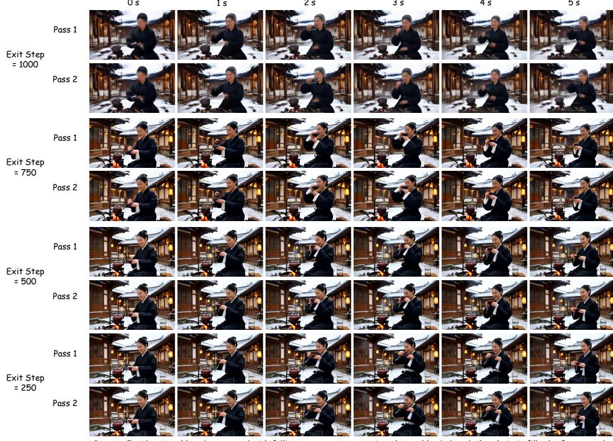  
프롬프트: 서울 한옥 안뜰에 눈이 내리고, 숯색 한복과 은색 머리핀을 단 차가운 커피 마스터가 전경을 채우며 영화적 4K 화질로 선명한 나무 무늬를 보여준다. 먼저 그녀는 숯불 위에 차주전자를 데우고 양손으로 컵을 단단히 잡는다, ...  
**그림 4: 디코딩된 Pass-1과 Pass-2 복구 비교.** 행은 종료 단계 1000, 750, 500, 250에서 Pass 1과 Pass 2의 쌍을 이루는 디코딩 출력을 보여준다. 디코딩된 쌍은 시각적으로 거의 구분할 수 없으며, 표 7의 잠재 공간 복구 결과와 일치한다.  
**결과.** 표 7은 Pass 2가 노이즈 제거 스케줄 전반에 걸쳐 Pass-1 종료 예측을 밀접하게 재현함을 보여준다. 전체 상대 $\ell_2$ 오차는 1.41%이며, 평균 코사인 유사도는 0.999886이다. 상대 $\ell_2$ 오차는 bf16 수치 척도와도 가깝다: 전체적으로 $\epsilon_{\rm bf16}$ 의 1.80배이며, 가장 잡음이 많은 종료 단계에서 2.73에서 종료 단계 250에서는 1.04로 감소한다. 두 경로는 서로 다른 순차적 및 병렬 계산 순서로 많은 bf16 트랜스포머 연산을 수행하므로, 이러한 작은 배수는 복구된 계산의 본질적 불일치보다는 누적된 부동소수점 반올림과 일치한다. 이러한 결과는 Pass 2를 샘플링된 종료 계산의 제한된 지역적 대체물로 사용할 수 있음을 뒷받침한다. 이 진단은 예상되는 혼합 정밀도 수치 오차 범위 내에서 지역적 어텐션 계산의 정방향 복구를 확인하며, SGF가 전체 순차적 롤아웃의 정확한 그래디언트를 복구함을 의미하지는 않는다.  

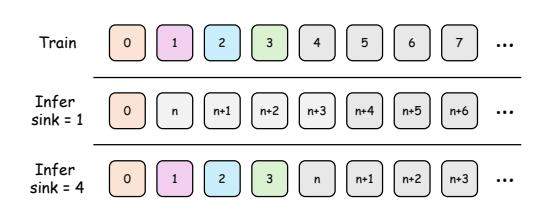  
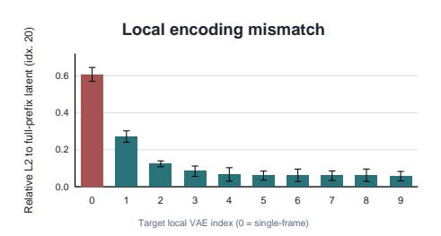  
**그림 5: VAE 경계 및 싱크 잠재 선택.** 왼쪽: 싱크 1은 스트림 시작 앵커만 보존하며, 싱크 4는 짧은 경계 전이 접두사만 보존한다. 오른쪽: 전체 접두사의 21번째 잠재에 대한 지역 재인코딩 불일치는 이전 잠재 그룹을 추가한 후 급격히 감소하며, 처음 네 위치 근처에서 안정화된다. 이는 프레임 단위 스트리밍 추론에 네 개의 싱크 잠재를 사용하도록 동기부여한다.  

# E VAE 경계 및 싱크 선택  
프레임 단위 스트리밍 추론은 싱크 플러스 FIFO 컨텍스트 정책을 사용한다. 이 정책은 Self Forcing과 SGF 모두에서 공유되므로, 독립적인 SGF 기여는 아니다. 우리는 이 부록을 프레임 단위 실험에서 사용한 싱크 크기를 정당화하기 위해 포함한다.  

**Wan VAE 시작 경계 진단.** Wan 비디오 VAE는 비대칭 그룹화 패턴으로 시간을 인코딩한다: 스트림은 1프레임 경계 그룹으로 시작하고, 그 뒤에 4프레임 그룹이 이어진다. 따라서 새로 인코딩된 클립의 처음 몇 개의 잠재 위치는 반드시 안정된 스트림 내 잠재와 동일하지 않다. 이 효과를 측정하기 위해, 81개의 픽셀 공간 프레임을 가진 10개의 비디오를 사용하여, 이는 21개의 VAE 잠재 프레임에 해당한다. 각 비디오에 대해 전체 접두사를 인코딩하고, 21번째 잠재, 즉 0부터 시작하는 인덱스 20을 기준으로 삼는다. 그런 다음 동일한 대상 프레임 그룹에서 끝나는 지역 윈도우를 재인코딩하고, 마지막 지역 잠재를 전체 접두사 기준과 비교한다. 새로운 4프레임 컨트롤은 프레임 [77, 81)만 사용하지만, VAE는 매번 새로운 스트림을 1프레임 경계 그룹으로 시작하므로, 이는 정상적인 스트림 내 4프레임 잠재가 아니라 시작 경계 잠재를 생성한다. 앵커 윈도우 설정은 경계 앵커 프레임 하나와 대상 그룹 이전의 W개의 4프레임 잠재 그룹을 포함한다. 따라서 W = 0은 프레임 [76, 81)을 인코딩하며, 더 큰 W 값은 점차 더 많은 이전 잠재 그룹을 포함한다. 진단은 대상 그룹이 새로운 스트림으로 인코딩될 때 큰 불일치를 보여준다: 상대 L2 오차는 0.607이다. 경계 앵커를 추가하면 오차가 W = 0에서 0.271로 감소하고, 더 많은 이전 잠재 그룹을 포함하면 W = 1, 2, 3, 4에서 각각 0.124, 0.084, 0.067, 0.060으로 더 감소한다. 이 범위를 초과하면 오차는 거의 변하지 않는다. 이는 초기 VAE 잠재가 단일 고립된 싱크 토큰이 아니라 짧은 경계 전이 영역을 형성함을 시사한다.  

**싱크 수 소거.** 따라서 우리는 60초의 TF 초기화 하에서 프레임 단위 SGF에서 싱크 잠재 수를 소거한다. 전체 스트리밍 컨텍스트 예산은 고정되어 있으므로, 싱크 크기를 늘리면 더 많은 접두사 잠재를 보존하지만 최근 FIFO 컨텍스트를 위한 슬롯은 줄어든다. 따라서 관련 추세는 단순한 단조적 개선이 아니라, 작은 싱크가 VAE 경계 영역을 충분히 커버하면서 최근 컨텍스트 예산을 불필요하게 줄이지 않는가이다. 표 [8](#page-18-0)은 싱크 1이 미적 품질과 깜빡임에서 약하며, 싱크 4는 VAE 경계 진단에서 제시된 안정 범위에 도달함을 보여준다. 싱크 8은 일부 지표에서 미세한 추가 이득을 주지만 고정된 컨텍스트 예산을 더 많이 소모한다. 따라서 우리는 관찰된 경계 전이 접두사를 커버하는 가장 작은 싱크 크기로 싱크 4를 프레임 단위 장기 수평 실험에 사용한다.  

# F 한계  
SGF는 자동회귀 롤아웃을 통한 전체 역전파가 아니라, 누락된 컨텍스트-그래디언트 신호에 대한 제한된 대체물이다. 그것은 기록된 자기 생성 잠재가 미래에 읽을 수 있는 메모리에 어떻게 기록되는지를 감독하지만, 미래 손실을 통해 샘플링된 잠재 자체를 업데이트하지는 않는다.   

| 표 8: 60초 평가에서 TF 초기화를 사용한 프레임 단위 SGF의 싱크 소거. 모든 열거된 점수는 VBench 방향 기준으로 높을수록 좋다. |  
|----------------------------------------------------------------------------------------------------|--|  
| 지표 | 싱크 1 | 싱크 2 | 싱크 4 | 싱크 8 |  
| 미적 품질 | 0.627 | 0.645 | 0.653 | 0.655 |  
| 배경 | 0.970 | 0.974 | 0.974 | 0.976 |  
| 역동성 | 0.743 | 0.733 | 0.730 | 0.728 |  
| 이미징 | 0.715 | 0.713 | 0.714 | 0.714 |  
| 움직임 | 0.982 | 0.982 | 0.982 | 0.983 |  
| 주체 | 0.983 | 0.982 | 0.983 | 0.983 |  
| 깜빡임 | 0.990 | 0.990 | 0.991 | 0.992 |  

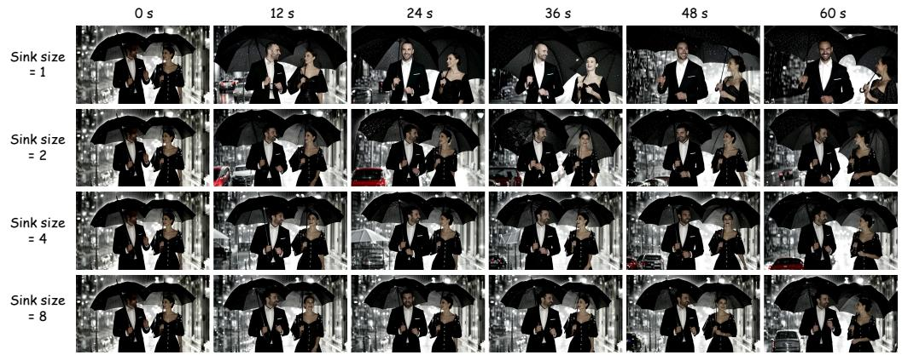  
프롬프트: 흑백 고전 영화 스타일로, 우아한 야간 복장을 입은 잘 차려입은 부부가 검은 우산 아래 함께 걷고 있으며 집으로 돌아가고 있다. 갑작스럽고 강한 폭우에 갇힌다, ...  
**그림 6: 60초에서의 질적 싱크 소거.** 매우 작은 싱크는 초기 스트림 경계 정보를 너무 적게 보존하며, 다중 잠재 싱크는 장기 추론 중 주체와 장면 일관성을 더 잘 유지한다. 이 소거는 선택된 프레임 단위 스트리밍 정책을 뒷받침하며, 핵심 SGF 주장은 자기 생성 컨텍스트 K/V 형성을 통한 그래디언트 복구에 있다. 또한 생성된 시퀀스의 디노이징 결정을 최적화하지도 않는다. 따라서 우리는 전체 순차적 롤아웃의 정확한 그래디언트를 복구했다고 주장하지 않는다. SGF는 또한 병렬 Pass-2 복구가 샘플링된 종료 단계에서 순차적 컨텍스트 관계를 신뢰할 수 있게 재현한다고 가정한다. 티처-포싱 마스크, 싱크 위치, FIFO 윈도우, RoPE 처리, 컨텍스트 타임스텝, 또는 청크 정렬이 추론과 일치하지 않으면, SGF는 잘못된 어텐션 관계에 대한 그래디언트를 복구할 수 있으며, 이는 다른 작성자를 학습하게 된다. 이 정렬은 특히 깨끗한 컨텍스트 타임스텝에서 중요하며, 이는 고정된 캐시 훈련에서 잡음 종료 단계 손실에 의해 직접적으로 감독되지 않지만 공유되는 캐시 기록 호출이기 때문이다. 마지막으로, SGF는 다른 장기 비디오 기법의 대체물이 아니다. 스트리밍 장기 롤아웃 튜닝, 검색 기반 메모리, 희소 어텐션, 강력한 인과 초기화, 장기 컨텍스트 티처 모두 시스템의 보완적인 부분을 목표로 한다. 우리의 주장은 더 좁다: 자기 롤아웃 훈련은 생성된 이력을 컨텍스트로 사용하지만, 특정 이력 형성 그래디언트를 사용하지 않으며, SGF는 이를 복구하는 실용적인 방법을 제공한다. 자연스러운 다음 단계는 SGF를 장기 롤아웃 노출 또는 검색과 결합하여, 모델이 더 나은 단기 윈도우 메모리를 작성할 수 있고 풍부한 장기 범위 컨텍스트에 접근할 수 있도록 하는 것이다.  

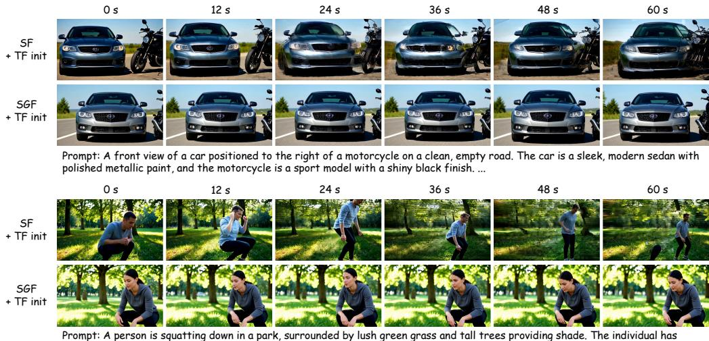  
그들의 손은 무릎 위에 놓여 있고, 집중된 표정으로 땅을 내려다보고 있다. ...  
**그림 7: TF 초기화 하의 프레임 단위 60초 비교.** 자동차와 오토바이 프롬프트에서 두 방법 모두 타당하지만, SGF는 자동차 위치, 도로 기하학, 오토바이 관계를 더 일정하게 유지한다. 앉은 사람 프롬프트에서 Self Forcing은 시간이 지남에 따라 주체의 자세, 신원, 프레임을 변경하지만, SGF는 일관된 앉은 동작과 공원 배경을 유지한다. 이 예시는 치명적인 시각적 붕괴 이전에도 SGF가 신원 및 카메라 드리프트를 줄일 수 있음을 보여준다.  

# G 추가 질적 결과  
이 부록은 프레임 단위 및 청크 단위 실험에 대한 추가적인 장기 수평 질적 비교를 제공한다. 스트립은 집계 점수 뒤에 있는 시간적 실패 양상을 보여주기 위해 정량적 표를 보완한다. 각 비교는 일치하는 설정 내에서 해석되어야 한다: Self Forcing과 SGF는 동일한 프롬프트, 시드, 초기화, 수평, 샘플링 구성, 그리고 추론 컨텍스트 기하학을 사용한다. 우리는 메모리 관련 드리프트에 초점을 맞춘다. 여기에는 시점 변화, 크롭 드리프트, 장면 교체, 주체 신원 변화, 객체 소실, 그리고 무관한 텍스처로의 붕괴가 포함된다.

### G.1 프레임 단위 비교  
프레임 단위 생성은 생성된 잠재 프레임을 역사적 컨텍스트에 다시 작성하므로, 역사적 K/V 구성의 오류가 가장 미세한 시간적 단위에서 누적된다. TF, 인과적 CD, 인과적 ODE 초기화 모두에서 Self Forcing은 초기 프레임에서는 일반적으로 지역적으로 타당해 보이지만 점차 주체, 카메라 거리, 객체 레이아웃 또는 배경을 변경한다. 초기화가 약할수록 이 드리프트는 심각해져, 자르긴 된 조각, 색상 블록, 또는 관련 없는 장면 텍스처를 생성한다. SGF는 이러한 실패 양상을 일관되게 줄인다: 60초 및 240초 롤아웃 모두에서 주체-장면 관계, 카메라 프레임링, 객체 레이아웃을 더 잘 유지한다. 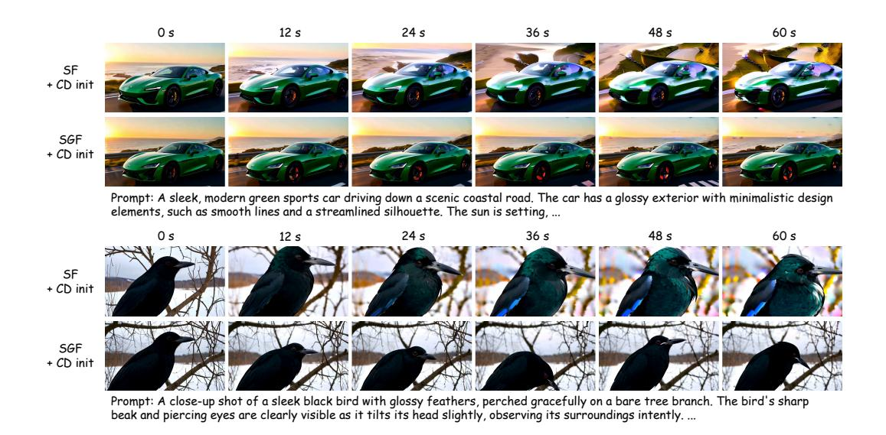  
그림 8: 인과적 CD 초기화 하의 프레임 단위 60초 비교. 인과적 CD 초기화 하에서 Self Forcing은 항상 붕괴하지는 않지만, 체계적인 자르기 및 스케일 드리프트를 보인다. 바다거북과 코끼리 예시에서는 점차 주체로 줌인하여 장면 컨텍스트를 줄이고 때로는 객체를 잘라낸다. SGF는 동물의 크기, 배경, 카메라 거리를 더 안정적으로 유지하며, SGF가 극단적 실패뿐 아니라 비재앙적 장기 수평 구성 드리프트도 개선함을 보여준다. 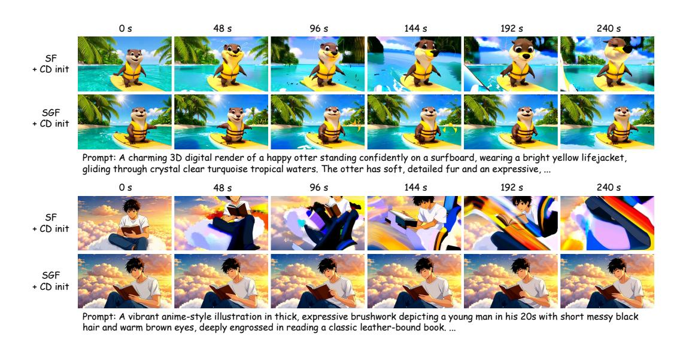  
그림 9: 인과적 CD 초기화 하의 프레임 단위 240초 비교. 해달 프롬프트는 Self Forcing이 넓은 의미를 유지할 수 있지만 자세 및 경계 왜곡이 누적됨을 보여주며, SGF는 해달을 서핑보드 중심에 유지하고 더 안정적인 열대 수역 레이아웃을 보여준다. 애니메이션 독서 프롬프트에서는 Self Forcing이 후반 타임스탬프에서 부분적 자르기와 고채도 색상 스트라이프로 드리프트하며, SGF는 전체 240초 동안 소년, 책, 구름 배경을 유지한다. 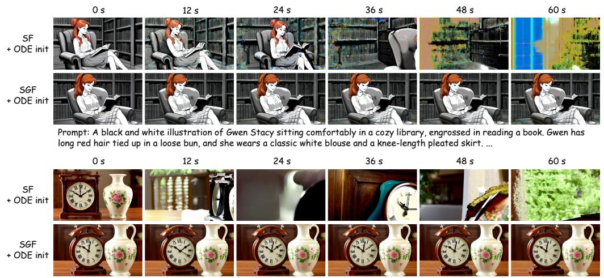  
프롬프트: 프레임 오른쪽에 놓인 화병의 정면 시점. 시계는 화병 왼쪽에 위치하며, 시계와 화병은 명확히 보이며, 시계는 현실적인 시간을 표시하고 로마 숫자 및 ...  
그림 10: 인과적 ODE 초기화 하의 프레임 단위 60초 비교. 도서관 독서 프롬프트에서 Self Forcing은 24초에 색상 배경 아티팩트를 도입하고, 36초에 앉아 있는 독서자를 놓치며, 48–60초에 책장/창문 조각으로 전락한다; SGF는 독서자, 안락의자, 열린 책, 책장 레이아웃을 안정적으로 유지한다. 시계와 화병 프롬프트에서 Self Forcing은 의도된 정면 두 객체 구성에서 자르거나 흐릿한 클로즈업 및 배경 조각으로 드리프트하는 반면, SGF는 롤아웃 전반에 걸쳐 시계-왼쪽/화병-오른쪽 테이블 상 배치를 유지한다. 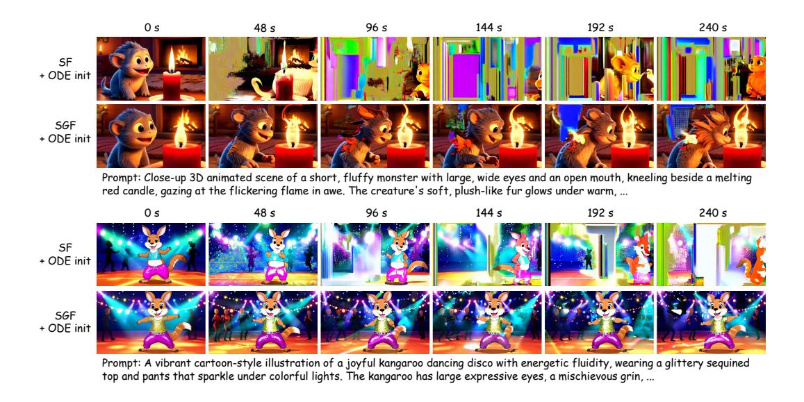  
그림 11: 인과적 ODE 초기화 하의 프레임 단위 240초 비교. 일치하는 초기화 및 프레임 단위 스트리밍 환경 하에서 Self Forcing은 심각한 장기 드리프트를 겪는다: 촛불/생물 예시는 색상 블록과 부분적 주체 교체로 퇴화하며, 디스코 캥거루 예시는 무대 레이아웃과 주체 정체성을 반복적으로 잃는다. SGF는 240초 동안 프롬프트 특유의 주체, 자세 계열, 장면 레이아웃을 더 일관되게 유지한다. 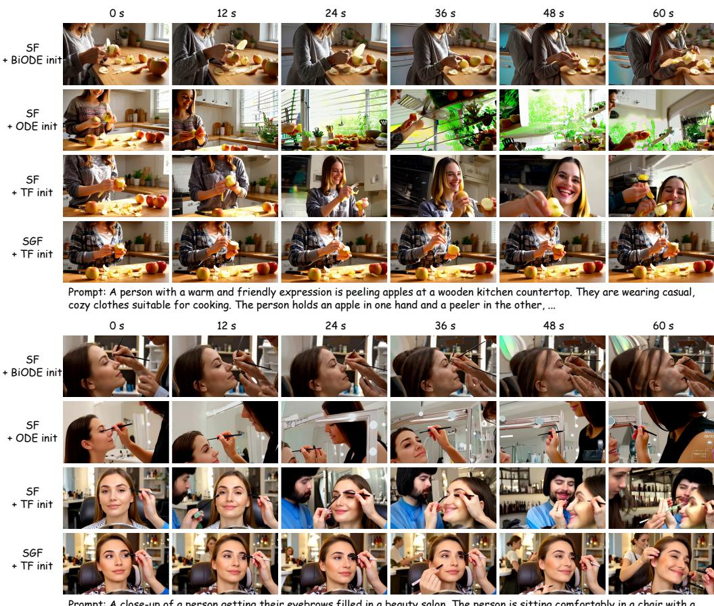  
프롬프트: 미용실에서 눈썹을 채우는 사람의 클로즈업. 사람은 의자에 편안히 앉아 앞에 거울이 있으며, 얼굴은 메이크업을 정교하게 바르는 미용사 쪽으로 기울어져 있다 ...  
그림 12: TF 초기화 하의 청크 단위 60초 비교. 사과 껍질 벗기기 프롬프트에서 TF 초기화 하의 Self Forcing은 사람 정체성과 카메라 시점을 변경하며, 때로는 테이블 상 행동을 웃는 얼굴의 클로즈업으로 대체한다. SGF는 손, 사과, 카운터탑 행동을 더 일관되게 유지한다. 눈썹 메이크업 프롬프트에서 Self Forcing은 시간에 따라 사람의 수와 정체성을 변경하며, SGF는 동일한 앉아 있는 고객, 메이크업 동작, 미용실 환경을 유지한다.  

### G.2 청크 단위 비교  
청크 단위 생성은 더 거친 시간적 단위로 메모리를 업데이트하며, 각 생성된 청크는 이후 청크의 컨텍스트로 사용된다. 청크 단위 그림은 역사적 컨텍스트가 다중 프레임 블록으로 작성되고 소비될 때 동일한 복구된 컨텍스트-기울기 신호가 여전히 유용한지 테스트한다. ODE 초기화된 행이 포함될 경우, 이들은 참조 베이스라인으로 사용되며, 통제된 비교는 동일한 초기화 하의 일치하는 Self Forcing 및 SGF 행이다. 정성적 패턴은 프레임 단위 사례와 일치한다: Self Forcing은 행동을 대체하거나 사람을 변경하거나 객체를 잃거나 관련 없는 텍스처로 드리프트할 수 있는 반면, SGF는 장기 롤아웃 동안 행동, 주체 정체성, 장면 레이아웃을 더 잘 유지한다. 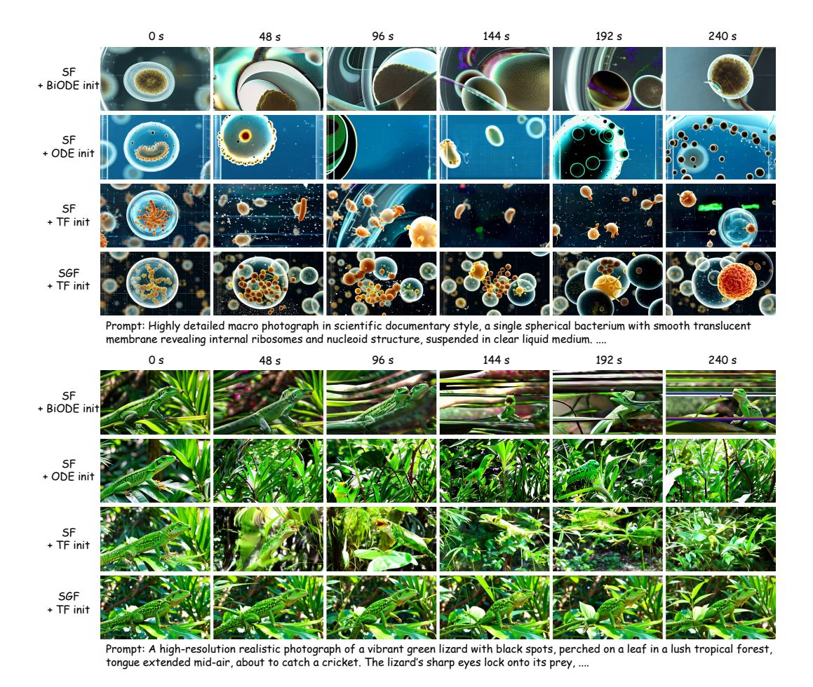  
그림 13: TF 초기화 하의 청크 단위 240초 비교. 더 거친 청크 단위 롤아웃은 생성된 블록이 몇 개의 청크 후에도 컨텍스트로 유용한지 테스트한다. 박테리아 프롬프트에서 SGF는 투명한 구형 세포의 집단을 더 일관되게 유지하는 반면, Self Forcing은 종종 관련 없는 원형 텍스처나 희소한 입자로 장면을 전환한다. 도마뱀 프롬프트에서 Self Forcing은 종종 동물을 잃거나 식물로 붕괴되며, SGF는 장기 수평 동안 잎사귀 사이에 녹색 도마뱀을 더 잘 유지한다. 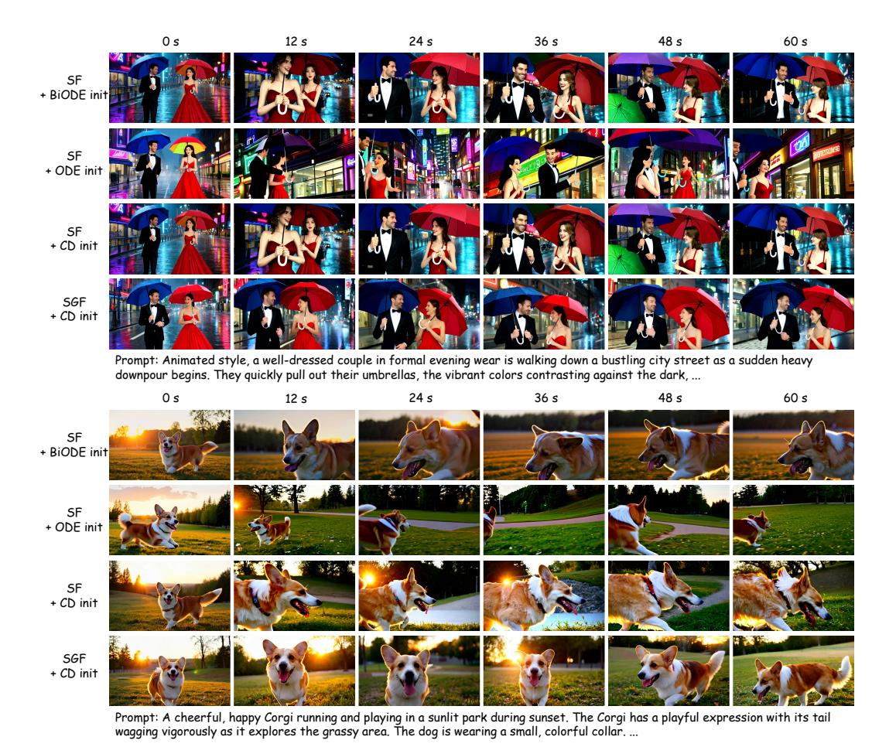  
그림 14: 인과적 CD 초기화 하의 청크 단위 60초 비교. 이 스트립은 일치하는 인과적 CD 쌍 외에도 양방향-ODE 및 인과적-ODE Self Forcing 참조를 포함한다. 우산 커플 프롬프트에서 인과적 CD 초기화 하의 SGF는 두 사람, 우산 색상, 비 오는 거리 레이아웃을 더 일관되게 유지하는 반면, Self Forcing 변형은 종종 시점이나 주체 배열을 변경한다. 코기 프롬프트에서 인과적 CD 초기화 하의 SGF는 가시적인 달리는 개와 잔디밭 공원 컨텍스트를 일치하는 Self Forcing 행보다 더 일관되게 유지하며, Self Forcing 행은 클로즈업 자르기로 드리프트한다. 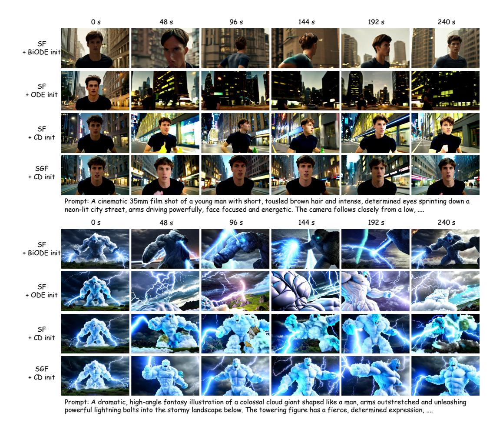  
그림 15: 인과적 CD 초기화 하의 청크 단위 240초 비교. 이 스트립은 ODE 초기화된 Self Forcing 참조와 일치하는 인과적 CD 쌍을 포함한다. 달리는 남자 프롬프트에서 ODE 베이스라인은 밤 거리나 뒷모습 촬영으로 드리프트하는 반면, 인과적 CD 초기화 하의 일치하는 Self Forcing은 주체를 간헐적으로 유지하지만 여전히 시점과 얼굴 정체성을 변경한다. 인과적 CD 초기화 하의 SGF는 정면을 향한 달리는 사람과 네온 거리 컨텍스트를 더 일관되게 유지한다. 구름 거인 프롬프트에서 SGF는 클로즈업 조각이나 관련 없는 폭풍 텍스처로 붕괴하는 대신 일관된 인체형 번개 인물을 더 잘 유지한다.

