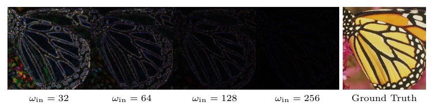
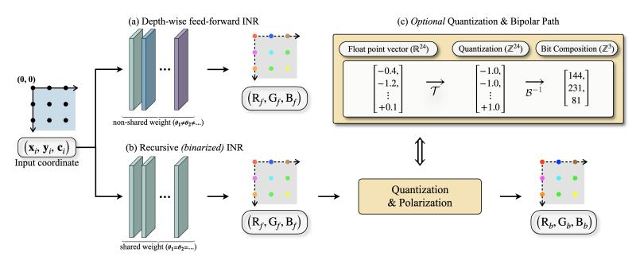
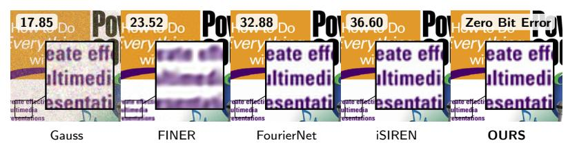
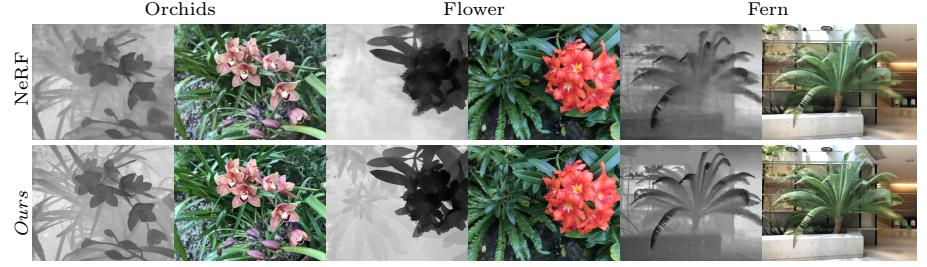
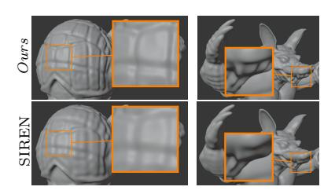
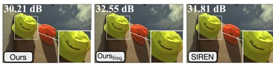
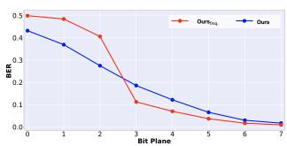

# 효율적인 고충실도 표현을 위한 순환 사인파 INRs

- 원제: Recurrent Sinusoidal INRs for Efficient High-Fidelity Representation
- 원문: [https://arxiv.org/abs/2607.21485](https://arxiv.org/abs/2607.21485)
- PDF: [https://arxiv.org/pdf/2607.21485v1](https://arxiv.org/pdf/2607.21485v1)
- arXiv ID: `2607.21485`

---

# 효율적인 고충실도 표현을 위한 순환 사인파 INRs

Hyunmin Cho1 [,](https://orcid.org/0009-0003-6199-9751) Jaejun Yoo2 [,](https://orcid.org/0000-0001-5252-9668) 및 Kyong Hwan Jin1[⋆](https://orcid.org/0000-0001-7885-4792)

- 1 전기공학과, 고려대학교, 서울, 대한민국 {hyun\_cho,kyong\_jin}@korea.ac.kr
  - 2 인공지능 대학원, UNIST, 울산, 대한민국 jaejun.yoo@unist.ac.kr
    - § Project Page: [hyeon-cho.github.io/Harmonic-line-Spectrum/](https://hyeon-cho.github.io/Harmonic-line-Spectrum/)

초록. 우리는 사인파 반복을 고조파 스펙트럼 풍부화를 위한 반복적 메커니즘으로 연구한다. 우리의 분석은 사인파 활성화가 고조파 라인 스펙트럼을 유도함을 밝혀, 순환 언롤링이 효과적인 스펙트럼 지원을 어떻게 풍부하게 하는지에 대한 스펙트럼적 설명을 제공한다. 우리는 이 원리를 공유 사인파 블록으로 구현하여 잠재 표현을 반복적으로 정제한다. 실험적으로 우리는 결과 스펙트럼 거동을 피드포워드 INR, 비사인파 순환 변형, 그리고 평형 스타일 사인파 모델과 비교한다. 이 분석을 보완하여 우리는 제안된 아키텍처를 이미지 및 3D 표현 과제에 걸쳐 평가한다. RGB 이미지 벤치마크에서, 우리 방법은 파라미터 수와 최적화 단계가 적은 상태에서 피드포워드 기준보다 높은 충실도를 달성하며, 초해상도, NeRF, SDF 과제에도 유리하게 전이된다.

키워드: 순환 네트워크 · 암시적 신호 표현

# 1 서론

우리는 암시적 신경 표현(INRs) [\[18,](#page-16-0)[22,](#page-16-1)[25,](#page-16-2)[29,](#page-17-0)[31\]](#page-17-1)를 연구한다. 이는 신호를 신경 함수 f로 매개화하며, 일반적으로 좌표 기반 MLP이다,

$$f: \mathbb{R}^d \to \mathbb{R}^c$$

입력을 공간적 또는 시공간 좌표로 취급함으로써, INRs는 연속 신호를 표현하고 보이지 않는 위치에서 값을 보간할 수 있다. 이 특성은 3D 재구성 및 새로운 뷰 합성 등과 같은 응용 분야에서 표준 도구가 되었다 [\[20,](#page-16-3) [22,](#page-16-1) [25\]](#page-16-2).

좌표 기반 MLP의 핵심 과제는 스펙트럼 편향이다: 신경망은 고주파 구조보다 저주파 구조를 더 쉽게 적합시키며, 이는 미세한 디테일을 충실히 복원하기 어렵게 만든다 [\[26,](#page-16-4)[32\]](#page-17-2). 많은 연구가 활성화 설계, 입력 인코딩, 다중 해상도 매개화, 최적화 전략을 통해 이 문제를 해결해 왔다 [\[12,](#page-15-0) [18,](#page-16-0) [19,](#page-16-5) [23,](#page-16-6) [31\]](#page-17-1).

⋆ 연락처: Kyong Hwan Jin <kyong\_jin@korea.ac.kr>.

효과적으로, 이러한 접근 방식 중 다수는 모델 크기, 보조 파라미터, 또는 훈련 복잡성을 증가시켜 충실도를 향상시킨다.

고주파 정보가 획득되거나 손실되는 위치를 이해하려면, 일반적인 INR을 세 단계로 분해하는 것이 유용하다. 목표 신호 s가 좌표 x에서 평가될 때, 우리는 다음과 같이 쓴다

$$\\mathbf{s} = \\mathcal{D}(\\mathcal{F}(\\mathcal{E}(\\mathbf{x}))), \\tag{1}$$

여기서 E는 저차원 좌표를 고차원 표현으로 올리고 [\[23,](#page-16-6)[32\]](#page-17-2), F는 이 표현을 잠재 특징으로 변환하며, D는 잠재 특징을 출력 공간으로 매핑한다. 이 관점에서 고충실도 재구성은 E가 도입한 좌표 특징뿐 아니라, F가 이를 조합하고 정제하여 미세 구조를 해석할 수 있는 표현으로 만드는 방식에 달려 있다.

우리는 F가 미세 구조를 해석하는 능력을 향상시키는 직관적인 방법으로 더 깊거나 넓은 잠재 변환을 통해 표현 용량을 늘리는 것을 제안한다. 효과적이지만 이 접근 방식은 독립적으로 매개변수화된 추가 층과 계산량을 증가시킨다. 이는 보완적인 질문을 남긴다: F를 독립적으로 매개변수화된 깊이를 늘리지 않고도 미세 구조를 해석하는 데 더 효과적으로 만들 수 있을까?

재귀는 이러한 정제에 대한 자연스러운 메커니즘을 제공한다. T 단계 동안 재귀 업데이트를 펼치면 같은 매개변수를 재사용하면서 효과적인 깊이가 증가하며, 독립적으로 매개변수화된 깊이에 대한 매개변수 효율적인 대안을 제공한다 [\[3,](#page-15-1) [8,](#page-15-2) [30\]](#page-17-3). 관련 INR 공식화는 또한 평형 네트워크를 통한 반복적 잠재 계산을 탐구했으며, 그 고정점 공식화는 효과적인 깊이에 대해 상수 메모리 역전파를 가능하게 한다 [\[3,](#page-15-1)[13\]](#page-15-3). 그러나 이러한 평형 공식화는 주로 메모리 효율적인 훈련과 가중된 고정점 해결에 의해 동기화되며, 반복적인 잠재 변환이 미세 구조 재구성을 위해 어떻게 더 효과적으로 만들 수 있는지는 별개의 질문이다.

이를 위해 우리는 사인형 재귀를 조화 스펙트럼 풍부화를 위한 반복 메커니즘으로 해석한다. 사인형 활성화가 조화 라인 스펙트럼을 유도함을 보여주며, 공유 사인형 블록의 반복 적용이 독립적으로 매개변수화된 깊이를 추가하지 않고도 효과적인 스펙트럼 지원을 풍부하게 할 수 있는 스펙트럼적 근거를 제공한다. 실제로 이 공식화는 더 적은 매개변수와 최적화 단계로 고품질 이미지 재구성을 달성하며, 초해상도, NeRF, SDF 작업에 유리하게 전이된다.

- 우리는 INRs를 위한 가중치 공유 사인형 정제를 공식화하며, 독립적으로 매개변수화된 층을 추가하지 않고 유한 재귀 펼침을 통해 효과적인 깊이를 증가시킨다.  
- 우리는 사인형 변환의 조화 라인 스펙트럼 분석을 제공하며, 반복 사인형 정제가 효과적인 스펙트럼 지원을 풍부하게 할 수 있는 스펙트럼적 해석을 제시한다.  
- 우리는 이 공식화가 피드포워드 기준선보다 적은 매개변수와 최적화 단계로 고품질 이미지 재구성을 달성하며, 디코더가 연속 표현 작업에 유리하게 전이됨을 보여준다.

# 2 고품질 암시적 신호 표현을 위한 설계 전략 (Preliminaries: Design Strategies for High-Fidelity Implicit Signal Representation)

암시적 신경 표현과 스펙트럼 편향. 암시적 신경 표현은 신경망으로 매개변수화된 연속 좌표 기반 함수로 신호를 모델링한다 (예: $f_{\theta}: (x,y) \in \mathbb{R}^2 \mapsto (r,g,b) \in \mathbb{R}^3$ ). 이 공식화는 연속 샘플링, 보간 및 해상도 독립 평가를 지원한다 [7,22]. 그들의 다재다능함에도 불구하고 핵심 과제는 스펙트럼 편향이다. 좌표 MLP는 미세 구조 세부 사항보다 먼저 저주파 구조를 적합시키는 경향이 있어 고주파 표현을 위한 아키텍처 선택을 동기화한다 [6,26].

활성화 함수를 통한 표현 용량 향상. 이전 연구는 좌표 MLP의 활성화 함수를 수정하여 고주파 표현을 개선한다. SIREN은 표준 비선형성을 주기적 사인 활성화로 대체하여 복잡한 신호를 표현하는 데 강력한 용량을 갖는 좌표 네트워크를 생성한다 [31]. FINER는 사인형 활성화를 더 넓은 주파수 범위를 포괄하고 재구성 안정성을 향상시키도록 추가로 조정한다 [18]. 주기적 함수 외에도 가우시안 활성화는 공간적으로 국소화된 대안을 제공한다 [27], WIRE는 사인형 진동과 가우시안 국소화를 결합한 복소 가버 웨이브릿을 사용한다 [29].

다중 주파수 인코딩으로 좌표 특징 강화하기. 활성화 함수를 수정하는 대신, 다른 연구 방향은 입력 좌표를 다중 주파수 인코딩으로 풍부하게 한다. NeRF는 위치 인코딩을 적용해 좌표를 다중 주파수 사인파 기반으로 매핑한다 [22], 반면 Random Fourier Features (RFF)는 샘플링된 사인파 투영을 사용해 다양한 입력 주파수를 노출한다 [32]. 다중 해상도 인코딩은 학습된 그리드 또는 해시 기반 표현을 통해 좌표 특징을 추가로 강화한다 [23]. 입력에서 더 풍부한 주파수 정보를 제공함으로써, 이러한 방법들은 INR이 미세 규모 신호를 적합시키는 능력을 향상시킨다.

#### 3 INR에서의 잠재적 정제 (Latent Refinement in INRs)

활성화 함수 수정이나 좌표 입력 풍부화 외에도, 또 다른 설계 선택은 잠재 변환이 깊이 따라 어떻게 매개화되고 평가되는가에 관한 것이다. 우리는 방정식 (1)의 잠재 변환 $\mathcal{F}$ 를 통해 이 설계 축에 초점을 맞춘다.

순방향 잠재 변환은 독립적으로 매개화된 선형 변환과 비선형성을 연속적으로 적용한다,

$$\mathbf{h}^{(\ell+1)} = \sigma_{\ell} \left( \mathbf{W}_{\ell} \mathbf{h}^{(\ell)} + \mathbf{b}_{\ell} \right), \qquad \ell = 0, \dots, L - 1, \tag{2}$$

여기서 $\mathbf{h}^{(0)} = \mathcal{E}(\mathbf{x})$이며, 각 층은 자체 파라미터 $(\mathbf{W}_{\ell}, \mathbf{b}_{\ell})$를 갖는다. L을 증가시키면 잠재 변환을 풍부하게 만들 수 있지만, 일반적으로는 추가적인 독립적으로 파라미터화된 층이 필요하다.

고품질 신호 표현을 위해, 이러한 잠재 변환의 구조는 깊이 전체에서 주파수 내용이 어떻게 처리되는지를 제어하도록 설계될 수 있다. BACON은 대역 제한 사인 필터링을 통합하고, FourierNet과 GaborNet은 주파수 인식형 순방향 변환을 구성한다 [9,17].

다른 연구 라인에서는 평형(Equilibrium) 공식화를 통해 반복적인 잠재 계산(iterative latent computation)을 도입한다. 구체적으로, Huang et al. [13]에서 제안한 equilibrium‑style INR에서는 잠재 표현이 고정점으로 암시적으로 정의된다,

$$\mathbf{h}^{\star} = \mathcal{G}_{\theta} \left( \mathbf{h}^{\star}; \mathbf{h}^{(0)} \right), \qquad \mathbf{h}^{(0)} = \mathcal{E}(\mathbf{x}),$$

(3)

암시적 미분[3]과 아모티제드 고정점 해법을 통해 상수 메모리 역전파를 가능하게 함.

그러나 고정점 공식은 잠재적 계산을 평형 상태에서만 특성화하여, 공유 매핑의 연속적 적용에 의해 유도되는 진화를 직접적으로 관찰하기 어렵게 만든다. 따라서 우리는 유한하고 명시적으로 펼쳐진 정제 경로를 고려하며, 그 중간 상태를 통해 반복 변환이 잠재 표현을 어떻게 변화시키는지 살펴볼 수 있다.

# 4 사인파 재귀를 통한 고조파 강화

이 단계별 정제를 분석하기 위해, 우리는 사인파 변환에 의해 유도되는 스펙트럼 구조를 특성화한다. 사인파 층이 중간 표현에서 고조파 선 스펙트럼을 유도함을 보여주며, 이는 깊이와 가중치-연결된 펼침 모두에 대한 푸리에 급수 해석을 제공한다.

#### 4.1 입력 레이어를 학습 가능한 위치 임베더로

Sitzmann 등[31]에 따라, 우리는 사인파 좌표 상승을 다음과 같이 정의한다

$$\mathbf{h}_{0}(\mathbf{x}) \triangleq \mathcal{E}(\mathbf{x})$$

$$= \sin(\omega_{\mathrm{in}} \mathbf{W}_{\mathrm{in}} \mathbf{x} + \mathbf{b}_{\mathrm{in}}), \quad (4)$$

여기서 $\omega_{\text{in}}$는 임베딩의 대역폭을 제어한다. *i*-th 채널을 명시적으로 쓰면,

**Table 1:** 훈련 단계별 주파수별 재구성 품질. 각 셀은 FullHFLF 형태의 dB 단위 PSNR을 보고하며, Full은 전체 이미지의 PSNR, LF는 저역 성분의 PSNR, HF는 고역 성분의 PSNR이다.

|  |  |  | 0 1 | 1 |  |  |  |  |  |  |  |
|----------------------------|-------------------------|-------------------------|-------------------------|-------------------------|-------------------------|--|--|--|--|--|--|
|  | #Iteration (Iteration) |  |  |  |  |  |  |  |  |  |  |
| 입력 주파수 $(\omega_{in})$ | 200 | 400 | 600 | 800 | 1000 |  |  |  |  |  |  |
| 32 | $22.73_{37.29}^{23.51}$ | $24.64^{25.10}_{40.50}$ | $25.56^{26.04}_{39.01}$ | $26.00^{26.61}_{37.33}$ | $26.46^{27.09}_{37.30}$ |  |  |  |  |  |  |
| 64 | $26.35^{26.60}_{45.19}$ | $28.91^{29.05}_{48.97}$ | $30.41^{30.51}_{50.26}$ | $31.42^{31.53}_{50.10}$ | $32.04^{32.26}_{46.75}$ |  |  |  |  |  |  |
| 128 | $30.22^{30.31}_{51.84}$ | $33.89^{33.94}_{55.74}$ | $36.11^{36.18}_{56.00}$ | $37.62^{37.74}_{54.83}$ | $38.74^{38.91}_{53.98}$ |  |  |  |  |  |  |
| 256 | $36.38_{56.47}^{36.45}$ | $40.52_{56.45}^{40.68}$ | $43.32_{56.46}^{43.62}$ | $45.39_{56.54}^{45.87}$ | $47.03_{56.64}^{47.71}$ |  |  |  |  |  |  |

$$[\mathbf{h}_0(\mathbf{x})]_i = \sin(\boldsymbol{\Omega}_i^{\mathsf{T}}\mathbf{x} + \phi_i), \qquad \boldsymbol{\Omega}_i \triangleq \omega_{\mathrm{in}}\mathbf{w}_i, \quad \phi_i \triangleq b_i,$$

(5)

인코더가 입력 좌표를 사인파 기저 함수들의 모음으로 매핑한다는 것을 명확히 보여준다. 각 기저는 학습 가능한 주파수 벡터 $\{\Omega_i\}_{i=1}^m$ 과 위상 $\{\phi_i\}$ 로 매개화된다. 따라서 $\mathcal{E}$ 는 학습 가능한 푸리에 특성 맵으로 이해될 수 있으며, 이는 Benbarka 등 [4]가 연구한 사인파 암시적 신경 표현의 푸리에 급수 해석과 일치한다. 반면

Fig. 1: 고주파(HF) 오류 시각화. 각 패널은 예측값과 실제 고주파 성분의 절대 차이 $|HP(\hat{I}) - HP(I_{GT})|$ 를 보여준다. 여기서 HP(I) = I - GaussianBlur(I) 이다. 왼쪽에서 오른쪽으로 우리는 사인파 리프팅(Equation (4))에서 주파수 스케일 $\omega_{\rm in} \in \{32, 64, 128, 256\}$ 를 변동시켜, 학습 가능한 푸리에-특성 임베딩의 전체 대역폭을 설정한다.

Random Fourier Features [32]와 달리, 초기화 이후 주파수가 고정되는 반면, 여기서의 스펙트럼 성분은 엔드-투-엔드로 최적화된다. $\omega_{\rm in}$ 은 모델이 사용할 수 있는 전체 주파수 스케일을 직접 결정한다.

이 해석은 Fig. 1과 Table 1의 주파수 분리 재구성 결과를 통해 실험적으로 지지된다. $\omega_{\rm in}$ 이 증가함에 따라 모델은 모든 훈련 단계에서 고주파 성분의 재구성을 일관되게 개선하며, 전체 이미지 PSNR도 향상된다. 유사한 추세는 초기 최적화 단계에서도 이미 관찰된다 (예: 200회 반복에서 $23.51 \rightarrow 36.45$ dB).

# 4.2 숨겨진 사인파 층을 구조화된 고조파 확장으로 (Hidden sinusoidal layers as structured harmonic expansion)

우리는 이제 숨겨진 사인파 층이 인코더의 학습 가능한 사인 기저를 어떻게 풍부한 선 스펙트럼으로 변환하는지 보여준다. Sec. 4.1에서 사인파 인코더가 유한한 기저 음색 모음을 생성한다는 것을 기억하자:

$$\mathbf{h}_0(\mathbf{x}) = \sin(\omega_{\text{in}} \mathbf{W}_{\text{in}} \mathbf{x} + \mathbf{b}_{\text{in}}) \in \mathbb{R}^m, \quad [\mathbf{h}_0(\mathbf{x})]_i = \sin(\mathbf{\Omega}_i^{\mathsf{T}} \mathbf{x} + \phi_i).$$

(6)

$\theta_i(\mathbf{x}) \triangleq \mathbf{\Omega}_i^{\mathsf{T}} \mathbf{x} + \phi_i$ 라고 두자. 명확성을 위해 우리는 먼저 *첫 번째* 숨겨진 사인파 층을 정확히 분석한다:

$$\mathbf{h}_1(\mathbf{x}) = \sin(\omega \mathbf{W} \mathbf{h}_0(\mathbf{x}) + \mathbf{b}), \qquad \mathbf{W} \in \mathbb{R}^{n \times m}, \ \mathbf{b} \in \mathbb{R}^n,$$

(7)

여기서 $\sin(\cdot)$ 은 원소별로 적용된다.3 하나의 스칼라 전활성값, 즉 *j*-번째 채널에 해당하는 것을 살펴보면 충분하다:

$$u_j(\mathbf{x}) \triangleq [\omega \mathbf{W \mathbf{h}_0(\mathbf{x}) + \mathbf{b}]_j = \omega \mathbf{w}_j^{\top} \mathbf{h}_0(\mathbf{x}) + b_j, \qquad \mathbf{w}_j^{\top} := \mathbf{W}_j:.$$

(8)

식 (6)의 인코더 출력을 전활성식 (8)에 대입하고, $\mathbf{w}_{j}^{\mathsf{T}}\mathbf{h}_{0}(\mathbf{x}) = \sum_{i=1}^{m} w_{j,i}[\mathbf{h}_{0}(\mathbf{x})]_{i}$ 를 전개하면 유한 다음음 형태를 얻는다:

$$u_j(\mathbf{x}) = b_j + \omega \sum_{i=1}^m w_{j,i} \sin(\theta_i(\mathbf{x})) = \beta_j + \sum_{i=1}^m \alpha_{j,i} \sin(\theta_i(\mathbf{x})),$$

(9)

여기서 $\beta_j := b_j$ 이고 $\alpha_{j,i} := \omega w_{j,i}$ 이다.

&lt;sup>3 일반성을 위해 편향 항을 유지하지만, 우리의 구현은 편향이 없는 순환 층을 사용한다; Sec. 4.3에서 이 선택의 동기를 제공한다.

이 다중 톤 입력에 사인형 비선형성을 적용하면 명시적인 일반화된 푸리에 급수를 얻는다. Euler의 항등식 (sin uj (x) = Im e iuj (x) )과 Jacobi–Anger 항등식 [\[1\]](#page-15-8)을 함께 사용하면 다음과 같이 얻는다

$$\exp(iu_j(\mathbf{x})) = e^{i\beta_j} \sum_{\mathbf{k} \in \mathbb{Z}^m} \left( \prod_{i=1}^m J_{k_i}(\alpha_{j,i}) \right) \exp\left(i \sum_{i=1}^m k_i \theta_i(\mathbf{x})\right), \tag{10}$$

따라서

$$\sin(u_j(\mathbf{x})) = \sum_{\mathbf{k} \in \mathbb{Z}^m} c_{j,\mathbf{k}} \sin(\beta_j + \sum_{i=1}^m k_i \theta_i(\mathbf{x})), \qquad c_{j,\mathbf{k}} = \prod_{i=1}^m J_{k_i}(\alpha_{j,i}).$$

(11)

Equation [\(11\)](#page-5-0)은 사인파 특이 효과를 명시한다. 즉, 숨겨진 사인 레이어는 기존의 주파수를 단순히 재가중치하는 대신 인코더 주파수의 정수 조합(합, 차이, 고차 조화 포함)에서 새로운 스펙트럼 라인을 생성한다 [\[28\]](#page-17-4). 이러한 주파수는 다음과 같은 형태를 갖는다

$$\Omega' = \sum_{i=1}^{m} k_i \, \Omega_i, \qquad \mathbf{k} \in \mathbb{Z}^m, \tag{12}$$

즉, 인코더 주파수의 정수 조합이며, Novello 등 [\[24\]](#page-16-9)에서 사인파 네트워크의 고조 분석에서도 동일하게 특징지어졌다

이 정확한 계산은 더 깊은 층 관점을 동기화한다. 숨겨진 표현이 자체적으로 선형 스펙트럼, 또는 그 지배적인 톤의 유한 절단으로 간주될 때, 또 다른 사인파 레이어를 적용하면 동일한 유형의 정수 조합 닫힘이 발생한다. 따라서 Ω(ℓ)가 층 ℓ 이후의 두드러진 주파수 벡터 집합을 나타낸다면, 이 이상화된 의미에서

$$\Omega^{(\ell+1)} \subseteq \operatorname{span}_{\mathbb{Z}}(\Omega^{(\ell)}). \tag{13}$$

따라서 깊이를 증가시키면 동일한 좌표 상승에서 점진적으로 고차 조화 상호작용을 가능하게 한다. 같은 관점은 가중치 공유된 언롤링을 동기화한다: 공유된 사인파 블록을 반복적으로 적용하면 고정된 파라미터 예산 하에서 반복적인 조화 정제(iterative harmonic refinement)를 실현한다

Table 2: 재조정 단계 500에서 재구성 품질을 반복 언롤링 단계 수에 따라 표시한 표. 'Feed-forward'는 단일 패스를 의미하며, #2–#5는 반복 단계 R=2–5를 나타낸다. 각 항목은 PSNR∆ 형식으로 표시되며, ∆는 Feed-forward 기준 대비 PSNR 이득(dB)을 의미한다

|  | # 반복적 언롤링 단계 (Recurrent Unrolling Steps) |  |  |  |  |  |  |  |  |  |
|---------|----------------------------|--------|--------|--------|------------------------------------------------|--|--|--|--|--|
|  | 피드포워드 | #2 | #3 | #4 | #5 |  |  |  |  |  |
| PSNR | 39.724+0.0 |  |  |  | 46.362+6.6 54.772+15.0 60.843+21.1 63.378+23.7 |  |  |  |  |  |
| # 파라미터 (Param.) | 593.7K | 593.7K | 593.7K | 593.7K | 593.7K |  |  |  |  |  |

Table [2](#page-5-1)는 고정된 파라미터 예산 하에서 유한 재귀 정제의 실제 효과를 정량화한다. 최적화 단계 500에서 재귀 언롤링 단계 수를 단일 순방향 패스에서 R = 5로 증가시키면 PSNR이 39.724 dB에서 63.378 dB로 향상되며, 동일한 파라미터 수에서 중간 단계마다 단조로운 이득이 나타난다. 다음으로 이 향상이 중간 스펙트럼 구조의 체계적인 변화를 동반하는지 살펴본다.

정규 H×H 좌표 격자에서, 우리는 중간 특징 맵 h(ℓ)를 분석하기 위해 채널별 2-D DFT F(ℓ)^{c} = DFT(h(ℓ) :,c)를 계산한다. 여기서 |F(ℓ)^{c}[u,v]|는 주파수 (u,v)에서 채널 c의 세기를 나타낸다. 채널 평균화 및 피크 이후

PSNR  $S_{\ell}^{\tau}$  per depth/recurrent  $\ell$  (%)  $HF_{\ell}$  at  $\ell=0,8$ 아키텍처 재귀 (참조용) SIREN  $\omega = 256/45$ 26.5 52.0 0.022 0.101FINER  $\omega = 256/45$ 51.4 53.6 72.489.3 100 100 100 100 100 0.048 Set 5에서 SIREN Float 31.0 17.1 17.219.1 20.5 12.9 16.4 0.020 0.011 78.35 FINER 46.6 46.0 16.4 41.6 100 100 0.044 0.016 ► Sinusoi iSIREN [13] 방법 47.16 DEO 32.433.5 33.5 33.5 33.5 33.5 33.5 33.5 33.5 0.008 0.008 GaborNet [9] FourierNet [0] 1.-3 41.4 58.3 66.6 36 N 0.050 0.008 38 38 BACON [17] freq=1280.9 6.3 0.059 3e-4 27.88 14.0 15.1 (c) 비-사인형 재귀  $\sigma = 30$ 1.0 1.9 14.0 1.2 0.0 0.0 0.0 0.0 0.0 12.02  $N_f=10$ 24.09

표 3: 스펙트럴 지원 $S_{\ell}^{\tau}$ 및 반경 $HF_{\ell}$.

표 4: 비-사인형 및 사인형 아키텍처에서 재귀 연결의 효과성. PSNR (dB)은 용량 제한 영역에서 보고된 값이다.

| 비사인형 | Rec. | $\sim$ 100K | $\sim$ 200K | $\sim\!400\mathrm{K}$ | $\sim\!600\mathrm{K}$ | 사인형 | Rec. | $\sim \! 100 \mathrm{K}$ | $\sim\!200\mathrm{K}$ | $\sim\!400\mathrm{K}$ | $\sim\!600\mathrm{K}$ |
|------------------|------|-------------|-------------|-----------------------|-----------------------|-----------------|------|--------------------------|-----------------------|-----------------------|-----------------------|
| PEMLP (1e-3) | Х | 28.89 | 31.04 | 31.80 | 34.20 | SIREN (1e-3) | Х | 33.60 | 39.57 | 46.23 | 48.64 |
| + Rec. (1e-3) | 1 | 27.48 | 29.64 | 33.82 | 31.04 | + Rec. (1.5e-4) | 1 | 37.26 | 46.26 | 61.36 | 78.35 |
| Gauss $(1.5e-4)$ | Х | 20.48 | 26.49 | 35.33 | 60.31 | FINER (5e-4) | Х | 38.01 | 40.59 | 45.56 | 48.36 |
| + Rec. (1.5e-4) | 1 | 11.74 | 11.77 | 11.92 | 12.02 | + Rec. (1.5e-4) | 1 | 34.21 | 44.45 | 68.06 | 85.62 |

dB 단위 정규화.

$$M_{\ell}^{\text{dB}}[u, v] = 20 \log_{10} \frac{(1/C) \sum_{c} |\mathbf{F}_{c}^{(\ell)}[u, v]|}{\max_{u', v'}(\cdot)},$$

(14)

우리는 각 정제 단계마다 스펙트럼 지원 $S_{\ell}^{\tau}$ (스펙트럼 폭을 측정)과 DC-정규화된 상위 대역 스펙트럼 내용 $HF_{\ell}$ (상위 반경 대역 $\mathcal{U}=\{H/4,\ldots,H/2-1\}$에서 DC 성분에 대한 평균 스펙트럼 크기를 측정) 를 사용하여 요약합니다:

$$S_{\ell}^{\tau} \triangleq H^{-2} \big| \{ (u, v) : M_{\ell}^{\mathrm{dB}} > \tau \} \big|, \quad \mathrm{HF}_{\ell} \triangleq \frac{1}{|\mathcal{U}|} \sum_{k \in \mathcal{U}} \frac{R_{\ell}(k)}{R_{\ell}(0)},$$

(15)

여기서 $R_{\ell}(k)$ 는 0-주파수(DC) 성분에서 반경 k에 대한 채널 평균 선형 크기 스펙트럼의 반경 프로파일을 나타냅니다.

무작위 초기화에서, 반복적인 사인 변환은 정제 단계마다 측정된 스펙트럼 지원과 상위 대역 내용을 빠르게 확장합니다 (Table 3(a)). 훈련 후에는 그 궤적이 작업에 따라 재가중치를 반영합니다. 반대로, 평형‑스타일 iSIREN 기준선 [13] 은 정적 스펙트럼 프로파일을 보이며, 비사인 재귀 제어는 지원을 잃습니다 (Table 3(b,c)). 이 구분은 적합에서도 반영됩니다: 용량이 일치할 때, 재귀는 SIREN [31] 을 일관되게 개선하고 FINER [18] 을 약 200K 매개변수 이상에서 이득을 주지만, 가우시안 모델을 저하시우며 PEMLP 에는 지속적인 이득을 제공하지 못합니다 (Table 4).

#### 4.3 재귀 레이어에서 바이어스 항 사용에 대하여 (On the Use of Bias Terms in Recurrent Layer)

바이어스가 가중치‑연결 사인 재귀에서 어떤 역할을 하는지 조사하기 위해, 우리는 먼저 가산 바이어스 항을 포함한 일반 재귀 업데이트를 고려합니다. 다음과 같이 정의합니다:

$$\mathbf{h}^{(r+1)} = \sin\left(\omega\left(\mathbf{W}_{rec}\mathbf{h}^{(r)} + \mathbf{b}_{rec}\right)\right), \quad \mathbf{z}^{(r)} \triangleq \omega\mathbf{W}_{rec}\mathbf{h}^{(r)}, \quad \boldsymbol{\beta} \triangleq \omega\mathbf{b}_{rec}. \quad (16)$$

사인 덧셈 공식을 채널별로 요소 단위로 적용하면, 재귀 업데이트는 다음과 같이 쓸 수 있습니다:

$$\mathbf{h}^{(r+1)} = \sin(\mathbf{z}^{(r)} + \boldsymbol{\beta}) = \sin(\mathbf{z}^{(r)}) \odot \cos(\boldsymbol{\beta}) + \cos(\mathbf{z}^{(r)}) \odot \sin(\boldsymbol{\beta}). \tag{17}$$

여기서 $\mathbf{b}_{rec}$ 은 연결된 비선형 매핑이 재사용될 때마다 동일한 위상 이동을 유도합니다. 이 이동은 현재 은닉 상태의 변화를 다음 단계로 전달하는 위상 의존적 도함수 게이트를 변경합니다,

$$\frac{\partial \mathbf{h}^{(r+1)}}{\partial \mathbf{h}^{(r)}} = \operatorname{diag}\left[\cos(\mathbf{z}^{(r)} + \boldsymbol{\beta})\right] \omega \mathbf{W}_{\text{rec}}.$$

(18)

즉, $\beta$ 는 각 채널을 사인 응답의 다른 동작 지점으로 이동시켜, 바이어스가 없는 로컬 게이트 $\cos(\mathbf{z}^{(r)})$ 를 $\cos(\mathbf{z}^{(r)}) + \beta$ 로 대체합니다. 이 변조는 매 언롤 단계마다 재적용되므로, 그 효과는 재귀 궤적을 따라 누적될 수 있습니다. 실험적으로, 단일 재귀 적용(R = 1)에서는 $\mathbf{b}_{\mathrm{rec}}$ 가 있는 모델과 없는 모델이 유사하게 동작하지만, 재귀 바이어스를 활성화하면 동일한 매핑이 여러 단계(R > 2)에서 재사용될 때 적합이 크게 저하됩니다 (Table 5). 또한 재귀 바이어스가 활성화되면 고주파 잔여 동역학이 덜 안정적임을 관찰합니다 (Fig. 2).

**Table 5:** 1K 반복에서 Kodak24의 평균 최고 PSNR (dB) (Mean peak PSNR (dB)). 우리는 $\omega_0 = 256/45$ (첫 번째/숨겨진 층)를 사용합니다. OFF와 ON은 재귀 바이어스가 비활성화 및 활성화된 것을 나타냅니다. 두 설정 모두 792K 매개변수를 사용합니다.

| 01.01j. <b>D</b> 0 | , , , , |  |  | 단락 | 11000101 |
|------------------------------------------------------------------------------------------------------------------------------------------------------------------------|----------------------|---------------------|--------|----------------------------------|----------|
| $\#\mathrm{Rec.} \rightarrow$ | 1 | 2 | 3 | 4 | 5 |
| Bias ON | 51.16 | 60.35 | 51.97 | 63.57 | 78.10 |
| Bias OFF | 51.41 | 83.49 | 87.54 | 89.59 | 90.28 |
| $\Delta_{\mathrm{PSNR}}$ | +0.25 | +23.14 | +35.57 | +26.02 | +12.18 |
| Turb-f-left의 고주파 (Turb-f-left의 문제 주파수 (Turb-f-left의 문제 주파수 (Turb-f-left의 문제 주파수 (Turb-f-left의 문제 주파수 | 시장 감쇠 | blas OFF tass ON |  | Ve (PSNR 90.7 dB) (PSNR 81.1 dB) |  |
| 0 50 | 100 150 iteration | 200 250 | 100 | iteration | 102 103 |
| (a) M | SE Err | or. | (b) T | raining | curve. |

**그림 2:** 훈련 궤적에 대한  $\mathbf{b}_{rec}$ 의 효과성.

#### 5 방법 (Method)

Sec. 4에서 논의한 바와 같이, 반복적인 사인 변환은 구조화된 고조파 상호작용을 통해 도달 가능한 스펙트럼을 점진적으로 풍부하게 한다. 이 관찰은 재귀적이고 가중치 공유 설계를 동기화한다: 독립적으로 매개변수화된 층의 수를 늘리는 대신, 고정된 파라미터 예산 하에서 잠재 표현을 반복적으로 정제하기 위해 공유 사인 블록을 반복적으로 적용한다. 전체 파이프라인은 그림 3에 나타난다.

좌표 x가 주어지면, 사인 입력 프로젝션으로 잠재 상태를 초기화하고 공유 변환을 사용해 R개의 재귀 단계 동안 이를 정제한다:

$$\mathbf{h}^{(0)} = \sigma(W^{(\text{in})}(\boldsymbol{x})), \qquad \mathbf{h}^{(r)} = \sigma(W^{(\text{rec})}(\mathbf{h}^{(r-1)})), \quad r = 1, \dots, R,$$

(19)

그 다음에 출력 프로젝션이 이어진다

$$\hat{\mathbf{c}} = W^{(\text{out})}(\mathbf{h}^{(R)}). \tag{20}$$

여기서  $W^{(\text{in})}$ ,  $W^{(\text{rec})}$ , 그리고  $W^{(\text{out})}$  은 바이어스가 없는 선형 매핑이며,  $W^{(\text{rec})}$  은 모든 재귀 단계에서 공유되고,  $\sigma(\cdot)$  은 원소별 사인 활성화를 나타낸다. 동등하게, 모델은 다음과 같은 컴팩트한 합성 형태로 쓸 수 있다

$$f_{\psi}(\boldsymbol{x}) = W^{(\text{out})} \circ \underbrace{\left(\sigma \circ W^{(\text{rec})}\right) \circ \cdots \circ \left(\sigma \circ W^{(\text{rec})}\right)}_{R \text{ recurrent steps}} \circ \sigma \circ W^{(\text{in})}(\boldsymbol{x}). \tag{21}$$

**그림 3:** 고정된 파라미터 예산 하에서 Feed-forward와 Recurrent INR의 비교. (a) 깊이별 Feed-forward INR 기준은 레이어 간에 가중치를 공유하지 않고 좌표 (xi, yi)를 RGB 출력 (Rf, Gf, Bf)에 매핑한다 (FP32). (b) Recurrent INR은 단일 공유 모듈을 재사용하고 T 단계 동안 은닉 특징을 반복적으로 정제하여 효과적인 깊이를 증가시키며, 시간 역전파를 통해 학습한다. 선택적으로, 우리는 임계값/부호 연산자 T를 적용해 양극 출력을 얻고, 역 양극 매핑 B-1를 사용해 양극 값을 UINT8로 변환해 정확한 이산 복원을 수행한다.

이 재귀는 Sec. [4:](#page-3-3)에서의 스펙트럼 분석의 아키텍처적 대응이며, 공유 사인 변환 블록의 각 적용은 파라미터 수를 보존하면서 고조파 상호작용을 확장한다.

#### 5.1 정확한 이산 재구성을 위한 이진화 감독 (Binarized supervision for exact discrete reconstruction)

무손실 표현을 위해, 우리는 샘플링된 좌표에서 관측된 양자화된 값을 실제 값 회귀를 통해 근사하는 대신 정확히 재현하려고 한다. 이는 INR을 해당 강도 또는 진폭 값을 직접 회귀하는 대신 이진화된 코드 공간에서 감독하도록 동기화한다. 이러한 관점에서 우리의 공식화는 디지털 표현 공간에서 재구성을 수행하는 최근 INR 기반 접근 방식과 관련이 있다 [\[12\]](#page-15-0).

좌표 p에서 양자화된 목표 값 yp ∈ {0, . . . , 2 B − 1} 이고, Γ(·)는 B비트 인코더이다. 우리는 감독 목표를 양극 코드로 정의한다

$$\mathbf{c}_p = 2\Gamma(y_p) - 1 \in \{-1, +1\}^B.$$

(22)

우리는 양극 코드를 표준 {0, 1} 코드 대신 두 가지 이유로 사용한다. 첫째, 양극 목표는 0 중심이며, 이는 사인 활성화의 대칭 범위와 더 잘 맞는다. 둘째, 모든 양극 코드워드는 동일한 노름을 가지며, 즉 ∥cp∥2² = B, 이는 특히 단순한 정렬 기반 학습 목표를 제공한다. 구체적으로, 네트워크는 실수값 코드 벡터 cˆp = fψ(xp) ∈ ℝB를 예측하고, 코사인 유사도를 사용해 최적화한다:

$$\max_{\psi} \mathcal{L}_{\text{align}}(\psi) \quad \text{와 함께} \quad \mathcal{L}_{\text{align}} = \frac{1}{|\mathcal{P}|} \sum_{p \in \mathcal{P}} \frac{\hat{\mathbf{c}}_p^{\top} \mathbf{c}_p}{\|\hat{\mathbf{c}}_p\|_2 \|\mathbf{c}_p\|_2}, \qquad \hat{\mathbf{c}}_p = f_{\psi}(\boldsymbol{x}_p). \quad (23)$$

여기서 P는 샘플링된 좌표 집합을 나타낸다. 이 선택은 제곱 오차 관점에서도 잘 정당화된다. 유클리드 거리를 전개하면

Fig. 4: 초기 수렴 예시에서 125번 최적화 반복 후 정성적 비교. 125번 반복 체크포인트에서 비트 오류가 0에 도달한다. 박스는 PSNR 값을 표시하고, 삽입된 크롭은 세부 복원을 시각화한다. 기준선과 비교해 우리 방법은 더 날카로운 에지와 텍스트 같은 구조를 더 적은 아티팩트로 재구성하며, 이는 표 6의 정량적 이득과 일치한다.

예측과 목표 사이의 차이는 다음과 같다

$$\|\hat{\mathbf{c}}_p - \mathbf{c}_p\|_2^2 = \|\hat{\mathbf{c}}_p\|_2^2 + \|\mathbf{c}_p\|_2^2 - 2\hat{\mathbf{c}}_p^{\mathsf{T}}\mathbf{c}_p.$$

(24)

여기서 $\mathbf{c}_p \in \{-1, +1\}^B$ 이므로 $\|\mathbf{c}_p\|_2^2 = B$ 이다. 이는 모든 목표에 대해 상수이다. 따라서 목표에 의존하는 항은 $\hat{\mathbf{c}}_p$ 와 $\mathbf{c}_p$ 사이의 정렬에 전적으로 결정된다. 코사인 유사도는 이 정렬을 명시적으로 만들면서 동시에 $\hat{\mathbf{c}}_p$ 의 스케일에 대한 민감도를 제거한다.

Gray-바이너리화. 본 구현에서는 $\Gamma(\cdot)$ 를 Gray 인코더 [11] 로 선택한다. 표준 이진 코딩과 비교해 Gray 코딩은 양자화된 신호 공간에서 인접성을 보존한다. 이는 인접한 양자화 수준이 한 비트만 다르기 때문이다. 우리는 이 설계 선택을 방법 설명에서 단순히 유지하고, 그 의미를 Sec. 7에서 다시 다룬다.

# 6 Experiments (실험)

우리는 먼저 고정된 파라미터 예산 하에서 정확도가 직접 측정 가능한 양자화된 2D 이미지 적합을 평가한다. 그 다음 동일한 디코더를 슈퍼-레졸루션 및 3D NeRF 파이프라인에 통합해 전이 가능성을 평가한다.

#### 6.1 Image representation (이미지 표현)

**Datasets and Evaluation Protocol.** 우리는 Set5 [5], Kodak24 [10], DIV2K [2], FFHQ [14] 등 널리 사용되는 네 개의 이미지 데이터셋에서 평가한다. DIV2K와 FFHQ의 경우 각각 100, 600장의 이미지를 무작위로 샘플링하고, 모든 이미지를 $256 \times 256$ 크기로 리사이즈한다. 별도로 명시되지 않는 한, 우리는 다섯 번의 재귀 단계를 사용한다. 공정한 비교를 위해, 우리는 기준선의 원래 매크로-아키텍처를 보존하고, 파라미터 수를 비슷하게 맞추기 위해 오직 은닉 너비만 조정한다.

Implementation. 디코더 출력은 $\mathcal{G}(z) = \sin(\arctan z)$ 로 제한되며, 이는 $z/\sqrt{1+z^2}$ 로 쓸 수 있다. 이 함수는 원점 주변에서 대략 선형이며, [-1,1]으로 부드럽게 포화된다. 따라서 양극성 목표 공간과 잘 맞으며, 경험적으로 최적화를 안정화한다. 훈련을 완전히 미분 가능하게 유지하기 위해 변환 $\mathcal{T}$ 와 $\mathcal{B}^{-1}$ 는 추론 시에만 적용된다. 우리는 모든 모델을 AdamW로 학습하며, 학습률은 $1.5 \times 10^{-4}$ 이고, 스케줄러 없이 NVIDIA RTX 3090 GPU에서 수행한다.

Table 6: 우리는 최적화 반복 횟수, 재구성 신뢰도, 비트 오류, 그리고 파라미터 수를 보고한다. 기준선은 1000번 반복, 791K 파라미터로 훈련된다. 우리 모델은 더 적은 파라미터(609K)를 사용하면서 100번 반복의 고정 예산에서 상당히 높은 신뢰도를 달성하며, 적응형 반복 수로 정확한 양자화 재구성을 달성할 수 있다.

| Set5 Kodak24 DIV2K-100 FFHO-600 |  |  |  |  |  |  |  |  |  |  |
|---------------------------------|----------------|-------------|----------------------|----------------------|--------------------------|----------------------|---------------|----------------------|---------------|----------------------|
| 방법 | #Param. | #Iter | Set5 |  | Kodak24 |  | D1V2K-10 | 00 | FFHQ-600 |  |
|  | // | ,, | PSNR / SSIM ↑ | Bit err $\downarrow$ | PSNR / SSIM ↑ | Bit err $\downarrow$ | PSNR / SSIM ↑ | Bit err $\downarrow$ | PSNR / SSIM ↑ | Bit err $\downarrow$ |
| 표준 INR 기준 |  |  |  |  |  |  |  |  |  |  |
| o WIRE |  |  | 26.91 / .6637 | 544.52K | 26.83 / .6583 | 566.38K | 26.65 / .7620 | 555.53K | 26.43 / .5971 | 561.66K |
| $\circ$ Gauss | 791K | 1000 | 33.97 / .8802 | 453.77K | 34.18 / .8867 | 460.84 K | 34.06 / .9211 | 456.13K | 34.01 / .8647 | 458.33K |
| $\circ$ SIREN | 101K | 1000 | 38.54 / .9629 | $350.11 \mathrm{K}$ | 35.01 / .9404 | 395.26K | 32.81 / .9535 | $430.17\mathrm{K}$ | 37.68 / .9630 | $351.22\mathrm{K}$ |
| $\circ$ FINER |  |  | 41.78 / .9775 | 309.20 K | 42.15 / .9803 | 305.60K | 40.81 / .9876 | 325.74K | 41.08 / .9796 | 312.68K |
| 고정 주파수 | cy, 대역 한계 | ed 스펙트럼 | INR 기준선 |  |  |  |  |  |  |  |
| $\circ \; \mathrm{BACON}$ | 791K | 1000 | 33.71 / .9488 | 390.47 K | 31.93 / .9194 | 429.31 K | 29.73 / .9177 | 462.32K | 33.15 / .9414 | 390.39K |
| 학습 가능한 주파수 | 주파수 스펙트럼 | al INR Base | elines |  |  |  |  |  |  |  |
| $\circ \ FourierNet$ |  |  | 45.67 / .9924 | 242.83K | 41.77 / .9882 | 293.41K | 39.31 / .9883 | 334.63K | 42.64 / .9898 | 266.08K |
| $\circ \ {\rm GaborNet}$ | 791K | 1000 | 50.31 / .9970 | 190.86K | 51.38 / .9975 | $180.71\mathrm{K}$ | 49.51 / .9976 | $206.54\mathrm{K}$ | 49.54 / .9962 | $193.25\mathrm{K}$ |
| $\circ$ iSIREN |  |  | 51.80 / .9976 | 172.55K | 52.67 / .9981 | 167.44 K | 51.43 / .9983 | 183.92K | 50.90 / .9971 | $173.83\mathrm{K}$ |
| 우리 (Harmonic-Siren) |  |  |  |  |  |  |  |  |  |  |
| o OURS | 609K | 100 | 58.16 / .9997 | 0.78K | 53.20 / .9989 | 2.51K | 46.28 / .9973 | 5.66K | 61.39 / .9998 | 0.62K |
| o OURS | 003K | $\leq 1000$ | ∞ <b>AT</b> 322 ± 11 | 7 반복 | $\infty$ AT $447 \pm 32$ | 7 반복 | ∞ AT 537 ± 43 | 2 반복 | ∞ AT 440 ± 35 | 0 반복 |

이미지 적합.  
표 6은 유한 사인파 정제가 파라미터 및 최적화 예산이 감소된 상황에서도 고충실도 적합을 가속화함을 보여준다.  
609K개의 파라미터와 단 100번의 반복만으로, 우리 방법은 다양한 데이터셋에서 모든 학습 가능한 주파수 스펙트럼 기반 기준선 [9,13,17]의 1,000번 반복 결과를 초과한다.  
이러한 이점은 기준선보다 적은 파라미터를 사용함에도 불구하고 얻어진다.  
그림 4는 같은 초기 최적화 경향을 보여준다: 학습 가능한 주파수 기준선과 비교할 때, 우리 방법은 더 적은 잔여 아티팩트로 더 날카로운 경계와 미세한 구조를 복원하며, 이는 공유 사인파 정제가 반복 단계마다 학습된 고조파 성분의 구성을 개선함을 시사한다.

초해상도.  
우리는 보완적인 이미지별 및 사전 학습된 설정에서 보이지 않는 좌표 복원을 평가한다.  
이미지별 $\times 2$ 적합(표 7a)에서는, 우리 방법이 SIREN [31] 및 양선형 보간보다 화면 콘텐츠에서 더 날카로운 수직 경계를 보존하고, 평균적으로 더 적은 최적화 반복으로 가장 낮은 Kodak24 LPIPS [34]를 달성한다.  
사전 학습된 LIIF 기반 임의 스케일 SR [7] (표 7b)에서는, 우리는 EDSR 기준선 인코더 [16]를 유지하고, 일치하는 약 50K 파라미터 디코더 예산 하에서 좌표 MLP만을 교체한다.  
Set5, Set14, B100에서 $\times 2$~$\times 4$ 범위에 걸쳐, 우리 디코더는 일관되게 PSNR과 SSIM을 향상시키며, 인지적 이득은 $\times 2$에서 가장 두드러진다.

표 7: 재귀적 INR을 이용한 초해상도.  
우리는 (a) 이미지별 INR 적합과 (b) 사전 학습된 LIIF 기반 임의 스케일 SR에 대해 우리의 프레임워크를 평가한다. (b)에서는 EDSR 기준선 인코더를 유지하고, 일치하는 약 50K 파라미터 디코더 예산 하에서 LIIF의 좌표 MLP만을 우리 재귀 디코더로 교체한다.

| (a) 이미지당 INR $\times 2$ . |  |  |  | (b) 사전학습된 LIIF SR (임의 스케일). |  |  |  |  |  |  |  |  |
|--------------------------------|------------------------------|--------------------------|----------------------------|-------------------------------------------|----------------------------------------|------------|----------------|--------|-------------------|--------|----------------|-------------------|
| 모델 | #파라미터. | ams. #Iter. PSNR↑ LPIPS↓ |  | 데이터셋 | 스케일 | LIIF | MLP (≈ | 50K) | 우리 모델 (≈50K) |  |  |  |
| RFF-F10 | 630.4K | 1000 | 25.37 | 0.4477 | 데이터셋 | scare | $PSNR\uparrow$ | SSIM↑ | $LPIPS\downarrow$ | PSNR↑ | $SSIM\uparrow$ | $LPIPS\downarrow$ |
| SIREN | 611.6K | 1000 | 27.86 | 0.3068 | 벤치마크 (EDSR-baseline encoder) [16] |  |  |  |  |  |  |  |
| 우리 모델 | 609K | $595 \pm 285$ | 26.55 | 0.2272 |  | $\times 2$ | 37.673 | 0.9485 | 0.0625 | 37.721 | 0.9489 | 0.0574 |
| Dilimon | Bilinear ×2 SIREN ×2 우리 모델 ×2 |  |  |  |  | $\times 3$ | 34.036 | 0.9104 | 0.1292 | 34.103 | 0.9111 | 0.1275 |
|  |  |  |  |  |  | $\times 4$ | 31.820 | 0.8711 | 0.1797 | 31.850 | 0.8718 | 0.1867 |
| 대어대학 Tisefin University | 어떻게 | Hov | 대수대도 Tianjin University | 어떻게 |  | ×2 | 33.325 | 0.9005 | 0.1022 | 33.401 | 0.9016 | 0.0941 |
|  |  | 7 |  | 7 | Set14 | $\times 3$ | 30.116 | 0.8243 | 0.2121 | 30.126 | 0.8249 | 0.2103 |
|  | Disc st.a | Di St | SC | Disc st:lei |  | $\times 4$ | 28.377 | 0.7582 | 0.2912 | 28.389 | 0.7598 | 0.3010 |
|  | scle | S¢ | e | sele |  | $\times 2$ | 31.968 | 0.8979 | 0.1624 | 32.031 | 0.8996 | 0.1524 |
|  |  |  |  |  | B100 | $\times 3$ | 28.926 | 0.8046 | 0.2966 | 28.976 | 0.8060 | 0.2969 |
|  |  |  |  |  |  | $\times 4$ | 27.427 | 0.7294 | 0.3856 | 27.450 | 0.7308 | 0.3981 |
|  |  |  |  |  |  |  |  |  |  |  |  |  |

표 8: 네 장면에서의 NVS 품질. 동일한 학습 예산 하에서 NeRF와 우리 방법을 비교한다; 항목은 렌더링된 RGB 뷰에 대한 PSNR, SSIM, LPIPS를 보고한다. 장면 전반에 걸친 일관된 향상은 개선된 기하학 인식 재구성을 나타낸다.

| NeRF | PSNR ↑ | SSIM ↑ | LPIPS ↓ | + 우리 | PSNR ↑ | SSIM ↑ | LPIPS ↓ |
|----------|--------|--------|---------|----------|--------|--------|---------|
| 꽃 | 23.71 | 0.6316 | 0.4145 | 꽃 | 24.54 | 0.7138 | 0.2934 |
| 난초 | 17.85 | 0.4198 | 0.5172 | 난초 | 18.79 | 0.5313 | 0.3797 |
| 전나무 | 21.06 | 0.5640 | 0.4943 | 전나무 | 21.60 | 0.6500 | 0.3704 |
| 요새 | 26.10 | 0.5987 | 0.4423 | 요새 | 26.36 | 0.7189 | 0.3206 |

Fig. 5: 질적 새로운 뷰 합성 결과 (깊이 + 렌더링). 우리는 세 장면에서 NeRF와 Ours를 비교하며, 예측된 깊이(그레이스케일)를 해당 렌더링된 RGB 뷰와 함께 보여준다. 동일한 모델 예산(600K 파라미터)과 훈련 프로토콜 하에서, Ours는 더 깨끗하고 일관된 깊이와 더 날카로운 객체 경계를 제공하며, 이는 더 선명한 기하학 인식 렌더링으로 이어진다.

# 6.2 3D 표현으로의 확장 (Extension to 3D Representation)

Neural Radiance Field. 우리는 Ours를 전방향 LLFF 데이터셋 [\[21\]](#page-16-11)에서 신경 방사장 설정으로 평가한다. 우리는 표준 NeRF RGB 디코더를 우리의 순환 사인파 디코더로 교체하면서 나머지 렌더링 파이프라인은 그대로 유지하고, 비슷한 파라미터 예산을 유지한다. 표 [8,](#page-11-0)에 나타난 바와 같이, Ours는 기준 NeRF [\[22\]](#page-16-1)보다 PSNR, SSIM [\[33\]](#page-17-6), LPIPS [\[34\]](#page-17-5)를 지속적으로 개선한다. 낮은 LPIPS는 미세한 외관 세부사항과 지역적 선명도를 더 잘 보존함을 의미한다. 이 경향은 Fig. [5,](#page-11-1)에서도 시각적으로 반영되며, Ours는 시각적으로 더 선명한 렌더링과 더 일관된 깊이 예측을 제공하여, 제안된 디코더가 뷰 합성 품질과 장면 구조 복구 모두에 이점을 준다는 것을 시사한다.

Signed Distance Function.  
우리는 Stanford Armadillo 데이터셋 [\[15\]](#page-16-12)을 사용하여 Signed Distance Function (SDF) 재구성에서 Ours를 평가하며, Sitzmann 등 [\[31\]](#page-17-1)의 설정을 따릅니다.  
우리는 동일한 훈련 예산 2K epoch에서 SIREN과 비교합니다.  
우리의 SDF 모델은 500개의 유닛과 세 단계의 순환을 갖는 단일 은닉층을 사용합니다.  
Fig. [6,](#page-11-2)에 표시된 바와 같이, Ours는 더 정밀한 표면 구조를 복원하고 더 날카로운 ge-를 보존합니다.

그림 6: Ours on SDF. 동일한 훈련 예산 하에서, Ours는 SIREN보다 더 정밀한 표면 구조를 재구성한다 [\[31\]](#page-17-1).

SIREN보다 더 정밀한 기하학적 세부 사항, 제안된 순환 사인파 디코더가 연속적인 3D 형태 표현에 효과적으로 전이된다는 것을 나타낸다.

표 9: 2D 이미지 ×2 초해상도에서 그레이 코딩의 효과. 자연 이진 코딩(NBC)을 그레이 코딩(GC)으로 대체하면 동일한 아키텍처와 파라미터 예산에서 훈련 해상도에서의 재구성과 보이지 않는 좌표에 대한 일반화 모두를 향상시킨다.

|  |  |  |  | 아키텍처 코딩 #파라미터. Fit PSNR↑ SR PSNR ×2↑ |
|---------|-----|--------|-------|----------------------------------------------------|
|  | NBC |  | 22.35 | 21.08 |
| RFF-F10 | GC | 630.4K | 26.30 | 23.98 |
|  | NBC |  | ∞ | 23.45 |
| 우리 | GC | 609K | ∞ | 26.55 |

표 10: 그레이 코딩이 NeRF 렌더링에 미치는 영향. LLFF의 Flower 장면에서의 결과. 자연 이진 코딩(NBC)을 그레이 코딩(GC)으로 교체하면 표준 NeRF 디코더와 저희 방법 모두에서 PSNR과 SSIM을 개선하고 LPIPS를 낮춘다.

| 아키텍처 코딩 #파라미터. PSNR↑ SSIM↑ LPIPS↓ |  |  |  |  |  |
|-------------------------------------------------|-----|--------|-------|--------|---------------------|
| Baseline NeRF | NBC |  | 20.79 | 0.5079 | 0.4465 |
|  | GC | 602.9K | 23.05 | 0.6612 | 0.3437 |
|  | NBC |  | 21.14 | 0.5263 | 0.4370 |
| Ours | GC | 600K |  |  | 23.80 0.7010 0.3030 |

# 7 토론 및 한계

# 7.1 그레이 코딩을 통한 코드 공간 연속성

이진 도메인 감독은 양자화된 신호를 정확히 나타낼 수 있지만, 그 효과는 양자화 수준이 코드워드에 매핑되는 방식에 크게 달려 있다. Γ : {0, …, 2^{n}-1} → {0,1}^{n} 를 n비트 인코더라고 하고, Γ˜(q) = 2Γ(q)-1 ∈ {−1,+1}^{n} 를 그 양극형태라고 하자. 두 코드워드가 h 비트만큼 다르면, 그들의 양극 코사인 유사도는

$$\frac{\tilde{\Gamma}(q)^{\top}\tilde{\Gamma}(q')}{\|\tilde{\Gamma}(q)\|_2 \|\tilde{\Gamma}(q')\|_2} = 1 - \frac{2h}{n}.$$

(25)

따라서 양극 공간에서는 해밍 거리가 코사인 감독 하에서 인접한 목표가 얼마나 급격히 변하는지를 직접 결정한다. 이 효과를 정량화하기 위해, 우리는 한 양자화 증가 δ에 대한 지역 코드 공간 민감도를 정의한다

$$L_{\Gamma}^{\text{local}} = \max_{q} \frac{\mathcal{H}(\Gamma(q), \Gamma(q+1))}{\delta}, \tag{26}$$

여기서 H는 해밍 거리를 나타내며, 정규화된 강도에 대해 δ = 2^{-n} 은 한 양자화 단계에 해당한다. 자연 이진 코딩(NBC)에서는 인접한 수준이 최대 n 비트만큼 다를 수 있어

$$L_{\rm NBC}^{\rm local} = \frac{n}{\delta}.$$

(27)

반면, 그레이 코딩[11]은 인접한 수준 사이에서 정확히 한 비트를 뒤집도록 설계되어 있으므로

$$L_{\rm GC}^{\rm local} = \frac{1}{\delta}.$$

(28)

따라서 그레이 코딩은 최악의 경우 지역 민감도를 n배 감소시킨다. 우리는 이 효과를 두 가지 설정에서 검증한다. Kodak 이미지 적합 및 이후 (×2) 초해상도(표 9)에서 NBC를 그레이 코딩으로 교체하면 Fourier-feature 기반선과 우리 방법 모두에서 보이지 않는 좌표에 대한 일반화가 향상된다. LLFF NeRF 렌더링의 Flower 장면(표 10)에서도 그레이 코딩은 PSNR과 SSIM을 일관되게 개선하고 LPIPS를 감소시키며, 가장 큰 이득은 우리 방법에서 관찰된다.

(a) 정성적 재구성 (375K 파라미터, 1k 스텝). 비트-플레인 재가중된 우리 모델은 무가중 변형 및 SIREN보다 높은 PSNR을 달성하면서 세밀한 지역 구조를 더 잘 보존한다. 특히, 자른 영역은 더 날카로운 경계 전이와 노란 캡에 인쇄된 작은 표시의 보다 충실한 복원을 보여준다.

(b) 비트 오류율(BER) 프로파일. 재가중은 BER을 덜 중요한 비트 쪽으로 이동시켜 높은 중요도 플레인에서의 오류를 줄이고 전반적인 충실도를 향상시킨다.

그림 7: 고정된 파라미터 예산 하에서 비트-플레인 재가중이 충실도를 향상시킨다. (a) 375K 학습 가능한 파라미터와 1,000 최적화 스텝을 사용해 768×512 Kodak 이미지를 재구성한다. 재가중된 우리 모델은 무가중 모델과 SIREN보다 높은 PSNR을 달성하며, 더 날카로운 지역 세부 정보를 제공한다. (b) 비트-플레인별 비트 오류율(BER): 재가중은 높은 중요도 비트를 우선시하고 잔여 오류를 덜 중요한 플레인으로 이동시켜 파라미터를 늘리지 않고 이미지 품질을 향상시킨다.

# 7.2 디코드-왜곡 인식 비트-플레인 재가중

그레이 코딩 분석은 Sec. [7.1](#page-12-2)에서 디코딩 이후의 효과에 따라 잔여 코드 오류를 구분한다. 모델이나 최적화 예산이 정확한 재구성을 충족하지 못할 때, 잔여 오류는 재구성된 신호에서 동일한 비용을 지니지 않는다. 특히, 낮은 중요도 그레이 플레인에서의 오류는 낮은 차수의 디코드된 이진 숫자에만 한정된 변화를 유발하지만, 높은 중요도 플레인에서의 오류는 상당히 큰 강도 편차를 초래할 수 있다. 따라서 우리는 비정확한 영역에서 더 중요한 코드 플레인에 최적화 초점을 재분배한다. 구체적으로, 가중 손실을 사용한다

$$\mathcal{L}_{\mathbf{w}} = \sum_{i=0}^{B-1} w_i \, \mathcal{L}^{(i)},\tag{29}$$

여기서 L(i)는 i번째 코드 평면에 대한 손실이다. 우리 구현에서는 i = 0이 가장 덜 중요한 평면을 나타내며, 우리는 설정한다

$$w_i = 2^{-(8-i)}, \quad i \in \{0, 1, 2\}, \quad w_i = 1, \text{ 그 외의 경우.}$$

(30)

이 재가중치는 최적화 과정에서 사용 가능한 예산을 효과적으로 재배분한다. 그림 [7,](#page-13-0)에서 보듯이, 동일한 파라미터 예산 하에서 재구성 품질을 향상시킨다.

#### 7.3 반복 정제 및 시계열 효율성 (Iterative refinement and wall-clock efficiency)

반복적 언롤링은 각 최적화 단계에서 수행되는 계산량을 증가시키므로, 우리는 Kodak24에서 Ours의 시계열 효율성을 평가한다. 표 [11,](#page-14-0)에서 보듯이, Ours는 이미 6.52초에 42.84 dB를 달성하며, 1,000번의 반복 후에 얻은 최상의 기준선 결과를 능가한다. 비슷한 시계열 예산 내에서, Ours는 계속해서 크게 향상되어 22.45초에 59.12 dB에 도달한다. 정확한 재구성은 636번의 반복 후에 달성되며, 이는 34.17초에 해당한다. 반복 정제는 각 반복마다 추가 계산을 도입하지만, 시계열 정확도와 효율성 사이에서 훨씬 나은 균형을 제공하며, 피드포워드 기준선보다 훨씬 이른 시점에 높은 재구성 품질을 달성한다.

표 11: Convergence speed vs. fidelity on Kodak-24 (wall-clock) (Table 11: Convergence speed vs. fidelity on Kodak-24 (wall-clock)). 기준선은 1000번의 최적화 반복에서 보고되며, Ours는 중간 체크포인트에서 표시된다. PSNR= ∞는 정확한 양자화 재구성을 나타낸다.

| 모델 (Models) |  |  | 반복 시간 (초)↓ PSNR (dB)↑ | 모델 |  |  | 반복 시간 (초)↓ PSNR (dB)↑ |
|---------|------|--------|----------------------------|--------|-----|--------|----------------------------|
| ◦ Gauss | 1000 | 27.177 | 32.93 |  | 100 | 6.522 | 42.84 |
| ◦ SIREN | 1000 | 21.687 | 33.09 | ◦ Ours | 400 | 22.445 | 59.12 |
| ◦ FINER | 1000 | 26.063 | 40.08 |  | 636 | 34.167 | ∞ |

# 7.4 재귀적 정제와 이진화된 감독의 분리 (Disentangling Recurrent Refinement and Binarized Supervision)

재귀의 구조적 이점을 이진화된 감독으로부터 분리하기 위해, Table [12](#page-14-1)은 재귀와 이진화된 감독의 기여를 분리한다. 피드포워드 기준에 비해, 재귀는 주요 표 12: 재귀와 이진화된 감독의 효과. 피드포워드 기준과 비교하면, 재귀적 정제는 큰 충실도 향상을 가져온다. 이진화된 감독은 남은 불일치를 제거하고 정확한 양자화 재구성을 가능하게 한다.

| KODAK24 |  |  |  |  | #매개변수 #반복 PSNR↑ SSIM↑ #비트 오류↓ |
|------------------|--------|-----------|-------|--------|---------------------------------------------|
| FeedForward [18] | 791K | 1000 | 42.15 | 0.9803 | 305.6K |
| +Rec. | 593.7K | 1000 | 64.19 | 0.9998 | 49.70K |
| +Rec.+Bin. | 609K | 595 ± 285 | ∞ | 1.0 | 0 |

재구성 신뢰도 향상. 이진화된 감독은 이후 이 고신뢰도 재귀 솔루션에서 작동하여 남은 불일치를 제거한다.

# 8 결론, 한계 및 시사점 (Conclusion, Limitations, and Implications)

본 연구에서는 유한 사인파 재귀가 중간 INR 특징의 스펙트럼 지원을 어떻게 풍부하게 하는지에 대한 스펙트럼 관점을 제시한다. 조화선 스펙트럼 관점은 사인파 특징을 푸리에 구조와 연결하고, 재귀적 언롤링이 파라미터 수를 늘리지 않고도 효과적인 스펙트럼 지원을 확장할 수 있는 이유를 스펙트럼적으로 해석한다. 양극 코드-공간 감독과 결합하면 이 설계는 2D 이미지 벤치마크에서 더 빠른 수렴과 정확한 양자화 재구성을 제공한다. 동일한 디코더는 초해상도, NeRF, SDF 작업에도 유리하게 전이된다.

제한점. 본 방법은 중간에서 대규모 파라미터 예산에서도 유익하지만, 모든 모델 크기에서 일관되게 이득이 관찰되지 않아, 심각한 용량 제약 하에서는 효과가 제한적일 수 있음을 시사한다. 시사점 및 향후 연구. 전반적으로, 이 결과는 재귀가 독립적으로 파라미터화된 깊이를 늘리는 것에 대한 단순하고 모듈식 대안임을 시사하며, 모델 크기 의존성을 이해하고 완화하는 것이 향후 연구 방향임을 제시한다.

본 연구는 한국연구재단(NRF) 보조금(RS-2024-00335741)과 문화체육관광부가 지원한 문화, 스포츠 및 관광 R&D 프로그램을 통해 한국 창작콘텐츠진흥원(Korea Creative Content Agency) 보조금(프로젝트명: Generative AI를 위한 저작권 관리 및 보호 기술 개발을 위한 국제 협업 연구 및 글로벌 인재 개발; 프로젝트 번호: RS-2024-00345025) 및 한국 정부(MSIT)가 지원한 정보통신기술기획평가원(IITP) 보조금(RS-2020- II201336, 인공지능 대학원 프로그램(UNIST))에 의해 부분적으로 지원되었다.

# References

- 1. Abramowitz, M., Stegun, I.A. (eds.): 수식, 그래프 및 수학 표가 포함된 수학 함수 핸드북. No. 55 in National Bureau of Standards Applied Mathematics Series, U.S. Government Printing Office, Washington, D.C. (1964)
- 2. Agustsson, E., Timofte, R.: 단일 이미지 초해상도에 대한 NTIRE 2017 챌린지: 데이터셋 및 연구. In: IEEE Computer Vision and Pattern Recognition (CVPR) 워크숍 논문집 (2017년 7월)
- 3. Bai, S., Kolter, J.Z., Koltun, V.: 딥 균형 모델. In: Wallach, H., Larochelle, H., Beygelzimer, A., d'Alché-Buc, F., Fox, E., Garnett, R. (eds.) Advances in Neural Information Processing Systems, vol. 32, Curran Associates, Inc., 2019, [https://proceedings.neurips.cc/paper_files/paper/2019/file/](https://proceedings.neurips.cc/paper_files/paper/2019/file/01386bd6d8e091c2ab4c7c7de644d37b-Paper.pdf) [01386bd6d8e091c2ab4c7c7de644d37b-Paper.pdf](https://proceedings.neurips.cc/paper_files/paper/2019/file/01386bd6d8e091c2ab4c7c7de644d37b-Paper.pdf)
- 4. Benbarka, N., Höfer, T., Riaz, H.u.M., Zell, A.: 암시적 신경 표현을 푸리에 급수로 보는 것. In: IEEE/CVF Winter Conference on Applications of Computer Vision (WACV) 논문집, 2041–2050쪽, 2022년 1월
- 5. Bevilacqua, M., Roumy, A., Guillemot, C., Alberi Morel, M.l.: 비음수 이웃 임베딩 기반의 저복잡도 단일 이미지 초해상도. In: British Machine Vision Conference 논문집, 135.1–135.10쪽, BMVA Press, 2012, https://doi.org/10.5244/C.26.135
- 6. Cao, Y., Fang, Z., Wu, Y., Zhou, D.X., Gu, Q.: 딥러닝의 스펙트럴 바이어스를 이해하기 위한. In: Zhou, Z.H. (ed.) Proceedings of the Thirtieth International Joint Conference on Artificial Intelligence, IJCAI-21, 2205–2211쪽, International Joint Conferences on Artificial Intelligence Organization, 2021년 8월, https://doi.org/10.24963/ijcai.2021/304, main Track
- 7. Chen, Y., Liu, S., Wang, X.: 로컬 암시적 이미지 함수를 이용한 연속 이미지 표현 학습. In: IEEE/CVF Conference on Computer Vision and Pattern Recognition (CVPR) 논문집, 8628–8638쪽, 2021년 6월
- 8. Elman, J.L.: 시간 속에서 구조 찾기. Cognitive Science 14(2), 179–211, 1990, https://doi.org/10.1016/0364-0213(90)90002-E
- 9. Fathony, R., Sahu, A.K., Willmott, D., Kolter, J.Z.: 곱셈 필터 네트워크. In: International Conference on Learning Representations (2021), https://openreview.net/forum?id=OmtmcPkkhT
- 10. Franzen, R.: Kodak 무손실 진정 색상 이미지 스위트. https://r0k.us/graphics/kodak/ (1999), 접근일: 2026년 6월 29일
- 11. Gray, F.: 펄스 코드 통신 (1953), https://patents.google.com/patent/US2632058A/en
- 12. Han, W.K., Lee, B., Cho, H., Im, S., Jin, K.H.: 비트 플레인 분해를 통한 무손실 암시적 신경 표현을 향해. In: IEEE/CVF Conference on Computer Vision and Pattern Recognition (CVPR) 논문집, 2269–2278쪽, 2025년 6월
- 13. Huang, Z., Bai, S., Kolter, J.Z.: (Implicit)2 : 암시적 표현을 위한 암시적 레이어. In: Ranzato, M., Beygelzimer, A., Dauphin, Y., Liang, P., Vaughan, J.W. (eds.) Advances in Neural Information Processing Systems, vol. 34, 9639–9650쪽, Curran Associates, Inc., 2021, https://proceedings.neurips.cc/paper_files/paper/2021/file/4ffbd5c8221d7c147f8363ccdc9a2a37-Paper.pdf
- 14. Karras, T., Laine, S., Aila, T.: 생성적 적대 신경망을 위한 스타일 기반 생성기 아키텍처. In: IEEE/CVF Conference on Computer Vision and Pattern Recognition (CVPR) 논문집 (2019년 6월)

- 15. Krishnamurthy, V., Levoy, M.: 밀집 폴리곤 메시에 부드러운 표면을 맞추기. In: 23번째 연례 컴퓨터 그래픽스 및 인터랙티브 기법 회의 논문집. p. 313–324. SIGGRAPH '96, Association for Computing Machinery, New York, NY, USA (1996). https://doi.org/10.1145/237170.237270
- 16. Lim, B., Son, S., Kim, H., Nah, S., Lee, K.M.: 단일 이미지 초해상도를 위한 향상된 딥 잔여 네트워크. In: IEEE 컴퓨터 비전 및 패턴 인식 회의(CVPR) 워크숍 (2017년 7월)
- 17. Lindell, D.B., Van Veen, D., Park, J.J., Wetzstein, G.: BACON: 다중 스케일 장면 표현을 위한 대역 제한 좌표 네트워크. In: IEEE/CVF 컴퓨터 비전 및 패턴 인식 회의(CVPR) 논문집. pp. 16252–16262 (2022년 6월)
- 18. Liu, Z., Zhu, H., Zhang, Q., Fu, J., Deng, W., Ma, Z., Guo, Y., Cao, X.: FINER: 가변 주기 활성화 함수를 이용한 암시적 신경 표현에서 유연한 스펙트럴 바이어스 조정. In: IEEE/CVF 컴퓨터 비전 및 패턴 인식 회의(CVPR) 논문집. pp. 2713–2722 (2024년 6월)
- 19. McGinnis, J., Hölzl, F.A., Shit, S., Bieder, F., Friedrich, P., Mühlau, M., Menze, B., Rueckert, D., Wiestler, B.: 고품질 암시적 신경 표현을 위한 랭크 최적화 (2025), https://arxiv.org/abs/2512.14366
- 20. Mescheder, L., Oechsle, M., Niemeyer, M., Nowozin, S., Geiger, A.: 점유 네트워크: 함수 공간에서 3D 재구성을 학습. In: IEEE/CVF 컴퓨터 비전 및 패턴 인식 회의(CVPR) 논문집 (2019년 6월)
- 21. Mildenhall, B., Srinivasan, P.P., Ortiz-Cayon, R., Kalantari, N.K., Ramamoorthi, R., Ng, R., Kar, A.: 지역 광장 융합: 지시적 샘플링 가이드라인을 갖춘 실용적 뷰 합성. ACM Transactions on Graphics (ToG) 38(4), 1–14 (2019)
- 22. Mildenhall, B., Srinivasan, P.P., Tancik, M., Barron, J.T., Ramamoorthi, R., Ng, R.: NeRF: 뷰 합성을 위한 신경 방사장으로 장면을 표현. In: Computer Vision – ECCV 2020: 16번째 유럽 회의, 글래스고, 영국, 2020년 8월 23–28, 논문집, Part I. p. 405–421. Springer-Verlag, Berlin, Heidelberg (2020). [https://doi.org/10.1007/978-3-030-58452-8\\_24](https://doi.org/10.1007/978-3-030-58452-8_24)
- 23. Müller, T., Evans, A., Schied, C., Keller, A.: 다중 해시 인코딩을 이용한 즉시 신경 그래픽스 프리미티브. ACM Trans. Graph. 41(4) (2022년 7월). [https:](https://doi.org/10.1145/3528223.3530127) [//doi.org/10.1145/3528223.3530127](https://doi.org/10.1145/3528223.3530127)
- 24. Novello, T., Aldana, D., Araujo, A., Velho, L.: 주파수 조정: 사인형 신경망을 위한 견고한 학습. In: IEEE/CVF 컴퓨터 비전 및 패턴 인식 회의(CVPR) 논문집. pp. 3071–3080 (2025년 6월)
- 25. Park, J.J., Florence, P., Straub, J., Newcombe, R., Lovegrove, S.: DeepSDF: 형태 표현을 위한 연속 부호 거리 함수 학습. In: IEEE/CVF 컴퓨터 비전 및 패턴 인식 회의(CVPR) 논문집 (2019년 6월)
- 26. Rahaman, N., Baratin, A., Arpit, D., Draxler, F., Lin, M., Hamprecht, F., Bengio, Y., Courville, A.: 신경망의 스펙트럴 바이어스에 대하여. In: Chaudhuri, K., Salakhutdinov, R. (eds.) 36번째 국제 기계 학습 회의 논문집. Proceedings of Machine Learning Research, vol. 97, pp. 5301–5310. PMLR (2019년 6월 9–15). [https://proceedings.mlr.press/v97/rahaman19a.](https://proceedings.mlr.press/v97/rahaman19a.html) [html](https://proceedings.mlr.press/v97/rahaman19a.html)
- 27. Ramasinghe, S., Lucey, S.: 주기성 초월: 좌표-MLP에서 활성화 함수에 대한 통합 프레임워크를 향해. In: Avidan, S., Brostow, G., Cissé, M., Farinella

- G.M., Hassner, T. (eds.) 컴퓨터 비전 ECCV 2022. pp. 142–158. Springer Nature Switzerland, Cham (2022)

- 28. Roddenberry, T.M., Saragadam, V., de Hoop, M.V., Baraniuk, R.: 암시적 신경 표현과 복소 파동의 대수. In: 제12회 국제 학습 표현 회의 (2024), [https://openreview.net/forum?](https://openreview.net/forum?id=uZfjFyPAvn) [id=uZfjFyPAvn](https://openreview.net/forum?id=uZfjFyPAvn)

- 29. Saragadam, V., LeJeune, D., Tan, J., Balakrishnan, G., Veeraraghavan, A., Baraniuk, R.G.: WIRE: 파동 암시적 신경 표현. In: IEEE/CVF 컴퓨터 비전 및 패턴 인식 회의 (CVPR) 논문집. pp. 18507–18516 (June 2023)

- 30. Schwarzschild, A., Gupta, A., Ghiasi, A., Goldblum, M., Goldstein, T.: 재현과 깊이의 기이한 유사성. In: 국제 학습 표현 회의 (2022), <https://openreview.net/forum?id=3wNcr5nq56>

- 31. Sitzmann, V., Martel, J., Bergman, A., Lindell, D., Wetzstein, G.: 주기 활성화 함수가 있는 암시적 신경 표현. In: Larochelle, H., Ranzato, M., Hadsell, R., Balcan, M., Lin, H. (eds.) 신경 정보 처리 시스템의 진보. vol. 33, pp. 7462–7473. Curran Associates, Inc. (2020), [https://proceedings.neurips.cc/paper\\_files/paper/2020/file/](https://proceedings.neurips.cc/paper_files/paper/2020/file/53c04118df112c13a8c34b38343b9c10-Paper.pdf) [53c04118df112c13a8c34b38343b9c10-Paper.pdf](https://proceedings.neurips.cc/paper_files/paper/2020/file/53c04118df112c13a8c34b38343b9c10-Paper.pdf)

- 32. Tancik, M., Srinivasan, P., Mildenhall, B., Fridovich-Keil, S., Raghavan, N., Singhal, U., Ramamoorthi, R., Barron, J., Ng, R.: Fourier 특징이 네트워크가 저차원 영역에서 고주파 함수를 학습하도록 한다. In: Larochelle, H., Ranzato, M., Hadsell, R., Balcan, M., Lin, H. (eds.) 신경 정보 처리 시스템의 진보. vol. 33, pp. 7537–7547. Curran Associates, Inc. (2020), [https://proceedings.neurips.cc/paper\\_files/paper/2020/file/](https://proceedings.neurips.cc/paper_files/paper/2020/file/55053683268957697aa39fba6f231c68-Paper.pdf) [55053683268957697aa39fba6f231c68-Paper.pdf](https://proceedings.neurips.cc/paper_files/paper/2020/file/55053683268957697aa39fba6f231c68-Paper.pdf)

- 33. Wang, Z., Bovik, A., Sheikh, H., Simoncelli, E.: 이미지 품질 평가: 오류 가시성에서 구조적 유사성으로. IEEE Transactions on Image Processing 13(4), 600–612 (2004). <https://doi.org/10.1109/TIP.2003.819861>

- 34. Zhang, R., Isola, P., Efros, A.A., Shechtman, E., Wang, O.: 깊은 특징을 지각적 지표로 사용한 비합리적 효과. In: IEEE 컴퓨터 비전 및 패턴 인식 회의 (CVPR) 논문집 (June 2018)

