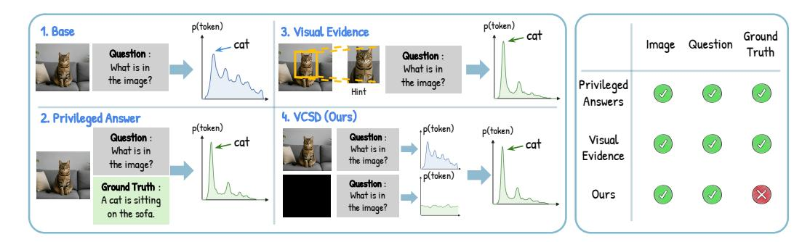
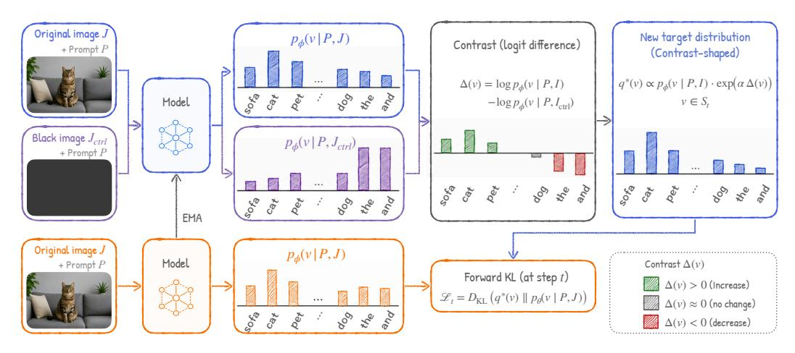
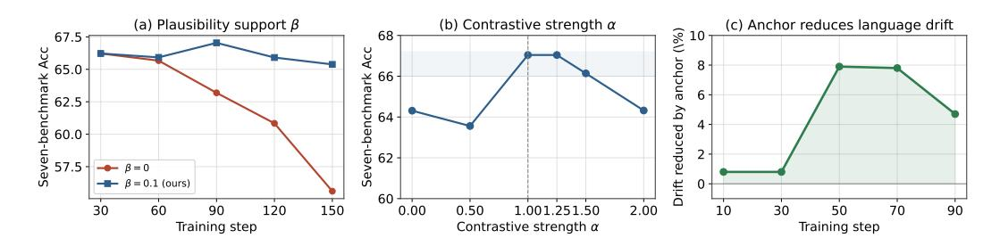
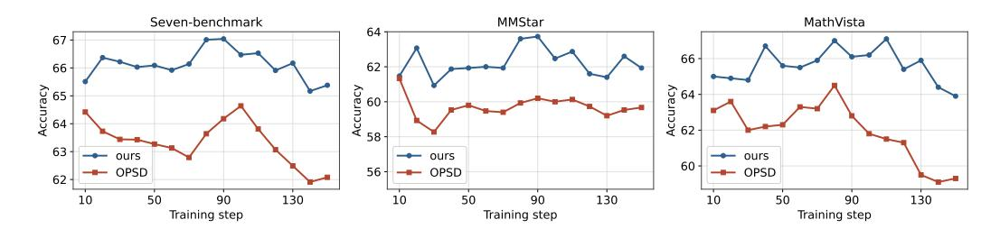
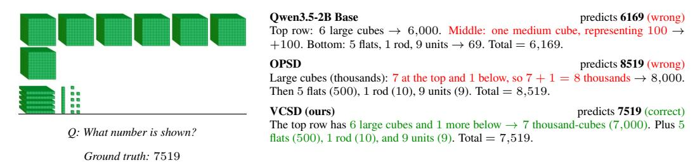
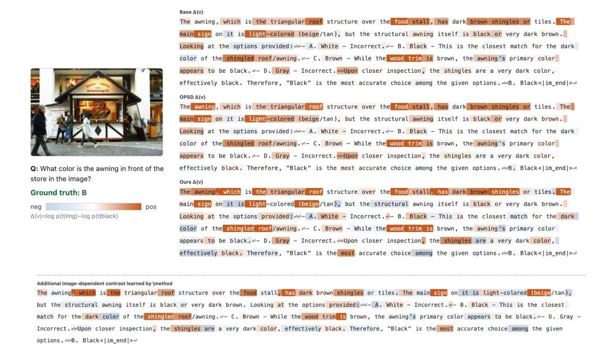

# 시각적 대비 자기 증류 (VISUAL CONTRASTIVE SELF-DISTILLATION)

- 원제: Visual Contrastive Self-Distillation
- 원문: [https://arxiv.org/abs/2607.21556](https://arxiv.org/abs/2607.21556)
- PDF: [https://arxiv.org/pdf/2607.21556v1](https://arxiv.org/pdf/2607.21556v1)
- arXiv ID: `2607.21556`

---

# 시각적 대비 자기 증류 (VISUAL CONTRASTIVE SELF-DISTILLATION)

Yijun Liang1 Yunjie Tian Yijiang Li2 Yuqi Jia3 Furong Huang1 Tianyi Zhou4 Di Fu

1메릴랜드 대학교(College Park) 2캘리포니아 대학교 샌디에이고(University of California, San Diego) 3듀크 대학교(Duke University) 4MBZUAI

yliang17@umd.edu, {tianyunjie96, fu.burning}@gmail.com

# 초록 (ABSTRACT)

On-policy self-distillation (OPSD)는 on-policy distillation (OPD)에서 요구되는 외부 교사(teacher)를 제거함으로써 유망하지만, 여전히 교사와 학생 간의 비대칭 정보를 필요로 하여 자기 교사가 학생보다 더 강력한 학습 신호를 제공하도록 보장한다. 기존 방법들은 이 비대칭성을 특권 답변(privileged answers) 또는 시각적 증거(visual evidence)를 통해 생성한다. 우리는 두 가지를 모두 제거하고 입력 조건만으로 구동되는 더 단순한 형태의 OPSD를 만들 수 있는지 물음으로써, Visual Contrastive Self-Distillation, 즉 VCSD를 제안한다. VCSD는 이미지-내용 제거를 on-policy 자기 증류 신호로 변환한다. 각 학생이 생성한 응답 프리픽스마다 EMA 교사는 동일한 프롬프트와 프리픽스 아래에서 두 개의 nexttoken 분포를 생성한다 – 하나는 원본 이미지에 조건화되고 다른 하나는 내용이 제거된 컨트롤에 조건화된다. 이들의 토큰별 로그확률 차이는 인스턴스 수준 시각적 내용에 의해 특별히 증가된 후보들을 강조한다. 우리는 이 대비를 사용하여 교사의 원본 이미지 분포를 그 합리적 지원 범위 내에서 선명하게 하고, 그 결과 완전 분포 목표를 학생에게 증류한다. ViRL39K 데이터셋을 사용하여 VCSD는 Qwen3-VL 및 Qwen3.5 모델에서 일치하는 OPSD를 지속적으로 능가한다. 예를 들어, Qwen3-VL에서 2B에서 62.27% → 67.04%, 4B에서 71.30% → 73.16%, 8B에서 72.51% → 76.26%로 7개 벤치마크 집계 점수를 향상시킨다. 또한 VCSD는 외부 교사, 특권 답변, 시각적 증거 신호, 추론 추적, 추가 추론 시간 비용을 필요로 하지 않는다.

# 1 서론 (INTRODUCTION)

On-policy 증류 (OPD) [\(Agarwal et al., 2024;](#page-10-0) [Lu & Lab, 2025;](#page-12-0) [Li et al., 2026\)](#page-11-0)은 자신의 정책에서 샘플링된 프리픽스를 사용해 학생을 훈련시키면서, 밀집 토큰 수준 감독을 위해 외부 교사를 사용한다. 이는 훈련을 학생의 추론 시 경로와 정렬하지만, 일반적으로 더 강력한 교사를 필요로 하여 사후 훈련 비용과 복잡성을 증가시킨다 [\(Liu et al., 2026;](#page-12-1) [Yoon et al., 2026\)](#page-12-2). On‑policy 자기 증류 (OPSD)는 동일한 모델에서 목표를 도출해, 종종 지수 이동 평균(EMA) 교사를 통해 외부 교사를 제거한다. 그러나 학생과 자기 교사가 동일한 프리픽스에서 동일한 정보를 받을 때, 목표는 학생의 현재 예측을 넘어서는 추가 정보를 거의 제공하지 않을 수 있다. 따라서 on‑policy 샘플링은 학습이 *어디에서* 발생하는지를 결정하지만, *무엇을* **…**

Existing methods construct this asymmetry through auxiliary information that is available to the self-teacher but not to the student, as illustrated in Figure [1.](#page-1-0) For language reasoning tasks, the teacher may be conditioned on privileged answers or reasoning traces [\(Zhao et al., 2026\)](#page-13-0), expert demonstrations [\(Shenfeld et al., 2026\)](#page-12-3), or rich textual feedback [\(Hubotter et al., 2026\)](#page-11-1). For vision-language tasks, the teacher can receive visual evidence signals, such as crops, regions, or other visual conditions that expose the relevant image evidence more directly [\(Yuan et al., 2026;](#page-12-4) [Sun](#page-12-5) [et al., 2026;](#page-12-5) [Tian et al., 2026\)](#page-12-6). These approaches can produce effective supervision, but depend on task-specific information or additional processing pipelines. These language-side signals are not always available, while visual evidence inputs may require annotations, external localization models, or manually designed image transformations.

Figure 1: **타깃 비대칭성의 다양한 출처 비교.** 기존 방법들은 특권적 답변이나 시각적 증거를 사용해 교사 분포를 선명하게 한다. 우리의 방법은 원본 이미지와 내용이 삭제된 제어 이미지에서의 교사 예측을 대비시켜, 보조 감독 없이 이미지와 질문만으로 시각적으로 정보를 반영한 타깃을 생성한다.

이것은 본 연구의 핵심 질문을 부추긴다: 온-폴리시 자기-디스틸레이션에 필요한 비대칭성을 보조 정보 없이 입력 조건만으로 순수하게 구성할 수 있을까? 우리는 내용이 삭제된 이미지를 모방할 대체 교사 입력이 아니라 통제된 참조로 취급함으로써 이 질문에 답한다. 각 학생이 생성한 응답 접두어마다 동일한 EMA 교사가 동일한 프롬프트와 접두어 아래에서 두 번 평가된다 – 한 번은 원본 이미지와, 한 번은 내용이 삭제된 제어 이미지와 함께. 시각적 조건만이 변하기 때문에, 그들의 토큰별 로그-확률 차이는 인스턴스별 시각적 내용이 제거될 때 각 후보의 가능성이 어떻게 변하는지를 포착한다 (Figure 1 참조). 이 조건부 대비는 자기-디스틸레이션에 필요한 타깃 비대칭성을 제공한다.

그러나 단독 대비만으로는 신뢰할 수 있는 디스틸레이션 타깃을 정의하지 못한다. 토큰이 큰 상대 변화를 보이더라도 원본 이미지 아래에서는 여전히 가능성이 낮을 수 있기 때문이다. 따라서 우리는 두 교사 예측에 상호 보완적인 역할을 부여한다: 원본 이미지 분포는 타당한 후보를 식별하고, 조건부 대비는 시각적 내용에 대한 의존도에 따라 그들의 상대적 선호도를 날카롭게 한다. 이 두 가지를 결합하면 시각적으로 정보를 반영한 전체 분포 타깃이 생성되어, 온-폴리시 궤적을 따라 학생에게 디스틸될 수 있다.

이 아이디어를 바탕으로 우리는 **Visual Contrastive Self-Distillation**, 즉 VCSD를 제안한다. 학생이 생성한 접두어 $y_{< t}$ 를 주어지면, 우리는 다음과 같이 정의한다

$$\Delta_t(v) = \log p_{\phi}(v \mid P, J, y_{< t}) - \log p_{\phi}(v \mid P, J_{\text{ctrl}}, y_{< t}),$$

$$q_t^*(v) \propto p_{\phi}(v \mid P, J, y_{< t}) \exp(\alpha \Delta_t(v)), \qquad v \in S_t,$$
(1)

여기서 $S_t$ 는 원본 이미지 아래에서 타당한 후보들만을 대상으로 타깃을 제한한다. 결과적으로 생성된 전체 분포 타깃은 온-폴리시 궤적을 따라 전방 KL을 통해 학생에게 디스틸된다. 여기서 'contrastive'는 임베딩 수준의 대비 손실이 아니라 조건부 토큰 분포 간의 대비를 의미한다.

우리는 2B에서 9B까지의 Qwen3-VL 및 Qwen3.5 모델에서 ViRL39K를 사용해 VCSD를 평가한다. Qwen3-VL의 경우, 2B에서 62.27%에서 67.04%로, 4B에서 71.30%에서 73.16%로, 8B에서 72.51%에서 76.26%로 총합 점수가 향상된다. 또한 Qwen3.5 모델은 해당 베이스 모델보다 2.9%에서 4.3%까지 일관되게 향상된다. 모델 계통과 규모를 가리지 않고 VCSD는 베이스 모델과 매칭된 OPSD 기준보다 우수하다. 게다가 VCSD는 외부 교사, 특권 답변, 추론 트레이스, 증거 중심 크롭, 외부 검증자 등을 필요로 하지 않는다.

우리의 기여는 세 가지이다:

- 우리는 매칭된 입력 조건화가 특권 답변이나 시각적 증거 신호 없이 OPSD에 필요한 목표 비대칭성을 제공할 수 있음을 보여준다.

- 우리는 원본 이미지와 내용 제거된 교사 예측 간의 대비를 사용해 그럴듯한 전체 분포 목표를 선명하게 하는 VCSD를 제안한다.

• 우리는 2B에서 9B까지의 Qwen3-VL 및 Qwen3.5 모델에서 7개의 시각-언어 벤치마크에 걸쳐 일관된 향상을 입증한다.

#### 2 관련 연구 (RELATED WORK)  
온-폴리시 자기-증류에서 목표 비대칭성. 온-폴리시 자기-증류는 동일한 기저 모델에서 목표를 구축하며, 이는 학생에 비해 정보를 제공하도록 비대칭성을 필요로 한다. 기존 방법들은 특권 답변이나 추론 트레이스(Zhao et al., 2026), 증거 중심 시각적 관점(Yuan et al., 2026), 또는 궤적 선택을 위한 짝지어진 증거(Sun et al., 2026)를 통해 이 비대칭성을 만든다. 다른 감독 방식은 검증 가능한 보상(Shao et al., 2024; Yang et al., 2026)이나 별도로 훈련된 교사를 사용하며, 때로는 시각적 가중치나 기울기 조정(Liu et al., 2026; Bousselham et al., 2026; Yoon et al., 2026)을 적용한다. VCSD는 대신 동일한 목표 모델의 매칭된 시각 조건에서 목표 비대칭성을 도출한다: 내용 제거된 예측이 기준이 되고, 실제 이미지 예측이 입력에 의해 지원되는 후보에 목표를 고정한다. 이는 VLM이 세밀한 이미지 증거보다 언어적 선행을 선호하는 경향을 겨냥한다(Guan et al., 2024). 추론 시, 관련 방법들은 모델 간, 시각 조건, 내부 표현(Li et al., 2023; Leng et al., 2024) 또는 층별 활성화 정제(Wang et al., 2025a)를 통해 이 의존성을 해결한다. VCSD는 검증 가능한 보상이나 외부 교사 없이 시각적 대비를 OPSD에 증류하며, 추론 시 추가 전방 패스를 요구하지 않는다.

쌍 조건에서의 상대적 예측 분포. 예측 분포 간의 차이는 단독 예측에서는 드러나지 않는 정보를 노출하는 데 사용되었다. 대비적 디코딩은 전문가와 아마추어 모델, 또는 원본과 저하된 시각 조건을 비교해 추론 시 토큰 선택을 수정한다(Li et al., 2023; Leng et al., 2024). 디코딩을 넘어, 쌍 모델 행동은 훈련 신호를 정의할 수도 있다: MARGO는 명시적 추론의 이점을 추정할 때 동일 모델 참조로 비생각 롤아웃을 사용한다(Wang et al., 2026b). 관련 정책 전이 방법은 모델 체크포인트를 비교한다: 약한-강한 선호 최적화는 정렬에 의해 도입된 변화를 전이한다(Zhu et al., 2025), Direct-OPD는 RL에 의해 유도된 정책 차이를 학생의 온-폴리시 상태에 전이한다(Feng et al., 2026). VCSD는 동일 모델, 쌍 입력 설정을 고려한다. 이때 목표 파라미터와 응답 프리픽스는 고정되고 시각 조건만 변한다. 결과적으로 단어 수준 대비가 분리된 토큰 분포를 형성하며, 이는 전방 KL에 의해 증류된다. 실제 이미지 예측은 그럴듯함 앵커를 제공하고, 내용 제거 예측은 상대 토큰 선호도를 조정하는 데 사용되는 기준을 제공한다.

#### 3 방법 (Method)

우리는 VCSD를 제안한다. VCSD는 매칭된 시각적 조건화에서 OPSD에 필요한 목표 비대칭성을 구성한다. Figure 2에 표시된 바와 같이, 학생은 원본 이미지 아래에서 온정책(on‑policy) 응답을 생성하고, EMA 교사는 원본 이미지와 내용이 삭제된 제어 이미지 두 가지 모두에서 각 응답 접두어를 평가한다. 이들의 토큰별 로그‑확률 대비는 원본 이미지 분포를 그 합리적 지지 범위 내에서 날카롭게 하여, 자기 증류를 위한 전체 분포 목표를 제공한다.

#### 3.1 온정책 자기 증류 설정 (On-Policy Self-Distillation Setup)

Let  $\mathcal{D} = \{(P_i, J_i)\}_{i=1}^N$  denote a collection of prompt‑image pairs, where P is the prompt and J is the original image. We denote the trainable student by  $\pi_\theta$  and its EMA teacher by  $\pi_\phi$ . The teacher is treated as a stop‑gradient target model and does not receive gradient updates.

For each  $(P, J) \sim \mathcal{D}$ , the student samples an on‑policy response

$$y \sim \pi_{\theta}(\cdot \mid P, J).$$
 (2)

생성 단계 t에서, 학생과 교사는 동일한 학생이 생성한 접두사 $y_{< t}$ 를 따라 평가된다. 학생의 다음 토큰 분포는

$$p_{\theta,t}(v) = \pi_{\theta}(v \mid P, J, y_{\le t}), \qquad v \in \mathcal{V}, \tag{3}$$

Figure 2: **Overview of VCSD.** 각 학생이 생성한 접두사마다 EMA 교사는 원본 이미지와 내용이 지워진 컨트롤에서의 다음 토큰 분포를 대비한다. 대비는 원본 이미지에 대한 타당한 분포를 날카롭게 하여 목표를 형성하고, 이 목표는 순방향 KL을 통해 학생에게 증류된다. 응답 접두사는 명확성을 위해 생략된다.

여기서 V는 어휘집이다.

롤아웃은 온폴리시(on-policy)이다. 이는 학생이 감독이 적용되는 모든 접두사를 결정하기 때문이다. 그러나 온폴리시 샘플링만으로는 교사 목표가 $p_{\theta,t}$ 보다 더 유익해지는 방식을 명시하지 않는다. VCSD는 교사에게 특권 있는 답변이나 증거 중심의 크롭을 제공하는 대신, 두 개의 일치된 시각적 조건에서 교사를 비교함으로써 이 목표 비대칭을 구성한다.

#### 3.2 VISUAL CONDITIONING CONTRAST

우리는 내용이 제거된 제어 $J_{\text{ctrl}} = \mathcal{C}(J)$ 를 구성한다. 여기서 $\mathcal{C}(J)$ 는 같은 크기의 검은색 RGB 이미지이다. 이 제어는 이미지 해상도, 멀티모달 입력 인터페이스, 전처리 경로, 시각 토큰 수를 보존하면서 J의 인스턴스별 콘텐츠를 제거한다.

각 고정 접두사 $y_{< t}$ 에 대해 EMA 교사는 두 개의 다음 토큰 분포를 생성한다:

$$p_{\phi,t}^{J}(v) = \pi_{\phi}(v \mid P, J, y_{< t}),$$
 (4)

$$p_{\phi,t}^{0}(v) = \pi_{\phi}(v \mid P, J_{\text{ctrl}}, y_{< t}).$$
 (5)

프롬프트, 응답 접두사, 모델 파라미터, 그리고 멀티모달 계산 경로는 두 평가에서 공유된다. 차이점은 인스턴스별 시각 콘텐츠가 있는지 여부에 있다.

우리는 어휘 수준 로그-확률 대비를 통해 토큰 선호도의 변화를 측정한다

$$\Delta_t(v) = \log p_{\phi,t}^J(v) - \log p_{\phi,t}^0(v).$$
 (6)

양의 $\Delta_t(v)$ 는 토큰 v 가 원본 이미지에서 내용이 제거된 제어보다 더 큰 지원을 받는다는 것을 나타낸다. 반대로 음의 값은 원본 시각 콘텐츠가 제거될 때 그 확률이 증가함을 의미한다. 따라서 $\Delta_t$ 는 교사의 다음 토큰 선호가 인스턴스별 시각 콘텐츠에 어떻게 반응하는지를 설명한다.

중요하게도, 제어 분포는 오직 참조용으로만 사용된다. 이는 교사 대상이 되거나 학생에게 직접 증류되지 않는다.

#### 3.3 Contrast-Shaped Teacher Target

우리는 조건부 대비가 교사 목표를 수정하기 위한 방향을 제공하지만, 단독으로는 충분하지 않다. 토큰은 두 조건 사이에서 큰 상대 변화를 보이면서도 원본 이미지에서는 여전히 매우 낮은 확률을 가질 수 있다. 따라서 우리는 원본 이미지의 교사 분포를 타당성 기준(anchor)으로 사용하고, 그 분포가 충분히 가능성이 높은 후보에만 대비적 모양을 적용한다.

구체적으로, 우리는 상대적 타당성 지원을 정의한다

$$S_t(\beta) = \left\{ v \in \mathcal{V} : p_{\phi,t}^J(v) \ge \beta \max_{u \in \mathcal{V}} p_{\phi,t}^J(u) \right\},\tag{7}$$

$\beta \in [0,1]$ 은 지원 임계값을 제어한다. 이 상대 임계값 구성은 대비 디코딩에서 일반적으로 사용되는 타당성 제한을 따른다 (Li et al., 2023; Leng et al., 2024).

그 다음 우리는 대비형 교사 목표를 다음과 같이 구성한다

$$q_t^{\star}(v) = \frac{\mathbf{1}\left[v \in \mathcal{S}_t(\beta)\right] p_{\phi,t}^J(v) \exp\left(\alpha \widetilde{\Delta}_t(v)\right)}{\sum_{u \in \mathcal{S}_t(\beta)} p_{\phi,t}^J(u) \exp\left(\alpha \widetilde{\Delta}_t(u)\right)},\tag{8}$$

$\alpha \geq 0$ 은 대비적 모양의 강도를 제어한다. 여기서 $\widetilde{\Delta}_t$ 는 $\Delta_t$ 와 동일하지만, 지정된 시퀀스 종료 토큰의 대비 값은 0 으로 설정된다.

식 (8)은 두 신호에 보완적인 역할을 부여한다. 원본 이미지 분포 $p_{\phi,t}^J$ 는 초기 확률과 허용 가능한 후보 집합을 결정하고, $\widetilde{\Delta}_t$ 는 각 후보가 원본 시각적 내용에 의해 얼마나 강하게 선호되는지에 따라 상대 확률을 조정한다. 지원 집합 안에서, 해당 정규화되지 않은 로그 점수는

$$\log p_{\phi,t}^J(v) + \alpha \widetilde{\Delta}_t(v) = (1+\alpha) \log p_{\phi,t}^J(v) - \alpha \log p_{\phi,t}^0(v), \tag{9}$$

비종료 토큰에 대해. $\alpha=0$ 일 때, 목표는 $\mathcal{S}_t(\beta)$ 에 대해 재정규화된 원본 이미지 교사 분포로 축소된다. $\beta=0$ 일 때, 모양은 전체 어휘에 적용된다.

VCSD에서 '대비적'은 양의 샘플과 음의 샘플 쌍에 기반한 임베딩 수준 대비 목표가 아니라 두 조건부 토큰 분포 간의 대비를 의미한다.

#### 3.4 온-정책 증류 및 EMA 업데이트 (On-Policy Distillation and EMA Update)

대비형 목표는 전체 분포 전방 KL을 사용하여 학생이 생성한 응답의 각 위치에 학생에게 증류된다:

$$\mathcal{L}_{VCSD} = T_{KD}^{2} \mathbb{E}_{\substack{(P,J) \sim \mathcal{D} \\ y \sim \pi_{\theta}(\cdot|P,J)}} \left[ \frac{1}{|y|} \sum_{t=1}^{|y|} D_{KL} \left( \operatorname{sg} \left[ q_{t}^{\star} \right] \parallel p_{\theta,t} \right) \right], \tag{10}$$

$sg[\cdot]$ 은 stop-gradient를 나타낸다. 목표 구성 및 증류에 사용되는 모든 교사 및 학생 분포는 동일한 증류 온도 $T_{KD}$ 로 평가된다; 그 의존성은 명확성을 위해 표기에서 생략된다. 계수 $T_{KD}^2$ 는 표준 온도-스케일링 지식 증류를 따른다.

기울기는 학생 분포 $p_{\theta,t}$ 를 통해서만 전달된다. 두 교사 평가는 동일한 고정된 학생 생성 접두어에서 수행되며 별도의 응답 경로를 생성하지 않는다. 각 학생 업데이트 후, 교사 파라미터는 $\phi \leftarrow \mu \phi + (1-\mu)\theta$ 로 업데이트되며, 여기서 $\mu \in [0,1)$ 은 EMA 감쇠 계수이다.

훈련은 원본 프롬프트-이미지 쌍과 학생의 자체 온-정책 응답만 필요로 한다. 외부 교사, 특권 답변, 추론 추적, 증거 중심 크롭, 외부 검증자, 또는 검증 가능한 보상을 소비하지 않는다. 추론 시에는 업데이트된 학생만 보존되며, EMA 교사나 내용 제거 제어가 추가 추론 시간 분기를 도입하지 않는다.

#### 3.5 이론적 관점

조건부 로그비는 방정식 6에서 두 가지 상호 보완적 해석을 허용한다. 첫째, 이는 인스턴스별 시각적 내용에 기인한 예측 지원을 측정하는 조밀한 토큰 수준 보상으로 볼 수 있다. 둘째, 이는 후보 토큰과 관측된 이미지 사이의 조건부 점별 상호 정보에 대한 통제된 근사치를 제공하며, 내용이 제거된 예측은 인스턴스별 시각적 정보가 없는 예측의 대리물로 사용된다.

원-스텝 KL-정규화된 정책 업데이트. 원본 이미지 교사 분포를 가용성 지원에 제한하고 재정규화한 것은

$$\bar{p}_{\phi,t}^{J}(v) = \frac{\mathbf{1}[v \in \mathcal{S}_{t}(\beta)] \, p_{\phi,t}^{J}(v)}{\sum_{u \in \mathcal{S}_{t}(\beta)} \, p_{\phi,t}^{J}(u)}.$$ (11)

우리는 조건부 대비를 다음과 같이 간주한다

$$r_t^{\text{vis}}(v) := \widetilde{\Delta}_t(v) \tag{12}$$

암시적 시각적 증거 보상으로 간주된다.

**Remark 1.** 각 학생이 생성한 접두사마다, 방정식 8의 대비형 목표는 다음 최적화 문제의 유일한 해이다:

$$q_{t}^{\star} = \arg \max_{q \in \Pi(\mathcal{S}_{t}(\beta))} \left\{ \alpha \mathbb{E}_{v \sim \mathbb{q}} \left[ r_{t}^{\text{vis}}(v) \right] - D_{\text{KL}} \left( \mathbb{q} \parallel \bar{p}_{\phi, t}^{J} \right) \right\}. \tag{13}$$

여기서  $\Pi(S_t(\beta))$  는  $S_t(\beta)$  위의 확률 단순형을 나타낸다. 닫힌 형태의 해는

$$\displaystyle q_t^{\star}(v) = \frac{\bar{p}_{\phi,t}^J(v) \exp\left(\alpha r_t^{\text{vis}}(v)\right)}{\sum_{u \in \mathcal{S}_t(\beta)} \bar{p_{t}^J}(u) \exp\...}.$$ (14)

왜냐하면  $\bar{p}_{\phi,t}^J$  의 지원-정규화 상수는 분자와 분모에서 상쇄되므로, 방정식 14는 방정식 8에서 정의된 목표와 정확히 동일하다. 따라서 원본 이미지 예측은 참조 정책으로 작용하고, 조건부 로그비는 이를 개선하는 데 사용되는 보상으로 제공된다. 가용성 제한은 대형 가능성 비율을 가진 토큰이 원본 이미지 확률이 거의 없을 때 개선된 목표를 지배하는 것을 방지하는 강제 지원 제약을 부과한다. 완전한 유도는 부록 A에 제공된다.

여기서 'one-step'는 지원-정규화된 원본 이미지 교사 분포  $\bar{p}_{\phi,t}^J$  에서 고정된 응답 접두사에서 지역적으로 개선된 목표  $q_t^\star$  로의 단일 닫힌 형태 업데이트를 의미한다. 이는 학생 최적화의 단일 기울기 단계와는 관련이 없다.

중요하게도, 이 해석은 원본 이미지 정책이 과거에 제어 이미지 정책에 강화 학습을 적용하여 얻어졌다고 가정하지 않는다. 오히려 조건부 로그비는 KL-정규화 최적화가 우리의 대비형 목표와 일치하는 암시적 보상을 정의한다.

**조건부 점별 상호 정보에 대한 근사.** $H_t = (P, y_{< t})$ 를 단계 t에서의 텍스트 문맥으로 두면, 토큰 v와 이미지 J 사이의 조건부 점별 상호 정보는 다음과 같은 형태를 갖는다

$$PMI(v; J \mid H_t) = \log \frac{p(v \mid J, H_t)}{p(v \mid H_t)}.$$ (15)

우리의 조건부 대비는 대신 다음과 같은 형태를 갖는다

$$\Delta_t(v) = \log \frac{p_{\phi}(v \mid J, H_t)}{p_{\phi}(v \mid J_{\text{ctrl}}, H_t)}.$$ (16)

When the content-erased prediction  $p_{\phi}(v \mid J_{\text{ctrl}}, H_t)$  approximates the model's prediction without instance-specific visual information, it serves as a controlled surrogate for  $p_{\phi}(v \mid H_t)$ . Under this interpretation,  $\Delta_t(v)$  is a contrastive approximation to conditional pointwise mutual information: it measures how much the observed image changes the token's log-likelihood beyond the content-independent prediction. Positive values identify tokens whose likelihood increases in the presence of the observed visual content, whereas values near zero identify tokens whose likelihood is largely preserved after that content is removed. The guarded reward  $r_t^{\text{vis}}(v) = \widetilde{\Delta}_t(v)$  follows this interpretation for ordinary tokens, while designated termination tokens are excluded from contrastive adjustment for training stability.

This shows why the proposed objective is useful. Maximizing conditional mutual information favors predictions that remain informative about the observed image after accounting for the textual context, rather than predictions that can be explained primarily by language priors. Accordingly, upweighting tokens with large positive contrast encourages the student to preserve image-dependent evidence in its next-token distribution, while leaving visually insensitive tokens largely unchanged. Combined with the original-image teacher distribution as the reference policy, this yields a conservative form of visual grounding: the method amplifies visually supported distinctions only among tokens that the teacher already considers plausible, instead of rewarding arbitrary image-sensitive outputs. The resulting target therefore promotes stronger dependence on instance‑specific visual evidence while retaining the fluency and semantic knowledge encoded by the teacher.

(blank line)
### 4 EXPERIMENTS (실험)
(blank line)

(blank line)
#### 4.1 SETUP (설정)
(blank line)

**모델 및 훈련 데이터.** 우리는 VCSD를 Qwen3-VL (Bai et al., 2025)에서 2B, 4B, 8B 규모로, 그리고 Qwen3.5 (Qwen Team, 2026)에서 2B, 4B, 9B 규모로 평가한다. 모든 사후 훈련 방법은 ViRL39K 단일 이미지 데이터셋 (Wang et al., 2026a)에서 훈련된다.

**기준선.** 각 모델 블록은 수정되지 않은 기본 모델, 공개된 답변 힌트 OPSD 방법 (Zhao et al., 2026), 그리고 VCSD를 비교한다. OPSD 목표 모델은 참조 답변에 조건화되며, 학생은 원본 질문과 이미지만을 받는다. VCSD는 온-정책 롤아웃 구조를 유지하지만, 답변을 소비하지 않고 원본 및 내용 제거 이미지 조건의 쌍에서 목표를 구성한다.

**벤치마크 및 집계 지표.** 우리는 BLINK (Fu et al., 2024)와 MMStar (Chen et al., 2024)를 이용해 일반 시각 인식을, MathVista (Lu et al., 2024)를 이용해 시각 수학을, V*Bench (Wu & Xie, 2023)와 HRBench4K/8K (Wang et al., 2025b)를 이용해 세밀하고 고해상도 인식을, HallusionBench (Guan et al., 2024)를 이용해 환각을 평가한다. 보고된 *Acc*는 이 일곱 벤치마크의 가중치 없는 평균이며, HallusionBench 항목은 먼저 aAcc, fAcc, qAcc를 평균한다.

**훈련 구성.** 별도의 명시가 없으면 VCSD는 α=1.0, β=0.1, T_{\rm KD}=2 를 사용하며, 균일한 응답-위치 가중치를 적용한다. EMA 목표는 ρ=0.05의 업데이트 속도를 사용한다. 우리는 AdamW를 사용해 전체 어휘 전방-KL 목표를 최적화하고, 32개의 프롬프트 배치에 대해 n=8 롤아웃을 수행하며, 학습률은 2×10^{-6}이고, 10개의 워밍업 스텝 후 일정 학습률을 유지한다. 모든 모델은 8개의 NVIDIA B200 GPU에서 90번의 최적화 스텝이라는 고정 예산을 사용한다.

(blank line)
#### 4.2 MAIN RESULTS (주요 결과)
(blank line)

표 1은 두 Qwen 모델 계통과 각 계통의 세 가지 규모에 대한 주요 비교를 보고한다.

VCSD는 시각적 기능 전반에서 답변 힌트 OPSD를 능가한다. Qwen3-VL-2B에서 VCSD는 OPSD보다 모든 벤치마크에서 향상된다: BLINK +1.27%, MMStar +3.00%, V*Bench +2.09%, MathVista +1.40%, HRBench4K +1.00%, HRBench8K +2.00%, 그리고 HallusionBench +4.32%.

Table 1: 7개 벤치마크에서의 주요 결과  
우리는 세 개의 Qwen3-VL 모델과 세 개의 Qwen3.5 모델 규모에서 기본 모델, OPSD, VCSD를 비교한다. Acc.는 일곱 개 평가 벤치마크에 대한 평균 정확도를 나타낸다. VCSD는 기본 모델과 OPSD를 일관되게 능가하며, 해당 기본 모델 대비 평균 정확도를 +1.86%에서 +4.77%까지 향상시키면서 거의 모든 모델 규모에서 가장 우수한 전반적 성능을 달성한다. 각 열에서 가장 높은 점수는 굵게 표시된다.

| 모델 | 방법 | BLINK | MMStar | $\mathbf{V}^*$ | MathVista | HR4K | HR8K | HalluB | 정확도 |
|-------------|-------------|-------|--------------|----------------|-----------|-------|-------|--------|----------------------|
| Qwen3-VL-2B | 베이스 | 53.02 | 57.47 | 72.77 | 62.50 | 71.13 | 67.38 | 51.60 | 62.27 |
|  | OPSD | 56.02 | 60.73 | 75.92 | 64.70 | 76.25 | 71.25 | 49.36 | 64.89 |
|  | VCSD (우리의) | 57.29 | 63.73 | 78.01 | 66.10 | 77.25 | 73.25 | 53.68 | <b>67.04</b> (+4.77) |
|  | 베이스 | 67.18 | 68.93 | 80.63 | 73.90 | 79.88 | 73.75 | 54.81 | 71.30 |
| Qwen3-VL-4B | OPSD | 64.97 | 68.73 | 83.77 | 74.10 | 78.12 | 75.63 | 54.50 | 71.40 |
| - | VCSD (우리의) | 66.86 | 68.73 | 83.77 | 74.90 | 80.50 | 77.00 | 60.37 | <b>73.16</b> (+1.86) |
| Qwen3-VL-8B | 베이스 | 69.65 | 70.67 | 82.72 | 76.50 | 77.38 | 71.12 | 59.51 | 72.51 |
|  | OPSD | 67.81 | 70.20 | 85.34 | 77.30 | 81.12 | 74.62 | 59.64 | 73.72 |
|  | VCSD (우리의) | 70.38 | 74.07 | 87.43 | 77.90 | 84.12 | 79.25 | 60.69 | <b>76.26</b> (+3.75) |
| Qwen3.5-2B | 베이스 | 59.02 | 67.67 | 83.25 | 74.10 | 73.75 | 72.25 | 50.22 | 68.61 |
|  | OPSD | 59.44 | 67.00 | 79.58 | 69.70 | 75.00 | 68.75 | 43.76 | 66.18 |
|  | VCSD (우리의) | 64.86 | 69.40 | 83.77 | 76.50 | 78.50 | 70.75 | 56.77 | <b>71.51</b> (+2.90) |
| Qwen3.5-4B | 베이스 | 64.97 | 73.00 | 82.20 | 81.70 | 81.38 | 74.00 | 60.36 | 73.94 |
|  | OPSD | 64.44 | 71.40 | 84.29 | 77.60 | 82.75 | 78.75 | 58.22 | 73.92 |
|  | VCSD (우리의) | 66.70 | 75.00 | 84.82 | 82.20 | 85.38 | 79.38 | 63.95 | <b>76.77</b> (+2.83) |
| Qwen3.5-9B | 베이스 | 66.70 | 74.60 | 83.25 | 81.60 | 82.38 | 77.38 | 58.89 | 74.97 |
|  | OPSD | 67.65 | 72.27 | 87.96 | 78.80 | 81.50 | 78.12 | 56.80 | 74.73 |
|  | VCSD (우리의) | 72.23 | <b>78.87</b> | 85.86 | 85.00 | 87.00 | 81.50 | 64.19 | <b>79.24</b> (+4.27) |

Figure 3: Ablation studies on Qwen3-VL-2B. (a) Effect of plausibility support. Restricting target shaping to the plausible support stabilizes long-horizon self-distillation, whereas removing it leads to progressive performance degradation. (b) Effect of contrastive strength. Performance is strongest and locally robust for  $\alpha \in [1, 1.5]$ , while weaker or stronger shaping reduces accuracy. (c) Effect of original-image anchor. Preserving the original-image distribution as the anchor substantially reduces language drift during training.

This yields a +2.15% aggregate gain, with improvements spanning general perception, visual mathematics, fine-grained and high-resolution perception, and hallucination rather than being driven by a single benchmark.

The advantage persists across model families and scales. Across all six configurations, VCSD achieves the highest aggregate accuracy. At the largest tested scale in each family, it remains +2.54% above OPSD on Qwen3-VL-8B and +4.51% above it on Qwen3.5-9B. The contrast is especially clear on Qwen3.5, where OPSD provides no consistent gain over the base models, whereas VCSD improves every tested scale. Together, these results indicate that input-conditioned asymmetry provides a more effective self-distillation signal than privileged answer conditioning under the evaluated setting: paired predictions under matched visual conditions are sufficient to drive self-improvement without answer or evidence hints.

Table 2: Ablation on the distillation divergence. We compare forward KL, reverse KL, and JSD on Qwen3-VL-2B. Forward KL consistently performs best, supporting our choice of a mode-covering objective for distilling the contrast-shaped target.

| 발산 (Divergence) | BLINK | MMStar | V∗ | MathVista | HR4K | HR8K | HalluB | 정확도 (Acc.) |
|------------|-------|--------|-------|-----------|-------|-------|--------|-------|
| 전방 KL (forward KL) | 57.29 | 63.73 | 78.01 | 66.10 | 77.25 | 73.25 | 53.68 | 67.04 |
| JSD (JSD) | 57.08 | 62.33 | 76.44 | 65.70 | 75.37 | 73.00 | 53.86 | 66.25 |
| 역방 KL (reverse KL) | 56.92 | 61.07 | 76.44 | 64.00 | 73.62 | 70.50 | 50.86 | 64.77 |

## 4.3 가능성 제한의 효과 (EFFECT OF PLAUSIBILITY RESTRICTION)

가능성 지원은 재귀적 타깃 왜곡을 제한한다. Figure [3](#page-7-1) (a)는 장기 훈련 동안 가능성 지원이 있는 경우와 없는 경우의 7개 벤치마크 정확도를 비교한다. 조건부 대비는 두 시각적 조건 사이에서 확률이 크게 변하는 토큰을 강하게 선호할 수 있으며, 그 토큰이 원본 이미지에서는 여전히 낮은 확률을 가질 때도 마찬가지이다. 타깃 형성을 원본 이미지 예측의 상대적 지원에 한정함으로써 대비가 관측된 입력에 의해 지원되는 후보들 사이에서만 확률을 재분배하도록 보장한다. 두 변형은 훈련 초기 단계에서는 유사하게 동작하지만, 무제한 타깃(β = 0)은 지속적인 자기 증류와 함께 꾸준히 악화되는 반면, 가능성 지원(β = 0.1)은 안정적인 성능을 유지한다. 연속적인 타깃이 업데이트된 모델에서 재귀적으로 구성되기 때문에, 이와 같은 증가하는 발산은 가능성 지원이 자기 증류 업데이트 전반에 걸친 타깃 왜곡의 축적을 완화한다는 것을 시사한다.

# 4.4 대비 강도의 효과 (EFFECT OF CONTRASTIVE STRENGTH)

중간 정도의 대비 형성은 효과적이며 지역적으로 견고하다. Figure [3](#page-7-1) (b)는 성능이 α = 1 근처에서 최고점을 찍고 α ∈ [1, 1.5] 범위에서 1% 미만으로 변동함을 보여준다. α = 0을 설정하면 조건부 대비가 제거되지만 나머지 타깃 구성은 그대로 유지된다; α = 1과 비교했을 때 7개 벤치마크 정확도는 2.33% 감소한다. 반대로 α = 2로 강도를 높이면 성능이 대비가 없는 수준으로 감소한다.

# 4.5 증류 발산의 효과 (EFFECT OF DISTILLATION DIVERGENCE)

Forward KL은 대비형 타깃을 가장 효과적으로 증류한다. Table [2](#page-8-0)은 대비형 타깃과 다른 모든 훈련 설정을 고정한 상태에서 forward KL, reverse KL, JSD를 비교한다. Forward KL은 67.04%의 최고 집계 정확도를 달성하며, JSD보다 0.79%, reverse KL보다 2.27% 우수하며, 7개 벤치마크 중 6개에서 1위를 차지한다. 이 패턴은 시각적으로 대비형으로 구성된 교사 타깃을 증류할 때 전체 타깃 분포의 범위를 보존하는 것이 유리함을 시사한다.

### 4.6 제어 이미지 구성의 효과 (EFFECT OF CONTROL-IMAGE CONSTRUCTION)

대비형 타깃은 정확한 제어 구성을 무시한다. Table [3](#page-9-0)은 검은색, 가우시안 노이즈, 가우시안 블러, 이미지 없음 제어를 비교하며, 이는 서로 다른 개입을 통해 인스턴스별 시각적 콘텐츠를 제거한다. 네 가지 변형은 질적으로 다른 제어 입력을 생성함에도 불구하고 유사한 집계 정확도를 달성한다. 그들의 공통된 특성은 인스턴스별 이미지 콘텐츠를 제거한다는 것이며, 이는 콘텐츠 제거가 특정 저하 과정보다 참조 예측을 구성하는 핵심 요구 사항임을 시사한다.

# 4.7 원본 이미지 앵커의 효과 (EFFECT OF ORIGINAL-IMAGE ANCHOR)

원본 이미지 앵커의 역할을 분리하기 위해, 우리는 타깃 점수에 앵커 계수 λ를 도입한다:

$$a_t^{(\lambda)}(v) = \lambda \log p_{\phi,t}^J(v) + \alpha \widetilde{\Delta}_t(v) = (\lambda + \alpha) \log p_{\phi,t}^J(v) - \alpha \log p_{\phi,t}^0(v), \quad v \in \mathcal{S}_t(\beta).$$
 (17)

Table 3: **컨트롤 이미지 구성에 대한 소거 실험.** 우리는 검은 이미지(우리의), 가우시안 노이즈, 가우시안 블러, 그리고 이미지 없음 등 여러 콘텐츠가 제거된 컨트롤 이미지를 비교한다. 모든 변형은 …

| 구성 | BLINK | MMStar | V* | MathVista | HR4K | HR8K | HalluB | 정확도. |
|----------------|-------|--------|-------|-----------|-------|-------|--------|-------|
| 가우시안 노이즈 | 58.23 | 63.60 | 76.44 | 67.20 | 76.38 | 73.25 | 54.87 | 67.14 |
| 검정 (우리) | 57.29 | 63.73 | 78.01 | 66.10 | 77.25 | 73.25 | 53.68 | 67.04 |
| 가우시안 블러 | 55.65 | 62.87 | 78.01 | 66.00 | 76.88 | 73.88 | 51.25 | 66.36 |
| 이미지 없음 | 57.23 | 62.93 | 74.87 | 63.10 | 76.38 | 72.88 | 56.31 | 66.24 |

Table 4: **원본 이미지 앵커 제거 (Ablation of the original-image anchor)**. Qwen3-VL-2B에 대한 벤치마크별 결과; Acc.는 7개의 벤치마크를 평균한 값이다.

| 구성 | BLINK | MMStar | V* | MathVista | HR4K | HR8K | HalluB   Acc. |
|--------------------------|-------|-----------------------|----|--------------------|------|------|----------------------------------------------|
| 앵커 없음 VCSD (ours) |  | 62.93 <b>63.73</b> |  | <b>67.00</b> 66.10 |  |  | 53.43   66.78 <b>53.68</b>   <b>67.04</b> |

전체 방법은 $\lambda=1$을 사용하여 Eq. 9를 복원하지만, 앵커가 없는 변형은 $\lambda=0$을 설정하면서 동일한 타당성 지원을 유지합니다. $\alpha=1$일 때, 그 대상 점수는 $\log p_{\phi,t}^J(v)-\log p_{\phi,t}^0(v)$가 됩니다.

앵커는 주로 생성 과정을 정규화하며 집계 정확도를 향상시키지는 않습니다. 표 4는 앵커가 있는 경우와 없는 경우의 7개 벤치마크 정확도가 비슷함을 보여, 능력 향상이 주로 대조적 형성에서 비롯된 것임을 시사합니다. 우리는 언어 드리프트를 비표적 언어 토큰을 포함하는 롤아웃 비율로 정의합니다. 그림 3(c)는 훈련 전반에 걸쳐 앵커가 이 드리프트를 감소시키며, 특히 중간 체크포인트에서 가장 큰 감소를 보임을 보여줍니다. 형성된 목표를 원래 예측에 가깝게 유지함으로써 앵커는 언어 일관성을 향상시키면서 집계 정확도는 크게 변하지 않게 합니다.

\n#### 4.8 훈련 역학 (TRAINING DYNAMICS)\n\n

VCSD는 일관된 우위를 유지하며 후기 단계에서의 저하에 덜 취약합니다. 그림 4는 동일한 실행 내에서 VCSD와 OPSD를 7개 벤치마크 집계 및 MMStar, MathVista에서 비교합니다. 집계에서는 VCSD가 평가된 모든 훈련 단계에서 OPSD보다 높은 위치를 유지하며 후기 단계 저하가 적습니다. 첫 번째 평가 단계 이후, VCSD는 MMStar에서 앞서 있으며 MathVista에서는 훈련 전반에 걸쳐 더 높은 성능을 보입니다. VCSD의 정확도는 좁은 범위 내에서 변동하지만, OPSD는 특히 MathVista에서 후기 단계 저하가 더 뚜렷합니다. 이러한 경향은 VCSD가 평가된 설정에서 지속적인 훈련에 대해 더 견고함을 시사합니다.

\n#### 4.9 정성적 분석 (QUALITATIVE ANALYSIS)\n\n

MathVista는 집계 개선이 이미지 증거를 보다 정확히 활용했는지를 검증할 수 있는 구체적 설정을 제공합니다. **사례 연구는 결정적 수정을 시각적 계산에 국한시킵니다.** 그림 5는 답이 천 개 블록 수에 따라 달라지는 10진 블록 문제를 제시합니다. 기본 모델은 자리값 블록을 잘못 해석해 6169를 예측하고, OPSD는 천 개 블록 수를 과대평가해 8519를 예측합니다. VCSD는 상단 행에 6개, 하단에 1개를 포함해 총 7개의 천 개 블록을 정확히 식별하여 7519라는 올바른 답을 도출합니다. 이 이미지‑기반 양을 회복하면 나머지 자리값 계산은 직접적입니다. 이 예시는 조건부 대조가 자기 증류 목표를 인스턴스‑특정 시각적 내용으로 뒷받침되는 후보들로 이동시키는 것과 일치합니다.

그림 6은 동일한 생성 응답에 대해 학습된 이미지‑의존 대조 점수 $\Delta(v) = \log p(v \mid I) - \log p(v \mid I_{\text{ctrl}})$를 시각화합니다. **VCSD는 이미지‑기반 증거에 추가 대조를 집중시킵니다.** 기본 모델과 OPSD는 매우 유사한 대조 패턴을 보이지만, VCSD는 지붕, 기와, 음식, 베이지, 표지판 등 시각적 개념에 더 강한 양의 대조를 부여하고 덜 유익한 토큰을 억제합니다. 하단 행은 OPSD보다 학습된 추가 대조를 분리해 보여주며, 이 변화가 시퀀스 전반에 균일하게 분포되는 대신 의미 있는 시각적 개념에 국한됨을 나타냅니다. 이 패턴은 대조적 목표가

그림 4: **VCSD와 OPSD의 훈련 역학.** 같은 훈련 실행에서 7개 벤치마크 집계 정확도(왼쪽)와 MMStar(중간) 및 MathVista(오른쪽)의 벤치마크별 정확도.

그림 5: MathVista( Qwen3.5-2B)에서의 정성적 비교. 결정적 시각적 양은 천 개 블록 수입니다. 빨간색은 기본 모델과 OPSD 모델이 한 오차를 표시하고, 초록색은 VCSD가 사용한 올바른 수를 표시합니다.

형성은 기존 언어 선호도를 단순히 증폭시키는 대신 이미지‑의존 토큰으로 확률 질량을 재배치합니다.

\n#### 5 결론 (CONCLUSION)\n\n

우리는 VCSD를 도입했으며, 이는 매칭된 시각적 조건부에서 온-정책 자기 디스틸레이션에 필요한 목표 비대칭성을 직접 구성한다. 각 학생이 생성한 프리픽스마다 EMA 교사는 원본 이미지와 내용이 삭제된 컨트롤에서 평가된다. 토큰별 로그-확률 대비는 원본 이미지 분포를 그 합리적 지원 범위 내에서 날카롭게 하여, 외부 교사, 특권 답변, 시각적 증거 신호 없이도 정보가 풍부한 전체 분포 목표를 생성한다. Qwen3-VL과 Qwen3.5 모델 전반에 걸쳐 VCSD는 해당 베이스 모델과 매칭된 OPSD 기준보다 시각-언어 성능을 일관되게 향상시킨다. 이 결과는 모델 자체의 조건부 예측 변화를 자기 디스틸레이션에 효과적인 감독 소스로 제공할 수 있음을 보여준다.

#### REFERENCES

Rishabh Agarwal, Nino Vieillard, Yongchao Zhou, Piotr Stanczyk, Sabela Ramos Garea, Matthieu Geist, and Olivier Bachem. 언어 모델의 온-정책 디스틸레이션: 자가 생성된 실수로부터 학습. In *International Conference on Learning Representations*, volume 2024, pp. 21246–21263, 2024.

Shuai Bai, Yuxuan Cai, Ruizhe Chen, Keqin Chen, Xionghui Chen, Zesen Cheng, Lianghao Deng, Wei Ding, Chang Gao, Chunjiang Ge, et al. Qwen3-vl 기술 보고서. *arXiv preprint arXiv:2511.21631*, 2025.

Walid Bousselham, Hilde Kuehne, and Cordelia Schmid. Vold: LLM에서 시각-언어 모델로의 추론 전이 via 온-정책 디스틸레이션. In *Proceedings of the IEEE/CVF Conference on Computer Vision and Pattern Recognition*, pp. 26209–26218, 2026.

Lin Chen, Jinsong Li, Xiaoyi Dong, Pan Zhang, Yuhang Zang, Zehui Chen, Haodong Duan, Jiaqi Wang, Yu Qiao, Dahua Lin, et al. 우리는 대형 시각-언어 모델을 평가하는 올바른 길에 있는가? *Advances in Neural Information Processing Systems*, 37:27056–27087, 2024.

Figure 6: 토큰 수준 이미지 의존 대비. 동일한 응답에 대해 베이스 모델, OPSD, VCSD에서의 대비 점수. 더 따뜻한 색상은 더 강한 이미지 의존 선호도를 나타내며, 하단 행은 VCSD가 OPSD에 비해 학습한 추가 대비를 보여준다.

Shiyuan Feng, Huan-ang Gao, Haohan Chi, Hanlin Wu, Zhilong Zhang, Zheng Jiang, Bingxiang He, Wei-Ying Ma, Ya-Qin Zhang, and Hao Zhou. 약한 것에서 강한 것으로 일반화: 직접 온-정책 디스틸레이션을 통한. *arXiv preprint arXiv:2607.05394*, 2026.

Xingyu Fu, Yushi Hu, Bangzheng Li, Yu Feng, Haoyu Wang, Xudong Lin, Dan Roth, Noah A Smith, Wei-Chiu Ma, and Ranjay Krishna. Blink: 다중모달 대형 언어 모델은 볼 수는 있지만 인식하지 못한다. In *European Conference on Computer Vision*, pp. 148–166. Springer, 2024.

Tianrui Guan, Fuxiao Liu, Xiyang Wu, Ruiqi Xian, Zongxia Li, Xiaoyu Liu, Xijun Wang, Lichang Chen, Furong Huang, Yaser Yacoob, et al. Hallusionbench: 대형 시각-언어 모델에서 얽힌 언어 환각과 시각 착시를 위한 고급 진단 스위트. In *Proceedings of the IEEE/CVF conference on computer vision and pattern recognition*, pp. 14375–14385, 2024.

Jonas Hubotter, Frederike L ¨ ubeck, Lejs Behric, Anton Baumann, Marco Bagatella, Daniel Marta, ¨ Ido Hakimi, Idan Shenfeld, Thomas Kleine Buening, Carlos Guestrin, et al. 자기 디스틸레이션을 통한 강화 학습. *arXiv preprint arXiv:2601.20802*, 2026.

Sicong Leng, Hang Zhang, Guanzheng Chen, Xin Li, Shijian Lu, Chunyan Miao, and Lidong Bing. 시각 대비 디코딩을 통한 대형 시각-언어 모델에서의 객체 환각 완화. In *Proceedings of the IEEE/CVF Conference on Computer Vision and Pattern Recognition*, pp. 13872–13882, 2024.

Xiang Lisa Li, Ari Holtzman, Daniel Fried, Percy Liang, Jason Eisner, Tatsunori B Hashimoto, Luke Zettlemoyer, and Mike Lewis. 대조적 디코딩: 최적화로서의 개방형 텍스트 생성. In *계산언어학회 연례 회의 61회 회의록 (볼륨 1: 장문 논문)*, pp. 12286–12312, 2023.

Yaxuan Li, Yuxin Zuo, Bingxiang He, Jinqian Zhang, Chaojun Xiao, Cheng Qian, Tianyu Yu, Huanang Gao, Wenkai Yang, Zhiyuan Liu, et al. 대형 언어 모델의 온폴리시 디스틸레이션 재고: 현상학, 메커니즘, 그리고 레시피. *arXiv preprint arXiv:2604.13016*, 2026.

- Ruiqi Liu, Xiaolei Lv, Gengsheng Li, Ximo Zhu, Zhiheng Wang, Zhengbo Zhang, Junkai Chen, Zhiheng Li, Bo Li, Jun Gao, 등. Vision-language 모델을 위한 시각적 이점 on-policy distillation. *arXiv preprint arXiv:2605.21924*, 2026.
- Kevin Lu와 Thinking Machines Lab. On-policy distillation. *Thinking Machines Lab: Connectionism*, 2025. doi: 10.64434/tml.20251026. https://thinkingmachines.ai/blog/on-policy-distillation.
- Pan Lu, Hritik Bansal, Tony Xia, Jiacheng Liu, Chunyuan Li, Hannaneh Hajishirzi, Hao Cheng, Kai-Wei Chang, Michel Galley, 그리고 Jianfeng Gao. Mathvista: 시각적 맥락에서 기초 모델의 수학적 추론 평가. In *International Conference on Learning Representations*, volume 2024, pp. 23439–23554, 2024.
- Qwen Team. Qwen3.5: 원시 멀티모달 에이전트로 향해, 2026년 2월. URL [https://qwen.](https://qwen.ai/blog?id=qwen3.5) [ai/blog?id=qwen3.5](https://qwen.ai/blog?id=qwen3.5).
- Zhihong Shao, Peiyi Wang, Qihao Zhu, Runxin Xu, Junxiao Song, Xiao Bi, Haowei Zhang, Mingchuan Zhang, YK Li, Yang Wu, 등. Deepseekmath: 공개 언어 모델에서 수학적 추론의 한계를 밀어내다. *arXiv preprint arXiv:2402.03300*, 2024.
- Idan Shenfeld, Mehul Damani, Jonas Hubotter, 그리고 Pulkit Agrawal. Self-distillation은 지속적 학습을 가능하게 한다. *arXiv preprint arXiv:2601.19897*, 2026.
- Haoxiang Sun, Zhihang Yi, Langxuan Deng, Yuhao Zhou, Peiqi Jia, Jian Zhao, Li Yuan, Jiancheng Lv, 그리고 Tao Wang. V-zero: 대비 증거 게이팅을 통한 정밀 시각적 추론을 위한 답변 라벨 없이 on-policy distillation. *arXiv preprint arXiv:2606.25319*, 2026.
- Kanghui Tian, Siyuan Liu, Ziang Yan, Sheng Xia, Shuai Dong, 그리고 Yi Wang. Vicur: 멀티모달 on-policy distillation을 위한 복구 가능한 특권으로서의 시각적 단서. *arXiv preprint arXiv:2606.05718*, 2026.
- Haozhe Wang, Chao Qu, Zuming Huang, Wei Chu, Fangzhen Lin, 그리고 Wenhu Chen. Vl-rethinker: 강화 학습으로 vision-language 모델의 자기 성찰을 유도. *Advances in Neural Information Processing Systems*, 38:30865–30891, 2026a.
- Kaishen Wang, Hengrui Gu, Meijun Gao, 그리고 Kaixiong Zhou. Damo: 활성화 모멘텀을 누적해 해리션을 완화하는 비전-언어 모델 디코딩. In *The Thirteenth International Conference on Learning Representations*, 2025a.
- Kaishen Wang, Tong Zheng, Xuehao Cui, Ruibo Chen, Tianyi Xiong, 그리고 Heng Huang. 혼합 모드 이점 정규화를 통한 대규모 추론 모델의 사실적 해리션 완화. *arXiv preprint arXiv:2607.05861*, 2026b.
- Wenbin Wang, Liang Ding, Minyan Zeng, Xiabin Zhou, Li Shen, Yong Luo, Wei Yu, 그리고 Dacheng Tao. Divide, conquer and combine: 멀티모달 대형 언어 모델에서 고해상도 이미지 인식을 위한 학습 없이 구현되는 프레임워크. In *Proceedings of the AAAI Conference on Artificial Intelligence*, volume 39, pp. 7907–7915, 2025b.
- Penghao Wu와 Saining Xie. V\*: 멀티모달 llms에서 핵심 메커니즘으로서의 가이드형 시각 탐색. *arXiv preprint arXiv:2312.14135*, 2023.
- Chenxu Yang, Chuanyu Qin, Qingyi Si, Minghui Chen, Naibin Gu, Dingyu Yao, Zheng Lin, Weiping Wang, Jiaqi Wang, 그리고 Nan Duan. Self-distilled rlvr. *arXiv preprint arXiv:2604.03128*, 2026.
- Hee Suk Yoon, Eunseop Yoon, Jaehyun Jang, SooHwan Eom, Ji Woo Hong, Mark Hasegawa-Johnson, Qi Dai, Chong Luo, 그리고 Chang D Yoo. Vision-language 추론을 위한 분해된 on-policy distillation: 시각적 기반화를 위한 기울기 조정. *arXiv preprint arXiv:2606.00564*, 2026.
- Qianhao Yuan, Jie Lou, Xing Yu, Hongyu Lin, Le Sun, Xianpei Han, 그리고 Yaojie Lu. Vision-opd: 멀티모달 llms를 위한 on-policy self-distillation을 통한 세밀한 디테일 인식 학습. *arXiv preprint arXiv:2605.18740*, 2026.

Siyan Zhao, Zhihui Xie, Mengchen Liu, Jing Huang, Guan Pang, Feiyu Chen, and Aditya Grover. Self-distilled reasoner: On-policy self-distillation for large language models. *arXiv preprint arXiv:2601.18734*, 2026.

Wenhong Zhu, Zhiwei He, Xiaofeng Wang, Pengfei Liu, and Rui Wang. Weak-to-strong preference optimization: Stealing reward from weak aligned model. In *International Conference on Learning Representations*, volume 2025, pp. 37116–37144, 2025.

### 주장 1의 증명 (A PROOF OF REMARK 1)

우리는 Section 3.5의 Remark 1을 증명한다. 학생이 생성한 접두사 $y_{< t}$ 를 고정하고, 타당성 지원을 $\mathcal{S}_t = \mathcal{S}_t(\beta)$ 로 약칭한다. 식 11과 같이 정의하자

$$\bar{p}_{\phi,t}^{J}(v) = \frac{\mathbf{1}[v \in \mathcal{S}_t] \, p_{\phi,t}^{J}(v)}{\sum_{u \in \mathcal{S}_t} p_{\phi,t}^{J}(u)} \tag{18}$$

이는 $S_t$ 위에서 재정규화된 원본 이미지 교사 분포를 나타내며, 식 12와 같이 정의하자

$$r_t^{\text{vis}}(v) = \widetilde{\Delta}_t(v)$$
 (19)

이는 암묵적 시각적 증거 보상을 나타낸다.

다음과 같은 최적화를 고려하자: $\Pi(S_t)$, 즉 $S_t$ 위의 확률 단순체에 대해

$$\max_{q \in \Pi(\mathcal{S}_t)} \mathcal{J}_t(q) := \alpha \sum_{v \in \mathcal{S}_t} q(v) r_t^{\text{vis}}(v) - \sum_{v \in \mathcal{S}_t} q(v) \log \frac{q(v)}{\bar{p}_{\phi,t}^J(v)}. \tag{20}$$

최대값의 존재와 유일성. 교사 분포는 온도-스케일된 소프트맥스 출력이므로 $p_{\phi,t}^J(v)>0$ 가 모든 $v\in\mathcal{V}$ 에 대해 성립한다. 따라서 $\beta\in[0,1]$ 에 대해 $\bar{p}_{\phi,t}^J(v)>0$ 가 모든 $v\in\mathcal{S}_t$ 에 대해 성립한다. $0\log 0=0$ 를 전제로 하면 목적 함수 $\mathcal{J}_t$ 는 $\Pi(\mathcal{S}_t)$ 에서 유한하고 연속이다. $\Pi(\mathcal{S}_t)$ 가 컴팩트하므로 최대값이 존재한다. 유일성은 목적 함수를 분해하여 다음과 같이 나타낸다

$$\mathcal{J}_t(q) = \sum_{v \in \mathcal{S}_t} q(v) \left[ \alpha r_t^{\text{vis}}(v) + \log \bar{p}_{\phi,t}^J(v) \right] - \sum_{v \in \mathcal{S}_t} q(v) \log q(v). \tag{21}$$

첫 번째 합은 q에 대해 선형이며, 계수는 유한하다. 이는 $\bar{p}_{\phi,t}^J$가 $\mathcal{S}_t$에서 엄격히 양수이기 때문이다. 반면 나머지 항인 $-\sum_{v\in\mathcal{S}_t}q(v)\log q(v)$는 q의 샤논 엔트로피이며, 이는 $\Pi(\mathcal{S}_t)$에서 엄격히 오목이다. 따라서 $\mathcal{J}_t$는 엄격히 오목하고, 그 최적화점은 유일하다.

**후보 해를 도출하기**. 우리는 먼저 정규화 제약 조건 $\sum_{v \in \mathcal{S}_t} q(v) = 1$만을 고려하여 문제를 해결하고, 이후에 생략된 비음수 제약 조건 $q(v) \geq 0$가 결과 해에서 비활성화되는지 확인한다. 정규화 제약 조건에 대한 라그랑주 승수 $\lambda$를 도입한다:

$$\mathcal{F}(q,\lambda) = \alpha \sum_{v \in \mathcal{S}_t} q(v) r_t^{\text{vis}}(v) - \sum_{v \in \mathcal{S}_t} q(v) \log \frac{q(v)}{\bar{p}_{\phi,t}^J(v)} + \lambda \left( \sum_{v \in \mathcal{S}_t} q(v) - 1 \right). \tag{22}$$

모든 $v \in \mathcal{S}_t$에 대해, 정상성 조건은 다음과 같다

$$\frac{\partial \mathcal{F}}{\partial q(v)} = \alpha r_t^{\text{vis}}(v) - \log \frac{q(v)}{\bar{p}_{\phi,t}^J(v)} - 1 + \lambda = 0.$$
 (23)

정리하면 다음과 같다

$$\log \frac{q(v)}{\bar{p}_{\phi,t}^J(v)} = \alpha r_t^{\text{vis}}(v) + \lambda - 1, \tag{24}$$

따라서

$$q(v) = \bar{p}_{\phi,t}^{J}(v) \exp\left(\alpha r_t^{\text{vis}}(v)\right) \exp(\lambda - 1). \tag{25}$$

$\exp(\lambda-1)$ 항은 모든 후보에서 공유되며, 정규화에 의해 결정된다. 따라서

$$q_t^{\star}(v) = \frac{\bar{p}_{\phi,t}^{J}(v) \exp\left(\alpha r_t^{\text{vis}}(v)\right)}{\sum_{u \in \mathcal{S}_t} \bar{p}_{\phi,t}^{J}(u) \exp\left(\alpha r_t^{\text{vis}}(u)\right)}.$$
 (26)

**전역 최적성 검증.** 식 26의 오른쪽에 있는 모든 인수는 엄격히 양수이므로, $q_t^\star(v) > 0$ 은 모든 $v \in \mathcal{S}_t$ 에 대해 성립하며, 위에서 생략한 음이 아닌 제약은 엄격히 만족되어 $q_t^\star$ 에서는 비활성이다. 식 23의 정지 조건과 원시적 적합성과 함께, $q_t^\star$ 는 식 20에 대한 Karush–Kuhn–Tucker (KKT) 조건을 만족하며, 비활성 음이 아닌 제약에 대한 승수는 0 이다. 목표 함수가 오목하고 모든 제약이 선형이므로, KKT 조건은 전역 최적성에 충분하다. 따라서 $q_t^\star$ 는 식 20의 최대화자이며, 앞서 입증한 엄격한 오목성에 의해 유일하다. 직관적으로, 어떤 최대화자도 $\mathcal{S}_t$ 에 있는 후보에 대해 0 질량을 배치할 수 없으며, 이는 $\partial \mathcal{J}_t/\partial q(v) \to +\infty$ 가 $q(v) \to 0^+$ 일 때 발생한다.

대비형 목표와의 동등성. $v \in S_t$ 에 대해, 대입하면

$$\bar{p}_{\phi,t}^{J}(v) = \frac{p_{\phi,t}^{J}(v)}{\sum_{u \in \mathcal{S}_t} p_{\phi,t}^{J}(u)}$$ (27)

식 26에 대입하면, 지지-정규화 상수가 분자와 분모 모두에 나타나므로 소거된다. 우리는 다음을 얻는다

$$q_t^{\star}(v) = \frac{\mathbf{1}[v \in \mathcal{S}_t] \, p_{\phi,t}^J(v) \exp\left(\alpha \widetilde{\Delta}_t(v)\right)}{\sum_{u \in \mathcal{S}_t} p_{\phi,t}^J(u) \exp\left(\alpha \widetilde{\Delta}_t(u)\right)}.$$ (28)

이는 정확히 식 8에 있는 대비형 목표이며, 이는 결과를 증명한다.

$\alpha > 0$ 일 때, 목표의 동등한 형태는

$$q_t^{\star} = \arg\max_{q \in \Pi(S_t)} \left\{ \mathbb{E}_{v \sim q} \left[ r_t^{\text{vis}}(v) \right] - \frac{1}{\alpha} D_{\text{KL}} \left( q \parallel \bar{p}_{\phi, t}^J \right) \right\}. \tag{29}$$

따라서 $\alpha$ 를 증가시키면 시각적 증거 보상에 더 큰 가중치를 부여하고, $\alpha \to 0$ 한계에서는 지지-정규화된 원본 이미지 교사 분포를 복원한다.

