# SANA-Video 2.0: Hybrid Linear Attention with Attention Residuals for Efficient Video Generation

- 원제: SANA-Video 2.0: Hybrid Linear Attention with Attention Residuals for Efficient Video Generation
- 원문: [https://arxiv.org/abs/2607.21553](https://arxiv.org/abs/2607.21553)
- PDF: [https://arxiv.org/pdf/2607.21553v1](https://arxiv.org/pdf/2607.21553v1)
- arXiv ID: `2607.21553`

---

# SANA-Video 2.0: 효율적인 비디오 생성을 위한 하이브리드 선형 어텐션과 어텐션 잔여 (SANA-Video 2.0: Hybrid Linear Attention with Attention Residuals for Efficient Video Generation)

Junsong Chen, Jincheng Yu, Yitong Li, Shuchen Xue, Haozhe Liu, Jingyu Xin, Yuyang Zhao, Tian Ye, Zhangjie Wu, Zian Wang, Daquan Zhou, Ping Luo, Song Han, Enze Xie

## NVIDIA [프로젝트 페이지](https://nvlabs.github.io/Sana/Video2) [GitHub](https://github.com/NVlabs/Sana)

초록: 우리는 SANA-Video 2.0을 소개한다. 이는 5B와 14B 규모에서 통합 아키텍처 하에 구현된 하이브리드 비디오 디퓨전 트랜스포머이다. 단일 GPU에서 최대 720p의 고품질 비디오를 생성하도록 설계되었으며, SANA-Video 2.0은 선형 어텐션의 유리한 장기 시퀀스 스케일링을 유지하면서 품질 면에서 전체 소프트맥스 비디오 DiT와 일치한다. 전체적으로 사각형 어텐션을 피하기 위해, 하이브리드 선형–소프트맥스 어텐션은 ()-지배적 혼합을 위해 게이트된 선형 어텐션과 3:1 비율의 주기적 게이트-소프트맥스 앵커를 결합하여 순수 선형 어텐션이 결여한 전체 랭크 토큰 상호작용을 복원한다. 이러한 갱신된 표현을 깊이 방향으로 전파하기 위해, 블록 어텐션 잔여(AttnRes)는 완성된 블록 요약을 이후 선형 레이어에 라우팅하여 앵커-특징 재사용을 가능하게 하고 깊은 레이어의 유효 랭크를 약 12% 향상시킨다. 처음부터 훈련을 통해, SANA-Video 2.0은 사전 학습된 모델을 선형화하는 대신 완전한 하이브리드를 직접 학습하며, 해상도 감소 프록시 연구를 통해 25% 소프트맥스가 최적의 품질–효율성 trade-off임을 확인한다. 40단계 샘플링으로, SANA-Video 2.0은 단일 H100에서 480p에서 13.2초에 VBench 점수 84*.*30을 달성하며, 훨씬 더 큰 소프트맥스 비디오 DiT와 비교해 지연 시간의 일부에 머물러 경쟁력을 유지한다. 컴파일된 DiT 순방향 패스는 720p/60s에서 매칭된 전체 소프트맥스 기준선보다 3.2배 빠르며, 이 격차는 비디오 지속 시간에 따라 확대된다. 또한, 풀스택 Sol-Engine 최적화(커널 융합, 캐싱, 희소 어텐션)를 통해 이 하드웨어 친화적 백본을 추가로 3.58배 가속화하여 5B 파이프라인을 720p/5s에서 13.06초로 끌어오고, 한 H100에서 Wan 2.2-A14B보다 120배 빠르게 만든다. 전반적으로, 우리의 하이브리드 설계는 상당히 낮은 비용으로 소프트맥스 수준의 표현력을 회복하여 확장 가능한 장기 고해상도 비디오 생성을 가능하게 한다.

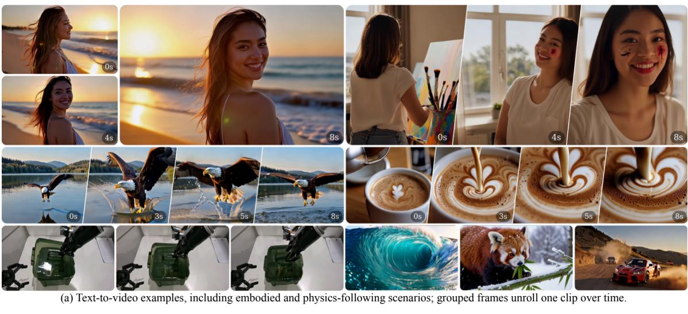

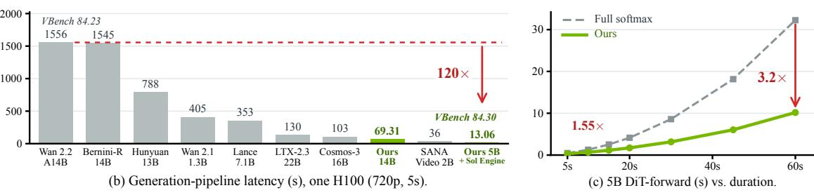

Figure 1 | SANA-Video 2.0 한눈에 보기 (SANA-Video 2.0 at a glance). (a) 텍스트-투-비디오 예시, 구현 및 물리적 시나리오 포함. (b) One-H100 720p/5s 지연 시간, 최종 Sol-Engine 5B 및 40-layer 14B 결과 포함; VBench는 5B 및 Wan 2.2 품질 포인트를 표시한다. (c) 5B DiT-전방 속도 향상(기간별); 14B 스케일링은 부록 [G.2.](#page-24-0) 에 있다.

## 1. Introduction

비디오 생성은 창의적 콘텐츠 제작에서 가상 제품 디스플레이 및 라이브 스트리밍에 이르기까지 다양한 응용 분야를 지원하며 빠르게 발전하고 있는 분야이다. 최근 대규모 생성기들, 예를 들어 Wan 2.1 [\[38\]](#page-14-0) (14B), HunyuanVideo [\[17\]](#page-13-0) (13B), Seedance 2.0 [\[32\]](#page-14-1), 그리고 Veo 3 및 Kling과 같은 폐쇄형 시스템은 놀라울 정도로 고품질 비디오를 생성한다. 공개 Video DiT [\[28\]](#page-14-2) 기반 중 Wan 2.1 및 HunyuanVideo와 같은 경우, 전체 3D 소프트맥스 어텐션은 비디오에 대해 가혹한 (2 ) 비용을 발생시킨다: VAE 압축 후 단일 1080p 클립은 이미 수만 개의 잠재 토큰을 포함하며, 우리의 매칭된 생산 규모 프로파일링 스윕에서 전체 소프트맥스 백본은 1080p/121f에서 25% 하이브리드보다 2.01× 느리며, 양측 모두 최적 커널로 컴파일된다 (Figure [5\(](#page-9-0)a). 문제는 장시간 비디오 (*>*10s)에서 악화된다. 이때 사각형 어텐션 행렬과 활성화 워크스페이스가 비용을 지배하며, MAGI-1 [\[31\]](#page-14-3)과 같은 전용 장시간 비디오 노력조차도 일반 어텐션에 의해 제한된다.

선형 어텐션은 원칙적인 탈출구를 제공한다.  

그의 () 복잡도는 시퀀스 길이에 따라 우아하게 확장되며, 상태공간 관점은 순환 커널에 대한 깔끔한 인터페이스를 드러내고, SANA-Video [6]는 *순수*-선형 Video DiT가 이미 경쟁력 있는 품질에서 큰 속도 향상을 제공한다는 것을 보여주었다.  

그러나 순수 선형 어텐션은 효율성에 대한 대가로 표현력을 희생한다: 고정 크기의 상태 행렬 ∈ R ×는 모든 토큰–토큰 상호작용을 표현할 수 없으며, 이는 정밀한 시공간 상응 및 세밀한 디테일을 약화시킬 수 있다 [2,](#page-13-2) [7].  

최근 대형 언어 모델은 해결책을 제시한다: 대부분 선형 어텐션 스택을 유지하되, 일정 비율로 몇 개의 소프트맥스 *앵커*—정기적으로 등장하는 전체 어텐션 레이어로, 고정 깊이에서 정확하고 낮은 랭크 제약을 가진 토큰 상호작용을 복원하는—를 삽입하고, Attention Residuals [16]를 통해 깊이 전반에 걸쳐 정보를 라우팅한다. 이러한 조합은 최근 Kimi K3 [15]가 조단위 파라미터 규모에서 채택한 것이다.  

이로써 핵심적인 질문이 제기된다: *대부분 선형인 백본이 소프트맥스 어텐션의 표현력을 회복하면서 긴 고해상도 비디오에 대한* () *스케일링을 유지할 수 있을까?*

본 논문은 5B 및 14B 규모에서 구현된 하이브리드 어텐션 비디오 디퓨전 트랜스포머인 SANA-Video 2.0을 통해 긍정적으로 답변한다. 더 큰 모델은 40층, 폭 4,096의 백본으로 14.25B 파라미터를 가지며, 384×B200 규모에서 훈련된다. 5B 운영 포인트는 대부분 선형인 백본을 유지하면서 소수의 소프트맥스 앵커를 삽입하여, 단일 GPU에서도 빠른 속도를 유지하면서 강력한 전체 소프트맥스 Video DiT와 동일한 품질을 달성한다 (Figure [1\)](#page-0-0): 40-step 샘플링으로 480×832×81 해상도에서 한 H100에서 13*.*2초 만에 VBench Total 84*.*30을 달성하며, 이는 훨씬 큰 소프트맥스 모델보다 지연 시간의 일부에 불과하면서도 경쟁력 있다. 또한, DiT 전방은 720p/60s 형태에서 최적 커널로 컴파일된 매칭된 전체 소프트맥스 DiT보다 3*.*2배 빠르다 (Figure [1\(](#page-0-0)c)), 이 이점은 지속 시간에 따라 확대된다. 사전 훈련된 소프트맥스 모델의 사후 선형화와 달리, 우리는 하이브리드 백본을 직접 훈련한다. 이 설계는 세 가지 핵심 구성 요소에 기반한다.

Hybrid Linear-Softmax Attention. 우리는 게이트된 이항 선형 어텐션을 핵심 토큰 혼합 연산으로 유지하며, 그 비용을 ()로 유지하고, 정규 3:1 비율(25% softmax)로 게이트된 softmax 앵커를 고정 깊이에 배치한다. 앵커는 순수 선형 어텐션이 표현할 수 없는 낮은 랭크 제약 토큰 상호작용을 주기적으로 복원하고, 선형 비율이 대부분인 부분은 장기 시퀀스 스케일링을 보존한다. 텍스트는 cross-attention을 통해 입력되며, convolution-free SwiGLU FFN이 SANA-Video의 temporal-convolution FFN을 대체한다. 이 FFN의 측정된 오버헤드는 지속 시간에 따라 증가한다 (Appendix [G.4]), 백본을 프로파일링하고 상용 커널과 융합하기 쉽게 만든다.

블록 어텐션 잔여(AttnRes).  
덧셈형 잔여만으로는 이후 레이어가 상위에서 계산된 정보를 재유도하도록 강제한다.  
이러한 재유도 대신 AttnRes는 완성된 블록-특징 요약을 깊이 방향으로 라우팅하여 이후 선형 레이어가 앵커의 랭크-갱신 업데이트를 재사용할 수 있도록 한다.  
제어된 동일 체크포인트 온/오프 프로브에서 AttnRes를 활성화하면 깊은 레이어 상태의 유효 랭크가 약 12% 상승한다.  
우리는 라우팅을 양방향 비디오 디퓨전으로 적응시켜 라우팅 쿼리를 깊이 방향으로 공유하고, AdaLN에 의해 중복된 명시적 디퓨전-타임스텝 조건화를 제거한다.

From-Scratch Training and Design.  
우리는 25% softmax anchor를 실용적인 품질–효율성 경계점으로 식별하는 짧고 해상도가 낮은 프록시 연구를 통해 아키텍처를 선택합니다. 전체 모델은 다양한 출처의 데이터 수집 및 필터링, 저해상도에서 고해상도 및 지속 시간에 이르는 커리큘럼, 구조화된 캡션 작성, 자기 증류를 포함한 완전하고 문서화된 다단계 파이프라인을 통해 처음부터 훈련됩니다. 이후 선호도 기반 사후 훈련(DPO 및 ReFL)을 거쳐 하이브리드가 사전 훈련된 softmax나 이미지 사전 없이 움직임과 외형을 학습합니다. 우리는 이 훈련 및 추론 최적화 파이프라인을 전체적으로 보고하며, 이는 핵심적이고 재현 가능한 기여입니다.

In conclusion, SANA-Video 2.0 attains competitive VBench quality (84*.*30) at markedly lower latency than large softmax Video DiTs, and its ()-dominated backbone scales far better with duration. A separate 50-step Sol-Engine deployment measures a 3*.*58× end-to-end speedup on B200, and quantization-aware training matches BF16 quality at MXFP4 weights and MXFP8 activations (Section [6\)](#page-9-1). Rank and routing analyses reveal a clear division of labor, where linear layers provide inexpensive global mixing, softmax anchors inject exact, less rank-constrained interactions, and AttnRes carries block-level features across depth. We hope SANA-Video 2.0 offers a practical, efficient foundation for high-quality video generation that researchers and everyday users can run fast.  
결론적으로, SANA-Video 2.0은 대형 softmax Video DiTs보다 현저히 낮은 지연 시간에서 경쟁력 있는 VBench 품질(84*.*30)을 달성하며, ()-주도 백본은 지속 시간에 따라 훨씬 더 잘 확장됩니다. 별도의 50단계 Sol-Engine 배포는 B200에서 3*.*58배의 종단 간 속도 향상을 측정하며, 양자화 인식 훈련은 MXFP4 가중치와 MXFP8 활성화에서 BF16 품질을 일치시킵니다(섹션 [6\)](#page-9-1)). 순위 및 라우팅 분석은 선형 레이어가 저렴한 전역 혼합을 제공하고, softmax anchor가 정확하고 덜 제한된 상호작용을 주입하며, AttnRes가 블록 수준 기능을 깊이 전파하는 명확한 노동 분업을 드러냅니다. 우리는 SANA-Video 2.0이 연구자와 일상 사용자 모두가 빠르게 실행할 수 있는 고품질 비디오 생성을 위한 실용적이고 효율적인 기반을 제공하기를 바랍니다.

### 2. Preliminaries  
### 2. 전제 조건

비디오 DiTs와 흐름 매칭. Video Diffusion Transformers [28]는 조건부 최적 운송 흐름 매칭 [23]으로 훈련될 수 있다: 그들은 잠재 시퀀스 $z_t = (1-t)z + t\epsilon$ ( $\epsilon \sim \mathcal{N}(0,I)$ , $t \sim$ logit-normal) 를 형성하고 조건부 속도 $\epsilon - z$ 를 예측하며 손실 $\mathcal{L} = \mathbb{E}\|v_\theta - (\epsilon - z)\|^2$ 를 사용한다. 여기서 $t \in [0,1]$ 은 정규화된 흐름 매칭 타임스텝을 나타낸다. 각 블록은 AdaLN 스타일 타임스텝 변조, 자기 주의, 텍스트 교차 주의, 그리고 FFN을 사용한다. 1080p에서 긴 클립은 이미 수만 개의 잠재 사이트를 차지하여 softmax의 $O(N^2)$ 비용이 부담스럽다.

게이트형 선형 어텐션. 선형 어텐션은 토큰 상호작용을 고정 크기 상태로 압축하여 시퀀스 복잡도를 $O(Nd^2)$ 로 감소시키지만, 그 대가로 랭크 병목 현상을 초래한다. 우리의 양방향 연산자는 인과적 델타-룰 재귀가 아니라 게이트형 이중선형 형태이며, 델타-룰 업데이트를 생략하면 인과적 게이트 델타넷(Causal Gated DeltaNet)의 자연스러운 초기화가 된다. 이 방향은 향후 연구로 남겨 둔다. 정규화된 쿼리와 키에 대해, $q_j^r, k_n^r$ 를 그들의 RoPE-회전 형태로 두고, $\phi(\cdot) = \text{ReLU}(\cdot)$ 라고 하자. 각 헤드는 다음을 계산한다

$$S = \sum_{n} v_n (\beta_n k_n^r)^\top, \qquad o_j = W_o \left[ \text{RMSNorm} \left( \frac{Sq_j^r}{\sum_{n} \phi(k_n)^\top \phi(q_j) + \epsilon} \right) \odot \sigma(g_j) \right], \tag{1}$$

여기서  $\beta$ 는 상태에 쓰기를 수행하고, g는 출력을 수행한다. 주기적인 softmax 층은 선택된 깊이에서 덜 랭크-제한된 토큰 혼합을 제공하면서 대부분의 시퀀스 계산을 선형으로 둔다. 이러한 앵커는 양방향 SDPA와 QK 정규화, RoPE, 그리고 Qiu 등(2024)에서 연구한 시그모이드 출력 게이트를 사용한다. [29] 우리는 Qwen3-Next의 정규 3:1 하이브리드 레이아웃을 채택한다 [30]; Kimi-Linear는 독립적으로 동일한 비율을 사용하지만 다른 선형 연산자를 사용한다 [14].

Attention Residuals. 표준 가산 잔여는 $h_l = h_{l-1} + f_l(h_{l-1})$ 를 사용하며, 중간 깊이마다 정보를 전달한다. Attention Residuals [16]는 대신 학습된 깊이별 집계, $h_l = \sum_i \alpha_{i \to l} v_i$ 를 사용한다. 그들의 Block AttnRes 변형은 완성된 블록 요약과 블록 내 잔여를 유지하며, 어텐션과 FFN 서브레이어 전에 별도의 라우팅을 적용한다. 우리의 하이브리드 스택에서는 완성된 요약이 softmax-anchor 업데이트를 포함하고 이후 대부분 선형 계층에 노출된다. 원본은 서브레이어마다 라우팅 쿼리를 매개변수화한다. 우리의 비디오 적응은 대신 깊이 전체에서 공유한다. 라우팅 쿼리가 별도의 확산-타임스텝 입력을 필요로 한다고 가정하기보다, 하나가 필요한지 테스트하고 AdaLN과 함께 중복된다고 발견한다.

## 3. SANA-Video 2.0

#### 3.1. Overview

SANA-Video 2.0은 하이브리드 시퀀스 어텐션과 깊이별 블록 잔여 어텐션을 결합한 비디오 DiT이다. LTX-VAE 2.3 [11] 잠재 공간에서 동작하며, Gemma-2-2B-IT [8]의 텍스트 특징을 매 레이어마다 교차 어텐션을 통해 가져온다. 각 깊이에서 AttnRes는 먼저 표현을 자기/교차 어텐션 브랜치로 라우팅하고, 두 번째 단계에서 SwiGLU FFN으로 라우팅하며, 각 브랜치 내부에 AdaLN 스타일 변조를 적용하고, 최종 집계가 출력 헤드 앞에 있다. 로컬 경로는 전 과정에서 컨볼루션이 없다. Appendix B에 전체 구성이 나열되어 있다.

### 3.2. Hybrid Attention Design

게이트드 어텐션 프리미티브(Section 2)를 기반으로, 우리는 양방향 게이트드 선형 어텐션 레이어와 게이트드 softmax 앵커를 3:1 비율(75% 선형, 25% softmax)로 번갈아 배치하며, softmax 앵커를 매 4번째 레이어마다 배치한다. 선형 레이어가 대부분을 차지함으로써 토큰 혼합을 O(N) 수준으로 유지하고, 균일하게 배치된 앵커는 압축된 선형 상태가 표현할 수 없는 낮은 랭크 제약을 가진 상호작용을 주기적으로 새롭게 한다(Section 5.5). 선형 헤드와 softmax 헤드는 서로 다른 헤드 차원을 사용하여 효율성과 헤드당 용량을 균형 있게 조정한다(Appendix B). 이러한 규칙적인 레이아웃은 최근 LLMs의 하이브리드 선형 어텐션을 따르며, 트레리언 파라미터 규모의 Qwen3-Next [30], Kimi-Linear [14], Kimi K3 [15]의 하이브리드 선형 어텐션을 융합 선형 어텐션 커널에 깔끔하게 매핑한다. 우리는 언어 모델 값이 아닌, 처음부터 스윕하여 25% 앵커 비율이 비디오 영역에서 품질-효율성의 전환점임을 확인한다(Section 5.3.1). 두 경로는 별도의 RoPE [34] 텐서와 게이팅 파라미터화를 유지한다: 선형 레이어는 쓰기 게이트 $\beta$와 출력 게이트를 모두 사용하고, softmax 앵커는 Qiu et al. [29]의 시그모이드 출력 게이트를 사용한다.

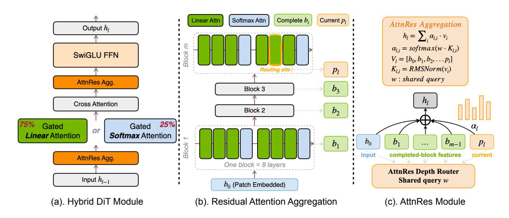

Figure 2 | **SANA-Video 2.0 개요.** (a) 하이브리드 DiT 레이어. (b) 8계층 블록이 깊이별로 완성된 특징을 노출한다. (c) 공유 쿼리 AttnRes 라우터가 입력과 완성된 블록 특징을 집계한다.

### 3.3. Block Attention Residuals (AttnRes)

Figure 2는 하이브리드 레이어와 블록 수준 깊이 라우팅을 요약합니다. 하이브리드 어텐션은 희소한 깊이에서만 낮은 랭크 제약 토큰 혼합을 제공하며, AttnRes는 이러한 업데이트를 포함한 완성된 블록 요약을 이후 레이어에 노출시켜 보완합니다. 우리는 Block AttnRes [16]를 기반으로 하며, Kimi K3 [15]가 언어 모델 규모에서 하이브리드 선형 어텐션과 결합한 것을 참고해 양방향 비디오 디퓨전을 위해 적응시킵니다. 레이어는 연속적인 블록으로 그룹화됩니다: 레이어 l까지 완료된 각 블록은 단일 특징 요약을 남기고, 진행 중인 블록은 실행 중인 부분 합을 유지합니다. 따라서 레이어 l의 라우터는 초기 토큰 임베딩 $b_0$, 레이어 l 이전에 완료된 블록 요약 $b_1, b_2, \dots$, 그리고 현재 블록 내부 부분 합 $p_l$(진행 중인 블록에서 지금까지 누적된 합)으로 구성된 소스 집합 $\mathcal{V}_l = \{b_0, b_1, b_2, \dots, p_l\}$를 사용합니다(블록 경계에서는 새 요약으로 동결되고 재설정되므로 해당 시점에는 존재하지 않음). 각 비디오 토큰 x에 대해 서브레이어 타입 $\tau$ 이전의 라우팅된 표현은

$$h_l(x) = \sum_{v_i \in \mathcal{V}_l} \alpha_{i \to l}^{(\tau)}(x) \, v_i(x), \qquad \alpha_{i \to l}^{(\tau)}(x) = \operatorname{softmax} \left( \left( w^{(\tau)} + \phi_{\tau}(t) \right)^{\top} \operatorname{RMSNorm}(v_i(x)) \right), \tag{2}$$

where  $v_i(x)$  is the feature that source  $v_i \in \mathcal{V}_l$  holds at token position  $x, w^{(\tau)}$  is shared by all depths for  $\tau \in \{\text{attn}, \text{ffn}\}$ , and  $\phi_{\tau}(t)$  is an optional, zero-initialized timestep offset. The softmax is over depth sources independently for every token. After the last block, a third shared query aggregates the initial embedding and completed block sums into the final representation passed to the output head.

**공유 라우팅 쿼리.** 원래 AttnRes는 각 잔여 서브레이어마다 별도의 라우팅 쿼리를 학습하며, 이는 언어 모델이 규모가 커져도 유지하는 레이어별 설계입니다 (예: Kimi K3 [15]). 우리 비디오 모델에서는 브랜치마다 하나의 공유 라우팅 쿼리만으로 충분합니다: 하나의 어텐션 쿼리와 하나의 FFN 쿼리를 모든 깊이에서 재사용합니다. 이는 메모리의 일부만 사용하면서 레이어별 라우팅과 동일한 손실을 달성합니다 (Section 5.3.2). 쿼리를 공유한다고 해서 라우팅이 균일해지는 것은 아닙니다. 소스 집합 $\mathcal{V}_l$는 깊이에 따라 변하므로 라우팅 가중치는 여전히 레이어마다 다르고, 각 소스가 토큰마다 정규화되므로 토큰마다도 다릅니다. 따라서 공유는 깊이별 쿼리 파라미터를 줄이면서도 어텐션과 FFN 브랜치를 다르게 라우팅합니다.

**블록 조직.** 우리는 연속된 변환기 레이어를 8개씩 묶어 하나의 블록으로 구성합니다. 순방향 패스가 블록을 통과할 때마다 각 어텐션 또는 FFN 서브레이어의 출력, 즉 숨겨진 상태에 추가될 잔여 업데이트는 실행 중인 부분 합 $p_l$에 더해지며, 라우터는 이를 소스로 다시 읽어옵니다 (Eq. 2). 블록이 끝나면 $p_l$은 해당 블록의 완성된 요약 $b_k$로 동결되고, 다음 블록은 새 부분 합을 시작합니다. 라우터가 레이어마다 하나의 특징이 아니라 완성된 블록마다 하나의 요약만 보관하므로 저장된 히스토리는 O(NLd)에서 시퀀스 길이 N에 대해 $O(N\lceil L/S \rceil d)$로 축소됩니다. 이는 약 S배 감소를 의미합니다. S=8 범위는 두 번의 소프트맥스-앵커 사이클을 포괄하면서 히스토리를 압축적으로 유지하고, 이 ablation은 엔지니어링 기본값으로 다루며 보편적 최적이 아님을 보여줍니다 (Section 5.3.2). Block AttnRes와 마찬가지로 어텐션과 FFN 라우터는 서로 다른 선호도를 학습합니다 (Section F.5).

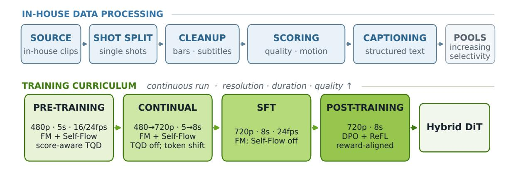

Figure 3 | 5B 체크포인트를 위한 훈련 및 데이터 파이프라인. 사내에서 선별한 클립이 사전 훈련, 지속적 훈련, SFT, 그리고 선호도 기반 사후 훈련 (DPO + ReFL)에 공급되며, 단계별 데이터 선택, 비디오 형태, 그리고 단계별 훈련 목표가 적용됩니다.

타임스텝 독립적인 최종 설계. 노이즈 제거 타임스텝은 서로 다른 의미적 역할을 가지지만, 학습된 오프셋은 거의 일정하며 이를 변경하거나 섞어도 검증에 미미한 영향을 미친다. 따라서 최종 모델은 ≡ 0을 사용하지만 DiT 블록에서 타임스텝 변조를 유지한다 (섹션 [5.3.2,](#page-7-1) 부록 [F.4\)](#page-21-0)).

## 4. 훈련 레시피

SANA-Video 2.0은 동일한 하이브리드 설계를 가진 5B와 14B 모델을 사용한다. 5B 생산 레시피는 데이터 큐레이션, 해상도/지속시간 커리큘럼, 그리고 선호도 기반 사후 훈련(그림 [3\)](#page-4-0))을 포함한다. 40층 14B 실행은 384×B200 GPU에서 스케일‑특정 사전 훈련 설정과 함께 동일한 핵심 흐름 매칭 및 하이브리드‑어텐션 공식화를 사용한다. 아키텍처를 넘어, 레시피는 코퍼스를 점진적으로 더 깨끗한 감독으로 변환하는 방법, 노이즈 수준을 샘플링하는 방법, 해상도와 지속시간을 증가시키는 방법을 명시한다. 우리는 이 구성 요소들을 방법의 일부이므로 설명한다. 레시피는 구성 요소별로 제거하지 않고 공동으로 선택되었다. 부록 [B](#page-16-0)에는 스케일‑특정 아키텍처와 훈련 설정이 나열되어 있다.

## 4.1. 데이터 큐레이션 및 품질/모션 퍼널

원본 비디오 코퍼스에서 시작하여 우리는 일관된 처리 파이프라인을 적용한다: 샷 세분화, 블랙‑바 및 자막 정리, 저해상도/흐릿/정지/노출 결함 클립 제거, 그리고 단일 종합 품질 점수 대신 다중 축 점수화. 축을 분리하는 것은 고의적이다: 이는 시각적으로 깨끗하지만 거의 정지된 클립으로 선택이 붕괴되는 것을 방지하면서도 고품질 저모션 콘텐츠를 유지한다. 부록 [C](#page-18-0)에는 완전한 6단계 파이프라인과 점수 신호(표 [7\)](#page-19-0)가 제공된다. 결과 클립은 점진적 품질/모션 퍼널을 형성한다: 사전 훈련은 관대 한 임계값 아래 넓은 풀을 사용하고, 지속 훈련은 품질과 모션 바닥을 높이며, SFT는 작은 신뢰할 수 있는 하위 집합에 집중한다. 캡션은 짧은/긴 설명이 혼합된 것에서 밀집된 구조화된 것으로 진행하며, 양자화된 모션 디스크립터가 사용 가능할 때 첨부되어 선택 신호를 조건화 신호로 전환한다. 동일한 품질 및 모션 축은 아래의 사전 훈련 타임스텝 정책을 구동하며, 초기에는 광범위한 범위를 설정하고 이후 단계에서는 충실도와 프롬프트 준수에 집중한다.

### 4.2. 훈련 목표 및 타임스텝 샘플링

훈련은 로짓‑노멀 타임스텝 밀도를 가진 흐름 매칭을 사용한다. 이후 지속 및 SFT 단계에서는 이 밀도를 꼬리‑바닥화하여 순수 노이즈와 깨끗한 극단에 근접한 확률 질량을 보존한다. 이러한 영역은 각각 최종 정제와 전역 구조에 해당한다. 지속 단계 이후에는 흐름‑시프트를 토큰 수에 민감하게 만든다: 고정된 해상도 상수 대신 두 끝점에서 시프트를 고정하고 잠재 토큰 수에 따라 로그‑시프트 공간에서 보간하며, 4*,*290 잠재 토큰(480p, 81 프레임)에서 3에서 23*,*000 토큰(720p, 193 프레임)에서 6까지 로그‑선형으로 실행한다. 각 시프트는 (꼬리‑바닥화된, =0*.*95) 로짓‑노멀 평균을 log(shift)만큼 오프셋하여 구현되므로, 모든 중간 해상도×지속시간이 원칙적인 시프트에 도달하고 클립이 길어질수록 더 많은 확률 질량이 높은 노이즈로 이동한다 (표 [1\)](#page-5-0)). 커리큘럼이 해상도와 지속시간을 동시에 변동시키므로 토큰 수는 연속 범위를 차지하며, 개별 해상도 시프트가 놓치는 부분을 보완한다. 따라서 각 랭크는 로컬 잠재 형태에서 직접 시프트를 계산한다; 생산에서는 랭크당 배치 크기가 1이므로 매핑은 샘플 단위이다.

Table 1 | **생산 훈련 커리큘럼.** 클립 수는 필터링 후 보고되며, 목표 추가는 단계별이다; 스케일‑특정 모델 및 최적화 설정은 표 6에 나열되어 있다.

| 단계 | 클립 | 해상도 | 프레임률 | 지속 시간 | 플로우-시프트 | LR | 목표 보조 |
|-----------|-------------|------------------------|-------|--------------------|-----------------|--------------------|------------------|
| 사전 학습 | $\sim 30 M$ | 480p | 16/24 | 5s | 1 (+TQD) | $10^{-4}$ | TQD + Self-Flow |
| 지속적 | $\sim 10 M$ | $480 \rightarrow 720p$ | 16/24 | $5s\rightarrow 8s$ | 3–6 (by tokens) | $10^{-4}$ | Self-Flow |
| SFT | $\sim 10^4$ | 720p | 24 | 8s | 3–6 (by tokens) | $5 \times 10^{-5}$ | 표준 FM |

콘텐츠 기반 흐름-이동 (TQD). 고품질 비디오 데이터는 부족하다, 그래서 우리는 각 클립이 가장 잘 가르치는 부분에 기여하도록 하고 싶다. 이는 모션–품질 딜레마에 직면한다: 모션이 풍부한 클립은 종종 프레임별 미학을 낮추는 아티팩트를 포함하고, 가장 깨끗한 클립은 거의 정적이어서 단일 품질 지표는 모션 또는 충실도를 희생한다. TQD [26]는 각 클립을 그 내용이 중요한 노이즈 영역으로 라우팅하고 약점이 없는 영역으로 라우팅함으로써 이를 해결한다: 고노이즈는 전역 구조와 모션을 지배하고 미세 텍스처를 가려서 모션이 풍부한 클립을 받으며, 저노이즈는 세부 디테일을 지배하고 미학적으로 깨끗하고 모션이 적은 클립을 받는다. 프리트레이닝에서는 고모션 임계값만 통과하는 클립에 +1.1 로짓 오프셋을 부여하고, 고품질 임계값만 통과하는 클립에 -1.1 오프셋을 부여한다. 양쪽 모두 만족하거나 만족하지 않는 클립은 기본 밀도를 유지한다. 계속 학습 이후에는 TQD 오프셋이 비활성화되고 토큰 수 시프트가 대체된다. 최소 시프트 3은 고모션 TQD 분기점의 중앙값과 대략 일치하지만, 이 변화는 샘플 단위의 연속적 전환이 아니라 단계 수준의 교체이다. 부록 B.3에서는 바이어스 크기, 임계값, 전체 샘플링 밀도를 제공한다.

가중치 EMA 및 Self-Flow. 우리는 SFT를 포함한 전체 훈련 동안 모델 가중치의 지수이동평균(EMA)을 활성화한다. 그와 함께 프리트레이닝과 지속 학습은 Self-Flow [5]를 추가로 수행한다. 이는 클립 내부 이중 타임스텝 조건화를 갖는 보조 특징-증류 목표이며, 우리는 이를 연구 대상이 아닌 훈련 보조 수단으로 사용한다. Self-Flow (부록 B.2)는 모든 잠재 토큰을 감독하고, 가중치 EMA는 계속 활성화되는 동안 SFT에서는 비활성화된다.

#### 4.3. Timestep-Stratified Validation

훈련 중에 우리는 검증 손실을 통해 체크포인트 품질을 추적하지만, 단일 random-t 평균은 약한 모니터이다: 손실이 노이즈 축을 따라 수배 차이로 변동하기 때문에 하나의 스칼라가 어느 노이즈 영역이 개선되거나 악화되는지를 흐리게 하고 높은 샘플링 변동성을 가진다. 따라서 우리는 검증을 10개의 동일한 100-스텝 노이즈 버킷으로 층화하여 평균이 숨기는 구조를 드러낸다. 네 개의 짝지어진 체크포인트에서 버킷 매크로는 6.42% 감소하지만, 이 순수치는 큰 11.44% 저노이즈 개선과 작은 1.16% 고노이즈 회귀를 구분한다 (그림 11). 고정된 100-평가 예산을 층화하면 IID 타임스텝 추출에 비해 이 초기-최종 추정치의 표준편차를 $2.27 \times$ 줄여 보다 신뢰할 수 있는 모니터를 제공한다. VBench Total이 82.68에서 83.29로 상승한 것은 이 순수치와 일치하며, 단지 네 점만으로 서술적으로 읽을 수 있다. 부록 B.4는 매치된 샘플 프로토콜과 불확실성 분석을 상세히 설명한다.

### 4.4. Post-Training Stage

### 4.4.1. Direct Preference Optimization

우리는 시각적 선호 정렬을 위한 표준 후속 훈련 단계로 Diffusion-DPO [36]를 사용한다. 각 프롬프트 c에 대해 Gemini는 서로 다른 랜덤 시드로 샘플링된 비디오를 시각적 충실도, 프롬프트 정렬, 모션 품질, 시간 일관성으로 순위 매긴다. 신뢰할 수 없는 순위를 필터링한 뒤, 가장 높은 순위와 가장 낮은 순위의 비디오는 선호-거부 쌍 $(x^+, x^-, c)$를 형성한다. 이 순위 매김은 오프라인에서 수행되며 Gemini는 훈련 루프에 포함되지 않는다.

우리는 훈련 가능한 정책 $\theta$와 동결된 참조 모델 $\theta_{\rm ref}$를 SFT 체크포인트에서 초기화한다. 각 훈련 단계에서 쌍의 두 비디오는 동일한 샘플링 타임스텝 t와 가우시안 노이즈 $\epsilon$를 공유한다. $q_t$를 전방 노이즈 연산자, $v_{\phi}$를 모델 $\phi$의 흐름-속도 예측으로 두자. 비디오별 흐름 매칭 오차는

$$x_t^{\pm} = q_t(x^{\pm}, \epsilon), \qquad u^{\pm} = \epsilon - x^{\pm}, \qquad e_{\phi}^{\pm} = \frac{1}{D} \|v_{\phi}(x_t^{\pm}, t, c) - u^{\pm}\|_2^2,$$

(3)

여기서 D는 잠재 요소의 수이다. t와 $\epsilon$를 공유하면, 쌍별 차이가 비디오를 반영하도록 보장된다. 우리는 선호–거부 오류 간격을 $\Delta_{\phi}=e_{\phi}^{-}-e_{\phi}^{+}$로 정의하고 최적화한다.

$$\mathcal{L} = -\mathbb{E}[w \log \sigma(\beta(\Delta_{\theta} - \Delta_{\theta_{\text{ref}}}))] + \lambda \,\mathbb{E}[e_{\theta}^{+}]. \tag{4}$$

표 2 | VBench 품질 비교. 그린 인텐시티는 각 메트릭별 상위 세 결과를 순위화한다. 메서드 이름 뒤의 위첨자는 점수 출처를 나타내며, Appendix [D.](#page-19-1)에서 정의된다. 여기서는 81프레임 SANA-Video 2.0 결과만 표시되며, 부록에서는 전체 프로토콜, 확장된 기준선, 그리고 121프레임 및 193프레임 운영 포인트를 제공한다.

| 모델 | 매개변수 | 어텐션 | 프레임 | 총계↑ | 품질↑ | 의미↑ |
|-----------------|--------|-----------|--------|--------|----------|-----------|
| LTX-2.3 (base)† | 22B | Full 3D | 121 | 81.95 | 83.85 | 74.35 |
| Cosmos-3 Nano† | 16B | Full 3D | 93 | 83.13 | 84.29 | 78.50 |
| Lance† | 7.1B | MoT | 81 | 83.18 | 84.09 | 79.55 |
| Wan 2.1 | 1.3B | Full 3D | 81 | 83.31 | 85.23 | 75.65 |
| HunyuanVideo⋆ | 13B | Full 3D | 129 | 83.43 | 85.07 | 76.88 |
| Wan 2.1 | 14B | Full 3D | 81 | 83.69 | 85.59 | 76.11 |
| SANA-Video | 2B | Linear | 81 | 84.17 | 84.85 | 81.46 |
| Wan 2.2⋆ | A14B | MoE | 81 | 84.23 | 85.42 | 79.50 |
| Bernini-R‡ | 14B | MoE | 81 | 84.64 | 85.18 | 82.49 |
| SANA-Video 2.0 | 5B | Hybrid | 81 | 84.30 | 85.61 | 79.05 |

첫 번째 항은 Diffusion-DPO 손실이며, 이는 판사 점수 차이에서 유도된 쌍 가중치이며 선호 강도를 제어합니다. 두 번째 항은 선호 샘플 흐름 매칭 정규화로, 사후 훈련을 안정화합니다. 정책만 업데이트되고, 참조 모델은 전체 과정에서 고정됩니다.

## *4.4.2. 온라인 강화 학습*

우리는 Reward Feedback Learning (ReFL) [\[42\]](#page-15-0)을 사용한 온라인 보상 최적화를 통해 모델을 추가로 정렬합니다. 각 텍스트 프롬프트마다 ReFL은 먼저 기울기 없이 노이즈 제거 경로를 무작위로 샘플링된 업데이트 단계까지 실행합니다. 그 시점에서 우리의 확산 모델은 깨끗한 잠재 변수 ^0을 예측하고, 이는 비디오로 디코딩됩니다. 우리는 디코딩된 비디오의 첫 번째, 중간, 마지막 프레임을 선택하고, 고정된 이미지 보상 모델로 평가하여 프레임 수준 피드백을 사용해 비디오를 최적화합니다. 보상에서 파생된 기울기는 디코더와 모델 평가를 통해 전파되며, 전체 샘플링 경로를 통한 역전파를 피합니다.

우리의 결합 보상은 HPSv3++ [\[24\]](#page-14-10), DeQA-Score [\[45\]](#page-15-1), UniPercept [\[4\]](#page-13-10)를 결합합니다. 세 모델은 상호 보완적인 감독을 제공합니다. HPSv3++는 능력–반복 스펙트럼 전반에 걸친 광범위한 인간 선호 정렬을 목표로 하며, 특히 *텍스트 충실도*와 *미적 품질*에 중점을 둡니다. DeQA-Score는 무리퍼런스(노-리퍼런스) 지각 품질 신호를 제공합니다: 예측된 *점수 분포*를 통해 연속적인 인간 품질 판단을 모델링하여 충실도 손실과 가시적 이미지 저하에 민감합니다. UniPercept는 이미지 미학 평가(IAA), 이미지 품질 평가(IQA), 이미지 구조 및 질감 평가(ISTA)를 아우르는 세분화된 지각 프로필을 제공합니다. 정규화 및 상한 설정 후, 우리는 세 보상 신호를 HPSv3++:DeQA-Score:UniPercept 비율 4:4:1로 결합합니다. 또한, 고정된 베이스 모델에 대해 속도 공간 평균제곱오차(velocity-space MSE) 정규화를 적용하여 선호 최적화와 사전 훈련 및 감독 미세 조정 중 획득된 생성 사전 모델 보존을 균형 있게 합니다. 섹션 [5.6](#page-9-2)에서는 이 온라인 단계를 평가합니다.

## 5. 실험

### 5.1. 구현 세부 사항

SANA-Video 2.0은 동일한 하이브리드 백본을 갖는 5B와 14B 구성을 가지고 있습니다. 표 [6](#page-17-0)은 두 아키텍처와 스케일별 훈련 설정을 나열합니다. 5B 구성은 폭 2,560의 32 레이어를 사용하고, 14B 구성은 폭 4,096(14.25B 파라미터)의 40 레이어를 사용하며 384×B200 스케일에서 훈련됩니다. 두 구성 모두 LTX-VAE 2.3 잠재 변수, Gemma 텍스트 특징, 흐름 매칭, 25% 소프트맥스 앵커, Block AttnRes를 사용합니다. 아키텍처를 선택하고 메커니즘을 진단하기 위해 최종 품질을 추정하기보다 짧고 저해상도 연구를 사용합니다: attention-ratio와 초기 AttnRes 스윕은 256p에서 깊이-28, 폭-3,072 아키텍처-검색 백본을 사용하고, 쿼리/타임스텝 소거 및 메커니즘 프로브는 5B 아키텍처-가족 체크포인트(모두 8×H100 GPU)를 사용합니다.

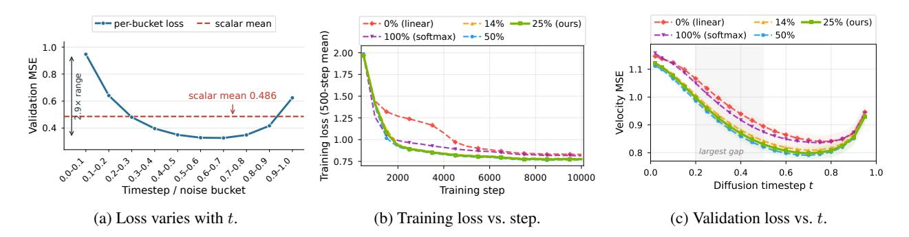

Figure 4 | **타임스텝별 읽기 손실, 그 다음 소프트맥스 비율 프록시.** (a) 프로덕션 체크포인트에서 검증 손실은 노이즈 축을 따라 약 $\sim 3 \times$ 범위를 차지하므로, 스칼라 랜덤-t 평균(점선)은 구조를 숨깁니다. 따라서 우리는 한 스칼라가 아니라 각 타임스텝마다 모든 프록시 비교를 읽습니다. (b,c) 고정된 깊이-28, 폭-3,072 아키텍처-검색 백본(256p/81f): (b) 500-스텝 평균 훈련 손실과 (c) 10K(200 비디오; 포인트별 95% CI)에서 보류된 정규화된 잠재 속도 MSE, 다섯 비율에 대해.

#### 5.2. 주요 결과

Table 2는 VBench [12]에서 SANA-Video 2.0과 최첨단 비디오 생성기를 비교하고, Figure 1(b)는 동일한 40단계 레시피 하에서 5B 및 40층 14B 구성을 포함한 전체 one-H100 생성 파이프라인 지연 시간을 비교한다. $480\times832\times81$ 운영 포인트에서 SANA-Video 2.0은 Table 2에서 가장 높은 품질(85.61)과 함께 VBench Total 84.30을 달성한다. 오직 저자 보고된 Bernini-R 14B [3]만이 Total과 Semantic(84.64/82.49 vs. 84.30/79.05)에서 더 높은 점수를 기록하지만, 우리의 5B 모델은 동일한 형태, 단계 수, 장치(13.2초 vs. 421초 on one H100) 하에서 $31.8\times$ 더 저렴하게 실행된다. 더 긴 121-프레임 및 193-프레임 구성은 각각 Total 85.29와 84.48(부록 Table 8)을 달성하며, 720p급 형태에서는 Cosmos-3 Nano 및 LTX-2.3보다 $3-4\times$ 빠르고, Bernini-R 및 Wan 2.2-A14B보다 대략 $50\times$ 빠르다. 40층, 폭-4,096 14B 구성은 $480\times832\times81$에서 29.1초를 소요하며, 매칭된 Bernini-R보다 $14.5\times$ 빠르다. 전체 형태별 타이밍과 완전한 16차원 분해는 부록 D에 있으며, 제어된 14B 백본 스케일링은 별도로 부록 G.2에 보고된다.

#### 5.3. 설계 공간 탐색 (Design Space Exploration)

우리는 먼저 256p/81 프레임에서 처음부터 훈련된 depth-28, width-3,072 아키텍처-검색 프록시를 사용하여 시퀀스-어텐션 비율을 탐색한다. 이 스윕은 백본 차원, 패치 크기, 어텐션 헤드 차원, 데이터, 옵티마이저 설정, 시드, 훈련 레시피를 고정하고, 소프트맥스-레이어 배치를 변경한다; 10K 스텝에서 텍스트 조건부를 사용한 200개의 보류된 비디오에 대한 훈련 곡선과 검증 손실을 보고한다. 검증 손실이 노이즈 축에 따라 강하게 비균일한 (Figure 4a) 특성을 보이므로, 우리는 각 타임스텝마다 프록시 비교를 읽는다, 단일 스칼라로는 아니다. 이후 AttnRes 프로브는 Table 3의 각 패널 프로토콜을 따르며, 비교는 각 매칭 패널 내에서만 수행된다.

### 5.3.1. 소프트맥스 비율 (Softmax Ratio)

우리는 0% (all-linear)에서 100% (all-softmax)까지 다섯 가지 변형을 훈련하며, 그 사이에 세 가지 하이브리드 비율(그림 4)을 포함한다. 가장 낮은 비율 하이브리드는 28층 프록시에서 4개의 주기적 소프트맥스 앵커를 사용한다(4/28=14.3%).

발견: 하이브리드 비율이 이 고정 백본 차원 프록시 검색에서 all-linear 및 all-softmax 엔드포인트보다 더 나은 성능을 보인다. 순수 선형 어텐션은 가장 약한 엔드포인트(all-linear val loss 0.955)이며, 이는 주기적인 소프트맥스 보정이 없다는 것과 일치한다. all-softmax도 하이브리드보다 나쁘며(0.945), 두 엔드포인트가 가깝고 선형이 약간 더 나쁘다. 하이브리드 중에서 50%가 가장 낮은 손실(0.897)을 달성하지만, 1080p/121f에서 25% 하이브리드 대비 1.29배 지연(latency)라는 가파른 효율 비용을 지불한다(그림 5(a)); 반면 25%(0.905)와 4-앵커(14.3%) 하이브리드(0.914)는 오직  $\sim$ 1%만 뒤처진다. 함께, 그림 4와 그림 5(a)는 25% 소프트맥스를 최소 손실 포인트가 아니라 실용적인 파레토(knee) 관절로 식별한다. 시간 단계별 분석은 하이브리드와 엔드포인트 간의 차이가 중간 노이즈($t \approx 0.2$–0.5)에서 집중된다는 것을 보여준다.

잠금: 25% 소프트맥스(3:1 비율)는 이후 모든 실험에 사용된다. 이는 측정된 프록시 파레토 정점이며, AttnRes 블록 경계(S=8)와 일치하고 Qwen3-Next 레이아웃[30]과도 일치한다; Kimi-Linear[14]는 다른 연산자와 함께 동일한 비율을 독립적으로 사용한다.

**스크래치 훈련 안정성.** Figure 4b의 모든 곡선은 처음부터 훈련되었으며, 하이브리드 변형은 손실 급증이나 붕괴 없이 부드럽게 수렴하고, 생산 훈련 커리큘럼으로 이어진다. 따라서 3:1 비율은 사후 선형화가 아니라 직접 학습된다.

### *5.3.2. 잔여 어텐션* (Residual Attention)

3:1 하이브리드 비율이 고정된 상태에서 우리는 AttnRes를 연구하고, 라우터 설계를 선택한다 (Table [3\)](#page-8-1)).

라우터 전반적 훈련 (Table [3a](#page-8-1),b).  
초기 훈련 동안, 단기 프로브는 라우터 공식화를 선택한다: 명시적 타임스텝 입력을 제거하면 손실이 0.962에서 0.920으로 개선된다.  
하이브리드 백본이 성숙한 후, 지속 훈련 비교에서 AttnRes와 그 제거가 비슷한 보류된 MSE(0*.*4851 대 0*.*4855, 20개의 노이즈 버킷 중 17개가 AttnRes를 약간 선호함)를 달성한다.  
이 좁은 차이에서 품질 이점을 읽어들이지 않는다; 우리는 AttnRes가 제공하는 교차 깊이 재사용을 위해 AttnRes를 채택하고 타임스텝 독립 라우터를 사용하며, Figure [6.](#page-9-3)에서 순위 및 라우팅 프로브를 통해 의도된 동작을 검증한다.

쿼리 설계 (Table [3c](#page-8-1)).  
레이어별 및 공유 프로젝션은 거의 동일한 손실(0.496 대 0.495)을 보이지만, 공유는 메모리 오버헤드를 4배( +4% 대 +16%) 감소시킨다.  
깊이 전체에서 쿼리를 공유함에도 불구하고, 선택된 라우터는 특징에 의존한다: 다섯 개의 디노이징 타임스텝에 걸쳐 평균 정규화 라우팅 엔트로피 변동이 레이어별 설계의 2*.*15배( Figure [6a;](#page-9-3) 프로토콜은 부록 [F.3\)](#page-21-1)에서 확인된다.

블록 크기 (Table [3d](#page-8-1)).  
∈ {4*,* 8*,* 16}은 유사한 손실 점 추정치(0.962–0.965)를 제공하므로, 짧은 스윕은 선호되는 범위를 식별하지 못한다.  
메모리는 블록 수에 따라 확장된다: =4는 +2.9%를 사용하고, =16은 +1.6%만 사용한다.  
우리는 =8을 엔지니어링 기본값으로 유지한다. 이는 집계 블록당 두 개의 정규 3:1 주의 사이클을 제공하고, =16보다 더 많은 중간 깊이 소스를 보존하며, 오버헤드를 =16에 가깝게 유지하기 때문이다.

선택된 공유 라우터는 명시적 타임스텝 입력 없이도 적응성을 유지한다: 그 라우팅 엔트로피는 타임스텝 조건화된 소스 특징을 통해 디노이징 단계마다 변동한다.  
직접적인 교란 및 가중치 공간 분석은 보완적인 설명을 제공한다.  
학습된 라우터 오프셋을 평균으로 교체하거나 잘못된 타임스텝에서 평가하면 검증 손실이 최대 0.0002만 변하며, 오프셋은 평균 0.979의 교차 타임스텝 코사인 유사도를 가지며, 시간에 따라 변하는 잔여는 상수 성분의 13%에 불과하다 (부록 [F.4\)](#page-21-0).

Table 3 | AttnRes 훈련 및 설계 프로브. (a) 후기 단계 연속; (b–d) 초기 단기 프로브. 승리 수는 노이즈 버킷을 개선했으며, 초록색 음영은 선택된 설계를 표시한다.

|  | (a) 라우터 효과 | (b) 명시적 𝑡 입력 |  |  | (c) 쿼리 공유 | (d) 블록 범위 (𝑆) |  |
|------------|-------------------|----------------------|-------|-----------|-------------------|--------------------|----------------------------------------|
| 설계 | MSE↓ 승리 | 설정 | Loss↓ | 설계 | Loss↓ 메모리 | 𝑆 Loss↓ | Lat. 메모리 |
| No AttnRes | 0.48547 — | with 𝑡 | 0.962 | per-layer | 0.496 +16% | 4 8 | 0.965 +3.9% +2.9% 0.962 +3.1% +2.1% |
| + AttnRes | 0.48506 17/20 | without 𝑡 | 0.920 | shared | 0.495 +4% |  | 16 0.962 +3.1% +1.6% |

### 5.4. 효율성 스케일링

해상도 및 라우터 스케일링. 프록시 연구는 공유되고 시계열 독립적인 라우터를 선택하며, =8을 사용한다. 우리는 25%-softmax 백본과 전체 softmax를 하나의 컴파일된, no-AttnRes 프로토콜 하에서 비교한다. 이 프로토콜에서는 모든 변형이 최적의 커널(합성 선형 어텐션, 모든 softmax 레이어에 대한 FlashAttention)을 사용한다. 이것은 논문에서 모든 DiT-forward 비교에 대한 표준 프로토콜이다.

시퀀스 및 모델 크기 스케일링. Figure [5\(](#page-9-0)a) 는 480p–1080p의 여섯 가지 모양과 세 가지 어텐션 비율을 비교한다. 컴파일된 best-kernels no-AttnRes 프로토콜 하에서, full/25%-hybrid 속도 향상은 1*.*16×에서 2*.*01×로 상승한다. 고정된 720p와 24fps에서 60s 텐서 모양(1,441 프레임, Figure [5\(](#page-9-0)b))에서 3*.*17×에 도달한다. 같은 프로토콜 하에서, 패널 (c)는 720p/10s 모양을 고정하고 폭과 깊이를 1.2B에서 28.9B로 동시에 증가시킨다. 하이브리드는 모든 여덟 스케일에서 더 빠르며, 절대 절감량은 128ms에서 948ms로 증가한다. 통제된 분해는 두 축이 다르게 작용함을 보여준다: 폭을 고정하고 깊이를 16에서 60 레이어로 증가시키면 속도 향상은 거의 평평하게 유지된다(1*.*41×), 깊이가 두 변형을 동일하게 곱하기 때문이다. 반면 깊이를 고정하고 폭을 증가시키면 폭-제한 FFN 및 투영 비용이 어텐션을 앞지르면서 1*.*45×에서 1*.*33×로 이동한다(Appendix [G.1\)](#page-23-0). 따라서 하이브리드 이점은 계산의 어느 정도가 시퀀스-제한인지에 의해 결정되며, 이는 장시간 비디오가 차지하는 영역과 정확히 일치한다.

모델 및 하드웨어 스케일링. Matched H100/GB200 프로파일링은 14B 백본이 하드웨어 세대 간에 스케일링되는 것을 보여준다. 736×1280×121에서 하나의 하이브리드 포워드는 H100에서 789*.*7ms에서 GB200에서 398*.*3ms로 감소한다 (1*.*98×). 전체 모양 스위프를 통해 125.1K 잠재 토큰을 거치면서 GB200은 1*.*69–2*.*02×의 이득을 제공한다 (Appendix [G.2\)](#page-24-0). 아키텍처 이점은 두 장치 모두에서 지속된다: 10-앵커 하이브리드를 전체 softmax로 교체하면 720p 지속 시간에서 Full/Hybrid 속도 향상이 H100에서 1*.*40×에서 2*.*73×로, GB200에서 1*.*58×에서 3*.*07×로 증가한다 (Appendix [G.3\)](#page-24-2).

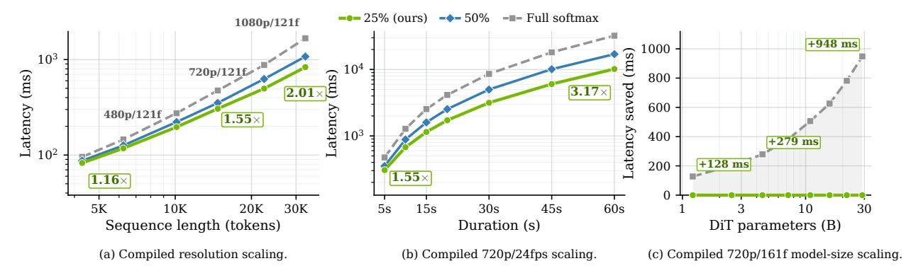

Figure 5 | **Hybrid-attention DiT-forward scaling** (H100, bf16, batch 1; AttnRes 없음). (a) 컴파일된 해상도 스케일링. (b) 컴파일된 720p/24fps 지속 시간 스케일링; 121f 포인트는 (a)와 공유된다. (c) 720p/161f(19.3K 토큰)에서 모델 크기에 따른 Full-softmax minus 25%-hybrid 지연 시간, 동일한 컴파일된 백엔드를 두 실행 순서에서 사용. (a,b)만 50% softmax를 포함; 모두 포워드 지연 프로파일이다.

### 5.5. Mechanistic Analysis (기전적 분석)

**State-rank recovery.** 비율 스윕은 주기적인 softmax 앵커가 프록시 품질–효율성 tradeoff를 개선함을 보여준다. 다음으로 AttnRes가 깊이 전반에 걸쳐 풍부한 표현을 전달한다는 보완적 목표를 실현하는지 테스트한다. 효과적 랭크, 즉 선형 상태 특이값 스펙트럼의 지수 엔트로피를 사용하여, 동일한 생산 체크포인트에서 일치된 프롬프트와 노이즈 시드 하에 깊이 집계(depth aggregation)를 켜고 끄는 실험을 수행한다. 최대 노이즈에서 AttnRes를 활성화하면 깊은 층의 평균 효과적 랭크가 11.7% 증가하며, 24개의 선형 층 중 22개에서 랭크가 감소하지 않는다 (Figure 6b). 정적 라우터는 모델의 0.001% 이하의 미미한 파라미터 비용만을 추가한다.

교차 깊이 재사용. 동일한 아키텍처 계열 체크포인트에서 라우터는 입력이나 현재 부분 합계에 붕괴되지 않는다: 완성된 블록의 질량은 깊이에 따라 증가하며 가장 깊은 블록에서 주의(attention)와 FFN에 대해 각각 56%/50%에 이른다 (Figure 6c). 이 재사용은 확산적이라기보다는 구조화되어 있다. 완성된 블록 내에서 라우터는 가장 최근에 완료된 블록을 선호하며, 주의/FFN 질량의 26.0%/25.3%를 가장 가까운 완성 블록에 할당하고, 이전 두 블록에는 각각 15.5%/13.2%와 14.5%/11.1%를 할당한다. 이는 깊이 전반에 걸쳐 유지되는 최신성 기울기이다. 블록 진입 시 완성된 소스를 제거하면 유효 랭크가 82–91% 감소하지만, 같은 제거를 블록 중간 레이어에서 수행하면 거의 변하지 않는다 (Appendix F.6). 이는 재사용된 정보를 부분 합계가 방금 재설정된 블록 경계에 국한시킨다. 위의 랭크 회복을 통해, 이는 라우팅 가중치뿐 아니라 표현 수준에서도 교차 깊이 재사용을 증명한다.

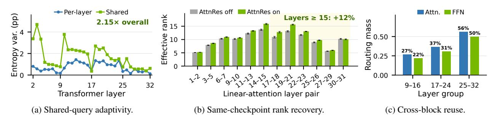

Figure 6 | **선택된 AttnRes 설계에 대한 증거.** (a) 공유 쿼리는 시점 전반에 걸쳐 특징 적응성을 유지한다. (b) 깊이 집계(depth aggregation)를 활성화하면 더 깊은 선형 레이어에서 유효 랭크가 회복된다. (c) 학습된 라우팅은 점점 더 완성된 블록을 재사용한다.

### 5.6. 온라인 RL 사후 훈련 결과

우리는 Section 4.4.2에 서술된 온라인 ReFL 단계를, 훈련 전반에 걸쳐 세 개의 고정 보상 신호를 추적함으로써 평가한다. 보고된 400-반복 실행 동안, 평활화된 HPSv3++, DeQA-Score, 그리고 UniPercept 궤적이 모두 함께 상승한다 (Figure 7), 이는 이 실행이 서로를 대체하기보다 공동 목표의 세 개 로그된 구성요소를 모두 개선한다는 것을 보여준다. Appendix E.2는 네 가지 예시에서 SFT와 RL 체크포인트 간의 매치된 프롬프트, 매치된 CFG 비교를 통해 시각적 품질과 시간적 행동의 변화를 정성적으로 제공한다.

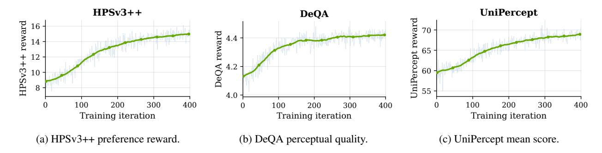

Figure 7 | **모든 세 보상 신호가 온라인 RL 훈련 동안 꾸준히 향상된다.** 400 ReFL 반복 동안, HPSv3++, DeQA-Score, 그리고 UniPercept 각각이 일관된 상승 추세를 보인다; 연한 곡선은 반복별 점수를, 초록 곡선은 그들의 평활화 궤적을 보여준다.

## 6. 배포 및 응용

Sol-Engine을 사용한 커널 친화적 배포.  
백본은 표준 어텐션과 FFN 프리미티브에 가깝게 유지됩니다: 고정된 softmax 앵커와 컨볼루션이 없는 SwiGLU FFN, 그리고 컨볼루션-어댑터 경로가 없습니다.  
SANA-Video의 시간-컨볼루션 FFN을 제거하면 대규모에서 측정된 20–29% 오버헤드를 방지하고 어텐션 비율을 주요 시퀀스 스케일링 변수로 남깁니다; 따라서 Section 5.4의 DiT-forward 비교는 동일하게 최적화된 컴파일된 구현(softmax용 FlashAttention 및 융합 선형 어텐션)을 사용합니다.  
백본이 이러한 표준적이고 잘 최적화된 커널에 매핑되기 때문에, 프로덕션 배포 스택과 직접적으로 결합됩니다.  
우리는 NVIDIA B200에서 $736 \times 1280 \times 193$ (720p, 8s)에서 세 단계의 Sol-Engine 스택 [21]을 통해 SANA-Video 2.0을 최적화합니다: 커널 및 실행 최적화는 먼저 엔드‑투‑엔드 지연 시간을 62.65초에서 30.74초로 줄이고, 잔여 재사용은 50개의 디노이징 단계 중 33개를 평가하여 20.89초에 도달하며, 긴 시퀀스에서 모듈 시간을 지배하는 softmax 앵커에 대한 희소 어텐션은 (Appendix Figure 17) 17.52초에 도달하여 직접 측정된 $3.58 \times$ 속도 향상을 달성합니다 (Table 4).  
이들은 모델링 기여가 아니라 독립적인 배포 개선 사항입니다: 융합은 계산을 보존하고, 캐싱과 희소 어텐션은 근사치를 도입합니다.  
Figure 8은 동일한 프롬프트에 대해 기준선과 완전 가속화된 파이프라인의 일치된 정성적 출력을 보여줍니다.

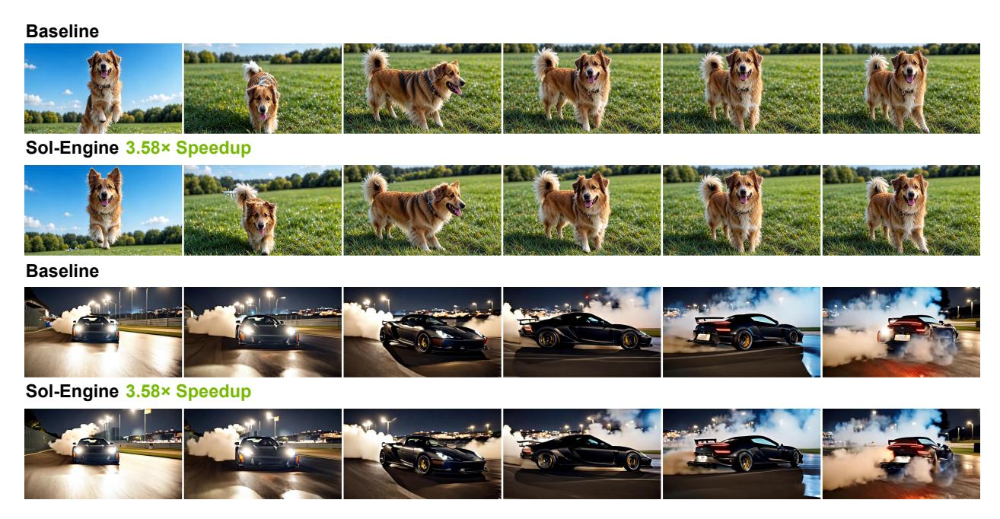

Figure 8 | Sol-Engine 가속 전후의 정성적 출력. 두 개의 매칭된 프롬프트가 기준선과 직접 측정된 $3.58 \times$ 파이프라인을 비교하며, 각 행은 클립 전반에 걸친 매칭 진행 상황을 샘플링한다.

Table 4 | Sol-Engine의 풀 스택 가속 (B200 하나와 H100 하나를 720p 해상도 및 8초 길이에서). 지연 시간은 노이즈 제거 및 VAE 디코딩을 포함한다. 가속률은 각 GPU의 자체 기준선에 비해 상대적이다.

| 단계 | NFEs | B200 |  | H100 |  |  |
|-----------------------|------|-------------|---------|-------------|---------|--|
|  |  | 지연 시간 (초) | 가속도 | 지연 시간 (초) | 가속도 |  |
| 기준 | 50 | 62.65 | 1.00× | 95.08 | 1.00× |  |
| + 커널 최적화 | 50 | 30.74 | 2.04× | 59.32 | 1.60× |  |
| + 확산 캐시 | 33 | 20.89 | 3.00× | 40.07 | 2.37× |  |
| + 희소 주의 | 33 | 17.52 | 3.58× | 33.43 | 2.84× |  |

QAT를 이용한 저정밀 추론. 우리는 SANA-Video 2.0 5B 백본을 MXFP4 가중치와 MXFP8 활성화(표 [5\)](#page-11-1))를 사용해 양자화한다. QAT는 VBench Total에서 BF16 기준선과 일치하지만, PTQ는 약간 낮다. NVIDIA GB200에서 81프레임 비디오(832×480 해상도)의 CFG-패킹된 백본 포워드 한 번이 203*.*08ms에서 191*.*30ms(5*.*8%)로 감소하고, 정적 모델 저장소는 8*.*94GB에서 2*.*87GB(67*.*9%)로 감소하며, 최대 할당 메모리는 10*.*74GB에서 4*.*63GB(56*.*9%)로 감소한다. 지연 시간 향상은 선택된 GEMM이 BF16 런타임의 16*.*2%만 차지하기 때문에 적당하다: W4A8은 이를 33*.*15ms에서 22*.*16ms로 줄여 전체적으로 약 11ms만 절약한다. 현재 우리는 선형 GEMM만 양자화한다; 선형-어텐션과 소프트맥스-어텐션 연산자는 BF16 상태를 유지한다.

Table 5 | QAT 품질 및 저정밀 효율성 (QAT quality and low-precision efficiency). VBench 점수(%) 및 NVIDIA GB200에서 832×480 해상도에서 81프레임 CFG-패킹된 백본 포워드에 대한 중간 시스템 측정값. QAT는 BF16 기준선과 일치하지만, PTQ는 약간 낮다; PTQ와 QAT는 저정밀 추론 구성을 공유한다. 메모리 사용량은 소수점 GB 단위로 표시된다.

|  |  | VBench |  |  |  | GB200 시스템 |  |  |
|-----------------|-----------------|---------|----------|-------|-------|---------------|-------------|-----------|
| 방법 | 정밀도 | 품질 | 의미 | 총계 | Δ | 지연 시간 (ms) | 정적 (GB) | 최대 (GB) |
| BF16 (기준) | BF16 | 83.98 | 80.14 | 83.22 | — | 203.08 | 8.94 | 10.74 |
| PTQ | MXFP4-W/MXFP8-A | 83.53 | 80.23 | 82.87 | −0.35 |  |  |  |
| QAT | MXFP4-W/MXFP8-A | 83.95 | 80.43 | 83.25 | +0.03 | 191.30 | 2.87 | 4.63 |

우리는 공개된 실제 로봇 및 자가중심 비디오 약 5,000시간을 사용해 SANA-Video 2.0을 100k 반복, 학습률 1 × 10−4에서 미세 조정한다. 그림 9에서 보듯이 SANA-Video 2.0은 현실적이고 물리적으로 타당한 로봇 조작 비디오를 생성한다. 제시된 비교에서 유사한 크기의 Cosmos3-Edge [\[1\]](#page-13-13) (4B)을 능가하며, Cosmos3-Nano [\[1\]](#page-13-13) (16B) 및 Lingbot-Video [\[27\]](#page-14-12) (30B) 등 훨씬 큰 모델과도 경쟁력 있는 성능을 보인다.

## 7. 관련 연구

대부분의 공개 비디오 생성기는 Wan 2.1/2.2, HunyuanVideo, CogVideoX, Open-Sora 등과 같은 2차 소프트맥스 토큰 혼합을 갖는 디퓨전 트랜스포머를 사용한다 [\[17,](#page-13-0) [38,](#page-14-0) [44,](#page-15-2) [50\]](#page-15-3); MAGI-1과 LTX-Video는 대신 시간적 청킹 또는 더 강력한 잠재 압축을 통해 유효 시퀀스 비용을 줄인다 [\[11,](#page-13-7) [31\]](#page-14-3). 효율적인 토큰 믹서는 × 매핑을 선형 어텐션 [\[2,](#page-13-2) [13,](#page-13-14) [43\]](#page-15-4) 또는 상태공간 모델 [\[10,](#page-13-15) [19,](#page-13-16) [25,](#page-14-13) [35\]](#page-14-14)을 통해 고정 크기 상태로 대체하지만, 압축된 상태는 표현 랭크를 제한할 수 있다 [\[7\]](#page-13-3). 시각 생성에서 DiG는 이미지 DiT에 게이트형 선형 어텐션을 적용하고, SANA-Video는 순수 선형 비디오 DiT를 개발하며, SANA-WM/SANA-Streaming은 효율적인 백본을 세계 모델링 및 스트리밍 편집에 확장한다 [\[6,](#page-13-1) [49,](#page-15-5) [51,](#page-15-6) [52\]](#page-15-7). 하이브리드 언어 모델은 주기적인 소프트맥스 레이어를 유지한다: Qwen3-Next와 Kimi-Linear는 3:1 레이아웃을 사용하고, Kimi K3는 교차 레이어 어텐션 잔여를 추가하며, 출력 게이팅은 호환 가능한 소프트맥스 안정화 메커니즘을 제공한다 [\[14,](#page-13-4) [15,](#page-13-6) [16,](#page-13-5) [29,](#page-14-6) [30\]](#page-14-4); Attention Surgery는 사전 학습된 비디오 DiT의 사후 선형화를 연구한다 [\[9\]](#page-13-17). Sparse-VideoGen, Radial Attention, SpargeAttn, PISA, Native Sparse Attention는 대신 각 남은 소프트맥스 연산자 내에서 비용을 줄인다 [\[18,](#page-13-18) [20,](#page-14-15) [40,](#page-15-8) [46,](#page-15-9) [48\]](#page-15-10). SANA-Video 2.0은 AttnRes를 갖는 하이브리드 어텐션을 양방향 비디오 디퓨전에 도입하고, 처음부터 훈련하며, 비디오용 소프트맥스 비율을 재선택하고, 깊이 라우팅을 타임스텝-조건화된 특징에 맞게 조정한다. 부록 [A](#page-16-1)에서는 연구 방향별로 완전한 논의를 제시한다.

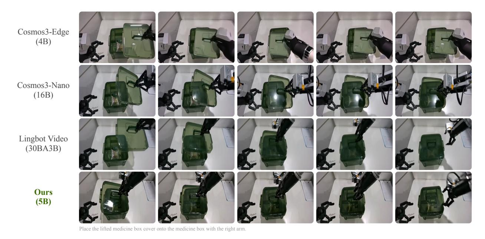

그림 9 | 물리 기반 AI 모델과의 정성적 비교. 제시된 비교에서 SANA-Video 2.0은 유사한 크기의 Cosmos3-Edge [\[1\]](#page-13-13) (4B)을 능가하며, Cosmos3-Nano [\[1\]](#page-13-13) (16B) 및 Lingbot-Video [\[27\]](#page-14-12) (30B) 등 훨씬 큰 모델과도 경쟁력 있는 성능을 보인다.

## 8. 결론

우리는 대부분 선형 하이브리드 어텐션 백본을 기반으로 한 비디오 디퓨전 트랜스포머인 SANA-Video 2.0을 소개한다. 5B 및 14B 규모로 구현되었으며, 모든 층에서 제곱 소프트맥스를 사용하지 않고 75% 게이트형 선형 어텐션과 25% 주기적 소프트맥스 앵커를 결합한다. 깊이 공유 블록 AttnRes는 앵커의 갱신된 표현을 이후 선형 층에 전달한다. 비디오 전용 프록시 연구에서 25% 소프트맥스가 실용적인 품질–효율성 경계점임을 확인하였다. 더 큰 프로덕션 모델은 폭 4,096의 40개 층을 사용하며 384×B200 규모에서 훈련된다. 40단계 샘플링으로 5B 체크포인트는 480×832×81에서 한 H100에서 13.2초에 VBench Total 84.30을 달성한다. 최적 커널 컴파일과 일치할 때, DiT 포워드는 720p/60s 텐서 형태에서 전체 소프트맥스보다 3.2배 빠르다. 하드웨어 친화적 백본은 융합 커널에 깔끔하게 매핑되고 Sol-Engine의 실행, 잔여 재사용, 희소 앵커 최적화와 직접 결합되어 50단계 B200 배포에서 별도로 측정된 3.58배 종단 간 속도 향상을 제공한다. 같은 체크포인트 분석은 AttnRes가 깊은 층의 유효 랭크를 약 12% 상승시키고 깊이 전반에 걸쳐 완료된 블록 표현을 재사용함을 보여준다. 아키텍처 선택은 짧은 프록시 연구에 의존하고 가장 긴 기간의 결과는 텐서 형태 프로파일이지만, 이 결과는 대부분 선형 하이브리드가 경쟁력 있는 생성 품질을 유지하면서 장거리 고해상도 비디오에 훨씬 효율적으로 확장될 수 있음을 보여준다.

향후 연구. 이 설계에서 가장 직접적으로 따르는 두 가지 방향이 있다. 백본이 ()-지배적이기 때문에 효율성 이점은 지속 시간에 따라 확대된다 (섹션 [5.4](#page-8-2)). 따라서 현재 8초 범위를 넘어 분 단위 훈련으로 커리큘럼을 확장하면 프로파일된 장거리 시퀀스 스케일링을 실제 장거리 비디오 생성으로 전환하고, 앵커가 훨씬 긴 컨텍스트에서 전역 일관성을 유지할 수 있는 능력을 시험하게 된다. 둘째, 우리의 연산자는 양방향이며, 반면 로보틱스, 자율 주행, 세계 모델은 스트리밍, 액션-조건화 롤아웃을 요구한다. 섹션 [2](#page-1-0)에서 언급한 바와 같이 델타-룰 업데이트를 제거하면 자연스러운 초기화가 causal Gated DeltaNet이 된다. 따라서 Kimi-Linear [\[14\]](#page-13-4) / Kimi K3 [\[15\]](#page-13-6) 패밀리에서 causal delta-rule 선형 연산자를 동일한 hybrid-plus-AttnRes 레이아웃과 결합하면, 이 스크래치-트레인된, 커널 친화적 레시피를 causal 생성 및 폐쇄 루프 세계 모델에 적용할 수 있어 섹션 [6](#page-9-1)의 Physical AI 연구를 보완한다. 추가 확장으로는 앵커별 희소 커널 및 보정된 저정밀 (NVFP4) 포맷, 훈련 없이 배포 캐싱을 보완하는 소수 단계 증류, 학습된 콘텐츠-적응형 앵커 배치 및 AttnRes 라우팅이 포함된다.

감사의 말씀. 우리는 효율적 훈련에 관한 귀중한 논의에 대해 PKU의 Yufan Deng에게 진심으로 감사의 뜻을 전하고자 한다. 그들의 건설적인 피드백과 협업은 이 연구를 형성하는 데 결정적인 역할을 했다.

## 참고문헌 (References)

- [1] Aditi, Niket Agarwal, Arslan Ali, Jon Allen, Martin Antolini, Adeline Aubame, Alisson Azzolini, Junjie Bai, Maciej Bala, Yogesh Balaji, Josh Bapst, et al. Cosmos 3: 물리적 AI를 위한 옴니모달 세계 모델. *arXiv preprint arXiv:2606.02800*, 2026.

- [2] Simran Arora, Sabri Eyuboglu, Michael Zhang, Aman Timalsina, Silas Alberti, Dylan Zinsley, James Zou, Atri Rudra, and Christopher Ré. 단순 선형 어텐션 언어 모델이 재현율-처리량 트레이드오프를 균형 잡는다. In *ICML*, 2024.

- [3] Bernini Team, Chenchen Liu, Junyi Chen, Lei Li, Lu Chi, Mingzhen Sun, Zhuoying Li, Yi Fu, Ruoyu Guo, Yiheng Wu, Ge Bai, and Zehuan Yuan. Bernini: 비디오 디퓨전을 위한 잠재 의미 계획. arXiv preprint arXiv:2605.22344, 2026.

- [4] Shuo Cao, Jiayang Li, Xiaohui Li, Yuandong Pu, Kaiwen Zhu, Yuanting Gao, Siqi Luo, Yi Xin, Qi Qin, Yu Zhou, Xiangyu Chen, Wenlong Zhang, Bin Fu, Yu Qiao, and Yihao Liu. UniPercept: 미학, 품질, 구조, 질감 전반에 걸친 통합적 인지 수준 이미지 이해를 향해. In *ICML*, 2026.

- [5] Hila Chefer, Patrick Esser, Dominik Lorenz, Dustin Podell, Vikash Raja, Vinh Tong, Antonio Torralba, and Robin Rombach. 자기 지도 흐름 매칭을 통한 확장 가능한 다중 모달 합성. arXiv preprint arXiv:2603.06507, 2026.

- [6] Junsong Chen, Yuyang Zhao, Jincheng Yu, Ruihang Chu, Junyu Chen, Shuai Yang, Xianbang Wang, Yicheng Pan, Daquan Zhou, Huan Ling, Haozhe Liu, Hongwei Yi, Hao Zhang, Muyang Li, Yukang Chen, Han Cai, Sanja Fidler, Ping Luo, Song Han, and Enze Xie. SANA-Video: 블록 선형 디퓨전 트랜스포머를 이용한 효율적인 비디오 생성. arXiv preprint arXiv:2509.24695, 2025.

- [7] Qihang Fan, Huaibo Huang, and Ran He. 선형 어텐션의 저랭크 딜레마를 깨다. In *CVPR*, 2025.

- [8] Gemma Team. Gemma 2: 실용적인 규모에서 오픈 언어 모델을 개선. arXiv preprint arXiv:2408.00118, 2024.

- [9] Mohsen Ghafoorian, Denis Korzhenkov, and Amirhossein Habibian. Attention Surgery: 비디오 디퓨전 트랜스포머를 선형화하는 효율적인 레시피. arXiv preprint arXiv:2509.24899, 2025.

- [10] Albert Gu and Tri Dao. Mamba: 선택적 상태 공간을 이용한 선형 시간 시퀀스 모델링. In *Conference on Language Modeling (COLM)*, 2024.

- [11] Yoav HaCohen, Nisan Chiprut, Benny Brazowski, Daniel Shalem, et al. LTX-Video: 실시간 비디오 잠재 디퓨전. arXiv preprint arXiv:2501.00103, 2025.

- [12] Ziqi Huang, Yinan He, Jiashuo Yu, Fan Zhang, Chenyang Si, Yuming Jiang, Yuanhan Zhang, Tianxing Wu, Qingyang Jin, Nattapol Chanpaisit, Yaohui Wang, Xinyuan Chen, Limin Wang, Dahua Lin, Yu Qiao, and Ziwei Liu. VBench: 비디오 생성 모델을 위한 종합 벤치마크 스위트. In *CVPR*, 2024.

- [13] Angelos Katharopoulos, Apoorv Vyas, Nikolaos Pappas, and François Fleuret. Transformers는 RNN이다: 선형 어텐션을 갖는 빠른 자기회귀 트랜스포머. In *ICML*, 2020.

- [14] Kimi Team. Kimi Linear: 표현력 있고 효율적인 어텐션 아키텍처. arXiv preprint arXiv:2510.26692, 2025.

- [15] Kimi Team. Kimi K3: 오픈 프론티어 인텔리전스. Moonshot AI technical blog, [https://www.kimi.com/blog/](https://www.kimi.com/blog/kimi-k3) [kimi-k3](https://www.kimi.com/blog/kimi-k3), 2026.

- [16] Kimi Team. 어텐션 잔여. arXiv preprint arXiv:2603.15031, 2026.

- [17] Weijie Kong, Qi Tian, Zijian Zhang, Rox Min, et al. HunyuanVideo: 대규모 비디오 생성 모델을 위한 체계적 프레임워크. arXiv preprint arXiv:2412.03603, 2024.

- [18] Haopeng Li, Shitong Shao, Wenliang Zhong, Zikai Zhou, Lichen Bai, Hui Xiong, and Zeke Xie. PISA: 효율적인 디퓨전 트랜스포머를 위한 조각별 희소 어텐션이 더 현명하다. arXiv preprint arXiv:2602.01077, 2026.

- [19] Kunchang Li, Xinhao Li, Yi Wang, Yinan He, Yali Wang, Limin Wang, and Yu Qiao. VideoMamba: 효율적인 비디오 이해를 위한 상태 공간 모델. In *ECCV*, 2024.

- [20] Xingyang Li 등. Radial Attention: ( log ) Sparse Attention with Energy Decay for Long Video Generation. arXiv preprint arXiv:2506.19852, 2025.
- [21] Yitong Li, Junsong Chen, Haopeng Li, Haozhe Liu, Jincheng Yu, Ligeng Zhu, Ping Luo, Song Han, and Enze Xie. Sol Video Inference Engine: Agent-Native Full-Stack Acceleration Framework for Efficient Video Generation. arXiv preprint arXiv:2606.23743, 2026.
- [22] Zhi Li, Anne Aaron, Ioannis Katsavounidis, Anush Moorthy, and Megha Manohara. Toward A Practical Perceptual Video Quality Metric. Netflix Technology Blog, https://netflixtechblog.com/toward-a-practical-perceptual-video-quality-metric-653f208b9652, 2016.
- [23] Yaron Lipman, Ricky T. Q. Chen, Heli Ben-Hamu, Maximilian Nickel, and Matt Le. Flow Matching for Generative Modeling. In *ICLR*, 2023.
- [24] Yijun Liu, Jie Huang, Zeyue Xue, Yuming Li, Ruizhe He, Haoran Li, Shijia Ge, and Siming Fu. HPSv3++: Scaling Reward Models Across the Full Spectrum of Diffusion Model Capabilities. arXiv preprint arXiv:2606.14657, 2026.
- [25] Yue Liu, Yunjie Tian, Yuzhong Zhao, Hongtian Yu, Lingxi Xie, Yaowei Wang, Qixiang Ye, Jianbin Jiao, and Yunfan Liu. VMamba: Visual State Space Model. In *NeurIPS*, 2024.
- [26] Xiangyang Luo, Qingyu Li, Yuming Li, Guanbo Huang, Yongjie Zhu, Wenyu Qin, Meng Wang, Pengfei Wan, and Shao-Lun Huang. Beyond the Golden Data: Resolving the Motion-Vision Quality Dilemma via Timestep Selective Training. In *CVPR*, 2026.
- [27] Shuailei Ma, Jiaqi Liao, Xinyang Wang, Jingjing Wang, Chaoran Feng, Zijing Hu, Chong Bao, Zichen Xi, Yuqi Gan, Weisen Wang, et al. Scaling mixture-of-experts video pretraining for embodied intelligence. *arXiv preprint arXiv:2607.07675*, 2026.
- [28] William Peebles and Saining Xie. Scalable Diffusion Models with Transformers. In *ICCV*, 2023.
- [29] Zihan Qiu, Zekun Wang, Bo Zheng, Zeyu Huang, Kaiyue Wen, Songlin Yang, Rui Men, Le Yu, Fei Huang, Suozhi Huang, Dayiheng Liu, and Junyang Lin. Gated Attention for Large Language Models: Non-linearity, Sparsity, and Attention-Sink-Free. arXiv preprint arXiv:2505.06708, 2025.
- [30] Qwen Team. Qwen3-Next: Towards Ultimate Training & Inference Efficiency. Qwen Team blog, https://qwen.ai/blog?id=qwen3-next, 2025.
- [31] Sand.ai, Hansi Teng, Hongyu Jia, Lei Sun, Lingzhi Li, et al. MAGI-1: Autoregressive Video Generation at Scale. arXiv preprint arXiv:2505.13211, 2025.
- [32] Team Seedance et al. Seedance 2.0: Advancing Video Generation for World Complexity. arXiv preprint arXiv:2604.14148, 2026.
- [33] Tomáš Soucek and Jakub Loko ˇ c. TransNet V2: An Effective Deep Network Architecture for Fast Shot Transition ˇ Detection. arXiv preprint arXiv:2008.04838, 2020.
- [34] Jianlin Su, Murtadha Ahmed, Yu Lu, Shengfeng Pan, Wen Bo, and Yunfeng Liu. RoFormer: Enhanced Transformer with Rotary Position Embedding. *Neurocomputing*, 568:127063, 2024.
- [35] Yao Teng, Yue Wu, Han Shi, Xuefei Ning, Guohao Dai, Yu Wang, Zhenguo Li, and Xihui Liu. DiM: Diffusion Mamba for Efficient High-Resolution Image Synthesis. arXiv preprint arXiv:2405.14224, 2024.
- [36] Bram Wallace, Meihua Dang, Rafael Rafailov, Linqi Zhou, Aaron Lou, Senthil Purushwalkam, Stefano Ermon, Caiming Xiong, Shafiq Joty, and Nikhil Naik. Diffusion Model Alignment Using Direct Preference Optimization. In *CVPR*, 2024.
- [37] Wan Team. Wan2.2: Open and Advanced Large-Scale Video Generative Models. Official code and model release, https://github.com/Wan-Video/Wan2.2, 2025.
- [38] Wan Team, Ang Wang, Baole Ai, Bin Wen, et al. Wan: Open and Advanced Large-Scale Video Generative Models. arXiv preprint arXiv:2503.20314, 2025.

- [39] Haoning Wu, Erli Zhang, Liang Liao, Chaofeng Chen, Jingwen Hou, Annan Wang, Wenxiu Sun, Qiong Yan, and Weisi Lin. 사용자 생성 콘텐츠에서 미학적 및 기술적 관점에서 비디오 품질 평가 탐구. In *ICCV*, 2023.
- [40] Haocheng Xi et al. Sparse VideoGen: 공간-시간 희소성을 이용한 비디오 디퓨전 트랜스포머 가속화. In *ICML*, 2025. arXiv:2502.01776.
- [41] Haofei Xu, Jing Zhang, Jianfei Cai, Hamid Rezatofighi, Fisher Yu, Dacheng Tao, and Andreas Geiger. 플로우, 스테레오 및 깊이 추정 통합. *IEEE Transactions on Pattern Analysis and Machine Intelligence*, 45(11): 13941–13958, 2023.
- [42] Jiazheng Xu, Xiao Liu, Yuchen Wu, Yuxuan Tong, Qinkai Li, Ming Ding, Jie Tang, and Yuxiao Dong. ImageReward: 텍스트-투-이미지 생성에 대한 인간 선호 학습 및 평가. In *NeurIPS*, 2023.
- [43] Songlin Yang, Bailin Wang, Yikang Shen, Rameswar Panda, and Yoon Kim. 하드웨어 효율적 훈련을 위한 게이트형 선형 어텐션 트랜스포머. In *ICML*, 2024.
- [44] Zhuoyi Yang, Jiayan Teng, Wendi Zheng, et al. CogVideoX: 전문가 트랜스포머를 활용한 텍스트-투-비디오 디퓨전 모델. In *ICLR*, 2025.
- [45] Zhiyuan You, Xin Cai, Jinjin Gu, Tianfan Xue, and Chao Dong. 점수 분포를 이용해 대형 언어 모델에 정확한 이미지 품질 점수 회귀 가르치기. In *CVPR*, 2025.
- [46] Jingyang Yuan et al. 네이티브 스파스 어텐션: 하드웨어 정렬 및 네이티브 학습 가능한 희소 어텐션. arXiv preprint arXiv:2502.11089, 2025.
- [47] Xiaohua Zhai, Basil Mustafa, Alexander Kolesnikov, and Lucas Beyer. 언어-이미지 사전 훈련을 위한 시그모이드 손실. In *ICCV*, 2023.
- [48] Jintao Zhang et al. SpargeAttention: 정확하고 훈련이 필요 없는 희소 어텐션으로 모든 모델 추론 가속화. In *ICML*, 2025. arXiv:2502.18137.
- [49] Yuyang Zhao, Yicheng Pan, Qiyuan He, Jincheng Yu, Junsong Chen, Tian Ye, Haozhe Liu, Enze Xie, and Song Han. SANA-Streaming: 하이브리드 디퓨전 트랜스포머를 이용한 실시간 스트리밍 비디오 편집. arXiv preprint arXiv:2605.30409, 2026.
- [50] Zangwei Zheng, Xiangyu Peng, Chenhui Shen, et al. Open-Sora 2.0: $200k으로 상업 수준 비디오 생성 모델 훈련. arXiv preprint arXiv:2503.09642, 2025.
- [51] Haoyi Zhu, Haozhe Liu, Yuyang Zhao, Tian Ye, Junsong Chen, Jincheng Yu, Tong He, Song Han, and Enze Xie. SANA-WM: 하이브리드 선형 디퓨전 트랜스포머를 이용한 효율적인 분당 규모 세계 모델링. arXiv preprint arXiv:2605.15178, 2026.
- [52] Lianghui Zhu, Zilong Huang, Bencheng Liao, Jun Hao Liew, Hanshu Yan, Jiashi Feng, and Xinggang Wang. DiG: 게이트형 선형 어텐션을 이용한 확장 가능하고 효율적인 디퓨전 모델. In *CVPR*, 2025.

## A. 관련 연구

### A.1. 비디오 디퓨전 및 효율적인 시퀀스 모델링

현대의 공개 비디오 생성기들은 대부분 전체 균일 softmax attention을 갖는 diffusion transformer를 기반으로 한다. Wan 2.1/2.2, HunyuanVideo, CogVideoX, 그리고 Open-Sora는 이 설계를 더 큰 백본과 향상된 훈련 레시피를 통해 확장하며, Wan 2.2는 전문가 혼합 디노이저(mixture-of-experts denoiser)를 채택한다 [\[17,](#page-13-0) [37,](#page-14-16) [38,](#page-14-0) [44,](#page-15-2) [50\]](#page-15-3). 그들의 전역 토큰 혼합은 표현력이 뛰어나지만, 해상도와 지속 시간이 증가함에 따라 이의 사각 비용이 점점 더 비싸진다. 다른 시스템은 대신 시퀀스 길이를 줄인다: MAGI-1은 시간 단편에서 비디오를 자가 회귀적으로 생성한다 [\[31\]](#page-14-3), 반면 LTX-Video는 잠재 압축(latent compression)에 의존한다 [\[11\]](#page-13-7).

효율적인 시퀀스 모델은 백본 비용을 직접적으로 줄인다. 선형 어텐션은 명시적인 × 어텐션 맵을 고정 크기 상태로 대체한다 [\[2,](#page-13-2) [13,](#page-13-14) [43\]](#page-15-4), 반면 상태 공간 모델은 재귀적 또는 선택적 상태 업데이트를 사용한다 [\[10,](#page-13-15) [19,](#page-13-16) [25,](#page-14-13) [35\]](#page-14-14). 비전 분야에서 DiG는 이미지 디퓨전 트랜스포머에 게이트형 선형 어텐션을 적용한다 [\[52\]](#page-15-7); SANA-Video는 시계열 컨볼루션 FFN을 갖춘 순수 선형 비디오 DiT를 개발한다 [\[6\]](#page-13-1); 그리고 SANA-WM과 SANA-Streaming은 효율적인 SANA-가족 백본을 세계 모델링 및 스트리밍 비디오 편집에 확장한다 [\[49,](#page-15-5) [51\]](#page-15-6). 압축된 상태가 표현 랭크와 직접 토큰 상호작용을 제한할 수 있기 때문에 [\[7\]](#page-13-3), 우리는 전체 시퀀스 생성을 유지하지만 순수 선형 스택이나 추가적인 시계열 컨볼루션 경로에 의존하기보다 주기적으로 정확한 소프트맥스 상호작용을 복원한다.

## A.2. 하이브리드 및 희소 어텐션 (Hybrid and Sparse Attention)

하이브리드 언어 모델은 효율적인 상태 기반 레이어와 적은 수의 정확한 소프트맥스 레이어를 결합한다. Qwen3-Next와 Kimi-Linear는 서로 다른 선형 연산자를 사용한 정규 3:1 선형-소프트맥스 레이아웃을 활용한다 [\[14,](#page-13-4) [30\]](#page-14-4), 그리고 포스트-어텐션 출력 게이팅은 소프트맥스 브랜치에 호환 가능한 안정화 메커니즘을 제공한다 [\[29\]](#page-14-6). Attention Surgery는 대신 사전 훈련된 비디오 DiT를 훈련 후 선형화한다 [\[9\]](#page-13-17). 우리는 스크래치에서 훈련된 양방향 비디오 디퓨전 트랜스포머를 연구하며, 그 하이브리드 레이아웃을 훈련 전반에 걸쳐 고정하고, 비디오 영역에서 소프트맥스 비율을 재선택한다. 이는 언어 모델 비율이 직접 전이된다고 가정하지 않는다.

희소 방법은 남은 소프트맥스 비용을 줄이는 보완적인 방식을 제공한다. Sparse-VideoGen과 Radial Attention은 비디오 어텐션 맵의 구조를 활용하고, SpargeAttn과 PISA는 훈련 없이 희소 또는 근사 커널을 제공하며, Native Sparse Attention은 장기 컨텍스트 언어 모델링을 위한 하드웨어 정렬 희소 패턴을 학습한다 [\[18,](#page-13-18) [20,](#page-14-15) [40,](#page-15-8) [46,](#page-15-9) [48\]](#page-15-10). 이 방법들은 각 소프트맥스 레이어 내의 작업을 줄이는 반면, 우리의 하이브리드 설계는 소프트맥스를 호출하는 레이어 수를 줄인다. 배포 연구에서는 희소성이 고정된 소프트맥스 앵커에만 적용되며, 선형 대다수와 훈련된 아키텍처는 그대로 유지된다 (섹션 [6\)](#page-9-1).

### A.3. 교차-계층 잔여 라우팅 (Cross-Layer Residual Routing)

표준 트랜스포머 잔여 스트림은 특징을 인접 레이어를 통해서만 전달한다. Attention Residuals는 한 레이어가 이전 깊이에서 완성된 블록 특징을 가져올 수 있게 하며, Kimi K3는 이 메커니즘을 언어 모델 규모의 하이브리드 어텐션과 결합한다 [\[15,](#page-13-6) [16\]](#page-13-5). 비디오 디퓨전은 다른 요구사항을 도입한다: 특징은 양방향이며, 모든 블록은 노이즈 제거 타임스텝에 의해 조절되고, 시공간 토큰 세트는 훨씬 크다. 따라서 우리는 완성된 블록 요약과 현재 부분 블록을 통해 라우팅하고, 깊이 전반에 걸쳐 하나의 쿼리 프로젝션을 공유하며, 별도의 라우터-타임스텝 프로젝션 대신 일반 DiT 특징을 통해 타임스텝 정보를 유지한다. 본 논문의 라우팅 및 랭크 분석은 AttnRes 경로가 소프트맥스 앵커에 의해 새로 고쳐진 표현을 재사용하는지 테스트한다.

## B. 모델 및 훈련 세부사항 (Model and Training Details)

### B.1. 모델 구성 (Model Configuration)

SANA-Video 2.0은 선택된 하이브리드 설계를 공유하는 5B 및 14B 구성을 갖는다. Table [6](#page-17-0)은 두 아키텍처와 그 규모별 훈련 하이퍼파라미터를 기록한다.

Table 6 | SANA-Video 2.0의 전체 5B 및 14B 구성. 동일한 하이브리드-어텐션 설계를 사용하며, 14B 설정은 저장된 Poly 훈련 구성 및 런타임 로그와 일치하도록 검증되었다.

| Setting | 5B | 14B |  |  |
|------------------------|----------------------------------------------------------------------------------------|--------------------------------------------------|--|--|
| Backbone architecture |  |  |  |  |
| Depth | 32 | 40 |  |  |
| Hidden dimension | 2,560 | 4,096 |  |  |
| Linear attention | 20 heads (𝑑ℎ=128) | 32 heads (𝑑ℎ=128) |  |  |
| Softmax attention | 10 heads (𝑑ℎ=256) | 16 heads (𝑑ℎ=256) |  |  |
| Attention operators | 가변 양방향 선형 / 가변 소프트맥스; 자기 및 교차 어텐션 QK 정규화 |  |  |  |
| Softmax anchors | 8 layers; 25% (3:1) | 10 layers; 25% (3:1) |  |  |
| AttnRes | 𝑆=8, shared projection, no time conditioning | 𝑆=8, shared projection, no time conditioning |  |  |
| FFN | SwiGLU, ratio 4.0 | SwiGLU, ratio 4.0 |  |  |
| Position encoding | Wan RoPE; 선형/소프트맥스 헤드 차원 분리 |  |  |  |
| Patch size | (1, 1, 1) | (1, 1, 1) |  |  |
| Parameters | ∼4.5B (5B class) | 14.247B (14B class) |  |  |
| Training configuration |  |  |  |  |
| Resolution / frames | 480p–720p; 81/121/193 | 480p; 81/121 |  |  |
| VAE | LTX-VAE 2.3, 128 channels, causal encode |  |  |  |
| VAE stride | 8×32×32 (temporal × spatial × spatial) |  |  |  |
| Text encoder | Gemma-2-2B-IT, 300 tokens; normalized features, scale 0.01 |  |  |  |
| Objective | Flow matching; stage-specific TQD / Self-Flow | Flow matching + Self-Flow |  |  |
| Self-Flow | student/teacher 9/25, weight 0.8, 𝑅𝑀=0.1 | student/teacher 14/34, weight 0.8, 𝑅𝑀=0.1 |  |  |
| Noise distribution | shift 1 then token-aware 3–6, 𝜎=0.95 | tail-floored logit-normal, shift 3, 𝜎=0.95 |  |  |
| Optimizer | AdamW, lr 10−4 / 5×10−5 | AdamW, lr 10−4 , 𝛽=(0.9, 0.999), wd 0 |  |  |
| Schedule / clipping | constant + 500-step warmup; clip 0.1 | constant + 500 configured warmup steps; clip 0.1 |  |  |
| Per-rank batch | 1 video | 1 video / 4 images; no accumulation |  |  |
| Precision / sharding | bf16, FSDP | bf16, FSDP + activation checkpointing |  |  |
| Weight EMA | enabled | 0.9999 |  |  |
| Training hardware | 64×H100 | 384×B200 (Poly) |  |  |

### B.2. Self-Flow Distillation 및 Dual-Timestep Tokens (Self-Flow Distillation and Dual-Timestep Tokens)

Self-Flow [\[5\]](#page-13-9)는 사전 훈련 및 지속 훈련(연속 훈련) 동안에만 적용되는 보조 훈련 보조 도구이며, SFT에서는 비활성화됩니다. 이는 얕은 학생 읽기( shallow student readout)에서 더 깊은(또는 이후 지속 훈련에서는 EMA) 교사(teacher)로 향하는 특징-증류 손실(feature-distillation loss)을 추가하고, 두 번째 타임스텝에 작은 토큰 파티션(=0*.*1)을 할당하는 dual-timestep 스케줄을 도입합니다. 모든 토큰은 flow-matching 손실에 남아 있으므로, 이는 백본 연산을 줄이기보다 조건을 변경합니다; 정확한 레이어 인덱스와 가중치는 표 [6.](#page-17-0)에 있습니다.

## B.3. 콘텐츠 기반 Flow-Shift (Content-aware Flow-Shift)

TQD [\[26\]](#page-14-8)는 큐레이션 점수를 사용하여 각 사전 훈련 클립이 가장 유익한 위치에 감독을 배치합니다. 기본 flow-shift 1을 사용하면 fps-정규화된 UniMatch 임계값 30을 초과하지만 DOVER 품질 임계값을 초과하지 않은 클립은 고노이즈에 대한 +1*.*1 로짓 바이어스를 받습니다; DOVER 임계값 0.91을 초과하지만 모션 임계값을 초과하지 않은 클립은 저노이즈에 대한 −1*.*1 바이어스를 받습니다; 두 조건을 모두 만족하거나 둘 다 만족하지 않는 클립은 바이어스가 0입니다. 두 바이어스 분기(branch)는 각각 약 0*.*75와 0*.*25의 중앙값 타임스텝을 가지며, 이는 각각 약 3과 1*/*3의 유효 시프트에 해당합니다 (Figure [10\)](#page-18-3)). 지속 훈련 이후부터 TQD는 비활성화되고, 시프트 3–6을 갖는 tail-floored 토큰 인식 밀도(token-aware density)가 사용됩니다. 시프트 3은 고모션 분기의 중앙값과 대략 일치하지만, 분포와 다른 TQD 분기와는 차이가 있으므로 이는 샘플별 연속적 핸드오프가 아닙니다.

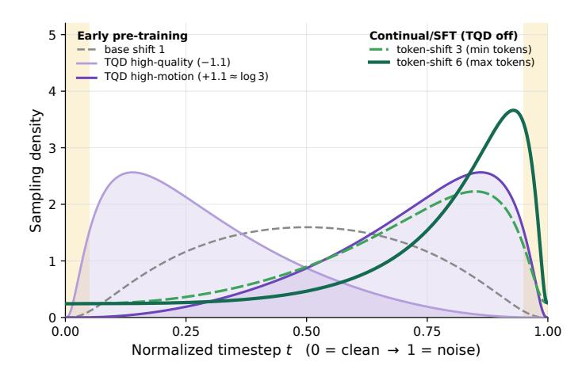

Figure 10 | **연속 단계에서 사용되는 타임스텝 밀도.** Pre-training TQD는 상호 배타적인 고품질 및 고모션 분기에 반대 오프셋을 적용합니다. 지속 훈련 및 SFT는 TQD를 비활성화하고 3–6 범위의 tail-floored 토큰-카운트 시프트를 사용합니다; 시프트 3은 고모션 분기의 중앙값과 대략 일치하지만, 샘플별 연속적 핸드오프는 아닙니다.

### **B.4.** 타임스텝-층별 체크포인트 모니터링 (Timestep-Stratified Checkpoint Monitoring)

임의 타임스텝 평균은 한 노이즈 영역에서의 개선을 다른 영역의 회귀 뒤에 숨길 수 있습니다. 따라서 우리는 1,000-스텝 노이즈 축을 10개의 동일한 버킷으로 나누고, 하나의 연속 경로에서 네 개의 체크포인트를 비교합니다. 모든 체크포인트는 동일한 100개의 클립, 텍스트 특징, 노이즈 텐서, 타임스텝 할당을 재사용하며, 각 정수 타임스텝을 정확히 한 번씩 커버합니다. 동일 버킷 평균은 모니터링 통계이며, 훈련 목표가 아닙니다.

첫 번째 체크포인트에서 마지막 체크포인트까지, 매크로 MSE는 6.4% 감소하지만, 버킷 관점은 유용한 세부 사항을 드러냅니다: 저노이즈 MSE는 최대 11.4% 개선되고, 가장 높은 노이즈 버킷은 1.2% 회귀합니다 (Figure 11). 층분할은 또한 IID 타임스텝 샘플링에 비해 변화 추정치의 표준 편차를 $2.3\times$ 감소시킵니다. VBench Total은 이 체크포인트들에서 82.68에서 83.29로 상승합니다; 네 개의 관측치가 있으므로 이는 상관 관계 주장이라기보다 맥락입니다.

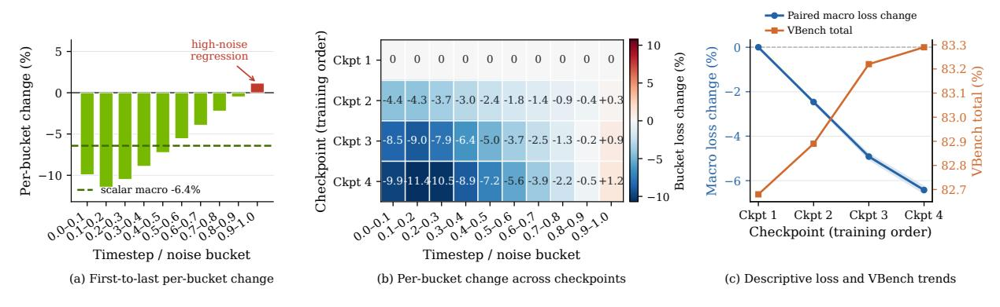

Figure 11 | **타임스텝-층별 체크포인트 모니터링.** 하나의 실행에서 매치된 네 개의 체크포인트. (a,b) 버킷별 손실 변화는 큰 저노이즈 개선과 작은 고노이즈 회귀를 드러내며, 스칼라 평균은 이를 모호하게 만듭니다. (c) 95% 구간과 서술적 VBench 추세를 갖는 쌍별 매크로 변화.

## C. 데이터 큐레이션 및 점진적 선택 (Data Curation and Progressive Selection)

우리는 일관된 6단계 파이프라인으로 코퍼스를 처리합니다. 그 목적은 결함이 있는 클립을 제거하는 것뿐 아니라, 훈련 커리큘럼에서 사용되는 점진적 감독을 구축하는 것입니다: 사전 훈련은 범위를 우선시하고, 지속 훈련은 품질과 모션 일관성 기준을 높이며, SFT는 가장 신뢰할 수 있는 하위 집합을 사용합니다. 동일한 처리 로직이 이들 풀에서 사용되며, 단계에 따라 선택 임계값이 달라집니다.

Table 7 | 사내 품질/모션 퍼널에서 사용되는 신호. 선택 임계값은 사전 훈련, 지속 학습, 그리고 SFT 단계에서 점진적으로 강화된다.

| 신호 계열 | 예시 | 역할 |
|-----------------------|-----------------------------------------|--------------------------|
| 시각적 품질 | DOVER, 흐림/노출 통계 | 충실도와 미학 |
| 모션 | 광학 흐름, VMAF 모션 | 풍부함과 일관성 |
| 색상 | 채도 및 명도 통계 | 자연스러운 외관 |
| 일관성/정렬 | 이미지–비디오, 비전–언어 유사성 | 조건화 신뢰성 |
| 샷 무결성 | 컷 및 아티팩트 탐지기 | 시간적 연속성 |

디코드, 세그먼트, 정리. 먼저 디코딩이 불가능하거나 크기가 작은 클립을 거부하고, 메타데이터를 정규화하며, TransNetV2 [\[33\]](#page-14-17)를 사용해 긴 비디오를 일관된 샷으로 분할합니다. 시간적으로 안정적인 크롭은 가능하면 레터박스와 자막을 제거합니다; 오버레이, 불안정한 컷, 심한 흐림, 노출 결함, 또는 시간적 아티팩트가 지배적인 클립은 버립니다.

보완적 특성을 점수화합니다. 남은 클립은 하나의 점수로 압축하기보다 품질, 모션, 색상, 일관성이라는 별도 축을 따라 평가됩니다 (Table [7] (#page-19-0)). DOVER는 시각적 품질을 측정하고, UniMatch와 VMAF 파생 기능은 모션을 설명하며, SigLIP 기능은 시각-텍스트 일관성을 측정합니다 [\[22,](#page-14-18) [39,](#page-15-11) [41,](#page-15-12) [47\]](#page-15-13). 결정은 시간에 걸쳐 집계되며, 광학 흐름은 프레임 속도로 정규화되어 정보가 풍부한 저속 모션 클립이 단순히 느리기 때문에 제거되지 않도록 합니다.

커리큘럼을 구축합니다. 축별로 점점 엄격해지는 임계값이 광범위한 사전 훈련 풀, 더 깨끗한 지속 훈련 풀, 그리고 작은 신뢰할 수 있는 SFT 서브셋을 형성합니다. 캡션은 동일한 진행 과정을 따르며, 주제, 동작, 카메라 모션, 장면, 조명, 상호작용, 그리고 시간적 진화를 구조화된 설명으로 마무리됩니다. 양자화된 모션 디스크립터는 사용 가능한 경우에 추가되어 모션이 텍스트 컨디셔너에 명시적으로 남도록 합니다.

해상도, FPS, 그리고 지속 시간 일정. 실행은 해상도(480 → 720), 프레임 속도, 지속 시간을 동시에 진행하며, 720p 비중은 이후 단계에서 증가합니다 (Table [1] (#page-5-0)). 프레임 수는 각 클립이 LTX-VAE 잠재 프레임의 정수 개수에 맞도록 선택됩니다. FSDP가 랭크당 배치 크기를 1로 실행하기 때문에, 샘플러는 각 랭크를 한 단계마다 단일 (종횡비, 프레임 수) 티어로 묶어 해상도/지속 시간 혼합이 랭크를 비동기화하지 않도록 합니다. 이미지 배치는 고정된 주기로 비디오와 교차 삽입되어 모션 중심 코퍼스에 외형 품질을 주입합니다.

## 평가 및 측정 프로토콜 (D. Evaluation and Measurement Protocols)

### D.1. 샘플링 및 VBench 평가 (Sampling and VBench Evaluation)

보고된 SANA-Video 2.0 운영 포인트는 40개의 flow-DPM-Solver 단계, 모션 버킷 30, 시드 0, 그리고 Gemma-2-2B-IT 텍스트 기능을 사용합니다 [\[8\]](#page-13-8). 81프레임, 16fps 설정은 classifier-free 가이던스 6*.*0과 flow-shift 6*.*0을 사용하며; 121/193프레임, 24fps 설정은 가이던스 8*.*0과 flow-shift 12*.*0을 사용합니다. 81프레임 결과는 한 개의 후기 단계 프로덕션 체크포인트에서 나오며, 121/193프레임 결과는 두 번째 후기 단계 체크포인트를 공유합니다. 기준선은 기본 설정을 유지합니다.

우리는 공식 프롬프트를 사용해 모든 16 차원에 대해 전체 VBench [\[12\]](#page-13-11) 텍스트-투-비디오 스위트를 평가합니다. 품질은 평균 7, 의미는 9; 총합은 기본 4:1 품질–의미 가중치를 사용합니다. Table [8](#page-20-0)은 차원을 SC/BC(주제/배경 일관성), TF(시간적 깜박임), MS(모션 부드러움), DD(동적 정도), AQ/IQ(미학/이미징 품질), OC(객체 클래스), MO(다중 객체), HA(인간 행동), CO(색상), SR(공간 관계), SE(장면), AS/TS(외형/시간 스타일), 그리고 OV(전체 일관성)으로 축약합니다.

점수 출처. 모든 기준선 점수는 공식 결과(*⋆*: 공식 720p 리더보드, ‡: 저자 보고) 또는 각 모델의 공식 파이프라인과 기본 추론 설정(†)으로 측정한 값입니다. 표시되지 않은 점수는 일반 480×832×81 프로토콜을 사용합니다. Table [2](#page-6-0)은 81프레임 SANA-Video 2.0 결과를 포함한 압축 선택을 보여주며, Table [8](#page-20-0)은 전체 기준선 세트와 우리의 121/193프레임 운영 포인트를 추가합니다. Wan 2.2는 A14B 활성(총 27B)입니다 [\[37\]](#page-14-16).

표 8 | 16 차원 전체 VBench 비교 (%). 녹색 농도는 각 열에서 상위 세 결과를 순위화합니다(가장 좋은 것은 굵게 표시); 대시(-)는 집계 점수만 보고된 모델을 표시합니다. Appendix D는 점수 출처 마커와 프로토콜을 정의합니다.

| 모델 | Iodel Aggregates |  |  |  | 품질 차원 |  |  |  |  | 의미 차원 |  |  |  |  |  |  |  |  |  |
|-----------------------------|------------------|----------|-----------|-------|--------------------|-------|-------|-------|-------|---------------------|-------|-------|-------|-------|-------|-------|-------|-------|-------|
|  |  | 품질↑ | 의미↑ | SC | BC | TF | MS | DD | AQ | IQ | OC | MO | HA | CO | SR | SE | AS | TS | OV |
| LTX-2.3 (base) † | 81.95 | 83.85 | 74.35 | 93.10 | 95.77 | 98.92 | 98.71 | 71.39 | 62.13 | 67.51 | 88.89 | 60.26 | 95.80 | 81.31 | 68.59 | 51.38 | 21.11 | 24.31 | 25.91 |
| CogVideoX 1.5 | 82.17 | 82.78 | 79.76 | 96.87 | 97.35 | 98.88 | 98.31 | 50.93 | 62.79 | 65.02 | 87.47 | 69.65 | 97.20 | 87.55 | 80.25 | 52.91 | 24.89 | 25.19 | 27.30 |
| Cosmos-3 Nano† | 83.13 | 84.29 | 78.50 | 95.05 | 97.26 | 99.08 | 99.06 | 60.28 | 62.71 | 69.37 | 89.29 | 78.03 | 96.60 | 89.20 | 72.72 | 54.56 | 20.98 | 24.49 | 26.78 |
| Lance † | 83.18 | 84.09 | 79.55 | 94.68 | 94.95 | 98.34 | 98.92 | 71.11 | 63.71 | 67.71 | 94.18 | 76.69 | 97.60 | 81.33 | 79.56 | 52.83 | 23.12 | 24.58 | 26.89 |
| Wan 2.1 (1.3B) | 83.31 | 85.23 | 75.65 | 97.56 | 97.93 | 99.55 | 98.52 | 65.19 | 65.46 | 67.01 | 88.81 | 74.83 | 94.00 | 89.20 | 73.04 | 41.96 | 21.81 | 23.13 | 25.50 |
| HunyuanVideo* | 83.43 | 85.07 | 76.88 | 97.22 | 97.60 | 99.39 | 99.05 | 71.94 | 60.28 | 67.24 | 83.48 | 66.71 | 94.40 | 89.79 | 72.13 | 54.46 | 22.21 | 24.52 | 26.95 |
| Wan 2.1 (14B) | 83.69 | 85.59 | 76.11 | 97.52 | 98.09 | 99.46 | 98.30 | 65.46 | 66.07 | 69.43 | 86.28 | 69.58 | 95.40 | 88.59 | 75.39 | 45.75 | 22.64 | 23.19 | 25.91 |
| SANA-Video | 84.17 | 84.85 | 81.46 | 97.13 | 97.71 | 98.37 | 98.20 | 69.17 | 68.27 | 64.82 | 95.39 | 85.05 | 95.40 | 89.43 | 78.00 | 57.83 | 22.43 | 24.31 | 27.04 |
| Wan 2.2 (A14B)* | 84.23 | 85.42 | 79.50 | 97.29 | 97.39 | 99.22 | 98.16 | 61.02 | 67.22 | 71.75 | 94.06 | 82.10 | 96.40 | 87.43 | 78.39 | 56.80 | 20.39 | 23.64 | 26.12 |
| Open-Sora 2.0 | 84.34 | 85.40 | 80.12 | 97.71 | 98.00 | 99.40 | 98.69 | 71.39 | 64.39 | 65.66 | 94.50 | 77.72 | 95.40 | 85.98 | 76.18 | 52.71 | 22.98 | 25.91 | 27.50 |
| Bernini-R ‡ | 84.64 | 85.18 | 82.49 | - | - | - | - | _ | _ | _ | - | - | _ | _ | _ | _ | - | - | - |
| SANA-Video 2.0 (81f) | 84.30 | 85.61 | 79.05 | 97.34 | 97.33 | 97.84 | 98.31 | 78.89 | 67.99 | 66.51 | 92.80 | 76.75 | 94.40 | 88.05 | 71.85 | 59.88 | 21.35 | 24.05 | 26.93 |
| SANA-Video 2.0 (121f) | 85.29 | 86.98 | 78.51 | 97.44 | 97.09 | 97.58 | 98.40 | 92.50 | 68.85 | 68.39 | 92.39 | 74.38 | 95.00 | 89.17 | 69.34 | 58.81 | 21.26 | 24.46 | 26.64 |
| SANA-Video 2.0 (193f) | 84.48 | 86.51 | 76.37 | 98.00 | 96.94 | 97.94 | 98.52 | 88.33 | 68.10 | 66.31 | 91.76 | 72.39 | 92.60 | 88.21 | 65.32 | 54.68 | 21.27 | 23.48 | 26.08 |

**지연 프로토콜.** 엔드-투-엔드 지연은 배치 크기 1에서 텍스트 인코딩, 디노이징, VAE 디코딩을 포함하며, 체크포인트 로딩 및 비디오 쓰기는 제외합니다. 별도로 명시되지 않는 한, 우리는 단일 H100에서 한 번의 완전 워밍업 후 세 개의 정상 상태 비디오 평균을 보고합니다. 기준선은 공식 파이프라인과 네이티브 720p 클래스 모양을 사용합니다; Wan 2.2-A14B, Bernini-R, 그리고 두 SANA-Video 2.0 스케일은 헤드라인 비교에서 40 스텝을 사용합니다.

$736 \times 1280 \times 81$에서 5B와 14B 구성은 각각 30.9초와 69.3초를 소요합니다. 일치하는 $480 \times 832 \times 81$ 모양에서는 13.2초와 29.1초를 소요하며, Bernini-R은 421초를 소요합니다. 참고로, SANA-Video-2B는 720p에서 공식적으로 36초를 보고합니다 [6].

### **D.2.** 지연 및 프로파일링 프로토콜

표준 아키텍처 프로파일은 1개의 H100 80GB, bf16, 배치 크기 1, 8번 워밍업, 그리고 20개의 CUDA 이벤트 타임드 포워드(중앙값)를 사용합니다. 모든 어텐션 비율은 최적 구현을 사용합니다: 융합 선형 어텐션, 소프트맥스용 FlashAttention, 그리고 torch.compile. 그림 5(a,b)는 AttnRes를 비활성화한 상태에서 해상도와 지속 시간을 변동시키며, 패널 (c)는 동일한 컴파일 프로토콜을 따르면서 고정된 19.3K 토큰 모양에서 일치하는 백본을 스케일링합니다. 이는 DiT-forward 측정이며 텍스트 인코딩과 VAE 디코딩을 제외합니다.

모듈 구성 그림은 선택된 공유 라우터가 활성화된 별도의 이그리드 진단입니다. 이는 22.1K 및 111.3K 토큰에서 최상위 모듈에 비중복 CUDA 이벤트 간격을 할당합니다; 이는 병목 현상을 식별하기 위해만 사용되며, 두 번째 가속 프로토콜이나 학습된 라우팅에 대한 증거로 사용되지 않습니다. 서로 다른 프로토콜의 결과는 표가 명시적으로 구성을 정의하지 않는 한 결합되지 않습니다.

14B 크로스 하드웨어 프로토콜. H100과 GB200 스윕은 동일한 소프트웨어, 고정된 합성 입력, 그리고 컴파일된 커널을 사용합니다. 40층, 폭-4,096 하이브리드는 30개의 융합 선형 층과 10개의 Flash-SDPA 앵커를 갖습니다; 전체 소프트맥스 제어는 모든 40층을 동일한 Flash-SDPA 구현을 통해 전달합니다. 폭, 깊이, 입력 및 모든 비어텐션 설정은 고정되며, AttnRes는 두 변형 모두에서 비활성화되어 어텐션 백본을 분리합니다. 각 모양은 격리된 프로세스에서 실행됩니다. 반복 측정은 두 장치 모두에서 0.8% 이내로 일치합니다.

## E. 정성적 결과

### E.1. 추가 정성적 샘플

그림 18은 사람, 야생동물, 도시 장면 및 스타일화된 콘텐츠를 아우르는 여섯 개의 추가 720p 텍스트-투-비디오 클립($1280 \times 736$, 193 프레임, 24fps에서 8초)을 보여줍니다. 각 행은 0/2/4/6/8초에서 다섯 프레임으로 한 클립을 펼치며, 위와 동일한 40스텝 193프레임 샘플링 레시피로 생성됩니다; 생성 프롬프트는 각 행 아래에 재현됩니다. 동일한 배치에서 네 개의 추가 쇼케이스 프롬프트(가벼운 비 속에서 바이올리니스트, 색을 바꾸는 문어, 드론 라이트 쇼, 사막 번개 폭풍)는 아래의 교차-방법 비교(그림 20)에서 제외됩니다.

#### E.2. 온라인 RL의 정성적 효과

그림 19는 훈련 시간 보상 궤적(그림 7)을 보완하며, SFT와 RL 체크포인트 간의 네 개의 매치된 프롬프트, 매치된 CFG 비교를 제공합니다. 다섯 개의 균등 간격 프레임은 각 8초 클립 전반에 걸친 변화를 드러냅니다… 이 프롬프트 수준 예시는 정성적 맥락을 제공하며 집계 평가가 아닙니다.

### E.3. 다른 방법과의 정성적 비교

그림 20은 지속 동작, 색상 변화, 모양 변환, 반복 이벤트를 드러내는 네 개의 프롬프트를 선택하여 SANA-Video 2.0과 Wan 2.2-A14B, Bernini-R 14B, Cosmos-3 Nano, LTX-2.3을 비교합니다. 각 방법은 공식 파이프라인, 네이티브 720p 클래스 모양, 그리고 단일 H100(시드 42)에서의 스텝 수를 사용합니다; SANA-Video 2.0은 40 스텝과 193 프레임을 사용합니다. 지속 시간이 다르기 때문에 우리는 절대 타임스탬프 대신 정규화된 시작, 중간, 끝에서 각 출력을 보여줍니다. 이는 정성적 예시이며 집계 순위가 아닙니다.

그림 21과 22는 이미지 기반 조건 생성으로 비교를 확장합니다. 모든 방법은 VBench-I2V에서 동일한 첫 번째 프레임과 캡션을 받으며, 각 행은 0/25/50/100%에서 정규화된 진행 상황을 보여줍니다. SANA-Video 2.0은 이미지 기반 체크포인트로 121 프레임을 생성합니다; LTX-2.3, Wan 2.2 TI2V-5B, Cosmos-3은 공식 첫 프레임 조건 경로를 사용합니다. Bernini-R은 공개 파이프라인에 해당 모드가 없으므로 제외되었습니다. 모든 방법은 하나의 H100에서 seed 42로 네이티브 720p급 형태로 실행됩니다. 예시는 모션과 구도 보존의 차이를 보여 주지만 정량적 TI2V 벤치마크를 대체하지는 않습니다.

## F. AttnRes 라우팅 및 표현 분석 (AttnRes Routing and Representation Analysis)

이 섹션에서는 선택된 라우터가 학습하는 내용과 최종 형태가 명시적인 타임스텝 입력 없이 깊이 전체에서 하나의 쿼리를 공유하는 이유를 설명합니다. 별도로 명시되지 않는 한, 분석은 5B 아키텍처 계열 체크포인트를 사용하며, 아래의 지속 학습 비교는 성숙한 4.5B 프로덕션 조상 모델을 사용합니다.

### F.1. 후기 단계 지속 학습 프로브 (Late-Stage Continued-Training Probe)

유용한 비디오 표현이 형성된 후 라우터를 테스트하기 위해, 라우터가 없는 경로와 동일한 성숙한 4.5B 하이브리드 조상 모델에서 블록 수준 AttnRes 실행을 계속합니다. 거의 일치하는 체크포인트를 동일한 100개의 보류된 클립과 20개의 노이즈 수준에서 평가합니다. 평균 MSE는 사실상 동일합니다(AttnRes 사용 시 0.4851, 사용하지 않을 때 0.4855), 다만 20개의 버킷 중 17개가 약간 AttnRes를 선호합니다. 이 프로브는 저하를 배제하기 위해만 사용하며, 깊이 간 재사용에 대한 증거는 아래의 라우팅 및 표현 개입에서 나오며, 이 좁은 손실 차이에서 비롯되지 않습니다.

### F.2. 라우팅 선택성 지표 (Routing Selectivity Metric)

각 레이어 l마다 AttnRes는 $N_l$ 개의 깊이 소스(초기 임베딩 $b_0$, 완성된 블록 요약 $b_1, b_2, \ldots$, 현재 부분 합계 $p_l$)에 대해  $\alpha_l = \operatorname{softmax}(q_l \cdot K)$  를 계산합니다. 선택성을 정규화된 샤논 엔트로피를 통해 측정합니다:

$$\hat{H}_l = \frac{H(\alpha_l)}{\log N_l} = \frac{-\sum_{j=1}^{N_l} \alpha_{l,j} \log \alpha_{l,j}}{\log N_l}$$

$$\tag{5}$$

레벨 l에 대해, 어텐션 브랜치는 $N_l^{\text{attn}} = \lceil l/S \rceil + \mathbf{1}[(l-1) \mod S > 0]$ 개의 소스를 갖고, FFN 브랜치는 $N_l^{\text{ffn}} = \lceil l/S \rceil + 1$ 개를 가집니다. 정규화된 엔트로피 요약에서 첫 번째 어텐션 라우팅 사이트(N=1)는 제외합니다. 정규화는 다른 크기의 소스 집합을 비교 가능하게 만들어 줍니다: $\hat{H}_l = 1$ 은 균일하고 $\hat{H}_l \to 0$ 은 선택적입니다.

#### F.3. 타임스텝 적응성 (Timestep Adaptivity)

AttnRes에서 타임스텝 의존 깊이 집계 기능을 테스트하기 위해, 실제 텍스트 조건을 사용해 5개의 타임스텝에서 10개의 보류된 배치를 평가합니다. 타임스텝별 평균을 낸 뒤, 각 라우팅 사이트 s에서 변동을 계산합니다:

Adaptivitys =

$$\sigma_t[\hat{H}_s]$$

. (6)

높은 값은 디노이징 단계 간 더 큰 변화를 나타냅니다. 깊이 전체에서 하나의 쿼리 프로젝션을 사용함에도 불구하고, 선택된 공유 라우터는 레이어별 대안보다 $2.15 \times$ 더 많은 엔트로피 변동을 보입니다(그림 6a). 이 변동은 일반 DiT 경로에서 타임스텝 조건화된 특징에서 비롯되며, 라우터-타임스텝 오프셋이 필요하지 않습니다.

### F.4. 타임스텝 조건화 프로브 (Timestep Conditioning Probe)

명시적인 라우터 타임스텝 프로젝션이 타임스텝별 정보를 학습하는지 아니면 단지 상수 편향만을 학습하는지 판단하기 위해, 행동 프로브와 학습된 오프셋 $\phi_{\tau}(t)$ 의 직접적인 가중치 공간 분석을 결합합니다.

**행동 프로브.** $q_0$ 를 기본 라우팅 쿼리라고 하자. 우리는 세 가지 조건에서 절단 체크포인트를 평가한다: **정상(Normal)**, $q=q_0+\phi_{\tau}(t)$; **평균(Mean)**, $q=q_0+\bar{\phi}_{\tau}$, 여기서 $\bar{\phi}_{\tau}$ 는 21개의 균일하게 분포된 타임스텝을 평균한 것; 그리고 **셔플(Shuffle)**, $q=q_0+\phi_{\tau}(1-t)$ 를 AttnRes 에서 사용하지만 AdaLN 은 여전히 올바른 t 를 받는다. 이들의 집계 검증 손실 포인트 추정치는 각각 0.4905, 0.4906, 0.4907 이며, 이 프로브에서 최대 차이는 0.0002 이다.

가중치 공간 프로브 (Figure 12). 21개의 타임스텝에 걸쳐 학습된 오프셋은 거의 일정하게 유지된다 (평균 코사인 0.979), 그리고 그 변동 성분은 일정 성분의 노름의 13%에 불과하다. 위에서 언급한 미미한 행동 변화와 함께, 이는 명시적 라우터-타임스텝 투영을 제거하고 모든 DiT 블록 내부에서 타임스텝 변조를 유지하도록 동기를 부여한다.

AttnRes 타임스텝-쿼리 오프셋  $\phi_{\tau}(t)$  = Linear(SiLU( $t_{\rm emb}$ )) 은 거의 일정한 바이어스로 수축한다.

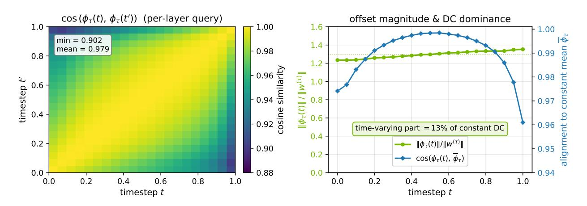

Figure 12 | 명시적 라우터 오프셋은 거의 타임스텝 불변이다. 21개의 타임스텝에 걸쳐, $\phi_{\tau}(t)$ 은 평균과 강하게 정렬되어 있으며, 시간에 따라 변하는 성분은 작다.

### F.5. 깊이 라우팅 패턴

Figures 6c와 13은 10개의 검증 클립에 걸친 평균 라우팅을 보여준다. 완성된 요약은 25–32 레이어에서 라우팅 질량의 거의 절반을 받는다 (주의는 56%, FFN은 50%), 그리고 상세 뷰는 가장 최근에 완성된 블록을 선호한다. 블록 진입 시 차이는 연산 순서를 따른다: 주의 라우팅은 새로운 부분 합이 존재하기 전에 발생하고, FFN 라우팅은 그 이후에 발생한다. 각 요약이 주의, 교차 주의, FFN 업데이트를 포함하므로, 이 증거는 단일 연산자에 할당하지 않고 교차 깊이 특징 재사용을 지원한다.

#### F.6. 완성된 블록 라우팅 절단

우리는 완료된 블록 합계에 할당된 라우팅 가중치를 0으로 설정하고, 나머지 소스를 재정규화한 뒤 동일한 입력에서 $h_l$의 유효 랭크를 $t \in \{0.3, 0.5, 0.7\}$에서 측정한다 (Figure 14a). 블록 진입 레이어(9, 17, 25)에서는 현재 부분 합계가 리셋되므로 제거하면 입력 임베딩만 남고 랭크가 82-91% 감소한다. 부분 합계가 블록 내에서 재구축된 후에는 효과가 작아진다. 이는 완료된 블록 재사용을 가장 필요로 하는 경계에 국한시키며, 회복된 랭크를 블록 내부의 한 연산자에 귀속시키지 않는다.

### F.7. 동일 체크포인트 랭크 프로브 (Same-Checkpoint Rank Probe)

게이트된, RoPE-회전된 선형 상태 $S = \sum_{n} v_n (\beta_n k_n^r)^{\top}$ 에 대해 우리는 정의한다

$$r_{\text{eff}}(S) = \exp\left(-\sum_{i} p_{i} \log p_{i}\right), \qquad p_{i} = \frac{\sigma_{i}(S)}{\sum_{j} \sigma_{j}(S)}.$$

(7)

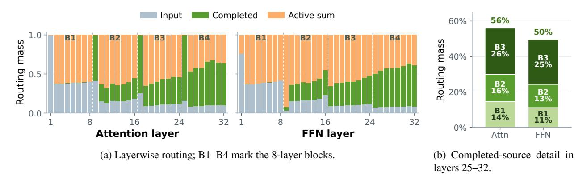

Figure 13 | **AttnRes 라우팅-소스 구성** (AttnRes routing-source composition) (10-클립 평균).  
(a)에서 점선은 블록 리셋을 표시하며, 첫 번째 어텐션 레이어는 입력 소스만을 운반한다.

구현에서는 먼저 어텐션 헤드 전반에 걸쳐 해당 특이값을 평균하고, 평균된 스펙트럼을 정규화한 뒤 $r_{\rm eff}$ 를 계산한다. 동일한 프로덕션 체크포인트와 프롬프트에서 깊이 집계를 켜고 끄며, 두 조건 사이에서 노이즈 시드 0–3을 짝지어 비교한다. Figure 6b는 각 선형 레이어에서 시드 간 평균과 표준편차를 보고하며, 깊은 레이어 요약은 레이어 $\geq 15$ 를 평균한다. AttnRes 경로를 제외한 가중치나 활성화는 변경되지 않아, 훈련된 라우터의 표현 수준 효과를 고립시킨다. 문맥을 위해 (Figure 14b)에서는 이 결과를 공개된 2B 순수 선형 모델과 별도로 훈련된 no-AttnRes 모델 옆에 배치한다. 이들은 폭, 훈련 기간, 체크포인트가 다르므로 비교는 문맥적이며 AttnRes 효과 추정이 아니다.

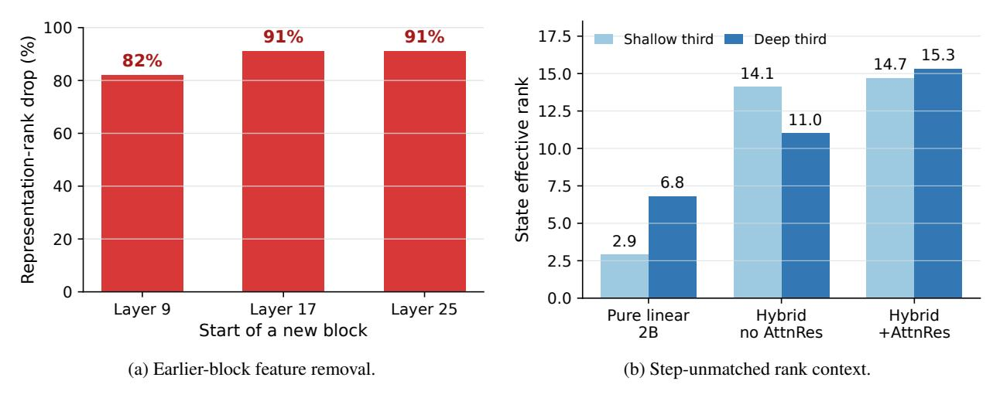

Figure 14 | **라우팅 개입 및 순위 컨텍스트.** (a) 블록 진입 시 완료된 블록 소스를 제거한 후의 Representation-랭크 감소. (b) 폭, 훈련 수평, 체크포인트가 다른 별도로 훈련된 모델들 간의 서술적 비교.

## G. 효율성 및 배포 분석

이 섹션은 관찰된 스케일링을 설명하는 통제된 분석과 직접적인 배포 측정을 통해 주요 효율성 그림을 보완한다. 부록 D.2는 프로토콜을 정의한다; 다른 하위 섹션의 결과는 표가 명시적으로 결합 측정을 보고하지 않는 한 합성되지 않는다.

#### G.1. 고정 시퀀스 길이에서 모델 크기 스케일링

Figure 5(c)는 폭과 깊이를 동시에 증가시키면서 720p/10초 시퀀스를 고정한다. 25% 하이브리드에 의해 절약된 절대 시간은 128ms에서 948ms로 증가하고, Full/Hybrid 속도 향상은 $1.88\times$에서 $1.45\times$로 좁아진다. 통제된 분해가 추세를 설명한다: 깊이는 두 레이아웃을 거의 동일하게 스케일링하지만, 폭은 더 많은 계산을 공유

FFN/프로젝션. 이 일치된 전방 프로파일은 시스템 스케일링을 분리한다.

#### G.2. 14B 크로스 하드웨어 스케일링

Figure 15는 H100과 GB200에서 동일한 40층, 폭-4,096 14B 하이브리드 구현을 비교한다. 측정된 해상도와 지속 시간 범위에서 GB200은 전방 지연을 $1.69-2.02\times$ (중앙값 $1.91\times$) 감소시키며, 125K 토큰 엔드포인트를 포함한다. 최고 할당 메모리는 두 장치 모두에서 약 27GiB에서 44GiB로 상승한다. 이는 장치별 운영 포인트에 의존하지 않고 하드웨어 세대 간에 장기 시퀀스 구현이 전이됨을 입증한다.

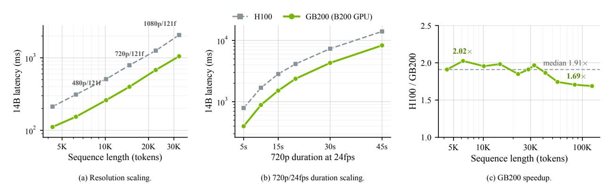

Figure 15 | 일치된 40층 14B 크로스 하드웨어 DiT-전방 프로파일링 (폭 4,096; 하나의 GPU, bf16, 배치 1; AttnRes 끔). (a) 해상도/프레임 스케일링. (b) 720p 지속 시간 스케일링. (c) H100/GB200 지연 비율. 두 장치는 동일한 입력과 125.1K 토큰을 통해 컴파일된 커널을 사용한다.

### G.3. 14B 하이브리드 대 Full-Softmax 스케일링

Figure 16은 40층 14B 백본의 파라미터 일치 하이브리드와 Full-Softmax 버전을 비교한다. 지속 시간이 5초에서 45초로 증가함에 따라 Full/Hybrid 속도 향상은 H100에서 $1.40\times$에서 $2.73\times$로, GB200에서 $1.58\times$에서 $3.07\times$로 상승한다. 결과는 대부분 선형적인 이점이 더 큰 아키텍처 규모에서도 지속되고 시퀀스 길이와 함께 강화된다는 것을 확인한다.

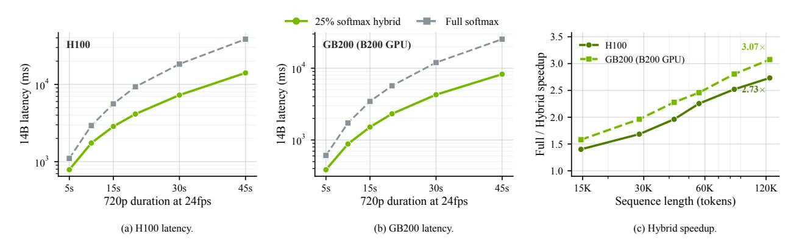

Figure 16 | 일치된 40층 14B 하이브리드 대 Full-Softmax DiT-전방 프로파일링 (폭 4,096; 하나의 GPU, bf16, 배치 1; AttnRes 끔). (a,b) H100과 GB200에서 720p/24fps 지속 시간 그리드에 대한 지연. (c) Full/Hybrid 지연 비율. 두 레이아웃은 동일한 폭, 깊이, 입력, Flash SDPA 구현을 사용한다.

### **G.4.** Temporal-Convolution FFN 제거

SANA-Video는 FFN 내부에 추가적인 Temporal-Convolution 경로를 사용하지만, SANA-Video 2.0은 시공간 혼합을 위해 어텐션에 의존하고 표준 SwiGLU FFN을 유지한다. 그 선택의 비용을 측정하기 위해 깊이와 폭을 고정하고 FFN 경로만 변경하며 두 모델 규모(표 9)에서 720p 지속 시간을 스윕한다. 변형은 다음과 같다

Table 9 | 720p에서 제어된 FFN 지연 교환 (하나의 H100; ms). Δ는 Temporal-Convolution 오버헤드이며, †는 제외된 60초 쌍을 표시한다.

| 백본 | FFN | 5초 | 15초 | 20초 | 30초 | 45초 | 60초 |
|--------------|----------------------------------------------|-----|-----|-------------------------|-----|-----|-------|
| 𝐿=20, 𝑑=2240 | SwiGLU | 52 | 126 | 161 | 242 | 367 | 510 |
|  | Temporal-conv | 64 | 157 | 202 | 302 | 455 | 627 |
|  | Δ | +12 | +31 | +42 | +60 | +88 | +117 |
| 𝐿=32, 𝑑=2560 | SwiGLU | 306 |  | 906 1258 2036 3416 |  |  | 4994† |
|  | Temporal-conv 396 1141 1573 2499 4091 10043† |  |  |  |  |  |  |
|  | Δ |  |  | +90 +236 +315 +463 +677 |  |  | —† |

Figure 17 | 제어된 전방 프로파일 프로토콜 하에서 22.1K/111.3K 토큰에 대한 즉시 모듈 구성.

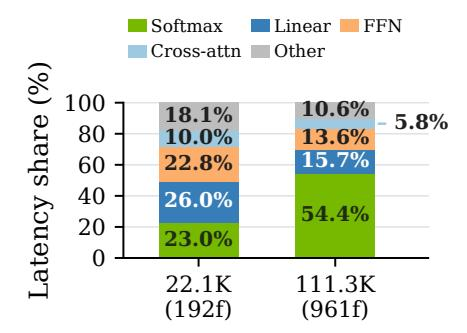

아키텍처 매칭은 파라미터 매칭보다 선호된다, 왜냐하면 시계열 컨볼루션이 가중치를 추가하기 때문이다. 그 오버헤드는 지속 시간에 따라 증가하며, 대규모에서는 20–29%에 이른다. 대규모 60초 시계열 컨볼루션 타이밍은 고립된 이상치이며, 해당 기준선과 함께 제외된다. 시계열 경로를 제거하면 백본이 단순화되고 선택된 어텐션 비율의 스케일링 이점이 보존된다.

### G.5. Module-Level Composition

Figure [17](#page-25-0)는 이거 모양 진단에서 상호 배타적인 최상위 모듈 비율을 보고한다 (모듈은 겹치지 않으므로 비율은 가산적이다). 22.1K에서 111.3K 토큰으로, 여덟 개의 소프트맥스 앵커가 전방 시간의 23.0%에서 54.4%로 증가하고, 선형 자체 어텐션은 26.0%에서 15.7%로 감소하여, 긴 모양에 대한 앵커‑특정 커널을 동기화한다.

### G.6. Compile-Friendly AttnRes

원래 추론 경로는 소스 버퍼를 변형하고 증가하는 접두사를 축소하는데, 이는 torch.compile이 융합하기 어렵다. 대신 최대 다섯 개의 소스를 정적 리스트로 노출하고, 모든 소스를 스택하지 않고 fp32에서 가중합을 누적한다. 버퍼 경로와 비교했을 때, 전체 전방 드리프트는 fp32에서 무시할 만하고 bf16에서는 0.68%이다. 재작성은 컴파일/이거 속도 향상을 8초에서 1.47×에서 2.11×로, 60초에서 1.21×에서 1.49×로 개선한다. 이 수치는 라우터 구현을 비교한 것이며, 전체 모델 배포를 비교한 것은 아니다.

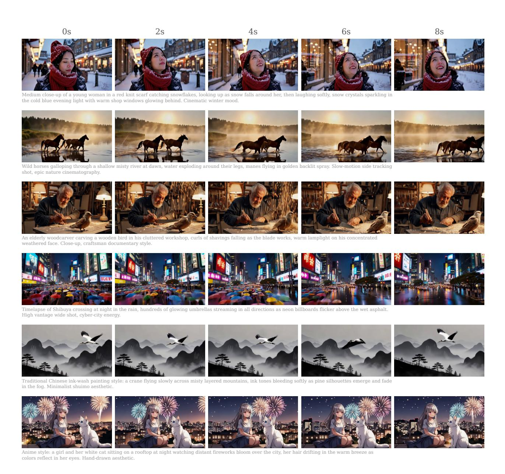

Figure 18 | 추가 720p 텍스트-투-비디오 샘플. 각 행은 8초 1280×736 클립을 0s/2s/4s/6s/8s에서 다섯 프레임으로 펼치며, 생성 프롬프트는 각 행 아래에 표시된다.

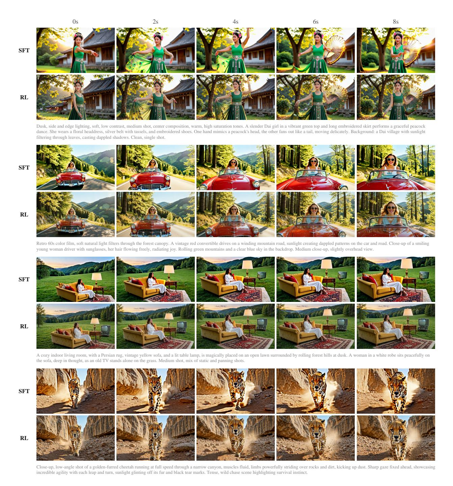

Figure 19 | 네 개의 프롬프트에 걸친 온라인 RL의 정성적 효과. 각 블록은 동일한 프롬프트와 분류기‑프리 가이드 스케일(CFG 8)을 사용한 SFT와 RL 체크포인트의 생성을 비교한다. 열은 0s/2s/4s/6s/8s에서 프레임을 보여주며, 전체 생성 프롬프트는 각 쌍 아래에 재현된다.

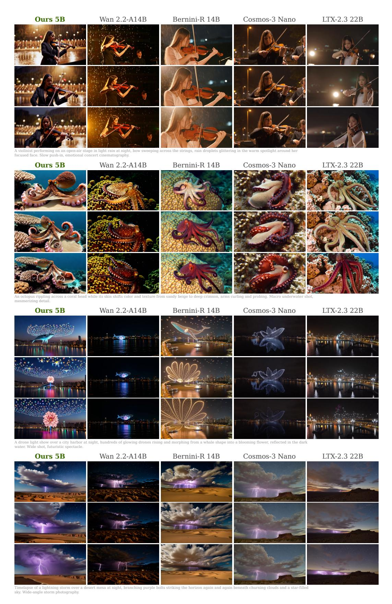

Figure 20 | 네 개의 보류된 프롬프트에 대한 교차‑방법 720p 텍스트‑투‑비디오 비교. 열은 방법을, 행은 각 클립의 0%/50%/100%를 보여준다; 프롬프트는 해당 블록 아래에 나타난다.

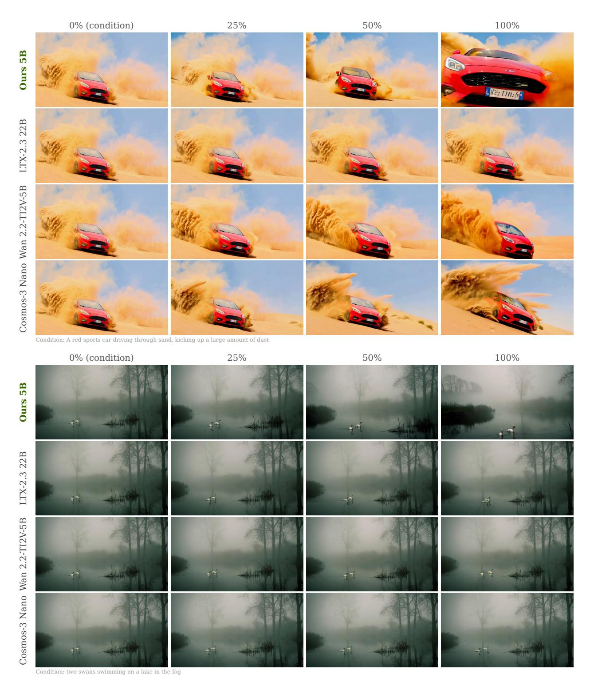

Figure 21 | 첫 번째 프레임 조건화된 비디오 비교, 쌍 1–2. 각 행은 해당 클립의 0%/25%/50%/100%에서 한 방법을 보여주며, 첫 번째 프레임은 공유된다. 프로토콜 세부 사항은 부록 [E.3.](#page-21-2)에 있다.

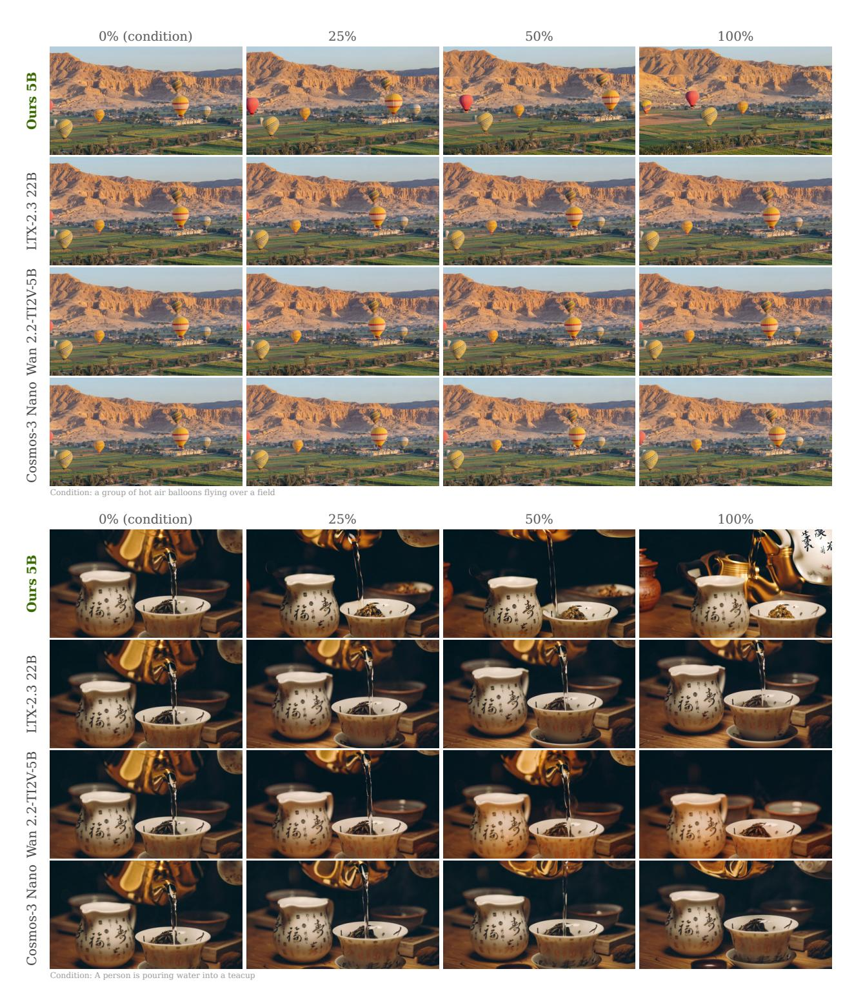

Figure 22 | 첫 번째 프레임 조건화된 비디오 비교, 쌍 3–4. 프로토콜은 Figure [21.](#page-29-0)와 동일하다.

