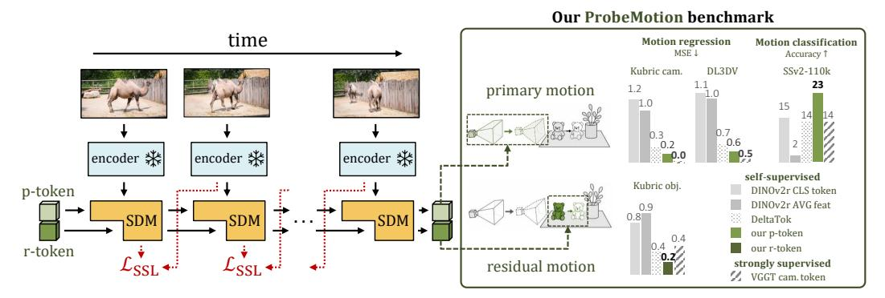
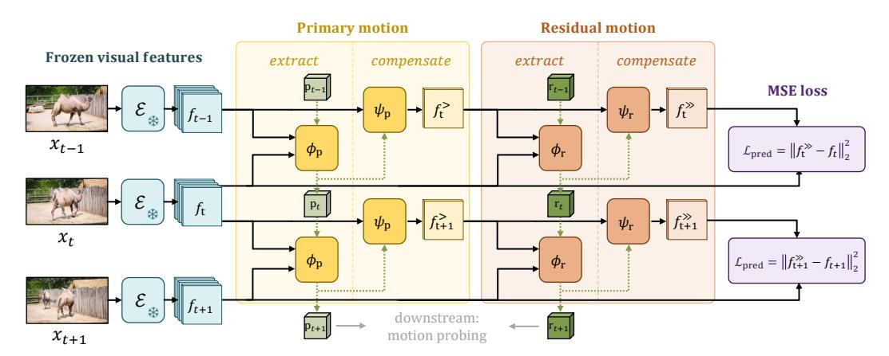
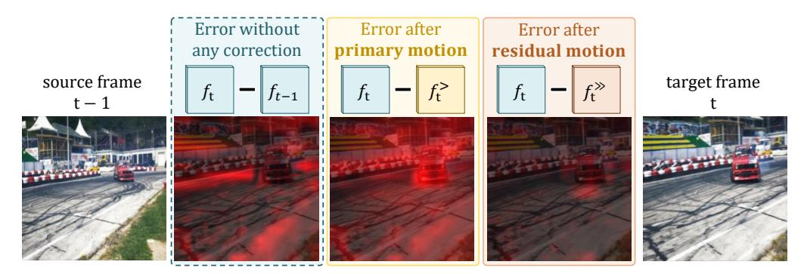
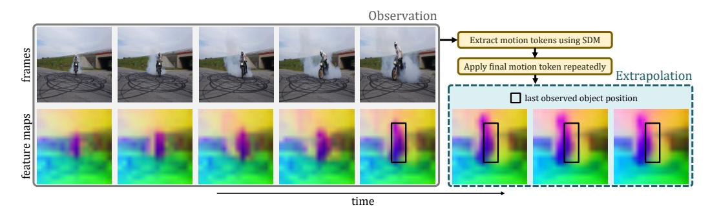
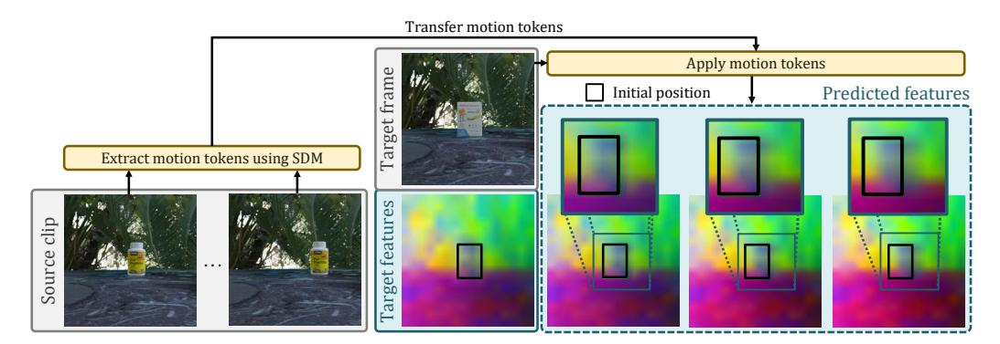
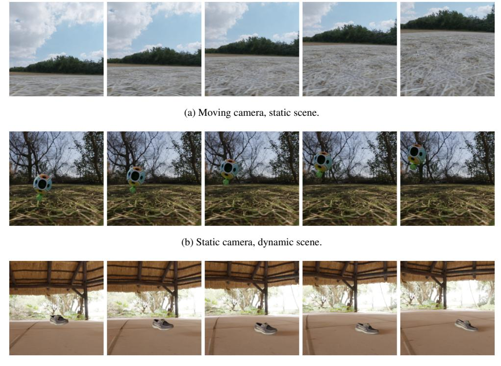
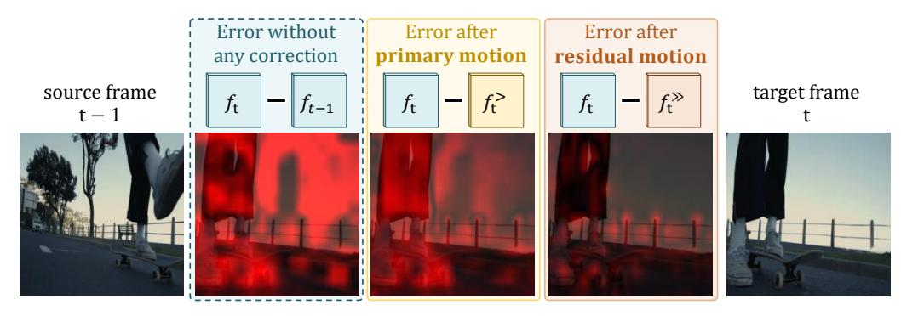

# 비디오에서 구조화된 동역학의 자기 지도 학습

- 원제: Self-Supervised Learning of Structured Dynamics from Videos
- 원문: [https://arxiv.org/abs/2607.21576](https://arxiv.org/abs/2607.21576)
- PDF: [https://arxiv.org/pdf/2607.21576v1](https://arxiv.org/pdf/2607.21576v1)
- arXiv ID: `2607.21576`

---

# 비디오에서 구조화된 동역학의 자기 지도 학습

Lukas Knobel

Fundamental AI Lab, UTN lukas.knobel@utn.de

### Andrew Zisserman

VGG, University of Oxford az@robots.ox.ac.uk

Yuki M. Asano

Fundamental AI Lab, UTN yuki.asano@utn.de

# 초록

비디오에서 움직임을 이해하는 것은 시각 학습에 있어 근본적인 도전이며, 프레임 간 변화가 두 가지 동역학 원천인 카메라 움직임과 객체 움직임을 얽히게 한다. 이 분해는 자연 비디오에서 이 두 요인이 밀접하게 결합되어 있고 별도로 감독하기 어려워서 표현 학습에서 충분히 탐구되지 않았다. 그러나 이를 회복하는 것은 의미 있는 객체 동역학을 카메라 유도 변동으로부터 분리하는 견고한 움직임 표현을 학습하는 데 중요하다. 우리는 사전 학습된 이미지 비전 트랜스포머의 고정된 특징에서 이러한 구조화된 움직임 표현을 회복할 수 있는지 연구한다. 우리는 Structured Dynamics Model (SDM)을 제안한다. SDM은 미래 특징 예측을 통해 시간적 변화의 지배적 원천을 잔여 동역학으로 명시적으로 분리하며, 비디오 변화를 단일 얽힌 잠재 변수나 구조화되지 않은, 공간적으로 밀집된 전이 토큰으로 표현하는 대신이다. 훈련은 실제 비디오에서의 자기 지도 학습과 합성 Kubric 데이터에서의 장면 동역학에 대한 약한 감독을 결합한다. 우리는 카메라 움직임, 객체 움직임 및 결합 동역학을 포함하는 합성 및 실제 비디오를 아우르는 새로운 평가 세트인 ProbeMotion에서 SDM을 평가한다. SDM은 전역 CLS 또는 평균 풀링 특징을 사용하는 백본 기준선보다 우수하며, VGGT와 같은 강력히 감독된 표현과 비교해도 여러 프로브에서 유리한 성능을 보인다. 이는 사전 학습된 이미지 모델이 구조화된 비디오 동역학 표현으로 쉽게 재활용될 수 있음을 시사하며, 잠재 비디오 동역학을 학습하고 분석하는 데 유용한 귀납적 편향을 제공한다.[1](#page-0-0)

## 1 Introduction

최근 컴퓨터 비전 분야의 진전은 대규모 이미지 데이터를 통해 풍부한 의미론적 및 기하학적 구조를 포착하는 강력한 자기 지도 이미지 백본을 만들어냈다 [\[5,](#page-10-0) [11,](#page-10-1) [25,](#page-11-0) [29,](#page-12-0) [32,](#page-12-1) [40,](#page-12-2) [43\]](#page-13-0). 이러한 표현은 점점 더 3D 인식 및 재구성 시스템의 기초로 사용되고 있다. 그러나 자기 지도 백본을 기반으로 하면서도 많은 성공적인 접근법은 여전히 적응 단계에서 상당한 감독에 의존한다. 예를 들어, 3D 주석, 구조-기반-모션 파이프라인에서의 가짜 정답, 또는 다른 기하학적 라벨을 통한 감독이 있다 [\[20,](#page-11-1) [23,](#page-11-2) [35,](#page-12-3) [38,](#page-12-4) [39\]](#page-12-5). 예를 들어 VGGT는 17개의 주석 데이터셋에서 학습한다 [\[35\]](#page-12-3). 이는 확장성을 제한하고, 밀집 감독에 의존하지 않고 일반 사전 학습된 시각 특징에서 장면 동역학을 얼마나 직접 회복할 수 있는지에 대한 질문을 남긴다.

비디오는 이 문제에 대한 자연스러운 감독 소스를 제공한다. 그러나 프레임 간 변화는 카메라 움직임과 객체 움직임이라는 두 동역학 원천을 얽히게 한다. 따라서 표준 자기 지도 예측 목표는 그 근본 원인을 분리하지 않고 집계된 변화를 모델링한다. 이러한 구조를 회복하는 것은 해석 가능한 물리적 요인을 중심으로 조직된 움직임 표현을 학습하는 데 중요하지만, 표현 학습에서는 아직 충분히 탐구되지 않았다. 특히 많은

1프로젝트 페이지: https://lukasknobel.github.io/projects/StructuredDynamics

Figure 1: Structured Dynamics Model (SDM)은 동결된 이미지 특징을 구조화된 모션 토큰으로 재구성합니다.  
왼쪽: 동결된 이미지 인코더가 프레임 특징을 추출하고, 순환 SDM은 자기 지도형 미래 특징 예측으로 학습됩니다.  
SDM은 시간적 변화를 주된 변화 원인에 대한 기본 모션 토큰 p와 나머지 동역학에 대한 잔여 모션 토큰 p로 구조화합니다.  
오른쪽: ProbeMotion에서의 선형 프로브는 이러한 구조화된 모션 토큰이 CLS 및 평균 풀링 특징과 같은 직접 동결된 백본 디스크립터를 능가하며, 3/7 과제(표 2 참조)에서 VGGT 프로빙 성능을 초과하고, 모션 인접한 의미적 행동 분류에 대해 더 강력한 일반화를 보여줍니다.

잠재 행동 또는 세계 모델은 장면 변화를 단일 잠재 토큰으로 요약하며 [12, 19], 주된 전역 변화를 잔여 객체 중심 동역학과 혼합합니다.

비디오 모델을 엔드-투-엔드로 훈련하는 대신, 사전 훈련된 이미지 백본이 장면 동역학의 명시적 구조화를 지원할 만큼 충분한 정보를 이미 포함하고 있는지 여부를 묻습니다. 이를 위해 우리는 동결된 백본 특징 위에 *structured dynamics* 모델(SDM)을 구축하고 미래 특징 예측을 통해 학습합니다. 우리는 카메라 또는 장면이 정지되어 있는지 여부만을 나타내는 약한 합성 데이터 감독과 결합할 때, SDM이 시간적 변화를 주된 및 잔여 모션 구성요소로 조직하여 각 비디오의 주된 변화 원인에 적응한다는 것을 발견했습니다.

우리는 카메라 모션, 객체 모션 및 결합 동역학을 포함한 합성 및 실제 비디오를 아우르는 벤치마크 평가 세트에서 이 설정을 평가합니다. 우리는 이 집합적 평가를 ProbeMotion이라고 부릅니다. 이러한 설정 전반에 걸쳐 SDM은 전역 CLS 또는 평균 풀링 특징에 기반한 단순한 기초 모델을 지속적으로 능가하며, 7개 벤치마크 중 3개에서 VGGT 기반 프로브를 초과합니다. 이 결과는 사전 훈련된 이미지 표현이 약한 합성 감독과 라벨이 없는 실제 비디오에 대한 자기 지도 학습만으로도 강력한 구조화된 비디오 동역학 표현으로 재구성될 수 있음을 시사합니다.

#### 우리의 기여는 다음과 같습니다:

- 우리는 동결된 사전 훈련 이미지 특징에서 구조화된 모션 표현을 추출할 수 있는지 연구합니다.  
- 우리는 자기 지도형 이미지 백본 위에 구축된 간단한 아키텍처인 Structured Dynamics Model (SDM)을 도입합니다. 이 모델은 미래 특징 예측을 통해 구조를 학습하며, 단순한 전역 특징 기반 기초 모델을 능가하고, 여러 모션 프로빙 과제에서 강력히 감독된 3D 표현과 경쟁력 있는 성능을 보입니다.  
- 우리는 카메라 모션, 객체 모션 및 결합 동역학을 포함한 합성 및 실제 비디오를 아우르는 평가 세트인 ProbeMotion을 개발합니다.

## 2 방법 (Method)

우리는 고정된 시각적 특징이 시간에 따라 어떻게 변하는지를 예측함으로써 구조화된 동작 표현을 학습한다. 비디오 인코더를 훈련시키는 대신, 사전 학습된 이미지 백본 위에 단순 모델인 SDM이 시계열 변화를 주요 동작과 잔여 동작 구성요소로 조직할 수 있는지, 이들이 장면 변화의 주된 원인과 남은 역학을 설명하는지 여부를 묻는다. 개요는 그림 2에 표시되어 있다.

#### 2.1 고정된 시각적 특징

Let  $\mathcal{E}$  denote a frozen vision transformer. For each frame  $x_t$ , we extract a spatial feature map:

$$f_t = \mathcal{E}(x_t) \in \mathbb{R}^{H \times W \times D},\tag{1}$$

H, W는 공간 차원이고 D는 특징 차원이다. SDM은 고정된 특징 공간에서 $f_{t-1}$ 에서 $f_t$ 를 예측한다. 모델은 재귀 동작 토큰에서 자기 회귀적이지만 비인과적이며, $f_t$ 는 $f_{t-1}$ 에서 $f_t$ 를 예측하는 데 사용되는 전이 토큰을 추출하는 데 사용된다.

조건부 특징 예측은 대상 전이(target transition)에 대한 정보를 필요로 한다. CroCo와 SiamMAE는 cross-view conditioning [15, 40]을 사용하고, 잠재-행동 모델(latent-action models)은 미래 예측을 위해 컴팩트 전이 토큰(compact transition tokens)을 사용한다 [12, 19]. 하나의 전이 토큰은 외관에 의존하는 특징 변동부터 카메라 전이(camera translation)나 물체 방향(object direction)과 같은 저차원 모션 요인까지 모든 변화 원인을 설명해야 한다. 우리는 대신 비디오의 시간적 변화가 고차원 시각적 특징에 작용하는 저차원 동역학에 의해 지배된다는 직관을 따른다. 이는 시간적 변화를 주요 및 잔여 모션 토큰으로 조직하는 *구조화된* 예측 모델을 동기화한다.

### 2.2 구조화된 동역학 모델 (Structured dynamics model)

Figure 2: T=3에 대해 표시된 구조화된 동역학 모델의 개요. 각 전이마다 SDM은 두 단계의 보상(stages)을 통해 이전 프레임 $f_{t-1}$에서 목표 고정(feature) 맵 $f_t$를 예측한다. *주요(primary)* 단계는 특징 쌍 $(f_{t-1}, f_t)$에서 순환 모션 토큰 $p_t$를 추출하고 이를 사용해 주요 보상된(feature) 맵 $f_t^>$를 생성하여 지배적인 변화를 설명한다. *잔여(residual)* 단계는 $f_t^>$와 $f_t$ 사이의 불일치에서 $r_t$를 추출하고 $f_t^>$를 최종 예측 $f_t^>$로 정제한다. 모션 토큰은 시계열적으로 자기회귀적이지만 비인과적(non-causal)이며, 시간 정보를 누적할 수 있다.

Figure 2는 SDM의 개요를 제시한다. 연속된 특징 맵 $(f_{t-1}, f_t)$가 주어지면 SDM은 두 단계의 순차 보상을 통해 $f_t$를 예측한다. *주요 단계*는 모션 추출기 $\phi_p$와 특징 예측기 $\psi_p$로 구성된다. 추출기는 현재 특징 쌍 $(f_{t-1}, f_t)$를 읽고 이전 주요 토큰 $p_{t-1}$을 업데이트하여 $p_t$를 만든다. 예측기는 $p_t$를 사용해 소스 특징 맵 $f_{t-1}$을 보상하여 중간 예측 $f_t^>$를 생성한다. 여기서 'f modified once'는 발음이다. *잔여 단계*는 동일한 구조를 가지며, 모듈 $\phi_r$와 $\psi_r$를 포함한다. 이는 $f_t^>$와 $f_t$ 사이의 남은 불일치에서 잔여 토큰 $r_t$를 추정하고, 이 토큰을 사용해 $f_t^>$를 최종 예측 $f_t^>$로 정제한다. 여기서 'f modified twice'는 발음이다.

**주요 모션 추출.** 주요 추출기는 현재 프레임 쌍에 주의를 기울여 순환 모션 토큰 $p_t \in \mathbb{R}^D$를 업데이트한다:

$$p_t = \phi_p(p_{t-1}; f_{t-1}, f_t), \tag{2}$$

$p_0$는 학습 가능한 파라미터이다. 이 순환 구조는 각 업데이트가 인접 프레임만 비교하면서도 시간에 걸쳐 모션 정보를 통합할 수 있게 한다. 결과 토큰은 이후 소스 특징 맵을 보상하는 데 사용된다.

**주요 모션 보상.** 예측기 $\psi_p$는 $p_t$를 사용해 소스 특징 맵을 보상한다:

$$f_t^{>} = \psi_p(f_{t-1}; p_t).$$

(3)

$f_t^>$는 주요 모션 보상된 중간 표현으로, 잔여 단계의 입력으로 사용된다. 이는 $f_{t-1}$에서 $f_t$로의 전이 중 주요 장면 변화 원천에 의해 포착될 수 있는 부분을 설명하도록 학습된다.

**잔여 모션 추출.** $f_t^>$가 주어지면, $f_t$에 대한 남은 불일치는 주요 구성요소에 의해 설명되지 않는 동역학을 의미한다. 우리는 이를 두 번째 잠재 토큰 $r_t \in \mathbb{R}^D$로 포착한다:

$$r_t = \phi_r(r_{t-1}; f_t^>, f_t),$$

(4)

$r_0$는 학습 가능한 파라미터이다. 이를 $f_t^>$에 조건화하면 $r_t$가 주요 구성요소가 고려된 이후 남은 잔여 동역학만을 나타내도록 유도한다.

**잔여 모션 보상.** 잔여 예측기는 중간 표현을 정제한다:

$$f_t^{\gg} = \psi_r(f_t^{>}; r_t). \tag{5}$$

따라서 최종 예측 $f_t^{\gg}$는 먼저 기본 동역학을 보상하고 그 다음 잔여 동역학을 보상함으로써 얻어집니다. 쌍 $(p_t, r_t)$는 논문 전반에 걸쳐 사용되는 구조화된 모션 표현을 형성합니다.

**프레임 쌍을 넘어선 확장.**  
SDM은 자연스럽게 더 긴 클립으로 확장된다. 우리는 각 타임스텝에서 동일한 업데이트를 적용하고 $p_{t-1}$과 $r_{t-1}$을 앞으로 전달한다. 따라서, 시간적 맥락은 재귀적 모션 토큰에 축적된다.

### 2.3 Training objective

SDM은 동결된 인코더 공간에서 특징 예측을 통해 학습된다. 주요 움직임과 잔여 움직임의 의도된 의미와 일치하도록 아키텍처 분해를 맞추기 위해, 우리는 두 개의 약한 장면 수준 주석인 정적 장면 (static scene)과 정적 카메라 (static camera)를 사용하고, 손실을 선택적으로 적용한다.

**라벨이 없는 비디오 또는 동적 비디오 (Unlabeled or dynamic videos.)** 라벨이 없는 비디오와 카메라 및 장면 동적이 모두 있는 샘플에 대해, 우리는 최종 예측만을 감독한다:  $\mathcal{L} = \mathcal{L}_{\text{MSE}}(f_t^{\gg}, f_t)$ , 여기서  $\mathcal{L}_{\text{MSE}}(x, y) = \frac{1}{HWD} \|x - y\|_2^2$ .

**정적 장면.** 정적 장면 샘플의 경우, 주요 구성요소는 전체 전이를 설명해야 하므로 잔차 단계는 건너뛰고 주요 보상 출력만 직접 감독한다:  $\mathcal{L} = \mathcal{L}_{\text{MSE}}(f_t^>, f_t)$ .

정적 카메라. 샘플이 정적 카메라로 주석이 달린 경우, 보정할 카메라에 의한 전역 변화가 없다. 따라서, 주요 단계는 소스 표현을 변경하지 않도록 정규화되고, 잔차 단계는 장면 동역학을 포착한다:  $\mathcal{L} = \mathcal{L}_{\text{MSE}}(f_t^{\gg}, f_t) + \lambda_{\text{reg}} \mathcal{L}_{\text{MSE}}(f_t^{>}, f_{t-1})$ .

### 2.4 Implementation details

**시각적 특징.** 우리는 레지스터 [8]을 사용하여 동결된 DINOv2-B/14를 $\mathcal{E}$ 로 사용하고, 모든 12개의 블록에서 패치 특징을 추출합니다. Mur-Labadia et al. [24]를 따라, 우리는 이 중간 특징들을 채널별로 연결하고, 두 층의 MLP를 사용해 D=768로 투영합니다. 이는 하나의 백본 블록의 은닉 차원과 일치하며, SDM을 적용하기 전에 수행됩니다. 그런 다음 모델의 예측은 손실을 적용하기 전에 연결된 다층 특징 공간으로 선형 투영됩니다.

**Motion extractor**  $\phi$ . Both  $\phi_p$  and  $\phi_r$  are 4-block transformer decoders with  $n_{\rm reg}=4$  학습 가능한 레지스터 [8].  
모션 토큰과 레지스터는 프레임 특징에 대해 자기 어텐션과 교차 어텐션을 수행하며, 공간 및 시간 위치에 대해 RoPE의 3D 확장을 사용하고 기준값 100을 적용합니다 [1, 30] [17].  
초기 기본 및 잔여 모션 토큰은  $\mathcal{N}(0, 0.02^2)$ 에서 초기화된 학습 가능한 파라미터입니다.

**Predictor**  $\psi$ . 우리는 $\psi_p$와 $\psi_r$를 해당 모션 토큰에 교차 주의(attend)하는 얕은 2블록 디코더로 매개변수화한다. 우리는 공간 위치에 대해 2D RoPE를 사용한다 [17].

Table 1: **ProbeMotion 평가 데이터셋.** 선형 프로브 데이터셋의 요약입니다. 소스 비디오에 대해 제공된 숫자는 클립 길이 필터링 후 해당 공개 또는 생성 데이터셋에서 추출한 샘플 수를 나타냅니다. 대시는 소스 데이터셋이 ProbeMotion에 적합한 분할을 제공하지 않음을 나타냅니다. 이러한 데이터셋에 대해 우리는 자체 프로빙 분할을 생성합니다. 괄호는 SSv2 카메라의 부분 동역학을 나타냅니다 (B.1절 참조). 이러한 데이터셋에 대한 분할 생성 등 추가 세부 사항은 A.3절에 제공됩니다.

|  | Kubric | DL3DV | 정적 DAVIS2017 | 정적 YouTubeVOS | 카메라 벤치 | SSv2- 110k |
|----------------------|---------------------|----------------|----------------------|----------------------|-------------------|-----------------|
| 소스 훈련 영상 | 15k | 3.5k | 60 | 3.5k | _ | 110k |
| 소스 테스트 영상 | 5k | _ | 30 | _ | 1k | 20k |
| 이동 카메라 | 1 | ✓ | × | X | ✓ | <b>(X</b> ) |
| 동적 장면 | 1 | X | ✓ | ✓ | ✓ | 1 |
| 클립당 프레임 수 | 4 | 5 | 4 | 4 | 5 | 7 |
| 탐지 대상 | cam.+obj. 운동 | cam. 운동 | obj. 이동 | obj. 이동 | cam. 운동 클래스 | 행동 class |

## 3 실험 (3 Experiments)

### 3.1 데이터셋 (Datasets)

우리는 합성 영상과 실제 영상을 혼합하여 훈련한다: Kubric [14], SSv2 [13], 그리고 DL3DV [22]. Kubric은 카메라 또는 장면이 정지되어 있는지를 나타내는 약한 장면 수준 라벨을 제공하며, SSv2와 DL3DV는 라벨 없이 사용된다. 우리는 180k Kubric 시퀀스를 생성하며, 이는 정지 장면(static-scene)과 동적 장면(dynamic-scene) 비디오로 균등하게 나뉜다. 정지 장면 비디오는 움직이는 카메라를 사용하고, 동적 장면 비디오는 추가로 움직이는 카메라(moving-camera)와 정지 카메라(static-camera) 설정으로 균등하게 나뉜다 (자세한 내용은 Section A.1 참조). 실제 영상 훈련은 약 170k SSv2 클립과 4k DL3DV 클립을 사용한다.

평가를 위해 우리는 ProbeMotion을 도입한다. ProbeMotion은 Kubric, DL3DV, CameraBench [21], DAVIS2017 [26] 및 YouTubeVOS [41, 42]의 정지 카메라(subset)와 SSv2-110k라는 SSv2 하위 집합을 포함한 구조화된 움직임 표현을 탐지하기 위한 다양한 벤치마크 모음이다. 표 1은 데이터셋을 요약한다. 분할 및 샘플링 세부 사항은 Section A.3에 있다.

Kubric은 분리된 훈련/테스트 객체와 배경, 그리고 무작위로 샘플링된 움직임을 사용하여 제어된 합성 카메라 및 객체 움직임을 평가한다. DL3DV와 CameraBench는 실제 카메라 움직임을 평가하고, 정지 DAVIS2017과 정지 YouTubeVOS는 대략 정지 카메라 하에서 2D 객체 움직임을 평가한다. 우리는 VGGT로 추정된 카메라 움직임을 사용해 클립을 필터링하고, 마스크 중심점 변위(mask‑centroid displacement)에서 2D 객체 움직임을 라벨링함으로써 정지 카메라(subset)를 구성한다 (자세한 내용은 Section A.2 참조). SSv2-110k는 움직임이 많은 행동 의미를 평가한다.

#### 3.2 훈련 및 평가 세부사항 (Training and evaluation details)

훈련 세부 사항. 미니배치는 Kubric, SSv2, DL3DV를 고정 비율 0.5/0.25/0.25로 혼합한다. Kubric 샘플은 위에서 설명한 세 가지 제어 설정에서 추출된다: moving-camera/static-scene, static-camera/dynamic-scene, moving-camera/dynamic-scene. 따라서 각 미니배치의 1/4는 정지 장면(supervision)으로, 1/8은 정지 카메라(supervision)로, 나머지 5/8은 표준 최종 예측 목표만으로 훈련된다. 이 마지막 그룹은 moving-camera/dynamic-scene Kubric 샘플과 모든 라벨이 없는 실제 영상 샘플로 구성되며, 우리는 분해에 추가적인 구조를 부과하지 않는다. 우리는 2fps에서 5프레임을 샘플링하고 입력을 $224 \times 224$로 리사이즈한다(추가 데이터 증강 없이). 우리는 AdamW를 사용해 모든 구성요소를 200k 반복, 배치 크기 128, 학습률 $6.25 \times 10^{-5}$, 1k warmup, 가중치 감쇠 0.05로 훈련하며 정규화 가중치를 $\lambda_{\rm reg} = 0.5$ 로 설정한다. 한 번의 실행은 4개의 H100 GPU에서 약 11시간이 걸린다.

**평가 프로토콜.** 우리는 ProbeMotion을 고정된 SDM 움직임 토큰에 선형 프로브를 사용해 평가한다. 별도로 명시되지 않는 한, 우리는 Kubric, DL3DV, CameraBench에서 카메라 움직임에 대해 p를, 정지 DAVIS2017/YouTubeVOS에서 객체 움직임에 대해 p를 프로브한다. 여기서 객체 움직임이 변화의 주된 원천이다. VGGT 기반 분석은 SSv2-110k에서 프레임 간 카메라 움직임이 낮음을 나타낸다(Section B.1 참조), 따라서 동일한 추론을 따라 행동 인식에 대해 p를 프로브한다. Kubric의 동적 카메라 장면에서 객체 움직임에 대해 r을 프로브하고, 토큰 교환은 Section 3.4에서 다룬다. 우리는 최종 타임스텝 성능과 3개의 시드에 대한 표준 편차를 보고한다. 우리는 이산 분류를 위해 선형 분류기를 사용한다.

연속 동작 목표를 위한 라벨과 선형 회귀기. Kubric과 DL3DV는 6-DoF 카메라 움직임에 대해 정규화된 MSE 회귀를 사용하며, Kubric 객체 움직임은 시뮬레이션된 객체가 회전하지 않으므로 3D 변환으로 평가됩니다. Static DAVIS2017과 YouTubeVOS는 마스크 중심 움직임에서 2D 객체 변위 회귀를 사용합니다. CameraBench와 SSv2-110k는 top-1 분류 정확도를 사용합니다. 전체 작업 정의는 부록의 Table [6](#page-14-1)에 있습니다. 모든 프로브는 동결된 특징에 대해 학습된 단일 선형 계층입니다. 분류 세트는 다운샘플링으로 클래스 균형을 맞추고, 회귀 세트는 낮은 움직임 샘플 수를 줄이기 위해 움직임 크기 서브샘플링을 사용합니다. 모든 방법은 동일한 프로토콜을 사용하며, 프로브 훈련 동안 가장 좋은 보류 메트릭을 보고하여 프로브 최적화 하이퍼파라미터에 대한 민감도를 줄입니다 (Section [A\)](#page-14-2) 참조).

### 3.3 Comparison to baselines

베이스라인. 이미지 백본은 프레임 수준 표현을 생성하므로, 연속 프레임 특징을 연결(concatenation) 또는 특징 차이(feature differences)를 사용해 동작 디스크립터로 변환합니다. 우리는 CLS 토큰 또는 평균 풀링된 패치 특징에서 파생된 직접 동결 백본 동작 디스크립터와 비교합니다. 디스크립터 소거 실험(Section [B.2\)](#page-18-1)을 기반으로 CLS 특징에는 연결(concatenation)을, AVG-풀링 특징에는 특징 차이(feature differences)를 사용합니다. 멀티 프레임 변형은 SDM의 시간적 맥락과 일치하도록 이러한 프레임-쌍 디스크립터를 시간에 걸쳐 평균화합니다. 또한, 단일 델타 토큰으로 프레임 간 변화를 나타내는 자기 지도 DeltaTok [\[19\]](#page-11-3)을 평가합니다. SDM과 비교하면 DeltaTok은 8배 더 많은 반복(iterations) 동안 훈련되고 고해상도 입력을 사용하므로 강력한 베이스라인이 됩니다 (Section [A.7\)](#page-17-0) 참조). 우리는 또한 강력히 지도된 3D 및 기하학 모델: VGGT-1B, Depth Anything 3 (DA3) [\[20\]](#page-11-1), Pi3X [\[39\]](#page-12-5)와 비교합니다. 각 모델에 대해 평균 풀링된 특징 맵과 카메라 토큰에서 파생된 디스크립터를 별도의 행으로 보고하며, Section [B.2.](#page-18-1)을 기반으로 각 벤치마크에 대해 연결(concatenation)과 특징 차이 중 더 나은 것을 선택합니다. Pi3X는 카메라 토큰을 제공하지 않으므로, 평균화된 레지스터 토큰을 해당 디스크립터로 사용합니다. 이 모델들은 SDM보다 훨씬 큽니다 (각각 약 1B 파라미터 vs. 215M 파라미터, 87M 동결 백본 포함) 그리고 카메라 포즈, 깊이, 포인트 클라우드와 같은 명시적 기하학적 감독으로 훈련되므로, 훨씬 강력한 감독 하에서의 성능을 맥락화하기 위해 포함됩니다.

SDM은 직접 동결 백본 디스크립터보다 우수합니다. ProbeMotion 전반에서 SDM은 static DAVIS2017을 제외한 모든 과제에서 CLS와 AVG-풀링 베이스라인보다 향상됩니다. static DAVIS2017에서는 AVG-풀링이 2D 객체 변위 회귀에서 가장 좋은 성능을 보입니다. 이 예외는 static DAVIS2017의 소규모, 선별된 특성과 이미지 평면 변위 예측의 상대적 단순성을 반영할 수 있습니다. 직접 베이스라인은 Kubric 및 DL3DV와 같은 3D 동작 프로브에서 여전히 크게 약합니다. 이는 이득이 강력한 동결 특징만이 아니라 구조화된 미래 특징 예측에서 비롯된 것임을 시사합니다. 이는 모든 12 블록의 다층 DINOv2 특징에 접근할 수 있는 직접 베이스라인에서도 동일합니다 (Table [9\)](#page-20-0) 참조). 이 개선은 라벨이 없는 SDM 훈련에 사용된 데이터셋을 넘어 확장되며, 예를 들어 static YouTubeVOS는 AVG-풀링보다 MSE를 0.2만큼 줄여서 향상됩니다.

SDM은 더 작은 훈련 예산에도 불구하고 대부분의 프로브에서 DeltaTok보다 우수합니다. SDM은 7개의 ProbeMotion 과제 중 5개에서 DeltaTok보다 뛰어나며, Kubric 객체 움직임(0.16 낮은 MSE)과 SSv2-110k(9.6 p.p. 높은 정확도)에서 가장 큰 이득을 보입니다. DeltaTok은 static DAVIS2017과 CameraBench에서 더 나은 성능을 보입니다. 전반적으로, 이 결과는 구조화된 잠재 변수가 광범위한 동작 및 행동 프로브에서 강력한 성능을 제공함을 시사합니다.

SDM은 ProbeMotion에서 감독된 3D 표현과 경쟁력 있다. 감독된 3D 및 기하학 기준보다 더 약한 감독과 적은 파라미터를 사용함에도 불구하고, SDM은 DL3DV 프로빙에서 감독 모델 성능에 근접하며 CameraBench에서도 유사한 성능을 보인다. 또한 SDM은 세 개의 객체-운동 프로브 중 두 개에서 최고 성능을 보이며, 가장 강력한 감독 기준보다 Kubric 객체-운동에서 0.13 MSE, 정적 YouTubeVOS에서 0.04 MSE를 개선한다. 정적 DAVIS2017에서는 SDM이 DA3와 동등하지만 VGGT와 Pi3X가 더 나은 성능을 보인다. 이는 구조화된 특징 예측이 감독된 디스크립터만으로는 완전히 포착되지 않은 움직임 관련 정보를 복구한다는 것을 시사한다.

주요 토큰은 객체 중심의 동작 예측으로 일반화된다. SSv2-110k에서 SDM은 CLS와 AVG‑pool 각각 8.2 p.p.와 20.8 p.p.를 개선하고, DeltaTok보다 9.6 p.p.를 초과하며, 가장 우수한 감독 디스크립터인 Pi3X 평균‑특징 연결보다 3.3 p.p.를 유지한다. 비록 특징 연결이 SDM 프로브에 비해 선형 프로브의 입력 차원을 두 배로 늘리지만.

표 2: ProbeMotion에서의 선형 프로빙 결과. 우리는 DINOv2에서 레지스터와 함께 제공되는 직접 동결된 백본 디스크립터, 자기‑지도 DeltaTok 모델 [\[19\]](#page-11-3), 그리고 강력한 감독 3D/기하학 모델과 SDM을 비교한다. 직접 DINOv2 기준의 경우, CLS 특징에 대해 연결(concatenation)을 사용하고 AVG‑pool된 특징에 대해 특징 차이(feature differences)를 사용한다. 감독 모델의 경우, 평균‑pool된 특징‑맵 디스크립터와 카메라‑토큰 디스크립터에 대해 별도의 행을 보고한다. 각 항목은 해당 행과 벤치마크에 대해 연결과 특징 차이 중 더 나은 것을 선택하며, Section [B.2.](#page-18-1)을 기준으로 한다. Pi3X는 카메라 토큰을 제공하지 않으므로 두 번째 행은 평균 레지스터 토큰을 사용한다. DeltaTok의 경우, 우리는 직접 그 델타 토큰을 프로빙한다. SDM은 대부분의 카메라‑운동, 객체‑운동, 그리고 동작 프로브에서 직접 동결된 백본 디스크립터를 능가하며, 7개 과제 중 5개에서 DeltaTok을 능가한다. 동시에, 상당히 약한 감독과 적은 파라미터를 사용함에도 불구하고 강력한 감독 표현과 경쟁력 있는 성능을 유지한다. 우리는 표준화된 회귀 목표에 대한 MSE와 분류 과제에 대한 정확도를 %로 보고한다. 명시적 기하학 감독이 없는 방법 중 최고 및 두 번째 최고 결과는 각각 굵게와 밑줄로 강조된다.

|  | Regression (MSE ↓) |  |  |  |  | Classification (accuracy ↑) |  |  |
|---------------------|----------------------|----------|----------|---------------------|----------------------|-----------------------------|-----------------------------|--|
| Method | Kubric 카메라 객체 |  | DL3DV | 정적 DAVIS2017 | 정적 YouTubeVOS | 카메라 벤치 | SSv2-110k (액션 예측) |  |
| 강력히 감독된 |  |  |  |  |  |  |  |  |
| VGGT 평균 특징 | 0.09±0.0 | 0.32±0.0 | 0.56±0.0 | 0.78±0.1 | 0.79±0.0 | 82.9±0.0 | 15.5±0.1 |  |
| VGGT 카메라 토큰 | 0.03±0.0 | 0.43±0.0 | 0.53±0.0 | 0.71±0.0 | 0.81±0.0 | 88.7±0.7 | 13.5±0.1 |  |
| DA3 평균 특징 | 0.11±0.0 | 0.40±0.0 | 0.55±0.0 | 0.87±0.1 | 0.89±0.0 | 83.3±0.4 | 14.0±0.1 |  |
| DA3 카메라 토큰 | 0.04±0.0 | 0.58±0.0 | 0.53±0.0 | 0.87±0.0 | 0.91±0.0 | 84.4±1.3 | 12.2±0.4 |  |
| Pi3X 평균 특징 | 0.07±0.0 | 0.38±0.0 | 0.52±0.0 | 0.52±0.0 | 0.75±0.0 | 87.9±0.7 | 19.8±0.1 |  |
| Pi3X 평균 회귀기 | 0.08±0.0 | 0.45±0.0 | 0.53±0.0 | 0.61±0.0 | 0.77±0.0 | 85.7±0.4 | 12.7±0.3 |  |
| 기준선 |  |  |  |  |  |  |  |  |
| DeltaTok | 0.29±0.0 | 0.35±0.0 | 0.65±0.0 | 0.69±0.0 | 0.75±0.0 | 89.6±0.9 | 13.5±0.2 |  |
| AVG-pool | 0.96±0.0 | 0.93±0.0 | 1.04±0.0 | 0.78±0.0 | 0.91±0.0 | 67.0±1.2 | 2.3±0.0 |  |
| CLS | 1.16±0.0 | 0.78±0.0 | 1.09±0.0 | 0.90±0.1 | 1.05±0.0 | 68.6±0.8 | 14.9±0.2 |  |
| SDM | 0.16±0.0 | 0.19±0.0 | 0.59±0.0 | 0.87±0.1 | 0.71±0.0 | 85.3±1.7 | 23.1±1.3 |  |

### 3.4 SDM 분석 (Analysis of SDM)

시간적 맥락을 활용한다. Table [3](#page-7-0)은 최종 타임스텝을 예측할 때 SDM이 더 긴 시간적 맥락을 활용할 수 있는지를 평가한다. SDM은 시간적으로 일관된 벤치마크에서 추가 맥락의 혜택을 본다. 카메라와 객체 움직임이 선형인 Kubric에서는 T = 2에서 T = 4로 맥락을 늘리면 카메라 움직임에 대한 MSE가 0.26에서 0.16으로, 객체 움직임에 대한 MSE가 0.22에서 0.19로 감소한다. 카메라 움직임 라벨이 클립 수준인 CameraBench에서는 84.7%에서 85.3%로 향상된다. SSv2-110k에서는 T = 2에서 16.7%에서 T = 7에서 23.1%로 정확도가 단조롭게 증가하며, 이는 T = 5의 훈련 범위를 넘어선다. AVG-풀링된 특징 차이를 기반으로 한 다중 프레임 기준선도 추가 맥락의 혜택을 보이며, 추가 프레임이 유용한 움직임 신호를 포함하고 있음을 보여준다. 그러나 여전히 SDM보다 크게 낮다. 최대 시간적 맥락을 가진 기준선은 모든 데이터셋에서 단일 프레임 쌍(T = 2)으로 SDM보다 성능이 떨어진다. 따라서 SDM의 이득은 단순히 추가 프레임에 접근할 수 있다는 것만으로는 설명되지 않는다. Section [B.3](#page-18-2)에서 추가 결과는 더 복잡한 움직임을 가진 데이터셋에서 이득이 덜 단조롭다는 것을 보여준다.

구조화된 움직임. SDM의 핵심 목표는 주도적인 움직임 체계에 따라 특화되는 *구조화된* 움직임 잠재 변수를 생성하는 것이다. 우리는 각 탐지 작업에 사용되는 토큰을 교환함으로써 이를 테스트하고, 학습된 역할이 주요/잔여 해석을 지원함을 발견했다. 결과는 Table [5.](#page-7-1)에 제시되어 있다. 동적 카메라 데이터셋에서는 p 토큰이 카메라 움직임 예측에서 r 토큰보다 현저히 우수하며, 반면 Kubric 객체 움직임에서는 r 토큰이 주요 구성요소가 설명하지 못한 동역학을 포착해 가장 좋은 성능을 보인다. 대략 정적 카메라에서는 객체 움직임이 우세해지고, p 토큰이 정적 YouTubeVOS에서 가장 좋은 성능을 보인다. 유사하게, 카메라 움직임 분석이 프레임 간 카메라 움직임이 낮음을 나타내는 SSv2-110k에서는 p 토큰이 행동 인식에서 가장 좋은 성능을 보인다. 정적 DAVIS2017은 잔여 토큰에 대해 시드 간 변동성이 높아 예외적이다(0.8 ± 0.15, Section [B.4\)](#page-19-0 참조). 두 토큰을 연결하면 유사한 성능을 보이며, 이는 작업 관련 정보가 두 토큰 중 하나에 주로 인코딩된다는 것을 시사한다. 주목할 만한 예외는 Kubric 객체 움직임으로, 세계 좌표계에서 객체 변위를 예측할 때 잔여 객체 움직임 신호와 주요 카메라 움직임 구성요소 모두가 이득을 줄 수 있다.

Table 3: SDM은 시간적 맥락을 활용하여 움직임 정보를 집계한다. 우리는 Kubric과 CameraBench에 대해 단일 프레임 쌍(T = 2)과 최대 맥락을 비교하고, SSv2-110k에서 T = 5의 훈련 범위를 초과하는 시퀀스에서 평가한다. 기준선은 프레임 쌍에 대해 평균된 AVG-풀링된 특징 차이 디스크립터이다. 우리는 Kubric에서 회귀를 위해 표준화된 프레임 간 포즈 델타에 대한 MSE와 CameraBench 및 SSv2-110k에 대한 % 정확도를 보고한다.

| Table 4: SDM works across back |
|-------------------------------------------------|
| bones. DL3DV MSE를 보고합니다 |
| 표준화된 프레임-투-프레임 포즈에 대해 |
| 델타 및 CameraBench / SSv2- |
| 110k 정확도 (%) MAE [16], |
| SigLIP [44]와 DINOv3 [29]는 |
| 기본 버전 을 사용하며 패치 크기 |
| 16입니다. DINOv2는 레지스터를 사용한 버전 [8] (DI |
| NOv2r)에서 패치 크기 14를 사용합니다. |
|  |

| 방법 (method) | T=2 | Kubric 카메라. ↓ T=4 | T=2 | Kubric 객체. ↓ T=4 | T=2 | CameraBench ↑ T=5 |
|----------|------|----------------------|-----------|----------------------|-----------|----------------------|
| 기준선 (baseline) | 0.96 | 0.87 -0.09 | 0.93 | 0.72 -0.21 | 67.1 | 69.2 +2.1 |
| SDM | 0.26 | 0.16 -0.10 | 0.22 | 0.19 -0.03 | 84.7 | 85.3 +0.6 |
| 방법 | T=2 | T=3 | T=4 | SSv2-110k ↑ T=5 | T=6 | T=7 |
| 기준선 | 2.4 | 5.9 +3.5 | 8.4 +2.5 | 10.9 +2.5 | 11.7 +0.8 | 13.3 +1.6 |
| SDM | 16.7 | 18.6 +1.9 | 20.4 +1.8 | 21.6 +1.2 | 22.5 +0.9 | 23.1 +0.6 |

| 백본 | DL3DV↓ | 카메라 벤치 ↑ | SSv2 110k↑ |
|----------|--------|-------------------|---------------|
| MAE | 0.61 | 87.6 | 14.1 |
| SigLIP | 0.64 | 85.1 | 11.6 |
| DINOv3 | 0.58 | 86.8 | 27.0 |
| DINOv2r | 0.59 | 85.3 | 23.1 |

Table 5: SDM은 p와 r이 각각 기본 및 잔여 움직임에 특화되는 구조화된 움직임 표현을 이끕니다. 이 특징들을 사용해 선형 회귀 또는 움직임 또는 행동 분류를 수행할 때, 표준화된 회귀 목표에 대한 MSE와 분류 작업에 대한 정확도를 %로 보고합니다. 개별 토큰 중 가장 좋은 결과는 굵게 표시됩니다. 일치하는 표현과 목표는 초록색으로 강조됩니다. 마지막 행은 연결된 토큰 [p, r]을 사용한 상한값 프로브를 보고합니다.

| 토큰 |  |  | 회귀 (MSE ↓) | 분류 (정확도 ↑) |  |  |  |
|-------------------------|------------------|------------------|--------------------|-----------------------------|----------------------|-----------------|--------------|
|  | Kubric 카메라 | Kubric 객체 | DL3DV | Static DAVIS2017 | Static YouTubeVOS | Camera Bench | SSv2-110k |
| primary p residual r | 0.16 0.28 | 0.21 0.19 | 0.59 0.62 | 0.87 0.80 | 0.71 0.79 | 85.3 81.1 | 23.1 12.0 |
| concat. [p, r] | 0.16 | 0.14 | 0.56 | 0.81 | 0.71 | 88.0 | 22.1 |

#### 3.5 분석 및 제거 연구

우리는 아래에 주요 제거 연구 결과를 요약하며, 부록 표 [13](#page-22-0)에는 전체 구성 요소 표가, 백본 제거 연구는 표 [4.](#page-7-0)에 있습니다.

약한 앵커와 순차 추출은 특화성을 촉진합니다. 약한 장면 수준 제약을 제거하면 기본/잔여 구조가 약화되고, 공동 추출은 두 토큰이 더 겹치는 움직임을 인코딩하도록 만듭니다.

중간 단계 특징과 실제 데이터는 성능을 향상시킵니다. 중간 인코더 특징은 최종 레이어 특징만보다 우수하며, 라벨이 없는 실제 비디오는 합성 훈련을 넘어 일반화를 개선합니다. MSE는 Kubric 객체-움직임 탐지에서 크게 향상되지만, L1은 일부 실제 비디오 탐지에서 약간 더 강합니다.

정적 카메라 정규화는 탐지를 균형 잡습니다. λreg를 변형하면 Kubric 객체-움직임 탐지와 SSv2-110k 행동 인식 사이의 트레이드오프가 드러납니다. 우리는 균형 잡힌 기본값으로 λreg = 0.5를 사용합니다.

SDM은 사전 학습된 백본 전반에 걸쳐 작동합니다. 표 [4](#page-7-0)는 SDM이 다양한 이미지 인코더에 적용될 수 있음을 보여줍니다. DINOv2/3 기반 백본이 전반적으로 가장 우수합니다.

### 3.6 정성적 평가

우리는 탐지를 보완하기 위해 다양한 테스트 샘플에 대한 정성적 분석을 수행하며, 두 예측 단계가 상호 보완적인 변화를 설명하는지와 움직임 토큰이 관측된 전이 이후에도 재사용될 수 있는지를 시각화합니다.

그림 3: **단계별 구조화된 특징 예측.** 우리는 DAVIS2017의 샘플에서 기본 및 잔여 보상 후 목표에 대한 특징 맵 오류를 시각화합니다. 오류는 빨간색으로 강조됩니다. **기본** 단계는 트랙 가장자리의 카메라 유발 움직임을 포함한 지배적인 전역 변화를 수정합니다. 특히, 기본 움직임 보상은 독립적으로 움직이는 차 주변의 오류를 증가시킵니다. **잔여** 단계는 이 국소 오류를 감소시킵니다.

**단계별 특징 보상.** 그림 3은 기본 단계가 지배적인 전역 변환을 설명하고, 잔여 보상이 독립적으로 움직이는 객체 주변의 국소 오류를 감소시킴을 보여줍니다.

**운동 외삽.** 마지막으로 관측된 움직임 토큰을 반복적으로 적용하면 (그림 4) 합리적인 단기 특징 외삽이 생성되지만, 예측은 장기적으로 드리프트됩니다. 이는 토큰이 안정적으로 지역 시간 역학을 포착하지만, 새로운 관측 없이 신뢰할 수 있는 장거리 외삽을 지원하지 않음을 시사합니다.

그림 4: **운동 외삽.** 우리는 관측된 프레임에서 마지막 움직임 토큰을 반복적으로 적용하여 DAVIS2017 테스트 분할의 샘플에서 미래 특징 맵을 예측합니다. 시각화는 정규화 후 PCA를 RGB로 투영하여 수행됩니다. 검은 상자는 마지막으로 관측된 실제 객체 위치를 표시하며, 이는 외삽된 특징 맵에 반복됩니다. 외삽된 객체 특징은 단기적으로 객체의 움직임을 마지막 관측 위치를 넘어 따라가며, 장기적으로는 드리프트됩니다.

**잠재적 움직임 교환.** 소스 클립의 움직임 토큰을 다른 객체를 가진 타깃 클립에 적용하면 일관된 단기 특징 공간 움직임이 유도됩니다 (그림 5). 이는 학습된 토큰이 비디오 전반에 걸쳐 지역적이고 일반화 가능한 변환을 매개화할 수 있음을 시사하지만, 장기적으로는 품질이 감소합니다.

## 4 관련 연구

**자기 지도 이미지 인코더.** DINOv2 [25], AIM [10], MAE [16]와 같은 자기 지도 이미지 인코더는 강력한 고정 시각 특징을 제공합니다. 이러한 이미지 특징은 유용한 3D 단서를 포함하고 최근 재구성 시스템 [20, 23, 35, 39]을 지원하지만, 시간적 또는 움직임 구조를 직접적으로 드러내지는 않습니다.

**자기 지도 비디오 인코더.**  
자기 지도 비디오 인코더는 라벨이 없는 비디오에서 직접 시공간 표현을 학습하며, 종종 마스킹된 비디오 모델링[7, 31, 36, 47] 또는 잠재적

Figure 5: 잠재적 모션 스와핑. 우리는 소스 클립의 모션 토큰을 다른 객체를 가진 타깃 클립의 피처 맵에 적용하고, 정규화 후 PCA 투영을 통해 RGB로 시각화한다. 검은 상자는 초기 객체 위치를 표시한다. 타깃 피처 맵은 짧은 시간 범위에서는 전송된 모션을 따르고, 긴 시간 범위에서는 흐려진다.

예측 목표 [\[1,](#page-10-4) [3,](#page-10-8) [24,](#page-11-5) [34\]](#page-12-10). 이러한 방법들은 일반적인 비디오 표현을 학습하지만, SDM은 이미지 백본을 고정하고 그 위에 명시적인 기본/잔여 모션 토큰을 학습한다.

비디오에서 이미지 인코더 훈련. 여러 연구가 영상 데이터를 통해 이미지 사전학습 모델을 적응시킨다. 예를 들어, 시간적 피처 일관성[\[27,](#page-12-11) [28\]](#page-12-12) 또는 SiamMAE의 대응 학습[\[15\]](#page-11-4)을 통해서다. 다른 연구는 길고 비선별된 비디오가 스크래치부터 강력한 이미지 인코더를 훈련시킬 수 있음을 보여준다[\[33\]](#page-12-13). 우리는 대신 이미지 백본을 고정하고 그 위에 구조화된 모션 토큰을 학습한다.

3D 재구성 모델. DUSt3R[\[38\]](#page-12-4), VGGT[\[35\]](#page-12-3), CUT3R[\[37\]](#page-12-14)와 같은 모델은 3D 재구성을 위해 설계되었으며, 강력한 3D 감독으로부터 카메라 포즈, 깊이, 포인트 맵 및 관련 기하학을 추정한다. 최근 확장들은 동적 장면과 4D 재구성을 목표로 한다[\[18,](#page-11-13) [45\]](#page-13-4). 반면 SDM은 전체 3D 기하학을 재구성하지 않으며, 훨씬 약한 감독을 사용해 고정된 이미지 피처를 기본/잔여 모션 토큰으로 재구성한다.

잠재적 행동 및 세계 모델. 잠재적 행동 및 세계 모델은 미래 프레임 또는 사전학습된 피처 표현을 예측함으로써 비디오에서 학습하며, 밀집 주석을 피하고, 피처 공간 방법에서는 픽셀 수준 생성을 회피한다[\[2,](#page-10-9) [12,](#page-10-2) [19\]](#page-11-3). 이전 연구는 종종 공간적 미래 토큰이나 압축된 잠재적 행동으로 시간 변화를 표현했다[\[2,](#page-10-9) [4,](#page-10-10) [12,](#page-10-2) [19,](#page-11-3) [46\]](#page-13-5). SDM은 피처 공간 미래 예측에 가장 가깝지만, 변화를 단일 잠재적 행동에 인코딩하는 대신 모션을 기본 및 잔여 구성요소로 명시적으로 구조화한다.

## 5 결론

우리는 고정된 사전학습 이미지 백본에서 구조화된 모션 표현을 추출할 수 있는지 연구하고, Structured Dynamics Model (SDM)을 제안했다. SDM은 미래-피처 예측을 통해 구조화된 기본/잔여 모션 잠재를 학습하며, 합성 비디오에서 약한 장면 수준 감독과 라벨이 없는 실제 데이터를 함께 사용한다. 우리의 결과는 고정된 이미지 백본이 구조화된 비디오-동역학 표현으로 재구성될 수 있음을 시사하며, 전체 비디오 사전학습 없이도 해석 가능한 시간 추상화를 부여하면서 상당히 큰 감독 기하학 모델과 경쟁력 있게 유지한다.

학습된 토큰은 장면 동역학에 따라 특화된다. 기본 토큰은 동적 카메라 비디오에서 카메라 모션을, 정적 카메라 비디오에서 객체 모션을 캡처하며, 잔여 토큰은 기본 모션이 카메라 유발 변화를 설명할 때 남은 객체 중심 동역학을 포착한다. 이는 광학 흐름 추정에서 확산 모델에 이르기까지 다른 영역에서 반복적인 거친-정밀 정제의 효과를 반영하며, 잔여 보상은 유용한 귀납적 편향임을 보여준다.

# 감사의 글 및 자금 공개

LK은 ELLIS PhD Program을 통해 받은 지원에 감사한다. 저자들은 Friedrich-Alexander-Universität Erlangen-Nürnberg (FAU)의 Erlangen National High Performance Computing Center (NHR@FAU)가 BayernKI 프로젝트 v115be 하에 제공한 과학적 지원과 HPC 자원에 감사한다. BayernKI 자금은 바이에른 주 정부 기관에 의해 제공된다. 본 연구는 또한 영국 EPSRC 프로그램 보조금 VisualAI (EP/T028572/1)와 Royal Society Research Professorship RSRP\R\241003에 의해 지원된다.

# 참고문헌 (References)

- [1] Mido Assran, Adrien Bardes, David Fan, Quentin Garrido, Russell Howes, Matthew Muckley, Ammar Rizvi, Claire Roberts, Koustuv Sinha, Artem Zholus, et al. V-jepa 2: 자기지도 비디오 모델이 이해, 예측 및 계획을 가능하게 한다. *arXiv 사전 인쇄 arXiv:2506.09985*, 2025. [4,](#page-3-0) [10](#page-9-1)

- [2] Federico Baldassarre, Marc Szaffraniec, Basile Terver, Vasil Khalidov, Francisco Massa, Yann LeCun, Patrick Labatut, Maximilian Seitzer, and Piotr Bojanowski. Back to the features: Dino가 비디오 세계 모델의 기초가 된다. *arXiv 사전 인쇄 arXiv:2507.19468*, 2025. [10](#page-9-1)

- [3] Adrien Bardes, Quentin Garrido, Jean Ponce, Xinlei Chen, Michael Rabbat, Yann LeCun, Mido Assran, and Nicolas Ballas. 비디오에서 시각적 표현을 학습하기 위한 특징 예측 재검토. *Transactions on Machine Learning Research*, 2024. [10](#page-9-1)

- [4] Gabrijel Boduljak, Yushi Lan, Christian Rupprecht, and Andrea Vedaldi. VFMF: 비전 기반 모델 특징 예측을 통한 세계 모델링. *arXiv 사전 인쇄 arXiv:2512.11225*, 2025. [10](#page-9-1)

- [5] Bingyi Cao, Koert Chen, Kevis-Kokitsi Maninis, Kaifeng Chen, Arjun Karpur, Ye Xia, Sahil Dua, Tanmaya Dabral, Guangxing Han, Bohyung Han, et al. TIPSv2: 향상된 패치-텍스트 정렬로 비전-언어 사전 학습을 발전시키다. *arXiv 사전 인쇄 arXiv:2604.12012*, 2026. [1](#page-0-1)

- [6] Joao Carreira, Eric Noland, Chloe Hillier, and Andrew Zisserman. kinetics-700 인간 행동 데이터셋에 대한 간단한 메모. *arXiv 사전 인쇄 arXiv:1907.06987*, 2019. [18](#page-17-1)

- [7] João Carreira, Dilara Gokay, Michael King, Chuhan Zhang, Ignacio Rocco, Aravindh Mahendran, Thomas Albert Keck, Joseph Heyward, Skanda Koppula, Etienne Pot, et al. 4D 표현 확장. *arXiv 사전 인쇄 arXiv:2412.15212*, 2024. [9](#page-8-2)

- [8] Timothée Darcet, Maxime Oquab, Julien Mairal, and Piotr Bojanowski. 비전 트랜스포머는 레지스터가 필요하다. In *The Twelfth International Conference on Learning Representations*, 2024. [4,](#page-3-0) [8,](#page-7-2) [18,](#page-17-1) [24](#page-23-0)

- [9] Mohamed El Banani, Amit Raj, Kevis-Kokitsi Maninis, Abhishek Kar, Yuanzhen Li, Michael Rubinstein, Deqing Sun, Leonidas Guibas, Justin Johnson, and Varun Jampani. 시각 기반 모델의 3D 인식 탐구. In *Proceedings of the IEEE/CVF Conference on Computer Vision and Pattern Recognition*, pages 21795–21806, 2024. [9](#page-8-2)

- [10] Alaaeldin El-Nouby, Michal Klein, Shuangfei Zhai, Miguel Ángel Bautista, Vaishaal Shankar, Alexander T Toshev, Joshua M Susskind, and Armand Joulin. 대규모 자기회귀 이미지 모델의 확장 가능한 사전 학습. In *International Conference on Machine Learning*, pages 12371– 12384, 2024. [9](#page-8-2)

- [11] Enrico Fini, Mustafa Shukor, Xiujun Li, Philipp Dufter, Michal Klein, David Haldimann, Sai Aitharaju, Victor G Turrisi da Costa, Louis Béthune, Zhe Gan, et al. 대규모 비전 인코더의 멀티모달 자기회귀 사전 학습. In *Proceedings of the IEEE/CVF Conference on Computer Vision and Pattern Recognition*, pages 9641–9654, 2025. [1](#page-0-1)

- [12] Quentin Garrido, Tushar Nagarajan, Basile Terver, Nicolas Ballas, Yann LeCun, and Michael Rabbat. 실제 환경에서 잠재 행동 세계 모델 학습. *arXiv 사전 인쇄 arXiv:2601.05230*, 2026. [2,](#page-1-0) [3,](#page-2-1) [10](#page-9-1)

- [13] Raghav Goyal, Samira Ebrahimi Kahou, Vincent Michalski, Joanna Materzynska, Susanne Westphal, Heuna Kim, Valentin Haenel, Ingo Fruend, Peter Yianilos, Moritz Mueller-Freitag, et al. 시각적 공통 감각을 학습하고 평가하기 위한 'something something' 비디오 데이터베이스. In *Proceedings of the IEEE International Conference on Computer Vision*, pages 5842–5850, 2017. [5,](#page-4-1) [24](#page-23-0)

- [14] Klaus Greff, Francois Belletti, Lucas Beyer, Carl Doersch, Yilun Du, Daniel Duckworth, David J Fleet, Dan Gnanapragasam, Florian Golemo, Charles Herrmann, Thomas Kipf, Abhijit Kundu, Dmitry Lagun, Issam Laradji, Hsueh-Ti (Derek) Liu, Henning Meyer, Yishu Miao, Derek Nowrouzezahrai, Cengiz Oztireli, Etienne Pot, Noha Radwan, Daniel Rebain, Sara Sabour, Mehdi S. M. Sajjadi, Matan Sela, Vincent Sitzmann, Austin Stone, Deqing Sun, Suhani Vora, Ziyu Wang, Tianhao Wu, Kwang Moo Yi, Fangcheng Zhong, and Andrea Tagliasacchi. Kubric: 확장 가능한 데이터셋 생성기. In *Proceedings of the IEEE Conference on Computer Vision and Pattern Recognition (CVPR)*, 2022. [5,](#page-4-1) [15,](#page-14-3) [24](#page-23-0)

- [15] Agrim Gupta, Jiajun Wu, Jia Deng, and Fei-Fei Li. Siamese 마스크드 오토인코더. *Advances in Neural Information Processing Systems*, 36:40676–40693, 2023. [3,](#page-2-1) [10](#page-9-1)

- [16] Kaiming He, Xinlei Chen, Saining Xie, Yanghao Li, Piotr Dollár, and Ross Girshick. Masked autoencoders는 확장 가능한 비전 학습자이다. In *Proceedings of the IEEE/CVF Conference on Computer Vision and Pattern Recognition*, pages 16000–16009, 2022. [8,](#page-7-2) [9,](#page-8-2) [24](#page-23-0)

- [17] Byeongho Heo, Song Park, Dongyoon Han, and Sangdoo Yun. Vision Transformer를 위한 Rotary position embedding. In *European Conference on Computer Vision*, pages 289–305. Springer, 2024. [4](#page-3-0)

- [18] Yu Hu, Chong Cheng, Sicheng Yu, Xiaoyang Guo, and Hao Wang. VGGT4D: 4D 장면 재구성을 위한 Visual Geometry Transformers에서 모션 큐를 탐지. *arXiv preprint arXiv:2511.19971*, 2025. [10](#page-9-1)

- [19] Tommie Kerssies, Gabriele Berton, Ju He, Qihang Yu, Wufei Ma, Daan de Geus, Gijs Dubbelman, and Liang-Chieh Chen. 한 프레임은 한 토큰의 가치가 있다: Delta 토큰을 이용한 효율적인 생성적 세계 모델링. *arXiv preprint arXiv:2604.04913*, 2026. [2,](#page-1-0) [3,](#page-2-1) [6,](#page-5-0) [7,](#page-6-2) [10,](#page-9-1) [18,](#page-17-1) [24](#page-23-0)

- [20] Haotong Lin, Sili Chen, Junhao Liew, Donny Y Chen, Zhenyu Li, Guang Shi, Jiashi Feng, and Bingyi Kang. Depth anything 3: 모든 관점에서 시각 공간을 복원. *arXiv preprint arXiv:2511.10647*, 2025. [1,](#page-0-1) [6,](#page-5-0) [9,](#page-8-2) [24](#page-23-0)

- [21] Zhiqiu Lin, Siyuan Cen, Daniel Jiang, Jay Karhade, Hewei Wang, Chancharik Mitra, Tiffany Ling, Yuhan Huang, Sifan Liu, Mingyu Chen, et al. 어떤 비디오에서도 카메라 움직임을 이해하기 위해. *arXiv preprint arXiv:2504.15376*, 2025. [5,](#page-4-1) [24](#page-23-0)

- [22] Lu Ling, Yichen Sheng, Zhi Tu, Wentian Zhao, Cheng Xin, Kun Wan, Lantao Yu, Qianyu Guo, Zixun Yu, Yawen Lu, et al. DL3DV-10k: 딥러닝 기반 3D 비전을 위한 대규모 장면 데이터셋. In *Proceedings of the IEEE/CVF Conference on Computer Vision and Pattern Recognition*, pages 22160–22169, 2024. [5,](#page-4-1) [24](#page-23-0)

- [23] Yihang Luo, Shangchen Zhou, Yushi Lan, Xingang Pan, and Chen Change Loy. 4RC: 언제 어디서나 조건부 쿼리를 통한 4D 재구성. *arXiv preprint arXiv:2602.10094*, 2026. [1,](#page-0-1) [9](#page-8-2)

- [24] Lorenzo Mur-Labadia, Matthew Muckley, Amir Bar, Mido Assran, Koustuv Sinha, Mike Rabbat, Yann LeCun, Nicolas Ballas, and Adrien Bardes. V-JEPA 2.1: 비디오 자기지도 학습에서 밀집 특징을 활용. *arXiv preprint arXiv:2603.14482*, 2026. [4,](#page-3-0) [10](#page-9-1)

- [25] Maxime Oquab, Timothée Darcet, Théo Moutakanni, Huy V Vo, Marc Szafraniec, Vasil Khalidov, Pierre Fernandez, Daniel HAZIZA, Francisco Massa, Alaaeldin El-Nouby, et al. DINOv2: 감독 없이 견고한 시각 특징을 학습. *Transactions on Machine Learning Research*, 2023. [1,](#page-0-1) [9,](#page-8-2) [17](#page-16-1)

- [26] Jordi Pont-Tuset, Federico Perazzi, Sergi Caelles, Pablo Arbeláez, Alexander Sorkine-Hornung, and Luc Van Gool. 2017 DAVIS 챌린지: 비디오 객체 분할. *arXiv:1704.00675*, 2017. [5,](#page-4-1) [24](#page-23-0)

- [27] Mohammadreza Salehi, Efstratios Gavves, Cees GM Snoek, and Yuki M Asano. 시간이 말한다: 밀집 이미지 표현의 자기 지도 시간 조정. In *IEEE/CVF 국제 컴퓨터 비전 학회 논문집*, pages 16536–16547, 2023. [10](#page-9-1)
- [28] Mohammadreza Salehi, Shashanka Venkataramanan, Ioana Simion, Efstratios Gavves, Cees GM Snoek, and Yuki M Asano. MoSiC: 최적-운송 모션 궤적을 이용한 밀집 자기 지도 학습. In *IEEE/CVF 국제 컴퓨터 비전 학회 논문집*, pages 6541–6551, 2025. [10](#page-9-1)
- [29] Oriane Siméoni, Huy V Vo, Maximilian Seitzer, Federico Baldassarre, Maxime Oquab, Cijo Jose, Vasil Khalidov, Marc Szafraniec, Seungeun Yi, Michaël Ramamonjisoa, et al. DINOv3. *arXiv 사전 인쇄 arXiv:2508.10104*, 2025. [1,](#page-0-1) [8,](#page-7-2) [18,](#page-17-1) [24](#page-23-0)
- [30] Jianlin Su, Murtadha Ahmed, Yu Lu, Shengfeng Pan, Wen Bo, and Yunfeng Liu. Roformer: 회전 위치 임베딩을 갖는 강화된 트랜스포머. *Neurocomputing*, 568:127063, 2024. [4](#page-3-0)
- [31] Zhan Tong, Yibing Song, Jue Wang, and Limin Wang. VideoMAE: 마스킹된 오토인코더는 자기 지도 비디오 사전 학습을 위한 데이터 효율적 학습자. *신경 정보 처리 시스템의 진보*, 35:10078–10093, 2022. [9](#page-8-2)
- [32] Michael Tschannen, Alexey Gritsenko, Xiao Wang, Muhammad Ferjad Naeem, Ibrahim Alabdulmohsin, Nikhil Parthasarathy, Talfan Evans, Lucas Beyer, Ye Xia, Basil Mustafa, et al. SigLIP 2: 향상된 의미 이해, 로컬라이제이션 및 밀집 특징을 갖는 다국어 비전-언어 인코더. *arXiv 사전 인쇄 arXiv:2502.14786*, 2025. [1](#page-0-1)
- [33] Shashanka Venkataramanan, Mamshad Nayeem Rizve, Joao Carreira, Yuki M Asano, and Yannis Avrithis. 이미지넷이 1개의 비디오만으로 가치가 있을까? 1개의 긴 라벨이 없는 비디오에서 강력한 이미지 인코더를 학습한다. In *12번째 국제 학습 표현 회의*, 2024. [10](#page-9-1)
- [34] Alex N Wang, Christopher Hoang, Yuwen Xiong, Yann LeCun, and Mengye Ren. PooDLe: 자연스러운 비디오에서 풀링 및 밀집 자기 지도 학습. In *13번째 국제 학습 표현 회의*, 2025. [10](#page-9-1)
- [35] Jianyuan Wang, Minghao Chen, Nikita Karaev, Andrea Vedaldi, Christian Rupprecht, and David Novotny. VGGT: 시각적 기하학 기반 트랜스포머. In *컴퓨터 비전 및 패턴 인식 회의 논문집*, pages 5294–5306, 2025. [1,](#page-0-1) [9,](#page-8-2) [10,](#page-9-1) [19,](#page-18-3) [24](#page-23-0)
- [36] Limin Wang, Bingkun Huang, Zhiyu Zhao, Zhan Tong, Yinan He, Yi Wang, Yali Wang, and Yu Qiao. VideoMAE v2: 이중 마스킹으로 비디오 마스킹 오토인코더 확장. In *IEEE/CVF 컴퓨터 비전 및 패턴 인식 회의 논문집*, pages 14549–14560, 2023. [9](#page-8-2)
- [37] Qianqian Wang, Yifei Zhang, Aleksander Holynski, Alexei A Efros, and Angjoo Kanazawa. 지속적인 3D 인지 모델과 지속 상태. In *컴퓨터 비전 및 패턴 인식 회의 논문집*, pages 10510–10522, 2025. [10](#page-9-1)
- [38] Shuzhe Wang, Vincent Leroy, Yohann Cabon, Boris Chidlovskii, and Jerome Revaud. DUSt3R: 기하학적 3D 비전을 쉽게. In *IEEE/CVF 컴퓨터 비전 및 패턴 인식 회의 논문집*, pages 20697–20709, 2024. [1,](#page-0-1) [10](#page-9-1)
- [39] Yifan Wang, Jianjun Zhou, Haoyi Zhu, Wenzheng Chang, Yang Zhou, Zizun Li, Junyi Chen, Jiangmiao Pang, Chunhua Shen, and Tong He. pi3: 순열-등가 시각적 기하학 학습. *arXiv 사전 인쇄 arXiv:2507.13347*, 2025. [1,](#page-0-1) [6,](#page-5-0) [9,](#page-8-2) [24](#page-23-0)
- [40] Philippe Weinzaepfel, Vincent Leroy, Thomas Lucas, Romain Brégier, Yohann Cabon, Vaibhav Arora, Leonid Antsfeld, Boris Chidlovskii, Gabriela Csurka, and Jérôme Revaud. CroCo: 교차 뷰 완성을 통한 3D 비전 과제의 자기 지도 사전 학습. *신경 정보 처리 시스템의 진보*, 35:3502–3516, 2022. [1,](#page-0-1) [3](#page-2-1)
- [41] Ning Xu, Linjie Yang, Yuchen Fan, Jianchao Yang, Dingcheng Yue, Yuchen Liang, Brian Price, Scott Cohen, and Thomas Huang. YouTube-VOS: 시퀀스-투-시퀀스 비디오 객체 분할. In *유럽 컴퓨터 비전 회의 논문집 (ECCV)*, pages 585–601, 2018. [5,](#page-4-1) [24](#page-23-0)

- [42] Ning Xu, Linjie Yang, Yuchen Fan, Dingcheng Yue, Yuchen Liang, Jianchao Yang, and Thomas Huang. YouTube-VOS: 대규모 비디오 객체 분할 벤치마크. *arXiv preprint arXiv:1809.03327*, 2018. [5,](#page-4-1) [24](#page-23-0)
- [43] Lihe Yang, Shang-Wen Li, Yang Li, Xinjie Lei, Dong Wang, Abdelrahman Mohamed, Hengshuang Zhao, and Hu Xu. 시각적 사전 학습을 위한 픽셀 감독 추구. *arXiv preprint arXiv:2512.15715*, 2025. [1](#page-0-1)
- [44] Xiaohua Zhai, Basil Mustafa, Alexander Kolesnikov, and Lucas Beyer. 언어-이미지 사전 학습을 위한 시그모이드 손실. In *Proceedings of the IEEE/CVF international conference on computer vision*, pages 11975–11986, 2023. [8,](#page-7-2) [24](#page-23-0)
- [45] Junyi Zhang, Charles Herrmann, Junhwa Hur, Varun Jampani, Trevor Darrell, Forrester Cole, Deqing Sun, and Ming-Hsuan Yang. MonST3R: 움직임이 있는 상황에서 기하학을 추정하는 간단한 접근법. In *The Thirteenth International Conference on Learning Representations*, 2025. [10](#page-9-1)
- [46] Gaoyue Zhou, Hengkai Pan, Yann Lecun, and Lerrel Pinto. DINO-WM: 사전 학습된 시각적 특징 위의 월드 모델이 제로샷 계획을 가능하게 함. In *International Conference on Machine Learning*, pages 79115–79135. PMLR, 2025. [10](#page-9-1)
- [47] Daniel Zoran, Nikhil Parthasarathy, Yi Yang, Drew A Hudson, João Carreira, and Andrew Zisserman. 순환 비디오 마스크드 오토인코더. In *Proceedings of the IEEE/CVF Conference on Computer Vision and Pattern Recognition*, pages 17744–17755, 2026. [9](#page-8-2)

# A Dataset and Evaluation Details (데이터셋 및 평가 세부사항)

Table 6: Evaluation tasks. 각 평가 데이터셋에 사용된 프로빙 작업의 요약.

|  | Kubric | DL3DV | CameraBench |  |  |
|-------------------------|-----------------------------|-------------------------|-----------------------|--|--|
| 작업 |  |  |  |  |  |
| 목표 | 카메라 / 객체 움직임 | 카메라 움직임 | 카메라-움직임 클래스 |  |  |
| 목표 형식 | 6자유도 포즈 / 3D 변환 | 6자유도 포즈 | 이산 움직임 라벨 |  |  |
| 프로브 유형 | 회귀 | 회귀 | 분류 |  |  |
| 지표 | 정규화된 MSE | Top-1 정확도 |  |  |  |
| 표현 |  |  |  |  |  |
| 프로브된 토큰 | p / r | p | p |  |  |
| 시간적 목표 | 프레임 쌍 움직임 | 프레임 쌍 움직임 | 클립 수준 움직임 |  |  |
| 분할 및 샘플링 |  |  |  |  |  |
| 분할 | 생성된 훈련/테스트 | 비디오 수준 70/30 | 비디오 수준 70/30 |  |  |
| 훈련 시퀀스 / 비디오 | 1 | 3 | 1 |  |  |
| 테스트 시퀀스 / 비디오 | 1 | 3 | 1 |  |  |
| 균형 조정 | 움직임-크기 하위 샘플링 | 움직임-크기 하위 샘플링 | 클래스 다운샘플링 |  |  |
|  | Static DAVIS2017 | Static YouTubeVOS | SSv2-110k |  |  |
| 작업 |  |  |  |  |  |
| 목표 | 객체 변위 | 객체 변위 | 행동 클래스 |  |  |
| 목표 형식 | 2D 변위 | 2D 변위 | 행동 라벨 |  |  |
| 프로브 유형 | 회귀 |  | 분류 |  |  |
| 지표 | 정규화된 MSE | 정규화된 MSE | Top-1 정확도 |  |  |
| 표현 |  |  |  |  |  |
| 프로브된 토큰 | p | p | p |  |  |
| 시간적 목표 | 프레임 쌍 움직임 | 프레임 쌍 움직임 | 클립 라벨 |  |  |
| 분할 및 샘플링 |  |  |  |  |  |
| 분할 | 공식 훈련/테스트 | 비디오 수준 70/30 | 공식 훈련/검증 |  |  |
| 훈련 시퀀스 / 비디오 | 3 | 3 | 1 |  |  |
| 테스트 시퀀스 / 비디오 | 3 | 3 | 1 |  |  |
| 균형 조정 | 움직임-크기 하위 샘플링 | 움직임-크기 하위 샘플링 | 클래스 다운샘플링 |  |  |

회귀 작업에서, 모션-크기 균형은 Section [A.3.](#page-16-0) 에서 설명한 대로 고모션 샘플을 보존하고 저모션 샘플을 서브샘플링하는 것을 의미합니다.

### A.1 Kubric 생성 (Kubric generation)

우리는 Kubric [\[14\]](#page-11-7)를 사용하여 합성 훈련 및 평가 데이터를 생성하며, MOVi-E 설정[2](#page-14-4)에서 시작합니다. 각 샘플은 고유한 난수 시드로 생성됩니다. 또한, 훈련 및 평가 샘플은 객체와 배경의 서로 다른 하위 집합을 사용합니다. 우리는 2 fps, 해상도 224 × 224에서 10 프레임의 짧은 클립을 렌더링합니다. 세 가지 장면 구성을 사용합니다: 움직이는 카메라가 있는 정적 장면, 정적 카메라가 있는 동적 장면, 움직이는 카메라가 있는 동적 장면. 정적 장면은 전경 객체가 없으며, 동적 장면은 하나의 움직이는 객체를 포함합니다.

동적 장면에서는 중력을 비활성화하고 객체에 무작위로 샘플링된 초기 속도를 부여합니다. 이는 낙하 궤적에 지배되지 않는 대략적으로 편향되지 않은 객체 움직임을 생성합니다. 카메라-동적 장면에서는 카메라가 선형 궤적을 따라 움직이면서 세계 원점 위의 고정 지점을 지속적으로 바라봅니다. 이는 장면 중심을 대략적으로 보면서 제어된 자가 움직임을 제공합니다.

우리는 동적 객체가 충분히 보이도록 여러 사전 렌더링 유효성 검사를 적용합니다. 첫째, 선택된 객체는 3D 경계 상자의 가장 짧은 변으로 측정되는 최소 한 시뮬레이터 단위의 크기를 가져야 합니다. 샘플링된 객체가 너무 작으면 객체를 재샘플링합니다. 100번 시도 후에도 유효한 객체가 발견되지 않으면 샘플을 거부합니다. 둘째, 모든 프레임에서 객체의 투영된 2D 경계 상자의 최소 50%가 이미지 내부에 있어야 합니다. 셋째,

2https://github.com/google-research/kubric/tree/main/challenges/movi

(c) 움직이는 카메라, 동적 장면.

Figure 6: Kubric 예시. 생성된 Kubric 훈련 데이터의 예시 시퀀스입니다. 세 가지 하위 집합은 기본 및 잔여 동역학을 분리하기 위한 약한 장면 수준 감독을 제공합니다: 움직이는 카메라/정적 장면 시퀀스는 오직 카메라 유발 움직임만 포함하고, 정적 카메라/동적 장면 시퀀스는 오직 객체 움직임만 포함하며, 움직이는 카메라/동적 장면 시퀀스는 두 가지 움직임 소스를 결합합니다. 예시는 1 fps로 표시됩니다.

객체가 카메라 뒤에 있는 샘플(즉, 최대 깊이가 zmax < 0인 경우)을 거부합니다. 이러한 검사는 효율성을 위해 렌더링 전에 수행됩니다. 유효하지 않은 샘플은 폐기되고 새로운 시드로 다시 생성됩니다.

저해상도 때문에 생성은 GPU 없이 수행할 수 있으며, 유효한 샘플당 약 12초가 소요됩니다. 유효하지 않은 샘플은 사전 렌더링 검사의 덕분에 0.3초만 걸립니다. 동적 객체가 포함된 샘플의 약 90%가 유효성 검사를 통과합니다.

### A.2 정적 카메라 객체-운동 벤치마크 (Static-camera object-motion benchmarks)

입력. 우리는 DAVIS2017과 YouTubeVOS에서 거의 정적 카메라를 가진 실제 객체-운동 벤치마크를 구축합니다. RGB 프레임과 객체 주석이 모두 포함된 비디오에서 시작하며, 두 모달리티가 모두 사용 가능한 타임스탬프만 보존합니다. 각 장면에 대해, 프레임별 가시 객체 영역과 이미지 평면 중심을 기록하여 주석 마스크를 요약합니다.

카메라-움직임 필터링. 거의 정적 카메라 클립을 식별하기 위해, VGGT 기반 카메라 포즈 예측을 사용하여 샘플링된 비디오 프레임에서 카메라 움직임을 추정합니다. 이는 구간별 카메라 회전 및 변위 추정치를 제공합니다. 이후 길이 T=4(2 fps)인 후보 윈도우를 구성하고, 연속 프레임 쌍 간의 최대 지역 카메라 움직임이 고정된 변위 및 회전 임계값 이하인 윈도우만 보존합니다. 구체적으로, 연속 프레임 간 최대 상대 회전이 2◦ 이하이고, 카메라 중심 간 최대 변위가 0.05 이하인 경우를 요구합니다.

객체 필터링. 근접 정지 창 중에서, 우리는 충분히 큰 객체를 포함하는 샘플만 남기며, 객체가 15픽셀보다 넓게 퍼져 있고 정규화된 중심점 변위가 최소 0.05 이상 움직여야 한다.

모션 타깃. 각 보존된 창에 대해, 선택된 객체의 마스크 시퀀스로부터 연속적인 객체 모션을 계산한다. 우리는 각 프레임에서 객체 중심점을 추출하고, 모션을 이미지 좌표계에서 프레임 간 중심점 변위로 정의한다. 이 변위들은 이미지 너비와 높이로 정규화되어, 상대 이미지 평면 단위에서 연속적인 수평 및 수직 모션 성분을 제공한다.

(blank line)  
### A.3 데이터셋 분할 및 샘플링  
(blank line)

데이터셋별 프로빙 분할. SSv2는 필수 클립 샘플링에 너무 짧은 비디오를 필터링한 공식 train/validation 분할을 사용한다. CameraBench는 평가 벤치마크이며 별도의 학습 분할을 제공하지 않는다. 따라서 우리는 먼저 각 선택된 클래스 그룹을 균형 맞추고, 70/30 train/test 비율의 가짜 분할을 만든다. DL3DV의 경우, 1K~7K 하위 집합을 사용하고, 누수를 방지하기 위해 비디오 수준에서 분할을 만든다. 비디오의 70%를 학습에, 30%를 테스트에 할당한다. 공식 테스트 분할은 프로빙 설정에 너무 작으므로 사용하지 않는다. 프로빙 샘플 수를 더 늘리기 위해, 학습과 테스트 모두에 대해 비디오당 세 개의 시퀀스를 샘플링한다. 프로빙 테스트 분할에 있는 비디오는 라벨이 없는 SDM 학습에서 제외된다. 정적 YouTubeVOS의 경우, 공식 테스트 분할이 충분한 시간 해상도로 객체 세분화를 제공하지 않으므로 비디오 수준의 가짜 분할을 사용한다. DL3DV와 유사하게, 학습 및 테스트 비디오마다 세 개의 시퀀스를 샘플링한다. 정적 DAVIS2017의 경우, 공식 train/test 분할을 사용하고 비디오당 세 개의 시퀀스를 샘플링한다. 정적 카메라 객체 모션 프로브의 경우, 프로브 학습 데이터를 늘리기 위해 정적 DAVIS2017과 정적 YouTubeVOS 학습 세트를 결합하여 학습하고, 각 벤치마크에서 평가 결과를 별도로 보고한다. Kubric는 이동 카메라/동적 장면 설정에 대해 미리 정의된 train/test 세트를 사용한다. 실제 프로빙 분할은 회귀 빈으로 추가적으로 균형을 맞추며, 빈 경계는 학습 분할에서 계산되어 테스트 분할에서도 재사용된다.

균형 조정. 모든 분류 프로빙 데이터셋은 가장 작은 클래스 수에 맞춰 각 클래스를 다운샘플링하여 클래스 균형을 맞춘다. 회귀 프로빙의 경우, 낮은 모션 샘플을 다운샘플링하기 위해 꼬리 인식 서브셋을 구성한다. 모션 크기의 75번째 백분위수 이상인 모든 샘플을 보존하고, 나머지 낮은 모션 샘플을 동일한 수로 무작위로 서브샘플링한다. 이는 고모션과 저모션 샘플의 수를 동일하게 하여 회귀 프로브가 근접 정지 예시로 지배되는 것을 방지한다.

(blank line)  
#### A.4 프로브 타깃  
(blank line)

회귀 과제. 회귀의 경우, 우리는 각 프로빙 설정마다 하나의 선형 프로브를 훈련시키며, 각 프로브는 해당 설정의 전체 목표 벡터를 공동으로 예측한다. 카메라 모션 회귀는 6D 벡터 [vx, vy, vz, yaw, pitch,roll]을 예측한다. 이는 DL3DV와 Kubric 카메라 모션 평가에 사용된다. Kubric 객체 모션 회귀는 3D 변위 벡터 [vx, vy, vz]를 예측한다. Kubric 설정에서는 객체가 회전하지 않기 때문이다. 상대 포즈는 프레임 t+1과 프레임 t 사이에서 계산되며, 프레임 t+1의 좌표계로 표현된다. 정적 DAVIS2017과 정적 YouTubeVOS 객체 모션 회귀는 정규화된 이미지 좌표에서 2D 이미지 평면 중심점 변위 [∆x, ∆y]를 예측한다.

분류 과제. 분류의 경우, 우리는 선택된 각 라벨 세트마다 하나의 선형 프로브를 훈련시킨다. SSv2- 110k는 전체 클래스 액션 인식을 사용한다. CameraBench는 여덟 개의 카메라 모션 그룹에 대해 별도의 프로브를 사용한다: 속도 (slow, regular, fast), 돌리 (in, out), 베드펠 (up, down), 트럭 (left, right), 팬 (left, right), 틸트 (up, down), 롤 (CW, CCW), 그리고 줌 (in, out).

(blank line)  
#### A.5 프로브 훈련  
(blank line)

우리는 동결된 모션 표현에 대해 학습된 선형 프로브를 사용한다. 각 프로브는 해당 모션 토큰 위에 단일 선형 층을 두고, SGD(모멘텀 0.9), 코사인 학습률 감소를 적용하며 100 에폭 동안 학습하고 매 에폭마다 평가한다. 이전 연구 [\[25\]](#page-11-0)를 따라, 우리는 여러 학습률을 병렬로 사용하여 프로브를 학습한다. 구체적으로 우리는 다음과 같이 사용한다:

$$lr \in \{1, 2, 5\} \times 10^{\{-5, -4, -3, -2, -1\}} \cup \{3 \times 10^{-1}\},\tag{6}$$

이는 DINOv2 논문과 공식 구현에서 사용된 학습률의 합집합에 해당한다. 우리는 이 학습률을 기준 배치 크기 256에서 CameraBench용 배치 크기 16, 나머지 데이터셋용 배치 크기 64로 선형적으로 스케일한다. 회귀 프로브의 경우, 최적화 안정성을 높이기 위해 노름 5의 그래디언트 클리핑을 추가로 적용한다. 작업에 따라 우리는

프로브는 주 모션 토큰 p 또는 잔여 모션 토큰 r 중 하나를 사용한다. 선택은 해당 결과 표에 명시되어 있다.

많은 프로브를 학습함에 따라, 입력 증강을 사용하지 않고 선형 프로브를 학습하기 전에 모션 특징을 미리 계산함으로써 프로브 학습 효율을 향상시킨다.

### A.6 메트릭 및 프로브 선택 (Metrics and probe selection)

분류의 경우, 서로 다른 하위 과제에 대해 평균한 top-1 정확도를 보고한다. 회귀의 경우, 훈련 세트 평균과 표준편차로 정규화된 타깃에 대한 평균 제곱 오차(MSE)를 보고한다. 전반적으로, 우리는 단일 프로브의 마지막 에폭 메트릭 대신 프로브 훈련과 병렬 학습률 스윕 전반에 걸친 가장 좋은 보류 메트릭을 보고한다. 이는 데이터셋, 타깃, 표현을 가로질러 많은 프로브를 비교할 때 정확한 프로브 최적화 하이퍼파라미터에 대한 민감도를 줄여준다. 모든 방법과 기준선은 동일한 프로토콜을 사용한다.

### A.7 DeltaTok 평가 (DeltaTok evaluation)

DeltaTok [\[19\]](#page-11-3)을 강력한 자기지도 기반 기준선으로 평가한다. 우리는 공개된 Kinetics-700 [\[6\]](#page-10-11) ViT-B 모델과 SDM과 동일한 평가 프로토콜을 사용한다. 추론 프로토콜은 프레임을 512×512로 리사이즈하고 각 클립의 최종 델타 토큰을 모션 디스크립터로 추출한다.

DeltaTok와 SDM은 일치하는 연산량이나 입력 해상도 예산 하에서 훈련되지 않았다. DeltaTok는 512×512 입력, DINOv3 [\[29\]](#page-12-0) 특징을 사용하며, 1.6M 반복과 1024의 유효 배치 크기로 훈련된다. 반면 SDM은 224×224 입력, 기본적으로 DINOv2-with-registers [\[8\]](#page-10-3) 특징을 사용하고, 200k 반복과 128 배치 크기로 훈련된다. 따라서 DeltaTok는 최적화 반복 횟수가 8배, 유효 배치 크기가 8배 더 크며, 훨씬 높은 공간 해상도에서 동작한다.

### A.8 감독 모델 평가 (Supervised model evaluation)

우리는 감독된 3D 및 기하학 지향 모델을 동결된 특징 추출기로 평가한다. 각 모델에 대해, 기본 추론 전처리를 사용하고, 프로빙 데이터셋과 동일한 프레임 시퀀스에서 추론을 수행하며, SDM과 동일한 프로토콜로 선형 프로브를 학습한다. 연속 프레임에서 모션 디스크립터를 도출할 때는 동결된 이미지 특징에 사용된 동일한 시간적 연결 또는 차이 기반을 사용한다.

For VGGT, we use VGGT-1B. 프레임은 RGB로 변환되고, 가로 비율을 유지하면서 목표 너비 518로 리사이즈되며, 높이는 14의 배수로 반올림되고, 518×518으로 중앙 크롭되며, [0, 1] 범위로 스케일됩니다. 우리는 최종 집계된 토큰 맵에서 카메라 토큰 또는 평균 풀링된 패치 토큰 중 하나를 사용합니다. Depth Anything 3의 경우, 우리는 공식 추론 파이프라인을 사용한 DA3-GIANT-1.1을 사용하고, 최종 백본 출력에서 카메라 토큰 또는 평균 풀링된 패치 토큰 특징을 추출합니다. Pi3X의 경우, 가로 비율을 유지하면서 영역이 최대 255,000 픽셀이고 차원이 14의 배수인 가장 큰 해상도로 RGB 입력을 리사이즈하고, 디코더의 출력 특징을 추출합니다. 최종 디스크립터는 패치 토큰의 특징을 평균하거나, Pi3X가 전용 카메라 토큰을 갖지 않으므로 5개의 레지스터를 평균하여 얻습니다.

### A.9 샘플 시각화 세부사항

정성적 샘플 시각화를 위해, 우리는 샘플별 PCA를 사용해 밀집된 특징 맵을 RGB로 투영합니다. 주어진 샘플에 대해, 비교되는 시퀀스의 모든 프레임에서 특징 토큰을 수집하고, 이를 하나의 특징 행렬로 평탄화한 뒤 정규화합니다. PCA는 추출된 모든 특징 맵에 대해 동시에 학습됩니다.

우리는 첫 번째 세 개의 주성분을 유지하고 이를 세 개의 RGB 채널에 매핑합니다. 투영 후, 각 성분은 PCA 학습 세트에서 계산된 1번째와 99번째 백분위수를 사용해 독립적으로 [0, 1] 범위로 스케일링되며, 결과 토큰 그리드는 공간 특징 맵 레이아웃으로 재구성되고, 이미지 해상도로 이중선형 보간을 통해 업샘플링되어 표시됩니다.

픽셀 단위 오류 맵은 예측된 특징 맵과 실제 특징 맵 사이의 L2 거리를 투영된 공간에서 계산한 것입니다. 이 거리는 비교되는 모든 맵에 대해 공유되는 99번째 백분위수 스케일로 정규화되고, 히트맵으로 변환되어 해당 RGB 비디오 프레임에 오버레이됩니다.

# B 추가 결과

### B.1 SSv2 카메라 모션 분석

SSv2-110k 액션 인식 프로빙에 사용할 토큰을 선택하는 동기를 부여하기 위해, 우리는 SSv2 클립에서 카메라 모션의 양을 분석합니다. 우리는 무작위로 5k SSv2 클립을 샘플링하고, VGGT [\[35\]](#page-12-3)를 사용해 프레임 간 카메라 모션을 추정하며, 단계별 평균 카메라 회전 및 변위를 계산합니다. 이러한 값을 맥락화하기 위해, 우리는 동일한 절차를 CameraBench 데이터셋에 적용하고, 느린 속도, 일반 속도, 빠른 속도로 주석이 달린 샘플에 대해 카메라 모션을 별도로 집계합니다. 느린 속도 하위 집합은 카메라 모션이 거의 없는 클립뿐만 아니라 정지 카메라를 가진 모든 샘플을 포함합니다.

표 7: SSv2 및 CameraBench의 카메라 모션 통계. 우리는 VGGT를 사용해 추정한 프레임 간 평균 카메라 모션을 보고합니다. 회전은 초당 도(degrees per second)로 보고되며, 변위는 VGGT의 정규화된 장면 규모 단위(scene-scale units) 초당으로 표시됩니다. SSv2는 일반 및 빠른 속도 CameraBench 클립보다 낮은 카메라 모션을 보이며, 회전 측면에서 느린 속도 하위 집합에 더 가깝습니다.

|  | SSv2 | 느린 속도 | CameraBench 정상-속도 | 빠른 속도 |  |
|-------------|------|------------|------------------------------|------------|--|
| 회전 | 3.89 | 1.57 | 7.77 | 32.89 |  |
| 이동 | 0.08 | 0.03 | 0.13 | 0.62 |  |

SSv2 카메라 움직임은 Slow- 및 Regular-speed CameraBench 하위 집합 사이에 위치하며 회전 측면에서 Slow-speed 하위 집합에 더 가깝습니다. 이는 많은 SSv2 클립이 제한된 프레임 간 카메라 움직임을 포함하고 있음을 시사합니다. 따라서 우리는 정적 카메라 DAVIS2017 및 YouTubeVOS 객체 움직임 벤치마크(섹션 [3.2] 참조)와 동일한 추론을 따릅니다. 카메라에 의해 유발되는 변화가 작을 때, 행동 관련 객체 역학이 시간적 변화의 주요 원천이 될 것으로 예상되며, 우리는 SSv2 행동 인식을 위해 기본 토큰 p를 조사합니다.

### B.2 기초 결과

우리는 강력히 감독된 모델과 기초 모델에서 동작 디스크립터를 도출하는 다양한 방법을 표 [8](#page-19-1)과 [9.](#page-20-0)에서 비교합니다. 우리는 이러한 ablation을 사용하여 직접-특징 기초 및 감독 모델 디스크립터에 대해 연결(concatenation)과 특징 차이(feature differences) 중 선택합니다. 단일 레이어 DINOv2 특징에 대해 최적의 디스크립터는 풀링 전략과 작업에 따라 달라집니다. AVG-풀링된 특징의 차이는 전체적으로 가장 좋은 성능을 보이며, 특히 회귀 작업에서 우수하고, 연속 프레임의 CLS 토큰을 연결하는 것은 분류 작업에서 가장 좋은 성능을 보입니다. 감독 모델의 경우, 특징 차이 디스크립터는 SSv2-110k를 제외한 모든 벤치마크에서 가장 좋은 성능을 보입니다. 이 행동 인식 벤치마크에서 세 개의 감독 모델은 동일한 패턴을 보입니다. 특징 차이는 성능이 낮으며 최고 정확도는 6.2%에 불과하고, 연결 기반 디스크립터는 12.2%에서 19.8% 사이의 정확도를 달성합니다. 가능한 설명은 다른 벤치마크와 달리 SSv2-110k는 동작 라벨을 사용하고, 이 라벨은 특징을 빼면 감소되는 의미 정보를 의존할 수 있다는 점입니다. 마지막으로 표 [9](#page-20-0)은 직접 CLS와 AVG-풀링 기초가 모든 12개의 DINOv2 블록에 접근할 수 있게 하면 기초를 향상시키지만 SDM과의 격차를 메우지 못함을 보여줍니다. 따라서 SDM의 향상은 중간 특징에 대한 접근만으로는 설명되지 않으며, 구조화된 순환 예측을 사용하여 이러한 특징을 동작 표현으로 전환함으로써 달성됩니다.

#### B.3 시간적 맥락

표 [10](#page-20-1)과 [11](#page-21-0)은 표준 편차와 함께 전체 시간적 맥락 결과를 제공합니다. SDM은 선형 Kubric 움직임과 SSv2-110k와 같은 시간적으로 일관된 벤치마크에서 가장 긴 맥락에서 가장 큰 이점을 얻으며, 성능은 훈련 중 사용된 가장 긴 맥락인 5프레임을 넘어선 경우에도 단조롭게 향상됩니다. 평균 풀링된 특징 차이를 기반으로 한 다중 프레임 기초에서도 동일한 추세가 나타나지만, 더 긴 맥락을 사용해도 SDM보다 낮은 성능을 보입니다. 반대로, SDM은 DL3DV, 정적 YouTubeVOS, 정적 DAVIS2017과 같이 움직임이 덜 제한된 데이터셋에서 안정적이며, 기초의 성능은 시간적 맥락이 증가함에 따라 크게 악화됩니다. 전반적으로, 움직임이 일관될 때 추가 맥락은 유용하지만, 제한되지 않은 실제 세계 비디오에서는 균일하게 유익하지는 않습니다.

표 8: 기초 디스크립터 ablation. 우리는 동결된 DINOv2 with-registers 표현과 강력히 감독된 표현에 대한 디스크립터 선택을 비교합니다. DINOv2 with registers의 경우, CLS 토큰과 평균 풀링된 패치 특징을 연속 프레임 간 연결(concatenation) 또는 특징 차이(feature differences) 중 하나를 사용해 평가합니다. 다중 프레임 변형은 시간에 따라 프레임 쌍 디스크립터를 평균화합니다. VGGT와 Depth Anything 3의 경우, 평균 풀링된 특징 맵과 카메라 토큰을 연결 또는 차이 중 하나를 사용해 비교합니다. Pi3X는 카메라 토큰이 없으므로 대안으로 그 레지스터의 평균을 사용하고, 나머지는 동일한 설정을 따릅니다. 우리는 표준화된 회귀 목표에 대한 MSE와 분류 작업에 대한 % 정확도를 보고합니다. 각 모델 및 기초 유형에 대한 최상의 결과는 굵게 표시됩니다.

|  | 회귀 (MSE ↓) |  |  |  |  | 분류 (정확도 ↑) |  |
|---------------------------------------|--------------------|------------------------------|----------|-----------|--------------------------------|-----------------------------|-----------|
| 방법 | cam | Kubric 객체 | DL3DV | Static | Static DAVIS2017 YouTubeVOS | Camera 벤치 | SSv2-110k |
| DINOv2 with registers baselines |  |  |  |  |  |  |  |
| AVG-pool concat | 1.05±0.0 | 0.73±0.0 | 1.06±0.0 | 0.96±0.03 | 0.97±0.0 | 68.4±1.3 | 14.1±0.1 |
| AVG-pool concat, multi-frame 0.97±0.0 |  | 0.69±0.0 | 1.07±0.0 | 0.96±0.02 | 0.95±0.01 | 67.5±1.2 | 14.0±0.1 |
| AVG-pool diff | 0.96±0.0 | 0.93±0.0 | 1.04±0.0 | 0.78±0.02 | 0.91±0.0 | 67.0±1.2 | 2.3±0.0 |
| AVG-pool diff, multi-frame | 0.87±0.0 | 0.72±0.0 | 1.05±0.0 | 1.02±0.00 | 0.92±0.0 | 69.2±0.9 | 13.3±0.0 |
| CLS concat | 1.16±0.0 | 0.78±0.0 | 1.09±0.0 | 0.90±0.10 | 1.05±0.01 | 68.6±0.8 | 14.9±0.2 |
| CLS concat, multi-frame | 1.05±0.0 | 0.77±0.0 | 1.09±0.0 | 0.92±0.02 | 0.98±0.0 | 68.7±1.1 | 15.5±0.1 |
| CLS diff | 1.09±0.0 | 0.96±0.0 | 1.09±0.0 | 0.90±0.01 | 0.93±0.0 | 67.1±1.0 | 3.0±0.0 |
| CLS diff, multi-frame | 0.96±0.0 | 0.80±0.0 | 1.07±0.0 | 1.01±0.01 | 0.93±0.0 | 67.3±0.6 | 12.5±0.1 |
| strongly supervised |  |  |  |  |  |  |  |
| VGGT AVG feat. map concat | 0.18±0.0 | 0.42±0.0 | 0.59±0.0 | 0.99±0.06 | 0.95±0.0 | 82.9±0.0 | 15.5±0.1 |
| VGGT AVG feat. map diff | 0.09±0.0 | 0.32±0.0 | 0.56±0.0 | 0.78±0.10 | 0.79±0.0 | 82.4±0.3 | 5.6±0.0 |
| VGGT cam. token concat | 0.05±0.0 | 0.43±0.0 | 0.53±0.0 | 0.97±0.07 | 0.98±0.0 | 87.5±0.3 | 13.5±0.1 |
| VGGT cam. token diff | 0.03±0.0 | 0.44±0.0 | 0.53±0.0 | 0.71±0.04 | 0.81±0.0 | 88.7±0.7 | 4.8±0.0 |
| DA3 AVG feat. map concat |  | 0.28±0.0 0.52±0.01 0.66±0.01 |  | 1.89±0.20 | 1.65±0.02 | 83.3±0.4 | 14.0±0.1 |
| DA3 AVG feat. map diff | 0.11±0.0 | 0.40±0.0 | 0.55±0.0 | 0.87±0.11 | 0.89±0.01 | 82.9±1.1 | 5.2±0.1 |
| DA3 cam. token concat |  | 0.18±0.0 0.72±0.01 | 0.62±0.0 | 3.53±1.04 | 1.66±0.06 | 81.5±0.2 | 12.2±0.4 |
| DA3 cam. token diff | 0.04±0.0 | 0.58±0.0 | 0.53±0.0 | 0.87±0.04 | 0.91±0.02 | 84.4±1.3 | 4.6±0.1 |
| Pi3X AVG feat. map concat | 0.10±0.0 | 0.44±0.0 | 0.54±0.0 | 0.71±0.01 | 0.86±0.0 | 87.9±0.7 | 19.8±0.1 |
| Pi3X AVG feat. map diff |  | 0.07±0.0 0.38±0.00 | 0.52±0.0 | 0.52±0.00 | 0.75±0.0 | 86.8±0.8 | 6.2±0.1 |
| Pi3X avg. registers concat | 0.33±0.0 | 0.77±0.0 | 0.65±0.0 | 0.95±0.03 | 0.94±0.0 | 79.8±1.6 | 12.7±0.3 |
| Pi3X avg. registers diff | 0.08±0.0 | 0.45±0.0 | 0.53±0.0 | 0.61±0.01 | 0.77±0.0 | 85.7±0.4 | 5.7±0.1 |
| SDM | 0.16±0.0 | 0.19±0.0 | 0.59±0.0 | 0.87±0.1 | 0.71±0.0 | 85.3±1.7 | 23.1±1.3 |

### B.4 구조화된 움직임 (Structured motion)

Table [12](#page-21-1)은 표준편차와 함께 전체 구조화된 움직임 결과를 보고합니다. 주요 토큰과 잔여 토큰은 지배적인 움직임 소스에 따라 전문화됩니다. 주요 토큰은 동적 카메라 비디오에서 카메라 움직임, 대략 정적 카메라 비디오에서 객체 움직임, 그리고 SSv2-110k 액션 예측에서 가장 잘 수행하며, 잔여 토큰은 Kubric 객체 움직임에서 더 강력합니다. 예외는 정적 DAVIS2017이며, 이 경우 잔여 토큰이 주요 토큰을 능가합니다. 이 결과는 시드마다 크게 변동하며 따라서 덜 신뢰할 수 있습니다. 연결된 p와 r 토큰을 기반으로 한 상한 프로브의 성능은 대부분의 벤치마크에서 단일 토큰으로 달성된 최상의 성능에 근접합니다. 이는 대부분의 작업 관련 정보가 단일 토큰에 인코딩되어 있음을 나타냅니다. Kubric 객체 움직임에서는 큰 이득이 나타나며, 여기서 객체 번역을 세계 좌표계에서 예측하는 것이 잔여 객체 움직임 신호와 주요 카메라 움직임 성분 모두에서 이익을 얻을 수 있습니다.

### B.5 Ablation (Ablation)

Table [13](#page-22-0)은 Section [3.5.](#page-7-3)에서 요약한 상세한 구성 요소 제거를 제공합니다.

약한 감독과 순차 추출은 전문화를 이끕니다. Kubric에서 SDM은 예상되는 전문화를 제공합니다: p는 카메라 움직임에 더 좋습니다 (0.16 vs. 0.28), 반면 r은 객체 움직임에 더 좋습니다 (0.19 vs. 0.21). 정적 장면 감독을 제거하면 이 구조가 약화되어 잔여 토큰이 카메라 움직임을 예측하는 데 주요 토큰과 거의 동일해집니다 (0.21 vs. 0.18). 제거

Table 9: 다중 레이어 직접-특징 기반 기준선. 중간 DINOv2 특징 사용을 통제하기 위해, 우리는 모든 12개의 백본 블록에서 추출한 직접 CLS와 평균 풀링된 패치 디스크립터를 평가합니다. 디스크립터는 레이어별로 평균화되고 인접 프레임을 연결(concatenation) 또는 특징 차이(feature difference)로 결합됩니다. 다중 레이어 특징에 접근하더라도, 직접 디스크립터는 정적 DAVIS2017을 제외한 모든 데이터셋에서 SDM보다 현저히 낮은 성능을 보이며, 이는 다중 레이어 특징 없이 얻은 결과와 일치합니다 (Table [2\)](#page-6-0) 참조). 이는 이득이 중간 특징 집계만으로는 설명되지 않음을 나타냅니다. 우리는 표준화된 회귀 목표에 대한 MSE와 분류 작업에 대한 % 정확도를 보고합니다. 최상의 결과는 굵은 글씨로 강조됩니다.

|  | 회귀 (MSE ↓) |  |  |  |  | 분류 (정확도 ↑) |  |
|---------------------------------------------------------|--------------------|----------------------------|-------|-----------|--------------------------------|-----------------------------|-----------|
| 방법 | Kubric 카메라 | 객체 | DL3DV | 정적 | 정적 DAVIS2017 YouTubeVOS | 카메라 벤치 | SSv2-110k |
| DINOv2 with registers, multi-layer baselines |  |  |  |  |  |  |  |
| AVG-pool concat |  | 0.94±0.0 0.66±0.0 1.02±0.0 |  | 0.81±0.01 | 0.94±0.0 | 67.0±1.7 | 10.6±0.2 |
| AVG-pool concat, multi-frame 0.91±0.0 0.70±0.0 1.04±0.0 |  |  |  | 0.89±0.02 | 0.95±0.0 | 66.8±0.9 | 12.6±0.1 |
| AVG-pool diff |  | 0.88±0.0 0.83±0.0 1.04±0.0 |  | 0.65±0.02 | 0.83±0.0 | 65.5±0.9 | 1.9±0.0 |
| AVG-pool diff, multi-frame |  | 0.82±0.0 0.60±0.0 1.06±0.0 |  | 1.01±0.01 | 0.91±0.0 | 70.0±0.6 | 6.9±0.0 |
| CLS concat |  | 1.05±0.0 0.72±0.0 1.05±0.0 |  | 0.93±0.02 | 0.94±0.01 | 68.1±0.5 | 13.6±0.3 |
| CLS concat, multi-frame |  | 1.01±0.0 0.77±0.0 1.06±0.0 |  | 0.94±0.0 | 0.94±0.0 | 67.9±0.9 | 14.5±0.4 |
| CLS diff |  | 0.98±0.0 0.91±0.0 1.04±0.0 |  | 1.00±0.01 | 0.92±0.0 | 65.8±3.3 | 2.0±0.1 |
| CLS diff, multi-frame |  | 0.88±0.0 0.68±0.0 1.05±0.0 |  | 1.02±0.0 | 0.93±0.0 | 68.6±2.0 | 7.5±0.0 |
| SDM |  | 0.16±0.0 0.19±0.0 0.59±0.0 |  | 0.87±0.1 | 0.71±0.0 | 85.3±1.7 | 23.1±1.3 |

Table 10: 추가적인 시간-컨텍스트 결과.  
SDM과 기본 모델은 일반적으로 시간적으로 일관된 Kubric 및 CameraBench 벤치마크에서 추가 프레임을 통해 이익을 얻는다.  
시간적 일관성이 적은 벤치마크에서는, 우리의 방법은 시간 컨텍스트가 증가함에 따라 안정성을 유지하지만, 프레임-페어 기본 모델은 성능이 저하될 수 있다.  
우리는 표준화된 회귀 목표에 대한 MSE와 분류 작업에 대한 정확도(%)를 보고한다.

| 방법 | Kubric 카메라 ↓ T=2 T=4 |  | T=2 | Kubric 객체 ↓ T=4 | DL3DV ↓ T=2 T=5 |  |  |
|-----------------|-------------------------------|-----------------------------------|-----------------------|-----------------------------------|-----------------------|---------------------------------|--|
| baseline SDM | 0.96±0.0 0.26±0.03 | 0.87±0.0 -0.09 0.16±0.01 -0.10 | 0.93±0.0 0.22±0.01 | 0.72±0.0 -0.21 0.19±0.01 -0.03 | 1.04±0.0 0.59±0.0 | 1.05±0.0 +0.01 0.59±0.0 ±0.0 |  |
|  |  |  |  |  |  |  |  |
| 방법 | T=2 | Static DAVIS2017 ↓ T=4 | T=2 | Static YouTubeVOS ↓ T=4 | T=2 | CameraBench ↑ T=5 |  |

정적 카메라 감독은 객체 움직임에 더 강한 영향을 미칩니다. p가 r보다 더 예측력이 높아졌습니다 (0.14 vs. 0.38), 이는 정적 카메라 제약이 객체 움직임이 주요 토큰에 흡수되는 것을 방지하는 데 중요함을 나타냅니다. p와 r를 동시에 추출하면 전문화가 약해지며, p가 카메라 움직임보다 객체 움직임에 더 예측력이 높아집니다.

중간 입력 특징은 모든 벤치마크에서 도움이 됩니다. 최종 레이어 특징만 사용하는 대신 모든 인코더 레이어를 사용하면 Kubric 카메라 오류가 0.50에서 0.16으로, DL3DV 오류가 0.89에서 0.59로, SSv2-110k 정확도가 13.6%에서 23.1%로 향상됩니다. 원시 특징 차원을 12배 증가시켜도 융합 예측 공간은 학습 효율을 유지하며 학습 시간을 1.2배만 증가시킵니다.

라벨이 없는 실제 데이터는 일반화 성능을 향상시킵니다. 라벨이 없는 실제 비디오를 추가하면, 모든 평가된 실제 벤치마크에서 합성 데이터만으로 훈련한 것보다 더 나은 결과를 얻습니다: DL3DV 오류가 0.91에서 0.59로 감소하고, CameraBench와 SSv2-110k 정확도가 각각 76.6%에서 85.3%와 10.7%에서 23.1%로 증가합니다.

*MSE*는 Kubric 객체 탐지 성능을 향상시킵니다. L1과 비교할 때, *MSE*는 Kubric 객체 움직임 오류를 0.30에서 0.19로, Kubric 카메라 움직임 오류를 0.18에서 0.16으로 개선합니다. 반면, L1는 DL3DV(0.57 vs. 0.59), CameraBench(87.4% vs. 85.3%), SSv2-110k(24.4% vs. 23.1%)에서 약간 더 나은 성능을 보입니다. 우리는 Kubric 객체 움직임 성능을 크게 향상시키기 때문에 *MSE*를 사용합니다.

Table 11: SSv2-110k에서의 추가적인 시간-컨텍스트 결과. SDM은 입력 프레임 수가 증가함에 따라 단조롭게 향상되며, 훈련 중 사용된 T=5 시퀀스 길이를 넘어서는 경우도 포함됩니다. 프레임-페어 기준선도 시간 컨텍스트가 증가함에 따라 향상되지만, 최대 T=7 프레임에서도 단일 프레임 쌍에 대해 SDM보다 성능이 낮습니다. 정확도는 %로 보고됩니다.

| 411 | SSv2-110k |  |  |  |  |  |  |  |
|--------|----------------|----------------------|------------------|------------------|------------------|------------------|--|--|
| 방법 | T=2 | T=3 | T=4 | T=5 | T=6 | T=7 |  |  |
|  |  |  | 8.4±0.0 +2.5 |  |  |  |  |  |
| SDM | $16.7 \pm 0.7$ | $18.6 \pm 0.8 + 1.9$ | $20.4\pm1.1+1.8$ | $21.6\pm1.2+1.2$ | $22.5\pm1.7+0.9$ | $23.1\pm1.3+0.6$ |  |  |

Table 12: **추가 구조화된 모션 결과.**  
표준 편차가 포함된 전체 결과는 SDM이 전문화된 기본(primary) 및 잔여(residual) 모션 토큰을 학습함을 보여준다.  
기본 토큰은 지배적인 모션 소스를 캡처하고, 잔여 토큰은 나머지 동역학을 캡처한다.  
유일한 예외는 정적 DAVIS2017이며, 이 경우 잔여 토큰이 기본 토큰보다 우수하다.  
그러나 이 결과의 높은 변동성 때문에 신뢰도가 낮다.  
우리는 표준화된 회귀 목표에 대한 MSE와 분류 작업에 대한 % 정확도를 보고한다.  
개별 토큰 중 가장 좋은 결과는 **bold**로 표시된다.  
일치하는 표현과 목표는 **green**으로 강조된다.  
마지막 행은 연결된 토큰 [p, r]을 사용한 상한 프로브를 보고한다.

| 토큰 |  | R | 분류 (정확도 ↑) |  |  |  |  |
|---------------------|---------------|--------------------------------|-----------------------------|------------------------|--------------------------------|------------------------------|------------------------------|
|  | Kubric 카메라 | Kubric 객체 | DL3DV | Static DAVIS2017 | Static YouTubeVOS | Camera Bench | SSv2-110k |
| primary residual |  | 0.21±0.03 <b>0.19</b> ±0.01 |  | 0.87±0.05 0.80±0.15 | <b>0.71</b> ±0.02 0.79±0.01 | <b>85.3</b> ±1.7 81.1±1.9 | <b>23.1</b> ±1.3 12.0±0.9 |
| concat. $[p, r]$ | 0.16±0.01 | 0.14±0.01 | 0.56±0.0 | $0.81 \pm 0.05$ | $0.71 \pm 0.00$ | 88.0±0.3 | 22.1±1.2 |

정적 카메라 정규화는 객체 움직임과 행동 예측을 균형 있게 한다. 우리는 정적 카메라 정규화 항의 가중치인 $\lambda_{\rm reg}$ 를 변형한다. 작은 값은 SSv2-110k 성능을 강화하고, 큰 값은 Kubric 객체 움직임 탐지 성능을 향상시킨다. 우리는 $\lambda_{\rm reg}=0.5$ 를 타협점으로 사용하여 Kubric 객체 움직임 성능(0.19)과 SSv2-110k 정확도(23.1%)를 모두 유지한다.

#### **B.6** 추가 시각화

Figure 7은 예측된 특징 맵과 실제 특징 맵 간의 오차를 추가로 시각화한 것이다.

Figure 7: **구조화된 특징 예측.** 우리는 CameraBench 샘플의 기본 및 잔여 보상 후 목표에 대한 특징 맵 오차를 시각화한다. 오차는 빨간색으로 강조된다. 보상 없이 발생한 오차와 비교해, 기본-움직임 보상된 특징 맵은 특히 배경에서 카메라 움직임에 의해 유발된 차이의 오차를 크게 줄인다. 잔여 보상은 잔여 오차를 추가로 감소시키고, 장면 동역학에 의해 발생한 오차를 보상한다.

Table 13: 상세 구성 요소 제거 실험. 우리는 약한 장면 수준 감독, 순차적 기본/잔여 추출, 중간 인코더 특징, 라벨이 없는 실시간 비디오 훈련, 특징 예측 손실, 정규화 강도 등을 제거한다. 우리는 표준화된 회귀 목표에 대한 MSE와 분류 과제에 대한 % 정확도를 보고한다. 파란색은 SDM에서 사용되는 설정을 나타낸다. 각 지표별 최고 성능은 굵게 표시된다.

(a) 약한 감독과 순차 추출은 토큰 전문화를 개선한다. 일치하는 토큰–타깃 쌍은 초록색으로 강조된다.

| 토큰 | SDM |  |  |  | 정적 장면 지원 없음, 정적 카메라 지원 없음, 공동 동작 추출 |  |  |  |
|----------|--------|--------|-----------------------------------------------|--------|--------------------------------------------------------------------|--------------------|--------------------|--------------------|
|  | Kubric | Kubric | Kubric 카메라 ↓ 객체 ↓ 카메라 ↓ 객체 ↓ | Kubric | Kubric 카메라 ↓ | Kubric 객체 ↓ | Kubric 카메라 ↓ | Kubric 객체 ↓ |
| 주요 | 0.16 | 0.21 | 0.18 | 0.22 | 0.20 | 0.14 | 0.19 | 0.16 |
| 잔차 | 0.28 | 0.19 | 0.21 | 0.20 | 0.44 | 0.38 | 0.23 | 0.15 |

#### (b) 중간 특징이 성능을 향상시킨다.

#### (c) 라벨이 없는 실제 데이터가 실제 비디오 일반화를 촉진한다.

|  | Kubric↓ 카메라 객체 |  | DL3DV↓ | Camera Bench↑ 110k↑ | SSv2- |  | Kubric↓ 카메라 객체 |  | DL3DV↓ | Camera Bench↑ 110k↑ | SSv2- |
|------------------|--------------------------|------|--------|------------------------|-------|--------------|--------------------------|------|--------|------------------------|-------|
| only final 특징. | 0.50 | 0.22 | 0.89 | 76.3 | 13.6 | 실제 데이터 없음 | 0.17 | 0.11 | 0.91 | 76.6 | 10.7 |
| multiple 특징. | 0.16 | 0.19 | 0.59 | 85.3 | 23.1 | synℜ 데이터 | 0.16 | 0.19 | 0.59 | 85.3 | 23.1 |

### (d) MSE 손실이 Kubric 객체 탐지를 개선한다 (MSE loss improves Kubric object probing.)

|  | Kubric↓ 카메라 객체 |  | DL3DV↓ | 카메라 벤치↑ 110k↑ | SSv2- |  |
|-----|--------------------------|------|--------|------------------------|-------|--|
| L1 | 0.18 | 0.30 | 0.57 | 87.4 | 24.4 |  |
| 평균제곱오차 (MSE) | 0.16 | 0.19 | 0.59 | 85.3 | 23.1 |  |

#### (e) 중간 정적 카메라 정규화가 객체 움직임과 행동 예측을 균형 있게 한다.

|  | Kubric↓ 카메라 객체 |  | DL3DV↓ | Camera Bench↑ 110k↑ | SSv2- |  |
|---------------------------|--------------------------|--------------|--------------|------------------------|--------------|--|
| λreg = 0.1 λreg = 0.25 | 0.16 0.17 | 0.41 0.35 | 0.56 0.56 | 86.3 87.0 | 25.1 24.3 |  |
| λreg = 1.0 | 0.20 | 0.14 | 0.59 | 86.7 | 17.7 |  |
| λreg = 0.5 | 0.16 | 0.19 | 0.59 | 85.3 | 23.1 |  |

# C 제한 사항 (Limitations)

우리 훈련의 대부분은 완전히 자기 지도 학습(self‑supervised) 방식이지만, 분해(decomposition) 부분은 합성 데이터에 대한 약한 장면 수준(scene‑level) 감독(supervision)에 의해 고정됩니다. 이를 완전한 자기 지도 제약으로 대체하면 확장성을 향상시킬 수 있습니다. 마지막으로, ProbeMotion은 정적 DAVIS2017 및 YouTubeVOS를 구성하기 위해 추정된 카메라 움직임(estimated camera motion)에 의존하는데, 이는 필터링 노이즈를 유발할 수 있으며, 선형 프로브(linear probes)는 선형적으로 해독 가능한 정보만 측정합니다.

# D 사용된 자산에 대한 정보 (Information about used assets)

Table [14](#page-23-1)은 사용된 사전 학습(pretrained) 모델과 데이터셋에 대한 보다 자세한 정보를 나열합니다.

# E 하드웨어 자원 (Hardware resources)

실험은 4개의 NVIDIA H100 GPU와 128개의 CPU 코어를 갖춘 단일 노드(single node)를 사용한 로컬 클러스터에서 수행되었습니다. 하나의 SDM 훈련 실행은 해당 노드에서 약 11시간이 소요되며, 최대 75GB의 RAM과 GPU당 25GB의 VRAM을 사용합니다. ProbeMotion에 대한 평가는 약 25분이 걸립니다.

보고된 주요 결과는 세 개의 시드(seed)를 사용하며, 총 약 11h×4×3 = 132 GPU‑시간을 사용합니다. 여기서 4는 노드당 GPU 수입니다. 9개의 ablation 실행은 약 396 GPU‑시간이 필요합니다.

Table 14: 기존 자산. 본 논문에서 사용된 기존 데이터셋 및 사전 학습 모델의 요약.

| Asset | 이 논문에서 사용 | 버전 / 하위집합 | 라이선스 / 조건 | 인용 |
|------------------------------|--------------------------------------------------------------------------------------------------------------|----------------------------------------------------------|------------------------------------------------------------------------------------------------|----------|
| 사전 학습 모델 |  |  |  |  |
| DINOv2-reg-B/14 | 주요 고정 이미지 인코더 | 공개 체크포인트 | Apache License 2.0 | [8] |
| MAE-B/16 | 백본 ablation용 고정 인코더 | 공개 체크포인트 | Apache License 2.0 | [16] |
| SigLIP-B/16 | 백본 ablation용 고정 인코더 | 공개 체크포인트 | Apache License 2.0 | [44] |
| DINOv3-B/16 | 백본 ablation용 고정 인코더 | 공개 체크포인트 | DINOv3 라이선스 | [29] |
| DeltaTok | 자기지도 기반 기준선 | 사전 학습된 체크포인트 공개 | Apache License 2.0 | [19] |
| VGGT-1B | 지도 학습 3D 표현 기준선 및 카메라-모션 필터링 for 정적 카메라 벤치마크 | 공개 체크포인트 | CC BY-NC 4.0 | [35] |
| Depth Anything 3 (GIANT-1.1) | 지도 학습 3D 표현 기준선 | 공개 체크포인트 | CC BY-NC 4.0 | [20] |
| Pi3X | 지도 학습 3D 표현 기준선 | 공개 체크포인트 | CC BY-NC 4.0 | [39] |
| 데이터셋 |  |  |  |  |
| Kubric / MOVi-E | 학습 및 평가 | MOVi-E 설정 기반 맞춤 생성 클립 | Apache License 2.0 | [14] |
| Something-Something v2 | 학습 및 평가 | 필터링된 학습/검증 분할 | 라이선스 | [13] |
| DL3DV | 학습 및 평가 | 1K–7K 하위집합 | DL3DV-10K 사용 조건 | [22] |
| CameraBench | 평가 | 선택된 카메라 모션 클래스 그룹 | CC-BY-4.0 | [21] |
| DAVIS2017 | 평가 | 공식 학습/테스트 분할 후 필터링 | BSD 3-Clause License | [26] |
| YouTubeVOS | 평가 | 비디오 레벨 가짜 분할 후 필터링 | CC BY 4.0 (주석) / 비상업적 연구 목적 전용 (데이터) | [41, 42] |

