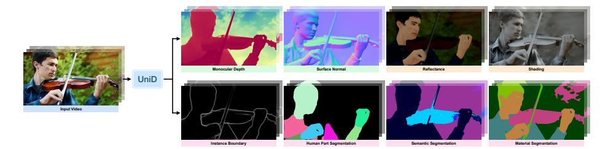
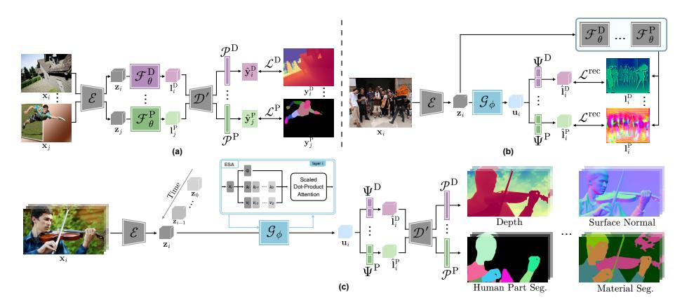
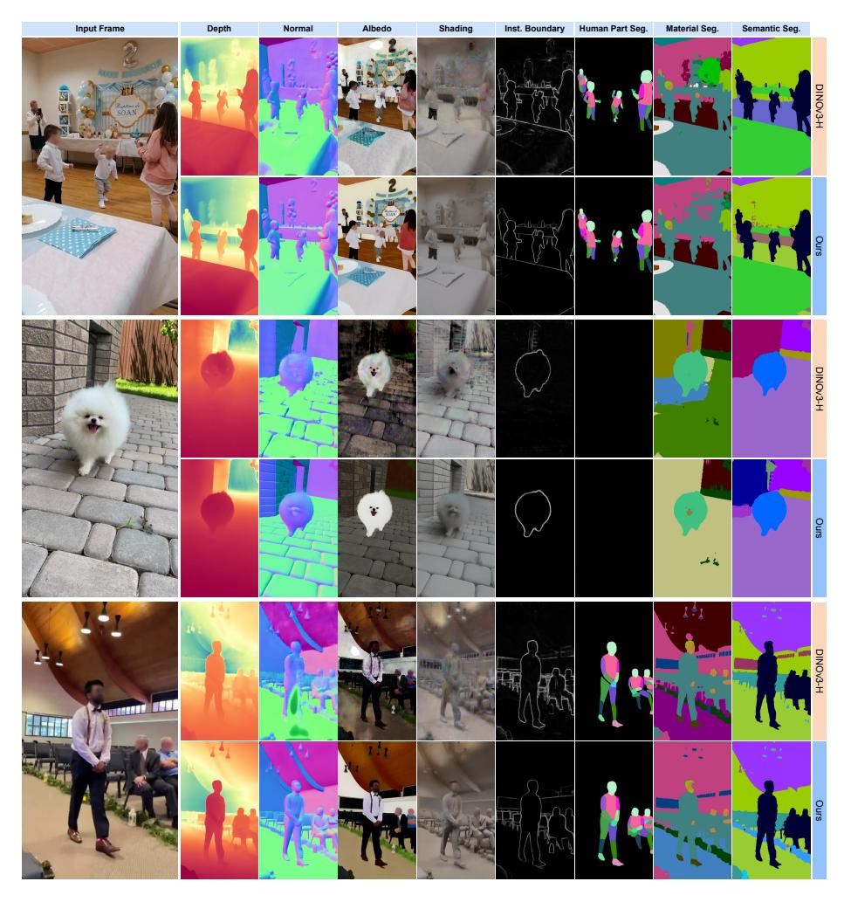

# 분리된 데이터에서의 통합 비디오 밀집 예측 (Unified Video Dense Prediction from Disjoint Data)

- 원제: Unified Video Dense Prediction from Disjoint Data
- 원문: [https://arxiv.org/abs/2607.21592](https://arxiv.org/abs/2607.21592)
- PDF: [https://arxiv.org/pdf/2607.21592v1](https://arxiv.org/pdf/2607.21592v1)
- arXiv ID: `2607.21592`

---

# 분리된 데이터에서의 통합 비디오 밀집 예측 (Unified Video Dense Prediction from Disjoint Data)

Yihong Sun1,2,∗ , Seoung Wug Oh1 , Jiahui Huang1 , Bharath Hariharan2 , 및 Joon-Young Lee1

1Adobe Research 2Cornell University

Abstract. 장면 이해는 기하학, 외관, 의미에 대한 동시에 예측을 필요로 한다. 그러나 기존의 작업별 주석은 서로 호환되지 않는 도메인별 데이터셋에 분산되어 있다. 현재의 통합 시스템은 완전한 공동 주석 데이터에만 학습을 제한하거나, 대규모 계산 비용이 드는 가짜 라벨링을 수행함으로써 이를 우회한다. 이를 완화하기 위해 우리는 UniD를 도입한다. UniD는 분리된 도메인별 데이터셋에서 학습된 여덟 가지 밀집 장면 속성—깊이, 표면 법선, 의미 분할, 경계, 인간 부위, 알베도, 음영, 재질—을 동시에 예측하는 통합 비디오 모델이다. 우리는 각 작업별 전문가가 경량 작업 프로젝터를 통해 통합 백본을 감독하는 단순하면서도 효과적인 증류 단계(distillation step)를 제안한다. 이로써 주석 겹침이나 가짜 라벨링이 필요 없다. 우리의 핵심 통찰은 사전 학습된 확산 모델의 강력한 시각적 선행 지식이 분리된 학습 소스로 인한 도메인 격차를 연결하기에 충분하며, 이는 훈련 중에 본 적 없는 장면-작업 조합에 대한 견고한 일반화를 가능하게 한다. UniD는 작업별 전문가 및 다중 작업 기준선과 경쟁력 있는 성능을 달성하며, 배포되지 않은 시나리오에 대한 강력한 일반화와 향상된 시간적 및 교차 작업 일관성을 보여준다. 코드와 비디오 결과는 <https://unid-video.github.io>에서 확인할 수 있다.

## 1 서론 (Introduction)

장면을 이해하려면, 시각 시스템은 동시에 여러 질문에 답해야 한다: 가시 물체는 얼마나 멀리 있는가? 그 물체는 어떤 재질로 만들어졌는가? 그리고 빛은 그 표면과 어떻게 상호작용하는가? 이러한 질문들은 각각 깊이, 재질 분할, 내재 분해와 같은 별개의 밀집 예측 과제에 해당하며, 각 과제는 자체적인 전문 모델, 학습 프레임워크, 데이터셋을 낳았다. 그러나 실제 세계는 이러한 모든 속성의 조합이며 끊임없이 변한다: 장면을 탐색하거나 조작하는 구현된 에이전트는 이러한 모든 단서를 동시에 그리고 지속적으로 필요로 한다.

이러한 이유로 최근에는 다중 작업 예측을 동시에 출력하는 통합 밀집 예측 모델들이 개발되었다 [&#91;13,](#page-15-0) [45,](#page-17-0) [80,](#page-19-0) [82](#page-20-0)[–84,](#page-20-1) [90&#93;](#page-20-2). 그러나 거의 모든 기존 방법은 모든 작업이 동일한 이미지에 공동 주석이 달린다고 가정한다—이는 실제로 작업별 데이터가 수집되는 방식과는 부합하지 않는 가정이다. 깊이와 법선과 같은 기하학적 주석은 스테레오 또는 RGB-D 카메라를 통해 대규모로 획득할 수 있지만, 일반적으로

⋆ Adobe Research 인턴십 중 수행된 작업이다.

Fig. 1: UniD에 의한 통합 비디오 밀집 예측.

제한된 의미 다양성을 가진 환경, 예를 들어 건축 풍경에서. 의미 주석은 다양한 장면에 대해 수작업 라벨링이 필요하며, 풍부한 범주 다양성을 제공하지만 기하학적 정답과 거의 짝지어지지 않는다. 마지막으로, 내재 분해 [&#91;5,](#page-15-1)[53&#93;](#page-18-0)는 실제 세계에서 측정하기에 과도하게 비용이 많이 들며 대부분 합성 도메인에 국한된다. 이러한 근본적인 차이로 인해, 이러한 분산된 데이터셋을 하나의 공동 주석 훈련 세트로 강제하는 것은 비현실적이거나 대규모 가짜 라벨링이 필요하며 이는 확장 가능하지 않다: 새로운 작업마다 전체 데이터셋을 재주석해야 한다.

이와 더불어 비디오 도메인으로 확장하려면 상당량의 주석이 달린 비디오가 필요하다. 기하학(예: RGB-D 비디오 캡처)에서는 가능하지만, 의미론 및 내부 파라미터 작업에서는 비용이 지나치게 비싸게 된다. 따라서 기존의 비디오 지원 방법들은 자율주행 도메인에 한정되거나([30]) 주로 저수준 기하학적 추정에 초점을 맞추고 있다([3]).

이러한 제약은 자연스러운 질문을 제기한다: 서로 다른 도메인별 데이터셋에서 이미지와 비디오 모두에 대해 통합된 밀집 예측을 학습할 수 있을까? 우리는 UniD를 제시한다. UniD는 서로 다른 도메인별 데이터에서 학습된 통합 비디오 모델로, 깊이, 표면 법선, 의미론적 분할, 경계, 인간 부위, 알베도, 그림자, 재질 등 여덟 가지 밀집 장면 속성을 동시에 추정한다 (Figure [1)](#page-1-0)). 도메인 간 격차를 해소하기 위해, 우리는 먼저 보이지 않는 예제에 대해 강력한 일반화를 갖는 작업별 잠재 공간을 학습한다. 이 일반화를 달성하기 위해 우리는 인터넷 규모 데이터에서 사전 학습된 확산 모델의 시각적 선험을 활용한다 [&#91;60&#93;](#page-18-1). 그 다음, 우리는 가벼운 작업별 잠재 프로젝터를 통해 공유된 백본 표현을 각 작업의 잠재 공간으로 매핑하여 모든 입력에 대해 모든 작업별 잠재 임베딩을 재구성하도록 통합 모델을 학습한다. 작업별 임베딩을 실시간으로 계산함으로써, 통합 학습은 공동 주석 데이터나 가짜 라벨이 필요 없다.

UniD는 여러 가지 핵심 장점을 제공합니다. 첫째, 향상된 일반화와 시간적 안정성을 달성합니다. 합성 및 실제, 실내 및 실외, 정적 이미지와 동적 비디오 등 다양한 분포에서 서로 다른 소스를 공동으로 활용함으로써 모델은 과적합을 방지하고 OOD(Out‑of‑Distribution) 시나리오에 대해 상당한 견고성을 보여줍니다. 특히 비디오 감독이 없는 작업은 다른 비디오 중심 작업에서 시간적 일관성을 상속받아 시간에 걸쳐 안정적이고 일관된 예측을 보장합니다.

둘째, 공유된 백본이 제공하는 통합 표현은 교차 작업 일관성과 높은 추론 효율성을 모두 보장한다. 단일 통합 특성 매니폴드를 예측함으로써, 우리 모델은 작업 간에 강력한 구조적 정렬을 강제한다. 이는 서로 다른 작업에서 공간적으로 일치하는 예측—예를 들어 일관된 경계 구분—을 이끌어내며, 이는 독립적인 작업별 모델에서는 종종 정렬되지 않는다. 또한, 이 공유 아키텍처는 백본 특성이 한 번만 계산되어 여러 작업별 프로젝터를 지원하도록 함으로써 계산 비용을 크게 줄이며, 작업별 오버헤드를 최소화한다.

이러한 장점을 입증하기 위해, 우리는 모든 과제에서 광범위한 실험을 수행했으며, UniD는 기존의 과제별 모델과 비교해 경쟁력 있는 성능을 달성합니다. 또한, UniD는 기존의 통합 모델 및 고정된 DINOv3-H 백본을 활용한 다중 과제 기준선에 비해 OOD 일반화, 시간적 안정성, 그리고 과제 간 일관성에서 우수한 성능을 보여주며, 복잡하고 실제 세계의 비디오 밀집 예측에서 그 효과를 입증합니다.

## 2 관련 연구 (Related Work)

멀티태스크 밀집 예측. 단일 모델 내에서 밀집 예측 과제를 통합하면 효율성이 향상되고 교차 과제 상호 보완성을 촉진한다 [&#91;88&#93;](#page-20-3). 자연스럽게, 많은 기존 연구 [&#91;44,](#page-17-1) [45,](#page-17-0) [48,](#page-17-2) [73,](#page-19-1) [74,](#page-19-2) [79,](#page-19-3) [82](#page-20-0)[–84,](#page-20-1) [86&#93;](#page-20-4)는 모든 훈련 이미지가 모든 과제에 대해 주석이 달려야 한다는 요구를 통해 멀티태스크 기능을 획득한다. 이 제약을 완화하기 위해 최근 연구 [&#91;41,](#page-17-3) [85&#93;](#page-20-5)는 라벨 효율성을 높이기 위해 부분적인 이미지별 주석으로 학습하는 방법을 조사했다. 그러나 여전히 각 이미지가 이전과 동일한 공동 주석 분포에서 추출된 라벨이 지정된 과제의 하위 집합을 포함한다고 가정한다. 또한, 소수 샷 일반화 모델 [&#91;35,](#page-17-4)[36,](#page-17-5)[71&#93;](#page-19-4)는 메타 학습과 에피소드 훈련을 통해 과제별 주석 요구를 줄인다. 그러나 이들은 여전히 과제 간에 공유되는 메타 데이터셋에 의존하며 대규모 과제별 데이터셋의 이점을 완전히 활용하지 못한다.

동시에, 여러 연구가 대규모 주석 동시 발생을 강제하기 위해 가짜 라벨링(pseudo-labeling)을 채택한다 [&#91;1,](#page-15-3) [2,](#page-15-4) [30,](#page-16-0) [76,](#page-19-5) [90&#93;](#page-20-2). 효과적이지만 가짜 라벨링은 비용이 많이 들며, 새로운 과제나 데이터셋이 추가될 때 전체 라벨링 파이프라인을 다시 실행해야 한다. 특히, 4M-21 [&#91;1&#93;](#page-15-3)은 모든 과제 출력을 이산 토큰화(discrete tokenization)해야 하며, 그 마스킹 모델링 목표는 모든 과제를 하나의 통합 토큰 예측 문제로 결합해 과제별 최적화 목표를 방해한다. 반면, UniD는 서로 다른 과제별 데이터셋에서 학습하면서 과제별 최적화 목표를 유연하게 허용하고, 주석 동시 발생이 필요 없다.

밀집 예측을 위한 확산 모델. 확산 모델 [&#91;21,](#page-16-1)[27,](#page-16-2)[60,](#page-18-1)[66&#93;](#page-19-6)은 인상적인 이미지 생성 능력을 보여 주었다. 대규모 사전 학습에서 학습된 풍부한 시각적 선험 지식은 조건부 생성 [&#91;28,](#page-16-3) [52,](#page-18-2) [87,](#page-20-6) [89&#93;](#page-20-7), 편집 [&#91;10,](#page-15-5) [33,](#page-17-6) [55&#93;](#page-18-3), 그리고 비디오 생성 [&#91;8,](#page-15-6) [26,](#page-16-4) [29,](#page-16-5) [38&#93;](#page-17-7) 등 많은 응용 분야를 가능하게 했다.

이후, 최근 방법들 [&#91;25,](#page-16-6) [34,](#page-17-8) [67,](#page-19-7) [72,](#page-19-8) [81,](#page-20-8) [93&#93;](#page-20-9)은 생성적 선험 지식을 활용해 제한된 훈련 데이터를 넘어 일반화되는 밀집 예측(예: 깊이와 표면 법선)을 학습하도록 제안한다. 이러한 과제 전문 모델 외에도, 확산 모델을 사용한 직접 멀티태스크 훈련이 완전 주석 데이터 [&#91;80&#93;](#page-19-0), 가짜 라벨링 [&#91;90&#93;](#page-20-2), 또는 합성 전용 감독 [&#91;13&#93;](#page-15-0)으로 제안되었다. 특히, DICEPTION [&#91;90&#93;](#page-20-2)은 모든 과제를 RGB 공간에 매핑해 멀티태스크를 통합한다.

## 4 Sun 등 (4 Sun et al.)

조건부 과제 프롬프트(예: "image2depth")와 함께. 그러나 RGB 통합은 고차원 출력을 가진 과제(예: 의미론적 분할)를 단순히 표현할 수 없으며, 텍스트-조건 생성은 모든 K개의 예측을 얻기 위해 K개의 별도 순방향 패스를 필요로 하여 동시에 멀티태스크 추론을 방해한다.

UniD는 대신 확산 모델을 활용해 과제별 잠재 공간을 학습하고, 픽셀 단위의 과제별 최적화 목표를 가능하게 하며, 그러나 그 ...

비디오 밀집 예측. 밀집 예측은 비디오 도메인에서 광범위하게 연구되어 왔으며, 비디오 깊이 추정 [15,62,75], 표면 법선 추정 [7], 그리고 의미론적 분할 [31,51,63] 등이 포함된다. 자연스럽게, 밀집 예측을 비디오 도메인으로 확장하면 추가적인 주석 부족 문제를 초래한다. 이 한계로 인해 기존의 통합 비디오 예측 방법은 자율 주행 도메인 [30]에 제한되거나 주로 비디오 생성 [76]에 초점을 맞추거나 저수준 기하학적 작업 [3]에 국한된다. 반면, UniD는 어떤 도메인에도 제한되지 않으며, 저수준 기하학을 넘어 고수준 의미론적 및 내재적 작업을 처리하고, 작업별 비디오 주석 없이 경량의 파라미터-프리 모듈을 통해 시간적 일관성을 달성한다.

## 3 Method

Task Formulation  
우리는 비디오에 대한 밀집 장면 이해 문제를 고려하며, 원하는 시스템은 입력 비디오 스트림에서 동시에 K개의 작업을 예측해야 한다.  

Formally, given an input video $v = \{\mathbf{x}_1, ..., \mathbf{x}_T\}$ with T input frames $\mathbf{x}_i \in \mathbb{R}^{H \times W \times 3}$, the goal is to produce dense prediction maps $\{\mathbf{y}_1^k, ..., \mathbf{y}_T^k\}_{k=1}^K$, where $\mathbf{y}_i^k \in \mathbb{R}^{H \times W \times C^k}$ is the $i^{\text{th}}$-frame prediction for task k.  

Depending on the task, the output dimension $C^k$ can range from 1 for scalar depth maps to the number of classes for semantic segmentation.  

Furthermore, each task k is associated with annotated data $\mathbf{D}^k$ that may be completely disjoint.

우리는 먼저 각 작업의 제한된 학습 도메인과 모달리티를 넘어 일반화되는 작업별 임베딩 공간을 학습한다(Section 3.1). 그 다음, 모든 작업 임베딩을 하나의 통합 비디오 모델로 증류한다(Section 3.2).

## 3.1 Learning Task-Specific Embeddings

다양한 작업을 통합하려면 종종 서로 다른 데이터에서 학습해야 한다. 이는 서로 다른 작업이 라벨 수집 방법이 다르기 때문이다(예: 기하학적 작업을 위한 실내 RGBD 스캔 대 인터넷 이미지의 수동 주석). 이러한 도메인 격차를 해소하기 위해 우리는 인터넷 규모 데이터에서 사전 학습된 확산 모델의 풍부한 생성 사전 지식을 활용한다[60].

**Dense prediction with diffusion models.** We build on a pretrained latent diffusion model (LDM) [60] with a VAE encoder  $\mathcal{E}$ , decoder  $\mathcal{D}$ , and a U-Net backbone  $\mathcal{F}_{\theta}$ . Given an input image  $\mathbf{x}_i \in \mathbb{R}^{H \times W \times 3}$ , the encoder maps it to a compact latent code  $\mathbf{z}_i = \mathcal{E}(\mathbf{x}_i) \in \mathbb{R}^{h \times w \times d}$ , while the decoder attempts to reconstruct the image  $\mathbf{x}_i$  from  $\mathbf{z}_i$  as  $\mathcal{D}(\mathbf{z}_i) \in \mathbb{R}^{H \times W \times 3}$ .

핵심 설계 선택은 네트워크를 작업 출력 공간과 연결하는 방법이다. 우리는 *픽셀 디코딩* 전략을 채택한다: U‑Net은 작업 잠재 $\mathbf{l}_i = \mathcal{F}_{\theta}(\mathbf{z}_i) \in \mathbb{R}^{h \times w \times d}$ 를 예측하고, 이는 사전 학습된 VAE 디코더 $\mathcal{D}$ 로 최종 합성곱 층까지 디코딩된다. 우리는 이를 $\mathcal{D}'(l_i) \in \mathbb{R}^{H \times W \times d'}$ 라고 명명한다. 이후, 우리는 경량의 작업별 픽셀 프로젝터 $\mathcal{P}$ 를 통해 $\mathcal{D}'(l_i)$ 를 작업 k 의 목표 차원 $C^k$ 로 투영한다.

각 작업 k 에 대해 최종 예측 $\hat{\mathbf{y}}$ 는 다음과 같이 계산된다:

$$\mathbf{l}_{i}^{k} = \mathcal{F}_{\theta}^{k}(\mathcal{E}(\mathbf{x}_{i})) \in \mathbb{R}^{h \times w \times d}, \quad \hat{\mathbf{y}}_{i}^{k} = \mathcal{P}^{k}(\mathcal{D}'(\mathbf{l}_{i}^{k})) \in \mathbb{R}^{H \times W \times C^{k}}$$

(1)

여기서 작업 잠재 $\mathbf{l}_i^k$ 는 $\mathcal{P}(\mathcal{D}'(\cdot))$ 에 의해 $\hat{\mathbf{y}}_i^k \in \mathbb{R}^{H \times W \times C^k}$ 로 디코딩된다.

픽셀 디코딩 전략은 (i) 임의의 작업에 대한 $C^k$ -dimensional 출력을 지원하고, (ii) 픽셀 예측에 대한 작업별 최적화를 가능하게 하며, (iii) 잠재 공간과 예측 공간 사이의 투영을 암시적으로 학습한다.

비디오 예측과 시간적 연결.

통합된 밀집 예측을 비디오 도메인에 확장하는 것은 작업 간 주석 비대칭성 때문에 여전히 도전적이다 (기하학적 작업을 위한 RGB‑D 비디오는 의미론적 또는 내재적 작업에 대한 수동 주석보다 더 접근 가능하다).

따라서 시간적 메커니즘은 시간적 주석이 없는 작업과도 호환되어야 한다.

우리는 확장된 자체 주의 [43]를 채택한다. 이는 U‑Net 백본 $\mathcal{F}_{\theta}$의 모든 자체 주의 레이어를 과거 프레임의 특징으로 확장한다. 프레임 t에서, 쿼리는 현재 프레임과 M개의 과거 프레임 $\mathcal{M}_t \subseteq \{1, \ldots, t-1\}$에서 가져온 키와 값에 동시에 주의를 기울인다. 이 과거 프레임들은 메모리 뱅크에 저장된다:

$$\operatorname{Attn}(\mathbf{Q}_{t}, \left[\mathbf{K}_{s}\right]_{s \in \mathcal{M}_{t} \cup \{t\}}, \left[\mathbf{V}_{s}\right]_{s \in \mathcal{M}_{t} \cup \{t\}}), \tag{2}$$

여기서 $[\cdot]$는 연결을 의미한다. 직관적으로, 비디오에 대한 학습 없이도 인접 프레임은 풍부한 상응 관계를 공유할 것이며, 이는 프레임 t의 쿼리가 과거의 키와 값에 주의를 기울임으로써 시간적 부드러움을 촉진할 수 있다.

M=0 으로 설정하면 자연스럽게 단일 프레임 예측으로 되돌아가며, 이는 시간적 주석 없이 훈련할 때 호환됩니다. 메모리 큐 길이 M과 enqueue/dequeue 빈도는 추론 시에 선택할 수 있어, 재학습 없이도 시간적 스무딩 정도와 메모리 사용량에 대한 유연성을 제공합니다.

이제 입력 비디오 $v = \{\mathbf{x}_1, ..., \mathbf{x}_T\}$는 각 $\mathbf{z}_i = \mathcal{E}(\mathbf{x}_i)$를 시간적 연결과 함께 처리하는 $\mathcal{F}_{\theta}$를 통해 작업별 임베딩 $\mathbf{l} = [\mathcal{F}_{\theta}(\mathbf{z}_1), ..., \mathcal{F}_{\theta}(\mathbf{z}_T)] \in \mathbb{R}^{T \times h \times w \times d}$에 투영되며, 이는 시간에 민감한 표현을 생성한다.

**작업 전용 전문가 훈련.** Figure 2(a)에 표시된 대로, 우리는 각 작업 k에 대해 전용 전문가 $(\mathcal{F}_{\theta}^{k}, \mathcal{P}^{k})$를 훈련시켜 작업별 임베딩을 학습시켜 일반화한다

그림 2: UniD 개요. (a) 태스크 전문화 훈련. 각 태스크 k마다, 전문화 백본 $\mathcal{F}_{\theta}^{k}$와 픽셀 프로젝터 $\mathcal{P}^{k}$가 그들의 태스크-특정 데이터셋 $\mathbf{D}^{k}$에서 손실 $\mathcal{L}^{k}$와 함께 미세 조정된다. 인코더 $\mathcal{E}$와 디코더 $\mathcal{D}'$(회색으로 표시)는 훈련 중에 고정되어 있다. (b) 통합 모델 훈련. 통합 백본 $\mathcal{G}_{\phi}$는 K개의 잠재 프로젝터 $\{\Psi^{k}\}_{k=1}^{K}$와 함께 훈련되어, 고정된 전문화 모델 $\{\mathcal{F}_{\theta}^{k}\}_{k=1}^{K}$(회색으로 표시)가 예측한 잠재 $\{\mathbf{I}_{i}^{k}\}$를 재구성한다. (c) 스트리밍 비디오 추론. 추론 시, $\mathcal{G}_{\phi}$는 Extended Self-Attention (ESA)를 통해 입력 비디오를 처리하고, 통합 표현 $\mathbf{u}_{i}$는 각 $\Psi^{k}$, $\mathcal{D}'$, 그리고 $\mathcal{P}^{k}$를 통해 디코딩되어 모든 K 태스크에서 시간적으로 일관된 예측을 동시에 생성한다.

분리된 도메인별 데이터 전반에 걸쳐.  
픽셀 디코딩 프레임워크와 일치하도록, 우리는 *single-step* diffusion을 채택합니다:  
반복적인 노이즈 제거 대신, U-Net은 한 번의 순방향 패스를 수행하여 잠재 변수 $\mathbf{l}_i^k$ 를 직접 예측합니다.  
*single-step* diffusion은 추론 시 지연 시간을 줄일 뿐만 아니라, 원래의 노이즈 제거 목표를 단순화함으로써 훈련 효율성을 향상시킵니다 [25].

형식적으로, 각 작업 k에 대해 우리는 작업별 목표 $\mathcal{L}^{k}$ 를 작업별 데이터셋 $\mathbf{D}^{k}$ 에 대해 최소화함으로써 작업 전문 모델 $(\mathcal{F}_{\theta}^{k}, \mathcal{P}^{k})$ 를 얻는다:

$$\left(\mathcal{F}_{\theta}^{k}, \mathcal{P}^{k}\right) = \underset{\mathcal{F}_{\theta}^{k}, \mathcal{P}^{k}}{\operatorname{arg \, min}} \ \mathbb{E}_{(\mathbf{x}, \mathbf{y}) \sim \mathbf{D}^{k}} \left[ \mathcal{L}^{k} \left( \mathcal{P}^{k} \left( \mathcal{P}^{k} \left( \mathcal{E}(\mathbf{x}) \right) \right) \right), \mathbf{y} \right) \right]$$

(3)

대규모 사전학습과 생성적 사전지식 덕분에 학습된 $\mathcal{F}_{\theta}^{k}$ 는 통합 학습 중에 보지 못한 데이터를 임베딩할 때 서로 다른 데이터셋을 연결할 수 있다.

## 3.2 Unified Video Dense Prediction

**잠재 프로젝터를 이용한 통합 모델 학습.** K개의 작업 전문 모델 $\{(\mathcal{F}_{\theta}^k, \mathcal{P}^k)\}_{k=1}^K$ 를 가지고 있을 때, 한 가지 옵션은 각 전문 모델로 대규모 공유 데이터셋에 대해 가짜 라벨을 생성하고 그 라벨을 사용해 학습하는 것이다. 가능하지만, 프레임마다 K개의 풀 해상도 라벨 맵 $\{\mathbb{R}^{H \times W \times C^k}\}_{k=1}^K$ 를 계산/저장하는 것은 시간과 메모리를 많이 소모하며, 두 비용 모두 K에 비례해 선형적으로 증가한다—통합 학습이 시작되기 전부터 말이다.

대신, 우리는 작업 임베딩을 잠재 공간에서 직접 증류한다. 이를 통해 가짜 라벨링을 완전히 피하고, 디코더 $\mathcal{D}$ 를 통한 그래디언트 전파를 건너뛰며, 각 작업의 학습 목표를 잠재 재구성으로 통합할 수 있다.

라벨이 없는 비디오 $\mathbf{x} = \{\mathbf{x}_1, \dots, \mathbf{x}_T\}$ 에 대해, 먼저 각 고정된 전문 백본 $\mathcal{F}_{\theta}^k$ 를 통해 온-더-플라이로 시간 연결을 적용해 목표 작업 임베딩 $\mathbf{l}_i^k$ 를 계산한다. 여기서 $\mathbf{l}_i^k = \mathcal{F}_{\theta}^k(\mathbf{z}_i) \in \mathbb{R}^{h \times w \times d}$, $\mathbf{z}_i = \mathcal{E}(\mathbf{x}_i)$, i = 1, …, T. 그 다음, 우리는 통합 모델을 U-Net 백본 $\mathcal{G}_{\phi}$ 로 정의하고, 초기화와 시간 메모리를 $\mathcal{F}_{\theta}^k$ 와 동일하게 하며, K개의 경량 작업별 잠재 프로젝터 $\{\Psi^k\}_{k=1}^K$ 를 사용해 통합 표현을 작업별 임베딩으로 투영한다. 입력 잠재 $\mathbf{z}_i$ 가 주어지면, 통합 모델은 모든 작업 임베딩을 동시에 예측한다:

$$\hat{\mathbf{l}}_{i}^{k} = \Psi^{k}(\mathcal{G}_{\phi}(\mathbf{z}_{i})) \in \mathbb{R}^{h \times w \times d}, \quad k = 1, \dots, K.$$

(4)

그림 2(b)에서 보듯이, 통합 모델 $(\mathcal{G}_{\phi}, \{\Psi^k\}_{k=1}^K)$ 은 잠재 재구성 목표 $\mathcal{L}^{\text{rec}}$ 를 최소화함으로써 학습된다:

$$\left(\mathcal{G}_{\phi}, \left\{ \Psi^{k} \right\}\right) = \underset{\mathcal{G}_{\phi}, \left\{ \Psi^{k} \right\}}{\operatorname{arg\,min}} \, \mathbb{E}_{v \sim \mathbf{D}} \, \sum_{k=1}^{K} \mathcal{L}^{\operatorname{rec}} \left( \hat{\mathbf{l}}^{k} \,, \, \mathbf{l}^{k} \right)$$

(5)

여기서 $\hat{\mathbf{l}}^k$ 와 $\mathbf{l}^k$ 는 모두 $\Psi^k(\mathcal{G}_{\phi}(\cdot))$ 와 $\mathcal{F}_{\theta}^k(\cdot)$ 를 시간 연결을 적용해 잠재 코드 $\mathbf{z}_i$ (i=1~T) 에 대해 실행함으로써 계산된다.

**시간적 잠재 안정화.** $\mathcal{L}^{\text{rec}}$ 가 프레임별 재구성 손실만 포함한다면, 통합 백본 $\mathcal{G}_{\phi}$ 는 통합 학습 중 충분한 시간적 정규화를 받지 못한다. 이를 해결하기 위해, 우리는 비디오 깊이 추정에 처음 제안된 시간적 그래디언트 매칭[15]을 일반 잠재 표현으로 확장한다. 예측 임베딩 $\hat{\mathbf{l}}^k \in \mathbb{R}^{t \times h \times w \times d}$ 와 목표 임베딩 $\mathbf{l}^k \in \mathbb{R}^{t \times h \times w \times d}$ 를 주어, 예측의 시간 그래디언트가 모든 공간 위치에서 목표의 시간 그래디언트와 일치하도록 강제한다:

$$\mathcal{L}_{\text{TGM}}(\hat{\mathbf{l}}, \mathbf{l}) = \left\| \left[ \left( \hat{\mathbf{l}}_{i+1} - \hat{\mathbf{l}}_{i} \right) - \left( \mathbf{l}_{i+1} - \mathbf{l}_{i} \right) \right] \cdot \mathbb{1} \left[ \left\| \mathbf{l}_{i+1} - \mathbf{l}_{i} \right\|_{2} < \varepsilon \right] \right\|_{2}$$

(6)

여기서 마스크 $\mathscr{F}[\cdot]$는 시간적 정규화가 신뢰할 수 없는 빠르게 변하는 영역에서 학습을 억제한다. 최종 통합 학습 목표는 프레임별 $\ell_1$ 잠재 재구성과 시간적 기울기 매칭 손실을 결합한다: $\mathcal{L}^{\mathrm{rec}}\left(\hat{\mathbf{l}}^k\;,\,\mathbf{l}^k\right) = \left\|\;\hat{\mathbf{l}}_i^k - \mathbf{l}_i^k\;\right\|_1 + \lambda\,\mathcal{L}_{\mathrm{TGM}}\left(\;\hat{\mathbf{l}}^k,\mathbf{l}^k\;\right)$, 여기서 $\lambda$는 두 항을 균형시킨다.

**추론 및 확장성.** 추론 시 입력 $\mathbf{x} \in \mathbb{R}^{T \times H \times W \times 3}$에 대해 모든 작업의 고해상도 예측은 다음과 같이 계산된다:

$$\mathbf{u}_{i} = \mathcal{G}_{\phi}(\mathcal{E}\left(\mathbf{x}_{i}\right)), \quad \hat{\mathbf{y}}^{k} = \mathcal{P}^{k}\left(\mathcal{D}'\left(\Psi^{k}\left(\mathbf{u}_{i}\right)\right)\right) \in \mathbb{R}^{H \times W \times C^{k}}, \quad i = 1, ..., T$$

(7)

이 프레임워크는 자연스럽게 확장 가능하다: 새로운 작업 K+1을 추가하려면 해당 작업의 라벨링된 데이터에 대해 새로운 전문가 $(\mathcal{F}_{\theta}^{K+1}, \mathcal{P}^{K+1})$를 학습시키고 새로운 잠재 프로젝터 $\Psi^{K+1}$를 도입하면 된다. 통합 백본 $\mathcal{G}_{\phi}$에 대한 아키텍처 변경이나 기존 데이터를 재라벨링할 필요가 없다.

### 3.3 구현 세부사항 (Implementation Details)

작업 전문가. 우리는 사전 학습된 LDM 백본으로 Stable Diffusion v2 [&#91;60&#93;](#page-18-1)를 사용한다. K = 8개의 전문가 각각은 U-Net 백본과 작업별 픽셀 프로젝터 P_k(단일 3×3 컨볼루션)를 함께 미세 조정하여 학습률 3 × 10−5로 AdamW 옵티마이저 [&#91;47&#93;](#page-17-10)와 decay 10−2를 사용해 수렴시킨다.

통합 모델. 통합 백본 Gϕ는 동일한 사전 학습된 U-Net에서 초기화된다. 각 잠재 프로젝터 Ψ_k는 DPT 헤드로, Gϕ의 3개의 중간 표현을 최종 출력 특징과 융합 차원 256에서 결합한다. 통합 백본 Gϕ와 잠재 프로젝터 Ψk는 모든 작업의 라벨링된 데이터 집합을 합쳐, 이미지와 비디오 데이터를 동일한 가중치로 샘플링하여 학습된다. 전체 통합 모델은 배치 크기 32, 학습률 3 × 10−5로 50k 반복 동안 학습된다. 각 작업의 학습 데이터셋, 학습 목표 및 기타 구현 세부사항은 부록을 참조하라.

## 4 실험 (Experiments)

데이터셋 및 지표. 학습 데이터, 평가 데이터, 작업별 출력 차원 Ck 및 지표는 표 [1.](#page-9-0)에 자세히 나와 있다.

평가 측면에서 우리는 UniD의 일반화를 평가하기 위해 훈련 중에 보지 못한 최소 하나의 도메인 외 데이터셋을 선택한다. 깊이와 표면 법선에 대해서는 각각 Marigold [&#91;34&#93;](#page-17-8)와 DSINE [&#91;4&#93;](#page-15-9)의 평가 프로토콜을 따른다. 알베도와 셰이딩에 대해서는 Weighted Human Disagreement Rate (WHDR) [&#91;6&#93;](#page-15-10)와 Precision at 70% Recall (P@0.7) [&#91;39&#93;](#page-17-11)을 보고한다. 인스턴스 경계에 대해서는 optimal-dataset-scale F-measure (odsF) [&#91;82&#93;](#page-20-0)를 보고한다. 분할 작업에 대해서는 meanIoU와 클래스 빈도 가중 IoU (fwIoU)를 보고한다.

시간적 일관성을 측정하기 위해, 비디오 시맨틱 세분화에 처음 제안된 Video Consistency (mVC-t) [&#91;51&#93;](#page-18-5)를 확장하여 비디오 표면 법선, 알베도, 셰이딩 및 인스턴스 경계도 측정한다. 평가 벤치마크와 지표에 대한 자세한 내용은 부록을 참조하라.

Baselines. We compare UniD against per-task specialists and unified multitask baselines. Among the unified baselines, we include 4M-21-XL [&#91;1&#93;](#page-15-3) and DI-CEPTION [&#91;90&#93;](#page-20-2), both requiring large-scale pseudo-labeling. Notably, DICEP-TION [&#91;90&#93;](#page-20-2) requires task-specific captions as input, requiring K forward passes to obtain all unified predictions. We further include StableMTL [&#91;13&#93;](#page-15-0), which is trained only on synthetic data and likewise predicts tasks sequentially during inference. As our most directly comparable baseline, we extend a frozen DINOv3-H [&#91;65&#93;](#page-19-10) backbone with task-specific DPT heads trained on exactly the same datasets with the same loss functions for 20k iterations. For a fair comparison, the DINOv3-H backbone is chosen to have the same capacity as our unified backbone Gϕ. DINOv3-H simulates the alternative design of freezing a strong image representation and learning per-task decoders from disjoint sources, without any task-specific joint training or temporal modules.

그림 3: UniD와 DINOv3-H의 정성적 결과 비교.[1](#page-8-0)

### 4.1 작업별 성능

외부 분포 일반화. UniD의 주요 주장은 사전 학습된 확산 백본의 생성 사전 지식이 분리된 훈련 소스로 인해 발생하는 도메인 격차를 충분히 메우고, 주석이 없는 시나리오-작업 조합에 대한 일반화를 가능하게 한다는 것이다. 이를 평가하기 위해 내부 분포 벤치마크는 표 [4](#page-11-0)와 [5](#page-11-1)에서 회색으로 표시되며, 나머지 모든 열은 라벨이 지정된 훈련 데이터를 보지 못한 외부 분포 평가이다.

모든 기하학 및 내부 파라미터 작업에서, UniD (Gϕ)는 동일한 훈련 데이터셋에도 불구하고 OOD 벤치마크에서 DINOv3-H를 지속적으로 능가한다. For

1 SA-V [&#91;58&#93;](#page-18-7)와 인터넷 비디오 [&#91;56&#93;](#page-18-8)에서 가져온 시각적 예시.

**표 1:** 작업별 출력 차원 $C^k$, 훈련 데이터셋(프레임 수 포함), 평가 데이터셋 및 지표의 요약. 대부분의 훈련 데이터셋은 작업 도메인 간에 분리되어 있으며, 내부 도메인 평가 데이터셋은 회색으로 표시된다.

| 작업 | $C^k$ | 학습 데이터셋 | # 프레임 (Frames) | 평가 데이터셋 | 지표 |
|-------------------|-------------------------|------------------------------------------------------------------------------------------------|-----------------|-----------------------------------------------------------------|----------------------------------------------------|
| 깊이 | 1 | 이미지: Hypersim [59], VKITTI2 [12] 비디오: PointOdyssey [91], Spring [49], TartanAir [70] | 80.8k 361.0k | NYUv2 [64], KITTI [23], ETH3D [61], ScanNet [20], DIODE [69] | AbsRel↓, $\delta_1$ ↑ |
| 표면 법선 | 3 | 이미지: Hypersim [59], VKITTI2 [12] | 80.8k | NYUv2 [64], ScanNet [20], iBims-1 [37], Sintel [11] | Mean↓, $11.25^{\circ}$ ↑ |
| 알베도 | 3 | 이미지: Hypersim [59] | 59.5k | Hypersim [59], IIW [6] | PSNR $\uparrow$ , WHDR 15% $\downarrow$ |
| 쉐이딩 | 3 | 이미지: Hypersim [59] | 59.5k | Hypersim [59], SAW [39] | PSNR $\uparrow$ , P@0.7/AP $\uparrow$ |
| 인스턴스 경계 | 1 | 이미지: COCO [46], Cityscapes [19] 비디오: VIPSeg [50] | 121.3k 66.8k | COCO [46], YT-VIS [78], Mapillary [54] | odsF† |
| 의미론적 분할 (Semantic Seg.) | 201/35/125 (C/CS/VS) | 이미지: COCO [46], Cityscapes [19] 비디오: VIPSeg [50] | 121.3k 66.8k | Cityscapes [19] , VIPSeg [50] , ADE20K [92] | mIoU↑, fwIoU↑ |
| 재료 분할 (Material Seg.) | 57 | 이미지: DMS [68] | 22.0k | DMS [68], ADE20K [92] | mIoU↑, fwIoU↑ |
| 인간 부위 분할 (Human Part Seg.) | 16 | 이미지: DensePose [24] | 26.4k | DensePose [24], Pascal-Human-Part [17] | mIoU↑, fwIoU↑ |

깊이 (Table 2)에서 UniD ( $\mathcal{G}_{\phi}$ )는 NYUv2, ScanNet, DIODE에서 모든 통합 방법 중 가장 우수한 AbsRel을 달성하며, 반면 DINOv3-H는 다섯 개 데이터셋 전반에 걸쳐 일관된 차이로 성능이 낮다. 표면 법선 (Table 3)에서는 UniD ( $\mathcal{G}_{\phi}$ )가 모든 OOD 벤치마크 지표 중 하나를 제외하고 통합 방법 중 최첨단 성능을 달성한다. 내재값과 경계 (Table 4)에서는 UniD ( $\mathcal{G}_{\phi}$ )가 도메인 내에서 DINOv3-H와 일치하지만, 모든 OOD 벤치마크에서 크게 우수하다: 알베도 WHDR을 0.289에서 0.207로 개선하고, 셰이딩 P@0.7을 87.8에서 94.6으로, 경계 odsF를 55.0에서 57.2로 향상시켰다.

이러한 인도메인에서의 동등성과 오프도메인에서의 명확한 우위는 diffusion prior가 보이지 않는 시나리오에 견고하게 전이되는 효능을 검증한다. diffusion prior의 효과를 분리하기 위해 Hypersim val [59]에 색상 jittering을 적용했으며, 결과적으로 전문화된 UniD ( $\mathcal{F}_{\theta}^{k}$ )가 깊이(AbsRel 편차: 0.011 vs. 0.034)와 표면 법선(평균 오차 편차: 2.2° vs. 5.8°)에서 DINOv3-H보다 훨씬 더 안정적인 예측을 보였다 — 동일한 훈련 데이터를 사용했음에도 약 3배 더 견고하다. 이는 판별적 특징이 훈련 데이터의 외관-기하학 상관관계에 과적합되는 경향이 있는 반면, 웹 규모 데이터에 대한 생성 사전 훈련이 더 외관 불변적인 기하학을 인코딩한다는 것을 시사한다. 이는 Figure 3에서도 더욱 명확히 드러난다. DINOv3-H의 예측은 보이지 않는 장면에서 눈에 띄게 저하되는 반면, UniD ( $\mathcal{G}_{\phi}$ )는 모든 작업에서 일관성을 유지한다.

통합 모델 대 작업별 전문 모델.  
지오메트릭 및 내재적 작업 전반에 걸쳐 UniD $(\mathcal{G}_{\phi})$는 작업별 전문 모델 $\mathcal{F}_{\theta}^{k}$와 유사한 성능을 달성한다. 이는 모든 여덟 개의 작업을 하나의 공유 백본으로 통합한 후에도 전문 수준의 표현을 충실히 보존하는 잠재적 증류의 효능을 보여준다. 표면 법선에 대해, 통합 모델 $\mathcal{G}_{\phi}$는 실제로 NYUv2, ScanNet, 그리고 Sintel에서 자체 전문 모델 $\mathcal{F}_{\theta}^{N}$보다 우수한 성능을 보인다. 이 성능 향상은 깊이에서 오는 교차 작업 정규화에 기인할 수 있는데, 이는 동일한 지오메트릭 훈련 도메인을 공유하며 통합 백본 내에서 표면 기하학 추정을 공동으로 강화한다. 또한, 음영 및 인스턴스 경계(표 4)에서는 UniD $(\mathcal{G}_{\phi})$가 도메인 내 평가에서 전문 모델 $\mathcal{F}_{\theta}^{k}$와 일치하며, 도메인 외 평가에서는 약간 개선된다.

표 2: 모노큘러 깊이 추정 성능: NYUv2, KITTI, ETH3D, Scan-Net, DIODE에서의 성능. 통합 방법 중 최고 성능은 굵게 표시됩니다. (Table 2: Monocular Depth Estimation Performance on NYUv2, KITTI, ETH3D, Scan-Net, and DIODE. Best performance among unified methods is bolded.)

|  | 방법 |  | NYUv2 |  | KITTI |  | ETH3D |  | ScanNet |  | DIODE |  |
|-----------------------|-----------------------------------|-------|---------------------------------------|-------|---------------------------------------|-------|---------------------------------------|-------|---------------------------------------|-------|---------------------------------------|--|
|  |  |  | AbsRel $\downarrow \delta_1 \uparrow$ |  | AbsRel $\downarrow \delta_1 \uparrow$ |  | AbsRel $\downarrow \delta_1 \uparrow$ |  | AbsRel $\downarrow \delta_1 \uparrow$ |  | AbsRel $\downarrow \delta_1 \uparrow$ |  |
|  | DAv2 [77] | 0.043 | 98.1 | 0.076 | 94.7 | 0.127 | 88.2 | 0.043 | 98.1 | 0.260 | 75.9 |  |
|  | Depth Pro [9] | 0.042 | 97.7 | 0.055 | 97.4 | 0.043 | 97.4 | 0.041 | 97.8 | 0.217 | 76.4 |  |
| 전문가 | Marigold [34] | 0.055 | 96.4 | 0.099 | 91.6 | 0.065 | 95.9 | 0.064 | 95.2 | 0.308 | 77.3 |  |
|  | Genpercept [72] | 0.091 | 93.2 | 0.094 | 92.3 | 0.066 | 95.7 | 0.056 | 96.5 | 0.302 | 76.7 |  |
| be | GeoWizard [22] | 0.052 | 96.6 | 0.097 | 92.1 | 0.064 | 96.1 | 0.061 | 95.3 | 0.297 | 79.2 |  |
| <b>J</b> 2 | Lotus [25] | 0.051 | 97.2 | 0.081 | 93.1 | 0.061 | 97.0 | 0.055 | 96.5 | 0.228 | 73.8 |  |
|  | UniD $(\mathcal{F}_{\theta}^{D})$ | 0.059 | 96.0 | 0.102 | 90.9 | 0.070 | 95.4 | 0.069 | 95.0 | 0.299 | 77.4 |  |
|  | 4M-21-XL [1] | 0.068 | 95.1 | 0.105 | 89.6 | 0.070 | 95.3 | 0.065 | 95.5 | 0.331 | 73.4 |  |
| þe | DICEPTION [90] | 0.060 | 96.3 | 0.085 | 91.8 | 0.070 | 96.6 | 0.071 | 94.8 | 0.304 | 72.2 |  |
| 통합된 | StableMTL [13] | 0.090 | 92.4 | 0.150 | 79.8 | 0.116 | 87.9 | 0.105 | 89.5 | 0.330 | 73.8 |  |
| Ģ | DINOv3-H [65] | 0.092 | 92.9 | 0.121 | 86.5 | 0.087 | 93.7 | 0.089 | 93.6 | 0.314 | 77.5 |  |
|  | UniD $(\mathcal{G}_{\phi})$ | 0.059 | 96.3 | 0.110 | 89.5 | 0.073 | 95.5 | 0.063 | 96.2 | 0.301 | 77.3 |  |

**Table 3:** NYUv2, ScanNet, iBims-1, 그리고 Sintel에서의 표면 법선 추정 성능. 통합 방법 중 가장 우수한 성능은 굵게 표시된다.

|  | 방법 |  | NYUv2 |  | anNet | iB | ims-1 | Sintel |  |
|------------|-----------------------------------|------------------------------------------------------------|-------|-----------------------------------------|-------|-----------------------------------------|-------|----------------------------------------|------|
|  | Wethod | $\overline{\mathrm{mean}\downarrow 11.25^{\circ}\uparrow}$ |  | mean $\downarrow 11.25^{\circ}\uparrow$ |  | mean $\downarrow 11.25^{\circ}\uparrow$ |  | $mean\downarrow 11.25^{\circ}\uparrow$ |  |
|  | OASIS [16] | 29.2 | 23.8 | 32.8 | 15.4 | 32.6 | 23.5 | 43.1 | 7.0 |
|  | Omnidata v2 [32] | 17.2 | 55.5 | 16.2 | 60.2 | 18.2 | 63.9 | 40.5 | 14.7 |
| 목록 | DSINE [4] | 16.4 | 59.6 | 16.2 | 61.0 | 17.1 | 67.4 | 34.9 | 21.5 |
| 전문가 | GeoWizard [22] | 18.9 | 50.7 | 17.4 | 53.8 | 19.3 | 63.0 | 40.3 | 12.3 |
|  | StableNormal [81] | 18.6 | 53.5 | 17.1 | 57.4 | 18.2 | 65.0 | 36.7 | 14.1 |
| <i>O</i> 2 | Lotus [25] | 16.2 | 59.8 | 14.7 | 64.0 | 17.1 | 66.4 | 32.3 | 22.4 |
|  | UniD $(\mathcal{F}_{\theta}^{N})$ | 16.7 | 59.9 | 15.4 | 63.7 | 16.3 | 69.0 | 34.3 | 22.2 |
|  | 4M-21-XL [1] | 18.4 | 49.8 | 17.4 | 48.9 | 18.6 | 61.4 | 41.6 | 12.4 |
| þ | DICEPTION [90] | 19.7 | 51.4 | 19.3 | 54.5 | 17.8 | 66.2 | 37.2 | 19.6 |
| 통합 | StableMTL [13] | 19.6 | 48.9 | 20.0 | 45.8 | 19.6 | 58.1 | 40.5 | 11.0 |
|  | DINOv3-H [65] | 16.8 | 57.0 | 16.0 | 58.7 | 16.7 | 66.8 | 32.3 | 18.9 |
|  | UniD $(\mathcal{G}_{\phi})$ | 16.2 | 59.9 | 14.6 | 65.1 | 16.6 | 67.4 | 33.0 | 21.4 |

분할 및 경량화된 미세 조정. 반면, Table 5는 UniD $(\mathcal{G}_{\phi})$와 분류 작업에 대한 개별 전문 모델 사이에 체계적인 격차가 있음을 보여준다. 우리는 $\ell_1$을 통한 재구성이 회귀 기반 목표 대신 교차 엔트로피(CE)로 학습된 전문 모델과 완전히 일치시키기에 충분하지 않으며, 이 저하 현상은 K=1(즉, 단일 분할 전문 모델만을 증류할 때)에서도 지속된다는 것을 발견했다. 이는 잠재 재구성 목표에 본질적인 한계가 있음을 시사한다. 우리는 이를 프로젝터-백본 불일치에 기인한다고 추적한다: CE-작업 전문 모델의 잠재는 회귀 작업 잠재보다 공간 라플라시안 노름이 현저히 높다(2.52 대 1.40), 이는 $\ell_1$ 증류가 CE 전문 모델이 인코딩한 고주파 구조를 억제할 수 있음을 시사한다. 이를 해결하기 위해, 우리는 작업별 프로젝터 $(\Psi^k, \mathcal{P}^k)$만 업데이트하고 $\mathcal{G}_{\phi}$를 완전히 고정시키는 경량화된 미세 조정 단계를 수행한다. 이 목표 지향적 미세 조정(UniD $(\mathcal{G}_{\phi})$ + FT로 보고됨)은 전문 모델과의 격차를 크게 줄이며, 회복한다

**Table 4:** 알베도, 쉐이딩, 및 인스턴스 경계 추정 성능. 통합 방법 중 최고 성능이 굵게 표시된다.

|  |  | A | 알베도 |  | 쉐이딩 | 경계 |  |  |
|----------|---------------------------------|--------------|-------------------------|--------------|-------------|---------------------------|---------------------------|--|
| 방법 |  | Hypersim IIW |  | Hypersim SAW |  | COCO Mapillary |  |  |
|  |  | PSNR↑ | $WHDR_{15\%}\downarrow$ | PSNR↑ | P@0.7/AP% ↑ | $\mathrm{ods} F \uparrow$ | $\mathrm{ods} F \uparrow$ |  |
|  | ColorfulShading [14] | 17.2 | 0.175 | 14.7 | 81.3 / 79.4 | - | - |  |
| Spec. | Mask2Former [18] | - | - | - | - | 67.7 | 35.6 |  |
| $\infty$ | UniD $(\mathcal{F}_{\theta}^k)$ | 17.8 | 0.201 | 20.3 | 93.5 / 91.5 | 79.8 | 56.3 |  |
|  | DINOv3-H [65] | 17.8 | 0.289 | 19.5 | 87.8 / 88.0 | 81.4 | 55.0 |  |
| Unif. | StableMTL [13] | - | 0.190 | - | 82.7 / 63.7 | - | - |  |
| Þ | UniD $(\mathcal{G}_{\phi})$ | 17.6 | 0.207 | 20.2 | 94.6 / 92.6 | 80.8 | 57.2 |  |

표 5: 의미론적, 물질적, 인간 부위 분할 성능.

|  |  |  | 시맨틱 |  | Ma | terial | 인간 부위 |  |  |
|---------|-----------------------------------|--------------|-------------------|--------------|--------------|-----------------|--------------|-------------------|--|
|  | 방법 | Cityscapes | VIPSeg | ADE20K | DMS | ADE20K | DensePose | Pascal-Human-Part |  |
|  |  | mIoU / fwIoU | mIoU / fwIoU | mIoU / fwIoU | mIoU / fwIoU | mIoU / fwIoU | mIoU / fwIoU | mIoU / fwIoU |  |
| 사양 | UniD $(\mathcal{F}_{\theta}^{k})$ | 64.1 / 85.3 | $45.8 \ / \ 67.2$ | 47.6 / 71.6 | 47.1 / 74.1 | $67.2\ /\ 76.2$ | 68.2 / 93.3 | 66.9 / 88.4 |  |
|  | StableMTL [13] | 55.8 / - | -/- | -/- | -/- | -/- | -/- | -/- |  |
| fleci | DINOv3-H [65] | 65.6 / 83.8 | 52.8 / 66.8 | 62.4 / 74.8 | 50.6 / 75.1 | 69.1 / 75.7 | 67.7 / 93.0 | 69.0 / 89.1 |  |
| Unified | UniD $(G_\phi)$ | 37.8 / 79.7 | 46.1 / 67.1 | 35.7 / 66.2 | 40.6 / 72.1 | 44.1 / 81.4 | 64.3 / 92.9 | 65.9 / 88.3 |  |
| ב | UniD $(G_{\phi})$ + FT | 58.4 / 83.3 | 47.0 / 67.0 | 44.8 / 68.9 | 47.3 / 73.6 | 66.0 / 76.0 | 66.1 / 92.9 | 65.4 / 88.0 |  |

Cityscapes에서 mIoU가 37.8에서 58.4로, ADE20K에서 mIoU가 35.7에서 44.8로 향상되었습니다. 프로젝터 전용 파인튜닝에서의 빠른 회복은 백본 $\mathcal{G}_{\phi}$가 $\ell_1$ distillation 하에서 의미적으로 풍부한 표현을 학습하고, 모든 작업에서 통합된 표현을 보존한다는 것을 확인시켜 줍니다.

### 4.2 시간 일관성 (Temporal Consistency)

표 6은 비디오 벤치마크에서 깊이, 표면 법선, 알베도, 셰이딩, 경계, 그리고 의미 분할에 걸친 시간 일관성을 평가합니다. UniD $(\mathcal{G}_{\phi})$는 모든 통합 기반선보다 모든 작업에서 우수하며, 특히 개별 작업에 대해 훈련된 비디오 전용 전문가들과 경쟁력 있습니다. 깊이에서는 우리의 스트리밍 모델이 DICEPTION과 DINOv3-H를 능가하지만, 비디오를 청크 기반으로 처리하는 Video Depth Anything보다 약간 뒤처집니다. 표면 법선에서는 UniD $(\mathcal{G}_{\phi})$가 DINOv3-H를 크게 앞서며, 비디오 디퓨전 백본을 활용한 NormalCrafter [7]를 능가하기도 합니다.

통합 기반선보다 우위가 단순히 기반선이 시간 모듈을 갖추지 못한 결과가 아니라는 것을 확인하기 위해, 우리는 DINOv3-H와 DICEPTION에 동일한 확장 자가 주의(ESA)를 추가하여 공정한 비교를 수행했습니다. ESA는 두 기반선 모두에 대해 미미하지만 일관되지 않은 개선을 제공하지만, UniD ($\mathcal{G}_{\phi}$)는 여전히 모든 작업에서 모든 변형을 능가합니다. 이는 시간적 안정성이 파라미터가 없는 ESA 모듈만으로 발생하는 것이 아니라, 비디오 데이터에 대한 통합 학습과 결합되어 모든 작업에 동시에 시간적 부드러움을 전파하며, 작업별 비디오 주석을 필요로 하지 않는다는 것을 보여줍니다.

**Table 6:** 비디오 예측 작업에서의 시간 일관성 성능. 통합 방법 중 최고 성능은 굵게 표시됩니다. 확장 자가 주의(ESA) [43]는 매 프레임마다 16프레임 메모리를 디큐하는 이미지 모델에 추가로 적용됩니다 (+ESA[16,1]).

|  | 방법 |  | oth Net | 노멀 (Normal) InteriorNet | 알베도 (Albedo) InteriorNet | 쉐이딩 (Shading) InteriorNet | 경계 (Boundary) YT-VIS | 시맨틱 (Semantic) VIPSeg |
|-------|---------------------------------|--------|--------------------|-----------------------|-----------------------|------------------------|--------------------|--------------------|
|  |  | 절대 상대 오차 (AbsRel) | $\delta_1\uparrow$ | mVC-4/16 ↑ | mVC-4/16 ↑ | mVC-4/16 ↑ | mVC-4↑ | mVC-4↑ |
|  | Video Depth Anything [15] | 0.063 | 96.8 | -/- | -/- | -/- | - | - |
| ec. | NormalCrafter [7] | - | - | 84.6 / 70.9 | -/- | -/- | - | - |
| Sp | ColorfulShading [14] | - | - | - / - | 78.9 / 55.1 | 73.5 / 41.5 | - | - |
|  | UniD $(\mathcal{F}_{\theta}^k)$ | 0.101 | 91.2 | $85.9 \ / \ 76.4$ | $86.9 \ / \ 70.1$ | $92.5 \ / \ 81.9$ | 93.6 | 93.8 |
|  | DICEPTION [90] | 0.123 | 85.7 | 68.0 / 47.1 | -/- | -/- | - | - |
| eq | DINOv3-H [65] | 0.120 | 86.9 | 78.2 / 62.2 | 77.8 / 53.4 | 90.2 / 77.6 | 92.0 | 87.8 |
| Unifi | DICEPTION $[90]$ + ESA $[16,1]$ | 0.118 | 85.9 | 66.0 / 48.6 | -/- | -/- | - | - |
| ŭ | DINOv3-H $[65]$ + ESA $[16,1]$ | 0.150 | 79.8 | 79.0 / 63.6 | 76.4 / 54.1 | $92.4 \ / \ 82.7$ | 92.4 | 89.7 |
|  | UniD $(\mathcal{G}_{\phi})$ | 0.103 | 91.0 | 84.7 / 75.8 | 88.8 / 73.7 | $94.5 \ / \ 85.2$ | 93.7 | 90.3 |

**표 7:** 교차-작업 일관성 평가. 통합 방법 중 가장 좋은 성능이 굵게 표시된다.

|  | Method |  | ı <b>⇔Norma</b> :anNet | l Part⇔Semantic COCO | $\begin{array}{c} \textbf{알베도} {\leftarrow} \textbf{음영} \\ \textbf{HyperSim} \end{array}$ |  |
|---------|--------------------------------------------------------------------------------|-------------------------------------|-------------------------------------|-------------------------------|---------------------------------------------------------------------------------------------------|--------------------------|
|  |  | 평균 ↓ | 11.25° ↑ | % 포함 ↑ | PSNR↑ | LPIPS ↓ |
| 사양. | Colorful Shading [14] UniD $(\mathcal{F}_{\theta}^{k})$ | 23.9 | 39.0 | 97.6 | 20.8 24.6 | 0.27 0.22 |
| 통합 | 4M-21-XL [1] DICEPTION [90] DINOv3-H [65] UniD $(\mathcal{G}_{\phi})$ | 23.4 27.3 36.0 <b>22.6</b> | 37.2 27.4 14.1 <b>39.0</b> | - - 98.1 <b>98.3</b> | 23.9 24.3 | - 0.26 <b>0.24</b> |

### 4.3 Cross-Task Consistency

표 7은 관련된 작업 예측 쌍 간의 기하학적, 의미론적, 광학적 일관성을 평가합니다.

깊이와 표면 법선 간의 일관성을 측정하기 위해, 깊이 예측에서 도출된 표면 법선과 직접적인 법선 예측 사이의 오차를 계산한다. UniD $(\mathcal{G}_{\phi})$는 ScanNet에서 모든 방법 중 가장 우수한 일관성을 달성하며, DICEPTION 및 DINOv3-H를 넓은 차이로 능가하고, 독립적인 전문화 앙상블 UniD $(\mathcal{F}_{\theta}^k)$를 초과한다. 인간 부위와 의미론적 분할 간의 일관성을 위해, 예측된 인간 부위 픽셀을 인간 의미론적 범주 내에 포함되는 비율(%)을 측정한다. 이 경우, 통합 모델이 DINOv3-H와 전문화 앙상블보다 약간 우수하며, 공유된 백본이 의미론적 예측이 서로 일관되도록 장려함을 확인한다. 마지막으로, 내재적 일관성을 측정하기 위해, 예측된 알베도와 셰이딩의 확산 재구성 성능을 직접 측정한다. 유사하게, UniD $(\mathcal{G}_{\phi})$는 전문화 앙상블과 경쟁력 있게 유지하면서도 여전히 DINOv3-H를 능가한다.

이것은 통합 백본이 모든 작업 전문가에 의해 동시에 감독되는 공동 잠재 증류 목표가 독립적인 전문가나 고정 백본 기반 기준선이 달성할 수 없는 교차 작업 기하학적 및 의미론적 일관성을 암묵적으로 촉진한다는 것을 시사한다.

**Table 8:** 단일 A100 GPU에서 프레임당  $432 \times 768$  해상도에서 메모리 내 과거 프레임 수 M이 변할 때의 구성요소별 추론 분석. UniD $(\mathcal{F}_{\theta}^{k})$는 전문화된 앙상블( K=8 순차 U-Net 패스)을 나타내며; UniD $(\mathcal{G}_{\phi})$는 통합 모델(공유된 U-Net 패스 하나와 K개의 DPT 커넥터  $\Psi^{k}$)을 나타낸다.

| 방법 | M | $\mathcal{E}$ (ms) | $\mathbf{U}\text{-}\mathbf{Net}\ (\mathrm{ms})$ | $\Psi^k$ (ms) | $\mathcal{D}$ (ms) | $\mathcal{P}^k$ (ms) | 총합 (s) | FPS |
|-----------------------------------|----|--------------------|-------------------------------------------------|----------------|--------------------|----------------------|---------------------------------|------|
| StableMTL [13] | 0 | - | = | = | = | - | $0.03 + 0.58 \times K$ | 0.21 |
| 4M-21-XL [1] | 0 | - | - | - | - | - | $0.29 + 0.43 \times K$ | 0.27 |
| DICEPTION [90] | 0 | - | - | - | - | - | $0.07 + 4.15 \times K$ | 0.03 |
| DINOv3-H [65] | 0 | - | - | - | - | - | $0.21 + 0.02 \times \mathbf{K}$ | 2.67 |
| UniD $(\mathcal{F}_{\theta}^{k})$ | 0 | 35.9 | $58.6 \times K$ | - | $42.3 \times K$ | $1.1 \times K$ | $0.04 + 0.10 \times K$ | 1.17 |
| UniD $(G_{\phi})$ | 0 | 35.9 | 58.6 | $3.1 \times K$ | $42.3 \times K$ | $1.1 \times K$ | $0.09+0.05\times K$ | 2.14 |
| DICEPTION [90] + ESA | 16 | = | = | = | - | = | $0.07 + 5.05 \times K$ | 0.02 |
| DINOv3-H $[65]$ + ESA | 16 | - | - | - | - | - | $1.30 + 0.02 \times K$ | 0.69 |
| UniD $(\mathcal{F}_{\theta}^{k})$ | 16 | 36.5 | $235.0 \times K$ | - | $42.2 \times K$ | $1.1 \times K$ | $0.04 + 0.28 \times K$ | 0.44 |
| UniD $(\mathcal{G}_{\phi})$ | 16 | 36.5 | 235.0 | $3.0 \times K$ | $42.2 \times K$ | $1.1 \times K$ | $0.27 + 0.05 \times \mathbf{K}$ | 1.56 |

**Table 9:** 비디오 예측 작업에서 시간 일관성 성능에 대한 제거 실험 (Ablation Study). 만약  $Train\ w/\ Video$  가 X로 설정되면, 모든 비디오는 독립적인 이미지로 취급된다.

| Train w | Inf. | <b>깊이</b> ScanNet | 노멀 InteriorNet | 알베도 InteriorNet | 쉐이딩 InteriorNet | 경계 YT-VIS | 시맨틱 VIPSeg |
|---------|---------|---------------------------------------|-----------------------|-----------------------|---------------------------|--------------------|--------------------|
| 비디오 | 메모리 | AbsRel $\downarrow \delta_1 \uparrow$ | mVC-4/16 ↑ | mVC-4/16 ↑ | $\text{mVC-4}/16\uparrow$ | mVC-4↑ | mVC-4↑ |
| × | Ø | 0.121 87.1 | 79.0 / 65.6 | 84.4 / 65.0 | 92.7 / 81.5 | 92.9 | 85.9 |
| X | [16, 1] | 0.115 88.1 | $82.9 \ / \ 72.7$ | $87.3 \ / \ 70.7$ | $93.6 \ / \ 82.9$ | 93.0 | 89.1 |
| ✓ | Ø | 0.109 90.0 | 80.9 / 68.5 | 86.0 / 67.1 | $93.7 \ / \ 83.5$ | 93.6 | 86.5 |
| 1 | [16, 1] | 0.103 91.0 | $84.7\ /\ 75.8$ | 88.8 / 73.7 | $94.5 \; / \; 85.2$ | 93.7 | 90.3 |

### 4.4 Efficiency Analysis & Ablation Studies

효율성 분석. 표 8에서 UniD $(\mathcal{G}_{\phi})$는 모든 메모리 설정에서 효율적이며, M = 0에서 차별화된 DINOv3‑H [65]와 경쟁력을 유지하면서 M = 16에서는 모든 기준선보다 크게 우수합니다. StableMTL [13], DICEPTION [90], 그리고 4M‑21‑XL [1]은 과도한 per‑task 비용 때문에 성능이 떨어지지만, UniD $(\mathcal{G}_{\phi})$는 16프레임 메모리 뱅크에서도 1.56 FPS를 유지합니다.

이 효율성의 핵심은 거의 모든 계산이 작업 간에 공유된다는 점입니다. K개의 순차적인 U‑Net 패스와 메모리 어텐션을 필요로 하는 전문화된 앙상블 UniD $(\mathcal{F}_{\theta}^{k})$와 달리, UniD $(\mathcal{G}_{\phi})$는 모든 작업에 대해 단일 통합된 과거 특징을 한 번에 처리하여 M = 0에서 $1.8\times$의 속도 향상을 제공하며, 시간적 맥락이 증가함에 따라 M = 16에서는 $3.5\times$ 이상으로 확대됩니다.

Latent vs. per‑pixel distillation. 제안한 잠재적 distillation에 대한 자연스러운 대안은 사전 계산된 pseudo‑label 또는 실시간으로 생성된 per‑pixel 예측으로 통합 모델을 직접 감독하는 것입니다. 그러나 이는 통합 훈련 중 per‑pixel 역전파의 막대한 비용 때문에 규모에서 비현실적입니다. 훈련 단계에서 각 작업마다 디코더 $\mathcal{D}'$를 통해 기울기를 계산하려면 GPU 메모리에 K개의 별도 디코더 활성화 그래프를 동시에 보유해야 하며, 이는 메모리 소비가 K에 비례해 선형적으로 증가하여 표준 하드웨어에서 공동 훈련을 불가능하게 만듭니다. Latent distilla-

tion은 이 병목 현상을 회피합니다: 잠재적 목표 $\mathbf{l}_i^k = \mathcal{F}_{\theta}^k(\mathbf{z}_i) \in \mathbb{R}^{h \times w \times d}$는 계산이 저렴하고 저장이 작으며 디코더 $\mathcal{D}$와의 계산을 피합니다. 결과적으로 동일한 훈련 설정에서 장치당 최대 메모리 사용량이 650 GB에서 78 GB로 감소할 수 있습니다.

비디오 훈련 및 추론 시 메모리의 영향. 표 9에 나타난 바와 같이, 훈련 중 모든 비디오를 독립적인 이미지로 처리하면 모든 벤치마크에서 시간적 일관성이 저하됩니다. 이는 정적 이미지 훈련이 모든 프레임 간 감독을 제거함으로써 시간적 기울기 매칭(TGM) 손실을 직접적으로 억제하기 때문입니다. 이는 깊이와 의미 분할만이 비디오 주석을 포함할 때, 통합 훈련이 비디오 주석이 없는 작업에도 시간적 일관성을 전파한다는 것을 시사합니다.

특히, 이는 추론 메모리 $(\emptyset)$가 없더라도 성립합니다: 비디오 훈련만으로 모든 작업에서 보다 안정적인 표현을 지속적으로 얻을 수 있으며, 추론 시 메모리 모듈이 도입되기 전입니다. 추론 시 확장된 자기‑어텐션 메모리 뱅크([16,1], 매 프레임마다 16프레임을 디큐하는 큐)를 활성화하면 비디오 훈련 여부와 관계없이 모든 작업에서 시간적 일관성이 더욱 향상됩니다. 흥미롭게도, 비디오 훈련이 없더라도 추론 시 메모리는 비디오 주석이 없는 작업에서 의미 있는 이득을 제공하며, 이는 통합 훈련 중 작업 전문 모델 $\mathcal{F}_{\theta}^{k}$를 distill 할 때 메모리 메커니즘이 시간적 훈련 신호의 부재를 보완할 수 있음을 시사합니다.

비디오 훈련이 시간적 일관성을 주도하지만, 이는 통합 이미지 기준선에 대한 작업별 정확도 우위의 원인이 아닙니다. 비디오를 독립적인 이미지로 처리하면 부록에 제시된 것처럼 거의 동일한 작업별 성능을 얻으며, 이는 기준선에 대한 이득이 비디오 감독이 아니라 통합 아키텍처와 잠재적 distillation에서 비롯된다는 것을 확인시켜 줍니다.

## 5 Conclusion

실제 세계의 데이터는 본질적으로 서로 호환되지 않는 도메인에 걸쳐 분산되어 있다. 본 연구에서는 이러한 분리된 소스로부터 통합된 비디오 밀집 예측을 학습하는 UniD를 제시한다. UniD는 먼저 분리된 데이터셋에서 작업별 임베딩을 학습하고, 이후 각 작업별 잠재적 프로젝터를 통해 이를 통합된 백본으로 증류한다. 이러한 도메인 격차를 해소하기 위해, 우리는 인터넷 규모 사전학습에서 얻은 확산 사전 정보를 활용하여 보지 못한 장면-작업 조합에 대한 일반화를 가능하게 한다. UniD는 작업별 전문 모델과 경쟁력 있는 성능을 달성하며, OOD 시나리오에서 통합 기반 모델을 능가하고 뛰어난 시간적 및 교차 작업 일관성을 보인다.

**제한점.** 잠재 재구성은 분류 작업에 덜 효과적이며, 분할 성능을 회복하기 위해 추가 미세 조정이 필요하다; 향후 연구에서는 분류 표현을 더 잘 보존하는 목표를 탐색할 수 있다.

감사의 글. 본 연구는 Adobe Research에서의 인턴십 기간 중 일부 수행되었으며, NSF (IIS-2144117)로부터 일부 지원을 받았다. Yihong Sun은 NSF 대학원 연구 장학금으로 지원을 받고 있다. Yao-Chih Lee, Wei-Hong Li, Youming Deng, 그리고 Ashley P. Tsang에게 귀중한 피드백을 주셔서 감사한다.

## 참고문헌 (References)

-  Bachmann, R., Kar, O.F., Mizrahi, D., Garjani, A., Gao, M., Griffiths, D., Hu, J., Dehghan, A., Zamir, A.: 4m-21: 수십 개의 작업과 모달리티를 위한 any-to-any 비전 모델. 신경 정보 처리 시스템의 진보 37, 61872–61911 (2024)
-  Bachmann, R., Mizrahi, D., Atanov, A., Zamir, A.: Multimae: 다중 모달 다중 작업 마스킹 오토인코더. In: 유럽 컴퓨터 비전 회의. pp. 348–367. Springer (2022)
-  Badki, A., Su, H., Wen, B., Gallo, O.: L4p: 저수준 4D 비전 인식의 통합을 향해. arXiv 사전 인쇄 arXiv:2502.13078 (2025)
-  Bae, G., Davison, A.J.: Rethinking inductive biases for surface normal estimation. In: IEEE/CVF 컴퓨터 비전 및 패턴 인식 회의 논문집. pp. 9535–9545 (2024)
-  Barron, J.T., Malik, J.: Shape, illumination, and reflectance from shading. IEEE 패턴 분석 및 기계 지능 학회지 37(8), 1670–1687 (2014)
-  Bell, S., Bala, K., Snavely, N.: Intrinsic images in the wild. ACM 그래픽스 학회지 (SIGGRAPH) 33(4) (2014)
-  Bin, Y., Hu, W., Wang, H., Chen, X., Wang, B.: Normalcrafter: 비디오 확산 사전으로부터 시간적으로 일관된 법선을 학습. In: IEEE/CVF 국제 컴퓨터 비전 회의 논문집. pp. 8330–8339 (2025)
-  Blattmann, A., Dockhorn, T., Kulal, S., Mendelevitch, D., Kilian, M., Lorenz, D., Levi, Y., English, Z., Voleti, V., Letts, A., et al.: Stable video diffusion: 잠재 비디오 확산 모델을 대규모 데이터셋에 확장. arXiv 사전 인쇄 arXiv:2311.15127 (2023)
-  Bochkovskii, A., Delaunoy, A., Germain, H., Santos, M., Zhou, Y., Richter, S.R., Koltun, V.: Depth pro: 1초 미만에 선명한 단안 메트릭 깊이. arXiv 사전 인쇄 arXiv:2410.02073 (2024)
-  Brooks, T., Holynski, A., Efros, A.A.: Instructpix2pix: 이미지 편집 지침을 따르는 학습. In: IEEE/CVF 컴퓨터 비전 및 패턴 인식 회의 논문집. pp. 18392–18402 (2023)
-  Butler, D.J., Wulff, J., Stanley, G.B., Black, M.J.: A naturalistic open source movie for optical flow evaluation. In: 유럽 컴퓨터 비전 회의. pp. 611–625. Springer (2012)
-  Cabon, Y., Murray, N., Humenberger, M.: Virtual kitti 2. arXiv 사전 인쇄 arXiv:2001.10773 (2020)
-  Cao, A.Q., Lopes, I., de Charette, R.: Stablemtl: 부분 주석이 달린 합성 데이터셋에서 다중 작업 학습을 위해 잠재 확산 모델 재활용. In: IEEE/CVF 컴퓨터 비전 및 패턴 인식 회의 논문집 (2026)
-  Careaga, C., Aksoy, Y.: Colorful diffuse intrinsic image decomposition in the wild. ACM 그래픽스 학회지 (TOG) 43(6), 1–12 (2024)
-  Chen, S., Guo, H., Zhu, S., Zhang, F., Huang, Z., Feng, J., Kang, B.: Video depth anything: 초장 영상에 대한 일관된 깊이 추정. In: 컴퓨터 비전 및 패턴 인식 회의 논문집. pp. 22831–22840 (2025)
-  Chen, W., Qian, S., Fan, D., Kojima, N., Hamilton, M., Deng, J.: Oasis: 자연 속에서 단일 이미지 3D를 위한 대규모 데이터셋. In: IEEE/CVF 컴퓨터 비전 및 패턴 인식 회의 논문집. pp. 679–688 (2020)
-  Chen, X., Mottaghi, R., Liu, X., Fidler, S., Urtasun, R., Yuille, A.: Detect what you can: Detecting and representing objects using holistic models and body parts. In:

- IEEE 컴퓨터 비전 및 패턴 인식 회의 논문집. pp. 1971–1978 (2014)

- 18. Cheng, B., Misra, I., Schwing, A.G., Kirillov, A., Girdhar, R.: 보편적 이미지 분할을 위한 마스킹 어텐션 마스크 트랜스포머. In: IEEE/CVF 컴퓨터 비전 및 패턴 인식 회의 논문집. pp. 1290–1299 (2022)

- 19. Cordts, M., Omran, M., Ramos, S., Rehfeld, T., Enzweiler, M., Benenson, R., Franke, U., Roth, S., Schiele, B.: 시멘틱 도시 장면 이해를 위한 Cityscapes 데이터셋. In: IEEE 컴퓨터 비전 및 패턴 인식 회의 논문집. pp. 3213–3223 (2016)

- 20. Dai, A., Chang, A.X., Savva, M., Halber, M., Funkhouser, T., Nießner, M.: Scannet: 실내 장면의 풍부하게 주석된 3D 재구성. In: IEEE 컴퓨터 비전 및 패턴 인식 회의 논문집. pp. 5828–5839 (2017)

- 21. Esser, P., Kulal, S., Blattmann, A., Entezari, R., Müller, J., Saini, H., Levi, Y., Lorenz, D., Sauer, A., Boesel, F., et al.: 고해상도 이미지 합성을 위한 정규화된 플로우 트랜스포머 확장. In: 제41회 국제 기계 학습 회의 (2024)

- 22. Fu, X., Yin, W., Hu, M., Wang, K., Ma, Y., Tan, P., Shen, S., Lin, D., Long, X.: Geowizard: 단일 이미지에서 3D 기하학 추정을 위한 디퓨전 사전 지식 활용. In: 유럽 컴퓨터 비전 회의. pp. 241–258. Springer (2024)

- 23. Geiger, A., Lenz, P., Urtasun, R.: 자율 주행을 위한 준비가 되었는가? KITTI 비전 벤치마크 스위트. In: 2012 IEEE 컴퓨터 비전 및 패턴 인식 회의. pp. 3354–3361. IEEE (2012)

- 24. Güler, R.A., Neverova, N., Kokkinos, I.: Densepose: 야생에서의 밀집 인체 자세 추정. In: IEEE 컴퓨터 비전 및 패턴 인식 회의 논문집. pp. 7297–7306 (2018)

- 25. He, J., Li, H., Yin, W., Liang, Y., Li, L., Zhou, K., Zhang, H., Liu, B., Chen, Y.C.: Lotus: 디퓨전 기반 시각 기반 모델로 고품질 밀집 예측. arXiv preprint arXiv:2409.18124 (2024)

- 26. Ho, J., Chan, W., Saharia, C., Whang, J., Gao, R., Gritsenko, A., Kingma, D.P., Poole, B., Norouzi, M., Fleet, D.J., et al.: Imagen video: 디퓨전 모델을 이용한 고화질 비디오 생성. arXiv preprint arXiv:2210.02303 (2022)

- 27. Ho, J., Jain, A., Abbeel, P.: 노이즈 제거 디퓨전 확률 모델. Advances in neural information processing systems 33, 6840–6851 (2020)

- 28. Ho, J., Salimans, T.: 클래시피어-프리 디퓨전 가이던스. arXiv preprint arXiv:2207.12598 (2022)

- 29. Ho, J., Salimans, T., Gritsenko, A., Chan, W., Norouzi, M., Fleet, D.J.: 비디오 디퓨전 모델. Advances in neural information processing systems 35, 8633–8646 (2022)

- 30. Huang, T.E., Liu, Y., Van Gool, L., Yu, F.: 비디오 태스크 디카테론: 자율 주행에서 이미지와 비디오 과제를 통합. In: IEEE/CVF 국제 컴퓨터 비전 회의 논문집. pp. 8647–8657 (2023)

- 31. Jain, S., Wang, X., Gonzalez, J.E.: Accel: 비디오에서 효율적인 시멘틱 세그멘테이션을 위한 교정 융합 네트워크. In: IEEE/CVF 컴퓨터 비전 및 패턴 인식 회의 논문집. pp. 8866–8875 (2019)

- 32. Kar, O.F., Yeo, T., Atanov, A., Zamir, A.: 3D 공통 오염 및 데이터 증강. In: IEEE/CVF 컴퓨터 비전 및 패턴 인식 회의 논문집. pp. 18963–18974 (2022)

- 33. Kawar, B., Zada, S., Lang, O., Tov, O., Chang, H., Dekel, T., Mosseri, I., Irani, M.: Imagic: 텍스트 기반 실제 이미지 편집을 위한 확산 모델. In: IEEE/CVF 컴퓨터 비전 및 패턴 인식 회의 논문집. pp. 6007–6017 (2023)
- 34. Ke, B., Obukhov, A., Huang, S., Metzger, N., Daudt, R.C., Schindler, K.: Repurposing diffusion-based image generators for monocular depth estimation. In: IEEE/CVF 컴퓨터 비전 및 패턴 인식 회의 논문집. pp. 9492–9502 (2024)
- 35. Kim, D., Cho, S., Kim, S., Luo, C., Hong, S.: Chameleon: 데이터 효율적인 일반형 모델로서 야외에서의 밀집 시각 예측. In: 유럽 컴퓨터 비전 회의. pp. 422–441. Springer (2024)
- 36. Kim, D., Kim, J., Cho, S., Luo, C., Hong, S.: Universal few-shot learning of dense prediction tasks with visual token matching. arXiv preprint arXiv:2303.14969 (2023)
- 37. Koch, T., Liebel, L., Fraundorfer, F., Korner, M.: Evaluation of cnn-based singleimage depth estimation methods. In: 유럽 컴퓨터 비전 회의 (ECCV) 워크숍 논문집. pp. 0–0 (2018)
- 38. Kondratyuk, D., Yu, L., Gu, X., Lezama, J., Huang, J., Schindler, G., Hornung, R., Birodkar, V., Yan, J., Chiu, M.C., et al.: Videopoet: 제로샷 비디오 생성용 대형 언어 모델. arXiv preprint arXiv:2312.14125 (2023)
- 39. Kovacs, B., Bell, S., Snavely, N., Bala, K.: Shading annotations in the wild. Computer Vision and Pattern Recognition (CVPR) (2017)
- 40. Lambert, J., Liu, Z., Sener, O., Hays, J., Koltun, V.: Mseg: 다중 도메인 의미론적 분할을 위한 복합 데이터셋. In: IEEE/CVF 컴퓨터 비전 및 패턴 인식 회의 논문집. pp. 2879–2888 (2020)
- 41. Li, W.H., Liu, X., Bilen, H.: Learning multiple dense prediction tasks from partially annotated data. In: IEEE/CVF 컴퓨터 비전 및 패턴 인식 회의 논문집. pp. 18879–18889 (2022)
- 42. Li, W., Saeedi, S., McCormac, J., Clark, R., Tzoumanikas, D., Ye, Q., Huang, Y., Tang, R., Leutenegger, S.: Interiornet: 메가 규모 다중 센서 사진 실사 실내 장면 데이터셋. arXiv preprint arXiv:1809.00716 (2018)
- 43. Liang, F., Kodaira, A., Xu, C., Tomizuka, M., Keutzer, K., Marculescu, D.: Looking backward: 피처 뱅크를 이용한 스트리밍 비디오-투-비디오 번역. arXiv preprint arXiv:2405.15757 (2024)
- 44. Lin, B., Jiang, W., Chen, P., Liu, S., Chen, Y.C.: Mtmamba++: Mamba 기반 디코더를 통한 다중 작업 밀집 장면 이해 강화. IEEE 패턴 분석 및 기계 지능 학회지 (2025)
- 45. Lin, B., Jiang, W., Chen, P., Zhang, Y., Liu, S., Chen, Y.C.: Mtmamba: Mamba 기반 디코더를 통한 다중 작업 밀집 장면 이해 강화. In: 유럽 컴퓨터 비전 회의. pp. 314–330. Springer (2024)
- 46. Lin, T.Y., Maire, M., Belongie, S., Hays, J., Perona, P., Ramanan, D., Dollár, P., Zitnick, C.L.: Microsoft coco: 맥락 속 일반 객체. In: 유럽 컴퓨터 비전 회의. pp. 740–755. Springer (2014)
- 47. Loshchilov, I., Hutter, F.: Decoupled weight decay regularization. arXiv preprint arXiv:1711.05101 (2017)
- 48. Lu, Y., Sirejiding, S., Ding, Y., Wang, C., Lu, H.: Prompt guided transformer for multi-task dense prediction. IEEE 멀티미디어 학회지 26, 6375–6385 (2024)
- 49. Mehl, L., Schmalfuss, J., Jahedi, A., Nalivayko, Y., Bruhn, A.: Spring: 고해상도 고세부 데이터셋 및 장면 흐름, 광학 흐름, 스테레오를 위한 벤치마크.

- In: IEEE/CVF 컴퓨터 비전 및 패턴 인식 회의 논문집 (Proceedings of the IEEE/CVF Conference on Computer Vision and Pattern Recognition). pp. 4981–4991 (2023)

- 50. Miao, J., Wang, X., Wu, Y., Li, W., Zhang, X., Wei, Y., Yang, Y.: Large-scale video panoptic segmentation in the wild: A benchmark. In: IEEE/CVF 컴퓨터 비전 및 패턴 인식 회의 논문집 (Proceedings of the IEEE/CVF Conference on Computer Vision and Pattern Recognition). pp. 21033–21043 (2022)

- 51. Miao, J., Wei, Y., Wu, Y., Liang, C., Li, G., Yang, Y.: Vspw: A large-scale dataset for video scene parsing in the wild. In: IEEE/CVF 컴퓨터 비전 및 패턴 인식 회의 논문집 (Proceedings of the IEEE/CVF conference on computer vision and pattern recognition). pp. 4133–4143 (2021)

- 52. Mou, C., Wang, X., Xie, L., Wu, Y., Zhang, J., Qi, Z., Shan, Y.: T2i-adapter: Learning adapters to dig out more controllable ability for text-to-image diffusion models. In: AAAI 인공지능 회의 (Proceedings of the AAAI conference on artificial intelligence). vol. 38, pp. 4296–4304 (2024)

- 53. Narihira, T., Maire, M., Yu, S.X.: Direct intrinsics: Learning albedo-shading decomposition by convolutional regression. In: IEEE 국제 컴퓨터 비전 회의 (Proceedings of the IEEE international conference on computer vision). (2015)

- 54. Neuhold, G., Ollmann, T., Rota Bulo, S., Kontschieder, P.: The mapillary vistas dataset for semantic understanding of street scenes. In: IEEE 국제 컴퓨터 비전 회의 (Proceedings of the IEEE international conference on computer vision). pp. 4990–4999 (2017)

- 55. Nichol, A., Dhariwal, P., Ramesh, A., Shyam, P., Mishkin, P., McGrew, B., Sutskever, I., Chen, M.: Glide: Towards photorealistic image generation and editing with text-guided diffusion models. arXiv preprint arXiv:2112.10741 (2021)

- 56. Pexels Website: Pexels — free stock photos & videos you can use everywhere. https://www.pexels.com/

- 57. Ranftl, R., Bochkovskiy, A., Koltun, V.: Vision transformers for dense prediction. In: IEEE/CVF 국제 컴퓨터 비전 회의 (Proceedings of the IEEE/CVF international conference on computer vision). pp. 12179–12188 (2021)

- 58. Ravi, N., Gabeur, V., Hu, Y.T., Hu, R., Ryali, C., Ma, T., Khedr, H., Rädle, R., Rolland, C., Gustafson, L., et al.: Sam 2: Segment anything in images and videos. arXiv preprint arXiv:2408.00714 (2024)

- 59. Roberts, M., Ramapuram, J., Ranjan, A., Kumar, A., Bautista, M.A., Paczan, N., Webb, R., Susskind, J.M.: Hypersim: A photorealistic synthetic dataset for holistic indoor scene understanding. In: IEEE/CVF 국제 컴퓨터 비전 회의 (Proceedings of the IEEE/CVF international conference on computer vision). pp. 10912–10922 (2021)

- 60. Rombach, R., Blattmann, A., Lorenz, D., Esser, P., Ommer, B.: High-resolution image synthesis with latent diffusion models. In: IEEE/CVF 컴퓨터 비전 및 패턴 인식 회의 논문집 (Proceedings of the IEEE/CVF conference on computer vision and pattern recognition). pp. 10684–10695 (2022)

- 61. Schops, T., Schonberger, J.L., Galliani, S., Sattler, T., Schindler, K., Pollefeys, M., Geiger, A.: A multi-view stereo benchmark with high-resolution images and multi-camera videos. In: IEEE 컴퓨터 비전 및 패턴 인식 회의 논문집 (Proceedings of the IEEE conference on computer vision and pattern recognition). pp. 3260–3269 (2017)

- 62. Shao, J., Yang, Y., Zhou, H., Zhang, Y., Shen, Y., Guizilini, V., Wang, Y., Poggi, M., Liao, Y.: Learning temporally consistent video depth from video diffusion priors. In: 컴퓨터 비전 및 패턴 인식 회의 (Proceedings of the Computer Vision and Pattern Recognition Conference). pp. 22841–22852 (2025)

- 63. Shin, I., Kim, D., Yu, Q., Xie, J., Kim, H.S., Green, B., Kweon, I.S., Yoon, K.J., Chen, L.C.: Video-kmax: A simple unified approach for online and near-online video panoptic segmentation. In: IEEE/CVF 겨울 컴퓨터 비전 응용 회의 논문집 (Proceedings of the IEEE/CVF Winter Conference on Applications of Computer Vision). pp. 229–239 (2024)

- 64. Silberman, N., Hoiem, D., Kohli, P., Fergus, R.: RGBD 이미지에서 실내 세분화 및 지원 추론. In: European conference on computer vision. pp. 746–760. Springer (2012)
- 65. Siméoni, O., Vo, H.V., Seitzer, M., Baldassarre, F., Oquab, M., Jose, C., Khalidov, V., Szafraniec, M., Yi, S., Ramamonjisoa, M., et al.: Dinov3. arXiv preprint arXiv:2508.10104 (2025)
- 66. Song, Y., Sohl-Dickstein, J., Kingma, D.P., Kumar, A., Ermon, S., Poole, B.: 확률적 미분 방정식을 통한 스코어 기반 생성 모델링. arXiv preprint arXiv:2011.13456 (2020)
- 67. Tang, L., Jia, M., Wang, Q., Phoo, C.P., Hariharan, B.: 이미지 확산에서 나타나는 새로운 상호 대응. Advances in neural information processing systems 36, 1363–1389 (2023)
- 68. Upchurch, P., Niu, R.: 실내 및 실외 장면 파싱을 위한 조밀한 재료 세분화 데이터셋. In: European conference on computer vision. pp. 450–466. Springer (2022)
- 69. Vasiljevic, I., Kolkin, N., Zhang, S., Luo, R., Wang, H., Dai, F.Z., Daniele, A.F., Mostajabi, M., Basart, S., Walter, M.R., et al.: Diode: 실내 및 실외 깊이 데이터셋. arXiv preprint arXiv:1908.00463 (2019)
- 70. Wang, W., Zhu, D., Wang, X., Hu, Y., Qiu, Y., Wang, C., Hu, Y., Kapoor, A., Scherer, S.: Tartanair: 시각 SLAM의 한계를 밀어내는 데이터셋. In: 2020 IEEE/RSJ International Conference on Intelligent Robots and Systems (IROS). pp. 4909–4916. IEEE (2020)
- 71. Xia, C., Jia, C., Dang, Z., Luo, M., Li, Z., Chang, X.: 이상에서 현실로: 실제 시나리오를 위한 통합적이고 데이터 효율적인 조밀 예측. arXiv preprint arXiv:2506.20279 (2025)
- 72. Xu, G., Ge, Y., Liu, M., Fan, C., Xie, K., Zhao, Z., Chen, H., Shen, C.: 일반 조밀 인식 작업을 위해 확산 모델을 재활용할 때 중요한 것은 무엇인가? arXiv preprint arXiv:2403.06090 (2024)
- 73. Xu, Y., Li, X., Yuan, H., Yang, Y., Zhang, L.: 조밀 예측을 위한 다중 쿼리 트랜스포머를 이용한 다중 작업 학습. IEEE Transactions on Circuits and Systems for Video Technology 34(2), 1228–1240 (2023)
- 74. Xu, Y., Yang, Y., Zhang, L.: Demt: 조밀 예측의 다중 작업 학습을 위한 변형 가능한 믹서 트랜스포머. In: Proceedings of the AAAI conference on artificial intelligence. vol. 37, pp. 3072–3080 (2023)
- 75. Yang, H., Huang, D., Yin, W., Shen, C., Liu, H., He, X., Lin, B., Ouyang, W., He, T.: 확장 가능한 합성 데이터를 사용한 비디오 깊이 추정. arXiv preprint arXiv:2410.10815 (2024)
- 76. Yang, L., Qi, L., Li, X., Li, S., Jampani, V., Yang, M.H.: 비디오 확산의 통합적 조밀 예측. In: Proceedings of the Computer Vision and Pattern Recognition Conference. pp. 28963–28973 (2025)
- 77. Yang, L., Kang, B., Huang, Z., Zhao, Z., Xu, X., Feng, J., Zhao, H.: Depth anything v2. Advances in Neural Information Processing Systems 37, 21875–21911 (2024)
- 78. Yang, L., Fan, Y., Xu, N.: 비디오 인스턴스 세분화. In: Proceedings of the IEEE/CVF international conference on computer vision. pp. 5188–5197 (2019)
- 79. Yang, Y., Jiang, P.T., Hou, Q., Zhang, H., Chen, J., Li, B.: 저랭크 전문가 혼합을 통한 다중 작업 조밀 예측. In: Proceedings of the IEEE/CVF conference on computer vision and pattern recognition. pp. 27927–27937 (2024)
- 80. Yang, Y., Jiang, P.T., Hou, Q., Zhang, H., Chen, J., Li, B.: 확산의 힘을 활용한 다중 작업 조밀 예측. In: The Thirteenth International Conference on Learning Representations (2025)

- 81. Ye, C., Qiu, L., Gu, X., Zuo, Q., Wu, Y., Dong, Z., Bo, L., Xiu, Y., Han, X.: Stablenormal: 안정적이고 선명한 노멀을 위한 확산 분산 감소. ACM Transactions on Graphics (ToG) 43(6), 1–18 (2024)
- 82. Ye, H., Xu, D.: 역피라미드 다중 작업 트랜스포머: 밀집 장면 이해를 위한. In: European Conference on Computer Vision. pp. 514–530. Springer (2022)
83. Ye, H., Xu, D.: Taskexpert: 메모리얼 혼합 전문가를 활용한 다중 작업 표현의 동적 조립. In: Proceedings of the IEEE/CVF international conference on computer vision. pp. 21828–21837 (2023)
84. Ye, H., Xu, D.: Taskprompter: 공간-채널 다중 작업 프롬프트: 밀집 장면 이해를 위한. In: The Eleventh International Conference on Learning Representations (2023)
85. Ye, H., Xu, D.: Diffusionmtl: 부분 주석 데이터에서 다중 작업 노이즈 제거 확산 모델 학습. In: Proceedings of the IEEE/CVF Conference on Computer Vision and Pattern Recognition. pp. 27960–27969 (2024)
86. Ye, H., Xu, D.: Invpt++: 시각 장면 이해를 위한 역피라미드 다중 작업 트랜스포머. IEEE transactions on pattern analysis and machine intelligence 46(12), 7493–7508 (2024)
87. Ye, H., Zhang, J., Liu, S., Han, X., Yang, W.: Ip-adapter: 텍스트 호환 이미지 프롬프트 어댑터: 텍스트-이미지 확산 모델을 위한. arXiv preprint arXiv:2308.06721 (2023)
88. Zamir, A.R., Sax, A., Shen, W., Guibas, L.J., Malik, J., Savarese, S.: Taskonomy: 작업 전이 학습의 분리. In: Proceedings of the IEEE conference on computer vision and pattern recognition. pp. 3712–3722 (2018)
89. Zhang, L., Rao, A., Agrawala, M.: 텍스트-이미지 확산 모델에 조건부 제어 추가. In: Proceedings of the IEEE/CVF international conference on computer vision. pp. 3836–3847 (2023)
90. Zhao, C., Sun, Y., Liu, M., Zheng, H., Zhu, M., Zhao, Z., Chen, H., He, T., Shen, C.: Diception: 시각 인지 과제를 위한 범용 확산 모델. arXiv preprint arXiv:2502.17157 (2025)
91. Zheng, Y., Harley, A.W., Shen, B., Wetzstein, G., Guibas, L.J.: Pointodyssey: 장기 포인트 추적을 위한 대규모 합성 데이터셋. In: Proceedings of the IEEE/CVF International Conference on Computer Vision. pp. 19855–19865 (2023)
92. Zhou, B., Zhao, H., Puig, X., Fidler, S., Barriuso, A., Torralba, A.: ade20k 데이터셋을 통한 장면 파싱. In: Proceedings of the IEEE conference on computer vision and pattern recognition. pp. 633–641 (2017)
93. Zhu, M., Liu, Y., Luo, Z., Jing, C., Chen, H., Xu, G., Wang, X., Shen, C.: 소수 샷 의미론적 분할에서 확산 모델의 잠재력 활용. Advances in Neural Information Processing Systems 37, 42672–42695 (2024)

## A 구현 세부사항 (A Implementation Details)

**VAE 인코더 및 디코더.** VAE 인코더  $\mathcal{E}$  는 입력 이미지  $\mathbf{x}_i \in \mathbb{R}^{H \times W \times 3}$  를 압축된 잠재 코드  $\mathbf{z}_i = \mathcal{E}(\mathbf{x}_i) \in \mathbb{R}^{h \times w \times d}$  으로 매핑한다. 여기서 공간 다운샘플링 비율은 8 (*즉*, h = H/8, w = W/8) 이며, 잠재 채널 차원은 d = 4 이다.  $\mathcal{E}$  와  $\mathcal{D}$  는 모든 학습 단계에서 고정된다.

**U-Net 백본.** 사전 학습된 U-Net에는 구조적 변경이 없다. U-Net에 입력으로는 정제된 이미지  $\mathbf{x}_i$  와 고정된 텍스트 프롬프트("video_dense_pixel_prediction")가 함께 전달된다.

**픽셀 프로젝터** $\mathcal{P}^k$ .  
픽셀 프로젝터 $\mathcal{P}^k$는 디코딩된 피처 맵 $\mathcal{D}'(\mathbf{l}_i^k) \in \mathbb{R}^{H \times W \times d'}$를 작업별 출력 $\hat{\mathbf{y}}_i^k \in \mathbb{R}^{H \times W \times C^k}$에 매핑하며, 여기서 d'는 VAE 디코더 $\mathcal{D}$의 최종 컨볼루션 레이어에 입력되는 채널 수이다.  
모든 작업에서 $\mathcal{P}^k$는 가벼운 단일 $3 \times 3$ 컨볼루션 레이어로, d' 채널을 직접 $C^k$ 출력으로 매핑한다.  
모든 프로젝터 가중치는 Xavier 균일 초기화를 사용하며, 전문화 훈련 동안 처음부터 학습된다.  
각 작업에 대한 $C^k$는 표 1을 참조하십시오.

**잠재 프로젝터**  $\Psi^k$  (DPT 헤드). 각 잠재 프로젝터  $\Psi^k$  는 DPT 스타일 헤드 [57] 로, 최종 출력 피처와 3개의 중간 피처를 다음과 같이 통합한다: 통합 백본  $\mathcal{G}_{\phi}$  에서 가져오며, 작업별 잠재  $\hat{\mathbf{l}}_i^k \in \mathbb{R}^{h \times w \times d}$  를 예측한다.

    mid_block.attentions.0.transformer_blocks.0
    up_blocks.1.attentions.2.transformer_blocks.0
    up_blocks.2.attentions.2.transformer_blocks.0

네 개의 피처 맵은 먼저  $3\times3$  컨볼루션을 통해 공통 융합 차원 256 으로 투영되고, 그 다음 점진적으로 거친-세밀한 방식으로 융합된다. 최종 예측 헤드는 출력 잠재 차원 d=4 로 투영한다.

확장된 셀프-어텐션 모듈. U-Net의 모든 셀프-어텐션 블록은 과거 프레임이 메모리 뱅크에 있을 때 확장된 셀프-어텐션 [43] 을 수행한다. 메모리 뱅크는 훈련 중에 디큐되지 않으며, 추론 시에 적절히 엔큐/디큐된다. 현재 프레임과 과거 프레임을 구분하기 위해 시간적 위치 임베딩을 추가한다. 이 임베딩은 과거 프레임 피처에 직접 더해지므로, 비디오 훈련 데이터가 없는 작업에서는 0 으로 초기화된 시간적 위치 임베딩이 훈련 중에 업데이트되지 않는다. 추론 시에는 학습 없이 위치 임베딩이 사실상 꺼지고, 원래의 확장된 셀프-어텐션 [43] 으로 되돌아간다.

## B 훈련 세부사항 (B Training Details)

## **B.1** 전문 훈련 (B.1 Specialist Training)

**작업별 손실 함수.** 각 전문  $(\mathcal{F}_{\theta}^{k}, \mathcal{P}^{k})$  는 작업별 손실  $\mathcal{L}^{k}$  로 끝에서 끝까지 학습된다. 이 손실은 정답  $\mathbf{y}_{i}^{k}$  와 예측  $\hat{\mathbf{y}}_{i}^{k} = \mathcal{P}^{k}(\mathcal{D}'(\mathcal{F}_{\theta}^{k}(\mathcal{E}(\mathbf{x}_{i}))))$  사이에서 다음과 같이 계산된다:

1. **깊이**:  $\mathcal{L}^{\text{Depth}}$  는 (1) 이미지와 비디오 모두에 적용되는 스케일-시프트 불변(SSI) 손실을 가중치 1.0 으로 포함하고; (2) 시간적 기울기 매칭(TGM) 손실 [15] 을 가중치 1.0 으로 포함하며; (3) 먼 평면( far-plane) 이후의 무효 픽셀에 대한 먼 평면 정규화를 가중치 3.0 으로 적용한다.

$$\mathcal{L}^{\mathrm{Depth}} = \mathcal{L}_{\mathrm{SSI}}^{\mathrm{Depth}} + \mathcal{L}_{\mathrm{TGM}}^{\mathrm{Depth}} + 3.0\,\mathcal{L}_{\mathrm{far}}^{\mathrm{Depth}}$$

2. **노멀**:  $\mathcal{L}^{\text{Normal}}$  는 (1) 이미지에 적용되는 각도 손실 [4] 을 가중치 1.0 으로 포함하고; (2) 먼 평면 이후의 무효 픽셀에 대한 먼 평면 정규화를 가중치 3.0 으로 포함한다.

$$\mathcal{L}^{Normal} = \mathcal{L}_{ang}^{Normal} + 3.0 \, \mathcal{L}_{far}^{Normal}$$

3. **알베도**:  $\mathcal{L}^{\text{Albedo}}$  는 RGB 출력에 대한 MSE 손실을 가중치 1.0 으로 포함한다.

$$\mathcal{L}^{\text{Albedo}} = \mathcal{L}^{\text{Albedo}}_{\text{MSE}}$$

4. **쉐이딩**:  $\mathcal{L}^{\text{Shading}}$  는 RGB 출력에 대한 MSE 손실을 가중치 1.0 으로 포함한다.

$$\mathcal{L}^{\text{Shading}} = \mathcal{L}^{\text{Shading}}_{\text{MSE}}$$

5. **경계**:  $\mathcal{L}^{\text{Boundary}}$  는 양성(경계) 픽셀과 음성(비경계) 픽셀에 대해 별도의 MSE 손실을 포함한다. 양성 픽셀 MSE는 가중치 1.0, 음성 픽셀 MSE는 가중치 20.0 으로, 희소한 경계 신호를 강조한다.

$$\mathcal{L}^{Boundary} = \mathcal{L}^{Boundary}_{pos\text{-MSE}} + 20.0\,\mathcal{L}^{Boundary}_{neg\text{-MSE}}$$

6. 의미론적 분할:  $\mathcal{L}^{\text{SemSeg}}$  은 (1) 픽셀 단위 클래스 로짓에 대한 교차 엔트로피 손실을 가중치 1.0으로 포함하며, (2) 비디오 로짓 예측에 대한 TGM 손실을 가중치 3.0으로 포함한다.

$$\mathcal{L}^{\text{SemSeg}} = \mathcal{L}_{\text{CE}}^{\text{SemSeg}} + 3.0 \, \mathcal{L}_{\text{TGM}}^{\text{SemSeg}}$$

7. 재료 분할:  $\mathcal{L}^{\text{MatSeg}}$  은 가중치 1.0인 교차 엔트로피 손실을 포함한다.

$$\mathcal{L}^{\text{MatSeg}} = \mathcal{L}^{\text{MatSeg}}_{\text{CE}}$$

8. **인간 부위 분할**:  $\mathcal{L}^{\text{PartSeg}}$  은 (1) 가중치 1.0인 교차 엔트로피 손실(인덱스 15 무시)과 (2) Dense-Pose [24]에서 누락된 인간 부위 주석을 보완하기 위한 가중치 1.0인 비공백 정규화 항을 포함한다.

$$\mathcal{L}^{\mathrm{PartSeg}} = \mathcal{L}_{\mathrm{CE}}^{\mathrm{PartSeg}} + \mathcal{L}_{\mathrm{reg}}^{\mathrm{PartSeg}}$$

Training Details. 모든 모델은 AdamW [47]를 사용해 학습되며, $\beta_1$ =0.9, $\beta_2$ =0.999, weight decay $10^{-2}$, $\epsilon$ = $10^{-8}$, 그리고 gradient clipping을 최대 노름 1.0으로 수행한다. 학습률은 $3\times10^{-5}$이며, 1000 스텝에 걸친 선형 warm-up 후 전체 학습 기간 동안 선형 decay를 적용한다. 의미론적 및 재료 분할을 제외한 모든 전문 모델은 효과적인 배치 크기 16과 시간 클립 길이 T=4로 30,000 반복(iteration) 동안 학습된다. 의미론적 분할 및 재료 분할 전문 모델은 출력 클래스 수가 많고 교차 엔트로피 분류 목표 때문인지 80,000 반복 동안 학습된다. 전문 모델 학습은 8개의 NVIDIA A100 GPU에서 10,000 반복당 약 9.3시간이 소요된다.

## **B.2** Unified Model Training (통합 모델 훈련)

통합 백본 $\mathcal{G}_{\phi}$와 잠재 프로젝터 $\{\Psi^k\}$는 표 1에 있는 모든 라벨이 지정된 데이터를 합친 것으로 훈련되며, 이미지와 비디오 데이터 사이에 동일한 가중치로 샘플링된다. 실제로 우리는 잠재 시계열 기울기 매칭 $\varepsilon$의 임계값을 2.0으로, TGM 가중치 $\lambda$를 프레임당 $\ell_1$ 재구성 손실에 비해 5.0으로 선택한다. 통합 훈련은 16개의 NVIDIA A100 GPU에서 유효 배치 크기 32와 시계열 클립 길이 $T{=}4$로 10,000 반복마다 약 15 시간이 걸린다.

## **B.3** Segmentation Fine-Tuning (세분화 미세 조정)

통합 훈련 이후, 우리는 의미론적, 재료, 인간 부품 세분화 작업에 대해 가벼운 미세 조정 단계만 수행한다. 이 단계에서는 작업별 프로젝터 $(\Psi^k, \mathcal{P}^k)$만 업데이트하고, $\mathcal{G}_{\phi}$는 완전히 고정한다. 미세 조정은 전문 훈련과 동일한 작업별 데이터셋, 손실 함수, 옵티마이저 설정을 사용하며, $(\Psi^k, \mathcal{P}^k)$만 학습 가능하다. 미세 조정은 8개의 NVIDIA A100 GPU에서 10,000 반복마다 약 6.2 시간이 걸리며, 총 30,000 반복을 수행한다.

## C 평가 세부 사항 (C Evaluation Details)

#### C.1 평가 데이터셋 및 지표

For Out-of-Distribution 평가를 위해, 아래와 같이 평가 설정을 나열한다.

- 1. **깊이.** Marigold [34]의 평가 프로토콜을 따르며, 최소제곱(scale-and-shift) 정렬을 적용하고 AbsRel과 $\delta_1$ 를 계산한다.
- 2. **표면 법선.** DSINE [4]의 평가 프로토콜을 따르며, $\ell_2$-정규화된 예측을 계산하고 평균 각도 오차와 11.25° 정확도를 구한다.
- 3. **알베도.** IIW [6]의 평가 프로토콜을 따르며, 15% 임계값에서 가중 인간 불일치율(Weighted Human Disagreement Rate, WHDR)을 보고한다. 낮은 WHDR이 더 좋다.
- 4. **음영.** SAW [39]의 평가 프로토콜을 따르며, 70% 재현율에서 정밀도(P@0.7)와 평균 정밀도(AP)를 보고한다.
- 5. **경계.** YT-VIS [78]과 Mapillary [54]의 인스턴스 주석에서 인스턴스 경계 맵을 도출하고, InvPT [82]를 따라 최적 데이터셋 규모 F-측정(odsF)을 사용해 평가한다.

- 6. 의미론적 분할. 우리는 ADE20K [92]에서 MSeg [40]의 기존 COCO-to-ADE20K 라벨 매핑을 사용하여 평가하고, mIoU와 fwIoU를 보고한다.  
- 7. 재료 분할. 우리는 재료가 균질한 의미론적 클래스(예: lake → water, curtain → fabric)를 매핑하여 ADE20K [92]에 대한 재료 라벨을 구성하고, 매핑된 클래스 내에서 mIoU와 fwIoU를 평가한다.  
- 8. 인간 부위 분할. 우리는 14개의 예측된 신체 부위 라벨을 Pascal-Human-Part [17]의 6개 대분류(머리, 상체, 상팔, 하팔, 상다리, 하다리)로 재매핑하고, 배경 및 무시 라벨을 제외한 뒤 mIoU와 fwIoU를 보고한다.

추가로, 의미론적 및 재료 분할 예측은 시각화 전용으로 CRF를 사용해 후처리되며, 모든 정량적 평가는 원시 모델 출력에 대해 수행된다.

(blank line)  
#### C.2 시간 일관성 (Temporal Consistency)  
(blank line)

평가 지표: mVC-t. 우리는 비디오 의미론적 분할을 위해 처음 제안된 Video Consistency (mVC-t) [51]를 확장하여 표면 법선, 알베도, 그림자, 그리고 인스턴스 경계에 대한 시간 일관성도 측정한다. 원래 정의에서, 픽셀은 t 프레임 창에서 모든 t 프레임이 동일한 클래스 라벨에 동의하면 '안정적(stable)'이라고 하며, mVC-t는 예측에서도 안정적인 픽셀 비율을 측정한다. 우리는 이 정의를 비의미론적 작업에 다음과 같이 적용한다. 인스턴스 경계의 경우, 먼저 고정 임계값에서 예측을 이진화한 뒤 표준 mVC-t를 적용한다. 연속값 회귀 작업의 경우, 작업별 임계값을 사용해 연속 프레임 간의 쌍별 안정성을 정의한다:

- 표면 법선: 연속 프레임 간 각도 차이가 <11.25°/2인 경우 픽셀이 안정적이다.  
- 알베도 및 그림자: 연속 프레임 간 채널별 평균 ℓ¹ 차이가 <0.1이며, 값이 [0, 1]로 정규화된 경우 픽셀이 안정적이다.

평가 데이터셋. 깊이는 ScanNet [&#91;20&#93;](#page-16-9) 비디오 평가 지표(AbsRel, δ1)로 평가된다. 표면 법선, 색상, 그리고 음영은 InteriorNet [&#91;42&#93;](#page-17-16) 비디오 시퀀스에서 평가되며, 우리는 각 100프레임을 포함하는 120개의 비디오를 무작위로 샘플링한다. 인스턴스 경계는 YT-VIS [&#91;78&#93;](#page-19-14)에서 평가된다. 의미론적 분할은 VIPSeg [&#91;50&#93;](#page-18-12)에서 평가된다.

## C.3 교차-작업 일관성 지표

깊이 ↔ 법선. 깊이와 법선 사이의 일관성을 측정하기 위해, 깊이 예측에서 도출된 표면 법선과 직접 예측된 표면 법선 사이의 오차를 계산한다. 구체적으로, 카메라 내부 파라미터를 사용해 픽셀 좌표에 대한 가우시안-스무딩(σ=3.0) 깊이 표면의 기울기를 계산한다. 이후, ScanNet [&#91;20&#93;](#page-16-9)에서 깊이에서 도출된 법선과 예측된 표면 법선 사이의 평균 각도 오차와 11.25도 정확도를 계산한다.

표 10: 다중 작업 성능. 최상은 굵게 표시됩니다.

|  | 깊이 | 노멀 | 알베도 | 쉐이딩 | 경계 | 시맨틱 | 물질 | l 파트 |
|------------|--------------------|---------------------------|-------------------|---------|-------------------------|----------|---------|--------|
| 방법 | NYUv2 | NYUv2 | IIW | SAW | 지도 | CS | ADE | Pascal |
|  | $AbsRel\downarrow$ | $\mathrm{mean}\downarrow$ | WHDR $\downarrow$ | AP%↑ | $\mathrm{odsF}\uparrow$ | mIoU ↑ | mIoU ↑ | mIoU ↑ |
| UniD-Image | e 0.060 | 16.0 | 0.210 | 92.5 | 61.6 | 58.9 | 67.1 | 66.0 |
| UniD | 0.059 | 16.2 | 0.207 | 92.6 | 57.2 | 58.4 | 66.0 | 65.4 |

**Table 11:** InteriorNet [42] 및 YT‑VIS [78]에서 표면 법선 및 인스턴스 경계 추정의 도메인 내 평가.

|  | 없음 | rmal | 경계 |  |
|---------------------------------------------------------------------------------------------------------|--------------------------------------|---------|----------|--|
| 방법 | Inter | iorNet | YT-VIS |  |
|  | $\overline{\mathrm{mean}\downarrow}$ | 11.25°↑ | odsF↑ |  |
| $ \stackrel{\circ}{\wp} $ NormalCrafter [7] $ \stackrel{\circ}{\wp} $ UniD $(\mathcal{F}_{\theta}^{k})$ | 12.1 | 76.4 | - |  |
| $\mathcal{S}^{\mathbf{L}}$ UniD $(\mathcal{F}_{\theta}^k)$ | 14.9 | 63.8 | 78.5 |  |
| $\mathbb{P}$ DICEPTION [90] $\mathbb{P}$ DINOv3-H [65] $\mathbb{P}$ UniD $(\mathcal{G}_{\phi})$ | 17.3 | 70.3 | - |  |
| ∯ DINOv3-H [65] | 11.7 | 76.5 | 79.4 |  |
| $\stackrel{\hookrightarrow}{\supset}$ UniD $(\mathcal{G}_{\phi})$ | 15.1 | 63.7 | 78.3 |  |

**Human Part**  $\leftrightarrow$  **Semantic.**  
인간 부위와 의미론적 분할 간의 일관성을 위해, 예측된 인간 부위 픽셀의 % 포함률을 예측된 인간 의미론적 범주 내에서 측정한다.  
Let  $\mathcal{H}=\{p: \operatorname{partseg}(p)>0\}$ 를 예측된 인간 부위 라벨 중 하나로 예측된 픽셀 집합으로,  $\mathcal{S}=\{p: \operatorname{semseg}(p)=c_{\operatorname{person}}\}$ 를 “person” 클래스라고 예측된 픽셀 집합으로 정의한다.  
우리는 % 포함률 =  $|\mathcal{H} \cap \mathcal{S}|/|\mathcal{H}|$ 를 COCO 검증 이미지에서 인간 부위 주석이 있는 경우에 대해 평가한다.

**Albedo**  $\leftrightarrow$  **Shading.**  
내재적 일관성을 측정하기 위해, 예측된 알베도와 셰이딩으로부터 확산 이미지의 재구성 성능을 직접 측정한다.  
Specifically, we compute how well the product  $\hat{\mathbf{x}} = \hat{\mathbf{a}} \odot \hat{\mathbf{s}}$  (predicted albedo  $\times$  predicted shading, clipped to [0, 1]) reconstructs the ground-truth diffuse image, using PSNR and LPIPS on Hypersim [59].

#### C.4 Additional Results (추가 결과)

비디오 훈련 없이 각 작업별 성능. UniD가 통합 이미지 기준선에 비해 각 작업별 정확도에서 우위를 보이는 원인을 분리하기 위해, 비디오 훈련과 추론을 완전히 비활성화하고 모든 비디오를 독립 이미지로 취급한다 (UniD-Image로 표시). 표 10에 나타난 바와 같이, UniD-Image는 전체 UniD와 동일한 8개 작업에서 거의 동일한 각 작업별 성능을 달성하며, 대부분의 작업에서 차이는 평가 잡음 범위 내에 있다. 이는 기준선에 대한 이득이 통합 아키텍처와 잠재적 증류에서 비롯되며, 비디오 훈련은 대신 시간적 일관성을 향상시킨다는 것을 확인한다. (주요 논문에서 분석됨).

InteriorNet 및 YT-VIS에 대한 성능 결과. 완전성을 위해, InteriorNet [&#91;42&#93;](#page-17-16) 및 YT-VIS [&#91;78&#93;](#page-19-14)의 성능 결과는 표 [11](#page-25-1)를 참고해 주시기 바랍니다. 시간적 일관성은 주요 논문(표 [6](#page-12-0))에서 보고된다. 또한 InteriorNet [&#91;42&#93;](#page-17-16)의 정성적 결과는 <https://unid-video.github.io>의 "In-Domain Data" 섹션에서 확인할 수 있다.

인 도메인 벤치마크에서 유사한 성능을 보인 UniD는 OOD 조건에서 DINOv3-H [&#91;65&#93;](#page-19-10)를 크게 능가하며, 이는 주요 논문(표 [6](#page-12-0))에서 확인된다.

