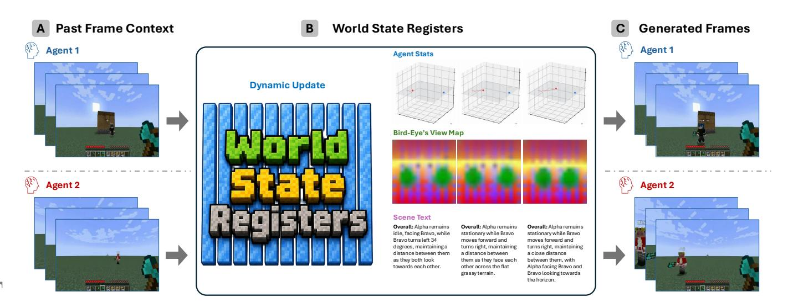
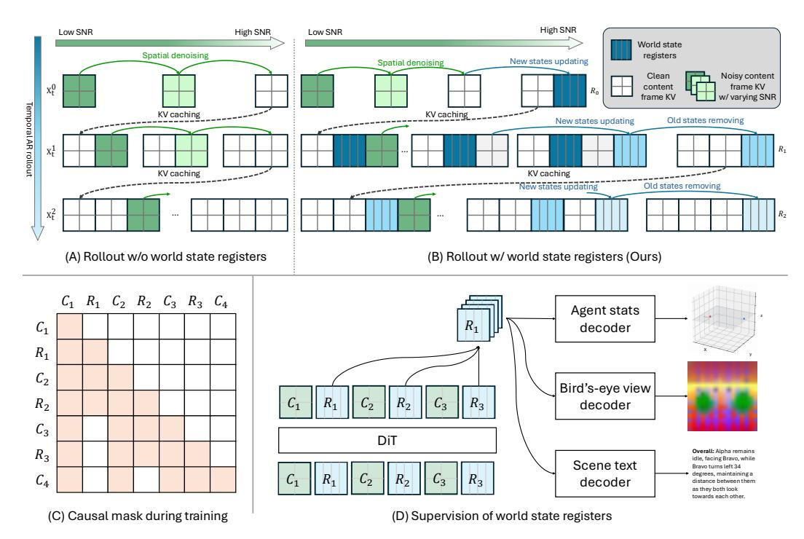
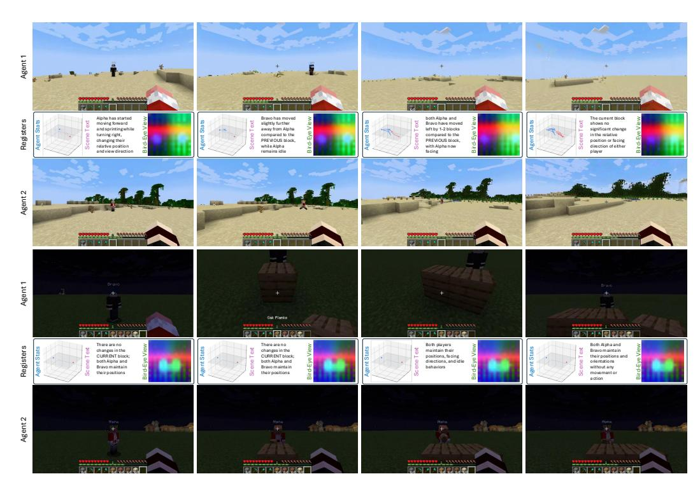
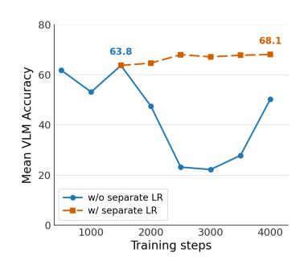
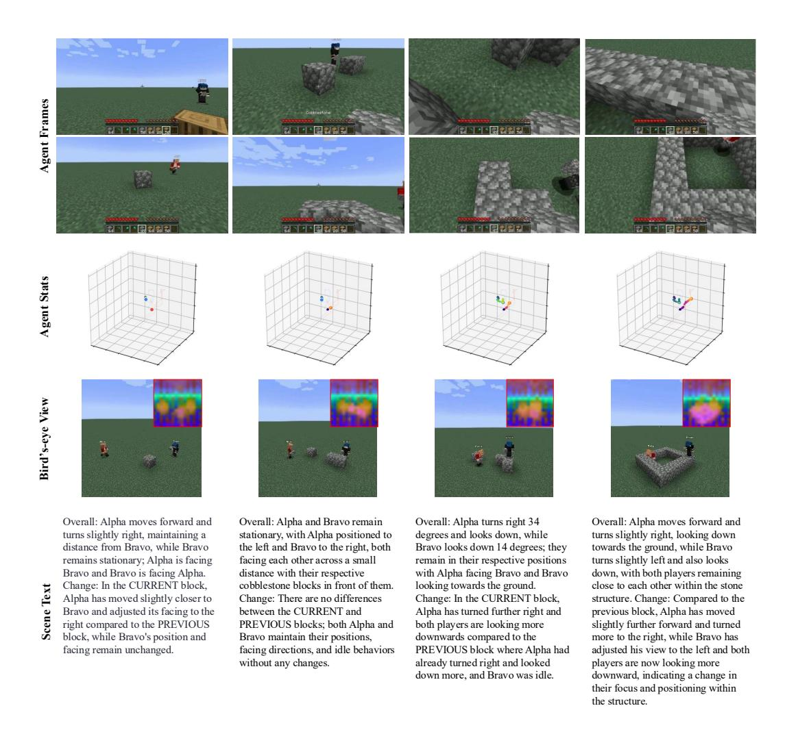

# 스트리밍 멀티-에이전트 자가회귀 확산 모델과 세계 상태 레지스터 (STREAMING MULTI-AGENT AUTOREGRESSIVE DIFFU-SION MODEL WITH WORLD STATE REGISTERS)

- 원제: Streaming Multi-Agent Autoregressive Diffusion Model with World State Registers
- 원문: [https://arxiv.org/abs/2607.21594](https://arxiv.org/abs/2607.21594)
- PDF: [https://arxiv.org/pdf/2607.21594v1](https://arxiv.org/pdf/2607.21594v1)
- arXiv ID: `2607.21594`

---

# 스트리밍 멀티-에이전트 자가회귀 확산 모델과 세계 상태 레지스터 (STREAMING MULTI-AGENT AUTOREGRESSIVE DIFFU-SION MODEL WITH WORLD STATE REGISTERS)

Sicheng Mo* 1 Yuheng Li* 2 Ziyang Leng<sup>1</sup> Krishna Kumar Singh<sup>2</sup> Bolei Zhou<sup>1</sup>

<sup>1</sup>캘리포니아 대학교 로스앤젤레스 <sup>2</sup>Adobe Research



Figure 1: 우리 모델은 공유된 세계에서 상호작용하는 에이전트들을 가능하게 한다. 롤아웃 중에, 레지스터 토큰 집합이 에이전트 간에 공유되는 진화하는 세계 상태를 나타낸다. 이 상태는 에이전트 상태, 항공 시점 뷰, 장면 텍스트를 캡처하며, 새로운 프레임이 생성되는 동안 각 롤아웃 단계에서 동적으로 업데이트된다.

# 초록 (ABSTRACT)

멀티-에이전트 상호작용 세계 모델은 일관된 관측을 생성할 뿐만 아니라 에이전트 간에 지속되고 관점에 따라 진화하는 세계 상태를 유지해야 한다. 기존의 자가회귀 비디오 확산 파이프라인은 관측 이력을 조건부 컨텍스트로 전달하지만, 이는 멀티-에이전트 및 멀티-뷰 설정에서 공유 상태를 유지하기 어렵게 만든다. 우리는 WorldWeaver (W<sup>2</sup>) 를 제시한다. 이는 롤아웃에 교차-에이전트 세계 상태 레지스터를 추가한 스트리밍 멀티-에이전트 비디오 확산 모델이다: 공유 세계 정보를 저장하고, 개별 에이전트 상태를 추적하며, 생성된 각 청크 이후 동적으로 업데이트되는 학습 가능한 토큰. 우리는 이 레지스터를 개별 에이전트 상태, 항공 시점 뷰를 포함한 전역 상태 뷰, 장면 텍스트를 아우르는 감독 신호로 기반화한다. 또한, 우리는 세계 상태 모델링과 시각 프레임 모델링에 별도 가중치를 사용하는 Mixture-of-Transformers 설계를 통해 아키텍처를 개선한다. 두 에이전트가 있는 Minecraft 비디오 생성에서 광범위한 실험을 통해 명시적 세계 상태 모델링이 논리적 일관성과 생성 품질을 향상시킨다. 프로젝트 페이지: <https://vail-ucla.github.io/worldweaver/>

<sup>*</sup>동일 기여 (Equal contribution.)

# <span id="page-1-0"></span>1 서론 (INTRODUCTION)

최근 생성 모델링의 발전은 점점 더 강력한 상호작용 및 스트리밍 세계 모델(WMs)을 가능하게 했다 [(ope;](#page-10-0) [Savva et al.,](#page-11-0) [2026)](#page-11-0). 대부분의 비디오 세계 모델은 단일 에이전트의 관점에서 장면을 시뮬레이션한다. 이 설계는 시각적으로 그럴듯한 프레임을 생성할 수 있지만, 논리적 및 기하학적 일관성을 유지하기는 어렵다. 이 문제는 멀티-에이전트 설정에서 더욱 확대된다 [(Savva et al.,](#page-11-0) [2026)](#page-11-0), 여기서 각 관찰자는 동일한 기본 3D 세계의 부분적인 2D 투영만을 보며, 에이전트 간 관측은 그 공유 상태와 호환되어야 한다. 이러한 교차-에이전트 제약을 넘어, 세계의 상태는 특정 관찰자가 보든 보지 않든 계속 진화한다. 이 관점은 일관성을 개별 에이전트 비디오 생성의 부산물로 다루는 대신, 기본 세계 상태를 직접 모델링하도록 동기를 부여한다.

시간적으로 일관된 비디오는 청크 기반 자가회귀 비디오 확산 모델에 의해 생성될 수 있다 [(Chen et al.,](#page-10-1) [2024;](#page-10-1) [Yin et al.,](#page-12-0) [2024)](#page-12-0). 이러한 파이프라인에서 과거 프레임은 조건부 컨텍스트로 처리되며, 모델은 공동 시공간 주의를 사용해 다음 비디오 청크를 생성한다. 그러나 각 청크는 픽셀 공간으로 디코딩되어야 하므로, 모델은 매 생성 단계마다 세계 정보를 재추론해야 한다. 그 결과, 관측 이력만을 전달하고, 관측된 것과 관측되지 않은 변화를 모두 설명할 수 있는 명시적 세계 상태를 전달하지 못한다. 멀티-뷰 설정에서는 이는 각 에이전트의 관측과 공유 세계 상태 사이에 불일치를 더한다.

이 문제를 해결하기 위해, 우리는 프레임 히스토리에서 반복적으로 추론되는 대신 생성 과정 내부에서 세계 상태를 명시적으로 모델링한다. 우리는 세계 상태 레지스터를 도입한다. 이는 공유된 세계 정보를 캡처하고 생성 중에 점진적으로 업데이트되는 학습 가능한 토큰 그룹이다. 레지스터는 지속적인 전역 정보와 개별 에이전트 상태를 전달하도록 설계되었다. 우리는 세계 상태 레지스터에 대해 두 가지 핵심 속성을 정의한다: (1) 에이전트와 롤아웃 단계에 걸쳐 지속되는 것, 그리고 (2) 새로운 관측이 도착할 때 동적으로 업데이트 가능한 것. 이렇게 함으로써 모든 에이전트의 관측이 세계 상태 업데이트에 기여하여, 기본 세계 상태 수준에서 시간적 및 교차 에이전트 일관성을 촉진한다.

장기 비디오 생성을 촉진하기 위해, 우리는 Self-Forcing 패러다임 [(Huang et al.,](#page-10-2) [2025)](#page-10-2)을 롤아웃 중에 프레임과 세계 레지스터를 모두 업데이트하도록 적용한다. 각 노이즈가 제거된 비디오 청크 이후에, 모델은 이전 레지스터와 새로 생성된 관측값에서 세계 레지스터를 새로 고쳐, 업데이트된 레지스터가 다음 청크를 조건화할 수 있도록 한다. 우리는 또한 보완적 감독 신호를 통해 레지스터를 기반화한다: 에이전트 상태는 지역 움직임 일관성을 장려하고, 항공 시점은 전역 기하학을 제한하며, 장면 텍스트는 의미적 기반을 제공한다. 우리는 또한 소량의 라벨이 지정된 하위 집합이 레지스터 의미를 고정하면서 추가 라벨이 없는 비디오가 생성 롤아웃을 계속 개선할 수 있는 반감독 세계 상태 훈련의 효과를 탐구한다.

우리는 또한 확산 모델에서 세계-상태 모델링을 위한 아키텍처를 연구한다. 밀집 트랜스포머 가중치가 픽셀을 생성하고 세계 레지스터를 업데이트해야 할 때, 프레임과 상태 목표가 경쟁할 수 있다. 특히 레지스터가 보다 풍부한 감독 의미론으로 밀려갈 때 그렇다. 따라서 우리는 세계 레지스터 분기를 별도의 상태 경로로 취급하면서 시각적 롤아웃과 결합을 유지하는 Mixtureof-Transformers (MoT) 아키텍처를 사용한다 [(Liang et al.,](#page-10-3) [2024)](#page-10-3). 이 분리는 감독 레지스터 학습을 향상시키고 스트리밍 생성 중 프레임 레지스터의 자기 강제(self-forcing)를 안정화한다.

We summarize our contributions as follows:

- 1. 우리는 에이전트와 롤아웃 단계에 걸쳐 공유 세계 정보를 전달하는 지속적이며 동적으로 업데이트 가능한 토큰 집합인 세계 상태 레지스터의 새로운 설계를 도입한다.  
- 2. 우리는 개별 에이전트 상태부터 전역 세계 상태 신호(항공 시점 및 장면 텍스트)까지 세계 레지스터를 기반화하기 위한 감독 공간을 탐구한다.  
- 3. 우리는 세계 상태와 비디오 프레임의 공동 생성을 지원하는 향상된 MoT 기반 아키텍처를 제안한다. 실험 결과 이 설계가 성능을 향상시키고 상태 업데이트와 프레임 생성 간의 충돌을 줄인다는 것을 보여준다.

## 2 RELATED WORK

스트리밍 비디오 디퓨전 모델. 대규모 디퓨전 모델은 이미지와 비디오 생성을 위한 유연한 기반을 제공한다. 비디오 디퓨전 모델 [(ope;](#page-10-0) [Ma et al.,](#page-10-4) [2024;](#page-10-4) [Wang et al.,](#page-11-1) [2023)](#page-11-1)은 양방향 어텐션을 사용하여 일관된 시각적 콘텐츠를 합성하고, <span id="page-2-0"></span>공유된 텍스트 조건 하에서 부드러운 시간적 전환을 구현한다. 이러한 백본을 기반으로, 자기회귀 비디오 디퓨전 방법 (Chen et al., 2024; Yin et al., 2024)은 청크 수준의 인과 어텐션과 KV 캐싱을 도입하여 스트리밍 생성을 지원한다. Self-Forcing (Huang et al., 2025)은 훈련 중에 모델을 자체 생성 프레임에 롤아웃하여 훈련-테스트 불일치를 더욱 줄이며, 최근 확장 (Shin et al., 2025; Cui et al., 2025; Zhu et al., 2026; Zhao et al., 2026)은 어텐션 싱크와 강력한 위치 인코딩을 통해 분 단위 스트리밍을 개선한다. 이러한 발전은 장기 시계열 생성을 점점 더 실용적으로 만들지만, 그 주요 목표는 여전히 생성 품질과 롤아웃 안정성이다. 반면, 우리 WorldWeaver는 인터랙티브 생성을 위해 스트리밍 비디오 디퓨전을 기반으로 하며, 지속적인 세계 상태 레지스터를 사용하여 논리적으로 일관된 세계를 생성한다. 이때 시간적 및 교차 에이전트 일관성은 로컬 컨텍스트 창을 넘어선 명시적 상태에 기반한다.

**메모리 기반 비디오 생성.** 메모리 메커니즘은 현재 프레임이나 로컬 컨텍스트에 완전히 명시되지 않은 정보를 보존하기 위해 비디오 생성에서 널리 탐구되어 왔으며, 이는 외관, 정체성, 기하학, 객체 상태 및 장면 레이아웃을 포함한다. 명시적 메모리 방법은 검색 버퍼, 공간 지도, 3D 표현, 또는 4D 장면 메모리를 도입하여 생성자가 참조할 수 있도록 한다 (Xiao et al., 2026; Yu et al., 2025; 2026). 이 설계는 3D 새로운 뷰 합성과 밀접한 관련이 있다. 두 방법 모두 쿼리 가능한 장면 표현을 사용하여 시점 간에 기하학, 외관 및 레이아웃을 보존한다 (Team et al., 2026; Yang et al., 2026b; Sun et al., 2025). 그러나 기존의 명시적 모델링은 확장성 및 시간에 따라 동적 객체 상태를 업데이트해야 하는 필요성에 의해 제한된다. 암시적 메모리 방법은 과거 프레임 조건화, 재귀 롤아웃, 또는 어텐션 KV 캐시를 통해 생성 모델 내부에 히스토리를 저장한다 (Chen et al., 2024; Yin et al., 2024; Huang et al., 2025; Zhao et al., 2026; Gao et al., 2026). 그러나 메모리가 시각 토큰과 얽혀 있고 최근 관측에 편향되기 때문에 제약이 약하다. 다른 연구 라인도 생성 비디오에서 상태 모델링의 역할을 중요시하여 논리적 정확성을 보장한다 (Liu et al., 2026; Po et al., 2025; Chen et al., 2025; Po et al., 2026). 반면, 우리 방법은 메모리를 생성자 내부에 지속적인 세계 상태 레지스터로 보관하지만, 개별 에이전트 상태와 전역 장면 상태로부터 명시적 감독을 받아 암시적 메모리로 훈련한다. 따라서 저장된 상태는 프레임 히스토리만을 넘어 세계 생성을 위한 직접적인 기반을 받는다.

세계 이해와 생성 in 통합 모델. 시각적 생성과 이해는 완전히 분리되지 않는다. 텍스트-투-이미지 확산 모델은 분류(Li et al., 2023; Clark & Jaini, 2023), 탐지(Xu et al., 2024), 세분화(Xu et al., 2023; Tian et al., 2024; Namekata et al., 2024)와 같은 판별 작업에 유용한 시각적 표현을 보여준다. 통합 멀티모달 모델의 한 라인은 텍스트-투-이미지 생성과 이미지-투-텍스트 이해를 위해 단일 모델을 훈련시켜 이 연결을 명시적으로 만든다(Zhou et al., 2024; Wang et al., 2024; Xie et al., 2024). 또 다른 연구 라인(Mo et al., 2025; Shi et al., 2024; Deng et al., 2025; Yang et al., 2026a)에서는 Mixture-of-Transformers(Liang et al., 2024)를 포함해 서로 다른 모달리티와 토큰 역할에 대해 별도의 가중치 또는 전용 융합 모듈을 사용하여 통합 멀티모달 사전 학습을 보다 넓은 교차 및 문맥 풍부한 설정으로 확장한다. 한편 MetaMorph(Tong et al., 2025)과 X-Fusion(Mo et al., 2025)은 이해 작업이 더 강력한 멀티모달 표현을 형성함으로써 생성을 향상시킬 수 있다고 제안한다. 우리의 WorldWeaver는 이러한 관찰을 기반으로 세계 이해와 생성 사이의 시너지 효과를 세계 상태 레지스터를 통해 추가적으로 탐구한다. 이 레지스터는 개별 에이전트 상태와 전역 장면 상태에서 추가적인 기반을 제공하는 구조화되고 검증 가능한 표현을 제공한다.

## 3 METHOD

### 3.1 OVERVIEW

우리는 Solaris (Savva et al., 2026)의 다중 에이전트 세계 모델 설정을 채택한다. 다중 에이전트가 공유 세계에서 행동하며, 모델은 과거 관측 및 행동으로부터 각 에이전트의 미래 비디오 스트림을 예측한다. 우리는 단일 플레이어 잠재 비디오 확산 파이프라인을 확장하여 생성되는 모든 텐서에 플레이어 축을 부착한다. 이는 동기화된 다중 에이전트 생성을 위한 압축된 텐서 설정을 제공한다. P개의 에이전트가 있을 때, 단계별 관측 및 행동은 $\mathbf{x}^t = (\mathbf{x}_1^t, \dots, \mathbf{x}_P^t)$ 그리고 $\mathbf{a}^t = (\mathbf{a}_1^t, \dots, \mathbf{a}_P^t)$ 이다. N개의 잠재 프레임 클립은 $\mathbf{x} \in \mathbb{R}^{P \times N \times H \times W \times C}$ 를 형성한다. 조건 c는 첫 프레임 시각 임베딩, 마스크된 첫 프레임 잠재, 그리고 각 에이전트의 행동 시퀀스를 묶으며, 구체적인 차원은 실험에서 미루어 둔다. 아래 하위 섹션에서 단계별 목표를 소개한다.



Figure 2: 파이프라인 개요. (A) 표준 스트리밍 자기회귀 확산 모델은 로컬 KV 캐시 창에서 각 새 프레임을 디노이즈한다. (B) 우리 모델은 전역 상태 정보를 담고 개별 에이전트 상태를 운반하는 월드 스테이트 레지스터와 함께 스트리밍한다. (C) Stage-2 훈련 중 인과적 어텐션 마스크. 프레임 토큰은 로컬 창과 최신 레지스터에 주의를 기울인다. (D) 보조 디코더는 에이전트 상태, 항공 시점 지도, 장면 텍스트로 레지스터를 기반화하여 월드 스테이트 레지스터가 전역 장면 정보를 인코딩하도록 유도한다.

다음으로 *world state registers*를 별도의 교차 에이전트 상태 경로로 도입한다. 이 레지스터는 공유된 세계에 대한 숨겨진 정보를 캡처하는 학습 가능한 토큰이다. 이 레지스터는 에이전트 간에 공유되며 새로운 프레임이 생성될 때마다 점진적으로 업데이트된다. 레지스터는 causal transformer 안에서 프레임 토큰과 함께 존재하므로, 단일 전방 패스만으로 다음 프레임을 디노이즈하고 동시에 교차 에이전트 세계 상태를 새롭게 할 수 있다. 또한 우리는 Mixture-of-Transformers (MoT) 설계를 사용하여 레지스터 토큰과 프레임 토큰에 별도의 가중치를 부여하면서 교차된 시퀀스에 대한 공동 주의를 유지한다. 자세한 구현은 부록 B.2에 제공된다.

우리 모델은 표준 단일 에이전트 사전 훈련 위에 세 단계 훈련 커리큘럼을 따릅니다. *단계 1 (양방향 훈련)* 은 동기화된 다중 에이전트 클립에서 다중 플레이어 교사 모델을 미세 조정합니다. 교사는 완전한 시간적 맥락을 갖고 양방향 주의를 통해 교차 에이전트 장면 구조를 학습합니다. *단계 2 (인과적 훈련)* 은 이 교사를 인과적 주의와 레지스터 감독을 사용해 흐름 매칭 목표를 계속함으로써 인과적 학생으로 변환합니다. *단계 3 (자기 강제)* 은 학생을 자체 예측에 따라 실행합니다. 각 생성된 프레임 후에 모델은 업데이트된 레지스터를 커밋하므로 레지스터 드리프트가 프레임 드리프트와 함께 드러납니다. 이 단계는 양방향 교사로부터 DMD 스타일 분포 매칭을 사용하면서 상태 감독을 유지합니다.

### 3.2 단계 1: 양방향 훈련 (BIDIRECTIONAL TRAINING)

단계 1은 양방향 및 교차 플레이어 주의를 적용해 모든 플레이어의 잠재 시퀀스를 공동으로 디노이즈하는 다중 플레이어 양방향 교사를 훈련시킵니다. 이 교사는 공유 레이아웃, 상대 플레이어 움직임, 교차 시점 일관성을 포함한 동기화된 장면 구조를 실시간으로 추정합니다. 우리는 사전 훈련된 단일 플레이어 모델에서 초기화하여 시각적 생성 사전 지식을 보존하면서 모델을 동기화된 다중 플레이어 데이터에 적응시킵니다. 우리는 이 교사를 속도 필드 $\mathbf{v}_{\theta}(\mathbf{x}_t, c, t)$ 를 예측하는 조건부 흐름 매칭 목표로 훈련합니다:

$$\mathcal{L}_{\text{flow}} = \mathbb{E}\left[ \left\| \mathbf{v}_{\theta}(\mathbf{x}_{t}, c, t) - (\epsilon - \mathbf{x}_{0}) \right\|_{2}^{2} \right]. \tag{1}$$

#### <span id="page-4-0"></span>3.3 단계 2: 세계 상태 레지스터를 사용한 인과적 훈련 (CAUSAL TRAINING WITH WORLD STATE REGISTERS)

이 단계에서는 양방향 단계 1 체크포인트에서 인과적 모델을 초기화하고 앞서 정의한 동일한 흐름 매칭 손실로 훈련을 계속합니다. Solaris (Savva et al., 2026) 및 Diffusion Forcing (Chen et al., 2024)을 따라, 우리는 각 플레이어와 잠재 프레임마다 독립적인 노이즈 수준을 샘플링하고, 블록 수준 인과 마스크를 적용하며, 최신 W개의 과거 잠재 프레임만 포함하는 슬라이딩 윈도우를 유지합니다. 이 훈련은 학생에게 자기 회귀 생성 능력을 부여하며, 각 새로운 프레임은 행동 입력과 과거 프레임에 조건화됩니다. 그러나 이 설계는 지역 컨텍스트 윈도우를 넘어 세계 모델링을 기반으로 하지 않으므로, 에이전트 간에 공유되는 논리적으로 일관된 세계를 보존하지 못할 수 있습니다.

이 문제를 해결하기 위해 우리는 지역 프레임 히스토리만 의존하지 않고 세계 상태를 명시적으로 모델링합니다. 세계 상태는 특정 시점에서 지속되는 정보를 나타내며, 전역 레이아웃, 객체 구성, 그리고 모든 플레이어의 현재 시점에서 보이지 않을 수 있는 에이전트 상태를 포함한 공유 장면을 요약합니다. 이 상태를 롤아웃 단계마다 전달함으로써 세계 모델은 에이전트 간 예측을 동기화하고 논리적으로 일관된 교차 에이전트 상호작용을 보존할 수 있습니다.

실제로 우리는 세계 상태 레지스터(WSR)를 학습 가능한 K개의 토큰 그룹 $\mathbf{r}_i \in \mathbb{R}^{K \times d}$ 로 정의합니다. WSR을 사용한 세계 모델의 스트리밍 메커니즘을 다음과 같이 공식적으로 정의합니다:

$$\mathbf{r}_i = G_{\theta}(\mathbf{r}_{i-1}, \mathbf{x}_{i-W+1}, \dots, \mathbf{x}_i, a_i), \qquad p_{\theta}(\mathbf{x}_{i+1} \mid \mathbf{x}_{i-W+1}, \dots, \mathbf{x}_i, a_{i+1}, \mathbf{r}_i).$$

롤아웃 중에 각 레지스터 $\mathbf{r}_i$ 는 컨텍스트 프레임 $\mathbf{x}_i$ 가 생성된 후에 커밋되어, 프레임 i를 통해 상태 요약으로 작용하며 다음 컨텍스트 프레임을 조건화합니다.

Diffusion Forcing (Chen et al., 2024)의 인과 마스킹에서 영감을 받아, 우리는 프레임 토큰과 레지스터 그룹을 $[\mathbf{x}_0, \mathbf{r}_0, \mathbf{x}_1, \mathbf{r}_1, \dots, \mathbf{x}_{F-1}, \mathbf{r}_{F-1}]$ 형태로 교차 삽입한다. 이 순서는 롤아웃을 상태 수준에서 인과적으로 만든다: 커밋된 레지스터가 다음 프레임보다 앞서고, 프레임은 그 레지스터에 조건화된다. 구체적으로, $\mathbf{r}_i$ 가 $\mathbf{x}_{i+1}$ 를 앞서고 조건화하므로, 상태 업데이트와 프레임 예측이 시퀀스 전체에서 번갈아 수행된다. 로컬 어텐션 윈도우 크기 W와 결합하면, 각 레지스터 쿼리는 커밋 단계에서 끝나는 동일한 로컬 컨텍스트 프레임과 바로 앞선 레지스터에 주의를 기울인다. 레지스터 쿼리 $\mathbf{r}_i$ 는 $[\mathbf{x}_{i-W+1}, \dots, \mathbf{x}_i]$ 와 $\mathbf{r}_{i-1}$ 에 주의를 기울인다 (Figure 2(C) 참조).

Stage 2는 흐름 매칭 손실과 레지스터 감독을 하나의 학습 목표 안에 유지하며, 흐름 매칭 항은 커밋된 레지스터 아래에서 인과적 학생 프레임 수준 감독을 제공한다. 그러나 이 신호만으로는 WSR 경로가 어떤 정보를 보존해야 하는지 명시하지 않는다. 따라서 우리는 각 커밋된 레지스터를 보조 세계 상태 예측으로 기반화한다 (Figure 2(D) 참조). 각 감독 유형 $m \in \mathcal{M}$ 에 대해, 예측 헤드 출력 $h_m(\mathbf{r}_i)$, 동일 단계 목표 $\mathbf{y}_i^m$, 그리고 메트릭 $d_m$ 가 예측, 목표, 거리 계산을 명시한다. 실험에서는 세 가지 감독 신호를 사용한다:

- 1. **Agent status.** 헤드는 시뮬레이터 상태 벡터 $\hat{\mathbf{y}}_i^{\text{agent}} = h_{\text{agent}}(\mathbf{r}_i)$ 를 예측하며, 목표 $\mathbf{y}_i^{\text{agent}}$ 는 위치, 속도, 방향을 포함한다. 우리는 $d_{\text{agent}} = \|\hat{\mathbf{y}}_i^{\text{agent}} \mathbf{y}_i^{\text{agent}}\|_2^2$ 를 사용한다.  
- 2. **Bird's-eye-view map.** 헤드는 비행 시점 맵 $\hat{\mathbf{y}}_i^{\text{bev}} = h_{\text{bev}}(\mathbf{r}_i)$ 를 예측하며, 정렬된 비행 시점 목표 $\mathbf{y}_i^{\text{bev}}$ 로 감독된다. 우리는 $d_{\text{bev}} = 1 - \cos(\hat{\mathbf{y}}_i^{\text{bev}}, \phi_{\text{DINOv2}}(\mathbf{y}_i^{\text{bev}}))$ 를 사용한다, 여기서 $\phi_{\text{DINOv2}}$ 는 동결된 DINOv2 인코더 (Oquab et al., 2024)를 의미한다.  
- 3. Scene text. 헤드는 토큰 로짓 $\hat{\mathbf{y}}_i^{\text{text}} = h_{\text{text}}(\mathbf{r}_i)$ 를 예측하며, 목표 $\mathbf{y}_i^{\text{text}}$ 는 텍스트 장면 설명이다. 우리는 $d_{\text{text}} = \text{CE}(\hat{\mathbf{y}}_i^{\text{text}}, \mathbf{y}_i^{\text{text}})$ 를 사용한다.

흐름 매칭 손실과 함께, 우리는 다음과 같은 목표로 학생을 학습시킨다:

$$\mathcal{L}_{\text{reg}} = \sum_{i,m} \lambda_m d_m \left( h_m(\mathbf{r}_i), \mathbf{y}_i^m \right), \qquad \mathcal{L}_{\text{S2}} = \mathcal{L}_{\text{flow}} + \lambda_{\text{state}} \mathcal{L}_{\text{reg}}.$$

여기서 합계는 롤아웃 단계와 세 가지 목표 유형을 대상으로 하며, 우리는 Stage 2에서 기본적으로 $\lambda_{\rm state}$ 를 1로 설정한다. Stage 2 목표에서 $\mathcal{L}_{\rm flow}$ 는 프레임 생성 흐름 매칭 손실을 유지하고, $\mathcal{L}_{\rm reg}$ 는 커밋된 레지스터에 명시적 상태 목표를 부여한다. 예측 헤드는 학습 전용 모듈이며 추론 시 폐기되므로, 이 감독은 롤아웃 비용을 변경하지 않는다. 우리는 Section 4.3에서 이 감독 유형들을 ablate한다.

<span id="page-5-2"></span><span id="page-5-0"></span>**Algorithm 1** 자율 회귀형 확산 추론과 세계 상태 레지스터

Require: Frame KV cache size W  
Require: Conditioning C  
Require: Denoising time steps \{t_1, \ldots, t_T\}  
Require: Number of generated frames M  
Require: Causal AR diffusion model G_{\theta}, returning  
      KV via G_{\theta}  
1: 생성된 잠재 변수 \mathbf{X}_{\theta} 를 빈 리스트로 초기화  
2: frame KV cache KV_C 를 빈 리스트로 초기화  
3: register KV cache KV_R 를 빈 리스트로 초기화  
4: world state \mathbf{r}_0 를 초기화  
5: KV_R.append(\mathbf{r}_0)  
6: for i = 1, ..., M do  
           Initialize \mathbf{x}_{t_T}^i \sim \mathcal{N}(0, I)  
7:  
           for j = T, \dots, 1 do  
8:  
9:  
                 Set \mathbf{KV} \leftarrow (\mathrm{KV}_C, \mathrm{KV}_R)  
10:  
                 Set \hat{\mathbf{x}}_0^i \leftarrow G_{\theta}(\mathbf{x}_{t_i}^i; t_j, \mathbf{KV}, c_i)  
                 if j=1 then  
11:  
12.  
                      \mathbf{X}_{\theta}.append(\hat{\mathbf{x}}_0^i)  
                      Set KV_C^i \leftarrow G_\theta(\hat{\mathbf{x}}_0^i; 0, \mathbf{KV}, c_i)  
13:  
14:  
                      if |KV_C| = W then  
15:  
                            KV_C.pop(0)  
                      end if  
16:  
17:  
                      KV_C.append(KV_C^i)  
18:  
                      Set \mathbf{r}_i \leftarrow G_{\theta}(KV_B, \hat{\mathbf{x}}_0^i, c_i)  
                      Set KV_R \leftarrow [\mathbf{r}_0, \mathbf{r}_i]  
19:  
20:  
                 else  
21:  
                      sample \epsilon \sim \mathcal{N}(0, I)  
22:  
                      Set \mathbf{x}_{t_{j-1}}^i \leftarrow \Psi(\hat{\mathbf{x}}_0^i, \epsilon, t_{j-1})  
23:  
                 end if  
24:  
           end for  
25: end for  
26: return X_{\theta}

<span id="page-5-1"></span>**Algorithm 2** (프레임 및 상태 레지스터 롤아웃을 이용한 셀프-포싱 트레이닝)

```
Require: 조건화 C
Require: 디노이징 시간 단계 \{t_1, \ldots, t_T\}
Require: 비디오 프레임 수 N
Require: 인과 AR 확산 모델 G_{\theta}, KV를 G_{\theta}를 통해 반환
 1: loop
 2:
            Initialize generated latents \mathbf{X}_{\theta} \leftarrow []
 3:
            Initialize frame KV cache KV_C \leftarrow []
 4:
            Initialize register KV cache KV_R \leftarrow []
 5:
            Initialize world state \mathbf{r}_0
 6:
            KV_R.append(\mathbf{r}_0)
 7:
            sample s \sim \text{Uniform}(1, \dots, T)
 8:
            for i = 1, \ldots, N do
 9:
                 Initialize \mathbf{x}_{t_T}^i \sim \mathcal{N}(0, I)
10:
                 for j = T, \ldots, s do
                       Set \mathbf{KV} \leftarrow (\mathrm{KV}_C, \mathrm{KV}_R)
11:
                       Set \hat{\mathbf{x}}_0^i \leftarrow G_{\theta}(\mathbf{x}_{t_j}^i; t_j, \mathbf{KV}, c_i)
12:
                       if j = s then
13.
14:
                             \mathbf{X}_{\theta}.append(\hat{\mathbf{x}}_{0}^{i})
15:
                             Set KV_C^i \leftarrow G_\theta(\hat{\mathbf{x}}_0^i; 0, \mathbf{KV}, c_i)
16:
                             KV_C.append(KV_C^i)
17:
                             Set \mathbf{r}_i \leftarrow G_{\theta}(0, \mathbf{KV}, c_i)
18:
                             Set KV_R \leftarrow [\mathbf{r}_0, \mathbf{r}_i]
19:
                       else
20:
                             sample \epsilon \sim \mathcal{N}(0, I)
21:
                             Set \mathbf{x}_{t_{j-1}}^i \leftarrow \Psi(\hat{\mathbf{x}}_0^i, \epsilon, t_{j-1})
22:
                       end if
23:
                  end for
24:
            end for
25:
            Update \theta with \mathcal{L}_{S3}, and update s_{fake} on stu-
      dent rollouts
26: end loop
```

### 3.4 단계 3: 컨텍스트 프레임 및 상태 롤아웃을 이용한 셀프포싱 (STAGE 3: SELF-FORCING WITH CONTEXT FRAME AND STATE ROLLOUT)

우리는 추론 롤아웃(inference rollout)을 배포 시에 우리 세계 모델이 사용하는 자기 회귀 절차로 정의한다. 각 단계에서 모델은 현재 프레임 KV 캐시, 최신 커밋된 레지스터, 그리고 액션 입력으로부터 다음 잠재 프레임을 디노이즈한다. 그 후 생성된 프레임을 캐시에 추가하고, 업데이트된 세계 상태를 요약하기 위해 세계 상태 레지스터를 새로 고친다. 알고리즘 1은 이 추론 롤아웃을 제공하며, 그림 2(B)는 동일한 프레임 레지스터 루프를 시각화한다.

그러나 Stage 2 모델은 아직 장기 롤아웃(long-horizon rollout)에 준비가 되어 있지 않다. Teacher forcing는 학생을 실제 원인적(ground truth causal) 컨텍스트에서 훈련시키지만, 추론 단계에서는 자체적으로 생성된 프레임과 커밋된 레지스터를 사용하여 프레임 및 상태 오류가 롤아웃 전반에 걸쳐 전파될 수 있다. Self-Forcing을 따라 Stage 3은 훈련 중에 이 롤아웃을 시뮬레이션하고, 인과적 학생이 자신의 생성된 과거를 경험하도록 하여 불일치를 해결한다. 우리는 self-forcing 훈련 루프를 생성된 컨텍스트 프레임과 커밋된 레지스터에서 학생을 먼저 실행한 뒤, 그 결과 정제된 예측에 self-forcing 목표를 적용하는 롤아웃으로 정의한다. 알고리즘 2가 이 루프를 요약한다.

Self-Forcing (Huang et al., 2025)에서 제시한 DMD 생성기 목표를 적용하여, 우리는 롤아웃 예측을 새로운 노이즈로 교란한다, $\hat{\mathbf{x}}_t = (1 - t)\hat{\mathbf{x}_0} + t\epsilon$ for $\epsilon \sim \mathcal{N}(0, I)$, 그리고 학생을 훈련시킨다.

$$\mathcal{L}_{\text{sf}} = \mathbb{E}_{t,\epsilon} \left[ \frac{1}{2} \left\| \hat{\mathbf{x}}_0 - \text{sg} \left( \hat{\mathbf{x}}_0 - \left( s_{\text{fake}} (\hat{\mathbf{x}}_t, c, t) - s_{\text{real}} (\hat{\mathbf{x}}_t, c, t) \right) \right) \right\|_2^2 \right]. \tag{2}$$

여기서 $sg(\cdot)$는 gradient를 멈추는(stop gradient)를 의미하고, $s_{real}$은 Stage 1 교사에서 초기화된 동결된 스코어 네트워크이며, $s_{fake}$는 학생 롤아웃에 대한 학습 가능한 크리틱이다. 프레임 $\mathbf{x}_i$가 롤아웃 중에 $\mathbf{r}_i$를 커밋하므로, Stage 3은 완료된 컨텍스트 프레임의 세계 상태를 인코딩하는 레지스터에 동일한 레지스터 손실을 재사용한다:

$$\mathcal{L}_{S3} = \mathcal{L}_{sf} + \lambda_{state} \mathcal{L}_{reg}$$

.

<span id="page-6-2"></span>우리는 Stage 3에서 λstate를 기본값으로 1로 설정한다. 실제로 우리는 Solaris [(Savva et al.,](#page-11-0) [2026)](#page-11-0)를 따라 1000 → 750 → 500 → 250 → 0의 타임스텝을 갖는 4단계 디노이징 스케줄을 사용하고, 롤아웃 중에 조기 종료 디노이징 스텝을 샘플링하여 확률적 기울기 절단(stochastic gradient truncation)을 수행한다. 이 단계에서 우리는 DMD 손실만으로는 안정성을 향상시키기에 충분하지 않다는 것을 발견한다. 이는 WSR 모델링도 드리프트(drift)를 겪기 때문이다. 따라서 우리는 Stage 2에 비해 선택된 헤드당 레지스터 감독 가중치를 증가시켜 더 나은 레지스터를 학습하고 장기 롤아웃을 안정화한다.

## 4 EXPERIMENTS (실험)

본 섹션에서는 먼저 Sec. [4.2,](#page-6-0)에서 주요 결과를 제시하고, Sec. [4.3,](#page-7-0)에서 각 감독 신호의 기여도를 분석하며, Sec. [4.4,](#page-8-0)에서 모델 아키텍처를 연구하고, Sec. [4.5.](#page-9-0)에서 반지도 학습(semi-supervised training)을 논의한다.

# <span id="page-6-1"></span>4.1 EXPERIMENTAL SETUP (실험 설정)

학습 데이터. 우리는 SolarisEngine [(Savva et al.,](#page-11-0) [2026)](#page-11-0)를 기반으로 한 데이터 수집 파이프라인을 활용한다. 우리는 광범위한 에이전트 상태 정보와 추가적인 항공 시점 카메라 영상을 포함한 동기화된 두 플레이어 비디오를 약 126시간 수집한다. 또한 각 4‑프레임 클립의 장면 텍스트를 Qwen2.5‑VL‑72B‑Instruct [(Bai et al.,](#page-10-15) [2025)](#page-10-15)로 주석한다. 자세한 데이터 수집 및 주석은 부록 [A.](#page-14-0)에 제공된다.

평가. 우리는 Solaris 원본 테스트 스플릿 [(Savva et al.,](#page-11-0) [2026)](#page-11-0)에서 모델을 평가한다. 각 클립마다 모델은 두 플레이어의 첫 프레임 관측과 전체 액션 시퀀스를 받아 남은 롤아웃을 생성한다. 우리는 각 평가 카테고리에 대해 VLM 정확도와 FID를 보고한다. VLM 정확도는 생성된 비디오가 쿼리된 세계 관계, 예를 들어 상대 객체 위치와 플레이어 간 일관성을 보존하는지를 측정하며, FID는 시각적 사실감과 분포적 충실도를 측정한다. 이 두 축을 대체하지 않고 요약하기 위해 보조 세계 점수(auxiliary world score)를 보고한다:

WorldScore =

$$\frac{\frac{1}{K} \sum_{k=1}^{K} \text{VLM}_k}{\frac{1}{K} \sum_{k=1}^{K} \text{FID}_k},$$

(3)

K = 5인 경우입니다. VLM 정확도를 백분율 포인트 단위로 보고하고, 비율을 100배하여 가독성을 높입니다. WorldScore는 무한대이며 FID의 스케일에 민감하기 때문에 보조 순위 지표로만 사용합니다. VLM 정확도와 FID는 여전히 주요 지표입니다.

### <span id="page-6-0"></span>4.2 주요 결과 (MAIN RESULTS)\n

We compare our WorldWeaver multi-agent world model with the following baselines: (1) *Frame concat*: a world model that concatenates the two players' observations along the channel dimension, following Multiverse [(team,](#page-11-17) [2025)](#page-11-17); (2) *Solaris* [(Savva et al.,](#page-11-0) [2026)](#page-11-0): a multi-agent world model that synchronizes multi-agent observations by extending the sequence of frame tokens and using bidirectional attention across players. To ensure a fair comparison, we retrain the Solaris model with the same training data as our model.

Table [1,](#page-7-1)에 표시된 바와 같이 WorldWeaver는 총합 세계 점수를 105.1로 개선하여 이전 최고치를 크게 앞섰다. VLM 정확도 향상은 상태 민감 범주에서 가장 두드러진다. Solaris 기준선과 비교하면 Grounding이 81.3에서 93.8로 상승하고 Building이 9.4에서 28.1로 상승하며 Consistency가 57.8에서 76.6으로 상승한다. 이러한 향상은 지속적 레지스터가 시각적 충실도를 넘어서는 역할을 함을 시사한다: 모델이 플레이어와 롤아웃 단계에 걸쳐 논리적으로 일관되고 검증 가능한 세계 모델을 유지하도록 돕는다.

Figure [3](#page-7-2) visualizes the generated world together with decoded world states, including agent statistics, bird's-eye-view maps, and scene text. For agent statistics, we selectively visualize the positions and trajectories. For the bird's-eye-view maps, we use PCA to project the predicted DINOv2 [(Oquab](#page-10-14) [et al.,](#page-10-14) [2024)](#page-10-14) features to RGB images. WSR rollout allows WorldWeaver to generate a logically coherent world and better synchronize cross-agent information. Additionally, WSR offers a more interpretable way to inspect the state represented by each generated chunk.

<span id="page-7-3"></span><span id="page-7-1"></span>표 1: 다중 에이전트 세계 모델 기준선과의 비교. 우리는 카테고리별 VLM 정확도, FID [(Heusel et al.,](#page-10-16) [2017)](#page-10-16), 그리고 총합 세계 점수를 보고한다. 각 열에서 가장 좋은 결과는 굵게 표시된다.

|  | 이동 |  | 근거화 |  | 메모리 |  | 구축 |  | 일관성 | 세계 |
|--------------|----------|-------|-----------|-------|--------|-------|----------|-------|-------------|------------------|
| 방법 | VLM ↑ | FID ↓ | VLM ↑ | FID ↓ | VLM ↑ | FID ↓ | VLM ↑ | FID ↓ | VLM ↑ | FID ↓<br>점수 ↑ |
| 프레임 연결 | 77.1 | 68.9 | 53.1 | 66.6 | 37.5 | 74.4 | 0.0 | 103.2 | 49.5 | 129.4<br>49.1 |
| Solaris∗ | 79.7 | 43.3 | 81.3 | 37.2 | 43.8 | 61.2 | 9.4 | 83.4 | 57.8 | 110.7<br>81.0 |
| W2<br>(우리의) | 82.8 | 34.0 | 93.8 | 36.8 | 46.9 | 64.8 | 28.1 | 75.9 | 76.6 | 100.7<br>105.1 |



<span id="page-7-2"></span>Figure 3: 정성적 시각화. 우리는 기반 세계 상태를 가진 다중 에이전트 롤아웃을 보여준다: 에이전트 좌표, 항공 시점 지도, 그리고 장면 텍스트. 이 신호들은 지속적인 세계 상태를 검사 가능하게 만들고, 시간에 따른 플레이어 간 일관성을 검증하는 데 도움을 준다. 보다 자세한 비디오 데모는 프로젝트 페이지를 참조하라.

### <span id="page-7-0"></span>4.3 감독 신호 분석 (ANALYSIS OF SUPERVISION SIGNALS)

핵심 문제는 세계 상태 레지스터를 어떻게 감독할 것인가뿐 아니라, 명시적 감독이 왜 필요한가라는 것이다. 이상적으로 레지스터는 확산 손실만으로 에이전트별 상태와 전역 장면 정보를 모두 학습할 수 있다. 그러나 실제로는 이 신호가 세계 상태로 저장되어야 할 정보를 명시하지 않는다. 따라서 우리는 레지스터가 의미 있고 유용한 세계 상태 정보를 인코딩하도록 유도하는 보완적 감독 신호를 추가한다.

우리는 세계 상태 레지스터가 지역 역학, 전역 기하학, 그리고 교차 모달 의미를 인코딩해야 한다고 가정한다. 따라서 세 가지 감독 유형을 다음과 같이 구현한다. (1) 개별 상태 감독을 위해, 레지스터는 *agent statistics*를 예측한다. 여기에는 각 플레이어의 위치, 속도, 방향이 포함된다. 이 목표는 레지스터에 명시적 에이전트별 좌표 신호를 제공하여, 지속적인 상태가 각 플레이어에 대한 검증 가능한 움직임 정보를 담고 있는지 테스트할 수 있게 한다. (2) 전역 3D 감독을 위해, 우리는 *bird's-eye view*를 사용한다. 이는 장면 배치와 객체 분포를 외심적 관점에서 노출한다. 이 신호는 레지스터가 현재 프레임에서 보이는 자아중심적 증거뿐 아니라 두 플레이어가 공유하는 공간 구조를 보존하도록 요구한다. (3) 전역 교차 모달 감독을 위해, 우리는 *scene text*를 부착한다. 이는 현재 프레임의 시각적 상태를 언어로 설명한다. 이 목표는 지역 역학과 전역 기하학을 보완하며, 레지스터가 롤아웃 전반에 걸쳐 범주, 속성, 그리고 고수준 내용을 보존하도록 요구한다.

<span id="page-8-3"></span><span id="page-8-1"></span>Table 2: 세계 상태 레지스터에 대한 감독 소거 (Supervision ablation for world state registers). 우리는 명시적 목표가 없는 레지스터와 다른 신호를 가진 레지스터를 비교한다; 이들의 조합은 세계 상태 레지스터를 더욱 향상시킨다.

|  | 이동 | mant | 근거화 |  | 메모리 |  | 구축 |  | 일관성 |  | 세계 |  |
|-------------------|------|-----------------|-----------|--------|--------|------|----------|------|-------------|-------|---------|--|
|  | 이동 | шеш | Groun | lullig | 남성 | iory | Dulic | mig | Collsis | tency | 세계 |  |
| 변형 | VLM↑ | $FID\downarrow$ | VLM↑ | FID↓ | VLM↑ | FID↓ | VLM ↑ | FID↓ | VLM↑ | FID↓ | Score ↑ |  |
| 베이스라인 | 79.7 | 43.3 | 81.3 | 37.2 | 43.8 | 61.2 | 9.4 | 83.4 | 57.8 | 110.7 | 81.0 |  |
| 레지스터만 | 90.6 | 43.2 | 81.3 | 44.3 | 62.5 | 66.1 | 21.9 | 84.3 | 62.5 | 101.9 | 93.8 |  |
| + 에이전트 통계 | 95.3 | 41.0 | 59.4 | 45.5 | 56.3 | 60.1 | 9.4 | 80.8 | 75.0 | 107.9 | 88.1 |  |
| + 항공 시점 | 82.8 | 39.1 | 96.9 | 40.7 | 46.9 | 64.7 | 31.3 | 74.2 | 71.9 | 103.4 | 102.4 |  |
| + 장면 텍스트 | 85.9 | 40.2 | 84.4 | 38.4 | 62.5 | 62.1 | 25.0 | 78.8 | 73.4 | 101.6 | 103.2 |  |
| + 전체 | 82.8 | 34.0 | 93.8 | 36.8 | 46.9 | 64.8 | 28.1 | 75.9 | 76.6 | 100.7 | 105.1 |  |

우리는 Solaris (Savva et al., 2026) 기준으로 시작하여, 먼저 명시적 감독 없이 레지스터를 활성화하고, 그 다음 각 신호를 추가한 뒤, 최종적으로 결합된 설정을 평가합니다. 이는 표 2에 보고된 바와 같습니다. 나머지 하이퍼파라미터는 섹션 4.1의 기본값을 그대로 유지합니다. 먼저, 레지스터만으로도 이미 도움이 되는 것을 관찰합니다: 명시적 상태 목표가 없더라도 세계 점수는 81.0에서 93.8로 향상됩니다. 우리는 이 이득을 레지스터가 암시적으로 지속적인 세계 상태를 구축하기 때문이라고 설명합니다. 레지스터는 매 단계마다 로컬 윈도우에서 재계산하는 대신 교차 에이전트 정보를 전달할 전용 슬롯을 제공하기 때문입니다.

그러나 세계 상태 목표를 명시적으로 모델링하면 기준선보다 성능을 더욱 끌어올릴 수 있습니다. 세 가지 감독 변형 모두 기준선(81.0)을 능가하는데, 이는 레지스터가 인코딩해야 할 내용을 명시하고 롤아웃 단계 전반에 걸쳐 검증 가능하도록 유지하기 때문이며, 픽셀 손실에 전적으로 맡기지 않기 때문입니다. 우리는 단일 감독 신호 중 장면 텍스트가 가장 큰 도움을 주어 세계 점수를 103.2로 끌어올린다는 것을 발견했습니다. 세 가지 신호를 모두 결합하면 세계 점수가 93.8에서 105.1로 더욱 상승하며 평균 VLM 정확도는 높아지고 평균 FID는 낮아집니다. 이 결과는 우리의 가설을 뒷받침하며 다중 에이전트 세계 모델 설정에서 세계 상태 레지스터를 활성화하는 중요성을 강조합니다.

### <span id="page-8-0"></span>4.4 모델 아키텍처 분석 (Analysis of Model Architecture)

최근 다중모달 생성 연구(Mo et al., 2025)에 영감을 받아, 우리는 아키텍처를 서로 다른 토큰 역할 간의 충돌 가능성으로 바라봅니다. 밀집 변환기는 원칙적으로 동일한 파라미터를 사용해 픽셀 컨텍스트 프레임을 렌더링하고 정확한 세계 상태 레지스터를 생성할 수 있습니다. 그러나 레지스터 토큰은 세계에 대한 숨겨진 정보를 나타내도록 설계되었으며, 프레임 토큰은 주로 지역 시각 정보를 전달합니다. 이러한 기능적 차이는 레지스터가 더 풍부한 상태 정보를 인코딩하게 되면 균형을 맞추기가 더 어려워집니다. 우리는 MoT 설계를 따라 레지스터와 프레임 토큰을 처리할 때 별도의 모달리티별 가중치를 사용하고, 이들을 공유 어텐션 메커니즘을 통해 상호작용하도록 허용합니다.

표 3은 명시적 감독 없이 레지스터를 사용한 경우와 장면 텍스트 감독을 사용한 경우 두 설정에서 밀집 백본과 MoT 백본을 비교합니다. 결과는 MoT가 자동으로 유리한 것은 아님을 시사합니다. 명시적 감독이 없을 때 MoT는 밀집 백본 대비 총합 세계 점수를 향상시키지 못합니다. 장면 텍스트 감독 하에서는 패턴이 바뀝니다: 밀집 모델은 세계 점수가 91.3으로 감소하는 반면 MoT는 103.2에 도달합니다. 이 대비는 세계 상태 레지스터의 풍부한 의미 표현이 시각 토큰과 동일한 파라미터화로 처리하기 어렵다는 것을 시사합니다. 따라서 레지스터가 독특한 의미 세계 상태를 전달할 때 레지스터와 프레임 계산을 분리하는 것이 유용해집니다.

추가로, 우리는 Stage 3 훈련 중 MoT 모델의 학습 역학을 조사합니다. 별도의 가중치 파라미터는 보다 통제된 학습 과정을 가능하게 합니다. 우리는 경험적으로 Stage 3 훈련에서 레지스터 손실이 DMD 증류 손실보다 더 느리게 수렴함을 발견했으며, 레지스터 손실은 주로 레지스터 변환기를 업데이트하고 DMD 증류 손실은 주로 시각 변환기를 업데이트합니다. 따라서 1500단계 이후에는 별도의 LR 스케줄을 적용하여 시각 변환기의 가중치 파라미터를 고정하고, Stage 3 훈련 동안 레지스터 변환기의 가중치 파라미터만 업데이트합니다. 그림 4에 표시된 바와 같이 평균 VLM 정확도는 63.8에서 68.1로 향상됩니다. 이 결과는 WSR 기반 다중 에이전트 세계 모델링에 MoT가 중요함을 시사합니다.



<span id="page-8-2"></span>Figure 4: **Stage 3 자기 강제화에서의 VLM 정확도.** (VLM accuracy over Stage 3 self-forcing.)

<span id="page-9-1"></span>Table 3: Dense와 MoT 백본 소거 (Dense and MoT backbone ablation). 우리는 등록이 없는 상황과 장면 텍스트 감독 하에서 밀집 변환기와 Mixture of Transformers를 비교한다.

|  | 이동 | 행위 | 기초 | 링 | 메모 | 리 | 구축 | 링 | 일관성 | 성 세계 |
|----------------|------------------------|------|-------|------|------|------|-------|------|--------|-----------------|
| 모델 | VLM↑ | FID↓ | VLM↑ | FID↓ | VLM↑ | FID↓ | VLM↑ | FID↓ | VLM↑ | FID ↓   점수 ↑ |
| 감독 없음 |  |  |  |  |  |  |  |  |  |  |
| 밀집 | 76.6 | 41.7 | 87.5 | 40.4 | 65.6 | 54.0 | 12.5 | 87.2 | 73.4 | 107.4 95.5 |
| MoT | 90.6 | 43.2 | 81.3 | 44.3 | 62.5 | 66.1 | 21.9 | 84.3 | 62.5 | 101.9 93.8 |
| Scene te | 장면 텍스트 감독 |  |  |  |  |  |  |  |  |  |
| 밀집 | 81.3 | 37.3 | 81.3 | 53.1 | 53.1 | 54.8 | 9.4 | 73.9 | 71.9 | 106.4 91.3 |
| MoT | 85.9 | 40.2 | 84.4 | 38.4 | 62.5 | 62.1 | 25.0 | 78.8 | 73.4 | 101.6 103.2 |

<span id="page-9-2"></span>Table 4: 반지도 학습 (Semi-supervised training). 각 행은 항공 뷰 주석이 없는 데이터 클립 수(라벨이 없는 데이터)를 변동시킨다. 여기서 "1K / N K"는 1K개의 라벨이 있는 클립과 N K개의 라벨이 없는 클립을 나타낸다.

|  | 이동 |  | 기초화 |  | 메모리 |  | 구축 |  | 일관성 | tency   World |
|------------|----------|------|-----------|------|--------|------|----------|------|--------|-----------------|
| 데이터 분할 | VLM↑ | FID↓ | VLM↑ | FID↓ | VLM↑ | FID↓ | VLM↑ | FID↓ | VLM↑ | FID ↓   Score ↑ |
| 1K / 0K | 78.1 | 60.0 | 75.0 | 72.6 | 21.9 | 95.0 | 15.6 | 76.9 | 71.9 | 111.0   63.2 |
| 1K / 2.5K | 68.8 | 58.8 | 56.3 | 60.2 | 65.6 | 96.4 | 15.6 | 79.7 | 56.3 | 112.4 64.4 |
| 1K / 5.0K | 85.9 | 60.4 | 56.3 | 58.3 | 81.3 | 79.8 | 28.1 | 76.6 | 71.9 | 117.7 82.3 |
| 1K / 10.0K | 81.3 | 44.3 | 65.6 | 53.2 | 84.3 | 75.8 | 25.0 | 73.6 | 68.8 | 112.9 90.3 |

#### <span id="page-9-0"></span>4.5 확장: 반지도 학습

자연스러운 질문은 이 파이프라인이 완전히 장착된 시뮬레이터 데이터에서 벗어나 보다 현실적인 세계 모델링으로 확장될 수 있는가 하는 것이다. 실제 세계 데이터를 명시적인 세계 상태 주석(예: 에이전트 통계와 항공 시점 맵)과 함께 수집하는 것은 여전히 어려운 일이다. 따라서 우리는 반지도 학습 설정을 채택한다: 항공 시점 맵이 있는 클립은 라벨링되고, 없는 클립은 라벨링되지 않는다. 이 설정은 원시 비디오가 풍부하지만 명시적인 세계 상태 라벨이 제한적인 미래의 현실적인 데이터 환경을 대리한다.

우리의 실험 설정에서는 라벨링된 세트를 1K 비디오 클립으로 고정하고, 라벨링되지 않은 비디오 클립의 양을 점진적으로 늘린다. 라벨링된 샘플은 확산 손실과 레지스터 감독 손실을 모두 받으며, 라벨링되지 않은 샘플은 확산 목표만을 통해 비디오 생성기를 학습시킨다. 우리는 항공 시점 감독을 적용하고, Stage-2 훈련 길이를 제외한 기본 훈련 하이퍼파라미터를 그대로 사용한다. Stage-2에서는 라벨링된 데이터에 과적합을 방지하기 위해 60K 단계 대신 20K 단계를 사용한다. 표 4는 라벨링되지 않은 데이터를 추가하면 총 세계 점수가 라벨링되지 않은 데이터가 없을 때 63.2에서 5K 라벨링되지 않은 클립으로 82.3, 10K 라벨링되지 않은 클립으로 90.3으로 향상된다는 것을 보여준다. 표 전체에서 VLM 정확도와 FID 모두 일관된 개선을 관찰하며, 이는 라벨링된 소규모 하위 집합이 레지스터에서 숨겨진 세계 상태를 고정할 때 라벨링되지 않은 롤아웃 데이터가 여전히 생성 품질을 향상시킬 수 있음을 시사한다. 전반적으로, 우리의 접근법은 명시적인 세계 상태 라벨을 수집하기 어려운 상황에서 유망한 방향을 제시한다.

## 5 결론

우리는 WorldWeaver를 소개한다. 이는 상호작용 비디오 생성을 위해 교차 에이전트 세계 상태 레지스터를 갖춘 스트리밍 다중 에이전트 비디오 확산 모델이다. 핵심 아이디어는 에이전트 간에 공유되는 세계 상태를 유지하고 업데이트하는 것이다. 우리의 모델은 확장되는 프레임 히스토리에 반복적으로 의존하기보다 기억된 장면 정보를 정제한다. 다중 에이전트 마인크래프트 실험 전반에 걸쳐 이 설계는 시각적 품질과 논리적 일관성을 모두 향상시키며, ablation 실험은 명시적인 세계 상태 감독이 레지스터를 보다 검증 가능한 상태 표현으로 더욱 형성한다는 것을 보여준다.

**제한점.** 우리의 실험은 교차 에이전트 세계 상태 레지스터의 잠재력을 강조하지만, 여전히 몇 가지 한계가 존재한다. 우리의 핵심 개선은 추가 상태 감독에서 비롯되지만, 실제 세계의 상태는 훨씬 더 복잡하며 직접적으로 이용 가능하지 않다. 그러나 우리는 이것이 미래 연구를 위한 유망한 방향이라고 믿는다. 여기서 세계 모델은 낮은 수준의 3D 일관된 시각적 세부 정보부터 에이전트와 플레이어 간의 고수준 의미 관계에 이르기까지 더 복잡한 상태 정보를 인식할 수 있다. 우리는 이 연구가 교차 에이전트 기능을 갖춘 세계 모델에 대한 미래 연구에 빛을 비추길 희망한다.

# REFERENCES

- <span id="page-10-0"></span>Sora: 텍스트로부터 비디오 생성 — openai.com. <https://openai.com/index/sora/>. [2025년 4월 30일 접속]. [2](#page-1-0)
- <span id="page-10-15"></span>Shuai Bai, Keqin Chen, Xuejing Liu, Jialin Wang, Wenbin Ge, Sibo Song, Kai Dang, Peng Wang, Shijie Wang, Jun Tang, Humen Zhong, Yuanzhi Zhu, Mingkun Yang, Zhaohai Li, Jianqiang Wan, Pengfei Wang, Wei Ding, Zheren Fu, Yiheng Xu, Jiabo Ye, Xi Zhang, Tianbao Xie, Zesen Cheng, Hang Zhang, Zhibo Yang, Haiyang Xu, and Junyang Lin. Qwen2.5-vl 기술 보고서, 2025. URL <https://arxiv.org/abs/2502.13923>. [7,](#page-6-2) [18](#page-17-1)
- <span id="page-10-1"></span>Boyuan Chen, Diego Martí Monsó, Yilun Du, Max Simchowitz, Russ Tedrake, and Vincent Sitzmann. Diffusion forcing: 다음 토큰 예측이 전체 시퀀스 디퓨전과 만나는 순간. *Advances in Neural Information Processing Systems*, 37:24081–24125, 2024. [2,](#page-1-0) [3,](#page-2-0) [5](#page-4-0)
- <span id="page-10-8"></span>Taiye Chen, Zihan Ding, Anjian Li, Christina Zhang, Zeqi Xiao, Yisen Wang, and Chi Jin. Recurrent autoregressive diffusion: 전역 메모리가 지역 주의와 만나는 순간. *arXiv preprint arXiv:2511.12940*, 2025. [3](#page-2-0)
- <span id="page-10-10"></span>Kevin Clark and Priyank Jaini. Text-to-image 디퓨전 모델은 제로샷 분류기다. *Advances in Neural Information Processing Systems*, 36:58921–58937, 2023. [3](#page-2-0)
- <span id="page-10-5"></span>Justin Cui, Jie Wu, Ming Li, Tao Yang, Xiaojie Li, Rui Wang, Andrew Bai, Yuanhao Ban, and Cho-Jui Hsieh. Self-forcing++: 분 단위 고품질 비디오 생성으로 향해. *arXiv preprint arXiv:2510.02283*, 2025. [3](#page-2-0)
- <span id="page-10-13"></span>Chaorui Deng, Deyao Zhu, Kunchang Li, Chenhui Gou, Feng Li, Zeyu Wang, Shu Zhong, Weihao Yu, Xiaonan Nie, Ziang Song, et al. 통합 멀티모달 사전학습에서 나타나는 새로운 특성. *arXiv preprint arXiv:2505.14683*, 2025. [3](#page-2-0)
- <span id="page-10-6"></span>Quankai Gao, Jiawei Yang, Qiangeng Xu, Le Chen, and Yue Wang. Lome: 행동 조건화된 자가 중심 세계 모델로 인간-물체 조작 학습. *arXiv preprint arXiv:2603.27449*, 2026. [3](#page-2-0)
- <span id="page-10-17"></span>Aaron Grattafiori, Abhimanyu Dubey, Abhinav Jauhri, Abhinav Pandey, Abhishek Kadian, Ahmad Al-Dahle, Aiesha Letman, Akhil Mathur, Alan Schelten, Alex Vaughan, et al. 라마 3 모델 군집. *arXiv preprint arXiv:2407.21783*, 2024. [18](#page-17-1)
- <span id="page-10-16"></span>Martin Heusel, Hubert Ramsauer, Thomas Unterthiner, Bernhard Nessler, and Sepp Hochreiter. 두 시간 규모 업데이트 규칙으로 훈련된 GAN이 지역 Nash 평형에 수렴한다. *Advances in neural information processing systems*, 30, 2017. [8](#page-7-3)
- <span id="page-10-2"></span>Xun Huang, Zhengqi Li, Guande He, Mingyuan Zhou, and Eli Shechtman. Self forcing: 자기 회귀 비디오 디퓨전에서 훈련-테스트 격차를 연결. *arXiv preprint arXiv:2506.08009*, 2025. [2,](#page-1-0) [3,](#page-2-0) [6](#page-5-2)
- <span id="page-10-9"></span>Alexander C Li, Mihir Prabhudesai, Shivam Duggal, Ellis Brown, and Deepak Pathak. 당신의 디퓨전 모델은 비밀스럽게 제로샷 분류기다. In *Proceedings of the IEEE/CVF International Conference on Computer Vision*, pp. 2206–2217, 2023. [3](#page-2-0)
- <span id="page-10-3"></span>Weixin Liang, Lili Yu, Liang Luo, Srinivasan Iyer, Ning Dong, Chunting Zhou, Gargi Ghosh, Mike Lewis, Wen‑tau Yih, Luke Zettlemoyer, et al. Mixture‑of‑transformers: 희소하고 확장 가능한 다중 모달 기반 모델 아키텍처. *arXiv preprint arXiv:2411.04996*, 2024. [2,](#page-1-0) [3](#page-2-0)
- <span id="page-10-7"></span>Fangfu Liu, Kai He, Tianchang Shen, Tianshi Cao, Sanja Fidler, Yueqi Duan, Jun Gao, Igor Gilitschenski, Zian Wang, and Xuanchi Ren. Gamma‑world: 두 플레이어를 넘어서는 다중 에이전트 세계 모델링. *arXiv preprint arXiv:2605.28816*, 2026. [3](#page-2-0)
- <span id="page-10-4"></span>Xin Ma, Yaohui Wang, Gengyun Jia, Xinyuan Chen, Ziwei Liu, Yuan‑Fang Li, Cunjian Chen, and Yu Qiao. Latte: 비디오 생성을 위한 잠재 디퓨전 트랜스포머. *arXiv preprint arXiv:2401.03048*, 2024. [2](#page-1-0)
- <span id="page-10-12"></span>Sicheng Mo, Thao Nguyen, Xun Huang, Siddharth Srinivasan Iyer, Yijun Li, Yuchen Liu, Abhishek Tandon, Eli Shechtman, Krishna Kumar Singh, Yong Jae Lee, et al. X‑fusion: 동결된 대형 언어 모델에 새로운 모달리티 도입. In *Proceedings of the IEEE/CVF International Conference on Computer Vision*, pp. 228–238, 2025. [3,](#page-2-0) [9](#page-8-3)
- <span id="page-10-11"></span>Koichi Namekata, Amirmojtaba Sabour, Sanja Fidler, and Seung Wook Kim. Emerdiff: 디퓨전 모델에서 나타나는 픽셀 수준 의미 지식. *arXiv preprint arXiv:2401.11739*, 2024. [3](#page-2-0)
- <span id="page-10-14"></span>Maxime Oquab, Timothée Darcet, Théo Moutakanni, Huy Vo, Marc Szafraniec, Vasil Khalidov, Pierre Fernandez, Daniel Haziza, Francisco Massa, Alaaeldin El‑Nouby, et al. Dinov2: 감독 없이 견고한 시각적 특징 학습. *Transactions on Machine Learning Research*, 2024. [5,](#page-4-0) [7](#page-6-2)

- <span id="page-11-7"></span>Ryan Po, Yotam Nitzan, Richard Zhang, Berlin Chen, Tri Dao, Eli Shechtman, Gordon Wetzstein, and Xun Huang. Long-context state-space 비디오 세계 모델. In *IEEE/CVF 국제 컴퓨터 비전 학회 논문집*, pp. 8733–8744, 2025. [3](#page-2-0)

- <span id="page-11-8"></span>Ryan Po, David Junhao Zhang, Amir Hertz, Gordon Wetzstein, Neal Wadhwa, and Nataniel Ruiz. Multigen: 확산 게임 엔진에서 편집 가능한 멀티플레이어 세계를 위한 레벨 디자인. *arXiv 사전 인쇄 arXiv:2603.06679*, 2026. [3](#page-2-0)

- <span id="page-11-0"></span>Georgy Savva, Oscar Michel, Daohan Lu, Suppakit Waiwitlikhit, Timothy Meehan, Dhairya Mishra, Srivats Poddar, Jack Lu, and Saining Xie. Solaris: 마인크래프트에서 멀티플레이어 비디오 세계 모델 구축. *arXiv 사전 인쇄 arXiv:2602.22208*, 2026. [2,](#page-1-0) [3,](#page-2-0) [5,](#page-4-0) [7,](#page-6-2) [9,](#page-8-3) [15,](#page-14-1) [18,](#page-17-1) [19](#page-18-0)

- <span id="page-11-14"></span>Weijia Shi, Xiaochuang Han, Chunting Zhou, Weixin Liang, Xi Victoria Lin, Luke Zettlemoyer, and Lili Yu. Llamafusion: 사전 훈련된 언어 모델을 멀티모달 생성에 적용. *arXiv 사전 인쇄 arXiv:2412.15188*, 2024. [3](#page-2-0)

- <span id="page-11-2"></span>Joonghyuk Shin, Zhengqi Li, Richard Zhang, Jun-Yan Zhu, Jaesik Park, Eli Shechtman, and Xun Huang. Motionstream: 인터랙티브 모션 컨트롤을 통한 실시간 비디오 생성. *arXiv 사전 인쇄 arXiv:2511.01266*, 2025. [3](#page-2-0)

- <span id="page-11-6"></span>Wenqiang Sun, Haiyu Zhang, Haoyuan Wang, Junta Wu, Zehan Wang, Zhenwei Wang, Yunhong Wang, Jun Zhang, Tengfei Wang, and Chunchao Guo. Worldplay: 실시간 인터랙티브 세계 모델링을 위한 장기 기하학적 일관성 향상. *arXiv 사전 인쇄 arXiv:2512.14614*, 2025. [3](#page-2-0)

- <span id="page-11-17"></span>Enigma 팀. Introducing multiverse: 최초의 AI 멀티플레이어 세계 모델, 2025. URL [https://enigma.](https://enigma.inc/blog) [inc/blog](https://enigma.inc/blog). [7](#page-6-2)

- <span id="page-11-4"></span>InSpatio 팀, Donghui Shen, Guofeng Zhang, Haomin Liu, Haoyu Ji, Hujun Bao, Hongjia Zhai, Jialin Liu, Jing Guo, Nan Wang, 등. Inspatio-world: 시공간 자기 회귀 모델링을 통한 실시간 4D 세계 시뮬레이터. *arXiv 사전 인쇄 arXiv:2604.07209*, 2026. [3](#page-2-0)

- <span id="page-11-11"></span>Junjiao Tian, Lavisha Aggarwal, Andrea Colaco, Zsolt Kira, and Mar Gonzalez-Franco. Diffuse attend and segment: 안정적 확산을 이용한 비지도 제로샷 세분화. In *IEEE/CVF 컴퓨터 비전 및 패턴 인식 학회 논문집*, pp. 3554–3563, 2024. [3](#page-2-0)

- <span id="page-11-16"></span>Shengbang Tong, David Fan, Jiachen Li, Yunyang Xiong, Xinlei Chen, Koustuv Sinha, Michael Rabbat, Yann LeCun, Saining Xie, and Zhuang Liu. Metamorph: 지시 튜닝을 통한 멀티모달 이해 및 생성. In *IEEE/CVF 국제 컴퓨터 비전 학회 논문집*, pp. 17001–17012, 2025. [3](#page-2-0)

- <span id="page-11-12"></span>Xinlong Wang, Xiaosong Zhang, Zhengxiong Luo, Quan Sun, Yufeng Cui, Jinsheng Wang, Fan Zhang, Yueze Wang, Zhen Li, Qiying Yu, 등. Emu3: 다음 토큰 예측이 전부다. *arXiv 사전 인쇄 arXiv:2409.18869*, 2024. [3](#page-2-0)

- <span id="page-11-1"></span>Yaohui Wang, Xinyuan Chen, Xin Ma, Shangchen Zhou, Ziqi Huang, Yi Wang, Ceyuan Yang, Yinan He, Jiashuo Yu, Peiqing Yang, 등. Lavie: 캐스케이드 잠재 확산 모델을 이용한 고품질 비디오 생성. *arXiv 사전 인쇄 arXiv:2309.15103*, 2023. [2](#page-1-0)

- <span id="page-11-3"></span>Zeqi Xiao, Yushi Lan, Yifan Zhou, Wenqi Ouyang, Shuai Yang, Yanhong Zeng, and Xingang Pan. Worldmem: 메모리를 활용한 장기 일관성 있는 세계 시뮬레이션. *Neural Information Processing Systems 학회 논문집*, 38:49632–49652, 2026. [3](#page-2-0)

- <span id="page-11-13"></span>Jinheng Xie, Weijia Mao, Zechen Bai, David Junhao Zhang, Weihao Wang, Kevin Qinghong Lin, Yuchao Gu, Zhijie Chen, Zhenheng Yang, and Mike Zheng Shou. Show-o: 하나의 트랜스포머로 멀티모달 이해와 생성을 통합. *arXiv 사전 인쇄 arXiv:2408.12528*, 2024. [3](#page-2-0)

- <span id="page-11-9"></span>Chenfeng Xu, Huan Ling, Sanja Fidler, and Or Litany. 3difftection: 기하학 인식 확산 기능을 활용한 3D 객체 탐지. In *IEEE/CVF 컴퓨터 비전 및 패턴 인식 학회 논문집*, pp. 10617–10627, 2024. [3](#page-2-0)

- <span id="page-11-10"></span>Jiarui Xu, Sifei Liu, Arash Vahdat, Wonmin Byeon, Xiaolong Wang, and Shalini De Mello. Open-vocabulary 파노픽 세분화 with text-to-image 확산 모델. In *IEEE/CVF 컴퓨터 비전 및 패턴 인식 학회 논문집*, pp. 2955–2966, 2023. [3](#page-2-0)

- <span id="page-11-15"></span>Ceyuan Yang, Zhijie Lin, Yang Zhao, Fei Xiao, Hao He, Qi Zhao, Chaorui Deng, Kunchang Li, Zihan Ding, Yuwei Guo, 등. Context unrolling in omni models: omni 모델에서의 컨텍스트 언롤링. *arXiv 사전 인쇄 arXiv:2604.21921*, 2026a. [3](#page-2-0)

- <span id="page-11-5"></span>Yuxue Yang, Lue Fan, Ziqi Shi, Junran Peng, Feng Wang, and Zhaoxiang Zhang. Neoverse: 야외 단안 비디오로 4D 세계 모델 강화. *arXiv 사전 인쇄 arXiv:2601.00393*, 2026b. [3](#page-2-0)

- <span id="page-12-0"></span>Tianwei Yin, Qiang Zhang, Richard Zhang, William T Freeman, Fredo Durand, Eli Shechtman, and Xun Huang. 느린 양방향에서 빠른 인과 비디오 생성기로. *arXiv e-prints*, pp. arXiv–2412, 2024. [2,](#page-1-0) [3](#page-2-0)
- <span id="page-12-3"></span>Jiwen Yu, Jianhong Bai, Yiran Qin, Quande Liu, Xintao Wang, Pengfei Wan, Di Zhang, and Xihui Liu. 컨텍스트를 메모리로: 메모리 검색을 통한 장면 일관성 있는 인터랙티브 장기 비디오 생성. In *Proceedings of the SIGGRAPH Asia 2025 Conference Papers*, pp. 1–11, 2025. [3](#page-2-0)
- <span id="page-12-4"></span>Wei Yu, Runjia Qian, Yumeng Li, Liquan Wang, Songheng Yin, Dennis Anthony, Yang Ye, Yidi Li, Weiwei Wan, Animesh Garg, et al. Mosaicmem: 컨트롤 가능한 비디오 월드 모델을 위한 하이브리드 공간 메모리. *arXiv preprint arXiv:2603.17117*, 2026. [3](#page-2-0)
- <span id="page-12-2"></span>Zengqun Zhao, Yanzuo Lu, Ziquan Liu, Jifei Song, Jiankang Deng, and Ioannis Patras. Relax forcing: 일관성 있는 장기 비디오 생성을 위한 완화된 kv-메모리. *arXiv preprint arXiv:2603.21366*, 2026. [3](#page-2-0)
- <span id="page-12-5"></span>Chunting Zhou, Lili Yu, Arun Babu, Kushal Tirumala, Michihiro Yasunaga, Leonid Shamis, Jacob Kahn, Xuezhe Ma, Luke Zettlemoyer, and Omer Levy. Transfusion: 하나의 멀티모달 모델로 다음 토큰을 예측하고 이미지를 확산시키다. *arXiv preprint arXiv:2408.11039*, 2024. [3](#page-2-0)
- <span id="page-12-1"></span>Hongzhou Zhu, Min Zhao, Guande He, Hang Su, Chongxuan Li, and Jun Zhu. Causal forcing: 고품질 실시간 인터랙티브 비디오 생성을 위한 올바른 자기회귀 확산 증류. *arXiv preprint arXiv:2602.02214*, 2026. [3](#page-2-0)

# APPENDIX (부록)

| A |  | 데이터 수집 (Data Collection) |  | 15 |
|---|-----|-----------------|----------------------------------------------------------------|----|
|  | A.1 | 개요 (Overview) |  | 15 |
|  | A.2 |  | 개별 상태: 에이전트 통계<br> | 15 |
|  | A.3 |  | 전역 상태: 항공 시점<br> | 15 |
|  | A.4 |  | 크로스 모달 상태: 장면 텍스트<br> | 15 |
| B |  |  | 파이프라인 및 구현 세부사항 (Pipeline and implementation details) | 17 |
|  | B.1 |  | 상태 디코딩 (State decoding) | 17 |
|  |  | B.1.1 | 에이전트 통계 디코딩 (Agent statistics decoding) | 17 |
|  |  | B.1.2 | 항공 시점 디코딩 (Bird's-eye view decoding) | 18 |
|  |  | B.1.3 | 장면 텍스트 디코딩<br> | 18 |
|  | B.2 |  | 트랜스포머 혼합 (Mixture of Transformers) | 18 |
|  | B.3 |  | 훈련 (Training) | 18 |
|  |  | B.3.1 | 1단계: 양방향 훈련 (Stage 1: Bidirectional Training) | 18 |
|  |  | B.3.2 | 2단계: 세계 상태 레지스터를 이용한 인과적 훈련 (Stage 2: Causal Training with World State Registers)<br> | 19 |
|  |  | B.3.3 | 3단계: 컨텍스트 프레임 및 상태 롤아웃을 이용한 셀프 포싱 (Stage 3: Self-Forcing with Context Frame and State Rollout)<br> | 19 |

# <span id="page-14-1"></span><span id="page-14-0"></span>데이터 수집

### <span id="page-14-2"></span>A.1 개요

우리는 SolarisEngine 시뮬레이터 [(Savva et al.,](#page-11-0) [2026)](#page-11-0)를 기반으로 데이터셋을 구축합니다. 이 데이터셋은 해상도 832×480, 프레임 속도 20fps에서 동기화된 두 에이전트 상호작용 녹화본을 약 126시간 분량으로 포함합니다. 각 녹화 세션은 같은 에피소드에서 동시에 동작하는 두 에이전트, 즉 Alpha와 Bravo를 쌍으로 구성하며, 각 에이전트의 상태는 비디오 스트림과 함께 20Hz로 기록됩니다. 모든 세션은 세 가지 보완적인 세계 상태 주석 스트림과 함께 제공됩니다: 개별 역학을 포착하는 에이전트별 통계, 전역 장면 레이아웃을 노출하는 공유 버드스아이 뷰, 그리고 교차 모달 의미를 제공하는 청크별 장면 텍스트. 이 신호들은 세계 상태 레지스터를 기반화하는 데 사용되는 개별, 전역, 교차 모달 감독을 제공하며, 각 스트림이 수집되는 방법을 다음 부문에서 자세히 설명합니다.

## <span id="page-14-3"></span>A.2 개별 상태: 에이전트 통계

개별 상태 스트림에서는 각 에이전트의 위치, 속도, 방향을 20 Hz의 실제 컨트롤러 입력과 함께 기록하여, 각 에이전트가 에피소드를 통해 어떻게 움직이는지를 포착하는 간결한 상태 기록을 제공합니다. Figure [5](#page-15-0)은 Alpha와 Bravo의 이러한 통계를 시간에 따라 시각화합니다.

## <span id="page-14-4"></span>A.3 전역 상태: 버드스아이 뷰

각 에이전트의 자가중심 카메라 외에도, 모든 녹화 세션은 장면 위에 고정된 공유 오버헤드 카메라로 촬영됩니다. 이 카메라는 어느 에이전트에도 부착되지 않고 공유되기 때문에 두 에이전트가 한 프레임에 함께 나타나며, 두 1인칭 스트림을 보완하는 전역적인 상대 위치와 공간 관계를 제공합니다. Figure [5](#page-15-0)은 한 에피소드 동안 이 오버헤드 카메라의 대표 프레임을 보여줍니다.

### <span id="page-14-5"></span>A.4 크로스 모달 상태: 장면 텍스트 (CROSS-MODAL STATES: SCENE TEXT)

장면 텍스트 수집 과정은 게임 엔진과 별개입니다. 크로스 모달 장면 이해를 위한 언어 기반 감독을 제공하기 위해, 우리는 모든 녹음에 Qwen2.5-VL-72B-Instruct를 사용해 주석을 달습니다. 각 에피소드는 20fps에서 200ms에 해당하는 연속 4프레임의 시간 단위 청크로 나뉘며, 이는 비디오 토크나이저의 시간 다운샘플링 계수와 일치합니다. 각 청크마다 공유 오버헤드 뷰와 두 개의 자가중심 뷰에서 동기화된 입력을 조합합니다. 현재 청크에 대해 각 뷰에서 세 프레임을 샘플링하고, 가능할 때는 바로 이전 청크를 시간적 맥락으로 포함합니다. 생성은 256 토큰으로 제한됩니다.

캡션을 픽셀만으로 모델이 행동을 추론하도록 요구하기보다 관찰된 행동에 기반하도록 하기 위해, 우리는 현재 청크에 대한 각 에이전트의 실제 컨트롤러 입력 요약(이동 키, 행동 키, 핫바 또는 도구 선택, 순 카메라 회전)을 프롬프트에 추가로 조건화합니다. 우리는 청크 t를 캡션할 때 다음 질문 템플릿을 사용하며, 존재할 경우 청크 t−1을 시간적 맥락으로 제공합니다:

동기화된 짧은 두 에이전트 세션 블록이 시간 순서대로 표시됩니다: 먼저 이전 블록, 그 다음 현재 블록. 각 블록마다 오버헤드 뷰, 알파의 자가중심 뷰, 브라보의 자가중심 뷰를 차례로 보게 됩니다. 코너 텍스트, 채팅, 하트 및 허기 바는 무시하십시오; 자가중심 뷰의 하단 바는 해당 플레이어의 핫바입니다.

현재 블록의 실제 컨트롤러 입력: Alpha [현재 입력 요약], Bravo [현재 입력 요약]. 이전 블록의 실제 컨트롤러 입력: Alpha [이전 입력 요약], Bravo [이전 입력 요약].

두 뷰와 이 입력을 모두 사용하여, 이 템플릿을 정확히 채우십시오, 줄마다 한 문장씩:

전반적으로: 각 에이전트가 현재 블록에서 수행하는 행동, 상대 위치와 거리, 그리고 각자가 바라보는 방향 또는 시선.

변경: 현재 블록이 이전 블록과 상대 위치, 정면 방향, 시야 방향, 각 에이전트의 행동에서 어떻게 다른지를 나타냅니다.

에피소드의 첫 번째 청크는 이전 청크가 없으므로 시계열 맥락을 생략하고, 변경 라인이 'first block, no previous, none.'으로 고정된 짧은 프롬프트를 사용합니다.



<span id="page-15-0"></span>Figure 5: 다중 에이전트 마인크래프트 설정에서 사용되는 데이터 수집 및 주석 스트림의 시각화.

Figure [5](#page-15-0)은 대표적인 청크 입력과 생성된 캡션을 함께 보여줍니다. 이 파이프라인은 각 에이전트의 로컬 모션과 컨트롤러 입력을 중심으로 구축되었기 때문에, 생성된 캡션은 각 에이전트의 행동을 충실히 묘사하지만 두 에이전트 외부의 주변 지형이나 두 에이전트의 즉각적인 주변 이외의 이벤트와 같은 더 넓은 장면 맥락을 포착하지는 못합니다.

# <span id="page-16-0"></span>B 파이프라인 및 구현 세부사항

WorldWeaver는 단일 플레이어 비디오 확산 사전을 두 플레이어 세계 모델로 변환하기 위해, 자기 회귀 롤아웃에 명시적 지속 상태 경로를 추가합니다. 파이프라인은 세 가지 구현 구성 요소를 갖습니다. 첫째, 커밋된 세계 상태 레지스터는 훈련 중에 에이전트 통계, 항공 시점 특징, 장면 텍스트를 위한 보조 헤드를 사용해 디코딩됩니다. 둘째, Mixture of Transformers 백본은 레지스터 토큰과 플레이어 프레임 토큰을 역할별 파라미터 브랜치를 통해 라우팅하면서 교차된 시퀀스에 대한 공동 주의를 유지합니다. 셋째, 훈련은 세 단계 커리큘럼을 따르며, 먼저 비디오 사전을 동기화된 두 플레이어 데이터에 적응시키고, 그 다음 인과적 레지스터 스튜던트를 훈련시키며, 마지막으로 스튜던트를 자체 생성 프레임과 커밋된 레지스터에 노출시켜 자기 강제(self-forcing) 하여 학습합니다.

# <span id="page-16-1"></span>B.1 상태 디코딩

<span id="page-16-3"></span>Table 5: 세 개의 세계 상태 레지스터 감독 신호 구성. 각 신호는 자체 훈련 전용 예측 헤드 hm, 목표 y<sup>m</sup>, 거리 메트릭 dm, 손실 가중치 λm을 갖습니다. 결합 설정은 모든 헤드를 동시에 활성화하고 각 신호의 손실을 합산합니다. 추론 시 헤드는 버려집니다.

|  | 에이전트 상태 | 전망 | 장면 텍스트 | 결합 |
|----------------------|--------------|-----------------|---------------|--------------|
| 디코더 아키텍처 |  |  |  |  |
| 레이어 | 4 | 12 | 16 | - |
| 채널 | 256 | 768 | 2048 | - |
| 쿼리 수 | 2 | 256 | - | - |
| WSR 수 | 256 | 256 | 256 | 64/64/128 |
| 가중치 초기화 | 무작위 | 무작위 | 사전 학습된 | - |
| 학습 가능한 | 참 | 참 | 거짓 | - |
| 최적화 |  |  |  |  |
| 거리 측정기 dm | MSE | 코사인 유사도 | 교차 엔트로피 | - |
| S2: 손실 가중치 λm | 0.02 | 2.0 | 0.1 | 0.02/2.0/0.1 |
| S3: 손실 가중치 λm | 0.2 | 2.0 | 0.5 | 0.2/2.0/0.5 |

표 [5](#page-16-3)는 수치 구성을 요약하고, 이 하위 절은 세계 상태 레지스터를 학습시키는 데 사용되는 상태 디코딩 감독을 보다 세밀하게 설명한다. 일반적인 패턴은 커밋된 세계 상태 레지스터(WSR) 토큰을 디코더 공간으로 투영하고, 감독을 받을 토큰과 함께 어텐션 시퀀스에 배치하는 것이다. 트랜스포머 기반 헤드의 경우, 이 시퀀스는 전체 자기-어텐션으로 처리된다; 장면 텍스트의 경우, 투영된 레지스터는 동결된 언어 모델의 프리픽스 임베딩과 동일한 역할을 한다. 이 관점에서 투영된 레지스터는 프리픽스와 같은 조건화 토큰으로 기능한다: 나머지 쿼리, 패치, 또는 캡션 토큰은 이 상태 표현에 주의를 기울이고, 그 다음에 해당 타깃으로 점수를 매긴다. 다음 단락에서는 이 공유 디코딩 패턴을 먼저 설명하고, 그 다음에 에이전트 통계, 바이든스-아이 뷰 특징, 장면 텍스트에 대한 구체적인 타깃과 손실을 제시한다.

본문에서 이미 가중 레지스터 손실이 정의되어 있으므로, 여기서는 본문에 명시되지 않은 구현 세부 사항에 초점을 둔다. 각 헤드는 WSR 토큰에 대한 풀링 없이 모든 커밋된 레지스터 단계를 디코드한다. 단일 신호 소거는 전체 레지스터 뱅크를 읽을 수 있는 반면, 결합 설정은 서로 다른 64/64/128 슬라이스를 사용한다. 누락된 타깃은 해당 헤드에 대해 건너뛰며, 구현은 표 [5](#page-16-3)의 헤드별 가중치를 직접 사용하고 별도의 전역 상태 가중치를 두지 않는다.

### <span id="page-16-2"></span>B.1.1 에이전트 통계 디코딩

부록은 에이전트 헤드에서 사용되는 상태 벡터를 명시한다. 각 플레이어는 위치, 속도, 방향으로 표현되며, 이는 본문에 있는 에이전트-상태 타깃과 일치한다. 타깃은 잠재 정렬 시뮬레이터 프레임에서 선택되어 원시 단위로 유지된다. 필드별 정규화, 클리핑, 또는 시간적 스무딩을 적용하지 않는다.

# <span id="page-17-2"></span><span id="page-17-1"></span>B.1.2 바이든스-아이 뷰 디코딩

바이든스-아이 뷰 신호는 픽셀 재구성 대신 특징 감독이다. 디코더는 256개의 학습 가능한 패치 쿼리에서 768 차원 DINOv2 ViT-B/14 패치 특징의 16×16 그리드를 예측한다. 타깃 탑다운 프레임은 데이터 파이프라인을 거쳐 동결된 DINOv2 전처리 경로를 통해 224×224로 처리된다; 우리는 CLS 토큰이나 풀링된 특징 대신 밀집 패치 토큰을 사용한다. PCA를 RGB로 변환하는 것은 정성적 시각화에만 사용된다.

### <span id="page-17-3"></span>B.1.3 장면 텍스트 디코딩

장면 텍스트 헤드는 직접적인 어휘 로짓 헤드로 해석되어서는 안 된다. 학습 가능한 모듈은 선택된 WSR 슬라이스를 동결된 Llama-3.2-1B [(Grattafiori et al.,](#page-10-17) [2024)](#page-10-17) 스코어러를 위한 2048 차원 프리픽스 임베딩으로 투영한다; 동결된 언어 모델이 다음 토큰 로짓을 생성하며, 학습 가능한 헤드는 그렇지 않다. 캡션은 128개의 학습 슬롯으로 토큰화되며, 패딩과 BOS는 교차 엔트로피에서 무시된다. 캡션 타깃은 Qwen2.5-VL-72B-Instruct [(Bai et al.,](#page-10-15) [2025)](#page-10-15)에 의해 오프라인으로 작성되며, 이는 감독에 사용되는 동결된 Llama 모델과 별개이다.

# <span id="page-17-0"></span>B.2 트랜스포머 혼합

우리는 Mixture of Transformers (MoT) 백본을 자기 회귀 확산 설계에 도입한다. 중요한 점은 MoT가 생성기의 파라미터 (generator's parameters) 공유 방식만 변경하고, 스트리밍 롤아웃 (streaming rollout), 교차 토큰 레이아웃 (interleaved token layout), 인과적 KV-캐시 (causal KV-cache)는 모두 동일하게 유지된다는 것이다. 구체적으로, WSR 토큰은 상태 브랜치 (state branch)를 사용하고, 콘텐츠 프레임 토큰은 시각 브랜치 (visual branch)를 사용한다. 우리의 구현에서는 한 브랜치가 트랜스포머 프로젝션 레이어 (transformer projection layers), 피드 포워드 (feed forward), 컨디셔닝 (conditioning), 정규화 레이어 (normalization layers)를 포함한다. 우리는 사전 학습된 시각 브랜치 가중치 (pretrained visual branch weights)를 사용해 상태 브랜치 가중치를 초기화한다. 자기 주의 (self attention)에서는 레지스터 토큰과 콘텐츠 프레임 토큰이 서로 다른 프로젝션 행렬로 인코딩되지만, 어텐션 가중치는 교차 시퀀스 (interleaved sequence) 전체에서 공동으로 계산된다. 브랜치가 모양이 일치 (shape matched)하므로, 각 토큰은 여전히 단일 파라미터 복사 (parameter copy)만 활성화하므로, 토큰당 FLOPs (per-token FLOPs)는 라우팅 오버헤드 (routing overhead)만 제외하고는 변하지 않는다, 총 파라미터 수 (total parameter count)가 증가해도.

### <span id="page-17-4"></span>B.3 TRAINING (훈련)

<span id="page-17-6"></span>Table 6: 세 단계 훈련 커리큘럼을 사용한 주요 결합 세계 상태 모델의 하이퍼파라미터 설정. 모든 단계는 P=2 플레이어를 사용한다. '–'로 표시된 항목은 해당 단계에 적용되지 않는다.

|  | 1단계<br>양방향 | 2단계<br>인과적 훈련 | 3단계<br>Self-Forcing |
|-------------------|--------------------------|----------------------------|-------------------------|
| 아키텍처 |  |  |  |
| 슬라이딩 윈도우 W | – | 6 | 6 |
| 레지스터 토큰 K | – | 256 | 256 |
| 백본 | 밀집 | MoT | MoT |
| 최적화 |  |  |  |
| 훈련 단계 | 120K | 80K | 3-4K |
| 배치 크기 | 32 | 32 | 32 |
| 옵티마이저 | AdamW | AdamW | AdamW |
| β | (0.9, 0.95) | (0.9, 0.95) | (0.9, 0.95) |
| 학습률 | 1×10−4 | 1×10−4 | 3×10−6 |

Table [6](#page-17-6)은 기본 결합 설정의 하이퍼파라미터를 나열한다. 공통 선택은 P=2, K=256 레지스터와 64/64/128 헤드 그룹핑, W=6(인과 단계), AdamW와 bf16 혼합 정밀도, 배치 크기 32이다.

### <span id="page-17-5"></span>B.3.1 1단계: 양방향 훈련 (STAGE 1: BIDIRECTIONAL TRAINING)

우리는 공식 Solaris 양방향 체크포인트 [Savva et al.](#page-11-0) [(2026)](#page-11-0)에서 초기화한다. 플레이어 축이 관측, 행동, VAE 잠재 변수, 첫 프레임 조건에 추가되고, 레지스터 경로는 사용되지 않는다. 훈련은 Table [6.](#page-17-6)에 따라 120K 스텝 동안 진행된다.

### <span id="page-18-1"></span><span id="page-18-0"></span>B.3.2 2단계: 인과 훈련과 세계 상태 레지스터 (STAGE 2: CAUSAL TRAINING WITH WORLD STATE REGISTERS)

우리는 먼저 레지스터 없이 인과 학생을 60K 스텝 동안 훈련한 뒤, WSR, MoT, 그리고 세 개의 상태 헤드를 20K 스텝 동안 계속한다. 이 60K+20K 일정은 우리의 검증에서 WSR을 사용한 전체 80K 스텝 훈련과 일치한다. Solaris [(Savva et al.,](#page-11-0) [2026)](#page-11-0)에 따라, 우리는 이 모델을 흐름 매칭 손실과 레지스터 손실을 사용해 실제 잠재 변수에 대해 Diffusion Forcing 노이즈 하에서 훈련한다. 실시간 교사나 ODE 롤아웃은 사용하지 않는다. 레지스터 가중치는 Table [5](#page-16-3)에 따라 추가 글로벌 승수 없이 적용된다.

### <span id="page-18-2"></span>B.3.3 3단계: 컨텍스트 프레임 및 상태 롤아웃을 이용한 셀프포싱 (STAGE 3: SELF-FORCING WITH CONTEXT FRAME AND STATE ROLLOUT)

제너레이터는 일치하는 Stage-2 결합 체크포인트를 로드한다. sreal과 sfake는 모두 Stage-1 양방향 체크포인트에서 시작하며, sreal은 고정되고 sfake는 별도로 훈련된다. 각 업데이트는 1000→750→500→250→0에서 공유 조기 종료를 가진 무그라디언트 롤아웃을 수행한 뒤, 생성된 컨텍스트에 대해 DMD와 레지스터 손실을 위한 그라디언트 패스를 진행한다. Stage 2에 비해 에이전트 통계와 장면 텍스트 가중치는 상승하고 BEV 가중치는 변하지 않는다 (Table [5)](#page-16-3)). 훈련은 3–4K 스텝 동안 지속된다. Section [4.4](#page-8-0)의 MoT 프리즈 스케줄은 별도의 연속으로, 모든 비레지스터 제너레이터 파라미터 그룹을 잠그는 것이다.

