# 진행적 시드 프루닝을 통한 확산 모델의 추론 시점 스케일링 (Inference-Time Scaling of Diffusion Models via Progressive Seed Pruning)

- 원제: Inference-Time Scaling of Diffusion Models via Progressive Seed Pruning
- 원문: [https://arxiv.org/abs/2607.21591](https://arxiv.org/abs/2607.21591)
- PDF: [https://arxiv.org/pdf/2607.21591v1](https://arxiv.org/pdf/2607.21591v1)
- arXiv ID: `2607.21591`

---

# 진행적 시드 프루닝을 통한 확산 모델의 추론 시점 스케일링 (Inference-Time Scaling of Diffusion Models via Progressive Seed Pruning)

Rogério Guimarães[1](https://orcid.org/0000-0002-1693-4241) 및 Pietro Perona[1](https://orcid.org/0000-0002-7583-5809)

캘리포니아 공과대학교, 파사데나 CA 91125, 미국 {rogerio,perona}@caltech.edu <https://vision.caltech.edu>

초록. 확산 및 흐름 매칭 모델은 조건부 이미지 생성을 지배하지만, 이 모델들의 추론 시점 스케일링은 자기 회귀 언어 모델에 비해 훨씬 덜 발전되어 있다. 최종 품질이 초기 노이즈 시드에 크게 민감하기 때문에, 많은 접근 방식이 블랙박스 보상 하에서 시드 탐색이나 재샘플링에 추가 연산을 할애하지만, 일반적으로 추론 전반에 걸쳐 일정한 메모리 풋프린트를 유지한다. 우리는 이 제약을 완화하면 아직 탐색되지 않은 추론 시점 스케일링 축이 열리며, 탐색을 앞당겨 많은 시드를 조기에 평가하고 적극적으로 프루닝함으로써 고정된 연산 예산을 보다 효과적으로 사용할 수 있음을 보여준다. 진행적 시드 프루닝(PSP)은 중간 디노이즈 추정치를 점수화하고 후보 집합을 점진적으로 좁혀서 유망한 경로만 완전히 디노이즈하도록 하면서 모델 평가 횟수의 총합을 고정한다. 확산 및 흐름 매칭 백본 전반에 걸쳐 PSP는 보상 지향 선택을 일관되게 개선하고, 최적화된 연산에서 best-of-N, importance-sampling, tree-search 기준보다 높은 GenEval 점수(자동화)와 프롬프트 정렬에 대한 인간 평가를 달성한다. 프로젝트 페이지: [vision.caltech.edu/psp](https://www.vision.caltech.edu/psp/). 코드: [github.com/rogerioagjr/psp](https://github.com/rogerioagjr/psp)

키워드: 확산 모델 · 흐름 매칭 · 추론 시점 스케일링 · 보상 지향 생성 · 프롬프트 정렬 · 입자 필터링

## 1 소개 (Introduction)

Diffusion [&#91;16,](#page-16-0) [38,](#page-18-0) [40&#93;](#page-18-1) 및 Flow Matching 모델 [&#91;25,](#page-17-0) [26&#93;](#page-17-1)은 조건부 이미지 및 비디오 생성을 위한 기본 엔진이 되었다. 동시에 대형 언어 모델에서 얻은 핵심 교훈은 추론 시점 스케일링이 학습 시점 스케일링만큼 중요할 수 있다는 점이다: 테스트 시점에 검색, 샘플링, 검증을 통해 추가 연산을 할당하면 큰 품질 향상을 얻을 수 있다 [&#91;2,](#page-15-0) [7,](#page-15-1) [42,](#page-18-2) [49,](#page-19-0) [50&#93;](#page-19-1). 확산 스타일 생성기에서는 주로 디노이즈 단계 수를 늘리는 것이 주요 조작이었지만, 이는 추가 연산을 할당하는 비효율적인 방법일 수 있다.

다양한 연구가 다른 레버를 지적한다: 현대 텍스트-투-이미지 시스템에서 무작위 시드(초기 노이즈)는 생성 품질에 크게 영향을 미칠 수 있다 [&#91;33,](#page-17-2) [47&#93;](#page-18-3). 이는 생성 과정을 검색으로 다루는 추론 시점 전략을 동기화한다.

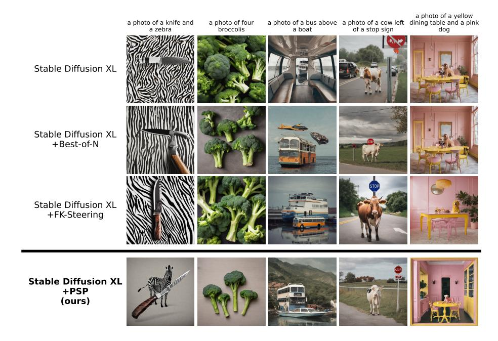

그림 1: PSP를 사용한 이미지 생성 개선 예시. SDXL 생성은 표준 샘플러와 세 가지 기울기 없는 추론 시점 스케일링 전략을 고정된 계산 배수 N¯ = 4 하에서 사용: BoN, FK-Steering (importance-sampling 기반), 그리고 우리 PSP. 우리는 GenEval 프롬프트에서 PSP가 BoN 및 FK-Steering보다 개선되는 예시를 보여 주며, 프롬프트 제약을 만족시킵니다 (전체 결과는 표 [1]에 있음). (Fig. 1: Examples of image generation improvement with PSP. SDXL generations using a standard sampler and three gradient-free inference-time scaling strategies under a fixed compute multiplier N¯ = 4: BoN, FK-Steering (importance-sampling based), and our PSP. We show examples from GenEval prompts in which PSP improves on BoN and FK-Steering, satisfying prompt constraints (full results in Tab. [1)](#page-8-0).)

블랙박스 보상 모델에 의해 안내되는 시드에 대해. 초기 연구는 Bestof-N (BoN)이 더 많은 타임스텝을 사용하는 것보다 이미 더 잘 스케일링된다는 것을 보여 주었으며 [&#91;28&#93;](#page-17-3), 하지만 많은 후보를 완전히 디노이즈하여 승리 가능성이 낮은 경우가 많다.

최근 방법들은 중요도 샘플링 [&#91;36&#93;](#page-17-4) 또는 트리 탐색 [&#91;23,](#page-16-1) [30,](#page-17-5) [52&#93;](#page-19-2)을 통해 중간 보상 신호를 사용하여 계산을 보다 효율적으로 할당한다. 이러한 접근 방식은 기울기 없이(gradient-free) 백본 파인튜닝 없이 수행되지만, 일반적으로 궤적 전체에 걸쳐 고정된 수의 병렬 샘플(상수 메모리)을 강제한다. 반면, 입자 필터링은 오랫동안 가변 입자 수와 초기 가지치기([&#91;13&#93;](#page-16-2))를 연구해 왔지만, 이 아이디어는 현대의 확산 스타일 이미지 생성에 대해 철저히 테스트되지 않았다.

본 논문에서는 간단한 질문을 재검토한다: 상수 메모리 제약을 완화하면, 디노이징 과정에서 계산을 어떻게 할당해야 할까? 중간 보상 추정치는 상대적으로 일찍 유익해지는 경우가 많다. 이는 직관적인 전략을 제안한다: 대규모 시드 풀로 시작하고, 보상 신호가 의미를 갖기 전까지만 진행하며, 점진적으로 가지치기하고, 남은 디노이징 예산을 축소되는 유망 후보 집합에 할당한다.

우리는 이 아이디어의 단순한 구현인 Progressive Seed Pruning (PSP)을 연구한다. PSP는 대규모 노이즈 시드 풀에서 시작하여 중간 디노이즈 추정치를 점수화하고, 사전 결정된 일정에 따라 가지치기를 수행하여 유망한 경로만이 남은 디노이징 예산을 받도록 한다. 이는 탐색을 앞쪽에 배치하고, 이전 추론 시각 스케일링 기준선보다 보상 기반 선택을 개선하면서 모델 평가 횟수의 총합을 고정한다. 고정 일정 사용은 배포와도 일치한다: 사전 결정된 가지치기 지점과 생존자 수는 각 구간의 메모리 사용량과 실행 시간을 예측 가능하게 하여 이상적인 환경인 탄력적 멀티-GPU 서버에서 할당을 용이하게 한다. 종합적으로, 우리의 결과는 가변 입자 집단이 현대 생성 모델에서 추론 시각 스케일링을 위한 단순하고 일반적이며 배포 친화적인 설계 원칙임을 시사한다.

#### Contributions.

- 1. 우리는 상수 메모리 추론이 불필요한 제약임을 확인하고, 시간에 따라 변하는 입자 수가 블랙박스 보상을 사용하는 확산/흐름 모델에서 추론 시각 스케일링의 강력한 원칙임을 보여준다. 이는 계산을 앞쪽에 배치하고 초기 노이즈 시드의 더 큰 풀을 고려할 때 적용된다.
- 2. 우리는 PSP가 BoN, 중요도 샘플링, 트리 탐색 기준선에 비해 일관된 이점을 보이며, 확산 및 flowmatching 백본에서 자동화된 지표와 인간 평가 모두에서 동일한 계산량을 사용해 성능이 계산량에 따라 확장됨을 보여준다.
- 3. 우리는 결정론이 오프라인 일정 검색을 가능하게 함을 보여준다: 가지치기 일정은 생성기를 재실행하지 않고 캐시된 중간 보상으로부터 시뮬레이션될 수 있어, 빠른 작업별 적응을 가능하게 한다.

## 2 관련 연구 (Related Work)

### 2.1 보상을 사용하여 확산을 유도하기 (Using Rewards to Steer Diffusion)

조건부 생성에 보상을 활용하는 일반적인 방법은 기울기 기반 안내(gradient-based guidance) [&#91;1,](#page-15-2) [6&#93;](#page-15-3)이며, 이는 미분 가능한 목표의 기울기를 역전파하여 샘플링 경로 또는 초기 잡음을 더 높은 보상으로 편향시킨다 [&#91;41&#93;](#page-18-4). 효과적이지만, 이 방법은 미분 가능한 보상을 필요로 하며 기울기 계산과 추가 평가로 인해 상당한 추론 오버헤드를 발생시켜, 보상이 블랙박스이거나 비용이 많이 드는 경우에는 덜 실용적이다.

다른 옵션은 강화 학습(Reinforcement Learning) [&#91;4,](#page-15-4)[48&#93;](#page-18-5) 또는 선호도 목표(preference objective) [&#91;43&#93;](#page-18-6)를 사용하여 보상을 최대화하도록 생성 백본을 직접 미세 조정(finetune)하는 것이다. 이는 추론 시 검색을 요구하지 않으면서 기본 샘플링을 개선할 수 있지만, 대형 생성 모델의 추가 훈련과 관련된 엔지니어링 오버헤드가 발생한다. 반면, PSP는 훈련 없이 기울기 없이 작동하므로, 보상과 확산 및 흐름 매칭(backbones) 모두에 대해 기성품으로 바로 적용할 수 있다.

### 2.2 기울기 없는 보상으로 추론 연산 확장 (Scaling Inference Compute with Gradient-Free Rewards)

최근 방법들은 블랙박스 보상 함수의 중간 신호를 사용하여 추론 시에 다중 샘플을 병렬로 실행하고, 가장 유망한 샘플에 계산을 할당함으로써 효율적으로 계산량을 확장한다. FK-Steering [36]은 Feynman–Kac 상호작용 입자 시스템 [5,] [8]의 관점에서 확산 추론을 바라보고, TDS [44] 및 SVDD [24]와 같은 중요도 샘플링 접근법을 일반화한다. 이 방법은 입자 집단을 유지하고, 중간 보상 추정에서 파생된 잠재력을 사용해 주기적으로 재가중 및 재샘플링한다.

다른 두드러진 연구 라인은 추론 시 샘플 선택을 디노이징 경로에 대한 트리 탐색으로 간주한다 [23,] [34,] [52]. 우리는 고정 예산 per generation 설정에서 그들의 주요 대표로 DSearch [23]을 선택한다. 이 방법은 부분 경로에 대해 빔 스타일 탐색을 수행하며, 시간이 지남에 따라 빔을 축소하고 분기(각 후보에 대해 여러 자식)를 증가시켜 중간 상태에서 가치를 더 잘 추정한다.

다른 관련 접근법은 적응형 per-prompt 계산을 할당하고, 정제 위해 이전 단계로 되돌아가며, 생성이 만족스러운지 여부를 나타내는 중지 규칙이 나타날 때까지 추론을 연장함으로써 다른 목표를 추구한다 [22,] [52].

FK-Steering과 DSearch 모두에서 공유되는 가정은 추론 중에 일정한 메모리 예산을 유지한다는 것이다: 단계마다 동시에 탐색되는 샘플의 최대 수가 대략 고정된다. 우리의 연구는 이 설계 선택에서 벗어나 일정 메모리 제약을 완화하고 대신 초기 시드의 더 큰 집합을 고려하는 데 더 많은 계산을 할당하기 위해 조기 가지치기를 사용한다.

### 2.3 입자 필터링 및 가지치기에서의 적응형 입자 수

전통적인 입자 필터링 및 순차 몬테카를로에서는 타깃 분포의 복잡성이 시간에 따라 크게 변할 수 있음에도 불구하고 매 시간 단계마다 고정된 수의 입자를 전파하는 것이 일반적이다. 따라서 장기간에 걸친 연구는 가장 필요로 하는 곳에 계산을 할당하기 위해 적응형 입자 수를 연구한다. KLD-샘플링은 Kullback–Leibler 기준으로 측정된 사전 정의된 근사 품질 한계를 만족하도록 입자 수를 조정하며, 모호한 단계에서는 더 많은 입자를 사용하고, 사후분포가 수렴하면 더 적은 입자를 사용한다 [13]. 최근의 “adaptive N” 입자 필터는 온라인 예측 통계에 기반해 입자 수를 조정하고, 시간에 따라 이러한 업데이트를 추적하는 오류 한계에 대한 보장을 제공한다 [10]. 동시에, 다중 장 밴딧(Multi‑Armed Bandit) 문헌은 Successive Halving [17,] [19]에 크게 의존한다. 이 알고리즘은 방대한 구성 옵션 풀을 평가하고, 가장 성능이 낮은 절반을 반복적으로 버림으로써 고정된 계산 예산을 최적으로 분배한다. 이는 우리의 기본 가지치기 일정(Sec. [4.6)](#page-11-0)과 유사하지만, PSP는 더 유연하며 주어진 작업, 보상 및 프롬프트에 대해 최적의 일정을 검색할 수 있다.

우리의 연구는 이러한 적응형 입자 및 조기 가지치기 아이디어를 확산 이미지 생성에 대한 보상 지향 추론에 단순히 적용한 것으로 볼 수 있다. 입자 필터링 문헌이 더 풍부한 적응 전략을 탐구함에도 불구하고, 우리는 고정된 사전 결정된 가지치기 일정이 조건부 이미지 생성에 대한 적응형 입자 수의 이점을 이미 대부분 포착한다는 것을 보여준다.

할당 원칙 자체는 고전적이지만, 기존의 보상 지향 확산 방법은 대부분 병렬성을 고정한다. 가장 가까운 예외는 [20]의 적응형 샘플러로, 롤오버 예산 강제(rollover budget forcing)라고 불리며, 추론 과정에서 계산을 불균형적으로 소비한다. 그러나 그들은 우리와 반대 방향으로 할당한다:

<span id="page-4-0"></span>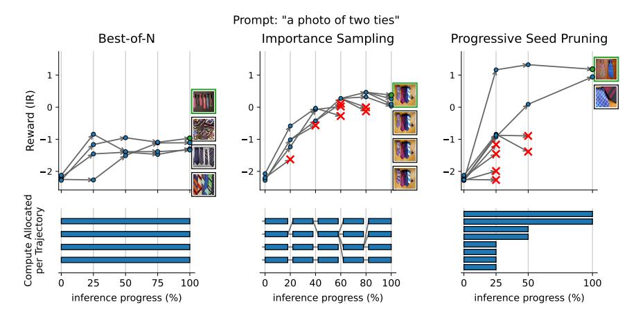

그림 2: 추론 시 스케일링을 위한 계산 할당 프로파일. 상단: 다수 후보에 대한 노이즈 제거 진행 중 예시 보상 궤적 (ImageReward). 하단: 진행에 따른 후보별 할당된 계산량. 왼쪽: BoN은 N개의 전체 궤적을 실행하고 최종 보상이 가장 높은 것을 선택한다. 중간: 중요도 샘플링 스타일 방법(예: FK-Steering)은 일정한 입자 수를 유지하며 중간 보상을 기반으로 주기적으로 재샘플링한다(빨간 십자표시는 버려진 샘플을 나타낸다). 오른쪽: PSP는 더 많은 후보로 시작하고 낮은 보상 궤적을 조기에 가지치기하여 남은 노이즈 제거 예산을 축소된 생존자 집합에 집중한다. 이 그림에서 PSP는 다른 방법보다 같은 총 노이즈 제거 단계 수에서 초기 시드 수를 두 배로 고려한다.

대규모 시드 풀을 초기에 고려하는 대신, 그들은 초기에 예산을 절약하고 나중에 더 많이 재샘플링한다. 프롬프트 정렬과 같은 작업에서는, 이 방식이 가장 중요하지 않은 곳에 계산을 잘못 배치한다. 왜냐하면 중요한 특징은 거칠고 생성 과정 초기에 대부분 고정되기 때문이며, 이는 [31]에서 이미 diffusion 백본을 인지 작업에 사용할 때 활용된 특성이다 [15,](#page-16-8) [27](#page-17-8). 따라서 그들의 적응형 샘플러는 다른 샘플링 및 탐색 방법에 비해 거의 이득을 얻지 못한다. 반면, 우리는 일정 메모리를 완화하여 초기 시드 풀을 확장하고 시간이 지남에 따라 가지치기하는 것이 현대 diffusion 및 flow-matching 생성기에 놀라울 정도로 강력한 기초가 된다는 것을 보여준다.

## 3 진행적 시드 가지치기 (Progressive Seed Pruning)

### 3.1 전제 조건 (Preliminaries)

Diffusion 및 Flow-Matching 모델 우리는 조건부 생성 모델을 고려한다. 이 모델은 노이즈를 일련의 업데이트를 통해 샘플로 변환하며, c(예: 텍스트 프롬프트)에 조건화된다.

Diffusion 모델. In diffusion [16,](#page-16-0) [38,](#page-18-0) [40](#page-18-1), 전방 노이징 프로세스는 t ∈ {1, …, T}에 대해 q(x^t | x0)를 정의하고, 학습된 모델은 역 프로세스 pθ(xt−1 | xt, t, c)를 매개변수화한다. 일반적인 ϵ-예측 매개변수화에서, 네트워크는 ϵθ(xt, t, c)를 예측하고 샘플러(예: DDIM [39](#page-18-8))는 이를 사용해 xt−1을 생성한다. 중요한 것은 동일한 네트워크 출력이 정제된 샘플의 노이즈 제거된 추정치를 제공한다는 것이다,

$$\hat{x}_0(x_t, t, c) \approx \mathbb{E}[x_0 \mid x_t, t, c], \tag{1}$$

이는 샘플러 내부에서 일상적으로 계산되며, 중간 스코어링에 재사용될 수 있다.

Flow-matching 모델. Flow matching 모델 [25,](#page-17-0) [26](#page-17-1)은 노이즈를 데이터로 전달하는 ODE(또는 SDE)를 정의하는 시간에 따라 변하는 속도장 vθ(x, t, c)를 학습한다. 샘플링은 일반적으로 고노이즈 상태에서 정제된 샘플까지 ODE를 수치 해석기(예: Euler Discrete [11,](#page-15-8) [12](#page-16-9))를 사용해 통합하며, 선택된 노이즈 수준 집합에서 이산 상태 {xt}를 생성한다. 실무에서 사용되는 표준 매개변수화에서는 동일한 속도 예측을 사용해 한 단계 "extrapolation"을 통해 zero-noise 엔드포인트에서 정제된 추정치를 만들 수 있다,

$$\hat{x}_0(x_t, t, c) = x_t - \sigma_t v_\theta(x_t, t, c), \tag{2}$$

여기서 σ^t는 솔버 스케줄에서 현재 노이즈 스케일을 나타낸다. diffusion과 마찬가지로, 이 추정치는 이미 솔버 업데이트에 암시적으로 포함되어 있으며, 추가 모델 비용이 거의 들지 않게 추출될 수 있다.

설정 및 가정 우리는 diffusion 또는 flow mathing p^θ와 같은 조건부 생성기가 알려진 노이즈 분포에서 t ∈ {T, …, 1}에 대해 pθ(xt−1 | xt, t, c)를 반복하여 샘플을 생성한다고 가정한다. (연속 시간 솔버는 이산화하고 이산 솔버 단계에서 가지치기를 적용함으로써 처리된다.) 또한 우리는 정제된 샘플(예: 미학적)에서 정의된 블랙박스 보상 함수 r(x, c)를 가정한다.

<span id="page-5-1"></span>Intermediate Reward Estimates PSP는 최종 샘플에 대한 저렴한 중간 대리자를 사용한다. 각 단계에서 우리는 노이즈가 제거된 추정치 xˆ0(xt, t, c)를 계산하고 점수를 매긴다:

$$s_t = r(\hat{x}_0(x_t, t, c), c). \tag{3}$$

핵심적으로, xˆ<sup>0</sup>를 계산하는 과정은 이미 생성기에서 생성된 양(노이즈 예측 또는 속도 예측)을 재사용하므로, PSP는 노이즈 제거에 사용되는 것 외에 추가적인 생성기 전방 패스를 필요로 하지 않는다. 이러한 노이즈가 제거된 추정치 xˆ<sup>0</sup>의 예시는 서로 다른 타임스텝과 백본에서 Sec. [S8.](#page-34-0)에 있다.

### 3.2 진행적 시드 프루닝 (PSP) (Progressive Seed Pruning (PSP))

Algorithm [1](#page-6-0)는 PSP를 설명한다. 이 방법은 k<sup>T</sup>개의 i.i.d. 노이즈 시드로 구성된 대규모 풀에서 시작하며, 부분 경로의 생존자 집합 S를 유지한다. 각 단계에서 PSP는 다음과 같이 동작한다: (i) 각 생존자에 대해 노이즈 제거된 추정치 xˆ<sup>0</sup>를 만든다; (ii) xˆ<sup>0</sup>에 대한 블랙박스 보상을 사용해 생존자를 점수화한다; (iii) 상위 kt−<sup>1</sup> 생존자만 남긴다; (iv) 남은 생존자만 다음 단계로 진행한다. 초기 단계에서 가지치기를 수행함으로써 PSP는 전체 예산의 더 많은 부분을 더 많은 초기 시드를 평가하는 데 사용하면서, 가장 유망한 경로에 대해서는 완전한 노이즈 제거를 완료한다.

## <span id="page-6-0"></span>알고리즘 1: 진행형 시드 가지치기 (PSP) (Algorithm 1 Progressive Seed Pruning (PSP))

입력: 생성기 p_{\theta}, 보상 r(\cdot,c), 조건 c, 단계 T, 스케줄 \{k_t\}_{t=0}^T, k_T 초기 후보와 k_0 최종 생존자.

Return: 최종 생존자 \{x_0^i\}_{i=1}^{k_0}
샘플링 x_T^i ∼ \mathcal{N}(0,I) for i ∈ [k_T]
S ← \{x_T^i\}_{i=1}^{k_T}
for t ∈ \{T,…,1\} do

정리 예측: \hat{x}_0^{i,t} \leftarrow \hat{x}_0(x_t^i,t,c) for each x_t^i \in S
점수: s_t^i \leftarrow r(\hat{x}_0^{i,t},c)
삭제: S \leftarrow \text{TopK}(S, k_{t-1}) by scores \{s_t^i\}
노이즈 제거: sample x_{t-1}^i \sim p_{\theta}(x_{t-1} \mid x_t^i,t,c) for each x_t^i \in S
업데이트: S \leftarrow \{x_{t-1}^i\}\nend for
출력: return S

프루닝 간격.

실제로 우리는 사전에 정해진 소수의 단계에서만 프루닝을 수행하고, 프루닝 지점 사이에서는 배치 크기를 일정하게 유지한다.

이것은 (a) 인접 단계 간의 중간 보상 순위의 부드러움과 (b) 시스템적 고려사항에 의해 동기화된다: 고정된 프루닝 지점과 고정된 생존자 수는 각 간격마다 예측 가능한 메모리 사용량과 런타임을 제공하여 분산 추론에서 스케줄링을 단순화한다.

### 3.3 Compute Budget and the Effective Multiplier

우리는 추론 계산을 *denoising steps*에서 측정한다. 추론 절차가 단계 t에서 $k_t$개의 동시 궤적을 전파하면, 생성기 업데이트의 총 수는

$$C = \sum_{t=1}^{T} k_t. \tag{4}$$

표준 단일 샘플 추론 실행은 C=T이다. 따라서 우리는 유효 계산 배수 $\bar{N}=C/T$ 를 보고한다. 이는 추론 절차가 정규 샘플러에서 $\bar{N}$ 번 샘플링하는 것과 동일한 계산량을 갖는다는 것을 의미한다.

추론 단계에서는 궤적을 진행시키고 중간 점수를 계산해야 합니다. 확산 및 흐름 매칭 모델의 경우, 생성기의 순방향 패스가 이미 $\hat{x}_0$ 를 계산하는 데 필요한 양을 생성하므로 중간 점수 계산이 추가적인 생성기 평가를 필요로 하지 않습니다. 또한, 우리는 ImageReward [46]의 가이던스를 사용하여 결과를 달성합니다. ImageReward는 FK-Steering [36]에서 가이드로 이미 사용된 가벼운 모델이며, 확산 추론에 최소한의 오버헤드만 추가합니다 (표 2 참조).

## 4 Experiments

### 4.1 Backbone Models

우리는 Stable Diffusion v1.5 [35]와 Stable Diffusion XL [32]을 확산 모델로, Stable Diffusion 3.5 (Large) [11]을 흐름 매칭 모델로 평가한다. 우리는 HuggingFace에서 널리 사용 가능한 구현을 사용하며, SD v1.5/SDXL에 대해 T=64 스텝, SD 3.5에 대해 T=32 솔버 스텝을 사용한다.

BoN과 PSP를 위해 우리는 결정론적 솔버를 사용합니다: 확산 모델에 대해 $\eta=0$인 DDIM [39]과 SD 3.5에 대해 Euler Discrete [11,12]를 사용합니다. 따라서 모든 무작위성은 초기 노이즈 시드에서 발생하며, 이는 PSP를 시드 검색으로 사용하려는 의도와 일치합니다.

FK-Steering는 확률적 궤적에 의존합니다: 결정론적 설정에서는 재샘플링이 동일한 자식들을 생성하고 계산량을 낭비합니다. SD v1.5와 SDXL에 대해 우리는 FK-Steering 저자들을 따라 DDIM에 $\eta=1$을 사용해 노이즈를 주입합니다 [36]. 그러나 SD 3.5에서는 강한 확률성이 정제 흐름 훈련 하에서 샘플링 품질을 눈에 띄게 저하시킬 수 있으며, 공개 구현의 기본 확률 설정은 FK-Steering 성능을 저하합니다. 따라서 우리는 가우시안 변동을 주입하는 제어된 노이즈 솔버(Sec. S4)를 사용하고, 이 스케일을 기준선(재샘플링되지 않은) 생성 품질을 해치지 않는 가장 큰 값으로 설정합니다.

### 4.2 기초선 및 주요 비교 (Baselines and Main Comparison)

표 1은 일치된 계산량 하에서 그래디언트-프리 추론 시간 스케일링 전략을 비교합니다. 우리는 GenEval 프롬프트 [14]에서 평가하고 다음을 보고합니다: (i) 선택된 출력의 가이드 보상(ImageReward [46]), (ii) 인간 선호를 위한 자동화 지표로서의 HPSv2 [45] (iii) 보상에 무관한 프롬프트 정렬 측정으로서의 GenEval [14] (검출기 기반 검사 사용), 그리고 (iv) 프롬프트 정렬에 대한 인간 평가. 결과는 3개의 랜덤 시드에 대해 평균화됩니다.

BoN은 $\bar{N}$개의 독립적인 전체 궤적을 실행하고 가장 높은 보상을 가진 결과를 선택합니다 (Fig. 2, 왼쪽). 중요도 샘플링 기초선으로 우리는 FK-Steering [36] (Fig. 2, 중간)을 사용하며, 저자들이 권장한 하이퍼파라미터( $\lambda=10$ , K=4)와 재샘플링 일정(20%, 40%, 60%, 80% 및 추론 진행의 마지막 단계)을 적용합니다. 트리 탐색 기초선으로는 DSearch [23]을 사용하며, 빔과 트리 폭을 2로 설정해 다른 방법들과 계산량을 맞춥니다. 우리는 또한 일치된 계산 예산 하에서 다른 추론 시간 계산 스케일링 방법(Noise Trajectory Search (NTS) [34], Rollover Budget Forcing (RBF) [20], Breadth-First Search (BFS) [52], 그리고 SVDD [24])을 실험했지만, **인간 연구**의 비용을 감안해 이들에 대해서는 자동화된 지표만 보고하고 주요 비교에서는 인간 평가를 보류합니다. PSP의 경우, 우리는 단순 고정 스케줄을 사용합니다 (Fig. 2, 오른쪽): $2\bar{N}$개의 시드를 시작으로 25% 진행 시 $\bar{N}$로 가지치기하고, 50% 진행 시 다시 $\bar{N}/2$로 가지치기합니다.

모든 백본에서 PSP는 표준 추론보다 개선되며, 같은 계산량에서 프롬프트 정렬 측면에서 다른 모든 방법을 능가합니다. 이는 다음으로 측정됩니다:

<span id="page-8-0"></span>Table 1: 일치된 계산량 하에서의 주요 결과. 우리는 표준 샘플링 (N¯ = 1), BoN, 우리의 주요 중요도 샘플링 (FK-Steering) 및 트리 탐색 (DSearch) 기초선, 확산에서 추론 시간 계산 스케일링에 대한 다른 관련 방법들 (Noise Trajectory Search (NTS), Rollout Budget Forcing (RBF), Breadth-First Search (BFS), SVDD), 그리고 PSP를 비교합니다. 모든 결과는 해당 방법들의 공개 구현을 사용하고 계산 예산과 동일한 보상 가이던스(ImageReward)를 맞추어 파라미터를 선택한 실험에서 나온 것입니다. 우리는 가이드 보상 (ImageReward), HPS, GenEval, 그리고 GenEval 프롬프트에서 생성된 최종 이미지에 대한 인간 평가 점수를 보고합니다. PPS는 자동화된 점수 (GenEval)와 GenEval 프롬프트에서 생성된 최종 이미지에 대한 인간 평가 점수로 측정된 프롬프트 정렬에서 최상의 결과를 달성합니다.

| 모델 | 샘플러 | T | N¯ | IR ↑ | HPS ↑ | GenEval ↑ | Human ↑ |
|---------|------------------|----|----|--------|-------|-----------|---------|
| SD v1.5 | 표준 | 64 | 1 | -0.159 | 0.257 | 0.434 | 0.431 |
| SD v1.5 | Best-of-N | 64 | 4 | 0.655 | 0.273 | 0.542 | 0.594 |
| SD v1.5 | FK-Steering [36] | 64 | 4 | 0.640 | 0.261 | 0.531 | 0.569 |
| SD v1.5 | DSearch [23] | 64 | 4 | 0.783 | 0.275 | 0.506 | 0.514 |
| SD v1.5 | NTS [34] | 64 | 4 | 0.485 | 0.272 | 0.478 | - |
| SD v1.5 | RBF [20] | 64 | 4 | 0.670 | 0.274 | 0.520 | - |
| SD v1.5 | BFS [52] | 64 | 4 | 0.820 | 0.263 | 0.564 | - |
| SD v1.5 | SVDD [24] | 64 | 4 | 0.731 | 0.272 | 0.489 | - |
| SD v1.5 | PSP | 64 | 4 | 0.827 | 0.278 | 0.574 | 0.624 |
| SDXL | 표준 | 64 | 1 | 0.431 | 0.275 | 0.529 | 0.531 |
| SDXL | Best-of-N | 64 | 4 | 1.098 | 0.290 | 0.629 | 0.682 |
| SDXL | FK-Steering [36] | 64 | 4 | 1.189 | 0.284 | 0.627 | 0.676 |
| SDXL | DSearch [23] | 64 | 4 | 1.186 | 0.301 | 0.589 | 0.649 |
| SDXL | NTS [34] | 64 | 4 | 0.967 | 0.298 | 0.580 | - |
| SDXL | RBF [20] | 64 | 4 | 1.133 | 0.302 | 0.618 | - |
| SDXL | BFS [52] | 64 | 4 | 1.247 | 0.285 | 0.636 | - |
| SDXL | SVDD [24] | 64 | 4 | 0.682 | 0.287 | 0.556 | - |
| SDXL | PSP | 64 | 4 | 1.224 | 0.294 | 0.645 | 0.713 |
| SD 3.5 | 표준 | 32 | 1 | 1.045 | 0.297 | 0.713 | 0.787 |
| SD 3.5 | Best-of-N | 32 | 4 | 1.336 | 0.304 | 0.747 | 0.831 |
| SD 3.5 | FK-Steering [36] | 32 | 4 | 1.294 | 0.284 | 0.742 | 0.837 |
| SD 3.5 | DSearch [23] | 32 | 4 | 1.144 | 0.297 | 0.704 | 0.824 |
| SD 3.5 | NTS [34] | 32 | 4 | 1.086 | 0.295 | 0.699 | - |
| SD 3.5 | RBF [20] | 32 | 4 | 1.253 | 0.296 | 0.738 | - |
| SD 3.5 | BFS [52] | 32 | 4 | 1.343 | 0.285 | 0.747 | - |
| SD 3.5 | SVDD [24] | 32 | 4 | 1.113 | 0.294 | 0.719 | - |
| SD 3.5 | PSP | 32 | 4 | 1.380 | 0.306 | 0.747 | 0.841 |
|  |  |  |  |  |  |  |  |

GenEval 점수와 인간 평가. 또한, BFS[52]가 SDXL 백본에서 PSPin 보상 최대화보다 우수하지만, PSP는 여전히 BFS와 모든 방법보다 GenEval 및 인간 점수에서 우수합니다. 이는 PSP가 보상 해킹[37]에 덜 취약함을 보여줍니다. 왜냐하면 PSP는 시드 선택에 집중하고, 보상을 증가시키려는 재샘플링으로 추론 과정에 개입하지 않기 때문입니다. 보상 안내를 위해 HPS를 사용한 보충 실험은 Tab. S1에 제공되지만, IR은 일반적으로 GenEval에 더 나은 일반화를 이끌어내어 실제로 사용하기 가장 좋은 보상 안내 방법이 됩니다.

SD 3.5 결과는 재샘플링 방법의 실용적인 약점을 강조합니다: 이들은 다양한 자식 샘플을 생성하기 위해 확률성을 필요로 하지만, 확률성은 흐름 매칭 생성(flow matching generation)을 저하시킬 수 있으며, BoN이 FK-Steering보다 더 나은 성능을 보입니다. 반면, PSP는 확률적 분기 대신 시드 탐색과 초기 제거에 연산을 할당하기 때문에 결정론적 솔버에서도 효과를 유지합니다.

### <span id="page-9-0"></span>4.3 인간 평가

인간 평가 결과는 Tab. 1에 나와 있는 것처럼, Prolific에서 AI 평가 경험이 있는 온라인 주석자들로부터 수집되었습니다. 그들은 GenEval 프롬프트에서 생성된 이미지에 대해 “이미지가 프롬프트와 일치합니까?”라는 질문에 답했습니다. 이 프롬프트/방법/백본 세트마다 단일 시드가 사용되었습니다. 우리 지식으로는, 이는 텍스트-투-이미지 작업을 위한 이러한 추론 시간 스케일링 방법에 대한 최초의 인간 평가입니다. 총 249명의 주석자가 8,295개의 이미지를 평가했으며(각 방법/백본 쌍당 553개, GenEval 프롬프트 수), 각 이미지는 3개의 평가를 받았고(총 24,885개 평가) 다수결 투표를 통해 개별 이미지가 프롬프트와 일치하는지 판단했습니다. 주석자 일치율은 80.3%였습니다. PSP는 세 가지 백본 모두에서 가장 높은 평가를 받은 방법이었습니다.

우리는 [18]의 프로토콜을 밀접하게 따랐습니다(자세한 내용은 Sec. S10 참조). 저자들은 인간 평가와 GenEval 평가의 차이를 평가하기 위해 유사한 연구를 사용했습니다. 그들의 연구에서는 표준 샘플러만 사용했고, 그들이 얻은 점수는 연구 간에 공유되는 백본에서 거의 일치합니다(SDXL: 0.531 vs. 0.566; SD 3.5: 0.787 vs. 0.770). 이 결과를 재현함으로써 프로토콜을 검증했습니다.

### 4.4 연산량으로 스케일링

PSP가 추가 연산을 얼마나 효과적으로 활용하는지 테스트하기 위해, 초기 시드 수와 생존자 수를 두 배로 늘려 $\bar{N}$을 16까지 확장하고, 동일한 비율의 가지치기 포인트를 유지했습니다. Fig. 3(왼쪽)은 $\bar{N}$이 증가함에 따라 PSP가 계속 개선되고, 동일한 연산량에서 BoN을 지속적으로 능가함을 보여줍니다.

PSP는 $2\bar{N}$개의 결정론적 궤적에서 시작하므로, 그 최선의 출력은 그 $2\bar{N}$ 시드 중 가장 완전히 노이즈가 제거된 샘플에 의해 상한됩니다. 가지치기는 최종 최선 시드가 조기에 잘못 버려질 때 이 상한에 대한 후회를 초래합니다. Fig. 3(중간)은 연산량이 증가함에 따라 이 후회가 감소함을 보여주며, 중간 순위가 가지치기에 충분히 신뢰할 수 있게 되고 PSP가 $2\bar{N}$-시드 상한에 근접함을 나타냅니다. 이는 오직 $\bar{N}$개의 전체 궤적 연산만으로 달성됩니다.

마지막으로 Fig. 3(오른쪽)은 추론 시간 스케일링이 모델-연산량 트레이드오프를 어떻게 바꿀 수 있는지를 보여줍니다: 더 작은 백본에 더 큰 $\bar{N}$을 사용하면 더 큰

<span id="page-10-1"></span>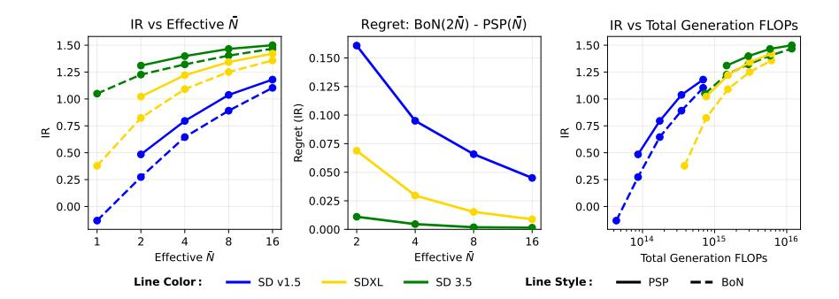

Fig. 3: PSP의 스케일링 동작. 왼쪽: 최종 가이드 보상 vs compute multiplier $\bar{N}$, PSP와 BoNat과 매치된 계산을 비교. 가운데: 전체 디노이징 후 모든 $2\bar{N}$ 후보 중 최적 시드를 선택하는 BoN의 이중 계산과 비교한 PSP의 regret; regret는 $\bar{N}$이 증가함에 따라 감소하며, pruning이 더 큰 예산에서 점점 더 안전해짐을 나타냄. 오른쪽: 보상 vs 근사 FLOPs, inference-time 스케일링이 더 큰 $\bar{N}$을 가진 작은 모델이 유사한 계산에서 더 큰 백본을 매치하거나 능가할 수 있음을 보여줌.

비교 가능한 총 FLOPs에서 모델들, PSP를 배포 시점 품질 스케일링을 위한 실용적인 조정으로 부각시킴.

### 4.5 계산 오버헤드 (Computational Overhead)

PSP는 BoN보다 계산 오버헤드를 추가한다. 이는 PSP의 중간 샘플이 VAE로 디코딩되고, 중간 샘플이 보상 모델에 의해 평가되어야 하기 때문이다. 우리는 Tab. 2에서 단일 H200을 사용해 PSP, 동등한 BoN(N=4), 그리고 두 배 연산 BoN(N=8)을 Tab. 1과 동일한 설정으로 비교하며 이 오버헤드를 정량화한다. 모든 백본에서 PSP는 BoN(N=4)에 비해 런타임이 거의 증가하지 않으며, BoN(N=8)보다 약 $2\times$ 빠르다. 상대적 오버헤드는 모델 크기가 커질수록 감소한다. 이는 각 확산 단계가 비례적으로 더 비싸지기 때문이다. Peak VRAM 사용량에 관해서는, VAE를 통해 이미지를 병렬이 아니라 순차적으로 디코딩하는 built-in VAE slicing option이 있다. 이 옵션은 Tab. 2에서 사용되었으며, 런타임에 $0.15\,s$ 미만을 추가하고 PSP의 Peak VRAM을 SD v1.5와 SD 3.5에서 BoN(N=4)와 거의 비슷하게 만든다. SDXL은 ... 경우이다.

표 2: PSP가 BoN에 비해 갖는 계산 오버헤드.

<span id="page-10-0"></span>

| 모델 | 런타임 (초) |  |  | 최대 VRAM (GiB) |  |  |  |
|---------|---------------|---------------|---------------|-----------------|---------------|---------------|--|
| 1110401 | BoN | PSP | BoN | BoN | PSP | BoN |  |
|  | $(\bar{N}=4)$ | $(\bar{N}=4)$ | $(\bar{N}=8)$ | $(\bar{N}=4)$ | $(\bar{N}=4)$ | $(\bar{N}=8)$ |  |
| SD v1.5 | 2.65 | 2.99 | 4.70 | 4.29 | 5.30 | 5.31 |  |
| SDXL | 12.48 | 13.74 | 23.90 | 8.28 | 13.27 | 10.79 |  |
| SD 3.5 | 35.97 | 37.59 | 71.71 | 29.85 | 34.85 | 33.86 |  |

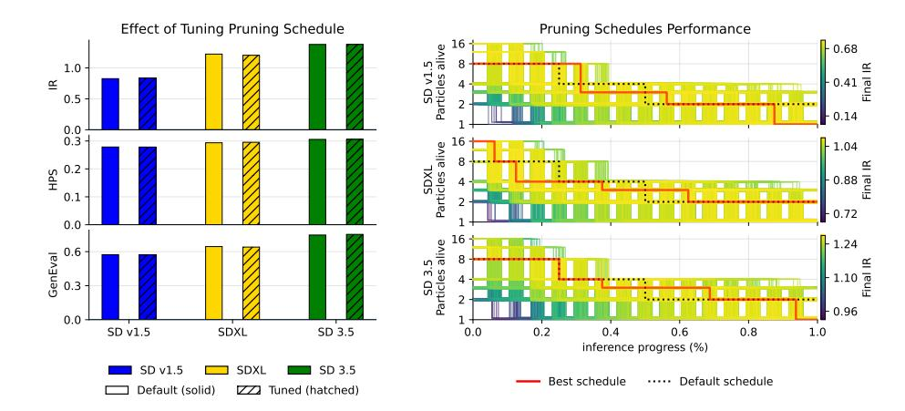

Fig. 4: Pruning 전략을 조정하면 PSP가 향상된다. 왼쪽. 우리는 기본, 즉 off-the-shelf 스케줄(실선)을 동일한 연산 예산 하에서 그리드 탐색으로 찾은 최적 스케줄(점선)과 비교한다. 우리는 IR Benchmark의 프롬프트에서 탐색하고, GenEval의 프롬프트에서 결과를 보고, IR을 가이드 신호로 사용한다. 오른쪽. 그리드 탐색에서 모든 스케줄을 Benchmark IR에서의 성능에 따라 색칠한 시각화. 성능이 좋은 스케줄은 위쪽에 위치하며, 시각화를 위해 jitter가 추가되었고, 최적 및 기본 스케줄이 강조 표시된다.

그것은 여전히 눈에 띄게 높다, 왜냐하면 그 VAE가 비례적으로 더 크기 때문이다. 실제로, $PSP(\bar{N}=4)$는 거의 BoN(N=4) 비용에서 BoN(N=8)-크기의 시드 풀을 고려한다.

### 4.6 PSP 스케줄 조정

지금까지 우리는 계산 매칭에 의해 동기화된 단순한 기본 스케줄을 사용해 왔다.  
충분히 큰 T에 대해, $\sum_{i=0}^k \frac{1}{2^i} = 2 - \frac{1}{2^k}$ 이므로, 기하급수적 절반 스케줄은 효과적인 비용 승수 $\bar{N}=2$ 로 임의로 큰 수의 초기 시드를 평가할 수 있게 해준다.  
스케줄을 m배(각 단계에서 입자 수를 m배)로 스케일링하면 $\bar{N}=2m$ 이 된다.  
구체적으로, 더 큰 k는 덜 정보가 풍부한 단계에서 일찍 가지치기를 시작해야 하므로, 우리 기본 스케줄(그림 2, 오른쪽)은 두 개의 가지치기 지점을 갖는다. 이는 계산 승수 $\bar{N}$(BoN의 시드 수를 두 배)로 $2\bar{N}$ 개의 초기 시드를 고려할 수 있게 해주며, m=2(따라서 $\bar{N}=4$)를 사용하여 [36]에서 사용된 계산 설정과 일치한다.  
이 선택은 PSP를 즉시 바로 사용할 수 있게 하고, 하이퍼파라미터 튜닝 없이 Tab. 1에서 공정한 기준선 비교를 가능하게 한다.

그러나 PSP는 풍부한 설계 공간을 갖는다: 초기 후보 수, 가지치기 지점의 타이밍, 그리고 생존자 수를 모두 동일한 총 예산을 유지하면서 변형할 수 있다. 따라서 우리는 각 모델과 보상 선택에 대해 $\bar{N}=4$를 보존하는 스케줄에 대해 그리드 탐색을 수행하고, 보류된 프롬프트 세트(Benchmark IR; 세부 사항은 Sec. S5 참조)에서 보상을 최대화하는 스케줄을 선택하며, GenEval의 프롬프트에서 테스트한다. 그림 4의 왼쪽 패널은 튜닝된 스케줄이 가이드 보상, HPS에서 기본 스케줄에 비해 거의 개선이 없음을 보여준다.

<span id="page-12-0"></span>Table 3: PSP는 보상 기반 파인튜닝을 보완한다. PSP는 파인튜닝되지 않은 모델에서 표준 샘플링보다 우수하며, PSP를 DPO-파인튜닝된 모델에 적용하면 BoN보다 추가적인 이득을 얻는다.

| 모델 | DPO | 샘플러 | T | N | IR ↑ | GenEval ↑ |
|---------|-----|-----------|----|---|--------|-----------|
| SD v1.5 | ✓ | 표준 | 64 | 1 | -0.022 | 0.454 |
| SD v1.5 | ✓ | Best-of-N | 64 | 4 | 0.751 | 0.562 |
| SD v1.5 | × | PSP | 64 | 4 | 0.827 | 0.574 |
| SD v1.5 | ✓ | PSP | 64 | 4 | 0.907 | 0.593 |
| SDXL | ✓ | 표준 | 64 | 1 | 0.894 | 0.581 |
| SDXL | ✓ | Best-of-N | 64 | 4 | 1.300 | 0.657 |
| SDXL | × | PSP | 64 | 4 | 1.224 | 0.645 |
| SDXL | ✓ | PSP | 64 | 4 | 1.365 | 0.667 |

그리고 이 작업에 대한 GenEval 점수입니다. 오른쪽 패널은 IR 벤치마크 성능에 따라 색칠된 모든 스케줄을 보여 주며, 최적으로 선택된 스케줄과 튜닝 없이 사용했던 기본 스케줄을 강조합니다. 이들이 크게 다르지 않음을 알 수 있으므로, 우리의 기본 절반 전략은 좋은 기성품 구성으로 간주될 수 있습니다. 차이점은 주로 튜닝된 전략이 추론 과정의 50%를 초과한 3개의 샘플을 개발하기 위해 끝부분에서 한 샘플을 포기하는 경향이 있다는 점에 있습니다.

주요한 실용적 이점은 샘플링이 결정적일 때 이 튜닝을 저렴하게 수행할 수 있다는 점이다. 우리는 초기 시드 풀 전체에 걸쳐 각 프롬프트에 대해 궤적과 중간 보상을 미리 계산한다. PSP의 결과가 스케줄과 미리 계산된 궤적에 의해 완전히 결정되기 때문에, 생성기를 다시 실행하지 않고도 많은 스케줄을 시뮬레이션할 수 있어, 기본 스케줄이 최적과 크게 차이가 있을 수 있는 도메인에서 빠른 작업별 튜닝이 가능하다.

Fig. [S2](#page-22-0) (left)는 튜닝(벤치마크 IR)과 테스트 세트(GenEval) 성능 사이에 양의 상관관계가 있음을 보여 주며, 이는 더 나은 스케줄이 프롬프트 세트 전반에 걸쳐 일반화되는 경향이 있음을 시사한다. 우리 기본 스케줄의 경우, 최종 IR 분포도 두 데이터셋에서 매우 유사하다 (Fig. [S2,](#page-22-0) middle). Fig. [S2](#page-22-0) (right)는 GenEval에서 IR의 감소하는 수익을 보여 준다: 높은 IR 영역을 넘어서는 추가 IR 이득은 GenEval에 약하게 반영되어, SD 3.5와 같은 강력한 백본에 대한 GenEval 개선이 더 작아지는 것을 설명한다. PSP는 제공된 가이드 신호를 최적화하며, 더 강력한 보상 모델이 사용 가능해질 때 직접적으로 이익을 얻을 수 있다.

### 4.7 비교 (Comparison to Finetuned Models)

보상 모델은 생성기를 미세 조정하는 데에도 사용될 수 있으며, 많은 향후 추론 호출에 걸쳐 보상 최적화를 분산시킵니다. 우리는 DPO-미세조정 백본 [&#91;43&#93;](#page-18-6)을 Pick-a-Pic 데이터셋 [&#91;21&#93;](#page-16-12)에서 훈련된 것과 비교합니다. 표 3은 두 가지 시사점을 보여줍니다. 첫째, PSP가 미세조정되지 않은 백본에 적용되었으며, 적당한 com-

<span id="page-13-0"></span>Table 4: 고정된 초기 시드로 다양한 프롬프트를 검색합니다. PSP는 초기 조건의 이산 집합, 즉 프롬프트 집합을 최적화할 수 있습니다.

| 모델 | 샘플러 | T | N | IR ↑ | GenEval ↑ |
|--------------------|-----------------------|----------|--------|-----------------|----------------|
| SD v1.5<br>SD v1.5 | 표준<br>Best-of-N | 64<br>64 | 1<br>4 | -0.230<br>0.641 | 0.391<br>0.512 |
| SD v1.5 | PSP | 64 | 4 | 0.782 | 0.533 |
| SDXL<br>SDXL | 표준<br>Best-of-N | 64<br>64 | 1<br>4 | 0.471 $1.256$ | 0.501<br>0.598 |
| SDXL | PSP | 64 | 4 | 1.319 | 0.604 |

pute multiplier는 finetuned backbone에서 표준 추론보다 우수합니다. 둘째, PSP와 finetuning은 상호 보완적입니다: finetuned backbone에 PSP를 적용하면 추가적인 개선이 이루어지고, 유사한 compute에서 BoN보다 우수합니다. 따라서 추가적인 inference‑time compute가 사용 가능할 때마다, finetuned 모델이 존재하더라도 PSP는 여전히 유익합니다.

### 4.8 여러 프롬프트에 대한 PSP (PSP over Multiple Prompts)

우리의 주요 초점은 시드 검색이지만, PSP는 inference 시간에 사용 가능한 모든 이산 후보 풀에 적용됩니다. 실용적인 예는 프롬프트 선택입니다: 현대 시스템은 종종 사용자 프롬프트를 [3,9,11] 확장하고 세부 정보를 추가하기 위해 재작성하며, 서로 다른 재작성은 결과의 품질을 크게 바꿀 수 있습니다. 정량적으로, 이전 연구 [18]의 분석은 프롬프트 재작성이 GenEval 점수에서 큰 향상을 가져올 수 있음을 보여줍니다. 따라서 우리는 *fixed* 노이즈 시드에 대해 여러 프롬프트 재작성 중에서 선택하기 위해 PSP를 적용합니다. Tab. 4는 이 설정에서 PSP가 BoN보다 동일한 compute에서 우수함을 보여줍니다.

우리의 구현에서는 ChatGPT 5.2 [29] (세부 사항은 Sec. S6에서)로 프롬프트마다 한 번씩 프롬프트 재작성을 생성하고 이를 초기 후보 집합으로 취급합니다. 이는 재샘플링 기반 방법에 비해 PSP의 또 다른 실용적 이점을 부각시킵니다: 프롬프트에 대한 중요도 샘플링은 inference 중에 자식 프롬프트를 반복적으로 생성하는 stochastic "prompt mutation" 커널을 개발하고, LLM에서 여러 번 샘플링하는 추가 비용을 발생시켜야 하지만, PSP는 inference마다 한 번의 고정 후보 집합만 필요합니다.

## 5 토론 (Discussion)

우리는 black-box 보상 하에서 diffusion 및 flow‑matching 모델의 inference‑time 스케일링을 연구합니다. 우리의 주요 기여는 inference 중에 constant‑memory 제약을 완화하면, 오늘날 대부분의 생성 모델을 호스팅하는 분산 시스템에서 자연스러운 상황에서, 매우 단순한 early‑pruning 전략이 더 compute‑efficient할 수 있음을 보여주는 것입니다 …

diffusion 및 flow‑matching 백본 전반에 걸쳐, PSP는 reward‑guided 선택을 일관되게 개선하고, BoN 트리‑검색 및 matched compute에서의 importance‑sampling 방법보다 높은 GenEval 점수를 달성하며, compute가 증가함에 따라 계속 확장됩니다.

이 설계의 실용적 함의는 PSP가 stochasticity를 필요로 하지 않는다는 점입니다. 재샘플링 기반 접근법은 같은 중간 상태에서 다양한 자식들을 생성하기 위해 stochastic sampler에 의존합니다. 이를 없애면 재샘플링은 반복된 자식으로 붕괴하며 BoN보다 이점이 없습니다. 반대로 PSP는 compute를 활용해 더 많은 초기 시드를 고려하고 좋은 시드를 유지할 확률을 높입니다. 우리의 강력한 결과는 일부 작업에서 재샘플링을 통해 현재 최상의 후보를 반복적으로 "개선"하는 것보다 diffusion inference에 있어 더 중요한 compute‑efficient 레버임을 시사합니다. 이 결정론적 특성은 deterministic sampler가 표준인 diffusion 대신 flow‑matching의 채택이 증가하는 것과도 잘 부합합니다. 또한 PSP가 초기 시드에 대해 deterministic이므로, 중간 점수는 한 번만 사전 계산할 수 있어, 각 후보 스케줄을 재실행하지 않고도 특정 작업, 보상, 프롬프트 분포에 맞춘 pruning 스케줄을 효율적으로 오프라인 검색할 수 있습니다.

PSP는 두 가지 주요 한계가 있다. 첫째, 스칼라 보상을 가정하기 때문에 다목적 또는 정량화하기 어려운 설정(예: ControlNet 스타일 [51](#page-19-3) 제약 생성, 신호가 텍스트 정렬과 엄격한 공간 일관성을 동시에 균형 있게 조정해야 하는 경우)은 PSP가 단일 순위를 기준으로 잘라내는 방식으로 표현하기에 덜 자연스럽다. 실제로 이는 종종 극복 가능하다: 많은 엄격한 공간 작업은 PSP가 직접 순위를 매길 수 있는 스칼라 지각 손실(예: IoU, OKS)을 허용하며, 동일한 계산량에서 다른 탐색/재샘플링 방법보다 여전히 우수할 수 있다. 이러한 선택 방법의 더 깊은 공통 한계는 공간에서 방향성 가이던스가 부족하다는 점이며, 대안은 트레이드오프와 함께만 제공한다: ControlNet은 훈련을 추가하고, 기울기 기반 가이던스는 미분 가능한 보상을 요구하며 역전파를 위한 훨씬 더 큰 추론 비용을 필요로 한다. 둘째, PSP의 이점은 목표 특징이 언제 결정되는가에 달려 있다. 프롬프트 정렬의 경우, 눈에 띄는 특징은 샘플링 초기에 거칠고 고정되므로 결과는 초기 시드에 달려 있고, 더 큰 시드 풀을 앞당겨 두는 것이 유리하다. 반면, 미세한 세부 사항이 궤적 후반에 생성되는 것(예: 미학적 품질)으로 지배되는 목표의 경우, 초기 시드 선택은 덜 중요하며 이득은 그에 따라 줄어든다. 이는 SDXL의 Tab. [1.](#page-8-0)에서 비교적 낮은 HPS(미학을 반영하기도 함)에서 확인된다.

우리의 새로움은 추론 중에 입자 수를 변동적으로 유지하는 것이, 고정 메모리 제약이 적용되지 않는 환경(일반적으로 다중 GPU 서버에서 추론이 실행되고 메모리가 탄력적으로 할당되는 생산 배포 환경)에서 확산 및 흐름 매칭 생성기에게 강력하고 아직 충분히 탐구되지 않은 추론 시 스케일링 조절 수단이라는 사실을 발견한 것이다. 실험적으로, 이 할당은 동일한 생성기 계산량에서 더 강력한 고정 메모리 기준선보다 일관되게 우수하며, 결정론적 샘플링 하에서 오프라인 스케줄 튜닝을 가능하게 한다. 종합하면, 우리의 결과는 현대 생성 모델에서 추론 시 스케일링을 위한 단순하지만 강력한 설계 원칙을 제공한다.

## 감사 (Acknowledgments)

본 연구는 Technology Innovation Institute (TII)의 'Endowing AI Agents with Hierarchical Compositional & Spatial Reasoning' 프로젝트를 통해 지원을 받았다.

## 참고문헌 (References)

- <span id="page-15-2"></span>1. Bansal, A., Chu, H.M., Schwarzschild, A., Sengupta, R., Goldblum, M., Geiping, J., Goldstein, T.: 확산 모델을 위한 보편적 가이드. In: International Conference on Learning Representations. vol. 2024, pp. 51304–51323 (2024)

- <span id="page-15-0"></span>2. Besta, M., Blach, N., Kubicek, A., Gerstenberger, R., Podstawski, M., Gianinazzi, L., Gajda, J., Lehmann, T., Niewiadomski, H., Nyczyk, P., et al.: 생각의 그래프: 대형 언어 모델로 복잡한 문제 해결. In: Proceedings of the AAAI conference on artificial intelligence. vol. 38, pp. 17682–17690 (2024)

- <span id="page-15-9"></span>3. Betker, J., Goh, G., Jing, L., Brooks, T., Wang, J., Li, L., Ouyang, L., Zhuang, J., Lee, J., Guo, Y., Manassra, W., Dhariwal, P., Chu, C., Jiao, Y., Ramesh, A.: 더 나은 캡션으로 이미지 생성 개선 (2023), [https://cdn.openai.](https://cdn.openai.com/papers/dall-e-3.pdf) [com/papers/dall-e-3.pdf](https://cdn.openai.com/papers/dall-e-3.pdf), accessed: July 22, 2026

- <span id="page-15-4"></span>4. Black, K., Janner, M., Du, Y., Kostrikov, I., Levine, S.: 강화 학습으로 확산 모델 훈련. In: International Conference on Learning Representations. vol. 2024, pp. 4965–4987 (2024)

- <span id="page-15-5"></span>5. Carmona, R., Fouque, J.P., Vestal, D.: 희귀 신용 포트폴리오 손실 계산을 위한 상호작용 입자 시스템. Finance and Stochastics 13(4), 613–633 (Sep 2009). <https://doi.org/10.1007/s00780-009-0098-8>, [http://link.springer.](http://link.springer.com/10.1007/s00780-009-0098-8) [com/10.1007/s00780-009-0098-8](http://link.springer.com/10.1007/s00780-009-0098-8)

- <span id="page-15-3"></span>6. Chung, H., Kim, J., McCann, M.T., Klasky, M.L., Ye, J.C.: 일반적인 노이즈 역문제에 대한 확산 후방 샘플링. In: The Eleventh International Conference on Learning Representations, ICLR 2023, Kigali, Rwanda, May 1-5, 2023. OpenReview.net (2023), <https://openreview.net/forum?id=OnD9zGAGT0k>

- <span id="page-15-1"></span>7. Cobbe, K., Kosaraju, V., Bavarian, M., Chen, M., Jun, H., Kaiser, L., Plappert, M., Tworek, J., Hilton, J., Nakano, R., Hesse, C., Schulman, J.: 수학 단어 문제 해결을 위한 검증자 훈련. CoRR abs/2110.14168 (2021), [https://arxiv.](https://arxiv.org/abs/2110.14168) [org/abs/2110.14168](https://arxiv.org/abs/2110.14168)

- <span id="page-15-6"></span>8. Del Moral, P.: 페인만-카크 공식. Probability and its Applications, Springer New York, New York, NY (2004). [https://doi.org/10.1007/978-1-4684-9393-](https://doi.org/10.1007/978-1-4684-9393-1) [1](https://doi.org/10.1007/978-1-4684-9393-1), <http://link.springer.com/10.1007/978-1-4684-9393-1>

- <span id="page-15-10"></span>9. Deng, C., Zhu, D., Li, K., Gou, C., Li, F., Wang, Z., Zhong, S., Yu, W., Nie, X., Song, Z., Guang, S., Fan, H.: 통합 멀티모달 사전학습에서 나타나는 특성. CoRR abs/2505.14683 (2025). [https://doi.org/10.48550/ARXIV.2505.](https://doi.org/10.48550/ARXIV.2505.14683) [14683](https://doi.org/10.48550/ARXIV.2505.14683), <https://doi.org/10.48550/arXiv.2505.14683>

- <span id="page-15-7"></span>10. Elvira, V., Miguez, J., Djurić, P.M.: 적응형 입자 수를 가진 입자 필터의 성능에 대하여. Statistics and Computing 31(6), 81 (2021)

- <span id="page-15-8"></span>11. Esser, P., Kulal, S., Blattmann, A., Entezari, R., Müller, J., Saini, H., Levi, Y., Lorenz, D., Sauer, A., Boesel, F., et al.: 고해상도 이미지 합성을 위한 정류 흐름 트랜스포머 확장. In: Forty-first international conference on machine learning (2024)

- <span id="page-16-9"></span>12. Euler, L.: Institutiones calculi integralis (통합적 계산의 기초), vol. 1. impensis Academiae imperialis scientiarum (1792)
- <span id="page-16-2"></span>13. Fox, D.: KLD-sampling: Adaptive particle filters (KLD-샘플링: 적응형 입자 필터). Advances in neural information processing systems 14 (2001)
- <span id="page-16-10"></span>14. Ghosh, D., Hajishirzi, H., Schmidt, L.: Geneval: An object-focused framework for evaluating text-to-image alignment (Geneval: 텍스트-이미지 정렬 평가를 위한 객체 중심 프레임워크). Advances in Neural Information Processing Systems 36, 52132–52152 (2023)
- <span id="page-16-8"></span>15. Guimarães, R., Xiao, F., Perona, P., Marks, M.: Diffusion-based action recognition generalizes to untrained domains (확산 기반 행동 인식이 훈련되지 않은 도메인에 일반화된다). In: IEEE/CVF Winter Conference on Applications of Computer Vision, WACV 2026, Tucson, AZ, USA, March 6-10, 2026. pp. 5919–5933. IEEE (2026). <https://doi.org/10.1109/WACV61042.2026.00573>, <https://doi.org/10.1109/WACV61042.2026.00573>
- <span id="page-16-0"></span>16. Ho, J., Jain, A., Abbeel, P.: Denoising diffusion probabilistic models (노이즈 제거 확산 확률 모델). Advances in neural information processing systems 33, 6840–6851 (2020)
- <span id="page-16-5"></span>17. Jamieson, K., Talwalkar, A.: Non-stochastic best arm identification and hyperparameter optimization (비확률적 최적 팔 식별 및 하이퍼파라미터 최적화). In: Artificial intelligence and statistics. pp. 240–248. PMLR (2016)
- <span id="page-16-11"></span>18. Kamath, A., Chang, K., Krishna, R., Zettlemoyer, L., Hu, Y., Ghazvininejad, M.: Geneval 2: Addressing benchmark drift in text-to-image evaluation (Geneval 2: 텍스트-이미지 평가에서 벤치마크 드리프트 해결). CoRR abs/2512.16853 (2025). <https://doi.org/10.48550/ARXIV.2512.16853>, <https://doi.org/10.48550/arXiv.2512.16853>
- <span id="page-16-6"></span>19. Karnin, Z., Koren, T., Somekh, O.: Almost optimal exploration in multi-armed bandits (다중 팔 밴딧에서 거의 최적의 탐색). In: Dasgupta, S., McAllester, D. (eds.) Proceedings of the 30th international conference on machine learning. Proceedings of machine learning research, vol. 28, pp. 1238–1246. PMLR, Atlanta, Georgia, USA (Jun 2013), [https:](https://proceedings.mlr.press/v28/karnin13.html) [//proceedings.mlr.press/v28/karnin13.html](https://proceedings.mlr.press/v28/karnin13.html), number: 3
- <span id="page-16-7"></span>20. Kim, J., Yoon, T., Hwang, J., Sung, M.: Inference-time scaling for flow models via stochastic generation and rollover budget forcing (확률적 생성 및 롤오버 예산 강제를 통한 흐름 모델의 추론 시 스케일링). Advances in Neural Information Processing Systems 38, 30830–30864 (2026)
- <span id="page-16-12"></span>21. Kirstain, Y., Polyak, A., Singer, U., Matiana, S., Penna, J., Levy, O.: Pick-a-pic: An open dataset of user preferences for text-to-image generation (Pick-a-pic: 텍스트-이미지 생성에 대한 사용자 선호도의 공개 데이터셋). Advances in neural information processing systems 36, 36652–36663 (2023)
- <span id="page-16-4"></span>22. Lee, G., Bao, T.N.N., Yoon, J., Lee, D., Kim, M., Bengio, Y., Ahn, S.: Adaptive Inference-Time Scaling via Cyclic Diffusion Search (주기적 확산 탐색을 통한 적응형 추론 시 스케일링) (Oct 2025). [https://](https://doi.org/10.48550/arXiv.2505.14036) [doi.org/10.48550/arXiv.2505.14036](https://doi.org/10.48550/arXiv.2505.14036), <http://arxiv.org/abs/2505.14036>, arXiv:2505.14036 [cs]
- <span id="page-16-1"></span>23. Li, X., Uehara, M., Su, X., Scalia, G., Biancalani, T., Regev, A., Levine, S., Ji, S.: Dynamic search for inference-time alignment in diffusion models (확산 모델에서 추론 시 정렬을 위한 동적 검색). CoRR abs/2503.02039 (2025). <https://doi.org/10.48550/ARXIV.2503.02039>, <https://doi.org/10.48550/arXiv.2503.02039>
- <span id="page-16-3"></span>24. Li, X., Zhao, Y., Wang, C., Scalia, G., Eraslan, G., Nair, S., Biancalani, T., Ji, S., Regev, A., Levine, S., Uehara, M.: Derivative-free guidance in continuous and discrete diffusion models with soft value-based decoding (연속 및 이산 확산 모델에서 부드러운 가치 기반 디코딩을 통한 미분 없이 가이던스). In: Belgrave, D., Zhang, C., Montoya, L.N., Lin, H., Pascanu, R., Koniusz, P., Ghassemi, M., Chen, N., Ruíz, I.V.M., Loaiza-Bonilla, A. (eds.) Advances in Neural Information Processing Systems 38: Annual Conference on Neural Information Processing Systems 2025, NeurIPS 2025, San Diago, CA, USA, December 2-7, 2025 / Mexico City, Mexico, November 30 - December 5, 2025 (2025), [http://papers.nips.cc/paper\\_files/](http://papers.nips.cc/paper_files/paper/2025/hash/899af0d66d8850318a20781484416152-Abstract-Conference.html) [paper/2025/hash/899af0d66d8850318a20781484416152-Abstract-Conference.](http://papers.nips.cc/paper_files/paper/2025/hash/899af0d66d8850318a20781484416152-Abstract-Conference.html) [html](http://papers.nips.cc/paper_files/paper/2025/hash/899af0d66d8850318a20781484416152-Abstract-Conference.html)

- <span id="page-17-0"></span>25. Lipman, Y., Chen, R.T.Q., Ben‑Hamu, H., Nickel, M., Le, M.: 생성 모델링을 위한 흐름 매칭 (Flow matching for generative modeling). In: The Eleventh International Conference on Learning Representations, ICLR 2023, Kigali, Rwanda, May 1‑5, 2023. OpenReview.net (2023), <https://openreview.net/forum?id=PqvMRDCJT9t>
- <span id="page-17-1"></span>26. Liu, X., Gong, C., Liu, Q.: 흐름 직선화 및 빠른 학습: 정정된 흐름으로 데이터 생성 및 전이 학습 (Flow straight and fast: Learning to generate and transfer data with rectified flow). In: The Eleventh International Conference on Learning Representations, ICLR 2023, Kigali, Rwanda, May 1‑5, 2023. OpenReview.net (2023), <https://openreview.net/forum?id=XVjTT1nw5z>
- <span id="page-17-8"></span>27. Luo, G., Dunlap, L., Park, D.H., Holynski, A., Darrell, T.: 확산 하이퍼피처: 시간과 공간을 통한 의미적 대응 탐색 (Diffusion hyperfeatures: Searching through time and space for semantic correspondence). In: Oh, A., Naumann, T., Globerson, A., Saenko, K., Hardt, M., Levine, S. (eds.) Advances in Neural Information Processing Systems 36: Annual Conference on Neural Information Processing Systems 2023, NeurIPS 2023, New Orleans, LA, USA, December 10‑16, 2023 (2023), [http://papers.nips.cc/paper_files/paper/2023/hash/942032b61720a3fd64897efe46237c81-Abstract-Conference.html](http://papers.nips.cc/paper_files/paper/2023/hash/942032b61720a3fd64897efe46237c81-Abstract-Conference.html) [942032b61720a3fd64897efe46237c81-Abstract-Conference.html](http://papers.nips.cc/paper_files/paper/2023/hash/942032b61720a3fd64897efe46237c81-Abstract-Conference.html)
- <span id="page-17-3"></span>28. Ma, N., Tong, S., Jia, H., Hu, H., Su, Y., Zhang, M., Yang, X., Li, Y., Jaakkola, T.S., Jia, X., Xie, S.: 추론 시 스케일링: 노이즈 제거 단계 스케일링을 넘어 (Inference‑time scaling for diffusion models beyond scaling denoising steps). CoRR abs/2501.09732 (2025). [https://doi.org/10.48550/ARXIV.2501.09732](https://doi.org/10.48550/ARXIV.2501.09732) [ARXIV.2501.09732](https://doi.org/10.48550/ARXIV.2501.09732), <https://doi.org/10.48550/arXiv.2501.09732>
- <span id="page-17-11"></span>29. OpenAI: OpenAI GPT‑5 시스템 카드 (Openai GPT‑5 system card). CoRR abs/2601.03267 (2026). [https://doi.org/10.48550/ARXIV.2601.03267](https://doi.org/10.48550/ARXIV.2601.03267) [//doi.org/10.48550/ARXIV.2601.03267](https://doi.org/10.48550/ARXIV.2601.03267), [https://doi.org/10.48550/arXiv.2601.03267](https://doi.org/10.48550/arXiv.2601.03267) [2601.03267](https://doi.org/10.48550/arXiv.2601.03267)
- <span id="page-17-5"></span>30. Oshima, Y., Suzuki, M., Matsuo, Y., Furuta, H.: 추론 시 텍스트‑비디오 정렬을 위한 확산 잠재 빔 서치 (Inference‑time text‑to‑video alignment with diffusion latent beam search). Advances in Neural Information Processing Systems 38, 13170‑13216 (2026)
- <span id="page-17-7"></span>31. Park, Y., Kwon, M., Choi, J., Jo, J., Uh, Y.: 리만 기하학 관점에서 본 확산 모델의 잠재 공간 이해 (Understanding the latent space of diffusion models through the lens of riemannian geometry). In: Oh, A., Naumann, T., Globerson, A., Saenko, K., Hardt, M., Levine, S. (eds.) Advances in Neural Information Processing Systems 36: Annual Conference on Neural Information Processing Systems 2023, NeurIPS 2023, New Orleans, LA, USA, December 10‑16, 2023 (2023), [http://papers.nips.cc/paper_files/paper/2023/hash/4bfcebedf7a2967c410b64670f27f904-Abstract-Conference.html](http://papers.nips.cc/paper_files/paper/2023/hash/4bfcebedf7a2967c410b64670f27f904-Abstract-Conference.html) [4bfcebedf7a2967c410b64670f27f904-Abstract-Conference.html](http://papers.nips.cc/paper_files/paper/2023/hash/4bfcebedf7a2967c410b64670f27f904-Abstract-Conference.html)
- <span id="page-17-10"></span>32. Podell, D., English, Z., Lacey, K., Blattmann, A., Dockhorn, T., Müller, J., Penna, J., Rombach, R.: SDXL: 고해상도 이미지 합성을 위한 잠재 확산 모델 개선 (SDXL: improving latent diffusion models for high‑resolution image synthesis). In: The Twelfth International Conference on Learning Representations, ICLR 2024, Vienna, Austria, May 7‑11, 2024. OpenReview.net (2024), <https://openreview.net/forum?id=di52zR8xgf>
- <span id="page-17-2"></span>33. Qi, Z., Bai, L., Xiong, H., Xie, Z.: 모든 노이즈가 동일하게 생성되는 것은 아니다: 확산 노이즈 선택 및 최적화 (Not all noises are created equally: diffusion noise selection and optimization). CoRR abs/2407.14041 (2024). [https://doi.org/10.48550/ARXIV.2407.14041](https://doi.org/10.48550/ARXIV.2407.14041) [10.48550/ARXIV.2407.14041](https://doi.org/10.48550/ARXIV.2407.14041), <https://doi.org/10.48550/arXiv.2407.14041>
- <span id="page-17-6"></span>34. Ramesh, V., Mardani, M.: 테스트 시 스케일링: 노이즈 궤적 탐색을 통한 확산 모델 스케일링 (Test‑time scaling of diffusion models via noise trajectory search). Advances in Neural Information Processing Systems 38, 87284‑87317 (2026)
- <span id="page-17-9"></span>35. Rombach, R., Blattmann, A., Lorenz, D., Esser, P., Ommer, B.: 잠재 확산 모델을 이용한 고해상도 이미지 합성 (High‑resolution image synthesis with latent diffusion models). In: Proceedings of the IEEE/CVF conference on computer vision and pattern recognition. pp. 10684‑10695 (2022)
- <span id="page-17-4"></span>36. Singhal, R., Horvitz, Z., Teehan, R., Ren, M., Yu, Z., Mckeown, K., Ranganath, R.: 확산 모델의 추론 시 스케일링 및 조정에 대한 일반적 프레임워크 (A general framework for inference‑time scaling and steering of diffusion models). In: Singh, A., Fazel, M., Hsu, D., Lacoste‑Julien, S., Berkenkamp, F., Maharaj, T., Wagstaff, K., Zhu, J. (eds.) Proceedings of the 42nd international conference on

- 기계 학습. 기계 학습 연구 회보 (Proceedings of Machine Learning Research), vol. 267, pp. 55810–55827. PMLR (Jul 2025), [https://proceedings.mlr.press/v267/singhal25b.](https://proceedings.mlr.press/v267/singhal25b.html) [html](https://proceedings.mlr.press/v267/singhal25b.html)

- <span id="page-18-11"></span>37. Skalse, J., Howe, N., Krasheninnikov, D., Krueger, D.: 보상 게임 정의 및 특성화. 신경 정보 처리 시스템의 진보 (Advances in Neural Information Processing Systems) 35, 9460–9471 (2022)

- <span id="page-18-0"></span>38. Sohl-Dickstein, J., Weiss, E., Maheswaranathan, N., Ganguli, S.: 비평형 열역학을 이용한 심층 비지도 학습. In: 국제 기계 학습 회의 (International Conference on Machine Learning), pp. 2256–2265. pmlr (2015)

- <span id="page-18-8"></span>39. Song, J., Meng, C., Ermon, S.: 디노이징 확산 암시 모델. In: 제9회 학습 표현 국제 회의 (9th International Conference on Learning Representations), ICLR 2021, 가상 이벤트, 오스트리아, 2021년 5월 3-7일. OpenReview.net (2021), [https://openreview.net/forum?](https://openreview.net/forum?id=St1giarCHLP) [id=St1giarCHLP](https://openreview.net/forum?id=St1giarCHLP)

- <span id="page-18-1"></span>40. Song, Y., Sohl-Dickstein, J., Kingma, D.P., Kumar, A., Ermon, S., Poole, B.: 확률적 미분 방정식을 통한 스코어 기반 생성 모델링. In: 제9회 학습 표현 국제 회의, ICLR 2021, 가상 이벤트, 오스트리아, 2021년 5월 3-7일. OpenReview.net (2021), [https://openreview.net/forum?](https://openreview.net/forum?id=PxTIG12RRHS) [id=PxTIG12RRHS](https://openreview.net/forum?id=PxTIG12RRHS)

- <span id="page-18-4"></span>41. Tang, Z., Peng, J., Tang, J., Hong, M., Wang, F., Chang, T.: 확산 모델의 추론 시 정렬: 직접 노이즈 최적화. In: Singh, A., Fazel, M., Hsu, D., Lacoste-Julien, S., Berkenkamp, F., Maharaj, T., Wagstaff, K., Zhu, J. (eds.) 제42회 국제 기계 학습 회의 (Forty-second International Conference on Machine Learning), ICML 2025, 밴쿠버, BC, Canada, 2025년 7월 13-19일. 기계 학습 연구 회보, vol. 267. PMLR / OpenReview.net (2025), [https://proceedings.mlr.](https://proceedings.mlr.press/v267/tang25h.html) [press/v267/tang25h.html](https://proceedings.mlr.press/v267/tang25h.html)

- <span id="page-18-2"></span>42. Valmeekam, K., Marquez, M., Sreedharan, S., Kambhampati, S.: 대형 언어 모델의 계획 능력에 대한 비판적 조사. 신경 정보 처리 시스템의 진보 36, 75993–76005 (2023)

- <span id="page-18-6"></span>43. Wallace, B., Dang, M., Rafailov, R., Zhou, L., Lou, A., Purushwalkam, S., Ermon, S., Xiong, C., Joty, S., Naik, N.: 직접 선호 최적화를 이용한 확산 모델 정렬. In: IEEE/CVF 컴퓨터 비전 및 패턴 인식 회의 (Proceedings of the IEEE/CVF Conference on Computer Vision and Pattern Recognition), pp. 8228–8238 (2024)

- <span id="page-18-7"></span>44. Wu, L., Trippe, B., Naesseth, C., Blei, D., Cunningham, J.P.: 확산 모델에서 실용적이고 점근적으로 정확한 조건부 샘플링. 신경 정보 처리 시스템의 진보 36, 31372–31403 (2023)

- <span id="page-18-10"></span>45. Wu, X., Hao, Y., Sun, K., Chen, Y., Zhu, F., Zhao, R., Li, H.: Human preference score v2: 텍스트-이미지 합성의 인간 선호도를 평가하기 위한 견고한 벤치마크. arXiv (CoRR abs/2306.09341) (2023). [https://doi.org/10.48550/ARXIV.](https://doi.org/10.48550/ARXIV.2306.09341) [2306.09341](https://doi.org/10.48550/ARXIV.2306.09341), <https://doi.org/10.48550/arXiv.2306.09341>

- <span id="page-18-9"></span>46. Xu, J., Liu, X., Wu, Y., Tong, Y., Li, Q., Ding, M., Tang, J., Dong, Y.: Imagereward: 텍스트-이미지 생성에 대한 인간 선호도를 학습하고 평가하는 방법. 신경 정보 처리 시스템의 진보 36, 15903–15935 (2023)

- <span id="page-18-3"></span>47. Xu, K., Zhang, L., Shi, J.: 좋은 시드가 좋은 수확을 만든다: 텍스트-이미지 확산 모델에서 비밀 시드를 발견한다. In: 2025 IEEE/CVF 컴퓨터 비전 응용 겨울 회의 (Winter Conference on Applications of Computer Vision) (WACV), pp. 3024–3034. IEEE (2025)

- <span id="page-18-5"></span>48. Yang, K., Tao, J., Lyu, J., Ge, C., Chen, J., Shen, W., Zhu, X., Li, X.: 인간 피드백을 사용하여 보상 모델 없이 확산 모델을 미세 조정한다. In: IEEE/CVF 컴퓨터 비전 및 패턴 인식 회의, pp. 8941–8951 (2024)

- <span id="page-19-0"></span>49. Yao, S., Chen, H., Yang, J., Narasimhan, K.: Webshop: Towards scalable real-world web interaction with grounded language agents. Advances in Neural Information Processing Systems 35, 20744–20757 (2022)
- <span id="page-19-1"></span>50. Yao, S., Yu, D., Zhao, J., Shafran, I., Griffiths, T., Cao, Y., Narasimhan, K.: Tree of thoughts: Deliberate problem solving with large language models. Advances in neural information processing systems 36, 11809–11822 (2023)
- <span id="page-19-3"></span>51. Zhang, L., Rao, A., Agrawala, M.: Adding conditional control to text-to-image diffusion models. In: Proceedings of the IEEE/CVF international conference on computer vision. pp. 3836–3847 (2023)
- <span id="page-19-2"></span>52. Zhang, X., Lin, H., Ye, H., Zou, J.Y., Ma, J., Liang, Y., Du, Y.: Inference-time scaling of diffusion models through classical search. CoRR abs/2505.23614 (2025). <https://doi.org/10.48550/ARXIV.2505.23614>, [https://doi.org/10.48550/](https://doi.org/10.48550/arXiv.2505.23614) [arXiv.2505.23614](https://doi.org/10.48550/arXiv.2505.23614)

#### 보충 자료 (Supplemental Material)

#### S1 중간 보상 분석 (S1 Analysis of Intermediate Rewards)

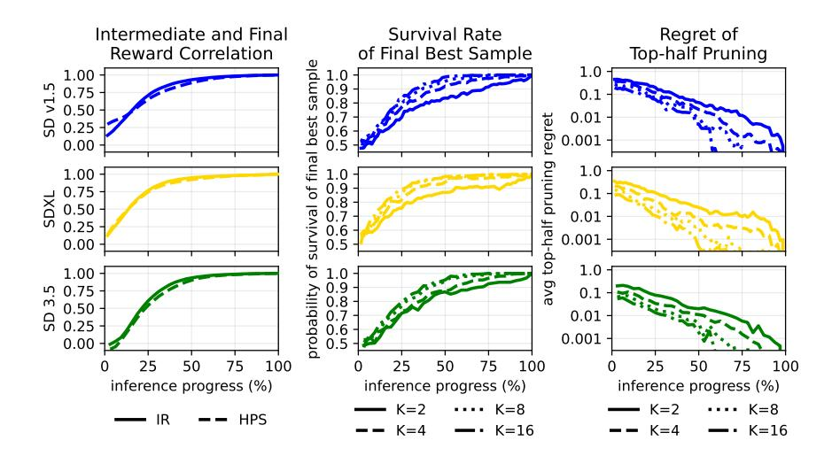

그림 S1: 중간 보상이 얼마나 유익한가? 왼쪽: 세 가지 백본에 대해 추론 진행 중 중간 보상 $r(\hat{x}_0(x_t))$와 최종 보상 $r(x_0)$ 사이의 상관 관계; ImageReward가 대부분 단계에서 HPS보다 높은 상관 관계를 제공한다. 가운데: 주어진 진행 단계에서 K개의 후보를 K/2로 pruning 할 때 최종 최고 샘플(최종 보상 기준)이 생존할 확률. 오른쪽: K 후보를 K/2로 pruning 할 때 최종 최고 샘플과 생존한 최고 샘플 사이의 차이(regret).

PSP의 효과는 중간 보상 순위가 최종 최적 시드를 보존하는지 여부에 달려 있다. 그림 S1(왼쪽)은 중간 보상이 비교적 일찍 유익해지는 것을 보여준다: 상관 관계가 급격히 상승하고 백본 전반에 걸쳐 높은 수준을 유지한다. 특히 ImageReward는 대부분 진행 단계에서 HPS보다 강한 상관 관계를 보이며, 이는 IR-가이드 선택이 PSP에 더 효과적이고 Tab. 1에서 GenEval 개선으로 보다 신뢰성 있게 전이되는 이유를 설명한다.

그러나 상관 관계만으로는 전체 이야기가 아니다: PSP는 pruning 중 상위 후보를 보존하기 위해 중간 순위가 필요하다. 그림 S1(가운데)는 주어진 단계에서 중간 점수에 따라 K에서 K/2로 pruning 할 때 최종 최고 샘플이 생존자 집합에 남아 있을 확률을 직접 측정한다. 우리 기본 스케줄에서 사용되는 pruning에 대해, 생존 확률은 모델 전반에 걸쳐 높다(25% 추론 시 8에서 pruning 시 80% 생존률, 50% 추론 시 4에서 pruning 시 90% 생존률), 이는 PSP 뒤에 있는 핵심 가정을 지지한다. 최적 시드가 생존하지 않더라도, 그림 S1(오른쪽)은 동일한 pruning 연산의 평균 regret, 즉 실제 최적 시드의 최종 보상과 생존한 최적 시드의 보상 차이를 보여준다. 우리의 기본 스케줄은

## 22 R. Guimarães와 P. Perona (R. Guimarães and P. Perona)

우리 기본 스케줄은 두 pruning 시점 모두에서 regret이 0.01에 근접하지만, 더 약한 SD v1.5 모델은 제외된다.

#### S2 조정된 스케줄의 일반화와 보상 포화 (Generalization of tuned schedules and reward saturation)

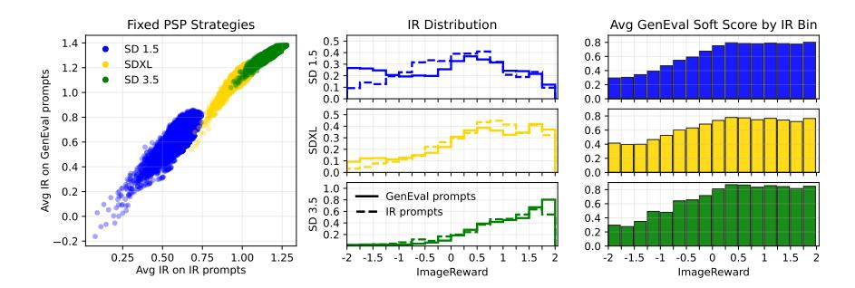

그림 S2: 조정된 스케줄의 일반화와 보상 포화. 왼쪽: 튜닝 세트와 GenEval에서 각 스케줄이 달성한 보상을 비교해 양의 상관 관계를 보여주며, 과적합이 제한적임을 시사한다. 가운데: 대표 스케줄의 보상 분포가 프롬프트 세트 전반에 걸쳐 유사하게 유지된다. 오른쪽: GenEval과 보상( IR별로 구간화) 사이의 관계를 보여주며, 높은 IR에서 가이드 지표의 추가 개선이 GenEval에 미치는 영향이 약해지는 것을 나타낸다.

#### S3 HPS 가이던스 실험 (Experiments with HPS Guidance)

표 S1: HPS 가이던스 하에서의 결과. HPS를 가이드 신호로 사용했을 때의 가이드 보상과 GenEval, 효과적인 계산량이 일치할 때.

| 모델 | 샘플러 | T | N¯ | HPS ↑ | GenEval ↑ |
|---------|------------------|----|----|-------|-----------|
| SD v1.5 | 표준 | 64 | 1 | 0.257 | 0.434 |
| SD v1.5 | Best-of-N | 64 | 4 | 0.282 | 0.525 |
| SD v1.5 | FK-Steering [36] | 64 | 4 | 0.280 | 0.511 |
| SD v1.5 | DSearch [23] | 64 | 4 | 0.293 | 0.505 |
| SD v1.5 | PSP | 64 | 4 | 0.288 | 0.541 |
| SDXL | 표준 | 64 | 1 | 0.275 | 0.529 |
| SDXL | Best-of-N | 64 | 4 | 0.298 | 0.617 |
| SDXL | FK-Steering [36] | 64 | 4 | 0.299 | 0.590 |
| SDXL | DSearch [23] | 64 | 4 | 0.311 | 0.580 |
| SDXL | PSP | 64 | 4 | 0.304 | 0.625 |
| SD 3.5 | 표준 | 32 | 1 | 0.297 | 0.713 |
| SD 3.5 | Best-of-N | 32 | 4 | 0.312 | 0.748 |
| SD 3.5 | FK-Steering [36] | 32 | 4 | 0.302 | 0.729 |
| SD 3.5 | PSP | 32 | 4 | 0.316 | 0.753 |

#### <span id="page-24-0"></span>S4 Stable Diffusion 3.5의 불확실성

<span id="page-24-1"></span>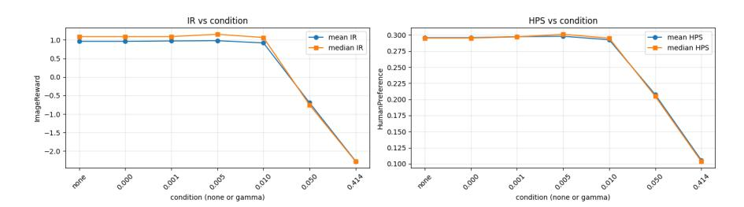

그림 S3: SD3.5 불확실성 보정이 held-out IR 벤치마크에서 수행됩니다. 우리는 결정론적(없음), 래퍼 무결성 검사(γ=0), 그리고 증가하는 제어된 노이즈 수준(γ=0.001, 0.005, 0.01, 0.05, 0.414)을 비교합니다. 선택된 운영 포인트는 γ=0.005이며, 이는 최종 보상을 감소시키지 않는 가장 높은 테스트된 불확실성입니다.

우리는 SD3.5 flow-matching Euler solver에서 시작합니다. x<sup>i</sup>를 단계 i에서의 잠재 변수, σ<sup>i</sup>를 해당 노이즈 수준, 그리고 vθ(x<sup>i</sup>, σ<sup>i</sup>, c)를 모델 예측이라고 합시다. 결정론적 샘플링에서는 업데이트가 다음과 같습니다

$$x_{i+1} = x_i + (\sigma_{i+1} - \sigma_i) v_{\theta}(x_i, \sigma_i, c).$$

(S1)

표준 stochastic_sampling 구현. 기본 SD3.5 스케줄러 구현에서는 stochastic_sampling을 활성화하면 단계 규칙이 다음과 같이 전환됩니다

$$\hat{x}_0 = x_i - \sigma_i \, v_\theta(x_i, \sigma_i, c), \tag{S2}$$

$$x_{i+1} = (1 - \sigma_{i+1}) \hat{x}_0 + \sigma_{i+1} \epsilon_i, \quad \epsilon_i \sim \mathcal{N}(0, I).$$

(S3)

이것은 이진 on/off 모드입니다: 노이즈 크기는 솔버 자체에 의해 σi+1에 암묵적으로 연결되어 있으며, 플래그를 토글하는 것 외에는 강도(또는 스케줄)에 대한 직접적인 사용자 제어가 없습니다. 우리의 실험에서 이 제어 부족은 일관되게 더 나쁜 downstream 메트릭을 초래했으므로, 우리는 이 내장 모드를 사용하지 않습니다.

우리의 제어된 불확실성 수정입니다. 대신, 우리는 Eq. [(S1)](#page-5-0)에서 결정론적 SD3.5 Euler 스텝을 유지하고 기본 업데이트 후에 노이즈를 주입합니다

$$x_{i+1}^{\text{det}} = x_i + (\sigma_{i+1} - \sigma_i) v_{\theta}(x_i, \sigma_i, c),$$

(S4)

$$x_{i+1} = x_{i+1}^{\text{det}} + \sigma_{\text{noise},i} \, \epsilon_i, \quad \epsilon_i \sim \mathcal{N}(0, I),$$

(S5)

with

$$\sigma_{\text{noise},i} = \sigma_i \sqrt{(1+\gamma)^2 - 1} \, s_{\text{noise}}.$$

(S6)

우리는 snoise = 1, st,min = 0, st,max = +∞를 설정하고 γ를 직접 조정합니다. 운영상에서 γ는 다음과 같이 제한됩니다

$$\gamma \in [0, \sqrt{2} - 1]. \tag{S7}$$

따라서 Eq. [(S3)](#page-5-1)와 달리, 우리의 방법은 불확실성에 대한 명시적이고 연속적인 제어를 제공합니다: γ = 0은 결정론적 SD3.5를 정확히 복원하고, γ를 증가시키면 예측 가능한 방식으로 탐색이 증가합니다.

held-out 튜닝 데이터에서의 γ 스윕. Figure [S3](#page-24-1)은 held-out IR 벤치마크(하이퍼파라미터 튜닝에만 사용)에서 \gamma \in \{\texttt {none}, 0, 0.001, 0.005, 0.01, 0.05, 0.414\}에 대한 스윕을 요약합니다. 여기서 none은 완전 결정론적 SD3.5 코드 경로(불확실성 없음)를 의미하고, \gamma =0은 0의 노이즈를 주입한 우리의 불확실성 래퍼에 대한 무결성 검사입니다. 두 무결성 검사는 수치적 노이즈까지 일관되어야 합니다. 스윕 결과에서 \gamma =0.005는 최종 이미지-보상 성능을 저하시키지 않는 가장 높은 노이즈 수준이므로, 우리는 이를 불확실성 설정으로 사용합니다.

## <span id="page-26-0"></span>S5 PSP 스케줄 그리드 서치

표 S2: PSP에 대한 튜닝 효과, 알고리즘별로 구분 (Scheduled vs Dynamic). 튜닝된 열은 IR/GenEval (IR)용 IR-tuned 변형과 HPS/GenEval (HPS)용 HPS-tuned 변형을 사용합니다.

| 모델 | 정보 검색 (IR) |  | HPS |  | GenEval (IR) |  | GenEval (HPS) |  |
|--------------------------|-------------------------|-------------------------|-------------------------|-------------------------|-------------------------|-------------------------|-------------------------|-------------------------|
|  | PSP | 튜닝된 | PSP | 튜닝된 | PSP | 튜닝된 | PSP | 튜닝된 |
| SD v1.5<br>SDXL<br>SD3.5 | 0.827<br>1.224<br>1.380 | 0.836<br>1.205<br>1.380 | 0.288<br>0.304<br>0.316 | 0.288<br>0.305<br>0.316 | 0.574<br>0.645<br>0.747 | 0.571<br>0.641<br>0.753 | 0.541<br>0.625<br>0.753 | 0.541<br>0.646<br>0.751 |

우리는 표준 Progressive Seed Pruning (PSP)을 held-out tuning split (IR benchmark)에서 pruning schedule를 검색하여 튜닝합니다. 각 모델 (SD1.5, SDXL, SD3.5)에 대해 ImageReward와 HumanPreference를 각각 가이드로 두 개의 별도 검색을 수행합니다. 선택된 schedule은 이후 해당 모델/metric 설정에 대해 Sec. [4.6.](#page-11-0)에서 PSP 튜닝 구성으로 사용됩니다.

컴퓨팅 효율적인 검색 프로토콜. 이 검색을 실현 가능하게 만들기 위해, 우리는 generation과 schedule evaluation을 분리합니다. IR Benchmark의 각 프롬프트마다 32개의 seed를 실행하고, step별 메트릭(예: prompt_id, seed, step, image_reward, human_preference)을 CSV 파일에 저장합니다. 그 다음, 그리드 서치는 cached trajectories에서 pruning decisions를 재생하여 PSP 후보를 평가하며 diffusion model을 다시 실행하지 않습니다. 이를 통해 고정된 샘플/trajectory 하에서 후보 schedule을 대규모로 평가할 수 있고, 검색을 최대 4개의 pruning events로 제한합니다.

검색되는 내용. PSP 일정은 다음으로 매개화된다:

- 초기 입자 수 k_{\mathrm {init}} ,
- 가지치기 시간 (t_1,\dots ,t_m) (1 \le m 4) ,
- 생존자 수 (k_1,\dots ,k_m) , k_j는 t_j에서 가지치기 후 남은 입자 수이다.

#### 검색이 강제하는 사항:

- 단조롭게 증가하는 프루닝 시간 t\_1 < \cdots t\_m ,
- 단조롭게 감소하는 입자 수 k\_{\mathrm {init}} > k\_1 \cdots k\_m ,
- 총 계산 예산이 Best-of-N 기준 예산 (N=4)보다 크지 않음.

예산 제약. 전체 디노이징 길이를 T라고 하자.

스케줄 \protect \big (k\_{\mathrm {init}}, (t\_1,\dots ,t\_m), (k\_1,\dots ,k\_m)\big ) 에 대해 입자-스텝 비용은 다음과 같다:

$$C = k_{\text{init}} t_1 + \sum_{j=1}^{m-1} k_j (t_{j+1} - t_j) + k_m (T - t_m).$$

(S8)

우리는 다음과 같은 일정만 보존한다

$$C \le 4T.$$

(S9)

따라서, 모든 PSP 후보는 Best-of-4와 동일한 계산 범위 하에서 비교된다.

우리 스크립트에서 사용한 검색 그리드. 모든 6개의 벤치마크-IR 튜닝 실행(SD1.5/SDXL/SD3.5 \times IR/HPS 가이던스)에서 우리는 다음을 사용한다:

- Guidance metric: either image_reward or human_preference.
- Logical seeds: \ifmmode \lbrace \else \textbraceleft \fi 0,1\} (보고된 메트릭은 이 두 시드 윈도우를 평균한 값이다).
- Max pruning events: m \le 4 .
- Candidate survivor counts: \ifmmode \lbrace \else \textbraceleft \fi 16,12,8,4,3,2,1\} (k_{\mathrm {init}}에 대한 후보도 제공한다).
- Candidate pruning times:
  - SD1.5 / SDXL (T=64 ): \ifmmode \lbrace \else \textbraceleft \fi 4,8,12,16,20,24,28,32,36,40,44,48,52,56,60\} ,
  - SD3.5 (T=32 ): \ifmmode \lbrace \else \textbraceleft \fi 2,4,6,8,10,12,14,16,18,20,22,24,26,28,30\} .

선택 기준. 각 유효한 스케줄에 대해, 우리는 프롬프트마다 PSP 선택을 시뮬레이션하고 단계 T에서 최종 샘플을 유지한다. 스케줄은 프롬프트 전반의 평균 최종 메트릭으로 순위가 매겨지며 두 개의 논리적 시드에 대해 평균된다. 가장 높은 순위의 스케줄은 해당 모델/보상 설정에 대해 IR 벤치마크 데이터셋에서 튜닝된 PSP 스케줄이다.

SD 3.5에 대한 모든 중간 보상(IR 및 HPS)을 사전 계산하는 데는 IR 벤치마크의 100개 프롬프트에 대해 39 H200 시간, Geneval 벤치마크의 553개 프롬프트에 대해 216 H200 시간(9일)이 소요된다. 캐시된 값에 대한 그리드 서치는 GPU가 필요 없이 40분이 걸린다.

#### <span id="page-28-0"></span>S6 프롬프트 재작성

프롬프트 재작성은 기본 GenEval 제약 조건을 변경하지 않으면서 의미적 다양성을 높이기 위해 사용된다. 재작성 지침(아래에 표시됨)은 2026년 2월 28일에 ChatGPT 5.2 Extended Thinking에 전달되었으며, 이를 생성하는 데 6분 42초의 사고 시간이 소요되었다. 생성된 재작성된 프롬프트 세트는 고정된 전처리 아티팩트로 사용된다.

검색에서 재작성은 어떻게 사용되는가.

각 원본 GenEval 프롬프트 p에 대해, 우리는 24개의 제약 조건을 보존하는 재작성 \ifmmode \lbrace \else \textbraceleft \fi p^{(0)},\dots ,p^{(23)}\} 를 생성한다.

검색/평가 동안, 동일한 기본 프롬프트의 모든 재작성에 대해 동일한 초기 노이즈 시드를 유지한다.

이것은 노이즈로 인한 확률적 변동을 제어하고, 재작성 간 비교가 주로 프롬프트 문구/구성 효과를 반영하도록 하며, 다른 무작위 초기화가 아니라.

왜 GenEval 점수가 여전히 유효한가.  
GenEval 지표는 객체 중심(필수 객체/개수/속성/관계)이다.  
재작성은 정확히 그 의미적 제약을 보존하도록 제한되므로, 생성된 이미지가 동일한 GenEval 검사를 충족한다.  
즉, 재작성은 문구/스타일/문맥을 바꾸지만, 측정 가능한 작업 요구사항(객체 존재, 개수, 색상, 공간 관계)은 바꾸지 않는다.

#### Prompt: (프롬프트)

You are generating prompt expansions for GenEval while preserving the original scoring constraints.

## Goal: (목표)

- 각 원본 GenEval 프롬프트 항목마다 정확히 24개의 프롬프트 확장을 생성한다.
- 확장들은 의미적으로 동등하고 제약을 보존해야 하지만, 동일한 초기 노이즈 하에서 서로 다른 이미지를 유도할 수 있을 만큼 다양해야 한다.

```
Input file:
- geneval_metadata.jsonl (한 줄에 하나의 JSON 객체).
Output file:
- geneval_metadata_multiprompts.json
- 유효한 JSON 배열이어야 합니다.
Required output schema (per original prompt entry):
{
  "prompt_id": <int>,
  "tag": <string>,
  "include": <original include array>,
  "exclude": <original exclude array, if present>,
```

```
입력 파일:
- geneval_metadata.jsonl (one JSON object per line).
출력 파일:
- geneval_metadata_multiprompts.json
- Must be a valid JSON array.
필요한 출력 스키마 (원본 프롬프트 항목당):
{
  "prompt_id": <int>,
  "tag": <string>,
  "include": <original include array>,
  "exclude": <original exclude array, if present>,
```
```
"original_prompt": <string>,
  "expansions": [
    {"prompt_expansion_id": 0, "prompt": <string>},
    {"prompt_expansion_id": 1, "prompt": <string>},
    ...
    {"prompt_expansion_id": 23, "prompt": <string>}
  ]
}
```

### Hard requirements: (하드 요구사항)

- 1) 원본 항목과 동일한 제약을 유지한다:
  - 동일한 객체 클래스
  - 동일한 개수
  - 동일한 색상 요구사항
  - 동일한 위치 관계(좌/우/위/아래)가 있을 때
  - 모순되는 제약을 추가하지 않는다
- 2) 각 prompt_id마다 정확히 24개의 확장을 생성한다.
- 3) 고유한 prompt_expansion_id 값 0..23을 사용한다.
- 4) 확장들은 서로 의미적으로 다르면서도 제약을 보존한다:
  - 구도, 카메라 프레이밍, 거리, 각도, 조명, 장면 맥락, 배경 스타일을 다양화한다.
  - 필수 의미적 제약을 변경하지 않는다.
- 5) 프롬프트 길이:
  - 목표 35-45 단어
  - 하드 캡 50 단어 이하
- 6) 출력은 엄격히 유효한 JSON만 포함한다 (마크다운, 주석 없음).

## Diversity guidance: (다양성 안내)

- 클로즈업, 미디엄, 와이드 샷을 혼합한다.
- 호환 가능한 경우 스튜디오, 야외, 실내, 도시, 자연 환경을 다양화한다.
- 부드러운 일광, 흐린 날씨, 따뜻한 실내 조명, 극적인 측면 조명 등 조명을 다양화하지만 의미를 바꾸지 않는다.
- 필수 객체/속성/관계를 모두 보존하면서 서술 스타일을 다양화한다.

#### Validation checklist before final output: (최종 출력 전 검증 체크리스트)

- JSON이 파싱된다.
- 항목 수가 입력 프롬프트 수와 동일하다.
- 각 항목에 24개의 확장이 있다.
- 확장 ID가 정확히 0..23이다.
- 모든 프롬프트가 50단어 이하이다.
- 각 prompt_id에 대해 제약이 보존된다.

#### S7 Experimental Details (S7 실험 세부사항)

모든 결정론적 전략(정규 추론, BoN 및 PSP)의 결과는 효율성과 재현성을 위해 사전 생성된 보상 경로에서 계산된다. 각 모델과 프롬프트마다 여러 초기 노이즈 시드에 걸친 단계별 보상을 캐시한다. 이후 논리적 시드를 사용해 실행의 초기 노이즈 시드를 결정하고, 정규 추론, BoN, PSP가 달성할 결과를 평가한다. PSP의 경우, 평가를 위해 캐시된 경로에서 가지치기/선택 결정을 재생한다. 이는 모든 전략 변형에 대해 확산 샘플링을 다시 실행하는 것을 피하고, Sec. S5에서 논의된 대로 광범위한 일정 스윕을 처리 가능하게 한다.

## Baselines and Main Comparison (기준선 및 주요 비교)

모델 및 프롬프트. 우리는 Stable Diffusion v1.5, SDXL, 그리고 Stable Diffusion 3.5를 GenEval 프롬프트에서 평가한다. 결과는 Tab. 1에 ImageReward (IR) 가이던스에 대해, Tab. S1에 HumanPreference (HPS) 가이던스에 대해 보고한다.

비교 대상 방법. 우리는 다음을 비교한다:

- **Standard**: single-sample generation (N = 1).
- Best-of-N: N = 4, selecting the final sample with the best guidance score.
- **FK-Steering**: sequential Monte Carlo with K=4 particles and  $\lambda=10$ , using potential\_type=max and non-adaptive resampling. For SD v1.5/SDXL (T=64): resampling every 12 steps over  $t\in[12,48]$ , with  $\eta=1.0$ . For SD 3.5 (T=32): resampling every 6 steps over  $t\in[6,24]$ , with stochastic step-wrapping  $\gamma=0.005$ .
- **BFS**: BFS is FK-Steering with only the resampling method and tempering schedule altered; the remainder of the sequential Monte Carlo procedure is unchanged. We retain K=4 particles,  $\lambda=10$ , potential\_type=max, and the same resample windows  $(t \in [12, 48] \text{ every } 12 \text{ steps for } T = 64;$  $t \in [6,24]$  every 6 steps for T=32), and modify two settings. First, resampling: FK-Steering uses multinomial resampling, which draws each surviving particle independently in proportion to its weight and therefore injects higher sampling variance (particles can be duplicated or dropped erratically); BFS uses SSP resampling (resampling=ssp, Srinivasan Sampling Process), a low-variance offspring-allocation scheme in which offspring counts more closely track particle weights, improving population diversity under finite K. Second, the tempering schedule, which controls how sharply weights are annealed over the trajectory: FK-Steering keeps it constant (tempering\_schedule=constant), applying the same selection pressure at every resample regardless of timestep; BFS uses an increasing schedule instead (tempering\_schedule=increase), so selection is softer early (when  $\hat{x}_0$  estimates are less reliable) and sharper later (when they are more informative). SD 3.5 (T = 32) uses stochastic step-wrapping  $\gamma = 0.005$ .

- DSearch: SD v1.5/SDXL (T=64) 및 SD 3.5 (T=32)용으로, 가이던스는 {IR, HPS}이며, 검색 하이퍼파라미터는 다음과 같다:
  - \protect \texttt {num\\_images}=1 , \protect \texttt {bs}=1 , \protect \texttt {duplicate\\_size}=1 , \protect \texttt {w}=2 , \protect \texttt {oversamplerate}=2 , \protect \texttt {search\\_schudule}=\texttt {all} , \protect \texttt {drop\\_schudule}=\texttt {exponential} ,
  - \protect \texttt {replacerate}=0 , \protect \texttt {variant}=\texttt {PM} , 그리고 \eta =1.0 . SD 3.5는 추가로 확률적 스텝 래핑 \gamma =0.005 를 사용한다.

- Noise Trajectory Search (NTS): ImageReward에 의해 가이드되는 로컬 \epsilon -greedy 노이즈-트레젝터리 검색으로, K=2개의 정제 라운드와 각 T-1 전이에서 N=2개의 후보를 사용한다. \epsilon =0.4, \lambda =0.15 를 사용한다. SD v1.5/SDXL의 경우: T=64, 가이던스 스케일 7.5, \eta =1.0. SD 3.5의 경우: T=32, 가이던스 스케일 7.0, 확률적 스텝 래핑 \gamma =0.005.

- Rollover Budget Forcing (RBF): 롤링 per-step NFE 예산을 \protect \texttt {max\\_nfe} 로 제한하고, \protect \texttt {batch\\_size}=2, IR 보상을 사용한 파티클 기반 샘플링. SD v1.5/SDXL: \protect \texttt {init\\_n\\_particles}=8, \protect \texttt {max\\_nfe}=256, T=64, 가이던스 스케일 7.5, 스토캐스틱 DDIM과 \eta =1.0을 native VP 스케줄에 적용. SD 3.5: \protect \texttt {init\\_n\\_particles}=4, \protect \texttt {max\\_nfe}=128, T=32, 가이던스 스케일 7.0, SDE 통합 (\protect \texttt {diffusion\\_coefficient}=\texttt {square}, \protect \texttt {diffusion\\_norm}=3.0) 를 VP 변환된 flow-matching 스케줄에 적용.

- SVDD: SVDD-PM을 실행하며 \protect \texttt {duplicate\\_size}=4 (프롬프트당 4개의 후보/파티클)와 ImageReward 가이던스를 사용한다. SD v1.5 (T=64)의 경우: 가이던스 스케일 7.5, 해상도 512×512, \eta =1.0, \protect \texttt {variant}=\texttt {PM}. SDXL (T=64)의 경우: 가이던스 스케일 7.5, 해상도 1024×1024, 실제 중복 가이드 SVDD 재샘플링을 다음과 같이 구성: \protect \texttt {num\\_particles}=4, \lambda =10, \protect \texttt {potential\\_type}=\texttt {diff}, \protect \texttt {resampling}=\texttt {multinomial}, \protect \texttt {resample\\_frequency}=1, 비적응형 재샘플링, \protect \texttt {resampling\\_t\\_start}=0, \protect \texttt {resampling\\_t\\_end}=64, 마지막으로 \protect \texttt {tempering\\_schedule}=\texttt {constant}. SD 3.5 (T=32)의 경우: 가이던스 스케일 7.0, 해상도 1024×1024, 이전과 동일한 SVDD 재샘플링 구성 (\protect \texttt {resampling\\_t\\_end}=32)과 함께 확률적 스텝 래핑 \gamma =0.005 를 추가한다.

- PSP (우리 방법): 기본 스케줄은 다음과 같다
  - SD v1.5/SDXL: k_{\mathrm {init}}=8,\; t=(16,32),\; k=(4,2),\; T=64 ;
  - SD 3.5: k_{\mathrm {init}}=8,\; t=(8,16),\; k=(4,2),\; T=32 .

평가 프로토콜. 각 방법은 GenEval에서 프롬프트당 하나의 최종 샘플(가장 높은 보상 가이던스를 가진 샘플)을 선택한 뒤, 다음과 같이 집계한다:

- 평균 최종 보상 가이던스 (IR 또는 HPS)
- GenEval 전체 점수 (작업별 평균 정확도).

Tab. [1](#page-8-0) 및 Tab. [S1,](#page-23-0)의 모든 결과에 대해, 3개의 서로 다른 실행에서 평균 결과를 보고한다. 표준/BoN/PSP의 경우, 프롬프트당 32개의 초기 노이즈 시드를 사전 계산하고, 서로 겹치지 않는 초기 노이즈 시드 그룹을 사용하여 서로 다른 실행에서 평균 결과를 보고한다.

#### 컴퓨트 스케일링

목표 및 설정. BoN과 PSP를 더 큰 컴퓨트 예산 하에서 효과적인 \protect \bar N \in \{2,4,8,16\} (옵션으로 BoN을 N=1에서 기준점으로 포함)으로 비교한다. 결과는 SD v1.5, SDXL, 그리고 SD 3.5에 대해 제시된다.

스케일링 전략. 기본 PSP 스케줄에서 시작하여 $k_{\rm init}$와 생존자 수를 $\bar{N}$에 비례하도록 스케일링하고, 비례적 프루닝 제약을 적용하며, 각 스케일된 스케줄을 BoN과 PSP의 캐시된 트레젝터리에서 재생 재현하여 평가한다.

그려진 양: 우리는 다음을 보고한다:

- 점수 대 효과적인 $\bar{N}$ (IR 또는 GenEval),
- $\bar{N}$에 대한 후회(regret), 정의는

$$Regret(\bar{N}) = BoN(2\bar{N}) - PSP(\bar{N}),$$

- 점수 대 총 생성 FLOPs.

FLOPs 계산. 단계별 FLOPs는 프로파일러 기반 FLOPs 계산(UNet for SD v1.5/SDXL, diffusion transformer for SD 3.5)을 사용한 하나의 디노이저 전방 패스에서 측정됩니다. 총 생성 FLOPs는 다음과 같이 계산됩니다:

$$FLOPs_{total} = \bar{N} \times FLOPs_{step} \times T,$$

여기서 T = 64는 SD v1.5/SDXL에, T = 32는 SD 3.5에 해당합니다.

중간 보상 분석: 우리는 단계별 캐시된 궤적을 사용하여 중간 보상이 최종 결과에 얼마나 유익한지를 분석합니다.

중간-최종 보상 상관관계. 우리는 프롬프트마다 32개의 시드를 사용합니다. 각 디노이징 단계 t에서 모든 (프롬프트, 시드) 쌍을 모아 동일 시드에 대해 중간 보상과 최종 보상 사이의 피어슨 상관계수를 계산합니다:

$$\operatorname{corr} \left( r_t^{\operatorname{IR}}(p,s), \, r_T^{\operatorname{IR}}(p,s) \right), \qquad \operatorname{corr} \left( r_t^{\operatorname{HPS}}(p,s), \, r_T^{\operatorname{HPS}}(p,s) \right).$$

따라서 곡선은 모든 프롬프트와 32개의 시드에 대해 단계 t의 보상이 해당 시드의 최종 보상(T)과 얼마나 예측 가능한지를 보여줍니다.

프루닝 하에서 최종 최고 샘플의 생존율. 각 $K \in \{2, 4, 8, 16\}$와 프롬프트 p에 대해 K개의 시드로 구성된 고정 시드 백을 만듭니다: $S_K(p) = \{0, \ldots, K-1\}$. 그 다음,

$$s_{K,p}^{\star} = \arg\max_{s \in \mathcal{S}_K(p)} r_T^{\mathrm{IR}}(p,s)$$

최종 최상의 시드가 되다, 원래의 K 시드 중에서  $\mathcal{S}_K(p)$ . 단계 T에서. 단계 t에서, 우리는 중간 IR을 통해 $\mathcal{S}_K(p)$ 의 상위 절반을 유지하고 $s_p^*$  살아남았는지 확인한다. 보고된 곡선은 모든 프롬프트에 대해 각 타임스텝마다 이 생존 빈도를 나타낸다.

프루닝 후 후회(Regret). 동일한 고정 백 $S_K(p)$를 사용하여, 단계 t에서 중간 IR에 따라 상위 절반 생존자를 선택하고 최종 IR 공간에서 후회를 계산합니다:

$$\mathrm{Regret}_K(t) = \max_{s \in \mathcal{S}_K(p)} r_T^{\mathrm{IR}}(p,s) - \max_{s \in \mathrm{TopHalf}_t(\mathcal{S}_K(p))} r_T^{\mathrm{IR}}(p,s).$$

그려진 값은 이 양을 프롬프트마다 평균한 것입니다.

조정된 PSP 일정: 조정된 PSP 일정은 Sec. [S5.](#page-26-0)에 설명된 그리드 서치 절차에 의해 선택됩니다. 우리는 두 개의 논리적 시드를 사용하여 조정된 결과를 보고합니다(이 시드는 초기 노이즈 시드 그룹을 정의). 프롬프트마다 32개의 사전 계산된 초기 노이즈 시드를 사용하면, 가장 큰 초기 풀(k_{\mathrm {init}}=16)에서도 항상 두 개의 겹치지 않는 윈도우를 만들 수 있습니다. 우리는 Benchmark IR의 프롬프트를 검색에 사용하고, 모델/보상 쌍마다 최적의 프루닝 일정을 선택했습니다.

선택된 일정 (조정 설정).

– SD v1.5 (IR): k_{\mathrm {init}}=8,\; t=(20,36,56),\; k=(3,2,1),\; T=64 .
– SD v1.5 (HPS): k_{\mathrm {init}}=16,\; t=(4,8,20,28),\; k=(12,4,3,2),\; T=64 .
– SDXL (IR): k_{\mathrm {init}}=16,\; t=(4,8,24,40),\; k=(8,4,3,2),\; T=64 .
– SDXL (HPS): k_{\mathrm {init}}=12,\; t=(8,12,24),\; k=(8,4,2),\; T=64 .
– SD 3.5 (IR): k_{\mathrm {init}}=8,\; t=(8,12,22,30),\; k=(4,3,2,1),\; T=32 .
– SD 3.5 (HPS): k_{\mathrm {init}}=8,\; t=(8,12,22,30),\; k=(4,3,2,1),\; T=32 .

## 미세조정 모델과의 비교

모델. 우리는 두 개의 DPO-미세조정 생성기를 포함합니다:

```
– a DPO-finetuned SD v1.5 model,
```

- DPO-미세조정 SDXL 모델.

프로토콜. 각 미세조정 모델에 대해, 우리는 기본 모델 설정과 동일한 사전 계산된 추론 궤적에서 동일한 오프라인 선택 파이프라인을 실행하며, 표준 추론, BoN(N=4), 그리고 일치된 논리 시드 윈도우 하에서 PSP를 비교합니다.

가이드 및 일정. 이 미세조정 모델 비교에서는 가이던스가 IR 기반입니다. PSP는 k_{\mathrm {init}}=8, 컷오프 시간(16,32), 생존자(4,2), 그리고 T=64로 평가됩니다. 결과는 3개의 논리 시드(3개의 겹치지 않는 초기 노이즈 시드 집합을 생성하기 위해)에서 평균됩니다.

#### <span id="page-34-0"></span>S8 예측된 깨끗한 이미지 $(\hat{x}_0)$ 예시

구체적으로 사전 제작된 보상 함수가 중간 단계에서 실제로 무엇을 점수화하는지 확인하기 위해, 우리는 방법이 서로 다른 타임스텝과 백본에서 보상 모델에 전달하는 예측된 깨끗한 이미지 $\hat{x}_0$를 시각화한다. 각 단계에서 보상은 노이즈가 있는 잠재 변수 $x_t$(상단 행)에서 계산되는 것이 아니라 모델의 깨끗한 이미지 추정 $\hat{x}_0$(하단 행)에서 계산되며, 이는 픽셀 공간으로 디코딩된다. 각 추정치의 ImageReward가 그 아래에 보고된다. 이미지의 거친 특징, 즉 프롬프트 정렬에 중요한 특징이 노이즈 제거 과정에서 매우 이른 시점에 정의되므로, 초기 $\hat{x}_0$ 추정치조차 이미 보상 함수가 작용할 수 있는 레이아웃과 객체 구성을 드러낸다.

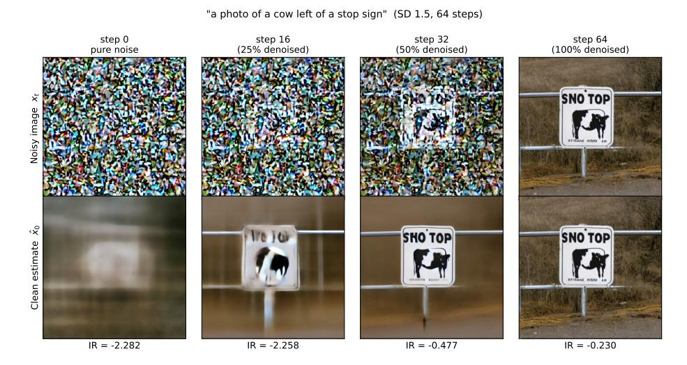

**Fig. S4:** Stable Diffusion v1.5 (64 steps)용 예측된 깨끗한 이미지 $\hat{x}_0$

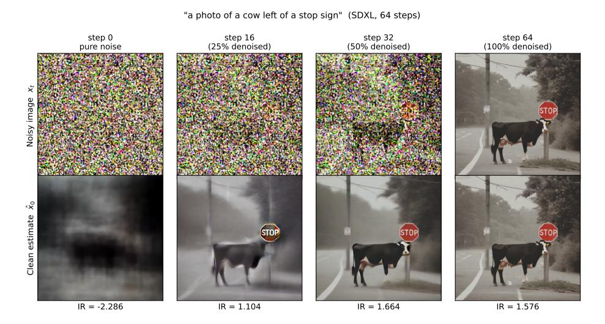

**Fig. S5:** Stable Diffusion XL (64 steps)용 예측된 깨끗한 이미지 $\hat{x}_0$

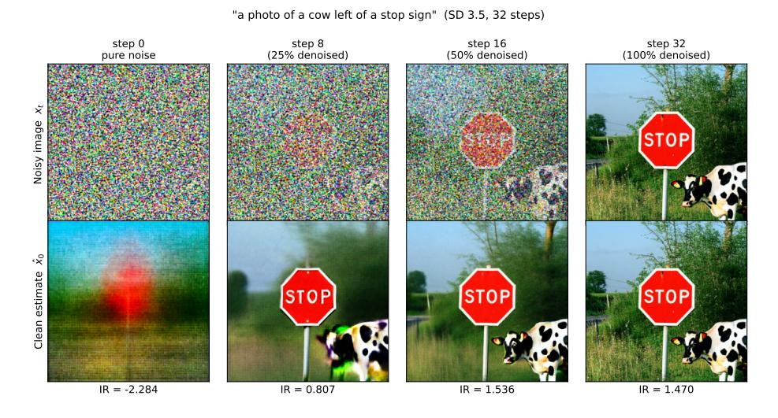

**Fig. S6:** Stable Diffusion 3.5 (32 steps)용 예측된 깨끗한 이미지 $\hat{x}_0$

#### S9 생성 예시 (S9 Generation Examples)

GenEval의 중립 프롬프트(프롬프트 ID 0, 100, 200, 300, 400)의 예시를 서로 다른 모델과 샘플링 알고리즘 하에서 보여준다.

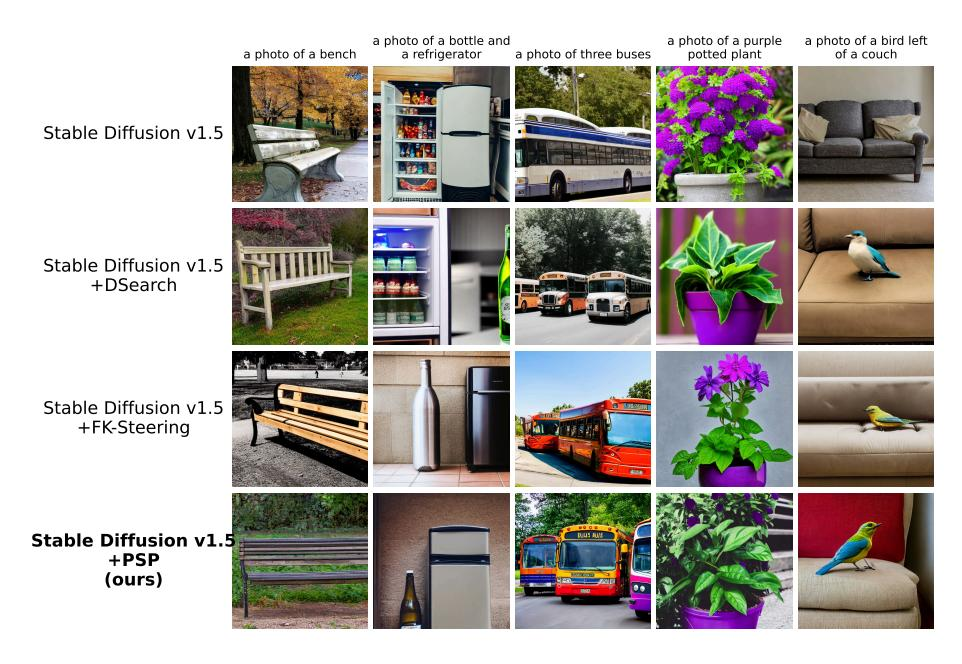

Fig. S7: Stable Diffusion v1.5용 생성 예시.

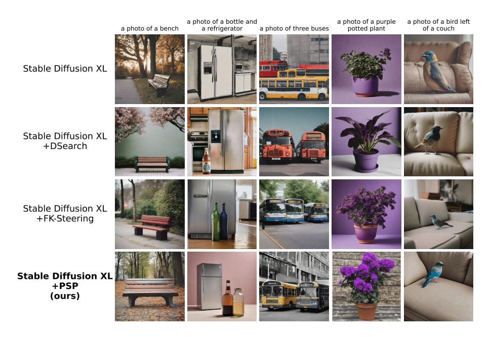

Fig. S8: Stable Diffusion XL용 생성 예시.

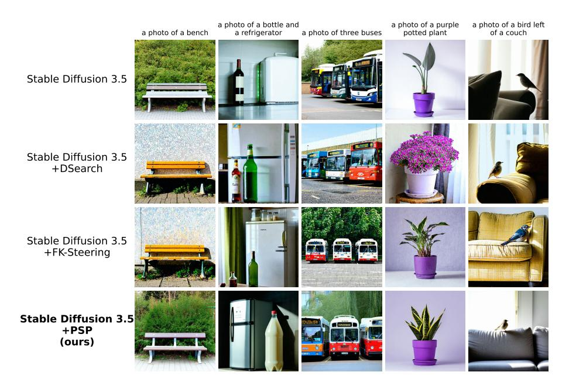

Fig. S9: Stable Diffusion 3.5용 생성 예시.

### <span id="page-38-0"></span>S10 인간 평가 (S10 Human Evaluations)

이 절은 섹션 [4.3,](#page-9-0)에서 요약한 인간 평가에 대한 추가 세부 정보를 제공한다. 여기에는 모집, 주석 인터페이스, 품질 관리 메커니즘, 할당 절차, 점수 집계가 포함된다. 우리는 [&#91;18&#93;](#page-16-11)와 동일한 주석자 지침 및 평가 기준을 채택하여, 공유된 표준 샘플러 조건에서 우리의 결과가 그들과 직접 비교 가능하도록 했다. 따라서 지침과 평가 질문은 의도적으로 동일하지만, 온라인 플랫폼과 데이터 수집 파이프라인(인터페이스, 할당 로직, 품질 관리 메커니즘)은 우리만의 것으로, 해당 작업에서는 공개되지 않았다.

모집 및 참가자. 주석자는 Prolific를 통해 모집되었으며, AI 평가 작업 경험이 있는 작업자만 선별되었다. 참여는 완전히 익명으로 진행되었으며, 제출 관리를 위해 필요한 Prolific 제공 식별자만 저장하고, 개인 식별 정보를 수집하지 않았다. 참가자는 언제든지 연구를 중단할 수 있었으며, 한 번에 완료할 수 없을 경우 중단하도록 안내했다. 총 249명의 주석자가 평가에 기여했다. 각 주석자는 약 100개의 이미지 세션을 할당받았으며, 예비 테스트에 따르면 세션은 지침을 포함해 약 25분이 소요되었다.

연구 조직. 우리는 백본별(SD 1.5, SDXL, SD 3.5)로 구성된 독립적인 연구 세트로 평가를 수행했다. 연구는 서로 완전히 격리되어 있었으며, 라벨 가용성, 커버리지 요구사항, 주석자별 중복 제거는 모두 연구별로 시행되어, 한 연구의 주석이 다른 연구의 수치나 할당에 영향을 미치지 않았다. 모든 이미지(즉, 프롬프트/방법/백본 세트, 단일 시드 사용)는 정확히 3개의 독립 평가를 받도록 구성되었다.

주석 작업 및 인터페이스. 인터페이스는 고정된 흐름을 따랐다: (i) 동의 화면, (ii) 다중 페이지 지침, (iii) 라벨링 작업. 각 이미지에 대해 주석자는 두 개의 필수 이진(예/아니오) 질문에 답했다:

- Q1 (정렬): '이미지가 프롬프트와 일치합니까?' - Q2 (품질): '이미지가 좋은 품질인가요? (즉, 객체가 잘 형성되어 있습니까?)'

프롬프트는 이미지 위에 표시되었으며, 예시 라벨링 화면은 Fig. [S11.](#page-48-0)에 나타나 있다. Tab. [1](#page-8-0)에 보고된 결과는 정렬 질문(Q1)을 사용하며, 이는 자동화된 GenEval 메트릭에서 사용되는 기준과 일치한다. 우리는 이미지 품질이 정렬 판단에 영향을 미치지 않도록 품질 질문(Q2)을 포함했다. 어노테이터에게 품질 우려를 등록할 전용 공간을 제공함으로써 이미지 품질이 정렬 판단에 영향을 주지 않도록 유도한다. [&#91;18&#93;](#page-16-11)에 따라 품질 응답 자체는 보고된 점수에 사용되지 않으며, 오직 이 분리 목적만을 위해 사용된다.

품질 관리. 서두르고 저노력 응답을 방지하기 위해 각 이미지에 대한 예/아니오 버튼을 숨겼으며, 이미지가 로드된 후 짧은 필수 검토 지연이 끝난 뒤에만 표시되도록 했다. 이 기간 동안 어노테이터는 프롬프트와 이미지를 신중히 검토하도록 유도받았다. 마찬가지로, 지침 페이지를 진행할 때마다 잠시 잠그어 어노테이터가 페이지를 읽도록 했다. 세션은 고정된 시간 예산(세션 시작 시점부터 측정되는 비롤링 만료)을 적용받았으며, 이를 초과한 어노테이터는 타임아웃되었고, 진행 중인 작업은 목표에 포함되지 않았다. 이미지별 응답 시간과 지침/작업 타이밍은 감사용 텔레메트리로 기록되었다.

할당 및 중복 제거. 할당은 서버 측에서 사전 재현된 슬롯 기반 방식으로 계산되었다. 각 연구마다 우리는 고정된 "슬롯" 집합을 사전 계산했으며, 각 슬롯은 단일 세션(≈100개 이미지)에 맞게 크기가 조정된 이미지 묶음이며, 슬롯들은 모든 프롬프트/방법/백본 트리플릿을 정확히 3회씩 커버한다. 어노테이터가 시작하면, 그들은 원자적으로 하나의 미할당 슬롯을 주장하며, 이는 (a) 어떤 어노테이터도 동일한 트리플릿을 한 번 이상 라벨링하지 않도록 보장하고, (b) 이미지당 평가 횟수가 목표에 맞게 제한되도록 한다. 세션이 만료되거나 반환되면 해당 슬롯은 해제되어 새로운 어노테이터에게 재활용되며, 완료된 슬롯의 응답만 계산된다. 이는 부분적으로 완료된 세션에서 과다 계산을 방지한다.

집계 및 합의. 각 이미지에 대해 3개의 정렬(Q1) 판단을 다수결 투표로 집계하여 이진 정렬/미정렬 결정을 얻었으며, 방법/백본 점수는 이러한 이미지별 결정의 평균이다. 총 8,295개의 이미지(553개 프롬프트 × 5개 방법 × 3개 백본)가 24,885개의 평가를 받았다. 신뢰성 측정으로, 모든 평가자가 동일한 답변을 제공한 적어도 하나의 투표를 받은 이미지 비율인 상호 어노테이터 합의율을 보고한다. 연구 전반에서 이 합의율은 80.3%였다.

이전 연구와의 검증. Sec. [4.3,](#page-9-0)에서 언급한 바와 같이, [&#91;18&#93;](#page-16-11)과 공유되는 백본에서 표준 샘플러에 제한하면 그들의 보고된 인간 점수를 거의 일치시킨다 (SDXL: 0.531 대 0.566; SD 3.5: 0.787 대 0.770). 이는 우리의 모집, 인터페이스, 집계가 그들의 프로토콜을 충실히 따르고 있음을 검증한다.

Fig. S10: 온라인 플랫폼에서 어노테이터에게 순서대로 제공되는 전체 지침 세트로, 작업 설명, 두 평가 질문, 정렬/미정렬 및 고품질/저품질 생성의 예시를 포함한다. 이 지침은 [&#91;18&#93;](#page-16-11)의 지침을 따른다.


Instruction 3 / 14

### 예시 2 (Example 2)


프롬프트: 두 마리의 개
Q1. 이미지가 프롬프트와 일치합니까?
네

네
Q2. 이미지가 좋은 품질인가요? (즉, 물체가 잘 형성되어 있나요?)
아니오
사고 과정
Q1: 이미지에 두 마리의 식별 가능한 개가 있습니다.
Q2: 개 중 하나가 잘 형성되지 않았습니다 (두 얼굴이 있습니다), 따라서 이미지가 좋은 품질이 아닙니다.

계속하기 전에 이 페이지를 주의 깊게 읽어 주세요.


지침 4 / 14 (Instruction 4 / 14)

### 예시 3 (Example 3)


프롬프트: 샌드위치 오른쪽에 배낭  
Q1. 이미지가 프롬프트와 일치하나요?  
아니오  
Q2. 이미지가 좋은 품질인가요? (즉, 물체가 잘 형성되어 있나요?)  
예  
사고 과정  
Q1: 식별 가능한 배낭과 샌드위치(버거는 샌드위치의 일종)가 있지만, 배낭은 샌드위치 뒤쪽과 왼쪽에 위치해 있어 오른쪽에 있지 않다.  
Q2: 배낭과 샌드위치는 모두 잘 형성되어 있으므로 이미지가 좋은 품질이다.

계속하기 전에 이 페이지를 주의 깊게 읽어 주세요.


## 44 R. Guimarães and P. Perona


## 46 R. Guimarães and P. Perona


<span id="page-48-0"></span>

Fig. S11: 라벨링을 위해 제시된 이미지 예시, 이미지 위에 프롬프트가 표시되고 두 개의 이진(예/아니오) 질문 Q1(정렬)과 Q2(품질)이 있다. 답변 버튼은 짧은 필수 검토 지연 후에만 나타난다.

