# SCENEACTBENCH: 에이전트가 보는 3D 장면에서 행동할 수 있을까?

- 원제: SceneActBench: Can Agents Act on the 3D Scenes They See?
- 원문: [https://arxiv.org/abs/2607.22393](https://arxiv.org/abs/2607.22393)
- PDF: [https://arxiv.org/pdf/2607.22393v1](https://arxiv.org/pdf/2607.22393v1)
- arXiv ID: `2607.22393`

---

# SCENEACTBENCH: 에이전트가 보는 3D 장면에서 행동할 수 있을까?

Yifei Zhao $^{1,2,*}$  Xiangxin Zhou $^{1,*,\dagger}$  Wenhao Yang $^{1,3,*}$  Jiaqi Tang $^{1,4,*}$  Pu Jian $^{1,*}$  Huanjin Yao $^{1,4,*}$  Jiarui Yao $^{1,5,*}$  Haowei Lin $^{1,6}$  Chunchao Guo $^1$  Zhuo Chen $^1$  Wenkai Lyu $^1$  Jianzhu Ma $^2$  Xueqian Wang $^2$  Wenxi Zhu $^{1,\dagger}$

$^{1}$ Tencent Hunyuan  $^{2}$ THU  $^{3}$ NJU  $^{4}$ HKUST  $^{5}$ UIUC  $^{6}$ PKU  $^{*}$ 동일 기여  $^{\dagger}$ 교신 저자

↑Code ↑Project Page Pugging Face

## **요약 (ABSTRACT)**

Vision-language model (VLM) 에이전트는 3D 장면을 단순히 설명하는 대신 도구를 사용해 행동하도록 점점 더 많이 활용하고 있다. 기존 3D 벤치마크는 텍스트 응답이나 단일 객체 조작을 평가하지만, 완전한 다중 객체 3D 장면에서의 에이전트 행동은 충분히 평가되지 않는다. 우리는 통합된 에이전트—환경 루프 하에서 다섯 개의 3D 과제에 걸친 시각적으로 조건화된 행동을 평가하는 벤치마크 **SceneActBench** 를 제시한다. PNG 이미지 또는 샘플링된 비디오 프레임과, 해당되는 경우 제공된 3D 자산을 주어, 에이전트는 3D 환경에서 행동한다. 우리는 각 최종 출력을 과제별 기하학적 지표를 사용해 숨겨진 정답과 비교한다. SceneActBench는 210개의 소스 인스턴스에서 구축된 다섯 개의 과제로 구성되며, 입력 조건이 쌍으로 제공되는 520개의 과제 사례를 포함한다. 모든 과제는 비교를 공정하게 유지하기 위해 하나의 고정된 에이전트 루프를 거친다. 열한 개의 독점 VLM 구성에서 전체 점수는 38.6–50.2 범위이며, 어느 구성도 과제 전반에서 일관되게 우수한 성능을 보이지 않는다. 우리는 실패가 어디에서 어떻게 나타나는지 추가로 분석한다.

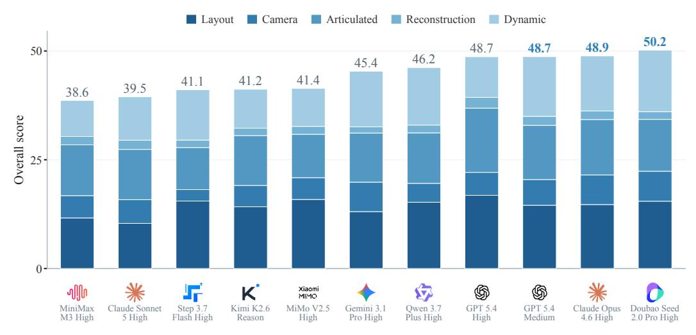

<span id="page-0-0"></span>Figure 1: **SceneActBench 리더보드.** 열한 개의 구성에 대한 전체 점수는 왼쪽에서 오른쪽으로 정렬되며, 각 공급업체의 표시가 막대 아래에 있는 구성 라벨과 짝을 이룬다. 전체 점수는 38.6–50.2 범위이다. 막대는 0을 기준으로 하며, 각 과제별 기여(각 과제 점수를 다섯으로 나눈 값)를 다섯 개로 쌓아 전체 점수와 합산된다.

## 1 서론 (Introduction)

최근 Vision-language model (VLM) 에이전트는 도구와 코드를 통해 3D 장면에서 행동할 수 있다 (Wang et al., 2024a; Hu et al., 2024; Sun et al., 2025; Doris et al., 2026; Huang et al., 2023). 장면을 단순히 설명하는 대신 행동하는 것은 에이전트의 3D 이해도를 더 강력하게 테스트한다. 기존 3D

<span id="page-1-0"></span>Table 1: **벤치마크 범위.** 다섯 개의 3D 기능과 세 가지 평가 속성(✓ 전체, ✓ 부분, ✗ 없음)의 범위.

|  | 3D 기능 |  |  |  |  |  | 평가 |  |  |
|------------------------------------|-------------------|------------------------------|------------------------|-------------------|-------------------|-------|----------------|-------|--|
| 벤치마크 | 공간 기반 정리 | 자아중심 공간 추론 | 운동학<br>추론 | 형상 상상 | 동적 추론 | 기하학 | 다중-<br>객체 | 상호작용 |  |
| 3D 질문 응답 |  |  |  |  |  |  |  |  |  |
| ScanQA (Azuma et al., 2022) | <b>√</b> | X | X | X | X | X | 1 | X |  |
| SQA3D (Ma et al., 2023) | <b>√</b> | ✓ | X | X | X | X | 1 | X |  |
| Spatial457 (Wang et al., 2025) | ✓ | X | X | X | <b>✓</b> | X | 1 | X |  |
| 코드 기반 3D 및 체현형 에이전트 |  |  |  |  |  |  |  |  |  |
| BlenderGym (Gu et al., 2025) | 1 | X | X | <b>√</b> | X | / | 1 | / |  |
| 3DCodeBench (Gao et al., 2026) | X | X | X | 1 | X | / | X | / |  |
| GameDevBench (Chi et al., 2026) | Х | X | / | X | / | X | 1 | 1 |  |
| EmbodiedBench (Yang et al., 2025) | ✓ | X | ✓ | X | ✓ | X | ✓ | ✓ |  |
| SceneActBench | 1 | ✓ | 1 | 1 | / | / | / | 1 |  |

벤치마크는 이 문제의 일부만을 측정한다 (Table 1). 많은 연구가 3D 시각적 질문 응답(VQA) (Azuma et al., 2022; Ma et al., 2023; Wang et al., 2025)을 제시한다. 이들은 장면을 바꾸지 않고 스캔이나 이미지에 대한 텍스트 답변을 점수화한다. 다른 연구들은 3D 환경에서 행동하는 에이전트를 평가한다 (Gu et al., 2025; Gao et al., 2026; Chi et al., 2026; Yang et al., 2025). 이러한 벤치마크는 일반적으로 단일 객체 또는 정적 편집만을 다루며, 일부는 작업 성공만을 보고한다. 어떤 벤치마크도 하나의 에이전트가 많은 객체로 이루어진 전체 장면에서 행동하도록 요구하지 않는다. 이는 여러 객체에 걸쳐 조정된 행동이 필요한 실제 3D 애플리케이션에서 중요하다. 따라서 질문은 직설적이다: 장면을 보는 에이전트가 3D 환경에서 그것을 일치시키도록 행동할 수 있을까?

우리는 이 질문을 **SceneActBench**라는 시각적으로 조건화된 3D 액션을 위한 실행 가능한 벤치마크로 다룹니다. 에이전트는 이미지 또는 샘플링된 비디오 프레임을 관찰하고 3D 장면에서 행동하여 참조와 일치하도록 합니다. SceneActBench는 210개의 소스 인스턴스를 기반으로 합니다: 100개의 가구가 배치된 방, 100개의 관절이 있는 물체, 그리고 10개의 다중 물체 동적 장면. 방은 27개의 가구 카테고리에서 3–7개의 물체를 포함하며, 동적 세트는 9가지 동작 유형(표 2)을 포괄합니다. 이 벤치마크는 **Layout**, **Camera**, **Articulated**, **Reconstruction**, 그리고 **Dynamic**의 다섯 가지 과제를 갖습니다. 공정한 비교를 위해 우리는 Figure 2에 표시된 고정 에이전트 루프를 갖는 표준화된 평가 하네스를 개발했습니다.

우리는 11개의 독점 VLM 구성을 평가한다. 전체 점수는 38.6에서 50.2 사이이며, 스택된 작업 기여도는 선도 구성 요소들 간의 서로 다른 강점을 드러낸다 (Figure 1). 본 논문은 세 가지 기여를 한다. 첫째, 시각적으로 조건화된 3D 행동을 실행 가능한 평가 문제로 공식화하고 최종 출력을 숨겨진 3D 기준과 비교하여 점수를 매긴다. 둘째, 210개의 소스 인스턴스로부터 구축된 다섯 가지 작업을 도입하여 공간 기반화, 자기 중심 공간 추론, 동역학 추론, 형태 상상, 그리고 하나의 고정 에이전트 루프 하에서의 동적 추론을 테스트한다. 셋째, 11개의 구성을 벤치마크하고 사례 수준 진단을 사용하여 집계 점수 이상의 실패가 어디서 어떻게 나타나는지를 특성화한다. 나머지는 벤치마크, 평가, 그리고 실패 분석을 제시한다.

## 2 관련 연구 (RELATED WORK)

**3D 이해 벤치마크.** 많은 3D 벤치마크는 스캔이나 렌더링된 이미지에 대해 질문을 제시하고 텍스트 답변을 점수화한다. 예를 들어 ScanQA (Azuma et al., 2022), SQA3D (Ma et al., 2023), Spatial457 (Wang et al., 2025)가 있으며, SpatialVLM (Chen et al., 2024) 및 BLINK (Fu et al., 2024)와 같은 프로브는 유창한 설명이 여전히 공간 판단을 놓친다고 보고한다. 다른 연구는 BlenderGym (Gu et al., 2025), 3DCodeBench (Gao et al., 2026), GameDevBench (Chi et al., 2026), EmbodiedBench (Yang et al., 2025) 등 3D 환경에서 행동하는 에이전트를 평가하지만, 각 연구는 하나의 객체, 정적 편집, 또는 단순 작업 성공과 같은 단일 부분만을 다룬다. 어떤 연구도 한 에이전트가 여러 객체로 구성된 전체 장면을 처리하도록 요구하지 않는다 (Table 1).

**3D 환경에서 행동하는 에이전트.** 기존 연구는 언어 에이전트가 3D 환경에서 행동하거나 3D 콘텐츠를 생성할 수 있음을 보여준다. Voyager (Wang et al., 2024a)는 인터랙티브한 세계에서 행동하고, VoxPoser (Huang et al., 2023)는 로봇 조작을 3D에서 기반화한다. SceneCraft (Hu et al., 2024), 3D-GPT (Sun et al., 2025), CAD-Coder (Doris et al., 2026)는 대신 장면이나 형태를 생성한다. 이 시스템들은 서로 다른 출력을 목표로 하고, 작업별 평가를 사용한다. 본 연구에서 다루는 다섯 가지 역량을 아우르는 장면 수준 행동에 대한 공유 기하학적 테스트를 제공하는 것은 없다.

<span id="page-2-1"></span>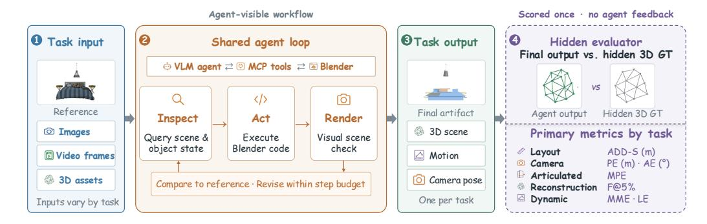

Figure 2: **SceneActBench의 공유 에이전트-환경 루프.**  
각 작업은 세 개의 데이터셋 중 하나에서 표준화된 PNG 뷰 또는 샘플링된 비디오 프레임을 제공하며, 해당되는 경우 익명화된 GLB 자산도 함께 제공한다.  
공유 핵심 MCP 인터페이스를 통해 VLM은 장면을 검사하고, Blender 코드를 실행하며, 렌더링하고, 작업이 중지되거나 예산이 끝날 때까지 수정한다.  
최종 작업별 출력—GLB 장면, 애니메이션 GLB 또는 장면 상태, 또는 JSON 카메라 포즈—은 숨겨진 3D 기준값에 대해 한 번 평가되며, 평가자 피드백은 에이전트에 전달되지 않는다.  
평가자 패널은 각 작업의 주요 지표를 나열한다.

<span id="page-2-0"></span>Table 2: **SceneActBench 작업 사양.**  
모든 작업은 Figure 2의 공유 inspect—act—render 루프를 사용하며, 숨겨진 기준값은 점수 매기기만에 사용된다.  
Layout과 Dynamic은 각각 동일한 소스 인스턴스와 기준값에 대한 쌍을 이루는 입력 조건을 포함한다.  
예산은 에이전트 단계의 최대 수이며, n은 구성별 조건당 소스 인스턴스 수이다.

| 작업 | 소스 | 시각적 증거 | 초기 상태 / 자산 | 에이전트 출력 | 주요 지표 | 예산 | n |
|----------------|-------------|----------------------------------|----------------------------|---------------------|------------------|--------|-----|
| 레이아웃 | 3D-FRONT | 1 또는 ∼11개의 보정된 뷰 | 원점에 N개의 정규화된 GLB | GLB 내 객체 포즈 | ADD-S↓ | 30 | 100 |
| 카메라 | 3D-FRONT | 1개의 뷰 + 알려진 FOV | 고정된 가구가 배치된 장면 | 6-DoF 포즈 (JSON) | PE / AE↓ | 30 | 100 |
| 관절이 있는 | S2O ACD | 32개의 순서가 지정된 프레임 | 닫힌, 라벨이 없는 GLB | 32개의 GLB 장면 상태 | $MPE \downarrow$ | 60 | 100 |
| 재구성 | 3D-FRONT | ~11개의 보정된 뷰 | 빈 Blender 장면 | 가구가 배치된 장면 GLB | F@5% ↑ | 35 | 100 |
| 동적 | Kenney 키트 | 샘플링된 144프레임 비디오 + 카메라 | 컴포넌트 GLB 라이브러리 | 애니메이션된 GLB | MME / LE↓ | 80 | 10 |

작업별 3D 모델. 많은 전문화된 모델이 각각 하나의 3D 작업을 해결하며, 레이아웃 생성기(ATISS (Paschalidou et al., 2021), DiffuScene (Tang et al., 2024), LayoutGPT (Feng et al., 2023), Holodeck (Yang et al., 2024)), 이미지-투-3D 재구성기(Zero-1-to-3 (Liu et al., 2023b), LRM (Hong et al., 2024), TRELLIS (Xiang et al., 2025)), 그리고 카메라 추정기(COLMAP (Schonberger & Frahm, 2016), DUSt3R (Wang et al., 2024b))를 포함한다. 각각은 하나의 작업에 특화된 모델이며, 모든 작업을 수행하는 에이전트가 아니다.

## <span id="page-2-2"></span>3 BENCHMARK

SceneActBench는 에이전트가 시각적 증거를 실행 가능한 3D 출력으로 변환할 수 있는지를 평가한다. 에이전트는 **PNG** 이미지 또는 샘플링된 비디오 프레임을 받고, 그래픽 인터페이스 대신 공유 도구 인터페이스를 통해 헤드리스 모드에서 Blender를 제어한다. 작업에 따라 출력은 **JSON** 또는 하나 이상의 **GLB** 파일에 저장되며, 이는 3D 기하학, 재질, 객체 변환 및 애니메이션을 패키징하는 바이너리 glTF 형식을 사용한다. 각 출력은 숨겨진 3D 기준과 비교해 평가된다. 다섯 개의 작업과 짝지어진 입력 조건을 통해 210개의 소스 인스턴스가 520개의 작업 사례를 생성한다. *asset*은 제공되거나 가져올 수 있는 3D 리소스이며, *object*는 장면에 인스턴스화된 항목이다. 부록 A.1은 벤치마크 전반에 걸쳐 사용되는 3D 전용 용어를 정의하고, 부록 A.3은 정확한 평가자 규칙과 모든 진단 지표를 제공한다.

### 3.1 Data Collection

우리는 세 개의 공개 소스에서 벤치마크를 구성하며, 각각을 우리 고유의 형식으로 표준화한다.

• Indoor Scenes Dataset. 3D-FRONT (Fu et al., 2021)에서 100개의 가구가 배치된 방을 추출하며, 다중 시점 렌더링과 포즈 주석이 신뢰할 수 있는 M3DLayout (Zhang et al., 2026) 교차점만 보존한다. 방에는 27개 카테고리에서 3~7개의 가구 객체가 포함되며, 각 객체는 GLB 자산으로 제공된다. 우리는 다양한 카메라 위치에서 장면당 11개의 PNG 뷰를 렌더링하고, 각 뷰의 카메라 행렬과 시야각을 **JSON** 형식으로 기록한다. 이 이미지들은 5개 과제 중 3개에서 참조로 사용된다.

- Articulated Objects Dataset. S2O Articulated Containers Dataset (ACD) (Iliash et al., 2026)에서 100개의 관절형 객체를 선택하며, 각 객체는 GLB 자산으로 제공된다. 각 객체는 고정된 시점에서 16fps로 32프레임의 열고-닫기 MP4 비디오와 프레임당 하나의 GLB 메쉬를 정답으로 갖는다.

- **Dynamics Dataset.** 10개의 장면은 CC0 라이선스의 저폴리 자산 키트 (Kenney<sup>1</sup>)에서 구축되며, 각 장면에는 독립적으로 움직이는 객체가 여러 개 포함된다. 움직임 유형은 의도적으로 다양하다. 하나의 휴리스틱으로는 모두를 포괄할 수 없으므로 평가가 과제 비중립적으로 진행된다. 각 장면은 가져올 수 있는 **GLB** 자산 라이브러리와 24fps의 144프레임 **MP4** 참조 비디오를 제공한다. 정답은 애니메이션된 **GLB** 장면이며, 프레임별 움직이는 객체 좌표, 정적 레이아웃 주석, 그리고 **JSON** 형식의 카메라가 포함된다.

**Post-processing.** 원본 자산은 좌표와 이름에 답을 포함한다. 모든 자산을 표준화하면 이 누수를 제거하고 에이전트가 참조 이미지만으로 장면을 재구성하도록 강제한다. 실내 자산은 중앙에 배치되고 중립 yaw로 설정되며, 미터 단위로 주석된 크기로 스케일된다. 관절형 자산은 공유 프레임으로 재배치되며, 그 조인트 파라미터는 에이전트에게 제공되지 않는다. 모든 파일과 노드 이름은 익명 식별자로 대체된다. 어떤 라벨도 객체가 무엇인지 드러내지 않는다. 동적 장면의 경우, 저폴리 렌더를 NVIDIA Cosmos (Agarwal et al., 2026)를 통해 전달하여 동일한 레이아웃과 움직임을 갖는 사진 실사 참조를 생성한다. 관절형 및 동적 참조는 **MP4** 비디오로 저장된다. 구성 간 일관된 비교를 위해 공유 인터페이스는 이 비디오를 샘플링된 **PNG** 프레임으로만 노출한다.

### 3.2 Layout

**Task.** 주어진 방 이미지와 원점에 있는 표준화된 가구 객체를 사용하여, 에이전트는 각 객체의 세계 좌표와 수직 축(요크)에 대한 회전( yaw )을 설정한다. 이는 Figure 3에 표시된 바와 같다. 테스트 대상 능력은 공간적 근거화이다. 에이전트는 이미지에서 레이아웃이 어떻게 보이는지를 3D에서 각 객체가 어디에 놓여 있고 어느 방향을 향하고 있는지에 매핑한다. 우리는 같은 100개의 장면을 한 뷰와 모든  $\sim$ 11 views로 평가한다.

**Metric.** 주요 점수는 **ADD-S** (Wen et al., 2024)입니다. 예측 객체 i와 후보 정답 객체 j에 대해, $\hat{V}_i \subset \mathbb{R}^3$는 최종 세계 변환을 적용한 후 예측 메쉬의 샘플링된 정점 집합이며, $V_j \subset \mathbb{R}^3$는 주석된 포즈를 적용한 후 해당 후보 정답 메쉬의 샘플링된 정점 집합입니다. 이들의 방향성 인접-이웃 표면 거리는

$$d_{\text{surf}}(\hat{V}_i, V_j) = \frac{1}{|\hat{V}_i|} \sum_{\hat{\mathbf{v}} \in \hat{V}_i} \min_{\mathbf{v} \in V_j} \|\hat{\mathbf{v}} - \mathbf{v}\|_2.$$

쌍별 비용 $C_{ij} = d_{\text{surf}}(\hat{V}_i, V_j)$를 사용한 Hungarian 할당은 매칭된 예측 객체와 정답 객체의 집합 $\mathcal{M}$을 생성합니다. 장면 수준 점수는

<span id="page-3-1"></span>

$$ADD-S_{\text{scene}} = \frac{1}{|\mathcal{M}|} \sum_{(i,j) \in \mathcal{M}} d_{\text{surf}}(\hat{V}_i, V_j). \tag{1}$$

낮은 점수는 예측 객체 표면이 목표 위치와 방향에 더 가까움을 나타냅니다. 주요 점수는 매칭된 객체를 평균하고, 별도의 개수 민감 감사는 누락된 객체를 고려합니다. 부록 A.3은 점수 샘플링 절차와 무효 출력 처리 방식을 명시합니다.

### 3.3 CAMERA

**작업.** 에이전트는 정리된 장면과 시야각을 보지만, 카메라의 외부 파라미터(카메라의 3D 위치와 방향)를 알지 못한다. 테스트 대상은 자아중심적 공간 추론이다. 에이전트는 장면이 어떻게 보이는지로부터 관찰자가 어디에 있었는지를 추론한다. 가상 카메라를 배치하고 렌더링하며, 참조(그림 4)에 대해 포즈를 정제한다.

<span id="page-3-0"></span><sup>&</sup>lt;sup>1</sup>www.kenney.nl, Creative Commons Zero 라이선스로 공개됨.

<span id="page-4-0"></span>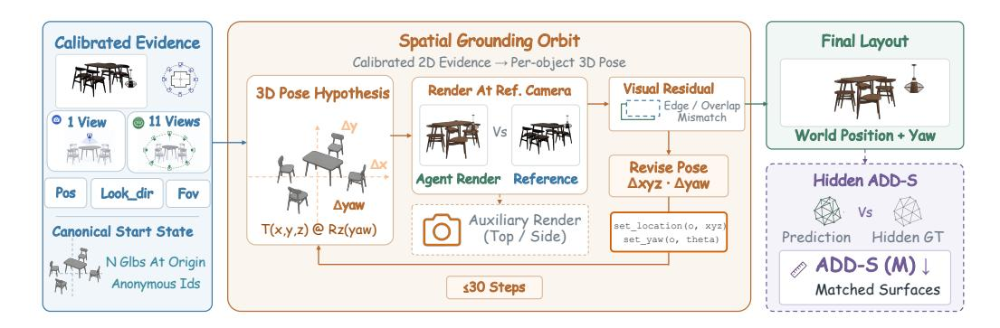

그림 3: **배치.** 하나 또는  $\sim$ 11개의 보정된 참조 뷰와 표준화된 가구 객체를 원점에 두고, 에이전트는 2D 증거를 각 객체의 메트릭 세계 위치와 수직축(요크)에 대한 회전으로 매핑한다. 에이전트는 알려진 참조 카메라에서 렌더링하고, 시각적 잔차를 통해 최대 30단계까지 이 3D 포즈 가설을 업데이트한다. 최종 배치는 숨겨진 정답과 **ADD-S** 표면 거리(미터)를 사용해 한 번 평가된다.

<span id="page-4-1"></span>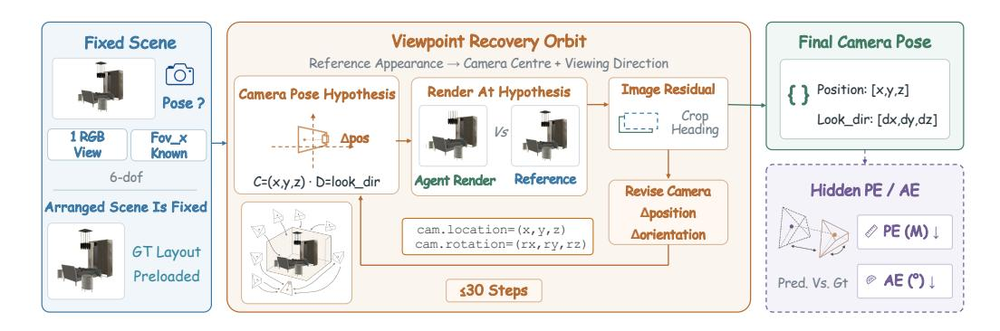

그림 4: **카메라.** 이미 정리된 장면의 하나의 참조 이미지와 알려진 시야각을 주어, 카메라 외부 파라미터가 숨겨진 상태에서 에이전트는 6-DoF 포즈 가설을 유지하고, 그로부터 렌더링하며, 이미지 잔차를 통해 최대 30단계까지 카메라 위치와 방향을 업데이트한다. 최종 JSON 포즈는 숨겨진 정답과 미터 단위의 위치 오차와 **AE**(도)를 사용해 한 번 평가된다.

**지표.** 주요 지표는 **Position Error (PE)**와 **Angular Error (AE)**이다. $\hat{\mathbf{c}}, \mathbf{c} \in \mathbb{R}^3$ 를 예측된 카메라 중심과 실제 카메라 중심으로, $\hat{\mathbf{d}}, \mathbf{d} \in \mathbb{R}^3$ 를 각각의 단위 시야 방향으로 두고, $\|\hat{\mathbf{d}}\|_2 = \|\mathbf{d}\|_2 = 1$ 이라고 하자. 우리는 다음을 정의한다

<span id="page-4-2"></span>

$$PE = \|\hat{\mathbf{c}} - \mathbf{c}\|_{2}, \qquad AE = \frac{180^{\circ}}{\pi} \arccos(\hat{\mathbf{d}}^{\top}\mathbf{d}). \tag{2}$$

PE는 두 카메라 중심 사이의 유클리드 거리를 미터 단위로 측정하고, AE는 그들의 시야 방향 사이의 각도를 도 단위로 측정하며 $[0^{\circ}, 180^{\circ}]$ 범위에 있다. 우리는 이들을 별도로 보고한다. 왜냐하면 추정된 카메라가 정확한 위치에 가까울 수 있지만 잘못된 방향을 향할 수 있기 때문이다. AE는 시야 방향만 비교하므로 시야 축을 따라 회전(roll)을 벌점으로 두지 않는다.

### 3.4 관절형 (ARTICULATED)

**Task.** 에이전트는 관절로 연결된 움직이는 부품이 있는 닫힌 물체와 함께 열림-닫힘 비디오에서 32개의 순서가 지정된 프레임을 받는다. 에이전트는 움직이는 부품을 찾고, 그 관절을 추론하며, 움직임(그림 5)을 재현한다. 테스트되는 능력은 동역학적 추론이다. 에이전트는 샘플링된 프레임에서 각 부품이 어떻게 움직이는지 복구하고 그 움직임을 재현한다.

**Metric.** 주요 지표는 **Maximum Part Error (MPE)** 이다. 이는 모든 실제 움직이는 부품에 대해 개방-정렬된 기하학적 오차 또는 재현되지 않은 움직임 범위 중 가장 큰 값을 의미한다. $\mathcal{P}_{mov}$ 를 실제 움직이는 부품 집합이라고 하자. 각 부품 $i \in \mathcal{P}_{mov}$ 에 대해, $\epsilon_i$ 를 그 부품의 가장 큰 기하학적 오차라 하자.

<span id="page-5-0"></span>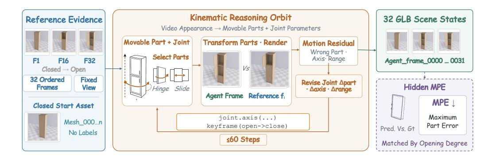

Figure 5: **관절형.** 주어진 하나의 닫힌, 라벨이 없는 GLB와 고정된 시점에서 32개의 순서가 지정된 열림-닫힘 참조 프레임을 사용해, 에이전트는 움직이는 메쉬를 선택하고, 각 관절의 종류, 축, 피벗, 범위를 추론하며, 전체 객체 변환을 적용하면서 최대 60 단계 동안 움직임을 렌더-체크한다. 에이전트는 32개의 전체 장면 GLB 상태를 내보낸다. 평가자는 내보낸 상태를 숨겨진 실제와 개방 각도에 따라 매칭하고, **MPE**를 사용해 움직이는 부품 전체에서 최대 오차를 보고한다.

예측 프레임과 실제 프레임을 개방 각도에 따라 정렬한다. $\kappa_i \in [0, 1]$ 를 예측이 재현한 전체 움직임의 비율이라고 하고, $g_i$ 를 전체 실제 이동 거리라고 하자:

<span id="page-5-1"></span>

$$MPE = \max \{ \epsilon_i, (1 - \kappa_i) g_i \mid i \in \mathcal{P}_{mov} \}.$$

(3)

여기서 $\epsilon_i$ 와 $g_i$ 는 모두 미터 단위로 측정된다. $(1 - \kappa_i)g_i$ 항은 불완전한 움직임을 벌점으로 삼는다; 특히 움직이지 않은 부품은 $\kappa_i = 0$ 이며 전체 실제 이동 거리를 부과받는다. 프레임은 프레임 인덱스가 아니라 개방 각도에 따라 정렬된다. 따라서 MPE는 객체 대각선 항목이나 크기 정규화 없이 움직이는 부품 전체에서 최대 오차를 미터 단위로 직접 보고한다.

### 3.5 재구성 (RECONSTRUCTION)

**Task.** 여러 방 뷰와 빈 장면을 주어, 에이전트는 각 가구 객체를 메쉬(정점과 면으로 표현되는 3D 표면)로 구축, 배치, 텍스처링한다 (그림 6). 테스트되는 능력은 형태 상상력이다. 에이전트는 몇 개의 부분 뷰에서 완전한 3D 기하학을 추론한다.

**Metric.** 주요 F@5% 점수 (Tatarchenko et al., 2019)는 고정 스케일 ICP 정렬 (Besl & McKay, 1992), DBSCAN 클러스터링 (Ester et al., 1996), 그리고 Hungarian 매칭 (Kuhn, 1955) 이후에 계산된다. N을 실제 객체 수라고 하자. 각 실제 객체 j에 대해, $V_j \subset \mathbb{R}^3$ 를 그 객체의 표면 샘플 포인트 집합이라고 하자. 객체 j가 매칭되면, $\hat{V}_j \subset \mathbb{R}^3$ 를 매칭된 예측 클러스터의 재중심화된 표면 포인트라고 하고, 매칭되지 않은 객체는 예측 클러스터가 없다. 객체별 거리 임계값을 $\tau_j = 0.05\delta_j$ 로 설정한다. 여기서 $\delta_j$ 는 객체 j의 바운딩 박스 대각선이다. 매칭된 객체 j에 대해, $\mathrm{Prec}_j$ 를 $\hat{V}_j$ 안의 포인트 중 가장 가까운 포인트가 $V_j$ 에서 $\tau_j$ 이내인 비율이라고 하고, $\mathrm{Rec}_j$ 를 $V_j$ 안의 포인트 중 가장 가까운 포인트가 $\hat{V}_j$ 에서 $\tau_j$ 이내인 비율이라고 하자. 매칭되지 않은 객체 j에 대해, $\mathrm{Prec}_j = \mathrm{Rec}_j = 0$ 으로 설정한다. 장면 수준 점수는

<span id="page-5-2"></span>

$$F@5\% = \frac{1}{N} \sum_{j=1}^{N} \frac{2\operatorname{Prec}_{j} \cdot \operatorname{Rec}_{j}}{\operatorname{Prec}_{j} + \operatorname{Rec}_{j}}.$$

(4)

항은 $\operatorname{Prec}_j + \operatorname{Rec}_j = 0$ 일 때, 즉 매칭되지 않은 객체를 포함해, 항상 0으로 정의됩니다. 따라서 객체는 예측된 표면과 실제 표면이 서로를 완전히 덮어쓸 때만 높은 점수를 부여받습니다. Appendix A.3에서는 점수 계산에 사용되는 전체 사양, 즉 점 집합, 매칭 임계값, 재중심화 방법 등을 제공합니다.

### 3.6 DYNAMIC

**Task.** 샘플링된 비디오 프레임과 자산 라이브러리를 주어지면, 에이전트는 정적 레이아웃, 시작 위치, 그리고 키프레임 트래젝터리를 재구성합니다 (Figure 7). 테스트 대상은 동적 추론입니다. 에이전트는 여러 객체의 동시 움직임을 복구하고 3D에서 재생합니다. 또한 동일한 장면과 실제 데이터를 사용해 사진 실사(reference) 변형을 테스트합니다.

<span id="page-6-0"></span>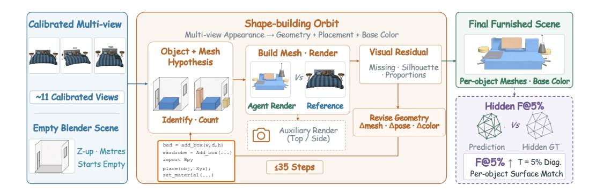

Figure 6: **Reconstruction.** 대략 $\sim 11$개의 보정된 방 뷰와 빈 Blender 장면이 주어지면, 에이전트는 가구 객체를 식별하고 개수를 세며, 각 객체의 기하학, 미터 단위 크기, 자세, 그리고 Base Color를 가정하고 Blender 코드를 사용해 메쉬를 구축한다. 에이전트는 알려진 카메라에서 렌더링하고 시각적 잔차를 통해 최대 35단계까지 기하학, 배치, 색상을 수정한다. 최종 가구가 배치된 장면은 숨겨진 정답과 한 번 비교하여, 객체별 대각선 상대 임계값에서 $\mathbf{F@5\%}$를 사용해 점수를 매긴다.

**Metric.** 우리는 각 움직이는 객체를 mover라고 부르며, $N_{\text{mov}}$ 를 실제 데이터의 mover 수라고 합니다. 평가자는 mover 중심 추적을 매칭하고 단일 전역 변환을 보정합니다. 매칭된 실제 mover $i \in \{1, \dots, N_{\text{mov}}\}$ 에 대해, $m_i$ 를 짧은 매칭된 추적 길이라고 합니다. 우리는 이 $m_i$ 프레임에 걸친 중심 오차를 평균하고, 장면 스케일 S 로 나누어 $e_i$ 를 얻습니다. 스케일 S 는 실제 장면의 수평 범위이며, 최소 S m 로 제한됩니다. 매칭되지 않은 실제 mover는 S0 를 할당받으며, S1 움직임은 S2 로 간주됩니다.

같은 전역 변환을 적용한 뒤, $\hat{\mathcal{X}}_{stat} \subset \mathbb{R}^3$ 과 $\mathcal{X}_{stat} \subset \mathbb{R}^3$ 를 각각 예측된 정적 객체 중심 집합과 실제 데이터의 정적 객체 중심 집합으로 두고, $d_{stat}(\hat{\mathcal{X}}_{stat}, \mathcal{X}_{stat})$ 를 두 개의 방향성 평균 최근접 이웃 거리의 합으로 정의합니다: 각 예측 중심에서 가장 가까운 실제 중심까지의 평균 거리와, 각 실제 중심에서 가장 가까운 예측 중심까지의 평균 거리입니다. 두 주요 오류, **Maximum Mover Error (MME)** 와 **Layout Error (LE)** 는

<span id="page-6-1"></span>

$$MME = \max_{1 \le i \le N_{mov}} e_i, \qquad LE = \frac{d_{stat}(\hat{\mathcal{X}}_{stat}, \mathcal{X}_{stat})}{2S}.$$

(5)

MME는 모든 실제 mover 중 최대값을 취하며, 매칭되지 않은 모든 mover는 $e_i=1$ 을 할당받습니다. LE는 예측된 정적 객체 중심과 실제 데이터의 정적 객체 중심 사이의 두 방향성 최근접 이웃 거리를 평균하고, 그 결과를 장면 스케일로 정규화합니다. 두 지표 모두 차원less이며 값이 낮을수록 좋습니다. 회전과 스케일은 보정되지 않으며, 추가로 예측된 mover는 MME에 포함되지 않습니다. Appendix A.3에서는 정확한 추적 길이, 매칭, 빈 출력 규칙을 명시합니다.

## 4 EXPERIMENTS

### 4.1 SETUP

우리는 10개의 독점 VLM에서 11개의 구성을 평가합니다. 구성은 Claude Opus 4.6 (Anthropic, 2026a), Claude Sonnet 5 (Anthropic, 2026b), GPT 5.4 (Singh et al., 2026), Gemini 3.1 Pro (Google DeepMind, 2026), Qwen 3.7 Plus (Qwen Team, Alibaba, 2026), MiniMax M3 (Lai et al., 2026), Doubao Seed 2.0 Pro (Seed, 2026), Step 3.7 Flash (StepFun, 2026), MiMo 2.5 (Xiaomi, 2026), 그리고 Kimi K2.6 (Kimi, 2026) 입니다. 'High' 라벨이 붙은 구성은 공급자의 고 설정을 사용합니다. GPT 5.4 Medium은 낮은 노력 제어입니다. Kimi Reason은 추론을 활성화합니다.

우리는 비교를 공정하게 유지하기 위해 하나의 공유 하네스를 구축하고 모든 구성을 그 하네스를 통해 실행했습니다. 모든 구성은 동일한 Model Context Protocol (MCP) 인터페이스를 통해 헤드리스 블렌더를 구동합니다. 공유 프롬프트는 검사용 <code>get_scene_info</code>와 <code>get_object_info</code>, 파이썬용 <code>execute_blender_code</code>, 시각적 검사용 <code>render_scene_view</code>라는 네 가지 핵심 블렌더 도구를 명시합니다. Dynamic는 또한 비디오 프레임을 가져오기 위한 <code>read_reference_frames</code>를 제공합니다. 작업 예산은

<span id="page-7-0"></span>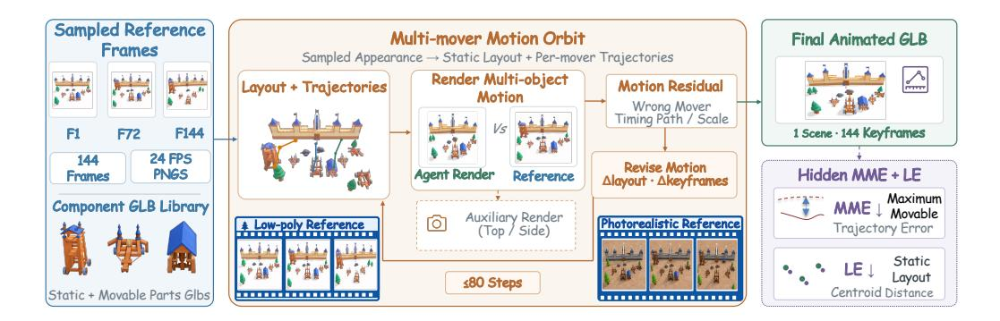

Figure 7: **Dynamic.** 144프레임 참조 비디오에서 샘플링된 프레임, 구성요소 GLB 라이브러리, 그리고 알려진 참조 카메라를 주어, 에이전트는 정적 레이아웃을 재구성하고, 각 움직이는 객체를 시작 위치에 배치하며, 모든 궤적을 키프레임합니다. 그것은 다중 객체 움직임을 렌더링하고, 시각적 잔차를 통해 레이아웃, 시작 포즈, 키프레임을 최대 80단계까지 수정합니다. 최종 애니메이션 GLB는 **MME**를 사용해 움직이는 객체와 정적 **LE**를 가리키는 숨겨진 정답에 대해 한 번 평가됩니다.

레아웃과 카메라는 30단계, 관절형은 60단계, 재구성은 35단계, 다이내믹은 80단계입니다. Appendix B.1은 전체 에이전트 설정을 제공하며, Appendix C.4.2는 이 하네스 하에서 Claude Sonnet 5 High와 공식 Claude Code CLI를 비교합니다.

**Overall score.** 다섯 개의 작업은 서로 다른 단위를 사용하므로, 우리는 각 원시 메트릭을 $q^{\downarrow}$를 오류에, $q^{\uparrow}$를 F@5%에 사용하여 0에서 100까지의 점수로 매핑합니다 (Appendix B.2). 잘못된 출력은 0점을 받습니다. 레이아웃은 $q^{\downarrow}(ADD\text{-S}; 4\,\mathrm{m})$를 사용합니다. 카메라는 $q^{\downarrow}(PE; 4\,\mathrm{m})$와 $q^{\downarrow}(AE; 90^{\circ})$를 평균합니다. 관절형은 $q^{\downarrow}(MPE; 1\,\mathrm{m})$를 사용하고, 재구성은 $q^{\uparrow}(F@5\%; 1)$를 사용하며, 다이내믹은 $q^{\downarrow}(MME; 1)$과 $q^{\downarrow}(LE; 1)$를 평균합니다. 우리는 각 작업 내에서 케이스 점수를 평균하고, 그 다음 다섯 개의 작업 점수를 평균하여 Overall을 얻습니다. Overall은 단일 뷰 레이아웃과 저폴리 다이내믹을 사용하며, 페어드 멀티뷰 레이아웃과 포토리얼리스틱 다이내믹 조건은 Overall에서 제외됩니다.

### 4.2 MAIN RESULTS

Table 3은 모든 11개의 완료된 구성을 보고합니다. 고정된 Overall 요약 하에서 Doubao는 50.2점으로 가장 높은 점수를 획득하며, Claude Opus가 48.9점, GPT 5.4 Medium이 48.7점으로 그 뒤를 잇습니다. GPT 5.4 High는 Medium보다 0.02점만 뒤처집니다. Kimi는 41.2점을 기록하며 여덟 번째로 순위가 매겨집니다. 따라서 우리는 정확한 점수 순서를 사용하고, 가장 높은 세 구성을 분석하면서, 리더보드에 모든 구성을 유지합니다.

세 리더는 Overall 점수에서 단 1.5점 차이지만, 작업 리더십을 교환합니다. Doubao는 레이아웃(77.4), 카메라(34.5), 다이내믹(70.7)을 이끕니다. Claude Opus는 관절형(63.7)을 이끌고, GPT 5.4 Medium은 재구성(10.4)을 이끕니다. 이러한 프로필은 집계 평균의 또 다른 비교보다 사례 수준 분석을 동기화합니다.

### 4.3 ANALYSIS

#### 4.3.1 WHAT DETERMINES THE RANKING?

Overall 보상은 작업 수가 아니라 작업 간 균형을 이룹니다. GPT 5.4 High는 **Layout**, **Articulated**, **Reconstruction**을 이끌지만, **Dynamic**에서 GPT 5.4 Medium보다 21.8점 낮아 네 번째로 순위가 매겨집니다; 두 구성 모두 48.7 Overall로 반올림됩니다. Figure 8은 메인 테이블 작업 점수에서 Doubao를 초과한 두 격차를 선형적으로 분해합니다. Claude Opus와 비교할 때, Dynamic은 +1.49 Overall 점수를 기여하고, 나머지 네 작업은 -0.15를 합산하여 +1.34 격차를 만듭니다. 그 Dynamic 항은 집중적입니다: raceloop은 +0.86 Overall 점수를, factory는 +0.68을 기여하며, 나머지 여덟 장면은 함께 -0.05를 기여합니다. 두 큰 장면을 영향력 검사로만 제거하면 격차가 -0.21로 변하지만, 발표된 순위는 여전히 모든 장면을 사용합니다. 50,000개의 페어드 케이스 재샘플에서 Doubao는 64%의 시간에 첫 번째로 순위가 매겨지며, Claude Opus는 19%, GPT 5.4 Medium은 17%이며, Doubao의 격차에 대한 두 95% 신뢰 구간은 포함합니다

<span id="page-8-0"></span>Table 3: 주요 결과. 네이티브 메트릭은 작업 단위를 유지하며, 음영 처리된 열은 Overall에서 사용되는 고정 참조 작업 점수를 보고합니다. Camera는 PE (m)/AE (°)를 보고하고, Dynamic는 MME/LE를 보고합니다. 높은 점수가 더 좋으며, 가장 높은 작업 점수와 Overall은 굵게 표시됩니다. Overall은 압축된 비교를 위한 고정 정규화 요약이며, 순위가 통계적으로 구별된다는 증거가 아닙니다; 네이티브 메트릭은 함께 보고됩니다.

| 레이아웃 |  | 카메라 |  | 관절형 |  | 재구성 |  | 동적 |  | 전체 |  |
|--------------------------|-----------------|--------|------------|-------------|-------|----------------|-------|---------|-------------------------------------------------------|---------|---------|
| 구성 | ADD-S ↓ 점수 ↑ |  | PE/AE ↓ |  |  |  |  |  | 점수 ↑ MPE ↓ 점수 ↑ F@5% ↑ 점수 ↑ MME/LE ↓ 점수 ↑ |  | 점수 ↑ |
| Doubao Seed 2.0 Pro High | 0.905 | 77.4 | 4.825/54.5 | 34.5 | 0.404 | 59.6 | 0.088 | 8.8 | 0.471/0.150 | 70.7 | 50.2 |
| Claude Opus 4.6 High | 1.059 | 73.5 | 4.980/51.6 | 34.0 | 0.375 | 63.7 | 0.098 | 9.8 | 0.583/0.152 | 63.2 | 48.9 |
| GPT 5.4 Medium | 1.120 | 72.7 | 5.404/54.5 | 29.6 | 0.381 | 62.3 | 0.104 | 10.4 | 0.738/0.235 | 68.5 | 48.7 |
| GPT 5.4 High | 0.766 | 84.1 | 5.748/51.1 | 26.4 | 0.275 | 73.8 | 0.123 | 12.3 | 0.746/0.320 | 46.7 | 48.7 |
| Qwen 3.7 Plus High | 0.954 | 76.2 | 6.489/70.9 | 21.7 | 0.603 | 58.0 | 0.090 | 9.0 | 0.441/0.238 | 66.0 | 46.2 |
| Gemini 3.1 Pro High | 6.953 | 65.4 | 5.272/53.8 | 33.9 | 0.452 | 56.5 | 0.071 | 7.1 | 0.527/0.335 | 63.9 | 45.4 |
| MiMo 2.5 High | 0.824 | 79.4 | 6.618/58.2 | 25.0 | 0.639 | 49.8 | 0.091 | 9.1 | 0.827/0.299 | 43.7 | 41.4 |
| Kimi K2.6 Reason | 2.547 | 70.9 | 6.396/57.2 | 24.6 | 0.442 | 57.3 | 0.085 | 8.5 | 0.855/0.281 | 44.8 | 41.2 |
| Step 3.7 Flash High | 0.898 | 77.5 | 7.191/78.8 | 13.2 | 0.541 | 48.3 | 0.086 | 8.6 | 0.712/0.164 | 57.9 | 41.1 |
| Claude Sonnet 5 High | 21.488 | 51.9 | 6.045/54.3 | 27.3 | 0.425 | 57.8 | 0.105 | 10.5 | 1.000/1.330 | 49.9 | 39.5 |
| MiniMax M3 High | 4.188 | 58.1 | 5.703/64.1 | 25.6 | 0.428 | 58.4 | 0.096 | 9.6 | 0.755/0.426 | 41.4 | 38.6 |

<span id="page-8-1"></span>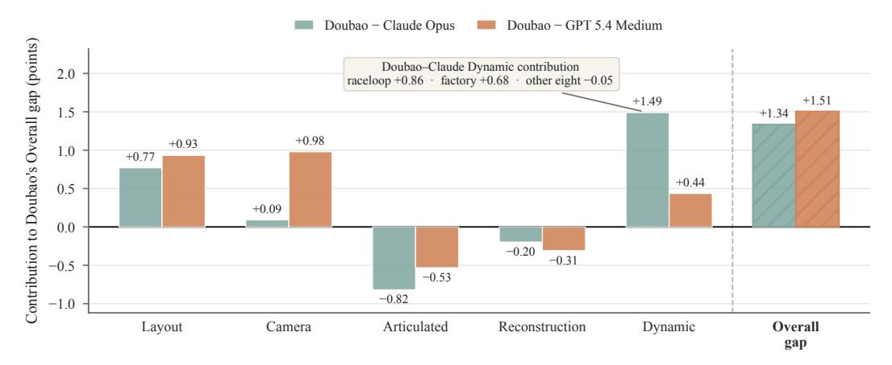

Figure 8: 작업 기여도가 전체 격차를 설명한다. 각 막대는 메인 테이블 작업 점수 차이를 5로 나눈 값을 보여 주며, 다섯 개의 막대가 채워진 전체 격차를 합산한다. 콜아웃은 Doubao–Claude Opus Dynamic 기여를 *raceloop*, *factory*, 그리고 나머지 여덟 장면으로 구분한다. 이는 정확한 선형 분해이며, 독립적인 실험이 아니다.

제로. 이 부트스트랩은 반복된 구성 실행 간의 변동이 아니라 벤치마크 구성을 측정한다.

## 집중된 결손이 순위를 형성한다

전체 순위는 작업 결손의 크기와 집중도에 따라 달라지며, 작업 승리 수에 따라 달라지지 않는다. GPT 5.4 High는 세 개의 작업에서 승리하지만 Dynamic 때문에 네 번째로 순위가 매겨진다. 반면 Doubao가 Claude Opus에 비해 두 개의 Dynamic 장면에서 집중적으로 앞서 있다.

#### 4.3.2 입력 조건이 성능에 어떤 영향을 미치는가?

우리는 장면, 목표 출력, 평가자를 고정한 채 시각 입력만 변경했다 (Figure [9)](#page-9-0)). 다중 시점 레이아웃은 11개 구성 중 9개에서 개선되었으며, Sonnet은 12.1점, Gemini는 9.4점, Claude Opus는 8.5점을 획득했다. 반면 Step과 MiMo는 각각 1.4점과 0.6점을 잃었으며, 이는 추가 시점이 도움이 되었지만 일관되지는 않았음을 보여준다.

포토리얼리스틱 Dynamic는 혼합된 효과를 보였다: 네 개의 구성은 개선되었고, 여섯 개는 감소했으며, Claude Opus는 한 자리 소수점 정밀도에서 변하지 않았다. GPT 5.4 High는 17.3점을 획득했으며, Step과 Sonnet은 각각 10.3점과 10.2점을 잃었다. 목표 레이아웃과 움직임이 고정되어 있기 때문에, 이러한 차이는 요구되는 출력의 변화를 측정하기보다 참조 외관에 대한 민감도를 측정한다. 각 구성–사례 쌍은 한 번만 실행되었으므로, 이러한 차이는 반복 실행 변동성을 추정하지 않는다.

<span id="page-9-0"></span>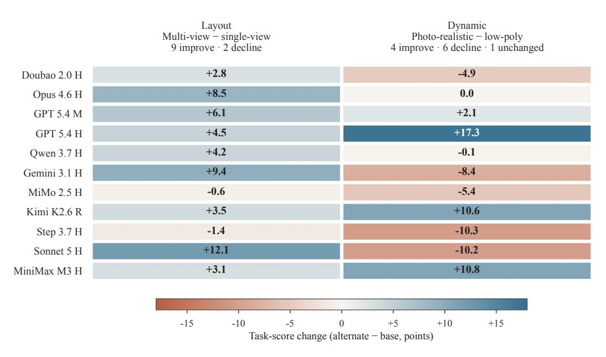

Figure 9: 입력 조건에 대한 민감도는 구성마다 다르다. 셀은 기본 조건에서 대체 조건으로의 고정 참조 작업 점수 변화를 보여준다. Layout은 100개의 쌍 케이스에서 다중 시점 입력과 단일 시점 입력을 비교한다; Dynamic는 10개의 쌍 장면에서 포토리얼리스틱과 저폴리 입력을 비교한다. 양수 값은 대체 조건을 선호하며, 이는 전체에서 제외된다.

더 많은 시각적 증거가 항상 유익한 것은 아니다

추가 시점은 일반적으로 Layout을 개선하지만, 포토리얼리스틱 외관은 Dynamic에서 일부 구성에는 도움이 되고 다른 구성에는 해롭다. 따라서 풍부한 시각 입력의 가치는 구성 및 조건에 따라 달라진다.

#### 4.3.3 에이전트는 어디서 실패하는가?

유사한 주요 점수는 서로 다른 실패 단계를 숨긴다 (Figure [10)](#page-10-0)). Articulated에서는 상위 세 개의 MPE 값이 0.375–0.404로 가깝지만, Doubao는 391개의 실제 부품 중 13개만 움직이며, Claude Opus는 255/391, GPT 5.4 Medium은 132/391을 움직인다. 이어서 조인트 유형과 방향은 측정 가능한 강체 움직임이 있는 부품에 대해서만 평가된다: Doubao는 12개 중 8개에서 유형과 방향이 모두 정확하며, Claude Opus는 251개 중 248개와 238개를, GPT 5.4 Medium은 127개 중 124개와 105개를 달성한다. Reconstruction에서는 세 구성 모두 515개의 목표 중 425–432개를 일치시키지만, 범위는 24–44에 불과하며, 객체 수준 F@5%는 0.088–0.104를 유지한다. Camera에서는 케이스 수준 PE와 AE가 Spearman 상관계수 0.76–0.93을 가지며, 두 지표 모두 18개의 Doubao, 16개의 Claude Opus, 24개의 GPT 5.4 Medium 케이스에서 제로 크레딧 한계에 도달한다. Dynamic에서는 Doubao가 28/29개의 움직임을 일치시키지만, 16개의 자격 있는 트랙 중 7개에서만 방향을 회복하며, Claude Opus는 14개 중 11개, GPT 5.4 Medium은 15개 중 11개를 회복한다. 따라서 주요 기하학, 목표 선택, 표면 완성, 움직임 의미는 서로 다른 단계에서 실패한다.

진단은 실패 단계를 찾는다

주요 지표는 순위 매기의 기초를 제공하며, 보다 넓은 진단 세트는 실패를 찾고 모델 개선을 안내하기 위한 세밀한 신호를 제공한다. 주요 점수만으로는 고정된 출력, 잘못된 행동, 불완전한 표면, 방향 실패가 혼합된다.

#### 4.3.4 얼마나 상호작용이 사용되는가? (HOW MUCH INTERACTION IS USED?)

우리는 *유효 상호작용 예산 (effective interaction budget)*을 점수 매기기 전 선택된 트레이스 접두사로 정의한다. 고정 실행에서는 실현된 단계가 작업의 *최대 단계 (MaxSteps)*에 제한되며, 도구 호출은 동일한 접두사에서 계산되므로, 각 작업별 예산 비율은 최대 1이 된다. 전체(Overall)를 일치시키기 위해, 우리는 먼저 각 작업 내에서 프로세스 값을 평균화한 뒤, 다섯 개의 작업에 동일한 가중치를 부여한다. 이 작업 균형 요약 하에서는 상호작용량이 열한 가지 구성에서 Overall과 양의 상관관계를 보이지 않는다 (Figure [11)](#page-10-1): 서술적 스피어만 상관계수는 ρ = −0.68이다. Claude Opus는 사용 가능한 예산의 82.9%를 사용하고

<span id="page-10-0"></span>

| 작업 | 실패 단계 | Doubao<br>Seed 2.0 |  | Claude<br>Opus 4.6 |  | GPT 5.4<br>Medium |  |
|----------------|----------------------------------|--------------------|---------|--------------------|---------|-------------------|---------|
|  | 이동 / GT 부품 | 3% | 13/391 | 65% | 255/391 | 34% | 132/391 |
| 관절화된 | †<br>타입 정정 / 이동 | 67% | 8/12 | 99% | 248/251 | 98% | 124/127 |
|  | †<br>방향 정정 / 이동 | 67% | 8/12 | 95% | 238/251 | 83% | 105/127 |
|  | 매칭 / 대상 | 84% | 432/515 | 84% | 432/515 | 83% | 425/515 |
| 재구성 | 커버된 / 대상 | 5% | 26/515 | 5% | 24/515 | 9% | 44/515 |
| 카메라 | 조인트 캡 / 장면 회피 | 82% | 82/100 | 84% | 84/100 | 76% | 76/100 |
|  | 매칭 / GT 이동자 | 97% | 28/29 | 79% | 23/29 | 83% | 24/29 |
| 동적 | †<br>방향 정정 / 매칭 | 44% | 7/16 | 79% | 11/14 | 73% | 11/15 |

Figure 10: 분모 인식 실패 단계. 각 셀은 단계 성공률과 정확한 성공/분모 수를 보고하며, 막대는 동일한 비율을 인코딩합니다. † 표시가 있는 행은 조건부 분모를 사용합니다: Articulated 유형과 방향은 측정 가능한 고정된 움직임이 필요하며, Dynamic 방향은 적격 매칭된 비루프 모버가 필요합니다. 재구성 분모는 실제 목표값입니다. 카메라는 동시에 PE ≥ 4 m 및 AE ≥ 90◦ 제로 크레딧 캡을 피하는 경우를 계산합니다. 0/0 항목은 적격 증거가 없음을 나타내며, 성공적인 복구를 의미하지 않습니다.

<span id="page-10-1"></span>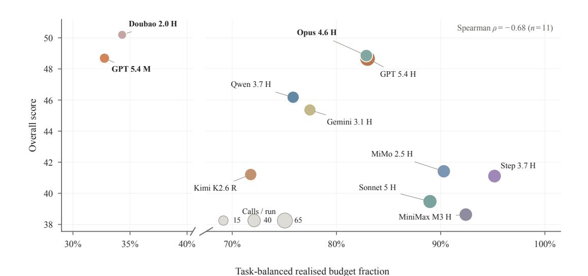

Figure 11: 작업 균형 효과적 상호작용 예산. 각 점은 하나의 구성입니다. 수평 축은 각 작업 내에서 실현된 단계 수를 MaxSteps로 나눈 값을 평균한 뒤, 다섯 작업에 걸쳐 동일하게 분배한 값입니다; 수직 축은 Overall입니다. 끊어진 수평 축은 40–68%를 생략하며, 이 구간에는 평가된 구성이 없습니다. 마커 영역은 실행당 작업 균형 도구 호출 수를 인코딩합니다,

및 라벨은 구성을 식별합니다. Spearman 상관계수는 서술적이며 인과적이지 않습니다.

실행당 39.1개의 작업 균형 호출을 사용하지만 GPT 5.4 Medium은 32.8%와 19.9 호출을 사용하며, 점수는 각각 48.9와 48.7입니다. Doubao는 34.3%와 11.4 호출만 사용하면서 1위를 차지합니다. 이 값들은 서로 다른 상호작용 체제를 설명하며, 추가 상호작용이 성능을 변경한다는 것을 입증하지는 않습니다.

더 많은 상호작용이 반드시 더 나은 성능을 의미하지는 않는다

평가된 세트 전반에서 작업 균형 상호작용량은 Overall과 양의 상관관계를 보이지 않습니다 (ρ = −0.68). 유사하게 순위가 매겨진 구성은 다른 효과적 예산을 사용하며, 이 서술적 연관성은 추가 상호작용이 성능에 미치는 영향을 입증하지 않습니다.

## 5 LIMITATIONS (제한 사항)

SceneActBench는 다중 객체 3D 행동에 대한 기하학적 스트레스 테스트로 설계되었지만, 몇 가지 한계가 있습니다. 주요 연구는 독점 VLM 구성을 평가하고 구성–사례 쌍당 하나의 완료된 실행만 사용하므로, 보고된 Overall 점수는 반복 실행 추정치로 해석되어서는 안 됩니다. Dynamic 작업은 열 개의 장면을 포함하며, 동적 장면 성능에 대한 광범위한 추정치라기보다는 목표 지향적 스트레스 테스트로 보는 것이 가장 좋습니다. Overall 점수는 고정 정규화 상수에 의존하며, 이는 설계 선택입니다; 이 때문에 우리는 집계와 함께 원시 메트릭 및 작업 수준 점수를 보고합니다. 작업 전문 3D 파이프라인과의 비교는 향후 연구에서 중요한 방향으로 남아 있습니다.

## 6 CONCLUSION (결론)

SceneActBench는 3D 이해를 실행 가능한 테스트로 만듭니다. 에이전트는 3D 환경에서 행동하고 숨겨진 실제 지오메트리를 일치시켜야 합니다. 다섯 개의 작업과 열한 개의 구성 전반에 걸쳐, 어떤 구성도 일관되게 우수한 성능을 보이지 않습니다. 유사한 Overall 점수를 가진 구성은 서로 다른 작업에서 성공합니다. 이러한 결과는 3D 장면에서 행동하기 위해서는 단일 해결된 기술이 아니라 여러 개별 역량이 필요함을 시사합니다. SceneActBench는 향후 연구가 더 넓은 장면, 오픈-웨이트 모델, 그리고 풍부한 상호작용으로 확장됨에 따라 이를 측정할 수 있는 공통 기반을 제공합니다.

# REFERENCES (참고문헌)

<span id="page-11-4"></span>Niket Agarwal, Arslan Ali, Jon Allen, Martin Antolini, Adeline Aubame, Alisson Azzolini, Junjie Bai, Maciej Bala, Yogesh Balaji, Josh Bapst, et al. Cosmos 3: Omnimodal world models for physical ai. *arXiv preprint arXiv:2606.02800*, 2026.

<span id="page-11-6"></span>Anthropic. Claude opus 4.6. 모델 카드, 2026a. URL [https://www-cdn.anthropic.com/](https://www-cdn.anthropic.com/14e4fb01875d2a69f646fa5e574dea2b1c0ff7b5.pdf) [14e4fb01875d2a69f646fa5e574dea2b1c0ff7b5.pdf](https://www-cdn.anthropic.com/14e4fb01875d2a69f646fa5e574dea2b1c0ff7b5.pdf). 발행 2026-02-07.

Anthropic. Claude Sonnet 5. 모델 카드, 2026b. URL [https://www-cdn.anthropic.](https://www-cdn.anthropic.com/480e0bb54327b9622282e9c39a83a4f490ed377e/Claude%20Sonnet%205%20System%20Card.pdf) [com/480e0bb54327b9622282e9c39a83a4f490ed377e/Claude%20Sonnet%](https://www-cdn.anthropic.com/480e0bb54327b9622282e9c39a83a4f490ed377e/Claude%20Sonnet%205%20System%20Card.pdf) [205%20System%20Card.pdf](https://www-cdn.anthropic.com/480e0bb54327b9622282e9c39a83a4f490ed377e/Claude%20Sonnet%205%20System%20Card.pdf). 출시 2026-06-30.

<span id="page-11-1"></span> Daichi Azuma, Taiki Miyanishi, Shuhei Kurita, and Motoaki Kawanabe. ScanQA: 공간 장면 이해를 위한 3D 질문 응답. In *IEEE/CVF 컴퓨터 비전 및 패턴 인식 회의 논문집*, pp. 19129–19139, 2022.

<span id="page-11-5"></span> Paul J. Besl and Neil D. McKay. 3D 형태 정합을 위한 방법. In Paul S. Schenker (편집), Sensor Fusion IV: Control Paradigms and Data Structures, volume 1611, pp. 586–606. International Society for Optics and Photonics, SPIE, 1992. doi: 10.1117/12.57955. URL <https://doi.org/10.1117/12.57955>.

<span id="page-11-3"></span> Boyuan Chen, Zhuo Xu, Sean Kirmani, Brian Ichter, Dorsa Sadigh, Leonidas Guibas, and Fei Xia. Spatialvlm: 시각-언어 모델에 공간 추론 능력 부여. In *2024 IEEE/CVF 컴퓨터 비전 및 패턴 인식 회의 (CVPR)*, pp. 14455–14465. IEEE Computer Society, 2024.

<span id="page-11-2"></span> Wayne Chi, Yixiong Fang, Arnav Yayavaram, Siddharth Yayavaram, Seth Karten, Qiuhong Anna Wei, Runkun Chen, Alexander Wang, Valerie Chen, Ameet Talwalkar, et al. GameDevBench: 게임 개발을 통한 에이전트 능력 평가. *arXiv 사전 인쇄 arXiv:2602.11103*, 2026.

<span id="page-11-0"></span> Anna C Doris, Ferdous Alam, Amin Heyrani Nobari, and Faez Ahmed. CAD-Coder: 컴퓨터 지원 설계 코드 생성을 위한 오픈소스 시각-언어 모델. *Journal of Mechanical Design*, 148(7):071702, 2026.

- <span id="page-12-9"></span>Martin Ester, Hans-Peter Kriegel, Jorg Sander, Xiaowei Xu, et al. 대규모 공간 데이터베이스에서 노이즈를 포함한 클러스터를 발견하기 위한 밀도 기반 알고리즘 ¨. In *제2회 국제 지식발견 및 데이터마이닝 컨퍼런스 논문집*, pp. 226–231. AAAI Press, 1996.
- <span id="page-12-5"></span>Weixi Feng, Wanrong Zhu, Tsu-jui Fu, Varun Jampani, Arjun Akula, Xuehai He, Sugato Basu, Xin Eric Wang, and William Yang Wang. LayoutGPT: 대형 언어 모델을 활용한 구성적 시각 계획 및 생성. *신경 정보 처리 시스템의 진보*, 36: 18225–18250, 2023.
- <span id="page-12-7"></span>Huan Fu, Bowen Cai, Lin Gao, Ling-Xiao Zhang, Jiaming Wang, Cao Li, Qixun Zeng, Chengyue Sun, Rongfei Jia, Binqiang Zhao, et al. 3D-FRONT: 레이아웃과 의미를 갖춘 3D 가구가 있는 방. In *IEEE/CVF 국제 컴퓨터 비전 컨퍼런스 논문집*, pp. 10933–10942, 2021.
- <span id="page-12-4"></span>Xingyu Fu, Yushi Hu, Bangzheng Li, Yu Feng, Haoyu Wang, Xudong Lin, Dan Roth, Noah A Smith, Wei-Chiu Ma, and Ranjay Krishna. BLINK: 다중 모달 대형 언어 모델은 볼 수는 있지만 인식하지 못한다. In *유럽 컴퓨터 비전 컨퍼런스*, pp. 148–166. Springer, 2024.
- <span id="page-12-3"></span>Yipeng Gao, Lei Shu, Genzhi Ye, Xi Xiong, Ameesh Makadia, Meiqi Guo, Laurent Itti, and Jindong Chen. 3DCodeBench: 코드 기반 에이전트 프로시저 3D 모델링 벤치마킹. *arXiv 사전 인쇄 arXiv:2606.01057*, 2026.
- <span id="page-12-11"></span>Google DeepMind. Gemini 3.1 pro. 모델 카드, 2026. URL [https://deepmind.google/](https://deepmind.google/models/model-cards/gemini-3-1-pro/) [models/model-cards/gemini-3-1-pro/](https://deepmind.google/models/model-cards/gemini-3-1-pro/). 발행 2026-02-19.
- <span id="page-12-2"></span>Yunqi Gu, Ian Huang, Jihyeon Je, Guandao Yang, and Leonidas Guibas. BlenderGym: 그래픽 편집을 위한 기초 모델 시스템 벤치마킹. In *IEEE/CVF 컴퓨터 비전 및 패턴 인식 컨퍼런스 논문집*, pp. 18574–18583, 2025.
- <span id="page-12-6"></span>Yicong Hong, Kai Zhang, Jiuxiang Gu, Sai Bi, Yang Zhou, Difan Liu, Feng Liu, Kalyan Sunkavalli, Trung Bui, and Hao Tan. LRM: 단일 이미지에서 3D로의 대형 재구성 모델. In *학습 표현 국제 회의*, volume 2024, pp. 50678–50702, 2024.
- <span id="page-12-0"></span>Ziniu Hu, Ahmet Iscen, Aashi Jain, Thomas Kipf, Yisong Yue, David A Ross, Cordelia Schmid, and Alireza Fathi. Scenecraft: Blender 코드를 이용한 3D 장면 합성을 위한 LLM 에이전트. In *제41회 국제 기계학습 회의*, 2024. URL [https://openreview.net/](https://openreview.net/forum?id=gAyzjHw2ml) [forum?id=gAyzjHw2ml](https://openreview.net/forum?id=gAyzjHw2ml).
- <span id="page-12-1"></span>Wenlong Huang, Chen Wang, Ruohan Zhang, Yunzhu Li, Jiajun Wu, and Li Fei-Fei. Voxposer: 언어 모델을 활용한 로봇 조작용 3D 값 맵. In *일반화 로봇을 향해: CoRL2023에서 확장 가능한 기술 습득을 위한 학습 패러다임*, 2023. URL [https:](https://openreview.net/forum?id=4NnJ1iifoH) [//openreview.net/forum?id=4NnJ1iifoH](https://openreview.net/forum?id=4NnJ1iifoH).
- <span id="page-12-8"></span>Denys Iliash, Hanxiao Jiang, Yiming Zhang, Manolis Savva, and Angel X Chang. S2O: 관절형 3D 객체를 정적에서 열 수 있는 형태로 향상. In *IEEE/CVF 겨울 컴퓨터 비전 응용 회의 논문집*, pp. 6785–6795, 2026.
- <span id="page-12-13"></span>Kimi. Kimi K2.6. 모델 카드, 2026. URL [https://www.kimi.com/ai-models/](https://www.kimi.com/ai-models/kimi-k2-6) [kimi-k2-6](https://www.kimi.com/ai-models/kimi-k2-6). 발행 2026-04-20.
- <span id="page-12-10"></span>Harold W Kuhn. 할당 문제를 위한 헝가리안 방법. *해군 연구 물류 분기지*, 2(1-2):83–97, 1955.
- <span id="page-12-12"></span>Xunhao Lai, Weiqi Xu, Yufeng Yang, Qiaorui Chen, Yang Xu, Lunbin Zeng, Xiaolong Li, Haohai Sun, Haichao Zhu, Vito Zhang, Jinkai Hu, Jiayao Li, Rui Gao, Zekun Li, Songquan Zhu, Jingkai Zhou, and Pengyu Zhao. Minimax 희박 주의, 2026. URL [https://arxiv.org/abs/](https://arxiv.org/abs/2606.13392) [2606.13392](https://arxiv.org/abs/2606.13392).
- <span id="page-12-14"></span>Minghua Liu, Ruoxi Shi, Kaiming Kuang, Yinhao Zhu, Xuanlin Li, Shizhong Han, Hong Cai, Fatih Porikli, and Hao Su. OpenShape: 오픈 월드 이해를 향한 3D 형태 표현의 확장. *신경 정보 처리 시스템의 진보*, 36:44860–44879, 2023a.

Ruoshi Liu, Rundi Wu, Basile Van Hoorick, Pavel Tokmakov, Sergey Zakharov, 그리고 Carl Vondrick. Zero-1-to-3: Zero-shot one image to 3d object. In *IEEE/CVF 국제 컴퓨터 비전 학회 논문집*, pp. 9298–9309, 2023b.

Xiaojian Ma, Silong Yong, Zilong Zheng, Qing Li, Yitao Liang, Song-Chun Zhu, 그리고 Siyuan Huang. SQA3d: Situated question answering in 3d scenes. In *제 11회 국제 학습 표현 회의*, 2023. URL [https://openreview.net/forum?](https://openreview.net/forum?id=IDJx97BC38) [id=IDJx97BC38](https://openreview.net/forum?id=IDJx97BC38).

Despoina Paschalidou, Amlan Kar, Maria Shugrina, Karsten Kreis, Andreas Geiger, 그리고 Sanja Fidler. ATISS: Autoregressive transformers for indoor scene synthesis. *신경 정보 처리 시스템의 진보*, 34:12013–12026, 2021.

<span id="page-13-5"></span>Qwen Team, Alibaba. Qwen3.7-plus. Qwen 블로그, 2026. URL [https://qwen.ai/blog?id=](https://qwen.ai/blog?id=qwen3.7-plus) [qwen3.7-plus](https://qwen.ai/blog?id=qwen3.7-plus). 출시 2026-06-02.

Johannes L Schonberger and Jan-Michael Frahm. Structure-from-motion revisited. In *IEEE 컴퓨터 비전 및 패턴 인식 학회 논문집*, pp. 4104–4113, 2016.

<span id="page-13-6"></span>Bytedance Seed. Seed2.0 모델 카드: 현실 세계 복잡성을 위한 인텔리전스 프론티어를 향해. *arXiv 프리프린트 arXiv:2607.00248*, 2026.

<span id="page-13-4"></span>Aaditya Singh, Adam Fry, Adam Perelman, Adam Tart, Adi Ganesh, Ahmed El-Kishky, Aidan McLaughlin, Aiden Low, AJ Ostrow, Akhila Ananthram, Akshay Nathan, Alan Luo, Alec Helyar, Aleksander Madry, Aleksandr Efremov, Aleksandra Spyra, Alex Baker-Whitcomb, Alex Beutel, Alex Karpenko, Alex Makelov, Alex Neitz, Alex Wei, Alexandra Barr, Alexandre Kirchmeyer, Alexey Ivanov, Alexi Christakis, Alistair Gillespie, Allison Tam, Ally Bennett, Alvin Wan, Alyssa Huang, Amy McDonald Sandjideh, Amy Yang, Ananya Kumar, Andre Saraiva, Andrea Vallone, Andrei Gheorghe, Andres Garcia Garcia, Andrew Braunstein, Andrew Liu, Andrew Schmidt, Andrey Mereskin, Andrey Mishchenko, Andy Applebaum, Andy Rogerson, Ann Rajan, Annie Wei, Anoop Kotha, Anubha Srivastava, Anushree Agrawal, Arun Vijayvergiya, Ashley Tyra, Ashvin Nair, Avi Nayak, Ben Eggers, Bessie Ji, Beth Hoover, Bill Chen, Blair Chen, Boaz Barak, Borys Minaiev, Botao Hao, Bowen Baker, Brad Lightcap, Brandon McKinzie, Brandon Wang, Brendan Quinn, Brian Fioca, Brian Hsu, Brian Yang, Brian Yu, Brian Zhang, Brittany Brenner, Callie Riggins Zetino, Cameron Raymond, Camillo Lugaresi, Carolina Paz, Cary Hudson, Cedric Whitney, Chak Li, Charles Chen, Charlotte Cole, Chelsea Voss, Chen Ding, Chen Shen, Chengdu Huang, Chris Colby, Chris Hallacy, Chris Koch, Chris Lu, Christina Kaplan, Christina Kim, CJ Minott-Henriques, Cliff Frey, Cody Yu, Coley Czarnecki, Colin Reid, Colin Wei, Cory Decareaux, Cristina Scheau, Cyril Zhang, Cyrus Forbes, Da Tang, Dakota Goldberg, Dan Roberts, Dana Palmie, Daniel Kappler, Daniel Levine, Daniel Wright, Dave Leo, David Lin, David Robinson, Declan Grabb, Derek Chen, Derek Lim, Derek Salama, Dibya Bhattacharjee, Dimitris Tsipras, Dinghua Li, Dingli Yu, DJ Strouse, Drew Williams, Dylan Hunn, Ed Bayes, Edwin Arbus, Ekin Akyurek, Elaine Ya Le, Elana Widmann, Eli Yani, Elizabeth Proehl, Enis Sert, Enoch Cheung, Eri Schwartz, Eric Han, Eric Jiang, Eric Mitchell, Eric Sigler, Eric Wallace, Erik Ritter, Erin Kavanaugh, Evan Mays, Evgenii Nikishin, Fangyuan Li, Felipe Petroski Such, Filipe de Avila Belbute Peres, Filippo Raso, Florent Bekerman, Foivos Tsimpourlas, Fotis Chantzis, Francis Song, Francis Zhang, Gaby Raila, Garrett McGrath, Gary Briggs, Gary Yang, Giambattista Parascandolo, Gildas Chabot, Grace Kim, Grace Zhao, Gregory Valiant, Guillaume Leclerc, Hadi Salman, Hanson Wang, Hao Sheng, Haoming Jiang, Haoyu Wang, Haozhun Jin, Harshit Sikchi, Heather Schmidt, Henry Aspegren, Honglin Chen, Huida Qiu, Hunter Lightman, Ian Covert, Ian Kivlichan, Ian Silber, Ian Sohl, Ibrahim Hammoud, Ignasi Clavera, Ikai Lan, Ilge Akkaya, Ilya Kostrikov, Irina Kofman, Isak Etinger, Ishaan Singal, Jackie Hehir, Jacob Huh, Jacqueline Pan, Jake Wilczynski, Jakub Pachocki, James Lee, James Quinn, Jamie Kiros, Janvi Kalra, Jasmyn Samaroo, Jason Wang, Jason Wolfe, Jay Chen, Jay Wang, Jean Harb, Jeffrey Han, Jeffrey Wang, Jennifer Zhao, Jeremy Chen, Jerene Yang, Jerry Tworek, Jesse Chand, Jessica Landon, Jessica Liang, Ji Lin, Jiancheng Liu, Jianfeng Wang, Jie Tang, Jihan Yin, Joanne Jang, Joel Morris, Joey Flynn, Johannes Ferstad, Johannes Heidecke, John Fishbein, John Hallman, Jonah Grant, Jonathan Chien, Jonathan Gordon, Jongsoo Park, Jordan Liss, Jos Kraaijeveld, Joseph Guay, Joseph Mo, Josh Lawson, Josh McGrath, Joshua Vendrow, Joy Jiao, Julian Lee, Julie Steele, Julie Wang, Junhua Mao, Kai Chen, Kai Hayashi, Kai Xiao, Kamyar Salahi, Kan Wu, Karan Sekhri, Karan Sharma, Karan Singhal, Karen Li, Kenny Nguyen, Keren Gu-Lemberg, Kevin King, Kevin Liu, Kevin Stone, Kevin Yu, Kristen Ying, Kristian Georgiev, Kristie Lim, Kushal Tirumala, Kyle Miller, Lama Ahmad, Larry Lv, Laura Clare, Laurance Fauconnet, Lauren Itow, Lauren Yang, Laurentia Romaniuk, Leah Anise, Lee Byron, Leher Pathak, Leon Maksin, Leyan Lo, Leyton Ho, Li Jing, Liang Wu, Liang Xiong, Lien Mamitsuka, Lin Yang, Lindsay McCallum, Lindsey Held, Liz Bourgeois, Logan Engstrom, Lorenz Kuhn, Louis Feuvrier, Lu Zhang, Lucas Switzer, Lukas Kondraciuk, Lukasz Kaiser, Manas Joglekar, Mandeep Singh, Mandip Shah, Manuka Stratta, Marcus Williams, Mark Chen, Mark Sun, Marselus Cayton, Martin Li, Marvin Zhang, Marwan Aljubeh, Matt Nichols, Matthew Haines, Max Schwarzer, Mayank Gupta, Meghan Shah, Melody Y. Guan, Melody Huang, Meng Dong, Mengqing Wang, Mia Glaese, Micah Carroll, Michael Lampe, Michael Malek, Michael Sharman, Michael Zhang, Michele Wang, Michelle Pokrass, Mihai Florian, Mikhail Pavlov, Miles Wang, Ming Chen, Mingxuan Wang, Minnia Feng, Mo Bavarian, Molly Lin, Moose Abdool, Mostafa Rohaninejad, Nacho Soto, Natalie Staudacher, Natan LaFontaine, Nathan Marwell, Nelson Liu, Nick Preston, Nick Turley, Nicklas Ansman, Nicole Blades, Nikil Pancha, Nikita Mikhaylin, Niko Felix, Nikunj Handa, Nishant Rai, Nitish Keskar, Noam Brown, Ofir Nachum, Oleg Boiko, Oleg Murk, Olivia Watkins, Oona Gleeson, Pamela Mishkin, Patryk Lesiewicz, Paul Baltescu, Pavel Belov, Peter Zhokhov, Philip Pronin, Phillip Guo, Phoebe Thacker, Qi Liu, Qiming Yuan, Qinghua Liu, Rachel Dias, Rachel Puckett, Rahul Arora, Ravi Teja Mullapudi, Raz Gaon, Reah Miyara, Rennie Song, Rishabh Aggarwal, RJ Marsan, Robel Yemiru, Robert Xiong, Rohan Kshirsagar, Rohan Nuttall, Roman Tsiupa, Ronen Eldan, Rose Wang, Roshan James, Roy Ziv, Rui Shu, Ruslan Nigmatullin, Saachi Jain, Saam Talaie, Sam Altman, Sam Arnesen, Sam Toizer, Sam Toyer, Samuel Miserendino, Sandhini Agarwal, Sarah Yoo, Savannah Heon, Scott Ethersmith, Sean Grove, Sean Taylor, Sebastien Bubeck, Sever Banesiu, Shaokyi Amdo, Shengjia Zhao, Sherwin Wu, Shibani Santurkar, Shiyu Zhao, Shraman Ray Chaudhuri, Shreyas Krishnaswamy, Shuaiqi, Xia, Shuyang Cheng, Shyamal Anadkat, Simon Posada Fishman, Simon Tobin, Siyuan Fu, Somay Jain, Song ´ Mei, Sonya Egoian, Spencer Kim, Spug Golden, SQ Mah, Steph Lin, Stephen Imm, Steve Sharpe, Steve Yadlowsky, Sulman Choudhry, Sungwon Eum, Suvansh Sanjeev, Tabarak Khan, Tal Stramer, Tao Wang, Tao Xin, Tarun Gogineni, Taya Christianson, Ted Sanders, Tejal Patwardhan, Thomas Degry, Thomas Shadwell, Tianfu Fu, Tianshi Gao, Timur Garipov, Tina Sriskandarajah, Toki Sherbakov, Tomek Korbak, Tomer Kaftan, Tomo Hiratsuka, Tongzhou Wang, Tony Song, Tony Zhao, Troy Peterson, Val Kharitonov, Victoria Chernova, Vineet Kosaraju, Vishal Kuo, Vitchyr Pong, Vivek Verma, Vlad Petrov, Wanning Jiang, Weixing Zhang, Wenda Zhou, Wenlei Xie, Wenting Zhan, Wes McCabe, Will DePue, Will Ellsworth, Wulfie Bain, Wyatt Thompson, Xiangning Chen, Xiangyu Qi, Xin Xiang, Xinwei Shi, Yann Dubois, Yaodong Yu, Yara Khakbaz, Yifan Wu, Yilei Qian, Yin Tat Lee, Yinbo Chen, Yizhen Zhang, Yizhong Xiong, Yonglong Tian, Young Cha, Yu Bai, Yu Yang, Yuan Yuan, Yuanzhi Li, Yufeng Zhang, Yuguang Yang, Yujia Jin, Yun Jiang, Yunyun Wang, Yushi Wang, Yutian Liu, Zach Stubenvoll, Zehao Dou, Zheng Wu, and Zhigang Wang. Openai gpt-5 system card, 2026. URL <https://arxiv.org/abs/2601.03267>.
Openai gpt-5 시스템 카드, 2026. URL <https://arxiv.org/abs/2601.03267>.

<span id="page-14-5"></span>StepFun. Step-3.7 Flash. 모델 카드, 2026. URL [https://static.stepfun.com/blog/](https://static.stepfun.com/blog/step-3.7-flash/) [step-3.7-flash/](https://static.stepfun.com/blog/step-3.7-flash/). 발행일 2026-05-28.

<span id="page-14-1"></span>Chunyi Sun, Junlin Han, Weijian Deng, Xinlong Wang, Zishan Qin, and Stephen Gould. 3D-GPT: 대형 언어 모델을 활용한 프로시저적 3D 모델링. In *2025 International Conference on 3D Vision (3DV)*, pp. 1253–1263. IEEE, 2025.

<span id="page-14-2"></span>Jiapeng Tang, Yinyu Nie, Lev Markhasin, Angela Dai, Justus Thies, and Matthias Nießner. DiffuScene: 생성적 실내 장면 합성을 위한 디노이징 확산 모델. In *Proceedings of the IEEE/CVF conference on computer vision and pattern recognition*, pp. 20507–20518, 2024.

<span id="page-14-4"></span>Maxim Tatarchenko, Stephan R Richter, Rene Ranftl, Zhuwen Li, Vladlen Koltun, and Thomas ´ Brox. 단일 뷰 3D 재구성 네트워크가 무엇을 학습하는가? In *Proceedings of the IEEE/CVF conference on computer vision and pattern recognition*, pp. 3405–3414, 2019.

<span id="page-14-0"></span>Guanzhi Wang, Yuqi Xie, Yunfan Jiang, Ajay Mandlekar, Chaowei Xiao, Yuke Zhu, Linxi Fan, and Anima Anandkumar. Voyager: 대형 언어 모델을 갖춘 개방형 구현형 에이전트. *Transactions on Machine Learning Research*, 2024a. ISSN 2835-8856. URL <https://openreview.net/forum?id=ehfRiF0R3a>.

<span id="page-14-3"></span>Shuzhe Wang, Vincent Leroy, Yohann Cabon, Boris Chidlovskii, and Jerome Revaud. DUSt3R: 지오메트릭 3D 비전을 쉽게. In *Proceedings of the IEEE/CVF conference on computer vision and pattern recognition*, pp. 20697–20709, 2024b.

- <span id="page-15-0"></span>Xingrui Wang, Wufei Ma, Tiezheng Zhang, Celso M de Melo, Jieneng Chen, and Alan Yuille. Spatial457: 대형 멀티모달 모델의 6D 공간 추론을 위한 진단 벤치마크. In *컴퓨터 비전 및 패턴 인식 회의 논문집*, pp. 24669–24679, 2025.
- <span id="page-15-5"></span>Bowen Wen, Wei Yang, Jan Kautz, and Stan Birchfield. FoundationPose: 새로운 객체의 통합 6D 포즈 추정 및 추적. In *IEEE/CVF 컴퓨터 비전 및 패턴 인식 회의 논문집*, pp. 17868–17879, 2024.
- <span id="page-15-7"></span>Tong Wu, Liang Pan, Junzhe Zhang, Tai Wang, Ziwei Liu, and Dahua Lin. 포인트 클라우드 완성을 위한 종합 지표로서의 균형형 차머 거리. In *Advances in Neural Information Processing Systems*, 34:29088–29100, 2021.
- <span id="page-15-3"></span>Jianfeng Xiang, Zelong Lv, Sicheng Xu, Yu Deng, Ruicheng Wang, Bowen Zhang, Dong Chen, Xin Tong, and Jiaolong Yang. 확장 가능하고 다재다능한 3D 생성을 위한 구조화된 3D 잠재 변수. In *IEEE/CVF 컴퓨터 비전 및 패턴 인식 회의 논문집*, pp. 21469–21480, 2025.
- <span id="page-15-6"></span>Xiaomi. MiMo V2.5. 모델 카드, 2026. URL https://mimo.xiaomi.com/mimo-v2-5. Released 2026-04-22.
- <span id="page-15-1"></span>Rui Yang, Hanyang Chen, Junyu Zhang, Mark Zhao, Cheng Qian, Kangrui Wang, Qineng Wang, Teja Venkat Koripella, Marziyeh Movahedi, Manling Li, et al. EmbodiedBench: 시각 기반 구현 에이전트를 위한 다중모달 대형 언어 모델의 종합 벤치마킹. In *International Conference on Machine Learning*, pp. 70576–70631. PMLR, 2025.
- <span id="page-15-2"></span>Yue Yang, Fan-Yun Sun, Luca Weihs, Eli VanderBilt, Alvaro Herrasti, Winson Han, Jiajun Wu, Nick Haber, Ranjay Krishna, Lingjie Liu, et al. Holodeck: 언어 가이드형 3D 구현 AI 환경 생성. In *IEEE/CVF 컴퓨터 비전 및 패턴 인식 회의 논문집*, pp. 16227–16237, 2024.
- <span id="page-15-8"></span>Xumin Yu, Lulu Tang, Yongming Rao, Tiejun Huang, Jie Zhou, and Jiwen Lu. Point-BERT: 마스킹 포인트 모델링을 통한 3D 포인트 클라우드 트랜스포머 사전 학습. In *IEEE/CVF 컴퓨터 비전 및 패턴 인식 회의 논문집*, pp. 19313–19322, 2022.
- <span id="page-15-4"></span>Yiheng Zhang, Zhuojiang Cai, Mingdao Wang, Meitong Guo, Tianxiao Li, Li Lin, and Yuwang Wang. M3DLayout: 3D 생성용 다중 소스 3D 실내 레이아웃 및 구조화된 설명 데이터셋. In *IEEE/CVF 컴퓨터 비전 및 패턴 인식 회의 논문집*, pp. 34217–34226, 2026.

부록은 논문과 동일한 논리를 따릅니다. 부록 [A](#page-16-2)는 SceneActBench가 어떻게 구축되고 점수가 매겨지는지 설명합니다. 부록 [B](#page-21-2)는 평가 프로토콜을 제공합니다. 부록 [C](#page-22-0)는 주요 분석 뒤에 있는 근거를 제공합니다. 부록 [D](#page-29-0)는 정확한 프롬프트를 나열합니다.

# <span id="page-16-2"></span>A BENCHMARK DETAILS (벤치마크 세부사항)

## <span id="page-16-0"></span>A.1 3D TERMINOLOGY (3D 용어)

Table [4](#page-16-3)는 벤치마크 전반에 걸쳐 사용되는 3D 전용 용어를 요약합니다.

<span id="page-16-3"></span>Table 4: SceneActBench에서 사용되는 3D 용어. 정의는 벤치마크 인터페이스와 출력에 한정됩니다.

| 용어 | SceneActBench에서의 의미 |
|----------------------------|-------------------------------------------------------------------------------------------------------------------|
| GLB | glTF의 이진 형식으로, 3D 기하학, 재질, 객체<br>변환, 그리고 애니메이션을 하나의 파일에 패키징하는 데 사용됩니다. |
| Headless Blender | 그래픽 인터페이스 없이 실행되고 코드와<br>도구를 통해 제어되는 Blender. |
| Mesh | 정점과 면으로 표현되는 3D 표면. |
| Object transform | 장면에서 객체의 위치, 회전, 그리고 스케일. |
| Yaw | 수직 축을 중심으로 한 회전. |
| Camera pose / extrinsics | 카메라의 3D 위치와 방향. |
| Articulated object / joint | 연결된 객체는 움직이는 부품을 가지고 있으며, 관절은 한 부품이 어떻게 움직이는지를 제한합니다. |
| Joint axis / pivot | 축은 움직임의 방향을 지정하고, 회전의 경우 피벗은 그<br>중심을 지정합니다. |
| Render | 3D 장면과 카메라에서 생성되는 2D 이미지. |

## A.2 데이터셋 구축 (DATASET CONSTRUCTION)

실내 장면. 우리는 100개의 3D-FRONT 방을 사용하며, 이는 M3DLayout에도 나타난다. 각 방은 신뢰할 수 있는 뷰와 객체 포즈를 갖는다. 방에는 27개 카테고리 중 3-7개의 가구 객체가 포함된다. 각 자산을 사용하기 전에 표준화한다. 중심점을 원점으로 이동시키고 중립 요를 설정한다. 주석된 미터 단위 크기로 스케일한다. 파일 및 노드 이름을 익명 식별자로 교체한다. 이 단계는 원래 배치를 숨긴다. 각 방 주위에서 가구 높이에서 11개의 뷰를 렌더링한다. 각 뷰마다 세계-카메라 행렬과 수평 시야각을 기록한다. Ground truth는 객체 위치, 요, 박스 크기, 프레임-투-월드 유사 변환을 저장한다.

관절 객체. 우리는 ACD에서 100개의 객체를 선택한다. 각 객체를 공통 프레임에 맞춰 정렬한다: Z축이 위, 앞쪽이 -Y 방향, 바닥에 놓인다. 메시 이름을 익명 식별자로 교체한다. 에이전트는 조인트 메타데이터를 받지 않는다. 평가자는 각 조인트 축, 유형, 범위, 정점-부품 매핑을 유지한다. 32프레임의 열림-닫힘 시퀀스를 고정 뷰에서 렌더링한다. 또한 모든 프레임에 대한 부품 메시를 내보낸다.

동적 장면. 우리는 CC0 저폴리 Kenney 키트에서 10개의 장면을 만든다. 각 장면에는 여러 개의 독립적인 움직임이 있다. 장면에는 도로 교통, 차선 변경, 레이싱 루프, 원형 레일, 보트가 포함된다. 또한 컨베이어, 회전 골프공, 플랫폼 점프, 성 기계가 포함된다. 각 장면은 자산 라이브러리와 24fps의 144프레임 비디오를 제공한다. 또한 애니메이션된 Ground truth, 움직임 좌표, 레이아웃 주석, 카메라를 제공한다. NVIDIA Cosmos는 저폴리 렌더에서 사진 실사 참조를 만든다. 레이아웃과 움직임은 고정된다. 두 조건 모두 동일한 Ground truth를 사용한다.

## <span id="page-16-1"></span>A.3 과제 평가기 (TASK EVALUATORS)

주요 텍스트는 주요 지표를 소개한다. 이 섹션은 동일한 표기법을 사용하여 매칭, 임계값, 누락 출력 규칙을 포함한 완전한 사례별 평가자를 지정한다. 모자를 붙인 기호는 예측을 나타내며, 해당 기호가 없는 기호는 Ground truth를 나타낸다. 점 집합 V에 대해, b(V)와 δ(V)를 각각 그 경계 상자 중심과 대각선으로 둔다. 두 개의 표본화된 표면 집합에 대해

$$A, B \subset \mathbb{R}^3$$

, 우리는 사용합니다

$$d_{\text{surf}}^{\leftrightarrow}(A,B) = d_{\text{surf}}(A,B) + d_{\text{surf}}(B,A)$$

감사 지표에서 사용되는 양방향 표면 거리입니다. 별도의 기호 $d_{\rm stat}$는 Dynamic에서 정적 객체 중심 집합에 예약됩니다. 포인트 샘플링은 결정론적 시드 0을 사용합니다. 구성 수준 진단은 정의된 값이 있는 경우의 산술 평균입니다. 필수 필드는 부록 B.2의 무효 사례 규칙을 따릅니다.

## A.3.1 LAYOUT (레이아웃)

객체 매칭 및 주요 지표. 평가자는 object_*라는 이름의 예측 메시에 있는 월드-스페이스 정점을 읽습니다. 각 정답(ground-truth) 정준 메시는 주석된 포즈에 따라 변환됩니다. 각 메시에 대해 최대 4,000개의 예측 정점을 보유한 뒤, 각 쌍을 최대 2,000개의 포인트로 샘플링합니다. 예측 객체 $\hat{V}_i$와 후보 정답 객체 $V_j$에 대해 매칭 비용은 $C_{ij} = d_{\text{surf}}(\hat{V}_i, V_j)$입니다. C 아래에서 Hungarian 할당은 직사각형 매칭 $\mathcal{M}$을 반환하며, 식 1은 장면 점수를 제공합니다. 추가 예측 및 매칭되지 않은 대상은 이 평균에 포함되지 않습니다. 예측 객체가 없는 장면은 유효한 ADD-S가 없으며 부록 B.2에 따라 작업 점수를 0으로 받습니다.

**위치 및 장면 기하학.** 평균 위치 오차는 매칭된 바운딩 박스 중심을 비교하여 변환을 분리합니다:

$$PosErr_{layout} = \frac{1}{|\mathcal{M}|} \sum_{(i,j) \in \mathcal{M}} ||b(\hat{V}_i) - b(V_j)||_2.$$

(6)

미터 단위로 측정되며, 변환과 정면을 구분합니다. $\hat{V}_{\text{scene}}$와 $V_{\text{scene}}$는 각각 최대 20,000개의 포인트로 샘플링된 예측 및 실제 표면 집합을 병합한 것입니다. 장면 수준의 대칭 표면 감사는 $d_{\text{surf}}^{\leftrightarrow}(\hat{V}_{\text{scene}},V_{\text{scene}})$ (Wu et al., 2021)이며, 이는 미터 단위의 정규화되지 않은 오차이며 객체 매칭을 사용하지 않으므로 누락 및 과다 기하학을 포함합니다.

**개수 민감 감사.** N을 실제 객체 수라고 하고, $\delta_j = \delta(V_j)$ 라고 둡니다. 객체 j가 예측 i(j)와 매칭되면 $\xi_j = C_{i(j)j}$, 그렇지 않으면 $\xi_j = +\infty$ 로 둡니다. 배치 정확도(PA)는 목표 크기의 10% 이내에 배치된 비율입니다:

$$PA = \frac{1}{N} \sum_{j=1}^{N} \mathbf{1}[\xi_j < 0.1\delta_j].$$

(7)

이진 장면 성공(SS)은 예측 객체 수가 정확하고 PA가 1인 경우에만 1이며, 그렇지 않으면 0입니다. 보고된 장면 성공률은 장면별 SS의 평균입니다. ADD-S는 레이아웃 작업 점수 구성요소입니다. PosErr<sub>layout</sub>, $d_{\text{surf}}^{\leftrightarrow}$, PA, 그리고 SS는 감사 지표이며 Overall에 포함되지 않습니다.

#### A.3.2 CAMERA

**포즈 오류.** 최종 활성 카메라는 예측 중심 $\hat{\mathbf{c}}$와 단위 뷰 방향 $\hat{\mathbf{d}}$를 제공합니다. 뷰 방향은 그 세계 행렬의 부정적 로컬 Z축입니다. 실제 값은 $\mathbf{c}$, $\mathbf{d}$이며, 방정식 2가 PE와 AE를 제공합니다. PE는 미터 단위, AE는 도 단위로 측정됩니다. AE는 광축 방향을 측정하며 롤을 벌칙하지 않습니다. 이들만이 작업 점수와 Overall에 사용되는 카메라 구성요소입니다.

**시야각.** 평가자는 활성 카메라에서 최종 수평 시야각 $\hat{f}_x$를 도 단위로 기록합니다. 프롬프트는 목표 시야각 $f_x$를 제공하지만, 평가자는 $|\hat{f}_x - f_x|$를 계산하지 않습니다. 보고된 FOV는 감사 값이며 오류 지표가 아닙니다. 이는 PE, AE, 카메라 점수 또는 Overall에 영향을 주지 않습니다.

**렌더 기반 감사.** 최종 평가 시, 평가자는 최종 장면을 $384 \times 384$ 픽셀에서 두 번 렌더링합니다. 한 번의 렌더링은 예측된 카메라 행렬을 사용하고, 다른 한 번은 ground-truth 행렬을 사용합니다. 두 렌더링 모두 예측된 시야각(FOV), 동일한 EEVEE 렌더러, 그리고 동일한 세계 설정을 사용합니다. 이 쌍은 최종 장면 내에서 카메라 외부 파라미터의 효과를 고립시킵니다.

평가자는 두 렌더링을 $256 \times 256$ 크기로 리사이즈한 뒤 SSIM과 PSNR을 보고한다. 두 렌더링 모두 RGB 값이 [0,1] 범위이며 데이터 범위는 1이다. 또한 OpenCLIP ViT-B/32 이미지 임베딩 간의 코사인 유사도 $s_{\rm CLIP}$, 그 거리 $1-s_{\rm CLIP}$, 그리고 AlexNet LPIPS를 보고한다. LPIPS 역시 $256 \times 256$ 이미지를 사용한다. 이러한 외관 의존적 양은 감사용으로만 사용된다. 시각적 렌더링 실패가 유한한 PE와 AE를 무효화하지 않는다. 그들은 두 평가자 렌더링을 비교하며, 제공된 참조 이미지는 비교 대상이 아니다.

#### A.3.3 ARTICULATED

**프레임 및 부품 라벨.** 평가자는 표준화된 객체 프레임에서 32개의 실제 프레임을 사용합니다. 프레임 0은 닫힌 상태이고 프레임 16은 완전히 열린 상태입니다. 예측된 열림 및 닫힘 키프레임은 첫 번째 프레임에서 전체 객체 변위가 가장 큰 및 가장 작은 프레임입니다. 점수 매기기 시각에, 누락된 각 프레임 인덱스는 현재 Blender 장면 상태를 내보내어 채워집니다. 이는 정적 또는 부분 출력도 점수화할 수 있게 합니다.

사설 정점 매핑은 각 실제 정점을 부품에 할당합니다. 에이전트가 토폴로지를 보존하면 정확한 정점 인덱스가 사용됩니다. 그렇지 않으면 각 에이전트 정점은 가장 가까운 실제 닫힌 상태 정점의 라벨을 받습니다. 토폴로지 보존 출력의 경우 부품 오류는 대응 정점 L2 거리의 평균입니다. 대체는 $\max\{d_{\text{surf}}(\hat{V},V),d_{\text{surf}}(V,\hat{V})\}$ 입니다. 평가자는 이 대체가 사용되었는지 기록합니다.

**오프닝 정렬 및 MPE.** 이 이동 가능한 부품 $i \in \mathcal{P}_{\text{mov}}$ 에 대해, $V_i^{\text{cl}}$ 와 $V_i^{\text{op}}$ 를 각각 그라운드 트루트 닫힌 상태와 열린 상태 정점으로 둔다. 전체 이동 거리는

$$g_i = \max \left\{ \max_k \|V_{i,k}^{\text{op}} - V_{i,k}^{\text{cl}}\|_2, 10^{-6} \,\mathrm{m} \right\}.$$

(8)

$\Delta_i^t$ 를 에이전트가 선택한 닫힌 프레임에서 프레임 t까지의 평균 변위라 두자. 토폴로지가 다르면, 평가자는 대신 부품 중심 변위를 사용한다. 예측된 개방 정도는

$$o_i^t = \frac{\Delta_i^t}{g_i}. (9)$$

평가자는 그라운드 트루트 프레임 0–16을 검색하고, $\phi_i(t)$ 를 $o_i^t$ 의 클리핑된 값에 가장 가까운 개방 정도를 갖는 프레임으로 둔다.

$\operatorname{err}_i$ 를 대응 정점 L2 또는 위의 대체값으로 둔다. 방정식 3에서 사용되는 두 개의 양은

$$\epsilon_i = \max_t \operatorname{err}_i \left( \hat{V}_i^t, V_i^{\phi_i(t)} \right), \qquad \kappa_i = \min \left\{ \max_t o_i^t, 1 \right\}.$$

따라서 $\epsilon_i$ 는 가장 큰 개방 정렬된 기하학 오류이며, $\kappa_i$ 는 재현된 동작 비율이다. 평균 부품 오류는 정렬된 부품별 오류를 평균내며 최대값을 취하지 않는다. 전역 개방 상태 ADD-S는 전체 에이전트 개방 키프레임을 그라운드 트루트 프레임 16과 비교한다. MPE는 미터 단위로 직접 측정되며 물체 대각선 정규화가 없다. 이는 Overall에서 사용되는 유일한 Articulated 구성 요소이다.

**부품 선택 진단.** 이동 가능한 부품 i 에 대해, $a_i$ 를 선택된 닫힌 및 열린 키프레임 사이에서 예측된 부품 중심의 변위라 두자. 부품은 $g_i>10^{-3}$ m 이고 $a_i>0.2g_i$ 일 때 회복된다; 이동 재현율(MR)은 회복된 이동 부품의 비율이다. 정적 부품 s 에 대해, $h_s$ 를 가장 큰 1% 닫힌-열린 정점 변위의 평균, 또는 부품이 100개 미만 정점을 가질 때 최대값으로 둔다. 잘못된 이동률(FMR)은 $h_s>0.05$ m 인 정적 부품의 비율이다. 토폴로지가 다르면, $h_s$ 는 양방향 최근접 이웃 변위를 사용한다. 분모가 비어 있으면 0 이 된다.

**조인트 진단.** 유형 및 방향 비율은 평균 예측 정점 변위가 $\max(0.05\,\mathrm{m},0.25g_i)$ 를 초과하는 이동 부품만 사용한다. 고정 회전은 맞춘 회전이 $15^\circ$ 를 초과할 때 추론된다. 그렇지 않으면, 맞춘 변위가 변위 조인트의 목표 범위의 0.1배를 초과하거나 회전 조인트의 경우 $0.05\,\mathrm{m}$ 를 초과하면 변환이 추론된다. 비고정 동작은 MPE에 남아 있으며 유형 불일치로 표시되지 않는다. 유형 불일치율은 추론된 고정 유형이 목표 유형과 다른 자격이 있는 부품의 비율이다. 방향은 예측 및 그라운드 트루트 엔드포인트 기하학에서 맞춘다. 그들의 방향 코사인 값이 -0.7 미만이면 방향이 반전된다. 반전 방향 비율은 이 조건을 만족하는 자격이 있는 부품의 비율이다. -0.7과 0.7 사이의 코사인은 반전 대신 오프축으로 기록된다. 동결된 부품은 MR에 영향을 주지만 이 조건부 비율에는 영향을 주지 않는다. 자격이 있는 부품이 없으면 두 비율 모두 0 이 된다.

#### A.3.4 RECONSTRUCTION (재구성)

**포인트 세트 및 전역 정렬.** 평가자는 모든 예측 메쉬 정점을 병합한 뒤, 메쉬당 최대 4,000개의 정점만 보존한다. $\hat{V}_{\text{scene}}$ 를 이 병합된 예측 표면으로, $V_{\text{scene}}$ 를 방 구조를 제외한 병합된 그라운드 트루트 가구 표면으로 둔다. 두 표면은 최대 4,000개의 점으로 샘플링된다

고정 스케일 ICP를 위해. 고정 스케일은 두 표면의 축 정렬 경계 상자 대각선 비율이다. ICP는 이후 회전과 변위만 최적화한다. 초기 요 각도는 $0^{\circ}$, $90^{\circ}$, $180^{\circ}$, $270^{\circ}$ 를 시도한다. 각 실행은 최대 30회 반복을 사용하며, 평균 최근접 이웃 거리가 $10^{-5}$ 미만으로 변할 때 중지한다.

정렬된 장면 표면에 대해, $\operatorname{Prec}_{\operatorname{scene}}(\tau)$와 $\operatorname{Rec}_{\operatorname{scene}}(\tau)$를 거리 임계값 $\tau$에서의 포인트 정밀도와 재현율이라고 하자. 그들의 조화 평균은

$$F_{\text{scene}}(\tau) = \frac{2 \operatorname{Prec}_{\text{scene}}(\tau) \operatorname{Rec}_{\text{scene}}(\tau)}{\operatorname{Prec}_{\text{scene}}(\tau) + \operatorname{Rec}_{\text{scene}}(\tau)}.$$

(10)

$F_{\rm scene}(\tau)$는 분모가 0일 때 0이 된다. $\delta_{\rm scene} = \delta(V_{\rm scene})$라 두자. 정렬된 장면 진단은 $\tau \in \{0.02, 0.05, 0.10\}\delta_{\rm scene}$를 사용하고, 대칭 표면 감사는 같은 4,000점 세트에서 $d_{\rm surf}^{\leftrightarrow}(\hat{V}_{\rm scene}, V_{\rm scene})$를 사용한다.

**객체 매칭 및 주요 F@5%.**  
N은 실제 객체의 수이다. DBSCAN은 정렬된 예측을 후보군으로 분리한다. 반경을 평균 실제 객체 대각선의 0.10, 0.15, 0.20, 0.25, 0.30, 0.40배로 테스트하며, 각 경우에 $0.04\,\mathrm{m}$의 하한을 둔다. DBSCAN은 min_samples=10을 사용하고, 30개 미만의 포인트를 가진 클러스터를 제거한다. 우리는 N에 가장 가까운 클러스터 수 K를 선택하며, K가 N보다 작을 때는 병합된 객체를 억제하기 위해 0.5의 타이브레이크 페널티를 추가한다.

헝가리어 할당은 클러스터 평균을 기준 객체 평균과 유클리드 거리로 매칭한다. 매칭이  $0.6\delta_{\text{scene}}$  보다 멀리 떨어진 경우는 거부된다. 각 수락된 클러스터는 형태 점수 매기기 전에 매칭된 기준 객체 평균으로 변환된다. 매칭된 기준 객체 j에 대해,  $\hat{V}_j$  를 재중심화된 예측 클러스터,  $V_j$  를 샘플링된 기준 표면으로 둔다. 설정한다  $\delta_j = \delta(V_j)$  그리고  $\tau_j = 0.05\delta_j$ . 포인트 정밀도와 재현율은

$$\operatorname{Prec}_{j} = \frac{1}{|\hat{V}_{j}|} \sum_{\hat{\mathbf{v}} \in \hat{V}_{j}} \mathbf{1} \left[ \min_{\mathbf{v} \in V_{j}} \|\hat{\mathbf{v}} - \mathbf{v}\|_{2} \le \tau_{j} \right],$$

$$\operatorname{Rec}_{j} = \frac{1}{|V_{j}|} \sum_{\mathbf{v} \in V_{j}} \mathbf{1} \left[ \min_{\hat{\mathbf{v}} \in \hat{V}_{j}} \|\mathbf{v} - \hat{\mathbf{v}}\|_{2} \le \tau_{j} \right].$$

(11)

일치하지 않는 객체 j에 대해 우리는 $\operatorname{Prec}_j = \operatorname{Rec}_j = 0$ 으로 설정한다. $\operatorname{Prec}_j + \operatorname{Rec}_j = 0$ 일 때 0의 기여를 갖는 Equation 4는 기본 F@5% 점수를 제공한다. 이것은 Overall에서 사용되는 유일한 Reconstruction 구성 요소이다. $\hat{V}_{\text{scene}}$ 또는 $V_{\text{scene}}$ 중 어느 하나라도 10점 이하인 장면은 무효이다.

기하학적 진단.

매치율은 수락된 매치 수를 N으로 나눈 값이다.  
평균 중심점 오차는 수락된 매치에 대해 사전 변환 클러스터와 실제값 간 평균 거리를 평균한 것이다.  
두 번째로, 영역 기반 경로는 각 실제값 박스를 $0.1\delta_{\rm scene}$ 만큼 확장하고 그 안에 정렬된 예측 포인트를 선택한다.  
10개 미만의 예측 포인트를 가진 영역은 지역 F@5%를 0으로 받는다.  
지역 F@5%는 클러스터 매칭이나 재중심화 없이 이 값들을 평균한다.  
객체 커버리지는 영역 F@5%가 최소 0.30인 실제 객체의 비율이다.  
$F_{\rm scene}(\tau)$, $d_{\rm surf}^{\leftrightarrow}$, 그리고 지역 F@5%는 감사 지표이다.  
이들은 Overall에 포함되지 않는다.

Point-BERT와 시각적 감시.  
Point-BERT 유사도 (Liu et al., 2023a; Yu et al., 2022)는 OpenShape openshape-pointbert-vitb32-rgb 임베딩 간의 코사인 유사도이다.  
각 표면 세트는 10,000개의 포인트로 샘플링하거나 반복하고, 중심을 맞추고, 최대 반경을 단위로 스케일링하며, 중립 회색 RGB 특징을 할당한다.  
장면 유사도는 전역 정렬된 표면을 사용한다.  
객체 유사도는 실제 바운딩 박스를 $0.1\delta_{\rm scene}$ 만큼 확장한 것을 사용한다.  
예측 포인트가 100개 미만인 영역은 0을 받는다.  
객체 Point-BERT는 모든 실제 객체에 대한 평균이다.

우리는 최종 실행 시각 감사를 통해 4개의 궤도 각도에서 $384 \times 384$ 해상도로 예측과 실제를 렌더링한다. 각 궤도는 해당 장면 경계에 맞춰 조정된다. 실제 패스는 가구 메쉬만 보존한다. 예측 패스는 모든 내보낸 메쉬를 보존한다. 두 패스 모두 동일한 EEVEE 조명 레시피를 사용한다. 평가자는 카메라 감사와 동일한 SSIM, PSNR, OpenCLIP, LPIPS 값을 보고한다. 이 값들은 재구성 점수에 영향을 주지 않는다.

\n#### A.3.5 DYNAMIC (동적)\n

**트랙 및 장면 스케일.** 실제 트랙은 Blender의 Z-up 프레임에서 읽어온다. 누락된 프레임은 앞으로 채워지고, 첫 관측 이전 프레임은 첫 번째 유효 위치를 사용한다. 예측 트랙은

24fps에서 144프레임 동안 내보낸 GLB에서 샘플링된다. 동일한 최상위 장면 객체 아래의 모든 애니메이션 채널은 하나의 움직임 트랙으로 병합된다. 움직임 위치는 해당 서브트리의 각 메쉬 정점 중심점 평균이다. GLB 좌표 (x,y,z)는 Blender 좌표 (x,-z,y)로 매핑된다.

$\mathcal{X}_{all}$ 은 모든 실제 정적 위치와 움직임 위치를 포함한다. 장면 스케일은

$$S = \max \left\{ \left\| \max_{\mathbf{x} \in \mathcal{X}_{\text{all}}} \mathbf{x}_{xy} - \min_{\mathbf{x} \in \mathcal{X}_{\text{all}}} \mathbf{x}_{xy} \right\|_{2}, 5 \,\text{m} \right\}. \tag{12}$$

극값은 좌표별로 취한다. $\mathcal{X}_{\text{all}}$ 이 비어 있으면 구현은 $S = 40 \,\text{m}$ 를 사용한다.

전역 변환 및 궤적 매칭. 평면 트랙에 대해 평가자는 먼저 Hungarian 할당을 수행한다. 비용은 공유 프레임 범위에서 프레임당 평균 유클리드 거리이다. 이러한 대략적 매칭에서, $\{(\hat{\mathbf{y}}_k,\mathbf{y}_k)\}_{k=1}^{K_{\mathrm{pool}}}$ 를 예측 및 실제 트랙 포인트의 풀링된 쌍으로 둔다. 적용된 전역 변환은

$$\mathbf{t}_{xy}^{\text{glob}} = \frac{1}{K_{\text{pool}}} \sum_{k=1}^{K_{\text{pool}}} (\mathbf{y}_{k,xy} - \hat{\mathbf{y}}_{k,xy}), \qquad t_z^{\text{glob}} = \underset{1 \le k \le K_{\text{pool}}}{\text{median} } (y_{k,z} - \hat{y}_{k,z}).$$

(13)

같은 변환은 모든 예측 움직임과 정적 객체에 적용된다. 회전과 스케일은 보정되지 않는다. 평가자는 변환된 트랙에 대해 Hungarian 할당을 다시 계산하여 최종 예측–실제 트랙 쌍 집합 $\mathcal{M}_{\rm trk}$ 를 얻는다. 여기서 $\sigma(i)$ 는 실제 움직임 i와 매칭된 예측 움직임이며, $\hat{N}_{\rm mov}$, $N_{\rm mov}$ 은 예측 및 실제 움직임 수이다.

일치된 실제 움직임 i에 대해, $m_i$ 를 더 짧은 트랙 길이로 두자. 그 정규화된 궤적 오차는

$$e_{i} = \frac{1}{m_{i}S} \sum_{r=1}^{m_{i}} \left\| \hat{\mathbf{p}_{\sigma(i)}^{r} - \mathbf{p}_{i}^{r} \right\|_{2}.$$

(14)

일치하지 않은 실제 움직임마다 $e_i=1$ 을 할당한다. 추가 예측 움직임은 $\{e_i\}_{i=1}^{N_{\text{mov}}}$ 에 포함되지 않는다. 방정식 5에서 최대값은 모든 $N_{\text{mov}}$ 실제 움직임에 대해 취한다. 평균 움직임 오차(AME)는 $\text{AME} = N_{\text{mov}}^{-1} \sum_{i=1}^{N_{\text{mov}}} e_i$ 이다. AME는 1.0 패널티를 포함한다. 동적 움직임 재현율은 $|\mathcal{M}_{\text{trk}}|/N_{\text{mov}}$ 이고, 개수 오차는 $|\hat{N}_{\text{mov}}-N_{\text{mov}}|/N_{\text{mov}}$ 이다. 예측 움직임이 없으면 MME와 AME는 1이며 움직임 재현율은 0이다.

**모션-쉐이프 진단.** 트랙 P에 대해, 0.3S보다 긴 세그먼트는 루프 텔레포트로 처리되어 경로 길이 L(P)에서 제외된다. 트랙이 움직이는 경우는 L(P)>0.05S 이다. 움직이는 경우에 순이동이 0.1L(P) 이하이면 닫힌 트랙이다. 다섯 구성 요소로 이루어진 q(P) 디스크립터는 정규화된 끝점 변위, 경로 길이, 직선성, 수직 범위, 시작-끝 직선에서의 최대 편차를 포함한다. 순서대로, 이들은 $\|P_T-P_1\|_2/S$, L(P)/S, $\|P_T-P_1\|_2/(L(P)+10^{-9})$, $(\max P_z - \min P_z)/S$, 그리고 $\ell_\perp(P)/S$ 이다. 경로-쉐이프 오차는

$$e_{\text{shape}} = \frac{1}{5|\mathcal{M}_{\text{trk}}|} \sum_{(k,i)\in\mathcal{M}_{\text{trk}}} \|q(\hat{P}_k) - q(P_i)\|_1.$$

(15)

일치하는 움직이는 객체가 없을 때 1로 설정된다.

방향은 각 중심화된 트랙의 첫 번째 주축을 사용한다. 주축의 부호는 순이동을 따르며, 방향 오류율은 예측된 축과 실제 축이 최소 $30^{\circ}$ 이상 차이 나는 매치된, 움직이는, 비폐쇄된 실제 트랙의 비율이다. 폐쇄된 트랙은 주축 부호가 불안정하므로 제외된다.

헤딩은 속도 방향 $\theta_r = \mathrm{atan2}(\Delta y_r, \Delta x_r)$ 를 사용한다. XY 단계가 0.005S 미만인 경우는 제거한다. XY 단계가 보존된 단계의 중앙값의 8배를 초과하면 텔레포트로 간주되어 제거된다. 총 회전량은 연속 헤딩의 절대값을 감싸서 변화를 합한 것이다. 움직이는 객체 i에 대해 헤딩 오류는 예측된 총 회전량과 실제 총 회전량의 절대 차이를 $2\pi$ 로 나눈 값이며, 1로 제한된다. 실제 트랙이 움직이는 매치된 움직이는 객체에 대해 평균한다. 폐쇄 루프는 포함된다. 매치된 실제 움직이는 객체가 없을 때 오류는 0이다.

대략적인 정렬은 중심화된 풀링 포인트에 대해 최소제곱법으로 등방성 XY 스케일을 추정한다. 추정값은 [0.1, 10] 범위로 제한되지만 적용되지 않는다. 스케일 오류는 이 추정값의 절대 로그이며, 스케일을 추정할 수 있는 변동이 부족할 때는 0이 된다.

정적 레이아웃 및 크기 감사를 수행한다. $\hat{\mathcal{X}}_{stat}$ 를 프레임 0에서 비애니메이션된 최상위 예측 서브트리의 변환된 중심점 집합이라고 하고, $\mathcal{X}_{stat}$ 를 실제 정적 위치 집합이라고 하자. 이들의 양방향 최근접 이웃 거리는 다음과 같다.

$$d_{\text{stat}}(\hat{\mathcal{X}}_{\text{stat}}, \mathcal{X}_{\text{stat}}) = \underset{\hat{\mathbf{x}} \in \hat{\mathcal{X}}_{\text{stat}}}{\text{mean}} \min_{\mathbf{x} \in \hat{\mathcal{X}}_{\text{stat}}} \|\hat{\mathbf{x}} - \mathbf{x}\|_{2}$$

$$+ \underset{\mathbf{x} \in \mathcal{X}_{\text{stat}}}{\text{mean}} \min_{\hat{\mathbf{x}} \in \hat{\mathcal{X}}_{\text{stat}}} \|\mathbf{x} - \hat{\mathbf{x}}\|_{2}.$$

$$(16)$$

식 5는 LE를 제공한다. $\hat{\mathcal{X}}_{\mathrm{stat}}$ 가 비어 있으면 LE는 1이 된다. $\mathcal{X}_{\mathrm{stat}}$ 가 비어 있으면 LE는 정의되지 않으며, 동적 장면은 무효가 된다. 레이아웃-카운트 오류는 다음과 같다.

$$\frac{\left||\hat{\mathcal{X}_{\mathrm{stat}}| - |\mathcal{X}_{\mathrm{stat}}|\right|}{|\mathcal{X}_{\mathrm{stat}}|},$$

그리고 진단용으로 남는다.

Static-scene size error는 예측된 박스와 실제 박스의 범위를 비교합니다.  
Ground slabs는 XY 범위가 중앙값 범위의 다섯 배를 초과하고 높이가 그 범위의 1/8 이하일 때 제거됩니다.  
축이 $0.1\,\mathrm{m}$ 보다 짧은 경우는 생략됩니다.  
Scene size error는 유효한 축에 대해 $|\log(\hat{s}_a/s_a)|$ 를 평균합니다.  
Mover-size error는 매칭된 mover 박스를 비교하고, 축이 $0.05\,\mathrm{m}$ 보다 짧은 경우는 생략합니다.  
Skinned movers는 Blender에서 평가된 경계 상자를 사용합니다.  
먼저 각 mover에 대해 유효한 축에 대한 로그비 오류를 평균하고, 그 다음에 mover 전체에 대해 평균합니다.  
두 지표 모두 Dynamic scoring에서 제외됩니다.

MME와 LE는 두 개의 필수 동적 과제 점수 구성 요소이다. 두 값 모두 유한해야 한다. 에이전트 GLB 파일이나 실제 궤적 파일이 없으면 사례가 무효가 된다. 정의되지 않은 크기 감사는 유한한 MME와 LE를 무효화하지 않는다. 저폴리 동적은 전체에 포함된다. 포토리얼리스틱 동적은 동일한 평가자를 사용하며 입력 조건 감쇄로 남는다.

## <span id="page-21-2"></span>**B** 평가 프로토콜 (EVALUATION PROTOCOL)

## <span id="page-21-0"></span>B.1 에이전트 인터페이스 및 구성 (AGENT INTERFACE AND CONFIGURATION)

각 구성은 동일한 Model Context Protocol 인터페이스를 통해 하나의 headless Blender를 제어합니다. 공유 프롬프트는 네 가지 핵심 Blender 도구를 제공합니다. <code>get_scene_info</code>는 장면 식별자와 변환을 반환합니다. <code>get_object_info</code>는 하나의 객체를 검사합니다. <code>execute_blender_code</code>는 Blender 내부에서 Python을 실행합니다. <code>render_scene_view</code>는 시각적 검사를 위한 이미지를 반환합니다. Dynamic는 또한 <code>read_reference_frames</code>를 제공합니다. Appendix <code>D</code>는 정확한 프롬프트를 제공합니다.

#### <span id="page-21-1"></span>**B.2** OVERALL SCORE NORMALISATION (전체 점수 정규화)

For native metric m and fixed reference u, we use

$$q^{\downarrow}(m;u) = 100 \max(0, 1 - m/u), \qquad q^{\uparrow}(m;u) = 100 \min(1, m/u).$$

(17)

Reconstruction F@5%만은 $q^{\uparrow}$를 사용하고, 모든 오류 지표는 $q^{\downarrow}$를 사용한다. 누락되었거나 무한치인 필수 값은 0을 받는다. Camera는 각 경우마다 PE와 AE를 평균한다. Dynamic은 각 경우마다 MME와 LE를 평균한다. 작업 점수는 해당 경우 점수들의 평균이며, Overall은 다섯 개 작업 점수의 평균이다. Layout은 u=4 m를 사용한다. Camera는 u=4 m와 $u=90^{\circ}$를 사용한다. 나머지 세 작업은 u=1을 사용한다. Multi-view Layout과 photo-realistic Dynamic은 Overall에 포함되지 않는다.

#### **B.3** TASK CORRELATION CALCULATION (작업 상관 관계 계산)

작업-상관 행렬은 구성 간에 작업-점수 연관성을 비교합니다.  
각 구성은 다섯 개의 고정 참조 점수를 기여합니다.  
Camera는 Overall과 동일한 PE/AE 평균을 사용합니다.  
Dynamic은 동일한 MME/LE 평균을 사용합니다.  
우리는 정규화된 점수를 상관합니다.  
원시 메트릭 단위는 행렬에 영향을 미치지 않습니다.

$\mathbf{Z} \in \mathbb{R}^{11 \times 5}$ 은(는) 각 구성에 대해 다섯 개의 작업 점수로 이루어진 한 행을 포함합니다. 우리는 $\mathbf{Z}$ 의 각 열 쌍 사이에서 표준 피어슨 상관계수를 계산합니다. 결과 행렬은 대칭이며 대각선에 1이 있고 범위는 [-1, 1]입니다. 이는 오직 이 열한 개의 구성만을 설명하며, 모집단이나 인과 관계를 테스트하는 것은 아닙니다.

Table 5: Evidence map. Complete audit values appear in Table [7.](#page-25-0)

<span id="page-22-1"></span>

| 단계 | 주요 증거 | 부록 지원 |
|---------|-----------------------------------------------------------------|----------------------------------------------------------|
| 프로필 | 전체 구성 작업 점수 및 상위 세 개<br>대소문자 민감도 | 전체 리더보드 및 케이스별 소스 데이터 |
| 입력 | 쌍으로 된 단일/다중 뷰 레이아웃 | 완전한 쌍 레이아웃 행 |
| 상태 | 카메라 PE/AE 꼬리 및 관절형<br>MR/FMR | 분모 수 및 정성적 예시 |
| 출력 | 재구성 및 동적 실패<br>퓨널 | 완전한 메트릭 표 및 정성적 예시 |
| 프로세스 | 실현된 단계, 호출, 및 작업 예산<br>사용 | 전체 구성 집계 및 공유 예산<br>곡선 |

# <span id="page-22-0"></span>C 주요 분석 뒤의 증거

## C.1 증거 맵 및 선택된 진단

주요 분석은 순위 결정 요인, 입력 조건이 성능에 미치는 영향, 에이전트가 실패하는 위치, 그리고 얼마나 많은 상호작용을 사용하는지를 묻는다. 표 [5](#page-22-1)는 각 단계와 그에 대한 증거를 연결한다. 표 [6](#page-22-2)는 11가지 구성에 대한 조건부 진단 뒤에 있는 분모를 드러낸다. 완전한 진단율은 표 [7.](#page-25-0)에 있다.

<span id="page-22-2"></span>Table 6: 분모 인식 실패 흐름. 항목은 분자/분모 합계이다. 관절형 타입과 방향은 측정 가능한 고정된 움직임을 필요로 하며; 동적 방향은 대상 움직임과 일치하는 비루프 움직임을 필요로 한다. 따라서 0/0은 적격한 출력이 없음을 의미하며, 오류가 0임을 의미하지 않는다.

|  |  | 표현된 |  |  | 재구성 | 동적 |  |  |
|--------------------------|----------------|----------------|----------------------|--------------------|--------------------|-------------------|---------------------|--|
| 구성 | 이동된<br>부품 | 형식<br>오류 | 역방향<br>방향 | 일치된<br>객체 | 포함된<br>객체 | 일치된<br>이동자 | 방향<br>오류 |  |
| Doubao Seed 2.0 Pro High | 13/391 | 4/12 | 4/12 | 432/515 | 26/515 | 28/29 | 9/16 |  |
| Claude Opus 4.6 High | 255/391 | 3/251 | 13/251 | 432/515 | 24/515 | 23/29 | 3/14 |  |
| GPT 5.4 Medium | 132/391 | 3/127 | 22/127 | 425/515 | 44/515 | 24/29 | 4/15 |  |
| GPT 5.4 High | 254/391 | 1/255 | 9/255 | 461/515 | 64/515 | 11/29 | 0/7 |  |
| Qwen 3.7 Plus High | 193/391 | 11/194 | 17/194 | 401/515 | 23/515 | 26/29 | 5/17 |  |
| Gemini 3.1 Pro High | 193/391 | 12/195 | 15/195 | 331/515 | 24/515 | 28/29 | 4/17 |  |
| MiMo 2.5 High | 50/391 | 3/45 | 3/45 | 442/515 | 27/515 | 12/29 | 0/7 |  |
| Kimi K2.6 Reason | 49/391 | 2/50 | 4/50 | 409/515 | 35/515 | 8/29 | 2/8 |  |
| Step 3.7 Flash High | 25/391 | 0/22 | 0/22 | 388/515 | 18/515 | 10/29 | 2/8 |  |
| Claude Sonnet 5 High | 50/391 | 3/46 | 2/46 | 439/515 | 26/515 | 0/29 | 0/0 |  |
| MiniMax M3 High | 124/391 | 8/115 | 9/115 | 428/515 | 33/515 | 8/29 | 1/8 |  |

## C.2 작업 수준 정성적 증거 (TASK-LEVEL QUALITATIVE EVIDENCE)

주요 분석은 측정된 실패를 보고합니다. 그림 [12](#page-23-0)과 [13](#page-24-0)은 이러한 오류가 렌더링된 출력에서 어떻게 나타나는지를 보여줍니다. 이들은 예시이며, 모집단 통계가 아닙니다.

모션 작업. 연결된 출력은 움직이는 패널을 놓치거나 정적 부품을 이동시킬 수 있습니다. 동적 출력은 장면을 복구하면서 궤적 규모나 모양을 놓칠 수 있습니다. 그림 [12](#page-23-0)은 동적 참조 스타일과 하나의 연결 시퀀스를 모두 보여줍니다.

일치된 시점에서의 에이전트 출력.

<span id="page-23-0"></span>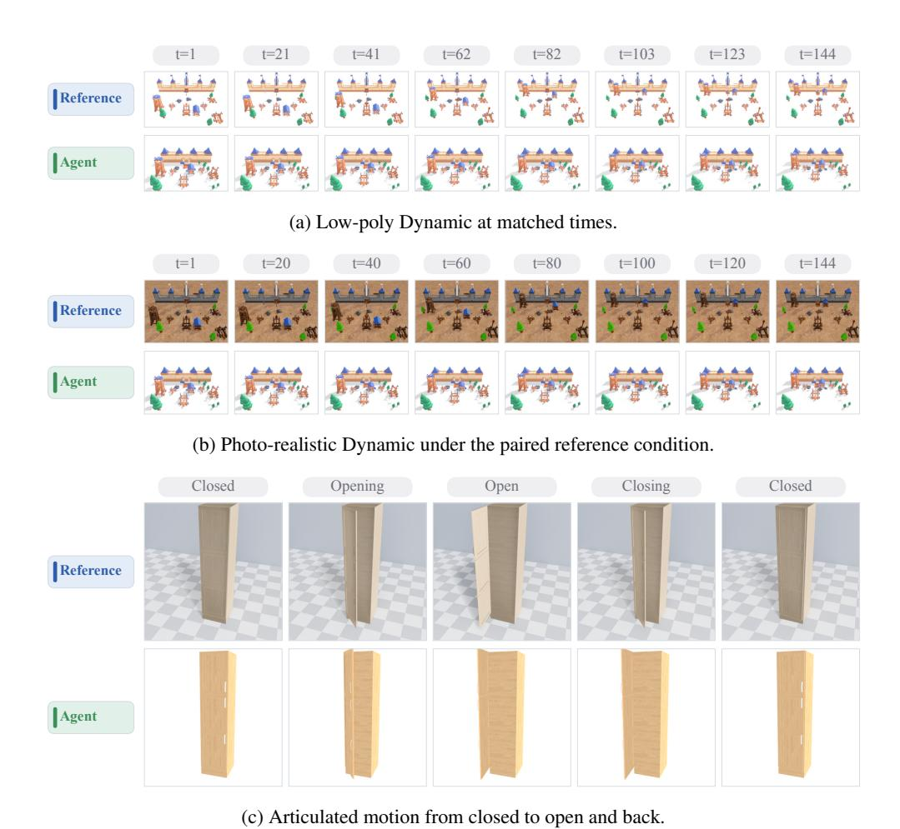

그림 12: Claude Opus 4.6 High의 모션 예시. 각 패널은 참조 프레임과 비교합니다.

정적 작업. 레이아웃 실패에는 붕괴된 배열과 객체 겹침이 포함됩니다. 카메라 오류는 잘못된 크롭이나 헤딩으로 나타납니다. 재구성은 종종 상세 가구를 단순한 대리 모양으로 대체합니다. 그림 [13](#page-24-0)은 이 세 가지 사례를 보여줍니다.

<span id="page-24-0"></span>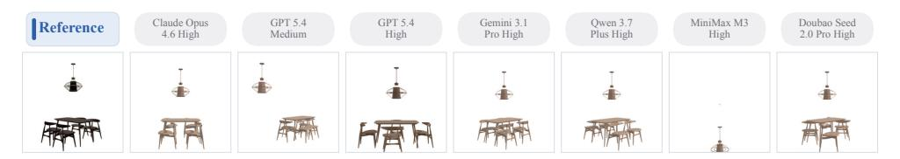

(a) *DiningRoom-13034*의 레이아웃. 모든 출력은 참조 카메라를 사용합니다. 대부분이 주요 배열을 복구합니다. MiniMax M3은 이를 붕괴시킵니다.

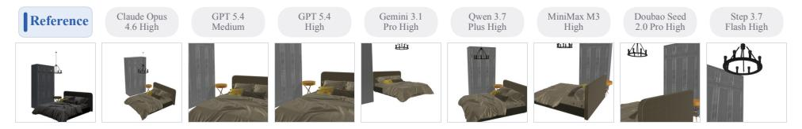

(b) *Bedroom-6995*의 카메라 정렬. 재렌더링은 크롭과 헤딩이 다릅니다.

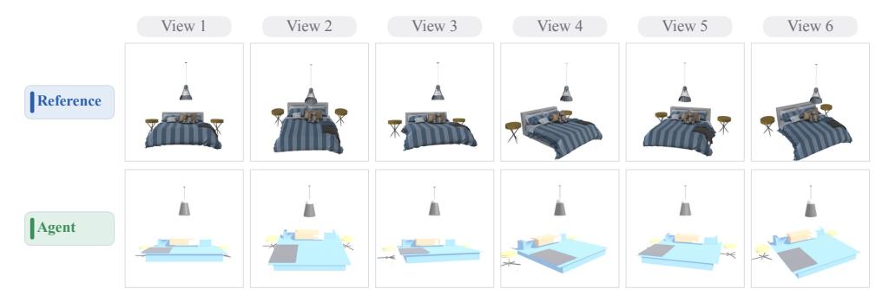

(c) Doubao Seed 2.0 Pro High에 의한 재구성. 각 출력은 해당 참조 카메라를 사용합니다.

그림 13: 정적 기하학 예시. 각 패널은 참조 기하학과 에이전트 출력을 비교합니다.

## C.3 완전한 메트릭 테이블 (COMPLETE METRIC TABLE)

표 [7](#page-25-0)은 모든 열 개 구성을 위한 전체 수치 기록을 제공합니다. 여기에는 작업 점수와 주요, 진단, 감사 메트릭이 포함됩니다. 각 셀은 벤치마크 인스턴스 전반에 걸친 평균과 표본 표준편차를 보고합니다. 작업 점수 표준편차는 작업 평균과 동일한 인스턴스별 정규화 점수를 사용하며, 정의되지 않은 진단 값은 두 통계 모두에서 제외됩니다. 이 표준편차는 반복 실행이 아니라 사례 간 변동을 설명합니다. 이 표는 재현성을 지원하며 새로운 주장을 도입하지 않습니다.

<span id="page-25-0"></span>표 7: 완전한 메트릭. 모든 열 개 구성에 대한 결과. 셀은 평균과 표본 표준편차를 회색으로 보고하며, 굵은 글씨는 행당 최상의 평균을 표시합니다. 레이아웃과 동적은 짝지어진 입력 조건을 포함합니다. 정의되지 않은 값은 제외됩니다; N/A는 사용 불가능한 값을 나타냅니다. FOV 및 감사 메트릭은 점수가 매겨지지 않습니다.

| 지표 |  | Doubao<br>H | Opus<br>H | GPT<br>M | GPT<br>H | Qwen<br>H | Gemini<br>H | MiMo<br>H | Kimi<br>R | Step<br>H | Sonnet<br>H | M3<br>H |
|-----------------------------|---|------------------|------------------|------------------|------------------|------------------|------------------|------------------|------------------|------------------|------------------|------------------|
| 레이아웃 배열 |  |  |  |  |  |  |  |  |  |  |  |  |
| 단일 뷰 |  |  |  |  |  |  |  |  |  |  |  |  |
|  |  | 77.4 | 73.5 | 72.7 | 84.1 | 76.2 | 65.4 | 79.4 | 70.9 | 77.5 | 51.9 | 58.1 |
| 작업 점수 | ↑ | ± 10.4 | ± 16.5 | ± 12.2 | ± 18.1 | ± 11.6 | ± 28.6 | ± 17.0 | ± 21.0 | ± 12.7 | ± 33.1 | ± 27.6 |
| ADD-S | ↓ | 0.905<br>± 0.417 | 1.059<br>± 0.659 | 1.120<br>± 0.695 | 0.766<br>± 1.559 | 0.954<br>± 0.464 | 6.953<br>± 20.03 | 0.824<br>± 0.680 | 2.547<br>± 13.68 | 0.898<br>± 0.508 | 21.49<br>± 115.7 | 4.188<br>± 15.01 |
|  |  | 1.081 | 1.438 | 1.314 | 0.929 | 1.235 | 7.083 | 1.064 | 3.009 | 1.144 | 22.75 | 4.417 |
| Chamfer | ↓ | ± 0.544 | ± 0.938 | ± 1.127 | ± 1.474 | ± 0.694 | ± 19.51 | ± 0.912 | ± 16.38 | ± 0.654 | ± 113.7 | ± 14.28 |
| 위치 오차 | ↓ | 1.279<br>± 0.516 | 1.437<br>± 0.743 | 1.506<br>± 0.748 | 0.903<br>± 1.281 | 1.338<br>± 0.559 | 7.343<br>± 20.06 | 1.132<br>± 0.838 | 2.931<br>± 13.71 | 1.260<br>± 0.616 | 21.94<br>± 115.8 | 4.627<br>± 15.06 |
| 배치 정확도 | ↑ | 0.135<br>± 0.134 | 0.093<br>± 0.137 | 0.101<br>± 0.114 | 0.446<br>± 0.407 | 0.098<br>± 0.122 | 0.100<br>± 0.172 | 0.274<br>± 0.357 | 0.173<br>± 0.294 | 0.206<br>± 0.307 | 0.080<br>± 0.151 | 0.065<br>± 0.101 |
|  |  |  |  |  |  |  |  |  |  |  |  |  |
| 다중 뷰 |  | 80.1 | 82.0 | 78.8 | 88.6 | 80.3 | 74.8 | 78.8 | 74.4 | 76.1 | 64.0 | 61.2 |
| 작업 점수 | ↑ | ± 12.8 | ± 11.7 | ± 9.0 | ± 11.3 | ± 14.2 | ± 23.0 | ± 21.0 | ± 16.9 | ± 14.5 | ± 29.5 | ± 29.2 |
|  |  | 0.794 | 0.721 | 0.847 | 0.456 | 0.787 | 1.069 | 1.704 | 1.030 | 1.165 | 11.07 | 6.507 |
| ADD-S | ↓ | ± 0.513<br>1.011 | ± 0.468<br>0.930 | ± 0.359<br>1.061 | ± 0.454<br>0.610 | ± 0.569<br>1.088 | ± 1.155<br>1.423 | ± 9.071<br>1.848 | ± 0.710<br>1.093 | ± 2.462<br>1.418 | ± 33.91<br>11.04 | ± 20.34<br>6.942 |
| Chamfer | ↓ | ± 0.748 | ± 0.582 | ± 0.413 | ± 0.587 | ± 0.829 | ± 1.522 | ± 8.932 | ± 0.802 | ± 2.518 | ± 32.92 | ± 20.96 |
|  |  | 1.113 | 0.992 | 1.153 | 0.644 | 1.099 | 1.389 | 1.968 | 1.383 | 1.268 | 11.45 | 6.885 |
| 위치 오차 | ↓ | ± 0.588<br>0.143 | ± 0.547<br>0.186 | ± 0.430<br>0.155 | ± 0.634<br>0.509 | ± 0.665<br>0.150 | ± 1.215<br>0.147 | ± 9.116<br>0.288 | ± 0.836<br>0.220 | ± 0.572<br>0.156 | ± 33.97<br>0.140 | ± 20.38<br>0.075 |
| 배치 정확도 | ↑ | ± 0.162 | ± 0.183 | ± 0.138 | ± 0.405 | ± 0.202 | ± 0.195 | ± 0.352 | ± 0.311 | ± 0.214 | ± 0.248 | ± 0.119 |
| 카메라 정렬 |  |  |  |  |  |  |  |  |  |  |  |  |
|  | ↑ | 34.5 | 34.0 | 29.6 | 26.4 | 21.7 | 33.9 | 25.0 | 24.6 | 13.2 | 27.3 | 25.6 |
| 작업 점수 |  | ± 28.7<br>4.825 | ± 26.3<br>4.980 | ± 25.0<br>5.404 | ± 19.0<br>5.748 | ± 24.8<br>6.489 | ± 29.6<br>5.272 | ± 24.5<br>6.618 | ± 22.1<br>6.396 | ± 19.6<br>7.191 | ± 26.4<br>6.045 | ± 27.1<br>5.703 |
| 위치 오차 (m) | ↓ | ± 3.119 | ± 3.092 | ± 2.787 | ± 2.934 | ± 3.404 | ± 3.781 | ± 3.823 | ± 3.272 | ± 3.155 | ± 3.634 | ± 2.907 |
|  |  | 54.49 | 51.65 | 54.48 | 51.12 | 70.92 | 53.81 | 58.21 | 57.23 | 78.82 | 54.34 | 64.14 |
| 각도 오차 (deg) | ↓ | ± 46.71<br>39.60 | ± 37.67<br>39.60 | ± 43.76<br>39.78 | ± 27.89<br>39.87 | ± 44.28<br>39.75 | ± 44.16<br>39.60 | ± 34.46<br>39.64 | ± 38.00<br>39.60 | ± 38.78<br>39.94 | ± 33.64<br>40.00 | ± 45.83<br>40.36 |
| 예측 시야각 (deg) |  | ± 0.000 | ± 0.000 | ± 1.770 | ± 1.878 | ± 1.483 | ± 0.000 | ± 0.451 | ± 0.000 | ± 2.704 | ± 4.040 | ± 5.148 |
| 관절 애니메이션 |  |  |  |  |  |  |  |  |  |  |  |  |
|  |  | 59.6 | 63.7 | 62.3 | 73.8 | 58.0 | 56.5 | 49.8 | 57.3 | 48.3 | 57.8 | 58.4 |
| 작업 점수 | ↑ | ± 17.1<br>0.404 | ± 25.3<br>0.375 | ± 20.9<br>0.381 | ± 24.8<br>0.275 | ± 25.6<br>0.603 | ± 27.2<br>0.452 | ± 23.5<br>0.636 | ± 19.0<br>0.442 | ± 25.6<br>0.541 | ± 21.2<br>0.425 | ± 23.6<br>0.428 |
| 최대 부품 오차 | ↓ | ± 0.173 | ± 0.292 | ± 0.223 | ± 0.292 | ± 1.590 | ± 0.314 | ± 1.355 | ± 0.246 | ± 0.323 | ± 0.220 | ± 0.272 |
|  |  | 0.336 | 0.277 | 0.303 | 0.183 | 0.475 | 0.360 | 0.462 | 0.371 | 0.457 | 0.352 | 0.329 |
| 평균 부품 오차 | ↓ | ± 0.147<br>0.062 | ± 0.215<br>0.057 | ± 0.177<br>0.066 | ± 0.177<br>0.035 | ± 1.141<br>0.137 | ± 0.279<br>0.082 | ± 0.704<br>0.223 | ± 0.213<br>0.284 | ± 0.273<br>0.278 | ± 0.190<br>0.102 | ± 0.177<br>0.076 |
| 개방 상태 ADD-S | ↓ | ± 0.082 | ± 0.085 | ± 0.098 | ± 0.056 | ± 0.369 | ± 0.122 | ± 0.184 | ± 1.163 | ± 0.340 | ± 0.138 | ± 0.097 |
|  |  | 0.051 | 0.699 | 0.433 | 0.754 | 0.522 | 0.513 | 0.155 | 0.169 | 0.057 | 0.208 | 0.381 |
| 이동 가능 재현율 | ↑ | ± 0.195 | ± 0.348 | ± 0.425 | ± 0.351 | ± 0.427 | ± 0.418 | ± 0.306 | ± 0.340 | ± 0.193 | ± 0.386 | ± 0.409 |
| 거짓 이동률 | ↓ | 0.200<br>± 0.402 | 0.600<br>± 0.492 | 0.540<br>± 0.501 | 0.520<br>± 0.502 | 0.760<br>± 0.429 | 0.580<br>± 0.496 | 0.263<br>± 0.442 | 0.200<br>± 0.402 | 0.210<br>± 0.409 | 0.200<br>± 0.402 | 0.530<br>± 0.502 |
|  |  | 0.008 | 0.022 | 0.017 | 0.003 | 0.061 | 0.055 | 0.010 | 0.015 | 0.000 | 0.008 | 0.056 |
| 형식 불일치율 | ↓ | ± 0.080 | ± 0.143 | ± 0.110 | ± 0.033 | ± 0.228 | ± 0.213 | ± 0.075 | ± 0.111 | ± 0.000 | ± 0.060 | ± 0.222 |
| 역방향률 | ↓ | 0.016<br>± 0.116 | 0.073<br>± 0.257 | 0.098<br>± 0.268 | 0.041<br>± 0.181 | 0.070<br>± 0.225 | 0.053<br>± 0.221 | 0.016<br>± 0.108 | 0.023<br>± 0.144 | 0.000<br>± 0.000 | 0.013<br>± 0.103 | 0.056<br>± 0.222 |
| 초기부터 재구성 |  |  |  |  |  |  |  |  |  |  |  |  |
|  | ↑ | 8.8 | 9.8 | 10.4 | 12.3 | 9.0 | 7.1 | 9.1 | 8.5 | 8.6 | 10.5 | 9.6 |
| 작업 점수 |  | ± 6.4<br>0.088 | ± 6.4<br>0.098 | ± 6.5<br>0.104 | ± 7.8<br>0.123 | ± 6.0<br>0.090 | ± 6.8<br>0.071 | ± 7.0<br>0.091 | ± 6.1<br>0.085 | ± 6.4<br>0.086 | ± 6.4<br>0.105 | ± 6.4<br>0.096 |
| 객체 F@5% (주요) | ↑ | ± 0.064 | ± 0.064 | ± 0.065 | ± 0.078 | ± 0.060 | ± 0.068 | ± 0.070 | ± 0.061 | ± 0.064 | ± 0.064 | ± 0.064 |
|  |  | 0.062 | 0.071 | 0.083 | 0.105 | 0.063 | 0.064 | 0.065 | 0.072 | 0.059 | 0.072 | 0.076 |
| 영역 객체 F@5% | ↑ | ± 0.042 | ± 0.047 | ± 0.038 | ± 0.056 | ± 0.046 | ± 0.046 | ± 0.049 | ± 0.046 | ± 0.040 | ± 0.041 | ± 0.047 |
| 병합 장면 F@2% | ↑ | 0.100<br>± 0.085 | 0.122<br>± 0.101 | 0.130<br>± 0.077 | 0.171<br>± 0.120 | 0.107<br>± 0.104 | 0.099<br>± 0.089 | 0.105<br>± 0.096 | 0.120<br>± 0.099 | 0.098<br>± 0.080 | 0.111<br>± 0.087 | 0.122<br>± 0.090 |
|  |  | 0.345 | 0.401 | 0.434 | 0.464 | 0.356 | 0.357 | 0.373 | 0.401 | 0.350 | 0.398 | 0.418 |
| 병합 장면 F@5% | ↑ | ± 0.149 | ± 0.175 | ± 0.157 | ± 0.164 | ± 0.196 | ± 0.167 | ± 0.175 | ± 0.184 | ± 0.171 | ± 0.175 | ± 0.156 |
| 병합 장면 F@10% | ↑ | 0.664 | 0.699 | 0.725 | 0.747<br>± 0.132 | 0.650<br>± 0.208 | 0.655 | 0.685 | 0.707 | 0.653 | 0.693 | 0.718 |
|  |  | ± 0.162 | ± 0.166 | ± 0.163 |  |  | ± 0.182 | ± 0.188 | ± 0.183 | ± 0.188 | ± 0.179 | ± 0.136 |
|  |  | 0.158 | 0.201 | 0.167 | 0.218 | 0.153 | 0.122 | 0.173 | 0.184 | 0.134 | 0.180 | 0.173 |

*다음 페이지에 계속됩니다*

*표 7 (계속)*

| Metric |  | Doubao<br>H | Opus<br>H | GPT<br>M | GPT<br>H | Qwen<br>H | Gemini<br>H | MiMo<br>H | Kimi<br>R | Step<br>H | Sonnet<br>H | M3<br>H |
|----------------------|---|------------------|------------------|------------------|------------------|------------------|------------------|------------------|------------------|------------------|------------------|------------------|
| Scene Point-BERT | ↑ | 0.351<br>± 0.107 | 0.397<br>± 0.121 | 0.350<br>± 0.097 | 0.426<br>± 0.134 | 0.376<br>± 0.122 | 0.345<br>± 0.112 | 0.362<br>± 0.122 | 0.356<br>± 0.111 | 0.351<br>± 0.119 | 0.385<br>± 0.116 | 0.376<br>± 0.115 |
| Object coverage | ↑ | 0.055<br>± 0.102 | 0.052<br>± 0.101 | 0.089<br>± 0.103 | 0.130<br>± 0.132 | 0.049<br>± 0.099 | 0.051<br>± 0.099 | 0.057<br>± 0.104 | 0.072<br>± 0.110 | 0.037<br>± 0.081 | 0.055<br>± 0.095 | 0.072<br>± 0.121 |
| Match rate | ↑ | 0.839<br>± 0.232 | 0.846<br>± 0.243 | 0.841<br>± 0.217 | 0.898<br>± 0.162 | 0.775<br>± 0.305 | 0.659<br>± 0.383 | 0.857<br>± 0.263 | 0.807<br>± 0.289 | 0.769<br>± 0.248 | 0.862<br>± 0.209 | 0.835<br>± 0.242 |
| Mean centroid error | ↓ | 0.591<br>± 0.173 | 0.542<br>± 0.173 | 0.533<br>± 0.152 | 0.586<br>± 0.188 | 0.551<br>± 0.164 | 0.553<br>± 0.220 | 0.575<br>± 0.208 | 0.553<br>± 0.180 | 0.558<br>± 0.205 | 0.581<br>± 0.171 | 0.555<br>± 0.182 |
| Chamfer (aligned) | ↓ | 0.416<br>± 0.123 | 0.404<br>± 0.143 | 0.381<br>± 0.134 | 0.369<br>± 0.111 | 0.457<br>± 0.202 | 0.436<br>± 0.136 | 0.429<br>± 0.193 | 0.393<br>± 0.139 | 0.440<br>± 0.153 | 0.409<br>± 0.127 | 0.388<br>± 0.111 |
| Dynamic Scene |  |  |  |  |  |  |  |  |  |  |  |  |
| Low-poly |  |  |  |  |  |  |  |  |  |  |  |  |
| Task score | ↑ | 70.7<br>± 18.8 | 63.2<br>± 22.5 | 68.5<br>± 31.0 | 46.7<br>± 31.8 | 66.0<br>± 19.4 | 63.9<br>± 30.1 | 43.7<br>± 29.6 | 44.8<br>± 25.8 | 57.9<br>± 23.5 | 49.9<br>± 18.4 | 41.4<br>± 35.0 |
| Maximum Mover Error | ↓ | 0.471<br>± 0.412 | 0.583<br>± 0.393 | 0.738<br>± 1.267 | 0.746<br>± 0.414 | 0.441<br>± 0.350 | 0.527<br>± 0.496 | 0.827<br>± 0.365 | 0.855<br>± 0.401 | 0.712<br>± 0.465 | 1.000<br>± 0.000 | 0.755<br>± 0.396 |
| Average Mover Error | ↓ | 0.322<br>± 0.234 | 0.436<br>± 0.343 | 0.585<br>± 1.078 | 0.742<br>± 0.421 | 0.293<br>± 0.182 | 0.371<br>± 0.307 | 0.721<br>± 0.386 | 0.765<br>± 0.368 | 0.665<br>± 0.424 | 1.000<br>± 0.000 | 0.706<br>± 0.399 |
| Movable recall | ↑ | 0.950<br>± 0.158 | 0.710<br>± 0.418 | 0.895<br>± 0.257 | 0.300<br>± 0.483 | 0.935<br>± 0.142 | 0.950<br>± 0.158 | 0.325<br>± 0.442 | 0.325<br>± 0.472 | 0.500<br>± 0.527 | 0.000<br>± 0.000 | 0.350<br>± 0.474 |
|  |  | 0.175 | 0.340 | 0.555 | 0.700 | 0.315 | 0.120 | 0.675 | 0.675 | 0.500 | 1.000 | 1.150 |
| Mover-count error | ↓ | ± 0.334<br>0.367 | ± 0.409<br>0.092 | ± 0.808<br>0.192 | ± 0.483<br>0.000 | ± 0.780<br>0.308 | ± 0.210<br>0.125 | ± 0.442<br>0.000 | ± 0.472<br>0.067 | ± 0.527<br>0.067 | ± 0.000<br>0.000 | ± 1.415<br>0.100 |
| Direction-error rate | ↓ | ± 0.457<br>0.179 | ± 0.149<br>0.311 | ± 0.356<br>0.538 | ± 0.000<br>0.770 | ± 0.405<br>0.233 | ± 0.270<br>0.294 | ± 0.000<br>0.657 | ± 0.211<br>0.689 | ± 0.211<br>0.650 | ± 0.000<br>1.000 | ± 0.316<br>0.721 |
| Path-shape error | ↓ | ± 0.157 | ± 0.375 | ± 1.018 | ± 0.388 | ± 0.185 | ± 0.275 | ± 0.447 | ± 0.418 | ± 0.467 | ± 0.000 | ± 0.372 |
| Heading error | ↓ | 0.098<br>± 0.178 | 0.058<br>± 0.156 | 0.223<br>± 0.311 | 0.006<br>± 0.014 | 0.164<br>± 0.199 | 0.183<br>± 0.315 | 0.004<br>± 0.010 | 0.005<br>± 0.012 | 0.139<br>± 0.314 | 0.000<br>± 0.000 | 0.076<br>± 0.143 |
| Scale error | ↓ | 0.890<br>± 0.726 | 0.672<br>± 0.678 | 0.559<br>± 0.727 | 0.175<br>± 0.401 | 0.834<br>± 0.751 | 1.375<br>± 0.928 | 0.140<br>± 0.263 | 0.226<br>± 0.630 | 0.289<br>± 0.592 | 0.000<br>± 0.000 | 0.202<br>± 0.390 |
| Size error | ↓ | 0.581<br>± 0.792 | 0.288<br>± 0.273 | 0.727<br>± 1.127 | 0.571<br>± 0.398 | 0.461<br>± 0.264 | 0.986<br>± 0.900 | 0.576<br>± 0.919 | 0.947<br>± 0.772 | 0.536<br>± 0.514 | 1.294<br>± 1.140 | 1.029<br>± 0.948 |
| Mover-size error | ↓ | 0.954<br>± 0.881 | 0.536<br>± 0.300 | 1.452<br>± 1.472 | 0.352<br>± 0.384 | 0.667<br>± 0.514 | 1.086<br>± 0.835 | 0.509<br>± 0.252 | 0.549<br>± 0.182 | 0.639<br>± 0.449 | N/A | 0.670<br>± 0.145 |
| Layout error | ↓ | 0.150<br>± 0.089 | 0.152<br>± 0.117 | 0.235<br>± 0.357 | 0.320<br>± 0.302 | 0.238<br>± 0.234 | 0.335<br>± 0.534 | 0.299<br>± 0.373 | 0.281<br>± 0.269 | 0.164<br>± 0.094 | 1.330<br>± 3.155 | 0.426<br>± 0.428 |
| Photo-realistic |  |  |  |  |  |  |  |  |  |  |  |  |
|  |  | 65.8 | 63.3 | 70.6 | 64.0 | 65.9 | 55.5 | 38.3 | 55.4 | 47.6 | 39.7 | 52.2 |
| Task score | ↑ | ± 18.4<br>0.537 | ± 22.7<br>0.616 | ± 20.3<br>0.501 | ± 23.7<br>0.596 | ± 21.7<br>0.570 | ± 26.2<br>0.701 | ± 26.5<br>0.904 | ± 19.6<br>0.710 | ± 17.3<br>0.852 | ± 17.9<br>0.920 | ± 22.3<br>0.765 |
| Maximum Mover Error | ↓ | ± 0.516<br>0.367 | ± 0.414<br>0.430 | ± 0.505<br>0.313 | ± 0.439<br>0.566 | ± 0.471<br>0.382 | ± 0.475<br>0.502 | ± 0.304<br>0.878 | ± 0.375<br>0.690 | ± 0.313<br>0.809 | ± 0.253<br>0.920 | ± 0.380<br>0.691 |
| Average Mover Error | ↓ | ± 0.338<br>0.880 | ± 0.349<br>0.677 | ± 0.260<br>0.930 | ± 0.462<br>0.500 | ± 0.283<br>0.910 | ± 0.344<br>0.730 | ± 0.306<br>0.133 | ± 0.400<br>0.400 | ± 0.305<br>0.250 | ± 0.253<br>0.100 | ± 0.405<br>0.380 |
| Movable recall | ↑ | ± 0.316 | ± 0.405 | ± 0.164 | ± 0.527 | ± 0.191 | ± 0.416 | ± 0.322 | ± 0.516 | ± 0.408 | ± 0.316 | ± 0.494 |
| Mover-count error | ↓ | 0.120<br>± 0.316 | 0.407<br>± 0.369 | 0.220<br>± 0.343 | 0.700<br>± 0.675 | 0.140<br>± 0.227 | 0.745<br>± 1.204 | 0.867<br>± 0.322 | 0.600<br>± 0.516 | 0.750<br>± 0.408 | 0.900<br>± 0.316 | 0.653<br>± 0.457 |
| Direction-error rate | ↓ | 0.158<br>± 0.320 | 0.058<br>± 0.124 | 0.108<br>± 0.184 | 0.050<br>± 0.158 | 0.100<br>± 0.316 | 0.025<br>± 0.079 | 0.000<br>± 0.000 | 0.167<br>± 0.360 | 0.000<br>± 0.000 | 0.000<br>± 0.000 | 0.100<br>± 0.316 |
| Path-shape error | ↓ | 0.279<br>± 0.271 | 0.355<br>± 0.363 | 0.229<br>± 0.175 | 0.591<br>± 0.454 | 0.204<br>± 0.191 | 0.416<br>± 0.329 | 0.861<br>± 0.313 | 0.708<br>± 0.396 | 0.739<br>± 0.351 | 0.956<br>± 0.138 | 0.732<br>± 0.365 |
| Heading error | ↓ | 0.081<br>± 0.099 | 0.069<br>± 0.155 | 0.378<br>± 0.442 | 0.035<br>± 0.066 | 0.204<br>± 0.323 | 0.142<br>± 0.187 | 0.011<br>± 0.036 | 0.040<br>± 0.121 | 0.144<br>± 0.304 | 0.000<br>± 0.000 | 0.063<br>± 0.190 |
|  |  | 0.938 | 0.402 | 1.019 | 0.149 | 1.120 | 0.741 | 0.249 | 0.080 | 0.157 | 0.000 | 0.155 |
| Scale error | ↓ | ± 0.999<br>0.664 | ± 0.513<br>0.287 | ± 0.904<br>0.915 | ± 0.262<br>0.671 | ± 0.773<br>0.631 | ± 0.893<br>0.953 | ± 0.724<br>1.077 | ± 0.162<br>1.142 | ± 0.275<br>0.611 | ± 0.000<br>1.520 | ± 0.395<br>0.882 |
| Size error | ↓ | ± 0.829<br>1.150 | ± 0.119<br>0.696 | ± 1.128<br>0.984 | ± 0.668<br>0.524 | ± 0.847<br>0.880 | ± 0.872<br>0.772 | ± 0.390<br>1.462 | ± 1.108<br>0.503 | ± 0.380<br>0.663 | ± 0.826<br>0.446 | ± 0.575<br>0.508 |
| Mover-size error | ↓ | ± 1.104<br>0.213 | ± 0.144<br>0.118 | ± 0.942<br>0.143 | ± 0.358<br>0.125 | ± 0.897<br>0.166 | ± 0.956<br>0.245 | ± 0.437<br>0.329 | ± 0.272<br>0.182 | ± 0.157<br>0.196 | ± –<br>0.286 | ± 0.273<br>0.191 |
| Layout error | ↓ | ± 0.204 | ± 0.081 | ± 0.056 | ± 0.068 | ± 0.093 | ± 0.263 | ± 0.357 | ± 0.067 | ± 0.078 | ± 0.197 | ± 0.088 |

# C.4 에이전트 프로세스 및 예산 민감도 (C.4 AGENT PROCESS AND BUDGET SENSITIVITY)

프로세스 분석은 집계된 실제 단계와 도구 호출, 공유 예산 곡선, 그리고 두 개의 완전한 에이전트 스택 간의 별도 전체 Claude Sonnet 5 High 비교를 사용합니다.

## C.4.1 단계-예산 민감도 (STEP-BUDGET SENSITIVITY)

분석은 10에서 150 단계까지의 명목 예산 하에서 선택된 실행 체크포인트를 회고적으로 점수화합니다. 모든 작업은 각 곡선 지점에서 동일한 MaxSteps 값을 사용합니다.

전반적으로 두 끝점 사이에서 12.0–27.7 포인트 상승합니다. Camera는 평균 이득이 가장 크며(51.3 포인트), 그 변화는 구성에 따라 15.7에서 79.2까지 다양합니다. Articulated는 거의 변하지 않으며(−3.0에서 +6.1), Reconstruction은 2.7–8.8 포인트를 얻습니다. 따라서 예산 민감도는 구성과 작업 모두에 따라 달라지며, MaxSteps가 증가함에 따라 구성 순서가 바뀝니다.

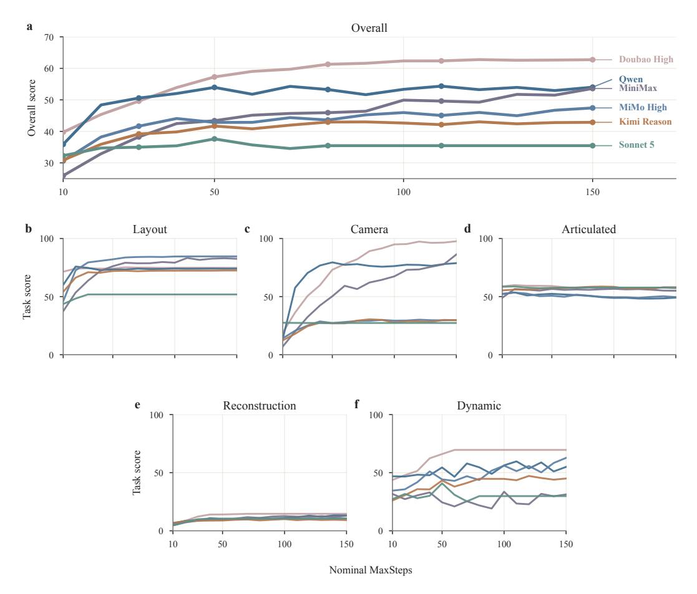

그림 14: 단계-예산 민감도. (a) 전체 및 (b–f) MaxSteps 값에 따른 작업 점수. 각 체크포인트는 동일한 사례별 점수 규칙을 사용합니다. 패널 (a)의 직접 라벨은 구성을 식별하고, 색상은 패널 간에 공유됩니다.

## <span id="page-27-0"></span>C.4.2 공식 CLI 비교 (OFFICIAL CLI COMPARISON)

구성. 우리는 공식 Claude Code CLI v2.1.181에서 높은 추론 노력으로 모든 520 사례에 대해 Claude Sonnet 5 High를 재실행했습니다. 실행은 Blender 5.1.2와 동일한 샘플, 작업 목표, 단계 제한 및 평가자를 사용했습니다. 하나의 어시스턴트 응답은 한 단계로 계산됩니다. 한계에서 우리는 평가 전에 최종 도구 결과를 적용했습니다. 공식 CLI는 동일한 Blender 연산과 자체 이미지 리더를 사용했습니다. 우리는 관련 없는 셸, 웹, 파일 편집 도구를 비활성화했습니다.

완료 및 점수화. 모든 520 사례가 완료되고 점수가 매겨졌습니다. 다섯 개의 Dynamic 사례는 정적 장면을 생성했지만 객체 애니메이션은 없었습니다. 세 개는 저폴리 참조를 사용했고, 두 개는 사진 사실주의 참조를 사용했습니다. 우리는 이러한 실패 점수를 유지했습니다.

<span id="page-28-0"></span>표 8: Claude Code 비교. 공유 하네스와 공식 Claude Code CLI 하에서 Claude Sonnet 5 High. 고정 참조 작업 점수가 높을수록 좋으며; ∆는 CLI에서 하네스를 뺀 값입니다. 짝지어진 조건은 전체 외부에 남아 있습니다.

| 작업 | n | 하네스 | Claude Code | ∆ |
|---------------------------|-----|---------|-------------|-------|
| 레이아웃 | 100 | 51.9 | 46.8 | −5.1 |
| 레이아웃 (멀티뷰) | 100 | 64.0 | 43.5 | −20.4 |
| 카메라 | 100 | 27.3 | 30.7 | +3.4 |
| 관절형 | 100 | 57.8 | 60.3 | +2.5 |
| 재구성 | 100 | 10.5 | 8.3 | −2.2 |
| 동적 | 10 | 49.9 | 27.0 | −22.9 |
| 동적 (포토리얼리스틱) | 10 | 39.7 | 26.7 | −13.0 |
| 전체 | – | 39.5 | 34.6 | −4.9 |

결과. 공식 CLI는 전체에서 34.6점을 기록했으며, 공유 하네스(공유 하네스) 하에서는 39.5점을 기록했습니다 (Table [8)](#page-28-0)). 4.9점 차이는 작업 수준 변동보다 훨씬 작습니다. 공식 스택은 Camera를 3.4점, Articulated를 2.5점 향상시키는 반면, 공유 하네스는 Reconstruction을 2.2점, Dynamic을 22.9점 선도합니다.

작업 의존성. 비교 결과는 일관된 인터페이스 이점을 보여주지 않습니다. 공식 스택은 숨겨진 카메라 상태와 관절형 움직임에서 더 나은 성능을 보이지만, 다중 시점 Layout과 다중 객체 Dynamic에서는 더 나쁜 성능을 보입니다. 다섯 개의 누락된 공식 애니메이션이 Dynamic 차이에 기여합니다. 더 큰 다중 시점과 Dynamic 차이는 시각적 읽기, 편집, 검사 할당 방식을 다르게 하는 것과 일치하지만, 하나의 인과 메커니즘을 고립시키지 못합니다.

효과적인 상호작용 예산. 동일한 MaxSteps 값이 동일한 수의 환경 동작이나 그 순서를 보장하지는 않습니다. 두 스택은 이미지 읽기, Blender 편집, 렌더링, 컨텍스트 관리, 중지를 다르게 패키징합니다. 따라서 그 점수는 완전한 에이전트 스택을 비교하며, 단일 인터페이스 구성요소를 고립시키지 않습니다.

범위. 두 실행 모두 Claude Sonnet 5 High를 사용했습니다. 공식 실행은 네이티브 이미지 읽기를 사용했으며, 메인 테이블 실행은 SceneActBench 인터페이스를 사용했습니다. 그들의 시스템 프롬프트와 컨텍스트 정책도 달랐습니다. 따라서 이 실험은 공유 작업 및 점수 하에서 스택 민감도를 측정하며, 하나의 인과 인터페이스 요인을 고립시키지 않습니다. 이 때문에 주요 순위는 하나의 공통 스택을 사용합니다.

## C.4.3 REPRESENTATIVE INTERACTION TRACES

대표적인 상호작용 추적 (C.4.3 REPRESENTATIVE INTERACTION TRACES)

집계 단계 및 도구 호출 수는 에이전트가 상호작용 예산을 어떻게 사용했는지를 보여주지 않습니다. Figure [15](#page-29-1)은 세 개의 점수화된 에피소드를 도구 호출 타임라인으로 표시합니다: 입력 읽기, 코드 편집, 렌더 검사, 도구 오류, 그리고 중지 이벤트. 단일 호출은 점으로 표시되고, 같은 유형의 연속 호출은 둥근 구간으로 결합되어 중복을 줄입니다; 정확한 합계는 각 에피소드에 대해 나열됩니다. 이는 각 패턴이 얼마나 자주 발생하는지 추정하기보다는 예시 에피소드입니다.

추적 읽기. Panel [15a](#page-29-1)은 짧은 닫힌 루프를 보여줍니다: 초기 코드 오류 한 번 뒤에 에이전트는 네 번의 렌더 검사를 수행하고, 19단계에서 자체 중지하며, movable recall 1.00과 MPE 0.021을 기록합니다. Panel [15b](#page-29-1)은 완료되었지만 검사되지 않은 실행을 보여줍니다: 여섯 번의 코드 편집과 8단계에서의 자체 중지, 렌더 검사 없이, 방향 오류율 1.00과 스케일 오류 0.889를 기록합니다. Panel [15c](#page-29-1)은 길게 해결되지 않은 루프를 보여줍니다: 열두 개의 도구 오류와 열세 개의 렌더 검사로 80단계 한계까지 지속되며, movable recall 0과 MME 1.000을 기록합니다.

의의와 범위. 이 사례들은 MaxSteps와 원시 호출 수가 충분한 프로세스 측정이 되지 않는 이유를 보여줍니다. 렌더 검사는 이후 편집을 안내하고 오류가 해결될 때만 도움이 되며, 렌더 활동만으로는 수렴이 보장되지 않습니다(Panel [15c](#page-29-1)에서 보듯이). 에피소드는 가독성을 위해 선택되었으며, 인과 또는 유행 주장보다는 프로세스 수준 진단을 지원하기 위해 선택되었습니다.

<span id="page-29-1"></span>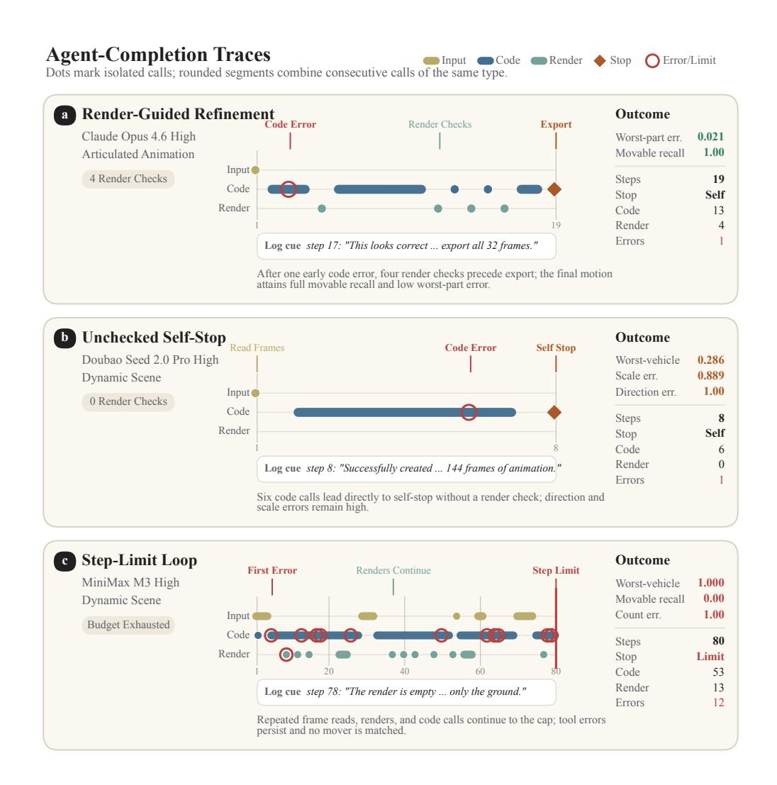

Figure 15: 대표적인 에이전트 완료 추적. 각 행은 하나의 점수화된 에피소드를 나타냅니다. 색상은 에이전트 단계 축을 따라 입력 읽기, 코드 편집, 렌더 검사를 구분합니다. 점은 단일 호출을 표시하고, 둥근 구간은 같은 유형의 연속 호출을 결합하며, 빨간 고리는 도구 오류를, 다이아몬드는 자체 중지를 표시합니다. 선택된 주석과 로그 발췌는 추적 맥락을 제공하며, 오른쪽 값은 정확한 이벤트 합계와 작업 지표를 보고합니다.

# <span id="page-29-0"></span>D PROMPT TEMPLATES

D 프롬프트 템플릿 (D PROMPT TEMPLATES)

각 작업은 에이전트에게 두 개의 메시지를 보냅니다. 시스템 프롬프트는 역할, 세계 규칙, 도구 사용을 정의합니다. 작업 프롬프트는 장면 입력과 지침을 제공합니다. 두 프롬프트는 아래에 그대로 표시됩니다. 중괄호로 감싼 자리 표시자는 각 장면이 구축될 때 채워집니다. 출력 경로는 실행 시 채워집니다.

인용된 프롬프트는 하네스 문구를 유지합니다. 여기에는 *객체* (*object*), *조각* (*piece*), 그리고 *구성요소* (*components*)가 포함됩니다. 자산–객체 규칙은 Section [3](#page-2-2)에서 인용된 프롬프트 외부에 적용됩니다. 파란색 카드가 시스템 프롬프트를 표시하고, 주황색 카드가 작업 프롬프트를 표시합니다.

## D.1 레이아웃 (LAYOUT)

Both Layout conditions use one system prompt. The task prompt lists either one view or all views.

```
시스템 프롬프트
당신은 MCP 도구를 통해 Blender를 제어하는 3D 장면 레이아웃 에이전트입니다.
Blender 장면은 object_00, object_01 등으로 명명된 여러 가구 객체가 사전 로드되어 있습니다. 각 객체의 기하학은 CANONICAL: 세계 원점에 정중앙에 위치하고 중립(회전되지 않은) 방향으로 재설정됩니다. 이들은 모두 원점 근처에 쌓여 있고 겹쳐져 있으며, 아직 올바른 위치에 있지 않습니다.
당신의 임무: 참조 이미지에 표시된 원래 방 레이아웃을 재구성하는 것입니다.
각 객체마다 올바른 세계 위치와 수직(Z) 축을 중심으로 한 회전 각도를 결정한 뒤, execute_blender_code(bpy)를 사용해 그곳으로 이동/회전시킵니다.
규칙 (중요):
- 세계 좌표계는 Z-업입니다. 객체는 Z=0에서 바닥에 놓이며, +Z는 높이입니다.
- 각 객체는 실제 메트릭 크기를 유지합니다 (객체를 스케일하지 마세요).
- 회전은 Z 축을 중심으로 한 요(Yaw)만 수행합니다 (기울임 없음).
- 각 참조 이미지에 대해 참조 카메라 포즈(위치 + 시야 방향)가 제공됩니다. 이를 사용해 좌/우/전/후를 구분하고, 레이아웃이 올바른 전역 방향에 있도록 합니다.
객체를 배치하는 방법 (execute_blender_code에서 이 정확한 방법을 사용하세요):
    import bpy, mathutils
    obj = bpy.data.objects["object_03"]
    T = mathutils.Matrix.Translation((x, y, z)) # 목표 세계 위치 (Z-업)
    R = mathutils.Matrix.Rotation(yaw, 4, 'Z') # Z 축을 중심으로 한 요(라디안)
    obj.matrix_world = T @ R
  전체 matrix_world를 이렇게 설정하세요. obj.rotation_euler / obj.location을 부분적으로 사용하지 마세요 - 이 헤드리스 환경에서는 효과가 없을 수 있습니다.
작업 흐름:
1. get_scene_info / get_object_info(geometry, size)를 사용해 객체를 검사합니다.
2. 참조 이미지(들)를 연구해 각 객체가 무엇인지, 어디로 가야 하는지 추론합니다.
3. execute_blender_code를 사용해 모든 객체를 배치하고, obj.matrix_world = T @ R를 설정합니다.
4. render_scene_view를 사용해 레이아웃을 참조와 비교합니다. 또한 추가 카메라(예: 상단 및 측면 뷰)를 생성하고 그곳에서 렌더링합니다 - 참조는 2D 투영이므로 깊이 오류와 겹치는 객체는 다른 각도에서만 나타납니다. 3D 레이아웃을 검증한 뒤 정제합니다.
5. 확신이 서면 간단한 요약으로 중단합니다. 질문하지 마세요.
당신은 최종 레이아웃이 실제 장면(객체별 포즈 + 전체 배열)에 얼마나 근접하는지에 따라 평가됩니다. 실제 Blender 변환만 계산됩니다.
```

작업 프롬프트 (단일 뷰 형식)
이 방을 재구성하세요. 장면에는 {N_OBJECTS}개의 객체(object_00..object_{N-1})가 있으며, 모두 CANONICAL(중앙 정렬, 회전 없음)이고 원점에 쌓여 있습니다.
세계 좌표계: Z-업, 미터 단위.
참조 이미지: {REFERENCE_IMAGE_PATH}
참조 카메라(세계 좌표계, Z-업): 위치={CAM_POSITION}, 시야 방향={CAM_LOOK_DIR}, fov_x={CAM_FOV_X_DEG} deg.
__ref__라는 카메라 객체가 이미 이 정확한 포즈로 생성되어 활성 카메라로 설정되어 있으므로 render_scene_view(camera='__ref__')를 호출할 수 있습니다.
각 객체를 올바른 세계 위치와 요(Yaw)로 배치해 참조 이미지를 일치시킵니다. 객체 크기는 변경하지 마세요. 렌더링으로 확인하고, 깊이 오류와 겹침을 잡기 위해 상단 및 측면 카메라를 생성합니다. 정제한 뒤 중단합니다.
--- 다중 뷰 작업 프롬프트는 한 개 대신 모든 뷰를 나열합니다 ---
다음과 같은 {N_VIEWS}개의 참조 이미지를 다른 카메라 뷰에서 받습니다 (fov_x={CAM_FOV_X_DEG} deg), 포즈는 다음과 같습니다:
  - {IMAGE_PATH} 카메라 위치={CAM_POSITION} 시야 방향={CAM_LOOK_DIR}
  ... (각 뷰마다 한 줄씩)

## D.2 카메라 (CAMERA)

보고서 주석. 과거 프롬프트에는 LPIPS, CLIP, PSNR이 언급됩니다. 이 값들은 감사 검사용입니다. PE와 AE만이 보고된 카메라 점수에 포함됩니다.

#### **시스템 프롬프트** (System prompt)

당신은 MCP 도구를 통해 Blender를 제어하는 3D 카메라 포즈 에이전트입니다.

장면은 이미 올바르게 배치되어 있다 (ground-truth 가구 배치가 로드됨). 당신은 알 수 없는 카메라 포즈에서 촬영된 하나의 참조 이미지를 받는다. 당신의 임무는 참조 이미지를 최대한 정확하게 재현하는 카메라 포즈를 찾는 것이다.

#### 워크플로우 (Workflow):

- 1. 장면을 검사한다 (get_scene_info).
- 2. (execute_blender_code)를 통해 카메라를 생성/배치하고, 그 세계 행렬과 렌즈를 설정한다. render_scene_view로 렌더링하고 참조 이미지를 비교한다.
- 3. 반복: 카메라 위치/방향을 조정하여 참조 뷰와 일치시킨다.
- 4. 최종 카메라 포즈(position + look direction or full matrix_world)를 보고한다. 질문하지 않는다.

당신은 실제 카메라와의 카메라 포즈 오류, 그리고 렌더링과 참조 이미지 간의 이미지 유사도(LPIPS/CLIP/PSNR)를 기준으로 평가됩니다.

#### **작업 프롬프트 (Task prompt)**

장면이 올바르게 배치되었습니다. 이 참조 이미지를 재현하는 카메라 포즈를 찾으십시오: {REFERENCE_IMAGE_PATH} 세계 좌표계: Z-up, 미터 단위. 카메라를 만들고, matrix_world와 렌즈(fov_x={CAM_FOV_X_DEG} deg)를 설정한 뒤 render_scene_view로 렌더링하고, 렌더링이 참조와 일치할 때까지 반복하십시오. 최종 카메라 위치와 시선 방향을 보고하십시오. 전체 6-DOF 카메라 움직임이 허용됩니다.

## 관절형 (ARTICULATED)

#### **시스템 프롬프트**

당신은 MCP 도구를 통해 Blender를 제어하는 3D 애니메이션 어시스턴트입니다. 장면에는 정적 관절 객체(부품 이름이 mesh_000, mesh_001, …이며 NO semantic labels가 없습니다)가 포함되어 있습니다. 당신은 32개의 연속 프레임으로 구성된 짧은 비디오의 순차적인 프레임인 SEQUENCE OF 32 IMAGES를 받습니다. 비디오는 객체의 움직이는 부품이 열리고 닫히는 것을 보여줍니다. 어떤 메쉬 객체가 움직이고 어떻게 움직이는지 추론한 뒤, 그 움직임을 재현하고 프레임마다 하나의 GLB를 내보냅니다. get_scene_info / get_object_info를 사용하여 객체와 그 경계 상자를 검사하고, execute_blender_code를 사용하여 전체 OBJECTS( object.location / object.rotation_euler / object.matrix_world - 개별 정점을 편집하지 않음)를 변형하고, bpy.ops.export_scene.gltf를 통해 프레임을 내보냅니다. render_scene_view를 호출하여 시각적으로 확인할 수 있습니다. 질문을 하지 마십시오; 모든 프레임이 내보내지면 한 줄 요약으로 종료하십시오.

#### **작업 프롬프트 (Task prompt)**

32개의 참조 이미지는 비디오의 연속 프레임이며, 순서대로 엄격히 표시됩니다 (이미지 1 = 비디오 프레임 1, 이미지 32 = 비디오 프레임 32). 전체 시퀀스를 시청하세요: 이 객체의 움직이는 부품이 완전히 닫힌 상태에서 완전히 열리고 다시 닫히는 과정을 보여줍니다. 의미적 부품 라벨이 없으므로, 이미지에서 어떤 부품이 움직이는지 결정해야 합니다.

Your job: REPRODUCE this motion on the imported GLB and export one GLB per frame. Requirements:

- 1. 장면에서 메쉬 객체와 그 경계 상자를 검사합니다.  
- 2. 이미지 시퀀스에서 어느 메쉬 객체가 움직이는지(WHICH)와 각 객체가 어떻게 움직이는지(HOW)를 결정합니다(어떤 힌지/축을 중심으로 회전하는지, 또는 어떤 방향으로 얼마나 이동하는지). 참고: 하나 이상의 부품이 움직일 수 있으므로 모든 부품을 확인하십시오.  
- 3. 비디오와 일치하도록 정확히 32개의 프레임을 생성합니다: 프레임 i는 참조 이미지 i+1에 해당합니다. 움직임은 CLOSED → 완전히 OPEN → CLOSED 순으로 진행됩니다.  
- 4. 각 프레임 i(0..31)에 대해: 움직이는 부품을 포즈한 뒤, 전체 객체를 '{AGENT_FRAMES_DIR}/agent_frame_%04d.glb' % i 로 bpy.ops.export_scene.gltf(..., use_selection=False, export_format='GLB')를 사용해 내보냅니다. 전체 OBJECTS만 변형하고, 정점은 편집하거나 재정렬하지 마십시오.  
- 5. 참조 프레임과 비교하기 위해 render_scene_view를 사용할 수 있습니다. 먼저 os.makedirs('{AGENT_FRAMES_DIR}', exist_ok=True)를 호출하십시오.

## D.4 RECONSTRUCTION

시스템 프롬프트

당신은 프로시저적 3D 모델링 전문가입니다. 여러 개의 참조 이미지를 사용하여
실내 장면에서, Blender에서 bpy 코드를 작성하여 모든 가구 조각을 재구성합니다
코드를 작성하며, 그 기하학과 보이는 색상을 일치시킵니다.

# 입력 (Input)

- N개의 참조 이미지가 서로 다른 카메라 시점에서 동일한 방을 보여줍니다 (각각
  알려진 카메라 포즈를 가진). 깊이, 비율, 가려진 구조와 숨겨진 측면을 해결하기 위해 시점을 교차 참조합니다,
  가려진 구조와 숨겨진 측면.
- Blender 장면은 빈 상태로 시작합니다. 참조 이미지는 실행 시 스크립트에서 사용할 수 없습니다.
  스크립트 실행 시.

# 참조 읽기 - 빌드 전 (Reading the references - before you build)

1. 모든 시점에서 보이는 각 가구 조각을 식별합니다. 개수를 세세요.
2. 각 조각에 대해 범주/형상, 미터 단위 치수, 위치와 요크, 대칭성, 반복되는 하위 부품, 독특한 장식을 추론합니다.
3. 정량적 단서(4개의 다리, 3개의 서랍, 5개의 코드)를 정확히 재현합니다.
4. 각 조각의 지배적인 기본 색상을 읽습니다.

# 기하학 품질 기준 (Geometry quality bar)

프리미티브 + bmesh 편집 + 모디파이어를 조합합니다; 반복 부품에는 배열/미러를 사용하고 대칭을 활용합니다. 수십만 개 이하의 정점으로 유지합니다. 실제 세계 규모(미터)로 구축하며, 모든 조각은 바닥에 놓입니다 (최하 Z = 0). Z-up.

# 구축하지 말아야 할 것 (What NOT to build)

- 방 외피(바닥/벽/천장/창문)를 만들지 않으며, 장식용 소품도 만들지 않습니다.
- 텍스처/패턴을 재현하지 말고, 단일 기본 색상만 사용합니다.

# 재질 / 배치 (Materials / placement)

정확한 기본 색상을 가진 Principled BSDF를 부착하고, 배치를 위해 전체 월드 행렬(T @ R)을 설정합니다.

# 워크플로우 - 만족할 때까지 반복 (Workflow - iterate until satisfied)

구축한 뒤, 참조 카메라 포즈에서 render_scene_view를 수행하고, 우선순위 목록(누락된 조각 > 실루엣 > 비율 > 반복 부품 수 > 정렬 불일치 > 디테일 > 색상)을 따라 비교합니다. 우선순위 1~6 문제를 수정하고, 색상 드리프트가 미미할 때까지 중지합니다.

# 채점 (Grading)

각 객체의 f-score와 Chamfer, Point-BERT 코사인, 위치 오차, 다중 시점 렌더링 충실도를 평가합니다. 방, 벽, 장식물은 점수를 부여하지 않습니다.

작업 프롬프트

다른 카메라 시점에서 촬영된 동일한 방의 {N_VIEWS} 참조 이미지를 사용하여 이 실내 장면을 3D로 재구성합니다 (Blender는 빈 상태로 시작합니다).

세계 좌표계: Z-up, 미터 단위. fov_x = {CAM_FOV_X_DEG} deg.

참조 이미지와 해당 카메라 포즈:

  - view {i}: {IMAGE_PATH}
      cam pos = {CAM_POSITION}, look_dir = {CAM_LOOK_DIR}, up = {CAM_UP}
  ... (각 시점마다 하나의 블록)

1단계 - 모든 가구 조각을 식별하고 개수를 세며, 기본 색상을 읽습니다.
2단계 - 크기, 세계 좌표 위치 및 요크를 추론하고, 기하학을 계획합니다.
3단계 - execute_blender_code를 사용하여 구축합니다.
4단계 - 참조 포즈에서 RENDER를 수행하고, 우선순위에 따라 비교하며, 수정 후 재렌더링합니다.
   또한 부유하거나 잠긴 조각을 포착하기 위해 추가 카메라(상단, 측면)를 생성합니다.
5단계 - 만족할 때까지 중지하고, 질문하지 않습니다.

REMINDERS: 가구만. 실제 세계 미터 단위; 최하 Z = 0. 정확한 개수를 재현합니다.
개수.
디테일을 위해 bmesh/mirror/array를 사용합니다.

## D.5 동적 (Dynamic)

두 동적 조건은 동일한 프롬프트를 사용합니다. 포토리얼리스틱 조건은 참조 스타일에 대한 한 가지 주석을 추가합니다. 작업은 변하지 않습니다.

#### **시스템 프롬프트 (System prompt)**

당신은 MCP를 통해 Blender를 제어하는 3D 동적 장면 보조자입니다. 당신의 업무는 움직이는 차량이 있는 장면을 보여주는 참조 프레임을 바탕으로 Blender에서 장면을 재현하는 것입니다. (1) 컴포넌트 폴더에서 정적 객체(도로, 건물, 전등, 나무)와 차량을 가져와 참조와 동일하게 배치합니다. (2) 각 움직이는 차량을 애니메이션(위치/회전 키프레임)으로 제어하여 그 궤적을 재현합니다. (3) 전체 애니메이션 장면을 하나의 glb 파일로 내보냅니다. 참조를 보려면 read_reference_frames 도구를 호출하세요(실제 프레임 이미지를 반환합니다) - 참조 PNG를 플레인에 로드하지 마십시오. 자체 검증을 위해서는 생성한 카메라(참조 시점과 추가적인 상단/측면 각도)에서 render_scene_view를 호출합니다. 장면 구축에는 execute_blender_code를 사용하고, 정점을 수동으로 편집하지 마십시오. 완료되면 한 줄의 간단한 요약으로 종료합니다.

#### **작업 프롬프트 (포토리얼리스틱 노트 포함) (Task prompt (photo-realistic note included))**

TASK 6 - 동적 장면 재현.

참조를 확인하는 방법: read_reference_frames 함수를 사용하여 프레임 번호 목록(1..{N_FRAMES}, 호출당 최대 16개)을 전달하면 실제 참조 이미지를 얻을 수 있습니다. 움직임을 이해하려면 약 8개의 균등 간격 프레임으로 시작한 뒤 확대합니다. 비디오는 {FPS} fps이며 총 {N_FRAMES} 프레임입니다.

구성 요소 라이브러리(정적 + 차량 glb 파일) 위치: {COMPONENTS_DIR}/ 사용 가능한 glb 파일: {COMPONENTS_LIST} 해야 할 일:

- 1. read_reference_frames를 호출하여 정적 레이아웃과 각 객체가 프레임에 따라 어떻게 움직이는지 이해합니다.
- 2. 장면을 정리하고 정적 구성 요소를 가져와 참조와 같이 각각 배치합니다. 기본 규칙: 지면 평면은 Z=0; 주요 축은 +X; Y는 측면; Z는 높이.

참조 카메라(세계 좌표계, Z-상향): 위치={CAM_POSITION},

look_dir={CAM_LOOK_DIR}, fov_x={CAM_FOV_X_DEG} deg. 이를 사용하여 이미지 위치를 월드 미터 단위로 역투영하여 절대적인 크기와 배치를 일치시킵니다.

OBJECT SIZE: 각 가져온 glb를 실제 세계 크기에 맞게 스케일링하여 이미지와 일치하도록 합니다.

- 3. 각 움직이는 객체의 glb를 가져와 시작 위치에 배치합니다.  
- 4. {N_FRAMES}개의 키프레임을 사용해 각 움직이는 객체를 애니메이션화합니다. (object.location / rotation_euler 키프레임; 정점에 베이크하지 마세요).  
- 5. 참조 카메라 포즈와 추가 각도에서 render_scene_view를 사용해 SELF-CHECK를 수행합니다. 올바르지 않으면 수정하고 재렌더링합니다.  
- 6. bpy.ops.export_scene.gltf(..., export_animations=True)를 사용해 전체 애니메이션 장면을 하나의 glb로 내보내고 {AGENT_GLB_PATH}에 저장합니다. 출력은 {AGENT_GLB_PATH}에 있는 단일 애니메이션 glb입니다.

--- 포토리얼리스틱 변형이 앞에 붙습니다: ---

[T7 - REALISTIC-RENDER ABLATION] 참조 프레임은 동일한 장면의 포토리얼리스틱 렌더(실제 조명/그림자/재질)입니다. 작업과 출력은 동일합니다.

