# JarvisHub: An Open Harness for Canvas-Native Multimodal Creative Agents

- 원제: JarvisHub: An Open Harness for Canvas-Native Multimodal Creative Agents
- 원문: [https://arxiv.org/abs/2607.23588](https://arxiv.org/abs/2607.23588)
- PDF: [https://arxiv.org/pdf/2607.23588v1](https://arxiv.org/pdf/2607.23588v1)
- arXiv ID: `2607.23588`

---

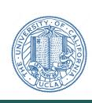

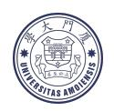

# JarvisHub: 캔버스-네이티브 다중모달 창의 에이전트를 위한 오픈 하네스 (JarvisHub: An Open Harness for Canvas-Native Multimodal Creative Agents)

#### JarvisX 팀 (JarvisX Team)

# **초록** (Abstract)

창의 AI는 단일 단계 자산 생성에서 장기적 다중모달 생산으로 전환되고 있다. 최근 생성 모델이 고품질 이미지, 비디오, 오디오 클립, UI 요소, 스토리보드, 슬라이드 및 기타 창의 자산을 합성할 수 있지만, 실제 창의 작업은 단독 프롬프트-출력 상호작용 이상의 것을 필요로 한다. 이 과정은 참조, 초안, 대안, 편집, 실패 시도, 버전 관계, 도구 동작, 평가 신호 및 인간 피드백을 포함하며, 이들이 함께 진화하는 프로젝트 상태를 형성한다. 기존의 프롬프트 기반, 채팅 기반, 노드 기반 생성 시스템은 종종 중간 컨텍스트를 버리거나 선형 대화를 의존하거나 수동으로 지정된 워크플로우를 요구하기 때문에 이 상태를 부분적으로만 지원한다. 최근 상용 시스템은 에이전트 지원 창의 생산으로의 전환을 시사하지만, 그들의 폐쇄형 아키텍처는 에이전트가 컨텍스트를 어떻게 표현하고, 도구를 선택하며, 산출물을 수정하고, 실패에서 회복하며, 시간에 따라 일관성을 유지하는지를 연구하기 어렵게 만든다. 이 격차를 해소하기 위해 우리는 장기 다중모달 창작을 위한 캔버스-네이티브 창의 에이전트 하네스인 JarvisHub를 소개한다. JarvisHub는 편집 가능한 캔버스를 사용자 작업 공간, 에이전트의 외부 메모리, 행동 공간 및 공유 프로젝트 상태로 간주하며, 다중모달 산출물, 종속성, 버전 및 피드백을 입력된 캔버스 노드와 링크로 표현한다. 캔버스 상태, 프로토콜 브리지, 에이전트 런타임의 세 계층 아키텍처를 통해 JarvisHub는 에이전트가 검사 가능하고 편집 가능한 창의 상태 내에서 행동할 수 있도록 한다. 이 설계는 창의 에이전트를 단일 도구 사용을 넘어 지속적이고 인간이 조정 가능한 창의 자동화로 이동시켜, 에이전트가 점진적으로 계획하고 생성하며 수정하고 다중모달 프로젝트를 조직할 수 있게 하면서 사용자는 과정 전반에 걸쳐 검사하고 안내하며 개입할 수 있도록 한다.

**Project Page:** <https://www.jarvishub.site/>

**GitHub Repo:** [LYL1015/JarvisHub](https://github.com/LYL1015/JarvisHub)

## **1 서론** (1 Introduction)

최근 다중모달 생성의 진전은 고품질 이미지, 비디오, 오디오 클립, UI 요소 및 기타 창의 자산을 상당히 쉽게 생산할 수 있게 만들었다 [7,] [8,] [10,] [12,] [14,] [17,] [23,] [25,] [33,] [39,] [41,] [42]. 이러한 모델은 시각적 커뮤니케이션, UI/UX 디자인, 스토리보딩, 비디오 제작, 슬라이드 덱 제작 및 마케팅 콘텐츠 생성에 점점 더 많이 사용되고 있다. 그러나 실제 창의 작업은 단일 프롬프트-출력 상호작용을 거의 따르지 않는다. 창작자는 일반적으로 참조를 수집하고, 스타일이나 캐릭터를 지정하며, 레이아웃이나 샷을 계획하고, 여러 후보를 생성하고, 지역 세부 사항을 수정하고, 대안을 비교하고, 피드백을 통합하며, 중간 결과를 최종 산출물로 조립한다. 이러한 중간 자료—프롬프트, 참조 이미지, 초안, 후보, 편집, 실패 시도, 버전 및 피드백—는 창작의 부수적 부산물이 아니다. 그들은 창의 프로젝트의 진화하는 상태를 형성하며, 이후 계획, 수정 및 평가에 필요한 컨텍스트를 제공한다.

이 프로젝트-상태 뷰는 창의적 에이전트에게 구체적인 도전을 제시한다. 에이전트는 고립된 프롬프트가 아니라 진화하는 작업 공간에서 작업해야 한다. 유용한 다음 행동을 수행하려면, 에이전트는 이미 존재하는 자료가 무엇인지, 그들이 어떻게 연결되어 있는지, 어떤 후보가 수락되었거나 거절되었는지, 그리고 프로젝트의 어느 부분을 다음에 업데이트해야 하는지를 알아야 한다. 이러한 맥락은 단순한 대화에서 저장하기 어렵다, 왜냐하면

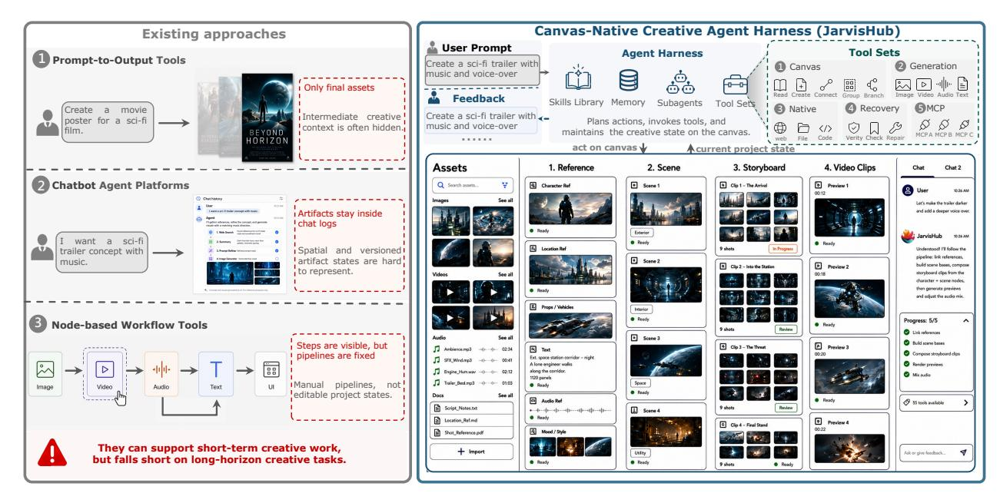

**Figure 1 기존 창의적 시스템과 JarvisHub의 비교.** Prompt-to-output 도구, 챗봇 기반 에이전트, 그리고 수동 워크플로우 시스템은 각각 창의적 생산의 일부를 지원하지만, 장기적인 작업에 대해 통합된 프로젝트 상태를 유지하지 않는다. JarvisHub는 캔버스를 공유 작업 공간으로 사용하여 에이전트가 검사하고 업데이트할 수 있도록 하므로, 멀티모달 자산, 종속성, 편집, 피드백, 그리고 수정 추적이 창의적 과정 전반에 걸쳐 접근 가능하다.

공간적 레이아웃, 버전 브랜치, 참조, 피드백, 그리고 미완성 아티팩트. 핵심 문제는 단순히 더 강력한 모델을 호출하는 방법이 아니라, 에이전트가 읽고, 업데이트하고, 장기 워크플로우 전반에 걸쳐 일관성을 유지할 수 있는 작업 공간을 제공하는 방법이다.

Figure [1]에 표시된 바와 같이 기존 시스템은 이 요구 사항을 부분적으로만 충족한다. Prompt-to-output 도구 [&#91;2,](#page-12-6) [3,](#page-12-7) [6,](#page-12-8) [9,](#page-12-9) [13,](#page-12-10) [19,](#page-13-3) [29,](#page-13-4) [34,](#page-13-5) [36](#page-13-6)[–38,](#page-14-3) [43,](#page-14-4) [45,](#page-14-5) [46,](#page-14-6) [50](#page-14-7)[–52&#93;](#page-14-8)은 개별 자산을 생성하는 데 효과적이지만, 일반적으로 중간 결정, 실패한 시도, 대안 후보, 그리고 수정 이력을 숨기거나 버린다. 챗 기반 창의적 에이전트 [&#91;4,](#page-12-11) [5,](#page-12-12) [11,](#page-12-13) [16,](#page-12-14) [27,](#page-13-7) [28,](#page-13-8) [33&#93;](#page-13-2)은 다단계 지침을 따르고 도구를 호출할 수 있지만, 그들의 주요 문맥은 선형 대화로 남아 있어 공간적 레이아웃, 자산 관계, 버전 브랜치, 그리고 지역 편집 대상 등을 표현하기 어렵다. 노드 기반 워크플로우 도구 [&#91;18,](#page-12-15) [20,](#page-13-9) [21,](#page-13-10) [31,](#page-13-11) [44,](#page-14-9) [47–](#page-14-10)[49&#93;](#page-14-11)은 실행 단계를 더 명확하게 하지만, 일반적으로 수동으로 지정된 파이프라인 주위에 조직되어 있어 에이전트가 검사하고, 수정하고, 확장하고, 검증할 수 있는 지속적으로 편집 가능한 프로젝트 상태를 제공하지 않는다. 관련 시각적 및 그래프 구조화된 창의적 시스템은 프롬프트 체인, 분기 서사 그래프, 동적 스토리보드 [&#91;20,](#page-13-9) [21,](#page-13-10) [24,](#page-13-12) [35,](#page-13-13) [44&#93;](#page-14-9)를 추가로 탐구하지만, 이들은 특정 창의적 도메인이나 수동으로 편집된 그래프 구조에 묶여 있어 캔버스-네이티브 에이전트를 위한 일반적인 런타임 하네스를 제공하지 않는다. 결과적으로 현재 시스템은 유용한 창의적 행동을 지원할 수 있지만, 장기적인 창의적 에이전트를 위한 완전한 런타임 프레임워크를 제공하지 않는다.

최근 상업용 창의적 제품들도 같은 변화를 보여준다. Claude Design [&#91;1&#93;](#page-12-16)은 대화형 디자인 생성과 반복적 정제를 지원한다. Google Stitch [&#91;22&#93;](#page-13-14)은 프롬프트 기반 UI 생성을 다중 페이지 프로토타입과 프론트엔드 코드와 연결한다. TapNow [&#91;40&#93;](#page-14-12)와 LibTV [&#91;26&#93;](#page-13-15)는 스크립트, 캐릭터, 스토리보드, 이미지, 비디오, 오디오를 조직하여 내러티브 콘텐츠 생성을 돕는다. MiniMax Hub [&#91;30&#93;](#page-13-16)은 이미지, 비디오, 오디오, 텍스트 생성 도구를 멀티모달 워크플로우에서 조정한다. 이러한 시스템은 창의적 AI가 고립된 자산 생성에서 벗어나 AI가 여러 단계에 걸쳐 프로젝트를 계획하고, 수정하며, 조직하는 워크플로우로 이동하고 있음을 시사한다.

그러나 이러한 제품들은 여전히 대부분 폐쇄적이다. 연구자들은 사용자 인터페이스 기능을 관찰할 수 있지만, 프로젝트 상태가 어떻게 표현되는지, 행동이 어떻게 검증되는지, 도구가 어떻게 스케줄링되는지, 피드백이 어떻게 활용되는지, 실패가 어떻게 수리되는지를 검사할 수 없다. 이로 인해 창의적 에이전트가 긴 워크플로우에서 어떻게 컨텍스트를 유지하는지 연구하기가 어렵다. 따라서 결핍된 부분은 또 다른 창의적 생성 제품이 아니라, 에이전트가 진화하는 멀티모달 프로젝트에서 어떻게 작동하는지를 연구할 수 있는 개방형 하네스이다.

**Table 1** JarvisHub 하네스가 지원하는 핵심 기능들.

| 능력 | 가능하게 하는 것 |  |
|---------------------------|------------------------------------------------------------------------------------------------------------------------------------|--|
| 지속적인 프로젝트 상태 | 프롬프트, 참조, 초안, 버전, 출력 및 피드백을 일시적인 채팅 기록 대신 편집 가능한  캔버스에 보관합니다. |  |
| 제어된 캔버스 동작 | 에이전트가 현재 턴에서 허용된 검증된 작업을 통해서만 캔버스를 읽고 수정할 수 있도록 합니다. |  |
| 도구 및 미디어 실행 | 캔버스를 생성, 네이티브 실행 및 검사 가능한 아티팩트를 반환하는 외부 도구와 연결합니다. |  |
| 피드백 주도 수정 | 인간 또는 모델 피드백을 사용하여 수락된 결과에서 계속 진행하고, 실패한 노드를 로컬에서 수리하며, 명확화를 요청하거나 중지합니다. |  |
| 추적성 및 복구 | 요청, 행동, 관찰, 피드백 및 체크포인트를 기록하여 창의적 프로세스를 검사하고 복원할 수 있도록 합니다. |  |

우리는 이 격차를 해소하기 위해, 장기적 멀티모달 창작을 위한 캔버스-네이티브 창작 에이전트 하네스를 제공하는 JarvisHub를 소개한다. 핵심 아이디어는 캔버스가 사용자에게 시각적 인터페이스일 뿐 아니라 에이전트가 읽고 업데이트할 수 있는 공유 프로젝트 상태라는 점이다. JarvisHub에서는 프롬프트, 참조, 이미지, 비디오, 오디오 클립, UI 컴포넌트, 스토리보드, 후보 결과, 버전 관계, 편집, 사용자 피드백이 편집 가능한 캔버스 노드와 링크로 표현된다. 에이전트는 현재 캔버스를 관찰하고, 사용 가능한 자료와 그 관계를 해석하며, 적절한 도구를 호출하고, 노드를 생성하거나 수정하고, 결과를 동일한 캔버스에 기록한다. 이렇게 하면 창작 과정이 프롬프트와 도구 호출 시퀀스 내부에 숨겨지는 대신 가시적이고 추적 가능해진다.

JarvisHub는 세 가지 핵심 장점을 가지고 있다. 첫째, 캔버스 상태 레이어는 노드, 속성, 레이아웃, 버전, 그리고 종속 링크와 같은 프로젝트 자료를 저장한다. 둘째, 프로토콜 브릿지는 에이전트가 캔버스를 읽고 쓰는 방식을 확인하며, 권한, 운영 형식, 검증, 로깅 등을 포함한다. 셋째, 에이전트 런타임은 부여된 행동을 선택하고, 도구를 호출하며, 상태를 동기화하고, 궤적을 기록한다. 이는 캔버스 편집, 미디어 생성, 네이티브 실행, 복구, 그리고 Model Context Protocol (MCP)-지원 확장에 대한 도구 패밀리를 노출한다. 기술, 메모리, 그리고 서브 에이전트는 더 긴 워크플로우를 조직하는 데 도움을 준다. 이 세 레이어는 에이전트가 공유 프로젝트에서 작업하면서 그들이 한 일, 사용한 증거, 그리고 캔버스가 변경된 이유를 보존하도록 한다.

우리의 기여는 다음과 같이 요약될 수 있다:

- 우리는 장기적 멀티모달 창작을 편집 가능한 프로젝트 그래프 위의 에이전트 프로세스로 공식화한다.  
- 우리는 프로젝트 상태, 제어된 런타임 실행, 그리고 궤적 기록을 통합하는 캔버스-네이티브 창작 에이전트 하네스를 제안하고 구현한다.  
- 우리는 스토리텔링 미디어 생성, 인터랙티브 웹 개발, 그리고 프레젠테이션 덱 생성 등 고가치 장기적 사례에서 JarvisHub를 시연한다.

## **2 방법 (Method)**

### **2.1 개요 (Overview)**

JarvisHub는 장기적 멀티모달 창작을 위한 캔버스-네이티브 에이전트 하네스이다. 캔버스를 채팅 기록이 아니라 주요 프로젝트 메모리로 간주한다. 캔버스는 아티팩트, 종속성, 개정, 피드백, 그리고 중간 결과를 저장하여 사용자와 에이전트가 나중에 다시 접근할 수 있도록 한다. 그림 [2,](#page-3-0)에서 보듯이, 각 턴은 단순한 루프를 따른다: 런타임은 캔버스를 관찰하고, 사용자 입력을 해석하며, 프로토콜 브릿지를 통해 허용된 행동을 선택하고, 필요한 기능을 호출하고, 반환된 관찰을 캔버스에 기록한다. 표 [1](#page-2-0)은 JarvisHub가 지원하는 핵심 기능을 요약한다. 이후 하위 절에서는 이러한 기능이 캔버스 상태, 프로토콜 브릿지, 에이전트 런타임, 그리고 궤적 기록에 의해 어떻게 구현되는지 상세히 설명한다.

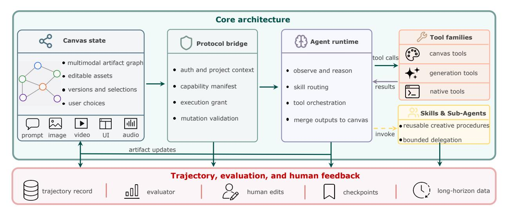

**그림 2 JarvisHub 아키텍처 개요.** JarvisHub는 장기적 창작 작업을 캔버스 중심 실행 루프로 구성하며, 세 가지 핵심 구성 요소에 기반한다: (1) 멀티모달 아티팩트, 종속성, 버전, 그리고 사용자 선택을 저장하는 캔버스 상태 레이어; (2) 부여된 행동을 검증하고 캔버스 읽기와 쓰기를 제어하는 프로토콜 브릿지; 그리고 (3) 계획을 세우고 도구와 기술을 호출하며 캔버스 아티팩트를 업데이트하는 에이전트 런타임. 하네스는 또한 궤적, 평가자 신호, 인간 편집, 그리고 체크포인트를 기록하여 피드백, 복구, 그리고 향후 분석을 위한 증거를 제공한다.

### **2.2 캔버스-네이티브 프로젝트 상태 (Canvas-Native Project State)**

우리는 먼저 캔버스 상태를 정의한다. 이는 사용자가 편집하고 에이전트가 읽거나 업데이트하는 공유 프로젝트 객체이다. 턴 t에서 우리는 창작 프로젝트를 다음과 같이 표현한다:

$$C_t = (G_t, \mathbf{X}_t, \mathbf{M}_t, \mathbf{U}_t, \mathbf{L}_t), \quad G_t = (V_t, \mathcal{E}_t).$$

(1)

Here, Gt는 타입이 지정된 아티팩트 그래프입니다. Vt는 캔버스 노드 집합을 나타내고, Et ⊆ Vt × R × Vt는 방향이 있는 타입이 지정된 관계를 나타냅니다. 각 엣지는 (vi , r, vj ) 형태로 쓸 수 있으며, r ∈ R는 참조 사용, 버전 계보, 생성 의존성, 그룹화, 또는 워크플로우 연속과 같은 관계를 나타냅니다. 나머지 용어들은 노드 내용과 상호작용 기록을 저장합니다: Xt는 편집 가능한 내용과 아티팩트 페이로드를 저장하고, Mt는 출처, 실행 메타데이터, 런타임 상태를 저장하며, Ut는 사용자 선택, 편집, 피드백을 기록하고, Lt는 공간 위치와 그룹 레이아웃을 저장합니다. 이 분리는 에이전트가 아티팩트가 무엇을 포함하고 있는지, 어떻게 생성되었는지, 사용자가 어떻게 상호작용했는지, 그리고 캔버스에서 어디에 나타나는지를 볼 수 있게 합니다.

우리는 타입이 지정되고 주소가 가능한 노드를 통해 그래프를 인스턴스화합니다. Vt = {vi} (i = 1 … Nt) 는 Nt개의 캔버스 노드를 포함합니다. 각 노드는 다음과 같이 표현됩니다:

$$v_i = (\mathrm{id}_i, k_i, \mathbf{p}_i, \mathbf{x}_i, \mathbf{y}_i, \mathbf{m}_i, s_i), \quad k_i \in \mathcal{K}_{\mathrm{node}},$$

(2)

여기서 idi는 안정적인 식별자이며, ki는 노드 종류, pi는 위치와 로컬 레이아웃을 저장하고, xi는 프롬프트나 구성 필드와 같은 편집 가능한 입력을 저장하며, yi는 생성된 출력 또는 아티팩트 핸들을 저장하고, mi는 출처와 실행 진단 정보를 저장하며, si는 런타임 상태를 나타냅니다. Ut의 사용자 상호작용 기록은 영향을 주는 노드, 엣지, 또는 캔버스 영역을 가리킵니다. JarvisHub에서 노드 종류 공간 Knode는 캔버스 스키마와 기능 매니페스트에 의해 지정된 텍스트, 시각, 시청각, 그리고 워크플로우 경계 아티팩트를 포함합니다.

이 표현은 장기 생성에 대한 세 가지 핵심 속성을 제공합니다. 첫째, 아티팩트는 주소가 지정됩니다: 에이전트는 모호한 대화 문구 대신 특정 후보 이미지, 비디오 클립, 웹페이지 렌더링, 또는 슬라이드를 참조할 수 있습니다. 둘째, 아티팩트는 재사용 가능합니다: 참조, 초안, 거부된 후보, 또는 중간 결과는 나중에 다른 생성 또는 편집 단계의 입력으로 사용될 수 있습니다. 셋째, 의존성은 검사 가능합니다: 사용자와 에이전트는 어떤 자료가 결과에 영향을 미쳤는지, 어떤 버전이 선택되었는지, 그리고 어떤 하위 아티팩트가 그것에 의존하는지를 추적할 수 있습니다. 또한 런타임 상태가 캔버스 상태의 일부이므로, 이후 단계는 완료되었거나 선택된 아티팩트를 계획 중이거나 실행 중이거나 실패했거나 기타 검증되지 않은 결과와 구분할 수 있습니다.

**Table 2** 에이전트 런타임에서 사용되는 핵심 도구 패밀리.

| 툴 패밀리 | 런타임 역할 | 대표적인 연산 |
|------------------|---------------------------|---------------------------------------------------------------------------------------------------------------------|
| 캔버스 도구 | 프로젝트 상태를 업데이트합니다. | 읽기, 생성, 업데이트, 연결, 그룹화, 선택, 그리고 분기 노드; 아티팩트 핸들 및 런타임 상태를 유지합니다. |
| 생성 도구 | 캔버스 아티팩트를 생성합니다. | 이미지, 비디오, 오디오, 그리고 복합 미디어 생성. |
| 네이티브 도구 | 외부 실행을 사용합니다. | 브라우저, 파일, 코드, 검색, 문서, 그리고 프레젠테이션 작업이 검사 가능한 아티팩트를 반환합니다. |
| 복구 도구 | 검사하고 수리합니다. | 구조화된 피드백, 검증, 체크포인팅, 그리고 로컬 수리. |
| MCP 도구 | 외부 서비스를 확장합니다. | 같은 매니페스트 및 부여 계약 하에 MCP가 제공하는 기능. |

### **2.3 프로토콜 제약 캔버스 상호작용**

장기 생성은 캔버스 업데이트가 명시적이고, 유효하며, 복구 가능할 때만 작동합니다. JarvisHub는 에이전트와 캔버스 사이에 프로토콜 브리지를 통해 이를 시행합니다. t번째 턴에서 에이전트는 사용자 쿼리 qt를 받고 현재 캔버스 상태 Ct를 관찰합니다. 브리지는 현재 프로젝트에서 사용 가능한 노드 타입, 변이 연산, 도구, 아티팩트 핸들을 나열한 기능 매니페스트 Γt를 제공합니다. 그 다음, 현재 요청에 대해 에이전트가 수행할 수 있는 범위를 제한하는 실행 허가 Ωt를 도출합니다. (qt, Ct, Γt, Ωt)에 따라 에이전트는 행동 at를 제안합니다. 하네스는 이 행동을 검증된 도구 호출, 캔버스 변이, 평가 요청, 명확화 요청, 또는 사용자 응답으로 인코딩될 수 있을 때만 실행합니다.

유효한 행동을 실행하면 도구 또는 환경 관찰 ot가 생성됩니다. 턴은 인간 사용자, 모델 기반 비평가, 보조 에이전트, 또는 구조화된 평가자로부터 피드백 신호 ft를 받을 수도 있습니다. 이 피드백은 수리 또는 후속 결정 rt를 유발할 수 있습니다. 그 다음 캔버스는 다음과 같이 진화합니다:

$$C_{t+1} = \mathcal{F}(C_t, a_t, o_t, f_t, r_t), \tag{3}$$

여기서 F는 브리지가 구현한 상태 전이 연산자를 나타냅니다. 브리지는 수락된 행동과 반환된 증거를 현재 캔버스에 기록합니다. 예를 들어 노드를 생성하거나, 필드를 업데이트하거나, 종속성을 연결하거나, 아티팩트를 첨부하거나, 실패를 기록하거나, 체크포인트를 생성하거나, 인간 수정을 요청합니다. 따라서 캔버스 상호작용은 언어 생성 내부에 숨겨지는 대신 감시 가능해집니다: 에이전트가 캔버스를 수정하면, 트레젝터리는 변이를 기록합니다; 생성된 아티팩트를 사용하면, 트레젝터리는 아티팩트 핸들과 그것을 생성한 관찰을 모두 기록합니다.

### **2.4 창의적 오케스트레이션을 위한 에이전트 런타임**

Figure [3,](#page-5-0)에 나타난 것처럼, 에이전트 런타임은 현재 턴에서 에이전트가 할 수 있는 일을 결정하고 그 결정을 유효한 캔버스 업데이트로 전환합니다. (qt, Ct, Γt, Ωt)를 고려하여, 먼저 사용자 요청을 현재 캔버스와 대조해 해석합니다. 그 다음, 실행 허가에 따라 사용 가능한 연산을 필터링하고, 필요한 기능을 호출하며, 프로토콜 브리지를 통해 결과 증거를 반환합니다. 이렇게 하면 각 턴에 허가된 행동 공간이 제공됩니다:

$$\mathcal{A}_t = \mathcal{A}(\Omega_t, \Gamma_t, \mathcal{C}_t, q_t), \quad a_t \in \mathcal{A}_t. \tag{4}$$

여기서 At는 요청과 관련이 있고 현재 턴에서 허용되는 행동을 나타냅니다. 이 공식은 구현 도구의 목록이 아닙니다. 대신, 이는 런타임 계약을 명시합니다: 수락된 행동은 관찰된 캔버스에 기반해야 하고, 기능 매니페스트에 의해 노출되어야 하며, Ωt에 의해 허용되고, 동일한 브리지를 통해 커밋되어야 합니다. 이렇게 하면 공유 캔버스가 프로젝트 상태로 유지되고, 런타임이 별도의 숨겨진 상태를 유지하도록 하지 않습니다.

이 계약을 구현하기 위해, 런타임은 사용 가능한 기능을 소수의 도구 패밀리로 그룹화합니다. 각 패밀리는 턴마다 허가될 수 있고, 에이전트에 의해 호출되며, 동일한 브리지를 통해 캔버스로 다시 커밋됩니다. Table [2](#page-4-0)는 이러한 패밀리를 요약합니다.

도구 패밀리는 호출 가능한 항목을 정의합니다. 런타임은 또한 세 가지 상위 수준 지원을 사용하여 이러한 기능이 장기 창의적 작업에서 어떻게 순차화되어야 할지 결정합니다:

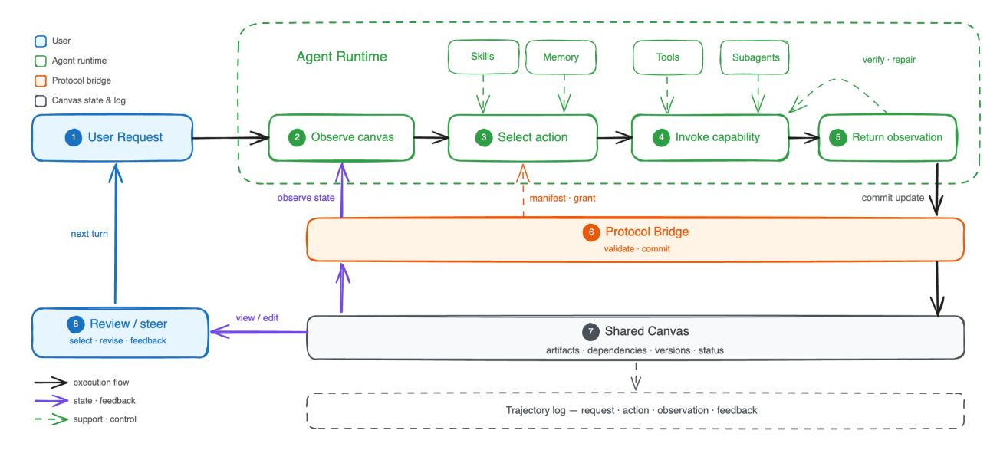

**Figure 3 에이전트 런타임 루프.** 이 루프는 사용자 요청을 프로토콜 검증된 캔버스 업데이트로 변환합니다. 런타임은 공유 캔버스를 관찰하고, 현재 매니페스트와 실행 허가에 따라 행동을 선택하며, 기술, 메모리, 도구, 서브에이전트의 지원을 받아 해당 기능을 호출하고, 결과 관찰을 프로토콜 브리지를 통해 반환합니다. 브리지는 업데이트를 검증하고 공유 캔버스에 커밋하며, 사용자는 결과를 검토하고 피드백을 제공하며 다음 턴을 조정할 수 있습니다.

- **Skills.** Skills는 스토리보딩, 참조 기반 생성, 디자인-투-웹 재구성, 비디오 프롬프팅, 또는 덱 구성과 같은 재사용 가능한 창의적 절차를 인코딩합니다. 이들은 런타임에 각 단계를 브릿지에 하드코딩하지 않고 작업 구조를 제공합니다.  
- **Memory.** Memory는 사용자 선호도, 이전 결정, 그리고 턴 간에 걸친 절차적 지식을 보존합니다. 이는 런타임이 이전 프로젝트 컨텍스트와 일관된 행동을 선택하도록 돕습니다.  
- **Subagents.** Subagents는 워크플로우가 분기될 수 있을 때 독립적인 하위 작업을 처리합니다. 예를 들어, 별도의 비디오 샷을 병렬로 탐색하면서 부모 에이전트는 여전히 유용한 결과를 선택하고 이를 공유 캔버스 그래프에 다시 통합합니다.

함께, 도구 패밀리들은 실행 가능한 기능을 제공하며, Skills, Memory, Subagents는 이를 선택하고 순서화하는 데 도움을 줍니다. 결과 워크플로우는 대안을 탐색할 수 있지만, 그 상태는 캔버스, 실행 부여, 그리고 프로토콜 검증 업데이트에 고정됩니다.

### **2.5 피드백 및 추적성 (Feedback and Traceability)**

장기적인 창의 작업은 최종 산출물이 완성되기 전에 피드백이 필요합니다. 피드백 신호 ft는 사용자, 평가자, 또는 서브에이전트 비평가로부터 올 수 있습니다. 사용자는 후보를 선택하고, 버전을 거부하고, 프롬프트를 수정하고, 스타일을 조정하거나, 지역적 결함을 식별할 수 있으며, JarvisHub는 일관성, 누락된 증거, 시각적 품질, 그리고 작업‑특정 제약 조건을 위해 노드 출력을 자동으로 검사할 수 있습니다. 피드백의 목적은 단순히 중간 결과를 판단하는 것이 아니라 다음 상태 전이를 결정하는 것입니다: 에이전트가 수락된 노드에서 계속 진행할지, 실패한 노드를 로컬에서 수리할지, 사용자에게 명확성을 요청할지, 또는 사용 가능한 증거가 부족할 때 중단할지.

피드백을 실행 가능하고 추적 가능하게 만들기 위해, 하네스는 발생하는 상태와 실행 컨텍스트와 함께 각 피드백 신호를 기록합니다. 우리는 궤적을 공식적으로 정의합니다:

$$\tau = \{(q_t, C_t, \Gamma_t, \Omega_t, a_t, o_t, f_t, r_t, C_{t+1})\}_{t=1}^T,$$

(5)

여기서, qt는 사용자 요청이며, Ct는 실행 전 캔버스 상태, Γt는 사용 가능한 기능을 지정하고, Ωt는 현재 턴에서 허용되는 행동을 제한하며, at는 선택된 에이전트 행동, ot는 도구 관찰이다.

**표 3** 실험에서 사용한 고가치 장기 창의적 과제.

| Task | 정의 및 과제 | 대표 출력 |
|------------------------------|-----------------------------------------------------------------------------------------------------------------------------------------------------------------------------------------------------------------------------------------------|------------------------------------------------------------------------------------------------------------------------------------------------------|
| 내러티브 미디어 생성 | 이야기, 스크립트, 또는 장면 요약을 시각적 또는 시청각적 시퀀스로 변환하여 시간적으로 일관된 시각적 또는 시청각적 시퀀스, 내러티브 계획, 정체성 보존을 테스트하여 스타일 일관성, 그리고 샷 간 연속성을 테스트한다. | 캐릭터 참조, 장면 디자인, 스토리보드 패널, 샷 플랜, 생성된 이미지 시퀀스, 비디오 클립, 그리고 애니매틱스. |
| 인터랙티브 웹 개발 | 디자인 목표, 정보 구조를 변환하여 또는 상호작용 요구사항을 렌더링된 웹 아티팩트, 레이아웃 디자인, 상호작용 로직, 프론트엔드 코드 간 조정을 테스트하여 레이아웃 디자인, 상호작용 로직, 프론트엔드 코드, 미리보기 검사, 그리고 반복 수정. | 정적 페이지, 동적 웹사이트, 랜딩 페이지, 웹 인터페이스, 인터랙티브 프로토타입, 렌더링된 미리보기, 그리고 프론트엔드 구현. |
| 프레젠테이션 덱 생성 | 주제, 소스 문서, 보고서, 또는 커뮤니케이션 목표를 일관된 다중 슬라이드 프레젠테이션으로 변환하여 콘텐츠 선택, 내러티브 조직, 슬라이드 레이아웃을 테스트하여 시각 합성, 그리고 슬라이드 간 일관성을 테스트한다. | 프레젠테이션 덱, 학술 토크, 프로젝트 보고서, 피치 덱, 인터뷰 프레젠테이션, 시각적 요약, 그리고 설명 다이어그램. |

또는 생성된 증거, ft는 피드백 신호이며, rt는 피드백에 의해 유도된 수리 또는 후속 결정이고, Ct+1은 업데이트된 캔버스 상태이다.

## 3 실험 (Experiments)

우리는 JarvisHub를 대표적인 장기 창작 과제에 적용하여 현실적인 창작 워크플로우에서의 성능을 입증한다. 구체적으로, 실험은 캔버스-네이티브 하네스가 지속적인 프로젝트 컨텍스트, 반복적인 아티팩트 생성, 피드백 기반 정제를 필요로 하는 고가치 과제를 지원할 수 있는지를 검증한다.

### 3.1 실험 설정 (Experimental Setup)

모든 작업은 동일한 JarvisHub 환경에서 실행된다. 우리는 GPT-5.5 [&#91;32&#93;](#page-13-17)를 주요 에이전트 백엔드로, GPT Image 2 [&#91;33&#93;](#page-13-2)를 이미지 생성 백엔드로, Seedance 2.0 [&#91;41&#93;](#page-14-1)를 비디오 생성 백엔드로, Gemini 3.1 Pro [&#91;15&#93;](#page-12-17)를 멀티모달 평가 백엔드로 사용한다. 모델-백엔드 구성에 대한 자세한 내용은 오픈소스 GitHub 저장소에서 확인할 수 있다: <https://github.com/LYL1015/JarvisHub>.

### 3.2 장기 창작 과제 (Long-Horizon Creative Tasks)

표 [3,](#page-6-0)에 표시된 바와 같이, 우리는 JarvisHub를 세 가지 대표적인 장기 창작 과제에 적용한다: 내러티브 미디어 생성, 인터랙티브 웹 개발, 프레젠테이션 데크 생성. 이 과제들은 개방형 목표를 일관된 산출물로 발전시켜야 하는 일반적인 창작 워크플로우를 포괄한다. 이들은 계획, 참조 조직화, 중간 아티팩트 생성, 피드백, 그리고 현지 수정을 필요로 한다.

### 3.3 정성적 결과 (Qualitative Results)

각 과제마다 우리는 두 가지 보완적 관점을 보고한다: 캔버스 중심 생산 프로세스의 작업 공간 추적과 최종 산출물의 생성된 아티팩트. 이 쌍의 관점은 계획, 참조, 자산, 종속성, 에이전트 진행 상황이 장기 작업 전반에 걸쳐 검토 가능함을 보여주며, 축적된 캔버스 상태가 일관된 출력을 지원함을 시사한다.

내러티브 미디어 생성. 그림 [4](#page-7-0)와 [5,](#page-7-1)에 표시된 바와 같이, 내러티브 미디어 사례는 단편 드라마 프롬프트를 일관된 시각적 시퀀스로 변환한다. 작업 공간 추적은 스토리 계획, 시각적 참조, 종속성, 생성 진행 상황을 검토 가능하게 한다. 출력은 캔버스가 샷 전반에 걸쳐 내러티브와 시각적 연속성을 보존함을 보여준다.

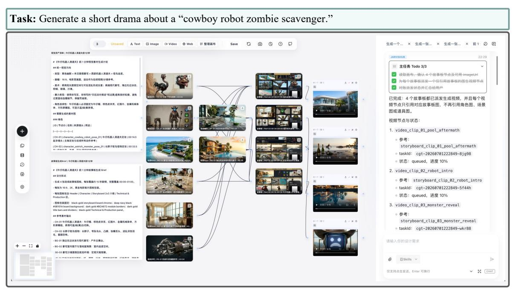

**그림 4 내러티브 미디어 생성 작업 공간 추적.** JarvisHub 캔버스는 단편 드라마 사례에 대한 작업 개요, 계획 메모, 시각적 참조, 샷 후보, 종속성 링크, 에이전트 진행 상황을 외부화한다.

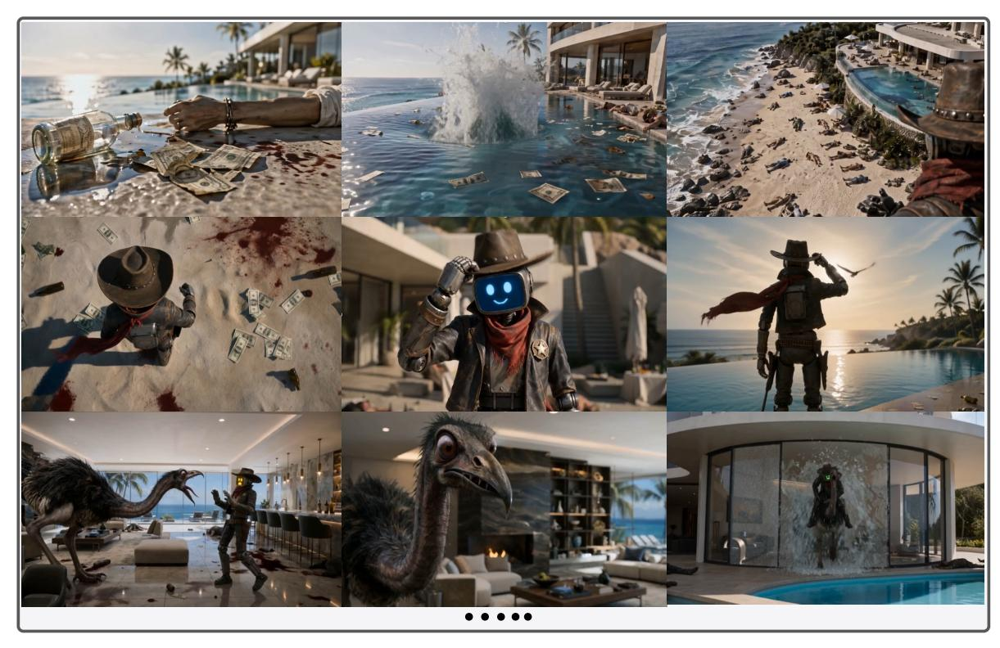

**그림 5 내러티브 미디어 생성 결과물.** 최종 출력은 캔버스 관리 워크플로우를 통해 생성된 핵심 프레임을 제시하며, 반복되는 캐릭터, 설정 단서, 그리고 샷 간 행동 연속성을 포함한다. 이 사례는 **Mx-Shell**의 원작 Zombie Sweeper에서 영감을 받았다.

인터랙티브 웹 개발. 그림 [6](#page-8-0)와 [7,](#page-8-1)에 표시된 바와 같이, 웹 개발 사례는 미학 및 상호작용 개요를 렌더링된 사진 웹사이트로 변환한다. 작업 공간 추적은 디자인 참조, 구현 진행, 미리보기, 수정 상태를 검토 가능하게 한다. 출력은 캔버스가 반복적인 웹 구축 과정에서 시각적 방향성과 인터페이스 일관성을 보존함을 보여준다.

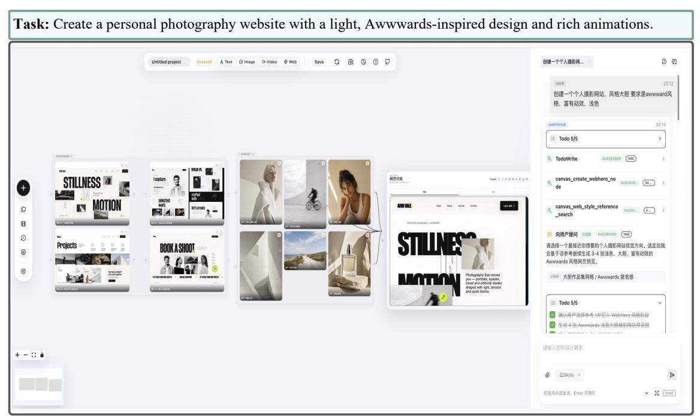

**그림 6 인터랙티브 웹 개발 작업 공간 추적.** JarvisHub 캔버스는 웹 브리프, 시각적 참조, 레이아웃 초안, 구현 아티팩트, 미리보기, 수정 상태를 추적한다.

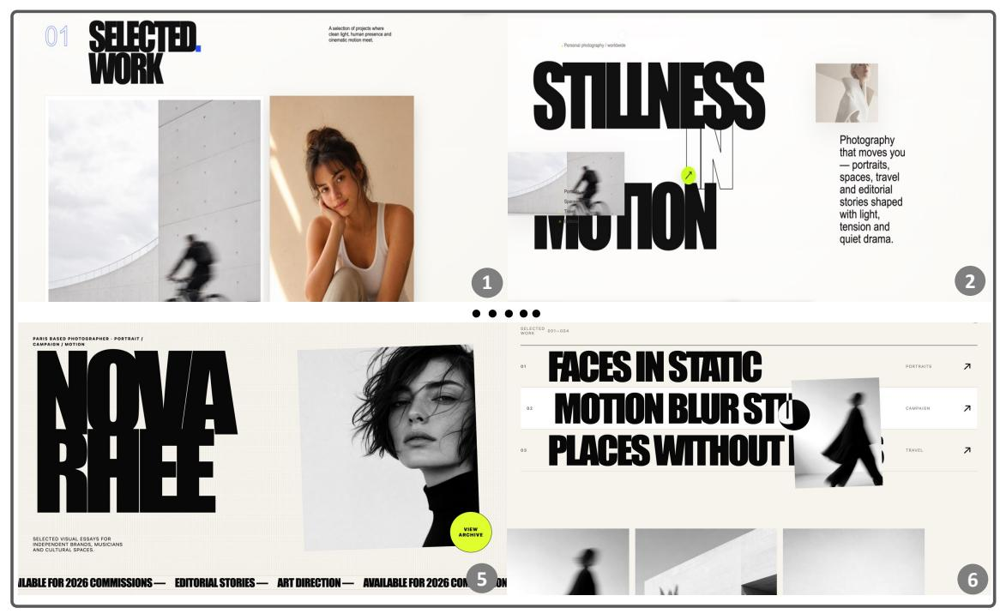

**그림 7 인터랙티브 웹 개발 결과물.** 최종 출력은 일관된 타이포그래피, 이미지 배치, 페이지 구조, 시각적 방향성을 갖춘 웹사이트 화면을 보여준다.

프레젠테이션 데크 생성. 그림 [8](#page-9-0)과 [9,](#page-9-1)에 표시된 바와 같이, 프레젠테이션 사례는 머신러닝 강의 주제를 구조화된 슬라이드 데크로 변환한다. 작업 공간 추적은 내용 기획, 시각적 조립, 미리보기 및 작업 진행 상황을 검토 가능하게 한다. 출력은 캔버스가 다중 슬라이드 산출물 전반에 걸쳐 주제 구조와 시각적 스타일을 보존하는 방식을 보여준다.

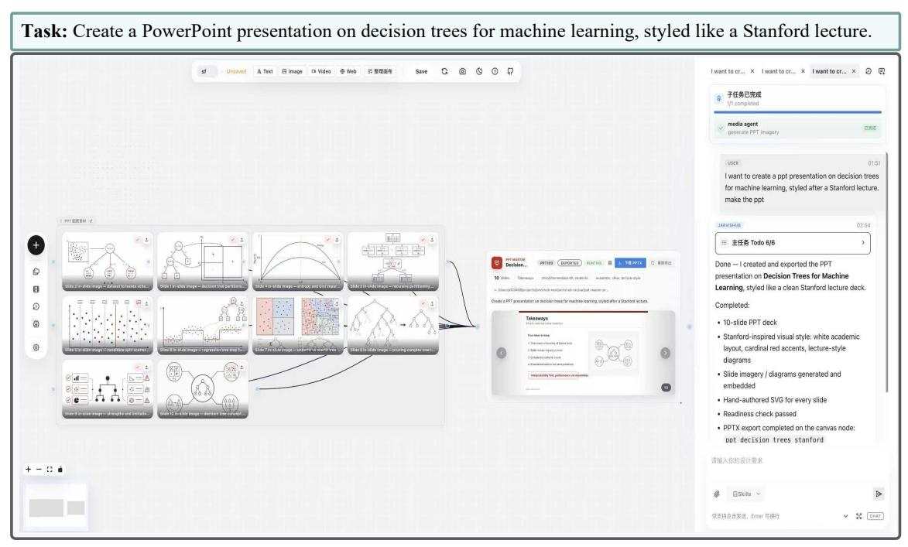

**Figure 8 프레젠테이션 데크 생성을 위한 작업 공간 추적.** JarvisHub 캔버스는 강의 내용, 생성된 다이어그램, 슬라이드 초안, 종속성 링크, PowerPoint 미리보기 및 개정 상태를 기록한다.

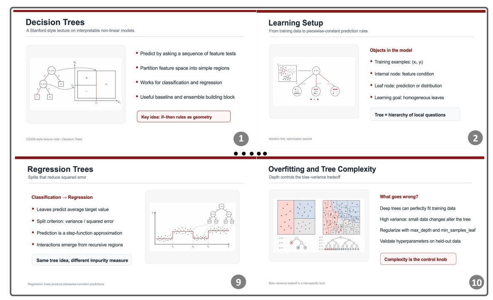

**Figure 9 프레젠테이션 데크 생성을 위한 생성된 산출물.** 최종 출력은 일관된 레이아웃, 다이어그램 스타일, 강조 색상 및 슬라이드 수준 조직을 갖춘 강의 슬라이드를 보여준다.

## **4 Discussion**

캔버스를 에이전트 작업 공간으로 취급해야 하는 이유는 무엇인가? 캔버스는 사용자에게 시각적 인터페이스를 제공할 뿐만 아니라 인간과 에이전트 모두에게 공유 작업 공간으로 활용될 수 있기 때문이다. JarvisHub에서는 프롬프트, 참조, 후보, 편집, 버전, 종속성, 피드백이 입력 가능하고 주소 지정 가능한 캔버스 노드와 링크로 표현된다. 이는 캔버스를 외부 메모리와 에이전트의 행동 공간으로 변환한다. 사용자는 에이전트가 읽고 수정하는 동일한 상태를 검사하고 안내할 수 있다. 결과적으로 에이전트는 이전 산출물을 재사용하고, 로컬 업데이트를 수행하며, 종속성을 유지하고, 비공개 도구 호출이나 일시적인 채팅 기록에 과정을 숨기지 않고 미완성 작업을 계속할 수 있다.

오픈 하네스가 미래의 창의적 에이전트 연구에 어떤 가능성을 열어줄까? 오픈 창의적 에이전트 하네스는 단일 시스템 시연을 넘어선 연구 산출물을 지원할 수 있다. 첫째, 각 과제가 초기 캔버스, 참조 자료, 사용 가능한 도구, 제약 조건, 피드백 이벤트 및 예상 체크포인트를 명시하고, 단순히 프롬프트와 목표 답변만을 요구하는 것이 아니라 프로젝트 상태 벤치마크를 가능하게 한다. 둘째, 최종 산출물 품질과 컨텍스트 보존, 도구 사용 적합성, 종속성 정확성, 피드백 준수, 수리 성공 등 프로세스 수준 측정치를 결합한 평가 프로토콜을 지원한다. 셋째, 각 실행이 캔버스 상태, 에이전트 행동, 도구 관찰, 피드백 신호, 수리 결정 및 최종 결과의 구조화된 예시를 생성함으로써 향후 모델 개선을 위한 데이터 플라이휠을 만든다. 적절한 동의, 익명화, 저작권 필터링 및 품질 관리를 통해 이러한 트레젝터리를 계획, 도구 선택, 멀티모달 상태 추적, 로컬 수리 및 피드백 지향 수정을 위한 미래 창의적 에이전트 교육에 활용할 수 있다.

트레젝터리를 분석 대상으로 삼아야 하는 이유는 무엇인가? 창의적 과제에서는 최종 산출물만으로 에이전트의 행동을 완전히 설명할 수 없다. 여러 출력이 허용될 수 있고, 시각적으로 강력한 결과가 여전히 취약하거나 부정확한 프로세스에 의해 만들어질 수 있다. 반대로, 완벽하지 않은 최종 결과라도 유용한 중간 산출물과 회복 가능한 결정을 포함할 수 있다. 트레젝터리는 에이전트가 한 캔버스 상태에서 다음 상태로 이동하는 방식을 기록한다: 사용되는 컨텍스트, 선택된 행동, 반환된 도구 증거, 수신된 피드백, 캔버스가 수리되거나 업데이트되는 방식. 이는 참조 무시, 수락된 선택 상실, 유용한 변형 덮어쓰기, 로컬 수리가 필요할 때 전역 재생성 등 프로세스 수준 실패를 가시화한다.

## **5 Conclusion and Limitations**

우리는 장기 시야 멀티모달 창작을 위한 캔버스 네이티브 에이전트 하네스를 JarvisHub로 제시하였다. JarvisHub는 창작 프로젝트를 편집 가능한 캔버스 그래프로 표현한다. 프로토콜 브릿지를 통해 에이전트는 프로젝트 컨텍스트를 검사하고, 도구를 호출하며, 캔버스 아티팩트를 업데이트하고, 피드백을 통합하고, 상태 변화를 기록할 수 있다. 런타임은 캔버스 연산, 미디어 생성, 네이티브 도구, 수리, 체크포인팅, 궤적 캡처를 하나의 공유 작업 공간에 통합한다. 대표적인 창작 과제에 대한 실험은 JarvisHub가 보다 검사 가능하고 재사용 가능한 에이전트 기반 창작 워크플로우를 지원할 수 있음을 보여준다. 기록된 궤적은 벤치마크 구축, 장기 시야 행동 평가, 그리고 미래 창작 에이전트 훈련을 위한 유용한 데이터를 제공한다.

여러 가지 한계가 남아 있다. 첫째, 우리의 실험은 완성된 벤치마크나 리더보드가 아니라 정성적 시연이다. 둘째, JarvisHub는 오케스트레이션과 프로젝트 상태 관리를 중점으로 하므로 최종 아티팩트 품질은 런타임에서 사용되는 외부 모델과 도구에 달려 있다. 셋째, 프로토콜 브릿지는 캔버스 동작을 명시적이고 복구 가능하게 하지만 에이전트의 창작 결정이 의미적으로 올바른지 보장하지 않는다. 마지막으로, 궤적 기록은 분석과 훈련에 유용하지만 원시 궤적은 연구 데이터로 사용되기 전에 품질 필터링, 동의, 익명화, 저작권 검토가 필요하다.

## **6 기여 (6 Contributions)**

기여자 이름은 이름 앞글자(A~Z) 순으로 알파벳 순서대로 나열되어 있다.

## **핵심 기여자 (Core Contributors)**

Yunlong Lin, Zixu Lin, Zhaohu Xing

## **기여자 (Contributors)**

Biqiang Li, Chenxin Li, Haonan Wang, Haitao Wu, Hengyu Liu, Jianghai Chen, Kaituo Feng, Kaixin Li, Shawn Chen, Shijue Huang, Sixiang Chen, Tsung-Yi Ho, Wenxuan Huang, Xiangyan Liu, Xiaomeng Hu, Xuanhua He, Yan Sun, Yunqing Zhao, Zhiqin Yang, Zehan Wang, Zhengyang Tang

## **학술 지도자 (Academic Advisors)**

Tianyu Pang, Xiangyu Yue

## **참고문헌 (References)**

- [1] Anthropic. Claude 디자인. <https://www.anthropic.com/news/claude-design-anthropic-labs>, 2025. 접속일: 2026-05-10.
- [2] Stephen Batifol, Andreas Blattmann, Frederic Boesel, Saksham Consul, Cyril Diagne, Tim Dockhorn, Jack English, Zion English, Patrick Esser, Sumith Kulal, et al. FLUX.1 Kontext: 잠재 공간에서의 컨텍스트 이미지 생성 및 편집을 위한 흐름 매칭. arXiv preprint arXiv:2506.15742, 2025.
- [3] Tim Brooks, Aleksander Holynski, and Alexei A Efros. Instructpix2pix: 이미지 편집 지침을 따르는 학습. In Proceedings of the IEEE/CVF conference on computer vision and pattern recognition, pages 18392–18402, 2023.
- [4] ByteDance Seed Team. Seedream 5.0 Lite. 모델 문서, <https://seed.bytedance.com/seedream>, 2026. 접속일: 2026-06-07.
- [5] Haoyu Chen, Keda Tao, Yizao Wang, Xinlei Wang, Lei Zhu, and Jinjin Gu. Photoartagent: 언어 모델 기반 아티스트 에이전트를 활용한 지능형 사진 리터칭. arXiv preprint arXiv:2505.23130, 2025.
- [6] Shuang Chen, Quanxin Shou, Hangting Chen, Yucheng Zhou, Kaituo Feng, Wenbo Hu, Yi-Fan Zhang, Yunlong Lin, Wenxuan Huang, Mingyang Song, et al. Unify-agent: 세계 기반 이미지 합성을 위한 통합 멀티모달 에이전트. arXiv preprint arXiv:2603.29620, 2026.
- [7] SiXiang Chen, Jianyu Lai, Jialin Gao, Tian Ye, Haoyu Chen, Hengyu Shi, Shitong Shao, Yunlong Lin, Song Fei, Zhaohu Xing, et al. Postercraft: 통합 프레임워크에서 고품질 미학적 포스터 생성을 재고. arXiv preprint arXiv:2506.10741, 2025.
- [8] Sixiang Chen, Zhaohu Xing, Tian Ye, Xinyu Geng, Yunlong Lin, Jianyu Lai, Xuanhua He, Fuxiang Zhai, Jialin Gao, and Lei Zhu. Genevolve: 도구 조정 시각 경험 증류를 통한 자가 진화 이미지 생성 에이전트. arXiv preprint arXiv:2605.21605, 2026.
- [9] Chaorui Deng, Deyao Zhu, Kunchang Li, Chenhui Gou, Feng Li, Zeyu Wang, Shu Zhong, Weihao Yu, Xiaonan Nie, Ziang Song, et al. 통합 멀티모달 사전 학습에서 나타나는 부상 특성. arXiv preprint arXiv:2505.14683, 2025.
- [10] Ding Ding, Zeqian Ju, Yichong Leng, Songxiang Liu, Tong Liu, Zeyu Shang, Kai Shen, Wei Song, Xu Tan, Heyi Tang, et al. Kimi-audio 기술 보고서. arXiv preprint arXiv:2504.18425, 2025.
- [11] Niladri Shekhar Dutt, Duygu Ceylan, and Niloy J Mitra. MonetGPT: 퍼즐 해결이 MLLM의 이미지 리터칭 기술을 향상시킴. ACM Transactions on Graphics, 44(4):1–12, 2025.
- [12] Kaituo Feng, Manyuan Zhang, Shuang Chen, Yunlong Lin, Kaixuan Fan, Yilei Jiang, Hongyu Li, Dian Zheng, Chenyang Wang, and Xiangyu Yue. Gen-searcher: 이미지 생성을 위한 에이전트 검색 강화. arXiv preprint arXiv:2603.28767, 2026.
- [13] Tsu-Jui Fu, Wenze Hu, Xianzhi Du, William Yang Wang, Yinfei Yang, and Zhe Gan. 다중모달 대형 언어 모델을 통한 지침 기반 이미지 편집 안내. In International Conference on Learning Representations (ICLR), 2024.
- [14] Tong Ge, Yashu Liu, Jieping Ye, Tianyi Li, and Chao Wang. 데이터 합성을 통한 프론트엔드 개발에서 비전-언어 모델 발전. arXiv preprint arXiv:2503.01619, 2025.
- [15] Google DeepMind. Gemini 3.1 Pro 모델 카드. 모델 카드, <https://deepmind.google/models/model-cards/>, <https://deepmind.google/models/model-cards/gemini-3-1-pro/>, 2026. 접속일: 2026-05-31.
- [16] Google DeepMind. Gemini 3.1 Flash 이미지 미리보기. 모델 카드, <https://deepmind.google/models/>, <https://deepmind.google/models/gemini-image/flash/>, 2026. 또한 Nano Banana 2로 알려짐. 접속일: 2026-06-07.
- [17] Zehai He, Wenyi Hong, Zhen Yang, Ziyang Pan, Mingdao Liu, Xiaotao Gu, and Jie Tang. Vision2web: 에이전트 검증을 통한 시각적 웹사이트 개발을 위한 계층적 벤치마크. arXiv preprint arXiv:2603.26648, 2026.
- [18] Oucheng Huang, Yuhang Ma, Zeng Zhao, Mingrui Wu, Jiayi Ji, Rongsheng Zhang, Zhipeng Hu, Xiaoshuai Sun, and Rongrong Ji. ComfyGPT: ComfyUI 워크플로우 생성을 위한 자가 최적화 다중 에이전트 시스템. arXiv preprint arXiv:2503.17671, 2025.

- [19] Mude Hui, Siwei Yang, Bingchen Zhao, Yichun Shi, Heng Wang, Peng Wang, Yuyin Zhou, and Cihang Xie. Hq-edit: 지시 기반 이미지 편집을 위한 고품질 데이터셋. arXiv preprint arXiv:2404.09990, 2024.
- [20] Alexander Htet Kyaw and Lenin Ravindranath Sivalingam. Node-based editing for multimodal generation of text, audio, image, and video. arXiv preprint arXiv:2511.03227, 2025. Accepted to the NeurIPS 2025 Workshop on Generative and Protective AI for Content Creation.
- [21] Alexander Htet Kyaw and Lenin Ravindranath Sivalingam. StoryNodes: Human-AI co-creation for multimodal media generation using an agentic node-based interface. In Proceedings of the IEEE/CVF Conference on Computer Vision and Pattern Recognition Workshops, pages 4540–4548, 2026.
- [22] Google Labs. Stitch: A new way to design user interfaces using ai. [https://blog.google/innovation-and-ai/](https://blog.google/innovation-and-ai/models-and-research/google-labs/stitch-ai-ui-design/) [models-and-research/google-labs/stitch-ai-ui-design/](https://blog.google/innovation-and-ai/models-and-research/google-labs/stitch-ai-ui-design/), 2025. Accessed 2026-05-10.
- [23] Hugo Laurençon, Léo Tronchon, and Victor Sanh. Unlocking the conversion of web screenshots into html code with the websight dataset. arXiv preprint arXiv:2403.09029, 2024.
- [24] Jorge Leandro, Sudha Rao, Michael Xu, Weijia Xu, Nebosja Jojic, Chris Brockett, and Bill Dolan. GENEVA: GENErating and visualizing branching narratives using LLMs. arXiv preprint arXiv:2311.09213, 2024. Accepted at IEEE Conference on Games 2024.
- [25] Chenxin Li, Zhengyang Tang, Mingxin Huang, Yunlong Lin, Shijue Huang, Shengyuan Liu, Bowen Ye, Rang Li, Lei Li, Benyou Wang, et al. Claw-eval-live: A live agent benchmark for evolving real-world workflows. arXiv preprint arXiv:2604.28139, 2026.
- [26] LibTV Labs. Libtv skills. <https://github.com/libtv-labs/libtv-skills>, 2025. Accessed 2026-05-10.
- [27] Yunlong Lin, Zixu Lin, Kunjie Lin, Jinbin Bai, Panwang Pan, Chenxin Li, Haoyu Chen, Zhongdao Wang, Xinghao Ding, Wenbo Li, et al. Jarvisart: Liberating human artistic creativity via an intelligent photo retouching agent. arXiv preprint arXiv:2506.17612, 2025.
- [28] Yunlong Lin, Linqing Wang, Kunjie Lin, Zixu Lin, Kaixiong Gong, Wenbo Li, Bin Lin, Zhenxi Li, Shiyi Zhang, Yuyang Peng, et al. Jarvisevo: Towards a self-evolving photo editing agent with synergistic editor-evaluator optimization. arXiv preprint arXiv:2511.23002, 2025.
- [29] Shiyu Liu, Yucheng Han, Peng Xing, Fukun Yin, Rui Wang, Wei Cheng, Jiaqi Liao, Yingming Wang, Honghao Fu, Chunrui Han, et al. Step1x-edit: A practical framework for general image editing. arXiv preprint arXiv:2504.17761, 2025.
- [30] MiniMax. Minimax hub. <https://hub.minimax.io/>, 2026. Accessed 2026-05-25.
- [31] Hussein Mozannar, Gagan Bansal, Cheng Tan, Adam Fourney, Victor Dibia, Jingya Chen, Jack Gerrits, Tyler Payne, Matheus Kunzler Maldaner, Madeleine Grunde-McLaughlin, et al. Magentic-UI: Towards human-in-the-loop agentic systems. arXiv preprint arXiv:2507.22358, 2025.
- [32] OpenAI. GPT-5.5 System Card. <https://deploymentsafety.openai.com/gpt-5-5/gpt-5-5.pdf>, 2026. Published April 23, 2026. Accessed: 2026-05-31.
- [33] OpenAI. GPT Image 2. OpenAI API documentation, [https://developers.openai.com/api/docs/models/](https://developers.openai.com/api/docs/models/gpt-image-2) [gpt-image-2](https://developers.openai.com/api/docs/models/gpt-image-2), 2026. Accessed: 2026-05-31.
- [34] Aditya Ramesh, Prafulla Dhariwal, Alex Nichol, Casey Chu, and Mark Chen. Hierarchical text-conditional image generation with CLIP latents. arXiv preprint arXiv:2204.06125, 2022.
- [35] Anyi Rao, Xuekun Jiang, Yuwei Guo, Linning Xu, Lei Yang, Libiao Jin, Dahua Lin, and Bo Dai. Dynamic storyboard generation in an engine-based virtual environment for video production. arXiv preprint arXiv:2301.12688, 2023.
- [36] Robin Rombach, Andreas Blattmann, Dominik Lorenz, Patrick Esser, and Björn Ommer. High-resolution image synthesis with latent diffusion models. In Proceedings of the IEEE/CVF Conference on Computer Vision and Pattern Recognition, pages 10684–10695, 2022.
- [37] Chitwan Saharia, William Chan, Saurabh Saxena, Lala Li, Jay Whang, Emily L Denton, Seyed Kamyar Seyed Ghasemipour, Burcu Karagol Ayan, S Sara Mahdavi, Rapha Gontijo Lopes, et al. Photorealistic text-to-image diffusion models with deep language understanding. arXiv preprint arXiv:2205.11487, 2022.

- [38] Seedream Team, Yunpeng Chen, Yu Gao, Lixue Gong, Meng Guo, Qiushan Guo, Zhiyao Guo, Xiaoxia Hou, Weilin Huang, Yixuan Huang, et al. Seedream 4.0: 차세대 멀티모달 이미지 생성으로 향하다. arXiv preprint arXiv:2509.20427, 2025.
- [39] Chenglei Si, Yanzhe Zhang, Ryan Li, Zhengyuan Yang, Ruibo Liu, and Diyi Yang. Design2code: 자동 프론트엔드 엔지니어링을 위한 멀티모달 코드 생성 벤치마킹. In Proceedings of the 2025 Conference of the Nations of the Americas Chapter of the Association for Computational Linguistics: Human Language Technologies (Volume 1: Long Papers), pages 3956–3974, 2025.
- [40] TapNow. TapNow AI 창의적 플랫폼 문서. <https://docs.tapnow.ai/en/docs>, 2025. Accessed 2026-05-10.
- [41] Team Seedance, De Chen, Liyang Chen, Xin Chen, Ying Chen, Zhuo Chen, Zhuowei Chen, et al. Seedance 2.0: 세계 복잡성을 위한 비디오 생성 향상. arXiv preprint arXiv:2604.14148, 2026. [https://arxiv.org/](https://arxiv.org/abs/2604.14148) [abs/2604-14148](https://arxiv.org/abs/2604.14148).
- [42] Zeyue Tian, Binxin Yang, Zhaoyang Liu, Jiexuan Zhang, Ruibin Yuan, Hubery Yin, Qifeng Chen, Chen Li, Jing Lyu, Wei Xue, et al. Audio-omni: 다중 모달 이해를 다목적 오디오 생성 및 편집으로 확장. arXiv preprint arXiv:2604.10708, 2026.
- [43] Chenfei Wu, Jiahao Li, Jingren Zhou, Junyang Lin, Kaiyuan Gao, Kun Yan, Shengming Yin, Shuai Bai, Xiao Xu, Yilei Chen, et al. Qwen-image 기술 보고서. arXiv preprint arXiv:2508.02324, 2025.
- [44] Tongshuang Wu, Ellen Jiang, Aaron Donsbach, Jeff Gray, Alejandra Molina, Michael Terry, and Carrie J Cai. PromptChainer: 시각적 프로그래밍을 통한 대형 언어 모델 프롬프트 체이닝. In Extended Abstracts of the 2022 CHI Conference on Human Factors in Computing Systems, pages 1–10. Association for Computing Machinery, 2022. doi: 10.1145/3491101.3519729.
- [45] Shitao Xiao, Yueze Wang, Junjie Zhou, Huaying Yuan, Xingrun Xing, Ruiran Yan, Shuting Wang, Tiejun Huang, and Zheng Liu. Omnigen: 통합 이미지 생성. arXiv preprint arXiv:2409.11340, 2024.
- [46] Jinheng Xie, Zhenheng Yang, and Mike Zheng Shou. Show-o2: 향상된 네이티브 통합 멀티모달 모델. arXiv preprint arXiv:2506.15564, 2025.
- [47] Zhenran Xu, Yiyu Wang, Xue Yang, Longyue Wang, Weihua Luo, Kaifu Zhang, Baotian Hu, and Min Zhang. ComfyUI-R1: 워크플로우 생성용 추론 모델 탐색. arXiv preprint arXiv:2506.09790, 2025.
- [48] Zhenran Xu, Xue Yang, Yiyu Wang, Qingli Hu, Zijiao Wu, Baotian Hu, Longyue Wang, Weihua Luo, and Kaifu Zhang. ComfyUI-Copilot: 자동 워크플로우 개발을 위한 지능형 어시스턴트. In Proceedings of the 63rd Annual Meeting of the Association for Computational Linguistics (Volume 3: System Demonstrations), pages 632–643, 2025.
- [49] Xiangyuan Xue, Zeyu Lu, Di Huang, Zidong Wang, Wanli Ouyang, and Lei Bai. ComfyBench: 자율적으로 협업 AI 시스템을 설계하기 위한 ComfyUI에서 LLM 기반 에이전트 벤치마킹. In Proceedings of the IEEE/CVF Conference on Computer Vision and Pattern Recognition, pages 24614–24624, 2025.
- [50] Jiahui Yu, Yuanzhong Xu, Jing Yu Koh, Thang Luong, Gaurav Baid, Zirui Wang, Vijay Vasudevan, Alexander Ku, Yinfei Yang, Burcu Karagol Ayan, et al. 콘텐츠 풍부한 텍스트-투-이미지 생성을 위한 자동 회귀 모델 확장. arXiv preprint arXiv:2206.10789, 2022.
- [51] Kai Zhang, Lingbo Mo, Wenhu Chen, Huan Sun, and Yu Su. Magicbrush: 지시 기반 이미지 편집을 위한 수동 주석 데이터셋. Advances in Neural Information Processing Systems, 36:31428–31449, 2023.
- [52] Haozhe Zhao, Xiaojian Shawn Ma, Liang Chen, Shuzheng Si, Rujie Wu, Kaikai An, Peiyu Yu, Minjia Zhang, Qing Li, and Baobao Chang. Ultraedit: 대규모에서 지시 기반 세분화 이미지 편집. Advances in Neural Information Processing Systems, 37:3058–3093, 2024.

