# HiFi-UMI: 고품질 UMI 데이터만으로 배포 가능한 조작 정책 학습

- 원제: HiFi-UMI: Learning Deployable Manipulation Policies from High-Fidelity UMI Data Alone
- 원문: [https://arxiv.org/abs/2607.25895](https://arxiv.org/abs/2607.25895)
- PDF: [https://arxiv.org/pdf/2607.25895v1](https://arxiv.org/pdf/2607.25895v1)
- arXiv ID: `2607.25895`

---

# **HiFi-UMI: 고품질 UMI 데이터만으로 배포 가능한 조작 정책 학습**

**[Simple AI](#page-29-0)**

배포 가능한 조작 정책을 학습하는 것은 고품질이면서도 확장 가능한 데이터의 부족으로 인해 병목 현상을 겪고 있다. 실제 로봇을 이용한 원격 조작은 정확하지만 확장 비용이 높다; 로봇이 없는 UMI 캡처는 쉽게 확장 가능하며, 현재 관행은 생성된 데이터를 주로 사전 학습에 사용하고, 사후 학습 시에 소규모 실제 로봇 '앵커'를 추가한다. 우리는 로봇이 없는 UMI 데이터의 품질을 높이는 것이—실제 로봇 비율을 줄이는 대신—그 앵커를 제거할 수 있는지 물어본다. 우리는 HiFi-UMI를 제시한다. 이는 궤적 정확도, 그리퍼 간 상대 포즈, 동기화, 시야각을 위해 하드웨어와 소프트웨어를 공동 설계한 휴대용 UMI 데이터 생산 시스템이다: 헤드마운트 오프라인 스테레오-관성 SLAM, 재구성된 것이 아닌 네이티브 상대 포즈, 공유 마이크로초 GPIO 트리거, 그리고 각 손에 2개의 광각 카메라를 설치해 약 200◦를 커버한다. 외부 추적 인프라 없이도 작업 공간 로컬에서 3 mm의 엔드 이펙터 정확도를 달성한다. 이 코퍼스를 사용해 우리는 제로-로봇 사후 학습을 시연한다: HiFi-UMI 시연만으로 사후 학습된 정책이 실제 로봇에 직접 배포되며, 비전-언어-행동(VLA) 및 월드액션-모델(WAM) 계열의 세 가지 백본을 아우르는 도메인 내 원격 조작과 일치한다. StarVLA-QwenPI, OpenPI-π0.5, LingBot-VA에서 각각 성공률 차이는 −2.5, +3.1, −0.6 퍼센트 포인트이며, 가장 강력한 정책은 정밀 삽입 작업에서 85%를 달성한다—비록 원격 조작 기준선은 평가 장면에서 수집되었고 HiFi-UMI 궤적은 없었음에도 불구하고. 동일 코퍼스에서 4,000시간을 사전 학습하면 보지 못한 10개 작업에서 행동 오류를 41% 감소시키며, StarVLA-QwenPI에서는 실제 로봇 성공률을 추가로 18.1 퍼센트 포인트 상승시킨다. 우리는 HiFi-UMI-2K—마이크로초 동기화된 초광시야(FoV) 시연 2,000시간을 공개한다. 각 시연은 자동으로 재구성되고 시뮬레이션 재생을 통해 검증된다. 이는 로봇 학습 커뮤니티를 위한 대규모 고품질 자원이다.

**웹사이트:** https://cloud.simpleai.tech/simple-world-lab/hifi-umi/ **데이터셋:** https://huggingface.co/datasets/simple-world-lab/HiFi-UMI-2K

## 1 서론

배포 가능한 조작 정책을 학습하는 것은 모델 용량이 아니라 데이터 부족으로 인해 병목 현상을 겪고 있다. 배포 가능한 기술을 획득하는 주류 패러다임은 실제 로봇에서의 원격 조작 시연이다 [&#91;1–](#page-29-1)[3&#93;](#page-29-2). 이는 완전히 구현된, 직접 학습 가능한 궤적을 제공하지만 확장 비용이 비싸다: 대상 로봇, 원격 조작 장치, 그리고 매 시간마다 숙련된 운영자가 필요하다. 최근 연구는 이 비용이 얼마나 급격히 증가하는지를 보여준다. AgiBot World는 목적에 맞게 설계된 4,000 m2 시설에서 100대의 이중 팔 휴머노이드 로봇으로부터 2,976시간의 조작 데이터를 수집했다 [&#91;4&#93;](#page-29-3), RoboMIND는 네 가지 구현체에서 305시간을 수집했으며, 각 구현체마다 해당 팔에 맞춰 제작된 자체 원격 조작 하드웨어가 필요했다 [&#91;5&#93;](#page-29-4). 결과적으로 커뮤니티는 점점 더 저렴하고 로봇이 없는 조작 데이터 소스로 전환하고 있다.

Universal Manipulation Interface (UMI) [&#91;6&#93;](#page-29-5)는 이들 중 가장 두드러진 예다: 휴대용, 장착형 그리퍼로 인간이 로봇이 개입되지 않은 상태에서 야외 시연을 수집할 수 있게 해 주며, 원격 조작 비용의 일부에 불과하다. UMI와 그 파생품은 대규모 시연 코퍼스 [&#91;7&#93;](#page-29-6)와 심지어 모방 학습의 데이터 스케일링 연구 [&#91;8&#93;](#page-29-7)를 가능하게 했다. 그러나 현재 휴대용 캡처는 데이터 신뢰성을 제한하는 일련의 품질 결함을 내포하고 있다. 포즈는 일반적으로 온라인 시각(-관성) SLAM으로 복구되며, 장기간에 걸쳐 드리프트가 발생하고 저 텍스처나 모션 블러 상황에서 실패한다 [&#91;6,](#page-29-5) [9&#93;](#page-29-8); 그리퍼 간 상대 포즈

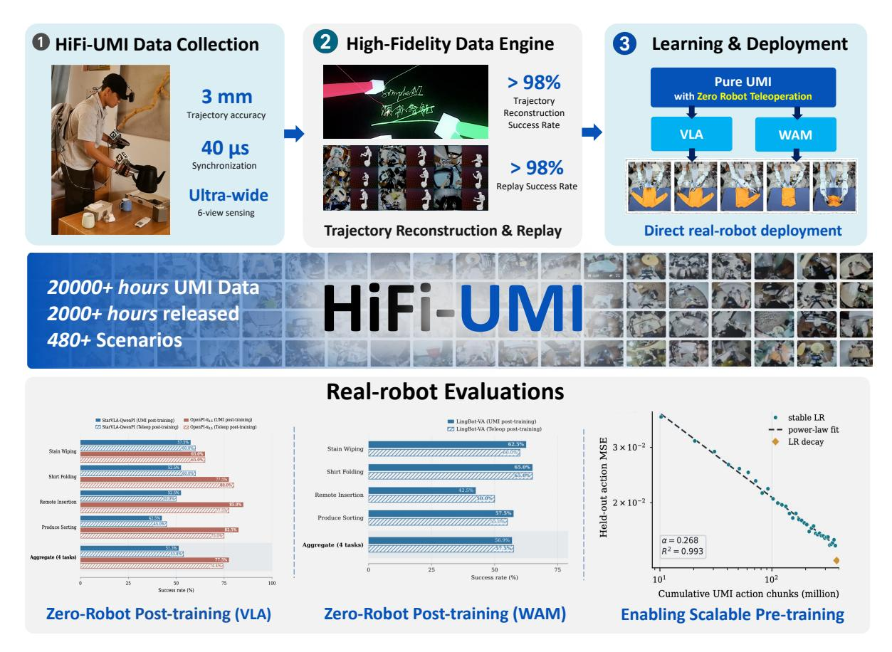

Figure 1 HiFi-UMI, 로봇-프리 프레임워크를 통한 확장 가능한 조작 데이터 수집, 고품질 데이터 처리, 그리고 실제 로봇 정책 배포 개요. HiFi-UMI Capture는 3 mm 궤적 정확도, 마이크로초 수준의 동기화, 초광범위 6‑뷰 센싱을 결합합니다. 이로 생성된 데이터는 HiFi-UMI 데이터 엔진에 의해 재구성, 재생, 품질 검사, 주석 달기 및 선별이 이루어지며, 이 엔진은 480개가 넘는 장면에서 20,000시간이 넘는 데이터를 수집하고, 선별된 2,000시간 HiFi-UMI‑2K 하위 집합을 공개했으며, 궤적 재구성 및 재생 유효성 비율이 각각 98 % 이상(≈96 % 누적)을 달성했습니다. 선별된 코퍼스는 대상 작업에 대한 원격 조작 로봇 데이터 없이 VLA와 WAM 정책의 사전 학습 및 사후 학습을 지원하여 실제 로봇에 직접 배포를 가능하게 합니다. HiFi-UMI만을 사용한 사후 학습은 세 가지 백본 모두에서 도메인 내 원격 조작과 동등한 성능을 보이며, 두 VLA 정책에서는 최대 3.1 퍼센트 포인트, WAM 정책에서는 0.6 퍼센트 포인트 차이를 보입니다. 또한, 보류된 행동 예측 오류는 사전 학습 데이터가 증가함에 따라 일관되게 감소하며, 명확한 멱수 법칙 스케일링 추세(α = 0.268, R2 = 0.993)를 따릅니다.

는 본래 측정된 것 대신 교차 카메라 공동 가시성으로 재구성되며, 이는 가장 중요한 조정 작업에서 정확히 오류를 도입합니다; 센서 스트림은 하드웨어 트리거 대신 소프트웨어 또는 무선 정렬을 사용합니다; 그리고 손당 155° 손목 파시아이 렌즈는 사각지대와 약한 깊이 단서를 남깁니다 [&#91;6,](#page-29-5) [9&#93;](#page-29-8).

이러한 한계는 우연이 아니라, 전 분야에서 로봇-프리 데이터가 주로 사전 학습 역할에 국한되고 실제 로봇 원격 조작이 정책을 배포하기 위한 사후 학습에 필수적이라고 여겨지는 이유입니다 [&#91;10,](#page-29-9) [11&#93;](#page-29-10). 가장 공격적인 최근 시도조차도 원격 조작을 최소화하려는 노력은 이 분리를 유지합니다. 휴대용 VR 기반 시스템 ActiveUMI [&#91;12&#93;](#page-29-11)와 XRZero-G0 [&#91;13&#93;](#page-29-12)는 실제 로봇 비율을 훨씬 더 큰 로봇-프리 코퍼스의 작은 비율로 줄이지만, 둘 다 완전히 제거하지는 못합니다. RDT2 [&#91;14&#93;](#page-29-13)는 로봇-프리 데이터만으로 제로샷 교체-체현 전이를 달성하지만, 특정 팔에서 배포 수준의 성능이 요구될 때 실제 로봇 데이터를 혼합합니다. 그러나 사후 학습이 실제 로봇 데이터를 진정으로 필요로 하는지, 아니면 지금까지 사용 가능한 로봇-프리 데이터의 정밀도가 충분히 높지 않았는지는 아직 명확하지 않았습니다.

우리는 충분히 고품질의 UMI 데이터가 이 분리를 깨뜨릴 수 있는지 물음으로 시작합니다. 우리는 HiFi-UMI를 소개합니다. HiFi-UMI는 정밀도, 재생 가능성, 자동 선별을 위해 엔드‑투‑엔드로 설계된 휴대용 데이터 생산 시스템입니다 [(Fig. 1)](#page-1-0), 그리고

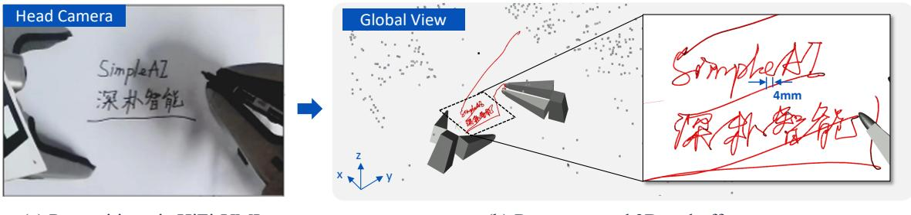

\*(a) HiFi-UMI를 이용한 펜 글쓰기

(a) HiFi-UMI를 이용한 펜 글쓰기 (b) 재구성된 3D 엔드 이펙터

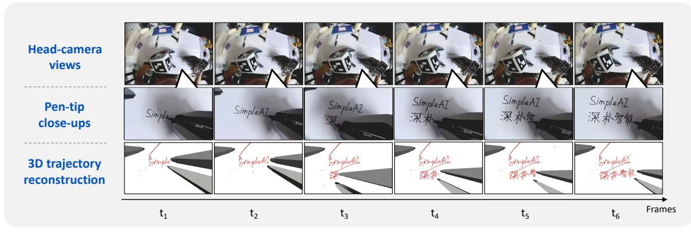

(c) 시간 정렬된 재구성 시퀀스

Figure 2 손글씨 작업에서 3D 궤적 재구성의 정성적 시각화. (a) HiFi-UMI를 사용해 캡처한 손글씨 시연의 1인칭 관찰. (b) 재구성된 3D 엔드 이펙터 궤적은 전역 뷰와 작성된 문자의 확대 뷰에서 표시됩니다. 소문자 \"e\"의 표시된 4 mm 너비는 재구성된 글쓰기의 규모에 대한 공간적 기준을 제공합니다. (c) t1–t6의 여섯 개 동기화된 순간에서 시간 정렬된 시각화로, 해당 헤드‑카메라 관찰, 펜 팁 클로즈업, 누적 3D 궤적 재구성이 포함됩니다.

우리는 이를 사용해 고의적으로 강력한 가설을 테스트한다—우리가 “제로-로봇 사후 훈련”(zero-robot post-training)이라고 부르는 가설이다. 즉, 고품질 로봇-프리 데이터만을 사후 훈련에 사용하면, 실제 로봇에 직접 배포 가능한 조작 정책을 얻을 수 있다는 것이다. 이 가설은 혼합 비율에서 벗어나 질문을 재구성한다. 기존 연구가 실제 로봇 비율을 작은 비영(0이 아닌) 기준점으로 축소해 텔레오퍼레이션 기준에 접근하는 반면, 우리는 로봇-프리 데이터 자체의 정밀도를 높여—그 궤적, 그리퍼 간 상대 포즈, 타이밍이 텔레오퍼레이션만큼 신뢰할 수 있게—그 기준점을 완전히 제거할 수 있는지 묻는다. [Fig. 2](#page-2-0)는 이 정밀도를 구체적으로 보여준다: 우리의 오프라인 재구성은 필기 궤적을 충분히 보존해 밀리미터 규모의 선을 읽을 수 있게 한다.

HiFi-UMI는 위에서 언급한 모든 결함을 해결한다. 포즈 정밀도는 헤드마운트 스테레오 오프라인 SLAM에서 비롯되며, 이는 낮은 드리프트의 장기 궤적과 두 손의 세계 프레임 포즈와 함께 얻은 네이티브 정확한 그리퍼 간 상대 포즈를 제공한다. 센싱 정밀도는 단일 공유 GPIO 하드웨어 트리거를 통해 모든 센서 간 마이크로초 수준의 동기화와, 약 200° 가로 및 200° 이상 세로를 커버하는 두 개의 비평행 스테레오 카메라가 제공하는 초광 시야에서 나온다. 두 가지 추가 선택은 상호작용 자체와 사용 가능한 데이터를 생산하는 비용을 목표로 한다: 트리거 그리퍼보다 조작자의 자연스러운 힘과 접촉을 더 잘 보존하는 풀-팔 장갑 형태와, 수집 중에 캡처 이상을 포착하는 현장 데이터 품질 모니터링을 갖춘 실시간 온라인 슬라이싱. 이 모든 것이 휴대용 캡처를 생산성 높은 데이터 엔진으로 전환시켜, 모든 시연을 자동으로 재구성, 재생, 품질 검사, 주석 달기, 선별한다—궤적 재구성 및 재생 검증은 각각 98% 이상을 통과하며, 누적 98%×98% ≈ 96%를 달성한다. 그리고 우리는 이 엔진의 출력, 다른 무엇도 아닌, 정책을 배포까지 옮기도록 요구한다. 같은 HiFi-UMI 코퍼스는 사전 훈련과 사후 훈련 모두에 공급되어, 텔레오퍼레이션 사후 훈련 데이터 없이 실제 양손 로봇에서 직접 실행되는 정책을 생성한다.

이 단계들은 [Fig. 1.](#page-1-0)의 세 패널과 일치한다.

가설은 우리가 수행하는 모든 비교에서 성립합니다. VLA(vision‑language‑action)와 WAM(world‑action‑model) 계통을 모두 아우르는 세 개의 백본에서 HiFi‑UMI‑전용 사후 훈련은 도메인 내 원격 조작과 일치합니다: 차이는 각각 −2.5, +3.1, −0.6 퍼센트 포인트이며, 양쪽 부호를 갖고 모두 우리 프로토콜의 샘플링 노이즈 범위 내에 있습니다. 이 평형은 기준을 우위에 두는 비대칭성에서도 유지됩니다—원격 조작 데이터는 평가 장면에서 수집되고 HiFi‑UMI 궤적은 없으며, 가장 강력한 정책은 정밀 삽입 작업에서 85 %를 달성합니다. 이러한 주장은 뒤에 있는 평가만큼만 타당하므로, 모든 비교는 평가가 시작되기 전에 동결된 벤치마크 아래에서 실행되며, 테스트 인스턴스 구성은 정책 실행과 분리되고, 정책 순서는 무작위화되며, 종료 사유가 기록됩니다; 여섯 가지 조건은 총 960개의 실제 로봇 롤아웃을 받습니다. 동일한 코퍼스를 4 000시간으로 사전 훈련하면, 10개의 미지 과제에서 행동 오류를 41 % 낮추고, StarVLA‑QwenPI에서는 실제 로봇 성공률을 추가로 18.1 퍼센트 포인트 상승시킵니다—이 전이 구조 자체가 유익하며, 사전 훈련 혼합에서 상호작용 역학의 범위를 추적하고, 테스트 객체가 이전에 보였는지 여부보다 중요합니다. 우리는 현재까지 최초로, 실제 로봇 데이터 없이 손에 들고 로봇이 없는 사후 훈련이 동일한 로봇에서 도메인 내 원격 조작과 일치함을 세 개의 백본에 걸쳐 재현한 통제된 시연을 제공합니다. 우리는 이 결과 뒤에 있는 설계 원칙으로서 충실도를 다루며, 통제된 저하를 통해 변수를 분리하는 대신, 샘플 수와 장면 범위에서 충실도를 깔끔하게 분리하는 그런 절단(ablation)을 향후 연구로 남깁니다.

요약하면, 본 연구의 주요 기여는 다음과 같습니다:

- 하드웨어와 소프트웨어의 공동 설계가 트래젝터리 정확도, 인터그리퍼 포즈, 동기화, 시야각 결함을 해결하는 데이터 생산 시스템: 헤드‑마운트 오프라인 스테레오 SLAM과 공유 GPIO 트리거가 3 mm 엔드‑에펙터 정확도와 마이크로초 단위의 센서 간 정렬을 외부 추적 인프라 없이 제공하며, 자동화된 엔진이 모든 시연을 재구성, 재생, 검증하여 원시 캡처의 96 %를 로봇 실행 가능한 데이터로 보존합니다.  

- HiFi‑UMI만으로 사후 훈련이 충분함을 입증: 세 개의 VLA와 WAM 백본에서 UMIonly 사후 훈련이 동일 로봇에서 도메인 내 원격 조작과 일치합니다(−2.5, +3.1, −0.6 퍼센트 포인트), 모든 격차가 샘플링 노이즈 범위 내에 있으며, 원시 샘플 수 차이에도 불구하고.  

- 동일한 로봇‑프리 코퍼스를 사전 훈련하면 데이터 효율성과 다운스트림 사후 훈련의 한계를 모두 높입니다: StarVLA‑QwenPI에서 4 000시간이 10개의 미지 과제에서 오프라인 행동 오류를 41 % 낮추고, 일치하는 사후 훈련 데이터를 사용하면 실제 로봇 성공률을 18.1 퍼센트 포인트 상승시켜, 작업 데이터의 1/4만으로 스크래치 초기화 기준과 일치합니다. 전이는 작업의 물리적 상호작용 종류가 사전 훈련에 포함되었는지 여부가 객체가 보였는지 여부보다 더 중요합니다.  

- HiFi‑UMI‑2K, 2,000시간 규모의 공개 데이터셋으로, 마이크로초 단위 동기화, 재생 가능, 초광각 FoV를 갖춘 하위 집합이며, 동일 파이프라인으로 실제 로봇 원격 조작 없이 배포 수준의 사후 훈련을 위해 제작되었습니다.

## 2 Related Work (관련 연구)

### 2.1 Manipulation Datasets (조작 데이터셋)

조작 데이터셋은 이제 완전히 기반이 있는 로봇 시연부터 확장 가능하지만 약하게 기반이 있는 인간 비디오까지 스펙트럼을 포괄한다. 고품질 측면에서 실제 로봇 원격 조작 코퍼스는 배포 가능한 정책 학습을 위한 표준 기질로 남아 있다: BridgeData V2 [&#91;2&#93;](#page-29-14)와 RH20T [&#91;15&#93;](#page-29-15)는 대규모 다중 작업 및 다중 모달 수집을 구축했고, DROID [&#91;3&#93;](#page-29-2)는 장면과 운영자 간의 야외 다양성을 강조했으며, Open X-Embodiment [&#91;16&#93;](#page-29-16)은 이질적인 로봇 데이터셋을 집계해 교차 구현 전이 연구를 수행했다. RoboMIND [&#91;5&#93;](#page-29-4), RoboMIND 2.0 [&#91;17&#93;](#page-30-0), AgiBot World [&#91;4&#93;](#page-29-3)와 같은 최근 노력은 이 체제를 더 큰 궤적 규모와 강력한 표준화, 품질 관리, 양손 및 모바일 설정, 그리고 풍부한 감각 스트림으로 끌어올리고 있다. 반대로, Ego4D [&#91;18&#93;](#page-30-1)와 Ego-Exo4D [&#91;19&#93;](#page-30-2)와 같은 자가 중심 인간 비디오 코퍼스는 규모와 자연스러움을 제공하지만 실행 가능한 로봇 동작이 부족하며, EgoDex [&#91;20&#93;](#page-30-3)는 조작 중심 비디오와 쌍으로 제공되는 3D 손 포즈 주석으로 이 격차를 좁힌다.

이러한 극단 사이에서 UMI 스타일 데이터는 로봇이 없지만 행동 기반 감독의 독특한 중간 단계로 등장했다. UMI [&#91;6&#93;](#page-29-5)는 로봇 본체 없이 저비용, 정보 풍부한 시연을 수집하기 위한 휴대용 핸드헬드 그리퍼를 도입해 하드웨어에 독립적인 정책으로 직접 전이할 수 있게 했다. FastUMI-100K [&#91;21&#93;](#page-30-4)와 RDT2의 10,000시간 코퍼스 [&#91;14&#93;](#page-29-13)는 이 레시피가 가장 큰 원격 조작 노력과 경쟁할 수 있는 코퍼스로 확장될 수 있음을 보여준다; 해당 장치는 [Sec. 2.2.](#page-4-0)로 연기한다. 이 계층 구조는 자연스럽게 데이터 피라미드 [&#91;10&#93;](#page-29-9)로 볼 수 있다: 웹과 인간 비디오는 규모를 제공하고, 원격 조작은 구현 특화 기반을 제공하며, UMI 스타일 시연은 로봇 특화 수집 없이 실행 가능한 손목 시점 기하학과 상대적 엔드 이펙터 움직임을 보존함으로써 중간을 차지한다. 우리의 연구는 이 중간 단계에 직접적으로 목표를 두고 있다: UMI 데이터의 충실도, 동기화, 재타게팅 가능성을 높여 로봇이 없는 핸드헬드 시연이 확장 가능한 사전 훈련 데이터뿐 아니라 배포와 관련된 감독으로도 활용될 수 있는지 테스트한다.

### 2.2 UMI and Portable Data-Collection Devices (UMI 및 휴대용 데이터 수집 장치)

The Universal Manipulation Interface [6]는 ORB‑SLAM3와 IMU를 통해 전역 규모의 엔드 이펙터 궤적을 복원하는 휴대용 장치가 장착된 그리퍼를 도입했으며, 각 그리퍼마다 손목에 부착된 155◦ 파노라마 카메라와 측면 거울을 사용해 암시적 깊이를 확보합니다. 이것은 성장 중인 휴대용 캡처 장치군의 기초가 됩니다. Tab. 1은 여기서 중요한 축인 포즈 획득 및 정확도, 교차 센서 동기화, 센싱 범위, 그리퍼 간 상대 포즈가 네이티브로 측정되는지 재구성되는지, 그리퍼 형태 요인, 그리고 휴대성을 기준으로 비교합니다. FastUMI [7]는 맞춤형 SLAM 대신 상용 트래커를 사용하여 견고성을 향상시키고 수집 규모를 확장합니다. 그 후속 제품인 FastUMI Pro는 VISTA [22]에서 사용되는 캡처 플랫폼으로, 외부 라이트하우스 트래커와 온보드 시각‑관성 SLAM을 결합하여 고정 인프라를 대가로 밀리미터 수준의 포즈 정확도를 달성합니다. DexCap [23]과 DexUMI [24]는 모션 캡처 장갑과 웨어러블 외골격을 통해 정교한 손으로 캡처를 확장하고, DexWild [25]는 정교한 정책을 위한 야외 인간 손 시연을 확장합니다. ARCap [26]은 헤드셋 내 증강 현실 피드백을 추가하여 시연이 동역학적으로 유효하게 유지되도록 하고, AirExo [9,] [27]와 같은 외골격 시스템은 로봇 없이 전체 팔 캡처를 추구합니다. 병행 라인에서는 헤드 카메라와 손 캡처를 결합—EgoMimic [28]과 H‑RDT [11]—하여 동작 신호를 얻습니다.

이러한 진전에도 불구하고, 이 장치들 전반에 걸쳐 충실도 제한이 만연해 있으며, 로봇이 없는 데이터를 소비하는 방법들은 여전히 쌍으로 된 로봇 시연에 의존합니다. AirExo‑2 [9]는 휴대용 UMI 스타일 장치의 단점을 두 가지 원인에 명시적으로 귀속합니다: 포즈 추정에 시각 SLAM에 의존함으로써 발생하는 동작 부정확성, 그리고 제한된 카메라 시야각이 깊이 인식을 방해함. 원본 UMI [6]도 SLAM 및 스케일 모호성 실패, 수집과 추론 간 지연 불일치, 그리고 제한된 단일 카메라 범위를 언급합니다. 핵심적으로, 인간 또는 자아중심 데이터를 학습에 활용하는 방법들도 여전히 쌍으로 된 로봇 데이터를 의존합니다: EgoMimic [28]은 원격 조작 시연과 함께 공동 훈련하고, H‑RDT [11]는 인간 사전 훈련 후 로봇 데이터를 사용해 미세 조정합니다. 이러한 맥락에서, 로봇이 없는 데이터는 스스로 배포 가능한 정책을 기반으로 삼도록 요구되지 않습니다.

최근 연구들은 로봇 그리퍼 내부에서 수행되는 핸드헬드 SLAM을, 운영자가 착용하는 헤드셋이든 방에 설치된 베이스 스테이션이든, 그리퍼 외부에 있는 추적 인프라로 대체한다.  
ActiveUMI [12]는 로봇 그리퍼의 복사본을 VR 컨트롤러에 단단히 장착하고, 운영자의 머리 움직임과 자기 중심적 주의를 기록한다.  
XRZero-G0 [13]는 헤드셋 추적과 이중 목적용 그리퍼, 그리고 폐쇄형 품질 검사 파이프라인을 결합하여 대규모 로봇-프리 데이터셋을 구축한다.  
이러한 시스템은 추적 견고성을 향상시키며, 우리 시스템과 마찬가지로 헤드셋이 두 컨트롤러를 함께 관측하기 때문에 그리퍼 간 상대 자세를 자연스럽게 복원한다.  
그들의 나머지 설계 선택은 정확성에 영향을 주는 방식으로 우리와 다르다.  
자세는 오프라인 SLAM 최적화가 아니라 온라인 헤드셋 추적에서 얻어지며; 센서 스트림은 하드웨어 트리거 대신 소프트웨어 시공간 매칭으로 정렬된다; 그리고 커버리지는 초광대역 스테레오 광학 대신 소수의 이산 카메라 뷰에서 나온다.  
그들은 실제 로봇 비율을 훨씬 더 큰 로봇-프리 코퍼스의 작은 비율로 줄이지만, 완전히 제거하지는 않는다.  
RDT2 [14]는 대신 재설계된 UMI 하드웨어를 10,000시간 이상으로 확장하고, 실제 로봇 데이터를 사용하지 않은 단순 개방형 어휘 작업에서 제로샷 크로스-에뮬리먼트 전이를 달성한다.  
특정 팔에 대한 배포 수준 성능이 필요할 때만, 소량의 실제 로봇 데이터를 선택적 사후 훈련 변형에 혼합한다.  
그러나 그 하드웨어는 온보드 SLAM 대신 외부 적외선 베이스 스테이션으로 엔드 이펙터를 추적하므로, 모든 수집 장소는 먼저 장비를 설치해야 한다.  
우리 설정에 가장 가까운 VISTA [22]는 선별된 핸드헬드 데이터만으로 양손 정책을 사후 훈련하고 이를 실제 로봇에 배포하여 로봇-프리 사후 훈련이 가능함을 입증한다.  
그러나 그 모든 기초 모델은 동일한 핸드헬드 코퍼스에서 훈련되므로, 비교는 데이터 소스가 아니라 모델과 선별 설계를 고립시킨다. 따라서 로봇-프리 감독이 원격 조작에 비해 어떻게 성능을 보이는지는 미해결로 남는다.  
우리는 사후 수집 검증에 대한 이러한 강조를 공유하지만, 캡처 장치 자체에 정확성을 구축하여 대부분의 궘적이 검증을 통과하도록 하고, 스크리닝되지 않도록 한다.

우리 시스템은 오프라인 스테레오 SLAM, 공유 GPIO 하드웨어 트리거, 그리고 초광범위 커버리지를 위한 비병렬 카메라를 통해 이러한 충실도 한계를 해결합니다. 이전에 어떤 휴대용 시스템도 동일한 로봇에서 로봇-프리 사후 훈련을 원격 조작과 비교한 사례는 없습니다 [&#91;12–](#page-29-11)[14,](#page-29-13) [22&#93;](#page-30-5). 대신 우리는 백본, 레시피, 배포 스택을 고정하고, 작업별 시연이 HiFi-UMI에서 온 것인지 평가 로봇에서 원격 조작으로 온 것인지만 바꿉니다.

### 2.3 조작 기초 모델 (Manipulation Foundation Models)

최근의 조작 기초 모델은 행동 생성이 미래 예측과 연결되는지 여부에 따라 두 가지 저수준 제어 백본으로 나뉜다. VLA 정책은 순수하게 반응형으로, 현재 관측과 언어 지시를 직접 행동에 매핑한다. World-action 모델(WAMs)은 예측 구성요소를 추가하며, 이 연결은 두 가지 형태를 취한다. 일부는 미래 관측을 보조 학습 신호로만 예측하고 테스트 시에 예측기를 버린다. 다른 이들은 추론 단계마다 미래를 생성하고 그로부터 행동을 디코딩하여, 상상된 미래의 품질이 제어를 직접적으로 조절한다.

VLA 계열에서 RT-2 [29]는 토큰화된 액션 레시피를 확립했고, OpenVLA [30]와 Octo [31]는 이질적인 로봇 데이터에 걸쳐 오픈 제너럴리스트 정책을 확장했다. 최근 시스템들은 연속 액션 헤드와 강력한 사후 훈련 레시피를 선호한다: π^0 [32]와 π0.^5 [33]는 사전 학습된 VLM과 플로우 매칭 액션 전문가를 결합한 아키텍처를 사용하며, 이는 현재 널리 재사용되고 있다. 반면 GR00T N1 [10], GR-3 [34], Gemini Robotics [35], 그리고 SmolVLA [36]은 모델 규모를 추론 비용과 배포 가능성에 맞춰 조정한다. 별도의 라인은 액션 인터페이스 자체를 설계 변수로 다루며, FAST [37]는 액션 토큰화를, OpenVLA-OFT [38]는 분할 디코딩과 미세 조정을 담당한다; 우리의 액션 표현은 이러한 선택을 계승한다 [(Sec. 5)](#page-11-0). LingBot-VLA [39], Qwen-VLA [40], 그리고 Qwen-RobotManip [41]은 대규모 정렬된 사전 훈련과 통합된 구현 인터페이스를 추구한다.

WAM 계열에서 초기 시스템들은 용어가 확정되기 전 아이디어를 탐구했다. GR-1 [42]와 GR-2 [43]는 비디오 생성 사전 훈련 후 미래 이미지와 액션을 공동으로 예측하고, UniPi [44]는 정책 학습을 텍스트 가이드 비디오 생성으로 전환하며, VPP [45]는 비디오 확산 모델에서 추출한 표현을 기반으로 제어를 조건화한다. 최근 WAM들은 정책 백본에서 결합을 명시적으로 만든다: DreamZero [46]는 사전 학습된 비디오 확산 백본 위에 실시간 폐쇄 루프 정책을 구축하고, WorldVLA [47]는 자기 회귀 프레임워크에서 이미지와 액션 생성을 공동으로 모델링한다. LingBot-VA [48]는 인과적 세계 모델링을 통해 프레임 예측과 정책 실행을 학습하며, 방금 생성한 미래 잠재 변수에서 각 액션 청크를 디코딩한다.

이러한 추세는 확장 가능한 데이터의 가치를 강화한다. 그러나 인간 비디오, 자가 중심 비디오, UMI 스타일 시연과 같은 로봇이 없는 소스는 여전히 사후 훈련 감독으로 거의 사용되지 않는다. 이 격차는 일반적으로 제한된 궤적 충실도, 동기화, 재타게팅 가능성, 기하학적 일관성에 기인한다. StarVLA [49]와 그 QwenPI 스타일 구현은 해당 attribution을 직접 테스트할 수 있는 개방형 모듈형 생태계를 제공한다.

따라서 우리는 세 축에서 다른 세 개의 백본을 선택한다. StarVLA-QwenPI는 모듈형 오픈 구현이므로 초기화를 제어하고 대규모 사전 훈련 팔을 추가할 수 있다. OpenPI-π0.^5는 우리가 구축하지 않은 강력한 공개 체크포인트이다. LingBot-VA는 현재 관측이 아니라 상상된 미래에서 액션을 도출한다. 이들을 비교 가능한 것은 아키텍처가 아니라 인터페이스이다: 각각은 동일한 감독을 소비하지만 그것을 텐서화하는 방식이 다르다. 그 감독의 출처를 바꾸는 것은 세 번 적용되는 하나의 개입이며, 세 개 사이의 일치성은 특정 아키텍처가 아니라 데이터에 대한 증거다.

## 3 데이터 수집 및 처리 파이프라인

이 연구의 핵심 가설—로봇이 없는 시연만으로 배포 가능한 정책을 기반화할 수 있다는 가설—은 데이터의 충실도에 달려 있다. 만약 궤적이 장기적으로 편향되거나, 센서 스트림이 시간적으로 정렬되지 않거나, 그리퍼의 시야가 접촉을 해결하기에 너무 좁다면, 규모가 아무리 커도 배포 수준의 행동 신호를 회복할 수 없으며, 실제 로봇 앵커가 불가피해진다 [10]. 따라서 우리는 데이터 생산을 시스템 설계 문제로 보고, 하드웨어와 소프트웨어를 공동 설계하여 충실도를 소스에서 강제하도록 한다. 이 장에서는 결과 시스템을 설명한다: 네 개의 하위 시스템이 각각 특정 충실도 축을 목표로 하는 웨어러블 캡처 장치 [(Sec. 3.1)](#page-6-0); 사용 가능한 데이터를 정의하는 명시적 이중 수준 정의 [(Sec. 3.2)](#page-7-0); 원시 캡처를 학습 준비된 에피소드로 전환하는 6단계 처리 플라이휠 [(Sec. 3.3)](#page-8-1); 그리고 시스템이 제공하는 종단 간 충실도 [(Sec. 3.4)](#page-10-0).

### 3.1 HiFi-UMI Capture Device (HiFi-UMI 캡처 장치)

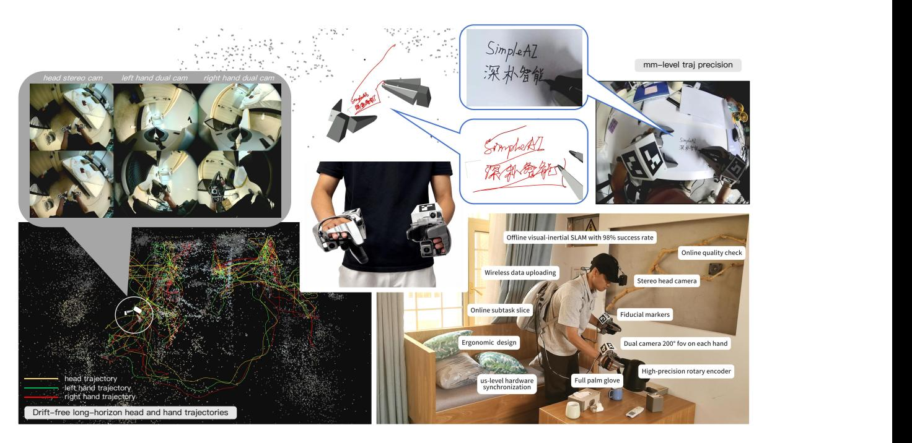

Figure 3 HiFi-UMI 캡처 장치 개요. 헤드 마운트된 스테레오 카메라 쌍과 통합 IMU가 오프라인 스테레오‑관성 SLAM을 가능하게 하며; 각 손에 마커 큐브가 동일한 헤드‑카메라 프레임에서 로컬라이즈된다; 각 손은 초광각 피쉬아이 카메라 두 개(상단과 하단)를 장착해 초광범위 커버리지를 제공한다; 전체 손바닥 장갑 그리퍼는 자연스러운 접촉을 보존한다; 그리고 공유 GPIO 트리거가 모든 센서를 동기화한다.

HiFi-UMI 캡처 장치 [(Fig. 3)](#page-6-1)는 배포 수준의 로봇 없는 데이터에 대해 공동으로 충분한 네 가지 요구 사항을 중심으로 구성된다: (i) 정확하고 확장 가능한 포즈 획득, (ii) 조작 지향적 그리퍼 형태, (iii) 광범위 멀티모달 센싱, 그리고 (iv) 온라인 품질 관리. 우리는 각각을 차례로 다루고, 대표적인 로봇 없는 시스템과 우리의 설계가 어떻게 비교되는지 [Tab. 1.](#page-8-0)에서 요약한다.

#### 3.1.1 Pose Acquisition and Accuracy (포즈 획득 및 정확도)

UMI 스타일 캡처의 핵심 긴장은 궤적 정확도, 추적 견고성, 배포 유연성, 그리고 하드웨어 비용을 조화시키는 것이다. 기존 접근법은 이 트레이드오프의 서로 다른 지점에 위치한다: 손목 카메라 시각‑관성 오도메트리(VIO) [&#91;6&#93;](#page-29-5), VR 헤드셋 및 컨트롤러 추적, 베이스‑스테이션 추적, 그리고 모션 캡처. 베이스‑스테이션 및 모션 캡처 시스템은 높은 정확도를 제공하지만, 장비가 장착된 환경이 필요해 야외에서의 확장 가능한 수집을 금지한다. VR 헤드셋 솔루션은 성숙한 상업적 추적 스택을 상속하지만, 더 높은 하드웨어 비용과 더 큰 시스템 복잡성을 초래한다. 손목 카메라 VIO는 두 가지보다 저렴하고 가벼우나, 그 시야는 손이나 조작 중인 물체에 의해 정기적으로 가려져 궤적이 추적 실패와 누적 드리프트에 취약해진다.

우리는 대신 오프라인 스테레오‑관성 SLAM [&#91;51&#93;](#page-31-11)과 지표 마커 로컬라이제이션 [&#91;52&#93;](#page-31-12)을 기반으로 한 착용형 방식을 채택한다. 각 손목을 독립적으로 추적하는 대신, 헤드 마운트 스테레오 장치가 전역 카메라 궤적을 추정하고, 각 손은 동일한 헤드 카메라에 의해 관측되는 고정 마커 큐브를 통해 헤드에 상대적인 위치를 로컬라이즈한다. 전역 헤드 궤적과 두 손의 상대적 hand‑to‑head 포즈를 합성하면 두 손 모두에 대해 전역적으로 일관된 궤적을 얻는다. 이 설계는 단순한 관찰에서 영감을 받았다: 헤드 마운트 시점은 손목 마운트 시점보다 훨씬 안정적이며, 손목 마운트 시점은 근처의 움직이는 물체, 자가 가림, 그리고 조작 중 빠른 손 움직임에 의해 정기적으로 손상된다 [&#91;9&#93;](#page-29-8). 우리의

실험에서 이 방식은 3 mm의 엔드 이펙터 정확도를 달성한다—VR 컨트롤러 추적과 비교할 수 있을 정도이며—VR 헤드셋 기반 장치보다 가볍고 저렴하다.

머리-상대 형식은 양손 조작에 특히 유리합니다. 두 마커 큐브가 단일 헤드-카메라 프레임에서 관측되므로 그리퍼 간 상대 포즈가 자연스럽게 측정되고, 각 그리퍼 포즈와 동일한 정확도를 상속받습니다. 이는 이전 핸드헬드 장치에서 교차 카메라 공동 가시성으로 사후 재구성되던 방식과 달리, 본질적으로 측정됩니다. 또한 헤드 움직임은 일반적으로 손 움직임보다 훨씬 작으므로 헤드-상대 추적은 누적 드리프트를 크게 줄입니다.

#### 3.1.2 Gripper Morphology (그리퍼 형태학)

기존 UMI 그리퍼는 크게 트리거 기반과 핑거-슬리브 기반 설계로 나뉩니다. 트리거 장치는 평행 턱 명령을 직접 모방하지만, 조작되는 물체와의 촉각 일치를 약하게 제공합니다. 핑거-슬리브 설계는 기계적으로 단순하며 직접 접촉 감각을 보존하여 보다 자연스럽고 정교한 조작을 가능하게 합니다. 그러나 많은 설계가 좁고 길쭉한 기하학을 채택하여 정밀 조작에는 적합하지만, 더 크거나 무거운 물체에는 제한적입니다.

작업 범위를 넓히면서 접촉 정밀도를 희생하지 않기 위해, 우리는 인간 손에서 영감을 받은 비대칭 이손가락, 장갑형 전체 손바닥 그리퍼를 설계했습니다. 두 손가락은 각각 엄지와 반대쪽 네 손가락에 대응하며, 모양과 폭이 의도적으로 비대칭입니다: 좁은 손끝 영역은 정밀하고 소형 물체 조작을 지원하고, 넓은 근위 영역은 더 큰 접촉 패치와 무거운 물체에 대한 단단한 지지를 제공합니다. 이 형태학은 트리거 인터페이스보다 조작자의 자연스러운 힘 분포와 접촉 기하학을 보다 충실히 보존합니다.

#### 3.1.3 Cameras and Sensors (카메라 및 센서)

각 손은 비평행 파시포트 카메라 두 대를 탑재하여 가로·세로 약 200°의 시야를 제공합니다. 이 초광각 뷰는 가려짐을 줄이고 그리퍼 주변의 관측 가능성을 향상시킵니다. 스테레오 헤드 카메라와 함께 전체 장치는 여섯 대의 카메라를 통합합니다. 또한 헤드와 양 손에 IMU를 장착해 포즈 추정 및 모션 상태 모니터링을 수행하고, 그리퍼에 고정밀 인코더를 부착해 개방 각도를 측정합니다. 핵심적으로, 모든 센서는 단일 통합 GPIO 외부 트리거[53]에 의해 구동되어 모든 카메라, IMU, 인코더 간에 마이크로초 수준의 시간 동기화를 제공합니다. 이 하드웨어 수준 동기화는 이전 시스템에서 사용되던 소프트웨어 또는 무선 정렬을 대체하고 액션 라벨 노이즈의 주요 원인을 제거합니다.

## 4 Dataset and Release (데이터셋 및 공개)

저품질 데이터를 원천에서 억제하기 위해, 장치는 녹화 중에 품질 모니터링을 수행합니다. 과소노출, 모션 블러, 과도하게 빠른 조작자 움직임, 손이 헤드 카메라 시야에서 벗어남 등 일반적인 실패 모드를 감지하고, 조작자가 현장에서 캡처를 바로 수정할 수 있도록 실시간 음성 피드백을 제공합니다. 온라인 시간 분할을 통해 운영자는 수집 중에 작업 및 하위 작업 경계를 표시하여 이후 세분화 노력을 줄입니다. 온라인 모니터링과 함께 처리량과 신뢰성을 향상시킵니다.

### 3.2 Data-Quality Criteria (데이터 품질 기준)

데이터 품질은 센서, 궤적, 주석에 대한 엄격한 제약 집합으로 시행되며, 이는 캡처가 액션 라벨로 사용되기 전에 충족해야 할 기술적 요구사항으로, 대규모 로봇 데이터셋의 선별 및 품질 관리 프로토콜[3]을 반영합니다. 이러한 제약을 넘어, 코퍼스의 내용 수준 속성—주석 정확성, 작업 및 장면 구성, 드문 행동의 범위—은 처리 파이프라인의 주석, 검증, 내보내기 단계[(Sec. 3.3)](#page-8-1)에서 관리되며 별도의 입학 테스트가 아니라는 점을 강조합니다.

센서. 카메라 시야, 배치 및 시야 방향은 시스템 사양을 충족해야 하며; 다중 센서 타임스탬프는 정확히 동기화되어야 하고; 이미지는 적절히 노출되고 심각한 모션 블러가 없으며 예기치 않은 가려짐이 없어야 하며; 그리고 다른 모든 센서 판독값은 유효하고 정확해야 한다.

표 1 대표적인 로봇 없이 데이터 수집 시스템의 주요 설계 및 데이터 충실도 축에 따른 비교.  
포즈 획득: 6-DoF 포즈가 어떻게 추정되는가—장치 내 시각(–관성) 오도메트리/SLAM (VIO / VI-SLAM), 헤드셋 내부-외부 추적 (VR 내부-외부), 또는 외부 베이스-스테이션 추적.  
포즈 오차: 보고된 엔드-에펙터 위치 오차(mm), 각 시스템의 자체 논문에서 가져와 반올림한 값; 각기 다른 기준과 동작 프로파일에 대해 측정되므로 이 값들은 직접 비교하기보다 차수(오더)로 읽어야 한다.  
HiFi-UMI 값은 본 연구에서 측정한 값이다 (표 2).  
동기화: 교차 센서 시간 정렬, 일반적인 지연 규모와 메커니즘으로 보고됨; HiFi-UMI만 하드웨어 GPIO 트리거를 통해 마이크로초 수준 정렬을 달성하며, 이전 시스템은 보고된 경우에만 밀리초 수준 소프트웨어 타임스탬프 정렬을 사용한다.  
뷰 / FoV: 카메라 뷰 수와 최대 시야 범위.  
상대 포즈: 그리퍼 간 상대 포즈가 어떻게 얻어지는가—두 끝이 하나의 운영자 장착 프레임에서 함께 관찰될 때 네이티브로 측정 (native), 교차 카메라 시각성에서 사후 재구성 (reconstructed), 또는 외부 인프라에 대해 추적된 두 포즈를 차이내어 얻음 (external).  
그리퍼: 엔드-에펙터 작동 형태(예: 핸드헬드 트리거, 핑거 슬리브, 또는 전체 손바닥 장갑).  
포터블성: 무선, 현장 캡처, 장비화된 인프라 없이 (High) vs. 고정 베이스 스테이션 또는 모션 캡처 장비에 의존 (Low).  
"-"는 인용된 출처에서 보고되지 않았거나 단일 팔 캡처에 적용되지 않는 속성을 표시한다.  
이러한 선택은 HiFi-UMI가 이전 시스템에 비해 주요 이점을 제공한다: 헤드마운트 오프라인 스테레오-관성 SLAM을 통해 외부 추적 인프라 없이 얻은 밀리미터 수준 엔드-에펙터 정확도(~3 mm); 가장 정밀한 마이크로초 수준 동기화(GPIO 하드웨어 트리거를 통한); 양손 모두에서 가장 넓은 감지 범위; 그리고 더 쉬운 사용성—외부 베이스 스테이션 없이 완전 포터블하며, 트리거 대신 전체 손바닥 장갑을 통해 보다 자연스러운 조작을 가능하게 한다.  

시스템 | 포즈 획득 | 포즈 오차 | 동기화 | 뷰 / FoV | 상대 포즈 | 그리퍼 | 포터블성  
----|----|----|----|----|----|----|----  
HiFi-UMI | VIO / VI-SLAM | 3 | 마이크로초 | 2 | 네이티브 | 전체 손바닥 장갑 | 높음  
HiFi-UMI (offline) | VIO / VI-SLAM | 3 | 마이크로초 | 2 | 네이티브 | 전체 손바닥 장갑 | 높음  
HiFi-UMI (online) | VIO / VI-SLAM | 3 | 마이크로초 | 2 | 네이티브 | 전체 손바닥 장갑 | 높음  
HiFi-UMI (offline, 2 cameras) | VIO / VI-SLAM | 3 | 마이크로초 | 2 | 네이티브 | 전체 손바닥 장갑 | 높음  
HiFi-UMI (offline, 4 cameras) | VIO / VI-SLAM | 3 | 마이크로초 | 4 | 네이티브 | 전체 손바닥 장갑 | 높음  
HiFi-UMI (offline, 6 cameras) | VIO / VI-SLAM | 3 | 마이크로초 | 6 | 네이티브 | 전체 손바닥 장갑 | 높음  
HiFi-UMI (offline, 8 cameras) | VIO / VI-SLAM | 3 | 마이크로초 | 8 | 네이티브 | 전체 손바닥 장갑 | 높음  
HiFi-UMI (offline, 10 cameras) | VIO / VI-SLAM | 3 | 마이크로초 | 10 | 네이티브 | 전체 손바닥 장갑 | 높음  
HiFi-UMI (offline, 12 cameras) | VIO / VI-SLAM | 3 | 마이크로초 | 12 | 네이티브 | 전체 손바닥 장갑 | 높음  
HiFi-UMI (offline, 14 cameras) | VIO / VI-SLAM | 3 | 마이크로초 | 14 | 네이티브 | 전체 손바닥 장갑 | 높음  
HiFi-UMI (offline, 16 cameras) | VIO / VI-SLAM | 3 | 마이크로초 | 16 | 네이티브 | 전체 손바닥 장갑 | 높음  
HiFi-UMI (offline, 18 cameras) | VIO / VI-SLAM | 3 | 마이크로초 | 18 | 네이티브 | 전체 손바닥 장갑 | 높음  
HiFi-UMI (offline, 20 cameras) | VIO / VI-SLAM | 3 | 마이크로초 | 20 | 네이티브 | 전체 손바닥 장갑 | 높음  
HiFi-UMI (offline, 22 cameras) | VIO / VI-SLAM | 3 | 마이크로초 | 22 | 네이티브 | 전체 손바닥 장갑 | 높음  
HiFi-UMI (offline, 24 cameras) | VIO / VI-SLAM | 3 | 마이크로초 | 24 | 네이티브 | 전체 손바닥 장갑 | 높음  
HiFi-UMI (offline, 26 cameras) | VIO / VI-SLAM | 3 | 마이크로초 | 26 | 네이티브 | 전체 손바닥 장갑 | 높음  
HiFi-UMI (offline, 28 cameras) | VIO / VI-SLAM | 3 | 마이크로초 | 28 | 네이티브 | 전체 손바닥 장갑 | 높음  
HiFi-UMI (offline, 30 cameras) | VIO / VI-SLAM | 3 | 마이크로초 | 30 | 네이티브 | 전체 손바닥 장갑 | 높음  
HiFi-UMI (offline, 32 cameras) | VIO / VI-SLAM | 3 | 마이크로초 | 32 | 네이티브 | 전체 손바닥 장갑 | 높음  
HiFi-UMI (offline, 34 cameras) | VIO / VI-SLAM | 3 | 마이크로초 | 34 | 네이티브 | 전체 손바닥 장갑 | 높음  
HiFi-UMI (offline, 36 cameras) | VIO / VI-SLAM | 3 | 마이크로초 | 36 | 네이티브 | 전체 손바닥 장갑 | 높음  
HiFi-UMI (offline, 38 cameras) | VIO / VI-SLAM | 3 | 마이크로초 | 38 | 네이티브 | 전체 손바닥 장갑 | 높음  
HiFi-UMI (offline, 40 cameras) | VIO / VI-SLAM | 3 | 마이크로초 | 40 | 네이티브 | 전체 손바닥 장갑 | 높음  
HiFi-UMI (offline, 42 cameras) | VIO / VI-SLAM | 3 | 마이크로초 | 42 | 네이티브 | 전체 손바닥 장갑 | 높음  
HiFi-UMI (offline, 44 cameras) | VIO / VI-SLAM | 3 | 마이크로초 | 44 | 네이티브 | 전체 손바닥 장갑 | 높음  
HiFi-UMI (offline, 46 cameras) | VIO / VI-SLAM | 3 | 마이크로초 | 46 | 네이티브 | 전체 손바닥 장갑 | 높음  
HiFi-UMI (offline, 48 cameras) | VIO / VI-SLAM | 3 | 마이크로초 | 48 | 네이티브 | 전체 손바닥 장갑 | 높음  
HiFi-UMI (offline, 50 cameras) | VIO / VI-SLAM | 3 | 마이크로초 | 50 | 네이티브 | 전체 손바닥 장갑 | 높음  
HiFi-UMI (offline, 52 cameras) | VIO / VI-SLAM | 3 | 마이크로초 | 52 | 네이티브 | 전체 손바닥 장갑 | 높음  
HiFi-UMI (offline, 54 cameras) | VIO / VI-SLAM | 3 | 마이크로초 | 54 | 네이티브 | 전체 손바닥 장갑 | 높음  
HiFi-UMI (offline, 56 cameras) | VIO / VI-SLAM | 3 | 마이크로초 | 56 | 네이티브 | 전체 손바닥 장갑 | 높음  
HiFi-UMI (offline, 58 cameras) | VIO / VI-SLAM | 3 | 마이크로초 | 58 | 네이티브 | 전체 손바닥 장갑 | 높음  
HiFi-UMI (offline, 60 cameras) | VIO / VI-SLAM | 3 | 마이크로초 | 60 | 네이티브 | 전체 손바닥 장갑 | 높음  
HiFi-UMI (offline, 62 cameras) | VIO / VI-SLAM | 3 | 마이크로초 | 62 | 네이티브 | 전체 손바닥 장갑 | 높음  
HiFi-UMI (offline, 64 cameras) | VIO / VI-SLAM | 3 | 마이크로초 | 64 | 네이티브 | 전체 손바닥 장갑 | 높음  
HiFi-UMI (offline, 66 cameras) | VIO / VI-SLAM | 3 | 마이크로초 | 66 | 네이티브 | 전체 손바닥 장갑 | 높음  
HiFi-UMI (offline, 68 cameras) | VIO / VI-SLAM | 3 | 마이크로초 | 68 | 네이티브 | 전체 손바닥 장갑 | 높음  
HiFi-UMI (offline, 70 cameras) | VIO / VI-SLAM | 3 | 마이크로초 | 70 | 네이티브 | 전체 손바닥 장갑 | 높음  
HiFi-UMI (offline, 72 cameras) | VIO / VI-SLAM | 3 | 마이크로초 | 72 | 네이티브 | 전체 손바닥 장갑 | 높음  
HiFi-UMI (offline, 74 cameras) | VIO / VI-SLAM | 3 | 마이크로초 | 74 | 네이티브 | 전체 손바닥 장갑 | 높음  
HiFi-UMI (offline, 76 cameras) | VIO / VI-SLAM | 3 | 마이크로초 | 76 | 네이티브 | 전체 손바닥 장갑 | 높음  
HiFi-UMI (offline, 78 cameras) | VIO / VI-SLAM | 3 | 마이크로초 | 78 | 네이티브 | 전체 손바닥 장갑 | 높음  
HiFi-UMI (offline, 80 cameras) | VIO / VI-SLAM | 3 | 마이크로초 | 80 | 네이티브 | 전체 손바닥 장갑 | 높음

| 시스템 | 포즈 획득 | Pos. 오차 (mm) | 동기화 | 뷰 / 시야각 | Rel. 포즈 | 그리퍼 | 포트 |
|------------------|----------------------------|-------------------|----------------|-------------------|---------------|---------------------------|-------|
| UMI [6] | 손목 VI-SLAM | ~6 | ms (소프트웨어) | 2 / 155° | 재구성된 | 트리거 | High |
| FastUMI [7] | 전용 VI 모듈 (T265) | $\sim 10$ | ms (소프트웨어) | 1 / 155° | _ | 트리거 | High |
| DAS fingers [54] | 손목 VIO | _ | _ | $2 / 150^{\circ}$ | 재구성된 | 손가락 슬리브 | High |
| ActiveUMI [12] | VR 인사이드-아웃 | $\sim 4$ | ms (소프트웨어) | 3 / - | 네이티브 | 트리거 | High |
| TacUMI [55] | 베이스 스테이션 | _ | , – | 1 / - | 외부 | 트리거 | Low |
| RDT2 [14] | 베이스 스테이션 | _ | _ | 2 / - | 외부 | 트리거 | Low |
| FastUMI Pro [22] | 베이스 스테이션 $+$ 손목 VIO | $\sim 3$ | _ | 2 / 180° | 외부 | 트리거 | Low |
| XRZero-G0 [13] | VR 인사이드-아웃 | $\sim 4$ | _ | 3 / - | 네이티브 | 트리거 및 손가락 슬리브 | High |
| HiFi-UMI (우리) | 헤드 스테레오-관성 SLAM | ~3 | $\mu$ s (GPIO) | <b>6</b> / 200° | 네이티브 | 풀-팔 장갑 | High |

**Trajectories.** 모든 6-DoF 궤적의 좌표계는 일관되고 명시적으로 정의되어야 하며; 재구성된 궤적은 인간 시연을 충실히 반영하고, 요구되는 정밀도를 충족하며, 로봇 재생에서 실행 가능해야 하고; 그리퍼 너비 또는 개방 각도는 정확하게 측정되어야 한다.

**Annotations.** 언어 주석은 시각적 내용과 일치해야 하며, 하위 작업 세그먼트의 시간 경계는 요구되는 타이밍 정확도를 충족해야 한다.

이러한 제약은 주로 장치 설계와 처리 파이프라인에 의해 확보된다. 현재 사용 가능한 데이터 비율은 약 96%이며, 이는 누적적이다: 파이프라인이 순차적으로 적용하는 두 개의 게이트—궤적 재구성 및 전신 제어 재생 검증—의 곱으로, 각각은 도달한 캡처의 약 98%를 통과한다 (Sec. 3.3).

### 3.3 HiFi-UMI 데이터 처리 파이프라인 (HiFi-UMI Data Processing Pipeline)

HiFi-UMI 파이프라인 (Fig. 4)은 데이터 수집 및 업로드, 궤적 재구성 및 자동 정리, 시뮬레이션 재타게팅, AI 보조 주석, 인간 검증, 데이터 분석 및 내보내기 등 여섯 단계로 구성된다. 각 단계는 유효하지 않은 데이터를 필터링하고, 유효한 데이터를 구조화된 메타데이터로 보강하여 품질 관리를 파이프라인 전반에 분산시키며, 단일 비용이 높은 검토 단계에 의존하지 않는다.

#### 3.3.1 데이터 수집 및 업로드 (Data Collection and Upload)

캡처 시점에 네 가지 메커니즘이 작동한다. 다중 센서 동기화는 공유 GPIO 트리거를 통해 하드웨어에서 보장된다; 온디바이스 처리는 손상되었거나 저품질 세그먼트에 대해 온라인 경고를 발생시키며, 소스에서 유효하지 않은 샘플을 제거한다; 인간-인-더-루프 인터페이스는 운영자가 수집 중에 하위 작업 경계를 표시하도록 하여 다운스트림 세분화 비용을 줄인다; 그리고 장치는 Wi‑Fi를 통해 캡처를 실시간으로 클라우드에 스트리밍하므로 수집과 업로드가 동시에 진행된다.

Figure 4 HiFi-UMI 데이터 플라이휠. 원시 캡처는 여섯 단계—수집 및 업로드, 궤적 재구성 및 자동 정리, 시뮬레이션 재타게팅, AI 보조 주석, 인간 검증, 분석 및 내보내기—를 거치며, 각 단계는 데이터를 메타데이터로 풍부하게 하고 유효하지 않은 샘플을 제거하거나 표시한다.

#### 3.3.2 궤적 재구성 및 자동 정리 (Trajectory Reconstruction and Automatic Cleaning)

Figure 5 대표적인 HiFi-UMI 작업: 헤드-카메라 뷰(왼쪽)와 3D 엔드 이펙터 궤적(오른쪽).

우리는 오프라인 스테레오-관성 SLAM을 사용해 헤드 궤적을 재구성하고, 헤드 카메라에서 피드얼리 마커를 감지하여 두 손 궤적을 복원한다 (Fig. 5). 오프라인으로 운영하면 옵티마이저가 미래와 과거 관측을 모두 활용할 수 있다. 조작이 장면을 지속적으로 변경하기 때문에—표준 루프 클로저의 정적 세계 가정([56])을 위반한다—우리는 전역 루프 클로저를 의도적으로 포기하고 대신 동적 슬라이딩 윈도우에 대한 지역 일관성 제약을 부과한다. 이는 장기적으로 전역 드리프트를 센티미터 수준으로 제한하면서 위에서 보고된 밀리미터 수준의 지역 정확도를 유지한다. SLAM 최적화가 가끔 확률적 실패를 보이므로, 비정상으로 표시된 궤적은 자동으로 재계산된다. 이후 자동 정리 단계는 비정상 SLAM 추정, 불일치 궤적, 또는 다른 이상 데이터 패턴과 같은 잔여 문제를 감지하고 주석을 달는다. 이 단계는 궤적의 98%를 재구성하며, 나머지 실패는 자동으로 감지되어 제거된다.

#### 3.3.3 시뮬레이션 재타게팅 (Simulation Retargeting)

궤적이 대상 로봇에서 재생될 수 있는지는 정책 훈련에 사용하기 위한 전제 조건이다. 우리는 대상 구현체를 위한 전신 모션 제어 알고리즘 [57]을 개발하고, 재구성된 모든 것을 검증한다

시뮬레이션에서 재생하여 운동학적 또는 동역학적으로 실행 불가능한 궤적을 버립니다. 실험에서 이 재생 검증은 재구성된 궤적의 98%에서 성공합니다. 재구성 및 재생 검증이 순차적으로 적용되기 때문에 누적 기본 유효율은 98% × 98% ≈ 96%이며, 이는 [Sec. 3.2.](#page-7-0)에서 보고된 수치입니다.

#### 3.3.4 AI-Assisted Annotation (AI-지원 주석)

주석 모델은 하위 작업 세분화를 보완하고 초안 라벨을 생성한다 [58]. 우리 장치에 고유한 다중 시점 캡처를 활용하여, 모델은 헤드 마운트와 손 중심 시점을 동시에 고려해 작업 진행, 객체 상호작용, 동작 경계를 추론한다; 이 다중 시점 설계는 관심 객체가 한 시점에서는 가려지고 다른 시점에서는 보이는 경우의 모호성을 해결한다. 단계는 구조화된 메타데이터—작업 및 하위 작업 수준 언어 설명, 시간 구간 경계, 조작된 객체, 후보 비정상 이벤트—를 방출하여 각 시연에 초기 구조화된 표현을 제공하고 이후 수동 노력을 크게 줄인다. 각 라벨은 신뢰도 또는 불확실성 점수를 담고 있어, 낮은 신뢰도 샘플은 인간 검토에 우선적으로 라우팅될 수 있다.

#### 3.3.5 Human Verification (인간 검증)

인간 주석자는 샘플링 기반 검사와 최종 검증을 수행한다. 모든 원시 데이터를 처음부터 검토하기보다, 자동 품질 검사, 낮은 신뢰도의 AI 주석, 또는 분포 수준 분석에 의해 표시된 샘플에 집중함으로써 수작업 노력을 최소화하면서도 신뢰성을 희생하지 않는다. 검증 과정에서 그들은 언어 설명이 시각적 내용과 일치하는지, 하위 작업 경계가 시간적으로 정확한지, 그리고 각 시연이 의도된 작업 정의를 충족하는지를 확인한다. 이후 AI 라벨을 수정하거나 보완한다—예를 들어, 시간 경계를 조정하고, 거친 설명을 정제하며, 누락된 객체 정보를 추가하거나, 샘플을 제거하거나 가중치를 낮추도록 표시한다.

검증 결과는 구조화된 품질 관리 메타데이터로 저장되어, 각 샘플이 그 주석 출처, 검토 상태, 거부 사유 및 수정 이력에 추적될 수 있도록 한다. 이러한 추적 가능성은 대규모에서 필수적이며, 실패 모드, 주석자 일관성, 그리고 작업, 장면, 장치 및 수집 배치에 걸친 데이터 품질 추세에 대한 다운스트림 분석을 가능하게 한다.

#### 3.3.6 Data Analysis and Export (데이터 분석 및 내보내기)

마지막으로, 정제된 데이터는 내보내기 전에 통계적으로 분석된다. 분석은 데이터셋을 작업 범주, 장면 유형, 객체 범주, 동작 패턴, 궤적 품질, 주석 품질, 재생 성공 등 여러 차원에서 요약하여 과대표시, 과소대표, 또는 다른 불균형 하위 집합이 드러나는 분포의 정량적 관점을 제공한다. 이러한 통계에 따라, 훈련 세트는 목표 모델의 요구 사항에 맞춰 작업 속성을 명시적으로 균형 있게 조정하여 구성된다: 내보내기 과정은 장면, 작업, 객체, 동작 유형, 회복 행동의 비율을 제어하고, 중복된 하위 집합을 가중치를 낮추거나 드물지만 중요한 행동을 가중치를 높일 수 있다. 우리는 견고한 폐쇄 루프 실행을 위한 감독을 제공하기 위해 드문 실패-및-회복 에피소드를 의도적으로 수집한다.

Export는 정제된 데이터를 학습 준비가 된 형식으로 변환합니다. 원시 관측값과 행동 궤적을 넘어, 각 내보낸 에피소드는 동기화된 다중 시점 비디오, 보정된 궤적, 그리퍼 상태, 언어 주석, 하위 작업 경계, 그리고 품질 관리 메타데이터를 포함하여, 단일 데이터 레이크가 작업 수준 모방 학습, 하위 작업 조건화 정책 학습, VLA 훈련, 오프라인 평가 등 다양한 학습 구성을 지원할 수 있도록 합니다. 실질적으로, 이 분석 및 내보내기 단계는 수집과 학습 사이의 루프를 닫습니다: 모든 시연을 동일하게 유용하다고 간주하는 대신, 시스템은 명시적 필터링, 균형 조정, 버전 관리 내보내기를 통해 데이터셋을 구성하여 데이터 활용도를 향상시키고, 다운스트림 모델 성능을 특정 데이터 선택에 추적 가능하게 합니다.

### 3.4 Processed-Data Quality (처리된 데이터 품질)

[표 2](#page-11-1) 보고서는 처리된 데이터의 종단 간 정확도를 보고합니다. 파이프라인은 3mm 엔드 이펙터 정확도, 센서 간 타이밍 오프셋이 40µs 이하, 캡처 시간당 2프레임 이하 손실, 98% 경로 재구성 성공률, 그리고 그리퍼 상태 오류가 0.1° 이하를 제공합니다. 일반적인 조작 작업 공간에서—

표 2 종단 간 정확도

| 지표 | 설명 | 값 |
|---------------------|-------------------------------------------|------------------------|
| 포즈 정확도 | 로컬 엔드 이펙터 오차 (2 m 작업공간) | 3 mm |
| 동기화 | 교차 센서 타이밍 오프셋 | < 40µs |
| 프레임 드롭률 | 드롭된 프레임 (6 카메라 @ 25 fps) | < 1 per 270,000 프레임 |
| 재구성 | SLAM 재구성을 통과하는 궤적 | 98% |
| 그리퍼 상태 오차 | 개방각 오차 | < 0.1 |

2 m 정도의 누적 헤드 트레젝터리 길이에서 복원된 엔드 이펙터는 베이스 스테이션 추적 기준(정확도 평가에만 사용, 일상 캡처에는 사용되지 않음)과 비교해 평균 변위 오차가 3 mm에 이른다. 이는 우리가 목표로 하는 조작 시나리오가 운영되는 영역이다: 이들은 작업 공간 내에서 지역적으로 일관된 궤적과 정확한 상대 손 포즈에 의존한다. 이 숫자들을 종합하면, HiFi-UMI 캡처의 궤적 정확도, 타이밍, 그리고 그리퍼 재구성이 실제 로봇 원격 조작이 제공하는 것과 동등하다는 것을 나타낸다—우리 중심 가설이 요구하는 특성이다.

그러나 Fidelity는 정책의 행동 공간에 살아남아야 한다. 우리는 로봇 중심의 엔드에펙터 프레임에서 행동을 표현하며, 상대 포즈 증가량과 절대 그리퍼 개방을 예측한다. 이 행동 표현에 대해 [Sec. 5.](#page-11-0)에서 자세히 설명한다.

## 4 데이터셋 및 공개

데이터셋은 [Sec. 3.](#page-5-0)의 파이프라인 결과물이다. 현재까지 20,000시간이 넘는 가공된 조작 데이터를 포함하며, 4.32 백만 에피소드를 넘어 480개가 넘는 장면에 걸쳐 있다. 각 에피소드는 [Sec. 3.1—](#page-6-0)에서 정의한 6‑카메라 구성(스테레오 헤드 뷰와 각 손에 대한 두 개의 초광각 어안 뷰)을 사용해 캡처되며, 동기화된 다중 뷰 비디오, 보정된 양손 트래젝터리, 그리퍼 상태, 언어 주석, 그리고 하위 작업 경계와 함께 내보낸다. [Tab. 3](#page-12-0)은 주요 통계치를 요약한다.

원시 규모를 넘어선 두 가지 특성이 이 코퍼스를 연구에 활용 가능하게 만든다. 첫째, 충실도는 수집 및 처리 단계에서 강제되며 이후 감사되지 않으므로, 보존된 모든 에피소드는 [Tab. 2.](#page-11-1)의 기준을 충족한다. 둘째, 코퍼스의 구성이 가정이 아니라 측정된다: [Fig. 6](#page-12-1)은 작업, 장면, 객체, 조작 속성에 걸친 분포를 보여주며, [Sec. 3.3](#page-8-1)의 분석‑및‑내보내기 단계는 이러한 통계를 사용해 내보낸 훈련 세트의 비율을 제어한다. 전체 코퍼스에서 우리는 HiFi‑UMI‑2K를 선별해 공개한다. 이는 작업, 장면, 속성 커버리지를 균형 있게 맞춘 2,000시간 대표 샘플이다. HiFi‑UMI‑2K는 전체 코퍼스와 동일한 내보내기 형식을 상속받아, 각 공개 에피소드는 앞서 설명한 동기화된 6‑뷰 비디오, 보정된 양손 트래젝터리, 그리퍼 상태, 언어 주석, 하위 작업 경계를 포함한다. 버전 관리와 샘플별 품질 메타데이터[(Sec. 3.3)](#page-8-1)는 모든 실험 서브셋을 재현 가능하고 배치, 장치, 검토 이력에 추적 가능하게 하여 성능을 데이터 선택과 연결한다. HiFi‑UMI‑2K는 Creative Commons Attribution 4.0 International (CC BY 4.0) 라이선스 하에 배포되며, 이는 재배포 및 파생 사용(상업적 목적 포함)을 허용하지만 출처를 표시해야 한다. 캡처 장치는 헤드‑마운트된 자가 중심 비디오를 기록하므로, 공개된 녹화에 나타나는 모든 인간 얼굴은 배포 전에 마스킹된다. 따라서 HiFi‑UMI‑2K에는 얼굴 이미지가 포함되지 않는다. 이 데이터셋은 조작 학습 및 로봇 데이터 파이프라인 연구를 위해 의도되었으며, 행동 감시나 신원 추적에 사용되는 것을 금한다.

## 5 기준 및 훈련 설정

설계 원칙. 우리의 목표는 고충실도 UMI 데이터가 반응형 VLA와 WAM 전반에 걸친 사후 훈련에 충분히 액션 정렬이 되는지, 단일 정책 구현에 국한되지 않는지를 테스트하는 것이다. 우리는 StarVLA‑QwenPI, OpenPI‑π0.5, 그리고 LingBot‑VA라는 세 가지 강력한 기초 정책 기반을 구현한다. 우리는 작업 정의, 물리적 액션 의미론, 초기 상태 분포, 성공 기준, 안전 조건을 표준화하며, 각 백본은 자체 관측, 시간 샘플링, 액션 텐서화, 정규화, 배포 인터페이스를 유지한다. 각 백본 내에서는 작업별 데이터 소스만 변형하고, 나머지는 고정한다.

Figure 6 데이터셋 분포 개요: 작업, 장면, 객체 및 조작 속성별

Table 3 전체 처리된 코퍼스("Collected")와 선별된 HiFi-UMI-2K 서브셋("Released")에 대한 데이터셋 통계.

| 속성 |  |
|--------------------------|------------|
| 수집됨 |  |
| 시간 | 20,000+ |
| 에피소드 | 4,320,000+ |
| 장면 | 480+ |
| 릴리스 (HiFi-UMI-2K) |  |
| 시간 | 2,000 |
| 에피소드 | 482,100+ |
| 장면 | 110+ |
| 에피소드당 카메라 뷰 |  |

아키텍처, 초기화, 최적화 및 인터페이스가 고정되었습니다.  
백본 간의 합의는 데이터에 대한 수렴적 증거이며, 이는 집계된 아키텍처 비교가 아닙니다.

정책 인터페이스와 물리적 액션 의미론. 높은 수준에서 각 백본은 다음 형태의 에피소드를 소비한다

$$\tau = \left\{ \left( o_t^{(m)}, q_t^{(m)}, \ell, a_{t:t+H_m-1}^{(m)} \right) \right\}_{t=1}^T, \tag{1}$$

여기서 m은 백본을 인덱싱하며, $o_t^{(m)}$는 해당 백본의 고유 시각 관측을, $q_t^{(m)}$는 해당 백본의 고유 로봇 상태 입력을, $\ell$은 자연어 작업 지시를, 그리고 $a_{t:t+H_m-1}^{(m)}$는 해당 백본의 고유 미래 행동 텐서를 나타냅니다. 시각 관측 $o_t^{(m)}$는 캡처 장치의 네 개 손목 뷰(각 손당 두 개)에서 추출되며, 모든 백본과 모든 조건에 대해 동일합니다; 헤드 마운트 스테레오 쌍은 캡처 중 궤적 재구성에만 사용되고 정책에 입력으로 제공되지 않습니다. 각 백본 내에서 UMI와 원격 조작 변형은 동일한 프롬프트, 카메라 선택, 시간 지연, 텐서 레이아웃, 정규화 규약 및 평가 프로토콜을 사용합니다.

물리적 로봇 인터페이스에서 세 백본 모두 동일한 활성 양손 엔드에펙터 의미론을 사용합니다. 팔 j에 대해, t0에서 시작되는 청크의 모든 미래 포즈는 동일한 현재 관측 포즈에 상대적으로 표현됩니다:

$$\Delta \mathbf{T}_{t_0,h}^{j,(m)} = \left(\mathbf{T}_{t_0}^j\right)^{-1} \mathbf{T}_{t_0+\delta_h^{(m)}}^j, \tag{2}$$

여기서 δ (m) h는 백본 m에 대한 인덱스 h의 고유 미래 오프셋입니다. 따라서 청크 행은 하나의 측정된 앵커를 공유하며, 이전 행동 목표에 대해 재귀적으로 정의되지 않습니다. 번역은 앵커 엔드에펙터 프레임에서 표현되며, 방향은 Rotation6D [&#91;59&#93;](#page-31-19)를 사용하고, 그리퍼 목표는 절대값으로 유지됩니다. 따라서 각 팔은 3 + 6 + 1 = 10개의 활성 물리 채널을 기여하여 양손 작업에 20개의 채널을 제공합니다. 이 공통 물리 규약은 공통 텐서화를 강제하지 않습니다: StarVLA-QwenPI는 20개의 채널을 직접 사용하고, OpenPI-π0.5는 이를 자체 32차원 행동 텐서 내에 패딩하며, LingBot-VA는 이를 자체 30차원 텐서에 매핑합니다. 각 백본은 자체 호라이즌, 패딩, 마스킹, 시간 지연 및 정규화 통계량을 유지합니다.

### 5.1 스타VLA‑QwenPI (StarVLA‑QwenPI)

StarVLA‑QwenPI는 Qwen 기반의 VLA 기준 모델이며, StarVLA의 모듈형 백본–액션 헤드 설계 [&#91;49&#93;](#page-31-9)를 따릅니다. 우리는 Qwen3‑VL‑4B‑Instruct [&#91;60&#93;](#page-31-20)를 사용하며, 36개의 트랜스포머 레이어와 2,560의 hidden width를 갖고, π‑스타일 조건부 플로우 매칭 DiT 액션 헤드 [&#91;32,](#page-30-15) [61,](#page-31-21) [62&#93;](#page-31-22)를 함께 사용합니다. Qwen은 다중 뷰 관측과 지시를 인코딩하고, 각 DiT 블록은 해당 레이어별 Qwen 특징에 대해 교차 주의를 수행합니다.

공식 QwenPI 경로는 액션 측면의 self‑attention이 부족하여 예측된 청크 내에서 토큰 혼합이 제한됩니다. 우리는 모든 36개의 Qwen 레이어에 대한 교차 주의를 유지하고, 홀수 번호의 DiT 블록마다 attention만을 사용하는 self‑attention 잔여를 추가하여 H = 20 액션 스텝을 feed‑forward 계산을 반복하지 않고 결합합니다.

## 6 실험 (Experiments)

$$a^{\tau} = (1 - \tau)\epsilon + \tau a,$$

$$\mathcal{L}_{\text{FM}} = \mathbb{E}\left[\left\|v_{\theta}(a^{\tau}, \tau, z_{t}) - (a - \epsilon)\right\|_{2}^{2}\right].$$

(3)

추론 시, 우리는 8개의 명시적‑오일러 단계(Explicit‑Euler steps)를 사용하여 가우시안 노이즈에서 학습된 벡터 필드를 통합합니다. 결과 청크는 H = 20개의 액션을 포함하며 [&#91;38,](#page-30-21) [63&#93;](#page-32-0), 그 중 로봇은 첫 번째 Hexec = 10을 재귀적 수평선 방식으로 실행합니다 [&#91;64&#93;](#page-32-1). 이미지 크기는 224×224로 조정되며, 액션 차원은 훈련 세트의 통계치를 사용해 정규화됩니다.

### 5.2 오픈PI‑π0.5 (OpenPI‑π0.5)

우리의 두 번째 VLA 기반선은 OpenPI-π0.5의 JAX 구현입니다. [33](#page-30-16). PaliGemma [65](#page-32-2) 시각-언어 스트림과 Gemma 연속 동작 전문가를 결합합니다. SigLIP So400m/14 시각 인코더를 사용하고, 그 뒤에 18층 Gemma-2B 언어 모델과 18층 Gemma-300M 동작 전문가가 뒤따릅니다. 스트림은 모달리티별 파라미터와 Mixture-of-Transformers 공동 주의를 가집니다 [32](#page-30-15).

이미지와 토큰화된 작업 지침은 시각-언어 프리픽스를 형성합니다. 고유감각 상태는 연속 동작 측면 토큰으로 주입되는 대신 지침과 함께 이산화 및 직렬화됩니다. 동작 토큰은 전체 프리픽스와 서로를 주의하며, 전체 동작 청크를 공동으로 예측할 수 있게 합니다.

OpenPI에서 공개된 연속 흐름 매칭 경로를 사용합니다. 조건화 컨텍스트 c = (o, q, ℓ), 동작 청크 a, 가우시안 잡음 ϵ ∼ N(0, I), 흐름 시간 t가 주어지면 xt = (1 − t)a + tϵ 를 구성하고, 동작 전문가를 훈련시켜 속도 필드를 예측하도록 합니다:

$$\mathcal{L}_{\text{FM}} = \mathbb{E}\left[\left\|v_{\theta}\left(x_{t}, t \mid c\right) - (\epsilon - a)\right\|_{F}^{2}\right]. \tag{4}$$

이것이 우리의 유일한 미세 조정 목표입니다. 전체 π0.5 레시피와 달리 지식 절연, 자기회귀 하위 과제 생성, 보조 텍스트 손실을 생략합니다. 추론 시 OpenPI는 VLA 후퇴 수평 실행기 [(Sec. 5.7.1)](#page-16-0)용으로 10개의 오일러 단계를 사용해 연속 동작 청크를 생성합니다.

### 5.3 링봇-VA (LingBot-VA)

우리의 세 번째 기반선은 LingBot-VA [48](#page-31-8)이며, 미래 시각 상태를 예측한 뒤 이를 실현하는 동작을 복원하는 인과적 WAM입니다. zt = EVAE(ot)를 동기화된 다중 시점 관측의 잠재로 두고, ht = (z≤t, a<t)를 비디오–동작 이력으로 두며, ℓ은 작업 지침을 나타냅니다. LingBot-VA는 공동 예측을 다음과 같이 분해합니다:

$$p_{\theta}(a_{t:t+H-1}, z_{t+1:t+K} \mid h_t, \ell) = p_{\theta}(a_{t:t+H-1} \mid z_{t+1:t+K}, h_t, \ell) p_{\theta}(z_{t+1:t+K} \mid h_t, \ell).$$

(5)

두 번째 요인은 미래 비디오 잠재를 예측하고, 첫 번째 요인은 예측된 시각 전이를 통해 연속 동작 청크를 디코드하는 역동역학 모델 역할을 합니다. LingBot-VA는 블록-인과 마스크를 사용해 교차된 비디오–동작 청크를 순서대로 배치하여 시퀀스 모델링이 위에서 설명한 분해에 부합하도록 합니다. 미래 비디오 잠재와 연속 동작은 연속 흐름 매칭과 함께 공동으로 훈련되며, LLingBot = Lvideo + Laction, 동일한 손실 가중치를 사용합니다.

LingBot-VA는 [equation (2).](#page-13-0)에서 제시된 청크-고정 물리 규약을 따릅니다. 20개의 활성 양손 차원은 고정 채널 매핑을 통해 기본 30차원 동작 텐서에 삽입되며, 사용되지 않은 채널은 동작 손실에서 마스킹됩니다. Rotation6D는 상대 회전 행렬의 첫 두 행으로 구성됩니다. 각 프로필은 추론 전반에 걸쳐 조건별 정규화 통계를 재사용합니다.

배포 시 후퇴 수평 예측은 제한된 롤링 KV 캐시, 비디오/동작 안내 스케일 5/1, 8/16 노이즈 제거 단계, 주의 창 24, 그리고 [Sec. 5.7.2.](#page-16-1)에서의 WAM 프로토콜을 사용합니다.

### 5.4 훈련 변형 (Training Variants)

우리는 다음과 같은 훈련 조건을 평가합니다:

- 1. 실 로봇 원격 조작 후 훈련. 정책은 대상 로봇에서 직접 원격 조작을 통해 수집된 작업별 시연을 사용해 후 훈련된다. 이 설정은 전통적인 배포 지향 훈련 레시피를 나타내며, 후 훈련 데이터가 대상 로봇의 관측 공간, 행동 공간, 역학, 그리고 그리퍼 구현에 완전히 반영된다. 우리는 이를 UMI 후 훈련과 비교할 실 로봇 기준으로 사용한다.  
- 2. UMI 후 훈련. 정책은 대상 작업에 대한 고품질 UMI 시연만을 사용해 후 훈련된다. 이 설정에는 실 로봇 원격 조작 궤적이 포함되지 않는다. 이는 논문의 핵심 실험 조건이며, 충분히 정확한 로봇-프리 시연이 단순히 사전 훈련 데이터가 아니라 실제 로봇에서 배포 가능한 조작 정책을 생성하기 위한 유일한 후 훈련 소스로 사용될 수 있는지를 직접 테스트한다.  
- 3. UMI 사전 훈련 + UMI 후 훈련. 정책은 먼저 전체 규모의 UMI 코퍼스에서 지속적인 사전 훈련을 거친 뒤, 작업별 UMI 하위 집합에서 후 훈련된다. 두 단계 모두 로봇-프리 UMI 데이터를 사용하며, 실 로봇 원격 조작 에피소드는 포함되지 않는다. 이 변형은 광범위한 로봇-프리 조작 사전 훈련이 재사용 가능한 시각-운동 선행 지식[&#91;8&#93;](#page-29-7)을 제공하여 다운스트림 UMI 전용 특화에 추가로 개선되는지를 테스트한다. 우리는 이 사전 훈련 단계를 StarVLA-QwenPI에만 적용한다; OpenPI-π0.5와 LingBot-VA는 공개된 기본 체크포인트에서 전 과정에 걸쳐 후 훈련된다.

주어진 비교에서 변형들은 동일한 정책 백본과 그 고유한 행동 텐서화, 관측 인터페이스, 정규화 규약, 시간 샘플링, 배포 컨트롤러를 공유한다. 따라서 성능 차이는 주로 훈련 데이터의 출처와 단계에 반영되며, 모델 아키텍처나 로봇 실행 프로토콜의 변화는 반영되지 않는다. 특히, 실 로봇 원격 조작 후 훈련과 UMI 후 훈련을 비교함으로써 고품질 UMI 데이터가 전통적인 실 로봇 기준을 대체할 수 있는지를 측정하고, UMI 후 훈련과 UMI 사전 훈련 + UMI 후 훈련을 비교함으로써 작업별 적응 전에 로봇-프리 데이터를 확장하는 가치가 있는지를 평가한다.

### 5.5 Data Processing and Episode Filtering (데이터 처리 및 에피소드 필터링)

모든 UMI 궤적은 먼저 배치 로봇의 엔드 이펙터 동작 규약으로 변환된다. 재구성된 손 포즈는 공유 세계 프레임으로 표현되고 로봇 엔드 이펙터 프레임으로 변환된다. 각 백본별 로더는 그 자체의 네이티브 미래 오프셋 δ (m) h 를 선택하고 청크-앵커드

상대적 목표는 [식 (2).](#page-13-0)에서 정의된다. 결과적으로 20개의 활성 물리 채널은 백본의 기본 텐서 레이아웃에 따라 패킹, 패딩, 마스킹된다. 원격 조작 파이프라인은 UMI 대응물과 동일한 백본별 물리 목표 규약과 텐서 레이아웃을 사용한다.

백본별 변환 전에 소스-트레젝터리 유효성 검사를 수행한다. 코퍼스가 이미 고품질 [(Sec. 3.4)](#page-10-0)이기 때문에 이러한 검사는 UMI 데이터에서 거의 트리거되지 않는다. 에피소드는 다음 중 하나라도 포함하면 제거된다: SLAM 추적 실패, 카메라 프레임 누락, 타임스탬프 불연속, 심각한 손 포즈 이상치, 물리 임계값을 초과하는 액션 스파이크, 불완전한 작업 실행, 또는 일관되지 않은 그리퍼 상태 재구성. 긴 에피소드는 일관된 세그먼트로 분할되며, 유휴 접두사와 접미사는 제거된다. 필터링은 훈련/검증 분할 전에 수행되어 근접 중복 윈도우가 분할을 가로지르지 않도록 한다.

정규화를 위해 각 조건은 해당 백본의 변경되지 않은 정규화 규약에 따라 배포 프로필에 바인딩된 통계치를 사용한다. 위치, 회전, 그리고 그리퍼 채널은 별도로 정규화된다. 양손 작업의 경우, 왼팔과 오른팔은 별도의 통계치를 사용한다.

### 5.6 훈련 및 최적화 (Training and Optimization)

VLA 사전 학습. 사전 및 사후 학습은 흐름 매칭 행동 클로닝 목표를 최소화한다. 우리는 AdamW [&#91;66&#93;](#page-32-3) (β1 = 0.9, β2 = 0.95, ϵ = 10−8, 그리고 가중치 감쇠 10−8)로 StarVLA-QwenPI를 엔드 투 엔드로 최적화한다. 혼합 정밀도에서 수행하며, 기울기 클리핑을 1.0으로 하고 누적은 하지 않는다.

우리는 4,000시간의 다중 작업 UMI 데이터를 사전 학습한다. 이 훈련 혼합을 한 번 통과하면 180,000개의 최적화 단계에 해당한다. 스케일링 및 OOD 분석을 위해, 최종 내보낸 체크포인트는 추가 5,000단계 선형 학습률 감소 후에 얻어진다. 훈련은 2,048의 효과적인 전역 배치 크기를 사용한다. 일정은 3,000단계 선형 워밍업으로 시작한다. 최고 학습률은 행동 DiT 및 투영 레이어에 10−4, 나머지 백본 매개변수에 2.5×10−5, Qwen–action 인터페이스에 10−5이다. 우리는 각 훈련 예제마다 독립적으로 샘플링된 흐름 시간과 노이즈 실현을 사용하고, 카메라 뷰의 순서를 무작위화하며, 5,000단계마다 체크포인트를 저장한다.

VLA 사후 학습. VLA 모델의 작업별 사후 학습을 위해, UMI-사전 학습된 변형은 185k 단계 사전 학습 체크포인트에서 모든 매개변수를 초기화한다. 우리는 50,000단계 동안 512의 효과적인 전역 배치 크기로 훈련한다. 2,500단계 선형 워밍업 후, 학습률은 코사인 감소를 따라 7×10−7까지 감소한다; 최고 학습률은 행동 DiT에 5×10−5, Qwen 백본 및 Qwen–action 인터페이스에 10−5이다. 각 작업 샘플마다 8개의 독립적인 흐름 시간/노이즈 실현을 그려 그들의 흐름 매칭 손실을 평균한다. Qwen-VL-초기화된 StarVLA-QwenPI 기준선은 대신 무작위로 초기화된 행동 정책으로 작업별 훈련을 시작한다. OpenPI-π0.5의 경우, 우리는 OpenPI 미세 조정 파이프라인을 따르고 pi05_base에서 동일한 변환된 UMI 데이터를 사용해 초기화한다.

WAM 사후 학습. LingBot-VA의 경우, 우리는 공개된 작업별 사후 학습 구현을 따르고 lingbot-va-base [&#91;48&#93;](#page-31-8)에서 비디오–행동 Transformer를 초기화한다. 우리는 causal VAE와 텍스트 인코더를 고정한 채 모든 Transformer 매개변수를 업데이트한다. 각 작업 및 데이터 소스 조건마다 3,500단계 동안 32의 전역 배치 크기로 훈련한다. 우리는 AdamW [&#91;66&#93;](#page-32-3) (β1, β2) = (0.9, 0.95), ϵ = 10−8, 그리고 가중치 감쇠 0.01을 사용하며, bias, 정규화 및 기타 1차원 매개변수는 제외한다. 학습률은 처음 25단계 동안 선형 워밍업을 거쳐 10−5까지 상승하고, 3,000단계까지 일정하게 유지한 뒤 마지막 500단계 동안 코사인-애니얼링을 통해 0으로 감소한다. 비디오 및 행동 흐름 매칭 손실은 동일한 가중치를 둔다.

검증 및 체크포인트 선택. 검증 중에는 보류된 흐름 매칭 손실, 정규화 해제 후 차원별 행동 오류, 그리퍼 오류, 그리고 실제 로봇에서의 롤아웃 수준 지표를 보고한다. 우리는 검증 손실만으로 체크포인트를 선택하지 않는다. 대신, 작은 고정 검증 프로토콜을 사용해 체크포인트를 선택하고, 최종 블라인드 실제 로봇 평가 전에 이를 고정한다.

### 5.7 Deployment Protocol

두 평가 트랙 전반에 걸쳐, 우리는 작업 정의, 초기 상태 분포, 물리적 로봇 행동 의미론, 안전 래퍼, 작업 공간 및 속도 한계, 성공 및 종료 기준을 표준화한다. 우리는 각 백본의 고유한 시간 실행 인터페이스를 그대로 유지한다. 따라서 UMI- 및 텔레오퍼레이션 사후 학습된 정책은 각 백본 내에서 엄격히 일치하는 배포 설정 하에서 비교되며, VLA 및 WAM 백본을 공통 제어 주기 또는 청크 소비 규칙에 강제하지 않는다.

#### 5.7.1 VLA Deployment

UMI의 지연 매칭 원칙 [6]에 따라, 우리는 타임스탬프가 지정된 재귀적 수평 제어를 사용하여 두 개의 VLA 백본을 배포합니다. 센서 스트림은 공통 관측 시간에 정렬됩니다,

$$t^{\text{obs}} = t^{\text{now}} - \max_{s} \tau_s^{\text{obs}},\tag{6}$$

여기서 τ_obs_s는 센서 스트림 s의 보정된 지연입니다. 따라서 이미지, 고유 감각, 그리고 그리퍼 상태는 동일한 물리적 순간에 해당합니다. t0에 고정된 쿼리의 경우, 반환된 포즈 청크의 각 행은 이전 타깃에서 재귀적으로 통합되는 대신, 동기화된 쿼리-시간 엔드-에펙터 포즈에 따라 [식 (2)](#page-13-0)에서 독립적으로 복원됩니다,

예측된 타깃은 백본별 액션 간격을 사용해 타임스탬프를 할당하고, 지연 보상 로봇 명령 버퍼에 제출됩니다. StarVLA-QwenPI는 위에서 설명한 H = 20, Hexec = 10 구성을 사용합니다; OpenPI-π0.5는 고유한 고정 수평과 재계획 간격을 유지합니다. 각 백본에 대해, UMI-와 텔레오퍼레이션-후 훈련 변형 간에 모든 배포 파라미터는 변경되지 않습니다,

#### 5.7.2 WAM Deployment (WAM 배포)

LingBot-VA는 대신 자체 블록-인과 스트리밍 프로토콜을 따릅니다. 에피소드 재설정 후, 첫 번째 모델 호출은 12개의 실행 가능한 액션을 생성하고, 이후 호출은 24개의 액션을 포함하는 네이티브 두 블록 청크를 예측합니다. 매칭된 UMI 대 텔레오퍼레이션 비교마다, 우리는 두 후 훈련 변형 모두에 대해 재설정 후 12개의 액션, 이후 24개의 액션이라는 동일한 실행 스케줄을 사용합니다. 실행된 각 청크의 시작 시점에 현재 엔드-에펙터 포즈를 측정하고 이를 공유 청크 앵커로 사용합니다. 각 예측된 포즈 타깃은 시간에 따라 누적되는 액션 행 없이 [식 (2)](#page-13-0)에 따라 독립적으로 복원됩니다. 평가된 프로파일은 소스-타임 스트라이드를 3으로 유지합니다, 즉 네이티브 액션 슬롯 3개당 하나의 소스 관측이 있습니다. VAE 시간 다운샘플링 계수 4와 함께, 이는 잠재 비디오 프레임당 12개의 네이티브 액션 슬롯을 제공합니다. 저수준 로봇 컨트롤러는 결과 타임스탬프가 지정된 타깃을 추적합니다,

실행 중에 클라이언트는 실행된 액션마다 3개마다 하나의 동기화된 멀티뷰 핵심 관측을 기록합니다. 이후 요청마다, 이전 블록의 액션 히스토리와 새로 수집된 실제 관측을 먼저 사용해 LingBot-VA의 경계 롤링 KV 캐시를 업데이트합니다. 다음 비디오–액션 청크는 이 업데이트된 컨텍스트에서 예측되며, 인과 역사를 로봇의 실행 궤적에 기반하도록 유지합니다. 평가된 기준선은 청크 경계에서 동기식 추론을 수행하며, 에피소드나 작업 프롬프트가 변경될 때마다 캐시를 재설정합니다,

### 6.1 Experimental Design (실험 설계)

우리는 실험을 설계하여 핵심 질문에 답하고자 합니다: 고품질 UMI 데이터가 실제 로봇 조작 정책을 직접 배포할 수 있는 후 훈련 소스로 활용될 수 있는가, 실제 로봇 텔레오퍼레이션 데이터에 의존하지 않고? 데이터 소스의 효과와 모델 아키텍처의 효과를 분리하기 위해, 우리는 두 개의 기초 정책 패밀리를 모두 아우르는 세 개의 정책 백본을 대상으로 비교를 수행합니다: VLA 정책인 StarVLA-QwenPI와 OpenPI-π0.5, 그리고 WAM LingBot-VA,

### 6.1 Experimental Design (실험 설계)

#### 6.1.1 Evaluation Benchmark (평가 벤치마크)

모든 실제 로봇 실험은 두 개의 7-관절 Tianji Robotics Marvin M6 힘 제어 팔을 갖춘 정지형 양손 플랫폼을 사용합니다. 배포 시, 플랫폼은 HiFi-UMI 엔드 이펙터와 일치합니다: 동일한 그리퍼와 [Sec. 3.1.](#page-6-0) 에서 설명된 네 개의 손목 카메라를 탑재합니다. 헤드 스테레오 쌍은 오프라인 캡처 재구성에만 사용되며 배포에서 제외되므로 정책은 기록된 뷰의 엄격한 하위 집합만을 받습니다. 캡처와 배포는 물리적으로 동일한 접촉 및 관측 인터페이스를 가지며, 잔여 구현 격차는 팔 동역학에 국한됩니다. 정책은 엔드 이펙터 포즈 목표를 방출하며, 125 Hz로 보간되어 125 Hz에서 역운동학을 해결하고 EtherCAT을 통해 1 kHz로 관절 각도 명령을 전송하는 컨트롤러에 스트리밍됩니다.

정책 간 공정한 비교를 보장하기 위해, 우리는 확립된 실제 로봇 평가 프로토콜 [&#91;67&#93;](#page-32-4)을 따르고 모든 롤아웃을 표준화된 벤치마크 시스템을 통해 수행합니다. 각 롤아웃은 역할이 분리된 두 평가자가 공동으로 수행합니다: 정책 운영자는 할당된 정책을 로드하고 실행하며, 장면 운영자는 벤치마크 사양에 따라 객체 배치 및 환경 구성을 포함한 샘플 테스트 인스턴스를 독립적으로 구성합니다. 이 분리는 운영자 편향을 제한하고 초기 조건을 정책 간에 무작위화 및 재현 가능하게 유지합니다.

평가 전에, 우리는 작업 정의, 객체 세트, 언어 지침, 정책 체크포인트, 초기조건 은행, 작업별 타임아웃, 그리고 안전 규칙을 고정합니다. 각 롤아웃마다 작업 관련 객체는 미리 정의된 충돌이 없고 로봇이 도달 가능한 탁상 영역 내에서 새롭게 무작위화됩니다. 모든 정책은 동일한 초기조건 분포 하에서 평가되며, 정책 순서는 시간적 및 운영자 편향을 줄이기 위해 무작위화됩니다. 우리는 각 작업–정책 쌍에 대해 40개의 롤아웃을 수행합니다.

주요 지표는 이진 작업 성공입니다. 롤아웃은 고정된 타임아웃 이전에 전체 작업 목표가 달성되고, 최종 상태가 최소 두 초 동안 안정적으로 유지되며, 안전 개입이 발생하지 않을 때만 성공으로 간주됩니다. 롤아웃은 성공, 타임아웃, 장기간 작업 진행 부족, 반복적인 비효율적 움직임, 회복되지 않은 물체 낙하, 잘못된 물체 상호작용, 또는 안전 정지 중 하나에 의해 종료됩니다. 모든 종료 사유는 실패 분석을 위해 기록됩니다. 정책에 의해 발생하지 않은 하드웨어 또는 통신 고장은 무효 시도로 표시되고 재시행됩니다.

#### 6.1.2 작업 세트

우리 벤치마크는 접촉이 풍부한 상호작용, 변형 가능한 물체 조작, 제약된 배치, 그리고 의미 기반 정렬을 아우르는 네 가지 테이블탑 조작 과제를 포함한다 [(Fig. 7)](#page-18-0):

- 1. 얼룩 닦기. 로봇은 테이블에서 수건을 집어들고 지정된 얼룩을 목표 영역이 깨끗해질 때까지 닦은 뒤, 수건을 다시 테이블에 놓는다.
- 2. 셔츠 접기. 로봇은 셔츠의 왼쪽과 오른쪽 소매를 접고, 그 다음 하단 밑단을 대칭적으로 접어 원하는 최종 구성을 만든다.
- 3. 리모컨 삽입. 로봇은 리모컨을 잡고 목표 저장 상자에 삽입한다.
- 4. 과일/야채 정렬. 로봇은 지정된 야채를 분홍색 접시에, 지정된 과일을 파란색 접시에 의미 범주에 따라 배치한다.

이 과제들은 상호 보완적인 역량을 포괄한다: 얼룩 닦기는 지속적인 접촉과 공간적 범위를 테스트하고, 셔츠 접기는 양손 변형 가능한 물체 조정, 리모컨 삽입은 정밀한 제약 배치, 과일/야채 정렬은 의미 범주에 조건화된 조작을 수행한다.

#### 6.1.3 데이터 수집 체계 (Data Collection Regimes)

우리는 각 과제마다 별도의 UMI와 실제 로봇 원격 조작 데이터셋을 구축한다.

UMI 시연. UMI 시연은 서로 다른 물리적 장소, 배경, 조명 조건 및 테이블탑 외관을 가진 여러 운영자가 수집합니다. 각 작업마다 사후 훈련용으로 3,200개의 경로를 사용하며, 이는 작업 지속 시간에 따라 약 10–20시간의 시연에 해당합니다. UMI 수집은 대상 로봇이 필요 없으므로 독립적인 운영자가 여러 환경에서 동시에 데이터를 수집할 수 있습니다.

실제 로봇 원격 조작 시연. 원격 조작 시연은 평가에 사용되는 동일한 물리적 환경에서 하나의 대상 로봇에서 직접 수집됩니다. 각 작업마다 약 300개의 경로를 수집하며, 이는 작업 지속 시간에 따라 약 3–7시간의 시연에 해당합니다. 각 수집 세션은 원격 조작자와 장면 재설정, 물체 배치, 안전 감독 및 복구를 위한 추가 보조자를 모두 필요로 합니다.

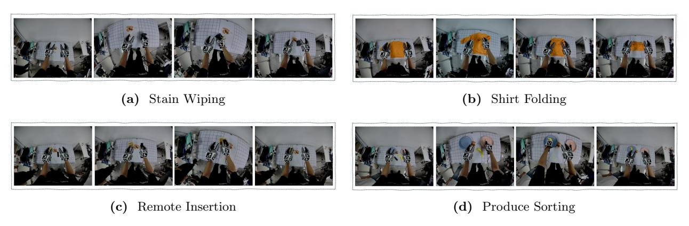

Figure 7 네 개의 벤치마크 작업, 첫 번째 사람 시점 HiFi-UMI 시연으로 표시됩니다. 각 패널은 핸드헬드 데이터 수집 중 헤드마운트 카메라에서 캡처된 한 작업의 대표적인 단계들을 보여줍니다. 이 스위트는 접촉이 많은 닦기, 변형 물체 조작, 제한된 배치, 그리고 의미 기반 물체 분류를 포함합니다. 동일한 작업의 실제 로봇 실행은 [Fig. 8.](#page-19-0)에서 보여집니다.

Table 4 일곱 가지 훈련 조건. 각 조건은 작업당 40개의 롤아웃으로 네 개의 작업에서 평가됩니다. C1–C6은 각 백본 내에서 사후 훈련 소스를 비교하고; C1과 C7은 일치하는 HiFi-UMI 사후 훈련 하에서 초기화를 비교합니다. C3–C6은 공개 기반 체크포인트를 사용하며, C7만이 HiFi-UMI 사전 훈련을 추가합니다 [(Sec. 5.6)](#page-15-0).

|  | 백본 | 초기화 / 사전 학습 | 사후 학습 데이터 | 보고된 위치 |
|----|----------------|----------------------------------|-----------------|-------------------|
| C1 | StarVLA-QwenPI | Qwen3-VL, 스크래치 액션 헤드 | HiFi-UMI | 섹션 6.2 및 6.3 |
| C2 | StarVLA-QwenPI | Qwen3-VL, 스크래치 액션 헤드 | 원격 조작 | 섹션 6.2 |
| C3 | OpenPI-π0.5 | pi05_base | HiFi-UMI | 섹션 6.2 및 6.3 |
| C4 | OpenPI-π0.5 | pi05_base | 원격 조작 | 섹션 6.2 |
| C5 | LingBot-VA | lingbot-va-base | HiFi-UMI | 섹션 6.2 |
| C6 | LingBot-VA | lingbot-va-base | 원격 조작 | 섹션 6.2 |
| C7 | StarVLA-QwenPI | Qwen3-VL → HiFi-UMI 사전 학습 | HiFi-UMI | 섹션 6.3 |

우리는 수집 파이프라인에서 하나의 사용 가능한 원격 조작 궤적(teleoperation trajectory)을 얻는 데는 하나의 UMI 궤적(UMI trajectory)을 얻는 것보다 몇 배 더 많은 실제 시간(wall-clock time)이 필요합니다. 인간 조작 시간 외에도 실제 로봇 수집은 로봇 실행(robot execution), 환경 재설정(environment reset), 안전 검사(safety checks) 및 하드웨어 복구(hardware recovery)에서 발생하는 오버헤드를 포함합니다. 따라서 보고된 크기(reported sizes)는 트레저리 수와 일치하는 설계가 아니라 실제 파이프라인 처리량(practical pipeline throughput)을 반영합니다.

평가 장면에서는 UMI 궤적(UMI trajectory)을 수집하지 않습니다. 따라서 UMI 사후 훈련된 정책은 배경, 조명, 테이블 표면 외관 및 전반적인 시각적 맥락에서 장면 수준의 분포 변동(scene-level distribution shift) 하에서 평가됩니다. 반면 원격 조작 시연은 평가와 동일한 로봇 설정 및 환경에서 수집됩니다. 이 비대칭성은 다양한 다중 사이트 UMI 데이터가 보이지 않는 배포 장면에 전이될 수 있는지를 보수적으로 테스트합니다.

#### 5.7.1 Training Variants

훈련 변형 (Training Variants)

본 연구는 세 가지 요인을 변형합니다: 정책 백본(policy backbone), 작업별 사후 훈련 데이터의 출처(source of task-specific post-training data), 그리고 StarVLA-QwenPI에만 해당되는 사후 훈련이 시작되는 초기화(from which post-training starts)입니다. 설계는 의도적으로 불균형적입니다: 데이터 출처 축은 세 가지 백본 모두에서 평가되지만, 초기화 축은 하나에서만 평가됩니다. [Tab. 4](#page-18-1)은 결과적으로 발생한 일곱 가지 훈련 조건을 나열하고 각 조건이 보고된 위치를 표시합니다.

이 설계에서 두 가지 비교가 도출되며, 다른 모든 요소는 고정됩니다. 데이터 출처 비교(C1 vs. C2, C3 vs. C4, C5 vs. C6)는 백본, 초기화, 최적화 레시피, 행동 표현, 정규화 프로토콜 및 배포 실행기를 고정하고, 작업별 시연이 어디에서 오는지만 변경합니다. 초기화 비교(C1 vs. C7)는 동일한 3,200개의 HiFi-UMI 궤적(HiFi-UMI trajectories)을 작업마다 사용하며, 레시피와 배포 스택과 함께 사후 훈련 데이터를 고정하고,

그림 8: 네 개의 벤치마크 작업에 대한 대표적인 성공적인 실제 로봇 실행, 각 행에서 왼쪽에서 오른쪽으로 시간이 진행됩니다.

사후 훈련이 시작되는 체크포인트만 변경합니다. 이 비교의 양쪽은 동일한 Qwen3-VL 가중치에서 시작하며, C7은 해당 가중치가 대규모 HiFi-UMI 사전 훈련을 거친 뒤에 사용된 것뿐입니다. 따라서 이 비교는 비전-언어 사전이 아니라 HiFi-UMI 데이터에서 획득한 시각-운동 사전(visual-motor prior)을 고립시킵니다. OpenPI-π0.5와 LingBot-VA는 공개된 기본 체크포인트에서 사후 훈련을 진행하며 초기화 비교에 참여하지 않습니다.

#### 6.2.1 Evaluation Track I

평가 트랙 I (Evaluation Track I)

### 6.2 Can UMI-Only Post-Training Match Teleoperation-Based Post-Training?

UMI-전용 사후 훈련이 원격 조작 기반 사후 훈련과 일치할 수 있나요? (Can UMI-Only Post-Training Match Teleoperation-Based Post-Training?)

아래 두 평가 트랙 모두에서, 작업별 사후 훈련 소스로 원격 조작 대신 HiFi-UMI를 사용하면 평가된 설정에서 대략적인 집계 평등(aggregate parity)을 달성합니다. UMI와 원격 조작의 차이를 취하면, 집계 성공률 차이는 StarVLA-QwenPI, OpenPI-π0.5, LingBot-VA 각각에서 −2.5, +3.1, −0.6 퍼센트 포인트이며, 백본 간에 일관된 방향이 없습니다. VLA와 WAM 트랙은 시간, 훈련, 배포 프로토콜을 포함한 모델별 실험 설정이 다르기 때문에 절대 성공률을 직접 비교할 수 없습니다. 따라서 우리는 그들의 일치를 세 가지 통제된 백본 내 비교에서의 수렴 증거로 해석하고, 정책 패러다임 간의 풀된 비교가 아니라는 점을 강조합니다. 우리는 두 개의 VLA 백본과 WAM을 차례로 보고합니다.

#### 6.2.1 Evaluation Track I: VLA Backbones

VLA 백본 (VLA Backbones)

우리는 두 개의 VLA 백본을 사용하여 UMI-전용 사후 훈련과 기존의 실제 로봇 텔레오퍼레이션 사후 훈련을 비교한다. 각 백본 내에서는 모델 아키텍처, 초기화, 최적화 레시피, 액션 표현, 배포 스택을 고정한다; 작업별 사후 훈련 데이터셋은 HiFi-UMI 또는 텔레오퍼레이션 수집 파이프라인 중 하나에서 제공되며, 모델과 배포 스택은 각 백본 내에서 고정된다. 총 평가에서는 4개의 작업, 4개의 정책 변형, 작업–정책 쌍당 40번의 시도에서 640개의 실제 로봇 롤아웃이 포함된다. Figure [8](#page-19-0)은 모든 네 작업에 대한 성공적인 실제 로봇 롤아웃을 보여준다.

집계 비교. Fig. [9,](#page-20-0)에 표시된 바와 같이, UMI-전용 사후 훈련은 두 VLA 백본 모두에서 텔레오퍼레이션 기반 사후 훈련과 밀접하게 일치한다. StarVLA-QwenPI에서는 UMI-사후 훈련 정책이 51.3% 성공률(82/160)을 달성한 반면, 텔레오퍼레이션-사후 훈련 동등물은 53.8%(86/160)로, 차이는 단 2.5 퍼센트 포인트이다. OpenPI-π0.5에서는 UMI 사후 훈련이 77.5% 성공률(124/160)을 달성하여 텔레오퍼레이션 사후 훈련 74.4%(119/160)보다 3.1 퍼센트 포인트를 앞선다. 집계하면, UMI는

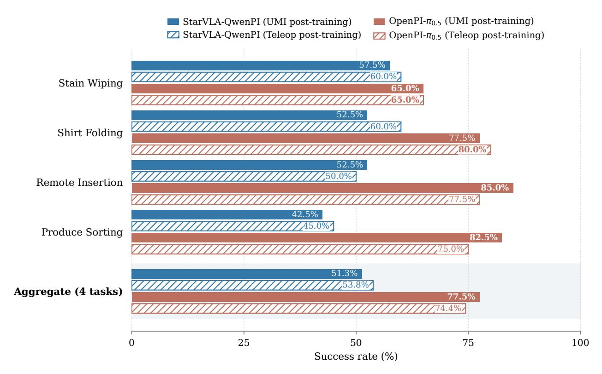

Figure 9 실제 로봇 성공률: 두 VLA 백본과 사후 훈련 데이터 소스. 각 작업–정책 쌍은 40번의 롤아웃으로 평가되며, 집계 결과는 모든 네 작업(정책당 160번 롤아웃)을 풀링한다. 실선 막대는 UMI 사후 훈련을, 가공 막대는 실제 로봇 텔레오퍼레이션 사후 훈련을 나타낸다. 굵은 라벨은 각 작업 내에서 가장 높은 성공률을 표시한다.

206/320 (64.4%) 대 205/320 (64.1%) (텔레오퍼레이션); 백본 내 비교가 여전히 주요하다.

특히, 집계 UMI–Teleop 차이는 두 VLA 백본 모두에서 작으며, 반면 두 백본 간 차이는 상당히 크다. 이는 결론이 특정 VLA 아키텍처에 의존하지 않음을 시사한다: 텔레오퍼레이션 시연을 고품질 UMI 시연으로 대체해도 실제 로봇 성능이 체계적으로 감소하지 않는다.

작업 수준 비교. UMI–Teleop 차이의 방향은 작업마다 다르며, 어느 데이터 소스를 일관되게 선호하지 않는다. Stain Wiping에서는 두 조건이 StarVLA-QwenPI에서 유사하게 수행되며 OpenPI-π0.5에서는 정확히 65.0%로 동점이다. 텔레오퍼레이션은 Shirt Folding에서 소폭 이점을 제공하며, StarVLA-QwenPI에서는 60.0% 대 52.5%, OpenPI-π0.5에서는 80.0% 대 77.5%를 기록한다. 반대로, UMI 사후 훈련은 Remote Insertion에서 약간 더 높다: StarVLA-QwenPI는 52.5% 대 50.0% (텔레오퍼레이션), OpenPI-π0.5는 85.0% 대 77.5%를 달성한다. Produce Sorting에서는 OpenPI가 UMI와 함께 더 높은 비율(82.5% 대 75.0%)을 보인다. 이러한 차이는 UMI가 물체, 배경, 수집 장소에서 더 넓은 변동성을 갖기 때문에 공간적 근거 및 물체 조건 제어에 도움이 될 수 있다.

각 작업–정책 쌍이 40번의 롤아웃을 포함하므로, 하나의 성공적인 시도는 2.5 퍼센트 포인트에 해당한다. 대부분의 작업 수준 차이는 1~3개의 롤아웃에 불과하다. 따라서 우리는 작은 차이를 한 데이터 소스의 결정적 우위가 아니라 대략적인 동등성으로 해석한다.

장면 변위 하에서의 일반화. 이 비교는 평가 장면 시각 변위에 대해 UMI에 대해 보수적이지만, 샘플이 일치하지 않는다. UMI 시연은 평가 장면과 배경, 조명, 탁상 모양, 공간 배치가 다른 여러 환경에서 여러 운영자가 수집한다. 반면, 텔레오퍼레이션 시연은 평가에 사용된 동일한 환경에서 대상 로봇에서 직접 수집된다. 이러한 장면 수준의 분포 변위에도 불구하고 UMI-사후 훈련은

그림 10 두 가지 보완적인 Remote Insertion 스케일링 연구. (a) OpenPI-π0.5을 점점 더 큰 UMI 서브셋으로 사후 훈련한 작업별 데이터 스케일링. (b) StarVLA-QwenPI 사후 훈련에 대한 초기화 소거; 점선은 3,200 에피소드에서 훈련된 Qwen-VL로 초기화된 스크래치 액션 정책을 표시한다. UMI 사전 훈련된 정책은 800 에피소드만으로 이 기준선을 초과한다. 각 설정은 40개의 실제 로봇 롤아웃으로 평가된다.

정책들은 환경 내 텔레오퍼레이션 동료와 비교해 집계 성능을 유지한다. 이는 다양한 고품질 UMI 데이터가 장면 변동 하에서도 정확한 감독을 제공한다는 것과 일치한다.

두 VLA 백본 전반에 걸쳐, 결과는 고품질 UMI 데이터가 실제로 배포 가능한 VLA 정책을 위해 단독으로 작업‑특정 사후 훈련 소스로 활용될 수 있다는 증거를 제공한다. 이는 실제 로봇 텔레오퍼레이션 앵커를 필요로 하지 않는다. 비교는 샘플이 일치하지 않는다: 각 작업은 3,200개의 UMI 궤적으로 사후 훈련되지만 300개의 텔레오퍼레이션 궤적을 사용한다. 따라서 우리는 이 실험을 샘플 수가 동일한 데이터 효율성 주장이라기보다 실용적인 데이터 생산 파이프라인 간의 비교로 해석한다. 그러나 이 실용적인 수집 체제 하에서는 사후 훈련에서 실제 로봇 텔레오퍼레이션을 제거해도 배포 성능에 상응하는 손실이 발생하지 않는다.

VLA 배포를 위해 얼마나 많은 UMI 데이터가 필요한가? 앞선 VLA 비교가 UMI 전용 사후 훈련이 텔레오퍼레이션 기반 사후 훈련과 일치할 수 있음을 보여주지만, 중요한 실용적 질문이 남는다: 배포 가능한 조작 정책을 얻기 위해 얼마나 많은 UMI 데이터가 필요한가? 이를 답하기 위해 UMI 시연 수가 실제 로봇 성공률에 미치는 영향을 연구한다.

이 분석을 위해 Remote Insertion 작업을 선택한다. 이 작업은 제어 가능하면서도 도전적인 평가 환경을 제공한다: 물체 잡기, 운반, 정밀 포즈 정렬, 제한된 목표 영역에 삽입 등 일련의 조작 기술을 요구한다. 셔츠 접기와 같은 고도로 변형 가능한 물체 작업과 비교하면 Remote Insertion은 내재적 변동성이 낮아 시연 수가 정책 학습에 미치는 영향을 보다 잘 분리할 수 있다.

최근 로봇 모방 학습에서의 데이터 스케일링 연구 [8]를 따라, 우리는 동일한 OpenPI-π0.5 백본을 사용해 UMI 시연의 서로 다른 하위 집합으로 훈련한다. 구체적으로, 각각 400, 800, 1,600, 3,200, 6,400 에피소드를 포함하는 다섯 개의 훈련 세트를 구성한다. 모델 초기화, 최적화 설정, 액션 표현, 평가 프로토콜을 포함한 모든 다른 훈련 구성은 동일하게 유지된다. 각 훈련된 정책은 무작위 초기 물체 구성 하에서 40개의 독립 롤아웃으로 실제 로봇에서 평가된다.

그림 [10a]에 표시된 바와 같이, UMI 사후 훈련 데이터 양을 늘리면 저데이터 영역에서 상당한 성능 향상이 나타난다. 성공률은 400개의 시연에서 37.5%에서 800개의 시연에서 65.0%로 증가하며, 이는 추가 UMI 궤적이 정책이 기본 조작 기술을 습득하는 능력을 빠르게 향상시킨다는 것을 나타낸다. 1,600 및 3,200개의 시연으로 확장하면 성능이 계속 향상되어 각각 70.0%와 85.0%의 성공률을 달성한다.

그러나 약 3,200개의 시연 이후에는 성능 향상이 거의 포화된다. 3,200에서 6,400 에피소드로 훈련 세트 크기를 늘려도 추가 이득이 없으며, 성공률은

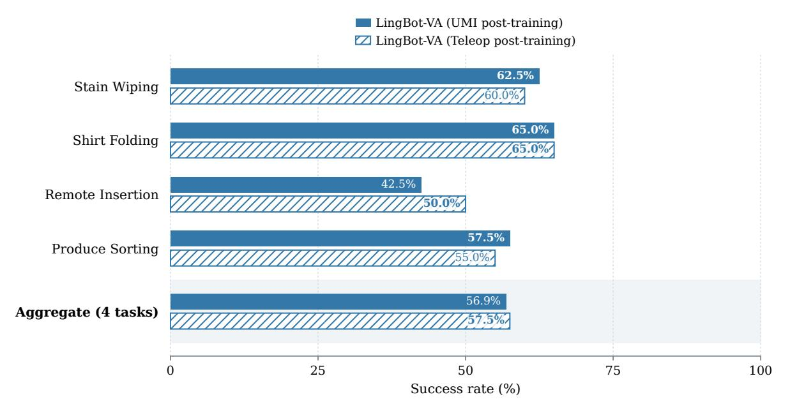

Figure 11: UMI와 원격 조작 사후 훈련 하에서 LingBot-VA의 실제 로봇 성공률. 각 task–datasource 쌍은 40번 롤아웃으로 평가되며, 집계 결과는 모든 네 개의 작업을 통합한 (각 사후 훈련 소스당 160 롤아웃) 결과를 보여준다. 실선 막대는 UMI 사후 훈련을, 점선 막대는 실제 로봇 원격 조작 사후 훈련을 나타낸다. 굵은 라벨은 각 작업 내에서 가장 높은 성공률을 표시한다.

85.0%에서 82.5%로 약간 감소한다. 이는 3,200 에피소드에서 40 롤아웃 평가 해상도에 따라 성능이 정체된다는 것을 시사한다.

이전 UMI 대 원격 조작 비교와 함께, 이 결과는 고품질 UMI 데이터가 확장 가능한 작업별 감독을 제공한다는 결론을 뒷받침한다. 소량의 고가의 로봇 수집 '앵커' 데이터가 필요하지 않고, 로봇이 없는 시연을 늘리면 저데이터 영역에서 작업별 사후 훈련을 크게 향상시키며, 실제 로봇 원격 조작 앵커 없이도 경쟁력 있는 배포 성능을 달성한다.

#### 6.2.2 평가 트랙 II: WAM 정책 (Evaluation Track II: WAM Policy)

우리는 LingBot-VA 내부에서 별도의 UMI 대 원격 조작 비교를 수행한다. LingBot-VA는 예측된 미래 비디오와 역동학 디코딩을 통해 행동을 생성하는 WAM이다. 동일한 LingBot-VA 베이스 체크포인트에서 UMI와 원격 조작 사후 훈련 변형을 구성하면서 모델 아키텍처, 최적화 일정, 비디오–행동 목표, 행동 표현, 추론 설정 및 배포 스택을 고정한다. 작업별 사후 훈련 데이터는 해당 UMI 또는 원격 조작 수집 파이프라인에서 제공된다. 각 task–policy 쌍마다 40개의 실제 로봇 롤아웃을 수행하여 네 개의 작업과 두 개의 정책 변형에서 총 320개의 롤아웃을 얻는다. 이 WAM 평가는 모델별 훈련 및 평가 프로토콜을 따르므로, 절대 성공률은 VLA 트랙의 성공률과 직접적으로 비교되지 않는다. 오프라인 진단으로서, 우리는 실제 미래 비디오를 조건으로 하여 행동 예측을 추가로 평가한다. 이 오라클 조건은 진단에서 누적된 미래 비디오 생성 오류를 제거하고, 역행동 구성요소를 보다 직접적으로 탐구할 수 있게 한다.

집계 비교. 네 개의 모든 작업에서 UMI 전용 사후 훈련은 56.9% (91/160)의 집계 성공률을 달성하며, 실제 로봇 원격 조작 사후 훈련으로 얻은 57.5% (92/160)와 밀접하게 일치한다. 이 유사한 성능은 두 데이터 소스가 평가된 설정에서 사후 훈련에 대해 유사한 효과를 제공함을 시사하며, 어느 한쪽이 명확히 우위에 있다는 것을 나타내지 않는다. 별도의 WAM 평가 프로토콜 하에서 원격 조작 시연을 HiFi-UMI로 대체해도 폐쇄 루프 배포 성능에 체계적인 저하가 발생하지 않는다.

작업별 비교. 성공률 차이의 방향은 작업마다 다르며, 어느 한쪽 데이터 소스를 일관되게 선호하지 않는다. UMI 사후 훈련은 Stain Wiping 작업에서 62.5%의 성공률을 기록해 원격 조작 대비 60.0%보다 약간 높고, Produce Sorting 작업에서도 57.5%를 달성해 55.0%보다 높다. 두 변형은 Shirt Folding 작업에서 동일한 65.0% 성공률을 보인다. 반대로, 원격 조작 사후 훈련은 Remote Insertion 작업에서 50.0%의 성공률을 기록해 UMI 사후 훈련의 42.5%보다 우수하다. task–policy 쌍당 40개의 롤아웃을 사용한 이 작은 변동은 어느 소스도 일관되게 우위에 있지 않다.

이진 성공을 넘어, 로봇 롤아웃의 정성적 검토는 실행 템포에서 체계적인 차이를 드러낸다: UMI-사후 훈련된 정책은 더 큰 진폭, 더 연속적이며 더 자연스러운 모션을 생성하는 경향이 있다. 성공적인 롤아웃은 더 적은 일시 정지로 작업 마일스톤에 도달하는 반면, 텔레오퍼레이션-사후 훈련된 정책은 더 자주 점진적 수정을 수행한다. 이러한 관찰은 정성적이며, 완료 시간은 회복 행동과 종료 조건에도 영향을 받는다.

더 직접적인 명목 실행이 반드시 더 강력한 회복 행동을 의미하는 것은 아니다. 이 구분은 Remote Insertion 작업에서 가장 뚜렷하다: UMI-사후 훈련된 정책은 종종 단호한 초기 그립을 수행하지만, 불완전한 접촉 조건에서 여러 번 시도해야 할 수 있다. 이러한 재시도는 전체 실행 효율을 감소시키며, 이 작업에서 관찰된 낮은 성공률과 일치한다. 이 결과는 명목 실행 효율과 회복 견고성 사이의 구분을 강조하며, 접촉 교정 및 재그립 행동의 광범위한 적용이 신뢰할 수 있는 폐쇄 루프 배포에 중요함을 시사한다.

Ground-truth-video 분석은 도메인 간 포즈 디코딩이 안정적임을 보여준다. 위의 폐쇄 루프 평가는 전체 WAM 파이프라인의 성능을 측정하지만, 실패가 미래 비디오 예측에서 비롯된 것인지 아니면 행동 디코딩에서 비롯된 것인지 분리하지는 않는다. LingBot-VA의 행동 예측은 예측된 미래 시각 잠재 변수에 조건화되므로, 생성된 비디오를 사용한 평가는 시각 생성과 행동 디코딩 오류를 결합한다. 이 요인을 분리하기 위해, 우리는 생성된 미래 비디오 잠재 변수를 캐시된 Ground-truth 잠재 변수로 교체하고, Stain Wiping, Shirt Folding, Remote Insertion, Produce Sorting 작업에서 행동 디코더를 평가한다. 이 Ground-truth-video 프로토콜은 배포 가능한 추론 모드가 아니라 오라클 진단으로서 기능한다: 평가에서 미래 비디오 생성 오류를 제거하지만, 비디오 생성이 주된 폐쇄 루프 병목 현상임을 자체적으로 입증하지는 않는다. 우리는 세 가지 설정을 평가한다: 실제 로봇 보류 관측에 대한 텔레오퍼레이션-사후 훈련 모델 (Real→Real), 동일 보류 도메인에 대한 UMI-사후 훈련 모델 (UMI→Real), 그리고 에피소드-분리된 UMI 보류 관측에 대한 동일 UMI-사후 훈련 모델 (UMI→UMI).

지표 및 집계. 우리는 수평선 H = 12인 최초 실행된 행동 청크 전체를 평가한다. 예측과 목표에 동일한 비정규화 및 청크-앵커 SE(3) 재구성을 적용한 뒤, 양손 XYZ 궤적 오차를 다음과 같이 계산한다

$$E_{XYZ} = 10^{3} \sqrt{\frac{1}{6H} \sum_{t=1}^{H} \sum_{b \in \{L,R\}} \|\hat{\mathbf{p}}_{t,b} - \mathbf{p}_{t,b}\|_{2}^{2}},$$

(7)

여기서 103 인자는 미터를 밀리미터로 변환한다. 전체 청크를 평가함으로써 원래 청크-앵커 행동 계약을 보존하고, 컨트롤러에 전달되는 전체 궤적을 측정한다. 이는 선택된 짧은 접두어가 아니라. 회전의 경우, 우리는 먼저 Rotation6D 예측과 목표를 유효한 회전 행렬로 변환하고, 엄격한 인접 프레임 증가량, ∆Rt,b = R⊤ t−1,bRt,b 를 형성한다. 그 다음 우리는 다음을 보고한다

$$E_{\text{rot} = \frac{1}{2(H-1)} \sum_{t=2}^{H} \sum_{b \in \{L,R\}} d_{\text{SO(3)}} \left( \widehat{\Delta \mathbf{R}}_{t,b}, \Delta \mathbf{R}_{t,b} \right), \tag{8}$$

단위는 도이며, dSO(3)은 두 회전 사이의 측지각이다. t = 1 단계는 생략된다, 왜냐하면 그 이전 포즈가 외부 청크 앵커이기 때문이며, 이는 예측 시퀀스의 이전 목표가 아니다. 인접 증가량은 따라서 누적 앵커 상대 드리프트가 지표를 지배하도록 허용하지 않고, 지역 회전 방향과 크기를 측정한다.

학습된 정책의 경우, 우리는 먼저 각 소스 에피소드 내에서 평가 기록과 세 개의 추론 시드를 평균한다. 무작위 참조의 경우, 우리는 대신 각 기록마다 256개의 독립적으로 샘플링된 행동 청크를 평균한다.

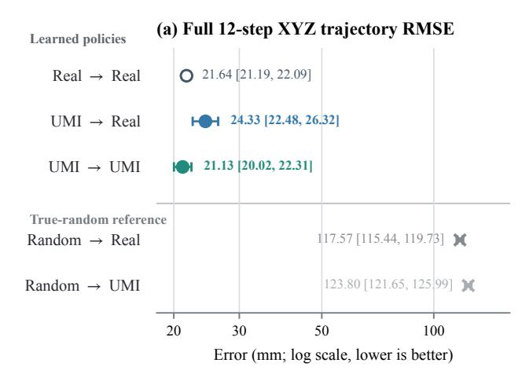

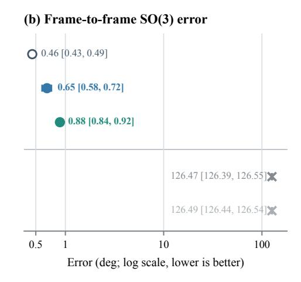

Figure 12는 실제 영상 기반 조건화 하에서 WAM 포즈 디코딩 정확도를 보여준다. 점은 Stain Wiping, Shirt Folding, Remote Insertion, Produce Sorting 네 작업의 동일 작업 평균을 나타내며, 수염은 95% 소스-에피소드 부트스트랩 신뢰 구간을 나타낸다. Translation은 네이티브 chunk-anchor 표현에서 첫 번째 H=12 청크 전체에 대한 양손 XYZ RMSE이다. Rotation은 t=2,…,12에서 예측값과 실제값 사이의 인접 프레임 증가분 간 SO(3) 지오데식 오차이다. Logarithmic axes는 학습된 정책 간 해상도를 유지하면서 실제 무작위 행동을 공통 스케일 참조로 보존한다. Gripper channels는 UMI와 실제 로봇 인터페이스 간 물리적 의미가 보정되지 않았으므로 제외된다. Lower is better.

에피소드 집계 이전에. 그 후 각 작업 내에서 소스 에피소드를 평균화하고 네 작업에 동일한 가중치를 부여한다. 보고된 95% 신뢰 구간은 소스 에피소드를 샘플링 단위로 하여 20,000개의 층화 부트스트랩 재표본을 사용하며, 상관된 윈도우나 확률적 샘플을 독립 관측치로 취급하는 것을 피한다. 각 평가 기록마다, 무작위 참조는 해당 작업의 동결된 UMI 체크포인트 정규화 공간에서 Uniform[−1,1]로부터 각 타임스텝과 20개의 활성 액션 채널을 독립적으로 샘플링하고, 해당 체크포인트의 역분위 정규화를 적용한 뒤, 결과 청크를 동일한 물리 재구성 및 점수 매기기 파이프라인에 전달한다. 주요 분석에서는 두 개의 그리퍼 채널을 제외한다. 이는 그리퍼 채널의 획득 의미가 인터페이스 간에 보정되지 않았기 때문이다. 특히, 그립이 없을 때, 실제 로봇 원격 조작은 완전히 열려 있는 그리퍼를 기본으로 하며, 반면 UMI는 운영자의 손 제스처 각도를 유지한다. 채널을 포함하면 포즈 디코딩 정확도와 그리퍼 동작의 인터페이스 차이를 혼합하게 된다.

Figure 12에 표시된 바와 같이, UMI-후학습 정책은 보류된 실제 로봇 관측에서 전체 청크 XYZ RMSE 24.33 mm와 프레임 간 SO(3) 오차 0.65°를 달성한다. 에피소드가 겹치지 않는 보류된 UMI 관측에서는 해당 오차가 21.13 mm와 0.88°이며, 이는 변환에서 3.20 mm, 회전에서 0.23°의 교차 도메인 차이만을 나타낸다. 같은 보류된 실제 로봇 도메인에서, 원격 조작-후학습 참조는 21.64 mm XYZ RMSE와 0.46° SO(3) 오차를 달성한다. 비교를 위해, 실제 무작위 행동은 실제 로봇 관측에서 117.57 mm와 126.47°, UMI 관측에서 123.80 mm와 126.49°를 낸다. 도메인 일치 Random→Real 참조에 비해, UMI→Real은 변환 오차를 79.3 %와 회전 오차를 99.5 % 감소시킨다. 이 결과는 미래 비디오 생성을 우회할 때, UMI와 원격 조작-후학습 포즈 디코더가 모두 센티미터 수준의 변환 정확도와 소수점 이하 도수의 지역 회전 정확도를 달성함을 시사한다. UMI→Real과 UMI→UMI 사이의 작은 차이는 UMI-학습된 디코더가 관측 도메인 간에 상당한 저하 없이 일반화된다는 것을 시사한다.

### 6.3 대규모 UMI 사전 학습이 더 나은 기본 모델을 제공하는가? (Does Large-Scale UMI Pre-Training Yield a Better Base Model?)

두 개의 후학습 경로는 고품질 UMI 시연이 실제 로봇 원격 조작을 작업별 데이터 소스로 대체할 수 있음을 보여준다. 다음으로 StarVLA-QwenPI에 대해 별도의 질문을 제기한다: 동일한 로봇-프리 데이터가 재사용 가능한 베이스 모델을 지원할 수 있는가? 우리는 StarVLA-QwenPI를 4,000시간의 다중 작업 UMI 데이터로 사전 학습한다. 유용한 초기화는 이 코퍼스의 보류된 샘플에 대한 예측뿐 아니라 보지 못한 작업과 실제 로봇 후학습으로의 전이에도 개선을 가져와야 한다. 우리는 이러한 특성을 차례로 연구한다.

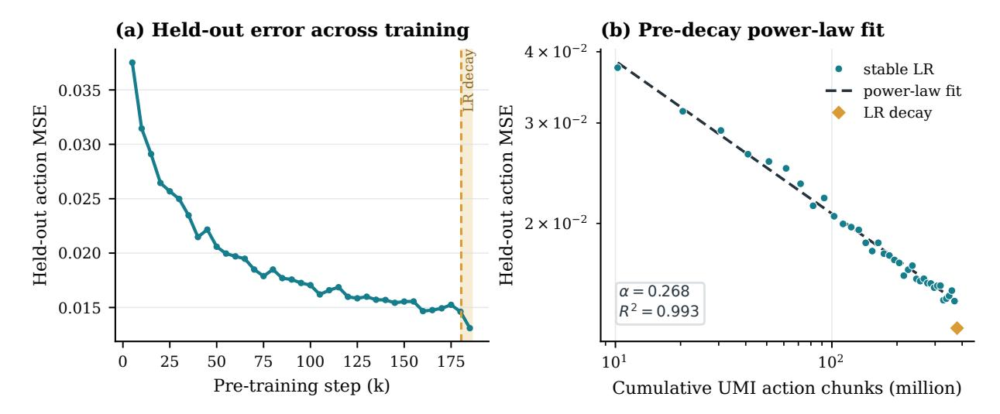

그림 13 대규모 UMI 사전학습 동안 보류된 동작 예측 오차. (a) 학습률 감소가 음영 처리된 학습 전반의 오차. (b) 로그 축에서 전-감쇠 체크포인트와 파워-라식 적합. 코퍼스가 고정되어 있으므로 적합은 데이터셋 크기 스케일링이 아니라 노출 스케일링을 측정한다.

보류된 데이터에서의 스케일링. 4,000시간 학습 혼합은 섹션 [4](#page-11-2)에서 설명한 대규모 코퍼스에서 추출되며 다양한 장면, 물체, 조작 기술을 포함한다. 우리는 평가를 위해 고정된 동작 청크 집합을 보유하고, 모든 체크포인트에서 동일한 고정 단계 오일러 적분 절차를 흐름 매칭 정책에 사용한다. 이는 평가 데이터나 샘플러의 변화를 제외하고 더 많은 학습 노출의 효과를 분리한다. 혼합을 한 번 통과하면 180k 단계에서 끝나며, 그 뒤에 짧은 학습률 감소가 따른다.

그림 [13](#page-25-0)은 코퍼스를 한 번 통과하면서 보류된 동작 오차가 61% 감소함을 보여준다. 고정된 모델 크기와 학습 레시피에서 우리는 적합한다

$$\mathcal{L}_{\text{heldout}}(S) = \mathcal{L}_{\infty} + AS^{-\alpha}, \tag{9}$$

여기서 S는 전역적으로 처리된 UMI 동작 청크의 누적 수를 나타낸다. 적합된 지수는 α = 0.268이며, 학습률 감소 이전에 R2 = 0.993이다. 이 근접한 로그–로그 적합은 모델이 학습 통과 동안 더 많은 UMI 노출을 더 나은 동작 예측으로 지속적으로 변환한다는 것을 보여준다. 따라서 이 추세는 최종 감소 일정의 아티팩트가 아니다.

보지 않은 작업으로의 전이. 사전학습 분포에서 낮은 오차가 반드시 더 넓은 시각-운동 역량을 의미하지 않는다. 따라서 우리는 사전학습에 없었던 별도로 수집된 10개의 조작 작업에서 균형 잡힌 평가 세트를 구성한다. 동일한 동작 청크와 추론 설정이 모든 체크포인트에서 사용되며, 스케일링 적합은 학습률 감소 이전의 체크포인트만 사용한다.

그림 [14a](#page-26-0)은 평균 OOD 오차가 41% 감소하고, 모든 보지 않은 작업이 개선됨을 보여준다. 집계된 OOD 오차도 파워-라식 추세를 따르지만, 지수는 α = 0.095로 더 작다. 가족 곡선은 명확한 순서를 드러낸다: 식기 및 식기류 상호작용이 가장 빠르게 개선되고, 세분화된 전이는 중간에 위치하며, 천 접힘이 가장 느리게 개선된다. 따라서 스케일링은 작업 가족 전반에 걸쳐 공유되지만, 그 속도는 사전학습 중에 표현된 상호작용 패턴에 따라 달라진다.

그림 [14b](#page-26-0)의 작업 수준 비교는 이 의존성을 보다 구체적으로 만든다. 강체 식기-받침 작업은 가장 낮은 최종 오차를 가지며, 옷감 접기는 가장 어려운 작업이다. 세분화된 전이 또한 목표 기하학에 따라 크게 변한다. 이 구조는 사전학습 혼합을 반영한다: 물체와 수용기 배치가 프레임의 1/3 이상을 차지하고, 직물 접기는 1% 미만을 차지한다. 따라서 모델은 풍부한 강체 물체 픽 앤 플레이스 경험을 새로운 식기에 재사용할 수 있지만, 천 접기는 희소한 변형 물체 감독에서 외삽해야 한다. OOD 전이는 테스트 물체 자체가 이전에 등장했는지 여부보다 상호작용 역학의 범위에 의해 더 많이 좌우된다.

이 분석은 또한 구체적인 데이터 수집 우선순위를 제공한다. 변형 물체 데이터는 더 많은 옷감 토폴로지, 초기 구성, 양손 재그랩, 접힘 전이를 포함해야 한다. 세분화된 물질 데이터는

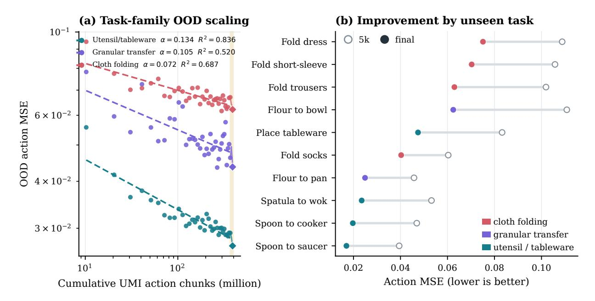

그림 14 보지 않은 10개의 UMI 작업에 대한 일반화. (a) 전-감쇠 파워-라식 적합과 함께 조작 가족별 평균 동작 MSE; 다이아몬드는 최종 모델 내보내기를 나타낸다. (b) 첫 번째 체크포인트와 최종 내보내기의 작업 수준 오차. 색상은 광범위한 조작 가족을 식별한다.

컨테이너 기하학, 채우기 수준, 움직임 유형을 다양화한다. 따라서 OOD 벤치마크는 단일 집계 점수만이 아니라 다음 사전학습 혼합을 재조정하기 위한 진단 도구로 사용된다.

사후 훈련의 이점. 오프라인 행동 오류는 배포를 위한 더 나은 시작점을 예측할 때만 유용하다. Remote Insertion에서는 행동 정책이 처음부터 시작하는 Qwen-VL 초기화 모델과 비교한다; 공유된 시각-언어 백본은 UMI의 시각-운동 사전 지식을 분리한다. 800개의 작업별 에피소드만으로도 UMI 사전 훈련된 정책은 4배 더 많은 데이터를 사용해 훈련된 Qwen-VL 초기화 기준선을 이미 초과한다(그림 10b 참조). 에피소드를 1,600으로 확장하면 성공률이 80%로 상승하며, 이 이점은 3,200 에피소드 규모에서도 유지된다. 중요한 패턴은 강력한 성능이 더 일찍 나타나고 작업별 기준선보다 높게 유지된다는 점이다: 사전 훈련은 데이터 효율성과 사후 훈련 후 도달하는 성능을 모두 향상시킨다.

다음으로, 이 이점이 단일 작업을 넘어 확장되는지 테스트한다.  
Sec. 6.1.2의 네 개 벤치마크 작업 각각에서, 동일한 3,200개의 작업별 트래젝터리를 사용해 두 개의 StarVLA-QwenPI 정책을 사후 훈련한다.  
하나는 Qwen-VL에서 무작위로 초기화된 액션 정책으로 시작하고, 다른 하나는 우리 UMI-사전학습된 체크포인트에서 시작한다; 데이터 분할, 액션 표현, 정규화, 최적화 일정, 배포 프로토콜은 그 외에는 동일하다.  
따라서 초기화만이 통제된 차이점이다.  
OpenPI- $\pi_{0.5}$ 은 이 통제된 비교의 일부가 아니라 교차 아키텍처 참조로 포함된다.

Figure 15는 모든 벤치마크 작업에서 양의 전이 효과를 보여준다. UMI 사전 학습은 aggregate StarVLA-QwenPI 성공률을 18.1 퍼센트 포인트 상승시키며, 특히 wiping, folding, insertion 작업에서 강력한 성과를 보인다. 아키텍처와 사후 학습 레시피가 고정되어 있기 때문에, 이 개선은 추가적인 작업별 감독이 아니라 시각-운동 초기화에 기인한다고 할 수 있다. OpenPI- $\pi_{0.5}$는 결과 성능 수준에 대한 맥락을 제공하지만, 통제된 기준선은 아니다.

세 가지 평가가 사전 훈련 노출을 배포와 연결한다: 예측은 훈련 과정 전반에 걸쳐 개선되고, 같은 경향이 보이지 않는 작업에도 확장되며, 결과적으로 생성된 체크포인트는 적은 데이터로 다운스트림 작업을 학습한다. 더 중요한 것은 작업-가족 분석이 전이가 기술마다 다른 이유를 식별한다. 말뭉치를 확장하는 것이 효과적인 경우는 정책이 이후에 재사용해야 할 상호작용 역학의 범위를 확장할 때이다.

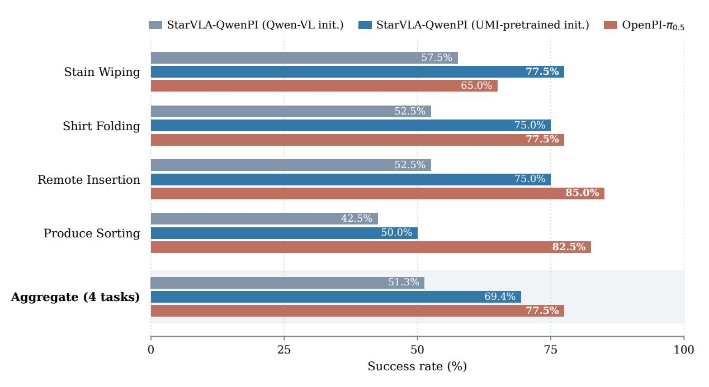

Figure 15 UMI 전용 사후 훈련 후 실제 로봇 성공률. StarVLA-QwenPI는 Qwen-VL 또는 우리 UMI 사전 훈련 체크포인트 중 하나에서 초기화됩니다; OpenPI-π0.5는 교차 아키텍처 참조를 제공합니다. 각 작업은 정책당 40개의 롤아웃을 포함합니다. 굵은 라벨은 각 그룹 내에서 가장 높은 성공률을 나타냅니다.

## 7 Discussion (논의)

## Empirical Findings and Implications (실증적 발견 및 시사점)

네 개의 평가된 작업과 세 개의 테스트된 백본—두 개의 VLA와 한 개의 WAM—전반에 걸쳐 HiFi-UMI는 유일한 작업별 사후 훈련 소스로서 동작하며, 도메인 내 텔레오퍼레이션과 대략적인 집계 평등을 달성한다.  

이 발견은 모델의 완전한 사전 훈련 이력이 아니라 작업별 사후 훈련 데이터의 출처와 관련이 있다: OpenPI-π0.5와 LingBot-VA는 공개적으로 배포된 사전 훈련 초기화를 유지하며, HiFi-UMI 사후 훈련 조건에서는 대상 작업 텔레오퍼레이션 데이터가 도입되지 않는다.  

우리의 추가 HiFi-UMI 사전 훈련은 이 집계 사후 훈련 결과에 필요하지 않으며; 별도로 StarVLA-QwenPI에서 4,000시간의 HiFi-UMI 사전 훈련은 사후 훈련 데이터 효율성과 최종 배포 성능을 더욱 향상시켜 효율성–성능 프론티어를 상승시킨다.  

이 결과는 또한 작업별 시연이 충분히 행동 정렬되면 데이터 구성과 범위가 단순히 양보다 중요해질 수 있음을 시사한다.  

배포 가능한 정책이 가장 의존하는 상호작용 역학과 그 범위가 언제 포화되는지를 특성화하는 것은 여전히 핵심적인 미해결 질문이다.

## 제한 사항 및 향후 연구

평가 범위와 일반성. 우리의 무로봇 사후 훈련 증거는 장면 수준의 분포 전이 하에서 4개의 탁상 이중 손동작 과제와 3개의 백본을 포함한다; 다른 과제, 구현체 및 전이로의 일반성은 아직 테스트되지 않았다. 사전 훈련 증거는 더 좁다: 확장 및 다운스트림 이득은 StarVLA-QwenPI에서만 측정된다. 더 넓은 과제와 구현체, 추가 VLA 및 WAM 백본이 필요하다 두 결과의 범위를 확립하기 위해.

과제 수준 통계 해상도. 각 과제–정책 쌍은 40개의 롤아웃을 갖고, 따라서 한 번의 추가 성공이 추정 비율을 2.5 퍼센트 포인트 바꾼다. 이로 인한 불확실성은 세밀한 과제 수준 비교를 제한한다, 왜냐하면 몇 개의 결과가 작은 차이로 구분된 방법들의 순서를 뒤집을 수 있기 때문이다. 따라서 우리는 과제별 차이를 서술적이라고 보고, 평등 주장(parity claim)은 과제 전반의 집계 증거를 기반으로 한다. 조건당 더 많은 시도를 하면 불확실성을 좁히고 과제 수준 효과를 보다 정밀하게 특성화할 수 있다.

정밀도는 전체적으로 검증되며 분해되지 않는다. 우리는 정밀도를 궤적 정확도, 그리퍼 간 상대 포즈, 동기화, 시야각이 공동으로 실현되는 설계 원칙으로 다루며, 이 요소들을 통제된 저하를 통해 분리하지 않는다. 따라서 우리의 결과는 고정밀도가 충분함을 보여주지만, 배포 가능한 정책이 각 속성에 대해 얼마나 필요로 하는지는 알려주지 않는다. 샘플 수와 장면 범위를 고정한 채 각 요소를 선택적으로 저하시키는 체계적 절단(ablation)은 그 한계 기여를 정량화하고 "고정밀도가 도움이 된다"를 배포에 필요한 정밀도의 실행 가능한 사양으로 전환할 것이다.

데이터 효율성과 사후 훈련 소스 간 전이. 우리의 평등 비교는 샘플 매칭되지 않는다: 사전 훈련 없이 UMI 전용 사후 훈련은 원격 조작 기준선보다 약 10배 더 많은 시연을 사용하므로, 결과는 경로별 효율성보다 실용적인 데이터 생산 파이프라인을 비교한다. 대규모 UMI 사전 훈련은 효율성과 달성 가능한 성능을 급격히 향상시키지만, 두 가지 질문이 남는다: 사전 훈련 코퍼스가 커짐에 따라 이득이 계속되는지, 아니면 결국 포화되는지, 그리고 같은 초기화가 실제 로봇 원격 조작 데이터에 대해 UMI 데이터에 대한 사후 훈련만큼 이득을 주는지. 두 가지를 더 큰 규모에서 테스트하면 일반적으로 재사용 가능한 초기화 효과와 도메인 매칭 훈련에 특화된 이득을 구분할 수 있다.

## 8 결론

우리는 로봇이 없는 시연이 정책을 시드할 수는 있지만 원격 조작 사후 훈련 앵커 없이 완성할 수 없다는 가정을 재검토한다. 우리는 제한이 로봇이 없는 설정이 아니라 정밀도라는 주장을 한다. HiFi-UMI는 궤적 정확도, 그리퍼 간 상대 포즈, 동기화, 시야각을 위해 공동 설계된 휴대용 캡처를 사용해 이 주장을 테스트하며, 그 파이프라인은 20,000시간이 넘는 데이터를 생성했다.

세 개의 VLA 및 WAM 백본 전반에 걸쳐, HiFi-UMI만으로 사후 훈련된 정책은 원격 조작과 약 3 퍼센트 포인트 이내로 일치하며, 양쪽 부호의 차이는 샘플링 잡음 범위 내에 있고, 장면 전이와 원격 조작 데이터가 없음에도 정밀 삽입에서 85%를 달성한다. 별도로, 4,000시간의 사전 훈련은 10개의 미지 과제에서 동작 오류를 41% 줄이고, 일치된 사후 훈련 데이터에서 실제 로봇 성공률을 18.1 퍼센트 포인트 높여, 작업 데이터의 1/4만으로 스크래치 초기화 기준선에 도달한다. 따라서 이 정도 정밀도의 로봇이 없는 데이터는 배포 가능한 조작을 지원할 수 있으며, 단지 사전 훈련에만 국한되지 않는다. 우리는 HiFi-UMI-2K를 공개한다. 이는 2,000시간, 마이크로초 동기화, 재생 가능, 초광시야(subset) 코퍼스이다.

## 저자 기여

#### 핵심 기여자

Yuteng Wei\* , Jinming Ma\* , Jiawei Wang\*† , Weitao Zhou\*† , Yushen Zuo, Ke Rui, Minglei Li† ✉ .

#### 기여자

장진하, 판지강, 왕상, 자오란, 두환, 정종정, 마준, 칸귀유, 장디, 리자오페이.

*동일 기여. †프로젝트 리더. ✉응답 저자.

연락처: [liminglei@simpleai.tech](mailto:liminglei@simpleai.tech).

# 참고문헌 (References)

- [1] Anthony Brohan, Noah Brown, Justice Carbajal, et al. RT-1: 대규모 실세계 제어를 위한 로보틱스 트랜스포머. In Robotics: Science and Systems (RSS), 2023.
- [2] Homer Walke, Kevin Black, Abraham Lee, et al. BridgeData V2: 대규모 로봇 학습을 위한 데이터셋. In Conference on Robot Learning (CoRL), 2023. arXiv:2308.12952.
- [3] Alexander Khazatsky, Karl Pertsch, Suraj Nair, et al. DROID: 대규모 현장 로봇 조작 데이터셋. In Robotics: Science and Systems (RSS), 2024. arXiv:2403.12945.
- [4] AgiBot-World-Contributors, Qingwen Bu, Jisong Cai, et al. AgiBot World Colosseo: 확장 가능하고 지능형 구현 시스템을 위한 대규모 조작 플랫폼. arXiv preprint arXiv:2503.06669, 2025.
- [5] Kun Wu, Chengkai Hou, Jiaming Liu, et al. RoboMIND: 로봇 조작을 위한 다중 구현 지능 규범 데이터 벤치마크. arXiv preprint arXiv:2412.13877, 2024.
- [6] Cheng Chi, Zhenjia Xu, Chuer Pan, et al. Universal manipulation interface: 현장 로봇 없이 현장 로봇 교육. In Robotics: Science and Systems (RSS), 2024. arXiv:2402.10329.
- [7] Zhaxizhuoma, Kehui Liu, Chuyue Guan, et al. FastUMI: 대규모 및 하드웨어 독립적인 범용 조작 인터페이스와 데이터셋. arXiv preprint arXiv:2409.19499, 2024.
- [8] Fanqi Lin, Yingdong Hu, Pingyue Sheng, et al. Data scaling laws in imitation learning for robotic manipulation. In International Conference on Learning Representations (ICLR), 2025. arXiv:2410.18647.
- [9] Hongjie Fang, Chenxi Wang, Yiming Wang, et al. AirExo-2: 저비용 외골격으로 일반화 가능한 로봇 모방 학습을 대규모화. arXiv preprint arXiv:2503.03081, 2025.
- [10] Johan Bjorck, Fernando Castañeda, Nikita Cherniadev, et al. GR00T N1: 일반형 휴머노이드 로봇을 위한 공개 기반 모델. arXiv preprint arXiv:2503.14734, 2025.
- [11] Hongzhe Bi, Lingxuan Wu, Tianwei Lin, et al. H-RDT: 인간 조작 강화 양손 로봇 조작. arXiv preprint arXiv:2507.23523, 2025.
- [12] Qiyuan Zeng, Chengmeng Li, Jude St. John, et al. ActiveUMI: 로봇이 없는 인간 시연에서의 능동적 인식을 통한 로봇 조작. arXiv preprint arXiv:2510.01607, 2025.
- [13] James Wang, Primo Pu, Zephyr Fung, et al. XRZero-G0: 인터페이스, 품질 및 비율을 통한 정교한 로봇 조작의 최전선. arXiv preprint arXiv:2604.13001, 2026.
- [14] Songming Liu, Bangguo Li, Kai Ma, et al. RDT2: UMI 데이터의 스케일링 한계를 무샷 교차 구현 일반화로 탐구. arXiv preprint arXiv:2602.03310, 2026.
- [15] Hao-Shu Fang, Hongjie Fang, Zhenyu Tang, et al. RH20T: 한 번에 다양한 기술을 학습하기 위한 종합 로봇 데이터셋. arXiv preprint arXiv:2307.00595, 2023.
- [16] Open X-Embodiment Collaboration, Abby O'Neill, Abdul Rehman, et al. Open X-embodiment: 로봇 학습 데이터셋 및 RT-X 모델. In IEEE International Conference on Robotics and Automation (ICRA), 2024. arXiv:2310.08864.

- [17] Chengkai Hou, Kun Wu, Jiaming Liu, et al. RoboMIND 2.0: 일반화 가능한 구현 지능을 위한 다중 모달, 양손 모바일 조작 데이터셋. arXiv preprint arXiv:2512.24653, 2025.
- [18] Kristen Grauman, Andrew Westbury, Eugene Byrne, et al. Ego4D: 3,000시간의 자기 시점 비디오로 전 세계를 둘러보다. In IEEE/CVF Conference on Computer Vision and Pattern Recognition (CVPR), 2022. arXiv:2110.07058.
- [19] Kristen Grauman, Andrew Westbury, Lorenzo Torresani, et al. Ego-Exo4D: 1인칭 및 3인칭 관점에서 숙련된 인간 활동 이해. In IEEE/CVF Conference on Computer Vision and Pattern Recognition (CVPR), 2024. arXiv:2311.18259.
- [20] Ryan Hoque, Peide Huang, David J. Yoon, et al. EgoDex: 대규모 자기 시점 비디오에서 정교한 조작 학습. arXiv preprint arXiv:2505.11709, 2025.
- [21] Kehui Liu, Zhongjie Jia, Yang Li, et al. FastUMI-100K: 대규모 UMI 스타일 데이터셋으로 데이터 기반 로봇 조작 발전. arXiv preprint arXiv:2510.08022, 2025.
- [22] Siyuan Yang, Linzheng Guo, Ouyang Lu, et al. VISTA: VLA 훈련을 위한 UMI 데이터의 시각 기반 및 물리 검증된 적응. arXiv preprint arXiv:2606.04708, 2026.
- [23] Chen Wang, Haochen Shi, Weizhuo Wang, et al. DexCap: 정교한 조작을 위한 확장 가능하고 휴대 가능한 모션 캡처 데이터 수집 시스템. In Robotics: Science and Systems (RSS), 2024. arXiv:2403.07788.
- [24] Mengda Xu, Han Zhang, Yifan Hou, et al. DexUMI: 인간 손을 보편적 조작 인터페이스로 사용한 정교한 조작. In Conference on Robot Learning (CoRL), 2025. arXiv:2505.21864.
- [25] Tony Tao, Mohan Kumar Srirama, Jason Jingzhou Liu, et al. DexWild: 야외 로봇 정책을 위한 정교한 인간 상호작용. Robotics: Science and Systems (RSS), 2025.
- [26] Sirui Chen, Chen Wang, Kaden Nguyen, et al. ARCap: 증강 현실 피드백으로 로봇 학습을 위한 고품질 인간 시연 수집. In IEEE International Conference on Robotics and Automation (ICRA), 2025. arXiv:2410.08464.
- [27] Hongjie Fang, Hao-Shu Fang, Yiming Wang, et al. AirExo: 야외에서 전 팔 조작을 학습하기 위한 저비용 외골격. In IEEE International Conference on Robotics and Automation (ICRA), 2024. arXiv:2309.14975.
- [28] Simar Kareer, Dhruv Patel, Ryan Punamiya, et al. EgoMimic: 자기 시점 비디오를 통한 모방 학습 확장. In IEEE International Conference on Robotics and Automation (ICRA), 2025. arXiv:2410.24221.
- [29] Anthony Brohan, Noah Brown, Justice Carbajal, et al. RT-2: 시각-언어-행동 모델이 웹 지식을 로봇 제어에 전이. In Conference on Robot Learning (CoRL), 2023. arXiv:2307.15818.
- [30] Moo Jin Kim, Karl Pertsch, Siddharth Karamcheti, et al. OpenVLA: 오픈소스 시각-언어-행동 모델. In Conference on Robot Learning (CoRL), 2024. arXiv:2406.09246.
- [31] Octo Model Team, Dibya Ghosh, Homer Walke, et al. Octo: 오픈소스 범용 로봇 정책. In Robotics: Science and Systems (RSS), 2024. arXiv:2405.12213.
- [32] Kevin Black, Noah Brown, Danny Driess, et al. π0: 일반 로봇 제어를 위한 시각-언어-행동 흐름 모델. arXiv preprint arXiv:2410.24164, 2024.
- [33] Physical Intelligence, Kevin Black, Noah Brown, et al. π0.5: 오픈 월드 일반화를 갖는 시각-언어-행동 모델. arXiv preprint arXiv:2504.16054, 2025.
- [34] ByteDance Seed. GR-3 기술 보고서. arXiv preprint arXiv:2507.15493, 2025.
- [35] Google DeepMind. Gemini robotics: AI를 물리적 세계로 가져오기. arXiv preprint arXiv:2503.20020, 2025.
- [36] Mustafa Shukor, Dana Aubakirova, Francesco Capuano, et al. SmolVLA: 저렴하고 효율적인 로봇공학을 위한 시각-언어-행동 모델. arXiv preprint arXiv:2506.01844, 2025.
- [37] Karl Pertsch, Kyle Stachowicz, Brian Ichter, et al. FAST: 시각-언어-행동 모델을 위한 효율적 행동 토큰화. arXiv preprint arXiv:2501.09747, 2025.
- [38] Moo Jin Kim, Chelsea Finn, and Percy Liang. Fine-tuning vision-language-action models: 속도와 성공 최적화. Robotics: Science and Systems (RSS), 2025. arXiv:2502.19645.
- [39] Wei Wu, Fan Lu, Yunnan Wang, et al. 실용적인 VLA 기초 모델. arXiv preprint arXiv:2601.18692, 2026.

- [40] Qiuyue Wang, Mingsheng Li, Jian Guan, et al. Qwen-VLA: 시각-언어-행동 모델링을 작업, 환경 및 로봇 구현체 전반에 걸쳐 통합. arXiv preprint arXiv:2605.30280, 2026.
- [41] Haoqi Yuan, Zhixuan Liang, Anzhe Chen, et al. Qwen-RobotManip 기술 보고서: 정렬이 로봇 조작 기초 모델의 규모를 열어준다. arXiv preprint arXiv:2606.17846, 2026.
- [42] Hongtao Wu, Ya Jing, Chilam Cheang, et al. 대규모 비디오 생성 사전 훈련을 시각 로봇 조작에 활용. International Conference on Learning Representations (ICLR), 2024. arXiv:2312.13139.
- [43] Chi-Lam Cheang, Guangzeng Chen, Ya Jing, et al. GR-2: 웹 규모 지식을 갖춘 생성 비디오-언어-행동 모델로 로봇 조작을 수행. arXiv preprint arXiv:2410.06158, 2024.
- [44] Yilun Du, Mengjiao Yang, Bo Dai, et al. 텍스트 가이드 비디오 생성을 통한 보편 정책 학습. Advances in Neural Information Processing Systems (NeurIPS), 2023. arXiv:2302.00111.
- [45] Yucheng Hu, Yanjiang Guo, Pengchao Wang, et al. 비디오 예측 정책: 예측 시각 표현을 갖춘 범용 로봇 정책. International Conference on Machine Learning (ICML), 2025. arXiv:2412.14803.
- [46] Seonghyeon Ye, Yunhao Ge, Kaiyuan Zheng, et al. 세계 행동 모델은 제로샷 정책이다. arXiv preprint arXiv:2602.15922, 2026.
- [47] Jun Cen, Chaohui Yu, Hangjie Yuan, et al. WorldVLA: 자가 회귀 행동 세계 모델을 향해. arXiv preprint arXiv:2506.21539, 2025.
- [48] Lin Li, Qihang Zhang, Yiming Luo, et al. 로봇 제어를 위한 인과적 세계 모델링. arXiv preprint arXiv:2601.21998, 2026.
- [49] StarVLA Community. StarVLA: 시각-언어-행동 모델 개발을 위한 레고 같은 코드베이스. arXiv preprint arXiv:2604.05014, 2026. Code available at: https://github.com/starVLA/starVLA.
- [50] Tong Qin, Peiliang Li, and Shaojie Shen. VINS-Mono: 견고하고 다재다능한 단안 시각-관성 상태 추정기. IEEE Transactions on Robotics, 34(4):1004–1020, 2018.
- [51] Carlos Campos, Richard Elvira, Juan J. Gómez Rodríguez, et al. ORB-SLAM3: 시각, 시각-관성 및 다중 지도 SLAM을 위한 정확한 오픈 소스 라이브러리. IEEE Transactions on Robotics, 37(6):1874–1890, 2021. arXiv:2007.11898.
- [52] Edwin Olson. AprilTag: 견고하고 유연한 시각 기준 시스템. IEEE International Conference on Robotics and Automation (ICRA), pp. 3400–3407, 2011.
- [53] Florian Tschopp, Michael Riner, Marius Fehr, et al. VersaVIS—다중 카메라 시각-관성 센서 스위트의 개방형 다목적 시스템. Sensors, 20(5):1439, 2020. arXiv:1912.02469.
- [54] GenRobot AI. DAS Fingers: 구현형 AI를 위한 고정밀 다중 모달 데이터 수집 장치. [https:](https://www.genrobot.ai/products/finger) [//www.genrobot.ai/products/finger](https://www.genrobot.ai/products/finger), 2025. 제품 페이지. 접근: 2026-07-08.
- [55] Tailai Cheng, Kejia Chen, Lingyun Chen, et al. TacUMI: 접촉이 풍부한 작업을 위한 다중 모달 보편 조작 인터페이스. arXiv preprint arXiv:2601.14550, 2026.
- [56] Berta Bescos, José M. Fácil, Javier Civera, et al. DynaSLAM: 동적 장면에서 추적, 매핑 및 인페인팅. IEEE Robotics and Automation Letters, 3(4):4076–4083, 2018. arXiv:1806.05620.
- [57] Huy Ha, Yihuai Gao, Zipeng Fu, et al. UMI on legs: 조작 중심 전신 컨트롤러로 모바일 조작 정책을 만든다. arXiv preprint arXiv:2407.10353, 2024.
- [58] Pierre Sermanet, Tianli Ding, Jeffrey Zhao, et al. RoboVQA: 로봇 공학을 위한 다중 모달 장기 추론. IEEE International Conference on Robotics and Automation (ICRA), pp. 645–652, 2024. arXiv:2311.00899.
- [59] Yi Zhou, Connelly Barnes, Jingwan Lu, et al. 신경망에서 회전 표현의 연속성에 관한 연구. IEEE/CVF Conference on Computer Vision and Pattern Recognition (CVPR), 2019. arXiv:1812.07035.
- [60] Qwen Team. Qwen3 Technical Report. arXiv preprint arXiv:2505.09388, 2025.
- [61] Yaron Lipman, Ricky T. Q. Chen, Heli Ben-Hamu, et al. 생성 모델링을 위한 흐름 매칭. International Conference on Learning Representations (ICLR), 2023. arXiv:2210.02747.
- [62] William Peebles and Saining Xie. 트랜스포머를 이용한 확장 가능한 확산 모델. IEEE/CVF International Conference on Computer Vision (ICCV), 2023. arXiv:2212.09748.

- [63] Tony Z. Zhao, Vikash Kumar, Sergey Levine, et al. 저가 하드웨어를 이용한 세밀한 양손 조작 학습. In Robotics: Science and Systems (RSS), 2023.
- [64] Cheng Chi, Siyuan Feng, Yilun Du, et al. Diffusion policy: 시각-운동 정책 학습 via 액션 디퓨전. In Robotics: Science and Systems (RSS), 2023.
- [65] Lucas Beyer, Andreas Steiner, André Susano Pinto, et al. PaliGemma: 전이용 다목적 3b VLM. arXiv preprint arXiv:2407.07726, 2024.
- [66] Ilya Loshchilov and Frank Hutter. 분리된 가중치 감소 정규화. In International Conference on Learning Representations (ICLR), 2019. arXiv:1711.05101.
- [67] Jose Barreiros, Andrew Beaulieu, Aditya Bhat, et al. 다중 작업 정밀 조작을 위한 대규모 행동 모델의 신중한 검토. Science Robotics, 11(113):eaea6201, 2026.

