# Qwen-UI-Agent 기술 보고서: 차세대 실세계 중심 기반 GUI 에이전트 (Qwen-UI-Agent Technical Report: Toward Next-Generation Real-World Centric Foundation GUI Agents)

- 원제: Qwen-UI-Agent Technical Report: Toward Next-Generation Real-World Centric Foundation GUI Agents
- 원문: [https://arxiv.org/abs/2607.28227](https://arxiv.org/abs/2607.28227)
- PDF: [https://arxiv.org/pdf/2607.28227v1](https://arxiv.org/pdf/2607.28227v1)
- arXiv ID: `2607.28227`

---

# **Qwen-UI-Agent 기술 보고서: 차세대 실세계 중심 기반 GUI 에이전트 (Qwen-UI-Agent Technical Report: Toward Next-Generation Real-World Centric Foundation GUI Agents)**

MAI-UI Tea[m](#page-44-0)∗ Alibaba Token Hub , Alibaba Group

[tongyi-mai.github.io/Qwen-UI-Agent](https://tongyi-mai.github.io/Qwen-UI-Agent)

# **초록 (Abstract)**

GUI 에이전트는 기존 디지털 장치 위에서 일반 목적 실행기로 발전할 잠재력을 가지고 있다. 실세계 사용으로 진화시키기 위해, 우리는 실제 장치에서 신뢰성 있게 동작하고, 플랫폼 간 워크플로우를 실행하며, GUI 상호작용과 CLI 실행을 결합하고, 장기 목표를 완수하며, 유용한 서비스를 사전에 시작하고, 최소한의 인간 노력으로 자율적으로 역량을 향상시키는 에이전트를 상상한다. 이 비전을 바탕으로 우리는 모바일, 컴퓨터 사용, 웹, DeepSearch 환경을 아우르는 실세계 중심 기반 GUI 에이전트인 **Qwen-UI-Agent**를 제시한다. Qwen-UI-Agent는 다양한 샌드박스 환경과 대규모 실제 장치 모바일 런타임을 결합한다. 그 통합 액션 공간은 GUI 작업과 CLI 실행을 교차시키며, 단일 모델 턴에서 배치된 액션을 생성한다. AutoResearch 스타일의 데이터 플라이휠은 에이전트를 사용해 과제와 환경을 구성하고, 실패를 진단하며, 이후 반복을 계획한다. 온라인 RL 지원은 100턴을 초과하는 궤적에서 훈련을 진행하며, 10,000개 이상의 동시 환경이 롤아웃을 가속화한다. 가벼운 하니스 레이어는 모바일과 컴퓨터 전반에 걸쳐 사전 서비스 시작과 상태 기반 워크플로우를 지원한다. 광범위한 평가 세트에서 Qwen-UI-Agent는 모바일 사용 벤치마크에서 최첨단 성능을 기록하면서, Opus 4.8, Gemini 3.1 Pro, GPT-5.6 Sol 등 최첨단 모델과 비교해 컴퓨터 및 브라우저 사용 과제에서 경쟁력 있는 성능을 제공한다. 모바일 사용에서는 MobileWorld에서 **82.1%**, MobileWorld-Real에서 **92.2%**, AndroidDaily에서 **97.5%**를 달성한다. 컴퓨터 사용에서는 OSWorld-Verified에서 **79.5%**를, OSWorld-v2에서 **40.0%** 부분 진행 점수를 달성한다. 브라우저 사용 및 GUI 기반 작업에서는 WebArena에서 **73.6%**, ScreenSpot-Pro에서 **81.5%**를 각각 달성한다.

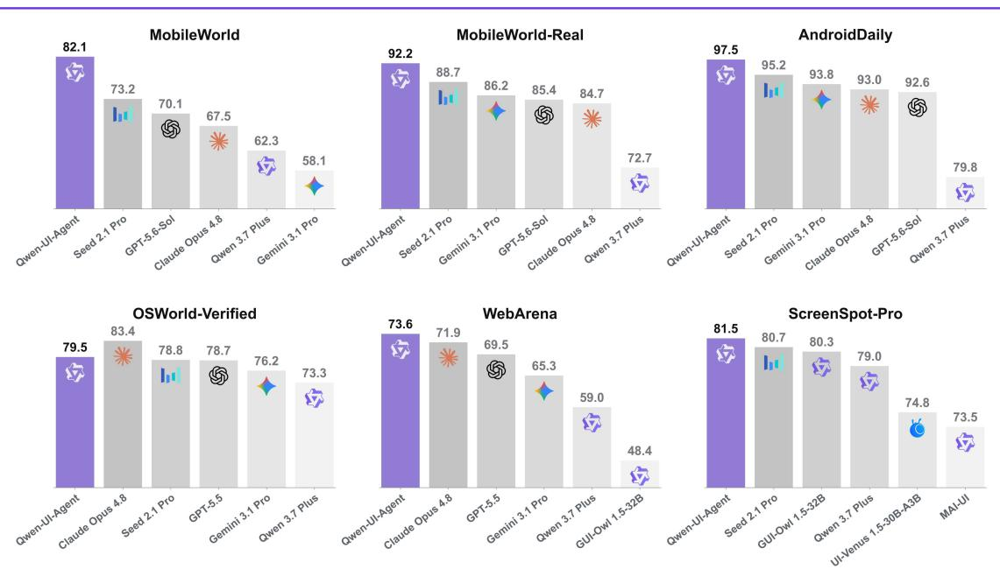

Figure 1: Qwen-UI-Agent는 다양한 GUI 설정에서 선도적이거나 경쟁력 있는 성능을 보여준다.

∗Qwen-UI-Agent는 이전 작업인 MAI-UI [(Zhou et al.,](#page-50-0) [2025a)](#page-50-0)의 연속이다. 전체 저자 목록은 [Contributions](#page-44-1) 섹션을 참조하라.

# **목차 (Contents)**

| 1 | 서론 |  |  |  |
|---|--------------|------------------------------------------------------------------------------------------|----|--|
| 2 |  | Qwen-UI-Agent | 5 |  |
|  | 2.1 | 시스템 개요  | 6 |  |
|  |  | 2.1.1 작업 공식화 | 6 |  |
|  |  | 2.1.2 행동 공간 | 6 |  |
|  |  | 2.1.3 역량 현황  | 7 |  |
|  | 2.2 | 환경 인프라스트럭처  | 7 |  |
|  |  | 2.2.1 샌드박스 환경 확장 | 8 |  |
|  |  | 2.2.2 실제 장치 모바일 환경: 시뮬레이션 샌드박스에서 실제 세계 학습으로 | 9 |  |
|  |  | 2.2.3 하이브리드 GUI+CLI 행동 공간  | 10 |  |
|  |  | 2.2.4 이종 환경을 위한 통합 인터페이스  | 11 |  |
|  | 2.3 | 에이전트 기반 데이터 플라이휠 | 11 |  |
|  | 2.4 | 훈련 | 13 |  |
|  |  | 2.4.1 지도 기반 미세 조정 (SFT) | 13 |  |
|  |  | 2.4.2 행동 RL: 반복되는 행동 오류 수정 | 14 |  |
|  |  | 2.4.3 온라인 RL: 장기 의사결정 학습  | 15 |  |
|  |  |  |  |  |
|  | 2.5 | Harness Layer: 사전 서비스 및 크로스 플랫폼 작업 실행 | 16 |  |
|  |  | 2.5.1 모바일 알림 기반 사전 서비스  | 17 |  |
|  |  | 2.5.2 크로스 플랫폼 작업 실행 | 19 |  |
| 3 |  | 실험 | 20 |  |
|  | 3.1 | 실험 설정 | 20 |  |
|  | 3.2 | MobileWorld-Real: 실제 모바일 사용 평가 벤치마크  | 21 |  |
|  | 3.3 | 주요 결과 | 23 |  |
|  |  | 3.3.1 모바일 사용 평가.  | 23 |  |
|  |  | 3.3.2 컴퓨터 사용 평가 | 25 |  |
|  |  |  |  |  |
|  |  | 3.3.3 브라우저 사용 및 딥서치 평가 | 26 |  |
|  |  | 3.3.4 GUI 기반화 | 29 |  |
|  |  | 3.3.5 일반 및 에이전트 역량 | 30 |  |
|  | 3.4 | Harness 기반 워크플로우 | 31 |  |
| 4 |  | GUI 에이전트 실행 행동 분석 | 32 |  |
|  | 4.1 | 모델의 제한된 실제 장치 경험이 실행 행동에 어떤 영향을 미치는가?  | 32 |  |
|  | 4.2 | Qwen-UI-Agent에서 GUI–CLI 조정 및 배치 실행에 대한 자세한 분석  | 34 |  |
|  | 4.3 | 행동 RL 이후 단계별 행동 수정 | 39 |  |
|  |  |  |  |  |
|  | 4.4 | 온라인 RL 이후 궤적 수준 행동 변화 | 41 |  |
| 5 |  | 관련 연구 | 42 |  |
| 6 |  | 결론 | 43 |  |
| 7 |  | 한계 및 향후 연구 방향 | 44 |  |
|  |  |  |  |  |
| 8 |  | 기여 | 45 |  |
| A |  | 부록 | 52 |  |
|  | A.1 | 실시간 장치 평가를 위한 AutoJudge 검증  | 52 |  |
|  | A.2 | 실시간 장치 GUI 에이전트 궤적에 대한 AutoJudge 결정 | 52 |  |
|  | A.3 | 추가 정성적 예시 | 53 |  |

## 1 Introduction

그래픽 사용자 인터페이스(GUI)는 인간이 디지털 서비스와 애플리케이션에 접근하는 주요 인터페이스이다. 능력 있는 GUI 에이전트 [(Zhou et al.,](#page-50-0) [2025a;](#page-50-0) [Wang et al.,](#page-48-0) [2025a;](#page-48-0) [Qin et al.,](#page-47-0) [2025;](#page-47-0) [Xu et al.,](#page-49-0) [2026)](#page-49-0)는 기존 애플리케이션 생태계 위에서 범용 실행기로서의 잠재력을 갖는다: 사용자 의도를 이해하고, 애플리케이션 상태를 인지하며, 인터페이스를 조작하고, 모든 서비스가 전용 API를 노출할 필요 없이 작업을 완수할 수 있다. 멀티모달 기반 모델(multimodal foundation models)의 최근 진전은 이 방향을 점점 더 실용적으로 만들었으며, 모바일 및 데스크톱 GUI 에이전트 [(Cao et al.,](#page-45-0) [2026;](#page-45-0) [Gao et al.,](#page-45-1) [2026;](#page-45-1) [Huang et al.,](#page-46-0) [2026;](#page-46-0) [Shen et al.,](#page-48-1) [2026)](#page-48-1)에서 급속한 개선을 이끌었다.

이러한 진전에도 불구하고 GUI 에이전트는 여전히 시뮬레이션 벤치마크에 최적화되어 있어 벤치마크 성능과 실제 세계 유용성 사이에 상당한 격차가 존재한다. 이 격차를 해소하기 위해 우리는 실제 장치에서 안정적으로 동작하고, 장기 목표 작업을 완수하며, 플랫폼 간 워크플로우를 수행하고, 유용한 서비스를 선제적으로 시작하며, GUI 상호작용과 CLI 실행을 결합하고, 더 적은 인간 노력으로 지속적으로 역량을 진화시키는 차세대 GUI 에이전트를 상상한다. 이 비전을 실현하기 위해 우리는 여섯 가지 핵심 전환을 식별한다: **(1) 시뮬레이션 환경에서 실제 장치 실행으로.** 많은 GUI 에이전트, 특히 모바일 에이전트는 시뮬레이션 벤치마크에 최적화되어 있지만, 실제 모바일 장치는 훨씬 더 복잡한 애플리케이션 기능, 다양한 UI 레이아웃, 중단, 권한, 변화하는 환경을 포함한다. 시뮬레이션에서 잘 수행되는 모델은 실제 장치에서 자주 실패한다. **(2) 고립된 도메인에서 도메인 간, 플랫폼 간 워크플로우로.** 기존 에이전트는 모바일, 웹, 데스크톱을 별도로 구축하는 경우가 많지만, 실제 세계 작업은 여러 도메인에 걸쳐 있을 수 있고 휴대폰과 컴퓨터를 넘어 계속된다. **(3) GUI 전용 액션에서 GUI+CLI 및 배치 액션으로.** GUI 상호작용은 시각적 인터페이스에 대한 보편적 접근을 제공하지만, 멀티모달 기반 모델의 성장하는 코딩 능력은 데이터 처리 및 파일 조작과 같은 구조화된 작업에 CLI를 자연스러운 보완으로 만든다. 이러한 액션 유형을 결합하고 배치 액션을 지원함으로써 에이전트는 작업의 특성에 맞게 실행 방식을 더 잘 매칭하고, 실행 효율을 향상시키며, 작업 범위를 확장할 수 있다. **(4) 단기 목표 작업에서 신뢰할 수 있는 장기 목표 작업 완수로.** GUI 에이전트의 실용적 가치는 사용자가 완수할 수 있는 목표의 복잡성과 사용자를 대신해 수행할 수 있는 실행 단계 수가 증가함에 따라 커진다. 그러나 장기 목표 작업을 완수하려면 지속적인 계획, 상태 추적, 중간 검증, 실행 오류 복구가 필요하며, 이는 장기 목표 신뢰성을 도전적인 역량으로 만든다. **(5) 인간 집약적 훈련 파이프라인에서 AutoResearch 스타일로.** 현재 GUI 에이전트 개발은 여전히 수동으로 작업을 구성하고, 데이터를 수집하고, 모델을 훈련하고, 평가를 실행하고, 실패를 분석하는 데 크게 의존한다. 에이전트 역량이 향상됨에 따라 이 과정은 점점 더 자동화되어야 한다. **(6) 반응형 실행에서 선제적 서비스 시작으로.** 대부분의 에이전트는 명시적 사용자 지시를 기다리지만, 휴대폰이나 다른 장치의 디지털 신호에서 직접 유용한 작업이 발생할 수 있다. 이러한 실행 가능한 순간을 인식하고 적절한 다음 단계를 제안하는 에이전트는 근본적으로 다른 사용자 경험을 제공할 수 있다.

본 보고서에서는 다섯 가지 전환을 중심으로 개발된 실세계 중심 기반 GUI 에이전트 Qwen-UI-Agent를 소개한다. 이는 실세계 활용을 위한 차세대 GUI 에이전트로 나아가는 우리의 단계이다. 구체적으로, Qwen-UI-Agent는 다음과 같은 핵심 기능을 제공한다.

- **실제 장치 모바일 GUI 기반 (Real-device Mobile GUI Foundation)**. 우리는 시뮬레이션-실제 차이가 모바일 환경에서 특히 심각하다는 것을 발견한다. 이 차이를 해소하기 위해 100개가 넘는 물리적 장치와 150개가 넘는 애플리케이션을 지원하는 실제 장치 모바일 환경을 구축한다. 이를 실제 장치에서의 현실적인 작업 설계, 궤적 수집, 온라인 강화 학습, 평가에 활용한다. 실용성을 높이기 위해 고위험 행동에 대한 사용자 인수(over takeover)를 지원하고, 고빈도 워크플로우와 덜 자주 사용되는 앱 기능 모두를 커버하도록 범위를 확장한다. 이러한 노력 덕분에 Qwen-UI-Agent는 실제 휴대폰에서 기존 모델보다 크게 우수하다.  
- **다중 도메인 기능 및 교차 도메인 워크플로우 (Multi-domain Capabilities and Cross-Domain Workflows)**. Qwen-UI-Agent는 모바일, 웹, 컴퓨터 사용, 그리고 DeepSearch 환경에서 작업 실행을 지원한다. 이러한 기능을 격리된 모듈로 다루는 대신, 우리의 하네스 레이어는 이를 통합된 워크플로우 내에서 조합하여, 실행이 장치와 환경을 원활하게 이동함에 따라 컨텍스트와 작업 상태를 보존한다. 예를 들어, GUI 워크플로우는 DeepSearch를 호출하여 외부 정보를 효율적으로 검색하고 검증함으로써 GUI 기반 웹 탐색의 시간 소모를 피하고 원활하게 상호작용을 재개한다. 이는 다중 도메인 커버리지를 이질적인 디지털 환경에서 통합된 작업 실행으로 전환한다.

이러한 노력은 Qwen-UI-Agent가 실제 휴대폰에서 기존 모델보다 크게 우수하도록 한다.

- **Hybrid GUI+CLI and Batched Action Spaces.** Qwen-UI-Agent는 GUI 연산, bash 기반 CLI 명령, 그리고 배치된 액션을 지원하는 통합 액션 공간을 갖추고 있다. 모델은 단일 궤적 내에서 이러한 액션을 선택하고 조합할 수 있으며, GUI 상호작용과 CLI 실행을 각각 가장 적합한 상황에서 활용하고, 호환되는 액션을 배치하여 불필요한 단계를 줄인다. 컴퓨터 사용 과제에서는 CLI 명령과 GUI 클릭이 두 가지 주요 액션 유형으로 등장하며, 액션 출력의 40% 이상이 배치되어 실행 궤적을 크게 단축한다.  
- **Scalable Online RL for Long-horizon Tasks.** Hybrid GUI+CLI와 배치 액션은 로컬 실행 효율성을 향상시키지만, 장기 과제를 완수하려면 신뢰할 수 있는 계획, 상태 추적, 그리고 전체 궤적에 걸친 중간 의사결정이 필요하다. 따라서 우리는 검증자 가이드형 온라인 RL을 100단계 이상의 상호작용 궤적에 확장한다. 또한 약 10,000개의 시뮬레이션 환경을 동시에 실행해 롤아웃 생성을 가속화하고, 모델 적응형 커리큘럼이 중간 성공률이 높은 과제를 우선시하며, 숙달된 과제를 더 어려운 과제로 교체한다.  
- **AutoResearch-style Capability Acquisition.** 우리는 에이전트가 데이터 플라이휠을 위해 후보 과제를 생성·평가하고, 롤아웃 궤적을 처리하며, 실패를 분석하고, 다음 반복을 위한 계획을 제안하는 에이전트 주도 반복 루프를 구축한다. 모든 단계를 인간이 수동으로 주도하기보다, 시스템이 대부분의 역량 개발 과정을 자동화하고, 인간은 주로 감독과 목표 지향적 수정을 담당한다. 이 접근법은 인간의 노력을 줄이고 새로운 GUI 에이전트 역량의 획득 및 정제 속도를 가속화한다.  
- **Proactive Mobile Service.** 사용자의 휴대폰에 도착한 항공편 취소 알림을 예로 들면, 에이전트는 사용자가 알림을 인지하고 명령을 내리기 전에 영향을 받는 일정표를 식별하고, 대체 여행 옵션을 수집하며, 사용자의 일정과 비교하고, 확인을 위한 제안 계획을 제시한다. 이러한 경험을 지원하기 위해 모바일 알림 기반의 사전 서비스 하네스를 구축한다. 단순히 과제를 시작하는 것을 넘어, 하네스는 현실 세계 상황을 일관되게 이해하고, 개인화된 과제를 생성하며, 승인된 액션을 실행하고, 사용자 반응과 장기 상호작용 기록을 통해 지속적으로 진화한다.

실증적으로 Qwen-UI-Agent는 실제 기기 및 벤치마크 기반 모바일 사용, 컴퓨터 사용, 브라우저 사용, DeepSearch, 그리고 GUI 그라운딩 등 광범위한 평가 환경에서 최첨단 성능을 달성한다. 이러한 평가에서 Qwen-UI-Agent는 Opus 4.8 [(Anthropic,](#page-45-2) [2026)](#page-45-2), GPT-5.6 Sol [(OpenAI,](#page-47-1) [2026b)](#page-47-1), Gemini 3.5 Flash [(Google,](#page-45-3) [2026b)](#page-45-3), Seed2.1 Pro [(ByteDance Seed,](#page-45-4) [2026b)](#page-45-4) 및 전문 GUI 에이전트 등 선도적 기초 모델을 일반적으로 능가한다. 주요 결과는 다음과 같다.

- **모바일 사용 (Mobile Use).** MobileWorld-Real에서 100개가 넘는 앱에 걸친 400개가 넘는 작업을 포함하는 실제 장치 벤치마크에서 Qwen-UI-Agent는 **92.2%**의 성공률을 달성한다. 이는 Gemini 3.1 Pro, Claude Opus 4.8, GPT‑5.6 Sol, Seed 2.1 Pro와 같은 최첨단 폐쇄형 모델을 각각 6.0, 7.5, 6.8, 3.5 퍼센트 포인트만큼 능가한다. Qwen-UI-Agent는 또 다른 실제 장치 벤치마크인 AndroidDaily에서 **97.5%**의 거의 완벽한 성공률을 기록한다. MobileWorld에서는 Qwen-UI-Agent가 **82.1%**를 기록하며 Opus 4.8, GPT‑5.6 Sol, Seed 2.1 Pro를 각각 14.6, 12.0, 8.9 퍼센트 포인트만큼 앞선다.

- **컴퓨터 사용 (Computer Use).** OSWorld‑Verified에서 Qwen-UI-Agent는 **79.5%**를 달성하며 전체적으로 두 번째 순위를 차지하고 GPT‑5.5, Gemini 3.1 Pro, Seed 2.1 Pro를 능가한다. 보다 어려운 OSWorld‑v2에서는 Qwen-UI-Agent가 이진 성공률 **13.9%**를 두 번째로 기록하고 부분 진행 점수 **40.0%**를 세 번째로 기록한다. 이 부분 진행 점수는 MiniMax M3과 Qwen 3.7 Plus의 점수를 각각 **17.7**과 **18.5** 퍼센트 포인트만큼 초과하며, 작업당 단계 수는 각각 **58.4%**와 **21.7%**를 덜 필요로 한다.

- **브라우저 사용 및 DeepSearch (Browser Use and DeepSearch).** WebArena에서 Qwen-UI-Agent는 **73.6%**를 달성하며 Claude Opus 4.8, GPT‑5.5, Gemini 3.1 Pro를 각각 1.7, 4.1, 8.3 포인트만큼 능가한다. DeepSearch에서는 **64.1%**를 기록한다

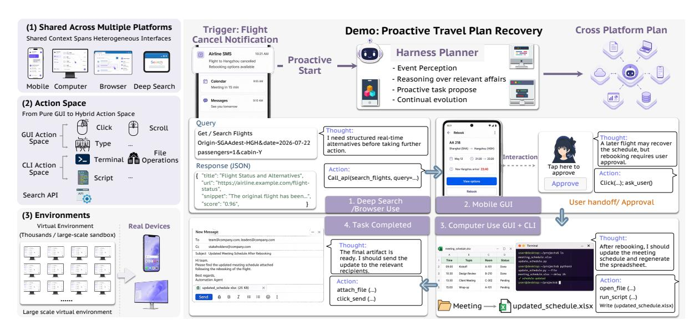

Figure 2: Qwen-UI-Agent의 사전적 다중 플랫폼 작업 실행 경로 예시. 왼쪽 패널은 경로를 뒷받침하는 시스템 기능을 요약하며, 다중 플랫폼 작업 실행, GUI, CLI, API 연산을 아우르는 하이브리드 액션 공간, 대규모 샌드박스에서 실제 장치에 이르는 환경을 포함한다. 오른쪽 패널은 항공편 취소 알림에 의해 촉발된 여행 복구 시나리오를 보여준다. 영향을 받는 작업과 약속을 식별한 뒤, 에이전트는 API를 통해 대체 항공편을 검색하고, 모바일 GUI를 통해 재예약 전 사용자 승인을 요청하며, 데스크톱 GUI와 CLI 동작을 통해 영향을 받은 회의 일정을 업데이트하고, 수정된 결과물을 관련 수신자에게 전송한다

BrowseComp과 **75.0%**를 BrowseComp-ZH에서 기록하며 Qwen3.5-397B-A17B와 UI-TARS-2를 능가한다.

- **GUI Grounding.** Qwen-UI-Agent는 확대 설정에서 ScreenSpot-Pro에서 **81.5%**를 달성하며 Seed 2.1 Pro, GUI-Owl-1.5, UI-Venus-1.5를 능가한다. 또한 UI-Vision(70.0%), OSWorld-G-Refined(78.5%), MMBench-GUI L2(92.6%), ScreenSpot-V2(97.5%)에서 기초 모델 중 가장 우수한 결과를 기록한다.  
- **General and Agentic Capabilities.** 모델의 실세계 활용성을 보존하기 위해 Qwen-UI-Agent의 일반 추론 및 에이전시 능력을 유지한다. 우리는 MMMU-Pro, MMLU-Pro, Terminal-Bench 2.0, Claw-Eval 등 13개의 벤치마크에서 Qwen-UI-Agent를 평가한다. 결과는 Qwen-UI-Agent가 에이전시 과제에서 Qwen 기반 모델을 능가하면서 일반 추론 과제에서는 동등한 성능을 보이고, 두 범주 모두에서 GUI 전문 모델을 크게 능가함을 보여준다.

## 2 Qwen-UI-Agent (Qwen-UI-Agent)

본 절에서는 Qwen-UI-Agent의 방법론을 고급 기반 GUI 에이전트를 구축하기 위한 통합 시스템으로 제시한다. 시스템은 다음 네 가지 구성 요소로 이루어진다: (1) 샌드박스와 실제 환경을 모두 아우르는 인프라로, 모바일 사용, 컴퓨터 사용, 브라우저 사용, 딥서치 과제 등에서 통합된 행동 공간( GUI, CLI, 배치 행동 포함)을 통해 궤적 수집 및 훈련을 지원한다; (2) 인간 개입을 줄이고 데이터 합성에서 훈련, 평가, 실패 분석, 다음 반복을 위한 목표 데이터 생성까지의 루프를 닫는 자동화된 데이터 플라이휠; (3) 감독 학습과 강화 학습을 결합한 통합 훈련 프레임워크; 그리고 (4) 훈련된 에이전트를 사용자 컨텍스트에 연결하고 사전 서비스 및 크로스 플랫폼 작업 실행을 가능하게 하는 하네스 레이어. Figure [2](#page-4-2)는 데모 궤적을 보여준다.

### 2.1 시스템 개요 (System Overview)

Qwen-UI-Agent는 모바일, 데스크톱, 웹, 정보 탐색 시스템 등 다양한 디지털 환경에서 운영되는 현실 중심 기반 GUI 에이전트로 설계되었다. 본 절에서는 먼저 Qwen-UI-Agent의 작업 범위를 정의하고, 이어서 통합 관측 및 행동 공간을 소개하며, 마지막으로 이 정의가 지원하는 기능 지형을 요약한다.

#### **2.1.1 작업 공식화 (Task Formulation)**

Qwen-UI-Agent는 상호작용형 디지털 작업 실행을 위해 설계되었다. 우리는 작업을 다음과 같이 정의한다:

$$\tau = (I, \mathcal{E}_{\tau}), \tag{1}$$

여기서 *I*는 사용자 지시이며, E*τ*는 작업에 사용 가능한 디지털 환경의 집합이다. 작업에 따라 E*τ*는 모바일 장치, 웹 브라우저, 컴퓨터 시스템, DeepSearch 시스템, 또는 이들의 조합을 포함할 수 있다. 이 공식화는 단일 환경에서 완료되는 작업과 다중 플랫폼을 아우르는 워크플로우를 모두 포괄한다 [(Xu et al.,](#page-49-0) [2026;](#page-49-0) [Lian et al.,](#page-46-1) [2026)](#page-46-1).

결정 단계 *t*에서 에이전트는 다양한 환경 피드백 형태를 결합할 수 있는 다중 채널 관측 *ot*를 받는다:

$$o_t = \left(o_t^{\text{GUI}}, o_t^{\text{CLI}}, o_t^{\text{API}}\right). \tag{2}$$

여기서 *o* GUI *t*는 현재 스크린샷을 나타내고, *o* CLI *t*는 명령 실행 결과를 포함하며, *o* API *t*는 검색 API와 같은 외부 서비스의 구조화된 응답을 포함한다. 해당 채널이 사용 불가능하거나 현재 작업에 필요하지 않을 때는 해당 컴포넌트가 비어 있다. 이 다중 채널 관측은 에이전트가 시각적 인터페이스 상태와 프로그래밍적 실행 피드백을 동시에 추론할 수 있게 한다 [(Hu](#page-46-2) [et al.,](#page-46-2) [2026;](#page-46-2) [Li et al.,](#page-46-3) [2026a)](#page-46-3).

에이전트는 중간 추론 출력 *rt*와 실행 가능한 행동 출력 **a***t*를 예측한다:

$$(r_t, \mathbf{a}_t) = \pi_\theta (I, o_t, h_t), \qquad (3)$$

여기서 *ht* = (*o*1,*r*1, **a**1, . . . , *ot*−1,*rt*−1, **a***t*−1)는 이전 상호작용 기록을 나타낸다.

특히, 하나의 모델 결정 단계는 단일 행동 또는 순서가 지정된 행동 시퀀스를 생성할 수 있다:

$$\mathbf{a}_t = \left(a_t^{(1)}, \dots, a_t^{(K_t)}\right), \qquad a_t^{(k)} \in \mathcal{A}_t, \tag{4}$$

여기서 A*t*는 현재 환경에서 사용 가능한 행동 집합이다. *Kt* = 1일 때 모델은 단일 행동 실행을 수행한다. *Kt* > 1일 때는 배치 행동 시퀀스를 생성한다. 배치 내의 행동은 이 결정 단계에서 연속적으로 실행되어, 추가 환경 피드백 없이 여러 작업을 완료할 수 있을 때 불필요한 추론 및 관측 단계를 줄인다.

#### **2.1.2 행동 공간 (Action Space)**

Qwen-UI-Agent의 행동 공간은 세 가지 요구 사항을 중심으로 설계된다: 서로 다른 플랫폼에서의 GUI 상호작용 지원, GUI 조작을 넘어선 실행 확장, 그리고 결과적인 작업에 대한 사용자 제어 보존. GUI 행동 공간은 모바일, 웹, 데스크톱 환경에 필요한 행동들의 합집합으로 정의되며, 각 환경은 자체 네이티브 상호작용 메커니즘이 지원하는 하위 집합을 노출한다. GUI 상호작용을 보완하기 위해 cli_command를 도입하여 직접 bash 명령 실행을 가능하게 하고, api_call을 도입하여 구조화된 인수와 함께 외부 서비스를 호출한다. 또한 ask_user를 포함시켜 에이전트가 누락된 정보를 요청하거나 민감 데이터, 지불, 또는 기타 결과적인 작업을 처리하기 전에 명시적 확인을 얻을 수 있도록 한다. 이들 행동은 서로 다른 플랫폼에서의 GUI 상호작용, 하이브리드 GUI+CLI 실행, 그리고 실제 작업에서의 사용자 제어 작업을 위한 통합 인터페이스를 제공한다. 전체 행동 공간은 표 [1.](#page-6-3)에 표시된다.

표 1: Qwen-UI-Agent의 액션 공간

| 작업 | 정의 |  |  |  |  |
|---------------------------------|-----------------------------------------------------------------------------|--|--|--|--|
| GUI 동작 |  |  |  |  |  |
| 클릭 | 좌표 $(x, y)$에서 클릭한다. |  |  |  |  |
| 더블 클릭 | 좌표 $(x, y)$에서 더블 클릭한다. |  |  |  |  |
| 긴 누르기 | 좌표 $(x, y)$에서 길게 눌러준다. |  |  |  |  |
| 입력 | 지정된 텍스트 내용을 입력한다. |  |  |  |  |
| 열기 | 지정된 앱을 연다. |  |  |  |  |
| 드래그 | 시작 좌표 $(x_1, y_1)$에서 끝 좌표 $(x_2, y_2)$로 드래그한다. |  |  |  |  |
| 시스템 버튼 | 뒤로, 홈, 메뉴, 엔터 중에서 선택된 시스템 버튼을 누른다. |  |  |  |  |
| 대기 | 지정된 초 단위의 대기 시간을 기다린다. |  |  |  |  |
| CLI 동작 |  |  |  |  |  |
| CLI 명령 | 활성 CLI 환경에서 bash 명령을 실행한다. |  |  |  |  |
| API 동작 |  |  |  |  |  |
| API 호출 | 지정된 인수로 API를 호출한다. |  |  |  |  |
| 상호작용 및 제어 동작 |  |  |  |  |  |
| 사용자에게 물어보기 | 사용자와 상호작용하여 작업을 완료한다. |  |  |  |  |
| 종료 | 최종 답변과 성공 여부 또는 실패 여부를 포함하여 작업을 종료한다. |  |  |  |  |

#### 2.1.3 능력 현황 (Capability Landscape)

통합된 공식은 실제 세계 작업 실행을 중심으로 Qwen-UI-Agent의 네 가지 상호 보완적 기능을 지원한다. (1) **실제 장치 모바일 실행**. 실제 장치 모바일 환경을 구축하고 이를 모델 기능 개발 및 평가 전반에 활용함으로써 Qwen-UI-Agent는 시뮬레이션-실제 차이를 크게 줄이고 전문 GUI 에이전트와 최첨단 폐쇄형 모델 모두에 대해 선도적인 실제 세계 모바일 실행 성능을 달성한다. (2) **다중 도메인 작업 실행**. Qwen-UI-Agent는 모바일, 데스크톱, 웹, 그리고 DeepSearch 환경에서 작동하며, 도메인별 정책을 넘어 이질적인 디지털 작업을 위한 기초 GUI 에이전트로 나아간다. (3) **하이브리드 및 효율적인 상호작용**. Qwen-UI-Agent의 통합 행동 공간은 모델이 같은 경로에서 GUI 작업과 bash 기반 CLI 명령을 번갈아 선택하고 결합할 수 있게 하며, 배치된 행동은 실행 효율성을 크게 향상시킨다. (4) **하네스 활성화 서비스**. 경량 하네스 레이어는 핵심 에이전트를 고립된 작업 실행을 넘어선 것으로 확장하여 선제적 서비스 시작을 가능하게 하고 모바일과 컴퓨터 시스템을 아우르는 단일 워크플로우를 허용한다.

### 2.2 환경 인프라 (Environment Infrastructure)

환경은 에이전트의 능력 경계를 정의한다: 에이전트가 지각할 수 있는 것, 수행할 수 있는 행동, 그리고 상호작용을 통해 획득할 수 있는 경험을 결정한다. 따라서 GUI 에이전트를 벤치마크 중심 최적화에서 실제 세계 활용으로 전환하려면 더 강력한 모델뿐 아니라 에이전트가 학습하고 행동하며 적응할 수 있는 보다 넓고 현실적인 환경이 필요하다. 그림 3에 나타난 바와 같이, 우리의 환경 인프라는 네 가지 핵심 구성요소를 중심으로 조직된다. 첫째, **시뮬레이션 및 샌드박스 환경**은 데이터 생성, 에이전트 학습, 평가를 위한 확장 가능하고 제어 가능하며 재현 가능한 설정을 제공한다. 둘째, 이러한 시뮬레이션 환경을 **실제 장치**로 확장하면 동적 장치 상태, 시스템 제약, 사용자 상호작용을 포함한 현실적인 배포 조건에서 에이전트가 학습하고 운영할 수 있다. 셋째, **하이브리드 GUI 및 CLI 액션 스페이스**는 에이전트가 각 작업에 가장 적합한 상호작용 모달리티를 선택하도록 허용함으로써 보다 효율적이고 적응적인 실행을 지원한다. 마지막으로, **통합 크로스 플랫폼 환경**은 모바일 사용, 컴퓨터 사용, 브라우저 사용, 그리고 DeepSearch 전반에 걸쳐 통합 파이프라인을 제공하면서 플랫폼 간에 컨텍스트와 작업 상태를 보존한다. 이 네 가지 구성요소가 결합되어 환경을 에이전트 시스템의 핵심 부분으로 만들며, 에이전트가 학습하고 수행할 수 있는 작업 범위를 직접적으로 형성한다.

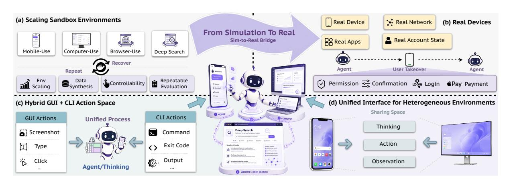

Figure 3: Qwen-UI-Agent의 환경 인프라. (a) 확장 가능한 샌드박스 환경은 모바일 사용, 컴퓨터 사용, 브라우저 사용 및 DeepSearch를 포괄하며, 데이터 합성 및 학습을 위해 제어 가능성과 반복 가능한 평가를 제공한다. (b) 시뮬레이션-실제 브릿지는 실제 장치에 실제 애플리케이션, 네트워크, 계정 상태를 갖는 에이전트를 확장하며, 로그인, 결제, 권한, 확인을 위한 사용자 인수를 지원한다. (c) 하이브리드 GUI+CLI 액션 공간은 그래픽 연산과 직접 명령 실행을 교차한다. (d) 통합 인터페이스는 이질적인 환경 전반에 걸쳐 사고–행동–관찰 루프를 표준화한다.

#### 2.2.1 Scaling Sandbox Environments

샌드박스 환경은 훈련, 평가, 그리고 ablation을 위해 제어 가능하고 재설정 가능한 작업 상태를 제공한다. 우리의 스위트는 모바일 사용, 컴퓨터 사용, 브라우저 사용, 그리고 DeepSearch 작업을 포괄한다. 각 도메인은 고유의 애플리케이션, 환경별 컨텍스트, 그리고 상태 기반 검증 메커니즘을 유지한다. 인프라의 핵심 강점은 확장성이다: 최대 **10,000**개의 격리된 샌드박스 환경을 병렬로 실행할 수 있어 대규모 롤아웃과 에이전트 훈련이 가능하다.

- Mobile Use. 우리는 MobileWorld가 제공하는 환경을 기반으로 모바일 샌드박스를 구축한다. MobileWorld는 20개의 애플리케이션을 갖춘 재설정 가능한 Android 시스템을 제공하며, GUI 작업 실행, 에이전트-사용자 상호작용, 그리고 MCP 툴 사용을 지원한다 (Kong et al., 2026).  
KVM 기반 에뮬레이터의 확장성 병목을 해결하기 위해, 우리는 redroid (Remote Android Project, 2024)를 사용해 MobileWorld 환경을 재구성하였다. redroid는 QEMU나 중첩 KVM 없이 호스트 커널에서 Android를 컨테이너로 실행한다.  
이 설계는 일반 컨테이너 호스트 전반에 걸쳐 완전한 장치 및 백엔드 환경을 복제할 수 있게 한다.  
컨테이너화된 장치 인스턴스와 자체 호스팅되는 애플리케이션 백엔드는 제어 가능한 초기 상태와 재현 가능한 상태 전이를 제공한다.  
이 인프라를 기반으로 우리는 다양한 작업 관련 환경 컨텍스트를 구성하고, 작업을 합성하며, 상태 기반 검증기를 생성한다.  
결과적으로 생성된 샌드박스는 트레젝터리 수집과 에이전트 훈련을 위한 안정적이고 확장 가능한 환경을 제공한다.  

- Computer Use. 우리는 OSWorld가 제공하는 Ubuntu 가상 머신 환경을 기반으로 컴퓨터 사용 샌드박스를 구축한다. OSWorld는 실제 데스크톱 애플리케이션, 운영 체제 작업, 그리고 교차 애플리케이션 워크플로우를 지원한다 (Xie et al., 2024).  
표준 OSWorld 상호작용 인터페이스는 GUI 기반이지만, 우리는 직접 bash 실행을 추가해 에이전트가 동일 트레젝터리 내에서 GUI 작업과 CLI 명령을 번갈아 수행할 수 있도록 한다.  
새로 구성한 작업을 위해, 우리는 일부 작업에 대해 작업별 초기 환경 상태와 상태 기반 검증기를 추가로 생성한다.  
이러한 확장 기능은 GUI 전용 및 하이브리드 GUI+CLI 상호작용 모두에서 트레젝터리 수집과 에이전트 훈련을 위한 제어 가능하고 확장 가능한 환경을 제공한다.  

- Browser Use. 우리의 웹 환경은 FastAPI, Playwright (Microsoft, 2020), 그리고 Chromium으로 구현된 독립형 브라우저 런타임이다.  
각 에피소드는 고립된 쿠키, 캐시, 로컬 스토리지를 갖춘 새 Playwright BrowserContext에서 실행되며, 작업별 페이지와 상태에서 시작한다.  
에이전트는 렌더링된 스크린샷을 받고 브라우저 네이티브 GUI 동작을 통해 상호작용한다.  
JavaScript 기반 검증기는 DOM과 지속적인 애플리케이션 상태를 검사하여 대체 행동 시퀀스를 허용한다.

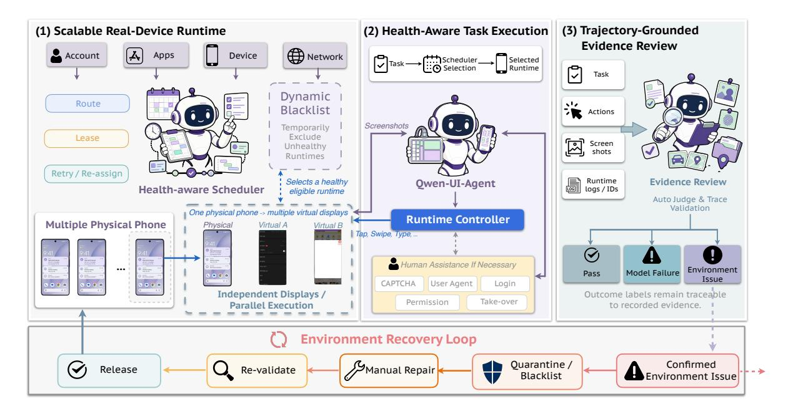

Figure 4: 실시간 장치 모바일 런타임과 폐쇄 루프 환경 거버넌스. health-aware scheduler는 각 작업을 eligible phone, App/account, display에 라우팅하며, unhealthy targets는 repair and revalidation이 완료될 때까지 blacklisted된다. Virtual displays는 한 phone이 여러 Apps를 동시에 실행할 수 있게 한다. Evidence-based review는 task success, model failure, environment failure를 complete trajectory에서 분리하고, confirmed environment issues를 scheduler에 다시 전달한다.

필요한 상태에 도달하면 보상을 받는다.

• DeepSearch. DeepSearch 환경은 구조화된 정보 접근 도구와 함께 상호작용 브라우저 제어를 보완한다. Serper (Serper, 2023)는 순위가 매겨진 검색 결과를 제공하고, Jina Reader (Jina AI, 2024)는 선택된 웹 페이지와 문서를 모델이 소비할 수 있는 텍스트로 변환한다. 에이전트는 반복적으로 쿼리를 재구성하고, 소스를 선택하며, 전체 내용을 검색하고, 페이지 간 증거를 종합할 수 있다. 따라서 이 환경은 주로 검색 결과와 검색된 문서가 관찰 대상인, 개방형 다중 소스 정보 탐색을 목표로 한다. GUI 상태가 아니라.

#### 2.2.2 실제 장치 모바일 환경: 시뮬레이션 샌드박스에서 실제 세계 학습으로 (Real-Device Mobile Environment: From Simulated Sandboxes to Real-World Learning)

왜 실제 장치가 중요한가? 샌드박스 환경은 안정적이고 재설정 가능한 작업 상태를 제공하여 대규모 배포와 훈련에 필수적이다. 그러나 샌드박스는 진화하는 애플리케이션 상태, 권한 관련 제약, 예기치 않은 팝업 및 네트워크 불안정과 같은 실행 시간 중단을 완전히 포착하지 못한다. 실제 장치에서는 애플리케이션 인터페이스와 콘텐츠가 시간이 지남에 따라 변하고, 권한 및 CAPTCHA가 실행을 방해하며, 네트워크나 장치 고장이 언제든 발생할 수 있다. 중국 모바일 생태계는 슈퍼 앱, 복잡한 인터페이스, 빈번한 팝업으로 이러한 도전을 더욱 가중시켜, 샌드박스에서 이러한 실행 경로를 재현하는 것이 불가능하다. Qwen-UI-Agent가 이러한 조건에서도 신뢰성 있게 동작하도록 하기 위해, 우리는 실제 장치 모바일 런타임을 구축하고 이를 모델 훈련 및 평가에 사용한다. 또한 Section 3.2에서 소개되는 MobileWorld-Real을 구성하여 실제 장치에서 에이전트 성능을 체계적으로 평가한다.

**실제 장치 모바일 런타임.** 우리는 100개가 넘는 물리적 장치와 150개가 넘는 애플리케이션으로 구성된 실제 장치 모바일 런타임을 구축한다. 이 규모에서 각 작업에 신뢰할 수 있고 사용 가능한 실행 장치를 할당하는 것이 핵심 시스템 과제로 부각된다. 그림 4에 표시된 바와 같이, 건강 인식 스케줄러는 각 장치, 애플리케이션, 계정, 네트워크 연결 및 디스플레이의 상태와 가용성을 지속적으로 추적한다.

작업이 큐에 들어오면, 적합한 실행 대상이 선택되고 필요한 리소스가 작업에 할당되며, 실패가 발생하면 실행이 다른 대상으로 재전송된다. 이러한 건강 인식 오케스트레이션은 실제 휴대폰, 애플리케이션, 네트워크 연결의 고유 불안정성으로 인한 환경 측면 실패에도 불구하고 환경을 생산적으로 유지한다.

실제 장치 환경을 더욱 확장하기 위해, 우리는 단일 휴대폰이 별도 디스플레이에서 동시에 여러 애플리케이션 세션을 호스팅할 수 있는 가상 화면 메커니즘 [(Genymobile,](#page-45-5) [2018)](#page-45-5)을 활용한다. 런타임 컨트롤러는 각 가상 디스플레이를 해당 에이전트 세션에 바인딩하여 관측이 올바른 에이전트에 전달되고, 그 에이전트의 행동이 의도한 디스플레이에서 실행되도록 보장한다. 이 설계는 물리적 장치를 비례적으로 늘리지 않고도 활성 실행 환경 수를 증가시킨다. 또한 실제 작업은 종종 명시적 사용자 승인(데이터 민감 또는 결제 관련 작업) 또는 사용자가 제공해야 하는 누락된 정보를 포함한다. 따라서 우리는 누락된 정보를 제공하고, 데이터 민감 또는 결제 관련 작업에 대한 명시적 확인을 얻으며, CAPTCHA와 같은 직접적인 인간 개입이 필요한 작업이 있을 때 사용자가 제어를 인수하도록 하는 전용 User Agent를 도입한다. 필요한 입력이나 작업이 완료되면, 작업은 업데이트된 환경 상태에서 재개된다.

실제 장치 런타임은 또한 모델 실패와 실행 환경 자체의 실패를 구분해야 한다. 애플리케이션 제한, 서비스 불가, 불안정한 장치, 네트워크 오류는 모델의 결정이 유효하더라도 궤적을 중단시킬 수 있다. 스케줄러는 불건전 장치에 대한 동적 블랙리스트를 유지하고, 라우팅에서 제외한 뒤 수동 검토 후에만 복원한다. 우리는 VLM 기반 판사를 사용해 전체 궤적을 검토하고, 작업 성공, 모델 실패, 환경 실패 중 구분한다. 확인된 환경 실패는 스케줄러와 유지 보수 큐를 업데이트하고, 검증된 궤적은 훈련에 보존된다.

#### **2.2.3 하이브리드 GUI+CLI 액션 공간**

실제 장치 환경은 에이전트가 직면할 수 있는 상태 범위를 확장하지만, 실제 세계에서의 활용도는 에이전트가 이를 얼마나 효과적으로 수행할 수 있는지에 달려 있다. GUI 상호작용은 사용자 인터페이스가 있는 애플리케이션과 시각적 컨텍스트에 대한 보편적 접근을 제공하지만, 순수 GUI 실행은 구조화된 작업을 기초화, 클릭, 입력과 같은 긴 시퀀스로 전환시킬 수 있다. CLI 실행은 파일, 코드, 시스템 설정 및 배치 작업에 대한 직접적인 프로그래밍 접근을 제공하지만, 작업이 시각적 이해, 애플리케이션별 인터페이스, 또는 프로그래밍 가능한 접근이 없는 서비스에 의존할 때는 덜 적합하다. 따라서 GUI와 CLI는 환경 접근의 상호 보완적인 형태를 제공한다: GUI는 광범위한 애플리케이션 커버리지와 시각적으로 기반된 상호작용을 가능하게 하고, CLI는 프로그래밍 상태에 대한 효율적인 실행을 제공한다.

따라서 우리는 Qwen-UI-Agent를 Section [2.1.2,](#page-5-1)에서 정의한 통합 GUI+CLI 액션 공간으로 장착하고, 우리의 환경은 단일 실행 인터페이스를 통해 두 가지 접근 방식을 모두 노출한다. 컴퓨터 사용 환경에서 모든 액션은 VM 내부의 경량 실행 서비스로 전달된다: GUI 액션은 네이티브 입력 이벤트로 변환되고, `cli_command`는 터미널 애플리케이션을 시각적으로 찾고 조작하지 않고 비대화형 셸에서 명령을 실행한다. 결과적으로 생성된 `stdout`, `stderr`, 그리고 종료 상태는 구조화된 관측값으로서 사후 액션 스크린샷과 함께 반환되어, 모델이 프로그래밍적 및 시각적 상태를 동시에 고려하여 다음 결정을 내릴 수 있게 한다.

신뢰할 수 있는 CLI 실행은 셸을 생성하는 것 이상의 환경 측면 처리를 필요로 한다. 명령 실행은 종속성 설치와 같은 느린 작업을 위해 예산된 타임아웃에 의해 제한되며, 비영(0) 종료 및 타임아웃과 같은 실패는 에피소드를 중단시키는 대신 오류 관측값으로 반환되어 모델이 같은 궤적 내에서 진단하고 복구할 수 있게 한다. 배치 액션에서는 GUI와 CLI 하위 액션이 순서대로 실행되고, CLI 출력은 하나의 관측값으로 집계된다. 실행된 명령은 셸 히스토리에도 기록되어, 터미널 상태를 검사하는 검증자가 CLI 기반 솔루션을 인정하도록 한다.

#### **2.2.4 Heterogeneous 환경을 위한 통합 인터페이스 (Unified Interface for Heterogeneous Environments)**

모바일 사용, 컴퓨터 사용, 브라우저 사용, 그리고 DeepSearch 환경은 서로 다른 자원 모델, 액션 공간, 관측 형식, 그리고 검증 절차를 노출한다. 따라서 우리는 환경 수명 주기와 에이전트가 마주하는 입력 및 출력을 표준화하고, 실행, 재설정, 검증을 환경별 어댑터에 위임하는 통합 환경 인터페이스를 도입한다. 이를 통해 동일한 에이전트와 학습 파이프라인이 서로 다른 환경에서 동일한 런타임 시맨틱스를 강제하지 않고도 운영될 수 있다.

인터페이스는 acquire, reset, step, evaluate, tear_down, release로 구성된 공통 비동기 수명 주기를 노출한다. 각 획득된 환경은 백엔드에 바인딩된 임대 세션으로 표현되며, 필요에 따라 디스플레이 식별자와 연결되어 스크린샷, 액션, 평가를 동일한 격리된 컨텍스트로 일관되게 라우팅한다. 백엔드 어댑터는 자원 초기화, 관측 캡처, 액션 실행, 평가를 구현하고, 태스크 어댑터는 플랫폼별 재설정 및 검증 로직을 보존한다. 모든 환경은 관측값, 종료 신호, 보상 정보를 포함하는 공통 전이 형식을 반환한다.

정책과 환경은 각각 독립적으로 그들의 네이티브 액션 공간을 선언한다. 두 공간이 다를 경우, 지원되는 GUI 동작은 표준 중간 표현을 통해 번역되며, 좌표는 대상 플랫폼에 따라 정규화된다. Section [2.1.2](#page-5-1)에서 정의된 하이브리드 GUI, CLI, API 동작은 네이티브 어댑터를 통해 계속 사용 가능하며, 그 시각적 또는 구조화된 결과는 동일한 관측 스트림을 통해 반환된다. 이 설계는 공유된 롤아웃, 데이터 수집, 평가 파이프라인을 제공하면서 각 플랫폼의 네이티브 상호작용 의미론을 보존한다.

### 2.3 에이전트 주도 데이터 플라이휠 (Agent-Driven Data Flywheel)

GUI 에이전트를 지속적으로 개선하려면 과제 설계, 환경 구축, 검증기 개발, 데이터 선별, 모델 학습, 평가, 오류 분석을 아우르는 반복적이고 폐쇄된 루프가 필요하다. 인간이 이 단계들을 주도하면, 애플리케이션, 플랫폼, 역량 차원에서 범위가 확대될수록 반복이 느려지고 확장하기 어려워진다. 이 문제를 해결하기 위해 우리는 AutoResearch 스타일의 에이전트 주도 데이터 플라이휠을 도입한다. 이 플라이휠은 인간의 개입을 각 단계의 실행에서 고수준 감독과 목표 지향적 개입으로 전환한다.

**Overall Procedure.**  
그림 [5,](#page-11-0)에서 보듯이, 우리는 에이전트 기반 데이터 플라이휠(agent-driven data flywheel)을 두 단계로 구성한다: 도메인 역량 부트스트래핑(domain capability bootstrapping)과 반복적 정제 루프(iterative refinement loop). 부트스트래핑 단계에서는 강력한 기초 모델(foundation models)을 사용해 모바일, 데스크톱, 웹 등 다양한 도메인에 필요한 도메인 지식과 역량을 분석한다. 이 분석을 바탕으로 에이전트는 초기 작업 풀과 해당 작업에 대한 환경 컨텍스트를 생성하고, 그 중 후보 궤적을 수집한다. MAI-UI [(Zhou et al.,](#page-50-0) [2025a)](#page-50-0)에 따라, 우리는 먼저 여러 차례 거절 샘플링(rejection sampling)을 수행하고, 수락된 궤적을 하나의 통합 SFT 코퍼스(SFT corpus)로 집계한다. 이 과정은 목표 도메인을 광범위하게 커버하는 강력한 초기 정책(policy)을 생성한다. 이 정책을 기반으로 에이전트 기반 실패 분석(failure analysis)은 모델의 남은 약점을 식별하고, 이를 다음 주기에 대한 목표로 매핑한다. 이러한 목표는 새로운 작업, 환경 구성, 그리고 해당되는 경우 작업별 검증기(task-specific verifiers)의 생성을 안내한다. 수락된 궤적은 이후 훈련 코퍼스에 통합되어 모델을 더욱 향상시키며, 이를 통해 루프를 닫고 다음 반복을 시작한다. 초기 정책 구축 단계와 반복적 개선 단계 모두에서 강력한 기초 모델은 작업과 환경 구성을 생성하고, 작업별 검증기를 합성하며, 궤적을 평가하고, 실패를 분석하고, 이후 반복의 최적화 및 실행을 계획한다. 인간 개입(human involvement)은 주로 전체 시스템을 설계·구현하고 운영을 감독하며, 필요 시 워크플로를 개입하거나 수정하는 데 집중한다. 다음으로, 이 에이전트 기반 데이터 플라이휠을 확장 가능하고 효과적으로 만드는 네 가지 설계 선택을 설명한다.

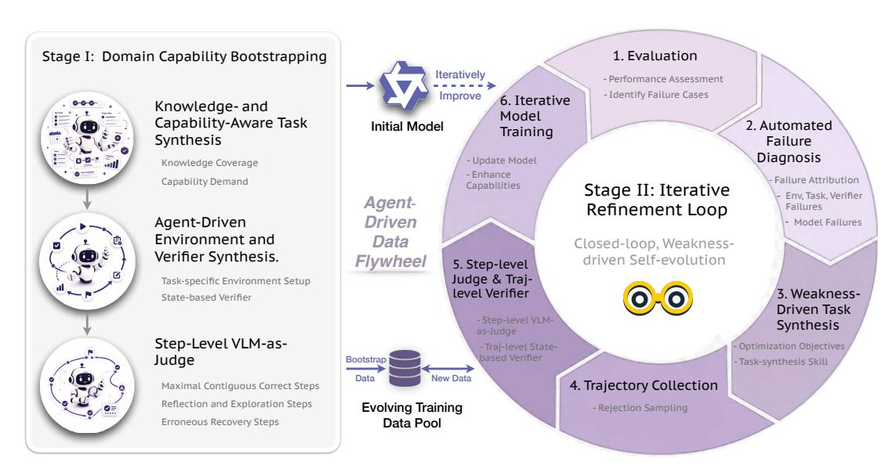

Figure 5: Qwen-UI-Agent의 데이터 플라이휠. 도메인 역량 부트스트래핑은 훈련을 초기화하고, 반복 정제 루프는 역량 약점을 식별하고 목표 과제를 생성하며, 그 결과 데이터는 다음 훈련 반복을 개선한다.

지식 및 능력 인식 기반 작업 합성. 훈련 작업은 모델이 사용할 수 있는 학습 신호를 정의하며, 따라서 모델이 습득할 수 있는 지식과 행동을 형성한다. 우리는 작업 합성을 두 가지 개념적으로 구분되는 차원으로 구성한다: *지식 범위*, 이는 에이전트가 알아야 할 내용을 결정하고, *능력 수요*, 이는 에이전트가 작업을 완료하기 위해 어떻게 추론하고 행동해야 하는지를 결정한다. 지식 범위는 애플리케이션 기능, 인터페이스 규약, 도구 사용, 그리고 일반적인 워크플로우를 포함한 도메인 특화 운영 지식을 명시한다. 능력 수요는 장기 상태 추적, 정밀 제약 준수, 수치 및 시간 추론, 오류 복구와 같은 전이 가능한 추론 및 상호작용 능력을 포착한다. 각 대상 도메인에 대해 우리는 강력한 기초 모델을 사용하여 지식 범위에 대한 초기 계층적 함수 트리와 능력 수요에 대한 능력 프로필을 구축한다. 그런 다음 이를 재사용 가능한 작업 합성 스킬에 컴파일하여 구성 규칙, 난이도 제어, 환경 전제 조건, 대표 예시를 포함한다. 현재 반복의 목표에 따라 이 스킬은 에이전트가 필요한 지식과 능력에 맞춰 작업을 자동으로 생성하도록 한다.

**에이전트 주도 환경 및 검증자 합성.** 작업 합성은 훈련 인스턴스가 유도해야 할 역량을 결정하지만, 상호작용 훈련은 작업이 실행 가능하고 수행 가능한 재현 가능한 환경을 추가로 요구한다. 합성된 작업을 바탕으로 우리 에이전트는 *Environment State Synthesis* (섹션 2.4.3에 자세히 기술됨)를 사용하여 실행에 필요한 애플리케이션 상태, 파일, 기록, 계정 및 교차 애플리케이션 컨텍스트를 구성한다. 신뢰할 수 있는 결과를 검증할 수 있는 작업에 대해, 에이전트는 추가로 상태 기반 검증자를 합성하여 결과 애플리케이션, 파일, 데이터베이스 또는 시스템 상태를 검사하고 실행 가능한 작업-검증자 쌍을 생성한다.

**단계별 판단을 통한 확장 가능한 SFT 및 온라인 RL용 실행 검증.** 실행 가능한 검증자는 고정밀 결과 신호를 제공하지만, 하나를 구성하고 검증하는 데 비용이 많이 든다. 더 강력한 기초 모델을 사용하더라도 실행 가능한 검증자를 합성하고 검증하는 작업은 여전히 시간이 많이 걸리며, 반면 모델 기반 판정기의 정확도는 모델 개발과 함께 향상된다. 따라서 우리는 MAI-UI (Zhou et al., 2025a)에서 사용된 단계별 궤적 판정기를 확장하고, 모바일, 웹, 컴퓨터 사용 궤적에 VLM 기반 판정기를 적용한다. 여기에는 하이브리드 GUI+CLI 상호작용이 포함된다. 지시문, 궤적, 시각적 또는 구조화된 관찰을 바탕으로 판정기는 유용한 감독의 세 가지 형태를 추출한다: 작업을 올바르게 진행하는 최대 연속 단계, 각 반성 또는 탐색 단계의 시작을 촉발하는 첫 번째 단계, 그리고 오류 상태에서 정상 경로로 실행을 복구하는 복구 세그먼트가 to a

유효 경로. 첫 번째 반성 또는 탐색 단계만 보존하면 재고를 고려하는 유용한 결정을 포착하면서 잠재적으로 노이즈가 있는 분기점을 과도하게 보존하지 않는다. 이 세밀한 절차는 성공적이든 실패한 궤적이든 효과적인 훈련 신호를 복구한다. 실험적으로 우리는 단계별 데이터 필터링이 실행 가능한 검증기로 선택된 전체 궤적에 대한 훈련과 비교해 SFT 성능이 동등하거나 더 우수함을 발견한다. 따라서 우리는 세밀한 VLM 판단을 사용해 SFT의 프로세스 감독을 확장하고, 온라인 RL에 필요한 고정밀 결과 신호를 위해 실행 가능한 검증자를 구성한다.

**실패 분석 기반 반복.** 우리는 각 도메인마다 모델 성능을 추적하고 다음 반복의 최적화 목표를 정의하기 위해 광범위하고 진단적인 평가 세트를 구축한다. 실패한 각 작업에 대해 분석 에이전트는 전체 경로를 검토하고 모델 실패를 환경, 작업, 또는 검증자 실패와 구분한다. 모델 실패는 이후에 구조화된 원인으로 매핑된다. 예를 들어, 애플리케이션 지식 부족, 제약 위반, 상태 추적 오류, 또는 검증 부족 등이 있다. 시스템은 이러한 작업 수준 진단을 집계하여 현재 정책의 가장 흔하고 중대한 약점을 식별하고 이를 우선순위가 높은 최적화 목표 집합으로 변환한다. 이러한 목표와 작업 합성 기술에 따라 에이전트는 다음 주기에 맞는 목표 작업과 해당 환경 설정, 그리고 해당되는 경우 작업별 검증자를 생성한다. 모델과 무관한 문제는 환경 유지보수 또는 작업 및 검증자 개정으로 전달되어 에이전트가 식별된 문제를 진단하고 해결한다.

### 2.4 훈련 (Training)

#### 2.4.1 감독형 미세조정 (Supervised Fine-Tuning (SFT))

Qwen-UI-Agent는 모바일, 컴퓨터 사용, 웹, 그리고 DeepSearch 환경에서 작업 실행을 지원하도록 설계되었다. 이 범위는 SFT에 두 가지 상호 연결된 과제를 제시한다: 단일 모델 내에서 모든 대상 도메인에 걸쳐 강력한 역량을 동시에 획득하고, 견고한 실제 세계 작업 완료에 필요한 일반적인 추론 및 에이전트 역량을 보존하는 것이다.

**도메인-조건부 전문가 훈련.** 모바일, 데스크톱, 웹 각 도메인은 에이전트에 대해 서로 다른 요구를 제시한다. 모바일 작업은 실제 장치 환경에서 신뢰할 수 있는 실행을 필요로 하며, 인터페이스는 앱별이며, 워크플로우는 팝업에 의해 자주 중단되고, 안전에 민감한 동작은 사용자 제어 하에 있어야 한다. 데스크톱 작업은 GUI 제어와 Bash 기반 파일 및 시스템 운영을 결합하는 경우가 많다. 웹 작업은 동적 웹페이지와의 상호작용을 요구하며, DeepSearch 작업은 에이전트가 검색 API를 통해 증거를 검색, 검증 및 종합하도록 요구한다.

우리는 각 도메인에 대해 특화된 전문가를 훈련한 뒤 그 역량을 통합한다. 각 전문가는 주로 대상 도메인의 데이터로 훈련되며, 다른 도메인의 데이터와 통제된 혼합을 함께 사용한다. 이 교차 도메인 혼합은 각 전문가가 도메인 간에 전이되는 역량을 유지하도록 돕고, 대상 도메인에 과적합되는 것을 줄인다. 실용적인 배포는 모든 지원 설정에서 작동할 수 있는 단일 모델을 요구한다. 따라서 우리는 도메인-전문가 체크포인트를 통합하여 통합 모델을 만든다. 모델 병합은 그들의 상호 보완적인 강점을 단일 체크포인트 내에서 결합하여 개별 전문가가 획득한 역량을 거의 추가 훈련 오버헤드 없이 보존한다.

**일반 및 에이전트 역량 보존 (In-Distribution Data).** 일반적인 추론 및 에이전트 역량은 실제 세계 사용에 필수적이며, 에이전트는 다양한 개방형 사용자 요청에 대응해야 한다. 일부 요청은 GUI 작업과 전혀 관련이 없을 수 있지만, 모델은 여전히 적절히 대응해야 한다. GUI 작업 내에서도 실제 배포는 모델이 훈련 중에 예상하지 못한 지식, 추론, 지시 따르기, 검색, 코딩, 또는 도구 사용이 필요할 수 있는 OOD(Out-of-Distribution) 상태와 목표에 노출된다. 따라서 우리는 기본 모델에서 상속받은 일반적인 추론 및 에이전트 역량을 보존하고, 가능하다면 강화하려고 한다. 이는 익숙하지 않은 상황을 처리하고 일관된 사용자 경험을 유지하는 데 중요한 기반을 제공한다.

우리는 가장 효과적인 전략이 시작 모델이 생성할 수 있는 성공적인 행동을 강화하는 in-distribution 데이터를 사용하는 것임을 발견한다. 우리는 일반 질문 응답, 수학, 코딩, 시각적 이해, 검색, 그리고 에이전트형 도구 사용을 포괄하는 광범위한 질의 풀을 구성하고, 시작 모델의 응답을 샘플링하며, 형식 정규화 후 검증된 정답 예시만을 보관한다. 이 예시 중 일부를 SFT 과정에서 GUI 트래젝터리와 혼합한다. 실험 결과, 시작 모델이 해결할 수 있는 예시는 실패하는 어려운 예시보다 능력 보존에 훨씬 효과적이다. 전자는 모델 자체의 응답 분포와 정렬된 목표를 사용해 확립된 능력을 재연습하고, 후자는 학습을 능력 획득으로 전환하며 경쟁적 최적화 신호를 도입할 수 있다.

슬라이딩 윈도우 학습은 효율적인 장기 트래젝터리 SFT를 위해 사용된다. 장기 트래젝터리 SFT는 각 행동이 시각적·텍스트적 맥락과 함께 별개의 학습 샘플로 포장될 때 비용이 많이 들며, 인접 행동 간에 매우 겹치는 맥락이 반복적으로 처리된다. 따라서 우리는 각 트래젝터리를 연속된 5단계(n=5)의 윈도우로 나누고, 각 윈도우를 n−1=4 단계씩 이동시켜 인접 윈도우 사이에 한 단계 겹침을 둔다. 이 겹침은 이후 윈도우에서 처음 새로 감독되는 행동이 최소 두 개의 스크린샷을 조건으로 할 수 있게 한다. 이후 윈도우에서는 공유 경계 단계가 입력 맥락에 남아 있지만, 이전 윈도우에서 이미 감독되었으므로 손실이 마스킹된다. 따라서 각 완전한 이후 윈도우는 네 개의 새로운 행동을 감독한다. 현재 윈도우 이전의 스크린샷은 시각 입력에서 제외되고, 이전 텍스트 트래젝터리 기록은 맥락으로 유지된다. 공동 감독은 이 반복되는 맥락 처리를 줄이고, 처리된 맥락당 감독되는 행동 목표 수를 늘려 학습 효율을 향상시킨다.

#### **2.4.2 행동 RL: 반복되는 행동 오류 수정 (Action RL: Correcting Recurring Action Errors)**

장기 GUI 과제에서 단일 지역 오류는 인터페이스를 잘못된 상태로 이동시키고 이후 결정에 영향을 미칠 수 있다. SFT는 성공적인 시연에서 학습하지만 반복되는 행동 오류를 명시적으로 억제하지 않는다. 따라서 우리는 행동 수준의 강화 학습 단계인 Action RL을 도입한다. 이 단계는 목표 지향적 오류 패턴 데이터와 행동 인식 보상을 결합해 지역 결정 신뢰성을 향상시킨다.

반복되는 행동-오류 패턴.

- *혼동 가능한 요소 기반 정착.* 화면에 시각적 또는 의미적으로 유사한 아이콘, 컨트롤, 또는 리스트 항목이 포함될 때, 모델은 올바른 대상이 아닌 인접한 방해 요소에 행동을 정착시킬 수 있다.  
- *정렬 및 순위.* 모델은 순서 요구사항(순위 위치, top-*k* 선택, 최신 vs. 오래된 순서, 다중 속성에 기반한 순위 등)을 잘못 해석하여 잘못된 항목을 선택하거나 항목을 잘못된 순서로 처리할 수 있다.  
- *수량 및 다중 대상 완전성.* 정확한 수량을 지정하거나 여러 관련 대상에 대한 행동을 요구하는 작업은 부분 완성에 취약하다. 모델은 너무 적거나 너무 많은 객체를 처리하거나 복합 목표의 한 구성 요소를 누락할 수 있다.  
- *조기 완료.* 모델은 최종 상태 변경 행동(편집 저장, 메시지 전송, 폼 제출, 콘텐츠 게시 등)을 실행하기 전에 의도된 결과를 준비한 뒤 성공을 선언할 수 있다.  
- **반복 행동 루프.** 모델은 인터페이스 상태가 변경되지 않았음을 인식하지 못하거나 복구 행동을 식별하지 못해, 작업과 관련된 진전을 이루지 못하고 같은 행동이나 짧은 행동 시퀀스를 반복 실행할 수 있다.  
- **롱테일 행동 선택 실패.** 모델은 드물지만 중요한 행동(열기, ask_user, long_press 등)을 호출하지 못하고 대신 부적절한 빈번한 행동(클릭 등)으로 대체할 수 있다.

이러한 실패의 공통 구조는 애플리케이션 전반에 걸쳐 행동 수준 최적화의 재사용 가능한 목표가 된다. 그러나 그 중요성은 자연적으로 수집된 궤적에서의 빈도에 반영되지 않는다: 드물지만 결과에 큰 영향을 미치는 패턴은 더 흔한 행동에 의해 압도될 수 있다.

**목표 지향 오류 패턴 데이터 구축.** 이 커버리지 불균형을 교정하기 위해, 우리는 과거 궤적 탐색과 적극적인 환경 상호작용을 결합한다. 기존 궤적에서 각 실패를 유발하는 행동을 위치화하고, 반복 행동의 경우 시각적 판단자가 비생산적 루프와 목적 있는 탐색을 구분한다. 역사적 커버리지가 부족한 패턴에 대해, 에이전트는 실행 가능한 환경을 적극 탐색하고 관련 인터페이스 구조를 식별하며, 이를 중심으로 과제를 구성하고 새로운 롤아웃을 수집한다. 결과 코퍼스는 현재 정책에서 현실적인 실패 맥락을 보존하면서, 드물지만 중요한 오류의 표현을 의도적으로 증가시킨다.

**행동 인식 보상 및 훈련.** 이 목표 지향 코퍼스를 사용하여 행동 RL은 단계 *t*에서 예측된 각 행동에 구조화된 보상을 부여한다:

$$r_t = F_t \left( w_{\text{type}} C_t + w_{\text{arg}} C_t Q_t - \lambda_{\text{sens}} S_t - \lambda_{\text{rep}} L_t \right). \tag{5}$$

여기서 *Ft* ∈ {0, 1} 은 형식 유효성을 나타내고, *Ct* 은 행동 유형 정확성을 측정하며, *Qt* 은 픽셀 거리, 어휘 유사성, 태그 매칭, 또는 LLM 기반 판단을 사용해 인수 품질을 측정한다. 항목 *St* 와 *Lt* 은 각각 잘못된 민감한 행동과 행동 이력에서의 반복을 처벌한다. 훈련 중에 우리는 토큰 엔트로피 감소와 점진적으로 짧아지는 추론 트레이스를 관찰한다. 따라서 정책 붕괴를 방지하면서 불필요한 장황함을 피하기 위해 엔트로피 정규화와 추론 길이의 하한 및 상한을 함께 적용한다.

####  **2.4.3 온라인 RL: 장기 경로 의사결정 (Online RL: Learning Long-Horizon Decision Making)**

장기 경로 GUI 작업은 단순히 지역적으로 올바른 행동의 모음이 아니다. 행동은 현재 상태에서 합리적으로 보일 수 있지만, 에이전트를 미래 상태로 이끌어 작업이 어려워지거나 불가능해질 수 있다. 행동 RL은 지역적 의사결정 신뢰성을 향상시키지만, 이러한 지연된 궤적 수준의 결과를 완전히 포착하지 못한다; 따라서 우리는 온라인 RL을 도입하여 환경 상호작용을 통해 엔드투엔드 작업 성공을 최적화한다.

**확장 가능한 롤아웃을 위한 통합 환경 인프라스트럭처**

완전한 상호작용으로부터 학습하려면 이질적인 GUI 환경 전반에 걸쳐 대규모이며 신뢰할 수 있는 롤아웃 생성을 요구한다.  
섹션 [2.2.1,](#page-6-2)에서 설명한 샌드박스 인프라를 기반으로, 우리는 도메인 간에 환경 할당, 재설정, 상호작용 및 평가를 관리하는 통합 환경 인프라스트럭처를 개발한다.  
Alibaba Cloud에서, 이 인프라스트럭처는 모바일, 컴퓨터 사용, 웹 및 DeepSearch를 위한 샌드박스 환경을 배포하며 최대 10,000개의 동시 롤아웃을 지원한다.  
각 도메인은 자체 네이티브 애플리케이션, 액션 공간 및 검증 메커니즘을 유지하면서, 공유 인프라스트럭처는 공통 환경 수명 주기와 롤아웃 인터페이스를 학습 파이프라인에 노출한다.  
물리적 휴대폰에서 실행해야 하는 작업의 경우, 섹션 [2.2.2,](#page-8-0)에서 설명한 가상 화면(virtual-screen) 메커니즘을 사용하여 단일 기기의 별도 디스플레이에서 여러 애플리케이션 세션이 동시에 실행되도록 한다.  
우리의 실제 기기 클러스터 전반에서, 이 메커니즘은 가상 화면 없이 동일한 클러스터를 실행할 때보다 약 20배의 총 롤아웃 처리량을 증가시킨다.  
이 인프라스트럭처는 온라인 RL을 위해 샌드박스와 실제 기기 환경 모두에서 확장 가능한 롤아웃 용량을 제공한다.

**작업–검증자 합성.** 이 롤아웃 인프라를 기반으로, 우리는 실행 가능한 작업-검증자 쌍을 자동으로 구성하여 세 단계에 걸쳐 신뢰할 수 있는 결과 감독을 제공한다:

• **환경 상태 합성(Environment State Synthesis).** 코딩 에이전트는 각 샌드박스의 기반이 되는 코드베이스를 분석하고, 애플리케이션에 재사용 가능한 데이터 주입 기술(data-injection skills)을 추출한다. 이러한 기술을 활용해 에이전트는 여러 애플리케이션에 걸친 일관된 초기 환경 상태(environment state)를 구성한다. 예를 들어, 논문 제출을 준비 중인 컴퓨터 과학 박사 과정을 밴 학생을 나타내는 환경 상태는 학생의 휴대폰 전역에 걸쳐 상호 일관된 이메일, 사진, 파일, 캘린더 이벤트, 소셜 미디어 기록을 포함할 수 있다. 환경 상태 합성은 downstream 작업의 난이도와 다양성을 크게 결정하기 때문에 중요하다. 벤치마크에서 제공되는 상태만으로 직접 작업을 생성하면 작업 합성이 애플리케이션 상태와 이미 벤치마크에 존재하는 데이터에 한정된다.

- **작업 합성(Task Synthesis).** 각 합성된 환경 상태를 기준으로 LLM은 서로 다른 난이도 수준의 여러 작업을 생성하며, 이는 여러 애플리케이션을 아우르는 워크플로우를 포함한다. 독립적인 LLM 판정자(LLM judge)는 생성된 작업을 실현 가능성과 초기화된 환경 상태와의 일관성을 위해 필터링한다.
- **검증자 합성(Verifier Synthesis).** 통합된 환경 인프라를 활용해 코딩 에이전트는 해당 샌드박스를 자율적으로 실행하고, 합성된 환경 상태를 주입하며, 작업별 코드 기반 검증자(codebased verifiers)를 구성한다. 각 검증자는 여러 에이전트 모델의 롤아웃을 통해 검증되며, VLM 기반 판정자(VLM-based judge)는 검증자 출력이 관측된 롤아웃 증거와 일치하는지 평가한다.

이 자동화된 합성 및 실행-검증 파이프라인은 온라인 RL을 위해 약 10,000개의 검증된 작업–검증자 쌍을 생성한다.

**온라인 RL with a Model-Adaptive Task Curriculum.** 주어진 검증된 작업–검증자 쌍을 사용하여, 우리는 검증자-지향 온라인 RL을 통해 장기 경로 의사결정을 개선한다. MAI-UI [(Zhou et al.,](#page-50-0) [2025a)](#page-50-0)를 따라, 우리는 GUI 상호작용 궤적에 대해 Group Relative Policy Optimization (GRPO)의 맞춤형 변형을 채택한다. 각 작업마다 현재 정책은 *K*개의 완전한 상호작용 궤적 {*τi*} *K i*=1 을 샘플링한다. 검증자는 각 궤적의 최종 환경 상태 *s* (*i*) *T* 를 평가한다. 우리는 그 이진 결과 보상과 그룹-상대적 이점을 계산한다.

$$r_i = v_x(s_{\text{final}}^{(i)}) \in \{0, 1\}, \quad \bar{r}_x = \frac{1}{K} \sum_{j=1}^K r_j, \quad \hat{A}_i = \frac{r_i - \bar{r}_x}{\text{Std}(r_1, \dots, r_K) + \epsilon}.$$

(6)

평균(평균)과 표준편차(표준편차)는 같은 작업 *x*에 대해 샘플링된 *K*개의 롤아웃(롤아웃)에서 계산된다. GRPO는 이러한 상대적 이점(상대적 이점)을 사용해 정책(정책)을 업데이트한다. 행동 기반 강화학습(action RL)은 행동 수준 피드백(행동 수준 피드백)을 제공하는 반면, 이 단계는 종료 검증 결과(종료 검증 결과)를 이용해 완전한 경로(완전한 경로)를 최적화하며, 장기 계획(long-horizon planning), 상태 추적(state tracking), 중간 의사결정(intermediate decision making)을 목표로 한다.

작업의 훈련 가치는 고정되지 않는다: 처음에는 너무 어려운 작업이 정책이 다른 작업에서 관련 능력을 획득함에 따라 학습 가능해질 수 있다. 그룹 상대 목표 하에서는 모든 롤아웃이 실패하거나 모두 성공하는 작업은 보상 변동이 없으므로 즉각적인 학습 신호가 거의 제공되지 않는다. 그러나 어려운 작업을 영구적으로 제거하면 정책의 학습 프런티어에 진입하는 시점을 놓치게 된다. 따라서 우리는 작업 난이도를 현재 정책의 동적 특성으로 간주하고 커리큘럼을 활성 훈련 풀과 모니터링 풀로 구성한다. 중간 정도의 경험적 성공률을 가진 작업은 활성 풀에 들어가 전체 롤아웃 예산을 받으며, 현재 해결 불가능한 작업은 작은 예산으로 모니터링 풀에 남아 있다. 어려운 작업이 성공적인 롤아웃을 생성하기 시작하면, 전체 규모 훈련을 위해 활성 풀로 승격된다. 마스터된 작업도 작은 예산으로 모니터링되며 성능이 감소하면 재활성화된다. 이 폐쇄 루프 커리큘럼은 새로 학습 가능한 작업을 지속적으로 식별하면서 가장 유익한 상대 보상을 제공하는 곳에 롤아웃 계산을 집중한다.

### 2.5 Harness Layer: Proactive Service and Cross-Platform Task Execution (활성 서비스 및 크로스 플랫폼 작업 실행)

강력한 작업 실행은 필요하지만, GUI 에이전트가 단일 작업 실행을 넘어 사용자의 일상 디지털 생활에서 효과적인 도우미가 되기 위해서는 충분하지 않다. 기존 에이전트는 대부분 반응형이다: 사용자는 필요를 인식하고 명령을 수립하며 에이전트를 호출해야 하며, 그 필요가 이미 디지털 환경의 신호에서 명백히 드러나더라도 마찬가지다. 워크플로우는 장치를 초월할 수 있으며, 관련 정보가 휴대폰에 나타나고 이후 조치는 컴퓨터에서 완료되어야 할 수도 있다. 이는 두 가지 근본적인 격차를 만든다: *언제* 에이전트가 지원을 시작해야 하고, *어떻게* 그 결과 워크플로우를 장치 간에 맥락을 잃지 않고 전달할 수 있을까? 우리는 기본 GUI 에이전트 위에 공유 하네스 레이어를 통해 두 문제를 모두 해결한다. 하네스는 사용자의 디지털 환경에서 신호를 연결하고, 진행 중인 활동의 통합 표현을 유지하며, 이 컨텍스트를 사용해 모바일과 컴퓨터 환경 간에 작업을 시작하고 조정한다.

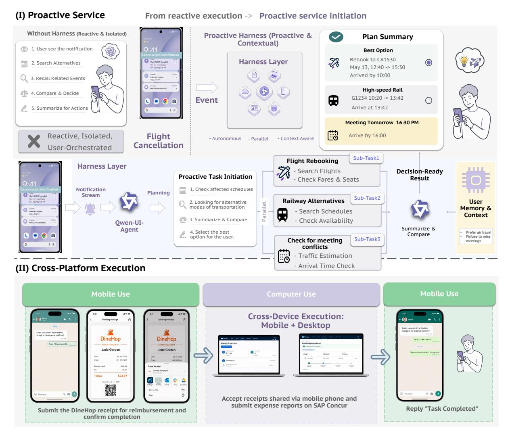

그림 6: 프로액티브 서비스 시작 및 크로스 플랫폼 실행을 위한 하네스 개요. (I) 하네스가 없으면 사용자는 알림을 수동으로 해석하고 관련 컨텍스트를 검색하며 에이전트에 지시를 제공해야 한다. 프로액티브 하네스는 대신 항공편 취소를 감지하고 관련 사안을 추론하며 항공편 재예약, 철도 대안, 회의 충돌 검사를 사전에 수행하고 실행 가능한 계획을 보고한다. (II) 하네스는 또한 작업 상태를 유지하고 크로스 플랫폼 실행을 지원한다. 식당 선택 예시에서 Qwen-UI-Agent는 모바일에서 후보를 탐색하고, 데스크톱 스프레드시트에 정리하며, 승인용 아티팩트를 전송하고, 선택된 위치를 모바일에 다시 저장한다.

이 층을 기반으로 우리는 두 가지 기능을 개발한다. *Proactive service*는 명시적 지시에서 사용자의 디지털 신호에서 추론된 실행 가능한 이벤트로 작업 시작을 전환함으로써 첫 번째 격차를 해소한다. 이를 통해 에이전트는 사용자가 요청하기 전에 유용한 지원을 식별하고 준비할 수 있다. *Cross-platform task execution*는 휴대폰과 컴퓨터 간에 워크플로우를 옮기면서 공유된 컨텍스트, 종속성, 작업 상태를 보존함으로써 두 번째 격차를 해결한다. 이 두 기능은 GUI 에이전트를 두 가지 상호 보완적인 차원으로 확장한다: *when* 작업이 언제 시작될 수 있는지와 *where* 작업이 어디에서 이어질 수 있는지.

#### 2.5.1 사전 서비스 기반 모바일 알림 (Proactive Service Based on Mobile Notifications)

**모바일 알림은 고가치 신호원이다.** 사전 에이전트는 시기적절하고, 광범위하게 이용 가능하며, 사용자가 제어할 수 있는 신호가 필요하다. 우리는 이 인터페이스로 모바일 알림을 사용한다. 휴대폰은 통신, 여행, 금융, 물류, 일정 관리 등에서 신호를 집계하고, 알림은 항공편 취소, 결제 마감, 일정 변경 등과 같이 실행 가능해지는 순간에 많은 이벤트를 노출한다. 연속 화면, 오디오, 또는 비디오 모니터링과 비교할 때 알림 접근은

경량이며 애플리케이션별 명시적 권한에 의해 관리된다. 알림은 그럼에도 불구하고 부분적이고 잡음이 많다: 애플리케이션이 노출하기로 선택한 것만 보고한다. 따라서 하네스는 이를 완전한 세계 상태가 아니라 관측치로 간주하고, 필요할 때만 추가 정보를 수집한다.

**알림에서 사전 워크플로우로.** 사용자의 다음날 아침 항공편이 취소되었다는 야간 알림을 가정해 보자. 전통적인 GUI 에이전트는 대안 탐색 전에 명시적 지시를 기다린다. 우리는 대신 단순 검색을 넘어서는 사전 워크플로우를 상상한다. 항공편 취소는 드물게 고립된 사건이 아니다: 중요한 회의를 위태롭게 하거나 호텔 예약을 변경해야 하며, 재예약과 철도 여행 중 선택을 강요한다. 핵심 질문은 에이전트가 사용자가 요청하기 전에 이러한 상호 의존적인 후속 조치를 예측하고 준비할 수 있는가이다. 우리의 하네스는 사용자의 주의를 요청하기 전에 더 넓은 문맥을 재구성함으로써 이를 수행한다. 취소를 구조화된 이벤트로 파싱하고, 진행 중인 여행 및 관련 회의 마감일과 연결하고, 메모리에서 사용자 선호도를 검색하고, 실행 가능한 대안을 조회하고, 이를 사용자의 기본 목표와 비교 평가하며, 결정 준비가 된 제안을 제시한다. 재예약이나 예약 변경과 같은 외부 결과를 초래하는 행동은 여전히 사용자 확인이 필요하다. Figure [11](#page-30-0)과 Figure [28](#page-55-0) of Appendix [A.3](#page-52-0)은 이 행동의 두 대표 예시를 보여준다: 사용자의 약속과 실시간 날씨 및 통근 상황을 결합한 예정된 아침 브리핑, 그리고 항공편 취소 알림에 의해 트리거된 사전 여행 복구 계획.

하네스는 이 워크플로우를 상태를 보존하는 파이프라인으로 구현한다. 알림을 구조화된 이벤트로 파싱하고, 이를 지속적인 *affair*와 연결하며, 실행 가능한 작업을 도출하고, 실행 결과를 사용해 메모리와 향후 행동을 업데이트한다. 이 시스템의 핵심 추상화는 지속적인 현실 세계 사건을 나타내는 *affair*이다. *event*는 특정 시점에 발생한 일을 기록하고, *affair*는 이벤트, 애플리케이션, 일 across events, applications, days를 통해 아직 진행 중인 일을 포착하며, *task*는 다음에 수행해야 할 일을 명시한다. 이 분리는 하네스가 사용자의 기본 목표를 추론할 수 있게 한다.

- **이벤트 인식.** 수신되는 알림은 짧은 시간 창에서 처리된다. 이벤트 파서는 낮은 가치의 잡음을 제거하고 유용한 알림을 소스, 엔티티, 타임스탬프, 긴급성, 사용 가능한 행동을 포함하는 구조화된 이벤트로 변환한다. 이러한 이벤트는 시간 순서와 출처와 함께 저장되어 이후 추론을 위한 증거 기반을 제공한다.  
- **사건 상태와 메모리.** 각 신규 이벤트에 대해, 하네스는 관련 최근 이벤트, 활성 사건, 현재 컨텍스트 상태, 프로필 메모리를 검색한다. 그 후 이벤트를 기존 사건에 연결하거나 새 사건을 생성하여 사건의 수명 주기, 핵심 엔티티, 마감일, 미해결 격차 및 지원 증거를 업데이트한다. 사건은 개별 여행, 구매, 회의 또는 가족 문제의 진화하는 상태를 보존하고, 프로필 메모리는 사용자 선호도, 관계, 행동 패턴과 같은 보다 안정적인 지식을 저장한다. 이 두 형태의 메모리는 상황별 추론과 장기 개인화를 결합한다.  
- **사건 수준 추론 및 과제 형성.** 하네스는 업데이트된 사건을 기반으로 예상되는 다음 단계, 누락된 정보, 미완료 행동, 시간 압박, 사건 간의 종속성 또는 충돌을 식별한다. 결론은 관찰된 이벤트 또는 저장된 사용자 정보를 근거로 하며 신뢰도 추정과 연결된다. 과제 생성기는 그 후 즉시 개입이 충분한 가치를 제공할지 여부를 평가한다. 이때 긴급성, 결과, 증거 지원, 절약된 사용자 노력량과 같은 요인을 고려한다. 이 평가에 따라 과제는 즉시 제안되거나 수동 할 일 목록에 배치되거나 억제된다.  
- **적극적 준비 및 제어된 실행.** 선택된 과제에 대해 하네스는 정보 탐색 도구, 모바일 GUI 에이전트, 컴퓨터 사용 에이전트 등 적절한 실행자를 선택한다. 사용자를 방해하기 전에 대체 기차 검색, 이동 시간 비교, 환불 상태 확인과 같은 낮은 위험의 준비 작업을 수행할 수 있다. 결과적으로 생성된 과제 카드는 또 다른 알림이 아니라 구체적이고 결정 준비가 된 옵션을 제시한다. 결제, 예약, 메시지 전송 등 외부 결과를 포함하는 작업은 여전히 사용자 확인이 필요하다.  
- **개인화 및 지속적 진화.** 하네스는 지속적으로 그 이해를 정제한다

사용자와 그 사전적 행동에 대한. 프로필 메모리는 명시적 사용자 입력과 증거 기반 관찰에서 구축되며, 시스템이 선호도, 관계 및 루틴을 학습하도록 허용한다. 피드백 메모리는 사용자가 제안된 작업에 어떻게 반응하는지를 기록하며, 승인, 수정, 거절, 무시 및 완료를 포함한다. 이러한 신호는 프로필 항목을 강화하거나 수정하고, 향후 작업의 가치, 타이밍 및 자동화 정도를 조정한다. 따라서 진화는 두 단계에서 발생한다: 프로필 메모리는 사용자가 *무엇* 중요하게 여기는지를 학습하고, 피드백 메모리는 에이전트가 *언제 그리고 어떻게* 언제 어떻게 개입해야 하는지를 학습하여 사전적 지원을 점점 더 개인화되고 유용하게 만든다.

#### **2.5.2 교차 플랫폼 작업 실행 (Cross-Platform Task Execution)**

사용자의 디지털 활동은 주로 모바일 기기와 컴퓨터에 분산되어 있다. 따라서 많은 실제 워크플로우가 인터페이스, 기능, 상태가 다른 여러 플랫폼에 걸쳐 있다. 예를 들어, 사용자는 에이전트에게 모바일 사진 갤러리에서 영수증을 식별하도록 요청하고, 선택된 이미지를 데스크톱으로 전송한 뒤, 인식된 날짜에 따라 이름을 바꾸고, 구조화된 지출 스프레드시트를 생성하도록 할 수 있다. 이 워크플로우는 휴대폰에서의 시각적 선택, 기기 간 아티팩트 전송, 컴퓨터에서의 파일 처리를 결합한다. 각 기기를 독립적인 에피소드로 다루면 작업 상태가 분산되고, 의존성과 실패가 가려지며, 사용자가 전환을 조정해야 한다. 부록 [A.3](#page-52-0)의 Figure [12](#page-31-2)와 Figure [29](#page-55-1)은 우리 하네스가 실행한 두 개의 워크플로우를 보여준다: 앞서 언급한 영수증 정리 작업과, 여러 모바일 앱을 동시에 실행한 뒤 결과를 컴퓨터에서 요약하는 병렬 식당 검색; 두 경우 모두 모바일 하위 작업은 가상 화면에서 실행되어 사용자가 기기를 계속 사용할 수 있다. 따라서 우리는 하네스를 장치 주소가 지정된 액션, 공유 실행 상태, 명시적 크로스 플랫폼 연산을 갖춘 계층적 플래너–실행기 시스템으로 구현한다:

- **글로벌 인식 및 장치 기반화.** 하네스는 먼저 사용 가능한 장치, 애플리케이션, 디스플레이 및 워크스페이스를 열거한다. 각 관측은 애플리케이션, 장치 및 디스플레이로 태그되며, 스크린샷은 라벨이 붙은 멀티-디바이스 뷰로 조합된다. 이를 통해 플래너는 모바일과 데스크톱 상태를 함께 검사할 수 있다. 공유 상태는 지시문, 애플리케이션–장치 매핑, 최근 관측, 아티팩트, 도구 출력 및 하위 작업 결과를 저장한다. 장치-태그된 업데이트는 나머지 컨텍스트를 보존하면서 해당 플랫폼 상태만 변경한다.
- **의존성 인식 플래닝 및 실행기 선택.** 우리는 지속적인 세션, 워크스페이스 및 도구 레지스트리를 갖춘 OpenClaw 유사 플래너를 구현한다 [(OpenClaw Contributors,](#page-47-4) [2026)](#page-47-4). 플래너는 목표를 의존성 인식 하위 작업으로 분해하고 각 작업에 적절한 실행기를 선택한다. 시각적 기반 애플리케이션 상호작용을 위해 GUI 서브에이전트로 노출된 Qwen-UI-Agent를 호출한다. 검색, 파일, CLI 및 API 도구는 정보 탐색, 결정론적 시스템 운영 및 합성을 처리한다. 각 GUI 호출은 지시문과 대상 애플리케이션 및 장치를 명시한다. 반환된 결과는 세션을 업데이트하여 이후 단계가 최신 상태에서 재플래닝될 수 있도록 한다.
- **병렬 다중 에이전트 실행.** 서로 다른 애플리케이션 또는 환경에 대한 독립 호출은 동시에 실행된다. 고유 식별자와 관측 큐는 각 하위 작업의 행동과 피드백을 격리한다. 그 행동–관측 루프는 순차적이지만, 서로 다른 하위 작업은 병렬로 진행된다. 안드로이드에서는 디스플레이 매니저가 애플리케이션별 하위 작업을 하나의 물리적 장치에 있는 별도 가상 디스플레이에 할당한다. 각 디스플레이는 독립적인 캡처와 디스플레이 주소 지정 입력을 제공하여 여러 Qwen-UI-Agent 인스턴스가 서로 다른 애플리케이션을 동시에 운영할 수 있게 한다.
- • **Qwen-UI-Agent를 이용한 하이브리드 실행.** 각 GUI 하위 작업은 Section [2.1.2.](#page-5-1)에서 언급한 하이브리드 액션 공간을 사용한다. Qwen-UI-Agent는 시각적 기반 상호작용을 위해 GUI 액션을, 구조화된 작업, 파일 처리 및 외부 서비스를 위해 CLI 또는 API 액션을 사용한다. 데스크톱 CLI 액션은 셸 명령을 실행하고, 안드로이드 액션은 ADB 셸 명령을 사용한다; 그 출력, 오류 및 종료 상태는 구조화된 관측으로 반환된다. 호환 가능한 작업은 배치될 수 있다. 플랫폼 어댑터는 액션을 지정된 환경으로 라우팅하고 장치 간 아티팩트를 전송한다.

## 3 실험 (3 Experiments)

### 3.1 실험 설정 (Experimental Setup)

**Models and implementation details.** 우리는 Qwen-UI-Agent의 세 가지 변형(27B, 35B-A3B, 4B 모델)을 평가한다. 27B 모델은 모바일, 컴퓨터 사용, 브라우저, DeepSearch, 일반 에이전트 벤치마크 전반에 걸친 종단 간 에이전트 평가의 주요 변형으로 사용된다. 모델들은 해당 베이스 체크포인트에서 초기화되며, 섹션 [2.4.](#page-12-0)에 설명된 파이프라인을 사용해 훈련된다. 별도로 명시되지 않는 한, 각 벤치마크의 공식 상호작용 예산 및 평가 구성을 따른다.

**Benchmarks.** 우리는 Qwen-UI-Agent를 실제 기기 모바일 사용, 컴퓨터 사용, 브라우저 사용, DeepSearch, GUI 그라운딩, 일반 및 에이전트 기능을 포함한 다섯 그룹의 벤치마크에서 평가한다.

- **Real-device mobile use.** 우리는 MobileWorld-Real과 AndroidDaily에서 모바일 작업 실행을 종합적으로 평가한다. MobileWorld-Real은 섹션 3.2에서 소개된 대로 중국 모바일 생태계에서 실제 Android 기기에서 실행되는 복잡한 인간이 작성한 작업을 포함한다. AndroidDaily는 실제 Android 기기에서 고빈도 일상 작업에 초점을 맞추며 일반 모바일 사용 시나리오에 대한 보완적 평가를 제공한다. 우리는 또한 MobileWorld에서 추가 평가를 수행한다. MobileWorld는 도전적인 장기, 교차 애플리케이션 작업을 위한 안정적인 시뮬레이션 환경을 제공한다.

- **Computer use.** 우리는 OSWorld-Verified와 OSWorld-v2에서 데스크톱 작업 실행을 평가한다. OSWorld-Verified는 광범위한 데스크톱 애플리케이션과 운영 체제 워크플로우 전반에 걸친 작업 진행 상황을 평가한다. OSWorld-v2는 장기 작업에 더 중점을 두고 부분 진행 상황과 이진 작업 완료를 모두 보고한다. 이 벤치마크는 모델이 시각적 상호작용, 명령줄 작업, 배치 동작을 결합하여 복잡한 컴퓨터 사용 워크플로우를 완수할 수 있는지를 평가한다.

- **Web navigation and DeepSearch.** 우리는 WebArena를 사용해 기능적 웹사이트에서 종합적인 브라우저 상호작용을 평가한다. 이 작업은 모델이 변화하는 페이지 상태를 추적하고 다단계 사용자 목표를 완수해야 한다. 우리는 BrowseComp과 BrowseComp-ZH에서 DeepSearch를 별도로 평가한다. 이 두 벤치마크는 영어와 중국어 웹에서 지속적인 정보 탐색, 교차 소스 증거 검증, 답변 합성을 측정한다. 이들 벤치마크는 웹 인터페이스와 직접 상호작용하는 작업과 정보 집계 및 검증이 필요한 연구 집약적 작업을 구분한다.

- **GUI grounding.** 우리는 ScreenSpot-Pro, ScreenSpot-V2, MMBench-GUI L2, OSWorld-G-Refined, UI-Vision에서 요소 위치 지정(로컬라이제이션)을 평가한다. 이 벤치마크는 고해상도 전문 소프트웨어, 모바일 및 웹 인터페이스, 데스크톱 애플리케이션, 텍스트 및 아이콘 목표, 공간 추론, 기능적 추론, 목표 지향적 근거 지침을 포괄한다.

- **General and agentic capabilities.** 우리는 GUI 사후 훈련이 기반 모델의 일반 능력을 보존하는지 MMMU-Pro, RealWorldQA, CharXiv-RQ, MathVision, AI2D, MMLU-Pro, IFEval에서 평가한다. 우리는 또한 Tau2-Bench, Terminal-Bench 2.0, Claw-Eval, BFCL-v4, SkillsBench, QwenClawBench에서 보다 광범위한 에이전트 능력을 평가한다. 이 평가들은 멀티모달 추론, 지시 따르기, 도구 사용, 터미널 운영, 다중 턴 상호작용, 일상 GUI 탐색을 넘어서는 자율 작업 실행과 같은 능력을 측정한다.

**평가 프로토콜.** 우리는 공식 작업 세트, 환경 및 주요 점수 프로토콜을 따르며, 다른 경우를 명시하지 않는 한. 인터랙티브 GUI 벤치마크의 경우, 우리는 벤치마크에서 정의한 작업 및 단계 제한을 사용하고, 해당 성공, 부분 진행 또는 이진 완료 지표를 보고한다. For

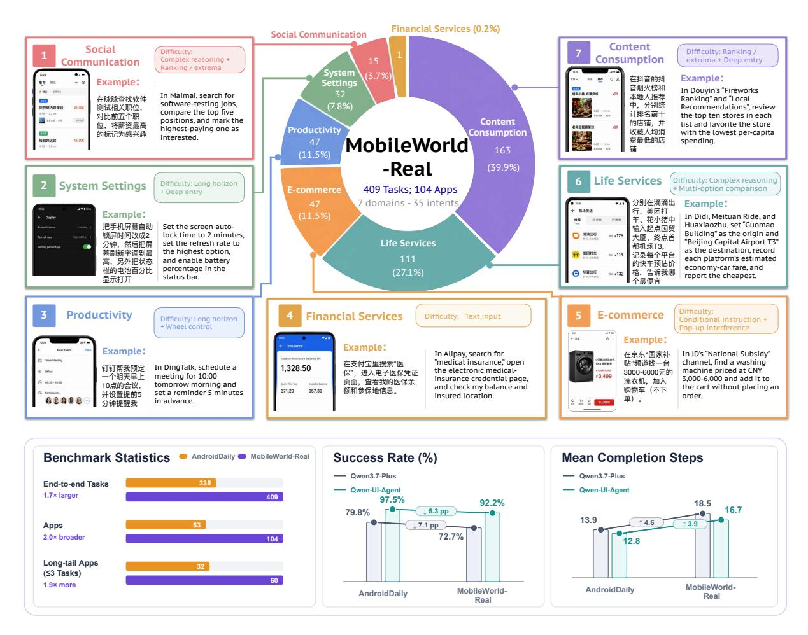

Figure 7: MobileWorld-Real의 개요, 인간이 작성한 작업으로 구성된 실제 장치 벤치마크로 일상 모바일 사용의 폭을 반영한다. 대표 예시와 집계 통계는 광범위한 도메인 범위와 긴 꼬리형 앱 분포를 보여준다. 매치된 모델 결과는 AndroidDaily보다 낮은 성공률과 더 긴 경로를 보여주며, 실제 모바일 상호작용의 도전 과제를 강조한다.

MobileWorld-Real, AutoJudge는 각 경로에 대해 pass, failed, env_error 중 하나의 결과를 할당한다. 환경 오류는 별도로 보고되며 성공률 분모에서 제외되며, 평균 경로 길이는 성공적인 실행에 대해 계산된다. WebArena의 경우, 우리는 부정확한 참조 답변을 수동으로 검증하고 공식 평가 스크립트에서 오류를 확인한 뒤 평가를 진행한다.

**비교 기준.** 우리는 Qwen-UI-Agent를 세 그룹의 시스템과 비교한다: 최첨단 독점 모델, 강력한 오픈-웨이트 기초 모델, 그리고 전문 GUI 에이전트. 일반 및 에이전트 벤치마크의 경우, 우리는 GUI 사후 훈련 후 능력 보존을 측정하기 위해 27B 모델과 그 기본 체크포인트를 추가로 비교한다. 평가 설정이 직접적으로 비교 가능할 때는 공식적으로 보고된 결과를 사용하고, 일치하는 평가 환경이 필요할 때는 독립적으로 결과를 재현한다. 각 결과의 소스와 평가 설정은 해당 표에 표시된다.

### 3.2 MobileWorld-Real: 실제 모바일 사용 평가 벤치마크 (MobileWorld-Real: Real-world Mobile Use Evaluation Benchmark)

대부분의 모바일 GUI 벤치마크는 샌드박스에서 실행되며, 여기서 앱 상태를 재설정하고 작업 결과를 프로그램적으로 검증할 수 있다 (Kong et al., 2026; Rawles et al., 2024). 이러한 환경은 통제된 비교를 지원하지만, GUI 에이전트가 사용자 휴대폰에서 발견되는 변화하는 콘텐츠, 계정 상태 및 중단을 처리할 수 있는지 완전히 보여주지 못한다. 우리는 중국 모바일 생태계에서 모바일 GUI 에이전트를 위한 실제 장치 벤치마크인 MobileWorld-Real을 도입한다. MobileWorld-Real은 일상적인

Table 2: MobileWorld의 GUI 전용 하위 집합에 대한 성능 비교 [(Kong et al.,](#page-46-4) [2026)](#page-46-4), 117개의 작업으로 구성된다. 우리는 대표적인 범용 VLM과 전문 GUI 모델을 포함한다. 가장 좋은 결과는 **굵게** 표시되고, 두 번째로 좋은 결과는 밑줄로 표시된다.

| 모델 | 액세스 / 크기 | 성공률 (%) |
|--------------------------------------------|---------------|------------------|
| 범용 VLM |  |  |
| Seed 2.1 Pro (ByteDance Seed, 2026b) | 클로즈드 소스 | 73.2 |
| GPT-5.6 Sol (OpenAI, 2026b) | 클로즈드 소스 | 70.1 |
| Claude Opus 4.8 (Anthropic, 2026) | 클로즈드 소스 | 67.5 |
| Seed 2.0 Pro (ByteDance Seed, 2026a) | 클로즈드 소스 | 63.2 |
| Qwen 3.7 Plus (Qwen Team, 2026a) | 397B-A17B | 62.3 |
| Gemini 3.1 Pro (Google, 2026a) | 클로즈드 소스 | 58.1 |
| Kimi K2.6 (Moonshot AI, 2026) | 1T-A32B | 55.6 |
| 전용 GUI 모델 |  |  |
| GUI-Owl-1.5-32B-Instruct (Xu et al., 2026) | 32B | 43.9 |
| MAI-UI-235B-A22B (Zhou et al., 2025a) | 235B-A22B | 39.7 |
| UI-Venus-1.5-30B-A3B (Gao et al., 2026) | 30B-A3B | 17.1 |
| 우리 모델 |  |  |
| Qwen-UI-Agent | 27B | 82.1 |
| Qwen-UI-Agent | 35B-A3B | 65.0 |

인간이 작성한 작업을 실제 Android 기기에서 실제 앱, 계정, 콘텐츠 및 네트워크와 함께 실행한다. 이를 통해 에이전트가 실제 사용 중 발생하는 불확실성과 중단을 처리하면서 사용자의 목표를 완수할 수 있는지 평가한다.

**벤치마크 설계 및 작업 범위.** MobileWorld-Real은 인간 기여자가 식별한 일상적 필요에서 파생된 104개의 앱에 걸쳐 409개의 종단 간(end-to-end) 작업을 포함한다. 이 작업들은 일상 모바일 사용의 7개 도메인으로 분류된다: 콘텐츠 소비, 생활 서비스, 생산성, 전자상거래, 시스템 설정, 금융 서비스, 그리고 소셜 커뮤니케이션. 각 도메인 내에서 작업은 여러 사용자 의도를 다룬다. 예를 들어, 콘텐츠 소비는 콘텐츠 검색, 피드 탐색, 게시, 공유를 포함한다. 이러한 작업을 현실적인 조건에서 평가하기 위해, 우리는 섹션 [2.2.2,](#page-8-0) 에서 설명한 실제 기기 런타임에서 실시간 계정 상태와 동적으로 변하는 온라인 콘텐츠와 함께 실행한다. 이는 GUI 에이전트가 팝업, 만료된 로그인, 권한 요청, CAPTCHA 및 사방 환경에서 드물게 발생하는 기타 조건에 노출되도록 한다.

이러한 환경적 도전 과제를 넘어, 많은 작업은 복잡하고 다단계 워크플로우를 포함한다. 거의 절반이 어려운(hard)으로 분류되며, 일반적인 도전 과제로는 장기 실행, 비교 및 순위 매기기, 변화하는 정보에 대한 추론, 깊이 중첩된 앱 기능으로의 탐색, 팝업 복구, 그리고 앱 간 조정이 있다. 벤치마크는 또한 실제 사용자 요청의 모호성을 포착한다. 이는 성공적인 실행에 필요한 모든 정보를 항상 제공하지 않는다. 이러한 경우, 에이전트는 누락된 정보를 식별하고, ask_user를 사용해 필요한 세부 정보를 얻거나, 사용자 개입이 필요한 단계에 대해 사용자 인수(user takeover)를 요청해야 한다.

우리는 MobileWorld-Real의 현실성을 반복 평가의 필요와 균형을 맞춘다. MobileWorld-Real은 특정 과거 주문, 장바구니 상태, 은행 카드, 또는 신뢰성 있게 설정하거나 복원할 수 없는 기타 조건에 의존하는 작업을 피한다. 이는 평가 결과의 높은 안정성을 보장한다. 그림 [7](#page-20-1)은 MobileWorld-Real의 작업 범위, 도전 프로필, 그리고 대표 예시를 요약한다.

**트레젝토리 수준 GUI 에이전트 평가를 위한 AutoJudge.** 실제 기기에서 작업 성공을 평가하는 것은 어려운 일이다. 샌드박스 환경과 달리, 실제 앱은 내부 상태에 대한 프로그래밍적 검증기를 일반적으로 노출하지 않는다. 또한, 실패한 실행은 에이전트 실패 또는 CAPTCHAs, 만료된 로그인 세션, 네트워크 실패, 서비스 불가, 인프라 오류 등 환경적 문제로 인해 발생할 수 있다. 최종 화면만으로는 이러한 경우를 구분하기에 종종 충분하지 않다.

Table 3: 실시간 기기 모바일 벤치마크에서의 성능 비교. MobileWorld-Real은 우리가 제안한 중국어 실시간 기기 모바일 GUI 벤치마크(섹션 [3.2)](#page-20-0)이며, AndroidDaily [(Sui et al.,](#page-48-3) [2026)](#page-48-3)는 실제 Android 기기에서 고빈도 일상 시나리오를 다룬다.

| 모델 | 액세스 / 사이즈 | MOBILEWORLD REAL | ANDROIDDAILY |
|--------------------------------------------|---------------|---------------------|--------------|
| 베이스라인 |  |  |  |
| Seed 2.1 Pro (ByteDance Seed, 2026b) | 비공개 소스 | 88.7 | 95.2 |
| Gemini 3.1 Pro (Google, 2026a) | 비공개 소스 | 86.2 | 93.8 |
| GPT-5.6 Sol (OpenAI, 2026b) | 비공개 소스 | 85.4 | 92.6 |
| Claude Opus 4.8 (Anthropic, 2026) | 비공개 소스 | 84.7 | 93.0 |
| Qwen 3.7 Plus (Qwen Team, 2026a) | 비공개 소스 | 72.7 | 79.8 |
| Kimi K2.6 (Moonshot AI, 2026) | 1T-A32B | 62.6 | 67.6 |
| PhoneBuddy-4B (Tang et al., 2026) | 4B | 53.5 | 69.0 |
| UI-Venus-1.5-30B-A3B (Gao et al., 2026) | 30B-A3B | 33.0 | 61.7 |
| GUI-Owl-1.5-32B-Instruct (Xu et al., 2026) | 32B | 32.4 | 60.9 |
| GELab-Zero-4B-preview (Yan et al., 2025) | 4B | 31.3 | 73.4 |
| 우리 |  |  |  |
| Qwen-UI-Agent | 27B | 92.2 | 97.5 |
| Qwen-UI-Agent | 35B-A3B | 87.4 | 93.9 |

우리는 확장 가능하고 반복 가능한 평가를 위해, 실제 장치 상호작용을 위한 궤적 수준 평가자 AutoJudge를 개발한다. 판정 프롬프트는 각 궤적을 세 가지 결과 중 하나로 할당하기 위한 명시적 결정 기준을 지정한다: pass, failed, env_error. 각 실행마다 AutoJudge는 작업 지시와 완전한 실행 궤적을 수신하며, 모든 행동은 해당 스크린샷과 정렬된다. 다섯 명의 독립 VLM 판정자가 동일한 궤적을 검토하고, 각자 결과 라벨과 짧은 근거를 제시한다. 최종 결과는 다수결로 결정된다. 환경 오류를 별도로 보고하고 성공률 분모에서 제외함으로써, AutoJudge는 실시간 장치 조건 변화로 인한 평가 잡음을 감소시킨다. 부록 [A.1](#page-51-1)은 666개의 궤적에 대해 독립 전문가 주석과 AutoJudge를 비교 평가하며, 정확 일치율이 92.8%에 이른다. Figures [22,](#page-52-1) [23,](#page-52-2) 및 [24](#page-53-0)은 세 가지 결과 유형의 대표 예시를 제시한다.

MobileWorld-Real은 샌드박스 벤치마크를 대체하기보다 보완하도록 설계되었다: 통제된 환경에서 학습된 역량이 실제 장치에 전이되는지를 측정한다. 모든 MobileWorld-Real 과제와 수집된 궤적은 훈련에서 제외된다. 실시간 앱과 계정 상태가 시간이 지남에 따라 변하기 때문에, 우리는 환경 오류를 별도로 보고하고 완전한 실행 궤적을 감사 및 재현성을 위해 보존한다.

### 3.3 주요 결과

#### **3.3.1 모바일-사용 평가.**

우리는 Qwen-UI-Agent를 MobileWorld의 GUI 전용 하위 집합 [(Kong et al.,](#page-46-4) [2026)](#page-46-4)에서 평가한다. 이는 장기적이며 재현 가능한 모바일 사용 벤치마크로, 다양한 Android 애플리케이션 간의 장기적 교차 애플리케이션 워크플로우를 특징으로 한다. 비교 대상에는 최첨단 범용 VLM과 여러 조직의 전문 모바일 GUI 모델이 포함된다. 표 [2,](#page-21-0)에서 표준 50단계 평가 예산 하에 Qwen-UI-Agent-27B가 82.1%의 성공률을 달성하여 새로운 최첨단을 제시한다. 이는 GPT 5.6 Sol, Opus 4.8, Seed 2.1 Pro를 각각 12.0, 14.6, 8.9 퍼센트 포인트만큼 능가한다. 또한 가장 강력한 전문 GUI 기준인 GUI-Owl-1.5-32B-Instruct(43.9%)를 38.2 퍼센트 포인트만큼 뛰어넘는다. Qwen-UI-Agent-35B-A3B는 65.0%를 달성하며, Seed 2.1 Pro와 Claude Opus 4.8을 제외한 모든 전문 GUI 기준 및 범용 VLM을 능가한다. 최대 단계 수를 100으로 늘리면 Qwen-UI-Agent-27B와 Qwen-UI-Agent-35B-A3B의 성공률은 각각 85.5%와 68.4%로 더욱 상승한다. 이 결과는 우리의 강력한 장기적

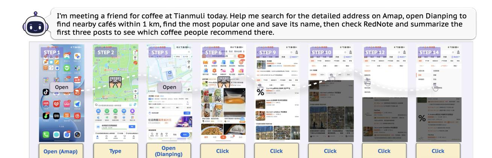

Figure 8: **실제 장치 모바일 GUI 실행 시연.** 궤적은 핵심 프레임으로 렌더링되며, 각 프레임 아래에 실행된 행동이 주석으로 표시된다. 이 교차 앱 작업에서, 에이전트는 Amap에서 대상 주소를 조회하고, Dianping에서 가장 인기 있는 카페를 찾으며, RedNote에 결과 요약을 게시한다.

계획, 시각적 이해, 그리고 복잡한 모바일 환경에서의 신뢰할 수 있는 실행.

우리는 Qwen-UI-Agent를 두 개의 실제 장치 모바일 벤치마크에서 추가로 평가한다: MobileWorld-Real(Section [3.2)](#page-20-0) 및 AndroidDaily[(Sui et al.,](#page-48-3) [2026)](#page-48-3). MobileWorld-Real은 중국 모바일 생태계에서 실제 Android 장치에서 실행되는 복잡한 과제를 중심으로 하며, AndroidDaily는 실제 Android 장치에서 고빈도 일상 시나리오를 다룬다.

Qwen-UI-Agent는 Table [3,](#page-22-2)에서 MobileWorld-Real에서 92.2%를 달성하며, Seed 2.1 Pro(88.7%), Gemini 3.1 Pro(86.2%), GPT 5.6 Sol(85.4%) 등 모든 기준 모델을 앞지른다. 이 결과는 Qwen-UI-Agent가 장기적인 교차 앱 실행, 슈퍼 앱 내 깊은 진입점 탐색, 실제 모바일 기기에서 변화하는 정보를 추론하는 과제를 신뢰성 있게 처리함을 보여준다. 27B 파라미터만으로 Qwen-UI-Agent는 작업 능력, 실제 기기 신뢰성, 배포 효율성 사이에서 유리한 균형을 제공한다.

AndroidDaily에서 Qwen-UI-Agent는 97.5%를 달성해 모든 비교 모델 중 1위를 차지하며, Seed 2.1 Pro(95.2%)와 Gemini 3.1 Pro(93.8%)를 능가한다. 이는 고빈도 일상 모바일 시나리오에서 신뢰성 있는 작업 완료를 보여준다. 35B-A3B 변형은 MobileWorld-Real에서 87.4%, AndroidDaily에서 93.9%를 달성하며, 토큰당 3B 파라미터만 활성화해 배포 시 추론 효율성을 크게 향상시킨다.

**정성적 예시.** Figure [8](#page-23-1)은 Qwen-UI-Agent의 실제 기기 실행 궤적을 대표적으로 제시하며, 각 주요 프레임 아래에 실행된 행동이 주석으로 표시된다. 이는 교차 앱 시나리오에서 자율 계획을 강조한다: 27단계에 걸쳐 에이전트는 각 앱의 깊은 기능 진입점으로 직접 이동하고, Amap에서 주소를 검색하며, Dianping에서 1km 이내 가장 인기 있는 카페를 식별하고, 추출된 핵심 정보를 RedNote에 전달해 요약을 완성하는 결정 기반으로 활용한다.

Table 4: OSWorld-Verified 성능 비교 [(Xie et al.,](#page-49-1) [2024)](#page-49-1).

| 모델 | 접근 / 크기 | 성공률 (%) |
|--------------------------------------------|---------------|------------------|
| 기준선 |  |  |
| Claude Opus 4.8 (Anthropic, 2026) | 폐쇄형 | 83.4 |
| Seed 2.1 Pro (ByteDance Seed, 2026b) | 폐쇄형 | 78.8 |
| GPT-5.5 (OpenAI, 2026a) | 폐쇄형 | 78.7 |
| Gemini 3.5 Flash (Google, 2026b) | 폐쇄형 | 78.4 |
| Gemini 3.1 Pro (Google, 2026a) | 폐쇄형 | 76.2 |
| Qwen 3.7 Plus (Qwen Team, 2026a) | 폐쇄형 | 73.3 |
| MiniMax M3 (MiniMax, 2026) | 428B-A23B | 75.2 |
| Kimi K2.6 (Moonshot AI, 2026) | 1T-A32B | 73.1 |
| GUI-Owl-1.5-32B-Instruct (Xu et al., 2026) | 32B | 56.5 |
| 우리 |  |  |
| Qwen-UI-Agent | 27B | 79.5 |

Table 5: OSWorld-v2에서의 성능 비교 [(Yuan et al.,](#page-49-2) [2026)](#page-49-2). Partial과 Binary는 각각 부분 작업 진행과 전체 작업 완료를 나타낸다. 작업당 단계 수가 낮을수록 좋다.

| 모델 | 부분 (%) | 이진 (%) | 단계/작업 | 작업 모드 |
|-----------------------------------|-------------|------------|------------|-------------|
| 기준선 |  |  |  |  |
| Claude Opus 4.8 (Anthropic, 2026) | 54.8 | 20.6 | 103.0 | 배치 처리 |
| GPT-5.5 (OpenAI, 2026a) | 49.5 | 13.0 | 95.2 | 배치 처리 |
| MiniMax M3 (MiniMax, 2026) | 22.3 | 4.6 | 326.7 | 단일 |
| Kimi K2.6 (Moonshot AI, 2026) | 22.1 | 4.6 | 179.3 | 단일 |
| Qwen 3.7 Plus (Qwen Team, 2026a) | 21.5 | 2.8 | 173.5 | 단일 |
| 우리 모델 |  |  |  |  |
| Qwen-UI-Agent | 40.0 | 13.9 | 135.8 | 배치 처리 |

#### **3.3.2 컴퓨터 사용 평가 (Computer-Use Evaluation)**

우리는 Qwen-UI-Agent의 컴퓨터 사용 능력을 OSWorld-Verified [(Xie et al.,](#page-49-1) [2024)](#page-49-1) 및 OSWorld-v2 [(Yuan et al.,](#page-49-2) [2026)](#page-49-2)에서 평가한다. 두 벤치마크를 별도로 보고한다. OSWorld-Verified는 361개의 컴퓨터 사용 과제에 대해 부분 진행률을 측정하며, OSWorld-v2는 장기 워크플로우에 초점을 맞추고 부분 진행률과 이진 완료를 모두 보고한다.

표 [4,](#page-24-0)에 나타난 바와 같이 Qwen-UI-Agent는 OSWorld-Verified에서 79.5%의 성공률을 달성하며, 비교된 모든 모델 중 두 번째로 순위를 차지하고 Claude Opus 4.8만이 앞서 있다. 이는 Seed 2.1 Pro, GPT-5.5, Gemini 3.5 Flash, Gemini 3.1 Pro 등 다른 선도적인 폐쇄형 기반 모델과 모든 평가된 오픈-웨이트 기반 모델을 능가한다. 이 결과는 Qwen-UI-Agent가 가장 강력한 폐쇄형 모델과 경쟁할 수 있음을 보여주며, 현재 오픈-웨이트 모델에 비해 상당한 우위를 확보하고 있음을 시사한다.

표 [5,](#page-24-0)에 나타난 바와 같이 Qwen-UI-Agent는 OSWorld-v2에서 부분 점수 40.0%와 이진 완료율 13.9%를 달성하여 최첨단 폐쇄형 모델들 사이에서 경쟁력 있게 위치한다. 특히, 이진 완료에서는 GPT-5.5를 0.9 퍼센트 포인트 앞지르지만, 부분 점수에서는 9.5 포인트 뒤처진다. Qwen-UI-Agent는 또한 평가된 모든 오픈-웨이트 모델을 크게 능가한다. 가장 강력한 오픈-웨이트 기준 모델인 MiniMax M3와 비교할 때, Qwen-UI-Agent는 부분 진행률을 17.7 퍼센트 포인트, 이진 완료를 9.3 포인트 향상시킨다. 이 차이는 Kimi K2.6에 대해 17.9/9.3 포인트, Qwen 3.7 Plus에 대해 18.5/11.1 포인트로 확대된다. 또한 Qwen-UI-Agent는 작업당 평균 135.8 단계만 필요로 하며, 이는 MiniMax M3와 Qwen 3.7 Plus보다 현저히 적다. 이러한 결과는 하이브리드 GUI+CLI 및 배치형 액션 설계가 장기 컴퓨터 사용 워크플로우에서 강력한 작업 성능과 실행 효율성을 모두 제공함을 시사한다.

Qwen-UI-Agent의 핵심 기능은 배치 실행이 가능한 통합 GUI+CLI 액션 공간이다. 대신

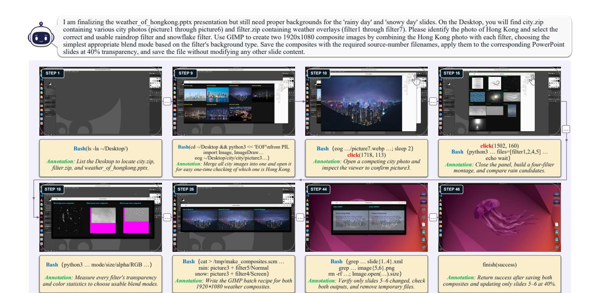

Figure 9: **컴퓨터 사용 과제에서 하이브리드 GUI+CLI 실행 시연.** 핵심 프레임은 발행된 액션과 함께 표시되며, CLI 명령은 파란색으로, GUI 액션은 빨간색으로 강조되고 각 단계는 의도를 간단히 주석한다. 이 예시에서 에이전트는 대상 사진을 선택하고 모든 후보를 CLI를 통해 하나의 몽타주로 결합하여 일회성 시각 검사를 수행한다. 각 이미지를 개별적으로 여는 대신이다. 이후 하이브리드 실행을 활용해 CLI 기반 처리와 GUI 기반 검증을 결합하여 최종 출력을 만든다.

CLI를 가끔 fallback으로 사용하는 대신, 모델은 같은 궤적 안에서 GUI와 CLI 액션을 선택하고 교차하도록 학습한다. OSWorld-Verified와 OSWorld-v2에서 CLI 액션은 각각 전체 액션의 **40.7%**와 **55.1%**를 차지하며, 배치 형태로 발행된 액션의 비율은 각각 **39.6%**와 **41.6%**이다. Qwen-UI-Agent가 GUI와 CLI 액션을 결합하는 방식을 Section 4.2에서 자세히 분석한다.

**질적 예시.** Figure 9와 Figure 26은 Appendix A.3에 수록되어 있으며, Qwen-UI-Agent의 두 대표적인 다중 애플리케이션 워크플로우에서의 하이브리드 실행 동작을 추가로 보여준다. 각 키 프레임 아래에 CLI 명령어(파란색)와 GUI 동작(빨간색)이 강조 표시되고, 단계 의도를 짧게 주석으로 달아준다. Figure 9에서는 에이전트가 많은 후보 이미지 중에서 대상 도시 사진과 사용 가능한 날씨 필터를 식별해야 한다. 순수 GUI 실행은 모든 이미지를 개별적으로 열어 검사해야 하지만, 에이전트는 모든 후보를 하나의 CLI 스크립트로 한 번에 모음으로 결합하고 한 번에 검증한 뒤, 합성 및 프레젠테이션 편집을 위해 GUI 동작으로 돌아간다. 두 인터페이스를 보완적으로 사용하는 것은 GUI 또는 CLI 단독보다 하이브리드 실행을 현저히 효율적으로 만든다. 또한 에이전트는 다중 키 단축키 시퀀스나 명령 뒤에 대기(wait)가 있는 연산과 같은 호환 가능한 작업을 한 번의 모델 턴으로 묶는다.

#### 3.3.3 브라우저 사용 및 DeepSearch 평가 (Browser-Use and DeepSearch Evaluation)

모바일 및 컴퓨터 사용을 넘어, 우리는 브라우저 기반 웹 탐색과 DeepSearch에서 Qwen-UI-Agent를 평가한다. 이 기능들은 밀접하게 관련되어 있지만 GUI 에이전트의 다른 측면을 평가한다.

**브라우저 사용.** 우리는 WebArena (Zhou et al., 2024)에서 Qwen-UI-Agent를 평가한다. WebArena는 기능적 웹사이트에서 상태를 유지하며 다단계 과제를 수행한다. 초기 평가 중에 여러 개의 잘못된 참조 답변과 공식 평가 스크립트의 오류를 확인했다. 따라서 우리는 수동으로 참조를 검증했다.

Table 6: WebArena에서의 성능 비교 (Zhou et al., 2024). Baseline 결과는 \* 표시된 항목이 동일한 실험 설정에서 우리 평가를 통해 얻은 결과이다.

| 모델 | 접근 / 크기 | 성공률 (%) |
|--------------------------------------------|---------------|------------------|
| 기준선 |  |  |
| Claude Opus 4.8* (Anthropic, 2026) | 폐쇄형 | <u>71.9</u> |
| GPT-5.5* (OpenAI, 2026a) | 폐쇄형 | 69.5 |
| Gemini 3.1 Pro* (DeepMind, 2025) | 폐쇄형 | 65.3 |
| Qwen 3.7 Plus* (Qwen Team, 2026a) | 폐쇄형 | 59.0 |
| CUA-GYM-A17B (Wang et al., 2026) | 397B-A17B | 56.0 |
| Kimi K2.6* (Moonshot AI, 2026) | 1T-A32B | 55.8 |
| Qwen3.5-397B-A17B (Qwen Team, 2026b) | 397B-A17B | 54.0 |
| GUI-Owl-1.5-32B-Thinking (Xu et al., 2026) | 32B | 48.4 |
| Qwen3.5-27B (Qwen Team, 2026b) | 27B | 41.5 |
| Qwen3.5-35B-A3B (Qwen Team, 2026b) | 35B-A3B | 40.8 |
| 우리 |  |  |
| Qwen-UI-Agent | 27B | 73.6 |
| Qwen-UI-Agent | 35A3B | 69.2 |
| 인간 성능 (Zhou et al., 2024) | - | 78.2 |

표 7: DeepSearch 벤치마크에서의 성능 비교: BrowseComp (BC) 및 BrowseComp-ZH (BC-ZH). '-'은 결과가 보고되지 않았음을 나타낸다.

| 모델 (Model) | 접근/크기 (Access / Size) | BC(%) | BC-ZH(%) |
|-------------------------------------------|---------------|-------------|-------------|
| 기준선 (Baselines) |  |  |  |
| GPT-5.5 (OpenAI, 2026a) | 폐쇄형 소스 (Closed-source) | <u>90.1</u> | _ |
| Seed 2.1 Pro (ByteDance Seed, 2026b) | 폐쇄형 소스 | 86.2 | _ |
| Gemini 3.1 Pro (Google, 2026a) | 폐쇄형 소스 | 85.9 | - |
| Claude Opus 4.8 (Anthropic, 2026) | 폐쇄형 소스 | 84.3 | - |
| UI-TARS-2 (Wang et al., 2025a) | 폐쇄형 소스 | 29.6 | 50.5 |
| Qwen3.5-397B-A17B (Qwen Team, 2026b) | 397B-A17B | 78.6 | 70.3 |
| Apodex-1.0-mini (Apodex Team, 2026) | 35B-A3B | 71.5 | 80.6 |
| Qwen3.5-27B (Qwen Team, 2026b) | 27B | 61.0 | 62.1 |
| GLM-4.7 (Z.ai, 2025) | 358B | 52.0 | 66.6 |
| DeepSeek-V3.2 (DeepSeek-AI, 2025) | 685B | 51.4 | 65.0 |
| Tongyi-DR-30B (Tongyi DeepResearch, 2025) | 30B-A3B | 43.4 | 46.7 |
| 우리 모델 (Ours) |  |  |  |
| Qwen-UI-Agent | 27B | 64.1 | <u>75.0</u> |

답변을 제공하고 영향을 받은 스크립트를 수정한 뒤 최종 결과를 보고했다. Kimi K2.5도 수정된 평가 설정을 사용하여 WebArena 성능을 보고한다 (Kimi Team, 2026).

표 6에 나타난 바와 같이, Qwen-UI-Agent의 27B 변형은 73.6%의 성공률을 달성하며, 비교된 모든 모델 중 가장 높은 성과를 보인다. 반면 35A3B 변형은 69.2%를 기록한다. 27B 변형은 가장 강력한 기준 모델인 Claude Opus 4.8(71.9%)을 1.7 퍼센트 포인트 뛰어넘고, GPT-5.5(69.5%)를 4.1 퍼센트 포인트 초과한다. Qwen-UI-Agent는 Gemini 3.1 Pro, Qwen 3.7 Plus, Kimi K2.6, CUA-GYM-A17B, 그리고 Claude 3.7 Computer Use 및 GUI-Owl-1.5-32B-Thinking과 같은 전문 브라우저 에이전트보다도 우수하다. 인간 성능(78.2%)과의 차이는 4.6 포인트이지만, 이 결과는 이질적인 웹 인터페이스 전반에 걸친 강력한 엔드‑투‑엔드 브라우저 제어를 입증한다.

**DeepSearch.** 단순 검색은 종종 웹 탐색 자체의 일부이다: 에이전트가 브라우저에 쿼리를 입력하고, 순위가 매겨진 결과를 검사하며, 잠재적으로 관련 있는 페이지를 여는 과정이다. DeepSearch는 많은 반복적인 GUI 동작을 API 기반 검색과 증거 합성으로 대체함으로써, 에이전트가 GUI 워크플로를 계속하기 전에 외부 컨텍스트를 보다 효율적으로 확보하도록 한다.

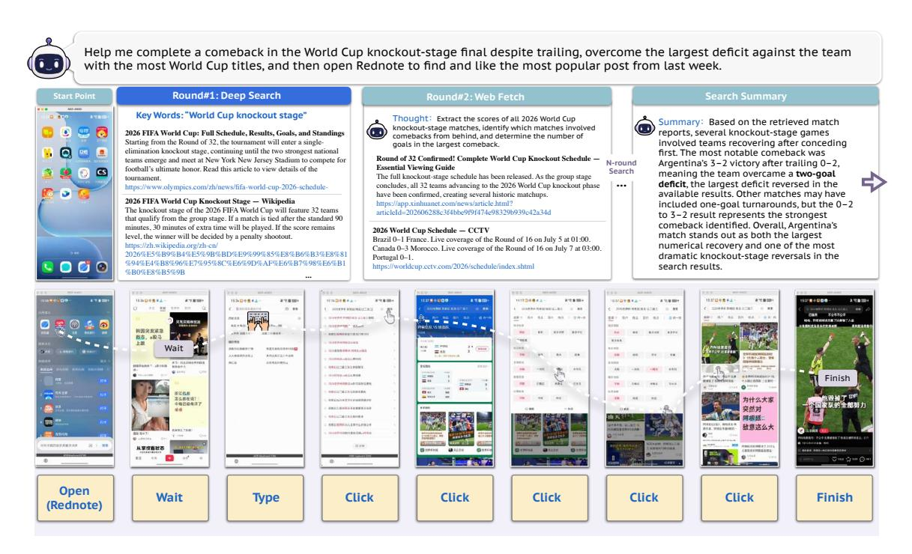

Figure 10: **DeepSearch‑assisted GUI 실행 시연.** 상단 패널은 키워드 기반 DeepSearch, 중간 생각을 포함한 타깃 웹 가져오기, 최종 검색 요약 등 다중 라운드 검색 과정을 보여준다. 하단 행은 이후 GUI 경로를 나타낸다. DeepSearch는 GUI 실행 전에 지식 및 추론 문제를 해결하며, 모호한 교차 소스 요청을 명시적 목표로 변환한다: Qwen-UI-Agent는 DeepSearch를 통해 월드컵 녹아웃 단계에서 가장 큰 역전 승리를 식별하고, RedNote를 열어 지난 주 가장 높은 참여도를 기록한 관련 게시물을 직접 탐색한다, 앱 내 무작위 검색 없이.

우리는 Qwen-UI-Agent를 BrowseComp와 BrowseComp-ZH에서 평가한다. 이 두 벤치마크는 각각 영어와 중국어 웹에서 지속적인 정보 탐색을 평가한다. 표 7에 나타난 바와 같이, Qwen-UI-Agent는 BrowseComp에서 64.1%, BrowseComp-ZH에서 75.0%를 달성한다. BrowseComp에서 Qwen-UI-Agent는 Qwen3.5-27B, Tongyi-DR-30B, UI-TARS-2를 능가한다. 비록 최첨단 독점 모델과 훨씬 큰 시스템에 비해 성능이 뒤처지지만, 27B 규모에서 경쟁력 있는 영어 DeepSearch 기능을 입증한다. BrowseComp-ZH에서는 Qwen-UI-Agent가 비교된 모든 시스템 중 두 번째로 좋은 결과를 얻으며, Qwen3.5-27B, Tongyi-DR-30B, UI-TARS-2를 크게 앞선다. 이 결과는 Qwen-UI-Agent가 후보 웹페이지를 찾는 것뿐만 아니라, 여러 소스에 분산된 증거를 신뢰할 수 있는, 과제 관련 정보로 합성해 이후 추론 및 GUI 실행에 활용할 수 있음을 보여준다.

정성적 예시. 우리는 GUI 실행과 DeepSearch가 통합되는 상호 보완적인 방식을 보여주는 두 개의 GUI 실행 데모를 추가로 제시한다. GUI 동작은 애플리케이션과의 상호작용을 처리하고, DeepSearch는 외부 지식 획득, 비교 및 의사결정을 담당한다. 첫 번째 데모(그림 10)에서는 GUI 작업이 시작되기 전에 지식 및 추론 문제를 해결해야 한다. 현재 월드컵에서 가장 큰 역전을 기록한 탈락 단계 경기(knockout‑stage match)를 식별하는 것이다. 상단 패널은 키워드 기반 DeepSearch가 순위가 매겨진 소스를 통해 수행되는 다단계 검색 과정을 추적한다. 타깃 웹 가져오기(targeted web fetches)를 통해 경기 점수를 추출하고 교차 검증한 뒤, 검색 요약(search summary)이 아르헨티나의 0–2 뒤처진 뒤 3–2 역전(Argentina's 3–2 comeback after trailing 0–2)을 식별한다. DeepSearch는 모호하고 교차 소스에 걸친 사용자 요청을 실행이 시작되기 전에 명시적인 GUI 목표로 변환한다. 따라서 아래의 경로에서 에이전트는 RedNote를 열고, 식별된 경기를 직접 검색하며, 지난 일주일간의 게시물을 필터링하고, 블라인드 인앱 검색이나 시행착오 없이 가장 많이 논의된 게시물을 연다. 두 번째 데모(그림 27, 부록 A.3)는 DeepSearch가 GUI 실행 중간에 필요에 따라 호출되는 경우를 보여준다.

Table 8: GUI 기반 지상화 벤치마크에서의 성능 비교. ScreenSpot-Pro는 줌 아웃 결과를 보고하며, 사용 가능한 경우 괄호 안에 줌 인 결과를 표시한다. 기준선 결과는 ∗로 표시되며, 이는 우리의 자체 평가에서 얻은 것이다.

| 모델 (MODELS) | 기준점 벤치마크 (GROUNDING BENCHMARKS) |  |  |  |  |
|--------------------------------------------|----------------------|-------|-----------|---------|-----------|
|  | SS-PRO(줌 인) (SS-PRO(ZOOM IN)) | SS-V2 (SS-V2) | MM-GUI-L2 (MM-GUI-L2) | OSW-G-R (OSW-G-R) | UI-VISION (UI-VISION) |
| 기준선 |  |  |  |  |  |
| Qwen 3.7 Plus* (Qwen Team, 2026a) | 68.9 (79.0) | 96.6 | 90.5 | 78.2 | 68.0 |
| Seed 2.1 Pro* (ByteDance Seed, 2026b) | 65.3 (80.7) | 96.6 | 90.9 | 78.0 | 62.0 |
| Qwen3.5-4B* (Qwen Team, 2026b) | 59.1 (60.3) | 94.3 | 83.4 | 62.0 | 32.6 |
| Qwen3.5-35B-A3B* (Qwen Team, 2026b) | 64.5 (68.6) | 95.2 | 87.5 | 63.6 | 52.3 |
| Qwen3.5-27B* (Qwen Team, 2026b) | 68.4 (70.3) | 96.1 | 89.1 | 67.9 | 46.6 |
| GUI-Owl-1.5-2B-Instruct (Xu et al., 2026) | 57.8 (70.4) | 89.7 | 72.1 | 62.6 | – |
| GUI-Owl-1.5-4B-Instruct (Xu et al., 2026) | 66.8 (75.6) | 93.2 | 83.2 | 68.4 | – |
| GUI-Owl-1.5-8B-Instruct (Xu et al., 2026) | 71.1 (77.8) | 93.7 | 82.5 | 69.3 | – |
| GUI-Owl-1.5-32B-Instruct (Xu et al., 2026) | 72.9 (80.3) | 95.3 | 86.8 | 69.7 | – |
| UI-Venus-1.5-2B (Gao et al., 2026) | 57.7 (64.6) | 92.8 | 80.3 | 59.4 | 44.8 |
| UI-Venus-1.5-8B (Gao et al., 2026) | 68.4 (73.9) | 95.9 | 88.1 | 69.7 | 46.5 |
| UI-Venus-1.5-30B-A3B (Gao et al., 2026) | 69.6 (74.8) | 96.2 | 88.6 | 70.6 | 54.7 |
| ZoomOnce-4B (Liu et al., 2026) | 66.2 | 95.2 | 87.6 | 73.1 | 40.2 |
| HyMobileAgent-A3B (Shen et al., 2026) | 66.5 | 96.2 | 89.3 | – | – |
| MAI-UI-2B (Zhou et al., 2025a) | 57.4 (62.8) | 92.5 | 82.6 | 63.5 | 30.3 |
| MAI-UI-8B (Zhou et al., 2025a) | 65.8 (70.9) | 95.2 | 88.8 | 72.9 | 40.7 |
| MAI-UI-32B (Zhou et al., 2025a) | 67.9 (73.5) | 96.5 | 91.3 | 75.0 | 47.1 |
| GTA1-7B (Yang et al., 2025a) | 50.1 | 92.4 | 78.5 | 67.7 | – |
| GTA1-32B (Yang et al., 2025a) | 63.6 | 95.2 | 83.4 | 72.2 | – |
| UI-Ins-7B (Chen et al., 2025) | 52.2 | 94.0 | 83.1 | - | - |
| UI-Ins-32B (Chen et al., 2025) | 57.0 | 94.9 | 84.9 | - | - |
| OpenCUA-7B (Wang et al., 2025b) | 50.0 | 92.3 | – | – | 29.7 |
| OpenCUA-32B (Wang et al., 2025b) | 55.3 | 93.4 | – | – | 33.3 |
| OpenCUA-72B (Wang et al., 2025b) | 60.8 | 92.9 | – | – | 37.3 |
| Ours |  |  |  |  |  |
| Qwen-UI-Agent-4B | 67.8 (74.0) | 94.9 | 87.9 | 70.5 | 51.6 |
| Qwen-UI-Agent-35B-A3B | 76.1 (80.2) | 96.7 | 92.0 | 74.6 | 65.9 |
| Qwen-UI-Agent-27B | 76.6 (81.5) | 97.5 | 92.6 | 78.5 | 70.0 |

우리는 에이전트가 증거 기반 체중 감량에 관한 Douyin 비디오를 먼저 찾아 GUI 동작을 통해 주요 주장들을 추출한 뒤, DeepSearch를 호출해 이 주장들을 연구 논문, 공식 가이드라인, 권위 있는 출처와 비교해 검증한다. 인터페이스만으로는 댓글을 달 것인지, 어떤 내용을 달 것인지 결정할 수 없기 때문이다. 검증 결과는 이후 GUI 동작을 직접 결정한다. 즉, 오해를 바로잡고 필요한 주의사항을 보충하는 댓글을 게시하는 것이며, 이는 관찰–연구–결정–행동의 닫힌 루프를 형성한다.

#### **3.3.4 GUI 기반화 (GUI Grounding)**

우리는 Qwen-UI-Agent의 GUI 기반화 능력을 ScreenSpot-Pro, ScreenSpot-V2, MMBench-GUI L2, OSWorld-G-Refined, UI-Vision의 다섯 개 종합 벤치마크에서 평가한다. 이 벤치마크들은 고해상도 전문 소프트웨어, 일반 크로스 플랫폼 인터페이스, 데스크톱 소프트웨어 환경, 그리고 지시 기반 기반화를 포괄한다.

표 8에 표시된 바와 같이, 27B 변형은 모든 다섯 벤치마크에서 강력한 기반화 성능을 달성하며, ScreenSpot-Pro에서 확대 없이 76.6%, ScreenSpot-V2에서 97.5%, MMBench-GUI L2에서 92.6%, OSWorld-G-Refined에서 78.5%, UI-Vision에서 70.0%를 기록한다. ScreenSpot-Pro에서는 확대 여부와 관계없이 모든 비교 모델 중 1위를 차지하며, 확대 시 점수는 81.5%로 더욱 상승한다. 이러한 결과는 일반 인터페이스와 복잡한 인터페이스 모두에서 정확한 요소 위치 지정이 가능함을 보여준다.

Table 9: 일반 및 에이전시 성능 비교. Qwen-UI-Agent는 강력한 GUI 기능을 획득하면서 기반 모델의 일반적인 추론 및 에이전시 기능을 보존한다. 또한 이 벤치마크 전반에서 다른 GUI 전문 모델을 크게 능가한다.

| 벤치마크 | Qwen-UI-Agent | Qwen3.5-27B | UI-Venus-1.5 30B-A3B | GUI-Owl-1.5 32B-Instruct | EvoCUA-32B 20260105 | OpenCUA 72B |  |  |
|------------------------------|---------------|-------------|-------------------------|-----------------------------|------------------------|----------------|--|--|
| 일반 기능: |  |  |  |  |  |  |  |  |
| MMMU-Pro | 72.4 | 73.5 | 32.4 | 39.5 | 58.4 | 31.0 |  |  |
| RealWorldQA | 83.1 | 83.1 | 75.3 | 76.7 | 75.4 | 66.4 |  |  |
| CharXiv-RQ | 77.7 | 76.8 | 44.7 | 50.9 | 58.1 | 39.6 |  |  |
| MathVision | 82.8 | 82.0 | 36.8 | 50.6 | 60.8 | 26.6 |  |  |
| AI2D_TEST | 91.1 | 91.9 | 84.3 | 84.8 | 85.7 | 78.9 |  |  |
| MMLU-Pro | 86.5 | 86.0 | 65.6 | 73.9 | 77.1 | 58.8 |  |  |
| IFEval (프롬프트 수준 엄격) | 90.2 | 90.4 | 81.3 | 84.5 | 64.0 | 70.6 |  |  |
| 에이전트 기능: |  |  |  |  |  |  |  |  |
| Tau2-Bench | 89.9 | 89.2 | 22.7 | 6.1 | 48.9 | 14.4 |  |  |
| Terminal-Bench 2.0 (평균 5) | 50.1 | 41.1 | 3.2 | 0.0 | 5.6 | 9.0 |  |  |
| Claw-Eval (평균 3) | 73.5 | 66.9 | 30.6 | 29.6 | 46.3 | 26.4 |  |  |
| Claw-Eval (Pass@3) | 51.8 | 41.2 | 5.5 | 5.5 | 6.5 | 0.5 |  |  |
| BFCL-v4 | 74.2 | 71.3 | 19.8 | 32.7 | 48.8 | 28.3 |  |  |
| SkillsBench (평균 5) | 28.0 | 24.9 | 0.5 | 0.3 | 3.3 | 0.0 |  |  |
| QwenClawBench (평균 3) | 44.2 | 48.5 | 6.4 | 5.1 | 18.6 | 11.4 |  |  |

*Evaluation note.* 이 표의 모든 결과는 우리 평가 환경에서 독립적으로 재현되었습니다. 일부 평가 설정이 동일하지 않기 때문에 점수는 공식 보고서와 다를 수 있습니다. 아래에 명시되지 않는 한, 우리는 해당 공식 벤치마크 프로토콜을 따릅니다.

- **Tau2-Bench.** 우리는 공식 리더보드 작업 세트, 하네스, 그리고 스코어링 프로토콜을 따르지만, 사용자 시뮬레이터와 심사자로 GPT-5.5를 사용합니다.  
- **Terminal-Bench 2.0.** Qwen3.6 평가 설정을 따라, 우리는 Harbor/Terminus-2 하네스를 사용하며, 각 작업에 대해 3시간 타임아웃과 최대 32개의 CPU, 48GB 메모리를 사용합니다. 온도 1.0, top-*p* 0.95, top-*k* 20, 80K 토큰 출력 제한, 256K 컨텍스트 윈도우를 사용하고, 5번 실행 평균을 보고합니다.  
- **Claw-Eval.** 우리는 공식 199작업, 3회 시도 프로토콜 및 스코어링 규칙을 따르지만, 일반 및 다중 턴 심사에 GPT-5.5를, 다중 턴 사용자 시뮬레이션에 Qwen3.6-Plus를 사용하며, 공식 Gemini 3 Flash/Claude Opus 4.6 설정을 대체합니다. 샘플링 온도는 0.6입니다.  
- **SkillsBench.** 우리는 Qwen3.6 평가 설정을 따릅니다. OpenCode를 사용해 외부 API에 의존하지 않는 78개의 독립 작업을 평가하고, 5번 실행 평균을 보고합니다.  
- **QwenClawBench.** 우리는 공식 v1.1 작업 세트, 3회 실행 프로토콜, 그리고 패널티-하이브리드 스코어링을 따르지만, 기본 Claude Opus 4.5 심사자를 GPT-5.2로 교체합니다. 또한 OpenClaw 런타임을 이동 중인 메인 이미지 대신 버전 2026.6.1에 고정합니다.

전문 소프트웨어, 목표가 명시적 텍스트가 아니라 기능적 또는 공간적 맥락에서 추론되어야 하는 설정을 포함합니다.

그라운딩 능력은 모델 규모에 관계없이 여전히 강력합니다. ScreenSpot-Pro에서 35B-A3B와 4B 변형은 확대 전 76.1%와 67.8%를 달성하며, 확대 시 점수가 80.2%와 74.0%로 상승합니다. 35B-A3B 변형은 ScreenSpot-V2에서 96.7%, MMBench-GUI L2에서 92.0%, OSWorld-G-Refined에서 74.6%, UI-Vision에서 65.9%를 기록하며, 토큰당 3B 파라미터만 활성화합니다. 4B 변형의 대응 점수는 94.9%, 87.9%, 70.5%, 51.6%입니다. 이 결과들은 Qwen-UI-Agent가 일반 인터페이스, 전문 소프트웨어, 그리고 지시 유형에서 컴팩트에서 중간 규모 모델까지 신뢰할 수 있는 GUI 그라운딩을 제공함을 보여줍니다.

#### **3.3.5 일반 및 에이전트 역량 (General and Agentic Capabilities)**

Qwen-UI-Agent는 GUI 도메인 지식을 강화하면서도 기본 모델에서 물려받은 일반적인 추론 및 에이전트 기능을 유지한다. 표 [9,](#page-29-2)에서 보듯이, Qwen-UI-Agent는 일반 및 에이전트 벤치마크에서 전문 GUI 모델을 크게 능가한다. 이러한 결과는 Qwen-UI-Agent가 좁은 GUI 전용 모델이 아니라 광범위하게 유능한 모델임을 시사한다. 이와 같은 광범위한 능력 프로필은 분포 외부 또는 비정상적인 작업과 같이 일상적인 GUI 상호작용을 넘어서는 지식, 추론, 도구 사용이 필요한 상황에서도 도움이 될 수 있다.

**Proactive service:** 사용자의 다음날 아침 비행이 취소되어 14:00 CTO 데모가 위험에 처한다. 사용자가 물어보기 전에, proactive harness는 대체 항공편과 고속 열차를 검색하고, 어느 옵션이 제시간에 도착할 수 있는지 평가하며, 결정 준비가 된 여행 복구 계획을 제시한다.

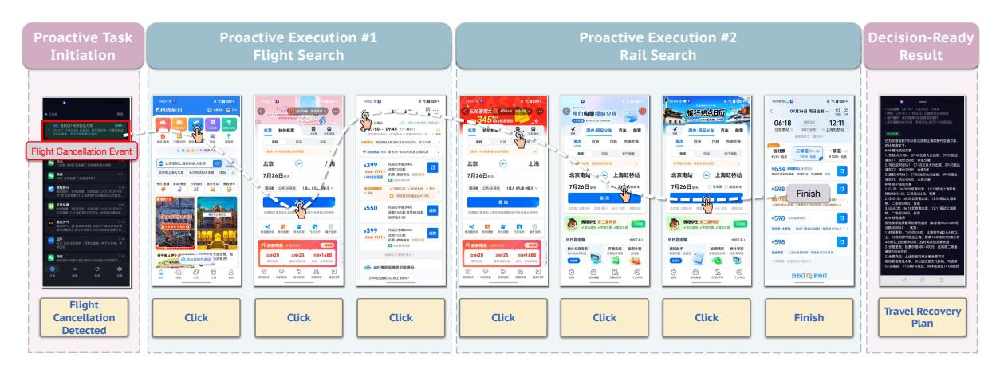

그림 11: **모바일 알림 기반의 사전 서비스 시연.** 경로는 강조된 단계로 구성된다: 감지된 알림에서 시작되는 사전 작업 시작, 사전 실행 단계, 그리고 결정 준비가 된 결과로, 실행된 행동은 각 핵심 프레임 아래에 주석으로 표시된다. 항공편 취소 복구: 사용자의 다음날 아침 비행이 취소되고 14:00 데모가 위험에 처할 때, harness는 사전적으로 대체 항공편과 고속 열차를 검색하고, 어느 옵션이 제시간에 도착할 수 있는지 평가하며, 결정 준비가 된 여행 복구 계획을 제시한다.

### 3.4 하네스 기반 워크플로우 (Harness-Enabled Workflows)

벤치마크 평가를 넘어, 우리는 Section [2.5,](#page-15-0) 에서 도입한 하네스 레이어가 제공하는 워크플로우를 정성적으로 검토한다. 이 레이어는 사전 서비스 시작과 크로스 플랫폼 작업 실행을 다룬다.

**사전 서비스.** 우리는 Appendix [A.3.](#page-52-0) 의 Figure [11](#page-30-0)과 Figure [28](#page-55-0) 에 두 가지 대표적인 사전 서비스 경로를 제시한다. 각 경로는 사전 작업 시작, 하나 이상의 사전 실행 단계, 그리고 결정 준비 완료 결과라는 네 개의 강조된 단계로 구성된다. Figure [11,](#page-30-0) 에서는 예약된 08:00 트리거가 사용자의 아침 약속(강조된 알림에서 추출됨)과 실시간 날씨 및 통근 상황을 결합한다. 하네스는 먼저 날씨를 조회하고, 그 다음 지도 탐색을 통해 publictransit 및 택시 옵션을 추론하며, 사용자가 요청하기 전에 우산 조언, 출발 시각, 핵심 알림을 포함한 실행 가능한 아침 브리핑을 전달한다. Figure [28,](#page-55-0) 에서는 하네스가 첫 번째 단계에서 강조된 항공편 취소 알림을 감지하여 다음 날 14:00 데모가 위험에 처한다. 하네스는 두 개의 실행 단계에서 대체 항공편과 고속 열차를 사전 검색하고, 어떤 옵션이 제시간에 도착하는지 평가하며, 결정 준비가 된 여행 복구 계획을 제시하고 최종 예약 결정을 사용자에게 맡긴다. 두 예시는 하네스가 수동 알림을 문맥화되고 실행 가능한 지원으로 변환하면서도 결과적인 행동을 사용자 통제 하에 두는 방식을 보여준다.

**크로스 플랫폼 작업 실행.** Figure [6(](#page-16-1)II) 은 팀 빌딩 레스토랑 선택을 위한 크로스 플랫폼 워크플로우를 보여준다. 하네스는 작업을 네 개의 기기별 단계로 분해한다: Qwen-UI-Agent 가 모바일에서 후보 레스토랑을 탐색하고, 그들의 평점, 요리 종류, 예약 전화번호를 데스크탑에서 스프레드시트로 정리하며, 결과물을 팀 리더에게 승인 요청을 보낸 뒤, 최종적으로 승인된 레스토랑을 모바일 지도 애플리케이션에 저장한다. 워크플로우 전반에 걸쳐 공유 작업 상태는 후보 목록, 생성된 스프레드시트, 승인 결과를 기기 간에 전달하므로 각 단계는 처음부터 다시 시작하는 대신 최신 컨텍스트에서 재개된다. 우리는 Appendix [A.3:](#page-52-0) 의 Figure [12](#page-31-2) 와 Figure [29](#page-55-1) 에서 이 기능의 두 개의 실행 경로를 제시한다. 하나는 모바일 갤러리 선택을 GUI+CLI 컴퓨터 사용으로 전달해 비용 보고서 생성을 위한 영수증 정리 워크플로우이며, 다른 하나는 Dianping, Meituan, Amap 를 동시에 여러 가상 ...

**크로스 플랫폼 서비스:** 여러 플랫폼에서 초밥 레스토랑을 검색하고, 평점을 비교하며, 상위 세 가지 옵션을 요약한 로컬 리포트를 만든다.

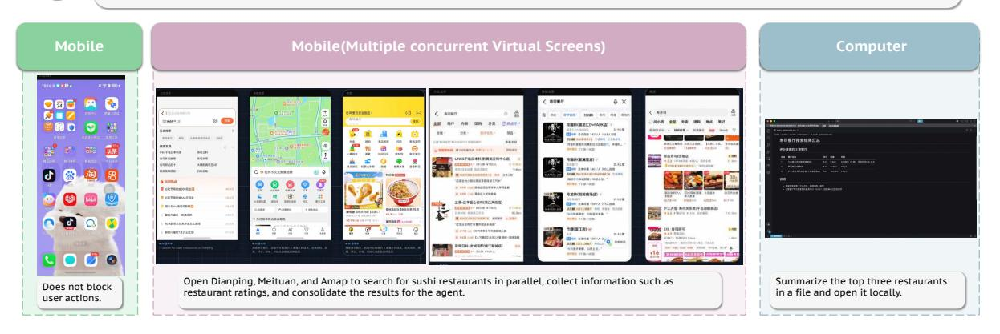

Figure 12: **크로스 플랫폼 작업 실행 시연.** 이 워크플로우에서 모바일 하위 작업은 물리적 기기의 가상 화면에서 실행되므로 실행이 사용자의 자체 동작을 차단하지 않는다. 병렬 다중 앱 검색: 에이전트는 Dianping, Meituan, Amap 에서 초밥 레스토랑을 동시에 여러 가상 화면을 통해 검색하고, 평점을 통합하며, 상위 세 가지 옵션을 컴퓨터에서 열리는 로컬 리포트에 요약한다.

가상 화면; 두 경우 모두 모바일 하위 작업은 가상 화면에서 실행되어 사용자의 기기 사용을 차단하지 않는다. 이 예시들은 하네스가 모바일과 컴퓨터 환경 간 실행이 이동할 때 작업 상태, 산출물, 종속성을 보존할 수 있음을 보여준다.

## 4 GUI 에이전트 실행의 행동 분석 (Behavioral Analysis of GUI Agent Execution)

집계 벤치마크 점수는 에이전트가 작업을 완료했는지를 보여 주지만, 작업을 어떻게 수행하는지, 왜 실패하는지, 그리고 RL 훈련 후에 행동이 어떻게 변하는지에 대해서는 덜 드러낸다. 따라서 우리는 Qwen-UI-Agent의 실행 행동에 주로 초점을 맞춘 네 가지 질문을 살펴본다. **(1)** 시뮬레이션 벤치마크에 최적화된 모델이 물리적 장치에서 왜 어려움을 겪는가? **(2)** Qwen-UI-Agent는 작업 실행 중에 GUI, CLI, 그리고 배치 액션을 어떻게 결합하며, 이러한 선택에서 어떤 독특한 실행 패턴이 나타나는가? **(3)** 액션 RL은 단계별 실행 행동을 어떻게 바꾸는가? **(4)** 온라인 RL은 장기 경로에서 경로 수준 행동을 어떻게 재구성하는가? 이 분석들은 집계 지표를 보완하여 에이전트가 도전적인 환경에 어떻게 반응하고, 액션 공간을 어떻게 활용하며, RL 훈련 후에 어떻게 변하는지를 보여준다.

### 4.1 모델의 제한된 실제 장치 경험이 실행 행동에 미치는 영향

**실제 장치 실패에 대한 행동 분석.** 대부분의 모델은 훈련 중 물리적 장치 상호작용에 직접적인 노출이 제한적이다. Qwen 3.7 Plus와 같은 최첨단 모델은 광범위한 벤치마크에서 강력한 성능을 보이지만, MobileWorld-Real에서의 결과는 물리적 장치에서의 신뢰할 수 있는 실행이 여전히 어려움을 겪고 있음을 시사한다. 이는 보다 구체적인 행동 질문을 제기한다: 훈련 중 실제 장치 상호작용이 제한적일 때 어떤 실행 패턴이 나타나며, 이러한 패턴이 작업 실패에 어떻게 기여하는가? 이 질문을 조사하기 위해 우리는 MobileWorld-Real과 AndroidDaily에서 실패한 모든 Qwen 3.7 Plus 경로를 검토하여 주요 실패 모드를 식별한다.

표 [10,](#page-32-0)에 나타난 바와 같이, 우리는 훈련 중 실제 상호작용 경험 부족에 기인한 두 차원으로 실패를 정리한다: *실행 능력 제한* (40.3%) – 시뮬레이션 환경이 탐색, 오류 복구, 상태 추적을 학습하도록 유도하지 못함, 그리고 *실제 시나리오 도전* (52.0%) – 정제된 시뮬레이터가 거의 포함하지 않는 인터페이스 현상에 의해 유발됨. 그림 [13,](#page-32-1)에서 우리는 대표 사례에 대해 모델의 축약된 사고와 두 개의 핵심 프레임을 짝지어 보여준다.

표 10: 실제 장치에서 실패한 모든 Qwen 3.7 Plus 경로에 대한 실패 패턴 분포

| 차원 | 실패 패턴 | 특성 | 전형적 행동 |
|---------------------------------------------|-----------------------------------------------------------------------|------------------------|--------------------------------------------------------------------------------------------------------------|
| 실행 능력 제한 사항 (40.3%) | 탐색 실패 잘못된 동작 루프 실행 상태 상실 | 19.5% 14.3% 6.5% | 깊은 인앱 항목을 찾지 못함 비효율적 동작 반복 완료된 하위 작업을 잊음 |
| 실제 시나리오 도전 과제 (52.0%) | UI 오독 팝업 간섭 물리적 위젯 제어 | 24.7% 18.2% 9.1% | 상태 페이지 의미를 잘못 해석 광고, 결제 장벽, CAPTCHA, 빈 페이지 목표 초과, 수렴하지 않음 |
| 기타 | – | 7.7% | 과소 실행, 조기 중지 |

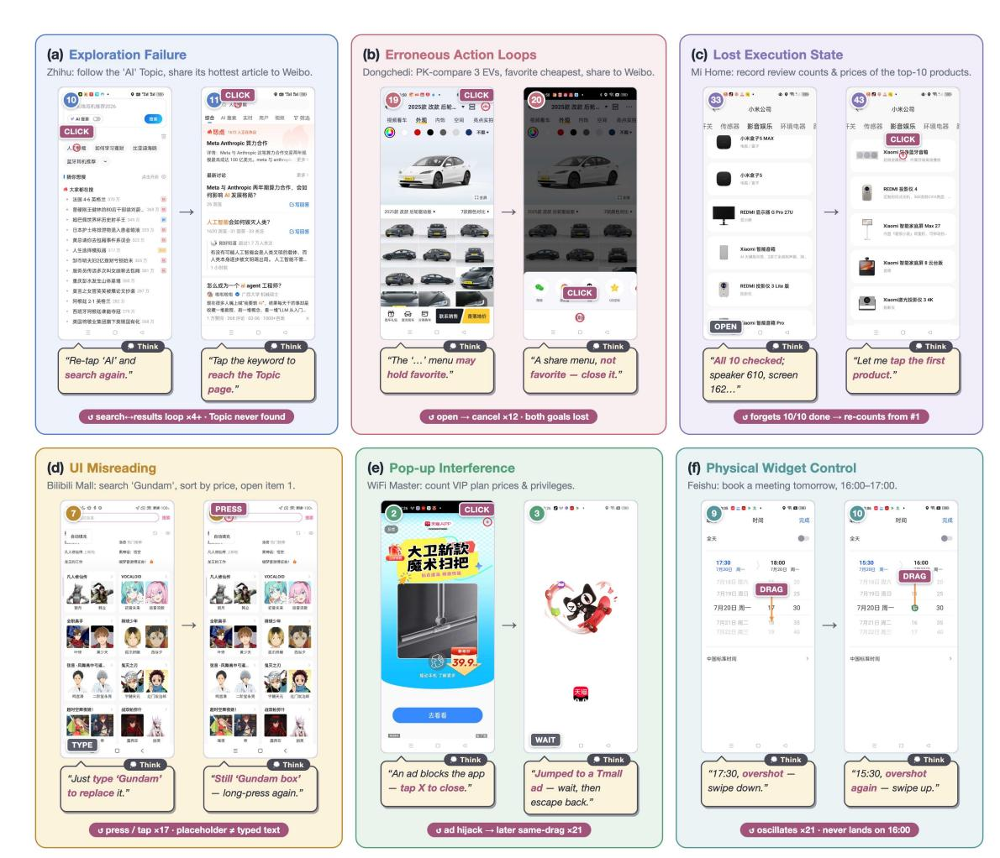

Figure 13: Qwen 3.7 Plus의 대표적인 실제 기기 실패 패턴. *실행 능력 한계:* (a) 탐색 실패, (b) 오류가 있는 동작 루프, (c) 실행 상태 상실. *실제 시나리오 도전:* (d) UI 오독, (e) 팝업 간섭, (f) 물리적 위젯 제어. 말풍선은 모델의 축약된 사고를 인용하며, 핵심 오류가 보라색으로 표시된다.

각 패턴의 사례를 제시하고, 아래에서 각 패턴을 자세히 분석한다.

**실행 능력 한계.** Qwen 3.7 Plus의 이 차원에서의 실패(40.3%)는 세 가지 실행 능력의 한계를 반영한다: 덜 흔히 사용되거나 깊이 중첩된 앱 기능을 찾는 것, 예기치 않은 피드백이나 인터페이스 상태에서 복구하는 것, 그리고 긴 경로에서 작업 상태를 유지하는 것.

• *탐색 실패* (19.5%)는 목표가 여러 진입점이나 깊은 페이지 계층 뒤에 숨겨진 덜 흔히 사용되는 기능일 때 발생한다. 이러한 경우 Qwen 3.7 Plus는 대체 경로를 탐색하기보다 얕은 페이지 몇 개를 반복적으로 방문한다 (Figure [13(](#page-32-1)a)). 반면 Qwen‑UI‑Agent는 경로를 확정하기 전에 여러 개의 가능성 있는 진입점을 검토한다.

- *오류 행동 루프* (14.3%)는 실제 서드파티 애플리케이션의 긴 꼬리에서 비롯되며, 여기서 동작이 기대되는 전환을 자주 실패한다. 이러한 기대 위반을 처리하는 것은 시뮬레이터가 예측 가능한 상호작용 결과를 제공하기 때문에 학습 기회가 거의 없으며, 학습 시 물리적 장치와의 상호작용 노출이 제한된 모델은 실패를 진단하고 계획을 수정하기보다는 같은 동작을 반복하거나 두 개의 인터페이스 상태를 번갈아 가며 수행한다 (Figure [13(](#page-32-1)b)).  
- *실행 상태 상실* (6.5%)는 앱 전환, 중단, 다중 하위 작업을 거치면서 중간 정보와 완료된 진행 상황을 보존해야 하는 장기 목표 작업에서 나타난다. 이러한 경로에서 Qwen 3.7 Plus는 이전 진행 상황을 잃어버리고 완료된 하위 작업을 반복하거나 워크플로우의 일부를 처음부터 다시 시작할 수 있다 (Figure [13(](#page-32-1)c)).

**실제 시나리오 도전 과제**. 이 차원에서의 실패(52.0%)는 물리적 장치에서 흔히 발생하지만 훈련 중에 덜 자주 나타나는 인터페이스 조건을 포함한다: 모호한 페이지 의미, 예기치 않은 인터페이스 중단, 세밀한 조작이 필요한 인터랙티브 위젯.

- *UI 오독* (24.7%)는 실제 페이지가 순수 시각적 외형만으로는 해석할 수 없는 상태를 갖고 있기 때문에 발생한다. 예를 들어 사전 입력된 검색어, 자리 표시자 힌트, 동적으로 새로 고쳐지는 목록 등이 있으며, 시뮬레이터 인터페이스는 깨끗하고 정적이다. 시뮬레이션 환경에서 훈련된 모델은 인터페이스 상태를 잘못 판단하며, 가장 흔히 회색 자리 표시자를 사용자 입력 텍스트로 착각하고 이를 지우려다 다시 입력하는 대신 반복적으로 지우려 한다 (Figure [13(](#page-32-1)d)).  
- *팝업 간섭* (18.2%)은 광고, 결제 장벽, CAPTCHA, 반응 없음 또는 빈 페이지를 포함하며, 시뮬레이터는 재현성을 위해 설계상 이러한 비결정적 중단을 제외한다. 회복 절차가 없으므로 모델은 원래 작업에서 벗어나거나 차단된 경로를 계속 재시도한다 (Figure [13(](#page-32-1)e)).  
- *물리적 위젯 제어* (9.1%)는 스크롤 휠, 슬라이더, 날짜 선택기 등과 같이 점진적 폐쇄 루프 조작이 필요한 경우를 다룬다. 에이전트는 현재 값을 관찰하고 스와이프 크기를 조정해야 한다. 시뮬레이션 환경에서는 이러한 값이 일반적으로 직접 텍스트 삽입이나 단일 탭으로 설정되므로, 에이전트는 고정 크기 스와이프를 적용해 양쪽 방향으로 목표를 초과하고 결합하지 못한다 (Figure [13(](#page-32-1)f)).

위의 결과는 Section [2.2.2](#page-8-0)에서 설명한 실제 장치 기반 훈련 및 평가 인프라를 동기화하며, Qwen-UI-Agent가 실제 모바일 장치에서 뛰어난 성능을 보이는 이유를 설명한다.

### 4.2 GUI–CLI 조정 및 배치 실행에 대한 자세한 살펴보기 (A Closer Look at GUI–CLI Coordination and Batched Execution in Qwen-UI-Agent)

Qwen-UI-Agent는 GUI와 CLI 액션을 교차하는 궤적을 통해 컴퓨터 사용 작업을 수행하며, 선택적으로 여러 액션을 배치 형태로 함께 방출한다. 이 하이브리드 실행 프로세스는 두 가지 질문을 제기한다: 모델은 GUI와 CLI 사이에서 어떻게 작업을 분할하고, 언제 여러 액션을 배치하도록 선택하는가? 우리는 OSWorld-Verified와 OSWorld-v2에서 Qwen-UI-Agent가 생성한 궤적을 분석하고, 그 결과 행동 패턴을 아래에 제시한다.

**작업 및 액션별 사용 통계.** Table [11](#page-34-0)은 액션 및 작업 수준에서 CLI 및 배치 실행을 정량화한다. GUI 상호작용과 CLI 작업은 Qwen-UI-Agent가 생성한 컴퓨터 사용 궤적에서 주요 실행 채널로 모두 활용된다. OSWorld-Verified에서는 CLI 작업이 전체 액션의 40.7%를 차지하고, 92.0%의 작업에 나타난다. 이 비율은 OSWorld-v2에서 각각 55.1%와 98.2%로 증가한다. GUI와 CLI 액션의 거의 균형 잡힌 분포는 Qwen-UI-Agent가 두 실행 방식을 유연하고 보완적으로 활용한다는 것을 시사한다. OSWorld-v2에서 CLI 비중이 높은 것은 파일 병합, 구조화된 데이터 처리, 배치 파일 작업 등 프로그램적 실행을 자연스럽게 선호하는 워크플로우가 더 많기 때문이다. 배치 액션은 OSWorld-Verified와 OSWorld-v2에서 각각 전체 액션의 39.6%와 41.6%를 차지한다, 그리고

Table 11: **GUI+CLI 사용 및 배치 실행 통계 on OSWorld-Verified 및 OSWorld-v2.** Panel (a)는 action 및 task 수준에서 CLI 및 배치-액션 사용량을 보고한다. Panel (b)는 배치 출력의 구성을 보고한다. 평균 배치 크기는 배치 내 원시 액션 수를 세는 것이다. 차이는 OSWorld-v2에서 OSWorld-Verified를 뺀 값으로 계산된다. 차이는 퍼센트 포인트(pp)로 보고된다.

| Statistic | Level | OSWorld-Verified | OSWorld-v2 | Difference (pp) |  |  |  |
|------------------------------------------|----------------------------------|------------------|------------|-----------------|--|--|--|
| (a) Overall CLI and batched-action usage |  |  |  |  |  |  |  |
| CLI | Action | 40.7% | 55.1% | +14.4 |  |  |  |
| CLI | Task | 92.0% | 98.2% | +6.2 |  |  |  |
| Batched | Action | 39.6% | 41.6% | +2.0 |  |  |  |
| Batched | Task | 62.1% | 88.9% | +26.8 |  |  |  |
| (b) Composition of batched outputs |  |  |  |  |  |  |  |
| GUI-only batches |  | 75.8% | 64.7% | -11.1 |  |  |  |
| CLI-only batches |  | 13.1% | 15.0% | +1.9 |  |  |  |
|  | Mixed GUI+CLI batches | 11.0% | 20.3% | +9.3 |  |  |  |
|  | Mean primitive actions per batch | 3.1 | 3.1 | 0.0 |  |  |  |

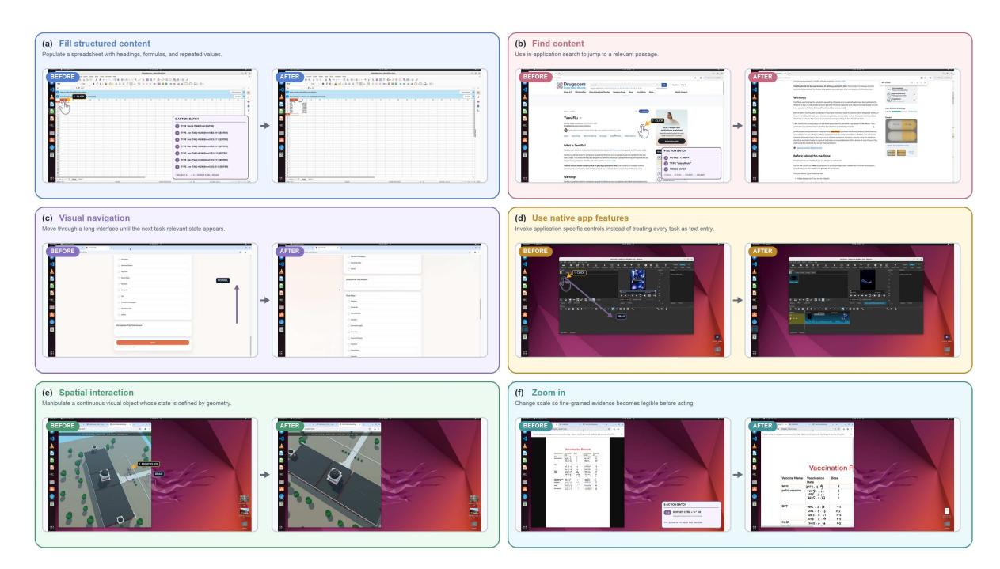

Figure 14: **대표적인 GUI 상호작용 패턴.** 패널은 (a) 구조화된 스프레드시트 내용 채우기, (b) 페이지 내 검색으로 내용 찾기, (c) 스크롤을 통한 시각적 탐색, (d) 네이티브 미디어 타임라인 기능 사용, (e) 연속적인 공간 상호작용, (f) 세밀한 검사용 확대를 보여준다. 각 패널은 렌더링된 동작과 그에 따른 애플리케이션 상태를 짝지어 보여준다.

이들은 각각 62.1%와 88.9%의 작업에서 나타나며, 이는 두 벤치마크 모두에서 배치 실행이 광범위하게 사용되고 있음을 시사한다. 배치당 평균 3.1개의 원시 동작을 갖는 경우, 이는 각 원시 동작을 별도의 모델 턴에서 실행하는 것보다 관찰–추론–실행 사이클이 현저히 적어져 실행 효율성을 크게 향상시킨다. GUI 전용 배치는 여전히 지배적인 형태이며, CLI 전용 및 혼합 GUI+CLI 배치는 배치 실행이 프로그래밍적 작업과 두 실행 채널 간의 조정도 지원함을 보여준다.

**Qwen-UI-Agent가 언제 GUI, CLI 및 배치 동작을 사용하는가?** 집계 사용 통계 외에도, 우리는 궤적에서 반복되는 패턴을 조사하여 Qwen-UI-Agent가 실제로 GUI 상호작용, CLI 실행 및 배치 동작을 어떻게 사용하는지 이해한다. 아래 예시들은 각 항목에 대한 전형적인 시나리오를 식별한다.

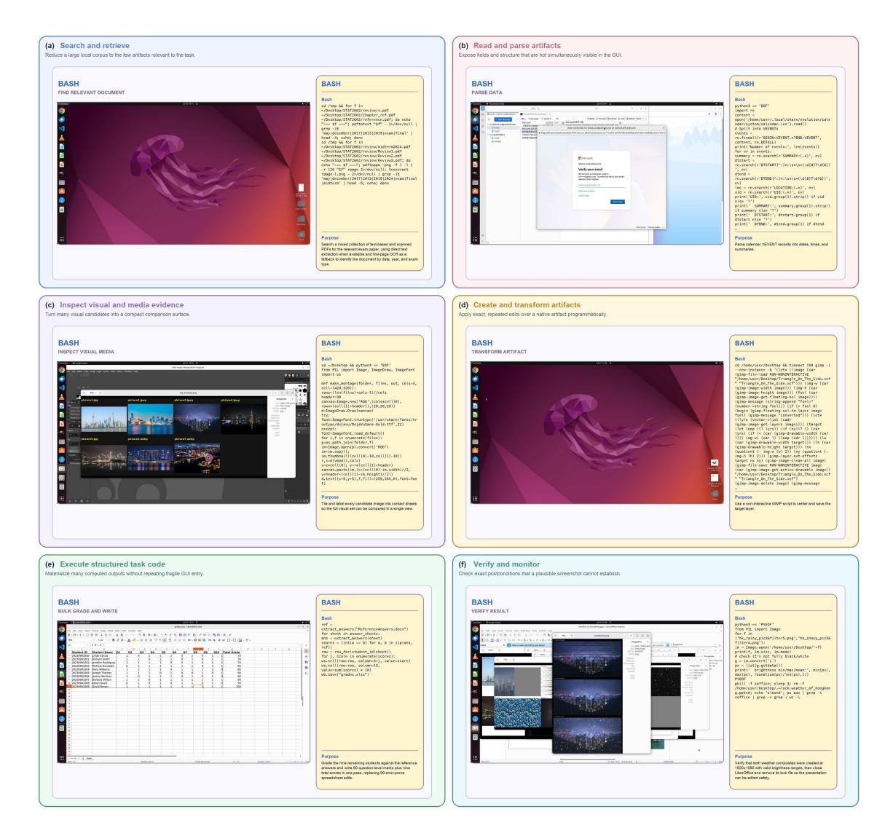

Figure 15: **대표 CLI 상호작용 패턴.** 모델은 CLI 도구를 사용하여 (a) 혼합 코퍼스에서 관련 문서를 검색하고, (b) 기계가 읽을 수 있는 아티팩트 구조를 파싱하고, (c) 많은 시각적 후보를 하나의 라벨이 붙은 비교로 압축하고, (d) 아티팩트를 프로그래밍 방식으로 변환하고, (e) 반복 계산을 실행하고 그 출력을 물리화하며, (f) 정확한 출력을 검증하고 사후 조건을 처리한다. 각 패널은 애플리케이션 컨텍스트와 명령어 발췌 및 그 작업별 목적을 나란히 보여준다.

능력과 그들이 작업 실행 중 서로를 보완하는 방식을 보여 주지만, 이는 고정된 능력 경계가 아니라 경험적 경향을 나타낸다.

- **GUI 상호작용.** Qwen-UI-Agent는 인터페이스가 제어면과 실행 피드백 소스로 동시에 작용할 때 GUI 상호작용에 의존하는 경향이 있다. 특히 네이티브 애플리케이션 컨트롤, 시각적 탐색, 또는 공간 조작을 포함하는 작업에 해당한다. Figure [14](#page-34-1)은 여섯 가지 반복되는 사례를 보여준다: 구조화된 헤딩, 수식, 반복 값을 포함한 스프레드시트 셀 채우기, 관련 구절을 찾기 위한 인페이지 검색, 필요한 내용이 보일 때까지 긴 인터페이스를 스크롤하기, 네이티브 타임라인 컨트롤을 통해 미디어 조작하기, 기하학으로 정의된 상태를 가진 공간 객체와 상호작용하기, 그리고 행동하기 전에 세밀한 시각적 증거를 읽을 수 있도록 확대하기. 이러한 예시는 GUI 상호작용이 단순히 인터페이스 탐색을 지원할 뿐 아니라, 실행과 이후 결정이 가시적 상태 전이, 네이티브 애플리케이션 컨트롤, 또는 연속적인 공간 피드백에 의존하는 작업을 지원함을 보여준다.

- **CLI 실행.** Qwen-UI-Agent는 정보나 작업이 표현될 수 있을 때 CLI를 사용하려는 경향이 있다.

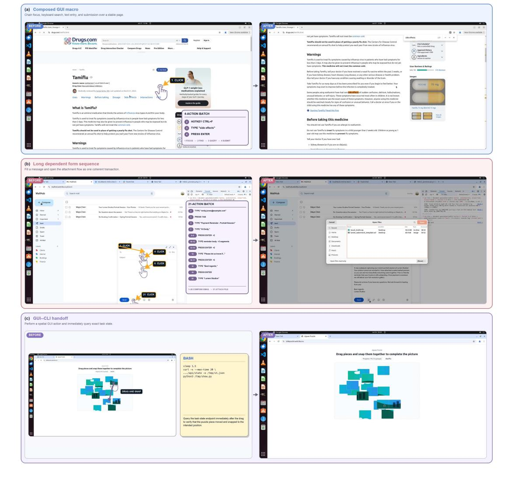

Figure 16: **대표 배치 동작 패턴.** (a) 인페이지 검색을 위한 컴팩트 GUI 매크로, (b) 다음 불확실한 대화상자에서 멈추는 21개 동작 의존형 폼 시퀀스, (c) 구조화된 작업 상태를 통해 공간 조작을 검증하는 GUI–CLI 핸드오프. 각 행은 렌더링된 배치와 첫 번째 배치 후 관찰을 쌍으로 보여준다.

더욱 간결하고 정밀하게 데이터나 코드로 표현되는 것이 GUI 상호작용 시퀀스보다 낫다. 그림 [15](#page-35-0)은 여섯 가지 반복되는 사용 사례를 보여준다: 혼합 코퍼스에서 관련 문서를 검색, 기계가 읽을 수 있는 레코드를 파싱, 여러 이미지를 라벨이 붙은 연락지 시트에 정리, 프로그램적으로 아티팩트를 변환, 반복적인 평가 계산 실행, 그리고 차원, 밝기, 프로세스 상태와 같은 출력 속성을 검증. 이 패턴들을 종합하면 CLI가 추론 전에 탐색 공간을 축소하고, 구조화된 작업을 위한 효율적인 실행 채널이며, 편집 후 정확한 후조건 검증기를 수행한다는 것을 보여준다. 연락지 예시는 CLI가 시각적 판단 자체를 대체하기보다 분산된 시각적 증거를 단일 비교 표면으로 재구성함으로써 시각적 추론을 보완할 수 있음을 추가로 보여준다.

• **Batched Execution.** Qwen-UI-Agent는 여러 작업이 일관된 로컬 시퀀스를 형성하고 그 중간 상태가 다른 관찰 없이 진행될 수 있을 만큼 충분히 예측 가능할 때 배치 실행을 사용한다. Figure [16,](#page-36-0) 에서 보여지는 대표 사례로는 페이지 내 검색을 위한 짧은 GUI 매크로, 이메일을 채우고 첨부 파일 선택기로 진행하는 21개의 동작에 의존하는 시퀀스, 그리고 객체를 조작한 뒤 결과 작업 상태를 검증하는 혼합 GUI–CLI 시퀀스가 있다. 모델은 다음 결정이 새로운 스크린샷, 명령 출력 등에 의존할 때 배치를 종료한다,

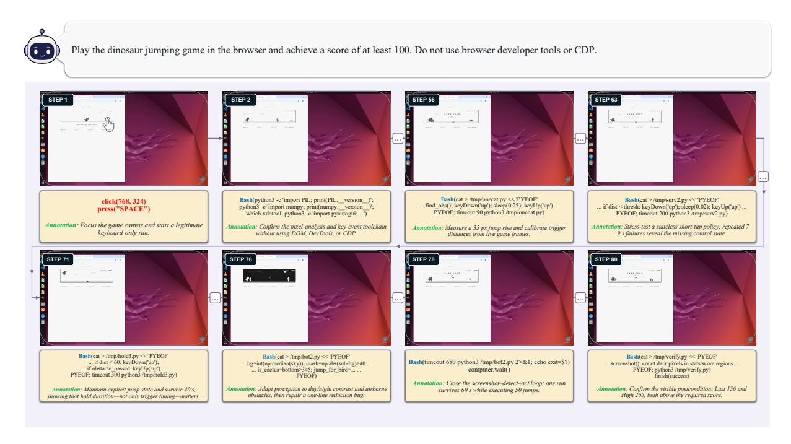

Figure 17: **대표적인 경로: GUI와 CLI가 밀접하게 결합된 협업**. 작업은 Qwen-UI-Agent가 DevTools나 CDP를 사용하지 않고 브라우저 기반 공룡 게임에서 100점 이상을 달성하도록 요구한다. GUI 관측은 점프 동역학을 측정하고, 실패한 제어 정책을 진단하며, 낮과 밤 모드 간의 변화를 인식하는 증거를 제공한다. 반면 CLI 코드는 상태를 갖는 키 컨트롤과 적응형 장애물 감지를 반복적으로 구현한다.

대화, 또는 오류. 배치 실행은 유사한 동작을 단순히 반복하는 대신 일관된 지역 트랜잭션을 그룹화한다.

**사례 연구: 동적 작업에서 GUI와 CLI가 밀접하게 결합된 협업**. 특히 흥미로운 경로 중 하나는 Qwen-UI-Agent에게 브라우저 기반 공룡 게임을 플레이하고 브라우저 개발자 도구나 Chrome DevTools Protocol(CDP)를 사용하지 않고 100점 이상을 달성하도록 요구한다. 각 점프를 별도의 모델 액션으로 발행하는 것은 장애물이 스크린샷 획득 및 모델 추론 중에도 계속 움직이기 때문에 이 작업에 부적합하다. 대신 Qwen-UI-Agent는 CLI를 사용해 렌더링된 스크린샷과 표준 키보드 이벤트를 통해 작동하는 로컬 컨트롤러를 구성하고 반복적으로 정제한다. 컨트롤러는 DOM이나 내부 게임 상태에 접근하지 않으며, 가시적인 GUI를 작업 상태의 출처로, 키보드를 액션 인터페이스로 사용한다.

이 경로는 GUI와 CLI가 밀접하게 결합된 구성을 드러낸다. 연속적인 GUI 관측은 점프 동역학을 측정하고, 장애물 트리거 거리를 보정하며, 점프 타이밍과 지속 시간의 오류를 진단하는 데 필요한 증거를 제공한다. CLI 코드는 이러한 관측을 명시적인 인지 및 제어 절차로 변환한다. 반복 실험이 상태 비존재, 고정 기간 탭의 한계를 드러낼 때, 모델은 명시적인 액션 상태를 도입하고 장애물이 지나갈 때까지 점프 키를 유지한다. 게임이 낮에서 밤 모드로 전환될 때 추가적인 도전이 발생한다. 결과적으로 대비 반전이 발생해 장애물이 어두운 픽셀과 일치한다는 초기 가정이 무효화된다. 렌더링된 프레임에서 이 변화를 식별한 뒤, Qwen-UI-Agent는 고정 색상 임계값 대신 배경 상대 세분화를 사용하고, 장애물 기하학을 활용해 지상 수준 선인장과 공중에 떠 있는 새를 모두 처리한다.

결과적으로 생성된 컨트롤러는 50번 점프를 수행하면서 60초 동안 생존하고, 마지막 실행 점수로 156점을 기록한다. 이 사례는 GUI와 CLI가 단일 궤적 내에서 서로 다른 그러나 상호 의존적인 기능을 제공함을 보여준다. GUI는 인지적 증거와 실행 피드백을 제공하며, CLI 실행은 그 증거를 반복 가능한 인지 및 제어 절차로 전환하여 매 게임 단계마다 모델 추론이 필요 없도록 한다. GUI 관찰에서 CLI 기반 수정으로, 그리고 다시

표 12: 액션 RL 훈련 전후의 다섯 가지 오류 패턴별 테스트 세트에 대한 성능.

| 모델 | 혼동 가능한 요소 | 정렬 및 | 다중 목표 | 조기 | 반복 행동 |
|---------------|--------------------|-------------|--------------|------------|-------------------|
|  | 근거화 | 랭킹 | 완전성 | 완료 | 루프 |
| 행동 없는 RL | 72.8% | 76.6% | 80.0% | 81.0% | 72.9% |
| 행동 있는 RL | 79.1% | 80.4% | 84.4% | 86.2% | 82.4% |

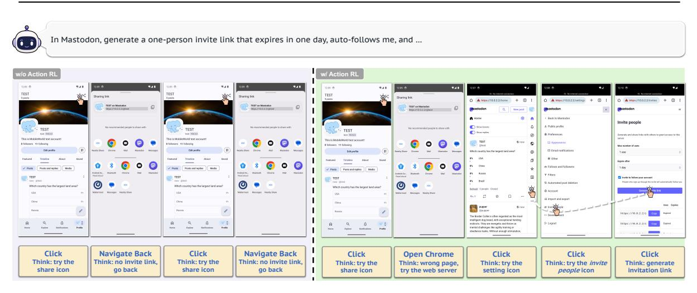

Figure 18: **Action RL 사례 연구.** SFT 모델은 계정 페이지로 이동한 뒤 *share* 아이콘을 반복적으로 클릭하고 다시 돌아가면서 비효율적인 로컬 루프에 빠진다. 반면, Action RL 이후 모델은 잘못된 페이지에 있다는 것을 인식하고 Mastodon의 웹 인터페이스 탐색으로 전환하여 올바른 진입점을 찾고 필요한 설정으로 대상 초대 링크를 성공적으로 구성한다.

GUI 검증에서 Qwen-UI-Agent는 특권 접근 없이 효과적인 컨트롤러를 구축한다.

### 4.3 단계별 행동 교정 후 Action RL (Step-Level Behavioral Corrections after Action RL)

**전반적 성능 및 행동 변화.** 우리는 Action RL 훈련 전후 모델 행동을 비교 분석한다. Action RL의 주요 효과는 단순히 전체 작업 성공률이 향상되는 것이 아니라, 세분화된 단계별 수준에서 오류가 있는 행동 결정을 체계적으로 교정한다는 점이다. 전체 작업 SR을 7% 이상 향상시키는 것 외에도, Action RL은 추론 토큰 수를 21.3% 감소시키고 평균 상호작용 단계 수를 8.4% 증가시킨다. 이러한 변화는 업데이트된 정책이 불필요한 추론을 줄이고 환경 기반 행동으로 결정을 더 빈번히 전환한다는 것을 시사한다. 더욱이, 성능 향상은 반복되는 행동 오류를 체계적으로 교정하는 명확한 행동 패턴 변화를 동반한다. 아래에서 이를 자세히 살펴본다.

**반복되는 오류 패턴 교정.** Table [12,](#page-38-1)에 표시된 바와 같이 Action RL은 다섯 가지 오류 패턴별 테스트 세트에서 일관되게 성능을 개선한다. 시각적 또는 의미상 유사한 후보 중 올바른 타깃을 선택해야 하는 기반 작업에서 Action RL은 SR을 6.3% 향상시킨다. 또한 정렬 및 순위, 수량 및 다중 타깃 완전성, 조기 완료 작업에서 각각 3.8%, 4.4%, 5.2%의 SR 향상을 보인다. Action RL의 효과는 특히 단거리 행동 루프를 교정하는 데 두드러진다. 다수의 타깃에 걸친 반복 작업이나 긴 스크롤 가능한 인터페이스를 탐색하는 작업에서 Action RL은 SR을 9.5% 향상시킨다. 이 이득은 최근 행동이 작업 관련 상태 변화를 생성하지 못했을 때 이를 인식하고 대체 행동으로 전환하는 능력이 강화되었음을 나타낸다. Figure [18](#page-38-2)는 Mastodon에서 초대 링크를 생성하도록 요청받은 에이전트의 대표적인 예를 제시한다. Action RL 이전 모델은 프로필 공유 아이콘과 반복적으로 상호작용하다가 결국 단계 제한에 도달한다. 반면, Action RL 이후 모델은

Table 13: 빈번한 행동과 장기 꼬리 행동 간 성능 비교.

| 액션 그룹 | 원본 데이터 비율 | 액션 전 RL 보상 | 액션 후 RL 보상 |
|-------------------|--------------------------|-------------------------|------------------------|
| 빈번한 액션 | 80.1% | 88.3% | 92.3% |
| 롱테일 액션 | 19.9% | 71.5% | 77.9% |

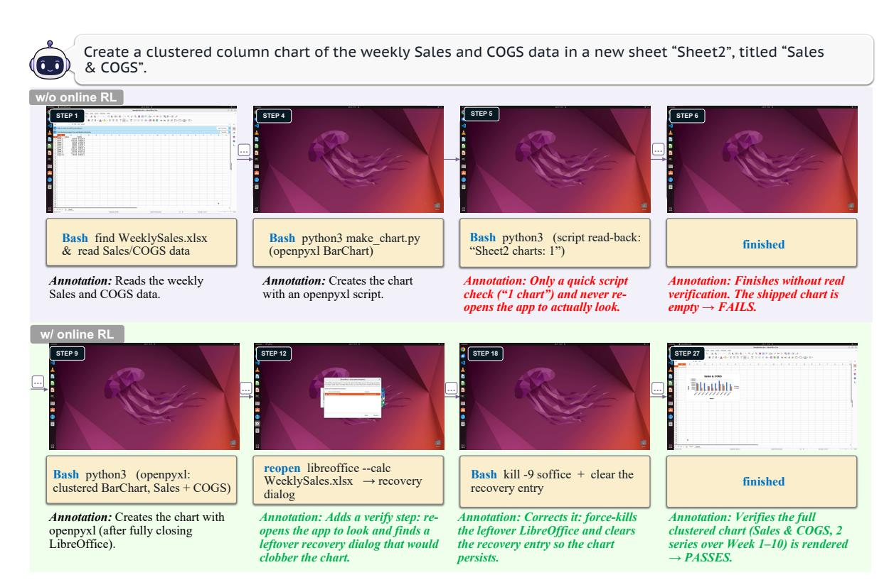

Figure 19: **Online RL이 검증과 자기수정을 유도한다.** 같은 작업에서 온라인 RL 정책(하단)은 SFT 정책(상단)이 실패한 곳에서 성공한다. 이는 애플리케이션을 재개방해 실제 결과를 검사하고 발견된 문제를 종료 전에 수정하기 때문이다. SFT 정책은 차트만 세어 보는 표면적인 스크립트 검사를 신뢰하고 렌더링된 출력을 전혀 살펴보지 않으며, 데이터 시리즈가 없는 빈 차트를 배포한다. 반면 RL 정책은 파일을 재개방해 검증하고, 남아 있는 애플리케이션 인스턴스가 차트를 덮어쓸 것임을 발견해 이를 제거해 차트가 지속되도록 하고, 완전한 클러스터 차트가 실제로 렌더링되었는지 확인한 뒤 종료한다.

잘못된 페이지에 있다는 것을 인식하고, Mastodon의 웹 인터페이스를 통해 대체 경로를 탐색하며, 초대 링크 구성을 위한 올바른 인터페이스에 도달한다. 이 예시는 단계별 액션 RL의 핵심 역할을 강조한다: 짧은 액션 시퀀스가 의미 있는 진전을 이루지 못할 때, 자동으로 구성된 루프-브레이킹 예시가 정책에게 즉각적인 액션 선택을 수정하도록 가르쳐, 비효율적인 패턴을 지속하지 않게 한다.

**Long-tail 액션 처리 개선.** GUI 액션 트레저리지는 매우 불균형한 분포를 보인다. 클릭, 드래그, 타이핑과 같은 빈번한 액션은 원시 액션의 80.1%를 차지하지만, ask_user, long_press와 같은 Long-tail 액션은 19.9%에 불과하다. 낮은 빈도에도 불구하고 이 액션들은 특정 애플리케이션 상태에 도달하거나 특수 제어를 호출하는 데 종종 중요하다. Pass-*N* 롤아웃은 이들의 보상이 빈번한 액션보다 16.8% 낮다는 것을 보여 주며, 이는 훈련 데이터에서의 제한된 커버리지를 반영한다. 따라서 Action RL은 훈련 데이터에서 Long-tail 액션 예시의 비율을 약 40%로 늘려 보상을 6.4% 향상시킨다. 이 결과는 Action RL이 낮은 빈도지만 높은 영향력을 가진 액션 결정을 선택적으로 강화할 수 있음을 보여준다.

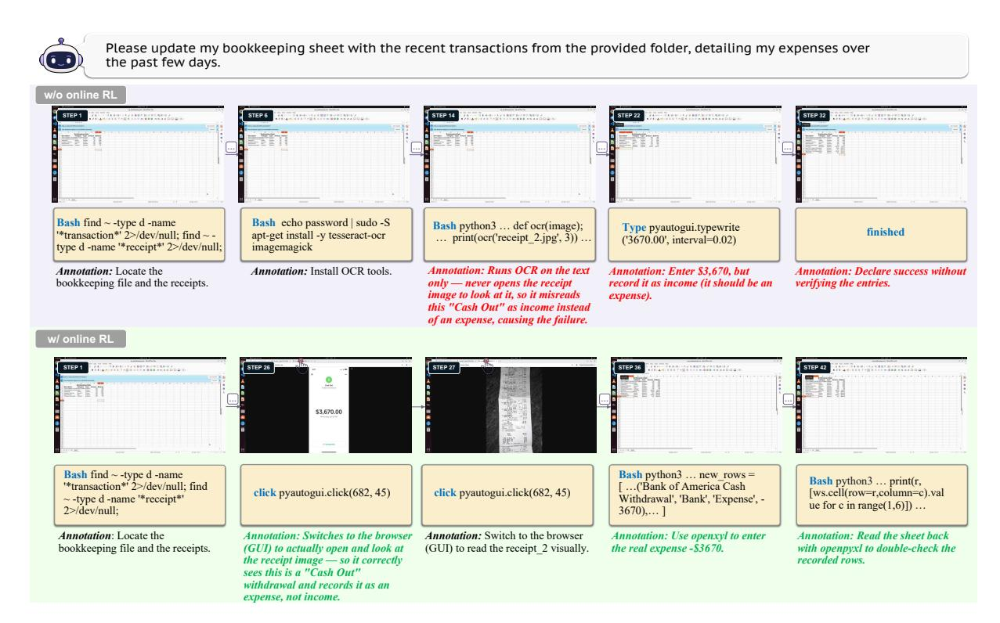

Figure 20: **Online RL이 새로운 교차 모달 액션을 유도한다.** 같은 작업에서 온라인 RL 정책(하단)은 SFT 정책(상단)이 실패한 곳에서 성공한다. 이는 시각적으로 관찰한 것을 기반으로 결정을 내리고 결과를 종료 전에 검증하기 때문이다. SFT 정책은 OCR 텍스트만으로 영수증을 읽어 Cash Out을 수입으로 착각하고 확인 없이 성공을 선언하지만, RL 정책은 영수증 이미지를 열어 시각적으로 읽고, 비용으로 정확히 기록하며, 스프레드시트를 다시 읽어 검증한 뒤 종료한다.

### 4.4 온라인 RL 이후 트레저리 수준 행동 변화 (Trajectory-Level Behavioral Shifts after Online RL)

다양한 도메인에서 온라인 RL 전후에 생성된 트레저리리를 신중히 비교함으로써, 우리는 세 가지 바람직한 행동 패턴의 출현을 확인한다.

가정된 성공에서 검증된 완료로. 온라인 RL 이전에는 정책이 최종 상태 변화를 일으킨 직후 바로 종료하며, 의도된 효과를 검증하지 않고 작업이 완료된 것으로 가정한다. 온라인 RL 이후에는 정책이 종료 전에 결과 상태를 더 자주 검사하고, 검증에서 실행이 불완전함을 발견하면 복구한다. Figure 19는 대표적인 예시를 보여준다. 온라인 RL 이전에는 정책이 Bash 명령 시퀀스를 수행하고 그 효과를 확인하지 않고 완료를 선언한다. 온라인 RL 이후에는 정책이 동일한 Bash 기반 경로를 따르되 검증 단계를 추가하고, 의도된 출력의 일부가 생성되지 않았음을 발견하고 대체 접근법으로 전환한 뒤 결국 작업을 성공적으로 완료한다. OSWorld에서의 집계 결과는 같은 추세를 보인다: 최소 하나의 검증 액션을 포함하는 트레저리리 비율이 14.7% 증가하고, 최종 검증기를 통과하지 못한 자가 선언 성공 에피소드 비율인 거짓 정지율이 11.2% 감소한다.

**Bash를 손으로, GUI를 눈으로: 출현하는 교차 모달 협업.**  
온라인 RL 이후, 정책은 Bash 중심 전략에서 Bash와 GUI 행동을 보다 균형 있게 사용하는 방향으로 전환된다: GUI 행동의 비중이 6% 증가하고, GUI와 Bash를 모두 사용하는 궤적 비율이 10.6% 증가한다. 특히, 모달리티 조정에 대한 명시적 목표가 없음에도 불구하고 유용한 교차 모달 협업 패턴이 나타난다: 정책은 Bash를 사용해 상태 변화를 효율적으로 실행하고 GUI를 사용해 그 효과를 검사한다. 이 패턴과 일치하게, 두 모달리티를 모두 사용하는 궤적 비율이

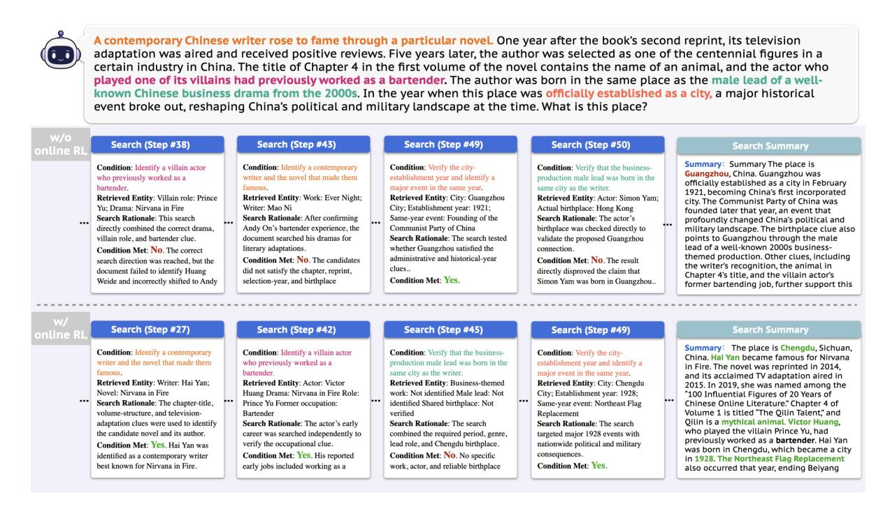

Figure 21: **온라인 RL이 장기 탐색 및 검증을 향상시킵니다.** 온라인 RL 없이, 모델은 잘못된 엔티티 연관을 따르고 지원되지 않는 답변인 광저우에 도달한다. 온라인 RL을 사용하면, 모델은 하이 얀, *Nirvana in Fire*, 황위드, 그리고 청두의 핵심 체인을 식별한다.

실행–검증 전이—상태를 변경하는 Bash 동작 뒤에 읽기 전용 GUI 검사가 따라오며, 비율이 40.2%에서 52.4%로 증가한다. Figure [20](#page-40-0)은 대표적인 예시를 보여준다. 온라인 RL 이전에는 정책이 Bash만 사용해 작업을 실행하고 시각적 정보를 없으므로 수입과 지출을 구분하지 못해 결과에 오류를 도입한다. 온라인 RL 이후에는 정책이 Bash로 효율적으로 실행한 뒤 GUI에서 개별 영수증을 열어 시각적으로 검사함으로써 관련 항목을 구분하고 작업을 올바르게 완료한다. 이 교차 모달 루프는 효율적인 실행과 신뢰할 수 있는 피드백을 결합하며, Bash는 손으로, GUI는 눈으로 역할을 한다.

**장기 수평에서 제약 조건 유지.** 장기 수평 작업은 종종 양, 형식, 범위, 제외 등 주요 목표에 추가 제약을 부과한다. 온라인 RL 전후의 행동을 비교하면, 정책이 지침에서 앞서 도입된 제약을 실행 전반에 걸쳐 보존하는 데 더 신뢰할 수 있게 된다. 두 벤치마크 전반에서, 모든 지침 제약을 만족하는 작업 비율이 OSWorld에서 8.6%, BrowseComp-ZH에서 7.5% 증가한다. Figure [21](#page-41-1)은 네 가지 제약이 포함된 대표적인 BrowseComp-ZH 예시를 보여준다. 이 경우, 정책은 한 제약만 만족하고 잘못된 결론에 이르던 것에서 모든 네 제약을 보존하고 공동으로 적용함으로써 올바른 답변을 도출한다.

## 5 관련 연구 (Related Work)

최근 *mobile-use*, *browser-use*, 및 *computer-use* 전반에 걸친 GUI 에이전트 연구는 프롬프트 전용 오케스트레이션보다 네이티브 다중모달 정책을 점점 더 선호하며, 자체 진화 데이터 엔진, 온라인 강화 학습, 구조화된 메모리의 활용이 강화된다 [(Seed,](#page-48-11) [2025;](#page-48-11) [Zhou et al.,](#page-50-0) [2025a;](#page-50-0) [Gao et al.,](#page-45-1) [2026;](#page-45-1) [He et al.,](#page-45-13) [2024;](#page-45-13) [Wang et al.,](#page-48-10) [2025b;](#page-48-10) [Huang et al.,](#page-46-0) [2026)](#page-46-0). 이 분야는 또한 벤치마크 전용 최적화에서 실제 장치 실행, 프라이버시, 운영 신뢰성, 안전성, 지연 시간 등 실질적 배포 문제로 전환하고 있다 [(Cao et al.,](#page-45-0) [2026;](#page-45-0) [Qin et al.,](#page-47-0) [2025;](#page-47-0) [Zhou et al.,](#page-50-0) [2025a;](#page-50-0) [Huang et al.,](#page-46-0) [2026)](#page-46-0).

**모바일 사용.** 최근 모바일 에이전트 연구는 스크린샷 기반 행동 예측-

tion은 메모리, 반성, 강화학습(RL), 그리고 에이전트 기반 활용을 갖춘 보다 강력한 시스템으로의 전환을 의미한다. Mobile-Agent-v3.5 [(Xu et al.,](#page-49-0) [2026)](#page-49-0)와 UI-Venus-1.5 [(Gao et al.,](#page-45-1) [2026)](#page-45-1)은 다양한 플랫폼과 작업에 걸쳐 통합 GUI 모델을 확장한다. Step-GUI [(Yan et al.,](#page-49-9) [2025)](#page-49-9)와 UI-TARS-2 [(Wang et al.,](#page-48-0) [2025a)](#page-48-0)은 데이터 플라이휠과 다중 턴 RL을 조사하여 반복적 상호작용을 통해 에이전트 능력을 향상시킨다. MAI-UI [(Zhou et al.,](#page-50-0) [2025a)](#page-50-0)은 하이브리드 GUI-MCP 운영과 디바이스–클라우드 협업을 탐구한다. Xiaomi-GUI-0 [(Cao et al.,](#page-45-0) [2026)](#page-45-0)은 상태 역학을 포착하는 실제 디바이스 폐쇄 루프 훈련을 연구한다. 기존 모바일 에이전트 평가는 주로 세 가지 측면에 초점을 맞춘다: 근거화 능력(예: ScreenSpot-Pro [(Li et al.,](#page-46-6) [2025a)](#page-46-6)), 제어된 환경에서의 상호작용 작업 완료(예: AndroidWorld [(Rawles et al.,](#page-47-9) [2024)](#page-47-9)), 그리고 보다 현실적인 일상 사용 시나리오(예: MobileWorld [(Kong et al.,](#page-46-4) [2026)](#page-46-4), AndroidDaily [(Sui et al.,](#page-48-3) [2026)](#page-48-3), RealMobile [(Cao et al.,](#page-45-0) [2026)](#page-45-0)).

**브라우저 사용.** 모바일 에이전트와 달리 브라우저 사용 에이전트는 DOM 트리, 접근성 트리, 브라우저 API와 같은 구조화된 정보를 추가로 활용할 수 있다. WebVoyager [(He et al.,](#page-45-13) [2024)](#page-45-13)와 SeeAct [(Zheng et al.,](#page-50-6) [2024)](#page-50-6)은 다중모달 LLM이 시각적 이해와 브라우저 동작을 결합하여 엔드-투-엔드 웹 탐색을 수행할 수 있는 능력을 입증한다. 최근 프로젝트인 OpenAI Operator [(OpenAI,](#page-47-15) [2025)](#page-47-15), Google Project Mariner [(Google,](#page-45-14) [2025)](#page-45-14), 그리고 UI-TARS [(Seed,](#page-48-11) [2025)](#page-48-11)은 웹 에이전트를 복잡한 웹사이트와 다양한 디지털 환경과의 자율 상호작용으로 확장한다. WebWorld [(Xiao et al.,](#page-49-11) [2026)](#page-49-11)와 WebEvolver [(Fang et al.,](#page-45-15) [2025)](#page-45-15)은 웹 에이전트를 위한 세계 모델 기반 접근법을 탐구한다. 웹 에이전트 평가는 단기 웹페이지 탐색에서부터 여러 웹사이트와 복잡한 목표를 포함하는 현실적인 장기 워크플로우로 진화했다 [(Zhou et al.,](#page-50-1) [2024;](#page-50-1) [Xue et al.,](#page-49-12) [2025;](#page-49-12) [Jang et al.,](#page-46-11) [2026)](#page-46-11).

**컴퓨터 사용.** 컴퓨터 사용 에이전트(CUA)는 다양한 소프트웨어와 생산성 애플리케이션을 포함한 데스크톱 환경과의 일반적인 상호작용을 가능하게 하는 것을 목표로 한다. 모바일 및 웹 에이전트와 달리 CUAs는 훨씬 더 큰 행동 공간, 다양한 상호작용 상태, 그리고 긴 시야를 갖추고 있어 신뢰할 수 있는 근거화와 실행 검증이 중요하다. UI-TARS [(Qin et.,](#page-47-0) [2025)](#page-47-0), DART-GUI [(Li et.,](#page-46-12) [2025b)](#page-46-12), OpenCUA [(Wang et.,](#page-48-10) [2025b)](#page-48-10), UltraCUA [(Yang et.,](#page-49-13) [2025b)](#page-49-13), EvoCUA [(Huang et.,](#page-46-0) [2026)](#page-46-0)은 다중모달 사전학습, 대규모 상호작용 데이터, 그리고 에이전트 기반 추론을 활용하여 확장 가능한 GUI 기반 모델을 조사한다. 최근 CUA 벤치마크는 점점 더 견고성, 확장성, 그리고 실제 배포 과제를 강조한다. OSWorld-Verified는 엄격한 검증 프로토콜과 성공 평가의 모호성을 줄여 평가 신뢰성을 향상시킨다 [(Xie et.,](#page-49-1) [2024)](#page-49-1). OSWorld-v2는 보다 복잡하고 장기 워크플로우, 그리고 다양한 실제 컴퓨터 작업으로 평가를 확장한다 [(Yuan et.,](#page-49-2) [2026)](#page-49-2).

## 6 결론 (Conclusion)

우리는 실제 세계 중심의 기초 GUI 에이전트인 Qwen-UI-Agent를 제시하였다. 실제 기기에서 동작하고, 플랫폼 간 워크플로우를 유지하며, GUI 상호작용과 CLI 실행을 결합하고, 유용한 서비스를 사전에 시작하는 에이전트의 비전을 바탕으로, Qwen-UI-Agent는 확장 가능한 샌드박스 환경과 견고한 실제 기기 모바일 런타임, 통합된 GUI+CLI 액션 공간, 에이전트 주도형 데이터 플라이휠, SFT, 액션 RL, 온라인 RL을 결합한 훈련 프레임워크, 그리고 사전 서비스 시작과 교차 플랫폼 작업 실행을 위한 하네스 레이어를 통합한다. 실험적으로 Qwen-UI-Agent는 MobileWorld에서 **82.1%**, MobileWorld-Real에서 **92.2%**, AndroidDaily에서 **97.5%**를 달성한다. 또한 OSWorld-Verified에서 **79.5%**, OSWorld-v2에서 **40.0%**를 기록한다. Qwen-UI-Agent는 브라우저 사용, DeepSearch, GUI-그라운딩 분야에서도 선도적이거나 경쟁력 있는 성능을 확보하며, 강력한 일반 추론 및 에이전트 능력을 보존한다. 이러한 결과는 모델, 환경, 데이터 플라이휠, 훈련, 하네스를 실제 세계 사용을 중심으로 공동 설계한 GUI 에이전트 개발의 시스템적 관점을 뒷받침한다.

## 7 제한 사항 및 향후 방향 (Limitations and Future Directions)

**제한 사항.** 첫째, 우리는 결정론적 검증자나 수동 전문가 검토 대신 AutoJudge를 사용해 실제 기기 모바일 궤적을 평가한다. 결정론적 상태 기반 검증은 제3자 애플리케이션의 내부 상태에 대한 접근이 제한되기 때문에 물리적 휴대폰에서는 일반적으로 불가능하다. 한편, Qwen-UI-Agent와 10개의 기초 모델의 궤적을 수동으로 판정하려면 상당한 전문가 노력이 필요하며 주석자 간 변동성을 초래한다. 일관된 비교를 위해 우리는 모든 시스템에 동일한 AutoJudge 프로토콜을 적용한다. 전문가가 독립적으로 검토한 666개의 예시에서 AutoJudge는 92.8%의 정확 일치 정확도를 달성한다. 그럼에도 불구하고 남은 오류는 보고된 실제 기기 결과에 소폭의 불확실성을 도입할 수 있다. 둘째, 35B-A3B 규모의 CUA 및 DeepSearch 훈련은 이 기술 보고서가 발표될 때 아직 진행 중이었으므로 해당 결과는 포함되지 않았다. 이러한 결과가 공개되면 arXiv 버전을 업데이트할 계획이다. 셋째, 본 보고서에 기술된 실제 기기 환경을 넘어, 실제 애플리케이션을 보다 정밀하게 재현하는 고충실도 합성 환경은 시뮬레이션-실제 차이를 좁히는 또 다른 경로를 제공한다. 우리는 이러한 환경을 구축했지만, 훈련에 이를 활용한 모델은 아직 보고된 모델에 포함되지 않았으므로 현재 보고서에서는 이 구성 요소를 제시하지 않는다. 향후 작업에서 환경 합성 방법론을 오픈소스로 공개할 계획이다. 넷째, GUI 기능 개발을 완전히 자동화하려는 시도는 현재 기초 모델이 전체 프로세스를 신뢰성 있게 관리할 수 없음을 보여주었다. 따라서 우리의 파이프라인은 완전 자율이 아니라 에이전트 주도형이며, 진행 상황을 모니터링하고 오류를 수정하기 위해 상당한 인간 감독 및 개입이 필요하다.

**향후 방향.** 우리는 GUI 에이전트가 신뢰할 수 있고 실용적인 실제 세계 사용으로 나아갈 때 추가 연구가 필요하다고 생각되는 몇 가지 방향을 논의한다.

- **Efficient GUI Execution.** GUI 에이전트는 실제 장치에서 점점 더 복잡한 워크플로우를 직접 수행할 수 있어 실용적 사용으로 가는 유망한 단계이다. 그러나 단지 기능만으로는 충분하지 않다. 실행 효율, 특히 상호작용 지연(latency)은 실용적 사용에 있어 주요 장애물이다. 각 GUI 단계는 일반적으로 새로운 관측, 모델 추론, 환경 전이 등을 필요로 하여 긴 경로에서 지연이 누적된다. 모바일과 데스크톱 시스템 전반의 가상 디스플레이 메커니즘은 백그라운드 또는 병렬 실행을 가능하게 하여 이 문제를 부분적으로 완화할 수 있지만, 인식–추론–행동 루프의 기본적인 단계별 비용을 제거하지는 못한다. 더 빠른 추론, 적응형 관측, 비동기 실행, 그리고 상호작용 라운드 감소를 통해 이 비용을 줄이는 것은 GUI 에이전트를 실용적 현실 세계 사용으로 가져오는 데 있어 중요한 과제이다.  
- **Harness-Assisted Long-Horizon Workflows.** 우리의 하이브리드 GUI+CLI 액션 공간과 배치 액션 지원은 실행 효율을 향상시키며, 온라인 RL은 긴 경로에서 의사결정을 강화한다. 보완적인 방향은 모델 자체를 넘어 하이렌스가 장기 지원의 원천으로 활용되는 것을 더 탐구하는 것이다. 컨텍스트 압축, 작업 분해, 메모리 관리, 진행 추적, 구조화된 도구 사용 등 하이렌스 수준 설계는 다른 관점에서 장기 워크플로우의 효율성과 신뢰성을 향상시킬 수 있다.  
- **Large-Scale Cross-Domain Online RL.** 장기 GUI 작업은 롤아웃이 느리고 길이가 변동적이며 보상이 드물거나 지연되는 경우가 많아 온라인 RL을 비용이 많이 든다. 향후 연구는 이러한 환경에 대해 보다 효율적이고 안정적인 학습 전략을 개발하고, 브라우저 사용, 모바일 사용, 컴퓨터 사용 환경을 동시에 학습시켜 데이터 효율성과 도메인 간 일반화를 향상시켜야 한다 [(Wang et al.,](#page-48-0) [2025a;](#page-48-0) [Hou et al.,](#page-45-16) [2026)](#page-45-16).  
- **Scalable Synthesis of High-Fidelity Environments.** 실제 장치 환경은 가장 충실한 상호작용 역학을 제공하지만, 확장, 재설정, 검증 비용이 높다. 고충실도 합성 환경은 실제 세계 애플리케이션 동작을 대규모로 생성 및 제어할 수 있는 형태로 근사함으로써 보완적인 경로를 제공한다. 이러한 환경의 확장 가능한 합성은 시뮬레이션-실제 차이를 좁히고 현실 지향적 훈련을 확장하는 데 중요하다. 우리는 이러한 환경을 구축했으나, 불행히도 그 통합이 모델 훈련에 적시에 완료되지 않았다

이 보고서에. 우리는 향후 연구에서 환경 합성 방법론을 오픈소스로 공개할 예정이다.

• **Safety, User Control, and Personalization.** GUI 에이전트가 애플리케이션과 장치를 가로질러 작동할 수 있는 능력을 갖추면서, 그 행동이 안전하고 사용자 제어 하에 유지되는 것을 보장하는 것이 점점 더 중요해진다. 본 연구에서는 모델이 call_user 액션을 호출하고 추가 입력이나 권한 부여가 필요할 때 사용자에게 제어를 반환하도록 가르치는 안전 민감한 훈련 시나리오를 포함한다. 보다 체계적인 안전 평가, 안전 지향 훈련 목표, 그리고 에이전트 행동을 이해하고 제약하기 위한 해석 기반 방법은 여전히 중요한 방향이다. 개인화는 현실 세계 사용자 경험을 향상시키는 데에도 똑같이 중요하다. 우리의 프로액티브-서비스 harness는 초기 탐색을 제공하지만, 유용한 사용자 메모리와 프로필을 구축하고, 이를 신뢰할 수 있는 정보원에 기반을 두며, 사용자가 보존되는 정보를 제어하도록 허용하는 것은 모두 추가 조사가 필요하다.

## 8 기여 (Contributions)

# 핵심 기여자 (Core Contributors)

Hanzhang Zhou∗ , Panrong Tong∗ , Xu Zhang∗ , Quyu Kong, Chenglin Cai, Tianyu Xia, Gongjie Zhang, Jianan Zhang, Long Li, Long Chen, Lei Wang, Gaole Dai, Pengxiang Li, Liangyu Chen, Yue Wang† , Steven Hoi.

#### 기여자 (Contributors)

Hongliang Lu, Miaoyi Zhou, Chen Liu, Yuchen Sun, Yucheng Zhao, Yiran Zhong, Jiahui Zeng, Minggang Wu, Zhixiang Ma, Shaoshun Huang, Shuaihao Zhang.

∗ 공동 프로젝트 리더. † 프로젝트 리더.

# References (References)

- Anthropic. Claude Opus 4.8 소개. <https://www.anthropic.com/news/claude-opus-4-8>, 2026년 5월. 접근: 2026-07-19.
- Apodex Team. Apodex-1.0: 검증 중심 에이전트 팀으로서 발견 지능을 위한. Technical report, Apodex, 2026. URL <https://www.apodex.com/blog/apodex-1.0>.
- Victor Barres, Honghua Dong, Soham Ray, Xujie Si, and Karthik Narasimhan. *τ* 2 -Bench: 다중 제어 환경에서 대화형 에이전트를 평가합니다. *arXiv preprint arXiv:2506.07982*, 2025년. URL <https://arxiv.org/abs/2506.07982>.
- ByteDance Seed. Seed2.0. <https://seed.bytedance.com/en/seed2>, 2026년 2월 a. 출시: 2026-02-14.
- ByteDance Seed. Seed2.1 공식 출시: AI 생산성 향상. [https://seed.bytedance.c](https://seed.bytedance.com/en/blog/seed2-1-officially-released-advancing-ai-productivity) [om/en/blog/seed2-1-officially-released-advancing-ai-productivity](https://seed.bytedance.com/en/blog/seed2-1-officially-released-advancing-ai-productivity), 2026년 6월 b. 접근: 2026-07-19.
- Wanxia Cao, Chengzhen Duan, Pei Fu, Pengzhi Gao, Niu Lian, Fazhan Liu, Hui Liu, Heng Qu, Qinzhuo Wu, Zhehao Yu, et al. Xiaomi-gui-0 technical report. *arXiv preprint arXiv:2606.31410*, 2026년.
- Liangyu Chen, Hanzhang Zhou, Chenglin Cai, Jianan Zhang, Panrong Tong, Quyu Kong, Xu Zhang, Chen Liu, Yuqi Liu, Wenxuan Wang, et al. Ui-ins: 다중 관점 지시-이성화로 gui 기반 강화. *arXiv preprint arXiv:2510.20286*, 2025년.
- Google DeepMind. Gemini 3 pro, 2025. URL <https://deepmind.google/models/gemini/pro/>.
- DeepSeek-AI. DeepSeek-V3.2: 오픈 대형 언어 모델의 최전선을 밀어붙입니다. *arXiv preprint arXiv:2512.02556*, 2025년. URL <https://arxiv.org/abs/2512.02556>.
- Tianqing Fang, Hongming Zhang, Zhisong Zhang, Kaixin Ma, Wenhao Yu, Haitao Mi, and Dong Yu. Webevolver: 공진화 세계 모델을 통한 웹 에이전트 자기 개선 강화. In *Proceedings of the 2025 Conference on Empirical Methods in Natural Language Processing*, pp. 8970–8986, 2025년.
- Changlong Gao, Zhangxuan Gu, Yulin Liu, Xinyu Qiu, Shuheng Shen, Yue Wen, Tianyu Xia, Zhenyu Xu, Zhengwen Zeng, Beitong Zhou, Xingran Zhou, Weizhi Chen, Sunhao Dai, Jingya Dou, Yichen Gong, Yuan Guo, Zhenlin Guo, Feng Li, Qian Li, Jinzhen Lin, Yuqi Zhou, Linchao Zhu, Liang Chen, Zhenyu Guo, Changhua Meng, and Weiqiang Wang. UI-Venus-1.5 Technical Report. *arXiv preprint arXiv:2602.09082*, 2026년. URL <https://arxiv.org/abs/2602.09082>.
- Genymobile. scrcpy: Android 기기를 표시하고 제어합니다. [https://github.com/Genymobile/sc](https://github.com/Genymobile/scrcpy) [rcpy](https://github.com/Genymobile/scrcpy), 2018. 접근: 2026-07-28.
- Google. Project mariner. <https://labs.google.com/mariner/landing/>, 2025년.
- Google. Gemini 3.1 Pro Preview. [https://ai.google.dev/gemini-api/docs/models/gemini-3.1-p](https://ai.google.dev/gemini-api/docs/models/gemini-3.1-pro-preview) [ro-preview](https://ai.google.dev/gemini-api/docs/models/gemini-3.1-pro-preview), 2026년 2월 a. Google AI for Developers; 접근: 2026-07-19.
- Google. Gemini 3.5 Flash. <https://ai.google.dev/gemini-api/docs/models/gemini-3.5-flash>, 2026년 5월 b. Google AI for Developers; 접근: 2026-07-19.
- Hongliang He, Wenlin Yao, Kaixin Ma, Wenhao Yu, Yong Dai, Hongming Zhang, Zhenzhong Lan, and Dong Yu. Webvoyager: 대형 멀티모달 모델로 엔드-투-엔드 웹 에이전트 구축, 2024. URL <https://arxiv.org/abs/2401.13919>.
- Zhenyu Hou, Yujiang Li, Jie Tang, and Yuxiao Dong. Single-rollout asynchronous optimization for agentic reinforcement learning. *arXiv preprint arXiv:2607.07508*, 2026년.

- Xuhao Hu, Xi Zhang, Haiyang Xu, Kyle Qiao, Jingyi Yang, Xuanjing Huang, Jing Shao, Ming Yan, and Jieping Ye. ToolCUA: 컴퓨터 사용 에이전트를 위한 최적 GUI-툴 경로 오케스트레이션을 향해. *arXiv preprint arXiv:2605.12481*, 2026. URL <https://arxiv.org/abs/2605.12481>.

- Mianqiu Huang, Taofeng Xue, Chong Peng, Jinrui Ding, Sicheng Fan, Jiale Hong, Yufei Gao, Xiaocheng Zhang, Linsen Guo, Xin Yang, et al. Evocua-1.5: 다중 턴 컴퓨터 사용 에이전트를 위한 온라인 강화 학습. *arXiv preprint arXiv:2607.09773*, 2026.

- Lawrence Keunho Jang, Jing Yu Koh, Daniel Fried, and Ruslan Salakhutdinov. Odysseys: 현실적인 장기 수평 과제에서 웹 에이전트 벤치마킹. *arXiv preprint arXiv:2604.24964*, 2026.

- Jina AI. Jina reader: URL을 LLM 친화적 입력으로 변환. <https://jina.ai/reader>, 2024. Accessed: 2026-07-28.

- Aniruddha Kembhavi, Mike Salvato, Eric Kolve, Minjoon Seo, Hannaneh Hajishirzi, and Ali Farhadi. 다이어그램 하나는 열두 장의 이미지와 가치가 있다. In European Conference on Computer Vision (ECCV), pp. 235–251, 2016. URL <https://arxiv.org/abs/1603.07396>.

- Kimi Team. Kimi K2.5: 시각적 에이전트 지능. <https://www.kimi.com/blog/kimi-k2-5.html>, 2026. Accessed: 2026-07-21.

- Quyu Kong, Xu Zhang, Zhenyu Yang, Nolan Gao, Chen Liu, Panrong Tong, Chenglin Cai, Hanzhang Zhou, Jianan Zhang, Liangyu Chen, et al. Mobileworld: 에이전트-사용자 상호작용 및 MCP-증강 환경에서 자율 모바일 에이전트 벤치마킹. In *Proceedings of the 64th Annual Meeting of the Association for Computational Linguistics (Volume 1: Long Papers)*, pp. 6142–6167, 2026.

- Chenxin Li, Zhengyao Fang, Zhengyang Tang, Pengyuan Lyu, Xingran Zhou, Xin Lai, Fei Tang, Liang Wu, Yiduo Guo, Weinong Wang, Junyi Li, Yi Zhang, Yang Ding, Huawen Shen, Sunqi Fan, Shangpin Peng, Zheng Ruan, Anran Zhang, Benyou Wang, Chengquan Zhang, and Han Hu. PhoneHarness: 혼합 GUI, CLI, 및 툴 액션을 통한 전화 사용 에이전트 활용. *arXiv preprint arXiv:2606.14832*, 2026a. URL <https://arxiv.org/abs/2606.14832>.

- Kaixin Li, Meng Ziyang, Hongzhan Lin, Ziyang Luo, Yuchen Tian, Jing Ma, Zhiyong Huang, and Tat-Seng Chua. Screenspot-pro: 전문 고해상도 컴퓨터 사용을 위한 GUI 기반화. In *Workshop on Reasoning and Planning for Large Language Models*, 2025a. URL [https://openreview.net/forum?id=Xa](https://openreview.net/forum?id=XaKNDIAHas) [KNDIAHas](https://openreview.net/forum?id=XaKNDIAHas).

- Pengxiang Li, Zechen Hu, Zirui Shang, Jingrong Wu, Yang Liu, Hui Liu, Zhi Gao, Chenrui Shi, Bofei Zhang, Zihao Zhang, Xiaochuan Shi, Zedong Yu, Yuwei Wu, Xinxiao Wu, Yunde Jia, Liuyu Xiang, Zhaofeng He, and Qing Li. Efficient multi-turn rl for gui agents via decoupled training and adaptive data curation. *arXiv preprint arXiv:2509.23866*, 2025b.

- Xiangyi Li, Wenbo Chen, Yimin Liu, Shenghan Zheng, Xiaokun Chen, Yifeng He, Yubo Li, Bingran You, Haotian Shen, Jiankai Sun, et al. SkillsBench: 다양한 과제에서 에이전트 스킬이 얼마나 잘 작동하는지 벤치마킹. *arXiv preprint arXiv:2602.12670*, 2026b. URL <https://arxiv.org/abs/2602.12670>.

- Niu Lian, Alan Chen, Zhehao Yu, Chengzhen Duan, Fazhan Liu, Hui Liu, Pei Fu, Jian Luan, Yaowei Wang, Shu-Tao Xia, and Jinpeng Wang. UI-MOPD: 지속적인 GUI 에이전트 학습을 위한 다중 플랫폼 온-폴리시 증류. *arXiv preprint arXiv:2607.04425*, 2026. URL <https://arxiv.org/abs/2607.04425>.

- Chen Liu, Ling Chen, Hanzhang Zhou, Liangyu Chen, Chenglin Cai, Xin Yu, Steven Hoi, and Yue Wang. One forward beats two: 정확하고 효율적인 GUI 기반화를 위한 Innerzoom, 2026. URL <https://arxiv.org/abs/2606.30084>.

- Mike A. Merrill, Alexander G. Shaw, Nicholas Carlini, Boxuan Li, Harsh Raj, Ivan Bercovich, Lin Shi, Jeong Yeon Shin, Thomas Walshe, E. Kelly Buchanan, 등. Terminal-Bench: 명령줄 인터페이스에서 어려운 현실적인 과제에 대한 에이전트 벤치마킹. *arXiv preprint arXiv:2601.11868*, 2026. URL https://arxiv.org/abs/2601.11868.
- Microsoft. Playwright: 최신 웹 앱을 위한 빠르고 신뢰할 수 있는 엔드투엔드 테스트. [https://playwright](https://playwright.dev) [.dev](https://playwright.dev), 2020. 접근일: 2026-07-28.
- MiniMax. MiniMax M3: Frontier coding, 1m context, native multimodality. [https://www.minimax.io/b](https://www.minimax.io/blog/minimax-m3) [log/minimax-m3](https://www.minimax.io/blog/minimax-m3), 2026년 6월. 접근일: 2026-07-19.
- Moonshot AI. Kimi K2.6: 오픈소스 코딩 발전. <https://www.kimi.com/blog/kimi-k2-6>, 2026년 4월. 접근일: 2026-07-19.
- Shravan Nayak, Xiangru Jian, Kevin Qinghong Lin, Juan A. Rodriguez, Montek Kalsi, Rabiul Awal, Nicolas Chapados, M. Tamer Özsu, Aishwarya Agrawal, David Vazquez, Christopher Pal, Perouz Taslakian, Spandana Gella, 그리고 Sai Rajeswar. Ui-vision: 시각 인식 및 상호작용을 위한 데스크탑 중심 GUI 벤치마크, 2025. URL <https://arxiv.org/abs/2503.15661>.
- OpenAI. Introducing operator. <https://openai.com/index/introducing-operator/>, 2025.
- OpenAI. GPT-5.5 system card. <https://deploymentsafety.openai.com/gpt-5-5>, 2026년 4월a. 접근일: 2026-07-19.
- OpenAI. GPT-5.6: Frontier intelligence that scales with your ambition. [https://openai.com/index/gpt](https://openai.com/index/gpt-5-6/) [-5-6/](https://openai.com/index/gpt-5-6/), 2026년 7월b. 접근일: 2026-07-20.
- OpenClaw Contributors. OpenClaw: Personal ai assistant. GitHub repository, 2026. URL [https:](https://github.com/openclaw/openclaw) [//github.com/openclaw/openclaw](https://github.com/openclaw/openclaw). 접근일: 2026-07-20.
- Shishir G. Patil, Huanzhi Mao, Fanjia Yan, Charlie Cheng-Jie Ji, Vishnu Suresh, Ion Stoica, 그리고 Joseph E. Gonzalez. The Berkeley function calling leaderboard (BFCL): From tool use to agentic evaluation of large language models. In *Proceedings of the 42nd International Conference on Machine Learning (ICML)*, 2025. BFCL-v4 leaderboard: <https://gorilla.cs.berkeley.edu/leaderboard.html>.
- Yujia Qin, Yining Ye, Junjie Fang, Haoming Wang, Shihao Liang, Shizuo Tian, Junda Zhang, Jiahao Li, Yunxin Li, Shijue Huang, 등. Ui-tars: native agents를 활용한 자동 GUI 상호작용 선도. *arXiv preprint arXiv:2501.12326*, 2025.
- Qwen Team. Qwen3.7-Plus: Multimodal agent intelligence. <https://qwen.ai/blog?id=qwen3.7-plus>, 2026년 5월a. 접근일: 2026-07-19.
- Qwen Team. Qwen3.5: Towards native multimodal agents, 2026년 2월b. URL [https://qwen.ai/bl](https://qwen.ai/blog?id=qwen3.5) [og?id=qwen3.5](https://qwen.ai/blog?id=qwen3.5).
- Qwen Team and Data Team, Alibaba Group. QwenClawBench: OpenClaw 에이전트를 위한 실제 사용자 분포 벤치마크. <https://github.com/SKYLENAGE-AI/QwenClawBench>, 2026년 4월. 접근일: 2026-07-24.
- Christopher Rawles, Sarah Clinckemaillie, Yifan Chang, Jonathan Waltz, Gabrielle Lau, Marybeth Fair, Alice Li, William Bishop, Wei Li, Folawiyo Campbell-Ajala, Daniel Toyama, Robert Berry, Divya Tyamagundlu, Timothy Lillicrap, 그리고 Oriana Riva. Androidworld: 자율 에이전트를 위한 동적 벤치마킹 환경, 2024. URL <https://arxiv.org/abs/2405.14573>.
- Remote Android Project. Redroid: 다중 아키텍처, GPU 지원 안드로이드 클라우드 컨테이너 솔루션. <https://github.com/remote-android/redroid-doc>, 2024.

ByteDance Seed. Ui-tars-1.5. <https://seed-tars.com/1.5>, 2025.

Serper. Serper: Google search API. <https://serper.dev>, 2023. Accessed: 2026-07-28.

Huawen Shen, Zhengyang Tang, Shangpin Peng, Liang Wu, Anran Zhang, Weinong Wang, Yiduo Guo, Chenxin Li, Zhengyao Fang, Yang Ding, Junyi Li, Fei Tang, Zheng Ruan, Yi Zhang, Xingran Zhou, Dingchen Yang, Sunqi Fan, Zhiyi Wan, Han Hu, Xin Lai, Pengyuan Lyu, and Chengquan Zhang. HyMobileAgent: 데이터-환경 공동 스케일링을 통한 효율적인 GUI 에이전트. *arXiv 사전 인쇄 arXiv:2607.14548*, 2026. URL <https://arxiv.org/abs/2607.14548>.

Yifan Sui, Xin Huang, Hongbing Li, Fang Xu, Jiahe Lv, Haolong Yan, Yeqing Shen, Litao Liu, Zhimin Fan, Ziyang Meng, et al. Androiddaily: 실제 폐쇄형 애플리케이션에서 모바일 GUI 에이전트를 위한 검증 가능한 벤치마크. *arXiv 사전 인쇄 arXiv:2605.27761*, 2026.

Zhengyang Tang, Xin Lai, Pengyuan Lyu, Xinyuan Wang, Tianyi Bai, Chenxin Li, Yiduo Guo, Huawen Shen, Yuxuan Liu, Junyi Li, Zhengyao Fang, Yang Ding, Yi Zhang, Weinong Wang, Xingran Zhou, Liang Wu, Fei Tang, Sunqi Fan, Shangpin Peng, Zheng Ruan, Anran Zhang, Benyou Wang, Ji-Rong Wen, Rui Yan, Chengquan Zhang, and Han Hu. Phonebuddy: 에이전트형 전화 사용을 위한 공개 모델 훈련, 2026. URL <https://arxiv.org/abs/2606.23049>.

Tongyi DeepResearch. Tongyi DeepResearch 기술 보고서. *arXiv 사전 인쇄 arXiv:2510.24701*, 2025. URL <https://arxiv.org/abs/2510.24701>.

Bowen Wang, Dunjie Lu, Junli Wang, Tianyi Bai, Shixuan Liu, Zhipeng Zhang, Haiquan Wang, Hao Hu, Tianbao Xie, Shuai Bai, Dayiheng Liu, Que Shen, Junyang Lin, and Tao Yu. CUA-GYM: 컴퓨터 사용 에이전트를 위한 검증 가능한 훈련 환경 및 과제 확장. *arXiv 사전 인쇄 arXiv:2605.25624*, 2026. URL <https://arxiv.org/abs/2605.25624>.

Haoming Wang, Haoyang Zou, Huatong Song, Jiazhan Feng, Junjie Fang, Junting Lu, Longxiang Liu, Qinyu Luo, Shihao Liang, Shijue Huang, et al. Ui-tars-2 기술 보고서: 다중 턴 강화 학습으로 GUI 에이전트 향상. *arXiv 사전 인쇄 arXiv:2509.02544*, 2025a.

Ke Wang, Junting Pan, Weikang Shi, Zimu Lu, Mingjie Zhan, and Hongsheng Li. Measuring multimodal mathematical reasoning with MATH-Vision dataset. *arXiv preprint arXiv:2402.14804*, 2024a. URL <https://arxiv.org/abs/2402.14804>.

Xinyuan Wang, Bowen Wang, Dunjie Lu, Junlin Yang, Tianbao Xie, Junli Wang, Jiaqi Deng, Xiaole Guo, Yiheng Xu, Chen Henry Wu, Zhennan Shen, Zhuokai Li, Ryan Li, Xiaochuan Li, Junda Chen, Boyuan Zheng, Peihang Li, Fangyu Lei, Ruisheng Cao, Yeqiao Fu, Dongchan Shin, Martin Shin, Jiarui Hu, Yuyan Wang, Jixuan Chen, Yuxiao Ye, Danyang Zhang, Dikang Du, Hao Hu, Huarong Chen, Zaida Zhou, Haotian Yao, Ziwei Chen, Qizheng Gu, Yipu Wang, Heng Wang, Diyi Yang, Victor Zhong, Flood Sung, Y. Charles, Zhilin Yang, and Tao Yu. Opencua: 컴퓨터 사용 에이전트를 위한 공개 기반, 2025b. URL <https://arxiv.org/abs/2508.09123>.

Yubo Wang, Xueguang Ma, Ge Zhang, Yuansheng Ni, Abhranil Chandra, Shiguang Guo, Weiming Ren, Aaran Arulraj, Xuan He, Ziyan Jiang, et al. MMLU-Pro: 보다 견고하고 도전적인 다중 과제 언어 이해 벤치마크. *arXiv 사전 인쇄 arXiv:2406.01574*, 2024b. URL [https://arxiv.or](https://arxiv.org/abs/2406.01574) [g/abs/2406.01574](https://arxiv.org/abs/2406.01574).

Zirui Wang, Mengzhou Xia, Luxi He, Howard Chen, Yitao Liu, Richard Zhu, Kaiqu Liang, Xindi Wu, Haotian Liu, Sadhika Malladi, Alexis Chevalier, Sanjeev Arora, and Danqi Chen. CharXiv: 다중모달 LLM에서 현실적인 차트 이해의 격차를 차트화. *arXiv 사전 인쇄 arXiv:2406.18521*, 2024c. URL <https://arxiv.org/abs/2406.18521>.

- Jason Wei, Zhiqing Sun, Spencer Papay, Scott McKinney, Jeffrey Han, Isa Fulford, Hyung Won Chung, Alex Tachard Passos, William Fedus, and Amelia Glaese. BrowseComp: 브라우징 에이전트를 위한 단순하면서도 도전적인 벤치마크 (BrowseComp: A simple yet challenging benchmark for browsing agents.). *arXiv preprint arXiv:2504.12516*, 2025. URL [https://arxiv.org/abs/](https://arxiv.org/abs/2504.12516) [2504.12516](https://arxiv.org/abs/2504.12516).

- Zhiyong Wu, Zhenyu Wu, Fangzhi Xu, Yian Wang, Qiushi Sun, Chengyou Jia, Kanzhi Cheng, Zichen Ding, Liheng Chen, Paul Pu Liang, and Yu Qiao. Os-atlas: 일반형 GUI 에이전트를 위한 기초 액션 모델 (Os-atlas: A foundation action model for generalist gui agents), 2024. URL <https://arxiv.org/abs/2410.23218>.

- xAI. Grok-1.5 비전 프리뷰 (Grok-1.5 vision preview). <https://x.ai/news/grok-1.5v>, 2024. RealWorldQA benchmark released alongside the blog post; dataset at <https://huggingface.co/datasets/xai-org/RealworldQA>.

- Zikai Xiao, Jianhong Tu, Chuhang Zou, Yuxin Zuo, Zhi Li, Peng Wang, Bowen Yu, Fei Huang, Junyang Lin, and Zuozhu Liu. Webworld: 웹 에이전트 훈련을 위한 대규모 세계 모델 (Webworld: A large-scale world model for web agent training). *arXiv preprint arXiv:2602.14721*, 2026.

- Tianbao Xie, Danyang Zhang, Jixuan Chen, Xiaochuan Li, Siheng Zhao, Ruisheng Cao, Toh Jing Hua, Zhoujun Cheng, Dongchan Shin, Fangyu Lei, Yitao Liu, Yiheng Xu, Shuyan Zhou, Silvio Savarese, Caiming Xiong, Victor Zhong, and Tao Yu. Osworld: 실제 컴퓨터 환경에서 개방형 과제를 위한 멀티모달 에이전트 벤치마킹 (Osworld: Benchmarking multimodal agents for open-ended tasks in real computer environments), 2024.

- Tianbao Xie, Jiaqi Deng, Xiaochuan Li, Junlin Yang, Haoyuan Wu, Jixuan Chen, Wenjing Hu, Xinyuan Wang, Yuhui Xu, Zekun Wang, Yiheng Xu, Junli Wang, Doyen Sahoo, Tao Yu, and Caiming Xiong. Scaling computer-use grounding via user interface decomposition and synthesis (Scaling computer-use grounding via user interface decomposition and synthesis), 2025. URL [https:](https://arxiv.org/abs/2505.13227) [//arxiv.org/abs/2505.13227](https://arxiv.org/abs/2505.13227).

- Haiyang Xu, Xi Zhang, Haowei Liu, Junyang Wang, Zhaozai Zhu, Shengjie Zhou, Xuhao Hu, Feiyu Gao, Junjie Cao, Zihua Wang, Zhiyuan Chen, Jitong Liao, Qi Zheng, Jiahui Zeng, Ze Xu, Shuai Bai, Junyang Lin, Jingren Zhou, and Ming Yan. Mobile-agent-v3.5: 다중 플랫폼 기본 GUI 에이전트 (Mobile-agent-v3.5: Multi-platform fundamental gui agents). *arXiv preprint arXiv:2602.16855*, 2026.

- Tianci Xue, Weijian Qi, Tianneng Shi, Chan Hee Song, Boyu Gou, Dawn Song, Huan Sun, and Yu Su. An illusion of progress? assessing the current state of web agents (An illusion of progress? assessing the current state of web agents). *arXiv preprint arXiv:2504.01382*, 2025.

- JingJing Xie Xuehui Wang, Zhenyu Wu et al. Mmbench-gui: GUI 에이전트를 위한 계층적 다중 플랫폼 평가 프레임워크 (Mmbench-gui: Hierarchical multi-platform evaluation framework for gui agents). *arXiv preprint arXiv:2507.19478*, 2025.

- Haolong Yan, Jia Wang, Xin Huang, Yeqing Shen, Ziyang Meng, Zhimin Fan, Kaijun Tan, Jin Gao, Lieyu Shi, Mi Yang, et al. Step-gui 기술 보고서 (Step-gui technical report). *arXiv preprint arXiv:2512.15431*, 2025.

- Yan Yang, Dongxu Li, Yutong Dai, Yuhao Yang, Ziyang Luo, Zirui Zhao, Zhiyuan Hu, Junzhe Huang, Amrita Saha, Zeyuan Chen, Ran Xu, Liyuan Pan, Caiming Xiong, and Junnan Li. Gta1: GUI 테스트 타임 스케일링 에이전트 (Gta1: Gui test-time scaling agent), 2025a. URL <https://arxiv.org/abs/2507.05791>.

- Yuhao Yang, Zhen Yang, Zi-Yi Dou, Anh Nguyen, Keen You, Omar Attia, Andrew Szot, Michael Feng, Ram Ramrakhya, Alexander Toshev, et al. Ultracua: 하이브리드 액션을 가진 컴퓨터 사용 에이전트를 위한 기초 모델 (Ultracua: A foundation model for computer use agents with hybrid action). *arXiv preprint arXiv:2510.17790*, 2025b.

- Bowen Ye, Rang Li, Qibin Yang, Yuanxin Liu, Linli Yao, Hanglong Lv, Zhihui Xie, Chenxin An, Lei Li, Lingpeng Kong, Qi Liu, Zhifang Sui, and Tong Yang. Claw-Eval: 자율 에이전트의 신뢰성 있는 평가를 향해 (Claw-Eval: Towards trustworthy evaluation of autonomous agents). *arXiv preprint arXiv:2604.06132*, 2026. URL <https://arxiv.org/abs/2604.06132>.

- Mengqi Yuan, Zilong Zhou, Xinzhuang Xiong, Weiming Wu, Jiayang Sun, Jiamin Song, Kaiqian Cui, Bowen Wang, Haoyuan Wu, Yitong Li, Dunjie Lu, Haikong Lu, Qi Zhen, Xinyuan Wang, Jiaqi Deng, Yuhao Yang, Cheng Chen, Boyuan Zheng, Alex Su, Xiao Yu, Hao Zou, Saaket Agashe, Xing Han Lu, Manpreet Kaur, Zhengyang Qi, Vincent Sunn Chen, Frederic Sala, Dayiheng Liu, Junyang Lin, Zhou

- Yu, Yu Su, Siva Reddy, Xin Eric Wang, Peng Qi, Tianbao Xie, and Tao Yu. *Osworld 2.0: 장기 수평 실세계 과제에서 컴퓨터 사용 에이전트 벤치마킹*. *arXiv preprint arXiv:2606.29537*, 2026.  
- Xiang Yue, Tianyu Zheng, Yuansheng Ni, Yubo Wang, Kai Zhang, Shengbang Tong, Yuxuan Sun, Botao Yu, Ge Zhang, Huan Sun, Yu Su, Wenhu Chen, and Graham Neubig. *MMMU-Pro: 보다 견고한 다학문 다중모달 이해 벤치마크*. In *Proceedings of the 63rd Annual Meeting of the Association for Computational Linguistics (Volume 1: Long Papers)*, pp. 15134–15186, 2025. URL <https://arxiv.org/abs/2409.02813>  
- Z.ai. *GLM-4.7: 코딩 능력 향상*. Z.ai Technical Blog, December 2025. URL [https:](https://z.ai/blog/glm-4.7) [//z.ai/blog/glm-4.7](https://z.ai/blog/glm-4.7). Released: 2025-12-22; accessed: 2026-07-28.  
- Boyuan Zheng, Boyu Gou, Jihyung Kil, Huan Sun, and Yu Su. *Gpt-4v (ision)은 기반이 있을 때 일반적인 웹 에이전트이다*. *arXiv preprint arXiv:2401.01614*, 2024.  
- Hanzhang Zhou, Xu Zhang, Panrong Tong, Jianan Zhang, Liangyu Chen, Quyu Kong, Chenglin Cai, Chen Liu, Yue Wang, Jingren Zhou, and Steven Hoi. *MAI-UI Technical Report: 실세계 중심 기반 GUI 에이전트*. *arXiv preprint arXiv:2512.22047*, 2025a. URL [https://arxiv.org/abs/2512](https://arxiv.org/abs/2512.22047) [.22047](https://arxiv.org/abs/2512.22047).  
- Jeffrey Zhou, Tianjian Lu, Swaroop Mishra, Siddhartha Brahma, Sujoy Basu, Yi Luan, Denny Zhou, and Le Hou. *대형 언어 모델을 위한 지시 따르기 평가*. *arXiv preprint arXiv:2311.07911*, 2023. URL <https://arxiv.org/abs/2311.07911>  
- Peilin Zhou, Bruce Leon, Xiang Ying, Can Zhang, Yifan Shao, Qichen Ye, Dading Chong, Zhiling Jin, Chenxuan Xie, Meng Cao, Yuxin Gu, Sixin Hong, Jing Ren, Jian Chen, Chao Liu, and Yining Hua. *BrowseComp-ZH: 대형 언어 모델의 중국어 웹 탐색 능력 벤치마킹*. *arXiv preprint arXiv:2504.19314*, 2025b. URL <https://arxiv.org/abs/2504.19314>  
- Shuyan Zhou, Frank F. Xu, Hao Zhu, Xuhui Zhou, Robert Lo, Abishek Sridhar, Xianyi Cheng, Tianyue Ou, Yonatan Bisk, Daniel Fried, Uri Alon, and Graham Neubig. *Webarena: 자율 에이전트 구축을 위한 현실적인 웹 환경*. In *The Twelfth International Conference on Learning Representations*, 2024. URL <https://arxiv.org/abs/2307.13854>

# A 부록 (Appendix)

# A.1 AutoJudge를 실기기 평가에 검증하기 (Validating AutoJudge for Real-Device Evaluation)

샌드박스 벤치마크와 달리, 실기기 작업은 일반적으로 결정론적이고 상태 기반 검증기에 의존할 수 없다. 제3자 앱은 내부 상태를 노출하지 않으며, 작업 결과는 변동하는 온라인 콘텐츠, 계정 상태, 또는 여러 앱 간 상호작용에 따라 달라질 수 있다. 모든 경로를 수동으로 검토하는 것은 규모를 확장하기 어렵고 주석자 간 변동성을 초래할 수 있다. 따라서 우리는 대규모 실기기 평가에 사용하기 전에 AutoJudge를 독립 인간 주석과 검증한다.

**AutoJudge와 독립 인간 주석 간의 일치** 행은 AutoJudge 결정, 열은 인간 주석을 나타낸다. pass는 결합된 perfect/fair_enough 범주에 해당한다. 일치는 불분명으로 표시된 인간 주석을 제외한 뒤 계산된다.

|  | 인간 주석 |  |  |  |  |
|--------------------|-------------------------------------------|------------------|----------------------|---------|--------------------|
| AutoJudge 결정 | 통과 | Model 실패 | Environment 오류 | 불명확 | Class 일치 |
| 통과 | 455 | 17 | 1 | 1 | 96.2% |
| 실패 | 15 | 144 | 9 | 1 | 85.7% |
| env_error | 1 | 5 | 19 | 0 | 76.0% |
| Overall | 666개의 결론적 사례 중 618건이 일치했다 |  |  |  | 92.8% |

표 [14](#page-51-3)은 비교 결과를 보고한다. AutoJudge는 결론적 인간 라벨이 있는 666개의 트래젝터리 중 618개에서 인간 주석과 일치하며, 이는 전체 일치율이 92.8%임을 의미한다. 성공적인 트래젝터리에서는 일치율이 96.2%에 이른다. 모델 실패와 환경 오류는 구분하기가 더 어렵다. 유사한 관측은 잘못된 에이전트 행동이나 라이브 실행 환경의 문제 중 어느 하나에서 발생할 수 있기 때문이다.

우리는 AutoJudge와 초기 인간 주석이 불일치하는 경우를 전문가 리뷰어에게 검토하도록 요청한다. 전문가 판정은 더 자주 AutoJudge 결정을 지지하며, 이는 앞서 보고된 일치율이 정확도의 보수적 추정임을 시사한다. 이 검증을 바탕으로 우리는 AutoJudge를 실기기 실험의 주요 평가자로 사용한다. AutoJudge는 모델 실패와 라이브 환경에 의해 발생한 오류를 별도로 식별하면서 보다 정확하고 확장 가능한 평가 프로토콜을 제공한다.

#### A.2 실기기 GUI 에이전트 트래젝터리에서의 AutoJudge 결정 (A.2 AutoJudge Decisions on Real-Device GUI Agent Trajectories)

그림 [22](#page-52-1)[–24](#page-53-0)은 세 가지 AutoJudge 결과의 대표적인 예시를 보여준다. 각 예시는 원본 중국어 과제와 영어 번역, 스크린샷에 렌더링된 행동이 포함된 선택된 트래젝터리 단계, 그리고 최종 결정을 위한 증거를 포함한다. 이 예시들은 AutoJudge가 성공적인 실행과 모델 실패를 라이브 실행 환경으로 인한 오류와 어떻게 구분하는지를 보여준다.

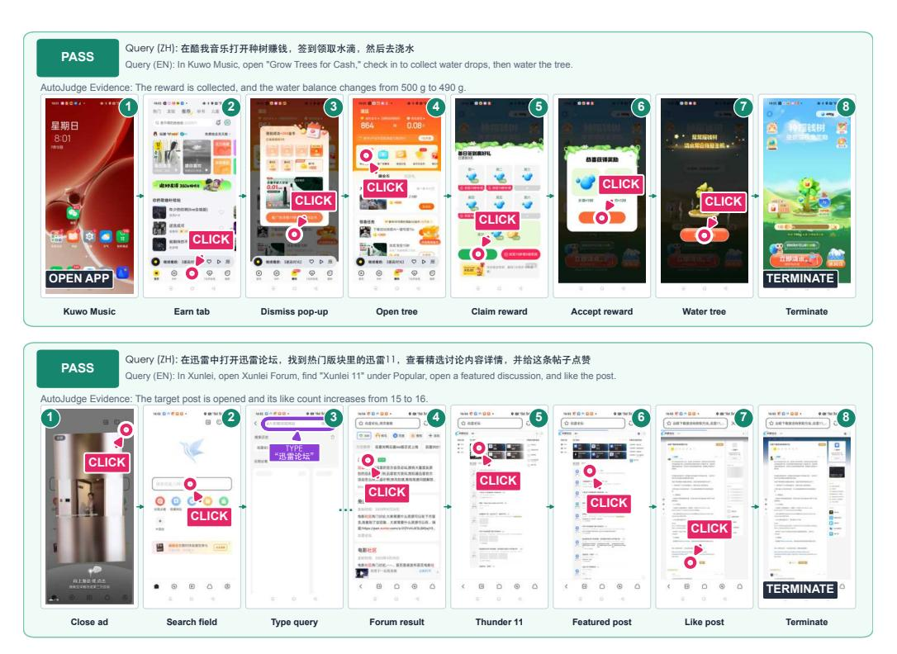

Figure 22: **대표적인 AutoJudge 통과 결정.** 트래젝터리 증거는 에이전트가 요청된 작업을 성공적으로 완료했음을 보여준다.

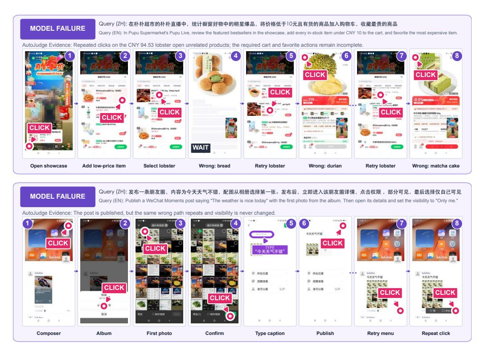

Figure 23: **대표적인 AutoJudge 모델 실패 결정.** 에이전트는 잘못되었거나 불완전한 실행 경로를 따르며 작업 요구 사항을 충족하지 못한다.

#### A.3 추가 정성적 예시 (A.3 Additional Qualitative Examples)

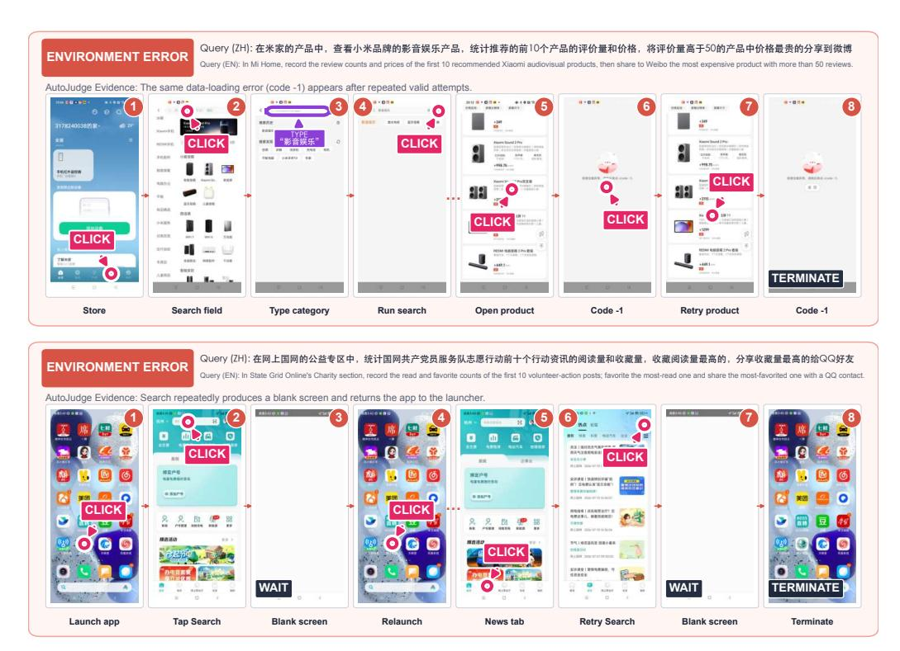

Figure 24: **대표적인 AutoJudge 환경 오류 결정.** 트래젝터리는 에이전트의 행동이 아니라 라이브 앱 또는 실행 환경 문제로 인해 중단된다.

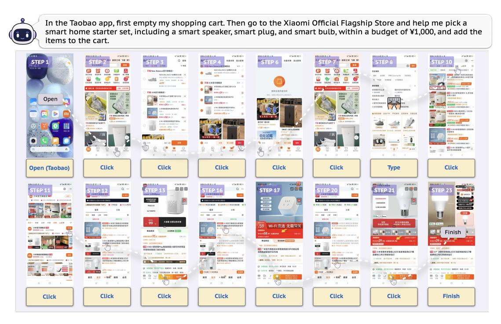

Figure 25: **장기 실기기 GUI 실행 시연.** 트래젝터리는 실행된 행동이 각 프레임 아래에 주석으로 표시된 핵심 프레임으로 렌더링된다. 이 23단계 쇼핑 과제에서 에이전트는 지침을 순차적 하위 목표로 분해한다: 먼저 타오바오 쇼핑 카트를 비우고, 그 다음 스마트 스피커, 스마트 플러그, 스마트 전구를 1,000위안 예산 내에서 Xiaomi 플래그십 스토어에서 선택하며 예산 제약과 품목 체크리스트를 전 과정에 걸쳐 유지한다.

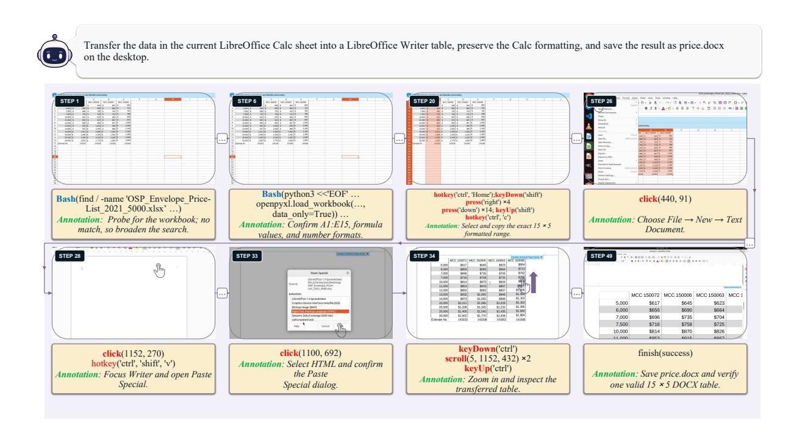

Figure 26: **컴퓨터 사용 과제에서 하이브리드 GUI+CLI 실행 시연.** 이 예시에서 에이전트는 CLI 도구를 사용해 스프레드시트 내용을 검사하고, GUI 동작을 번갈아 수행하며, 배치된 단축키 시퀀스와 Paste Special을 포함해 서식이 지정된 데이터를 Writer 문서로 전송한다.

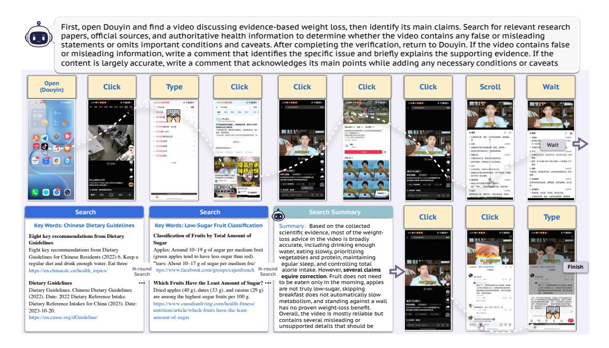

Figure 27: **GUI 실행 중 필요 시 DeepSearch 호출 시연.** Qwen-UI-Agent는 먼저 증거 기반 체중 감량에 관한 Douyin 비디오를 찾아 GUI 동작을 통해 주요 주장을 추출하고, 트래젝터리 중간에 DeepSearch를 호출해 이 주장들을 연구 논문 및 권위 있는 건강 소스와 비교 검증하여 인터페이스가 제공하지 않는 외부 증거를 제공한다. 검증 결론은 바로 이후 GUI 동작을 결정하며, 에이전트는 Douyin으로 돌아가 증거 기반 댓글을 게시해 observe—research—decide—act 루프를 마무리한다.

**Proactive service(전도적 서비스)**: 08:00에 harness(하네스)는 사용자의 아침 일정과 실시간 날씨 및 통근 상황을 결합한다. 사용자가 묻기 전에 public-transit(대중교통)과 taxi(택시) 옵션을 비교하고, 우산 조언, 출발 시각, 핵심 알림을 포함한 실행 가능한 요약을 전달한다.

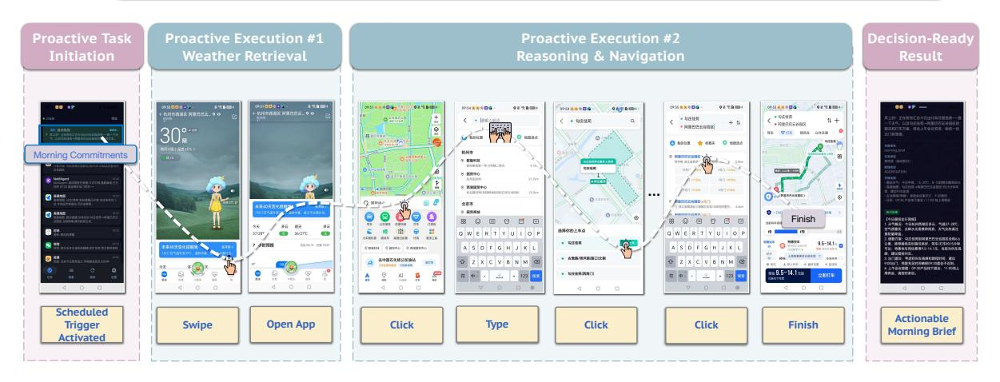

Figure 28: **모바일 알림 기반 전도적 서비스 시연**. 경로는 강조된 단계로 구성된다: 감지된 알림에서 시작되는 전도적 작업 시작, 전도적 실행 단계, 그리고 결정 준비가 된 결과, 실행된 동작이 각 핵심 프레임 아래에 주석으로 표시된다. 예정된 아침 요약: 08:00에 harness(하네스)는 사용자의 아침 일정과 실시간 날씨 및 통근 상황을 결합하고, public-transit(대중교통)과 taxi(택시) 옵션을 사용자가 묻기 전에 비교하며, 우산 조언, 출발 시각, 핵심 알림을 포함한 실행 가능한 요약을 전달한다.

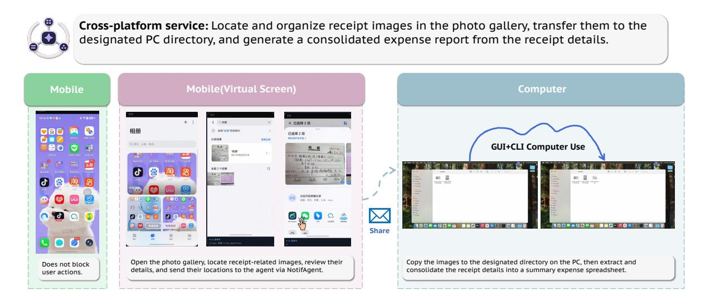

Figure 29: **크로스 플랫폼 작업 실행 시연**. 이 워크플로우에서 모바일 하위 작업은 물리적 기기의 가상 화면에서 실행되므로 실행이 사용자의 자체 행동을 차단하지 않는다. 장치 간 영수증 조직: 에이전트는 모바일 가상 화면의 사진 갤러리에서 영수증 이미지를 찾아 지정된 PC 디렉터리로 전송하고, GUI+CLI 컴퓨터 사용을 통해 영수증 세부 정보를 요약 비용 스프레드시트에 통합한다.

