# LongHorizon-Harness: 실세계 과제를 위한 장기 수평 에이전트 향상 (LongHorizon-Harness: Advancing Long-Horizon Agents for Real-World Tasks)

- 원제: LongHorizon-Harness: Advancing Long-Horizon Agents for Real-World Tasks
- 원문: [https://arxiv.org/abs/2608.01964](https://arxiv.org/abs/2608.01964)
- PDF: [https://arxiv.org/pdf/2608.01964v1](https://arxiv.org/pdf/2608.01964v1)
- arXiv ID: `2608.01964`

---

# **LongHorizon-Harness: 실세계 과제를 위한 장기 수평 에이전트 향상 (LongHorizon-Harness: Advancing Long-Horizon Agents for Real-World Tasks)**

**Ziyu Ma**∗ , **Hailang Huang**∗ , **Shun Zou**∗ , **Yong Wang**∗† , **Shidong Yang**, **Yiming Hu**, **Fei Wei**, **Xiangxiang Chu**

DreamX Team, Alibaba Group ∗Equal contribution †Project lead

대형 언어 모델(LLM) 에이전트는 점점 더 지속적인 추론, 도구 사용, 그리고 많은 상호 의존 단계에 걸친 수정이 필요한 장기 과제를 수행한다. 그러나 기존의 에이전트 하네스는 작업 실행, 작업 상태, 완료 평가를 점점 커지는 컨텍스트 안에서 유지함으로써 상태를 추적하기 어렵게 만들고, 잘못된 자기 평가가 이후 결정으로 전파되는 것을 허용한다. 우리는 장기 실행을 작업-상태 관리 문제로 재구성하고 **LongHorizon-Harness**를 제안한다. 이 하네스는 실행 외부에서 작업 상태를 명시적으로 유지하고, 환경에서 독립적으로 검증된 사실만으로 업데이트한다. *Manage-Execute-Audit* (MEA) 루프는 매니저를 사용해 작업 상태를 유지하고 다음 하위 작업을 결정하며, 새 컨텍스트 실행기를 사용해 수행하고, 읽기 전용 감사자를 사용해 다음 라운드 전에 결과 환경 상태를 검증한다. 가벼운 *AgentAdapter*는 모델과 하네스 백엔드를 교체 가능하게 지원하며, 그들의 원래 에이전트 루프를 수정하지 않는다. LongHorizon-Harness는 Qwen 3.7-Plus를 WeaveBench에서 51.8%에서 80.7%로, Terminal-Bench 2.1에서 69.7%에서 77.2%로, OSWorld 2.0에서 2.8%에서 8.3%로 개선한다. 또한 Claude Opus 4.7을 OSWorld 2.0 하위 집합에서 20.0%에서 34.3%로 끌어올려, 모델, 하네스, 상호작용 도메인 전반에 걸쳐 일관된 성과 향상을 입증한다.

**Github:** <https://github.com/AMAP-ML/LongHorizon-Harness>

**Website:** <https://lh-harness.pages.dev>

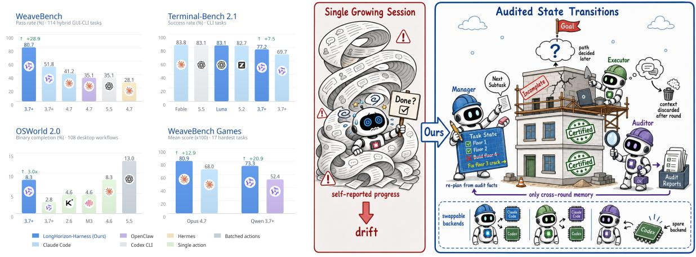

**Figure 1 왼쪽: LongHorizon-Harness는 벤치마크와 백본 전반에 걸쳐 장기 실행을 향상시킨다.** 동일한 백본과 실행 백엔드를 사용하면 WeaveBench PassRate를 51.8%에서 80.7%로, Terminal-Bench 2.1을 69.7%에서 77.2%로, OSWorld 2.0 바이너리 완성을 3*.*0× 향상시키며, 이 성과는 Qwen 3.7-Plus에서 Claude Opus 4.7으로 전이된다. **오른쪽: 감사된 상태 전이.** 자체 진행을 판단하는 지속적으로 커지는 세션 대신, *manager*는 감사된 사실에서 다음 하위 작업을 재계획하고, 새 컨텍스트 *executor*가 수행하며, 읽기 전용 *auditor*가 실제로 환경에서 변경된 사항을 인증한다. 감사 보고서만이 라운드 간 메모리이며, 교체 가능한 백엔드(예: Claude Code, Codex)가 각 역할을 수행한다.

## **1 서론 (1 Introduction)**

지난 몇 년 동안 대형 언어 모델(LLMs)은 대화형 모델에서 소프트웨어 엔지니어링용 자율 에이전트의 의사결정 핵심으로 진화했다 [(Yang et al.,](#page-16-0) [2024;](#page-16-0) [Wang et al.,](#page-16-1) [2025;](#page-16-1) [Ren et al.,](#page-16-2) [2026;](#page-16-2) [Ding et al.,](#page-15-0) [2025)](#page-15-0), 범용 지원 [(Anthropic,](#page-15-1) [2025;](#page-15-1) [OpenAI,](#page-15-2) [2025a;](#page-15-2)[b;](#page-15-3) [Anthropic,](#page-15-4) [2026)](#page-15-4), 과학적 발견 [(Sun et al.,](#page-16-3) [2025;](#page-16-3) [Wei et al.,](#page-16-4) [2025a)](#page-16-4), 컴퓨터 사용 [(Anthropic,](#page-15-5) [2024;](#page-15-5) [OpenAI,](#page-15-6) [2025c;](#page-15-6) [Google DeepMind,](#page-15-7) [2025;](#page-15-7) [Sager et al.,](#page-16-5) [2026;](#page-16-5) [Zhou et al.,](#page-16-6) [2026;](#page-16-6) [Zheng et al.,](#page-16-7) [2026)](#page-16-7), 그리고 다중모달 상호작용 [(Zhang et al.,](#page-16-8) [2023;](#page-16-8) [Agashe et al.,](#page-15-8) [2025)](#page-15-8) 분야에서, 에이전트는 점점 더 *장기 실행(long-horizon execution)*에 직면한다. 이는 반복적 추론, 도구 사용, 관찰, 수정이 수많은 상호 의존적 단계에서 필요하며, 때로는 여러 컨텍스트 윈도우 또는 세션에 걸쳐 진행된다. 에이전트가 완료할 수 있는 작업의 길이는 점점 더 많은 업무를 위임할 수 있는 정도를 결정한다. METR [(Kwa et al.,](#page-15-9) [2026)](#page-15-9)은 고급 에이전트의 작업 완료 수평(task-completion horizon)이 약 7개월마다 두 배가 된다고 보고하며, 최근 모델에서는 이 추세가 약 4개월로 가속화되고 있다. 최첨단 코딩 에이전트는 이미 단일 프로젝트에서 수시간에 걸친 작업을 지속할 수 있다 [(OpenAI,](#page-15-2) [2025a;](#page-15-2) [Anthropic,](#page-15-1) [2025;](#page-15-1) [Yang et al.,](#page-16-9) [2026a)](#page-16-9). 그러나 더 긴 수평이 단독으로 실행을 신뢰할 수 있게 만드는 것은 아니다 [(Dong et al.,](#page-15-10) [2026)](#page-15-10).

장기 실행의 어려움은 개별 단계에 있지 않고, 상호 의존적 행동의 긴 시퀀스에서 일관된 진행을 유지하는 데 있다. 시스템과 도메인 전반에 걸쳐 세 가지 도전 과제가 지속적으로 등장한다: * (i) 누적 오류와 목표 이탈(Compounding errors and goal drift).* 이전 단계의 오류나 결정이 경로를 따라 누적되어 이후 선택을 왜곡하고, 점차 에이전트를 원래 목표에서 멀어지게 한다 [(Sun](#page-16-10) [et al.,](#page-16-10) [2026)](#page-16-10). * (ii) 컨텍스트 부패(Context rot).* 상호작용 기록이 늘어남에 따라 관련 정보가 점점 더 회수하고 활용하기 어려워지며, 컨텍스트 활용이 임계값을 초과하면 에이전트 성능이 급격히 저하될 수 있다 [(Liu et al.,](#page-15-11) [2024;](#page-15-11) [Hong et al.,](#page-15-12) [2025)](#page-15-12). * (iii) 작업 상태 상실(Task-state loss).* 장기 실행 작업은 정확하고 최신의 작업 상태(즉, 충족해야 할 요구사항, 이미 완료된 행동, 생성된 산출물, 환경에서 발견된 사실)를 없이는 완수하기 어렵지만, 에이전트는 종종 이 상태를 복구, 보존, 업데이트하지 못한다.

모델 측과 하네스 측 모두에서 광범위한 노력이 에이전트를 강화시켰다. 프론티어 모델은 규모를 확장하고, 컨텍스트 윈도우를 늘리며, 대규모 고품질 데이터로 학습함으로써 더 강력한 코딩 및 에이전트 기능을 획득하고 있다 [(Wei et al.,](#page-16-11) [2025b;](#page-16-11) [Chu et al.,](#page-15-13) [2026;](#page-15-13) [Li et al.,](#page-15-14) [2025;](#page-15-14) [Ma et al.,](#page-15-15) [2026;](#page-15-15) [Ji et al.,](#page-15-16) [2025;](#page-15-16) [Yang et al.,](#page-16-12) [2026b)](#page-16-12). 동시에 Claude Code [(Anthropic,](#page-15-1) [2025)](#page-15-1), Codex CLI [(OpenAI,](#page-15-2) [2025a)](#page-15-2), OpenClaw [(OpenClaw Contributors,](#page-15-17) [2026)](#page-15-17) 같은 에이전트 하네스는 모델 주위에서 프롬프트, 도구 사용, 컨텍스트 관리, 다단계 실행을 조직하는 표준 시스템 계층이 되었다. 장기 목표 작업에서는 이러한 하네스가 이미 계획, 작업 분해, 도구 사용, 그리고 격리된 컨텍스트에서 작업을 실행하거나 검토하는 서브에이전트를 지원한다. 그러나 기존 하네스는 여전히 두 가지 구조적 한계에 직면해 있다: *(i) 작업 실행과 작업 상태 관리는 동일한 증가하는 컨텍스트를 공유한다.* 에이전트는 동일한 컨텍스트를 사용해 작업을 실행하고 작업 상태를 유지하며, 증가하는 실행 기록은 작업 상태를 추적하기 어렵게 만든다. *(ii) 작업 실행과 완료 평가가 결합되어 있다.* 에이전트는 각 서브태스크를 수행하고 완료 여부를 판단하며, 잘못된 판단이 작업 상태의 일부로 기록되어 이후 결정의 전제 조건으로 사용될 수 있다.

이러한 한계를 해결하기 위해 우리는 **LongHorizon-Harness**를 제안한다. 이 프레임워크는 장기 실행을 독립적으로 감사된 작업 상태 전이 시퀀스로 조직한다. 핵심 아이디어는 작업 상태를 실행 외부의 명시적 기록으로 유지하고, 환경에서 독립적으로 검증된 사실만으로 업데이트하며, 현재 기록과 원래 목표에서 다음 서브태스크를 도출하는 것이다. 구체적으로, LongHorizon-Harness는 그림 1에 표시된 *Manage-Execute-Audit* (MEA) 루프를 따른다. 매니저는 현재 작업 상태를 읽고, 종속성, 제약 조건, 수락 기준을 포함한 하나의 서브태스크를 정의한다. 실행자는 새 컨텍스트에서 이 서브태스크만 수행하며, 읽기 전용 감사자는 독립적으로 환경을 검사해 무엇이 변했는지, 무엇이 완료되었는지, 무엇이 아직 충족되지 않았는지를 판단한다 [(Zhuge et al.,](#page-16-13) [2024;](#page-16-13) [Zheng et al.,](#page-16-14) [2023)](#page-16-14). 매니저는 감사 결과를 바탕으로 작업 상태를 업데이트하고 다음 라운드를 시작하며, 실행자의 상호작용 기록은 각 라운드 후 폐기되어 작업 전반에 걸쳐 압축되고 검증된 작업 상태만이 남는다. 가벼운 *AgentAdapter*를 통해 LongHorizon-Harness는 기존 시스템의 원래 에이전트 루프 [(Yao et al.,](#page-16-15) [2023)](#page-16-15)를 보존하고, Claude Opus, GPT, Qwen 같은 모델과 Codex CLI [(OpenAI,](#page-15-2) [2025a)](#page-15-2), Claude Code [(Anthropic,](#page-15-1) [2025)](#page-15-1), OpenClaw [(OpenClaw Contributors,](#page-15-17) [2026)](#page-15-17), Hermes Agent [(Nous](#page-15-18) [Research,](#page-15-18) [2026)](#page-15-18) 같은 하네스를 포함한 세 역할에 대해 교환 가능한 백엔드를 지원한다.

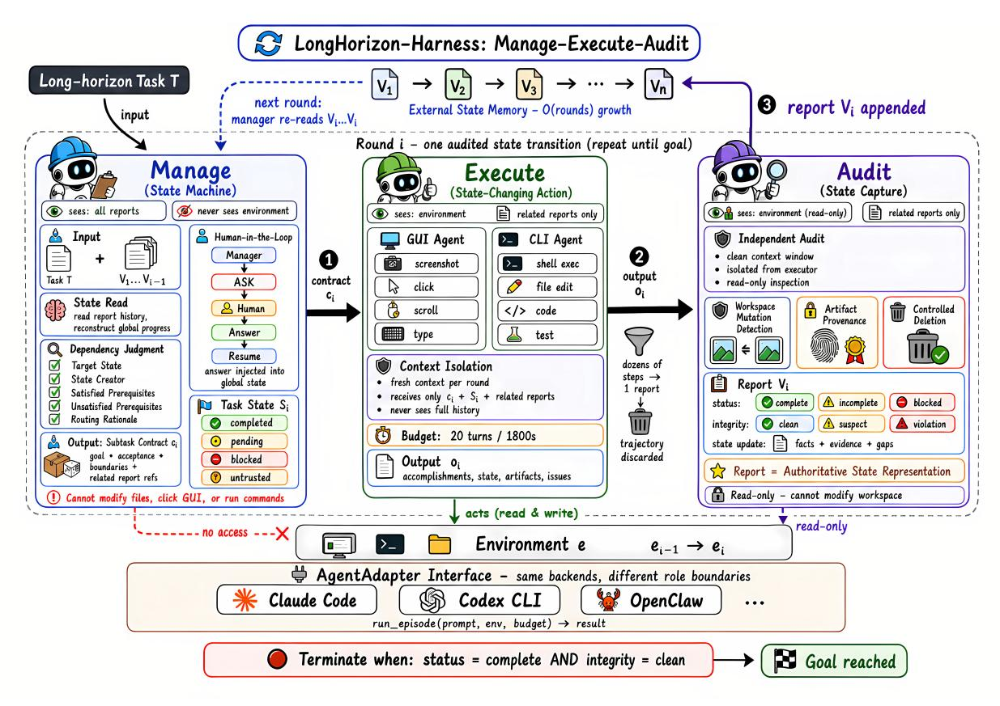

**Figure 2 LongHorizon-Harness 개요.** LongHorizon-Harness는 점선 상자와 번호가 매겨진 흐름 ❶–❸에 표시된 반복적인 *Manage-Execute-Audit* 라운드를 통해 긴 수평 작업 T를 처리한다. *manager*는 작업 상태 *Si*를 읽고 하위 작업 계약 *ci*를 구성하며, 이는 목표, 수락 기준, 경계 제약 및 관련 사전 증거를 명시한다 (❶). 관리자는 대신 사용자 정보나 권한을 요청할 수 있다. 선택된 GUI 또는 CLI *executor*는 새롭고 예산 제한이 있는 컨텍스트에서 하위 작업을 수행하고 환경을 수정한다 (❷). *auditor*는 읽기 전용 도구를 통해 결과 환경을 독립적으로 검사하고 감사 보고서 *vi*를 생성한다 (❸). 관리자는 *vi*를 사용해 다음 라운드 전에 작업 상태를 업데이트한다.

LongHorizon-Harness를 세 가지 최신 긴 수평 벤치마크, WeaveBench [(Li et al.,](#page-15-19) [2026)](#page-15-19), OSWorld 2.0 [(Yuan et al.,](#page-16-16) [2026)](#page-16-16), 그리고 Terminal-Bench 2.1 [(Merrill et al.,](#page-15-20) [2026)](#page-15-20)에 대해 평가한다. 이 세 벤치마크는 교차 인터페이스 조정, 데스크톱 워크플로우, 그리고 까다로운 명령줄 작업을 포괄한다. 일치하는 모델 백엔드와 평가 프로토콜 하에서, LongHorizon-Harness는 Qwen 3.7-Plus와 Claude Code를 사용해 WeaveBench 통과율을 51.8%에서 **80.7%**로 끌어올리며, 이는 Claude Opus 4.7과 Claude Code로 얻은 41.2%의 가장 강력한 공식 보고 결과를 거의 두 배로 만든다. Terminal-Bench 2.1에서는 Qwen 3.7-Plus를 사용해 성능을 69.7%에서 **77.2%**로 향상시킨다. 전체 OSWorld 2.0 벤치마크에서는 Qwen 3.7-Plus로 이진 완료를 2.8%에서 **8.3%**로 끌어올리고, 34개 작업 하위 집합에서는 Claude Opus 4.7로 결과를 20.0%에서 **34.3%**로 개선한다. 우리의 기여는 다음과 같이 요약된다:

- 우리는 긴 수평 실행을 단일 성장 궤적에서 작업 상태 관리 문제로 재구성한다. 작업 상태는 실행 외부에서 명시적으로 유지되며, 독립적으로 검증된 사실만으로 업데이트되고, 원래 목표 하에서 각 다음 하위 작업을 결정하는 데 사용된다.
- 우리는 *Manage-Execute-Audit* 루프를 통해 이 원칙을 실현하는 LongHorizon-Harness를 설계한다. 각 라운드에서 관리자는 현재 작업 상태에서 하나의 하위 작업을 정의하고, 실행자는 새 컨텍스트에서 이를 수행하며, 감사자는 환경을 독립적으로 검사한 뒤 관리자는 상태를 업데이트하고 다음 라운드를 시작한다.
- 우리는 WeaveBench, OSWorld 2.0, 그리고 Terminal-Bench 2.1에서 LongHorizon-Harness를 평가한다. Qwen 3.7-Plus를 사용해 WeaveBench 통과율을 51.8%에서 80.7%로, Terminal-Bench 2.1을 69.7%에서 77.2%로, OSWorld 2.0 이진 완료를 2.8%에서 8.3%로 개선하며, Claude Opus 4.7에서도 일관된 성과를 제공한다.

## 2 방법 (Method)

### 2.1 개요 (Overview)

$\mathcal{T}$라는 긴 수평 작업과 컴퓨터 환경이 주어졌을 때, LongHorizon-Harness는 단일 지속적으로 성장하는 세션 대신 동적으로 결정되는 라운드 시퀀스를 통해 작업을 수행한다. 이 하니스는 실행 외부에서 명시적인 작업 상태를 유지하고, 환경에서 독립적으로 검증된 증거만으로 이를 진행한다. 라운드 간에 작업 상태와 그에 대한 감사 보고서만이 남아 있으며, 실행자의 원시 상호작용 궤적은 각 라운드 후에 폐기된다. 그림 2는 프레임워크의 개요를 제공한다.

Each round follows a Manage-Execute-Audit (MEA) loop. Let  $S_i$  denote the task state available at the beginning of round  $i, e_{i-1} \in \mathcal{E}$  the current environment state, and  $V_{i-1} = (v_1, \ldots, v_{i-1})$  the accumulated audit reports. The manager constructs a bounded subtask contract  $c_i$ . A fresh-context executor performs the contract, transforms the environment from  $e_{i-1}$  to  $e_i$ , and returns an execution report  $o_i$ . A separate auditor then inspects  $e_i$  through read-only tools and produces audit report  $v_i$ . The manager incorporates  $v_i$  into the next task state  $S_{i+1}$  before determining whether another round is required. The loop ends when the audited state satisfies the original task, no permitted subtask can advance the remaining requirements, user input is required, or the round budget is exhausted.

### 2.2 관리자 (Manager)

매니저는 지속적인 작업 상태를 소유하고 작업이 어떻게 진행되어야 하는지를 결정한다. 그는 원래 작업 $\mathcal{T}$, 현재 작업 상태, 그리고 모든 누적 감사 보고서에 접근할 수 있지만 컴퓨터 환경에 직접적인 인터페이스가 없다. 그는 애플리케이션 상태를 관찰하거나, 작업 공간 내용을 검사하거나, GUI 또는 CLI 도구를 호출하거나, 환경을 수정할 수 없다. 그의 결정은 감사자들이 기록한 작업 상태와 환경 증거에 전적으로 기반한다.

라운드 i 이후, 매니저는 작업 상태를 업데이트하고 다음 제어 결정을 생성한다:

$$(S_{i+1}, q_{i+1}, c_{i+1}) = \Phi_{\text{mgr}}(\mathcal{T}, S_i, V_i),$$

(1)

여기서 $V_i = (v_1, \dots, v_i)$이며 $q_{i+1}$는 EXECUTE, DONE, BLOCKED, ASK 중 하나이다. 계약 $c_{i+1}$는 추가 실행이 필요할 때만 반환된다.

작업 상태 업데이트. 작업 상태는 작업과 관련된 기록들의 구조화된 모음이다: 요구 사항은 원래 작업에서 파생된 목표 또는 제약을 나타내고, 산출물은 실행 중에 생성되거나 수정된 출력을 나타내며, 사실은 이후 라운드에 필요한 환경 정보를 기록한다. 각 기록은 완료, 보류, 차단, 또는 신뢰할 수 없음으로 표시되며, 현재 상태를 뒷받침하는 감사 증거에 대한 참조를 보유한다. 초기 상태 $S_1$은 $\mathcal{T}$에서 요구 사항을 보류로 표시하여 구성된다. 각 라운드 후, 매니저는 $v_i$에서 검증된 결과를 $S_i$에 적용하여 해당 기록을 추가하거나 업데이트하고, 해결되지 않은 기록은 적절히 보류, 차단, 또는 신뢰할 수 없음으로 남긴다. 실행자 주장(Executor claims)은 지속적인 상태를 직접 변경하지 않는다: 기록은 깨끗한 감사 증거에 의해 뒷받침될 때만 완료로 표시된다.

다음 하위 작업 구성. 매니저는 $S_{i+1}$을 원래 작업과 비교하고, 현재 상태에서 진행할 수 있는 해결되지 않은 목표를 선택하며, 그 의존성과 전제 조건을 확인한다. 그 다음, 즉각적인 목표, 수락 기준, 경계 제약, 그리고 실행 및 검증과 관련된 작업 상태 기록 및 이전 감사 보고서를 명시하는 경계가 있는 계약 $c_{i+1}$를 구성한다. 계약은 요구되는 주요 환경 전이(transition)에 따라 GUI 또는 CLI 실행자에게 전달된다. 매니저는 감사된 상태가 $\mathcal{T}$를 무결성 위반 없이 만족하면 DONE을 반환하고, 허용된 동작이 남은 요구 사항을 진행할 수 없으면 BLOCKED를 반환하며, 진행이 사용자 정보나 권한을 필요로 하면 ASK를 반환한다; 그렇지 않으면 EXECUTE와 함께 $c_{i+1}$를 반환한다.

### 2.3 실행자 (Executor)

실행자는 매니저가 선택한 계약을 수행하며 환경을 의도적으로 수정할 수 있는 유일한 역할이다. 라운드 i에서, 실행자는 원래 작업 $\mathcal{T}$, 현재 작업 상태 $S_i$, 하위 작업 계약 *ci* 및 계약에서 참조된 이전 감사 보고서만을 받는다.

실행자는 환경을 *e_{i-1}*에서 *e_i*로 변환한다:

$$(e_i, o_i) = \Phi_{\text{exec}} \left( \mathcal{T}, S_i, c_i; e_{i-1} \right), \tag{2}$$

여기서 *oi*는 실행 중 수행된 행동, 결과 상태, 생성되거나 수정된 아티팩트, 그리고 발생한 문제를 요약한다. 보고서 *oi*는 실행자의 결과를 기술하지만 계약이 완료되었음을 입증하지는 않는다.

*새로운 컨텍스트 실행.* 각 실행자 호출은 현재 라운드에 제공된 정보만을 포함하는 새롭고 예산 제한된 에피소드로 실행된다. 이전 라운드의 원시 상호작용 경로를 받지 않는다. 에피소드 내에서 실행자는 계획, 환경 상호작용, 관찰, 수정의 여러 사이클을 수행할 수 있다. 에피소드가 끝나면 원시 경로와 내부 추론은 버려지고, *oi*만 감사에 전달된다.

*GUI 및 CLI 기능 경계.* GUI 및 CLI 실행자는 서로 다른 환경 인터페이스를 통해 동작한다. GUI 실행자는 화면 중심의 기능(스크린샷 찍기, 클릭, 스크롤, 텍스트 입력 등)을 수신하며, 애플리케이션 및 인터페이스 상태를 중심으로 전환을 담당한다. CLI 실행자는 셸 실행, 파일 편집, 코딩, 테스트 등과 같은 기능을 수신하며, 작업 공간, 프로세스, 프로그램 상태를 중심으로 전환을 담당한다.

하네스는 선택된 실행자 역할에 할당된 환경 인터페이스와 도구 세트만 노출한다. 해당 역할 외의 기능은 구성에서 명시적으로 제공되지 않는 한 사용할 수 없다. 이는 상태 변화를 일으키는 다양한 클래스의 행동에 대한 책임을 분리하면서, 매니저가 각 계약에 적합한 인터페이스를 선택할 수 있도록 한다.

*백엔드 실행.* 실행자는 공통 에이전트-어댑터 인터페이스를 통해 인스턴스화된다. 계약, 역할별 환경 인터페이스, 실행 예산이 주어지면 어댑터는 Claude Code, Codex CLI, OpenClaw 등 기존 백엔드를 하나의 제한된 에피소드로 실행한다. 백엔드는 자체 계획 및 도구 사용 루프를 유지하며, 할당된 역할에서 해당 기능이 노출될 때 셸을 호출하거나 파일을 편집하고, 코드를 작성하고, 테스트를 실행하거나 애플리케이션과 상호작용한다. 하네스는 백엔드의 내부 실행 과정을 대체하지 않으며, 제공된 컨텍스트, 사용 가능한 도구, 환경 권한, 실행 예산, 반환된 보고서를 제어한다.

### **2.4 감사자 (Auditor)**

감사자는 실행자가 생성한 환경 상태를 독립적으로 검증한다. 실행 후, 감사자는 원본 작업 T, 작업 상태 *Si*, 계약 *ci*, 계약에서 참조된 이전 감사 보고서, 그리고 실행자 보고서 *oi*를 받는다. 감사자는 실행자의 원시 상호작용 경로나 내부 추론을 받지 않는다. 감사자는 결과 환경 *ei*를 검사하고 다음을 생성한다

$$v_i = \Phi_{\text{aud}} \left( \mathcal{T}, S_i, c_i, o_i; e_i \right), \tag{3}$$

여기서 *vi*는 지속적인 감사 기록에 추가되고 다음 라운드 전에 매니저에게 반환된다.

*독립적인 환경 검사.* 감사자는 실행자의 원시 상호작용 경로와 내부 추론을 제외한 새로운 컨텍스트에서 시작한다. 감사자는 *oi*를 사용해 관련 파일, 창, 로그, 프로세스 또는 기타 출력을 찾을 수 있지만, 완료 여부는 *ci*에 명시된 목표, 수락 기준, 경계 제약과 결과 환경을 독립적으로 비교하여 판단한다. GUI 감사자는 관찰 중심의 상호작용을 통해 애플리케이션 및 화면 상태를 검사하고, CLI 감사자는 비변형 명령과 검사 도구를 사용해 파일, 메타데이터, 로그, 프로세스, 테스트, 작업 공간 상태를 검사한다. 두 경우 모두 감사 결론은 실행자의 완료 주장 대신 환경에서 직접 얻은 증거에 의해 뒷받침되어야 한다.

**Table 1 WeaveBench 결과.** 회색 행은 각 백본에 대해 가장 좋은 보고된 사고 모드를 사용한 [(Li et al.,](#page-15-19) [2026)](#page-15-19)에서 보고한 공식 결과를 나타낸다. GPT-5.5와 Claude Opus 4.7 이외의 모델은 OpenClaw로만 평가되었다. 검은 행은 Qwen 3.7-Plus로 수행한 우리 실험을 나타낸다. 우리 실험은 작업 가상 머신 내부에서 루트 권한을 사용하지만, 공식 결과는 일반 사용자 계정을 사용하므로 일치 비교가 아니라 기준점으로 포함된다. PR은 전체 작업 PassRate(%)를 나타내며, Overall은 114개 작업 전체의 평균 점수를 나타낸다. 나머지 열은 여덟 개 벤치마크 도메인에 걸친 PassRate를 보고한다.

| 모델 | 하네스 |  | PR↑ Overall↑ | DSK | DOC |  | GAM WEB DAV OPS SPA DES |  |  |  |  |
|----------------------------|----------------------------------------|------|--------------|------|-------|------|-------------------------|------|------|------|------|
|  | Claude Code | 41.2 | 0.532 | 55.6 | 47.1 | 23.5 | 53.3 | 23.1 | 50.0 | 33.3 | 40.0 |
|  | OpenClaw | 35.1 | 0.482 | 55.6 | 29.4 | 23.5 | 66.7 | 15.4 | 41.7 | 16.7 | 20.0 |
| Claude Opus 4.7 | Hermes Agent | 28.1 | 0.516 | 33.3 | 47.1 | 11.8 | 26.7 | 30.8 | 50.0 | 8.3 | 10.0 |
|  | Codex CLI | 13.2 | 0.378 | 16.7 | 11.8 | 11.8 | 6.7 | 7.7 | 25.0 | 16.7 | 10.0 |
|  | Codex CLI | 35.1 | 0.499 | 38.9 | 29.4 | 23.5 | 53.3 | 15.4 | 50.0 | 58.3 | 10.0 |
|  | OpenClaw | 33.3 | 0.466 | 38.9 | 35.3 | 35.3 | 21.4 | 23.1 | 38.5 | 33.3 | 40.0 |
| GPT-5.5 | Hermes Agent | 31.6 | 0.466 | 55.6 | 29.4 | 35.3 | 40.0 | 7.7 | 25.0 | 25.0 | 20.0 |
|  | Claude Code | 14.9 | 0.299 | 33.3 | 11.8 | 11.8 | 0.0 | 15.4 | 16.7 | 25.0 | 0.0 |
| GPT-5.4 | OpenClaw | 22.8 | 0.465 | 55.6 | 35.3 | 5.9 | 0.0 | 23.1 | 23.1 | 8.3 | 20.0 |
| GPT-5.3-codex | OpenClaw | 18.4 | 0.456 | 33.3 | 23.5 | 29.4 | 0.0 | 7.7 | 16.7 | 8.3 | 20.0 |
| GPT-5.2-codex | OpenClaw | 6.1 | 0.321 | 5.6 | 11.8 | 0.0 | 0.0 | 15.4 | 16.7 | 0.0 | 0.0 |
| GPT-5.1-codex | OpenClaw | 1.8 | 0.226 | 0.0 | 5.9 | 0.0 | 0.0 | 7.7 | 0.0 | 0.0 | 0.0 |
| Gemini 3.1 pro | OpenClaw | 1.8 | 0.223 | 0.0 | 0.0 | 0.0 | 0.0 | 0.0 | 8.3 | 8.3 | 0.0 |
| Qwen3.5-397B-A17B | OpenClaw | 0.9 | 0.318 | 0.0 | 0.0 | 0.0 | 0.0 | 0.0 | 8.3 | 0.0 | 0.0 |
| Qwen3-VL-8B-Think OpenClaw |  | 0.9 | 0.092 | 0.0 | 0.0 | 0.0 | 0.0 | 8.3 | 0.0 | 0.0 | 0.0 |
| GUI-Owl-1.5-32B | OpenClaw | 0.0 | 0.065 | 0.0 | 0.0 | 0.0 | 0.0 | 0.0 | 0.0 | 0.0 | 0.0 |
|  | Claude Code | 51.8 | 0.702 | 83.3 | 76.5 | 29.4 | 46.7 | 53.8 | 66.7 | 16.7 | 20.0 |
| Qwen 3.7-Plus | LongHorizon-Harness (Claude Code) 80.7 |  | 0.835 | 88.9 | 100.0 | 58.8 | 73.3 | 84.6 | 91.7 | 66.7 | 80.0 |

*읽기 전용 권한.* 감사자는 필요 시 검사용 관찰 뷰를 변경할 수 있지만, 작업 관련 환경 상태를 수정할 수는 없다. 보호된 아티팩트를 생성, 편집, 덮어쓰기, 이동, 삭제하거나, 상태 변화를 일으키는 명령을 실행하거나, 검사 중인 결과를 변경하는 GUI 동작을 수행할 수 없다. 하네스는 감사 전반에 걸쳐 작업 관련 작업 공간 및 아티팩트 상태를 모니터링하며, 감지된 변형은 무결성 위반으로 기록되고, 결과 보고서는 완료된 작업 상태 기록을 지원할 수 없다.

*감사 결과 구성.* 감사 보고서 *vi*는 세 가지 유형의 결과를 기록한다. 첫째, 계약 수락 기준을 평가하여 *complete*, *incomplete*, 또는 *blocked*의 완료 상태를 할당한다. 둘째, 작업 공간 변형, 아티팩트 유효성 및 출처, 관련 삭제 제약 조건을 확인하여 *clean*, *suspect*, 또는 *violation*의 무결성 상태를 할당한다. 셋째, 검증된 사실, 증거, 남은 격차를 포함하여 검사의 지원을 받은 작업 상태 업데이트를 기록한다.

감사자는 요구사항, 아티팩트, 사실 기록에 대한 변경을 제안할 수 있지만, 매니저는 이러한 결과가 *Si*+1에 어떻게 통합될지 결정한다. 따라서 *oi*는 검증되지 않은 실행 요약으로 남아 있고, *vi*는 지속적인 작업 상태를 진전시킬 수 있는 환경 기반 증거를 제공한다.

## **3 실험 (3 Experiments)**

### **3.1 실험 설정 (3.1 Experimental Setup)**

*비교 구성.* 우리는 Qwen-3.7-Plus를 주요 백본 모델로 사용하고, 추가로 Claude Opus-4.7을 평가하여 백본 모델 전반에 걸친 일반성을 확인한다. 각 백본 모델마다 원래 Claude Code 평가 프레임워크 [(Anthropic,](#page-15-1) [2025)](#page-15-1)와 **LongHorizon-Harness**를 비교한다. 후자는 Claude Code를 실행 백엔드로 사용한다. 별도로 명시되지 않는 한, 매니저, 실행자, 감사자는 동일한 백본 모델로 인스턴스화되어 비교가 작업 상태 관리의 효과를 반영하도록 하며, 모델 능력 차이를 반영하지 않는다.

**Table 2 OSWorld 2.0에서의 결과.** 회색 행은 배치 및 단일 액션 설정에서 [(Yuan et al.,](#page-16-16) [2026)](#page-16-16) 에 의해 보고된 공식 결과를 나타내며, 검은 행은 하이브리드 설정에서 Qwen 3.7-Plus를 사용한 LongHorizon-Harness를 나타낸다. Binary는 최종 벤치마크 점수가 1인 작업의 비율이며, Partial은 108개 작업 전체에 대한 평균 벤치마크 점수이다. 굵은 글씨는 가장 좋은 공식 결과를 표시한다.

| 모델 | 하네스 / 모드 | 이진↑ | 부분↑ |
|-------------------|------------------------------|---------|----------|
| Claude Opus 4.8 | 배치된 동작 | 20.6 | 54.8 |
| Claude Opus 4.7 | 배치된 동작 | 18.2 | 48.9 |
| GPT-5.5 | 배치된 동작 | 13.0 | 49.5 |
| Claude Opus 4.8 | 단일 동작 | 18.5 | 49.3 |
| Claude Opus 4.7 | 단일 동작 | 13.9 | 49.1 |
| Claude Sonnet 4.6 | 단일 동작 | 8.3 | 41.5 |
| MiniMax M3 | 단일 동작 | 4.6 | 22.3 |
| Kimi 2.6 | 단일 동작 | 4.6 | 22.1 |
| Qwen 3.7-Plus | 단일 동작 | 2.8 | 21.5 |
| Qwen 3.7-Plus | LongHorizon-Harness (hybrid) | 8.3 | 35.2 |

*구현 세부 사항.* LongHorizon-Harness는 기존 에이전트 백엔드를 통합하기 위해 통합된 AgentAdapter 인터페이스를 사용한다. 각 역할은 독립적인 실행 예산을 할당받는다: 실행자는 라운드당 1800초로 제한되며, 매니저와 감사자는 각각 300초로 제한된다. 우리는 MEA 라운드의 최대 수를 *N*max = 25로 설정한다.

*벤치마크 및 지표.* LongHorizon-Harness는 장기 실행의 보완적 형태를 다루는 세 가지 최신 벤치마크에서 평가된다.

**WeaveBench** [(Li et al.,](#page-15-19) [2026)](#page-15-19)는 동일한 워크플로우 내에서 GUI와 CLI 상호작용을 조정해야 하는 114개의 작업으로 구성된다. 우리는 모든 작업에 대해 공식 벤치마크에서 공개한 작업 정의, 워크스페이스, 런타임 자산, 심사 템플릿을 사용하여 표준 WeaveBench 평가 프로토콜을 따른다. 우리는 PassRate(완전히 통과한 작업의 비율)와 Overall(모든 작업에 대한 평균 점수)를 보고한다. 또한 벤치마크가 다루는 여덟 개 도메인 각각에 대한 PassRate를 보고한다.

**OSWorld 2.0** [(Yuan et al.,](#page-16-16) [2026)](#page-16-16)는 108개의 데스크톱 워크플로우 작업으로 구성되며, 인간이 완료하는 평균 시간은 약 1.6시간이다. 우리는 공식 osworld-v2-2026.06.24 릴리스와 표준 Docker 기반 VM 인프라를 사용한다. 우리는 Binary Accuracy(최종 점수가 1인 경우에만 작업을 성공으로 간주)와 Partial Accuracy(모든 작업에 대한 평균 점수)의 두 가지 지표를 보고한다.

**Terminal-Bench 2.1** [(Merrill et al.,](#page-15-20) [2026)](#page-15-20)은 도전적이고 현실적인 명령줄 작업을 평가하도록 설계되었다. 우리는 Qwen 시리즈 모델에서 사용된 평가 설정을 따르고, Harbor와 Docker 백엔드를 사용해 Terminal-Bench 2.1을 평가한다. 최종 결과는 각 작업마다 세 번의 독립 실행에 대한 평균 점수를 보고하며, 공식 리더보드 결과와 비교한다.

### **3.2 주요 결과**

*장기 실행 컴퓨터 사용의 효과성.* Table [1](#page-5-0)은 WeaveBench에서의 결과를 보고한다. Claude Code harness와 Qwen 3.7-Plus를 사용하면 PassRate가 51.8%이고 평균 작업 점수가 0.702이다. 동일한 모델을 사용하고 Claude Code를 실행자 백엔드로 유지하면서 LongHorizon-Harness는 이 결과를 각각 80.7%와 0.835로 증가시킨다. 이 일치 비교는 추가 작업 상태 관리 레이어의 기여를 분리한다. 성능은 여덟 개 작업 도메인 전반에서도 향상되어 이득이 특정 애플리케이션 범주에 집중되지 않음을 보여준다. 공식적으로 보고된 구성은 다른 권한 설정을 사용하므로, 우리는 이를 참조 지점으로 포함하지만 주요 결론은 일치 Claude Code 비교에 근거한다.

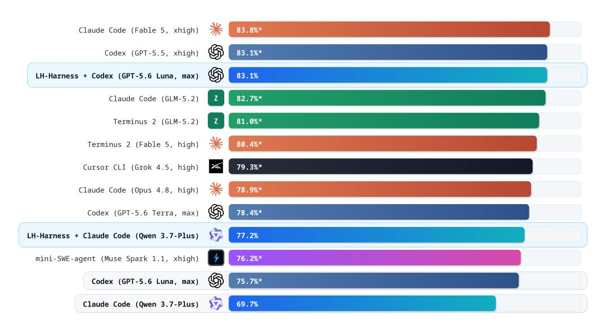

**Figure 3 Terminal-Bench 2.1 결과.** LongHorizon-Harness는 실행자 백엔드로 Claude Code를 유지하면서 성공률을 69.7%에서 77.2%로 향상시킨다. ∗로 표시된 값은 외부에서 보고된 지표이다.

**Table 3 OSWorld 2.0 Opus 4.7 하위 집합 (34개 작업).** 두 행 모두 Claude Opus 4.7을 기반으로 한다.

| 모델 | 하네스 / 모드 | 이진↑ | 부분↑ |  |
|-----------------|---------------------------------|---------|----------|--|
| Claude Opus 4.7 | 단일 액션 | 20.6 | 55.8 |  |
| Claude Opus 4.7 | LongHorizon-Harness (하이브리드) | 35.3 | 66.9 |  |

우리는 OSWorld 2.0에서의 결과를 보고한다. Qwen 3.7-Plus와 함께 LongHorizon-Harness는 이진 완료율을 2.8%에서 8.3%로, 부분 점수를 21.5%에서 35.2%로 증가시킨다. 높은 부분 점수는 에이전트가 작업 요구사항의 더 큰 비율을 충족함을 보여주며, 이진 완료율이 세 배 증가한 것은 이 진행이 보다 자주 완전한 워크플로우로 이어짐을 나타낸다. WeaveBench와 OSWorld 2.0의 결과를 종합하면 명시적 작업 상태 관리는 교차 인터페이스 실행과 장기간 시각적 컴퓨터 사용 경로에서 지속적인 진행을 모두 개선한다.

*백본 역량과의 상호 보완성.* 표 [3](#page-7-0)은 OSWorld 2.0의 34개 작업 하위 집합에서 Claude Opus 4.7과 함께 LongHorizon-Harness를 추가로 평가한다. 이진 완료율을 20.6%에서 35.3%로, 부분 점수를 55.8%에서 66.9%로 증가시킨다. Qwen 3.7-Plus와 Claude Opus 4.7에서 일관된 개선은 프레임워크가 단지 약한 모델을 보완하는 것만이 아니라는 것을 보여준다. 백본은 각 라운드 내에서 생성되는 행동과 결정의 품질을 결정하고, LongHorizon-Harness는 검증된 결과가 라운드 간에 얼마나 신뢰성 있게 유지되고 사용되는지를 결정한다. 따라서 강력한 모델과 명시적 작업 상태 관리는 상호 보완적인 이득을 제공한다.

*컴퓨터 사용을 넘어선 일반화.* 그림 [3](#page-7-1)은 Terminal-Bench 2.1에서의 결과를 보고한다. 예산이 제한되어 있어 우리는 Claude Code와 Qwen 3.7-Plus, Claude Code와 Qwen 3.7-Plus를 사용한 LongHorizon-Harness, Codex와 GPT-5.6 Luna를 사용한 LongHorizon-Harness의 세 가지 구성을 직접 실행했다. 나머지 결과는 공식 Terminal-Bench 2.1 리더보드 또는 해당 모델의 공식 보고서에서 인용한 것이다. LongHorizon-Harness는 Claude Code와 Qwen 3.7-Plus의 성공률을 69.7%에서 77.2%로 향상시킨다. Codex를 실행기 백엔드로 사용하면 LongHorizon-Harness는 GPT-5.6 Luna를 사용해 83.1%에 도달한다. Terminal-Bench 작업은 전적으로 명령줄을 통해 수행되며 시각적 인지나 GUI–CLI 라우팅을 필요로 하지 않는다. 따라서 이 이득은 컴퓨터 사용 에이전트에 특화된 메커니즘에 기인할 수 없다. 이는 명시적 작업 상태 유지, 제한된 실행 컨텍스트, 독립적 감시가 일반적인 장기-수평 에이전트 실행에도 이익을 준다는 것을 보여준다. 하이브리드 인터페이스, 데스크톱, 순수 CLI 환경 전반에 걸쳐 LongHorizon-Harness는 에이전트가 중간 진행을 완성된 작업으로 보존하고 변환하는 방식을 일관되게 개선한다.

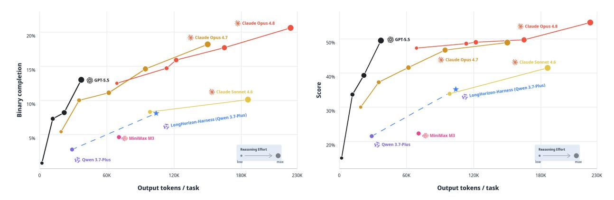

**그림 4 OSWorld 2.0에서의 비용–성능 프론티어.** 이진 완료율(왼쪽)과 부분 점수(오른쪽)은 작업당 평균 출력 토큰 수에 대한 것이다. 색상 곡선은 다른 추론 노력 설정[(Yuan et al.,](#page-16-16) [2026)](#page-16-16)에서의 공식 결과를 보여주며, 마커 크기는 추론 노력을 나타낸다. 파란 별은 Qwen 3.7-Plus를 사용한 LongHorizon-Harness를 나타내고, 점선 화살표는 공식 단일-행동 Qwen 3.7-Plus 기준선에 대한 개선을 보여준다.

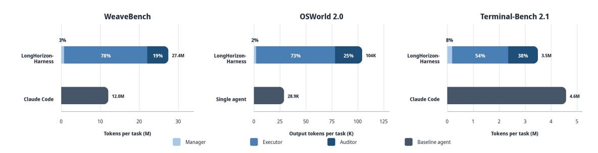

**그림 5 역할별 토큰 소비.** LongHorizon-Harness에서 관리자, 실행자, 감시자가 작업당 소비한 평균 토큰 수를 해당 기준선과 비교한다. 세그먼트 라벨은 각 역할이 소비한 비율을 보고한다. 모든 LH-Harness 역할은 Qwen 3.7-Plus를 사용한다. WeaveBench와 Terminal-Bench 2.1은 총 토큰을 보고하며, OSWorld 2.0은 공식이 출력 토큰 통계만 제공하므로 출력 토큰을 보고한다 [(Yuan et al.,](#page-16-16) [2026)](#page-16-16).

일반적인 장기-수평 에이전트 실행에 이익을 준다. 하이브리드 인터페이스, 데스크톱, 순수 CLI 환경 전반에 걸쳐 LongHorizon-Harness는 에이전트가 중간 진행을 완성된 작업으로 보존하고 변환하는 방식을 일관되게 개선한다.

### **분석 (Analysis)**

다음으로 우리는 이러한 이득의 계산 비용, 이들이 발생하는 작업 조건, 그리고 모델과 하니스가 어떻게 공동으로 결과 에이전트 시스템의 역량을 결정하는지를 살펴본다.

*비용–성능 트레이드오프.*

Fig. [4](#page-8-0)는 LongHorizon-Harness가 Qwen 3.7-Plus를 OSWorld 2.0 비용–성능 프론티어에서 상당히 강력한 지점으로 이동시킨다. 같은 모델은 이진 완성에서 2.8%에서 8.3%로, 부분 점수에서 21.5%에서 35.2%로 개선되지만, 평균 출력 토큰 소비는 작업당 28.9K에서 104K로 증가한다. 이 결과는 더 강력한 harness가 고정 모델이 달성할 수 있는 작업 수준 성능을 높일 수 있음을 보여준다. Qwen 3.7-Plus에서 관찰된 비용 증가가 이 모델–작업 구성에 특이적임을 나타내며; 아래에서 분석한 바와 같이 LongHorizon-Harness의 토큰 비용은 기본 실행자의 능력에 크게 의존한다.

*계산 역할별.*  
Fig. [5](#page-8-1)은 LongHorizon-Harness의 토큰 소비를 매니저(manager), 실행자(executor), 감사자(auditor)별로 분해한다. 매니저는 WeaveBench, OSWorld 2.0, Terminal-Bench 2.1에서 각각 전체 토큰의 2.8%, 2.0%, 8.1%만을 차지하며, 명시적 작업 상태 유지가 계산 오버헤드를 거의 발생시키지 않음을 보여준다. 감사자는 토큰의 19.4%, 24.8%, 38.1%를 차지해, 독립적 검증이 프레임워크의 주요 추가 투자임을 나타낸다. 전체 토큰 변화는 벤치마크마다 다르다. LongHorizon-Harness는 WeaveBench에서 기준 토큰의 2*.*3×, OSWorld 2.0에서 기준 출력 토큰의 3*.*6×를 소비하지만, Terminal-Bench 2.1에서는 24% 적은 토큰을 소비하면서 더 높은 성공률을 달성한다. 이 결과는 프레임워크가 고정 토큰 배수를 부과하지 않음을 보여준다. 총 비용은 작업과 기저 모델이 요구하는 실행 및 복구 라운드 수 모두에 따라 달라진다.

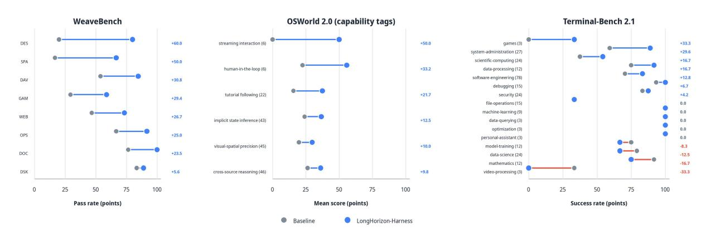

**Figure 6 성능 향상: 작업 유형별**  
LongHorizon-Harness (파란색) is compared with the same-model baseline (회색) across WeaveBench 도메인 (왼쪽), OSWorld 2.0 기능 태그 (중간), and Terminal-Bench 2.1 카테고리 (오른쪽). The 가장 오른쪽 열 of each panel reports the 절대 성능 변화(포인트). 파란색 연결선은 개선을, 빨간색 연결선은 악화를 나타낸다. (괄호 안의 값은 각 범주별 OSWorld 작업 수 또는 Terminal-Bench 트래젝터리 수를 보고한다.)

*작업 종속 효과성.* Fig. [6]은 LongHorizon-Harness의 작업 유형별 성과 향상을 비교한다. WeaveBench에서 Design과 Spatial/3D는 각각 60.0점과 50.0점의 PassRate 향상을 보이며, 이미 베이스라인에서 83.3%를 달성한 Desktop 도메인은 5.6점 향상을 보인다. OSWorld 2.0에서는 스트리밍 상호작용, 인간-인-더-루프, 튜토리얼-팔로잉 작업에서 가장 큰 향상이 나타난다. Terminal-Bench 2.1에서는 시스템-관리 및 게임 작업이 크게 향상되며, 몇몇 짧은 분석 범주에서는 작은 향상 또는 악화가 보인다. 서로 다른 인터페이스를 통해 운영되더라도, 더 큰 향상을 보이는 범주들은 일반적으로 에이전트가 장기간 트래젝터리에서 여러 종속 환경 상태를 보존, 검사, 수정하도록 요구한다. 몇몇 분석 범주에서의 작은 향상은 LongHorizon-Harness가 시각 인식, 수학적 추론, 코딩, 알고리즘 설계와 같은 개별 모델 능력이 주도하는 작업 성능에 덜 이득을 주는 것을 시사한다. 독립적인 감사는 잘못된 결과를 감지하고 복구를 시작할 수 있지만, 모델이 보유하지 않은 능력을 제공할 수는 없다. 따라서 LongHorizon-Harness의 효과성은 작업이 GUI를 사용하는지 CLI를 사용하는지보다, 주요 병목이 장기 실행 신뢰성에 있는지 아니면 개별 단계 해결에 있는지에 따라 달라진다.

*에이전트 역량은 시스템 속성이다.*

Table [4](#page-10-0)는 Claude Opus 4.7과 Qwen 3.7-Plus를 사용하여 동일한 17개의 WeaveBench Games 작업에서 Claude Code 베이스라인과 LongHorizon-Harness를 비교한다. LongHorizon-Harness는 Opus의 평균 점수를 0.680에서 0.809로, Qwen의 평균 점수를 0.524에서 0.733으로 향상시켰으며, 가장 큰 성과는 해당 베이스라인이 부진한 작업에 집중된다. Qwen 베이스라인이 0.04 이하의 점수를 기록한 모든 6개의 작업은 0.30에서 0.92 사이의 점수로 회복되며, 이는 프레임워크가 부정적인 결과를 초래할 수 있는 궤적을 회복함으로써 실패 기준을 주로 끌어올린다는 것을 보여준다. LongHorizon-Harness를 적용한 Qwen은 평균 점수 0.733에 도달하며, 이는 베이스 Claude Code harness를 사용한 Opus가 얻은 0.680을 초과한다. 이 비교는 에이전트 역량이 완전한 모델–하네스 시스템의 속성임을 보여준다. 모델은 각 실행 라운드에서 사용 가능한 행동과 솔루션을 결정하고, 하네스는 이러한 지역적 역량이 얼마나 신뢰성 있게 분해, 검증, 회복, 그리고 종합되어 엔드투엔드 작업 완료에 이르는지를 결정한다. 더 강력한 하네스는 고정된 모델에서 달성 가능한 작업 수준 성능을 높일 수 있다. 이는 모델에 새로운 기본 역량을 추가하지 않더라도 가능하다. 토큰 결과는 두 구성요소 모두에 동일한 의존성을 보여준다: LongHorizon-Harness는 Qwen의 평균 토큰 소비를 작업당 10.7M에서 34.3M으로 증가시키지만, Opus의 소비를 감소시킨다.

**표 4( Table 4) WeaveBench Games 하위 집합의 작업별 점수 및 토큰 소비** (17 tasks). CC = Claude Code; LH = LongHorizon-Harness가 Claude Code를 백엔드로 감싸는 구조. Tok은 작업당 총 토큰 수(M)를 나타낸다. **Bold**는 각 백본별로 더 나은 점수를 표시한다.

|  | Claude Opus 4.7 |  |  | Qwen 3.7-Plus |  |  |  |  |  |
|-------------------------|-----------------|-------|------|---------------|-------|-------|------|---------|--|
|  |  | 점수 |  | 토큰 (M) |  | 점수 |  | 토큰 (M) |  |
| 작업 | CC | LH | CC | LH | CC | LH | CC | LH |  |
| mines_solve | 0.958 | 0.920 | 8.8 | 4.9 | 0.040 | 0.590 | 6.0 | 97.2 |  |
| game_ui_bug | 0.830 | 0.910 | 11.7 | 8.3 | 0.750 | 0.850 | 10.0 | 34.2 |  |
| stockfish_puzzle | 0.603 | 0.550 | 7.5 | 3.4 | 0.000 | 0.550 | 0.9 | 15.2 |  |
| gdb_pygame_cheat | 0.920 | 0.950 | 33.9 | 5.6 | 0.720 | 0.860 | 5.9 | 13.9 |  |
| mines_visual | 0.800 | 0.860 | 29.1 | 4.3 | 0.000 | 0.470 | 3.7 | 50.1 |  |
| quadrapassel_autoplay | 0.600 | 0.870 | 50.5 | 13.4 | 0.000 | 0.300 | 10.0 | 59.1 |  |
| pokerth_equity_play | 0.050 | 0.400 | 4.6 | 23.1 | 0.000 | 0.920 | 9.0 | 16.2 |  |
| sokoban_solver | 0.990 | 0.950 | 4.4 | 3.3 | 0.960 | 0.958 | 3.9 | 4.2 |  |
| rhythm_autoplay | 0.880 | 0.900 | 10.5 | 6.9 | 0.950 | 0.830 | 8.5 | 19.6 |  |
| gnuchess_blunder_hunt | 0.720 | 0.920 | 20.1 | 14.0 | 0.830 | 0.940 | 19.5 | 21.4 |  |
| anagramarama_word_grid | 0.550 | 0.750 | 6.6 | 18.3 | 0.750 | 0.830 | 12.8 | 12.5 |  |
| godot_scene_debug | 0.958 | 0.920 | 11.4 | 7.8 | 0.930 | 0.870 | 8.6 | 17.1 |  |
| hedgewars_mission_debug | 0.790 | 0.810 | 19.6 | 8.5 | 0.740 | 0.830 | 14.4 | 13.1 |  |
| supertux_level_repair | 0.600 | 0.720 | 19.7 | 11.8 | 0.000 | 0.650 | 7.5 | 21.0 |  |
| xmoto_level_repair | 0.600 | 0.550 | 8.1 | 23.4 | 0.920 | 0.850 | 19.4 | 83.3 |  |
| kmahjongg_pair_solver | 0.350 | 0.830 | 8.8 | 13.2 | 0.790 | 0.750 | 30.1 | 35.4 |  |
| pysol_freecell | 0.360 | 0.940 | 24.8 | 18.0 | 0.520 | 0.410 | 12.5 | 68.8 |  |
| Mean | 0.680 | 0.809 | 16.5 | 11.1 | 0.524 | 0.733 | 10.7 | 34.3 |  |

16.5M에서 11.1M으로 감소. 이 반대 패턴은 강력한 모델이 더 적은 감사–재계획 라운드로 하위 과제 계약을 만족시킬 수 있음을 시사하며, 반면 약한 모델은 반복 실행 및 복구에 추가 추론을 소비해야 함을 의미한다. 모델 역량과 하네스 설계는 달성 가능한 성능과 장기 에이전트의 계산 비용을 공동으로 결정한다.

### **3.4 사례 연구 (Case Studies)**

우리는 Claude Code 기반과 LongHorizon-Harness가 동일한 Qwen 3.7-Plus 모델을 사용해 같은 작업을 수행하는 쌍 트래젝터리를 추가로 비교한다. 이 사례들은 Manage-Execute-Audit 루프 하에서 라운드 간에 무엇이 지속되는지를 조사한다. 해결되지 않은 실패와 완료된 진행 상황은 실행 기록 밖으로 옮겨지고, 완료 주장들은 작업 상태에 진입하기 전에 확인되며, 충족되지 않은 종속성은 관리자가 이후 하위 작업을 정의할 때 여전히 사용 가능하다. 예시들은 또한 지속적인 작업 상태가 별개의 새 컨텍스트에서 운영되는 실행자들을 어떻게 연결하는지를 보여준다.

*정지된 상호작용에서 복구.* Fig. [7](#page-12-0)은 동일한 GUI 상호작용이 실패한 후 두 시스템이 어떻게 진행되는지를 비교한다. 기반 모델은 Wireshark "Decode As" 대화상자가 반응하지 않는 것을 인식하지만, 이 관찰은 그가 성장하는 실행 기록에 내재된다. 결과적으로 그는 나머지 작업 증거를 수집하지 않고 400단계 이상 같은 상호작용으로 돌아간다. LongHorizon-Harness는 대신 실패한 상호작용과 해결되지 않은 증거 격차를 작업 상태에 기록한다. 이후 실행자들은 누락된 simulcast-layer 차트와 패킷 수준 증거에 직접 집중하여 점수를 0.59에서 0.92로 높인다. 정지된 상호작용을 외부화함으로써 LongHorizon-Harness는 이미 검증된 진행 상황을 보존하고 다음 실행자에게는 해결되지 않은 요구 사항만을 제공한다. 따라서 복구는 그것을 생성한 실패한 트래젝터리 대신 최신 감사된 작업 상태에서 재개된다.

*명시적 완료 감사.* Fig. [8](#page-12-1)은 실행자가 시각적으로 그럴듯하지만 전체 작업 사양을 만족하지 못하는 결과에서 멈추는 사례를 제시한다. 기반 모델은 문서 XML을 직접 편집하고 제목이 올바르게 보이는 즉시 종료한다. 그러나 작업은 LibreOffice 워크플로우를 통해 스타일이 적용되도록 요구하므로 결과는 0.00점이 부여된다. LongHorizon‑Harness는 지정된 GUI 작업을 수행하고 실행 중에 스타일 변화를 확인하며 문서를 페이지별로 재검사한다. 감사자

그런 다음 문서 XML을 파싱하고 모든 15개의 제목이 필요한 기본 스타일을 갖추었는지 확인하여 0.89점을 부여한다. 이 독립 감사는 실행자의 그럴듯하지만 비준수 완료 주장이 지속적인 작업 상태의 일부가 되는 것을 방지한다. 이후 계획은 실행자의 자체 결과 평가 대신 환경에서 확인된 문서 상태에서 진행될 수 있다.

*수리 전 증거 보존.* Fig. [9](#page-13-0)은 필요한 증거의 일부가 수리 전 환경 상태에 속하는 작업을 제시한다. 기반 모델은 수식 오류의 초기 뷰를 캡처하지만, 전체 수리 전 증거 시퀀스를 완료하기 전에 스프레드시트를 수정한다. 그 직접 XML 편집은 파일을 다시 열 때 수식 오류를 남겨 일관성 없는 전후 기록을 만든다. LongHorizon‑Harness는 누락된 수리 전 증거를 보류 요구 사항으로 기록한다. 다음 실행자는 먼저 이 증거를 완성한 뒤 스프레드시트를 수리하고 결과 수식 셀을 확인한다. 감사자는 이후 9개의 스크린샷 전체 시퀀스를 검토하여 점수를 0.45에서 0.87로 높인다. 수리 전 증거를 명시적으로 보존함으로써 다음 하위 작업이 작업 상태에서 선택되는 방식이 바뀐다: 원본 스프레드시트 상태가 수리가 허용되기 전에 문서화된다. 결과 실행 순서는 상태 전환 전반에 걸쳐 일관된 증거 사슬을 보존한다.

우리는 검증된 진행 상황에서 계속 진행합니다. Fig. [10](#page-13-1)은 모델이 중앙 최적화를 수행할 수 있는 두 개의 경로를 비교하지만, 나머지 워크플로우를 유지하는 방식이 다릅니다. 기본 모델은 대상 페이지를 개선하지만, 동일한 성장 세션은 DevTools를 계속 운영하고, 남은 산출물을 추적하며, 증거를 수집하고, 자체 진행 상황을 평가해야 합니다. DevTools와의 반복 상호작용은 결국 사용 가능한 예산을 소진하여 작업을 완료하지 못합니다. LongHorizon-Harness는 완료된 최적화를 작업 상태에 보관하고, 남은 요구 사항에서 이후 하위 작업을 도출합니다. 새 컨텍스트 실행자는 페이지 상태를 확인하고, 관련 스크립트 구조를 검사하며, 성능 추적을 수집하고, 감사자는 최종 스크린샷을 메타데이터와 비교합니다. 점수는 0.53에서 0.85로 상승합니다. 완료된 최적화가 실행 기록 외부에 지속되기 때문에 이후 실행자는 이전 최적화 과정을 재구성하거나 가져오지 않고 남은 증거에 집중할 수 있습니다. 관리자는 전체 워크플로우에서 연속성을 유지하고, 각 실행자는 현재 환경 전환에 대한 컨텍스트를 사용하여 모델의 로컬 진행 상황을 보다 완전한 작업 결과로 이어갈 수 있습니다.

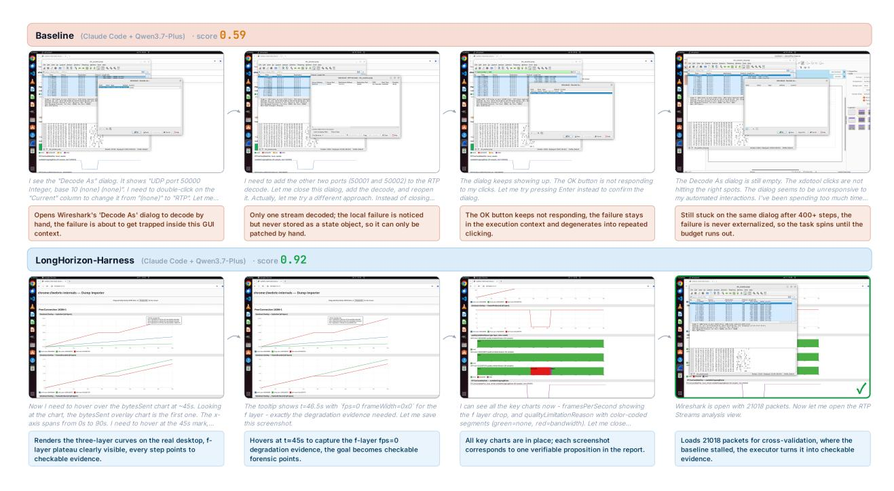

**Figure 7 정지된 상호작용에서 복구**. 사례는 WEB_task_16이며, WebRTC simulcast-layer 감사를 수행합니다. *Top:* Claude Code baseline은 Wireshark의 "Decode As" 대화상자가 반응하지 않음을 인식하지만, 동일한 상호작용을 400단계 이상 재시도하며 0.59의 점수를 얻습니다. *Bottom:* LongHorizon-Harness는 작업 상태에 해결되지 않은 증거 격차를 기록합니다. 이후 실행 라운드에서 누락된 차트 및 패킷 수준 증거를 수집하여 0.92의 점수를 달성합니다.

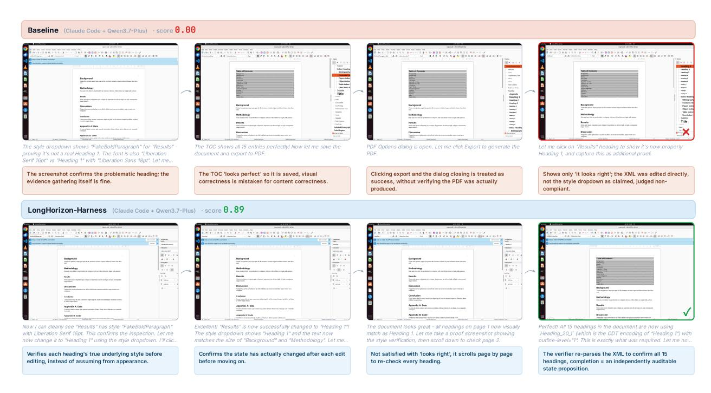

**Figure 8 가시적 완료 감사**. 사례는 DOC_task_2이며, 제목 스타일 정규화를 요구합니다. *Top:* Claude Code baseline은 문서 XML을 직접 편집하고 시각적으로 그럴듯한 결과로 종료합니다. 필요한 LibreOffice 워크플로우가 따르지 않으므로 점수는 0.00입니다. *Bottom:* LongHorizon-Harness는 지정된 GUI 워크플로우를 통해 제목 스타일을 적용하고 문서를 재검토합니다. 감사자는 문서 XML을 파싱하여 15개 제목의 최종 스타일을 확인하고 0.89의 점수를 얻습니다.

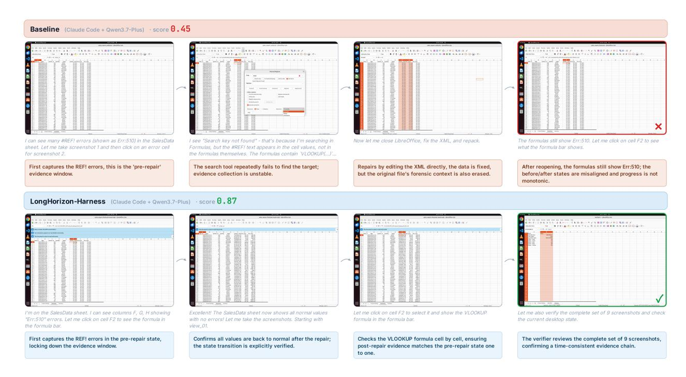

**Figure 9 수리 전 증거 보존**. 사례는 DOC_task_4이며, Calc VLOOKUP 수식을 수리하면서 전후 증거를 보존해야 합니다. *Top:* Claude Code baseline은 초기 수식 오류를 기록하지만, 필요한 수리 전 증거를 완료하기 전에 스프레드시트를 편집하여 최종 파일과 증거 시퀀스가 일관되지 않아 0.45의 점수를 받습니다. *Bottom:* LongHorizon-Harness는 누락된 수리 전 증거를 보류 요구 사항으로 보관하고, 수정 전에 기록한 뒤, 전체 9개의 스크린샷 시퀀스를 감사하여 0.87의 점수를 얻습니다.

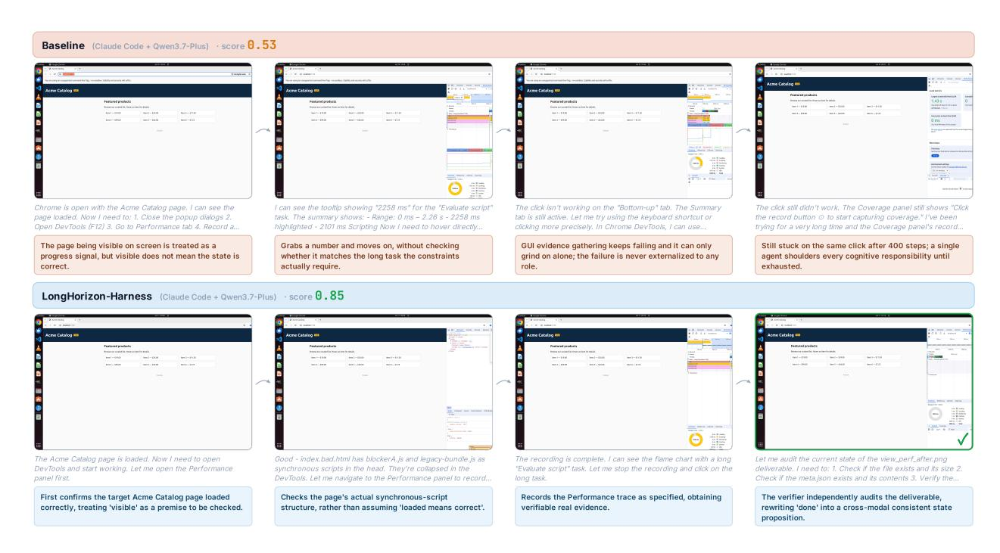

**Figure 10 검증된 진행 상황에서 계속**. WEB_task_10은 Lighthouse 성능 최적화 작업입니다. *Top:* Claude Code baseline은 핵심 최적화를 완료하지만 DevTools 증거 수집 중에 멈추어 모든 요구 산출물을 생성하지 못하고 0.53의 점수를 받습니다. *Bottom:* LongHorizon-Harness는 검증된 최적화 상태를 보존하고, 남은 증거 요구 사항을 이후 라운드에 위임하며, 최종 스크린샷과 메타데이터를 감사하여 0.85의 점수를 얻습니다.

## 4 결론 (Conclusion)

본 연구에서는 LongHorizon-Harness를 소개한다. 이 장기 수평 에이전트 실행을 위한 일반 프레임워크는 Manage–Execute–Audit 루프를 통해 작업 상태 관리와 환경 상호작용을 분리한다. LongHorizon-Harness는 진행 상황을 명시적이고 감사된 작업 상태로 유지하며, 각 하위 작업을 새 컨텍스트에서 실행하고, 독립적으로 검증된 결과만을 라운드 간에 전달한다. WeaveBench, OSWorld 2.0, Terminal-Bench 2.1에서의 실험은 하이브리드 GUI–CLI 워크플로우, 전문 데스크톱 작업, 순수 명령줄 환경, 그리고 다양한 모델 백본 전반에 걸쳐 일관된 개선을 보여준다. 이러한 결과는 장기 수평 에이전트 능력이 단지 기반 모델에 의해 결정되는 것이 아니라, 그 로컬 능력을 조직하고 검증하며 엔드투엔드 작업 완수로 변환하는 LongHorizon-Harness에 의해 결정된다는 것을 보여준다.

## **참고문헌** (References)

- Saaket Agashe, Jiuzhou Han, Shuyu Gan, Jiachen Yang, Ang Li, and Xin Eric Wang. Agent S: 인간처럼 컴퓨터를 활용하는 개방형 에이전트 프레임워크. In *The Thirteenth International Conference on Learning Representations*, 2025. <https://arxiv.org/abs/2410.08164>
- Anthropic. Claude 컴퓨터 사용. <https://www.anthropic.com/news/3-5-models-and-computer-use>, 2024. Accessed: 2025-05-03
- Anthropic. Claude 코드. <https://www.anthropic.com/product/claude-code>, 2025. Accessed: 2026-06-22
- Anthropic. Claude 공동작업. <https://www.anthropic.com/product/claude-cowork>, 2026. Accessed: 2026-06-24
- Xiangxiang Chu, Hailang Huang, Xiao Zhang, Fei Wei, and Yong Wang. Gpg: 모델 추론을 위한 단순하고 강력한 강화학습 기초. In *ICLR*, 2026
- Jingzhe Ding, Shengda Long, Changxin Pu, Huan Zhou, Hongwan Gao, Xiang Gao, Chao He, Yue Hou, Fei Hu, Zhaojian Li, et al. Nl2repo-bench: 코딩 에이전트의 장기 리포지토리 생성 평가를 향해. *arXiv preprint arXiv:2512.12730*, 2025
- Guanting Dong, Xiaoshuai Song, Yuyang Hu, Jiajie Jin, Chenghao Zhang, Yifei Chen, Xiaoxi Li, Huaying Yuan, Xinyu Yang, Tongyu Wen, Jiejun Tan, Hongjin Qian, Shijue Huang, Junting Lu, Zhenyu Li, Wanjun Zhong, Yutao Zhu, Tat-Seng Chua, Zhicheng Dou, and Ji-Rong Wen. 장기 리포지토리 에이전트: 설문조사. *Preprints*, 2026년 7월. doi: 10.20944/preprints202607.1328.v1. <https://doi.org/10.20944/preprints202607.1328.v1>
- Google DeepMind. Gemini 2.5 컴퓨터 사용 모델 소개. [https://blog.google/innovation-and-ai/mo](https://blog.google/innovation-and-ai/models-and-research/google-deepmind/gemini-computer-use-model/) [dels-and-research/google-deepmind/gemini-computer-use-model/](https://blog.google/innovation-and-ai/models-and-research/google-deepmind/gemini-computer-use-model/), 2025. Accessed: 2026-06-22
- Kelly Hong, Anton Troynikov, and Jeff Huber. Context rot: 입력 토큰이 증가할 때 LLM 성능에 미치는 영향. <https://research.trychroma.com/context-rot>, 2025
- Yuxiang Ji, Ziyu Ma, Yong Wang, Guanhua Chen, Xiangxiang Chu, and Liaoni Wu. LLM 에이전트 강화학습을 위한 트리 탐색. *arXiv preprint arXiv:2509.21240*, 2025
- Thomas Kwa, Ben West, Joel Becker, Amy Deng, Katharyn Garcia, Max Hasin, Sami Jawhar, Megan Kinniment, Nate Rush, Sydney Von Arx, et al. 장기 소프트웨어 작업을 완료하는 AI 능력 측정, 2026. [https://arxiv.org/abs/2503.14499](https://arxiv.org/abs/2503.14499) [g/abs/2503.14499](https://arxiv.org/abs/2503.14499)
- Renda Li, Hailang Huang, Fei Wei, Feng Xiong, Yong Wang, and Xiangxiang Chu. Adacurl: 유효하지 않은 샘플 완화 및 과거 재방문을 통한 적응형 커리큘럼 강화학습. *arXiv preprint arXiv:2511.09478*, 2025
- Wanli Li, Bowen Zhou, Yunyao Yu, Zhou Xu, Yifan Yang, Dongsheng Li, and Caihua Shan. WeaveBench: 하이브리드 인터페이스를 갖춘 컴퓨터 사용 에이전트를 위한 장기 리포지토리, 실세계 벤치마크, 2026. <https://arxiv.org/abs/2606.09426>
- Nelson F. Liu, Kevin Lin, John Hewitt, Ashwin Paranjape, Michele Bevilacqua, Fabio Petroni, and Percy Liang. 중간에서 길을 잃다: 언어 모델이 장기 컨텍스트를 사용하는 방식. *Transactions of the Association for Computational Linguistics*, 12:157–173, 2024. doi: 10.1162/tacl_a_00638
- Ziyu Ma, Shidong Yang, Yuxiang Ji, Xucong Wang, Yong Wang, Yiming Hu, Tongwen Huang, and Xiangxiang Chu. Skillclaw: 에이전트 진화기를 사용해 기술을 집단적으로 진화시키다. *arXiv preprint arXiv:2604.08377*, 2026
- Mike A. Merrill, Alexander G. Shaw, Nicholas Carlini, Boxuan Li, Harsh Raj, Ivan Bercovich, et al. Terminal-Bench: 명령줄 인터페이스에서 어려운 현실적인 과제에 대한 에이전트 벤치마킹, 2026. <https://arxiv.org/abs/2601.11868>
- Nous Research. Hermes 에이전트 CLI. <https://hermes-agent.ai/tools/hermes-agent-cli>, 2026. Accessed: 2026-05-05
- OpenAI. Codex 소개. <https://openai.com/index/introducing-codex/>, 2025년 5월 a. Accessed: 2026-05-07
- OpenAI. ChatGPT 에이전트 소개: 연구와 행동을 연결하다. [https://openai.com/index/introducing-cha](https://openai.com/index/introducing-chatgpt-agent/) [tgpt-agent/](https://openai.com/index/introducing-chatgpt-agent/), 2025년 7월 b. Accessed: 2026-05-07
- OpenAI. Operator. <https://openai.com/research/operator>, 2025c. Accessed: 2025-05-03
- OpenClaw Contributors. OpenClaw: 오픈소스 자율 AI 에이전트 플랫폼. <https://openclaw.ai/>, 2026. Accessed: 2026-06-22

- Qingnan Ren, Shun Zou, Shiting Huang, Ziao Zhang, Kou Shi, Zhen Fang, Yiming Zhao, Yu Zeng, Qisheng Su, Lin Chen, et al. Saasbench: 장기적 기업 SaaS 엔지니어링에서 코딩 에이전트의 한계를 탐구한다. (Saasbench: Exploring the boundaries of coding agents in long-horizon enterprise saas engineering.) *arXiv preprint arXiv:2605.17526*, 2026.
- Pascal J Sager, Benjamin Meyer, Peng Yan, Rebekka von Wartburg-Kottler, Layan Etaiwi, Aref Enayati, Gabriel Nobel, Ahmed Abdulkadir, Benjamin F Grewe, and Thilo Stadelmann. 컴퓨터 사용을 위한 에이전트에 대한 종합적인 조사: 기초, 도전 과제, 그리고 미래 방향. (A comprehensive survey of agents for computer use: Foundations, challenges, and future directions.) *인공지능 연구 저널* (Journal of Artificial Intelligence Research), 85, 2026.
- Qiushi Sun, Zhoumianze Liu, Chang Ma, Zichen Ding, Fangzhi Xu, Zhangyue Yin, Haiteng Zhao, Zhenyu Wu, Kanzhi Cheng, Zhaoyang Liu, et al. ScienceBoard: 현실적인 과학 워크플로우에서 다중 모달 자율 에이전트를 평가한다. (ScienceBoard: Evaluating multimodal autonomous agents in realistic scientific workflows,) 2025. <https://arxiv.org/abs/2505.19897>
- Yiyou Sun, Xinyang Han, Weichen Zhang, Yuanbo Pang, Tianyu Wang, Yuhan Cao, Yixiao Huang, et al. 에이전트의 마지막 시험. (Agents' Last Exam,) 2026. <https://arxiv.org/abs/2606.05405>
- Xingyao Wang, Boxuan Li, Yufan Song, Frank F. Xu, Xiangru Tang, Mingchen Zhuge, Jiayi Pan, Yueqi Song, Bowen Li, Jaskirat Singh, Hoang H. Tran, Fuqiang Li, Ren Ma, Mingzhang Zheng, Bill Qian, Yanjun Shao, Niklas Muennighoff, Yizhe Zhang, Binyuan Hui, Junyang Lin, Robert Brennan, Hao Peng, Heng Ji, and Graham Neubig. OpenHands: AI 소프트웨어 개발자를 범용 에이전트로서 지원하는 오픈 플랫폼. (OpenHands: An open platform for AI software developers as generalist agents.) In *제13회 국제 학습 표현 회의* (The Thirteenth International Conference on Learning Representations), 2025. <https://arxiv.org/abs/2407.16741>
- Jiaqi Wei, Yuejin Yang, Xiang Zhang, Yuhan Chen, Xiang Zhuang, Zhangyang Gao, Dongzhan Zhou, Guangshuai Wang, Zhiqiang Gao, Juntai Cao, et al. 과학을 위한 AI에서 에이전트 과학으로: 자율 과학적 발견에 대한 조사. (From ai for science to agentic science: A survey on autonomous scientific discovery,) *arXiv preprint arXiv:2508.14111*, 2025a.
- Yuxiang Wei, Olivier Duchenne, Jade Copet, Quentin Carbonneaux, Lingming Zhang, Daniel Fried, Gabriel Synnaeve, Rishabh Singh, and Sida I. Wang. SWE-RL: 개방형 소프트웨어 진화에서 강화 학습을 통한 LLM 추론 향상. (SWE-RL: Advancing LLM reasoning via reinforcement learning on open software evolution,) 2025b. <https://arxiv.org/abs/2502.18449>
- John Yang, Carlos E. Jimenez, Alexander Wettig, Kilian Lieret, Shunyu Yao, Karthik Narasimhan, and Ofir Press. SWE-agent: 에이전트-컴퓨터 인터페이스가 자동화된 소프트웨어 엔지니어링을 가능하게 한다. (SWE-agent: Agent-computer interfaces enable automated software engineering,) 2024. [https://arxiv.org/abs/24](https://arxiv.org/abs/2405.15793) [05.15793](https://arxiv.org/abs/2405.15793)
- John Yang, Kilian Lieret, Jeffrey Ma, Parth Thakkar, Dmitrii Pedchenko, Sten Sootla, Emily McMilin, Pengcheng Yin, Rui Hou, Gabriel Synnaeve, et al. Programbench: 언어 모델이 프로그램을 처음부터 재구성할 수 있는가. (Programbench: Can language models rebuild programs from scratch,) *arXiv preprint arXiv:2605.03546*, 2026a.
- Shidong Yang, Ziyu Ma, Tongwen Huang, Yiming Hu, Yong Wang, and Xiangxiang Chu. Coevolve: 에이전트-데이터 상호 진화를 통한 LLM 에이전트 훈련. (Coevolve: Training llm agents via agent-data mutual evolution,) In *컴퓨터 언어학 협회 연례 회의 64회 (Volume 1: Long Papers)* (Proceedings of the 64th Annual Meeting of the Association for Computational Linguistics (Volume 1: Long Papers)), pages 23015–23036, 2026b.
- Shunyu Yao, Jeffrey Zhao, Dian Yu, Nan Du, Izhak Shafran, Karthik Narasimhan, and Yuan Cao. ReAct: 언어 모델에서 추론과 행동을 시너지화. (ReAct: Synergizing reasoning and acting in language models,) In *국제 학습 표현 회의 (ICLR)* (International Conference on Learning Representations (ICLR)), 2023.
- Mengqi Yuan, Zilong Zhou, Xinzhuang Xiong, Weiming Wu, Jiayang Sun, Jiamin Song, Kaiqian Cui, Tianbao Xie, Bowen Wang, Haoyuan Wu, Yitong Li, Dunjie Lu, Haikong Lu, Qi Zhen, Xinyuan Wang, Tao Yu, et al. OSWorld 2.0: 장기적 실제 세계 과제에서 컴퓨터 사용 에이전트를 벤치마킹. (OSWorld 2.0: Benchmarking computer use agents on long-horizon real-world tasks,) 2026. <https://arxiv.org/abs/2606.29537>
- Chi Zhang, Zhao Yang, Jiaxuan Liu, Yucheng Han, Xin Chen, Zebiao Huang, Bin Fu, and Gang Yu. AppAgent: 스마트폰 사용자로서의 다중 모달 에이전트. (AppAgent: Multimodal agents as smartphone users,) 2023. <https://arxiv.org/abs/2312.13771>
- Lianmin Zheng, Wei-Lin Chiang, Ying Sheng, Siyuan Zhuang, Zhanghao Wu, Yonghao Zhuang, Zi Lin, Zhuohan Li, Dacheng Li, Eric P. Xing, Hao Zhang, Joseph E. Gonzalez, and Ion Stoica. LLM-as-a-Judge를 MT-Bench와 Chatbot Arena로 평가. (Judging LLM-as-a-Judge with MT-Bench and Chatbot Arena) In *신경 정보 처리 시스템의 진보 (Advances in Neural Information Processing Systems)* (Advances in Neural Information Processing Systems), 2023.
- Yuhao Zheng, Li'an Zhong, Yi Wang, Rui Dai, Kaikui Liu, Xiangxiang Chu, Linyuan Lv, Philip Torr, and Kevin Qinghong Lin. Code2world: 렌더 가능한 코드 생성을 통한 GUI 세계 모델. (Code2world: A gui world model via renderable code generation,) *arXiv preprint arXiv:2602.09856*, 2026.
- Jiamu Zhou, Jihong Wang, Weiming Zhang, Weiwen Liu, Zhuosheng Zhang, Xingyu Lou, Weinan Zhang, Huarong Deng, and Jun Wang. Colorbrowseragent: 복잡한 장기적 웹 자동화를 위한 지능형 GUI 에이전트. (Colorbrowseragent: An intelligent gui agent for complex long-horizon web automation,) *arXiv preprint arXiv:2601.07262*, 2026.
- Mingchen Zhuge, Changsheng Zhao, Dylan R. Ashley, Wenyi Wang, Dmitrii Khizbullin, Yunyang Xiong, Zechun Liu, Ernie Chang, Raghuraman Krishnamoorthi, Yuandong Tian, Yangyang Shi, Vikas Chandra, and Jürgen Schmidhuber. Agent-as-a-Judge: 에이전트와 함께 에이전트를 평가한다. (Agent-as-a-Judge: Evaluate agents with agents,) 2024. <https://arxiv.org/abs/2410.10934>

### **A Detailed Experimental Setup (상세 실험 설정)**

### **A.1 WeaveBench (WeaveBench)**

WeaveBench [(Li et al.,](#page-15-19) [2026)](#page-15-19)은 데스크톱 애플리케이션, 문서 처리, 게임, 웹 개발, 데이터 분석 및 시각화, DevOps, 공간/3D 애플리케이션, 디자인 등 여덟 개 도메인에 걸친 114개의 장기 수평 컴퓨터 사용 과제를 포함한다. 각 과제는 에이전트가 같은 워크플로우 내에서 GUI와 CLI 상호작용을 모두 사용하도록 요구하며, 명령줄이나 브라우저 작업만에 의존하지 않는다. 우리는 표준 WeaveBench 평가 프로토콜을 따른다: 각 과제는 격리된 컨테이너화된 Ubuntu 데스크톱 VM에서 실행되며, 과제 실행은 런타임 상태를 공유하지 않는다. 과제 정의, 작업 공간, 런타임 자산, 심사 템플릿, 점수 매기기 절차는 모두 공식 릴리스에서 가져온다. 평가자는 Claude Opus 4.7을 트레젝터리 인식 심사자로 사용한다. 우리는 두 개의 집계 지표를 보고한다: PassRate(점수가 0.8 이상인 과제 비율)와 Overall(114개 과제의 평균 점수). 집계 결과 외에도, 우리는 여덟 도메인별 PassRate를 보고한다: 데스크톱 애플리케이션(DSK), 문서 처리(DOC), 게임(GAM), 웹 개발(WEB), 데이터 분석 및 시각화(DAV), DevOps(OPS), 공간/3D 애플리케이션(SPA), 디자인(DES).

모델 및 실행 프레임워크에 대해 Qwen 3.7-Plus를 평가한다. Claude Code 런타임 버전은 claude-code 2.1.76이다. 각 작업은 최대 25개의 Manage-Execute-Audit 라운드를 허용한다. 라운드당 타임아웃은 실행자에게 1800초, 관리자와 검증자에게 각각 300초이다. 작업 측에서 Claude Code 추론 노력은 높게 설정되며, 판정자는 OpenClaw로 실행되고 AJ_THINKING=medium으로 설정된다.

GUI 도구의 경우, 우리는 기본 WeaveBench 컴퓨터 사용 인터페이스를 보존하며, 스크린샷 인식 도구와 pyautogui로 구현된 데스크톱 실행 도구(클릭, 더블클릭, 마우스 이동, 키보드 입력, 스크롤, 드래그, 대기)를 포함한다. 또한, 제한된 증거 보존 도구인 save_screenshot를 도입한다. 이 도구는 새로운 환경 제어 기능을 제공하지 않으며, 에이전트에게 추가 정보를 노출하지 않는다; 오직 현재 보이는 실제 데스크톱 화면을 대상 디렉터리에 공식 스크린샷 아티팩트로 저장할 수 있다.

본 연구에서는 GUI 작업이 자주 스크린샷 입력을 제공하므로 시각 입력을 위해 이미지 URL 프록시를 사용한다. 스크린샷은 이미지 호스팅 백엔드에 업로드되고 모델 요청에서 이미지 URL로 참조되어, 여러 base64 인코딩된 스크린샷으로 인한 과다한 요청 본문을 방지한다.

#### **A.2 OSWorld 2.0 (OSWorld 2.0)**

OSWorld 2.0 [(Yuan et al.,](#page-16-16) [2026)](#page-16-16)은 108개의 전문 데스크톱 워크플로우 과제로 구성되며, 인간의 평균 완료 시간은 약 1.6시간이다. 우리는 공식 OSWorld-v2 osworld-v2-2026.06.24 릴리스를 사용한다. 이 릴리스에는 해당 과제 정의, 과제 자산, Docker VM 이미지, 그리고 가짜 웹사이트가 포함된다. 실험은 Ubuntu 데스크톱 환경에서 표준 OSWorld Docker 기반 VM 인프라를 사용해 수행되며, 기본 해상도는 1920 × 1080이다. 최종 점수는 네이티브 OSWorld env.evaluate() 절차에 의해 수행된다.

주요 공식 기준선과 달리, LongHorizon-Harness는 OSWorld-v2에서 하이브리드 도구 풀을 사용한다. GUI 액션은 VM 내부의 컴퓨터 MCP 서버에서 실행되어 클릭, 입력, 드래그, 단축키와 같은 데스크톱 작업을 지원한다. CLI 역할은 동일한 VM에서 파일 시스템 검사, 스크립트 실행, 장기 컨텍스트 작업 처리를 위해 쉘 명령을 실행할 수 있다. 이러한 도구는 claude-code 2.1.176의 고정 버전을 통해 VM 내부에 호스팅된다.

모델 추론을 위해 우리는 thinking.type=enabled, max_tokens=65,536, 그리고 effort=max를 설정한다. 네이티브 OSWorld 평가자와 사용자 시뮬레이터는 실행 에이전트와 동일한 qwen3.7-plus 구성을 사용한다. 벤치마크에서 사용자 정보나 권한이 필요한 인간-인-더-루프 작업에 대해 우리는 수동 개입을 도입하지 않는다; 대신 네이티브 OSWorld 사용자 시뮬레이터 인터페이스를 사용해 응답을 제공한다.

우리는 두 가지 지표를 보고한다: Binary Accuracy와 Partial Accuracy. Binary Accuracy는 최종 점수가 1인 경우에만 작업을 성공으로 간주하며, Partial Accuracy는 모든 108개 작업에 대한 세부 점수의 평균으로, 부분 작업 완료를 측정한다.

**Table 5** OSWorld 2.0 Opus 4.7 하위 집합에 대한 세부 작업별 결과. Ours는 LongHorizon-Harness를 나타낸다.

| 작업 | 기준선 | 우리 | 작업 | 기준선 | 우리 |
|------|----------|--------|------|----------|--------|
| 001 | 0.7778 | 1.0000 | 018 | 0.0000 | 0.0000 |
| 002 | 0.7500 | 1.0000 | 019 | 0.5200 | 0.7600 |
| 003 | 1.0000 | 1.0000 | 020 | 0.1000 | 1.0000 |
| 004 | 0.8000 | 0.7667 | 021 | 1.0000 | 0.0000 |
| 005 | 0.0000 | 1.0000 | 022 | 1.0000 | 1.0000 |
| 006 | 0.5556 | 0.8889 | 023 | 0.9300 | 0.9300 |
| 007 | 0.4000 | 0.8000 | 025 | 0.2401 | 0.0833 |
| 010 | 1.0000 | 1.0000 | 027 | 0.5000 | 0.0000 |
| 011 | 0.2963 | 0.5556 | 028 | 0.4000 | 1.0000 |
| 012 | 0.6000 | 1.0000 | 030 | 1.0000 | 0.0000 |
| 013 | 1.0000 | 0.7500 | 032 | 0.9111 | 0.2000 |
| 014 | 0.9000 | 0.7400 | 033 | 0.1000 | 1.0000 |
| 015 | 0.2840 | 0.7667 | 034 | 0.5938 | 0.8750 |
| 016 | 0.8571 | 0.7524 | 051 | 0.0000 | 0.6000 |
| 017 | 0.1429 | 0.0000 | 052 | 1.0000 | 1.0000 |
| 060 | 0.1000 | 0.1000 | 054 | 0.3628 | 1.0000 |
| 061 | 0.3574 | 0.3891 | 062 | 0.5033 | 0.7753 |

### **A.3 Terminal-Bench 2.1**

Terminal-Bench 2.1 [(Merrill et al.,](#page-15-20) [2026)](#page-15-20) 은 도전적이고 현실적인 소프트웨어 엔지니어링 및 명령줄 작업에서 에이전트를 평가하도록 설계되었다. Harbor를 평가 프레임워크로 사용하며, Docker 백엔드는 각 작업에 대해 격리된 실행 환경을 제공한다. 평가 중에는 각 작업에 원래 정의된 CPU, 메모리, 환경 제약 조건을 보존한다.

기존 Qwen 시리즈 모델 평가와의 일관성을 확보하기 위해, 베이스라인과 CUA-Harness 설정 모두 Claude Code를 기본 CLI 실행 에이전트로 사용하며 qwen3.7-plus 모델에 연결한다. Claude Code 버전은 v2.1.211이다. Claude Code 명령줄 인터페이스가 모든 저수준 요청 매개변수를 직접 노출하지 않으므로, 컨테이너 내부에 투명한 요청 프록시를 도입한다. 모든 모델 요청은 temperature=1.0, top_p=0.95, top_k=20, enable_thinking=true, max_tokens=65,536으로 구성된다.

각 시도는 5시간의 타임아웃을 갖는다. 우리는 각 작업마다 세 번의 독립적인 시도를 수행하고, 각 작업에 대해 세 실행의 평균 점수를 보고하며, 동일한 모델 설정에서 Claude Code 베이스라인과 공식 리더보드 결과를 비교한다.

## **B Detailed Experimental Results**

### **B.1 Detailed Results on the OSWorld 2.0 Opus 4.7 Subset**

Table [5](#page-18-0)은 34개 작업으로 구성된 OSWorld 2.0 Opus 4.7 하위 집합의 작업별 점수를 보고한다. 베이스라인은 표준 단일-행동 GUI 설정을 사용하고, LongHorizon-Harness는 하이브리드 GUI+CLI 도구 풀을 사용한다. 이 하위 집합에서 LongHorizon-Harness는 부분 점수를 55*.*83%에서 66*.*86%로, 이진 정확도를 20*.*6%에서 35*.*3%로 개선한다.

## **B.2 Fine-Grained Breakdown by Benchmark and Task Type**

위에서 보고된 Opus 4.7 하위 집합을 넘어, 우리는 벤치마크, 도메인, 작업 속성 및 실패 모드별로 주요 평가 결과를 세분화한 분석을 제공한다. 표에서는 LongHorizon-Harness를 LH-Harness로 축약하여 사용한다. 이 분석의 목적은 집약적 이득만 보고하는 대신, 하니스가 실행 역학을 어떻게 변화시키는지를 식별하는 데 있다. 벤치마크 전반에서 가장 큰 개선은 진행 상황이 검증 가능한 환경 상태(설치된 바이너리, 저장소 상태 등)로 표현될 수 있을 때 나타난다.

**Table 6** WeaveBench 도메인 수준 결과. Score ∆는 LH-Harness에서 베이스라인을 뺀 값이다. Pass-rate 개선은 퍼센트 포인트 단위로 보고된다.

| 도메인 | 기준선 | LH-Harness | 점수 ∆ | 통과율 ∆ |
|------------|------------------|------------------|--------------------|------------------------|
| DES | 0.5630 | 0.8160 | +0.2530 | +60.00 pp |
| SPA GAM | 0.5800 0.5235 | 0.8192 0.7328 | +0.2392 +0.2093 | +50.00 pp +29.41 pp |
| DAV | 0.6981 | 0.8608 | +0.1627 | +30.77 pp |
| OPS | 0.7758 | 0.9090 | +0.1332 | +25.00 pp |
| DOC | 0.8009 | 0.8929 | +0.0920 | +23.53 pp |
| WEB DSK | 0.7287 0.8671 | 0.8147 0.8465 | +0.0860 -0.0205 | +26.67 pp +5.56 pp |

**Table 7** WeaveBench Games 과제에 대한 세부 결과. 과제 이름은 공통 접두사 GAM_task_*를 생략하여 간결하게 표시한다.

| 작업 | 기준선 | LH-Harness | 작업 | 기준선 | LH-Harness |
|---------------------------------------------------------------------------------------------------------------------------------------------------------------------|----------------------------------------------------------------------|----------------------------------------------------------------------|-------------------------------------------------------------------------------------------------------------------------------------------------------------------------------------------------------------------------------------------------|-------------------------------------------------------------------------------|-------------------------------------------------------------------------------|
| gnome_mines_solve game_ui_bug stockfish_puzzle_analysis gdb_pygame_cheat mines_visual quadrapassel_autoplay pokerth_equity_play sokoban_solver | 0.040 0.750 0.000 0.720 0.000 0.000 0.000 0.960 | 0.590 0.850 0.550 0.860 0.470 0.300 0.920 0.958 | rhythm_autoplay gnuchess_pgn_blunder_hunt anagramarama_word_grid godot_scene_node_debug hedgewars_lua_mission_debug supertux_level_repair_play xmoto_level_xml_repair_ride kmahjongg_pair_solver pysol_freecell_fcsolve | 0.950 0.830 0.750 0.930 0.740 0.000 0.920 0.790 0.520 | 0.830 0.940 0.830 0.870 0.830 0.650 0.850 0.750 0.410 |

정확히 정의된 메타데이터, 애플리케이션 구성, 구조화된 파일, 또는 다중 인터페이스에서 교차 검증된 증거를 포함한 스크린샷. 나머지 실패는 사용 가능한 검증기에서 결정적 조건을 닫기 어려운 작업에 집중된다. 예를 들어, 숨겨진 성능 임계값, 구현된 시각적 정밀도, 시간적 비디오 증거, 또는 여러 가지 합리적 해석을 허용하는 작업 의미론과 같은 경우.

#### **B.2.1 WeaveBench (WeaveBench)**

Table [6](#page-19-0)는 WeaveBench의 도메인 수준 분류를 보고한다. LH-Harness는 8개 도메인 중 7개에서 평균 점수를 향상시키며, 가장 큰 향상은 Design (DES), Spatial/3D Applications (SPA), 그리고 Games (GAM)에서 나타난다. 통과율도 모든 도메인에서 증가하며, Desktop (DSK)에서는 평균 점수가 약간 감소하지만 통과율이 높아진다. 이 패턴은 하네스가 주로 장기 경로의 하위 꼬리를 상승시킨다는 것을 나타낸다: 많은 근접 실패를 부분적 또는 완전한 성공으로 전환하며, 이미 강력한 일부 기본 경로는 추가 검증 및 수리 단계에 의해 영향을 받을 수 있다.

Games 도메인은 시각적 상호작용, 기호적 상태, 탐색, 그리고 환경별 제약을 결합하기 때문에 유용한 스트레스 테스트를 제공한다. Table [7](#page-19-1)는 기본 모델이 안정적인 상태 표현을 구축하는 데 자주 실패하는 작업에서 가장 큰 향상이 발생함을 보여준다. 예를 들어, Mines, Stockfish puzzle analysis, Quadrapassel autoplay, PokerTH equity play, 그리고 SuperTux level repair는 모두 거의 0 또는 0인 기본 점수에서 의미 있는 완수로 향상된다. 이러한 경우, 하네스는 작업을 명시적 하위 목표로 분해하고 장기 상호작용 기록 대신 검증된 사실을 전달함으로써 도움을 준다. 반대로, 기본 모델이 이미 핵심 작업을 해결한 경우 추가 라운드는 덜 유익하며, rhythm autoplay, X-Moto, KMahjongg, 그리고 FreeCell과 같이 점수를 약간 낮출 수도 있다.

#### **B.2.2 OSWorld 2.0 (OSWorld 2.0)**

Table [8](#page-20-0)는 OSWorld 2.0의 기능 태그별 분류를 보고한다. 태그는 상호 배타적이지 않으므로, 하나의 작업이 여러 행에 기여할 수 있다. LH-Harness는 여섯 개의 태그 그룹 모두를 향상시키지만, 규모와 잔여 실패 모드는 상당히 다르다. 가장 큰 향상은 스트리밍 상호작용 작업에서 나타나며, 기본 점수가 0이고 LH-Harness는 평균 0.500에 도달한다. Human-in-the-loop 작업도 크게 향상되며, 하네스가 사용자 제공 정보를 지속적인 상태 제약으로 변환함으로써 이득을 본다. Tutorial-following 작업은 기호적 지시가 종종 제한된 하위 작업으로 분해될 수 있기 때문에 향상된다.

**Table 8** OSWorld 2.0 결과는 기능 태그별로 나타난다. 태그는 겹친다. "Zero"와 "Full"은 LH‑Harness가 각각 0 또는 1의 점수를 얻는 태그 그룹에서 작업 수를 세는 것이다.

| Tag | n | Baseline | LH-Harness | ∆ | Zero | Full |
|--------------------------|----|----------|------------|--------|------|------|
| streaming_interaction | 6 | 0.000 | 0.500 | +0.500 | 3 | 3 |
| human_in_the_loop | 6 | 0.225 | 0.557 | +0.332 | 1 | 0 |
| tutorial_following | 22 | 0.157 | 0.374 | +0.217 | 7 | 2 |
| implicit_state_inference | 43 | 0.241 | 0.366 | +0.125 | 15 | 6 |
| visual_spatial_precision | 45 | 0.198 | 0.298 | +0.100 | 14 | 4 |
| cross_source_reasoning | 46 | 0.263 | 0.361 | +0.098 | 11 | 3 |

명시적 수락 기준을 포함합니다.

태그 수준 결과는 다섯 가지 보다 구체적인 관찰을 제시한다. 첫째, 인간-인-루프 작업에서는 사용자의 응답을 일시적인 대화 턴이 아니라 지속 가능한 제약으로 취급하는 것이 주된 이점이다. 같은 메커니즘은 실패할 수도 있다: 새로 제공된 정보가 오래된 증거를 덮어쓰지 않으면 검증자는 구식 상태를 확인할 수 있다. 둘째, 하네스는 상징적 튜토리얼을 따르는 데 있어 실체적 튜토리얼보다 강력하다. 명령, 표, 파일명, 웹 필드는 감사 가능한 단계로 분해될 수 있다; 비디오 타임라인, CAD 기하학, 정밀 마우스 조작은 신뢰할 수 있는 저수준 동작으로 번역하기 어렵다. 셋째, 암시적 상태 추론은 파일, 데이터베이스 항목, 애플리케이션 설정, 또는 평가자에게 보이는 아티팩트와 같은 환경 상태에 대한 권위 있는 폐쇄가 있을 때 가장 잘 작동한다. 그러한 폐쇄가 없으면 그럴듯한 증거가 완료된 증거로 오해될 수 있다. 넷째, 시각 작업의 이득은 시각 요구가 파일, 코드, 메타데이터, 또는 검색 문제로 다시 작성될 수 있을 때 주로 발생한다. 요구가 순수하게 공간적이거나 모터 수준에 머무르면 성능은 여전히 시각적 위치 지정과 커서 제어에 의해 제한된다. 다섯째, 교차 소스 추론은 자체적으로 병목이 되는 경우가 드물다. 많은 실패는 관련 증거가 이해된 후, 최종 답변이 잘못된 상태 캐리어에 기록되거나, 잘못된 경계에서 저장되거나, 예상된 인터페이스를 통해 제출되지 않을 때 발생한다.

#### **터미널 벤치 2.1** (B.2.3 Terminal-Bench 2.1)

Terminal-Bench는 대부분의 작업이 숨겨진 테스트를 가진 명령줄 작업이기 때문에 보완적인 관점을 제공한다. 표 [9](#page-21-0)은 카테고리 수준 결과를 보고한다. 가장 큰 향상은 시스템 관리에서 나타나며, 여기서 LH-Harness는 0.593에서 0.889로 개선된다. 이 카테고리는 설치, 서비스 구성, PATH 관리, 빌드 출력, 지속적인 환경 부작용과 같은 상태를 가진 절차로 지배된다. 이러한 설정은 명시적인 작업 계약과 독립적인 감사를 통해 에이전트가 불완전하지만 겉으로는 그럴듯한 명령 시퀀스 이후에 중단되는 것을 방지할 수 있는 상황이다. 소프트웨어 엔지니어링도 크게 향상되며, 특히 기준이 대부분의 작업을 수행하지만 이미지 유사성, 비동기 취소 동작, 참조 바이너리와의 독립성, 또는 압축 크기 제한과 같은 하나의 차단 제약을 놓치는 작업에서 그렇다.

표 [10]은 어려운 작업에서의 향상이 중간 난이도 작업보다 더 크다는 것을 보여준다. 이는 하네스의 목적과 일치한다: 작업이 기준이 한 궤적에서 완료될 만큼 짧을 때, 명시적인 상태 관리를 통한 한계 가치는 작다. 작업이 길어지고 더 많은 중간 실패 지점을 포함할수록, 해결되지 않은 제약을 기록하고 검증된 상태에서 재계획하는 능력이 더 중요해진다.

표 [11]의 태그 수준 결과는 효과를 더욱 구체화한다. 가장 강력한 긍정 태그는 images, versioncontrol, system, 그리고 sys-admin이다. 이 태그들은 공통된 특성을 공유한다: 정확성은 이미지 해시나 유사성 점수, 저장소 기록, 설치된 실행 파일, 서비스 상태, 로그, 또는 파일시스템 레이아웃과 같은 지속 가능한 아티팩트에 대해 확인될 수 있다. mteb, data-science, video-processing와 같은 부정 태그는 다른 한계를 드러낸다. 이러한 작업에서는 공식 정확성 조건이 숨겨진 임계값, 순위 의미론, 시간적 위치 지정, 또는 평가 관행에 의존할 수 있으며, 이는 가시적인 상태에서 완전히 복구되지 않는다. 이러한 경우 LH-Harness는 실행을 보다 신중하게 조직할 수 있지만, 잘못 해석된 계약은 여전히 자신 있게 검증된 잘못된 답변으로 이어질 수 있다.

**Table 9** Terminal-Bench 2.1 카테고리 수준 결과.

| 카테고리 | n | 베이스라인 | LH-Harness | ∆ |
|-----------------------|----|----------|------------|--------|
| 소프트웨어 엔지니어링 | 78 | 0.705 | 0.833 | +0.128 |
| 시스템 관리 | 27 | 0.593 | 0.889 | +0.296 |
| 데이터 과학 | 24 | 0.792 | 0.667 | -0.125 |
| 과학 계산 | 24 | 0.375 | 0.542 | +0.167 |
| 보안 | 24 | 0.833 | 0.875 | +0.042 |
| 파일 연산 | 15 | 0.333 | 0.333 | +0.000 |
| 디버깅 | 15 | 0.933 | 1.000 | +0.067 |
| 데이터 처리 | 12 | 0.750 | 0.917 | +0.167 |
| 수학 | 12 | 0.917 | 0.750 | -0.167 |
| 모델 훈련 | 12 | 0.750 | 0.667 | -0.083 |
| 머신 러닝 | 9 | 1.000 | 1.000 | +0.000 |
| 게임 | 3 | 0.000 | 0.333 | +0.333 |
| 비디오 처리 | 3 | 0.333 | 0.000 | -0.333 |
| 데이터 질의 | 3 | 1.000 | 1.000 | +0.000 |
| 최적화 | 3 | 1.000 | 1.000 | +0.000 |
| 개인 비서 | 3 | 1.000 | 1.000 | +0.000 |

**Table 10** Terminal-Bench 2.1 난이도별 결과.

| 난이도 | n | 베이스라인 | LH-Harness | ∆ |  |
|------------|-----|----------|------------|--------|--|
| 쉬움 | 12 | 0.833 | 1.000 | +0.167 |  |
| 보통 | 165 | 0.776 | 0.818 | +0.042 |  |
| 어려움 | 90 | 0.533 | 0.656 | +0.122 |  |

## **C 추가 사례 연구 (Additional Case Studies)**

본 부록은 Section 3.4의 정성적 분석을 WeaveBench와 Terminal‑Bench의 추가 사례 연구로 확장한다. 이 예시들은 정량적 이득의 근본 메커니즘을 보여 주기 위해 선택되었다: LongHorizon‑Harness는 단순히 모델에 더 많은 행동을 부여하는 것이 아니라, 명시적 작업 상태, 새 컨텍스트 실행, 독립적 검증을 중심으로 장기 실행을 재구성한다. 도메인 전반에 걸쳐 반복되는 패턴은 로컬 실행 진행이 감사 가능한 상태 명제(환경에서 무엇이 바뀌었는가, 어떤 요구사항을 충족했는가, 어떤 증거가 이를 뒷받침하는가, 그리고 무엇이 아직 해결되지 않았는가)로 변환된 이후에만 유용해진다는 점이다.

*사례가 보여 주려는 바.* 사례는 도구 사용의 독립적인 시연을 목적으로 하지 않는다. 대신, 장기 에이전트에서 반복되는 실패 모드를 드러내고 Manage‑Execute‑Audit 루프가 이를 어떻게 해결하는지 보여 준다. 첫째, GUI 실패는 성장하는 상호작용 기록 안에 갇히는 대신 해결되지 않은 상태로 외부화된다. 둘째, 실행자가 완료를 주장해도 아티팩트는 수용되지 않는다; 읽기 전용 감사자가 결과 환경을 검사한 뒤에만 수용된다. 셋째, 하이브리드 GUI+CLI 실행은 에이전트가 작업의 각 부분에 가장 적합한 인터페이스를 사용하도록 한다: 시각 및 애플리케이션 상태를 위한 GUI 도구, 파일, 로그, 메타데이터, 빌드 제품 및 재현성 검사를 위한 CLI 도구. 마지막으로, 매니저는 감사 결과를 다음 경계된 하위 과제로 전환하여 검증된 진행을 보존하면서 컨텍스트 부패를 방지한다.

### **C.1 교차 도메인 WeaveBench 사례 (Cross-Domain WeaveBench Cases)**

*데스크톱 워크플로우: GUI 실패를 검증된 상태 전이로 바꾸기.* Figure [11](#page-22-1)은 Joplin에서의 데스크톱 애플리케이션 작업을 보여 준다. 이 작업은 풍부한 노트를 만들고, 올바른 노트북에 배치하며, 타이틀바 렌더링 문제를 재현해야 한다. 중요한 점은 실행자가 결국 인터페이스를 클릭하는 방법을 찾는 것이 아니라는 것이다. 중요한 점 은 그것이 ..

**표 11** Terminal‑Bench 2.1 태그‑레벨 결과. 태그는 작업 간에 겹칠 수 있다.

| Tag | n | Baseline | LH-Harness | ∆ | Tag | n | Baseline | LH-Harness | ∆ |
|----------------------|----|----------|------------|--------|------------------|---|----------|------------|--------|
| coding | 54 | 0.907 | 0.926 | +0.019 | sys-admin | 9 | 0.667 | 0.889 | +0.222 |
| file-operations | 30 | 0.733 | 0.767 | +0.033 | web | 9 | 0.556 | 0.667 | +0.111 |
| system | 30 | 0.633 | 0.900 | +0.267 | images | 6 | 0.167 | 1.000 | +0.833 |
| security | 27 | 0.815 | 0.778 | -0.037 | mteb | 6 | 0.500 | 0.167 | -0.333 |
| data-processing | 21 | 0.762 | 0.714 | -0.048 | video-processing | 6 | 0.333 | 0.000 | -0.333 |
| software-engineering | 21 | 0.714 | 0.714 | +0.000 | image-processing | 6 | 0.667 | 0.833 | +0.167 |
| compilation | 12 | 1.000 | 0.917 | -0.083 | ocr | 6 | 0.667 | 0.833 | +0.167 |
| machine-learning | 12 | 1.000 | 0.917 | -0.083 | log-analysis | 6 | 0.833 | 1.000 | +0.167 |
| version-control | 12 | 0.667 | 1.000 | +0.333 | simulation | 6 | 0.833 | 1.000 | +0.167 |
| biology | 9 | 0.000 | 0.111 | +0.111 | corewars | 6 | 1.000 | 0.833 | -0.167 |
| cloning | 9 | 0.000 | 0.111 | +0.111 | gaming | 6 | 1.000 | 0.833 | -0.167 |
| data-science | 9 | 0.667 | 0.333 | -0.333 | pmars | 6 | 1.000 | 0.833 | -0.167 |
|  |  |  |  |  | pytorch | 6 | 1.000 | 0.833 | -0.167 |

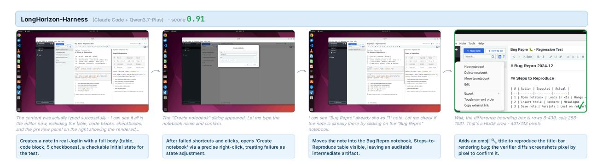

**Figure 11** 데스크톱 워크플로우 사례. LongHorizon-Harness는 풍부한 노트를 생성하고, 실패한 GUI 상호작용을 작업 상태를 업데이트하여 복구하며, 스크린샷 증거를 통해 재현된 렌더링 버그를 검증한다.

증거가 아직 필요하다. LongHorizon-Harness는 검증된 중간 산출물을 보존하고, 남은 GUI 작업을 집중된 하위 작업으로 라우팅한 뒤, 픽셀 수준 스크린샷 비교를 사용해 최종 렌더링 차이를 감사한다. 이 사례는 완료된 작업을 폐기하거나 실행자의 자가 평가를 신뢰하지 않고 실패를 복구하는 방식을 보여준다.

*문서 처리: 시각적 외형이 아니라 의미론적 문서 상태를 검증한다.* Figure [12](#page-23-0)은 제목의 가시적 외형이 완료를 증명하기에 충분하지 않은 문서 편집 과제를 보여준다. 제목은 굵고 크게 보이더라도 여전히 잘못된 기본 스타일을 사용할 수 있다. LongHorizon-Harness는 먼저 실제 LibreOffice Writer 상태를 검사하고, 그 다음 재현 가능한 매크로를 적용해 제목을 정규화하며, 마지막으로 생성된 ODT XML을 감사한다. 이는 시각적으로 그럴듯한 편집을 독립적으로 검증 가능한 명제: 모든 필수 제목이 올바른 제목 스타일과 개요 수준으로 인코딩되도록 만든다. 이 사례는 완료가 스크린샷이나 실행자 신뢰만으로는 아니라 환경 상태에 기반해야 함을 강조한다.

*게임 분석: GUI 재생과 파일 수준 검증을 결합한다.* Figure [13](#page-23-1)은 XBoard에서 체스 분석 과제를 보여준다. 에이전트는 불법 수를 식별하고 실패 주변의 게임 상태를 분석해야 한다. LongHorizon-Harness는 GUI를 사용해 PGN을 재생하여 XBoard가 불법 수에서 멈출 때까지 진행하며, 정확한 보드 위치의 시각적 증거를 보존한다. 이후 이 GUI 증거를 생성된 보고서의 파일 수준 검증으로 보완한다. 결과는 교차 검증된 산출물: 불법 수, 멈춘 보드 상태, 실수 분석, 출력 파일이 서로 일치한다. 이 사례는 GUI 관찰이나 파일 검사만으로는 충분하지 않을 때 하이브리드 실행의 가치를 보여준다.

*웹 진단: 브라우저 차트, JSON 상태, 패킷 증거를 통합한다.* Figure [14](#page-24-0)은 WebRTC 시뮬캐스트 레이어 감사를 보여준다. 이 과제는 레이어 저하 이벤트를 식별하고 브라우저와 패킷 캡처의 증거로 이를 뒷받침해야 한다. LongHorizon-Harness는 증거를 생성하는 하위 작업으로 워크플로우를 분리한다: 브라우저 차트를 렌더링하고, 관련 타임스탬프에서 마우스를 올려 툴팁 값을 캡처하며, Wireshark를 열어 RTP 스트림을 교차 확인한다. 감사자는 각 스크린샷을 하나의 명제로 취급한다.

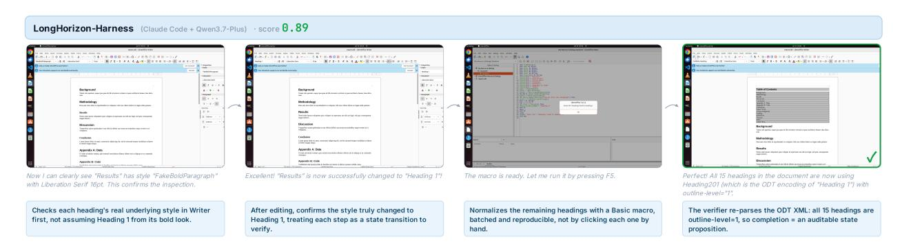

**Figure 12** 문서 처리 사례. 하네스는 시각적 서식에 의존하지 않고 기본 ODT 구조를 검증하여 모든 제목이 의미론적으로 정규화되도록 보장한다.

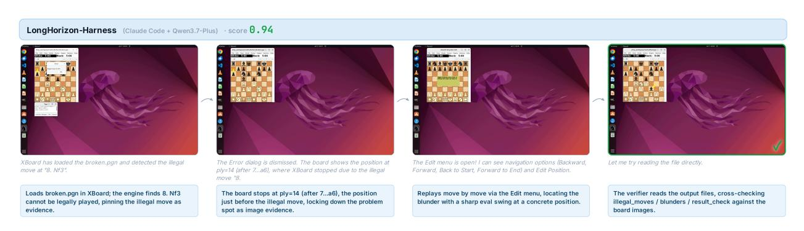

**Figure 13** 게임 분석 사례. GUI 재생은 불법 PGN 전환을 식별하고, 파일 수준 감사는 최종 보고서가 보드 증거와 일치하는지 확인한다.

대규모 증거 체인, 예를 들어 목표 구간 주변에서 f-레이어가 초당 프레임 수를 0으로 떨어뜨리는 경우. 이 사례는 하네스가 장기간 GUI 조사를 구조화되지 않은 기록으로 전환되는 것을 방지하는 방식을 보여준다; 각 관찰은 다음 단계에 안내할 수 있는 검증된 사실로 기록된다.

*데이터 분석 및 시각화: 파일 존재 여부만이 아니라 증거 품질을 감시한다.*  
Figure [15](#page-24-1)은 Airflow 디버깅 작업을 보여준다. 단순한 경로는 올바른 파일명을 사용해 스크린샷을 저장할 수 있지만, 잘못된 UI 상태를 캡처할 수 있다. 예를 들어 Grid 뷰를 Gantt 뷰 이름으로 저장하는 경우가 있다. LongHorizon-Harness는 감사 중에 이 불일치를 감지하고, 비준수 스크린샷이 완료를 지원하지 않도록 하고, 실제 Gantt 뷰를 캡처하도록 집중된 수리 하위 작업을 할당한다. 또한 DAG 그래프를 교차 검증하여 잘못된 상위 종속성을 식별한다. 핵심 교훈은 아티팩트 존재가 아티팩트 유효성보다 약하다는 것이다: 파일이 존재한다고 해서 진행이 되는 것은, 감사자가 그것이 요구되는 상태를 묘사한다는 것을 확인할 때만이다.

*DevOps: UI와 CLI 증거를 통해 증상, 근본 원인, 수리를 연결한다.*  
Figure [16](#page-25-0)은 RabbitMQ 운영 작업을 제시한다. 표면 증상은 관리 UI에서 확인된다: 메시지가 전달되거나 확인되기보다 더 빠르게 게시된다. LongHorizon-Harness는 UI 검사와 큐 및 바인딩 증거를 결합하여 데드-레터 라우팅 키가 일치하지 않음을 식별한다. 수리 후, 감사자는 CLI 덤프와 관리 UI 스크린샷에 대해 큐 깊이와 바인딩 구성을 교차 검증한다. 이는 대표적인 운영 워크플로우이다: 답은 단일 명령이 아니라 증상에서 근본 원인, 수리, 수리 후 증거까지 이어지는 체인이다.

*공간 및 CAD 워크플로우: 시각적 출력으로 의미 계층을 보존한다.*  
Figure [17](#page-25-1)은 LibreCAD 작업을 보여준다. 목표는 단순히 그럴듯한 도면을 만드는 것뿐만 아니라 의미 계층 할당을 복원하고 출시 준비가 된 시각적 증거를 생성하는 것이다. LongHorizon-Harness는 CLI 렌더링을 사용해 도면이 실제로 존재함을 확인하고, LibreCAD GUI를 사용해 레이어 속성을 검사하고 수리한 뒤, 인쇄 미리보기와 저장된 스크린샷을 최종적으로 검증한다. 감사자는 파일 크기, 해상도, 고유성, 타임스탬프를 확인한다.

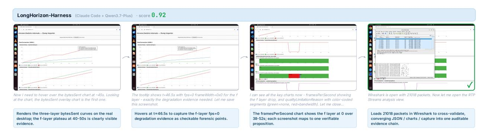

**Figure 14** 웹-진단 사례 (Web-diagnostics case). LongHorizon-Harness는 브라우저 차트, 툴팁 증거, Wireshark 검사를 하나의 감사된 증거 체인으로 결합한다.

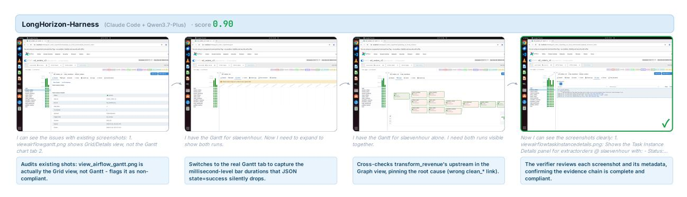

**Figure 15** 데이터-분석 사례 (Data-analysis case). 하니스는 잘못 라벨링된 증거를 거부하고, 올바른 Airflow 뷰를 캡처하며, 각 스크린샷이 요구되는 진단을 지원하는지 감시한다.

정렬을 통해 제출된 스크린샷이 재활용된 이미지가 아니라 서로 다른 상태의 실제 캡처임을 보장한다. 이 사례는 MEA가 구조화된 파일과 시각적 애플리케이션 상태를 모두 포함하는 성공 조건을 가진 작업을 지원하는 방식을 보여준다.

*디자인 워크플로우: 실제 렌더링 상태에 기반한 주관적 시각적 비교를 확립한다.*  
Figure [18](#page-26-0)은 이미지 업스케일링 및 품질 비교를 포함한 GIMP 기반 디자인 작업을 보여준다. 실행자는 단순히 주장된 결과를 생성하는 것이 아니라, 실제 출력을 GIMP에서 열어 Levels 히스토그램을 캡처하고, 슈퍼-레졸루션과 바이큐빅 결과를 나란히 비교하며, 실제 렌더링 파이프라인을 사용해 증거를 생성한다. 감사자는 시각적 비교가 예상 파일과 애플리케이션 상태에 기반하고 있는지 평가할 수 있다. 이 사례는 디자인 작업이 주관적으로 보이는 요구사항을 포함하는 경우가 많기 때문에 중요하다. LongHorizon-Harness는 이를 재현 가능하고 검사 가능한 증거로 변환함으로써 신뢰성을 높인다.

#### **C.2 Terminal-Bench Cases (터미널 벤치 사례)**

빌드 및 설치: 숨겨진 수락 기준을 명시적으로 만들기. Figure [19](#page-27-0)은 SQLite를 gcov 도구를 이용한 instrumentation으로 컴파일하고 결과를 쉘 환경에 제공해야 하는 Terminal-Bench 과제에서 기본 모델과 LongHorizon-Harness를 비교한다. 기본 모델은 부분적인 진행을 달성하지만 최종 보상을 실패하며, 이는 일반적인 장기 실패를 보여준다: 에이전트는 상당한 작업을 수행하지만 차단 수락 조건을 놓친다. LongHorizon-Harness는 소스 출처, 빌드 위치, gcov instrumentation, PATH 가시성, 실행 가능성, 제공된 tarball 보존을 포함하는 안정적인 계약으로 과제를 변환한다. 각 라운드는 계약의 한 부분을 감사한 뒤 관리자가 진행한다. 따라서 최종 납품물은 단순한 빌드 로그가 아니라, 바이너리, PATH 항목, gcov 심볼, 커버리지 파일이 독립적으로 검증된 설치물이다.

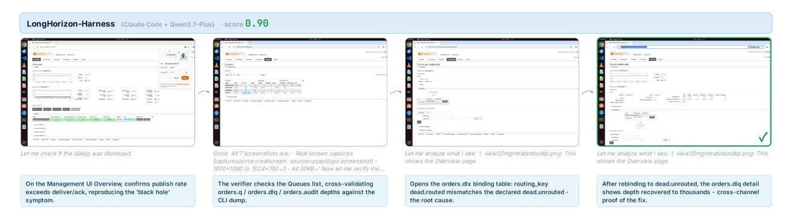

**Figure 16** DevOps 사례. 하니스는 관리-UI 증상을 대기열 및 바인딩 증거와 연결한 뒤, GUI와 CLI 뷰에서 복구된 라우팅 상태를 검증한다.

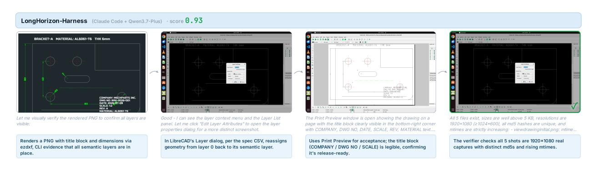

**Figure 17** 공간/CAD 사례. 하니스는 DXF 수준 검사, LibreCAD 레이어 수리, 인쇄 미리보기 증거, 스크린샷 무결성 검사를 결합한다.

*역공학: 가설이 독립적인 산출물로 전환될 때까지 감사한다.* Figure [20](#page-28-0)은 에이전트가 엄격한 제약 하에 미스터리 바이너리의 이미지 출력을 일치시키는 독립적인 C 프로그램을 만들어야 하는 역공학 과제를 보여준다. 이 과제는 초기 관찰이 가설이기 때문에 어려우며, 문자열, 심볼, 픽셀 통계, 디스어셈블리 추적이 해결을 안내할 수 있지만, 이들 중 어느 것도 단독으로 완성을 증명하지 못한다. LongHorizon-Harness는 이러한 관찰을 감사된 사실로 보관한 뒤, 이후 라운드에서 최종 프로그램을 합성, 컴파일, 압축, 테스트하여 원본 동작과 비교한다. 감사자는 이미지가 존재하고 컴파일되는지뿐 아니라, 원본 바이너리를 제거했을 때 생성된 출력이 동일한지 여부를 확인한다. 이 사례는 MEA가 탐색적 과제를 어떻게 지원하는지를 보여준다: 불확실한 증거는 완성으로 오해되지 않고 축적될 수 있으며, 최종 상태는 독립적인 산출물이 전체 계약을 만족할 때만 수락된다.

#### **C.3 교차 사례 인사이트 (Cross-Case Takeaways)**

이러한 사례 전반에 걸쳐 LongHorizon-Harness는 벤치마크별 특수한 휴리스틱이 아니라 공통 구조를 통해 신뢰성을 향상시킨다. 문서 및 CAD 과제에서는 시각적 타당성과 의미적 정확성을 분리한다. 웹, 데이터 분석, DevOps 과제에서는 서로 다른 인터페이스의 증거가 완전한 진행으로 표시되기 전에 일치하도록 강제한다. 데스크톱 및 디자인 과제에서는 GUI 상호작용이 실패할 때 복구 가능한 중간 산출물을 보존한다. Terminal-Bench 과제에서는 암묵적 평가 요구를 명시적 수락 계약으로 전환하고 라운드마다 감사를 수행한다. 이러한 패턴은 논문의 중심 주장을 뒷받침한다: 장기 에이전트 성능은 모델의 지역적 능력뿐 아니라 하니스가 작업 상태를 어떻게 표현, 검증, 전달하는가에 의해 제한된다.

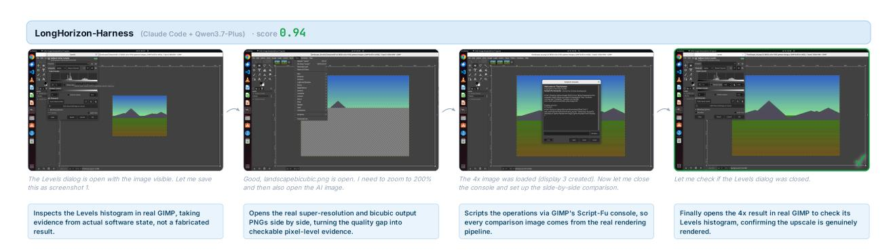

**Figure 18** 디자인 사례. LongHorizon-Harness는 실제 GIMP 상태를 기반으로 시각적 품질 비교를 수행하며, 히스토그램과 나란히 렌더링된 출력을 포함한다.

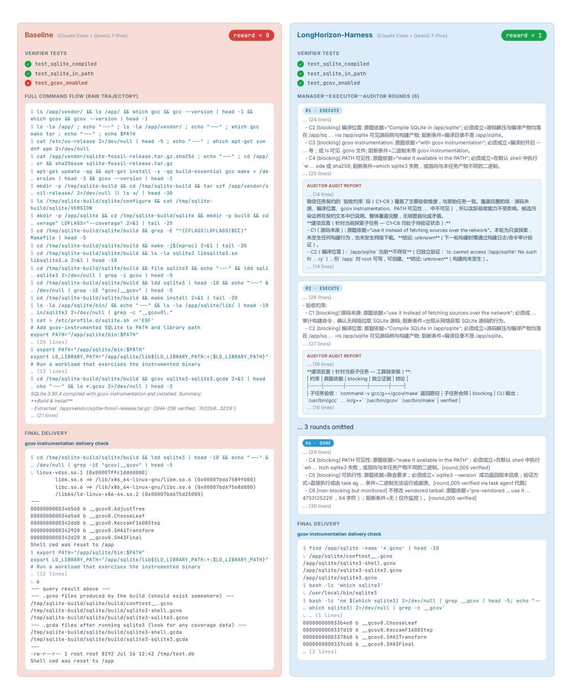

**Figure 19** Terminal-Bench 빌드 사례. LongHorizon-Harness는 다중 조건 빌드 과제를 명시적 수락 계약으로 전환하고, gcov 증거를 통해 최종 SQLite 설치를 검증한다.

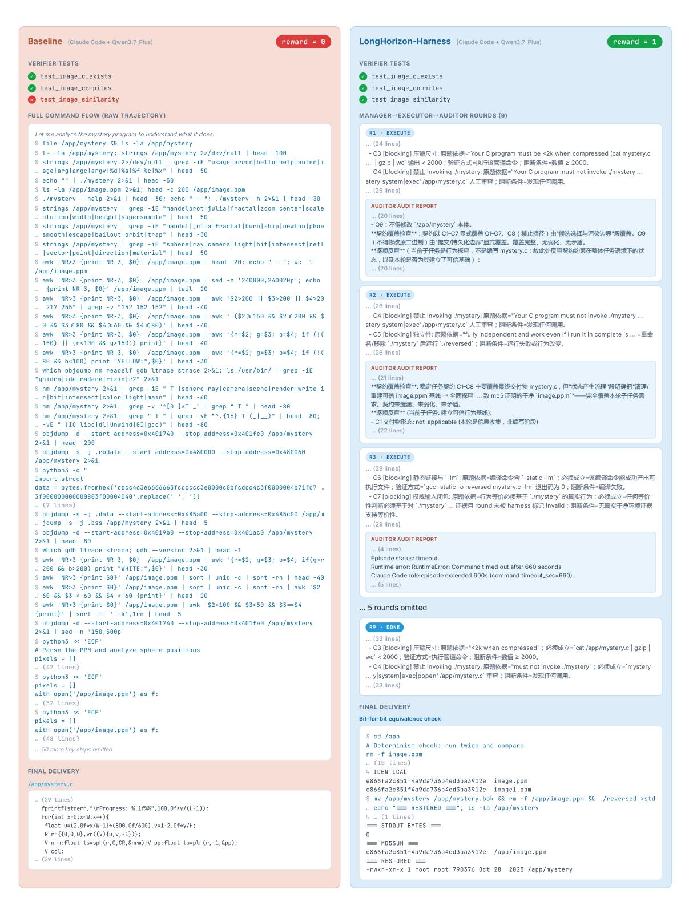

**Figure 20** Terminal-Bench 역공학 사례. 하네스는 탐색적 증거를 감사된 사실로 보존하고, 최종 독립적인 C 구현을 동작, 컴파일, 크기, 독립성 제약 조건에 대해 검증한다.

