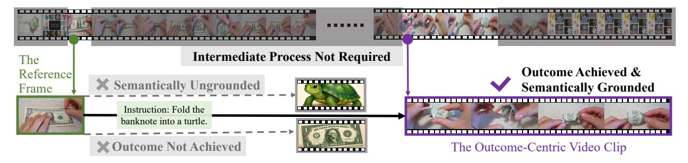
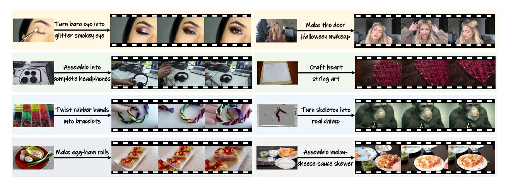
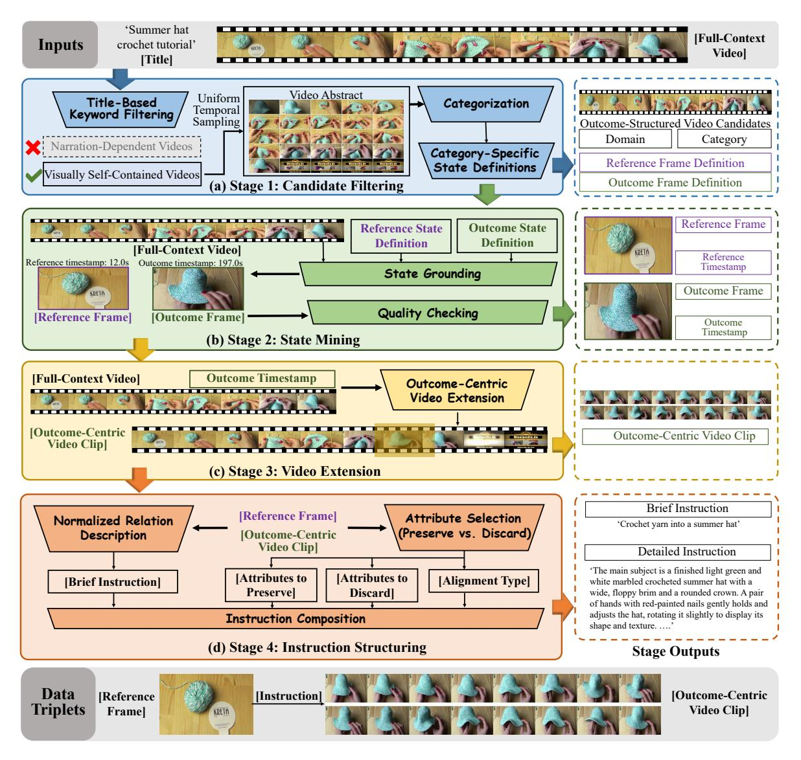
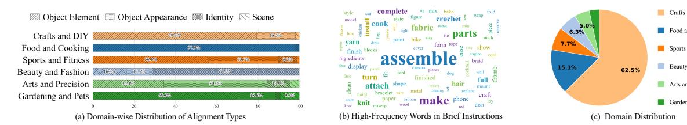
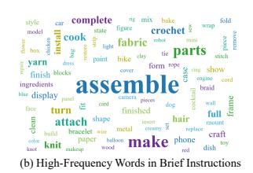
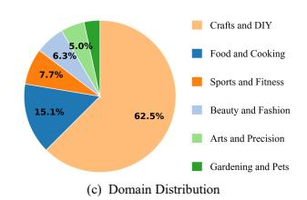
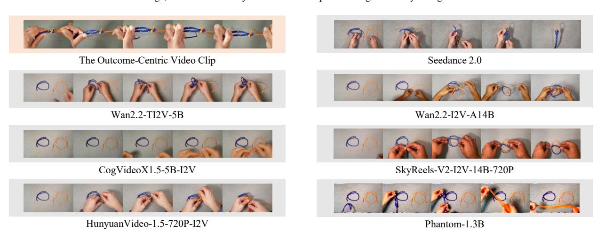
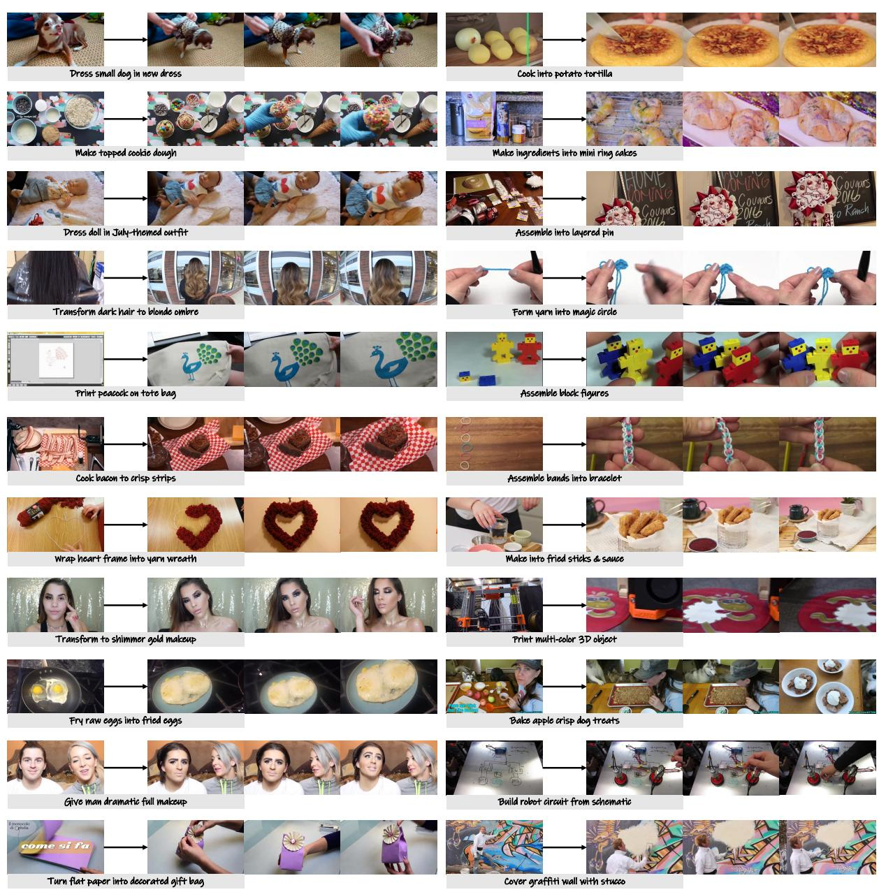
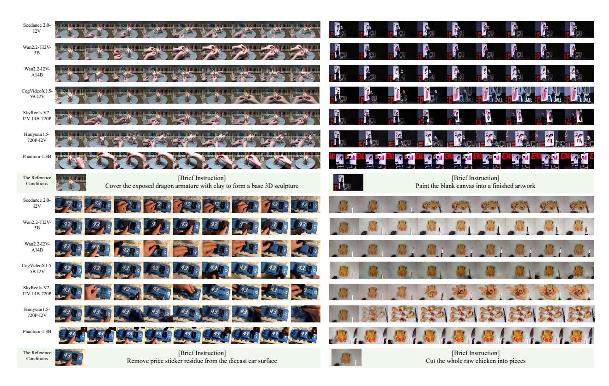

# SemComp-Bench: Benchmarking Semantic Task Completion in Video Generation

- 원제: SemComp-Bench: Benchmarking Semantic Task Completion in Video Generation
- 원문: [https://arxiv.org/abs/2608.17426](https://arxiv.org/abs/2608.17426)
- PDF: [https://arxiv.org/pdf/2608.17426v1](https://arxiv.org/pdf/2608.17426v1)
- arXiv ID: `2608.17426`

---

# **SemComp-Bench: 비디오 생성에서 의미적 작업 완성도 벤치마킹 (SemComp-Bench: Benchmarking Semantic Task Completion in Video Generation)**

**Keyu Tu**1 **Zhuowei Chen**1 **Mengqi Huang**1,2,† **Yuxin Wang**2 **Jiahao Zhu**3 **Zhendong Mao**1 **Yongdong Zhang**1

1중국 과학기술대학교 (University of Science and Technology of China) 2FrameX.AI 3서안대학교 (Sun Yat-sen University) †Corresponding author

## **초록 (Abstract)**

우리는 **Semantic Task Completion Video Generation**(의미적 작업 완성 비디오 생성), 즉 결과 지향적인 비디오 생성 과제를 소개한다. 이 정의에 따르면 성공은 의도된 결과의 달성뿐 아니라 의미적 기반을 갖추는 것을 모두 요구한다. 의미적 기반은 참조 이미지와 생성된 결과가 작업과 관련된 고수준 의미에서 일치하는 정도를 나타낸다. 평가는 생성된 결과에 초점을 맞추며, 중간 단계의 전체 시퀀스 제시나 참조 이미지와의 전통적인 외관 일관성을 요구하지 않는다. 체계적인 평가를 지원하기 위해 우리는 **SemComp-Data**를 구축하였다. 이 데이터셋은 여섯 개 도메인을 포괄한다. 각 인스턴스는 참조 이미지, 상세 지시문, 간단 지시문, 그리고 결과 중심 비디오 클립으로 구성된다. 확장 가능한 4단계 큐레이션 파이프라인이 원시 비디오를 표준화된 SemComp-Data 인스턴스로 변환한다. 또한 우리는 **SemComp-Bench**를 도입하였다. 이 평가 프로토콜은 시각-언어 모델(VLM)을 사용해 구조화된 이진 질문에 답한다. SemComp-Bench는 결과 달성(Outcome Achievement)과 생성 신뢰성(Generation Reliability)을 각각 **OA Score**와 **GR Score**로 보고한다. 대표적인 비디오 생성 모델에 대한 실험 결과, 참조 이미지에서 작업과 관련된 의미적 기반을 유지하면서 의도된 결과를 달성하는 것은 여전히 어려운 과제로 남아 있다.

**날짜:** August 19, 2026

**프로젝트 페이지:** <https://SemComp-Bench.github.io> **연락처:** Mengqi Huang at [huangmq@ustc.edu.cn](mailto:huangmq@ustc.edu.cn)

## **1 서론**

최근 비디오 생성 모델 [4,](#page-10-0) [27,](#page-11-0) [28](#page-11-1)은 인상적인 시각적 충실도와 시간적 일관성을 달성한다. 그러나 지시된 결과를 달성하면서 **고수준 의미 기반 정착**을 유지하는 능력은 아직 충분히 탐구되지 않았다. 우리는 이 문제를 **Semantic Task Completion Video Generation (의미 기반 작업 완성 비디오 생성)**으로 정의한다. 여기서 정착은 작업과 관련된 의미 관계와 참조 속성을 보존하면서 관련 없는 속성은 변경될 수 있도록 한다. 예를 들어, 지폐 이미지와 "지폐를 거북이 모양으로 접어라"라는 지시가 주어졌을 때, 성공적인 비디오는 참조된 지폐를 거북이 모양의 종이접이로 명확히 보여야 하며, 이는 Fig. [1.](#page-1-0)에 나타난다. 중간 접기 단계는 필요 없지만 결과는 입력 지폐에 정착되어 있어야 하며, 관련 없는 거북이로 대체되어서는 안 된다.

기존 데이터셋과 벤치마크는 시각적 충실도, 시간적 일관성, 주제 일관성을 강조하지만, 결과 달성 여부와 고수준 의미 기반 정착을 동시에 평가하는 경우는 드물다. 따라서 우리는 **SemComp-Data (SemComp-Data)**를 구축하였다. 이는 **full-context (전체 맥락)** 실제 세계 비디오에서 선별된 이미지-텍스트-비디오 트리플로 구성된 평가 데이터셋이다.

**Figure 1** 의미 기반 작업 완성 비디오 생성의 시연, 이는 변환 과정이 아니라 결과 달성과 의미 기반 정착에만 초점을 맞춘다.

**Figure 2** 대표적인 SemComp-Data 예시. 각 예시는 참조 프레임, 결과 중심 비디오 클립, 간결한 지시문을 보여 주며, 모든 예시는 상세 지시문도 포함한다.

이와 같은 전체 맥락 기반 큐레이션은 작업 가능성을 자연스럽게 보장하면서 세밀한 시각적 정렬을 가능하게 한다. 각 인스턴스는 동일한 참조와 결과를 짧은 지시문과 상세 지시문으로 묶어, 서로 다른 구체성 수준에서 의도된 결과를 설명한다. 큐레이션 파이프라인은 **Candidate Filtering**, **State Mining**, **Video Extension**, 그리고 **Instruction Structuring**으로 구성된다. Candidate Filtering은 원시 영상을 선별하고, State Mining은 참조–결과 프레임을 위치시키고 검증하며, Video Extension은 위치된 결과를 중심으로 결과 중심 클립을 추출한다. Instruction Structuring은 정렬 제약 조건을 식별하고 지시문을 생성한다. Figure [2](#page-1-1)은 대표적인 SemComp-Data 인스턴스를 제시한다.

SemComp-Data를 기반으로 **SemComp-Bench**는 증거 기반의 이진 VLM 판단을 사용해 두 가지 상호 보완적 차원, 즉 **Outcome Achievement**와 **Generation Reliability**를 평가한다. 이 두 차원은 OA Score와 GR Score로 보고된다. 평가자는 사전 정의된 질문에 답변하고 각 답변을 시각적 증거로 뒷받침하여 집중적이고 해석 가능한 판단을 제공한다. OA는 결과 실현과 의미적 기반을 측정하며, 작업 관련 엔티티 일관성과 전역 시각적 연속성에 대한 안전장치를 포함한다. GR은 물리적 위반, 흐림, 렌더링 아티팩트, 지역 불안정성, 손상된 텍스트 또는 인터페이스 요소를 평가함으로써 이를 보완한다. 이 두 점수는 체계적인 평가와 기준 수준 실패 진단을 지원한다. 본 연구의 주요 기여는 다음과 같이 요약된다:

- 우리는 **Semantic Task Completion Video Generation**을 정의한다. 이는 생성된 비디오가 지시된 결과를 달성하면서 참조 이미지와의 작업 관련 의미적 관계를 보존하도록 요구하는 새로운 과제이다.

- 우리는 원시 영상을 짧은 지시문과 상세 지시문이 쌍을 이루는 이미지-텍스트-비디오 트리플릿으로 변환하는 확장 가능하고 저비용의 파이프라인을 통해 **SemComp-Data**를 구축한다.

- 우리는 해석 가능하고 증거 기반의 이진 판단을 사용해 Outcome Achievement와 Generation Reliability를 측정하는 VLM 기반 평가 프로토콜 **SemComp-Bench**를 제안한다.

## 2 Related Work (관련 연구)

### 2.1 Video Generation Benchmarks (비디오 생성 벤치마크)

비디오 생성 벤치마크는 시각적 충실도, 시간적 일관성, 프롬프트 준수 등을 평가한다 [10, 13, 14, 22, 34]. 개인화 및 제어 가능한 벤치마크는 주제 정체성과 의도된 움직임을 추가로 평가한다 [19, 32], 반면 최근 연구는 물리적 타당성, 인과적 일관성, 상식적 제약을 검토한다 [2, 3, 18, 21, 31, 33]. 이들 벤치마크는 생성 품질, 정체성, 움직임, 물리적 타당성을 모두 다루지만, 비디오가 지시와 참조 맥락에 의해 공동으로 정의된 결과를 달성하면서 작업 관련 의미적 기반을 보존하는지를 직접적으로 테스트하지는 않는다. 이 점이 SemComp-Bench를 동기화한다.

### 2.2 Video Generation Models (비디오 생성 모델)

현재 모델들은 점점 더 고품질의 지시를 따르는 생성을 지원한다. Wan2.2 [28], CogVideoX [30], HunyuanVideo [16], Pyramid Flow [15]와 같은 오픈소스 시스템은 텍스트와 이미지 조건부 생성을 지원하며, LTX [11, 12]는 효율성을 강조한다. Sora, Veo, MovieGen, Runway, Kling, Seedance, Hailuo, Pika 등과 같은 폐쇄형 시스템은 멀티모달 조건부, 다중 샷 내러티브, 카메라 제어, 편집을 추가로 지원한다 [1, 4, 9, 17, 23–26]. 이들 모델은 강력한 합성 및 제어를 보여주지만, 작업 관련 참조 기반에서의 결과 달성은 아직 충분히 이해되지 않았다.

## 3 SemComp-Data Construction (SemComp-Data 구축)

Koala-36M [29]의 전체 컨텍스트 비디오를 시작으로, 우리는 SemComp-Data를 구조화된 이미지-텍스트-비디오 트리플렛 $x_i = (r_i, \mathcal{I}_i, o_i)$ 의 모음으로 구성한다. 여기서 $\mathcal{I}_i = (i_i^{\text{brief}}, i_i^{\text{detailed}})$ 은 동일한 의도된 결과를 두 수준의 구체성으로 설명하는 정렬된 지시 쌍이다. 참조 프레임 $r_i$ 는 초기 컨텍스트를 정의하고, 쌍으로 된 지시문은 원하는 결과를 명시하며, 결과 중심 비디오 클립 $o_i$ 는 성공적인 완성을 묘사한다. $r_i$ 와 $o_i$ 는 동일한 작업 인스턴스에서 추출되어 시각적 요소가 독립적으로 수집된 것이 아니라 실제로 연관되어 있음을 보장한다. 이 전체 컨텍스트 구성은 주어진 참조에 대해 의도된 결과가 실현 가능하고 시각적으로 검증 가능함을 증명한다. 그림 3에 나타난 바와 같이, 우리는 전체 컨텍스트 비디오에서 표준화된 평가 인스턴스를 구축하기 위해 네 단계의 큐레이션 파이프라인을 개발한다. 이 파이프라인은 개별 작업의 수동 설계나 해당 결과 중심 비디오 제작 없이도 확장 가능한 데이터 구축을 지원한다. 다음 부문에서는 각 단계를 자세히 설명한다.

### 3.1 단계 1: 후보 필터링 (Stage 1: Candidate Filtering)

우리는 광범위한 주제 범위와 실제 시나리오를 강력히 대표하는 Koala-36M [29] 데이터셋을 소스 풀로 사용한다. SemComp-Data는 시각적으로 관찰 가능한 결과에 의존하므로, 우리는 먼저 제목 기반 키워드 필터링(Title-Based Keyword Filtering)을 적용하여 talk show, interview, news와 같은 어휘 패턴을 포함한 제목을 가진 서술 의존 비디오를 제외한다. 이를 통해 시각적으로 자가 포함될 가능성이 높은 후보를 남기며, 이는 Fig. 3(a)에 나타난다. 우리는 각 보존된 비디오에서 프레임을 균일하게 샘플링하고 이를 모자이크 표현으로 배열하여 비디오 추상(video abstract)을 만든다. 이 추상은 효율적인 분류를 위한 압축된 시각적 요약을 제공한다. 이러한 추상을 사용해 고급 VLM은 각 비디오를 여섯 개 도메인 중 하나와 관련된 작업 범주에 할당한다. 시각적 증거가 충분하지 않아 신뢰할 수 있는 분류가 어려운 비디오는 Uncertain(불확실)으로 라벨링되고 폐기된다. 보존된 도메인은 예술 및 정밀(Arts and Precision), 미용 및 패션(Beauty and Fashion), 공예 및 DIY(Crafts and DIY), 음식 및 요리(Food and Cooking), 정원 및 애완동물(Gardening and Pets), 스포츠 및 피트니스(Sports and Fitness)이다. 각 작업 범주에 대해 우리는 그 특성적인 완성 패턴에 따라 참조 및 결과 상태(reference and outcome states)를 수동으로 정의한다. 이 정의는 다운스트림 상태 탐지(downstream state mining)를 위한 초기 맥락과 완성된 결과를 명시한다. 완전한 상태 정의와 제목 기반 필터링에 사용된 키워드 목록은 보충 자료(supplementary material)에 제공된다.

### 3.2 단계 2: 상태 마이닝 (Stage 2: State Mining)

Fig. 3(b)에 표시된 바와 같이, 이 단계는 Stage 1에서 수동으로 지정한 범주별 상태 정의를 사용하여 두 단계인 **State Grounding**과 **Quality Checking**을 통해 신뢰할 수 있는 참조—결과 프레임 쌍을 마이닝한다. 우리는 State Grounding을 직접적인 결과-세그먼트가 아닌 프레임 수준의 타임스탬프 로컬라이제이션으로 공식화한다.

**Figure 3** SemComp-Data 정제 파이프라인의 4단계 개요. 패널 (a)–(d)는 각각 Candidate Filtering, State Mining, Video Extension, Instruction Structuring을 보여준다. 오른쪽 열은 해당 단계의 출력물을 표시하고, 아래 행은 최종 데이터 트리플을 제시한다.

우리는 VLM이 중간 과정을 모델링하거나 모호한 세그먼트 경계를 해결하지 않고, 참조와 결과 상태의 대표적인 시각적 증거에 집중하도록 허용한다. 전체 컨텍스트 비디오와 그 상태 정의가 주어지면, VLM은 먼저 시연된 작업과 예상 결과를 식별한 뒤 두 상태 정의와 가장 잘 일치하는 타임스탬프를 찾는다. 이 타임스탬프에서 참조 및 결과 프레임을 추출해 이후 처리에 사용한다. 추출된 프레임 쌍은 QA 기반 품질 검사(QA-based Quality Checking)를 통해 검증되며, 이는 보수적인 일관성 스크린 역할을 한다. VLM은 상태 기반(State Grounding)에서 얻은 작업 설명과 함께 두 라벨이 없는 프레임을 제공받아, 어느 프레임이 결과를 나타내는지 식별하도록 요청받는다. 유효한 쌍은 결과 프레임을 명확히 식별할 수 있어야 한다. 예측된 결과가 기반 결과 프레임과 일치하지 않으면, 이 쌍은 보수적으로 폐기된다. 이는 모호한 참조—결과 관계, 시각적 증거 부족, 또는 VLM 오류를 반영할 수 있기 때문이다. 남은 참조 및 결과 프레임과 그 타임스탬프는 이 단계의 출력이 된다.

### 3.3 Stage 3: Video Extension (비디오 확장)

그림 3(c)에 나타난 바와 같이, 이 단계는 전체 컨텍스트 비디오와 단계 2에서 검증된 결과 타임스탬프를 입력으로 사용한다. Panda-70M [8]의 샷 감지 및 동일 장면 병합 절차를 따라, 우리는 전체 컨텍스트 비디오를 일관된 카메라 시점의 세그먼트로 분할한다. 검증된 타임스탬프를 시간적 기준으로 삼아, 결과 프레임을 포함하는 핵심 세그먼트를 선택하고 시각적으로 일관된 인접 세그먼트를 병합하여 최소 3초의 길이에 도달할 때까지 결과 중심 클립 $(o_i)$ 를 추출한다. VLM에 결과 구간을 직접 찾도록 요청하는 것보다, 이 타임스탬프 기반 전략이 완성된 결과를 중심으로 클립을 보다 효과적으로 정렬하면서 효율성과 비용을 낮춘다. SemComp-Data에서 클립의 평균 길이는 약 4.03초이며, 이는 완성된 결과의 충분한 시간적 증거를 제공하면서 중간 과정과 무관한 내용을 최소화한다. 최종 결과 중심 클립이 이 단계의 출력이 된다.

### 3.4 Stage 4: Instruction Structuring (지시문 구조화)

그림 3(d)에 나타난 바와 같이, 이 단계는 참조 프레임과 결과 중심 비디오 클립을 입력으로 받아 두 개의 정렬된 지시문 변형—간단 지시문 $i_i^{\text{brief}}$ 와 상세 지시문 $i_i^{\text{detailed}}$—을 **Normalized Relation Description**, **Attribute Selection**, **Instruction Composition**을 통해 생성한다. 초기 실험에서 두 입력을 직접 VLM에 프롬프트하면 브랜드명이나 화면 텍스트와 같은 부수적 세부사항이 포함된 과도하게 장황한 지시문이 생성되는 경우가 많았다. 필수적인 참조—결과 관계를 포착하기 위해, Normalized Relation Description은 VLM이 템플릿 [동사] + [주제인 $r_i$] + [전치사] + [주요 상태인 $o_i$] 를 따라 30단어 이하의 간단 지시문 $i_i^{\text{brief}}$ 를 생성하도록 제한한다.

Attribute Selection은 결과 중심 비디오 생성 중에 보존해야 할 참조 속성과 폐기할 수 있는 속성을 결정한다. 작업 관련 속성은 카테고리마다 다르므로 VLM은 먼저 네 가지 옵션 중에서 적용 가능한 정렬 유형을 선택한다: Object Element, Person Identity, Object Appearance, Scene. 예를 들어, 참조와 결과가 동일한 인물을 다른 메이크업이나 헤어스타일로 묘사할 때는 인물 정체성과 작업 관련 외형 단서를 보존해야 하며, 반면에 설계도면을 해당 물리적 결과물로 변환할 때는 공간 배치와 설계 구조를 유지해야 한다. 선택된 정렬 유형에 따라 VLM은 보존 및 폐기할 속성을 식별한다. 정렬 유형의 정의와 사용 가능한 옵션은 부록에 제공된다.

Instruction Composition은 간단한 지시문 $i_i^{\rm brief}$ 를 자세한 지시문 $i_i^{\rm detailed}$ 로 확장한다. 이는 (i) 선택된 정렬 유형과 보존/폐기 속성(참조 기반 제약 조건을 명시)과 (ii) 완성된 결과를 묘사하는 세밀한 시각적 특성(배경, 조명, 색상, 형태, 부품 수준 세부사항 포함)을 결합한다. 이러한 결과 특성은 명시적으로 보존 대상으로 선택되지 않는 한 참조 외형 제약이 아니다. 생성된 자세한 지시문은 원하는 결과와 그 참조 기반 요구 사항을 동시에 명시하여 평가에 적합하며, 향후 작업별 학습에 유용할 수 있다. 두 변형은 동일한 작업 인스턴스를 서로 다른 세부 수준에서 기술하여, 기본 참조나 목표 결과를 바꾸지 않고 지시문 세부성 평가를 제어할 수 있게 한다. 간단한 지시문은 일반 사용자 프롬프트 습관을 더 잘 반영하므로, 보다 도전적인 평가 환경을 제공한다.

Figure 4는 SemComp-Data의 정렬 유형 및 도메인 분포와 간단한 지시문에서 자주 등장하는 단어를 요약한다.

**Figure 4** SemComp-Data 통계: (a) 도메인별 정렬 유형 분포, 서로 다른 유형을 구분하는 고유 텍스처; (b) 지시문에서 자주 등장하는 단어; (c) 여섯 도메인에 걸친 평가 사례 분포.

| 모델 | Aor | Asg | Agec | Agvc | OA 점수(OA Score) |
|------------------------------|-------|-------|-------|-------|----------|
| Seedance 2.0 [5] | 0.839 | 0.744 | 0.444 | 0.594 | 20.0% |
| Wan2.2-TI2V-5B [28] | 0.589 | 0.400 | 0.689 | 0.922 | 23.3% |
| Wan2.2-I2V-A14B [28] | 0.800 | 0.528 | 0.628 | 0.789 | 28.3% |
| CogVideoX1.5-5B-I2V [30] | 0.550 | 0.389 | 0.506 | 0.744 | 14.4% |
| SkyReels-V2-I2V-14B-720P [7] | 0.733 | 0.489 | 0.522 | 0.772 | 22.8% |
| HY† -1.5-720P-I2V | 0.878 | 0.706 | 0.583 | 0.794 | 37.8% |
| Phantom-1.3B [20] | 0.539 | 0.356 | 0.322 | 0.511 | 3.9% |

**Table 1** SemComp-Core 결과 달성 상세 지침. Aor, Asg, Agec, 그리고 Agvc는 각각 결과 달성, 의미적 기반화, 기반 엔티티 일관성, 전역 시각 연속성의 통과율을 나타낸다. OA Score는 네 가지 기준의 공동 통과율이다. †HY는 HunyuanVideo [&#91;27&#93;](#page-11-0)를 나타낸다. 굵게 표시된 값은 최고값, 밑줄 친 값은 두 번째 최고값을 나타낸다.

## **4 SemComp-Bench 평가 (SemComp-Bench Evaluation)**

SemComp-Data를 기반으로, SemComp-Bench는 구조화된 이진 질문을 통해 생성된 비디오를 평가한다. 각 질문은 해석 가능한 평가와 실패 진단을 위해 특정 기준을 목표로 한다. 기준은 두 개의 상호 보완적인 차원으로 구성된다: **Outcome Achievement (OA)**, 즉 결과 달성, 참조 기반화, 그리고 작업 관련 연속성을 측정하는 차원; 그리고 **Generation Reliability (GR)**, 즉 시각적, 물리적, 시간적 신뢰성을 평가하는 차원. 이들의 집계 결과는 각각 **OA Score**와 **GR Score**로 보고된다. N개의 샘플에 대한 단일 평가 실행에서, a_i^c, g_i^c ∈ {0,1}을 각각 결과 달성 및 생성 신뢰성 차원에서 샘플 i의 기준 c에 대한 이진 기준 점수라고 하며, 1은 통과, 0은 실패를 의미한다. 전체 이진 질문 집합은 부록에 제공된다.

### **4.1 Outcome Achievement (결과 달성)**

각 샘플 i에 대해 결과 달성은 네 가지 기준: 결과 달성, 의미적 기반화, 기반 엔티티 일관성, 전역 시각 연속성으로 평가된다. 이진 기준 점수는 a_i^or, a_i^sg, a_i^gec, a_i^gvc이다. 네 가지 기준은 모두 동일한 시계열로 정렬된 27 프레임을 균일하게 샘플링한 시퀀스에서 평가된다. 결과 달성 및 의미적 기반화는 참조 이미지와 지시문을 추가로 사용하며, 기반 엔티티 일관성 및 전역 시각 연속성은 오직 샘플링된 시퀀스만 사용한다. 해당 데이터셋 수준의 통과율은 Aor, Asg, Agec, Agvc이며, A^c = N \sum_{i=1}^{N} a_i^c.

결과 달성 기준은 생성된 비디오가 지시문에 명시된 완료 상태를 거친 수준에서 시각적으로 도달했는지를 평가한다. 이는 참조 이미지와의 세밀한 일치와는 무관하다. 의미적 기반화 기준은 실현된 결과가 참조-지시문 쌍에 따라 작업 관련 엔티티와 속성을 보존하거나 수정했는지를 평가한다. 기반 엔티티 일관성 기준은 작업 관련 핵심 엔티티가 샘플링된 시퀀스 전반에 걸쳐 의미적으로 식별 가능하게 유지되는지를, 설명되지 않은 사라짐, 교체, 또는 의도치 않은 정체성, 물질, 외관, 또는 작업 관련 구조의 변동 없이 평가한다. 전역 시각 연속성 기준은 시계열로 정렬된 샘플링된 시퀀스에서 장면, 시점, 레이아웃, 배경, 또는 구성이 급격히 전환되는지를 검사한다. A

| 모델 | $G_{\mathrm{pp}}$ | $G_{\rm vc}$ | $G_{\rm afr}$ | $G_{\rm wsc}$ | $G_{\rm ti}$ | GR 점수 |
|------------------------------|-------------------|--------------|---------------|---------------|--------------|----------|
| Seedance 2.0 [5] | 0.883 | 0.994 | 0.994 | 0.739 | 0.978 | 91.8% |
| Wan2.2-TI2V-5B [28] | 0.794 | 0.978 | 0.889 | 0.722 | 0.889 | 85.4% |
| Wan2.2-I2V-A14B [28] | 0.911 | 0.972 | 0.967 | 0.672 | 0.928 | 89.0% |
| CogVideoX1.5-5B-I2V [30] | 0.944 | 0.811 | 0.772 | 0.583 | 0.828 | 78.8% |
| SkyReels-V2-I2V-14B-720P [7] | 0.778 | 0.922 | 0.739 | 0.328 | 0.789 | 71.1% |
| $HY^{\dagger}$ -1.5-720P-I2V | 0.800 | 0.939 | 0.883 | 0.472 | 0.861 | 79.1% |
| Phantom-1.3B [20] | 0.778 | 0.972 | 0.856 | 0.506 | 0.728 | 76.8% |

**표 2 (Table 2)** SemComp-Core 생성 신뢰성 – 자세한 지침 포함. 각 $G_c$는 신뢰성 기준에 대한 통과율을 나타내며, GR Score는 다섯 개 기준의 평균이다. †HY는 HunyuanVideo [27]를 나타낸다. 굵게 및 밑줄이 그려진 값은 가장 좋은 값과 두 번째로 좋은 값을 나타낸다.

| 모델 | 모달리티 | 지시 유형 | $A_{\rm or}$ | $A_{\rm sg}$ | $A_{\rm gec}$ | $A_{\rm gvc}$ | OA 점수 |
|--------------------------|--------------------------------------------------------------------|-------------------------------|-----------------------|-------------------------|-----------------------|-------------------------|-----------------------|
| Wan2.2-A14B [28] | I2V | 상세 | 0.800 | 0.528 | 0.628 | 0.789 | 28.3% |
|  | T2V | 상세 | 0.889 | 0.522 | 0.317 | 0.117 | 4.4% |
|  | T2V | 간략 | 0.389 | 0.111 | 0.806 | 0.250 | 0.6% |
| CogVideoX1.5-5B [30] | $\begin{array}{c} {\rm I2V} \\ {\rm T2V} \\ {\rm T2V} \end{array}$ | 상세 상세 간략 | 0.550 $0.567$ $0.567$ | 0.389 0.272 0.150 | 0.506 $0.361$ $0.678$ | 0.744 0.161 0.161 | 14.4% 5.0% 0.6% |
| $HY^{\dagger}$ -1.5-720P | I2V | 상세 | 0.878 | 0.706 | 0.583 | 0.794 | 37.8% |
|  | T2V | 상세 | 0.833 | 0.606 | 0.389 | 0.133 | 4.4% |
|  | T2V | 간략 | 0.550 | 0.100 | 0.761 | 0.178 | 1.7% |

**Table 3** SemComp-Core에서 모달리티 및 지시 설정에 따른 성과 달성.  
모델 패밀리마다 I2V와 T2V 변형은 동일한 파라미터 규모의 체크포인트를 사용한다.  
$A_c$는 기준 수준 통과율을 나타내며, OA Score는 공동 통과율이다.  
†HY는 HunyuanVideo [27]를 의미한다.

공통적이지만 독점적이지 않은 실패 사례는 참조와 일치하는 초기 프레임 뒤에 시각적으로 연결이 끊긴 연속이 있을 때 발생한다. 이 두 기준은 생성된 결과의 유효성 보증 역할을 하며, 중간 작업 단계의 완전성이나 절차적 정확성을 평가하지 않는다.

모든 네 지표는 통과 코드화되어 있으며, 1은 해당 기준이 충족되었음을 나타낸다. 개체 불일치와 전역 시각적 불연속성에 관한 두 개의 실패 지향 질문에 대해 “아니오” 응답은 1로 매핑된다. 전체 성공은 논리합(conjunctive)이며, 샘플 수준의 성과 달성 지표 $A^i$는 샘플 i가 네 기준 모두를 통과할 때만 1이 된다. 데이터셋 수준의 **OA Score**는 모든 샘플에 대한 $A^i$의 평균이다:

$$A^{i} = a_{\text{or}}^{i} a_{\text{sg}}^{i} a_{\text{gec}}^{i} a_{\text{gvc}}^{i} \in \{0, 1\},$$

$$OA \text{ Score} = \frac{1}{N} \sum_{i=1}^{N} A^{i}.$$

$$(1)$$

### 4.2 생성 신뢰성 (Generation Reliability)

각 샘플 i에 대해, VLM은 성과 달성과 참조 기반 정렬과 독립적으로 물리적 타당성, 시각적 선명도, 아티팩트 없는 렌더링, 장면 내 시공간 일관성, 텍스트 및 인터페이스 무결성이라는 다섯 개의 이진 기준을 사용해 생성 신뢰성을 평가한다. 이진 기준 점수는 각각 $g_{\rm pp}^i$, $g_{\rm vc}^i$, $g_{\rm afr}^i$, $g_{\rm wsc}^i$, $g_{\rm ti}^i$ 이다. 대응되는 데이터셋 수준 통과율은 $G_{\rm pp}$, $G_{\rm vc}$, $G_{\rm afr}$, $G_{\rm wsc}$, $G_{\rm ti}$이며, 여기서 $G_c = \frac{1}{N} \sum_{i=1}^N g_c^i$ 이다.

물리적 타당성 기준은 기본 물리 원칙의 명백한 위반을 위해 가시적인 움직임과 상호작용을 평가한다; 이는 지시된 변환 과정을 보여줄 필요가 없으며 생략된

중간 과정을 실패로 간주한다. 시각적 명료성 기준은 흐림, 부적절한 노출, 해상도 부족, 또는 장면 세부사항이 불분명하여 인식하기 어려운 콘텐츠를 식별한다. 아티팩트가 없는 렌더링 기준은 비정상적인 노이즈, 손상된 영역, 빈 패치, 또는 색상 줄무늬와 같은 장면과 일치하지 않는 합성 아티팩트를 감지한다. 장면 내 시공간 일관성 기준은 작업 의미와 무관하게 깜박임, 일시적 중복, 지역 기하학 변형 등 연속 장면 내에서의 낮은 수준의 렌더링 불안정을 감지한다. 근거화된 엔터티 일관성과 달리, 이 기준은 작업 관련 엔터티의 의미적 지속성보다 지역 렌더링 안정성에 관한 것이다. 샘플링된 시퀀스 전반에 걸친 급격한 전역 전환은 결과 달성 차원에서 전역 시각적 연속성으로 별도로 평가된다. 텍스트 및 인터페이스 무결성 기준은 손상되었거나 인식할 수 없는 텍스트, 숫자, 아이콘 및 인터페이스 요소를 감지한다.

모든 다섯 질문은 실패 지향적이며, 보고된 지표는 통과 코드화되어 있다: '아니오' 응답은 1로 매핑된다. 샘플 수준의 생성 신뢰성 점수 Gi는 다섯 개의 이진 기준 점수의 산술 평균이며, 데이터셋 수준의 **GR Score**는 모든 샘플에 대한 Gi의 평균이다:

$$G^{i} = \frac{1}{5} (g_{pp}^{i} + g_{vc}^{i} + g_{afr}^{i} + g_{wsc}^{i} + g_{ti}^{i}) \in [0, 1],$$

$$GR Score = \frac{1}{N} \sum_{i=1}^{N} G^{i}.$$

(2)

함께, 기준 수준의 통과율은 생성 불신뢰성의 특정 원인을 식별한다.

## **5 실험 (Experiments)**

### **5.1 실험 설정 (Experimental Setup)**

우리는 Koala-36M [29](#page-11-11)에서 약 20,000개의 비디오를 무작위로 샘플링하고, 큐레이션 파이프라인을 사용해 처리하여 1,273개의 구조화된 평가 인스턴스를 생성한다. 도메인 균형 평가 하위 집합을 구성하기 위해 **SemComp-Core**는 60개의 인스턴스로 구성되며, 각 도메인에서 층화 샘플링을 통해 10개를 선택해 도메인 내 정렬 유형 분포를 대략적으로 보존한다. 각 SemComp-Core 인스턴스는 두 가지 지시 변형을 모두 포함한다. 지시 구체성 분석에서는 쌍을 이룬 변형이 동일한 참조 이미지와 결과 목표를 공유하므로, 변형의 차이는 오직 지시 구체성 수준에 한정된다. 대표적인 오픈소스 및 클로즈드소스 비디오 생성 모델들 [5,](#page-10-16) [7,](#page-10-17) [20,](#page-11-12) [27,](#page-11-0) [28,](#page-11-1) [30](#page-11-8)은 이 하위 집합에서 평가된다. 표 [1](#page-5-1)과 [2](#page-6-0)의 모든 모델은 참조 이미지와 상세 지시를 사용한 I2V를 활용하며, Wan2.2-TI2V-5B는 이미지-조건 모드에서 실행된다.

오픈소스 모델은 공식 기본 추론 구성을 사용하고, 클로즈드소스 모델은 공개된 기본 설정을 사용한다. 명시적 시드 제어가 가능한 경우에는 고정 시드를 적용한다. 모든 설정에서 각 인스턴스마다 720p 비디오를 하나 생성하고, 전체 시간 범위에서 27프레임을 균일하게 샘플링해 고정 길이의 시간 순서가 정렬된 시퀀스를 평가용으로 만든다. 각 비디오는 서로 다른 시점에 수행되는 세 개의 독립적인 VLM 호출을 통해 점수를 매기며, 정의된 기준에 따라 모든 기준 수준 통과율과 두 개의 집계 점수를 호출마다 계산한다. 보고된 결과는 해당 실행 수준 점수의 세 개의 산술 평균이다. 큐레이션 및 평가 실험에서 사용된 VLM은 Doubao-Seed-1.8이며, Volcano Engine API [6](#page-10-18)를 통해 인스턴스화된다. 예비 실험 결과 이 모델이 평가 효율성과 비용 사이에서 유리한 균형을 제공함을 시사한다.

### **5.2 결과 달성 결과 (Outcome Achievement Results)**

표 [1](#page-5-1)은 상세 지시 하에서의 OA 점수를 보고한다. HunyuanVideo-1.5-720P-I2V는 37.8%의 최고 OA 점수를 달성했고, 그 뒤를 이어 Wan2.2-I2V-A14B가 28.3%를 기록했다. 이들의 결과는 네 가지 OA 기준에 걸쳐 비교적 균형 잡힌 통과율을 보이며, 단일 기준에서의 우위가 아니라는 점을 일관시킨다. Seedance 2.0은 결과 실현과 의미적 기반화에서 강력하지만, 기반화된 개체 일관성과 전역 시각 연속성에서 낮은 통과율로 인해 전체 OA 점수가 감소한다. 반면 Wan2.2-TI2V-5B는 기반화된 개체 일관성과 전역 시각 연속성에서 가장 높은 통과율을 기록하면서, 결과 실현과 의미적 기반화에서는 상대적으로 낮은 성과를 보인다. 이러한 상호 보완적 성능 프로필과 최고 OA 점수가 40% 이하라는 사실은 견고한 결과 달성이 작업 충실도와 결과-비디오 유효성 두 가지를 모두 요구함을 시사한다.

### **5.3 생성 신뢰성 결과 (Generation Reliability Results)**

표 [2](#page-6-0)은 상세 지시 하에서의 생성 신뢰성을 보고한다. Seedance 2.0은 91.8%의 최고 GR 점수를 달성했다. 평가된 오픈소스 모델 중에서 Wan2.2-I2V-A14B가 89.0%로 가장 높은 성과를 보였다. 두 모델 모두 시각적 선명도와 아티팩트 없는 렌더링에서 강력한 성능을 보인다. 그러나 장면 내 시공간 일관성은 모든 모델에서 주요 병목 현상으로 남아 있으며, 통과율은 0.328에서 0.739 사이이다. 이 격차는 현재 모델이 개별 프레임을 시각적으로 설득력 있게 생성할 수는 있지만, 장면 내에서 안정적인 시각적 진화를 유지하는 데 어려움을 겪고 있음을 시사한다. GR과 OA 순위 비교를 통해 생성 신뢰성이 결과 달성과 반드시 일치하지 않음을 추가로 확인한다: Seedance 2.0은 GR에서 선두이지만 OA에서는 현저히 낮은 성과를 보이고, 반대로 HunyuanVideo-1.5-720P-I2V는 낮은 GR 순위에도 불구하고 OA에서 선두를 차지한다. Wan2.2-I2V-A14B는 두 지표 모두에서 두 번째로 높은 순위를 기록하며, 두 평가 차원에서 비교적 균형 잡힌 성능을 나타낸다.

### **5.4 조건화 효과 (Conditioning Effects)**

Table [3,](#page-6-1)에 표시된 바와 같이, I2V 변형은 세 모델 계통에서 모두 상세 지침 하에서 T2V 변형보다 일관되게 우수하다. 이 이득은 주로 향상된 의미적 기반, 근거 기반 엔티티 일관성, 전역 시각적 연속성에서 비롯되며, 결과 실현 통과율은 전반적으로 비슷하고 세 모델 계통 중 두 개에서 T2V가 더 높다. 이러한 결과는 복잡한 객체 상호작용 및 상태 변화 동안 엔티티 정체성, 외관, 구조적 일관성을 보존하는 데 있어 참조 이미지 조건화가 필수적임을 강조한다.

T2V 설정에서, 상세 지침은 간결 지침보다 일관되게 높은 OA 점수를 달성하며, 이는 주로 더 나은 결과 실현과 의미적 기반화 덕분이다. 반대로, 간결 지침은 종종 더 높은 기반화된 개체 일관성과 전역 시각적 연속성을 제공하는데, 이는 그들의 더 단순하고 덜 제약된 내용이 일관되게 생성하기 쉽기 때문일 가능성이 있다. 이러한 결과는 지침 구체성과 생성 난이도 사이의 트레이드오프를 드러낸다: 상세 지침은 의도된 구성 결과를 더 잘 정의하지만 의미 이해와 조정된 생성에 더 큰 요구를 부과하고, 반면 간결 지침은 결과-비디오 일관성이 높지만 작업 수행률이 낮다.

### **5.5 생성된 비디오 시각화 (Visualization of Generated Videos)**

Fig. [5,](#page-9-0)에 표시된 바와 같이, 평가된 모델은 참조 이미지의 외관을 보존하고 과제 수행 과정을 묘사하지만, 종종 의도된 결과를 달성하지 못한다. 또한, 생성된 비디오는 물리적으로 불가능한 변환과 갑작스러운 시각적 전환을 포함한 신뢰성 문제를 자주 겪으며, 이는 그림에 표시된 Wan2.2-I2V-A14B 및 Phantom-1.3B의 실패 사례에서 확인된다. 생성된 비디오의 추가 시각화는 부록 자료에 제공된다.

### **[참조 이미지] (The Reference Image)**

### **[자세한 지침] (Detailed Instruction)**

다음 상태를 달성하는 비디오를 생성한다: 한 쌍의 손이 두 개의 로프—하나는 흰색과 빨간색 점이 있는 파란색, 다른 하나는 단색 주황색—를 사용해 이중 시트 벤드( double sheet bend) 매듭을 묶는다. 손은 주황색 로프를 파란색 로프가 만든 루프를 통해 끌어 넣고, 그 루프를 감싸 매듭을 형성한다. 그 다음 두 로프의 끝을 당겨 매듭을 단단히 조이고, 루프와 가닥을 조정해 안전한 연결을 확보한다. 배경은 로프와 매듭 묶는 과정을 돋보이게 하는 단색 회색 평면이다. 로프의 범주, 수량, 색상 팔레트, 재질은 참조 이미지와 일치해야 하며, 초기의 꼬인 상태와 공간 배열은 매듭을 만들기 위해 필요에 따라 변경될 수 있다.

**Figure 5** 생성된 비디오 예시. 결과 중심 비디오 클립과 참조 이미지는 동일한 전체 컨텍스트 비디오에서 추출된다.

## **6 결론 (Conclusion)**

본 논문에서는 의미 기반 작업 완성 비디오 생성( Semantic Task Completion Video Generation)을 소개한다. 이 방법은 생성된 비디오가 지시된 결과를 실현하면서 참조 문맥에 대한 의미 기반 정착을 유지하도록 요구한다.  

우리는 확장 가능한 4단계 큐레이션 파이프라인을 통해 SemComp-Data를 개발한다. 각 인스턴스는 참조 이미지, 짧은 지시문과 상세 지시문이 쌍으로 제공되며, 결과 중심의 비디오 클립을 포함한다.  

핵심적으로, 쌍으로 제공되는 이미지와 클립은 동일한 전체 문맥 비디오에서 추출되어 작업의 진정성과 달성 가능성을 보장하고, 참조와 대상 간의 세밀한 속성 정렬을 가능하게 한다. 동시에 데이터셋은 소스 컬렉션에서 다양한 실제 시나리오를 보존한다.  

이 데이터셋을 기반으로 SemComp-Bench는 결과 달성과 생성 신뢰성을 공동으로 평가하는 최초의 벤치마크이다.  

대표적인 비디오 생성 모델을 대상으로 한 실험은 지시된 작업을 완수하고 참조 기반 의미( reference-grounded semantics)를 보존하는 데 상당한 한계를 드러내며, 이 능력이 아직 크게 미개척된 상태임을 시사한다.  

SemComp-Data가 작업별 훈련( task-specific training)을 통해 모델 성능을 향상시킬 수 있는 잠재력은 아직 실증적으로 검증되지 않았다.

## 참고문헌 (References)

- [1] Kuaishou AI. Kling ai: Ai-powered video generation model. <https://klingai.com>, 2025.
- [2] Zechen Bai, Hai Ci, and Mike Zheng Shou. Impossible videos. arXiv preprint arXiv:2503.14378, 2025.
- [3] Hritik Bansal, Clark Peng, Yonatan Bitton, Roman Goldenberg, Aditya Grover, and Kai-Wei Chang. Videophy-2: A challenging action-centric physical commonsense evaluation in video generation. arXiv preprint arXiv:2503.06800, 2025.
- [4] ByteDance. Seedance: Multimodal video generation model. <https://seed.bytedance.com>, 2025.
- [5] ByteDance Seed. Seedance 2.0 official launch. [https://seed.bytedance.com/en/blog/](https://seed.bytedance.com/en/blog/seedance-2-0-official-launch) [seedance-2-0-official-launch](https://seed.bytedance.com/en/blog/seedance-2-0-official-launch), 2026.
- [6] Bytedance Seed. Seed1.8 Model Card: Towards Generalized Real-World Agency. arXiv preprint arXiv:2603.20633, 2026.
- [7] Guanghui Chen et al. Skyreels-v2: Infinite-length film generative model. arXiv preprint arXiv:2504.13074, 2025.
- [8] Tsai-Shien Chen, Aliaksandr Siarohin, Willi Menapace, Ekaterina Deyneka, Hsiang-wei Chao, Byung Eun Jeon, Yuwei Fang, Hsin-Ying Lee, Jian Ren, Ming-Hsuan Yang, et al. Panda-70m: Captioning 70m videos with multiple cross-modality teachers. In Proceedings of the IEEE/CVF Conference on Computer Vision and Pattern Recognition, pages 13320–13331, 2024.
- [9] Google DeepMind. Veo: A state-of-the-art video generation model. [https://deepmind.google/technologies/](https://deepmind.google/technologies/veo/) [veo/](https://deepmind.google/technologies/veo/), 2025.
- [10] Weixi Feng, Jiachen Li, Michael Saxon, Tsu-jui Fu, Wenhu Chen, and William Yang Wang. Tc-bench: Benchmarking temporal compositionality in text-to-video and image-to-video generation. arXiv preprint arXiv:2406.08656, 2024.
- [11] Yoav HaCohen, Nisan Chiprut, Benny Brazowski, Daniel Shalem, Dudu Moshe, Eitan Richardson, Eran Levin, Guy Shiran, Nir Zabari, Ori Gordon, et al. Ltx-video: Realtime video latent diffusion. arXiv preprint arXiv:2501.00103, 2024.
- [12] Yoav HaCohen, Benny Brazowski, Nisan Chiprut, Yaki Bitterman, Andrew Kvochko, Avishai Berkowitz, Daniel Shalem, Daphna Lifschitz, Dudu Moshe, Eitan Porat, et al. Ltx-2: Efficient joint audio-visual foundation model. arXiv preprint arXiv:2601.03233, 2026.
- [13] Ziqi Huang, Yinan He, Jiashuo Yu, Fan Zhang, Chenyang Si, Yuming Jiang, Yuanhan Zhang, Tianxing Wu, Qingyang Jin, Nattapol Chanpaisit, et al. Vbench: Comprehensive benchmark suite for video generative models. In Proceedings of the IEEE/CVF Conference on Computer Vision and Pattern Recognition, pages 21807–21818, 2024.
- [14] Ziqi Huang, Fan Zhang, Xiaojie Xu, Yinan He, Jiashuo Yu, Ziyue Dong, Qianli Ma, Nattapol Chanpaisit, Chenyang Si, Yuming Jiang, et al. Vbench++: Comprehensive and versatile benchmark suite for video generative models. IEEE Transactions on Pattern Analysis and Machine Intelligence, 2025.
- [15] Yang Jin, Zhicheng Sun, Ningyuan Li, Kun Xu, Hao Jiang, Nan Zhuang, Quzhe Huang, Yang Song, Yadong Mu, and Zhouchen Lin. Pyramidal flow matching for efficient video generative modeling. In International Conference on Learning Representations, volume 2025, pages 23378–23402, 2025.
- [16] Weijie Kong, Qi Tian, Zijian Zhang, Rox Min, Zuozhuo Dai, Jin Zhou, Jiangfeng Xiong, Xin Li, Bo Wu, Jianwei Zhang, et al. Hunyuanvideo: A systematic framework for large video generative models. arXiv preprint arXiv:2412.03603, 2024.
- [17] Pika Labs. Pika: Ai video generation platform. <https://pika.art>, 2025.
- [18] Dacheng Li, Yunhao Fang, Yukang Chen, Shuo Yang, Shiyi Cao, Justin Wong, Michael Luo, Xiaolong Wang, Hongxu Yin, Joseph Gonzalez, et al. Worldmodelbench: Judging video generation models as world models. Advances in Neural Information Processing Systems, 38, 2026.
- [19] Xinran Ling, Chen Zhu, Meiqi Wu, Hangyu Li, Xiaokun Feng, Cundian Yang, Aiming Hao, Jiashu Zhu, Jiahong Wu, and Xiangxiang Chu. Vmbench: A benchmark for perception-aligned video motion generation. In Proceedings of the IEEE/CVF International Conference on Computer Vision, pages 13087–13098, 2025.

- [20] Lijie Liu, Tianxiang Ma, Bingchuan Li, Zhuowei Chen, Jiawei Liu, Gen Li, Siyu Zhou, Qian He, and Xinglong Wu. Phantom: Subject-consistent video generation via cross-modal alignment. arXiv preprint arXiv:2502.11079, 2025.
- [21] Mingxin Liu, Shuran Ma, Shibei Meng, Xiangyu Zhao, Zicheng Zhang, Shaofeng Zhang, Zhihang Zhong, Peixian Chen, Haoyu Cao, Xing Sun, et al. Rise-video: Can video generators decode implicit world rules? arXiv preprint arXiv:2602.05986, 2026.
- [22] Yaofang Liu, Xiaodong Cun, Xuebo Liu, Xintao Wang, Yong Zhang, Haoxin Chen, Yang Liu, Tieyong Zeng, Raymond Chan, and Ying Shan. Evalcrafter: Benchmarking and evaluating large video generation models. In Proceedings of the IEEE/CVF conference on computer vision and pattern recognition, pages 22139–22149, 2024.
- [23] MiniMax. Hailuo ai video generation model. <https://hailuoai.video>, 2025.
- [24] OpenAI. Video generation models as world simulators. [https://openai.com/research/](https://openai.com/research/video-generation-models-as-world-simulators) [video-generation-models-as-world-simulators](https://openai.com/research/video-generation-models-as-world-simulators), 2024.
- [25] Adam Polyak, Amit Zohar, Andrew Brown, et al. Movie gen: A cast of media foundation models. arXiv preprint arXiv:2410.13720, 2024.
- [26] Runway. Introducing runway gen-4. <https://runwayml.com>, 2025.
- [27] Tencent Hunyuan Foundation Model Team. Hunyuanvideo 1.5 technical report, 2025. URL [https://arxiv.org/](https://arxiv.org/abs/2511.18870) [abs/2511.18870](https://arxiv.org/abs/2511.18870).
- [28] Wan Team. Wan: Open and advanced large-scale video generative models. arXiv preprint arXiv:2503.20314, 2025.
- [29] Qiuheng Wang, Yukai Shi, Jiarong Ou, Rui Chen, Ke Lin, Jiahao Wang, Boyuan Jiang, Haotian Yang, Mingwu Zheng, Xin Tao, et al. Koala-36m: A large-scale video dataset improving consistency between fine-grained conditions and video content. In Proceedings of the Computer Vision and Pattern Recognition Conference, pages 8428–8437, 2025.
- [30] Zhuoyi Yang, Jiayan Teng, Wendi Zheng, Ming Ding, Shiyu Huang, Jiazheng Xu, Yuanming Yang, Wenyi Hong, Xiaohan Zhang, Guanyu Feng, et al. Cogvideox: Text-to-video diffusion models with an expert transformer. In International Conference on Learning Representations, volume 2025, pages 83048–83077, 2025.
- [31] Jianhao Yuan, Fabio Pizzati, Francesco Pinto, Lars Kunze, Ivan Laptev, Paul Newman, Philip Torr, and Daniele De Martini. Likephys: Evaluating intuitive physics understanding in video diffusion models via likelihood preference. arXiv preprint arXiv:2510.11512, 2025.
- [32] Shenghai Yuan, Xianyi He, Yufan Deng, Yang Ye, Jinfa Huang, Bin Lin, Jiebo Luo, and Li Yuan. Opens2v-nexus: A detailed benchmark and million-scale dataset for subject-to-video generation. arXiv preprint arXiv:2505.20292, 2025.
- [33] Yuke Zhao, Wangbo Zhao, Weijie Wang, Zeyu Zhang, Dakai An, Akide Liu, Yinghao Yu, Jiasheng Tang, Fan Wang, Wei Wang, et al. Worldolympiad: Can your world model survive a triathlon? arXiv preprint arXiv:2606.11129, 2026.
- [34] Dian Zheng, Ziqi Huang, Hongbo Liu, Kai Zou, Yinan He, Fan Zhang, Lulu Gu, Yuanhan Zhang, Jingwen He, Wei-Shi Zheng, et al. Vbench-2.0: Advancing video generation benchmark suite for intrinsic faithfulness. arXiv preprint arXiv:2503.21755, 2025.

## **보충 자료 (Supplementary Material)**

구체적으로, 보조 자료는 SemComp-Data와 SemComp-Bench에 대한 추가 세부 정보를 제공한다. 특히, 제목 필터링 절차(Sec. [A)](#page-12-0), 도메인 및 카테고리 분류(Sec. [B)](#page-12-1), 참조 및 결과 상태의 카테고리별 정의(Sec. [C)](#page-15-0), 정렬 유형 및 보존 속성(Sec. [D)](#page-15-1), 그리고 완전 평가 프롬프트(Sec. [E)](#page-15-2)를 설명한다. 또한 데이터셋 통계 및 예시(Sec. [F)](#page-18-0), 추가 생성 비디오 비교(Sec. [G)](#page-19-0), 보고된 결과의 표준편차(Sec. [H)](#page-21-0)를 제시한다.

전체 큐레이션 파이프라인과 단계별 프롬프트는 코드 및 데이터 보조 자료의 Code 폴더에 제공되며, Data 폴더는 SemComp-Data를 재구성하는 데 필요한 메타데이터, 소스 비디오 URL 및 타임스탬프를 제공한다.

| 구성 그룹 | 키워드 문자열 |
|-----------------------------|----------------------------------------------------------------------------------------------------------------------------------------------------------------------------------|
| news_keywords (13) | 뉴스; 브리핑; 보도; 시사; 심층 탐구; 다큐멘터리; 독점; 헤드라인; 인터뷰; 라이브; 라이브 업데이트; 언론 회견; 보고서. |
| movie_keywords (13) | 비하인드 더 씬; 블루퍼; 캐스팅; 영화 클립; 재생; 프리뷰; 리뷰; 스포일러; 티저; TV 시리즈; 토크; 토크스; 토크쇼. |
| entertainment_keywords (19) | ASMR; 셀러브리티; 챌린지; 콘서트; 게이밍; 하이라이트; 뮤직 비디오; 팟캐스트; 프랭크; 리액션; 리액트스; 여행; 언박싱; 버라이티 쇼; 브이로그; HBO; 스포츠센터; NFL; NBA. |

**Table S1** 완전한 제목 필터링 키워드 구성.

## **제목 기반 키워드 필터링**

제목 기반 필터링은 시각적 증거만으로는 신뢰성 있게 검증할 수 없는 결과를 가진 내레이션 의존적이거나 주로 정보성인 비디오를 제거하는 데 사용된다. 이러한 비디오는 종종 음성 설명, 맥락 지식, 또는 다른 비시각적 정보를 필요로 하여 묘사된 작업이 성공적으로 완료되었는지 판단해야 하므로 시각 기반 평가에 부적합하다. 이 필터링 단계가 투명하고 재현 가능하도록 구현은 필터링 구성에서 45개의 키워드 문자열을 로드한다. 이 키워드들은 가독성과 유지보수를 위해 세 그룹으로 정리되지만, 매칭 전에 그룹은 단일 리스트로 평탄화된다. 각 후보 제목은 공개된 코드에서 구현된 대로 직접적이고 대소문자를 구분하는 부분 문자열 매칭을 사용해 모든 키워드와 비교된다. 비디오는 제목에 일치하는 대소문자를 가진 하나 이상의 문자열이 포함될 때마다 제외되며, 전체 제목과 정확히 일치할 필요는 없다. 이 단순한 결정론적 절차는 모든 후보 비디오에 동일한 필터링 기준이 일관되게 적용되도록 보장한다. 완전한 필터링 구성은 표 [S1.](#page-12-2)에 보고된다.

## **도메인 및 카테고리 분류**

SemComp-Data는 인스턴스를 여섯 개의 광범위한 도메인과 21개의 세분화된 카테고리로 구성한다. 도메인은 일반적인 적용 시나리오를 특징짓고, 카테고리는 작업별 참조-결과 패턴을 구분한다. 표 [S2](#page-13-0)는 전체 분류 체계를 나열한다.

| 도메인 | 카테고리 | 정의 |
|--------------------|-------------------------------------------------------------------------------------|------------------------------------------------------------------------------------------------------------------------------------------------------------------------------------------------------------------------------------------------------------------------------------------------------------------------------------------------------|
| 음식 및 요리 | 음식 만들기 음식 변환 음식 플레이팅 | 음식이나 식품은 재료로부터 완성된다. 같은 음식 항목은 가시적인 요리 관련 상태 변화를 겪는다. 음식 요소는 완전한 프레젠테이션으로 배열된다. |
| 미용 및 패션 | 스타일링 도구 세척 착용 제품 공개 | 같은 사람의 외모는 가시적으로 재스타일링된다. 미용 또는 패션 도구는 재사용 가능한 상태로 세척된다. 외부 외모 참조가 대상에 적용된다. 이전에 숨겨진 제품이 가시화된다. |
| 스포츠 및 피트니스 | 장비 설정 신체 준비 스포츠 편집 | 스포츠 장비는 사용 준비가 된 상태로 구성된다. 대상의 신체는 스포츠 관련 준비 상태에 진입한다. 원본 이벤트 영상 또는 정체성 단서는 완성된 스포츠 미디어 편집으로 변환된다. |
| 공예 및 DIY | 조립 복원 개조 청사진 기반 건설 재료 성형 | 별개의 부품이 완전한 구조나 물체로 결합된다. 같은 물체의 상태가 복원되거나 개조된다. 구축된 공간은 새로운 공간 상태로 재구성되거나 개조된다. 물리적 구조는 추상적 설계 사양에 따라 건설된다. 원자재는 물리적으로 새로운 형태로 재형성된다. |
| 원예 및 애완동물 | 식물 치료 꽃 디자인 애완동물 미용 | 식물은 관리 관련 작업을 통해 개선된다. 꽃 또는 식물 요소는 미학적인 … |
| 예술 및 정밀 | 예술 작품 제작 디지털 제작 조각 | 예술 작품은 미완성 시각적 기반에서 완성된다. 디지털 창작 제품은 시각적 또는 추상적 참조에서 완성된다. 조각 가능한 재료는 완성된 3차원 예술 작품으로 전환된다. |

**Table S2** 도메인–카테고리 분류 및 카테고리 정의 (SemComp-Data에서 사용).

| Category | Reference State | Outcome State |
|---------------------|-----------------------------------------------|----------------------------------------------|
| Dish Making | Ingredients or an incomplete food | A recognizable completed dish or food |
|  | preparation are visible. | product is visible. |
| Food Transformation | A food item is visible before a | The same food item exhibits the intended |
|  | cooking-related state change. | visible state change. |
| Food Plating | Food components are present before final | The food components form a complete |
|  | arrangement. | plated presentation. |
| Styling | A person is visible before the target styling | The same person visibly exhibits the |
|  | change. | completed styling result. |
| Tool Cleaning | A beauty or fashion tool is visibly soiled or | The same tool is visibly clean and reusable. |
|  | not ready for reuse. |  |
| Try-on | The subject and an external appearance | The subject visibly exhibits the referenced |
|  | reference are identifiable. | garment, accessory, or appearance. |
| Product Reveal | The product is concealed, covered, or not | The product is exposed and visually |
|  | yet unidentified. | identifiable. |
| Gear Setup | Sports gear is unconfigured, disassembled, | The gear is visibly configured in a |
|  | or not ready for use. | ready-to-use state. |
| Body Preparation | A subject is visible before completing a | The subject visibly reaches the intended |
|  | sports-related preparation. | prepared state. |
| Sports Edits | Source event footage or identity cues for a | A completed sports-media edit is visible. |
|  | sports edit are visible. |  |
| Assembly | Separate or partially combined components | The components form a complete structure |
|  | are visible. | or object. |
| Restoration | A worn, damaged, or degraded object is | The same object is visibly restored or |
|  | visible. | refurbished. |
| Renovation | A built space is visible before | The space exhibits the completed renovated |
|  | reorganization or remodeling. | layout or appearance. |
| Blueprint | An abstract design, plan, or blueprint is | A corresponding completed physical |
| Construction | visible. | structure is visible. |
| Material Shaping | Raw or incompletely shaped material is | The material has the intended completed |
|  | visible. | form. |
| Plant Treatment | A plant is visible before care or treatment. | The plant exhibits a visibly improved state |
|  |  | after treatment. |
| Floral Design | Unarranged floral or plant elements are | The elements form a completed aesthetic |
|  | visible. | arrangement. |
| Pet Grooming | A pet is visible before grooming. | The same pet exhibits the completed |
|  |  | grooming result. |
| Artwork Creation | An unfinished artwork or visual basis is | A completed artwork is visible. |
|  | visible. |  |
| Digital Creation | A visual reference or unfinished digital | A completed digital creative product is |
|  | artifact is visible. | visible. |
| Sculpting | Raw or partially shaped sculptable material | A completed three-dimensional sculpture is |
|  | is visible. | visible. |

**표 S3** 카테고리별 참조 및 결과 상태 정의가 상태 마이닝에 사용된다.

### C 참조 및 결과 상태 정의

구성 파이프라인은 카테고리별 상태 정의를 사용하여 대표적인 참조 및 결과 프레임을 지역화한다. 참조 상태는 작업을 기반화하기 위해 필요한 초기 시각적 증거를 설명하고, 결과 상태는 시각적으로 검증 가능한 완료된 결과를 설명한다. 표 S3은 상태 마이닝에 사용되는 정의를 요약한다.

### D 정렬 및 속성 (D Alignment and Attributes)

Instruction Structuring은 먼저 네 가지 정렬 유형 중 하나를 할당한 뒤, 참조 이미지에서 보존할 인스턴스‑특정 속성을 선택한다.  
정렬 유형은 참조에서 주된 의미적 기반 형태를 식별한다; 해당 유형과 연관된 모든 속성이 변하지 않아야 할 필요는 없다.  
표 S4는 운영 정의를 제공한다.  
보존 속성 전체 어휘는 객체 의미, 시각적 외형, 인간 정체성, 장면 구조를 아우르는 17가지 옵션을 포함한다.

| 정렬 유형 | 운영 정의 | 일반적으로 관련된 속성 |  |  |  |  |
|-------------------|---------------------------------------------------------------------------------------------------------------------------------------------------------------------------------------------------------------------|-----------------------------------------------------------------------------------------------------------|--|--|--|--|
| 객체 요소 | 결과를 참조에 나타나는 작업 관련 객체 범주, 구성요소, 재료, 물질, 수량 또는 색상에 기반하도록 하며, 특정 객체 인스턴스의 정확한 외형을 요구하지 않는다. | 객체 범주, 구성, 수량, 재료, 색상 팔레트. |  |  |  |  |
| 정체성 | 그림에 묘사된 인물이 참조와 생성 결과 모두에서 식별 가능하도록 요구한다. | 인물 정체성, 얼굴 외형, 신체 외형, 포즈. |  |  |  |  |
| 객체 외형 | 결과를 특정 참조 객체의 개체 수준 시각적 외형에 기반하도록 한다. | 객체 범주, 색상 팔레트, 재료, 형상 구조, 표면 외형, 그래픽 세부사항. |  |  |  |  |
| 장면 | 결과를 참조 장면의 조직 또는 맥락에 기반하도록 한다. | 장면 유형, 장면 배치, 공간 관계, 배경 맥락, 시점. |  |  |  |  |

완전 보존-속성 어휘집 (17): object_category, object_composition, object_count, material, color_palette, shape_structure, surface_appearance, graphic_details, person_identity, face_appearance, body_appearance, pose, scene_type, scene_layout, spatial_relation, background_context, and viewpoint.

**Table S4** 네 가지 정렬 유형과 완전 보존-속성 어휘집의 운영 정의. 속성 선택은 인스턴스별로 유지된다.

## E SemComp-Bench 평가 프롬프트 (E SemComp-Bench Evaluation Prompts)

27 프레임이 균일하게 샘플링되어 시간순으로 제시된다. 평가자는 각 질문에 <u>예</u> 또는 <u>아니오</u>로 답하고, 결정에 대한 시각적 증거를 제공한다. 양성 OA 질문은 <u>예</u>로 통과하며, 나머지 OA 질문과 모든 GR 질문은 실패 지향적이며 <u>아니오</u>로 통과한다. SemComp-Bench는 공통 시스템 프롬프트와 기준별 특정 작업 프롬프트를 결합한다. Fig. S1에 있는 시스템 프롬프트는 평가자 역할을 정의하고, 각 이진 결정을 <u>예</u> 또는 <u>아니오</u>로 제한하며, 요청된 모든 질문 식별자가 출력에 나타나도록 요구한다.

결과 달성은 두 개의 프롬프트 그룹을 사용해 평가된다. 첫 번째 프롬프트는 Fig. S2에 표시된 대로, $Q_{\mathrm{OA}}^1$ 및 $Q_{\mathrm{OA}}^2$를 통해 결과 실현과 의미적 근거화를 평가한다. VLM이 State Mining 중에 생성한 짧은 비디오 프레임 설명이 보조 문맥으로 제공되며, 이진 결정은 여전히 가시적인 샘플링된 프레임에 기반한다. 두 번째 프롬프트는 Fig. S3에 표시된 대로, $Q_{\mathrm{OA}}^3$ 및 $Q_{\mathrm{OA}}^4$를 통해 근거화된 엔터티 일관성과 전역 시각 연속성을 평가한다. 근거화된 엔터티 일관성은 핵심 엔터티의 설명되지 않은 사라짐, 교체, 또는 작업 관련 의미적 기울기를 검사하고, 전역 시각 연속성은 갑작스러운 전체 프레임 변화를 검사한다. 이 질문들은 시간순으로 평가된다.

### 시스템 프롬프트 (System Prompt)

비디오 이해 및 시각적 콘텐츠 분석 전문가이다. 프레임 수준의 시각적 콘텐츠를 기반으로 비디오를 분석한다. 특정 과제 요구사항과 실제로 보이는 비디오 콘텐츠에 따라 질문에 답한다.

### 요구 사항을 엄격히 준수하십시오: (Strictly follow the requirements:)

- 1) 각 질문 ID 값은 'yes' 또는 'no'여야 한다.
- 2) 작업 요구 사항이 명시적으로 추가 메타데이터 필드를 요청하면, 요청된 값 유형을 사용하여 해당 필드를 포함한다.
- 3) 작업 요구 사항에 항상 질문 ID 키(예: 'Q1', 'Q2', 'Q3', 등)를 포함한다.

Figure S1 SemComp-Bench 평가에 사용되는 공통 시스템 프롬프트.

### [성과 달성 프롬프트] - Q1 & Q2

생성된 비디오는 연대순으로 샘플링된다. 각 생성된 비디오 프레임은 1부터 시작하는 프레임 인덱스를 갖는다. 증거를 보고할 때는 제공된 프레임 인덱스를 사용한다. 원본 프레임 인덱스가 제공되지 않은 경우, 샘플링된 프레임의 1부터 시작하는 순서에 따라 생성된 비디오를 사용한다. 참조 이미지. 간단 지시가 생성된 비디오가 지시된 결과를 달성했는지 평가한다. 결과 달성에만 집중한다. 일반적인 시각적 품질은 시각적 결함이 필요한 결과를 검증하는 것을 방해하지 않는 한 평가하지 않는다. 필요한 결과가 달성되는지 여부에 영향을 미치지 않는 한, 작은 아티팩트, 흐림, 또는 시간적 불안정성은 처벌하지 않는다. 참조 이미지와 샘플링된 비디오 프레임에서 보이는 증거만을 기반으로 판단한다. 같은 샘플링된 프레임에서 추가 관찰로서 간단 비디오-프레임 설명을 사용하되, 실제 보이는 프레임 증거에 따라 Q1과 Q2에 답한다. Q1. 작업 요구사항은: {brief instruction}이다. 비디오는 세부적인 외형, 스타일, 재질, 구조 또는 세밀한 속성에 관계없이 필수 작업 정의 상태에서 필요한 목표 결과 엔티티 또는 결과 범주를 포함하고 있는가? 예를 들어, 지시가 로고의 흰색 배경을 제거하는 것이라면, Q1은 로고가 보이는 것만으로는 아니라 흰색 배경이 없거나 투명 배경이 보이는 경우에만 "예"이다. Q2. 참조 이미지는 {reference image}이다. 보이는 목표 결과가 텍스트 지시와 참조 이미지 모두에서 객체 유형, 외형, 스타일, 재질, 지시대로 보존되거나 변경되어야 할 참조 이미지의 속성을 포함한 구체적인 요구사항과 일치하는가? 출력 형식] Q1: 예/아니오 Q1 이유: [이유, 30단어 이하] Q2: 예/아니오 Q2 이유: [이유, 30단어 이하]

**Figure S2** 성과 달성 프롬프트(Outcome Achievement Prompt) for 성과 실현(Outcome Realization) $(Q_{OA}^1)$  and 의미적 기반(Semantic Grounding) $(Q_{OA}^2)$ .

샘플링된 프레임은 기준에 따라 필요할 때 참조 이미지와 지시문이 추가로 제공된다. 네 가지 OA 기준은 작업 수행과 결과 비디오 유효성을 분리한다. Outcome Realization은 먼저 지시된 완료 상태가 거친 의미 수준에서 시각적으로 존재하는지 여부를 확인하고, Semantic Grounding은 그 결과와 참조-지시 쌍 사이의 작업 관련 일치를 검사한다. Grounded Entity Consistency는 픽셀 수준의 외관 일관성을 요구하지 않는다; 대신 핵심 엔터티가 의미적으로 식별 가능하도록 방해하는 설명되지 않은 변화를 표시한다. Global Visual Continuity는 전체 프레임 수준에서 작동하며 장면, 시점, 레이아웃, 배경, 구성을 갑작스럽게 전환하는 것을 감지한다. 두 가지 보호 조치 모두 비디오가 중간 절차를 재현하도록 요구하지 않는다. Generation Reliability는 Physical Plausibility에 대한 전용 독립 프롬프트와 나머지 진단 기준에 대한 공동 프롬프트를 사용한다. Figure S4는 $Q_{\rm GR}^1$에 대한 독립 프롬프트를, Fig. S5는 $Q_{\rm GR}^2 - Q_{\rm GR}^5$에 대한 공동 프롬프트를 보여 주며, Visual Clarity, Artifact-Free Rendering, Within-Scene Spatiotemporal Coherence, Text and Interface Integrity를 포함한다. 다섯 개의 GR 질문은 모두 실패 지향적이므로, 응답이 없으면 통과로 간주된다. GR은 작업 완료 및 의미 기반과 독립적으로 평가된다. Physical Plausibility는 전체 시간 순서대로 샘플링된 시퀀스에서 가시적 움직임, 접촉, 상호작용, 물질 거동을 검사한다. 나머지 질문은 인식 가능성 문제, 장면 불일치 렌더링 아티팩트, 연속 장면 내의 지역 불안정성, 변형된 텍스트 또는 인터페이스 요소를 구분한다. 이러한 실패 유형은 상호 배타적이지 않으므로, 평가자는 각 질문에 독립적으로 답변하고 동일한 시각적 증거를 여러 기준에 인용할 수 있다. 기준별 답변과 간결한 증거는 보고된 통과율을 해석 가능하게 하고 본문 논문 점수 정의와 일관되게 유지한다.

### **[결과 달성 프롬프트] – Q3 & Q4**

[Inputs]  
- 생성된 비디오  
- 생성된 비디오 프레임은 시계열 순서대로 샘플링된다. 각 비디오 프레임은 1부터 시작하는 인덱스를 갖는다. 증거를 보고할 때는 제공된 프레임 인덱스를 사용한다.  
- 원본 프레임 인덱스가 제공되지 않은 경우, 샘플링된 프레임의 1부터 시작하는 순서를 사용한다.  
- 참조 이미지  
- 간단한 지시사항 [Task]  
- 생성된 비디오가 명확히 보이는 시간적 연속성 또는 물리적 연속성 오류를 포함하는지 평가한다.  

[중요 규칙]  
- 생성된 비디오 프레임 내에서 시간적 일관성과 물리적 연속성에만 집중한다.  
- 시간적 연속성 또는 물리적 연속성 검증을 방해하는 시각적 결함이 없는 한 일반 시각 품질은 평가하지 않는다.  
- 명확히 보이는 연속성 오류를 일으키지 않는 한, 소규모 아티팩트, 흐림, 작은 시간적 불안정성은 처벌하지 않는다.  
- 샘플링된 비디오 프레임에서 보이는 증거만을 기준으로 판단한다.  
- Q3과 Q4를 독립적으로 답한다. Q4가 'yes'이기 때문에 Q3을 'yes'로 표시하지 말고, Q3이 'yes'이기 때문에 Q4를 'yes'로 표시하지 말라.  

[질문]  
- Q3. 생성된 비디오 클립이 장면 내에서 물체 수준 또는 주제 수준의 물리적 연속성 위반을 명확히 보이는지, 예를 들어 물체나 주제가 갑자기 나타나거나 사라지거나 다른 물체나 주제로 교체되거나, 형태, 색상, 재질, 질감, 패턴, 정체성, 또는 공간 구조가 명확한 연속적 전환 없이 변하는 경우를 포함한다. 장면 내부의 물체 또는 주제에 대한 지역적 변화에만 집중하고, 전체 프레임 전환은 제외한다.  
- Q4. 생성된 비디오 클립이 슬라이드쇼 페이지 전환과 같은 갑작스러운 전체 화면 전환을 포함하는지, 연속된 프레임이나 세그먼트가 완전히 다른 페이지처럼 보이는 경우를 포함한다. 전체 프레임의 전환, 예를 들어 전체 장면, 시점, 레이아웃, 배경, 구성이 갑자기 바뀌는 경우에 집중한다. 전체 장면이 동일하게 유지되는 경우, 물체 수준 또는 주제 수준의 물리적 연속성 위반에 대해 Q4를 'yes'로 표시하지 않는다.  

[출력 형식]  
Q3: yes/no Q3_reason: [reason, or none]

**Figure S3** Grounded Entity Consistency (Q 3 OA) 및 Global Visual Continuity (Q 4 OA) 를 위한 결과 달성 프롬프트.

Q4: yes/no Q4_reason: [reason, or none]

Q2: yes/no, [reason]; Q3: yes/no, [reason]; Q4: yes/no, [reason]; Q5: yes/no, [reason]

| [물리적 타당성 평가] |
|------------------------------------------------------------------------------------------------------------------------------------------------------------------------------------------------------------------------------------------------------------------------------------------------------------------------------------------------------------------------------------------------------------------|
| [질문] |
| - 비디오에 언제든지 눈에 보이는 물리적으로 비현실적인 내용, 움직임, 접촉, 상호작용, 또는 사건이 포함되어 있습니까? |
| [중요 규칙] |
| 답변은 "yes"를 선택한다. 짧거나 국소적이거나 미묘하거나 비디오 가장자리에만 나타나는 경우라도 최소 하나의 관찰 가능한 위반이 발생하면 "yes"를 선택한다. |
| 전체 시퀀스를 검토하고 다음 항목을 모두 확인한다: |
| - 중력 및 지지: 지지되지 않은 부유, 떠 있는 상태, 혹은 부양; 떨어져야 할 물체나 신체 부위가 떨어지지 않는 경우; 물리적으로 지탱할 수 없는 불안정한 균형 또는 지지 관계. |
| - 움직임 및 힘: 합리적인 원인 없이 가속, 정지, 회전, 방향 변화; 일관되지 않은 관성, 모멘텀, 질량, 무게, 속도, 궤적; 안정적인 접촉이 있어야 할 때 보이는 미끄러짐이나 부유. |
| - 접촉, 충돌 및 부착: 불가능한 충돌 반응 또는 접촉에 대한 반응 부재; 고체 물체가 침투하거나 통과하거나 합쳐지거나 같은 공간을 차지함; 손, 발, 바퀴, 도구, 물체가 접촉을 잃거나 부착이 잘못되거나 시각적으로 접촉한 물체에 영향을 주지 못함; 합리적인 사건 없이 변하는 지지, 부착, 접촉 관계. |
| - 물체 및 물질 행동: 합리적인 원인 없이 강체가 굽히거나 늘어나거나 녹거나 분리되거나 합쳐지거나 부피가 변함; 직물, 머리카락, 액체, 연기, 불, 그림자, 변형 물질의 비현실적 행동; |
| 자발적인 물체 변형, 생성, 소멸, 또는 변환이 물리적 사건을 나타낼 때, 단순히 샷이나 인터페이스 전환이 아닐 때. |
| - 인과관계 일관성: 행동에 물리적으로 합리적인 가시적 원인이나 예상되는 효과가 없을 때; 상호작용 물체가 접촉 전에 반응하거나 접촉 후 반응을 실패하거나 불가능한 방향이나 크기로 반응할 때; 물리적 속성이나 장면 규칙이 시간에 따라 일관되지 않게 변할 때. |
| 답변은 "no"를 선택한다. 전체 비디오를 확인하고 위의 모든 범주에서 관찰 가능한 위반이 없을 때만 "no"를 선택한다. |
|  |
| [출력 형식] |
| 질문: 예/아니오 |

**Figure S4** 물리적 타당성(Physical Plausibility)용 생성 신뢰성 프롬프트 (Q 1 GR).

### **[생성 신뢰성 Q2-Q5 평가 프롬프트] [중요 규칙]**  
- 비디오에 시각적 품질 결함이 있는지 평가한다.  
- 각 질문마다, 문제가 어떤 프레임이나 인접 프레임 간 전환에서 나타나면 "yes"를, 그렇지 않으면 "no"를 답한다.  
- 각 질문을 독립적으로 평가한다. 이 질문들은 상호 배타적이지 않다. 가장 잘 맞는 결함 범주만 선택하지 말고, 같은 시각적 증거가 여러 질문에 대해 "yes"를 지원할 수 있다.  
- 비디오에서 관찰 가능한 시각적 품질 문제에만 집중한다. 지시가 완료되었는지는 평가하지 않는다.  
**[질문]**  
- **Q2 시각적 선명도.** 비디오에 무거운 흐림, 낮은 해상도, 과노출, 저노출, 또는 불명확한 세부 사항 등으로 인해 주요 장면 내용, 객체, 또는 중요한 세부 사항을 인식하기 어려운 시각적 선명도가 낮은가?  
- **Q3 아티팩트 없는 렌더링.** 비디오에 장면 내용과 일치하지 않는 시각적 아티팩트(관련 없는 밝은 점, 노이즈, 색상 블록, 색상 줄무늬, 관련 없는 두꺼운 선, 비정상적인 빈 영역, 회색 패치, 손상된 영역 등)가 포함되어 있는가? 아티팩트가 일부 지역이나 몇 프레임에만 나타나더라도 "yes"를 답한다.  
- **Q4 장면 내 시공간 일관성.** 비디오에 인접 프레임 사이에 장면 내용, 객체 구조, 인간 구조, 화면 레이아웃, 인터페이스 영역, 또는 중요한 시각적 요소가 갑자기 나타나거나 사라지거나 모양이 변하거나 연속적인 시각적 전환 없이 교체되는 등 명백한 시간적 불연속성이 있는가? 불연속성이 단일 프레임에서 시각적 아티팩트로 나타나더라도 "yes"를 답한다.  
- **Q5 텍스트 및 인터페이스 무결성.** 비디오에 텍스트, 숫자, 아이콘, 또는 사용자 인터페이스 요소가 나타나면, 이들이 흐릿하거나 왜곡되었거나 변형되었거나 읽을 수 없거나 정상적인 서면 또는 인터페이스 내용으로 인식되지 않는가? 텍스트, 숫자, 아이콘, 또는 UI 요소가 비정상적이라면 전체 장면이 여전히 인식 가능하더라도 "yes"를 답한다. 텍스트, 숫자, 아이콘, 또는 사용자 인터페이스 요소가 나타나지 않으면 "no"를 답한다.  
**[출력 형식]**

**Figure S5** 시각적 선명도, 아티팩트 없는 렌더링, 장면 내 시공간 일관성, 그리고 텍스트 및 인터페이스 무결성용 생성 신뢰성 프롬프트 (Q 2 GR–Q 5 GR).

## **F 데이터셋 통계 및 인스턴스**

큐레이션 파이프라인(큐레이션 파이프라인)은 1,273개의 SemComp-Data 사례를 생성한다.  
Figure [S6](#page-18-1)은 다양한 작업 범주(작업 범주)를 아우르는 22개의 추가 사례를 제시한다.  
각 예시는 참고 이미지(참고 이미지), 결과 중심 클립(결과 중심 클립)에서 추출한 시간순으로 정렬된 세 프레임(시간순으로 정렬된 프레임), 그리고 간단한 지시문(간단한 지시문)을 보여준다.

**Figure S6** 추가 SemComp-Data 인스턴스. 각 예시는 참조 이미지, 쌍을 이룬 결과 중심 비디오 클립에서 시간순으로 샘플링된 세 개의 프레임, 그리고 해당 간단한 지시문을 보여준다.

화살표는 완성된 결과로의 의도된 의미 전이를 나타낸다. 이 표시는 생성된 비디오가 중간 과정을 재현해야 함을 의미하지 않는다. 분할 모듈은 먼저 각 전체 컨텍스트 비디오를 샷으로 나누고, 시계열적으로 인접하고 시각적으로 일관된 샷을 이벤트로 병합한다. 검증된 결과 타임스탬프를 포함한 이벤트가 선택된 뒤, 기간 제한 추출이 결과 중심 클립을 생성한다. 3–4초의 명목상 목표 범위에 해당하는 이벤트는 전부 보존된다; 그렇지 않으면, 전체 컨텍스트 비디오에서 결과 중심 윈도우를 추출하며, 과다 길이 이벤트의 경우 목표 길이는 4초, 과소 길이 이벤트의 경우 3초이며, 필요 시 경계 인식 시간 이동을 수행한다. 이 절차는 평균 클립 길이가 약 4.03초가 되도록 한다.

| Statistic | Value |
|---------------------------|---------|
| Number of instances | 1,273 |
| Minimum clip duration | 3.020 s |
| Median clip duration | 4.067 s |
| Mean clip duration | 4.033 s |
| Maximum clip duration | 4.125 s |
| SemComp-Core instances | 60 |
| Sampled evaluation frames | 27 |

**Table S5** 추가 데이터셋 및 평가 통계.

## **G 정성적 결과** (G Qualitative Results)

Figure [S7](#page-20-0)은 조각, 예술 작품 제작, 복원, 음식 변형을 아우르는 네 가지 추가 SemComp-Core 비교를 제공한다. 각 경우마다 모든 일곱 모델은 동일한 참조 조건과 상세 지시를 받으며, 짝지어진 간단 지시는 압축된 표시를 위해 그림에만 표시된다. 그들의 출력은 시간 순서대로 정렬된 프레임 시퀀스로 보여진다. 이러한 일치된 비교는 단일 최종 프레임만으로는 완전히 포착되지 않는 상호 보완적인 실패 모드를 드러낸다. 일부 시퀀스는 참조 장면을 보존하지만 지정된 결과에 대한 진행이 제한적이며, 다른 시퀀스는 부분적인 상태 변화를 묘사하면서 개체 변형, 재료 이탈, 급격한 시각 전환을 도입한다. 따라서 예시는 Outcome Achievement와 Generation Reliability가 의미적 작업 완료에 대해 상호 보완적인 관점을 제공함을 보여준다.

**Figure S7** 네 개의 SemComp-Core 인스턴스에 대한 추가 생성 비디오 비교. 각 블록에서 모든 일곱 I2V 모델의 출력은 공유된 참조 조건과 상세 지시를 사용해 생성되었으며, 짝지어진 간단 지시는 압축된 표시를 위해서만 표시된다. 시간 순서대로 정렬된 출력 프레임은 outcome achievement와 generation reliability의 차이를 보여준다.

### **H** 결과 변동성 (Result Variability)

각 생성 비디오는 서로 다른 시점에 수행된 세 개의 독립적인 VLM 호출에 의해 평가된다. Tables S6–S8은 해당 세 run‑level 점수의 표본 표준 편차를 보고한다. 구체적으로, run‑level 점수 $x_r$에 대해 $\sigma(x) = \sqrt{\frac{\sum_{r=1}^3 (x_r - \bar{x})^2}{3-1}}$ 를 계산한다. 모든 항목은 퍼센트 포인트(pp) 단위로 측정된다. OA Score 표준 편차는 샘플이 모든 네 OA 기준을 통과해야 하는 결합 정의를 사용하며, GR Score 표준 편차는 다섯 GR 기준 통과율의 run‑level 평균에서 계산된다. 따라서 집계 점수 열은 본문에서 보고된 결과에 사용된 정의와 정확히 일치한다.

| 모델 | $\sigma(A_{\rm or})$ | $\sigma(A_{\rm sg})$ | $\sigma(A_{\rm gec})$ | $\sigma(A_{\rm gvc})$ | $\sigma(OA Score)$ |
|------------------------------|----------------------|----------------------|-----------------------|-----------------------|--------------------|
| Seedance 2.0 | 0.96 | 0.96 | 2.55 | 7.52 | 4.41 |
| Wan2.2-TI2V-5B | 4.19 | 4.41 | 3.85 | 0.96 | 3.33 |
| Wan2.2-I2V-A14B | 1.67 | 2.55 | 5.09 | 3.47 | 2.89 |
| CogVideoX1.5-5B-I2V | 3.33 | 4.19 | 2.55 | 0.96 | 0.96 |
| SkyReels-V2-I2V-14B-720P | 1.67 | 3.47 | 3.47 | 2.55 | 0.96 |
| $HY^{\dagger}$ -1.5-720P-I2V | 2.55 | 2.55 | 2.89 | 1.92 | 3.47 |
| Phantom-1.3B | 0.96 | 1.92 | 1.92 | 0.96 | 0.96 |

**Table S6** 세부 지침 하에서 SemComp-Core Outcome Achievement의 샘플 표준편차 (pp; 세 번 실행). †HY는 HunyuanVideo를 나타낸다.

| 모델 | $\sigma(G_{\mathrm{pp}})$ | $\sigma(G_{\rm vc})$ | $\sigma(G_{\rm afr})$ | $\sigma(G_{\mathrm{wsc}})$ | $\sigma(G_{\rm ti})$ | $\sigma(GR Score)$ |
|------------------------------|---------------------------|----------------------|-----------------------|----------------------------|----------------------|--------------------|
| Seedance 2.0 | 3.33 | 0.96 | 0.96 | 1.92 | 0.96 | 1.58 |
| Wan2.2-TI2V-5B | 0.96 | 2.55 | 6.74 | 12.95 | 0.96 | 3.95 |
| Wan2.2-I2V-A14B | 5.85 | 0.96 | 1.67 | 1.92 | 4.19 | 1.53 |
| CogVideoX1.5-5B-I2V | 2.55 | 13.47 | 6.31 | 8.82 | 8.55 | 7.12 |
| SkyReels-V2-I2V-14B-720P | 0.96 | 3.47 | 6.74 | 11.10 | 3.85 | 4.53 |
| $HY^{\dagger}$ -1.5-720P-I2V | 8.82 | 1.92 | 0.00 | 6.94 | 0.96 | 1.35 |
| Phantom-1.3B | 5.09 | 0.96 | 8.22 | 15.84 | 6.94 | 7.20 |

$\textbf{Table S7} \ \, \text{세부 지침 하에서 SemComp-Core Generation Reliability 결과에 대한 세 평가 실행의 표본 표준편차. 모든 값은 퍼센트 포인트 단위이다.} \ \, ^{\dagger}\text{HY는 HunyuanVideo를 나타낸다}.$

| 모델 | 모달리티 | 지시 | $\sigma(A_{\rm or})$ | $\sigma(A_{\rm sg})$ | $\sigma(A_{\rm gec})$ | $\sigma(A_{\rm gvc})$ | $\sigma(OA Score)$ |
|---------------------------|----------|-------------|----------------------|----------------------|-----------------------|-----------------------|--------------------|
|  | I2V | 상세 | 1.67 | 2.55 | 5.09 | 3.47 | 2.89 |
| Wan2.2-A14B | T2V | 상세 | 2.55 | 4.19 | 1.67 | 4.41 | 2.55 |
|  | T2V | 간단 | 0.96 | 0.96 | 2.55 | 7.26 | 0.96 |
| CogVideoX1.5-5B | I2V | 상세 | 3.33 | 4.19 | 2.55 | 0.96 | 0.96 |
|  | T2V | 상세 | 3.33 | 0.96 | 2.55 | 0.96 | 1.67 |
|  | T2V | 간단 | 2.89 | 1.67 | 0.96 | 3.47 | 0.96 |
| HY † -1.5-720P | I2V | 상세 | 2.55 | 2.55 | 2.89 | 1.92 | 3.47 |
|  | T2V | 상세 | 0.00 | 2.55 | 6.74 | 5.00 | 1.92 |
|  | T2V | 간단 | 1.67 | 3.33 | 4.19 | 5.36 | 0.00 |

**Table S8** Outcome Achievement 조건화 연구의 세 번의 평가 실행에 대한 샘플 표준편차. 모든 값은 퍼센트 포인트 단위이다.  $^{\dagger}$ HY는 HunyuanVideo를 나타낸다.

