# VBVR-Pro: 네이티브 시각 추론을 위한 확장 가능하고 검증 가능한 스위트 (VBVR-Pro: A Scalable and Verifiable Suite for Native Visual Reasoning)

- 원제: VBVR-Pro: A Scalable and Verifiable Suite for Native Visual Reasoning
- 원문: [https://arxiv.org/abs/2608.26105](https://arxiv.org/abs/2608.26105)
- PDF: [https://arxiv.org/pdf/2608.26105v1](https://arxiv.org/pdf/2608.26105v1)
- arXiv ID: `2608.26105`

---

# VBVR-Pro: 네이티브 시각 추론을 위한 확장 가능하고 검증 가능한 스위트 (VBVR-Pro: A Scalable and Verifiable Suite for Native Visual Reasoning)

Junxiang Xu $^{*1}$ Ruisi Wang $^{*1}$ Fanyi Pu $^{*1}$ Maijunxian Wang $^{*2}$ Ran Ji $^{*3}$ Tongxi Zhou $^{*4}$ Chenyang Gu $^{1}$ Jing Zuo $^{4}$ Hongcan Xiao $^{4}$ Yimeng Geng $^{4}$ Wanqi Yin $^{5}$ Wei Chen $^{1}$ Oscar Qian $^{1}$ Zhengan Yan $^{1}$ Ziqi Huang $^{1}$ Haiwen Diao $^{1}$ Liang Pan $^{1}$ Bo Li $^{1}$ Xiangyu Fan $^{6}$ Dezhi Luo $^{7}$ Fengyuan Yu $^{1}$ Zehong Zhao $^{3}$ Qingying Gao $^{8}$ Tinghui Zhu $^{9}$ Yilan Zhang $^{10}$ Jingqi Tong $^{11}$ Pinyuan Feng $^{12}$ Zhengze Jiang $^{12}$ Letian Wang $^{13}$ Ziyu Guo $^{6}$ Renrui Zhang $^{6}$ Jieneng Chen $^{14}$ Sonia Joseph $^{15}$ Constantin Venhoff $^{16}$ Saman Motamed $^{17}$ Mengyue Yang $^{18}$ Chandra Sripada $^{7}$ Alan Yuille $^{8}$ Philip Torr $^{16}$ Lvmin Zhang $^{14}$ Vikash Kumar $^{11}$ Daniel Khashabi $^{8}$ Nikolaus Kriegeskorte $^{12}$ Raphaël Millière  $^{16}$ Vincent C. Müller $^{19}$ Anyi Rao $^{20}$ Quan Wang $^{4}$ Ziwei Liu $^{1}$ Dahua Lin $^{6}$ Lei Yang $^{6}$ Hokin Deng $^{\boxtimes 11}$ Zhongang Cai

1 Nanyang Technological University 2 University of California, Berkeley 3 University of California, San Diego 4 VBVR Community Contributors 5 The University of Tokyo 6 The Chinese University of Hong Kong 7 University of Michigan 8 Johns Hopkins University 9 University of California, Davis 10 University of California, Los Angeles 11 Carnegie Mellon University 12 Columbia University 13 University of Toronto 14 Stanford University 15 Mila - Institut québécois d'IA 16 University of Oxford 17 INSAIT, Sofia University 'St. Kliment Ohridski' 18 University of Bristol 19 Friedrich-Alexander-Universität Erlangen 20 Hong Kong University of Science and Technology \* Core Contributors.

∞ 연락 담당자: Zhongang Cai <caiz0023@e.ntu.edu.sg>, Hokin Deng <hokind@andrew.cmu.edu>.

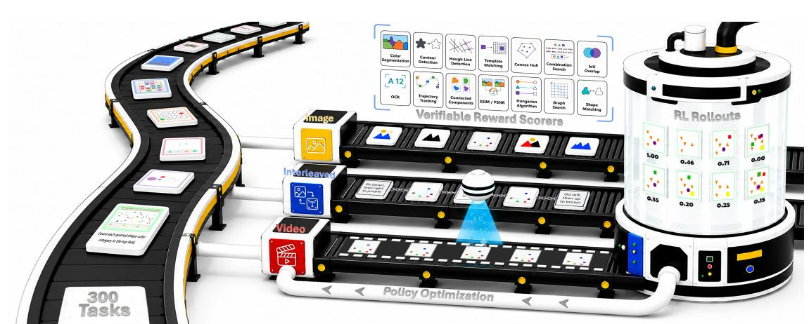

**Figure 1 VBVR-Pro 개요.** VBVR-Pro는 네이티브 시각적 추론(native visual reasoning)을 위한 폐쇄 루프 테스트베드(closed-loop testbed)를 구축하며, 통합된 작업 분포(unified task distribution) 하에서 이미지, 인터리브, 비디오 생성기(image, interleaved, and video generators)의 통제된 연구(controlled studies)를 지원하는 *300*개의 시각적 추론(visual reasoning) 과제를 제공한다. 그 *verifiable reward scorers*는 재현 가능한, 인간 정렬 평가(reproducible, human-aligned evaluation)를 제공하고, 대규모 다중 작업 강화 학습(large-scale multi-task reinforcement learning)을 위한 작업 기반 보상 함수(task-grounded reward functions)로도 활용된다.

#### **요약 (ABSTRACT)**

네이티브 시각적 추론은 시각적 생성을 추론 자체의 매개체로 간주한다: 시각적 상태(*i.e.* 이미지와 비디오)는 단순히 이해될 입력이거나 렌더링될 출력이 아니라, 언어를 넘어서는 문제 해결을 위한 일등급 기질이다. 그러나 진행은 확장 가능한 훈련 과제, 신뢰할 수 있는 피드백, 그리고 생성 기질 간의 통제된 비교 부족으로 인해 병목 현상에 직면해 있다. 본 연구에서는 시각적 생성을 통한 네이티브 시각적 추론을 학습 가능하고, 검증 가능하며, 최적화 가능하고, 실험적으로 통제 가능한 폐쇄 루프 테스트베드인 **VBVR-Pro**를 소개한다. **1) Task scaling.** VBVR-Pro는 시각적 추론을 *300*개의 절차적으로 생성된 과제로 구성된 통제된 과제 공간으로 전환한다. VBVR-Pro에서 훈련된 모델은 RISE-Video, MME-CoF-Pro, BabyVision 등 *seven*개의 외부 시각적 추론 벤치마크에서 제안된 스위트 이상으로 강력한 전이 성능을 보인다. 추가적으로

1

분석은 이러한 이득이 지시 패턴 적합이 아니라 시각적 추론을 반영한다는 것을 검증한다. 2) 검증 가능한 보상. VBVR-Pro는 작업 기반 평가를 위한 검증 가능한 보상 점수기를 제공한다. 선도적인 MLLM을 심사자로 체계적으로 연구함으로써, 널리 퍼진 *VLM-as-a-judge* 패러다임의 반복되는 실패 모드를 식별한다. 반면, 제안된 점수기는 결정론적이며 작업별 규칙에 기반하여 인간 판단과 세밀하게 정렬된다. 특히, 이들은 대규모 다중 작업 강화 학습에 신뢰할 수 있는 보상 신호로 활용되며, 시각적 추론 과제에서 RL 이후 성능이 더 우수함을 보여준다. 3) 메커니즘 연구. VBVR-Pro는 *30*개가 넘는 이미지, 비디오, 그리고 인터리브드 생성기 전반에 걸친 통제된 모달리티 연구를 가능하게 한다. 우리의 분석은 비디오 생성이 지속적인 시공간 상태 추적을 요구하는 과제에서 가장 강력하며, 인터리브드 생성은 중간 시각 상태를 외부화함으로써 계산 효율적인 대안을 제공한다는 것을 보여준다. 핵심적으로, 제거 실험과 탐지는 시각-네이티브 트래젝터리가 시각적 추론에 있어 명시적 언어적 사고 사슬보다 더 중요한 기질임을 시사한다. 우리는 향후 연구를 촉진하기 위해 모든 데이터, 모델, 점수기, 그리고 코드를 공개한다.

## 1. 소개 (Introduction)

대형 언어 모델의 성공은 언어를 기계 추론 연구의 지배적 기질로 만들었다. 그러나 물리 세계의 많은 형태의 지능은 자연스럽게 언어적이지 않다: 공간 변환, 시간 연속성, 객체 지속성, 그리고 동적 상호작용을 포함한다. 최근 연구는 이러한 추론이 생성 과정을 통해 더 잘 드러날 수 있음을 시사하며, 이는 *native visual reasoning*의 새로운 패러다임을 촉발한다. 모델은 시각적 상태(예: 이미지와 비디오)를 구성, 업데이트, 최적화함으로써 문제를 해결한다. 시각적 상태는 언어 기반 추론자나 최종 렌더링 출력에 단순히 입력되는 것이 아니라 *first-class* 기질로서 추론에 사용된다. 관심이 증가하고 있음에도 불구하고, native visual reasoning은 현재 단계에서 체계적으로 연구하기 어렵다: 생성 기반 시각적 추론이 규모에 맞게 훈련될 수 있는지, 신뢰성 있게 평가될 수 있는지, 보상 피드백으로 최적화될 수 있는지, 또는 서로 다른 생성 기질 간에 비교될 수 있는지 명확하지 않다. 우리는 진전이 닫힌 루프 세트가 필요하다고 주장한다: 작업은 절차적으로 생성되어야 하고, 출력은 검증 가능한 점수를 받아야 하며, 모델은 신뢰할 수 있는 보상으로 최적화되어야 하고, 모달리티 선택은 통제된 조건에서 테스트되어야 한다. 본 연구에서는 VBVR-Pro를 소개한다. 이는 생성 과정을 통해 native visual reasoning을 훈련 가능하고, 검증 가능하며, 최적화 가능하고, 실험적으로 통제 가능한 인프라스트럭처다.

자연스러운 시각적 추론은 확장 가능하고 학습 가능한 과제 소스를 결여하고 있다. 기존 벤치마크는 다양한 기능을 다루지만 주로 평가용으로 설계되며, 학습 데이터를 거의 제공하지 않는다. 반대로 기존 대규모 합성 소스[58]는 단순화된 기호적 설정에 초점을 맞추어, 전이 가능한 시각적 추론 기술을 가르치는지 여부가 불분명하다. VBVR-Pro는 생성 과정을 통해 시각적 추론을 통제된 과제 공간으로 전환한다. 각 과제는 무작위 매개변수를 가진 절차적 생성기로 구현된다. 중요한 점은 비디오, 키프레임 이미지, 그리고 교차 텍스트 주석을 포함한 여러 정렬된 모달리티가 동시에 생성되어, 동일한 기본 과제 분포에서 훈련된 이미지 생성기, 비디오 생성기, 교차 생성기 간의 공정한 비교를 가능하게 한다. 검증 가능한 평가에 필요한 메타데이터도 기록된다. 이로써 300개의 과제가 생성되며, 그 결과 생성된 훈련 데이터는 제안된 스위트 외에서도 강력한 전이성을 보여준다. 우리의 능력 전이 연구에서, 이미지, 비디오, 교차 시각적 추론기 전반에 걸쳐 VBVR-Pro로 훈련된 모델은 RISE-Video[74], V-ReasonBench[39], RULER-Bench[20], MME-CoF-Pro[47], VideoThinkBench[56], BabyVision[5], IntelligentVBench[46] 등 다양한 보류된 시각적 추론 벤치마크에서 일관된 향상(종종 20% 포인트 이상)을 얻는다. 이는 시각적 추론 메커니즘의 광범위한 포괄이, 좁은 과제 집합에서 인스턴스 수를 단순히 늘리는 것보다 전이성에 더 중요함을 보여준다. 그러나 핵심적인 우려는 이러한 향상이 실제 시각적 추론을 반영하는지, 아니면 더 큰 합성 데이터에서의 지시 패턴 적합에 불과한지이다. 따라서 우리는 진단 분석 세트를 수행한다. (1) 시각 및 텍스트 임베딩 공간에서의 최근접 이웃 분석은 보류된 벤치마크 사례가 훈련 샘플과의 근접 매칭으로 설명되지 않음을 보여준다. (2) 동일 프롬프트 시각적 반사실은 VBVR-Pro로 훈련된 모델이 지시가 고정된 상태에서도 시각적 상태 변화를 올바르게 반응함을 드러낸다. (3) 모델은 다중 경로 탐색[60]과 같은 시각적 추론 행동을 보여주며, 이는 전이 이득이 재사용 가능한 시각적 학습에서 비롯된 것임을 시사한다.

추론 연산이 표면적인 지시 템플릿에 맞추는 것보다 우선한다. 이러한 진단 결과는 VBVR-Pro가 단순히 확대된 과제 모음이 아니라 확장 가능한 교육과정을 제공한다는 것을 시사한다.

둘째, 네이티브 시각적 추론은 신뢰할 수 있는 피드백을 필요로 한다. 보편적인 *VLM-as-a-judge* 패러다임은 개방형 출력에 매력적이지만, 정확한 수치, 세밀한 공간 관계, 시간적 일관성, 규칙 충족 여부에 따라 정밀도가 요구되는 시각적 추론에서는 종종 신뢰할 수 없다. 우리는 선도적인 MLLM(*e.g.*, GPT-5.5 [43], Qwen-3.7-plus [49], Gemini-3.1-Pro [11])을 판사로서 체계적으로 분석하고, 수치 부정확성, 세밀한 증거 무시, 과제 규칙 오해 등 반복되는 실패 모드를 식별한다. 이를 해결하기 위해 VBVR-Pro는 구조화된 의미 추출 및 과제 기반 검증에 기반한 검증 가능한 보상 스코어러와 평가 과제를 짝지어 사용한다. 이전에 집계된 순위 상관관계에 기반한 모델 수준 검증과 달리, 우리는 아레나 스타일 인간 연구를 통해 인스턴스 수준에서 보상 품질을 평가한다. 이 엄격한 프로토콜 하에서 우리의 스코어러는 인간 판단과 강한 일치를 달성하고, 인스턴스별 정확도에서 VLM 기반 판사보다 크게 우수하다. 가장 중요한 것은 이러한 스코어러가 평가만이 아니라 최적화를 가능하게 한다는 점이다: 그들은 명확하고 방향성 있는 과제 기반 학습 신호를 제공한다. 실험 결과, 이들을 보상으로 사용하면 강력한 기초 모델에서도 꾸준한 개선을 가져오며, 검증 가능한 보상이 대규모 시각적 추론에서 다중 과제 강화 학습의 실용적 기반이 될 수 있음을 보여준다.

셋째, 시각적 추론을 가장 잘 지원하는 생성 기반이 무엇인지 아직 명확하지 않다. 비디오 생성은 연속적인 시간적 궤적을 제공하고, 이미지 생성은 압축된 단일 시각적 출력에서 효율성을 제공하며, 인터리브드 생성은 시각-텍스트 통합 추론을 제공한다 [18] [31]. 그러나 이러한 패러다임은 공유된 과제 분포와 검증 프로토콜 하에서 거의 훈련 및 평가되지 않았다. 동일한 과제 세트와 스코어러를 사용해 VBVR-Pro는 30개가 넘는 이미지, 비디오, 인터리브드 생성기 간에 규모, 출력 형식, 모달리티 구성을 변형하며 통제된 비교를 가능하게 한다. 우리의 결과는 비디오 생성이 지속적인 시공간 상태 추적을 요구하는 과제에서 가장 강력하며, 인터리브드 생성은 중간 시각 상태를 외부화함으로써 계산 효율적인 대안을 제공한다는 것을 보여준다. 반면, 이미지 전용 생성은 절차적 또는 시간적 추론을 표현할 수 있는 능력이 부족한 경우가 많다. 또한, 인터리브드 모델에서 언어 추론을 저하시키는 것이 시각 상태를 제거하는 것보다 제한적인 효과를 보인다 [67]. 추가적인 중간 상태 개입 실험은 중간 시각 상태가 모델에 의해 인과적으로 사용된다는 것을 보여준다: 이를 손상하거나 교체하면 최종 답변이 예측 가능하게 저하되거나 재지향된다. 이러한 결과는 명시적 언어적 사고 체인보다 시각적 궤적이 네이티브 시각적 추론의 핵심 기반이 됨을 시사한다.

요약하면, VBVR-Pro는 생성 과정을 통해 네이티브 시각적 추론을 확장하기 위한 폐쇄형 기반을 구축한다. 그것은 다음을 제공한다: 1) 절차적으로 생성된 시각적 추론 환경의 확장 가능한 커리큘럼; 2) 인간과 정렬된 검증 가능한 보상 스코어러로, 강화 학습에 활용 가능; 3) 이미지, 비디오, 인터리브드 생성기를 아우르는 모달리티 제어 모델 스위트로, 진단적 증거를 통해 시각 상태 추론을 검증한다. 이 세 가지 요소가 결합되어 네이티브 시각적 추론을 학습 가능하고, 검증 가능하며, 최적화 가능하고, 실험적으로 제어 가능한 상태로 만든다.

## 2. VBVR-Pro-Dataset: 전이성을 위한 작업 확장 (Task Scaling for Transferability)

시각적 추론에서 핵심적인 과제는 훈련 중에 보인 패턴을 넘어서는 대규모, 다양한 훈련 데이터를 확보하는 것이다. 이전 연구[58]는 대규모 합성 감독이 비디오 추론을 향상시킬 수 있음을 보여 주었지만, 그 효과가 더 넓은 다운스트림 시각적 추론 벤치마크에 전이되는 것은 제한적이다. 우리는 중요한 병목 현상이 단순히 인스턴스 수가 아니라 과제 범위에 있다고 가정한다: 고정된 과제 생성기에서 반복적으로 샘플링하면 유사한 추론 패턴의 많은 변형이 생성되지만, 훈련되는 능력의 범위가 크게 확장되지 않는다. 이 관찰에 동기를 부여받아 우리는 300개의 과제를 포함하고 다양한 시각 환경과 추론 능력을 아우르는 대규모 합성 데이터셋 VBVR-Pro-Dataset를 구축하였다(섹션 2.1). 이후 VBVR-Pro를 구축하는 구현 및 큐레이션 프로토콜을 설명한다(섹션 2.2). 마지막으로 VBVR-Pro를 기존 시각적 추론 자원과 비교 분석하여 규모, 모달리티 범위 및 과제 다양성을 강조한다(섹션 2.3).

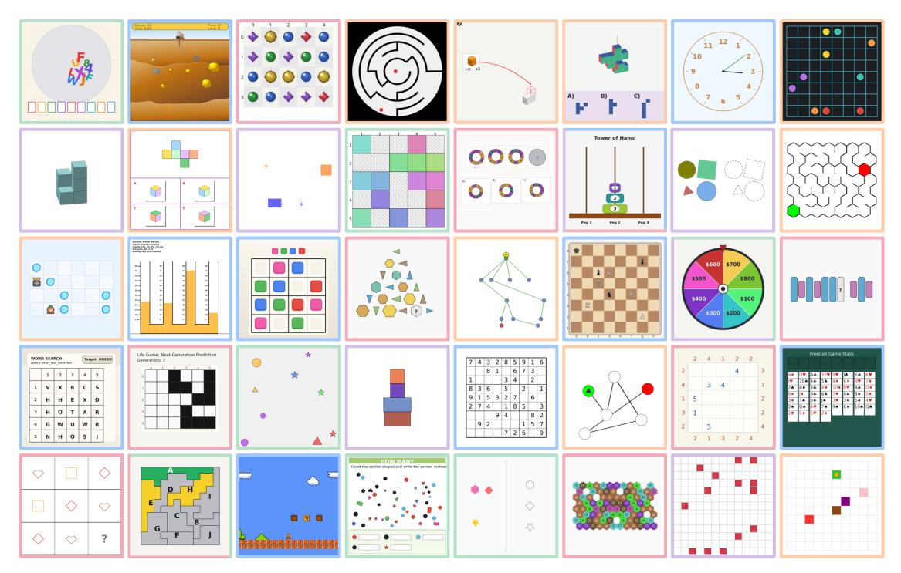

그림 2 VBVR-Pro 과제 개요  
우리는 다섯 가지 인지 기능을 아우르는 대표 과제를 보여 주며, 각 과제는 그 기반 능력의 색으로 구분된다: Perception(지각), Transformation(변형), Spatiality(공간성), Abstraction(추상화), Knowledge(지식). 여러 가지 능력이 필요한 과제는 여러 색으로 구분된다.

### 2.1. Task Design (작업 설계)

VBVR-Pro는 전 세계 50명 이상의 연구자와 엔지니어가 참여한 대규모 협업을 통해 구축되었다. 고립된 작업을 나열하는 대신, 우리는 커뮤니티가 실질적으로 관심을 갖는 시각적 추론 능력을 포괄하는 폭넓고 훈련 가능한 작업 공간을 구축하고자 한다.

Taxonomy. 우리는 VBVR [&#91;58&#93;](#page-23-1)의 인지 프레임워크를 적용한다. 이 프레임워크는 시각적 추론을 다섯 가지 능력으로 조직한다: *perception*, *spatiality*, *transformation*, *abstraction*, 그리고 *knowledge*. *Perception*은 시각 입력에서 직접 정보를 추출하며, OCR, 기호 인식, 세기, 정렬, 시각적 비교 등을 포함한다. *Spatiality*는 위치와 기하학적 관계를 추론하며, 상대 위치, 3D 구조, 탐색 등을 포함한다. *Transformation*은 2D 변환 및 회전과 같은 연산을 통해 시각 표현을 조작한다. *Abstraction*은 관찰에서 범주나 규칙을 추론하며, 패턴 유도, 대칭 및 형태 완성, 복잡하거나 새로 지정된 규칙 하에서의 추론 등을 포함한다. 마지막으로 *knowledge*는 기존 아이콘 의미, 물리 현상, 상식, 고전 게임의 규칙 및 전략, 일상 물체의 메커니즘 등과 같은 내재적 또는 획득된 지식을 활용한다. 포괄적인 작업이 여러 능력을 시연할 수 있음을 인식하여, VBVR-Pro의 작업은 여러 라벨을 가질 수 있다.

Design Principles. 각 작업은 네 가지 원칙에 따라 설계된다. 첫째, 핵심 추론 과정은 시각 기반이어야 한다: 해결책은 순수한 언어 추론이 아니라 시각 상태 변환, 공간 관계, 또는 동역학에 의존해야 한다. 둘째, 작업 결과는 모호함이 없고 엄격히 검사 가능해야 한다; 프롬프트와 시각 입력은 모델 응답을 인간이 검토하면서 반복적으로 정제된다. 셋째, 작업은 무작위화된 외형, 레이아웃, 객체 속성, 장면 구성, 그리고 의역된 텍스트 프롬프트를 통해 상당한 시각적 다양성을 보여야 한다. 넷째, 기여자들은 단일 단계의 인식이나 패턴 매칭이 아닌 다단계 추론을 요구하는 비단순 작업을 설계하도록 권장된다.

표 1 VBVR-Pro와 기존 시각적 추론 벤치마크 및 데이터셋의 비교. 우리는 작업 범위, 데이터 규모, 분할 구성, 지원되는 모달리티, 그리고 생성된 출력물을 평가하기 위한 평가 프로토콜을 보고한다. *VLM*은 VLM 판정에 완전히 의존함을 나타내며, *Mixed*는 주로 VLM 판정에 의존하고, 프로그램적 검사는 선택된 작업이나 출력 측면에 한정된다. *Verifiable*은 모든 작업에 대해 작업별 검증 가능한 스코어러를 사용한다. VBVR-Pro는 작업 수와 데이터 규모에서 선두를 달리고, RL 연구를 위한 전용 데이터 분할을 제공하며, 비디오, 이미지, 그리고 인터리브드 생성기를 지원하고, 완전 검증 가능한 평가를 채택한다.

| 데이터셋 | # Tasks (Tasks) | # Images (Images) | # Videos (Videos) |  | 분할 |  |  | 모달리티 |  | 평가 |
|------------------------|--------|------------------------------------------|---------|---------|-------|---------|---|-----------------------------------|---|------------|
|  |  |  |  | # SFT (SFT) |  |  |  | # RL #테스트 이미지 인터리브드 비디오 (RL #Test Image Interleaved Video) |  |  |
| VideoThinkBench [56] | 48 | 6,845 | 0 | 0 |  | 0 4,149 | – | – | ✓ | VLM |
| V-ReasonBench [39] | 13 | 652 | 0 | 0 | 0 | 326 | – | – | ✓ | 혼합 |
| Ruler-Bench [20] | 40 | 493 | 0 | 0 | 0 | 622 | – | – | ✓ | VLM |
| RISE-Video [37] | 8 | 477 | 0 | 0 | 0 | 467 | – | – | ✓ | VLM |
| MME-CoF-Pro [47] | 16 | 370 | 0 | 0 | 0 | 303 | – | – | ✓ | VLM |
| IntelligentVBench [46] | 4 | 1,694 | 210 | 0 |  | 0 1,030 | – | – | ✓ | VLM |
| VGI-Bench [21] | 27 | – | 0 | 0 | 0 | 810 | – | – | ✓ | VLM |
| RISEBench [74] | 16 | 415 | 0 | 0 | 0 | 360 | ✓ | – | – | VLM |
| KRIS-Bench [65] | 22 | 1,670 | 0 | 0 |  | 0 1,267 | ✓ | – | – | VLM |
| BabyVision-Gen [5] | 21 | 560 | 0 | 0 | 0 | 280 | ✓ | – | – | VLM |
| GRADE [36] | 10 | 1,040 | 0 | 0 | 0 | 520 | ✓ | – | – | VLM |
| OpenING [77] | 56 | 17,603 | 0 | 3,240 |  | 0 2,160 | – | ✓ | – | VLM |
| Zebra-CoT [31] | 18 | 921,039 | 0 | 182,384 | 0 | 0 | – | ✓ | – | – |
| StructCoT [59] | 44 | – | 0 | 840,000 |  | 0 5,600 | – | ✓ | – | 혼합 |
| RealUnify [54] | 32 | 587 | 0 | 0 |  | 0 1,000 | – | ✓ | – | VLM |
| Uni-MMMU [80] | 8 | 3,544 | 0 | 0 | 0 | 885 | – | ✓ | – | 혼합 |
| ThinkMorph [18] | 4 | 50,780 | 0 | 24,990 | 0 | 400 | – | ✓ | – | 혼합 |
| MIRA [78] | 20 | 1,482 | 0 | 0 | 0 | 546 | – | ✓ | – | 혼합 |
| VBVR [58] |  | 150 2,015,000 1,007,500 1,000,000 |  |  | 0 | 500 | – | – | ✓ | 검증 가능 |
| VBVR-Pro |  | 300 3,471,558 1,300,500 1,250,000 50,000 |  |  |  | 500 | ✓ | ✓ | ✓ | 검증 가능 |

### 2.2. 구현 (Implementation)

생성기. VBVR-Pro는 통합 프레임워크 하에서 300개의 작업별 생성기로 구성된다: 그 중 150개는 VBVR [58](#page-23-1)에서 재구현 및 개정되었으며, 나머지 150개는 작업 범위를 확장하기 위해 새롭게 설계되었다. 각 생성기는 구조화된 매개변수 공간에서 그리드 크기, 객체 수, 배치, 시각적 외관, 난이도 수준과 같은 구성을 샘플링한 뒤 해당 문제 인스턴스를 인스턴스화하는 매개변수화된 프로그램이다. 작업별 솔버는 정확한 해를 계산하며, 수동 주석 없이 프로그램적으로 도출된 감독을 제공한다.

메타데이터. 생성 과정에서 각 해결된 인스턴스에는 무작위 시드, 문제 사양, 완전한 해결책, 핵심 요소 속성을 포함한 메타데이터 파일이 함께 제공된다. 이 정보는 섹션 [3.](#page-6-0)에서 소개된 검증 가능한 보상 스코어러를 위한 구조화된 진실값을 제공한다. 또한 중복 제거 및 분할 구축에 사용되어 훈련과 평가 인스턴스 간의 명확한 분리를 보장한다.

멀티모달리티. VBVR-Pro의 핵심 특징은 각 인스턴스가 비디오와 이미지 등 정렬된 시각적 매체로 렌더링된다는 점이다. 이미지 매체를 구성하려면 단순히 비디오에서 프레임을 샘플링하는 것 이상의 작업이 필요하다: 서로 다른 작업은 답변이 완전하게 유지되도록 서로 다른 수준의 궤적 정보를 요구한다. 그림 [3,](#page-5-1)에서 보듯이 이미지 매체는 세 가지 출력 체계를 채택한다. *Last-Frame*은 단일 이미지로 표현 가능한 정답을 갖는 작업(예: 올바른 옵션 선택)에서 최종 상태만을 보여준다. *Key-Frame*은 솔루션 과정에서 필수 전환을 포착하는 선택된 상태를 제시한다. 미로 탐색과 같은 경로 기반 작업의 경우, 선택된 프레임에 전체 솔루션 궤적이 추가로 그려진다. *Multi-Frame*은 프로세스 무결성, 유효성 또는 시간적 연속성을 평가하는 작업에 대해 중간 상태를 균일하게 샘플링한다. 이 세 체계는 비디오의 필수 솔루션 정보를 보존하면서 압축된 이미지 기반 표현을 제공한다. 우리는 비디오와 이미지가 별개의 것이 아님을 강조한다.

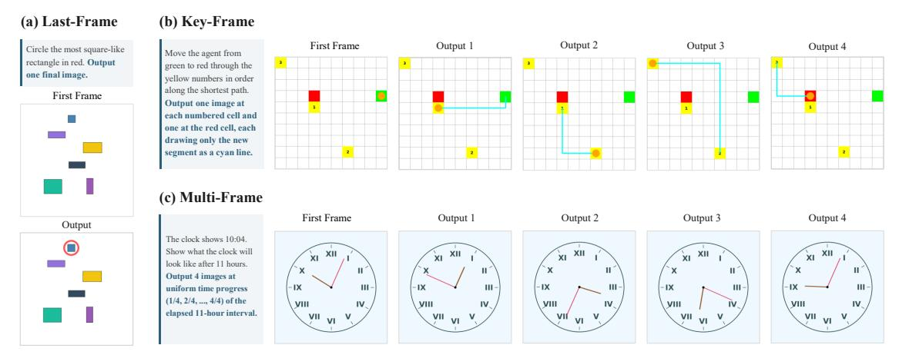

Figure 3 이미지와 교차 모달리티에 대한 세 가지 출력 영역. 중간 텍스트 주석은 명확성을 위해 생략하였다. *Last-Frame*은 최종 답변만으로 평가가 충분할 때 사용된다; *Key-Frame*은 미로 탐색과 같은 다단계 계획과 같이 몇 가지 필수 중간 프레임에 따라 해결책이 달라지는 복잡한 작업에 사용된다; 그리고 *Multi-Frame*은 해결 과정 자체가 중요할 때, 예를 들어 시간적 연속성이나 프레임별 유효성 같은 경우에 사용된다.

코퍼스는 동일한 기본 문제에 대한 서로 다른 렌더링으로, 등가 솔루션을 가진 동일한 기본 문제의 다른 표현이다. 이 설계는 동일한 작업 조건 하에서 비디오와 이미지 생성을 통제된 비교가 가능하도록 한다. 추가 설계 세부사항과 예시는 Sec. [C.1.](#page-35-0)에 제공된다.

큐레이션. 구성이 프로시저적으로 샘플링되므로 각 생성기는 많은 수의 다양한 인스턴스를 만들 수 있다. 신뢰성을 확보하기 위해 우리는 300개의 생성기를 모두 검토하여 렌더링된 샘플을 검사하고 솔버 구현을 검증한다. 또한 출시 전에 각 작업의 해상도, 프레임 속도, 프레임 수를 확인한다. 교차 설정의 경우, 우리는 Gemini-3.1-Pro-Preview [&#91;11&#93;](#page-20-1)를 사용해 중간 솔루션 단계의 텍스트 설명을 생성한다. 우리는 각 작업에 대해 전용 프롬프트를 설계하고 해당 작업의 모든 인스턴스에 일관되게 적용한다. 추가 세부사항은 Sec. [C.2.](#page-36-0)에 제공된다.

### 2.3. 통계 및 분석 (Statistics and Analysis)

VBVR-Pro를 기존 시각적 추론 벤치마크 및 데이터셋과 비교하여 작업 범위, 데이터셋 규모, 지원되는 모달리티, 평가 프로토콜 측면에서 비교한다. 300개의 작업 중 50개를 도메인 외 평가용으로 보류하고, 나머지 250개 작업에서 각 작업당 5,000개의 인스턴스를 샘플링하여 1.25M개의 학습 인스턴스를 생성한다. VBVR-Pro-Bench는 50개의 도메인 외 작업과 250개 작업 중 학습 데이터가 있는 50개의 작업(총 100개 작업)을 포함한다. 또한 VBVR-Pro는 50개의 도메인 내 작업을 포괄하는 강화 학습 전용 학습 세트를 포함하며, 이는 섹션 5에서 실험에 사용된다. 비교된 자원 중 VBVR-Pro는 가장 큰 학습 세트를 제공하며, 비디오, 이미지, 그리고 인터리브드 모달리티를 통합 작업 분포 하에서 독자적으로 지원한다.

그림 2는 VBVR-Pro의 대표적인 작업을 보여 주며, 각 작업은 해당 인지 기능에 따라 색상으로 표시된다. 각 인지 기능은 빈 캔버스의 기초부터 구조화된 게임 상태, 보드 구성, 스프라이트 기반 장면에 이르기까지 다양한 시각 환경을 포괄한다. VBVR에서 재구성된 150개의 작업과 비교하면, 새로 개발된 150개의 작업은 시각적 추론 시나리오를 보다 넓고 도전적으로 포괄하도록 설계되었다. 우리는 이 확장을 두 가지 차원에서 분석한다. 첫째, 시각적 복잡성 측면에서, 각 작업당 50개의 샘플 질문 프레임을 평균한 결과, 새 작업의 중앙값은 80개의 서로 연결된 색 영역을 포함하며, 재구성된 작업은 12개이다. 공간 정보 및 인코딩된 이미지 크기와 같은 다른 지표도 같은 경향을 보인다 (Sec. [C.3)](#page-37-0). 둘째, 추론 깊이 측면에서, 재구성된 작업은 입력에 단일 규칙을 적용해 해결되는 경우가 많지만, 수도쿠와 고모쿠와 같은 많은 새 작업은 후보 솔루션 또는 행동에 대한 다단계 탐색을 필요로 한다. 블라인드 쌍별 비교에서, 새 작업은 150개의 쌍 중 113개에서 더 깊은 추론이 필요하다고 판단되었다. 또한, 재구성된 VBVR 작업의 7%만이

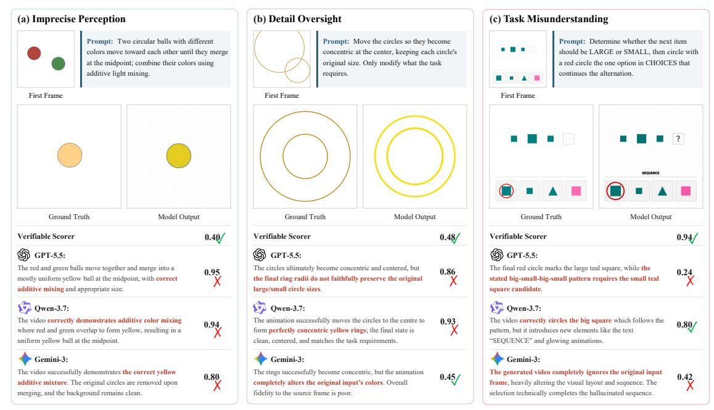

**Figure 4** VLM-as-a-judge의 세 가지 실패 모드 (Sec. 3.1). 각 모드마다 정답과 모델의 출력으로 구성된 예시와 세 강력한 VLM 판사의 점수와 근거를 함께 보여준다.

재구성된 VBVR 작업은 다단계 추론이 필요하며, 이는 새 작업의 47%와 비교된다 (Sec. C.4). Sec. 4.4에서 보듯이, VBVR-Pro-Dataset에서의 훈련은 이후 시각적 추론 벤치마크에서 더 강력하고 일관된 성능을 제공한다.

## 3. 검증 가능한 보상 스코어러 (Verifiable Reward Scorers)

신뢰할 수 있는 벤치마크는 정확하고, 저렴하며, 재현 가능한 평가자를 필요로 한다. 주류 *VLM-as-a-judge* 패러다임은 특히 정밀한 검증을 요구하는 시각적 추론 작업에서 이러한 요구를 충족시키지 못한다. 이 한계를 해결하기 위해 우리는 VBVR-Pro-Bench의 모든 100개 작업(50개 도메인 내 및 50개 도메인 외)에 대한 *verifiable reward scorers* 모음을 구축한다 (Sec. 3.2). 우리는 또한 이 스코어러들을 대규모 인간 선호도와 검증하여 (Sec. 3.3) VLM 기반 판사보다 훨씬 낮은 비용으로 더 강력한 인간 정렬을 달성함을 보여준다. 이러한 특성은 스코어러를 신뢰할 수 있는 평가뿐 아니라 시각적 추론을 위한 대규모 다중 작업 강화 학습의 핵심 기반으로 만든다 (Sec. 5).

### 3.1. VLM-as-a-Judge의 한계 (Limitations of VLM-as-a-Judge)

VLM-as-a-judge는 최근 많은 시각적 추론 벤치마크(표 1)에서 흔히 사용되는 평가 방법이 되었다. 이는 배포가 쉽고 개방형 출력에 적용 가능하기 때문이다. 그러나 우리는 이 패러다임이 평가 지표로 사용되거나 강화 학습의 보상 함수로 사용될 때 문제를 일으킨다는 것을 발견했다 [35; 40; 41].

첫째, VLM 판정자는 부정확할 수 있다. Fig. 4에 나타난 바와 같이 세 가지 대표적인 실패 모드를 관찰한다. (a) 판정자는 세밀한 시각 인식에서 부정확할 수 있다. 예를 들어, 가산 색 혼합 과제에서 생성된 공이 잘못된 색조를 갖지만, 세 개의 VLM 판정자는 모두 0.80 이상의 점수를 부여하는 반면, 우리 스코어러는 0.40을 부여한다. (b) 판정자는 결정적인 오류를 간과할 수 있다. 동심원 과제에서 출력이 보존되어야 할 원의 크기와 색을 변경하지만, 판정자는 여전히 0.78 또는 0.93과 같은 높은 점수를 부여한다. (c) 판정자는 과제 자체를 오해할 수 있다. 패턴 완성 과제에서 정답은 우리 스코어러로부터 0.94를 받지만, VLM 판정자는 0.24–0.80만을 부여한다. 이러한 예시는 VLM 판정자가 실수를 할 수 있음을 보여준다.

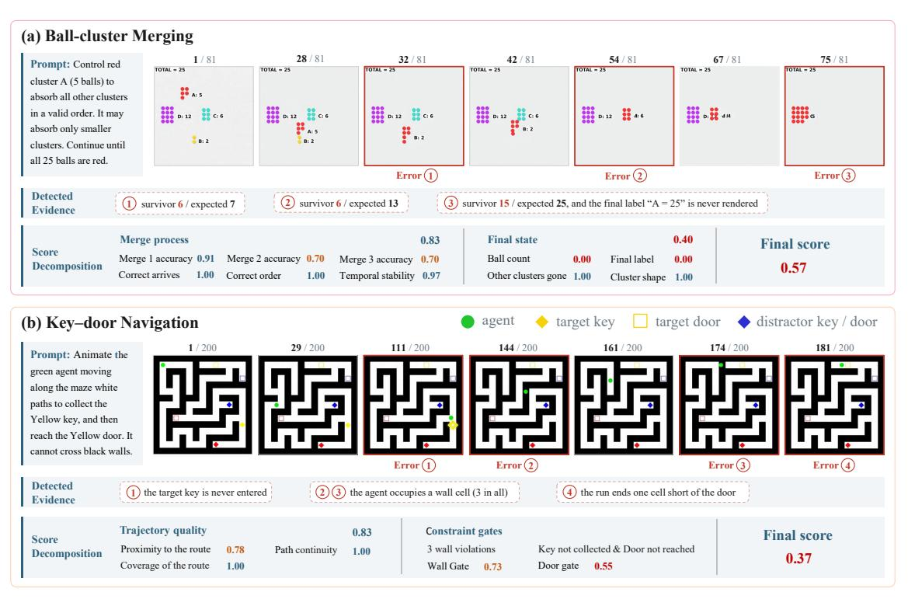

Figure 5 과제별 스코어링 예시. 우리는 검증 가능한 보상 스코어러가 각 출력을 과제 관련 검사로 분해하고 이를 최종 점수로 집계하는 방식을 보여준다.

양쪽 방향 모두에서: 부정확한 출력을 과대평가하고 정확한 출력을 과소평가한다.

둘째, VLM 판정자는 비용이 많이 든다. 이 한계는 많은 수의 롤아웃을 다수의 최적화 단계에서 평가해야 하는 강화 학습에서 특히 심각해진다. 독점 판정자는 상당한 API 비용을 발생시키며, 오픈소스 판정자는 고정된 연산 예산 하에서 모델 훈련과 경쟁하는 GPU 추론을 필요로 한다. 반면, 우리 과제별 스코어러는 가볍고 평가당 비용이 훨씬 저렴하다 (Fig. [6)](#page-8-1)).

셋째, VLM 판정자는 신뢰할 수 있는 재현성을 갖지 못한다. 온도 0에서도 동일한 비디오에 대해 반복 평가를 수행하면 55–93%의 샘플에서 다른 점수를 얻을 수 있는 반면, 우리 결정론적 스코어러는 실행마다 동일한 결과를 산출한다 (Tab. [2)](#page-7-1)). 이러한 재현성은 점수가 샘플별 보상으로 사용될 때 특히 중요하다: 일관되지 않은 피드백은 잡음이 많거나 상충되는 최적화 신호를 도입하여 효과적인 학습을 방해할 수 있다.

Table 2 평가자 재현성. 우리는 동일한 비디오에서 각 평가자를 재실행한다. 우리 검증 가능한 스코어러는 실행마다 동일한 점수를 산출하지만, VLM 판정자는 많은 경우에서 점수를 변경한다.

|  |  |  |  |  |  | Scorer GLM-4.6V-Flash [23] Gemma4-31B [55] Qwen3.6-27B [48] Qwen3.7-plus [49] InternVL3.5-38B [61] Gemini-3.1-Pro [11] |  |
|-------------------------------------------------------------|-------|-------|---------------|---------------|---------------|------------------------------------------------------------------------------------------------------------------------|---------------|
| 변경된 점수 비율(%) ↓ 최대 점수 변화(0–1) ↓ | 0.0 | 54.6 | 69.5 0.110 | 74.5 0.117 | 80.8 0.091 | 82.9 0.158 | 92.8 0.221 |
|  | 0.000 | 0.125 |  |  |  |  |  |

### 3.2. 검증 가능한 보상 스코어러 설계 (Design of Verifiable Reward Scorers)

우리는 VBVR-Pro-Bench의 100개 작업 각각에 대해 전용 검증 가능한 보상 스코어러를 구현한다. 가능할 때마다 스코어러는 픽셀 수준 차이에 의존하지 않고 대신 작업과 관련된 의미적 엔티티에서 동작한다. 각 스코어러는 관심 객체를 탐지하고 색상, 모양, 위치, 개수와 같은 속성을 추출한다. 이때 HSV 색상 분할, 윤곽선 탐지, 렌더링된 숫자와 라벨에 대한 OCR, 프레임 간 궤적 추적 등 고전적인 컴퓨터 비전 기법을 사용한다. 평가는 원시 픽셀 대신 추출된 속성에 대해 수행된다. 이 의미 기반 설계는 점수를 보다 해석 가능하게 만들고

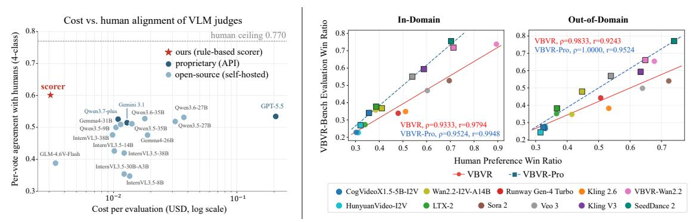

**Figure 6** 왼쪽: 인간 선호도와의 투표당 일치율(y) 대비 평가당 비용 $(x, \log \text{ scale})$  각 평가자에 대해. **오른쪽:** 모델 수준 일치율. 각 점은 하나의 생성 모델을 나타내며, y축에는 스코어러 기반 승률, x축에는 인간 승률이 표시된다. 이는 도메인 내 및 도메인 외 작업에 대해 적용된다.

robust: 픽셀 수준 비교는 약간의 공간 이동이나 렌더링 스타일 차이로 인해 정답을 처벌할 수 있지만, 속성 수준 검증은 작업과 관련된 정확성에 초점을 맞춘다.

Fig. 5는 두 평가자를 처음부터 끝까지 보여준다. 추출된 속성을 바탕으로 각 평가자는 인간이 설계하고 정밀하게 보정된 가중치를 가진 작업별 검사를 적용하고, 이를 최종 점수로 집계한다. 부드러운 기준을 가진 작업의 경우, 최종 점수는 Fig. 5(a)에 표시된 것처럼 가중합으로 계산된다. 벽을 건너는 것을 방지하는 것과 같은 엄격한 제약을 가진 작업의 경우, 검사는 Fig. 5(b)에 표시된 것처럼 곱셈적으로 결합되어 단일 위반이 최종 점수를 급격히 감소시킨다. 스코어러는 가벼운 계산으로 구현되므로 API 호출이 필요 없으며, OCR에 대해서만 선택적으로 GPU를 사용하고 완전히 결정론적이다. 또한 샘플이 실패한 작업별 검사를 표시하는 해석 가능한 오류 분해를 제공한다.

### 3.3. 인간 선호도 정렬 (Human Preference Alignment)

정확도와 효율성을 모두 평가하기 위해, 우리는 대규모 인간 선호도 주석 집합에 대해 스코어러를 검증하고 동일한 평가 설정에서 여러 VLM-as-a-judge 기준 모델과 비교한다. VBVR-Pro-Bench는 작업당 5개의 인스턴스를 포함한 100개의 작업을 포함한다. 우리는 8개의 비디오 생성 모델을 평가하여 총 4,000개의 비디오를 생성한다. 평가자 신뢰성을 평가하기 위해, 우리는 각 작업에서 하나의 인스턴스를 샘플링하고, 모든 모델 쌍을 비교하며, 각 쌍에 대해 10개의 독립적인 인간 주석을 수집한다. 주석자는 표준화된 루브릭을 사용해 두 비디오의 절대 품질을 평가하고, 우리는 이러한 평가를 쌍별 선호도로 변환한다. 이는 표준 4방향 아레나 형식과 동등하다. 우리는 각 자동 평가자가 생성한 점수를 동일한 선호도 형식으로 매핑하고 인간 판단과의 일치도를 측정한다. 또한, 독점 판사에 대한 API 토큰 사용량과 오픈소스 판사에 대한 GPU 런타임을 클라우드 서비스 가격을 사용해 평가 비용을 추정한다. 전체 주석 기준, 선호도 매핑 및 비용 계산은 Sec. D.1에 제공된다.

Fig. 6(왼쪽)에서 보듯이, 우리 스코어러는 인간 선호도와 가장 높은 일치율을 달성하면서 가장 저렴한 평가자이다. 투표당 일치율은 0.60을 초과하며, GPT-5.5[43] (0.54) 및 Gemini-3.1-Pro[11] (0.52)를 포함한 모든 VLM 판사보다 우수하며, 인간 일치도 상한선 0.77의 약 78%에 도달한다. 완벽한 일치가 기대되지 않는 이유는 인간 주석자가 근접한 비교에서 서로 다를 수 있기 때문이다. 가벼운 규칙 기반 평가자로서, 우리 스코어러는 최소 또는 전혀 GPU 계산이 필요 없으며, 이는 평가당 비용을 가장 낮게 만든다. 또한 결정론적 절차는 재현 가능한 점수를 보장한다.

개별 비교에 대한 일치 외에도, 벤치마크는 생성 모델을 신뢰성 있게 순위 매겨야 한다. 따라서 우리는 인간 평가와 우리 스코어러 하에서 각 모델의 승률을 계산하고, 모델 간 상관관계를 측정한다 (그림 6, 오른쪽). 이전 VBVR 스코어러와 비교해 VBVR-Pro 스코어러는 모든 분할에서 상관관계를 개선하며, 특히 도메인 외에서 스피어만의  $\rho$ 가 0.93에서 1.00으로, 피어슨 r이 0.92에서 0.95로 증가한다. 전반적으로 최종 스코어러는 도메인 내에서  $\rho=0.95$ 를, 도메인 외에서  $\rho=1.00$ 을 달성하며, 두 분할 모두에서  $r\geq0.95$ 를 보이며 인간 평가를 신뢰성 있게 근사할 수 있음을 보여준다.

when comparing visual generation models.

## 4. 네이티브 시각적 추론 벤치마킹 (Benchmarking Native Visual Reasoning)

이 섹션에서는 VBVR-Pro-Bench에서 주요 상용 및 오픈소스 생성 모델을 벤치마킹한다. 먼저 전반적인 성능을 보고하고, 이미지, 비디오, 인터리브드 생성 등 다양한 생성 패러다임의 동작을 분석한다 (Sec. [4.1)](#page-9-0)). 그 다음, 반사실적 진단을 수행하여 훈련된 모델이 표면적인 지름길 대신 재사용 가능한 추론 경로를 의존하는지 여부를 검토한다 (Sec. [4.2)](#page-12-0)). 마지막으로 Chain-of-Step 분석을 통해 네이티브 시각적 추론 행동을 시각화하고, 보지 못한 다양한 벤치마크에 대한 전이성을 평가한다 (Sec. [4.3)](#page-13-1) 및 Sec. [4.4)](#page-13-0)).

### 4.1. 선도 모델 성능 (Leading Model Performance)

#### *4.1.1. 오픈소스 모델 훈련* (Training Open-source Models)

Table 3 오픈소스 생성 기반 모델의 구성. "A"는 MoE와 MoT에서 활성화된 파라미터를 나타낸다.

| 모델 (Model) |  | 파라미터 아키텍처 (Parameters Architecture) |  |  |  |  |  |  |  |
|------------------------------------------|---------|-------------------------|--|--|--|--|--|--|--|
| 이미지 생성 모델 (Image Generation Models) |  |  |  |  |  |  |  |  |  |
| BAGEL-7B-MoT [12] | 14BA7B | MoT |  |  |  |  |  |  |  |
| FLUX.2-dev [1] | 32B | Dense |  |  |  |  |  |  |  |
| Qwen-Image-Edit [64] | 20B | Dense |  |  |  |  |  |  |  |
| 텍스트–이미지 상호배치 생성 모델 (Interleaved Text–Image Generation Models) |  |  |  |  |  |  |  |  |  |
| ThinkMorph-7B [18] | 14BA7B | MoT |  |  |  |  |  |  |  |
| SenseNova-U1-8B-MoT [13] | 16BA8B | MoT |  |  |  |  |  |  |  |
| 비디오 생성 모델 (Video Generation Models) |  |  |  |  |  |  |  |  |  |
| Wan2.1-I2V-14B-720P [62] | 14B | Dense |  |  |  |  |  |  |  |
| Wan2.2-TI2V-5B [62] | 5B | Dense |  |  |  |  |  |  |  |
| Wan2.2-I2V-A14B [62] | 27BA14B | MoE |  |  |  |  |  |  |  |
| LTX-2.3-I2AV [19] | 22B | Dense |  |  |  |  |  |  |  |

우리는 이미지 생성, 비디오 생성, 그리고 텍스트-이미지 혼합 생성을 아우르는 9개의 오픈소스 생성 기반 모델을 선정하여 훈련 이후 생성 모달리티별로 추론 행동이 어떻게 다른지 조사한다. 선택된 모델들은 규모, 아키텍처, 교차 모달 상호작용 메커니즘, 출력 표현 방식에서 상당한 다양성을 보이며, 희소 및 밀집 아키텍처와 잠재 공간 및 픽셀 공간 생성 패러다임을 모두 포함한다. 추가 아키텍처 세부 사항은 Sec. [A.](#page-26-0)에 제공된다. 모든 모델은 512 × 512 해상도에서 한 에폭 동안 VBVR-Pro-Dataset으로 훈련된다. Rank‑32 LoRA는 10B 파라미터를 초과하는 이미지 및 혼합 텍스트‑이미지 모델과 모든 비디오 생성기에 적용되며, 더 작은 이미지 및 혼합 텍스트‑이미지 모델은 완전한 파인튜닝을 수행한다. 비디오 모델은 16 fps에서 훈련된다. 추가 훈련 및 구현

세부 사항은 Sec. [A.1.1.](#page-27-0)에 제공된다. 파인튜닝된 모델은 접두사 *VBVR-Pro-*로 표시된다.

#### 주요 결과 (*4.1.2. Main Results*)

Tab. [4](#page-10-0)는 VBVR-Pro-Bench에서 30개가 넘는 독점 및 오픈소스 모델을 비교한다. 우리는 Seedance 2.0 및 GPT‑Image‑2와 같은 최상위 독점 모델이 강력한 성능을 달성함을 발견했으며, 이는 현재 생성 모델이 이미 비트리비얼 추론 능력을 보유하고 있음을 시사한다. 반면 대부분의 학계 오픈소스 모델은 상당히 뒤처지며, 우리는 이는 작업 관련 훈련 데이터의 가용성이 중요한 병목 현상이라고 믿는다. 이 관찰과 일치하게, VBVR-Pro-Dataset에 대한 작업별 훈련은 이미지, 혼합 텍스트‑이미지, 비디오 생성 전반에 걸쳐 모든 9개 모델을 개선하며 평균 전반적 이득은 0.290이다. 그럼에도 불구하고 가장 강력히 훈련된 모델조차도 인간 수준의 성능에 훨씬 못 미치며, 이는 상당한 개선 여지를 강조한다.

작업 내 일반화와 교차 작업 전이의 차이를 구분하기 위해, 우리는 도메인 내(ID)와 도메인 외(OOD) 설정 모두에서 모델을 평가한다. ID 평가는 훈련과 동일한 작업 분포에서 보지 못한 인스턴스를 사용하며, 알려진 작업군 내에서의 일반화를 측정한다. 반면 OOD 평가는 다른 작업 분포를 도입하여 학습된 시각적 추론 능력이 보지 못한 작업에 전이되는지를 측정한다. 훈련은 ID 작업에서 평균 +0.401의 눈에 띄는 향상을 가져오며, OOD 성능 역시 평균 +0.179로 일관되게 개선된다. 이는 VBVR-Pro-Dataset이 알려진 작업 내 인스턴스 수준 일반화뿐 아니라 작업군 간 전이까지 향상시킨다는 증거를 제공한다. 우리는 Sec. [4.4.](#page-13-0)에서 실제 세계 및 구현 시나리오를 포함한 외부 추론 벤치마크에 대한 전이 가능성도 추가로 검토한다.

Table 4 VBVR-Pro-Bench에 대한 벤치마킹 결과. 전체적으로, 도메인 내 및 도메인 외 점수가 범주별 성능과 함께 보고된다. 굵은 글씨: 하위 그룹에서 최고; 밑줄: 두 번째 최고.

| 모델 전체 평균. 회피. 지식. 비율. 공간. 번역. 평균. 회피. 지식. 비율. 공간. 이미지 생성 모델 독점 모델 Qwen-Image-2.0 [72] 0.313 0.248 0.269 0.196 0.225 0.170 0.132 0.378 0.341 0.235 0.391 0.384 0.080 Seedream-5.0-Pro [3] 0.557 0.485 0.518 0.312 0.509 0.401 0.217 0.629 0.507 0.455 0.661 0.559 0.202 오픈소스 모델 0.201 0.121 BAGEL-7B-MoT [12] 0.089 0.066 0.039 0.085 0.067 0.046 0.027 0.111 0.031 0.073 0.028 FLUX.2-dev [1] 0.157 0.108 0.088 0.109 0.072 0.100 0.066 0.206 0.197 0.165 0.184 0.241 0.077 Qwen-Image-Edit [64] 0.134 0.108 0.092 0.082 0.100 0.109 0.056 0.159 0.176 0.063 0.141 0.182 0.082 강력한 기준선 VBVR-Pro-BAGEL 0.172 0.168 0.199 0.105 0.110 0.213 0.055 0.176 0.254 0.104 0.148 0.015 0.145 VBVR-Pro-FLUX.2 0.407 0.484 0.483 0.323 0.367 0.449 0.336 0.330 0.361 0.272 0.255 0.454 0.128 VBVR-Pro-Qwen-Image-Edit 0.322 0.332 0.298 0.217 0.193 0.431 0.222 0.311 0.341 0.239 0.233 0.413 0.181 텍스트-이미지 혼합 생성 모델 독점 모델 0.300 0.303 GPT-Image-2 [44] 0.507 0.428 0.456 0.318 0.428 0.206 0.587 0.398 0.413 0.633 0.480 Nano Banana Pro [51] 0.564 0.480 0.518 0.422 0.512 0.285 0.174 0.648 0.553 0.499 0.657 0.585 0.220 오픈소스 모델 ThinkMorph-7B [18] 0.154 0.113 0.100 0.082 0.101 0.148 0.031 0.195 0.176 0.166 0.163 0.253 0.103 0.386 0.477 VBVR-SenseNova-U1 [58] 0.408 0.469 0.356 0.313 0.373 0.347 0.291 0.317 0.275 0.480 0.238 강력한 기준선 VBVR-Pro-ThinkMorph 0.373 0.402 0.403 0.344 0.238 0.454 0.184 0.344 0.367 0.224 0.238 0.535 0.257 VBVR-Pro-SenseNova-U1 0.638 0.811 0.648 0.695 0.621 0.770 0.541 0.464 0.480 0.328 0.344 0.558 0.408 비디오 생성 모델 독점 모델 Veo 3.1 [17] 0.309 0.312 0.275 0.299 0.252 0.267 0.157 0.305 0.305 0.233 0.252 0.312 0.219 Kling VIDEO 3.0 [29] 0.392 0.356 0.213 0.326 0.320 0.355 0.229 0.427 0.294 0.564 0.375 0.242 0.412 Seedance 2.0 [52] 0.499 0.451 0.338 0.361 0.353 0.468 0.308 0.547 0.369 0.511 0.478 0.538 0.532 오픈소스 모델 HunyuanVideo-I2V [28] 0.054 0.054 0.023 0.064 0.015 0.084 0.032 0.053 0.088 0.014 0.028 0.062 0.055 CogVideoX1.5-5B-I2V [69] 0.085 0.100 0.061 0.118 0.069 0.092 0.060 0.070 0.125 0.038 0.051 0.040 0.024 Wan2.1-I2V-720P [62] 0.100 0.105 0.052 0.125 0.091 0.102 0.052 0.095 0.112 0.073 0.071 0.123 0.044 Wan2.2-TI2V-5B [62] 0.094 0.066 0.029 0.073 0.050 0.083 0.031 0.122 0.156 0.052 0.106 0.063 0.099 Wan2.2-I2V-A14B [62] 0.182 0.157 0.082 0.131 0.110 0.161 0.156 0.207 0.224 0.139 0.140 0.195 0.273 LTX-2.3-I2AV [19] 0.112 0.106 0.062 0.109 0.070 0.133 0.055 0.119 0.161 0.135 0.086 0.091 0.050 VBVR-Wan2.2 [58] 0.517 0.548 0.237 0.499 0.334 0.566 0.591 0.486 0.310 0.343 0.345 0.732 0.684 강력한 기준선 VBVR-Pro-LTX2.3 0.425 0.527 0.409 0.510 0.346 0.460 0.390 0.324 0.381 0.108 0.201 0.477 0.386 VBVR-Pro-Wan2.1-I2V-14B 0.562 0.730 0.617 0.580 0.452 0.676 0.623 0.395 0.410 0.305 0.230 0.617 0.439 |  |  |  |  | 도메인 내 카테고리별 |  |  |  |  |  | 도메인 외 카테고리별 |  |  |  |
|--------------------------------------------------------------------------------------------------------------------------------------------------------------------------------------------------------------------------------------------------------------------------------------------------------------------------------------------------------------------------------------------------------------------------------------------------------------------------------------------------------------------------------------------------------------------------------------------------------------------------------------------------------------------------------------------------------------------------------------------------------------------------------------------------------------------------------------------------------------------------------------------------------------------------------------------------------------------------------------------------------------------------------------------------------------------------------------------------------------------------------------------------------------------------------------------------------------------------------------------------------------------------------------------------------------------------------------------------------------------------------------------------------------------------------------------------------------------------------------------------------------------------------------------------------------------------------------------------------------------------------------------------------------------------------------------------------------------------------------------------------------------------------------------------------------------------------------------------------------------------------------------------------------------------------------------------------------------------------------------------------------------------------------------------------------------------------------------------------------------------------------------------------------------------------------------------------------------------------------------------------------------------------------------------------------------------------------------------------------------------------------------------------------------------------------------------------------------------------------------------------------------------------------------------------------------------------------------------------------------------------------------------------------------------------------------------------------------------------------------------------------------------------------------------------------------------------------------------------------------------------------------------------------------------------------------------------------------------------------------------------------------------------------------------------------------------------------------------------------------------------------------------------------------------------------------------------------------------------------------------------------------------------------------------------------------------------------------------------------------------------------------------------------------------------------------------------------------------------------------------------------------------------------------------------------------------------------------------------------------------------------------------------------------------------------------------------------------------------------------------------------------------------------------------------------------------------------------------------------------------------------------------------------------------------------------------------------------------------------------------------------------------------------------------------------------------------------------------------------------------------------------------------------------------------------------------------|-------------------------|-------|-------|-------|-----------------------|-------|-------|-------|-------|-------|---------------------------|-------|-------|--------|
|  |  |  |  |  |  |  |  |  |  |  |  |  |  | 번역 |
|  |  |  |  |  |  |  |  |  |  |  |  |  |  |  |
|  |  |  |  |  |  |  |  |  |  |  |  |  |  |  |
|  |  |  |  |  |  |  |  |  |  |  |  |  |  |  |
|  |  |  |  |  |  |  |  |  |  |  |  |  |  |  |
|  |  |  |  |  |  |  |  |  |  |  |  |  |  |  |
|  |  |  |  |  |  |  |  |  |  |  |  |  |  |  |
|  |  |  |  |  |  |  |  |  |  |  |  |  |  |  |
|  |  |  |  |  |  |  |  |  |  |  |  |  |  |  |
|  |  |  |  |  |  |  |  |  |  |  |  |  |  |  |
|  |  |  |  |  |  |  |  |  |  |  |  |  |  |  |
|  |  |  |  |  |  |  |  |  |  |  |  |  |  |  |
|  |  |  |  |  |  |  |  |  |  |  |  |  |  |  |
|  |  |  |  |  |  |  |  |  |  |  |  |  |  |  |
|  |  |  |  |  |  |  |  |  |  |  |  |  |  |  |
|  |  |  |  |  |  |  |  |  |  |  |  |  |  |  |
|  |  |  |  |  |  |  |  |  |  |  |  |  |  |  |
|  |  |  |  |  |  |  |  |  |  |  |  |  |  |  |
|  |  |  |  |  |  |  |  |  |  |  |  |  |  |  |
|  |  |  |  |  |  |  |  |  |  |  |  |  |  |  |
|  |  |  |  |  |  |  |  |  |  |  |  |  |  |  |
|  |  |  |  |  |  |  |  |  |  |  |  |  |  |  |
|  |  |  |  |  |  |  |  |  |  |  |  |  |  |  |
|  |  |  |  |  |  |  |  |  |  |  |  |  |  |  |
|  |  |  |  |  |  |  |  |  |  |  |  |  |  |  |
|  |  |  |  |  |  |  |  |  |  |  |  |  |  |  |
|  |  |  |  |  |  |  |  |  |  |  |  |  |  |  |
|  |  |  |  |  |  |  |  |  |  |  |  |  |  |  |
|  |  |  |  |  |  |  |  |  |  |  |  |  |  |  |
|  |  |  |  |  |  |  |  |  |  |  |  |  |  |  |
|  |  |  |  |  |  |  |  |  |  |  |  |  |  |  |
|  |  |  |  |  |  |  |  |  |  |  |  |  |  |  |
|  |  |  |  |  |  |  |  |  |  |  |  |  |  |  |
|  |  |  |  |  |  |  |  |  |  |  |  |  |  |  |
|  |  |  |  |  |  |  |  |  |  |  |  |  |  |  |
|  |  |  |  |  |  |  |  |  |  |  |  |  |  |  |
|  |  |  |  |  |  |  |  |  |  |  |  |  |  |  |
|  |  |  |  |  |  |  |  |  |  |  |  |  |  |  |
|  |  |  |  |  |  |  |  |  |  |  |  |  |  |  |
|  | VBVR-Pro-Wan2.2-TI2V-5B | 0.470 | 0.641 | 0.528 | 0.556 | 0.373 | 0.565 | 0.557 | 0.300 | 0.333 | 0.127 | 0.161 | 0.505 | 0.409 |
| VBVR-Pro-Wan2.2-I2V-A14B 0.670 0.808 0.632 0.685 0.556 0.751 0.636 0.532 0.479 0.418 0.350 0.679 0.690 |  |  |  |  |  |  |  |  |  |  |  |  |  |  |

#### 4.1.3. 이미지, 인터리브 텍스트-이미지 및 비디오 생성 (Image, Interleaved Text-Image, and Video Generation)

일반적인 직관은 비디오 생성이 인터리브 텍스트-이미지 생성을 능가해야 한다는 것이다. 이는 비디오가 밀집된 시간적 연속성을 제공하기 때문이다. 그러나 작업별 훈련 후, 우리는 가장 강력한 인터리브 텍스트-이미지 모델인 VBVR-Pro-SenseNova-U1이 많은 ID 작업에서 가장 강력한 비디오 모델인 VBVR-Pro-Wan2.2-I2V-A14B와 동등한 성능을 보인다는 것을 발견한다. 이는 기본 작업 구조가 학습되면, 이산적이지만 작업 관련 시각 상태의 희소 시퀀스가 많은 익숙한 시각적 추론 문제를 해결하는 데 충분할 수 있음을 시사한다. 또한 인터리브 모델은 생성 및 추론 비용이 현저히 낮아 정확도–효율성 트레이드오프가 유리하다.

비디오 생성은 여전히 성공적인 추론이 상태 전이의 정확한 모델링을 요구할 때 명확한 이점을 유지한다. 비디오 모델은 ID 변환 작업과 OOD 범주에서 더 나은 성능을 보이며, 이는 모델이 미세한-

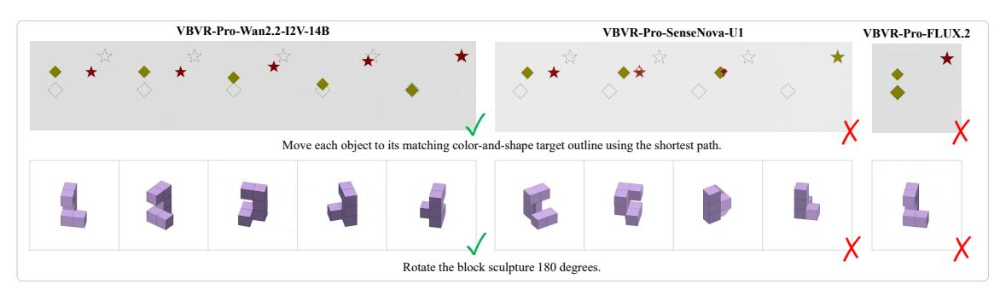

그림 7: 변환 과제에서 시각적 추론 모달리티 간의 정성적 비교

시간에 따른 미세한 변화나 학습된 전이 동역학을 훈련 분포를 넘어 일반화한다. 이 구분은 그림 7에서 정성적으로 보여진다: 비디오 모델은 일관된 중간 상태를 생성하고 최단 경로 객체 조작 과제와 $180^{\circ}$ 블록 회전 과제 모두에서 올바른 해를 도달하지만, 교차 텍스트-이미지 및 단일 이미지 모델은 실패한다.

단일 이미지 생성은 특히 변환 과제에서 궤적 기반 표현보다 현저히 약하다. 이는 단일 최종 이미지가 해결 과정에 포함된 중간 상태를 명시적으로 포착하지 않기 때문에 다단계 상태 전이를 모델링하는 데 제한된 지원을 제공한다.

#### 4.1.4. 시각적 궤적 감독이 텍스트 의미보다 더 기여한다 (Visual Trajectory Supervision Contributes More Than Textual Semantics)

**Table 5** 교차 모달리티에 대한 제거 실험. **Text**는 출력이 의미 있는 추론(*Full*)을 포함하는지, 아니면 의미가 없는 자리 표시자(*Placeholder*)를 포함하는지를 나타내며, **Images**는 중간 시각적 궤적이 여러 상태(*Multi*)를 포함하는지, 단일 시각적 표현(*Single*)을 포함하는지를 나타낸다.

| 모달리티 |  |  | 도메인 내 카테고리별 |  |  |  |  | 도메인 외 카테고리별 |  |  |  |  |  |  |  |
|----------------------------|-----------------------------|--------------------------|--------------------------------|---------------------------------------------------------------------------|--------------------------------|--------------------------------|--------------------------------|---------------------------------|--------------------------------|--------------------------------|---------------------------------|---------------------------------|---------------------------------|--------------------------------|---------------------------------------|
| #   모델 (Models) | 텍스트 | 이미지 | 전체 | 평균. | 중단. | 지식. | 비율. | 공간. | 전송. | 평균. | 중단. | 지식. | 비율. | 공간. | 전송. |
| 1-1   1-2   ThinkMorph 1-3 | 전체 전체 자리표시자 | 다중 단일 다중 | 0.373 0.349 <b>0.374</b> | 0.402 0.382 0.399 | 0.403 0.402 0.384 | 0.344 0.290 <b>0.350</b> | 0.238 0.244 <b>0.250</b> | <b>0.454</b> 0.391 <u>0.440</u> | 0.184 <b>0.219</b> 0.184 | 0.344 0.316 <b>0.348</b> | 0.367 0.333 <b>0.372</b> | <b>0.224</b> 0.143 <u>0.187</u> | 0.238 0.225 <b>0.262</b> | 0.535 <b>0.538</b> 0.479 | 0.257 0.235 <b>0.266</b> |
| 2-1   SenseNova-U1   2-3 | 전체 전체 자리표시자 | 다중 단일 다중 | 0.638 0.527 0.629 | $\begin{array}{ c c }\hline 0.811\\ 0.643\\ \textbf{0.821}\\ \end{array}$ | 0.648 0.637 <b>0.661</b> | 0.695 0.464 0.683 | 0.621 0.608 <b>0.660</b> | <b>0.770</b> 0.560 0.734 | 0.541 0.323 0.577 | 0.464 0.412 0.436 | <b>0.480</b> 0.457 <u>0.469</u> | 0.328 0.276 <b>0.351</b> | <b>0.344</b> 0.319 <u>0.329</u> | 0.558 0.578 0.468 | <b>0.408</b> 0.199  <u>0.339</u> |

텍스트와 시각적 추론 경로 감독이 교차 모델에 미치는 상대적 기여를 분리하기 위해, 우리는 세 가지 훈련 설정에서 Tab. 5의 소거 연구를 수행한다. Exp. 1-1과 Exp. 2-1은 기준 설정으로 사용되며 각각 원래의 VBVR-Pro-ThinkMorph와 VBVR-Pro-SenseNova-U1 모델에 해당한다. 두 모델 모두 의미 있는 추론 텍스트와 여러 중간 이미지를 포함하는 완전한 교차 경로에서 훈련된다.

중간 시각적 상태를 제거하면 명확한 성능 저하가 나타난다. Exp. 1-2와 Exp. 2-2는 원래의 추론 텍스트를 유지하지만 각 시각적 경로를 하나의 이미지로 압축하여 중간 시각적 감독의 기여를 분리한다. 해당 기준 모델과 비교할 때, 이 변형들은 전체 점수를 각각 0.024와 0.111만큼 감소시킨다.

반대로 의미 있는 중간 텍스트를 자리 표시자로 교체하면 전체 성능에 미치는 영향이 훨씬 작다. Exp. 1-3과 Exp. 2-3은 다중 이미지 경로를 보존하면서 추론 텍스트를 의미가 없는 자리 표시자로 교체하여 중간 추론 단계에서 텍스트 의미의 기여를 분리한다.

이러한 결과는 VBVR-Pro의 시각적 추론 과제에서 명시적 시각적 상태 전이가 중간 텍스트 추론보다 더 큰 기여를 한다는 것을 시사한다. 벤치마크의 많은 과제, 예를 들어 미로 탐색, 객체 변환 및 회전은 본질적으로 공간적이며 위치, 순서, 방향, 경로 및 방향 변화를 추적해야 한다. 중간 시각적 상태의 연속은 이러한 변환을 직접 관찰 가능하게 하며, 따라서 근본적인 추론 과정을 자연스럽게 표현한다.

### 4.2. 가설적 진단

**Table 6** 가설적 진단은 *학습된* **VBVR-Pro-SenseNova-U1**의 추론 시에 수행된다.

| # | 개입 | 전체 | ID 평균 | OOD 평균 |
|----|--------------------------------------------------|---------|---------|----------|
| 예시 | 실험 1: 입력 모달리티 |  |  |  |
| 1 | 원본 입력 텍스트와 이미지 | 0.638 | 0.820 | 0.455 |
| 2 | 의미가 동일한 재구성된 입력 텍스트 | 0.640 | 0.811 | 0.468 |
| 3 | 작업 의미가 제거된 입력 텍스트 | 0.317 | 0.435 | 0.199 |
| 4 | 입력 이미지 제거 | 0.064 | 0.077 | 0.051 |
| 5 | 수평 반전 또는 $180^{\circ}$ 회전 | 0.613 | 0.786 | 0.439 |
| 예시 | 실험 2: 중간 추론 상태 |  |  |  |
| 6 | 중간 텍스트 제거 | 0.533 | 0.661 | 0.406 |
| 7 | 중간 텍스트가 모순됨 | 0.530 | 0.670 | 0.390 |
| 8 | 중간 이미지 제거 | 0.099 | 0.128 | 0.069 |
| 9 | 노이즈로 손상된 중간 이미지 | 0.190 | 0.307 | 0.074 |

훈련된 모델의 뛰어난 성능은 중요한 질문을 제기한다: 과제별 훈련이 재사용 가능한 시각적 추론을 유도하는가, 아니면 모델이 훈련 분포에서 반복되는 지시어 템플릿이나 프롬프트와 출력 사이의 기억된 연관성 같은 표면적 규칙성을 이용하는가? 우리는 이 질문을 검토하기 위해 세 가지 보완적인 반사실적 진단을 수행한다. 첫 번째는 입력 텍스트나 이미지를 변형하여 예측이 표면적 표현이 아니라 근본적인 문제 인스턴스에 의존하는지를 테스트한다. 두 번째는 중간 rea-

중간 추론 상태를 개입하여 추론 과정에서 어느 모달리티가 더 중요한 역할을 하는지 결정한다. 이 섹션의 모든 실험은 VBVR-Pro-SenseNova-U1에서 수행된다.

#### 4.2.1. 입력 모달리티에 대한 개입 (Intervention on Input Modalities)

표 6에 나타난 바와 같이, **Intervention #1**은 원본 입력 텍스트와 이미지를 깨끗한 기준으로 사용한다. **Intervention #2**는 입력 텍스트를 의미적으로 재구성하면서 과제 요구사항을 보존한다: 성능은 본질적으로 변하지 않아, 성공적인 추론이 지시문의 특정 언어 형태에 의존하지 않음을 시사한다. 반면에 **Intervention #3**은 입력 텍스트에서 과제별 의미를 제거하고 일반적인 출력 요구사항만 남긴다. 이는 상당한 성능 저하를 초래하며, 초기 텍스트가 단순한 표면적 트리거가 아니라 필요한 과제 목표를 제공함을 보여준다. **Intervention #4**는 입력 이미지를 완전히 제거하고 입력 텍스트는 그대로 두어, 이 실험에서 가장 큰 성능 저하를 일으키며 성능을 0.064로 낮춘다. 따라서 해결책은 텍스트 입력만으로는 회복될 수 없다. **Intervention #5**는 기본 과제를 보존하면서 시각적 구현을 바꾸는 기하학적 반사실을 구성한다. 구체적으로 입력 이미지는 수평 반전하거나 180° 회전되며, 입력 텍스트의 방향 의존적 언어는 해당 기하학적 변환과 일관되게 변형된다. 성능은 이러한 변형에서도 상당히 유지된다. 공간 배열이 바뀔 때 생성된 추론 경로도 그에 따라 변하며 여전히 올바른 최종 상태에 도달할 수 있다.

종합하면, 이 결과들은 지시어 템플릿 적합이나 질문 기억화에 반대한다: 성능은 입력 텍스트의 의미상 동등한 재구성에 무감각하지만, 과제 의미와, 더 중요한 것은 과제가 수행되어야 할 특정 시각적 상태에 크게 의존한다. VBVR-Pro-Dataset 훈련에서 얻은 이득은 반복되는 질문 패턴과 출력 사이의 기억된 매핑으로 설명하기 어렵고, 재사용 가능한 시각적 관계와 연산을 학습한 것과 더 일치한다.

#### 4.2.2. 중간 추론 상태에 대한 개입 (Intervention on Intermediate Reasoning States)

Sec. 4.1.4가 훈련 중 가장 유용한 감독 형태를 연구하는 반면, 여기서는 훈련된 모델의 교차 추론 경로에서 실제로 사용되는 정보를 조사한다. 구체적으로, 우리는 추론 시에 중간 출력에 직접 개입하고 그 이후 롤아웃에 대한 인과적 기여를 측정한다.

텍스트 경로에서는 **Intervention #6**이 이후 생성 단계 이전에 중간 텍스트를 제거하고, **Intervention #7**은 이를 모순된 버전으로 교체한다 (*예*., "left"를 "right"로 변경). 두 개의 개입은 유사한 중간 정도의 성능 저하를 초래한다. 이는 중간 언어가 롤아웃에 유용한 맥락을 제공하지만, 그 정보가 제거되거나 일관되지 않더라도 추론 경로가 부분적으로는 기능을 유지함을 시사한다.

시각 경로는 상당히 더 민감하다. **개입 #8 (Intervention #8)** 은 중간 이미지를 다음 생성 단계에 다시 피드하기 전에 제거하고, **개입 #9 (Intervention #9)** 은 중간 이미지를 강한 잡음으로 손상시킨다. 두 개입은 텍스트 개입보다 훨씬 큰 성능 저하를 초래한다,

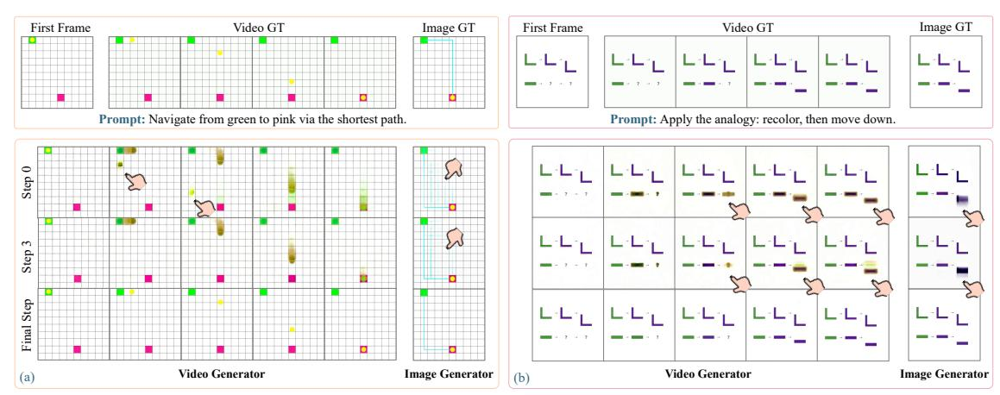

Figure 8 Chain-of-Step 시각화. Wang *et al* [&#91;60&#93;](#page-23-0)를 따라 우리는 생성 모델이 확산 단계에서 어떻게 추론하는지 시각화한다. 비디오와 이미지 생성기 모두 Chain-of-Step 행동(포인트된 부분을 참조)을 보이며, 예를 들어 *Multi-Path Exploration* (왼쪽)과 *Superposition-Based Exploration* (오른쪽)과 같이 초기 디노이징 단계에서 여러 가지 가능한 해결 가설이 등장하고 점차 최종 답변으로 수렴한다.

완전 제거는 가장 강한 저하를 초래한다. 최종 출력 이미지 자체는 직접적으로 수정되지 않으므로, 이러한 효과는 이후 추론 단계에서 사용 가능한 중간 시각 상태를 방해함으로써 발생한다.

중간 시각 개입에 대한 더 강한 민감도는 Sec. [4.1.4.](#page-11-2)의 훈련 시 결과와 일치한다. 두 분석은 상호 보완적인 증거를 제공한다: 시각 경로는 훈련 중에 더 강력한 감독 소스로서뿐만 아니라 추론 시에도 적극적으로 사용된다. 명시적 텍스트 추론은 전개를 지원할 수 있지만, 중간 시각 상태가 보다 중요한 작업 표현으로 보인다. 이 패턴은 시각 상태를 유지하고 업데이트하는 추론 과정을 일관시키며, 언어는 주요 계산 매체가 아니라 보조 역할을 수행한다.

### 4.3. Chain-of-Step: 네이티브 시각 추론 시각화 (Chain-of-Step: Visualization of Native Visual Reasoning)

Wang *et al* [&#91;60&#93;](#page-23-0)가 비디오 확산 모델에서 추론 행동을 시각화하는 도구를 도입한 것을 따라, 우리는 동일한 분석을 비디오와 이미지 생성 모델 모두에 적용한다. 구체적으로, 우리는 VBVR-Pro-Dataset에서 훈련된 모델의 중간 추론 행동을 검사하기 위해 서로 다른 디노이징 단계에서 노이즈가 있는 확산 잠재 변수를 디코딩한다. 우리는 두 가지 대표 모델을 분석한다: 가장 강력한 비디오 생성 모델인 VBVR-Pro-Wan2.2-I2V-A14B와 인터리브된 텍스트-이미지 생성 모델인 VBVR-Pro-SenseNova-U1. 두 모달리티 모두에서 명확한 *Chain-of-Step* 행동을 관찰한다 [&#91;60&#93;](#page-23-0). Fig. [8(](#page-13-2)a)에서 보듯이, 두 모델은 디노이징 단계에서 여러 후보 경로를 탐색한 뒤 가장 짧은 실행 가능한 경로로 수렴하며, 이는 *Multi-Path Exploration*에 해당한다. 비디오 모델은 이 과정을 연속적인 객체 움직임으로 표현하고, 인터리브된 텍스트-이미지 모델은 이미지 공간에서 후보 경로를 직접 그린다. Fig. [8(](#page-13-2)b)에서는 두 모델이 추가로 *Superposition-Based Exploration*을 보여주며, 이는 중간 디노이징 단계에서 여러 가지 가능한 시각 상태가 겹쳐진 뒤 모델이 최종 솔루션으로 수렴한다.

### 4.4. 전이성 (Transferability)

VBVR-Pro-Dataset에서 미세 조정된 모든 모델 중, 우리는 가장 강력한 모델인 VBVR-Pro-Wan2.2-I2V-A14B를 Tab. [7.](#page-14-0)에 있는 일곱 개의 외부 추론 벤치마크에서 평가한다. VBVR-Pro-Wan2.2-I2V-A14B는 보이지 않는 벤치마크에서 최대 20% 포인트의 일관된 개선을 달성한다. 특히, 이 벤치마크들은 VBVR-Pro의 범위를 넘어서는 많은 실제 시각 문제를 포함하지만, VBVR-Pro-Dataset에서 미세 조정된 모델은 여전히 전이 가능한 능력을 획득한다. 예를 들어, Wan2.2-I2V-A14B 기반 모델과 비교할 때, VBVR-Pro-Wan2.2-I2V-A14B는 V-ReasonBench에서 형태 적합 및 유추 해결에서, 그리고 MME-CoF-Pro에서 구현된 추론에서 눈에 띄는 개선을 보인다.

**표 7 외부 비디오 추론 벤치마크 결과.**

높은 점수는 더 나은 성능을 나타낸다.

**Bold**는 최상의 결과를, <u>underline</u>는 두 번째 최상의 결과를 나타낸다.

VBVR-Pro-Dataset에서의 훈련은 다양한 시각적 추론 시나리오에서 전이 가능한 개선을 가져온다.

| 모델 | RISE-Video [37] | V-ReasonBench [39] | RULER-Bench [20] | MME-COF-Pro [47] | VideoThinkBench mini [ | 56] BabyVision-Gen[5] | intelligentVBench (Implicit I2V) [46] |
|-------------------------------|-----------------|--------------------|------------------|------------------|---------------------------|-----------------------|------------------------------------------|
| 비디오 생성 모델 | · |  |  |  |  |  |  |
| 독점 모델 Veo-3.1 | 76.40 | 24.25 | 65.19 | 55.90 | 27.69 | - | 3.74/5 |
| 오픈소스 모델 |  |  |  |  |  |  |  |
| CogVideoX1.5-5B-I2V | 46.99 | 7.87 | 42.27 | 28.46 | 22.83 | 1.07 | 3.50/5 |
| LTX-2.3-I2AV | 55.23 | 4.51 | 49.14 | 34.05 | 22.40 | 2.14 | 3.88/5 |
| Wan2.2-I2V-A14B | 62.83 | 10.21 | 57.89 | 24.76 | 25.71 | 0.36 | 3.93/5 |
| VBVR-Wan2.2 | 65.94 | 18.05 | 56.28 | 34.13 | 30.72 | 4.64 | 4.08/5 |
| 우리 모델 |  |  |  |  |  |  |  |
| VBVR-Pro-Wan2.2-I2V-A14B | 66.18 | 38.22 | 66.96 | 48.39 | 52.86 | 12.50 | 4.11/5 |

작업은 일상 물체와 로봇 조작기를 포함한 실제 장면을 다루며, 이는 VBVR-Pro-Dataset의 프로시저적으로 생성된 추상화와 크게 다르다. 대표적인 사례는 Fig. 9에 표시되어 있으며, 상세 결과는 Sec. A.2에 보고된다.

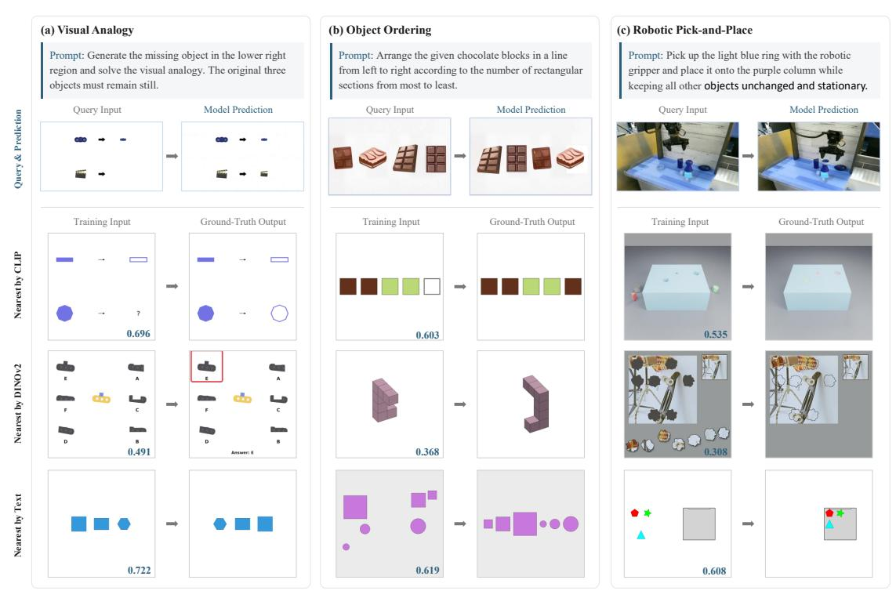

**Figure 9** 훈련 세트에 대한 최근접 이웃 분석. 각 쿼리에 대해 모델 예측과 CLIP, DINOv2, 텍스트 특징을 사용해 검색된 가장 가까운 훈련 인스턴스를 보여준다. 검색된 인스턴스는 시각적·의미적으로 쿼리와 구별되며, 이는 모델의 전이 가능성이 직접적인 기억에 기인하지 않음을 시사한다. 파란 숫자는 특징 공간 유사도를 나타낸다.

개선이 테스트 세트와 유사한 훈련 샘플을 기억하는 데서 비롯된 것인지, 아니면 개념적으로 전이 가능한 합성 예시에서 획득한 일반화 가능한 추론에서 비롯된 것인지 검증하기 위해 우리는 최근접 이웃 분석을 수행한다. Fig. 9의 예시에서는 초기 이미지에 대해 CLIP [50]과 DINOv2 [45] 특징을, 작업 지시문에 대해 BGE-base-en-v1.5 [66] 임베딩을 사용해 가장 가까운 훈련 샘플을 검색한다. 이러한 경우, 모델은 시각적으로 유사한 훈련 예시 없이도 보지 못한 벤치마크 문제에 전이된다. 일부 검색된 훈련 예시가 관련 작업 지시문을 갖고 있을지라도, 그 시각적 외관은 테스트 예시와 크게 다르다. 이는 모델이 표면적 외관을 넘어 패턴 찾기, 순서 지정, 물체 조작과 같은 추상적 시각 개념과 연산을 학습하고 있음을 시사하며, 이를 통해

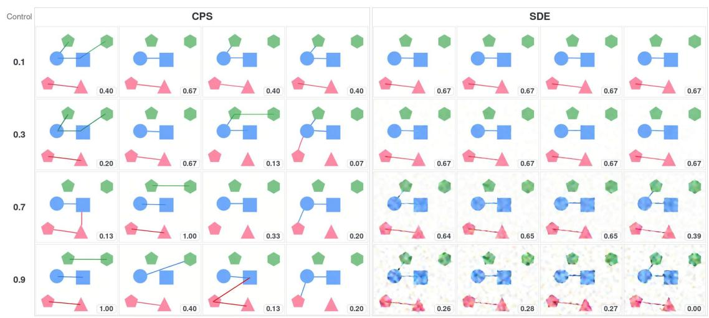

Figure 10 CPS와 Flow-SDE의 최종 프레임을 서로 다른 확률성 설정에서 비교한 결과. 각 행은 동일한 프롬프트에서 생성된 네 개의 선택된 롤아웃을 보여주며, 각 썸네일에 표시된 숫자는 점수를 나타낸다. 더 강한 CPS 노이즈는 더 다양한 연결 결정을 가능하게 하면서도 깨끗한 형태와 배경을 대부분 보존한다. 반면, SDE 확률성을 증가시키면 점진적으로 심각한 시각적 손상이 발생한다. CPS 노이즈 수준과 SDE η는 서로 다른 샘플링 규칙을 매개화하며, 직접적으로 보정된 확률성 값으로 해석되어서는 안 된다는 점을 유의한다.

다른 실제 세계 인스턴스로 전이된다.

## 5. 검증 가능한 보상을 갖는 강화 학습 (Reinforcement Learning with Verifiable Rewards)

본 연구의 핵심 목표는 대규모 다중 작업 강화 학습(RL)이 시각적 추론에 적용 가능한지를 검토하는 것이다. 이는 일반 시각적 생성에 대한 RL의 단순한 확장이 아니라는 점을 강조한다. 전통적인 생성 작업은 종종 픽셀 수준의 충실도나 미학을 보상하지만, 원시 시각적 추론은 의미 변환과 작업별 제약을 통해 표현되는 고수준 목표를 만족해야 한다. 본 절에서는 최적화 알고리즘(Sec. [5.1)](#page-15-1), 학습 레시피(Sec. [5.2)](#page-16-0), 정량적 분석(Sec. [5.3)](#page-16-1), 그리고 정성적 사례 연구(Sec. [5.4)](#page-17-0)를 포함한 시각적 추론을 위한 엔드-투-엔드 RL 기초 모델을 제시한다.

### 5.1. 알고리즘 (Algorithms)

Flow-GRPO [&#91;33&#93;](#page-22-10)와 DanceGRPO [&#91;68&#93;](#page-24-8)와 같은 그룹 상대 최적화 방법은 역 노이즈 제거를 순차적 의사결정 과정으로 공식화하고, 그룹 상대 최종 보상을 클리핑된 정책 목표와 함께 사용해 노이즈 제거 정책을 최적화한다. 이러한 방법은 RL 강화 시각적 생성에서 인기 있는 선택이 되었다. 이러한 접근법의 핵심 요건은 샘플링된 궤적이 보상과 관련된 결정에서 차이를 보이는 것이며, 이를 통해 상대 보상이 의미 있는 최적화 신호를 제공한다.

그러나 네이티브 시각적 추론에서는 유용한 탐색이 주로 *의미적*이다. 모델은 미로에서 왼쪽 또는 오른쪽으로 회전하거나, 답을 선택하거나, 연결하거나 표시할 객체를 결정하는 등, 이산적이고 큰 영향을 미치는 결정을 내려야 한다. 표준 확률적 변동은 종종 낮은 수준의 외관만을 바꾸고 동일한 기본 결정을 유지하여, 그룹 상대 보상 추정에 거의 유용한 변화를 제공하지 않는다. 그림 10에 보여지듯이 낮은 확률성 롤아웃은 자주 유사한 출력으로 수렴한다. 따라서 우리는 네이티브 시각적 추론 과제에서 효과적인 RL 탐색을 위해 더 강한 확률성이 필요하다고 가정한다.

동시에, 단순히 확률성을 증가시키면 시각적 충실도가 심각하게 손상될 수 있다. 전통적인 Flow‑SDE 샘플링은 탐색과 시각적 품질 사이에 불리한 trade‑off를 보인다. 분석에 따르면 [57] 새로 주입된 가우시안 노이즈는 스케줄러가 지정한 예측 노이즈 성분에 의해 정확히 보상되지 않아, 실제 노이즈 크기가 의도된 수준을 초과한다. 이 현상은 그림 10에서 확인할 수 있다. SDE 확률성을 $\eta=0.7$ 로 증가시키면 상당한 배경 아티팩트와 왜곡된 객체 경계가 나타나고, $\eta=0.9$ 로는 생성된 프레임이 심각하게 손상되고 보상이 감소한다.

반면, Coefficients‑Preserving Sampling (CPS) [57] 은 더 나은 탐색—충실도 trade‑off를 제공한다. 더 강한 CPS 노이즈는 시각적으로 다른 작업 수준의 결정을 유도하고 더 넓은 보상 범위를 제공하면서도 대부분의 경우 깨끗한 형태와 배경을 보존한다. 그림 10에서 CPS는 높은 확률성에서도 시각적으로 깨끗한 롤아웃을 계속 생성하며, 다양한 의미적 결정을 지원한다. 이러한 관찰은 RL 탐색을 위해 CPS를 사용하도록 동기를 부여한다. 따라서 우리는 RL 기반선에서 CPS를 채택한다:

$$x_{t-\Delta t} = \left(1 - (t - \Delta t)\right)\widehat{x}_0 + (t - \Delta t)\cos\left(\frac{\eta\pi}{2}\right)\widehat{x}_1 + (t - \Delta t)\sin\left(\frac{\eta\pi}{2}\right)\epsilon,\tag{1}$$

여기서 $\widehat{x}_0$ 과 $\widehat{x}_1$ 은 각각 예측된 깨끗한 샘플과 예측된 노이즈를 나타낸다. $\epsilon \sim \mathcal{N}(0,I)$, 그리고 $\eta \in [0,1]$ 은 확률성을 제어한다. $\eta = 0$ 일 때 CPS는 결정적 ODE 샘플링으로 축소된다. 핵심적으로, 예측 노이즈와 새로 샘플링된 노이즈의 계수는 $\cos^2(\eta\pi/2) + \sin^2(\eta\pi/2) = 1$ 을 만족한다. 따라서 $\eta$ 를 증가시키면 예측 노이즈의 일부를 새로 샘플링된 가우시안 노이즈로 대체하면서 스케줄러가 지정한 총 노이즈 계수를 증가시키지 않는다. CPS는 따라서 대안적 시각적 결정을 탐색하기에 충분한 확률성을 도입하면서 과도한 노이즈 축적을 방지하고, 롤아웃 품질을 보존하며 보다 신뢰할 수 있는 보상 신호를 제공한다.

RL 구현에 대한 자세한 설명, 최적화 전략, 훈련 구성, 특정 하이퍼파라미터 설정은 Sec. B에 제공된다.

### 5.2. 데이터 및 훈련 레시피 (Data and Training Recipes)

이 섹션의 모든 실험은 VBVR-Pro-Wan2.2-TI2V-5B에서 시작하며, 동일한 50K RL 하위 집합을 사용한다. 이 하위 집합은 VBVR-Pro 데이터셋의 50개의 도메인 내 과제를 포함한다. 우리는 아래의 훈련 전략을 적용하기 전의 원본 VBVR-Pro-Wan2.2-TI2V-5B 체크포인트를 기준선으로 삼는다. 이 통제된 설정은 훈련 목표와 보상 신호의 효과를 분리한다.

**Supervised Fine-Tuning (SFT).** 우리는 50K 훈련 인스턴스를 사용해 감독 목표로 모델을 직접 미세 조정하여 동일한 데이터 예산 하에서 비‑RL 기준선을 제공한다.

**Reinforcement Learning with VLM Rewards (RLVLM).** 이 변형은 Qwen3.6-27B [48] 를 VLM 판사로 사용한다. 판사는 각 생성 샘플을 평가하고 정책 최적화에 사용되는 보상을 제공한다.

**Reinforcement Learning with Verifiable Rewards (RLVR).** 이 변형은 제안된 VBVR Scorer를 사용하며, 이는 기본 진실 메타데이터에서 작업별 검증 가능한 보상을 결정적으로 계산한다.

RLVLM과 RLVR은 동일한 RL 알고리즘, 롤아웃 구성, 최적화 하이퍼파라미터, 훈련 데이터 및 모델 초기화를 사용한다; 보상 신호의 출처만 다르다. 따라서 이들의 비교는 일반 목적 VLM 판사를 제안된 작업 기반 검증 보상으로 교체한 효과를 직접 측정한다. 본 논문 전반에서 이 두 보상 변형을 RLVLM과 RLVR이라는 용어로 표기한다.

### 5.3. 결과 및 분석 (Results and Analysis)

Tab. 8은 강력한 기준선과 감독 기반 미세조정(SFT), RLVLM, RLVR을 사용해 훈련된 모델을 비교한다. SFT와 RL 모델은 동일한 초기화와 동일한 훈련 데이터를 사용해 독립적으로 훈련되므로, 그들의 훈련 목표를 통제된 비교가 가능하다. 일치된 평가를 위해 두 RL 모델은 CPS를 사용해 $\eta=0.7$으로 샘플링된다; 추론 샘플러의 포괄적 비교는 Sec. B.4에 연기한다. 이 공유 추론 구성에서 RLVR은 가장 강력한 성능을 달성하며, 전체 점수 0.548을 기록한다. 이는 RLVLM의 0.508과 SFT의 0.503에 비해 높다. RLVLM은 전체적으로 소폭 개선만 제공하지만, RLVR은 상당히 큰 향상을 보인다.

Out-of-Domain 결과는 특히 주목할 만하다. RL 훈련 중 Out-of-Domain 작업은 사용되지 않았음에도 불구하고, 두 RL 목표는 SFT보다 향상되며, RLVLM과 RLVR은 각각 0.345와 0.377에 도달하고, SFT는 0.328이다. 이러한 이득은 보상 지향 최적화가 개선될 수 있음을 시사한다.

**Table 8** 강화 학습 결과. 전체, In-Domain (ID), Out-of-Domain (OOD) 점수와 카테고리별 성능을 보고한다. 자세한 추론 구성은 Sec. B.3에 기술되어 있으며, 추가 샘플러를 사용한 결과는 Sec. B.4에 제공된다. 높은 것이 좋다. **Bold**: 최고; <u>underline</u>: 두 번째 최고. Baseline은 VBVR-Pro-Wan2.2-TI2V-5B를 가리킨다. *Note: 기준선은 이미 주요 훈련 세트에서 SFT를 거쳤으며, 여기서 SFT는 RL 훈련 세트를 추가로 사용한다.

|  |  |  |  |  | 인 도메인(In-Do) | omain |  |  |  |  | Out-of- | Domair | 1 |  |
|--------------|--------------------|-----------------------|--------------------|-----------------------|--------------------|------------------------------|-----------------|--------------------|----------------|-------|------------------------------|-----------------------|-----------------------|-----------------------|
| Mod | el   C | 전체 | 평균 | 절대 | 지식 | 퍼센트 | 공간 | 전송 | 평균 | 절대 | 지식 | 퍼센트 | 공간 | 전송 |
| Base + SF |  | 0.470 0.503 | 0.641 0.679 | 0.578 0.671 | 0.511 0.637 | 0.476 0.524 |  | 0.724 0.754 | 0.300 |  | 0.153 0.185 | 0.129 0.214 | 0.311 <b>0.555</b> | 0.352 <b>0.450</b> |
| + RI + RI |  | <b>0.548</b> 0.508 | <b>0.719</b> 0.671 | <b>0.743</b> 0.679 | <b>0.689</b> 0.667 | <b>0.657</b> <u>0.601</u> |  | <b>0.815</b> 0.771 | 0.377 0.345 |  | <b>0.282</b> <u>0.260</u> | <b>0.288</b> 0.256 | $\frac{0.551}{0.467}$ | 0.388 0.389 |
|  | (a) 전체 | 전체 | ~~ | • | 0.72 |  | (b) 인-I | 도메인 |  | - | 0.38 |  | (c) Ou | ut-of-Dom |
|  | ~~ | - | ~~~ | 인 도메인 점수 | 0.66 | r | X |  | <b>~~</b> | - | 아웃오브 도메인 점수 |  | $~$ |  |
|  |  |  |  |  | 0.60 | $\bigvee$ |  |  |  |  | Out-of-Dor | \ |  |  |
| 500 | 1000 raining St | 1500 | 22 | 200 | 0.54 | 500 | 1000 Trainin |  | 10 | 2200 | 0.25 | 5 |  | 1000 Step |

**Figure 11** RL 동안 평가 성능. 우리는 CPS를 사용하여 $\eta=0.7$로 100 훈련 단계마다 전체, 도메인 내, 도메인 외 점수를 보고한다. RLVR은 꾸준한 성능 향상을 보이는 반면 RLVLM은 곧 정체된다. RLVLM의 400-500 단계에서의 급격한 하락은 섹션 B.5에서 조사된다.

RL 훈련 분포를 넘어선 일반화. RLVR이 얻은 추가적인 개선은 작업 기반 검증 가능한 피드백이 전이 가능한 시각적 추론에 더 강력한 신호를 제공할 수 있음을 추가로 시사한다.

Fig. 11은 Tab. 8에서 사용된 동일한 CPS 구성 하에서 평가 성능을 추적한다. RLVR은 전체, 도메인 내, 도메인 외 메트릭에서 명확하고 지속적인 상승 추세를 보인다. RLVLM은 작고 덜 안정적인 성과를 나타내며, Steps $400\sim500$ 부근에서 일시적인 성능 하락을 포함한다. 우리는 이 불안정성을 Sec. B.5에서 조사하고, CPS 확률성 및 결정론적 ODE 솔버의 효과를 부록의 Sec. B.4에서 별도로 분석한다.

### 5.4. 사례 연구 (Case Studies)

종합 벤치마크 점수는 RLVR이 최종 과제 성능을 향상시킨다는 것을 보여주지만, RL이 기본 시각적 추론 경로를 어떻게 바꾸는지는 드러내지 않는다. Wang *et al* [60]을 따라, 우리는 노이즈 제거 경로의 선택된 지점에서 모델의 최종 비디오에 대한 순간 예측을 시각화한다. 우리는 RL의 시작점으로 사용되는 SFT 초기화 정책, 즉 pre-RL 모델과 결과 RLVR 모델을 비교한다. 다음 예시는 추론 행동에서 두 가지 상호 보완적인 변화를 보여준다: 노이즈 제거 단계 전반에 걸친 지속적인 수정과 다단계 공간 계획의 보다 일관된 실행.

Fig. 12에 표시된 색상 시퀀스 과제에서 pre-RL 모델은 처음 몇 단계의 노이즈 제거에서 답을 결정하고 이후 경로에서 재고하지 않는다. RLVR도 처음에는 틀리지만, 그 예측은 수정 가능하다: 예측 색상은 6단계에서 변하고 이후 올바른 답으로 수렴한다. 두 모델이 동일한 30단계 샘플링 스케줄을 사용하므로 관찰된 차이는 추가 추론 계산 때문이 아니다. 대신 RLVR은 초기 노이즈 제거 단계 이후에도 작업 관련 정제를 계속 수행하여 이후 단계에서의 자기 수정 예시를 제공한다.

Fig. 13의 미로 예시는 다른 형태의 개선을 보여준다. pre-RL 모델은 프레임 간에 연결이 끊긴 위치에 에이전트를 배치하고 미로를 통과하는 유효한 경로를 유지하지 못한다. 반면 RLVR은 보다 시간적으로 일관된 에이전트 상태 시퀀스를 생성하고, 대부분 연결된 복도를 따라가며 결국 목표에 도달한다. 이 개선은 최종 상태뿐 아니라

Figure 12 색상 시퀀스 완성 과제에서의 자기 수정. 질문은 왼쪽에 표시되고, 0, 3, 6, 29 단계에서 pre-RL 및 RLVR 모델의 예측이 이어진다. 명확성을 위해 비디오 프레임은 예측된 답 영역으로 자른다. pre-RL 모델은 노이즈 제거 초기에 잘못된 파란색 답을 고수하고 최종 단계까지 유지한다. 반면 RLVR은 6단계에서 초기 잘못된 보라색 예측을 목표 색으로 수정하고 29단계에서 올바른 분홍색 답을 도달한다.

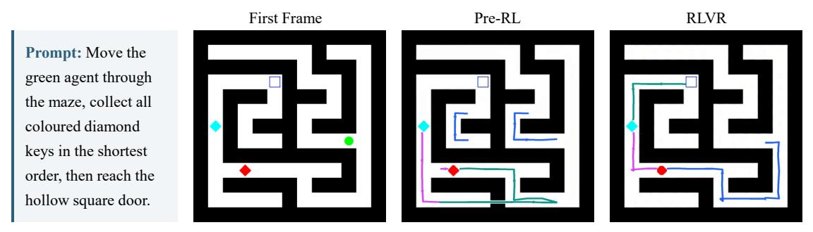

Figure 13 RLVR 이후 더 일관된 미로 탐색. 각 패널은 해당 생성 비디오의 모든 81 프레임을 단계별 방향성 경로로 요약한다. 파란색, 자홍색, 청록색은 각각 Start‑to‑Red, Red‑to‑Cyan, Cyan‑to‑Goal 단계를 나타내며, 화살표 머리는 움직임 방향을 표시한다. pre-RL 모델은 연결이 끊긴 일관성 없는 움직임을 생성해 유효한 해를 형성하지 못한다(점수: 0.2249), 반면 RLVR은 미로를 통해 일관된 경로를 따라가며 목표에 도달한다(점수: 0.8692). 경로 렌더링 절차는 섹션 [B.6.](#page-33-0)에서 설명한다.

중간 경로의 일관성은 다단계 공간 계획을 유지하고 실행하는 더 강한 능력을 시사한다.

이 예시들은 RLVR의 두 가지 상호 보완적 효과를 보여준다. 첫째, 고정된 노이즈 제거 예산 내에서 유효한 추론 시야를 확장하여 초기 단계에서 고정될 수 있는 결정을 수정할 수 있게 한다. 둘째, 생성된 비디오 프레임 전반에 걸친 상태 전이의 시간적 일관성을 향상시킨다. 추가적인 정성적 예시는 Sec. [B.7.](#page-34-0) 에 제공된다.

## 6. 관련 연구 (Related Work)

시각적 생성을 통한 네이티브 시각적 추론. 네이티브 시각적 추론은 시각적 생성을 통한 추론으로 광범위하게 정의되며, 최근 점점 더 많은 관심을 받고 있다. Wiedemer *et al* [&#91;63&#93;](#page-24-9)는 비디오 모델이 추론자임을 관찰하고, *Chain-of-Frames* (CoF) 패러다임을 확인했다. 이 방향을 따라 OpenCoF [&#91;6&#93;](#page-20-6)는 비디오 생성기에서 학습 가능한 추론 토큰을 도입했다. Wang *et al* [&#91;60&#93;](#page-23-0)는 추론이 확산 노이즈 제거 단계에서 전개되는 다른 메커니즘, *Chain-of-Steps* (CoS)를 추가로 확인했다. 이 현상은 이후 연구들 [&#91;42&#93;](#page-22-11)에서도 지원된다. 이 패러다임이 시각 중심적임에도 불구하고, MLLM은 비디오 추론자를 지원하기 위해 도입되었다. Cheng *et al* [&#91;9&#93;](#page-20-7)는 테스트 시점에서 비디오 추론자를 최적화하기 위해 MLLM을 사용하고, VChain [&#91;27&#93;](#page-21-10)은 추론 시점에서 비디오 생성을 안내하기 위해 MLLM에서 파생된 추론 신호, 즉 Chain-of-Visual-Thought를 주입한다. 비디오를 넘어 이미지 생성도 네이티브 시각적 추론의 기초로 탐구되었다. DiffThinker [&#91;22&#93;](#page-21-0)는 시각적 추론을 네이티브 이미지-투-이미지 생성 과제로 재구성하며, 네 가지 시각적 추론 과제에 걸쳐 적용한다. EndoCoT [&#91;10&#93;](#page-20-8)은 잠재적 사상을 정제하여 이미지 생성을 안내한다. 그러나 기존 연구는 대규모 다양성 훈련, 검증 가능한 평가, 그리고 생성 모달리티 간 체계적 비교를 지원하는 통합 인프라가 부족하여 일반적으로 제한된 시각 과제 집합에서 검증된다. 이것이 본 연구가 해결하고자 하는 격차이다.

시각-텍스트 상호 교차 추론. 언어 기반 추론의 성공은 자연스럽게 중간 시각 상태와 텍스트 근거를 교차시키도록 동기를 부여했다 [&#91;14&#93;](#page-20-9). 생성이라는 더 넓은 패러다임 안에서, 최근 방법들은 외부 도구로 스케치를 수행하고 [&#91;25&#93;](#page-21-11), 추론 추적을 시각화하며 [&#91;32&#93;](#page-22-12), 시각 편집을 추론 하네스로 통합하고 [&#91;71&#93;](#page-24-10), 대규모 상호 교차 코퍼스에서 학습하도록 [&#91;31;](#page-21-3) [59;](#page-23-5) [18&#93;](#page-21-2)한다. 동일한 연구 라인은 시각적 상태가 얼마나 명시적으로 필요한지를 조사하며, 시각적 추론을 업데이트 토큰 [&#91;59&#93;](#page-23-5) 또는 잠재 토큰 [&#91;70;](#page-24-11) [15;](#page-20-10) [4&#93;](#page-20-11)으로 압축한다. 시각-텍스트 상호 교차 모델링을 넘어, SC-CMJP [&#91;30&#93;](#page-21-12)는 마스킹된 확산 모델을 활용해 편집 및 시각적 추론 과제를 위해 텍스트와 이미지를 공동 생성한다. 이러한 접근 방식은 시각적 추론의 설계 공간을 크게 확장하지만, 시각 상태가 텍스트 추론을 위한 보조 지원으로 사용되는 언어 중심적 관점을 종종 계승한다. 반면, 본 연구는 시각적 경로 자체를 일등급 추론 기초로 체계적으로 조사한다.

강화학습을 이용한 시각적 추론. 일반 시각적 생성에 대한 강화학습은 지시 따르기와 미학적 품질을 향상시키기 위해 광범위하게 연구되었다[33;](#page-22-10) [68;](#page-24-8) [76;](#page-25-3) [57;](#page-23-13) [8;](#page-20-12) [2](#page-20-13). 그러나 시각적 추론 과제는 모델이 의미적으로 유효한 해를 도출해야 하므로, 이러한 시각적 추론 목표에 대한 강화학습은 상대적으로 덜 탐구되었다. 교차 생성(interleaved generation)을 위해 최근 접근법은 통합된 강화학습 목표 하에서 텍스트와 이미지 정책을 공동 최적화한다[34;](#page-22-13) [26;](#page-21-13) [7](#page-20-14), 하지만 이들의 시각적 상태는 여전히 VLM 기반 판정자에 의해 평가된다. VPRL[67](#page-24-1)은 언어 없이 세 가지 시각적 탐색 과제에서 대형 시각 모델을 향상시키고, VideoRLVR[79](#page-25-4)은 세 가지 시각적 과제에서 검증 가능한 보상의 가능성을 입증한다. 그럼에도 불구하고 기존 연구는 규모와 과제 다양성 면에서 제한적이다. 본 연구에서는 검증 가능한 보상을 갖는 50개 과제에 걸쳐 공동 강화학습 훈련을 수행하고, 그 결과 모델을 100개 과제에서 평가함으로써 다중 과제 원시 시각적 추론에 대한 보다 광범위한 연구를 가능하게 한다.

시각적 추론 벤치마크와 학습 소스. 기존 시각적 추론 벤치마크는 비디오 생성 [56;] [39;] [20;] [37;] [46] , 이미지 편집 [74;] [65;] [5;] [36] , 그리고 통합 멀티모달 생성 [77;] [80;] [78;] [54] 를 포함한다. 그러나 대부분의 벤치마크는 평가 전용(표 [1])이며, 학습을 위한 감독이 거의 없고 종종 VLM 기반 심사자에 의존한다. 이러한 심사자들의 평가는 검증 및 재현이 어려울 수 있다. 몇몇 교차 코퍼스는 학습 규모에 도달한다 [31;] [59] , 하지만 작업 범위가 제한적이며, 더 중요한 것은 절차적으로 생성되지 않아 검증 가능한 평가 신호나 작업 기반 보상을 얻기 어렵다. VBVR [58] 은 대규모 감독과 검증 가능한 평가를 제공하지만, 그 작업 공간은 더 넓고, 더 도전적이며, 더 전이 가능한 시각적 추론 능력으로 확장될 수 있다. VBVR-Pro는 이 기반 위에 더 큰 제어된 작업 공간, 검증 가능한 보상 평가자, 다중 작업 RL 훈련, 이미지, 비디오, 그리고 교차 생성 모델 간의 체계적인 모달리티 비교를 제공한다.

## 7. 결론 (Conclusion)

프로시저적으로 생성된 시각적 추론 환경, 작업 기반 검증 가능한 보상, 강화 학습, 그리고 모달리티 제어 메커니즘 분석을 통합함으로써 VBVR-Pro는 학습 가능하고 검증 가능하며 실험적으로 제어 가능한 연구 문제로서 생성 과정을 통해 본질적 시각적 추론을 확립한다. 전이 연구, 반사실적 진단, 시각 상태 개입, 경로 시각화, 보상 기반 최적화를 종합적으로 수행한 결과, 시각적 생성 모델이 중간 시각적 경로를 구성하고 유지하며 정제할 수 있음을 시사한다. 이는 시각 생성을 단순한 출력 형식이 아니라 추론의 진정한 기초로 자리매김한다는 것을 의미한다. 이러한 발견은 언어 중심 추론에 대한 보완적 패러다임으로서 본질적 시각적 추론에 대한 더 큰 관심을 요구하며, 우리는 VBVR-Pro가 미래 연구에 유용한 기반을 제공하기를 희망한다.

## 감사의 글 (Acknowledgements)

우리는 시각적 추론에 관한 귀중한 논의와 이 작업에 대한 통찰력 있는 피드백을 제공한 Xintao Wang, Yinfei Yang, Andrew Dai에게 감사하며, 티저 그림을 제작한 Huimuk Jang에게도 감사한다.

우리는 또한 AWS Trainium for Research 프로그램(<https://aws.amazon.com/ai/machine-learning/trainium/research/>)을 통해 이 작업을 지원해 준 Amazon Web Services에도 감사한다.

## 참고문헌 (References)

- [1] BlackForestLabs. FLUX.2: 프런티어 시각 인텔리전스. https://bfl.ai/blog/flux-2, 2025.
- [2] Bu, J., Ling, P., Zhou, Y., Wang, Y., Zang, Y., Wei, T., Zhan, X., Wang, J., Wu, T., Pan, X., et al. Adagrpo: 흐름 기반 grpo를 위한 기능 인식 적응형 향상. *arXiv preprint arXiv:2606.06828*, 2026.
- [3] ByteDance Seed. 생성 이상의, 디자인을 이해한다: seedream 5.0 pro 소개, 2026년 7월. URL https://seed.bytedance.com/en/blog/beyond-generation-it-understands-design-introducing-seedream-5-0-pro [beyond-generation-it-understands-design-introducing-seedream-5-0-pro]. Accessed: 2026-08-23.
- [4] Chen, C., Ma, Z., Li, Y., Hu, Y., Wei, Y., Li, W., and Nie, L. Reasoning in the dark: Interleaved vision-text reasoning in latent space. In *Findings of the Association for Computational Linguistics: ACL 2026*, pp. 39117–39129, 2026.
- [5] Chen, L., Xie, W., Liang, Y., He, H., Zhao, H., Yang, Z., Huang, Z., Wu, H., Lu, H., Bao, Y., et al. Babyvision: Visual reasoning beyond language. *arXiv preprint arXiv:2601.06521*, 2026.
- [6] Chen, X., Guo, Z., Zhang, R., Jiang, D., and Li, H. Opencof: Learning to reason through video generation. *arXiv preprint arXiv:2607.08763*, 2026.
- [7] Cheng, D., Li, Y., Ma, Z., Cai, H., Hu, Y., Wang, W., Nie, L., and Li, W. Omni-r1: Towards the unified generative paradigm for multimodal reasoning. In *Findings of the Association for Computational Linguistics: ACL 2026*, pp. 38907–38924, 2026.
- [8] Cheng, G., Yang, D., Huang, Z., Si, J., Si, C., and Liu, Z. Realdpo: Real or not real, that is the preference. *arXiv preprint arXiv:2510.14955*, 2025.
- [9] Cheng, J., Hou, L., Zhong, T., Tao, X., Wan, P., and Liao, J. Vlms are good teachers for video reasoning via adaptive test-time optimization. *arXiv preprint*, 2026. URL https://arxiv.org/abs/2606.02564 [02564].
- [10] Dai, X., Zhou, Y., Xing, L., Bu, J., Wei, X., Liu, Y., Zhang, B., Chen, K., and Zang, Y. Endocot: Scaling endogenous chain-of-thought reasoning in diffusion models. *arXiv preprint arXiv:2603.12252*, 2026.
- [11] Deepmind. Gemini 3.1 Pro: Best for complex tasks and bringing creative concepts to life, February 2026. URL https://deepmind.google/models/gemini/pro/.
- [12] Deng, C., Zhu, D., Li, K., Gou, C., Li, F., Wang, Z., Zhong, S., Yu, W., Nie, X., Song, Z., Shi, G., and Fan, H. Emerging properties in unified multimodal pretraining. *arXiv preprint arXiv:2505.14683*, 2025.
- [13] Diao, H., Wu, P., Deng, H., Wang, J., Bai, S., Wu, S., Fan, W., Ye, W., Tong, W., Fan, X., et al. Sensenova-u1: Unifying multimodal understanding and generation with neo-unify architecture. *arXiv preprint arXiv:2605.12500*, 2026.
- [14] Dong, Q., Zhang, Y., Zeng, H., Wang, Y., Lu, J., Yang, K., and Fu, Y. Revealing the seen, imagining the beyond: A survey of image-grounded chain-of-thought reasoning in multimodal llms. In *Proceedings of the 64th Annual Meeting of the Association for Computational Linguistics (Volume 1: Long Papers)*, pp. 45055–45070, 2026.
- [15] Dong, S., Wang, S., Liu, X., Li, C., Hou, H., and Wei, Z. Interleaved latent visual reasoning with selective perceptual modeling. In *Proceedings of the 64th Annual Meeting of the Association for Computational Linguistics (Volume 1: Long Papers)*, pp. 29316–29335, 2026.
- [16] Fu, W., Gao, J., Shen, X., Zhu, C., Mei, Z., He, C., Xu, S., Wei, G., Mei, J., Wang, J., et al. Areal: A large-scale asynchronous reinforcement learning system for language reasoning. *Advances in Neural Information Processing Systems*, 38:36256–36282, 2026.

- [32] Li, C., Wu, W., Zhang, H., Xia, Y., Mao, S., Dong, L., Vulic, I., and Wei, F. 상상하면서 '공간'에서 추론하기: 다중모달 시각화-오브-생각. In *국제 기계 학습 학회 (International Conference on Machine Learning)*, 2025. URL <https://arxiv.org/abs/2501.07542>
- [33] Liu, J., Liu, G., Liang, J., Li, Y., Liu, J., Wang, X., Wan, P., ZHANG, D., and Ouyang, W. Flow-grpo: 온라인 RL을 통한 흐름 매칭 모델 훈련. In Belgrave, D., Zhang, C., Lin, H., Pascanu, R., Koniusz, P., Ghassemi, M., and Chen, N. (eds.), *신경 정보 처리 시스템의 진보 (Advances in Neural Information Processing Systems)*, volume 38, pp. 40783–40818. Curran Associates, Inc., 2025. URL [https://proceedings.neurips.cc/paper_files/paper/2025/file/](https://proceedings.neurips.cc/paper_files/paper/2025/file/3a10c46572628d58cb44fb705f25cbbf-Paper-Conference.pdf) [3a10c46572628d58cb44fb705f25cbbf-Paper-Conference.pdf](https://proceedings.neurips.cc/paper_files/paper/2025/file/3a10c46572628d58cb44fb705f25cbbf-Paper-Conference.pdf)
- [34] Liu, J., Ye, Z., Yuan, L., Zhu, S., Gao, Y., Wu, J., Li, K., Wang, X., Nie, X., Huang, W., and Ouyang, W. Unigrpo: 추론 기반 시각 생성에 대한 통합 정책 최적화. *arXiv preprint arXiv:2603.23500*, 2026. URL <https://arxiv.org/abs/2603.23500>
- [35] Liu, M. and Zhang, W. 당신의 비디오 언어 모델은 신뢰할 수 있는 판단자인가? In *국제 학습 표현 학회 (International Conference on Learning Representations)*, volume 2025, pp. 88570–88589, 2025.
- [36] Liu, M., Fan, Z., Wang, Z., Gu, L., Zhu, Z., He, Y., Yang, Y., Tian, C., Zhao, X., Liao, N., et al. Grade: 이미지 편집에서 학문 기반 추론 벤치마킹. *arXiv preprint arXiv:2603.12264*, 2026.
- [37] Liu, M., Ma, S., Meng, S., Zhao, X., Zhang, Z., Zhang, S., Zhong, Z., Chen, P., Cao, H., Sun, X., et al. Rise-video: 비디오 생성기가 암묵적 세계 규칙을 해독할 수 있는가? *arXiv preprint arXiv:2602.05986*, 2026.
- [38] Luo, M., Tan, S., Huang, R., Patel, A., Ariyak, A., Wu, Q., Shi, X., Xin, R., Cai, C., Weber, M., Zhang, C., Li, L. E., Popa, R. A., and Stoica, I. Deepcoder: 완전 오픈소스 14b 코더, o3-mini 수준, 2025년 4월. URL <https://www.together.ai/blog/deepcoder>. Together AI Blog.
- [39] Luo, Y., Zhao, X., Lin, B., Zhu, L., Tang, L., Liu, Y., Chen, Y.-C., Qian, S., Wang, X., and You, Y. V-reasonbench: 비디오 생성 모델을 위한 통합 추론 벤치마크 모음으로 향하기. *arXiv preprint arXiv:2511.16668*, 2025.
- [40] Motamed, S., Chen, M., Van Gool, L., and Laina, I. Travl: 물리적 비현실성을 더 잘 판단하도록 비디오-언어 모델을 만드는 레시피. *arXiv preprint arXiv:2510.07550*, 2025.
- [41] Motamed, S., Culp, L., Swersky, K., Jaini, P., and Geirhos, R. 생성형 비디오 모델은 물리적 원리를 이해하는가? In *IEEE/CVF 겨울 컴퓨터 비전 응용 회의 (Winter Conference on Applications of Computer Vision)*, pp. 948–958. IEEE, 2026.
- [42] Newman, K., Zhu, T., and Russakovsky, O. 비디오 모델은 조기에 추론한다: 미로 해결을 위한 계획 약속 활용, 2026. URL <https://arxiv.org/abs/2603.30043>
- [43] OpenAI. GPT-5.5 소개, 2026년 4월. URL [https://openai.com/index/](https://openai.com/index/introducing-gpt-5-5/) [introducing-gpt-5-5/](https://openai.com/index/introducing-gpt-5-5/).
- [44] OpenAI. chatgpt 이미지 2.0 소개, 2026년 4월. URL [https://openai.com/index/](https://openai.com/index/introducing-chatgpt-images-2-0/) [introducing-chatgpt-images-2-0/](https://openai.com/index/introducing-chatgpt-images-2-0/). 접근일: 2026-08-23.
- [45] Oquab, M., Darcet, T., Moutakanni, T., Vo, H., Szafraniec, M., Khalidov, V., Fernandez, P., Haziza, D., Massa, F., El-Nouby, A., et al. Dinov2: 감독 없이 견고한 시각 특징 학습. *arXiv preprint arXiv:2304.07193*, 2023.
- [46] Pan, K., Tian, Q., Zhang, J., Kong, W., Xiong, J., Long, Y., Zhang, S., Qiu, H., Wang, T., Lv, Z., et al. Omniweaving: 자유형 합성과 추론을 통한 통합 비디오 생성으로 향하기. *arXiv preprint arXiv:2603.24458*, 2026.

- [47] Qi, Y., Xu, X., Guo, Z., Ma, S., Zhang, R., Chen, X., An, R., Xing, R., Zhang, J., Huang, H., et al. Mme-cof-pro: 비디오 생성 모델에서 텍스트와 시각적 힌트를 활용한 추론 일관성 평가. *arXiv preprint arXiv:2603.20194*, 2026.

- [48] Qwen Team. Qwen3.6-27B: 27B 밀집 모델에서 플래그십 수준의 코딩, 2026년 4월. URL [https:](https://qwen.ai/blog?id=qwen3.6-27b) [//qwen.ai/blog?id=qwen3.6-27b](https://qwen.ai/blog?id=qwen3.6-27b).

- [49] Qwen Team. Qwen3.7: 에이전트 프론티어, 2026년 5월. URL [https://qwen.ai/blog?id=qwen3.](https://qwen.ai/blog?id=qwen3.7) [7](https://qwen.ai/blog?id=qwen3.7).

- [50] Radford, A., Kim, J. W., Hallacy, C., Ramesh, A., Goh, G., Agarwal, S., Sastry, G., Askell, A., Mishkin, P., Clark, J., et al. 자연어 감독으로부터 전이 가능한 시각 모델 학습. In *국제 기계 학습 회의*, pp. 8748–8763. PmLR, 2021.

- [51] Raisinghani, N. Nano Banana Pro 소개, 2025년 11월. URL [https://blog.google/](https://blog.google/innovation-and-ai/products/nano-banana-pro/) [innovation-and-ai/products/nano-banana-pro/](https://blog.google/innovation-and-ai/products/nano-banana-pro/). Google DeepMind. Nano Banana Pro (Gemini 3 Pro Image). Accessed: 2026-08-23.

- [52] Seedance, T., Chen, D., Chen, L., Chen, X., Chen, Y., Chen, Z., Chen, Z., Cheng, F., Cheng, T., Cheng, Y., et al. Seedance 2.0: 세계 복잡성을 위한 비디오 생성 발전. *arXiv preprint arXiv:2604.14148*, 2026.

- [53] Shah, J., Bikshandi, G., Zhang, Y., Thakkar, V., Ramani, P., and Dao, T. Flashattention-3: 비동기 및 저정밀도로 빠르고 정확한 어텐션. *신경 정보 처리 시스템의 진보*, 37:68658–68685, 2024.

- [54] Shi, Y., Dong, Y., Ding, Y., Wang, Y., Zhu, X., Zhou, S., Liu, W., Tian, H., Wang, R., Wang, H., et al. Realunify: 통합 모델이 실제로 통합의 이점을 얻는가? 종합 벤치마크. In *IEEE/CVF 컴퓨터 비전 및 패턴 인식 회의 논문집*, pp. 22488–22497, 2026.

- [55] Team, G., Abd, S. E., Aggarwal, V., Algayres, R., Andreev, A., Bachem, O., Ballantyne, I., Brick, C., Carbune, V., Casbon, M., et al. Gemma 4 기술 보고서. ˘ *arXiv preprint arXiv:2607.02770*, 2026.

- [56] Tong, J., Mou, Y., Li, H., Li, M., Yang, Y., Zhang, M., Chen, Q., Liang, T., Hu, X., Zheng, Y., et al. 비디오를 활용한 사고: 비디오 생성이 유망한 다중모달 추론 패러다임. In *IEEE/CVF 컴퓨터 비전 및 패턴 인식 회의 논문집*, pp. 41121–41129, 2026.

- [57] Wang, F. and Yu, Z. 플로우 매칭을 이용한 강화 학습을 위한 계수 보존 샘플링. *arXiv preprint arXiv:2509.05952*, 2025.

- [58] Wang, M., Wang, R., Lin, J., Ji, R., Wiedemer, T., Gao, Q., Luo, D., Qian, Y., Huang, L., Hong, Z., Ge, J., Ma, Q., He, H., Zhou, Y., Guo, L., Mei, L., Li, J., Xing, H., Zhao, T., Yu, F., Xiao, W., Jiao, Y., Hou, J., Zhang, D., Xu, P., Zhong, B., Zhao, Z., Fang, G., Kitaoka, J., Xu, Y., Xu, H. b., Blacutt, K., Nguyen, T., Song, S., Sun, H., Wen, S., He, L., Wang, R., Wang, Y., Yang, M., Ma, Z., Milliere, R., Shi, ` F., Vasconcelos, N., Khashabi, D., Yuille, A., Du, Y., Liu, Z., Lin, D., Liu, Z., Kumar, V., Li, Y., Yang, L., Cai, Z., and Deng, H. 매우 큰 비디오 추론 스위트. *arXiv preprint arXiv:2602.20159*, 2026. URL <https://arxiv.org/abs/2602.20159>.

- [59] Wang, P., Deng, L., Zhang, Z., Zhang, S., Luo, Z., Fu, P., Luan, J., Bai, X., and Liu, Y. Deltav: 통합 대형 다중모달 모델에서 시각 상태 업데이트를 활용한 사고. *arXiv preprint arXiv:2607.08434*, 2026.

- [60] Wang, R., Cai, Z., Pu, F., Xu, J., Yin, W., Wang, M., Ji, R., Gu, C., Li, B., Huang, Z., et al. 비디오 추론의 비밀을 밝히다. *arXiv preprint arXiv:2603.16870*, 2026.

- [61] Wang, W., Gao, Z., Gu, L., Pu, H., Cui, L., Wei, X., Liu, Z., Jing, L., Ye, S., Shao, J., et al. Internvl3. 5: 다양성, 추론, 효율성에서 오픈소스 다중모달 모델 발전. *arXiv preprint arXiv:2508.18265*, 2025.

- [62] WanTeam. Wan: Open and advanced large-scale video generative models. *arXiv preprint arXiv:2503.20314*, 2025. URL <https://arxiv.org/abs/2503.20314>.
- [63] Wiedemer, T., Li, Y., Vicol, P., Gu, S. S., Matarese, N., Swersky, K., Kim, B., Jaini, P., and Geirhos, R. Video models are zero-shot learners and reasoners. *arXiv preprint arXiv:2509.20328*, 2025.
- [64] Wu, C., Li, J., Zhou, J., Lin, J., Gao, K., Yan, K., ming Yin, S., Bai, S., Xu, X., Chen, Y., Chen, Y., Tang, Z., Zhang, Z., Wang, Z., Yang, A., Yu, B., Cheng, C., Liu, D., Li, D., Zhang, H., Meng, H., Wei, H., Ni, J., Chen, K., Cao, K., Peng, L., Qu, L., Wu, M., Wang, P., Yu, S., Wen, T., Feng, W., Xu, X., Wang, Y., Zhang, Y., Zhu, Y., Wu, Y., Cai, Y., and Liu, Z. Qwen-image technical report, 2025. URL <https://arxiv.org/abs/2508.02324>.
- [65] Wu, Y., Li, Z., Hu, X., Ye, X., Zeng, X., Yu, G., Zhu, W., Schiele, B., Yang, M.-H., and Yang, X. Kris-bench: Benchmarking next-level intelligent image editing models. *Advances in Neural Information Processing Systems*, 38, 2026.
- [66] Xiao, S., Liu, Z., Zhang, P., Muennighoff, N., Lian, D., and Nie, J.-Y. C-pack: Packed resources for general chinese embeddings. In *Proceedings of the 47th international ACM SIGIR conference on research and development in information retrieval*, pp. 641–649, 2024.
- [67] Xu, Y., Li, C., Zhou, H., Wan, X., Zhang, C., Korhonen, A., and Vulic, I. Visual planning: Let's think ´ only with images. In *International Conference on Learning Representations*, 2026. URL [https:](https://arxiv.org/abs/2505.11409) [//arxiv.org/abs/2505.11409](https://arxiv.org/abs/2505.11409). Oral.
- [68] Xue, Z., Wu, J., Gao, Y., Kong, F., Zhu, L., Chen, M., Liu, Z., Liu, W., Guo, Q., Huang, W., et al. Dancegrpo: Unleashing grpo on visual generation. *arXiv preprint arXiv:2505.07818*, 2025.
- [69] Yang, Z., Teng, J., Zheng, W., Ding, M., Huang, S., Xu, J., Yang, Y., Hong, W., Zhang, X., Feng, G., et al. CogVideoX: Text-to-video diffusion models with an expert transformer. *arXiv preprint arXiv:2408.06072*, 2024.
- [70] Yang, Z., Yu, X., Chen, D., Shen, M., and Gan, C. Machine mental imagery: Empower multimodal reasoning with latent visual tokens. In *Proceedings of the IEEE/CVF Conference on Computer Vision and Pattern Recognition*, pp. 33510–33520, 2026. URL <https://arxiv.org/abs/2506.17218>.
- [71] Zhang, B., Liu, Y., Li, J., Zang, Y., Wang, J., and Lin, D. Etchr: Editing to clarify and harness reasoning. *arXiv preprint arXiv:2605.23897*, 2026.
- [72] Zhao, B., Wu, C., Li, D., Meng, H., Li, J., Zhang, J., Zhou, J., Lin, J., Gao, K., Cao, K., et al. Qwenimage-2.0 technical report. *arXiv preprint arXiv:2605.10730*, 2026.
- [73] Zhao, W., Bai, L., Rao, Y., Zhou, J., and Lu, J. Unipc: A unified predictor-corrector framework for fast sampling of diffusion models. In Oh, A., Naumann, T., Globerson, A., Saenko, K., Hardt, M., and Levine, S. (eds.), *Advances in Neural Information Processing Systems*, volume 36, pp. 49842–49869. Curran Associates, Inc., 2023. doi: 10.52202/ 075280-2170. URL [https://proceedings.neurips.cc/paper\\_files/paper/2023/](https://proceedings.neurips.cc/paper_files/paper/2023/file/9c2aa1e456ea543997f6927295196381-Paper-Conference.pdf) [file/9c2aa1e456ea543997f6927295196381-Paper-Conference.pdf](https://proceedings.neurips.cc/paper_files/paper/2023/file/9c2aa1e456ea543997f6927295196381-Paper-Conference.pdf).
- [74] Zhao, X., Zhang, P., Tang, K., Zhu, X., Li, H., Chai, W., Zhang, Z., Xia, R., Zhai, G., Yan, J., et al. Envisioning beyond the pixels: Benchmarking reasoning-informed visual editing. *Advances in Neural Information Processing Systems*, 38, 2026.
- [75] Zhao, Y., Gu, A., Varma, R., Luo, L., Huang, C.-C., Xu, M., Wright, L., Shojanazeri, H., Ott, M., Shleifer, S., Desmaison, A., Balioglu, C., Damania, P., Nguyen, B., Chauhan, G., Hao, Y., Mathews, A., and Li, S. Pytorch fsdp: Experiences on scaling fully sharded data parallel, 2023. URL [https:](https://arxiv.org/abs/2304.11277) [//arxiv.org/abs/2304.11277](https://arxiv.org/abs/2304.11277).

- [76] Zheng, K., Chen, H., Ye, H., Wang, H., Zhang, Q., Jiang, K., Su, H., Ermon, S., Zhu, J., and Liu, M.-Y. Diffusionnft: Online diffusion reinforcement with forward process. *arXiv preprint arXiv:2509.16117*, 2025.
- [77] Zhou, P., Peng, X., Song, J., Li, C., Xu, Z., Yang, Y., Guo, Z., Zhang, H., Lin, Y., He, Y., et al. Opening: A comprehensive benchmark for judging open-ended interleaved image-text generation. In *2025 IEEE/CVF Conference on Computer Vision and Pattern Recognition (CVPR)*, pp. 56–66. IEEE, 2025.
- [78] Zhou, Y., Tu, H., Wang, Z., Wang, Z., Muennighoff, N., Nie, F., Deng, C., Yan, S., Fan, H., Choi, Y., et al. When visualizing is the first step to reasoning: Mira, a benchmark for visual chain-of-thought. In *Proceedings of the IEEE/CVF Conference on Computer Vision and Pattern Recognition*, pp. 26154– 26164, 2026.
- [79] Zhu, T., Zhang, S., Huang, J. Y., Song, S., Wen, X., Li, Y., Poon, H., and Chen, M. Video models can reason with verifiable rewards. *arXiv preprint arXiv:2605.15458*, 2026.
- [80] Zou, K., Huang, Z., Dong, Y., Tian, S., Zheng, D., Liu, H., He, J., Liu, B., Qiao, Y., and Liu, Z. Uni-mmmu: A massive multi-discipline multimodal unified benchmark. In *Proceedings of the 64th Annual Meeting of the Association for Computational Linguistics (Volume 1: Long Papers)*, pp. 908–924, 2026.

## A. 기초 모델 아키텍처 세부사항 (Details of baseline model architectures)

### A.1. 이미지, 비디오, 그리고 인터리브드 생성기 (Image, Video, and Interleaved Generators)

VBVR-Pro-Dataset에서의 훈련 효과를 평가하기 위해, 우리는 이미지 생성, 비디오 생성, 인터리브드 텍스트-이미지 생성에 걸친 다양한 생성 기반 모델을 미세 조정한다. 그들의 아키텍처적 특성은 표 9에 요약되어 있으며, 추가 모델별 세부 사항은 섹션 A에 제공된다. 이들은 모델 규모, 교차 모달 상호작용 메커니즘, 출력 표현에서 크게 차이가 난다. 이러한 아키텍처적 다양성은 VBVR-Pro-Dataset에서의 미세 조정이 희소 및 밀집 아키텍처, 잠재 공간 및 픽셀 공간 생성 등 다양한 생성 모달리티와 모델 설계에 걸쳐 일반화되는지 여부를 조사할 수 있게 한다.

### • 이미지 생성 모델들. (Image generation models.)

- BAGEL-7B-MoT [&#91;12&#93;](#page-20-2)는 Mixture-of-Transformers (MoT) 아키텍처 내에서 멀티모달 이해와 이미지 생성을 모두 지원하는 통합 멀티모달 모델이다. 언어 이해와 시각 생성 경로는 별도의 Transformer 파라미터를 사용하면서 공통 멀티모달 시퀀스에 참여하여 토큰 유형별로 계산을 특화한다. 전체 체크포인트는 약 14B 파라미터를 포함하지만, 주어진 토큰 경로에 대해 활성화되는 것은 약 7B에 불과하다.
- Qwen-Image-Edit [&#91;64&#93;](#page-24-3)는 20B 파라미터를 가진 Qwen-Image 기반 모델 위에 구축되었으며, 멀티모달 디퓨전 Transformer (DiT)를 사용해 이미지 생성과 지시 기반 편집을 모두 수행한다. 이 모델의 듀얼 스트림 블록은 초기에는 시각 잠재와 멀티모달 조건화에 대해 별개의 표현을 유지하면서, 디노이징 과정 전반에 걸쳐 이들 간의 상호작용을 가능하게 한다.
- FLUX.2-dev [&#91;1&#93;](#page-20-3)의 Transformer는 시각 토큰과 조건화 토큰을 별도로 처리하는 듀얼 스트림 블록으로 시작한 뒤, 결합된 토큰 시퀀스를 공동으로 처리하는 싱글 스트림 블록으로 전환된다. 이전 FLUX 아키텍처와 비교해 FLUX.2는 깊이와 파라미터의 더 큰 비율을 공동 싱글 스트림 단계에 할당하여 교차 모달 합성 및 참조 이미지 통합에 대한 용량을 높인다.

### • 인터리브드 텍스트-이미지 생성 모델들. (Interleaved text-image generation models.)

- ThinkMorph-7B [18]은 BAGEL-7B-MoT에서 초기화되고 텍스트-이미지 추론 경로에서 미세 조정된다. 따라서 BAGEL의 14B-총, 7B-활성 Mixture-of-Transformers(미셸-오브-트랜스포머스) 아키텍처와 VAE(변분 오토인코더) 잠재 이미지 생성 경로를 그대로 유지한다.  
- SenseNova-U1-8B-MoT [13]은 다중 모달 이해와 생성을 별도의 인코더와 디코더 파이프라인이 아니라 공통 트랜스포머 내에서의 연산으로 처리하는 네이티브 통합 모델이다. 그 NEO-unify(NEO-유니파이) 아키텍처는 기존의 시각 인코더와 생성 VAE를 모두 제거한다. 대신 이미지가 RGB 픽셀 패치로 직접 변환되고, 언어 토큰과 함께 모달리티별 트랜스포머 파라미터를 사용해 처리되며, 경량 픽셀 출력 헤드(pixel-output head)를 통해 재구성된다.

### • 비디오 생성 모델 (Video generation models)

- Wan2.2-I2V-A14B [62]는 고노이즈와 저노이즈 디노이저를 별도로 갖는 희소 Mixture-of-Experts(미셸-오브-익스퍼트) 모델이다. 각 전문가가 전체 14B-클래스 비디오 DiT(디트)이며, 디노이징 경로의 각 시점에서 오직 한 전문가만 활성화된다.  
- Wan2.2-TI2V-5B [62]는 밀집 비디오 DiT(디트)이다. A14B 변형과 달리, 디노이징 경로 전반에 걸쳐 동일한 5B-파라미터 백본을 사용하며, 노이즈 전문화된 전문가 간에 연산을 라우팅하지 않는다.  
- Wan2.1-I2V-14B-720P [62]는 밀집 14B-파라미터 비디오 DiT(디트)로, 모든 디노이징 타임스텝에서 단일 40-블록 트랜스포머 백본을 적용하고, 압축된 공간-시간 VAE(변분 오토인코더) 잠재 변수로 비디오를 생성한다.

Table 9 (Fine-tuning에 사용된 기본 모델의 아키텍처 비교) 파라미터 수는 총 파라미터와 활성 파라미터로 보고된다.

| Model | Parameters | Generative backbone | Transformer configuration | 생성 표현 |
|-------------------------------------|-----------------------|-------------------------------------------------------------------|-----------------------------------------------------------------------------------|------------------------------|
| Image generation models |  |  |  |  |
| BAGEL-7B-MoT [12] | 14B total; 7B active | MoT with separate understanding and generation branches | 28 blocks; width 3,584; 28 heads × 128 dims/head | VAE latents |
| FLUX.2-dev [1] | 32B | Hybrid dual-stream and single-stream DiT | 8 dual-stream + 48 single-stream blocks; width 6,144; 48 heads × 128 dims/head | VAE latents |
| Qwen-Image-Edit [64] | 20B | Dual-stream multimodal diffusion Transformer (MMDiT) | 60 dual-stream blocks; width 3,072; 24 heads × 128 dims/head | VAE latents |
| Interleaved image generation models |  |  |  |  |
| ThinkMorph-7B [18] | 14B total; 7B active | MoT with separate understanding and generation branches | 28 blocks; width 3,584; 28 heads × 128 dims/head | VAE latents |
| SenseNova-U1-8B-MoT [13] | 16B total; 8B active | MoT with separate understanding and generation branches | 42 blocks; width 4,096; 32 heads × dims/head | Raw RGB patches |
| Video generation models |  |  |  |  |
| Wan2.2-I2V-A14B [62] | 27B total; 14B active | Two-expert MoE video DiT with separate high-/low-noise experts | 40 blocks per expert; width 5,120; 40 heads × 128 dims/head | VAE latents |
| Wan2.2-TI2V-5B [62] | 5B | Dense video DiT | 30 blocks; width 3,072; 24 heads × 128 dims/head | VAE latents |
| Wan2.1-I2V-14B-720P [62] | 14B | Dense video DiT | 40 blocks; width 5,120; 40 heads × 128 dims/head | VAE latents |
| LTX-2.3-I2AV [19] | 22B | Asymmetric dual-stream audio–video DiT | 48 blocks; width 4,096; 32 heads × 128 dimensions | VAE latents |

– LTX-2.3-I2AV [&#91;19&#93;](#page-21-6)은 동기화된 비디오와 오디오를 동시에 생성하는 통합 시청각 확산 모델이다. 그 백본은 비대칭 이중 스트림 트랜스포머이며, 비디오 스트림에 비해 오디오 스트림에 훨씬 더 많은 용량을 할당하여 두 스트림의 정보 밀도 차이를 반영한다. 두 스트림은 각각 비디오와 오디오 VAE 잠재 공간에서 동작하며, 양방향 시청각 교차 주의, 시간적 위치 인코딩, 교차 모달 적응형 정규화를 통해 정보를 교환한다.

### *A.1.1. 훈련 레시피*

모든 모델은 512 × 512 해상도에서 한 에폭 동안 미세 조정된다. 우리는 모델 규모와 모달리티를 기반으로 한 통합 미세 조정 전략을 채택한다. 이미지 생성 및 텍스트-이미지 혼합 생성 모델의 경우, 활성 파라미터가 10B 미만인 모델은 완전 미세 조정되고, 더 큰 모델은 LoRA로 조정된다. 모든 비디오 생성 모델은 일관되게 LoRA 미세 조정 방식을 사용한다.

이미지 생성의 경우, Qwen-Image-Edit과 FLUX.2-dev는 학습률 1 × 10−4로 rank-32 LoRA를 사용해 조정되며, 반면 BAGEL은 5 × 10−6의 더 작은 학습률로 완전 미세 조정된다. Qwen-Image-Edit과 FLUX.2-dev의 경우, LoRA 어댑터는 쿼리, 키, 값, 출력 프로젝션뿐 아니라 선택된 멀티모달 프로젝션, 피드‑포워드, 모듈레이션 레이어에 적용된다. 텍스트‑이미지 혼합 생성의 경우, ThinkMorph와 SenseNova-U1은 각각 1×10−5와 2×10−5의 학습률로 완전 미세 조정된다. 비디오 생성에서는 평가된 모든 모델(예: Wan2.2-I2V-A14B, Wan2.2-TI2V-5B, Wan2.1-I2V-14B-720P, LTX-2.3-I2AV)에 rank-32 LoRA를 적용한다. 어댑터는 쿼리, 키, 값, 출력 프로젝션에 적용되며, Wan 모델의 경우 피드‑포워드 프로젝션도 추가로 조정된다. 모든 비디오 모델은 16 fps에서 학습률 1 × 10−4로 훈련된다.

특히 VBVR-Pro-데이터셋 훈련 데이터를 고립시키고 기여도를 평가하기 위해, VBVR-SenseNova-U1과 VBVR-Pro-SenseNova-U1은 사전 훈련 단계에서 VBVR 데이터에 한 번도 노출되지 않은 미출시된 사전 훈련 체크포인트에서 초기화된다. 이 설정은 결과 성능 향상을 VBVR/VBVR-Pro 미세 조정에 보다 명확히 귀속시킬 수 있게 한다.

### A.2. 다른 벤치마크에 대한 전이성 세부사항

**Table 10** RISE-Video에 대한 지식 유형별 결과. WS: 가중 점수; Acc.: 정확도. **Bold**: 최우수 결과; underline: 두 번째 최우수 결과.

| Models | Comm | onsense | Sub | ject | Perce | ptual | Soci | etal | Log | gical | Experi | iential | Spa | atial | Temp | poral |
|--------------------------|-------|---------|--------------|-------|-------|-------|-------|------|--------------|-------|--------------|---------|-------|-------|-------|-------|
|  | WS | Acc. | WS | Acc. | WS | Acc. | WS | Acc. | WS | Acc. | WS | Acc. | WS | Acc. | WS | Acc. |
| Video Generation Models |  |  |  |  |  |  |  |  |  |  |  |  |  |  |  |  |
| Open-source Models |  |  |  |  |  |  |  |  |  |  |  |  |  |  |  |  |
| CogVideoX1.5-5B-I2V | 53.54 | 1.20 | 53.01 | 1.28 | 57.33 | 2.27 | 47.69 | 0.00 | 33.38 | 2.38 | 40.80 | 1.32 | 34.50 | 2.00 | 47.86 | 6.56 |
| LTX-2.3-I2AV | 60.85 | 6.02 | 63.62 | 7.69 | 64.75 | 9.09 | 55.45 | 0.00 | 46.92 | 2.38 | 51.44 | 1.32 | 36.05 | 0.00 | 56.04 | 6.56 |
| Wan2.2-I2V-A14B | 65.24 | 7.23 | 64.31 | 3.85 | 70.66 | 11.36 | 69.43 | 3.03 | 46.52 | 4.76 | 64.20 | 6.58 | 54.05 | 10.00 | 64.15 | 6.56 |
| VBVR-Wan2.2 | 61.58 | 4.82 | <u>66.64</u> | 7.69 | 71.70 | 6.82 | 68.94 | 9.09 | <u>65.24</u> | 26.19 | <u>66.32</u> | 7.89 | 66.18 | 16.00 | 64.62 | 14.75 |
| Ours |  |  |  |  |  |  |  |  |  |  |  |  |  |  |  |  |
| VBVR-Pro-Wan2.2-I2V-A14B | 61.37 | 7.23 | 67.90 | 11.54 | 71.34 | 18.18 | 71.40 | 9.09 | 73.12 | 26.19 | 68.90 | 9.21 | 61.65 | 10.00 | 60.22 | 8.20 |

**Table 11** RULER-Bench (I2V 설정)에서의 결과. IF: Instruction Following; VC: Visual Consistency; VF: Visual Fidelity; RC: Rule Coherence.

| 모델 |  | Sc | ience R | ule |  |  | G | ame Ru | ıle |  |  | Hui | nanity l | 규칙 |  | 비전 규칙 |  |  |  |  | 전체 |  |  |  |
|--------------------------|-------|-------|---------|-------|-------|-------|-------|--------|-------|-------|-------|-------|----------|-------|-------|-------------|-------|-------|-------|-------|---------|-------|-------|-------|
|  | IF | VC | VF | RC | 평균 | IF | VC | VF | RC | 평균 | IF | VC | VF | RC | Avg | VC | VF | RC | Avg | IF | VC | VF | RC | Avg |
| 비디오 생성 모델 |  |  |  |  |  |  |  |  |  |  |  |  |  |  |  |  |  |  |  |  |  |  |  |  |
| 독점 모델 |  |  |  |  |  |  |  |  |  |  |  |  |  |  |  |  |  |  |  |  |  |  |  |  |
| Veo-3.1 | 65.05 | 83.18 | 91.37 | 50.97 | 72.64 | 39.75 | 51.45 | 77.95 | 17.70 | 46.71 | 79.90 | 87.37 | 94.49 | 61.23 | 80.75 | 59.53 | 72.67 | 48.94 | 60.38 | 61.57 | 70.38 | 84.12 | 44.71 | 65.19 |
| 오픈소스 모델 |  |  |  |  |  |  |  |  |  |  |  |  |  |  |  |  |  |  |  |  |  |  |  |  |
| CogVideoX1.5-5B-I2V | 30.16 | 53.25 | 80.51 | 13.08 | 44.25 | 23.27 | 64.05 | 73.40 | 9.01 | 42.43 | 22.22 | 66.67 | 73.15 | 19.81 | 45.46 | 48.50 | 54.06 | 20.01 | 40.86 | 25.22 | 58.12 | 70.28 | 15.48 | 42.27 |
| LTX-2.3-I2AV | 44.20 | 70.09 | 80.06 | 18.10 | 53.11 | 22.80 | 59.23 | 73.58 | 11.90 | 41.88 | 38.89 | 66.67 | 83.33 | 40.19 | 57.27 | 56.84 | 58.97 | 26.14 | 47.32 | 35.30 | 63.21 | 73.99 | 24.08 | 49.14 |
| Wan2.2-I2V-A14B | 55.37 | 81.64 | 88.14 | 20.44 | 61.39 | 20.32 | 60.81 | 78.93 | 12.92 | 43.25 | 63.89 | 83.33 | 96.30 | 41.11 | 71.16 | 63.03 | 78.57 | 34.87 | 58.82 | 46.52 | 72.20 | 85.48 | 27.34 | 57.89 |
| VBVR-Wan2.2 | 49.58 | 76.13 | 88.77 | 16.88 | 57.84 | 21.24 | 68.93 | 83.38 | 18.79 | 48.09 | 44.44 | 75.00 | 88.89 | 33.70 | 60.51 | 72.67 | 78.81 | 44.77 | 65.42 | 38.42 | 73.18 | 84.96 | 28.54 | 56.28 |
| 우리 모델 |  |  |  |  |  |  |  |  |  |  |  |  |  |  |  |  |  |  |  |  |  |  |  |  |
| VBVR-Pro-Wan2.2-I2V-A14B | 54.76 | 82.44 | 88.91 | 17.47 | 60.90 | 51.12 | 84.39 | 89.08 | 46.89 | 67.87 | 63.89 | 91.67 | 98.61 | 48.70 | 75.72 | 73.08 | 80.98 | 42.74 | 65.60 | 56.59 | 82.89 | 89.40 | 38.95 | 66.96 |

## **B.** 강화 학습 세부 사항

### **B.1. 훈련 파이프라인**

훈련 효율성을 높이기 위해, 우리는 보상 계산과 GPU 측 롤아웃 생성 및 정책 최적화를 겹치는 1단계 지연 롤아웃 파이프라인을 채택한다. 그림 14에 나타난 바와 같이, 동기 파이프라인은 롤아웃 전처리와 보상 평가가 완료될 때까지 정책 최적화를 대기하도록 요구하여 상당한 GPU 유휴 시간을 초래한다.

DeepCoder[38]와 AReaL[16]에서 영감을 받아, 우리 파이프라인은 롤아웃 생성과 최적화 사이에 고정된 1단계 지연을 도입한다. 롤아웃 k가 생성된 후, 그 전처리와 보상 계산은 비동기적으로 보상 워커에게 전달되고, GPU는 계속해서 롤아웃 k+1을 생성한다. 롤아웃 k의 보상이 가용해지면 GPU는 롤아웃 k를 사용해 정책 최적화를 수행하고, 보상 워커는 롤아웃 k+1을 처리한다. 이 설계는 보상 계산을 핵심 실행 경로에서 제외하고 GPU 활용도를 향상시킨다.

완전 비동기 강화 학습 시스템과 달리, 우리 접근 방식은 결정론적 실행 순서를 보존하고 정책 부정확성을 최대 한 롤아웃 반복으로 제한한다. 따라서 보상 계산과 정책 실행 사이의 효율적인 겹침을 달성하면서 과도한 정책 지연을 방지한다.

롤아웃 오버헤드를 더욱 줄이기 위해, 우리는 $512 \times 512$ 해상도에서 학습 샘플을 생성하고 보상 계산 시에만 $1024 \times 1024$ 해상도로 업스케일한다. 이 전략은 트레젝터리 생성을 줄이면서 보상 평가를 위해 고해상도 입력을 유지한다.

보상 평가의 시스템 비용에 따라 이 중첩을 얼마나 효과적으로 활용할 수 있는지는 달라진다. RLVR에서 사용되는 검증 가능한 스코어러(verifiable scorer)는 CPU 보상 워커에서 실행되므로 GPU 측 롤아웃 생성 및 정책 최적화와 중첩될 수 있으며 가속기 메모리를 차지하지 않는다. 반면 RLVLM은 Qwen-3.6-27B를 GPU에 상주하는 보상 모델로 제공해야 하며, 우리 구현에서는 판단자 추론을 위해 사용 가능한 GPU 메모리의 50%를 할당한다. 이 차이는 종단 간 훈련 시간에 반영된다. 128 H800 GPU에서 2,200 스텝 동안 훈련하면 검증 가능한 스코어러를 사용할 때 약 5.1일이 걸리며, VLM 판사를 사용할 때는 8.3일이 걸린다. 따라서 RLVR은 훈련 처리량을 $1.63\times$ 증가시키고 실제 시간을 38.7% 단축한다.

| 모델 |  | 시각적 검토 |  |  | 시각 퍼즐 |  | ARC-AGI-2 |  | 미로 |  | 평균 |
|--------------------------|---------------|-------------|---------------------------------|-------|----------------|-------|-----------|-----------------------|--------|------|---------|
|  | 점 선 |  | 형상 대칭 기울기 구성 |  |  |  |  | 정사각형 육각형 원 |  |  |  |
| 비디오 생성 모델 |  |  |  |  |  |  |  |  |  |  |  |
| 독점 모델 |  |  |  |  |  |  |  |  |  |  |  |
| Veo-3.1 |  | 34.44 24.29 | 30.00 | 77.50 | 40.00 | 70.00 | 0.71 | 0.00 | 0.00 | 0.00 | 27.69 |
| 오픈소스 모델 |  |  |  |  |  |  |  |  |  |  |  |
| CogVideoX1.5-5B-I2V |  | 23.33 15.00 | 15.00 | 67.50 | 75.00 | 32.50 | 0.00 | 0.00 | 0.00 | 0.00 | 22.83 |
| LTX-2.3-I2AV |  | 28.17 23.33 | 17.50 | 35.00 | 55.00 | 90.00 | 55.00 | 0.00 | 5.88 | 0.00 | 22.40 |
| Wan2.2-I2V-A14B |  | 23.33 23.75 | 37.50 | 55.00 | 85.00 | 32.50 | 0.00 | 0.00 | 0.00 | 0.00 | 25.71 |
| VBVR-Wan2.2 |  | 32.22 35.00 | 27.50 | 75.00 | 80.00 | 57.50 | 0.00 | 0.00 | 0.00 | 0.00 | 30.72 |
| 우리 모델 |  |  |  |  |  |  |  |  |  |  |  |
| VBVR-Pro-Wan2.2-I2V-A14B |  | 45.56 36.62 | 20.00 | 87.50 | 95.00 | 67.50 | 0.00 | 76.47 | 100.00 | 0.00 | 52.86 |

Table 12 VideoThinkBench의 비전 중심 분할에 대한 결과.

Table 13 BabyVision-Gen에 대한 결과, 벤치마크에서 정의한 네 가지 작업 유형(정확도, %)에 대해 보고됨.

| 모델 | 세밀한 판별 | 시각적 추적 | 공간적 지각 | 시각적 패턴 인식 | 전반 |
|--------------------------|--------------------------------|--------------------|-----------------------|-------------------------------|---------|
| 비디오 생성 모델 |  |  |  |  |  |
| 오픈소스 모델 |  |  |  |  |  |
| CogVideoX1.5-5B-I2V | 1.56 | 0.00 | 1.69 | 0.00 | 1.07 |
| LTX-2.3-I2AV | 2.34 | 0.00 | 1.69 | 5.26 | 2.14 |
| Wan2.2-I2V-A14B | 0.00 | 0.00 | 0.00 | 2.63 | 0.36 |
| VBVR-Wan2.2 | 4.69 | 0.00 | 5.08 | 10.53 | 4.64 |
| 우리 모델 |  |  |  |  |  |
| VBVR-Pro-Wan2.2-I2V-A14B | 15.63 | 0.00 | 18.64 | 10.53 | 12.50 |

### B.2. 훈련 최적화 (Training Optimizations)

우리는 그룹 상대 정책 최적화에서 일반적으로 채택되는 참조 정책에 대한 KL 정규화를 조사한다. 명시적 참조 모델을 유지하려면 추가적인 순방향 계산과 메모리 소비가 필요하다. Shadow KL과 같은 경량 대안은 명시적 참조 모델 평가를 피하지만, 우리는 KL 정규화가 우리 설정에서 일관된 이점을 제공하지 않는다는 것을 발견한다. 따라서 모든 실험은 KL 정규화 없이 수행된다.

효율적인 대규모 훈련을 위해, 우리는 기본 RMSNorm 구현을 융합 Liger Kernel [24]으로 교체하고, 메모리 효율적인 어텐션 계산을 위해 FlashAttention-3 [53]을 사용하며, 호환 가능한 경우 torch.compile을 활성화한다. 또한 하이브리드-쉐어드 FSDP2 [75]를 사용하여 각 노드 내에서 모델 상태를 분할하면서 노드 간 데이터 병렬 동기화를 유지한다.

### B.3. 훈련 및 추론 구성 (Training and Inference Configuration)

RL 훈련 중에 우리는 CPS 샘플러와 함께 30개의 샘플링 스텝을 사용한다. 정책 최적화를 위해, 60%의 디노이징 전이(transitions)를 재생(replay)하며, 이는 Sec. [5.1.](#page-15-1)에 서술된 공식에 따른다. 각 최적화 배치에는 32개의 프롬프트가 포함되며, 프롬프트당 32개의 궤적이 샘플링된다. CPS 불확실성 파라미터를 η = 0.7로 설정하고 학습률을 5 × 10−6 사용한다. 특별히 명시되지 않는 한, 모든 RL 실험은 CFG 스케일을 1.0으로 사용한다.

본 논문의 통제된 비교를 위해, Verifiable-RL과 VLM-Judge RL은 모두 η = 0.7인 CPS를 사용해 평가된다. 이 일치된 설정은 보상 목표의 효과를 추론 샘플러의 효과와 분리한다. 모든 RL 평가는 30개의 디노이징 스텝을 사용하며, 이는 훈련 중 사용된 롤아웃 구성과 일치한다.

우리는 샘플러 민감도 연구에서 Euler와 UniPC를 사용한 결정론적 ODE 샘플링을 추가로 평가한다. CPS 참조 구현 [57]은 결정론적 ODE 기반으로 Euler 이산화를 사용하며, 반면 공식 Wan 추론 파이프라인은 기본적으로 UniPC를 채택한다. Euler는 1차 단일 단계 솔버이며, UniPC [73]는 고차 예측-수정자(predicor–corrector) 형식을 사용한다. 우리는 이러한 구성을 다음과 같이 부른다

**표 14** V-ReasonBench에서의 작업별 결과 (pass@k, k = 5). 작업은 벤치마크에서 정의된 네 가지 추론 차원별로 그룹화된다.

| 모델 | 구조적 문제 해결(Structured Problem-Solving) |  |  | 공간 인지(Spatial Cognition) |  |  | 패턴 기반 추론(Pattern-based Inference) |  |  | 물리 역학(Physical Dynamics) |  |  | 평균(Avg.) |  |
|--------------------------|----------------------------|------|--------|-------------------|----------|----------|-------------------------|----------|---------|-------------------|------------|---------|-------|-------|
|  | 산술(Arith.) | 코드(Code) | 스도쿠(Sudoku) | 틱택토(TicTacToe) | 모양 맞추기(ShapeFit) | 대칭(Symmetry) | 컬러 연결(ColorConn.) | 시퀀스 컴프(SeqComp.) | 비유(Analogy) | 규칙 따르기(RuleFollow) | 블록 슬라이드(BlockSlide) | 혈관(Vessels) | 온도(Temp.) | - |
| 비디오 생성 모델 |  |  |  |  |  |  |  |  |  |  |  |  |  |  |
| 오픈소스 모델(Open-source Models) |  |  |  |  |  |  |  |  |  |  |  |  |  |  |
| CogVideoX1.5-5B-I2V | 0.00 | 2.27 | 0.00 | 0.00 | 0.00 | 0.00 | 0.00 | 0.00 | 0.00 | 0.00 | 0.00 | 10.00 | 90.00 | 7.87 |
| LTX-2.3-I2AV | 0.00 | 0.00 | 0.00 | 10.00 | 3.57 | 0.00 | 10.00 | 5.00 | 0.00 | 0.00 | 10.00 | 0.00 | 20.00 | 4.51 |
| Wan2.2-I2V-A14B | 0.00 | 0.00 | 2.00 | 0.00 | 10.71 | 0.00 | 0.00 | 0.00 | 0.00 | 0.00 | 10.00 | 30.00 | 80.00 | 10.2 |
| VBVR-Wan2.2 | 0.00 | 2.22 | 0.00 | 0.00 | 60.71 | 16.67 | 0.00 | 5.00 | 10.00 | 0.00 | 0.00 | 90.00 | 50.00 | 18.05 |
| 우리 모델(Ours) |  |  |  |  |  |  |  |  |  |  |  |  |  |  |
| VBVR-Pro-Wan2.2-I2V-A14B | 0.00 | 0.00 | 76.00 | 26.67 | 88.89 | 43.33 | 10.00 | 10.00 | 70.00 | 12.00 | 0.00 | 100.00 | 60.00 | 38.22 |

**Table 15** **MME-CoF-Pro**(힌트 없음 설정)에서의 카테고리별 결과. RS: Reasoning Score; CS: Consistency Score; Avg: 다섯 가지 생성 품질 차원에 대한 평균. 원본 논문에 따라 각 모델은 세 가지 지표 모두에 대해 보고된다.

| 모델 | 지표 | 전체 | 시각적 세부 | 시각적 추적 | 실제 공간 | 3D 기하학 | 2D 기하학 | 물리 기반 | 회전 | 표/차트 | 객체 수. | GUI | 체화 | 의료 | 4D 동역학 | 자연과학 | 텍스트 기반 | 시각적 논리 |
|--------------------------|-----------------|-------------------------|-------------------------|-------------------------|-------------------------|-------------------------|-------------------------|-------------------------|-------------------------|-------------------------|-------------------------|-------------------------|-------------------------|-------------------------|-------------------------|-------------------------|-------------------------|-------------------------|
| 비디오 생성 모델 |  |  |  |  |  |  |  |  |  |  |  |  |  |  |  |  |  |  |
| 독점 모델 |  |  |  |  |  |  |  |  |  |  |  |  |  |  |  |  |  |  |
| Veo-3.1 | RS CS Avg | 55.90 47.50 49.50 | 61.50 51.20 56.80 | 45.50 47.80 53.00 | 57.80 62.10 | 43.90 27.20 32.20 | 29.20 28.00 32.40 | 55.90 30.50 27.10 | 60.20 44.40 45.80 | 49.40 31.10 33.60 | 51.70 47.20 46.10 | 69.30 68.90 69.70 | 81.70 72.90 76.10 | 41.70 22.80 27.10 | 66.20 68.20 65.40 | 49.60 57.30 56.70 | 62.30 49.60 52.50 | 72.00 55.50 55.50 |
| 오픈소스 모델 |  |  |  |  |  |  |  |  |  |  |  |  |  |  |  |  |  |  |
| CogVideoX1.5-5B-I2V | RS CS Avg | 28.46 30.07 30.13 | 11.11 38.33 39.00 | 26.77 15.29 13.76 | 30.26 35.26 30.42 | 18.70 20.00 18.33 | 13.33 26.00 27.40 | 29.24 25.79 23.16 | 35.95 18.75 20.25 | 46.37 26.47 25.76 | 11.83 24.44 29.00 | 8.52 24.44 23.33 | 43.68 40.34 37.52 | 37.57 30.00 32.44 | 43.07 40.56 38.11 | 46.94 46.11 46.78 | 20.94 33.91 39.57 | 19.75 24.50 27.30 |
| LTX-2.3-I2AV | RS CS Avg | 34.05 42.20 44.26 | 42.59 21.11 22.33 | 38.39 40.00 41.56 | 39.39 40.00 43.47 | 25.46 26.67 29.33 | 3.33 31.00 46.60 | 46.08 36.32 35.89 | 27.71 21.25 21.00 | 42.75 63.53 65.88 | 14.42 42.22 43.56 | 27.84 64.12 61.53 | 38.33 58.97 60.41 | 43.90 45.00 43.75 | 56.20 61.11 60.89 | 42.31 58.89 61.67 | 19.86 34.35 40.09 | 25.00 21.90 25.62 |
| Wan2.2-I2V-A14B | RS CS Avg | 24.76 26.91 29.84 | 15.93 29.44 32.89 | 38.07 27.78 31.67 | 22.11 40.53 41.47 | 13.24 17.22 18.56 | 13.33 9.00 15.20 | 30.99 27.00 25.20 | 23.20 12.50 16.88 | 14.91 12.22 27.22 | 13.03 26.11 31.56 | 7.96 23.89 22.22 | 29.48 32.07 36.00 | 38.23 28.33 31.89 | 34.85 47.78 43.33 | 46.02 43.89 44.11 | 32.83 29.57 31.30 | 13.56 12.27 18.27 |
| VBVR-Wan2.2 | RS CS Avg | 34.13 36.57 39.48 | 29.26 41.67 45.22 | 42.08 36.67 41.67 | 33.07 44.74 48.11 | 22.13 23.33 24.78 | 15.83 22.00 35.60 | 39.90 38.50 36.10 | 39.29 19.38 21.13 | 32.04 26.67 42.44 | 31.03 38.33 48.67 | 15.97 32.78 38.00 | 25.06 35.52 37.38 | 43.70 36.11 35.00 | 53.97 57.78 56.33 | 41.85 53.89 47.56 | 25.51 31.74 35.91 | 52.14 38.57 36.67 |
| 우리 모델 |  |  |  |  |  |  |  |  |  |  |  |  |  |  |  |  |  |  |
| VBVR-Pro-Wan2.2-I2V-A14B | RS CS Avg | 48.39 61.66 62.20 | 36.57 48.24 57.88 | 67.67 78.33 77.56 | 40.96 75.26 70.32 | 57.22 51.11 57.67 | 35.83 57.00 55.60 | 47.02 57.89 53.58 | 66.98 58.67 55.47 | 57.50 60.56 63.00 | 27.20 58.33 60.89 | 30.93 62.22 63.33 | 45.40 54.48 61.66 | 50.58 70.56 65.67 | 60.13 70.00 67.00 | 52.50 74.44 69.89 | 31.16 48.70 50.87 | 68.33 64.50 63.90 |

**Table 16** Results on **IntelligentVBench** (Implicit I2V). IF: 명령 따르기 (Instruction Following); CP: 조건 보존 (Condition Preserving); VQ: 시각적 품질 (Visual Quality). AVG = (IF+CP+VQ)/3,  $MIN = \min(IF, CP, VQ)$ . 모든 점수는 1–5 척도이다.

| 모델 | IF↑ | CP ↑ | VQ↑ | MIN | AVG |
|--------------------------|------|------|-------------|------|------|
| 비디오 생성 모델 |  |  |  |  |  |
| 독점 모델 |  |  |  |  |  |
| Veo-3.1 | 4.12 | 3.58 | 3.52 | 3.15 | 3.74 |
| 오픈소스 모델 |  |  |  |  |  |
| CogVideoX1.5-5B-I2V | 3.70 | 3.74 | 3.07 | 2.82 | 3.50 |
| LTX-2.3-I2AV | 4.15 | 3.92 | 3.58 | 3.13 | 3.88 |
| Wan2.2-I2V-A14B | 4.30 | 3.68 | 3.80 | 3.30 | 3.93 |
| VBVR-Wan2.2 | 4.36 | 3.97 | <u>3.91</u> | 3.52 | 4.08 |
| 우리 |  |  |  |  |  |
| VBVR-Pro-Wan2.2-I2V-A14B | 4.38 | 4.02 | 3.94 | 3.55 | 4.11 |

ODE (Euler)와 ODE (UniPC)는 각각 동일한 30단계 스케줄과 CFG 스케일을 사용하며, 이는 RL 평가와 동일하여 솔버만이 추론 변수로 변경되는 것을 보장한다.

지도 학습 기반 미세 조정 기준선에서는 공식 Wan 구현의 기본 추론 구성을 유지한다: UniPC와 50 샘플링 단계, CFG 스케일 5. 이 구성은 원래 모델 추론 파이프라인에서 변경되지 않은 상태로 유지된다.

#### **B.4. 샘플러 민감도 (Sampler Sensitivity)**

주요 결과는 두 RL 모델 모두에 대해 CPS를  $\eta=0.7$  사용하여 일치된 비교를 제공한다. Tab. 17은 CPS를  $\eta\in\{0.1,0.3,0.7,0.9\}$ 와 Euler 또는 UniPC를 사용한 결정론적 ODE 샘플링으로 평가를 확장한다.

Verifiable-RL의 경우 CPS의 확률성(노이즈)을  $\eta=0.1$ 에서  $\eta=0.7$ 으로 증가시키면 전체 점수가 0.509에서 0.548로 향상되며, 인 도메인과 아웃 오브 도메인 벤치마크 모두에서 개선된다.  $\eta=0.9$ 에서 성능이 약간 감소하는 것은 중간에서 높은 확률성이 유용한 탐색을 제공하지만 추가 노이즈는 추가 이점을 제공하지 않음을 시사한다. CPS with  $\eta=0.7$  따라서 ...

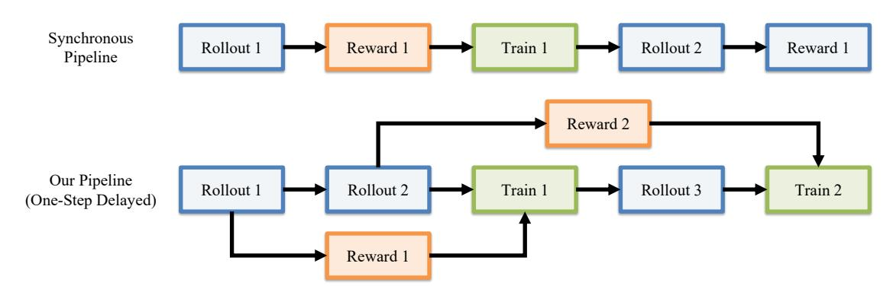

Figure 14 동기화 훈련과 우리 일단계 지연 파이프라인의 비교. 우리 파이프라인은 비동기 전처리 및 보상 평가를 롤아웃 생성 및 정책 최적화와 겹쳐서 GPU 유휴 시간을 줄이고 정책 지연을 한 롤아웃 반복으로 제한한다.

Table 17 VBVR-Pro-Bench에서의 추론 샘플러 전면 비교. 우리는 CPS를 다양한 확률성 수준에서 평가하고, Euler 또는 UniPC 솔버를 사용한 결정론적 ODE 샘플링을 수행한다. Baseline과 SFT는 기본 UniPC 추론 구성을 사용한다. 상세 추론 설정은 Sec. [B.3.](#page-29-0) 에 제공된다. 우리는 전체, 인 도메인, 아웃 오브 도메인 점수와 카테고리별 성능을 보고한다. 높은 점수가 더 좋다. 굵은 글씨: 최고; 밑줄: 두 번째 최고. 순위는 반올림 전에 계산된다.

|  |  |  | In-Domain |  |  |  |  | Out-of-Domain |  |  |  |  |  |  |
|----------|---------------|---------|-----------|-------|-------|-------|-------|---------------|-------|-------|-------|-------|-------|--------|
| Model | Inference | Overall | Avg. | Abst. | Know. | Perc. | Spat. | Trans. | Avg. | Abst. | Know. | Perc. | Spat. | Trans. |
| Baseline | UniPC | 0.470 | 0.641 | 0.578 | 0.511 | 0.476 | 0.480 | 0.724 | 0.300 | 0.585 | 0.153 | 0.129 | 0.311 | 0.352 |
| SFT | UniPC | 0.503 | 0.679 | 0.671 | 0.637 | 0.524 | 0.687 | 0.754 | 0.328 | 0.452 | 0.185 | 0.214 | 0.555 | 0.450 |
| RLVR | CPS (η = 0.1) | 0.509 | 0.675 | 0.699 | 0.649 | 0.586 | 0.644 | 0.776 | 0.342 | 0.489 | 0.277 | 0.246 | 0.499 | 0.390 |
|  | CPS (η = 0.3) | 0.526 | 0.698 | 0.723 | 0.676 | 0.618 | 0.680 | 0.783 | 0.354 | 0.502 | 0.289 | 0.254 | 0.471 | 0.439 |
|  | CPS (η = 0.7) | 0.548 | 0.719 | 0.743 | 0.689 | 0.657 | 0.709 | 0.815 | 0.377 | 0.511 | 0.282 | 0.288 | 0.551 | 0.388 |
|  | CPS (η = 0.9) | 0.539 | 0.706 | 0.709 | 0.679 | 0.650 | 0.697 | 0.799 | 0.372 | 0.501 | 0.273 | 0.282 | 0.556 | 0.382 |
|  | ODE (Euler) | 0.522 | 0.697 | 0.718 | 0.666 | 0.596 | 0.688 | 0.806 | 0.347 | 0.499 | 0.266 | 0.263 | 0.495 | 0.387 |
|  | ODE (UniPC) | 0.522 | 0.696 | 0.723 | 0.664 | 0.596 | 0.687 | 0.815 | 0.347 | 0.493 | 0.269 | 0.268 | 0.493 | 0.383 |
| RLVLM | CPS (η = 0.1) | 0.482 | 0.621 | 0.630 | 0.602 | 0.512 | 0.572 | 0.768 | 0.342 | 0.463 | 0.302 | 0.259 | 0.455 | 0.371 |
|  | CPS (η = 0.3) | 0.493 | 0.650 | 0.656 | 0.644 | 0.539 | 0.643 | 0.750 | 0.335 | 0.462 | 0.283 | 0.235 | 0.485 | 0.393 |
|  | CPS (η = 0.7) | 0.508 | 0.671 | 0.679 | 0.667 | 0.601 | 0.652 | 0.771 | 0.345 | 0.468 | 0.260 | 0.256 | 0.467 | 0.389 |
|  | CPS (η = 0.9) | 0.509 | 0.665 | 0.668 | 0.654 | 0.573 | 0.673 | 0.773 | 0.352 | 0.469 | 0.269 | 0.266 | 0.481 | 0.385 |
|  | ODE (Euler) | 0.488 | 0.643 | 0.666 | 0.618 | 0.529 | 0.626 | 0.735 | 0.333 | 0.476 | 0.286 | 0.245 | 0.474 | 0.384 |
|  | ODE (UniPC) | 0.497 | 0.653 | 0.694 | 0.609 | 0.553 | 0.634 | 0.754 | 0.342 | 0.482 | 0.295 | 0.256 | 0.475 | 0.386 |

Verifiable-RL의 가장 강력한 집계 결과

두 개의 결정적 솔버는 Verifiable-RL에서 거의 동일한 결과를 보인다: ODE (Euler)와 ODE (UniPC)는 모두 전체 점수 0.522를 달성하며, 카테고리 수준에서는 미미한 차이만 있다. 이들의 근접한 일치는 결정적 결과가 특정 ODE 솔버에 민감하지 않음을 시사한다. 그럼에도 불구하고 두 방법 모두 η = 0.7인 CPS보다 낮은 점수를 기록하며, 이산적 시각적 결정을 요구하는 작업에 대해 확률적 탐색의 중요성을 뒷받침한다.

VLM-Judge RL은 샘플러 간 차이가 작고 일관성이 덜하다. 가장 강력한 집계 결과는 η = 0.7 또는 η = 0.9인 CPS에서 얻어지며, ODE (UniPC)가 ODE (Euler)보다 약간 더 나은 성능을 보인다. 그러나 이 격차는 Verifiable-RL에 비해 상당히 작다. 또한 Verifiable-RL은 매칭된 모든 샘플러에서 VLM-Judge RL보다 강력하며, 검증 가능한 보상의 이점이 본 논문에서 사용된 추론 구성에만 국한되지 않음을 보여준다.

그림 15는 집계 결과를 보완하며 훈련 중 성능이 어떻게 진화하는지를 보여준다. Verifiable-RL의 경우, 성능은 η = 0.1에서 η = 0.7로 CPS 불확실성이 증가함에 따라 일반적으로 더 빠르게 향상되며, η = 0.9는 추가적인 개선을 제공하지 않는다. ODE (Euler)와 ODE (UniPC)의 궤적은 거의

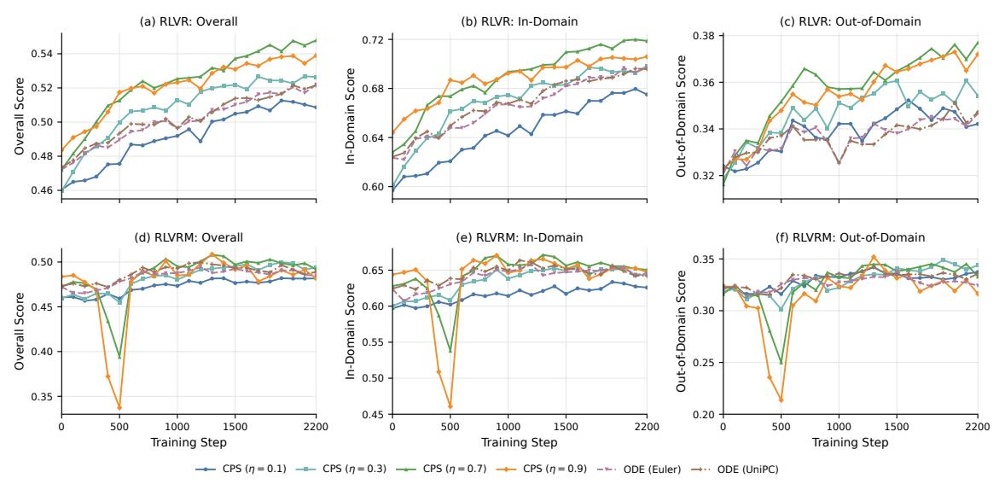

**Figure 15** 훈련 전반에 걸친 평가 성능은 서로 다른 추론 샘플러에 따라 달라진다. 상단과 하단 행은 각각 RLVR과 RLVRM을 보여주며, 열은 전체, 도메인 내, 도메인 외 점수를 보고한다. 각 패널은 CPS와 $\eta \in \{0.1, 0.3, 0.7, 0.9\}$, ODE (Euler), ODE (UniPC)를 비교한다. 체크포인트는 100 훈련 단계마다 평가된다.

세 가지 지표에서 가장 좋은 CPS 구성보다 겹치고 낮게 유지된다. VLM-Judge RL의 경우 샘플러 간 차이가 더 작고 일관성이 떨어진다. 높은 불확실성 CPS는 더 높은 성능 한계를 달성하지만 400–500 단계에서 뚜렷한 일시적 하락을 보이며, 반면 결정적 ODE 궤적은 더 부드럽다. 따라서 확률적 샘플링은 신뢰할 수 있는 검증 가능한 보상과 결합될 때 유용한 탐색을 제공하지만, VLM 판사가 충분히 벌하지 않는 오류를 증폭시킬 수 있다. 우리는 이 행동을 아래에서 분석한다.

### **B.5.** VLM-Judge 불안정성 분석 (Analysis of VLM-Judge Instability)

그림 11과 15에서 관찰한 바와 같이, VLM-Judge RL은 CPS에서 $\eta=0.7$일 때 400–500 단계에서 일시적인 성능 하락을 보인다. 같은 현상은 $\eta=0.9$에서 더 뚜렷해진다. 우리는 체크포인트 500에서 추론 샘플러를 비교하고 인접한 훈련 체크포인트에서 해당 실패 모드를 추적함으로써 이 불안정성을 조사한다.

그림 16은 가장 큰 성능 하락을 보이는 체크포인트에서 추론 샘플러를 비교한다. 전경 변환은 샘플러 간 거의 정확하게 유지되지만, 생성된 배경은 CPS 불확실성이 증가함에 따라 점점 회색으로 변한다. 반대로 낮은 불확실성 CPS와 결정적 ODE 샘플링은 목표 흰색 배경을 대부분 보존한다. 따라서 하락은 샘플러에 따라 시각적 충실도가 저하되는 것을 반영하며, 근본적인 추론 능력의 완전한 실패를 의미하지 않는다.

그림 17은 CPS에서 $\eta=0.9$일 때 훈련 체크포인트 전반에 걸쳐 이 실패 모드를 추가로 추적한다. 배경 색상 편차는 400 단계에서 나타나기 시작해 500 단계에서 가장 심각해지며, 600 단계에서 대부분 회복되어 평가 성능의 일시적 하락과 밀접하게 일치한다.

이러한 관찰은 범용 VLM 판정기가 미묘한 배경색 편차를 신뢰할 수 있게 처벌하지 못함을 시사한다. 따라서 이러한 오류는 최적화 과정에서 지속될 수 있으며, 전경 작업이 올바르게 완료되더라도 더 불확실한 샘플링 하에서는 증폭될 수 있다. 반면, 작업 기반 검증 스코어러는 이러한 편차를 명시적으로 포착하고 보다 안정적인 최적화 신호를 제공한다. 이는 동일한 기본 정책 최적화 절차를 사용함에도 불구하고, 확률적 변동성을 증가시키는 것이 VLM-Judge RL보다 Verifiable-RL에 덜 일관되게 이점을 주는 이유를 설명한다.

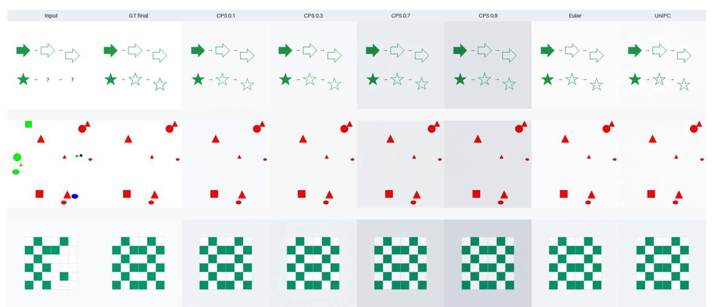

Figure 16 VLM-Judge RL의 샘플러 민감도 (Step 500). 세 가지 대표적인 과제에서 전경 변환은 대부분 정확하게 유지되지만, 출력 배경은 CPS의 확률성 증가에 따라 점점 회색으로 변한다. 낮은 확률성 CPS와 결정론적 ODE 샘플링은 목표 배경을 더 잘 보존한다.

### B.6. 지향적 시간적 궤적 시각화

전체 탐색 영상을 희소한 프레임 부분집합을 표시하지 않고 요약하기 위해, 우리는 각 81프레임 영상을 단계별 지향적 중심선 궤적으로 렌더링한다. I^t 를 프레임 t 로 두고, t ∈ {0, …, 80} 이다. 장면 레이아웃과 과제 마커가 정적이므로, 먼저 픽셀별 시간 중위값을 취해 깨끗한 배경을 추정한다. 이후 이동 에이전트의 알려진 색(미로 과제에서는 녹색, 웨이포인트 과제에서는 주황색)을 이용해 부드러운 전경 마스크 Mt(p) ∈ [0, 1] 를 만든다.

각 프레임에서 단일 에이전트 위치를 복원하기 위해, 부드러운 마스크를 임계값 처리하고 가장 큰 연결 성분 Ct 를 유지한 뒤, 성분 중심을 사용한다:

$$B(p) = \underset{t}{\text{median}} I_t(p), \qquad \widehat{p}_t = \frac{1}{|\mathcal{C}_t|} \sum_{p \in \mathcal{C}_t} p.$$

(2)

가장 큰 성분만 유지하면 작은 압축 아티팩트와 정적 과제 마커에서 남은 색상을 억제한다. 인접 위치가 충분히 가까울 때는 고립된 단일 프레임 탐지 실패를 선형 보간한다. 더 긴 사라짐과 큰 프레임 간 점프는 연결되지 않은 상태를 유지하므로, pre‑RL 영상에서 급작스러운 재배치와 같은 실패가 인위적으로 복구되지 않는다.

각 RLVR 궤적을 에이전트가 과제별 중간 목표에 도달하는 프레임에서 분할하고, 동일한 시간 경계를 대응하는 pre‑RL 영상에 적용해 직접 비교한다. Fig. [21,](#page-38-1) 에서는 궤적을 네 단계로 나눈다: Start-to-1, 1-to-2, 2-to-3, 3-to-Goal. Fig. [13,](#page-18-1) 에서는 세 단계로 나눈다: Start-to-Red, Red-to-Cyan, Cyan-to-Goal. 각 단계는 서로 다른 색을 할당받으며, 화살표 머리는 움직임 방향을 나타낸다. 두 단계가 같은 공간 구간을 반대 방향으로 통과할 때는 중심선이 약간 오프셋되어 두 통과가 모두 보이도록 한다.

마지막으로, 지향적 궤적을 중위값 배경 위에 렌더링하고 깨끗한 참조 이미지에서 정적 과제 마커를 복원한다. 모든 81프레임이 복원된 궤적에 기여하며, 시간적 하위 샘플링은 사용하지 않는다. 직접 RGB 평균과 비교하면, 몇 프레임만 차지하는 움직이는 물체를 감쇠시키는 반면, 전경 기반 중심선은 그 움직임을 보존한다. 시간적 전경 합집합과 비교하면, 단계별 표현은 이동 방향, 반복 방문, 불연속성을 추가로 드러낸다.

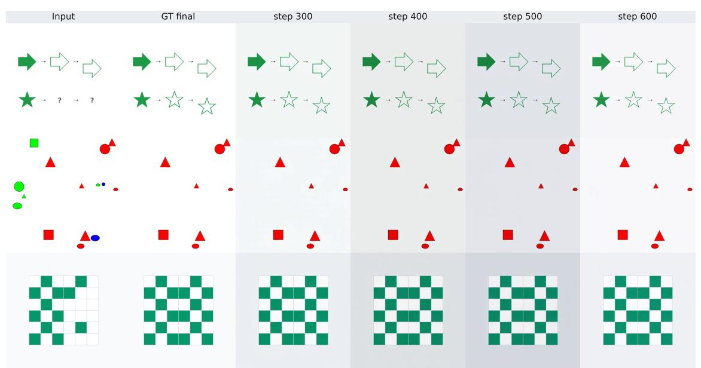

Figure 17 CPS에서 η = 0.9일 때 배경 색상 실패의 진화. 전경 과제 결과는 대부분 정확하게 유지되지만, 회색 배경 색조가 Step 400에서 나타나 Step 500에서 가장 뚜렷해지고 Step 600에서 대부분 사라진다.

### B.7. 추가 정성적 예시

Verifiable-RL이 모델의 추론 경로를 어떻게 바꾸는지 보여주는 추가 예시를 제공한다. 첫 세 예시는 서로 다른 노이즈 제거 단계에서의 예측을 비교하고, 마지막 예시는 생성된 행동이 비디오 프레임을 따라 어떻게 진화하는지 살펴본다. *pre-RL*은 Verifiable-RL이 훈련되는 SFT-초기화된 정책을 나타낸다.

Fig. [18](#page-35-1)은 Verifiable-RL이 중간 결정을 수정하는 데 더 능숙함을 보여준다. pre-RL 모델이 삼각형을 표시하기 시작하면 그 예측은 변하지 않는다. Verifiable-RL도 처음에는 삼각형을 고려하지만 이후에 예측을 올바른 오각형으로 전환한다. 두 모델이 동일한 30단계 샘플링 스케줄을 사용하므로, 이 차이는 추가 추론 계산이 아니라 노이즈 제거 경로를 보다 효과적으로 활용한 결과이다.

Fig. [19](#page-36-1)과 [20](#page-37-1)의 예시는 서로 다른 과제를 다루지만 유사한 진행 과정을 보인다. 집합 교차 과제에서는 모델이 올바른 영역을 식별해야 한다. Verifiable-RL은 넓은 예측을 점차적으로 의도한 겹침으로 축소하는 반면, pre-RL 모델은 무관한 경계에 집중한다. 객체 매칭 과제에서는 모델이 연결되어야 할 객체를 결정해야 한다. Verifiable-RL은 불확실하거나 일관성 없는 연결을 두 개의 올바른 쌍으로 점진적으로 교체한다. 따라서 한 예시는 올바른 영역을 찾는 것, 다른 예시는 올바른 객체를 연결하는 것에 관한 것이지만, 두 경우 모두 RL 이후에 과제 일관성 있는 솔루션으로 보다 질서 있는 전환을 보여준다.

이전 예시들은 노이즈 제거 단계에서의 예측을 비교한 반면, Fig. [21](#page-38-1)은 최종 비디오의 시간적 진화를 살펴본다. pre-RL 모델은 에이전트를 일관성 없는 위치에 배치하고 중간 목표의 일관된 시퀀스를 유지하지 못한다. Verifiable-RL은 보다 연속적인 상태 전이를 생성하고 결국 목적지에 도달한다. 이는 RL이 노이즈 제거 중 솔루션이 어떻게 정제되는지뿐 아니라, 다단계 행동이 시간에 따라 어떻게 실행되는지도 개선함을 시사한다.

전반적으로 이 예시들은 Verifiable-RL이 시각적 추론 경로의 두 측면을 개선함을 보여준다: 중간 예측이 과제 일관성 있는 결과로 보다 효과적으로 정제되고, 결과 행동이 비디오 프레임 전반에 걸쳐 보다 일관성 있게 된다.

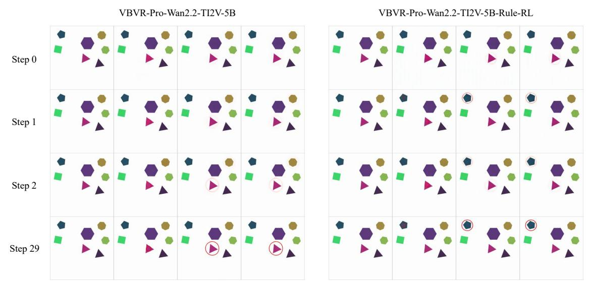

Figure 18 객체 선택 가설의 수정. 올바른 대상은 파란색 오각형이다. pre-RL 모델은 잘못된 삼각형을 고정하고 이 선택을 유지하지만, Verifiable-RL은 초기 예측을 수정하고 궁극적으로 올바른 객체를 선택한다. 행은 서로 다른 노이즈 제거 단계에서의 예측을 보여준다.

## C. VBVR-Pro-데이터셋의 추가 세부사항 및 분석 (C. Additional Details and Analysis of the VBVR-Pro-Dataset)

## C.1. 다중 모달리티 설계의 추가 예시 (C.1. Additional Examples of the Multi-modality Design)

VBVR-Pro의 모든 인스턴스는 비디오와 이미지라는 두 모달리티로 제공되며, 이는 동일한 해결된 인스턴스의 두 렌더링일 뿐, 두 개의 독립적으로 수집된 코퍼스가 아니다. 이 부록은 이미지 모달리티가 해결된 인스턴스에서 어떻게 파생되는지 설명하고, 섹션 [2.2.](#page-4-0)에서 소개한 세 가지 출력 레지먼의 추가 예시를 제공한다. Fig. [22](#page-39-0)은 각 레지먼에서 여러 작업을 보여준다.

출력 레짐 선택. 레짐은 태스크 생성기의 속성으로, 태스크의 모든 인스턴스가 동일한 레짐을 공유한다. 레짐은 답을 명시하기 위해 솔루션 궤적의 어느 정도를 명시적으로 보여줘야 하는지에 따라 결정된다. *Last-Frame*은 솔루션이 최종 상태에 의해 완전히 결정되고 중간 상태가 모델이 생성해야 할 정보를 담지 않을 때 사용된다; 이 경우 태스크는 정확히 하나의 출력 이미지를 갖는다. 예를 들어, 스도쿠 그리드를 완성하거나 고모쿠에서 승리 돌을 놓는 경우가 해당된다. *Key-Frame*은 솔루션이 의미 있는 이산 단계로 구성되고 그 중간 상태가 답의 일부를 형성할 때 사용된다. 예를 들어, 슬라이딩 블록 퍼즐에서 한 번의 움직임마다 보드 상태를 기록하거나, 책을 삽입할 때마다 선반 상태를 기록하는 경우가 해당된다. 따라서 출력 이미지의 수는 일반적으로 인스턴스에 따라 달라지며, 해당 인스턴스 솔루션의 단계 수를 따른다. 미로와 같은 경로 기반 태스크는 특수한 경우로 처리된다: 전체 솔루션 경로가 선택된 프레임에 오버레이되어 궤적이 하나의 이미지에 표현될 수 있다. *Multi-Frame*은 회전 및 변환과 같이 자연스러운 이산 분해가 없는 연속 프로세스에 사용된다. 이 레짐에서는 중간 상태가 태스크별 프로세스 파라미터를 따라 균일한 진행에 따라 샘플링된다.

이미지 프롬프트. 비디오와 이미지 모달리티는 동일한 태스크 설명을 공유한다. 이미지 프롬프트는 생성할 이미지 수와 각 이미지가 묘사해야 할 내용을 명시하는 명시적 출력 사양을 덧붙이며, 이는 Fig. [22.](#page-39-0)에서 굵게 표시된 대로이다. 비디오 프롬프트는 이 사양을 생략한다. 비디오는 프로세스를 연속적으로 표현하기 때문이다. 이렇게 하면 모달리티 간 태스크 조건이 동일하게 유지되면서 이미지 모달리티가 사용하는 이산화가 모델에 명시적으로 전달된다.

태스크별 분포. VBVR-Pro의 300개 태스크 중 209개(69.7%)는 *Last-Frame* 레짐을 사용하고, 58개(19.3%)는 *Key-Frame*, 33개(11.0%)는 *Multi-Frame*을 사용한다. *Last-Frame*은 많은 추론 문제에서 최종 상태만으로 완전한 답이 되기 때문에 전체 태스크의 약 70%를 차지한다. 나머지 30%는 중간 솔루션 상태를 명시적으로 표현해야 하며, 따라서 ...

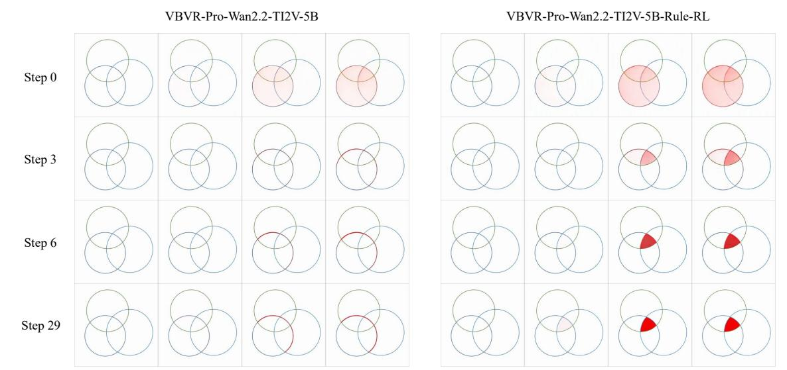

Figure 19 집합 교집합 태스크에서의 점진적 위치 지정. 사전 RL 모델은 목표 영역을 분리하지 못하고 불완전한 경계 추적을 생성한다. Verifiable-RL은 점진적으로 넓은 초기 예측을 세 개의 원의 공통 교집합으로 좁혀간다.

동적 비디오와 이산화된 이미지 시퀀스가 시각적 추론에 더 효과적인 표현을 제공하는지 여부와 같은 보다 광범위한 질문을 연구하기 위한 통제된 설정이다.

### C.2. 인터리브드 데이터 생성 (Interleaved Data Generation)

인터리브드 표현은 각 출력 이미지를 바로 앞에 배치된 텍스트 추론 단계와 짝지어준다. 이미지는 Sec. [C.1.](#page-35-0)에서 설명한 이미지 모달리티에서 직접 가져온다. K개의 출력 이미지를 포함하는 인스턴스는 따라서 K개의 추론-이미지 쌍을 생성한다.

추론 텍스트 생성. 각 인스턴스에 대해 Gemini-3.1-Pro-Preview는 태스크 질문, 입력 이미지, 그리고 솔버가 생성한 전체 출력 이미지 시퀀스를 받아 이미지마다 하나의 추론 단계를 생성한다. 전체 궤적이 제공되는 이유는 많은 태스크가 입력만으로 신뢰성 있게 해결하기 어렵기 때문이다. 따라서 Gemini는 독립적으로 솔루션을 발견하기보다 알려진 상태 전이를 주석한다. 각 단계는 전향적으로 표현되며 해당 이미지 바로 앞에 배치된다.

작업별 프롬프트. 우리는 각 작업마다 규칙, 이미지 순서, 필요한 추론, 출력 형식을 지정하는 프롬프트를 수동으로 설계한다. 이후 각 작업에서 생성된 다섯 개의 주석을 검사하여 솔버가 생성한 전이와 일치하는지 확인한다. 특히, 각 단계가 해당 출력 이미지로 이어지는 결정을 설명하는지, 단순히 이미지를 캡션하는지 여부를 확인한다. 대표적인 예로, Klotski 슬라이딩 블록 작업에 대한 주석 프롬프트를 보여주며, 이는 Key-Frame 행의 가장 왼쪽 예시인 Fig. [22.](#page-39-0)에서 확인할 수 있다.

### 예시 주석 프롬프트: Klotski 슬라이딩 블록 작업 (Example annotation prompt: Klotski sliding-block task)

Klotski 슬라이딩 블록 작업에 대한 초기 트레이와 각 단계마다의 트레이를 포함한 전체 이미지 시퀀스를 받는다. 이 전체 시퀀스를 실제 솔루션 경로로 사용하여 추론 단계를 생성한다.

장면. 트레이에는 직사각형 나무 블록과 소량의 빈 공간이 채워져 있다. 블록은 수평 또는 수직으로 열린 공간으로 이동할 수 있지만, 들어올리거나 회전하거나 겹칠 수는 없다. 목표는 하이라이트된 목표 블록을 지정된 출구로 이동시키는 것이다. 각 출력 이미지는 한 번의 이동 후 트레이를 보여준다.

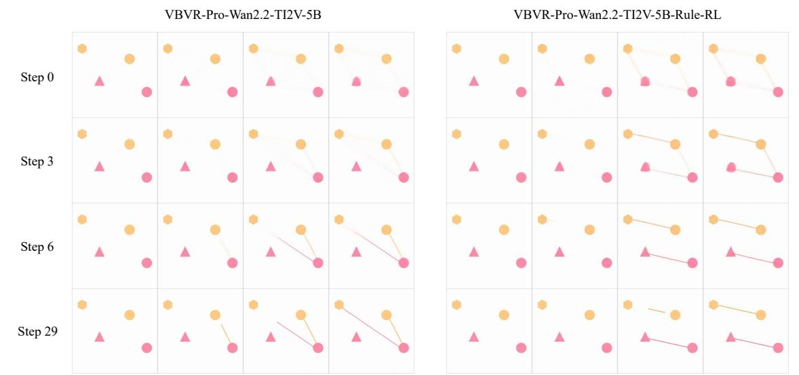

Figure 20 객체 관계의 점진적 구성. 이 작업은 각 색상마다 두 개의 객체를 연결해야 한다. pre-RL 모델은 색상 간 일관되지 않은 연결을 생성하지만, Verifiable-RL은 점진적으로 두 개의 올바른 같은 색상 연결을 형성한다.

### 이미지 순서 (Image order.)

- 입력 이미지: 하이라이트된 목표 블록이 있는 초기 레이아웃.  
- 출력 이미지 1~K: 각 단계마다의 레이아웃.

각 출력 이미지마다, 해당 이미지 앞에 배치할 수 있는 2~3문장의 추론을 작성하십시오:

- 1. 빈 공간에 삽입되어야 할 다음 블록을 식별하고 이 이동이 해결에 어떻게 기여하는지 설명한다.  
- 2. 이 이동이 만들어야 할 레이아웃을 명시하고, 다른 블록은 그대로 둔다.  
- 3. 이미 만들어진 이미지를 설명하는 캡션이 아니라, 앞으로 일어날 일을 예상적으로 서술한다.

### 출력 형식 (Output format)

Step 1: <이미지 1 이전의 추론>

. . .

Step K: <이미지 K 이전의 추론>

## C.3. 시각적 복잡도 측정 (Visual Complexity Measurements)

Sec. [2.3](#page-5-0)에서는 VBVR-Pro를 위해 새롭게 설계된 150개의 작업이 VBVR에서 재작업된 150개의 작업보다 시각적으로 풍부하다고 보고한다. 여기서 우리는 이 주장을 뒷받침하는 측정값을 제공한다. 이미지 복잡도에 대한 단일 수용된 정의가 없으므로 우리는 네 가지 보완적 측정값을 고려한다. 우리의 결론은 개별 측정값이 아니라 두 그룹의 일관된 순서에 기반한다.

프로토콜. 모든 측정값은 모델에 입력으로 제공되는 질문 프레임(첫 번째 프레임.png)에서 계산된다. 300개의 작업 각각에 대해, 인스턴스 목록에서 균등하게 분포된 위치에 있는 50개의 인스턴스를 선택한다. 각 측정값을 이 인스턴스들에 대해 평균하여 하나의 작업 수준 값으로 얻으며, 재작업된 작업에 대해 150개의 값, 새롭게 설계된 작업에 대해 150개의 값을 얻는다. 이후 우리는 이들의 분포를 비교한다

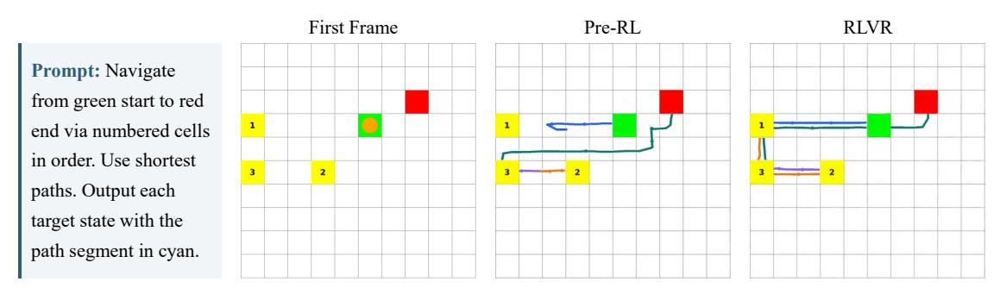

Figure 21 단계별 웨이포인트 탐색 과제 시각화. 주황색 에이전트는 초록색 사각형에서 시작하여 웨이포인트 1, 2, 3을 순서대로 방문한 뒤 빨간 사각형에 도달해야 한다. 각 패널은 81개의 비디오 프레임을 방향성 중심선 궤도로 요약한다: 파랑, 주황, 보라, 청록은 각각 시작-1, 1-2, 2-3, 3-목표 단계를 나타내며, 화살표 머리는 움직임 방향을 표시한다. 겹치는 경로는 반대 방향으로 반복되는 경로를 보여주기 위해 약간 오프셋된다. 사전 RL 모델은 첫 번째 단계를 완료하지 못하고 이후 불연속적인 재배치를 보이지만, Verifiable-RL은 필요한 웨이포인트 순서를 완료하고 목적지에 도달한다. 궤도 렌더링 절차는 Sec. [B.6.](#page-33-0)에서 설명한다.

작업 수준 값. 이는 개별 인스턴스가 아니라 작업 자체를 분석 단위로 삼아 동일한 작업에서 생성된 여러 인스턴스를 독립 관측치로 간주하지 않도록 한다.

측정 지표. 우리는 시각적 복잡성의 다른 측면을 각각 포착하는 네 가지 보완적 측정 지표를 사용한다:

- Distinct regions. 우리는 각 프레임을 중간 컷 양자화(median-cut quantisation) without dithering를 사용해 16색 팔레트로 양자화한다. 각 팔레트 색에 대해 8-연결 요소를 식별하고, 프레임 면적의 최소 10−4를 차지하는 요소만 남긴다. 가장 큰 연결 요소(우리 렌더링에서 배경에 해당)를 제거하고 나머지 요소를 셈한다. 이 지표는 본문에서 보고된 측정값이다.
- Distinct colours. 우리는 각 RGB 채널을 다섯 비트로 양자화하고, 프레임 픽셀의 최소 10−4를 차지하는 색상을 셈한다.
- Spatial information (SI). 우리는 luminance plane의 Sobel gradient magnitude의 픽셀별 표준편차를 계산한다. 이는 ITU-T P.910에서 정의한 프레임 수준 SI 측정값과 일치한다.
- Encoded size. 우리는 각 프레임을 JPEG(품질 90)으로 재인코딩하고, 결과 파일 크기를 킬로바이트 단위로 보고한다. 동일한 인코더와 인코딩 설정을 모든 프레임에 사용한다.

첫 번째 두 측정 지표의 최소 면적 임계값은 프레임 크기로 정규화되며, 측정값은 원본 렌더링 해상도에서 계산된다. SI와 인코딩 크기는 이미지 해상도에 민감하므로, 두 지표 모두 각 프레임을 512 × 512로 리사이즈한 뒤 계산한다.

결과. Table [18](#page-39-1)에서 결과를 보고한다. 새로 설계된 과제는 네 가지 측정 지표 모두에서 평균과 중앙값이 더 높다. 중앙값 작업 수준 값을 기준으로, 새로 설계된 과제는 재구성된 과제보다 6.9배 더 많은 distinct regions와 2.4배 더 많은 distinct colours를 포함하며, 1.7배 더 높은 spatial information과 2.0배 더 큰 encoded size를 보인다. 이 보완적 측정 지표들 간의 일관된 순위는 새로 설계된 과제가 재구성된 과제보다 시각적으로 풍부하다는 결론을 뒷받침한다.

### C.4. 추론 깊이: 블라인드 쌍별 판단 (Reasoning Depth: Blinded Pairwise Judgement)

Sec. [2.3](#page-5-0)에서는 VBVR-Pro의 새 절반이 재구성된 절반보다 더 깊은 추론을 요구한다고 보고한다. 시각적 복잡성과 달리, 추론 깊이는 렌더링된 프레임에서 직접 측정할 수 없다. 따라서 우리는 인간 주석을 통한 블라인드 비교를 통해 이를 평가한다. 또한 우리는 직접적인 단일 규칙 적용과 다단계 추론을 구분하는 이진 per-task 평가를 수행한다.

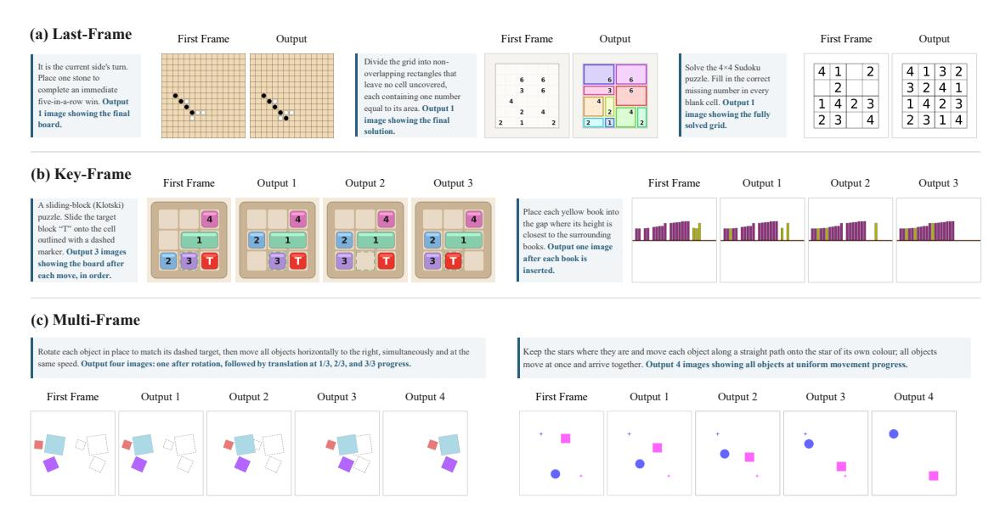

Figure 22 VBVR-Pro 이미지 모달리티의 세 가지 출력 규칙을 보여주는 추가 예시.

Table 18 질문 프레임의 시각적 복잡성. 각 과제마다 각 측정 지표는 먼저 50개의 인스턴스에 대해 평균을 내며, 표는 그룹당 150개의 작업 수준 값에 대한 통계치를 보고한다. 비율은 새로 설계된 과제의 중앙값을 재구성된 과제의 중앙값으로 나눈 값이다.

|  |  | 재구성됨 | 새롭게 설계됨 |  |  |
|---------------------|------|----------|----------------|--------|-------|
| 측정 | 평균 | 중앙값 | 평균 | 중앙값 | 비율 |
| 구별 영역 | 25.6 | 11.6 | 171.4 | 80.4 | 6.9× |
| 구별 색상 | 6.7 | 5.3 | 29.3 | 12.7 | 2.4× |
| 공간 정보 | 79.8 | 68.8 | 134.3 | 119.0 | 1.7× |
| 인코딩 크기 (KB) | 14.4 | 12.1 | 28.4 | 24.7 | 2.0× |

프로토콜. 150개의 개정된 과제는 150개의 새 과제와 고정된 무작위 일대일 매칭을 사용해 짝을 이룬다. GPT-5.5는 각 과제에 대해 시작 프레임과 지시문만을 받고, 과제 출처와 그룹 라벨은 숨겨진다. 각 짝은 두 번 평가되며, 두 과제는 첫 번째와 두 번째 슬롯 사이에서 교환된다. 이는 위치 편향을 통제하고 그 크기를 측정할 수 있게 한다.

쌍별 평가에서 주석자는 답변을 결정하기 전에 더 많은 추론이 필요한 과제를 선택하도록 요청받는다. 한 쌍은 두 순서 모두에서 같은 과제가 선택될 때만 일관된 것으로 간주된다. 별도의 개별 과제 평가에서는 주석자가 각 과제를 단일 규칙의 직접 적용으로부터 답이 도출되는지, 아니면 대안 비교, 가능성 탐색, 후보 답변 제거와 같은 여러 종속 추론 단계가 필요한지 분류한다.

결과. 첫 번째 슬롯은 결정적인 결과가 있는 쌍별 판단의 45.8%에서 선택되었으며, 이는 거의 체계적인 위치 편향이 없음을 시사한다. 두 순서 모두에서 같은 과제가 선택된 비율은 133/150(88.7%)이다. 150개의 모든 짝 중 새 과제는 두 순서 모두에서 더 많은 추론이 필요하다고 선택된 경우가 113건(75.3%)이며, 개정된 과제는 두 순서 모두에서 선택된 경우가 20건(13.3%)이다. 나머지 17쌍(11.3%)은 일관되지 않은 결과를 보였다. 개별 과제 평가에서 150개의 개정된 과제 중 10개(6.7%)가 다단계 추론이 필요하다고 분류되었으며, 새 과제는 70개(46.7%)가 다단계 추론이 필요하다고 분류되었다. 이 결과는 새 과제가 개정된 과제보다 상대적으로 더 깊은 추론과 여러 종속 추론 단계를 요구할 가능성이 높음을 보여준다.

Figure 23 탐욕적 공 먹기 (Task O-31): 프롬프트 및 실제 프레임. 검은 공은 색색 공을 한 번에 하나씩 크기 순서대로 흡수하여, 결국 성장한 검은 공만 남는다.

## D. 검증 가능한 스코어러의 세부 사항 (Details of Verifiable Scorer)

### D.1. 인간 선호도 정렬 (Human Preference Alignment)

주석 프로토콜 우리는 VBVR-Pro-Bench에서 8개의 비디오 생성 모델을 평가한다. 주석을 관리하기 위해, 각 과제마다 하나의 인스턴스를 샘플링하고, 모든 8개의 모델 쌍(28개)을 만든다. 각 쌍은 10명의 독립 주석자에게 보여지며, 두 비디오의 절대 품질을 4단계 척도로 평가한다: L0은 완전하게 정확하고 충실한 결과를 나타내고, L1은 과제 성공에 영향을 주지 않는 사소한 오류, L2는 과제를 여전히 시도하면서 주요 오류, L3은 과제가 수행되지 않은 완전한 실패를 의미한다. 주석자들은 각 비디오를 독립적으로 판단하므로, 한 쌍은 비디오당 10개의 수준 평가를 받는다.

평가에서 쌍별 선호도로 변환하기 위해, 각 주석 투표에서 두 수준 평가를 네 가지 결과 중 하나로 변환한다: A *승리*, B *승리*, *실패 수준 위의 무승부*, 또는 *실패 수준의 무승부*. 두 비디오가 다른 수준을 받으면, 더 나은 수준을 받은 비디오가 승리한다. 같은 수준을 받으면, 두 비디오가 L0–L2로 평가되면 무승부는 실패 수준 위이며, 두 비디오가 L3로 평가되면 무승부는 실패 수준이다. 10개의 투표를 집계하면 인간 선호 벡터 v = [ nA, ntie-above, ntie-fail, nB ]가 되고, P i vi = 10 이다. 무승부를 분리하는 것은 중요하다. 과제가 어려워 대부분의 생성 비디오가 L3에 해당하기 때문이며, 모든 무승부를 하나의 클래스에 합치면 두 비디오가 모두 실패한 쌍과 두 비디오가 모두 고품질인 쌍을 혼동하게 된다.

평가자 점수 매핑 각 평가자(우리 스코어러 또는 VLM 판사)는 비디오마다 [0, 1] 범위의 스칼라 품질 점수를 생성한다. 점수 s1, s2를 가진 쌍에 대해 |s1 − s2| ≤ θ (θ = 0.05) 이면 무승부로 선언하고, 평균 (s1 + s2)/2 가 0.5를 초과하면 tie-above- 또는 tie-at-failure에 할당한다. 이는 인간 프로토콜의 L2–L3 경계와 일치한다. 그렇지 않으면 높은 점수를 받은 비디오가 승리한다. 동일한 매핑은 모든 평가자에게 적용되어 일관된 비교 프로토콜을 보장한다.

Agreement Metric 우리는 평가자가 예측한 단일 결과가 각 쌍의 인간 투표 벡터와 얼마나 일치하는지에 따라 평가한다. c를 평가자가 예측한 결과라고 하면, 쌍당 일치율은 vc/10, 즉 예측과 일치하는 10명의 주석자 중 비율이다. 우리는 모든 평가된 쌍에 대한 이 값의 평균을 보고한다(‘per-vote agreement’).

Cost Estimation 소유 API의 경우, 비용은 토큰 사용량과 공급자의 가격에서 계산된다. 오픈소스 판사의 경우, 비용은 자체 호스팅된 Lambda H100 SXM 노드에서의 총 벽시계 평가 시간에 그 노드의 임대료를 곱한 값이다. 우리의 스코어러는 API 호출이 필요 없고 최소한의 계산(옵션으로 OCR용 GPU)만 요구되는 가벼운 규칙 기반 계산이다. 그러나 보수적인 추정치를 위해, 우리는 오픈소스 판사에 사용되는 동일한 H100 노드 임대료를 적용해 전체 벽시계 실행 시간을 청구한다. 따라서 보고된 비용은 상한선이다.

### D.2. 상세 스코어링 로직 (Detailed Scoring Logic for Selected Tasks)

각 선택된 작업에 대해 프롬프트와 실제 핵심 프레임을 제시하고, 그에 따른 스코어링 로직을 따른다. 이 예시들은 작업별 스코어러가 최종 상태의 정확성, 중간 과정의 유효성, 그리고 작업과 무관한 장면 내용의 보존을 어떻게 공동으로 평가하는지를 보여준다.

Greedy Ball Eating (Task O-31) Figure [23,](#page-40-1)에서 보듯이, 검은 공은 작은 색색 공들을 크기 순서대로 하나씩 흡수하여 결국 성장한 검은 공만 남게 된다. 첫 프레임부터 HSV 분할과 윤곽 분석을 통해 검은 공과 각 색색 타깃 i를 감지하고, 그 면적 Ai를 기록한다.

Figure 24 Ball-Cluster Merging (Task O-29): 프롬프트 및 실제 프레임.

프레임 전반에 걸쳐 존재 비율 ρi(t) ∈ [0, 1]을 추적하고, ρi가 ≈1에서 ≈0으로 떨어지는 프레임에서 타깃 i에 대해 *eat* 이벤트를 등록한다. 최종 점수는 최종 상태 항과 먹기 과정 항을 동일하게 가중한다:

$$S = 0.5 \cdot S_{\text{final}} + 0.5 \cdot S_{\text{eat}}. \tag{3}$$

*Final-state score.* 먼저 크기 일치 점수 b ∈ [0, 1]을 계산한다. 이는 최종 검은 공의 면적이 예상 성장 크기, 즉 흡수된 모든 공의 총 면적과 얼마나 일치하는지를 측정한다. 마지막 프레임 점수는 b에 의해 게이트된다:

$$S_{\text{final}} = b \cdot (0.5 + 0.5 \cdot (0.5 \cdot q_{\text{tgt}} + 0.5 \cdot q_{\text{clean}})),$$

(4)

여기서 qtgt = max(0, 1 − r/N)은 N개의 타깃 중 아직 존재하는 r개의 색색 공을 패널티화하고, qclean은 이탈한 색색 픽셀을 패널티화한다. b가 전체 항을 곱하므로, 검은 공이 없거나 부정확한 크기를 가질 경우 점수가 급감한다. *Process score.* 각 실제 eat 이벤트는 네 가지 검사를 통해 평가된다:

$$S_{\text{eat}} = \frac{1}{N} \sum_{k=1}^{N} (0.25 \cdot o_k + 0.25 \cdot a_k + 0.30 \cdot g_k + 0.20 \cdot s_k), \tag{5}$$

여기서 ok는 올바른 크기 순위를 보상하고, ak는 검은 공이 타깃에 도달하고 접촉한 것을 보상하며, gk는 예상 성장 인수에 따라 성장한 것을 보상하고, sk는 아직 먹히지 않은 공들의 정지 상태를 보상한다. 절대 먹히지 않은 타깃은 0을 기여한다.

Ball-Cluster Merging (Task O-29)  
그림 24에 나타난 것처럼, 생존자 클러스터는 다른 색상 클러스터를 순차적으로 흡수하여 결국 하나만 남게 되며, 그 라벨은 총 개수를 표시해야 한다.  
각 클러스터의 픽셀 존재 여부를 프레임마다 추적하여 병합 이벤트를 감지하고, OCR을 사용해 최종 개수를 읽는다.  
점수는 최종 상태 점수와 병합 프로세스 점수의 가중합이며, 이는 프로세스 게이트 gproc = 0.2 + 0.8 · Sproc에 의해 제어된다:

$$S = (0.6 \cdot S_{\text{final}} + 0.4 \cdot S_{\text{proc}}) \cdot g_{\text{proc}}. \tag{6}$$

따라서 병합 과정이 부실하면 전체 점수가 억제된다. *최종 상태 점수.* 마지막 프레임은 생존자 수, 클러스터 단단함, 장면 정리 정도를 기준으로 평가된다:

$$S_{\text{final}} = (0.5 \cdot q_{\text{surv}} + 0.5 \cdot q_{\text{cluster}}) \cdot (0.6 + 0.4 \cdot q_{\text{pen}}) \cdot (0.8 + 0.2 \cdot q_{\text{text}}), \tag{7}$$

여기서 qsurv(생존자 수 정확성)는 생존자 수가 정확한지를 측정하고, qcluster(생존자 군집 단일성)는 생존자들이 단일 단단한 그룹을 형성했는지를, qpen(기타 색상 사라짐 여부) = 0.5 · qgone(기타 색상 사라짐) + 0.5 · qclean(기타 색상 정리 여부)는 다른 색상들이 이물질 없이 사라졌는지를, qtext(라벨 일치 여부)는 라벨이 총 개수와 일치했는지를 측정한다. *병합 프로세스 점수.* 프로세스 점수는 개별 병합 이벤트의 평균 품질과 생존자 수 안정성 항을 결합한다:

$$S_{\text{proc}} = 0.7 \cdot \frac{1}{M} \sum_{k=1}^{M} (0.2 \cdot o_k + 0.3 \cdot a_k + 0.3 \cdot c_k + 0.2 \cdot s_k) + 0.3 \cdot q_{\text{stab}}, \tag{8}$$

여기서 ok(병합 순서), ak(도착 여부), ck(결과 수), sk(정지 여부)는 각각 k번째 병합의 순서, 도착, 결과 수, 정지 여부를 점수화하고, qstab(생존자 수 안정성)은 연속된 병합 사이에서 안정적인 생존자 수를 보상한다.

그림 25 Key-Door Navigation (Task G-45): 프롬프트와 실제 프레임. 색상 에이전트는 벽을 건너지 않고 키 셀에 도달한 뒤 문 셀에 도달해야 한다.

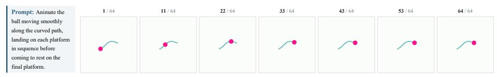

그림 26 Rolling Ball (Task O-32): 프롬프트와 실제 프레임. 공은 고정된 곡선 경로를 따라 목표지점으로 굴러간다.

Key-Door Navigation (Task G-45) 그림 25에 나타난 것처럼, 색상 에이전트는 시작 셀에서 키 셀로, 그 다음 문 셀로 벽을 건너지 않고 이동해야 한다. 우리는 색상 분할을 이용해 에이전트의 프레임별 중심점을 추적하고, 경로를 재구성하며, 벽 충돌을 감지하고, 키가 방문되었는지를 판단한다. 점수는 궤적 항과 두 개의 제약 게이트를 곱한다:

$$S = \underbrace{\frac{1}{3}(\text{proximity} + \text{continuity} + \text{coverage})}_{\text{trajectory}} \cdot (0.4 + 0.6 \cdot g_{\text{wall}}) \cdot (0.4 + 0.6 \cdot g_{\text{key}}). \tag{9}$$

*궤적 점수. proximity(근접도)*는 최적 경로와의 근접도를 측정하고, *coverage(경로 비율)*는 그 경로의 비율을, *continuity(연속성)*은 순간 이동을 벌점한다. *제약 게이트.* gwall(벽 게이트) = max(0.4, 1 − 0.15 · nhits(벽 충돌 횟수))는 벽 셀에 들어간 nhits(벽 충돌 횟수)를 벌점하고, gkey(키 게이트)는 키에 도달하면 1, 그렇지 않으면 0.25이다. 각 게이트는 0.4 + 0.6 · g를 통해 [0.4, 1] 범위로 선형 매핑되므로, 어느 한 제약이라도 위반하면 점수가 급격히 감소한다; 예를 들어, 키를 건너뛰면 승수는 0.4 + 0.6 · 0.25 = 0.55로 제한된다.

Rolling Ball (Task O-32) 그림 26은 고정된 곡선 경로를 따라 목표지점으로 굴러가는 공을 보여준다. 우리는 각 프레임에서 공을 감지하고, 공이 경로 위에 있는 프레임 비율을 측정한다. 점수는 완성 항을 장면 일관성 항으로 제어한다:

$$S = S_{\text{comp}} \cdot (0.6 + 0.4 \cdot q_{\text{cons}}). \tag{10}$$

*완료 점수.* 최종 위치 정확성(qpos)은 경로 추적(p) 항에 의해 제어된다:

$$S_{\text{comp}} = q_{\text{pos}} \cdot (0.2 + 0.8 \cdot p), \qquad p = q_{\text{on-path}} \cdot q_{\text{dir}} \cdot q_{\text{mid}}, \tag{11}$$

qpos는 목표에 가까이 끝나는 것을 보상하고, p는 qon-path(공이 경로에 있는 프레임 비율), qdir(정확한 전방 방향으로의 움직임), qmid(진정한 중간 움직임)의 곱이다. 이 요인들이 곱해지기 때문에, 공이 경로를 거의 따르지 않더라도 목표에 가까이 끝나면 낮은 Scomp을 받는다. *일관성 게이트.* qcons는 장면 및 배경 보존 점수를 평균화하여 완성 점수를 [0.6, 1] 범위의 인수로 스케일링한다.

고밀도 액체 (Task G-273) 그림 [27,](#page-43-0)에 나타난 바와 같이 세 개의 동일한 물체가 세 개의 컵에 떨어지며, 그 중 하나는 더 밀도가 높은 액체를 포함하고 있어 해당 물체가 가라앉기보다 뜨도록 해야 한다. 우리는 각 물체의 하강을 추적하고, 그 물체가 가라앉거나 뜨는 최종 상태를 그 물체가 정지한 높이를 기준으로 분류하며, 액체 수준과 배경을 확인한다. 점수는 최종 상태와 프로세스 항목의 가중합이다:

$$S = 0.6 \cdot S_{\text{final}} + 0.4 \cdot S_{\text{proc}}. \tag{12}$$

*최종 상태 점수.* 최종 물체 위치는 장면 보존과 함께 평가된다:

$$S_{\text{final}} = q_{\text{pos}} \cdot (0.5 + 0.5 \cdot q_{\text{scene}}), \tag{13}$$

그림 27 고밀도 액체: 프롬프트 및 실제 프레임. 세 물체가 컵에 떨어지며, 더 밀도가 높은 액체 위에 있는 물체는 가라앉기보다 뜨도록 해야 한다.

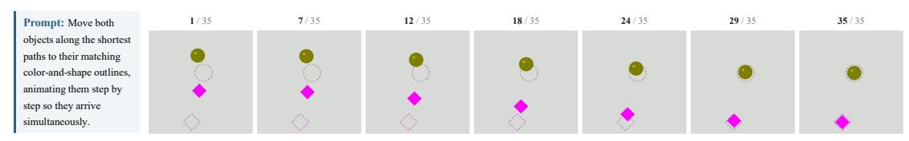

그림 28 물체 이동 (Task O-27): 프롬프트 및 실제 프레임. 두 물체가 해당 목표 윤곽선으로 이동한다.

qpos는 각 물체가 올바른 뜨기 또는 가라앉기 높이에 정지하도록 보상하고, qscene은 컵, 액체 및 배경이 보존되었는지 측정한다. *프로세스 점수.* 하강은 물리적으로 타당해야 한다:

$$S_{\text{proc}} = q_{\text{ntp}} \cdot (0.1 + 0.3 \cdot q_{\text{opc}} + 0.3 \cdot q_{\text{stab}} + 0.3 \cdot q_{\text{area}}), \tag{14}$$

qntp는 비이동 하강을 요구하고, qopc는 각 컵 열에 최대 하나의 물체가 포함되는지 확인하며, qstab은 중간 프레임의 무결성을 측정하고, qarea는 비디오 전반에 걸친 일관된 물체 크기를 보상한다.

물체 이동 그림 [28,](#page-43-1)에 나타난 바와 같이 두 물체를 해당 목표 윤곽선으로 이동해야 한다. 우리는 각 물체의 궤적을 추적하고, 두 물체가 동시에 움직이는지 확인하기 전에 운송을 평가한다. 점수는 동기화 항을 통해 평균 운송 품질을 제한한다:

$$S = S_{\text{mov}} \cdot (0.8 + 0.2 \cdot q_{\text{sync}}). \tag{15}$$

*운송 점수.* 각 물체에 대해 운송 품질은 곱셈으로 계산된다:

$$S_{\text{mov}} = \frac{1}{2} \sum_{i=1}^{2} q_{\text{trans}}^{(i)} \cdot q_{\text{vis}}^{(i)} \cdot q_{\text{tp}}^{(i)} \cdot q_{\text{dur}}^{(i)}, \tag{16}$$

qtrans는 경로 품질과 종단 정확도를 결합하고, qvis는 물체가 성공적으로 추적되는 프레임 비율이며, qtp는 텔레포트를 벌점으로 부여하고, qdur은 현실적인 움직임 지속 시간을 보상한다. *동기화.* qsync = √ qstart · qend는 두 물체가 유사한 시점에 시작하고 끝나도록 보상한다. 순차적으로 이동하면 qsync → 0이 되고 점수는 0.8·이동으로 제한된다.

