# Qwen-Drive-1.0: An Initial Step towards a Vision-Language Foundation Model for Autonomous Driving

- 원제: Qwen-Drive-1.0: An Initial Step towards a Vision-Language Foundation Model for Autonomous Driving
- 원문: [https://arxiv.org/abs/2609.00111](https://arxiv.org/abs/2609.00111)
- PDF: [https://arxiv.org/pdf/2609.00111](https://arxiv.org/pdf/2609.00111)
- arXiv ID: `2609.00111`

---


# **Qwen-Drive-1.0: 자율주행을 위한 비전-언어 기반 모델의 초기 단계 (Qwen-Drive-1.0: An Initial Step towards a Vision-Language Foundation Model for Autonomous Driving)**

#### Qwen 팀 화중과학기술대학교 (Qwen Team Huazhong University of Science and Technology)

https://huggingface.co/Qwen/Qwen-Drive-1.0-4B
https://modelscope.cn/models/Qwen/Qwen-Drive-1.0-4B
https://github.com/QwenLM/Qwen-Drive-1.0

#### **Abstract (개요)**

우리는 자율주행을 위한 비전-언어 기반 모델의 초기 단계인 Qwen-Drive-1.0을 제시한다. Qwen-Drive-1.0은 사전 학습된 비전-언어 모델(VLM)의 아키텍처를 유지하면서 3D 인식, 시각적 질문 응답, 모션 플래닝을 통합된 프레임워크 내에서 결합한다. 외부의 항공 시점(BEV) 인식 헤드는 3D 객체 탐지, 의미적 점유 예측, BEV 지도 분할을 공동으로 수행한다. 이는 공유 표현에서 접근 가능한 3D 정보를 탐지하는 프로브 역할을 하며 3D 장면 구조에 대한 명시적이고 검사 가능한 인터페이스를 제공한다. Planning Expert는 공유 VLM 표현을 조건화하여 미래 자가 궤적을 생성한다. 단계별 학습 레시피는 운전 감독과 일반 목적의 비전-언어 데이터를 결합하여 운전 특화 역량을 획득하면서 광범위한 시각 이해와 지시 따르기 능력을 보존하도록 돕는다. 실험은 강력한 3D 인식과 운전 장면 이해를 보여주면서 일반 비전-언어 역량을 크게 보존한다. 개방형 루프, 가짜 폐쇄형 루프, 폐쇄형 루프 설정 전반에 걸친 종합 평가를 통해 매우 경쟁력 있는 모션 플래닝 성능을 추가로 입증한다.

<span id="page-0-0"></span>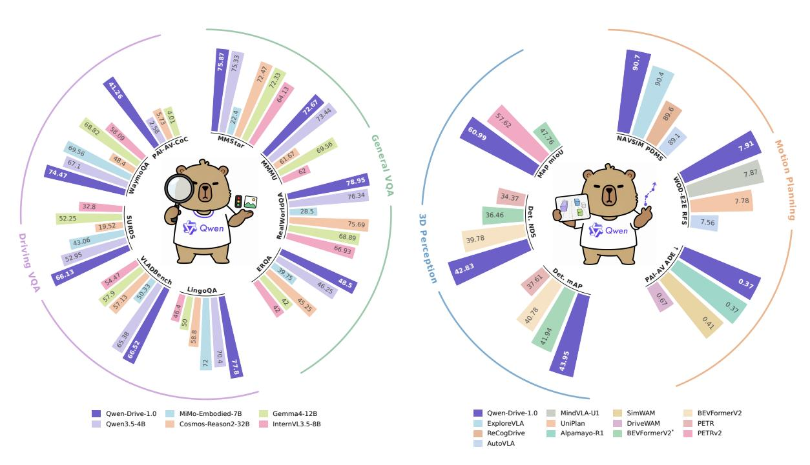

Figure 1: Qwen-Drive-1.0의 운전 VQA, 일반 VQA, 3D 인식, 모션 플래닝 전반에 걸친 성능 개요.

## **1 Introduction (서론)**

자율주행 연구는 점점 과제별 모듈식 파이프라인에서 통합 학습 기반 시스템으로 전환되고 있다 [(Hu et al.,](#page-26-0) [2023)](#page-26-0). 이 추세 속에서 비전-언어-행동(VLA) 모델은 사전 학습된 비전-언어 모델을 활용해 장면 이해, 추론, 행동 생성을 연결한다 [(Fu et al.,](#page-26-1) [2025;](#page-26-1) [2026;](#page-26-2) [Wang et al.,](#page-29-0) [2026)](#page-29-0). 대규모 사전 학습은 드물고 분포 외(OOD) 운전 시나리오에서 추론을 지원할 수 있는 광범위한 시각, 언어, 세계 지식을 제공한다.

최근의 많은 운전 VLA 방법은 운전 특화 감독, 특히 시각적 질문 응답(VQA)을 통해 일반 목적의 VLM을 지속 학습으로 적응시킨다. 이 레시피는 공통의 자기 회귀 언어 인터페이스를 통해 이질적인 운전 과제를 표현한다. 결과적으로 생성되는 목표는 교통 장면 설명, 주변 에이전트에 대한 추론, 운전 결정에 대한 설명을 포함한다 [(Sima et al.,](#page-29-1) [2024;](#page-29-1) [Xu et al.,](#page-30-0) [2024;](#page-30-0) [Zhou et al.,](#page-31-0) [2025b;](#page-31-0) [Wang et al.,](#page-29-2) [2025b;](#page-29-2) [Zhao et al.,](#page-30-1) [2026a)](#page-30-1). 따라서 운전 특화 지식은 주로 언어 감독을 통해 도입된다.

이 적응 전략에는 두 가지 한계가 있다. **1)** 텍스트 기반 VQA 목표는 3D 레이아웃, 깊이, 점유율을 직접적으로 제약하지 않는다 [(Yang et al.,](#page-30-2) [2025;](#page-30-2) [El Banani et al.,](#page-26-3) [2024;](#page-26-3) [Zhou et al.,](#page-31-1) [2026a;](#page-31-1) [Wu et al.,](#page-30-3) [2026)](#page-30-3). 사전 학습된 표현이 공간적 단서를 인코딩하더라도, 텍스트 감독만으로는 명시적 3D 예측을 요구하지도, 직접 평가를 허용하지도 않는다. VQA를 통해서만 적응된 모델은 3D 공간에서 부정확함을 유지하면서도 유창한 장면 설명을 생성할 수 있다. **2)** 광범위한 도메인 적응은 사전 학습 중 획득한 일반 지식의 파괴적 망각을 초래할 수 있다 [(Zhai et al.,](#page-30-4) [2024;](#page-30-4) [Luo et al.,](#page-28-0) [2025)](#page-28-0). 유한한 주행 데이터셋은 배포 시 발생하는 드문 상황과 보지 못한 상황을 완전하게 대표할 수 없다. 따라서 이 사전 학습된 지식은 OOD 추론에 여전히 중요하다. 이러한 한계들은 사전 학습에서 얻은 폭넓은 시각적·세계 지식을 보존하면서 3D 인식, 주행 추론, 동작 계획을 통합한 모델을 동원하도록 동기를 부여한다.

일반적 능력(general capability)을 보존하는 것은 배포 요구사항이기도 하다. 생산 차량은 cockpit-driving 통합(cockpit-driving integration)으로 이동하고 있으며, 이 경우 지능형 cockpit과 운전 시스템이 두 개의 별도 도메인 컨트롤러(domain controllers)가 아니라 단일 컴퓨팅 플랫폼(compute platform)을 공유한다. 이러한 통합은 하드웨어 및 통합 비용을 낮추고, 각 기능에 할당되는 계산 예산(compute budget)을 강화한다. 따라서 단일 모델이 두 도메인 모두를 지원해야 하며, 이는 다중 턴 대화(multi-turn dialogue), 명령어 수행(instruction following), 개방형 시각 이해(open-ended visual understanding)와 같은 일반적 능력과 운전 역량(driving competence)을 모두 갖추어야 한다. 일반적 능력을 운전 성능에 맞춰 포기하는 모델은 이 이점을 잃게 된다. 왜냐하면 cockpit 기능이 별도의 모델과 추가 계산을 필요로 하기 때문이다. 따라서 일반적 능력을 유지하는 것은 두 가지 목적을 충족한다. 첫째, 드물고 보지 못한 상황(rare and unseen situations)에서의 추론(reasoning)을 지원한다. 둘째, 단일 계산 예산 안에서 cockpit과 운전 도메인 모두를 한 모델이 커버할 수 있게 한다.

우리는 운전용 실용적인 비전-언어 기반 모델이 세 가지 설계 요구 사항을 충족해야 한다고 주장한다. 첫째, 사전 학습된 VLM 아키텍처는 사용 편의성을 보존하기 위해 그대로 유지되어야 한다. 둘째, 명시적 지각 프로브는 텍스트 기반 공간 추론에만 의존하기보다 3D 장면 정보를 노출하고 평가해야 한다. 셋째, 모델은 대부분의 일반 목적 기능을 보존하면서 운전 장면 이해 지식을 획득해야 하며, 이는 강건한 일반화와 통합 조종석-운전 플랫폼에의 배포를 모두 지원한다.

우리는 따라서 Qwen-Drive-1.0을 도입한다. Qwen-Drive-1.0은 3D 인식, 시각적 질문 응답, 그리고 운동 계획을 하나의 사전 학습된 VLM 안에서 통합하는 최초의 비전-언어 기반 모델이다. Qwen-Drive-1.0은 natively multimodal Qwen3.5-4B [(Qwen Team,](#page-28-1) [2026a;](#page-28-1)[b)](#page-28-2)를 공유 VLM으로 사용하고 두 개의 외부 모듈을 부착한다. bird's-eye-view (BEV) 인식 헤드는 명시적이고 검사 가능한 3D 장면 예측을 통해 공유 표현을 탐색한다. Planning Expert는 이러한 표현을 사용해 미래 ego trajectory를 생성한다. 우리는 perception, language, planning 목표를 도입하는 단계별 레시피로 이 구성 요소들을 학습한다. 이 레시피를 뒷받침하는 통합 데이터 파이프라인은 이질적인 인식 주석을 공유 라벨 공간으로 매핑하고, 형식 및 사실 일관성을 위해 주행 VQA 응답을 재주석화하며, 여러 공개 주행 데이터셋의 trajectory를 단일 waypoint 표현으로 나타낸다.

그림 1: Qwen-Drive-1.0의 성능을 3D 인식, 운전 장면 이해, 일반 비전-언어 기능, 및 동작 계획 영역에서 요약한다. 3D 인식에서는 nuScenes에서 43.95 mAP와 60.99 map mIoU, OpenScene에서 43.45 mAP와 71.27 map mIoU를 달성하며, 일반적인 비전 기반 3D 탐지기와 비교해 여전히 높은 경쟁력을 유지하고, 사전 학습된 VLM에 명시적인 3D 인식 기능을 부여한다. 운전 장면 이해에서는 일반 목적의 Qwen3.5-4B를 크게 능가하면서도 일반 기능을 보존한다. 동작 계획에서는 NAVSIM에서 Predictive Driver Model Score 90.7을 달성하고, Waymo Open Dataset end-to-end benchmark (WOD-E2E) 테스트 세트에서 강력한 Rater Feedback Score 7.91을 획득하며, AlpaSim에서 폐쇄 루프 운전에 대한 유망한 잠재력을 보여준다.

<span id="page-2-0"></span>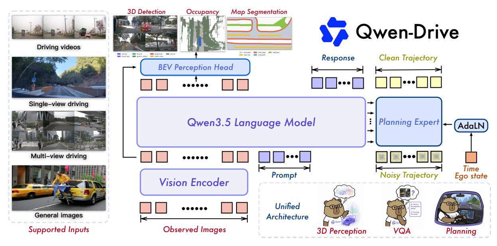

그림 2: Qwen-Drive-1.0의 3D 인식, 시각적 질문 응답, 및 동작 계획을 위한 통합 아키텍처. 공유 비전 인코더와 VLM은 텍스트 생성을 지원하며, 외부 BEV 인식 헤드와 Planning Expert는 기하학적 예측 및 미래 자가 궤적을 생성한다.

우리는 주요 기여를 아래와 같이 요약한다.

- 우리는 Qwen-Drive-1.0을 제시한다. 이는 사전 학습된 VLM 아키텍처를 변경하지 않고 3D 인식, 운전 VQA, 및 동작 계획을 통합한 자율 주행용 최초의 비전-언어 기초 모델이다.
- 우리는 외부 BEV 인식 헤드를 도입한다. 이 헤드는 3D 탐지, 의미적 점유 예측, BEV 지도 분할을 공동으로 학습한다. 헤드는 3D 프로브 역할을 하며 동일한 사전 학습된 VLM에 명시적이고 검증 가능한 인식 출력을 제공하면서도 비전-언어 성능을 매우 경쟁력 있게 유지한다.
- 우리는 단계별 학습 및 데이터 레시피를 개발한다. 이 레시피는 교차 데이터셋 라벨을 통합하고, 응답을 재작성하며, 일관성을 위해 샘플을 필터링하고, 운전 데이터를 일반 목적의 비전-언어 감독과 결합한다. 이 설계는 도메인 적응을 지원하면서 파국적 망각을 완화한다.
- 우리는 사전 학습된 VLM 표현에 맞춘 Planning Expert를 설계한다. 이 Expert는 흐름 매칭을 사용해 미래 자가 궤적을 생성한다. 통합된 궤적 주석은 다수의 공개 운전 데이터셋에 걸쳐 공동 학습을 가능하게 하며, 개방 루프, 가상 폐쇄 루프, 및 폐쇄 루프 평가에서 매우 경쟁력 있는 결과를 도출한다.

## **2 방법론 (Method)**

### <span id="page-2-1"></span>**2.1 모델 아키텍처 및 목표 (Model Architecture and Objectives)**

그림 2: Qwen-Drive-1.0의 통합 아키텍처를 제시한다. 공유 비전 인코더와 VLM은 단일 시점 및 다중 시점 운전 입력, 시간적 이미지 시퀀스, 일반 이미지를 처리한다. 비전 인코더는 각 이미지를 시각 토큰으로 변환한다. VLM은 이 토큰을 텍스트 프롬프트와 함께 인코딩하고, 자가 회귀적으로 응답을 생성한다. 두 외부 모듈은 VLM 아키텍처를 변경하지 않고 이 공유 경로의 특징을 사용한다. BEV 인식 헤드는 비전 인코더 특징과 VLM 출력 특징을 융합해 3D 객체 탐지, 의미적 점유 예측, BEV 지도 분할을 위한 BEV 표현을 구성한다. Planning Expert는 캐시된 VLM 키와 값을 기반으로 궤적 토큰을 조건화하고, 흐름 매칭을 통해 미래 자가 움직임을 예측한다.

다중 시점 및 다중 프레임 입력. 시각 토큰 시퀀스는 각 이미지의 시점과 시각을 명시적으로 식별하지 않으므로, 우리는 시점 및 프레임 태그를 통해 이 정보를 제공한다. 시점 태그는 여덟 개의 표준 방향을 나타낸다: <FRONT VIEW>, <FRONT RIGHT VIEW>, <RIGHT VIEW>, <BACK RIGHT VIEW>, <BACK VIEW>, <BACK LEFT VIEW>, <LEFT VIEW>, 및 <FRONT LEFT VIEW>. 프레임 태그 frame: *k*는 각 이미지를 시점 *k*와 연결한다.

입력 직렬화는 작업에 따라 달라진다. 질문 응답 예시는 프레임-우선 순서를 사용하며, 이는 한 시점에서 모든 시점을 배치한 뒤 다음 시점의 시점을 배치한다:

frame: 0 <FRONT VIEW> <image> <FRONT RIGHT VIEW> <image> ··· frame: 1 ···.

계획 예시, 자체 구성한 계획-추론 데이터 포함, 뷰-우선 순서를 사용합니다:

```
<FRONT VIEW> frame: 0 <image> frame: 1 <image> ··· <FRONT RIGHT VIEW> ···.
```

뷰-우선 직렬화는 각 뷰에서 연속적인 관측을 토큰 시퀀스에서 인접하게 배치하고, 해당 뷰 내의 시간 변화를 드러냅니다. 이는 동적 환경에서 제어에 중요합니다 (Fang et al., 2026). 단일 뷰 및 단일 프레임 입력은 해당 중복 태그를 생략합니다. 두 태그 유형 모두 일반 어휘 토큰을 사용하며 추가적인 특수 토큰이나 아키텍처 수정을 필요로 하지 않습니다.

**자기회귀 텍스트 생성.** 직렬화된 멀티모달 입력 $\mathbf{x}$와 목표 응답 $\mathbf{y} = (y_1, \dots, y_T)$가 주어지면, VLM은 입력과 이전 토큰에 조건화된 각 응답 토큰을 예측합니다. 우리는 표준 다음 토큰 예측 목표를 사용합니다:

$$\mathcal{L}_{\text{ntp}} = -\sum_{t=1}^{T} \log p(y_t \mid \mathbf{x}, y_{< t}).$$

(1)

우리는 운전‑특정 및 일반‑목적 비전‑언어 샘플에 동일한 목표를 사용합니다.

**BEV 인지 헤드.** 그림 3(a)에 표시된 대로, BEV 인지 헤드는 단일 프레임 주변 뷰 3D 인지를 수행합니다. 이 헤드는 $N_v$개의 현재 이미지와 해당 카메라 보정 정보를 수신하며, 실험에서는 $N_v \in \{6,8\}$입니다. 헤드는 3D 객체 탐지, 의미적 점유 예측 및 BEV 지도 분할을 위한 공유 이고 프레임 BEV 표현을 구성합니다.

BEV 인지 헤드는 각 뷰 i에서 두 개의 보완적인 특징 스트림을 읽습니다. 비전 인코더 특징 $\mathbf{F}_i^v$는 이미지 토큰이 VLM에 들어가기 전 저수준 외형을 포착합니다. 전체 VLM을 통과한 후, 해당 이미지 토큰은 특징 $\mathbf{F}_i^m$을 생성하며, 이는 더 넓은 장면 맥락을 인코딩하고 BEV 구성을 위한 의미적 소스로 사용됩니다. 우리는 뷰 간 특징 시퀀스를 $\mathbf{F}^v = (\mathbf{F}_i^v)_{i=1}^{N_v}$와 $\mathbf{F}^m = (\mathbf{F}_i^m)_{i=1}^{N_v}$로 표시합니다. 공동 학습 중에, 인지 손실은 $\mathbf{F}_i^m$을 통해 전파되어, $\mathbf{F}_i^v$를 통한 직접 경로와 함께 비전 인코더에 추가적인 기울기 경로를 제공합니다.

명시적 기하학적 표현을 구성하기 위해, 깊이 기반 뷰 변환(Li et al., 2022c; Philion & Fidler, 2020)은 단일 스케일 특징 $\mathbf{F}^v$를 특징 피라미드 없이 3D 볼륨으로 올립니다. 잔차 블록과 아트로스 공간 피라미드로 구성된 경량 깊이 네트워크는 깊이 감독 없이 $N_d$ 깊이 빈에 대한 픽셀별 범주 분포 $\mathbf{D}_i$를 예측합니다. 인식 범위 내의 각 voxel 중심 $\mathbf{p}$는 보정 행렬 $\mathbf{P}_i$를 사용해 뷰 i에 투영되어 이미지 좌표 $(u_i, v_i)$와 깊이 빈 $d_i$를 생성합니다. 그 voxel 특징은 다음과 같이 계산됩니다:

$$\mathbf{V}(\mathbf{p}) = \sum_{i \in \Omega(\mathbf{p})} \mathbf{D}_i(u_i, v_i, d_i) \, \mathbf{F}_i^{v}(u_i, v_i), \tag{2}$$

여기서 $\Omega(\mathbf{p})$는 $\mathbf{p}$가 유효한 이미지 투영을 갖는 뷰들을 포함한다. 이 연산은 예측된 깊이 확률에 따라 카메라 광선에 따라 이미지 특징을 분산시킨다. 결과적으로 생성된 볼륨 $\mathbf{V}$는 점유 예측을 위해 높이 차원을 유지한다.

Because  $\mathbf{F}^m$  is available at a single coarse scale, a simple feature pyramid (Li et al., 2022b) expands it into multiscale features. A query-based BEV transformer (Li et al., 2024b; Yang et al., 2023) then aggregates these features onto the BEV plane. Its queries are initialized using the height-collapsed feature  $\mathbf{V}$  derived from  $\mathbf{V}$ , which provides an explicit geometric prior. Each encoder layer alternates self-attention over the BEV grid with deformable cross-attention to the feature pyramid. The resulting ego-frame feature  $\mathbf{B}$  integrates geometry from  $\mathbf{V}$  with context from  $\mathbf{F}^m$  and serves all three task-specific branches.

3D 검출을 위해, 변형 주의(deformable attention)를 갖춘 DETR 스타일 디코더(Zhu et al., 2021)가  $\bf B$  를 대상으로 객체 쿼리를 정제한다. 시맨틱 점유(occupancy)를 위해, 우리는  $\bf B$  를 높이 차원으로 확장하고  $\bf V$  와 융합한 뒤 얕은 3D UNet이 voxel 단위 시맨틱을 예측한다. 이 융합은  $\bf V$  에 보존된 수직 구조를 복원한다. 지도 분할(map segmentation)을 위해, UNet 스타일 헤드는 BEV 평면에서 래스터화된 지도 요소를 예측한다. 우리는 세 개의 브랜치를 인식(perception) 목표를 사용해 공동 최적화한다:

$$\mathcal{L}_{perc} = \mathcal{L}_{det} + \mathcal{L}_{occ} + \mathcal{L}_{map}. \tag{3}$$

검출은 세트 예측(set‑prediction) 형식을 따른다. 헝가리안 알고리즘은 객체 쿼리를 실제 바운딩 박스와 매칭하고, 각 디코더 레이어에서 깊은 감독(deep supervision)은 포컬 손실(focal loss)(Lin et al., 2017)을 결합한다.

<span id="page-4-0"></span>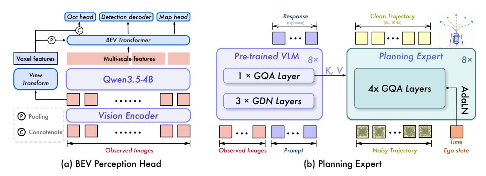

Figure 3: 외부 모듈의 아키텍처. (a) BEV 인식 헤드는 voxel화된 비전 인코더 피처와 VLM 출력의 피처 피라미드를 융합한다. (b) Planning Expert는 캐시된 VLM 키와 값에 노이즈가 있는 궤적 토큰을 조건화하여 깨끗한 자가(ego) 궤적을 복원한다.

다음은  $\ell_1$  회귀 손실을 사용한다:

$$\mathcal{L}_{\text{det}} = \sum_{l=1}^{L} \left( 2 \,\mathcal{L}_{\text{focal}}^{(l)} + 0.75 \,\mathcal{L}_{\ell_1}^{(l)} \right). \tag{4}$$

FlashOcc(Yu et al., 2023)를 따라, 점유 목표는 다음과 같이 정의된다:

$$\mathcal{L}_{occ} = 100 \,\mathcal{L}_{focal} + \mathcal{L}_{geo} + \mathcal{L}_{sem} + \mathcal{L}_{lov}, \tag{5}$$

여기서  $\mathcal{L}_{focal}$  은 클래스 균형 포컬 손실(class‑balanced focal loss),  $\mathcal{L}_{geo}$  와  $\mathcal{L}_{sem}$  은 MonoScene(Cao & De Charette, 2022)의 기하학적 및 시맨틱 장면‑클래스 친화성 손실이며,  $\mathcal{L}_{lov}$  은 Lovász‑softmax 손실(Berman et al., 2018)이다. 지도 목표는  $\mathcal{L}_{map} = 100 \, \mathcal{L}_{focal} + \mathcal{L}_{lov}$  로 정의된다.

**Planning Expert.** 모션 플래닝을 위해, Planning Expert는 VLM에 의해 인코딩된 다중 모달 컨텍스트에서 미래 자가 움직임을 예측한다. 우리는 궤적 예측을 조건부 생성으로 공식화한다:

<span id="page-4-2"></span>

$$\tau \sim p(\tau \mid \mathbf{s}, \ell, \tau_{\text{hist}}, \mathbf{n}, \mathbf{e}, \mathbf{r}), \qquad \tau = \{(x_k, y_k, \theta_k)\}_{k=1}^{50},$$

(6)

여기서  ${\bf s}$  는 차량 센서 입력을,  $\ell$  은 그 직렬화된 레이아웃을 나타낸다. 변수  $\tau_{\rm hist}$ ,  ${\bf n}$ ,  ${\bf e}$  는 각각 과거 자가 궤적, 내비게이션 지시, 현재 자가 상태를 의미한다. 선택적 텍스트 플래닝 이유  ${\bf r}$  은 사용 불가 시  $\varnothing$  으로 설정된다. 프롬프트는  $\ell$  을 설명하고,  $\tau_{\rm hist}$  와  ${\bf n}$  을 제공하며,  ${\bf r}$  가 있을 경우 포함한다. 각 궤적은 10 Hz에서 5 초 동안 50개의 웨이포인트를 포함한다. 웨이포인트 k에서  $x_k$  와  $y_k$  는 현재 자가 프레임에서 종방향 및 측면 위치를,  $\theta_k$  는 현재 자가 방향에 대한 헤딩을 나타낸다. 데이터셋 간 공동 학습을 위해, 우리는  $x_k$ ,  $y_k$ ,  $\theta_k$  를 각각 165 m, 25 m,  $\pi/2$ rad 의 고정 스케일로 나눈다.

As illustrated in Fig. 3(b), the Planning Expert uses a 32-layer diffusion transformer. The VLM alternates gated linear attention with grouped-query softmax attention (Qwen Team, 2026b). We cache the keys after rotary position embedding (RoPE) and the corresponding values from all eight grouped-query softmax attention layers. Each cache conditions four consecutive Planning Expert layers. Each Planning Expert layer concatenates the cached keys and values with those of the trajectory tokens for joint attention. A trajectory token combines a noisy waypoint with an encoding of  $\tau_{hist}$ . Shared adaptive layer normalization injects the flow time, navigation instruction  $\mathbf{n}$ , and current ego state  $\mathbf{e}$ . The hidden dimension is 1024, yielding  $\sim$ 1.1B parameters.

우리는 플로우 매칭(Lipman et al., 2023)을 사용하여 Planning Expert를 훈련시킨다. 이때 x-프리딕션 파라미터화를 통해 정제된 트래젝터리를 직접 추정한다.  $\tau_1$ 를 정규화된 실제 트래젝터리로 두고,  $\tau_0 \sim \mathcal{N}(\mathbf{0}, \mathbf{I})$ 를 동일한 형태의 가우시안 노이즈 샘플로 둔다. 플로우 타임 t에서의 선형 보간 경로를 다음과 같이 정의한다:

<span id="page-4-1"></span>

$$\boldsymbol{\tau}_t = (1 - t) \, \boldsymbol{\tau}_0 + t \, \boldsymbol{\tau}_1. \tag{7}$$

Planning Expert는 플로우 속도나 노이즈 대신 정제된 엔드포인트  $\hat{\tau}_1$ 를 예측한다. 예측된 엔드포인트는 플로우 속도 필드  $(\hat{\tau}_1 - \tau_t)/(1-t)$ 를 유도한다. 이 엔드포인트 파라미터화는 이질적인 데이터셋에서 기록된 트래젝터리의 센서 노이즈에 대한 민감도를 낮춘다. 변환을 잘 조건화하기 위해 우리는  $\tilde{t} \sim \text{Beta}(1.5, 1.0)$ 를 샘플링하고,  $t = \min\{\tilde{t}, 0.9\}$ 를 설정하여  $1-t \geq 0.1$ 를 보장한다. 전체 목표는 플로우 매칭과 시간 정규화를 결합한다:

$$\mathcal{L}_{plan} = \mathcal{L}_{fm} + 2 \times 10^{-4} \, \mathcal{L}_{\Delta^1} + 2 \times 10^{-5} \, \mathcal{L}_{\Delta^2},$$

(8)

<span id="page-5-0"></span>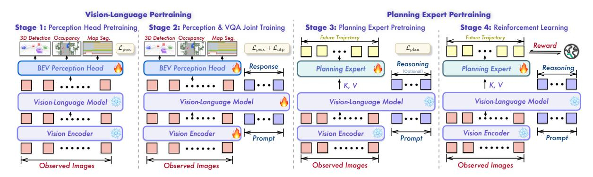

그림 4: Qwen-Drive-1.0의 4단계 훈련 레시피. 단계 1과 2는 공유 비전-언어 경로를 적응시킨다. 먼저 BEV 인지 헤드를 초기화하고, 이후 인지 및 VQA 감독을 사용해 비전 인코더와 VLM을 업데이트한다. 단계 3과 4는 이러한 고정된 표현 위에서 Planning Expert를 훈련시킨다. 단계 3은 플로우 매칭으로, 단계 4는 보상 기반 최적화로 진행한다. 불꽃은 학습 가능한 모듈을, 눈송이는 고정된 모듈을 나타낸다.

여기서  $\mathcal{L}_{fm}$ 은 유도된 플로우 속도와 목표 플로우 속도  $\tau_1 - \tau_0$ 사이의 제곱 오차이다.  $j \in \{1,2\}$ 에 대해,  $\mathcal{L}_{\Delta^j}$ 은  $\hat{\tau}_1$ 과  $\tau_1$ 의 j번째 차수 시간 차이를 일치시키는 Huber 패널티이다. 이들 시간 정규화는 웨이포인트 진동과 가속도의 급격한 변화를 억제한다.

추론 시, 가우시안 노이즈가 트래젝터리 토큰을 초기화한다. 10단계 오일러 해석기를 사용해 유도된 플로우 속도 필드를 적분하여 최종 트래젝터리를 얻는다.

### <span id="page-5-1"></span>2.2 훈련 레시피

그림 4에 나타난 바와 같이, 우리는 Qwen-Drive-1.0을 4단계로 훈련한다. 첫 두 단계는 BEV 인지 헤드를 초기화하고, 공유 경로를 명시적 3D 예측을 위해 공동 적응시킨다. 단계 3은 선택적 텍스트 추론을 조건으로 삼아 트래젝터리 생성을 훈련한다. 단계 4는 강화 기반 최적화를 통해 결과 모델을 추가로 정제한다.

**단계 1. 인지 헤드 사전 훈련.** 우리는 비전 인코더와 VLM을 고정하고, 새로 초기화된 BEV 인지 헤드만  $\mathcal{L}_{perc}$ 로 최적화한다. 이 헤드의 뷰 변환, BEV 트랜스포머, 그리고 태스크 디코더는 에고 프레임 표현을 구성하고 디코딩하도록 학습한다. 이 단계는 단계 2에서의 공동 적응 전에 새로 추가된 모듈을 초기화한다.

Stage 2. 인식 및 VQA 공동 훈련. Sec. 3.1은 head‑only 훈련이 제한된 인식 성능을 보인다는 것을 보여 주며, 이는 사전 학습된 표현이 운전 인식을 위해 충분한 3D 구조를 직접적으로 드러내지 못함을 시사한다. 따라서 head‑only 설정은 사전 학습된 특징이 명시적 3D 예측을 얼마나 쉽게 지원하는지를 탐색한다. 우리는 이 기능을 위해 초기화된 BEV 인식 헤드, 비전 인코더, 그리고 VLM을 함께 최적화한다. 인식 샘플은 $\mathcal{L}_{perc}$ 를 사용하고, 비전‑언어 샘플은 $\mathcal{L}_{ntp}$ 를 사용한다.

각 미니배치에는 두 가지 샘플 유형이 포함된다. 서로 다른 작업 경로를 활성화하기 때문에 비활성 분기에는 더미 입력을 제공하여 분산 워커 간에 일관된 계산 그래프를 유지한다. 해당 더미 출력은 손실에서 제외한다. BEV 인식 헤드는 VLM의 학습률의 $20\times$ 를 사용하여, 작업별 모듈이 공동 훈련 중에 더 빠르게 적응하도록 한다. 운전 데이터는 도메인 특화 감독을 제공하고, 범용 비전‑언어 데이터는 광범위한 시각적 이해와 지시 따르기 능력을 보존하는 데 도움을 준다. 결과적으로 생성된 VLM 표현은 Planning Expert의 조건을 제공한다.

Stage 3. Planning Expert 사전 훈련. 우리는 비전 인코더와 VLM을 고정하고 Planning Expert만 최적화한다. 훈련 혼합물에는 프롬프트에 텍스트 기반 계획 이유 r이 포함된 샘플과 $r=\varnothing$인 샘플이 포함된다. 두 유형 모두 이 단계에서는 텍스트 생성 목표 없이 $\mathcal{L}_{plan}$ 을 통해 미래 궤적만 감독한다. 조건화 표현을 고정함으로써 궤적 학습을 비전‑언어 표현의 변화와 분리한다. 우리는 결과 모델을 Qwen-Drive-1.0-SFT 라고 부른다.

**Stage 4. 강화 학습 (Reinforcement Learning).** Stage 3는 Planning Expert를 훈련시켜 각 장면마다 하나의 기록된 미래를 재현하도록 한다, $\mathcal{L}_{plan}$ 를 사용한다. 이 모방 목표는 안정적인 궤적 감독을 제공하지만, 오직

이는 실제로 계획이 평가되는 방식을 부분적으로 반영한다. 기록된 궤적은 여러 허용 가능한 미래 중 하나에 불과하므로, 다른 안전한 행동은 처벌될 수 있다. 특히 네 개의 훈련 소스가 서로 다른 자가 움직임 분포를 보일 때 그렇다. 더욱이 궤적 회귀는 충돌 회피, 주행 가능 영역 준수, 진행 상황, 인간 선호와의 일치 등을 명시적으로 포착하지 않는다. 따라서 이 단계에서는 이러한 특성을 측정하는 작업 수준 보상을 사용하여 Planning Expert를 최적화한다. 우리는 비전 인코더와 VLM을 고정하고, 적응을 Planning Expert에 국한시켜 Stage 2에서 학습된 공유 표현을 보존한다. 우리는 결과 모델을 **Qwen-Drive-1.0-RL** 라고 부른다.

이러한 작업 수준 보상은 궤적 생성 과정을 통해 미분 불가능하므로 최적화를 위해 샘플링된 롤아웃이 필요하다. Sec. 2.1의 추론 샘플러는 가우시안 잡음에서 궤적 토큰을 초기화한 뒤 결정론적 오일러 적분을 적용한다. 초기 잡음이 한 번 그려지면 나머지 적분 경로는 결정론적이며 정책 기울기가 미분할 수 있는 전이 확률을 정의하지 않는다. 따라서 우리는 각 롤아웃 그룹 내에서 초기 궤적 잡음을 공유하고 마지막 적분 단계의 연속 블록에 대해 확률적 전이를 도입한다. 이는 결정론적 흐름을 Planning Expert 매개변수에 따라 전이 확률이 달라지는 확률적 정책으로 변환한다. K=10개의 오일러 단계를 0부터 인덱싱하고 $t_k=k/K$, $\Delta t=1/K$ 를 사용하여, 우리는 최종 세 단계, $\mathcal{W}=\{7,8,9\}$ 에서만 확률성을 도입한다. 엔드포인트 파라미터화 하에서 t=1 근처의 변동은 방출된 궤적에 더 직접적으로 영향을 주며, 이전 변동은 이후 적분 단계에 의해 점점 감쇠된다. 출력 근처에서 탐색을 집중하면 효과적인 궤적 다양성을 제공하면서 사전 학습된 흐름에서 벗어나는 것을 제한한다. 확률적 변동은 중간 궤적을 사전 학습된 흐름이 선호하는 영역에서 멀어지게 할 수 있다. 따라서 우리는 Eq. 7의 보간에 연결된 가우시안 조건부에서 근사 복원 점수를 구성한다.

Eq. 7에 의해 암시되는 가우시안 조건부 하에서, 우리는 미지의 깨끗한 궤적 대신 예측된 엔드포인트 $\hat{\tau}_1^{(k)}$ 를 대입하고 점수 보정을 얻는다:

$$s_{\theta}\left(\boldsymbol{\tau}^{(k)}, t_{k}\right) = 
abla_{\boldsymbol{\tau}^{(k)}} \log p_{t_{k}}\left(\boldsymbol{\tau}^{(k)} \mid \hat{\boldsymbol{\tau}}_{1}^{(k)}\right) = -\frac{\boldsymbol{\tau}^{(k)} - t_{k} \hat{\boldsymbol{\tau}}_{1}^{(k)}}{(1 - t_{k})^{2}}.$$

(9)

이 점수는 조건부 중심을 향하고 변동된 상태를 안정화한다. $\sigma_k$ 를 하나의 이산 확률적 전이의 표준 편차라고 하자. 연속 확산 계수 g(t)에 대해 대응되는 이산 표준 편차는 $\sigma_k = g(t_k)\sqrt{\Delta t}$ 이다. 한 오일러 구간에 걸쳐 누적되는 점수 드리프트는 따라서 $\frac{1}{2}g(t_k)^2s_\theta\Delta t = \frac{1}{2}\sigma_k^2s_\theta$ 이다. 결과 전이 평균은 다음과 같다:

<span id="page-6-0"></span>

$$\boldsymbol{\mu}^{(k)} = \boldsymbol{\tau}^{(k)} + v_{\theta} \left( \boldsymbol{\tau}^{(k)}, t_{k} \right) \Delta t + \frac{\sigma_{k}^{2}}{2} s_{\theta} \left( \boldsymbol{\tau}^{(k)}, t_{k} \right). \tag{10}$$

우리는 $k \in \mathcal{W}$에 대해 $\sigma_k = \sigma = 0.03$이고, 그렇지 않으면 $\sigma_k = 0$이다. $\sigma_k$는 이산 전이의 표준편차를 나타내므로, $\sigma_k^2$는 이미 적분 구간을 포함하고 있어 점수 보정에 추가적인 $\Delta t$ 인자가 필요 없다. 구현에서는 $1 - t_k$를 $\epsilon = 0.1$으로 하한을 두고, $\hat{\tau}_1^{(k)}$는 흐름 속도와 점수 복원을 계산하기 전에 정규화 좌표에서 [-1,1]로 클리핑한다.

독립적인 웨이포인트 노이즈는 의미 있는 조종 다양성보다 고주파 진동을 주로 유발하여, 결과 샘플이 주행 품질 비교에 부적합하게 만든다. 따라서 우리는 확률적 탐색을 부드러운 저주파 시간 서브스페이스로 제한한다. $\mathbf{\Phi} \in \mathbb{R}^{N \times M}$를 N=50개의 미래 웨이포인트에 걸친 첫 번째 M=6개의 직교 코사인 모드로 정의하고, $\mathbf{\Phi}^{\top}\mathbf{\Phi}=\mathbf{I}_{M}$를 만족하도록 한다. 각 확률적 전이에서 우리는 독립적인 표준 가우시안 항목을 가진 $\mathbf{Z}_{k} \in \mathbb{R}^{M \times 3}$를 샘플링하고, 다음과 같이 업데이트한다:

$$\boldsymbol{\tau}^{(k+1)} = \boldsymbol{\mu}^{(k)} + \sigma_k \boldsymbol{\Phi} \mathbf{Z}_k. \tag{11}$$

저주파 모드들은 예측 수평선에 걸쳐 부드럽게 변동하므로, 그 조합은 점별 진동이 아니라 궤적에서 일관된 이동과 굽힘을 생성한다.  $\Phi$  가 직교 정규화된 열을 갖기 때문에, 개별 웨이포인트의 변동은 웨이포인트 전반에 걸쳐 평균 표준편차가  $\sigma\sqrt{M/N}\approx 0.010$  이며, 이는 확률적 단계마다 전방 방향으로 약 1.7 m, 측면 방향으로 약 0.26 m에 해당한다. 변동은 전체 3N 차원 궤적 공간의 3M 차원 부분공간에 존재한다. 따라서 우리는 전이 과정을 궤적 공간에서 전순위 밀도로 다루는 대신, 해당 저차원 기저 좌표에서 주입된 확률적 행동에 대한 가우시안 우도 대체 모델을 평가한다.  $\Phi^{\top}\Phi=\mathbf{I}_M$ 를 사용하면, 이 우도 대체 모델은 다음과 같은 형태를 갖는다:

$$\log \pi_{\theta} \left( \boldsymbol{\tau}^{(k+1)} \mid \boldsymbol{\tau}^{(k)} \right) = -\frac{1}{2\sigma_{k}^{2}} \left\| \boldsymbol{\Phi}^{\top} \left( \boldsymbol{\tau}^{(k+1)} - \boldsymbol{\mu}^{(k)} \right) \right\|_{F}^{2} + \text{const.}$$

(12)

구현은 제곱 잔차를 3M 모드 계수(3M mode coefficients) 전체에 대해 합산하는 대신 평균을 취한다. 이로 인해  $\mathcal{L}_{rl}$  은 상수 계수 1/(3M) 로 재스케일링되며, 이는 학습률에 흡수된다. 식 10 에서 도출된 점수 보정(score correction)은 등방성 확산(isotropic diffusion)을 전제로 하지만, 우리의 왜곡(perturbation)은 a 에 제한된다.

저차원 부분공간에 제한되므로, 우리는 이를 정확한 주변 보존 변환이 아니라 근사적인 복원 보정으로 해석한다.

각 장면마다, 고정된 VLM은 G=8개의 추론 트레이스를 샘플링하며, 이때 캐시된 키와 값은 독립적으로 Planning Expert로부터 G개의 궤적 롤아웃을 조건화한다. 그룹 롤아웃은 동일한 초기 궤적 노이즈 $\tau^{(0)}$를 공유하고, $\mathcal{W}$ 내에서 독립적인 저주파 변동을 샘플링하여, 확률적 전이와 샘플링된 추론을 그룹 내 다양성의 원천으로 둔다. 롤아웃 보상 $\{R_i\}_{i=1}^G$가 주어지면, 우리는 그룹 상대적 이점을 다음과 같이 계산한다:

$$A_i = \frac{R_i - \bar{R}}{\sigma_R + \epsilon_R}, \qquad \bar{R} = \frac{1}{G} \sum_{j=1}^G R_j, \tag{13}$$

여기서  $\sigma_R$  은 그룹 전체에 대한 모집단 표준편차이며,  $\varepsilon_R$ =1e-8 은 수치적 안정성을 위해 사용된다. 이 그룹-상대적 이점은 학습된 가치 함수 없이 기준선을 제공한다 (Shao et al., 2024). 최적화 과정에서 샘플링된 상태와 이점은 상수로 취급되며, 전이 평균은 현재 Planning Expert로 재계산된다.  $\mathcal{W}$  에 있는 확률적 전이만이 목적 함수에 기여한다.  $\mathcal{W}$  의 w번째 원소를 오름차순으로  $k_w$  라고 할 때, 우리는  $W = |\mathcal{W}|$  개의 확률적 단계에 대해 할인된 정책 기울기를 사용해 Planning Expert 를 최적화한다:

$$\mathcal{L}_{\text{rl}} = -\frac{1}{GW} \sum_{i=1}^{G} \sum_{w=0}^{W-1} \gamma^{W-1-w} A_i \log \pi_{\theta} \left( \boldsymbol{\tau}_i^{(k_w+1)} \mid \boldsymbol{\tau}_i^{(k_w)} \right), \tag{14}$$

여기서 $\gamma=0.6$ 은 출력에 가장 가까운 단계에 더 큰 가치를 부여한다. 각 롤아웃 그룹은 샘플링되어 단일 온-폴리시 업데이트에 의해 소비된다. 따라서 목표는 현재 모델의 로그-가능도를 직접 사용하며, 오프-폴리시 중요도 보정이 필요 없다.

다중 소스 강화 학습은 각 벤치마크의 고유한 평가 기준을 수용해야 한다. 우리는 NAVSIM에 대해 Predictive Driver Model Score (PDMS)를, WOD-E2E에 대해 Rater Feedback Score를 사용하며, 세 소스 모두에 공통 변위 항을 추가해 단일 정책이 세 가지 모두에서 비교 가능한 학습 신호를 받도록 한다. 부록 A는 정확한 보상 정의를 제공한다. 훈련은 navtrain에서 추출한 15K NAVSIM 장면(내비게이션 명령별 균형), 15K PhysicalAI-AV (PAI-AV) 장면, 그리고 평가자 선호 주석이 있는 479 WOD-E2E 시나리오를 사용한다.

### <span id="page-7-0"></span>2.3 Data Recipe

우리는 훈련 데이터를 지각, 시각-언어, 계획 그룹으로 구성하고, 소스를 혼합하기 전에 각 그룹 내에서 이질적인 작업 정의를 정렬한다.

#### 2.3.1 지각 데이터 (Perception Data)

우리는 단일 프레임 주변 보기 지각을 위해 nuScenes (Caesar et al., 2020)와 OpenScene (OpenScene Contributors, 2023)을 사용한다. nuScenes의 경우, nuScenes-OccNet (Tong et al., 2023)이 제공하는 의미적 점유 레이블을 사용한다. nuScenes는 6개의 카메라 뷰를 제공하고, OpenScene은 8개의 뷰를 제공한다. 우리는 공식 nuScenes 분할을 채택하며, 이는 훈련용 28K 주석이 달린 키프레임과 검증용 6K를 제공한다. OpenScene의 경우, 도시와 시간대 균형을 위해 trainval 풀에서 16개의 로그를 제외한다. 이 분할은 607K 훈련 프레임과 9K 검증 프레임을 제공한다.

공동 훈련은 데이터 수준과 모델 수준에서 상호 보완적인 통합을 필요로 한다. 데이터 수준에서는 소스 간 작업 분류 체계를 조정해야 하고, 모델 수준에서는 예측된 특징이 데이터셋별 공간 격자와 좌표계와 정렬되어야 한다. 이 두 절차를 아래에서 설명한다.

**라벨 통합.** 먼저 두 소스 간에 공유 작업 분류 체계를 구축한다. 그들의 주석은 세분화와 클래스 범위가 다르기 때문에 직접 혼합이 불가능하다. 따라서 우리는 가장 거친 상호 호환 가능한 세분화 수준에서 분류 체계를 정렬한다. 한 소스에서만 주석이 달린 카테고리는 소스별로 남는다. 이러한 각 클래스에 대한 손실은 다른 소스의 신뢰할 수 있는 보조 주석이 없으면 해당 소스의 샘플에 대해서만 계산된다. 그림 5는 이러한 작업별 절차를 요약하고 처리 전후의 대표적인 점유 레이블을 보여준다. 해당 라벨 공간과 처리 규칙은 아래에 자세히 설명한다.

• 3D 감지. 우리는 OpenScene의 주석 세분화 수준을 채택한다. 일곱 개의 클래스는 vehicle, bicycle, generic_object, pedestrian, traffic_cone, barrier, czone_sign 이다. nuScenes의 경우, car, truck, trailer, bus, construction vehicle를 vehicle로 병합하고, bicycle과 motorcycle을 bicycle로 병합한다. 또한 debris, pushable 및 pullable 객체, bicycle racks, animals 및 관련 카테고리를 generic_object에 매핑한다. pedestrian, traffic_cone, barrier 클래스는 두 데이터셋에서 직접적으로 대응하지만, czone_sign은 오직 OpenScene 샘플만이 감독한다.

#### (a) 작업별 통합 (Task-specific unification)

<span id="page-8-0"></span>

|  | 1 |  |  |  |
|-----------------------|-------------------------------------------------------------------------------------------------------------|-----------|--|--|
| 작업 | 크로스-데이터셋 처리 | # 클래스 (Classes) |  |  |
| 3D 탐지 | 다섯 개의 차량 클래스를 병합하고, 자전거와 오토바이를 결합하며, OpenScene 전용 czone_sign 클래스를 유지한다. | 7 |  |  |
| 시맨틱<br>점유 | 데이터셋별 조회 테이블을 적용한다. boxes에서 generic_object를 완성하고, maps에서 driveable을 완성한다. | 10 |  |  |
| BEV 지도 분할 | 공유 스키마 하에서 두 벡터 지도를 온라인으로 래스터화한다. | 6 |  |  |

### (b) 점유 라벨 처리 (Occupancy label processing)

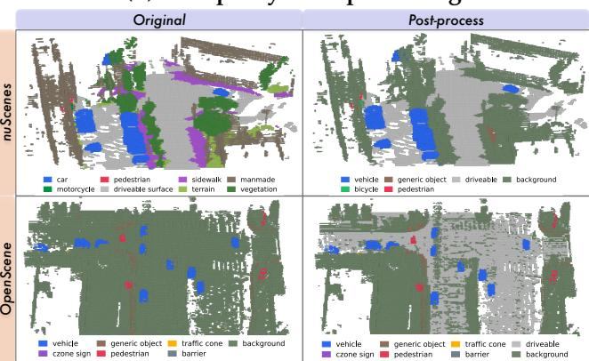

Figure 5: 인식용 교차 데이터셋 라벨 통합. (a) 작업별 정렬 및 라벨 완성 전략. (b) nuScenes(상단)와 OpenScene(하단)의 원본 및 처리된 점유 라벨.

- Semantic occupancy. 데이터셋별 조회표는 17개의 nuScenes 클래스와 원본 OpenScene 라벨을 공유 10개 클래스 공간으로 매핑한다. 이 공간은 7개의 탐지 클래스, driveable, background, empty를 포함한다. nuScenes의 경우, 5개의 차량 카테고리를 vehicle로, 자전거와 오토바이를 bicycle로, driveable surface를 driveable로 매핑한다. 교차 데이터셋 대응이 없는 카테고리(다른 평면 표면, 인도, 지형, 인공 구조물, 식생 등)는 background로 매핑된다. Free space는 empty로 매핑된다. OpenScene의 경우, 전경 클래스는 직접 매핑한다. 배경 표면과 예약 라벨은 background로, 알 수 없거나 free-space 라벨은 empty로 매핑된다.
- Offline label completion. 신뢰할 수 있는 보조 주석을 사용해 한 소스에서 누락된 카테고리를 완성하며, ray masking을 적용하지 않는다. 원본 OpenScene 점유 라벨은 driveable을 구분하지 않는다. nuPlan 벡터 맵을 래스터화하고, driveable 영역 내부의 지면 voxel이면서 원래 background로 라벨링된 경우에만 voxel을 driveable로 재라벨링한다. nuScenes는 generic_object에 대한 점유 주석을 제공하지 않는다. 자전거 랙, 파편, 밀어넣기/당기기 가능한 물체의 3D 박스에서 가짜 라벨을 생성한다. 이 박스 내부에서는 이미 의미 라벨을 가진 voxel만 변경한다. 재매핑 및 완성 후, 클래스 균형 focal loss를 위해 통합 라벨 공간에서 클래스 빈도를 재계산한다.
- BEV map segmentation. 기존 래스터 라벨을 재매핑하는 대신, 두 벡터 맵을 온라인으로 공유 6개 클래스 스키마( driveable surface, road line, road edge, crosswalk, walkway, background) 아래에서 래스터화한다.

라벨 통합은 소스 주석의 노이즈를 제거하지 않는다. nuScenes는 수동으로 주석된 의미를 제공하는 반면, OpenScene은 포인트별 의미 없이 자동화 파이프라인으로 집계된 LiDAR 스윕에서 점유 타깃을 재구성한다. 센서 및 등록 오류로 인해 물리적 표면에서 분리된 부동 voxel 등 아티팩트가 발생할 수 있다. 오프라인 완성은 누락된 의미 라벨을 추가하지만 이러한 아티팩트는 그대로 유지된다.

**Spatial unification.** Model-level unification poses a separate spatial dilemma. Both sources store occupancy as  $200 \times 200 \times 16$  voxel grids, yet corresponding voxel indices represent different physical locations. nuScenes-OccNet spans  $\pm 40$  m horizontally and  $z \in [-1.0, 5.4]$  m with 0.4 m voxels, while OpenScene spans  $\pm 50\,\mathrm{m}$  and  $z\in[-4.0,4.0]\,\mathrm{m}$  with  $0.5\,\mathrm{m}$  voxels. Their coordinate transformations also differ. The nuScenes LiDAR has a non-identity transform to the rear-axle ego frame, including a vertical offset of ~1.84 m, while OpenScene uses an identity LiDAR-to-ego transform. Directly sharing voxel indices would misalign the two sources, while resampling categorical labels would distort the supervision. We therefore preserve each source's native occupancy grid and perform spatial alignment on the predicted features.

깊이 기반 뷰 변환은 먼저 이미지 특징을 탐지 범위에 정의된 3D 볼륨으로 올린다. 점유 해석 전에, 단일 미분 가능한 삼차원 선형 샘플링 연산이 이 볼륨을 데이터셋별 점유 그리드에 매핑한다. nuScenes의 경우, 각 타깃 볼록 중심은 ego 프레임에서 정의되고 샘플링을 위해 LiDAR 프레임으로 다시 변환된다. 동일한 연산은 출력을 점유 범위에 제한하며, 수직 소스 범위 [-5.0, 5.4] m는 LiDAR 장착 오프셋을 커버한다. OpenScene의 경우 항등 변환은 프레임 변환이 필요 없다. 헤드는 순전파 동안 각 소스에 대해 해당 점유 범위와 볼록 크기를 선택한다. 동일한 점유 헤드는 데이터셋별 분기 없이 두 원본 그리드 모두에서 예측할 수 있다. 두 데이터셋 모두

<span id="page-9-0"></span>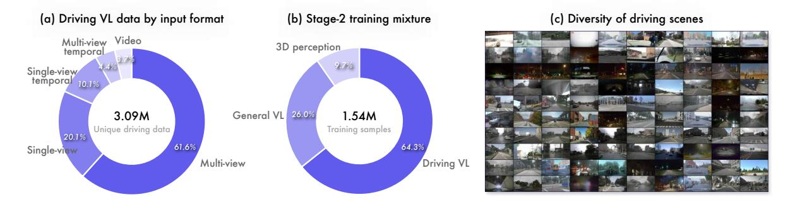

Figure 6: 비전-언어 데이터와 Stage 2 훈련 혼합. (a) Stage 2 서브샘플링 이전에 필터링된 3.09M 공개 주행 샘플의 입력 형식 분포. (b) 반복 이전의 1.54M Stage 2 훈련 세트 구성. (c) 다양한 도로 환경, 조명, 기상 조건을 아우르는 대표 장면.

소스는 일관된 ego-프레임 규칙 하에서 이 헤드를 감독하며, 원본 공간 해상도를 유지한다. BEV 지도 감독은 별도로 통합된다. 두 소스 모두에 대해, 우리는 ego 중심의 로컬 패치에서 $x \in [-30,30]$ m, $y \in [-15,15]$ m 범위의 벡터 지도를 온라인으로 래스터화하며, 0.15 m 해상도로 $400 \times 200$ 타깃을 생성한다. 전체 도시 지도를 래스터화하는 대신이다.

#### 2.3.2 비전-언어 데이터 (Vision-Language Data)

비전-언어 데이터는 일반 목적과 주행 예제를 결합한다. 주행 구성 요소는 장면 이해, 공간 기반화, 교차 뷰 추론, 그리고 계획 추론을 포함한다.

**Data Sources.** 주행 구성 요소는 오픈소스 데이터셋과 대표성이 부족한 과제를 목표로 한 자체 제작 예제를 결합한다. 아래에서 이 두 소스 그룹의 구성 및 전처리를 상세히 설명한다. Fig. 6은 필터링된 공개 주행 데이터, 그 장면 다양성, 그리고 Stage 2 혼합을 보여준다.

• 공개 운전 데이터. 우리는 24개의 공개된 운전 비전-언어 데이터셋을 수집하며, 여기에는 CODA-LM (Chen et al., 2025), DRAMA (Malla et al., 2023), DriveAction (Hao et al., 2025b), DriveGPT4 (Xu et al., 2024), DriveLM (Sima et al., 2024), DrivingVQA (Corbière et al., 2026), Impromptu VLA (Chi et al., 2025), LingoQA (Marcu et al., 2024), MapLM (Cao et al., 2024), MM-AU (Fang et al., 2024), NAVSIM-ReCogDrive (Li et al., 2026a), NuInstruct (Ding et al., 2024), NuPlanQA (Park et al., 2025a), nuScenes-MQA (Inoue et al., 2024), nuScenes-QA (Qian et al., 2024), the OOD reasoning-label subset of PhysicalAI-AV (NVIDIA, 2025b), OmniDrive (Wang et al., 2025b), ROADWork (Ghosh et al., 2025), Senna (Jiang et al., 2024), STSBench (Fruhwirth-Reisinger et al., 2025), SURDS (Guo et al., 2025), SUTD-TrafficQA (Xu et al., 2021), Talk2Car (Deruyttere et al., 2019), 그리고 WaymoQA (Yu et al., 2025)를 포함한다. 우리는 데이터 누수를 방지하기 위해 이 데이터셋들의 학습 분할을 사용한다.

출시된 데이터셋은 대화 형식과 주석 신뢰성에서 차이가 있으며, 많은 타깃은 템플릿이나 자동화 파이프라인에서 유래한다. 데이터셋을 혼합하기 전에, 우리는 Qwen3.5-Plus (Qwen Team, 2026a)를 사용해 각 프롬프트와 응답을 공통 대화 스키마로 재작성한다. 소스 주석은 이후 일관성 필터링의 기준으로 남는다. 대부분의 다지선다형 질문을 개방형 QA로 변환하지만, 이 지시 유형을 보존하기 위해 일부는 다지선다형으로 유지한다. 우리는 바운딩 박스를 [0,1000) 이미지 좌표로 정규화하고, Sec. 2.1에 따라 뷰 및 프레임 태그를 삽입하며, 삽입된 태그와 일치하도록 텍스트 뷰 참조를 수정한다.

재작성은 형식을 표준화하지만 소스 주석을 검증하지 않는다. 따라서 별도의 일관성 필터를 적용한다. Qwen3.5-Flash는 각 재작성된 응답이 소스 주석과 의미적으로 일관되는지 평가하며, 일관성으로 분류된 샘플만 보존한다. Fig. 6(a)에 나타난 바와 같이, 이 절차는 데이터를 5.53M에서 3.09M 샘플로 축소시켜 보존율 55.9%를 달성한다. 보존된 세트는 61.6% 다중 시점, 20.1% 단일 시점, 10.1% 단일 시점 시계열, 4.4% 다중 시점 시계열, 3.7% 비디오 샘플을 포함한다. 이는 장면 및 영역 캡션, 개방형 및 다지선다 QA, 2D 기반 정지, 공간 추론, 계획 추론을 포괄한다. Fig. 6(c)의 대표 샘플은 도로 환경, 조명, 기상 조건의 다양성을 추가로 보여준다.

• **Self-Constructed Driving Data.** 우리는 공개 데이터셋에서 과소 대표되는 감독을 제공하기 위해 세 가지 추가 구성 요소를 만든다.

1) Planning reasoning. 우리는 Alpamayo-R1 (Wang et al., 2025d)에서 영감을 받은 Chain-of-Causation (CoC) 공식화를 사용해 계획-추론 데이터를 만든다. CoC 트레이스는 운전 결정을 유도하는 장면 요소를 식별하고 그 인과적 역할을 설명한다. 우리는 세 가지 pub-

licly available driving datasets with future ego trajectories, namely NAVSIM [(Dauner et al.,](#page-25-9) [2024)](#page-25-9), Waymo [(Sun et al.,](#page-29-6) [2020)](#page-29-6), and PAI-AV [(NVIDIA,](#page-28-9) [2025b)](#page-28-9). 각 미래 에고 궤적에서 규칙 기반 분류기는 종단 및 횡방향 조작 성분을 도출해 함께 동작 사전 정보를 형성한다. Qwen3.7-Plus [(Qwen Team,](#page-28-10) [2026c)](#page-28-10)은 다중 시점 이미지, 과거 에고 궤적, 동작 사전, 탐색 지침을 조건으로 한 계획-추론 트레이스를 생성한다.

각각 생성된 추적은 다단계 감사를 거친다. 스칼라 품질 점수를 요청하는 대신, 판단 모델은 분류 질문에 답하고 그 결정은 프로그램적으로 집계된다. 감사는 예측된 조작을 실제 궤적과 비교하고, 인용된 각 요인의 인과 역할을 분류하며, 미래 정보를 드러내는 추적을 거부한다. Qwen3.5-Flash는 각 장면에 희귀도 점수를 부여하고, 희귀한 장면은 더 높은 샘플링 우선순위를 받는다. 수락된 각 추적에 대해 두 가지 응답 형식을 구성한다. 첫 번째는 계획-추론 추적만 포함한다. 두 번째는 동일한 추적 뒤에 JSON 형식으로 직렬화된 미래 자아 궤적을 포함한다.

- **2)** 교차 시점 공간 이해를 위한 카메라 순서 지정. 우리는 주변 시점 이미지를 섞고 모든 시점 태그를 제거한다. 모델은 시각적 단서를 통해 전면 시점을 식별하고 전체 카메라 세트의 시계 방향 순서를 복원한다.
- **3)** 사내 인식 QA. 우리는 중국에서 수집한 도로 장면을 활용해 교통 신호등 기반화와 3D 객체 검출을 위한 30K 예제를 구성한다. 3D 검출 예제에서는 카메라 포즈가 텍스트로 제공되며, 응답은 전역 좌표계에 있는 3D 박스를 포함한다.

공개 자료는 장면과 질문 유형을 광범위하게 다루며, 자체 제작 데이터는 인과 추론과 인식 기반화를 위한 목표 지도를 제공한다.

**Stage 2 Data Mixture.** Stage 2는 위에서 설명한 인식 및 시각-언어 데이터를 혼합한다. 필터링된 공개 운전 데이터가 이 단계의 예산을 초과하므로, 각 공개 소스에서 작업 및 질문 유형별로 층화된 약 20%를 샘플링한다. 이 하위 집합을 자체 제작 운전 데이터와 범용 시각-언어 데이터와 결합한다. 중복 전, 결과 집합은 1.54M 예제를 포함한다. Fig. [6(](#page-9-0)b)에서 보듯이, 9.7%가 3D 인식 감독을 제공하고, 26.0%가 범용 시각-언어 감독을 제공하며, 64.3%가 운전 시각-언어 감독을 제공한다.

우리는 그룹별 반복 계수를 사용하며, BEV 인식 헤드에 대한 업데이트를 늘리기 위해 인식 예제에 더 큰 계수를 할당하고, 비전-언어 예제를 2~3 에폭 동안 반복한다. 반복 후, 유효 혼합은 12.7% 인식, 31.0% 일반 목적 비전-언어, 56.3% 운전 비전-언어 감독을 포함한다.

#### **2.3.3 Planning Data**

Stage 3에서는 NAVSIM [(Dauner et al.,](#page-25-9) [2024)](#page-25-9), OpenScene [(OpenScene Contributors,](#page-28-4) [2023)](#page-28-4), WOD-E2E [(Xu et al.,](#page-30-9) [2026b)](#page-30-9), 그리고 PAI-AV [(NVIDIA,](#page-28-9) [2025b)](#page-28-9)를 사용한다. NAVSIM과 OpenScene은 모두 nuPlan 데이터셋 [(Karnchanachari et al.,](#page-27-7) [2024)](#page-27-7)에서 파생되었지만, 이들의 에고 모션 분포가 다르므로 별개의 소스로 남아 있다. 결과적으로 훈련 세트는 약 2.83M 샘플을 포함한다. NAVSIM과 OpenScene은 2.5K 클립에서 890K 샘플을 공동으로 제공한다. WOD-E2E는 2K 클립에서 557K 샘플을 제공하고, PAI-AV는 156K 클립에서 1.38M 샘플을 제공한다. 훈련 샘플 중 685K(24.2%)는 수락된 계획-추론 트레이스를 조건으로 포함한다. 이 샘플은 NAVSIM에서 78K, WOD-E2E에서 142K, PAI-AV에서 465K를 포함한다. 나머지 75.8%는 이 조건을 생략하고 **r** = ∅를 사용한다.

전처리 단계에서, 우리는 모든 미래 궤적을 현재 에고 프레임에 표현하고 Eq. [6.](#page-4-2)에서 50개의 웨이포인트 표현으로 변환한다. NAVSIM과 OpenScene의 경우, 우리는 nuPlan 데이터베이스에서 10 Hz로 위치와 헤딩을 직접 읽는다. PAI-AV의 경우, 우리는 클립별 에고 모션 주석에서 미래 에고 모션을 복원하고 동일한 시간 격자에 재표본화한다. 이 소스가 다른 것보다 훨씬 크기 때문에, 우리는 각 클립에서 고르게 분포된 소수의 프레임만 보존한다.

WOD-E2E는 4 Hz에서 미래 에고 위치를 제공한다. 우리는 현재 위치를 앞에 붙이고, 위치 시퀀스에 시간-매개 자연 세제곱 스플라인을 적합한 뒤 10 Hz 격자에서 평가한다. 그 첫 번째와 두 번째 도함수는 미래 속도와 가속도를 제공한다. 과거 가속도에 대해, 우리는 원시 accel_x 및 accel_y 메타데이터에 4배 스케일 보정을 적용하고, 보정된 값을 10 Hz에서 선형 재표본화한다. v = (vx, vy) 및 a = (ax, ay)를 스플라인에서 도출된 속도와 가속도로 둔다. ∥v∥ ≥ 0.3 m/s인 경우, 유도 헤딩 속도는 ˙θ = (vxa<sup>y</sup> − vyax)/∥**v**∥ 2 이다. 이 속도 이하에서는 ˙θ = 0으로 설정하고, 10 Hz 격자에서 이를 적분하며 현재 헤딩을 0으로 설정한다. 결과적으로 미래 헤딩은 Eq. [6.](#page-4-2)에서 θ^k 값을 제공한다. 우리는 과거 및 미래 가속도 크기가 중력(9.8 m/s^2)을 초과하지 않을 때만 샘플을 보존한다. 풀리지 않은 미래 헤딩 시퀀스에 대해, 우리는 보조 도함수 기반 및 인접 단계 검사를 적용하여 속도 일관성과 급격한 지역 변화를 모두 포착한다. 두 검사 모두 1.2 rad/s의 임계값을 사용한다.

각 계획 예제는 4개의 타임스텝에서 전면, 전좌측, 전우측 이미지를 포함한다. 이들은

현재와 0.5 초 간격으로 샘플링된 과거 세 타임스텝을 포함한다. 이미지는 차량 센서 입력 s를 형성한다. 과거 에고 궤적 τ_hist, 현재 에고 상태 e, 그리고 내비게이션 지시 n은 Eq. [6.](#page-4-2)에서 나머지 조건을 제공한다. 수락된 계획-추론 트레이스는 일부 샘플에 대해 r을 제공하며, 나머지에는 r = ∅를 사용한다. 이 샘플들에 대해 ℓ은 Sec. [2.1.](#page-2-1)에서 정의된 뷰-주요 레이아웃이다. 우리는 과거 이미지를 320p로, 현재 이미지를 720p로 리사이즈한다. 이 할당은 현재 관측에서 더 많은 공간 세부 정보를 보존하면서, 움직임 이력을 적은 시각 토큰으로 표현한다.

## **3 Experiments**

우리는 Qwen-Drive-1.0을 3D 인식, 주행, 일반 비전-언어 이해, 그리고 모션 플래닝에 걸쳐 평가한다. 인식 및 비전-언어 평가는 Qwen-Drive-1.0-SFT를 사용하며, 모션 플래닝 평가는 Qwen-Drive-1.0-SFT와 Qwen-Drive-1.0-RL 두 모델을 모두 사용한다.

### <span id="page-11-0"></span>**3.1 3D 인식 (3D Perception)**

**Metrics.** 우리는 공식 nuScenes 검증 세트와 Sec. [2.3.](#page-7-0)에서 정의된 16-log OpenScene 검증 스플릿을 사용한다. 3D 탐지의 경우, 통합된 일곱 클래스 라벨 공간에서 평균 평균 정밀도(mAP)와 수정된 nuScenes 탐지 점수(NDS)를 보고한다. 예측을 정답 박스와 매칭하는 기준은 BEV 중심 거리(centroid distance)가 지정된 임계값 이하일 때이다. 우리는 정밀도-재현율 곡선 아래 면적을 정규화한 뒤, 정밀도 또는 재현율이 10% 미만인 운영점을 제외하고 AP를 계산한다. mAP는 중심 거리 임계값 {0.5, 1, 2, 4} m와 모든 클래스에 대해 AP를 평균한 값이다. NDS의 경우, 공식 클래스별 정의에 따라 2 m 임계값에서 양성-오류 지표를 계산한다. 통합 주석이 속성 라벨을 포함하지 않으므로, 우리의 수정된 NDS는 모든 방법에 대해 평균 속성 오류(mAAE)를 0으로 설정한다.

세멘틱 점유에 대해, 우리는 빈(Occ mIoU)을 제외한 통합 세멘틱 클래스의 평균 IoU와 RayIoU[(Liu et al.,](#page-27-8) [2024a)](#page-27-8)를 보고한다. 특히, OpenScene은 정체(LiDAR-to-ego transform) 변환을 가진 rear‑axle ego 프레임에서 점유를 저장한다. rear‑axle에서 발사된 레이는 도로 수준에서 시작하여 즉시 도로‑표면 voxel에서 종료된다. 대신 OpenScene 레이 원점을 1.84 m 높여 nuScenes LiDAR 장착 높이와 일치시킨다. BEV 지도 분할에 대해, 우리는 전경 지도 클래스의 평균 IoU를 보고한다.

**Comparison Methods.** 공정한 비교를 위해, 우리는 재매핑된 nuScenes 주석에서 BEV-FormerV2 [(Yang et al.,](#page-30-5) [2023)](#page-30-5), PETR [(Liu et al.,](#page-27-9) [2022)](#page-27-9), 그리고 PETRv2 [(Liu et al.,](#page-27-10) [2023)](#page-27-10)의 단일 프레임 변형을 재현한다. 우리의 BEVFormerV2 구현은 Group-DETR 디코더와 그에 연결된 2D 손실을 제외한다. 또한 BEVFormerV2<sup>∗</sup>를 통합 다중 작업 변형으로 구성하여 3D 탐지, BEV 지도 분할, 시맨틱 점유 예측을 동시에 수행하며, 이는 우리 BEV 인식 헤드와 동일한 세 가지 인식 과제를 다룬다. 각 아키텍처를 ResNet-50 [(He](#page-26-11) [et al.,](#page-26-11) [2016)](#page-26-11)와 SigLIP-Qwen으로 평가한다. SigLIP-Qwen은 Qwen-Drive-1.0에서 사용된 동일한 사전 훈련된 Qwen3.5-4B 가중치를 초기화한 SigLIP 스타일 [(Zhai et al.,](#page-30-10) [2023)](#page-30-10) 비전 인코더를 의미한다. 모든 비교 방법은 24-epoch 스케줄을 따른다. 비교 방법과 우리 BEV 인식 헤드는 모두 입력 해상도 896 × 512를 사용한다. 반면, 우리 BEV 인식 헤드는 장치별 카메라 임베딩을 사용하지 않으므로, 하나의 모델이 6-카메라 nuScenes 장치와 8-카메라 OpenScene 장치에서 학습 및 평가된다.

**Quantitative Results.** Tab. [1,](#page-12-0)에서 nuScenes에 대해 Qwen-Drive-1.0-SFT가 가장 우수한 탐지 및 지도 분할 결과를 달성하며, BEVFormerV2<sup>∗</sup>를 2.01 mAP, BEVFormerV2를 3.05 NDS, PETRv2를 3.37 map mIoU만큼 초과한다. OpenScene에서도 Head-only (joint)보다 탐지 지표와 지도 mIoU 모두에서 향상된다. ResNet-50을 사전 훈련된 ViT로 교체하면 전용 탐지기에게 일관되게 이점을 제공하며, 이는 비전-언어 사전 훈련이 강력한 시각 초기화를 제공함을 확인한다. 그러나 동일한 SigLIP-Qwen 특징으로 훈련된 수렴된 헤드는 BEVFormerV2<sup>∗</sup>를 6.34 mAP와 6.91 RayIoU만큼 뒤처진다. 이 대비는 비전‑사전 훈련된 특징이 시각‑텍스트 정렬을 지원하지만 주행 인식을 위해 필요한 3D 구조를 직접 노출하지 못함을 시사한다.

교차 데이터셋 전이는 별도의 도전 과제를 제시한다. 고품질 nuScenes 주석을 사용해 학습했음에도 불구하고, nuScenes 전용 헤드는 OpenScene에서 16.50 NDS에 머물며, 이는 34.13 nuScenes 점수의 절반 이하이다. 혼합 소스 학습은 OpenScene NDS를 41.86으로 끌어올리지만, 라벨 의미론과 주석 파이프라인 간의 잔여 차이는 nuScenes에서 부정적 전이를 유발한다. 이 효과는 점유에서 가장 두드러지며, mIoU가 26.6 % 감소한다. 동일한 소스 불일치는 공동 적응 후에도 지속된다: Stage 2는 nuScenes 점유를 크게 회복하지만, 탐지 및 지도 분할에서 명확한 개선이 있었음에도 불구하고 OpenScene 점유 지표를 0.3 포인트 이하로만 변경한다. 박스와 래스터화된 지도 레이어와 달리, 기계 생성된 OpenScene voxel 라벨은 소스별 의미론 및 구조적 아티팩트를 유지하여 공동 적응의 이점을 제한한다. 이 관찰은

<span id="page-12-0"></span>Table 1: 재매핑된 nuScenes 및 OpenScene 검증 스플릿에서의 통합 3D 인식. 비교 방법들은 공통 일정과 입력 해상도 하에서 재매핑된 nuScenes에만 학습된다. 대시(-)는 해당 방법이 수행하지 않는 작업을 나타낸다. 비교 방법들은 6대 카메라 nuScenes 장비에 연결된 카메라 임베딩을 학습하므로 8대 카메라 OpenScene 장비에서는 평가할 수 없다. 회색 값은 nuScenes 전용 헤드가 OpenScene에서 수행되는 교차 데이터셋 평가를 나타낸다. NDS는 통합 라벨이 속성(attribute)을 포함하지 않으므로 mAAE를 0으로 설정한 수정된 점수를 의미한다. <sup>∗</sup>는 지도 분할 및 점유 예측이 포함된 통합 다중 작업 BEVFormerV2 변형을 나타낸다.

|  |  | nuScenes |  |  |  |  |  | OpenScene |  |  |  |  |
|----------------------------------|---------------------------|----------|-------------|-------|-------|----------------------|--------|-------------|-------|-------|------------------|--|
| 방법 | 시각 인코더 |  | 3D 탐지 | 지도 | Occlusion |  | 3D 탐지 |  | 지도 | Occlusion |  |  |
|  |  | mAP | NDS |  |  | mIoU mIoU RayIoU mAP |  | NDS |  |  | mIoU mIoU RayIoU |  |
| BEVFormerV2 | ResNet-50 |  | 33.04 33.02 | – | – | – |  |  | – |  |  |  |
| PETR | ResNet-50-DCN 29.77 26.65 |  |  | – | – | – |  |  | – |  |  |  |
| PETRv2 | ResNet-50-DCN 25.98 23.90 |  |  | 52.52 | – | – |  |  | – |  |  |  |
| BEVFormerV2∗ | ResNet-50 |  | 35.34 30.76 | 48.49 | 23.39 | 40.69 |  |  | – |  |  |  |
| BEVFormerV2 | SigLIP-Qwen |  | 40.78 39.78 | – | – | – |  |  | – |  |  |  |
| PETR | SigLIP-Qwen |  | 37.61 34.37 | – | – | – |  |  | – |  |  |  |
| PETRv2 | SigLIP-Qwen |  | 36.10 33.28 | 57.62 | – | – |  |  | – |  |  |  |
| BEVFormerV2∗ | SigLIP-Qwen |  | 41.94 36.46 | 47.76 | 25.72 | 43.89 |  |  | – |  |  |  |
| 헤드 전용 (nuScenes) SigLIP-Qwen |  |  | 35.60 34.13 | 55.55 | 20.21 | 36.98 |  | 16.14 16.50 | 40.45 | 11.50 | 17.43 |  |
| 헤드 전용 (joint) | SigLIP-Qwen |  | 33.49 33.37 | 51.15 | 14.83 | 29.54 |  | 40.57 41.86 | 66.34 | 20.13 | 25.36 |  |
| Qwen-Drive-1.0-SFT | SigLIP-Qwen |  | 43.95 42.83 | 60.99 | 19.82 | 37.02 |  | 43.45 44.16 | 71.27 | 19.84 | 25.17 |  |

<span id="page-12-1"></span>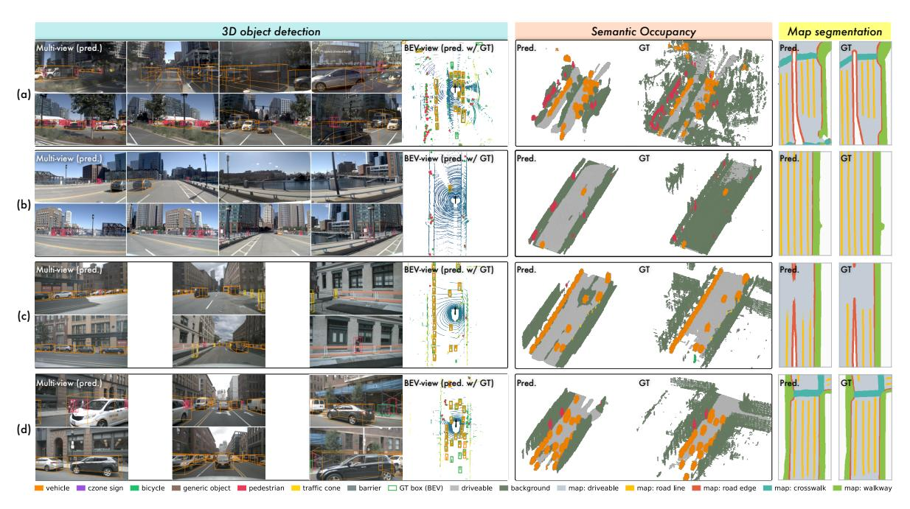

Figure 7: Qwen-Drive-1.0-SFT의 OpenScene (a, b) 및 nuScenes (c, d) 검증 세트에 대한 정성적 결과. 각 행은 3D 탐지, 의미적 점유, BEV 지도 분할 결과를 보여준다.

Qwen-Drive-1.0-SFT가 탐지와 지도 분할에서는 선도하지만 점유에서는 그렇지 않은 이유를 설명한다. 라벨 매핑과 오프라인 완성은 체적 수준에서 소스 모호성을 완전히 해결하지 않고도 공동 학습을 가능하게 한다.

Stage 2에서의 성과는 헤드만 최적화가 계속된 것만으로는 설명되지 않는다. 헤드 전용 모델이 이미 수렴했기 때문이다. 인식 목표가 사전 학습된 ViT 인코더와 VLM을 업데이트하도록 허용하면, nuScenes의 mAP와 지도 mIoU가 각각 10.46점과 9.84점이 증가하고, OpenScene 지도 mIoU는 추가로 4.93점을 얻는다. 따라서 공동 적응은 외부 헤드의 3D 인식 능력을 실현하는 데 중요하다. Tab. [8,](#page-21-0)의 ablation과 함께, 이 결과는 헤드가 실용적인 3D 프로브를 제공하며, 목표 지향적 적응이 명시적이고 검사 가능한 장면 예측을 생성하면서도 경쟁력 있는 시각-언어 성능을 유지함을 보여준다. 이 기능은 VLM 아키텍처를 변경하지 않고 추가된다.

**Qualitative Results.** Fig. [7](#page-12-1)은 Qwen-Drive-1.0-SFT가 6-뷰와 8-뷰 장치 모두에서 카메라가 보이는 영역 내에서 경쟁력 있는 3D 인식 결과를 생성함을 보여준다. 특히 Fig. [7(](#page-12-1)b)에서는, 우리의 전처리가 기계 생성 OpenScene 라벨에서 도로 표면 위의 떠 있는 체적을 완전히 제거하지 못하지만, 예측은 이러한 아티팩트를 억제하고 도로 표면 의미를 정확히 복원한다. 이 예시는 장면 및 데이터 소스 간의 감독이 처리된 라벨의 잔여 아티팩트에 대한 민감도를 줄일 수 있음을 시사한다.

### **3.2 Driving and General Vision-Language Understanding**

#### **3.2.1 Driving Visual Question Answering**

**Benchmark Selection.** 기존 운전 VQA 벤치마크는 모델의 실제 운전 역량을 흐리게 하는 세 가지 문제를 제시한다. **1)** 주석 품질이 고르지 않으며, 많은 참조 답변이 시각 입력만으로는 추론될 수 없다. **2)** 텍스트 유사도 점수는 참조 문구와의 표면적 일치를 보상하므로, 응답의 의미적 품질이 아니라 훈련 분포에 대한 적합도를 측정한다. **3)** 질의 내용은 주변 보행자 수와 같은 지나치게 세밀하거나, 장면에 대한 개방형 설명과 같은 지나치게 일반적일 수 있어, 교통 참여자, 운전 행동, 장면 위험, 도로 토폴로지에 대한 이해를 탐지하지 못한다.

따라서 우리는 신뢰할 수 있는 주석과 LLM 판사 또는 다중 선택 프로토콜 기반 평가를 갖춘 벤치마크를 선택한다. 우리가 채택한 다섯 개의 공개 벤치마크는 공간 판단, 세밀한 객체 기반화, 운전 결정, 교통 위험 평가를 동시에 강조한다. LingoQA [(Marcu et al.,](#page-28-6) [2024)](#page-28-6)는 판사 모델을 사용해 자유형 운전 QA를 평가한다.[1](#page-13-0) Ego3D-Bench [(Gholami et al.,](#page-26-12) [2026)](#page-26-12)는 다중 선택 정확도와 RMSE 기반 절대 거리 추정으로 범주형 공간 추론을 평가한다. 거리 질의는 자가-대-객체 및 교차-뷰 객체-대-객체 관계를 포함한다. VLADBench [(Li](#page-27-11) [et al.,](#page-27-11) [2025)](#page-27-11)은 다중 선택 프로토콜 하에서 운전 역량을 세밀한 기능 계층으로 조직한다. SURDS [(Guo et al.,](#page-26-10) [2025)](#page-26-10)은 운전을 위한 공간 이해와 추론을 목표로 한다. WaymoQA [(Yu et al.,](#page-30-8) [2025)](#page-30-8)은 안전-critical 다중 뷰 상황에 초점을 맞추며, 우리는 전체 점수와 이미지 분할에 대한 안전 특화 점수를 보고한다.

우리는 공개 벤치마크 외에도 PAI-AV 검증 세트에서 파생된 CoC 벤치마크인 PAI-AV-CoC를 도입한다. Qwen3.5-Plus가 판정자로서 예측된 CoC 트레이스에서 핵심 객체와 운전 결정을 추출한다. 우리는 핵심 객체 정확도, 결정 정확도, 전체 정확도(두 가지 모두 정답이어야 함)를 측정하여 추론 트레이스의 인과적 내용을 평가한다. 이는 단순히 문구를 평가하는 것이 아니다. 또한 전문가 주석이 있는 사내 중국 도시 운전 결정 벤치마크에서 의사결정 능력을 평가한다.

**Comparison Methods.** 우리는 물리적 AI와 자율 주행을 목표로 하는 최신 비전-언어 모델들과 비교한다. Cosmos 계열은 세 세대에 걸쳐 발전한다. Cosmos-Reason1 [(Az](#page-25-10)[zolini et al.,](#page-25-10) [2025)](#page-25-10)은 감독 기반 미세 조정과 강화 학습을 통해 물리적 상식과 구현된 추론을 위해 Qwen2.5-VL을 사후 훈련한다. Cosmos-Reason2 [(NVIDIA,](#page-28-11) [2025a)](#page-28-11)은 이 레시피를 Qwen3-VL에 2B, 8B, 32B 파라미터로 확장하고, Cosmos3-nano [(Agarwal et al.,](#page-25-11) [2026)](#page-25-11)은 가장 최근의 옴니모달 모델이다. MiMo-Embodied [(Hao et al.,](#page-26-13) [2025a)](#page-26-13)은 MiMo-VL을 기반으로 한 7B 크로스-임보디드 모델이며, 대규모 자율 주행 및 구현 데이터에 사전 훈련된다. UniDriveVLA [(Li](#page-27-12) [et al.,](#page-27-12) [2026b)](#page-27-12)은 운전 인식, 이해, 계획을 별도의 전문가로 분리하고, 운전 데이터에 점진적으로 훈련한다. 우리는 VQA 단계 이후와 계획 훈련 전의 체크포인트를 평가한다. Alpamayo-1.5 [(Wang et al.,](#page-29-5) [2025d)](#page-29-5)은 Cosmos-Reason2를 기반으로 한 10B 추론 운전 모델이며, 인과 연쇄 추론 트레이스와 대규모 오픈소스 운전 데이터를 함께 학습한다. 이 도메인 특화 모델 외에도 InternVL3.5-8B-Instruct [(Wang et al.,](#page-29-7) [2025c)](#page-29-7), LLaVA-OneVision-2-8B-Instruct (LLaVA-OV2-8B) [(An et al.,](#page-25-12) [2026)](#page-25-12), 그리고 Gemma4-12B [(Team et al.,](#page-29-8) [2026)](#page-29-8)을 대표적인 범용 VLM으로 포함한다. 우리는 모든 비교 방법을 공통 프로토콜 하에 재평가한다. 디코딩은 top-*k*=1, top-*p*=0.001, 온도 0.01의 거의 결정론적 샘플링을 사용하며, 반복 또는 존재 패널티를 적용하지 않아 생성 변동성을 줄인다. 같은 판정자가 각 벤치마크에서 모든 방법을 평가한다.

**Results.** Tab. [2,](#page-14-0)에 표시된 바와 같이 Qwen3.5-4B는 가장 작은 모델임에도 불구하고 가장 강력한 범용 참조 모델이며, 운전 QA 평균 63.52가 58.15의 Gemma4-12B와 모든 특수 비교 모델을 능가한다. Qwen-Drive-1.0-SFT는 이 평균을 5.91점 상승시켜 69.43으로, 모든 방법 중 가장 높은 점수를 기록한다. 이 향상은 단일 기술에 국한되지 않고 상호 보완적인 능력에 걸쳐 분포된다. LingoQA는 7.40점, SURDS는 13.18점을 상승시켜 24.9%의 상대적 향상을 보인다.

<span id="page-13-0"></span><sup>1</sup>우리는 공식 LingoJudge 대신 Qwen-Plus를 판정자로 사용한다. 우리는 LingoJudge가 시나리오마다 관대하고 일관되지 않게 점수를 매기는 것을 발견했다. 더 강력한 판정자는 보다 엄격하고 신뢰할 수 있는 평가를 제공한다. 공식 LingoJudge 프로토콜 하에서 Qwen-Drive-1.0-SFT는 LingoScore 79.4를 획득한다.

<span id="page-14-0"></span>Table 2: Driving VQA 결과. 높은 점수가 더 좋으며, Ego3D RMSE는 예외다. IH는 사내 운전 결정 벤치마크를 나타낸다. 첫 번째 Avg.는 왼쪽 그룹의 6개 높은 점수가 좋은 메트릭을 평균하고 Ego3D RMSE를 제외한다. 두 번째 Avg.는 세 개의 PAI-AV-CoC 메트릭과 IH를 평균한다. “—”는 무효하거나 파싱 불가능한 응답을 나타내며, 해당 평균에서 0으로 계산된다. **Bold**와 <u>underlined</u> 값은 각각 최고와 두 번째 최고를 나타낸다.

|  | 운전 QA 및 공간 이해 |  |  |  |  |  |  |  |  | 인과 추론 |  |  |  |  |
|----------------------|------------------------------------|-------|-------|--------------|--------------|--------------|-------|--------------|------------|------------------|-------|-------|-------|--|
| 방법 | LingoOA | Ego3D |  | VIAD | SURDS | WaymoQA |  | A | PAI-AV-CoC |  | CoC | TLI | Δ |  |
|  | LingoQA | 정확도 | RMSE↓ | VLAD | JUNDS | 안전 | 전체 | 평균 | 핵심 | 계획 | 전체 | IH | 평균 |  |
| InternVL3.5-8B-Inst. | 46.40 | 47.38 | 23.01 | 54.47 | 32.80 | 54.47 | 58.09 | 48.94 | _ | _ | _ | 47.50 | 11.88 |  |
| LLaVA-OV2-8B | 41.20 | 42.07 | 24.97 | 58.71 | 38.60 | 49.65 | 55.23 | 47.58 | 0.86 | 12.32 | 0.57 | 54.00 | 16.94 |  |
| Gemma4-12B | 50.00 | 56.31 | 27.30 | 57.90 | 52.25 | 63.59 | 68.82 | 58.15 | 12.89 | 10.32 | 4.01 | 61.00 | 22.05 |  |
| Qwen3.5-4B | 70.40 | 62.82 | 13.17 | <u>65.38</u> | <u>52.95</u> | 62.46 | 67.10 | <u>63.52</u> | 8.88 | 9.17 | 2.58 | 59.00 | 19.91 |  |
| Cosmos-Reason1-7B | 45.20 | 44.17 | 26.71 | 33.64 | 8.49 | 39.53 | 43.90 | 35.82 | 14.61 | 11.75 | 3.15 | 30.50 | 15.00 |  |
| Cosmos-Reason2-2B | 38.60 | 44.42 | 12.03 | 53.90 | 29.46 | 63.71 | 59.65 | 48.29 | 9.17 | 5.44 | 2.01 | 42.50 | 14.78 |  |
| Cosmos-Reason2-8B | 59.60 | 48.35 | 12.62 | 56.37 | 19.54 | 57.68 | 57.93 | 49.91 | 7.74 | 5.44 | 1.72 | 56.00 | 17.73 |  |
| Cosmos-Reason2-32B | 58.80 | 47.31 | 20.32 | 57.13 | 19.52 | 48.56 | 48.40 | 46.62 | 18.34 | 15.47 | 5.73 | 29.50 | 17.26 |  |
| Cosmos3-nano | 65.00 | 44.02 | 22.41 | 57.73 | 39.72 | 56.93 | 58.36 | 53.63 | 12.89 | 10.60 | 4.01 | 2.00 | 7.38 |  |
| MiMo-Embodied-7B | 72.00 | 60.41 | 9.85 | 50.33 | 43.06 | <u>66.54</u> | 69.56 | 60.32 | _ | _ | _ | 61.00 | 15.25 |  |
| UniDriveVLA-8B | 62.00 | 44.11 | 8.45 | 53.09 | 20.06 | 49.19 | 49.28 | 46.29 | 0.86 | 12.89 | 0.86 | 48.50 | 15.78 |  |
| Alpamayo-1.5-10B | 64.00 | 36.79 | 25.31 | 9.13 | 3.10 | 42.61 | 44.37 | 33.33 | 9.46 | 8.31 | 3.44 | 3.00 | 6.05 |  |
| Qwen-Drive-1.0-SFT | 77.80 | 60.98 | 7.78 | 66.52 | 66.13 | 70.70 | 74.47 | 69.43 | 65.33 | 55.59 | 41.26 | 71.00 | 58.30 |  |

이득이 발생하며, Ego3D 거리 추정 RMSE가 40.9% 감소해 7.78이 되고, 이는 UniDriveVLA-8B의 8.45보다 7.9% 낮다. 우리는 이 감소를 VLM이 학습한 기하학적으로 정밀한 표현 때문이 아니라, 모델이 보유한 정량적 추론과 함께 운전 장면에 대한 풍부한 물리적 이해 때문이라고 본다. 거리 측정에 대한 암시적 참조를 제공하는 안정적인 현실 규모의 시맨틱 단서들—예를 들어 거리 따라 주차된 차량의 규칙적인 간격이나 점선 차선 표시 및 가로등—은 Fig. 8(c)에 예시된 바와 같이 메트릭 거리 추정에 암시적 기준을 제공한다.

가장 두드러진 성과는 인과 추론에서 나타난다. Qwen-Drive-1.0-SFT는 평균 58.30을 기록한 반면, 두 번째로 좋은 Gemma4-12B는 22.05를 기록한다. Qwen3.5-4B와 비교했을 때, Qwen-Drive-1.0-SFT는 핵심 객체, 결정, 전반적 정확도에서 각각 56.45, 46.42, 38.68 포인트를 향상시켰다. 전반적 정확도 41.26은 훨씬 더 큰 Cosmos-Reason2-32B(5.73)의 7배 이상이다. 따라서 이 모델은 장면에서 인과 증거를 식별할 뿐만 아니라 이를 적절한 운전 결정으로 전환한다. 일반 목적 VLM은 이 전반적 정확도에서 최대 4.01에 머물며, InternVL3.5-8B는 세 가지 CoC 지표에 대해 모두 잘못되거나 파싱 불가능한 응답을 생성한다. 이러한 차이는 일반 목적 모델과 운전 지향 모델 모두에서 인과 기반이 여전히 약하며, 목표 지향 CoC 감독이 이 격차를 크게 줄인다는 것을 시사한다. Alpamayo-1.5는 대규모 독점 CoC 트레이스를 학습했음에도 불구하고 이 벤치마크에서 성능이 낮다. 우리 프로토콜에서의 낮은 점수는 지시 따르기 오류와 입력 형식 차이를 반영할 수 있으며, 약한 인과 추론의 증거로 해석되어서는 안 된다. 반면 Qwen-Drive-1.0-SFT는 중국 도시 운전 결정에 대한 사내 벤치마크에서도 우수한 성능을 보인다. 우리의 훈련 혼합물에는 유사한 데이터가 없으며, 이 벤치마크는 또한 중국어 응답을 요구한다는 점은 그 결정 능력이 훈련 분포에 국한되지 않음을 시사한다.

또한, 몇몇 방법은 필수 JSON 형식을 따르지 못해 잘못되거나 파싱 불가능한 응답을 생성한다. Cosmos 모델의 비디오 중심 사후 훈련은 정적 단일 프레임 및 다중 뷰 입력에서 성능이 낮아지는 원인이 될 수 있다. 지시 따르기와 다양한 입력 구성을 통한 훈련을 유지함으로써 Qwen-Drive-1.0-SFT는 이러한 실패 모드를 보이지 않으면서 거의 모든 운전 지표를 향상시킨다.

**정성적 비교.** Fig. 8은 네 가지 상호 보완적 역량을 비교한다. (a)에서 Qwen-Drive-1.0-SFT는 요청된 시간 범위를 준수하며 최종 프레임에서 주차된 차량이 없다고 보고한다. 반면 Qwen3.5-4B와 MiMo-Embodied-7B는 교통 중에 정지한 에이전트만을 세어 정지와 주차를 혼동한다. (b)에서 Qwen-Drive-1.0-SFT는 정지 결정을 정지 표지판에 귀속시키는 반면, Cosmos-Reason2-32B와 Alpamayo-1.5-10B는 결정을 좌우하지 않는 요소를 기반으로 직진을 계속한다고 예측한다. (c)에서 Qwen-Drive-1.0-SFT는 교차 시점 거리를 도로 폭과 종방향 오프셋으로 분해하고, 주차 차량 간격을 암시적 규모 기준으로 사용하며, 실제값 22.93 m에 대해 22 m를 예측한다. UniDriveVLA-8B는 대신 가시적 규모 단서 대신 기존 주석을 인용한다. (d)에서 Qwen-Drive-1.0-SFT는 지속적인 좌회전 화살표에서 자가 차선(ego lane)을 식별하지만, Alpamayo-1.5-10B는 옵션 세트 외부에서 DriveLM 스타일 객체 참조를 발행한다. (c)와 (d) 사례도

<span id="page-15-0"></span>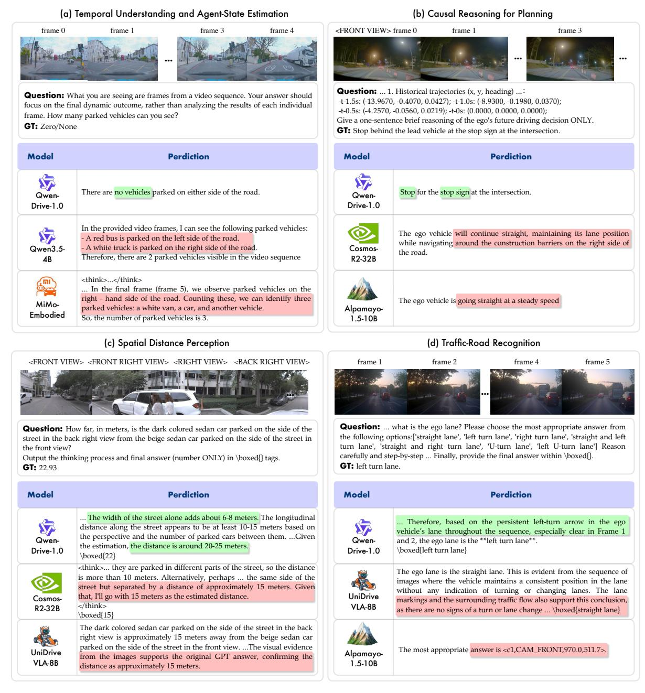

Figure 8: 운전 VQA 역량의 정성적 비교. 초록색과 빨간색은 각각 올바른 내용과 잘못된 내용을 강조한다. 질문과 응답은 공간을 절약하기 위해 축약되었으며, 완전한 예시는 부록 [C.](#page-36-0)에 제공된다.

지시 수행에서의 차이점을 드러낸다: UniDriveVLA-8B는 필수 \boxed{} 구분자를 생략한 반면, Qwen-Drive-1.0-SFT는 형식과 답안 집합 모두를 준수한다. 이 예시들은 Qwen-Drive-1.0-SFT가 시각과 시간에 걸친 증거를 요청된 결정에 통합하면서 출력 제약을 준수함을 보여준다. 추가 사례는 부록 [B.](#page-32-1)에 나타난다.

#### **3.2.2 일반 시각-언어 이해 (General Vision-Language Understanding)**

**벤치마크.** 운용 기반 모델은 개방형 추론과 통합 플랫폼에서 조종석 애플리케이션에 필요한 광범위한 시각 및 세계 지식을 포기하지 않으면서 도메인 역량을 습득해야 한다. 따라서 우리는 표 [3.](#page-16-0)의 두 그룹에 있는 14개의 공개 벤치마크를 평가한다. 그룹 (a)는 MMBench [(Liu et al.,](#page-27-13) [2024b)](#page-27-13), MMStar [(Chen et al.,](#page-25-13) [2024)](#page-25-13), MMMU [(Yue et al.,](#page-30-11) [2024)](#page-30-11), MMMU-Pro의 표준 및 시각 분할 [(Yue et al.,](#page-30-12) [2025)](#page-30-12), 그리고 CharXiv [(Wang](#page-29-9) [et al.,](#page-29-9) [2024)](#page-29-9)을 포함한 지식 및 추론을 다룬다. 또한 OCRBench [(Liu et al.,](#page-28-12) [2024c)](#page-28-12), RealWorldQA [(xAI,](#page-30-13) [2024)](#page-30-13), SimpleVQA [(Cheng et al.,](#page-25-14) [2025)](#page-25-14) (다중 모달 사실성) 및 CountQA [(Tamarapalli et al.,](#page-29-10) [2025)](#page-29-10)을 통해 일반 인식을 포함한다.

<span id="page-16-0"></span>Table 3: 일반 시각-언어 결과 (a) 지식, 추론, 인식과 (b) 공간 이해 및 기반화. Avg.는 벤치마크 평균이다. Qwen3.5-4B와 비교해 Qwen-Drive-1.0-SFT는 그룹 (a)에서 1점 이내에 머물며 그룹 (b)에서는 이를 능가해 운전 적응 후 일반 지식과 역량을 보존한다. "—"는 무효 응답을 나타내며 평균에 0으로 계산된다. **Bold**와 <u>underlined</u>는 최고와 두 번째 최고를 나타낸다.

| (a) 지식, | 추론과 | 인식 |
|-----------------|---------------|-------------|
| (a) Kilowieuge, | 추론과 | 인식 |

| 방법 | MM | MM | MM<br>Star MMMU | MMMU-Pro |  | CharXiv | OCR | RealWorld | Simple |  | 평균 |
|----------------------|--------------|--------------|-----------------|----------|--------------|---------|--------------|--------------|--------------|--------------|-------|
| -11-0-11-10-01 | 벤치마크 | 스타 |  | 표준편차 | 시각화 |  | 벤치마크 | 질문답변 | 비주얼 질문답변 | 질문답변 |  |
| InternVL3.5-8B-Inst. | 80.03 | 64.13 | 62.00 | 46.42 | 42.25 | 41.70 | 83.20 | 66.93 | 40.77 | 20.94 | 54.84 |
| LLaVA-OV2-8B | 82.66 | 64.93 | 54.67 | 36.30 | 25.95 | 40.10 | 79.30 | 71.76 | 36.68 | 22.58 | 51.49 |
| Gemma4-12B | 85.53 | 72.33 | 69.56 | 59.94 | 49.25 | 64.10 | 77.80 | 68.89 | 40.82 | 39.46 | 62.77 |
| Qwen3.5-4B | <u>87.07</u> | <u>75.33</u> | 73.44 | 64.86 | 61.27 | 65.10 | 86.90 | <u>76.34</u> | <u>47.84</u> | <u>35.86</u> | 67.40 |
| Cosmos-Reason1-7B | 79.95 | 63.53 | 54.22 | 38.38 | 35.78 | 39.70 | 85.20 | 67.45 | 44.98 | 18.52 | 52.77 |
| Cosmos-Reason2-2B | 75.00 | 53.13 | 51.56 | 35.09 | 30.35 | 28.50 | 79.60 | 60.52 | 36.94 | 18.00 | 46.87 |
| Cosmos-Reason2-8B | 82.82 | 65.27 | 59.11 | 36.07 | 43.53 | 42.50 | <u>87.00</u> | 67.45 | 45.25 | 22.32 | 55.13 |
| Cosmos-Reason2-32B | 88.70 | 72.47 | 61.67 | 41.45 | 52.77 | 53.20 | 88.20 | 75.69 | 48.44 | 26.70 | 60.93 |
| Cosmos3-nano | 79.57 | 66.67 | 60.89 | 46.36 | 40.75 | 42.10 | 85.20 | 69.67 | 44.99 | 23.63 | 55.98 |
| MiMo-Embodied-7B | _ | 22.40 | - | 27.40 | 28.09 | 57.50 | 78.80 | 28.50 | _ | 22.64 | 26.53 |
| UniDriveVLA-8B | 74.30 | 64.07 | 50.67 | 32.43 | 31.56 | 33.80 | 80.20 | 68.10 | 35.26 | 16.88 | 48.73 |
| Alpamayo-1.5-10B | 7.51 | 26.13 | 27.44 | 15.61 | 13.47 | 1.50 | 3.20 | 46.93 | - | 4.71 | 14.65 |
| Qwen-Drive-1.0-SFT | 85.53 | 75.87 | 72.67 | 62.72 | <u>59.71</u> | 64.40 | 86.40 | 78.95 | 46.12 | 31.74 | 66.41 |

| (b) 공간 이해 및 그룹 | unding |
|------------------------------------|--------|
| ------------------------------------ | -------- |

| 방법 | EmbSpatial | ERQA | RefSpatial | Omni3D | ODinW13 | 평균 |
|----------------------|--------------|--------------|--------------|--------------|--------------|--------------|
| InternVL3.5-8B-Inst. | 74.20 | 42.00 | _ | _ | _ | 23.24 |
| LLaVA-OV2-8B | 78.43 | 42.25 | _ | _ | _ | 24.14 |
| Gemma4-12B | 73.16 | 42.00 | _ | _ | _ | 23.03 |
| Qwen3.5-4B | 75.99 | <u>46.25</u> | <u>54.51</u> | 47.40 | <u>40.78</u> | <u>52.99</u> |
| Cosmos-Reason1-7B | 68.76 | 38.50 | 0.36 | _ | 4.77 | 22.48 |
| Cosmos-Reason2-2B | 66.40 | 38.75 | 32.49 | 31.41 | 33.04 | 40.42 |
| Cosmos-Reason2-8B | 77.61 | 43.25 | 51.81 | 32.85 | 40.19 | 49.14 |
| Cosmos-Reason2-32B | 79.26 | 45.25 | 57.76 | 31.70 | 28.47 | 48.49 |
| Cosmos3-nano | 77.88 | 41.25 | _ | 32.26 | 35.87 | 37.45 |
| MiMo-Embodied-7B | 45.05 | 39.75 | 2.17 | _ | _ | 17.39 |
| UniDriveVLA-8B | 68.16 | 38.00 | 1.44 | 0.33 | _ | 21.59 |
| Alpamayo-1.5-10B | 20.58 | 27.50 | _ | _ | _ | 9.62 |
| Qwen-Drive-1.0-SFT | <u>78.85</u> | 48.50 | 50.78 | <u>45.79</u> | 45.87 | 53.96 |

객체 수량 측정용. 그룹 (b)는 EmbSpatial-Bench (Du et al., 2024), ERQA (Team et al., 2025), RefSpatial-Bench (Zhou et al., 2025a), Omni3D-Bench (Marsili et al., 2025), 그리고 ODinW13 (Li et al., 2022a)과 같은 공간 이해 및 기반화 벤치마크를 포함한다.

**Results.** Tab. 3에 나타난 바와 같이, Qwen-Drive-1.0-SFT는 대규모 운전 데이터에 대한 적응 후에도 광범위한 시각-언어 역량을 보존한다. Tab. 3(a)의 지식, 추론, 인식 벤치마크에서, Qwen-Drive-1.0-SFT는 Qwen3.5-4B의 67.40 대비 66.41을 평균하며, 10개 설정 중 6개에서 1점 이내로 1위 또는 2위를 차지하고, MMStar와 RealWorldQA에서 최고 점수를 기록한다. Tab. 3(b)의 공간 이해 및 기반화 벤치마크에서는 53.96을 평균하고, Qwen3.5-4B의 52.99를 초과하며, ERQA와 ODinW13에서 최고 점수를 기록해 구현된 공간 추론과 개방형 객체 기반화를 포함한다. 따라서 운전 적응은 지식 집약적 역량을 본질적으로 보존하고, 공간 기반 역량을 강화한다.

이 보존은 Qwen-Drive-1.0-SFT를 물리 AI, 구현 추론, 자율 주행에 특화된 비교 방법들과 구분한다. Cosmos-Reason2-32B와 15개 설정 중 10개에서 일치하거나 초과하며, 평균이 5.48점 더 높다. 다른 특화 모델들은 일부 벤치마크에서 부적절한 응답을 생성해, 강력한 도메인 특화가 다양한 과제에서 요구되는 일반적인 지시 따르기 인터페이스를 반드시 보존하는 것은 아님을 보여준다. 반대로 Qwen-Drive-1.0-SFT는 운전 이해를 향상시키면서 이 인터페이스와 광범위한 시각 및 세계 지식을 모두 유지한다. 이러한 결과는 오픈-월드 운전에서 드물고 이전에 보지 못한 상황에 대해 보다 신뢰할 수 있는 일반화를 위한 잠재력을 시사한다.

보존된 역량은 배포에서도 중요하다. 조종석-운전 통합 하에서, 단일

<span id="page-17-0"></span>Table 4: WOD-E2E에서의 오픈 루프 계획. 우리는 3초와 5초에서의 평균 변위 오차(ADE)와 평가자 피드백 점수(RFS)를 보고한다. RL은 강화 학습을 나타낸다. 검증 세트가 RL에 사용되므로, 테스트 세트가 일반화에 대한 보다 유익한 평가를 제공한다.

#### (a) 검증 세트.

#### (b) 테스트 세트.

| 방법 | RL | ADE↓<br>3초 | ADE↓<br>5초 | RFS↑ | 방법 |  | ADE↓<br>3초 | ADE↓<br>5초 | RFS↑ |
|----------------------------------|--------------|------------|-------------|------|----------------------------------------------------------------------------|---------------|--------------|--------------|--------------|
| Human Driver (Rowe et al., 2025) | - | - | - | 8.13 | Swin-Trajectory (Park et al., 2025b)<br>DiffusionLTF (Nguyen et al., 2025) | - | 1.21<br>1.36 | 2.81<br>2.89 | 7.54<br>7.72 |
| VAD (Jiang et al., 2023) | - | 3.19 | 5.81 | 4.45 | UniPlan (Liao et al., 2025) | - | 1.31 | 2.99 | 7.78 |
| UniAD (Hu et al., 2023) | - | 6.50 | 10.81 | 5.78 | LightEMMA (Qiao et al., 2025) | - | 1.71 | 3.74 | 6.52<br>7.53 |
| RAP-DINO (Feng et al., 2026) | - | 0.97 | 2.20 | 7.91 | NaiveEMMA (Xu et al., 2026b)<br>dVLM-AD (Ma et al., 2026) | _ | 1.32<br>1.29 | 3.02<br>3.02 | 7.63 |
| MindVLA-U1 (Huang et al., 2026) | - | 0.89 | 2.11 | 7.92 | HMVLM (Wang et al., 2025a)<br>MindVLA-U1 (Huang et al., 2026) | _ | 1.33<br>1.16 | 3.07<br>2.67 | 7.74<br>7.77 |
| MindVLA-U1 (Huang et al., 2026) | $\checkmark$ | 1.01 | 2.28 | 8.20 | AutoVLA (Zhou et al., 2025c) | ✓ | 1.35 | 2.96 | 7.56 |
| Qwen-Drive-1.0-SFT w/o reasoning | _ | 0.99 | 2.33 | 7.95 | NoRD (Rawal et al., 2026)<br>MindVLA-U1 (Huang et al., 2026) | <b>√</b> | 1.25<br>1.09 | 2.66 | 7.71<br>7.87 |
| Qwen-Drive-1.0-SFT w/ reasoning | _ | 0.99 | 2.31 | 7.95 | Qwen-Drive-1.0-SFT w/o reasoning | - | 1.20 | 2.66 | 7.76 |
| Qwen-Drive-1.0-RL | $\checkmark$ | 0.62 | 1.27 | 8.45 | Qwen-Drive-1.0-SFT w/ reasoning<br>Qwen-Drive-1.0-RL | <i>-</i><br>✓ | 1.19<br>1.19 | 2.65<br>2.67 | 7.78<br>7.91 |

온보드 모델은 대화 및 개방형 시각 질의와 같은 조종석 애플리케이션을 제공할 것으로 예상되며, 동시에 주행 인식 및 계획을 수행한다. Qwen-Drive-1.0-SFT는 그룹 (a)에서 1점 이하를 잃고 그룹 (b)에서는 이득을 얻으며 주행 역량을 획득하므로 하나의 인스턴스로 두 도메인을 모두 커버할 수 있다. 이는 별도의 조종석 모델과 관련된 계산 및 유지보수 비용이 필요 없도록 한다. 주행 적응 과정에서 일반적인 능력을 잃는 방법은 주행 점수가 경쟁적이더라도 이러한 절감 효과를 제공할 수 없다.

### <span id="page-17-1"></span>3.3 모션 플래닝 (Motion Planning)

**벤치마크.** 점진적으로 상호작용 수준이 높은 모션 플래닝을 평가하기 위해, 우리는 두 개의 오픈 루프 벤치마크, 하나의 의사 클로즈드 루프 벤치마크, 그리고 하나의 클로즈드 루프 시뮬레이터를 고려한다.

- 1) WOD-E2E (Xu et al., 2026b)는 도전적인 장기 꼬리 시나리오에 초점을 맞추고 각 장면마다 여러 인간 평가 후보 궤적을 제공한다. 주요 지표는 Rater Feedback Score (RFS)이며, 이는 속도에 따라 달라지는 허용 범위 내에서 예측을 후보와 매칭하고 가장 가까운 유효 매칭의 등급을 부여한다. 따라서 RFS는 기록된 미래와 다르더라도 허용 가능한 계획을 인식할 수 있다. 또한 평균 변위 오차를 보고하며, 이는 기록된 궤적에 대한 평균 유클리드 위치 오차로 정의된다. 3초와 5초에서 측정한다.

- **2) PAI-AV** (NVIDIA, 2025b)는 각 방법이 장면마다 6개의 후보 궤적을 예측하도록 요구한다. 우리는 전체 궤적 품질을 측정하기 위해 평균 ADE를 보고하고, 최소 ADE(minADE)를 통해 어떤 후보가 기록된 움직임을 포괄하는지 판단한다. 두 지표를 3초와 5초에서 평가한다. 표준 644-예시 분할은 공식적으로 구축된 공개 훈련 데이터와 겹친다. 공정한 비교를 위해, 우리는 보류된 테스트 클립에서 선별된 누수 없는 하위 집합에 대한 결과도 보고한다.

- **3)** NAVSIM (Dauner et al., 2024)은 가상 폐쇄 루프 프로토콜을 따른다. 플래너는 한 번만 질의되며, 주변 에이전트는 기록된 움직임을 재생하지만 자율 차량에 반응하지 않는다. NAVSIM v1.1 navtest에서 우리는 PDMS와 그 다섯 구성 요소를 보고한다. 충돌 없음(No collision, NC)과 주행 가능 영역 준수(Drivable Area Compliance, DAC)는 자율 차량 진행(EP), 충돌까지 시간(Time-to-Collision, TTC), 편안함(Comfort, Comf.)의 가중 조합에 대한 곱셈 인자로 작용한다.

- **4) AlpaSim** (NVIDIA et al., 2025)은 누적 오류 하에서 폐쇄 루프 동작을 평가한다. 우리는 PAI-AV-NuRec (Wu et al., 2025) 버전 26.02를 사용해 자율 차량이 기록된 로그에서 벗어날 때 새로운 시점으로 916개의 시나리오를 시뮬레이션한다. Alpamayo (Wang et al., 2025d)를 따라 우리는 근접 접촉률(전체 이벤트 및 과실 이벤트), 오프로드율, 진행률, AlpaSim 점수(전체 이벤트 및 과실 이벤트)를 측정한다. 이 지표들은 각각 근접 접촉 이벤트, 도로 이탈, 시나리오 완성, 이벤트 간 평균 이동 거리를 정량화한다. *at-fault* 변형은 자율 차량이 원인으로 만들지 않은 이벤트를 제외한다.

**Results.** 우리는 Qwen-Drive-1.0-SFT를 계획-추론 조건 유무와 함께 평가하고, 강화 학습 후 Qwen-Drive-1.0-RL을 함께 평가한다. 2.83M의 공개 소스에서 수집한 훈련 샘플을 사용하여, 우리 방법은 NAVSIM에서 가장 높은 PDMS와 WOD-E2E에서 가장 높은 테스트-스플릿 RFS를 달성한다. 우리는 상호작용 수준이 증가함에 따라 결과를 분석한다,부터

<span id="page-18-0"></span>Table 5: PAI-AV에서의 오픈루프 모션 플래닝. 우리는 표준 644-예시 스플릿과 보류된 테스트 클립에서 선별된 누수‑없는 700‑프레임 하위 집합에서 3초와 5초 동안 6개의 궤적에 대한 평균 및 최소 ADE(m)를 보고한다. 모든 비교 방법은 동일한 평가 설정에서 재현된다.

|  | 644-example split |  |  |  | 700-frame subset |  |  |  |
|---------------------------------------------------------------------------------------------------------------------------------------------|------------------------------|------------------------|------------------------------|------------------------|------------------------------|------------------------|------------------------------|------------------------|
| 방법 | Avg. ADE↓ |  | minADE↓ |  | Avg. ADE↓ |  | minADE↓ |  |
|  | 3초 | 5초 | 3초 | 5초 | 3초 | 5초 | 3초 | 5초 |
| Alpamayo-R1-10B (Wang et al., 2025d)
Alpamayo-1.5-10B (Wang et al., 2025d)
DriveWAM (Shi et al., 2026)
SimWAM (Zhao et al., 2026b) | 0.37<br>0.35<br>0.67<br>0.41 | 1.13<br>1.05<br>-<br>- | 0.16<br>0.16<br>0.37<br>0.38 | 0.48<br>0.50<br>-<br>- | 0.41<br>0.36<br>0.69<br>0.43 | 1.22<br>1.06<br>-<br>- | 0.18<br>0.17<br>0.38<br>0.40 | 0.51<br>0.49<br>-<br>- |
| Qwen-Drive-1.0-SFT w/o reasoning<br>Qwen-Drive-1.0-SFT w/ reasoning<br>Qwen-Drive-1.0-RL | 0.38<br>0.37<br>0.42 | 1.07<br>1.07<br>1.11 | 0.34<br>0.34<br>0.38 | 0.96<br>0.97<br>1.00 | 0.43<br>0.42<br>0.47 | 1.24<br>1.23<br>1.27 | 0.39<br>0.39<br>0.43 | 1.11<br>1.11<br>1.15 |

<span id="page-18-1"></span>표 6: NAVSIM v1.1 navtest에서의 가상 폐쇄 루프 모션 플래닝. 우리는 예측 운전자 모델 점수(PDMS)와 그에 대한 무충돌(NC), 주행 가능 영역 준수(DAC), 자가 진행, 충돌까지 시간(TTC), 그리고 편안함(Comf.) 구성 요소를 보고한다. RL은 강화 학습을 나타낸다.  $\ddagger$  는 N=6인 best-of-N 선택을 나타내며, 각 장면에서 가장 높은 PDMS를 가진 후보가 선택된다.

| 방법 | RL | NC ↑ | DAC ↑ | EP ↑ | TTC ↑ | Comf. ↑ | PDMS ↑ |
|------------------------------------------------------|--------------|------|-------|------|-------|---------|--------|
| TransFuser (Chitta et al., 2023) | _ | 97.7 | 92.8 | 79.2 | 92.8 | 100.0 | 84.0 |
| DRAMA (Yuan et al., 2024) | - | 98.0 | 93.1 | 80.1 | 94.8 | 100.0 | 85.5 |
| Hydra-MDP (Li et al., 2024a) | - | 98.3 | 96.0 | 78.7 | 94.6 | 100.0 | 86.5 |
| DiffusionDrive (Liao et al., 2025) | - | 98.2 | 96.2 | 82.2 | 94.7 | 100.0 | 88.1 |
| Epona (Zhang et al., 2025) | - | 97.9 | 95.1 | 80.4 | 93.8 | 99.9 | 86.2 |
| ReCogDrive (Li et al., 2026a) | - | 98.3 | 95.1 | 81.1 | 94.3 | 100.0 | 86.8 |
| AutoVLA (Zhou et al., 2025c) | - | 96.9 | 92.4 | 75.8 | 88.1 | 99.9 | 80.5 |
| SpanVLA (Zhou et al., 2026b) | - | 97.5 | 90.8 | 76.9 | 93.7 | 99.5 | 82.1 |
| <b>Qwen-Drive-1.0-SFT</b> 추론 없이 | - | 98.2 | 96.4 | 82.0 | 94.4 | 100.0 | 87.8 |
| Qwen-Drive-1.0-SFT 추론 포함 | - | 98.4 | 96.6 | 82.4 | 94.7 | 100.0 | 88.2 |
| <b>Qwen-Drive-1.0-SFT</b> <sup>‡</sup> 추론 없이 | - | 98.6 | 97.1 | 82.9 | 95.1 | 100.0 | 88.9 |
| Qwen-Drive-1.0-SFT <sup>‡</sup> 추론 포함 | - | 98.7 | 97.2 | 83.2 | 95.5 | 100.0 | 89.3 |
| ReCogDrive (Li et al., 2026a) | <b>√</b> | 98.2 | 97.8 | 83.5 | 95.2 | 99.8 | 89.6 |
| AutoVLA (Zhou et al., 2025c) | $\checkmark$ | 98.4 | 95.6 | 81.9 | 98.0 | 99.9 | 89.1 |
| SpanVLA (Zhou et al., 2026b) | $\checkmark$ | 99.1 | 97.1 | 86.3 | 95.2 | 100.0 | 90.3 |
| ExploreVLA (Sheng et al., 2026) | $\checkmark$ | 98.8 | 98.4 | 83.5 | 96.5 | 99.9 | 90.4 |
| EponaV2 (Xu et al., 2026a) | $\checkmark$ | 98.6 | 97.9 | 84.8 | 95.7 | 100.0 | 90.4 |
| Qwen-Drive-1.0-RL | ✓ | 98.6 | 98.2 | 84.8 | 95.9 | 100.0 | 90.7 |
| Qwen-Drive-1.0-RL <sup>‡</sup> | $\checkmark$ | 98.8 | 98.4 | 85.5 | 96.5 | 100.0 | 91.4 |

오픈 루프 예측에서 가상 클로즈드 루프 평가 및 클로즈드 루프 시뮬레이션으로

**Open-loop.** 장기 꼬리 WOD-E2E 테스트 스플릿(Tab. 4b)에서 Qwen-Drive-1.0-SFT(리더링 포함)는 RFS 7.78을 달성하며, 강화 학습 이전에 MindVLA-U1(7.77)을 약간 초과한다. 리더링은 557K WOD-E2E 샘플 중 142K만이 리더링-조건부 감독을 제공함에도 불구하고 RFS를 7.76에서 7.78로 올린다. 검증 스플릿(Tab. 4a)에서는 강화 학습에 사용되는 RFS 주석을 제공하며, Qwen-Drive-1.0-RL은 RFS를 7.95에서 8.45로 개선하고 3초 및 5초 ADE를 크게 줄인다. 결과 RFS는 인간 운전자 기준 8.13을 초과한다. 이 주석이 보상을 감독하므로, 이 샘플 내 결과는 인간 운전보다 일반화되는 것이 아니라 훈련 시나리오에서 선호도 정렬을 효과적으로 최적화했음을 나타낸다. 더욱 중요한 것은 개선이 테스트 스플릿으로 전이된다는 점이다. 강화 학습은 RFS를 7.78에서 7.91로 올려, 강화된 MindVLA-U1보다 0.04 포인트를 초과한다. 보류된 이득은 기록된 미래와의 변위(displacement)를 크게 바꾸지 않으면서 인간 선호도와의 정렬이 향상되었음을 시사한다.

WOD-E2E에서 선호도 기반 평가를 보완하기 위해 PAI-AV는 여섯 개 예측 궤적의 품질과 다양성을 모두 평가한다. 우리는 동일한 평가 설정에서 모든 비교 방법을 재현한다. Tab. 5에 나타난 바와 같이, 누수 없는 하위 집합에서 Qwen-Drive-1.0-SFT(리더링 포함)는 3초 평균 ADE를 0.42 m 달성하며, Alpamayo-1.5는 0.36 m를 기록한다. 우리의 minADE는 0.39 m에 반해 0.17 m이며, 평균 ADE와 minADE 사이의 좁은 격차는 우리의 후보가

<span id="page-19-0"></span>Table 7: 916 AlpaSim (NVIDIA et al., 2025) 시나리오에서 PAI-AV-NuRec (Wu et al., 2025) 버전 26.02를 사용한 클로즈드 루프 계획. Params.는 LLM 토큰 임베딩을 제외한 모든 매개변수를 나타낸다. 모든 비교 방법은 동일한 평가 설정에서 재현된다.

| 방법 | 매개변수 | 닫기 | 만남율(%) | ↓ 오프로드<br>비율(%)↓ 진행(%)↑ |  | AlpaSim 점수↑ |  |
|-----------------------------------|----------|-------|--------------------|---------------------------------------|------|----------------|----------|
| Wethou | 1 aranis | all | at-fault |  |  | all | at-fault |
| Alpamayo-R1 (Wang et al., 2025d) | 9.8 B | 19.0 | 6.0 | 17.0 | 67.0 | 0.36 | 0.58 |
| Alpamayo-1.5 (Wang et al., 2025d) | 9.8 B | 37.0 | 11.0 | 16.0 | 59.0 | 0.23 | 0.45 |
| DriveWAM (Shi et al., 2026) | 15.0 B | 56.0 | 5.0 | 8.0 | 35.0 | 0.10 | 0.53 |
| SimWAM (Zhao et al., 2026b) | 6.0 B | 35.0 | 22.0 | 19.0 | 62.0 | 0.22 | 0.30 |
| Qwen-Drive-1.0-SFT w/ reasoning | 5.0 B | 38.0 | 12.0 | 24.0 | 54.0 | 0.16 | 0.27 |
| Qwen-Drive-1.0-RL | 5.0 B | 41.0 | 11.0 | 12.0 | 48.0 | 0.16 | 0.37 |

비슷한 동작을 중심으로 집중된다. 이 차이의 일부는 훈련 규모에 기인할 가능성이 있다. Alpamayo-1.5는 80,000시간의 주행 궤적과 3M CoC 추론 트레이스를 사용하지만, PAI-AV는 156K 클립을 포함하고 있어 희소 프레임 샘플링 전 약 900시간의 원시 데이터를 나타낸다. DriveWAM과 SimWAM은 모두 미래 생성 감독을 통합하지만, 후보 분포가 현저히 다르다. DriveWAM은 평균 ADE보다 훨씬 낮은 최소 평균 절대 오차(minADE)를 달성하여 후보 범위가 넓지만 일반적인 궤적 정확도는 약하다. SimWAM은 평균 ADE를 0.43m로 크게 개선하지만, 최소 평균 절대 오차는 0.40m에 근접해 있어 다양성이 제한적임을 시사한다. 비교하면, Qwen-Drive-1.0-SFT는 평균 ADE를 0.42m로 약간 낮추고, 최소 평균 절대 오차는 0.39m로 유사하다. 강화 학습은 PAI-AV의 오류를 3~5cm만 증가시킨다. 이 적은 개방형 트레이드오프는 WOD-E2E에서 선호도 정렬이 향상되고, NAVSIM에서 가짜 폐쇄 루프 PDMS가 상승하며, AlpaSim에서 폐쇄 루프 오프로드 비율이 절반으로 감소하는 것과 함께한다.

**가짜 폐쇄 루프.** NAVSIM은 예측된 궤적을 차량 모델을 통해 전달함으로써 폐쇄 루프 평가에 한 걸음 더 나아간다. 그러나 플래너를 재질문하지 않고 주변 에이전트를 비반응 상태로 유지하므로 누적 오류를 포착할 수 없다. Tab. 6에 나타난 바와 같이, 강화 학습 이전에 Qwen-Drive-1.0-SFT는 추론과 함께 88.2 PDMS에 도달하며, 모방 학습만으로 훈련된 비교 방법들, 예를 들어 DiffusionDrive(88.1)을 능가한다. 이 경쟁력 있는 결과는 시각-언어 사전 학습 중 획득한 능력과 통합 계획 데이터의 규모 및 행동 다양성 덕분일 수 있다. 추론은 78K NAVSIM 샘플에서만 사용 가능함에도 불구하고 PDMS를 0.4 포인트 향상시켜, 텍스트 조건이 궤적 생성에 유용한 맥락을 제공함을 나타낸다. 강화 학습은 추가로 2.5 포인트를 획득해 PDMS를 90.7으로 끌어올린다. 이 결과는 NAVSIM에서의 강화가 보수적이고 진행이 낮은 행동을 줄이는 데 특히 효과적임을 시사한다. 여러 샘플링된 궤적 중 최상의 것을 보고하는 일반적인 관행에 따라, 우리는 각 장면에서 6개의 샘플 중 가장 높은 PDMS를 가진 후보를 선택해, Owen-Drive-1.0-RL은 91.4, Owen-Drive-1.0-SFT(추론 포함)는 89.3으로 PDMS를 상승시킨다. 단일 궤적 출력보다 이 마진은 샘플링된 세트가 기본 예측보다 강력한 궤적을 이미 포함하고 있음을 나타내며, 더 나은 추론 시 선택이 이를 회복할 수 있는 여지를 시사한다. 그럼에도 불구하고, PDMS는 상호작용 주행 품질의 직접적인 대리인으로 간주되어서는 안 된다. 이 벤치마크의 상단 근처에서는 추가 이득이 점점 더 점수 함수에 대한 적응을 반영할 수 있으며, 비반응 프로토콜은 상호작용 중 오류가 어떻게 누적되는지를 드러내지 못한다.

폐쇄 루프. AlpaSim은 그 행동이 이후 관측을 바꾸면서 플래너를 반복적으로 질의함으로써 NAVSIM이 측정할 수 없는 누적 오류와 복구 행동을 드러낸다. 통제된 비교를 위해 동일한 평가 설정에서 Alpamayo-R1과 Alpamayo-1.5를 재현한다. 표 7에 나타난 바와 같이 Qwen-Drive-1.0-RL은 11.0%의 사고 발생 근접 충돌률을 달성하며 Alpamayo-1.5와 일치하지만, 두 모델의 전체 이벤트율은 각각 41.0%와 37.0%이다. 강화 학습은 오프로드율을 24.0%에서 12.0%로 반으로 줄이며, 이는 두 Alpamayo 변형보다 낮은 비율이며, AlpaSim 사고 발생 점수를 0.27에서 0.37로 올린다. 이러한 안전 이득은 진행률이 54.0%에서 48.0%로 감소하고 전체 이벤트 근접 충돌률이 다소 증가하는 비용을 수반한다. 결과는 더 안전하지만 보수적인 행동으로의 전환을 시사한다. Alpamayo-1.5와 사고 발생 근접 충돌률이 일치함에도 불구하고 Qwen-Drive-1.0-RL은 전체 이벤트 및 사고 발생 AlpaSim 점수를 각각 0.16과 0.37로 기록하며, 이는 0.23과 0.45보다 낮다. 한 가지 가능한 요인은 시각 입력의 시간 샘플링이다. AlpaSim은 짧은 간격에서 반복적으로 재계획하므로 최근 시각 변화에 대한 빠른 반응을 강조한다. Alpamayo-1.5는 0.4초의 밀집된 시각 이력을 관찰하는 반면, 우리의 입력은 1.5초 동안 0.5초 간격으로 샘플링된 네 개의 관측을 포함한다. 이보다 넓지만 희소한 이력은 짧은 재계획 시점에서 반응성을 제한할 수 있다.

AlpaSim 점수는 단독으로 해석해서는 안 된다. DriveWAM (Shi et al., 2026)은 사고 발생 점수 0.53을 달성하지만 진행률은 35.0%에 불과하다. 우리는 그것이 종종 정지하거나 잠시만 전진한다는 것을 발견한다. 이러한 행동은 자가 사고 및 오프로드 이벤트를 줄여 사고 발생 점수를 높일 수 있다 왜냐하면

<span id="page-20-0"></span>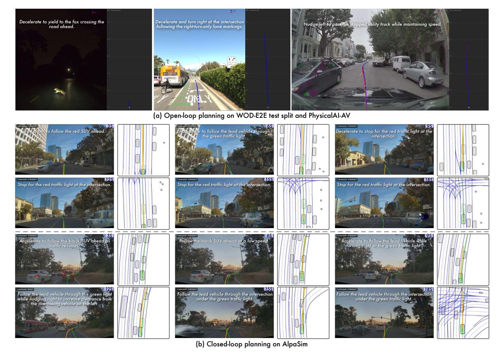

Figure 9: 정성적 동작 계획 결과. (a) Qwen-Drive-1.0-SFT의 오픈 루프 예측으로, WOD-E2E 테스트 분할(왼쪽 및 중간)과 PAI-AV(오른쪽)에서 추론을 수행한다. WOD-E2E는 테스트 분할에 대한 실제 궤적을 제공하지 않으며, PAI-AV 예시는 예측과 기록된 미래를 모두 보여준다. (b) Qwen-Drive-1.0-RL의 선택된 타임스탬프에서 두 개의 폐쇄 루프 AlpaSim 롤아웃으로, 예측 및 기록된 궤적이 비교를 위해 표시된다.

이 지표는 이동한 거리를 해당 이벤트 수로 나눈다. 그러나 거의 정지한 자가 차량은 뒤따르는 교통으로 인한 상호작용에 여전히 취약하다. DriveWAM은 전체 이벤트 근접 충돌률 56.0%와 전체 이벤트 점수 0.10을 기록한다. SimWAM [(Zhao et al.,](#page-31-5) [2026b)](#page-31-5)은 반대 행동을 보인다. 우리는 그 운전 정책이 상당히 공격적이며, 앞선 차량이나 장애물에 충분히 감속하지 못하고 자주 전진 가속한다는 것을 발견한다. 이는 62.0%의 상대적으로 높은 진행률을 가져오지만, 사고 발생 근접 충돌률 22.0%와 오프로드율 19.0%를 초래해 사고 발생 점수가 0.30에 불과하게 만든다. 비교하면, Qwen-Drive-1.0-RL은 사고 발생 근접 충돌과 오프로드 위반을 각각 11.0%와 12.0%로 크게 낮추면서 48.0% 진행률을 유지한다. 이러한 결과는 효과적인 폐쇄 루프 주행을 평가할 때 진행률, 안전 이벤트, AlpaSim 점수를 함께 고려하는 것의 중요성을 강조한다.

**정성적 결과.**  
Fig. [9](#page-20-0)은 개방형 및 폐쇄형 계획을 통해 정량적 평가를 보완한다. Fig. [9(](#page-20-0)a)에서 Qwen-Drive-1.0-SFT는 추론을 통해 계획을 관련 장면 증거에 기반한다. 교차 동물에 대해 감속하고, 우회전 전용 차선에 따라가며, 정지 차량을 통과하기 위해 가로 방향을 조정한다. PAI-AV에서는 예측 궤적이 기록된 미래와 가깝게 유지된다. Fig. [9(](#page-20-0)b)는 Qwen-Drive-1.0-RL에서 두 개의 AlpaSim 롤아웃을 보여준다. 첫 번째 롤아웃에서 모델은 초록등을 통해 리드 차량을 따라가고, 신호가 빨간색으로 바뀌면 정지한다. 두 번째 롤아웃에서는 느린 차량을 따라가며 교차로에서 우회전하고, 다른 차량이 추월할 때 가로 위치를 조정한다. 두 롤아웃 모두에서 추론과 궤적은 변화하는 교통 상태에 따라 업데이트되며, 내비게이션 지시와 도로 형상과 일관성을 유지한다.

Fig. [10](#page-21-1)은 강화 학습이 NAVSIM 목표에 맞춰 궤적 예측을 어떻게 조정하는지를 추가로 보여준다. 두 변형 모두 동일한 고수준 우회전 동작을 유지하지만, Qwen-Drive-1.0-RL은 기록된 미래에서 작은 가로 편차를 줄인다. 이 세밀한 조정은 궤적을 NAVSIM 채점 기준에 더 잘 맞추며, Tab. [6.](#page-18-1)에서의 PDMS 개선과 일치한다.

<span id="page-21-1"></span>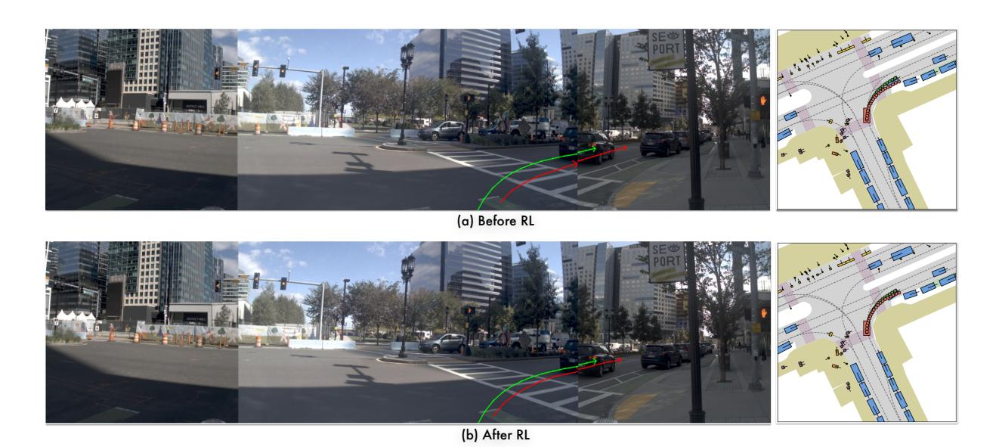

Figure 10: 같은 NAVSIM 우회전 장면에서 강화 학습의 정성적 효과. (a) 강화 학습 전 Qwen-Drive-1.0-SFT와 추론. (b) Qwen-Drive-1.0-RL. 예측은 빨간색, 기록된 미래는 녹색으로 카메라 및 BEV 뷰에 표시된다.

<span id="page-21-0"></span>Table 8: Stage 2 훈련 혼합의 Ablation. 행 I은 적응되지 않은 Qwen3.5-4B를 사용하고, 행 II와 III는 차례로 시각-언어 및 3D 인식 감독을 도입한다. 각 행마다 동일한 WOD-E2E 데이터를 사용해 Planning Expert를 15 에폭 동안 훈련하고, 검증 세트에서 RFS를 평가한다.

|  | 2단계 훈련 | ning Mixture | Visio | 계획 |  |  |  |  |
|-----|---------------------|--------------|-------|----------|-------|-----------------|----------------------|-----------------|
| ID | 비전-<br>언어 |  |  |  |  | CoC<br>전체↑ | 일반 VQA<br>평균↑ | WOD-E2E<br>RFS↑ |
| I | Х | Х | 63.52 | 2.58 | 62.60 | 7.88 |  |  |
| II | ✓ | × | 70.07 | 40.97 | 63.18 | 7.91 |  |  |
| III | ✓ | ✓ | 69.43 | 41.26 | 62.26 | 7.96 |  |  |

### 3.4 Ablation Study and Analysis (제거 실험 및 분석)

Stage 2 훈련 혼합의 분석. 먼저, Sec. 2.2에 있는 Stage 2 훈련 혼합이 시각‑언어 능력, 명시적 3D 인식, 그리고 이후 계획에 어떻게 영향을 미치는지 살펴본다. 적응되지 않은 Qwen3.5-4B를 행 I에서 시작으로, 행 II는 시각‑언어 훈련을 도입하고, 행 III는 추가로 3D 인식 감독을 활성화한다. 통제된 계획 비교를 위해, 우리는 각 변형에 대해 Stage 3에서 WOD‑E2E (Xu et al., 2026b)를 15 epoch 동안 훈련시키고 검증 세트에서 RFS를 보고한다. Tab. 8은 시각‑언어 훈련이 Driving QA Avg.를 6.55 포인트 향상시키고 CoC 추론에서 상당히 큰 이득을 제공함을 보여 주며, 일반 시각‑언어 능력을 보존한다. 3D 인식 감독을 추가하면 세 가지 시각‑언어 집계가 행 II와 1포인트 이내로 유지된다. Sec. 3.1과 일치하게, BEV 인식 헤드는 공유 표현이 3D 탐지, 시맨틱 점유, BEV 지도 예측을 얼마나 쉽게 지원하는지 노출함으로써 3D 프로브 역할을 한다. 그 인식 목표는 공동 적응 중 공유 시각 경로에 작업별 3D 감독을 추가로 제공한다. 완전한 Stage 2 혼합은 명시적, 검증 가능한 3D 인식 능력을 추가하면서 시각‑언어 성능을 크게 보존한다. 또한 Stage 3 이후 가장 높은 RFS를 제공하지만, 다른 변형에 비해 마진은 작다. 계획 결과는 Stage 2 혼합이 이후 Planning Expert 훈련과 호환됨을 지원하지만, 명시적 3D 감독이 개선의 원인임을 확립하지는 않는다.

Reinforcement 보상 분석. 다음으로, Fig. 11에 표시된 대로 데이터 혼합과 강화 학습에 사용되는 공유 ADE 항목을 제거한다. NAVSIM 전용 훈련에서는 소스별 PDMS 보상에 ADE를 추가함으로써 PDMS가 90.4에서 90.8로 상승한다. NAVSIM, WOD‑E2E, PAI‑AV에서 공동 훈련하면 공유 ADE 항목이 있는 경우와 없는 경우 모두에서 90.6과 90.7의 유사한 NAVSIM 점수를 얻는다. 단일 소스 훈련과의 작은 차이는 특히 각 소스가 작업 정렬 보상을 제공할 때 교차 데이터셋 간섭이 제한적임을 시사한다. WOD‑E2E 검증 세트에서 ADE를 추가하면 RFS가 8.68에서 8.45로 감소하지만 5초 ADE가 2.24 m에서 1.27 m로 크게 감소한다. 공유 변위 보상은 선호 최적화를 기록된 움직임에 고정시키고 과도한 경로 편차를 제한한다.

<span id="page-22-0"></span>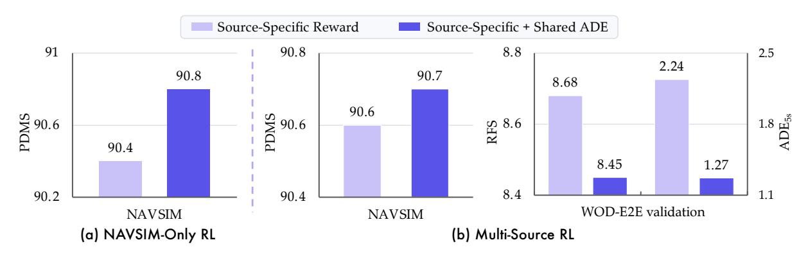

Figure 11: 강화 학습 데이터 혼합 및 보상 설계의 제거. (a) NAVSIM 단독 강화 학습. (b) NAVSIM, WOD‑E2E, PAI‑AV의 공동 강화 학습. 소스별 보상은 NAVSIM에 PDMS, WOD‑E2E에 RFS, PAI‑AV에 ADE를 사용한다. 공유‑ADE 변형은 모든 데이터 소스에 변위 보상을 추가한다.

<span id="page-22-1"></span>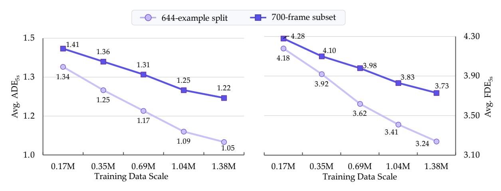

Figure 12: PAI‑AV 계획 데이터 규모의 효과. Planning Expert는 Stage 3에서 오직 PAI‑AV만을 사용해 훈련되며, 훈련 샘플 수가 0.17 M에서 1.38 M으로 증가한다. 5초 평균 ADE와 평균 FDE가 표준 644‑예시 분할과 누출이 없는 700프레임 하위 집합 모두에서 일관되게 감소한다.

경로 편차. 이러한 트레이드오프를 바탕으로, 우리의 최종 레시피는 세 가지 소스를 모두 공동으로 훈련하고 모든 소스에 공유 ADE 항목을 포함한다.

**계획 데이터 규모의 효과.** 우리는 Stage 3 계획 성능이 궤적 감독량에 따라 어떻게 변하는지 추가로 조사한다. 데이터 규모의 효과를 교차 데이터셋 혼합으로부터 분리하기 위해, 우리는 0.17 M, 0.35 M, 0.69 M, 1.04 M, 1.38 M의 훈련 샘플을 사용해 PAI‑AV에서 Planning Expert만을 훈련시킨다. Fig. [12,](#page-22-1) 에서 보듯이 5초 평균 ADE와 평균 FDE는 훈련 세트가 커질수록 단조롭게 감소한다. 표준 분할에서는 평균 ADE가 1.34 m에서 1.05 m로 감소하고, 평균 FDE는 4.18 m에서 3.24 m로 감소한다. 누수‑프리(subset) 역시 더 어려우나 같은 추세를 보이며, 이득이 표준 분할에 국한되지 않음을 보여준다. 성능은 1.38 M 샘플에서도 계속 향상되며, 현재 데이터 규모에서는 포화 현상이 명확히 나타나지 않는다.

**보이지 않는 카메라 리그에 대한 정성적 전이.** Sec. [3.1](#page-11-0) 에서의 정량적 비교는 인식 감독을 제공하는 두 소스만을 다룬다. 우리는 최종적으로 인식 경로가 훈련 시에 한 번도 보지 못한 카메라 구성에서 직접 작동할 수 있는지 여부를 조사한다. 이를 위해 WOD‑E2E의 8대 카메라 링 리그 [(Xu et al.,](#page-30-9) [2026b)](#page-30-9)와 PAI‑AV의 6대 카메라 리그 [(NVIDIA,](#page-28-9) [2025b)](#page-28-9)에서 프레임을 샘플링한다. 이 두 리그의 전면 주위 뷰는 모든 인식 훈련 데이터에 없으며, 렌즈 왜곡을 피구 모델로 교정한 뒤 Qwen‑Drive‑1.0‑SFT를 데이터셋별 적응 없이 두 리그 모두에서 직접 실행한다. Fig. [13,](#page-23-0) 에서 보듯이 투영된 박스는 모든 뷰에서 시각적으로 그럴듯하며, 대응되는 BEV 레이아웃과 정성적으로 일관된다. 점유율 및 지도 출력도 일관된 도로 표면, 물체 영역, 주행 가능 영역, 차선 표시 및 도로 가장자리를 보여준다. 이러한 예시는 인식 경로가 여전히 작동하며 보이지 않는 카메라 리그에서도 정성적으로 일관된 출력을 생성함을 보여준다. 두 데이터셋 모두 통합된 기준이 없으므로 새로운 카메라 설정에서 신뢰할 수 있는 3D 정확도를 확립하지 못한다. 정량적 평가와 고품질

<span id="page-23-0"></span>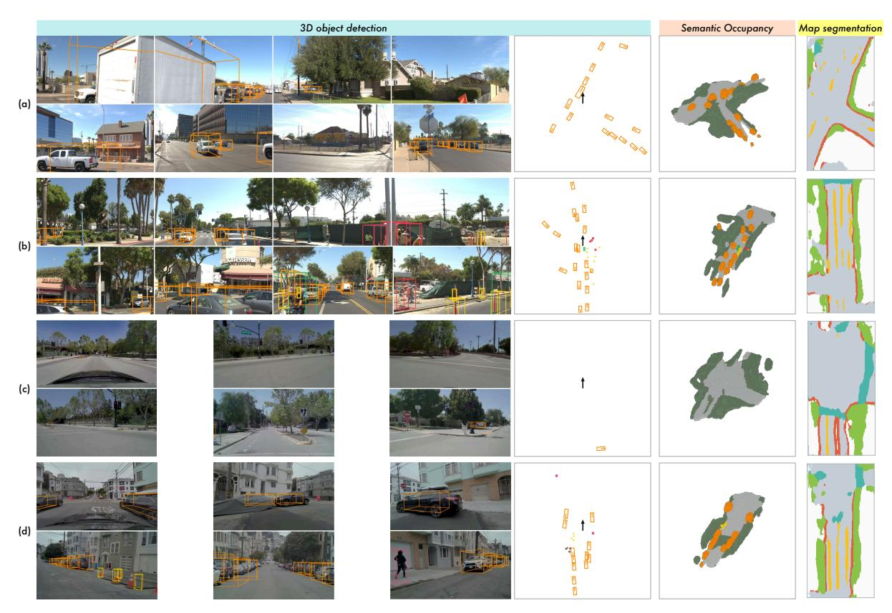

Figure 13: Qwen‑Drive‑1.0‑SFT의 보이지 않는 카메라 리그에서의 정성적 인식 출력. WOD‑E2E는 (a, b)에서, PAI‑AV는 (c, d)에서 표시된다. 이 데이터셋들은 통합된 인식 기준을 제공하지 않으므로 모든 패널은 예측만을 보여준다.

타깃 차량 플랫폼의 주석이 필요하다. 이를 통해 교차 리그 전이를 평가하고 개선할 수 있다.

## **4 결론 (Conclusion)**

우리는 Qwen‑Drive‑1.0을 제시하였다. 이는 자율 주행을 위한 시각‑언어 기반 기초 모델로 가는 초기 단계라고 생각한다. 이 프레임워크는 사전 학습된 VLM 아키텍처를 유지하면서 통합 3D 인식과 동작 계획을 위한 외부 모듈을 도입한다. BEV 인식 헤드는 3D 프로브 역할을 하며, 동일한 사전 학습된 VLM에 명시적이고 검증 가능한 탐지, 점유율, 지도 예측을 추가한다. Planning Expert는 공유 표현을 활용해 흐름 매칭을 통해 미래 자아 궤적을 생성하고, 여러 공개 주행 데이터셋에 걸친 공동 훈련을 지원한다. 단계별 훈련 및 데이터 레시피는 주행 특화 감독과 일반 목적의 시각‑언어 데이터를 결합한다.

실험 결과 Qwen‑Drive‑1.0이 3D 인식, 주행 장면 이해, 동작 계획에서 매우 경쟁력 있는 성과를 달성하면서 일반 시각‑언어 역량을 대부분 보존함을 보여준다. 오픈‑루프, 가짜 클로즈드‑루프, 클로즈드‑루프 계획 평가 전반에 걸친 성능은 통합 궤적 감독과 보상 기반 최적화를 결합한 가치를 입증한다. 이 결과들은 명시적 3D 인식과 궤적 생성을 사전 학습된 VLM에 추가하면서도 그 광범위한 시각‑언어 역량을 유지할 수 있음을 보여준다.

## **5 한계 및 향후 연구 (Limitations and Future Work)**

Qwen-Drive-1.0이 인식, 추론, 계획을 위한 통합 프레임워크를 구축했음에도 불구하고, 여전히 해결해야 할 방향이 있다. 첫째, 계획 추론은 장면의 인과 구조를 항상 정확히 포착하지 못한다. 운전은 서로 다른 시간 규모에서 작용하는 원인들을 혼합한다. 20m 앞에 있는 신호등은 조기, 점진적 감속을 요구하지만, 5m 앞에 나타나는 어린이는 즉각적인 반응을 요구한다. 이러한 원인들이 동시에 존재할 때, 모델은 지배적 원인과 그 시간 범위를 식별하는 데 불안정하다. 제안된 추세가 적절하더라도, 다음 1~2초 이내에 실행되는 결정은 명시된 즉각적 원인을 반영하지 않을 수 있다. 둘째, 생성된 궤적은 항상 텍스트 기반 근거를 따르지 않는다. 추론이 하위 계획 성능을 향상시키는 것은 사실이지만, 이 이득의 일부는 자가 생성된 추적이 조건화 맥락에 기여하는 추가 모델 내부 정보에서 비롯될 수 있다. 이러한 문제를 해결하려면 다중 시간 규모 인과 모델링과 근거와 생성된 궤적 사이의 명시적 일관성 감독이 필요하다.

텍스트 기반 근거. 추론이 하위 계획 성능을 향상시키는 것은 사실이지만, 이 이득의 일부는 자가 생성된 추적이 조건화 맥락에 기여하는 추가 모델 내부 정보에서 비롯될 수 있다. 이러한 문제를 해결하려면 다중 시간 규모 인과 모델링과 근거와 생성된 궤적 사이의 명시적 일관성 감독이 필요하다.

더 강력한 교차 작업 전이도 또 다른 유망한 방향이다. 현재 세 작업은 서로 다른 입력 형식, 시간적 맥락, 이미지 해상도를 사용하고 있어 학습된 표현의 전이를 제한할 수 있다. 이러한 구성의 더 나은 정렬과 보다 밀접한 공동 최적화는 인식, 추론, 계획이 서로를 보다 일관되게 강화하도록 허용할 수 있다.

# 저자 (Authors)

핵심 기여자: Xin Zhou1,2, Zongchuang Zhao1,2, Zhibo Yang1 †, Mingsheng Li<sup>1</sup> , Humen Zhong<sup>1</sup> , Shuai Bai<sup>1</sup> , Dingkang Liang<sup>2</sup> <sup>B</sup>, Xiang Bai<sup>2</sup> <sup>B</sup>, Dayiheng Liu1 †

기여자 (알파벳순): Du Chu<sup>1</sup> , Ruizhe Chen<sup>1</sup> , Zhaohai Li<sup>1</sup> , Jun Tang<sup>1</sup> , Qiuyue Wang<sup>1</sup> , Mingkun Yang<sup>1</sup> , Jiazhao Zhang<sup>1</sup>

외부 고문: Dingkang Liang<sup>2</sup> <sup>B</sup>, Xiang Bai<sup>2</sup> <sup>B</sup>

**감사.** 이 작업은 NSFC(62225603)에 의해 부분적으로 지원된다.

25

<sup>1</sup> Qwen Team

<sup>2</sup> Huazhong University of Science and Technology

<sup>†</sup> Project Leader. B Corresponding authors.

# 참고문헌 (References)

- <span id="page-25-11"></span>Niket Agarwal, Arslan Ali, Jon Allen, Martin Antolini, Adeline Aubame, Alisson Azzolini, Junjie Bai, Maciej Bala, Yogesh Balaji, Josh Bapst, et al. Cosmos 3: 물리적 AI를 위한 옴니모달 세계 모델. *arXiv 사전발표 arXiv:2606.02800*, 2026.
- <span id="page-25-12"></span>Xiang An, Yin Xie, Feilong Tang, Yunyao Yan, Huajie Tan, Didi Zhu, Changrui Chen, Xiuwei Zhao, Bin Qin, Kaicheng Yang, et al. Llava-onevision-2: 차세대 지각 인텔리전스로 향해. *arXiv 사전발표 arXiv:2605.25979*, 2026.
- <span id="page-25-10"></span>Alisson Azzolini, Junjie Bai, Hannah Brandon, Jiaxin Cao, Prithvijit Chattopadhyay, Huayu Chen, Jinju Chu, Yin Cui, Jenna Diamond, Yifan Ding, et al. Cosmos-reason1: 물리적 상식에서 구현된 추론으로. *arXiv 사전발표 arXiv:2503.15558*, 2025.
- <span id="page-25-1"></span>Maxim Berman, Amal Rannen Triki, and Matthew B Blaschko. lovász-softmax 손실: 신경망에서 교차-유니온(Intersection-over-Union) 측정 최적화를 위한 계산 가능한 대체물. In *Proc. IEEE Conf. Comput. Vis. Pattern Recognit.*, pp. 4413–4421, 2018.
- <span id="page-25-2"></span>Holger Caesar, Varun Bankiti, Alex H Lang, Sourabh Vora, Venice Erin Liong, Qiang Xu, Anush Krishnan, Yu Pan, Giancarlo Baldan, and Oscar Beijbom. nuscenes: 자율 주행을 위한 멀티모달 데이터셋. In *Proc. IEEE Conf. Comput. Vis. Pattern Recognit.*, pp. 11618–11628, 2020.
- <span id="page-25-0"></span>Anh-Quan Cao and Raoul De Charette. Monoscene: 단안 3D 의미론적 장면 완성. In *Proc. IEEE Conf. Comput. Vis. Pattern Recognit.*, pp. 3981–3991, 2022.
- <span id="page-25-6"></span>Xu Cao, Tong Zhou, Yunsheng Ma, Wenqian Ye, Can Cui, Kun Tang, Zhipeng Cao, Kaizhao Liang, Ziran Wang, James M Rehg, et al. Maplm: 실제 대규모 비전-언어 벤치마크(지도 및 교통 장면 이해용). In *Proc. IEEE Conf. Comput. Vis. Pattern Recognit.*, pp. 21819–21830, 2024.
- <span id="page-25-3"></span>Kai Chen, Yanze Li, Wenhua Zhang, Yanxin Liu, Pengxiang Li, Ruiyuan Gao, Lanqing Hong, Meng Tian, Xinhai Zhao, Zhenguo Li, et al. 자율 주행 코너 케이스에서 대규모 비전-언어 모델의 자동 평가. In *Proc. IEEE Winter Conf. Appl. Comput. Vis.*, pp. 7806–7815, 2025.
- <span id="page-25-13"></span>Lin Chen, Jinsong Li, Xiaoyi Dong, Pan Zhang, Yuhang Zang, Zehui Chen, Haodong Duan, Jiaqi Wang, Yu Qiao, Dahua Lin, et al. 우리는 대규모 비전-언어 모델을 평가하는 올바른 길에 있는가? In *Proc. Adv. Neural Inf. Process. Syst.*, volume 37, pp. 27056–27087, 2024.
- <span id="page-25-14"></span>Xianfu Cheng, Wei Zhang, Shiwei Zhang, Jian Yang, Xiangyuan Guan, Xianjie Wu, Xiang Li, Ge Zhang, Jiaheng Liu, Yuying Mai, et al. Simplevqa: 멀티모달 대형 언어 모델을 위한 멀티모달 사실성 평가. In *Proc. IEEE Int. Conf. Comput. Vis.*, pp. 4637–4646. IEEE, 2025.
- <span id="page-25-5"></span>Haohan Chi, Huan-ang Gao, Ziming Liu, Jianing Liu, Chenyu Liu, Jinwei Li, Kaisen Yang, Yangcheng Yu, Zeda Wang, Wenyi Li, et al. Impromptu vla: 운전 비전-언어-액션 모델을 위한 공개 가중치와 공개 데이터. In *Proc. Adv. Neural Inf. Process. Syst.*, volume 38, 2025.
- <span id="page-25-15"></span>Kashyap Chitta, Aditya Prakash, Bernhard Jaeger, Zehao Yu, Katrin Renz, and Andreas Geiger. Transfuser: 트랜스포머 기반 센서 융합을 이용한 자율 주행 모방. *IEEE Trans. Pattern Anal. Mach. Intell.*, 45(11):12878–12895, 2023.
- <span id="page-25-4"></span>Charles Corbière, Simon Roburin, Syrielle Montariol, Antoine Bosselut, and Alexandre Alahi. Drivingvqa: 실제 운전 시나리오에서 교차된 시각적 사고 체인을 위한 데이터셋. In *Findings of the Association for Computational Linguistics: EACL*, pp. 3309–3333, 2026. doi: 10.18653/v1/2026. findings-eacl.173.
- <span id="page-25-9"></span>Daniel Dauner, Marcel Hallgarten, Tianyu Li, Xinshuo Weng, Zhiyu Huang, Zetong Yang, Hongyang Li, Igor Gilitschenski, Boris Ivanovic, Marco Pavone, et al. Navsim: 데이터 기반 비반응형 자율 차량 시�레이션 및 벤치마킹. In *Proc. Adv. Neural Inf. Process. Syst.*, volume 37, pp. 28706–28719, 2024.
- <span id="page-25-8"></span>Thierry Deruyttere, Simon Vandenhende, Dusan Grujicic, Luc Van Gool, and Marie Francine Moens. Talk2car: 자율 주행 차량을 제어하기. In *Proc. Conf. Empirical Methods in Natural Language Process.*, pp. 2088–2098, 2019. doi: 10.18653/v1/D19-1215.
- <span id="page-25-7"></span>Xinpeng Ding, Jianhua Han, Hang Xu, Xiaodan Liang, Wei Zhang, and Xiaomeng Li. Bird's-eye-view 주입 멀티모달 대형 모델을 통한 전체적 자율 주행 이해. In *Proc. IEEE Conf. Comput. Vis. Pattern Recognit.*, pp. 13668–13677, 2024.

- <span id="page-26-14"></span>Mengfei Du, Binhao Wu, Zejun Li, Xuan-Jing Huang, and Zhongyu Wei. Embspatial-bench: 대형 비전-언어 모델을 활용한 구현된 작업의 공간 이해 벤치마킹. In *Proc. Annual Meeting of the Association for Computational Linguistics*, pp. 346–355, 2024.
- <span id="page-26-3"></span>Mohamed El Banani, Amit Raj, Kevis-Kokitsi Maninis, Abhishek Kar, Yuanzhen Li, Michael Rubinstein, Deqing Sun, Leonidas Guibas, Justin Johnson, and Varun Jampani. 시각 기반 기초 모델의 3D 인식 탐구. In *Proc. IEEE Conf. Comput. Vis. Pattern Recognit.*, pp. 21795–21806, 2024.
- <span id="page-26-4"></span>Heng Fang, Shangru Li, Shuhan Wang, Xuanyang Xi, Dingkang Liang, and Xiang Bai. 동적 환경에서 일반화 가능한 로봇 조작을 향해. In *Proc. Eur. Conf. Comput. Vis.*, 2026.
- <span id="page-26-6"></span>Jianwu Fang, Lei-lei Li, Junfei Zhou, Junbin Xiao, Hongkai Yu, Chen Lv, Jianru Xue, and Tat-Seng Chua. 안전 운전 인식을 위한 추론적 자가 시점 사고 비디오 이해. In *Proc. IEEE Conf. Comput. Vis. Pattern Recognit.*, pp. 22030–22040, 2024.
- <span id="page-26-15"></span>Lan Feng, Yang Gao, Eloi Zablocki, Quanyi Li, Wuyang Li, Sichao Liu, Matthieu Cord, and Alexandre Alahi. Rap: 3D 래스터화 보강된 엔드-투-엔드 계획. In *Proc. Int. Conf. Learn. Representations*, 2026.
- <span id="page-26-9"></span>Christian Fruhwirth-Reisinger, Dušan Mali´c, Wei Lin, David Schinagl, Samuel Schulter, and Horst Possegger. Stsbench: 자율 주행에서 다중 모달 대형 언어 모델을 위한 시공간 시나리오 벤치마크. In *Proc. Adv. Neural Inf. Process. Syst.*, 38, 2025.
- <span id="page-26-1"></span>Haoyu Fu, Diankun Zhang, Zongchuang Zhao, Jianfeng Cui, Dingkang Liang, Chong Zhang, Dingyuan Zhang, Hongwei Xie, Bing Wang, and Xiang Bai. Orion: 비전-언어 지시 행동 생성에 의한 전체적 엔드-투-엔드 자율 주행 프레임워크. In *Proc. IEEE Int. Conf. Comput. Vis.*, pp. 24823–24834, 2025.
- <span id="page-26-2"></span>Haoyu Fu, Diankun Zhang, Zongchuang Zhao, Jianfeng Cui, Hongwei Xie, Bing Wang, Guang Chen, Hangjun Ye, Dingkang Liang, and Xiang Bai. Minddrive: 온라인 강화 학습을 통한 자율 주행용 비전-언어-행동 모델. In *Proc. Eur. Conf. Comput. Vis.*, 2026.
- <span id="page-26-12"></span>Mohsen Gholami, Ahmad Rezaei, Zhou Weimin, Sitong Mao, Shunbo Zhou, Yong Zhang, and Mohammad Akbari. 자기 중심 다중 시점 장면에서 비전-언어 모델을 활용한 공간 추론. In *Proc. Int. Conf. Learn. Representations*, 2026.
- <span id="page-26-8"></span>Anurag Ghosh, Shen Zheng, Robert Tamburo, Khiem Vuong, Juan Alvarez-Padilla, Hailiang Zhu, Michael Cardei, Nicholas Dunn, Christoph Mertz, and Srinivasa G Narasimhan. Roadwork: 작업 구역을 인식, 관찰, 분석하고 주행하는 학습을 위한 데이터셋 및 벤치마크. In *Proc. IEEE Int. Conf. Comput. Vis.*, pp. 6132–6142, 2025.
- <span id="page-26-10"></span>Xianda Guo, Ruijun Zhang, Yiqun Duan, Yuhang He, Dujun Nie, Wenke Huang, Chenming Zhang, Shuai Liu, Hao Zhao, and Long Chen. Surds: 비전-언어 모델을 활용한 주행 시나리오에서의 공간 이해 및 추론 벤치마킹. In *Proc. Adv. Neural Inf. Process. Syst.*, 38, 2025.
- <span id="page-26-13"></span>Xiaoshuai Hao, Lei Zhou, Zhijian Huang, Zhiwen Hou, Yingbo Tang, Lingfeng Zhang, Guang Li, Zheng Lu, Shuhuai Ren, Xianhui Meng, et al. Mimo-embodied: X-embodied 기초 모델 기술 보고서. *arXiv preprint arXiv:2511.16518*, 2025a.
- <span id="page-26-5"></span>Yuhan Hao, Zhengning Li, Lei Sun, Weilong Wang, Naixin Yi, Sheng Song, Caihong Qin, Mofan Zhou, Yifei Zhan, and Xianpeng Lang. Driveaction: VLA 모델에서 인간과 같은 운전 결정을 탐구하기 위한 벤치마크. *arXiv preprint arXiv:2506.05667*, 2025b.
- <span id="page-26-11"></span>Kaiming He, Xiangyu Zhang, Shaoqing Ren, and Jian Sun. 딥 잔여 학습을 통한 이미지 인식. In *Proc. IEEE Conf. Comput. Vis. Pattern Recognit.*, pp. 770–778, 2016.
- <span id="page-26-0"></span>Yihan Hu, Jiazhi Yang, Li Chen, Keyu Li, Chonghao Sima, Xizhou Zhu, Siqi Chai, Senyao Du, Tianwei Lin, Wenhai Wang, et al. 계획 지향적 자율 주행. In *Proc. IEEE Conf. Comput. Vis. Pattern Recognit.*, pp. 17853–17862. IEEE, 2023.
- <span id="page-26-16"></span>Yuzhou Huang, Benjin Zhu, Hengtong Lu, Victor Shea-Jay Huang, Haiming Zhang, Wei Chen, Jifeng Dai, Yan Xie, and Hongsheng Li. Mindvla-u1: VLA가 VA를 통합 스트리밍 아키텍처로 자율 주행에서 이긴다. *arXiv preprint arXiv:2605.12624*, 2026.
- <span id="page-26-7"></span>Yuichi Inoue, Yuki Yada, Kotaro Tanahashi, and Yu Yamaguchi. Nuscenes-mqa: 마크업 주석을 사용한 자율 주행 데이터셋의 캡션 및 QA 통합 평가. In *Proc. IEEE Winter Conf. Appl. Comput. Vis. Workshops*, pp. 930–938, 2024.

- <span id="page-27-15"></span>Bo Jiang, Shaoyu Chen, Qing Xu, Bencheng Liao, Jiajie Chen, Helong Zhou, Qian Zhang, Wenyu Liu, Chang Huang, and Xinggang Wang. Vad: 효율적인 자율 주행을 위한 벡터화된 장면 표현. In *Proc. IEEE 국제 컴퓨터 비전 회의*, pp. 8306–8316. IEEE, 2023.

- <span id="page-27-6"></span>Bo Jiang, Shaoyu Chen, Bencheng Liao, Xingyu Zhang, Wei Yin, Qian Zhang, Chang Huang, Wenyu Liu, and Xinggang Wang. Senna: 대형 비전-언어 모델과 엔드-투-엔드 자율 주행을 연결하는 방법. *arXiv preprint arXiv:2410.22313*, 2024.

- <span id="page-27-7"></span>Napat Karnchanachari, Dimitris Geromichalos, Kok Seang Tan, Nanxiang Li, Christopher Eriksen, Shakiba Yaghoubi, Noushin Mehdipour, Gianmarco Bernasconi, Whye Kit Fong, Yiluan Guo, et al. 학습 기반 계획을 향해: 실제 자율 주행을 위한 nuplan 벤치마크. In *Proc. IEEE 국제 로보틱스 및 자동화 회의*, pp. 629–636. IEEE, 2024.

- <span id="page-27-14"></span>Liunian Harold Li, Pengchuan Zhang, Haotian Zhang, Jianwei Yang, Chunyuan Li, Yiwu Zhong, Lijuan Wang, Lu Yuan, Lei Zhang, Jenq-Neng Hwang, et al. 언어-이미지 기반 사전 학습. In *Proc. IEEE 컴퓨터 비전 및 패턴 인식 회의*, pp. 10955–10965. IEEE, 2022a.

- <span id="page-27-1"></span>Yanghao Li, Hanzi Mao, Ross Girshick, and Kaiming He. 객체 탐지를 위한 단순 비전 트랜스포머 백본 탐색. In *Proc. 유럽 컴퓨터 비전 회의*, pp. 280–296, 2022b.

- <span id="page-27-0"></span>Yanwei Li, Yilun Chen, Xiaojuan Qi, Zeming Li, Jian Sun, and Jiaya Jia. 3D 객체 탐지를 위한 트랜스포머와 볼륨 기반 표현 통합. *Proc. IEEE Advanced Neural Information Processing Systems*, 35:18442–18455, 2022c.

- <span id="page-27-5"></span>Yongkang Li, Kaixin Xiong, Xiangyu Guo, Fang Li, Sixu Yan, Gangwei Xu, Lijun Zhou, Long Chen, Haiyang Sun, Bing Wang, et al. Recogdrive: 엔드-투-엔드 자율 주행을 위한 강화된 인지 프레임워크. In *Proc. IEEE 국제 학습 표현 회의*, 2026a.

- <span id="page-27-12"></span>Yongkang Li, Lijun Zhou, Sixu Yan, Bencheng Liao, Tianyi Yan, Kaixin Xiong, Long Chen, Hongwei Xie, Bing Wang, Guang Chen, et al. Unidrivevla: 자율 주행을 위한 이해, 인식, 행동 계획 통합. *arXiv preprint arXiv:2604.02190*, 2026b.

- <span id="page-27-11"></span>Yue Li, Meng Tian, Zhenyu Lin, Jiangtong Zhu, Dechang Zhu, Haiqiang Liu, Yueyi Zhang, Zhiwei Xiong, and Xinhai Zhao. 자율 주행에서 대형 비전-언어 모델의 세밀한 평가. In *Proc. IEEE 국제 컴퓨터 비전 회의*, pp. 9431–9442, 2025.

- <span id="page-27-17"></span>Zhenxin Li, Kailin Li, Shihao Wang, Shiyi Lan, Zhiding Yu, Yishen Ji, Zhiqi Li, Ziyue Zhu, Jan Kautz, Zuxuan Wu, et al. Hydra-mdp: 다중 목표 하이드라-디스틸레이션을 이용한 엔드-투-엔드 다중 모달 계획. *arXiv preprint arXiv:2406.06978*, 2024a.

- <span id="page-27-2"></span>Zhiqi Li, Wenhai Wang, Hongyang Li, Enze Xie, Chonghao Sima, Tong Lu, Qiao Yu, and Jifeng Dai. Bevformer: LiDAR-카메라를 통한 시공간 트랜스포머로부터 조망형 표현 학습. *IEEE 패턴 분석 및 기계 지능 학회*, 47(3):2020–2036, 2024b.

- <span id="page-27-16"></span>Bencheng Liao, Shaoyu Chen, Haoran Yin, Bo Jiang, Cheng Wang, Sixu Yan, Xinbang Zhang, Xiangyu Li, Ying Zhang, Qian Zhang, et al. Diffusiondrive: 엔드-투-엔드 자율 주행을 위한 절단된 확산 모델. In *Proc. IEEE 컴퓨터 비전 및 패턴 인식 회의*, pp. 12037–12047. IEEE, 2025.

- <span id="page-27-3"></span>Tsung-Yi Lin, Priya Goyal, Ross Girshick, Kaiming He, and Piotr Dollár. 밀집 객체 탐지를 위한 포컬 손실. In *Proc. IEEE 국제 컴퓨터 비전 회의*, pp. 2980–2988, 2017.

- <span id="page-27-4"></span>Yaron Lipman, Ricky TQ Chen, Heli Ben-Hamu, Maximilian Nickel, and Matt Le. 생성 모델링을 위한 플로우 매칭. In *Proc. IEEE 국제 학습 표현 회의*, 2023.

- <span id="page-27-8"></span>Haisong Liu, Yang Chen, Haiguang Wang, Zetong Yang, Tianyu Li, Jia Zeng, Li Chen, Hongyang Li, and Limin Wang. 완전 희소 3D 점유 예측. In *Proc. 유럽 컴퓨터 비전 회의*, pp. 54–71, 2024a.

- <span id="page-27-9"></span>Yingfei Liu, Tiancai Wang, Xiangyu Zhang, and Jian Sun. Petr: 다중 뷰 3D 객체 탐지를 위한 위치 임베딩 변환. In *Proc. 유럽 컴퓨터 비전 회의*, pp. 531–548, 2022.

- <span id="page-27-10"></span>Yingfei Liu, Junjie Yan, Fan Jia, Shuailin Li, Aqi Gao, Tiancai Wang, and Xiangyu Zhang. Petrv2: 다중 카메라 이미지로부터 3D 인식을 위한 통합 프레임워크. In *Proc. IEEE 국제 컴퓨터 비전 회의*, pp. 3262–3272, 2023.

- <span id="page-27-13"></span>Yuan Liu, Haodong Duan, Yuanhan Zhang, Bo Li, Songyang Zhang, Wangbo Zhao, Yike Yuan, Jiaqi Wang, Conghui He, Ziwei Liu, et al. Mmbench: 당신의 다중 모달 모델은 전방위 플레이어인가? In *Proc. 유럽 컴퓨터 비전 회의*, pp. 216–233, 2024b.

- <span id="page-28-12"></span>Yuliang Liu, Zhang Li, Mingxin Huang, Biao Yang, Wenwen Yu, Chunyuan Li, Xu-Cheng Yin, Cheng-Lin Liu, Lianwen Jin, and Xiang Bai. Ocrbench: 대형 멀티모달 모델에서 OCR의 숨겨진 미스터리. *Science China Information Sciences*, 67(12):220102, 2024c.
- <span id="page-28-0"></span>Yun Luo, Zhen Yang, Fandong Meng, Yafu Li, Jie Zhou, and Yue Zhang. 연속 미세조정 중 대형 언어 모델에서의 파국적 망각에 대한 경험적 연구. *IEEE Trans. Audio, Speech, Language Process.*, 33:3776–3786, 2025.
- <span id="page-28-17"></span>Yingzi Ma, Yulong Cao, Wenhao Ding, Shuibai Zhang, Yan Wang, Boris Ivanovic, Ming Jiang, Marco Pavone, and Chaowei Xiao. dvlm-ad: 제어 가능한 추론을 통해 운전용 확산 비전-언어 모델 강화. In *Proc. IEEE Conf. Comput. Vis. Pattern Recognit.*, pp. 1050–1061, 2026.
- <span id="page-28-5"></span>Srikanth Malla, Chiho Choi, Isht Dwivedi, Joon Hee Choi, and Jiachen Li. Drama: 운전에서 위험 위치 지정과 캡션 생성의 공동 수행. In *Proc. IEEE Winter Conf. Appl. Comput. Vis.*, pp. 1043–1052, 2023.
- <span id="page-28-6"></span>Ana-Maria Marcu, Long Chen, Jan Hünermann, Alice Karnsund, Benoit Hanotte, Prajwal Chidananda, Saurabh Nair, Vijay Badrinarayanan, Alex Kendall, Jamie Shotton, et al. Lingoqa: 자율 주행을 위한 시각적 질문 응답. In *Proc. Eur. Conf. Comput. Vis.*, pp. 252–269, 2024.
- <span id="page-28-13"></span>Damiano Marsili, Rohun Agrawal, Yisong Yue, and Georgia Gkioxari. Visual agentic AI: 동적 API를 이용한 공간 추론. In *Proc. IEEE Conf. Comput. Vis. Pattern Recognit.*, pp. 19446–19455. IEEE, 2025.
- <span id="page-28-15"></span>Long Nguyen, Micha Fauth, Bernhard Jaeger, Daniel Dauner, Maximilian Igl, Andreas Geiger, and Kashyap Chitta. Open x-av: 종단형 자율 주행 데이터셋 통합. In *Proc. IEEE Conf. Comput. Vis. Pattern Recognit. Workshops*, 2025.
- <span id="page-28-11"></span>NVIDIA. Cosmos-reason2: 물리적 AI를 위한 개방형 및 사용자 정의 가능한 추론 비전-언어 모델. <https://github.com/nvidia-cosmos/cosmos-reason2>, 2025a.
- <span id="page-28-9"></span>NVIDIA. Physical AI 자율 주행 차량 데이터셋. [https://huggingface.co/datasets/nvidia/](https://huggingface.co/datasets/nvidia/PhysicalAI-Autonomous-Vehicles) [PhysicalAI-Autonomous-Vehicles](https://huggingface.co/datasets/nvidia/PhysicalAI-Autonomous-Vehicles), October 2025b.
- <span id="page-28-18"></span>NVIDIA, Yulong Cao, Riccardo de Lutio, Sanja Fidler, Guillermo Garcia Cobo, Zan Gojcic, Maximilian Igl, Boris Ivanovic, Peter Karkus, Janick Martinez Esturo, Marco Pavone, Aaron Smith, Ellie Tanimura, Michal Tyszkiewicz, Michael Watson, Qi Wu, and Le Zhang. Alpasim: 자율 주행을 위한 모듈형, 경량화, 데이터 기반 연구 시뮬레이터. <https://github.com/NVlabs/alpasim>, October 2025.
- <span id="page-28-4"></span>OpenScene Contributors. OpenScene: 자율 주행에서 가장 최신의 3D 점유 예측 벤치마크. <https://github.com/OpenDriveLab/OpenScene>, 2023.
- <span id="page-28-7"></span>Sung-Yeon Park, Can Cui, Yunsheng Ma, Ahmadreza Moradipari, Rohit Gupta, Kyungtae Han, and Ziran Wang. Nuplanqa: 다중 시점 운전 장면 이해를 위한 대규모 데이터셋 및 벤치마크 (멀티모달 대형 언어 모델). In *Proc. IEEE Int. Conf. Comput. Vis.*, pp. 8066–8076, 2025a.
- <span id="page-28-14"></span>Sungjin Park, Gwangik Shin, Jaeha Song, Sumin Lee, Hyukju Shon, Byounggun Park, Jinhee Na, Hawook Jeong, and Soonmin Hwang. Swin-trajectory: 2025 Waymo 시각 기반 종단형 주행 챌린지를 위한 기술 보고서. In *Proc. IEEE Conf. Comput. Vis. Pattern Recognit. Workshops*, 2025b.
- <span id="page-28-3"></span>Jonah Philion and Sanja Fidler. Lift, splat, shoot: 임의 카메라 장치에서 이미지를 3D로 암시적으로 역투영하여 인코딩. In *Proc. Eur. Conf. Comput. Vis.*, pp. 194–210, 2020.
- <span id="page-28-8"></span>Tianwen Qian, Jingjing Chen, Linhai Zhuo, Yang Jiao, and Yu-Gang Jiang. Nuscenes-qa: 자율 주행 시나리오를 위한 멀티모달 시각 질문 응답 벤치마크. In *Proc. AAAI Conf. Artif. Intell.*, volume 38, pp. 4542–4550, 2024.
- <span id="page-28-16"></span>Zhijie Qiao, Haowei Li, Zhong Cao, and Henry X Liu. Lightemma: 자율 주행을 위한 경량형 종단형 멀티모달 모델. *arXiv preprint arXiv:2505.00284*, 2025.
- <span id="page-28-1"></span>Qwen Team. Qwen3.5: 네이티브 멀티모달 에이전트 향해, 2026년 2월. URL [https://qwen.ai/blog?](https://qwen.ai/blog?id=qwen3.5) [id=qwen3.5](https://qwen.ai/blog?id=qwen3.5).
- <span id="page-28-2"></span>Qwen Team. Qwen3.5-4B 모델 카드. <https://huggingface.co/Qwen/Qwen3.5-4B>, 2026b.
- <span id="page-28-10"></span>Qwen Team. Qwen3.7-Plus: 멀티모달 에이전트 인텔리전스. <https://qwen.ai/blog?id=qwen3.7-plus>, June 2026c.

- <span id="page-29-14"></span>Ishaan Rawal, Shubh Gupta, Yihan Hu, and Wei Zhan. Nord: 추론 없이 주행하는 데이터 효율적인 시각-언어-행동 모델. In *Proc. IEEE Conf. Comput. Vis. Pattern Recognit.*, pp. 10965–10975, 2026.

- <span id="page-29-12"></span>Luke Rowe, Rodrigue de Schaetzen, Roger Girgis, Christopher Pal, and Liam Paull. Poutine: 비전-언어-경로 사전학습과 강화학습 사후학습이 견고한 종단간 자율 주행을 가능하게 한다. *arXiv preprint arXiv:2506.11234*, 2025.

- <span id="page-29-3"></span>Zhihong Shao, Peiyi Wang, Qihao Zhu, Runxin Xu, Junxiao Song, Xiao Bi, Haowei Zhang, Mingchuan Zhang, YK Li, Yang Wu, et al. Deepseekmath: 개방형 언어 모델에서 수학적 추론의 한계를 뛰어넘는다. *arXiv preprint arXiv:2402.03300*, 2024.

- <span id="page-29-17"></span>Zihao Sheng, Xin Ye, Jingru Luo, Sikai Chen, and Liu Ren. Explorevla: 종단간 자율 주행을 위한 밀집형 세계 모델링 및 탐색. In *Proc. Eur. Conf. Comput. Vis.*, 2026.

- <span id="page-29-16"></span>Chen Shi, Jinrui Xu, Shaoshuai Shi, Kehua Sheng, Bo Zhang, and Li Jiang. Drivewam: 비디오 생성 사전 지식이 자율 주행을 위한 확장 가능한 세계-행동 모델링을 가능하게 한다. *arXiv preprint arXiv:2605.28544*, 2026.

- <span id="page-29-1"></span>Chonghao Sima, Katrin Renz, Kashyap Chitta, Li Chen, Hanxue Zhang, Chengen Xie, Jens Beißwenger, Ping Luo, Andreas Geiger, and Hongyang Li. Drivelm: 그래프 시각 질문응답으로 주행한다. In *Proc. Eur. Conf. Comput. Vis.*, pp. 256–274, 2024.

- <span id="page-29-6"></span>Pei Sun, Henrik Kretzschmar, Xerxes Dotiwalla, Aurelien Chouard, Vijaysai Patnaik, Paul Tsui, James Guo, Yin Zhou, Yuning Chai, Benjamin Caine, et al. Scalability in perception for autonomous driving: Waymo open dataset. In *Proc. IEEE Conf. Comput. Vis. Pattern Recognit.*, pp. 2443–2451, 2020.

- <span id="page-29-10"></span>Jayant Sravan Tamarapalli, Rynaa Grover, Nilay Pande, and Sahiti Yerramilli. Countqa: How well do mllms count in the wild? *arXiv preprint arXiv:2508.06585*, 2025.

- <span id="page-29-11"></span>Gemini Robotics Team, Saminda Abeyruwan, Joshua Ainslie, Jean-Baptiste Alayrac, Montserrat Gonzalez Arenas, Travis Armstrong, Ashwin Balakrishna, Robert Baruch, Maria Bauza, Michiel Blokzijl, et al. Gemini robotics: Bringing ai into the physical world. *arXiv preprint arXiv:2503.20020*, 2025.

- <span id="page-29-8"></span>Gemma Team, Sherif El Abd, Vaibhav Aggarwal, Robin Algayres, Alek Andreev, Olivier Bachem, Ian Ballantyne, Cormac Brick, Victor C˘arbune, Michelle Casbon, et al. Gemma 4 technical report. *arXiv preprint arXiv:2607.02770*, 2026.

- <span id="page-29-4"></span>Wenwen Tong, Chonghao Sima, Tai Wang, Li Chen, Silei Wu, Hanming Deng, Yi Gu, Lewei Lu, Ping Luo, Dahua Lin, et al. Scene as occupancy. In *Proc. IEEE Int. Conf. Comput. Vis.*, pp. 8372–8381, 2023.

- <span id="page-29-13"></span>Daming Wang, Yuhao Song, Zijian He, Kangliang Chen, Xing Pan, Lu Deng, and Weihao Gu. Hmvlm: Multistage reasoning-enhanced vision-language model for long-tailed driving scenarios. *arXiv preprint arXiv:2506.05883*, 2025a.

- <span id="page-29-0"></span>Qiuyue Wang, Mingsheng Li, Jian Guan, Jinhui Ye, Sicheng Xie, Yitao Liu, Junhao Chen, Zhixuan Liang, Jie Zhang, Xintong Hu, et al. Qwen-vla: Unifying vision-language-action modeling across tasks, environments, and robot embodiments. *arXiv preprint arXiv:2605.30280*, 2026.

- <span id="page-29-2"></span>Shihao Wang, Zhiding Yu, Xiaohui Jiang, Shiyi Lan, Min Shi, Nadine Chang, Jan Kautz, Ying Li, and Jose M Alvarez. Omnidrive: A holistic vision-language dataset for autonomous driving with counterfactual reasoning. In *Proc. IEEE Conf. Comput. Vis. Pattern Recognit.*, pp. 22442–22452, 2025b.

- <span id="page-29-7"></span>Weiyun Wang, Zhangwei Gao, Lixin Gu, Hengjun Pu, Long Cui, Xingguang Wei, Zhaoyang Liu, Linglin Jing, Shenglong Ye, Jie Shao, et al. Internvl3. 5: Advancing open-source multimodal models in versatility, reasoning, and efficiency. *arXiv preprint arXiv:2508.18265*, 2025c.

- <span id="page-29-5"></span>Yan Wang, Wenjie Luo, Junjie Bai, Yulong Cao, Tong Che, Ke Chen, Yuxiao Chen, Jenna Diamond, Yifan Ding, Wenhao Ding, et al. Alpamayo-r1: Bridging reasoning and action prediction for generalizable autonomous driving in the long tail. *arXiv preprint arXiv:2511.00088*, 2025d.

- <span id="page-29-9"></span>Zirui Wang, Mengzhou Xia, Luxi He, Howard Chen, Yitao Liu, Richard Zhu, Kaiqu Liang, Xindi Wu, Haotian Liu, Sadhika Malladi, et al. Charxiv: Charting gaps in realistic chart understanding in multimodal llms. In *Proc. Adv. Neural Inf. Process. Syst.*, volume 37, pp. 113569–113697, 2024.

- <span id="page-29-15"></span>Qi Wu, Janick Martinez Esturo, Ashkan Mirzaei, Nicolas Moenne-Loccoz, and Zan Gojcic. 3dgut: Enabling distorted cameras and secondary rays in gaussian splatting. In *Proc. IEEE Conf. Comput. Vis. Pattern Recognit.*, pp. 26036–26046, 2025.

- <span id="page-30-3"></span>Xianjin Wu, Dingkang Liang, Tianrui Feng, Kui Xia, Yumeng Zhang, Xiaofan Li, Xiao Tan, and Xiang Bai. Generation models know space: Unleashing implicit 3d priors for scene understanding. In *Proc. Eur. Conf. Comput. Vis.*, 2026.

- <span id="page-30-13"></span>xAI. Grok-1.5 vision preview. <https://x.ai/news/grok-1.5v>, 2024.

- <span id="page-30-16"></span>Jiawei Xu, Zhizhou Zhong, Zhijian Shu, Mingkai Jia, Mingxiao Li, Jia-Wang Bian, Qian Zhang, Kaicheng Zhang, Jin Xie, Jian Yang, et al. Eponav2: Driving world model with comprehensive future reasoning. *arXiv preprint arXiv:2605.14696*, 2026a.

- <span id="page-30-7"></span>Li Xu, He Huang, and Jun Liu. Sutd-trafficqa: A question answering benchmark and an efficient network for video reasoning over traffic events. In *Proc. IEEE Conf. Comput. Vis. Pattern Recognit.*, pp. 9878–9888, 2021.

- <span id="page-30-9"></span>Runsheng Xu, Hubert Lin, Wonseok Jeon, Hao Feng, Yuliang Zou, Liting Sun, John Gorman, Kate Tolstaya, Sarah Tang, Brandyn White, et al. Wod-e2e: Waymo open dataset for end-to-end driving in challenging long-tail scenarios. In *Proc. IEEE Conf. Comput. Vis. Pattern Recognit.*, pp. 3709–3718, 2026b.

- <span id="page-30-0"></span>Zhenhua Xu, Yujia Zhang, Enze Xie, Zhen Zhao, Yong Guo, Kwan-Yee K Wong, Zhenguo Li, and Hengshuang Zhao. Drivegpt4: Interpretable end-to-end autonomous driving via large language model. *IEEE Robotics and Automation Letters*, 9(10):8186–8193, 2024.

- <span id="page-30-5"></span>Chenyu Yang, Yuntao Chen, Hao Tian, Chenxin Tao, Xizhou Zhu, Zhaoxiang Zhang, Gao Huang, Hongyang Li, Yu Qiao, Lewei Lu, et al. Bevformer v2: Adapting modern image backbones to bird's-eye-view recognition via perspective supervision. In *Proc. IEEE Conf. Comput. Vis. Pattern Recognit.*, pp. 17830–17839, 2023.

- <span id="page-30-2"></span>Jihan Yang, Shusheng Yang, Anjali W Gupta, Rilyn Han, Li Fei-Fei, and Saining Xie. Thinking in space: How multimodal large language models see, remember, and recall spaces. In *Proc. IEEE Conf. Comput. Vis. Pattern Recognit.*, pp. 10632–10643, 2025.

- <span id="page-30-8"></span>Seungjun Yu, Seonho Lee, Namho Kim, Jaeyo Shin, Junsung Park, Wonjeong Ryu, Raehyuk Jung, and Hyunjung Shim. Waymoqa: A multi-view visual question answering dataset for safety-critical reasoning in autonomous driving. *arXiv preprint arXiv:2511.20022*, 2025.

- <span id="page-30-6"></span>Zichen Yu, Changyong Shu, Jiajun Deng, Kangjie Lu, Zongdai Liu, Jiangyong Yu, Dawei Yang, Hui Li, and Yan Chen. Flashocc: Fast and memory-efficient occupancy prediction via channel-to-height plugin. *arXiv preprint arXiv:2311.12058*, 2023.

- <span id="page-30-14"></span>Chengran Yuan, Zhanqi Zhang, Jiawei Sun, Shuo Sun, Zefan Huang, Christina Dao Wen Lee, Dongen Li, Yuhang Han, Anthony Wong, Keng Peng Tee, et al. Drama: An efficient end-to-end motion planner for autonomous driving with mamba. *arXiv preprint arXiv:2408.03601*, 2024.

- <span id="page-30-11"></span>Xiang Yue, Yuansheng Ni, Kai Zhang, Tianyu Zheng, Ruoqi Liu, Ge Zhang, Samuel Stevens, Dongfu Jiang, Weiming Ren, Yuxuan Sun, et al. Mmmu: A massive multi-discipline multimodal understanding and reasoning benchmark for expert agi. In *Proc. IEEE Conf. Comput. Vis. Pattern Recognit.*, pp. 9556–9567, 2024.

- <span id="page-30-12"></span>Xiang Yue, Tianyu Zheng, Yuansheng Ni, Yubo Wang, Kai Zhang, Shengbang Tong, Yuxuan Sun, Botao Yu, Ge Zhang, Huan Sun, et al. Mmmu-pro: A more robust multi-discipline multimodal understanding benchmark. In *Proc. Annual Meeting of the Association for Computational Linguistics*, pp. 15134–15186, 2025.

- <span id="page-30-10"></span>Xiaohua Zhai, Basil Mustafa, Alexander Kolesnikov, and Lucas Beyer. Sigmoid loss for language image pre-training. In *Proc. IEEE Int. Conf. Comput. Vis.*, pp. 11941–11952, 2023.

- <span id="page-30-4"></span>Yuexiang Zhai, Shengbang Tong, Xiao Li, Mu Cai, Qing Qu, Yong Jae Lee, and Yi Ma. Investigating the catastrophic forgetting in multimodal large language model fine-tuning. In *Proc. Conf. Parsimony Learn.*, pp. 202–227, 2024.

- <span id="page-30-15"></span>Kaiwen Zhang, Zhenyu Tang, Xiaotao Hu, Xingang Pan, Xiaoyang Guo, Yuan Liu, Jingwei Huang, Li Yuan, Qian Zhang, Xiao-Xiao Long, et al. Epona: Autoregressive diffusion world model for autonomous driving. In *Proc. IEEE Int. Conf. Comput. Vis.*, pp. 27220–27230. IEEE, 2025.

- <span id="page-30-1"></span>Zongchuang Zhao, Haoyu Fu, Dingkang Liang, Xin Zhou, Dingyuan Zhang, Hongwei Xie, Bing Wang, and Xiang Bai. Extending large vision-language model for diverse interactive tasks in autonomous driving. *IEEE Transactions on Image Processing*, 2026a.

- <span id="page-31-5"></span>Zongchuang Zhao, Xin Zhou, Tianyang Xu, Zhengyang Sun, Kaixuan Zhou, Honglin Li, Dingkang Liang, and Xiang Bai. *Simwam: 엔드 투 엔드 자율 주행을 위한 단순 세계 행동 모델.* arXiv preprint arXiv:2608.07468, 2026b.

- <span id="page-31-3"></span>Enshen Zhou, Jingkun An, Cheng Chi, Yi Han, Shanyu Rong, Chi Zhang, Pengwei Wang, Zhongyuan Wang, Tiejun Huang, Lu Sheng, et al. *Roborefer: 로봇을 위한 시각-언어 모델에서 추론을 통한 공간 지시 향상.* In *Proc. Adv. Neural Inf. Process. Syst.*, volume 38, pp. 28404–28481, 2025a.

- <span id="page-31-0"></span>Xin Zhou, Dingkang Liang, Sifan Tu, Xiwu Chen, Yikang Ding, Dingyuan Zhang, Feiyang Tan, Hengshuang Zhao, and Xiang Bai. *Hermes: 동시에 3D 장면 이해와 생성을 위한 통합 자율 주행 세계 모델.* In *Proc. IEEE Int. Conf. Comput. Vis.*, pp. 27817–27827, 2025b.

- <span id="page-31-1"></span>Xin Zhou, Dingkang Liang, Xiwu Chen, Feiyang Tan, Dingyuan Zhang, Hengshuang Zhao, and Xiang Bai. *Hermes++: 3D 장면 이해와 생성을 위한 통합 주행 세계 모델을 향해.* arXiv preprint arXiv:2604.28196, 2026a.

- <span id="page-31-4"></span>Zewei Zhou, Tianhui Cai, Seth Zhao, Yun Zhang, Zhiyu Huang, Bolei Zhou, and Jiaqi Ma. *Autovla: 적응형 추론 및 강화 학습 미세 조정이 포함된 엔드 투 엔드 자율 주행을 위한 시각-언어-행동 모델.* In *Proc. Adv. Neural Inf. Process. Syst.*, 38:27920–27956, 2025c.

- <span id="page-31-6"></span>Zewei Zhou, Ruining Yang, Yiluan Guo, Sherry X Chen, Tao Feng, Kateryna Pistunova, Yishan Shen, Lili Su, Jiaqi Ma, et al. *Spanvla: 시각-언어-행동 모델을 위한 효율적인 행동 연결 및 부정 회복 샘플 학습.* arXiv preprint arXiv:2604.19710, 2026b.

- <span id="page-31-2"></span>Xizhou Zhu, Weijie Su, Lewei Lu, Bin Li, Xiaogang Wang, and Jifeng Dai. *Deformable detr: 엔드 투 엔드 객체 검출을 위한 변형 가능한 트랜스포머.* In *Proc. Int. Conf. Learn. Representations*, 2021.

### <span id="page-32-0"></span>보상 정의 (A Reward Definitions for Reinforcement Learning)

본 부록은 4단계에서 사용되는 소스별 보상을 명시한다. 롤아웃은 식 6의 궤적 $\tau^{\text{out}} = \{(\hat{x}_k, \hat{y}_k, \hat{\theta}_k)\}_{k=1}^{50}$ 를 생성하며, 이는 10Hz에서 5초를 커버하고 미터 단위로 표현된다. $\tau^{\text{gt}}$ 를 기록된 미래 궤적으로 두고, 첫 n개의 웨이포인트에 대한 변위 오차는 다음과 같다:

$$ADE_{n}(\boldsymbol{\tau}^{\text{out}}, \boldsymbol{\tau}^{\text{gt}}) = \frac{1}{n} \sum_{k=1}^{n} \left\| (\hat{x}_{k}, \hat{y}_{k}) - (x_{k}^{\text{gt}}, y_{k}^{\text{gt}}) \right\|_{2},$$

(15)

이는 위치 채널만 사용하고 헤딩은 제외하며, 단위는 미터이다. 이를 $ADE_n$ 으로 축약하면, 변위 항을 이동 및 스케일링한 형태는 다음과 같다:

$$\Delta(n;\delta,\kappa) = \frac{\delta - ADE_n}{\kappa},\tag{16}$$

여기서 $\delta$ 는 항을 중앙에 두고, $\kappa$ 는 스케일을 설정하며, 두 값 모두 미터 단위이다. 아래의 모든 보상은 변위 오차에 대해 아핀 관계를 갖는다. 변위 항 $w\Delta(n;\delta,\kappa)$ 에서 w 는 가중치를 나타낸다. 2.2절의 그룹 상대적 이점이 그룹 내 보상을 표준화하므로, 상수 항과 공통 양수 인자는 정책 그래디언트에 영향을 주지 않는다. 따라서 오프셋 $\delta$ 는 기록된 보상 크기만에 영향을 주고, 비율 $w/\kappa$ 가 항들의 상대적 영향력을 결정한다.

NAVSIM. 보상은 PDMS와 전체 수평 변위 항을 결합한다:

$$R_{\text{NAVSIM}} = w_{\text{pdms}} \text{ PDMS} + w_{\text{ade}} \Delta(50; \delta, \kappa), \tag{17}$$

with  $w_{\rm pdms}=1$ ,  $w_{\rm ade}=2$ ,  $\delta=2$ , and  $\kappa=10$ . NAVSIM PDM 스코어러는 PDMS 항목을 장면 메트릭 캐시와 비교해 평가한다. 각 롤아웃은 스코어러가 기대하는 4초 평가 기간 동안 2Hz에서 8개의 포즈로 서브샘플링되며, 시뮬레이션 간격은 0.1초이다. 이 보상 안에서 자가 진행, 충돌까지의 시간, 편안함에 대한 하위 점수 가중치는 각각 6, 4, 2이며, Sec. 3.3에 보고된 평가는 공식 프로토콜을 따른다.

WOD-E2E. 보상은 라이터 피드백 스코어와 동일한 변위 항목을 결합한다:

$$R_{\text{WOD}} = w_{\text{rfs}} \, \text{RFS} + w_{\text{ade}} \, \Delta(50; \delta, \kappa), \tag{18}$$

with  $w_{\rm rfs}=1$ ,  $w_{\rm ade}=2$ ,  $\delta=2$ , and  $\kappa=1$ .  
RFS 항목은 장면의 인간 선호 경로와 그 평가자 점수에 대해 공식 평가자 피드백 유틸리티를 사용해 계산된다.  
롤아웃은 5초 동안 4 Hz로 20개의 위치에 선형 재샘플링되어 유틸리티가 기대하는 형식과 일치한다.  
RFS가 [0,10] 범위를 갖는 반면 PDMS는 [0,1] 범위를 갖기 때문에, 우리는 이동 항목이 해당 작업 보상과 같은 스케일을 유지하도록 더 작은  $\kappa$ 를 채택한다.

**PAI-AV.** PAI-AV는 변위 오차를 넘어서는 작업 수준 점수를 정의하지 않으므로, 보상은 변위 항목만으로 구성된다. 근시안 정확도가 즉각적인 제어 결정을 좌우하므로, 전체 수평선과 짧은 수평선을 별도 가중치로 결합한다:

<span id="page-32-2"></span>

$$R_{\text{PAI}} = w_0 \,\Delta(50; \delta, \kappa_0) + \sum_{h \in \{1, 2, 3, 4\}} w_h \,\Delta(10h; \delta, \kappa_h), \tag{19}$$

with  $\delta = 2$ ,  $w_0 = 1$ ,  $\kappa_0 = 1$ , weights  $(w_1, w_2, w_3, w_4) = (5, 4, 3, 2)$ , and scales  $(\kappa_1, \kappa_2, \kappa_3, \kappa_4) = (2, 4, 6, 8)$ . The horizon h corresponds to the first 10h waypoints. The resulting coefficients  $w_h/\kappa_h$  are 2.5, 1, 0.5, and 0.25 for the 1 s to 4 s horizons against 1 for the full 5 s horizon, so an error in the first second carries the largest weight.

**Summary.** 각 소스는 변위 항을 포함한다. NAVSIM과 WOD-E2E는 추가로 그들의 작업 수준 점수를 사용한다. 공유 변위 항은 세 소스에 대해 비교 가능한 학습 신호를 제공하여 단일 정책이 이들을 통해 최적화될 수 있도록 한다. Eq. 19의 다중 수평 정제는 PAI-AV에만 적용된다. 왜냐하면 작업 수준 점수가 다른 두 소스에 대해 지배적인 학습 신호를 제공하기 때문이다.

#### <span id="page-32-1"></span>**B** 추가 시각화 (Additional Visualizations)

Fig. 8의 비교를 넘어, 이 섹션은 Qwen-Drive-1.0-SFT가 지원하는 보다 광범위한 기능을 보여준다. 여기에는 카메라 기반 3D 그라운딩, 교통 신호 감지, 도로 공사 감지, 도로 요소 인식, 그리고 추론 기반 동작 계획이 포함된다. 시퀀스는 구조화된 시각 예측에서 교통 규칙 해석 및 계획으로 진행된다. 우리는 프롬프트와 원시 모델 응답을 전반에 걸쳐 포함한다. 주석이 있는 경우, Qwen-Drive-1.0-SFT의 예측과 실제값은 입력 이미지에 오렌지와 파란색으로 각각 겹쳐진다.

#### **B.1** 카메라 기반 3D 그라운딩 (Camera-Based 3D Grounding)

카메라 기반 3D 그라운딩은 단일 이미지에서 메트릭 3D 박스를 복원해야 한다. 아래의 도시 회전 장면에서 Qwen-Drive-1.0-SFT는 세 대의 차량을 위치 지정하고 요청된 형식으로 박스 매개변수를 보고한다.

### **프롬프트.** (Prompt)

제공된 이미지에서 차를 찾아 해당 3D 박스를 출력하시오. 카메라 내부 파라미터: fx=1862.42, fy=1861.99, cx=1917.51, cy=1078.37. 형식: [{"bbox_3d":[x_center, y_center, z_center, x_size, y_size, z_size, roll, pitch, yaw],"label":"category"}].

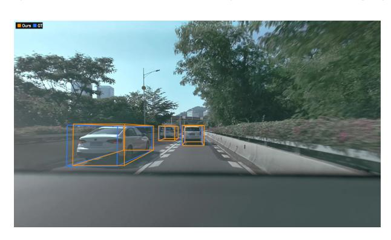

### **Qwen-Drive-1.0-SFT 응답.** (Response of Qwen-Drive-1.0-SFT)

[{"label": "자동차", "bbox_3d": [-3.52, 0.80, 8.56, 4.51, 1.81, 1.47, -0.17, -0.49, 0.67]}, {"label": "자동차", "bbox_3d": [-0.35, 1.01, 16.80, 4.22, 1.81, 1.67, -0.17, -0.49, 0.67]}, {"label": "자동차", "bbox_3d": [-3.45, 1.11, 22.00, 4.22, 1.80, 1.65, -0.17, -0.49, 0.67]}]

### B.2 교통 신호 감지 (Traffic-Signal Detection)

신호등이 있는 교차로에서는 감지 시스템이 개별 신호뿐 아니라 신호의 종류, 방향, 그리고 현재 교차로와의 관련성을 구분해야 한다. Qwen-Drive-1.0-SFT는 프레임 내에서 열두 개의 신호를 위치 지정하고 각 인스턴스에 대해 요청된 속성을 반환한다.

### **프롬프트.** (Prompt.)

자동차 주행 교차로 장면에 대한 시각적 주석 보조 도구이다. 주어진 이미지에서 교통 신호와 관련된 모든 객체를 감지하고 출력하며, 신호 유형(label), 방향(direction), 현재 교차로와의 관련성(is_related)에 초점을 둔다.

이미지에 있는 교통 신호와 관련된 모든 객체마다, 다음과 같은 항목을 포함하는 사전을 출력한다:

- bbox_2d: 정수 픽셀 좌표를 사용한 [x1, y1, x2, y2] 형식의 2D 바운딩 박스. 이미지의 좌상단은 (0,0)이며, x1 < x2, y1 < y2 를 만족한다. 보이는 신호 본체를 가장 단단히 둘러싸도록 박스를 만든다.
- label: 신호 유형, 다음 중 하나: "car" (모터 차량 또는 비모터 차량 신호), "pedestrian" (보행자 신호), "black" (검은색, 불빛이 꺼진 신호), "digit" (독립형 카운트다운 디스플레이), "led" (텍스트 LED 표지판), 그리고 "other" (다른 교통 신호 또는 신호 제어 장치).
- direction: 신호 방향, 다음 중 하나: "front" (자기 차량을 향함), "back" (자기 차량을 향하지 않음), 그리고 "side" (명확히 측면을 향함).
- is_related: 신호가 현재 교차로 결정과 관련이 있는지 여부, 다음 중 하나: "related" (현재 교차로를 통해 교통을 제어함), "unrelated" (먼 거리의 무관한 교차로, 반대 방향 교통, 또는 측면 도로를 위한 신호).

'json
[]
"'}

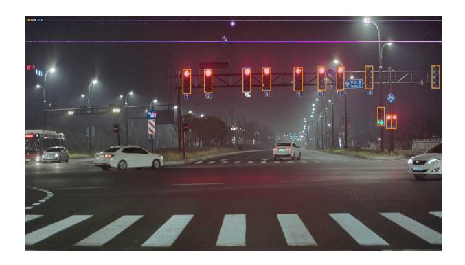

### **Qwen-Drive-1.0-SFT의 응답.** (Response of Qwen-Drive-1.0-SFT.)

[
{"bbox_2d":[378,227,397,329], "label":"자동차", "direction":"전면", "is_related":"관련"},
{"bbox_2d":[430,227,448,326], "label":"자동차", "direction":"전면", "is_related":"관련"},
{"bbox_2d":[522,223,541,323], "label":"자동차", "direction":"전면", "is_related":"관련"},
{"bbox_2d":[569,221,589,317], "label":"자동차", "direction":"전면", "is_related":"관련"},
{"bbox_2d":[645,217,665,317], "label":"자동차", "direction":"전면", "is_related":"관련"},
{"bbox_2d":[703,214,721,314], "label":"자동차", "direction":"전면", "is_related":"관련"},
{"bbox_2d":[748,214,765,314], "label":"자동차", "direction":"전면", "is_related":"관련"},
{"bbox_2d":[817,211,834,308], "label":"검정", "direction":"전면", "is_related":"관련"},
{"bbox_2d":[977,208,995,305], "label":"검정", "direction":"전면", "is_related":"관련"},
{"bbox_2d":[846,388,862,466], "label":"자동차", "direction":"전면", "is_related":"관련"},
{"bbox_2d":[867,420,879,479], "label":"자동차", "direction":"전면", "is_related":"관련"},
{"bbox_2d":[880,420,891,479], "label":"자동차", "direction":"전면", "is_related":"관련"}
]

### B.3 도로공사 탐지 (Roadwork Detection)

작업 구역은 객체 어휘를 임시 교통 통제 장치와 건설 관련 객체로 확장한다. 아래 장면에서 Qwen-Drive-1.0-SFT는 작업 차량, 튜브형 표시기, 콘을 포함해 13개의 사례를 식별한다.

### 프롬프트 (Prompt)

이미지에서 카테고리 집합에 속하는 모든 객체를 찾으십시오. 카테고리 집합에는 다음이 포함됩니다: Police Officer, Police Vehicle, Cone, Fence, Drum, Barricade, Barrier, Work Vehicle, Vertical Panel, Tubular Marker, Arrow Board, Bike Lane, Work Equipment, Worker, Other Roadwork Objects, Temporary Traffic Control Message Board, Temporary Traffic Control Sign, Stop sign. bbox 좌표를 JSON 형식으로 보고하십시오. 예시는 다음과 같습니다: [{"bbox_2d": [x1, y1, x2, y2], "label": "obj_name"}, ...].

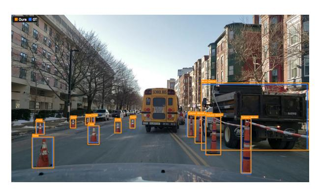

### **Qwen-Drive-1.0-SFT의 응답 (Response of Qwen-Drive-1.0-SFT.)**

[{"bbox_2d":[638,407,999,808], "label":"작업 차량 (Work Vehicle)"},
{"bbox_2d":[616,601,653,766], "label":"튜브형 마커 (Tubular Marker)"},
{"bbox_2d":[592,597,619,729], "label":"튜브형 마커"},
{"bbox_2d":[653,607,703,836], "label":"튜브형 마커"},
{"bbox_2d":[771,621,804,944], "label":"튜브형 마커"},
{"bbox_2d":[398,620,415,677], "label":"콘 (Cone)"},
{"bbox_2d":[347,636,369,706], "label":"콘"},
{"bbox_2d":[257,663,295,773], "label":"콘"},
{"bbox_2d":[268,609,280,647], "label":"콘"}]

{"bbox_2d":[249,611,262,657], "label":"원뿔"},
{"bbox_2d":[198,621,216,676], "label":"원뿔"},
{"bbox_2d":[83,640,111,714], "label":"원뿔"},
{"bbox_2d":[70,731,142,915], "label":"원뿔(Cone")}]

#### **B.4 도로 요소 인식 (B.4 Road Element Recognition)**

객체 위치 지정 외에도 Qwen-Drive-1.0-SFT는 도로 요소의 교통 규칙 의미를 해석합니다. 여기서 빨간 상자는 중국 고속도로의 단일 점선 노란 선을 강조 표시하며, 그 의미는 여섯 개 후보 답변 중 하나를 선택해야 합니다. Qwen-Drive-1.0-SFT는 올바른 해석을 선택하지만, 다른 여덟 가지 비교 방법은 모두 잘못된 답을 제시합니다.

### **프롬프트 (Prompt.)**

시각 자료는 중국에서 왔습니다. 빨간 상자 안의 단일 점선 노란 선의 의미는 무엇인가요? 아래 목록 중 하나를 선택하여 답변하십시오 ['주요 도로 차량이나 보행자에게 속도를 줄이고 양보해야 합니다', '직선 및 우회전', '비동력 차량 차선', '도로 양쪽에 위치하여 전용 차선을 나타냅니다', '우회전 차량', '서쪽 외곽 고속도로 북쪽으로 이어지는 도로']. 신중하고 단계별로 논리적 정확성과 견고성을 확보하며, 관련 오류 검사를 포함하십시오. 마지막으로 \boxed{} 안에 최종 답을 제공하십시오.

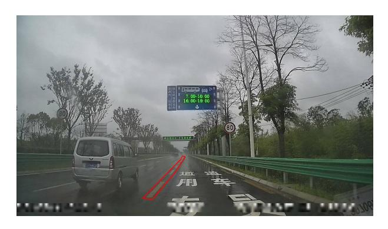

### **Qwen-Drive-1.0-SFT의 응답 (Response of Qwen-Drive-1.0-SFT.)**

단일 점선 노란 선의 의미를 결정하기 위해, 이미지에서 빨간 상자 안의 맥락과 시각적 단서를 분석해 보겠습니다.

- 1. 시각적 맥락. 이 이미지는 중국(표지판에 중국어 문자가 표시됨)에서 다중 차선 고속도로 또는 고속도로의 대시캠에서 촬영된 것입니다. 도로 표면에는 큰 흰색 중국어 문자가 그려져 있습니다: “专用车道”, 이는 “전용 차선”으로 번역됩니다. 빨간 박스는 단일 점선 노란색 선을 강조하며, 이는 일반적으로 서로 다른 교통 규칙이나 지정이 있는 차선을 구분하는 선입니다. 중국에서는 노란색 선이 버스 차선, 비상 차량 차선, 전용 차선 등 특수 목적 차선을 표시하는 데 자주 사용됩니다, 특히 다른 표지와 결합될 때 그렇습니다.  
- 2. 도로 표지 분석. “专用”은 “전용” 또는 “독점적”을 의미하고, “车道”는 “차선”을 의미하므로 “专用车道”는 “전용 차선”을 의미합니다. 노란색 선은 이 전용 차선을 인접한 일반 차선과 구분하는 역할을 할 가능성이 높습니다.  
- 3. 옵션 평가. “차량은 주요 도로 차량이나 보행자에게 속도를 줄이고 양보해야 한다”는 양보선 또는 정지선에 해당하며, 차선 분리선이 아니므로 부정적입니다. “직선 및 우회전”은 방향 화살표를 가리키며, 노란색 선과는 관련이 없으므로 부정적입니다. “비동력 차량 차선”은 부정적입니다. 비동력 차량은 일반적으로 자전거 차선이 파란색 또는 녹색 페인트와 자전거 기호로 표시되며, 고속도로에서 노란색 선이 비동력 차선에 사용되는 경우는 드뭅니다. “양쪽 도로에 위치하여 전용 차선을 표시한다”는 분석과 일치합니다. 노란색 선은 전용 차선을 지정하는 표지 시스템의 일부이며, 문구가 “양쪽에 있다”고 하지만 핵심은 “전용 차선을 표시한다”는 것이며, 이는 도로 표지 텍스트와 일치합니다. “우회전 차량”은 방향성에 관한 것이며 차선 지정과는 무관하므로 부정적입니다. “서쪽 외곽 고속도로 북쪽으로 이어지는 도로”는 지리적 설명으로 차선 표지와 무관하므로 부정적입니다.  
- 4. 결론. 주변 도로 표지(“专用车道”)와 함께 단일 점선 노란색 선의 목적을 올바르게 해석하는 유일한 옵션은 “양쪽 도로에 위치하여 전용 차선을 표시한다”입니다. “양쪽”이 약간 오해를 불러일으킬 수 있지만(우리는 한쪽만 보이지만), 핵심 의미인 전용 차선을 표시한다는 점이 정확하며 중국어 표지와 일치합니다.

최종 답변: \boxed{도로 양쪽에 위치하여 전용 차도를 표시하는 것}

#### **B.5 Reasoning-Based Motion Planning (이유 기반 모션 계획)**

마지막으로, 우리는 장면 해석에서 미래 동작 예측으로 전환한다. Qwen-Drive-1.0-SFT는 한 문장으로 된 근거와 함께 궤적을 예측하는 기능을 지원한다. 다중 시점 시계열 관측, 과거 자가 궤적, 그리고 활성 네비게이션 명령을 바탕으로 Qwen-Drive-1.0-SFT는 한 문장 근거와 함께 미래 웨이포인트를 텍스트로 직렬화하여 생성한다. 자가 차량은 신호가 있는 교차로를 따라 리드 차량을 추적하며, 예측된 궤적은 카메라 뷰와 BEV 시각화 모두에서 실제 궤적과 밀접하게 일치한다.

### **Input. (입력)**

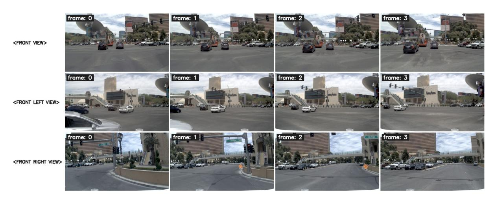

### **프롬프트 (Prompt).**

입력 이미지는 카메라 뷰별로 정리된다. 각 뷰에는 0.5초 간격으로 캡처된 4개의 시간 프레임이 포함된다 (프레임 0은 t-1.5초, 프레임 3은 현재 프레임 t=0초).

- 1. 현재 프레임의 자율 좌표계에서의 과거 궤적 (x, y, 헤딩). 양의 x축은 전방을 가리키고, 양의 y축은 좌측을 가리킨다. 양의 헤딩은 좌회전을 의미한다:
- -t-1.5s: (-15.6548, 0.0502, 0.0069)
- -t-1.0s: (-10.3809, 0.0326, 0.0042)
- -t-0.5s: (-5.1587, 0.0116, 0.0023)
- -t-0s: (0.0000, 0.0000, 0.0000)
- 2. 활성화된 항법 명령: [GO STRAIGHT]

먼저 에고의 향후 주행 결정을 한 문장으로 간단히 설명하고, 그에 해당하는 가능한 궤적(2Hz, 4초, 8점, 각 점은 (x, y, heading)이며 소수점 둘째 자리까지) 를 예측하라. JSON 형식으로 다음과 같이 보고한다: [{"reasoning": "<한 문장으로 간결한 설명>"}, {"trajectory": "[PT, (x, y, heading), ...]"}].

### **Qwen-Drive-1.0-SFT의 응답 (Response of Qwen-Drive-1.0-SFT.)**

[{"reasoning": "초록 신호등이 켜진 교차로에서 리드 차량을 따라가라."}]

{"trajectory": "[PT, (5.09, -0.01, 0.00), (10.12, -0.02, 0.00), (15.10, -0.03, 0.00), (20.03, -0.04, 0.00), (24.91, -0.04, 0.00), (29.74, -0.03, 0.00), (34.52, -0.02, 0.00), (39.24, -0.01, 0.00)]"}

<span id="page-36-0"></span>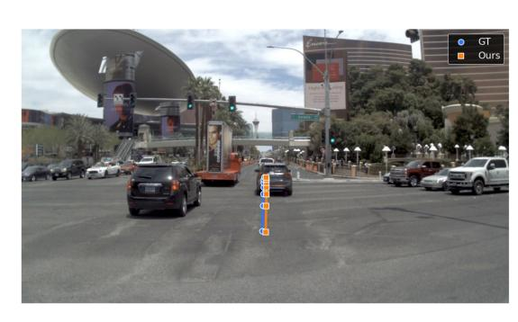

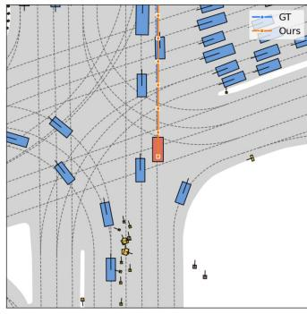

# **C 상세 운전 VQA 사례 (C Detailed Driving VQA Cases)**

본 부록은 Fig. [8.](#page-15-0)에 요약된 네 가지 사례에 대한 완전한 프롬프트, 정답, 그리고 모델 응답을 보고한다. 모든 모델은 동일한 순서로 동일한 이미지를 받는다. 원시 출력에 두 가지 편집이 적용된다: 마크다운 강조는 텍스트로 표시되고, 긴 사고 체인은 [. . . ]로 표시된 위치에서 축약된다. 생략된 구간은 주변 추론을 재진술하지만 증거를 추가하지 않는다.

### **C.1 (a) 시간적 이해 및 에이전트 상태 추정 (Temporal Understanding and Agent-State Estimation) (LingoQA)**

당신이 보는 것은 비디오 시퀀스의 프레임이다. 답변은 각 프레임의 결과를 분석하기보다 최종 동적 결과에 초점을 맞춰야 한다. 몇 대의 주차된 차량을 볼 수 있나요?

**정답.** *Zero.* 벤치마크는 *None.* 도 허용한다.

### **응답. (Responses.)**

### ✓ **Qwen-Drive-1.0-SFT**

도로 양쪽에 주차된 차량이 없다.

### ✗ **Qwen3.5-4B**

제공된 비디오 프레임에서 다음과 같은 주차된 차량을 볼 수 있다:

- 빨간 버스가 도로 왼쪽에 주차되어 있다.
- 흰색 트럭이 도로 오른쪽에 주차되어 있다.

따라서 비디오 시퀀스에는 **2대의 주차된 차량**이 보인다.

### ✗ **MiMo-Embodied-7B**

<think>

그래서 프레임을 살펴보자. 프레임 5에는 오른쪽에 주차된 차량이 있다. 세어보면: 흰색 밴, 차, 그리고 다른 차량이 있을 수도 있다? 아니, 확인해 보자. [. . . the trace repeats this self-correction for roughly four thousand characters . . . ] 정답은 세 개이다. </think>

주차된 차량 수를 결정하기 위해 프레임을 분석한다. 최종 프레임(프레임 5)에서는 도로 오른쪽에 주차된 차량이 보인다. 이를 세면 흰색 밴, 차, 그리고 다른 차량 등 총 세 대의 주차 차량을 확인할 수 있다.

따라서 주차된 차량 수는 3대이다.

### **C.2 (b) 인과적 추론을 위한 계획 (Causal Reasoning for Planning) (PAI-AV-CoC)**

입력 이미지들은 카메라 뷰별로 정리된다. 각 뷰에는 0.5초 간격으로 캡처된 4개의 시간 프레임이 포함된다 (프레임 0: t-1.5초, 프레임 1: t-1.0초, 프레임 2: t-0.5초, 프레임 3: 현재 프레임 t=0초).

1. 현재 프레임의 자율주행 차량 좌표계에서의 과거 궤적. 양수 x는 앞쪽을 가리키고, 양수 y는 왼쪽을 가리키며, 양수 heading은 좌회전을 나타낸다:

-t-1.5초: (-13.9670, -0.4070, 0.0427); -t-1.0초: (-8.9300, -0.1980, 0.0370); -t-0.5초: (-4.2570, -0.0560, 0.0219); -t-0초: (0.0000, 0.0000, 0.0000);

자율주행 차량의 향후 주행 결정을 한 문장으로 간단히 설명하라.

**실제값.** *선행 차량 뒤에 정지 신호가 있는 교차로에서 정지한다.*

#### **응답 (Responses).**

### ✓ **Qwen-Drive-1.0-SFT**

정지 신호가 있는 교차로에서 정지한다.

### ✗ **Cosmos-Reason2-32B**

자율주행 차량은 직진하며 도로 오른쪽에 있는 공사 장벽을 우회하면서 차선 위치를 유지한다.

### ✗ **Alpamayo-1.5-10B**

자율주행 차량은 일정 속도로 직진하고 있다.

### **C.3 (c) 교차-뷰 공간 거리 인식 (Cross-View Spatial Distance Perception) (Ego3D-Bench)**

이것은 자율주행 차량에 장착된 일곱 개의 카메라 뷰이다. Front Left view: <image>; Front view: <image>; Front Right view: <image>; Right view: <image>; Back Right view: <image>; Back Left view: <image>; Left view: <image>.

뒤쪽 오른쪽 시점에서 도로변에 주차된 검은색 세단이, 앞쪽 시점에서 도로변에 주차된 베이지색 세단으로부터 몇 미터 떨어져 있다?

생각 과정을 출력하고 최종 답을 (숫자만) \boxed{} 태그 안에 넣으세요.

**실제값.** 22.93 m.

### **응답.**

### ✓ **Qwen-Drive-1.0-SFT**

두 차량 간 거리를 결정하려면 제공된 뷰에서 그들의 위치를 분석해야 한다.

## 1. **앞쪽 뷰에서 베이지색 세단을 식별하기:**

– <FRONT VIEW>에서, 도로 오른쪽에 베이지색 세단이 주차되어 있다. 이 세단은 흰색 SUV 뒤에, 은색 세단 앞에 위치해 있다(부분적으로 보임). 베이지색 세단은 뒷면이 카메라를 향해 명확히 보인다.

## 2. **뒤쪽 오른쪽 뷰에서 검은색 세단을 식별하기:**

– <BACK RIGHT VIEW>에서, 도로 왼쪽에 어두운 회색 또는 검은색 Mercedes-Benz 세단이 주차되어 있다(뒤쪽 오른쪽 뷰 관점에서). 이 차량...

## 3. **거리 추정:**

- 두 차량은 반대편에 있다...

## 4. **전체 거리 계산:**

- 가로 거리(도로 폭)와 세로 거리(도로를 따라의 거리)를 결합하면 총 거리는 약 20-25미터이다.

추정에 따르면 거리는 약 20-25미터이다.

\boxed{22}

### ✗ **Cosmos-Reason2-32B**

알겠습니다. 뒤쪽 오른쪽 뷰에서 보이는 어두운 색상의 세단과 앞쪽 뷰에서 보이는 베이지색 세단 사이의 거리를 알아보려 합니다.

[. . . ] 두 차량 모두 같은 도로에 있지만 앞쪽과 뒤쪽이라는 다른 부분에 있으므로 같은 도로를 따라 있지만 어느 정도 거리가 있을 수 있다. 그러나 문제에서는 명시적인 측정값을 제공하지 않는다. [. . . ]

하지만 확신이 없다. 답은 10미터일 수도 있다. 또는 답은 차량이 도로의 다른 부분에 주차되어 있으므로 거리가 10미터보다 많을 수 있다.

또는 답은 차량이 같은 도로 측면에 주차되어 있으나 약 15미터 정도 떨어져 있다는 것일 수 있다.

그 점을 감안하면, 추정 거리는 15미터로 정한다.

</think>

\boxed{15}

# ✗ **UniDriveVLA-8B**

뒤쪽 오른쪽 뷰에서 도로 측면에 주차된 어두운 색상의 세단은 앞쪽 뷰에서 도로 측면에 주차된 베이지색 세단으로부터 약 15미터 떨어져 있다. 이 추정은 이미지에서 차량들의 상대적 위치를 기반으로 하며, 어두운 세단이 뒤쪽 오른쪽 뷰에서 도로를 따라 더 멀리 보이므로 앞쪽 뷰의 베이지 세단과 상당한 거리가 있음을 나타낸다. 이미지의 시각적 증거는 원래 GPT 답변을 지지하며 거리가 약 15미터임을 확인한다.

#### **C.4 (d) Traffic-Road Recognition (VLADBench)**

다음 5 프레임은 중국에서 시간순으로 나열된 것입니다. 시각 데이터는 중국에서 가져온 것입니다. 주어진 자율 주행 이미지 시퀀스에서 마지막 이미지 순간에 이그오 차선은 무엇인가? 다음 옵션 중 가장 적절한 답을 선택하십시오: ['직선 차선', '좌회전 차선', '우회전 차선', '직선 및 좌회전 차선', '직선 및 우회전 차선', 'U턴 차선', '좌 U턴 차선']. 신중하고 단계별로 추론하여 논리적 정확성과 견고성을 확보하고, 관련 오류 검사를 포함하십시오. 마지막으로 \boxed{} 안에 최종 답을 제공하십시오.

**Ground truth.** *좌회전 차선*

### **Responses.**

### ✓ **Qwen-Drive-1.0-SFT**

최종 이미지(프레임 5)에서 이그오 차선을 결정하려면, 시퀀스에서 보이는 도로 표시를 분석해야 하며, 특히 앞쪽 프레임에서 더 명확한 표시를 확인해야 합니다.

- 1. **도로 표시 관찰**: 프레임 1과 프레임 2에서 도로 표면에 명확한 방향 화살표가 그려져 있습니다.
- 이그오 차량이 현재 있는 차선에는 **좌회전**을 나타내는 큰 화살표가 있습니다.
- 이그오 차량 오른쪽 차선(검은 SUV와 버스가 있는 곳)에는 **우회전**을 나타내는 화살표가 있습니다.
- 2. **차량 위치 추적**: 프레임 1~5 전 과정에서 이그오 차량은 같은 차선(좌회전 화살표가 있는 차선)을 유지합니다. 차선 변경이 없습니다.
- 3. **신호등 상황**: 앞쪽 신호등이 빨간색이므로 모든 차량이 정지하거나 감속합니다. 이는 이그오 차량이 지정된 회전 차선에서 교차로를 대기하고 있음을 확인시켜 줍니다.
- 4. **다른 옵션 제외**:
- "직선 차선"은 잘못된 선택이며, 화살표가 회전을 나타내기 때문입니다.
- "우회전 차선"은 인접 차선입니다.
- "직선 및 좌/우회전 차선"은 그런 결합 표시가 보이지 않으며, 각 차선은 단일 방향 화살표를 가집니다.
- "U턴 차선"은 화살표 모양이 표시되지 않았습니다(표준 좌회전 화살표이며 U턴 기호가 아님).

따라서, 프레임 1과 2에서 특히 명확한 이그오 차량 차선에 지속적으로 나타난 좌회전 화살표를 바탕으로, 이그오 차선은 **좌회전 차선**입니다.

\boxed{좌회전 차선}

### ✗ **UniDriveVLA-8B**

이그오 차선은 직선 차선입니다. 차량이 차선에서 회전이나 차선 변경 없이 일관된 위치를 유지하는 이미지 시퀀스에서 이는 명확합니다. 차선 표시와 주변 교통 흐름도 이 결론을 지지하며, 최종 이미지에서 회전이나 차선 변경의 징후가 없습니다. 따라서 가장 적절한 답은 '직선 차선'입니다.

\boxed{직선 차선}

### ✗ **Alpamayo-1.5-10B**

가장 적절한 답은 <c1,CAM_FRONT,970.0,511.7>입니다.

