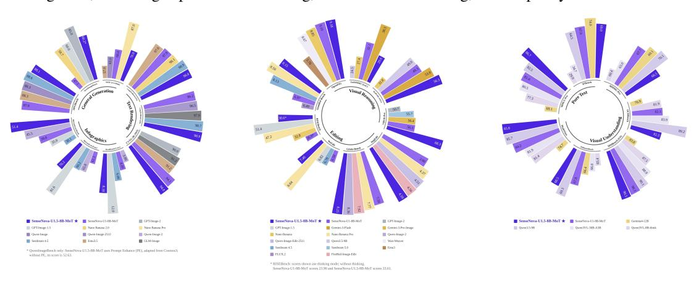
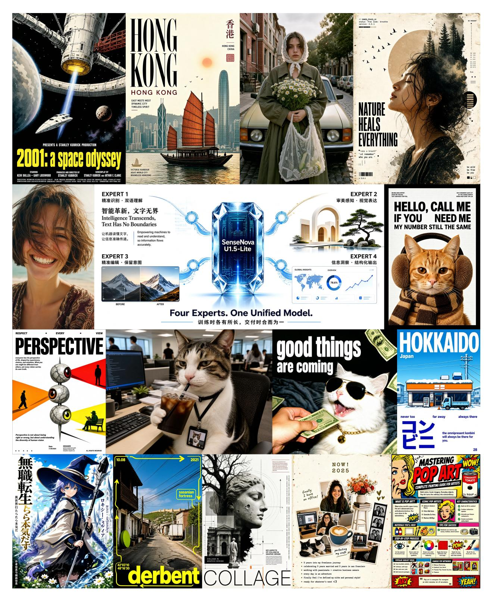
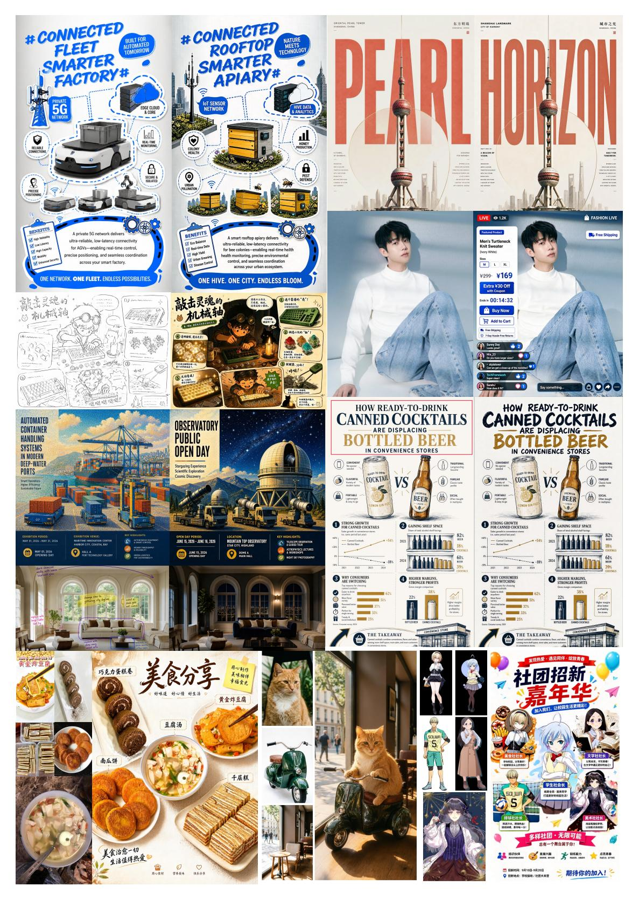
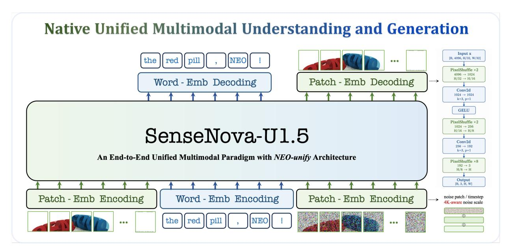
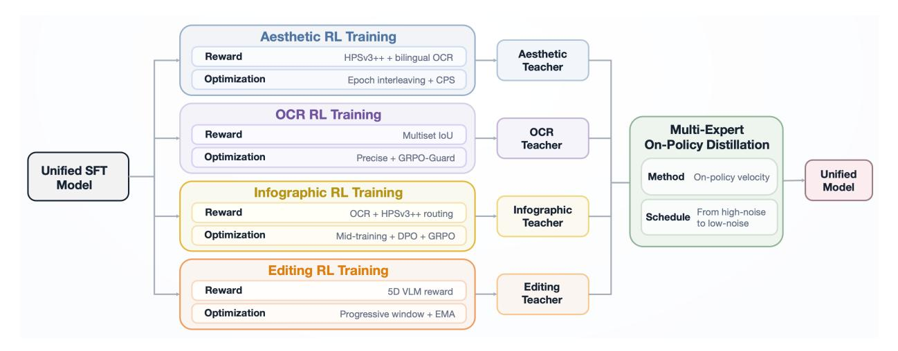
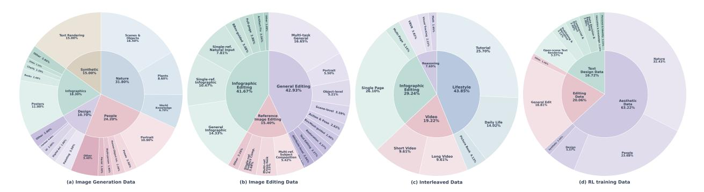

# SenseNova-U1.5: Towards Native Unified Visual Intelligence

- 원제: SenseNova-U1.5: Towards Native Unified Visual Intelligence
- 원문: [https://arxiv.org/abs/2609.11929](https://arxiv.org/abs/2609.11929)
- PDF: [https://arxiv.org/pdf/2609.11929](https://arxiv.org/pdf/2609.11929)
- arXiv ID: `2609.11929`

---


# SenseNova-U1.5: 네이티브 통합 시각 인텔리전스 (SenseNova-U1.5: Towards Native Unified Visual Intelligence)

## 초록 (Abstract)

우리는 SenseNova-U1.5, 8B-MoT 네이티브 통합 멀티모달 모델을 출시한다. 이 모델은 encoder-free 및 VAE-free 아키텍처 내에서 시각적 콘텐츠를 이해하고, 추론하며, 생성한다. 우리는 공간적으로 일관된 패치 재구성을 통해 시각 인터페이스를 강화하고, 세심하게 선별된 생성 및 편집 데이터, 개선된 과제 공식화, 구조적 프롬프트 강화, 최대 4K의 네이티브 해상도를 활용해 훈련을 확장한다. 사후 훈련 단계에서는 시각적 미학, 이중 언어 텍스트 렌더링, 인포그래픽 생성, 이미지 편집을 위한 전문 전문가를 최적화하고, 다중 전문가 온-정책 증류를 통해 그들의 역량을 통합한다. 광범위한 평가를 통해 SenseNova-U1.5는 이미지 충실도, 텍스트 렌더링, 복잡한 구성, 다중 참조 편집, 교차 생성에서 크게 향상되었으며, 지침 따르기와 주제 정체성, 기하학, 그리고 수정되지 않은 영역을 보존한다. 생성 데이터에서 구조화된 형식에 대한 노출이 제한적임에도 불구하고 SenseNova-U1.5는 길고 복잡하며 구조화된 시각적 지침에 효과적으로 일반화되며, 멀티모달 이해가 시각적 계획 및 창작으로 이전될 수 있음을 추가로 입증한다. 이 결과들은 네이티브 통합 모델링이 완전한 엔드-투-엔드 프레임워크 내에서 인지, 추론, 창작을 수행하는 시스템으로 가는 유망한 경로임을 제시한다. 우리는 감독 기반 파인튜닝, 강화 학습, 온-정책 증류를 포함한 훈련 코드를 오픈소스로 공개할 예정이다.



공식 데모: <https://unify.light-ai.top/>

GitHub 코드: <https://github.com/OpenSenseNova/SenseNova-U1>

HuggingFace 모델: <https://huggingface.co/collections/sensenova/sensenova-u15> NEO-unify 블로그: <https://huggingface.co/blog/sensenova/neo-unify> (2026년 3월 5일)



그림 1은 SenseNova-U1.5의 인포그래픽 및 인간 생성 시연을 보여준다.



그림 2는 SenseNova-U1.5의 이미지 편집 및 다중 참조 생성 시연을 보여준다.

#### 목차 (Contents)

| 1 | 서론<br>5 |
|---|--------------------------------------------------------------------------------------------------------------------------------------------------------------------------------------------|
| 2 | 관련 연구<br>5<br>2.1<br>네이티브 멀티모달 통합 모델<br>5<br>2.2<br>확산 모델을 위한 강화 학습<br>6<br>2.3<br>통합 모델을 위한 온-폴리시 디스틸레이션<br><br>6 |
| 3 | 방법론<br>6<br>3.1<br>모델 아키텍처<br><br>6<br>3.2<br>훈련 절차<br><br>9<br>3.3<br>보상 모델링<br>12 |
| 4 | 데이터 구축<br>13<br>4.1<br>이미지 생성 데이터<br><br>13<br>4.2<br>이미지 편집 데이터<br><br>13<br>4.3<br>인터리브 데이터<br>14<br>4.4<br>RL 훈련 데이터<br><br>14 |
| 5 | 실험<br>15<br><br>5.1<br>일반 이해<br><br>15<br>5.2<br>이미지 생성<br>16<br>5.3<br>이미지 편집<br>22<br>5.4<br>인터리브 생성<br><br>25 |
| 6 | 결론<br>26 |
| 7 | 기여자<br><br>26 |

## <span id="page-4-0"></span>1 소개 (Introduction)

최근 몇 년간, 시각적 생성은 기존의 이미지 합성을 넘어 다국어 타이포그래피, 정보밀도 높은 디자인, 고해상도 렌더링, 다중 참조 구성을 포함한 세밀한 객체-배경 편집, 그리고 교차 생성(interleaved generation) 등 다양한 시각적 창작을 위한 일반 매체로 급속히 진화하고 있다. 그러나 이러한 광범위한 범위는 근본적인 아키텍처적 분리를 드러낸다: 대부분의 시스템은 사전 학습된 비전 인코더(VE)를 통해 이미지를 인식하지만, 변분 오토인코더(VAE)를 통해 이미지를 생성한다. 결과적으로 이해와 생성은 서로 다른 표현 공간에서 운영된다: 하나는 의미적 추상화를 최적화하고, 다른 하나는 픽셀 수준의 충실도를 최적화한다. 효과적이지만, 이 분리는 인식, 추론, 생성이 다양한 시각적 창작 형태에 걸쳐 통합된 시각적 프레임워크 내에서 얼마나 원활하게 조정될 수 있는지를 제한한다.

Native unified modelling은 픽셀과 단어를 직접 학습함으로써 다른 경로를 택한다. SenseNova-U1[29](#page-27-0)은 인코더와 VAE가 없는 NEO-unify[101](#page-31-3) 아키텍처를 통해 이 패러다임의 실현 가능성을 입증했으며, 인식, 추론, 픽셀 공간 생성을 하나의 엔드‑투‑엔드 모델에 통합했다. 의도적으로 가벼운 시각 인터페이스를 사용하지만, 각 시각 토큰을 독립적인 RGB 패치로 재구성한다. 효율적이긴 하지만 이 분해는 이미지 형성의 마지막 단계에서 인접 패치 간 정보 교환을 방해하여 고해상도에서 가장자리, 질감 불연속성, 기하학적 불일치가 점점 더 두드러지게 만든다.

여기서 우리는 시각 이해, 추론 및 생성을 위한 8B-MoT native unified multimodal 모델인 SenseNova-U1.5를 제시한다. 핵심은 첫 번째 주요 아키텍처 전환이다: *독립 패치 예측*에서 *공간적으로 공동 재구성*으로의 전환. 각 시각 토큰을 고립된 픽셀에 매핑하는 대신, 토큰을 2차원 특징 필드에 투영하고 공간적 컨볼루션과 Pixel Shuffle 업샘플링을 통해 이미지를 점진적으로 재구성한다. 이 방식은 픽셀이 최종화되기 전에 인접 영역이 정보를 교환할 수 있게 하여 색상, 질감, 기하학을 패치 단위가 아니라 공동으로 해결할 수 있게 한다. 결과적으로 설계는 압축된 시각 시퀀스의 효율성을 유지하면서 공간적 일관성을 크게 향상시키고 최대 4K 해상도에서 native 생성을 가능하게 한다.

두 번째 주요 진전은 *공동 보상 최적화*에서 *전문화‑후 통합 전략*으로의 전환이다. 시각 창작은 미학적 합성, 이중 언어 텍스트 렌더링, 인포그래픽 디자인, 이미지 편집 등 근본적으로 다른 역량을 포함하며, 각각은 고유한 보상 신호, 롤아웃 역학, 최적화 과제를 갖는다. 단일 정책 내에서 이를 공동 최적화하면 경쟁 목표가 얽히고 작업별 이득이 희석될 수 있다. 따라서 우리는 먼저 전문화하고 그 다음에 통합한다: 전용 강화학습(RL) 전문가들은 맞춤형 데이터, 보상, 샘플링 전략, 정규화를 통해 각 역량을 최적화하고, 그들의 상호 보완적 강점을 다중 전문가 on‑policy distillation을 통해 통합한다. 학생 모델의 자체 생성 경로를 따라 distillation을 수행함으로써 이 과정은 전문가의 역량을 단일 통합 정책에 전이시키면서 상호 보완적 강점을 보존한다.

우리는 광범위한 평가를 통해 SenseNova-U1.5가 단일 네이티브 시각 표현이 이해, 추론, 생성 및 편집을 위한 공유 기반으로 활용될 수 있음을 추가로 입증한다. 이는 병렬 시각 경로와 인코더 특징과 VAE 잠재 변수 간의 반복적인 변환을 모두 제거한다. 각 32×32 픽셀 영역을 하나의 시각 토큰으로 압축함에도 불구하고, 이 간결한 표현은 효율적인 추론을 지원하면서 이미지 충실도, 이중 언어 타이포그래피, 복잡한 구도, 다중 참조 편집, 교차 생성, 지시 따르기, 시각 보존 및 세밀한 제어 등에서 강력한 성능을 제공한다. 더욱 놀라운 것은 SenseNova-U1.5가 제한된 고정 생성 템플릿에 의존하지 않으면서도 긴, 구성적이며 고도로 구조화된 시각 지시를 일반화한다는 점이다. 이는 멀티모달 이해 및 추론을 통해 획득한 구조적 지식과 계획 능력이 자연스럽게 시각 창작에 전이될 수 있음을 시사한다. 이와 같은 결과는 네이티브 통합이 단순한 아키텍처 단순화 이상의 의미를 갖는다는 것을 보여준다: 간결한 공유 시각 표현은 시각을 보고 생성하는 두 기능을 효율적으로 지원하며, 한 형태의 시각 지능을 통해 학습된 능력이 다른 형태를 강화하도록 한다.

## 2 관련 연구 (Related Works)

### 2.1 네이티브 멀티모달 통합 모델 (Native Multimodal Unified Models)

네이티브 시각-언어 모델(VLMs), 예를 들어 Fuyu-8B [&#91;3&#93;](#page-26-0), EVE [&#91;25,](#page-27-1) [&#91;27&#93;](#page-27-2), Mono-InternVL [&#91;83,](#page-30-0) [&#91;84&#93;](#page-30-1), NEO [&#91;26,](#page-27-3) [&#91;28&#93;](#page-27-4), Gemma4-12B [&#91;113&#93;](#page-31-4), 그리고 Inkling [&#91;117&#93;](#page-31-5), 외부 인코더 없이 시각 입력을 직접 처리하며 선도적인 모듈형 VLMs와의 성능 격차를 점진적으로 좁혀 왔다 [&#91;44,](#page-28-1) [&#91;95,](#page-30-2) [&#91;104,](#page-31-6) [&#91;126&#93;](#page-32-1). 시각 생성 분야에서도 병렬적인 추세가 나타나고 있다. 최근 연구들은 픽셀을 직접 모델링한다 [&#91;18,](#page-26-1) [&#91;19,](#page-26-2) [&#91;65,](#page-29-1) [&#91;148&#93;](#page-33-2), 고충실도 합성이 무거운 압축 잠재 공간에 의존할 필요가 없음을 보여준다 [&#91;55,](#page-28-0) [&#91;120&#93;](#page-32-2). 이러한 발전을 바탕으로 네이티브 통합 멀티모달 모델

점점 더 이해와 생성을 단일 프레임워크 내에서 결합하려 한다. 그 중에서도 이산형 네이티브 모델 [&#91;21,](#page-27-5) [&#91;60,](#page-29-2) [&#91;68,](#page-29-3) [&#91;71,](#page-29-4) [&#91;111,](#page-31-7) [&#91;115,](#page-31-8) [&#91;127&#93;](#page-32-3)은 토큰 수준 자가회귀를 통해 멀티모달 학습을 통합하고, 연속형 네이티브 접근법 [&#91;10,](#page-26-3) [&#91;29,](#page-27-0) [&#91;80,](#page-30-3) [&#91;101&#93;](#page-31-3)은 명시적 토크나이저나 잠재 병목 없이 엔드‑투‑엔드 모델링을 추구한다. NEO‑unify [&#91;101&#93;](#page-31-3)을 기반으로, 우리의 SenseNova‑U 시리즈는 이 방향을 완전 네이티브 기반으로 확장하여 이해, 추론, 생성이 공유 시각 기반에서 발생하도록 한다.

### 2.2 강화 학습 기반 확산 모델 (Reinforcement Learning for Diffusion Models)

언어 모델링에서 인간 피드백을 통한 강화 학습(RLHF)은 학습된 보상이 정책 최적화를 안내하고, PPO가 참조 정책에 대한 업데이트를 안정화하는 일반적인 사후 훈련 패러다임을 확립했다 [&#91;93,](#page-30-4) [98&#93;](#page-31-9). 특히, GRPO와 DAPO는 명시적 가치 모델을 제거하고 그룹 상대 이점을 도입하며 향상된 온라인 최적화 전략을 통해 효율성과 확장성을 개선한다 [&#91;102,](#page-31-10) [147&#93;](#page-33-3). 온라인 RL은 또한 시각 생성에 확장되었으며, ReFL, DDPO, DPOK는 선호 보상 또는 정책 기울기를 통해 확산 모델을 최적화한다 [&#91;5,](#page-26-4) [35,](#page-27-6) [140&#93;](#page-33-4), AlignProp와 D3PO는 효율성을 개선하고 명시적 보상 모델에 대한 의존도를 줄인다 [&#91;94,](#page-30-5) [144&#93;](#page-33-5). 최근에는 Flow-GRPO와 DanceGRPO가 그룹 상대 최적화를 확산 및 흐름 매칭 모델에 확장하여 선호 정렬, 구성적 정확성, 텍스트 렌더링 및 시각 품질을 향상시킨다 [&#91;74,](#page-29-5) [142&#93;](#page-33-6).

플로우 매칭 모델에서는 온라인 RL이 결정론적 일반 미분 방정식(ODE) 추론을 넘어선 확률적 탐색을 필요로 한다. Flow-GRPO [&#91;73&#93;](#page-29-6)는 확률적 미분 방정식(SDE) 기반 롤아웃을 통해 이러한 탐색을 가능하게 하며, 계수 보존 샘플링(CPS) [&#91;121&#93;](#page-32-4)과 Precise [&#91;163&#93;](#page-34-0)는 기본 플로우 역학을 보다 잘 보존하고 탐색과 분포적 충실성을 균형 있게 하여 유한 단계 샘플링을 개선한다. 샘플링을 넘어, GRPO-Guard [&#91;124&#93;](#page-32-5)는 규제된 클리핑과 노이즈 인식 그라디언트 재가중치를 통해 보상 과최적화를 완화한다. 기존의 시각적 RL은 시각적 품질과 텍스트–이미지 정렬을 위한 선호 모델을 포함한 기능별 보상에 의존하며 [&#91;76,](#page-29-7) [86,](#page-30-6) [133,](#page-32-6) [140&#93;](#page-33-4) , 타이포그래피와 편집을 위한 특수 보상도 포함한다 [&#91;47,](#page-28-2) [52&#93;](#page-28-3). 이러한 발전을 동기로, 우리는 CPS 또는 Precise 샘플링과 교차 또는 작업별 보상을 결합한 작업 의존 RL 사후 훈련을 채택하여 생성과 편집의 서로 다른 최적화 요구를 해결한다.

### <span id="page-5-1"></span>2.3 통합 모델을 위한 온-정책 증류

최근, 온-폴리시 디스틸레이션(OPD) [&#91;1,](#page-26-5) [81&#93;](#page-30-7)은 전통적인 지식 디스틸레이션의 분포 불일치를 완화한다. 이는 학생이 자체 생성한 트래젝터리를 학습하면서 교사로부터 밀집된 감독을 받는 방식이다. 이 패러다임을 바탕으로 MOPD [&#91;85&#93;](#page-30-8)은 OPD를 다중 교사 통합으로 확장한다. 독립적으로 최적화된 도메인 전문가들이 학생의 온-폴리시 롤아웃을 감독하여 다양한 추론 능력을 단일 모델에 통합한다. 언어 모델링을 넘어 OPD는 멀티모달 이해 및 추론 [&#91;6,](#page-26-6) [149&#93;](#page-33-7)에서도 탐구되었으며, 여기서 교사들은 학생이 생성한 멀티모달 트래젝터리를 감독한다. 또한, 시각 생성 분야에도 최근 적용이 확대되었다. 구체적으로 Flow-OPD, DiffusionOPD, DanceOPD는 각각 교사 일관성 신호, 전이 매칭, 속도-필드 회귀를 통해 학생이 생성한 디노이징 트래젝터리를 따라 작업 특화 생성기를 디스틸한다 [&#91;36,](#page-27-7) [64,](#page-29-8) [162&#93;](#page-34-1). 또한 DiffusionOPSD는 외부 교사를 제거하고 미분 가능한 보상 기울기에서 유한한 자기 디스틸레이션 목표를 구성한다 [&#91;161&#93;](#page-34-2). 우리의 설정은 보완적이다: 모든 작업을 공유 디스틸레이션 레시피에 강제하기보다, 우리는 네 개의 작업 특화 외부 전문가를 유지하고 그들의 감독을 단일 네이티브 픽셀-스페이스 모델에 하드 라우팅한다. 이 설계는 각 전문가의 작업 의존적 조건화, 가이드, 해상도 정책을 보존하면서 그들의 특화된 능력을 통합된 모델에 통합한다.

## <span id="page-5-2"></span>3 Methodology (방법론)

### <span id="page-5-3"></span>3.1 Model architecture (모델 구조)

Near-Lossless Visual Interface. SenseNova-U1.5는 NEO [&#91;26&#93;](#page-27-3)에서 도입된 경량 네이티브 시각 인터페이스를 유지하며, 외부 시각 인코더나 VAE에 의존하지 않고 원시 이미지나 노이즈가 섞인 시각 입력을 압축 토큰 시퀀스로 직접 변환한다. 구체적으로, GELU 활성화를 갖는 두 개의 컨볼루션 프로젝션이 입력을 각각 16배와 2배로 다운샘플링하여 32×32 이미지 영역마다 하나의 시각 토큰을 생성한다. 2차원 사인파 위치 임베딩은 공간 좌표를 보존하고, 특수  및 </img> 토큰은 개별 시각 블록을 구분한다. 텍스트는 원래 언어 토크나이저로 토큰화되며, 이후 시각 및 텍스트 표현이 공유된 은닉 공간으로 투영되어 통합 백본에서 공동으로 처리된다. 이 설계는 근사 손실이 거의 없는 시각 정보를 보존하면서 대규모 멀티모달 모델링에 적합한 시퀀스 길이를 유지한다.

<span id="page-6-0"></span>

Figure 3 SenseNova-U1.5 개요. SenseNova-U1과 비교해 U1.5는 인코딩과 디코딩 모두에서 근사 손실이 거의 없는 시각 인터페이스를 더욱 정제한다. 해상도 인식 노이즈 조건화가 $4096 \times 4096$ 범위로 확장되고, 원래 패치별 MLP 헤드가 Pixel Shuffle과 $3 \times 3$ 컨볼루션을 갖는 경량 공간 디코더로 대체된다. 이러한 개선은 $32 \times 32$ 시각 토큰화를 유지하면서 공간 연속성, 고해상도 충실도, 다운스트림 견고성을 향상시킨다.

| 구성 | 패치 크기 | 프리 버퍼 | # 레이어 (Layers) | # 헤드 (Q/KV) | 헤드 크기 (T/H/W) | 히든 사이즈 | # 파라미터 (Und/Gen) |
|----------------|----------------|------------|----------|----------------|-------------------|-------------|------------------------|
| SenseNova-U1.5 | $32 \times 32$ | ✓ | 42 | 32/8 | 64 / 32 / 32 | 4,096 | 8.2B / 8.2B |

**Table 1 Configurations of SenseNova-U1.5.** 고해상도 공간 압축 비율, Pre-Buffer 설계, 통합 시공간 인코딩을 위한 native RoPE, 그리고 다중 모달 이해와 생성을 위한 Mixture-of-Transformers 아키텍처를 특징으로 한다.

생성 과정에서 유효 노이즈 크기는 이미지 해상도에 따라 달라지므로, 해상도는 디노이징 과정에 중요한 조건화 신호가 된다. 따라서 SenseNova-U1.5는 해상도에 따라 달라지는 노이즈 스케일 임베딩을 명시적으로 도입한다. SenseNova-U1의 정규화 범위가 $2048 \times 2048$까지 캘리브레이션된 것과 달리, 우리는 참조 해상도를 $4096 \times 4096$으로 확장하여 Figure 3에서 native 고해상도 합성을 보다 잘 지원한다. $\\sigma_R(H,W)$ 를 해상도 (H,W)와 연관된 노이즈 스케일로 둔다. 이를 $\\bar{\\sigma}_R = \\sigma_R(H,W)/\\sigma_{\\rm max}$ 로 정규화한다. 여기서 $\\sigma_{\\rm max}$ 는 $4096 \\times 4096$ 참조 해상도에 해당하며, 전용 사인형 MLP인 NSEmb(·)를 사용해 인코딩한다. 결과 임베딩은 디퓨전 타임스텝 표현과 결합된다: $\\mathbf{s}_t = \\tau_t + \\mathrm{NSEmb}(\\bar{\\sigma}_R)$, 이를 통해 디노이저는 디퓨전 시간과 해상도에 따른 노이즈 통계 모두를 명시적으로 인식한다. 이러한 조건화는 모델이 다양한 이미지 해상도와 종횡비의 변동에 보다 일관되게 적응하도록 돕는다.

Compact patchification은 이미지 모델링 비용을 크게 줄이지만, 각 $32 \\times 32$ 토큰을 MLP로 독립적으로 디코딩하면 출력에 바람직하지 않은 패치별 분해가 발생한다. 이는 고해상도에서 특히 문제가 된다. 지역 이미지 연속성이 독립적인 패치 예측을 경계선, 그리드 아티팩트, 텍스처 불연속성에 취약하게 만든다. 따라서 SenseNova-U1.5는 원래 MLP 헤드를 경량의 공간 결합 디코더로 교체한다. 백본의 은닉 상태 $\\mathbf{H} \\in \\mathbb{R}^{B \\times hw \\times d}$ 를 주어, 먼저 이들의 2차원 토폴로지를 복원한다: $\\mathbf{H}_{\\rm 2D} \\in \\mathbb{R}^{B \\times d \\times h \\times w}$, 그리고 Figure 3에서 업샘플링 비율 2, 2, 8인 Pixel Shuffle 단계들을 통해 고해상도 RGB 이미지를 점진적으로 재구성한다. 연속된 업샘플링 단계 사이에서 $3 \\times 3$ 컨볼루션은 인접 토큰 영역 간 정보 교환을 가능하게 하여, 패치 경계 근처의 픽셀을 독립적으로가 아니라 공동으로 결정하도록 한다. 디코더는 픽셀 합성 전에 지역 공간 상호작용을 복원함으로써 compact token-space 모델링을 보완하고, 동일한 end-to-end 프레임워크 내에서 전역 의미, 구성, 세밀한 구조를 공동 최적화하도록 한다. 백본과 함께 flow-matching objective 하에 훈련된 이 경량 설계는 추가 계산량이 적은 상태에서 cross-patch consistency와 local continuity를 향상시켜, 경계 아티팩트를 크게 줄이고 고해상도 생성 및 downstream adaptation의 안정성을 강화한다.

Native Mixture-of-Transformers. SenseNova-U1.5는 native Mixture-of-Transformers (MoT) 설계 [&#91;29&#93;](#page-27-0)를 유지하며, 이해와 생성을 두 개의 독립적인 네트워크로 완전히 분리하기보다 단일 Transformer 백본 내에서 통합한다. 정제된 이미지-텍스트 컨텍스트와 노이즈-조건화된 시각 상태는 통합된 시퀀스 안에서 교차 삽입되어, 의미 표현, 시각적 증거, 생성 역학이 공유된 self-attention을 통해 직접 상호작용하도록 한다. 이 설계는 생성이 다중 모달 이해 과정에서 형성된 표현을 지속적으로 활용하도록 하며, 보조 융합 모듈이나 cross-space feature conversion을 도입하지 않는다.

확률적 언어 모델링과 양방향 시각 상호작용을 조화시키도록 주의 패턴이 구조화된다. 텍스트 토큰은 앞선 맥락만을 주의하며, 각 정제된 이미지 블록 내의 토큰은 공간적 종속성을 포착하기 위해 양방향으로 주의한다. 노이즈 기반 생성 토큰 역시 그 이미지 블록 내에서 양방향으로 상호작용하고 앞선 모든 정제 멀티모달 맥락에 주의를 기울인다. 반대 경로는 명시적으로 마스킹되어 정제된 표현이 확률적 생성 상태에 접근하지 못하도록 한다. 이 비대칭 정보 흐름은 생성이 풍부한 의미적 및 시각적 맥락에 노출되도록 하면서 이해와 추론에 사용되는 표현의 무결성을 보존한다.

구조적 통합이 모든 곳에서 파라미터 공유를 의미하지는 않는다. 이해와 생성은 각각 별도의 주의 프로젝션, 정규화 층, 피드포워드 모듈을 유지하며, 각 Transformer 층에서 토큰 유형에 따라 동적으로 라우팅된다. 공유 주의는 교차 스트림 통신의 인터페이스 역할을 하며, 스트림별 파라미터는 인식과 합성에 필요한 독특한 계산을 보존한다. 이러한 밀집 상호작용과 파라미터 특화의 조합은 두 기능이 동일한 표현 공간에서 혜택을 받을 수 있게 하면서, 서로 다른 최적화 목표를 동일한 계산 경로에 강제하지 않는다.

통합 학습 목표. SenseNova-U1.5는 자기 회귀 언어 모델링, 원시 픽셀 공간 흐름 학습, 그리고 지각 감독을 공동으로 결합한 통합 목표로 훈련된다. 멀티모달 이해를 위해 우리는 목표 텍스트 시퀀스의 조건부 우도를 다음과 같이 최적화한다:

$$\mathcal{L}_{AR} = -\frac{1}{N} \sum_{n=1}^{N} \log p_{\theta} \left( x_n \mid x_{\leq n}, \mathbf{c} \right), \tag{1}$$

여기서 x<sup>n</sup>은 n번째 목표 토큰이며, c는 앞선 멀티모달 맥락을 나타낸다.

시각적 생성의 경우, SenseNova-U1.5는 x-예측 [&#91;65&#93;]을 따르고 RGB 공간에서 직접 픽셀 공간 흐름 매칭을 학습한다. 다양한 이미지 해상도를 수용하기 위해, 우리는 해상도에 적응하는 노이즈를 사용해 훈련 경로를 구성한다. ϵ ∼ N (0, I)와 t ∈ [0, 1]을 샘플링하여

$$\mathbf{z}_t = t\mathbf{x} + (1 - t)\sigma_R(H, W)\boldsymbol{\epsilon},\tag{2}$$

여기서 σR(H, W)는 목표 해상도에 따라 노이즈 크기를 조정한다. 이후 모델은 정제된 최종점 xˆθ를 예측하려 시도하며, 이는 속도 추정치를 유도한다:

$$\mathbf{v}_{\theta} = \frac{\hat{\mathbf{x}}_{\theta} - \mathbf{z}_{t}}{1 - t}, \qquad \mathbf{v}^{\star} = \frac{\mathbf{x} - \mathbf{z}_{t}}{1 - t}.$$

(3)

마지막으로, 우리는 이 궤적을 픽셀 공간 흐름 매칭 손실로 다음과 같이 감독한다:

$$\mathcal{L}_{\text{Flow}} = \mathbb{E}\left[\left\|\mathbf{v}_{\theta} - \mathbf{v}^{\star}\right\|_{2}^{2}\right]. \tag{4}$$

픽셀 공간 궤적 감독을 넘어, SenseNova-U1.5는 구조적 일관성과 지역 시각적 일관성을 향상시키기 위해 인지적 목표를 추가로 도입한다:

$$\mathcal{L}_{Perc} = LPIPS(\hat{\mathbf{x}}_{\theta}, \mathbf{x}), \tag{5}$$

여기서 LPIPS [&#91;154&#93;](#page-33-8)는 RGB 공간 흐름 목표를 보완하는 특징 공간 감독을 제공한다. 전체 훈련 과정은 통합 목표 하에 공동으로 최적화된다:

$$\mathcal{L} = \lambda_{AR} \mathcal{L}_{AR} + \lambda_{Flow} \mathcal{L}_{Flow} + \lambda_{Perc} \mathcal{L}_{Perc}.$$

(6)

이것은 세 가지 상호 보완적인 신호를 하나의 네이티브 모델에 통합한다: 자기회귀 감독(autoregressive supervision)은 의미 이해와 멀티모달 추론을 확립하고, 흐름 매칭(flow matching)은 픽셀 공간에서 노이즈에서 이미지로의 연속 변환을 직접 학습하며, 지각 감독(perceptual supervision)은 생성된 최종점을 일관된 전역 구조, 정확한 지역 텍스처, 시각적으로 그럴듯한 외관으로 정규화한다. 함께, 이들은 고수준 의미와 저수준 시각 형성을 결합하여 이해와 생성을 통합 표현 안에서 학습할 수 있게 한다.

<span id="page-8-0"></span>

|  |  | 1단계: 생성 사전 훈련 | 2단계: 통합 | 3단계: 통합 |  |  |  |
|--------------------------|------------|--------------------------------------|------------------|------------------|---------------|--|--|
| 훈련 단계 | 단계 I | 단계 II | 단계 III | 중간 훈련 | SFT |  |  |
| 최적화 |  |  |  |  |  |  |  |
| 학습 단계 | 180K | 100K | 185K | 80K | 10.5K |  |  |
| 최대 학습률 | 2 × 10−4 | 1 × 10−4 | 1 × 10−4 | 2 × 10−5 | 2 × 10−5 |  |  |
| 최소 학습률 | 2 × 10−4 | 1 × 10−4 | 2 × 10−5 | 2 × 10−5 | 0 |  |  |
| LR 스케줄러 | 상수 | 상수 | 코사인 감소 | 상수 | 코사인 감소 |  |  |
| 시퀀스 길이<br>8,196 |  | 20,480<br>20,480 |  | 32,768 | 32,768 |  |  |
| 옵티마이저 |  | AdamW (β1 = 0.9, β2 = 0.95, ϵ = 10−8 | ) |  |  |  |  |
| 모듈 설정 |  |  |  |  |  |  |  |
| 이해 분기 |  |  |  | \ | \ |  |  |
| 생성 분기 | \ | \ | \ | \ | \ |  |  |
| λAR : λFlow : λPerc | 0 : 1 : 0 | 0 : 1 : 0 | 0.1 : 1 : 0.1 | 0.1 : 1 : 0.1 | 0.1 : 1 : 0.1 |  |  |
| 생성 해상도 | 2562–10242 | 5122–40962 | 5122–40962 | 5122–40962 | 5122–40962 |  |  |
| 데이터 샘플링 비율 |  |  |  |  |  |  |  |
| 이해 데이터 | 0.00 | 0.00 | 0.00 | 0.30 | 0.30 |  |  |
| 텍스트-이미지 데이터 | 1.00 | 1.00 | 0.60 | 0.40 | 0.40 |  |  |
| 이미지 편집 데이터 | 0.00 | 0.00 | 0.30 | 0.20 | 0.30 |  |  |
| 교차 데이터 | 0.00 | 0.00 | 0.10 | 0.10 | 0.10 |  |  |

표 2 SenseNova-U1.5의 훈련 레시피. 동결 모듈을 나타내는 기호; \는 학습 가능한 모듈을 나타낸다.

### 3.2 훈련 절차 (Training Procedure)

SenseNova-U1.5는 생성 사전 훈련, 통합 중간 훈련, 통합 감독 미세 조정(1~3단계)을 통해 점진적으로 네이티브 멀티모달 기능을 구축한다. 이는 표 [2.](#page-8-0) 에 요약되어 있다. 이후 단계는 기능별 학습(4단계)과 다중 전문가 온정책 증류(5단계)를 따른다.

1단계: 생성 사전 훈련. 사전 훈련된 이해 브랜치를 기반으로, 우리는 생성 브랜치를 무작위로 초기화하고, 동결된 이해 브랜치의 표현에 조건화된 픽셀 공간 흐름 매칭을 통해 훈련한다. SenseNova-U1.5는 계산 예산을 늘리고 전용 네이티브 4K 훈련 단계를 도입한다. 훈련은 256 × 256에서 1024 × 1024까지의 해상도를 갖는 텍스트‑이미지 데이터로 시작한다. 이 단계에서는 180K 스텝 동안 일정 학습률 2×10<sup>−</sup><sup>4</sup>와 시퀀스 길이 8,196을 사용한다. 그 다음 512 × 512에서 4096 × 4096까지의 고해상도 텍스트‑이미지 데이터로 확장하여 모델의 네이티브 4K 생성 능력을 강화한다. 이 단계는 100K 스텝 동안 일정 학습률 1 × 10<sup>−</sup><sup>4</sup>와 증가된 시퀀스 길이 20,480으로 진행된다. 마지막 단계에서는 이미지 편집 및 교차 생성 작업을 도입하고 추가 185K 스텝을 훈련하여 모델의 생성 능력을 다양한 다운스트림 시나리오에 걸쳐 확장한다. 훈련 혼합은 60 % 텍스트‑이미지, 30 % 이미지 편집, 10 % 교차 이미지‑텍스트 데이터로 구성된다. 코사인 학습률 스케줄을 적용하여 1 × 10<sup>−</sup><sup>4</sup>에서 2 × 10<sup>−</sup><sup>5</sup>로 감소시키되 시퀀스 길이 20,480을 유지한다. 이 단계부터 흐름 매칭 목표에 LPIPS 기반 지각 손실 [154](#page-33-8)을 가중치 0.1로 추가하여 세밀한 시각적 세부 사항과 지역 시각적 일관성 생성을 개선한다. 특히, 우리는 이 결합된 생성 목표를 이후 통합 중간 훈련 및 지도 학습 세부 조정 단계 전반에 걸쳐 유지한다.

Stage 2: Unified Mid-Training.  
우리는 두 개의 분기를 공동으로 최적화하며, 공유 주의(attention)가 교차 분기 정보 교환을 촉진하면서 작업별 표현(task‑specific representations)을 보존한다.  

일반 다중모달 역량과 다양한 생성 능력(genetic capabilities)을 균형 있게 하기 위해, 우리는 30% 텍스트‑전용 및 다중모달 이해 데이터, 40% 텍스트‑투‑이미지 데이터, 20% 이미지‑편집 데이터, 10% 교차 이미지‑텍스트 데이터를 포함하는 혼합 코퍼스를 구성한다. 이 혼합은 모델을 인지, 합성, 편집, 다중모달 상호작용의 보완적 형태에 노출시켜 통합 훈련 단계에서의 상호 보완성을 제공한다.  

우리는 모델을 80,000 단계(80K steps) 동안 훈련시키며, 최대 시퀀스 길이는 32,768 토큰, 상수 학습률은 2 × 10⁻⁵이다. 이해 손실과 생성 손실은 각각 0.1과 1.0으로 가중치가 부여된다. 이 가중치는 사전 학습된 이해 능력을 보존하면서 더 어려운 생성 목표에 더 큰 최적화 초점을 부여하여 안정적인 공동 훈련과 보다 효과적인 능력 통합을 이끈다.

Stage 3: Unified Supervised Fine-Tuning.  
우리는 Stage 2와 유사한 작업 구성을 따라 고품질 지시 따르기 데이터를 선별한 모음집에 모델을 추가로 미세조정한다.  
이 단계는 지시 준수도를 더욱 강화하고 이전 훈련에서 획득한 역량을 통합된 모델에 통합한다.  
훈련은 코사인 학습률 스케줄을 사용해 2 × 10<sup>−</sup><sup>5</sup>에서 0으로 감소시키며 10.5K 스텝 동안 진행된다. 이때 Stage 2와 동일한 손실 계수를 유지하여 이해와 생성 목표 간의 균형을 보존한다.

<span id="page-9-0"></span>

Figure 4 SenseNova-U1.5의 사후 훈련 과정, 다중 전문가 강화 학습 및 온-정책 증류 포함

Stage 4: 다중 전문가 강화 학습. Figure [4,](#page-9-0)에서 우리는 미학, 텍스트 렌더링, 인포그래픽 생성, 이미지 편집을 위한 네 개의 전문가를 각각 작업별 데이터, 보상, 샘플링, 정규화를 사용해 훈련한다.

(1) 미학 전문가. 시각적 선호만 최적화하면 전반적인 외관은 향상될 수 있지만 텍스트 가독성은 희생된다. 따라서 우리는 epoch마다 미학 선호와 타이포그래피 데이터를 번갈아 가며 미학 전문가를 훈련한다. 각 파티션의 샘플은 작업별 보상으로 라우팅된다: HPSv3++ [&#91;76&#93;](#page-29-7)은 지각적 품질과 프롬프트-이미지 정렬을 평가하고, PaddleOCR [&#91;32&#93;](#page-27-8)에 기반한 이중 언어 OCR 보상은 텍스트 충실도를 측정한다. 이 라우팅은 서로 다른 규모와 의미를 가진 보상을 혼합하지 않으면서 선호 최적화 중 타이포그래피 정확성을 보존한다.

각 프롬프트마다 우리는 가이드 스케일 4.0과 타임스텝 시프트 3을 사용한 30단계 궤적에서 16개의 후보를 생성한다. 우리는 η = 0.7 [&#91;121&#93;](#page-32-4)와 함께 계수 보존 샘플링을 채택해 무작위 탐색을 도입하면서 기존 SDE 샘플링의 유한 단계 아티팩트를 줄인다. 각 업데이트에서 우리는 첫 10단계 중 연속된 5단계 창을 균일하게 샘플링해 전반적인 내용과 구성을 크게 결정하는 초기 디노이징 단계에 최적화를 집중한다. 훈련은 동적 해상도와 종횡비, 2×10<sup>−</sup><sup>5</sup>의 일정 학습률, 그리고 0.01의 참조 정책 KL 계수를 사용한다. 보상 유도 드리프트를 줄이기 위해 RL 과정 동안 최종 생성 Transformer 블록, 플로우 매칭 출력 헤드, 그리고 그 출력 정규화 레이어를 동결한다.

(2) OCR 전문가. OCR 전문가는 모델을 정확한 이중 언어 텍스트 렌더링에 특화한다. 각 프롬프트마다 우리는 이미지 내 의도된 텍스트를 목표로 추출하고 PaddleOCR [&#91;32&#93;](#page-27-8)를 적용해 생성된 내용을 인식한다. 그 다음 인식된 텍스트와 목표 텍스트 사이의 정규화된 다중집합 교집합-합집합 점수를 계산하며, 영어는 단어 수준, 중국어는 문자 수준에서 매칭한다. 정확 매칭과 비교해 이 등급 보상은 부분적으로 올바른 생성물을 더 잘 포착하면서 누락, 중복, 렌더링 오류에 민감하게 반응한다.

각 프롬프트마다 우리는 가이드 스케일 4.0과 타임스텝 시프트 3을 사용한 30단계 궤적에서 16개의 후보를 생성하고, 첫 10단계 중 연속된 5단계 최적화 창을 샘플링한다. 롤아웃은 η = 1.5 [&#91;163&#93;](#page-34-0)와 함께 Precise 샘플링을 사용하며, GRPO-Guard [&#91;124&#93;](#page-32-5)는 희소한 고 OCR 보상 하에서 최적화를 안정화한다. 훈련은 동적 해상도와 종횡비, 2 × 10<sup>−</sup><sup>5</sup>의 일정 학습률, 그리고 0.02의 참조 정책 KL 계수를 사용한다. 또한 RL 과정 동안 최종 생성 Transformer 블록, 플로우 매칭 출력 헤드, 출력 정규화 레이어를 동결한다.

(3) 편집 전문가. 효과적인 이미지 편집은 세 가지 목표를 균형 있게 수행해야 한다: 지시사항 준수, 편집되지 않은 내용 보존, 편집 영역의 시각적 품질 [&#91;123,](#page-32-7) [131&#93;](#page-32-8). 과소 편집은 지시사항을 부분적으로만 충족시키고, 과도 편집은 변하지 말아야 할 내용을 변경할 수 있다. 따라서 편집 전문가는 무엇을 수정하고, 무엇을 보존하며, 요청된 변화를 원본 이미지에 자연스럽게 통합하는 방법을 학습해야 한다.

편집 전문가는 일정 학습률 4 × 10<sup>−</sup><sup>5</sup>, KL 계수 0.01, 롤아웃 크기 24, 노이즈 스케일 0.7, 지수이동평균(EMA)을 사용해 훈련된다. SDE 기반 궤적 샘플링은 과도한 확률적 변동이 잔여 노이즈와 시각적 아티팩트를 유발할 수 있으므로 회피한다. 이 설정 하에서 우리는 목표 지향적 보상 감독과 보다 효과적인 최적화를 위한 두 가지 편집 전용 전략을 추가로 도입한다.

- * (i) 다차원 보상. 우리는 VLM 기반 보상 프레임워크를 활용해 지시 충족, 편집 실행, 전반적 시각적 품질, 텍스트 편집 품질(해당 시), 편집되지 않은 영역 보존의 다섯 차원에서 편집 품질을 평가한다. 이러한 보완적 신호는 서로 다른 실패 모드에 대해 목표 지향적 감독을 제공하면서 편집 정확도, 시각적 충실도, 내용 보존을 동시에 균형 있게 조정한다.  

- * (ii) 점진적 훈련. 우리는 초기 단계에서 의미를 확립하고 이후 단계에서 텍스처를 정제하는 점진적 슬라이딩 윈도우 전략을 채택한다. 이 거친-세밀한 진행은 먼저 의도된 구조 변화를 확보하고, 이후에 지역적 충실도와 주변 콘텐츠와의 시각적 통합을 향상시킨다.

인포그래픽 전문가(Infographic Expert). 인포그래픽 생성은 정확한 텍스트 렌더링, 일관된 밀집 레이아웃, 명확한 정보 계층 구조, 그리고 강력한 전반적 시각적 품질을 요구한다. 인포그래픽 전문가는 인포그래픽 지향 중간 훈련에서 작업 특화 RL까지의 완전한 훈련 과정을 거쳐 작은 텍스트 렌더링 및 관련 기능에서 보다 실질적인 개선을 달성하는 것을 목표로 한다. 중간 훈련 단계에서 우리는 고품질의 실제 및 합성 데이터를 도입하고 인포그래픽 하위 범주와 인포그래픽 및 기타 데이터 범주의 혼합을 재조정한다. 이는 작은 텍스트 렌더링, 복잡한 레이아웃 처리, 정보 조직, 그리고 전반적 시각적 디자인 품질을 더욱 향상시킨다.

여기서 우리는 인포그래픽 전문가를 세 단계로 추가로 정제한다. 첫 번째 단계는 OCR 전문가와 동일한 훈련 데이터와 텍스트 충실도 보상을 사용해 텍스트 렌더링을 개선한다. 두 번째 단계는 선별된 선호 쌍에 대해 직접 선호 최적화(DPO) [61]를 적용해 전반적 시각적 품질을 향상시키며, 일정 학습률 5 × 10<sup>−</sup><sup>6</sup>, DPO 손실 계수 β = 10, 그리고 각 업데이트마다 1–20 단계 중 하나의 타임스텝을 샘플링한다. 마지막 단계는 텍스트 렌더링 데이터와 미학 데이터를 번갈아 가며, 두 스코어를 합치지 않고 텍스트 충실도 보상과 HPSv3++ [76]에 별도로 라우팅한다.

첫 번째와 마지막 단계는 그룹 상대 정책 최적화(GRPO)를 사용하며, 30단계 궤적에서 프롬프트당 16개의 후보를 생성하고 계수 보존 샘플링 [121]을 적용한다. 분류기 없는 가이던스는 보상 평가를 위한 롤아웃 수집 시에만 사용되며, 정책 목표는 조건부 예측만으로 계산된다. 두 단계 모두 일정 학습률 2 × 10<sup>−</sup><sup>5</sup>와 참조 정책 KL 계수 0.01을 사용한다.

5단계: 다중 전문가 온-정책 증류(Multi-Expert On-Policy Distillation). 그림 [4,]에서 우리는 온-정책 속도 필드 증류를 적용해 미학 품질, 텍스트 렌더링, 인포그래픽 생성, 이미지 편집을 위한 네 개의 전문 전문가를 하나의 통합 모델로 통합한다. 각 훈련 샘플은 해당 기능에 맞는 동결된 전문가에게 하드 라우팅된다. 텍스트 전용 또는 텍스트-이미지 조건 c가 기능 m에서 주어지면, 학생은 먼저 자신의 궤적 {xˆθ,t} 1 <sup>t</sup>=0을 생성한다. 학생과 라우팅된 전문가는 동일한 학생 생성 상태, 타임스텝, 조건에서 평가된다:

$$\mathcal{L}_{\mathrm{OPD}} = \mathbb{E} \Big[ \| \mathbf{v}_{\theta}(\mathrm{sg}(\hat{\mathbf{x}}_{\theta,t}), t, \mathbf{c}) - \mathbf{v}_{m}(\mathrm{sg}(\hat{\mathbf{x}}_{\theta,t}), t, \mathbf{c}) \|_{2}^{2} \Big].$$

여기서 sg는 stop-gradient를 나타내며, 전체 샘플링 경로를 통해 기울기가 전파되는 것을 방지한다. 각 epoch은 하나의 capability 파티션과 그에 매칭된 frozen expert를 사용하며, 고정된 순서로 회전한다.

텍스트-투-이미지 생성과 이미지 편집 모두 고정된 30단계 결정론적 ODE 노이즈 제거 단계를 사용하며, 각 경로마다 하나의 쿼리 타임스텝을 사용한다. 전역 구조를 확립하는 고노이즈 상태와 지역 세부 사항을 결정하는 저노이즈 상태를 모두 학습하기 위해, 우리는 훈련 과정에서 쿼리 분포를 점진적으로 이동시킨다. n번째 에포크에서 연속 쿼리 위치와 그 이산 0 기반 인덱스는 t<sup>e</sup> ∼ Beta(2 + 3n/N, 5 − 3n/N)으로 결정되며, 여기서 N은 총 에포크 수이다. 따라서 분포는 Beta(2, 5)에서 부드럽게 이동하여 경로의 초기 고노이즈 부분을 강조하고, Beta(5, 2)로 이동하여 저노이즈 상태와 세밀한 디테일 및 텍스트 충실도를 강조한다. 훈련과 추론을 정렬하기 위해, 우리는 분류자-없는 가이드(classifier-free guidance, CFG) 하에서 속도를 직접 최적화한다. 우리는 미학, OCR, 인포그래픽 전문가에 대해 스케일 s = 4를 사용하고, 전역-노름 클리핑을 적용하며, 편집 전문가에는 스케일 s = 1을 사용한다.

텍스트-투-이미지 생성을 위해, 우리는 먼저 A = 1024<sup>2</sup>, 1536<sup>2</sup>, 2048<sup>2</sup>, 3072<sup>2</sup>, 4096<sup>2</sup> 중 하나의 목표 영역을 선택하고, {1:1, 16:9, 9:16, 4:3, 3:4, 3:2, 2:3, 1:2, 2:1} 중 하나의 목표 종횡비를 선택한다. 최종 가로와 세로는 영역을 보존하면서 가장 가까운 32의 배수로 반올림한다. 이미지 편집의 경우, 생성 해상도는 원본 이미지와 동일하며, 오직 가장 가까운 32 픽셀 배수로 반올림한다.

학생은 전역 배치 크기 128과 그래디언트 누적 1을 사용하여 800번의 옵티마이저 스텝 동안 훈련되며, 도메인당 25,600개의 샘플을 사용한다. 우리는 학습률 2 × 10<sup>−</sup><sup>5</sup> , β<sup>1</sup> = 0.9, β<sup>2</sup> = 0.999, 가중치 감쇠 10<sup>−</sup><sup>4</sup> , 최대 그래디언트 노름 1, 그리고 BF16 혼합 정밀도를 갖는 AdamW를 사용한다. 이해 분기, 마지막 세 개의 생성 레이어, 그리고 생성 출력 헤드는 고정된다. 전체 훈련 과정은 30단계 궤적을 채택하지만, 사용되지 않는 궤적 접미사를 계산하지 않도록 샘플링된 쿼리 전이 직후 즉시 종료된다.

### 3.3 보상 모델링 (Reward Modeling)

미학 보상. 미학적 품질은 수작업으로 만든 목표로는 포착하기 어렵다. 이는 구도, 시각적 충실도, 의미적 일관성, 스타일적 일관성, 그리고 더 넓은 인간 선호를 동시에 반영하기 때문이다. 따라서 우리는 HPSv3++ [76]를 선호 보상 RHPSv3++로 채택한다. 이 모델은 capability 및 iteration 인식을 기반으로 훈련되므로, 생성 품질이 향상됨에 따라 모델 분포가 지속적으로 변하는 RL 사후 훈련에 특히 적합하다. 이는 고정된 생성 분포에서 훈련된 스코어러보다 더 견고하고 적응적인 선호 감독을 제공하며, 모델이 좁은 보상 지형에 과적합되지 않고 지각적 개선을 추구하도록 돕는다.

OCR 보상.  
선호 보상만으로는 타이포그래피에 충분하지 않다. 시각적으로 그럴듯한 이미지라도 여전히 누락, 중복, 또는 변형된 텍스트를 포함할 수 있다.  
따라서 명시적 OCR 보상을 도입한다.  
타깃 전사본은 프롬프트에 지정된 텍스트 범위에서 추출되며, 생성된 이미지는 PaddleOCR [32](#page-27-8)을 사용해 인식된다.  
대소문자, 구두점, 공백을 정규화한 뒤, 영어 텍스트는 단어 단위로, 중국어 텍스트는 문자 단위로 토큰화된다.  
g^t와 o^t를 각각 타깃과 OCR 전사본에서 토큰 t의 다중성으로 둔다.  
다음과 같이 정의한다:

$$R_{\text{ocr}} = \frac{\sum_{t} \min(g_t, o_t)}{\sum_{t} \max(g_t, o_t)}.$$

(7)

이 다중집합 IoU는 올바른 토큰 발생을 보상하면서 누락, 환각, 반복 텍스트의 오류를 대칭적으로 처벌한다. 또한 밀집형 또는 다중 영역 레이아웃에서 신뢰할 수 없는 OCR 읽기 순서에도 견고하다. 사후 훈련 중에 미학적 및 OCR 프롬프트는 각각의 보상을 사용하며 epoch 수준에서 교차되어 각 샘플 내에서 이질적인 보상 규모를 결합할 필요가 없다.

인포그래픽 보상. 추가적인 인포그래픽 전용 보상 모델을 도입하지 않음을 유의하라. 대신 인포그래픽 전문가가 단계-조건 및 작업-조건 라우팅을 통해 위에서 언급한 OCR 및 미학 보상을 재사용한다. 여기서 첫 번째 훈련 단계는 워밍업을 위해 OCR 보상만으로 최적화된다:

$$R_{\rm info}^{warmup}(\hat{\mathbf{x}}_{\theta}, \mathbf{c}) = R_{\rm ocr}(\hat{\mathbf{x}}_{\theta}, \mathbf{c}), \tag{8}$$

xˆ<sup>θ</sup>는 생성된 이미지이고 c는 해당 텍스트 프롬프트이다. 최종 훈련 단계에서는 m ∈ {ocr, aesthetic}를 프롬프트 파티션을 식별하도록 한다. 보상은 다음과 같이 할당된다:

$$R_{\text{info}}^{final}(\hat{\mathbf{x}}_{\theta}, \mathbf{c}, m) = \begin{cases} R_{\text{ocr}}(\hat{\mathbf{x}}_{\theta}, \mathbf{c}), & m = \text{ocr}, \\ R_{\text{HPSv3}++}(\hat{\mathbf{x}}_{\theta}, \mathbf{c}), & m = \text{aesthetic.} \end{cases}$$

(9)

따라서 OCR과 HPSv3++ 점수는 서로 합산하거나 정규화되지 않는다. 이 라우팅은 각기 다른 규모와 의미를 보존하면서 텍스트 충실도와 지각 품질에 대한 보완적 감독을 제공한다.

편집 보상. 이미지 편집을 위한 강화 학습은 요청된 변경이 성공적으로 완료되었는지뿐만 아니라 결과가 시각적으로 설득력 있고 관련 없는 원본 내용이 보존되었는지를 평가하는 보상 신호를 필요로 한다. 단일 전체 점수는 이러한 구별된 실패 모드를 가려, 한 측면의 강점이 다른 측면의 중요한 오류를 보완하도록 허용한다. 따라서 우리는 차원별 보상 세트를 사용한다. *(i) 지시 이행*은 편집된 결과의 의미적 정확성과 요청된 변경의 완전성을 측정한다. *(ii) 편집 실행 품질*은 대상 영역의 시각적 품질과 주변 맥락과 얼마나 자연스럽게 통합되는지를 평가한다. *(iii) 전반적 시각 품질*은 전반적인 기술적 품질과 의도된 스타일과의 일관성을 포착한다. 가시적 텍스트 수정을 요구할 때, *(iv) 텍스트 편집 품질*은 텍스트 정확성과 렌더링 품질을 추가로 평가한다. *(v) 편집되지 않은 영역 보존*은 원본과 편집된 이미지를 비교하고 대상 영역 외부에서 발생한 의도치 않은 의미적, 구조적, 시각적 변화를 처벌한다. 다중 하위 차원을 가진 기준에 대해 우리는 가장 낮은 하위 차원 점수를 유지하여 가장 약한 측면을 드러낸다. 정규화 후, 적용 가능한 점수는 다음과 같이 집계된다

$$R_{\text{edit}} = \min(\{R_{\text{inst}}, R_{\text{exec}}, R_{\text{visual}}, R_{\text{pres}}\} \cup \{R_{\text{text}} \mid \text{text edit is applicable}\}). \tag{10}$$

<span id="page-11-0"></span>텍스트 편집 기준은 텍스트 수정을 포함하지 않는 지시에 대해 생략되며, 편집 실행 점수는 요청된 변경이 시각적으로 실현되지 않을 때 0으로 설정된다. 이 병목형 집계는 각 편집의 가장 약한 측면을 강조하고 한 차원에서의 강한 성능이 다른 차원의 중요한 실패를 가리도록 방지한다. 결과적으로 보상은 불완전한 편집, 의도치 않은 수정, 지역 품질 결함에 민감하게 반응하며, 이미지 편집 RL 훈련 과정에서 보다 균형 잡히고 신뢰할 수 있는 감독을 제공한다.

<span id="page-12-2"></span>

Figure 5 SenseNova-U1.5의 학습 코퍼스. 왼쪽에서 오른쪽으로 차트는 *Image Generation*, *Image Editing*, *Interleaved*, *RL Training* 데이터셋의 계층적 구성을 보여준다. 내부 링은 주요 데이터 카테고리와 비율을 나타내고, 외부 링은 이를 세부 하위 클래스까지 세분화한다. 이 분포들은 자연 및 합성 이미지, 다양한 편집 시나리오, 이미지-텍스트와 비디오가 섞인 콘텐츠, 그리고 사후 훈련 데이터의 폭넓은 범위를 강조한다.

## 4 데이터 구축 (Data Construction)

In Figure [5,](#page-12-2) SenseNova-U1.5는 SenseNova-U1 [&#91;29&#93;](#page-27-0)의 학습 코퍼스를 크게 확장하며, 데이터 다양성, 시각적 품질, 고해상도 생성, 복잡한 지시 수행, 세밀한 이미지 편집에 중점을 둔다. 데이터 규모를 늘리는 것 외에도, 우리는 품질 인식 필터링, 분포 재조정, 강화된 이미지-텍스트 정렬, 그리고 대표성이 낮은 기능을 위한 목표 합성을 통해 데이터 큐레이션을 체계적으로 개선한다.

### <span id="page-12-0"></span>4.1 이미지 생성 데이터 (Image Generation Data)

이미지 생성 코퍼스는 대규모 실세계 이미지–텍스트 쌍, 신중히 선별된 공개 및 독점 소스, 그리고 고품질 합성 데이터를 결합한다. SenseNova-U1과 비교해, 우리는 78개 소스에서 수집한 약 59M개의 추가 텍스트–이미지 쌍을 도입해 일반 장면, 인간 중심 콘텐츠, 객체 및 재료, 텍스트가 풍부한 이미지, 인포그래픽, 그리고 기타 전문 시각 도메인 전반에 걸쳐 학습 분포를 크게 확장한다. 특히, 고해상도 샘플은 전체 학습 혼합물의 상당 부분을 차지하며, 효과적인 학습량의 약 88.2%가 1024<sup>2</sup> 해상도를 초과하고 64.4%가 2048<sup>2</sup> 해상도를 초과한다. 이는 모델이 다중 공간 규모에서 풍부한 시각 통계에 노출되어, 전역적으로 일관된 장면 구성 및 레이아웃뿐 아니라 세밀한 지역 구조, 질감, 재료, 그리고 기타 고주파 시각 세부 사항에 대한 감독을 제공한다.

지시 정렬을 개선하기 위해, 캡션은 길고 상세한 설명부터 간결한 캡션, 가벼운 의미 태그에 이르기까지 다양한 세분화 수준으로 구성된다. 우리는 특히 텍스트가 풍부한 이미지에 대해 중국어-영어 이중 언어 범위를 강화하고, 프롬프트에 명시된 언어와 텍스트가 이미지에 렌더링된 내용과 일치하는지 명시적으로 검증한다. 실세계 데이터를 보완하기 위해 웹 규모 데이터를 수집하고, 희귀 개념, 복잡한 레이아웃, 텍스트가 집중된 디자인을 위한 목표 합성을 도입한다. 합성 및 실물 샘플은 모두 시각적 품질, 프롬프트 충실도, 텍스트 정확성, 레이아웃 품질, 시각적 다양성을 공동으로 평가하는 공유 필터링 파이프라인을 거쳐, 고품질이며 균형 잡힌 학습 분포를 보장한다.

### <span id="page-12-1"></span>4.2 이미지 편집 데이터 (Image Editing Data)

우리의 이미지 편집 코퍼스는 약 38M개의 예시를 포함하며, 일반 이미지 편집, 인포그래픽 편집, 참조 기반 편집, 공간 제어 편집이라는 네 가지 상호 보완적인 설정을 포괄하도록 설계되었다. 이 설정들은 지역 속성 수정, 객체 삽입 및 제거, 장면 수준 변환, 포즈 및 동작 편집, 복원 및 향상, 텍스트 및 레이아웃 조작, 참조 기반 맞춤화, 영역 제어 작업 등 광범위한 편집 시나리오를 아우른다. 고정된 지시 패턴을 넘어 강건성을 향상시키기 위해 우리는 기본 시각적 콘텐츠와 편집 지시문의 형식, 세분화, 복잡성을 다양화한다. 다중 대상 또는 다중 제약 편집이 어려운 경우, 우리는 편집 의도, 대상 영역, 원하는 속성, 공간적 또는 의미적 제약, 그리고 변경되지 않아야 할 내용을 명시적으로 기술하는 구조화된 프롬프트 강화 및 사유 사슬 예시를 추가한다. 이러한 구조화된 감독은 지시 모호성을 줄이고, 정밀하고 충실하며 보존 인식 편집을 위한 강력한 지침을 제공한다.

코퍼스는 약 43%가 일반 편집, 약 42%가 공간 제어 인포그래픽 편집 예시로 구성되며, 단일 및 다중 참조 편집을 모두 지원하는 상당한 약 15%의 참조 기반 하위 집합을 포함한다. 인포그래픽 데이터는 프로그래밍적으로 렌더링된 소스–타깃 쌍과 모델 생성 예시를 결합하여 텍스트, 시각적 요소, 레이아웃 구조 및 전체 스타일을 정밀하게 조작할 수 있게 한다. 참조 기반 데이터는 주제 및 정체성 보존, 속성 전송, 구성 통합, 시점, 포즈, 기하학 및 조명에 걸친 제어 변환을 강조하며, 각 예시는 최대 10개의 참조 이미지를 포함한다. 공간 제어 데이터는 경계 상자와 시각적 마커를 통한 명시적 영역 수준 가이드를 추가로 도입하여 보다 정밀하고 상호작용적인 조작을 지원한다. 모든 편집 설정에서 데이터 큐레이션은 지시 충족, 대상 품질, 적용 가능한 경우 참조 또는 정체성 충실도, 그리고 의도된 편집 영역 외부의 내용 보존을 공동으로 평가한다.

### <span id="page-13-0"></span>4.3 교차형 데이터 (Interleaved Data)

코퍼스의 대부분은 생활 방식 지향 트래젝터리(약 44%)에서 가져오며, 여기에는 절차적 튜토리얼, 일상 시나리오, 그림책 서사 등이 포함된다. 이러한 예시는 교차되는 텍스트와 이미지 세그먼트 전반에 걸친 장기 의미 일관성, 시각적 일관성, 그리고 교차 모달 종속성을 유지하기 위한 풍부한 감독을 제공한다. 인포그래픽 데이터는 추가로 약 29%를 차지하며, 구조화된 구성을 강조하고, 밀집된 텍스트 내용과 언어적 및 시각적 요소의 조정된 생성을 포함한다. 비디오 유래 시퀀스는 약 19%를 차지하며, 시간적 진화, 상태 전이, 그리고 프레임 간 종속성을 도입한다. 나머지 약 8%는 복잡한 다단계 이해 및 생성을 위한 명시적 중간 사유가 추가된 추론 집약적 예시로 구성된다.

이러한 소스를 독립적인 과제 모음으로 다루는 대신, 우리는 텍스트와 시각적 상태가 점진적으로 교차되는 통합 트래젝터리 형식으로 변환한다 [&#91;21,](#page-27-5) [139&#93;](#page-33-9). 이 통합 형식은 모델이 지역 이미지–텍스트 정착부터 장기 의미 진행, 시간적 연속성, 다단계 사유 조건 생성에 이르기까지 광범위한 멀티모달 종속성에 노출되도록 한다. 모든 트래젝터리는 소스 전처리, 도메인 특화 변환 또는 합성, 그리고 트래젝터리 수준 검증을 결합한 공유 파이프라인을 통해 구축된다는 점을 주목할 필요가 있다. 결과적으로 생성된 코퍼스는 언어적 유효성, 시각적 품질, 교차 모달 일관성, 그리고 전체 멀티모달 진행의 일관성과 정확성을 공동으로 필터링한다.

### <span id="page-13-1"></span>4.4 RL Training Data

미학, OCR, 그리고 인포그래픽 샘플. 미학 샘플의 경우, 우리는 HPSv3++ [&#91;76&#93;](#page-29-7), Pick-a-Pic [&#91;56&#93;](#page-28-4), Cosmos3PE로 확장된 이중 언어 프롬프트 [&#91;89&#93;](#page-30-9), 그리고 다양한 주제, 스타일, 구도, 공간 구성을 포괄하는 내부 생성 프롬프트를 결합하여 약 280K개의 프롬프트를 구성한다. 각 프롬프트마다 여러 이미지를 생성하고 HPSv3++로 점수를 매기며, 보상 변동이 약한 프롬프트 그룹은 제거하여 보다 구별력 있는 상대적 감독을 제공하는 예시를 유지한다. OCR 코퍼스는 약 60K개의 중국어와 영어가 균형 잡힌 이중 언어 텍스트 렌더링 프롬프트를 포함한다. 이 코퍼스는 Flow-GRPO [&#91;74&#93;](#page-29-5)에서 수집된 약 20K개의 짧은 텍스트 프롬프트를 포함하며, 이는 다시 작성 및 확장되어 약 40K개의 긴 프롬프트로 변환되며, 이 프롬프트는 더 밀집된 텍스트와 더 복잡한 렌더링 요구사항을 갖는다. 지정된 텍스트는 온라인 OCR 보상 계산을 위한 참고 전사로 추출된다. 인포그래픽 샘플의 경우, 첫 번째 GRPO 단계에서는 OCR 코퍼스를 재사용하고, 이후 GRPO 단계에서는 작업별 보상에 따라 OCR과 미학 프롬프트를 공동으로 반복한다. 또한 Linear-DPO 코퍼스 [&#91;61&#93;](#page-29-9)에서 파생된 약 120K개의 필터링된 선호 쌍을 DPO를 위해 도입하며, 인물/비인물 콘텐츠와 중국어/영어 프롬프트에 대한 추가 균형을 통해 전반적인 시각적 선호 정렬을 개선한다.

<span id="page-13-2"></span>이미지 편집 샘플. 편집 전문가 모델은 약 12만 개의 예제로 훈련되었으며, 로컬 편집과 글로벌 편집이 각각 전체 데이터의 약 80%와 20%를 차지한다. 로컬 편집은 인포그래픽 및 문서 조작, 장면 및 객체 수준 편집, 인간 행동 및 포즈 조정, 인물 보정, 텍스트 교체, 이미지 복원 및 향상, 그리고 바운딩 박스 또는 마스크 기반 편집을 포함한다. 반면 글로벌 편집은 일관된 이미지 수준 변환에 초점을 맞춘다. 중국어, 영어, 그리고 혼합 언어 지시문이 포함되며, 지시문 길이는 사전 정의된 범위에 따라 균형 있게 배분되고, 훈련 해상도는 512×512에서 2048×2048까지 다양하다. 데이터 정제는 세 단계로 진행된다. 우선 손상되었거나 중복되었거나 저해상도이거나 시각적으로 저하된 샘플을 제거하고, 일반적인 종횡비의 다양성을 유지한다. 그 다음, 각 지시문에서 지정된 엔티티, 텍스트, 공간 영역 및 시각적 속성이 원본 이미지에 기반하고 있으며, 대상 이미지가 요청된 수정을 충실히 구현했는지 확인한다. 마지막으로, 원본 이미지와 편집된 이미지 모두를 미학, 기술적 품질, 구조적 및 질감적 풍부함 측면에서 평가하며, 보수적인 쌍별 집계가 어느 한 이미지의 결함을 드러낸다. 보존된 샘플은 이후 작업 범주와 해상도 수준에 따라 재배분되어 다양하고 도전적인 분포를 형성한다.

<span id="page-14-2"></span>

| 벤치마크 | SenseNova-U1.5<br>8B-Think | SenseNova-U1<br>8B-Think | Qwen3VL<br>8B-Think | Qwen3.5<br>9B | Gemma4<br>12B |
|---------------------|----------------------------|--------------------------|-----------------------|---------------|---------------|
|  |  |  | STEM 및 추론 |  |  |
| MMMU [150] | 73.86 | 74.78 | 74.10 | 78.40 | 64.67∗ |
| MMMU-Pro [151] | 66.47 | 67.69 | 60.40 | 70.10 | 69.10 |
| MathVistamini [82] | 85.85 | 84.20 | 81.40 | 85.70 | 74.70∗ |
| MathVision [125] | 73.55 | 75.82 | 62.70 | 78.90 | 79.70 |
|  |  |  | 일반 VQA |  |  |
| MMBench-EN [77] | 90.47 | 90.25 | 87.50 | 90.10 | 83.85∗ |
| MMStar [17] | 77.53 | 78.27 | 75.30 | 79.70 | 70.13∗ |
|  |  |  | OCR |  |  |
| InfoVQA [87] | 82.51 | 82.46 | 86.00 | 90.76 | 88.40 |
| OCRBench-v2 [37] | 59.07 | 61.30 | 61.55 | 66.54 | 67.46∗ |
| AI2D [48] | 92.03 | 91.74 | 84.90 | 90.20 | 84.00∗ |
| OCRBench [78] | 82.46 | 82.10 | 81.90 | 89.20 | 76.90∗ |
|  |  |  | 환각 |  |  |
| HallusionBench [46] | 68.53 | 67.75 | 65.40 | 69.30 | 66.43∗ |
|  |  |  | 시각적 추론 |  |  |
| BabyVision [16] | 25.52 | 25.00 | 17.78 | 25.80 | 22.43∗ |
| TiR [62] | 28.68 | 28.15 | 22.30 | 31.90 | 27.32∗ |
|  |  |  | 지식 |  |  |
| MMLU-Pro [128] | 86.67 | 81.44 | 77.30 | 82.50 | 77.20 |
| MMLU-Redux [40] | 86.33 | 87.61 | 88.80 | 91.10 | 88.33∗ |
| C-Eval [51] | 90.41 | 84.40 | 83.88 | 88.20 | 84.23∗ |
| SuperGPQA [31] | 49.55 | 49.67 | 51.20 | 58.20 | 48.43∗ |
|  |  |  | 지시 따르기 |  |  |
| IFEval [159] | 93.35 | 91.13 | 83.20 | 91.50 | 97.20 |
| IFBench [155] | 69.00 | 67.01 | 29.93 | 64.50 | 74.00 |

표 3 멀티모달 및 언어 이해 벤치마크에 대한 정량적 평가 결과. <sup>∗</sup>는 VLMEvalKit [&#91;33&#93;](#page-27-10)을 사용해 재현한 결과를 나타낸다. SenseNova-U1, SenseNova-U1.5, Qwen3-VL은 모두 Qwen3 LLM 가중치 [&#91;143&#93;](#page-33-13)에서 초기화된다. 또한 Gemma4-12B [&#91;113&#93;](#page-31-4)는 시각적 이해를 위한 최신 인코더-프리 모델을 대표한다.

```

## 5 실험 (Experiments)

```

```
### <span id="page-14-0"></span>5.1 일반 이해 (General Understanding)

```

멀티모달 이해. 표 [3,](#page-14-2)에서 SenseNova-U1.5는 STEM 추론, 일반 VQA, OCR, 환각, 시각적 추론 등 다양한 멀티모달 벤치마크에서 일관되게 강력한 성능을 보인다. SenseNova-U1 [&#91;29&#93;](#page-27-0)와 비교할 때, U1.5는 대부분의 벤치마크에서 성능을 유지하거나 향상시키면서 이미지 생성 및 편집 기능을 크게 확장했으며, 이는 더 강력한 생성 모델링이 시각적 이해를 희생하지 않음을 시사한다. 특히 U1.5는 MMMU, MathVista, MMBench, MMStar, AI2D, OCRBench, HallusionBench, BabyVision, TiR에서 경쟁력 있는 결과를 달성하고, Qwen3-VL [&#91;2&#93;](#page-26-9)과 같은 강력한 모듈러 기반 모델과 비교해 많은 과제에서 동등하거나 더 나은 성능을 보인다. 특히, 인코더-프리 아키텍처를 채택했음에도 불구하고 U1.5는 다양한 시각적 이해 평가에서 최근 인코더-프리 Gemma4-12B [&#91;113&#93;](#page-31-4)와도 유리하게 비교되며, 일반 목적의 인식 및 추론을 위한 네이티브 멀티모달 통합의 효과를 강조한다.

언어 이해. 멀티모달 기능을 넘어 SenseNova-U1.5는 통합 멀티모달 훈련 이후에도 강력한 언어 이해 및 지시 따르기 성능을 유지한다. MMLU-Pro와 C-Eval에서 각각 86.67과 90.41을 달성하며, MMLU-Redux와 SuperGPQA에서도 경쟁력을 보인다. 더욱 중요한 것은 U1.5가 SenseNova-U1에 비해 지시 따르기 성능을 크게 향상시켜 IFEval에서 93.35, IFBench에서 69.00을 기록했다는 점이다. 이는 U1.5에서 도입된 시각적 생성 및 편집 기능이 기본 언어 역량을 크게 희석시키지 않음을 시사한다. 대신 모델은 단일 통합 모델 내에서 훨씬 넓은 멀티모달 역량 공간을 지원하면서도 강력한 텍스트 추론 기반을 유지한다.

<span id="page-15-0"></span>

| 모델 | # Params (Params) |  | 품질·미학·정렬 |  | 실제 세계<br>충실도 | 창의적<br>생성 | 전반적↑ |  |  |
|---------------------------|----------|-------|------------------------------|-------|------------------------|------------------------|----------|--|--|
| 폐쇄형 모델 |  |  |  |  |  |  |  |  |  |
| GPT-Image-2 [92] | – | 59.09 | 68.48 | 65.78 | 59.40 | 75.34 | 65.23 |  |  |
| GPT-Image-1.5 [91] | – | 55.78 | 62.87 | 61.39 | 55.86 | 67.06 | 60.42 |  |  |
| Nano-Banana-2.0 [43] | – | 54.86 | 62.63 | 61.11 | 54.66 | 64.49 | 59.59 |  |  |
| Nano-Banana-Pro [22] | – | 55.30 | 61.38 | 60.30 | 55.91 | 64.54 | 59.33 |  |  |
| Seedream 5.0 [99] | – | 54.01 | 59.96 | 58.63 | 53.86 | 63.64 | 57.80 |  |  |
| Seedream 4.5 [7] | – | 54.05 | 60.11 | 57.44 | 51.55 | 59.82 | 56.95 |  |  |
| Qwen-Image2-Pro [156] | – | 55.16 | 60.36 | 57.86 | 53.06 | 63.59 | 57.90 |  |  |
| 오픈소스 모델 |  |  |  |  |  |  |  |  |  |
| SenseNova-U1.5 (w/ PE) | 8B | 54.74 | 63.72 | 61.79 | 53.40 | 67.89 | 60.22 |  |  |
| LLaDA-Image [13] | 6B | 53.22 | 58.22 | 54.77 | 43.90 | 51.09 | 53.53 |  |  |
| SenseNova-U1.5 | 8B | 51.27 | 55.19 | 54.64 | 48.67 | 51.87 | 52.82 |  |  |
| Qwen-Image-2512 [129] | 20B | 51.84 | 54.40 | 51.44 | 47.80 | 47.75 | 51.32 |  |  |
| Boogu-Image 0.1 Base [14] | 10B | 50.38 | 53.90 | 52.62 | 46.54 | 47.52 | 51.00 |  |  |
| SenseNova-U1 [29] | 8B | 47.30 | 50.30 | 50.58 | 43.13 | 46.15 | 48.28 |  |  |

표 4 Qwen-Image-Bench-EN의 정량적 평가 결과. 결과는 영어 하위 집합에서 보고된다. *# 매개변수(Params)*는 생성 컴포넌트의 매개변수 수를 나타낸다; 이 열의 *A(activated parameters)*는 추론 시 활성화된 매개변수를 나타낸다.

<span id="page-15-1"></span>

| 모델 | # 매개변수 |  | 품질·미학·정렬 |  | 실제 세계<br>충실도 | 창의적<br>생성 | 전반↑ |  |  |  |
|---------------------------|--------------------|-------|------------------------------|-------|------------------------|------------------------|----------|--|--|--|
| 폐쇄형 모델 |  |  |  |  |  |  |  |  |  |  |
| GPT-Image-2 [92] | – | 58.65 | 67.53 | 65.85 | 57.38 | 75.23 | 64.69 |  |  |  |
| Nano-Banana-2.0 [43] | – | 54.77 | 61.08 | 62.40 | 54.28 | 67.05 | 59.82 |  |  |  |
| GPT-Image-1.5 [91] | – | 55.14 | 60.88 | 61.72 | 53.95 | 66.35 | 59.65 |  |  |  |
| Nano-Banana-Pro [22] | – | 55.67 | 60.26 | 61.25 | 54.07 | 66.23 | 59.45 |  |  |  |
| Seedream 5.0 [99] | – | 52.55 | 58.40 | 58.90 | 51.92 | 65.29 | 57.22 |  |  |  |
| Seedream 4.5 [7] | – | 54.41 | 58.72 | 57.31 | 51.69 | 60.64 | 56.78 |  |  |  |
| Qwen-Image2-Pro [156] | – | 54.39 | 58.67 | 59.28 | 51.83 | 64.94 | 57.84 |  |  |  |
|  | 오픈소스 모델 |  |  |  |  |  |  |  |  |  |
| SenseNova-U1.5 (w/ PE) | 8B | 54.42 | 62.21 | 62.61 | 52.39 | 68.56 | 60.13 |  |  |  |
| LLaDA-Image [13] | 6B | 52.92 | 56.92 | 54.87 | 44.86 | 52.10 | 53.38 |  |  |  |
| SenseNova-U1.5 | 8B | 51.37 | 54.33 | 54.66 | 47.13 | 51.31 | 52.43 |  |  |  |
| Qwen-Image-2512 [129] | 20B | 51.76 | 54.74 | 52.72 | 47.00 | 50.19 | 52.06 |  |  |  |
| Boogu-Image 0.1 Base [14] | 10B | 50.41 | 53.14 | 52.91 | 45.42 | 48.62 | 50.96 |  |  |  |
| Qwen-Image [129] | 20B | 48.44 | 52.25 | 50.72 | 43.16 | 47.30 | 49.23 |  |  |  |
| SenseNova-U1 [29] | 8B | 45.79 | 47.07 | 47.78 | 42.53 | 43.88 | 45.99 |  |  |  |

Table 5 Qwen-Image-Bench-ZH의 정량적 평가 결과. 결과는 중국어 하위집합에서 보고된다. *# Params*는 생성 컴포넌트의 파라미터 수를 나타내며, 이 열의 *A*는 추론 시 활성화된 파라미터를 나타낸다.

### 5.2 이미지 생성 (Image Generation)

일반 생성. 우리는 Qwen-Image-Bench [&#91;63&#93;](#page-29-11), GenEval [&#91;42&#93;](#page-28-11), GenEval2 [&#91;54&#93;](#page-28-12), DPG-Bench [&#91;49&#93;](#page-28-13), OneIG-Bench [&#91;12&#93;](#page-26-13)에서 일반 텍스트-이미지 생성을 평가하며, 시각적 품질, 프롬프트 정합성, 구성적 생성, 밀집 지시 따르기, 텍스트 렌더링, 스타일, 다양성을 다룬다.

*Qwen-Image-Bench.* 표 [4](#page-15-0)와 [5](#page-15-1)에서 SenseNova-U1.5는 Open-Image-Bench의 영어와 중국어 하위집합 모두에서 강력한 전반적 성능을 보인다. 프롬프트 향상을 통해 각각 60.22와 60.13의 점수를 달성하며, 평가된 오픈소스 모델 중 가장 우수한 전반적 성능을 달성한다. 프롬프트 향상 없이도 SenseNova-U1.5는 SenseNova-U1을 지속적으로 능가하고, 대형 오픈소스 기준선과 경쟁력을 유지하며, 강력한 양방향 생성 품질을 입증하고 선도적인 클로즈드‑소스 시스템과의 격차를 좁힌다.

<span id="page-16-0"></span>

| Model |  |  |  |  |  |  | # 매개변수 단일 객체 이중 객체 계수 색상 위치 속성 바인딩 전체↑ (Params Single Object Two Object Counting Colors Position Attribute Binding Overall↑) |  |  |  |  |
|---------------------------|--------|------|--------------------|------|------|------|---------------------------------------------------------------------------------------|------|--|--|--|
| 폐쇄형 모델 |  |  |  |  |  |  |  |  |  |  |  |
| GPT-Image-2 [92] | - | 0.99 | 0.98 | 0.85 | 0.93 | 0.85 | 0.77 | 0.89 |  |  |  |
| GPT-Image-1 [90] | - | 0.99 | 0.92 | 0.85 | 0.92 | 0.75 | 0.61 | 0.84 |  |  |  |
| Seedream 4.0 [100] | - | 0.99 | 0.92 | 0.72 | 0.91 | 0.76 | 0.74 | 0.84 |  |  |  |
| Nano-Banana-2.0 [43] | - | 1.00 | 0.96 | 0.71 | 0.84 | 0.86 | 0.65 | 0.83 |  |  |  |
|  |  |  | 오픈소스 모델 |  |  |  |  |  |  |  |  |
| SenseNova-U1.5 | 8B | 1.00 | 0.97 | 0.93 | 0.92 | 0.92 | 0.81 | 0.92 |  |  |  |
| SenseNova-U1 [29] | 8B | 1.00 | 0.96 | 0.92 | 0.92 | 0.91 | 0.76 | 0.91 |  |  |  |
| HiDream-O1-Image [10] | 8B | 1.00 | 0.99 | 0.79 | 0.89 | 0.93 | 0.78 | 0.90 |  |  |  |
| Tuna [79] | 7B | 1.00 | 0.97 | 0.81 | 0.91 | 0.88 | 0.83 | 0.90 |  |  |  |
| OneCAT [60] | 9BA3B | 1.00 | 0.96 | 0.84 | 0.94 | 0.84 | 0.80 | 0.90 |  |  |  |
| NEO-unify [101] | 8B | 1.00 | 0.96 | 0.90 | 0.91 | 0.91 | 0.77 | 0.90 |  |  |  |
| Mogao [69] | 7B | 1.00 | 0.97 | 0.83 | 0.93 | 0.84 | 0.80 | 0.89 |  |  |  |
| ERNIE-Image [72] | 8B | 1.00 | 0.96 | 0.78 | 0.93 | 0.86 | 0.79 | 0.89 |  |  |  |
| Lumina-DiMOO [138] | 8B | 1.00 | 0.94 | 0.85 | 0.89 | 0.85 | 0.76 | 0.88 |  |  |  |
| Qwen-Image [129] | 20B | 0.99 | 0.92 | 0.89 | 0.88 | 0.76 | 0.77 | 0.87 |  |  |  |
| NEO-unify [101] | 2B | 0.99 | 0.92 | 0.89 | 0.86 | 0.77 | 0.76 | 0.87 |  |  |  |
| Tuna-2 [80] | 7B | 0.99 | 0.96 | 0.80 | 0.91 | 0.84 | 0.76 | 0.87 |  |  |  |
| LLaDA-Image [13] | 6B | 1.00 | 0.98 | 0.53 | 0.93 | 0.78 | 0.84 | 0.85 |  |  |  |
| Boogu-Image 0.1 Base [14] | 10B | 0.99 | 0.95 | 0.80 | 0.84 | 0.85 | 0.68 | 0.85 |  |  |  |
| LongCat-Next [115] | 68BA3B | - | - | - | - | - | - | 0.84 |  |  |  |

<span id="page-16-1"></span>Table 6 GenEval에 대한 정량적 평가 결과. 생성 컴포넌트의 파라미터는 *# Params*로 표시된다.

| 모델 | # 매개변수 | 속성 | 계수 | 객체 | 위치 | 동사 | 전체↑ |  |  |  |
|-------------------------|----------|-----------|----------|--------|----------|------|----------|--|--|--|
| 폐쇄형 모델 |  |  |  |  |  |  |  |  |  |  |
| GPT-Image-2 [92] | – | 0.98 | 0.89 | 0.98 | 0.90 | 0.70 | 0.81 |  |  |  |
| Qwen-Image-3.0 [96] | – | 0.97 | 0.85 | 0.98 | 0.91 | 0.54 | 0.76 |  |  |  |
| Seedream-5.0-Pro [99] | – | 0.95 | 0.81 | 0.98 | 0.88 | 0.55 | 0.68 |  |  |  |
| Gemini-3-Pro-Image [22] | – | 0.97 | 0.74 | 0.96 | 0.84 | 0.47 | 0.59 |  |  |  |
| Qwen-Image-2.0 [156] | – | 0.93 | 0.70 | 0.98 | 0.66 | 0.47 | 0.48 |  |  |  |
| 오픈소스 모델 |  |  |  |  |  |  |  |  |  |  |
| SenseNova-U1.5 (w/ PE) | 8B | 0.99 | 0.83 | 0.98 | 0.90 | 0.55 | 0.71 |  |  |  |
| SenseNova-U1.5 | 8B | 0.89 | 0.77 | 0.98 | 0.77 | 0.41 | 0.55 |  |  |  |
| SenseNova-U1 [29] | 8B | 0.85 | 0.71 | 0.98 | 0.78 | 0.38 | 0.43 |  |  |  |
| Qwen-Image [129] | 20B | - | - | - | - | - | 0.42 |  |  |  |
| Z-Image [8] | 6B | - | - | - | - | - | 0.31 |  |  |  |

Table 7 GenEval2에 대한 정량적 평가 결과. 생성 컴포넌트의 파라미터는 # Params로 표시된다.

*GenEval.* Table [6,](#page-16-0)에서 SenseNova-U1.5는 GenEval에서 오픈소스 모델 중 가장 우수한 전반적 성능을 달성하며 0.92를 기록하고 SenseNova-U1과 Qwen-Image와 같은 더 큰 기준 모델을 모두 능가한다. 개선은 특히 카운팅, 위치, 속성 바인딩에서 뚜렷하며, 단일 및 이중 객체 생성 성능은 일관되게 강력하다. 이 결과는 U1.5가 기본 객체 수준 생성 품질을 유지할 뿐만 아니라, 구성적 일관성과 단일 프롬프트 내에서 여러 시각적 제약을 만족시키는 능력을 향상시킨다는 것을 시사한다.

*GenEval2.* Table [7,](#page-16-1)에서 SenseNova-U1.5는 복잡한 제약 조건 하에서 더 강력한 구성적 추론과 지시 따르기를 보여준다. 프롬프트 향상을 통해 평가된 모든 오픈소스 기준 모델을 크게 능가하며, 선도적인 클로즈드소스 시스템과의 격차를 더욱 좁힌다. 개선은 특히 속성, 카운팅, 동사 관련 생성에서 두드러지며, 이는 객체 속성, 수량, 상호작용을 보다 잘 모델링했음을 나타낸다. 특히 SenseNova-U1.5는 구조화되고 관계 집약적인 프롬프트를 일관된 시각적 구성을 위해 충실히 번역할 수 있는 능력이 더 뛰어나다, 특히 여러 제약을 동시에 만족해야 할 때.

<span id="page-17-0"></span>

| 모델 | # 파라미터 | 정렬 | 텍스트 | 추론 | 스타일 | 다양성 | 전체↑ |  |  |  |
|-----------------------|--------------------|-----------|-------|-----------|-------|-----------|----------|--|--|--|
| 폐쇄형 모델 |  |  |  |  |  |  |  |  |  |  |
| Nano-Banana-Pro [22] | - | 0.889 | 0.962 | 0.333 | 0.483 | 0.247 | 0.583 |  |  |  |
| Qwen-Image-3.0 [96] | - | 0.888 | 0.976 | 0.336 | 0.420 | 0.193 | 0.563 |  |  |  |
| Seedream-5.0-Pro [99] | - | 0.899 | 0.886 | 0.341 | 0.431 | 0.207 | 0.553 |  |  |  |
| GPT-Image-2 [92] | - | 0.903 | 0.741 | 0.352 | 0.443 | 0.139 | 0.516 |  |  |  |
|  | 오픈소스 모델 |  |  |  |  |  |  |  |  |  |
| Emu3.5 [21] | 32B | 0.902 | 0.994 | 0.345 | 0.427 | 0.151 | 0.564 |  |  |  |
| ERNIE-Image [72] | 8B | 0.891 | 0.967 | 0.295 | 0.447 | 0.169 | 0.554 |  |  |  |
| SenseNova-U1.5 | 8B | 0.883 | 0.988 | 0.329 | 0.402 | 0.159 | 0.552 |  |  |  |
| SenseNova-U1 [29] | 8B | 0.882 | 0.969 | 0.330 | 0.396 | 0.166 | 0.549 |  |  |  |
| Qwen-Image [129] | 20B | 0.882 | 0.891 | 0.306 | 0.418 | 0.197 | 0.539 |  |  |  |
| HiDream-I1-Full [9] | 17B | 0.829 | 0.707 | 0.317 | 0.347 | 0.186 | 0.477 |  |  |  |
| SD3.5 Large [34] | 8B | 0.809 | 0.629 | 0.294 | 0.353 | 0.225 | 0.462 |  |  |  |
| FLUX.1 [Dev] [57] | 12B | 0.786 | 0.523 | 0.253 | 0.368 | 0.238 | 0.434 |  |  |  |
| BAGEL [24] | 7B | 0.769 | 0.244 | 0.173 | 0.367 | 0.251 | 0.361 |  |  |  |
| BLIP3-o [15] | 1.4B | 0.711 | 0.013 | 0.223 | 0.361 | 0.229 | 0.307 |  |  |  |

<span id="page-17-1"></span>표 8 OneIG-EN에 대한 정량적 평가 결과. 생성 컴포넌트의 파라미터는 *# Params*로 표시된다.

| 모델 | # 매개변수 | 정렬 | 텍스트 | 추론 | 스타일 | 다양성 | 전반↑ |  |  |  |
|-----------------------|--------------------|-----------|-------|-----------|-------|-----------|----------|--|--|--|
| 폐쇄형 모델 |  |  |  |  |  |  |  |  |  |  |
| Nano-Banana-Pro [22] | - | 0.856 | 0.968 | 0.313 | 0.470 | 0.239 | 0.569 |  |  |  |
| Qwen-Image-3.0 [96] | - | 0.836 | 0.950 | 0.320 | 0.413 | 0.196 | 0.543 |  |  |  |
| Seedream-5.0-Pro [99] | - | 0.855 | 0.887 | 0.302 | 0.421 | 0.202 | 0.533 |  |  |  |
| GPT-Image-2 [92] | - | 0.861 | 0.868 | 0.321 | 0.432 | 0.146 | 0.526 |  |  |  |
|  | 오픈소스 모델 |  |  |  |  |  |  |  |  |  |
| Qwen-Image [129] | 20B | 0.825 | 0.963 | 0.267 | 0.405 | 0.279 | 0.548 |  |  |  |
| SenseNova-U1.5 | 8B | 0.831 | 0.985 | 0.307 | 0.392 | 0.165 | 0.536 |  |  |  |
| SenseNova-U1 [29] | 8B | 0.826 | 0.977 | 0.303 | 0.392 | 0.176 | 0.535 |  |  |  |
| Emu3.5 [21] | 32B | 0.853 | 0.941 | 0.300 | 0.386 | 0.166 | 0.529 |  |  |  |
| ERNIE-Image [72] | 8B | 0.842 | 0.898 | 0.266 | 0.421 | 0.177 | 0.521 |  |  |  |
| BAGEL [24] | 7B | 0.672 | 0.365 | 0.186 | 0.357 | 0.268 | 0.370 |  |  |  |
| HiDream-I1-Full [9] | 17B | 0.620 | 0.205 | 0.256 | 0.304 | 0.300 | 0.337 |  |  |  |
| BLIP3-o [15] | 1.4B | 0.608 | 0.092 | 0.213 | 0.369 | 0.233 | 0.303 |  |  |  |

Table 9 OneIG-ZH에 대한 정량적 평가 결과. 생성 컴포넌트의 파라미터는 *# Params*로 표시된다.

*OneIG-Bench.* Table [8](#page-17-0)와 [9,](#page-17-1)에서 SenseNova-U1.5는 영어와 중국어 평가에서 눈에 띄게 균형 잡힌 생성 프로필을 보인다. 가장 큰 장점은 이중 언어 텍스트 중심 생성에 있다. 또한 모델은 상대적으로 작은 8B 규모에도 불구하고 경쟁력 있는 정렬, 추론, 스타일 점수를 유지한다. 이러한 균형 잡힌 성능은 정확한 타이포그래피, 의미 일관성, 시각적 품질을 동시에 만족해야 하는 실용적 생성 시나리오에서 특히 중요하다.

*DPG-Bench.* Table [10,](#page-18-0)에서 SenseNova-U1.5는 88.11의 총점을 달성해 오픈소스 모델 중 최고 성능을 보이는 모델 중 하나가 된다. 이 모델은 개체, 속성, 관계 및 기타 세분화된 차원에서 일관되게 강력한 결과를 제공하며, 견고한 의미 기반과 구성적 충실도를 반영한다. SenseNova-U1과 비교해 U1.5는 전체 점수를 향상시키면서 다양한 프롬프트 구성요소에 걸쳐 균형 잡힌 성능 프로필을 유지해 복잡하고 구조화된 지침 하에서 보다 신뢰할 수 있는 생성을 나타낸다.

<span id="page-18-0"></span>

| 모델 |  |  |  | # 파라미터 전역 엔티티 속성 관계 기타 전체↑ (Params Global Entity Attribute Relation Other Overall↑) |  |  |  |  |  |  |
|---------------------------|--------|--------------------|-------|----------------------------------------------------------|-------|-------|-------|--|--|--|
| 폐쇄형 모델 |  |  |  |  |  |  |  |  |  |  |
| Seedream 4.5 [7] | - | 89.24 | 94.30 | 92.14 | 92.23 | 93.83 | 88.63 |  |  |  |
| GPT-Image-2 [92] | - | 84.67 | 92.76 | 89.49 | 95.42 | 84.34 | 87.32 |  |  |  |
| Seedream-5.0-Pro [99] | - | 85.00 | 92.85 | 90.09 | 95.02 | 86.80 | 87.02 |  |  |  |
| Nano-Banana-Pro [22] | - | 84.19 | 92.47 | 89.58 | 94.74 | 81.12 | 86.59 |  |  |  |
| Qwen-Image-3.0 [96] | - | 84.66 | 92.06 | 89.82 | 94.46 | 83.74 | 86.00 |  |  |  |
|  |  | 오픈소스 모델 |  |  |  |  |  |  |  |  |
| Qwen-Image [129] | 20B | 91.32 | 91.56 | 92.02 | 94.31 | 92.73 | 88.32 |  |  |  |
| Z-Image [8] | 6B | 93.39 | 91.22 | 93.16 | 92.22 | 91.52 | 88.14 |  |  |  |
| SenseNova-U1.5 | 8B | 86.54 | 93.61 | 91.52 | 93.33 | 92.13 | 88.11 |  |  |  |
| JoyAI-Image [105] | 16B | - | - | - | - | - | 88.05 |  |  |  |
| SenseNova-U1 [29] | 8B | 88.74 | 90.90 | 92.43 | 92.43 | 92.50 | 87.78 |  |  |  |
| LLaDA-Image [13] | 6B | 90.86 | 92.31 | 92.37 | 92.55 | 91.96 | 87.48 |  |  |  |
| Boogu-Image-0.1-Base [14] | 10B | 89.33 | 90.64 | 92.22 | 93.72 | 93.32 | 87.13 |  |  |  |
| NEO-unify [101] | 8B | 91.00 | 91.53 | 92.06 | 94.14 | 90.43 | 86.71 |  |  |  |
| Tuna-2 [80] | 7B | 89.50 | 91.40 | 92.07 | 91.91 | 88.81 | 86.54 |  |  |  |
| NEO-unify [101] | 2B | 89.49 | 92.87 | 91.26 | 92.29 | 92.13 | 86.54 |  |  |  |
| BAGEL [24] | 7B | 88.94 | 90.37 | 91.29 | 90.82 | 88.67 | 85.07 |  |  |  |
| LongCat-Next [115] | 68BA3B | - | - | - | - | - | 84.66 |  |  |  |
| OneCAT [60] | 9BA3B | - | - | - | - | - | 84.53 |  |  |  |
| Mogao [69] | 7B | - | - | - | - | - | 84.33 |  |  |  |

표 10 DPG-Bench에서의 정량적 평가 결과. 생성 컴포넌트의 파라미터는 *# Params*로 표시된다.

| 모델 | # 파라미터 |  | NED CLIPScore |  | 평균↑ |  |  |  |  |
|---------------------------|----------|-------|---------------|-------|-----------------------------------------|-------|-------|-------|--|
|  |  |  |  |  | 2 영역 3 영역 4 영역 5 영역 |  |  |  |  |
| 폐쇄형 모델 |  |  |  |  |  |  |  |  |  |
| Seedream 4.5 [7] | - | 0.948 | 0.807 | 0.878 | 0.895 | 0.908 | 0.901 | 0.899 |  |
| GPT-Image-1 [90] | - | 0.948 | 0.798 | 0.878 | 0.866 | 0.873 | 0.822 | 0.857 |  |
| Nano-Banana-Pro [22] | - | 0.875 | 0.737 | 0.737 | 0.775 | 0.786 | 0.793 | 0.779 |  |
| 오픈소스 모델 |  |  |  |  |  |  |  |  |  |
| SenseNova-U1.5 | 8B | 0.977 | 0.819 | 0.933 | 0.941 | 0.955 | 0.954 | 0.948 |  |
| SenseNova-U1 [29] | 8B | 0.972 | 0.825 | 0.945 | 0.954 | 0.944 | 0.936 | 0.940 |  |
| HiDream-O1-Image [10] | 8B | 0.956 | 0.808 | 0.909 | 0.916 | 0.922 | 0.901 | 0.913 |  |
| Emu3.5 [21] | 32B | - | - | - | - | - | - | 0.912 |  |
| LLaDA-Image [13] | 6B | 0.945 | 0.818 | 0.892 | 0.878 | 0.882 | 0.857 | 0.875 |  |
| JoyAI-Image [105] | 16B | 0.937 | 0.799 | - | - | - | - | 0.874 |  |
| Z-Image [8] | 6B | 0.937 | 0.797 | 0.901 | 0.872 | 0.865 | 0.851 | 0.867 |  |
| Boogu-Image-0.1-Base [14] | 10B | 0.927 | 0.801 | 0.852 | 0.863 | 0.866 | 0.863 | 0.863 |  |
| Qwen-Image [129] | 20B | 0.912 | 0.802 | 0.837 | 0.836 | 0.831 | 0.816 | 0.829 |  |

표 11 CVTG-2K에 대한 정량적 평가 결과. 생성 구성요소의 파라미터는 *# Params*로 표시된다.

텍스트 중심 생성. 우리는 CVTG-2K [&#91;30&#93;](#page-27-14)와 LongText-Bench [&#91;41&#93;](#page-28-14)를 사용하여 보다 까다로운 텍스트 중심 설정에서 텍스트 렌더링을 추가로 검토하며, 다중 영역 레이아웃과 장문 양방향 텍스트 생성을 중심으로 한다.

*CVTG-2K.* 표 [11,](#page-18-1)에서 SenseNova-U1.5는 평가된 모든 모델 중 가장 우수한 전반적 성능을 달성하며 평균 점수 0.948을 기록한다. 특히, 밀집 텍스트 렌더링에서 상당히 강력한 향상을 보이며, 단어 정확도가 0.95를 초과하는 수준을 유지한다. 이는 더 어려운 4 영역 및 5 영역 설정에서도 마찬가지다. SenseNova-U1과 비교해 U1.5는 NED와 고 영역 단어 정확도를 추가로 개선하면서 CLIPScore는 유사한 수준을 유지해, 렌더링되는 텍스트 양이 증가함에 따라 더 강한 텍스트 충실도와 견고성을 나타낸다.

<span id="page-19-0"></span>

| 모델 |  |  | # 파라미터 LongText-Bench-EN↑ LongText-Bench-ZH↑ (Params LongText-Bench-EN↑ LongText-Bench-ZH↑) |  |  |  |  |  |  |  |  |
|---------------------------|--------------------|----------------------|------------------------------------------------|--|--|--|--|--|--|--|--|
|  |  | 폐쇄형 모델 |  |  |  |  |  |  |  |  |  |
| Seedream 4.5 [7] | - | 0.989 | 0.987 |  |  |  |  |  |  |  |  |
| Qwen-Image-3.0 [96] | - | 0.982 | 0.971 |  |  |  |  |  |  |  |  |
| Nano-Banana-Pro [22] | - | 0.976 | 0.949 |  |  |  |  |  |  |  |  |
| GPT-Image-2 [92] | - | 0.964 | 0.983 |  |  |  |  |  |  |  |  |
| Seedream-5.0-Pro [99] | - | 0.941 | 0.946 |  |  |  |  |  |  |  |  |
|  | 오픈소스 모델 |  |  |  |  |  |  |  |  |  |  |
| SenseNova-U1.5 | 8B | 0.988 | 0.989 |  |  |  |  |  |  |  |  |
| SenseNova-U1 [29] | 8B | 0.979 | 0.962 |  |  |  |  |  |  |  |  |
| Emu3.5 [21] | 32B | 0.976 | 0.928 |  |  |  |  |  |  |  |  |
| JoyAI-Image [105] | 16B | 0.963 | 0.963 |  |  |  |  |  |  |  |  |
| Boogu-Image-0.1-Base [14] | 10B | 0.952 | 0.969 |  |  |  |  |  |  |  |  |
| ERNIE-Image [72] | 8B | 0.968 | 0.959 |  |  |  |  |  |  |  |  |
| Qwen-Image [129] | 20B | 0.943 | 0.946 |  |  |  |  |  |  |  |  |
| LLaDA-Image [13] | 6B | 0.923 | 0.913 |  |  |  |  |  |  |  |  |
| Z-Image [8] | 6B | 0.935 | 0.936 |  |  |  |  |  |  |  |  |
| LongCat-Next [115] | 68BA3B | 0.932 | 0.891 |  |  |  |  |  |  |  |  |
| X-Omni [41] | 12B | 0.900 | 0.814 |  |  |  |  |  |  |  |  |
| InternVL-U [118] | 1.7B | 0.738 | 0.860 |  |  |  |  |  |  |  |  |
| NEO-unify [101] | 2B | 0.748 | 0.495 |  |  |  |  |  |  |  |  |

Table 12 LongText-Bench에 대한 정량적 평가 결과. *A*는 추론 시 *# Params*에 활성화된 파라미터를 나타낸다.

<span id="page-19-1"></span>

| 모델 | # 매개변수 | 질문 유형 |  |  |  |  |  |  |  |  | 전체 |  |  |
|------------------------|----------|---------------|------|------|--------------------|----------------------|------|------|------|------|---------|-----------------------------------------------------------------------------------------|------|
|  |  |  |  |  |  |  |  |  |  |  |  | y 컴포넌트 Ð 인코딩 ¢ 순서 . 마크 주석 Ì 축 Leg. 범례 £ 차트 ¿ 제목 v 장식 Q-ACC↑ I-ACC |  |
|  |  |  |  |  |  | 폐쇄형 모델 |  |  |  |  |  |  |  |
| Nano-Banana-Pro [22] | - | 0.84 | 0.86 | 0.90 | 0.87 | 0.93 | 0.93 | 0.96 | 0.92 | 0.98 | 0.94 | 0.90 | 0.49 |
| GPT-Image-2 [92] | - | 0.89 | 0.61 | 0.93 | 0.87 | 0.94 | 0.98 | 0.95 | 0.93 | 0.99 | 0.95 | 0.88 | 0.38 |
| Qwen-Image-3.0 [96] | - | 0.65 | 0.43 | 0.77 | 0.77 | 0.84 | 0.84 | 0.87 | 0.85 | 0.80 | 0.88 | 0.74 | 0.13 |
| Seedream-5.0-Pro [99] | - | 0.64 | 0.47 | 0.71 | 0.73 | 0.77 | 0.85 | 0.83 | 0.83 | 0.86 | 0.88 | 0.73 | 0.17 |
|  |  |  |  |  | 오픈소스 모델 |  |  |  |  |  |  |  |  |
| SenseNova-U1.5 (w/ PE) | 8B | 0.65 | 0.47 | 0.76 | 0.77 | 0.82 | 0.82 | 0.89 | 0.84 | 0.87 | 0.92 | 0.76 | 0.17 |
| SenseNova-U1.5 | 8B | 0.41 | 0.33 | 0.58 | 0.56 | 0.66 | 0.67 | 0.83 | 0.72 | 0.83 | 0.88 | 0.62 | 0.08 |
| SenseNova-U1 [29] | 8B | 0.27 | 0.23 | 0.49 | 0.45 | 0.54 | 0.61 | 0.70 | 0.65 | 0.74 | 0.82 | 0.51 | 0.04 |
| Qwen-Image [129] | 20B | 0.10 | 0.13 | 0.19 | 0.29 | 0.43 | 0.37 | 0.51 | 0.48 | 0.56 | 0.78 | 0.36 | 0.01 |
| Z-Image-Turbo [8] | 6B | 0.10 | 0.16 | 0.16 | 0.25 | 0.38 | 0.31 | 0.58 | 0.42 | 0.61 | 0.73 | 0.35 | 0.00 |
| HiDream-I1 [9] | 17B | 0.01 | 0.03 | 0.03 | 0.10 | 0.07 | 0.14 | 0.10 | 0.26 | 0.19 | 0.20 | 0.11 | 0.00 |
| FLUX.1-dev [57] | 12B | 0.00 | 0.03 | 0.01 | 0.08 | 0.06 | 0.06 | 0.01 | 0.24 | 0.09 | 0.39 | 0.10 | 0.00 |

표 13 IGenBench에서의 정량적 평가 결과. 생성 컴포넌트의 파라미터는 *# Params*로 표시된다.

*LongText-Bench.* 표 [12,](#page-19-0)에서 SenseNova-U1.5는 영어와 중국어 트랙 모두에서 선도적인 오픈소스 성능을 달성하며, 특히 중국어에서 SenseNova-U1에 비해 강력한 향상을 보인다. 텍스트 길이와 레이아웃 복잡성이 증가해도 정확도가 견고하게 유지되어, 밀집되고 구조화된 이중 언어 텍스트 렌더링에서 향상된 안정성을 입증한다.

복잡한 인포그래픽 생성. 우리는 IGenBench [&#91;110&#93;](#page-31-14)와 BizGenEval [&#91;66&#93;](#page-29-14)를 사용해 SenseNova-U1.5를 복잡한 인포그래픽 및 상업용 콘텐츠 생성에 대해 추가 평가한다. 이 작업은 모델이 텍스트 내용, 레이아웃 구성, 차트 의미론, 시각적 속성, 도메인 지식을 동시에 충족하도록 요구한다.

*IGenBench.* 표 [13,](#page-19-1)에서 보듯 SenseNova-U1.5는 프롬프트 강화 없이도 가장 강력한 오픈소스 성능을 이미 달성하며, PE와 함께 더욱 향상된다. 이러한 성과는 보다 신뢰할 수 있는 인포그래픽 생성과 강력한 구조화된 시각 계획을 나타내지만, 가장 강력한 상용 시스템과의 격차는 여전히 존재한다.

<span id="page-20-1"></span>

| 모델 | # 파라미터 | 레이아웃 | 속성 | 텍스트 | 지식 | 평균↑ |  |  |  |  |
|------------------------|----------|-------------|--------------------|-------------|-------------|-------------|--|--|--|--|
| 폐쇄형 모델 |  |  |  |  |  |  |  |  |  |  |
| GPT-Image-2 [92] | - | 88.5 / 95.3 | 81.9 / 91.0 | 83.9 / 92.6 | 74.2 / 90.9 | 82.1 / 92.5 |  |  |  |  |
| Nano-Banana-Pro [22] | - | 72.2 / 91.2 | 65.6 / 92.2 | 86.4 / 95.0 | 82.6 / 96.2 | 76.7 / 93.7 |  |  |  |  |
| Qwen-Image-3.0 [96] | - | 79.3 / 89.5 | 74.0 / 87.6 | 72.0 / 88.3 | 76.8 / 90.5 | 75.5 / 89.0 |  |  |  |  |
| Nano-Banana-2.0 [43] | - | 68.4 / 91.0 | 57.4 / 91.6 | 83.4 / 94.6 | 64.6 / 93.0 | 68.5 / 92.5 |  |  |  |  |
| Seedream-5.0-Pro [99] | - | 75.5 / 87.6 | 74.1 / 87.3 | 63.2 / 81.1 | 49.8 / 75.3 | 65.7 / 82.8 |  |  |  |  |
|  |  |  | 오픈소스 모델 |  |  |  |  |  |  |  |
| SenseNova-U1.5 (w/ PE) | 8B | 82.5 / 92.3 | 66.5 / 86.9 | 67.4 / 86.5 | 72.0 / 87.9 | 72.2 / 88.4 |  |  |  |  |
| SenseNova-U1.5 | 8B | 78.1 / 91.2 | 55.9 / 80.0 | 66.6 / 86.1 | 4.8 / 23.4 | 51.4 / 70.2 |  |  |  |  |
| SenseNova-U1 [29] | 8B | 61.6 / 81.6 | 47.5 / 72.8 | 46.3 / 74.6 | 3.5 / 17.9 | 39.7 / 61.7 |  |  |  |  |
| Emu3.5 [21] | 32B | 30.4 / 63.4 | 14.2 / 52.6 | 7.0 / 33.6 | 1.2 / 11.0 | 13.2 / 40.2 |  |  |  |  |
| HunyuanImage-3.0 [11] | 80BA13B | 27.8 / 65.0 | 13.8 / 53.6 | 10.2 / 39.6 | 0.0 / 2.0 | 13.0 / 40.1 |  |  |  |  |
| Z-Image [8] | 6B | 26.8 / 69.2 | 2.6 / 47.6 | 2.8 / 45.0 | 0.6 / 13.2 | 8.2 / 43.8 |  |  |  |  |
| Qwen-Image-2512 [129] | 20B | 22.2 / 70.6 | 1.2 / 47.8 | 1.8 / 39.2 | 0.0 / 6.4 | 6.3 / 41.0 |  |  |  |  |
| FLUX.2-dev [58] | 32B | 17.2 / 67.8 | 1.2 / 49.2 | 1.0 / 43.0 | 0.0 / 8.2 | 4.9 / 42.0 |  |  |  |  |
| Qwen-Image [129] | 20B | 10.4 / 51.2 | 0.2 / 22.2 | 0.6 / 17.6 | 0.0 / 4.4 | 2.8 / 23.8 |  |  |  |  |

Table 14은 BizGenEval에 대한 정량적 평가 결과를 보고한다. 각 셀은 hard / easy testset 점수를 나타낸다.

<span id="page-20-2"></span>

| 모델 |  |  |  |  |  |  | # 매개변수 문화 시간 공간 생물학 물리학 화학 전체↑ (Params Cultural Time Space Biology Physics Chemistry Overall↑) |  |  |  |  |
|--------------------------------|--------|------|------|------|------|------|-----------------------------------------------------------------|------|--|--|--|
| 폐쇄형 모델 |  |  |  |  |  |  |  |  |  |  |  |
| Nano-Banana-Pro [22] | - | 0.89 | 0.80 | 0.89 | 0.88 | 0.86 | 0.85 | 0.87 |  |  |  |
| GPT-Image-1 [90] | - | 0.81 | 0.71 | 0.89 | 0.83 | 0.79 | 0.74 | 0.80 |  |  |  |
| Seedream 4.0 [100] | - | 0.78 | 0.73 | 0.85 | 0.79 | 0.84 | 0.67 | 0.78 |  |  |  |
| 오픈소스 모델 |  |  |  |  |  |  |  |  |  |  |  |
| SenseNova-U1.5 (CoT 포함) | 8B | 0.82 | 0.73 | 0.86 | 0.80 | 0.86 | 0.76 | 0.81 |  |  |  |
| SenseNova-U1-SFT (CoT 포함) [29] | 8B | 0.78 | 0.73 | 0.82 | 0.80 | 0.85 | 0.77 | 0.78 |  |  |  |
| NEO-unify (CoT 포함) [101] | 8B | 0.73 | 0.67 | 0.79 | 0.70 | 0.75 | 0.66 | 0.72 |  |  |  |
| SenseNova-U1.5 | 8B | 0.66 | 0.68 | 0.82 | 0.69 | 0.80 | 0.66 | 0.70 |  |  |  |
| BAGEL (CoT 포함) [24] | 7B | 0.76 | 0.69 | 0.75 | 0.65 | 0.75 | 0.58 | 0.70 |  |  |  |
| SenseNova-U1-SFT [29] | 8B | 0.65 | 0.66 | 0.82 | 0.68 | 0.81 | 0.66 | 0.69 |  |  |  |
| Qwen-Image [129] | 20B | 0.63 | 0.62 | 0.76 | 0.60 | 0.72 | 0.39 | 0.63 |  |  |  |
| BLIP3-o [15] | 1.4B | - | - | - | - | - | - | 0.62 |  |  |  |
| Emu3.5 [21] | 32B | - | - | - | - | - | - | 0.58 |  |  |  |
| LongCat-Next [115] | 68BA3B | - | - | - | - | - | - | 0.57 |  |  |  |
| UniWorld-V1 [70] | 12B | 0.53 | 0.55 | 0.73 | 0.45 | 0.59 | 0.41 | 0.55 |  |  |  |
| BAGEL [24] | 7B | 0.44 | 0.52 | 0.65 | 0.42 | 0.62 | 0.41 | 0.49 |  |  |  |
| NEO-unify [101] | 8B | - | - | - | - | - | - | 0.47 |  |  |  |

Table 15 WISE에서의 정량적 평가 결과 [&#91;88&#93;](#page-30-19). 생성 컴포넌트의 파라미터는 *# Params*로 표시된다.

*BizGenEval.* Table [14,](#page-20-1)에서 보듯이 SenseNova-U1.5는 SenseNova-U1보다 쉬운(split)과 어려운 두 경우 모두에서 크게 향상되며, 프롬프트 강화는 오픈소스 성능을 선도한다. 이득은 특히 지식 집약적 사례에서 뚜렷하며, 레이아웃, 속성, 텍스트 관련 차원에서도 일관된다.

Reasoning-centric Generation. 우리는 WISE [&#91;88&#93;](#page-30-19)를 사용해 문화 지식, 시간, 공간, 생물학, 물리학, 화학을 포함한 지식 및 추론 집약적 생성 능력을 추가로 평가한다.

<span id="page-20-0"></span>*WISE.* Table [15,](#page-20-2)에서 보듯이 SenseNova-U1.5는 chain-of-thought (CoT) 추론 없이도 이미 경쟁력이 있으며, CoT를 활성화하면 상당한 향상을 가져오고 오픈소스 성능을 선도한다. 이득은 문화 지식, 생물학, 화학과 같은 지식 집약적 도메인에서 특히 뚜렷하며, 명시적 추론이 시각적 생성을 세계 지식에 기반하도록 하는 이점을 강조한다.

<span id="page-21-0"></span>

| 모델 |  |  |  |  |  |  | # 매개변수 추가 조정 추출 교체 배경 스타일 하이브리드 액션 전체↑ (Params Add Adjust Extract Replace Remove Background Style Hybrid Action Overall↑) |  |  |  |  |
|----------------------------|-----|------|------|------|--------------------|------|------------------------------------------------------------------------------------|------|------|------|------|
| 폐쇄형 모델 |  |  |  |  |  |  |  |  |  |  |  |
| UniWorld-V2 [67] | - | 4.29 | 4.44 | 4.32 | 4.69 | 4.72 | 4.41 | 4.91 | 3.83 | 4.83 | 4.49 |
| Nano-Banana-Pro [22] | - | 4.44 | 4.62 | 3.42 | 4.60 | 4.63 | 4.32 | 4.97 | 3.64 | 4.69 | 4.37 |
| Seedream 4.5 [7] | - | 4.57 | 4.65 | 2.97 | 4.66 | 4.46 | 4.37 | 4.92 | 3.71 | 4.56 | 4.32 |
| Seedream 4.0 [100] | - | 4.33 | 4.38 | 3.89 | 4.65 | 4.57 | 4.35 | 4.22 | 3.71 | 4.61 | 4.30 |
| GPT-Image-1 [90] | - | 4.61 | 4.33 | 2.90 | 4.35 | 3.66 | 4.57 | 4.93 | 3.96 | 4.89 | 4.20 |
|  |  |  |  |  | 오픈소스 모델 |  |  |  |  |  |  |
| SenseNova-U1.5 | 8B | 4.64 | 4.66 | 4.20 | 4.84 | 4.54 | 4.59 | 4.91 | 4.36 | 4.61 | 4.59 |
| FireRed-Image-Edit [116] | 20B | 4.55 | 4.66 | 4.34 | 4.75 | 4.58 | 4.45 | 4.97 | 4.07 | 4.71 | 4.56 |
| Qwen-Image-Edit-2511 [129] | 20B | 4.54 | 4.57 | 4.13 | 4.70 | 4.46 | 4.36 | 4.89 | 4.16 | 4.81 | 4.51 |
| Boogu-Image-0.1-Edit [14] | 10B | 4.71 | 4.50 | 3.69 | 4.65 | 4.75 | 4.44 | 4.94 | 4.04 | 4.90 | 4.51 |
| LongCat-Image-Edit [114] | 6B | 4.44 | 4.53 | 3.83 | 4.80 | 4.60 | 4.33 | 4.92 | 3.75 | 4.82 | 4.45 |
| Emu3.5 [21] | 32B | 4.61 | 4.32 | 3.96 | 4.84 | 4.58 | 4.35 | 4.79 | 3.69 | 4.57 | 4.41 |
| FLUX.2 [Dev] [58] | 32B | 4.50 | 4.18 | 3.83 | 4.65 | 4.65 | 4.31 | 4.88 | 3.46 | 4.70 | 4.35 |
| Z-Image-Edit [8] | 6B | 4.40 | 4.14 | 4.30 | 4.57 | 4.13 | 4.14 | 4.85 | 3.63 | 4.50 | 4.30 |
| Qwen-Image-Edit [129] | 20B | 4.38 | 4.16 | 3.43 | 4.66 | 4.14 | 4.38 | 4.81 | 3.82 | 4.69 | 4.27 |
| SenseNova-U1 [29] | 8B | 3.83 | 4.15 | 3.12 | 4.32 | 3.26 | 4.18 | 4.85 | 3.03 | 4.41 | 3.90 |
| OmniGen2 [130] | 4B | 3.57 | 3.06 | 1.77 | 3.74 | 3.20 | 3.57 | 4.81 | 2.52 | 4.68 | 3.44 |

<span id="page-21-1"></span>표 16 ImgEdit에 대한 정량적 평가 결과. 생성 컴포넌트의 파라미터는 *# Params*로 표시된다.

| 모델 | # 매개변수 |  | GEdit-Bench-EN |  | GEdit-Bench-CN |  |  |  |  |  |  |
|------------------------------|--------------------|------|----------------|-------|----------------|------|-------|--|--|--|--|
|  |  | G_SC | G_PQ | G_O ↑ | G_SC | G_PQ | G_O ↑ |  |  |  |  |
| 폐쇄형 모델 |  |  |  |  |  |  |  |  |  |  |  |
| GPT-Image-2 [92] | - | 9.42 | 8.31 | 8.73 | 9.43 | 8.31 | 8.76 |  |  |  |  |
| Seedream 5.0 Pro [99] | - | 9.02 | 8.45 | 8.53 | 9.07 | 8.37 | 8.53 |  |  |  |  |
| Nano-Banana-Pro [22] | - | 7.86 | 8.33 | 7.54 | 7.51 | 8.31 | 7.25 |  |  |  |  |
| Seedream 4.0 [100] | - | 8.24 | 8.08 | 7.68 | 8.19 | 8.14 | 7.71 |  |  |  |  |
| Qwen-Image-2.0 [156] | - | 9.02 | 8.02 | 8.37 | 8.99 | 8.04 | 8.35 |  |  |  |  |
| Qwen-Image-3.0 [96] | - | 8.68 | 8.37 | 8.40 | 8.84 | 8.34 | 8.49 |  |  |  |  |
|  | 오픈소스 모델 |  |  |  |  |  |  |  |  |  |  |
| SenseNova-U1.5 | 8B | 9.15 | 7.79 | 8.26 | 9.06 | 7.79 | 8.24 |  |  |  |  |
| FireRed-Image-Edit [116] | 20B | 8.36 | 8.25 | 7.94 | 8.28 | 8.22 | 7.88 |  |  |  |  |
| Qwen-Image-Edit-2511 [129] | 20B | 8.00 | 7.86 | 7.56 | 7.82 | 7.79 | 7.52 |  |  |  |  |
| LongCat-Image-Edit [114] | 6B | 8.18 | 8.00 | 7.64 | 8.08 | 7.99 | 7.60 |  |  |  |  |
| Emu3.5 [21] | 32B | 8.11 | 7.70 | 7.59 | - | - | - |  |  |  |  |
| Z-Image-Edit [8] | 6B | 8.11 | 7.72 | 7.57 | 8.03 | 7.80 | 7.54 |  |  |  |  |
| Qwen-Image-Edit [2509] [129] | 20B | 8.15 | 7.86 | 7.54 | 8.05 | 7.88 | 7.49 |  |  |  |  |
| SenseNova-U1 [29] | 8B | 8.27 | 7.49 | 7.47 | 8.61 | 7.36 | 7.70 |  |  |  |  |
| FLUX.2 [Dev] [58] | 32B | 7.84 | 8.06 | 7.41 | 7.69 | 8.04 | 7.28 |  |  |  |  |
| LLaDA-Image [13] | 6B | 8.04 | 7.18 | 7.33 | 7.71 | 7.59 | 7.29 |  |  |  |  |
| BAGEL [24] | 7B | 7.36 | 6.83 | 6.52 | 7.34 | 6.85 | 6.50 |  |  |  |  |

표 17 GEdit-Bench의 정량적 평가 결과. 생성 구성요소의 파라미터는 *# Params*로 표시된다.

### 5.3 이미지 편집 (Image Editing)

일반 편집. 우리는 ImgEdit [&#91;146&#93;](#page-33-16), GEdit-Bench [&#91;75&#93;](#page-29-18), WeEdit [&#91;153&#93;](#page-33-17), 그리고 OmniRef-Bench [&#91;50&#93;](#page-28-15)에서 다양한 편집 유형, 의미적 일관성, 텍스트 중심 및 참조 기반 편집을 포함한 일반 편집 능력을 평가한다.

*ImgEdit.* 표 [16,](#page-21-0)에서 보듯이 SenseNova-U1.5는 SenseNova-U1에 비해 상당한 향상을 보이며, 다양한 편집 유형에서 선도적인 전반적 성능을 달성한다. 개선 사항은 카테고리 전반에 걸쳐 일관되며, 소스 이미지 보존과 시각적 품질을 유지하면서 강력한 편집 실행을 나타낸다.

<span id="page-22-0"></span>

| 모델 | 추가 |  | T | 교체 |  |  | 삭제 |  | 재배치 |  | 번역 |  | 스타일 |  | C | omb | ined | 추론 |  | 전체 |  | 모두 | Avg.↑ |  |  |  |  |  |  |  |
|-----------------------------|------|-----|---------|---------|-----|------|--------|------|-----------|------|-----------|------|-------|--------|------|------|------|-----------|------|---------|------|-------|--------|------|--------|--------|--------|--------|--------|------|
| Nodel | IA | T | C BP | )   I | ĺΑ | TC | BP | IA | TO | СВ | 3P | IA | TC | BP | IA | TC | BP | IA | TC | BP | IA | TC | ВР | IA | TC | BP | IA | TC |  |  |
| 폐쇄형 모델 |  |  |  |  |  |  |  |  |  |  |  |  |  |  |  |  |  |  |  |  |  |  |  |  |  |  |  |  |  |  |
| Gemini-3-Pro-Image [22] | 9.38 | 9.6 | 66 9.4 | 3 9 | .06 | 8.80 | 8.05 | 8.33 | 8.5 | 6 8. | .04 | 8.05 | 8.49 | 8.26 | 8.08 | 9.07 | 9.55 | 9.76 | 9.51 | 9.50 | 9.31 | 9.7 | 2 9.45 | 4.91 | 1 9.4 | 7 9.42 | 2 8.5 | 8 9.10 | 8.85 | 8.84 |
| GPT-Image-1.5 [91] | 8.02 | 9.3 | 32 6.80 | 0 7 | .16 | 7.58 | 3 5.55 | 6.43 | 6.4 | 9 3. | .82 | 5.44 | 6.91 | 5.35 | 4.09 | 6.97 | 7.71 | 9.30 | 9.44 | 8.31 | 8.12 | 9.1 | 2 6.34 | 3.37 | 7 7.02 | 2 7.93 | 3 6.5 | 2 7.78 | 6.15 | 6.82 |
| Seedream 4.5 [7] | 6.86 | 8.2 | 21 6.40 | 0 7 | .23 | 7.93 | 3 5.91 | 6.60 | 7.3 | 7 4. | .70 | 5.29 | 7.08 | 3 5.36 | 4.97 | 6.93 | 7.15 | 8.76 | 9.08 | 8.37 | 7.33 | 8.6 | 2 7.66 | 2.17 | 7 5.69 | 7.6 | 7 6.2° | 9 7.66 | 6.38 | 6.78 |
| Gemini-2.5-Flash-Image [23] | 5.88 | 8.0 | 06 7.5 | 8 3. | .35 | 6.05 | 5 7.50 | 6.01 | 8.1 | 7 6. | .05 | 1.77 | 6.86 | 57.11 | 1.75 | 6.06 | 8.83 | 7.95 | 9.54 | 9.58 | 4.08 | 3 7.5 | 7 8.83 | 1.70 | 3 4.82 | 2 8.76 | 5 3.9 | 2 7.14 | 17.80 | 6.29 |
| 오픈소스 모델 |  |  |  |  |  |  |  |  |  |  |  |  |  |  |  |  |  |  |  |  |  |  |  |  |  |  |  |  |  |  |
| SenseNova-U1.5 | 8.40 | 8.5 | 54 8.52 | 2 8 | .83 | 8.50 | 5 8.22 | 8.20 | 8.7 | 5 7. | .38 | 5.71 | 7.18 | 3 7.67 | 2.19 | 4.16 | 8.11 | 8.60 | 8.58 | 7.91 | 8.58 | 8.5 | 2 8.68 | 1.84 | 4 4.1 | 7 7.94 | 1 6.8 | 1 7.50 | 8.08 | 7.46 |
| FireRed-Image-Edit [109] | 5.44 | 7.5 | 54 7.6 | 7 4 | .58 | 6.30 | 6.26 | 6.80 | 8.8 | 1 5. | .97 | 1.76 | 4.78 | 3 5.52 | 1.39 | 2.67 | 8.44 | 9.30 | 9.23 | 9.78 | 4.19 | 7.2 | 3 7.48 | 1.25 | 5 5.45 | 5 8.90 | ) 4.1: | 5 6.33 | 3 7.14 | 5.87 |
| HY-image-3-instruct [11] | 6.04 | 7.5 | 55 7.6 | 8 3 | .91 | 5.42 | 2 5.79 | 6.32 | 2 7.8 | 5 4. | .69 | 1.73 | 4.26 | 6.59 | 1.45 | 3.52 | 8.67 | 9.43 | 9.35 | 9.52 | 4.73 | 6.6 | 2 7.43 | 1.12 | 2 4.67 | 7 8.65 | 5 4.1 | 6 5.99 | 7.03 | 5.73 |
| Qwen-Image-Edit-2509 [129] | 4.96 | 7.0 | 05 6.5 | 5 3 | .44 | 5.17 | 7 5.90 | 4.97 | 7.8 | 4 5. | .07 | 1.35 | 4.90 | 5.91 | 1.26 | 2.72 | 8.77 | 8.97 | 9.15 | 9.11 | 3.90 | 6.4 | 8 7.24 | 1.22 | 2 5.17 | 7 8.5 | /3.4 ا | 9 5.84 | 6.80 | 5.38 |
| FLUX.2-dev [58] | 5.40 | 7.5 | 59 4.92 | 2 3 | .59 | 6.09 | 4.95 | 3.07 | 8.1 | 4 5. | .27 | 1.44 | 5.73 | 3 5.84 | 1.24 | 3.59 | 8.78 | 8.04 | 8.88 | 8.31 | 4.60 | 7.3 | 1 5.52 | 1.26 | 5 6.33 | 3 9.55 | 5 3.3 | 7 6.53 | 6.19 | 5.36 |
| LongCat-Image-Edit [114] | 5.23 | 6.1 | 10 6.80 | 0 3 | .03 | 4.5 | 1 5.16 | 4.65 | 5 7.1 | 8 5. | .84 | 1.33 | 4.91 | 5.92 | 1.29 | 4.42 | 8.29 | 8.40 | 8.95 | 9.27 | 3.89 | 5.4 | 7 6.87 | 1.17 | 7 5.05 | 5 8.38 | 3 3.3 | 9 5.59 | 6.71 | 5.23 |
| Step1X-Edit-v1.2 [75] | 2.73 | 3.9 | 98 7.3 | 8 2 | .44 | 3.22 | 2 6.75 | 5.68 | 3 7.0 | 1 6. | .45 | 1.26 | 3.46 | 5 4.76 | 1.34 | 2.84 | 7.64 | 7.78 | 8.54 | 8.67 | 2.12 | 2 3.7 | 9 7.89 | 1.09 | 9 5.8 | 1 9.3 | 7 2.7 | 8 4.36 | 57.03 | 4.72 |
| Emu3.5 [21] | 4.89 | 6.6 | 60 3.72 | 2 3 | .26 | 4.60 | 2.81 | 4.7€ | 5.2 | 0 2. | .29 | 1.46 | 3.94 | 13.36 | 1.27 | 2.73 | 5.93 | 8.27 | 8.66 | 8.41 | 3.96 | 5.9 | 8 4.13 | 1.23 | 3 3.34 | 4 6.32 | 2 3.4 | 2 4.96 | 4.07 | 4.15 |
| Qwen-Image-Edit-2511 [129] | 4.80 | 5.9 | 94 3.7 | 3 3 | .36 | 3.73 | 3.77 | 3.89 | 4.4 | 63. | .34 | 1.42 | 2.67 | 3.95 | 1.28 | 1.60 | 6.97 | 8.50 | 8.88 | 8.48 | 3.27 | 4.2 | 1 4.23 | 1.09 | 9 1.97 | 7 6.04 | 1 3.1 | 8 3.93 | 4.63 | 3.91 |
| BAGEL [24] | 2.32 | 3.0 | 03 5.99 | 9 1 | .48 | 2.4 | 1 4.30 | 3.03 | 6.4 | 6 2. | .92 | 1.07 | 3.53 | 3 5.66 | 1.03 | 4.88 | 7.68 | 7.36 | 7.76 | 8.98 | 1.44 | 1 2.3 | 3 5.83 | 1.02 | 2 4.42 | 2 8.89 | 1.9 | 7 4.01 | 5.75 | 3.91 |
| OmniGen2 [130] | 1.72 | 3.1 | 11 3.80 | 6 1. | .26 | 3.30 | 3.61 | 1.53 | 3.5 | 4 2. | .52 | 1.07 | 3.34 | 13.32 | 1.00 | 3.35 | 3.85 | 3.67 | 5.29 | 4.21 | 1.21 | 3.4 | 1 3.92 | 1.01 | 1 4.15 | 5 6.24 | 1 1.4 | 0 3.48 | 3.68 | 2.85 |

**표 18 WeEdit 벤치마크에 대한 정량적 평가 결과.** IA, TC, 그리고 BP는 각각 지시 준수(Instruction Adherence), 텍스트 명료성(Text Clarity), 배경 보존(Background Preservation)을 의미한다. Avg.는 세 개의 Overall 점수의 산술 평균이다.

<span id="page-22-1"></span>

| 모델 |  |  | 목표 M | Ietrics |  |  | MLLM 평가 |  |  |  |  |  |  |  |  |  |
|----------------------------|---------|-------|-------------|----------|--------|---------|-----------------|------------|-------|----------|------------|-------------|-------|--|--|--|
|  | 피사체 | 스타일 | 배경 | 조명 | 포즈 | 평균↑ | 피사체 | 배경 | 스타일 | 조명 | 미학 | 지시 | 평균↑ |  |  |  |
|  |  |  |  | Clo | sed-so | urce M | odels |  |  |  |  |  |  |  |  |  |
| Nano-Banana-Pro [22] | 0.64 | 0.46 | 0.89 | 0.77 | 0.72 | 0.70 | 8.50 | 8.61 | 8.37 | 8.75 | 8.37 | 8.39 | 8.50 |  |  |  |
| Seedream 4.5 [7] | 0.65 | 0.34 | 0.89 | 0.74 | 0.74 | 0.67 | 8.77 | 8.92 | 6.27 | 8.78 | 8.08 | 7.97 | 8.13 |  |  |  |
|  |  |  |  | Op | en-soi | ırce Me | odels |  |  |  |  |  |  |  |  |  |
| SenseNova-U1.5 (w/ PE) | 0.63 | 0.47 | 0.88 | 0.70 | 0.70 | 0.68 | 8.45 | 8.37 | 7.89 | 8.31 | 7.98 | 7.90 | 8.15 |  |  |  |
| FLUX.2 [klein] [58] | 0.63 | 0.21 | 0.87 | 0.69 | 0.74 | 0.63 | 8.25 | 6.32 | 2.18 | 7.69 | 7.95 | 6.53 | 6.49 |  |  |  |
| DreamOmni2 [135] | 0.57 | 0.28 | 0.85 | 0.71 | 0.67 | 0.62 | 6.75 | 3.43 | 3.45 | 6.07 | 6.65 | 4.71 | 5.18 |  |  |  |
| Qwen-Image-Edit-2511 [129] | 0.55 | 0.15 | 0.84 | 0.71 | 0.71 | 0.59 | 6.50 | 4.35 | 1.61 | 6.81 | 6.09 | 4.46 | 4.97 |  |  |  |
| BAGEL [24] | 0.58 | 0.15 | 0.85 | 0.67 | 0.69 | 0.59 | 6.21 | 3.66 | 1.13 | 6.31 | 5.98 | 4.54 | 4.64 |  |  |  |
| OmniGen2 [130] | 0.59 | 0.11 | 0.85 | 0.65 | 0.65 | 0.57 | 4.47 | 2.31 | 0.37 | 4.68 | 6.73 | 4.16 | 3.79 |  |  |  |

표 19 OmniRef-Bench에 대한 정량적 평가 결과. 우리는 객관적 및 MLLM 기반 평가 프로토콜을 모두 채택한다.

GEdit-Bench. 표 17에서 SenseNova-U1.5는 가장 강력한 전반적 성능을 달성한다. 이 이득은 특히 의미 일관성에서 뚜렷하게 나타나며, 모델이 의도된 편집을 보다 신뢰성 있게 식별하고, 올바른 시각적 내용을 수정하며, 원본 이미지의 의미적 맥락을 보존할 수 있음을 시사한다. 동시에 U1.5는 경쟁력 있는 지각적 품질을 유지하여, 향상된 지시 실행이 시각적 사실성이나 지역적 일관성에 비용을 지불하지 않음을 시사한다. 이는 편집 정확성, 보존, 전반적 이미지 품질 사이의 더 나은 균형을 반영한다.

WeEdit. 표 18에서 SenseNova-U1.5는 다른 오픈소스 모델을 크게 능가하며, 선도적인 상용 시스템과도 경쟁력을 유지한다. 강력한 지시 준수, 텍스트 명료성, 배경 보존은 요청된 텍스트 변화를 정확히 수행하면서 관련 없는 시각적 내용은 그대로 유지되는 견고한 텍스트 중심 편집을 보여준다. 결과는 의미 편집과 시각 재구성 간의 조정이 개선되었음을 시사한다. 그러나 번역 관련 및 추론 집약적 편집은 여전히 상대적으로 도전적이며, 더 깊은 언어적·맥락적 이해를 요구하는 작업에서 추가 개선의 여지가 있음을 나타낸다.

OmniRef-Bench. 표 19에서 SenseNova-U1.5는 객관적 및 MLLM 기반 평가 프로토콜 모두에서 OmniRef-Bench에서 선도적인 오픈소스 성능을 달성한다. 이 이득은 특히 스타일 일관성과 배경 보존에서 두드러지며, 모델이 참조 정보를 보다 효과적으로 활용하면서 대상 이미지에 대한 의도치 않은 변형을 최소화할 수 있음을 시사한다. 또한 강력한 주제 및 포즈 일관성은 정체성, 외관, 구조적 단서가 다양한 편집 조건에서도 신뢰성 있게 보존된다는 것을 보여준다. 이러한 결과는 U1.5가 참조 충실도를 향상시킬 뿐 아니라, 참조 활용, 변환 정확성, 원본 장면 보존 간의 더 나은 균형을 달성함을 시사하며, 이는 견고한 다중 참조 및 맞춤형 편집에 필수적이다.

<span id="page-23-1"></span>

| 모델 | # 매개변수 | 시간적 | 인과적 | 공간적 | 논리적 | 전반적↑ | IR | AC | VP |  |  |  |  |  |
|---------------------------------------|----------|----------------------|--------|---------|---------|----------|------|------|------|--|--|--|--|--|
|  |  | 폐쇄형 모델 |  |  |  |  |  |  |  |  |  |  |  |  |
| GPT-Image-1.5 [91] | - | 54.1 | 60.0 | 62.0 | 21.2 | 50.0 | 69.7 | 92.5 | 94.9 |  |  |  |  |  |
| Nano-Banana-Pro [22] | - | 41.2 | 61.1 | 48.0 | 37.6 | 47.2 | 77.0 | 85.5 | 94.4 |  |  |  |  |  |
| Nano-Banana [23] | - | 25.9 | 47.8 | 37.0 | 18.8 | 32.8 | 61.2 | 86.0 | 91.3 |  |  |  |  |  |
| GPT-Image-1 [90] | - | 34.1 | 32.2 | 37.0 | 10.6 | 28.9 | 62.8 | 80.2 | 94.9 |  |  |  |  |  |
| Seedream 4.0 [100] | - | 12.9 | 12.2 | 11.0 | 7.1 | 10.8 | 58.9 | 67.4 | 91.2 |  |  |  |  |  |
| 오픈소스 모델 |  |  |  |  |  |  |  |  |  |  |  |  |  |  |
| SenseNova-U1.5 (w/ CoT) | 8B | 38.8 | 52.2 | 42.0 | 20.0 | 38.6 | 64.7 | 86.8 | 94.8 |  |  |  |  |  |
| SenseNova-U1.5 | 8B | 34.1 | 37.8 | 49.0 | 10.6 | 33.6 | 59.7 | 85.3 | 95.2 |  |  |  |  |  |
| SenseNova-U1-8B-MoT-SFT (w/ CoT) [29] | 8B | 31.8 | 33.3 | 27.0 | 15.3 | 26.9 | 60.8 | 86.6 | 88.2 |  |  |  |  |  |
| SenseNova-U1-8B-MoT-SFT [29] | 8B | 22.4 | 33.3 | 27.0 | 11.8 | 23.9 | 58.2 | 84.1 | 82.4 |  |  |  |  |  |
| Qwen-Image-Edit-2511 [129] | 20B | 21.2 | 18.9 | 31.0 | 4.7 | 19.4 | 49.9 | 71.0 | 91.5 |  |  |  |  |  |
| BAGEL (w/ CoT) [24] | 7B | 5.9 | 17.8 | 21.0 | 1.2 | 11.9 | 45.9 | 73.8 | 80.1 |  |  |  |  |  |
| Qwen-Image-Edit-2509 [129] | 20B | 4.7 | 10.0 | 17.0 | 2.4 | 8.9 | 37.2 | 66.4 | 86.9 |  |  |  |  |  |
| BAGEL [24] | 7B | 2.4 | 5.6 | 14.0 | 1.2 | 6.1 | 36.5 | 53.5 | 73.0 |  |  |  |  |  |
| FLUX.1-Kontext-Dev [59] | 12B | 2.3 | 5.5 | 13.0 | 1.2 | 5.8 | 26.0 | 71.6 | 85.2 |  |  |  |  |  |
| Lumina-DiMOO [138] | 8B | 2.4 | 1.1 | 4.0 | 1.2 | 2.2 | 34.0 | 50.7 | 72.3 |  |  |  |  |  |
| Step1X-Edit [75] | 12B | 0.0 | 2.2 | 2.0 | 3.5 | 1.9 | 25.1 | 41.5 | 73.5 |  |  |  |  |  |
| OmniGen [136] | 3.8B | 1.2 | 1.0 | 0.0 | 1.2 | 0.8 | 22.0 | 32.6 | 55.3 |  |  |  |  |  |
| Emu2 [108] | 37B | 1.2 | 1.1 | 0.0 | 0.0 | 0.5 | 22.6 | 38.2 | 78.3 |  |  |  |  |  |

표 20 RISEBench에서의 정량적 평가 결과. 생성 컴포넌트의 파라미터는 *# Params*로 표시된다. CoT는 결과 이미지를 출력하기 전에 chain-of-thought prompting(사고 과정 프롬팅)을 의미한다.

<span id="page-23-2"></span>

| 모델 |  |  |  |  |  | # 파라미터 완전성 품질 풍부성 정확성 인간 정렬. IT 일관성 다단계 전반↑ |  |  |  |  |  |  |  |
|--------------------------------|-------|------|------|----------------------|------|------------------------------------------------------------------------------------------|------|------|------|--|--|--|--|
|  |  |  |  | 폐쇄형 모델 |  |  |  |  |  |  |  |  |  |
| Nano-Banana [23] | - | 9.34 | 8.58 | 8.00 | 9.17 | 8.88 | 9.27 | 8.70 | 8.85 |  |  |  |  |
| Wan-Weaver [139] | - | 9.41 | 8.32 | 8.03 | 8.90 | 8.69 | 8.78 | 8.56 | 8.67 |  |  |  |  |
| GPT-4o [53]+DALL-E3 [4] | - | 8.66 | 8.01 | 7.42 | 7.98 | 8.77 | 8.15 | 8.38 | 8.20 |  |  |  |  |
| Gemini [112]+Flux [57] | - | 7.58 | 7.26 | 6.48 | 7.03 | 7.98 | 6.98 | 7.33 | 7.23 |  |  |  |  |
| 오픈소스 모델 |  |  |  |  |  |  |  |  |  |  |  |  |  |
| SenseNova-U1.5 (w/ CoT) | 8B | 9.13 | 9.21 | 8.51 | 9.19 | 9.45 | 9.58 | 9.21 | 9.18 |  |  |  |  |
| SenseNova-U1-SFT (w/ CoT) [29] | 8B | 9.14 | 9.03 | 8.43 | 9.08 | 9.35 | 9.40 | 9.09 | 9.07 |  |  |  |  |
| SEED-X [39] | 17B | 5.65 | 6.07 | 4.92 | 5.77 | 7.03 | 5.72 | 5.72 | 5.84 |  |  |  |  |
| Emu3 [127] | 8B | 5.90 | 5.96 | 5.52 | 5.43 | 6.47 | 5.66 | 5.37 | 5.76 |  |  |  |  |
| Anole [20] | 7B | 6.27 | 6.02 | 5.28 | 5.06 | 6.91 | 4.90 | 5.81 | 5.75 |  |  |  |  |
| SEED-LLaMA [38] | 14B | 5.59 | 5.50 | 4.61 | 4.59 | 6.50 | 4.43 | 5.13 | 5.19 |  |  |  |  |
| VILA-U [134] | 7B | 5.60 | 5.14 | 4.68 | 4.78 | 5.69 | 4.74 | 4.79 | 5.06 |  |  |  |  |
| Show-o [137] | 1.3B | 4.37 | 4.79 | 3.83 | 3.76 | 5.78 | 4.04 | 4.33 | 4.41 |  |  |  |  |
| MiniGPT-5 [158] | 0.86B | 3.91 | 4.50 | 3.61 | 3.63 | 5.51 | 3.56 | 4.10 | 4.12 |  |  |  |  |
| NExT-GPT [132] | 1.3B | 3.89 | 4.25 | 3.35 | 3.61 | 5.35 | 3.32 | 3.85 | 3.95 |  |  |  |  |

표 21 OpenING에 대한 정량적 평가 결과. 생성 구성요소의 매개변수는 *# Params*로 표시된다.

추론 중심 편집. 직접 지시 따르기 외에도, 모델이 이미지 수정을 수행하기 전에 시간적, 인과적, 공간적 또는 논리적 결과를 추론해야 하는 편집을 추가로 평가한다. RISEBench [&#91;157&#93;](#page-34-5)를 사용한다.

<span id="page-23-0"></span>*RISEBench.* 표 [20,](#page-23-1)에 표시된 바와 같이, SenseNova-U1.5는 CoT 없이 평가된 오픈소스 기준선보다 이미 우수하며, 명시적 추론은 추가적인 상당한 향상을 제공한다. 이득은 인과적, 논리적, 시간적 편집에서 가장 두드러지며, 이는 CoT가 필요한 변환이 먼저 추론되어야 할 때 특히 효과적임을 시사한다. 반면, 공간 편집은 일관되게 이득이 적어, 명시적 추론이 직접 기반된 편집보다 암시적 다단계 변환에 가장 가치가 있음을 시사한다.

<span id="page-24-1"></span>

| 모델 | 전체↑ |  |  | 도메인 내 카테고리별 |  |  |  | 도메인 외 카테고리별 |  |  |  |  |  |  |  |
|-----------------------------------------|----------|------|-------|-----------------------|-------|-------|-----------------------------------------------|---------------------------|-------|-------|-------|-------|--------|--|--|
|  |  | 평균 | 중립 | 지식 | 비율 | 공간 | 전송 | 평균 | 중립 | 지식 | 비율 | 공간 | 전송 |  |  |
| 폐쇄형 모델 (이미지 생성) |  |  |  |  |  |  |  |  |  |  |  |  |  |  |  |
| Seedream-5.0-Pro [99] | 55.7 | 48.5 | 67.3 | 34.9 | 67.9 | 44.1 | 30.7 | 62.9 | 68.9 | 56.5 | 74.4 | 55.9 | 22.3 |  |  |
| Qwen-Image-2.0 [156] | 31.3 | 24.8 | 35.0 | 22.0 | 30.0 | 18.7 | 18.6 | 37.8 | 46.3 | 29.2 | 44.0 | 38.4 | 8.8 |  |  |
| 오픈소스 모델 (이미지 생성) |  |  |  |  |  |  |  |  |  |  |  |  |  |  |  |
| FLUX.2-dev [58] | 15.7 | 10.8 | 11.4 | 12.2 | 9.6 | 11.0 | 9.3 | 20.6 | 26.8 | 20.5 | 20.7 | 24.1 | 8.5 |  |  |
| Qwen-Image-Edit [129] | 13.4 | 10.8 | 12.0 | 9.2 | 13.4 | 12.0 | 7.9 | 15.9 | 23.9 | 7.8 | 15.8 | 18.2 | 9.1 |  |  |
| BAGEL [24] | 8.9 | 6.6 | 5.0 | 9.5 | 8.9 | 5.0 | 3.8 | 11.1 | 27.2 | 3.9 | 8.2 | 2.8 | 13.3 |  |  |
|  |  |  |  |  |  |  | 폐쇄형 모델 (인터리브 생성) |  |  |  |  |  |  |  |  |
| Nano-Banana-Pro [22] | 56.4 | 48.0 | 67.4 | 47.3 | 68.2 | 31.3 | 24.6 | 64.8 | 75.1 | 61.9 | 73.9 | 58.5 | 24.3 |  |  |
| GPT-Image-2 [92] | 50.7 | 42.8 | 59.3 | 35.6 | 57.1 | 22.7 | 42.4 | 58.7 | 54.0 | 51.3 | 71.2 | 48.0 | 33.5 |  |  |
|  |  |  |  |  |  |  | 오픈소스 모델 (인터리브 생성) |  |  |  |  |  |  |  |  |
| SenseNova-U1.5 | 68.2 | 67.6 | 78.4 | 75.2 | 70.5 | 60.8 | 48.7 | 68.9 | 69.8 | 59.9 | 71.6 | 67.8 | 65.0 |  |  |
| VBVR-SenseNova-U1 [141] | 40.8 | 46.9 | 46.3 | 35.1 | 49.7 | 42.5 | 67.4 | 34.7 | 39.5 | 39.3 | 30.9 | 48.0 | 26.3 |  |  |
| ThinkMorph [45] | 15.4 | 11.3 | 13.0 | 9.2 | 13.4 | 16.2 | 4.4 | 19.5 | 23.8 | 20.6 | 18.3 | 25.3 | 11.4 |  |  |

표 22 VBVR-Pro-Bench의 정량적 평가 결과. 우리는 이미지 생성과 인터리브드 생성이라는 두 모델 설정을 평가한다. 우리는 도메인 내 (ID)와 도메인 외 (OOD) 점수를 백분율로 보고, 범주별 성능과 함께 제시한다.

<span id="page-24-2"></span>

| 모델 | 매개변수 |  |  | Uni-MMMU-GaU | RealUnify-GEU |  |  |  |  |  |  |
|-----------------------|----------|----------|--------|--------------|---------------|------|------|------|------|------|------|
|  |  | Jigsaw-T | Maze-T | Sliding-T | Geometry-T | Avg↑ | MR | MT | AF | CN | Avg↑ |
| SenseNova-U1.5 | 8B | 86.0 | 17.3 | 0.0 | 15.0 | 29.6 | 38.0 | 84.0 | 51.0 | 52.0 | 56.3 |
| SenseNova-U1-SFT [29] | 8B | 87.3 | 28.6 | 0.0 | 24.2 | 35.0 | 36.0 | 63.0 | 51.0 | 40.0 | 47.5 |
| BAGEL [24] | 7B | 48.0 | 0.0 | 1.2 | 32.8 | 20.5 | 38.0 | 25.0 | 52.0 | 28.0 | 35.8 |
| OmniGen2 [130] | 4B | 48.0 | 0.0 | 0.0 | 5.7 | 13.4 | 42.0 | 24.0 | 38.0 | 19.0 | 30.8 |
| Ovis-U1 [122] | 1.2B | 53.0 | 0.0 | 0.0 | 3.5 | 14.1 | 38.0 | 25.0 | 31.0 | 24.0 | 29.5 |

Table 23 Uni-MMMU-GaU 및 RealUnify-GEU에 대한 정량적 평가 결과. Uni-MMMU-GaU의 경우 모든 과제에 대해 텍스트 정확도(T)를 보고하고, 다단계 미로 및 슬라이딩 퍼즐 과제에 대해 샘플 수준 정확도를 보고한다. RealUnify-GEU의 경우 MR, MT, AF, CN은 각각 정신 재구성, 정신 추적, 주의 집중, 인지 탐색을 나타낸다.

### 5.4 인터리브드 생성 (Interleaved Generation)

인터리브드 생성. 우리는 OpenING [&#91;160&#93;](#page-34-6)과 VBVR-Pro-Bench [&#91;141&#93;](#page-33-18)에서 이 기능을 평가한다. 이 두 데이터셋은 개방형 인터리브드 생성 및 생성 매개 시각 추론을 위해 이해, 추론, 생성을 통합한다.

*OpenING.* Table [21,](#page-23-2)에서 SenseNova-U1.5(CoT 포함)는 OpenING에서 우수한 전반적 성능을 달성하며, SenseNova-U1을 능가하고 비교된 독점 파이프라인을 초과한다. 이미지-텍스트 일관성, 인간 정렬, 다단계 일관성에서의 강력한 결과는 신뢰할 수 있는 개방형 인터리브드 생성을 입증한다.

*VBVR-Pro-Bench.* Table [22,](#page-24-1)에서 SenseNova-U1.5는 인지 기능 전반에서 새로운 최첨단 결과를 달성하며, 인터리브드 텍스트-이미지 생성을 통해 직접 추론할 수 있는 능력을 보여준다. 또한 도메인 외 과제에 강력하게 일반화하여 Nano-Banana-Pro [22] 및 GPT-Image-2 [92]와 같은 선도적 독점 모델을 능가한다.

통합 추론. Uni-MMMU [&#91;164&#93;](#page-34-7)는 생성 보조 이해(GaU)를 평가하고, RealUnify [&#91;103&#93;](#page-31-20)는 재구성, 추적, 집중, 탐색 전반에 걸쳐 생성 강화 이해(GEU)를 평가한다.

<span id="page-24-0"></span>*Uni-MMMU-GaU 및 RealUnify-GEU.* Table [23,](#page-24-2)에서 SenseNova-U1.5는 SenseNova-U1-SFT에 비해 상당한 향상을 보이며 RealUnify-GEU에서 선도적 성능을 달성하고, Uni-MMMU-GaU에서는 이전 SenseNova 모델과 경쟁력 있는 성능을 유지한다. 이러한 결과는 SenseNova-U1.5에서 생성이 단순한 출력 모달리티가 아니라 다중 모달 추론 및 이해를 지원하는 중간 표현으로도 기능할 수 있음을 보여준다.

## 6 결론 (Conclusion)

우리는 SenseNova-U1.5를 시각 이해와 생성이 별도 인지 및 생성 파이프라인이 아니라 공통 계산 기반 내에서 학습되는 네이티브 다중 모달 시스템으로 나아가는 추가 단계로 제시한다. 우리의 광범위한 결과는 이 방향이 기본 이미지 합성을 넘어 확장될 수 있음을 보여준다: 간결한 네이티브 표현이 강력한 이해를 동시에 유지하면서 고품질 생성, 편집, 인터리브드 생성, 추론 집약적 시각 과제를 인상적으로 지원한다.

더 넓게 보면 SenseNova-U1.5는 다중 모달 통합의 핵심 기회가 구조적 단순화가 아니라 능력 상호작용임을 시사한다. 추론은 시각 콘텐츠가 생성되고 변형되는 방식을 개선할 수 있고, 생성은 모델 내부 과정의 일부가 되어 시각 문제를 해결한다. 이는 인지와 창작 사이의 전통적 경계를 흐리게 하며, 시각, 추론, 생성이 더 이상 느슨하게 결합된 기능으로 훈련되지 않고 공유 시각 지능의 다른 표현으로 부상하는 기초 모델의 한 종류를 가리킨다. 우리는 이것이 단순히 모달리티를 결합하는 것이 아니라 시각 세계를 해석, 상상, 행동하기 위한 통합 메커니즘을 개발하는 다중 모달 모델로 나아가는 중요한 단계라고 본다.

## <span id="page-25-0"></span>7 기여자 (Contributors)

목록은 기여 역할별로 정리되며, 각 범주 내에서 개인은 이름 앞글자 기준으로 알파벳순으로 나열된다.

#### 프로젝트 후원자 및 고문:

Dahua Lin

#### 수석 프로젝트 리더:

Lei Yang, Lewei Lu, Quan Wang, Ruihao Gong, Wenxiu Sun, Ziwei Liu

#### 프로젝트 리더:

Haiwen Diao, Jiahao Wang

#### 핵심 기여자:

Chenjing Ding, Hanming Deng, Jiangnan Chen, Ruixi Zhang, Ruohui Wang, Wenwen Tong, Xiangyu Fan, Yubo Wang, Yue Zhu, Yuwei Niu, Zhengqi Bai, Zhiqian Lin, Zhitao Yang, Zhongang Cai

#### 기여자 (Contributor):

Bo Yang, Chen Feng, Chengguang Lv, Guangjia Liu, Guanlin Wang, Hanyu Zhang, Haojia Yu, Hongcan Xiao, Hongli Wang, Huan Wu, Huaping Zhong, Jian Fang, Jianan Fan, Jiaqi Li, Jiefan Lu, Jing Zuo, Jingcheng Ni, Junxiang Xu, Linjun Dai, Mutian Xu, Peishen Yan, Penghao Wu, Ruijie Mao, Ruisi Wang, Shihao Bai, Shuang Yang, Shuya Yang, Shuyan Zheng, Silei Wu, Siying Li, Tao Chu, Tianbo Zhong, Tongxi Zhou, Weichao Luo, Weichen Fan, Wenhao Jia, Wenjie Gao, Xiangli Kong, Yan Li, Yang Yong, Zimo Wen, Zixuan Qian

#### 감사 (Acknowledgement):

본 프로젝트에 대한 데이터 준비, 모델 평가, 인프라 지원, 아키텍처 분석 및 유익한 논의를 포함한 귀중한 지원에 대해 Boyu Guan, Chen Wei, Chenyang Gu, Fanzhou Wang, Haoge Deng, Houyuan Chen, Huchuan Lu, Jiaxu Li, Kaizhe Yang, Lianqiang Shi, Oscar Qian, Qingping Sun, Wanqi Yin, Wenjie Ye, Xiaotong Li, Xuehai Bai, Yijia Fan, Yue Huang, Yukun Wei, Yves Wang, 그리고 Zongpu Zhang에게 감사드립니다.

## 참고문헌 (References)

- <span id="page-26-5"></span>[1] Rishabh Agarwal, Nino Vieillard, Yongchao Zhou, Piotr Stanczyk, Sabela Ramos Garea, Matthieu Geist, and Olivier Bachem. On-policy distillation of language models: Learning from self-generated mistakes. In International Conference on Learning Representations, volume 2024, pages 21246–21263, 2024.
- <span id="page-26-9"></span>[2] Shuai Bai, Yuxuan Cai, Ruizhe Chen, Keqin Chen, Xionghui Chen, Zesen Cheng, Lianghao Deng, Wei Ding, Chang Gao, Chunjiang Ge, et al. Qwen3-vl technical report. arXiv preprint arXiv:2511.21631, 2025.
- <span id="page-26-0"></span>[3] Rohan Bavishi, Erich Elsen, Curtis Hawthorne, Maxwell Nye, Augustus Odena, Arushi Somani, and Sagnak Ta¸sırlar. ˘ Introducing our multimodal models, 2023. URL <https://www.adept.ai/blog/fuyu-8b>.
- <span id="page-26-18"></span>[4] James Betker, Gabriel Goh, Li Jing, Tim Brooks, Jianfeng Wang, Linjie Li, Long Ouyang, Juntang Zhuang, Joyce Lee, Yufei Guo, Wesam Manassra, Prafulla Dhariwal, Casey Chu, Yunxin Jiao, and Aditya Ramesh. Improving image generation with better captions, 2023. URL <https://cdn.openai.com/papers/dall-e-3.pdf>.
- <span id="page-26-4"></span>[5] Kevin Black, Michael Janner, Yilun Du, Ilya Kostrikov, and Sergey Levine. Training diffusion models with reinforcement learning. arXiv preprint arXiv:2305.13301, 2023.
- <span id="page-26-6"></span>[6] Walid Bousselham, Hilde Kuehne, and Cordelia Schmid. Vold: Reasoning transfer from llms to vision-language models via on-policy distillation. In Proceedings of the IEEE/CVF Conference on Computer Vision and Pattern Recognition, pages 26209–26218, 2026.
- <span id="page-26-10"></span>[7] ByteDance. Seedream 4.5, 2025. URL [https://seed.bytedance.com/en/seedream4\\_5](https://seed.bytedance.com/en/seedream4_5).
- <span id="page-26-14"></span>[8] Huanqia Cai, Sihan Cao, Ruoyi Du, Peng Gao, Steven Hoi, Shijie Huang, Zhaohui Hou, Dengyang Jiang, Xin Jin, Liangchen Li, et al. Z-image: An efficient image generation foundation model with single-stream diffusion transformer. arXiv preprint arXiv:2511.22699, 2025.
- <span id="page-26-15"></span>[9] Qi Cai, Jingwen Chen, Yang Chen, Yehao Li, Fuchen Long, Yingwei Pan, Zhaofan Qiu, Yiheng Zhang, Fengbin Gao, Peihan Xu, et al. Hidream-i1: An open-source high-efficient image generative foundation model. arXiv preprint arXiv:2505.22705, 2025.
- <span id="page-26-3"></span>[10] Qi Cai, Jingwen Chen, Chengmin Gao, Zijian Gong, Yehao Li, Yingwei Pan, Yi Peng, Zhaofan Qiu, Kai Yu, Yiheng Zhang, et al. Hidream-o1-image: A natively unified image generative foundation model with pixel-level unified transformer. arXiv preprint arXiv:2605.11061, 2026.
- <span id="page-26-17"></span>[11] Siyu Cao, Hangting Chen, Peng Chen, Yiji Cheng, Yutao Cui, Xinchi Deng, Ying Dong, Kipper Gong, Tianpeng Gu, Xiusen Gu, et al. Hunyuanimage 3.0 technical report. arXiv preprint arXiv:2509.23951, 2025.
- <span id="page-26-13"></span>[12] Jingjing Chang, Yixiao Fang, Peng Xing, Shuhan Wu, Wei Cheng, Rui Wang, Xianfang Zeng, Gang Yu, and Hai-Bao Chen. Oneig-bench: Omni-dimensional nuanced evaluation for image generation. arXiv preprint arXiv:2506.07977, 2025.
- <span id="page-26-11"></span>[13] Chuyan Chen, Haoxing Chen, Kun Chen, Zhenglin Cheng, Long Cui, Ruishan Fang, Zhangxuan Gu, Zhicheng Huang, Zhenzhong Lan, Yuanting Lei, et al. Llada-image: Building strong image generators with fully open training recipes. arXiv preprint arXiv:2609.03796, 2026.
- <span id="page-26-12"></span>[14] Guoxuan Chen, Chufeng Xiao, Haoran Yang, Siyue Xie, Binxiao Huang, Ming Zhang, Cheuk Him Chau, Xinyu Fu, Yingzhao Lian, Tom SY Li, et al. Boogu-image-0.1: Boosting open-source unified multimodal understanding and generation. arXiv preprint arXiv:2607.13125, 2026.
- <span id="page-26-16"></span>[15] Jiuhai Chen, Zhiyang Xu, Xichen Pan, Yushi Hu, Can Qin, Tom Goldstein, Lifu Huang, Tianyi Zhou, Saining Xie, Silvio Savarese, Le Xue, Caiming Xiong, and Ran Xu. Blip3-o: A family of fully open unified multimodal models-architecture, training and dataset. arXiv preprint arXiv:2505.09568, 2025.
- <span id="page-26-8"></span>[16] Liang Chen, Weichu Xie, Yiyan Liang, Hongfeng He, Hans Zhao, Zhibo Yang, Zhiqi Huang, Haoning Wu, Haoyu Lu, Yiping Bao, et al. Babyvision: Visual reasoning beyond language. arXiv preprint arXiv:2601.06521, 2026.
- <span id="page-26-7"></span>[17] Lin Chen, Jinsong Li, Xiaoyi Dong, Pan Zhang, Yuhang Zang, Zehui Chen, Haodong Duan, Jiaqi Wang, Yu Qiao, Dahua Lin, et al. Are we on the right way for evaluating large vision-language models? Advances in Neural Information Processing Systems, 37:27056–27087, 2024.
- <span id="page-26-1"></span>[18] Shoufa Chen, Chongjian Ge, Shilong Zhang, Peize Sun, and Ping Luo. Pixelflow: Pixel-space generative models with flow. arXiv preprint arXiv:2504.07963, 2025.
- <span id="page-26-2"></span>[19] Zhennan Chen, Junwei Zhu, Xu Chen, Jiangning Zhang, Xiaobin Hu, Hanzhen Zhao, Chengjie Wang, Jian Yang, and Ying Tai. Dip: Taming diffusion models in pixel space. arXiv preprint arXiv:2511.18822, 2025.

- <span id="page-27-16"></span>[20] Ethan Chern, Jiadi Su, Yan Ma, and Pengfei Liu. Anole: An open, autoregressive, native large multimodal models for interleaved image-text generation. arXiv preprint arXiv:2407.06135, 2024.
- <span id="page-27-5"></span>[21] Yufeng Cui, Honghao Chen, Haoge Deng, Xu Huang, Xinghang Li, Jirong Liu, Yang Liu, Zhuoyan Luo, Jinsheng Wang, Wenxuan Wang, et al. Emu3. 5: Native multimodal models are world learners. arXiv preprint arXiv:2510.26583, 2025.
- <span id="page-27-11"></span>[22] Google DeepMind. Gemini 3 pro image model card, Nov 2025. URL [https://storage.googleapis.com/](https://storage.googleapis.com/deepmind-media/Model-Cards/Gemini-3-Pro-Image-Model-Card.pdf) [deepmind-media/Model-Cards/Gemini-3-Pro-Image-Model-Card.pdf](https://storage.googleapis.com/deepmind-media/Model-Cards/Gemini-3-Pro-Image-Model-Card.pdf).
- <span id="page-27-15"></span>[23] Google DeepMind. Gemini 2.5 flash & gemini 2.5 flash image model card, 2025. URL [https://storage.googleapis.](https://storage.googleapis.com/deepmind-media/Model-Cards/Gemini-2-5-Flash-Model-Card.pdf) [com/deepmind-media/Model-Cards/Gemini-2-5-Flash-Model-Card.pdf](https://storage.googleapis.com/deepmind-media/Model-Cards/Gemini-2-5-Flash-Model-Card.pdf).
- <span id="page-27-13"></span>[24] Chaorui Deng, Deyao Zhu, Kunchang Li, Chenhui Gou, Feng Li, Zeyu Wang, Shu Zhong, Weihao Yu, Xiaonan Nie, Ziang Song, Guang Shi, and Haoqi Fan. Emerging properties in unified multimodal pretraining. arXiv preprint arXiv:2505.14683, 2025.
- <span id="page-27-1"></span>[25] Haiwen Diao, Yufeng Cui, Xiaotong Li, Yueze Wang, Huchuan Lu, and Xinlong Wang. Unveiling encoder-free vision-language models. Advances in Neural Information Processing Systems, 37:52545–52567, 2024.
- <span id="page-27-3"></span>[26] Haiwen Diao, Mingxuan Li, Silei Wu, Linjun Dai, Xiaohua Wang, Hanming Deng, Lewei Lu, Dahua Lin, and Ziwei Liu. From pixels to words–towards native vision-language primitives at scale. arXiv preprint arXiv:2510.14979, 2025.
- <span id="page-27-2"></span>[27] Haiwen Diao, Xiaotong Li, Yufeng Cui, Yueze Wang, Haoge Deng, Ting Pan, Wenxuan Wang, Huchuan Lu, and Xinlong Wang. Evev2: Improved baselines for encoder-free vision-language models. In Proceedings of the IEEE/CVF International Conference on Computer Vision, pages 21014–21025, 2025.
- <span id="page-27-4"></span>[28] Haiwen Diao, Jiahao Wang, Penghao Wu, Yuhao Dong, Yuwei Niu, Yue Zhu, Zhongang Cai, Weichen Fan, Linjun Dai, Silei Wu, Xuanyu Zheng, Mingxuan Li, Yuanhan Zhang, Bo Li, Hanming Deng, Huchuan Lu, Quan Wang, Lei Yang, Lewei Lu, Dahua Lin, and Ziwei Liu. From pixels to words–towards native one-vision models at scale. arXiv preprint arXiv:2605.28820, 2026.
- <span id="page-27-0"></span>[29] Haiwen Diao, Penghao Wu, Hanming Deng, Jiahao Wang, Shihao Bai, Silei Wu, Weichen Fan, Wenjie Ye, Wenwen Tong, Xiangyu Fan, Yan Li, Yubo Wang, Zhijie Cao, Zhiqian Lin, Zhitao Yang, Zhongang Cai, Yuwei Niu, Yue Zhu, Bo Liu, Chengguang Lv, Haojia Yu, Haozhe Xie, Hongli Wang, Jianan Fan, Jiaqi Li, Jiefan Lu, Jingcheng Ni, Junxiang Xu, Kaihuan Liang, Lianqiang Shi, Linjun Dai, Linyan Wang, Oscar Qian, Peng Gao, Pengfei Liu, Qingping Sun, Rui Shen, Ruisi Wang, Shengnan Ma, Shuang Yang, Siyi Xie, Siying Li, Tianbo Zhong, Xiangli Kong, Xuanke Shi, Yang Gao, Yongqiang Yao, Yves Wang, Zhengqi Bai, Zhengyu Lin, Zixin Yin, Wenxiu Sun, Ruihao Gong, Quan Wang, Lewei Lu, Lei Yang, Ziwei Liu, and Dahua Lin. Sensenova-u1: Unifying multimodal understanding and generation with neo-unify architecture, 2026. URL <https://arxiv.org/abs/2605.12500>.
- <span id="page-27-14"></span>[30] Nikai Du, Zhennan Chen, Shan Gao, Zhizhou Chen, Xi Chen, Zhengkai Jiang, Jian Yang, and Ying Tai. Textcrafter: Accurately rendering multiple texts in complex visual scenes. arXiv preprint arXiv:2503.23461, 2025.
- <span id="page-27-9"></span>[31] Xinrun Du, Yifan Yao, Kaijing Ma, Bingli Wang, Tianyu Zheng, King Zhu, Minghao Liu, Yiming Liang, Xiaolong Jin, Zhenlin Wei, et al. Supergpqa: Scaling llm evaluation across 285 graduate disciplines. arXiv preprint arXiv:2502.14739, 2025.
- <span id="page-27-8"></span>[32] Yuning Du, Chenxia Li, Ruoyu Guo, Xiaoting Yin, Weiwei Liu, Jun Zhou, Yifan Bai, Zilin Yu, Yehua Yang, Qingqing Dang, and Haoshuang Wang. PP-OCR: A practical ultra lightweight ocr system. arXiv preprint arXiv:2009.09941, 2020.
- <span id="page-27-10"></span>[33] Haodong Duan, Junming Yang, Yuxuan Qiao, Xinyu Fang, Lin Chen, Yuan Liu, Xiaoyi Dong, Yuhang Zang, Pan Zhang, Jiaqi Wang, et al. Vlmevalkit: An open-source toolkit for evaluating large multi-modality models. In Proceedings of the 32nd ACM International Conference on Multimedia, pages 11198–11201, 2024.
- <span id="page-27-12"></span>[34] Patrick Esser, Sumith Kulal, Andreas Blattmann, Rahim Entezari, Jonas Müller, Harry Saini, Yam Levi, Dominik Lorenz, Axel Sauer, Frederic Boesel, et al. Scaling rectified flow transformers for high-resolution image synthesis. In International Conference on Machine Learning, 2024.
- <span id="page-27-6"></span>[35] Ying Fan, Olivia Watkins, Yuqing Du, Hao Liu, Moonkyung Ryu, Craig Boutilier, Pieter Abbeel, Mohammad Ghavamzadeh, Kangwook Lee, and Kimin Lee. DPOK: Reinforcement learning for fine-tuning text-to-image diffusion models. arXiv preprint arXiv:2305.16381, 2023.
- <span id="page-27-7"></span>[36] Zhen Fang, Wenxuan Huang, Yu Zeng, Yiming Zhao, Shuang Chen, Kaituo Feng, Yunlong Lin, Lin Chen, Zehui Chen, Shaosheng Cao, et al. Flow-opd: On-policy distillation for flow matching models. arXiv preprint arXiv:2605.08063, 2026.

- <span id="page-28-5"></span>[37] Ling Fu, Zhebin Kuang, Jiajun Song, Mingxin Huang, Biao Yang, Yuzhe Li, Linghao Zhu, Qidi Luo, Xinyu Wang, Hao Lu, et al. Ocrbench v2: 대규모 멀티모달 모델의 시각적 텍스트 위치 지정 및 추론 평가를 위한 개선된 벤치마크. arXiv preprint arXiv:2501.00321, 2024.

- <span id="page-28-18"></span>[38] Yuying Ge, Sijie Zhao, Ziyun Zeng, Yixiao Ge, Chen Li, Xintao Wang, and Ying Shan. 시드 토크나이저를 사용한 라마(Llama)의 시각 및 그리기 기능 구현. arXiv preprint arXiv:2310.01218, 2023.

- <span id="page-28-17"></span>[39] Yuying Ge, Sijie Zhao, Jinguo Zhu, Yixiao Ge, Kun Yi, Lin Song, Chen Li, Xiaohan Ding, and Ying Shan. Seed-x: 통합 다중 세분화 이해 및 생성 기능을 갖춘 멀티모달 모델. arXiv preprint arXiv:2404.14396, 2024.

- <span id="page-28-8"></span>[40] Aryo Pradipta Gema, Joshua Ong Jun Leang, Giwon Hong, Alessio Devoto, Alberto Carlo Maria Mancino, Rohit Saxena, Xuanli He, Yu Zhao, Xiaotang Du, Mohammad Reza Ghasemi Madani, et al. 우리는 mmlu를 끝냈는가? In Proceedings of the 2025 Conference of the Nations of the Americas Chapter of the Association for Computational Linguistics: Human Language Technologies (Volume 1: Long Papers), pages 5069–5096, 2025.

- <span id="page-28-14"></span>[41] Zigang Geng, Yibing Wang, Yeyao Ma, Chen Li, Yongming Rao, Shuyang Gu, Zhao Zhong, Qinglin Lu, Han Hu, Xiaosong Zhang, et al. X-omni: 강화 학습이 이산 자기회귀 이미지 생성 모델을 다시 훌륭하게 만든다. arXiv preprint arXiv:2507.22058, 2025.

- <span id="page-28-11"></span>[42] Dhruba Ghosh, Hannaneh Hajishirzi, and Ludwig Schmidt. Geneval: 텍스트-이미지 정렬 평가를 위한 객체 중심 프레임워크. Advances in Neural Information Processing Systems, 36:52132–52152, 2023.

- <span id="page-28-10"></span>[43] Google. Nano banana 2: 프로 기능과 번개처럼 빠른 속도의 결합, 2026. URL [https://blog.google/](https://blog.google/innovation-and-ai/technology/ai/nano-banana-2/) [innovation-and-ai/technology/ai/nano-banana-2/](https://blog.google/innovation-and-ai/technology/ai/nano-banana-2/).

- <span id="page-28-1"></span>[44] Google DeepMind. Gemini 3 Pro 모델 카드, 2025년 11월. URL [https://storage.googleapis.com/](https://storage.googleapis.com/deepmind-media/Model-Cards/Gemini-3-Pro-Model-Card.pdf) [deepmind-media/Model-Cards/Gemini-3-Pro-Model-Card.pdf](https://storage.googleapis.com/deepmind-media/Model-Cards/Gemini-3-Pro-Model-Card.pdf).

- <span id="page-28-19"></span>[45] Jiawei Gu, Yunzhuo Hao, Huichen Will Wang, Linjie Li, Michael Qizhe Shieh, Yejin Choi, Ranjay Krishna, and Yu Cheng. Thinkmorph: 멀티모달 혼합 체인-사고 추론에서 나타나는 부상 특성. arXiv preprint arXiv:2510.27492, 2025.

- <span id="page-28-7"></span>[46] Tianrui Guan, Fuxiao Liu, Xiyang Wu, Ruiqi Xian, Zongxia Li, Xiaoyu Liu, Xijun Wang, Lichang Chen, Furong Huang, Yaser Yacoob, et al. Hallusionbench: 대형 비전-언어 모델에서 얽힌 언어 환각 및 시각적 착시를 위한 고급 진단 스위트. In Proceedings of the IEEE/CVF Conference on Computer Vision and Pattern Recognition, pages 14375–14385, 2024.

- <span id="page-28-2"></span>[47] Hanzhong Guo, Jie Wu, Jie Liu, Yu Gao, Zilyu Ye, Linxiao Yuan, Xionghui Wang, Yizhou Yu, and Weilin Huang. 검증기 기반 강화 학습을 활용한 이미지 편집. arXiv preprint arXiv:2604.27505, 2026.

- <span id="page-28-6"></span>[48] Tuomo Hiippala, Malihe Alikhani, Jonas Haverinen, Timo Kalliokoski, Evanfiya Logacheva, Serafina Orekhova, Aino Tuomainen, Matthew Stone, and John A Bateman. Ai2d-rst. Language Resources and Evaluation, 55(3):661–688, 2021.

- <span id="page-28-13"></span>[49] Xiwei Hu, Rui Wang, Yixiao Fang, Bin Fu, Pei Cheng, and Gang Yu. Ella: 확산 모델에 LLM을 장착해 향상된 의미 정렬을 달성한다. arXiv preprint arXiv:2403.05135, 2024.

- <span id="page-28-15"></span>[50] Wenwang Huang, Yusen Fu, Junjie Wang, Mengfei Huang, Yulin Li, Gan Liu, Jing Cai, Yancheng He, and Zhuotao Tian. 동적 보상 최적화를 통한 다중 참조 이미지 생성 확장. arXiv preprint arXiv:2606.26947, 2026.

- <span id="page-28-9"></span>[51] Yuzhen Huang, Yuzhuo Bai, Zhihao Zhu, Junlei Zhang, Jinghan Zhang, Tangjun Su, Junteng Liu, Chuancheng Lv, Yikai Zhang, Yao Fu, et al. C-eval: 기초 모델을 위한 다중 수준 다중 분야 중국어 평가 스위트. Advances in Neural Information Processing Systems, 36:62991–63010, 2023.

- <span id="page-28-3"></span>[52] Ziwei Huang, Ying Shu, Hao Fang, Quanyu Long, Wenya Wang, Qiushi Guo, Tiezheng Ge, and Leilei Gan. 경쟁에서 시너지로: 주제 기반 이미지 생성을 위한 강화 학습 활용. arXiv preprint arXiv:2510.18263, 2025.

- <span id="page-28-16"></span>[53] Aaron Hurst, Adam Lerer, Adam P Goucher, Adam Perelman, Aditya Ramesh, Aidan Clark, AJ Ostrow, Akila Welihinda, Alan Hayes, Alec Radford, et al. Gpt-4o 시스템 카드. arXiv preprint arXiv:2410.21276, 2024.

- <span id="page-28-12"></span>[54] Amita Kamath, Kai-Wei Chang, Ranjay Krishna, Luke Zettlemoyer, Yushi Hu, and Marjan Ghazvininejad. Geneval 2: 텍스트-이미지 평가에서 벤치마크 드리프트 해결. arXiv preprint arXiv:2512.16853, 2025.

- <span id="page-28-0"></span>[55] Diederik P Kingma and Max Welling. 자동 인코딩 변분 베이즈. arXiv preprint arXiv:1312.6114, 2013.

- <span id="page-28-4"></span>[56] Yuval Kirstain, Adam Polyak, Uriel Singer, Shahbuland Matiana, Joe Penna, and Omer Levy. Pick-a-pic: 텍스트-이미지 생성에 대한 사용자 선호도를 담은 공개 데이터셋. In Advances in Neural Information Processing Systems, volume 36, 2023.

- <span id="page-29-0"></span>[57] Black Forest Labs. Flux, 2024. URL <https://github.com/black-forest-labs/flux>.
- <span id="page-29-15"></span>[58] Black Forest Labs. FLUX.2: Frontier Visual Intelligence, 2025. URL <https://bfl.ai/blog/flux-2>.
- <span id="page-29-19"></span>[59] Black Forest Labs, Stephen Batifol, Andreas Blattmann, Frederic Boesel, Saksham Consul, Cyril Diagne, Tim Dockhorn, Jack English, Zion English, Patrick Esser, et al. Flux. 1 kontext: Flow matching for in-context image generation and editing in latent space. arXiv preprint arXiv:2506.15742, 2025.
- <span id="page-29-2"></span>[60] Han Li, Xinyu Peng, Yaoming Wang, Zelin Peng, Xin Chen, Rongxiang Weng, Jingang Wang, Xunliang Cai, Wenrui Dai, and Hongkai Xiong. Onecat: Decoder-only auto-regressive model for unified understanding and generation. arXiv preprint arXiv:2509.03498, 2025.
- <span id="page-29-9"></span>[61] Kesong Li, Yixuan Xu, Kuo kun Tseng, Weiyi Lu, Kan Liu, and Tao Lan. Linear-dpo: Linear direct preference optimization for diffusion and flow-matching generative models, 2026. URL <https://arxiv.org/abs/2605.21123>.
- <span id="page-29-10"></span>[62] Ming Li, Jike Zhong, Shitian Zhao, Haoquan Zhang, Shaoheng Lin, Yuxiang Lai, Chen Wei, Konstantinos Psounis, and Kaipeng Zhang. Tir-bench: A comprehensive benchmark for agentic thinking-with-images reasoning. arXiv preprint arXiv:2511.01833, 2025.
- <span id="page-29-11"></span>[63] Niantong Li, Guangzheng Hu, Weixu Qiao, Ying Ba, Qichen Hong, Shijun Shen, Jinlin Wang, Fan Zhou, Jianye Kang, Xin Shang, et al. Qwen-image-bench: From generation to creation in text-to-image evaluation. arXiv preprint arXiv:2605.28091, 2026.
- <span id="page-29-8"></span>[64] Quanhao Li, Junqiu Yu, Kaixun Jiang, Yujie Wei, Zhen Xing, Pandeng Li, Ruihang Chu, Shiwei Zhang, Yu Liu, and Zuxuan Wu. Diffusionopd: A unified perspective of on-policy distillation in diffusion models. arXiv preprint arXiv:2605.15055, 2026.
- <span id="page-29-1"></span>[65] Tianhong Li and Kaiming He. Back to basics: Let denoising generative models denoise. arXiv preprint arXiv:2511.13720, 2025.
- <span id="page-29-14"></span>[66] Yan Li, Zezi Zeng, Ziwei Zhou, Xin Gao, Muzhao Tian, Yifan Yang, Mingxi Cheng, Qi Dai, Yuqing Yang, Lili Qiu, et al. Bizgeneval: A systematic benchmark for commercial visual content generation. arXiv preprint arXiv:2603.25732, 2026.
- <span id="page-29-17"></span>[67] Zongjian Li, Zheyuan Liu, Qihui Zhang, Bin Lin, Feize Wu, Shenghai Yuan, Zhiyuan Yan, Yang Ye, Wangbo Yu, Yuwei Niu, et al. Uniworld-v2: Reinforce image editing with diffusion negative-aware finetuning and mllm implicit feedback. arXiv preprint arXiv:2510.16888, 2025.
- <span id="page-29-3"></span>[68] Weixin Liang, Lili Yu, Liang Luo, Srinivasan Iyer, Ning Dong, Chunting Zhou, Gargi Ghosh, Mike Lewis, Wen-tau Yih, Luke Zettlemoyer, et al. Mixture-of-transformers: A sparse and scalable architecture for multi-modal foundation models. arXiv preprint arXiv:2411.04996, 2024.
- <span id="page-29-12"></span>[69] Chao Liao, Liyang Liu, Xun Wang, Zhengxiong Luo, Xinyu Zhang, Wenliang Zhao, Jie Wu, Liang Li, Zhi Tian, and Weilin Huang. Mogao: An omni foundation model for interleaved multi-modal generation. arXiv preprint arXiv:2505.05472, 2025.
- <span id="page-29-16"></span>[70] Bin Lin, Zongjian Li, Xinhua Cheng, Yuwei Niu, Yang Ye, Xianyi He, Shenghai Yuan, Wangbo Yu, Shaodong Wang, Yunyang Ge, et al. Uniworld: High-resolution semantic encoders for unified visual understanding and generation. arXiv preprint arXiv:2506.03147, 2025.
- <span id="page-29-4"></span>[71] Xi Victoria Lin, Akshat Shrivastava, Liang Luo, Srinivasan Iyer, Mike Lewis, Gargi Ghosh, Luke Zettlemoyer, and Armen Aghajanyan. Moma: Efficient early-fusion pre-training with mixture of modality-aware experts. arXiv preprint arXiv:2407.21770, 2024.
- <span id="page-29-13"></span>[72] Jiaxiang Liu, Zhida Feng, Pengyu Zou, Zhenyu Qian, Tianrui Zhu, Jun Xia, Yuehu Dong, Yanzheng Lin, Honglin Xiong, Anqi Chen, et al. Ernie-image technical report. arXiv preprint arXiv:2605.25347, 2026.
- <span id="page-29-6"></span>[73] Jie Liu, Gongye Liu, Jiajun Liang, Yangguang Li, Jiaheng Liu, Xintao Wang, Pengfei Wan, Di Zhang, and Wanli Ouyang. Flow-grpo: Training flow matching models via online rl. arXiv preprint arXiv:2505.05470, 2025.
- <span id="page-29-5"></span>[74] Jie Liu, Gongye Liu, Jiajun Liang, Yangguang Li, Jiaheng Liu, Xintao Wang, Pengfei Wan, Di Zhang, and Wanli Ouyang. Flow-GRPO: Training flow matching models via online rl. arXiv preprint arXiv:2505.05470, 2025.
- <span id="page-29-18"></span>[75] Shiyu Liu, Yucheng Han, Peng Xing, Fukun Yin, Rui Wang, Wei Cheng, Jiaqi Liao, Yingming Wang, Honghao Fu, Chunrui Han, et al. Step1x-edit: A practical framework for general image editing. arXiv preprint arXiv:2504.17761, 2025.
- <span id="page-29-7"></span>[76] Yijun Liu, Jie Huang, Zeyue Xue, Yuming Li, Ruizhe He, Haoran Li, Shijia Ge, and Siming Fu. HPSv3++: Scaling reward models across the full spectrum of diffusion model capabilities. arXiv preprint arXiv:2606.14657, 2026.

- <span id="page-30-11"></span>[77] Yuan Liu, Haodong Duan, Yuanhan Zhang, Bo Li, Songyang Zhang, Wangbo Zhao, Yike Yuan, Jiaqi Wang, Conghui He, Ziwei Liu, et al. Mmbench: 당신의 멀티모달 모델은 전방위 플레이어인가? In Proceedings of the European Conference on Computer Vision(유럽 컴퓨터 비전 학회) 논문집, 216–233쪽. Springer, 2024.

- <span id="page-30-13"></span>[78] Yuliang Liu, Zhang Li, Mingxin Huang, Biao Yang, Wenwen Yu, Chunyuan Li, Xu-Cheng Yin, Cheng-Lin Liu, Lianwen Jin, and Xiang Bai. Ocrbench: 대형 멀티모달 모델에서 OCR의 숨겨진 미스터리. Science China Information Sciences, 67(12):220102, 2024.

- <span id="page-30-17"></span>[79] Zhiheng Liu, Weiming Ren, Haozhe Liu, Zijian Zhou, Shoufa Chen, Haonan Qiu, Xiaoke Huang, Zhaochong An, Fanny Yang, Aditya Patel, et al. Tuna: 네이티브 통합 멀티모달 모델을 위한 통합 시각 표현 제어. arXiv preprint arXiv:2512.02014, 2025.

- <span id="page-30-3"></span>[80] Zhiheng Liu, Weiming Ren, Xiaoke Huang, Shoufa Chen, Tianhong Li, Mengzhao Chen, Yatai Ji, Sen He, Jonas Schult, Tao Xiang, Wenhu Chen, Ping Luo, Luke Zettlemoyer, and Yuren Cong. Tuna-2: 픽셀 임베딩이 비전 인코더를 이겨 통합 이해와 생성. arXiv preprint arXiv:2604.24763, 2026.

- <span id="page-30-7"></span>[81] Kevin Lu and Thinking Machines Lab. On-policy distillation. Thinking Machines Lab: Connectionism, 2025. doi: 10.64434/ tml.20251026. https://thinkingmachines.ai/blog/on-policy-distillation.

- <span id="page-30-10"></span>[82] Pan Lu, Hritik Bansal, Tony Xia, Jiacheng Liu, Chunyuan Li, Hannaneh Hajishirzi, Hao Cheng, Kai-Wei Chang, Michel Galley, and Jianfeng Gao. Mathvista: 시각적 맥락에서 기초 모델의 수학적 추론 평가. arXiv preprint arXiv:2310.02255, 2023.

- <span id="page-30-0"></span>[83] Gen Luo, Wenhan Dou, Wenhao Li, Zhaokai Wang, Xue Yang, Changyao Tian, Hao Li, Weiyun Wang, Wenhai Wang, Xizhou Zhu, et al. Mono-internvl-1.5: 저렴하고 빠른 단일체 멀티모달 대형 언어 모델을 향해. arXiv preprint arXiv:2507.12566, 2025.

- <span id="page-30-1"></span>[84] Gen Luo, Xue Yang, Wenhan Dou, Zhaokai Wang, Jiawen Liu, Jifeng Dai, Yu Qiao, and Xizhou Zhu. Mono-internvl: 내생적 시각 사전 학습으로 단일체 멀티모달 대형 언어 모델의 한계를 확장. In Proceedings of the IEEE/CVF Conference on Computer Vision and Pattern Recognition(IEEE/CVF 컴퓨터 비전 및 패턴 인식 학회) 논문집, 24960–24971쪽, 2025.

- <span id="page-30-8"></span>[85] Wenhan Ma, Jianyu Wei, Liang Zhao, Hailin Zhang, Bangjun Xiao, Lei Li, Qibin Yang, Bofei Gao, Yudong Wang, Rang Li, et al. Mopd: LLM 사후 훈련에서 기능 통합을 위한 다중 교사 정책 기반 증류. arXiv preprint arXiv:2606.30406, 2026.

- <span id="page-30-6"></span>[86] Yuhang Ma, Xiaoshi Wu, Keqiang Sun, and Hongsheng Li. HPSv3: 광범위 인간 선호 점수 향상을 목표로. arXiv preprint arXiv:2508.03789, 2025.

- <span id="page-30-12"></span>[87] Minesh Mathew, Viraj Bagal, Rubèn Tito, Dimosthenis Karatzas, Ernest Valveny, and CV Jawahar. Infographicvqa. In Proceedings of the IEEE/CVF Winter Conference on Applications of Computer Vision(IEEE/CVF 컴퓨터 비전 응용 겨울 학회) 논문집, 1697–1706쪽, 2022.

- <span id="page-30-19"></span>[88] Yuwei Niu, Munan Ning, Mengren Zheng, Weiyang Jin, Bin Lin, Peng Jin, Jiaqi Liao, Chaoran Feng, Kunpeng Ning, Bin Zhu, et al. Wise: 텍스트-이미지 생성에 대한 세계 지식 기반 의미 평가. arXiv preprint arXiv:2503.07265, 2025.

- <span id="page-30-9"></span>[89] NVIDIA. Cosmos 3: 물리적 AI를 위한 옴니모달 세계 모델. arXiv preprint arXiv:2606.02800, 2026. URL [https:](https://research.nvidia.com/labs/cosmos-lab/cosmos3/technical-report.pdf) [//research.nvidia.com/labs/cosmos-lab/cosmos3/technical-report.pdf](https://research.nvidia.com/labs/cosmos-lab/cosmos3/technical-report.pdf).

- <span id="page-30-16"></span>[90] OpenAI. Gpt-image-1, 2025. URL <https://platform.openai.com/docs/guides/image-generation>.

- <span id="page-30-15"></span>[91] OpenAI. Gpt-image-1.5, 2025. URL <https://openai.com/index/new-chatgpt-images-is-here/>.

- <span id="page-30-14"></span>[92] OpenAI. Introducing chatgpt images 2.0, 2026. URL [https://openai.com/index/](https://openai.com/index/introducing-chatgpt-images-2-0/) [introducing-chatgpt-images-2-0/](https://openai.com/index/introducing-chatgpt-images-2-0/).

- <span id="page-30-4"></span>[93] Long Ouyang, Jeff Wu, Xu Jiang, Diogo Almeida, Carroll L. Wainwright, Pamela Mishkin, Chong Zhang, Sandhini Agarwal, Katarina Slama, Alex Ray, John Schulman, Jacob Hilton, Fraser Kelton, Luke Miller, Maddie Simens, Amanda Askell, Peter Welinder, Paul F. Christiano, Jan Leike, and Ryan Lowe. Training language models to follow instructions with human feedback. In Advances in Neural Information Processing Systems(신경 정보 처리 시스템의 진보), 2022.

- <span id="page-30-5"></span>[94] Mihir Prabhudesai, Anirudh Goyal, Deepak Pathak, and Katerina Fragkiadaki. 보상 역전파를 통한 텍스트-이미지 확산 모델 정렬. arXiv preprint arXiv:2310.03739, 2023.

- <span id="page-30-2"></span>[95] Qwen Team. Qwen3.5: 네이티브 멀티모달 에이전트 향상, February 2026. URL <https://qwen.ai/blog?id=qwen3.5>.

- <span id="page-30-18"></span>[96] Qwen Team. Qwen-image-3.0: 풍부한 내용, 진정한 세부사항, 깊은 지식, July 2026. URL [https://qwen.ai/blog?](https://qwen.ai/blog?id=qwen-image-3.0) [id=qwen-image-3.0](https://qwen.ai/blog?id=qwen-image-3.0).

- <span id="page-31-0"></span>[97] Alec Radford, Jong Wook Kim, Chris Hallacy, Aditya Ramesh, Gabriel Goh, Sandhini Agarwal, Girish Sastry, Amanda Askell, Pamela Mishkin, Jack Clark, et al. 자연어 감독으로부터 전이 가능한 시각 모델 학습. In 국제 기계 학습 회의, pages 8748–8763, 2021.
- <span id="page-31-9"></span>[98] John Schulman, Filip Wolski, Prafulla Dhariwal, Alec Radford, and Oleg Klimov. 근접 정책 최적화 알고리즘. arXiv 사전 인쇄물 arXiv:1707.06347, 2017.
- <span id="page-31-11"></span>[99] Bytedance Seed. Seedream 5.0 lite. [https://seed.bytedance.com/en/seedream5\\_0\\_lite](https://seed.bytedance.com/en/seedream5_0_lite), 2026.
- <span id="page-31-12"></span>[100] Team Seedream, Yunpeng Chen, Yu Gao, Lixue Gong, Meng Guo, Qiushan Guo, Zhiyao Guo, Xiaoxia Hou, Weilin Huang, Yixuan Huang, et al. Seedream 4.0: 차세대 다중모달 이미지 생성으로. arXiv 사전 인쇄물 arXiv:2509.20427, 2025.
- <span id="page-31-3"></span>[101] SenseNova. Neo-unify: 네이티브 다중모달 통합 모델을 엔드 투 엔드로 구축, 2026. URL [https://huggingface.co/](https://huggingface.co/blog/sensenova/neo-unify) [blog/sensenova/neo-unify](https://huggingface.co/blog/sensenova/neo-unify).
- <span id="page-31-10"></span>[102] Zhihong Shao, Pei Wang, Qihao Zhu, Runxin Xu, Jun Song, Xiao Zhang, et al. Deepseekmath: 개방형 언어 모델에서 수학적 추론의 한계를 밀어내다. arXiv 사전 인쇄물 arXiv:2402.03300, 2024.
- <span id="page-31-20"></span>[103] Yang Shi, Yuhao Dong, Yue Ding, Yuran Wang, Xuanyu Zhu, Sheng Zhou, Wenting Liu, Haochen Tian, Rundong Wang, Huanqian Wang, et al. Realunify: 통합 모델이 실제로 통합의 혜택을 받는가? 종합 벤치마크. arXiv 사전 인쇄물 arXiv:2509.24897, 2025.
- <span id="page-31-6"></span>[104] Aaditya Singh, Adam Fry, Adam Perelman, Adam Tart, Adi Ganesh, Ahmed El-Kishky, Aidan McLaughlin, Aiden Low, AJ Ostrow, Akhila Ananthram, et al. Openai gpt-5 시스템 카드. arXiv 사전 인쇄물 arXiv:2601.03267, 2025.
- <span id="page-31-13"></span>[105] JD Open Source. Joyai-image: 통합 다중모달 이해 및 생성에서 공간 지능을 깨우다, 2026. URL <https://github.com/jd-opensource/JoyAI-Image>.
- <span id="page-31-2"></span>[106] Stability AI. Stable diffusion 3.5 소개, 2024. URL [https://stability.ai/news/](https://stability.ai/news/introducing-stable-diffusion-3-5) [introducing-stable-diffusion-3-5](https://stability.ai/news/introducing-stable-diffusion-3-5).
- <span id="page-31-1"></span>[107] Quan Sun, Yuxin Fang, Ledell Wu, Xinlong Wang, and Yue Cao. Eva-clip: 대규모 CLIP을 위한 향상된 훈련 기법. arXiv 사전 인쇄물 arXiv:2303.15389, 2023.
- <span id="page-31-18"></span>[108] Quan Sun, Yufeng Cui, Xiaosong Zhang, Fan Zhang, Qiying Yu, Yueze Wang, Yongming Rao, Jingjing Liu, Tiejun Huang, and Xinlong Wang. 생성적 다중모달 모델은 컨텍스트 학습자이다. In IEEE/CVF 컴퓨터 비전 및 패턴 인식 회의 논문집, pages 14398–14409, 2024.
- <span id="page-31-17"></span>[109] Super Intelligence Team, Changhao Qiao, Chao Hui, Chen Li, Cunzheng Wang, Dejia Song, Jiale Zhang, Jing Li, Qiang Xiang, Runqi Wang, Shuang Sun, Wei Zhu, Xu Tang, Yao Hu, Yibo Chen, Yuhao Huang, Yuxuan Duan, Zhiyi Chen, and Ziyuan Guo. Firered-image-edit-1.0 기술 보고서. arXiv 사전 인쇄물 arXiv:2602.13344, 2026.
- <span id="page-31-14"></span>[110] Yinghao Tang, Xueding Liu, Boyuan Zhang, Tingfeng Lan, Yupeng Xie, Jiale Lao, Yiyao Wang, Haoxuan Li, Tingting Gao, Bo Pan, et al. Igenbench: 텍스트-투-인포그래픽 생성의 신뢰성 벤치마킹. arXiv 사전 인쇄물 arXiv:2601.04498, 2026.
- <span id="page-31-7"></span>[111] Chameleon Team. Chameleon: 혼합 모달 초기 융합 기반 모델. arXiv 사전 인쇄물 arXiv:2405.09818, 2024. doi: 10.48550/arXiv.2405.09818. URL <https://github.com/facebookresearch/chameleon>.
- <span id="page-31-19"></span>[112] Gemini Team, Rohan Anil, Sebastian Borgeaud, Jean-Baptiste Alayrac, Jiahui Yu, Radu Soricut, Johan Schalkwyk, Andrew M Dai, Anja Hauth, Katie Millican, et al. Gemini: 고성능 다중모달 모델 계통. arXiv 사전 인쇄물 arXiv:2312.11805, 2023.
- <span id="page-31-4"></span>[113] Gemma Team, Sherif El Abd, Vaibhav Aggarwal, Robin Algayres, Alek Andreev, Olivier Bachem, Ian Ballantyne, Cormac Brick, Victor Carbune, Michelle Casbon, et al. Gemma 4 기술 보고서. ˘ arXiv 사전 인쇄물 arXiv:2607.02770, 2026.
- <span id="page-31-16"></span>[114] Meituan LongCat Team, Hanghang Ma, Haoxian Tan, Jiale Huang, Junqiang Wu, Jun-Yan He, Lishuai Gao, Songlin Xiao, Xiaoming Wei, Xiaoqi Ma, et al. Longcat-image 기술 보고서. arXiv 사전 인쇄물 arXiv:2512.07584, 2025.
- <span id="page-31-8"></span>[115] Meituan LongCat Team, Bin Xiao, Chao Wang, Chengjiang Li, Chi Zhang, Chong Peng, Hang Yu, Hao Yang, Haonan Yan, Haoze Sun, et al. Longcat-next: 모달리티를 이산 토큰으로 어휘화. arXiv 사전 인쇄물 arXiv:2603.27538, 2026.
- <span id="page-31-15"></span>[116] Super Intelligence Team. Firered-image-edit-1.0 기술 보고서. 2026. URL <https://arxiv.org/abs/2602.13344>.
- <span id="page-31-5"></span>[117] Thinking Machines Lab. Inkling: 우리의 오픈-웨이트 모델. [https://thinkingmachines.ai/news/](https://thinkingmachines.ai/news/introducing-inkling/) [introducing-inkling/](https://thinkingmachines.ai/news/introducing-inkling/), July 2026. Accessed: 2026-09-06.

- <span id="page-32-12"></span>[118] Changyao Tian, Danni Yang, Guanzhou Chen, Erfei Cui, Zhaokai Wang, Yuchen Duan, Penghao Yin, Sitao Chen, Ganlin Yang, Mingxin Liu, et al. Internvl-u: Democratizing unified multimodal models for understanding, reasoning, generation and editing. arXiv preprint arXiv:2603.09877, 2026.  
- <span id="page-32-0"></span>[119] Michael Tschannen, Alexey Gritsenko, Xiao Wang, Muhammad Ferjad Naeem, Ibrahim Alabdulmohsin, Nikhil Parthasarathy, Talfan Evans, Lucas Beyer, Ye Xia, Basil Mustafa, et al. Siglip 2: Multilingual vision-language encoders with improved semantic understanding. Localization, and Dense Features, 6, 2025.  
- <span id="page-32-2"></span>[120] Aaron Van Den Oord, Oriol Vinyals, et al. Neural discrete representation learning. Advances in Neural Information Processing Systems, 30, 2017.  
- <span id="page-32-4"></span>[121] Feng Wang and Zihao Yu. Coefficients-preserving sampling for reinforcement learning with flow matching. arXiv preprint arXiv:2509.05952, 2025.  
- <span id="page-32-19"></span>[122] Guo-Hua Wang, Shanshan Zhao, Xinjie Zhang, Liangfu Cao, Pengxin Zhan, Lunhao Duan, Shiyin Lu, Minghao Fu, Xiaohao Chen, Jianshan Zhao, et al. Ovis-u1 technical report. arXiv preprint arXiv:2506.23044, 2025.  
- <span id="page-32-7"></span>[123] Haozhe Wang, Cong Wei, Weiming Ren, Jiaming Liu, Fangzhen Lin, and Wenhu Chen. Rationalrewards: Reasoning rewards scale visual generation both training and test time, 2026. URL <https://arxiv.org/abs/2604.11626>.  
- <span id="page-32-5"></span>[124] Jing Wang, Jiajun Liang, Jie Liu, Henglin Liu, Gongye Liu, Jun Zheng, Wanyuan Pang, Ao Ma, Zhenyu Xie, Xintao Wang, Meng Wang, Pengfei Wan, and Xiaodan Liang. GRPO-Guard: Mitigating implicit over-optimization in flow matching via regulated clipping. arXiv preprint arXiv:2510.22319, 2025.  
- <span id="page-32-9"></span>[125] Ke Wang, Junting Pan, Weikang Shi, Zimu Lu, Houxing Ren, Aojun Zhou, Mingjie Zhan, and Hongsheng Li. Measuring multimodal mathematical reasoning with math-vision dataset. Advances in Neural Information Processing Systems, 37: 95095–95169, 2024.  
- <span id="page-32-1"></span>[126] Weiyun Wang, Zhangwei Gao, Lixin Gu, Hengjun Pu, Long Cui, Xingguang Wei, Zhaoyang Liu, Linglin Jing, Shenglong Ye, Jie Shao, et al. Internvl3.5: Advancing open-source multimodal models in versatility, reasoning, and efficiency. arXiv preprint arXiv:2508.18265, 2025.  
- <span id="page-32-3"></span>[127] Xinlong Wang, Xiaosong Zhang, Zhengxiong Luo, Quan Sun, Yufeng Cui, Jinsheng Wang, Fan Zhang, Yueze Wang, Zhen Li, Qiying Yu, et al. Emu3: Next-token prediction is all you need. arXiv preprint arXiv:2409.18869, 2024.  
- <span id="page-32-10"></span>[128] Yubo Wang, Xueguang Ma, Ge Zhang, Yuansheng Ni, Abhranil Chandra, Shiguang Guo, Weiming Ren, Aaran Arulraj, Xuan He, Ziyan Jiang, et al. Mmlu-pro: A more robust and challenging multi-task language understanding benchmark. Advances in Neural Information Processing Systems, 37:95266–95290, 2024.  
- <span id="page-32-11"></span>[129] Chenfei Wu, Jiahao Li, Jingren Zhou, Junyang Lin, Kaiyuan Gao, Kun Yan, Sheng-ming Yin, Shuai Bai, Xiao Xu, Yilei Chen, et al. Qwen-image technical report. arXiv preprint arXiv:2508.02324, 2025.  
- <span id="page-32-13"></span>[130] Chenyuan Wu, Pengfei Zheng, Ruiran Yan, Shitao Xiao, Xin Luo, Yueze Wang, Wanli Li, Xiyan Jiang, Yexin Liu, Junjie Zhou, et al. Omnigen2: Exploration to advanced multimodal generation. arXiv preprint arXiv:2506.18871, 2025.  
- <span id="page-32-8"></span>[131] Keming Wu, Sicong Jiang, Max Ku, Ping Nie, Minghao Liu, and Wenhu Chen. Editreward: A human-aligned reward model for instruction-guided image editing, 2026. URL <https://arxiv.org/abs/2509.26346>.  
- <span id="page-32-18"></span>[132] Shengqiong Wu, Hao Fei, Leigang Qu, Wei Ji, and Tat-Seng Chua. NExT-GPT: Any-to-Any Multimodal LLM. In Proceedings of the International Conference on Machine Learning, 2024.  
- <span id="page-32-6"></span>[133] Xiaoshi Wu, Keqiang Sun, Feng Zhu, Rui Zhao, and Hongsheng Li. Human preference score: Better aligning text-to-image models with human preference. In Proceedings of the IEEE/CVF International Conference on Computer Vision, 2023.  
- <span id="page-32-16"></span>[134] Yecheng Wu, Zhuoyang Zhang, Junyu Chen, Haotian Tang, Dacheng Li, Yunhao Fang, Ligeng Zhu, Enze Xie, Hongxu Yin, Li Yi, et al. Vila-u: a unified foundation model integrating visual understanding and generation. arXiv preprint arXiv:2409.04429, 2024.  
- <span id="page-32-14"></span>[135] Bin Xia, Bohao Peng, Yuechen Zhang, Junjia Huang, Jiyang Liu, Jingyao Li, Haoru Tan, Sitong Wu, Chengyao Wang, Yitong Wang, et al. Dreamomni2: Multimodal instruction-based editing and generation. arXiv preprint arXiv:2510.06679, 2025.  
- <span id="page-32-15"></span>[136] Shitao Xiao, Yueze Wang, Junjie Zhou, Huaying Yuan, Xingrun Xing, Ruiran Yan, Shuting Wang, Tiejun Huang, and Zheng Liu. Omnigen: Unified image generation. arXiv preprint arXiv:2409.11340, 2024.  
- <span id="page-32-17"></span>[137] Jinheng Xie, Weijia Mao, Zechen Bai, David Junhao Zhang, Weihao Wang, Kevin Qinghong Lin, Yuchao Gu, Zhijie Chen, Zhenheng Yang, and Mike Zheng Shou. Show-o: One single transformer to unify multimodal understanding and generation. arXiv preprint arXiv:2408.12528, 2024.

- <span id="page-33-15"></span>[138] Yi Xin, Qi Qin, Siqi Luo, Kaiwen Zhu, Juncheng Yan, Yan Tai, Jiayi Lei, Yuewen Cao, Keqi Wang, Yibin Wang, et al. Lumina-dimoo: 다중 모달 생성 및 이해를 위한 올다방향 확산 대형 언어 모델. arXiv preprint arXiv:2510.06308, 2025.

- <span id="page-33-9"></span>[139] Jinbo Xing, Zeyinzi Jiang, Yuxiang Tuo, Chaojie Mao, Xiaotang Gai, Xi Chen, Jingfeng Zhang, Yulin Pan, Zhen Han, Jie Xiao, et al. Wan-weaver: 분리된 훈련을 통한 교차 다중 모달 생성. arXiv preprint arXiv:2603.25706, 2026.

- <span id="page-33-4"></span>[140] Jiazheng Xu, Xiao Liu, Yuchen Wu, Yuxuan Tong, Qinkai Li, Ming Ding, Jie Tang, and Yuxiao Dong. Imagereward: 텍스트-투-이미지 생성에 대한 인간 선호를 학습하고 평가하는 방법. Advances in Neural Information Processing Systems, 2023.

- <span id="page-33-18"></span>[141] Junxiang Xu, Ruisi Wang, Fanyi Pu, Maijunxian Wang, Ran Ji, Tongxi Zhou, Chenyang Gu, Jing Zuo, Hongcan Xiao, Yimeng Geng, Wanqi Yin, Wei Chen, Oscar Qian, Zhengan Yan, Ziqi Huang, Haiwen Diao, Liang Pan, Bo Li, Xiangyu Fan, Dezhi Luo, Fengyuan Yu, Zehong Zhao, Qingying Gao, Tinghui Zhu, Yilan Zhang, Jingqi Tong, Pinyuan Feng, Zhengze Jiang, Letian Wang, Ziyu Guo, Renrui Zhang, Jieneng Chen, Sonia Joseph, Constantin Venhoff, Saman Motamed, Mengyue Yang, Chandra Sripada, Alan Yuille, Philip Torr, Lvmin Zhang, Vikash Kumar, Daniel Khashabi, Nikolaus Kriegeskorte, Raphaël Millière, Vincent C. Müller, Anyi Rao, Quan Wang, Ziwei Liu, Dahua Lin, Lei Yang, Hokin Deng, and Zhongang Cai. Vbvr-pro: 네이티브 시각적 추론을 위한 확장 가능하고 검증 가능한 스위트. arXiv preprint arXiv:2608.26105, 2026.

- <span id="page-33-6"></span>[142] Zeyue Xue, Jie Wu, Yu Gao, Fangyuan Kong, Lingting Zhu, Mengzhao Chen, Zhiheng Liu, Wei Liu, Qiushan Guo, Weilin Huang, and Ping Luo. DanceGRPO: 시각적 생성에서 GRPO를 활용한다. arXiv preprint arXiv:2505.07818, 2025.

- <span id="page-33-13"></span>[143] An Yang, Anfeng Li, Baosong Yang, Beichen Zhang, Binyuan Hui, Bo Zheng, Bowen Yu, Chang Gao, Chengen Huang, Chenxu Lv, et al. Qwen3 기술 보고서. arXiv preprint arXiv:2505.09388, 2025.

- <span id="page-33-5"></span>[144] Kai Yang, Jian Tao, Jiafei Lyu, Chunjiang Ge, Jiaxin Chen, Qimai Li, Weihan Shen, Xiaolong Zhu, and Xiu Li. 인간 피드백을 사용하여 보상 모델 없이 확산 모델을 미세 조정하는 방법. In Proceedings of the IEEE/CVF Conference on Computer Vision and Pattern Recognition, 2024.

- <span id="page-33-1"></span>[145] Jingfeng Yao, Bin Yang, and Xinggang Wang. 재구성 vs. 생성: 잠재 확산 모델에서 최적화 딜레마를 다루는 방법. In Proceedings of the Computer Vision and Pattern Recognition Conference, pages 15703–15712, 2025.

- <span id="page-33-16"></span>[146] Yang Ye, Xianyi He, Zongjian Li, Bin Lin, Shenghai Yuan, Zhiyuan Yan, Bohan Hou, and Li Yuan. Imgedit: 통합 이미지 편집 데이터셋 및 벤치마크. arXiv preprint arXiv:2505.20275, 2025.

- <span id="page-33-3"></span>[147] Qiying Yu, Zheng Zhang, Ruofei Zhu, Yufeng Yuan, et al. Dapo: 대규모 오픈소스 LLM 강화 학습 시스템. arXiv preprint arXiv:2503.14476, 2025.

- <span id="page-33-2"></span>[148] Yongsheng Yu, Wei Xiong, Weili Nie, Yichen Sheng, Shiqiu Liu, and Jiebo Luo. Pixeldit: 이미지 생성을 위한 픽셀 확산 트랜스포머. arXiv preprint arXiv:2511.20645, 2025.

- <span id="page-33-7"></span>[149] Qianhao Yuan, Jie Lou, Xing Yu, Hongyu Lin, Le Sun, Xianpei Han, and Yaojie Lu. Vision-opd: 온정책 자기 증류를 통한 다중 모달 LLM의 세밀한 디테일 인식 학습. arXiv preprint arXiv:2605.18740, 2026.

- <span id="page-33-10"></span>[150] Xiang Yue, Yuansheng Ni, Kai Zhang, Tianyu Zheng, Ruoqi Liu, Ge Zhang, Samuel Stevens, Dongfu Jiang, Weiming Ren, Yuxuan Sun, et al. Mmmu: 전문가 AGI를 위한 대규모 다분야 다중 모달 이해 및 추론 벤치마크. In Proceedings of the IEEE/CVF Conference on Computer Vision and Pattern Recognition, pages 9556–9567, 2024.

- <span id="page-33-11"></span>[151] Xiang Yue, Tianyu Zheng, Yuansheng Ni, Yubo Wang, Kai Zhang, Shengbang Tong, Yuxuan Sun, Botao Yu, Ge Zhang, Huan Sun, et al. Mmmu-pro: 보다 견고한 다분야 다중 모달 이해 벤치마크. In Proceedings of the 63rd Annual Meeting of the Association for Computational Linguistics (Volume 1: Long Papers), pages 15134–15186, 2025.

- <span id="page-33-0"></span>[152] Xiaohua Zhai, Basil Mustafa, Alexander Kolesnikov, and Lucas Beyer. 언어-이미지 사전 훈련을 위한 시그모이드 손실. In Proceedings of the IEEE/CVF international conference on computer vision, pages 11975–11986, 2023.

- <span id="page-33-17"></span>[153] Hui Zhang, Juntao Liu, Zongkai Liu, Liqiang Niu, Fandong Meng, Zuxuan Wu, and Yu-Gang Jiang. Weedit: 텍스트 중심 이미지 편집을 위한 데이터셋, 벤치마크 및 글리프 가이드 프레임워크. arXiv preprint arXiv:2603.11593, 2026.

- <span id="page-33-8"></span>[154] Richard Zhang, Phillip Isola, Alexei A. Efros, Eli Shechtman, and Oliver Wang. 심층 특징을 지각적 메트릭으로 사용한 비합리적 효과, 2018. URL https://arxiv.org/abs/1801.03924.

- <span id="page-33-12"></span>[155] Tao Zhang, Yuyang Hong, Yang Xia, Kun Ding, Zeyu Zhang, Ying Wang, Shiming Xiang, and Chunhong Pan. If-bench: 생성적 시각적 프롬프트를 사용한 적외선 이미지용 MLLM 벤치마킹 및 향상. arXiv preprint arXiv:2512.09663, 2025.

- <span id="page-33-14"></span>[156] Bing Zhao, Chenfei Wu, Deqing Li, Hao Meng, Jiahao Li, Jie Zhang, Jingren Zhou, Junyang Lin, Kaiyuan Gao, Kuan Cao, Kun Yan, Liang Peng, Lihan Jiang, Niantong Li, Ningyuan Tang, Shengming Yin, Tianhe Wu, Xiao Xu, Xiaoyue Chen, Xihua

- Wang, Yan Shu, Yanran Zhang, Yi Wang, Yilei Chen, Ying Ba, Yixian Xu, Yujia Wu, Yuxiang Chen, Zecheng Tang, Zekai Zhang, Zhendong Wang, Zihao Liu, Zikai Zhou, An Yang, Chen Cheng, Chenxu Lv, Dayiheng Liu, Fan Zhou, Hantian Xiong, Hongzhu Shi, Hu Wei, Huihong Zhao, Ivy Liu, Jianwei Zhang, Jiawei Zhang, Kai Chen, Kang He, Levon Xue, Lin Qu, Linhan Tang, Luwen Feng, Minggang Wu, Minmin Sun, Na Ni, Rui Men, Shuai Bai, Sishou Zheng, Tao Lan, Tianqi Zhang, Tingkun Wen, Wei Wang, Weixu Qiao, Weiyi Lu, Wenmeng Zhou, Xiaodong Deng, Xiaoxiao Xu, Xinlei Fang, Xionghui Chen, Yanan Wang, Yang Fan, Yichang Zhang, Yixuan Xu, Yu Wu, Zhiyuan Ma, and Zhizhi Cai. Qwen-image-2.0 technical report, 2026. URL <https://arxiv.org/abs/2605.10730>.
- <span id="page-34-5"></span>[157] Xiangyu Zhao, Peiyuan Zhang, Kexian Tang, Xiaorong Zhu, Hao Li, Wenhao Chai, Zicheng Zhang, Renqiu Xia, Guangtao Zhai, Junchi Yan, et al. Envisioning beyond the pixels: Benchmarking reasoning-informed visual editing. arXiv preprint arXiv:2504.02826, 2025.
- <span id="page-34-4"></span>[158] Kaizhi Zheng, Xuehai He, and Xin Eric Wang. MiniGPT-5: Interleaved vision-and-language generation via generative vokens. arXiv preprint arXiv:2310.02239, 2023.
- <span id="page-34-3"></span>[159] Jeffrey Zhou, Tianjian Lu, Swaroop Mishra, Siddhartha Brahma, Sujoy Basu, Yi Luan, Denny Zhou, and Le Hou. Instructionfollowing evaluation for large language models. arXiv preprint arXiv:2311.07911, 2023.
- <span id="page-34-6"></span>[160] Pengfei Zhou, Xiaopeng Peng, Jiajun Song, Chuanhao Li, Zhaopan Xu, Yue Yang, Ziyao Guo, Hao Zhang, Yuqi Lin, Yefei He, et al. Opening: A comprehensive benchmark for judging open-ended interleaved image-text generation. In Proceedings of the Computer Vision and Pattern Recognition Conference, pages 56–66, 2025.
- <span id="page-34-2"></span>[161] Wei Zhou, Xiongwei Zhu, Lingdong Kong, Bo Chen, Lei Zhang, Yongyuan Liang, Xiaoxia Hou, Ye Tian, Xian Sun, Yingshuo Wang, Linfeng Li, Shengqiong Wu, Leigang Qu, Feng Li, Wei Liu, Julian McAuley, and Tat-Seng Chua. On-policy self-distillation in diffusion models. arXiv preprint arXiv:2608.24646, 2026.
- <span id="page-34-1"></span>[162] Wei Zhou, Xiongwei Zhu, Zelin Xu, Bo Dong, Lixue Gong, Yongyuan Liang, Meng Chu, Leigang Qu, Lingdong Kong, Wei Liu, et al. Danceopd: On-policy generative field distillation. arXiv preprint arXiv:2606.27377, 2026.
- <span id="page-34-0"></span>[163] Jade Zou, Tao Huang, Weijie Kong, Junzhe Li, Yue Wu, Qi Tian, Jiangfeng Xiong, Jianwei Zhang, Liefeng Bo, and Zhao Zhong. Precise: Sde-consistent stochastic sampling for rl post-training of flow-matching models. arXiv preprint arXiv:2605.23522, 2026.
- <span id="page-34-7"></span>[164] Kai Zou, Ziqi Huang, Yuhao Dong, Shulin Tian, Dian Zheng, Hongbo Liu, Jingwen He, Bin Liu, Yu Qiao, and Ziwei Liu. Uni-mmmu: A massive multi-discipline multimodal unified benchmark. arXiv preprint arXiv:2510.13759, 2025.

