# PhysBrain 1.5: From Vision-Language Models to Physical Foundation Models

- 원제: PhysBrain 1.5: From Vision-Language Models to Physical Foundation Models
- 원문: [https://arxiv.org/abs/2609.14973](https://arxiv.org/abs/2609.14973)
- PDF: [https://arxiv.org/pdf/2609.14973](https://arxiv.org/pdf/2609.14973)
- arXiv ID: `2609.14973`

---

# **PhysBrain 1.5: 비전-언어 모델에서 물리 기반 모델로 (From Vision-Language Models to Physical Foundation Models)**

# **DeepCybo 팀 (DeepCybo Team)**

## **초록 (Abstract)**

우리는 PhysBrain 1.5를 제시한다. 이는 물리 환경을 이해하고, 행동을 생성하며, 미래 상태를 예측하는 통합 모델이다. 관찰, 상호작용, 환경 변화의 물리적 루프에서 영감을 받아, 우리는 이러한 기능을 공통 학습 프레임워크에 통합한다. 일반적인 비전–언어 모델에서 출발하여, 우리는 언어 응답, 엔드 이펙터 움직임, 그리고 밀집된 시각적 목표를 이산 시퀀스로 인코딩하고, 자기 회귀적 다음 토큰 예측으로 이를 공동 최적화한다. 사전 학습은 인간 상호작용 비디오에서 온 실체화된 감독을 전적으로 활용하며, 작업 중심 에피소드를 사용해 의미적·공간적 맥락을 복원된 움직임과 이후 관찰과 짝지운다. 이후 우리는 인간 시연, 로봇 궤적, 시뮬레이션 경험의 혼합에 대해 감독 기반 파인튜닝을 통해 모델을 적응시킨다. 28개의 실체화 이해 벤치마크에서, 우리의 8B 모델은 평균 점수 72.5를 달성하며, 새로운 오픈소스 최첨단을 설정하고 GPT-6-Astra 및 Gemini 3.6 Flash와 같은 선도적인 독점 모델과 동등한 성능을 보인다. 또한 14개의 벤치마크에서 최상의 오픈소스 결과를 달성하면서 일반 다중모달 역량을 유지한다. 이러한 이해 평가를 넘어, 정성적 예시는 모델이 엔드 이펙터 궤적을 생성하고, 공간 정렬된 RGB, 깊이, 로봇 마스크 출력을 통해 미래 장면을 예측하는 능력을 보여준다.

**프로젝트 페이지:** <https://deepcybo-physai.github.io/PhysBrain-1.5> **Huggingface:** <https://huggingface.co/collections/DeepCybo/physbrain-15> **평가 키트:** <https://github.com/DeepCybo-PhysAI/PhysBrainEvalKit>

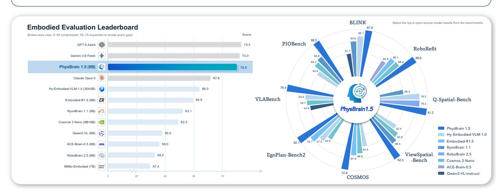

**그림 1 보고서의 실체화 벤치마크 스위트에서 전반적인 성능을 선도합니다.** PhysBrain 1.5는 8B 파라미터로 전반 점수 **72.5**를 달성하며, 모든 오픈소스 모델 중에서 1위를 차지하고 선도적인 독점 시스템과 동등한 성능을 제공한다.

### **목차 (Contents)**

| 1 | 서론  | 3 |
|---|----------------------------------------------------------------------------|----|
| 2 | 모델 아키텍처  | 4 |
|  | 2.1 개요  | 4 |
|  | 2.2 물리적 인식을 통한 구현된 이해  | 4 |
|  | 2.3 구현된 행동 생성  | 4 |
|  | 2.4 시각 기반 생성  | 6 |
|  | 2.5 통합 어휘 및 학습 목표  | 6 |
| 3 | 데이터  | 7 |
|  | 3.1 물리 인식 기반 사전 학습 데이터  | 7 |
|  | 3.1.1 물리적 인식 데이터  | 7 |
|  | 3.1.2 인간 행동 데이터  | 8 |
|  | 3.1.3 인간 상호작용 미래 상태 데이터  | 8 |
|  | 3.2 구현된 감독 기반 미세 조정 데이터  | 8 |
|  | 3.2.1 구현된 이해 데이터  | 9 |
|  | 3.2.2 구현된 행동 데이터  | 9 |
|  | 3.2.3 구현된 미래 상태 데이터  | 10 |
|  |  |  |
| 4 | 학습  | 10 |
| 5 | 평가  | 11 |
|  | 5.1 구현된 이해  | 12 |
|  | 5.1.1 벤치마크  | 12 |
|  | 5.1.2 비교 모델  | 13 |
|  | 5.1.3 결과 및 분석  | 13 |
|  | 5.2 일반 다중모달 이해  | 13 |
|  | 5.2.1 평가 프로토콜  | 14 |
|  | 5.2.2 결과 및 분석  | 14 |
|  | 5.3 이해를 넘어: 행동 모델링 및 물리 세계 예측  | 14 |
|  | 5.3.1 행동 궤적 토큰 예측  | 14 |
|  | 5.3.2 미래 시각 예측  | 16 |
|  |  |  |
| 6 | 결론  | 17 |
| A | 기여자  | 28 |
| B | 평가 프로토콜 및 시각화  | 28 |
|  | B.1 구현된 평가 프로토콜 및 지표 표준화  | 28 |
|  | B.1.1 프레임워크 및 프로토콜 정렬  | 28 |
|  | B.1.2 통합 포인트-위치화 지표  | 28 |
|  | B.1.3 추가 벤치마크 통합  | 29 |
|  | B.2 일반 다중모달 평가 프로토콜  | 29 |
|  | B.2.1 이미지 평가  | 30 |
|  | B.2.2 비디오 평가  | 30 |
|  | B.3 행동 퍼플렉시티  | 31 |
|  | B.4 정성적 시각화  | 31 |

## **1 소개**

물리적 지능은 에이전트와 환경 사이의 지속적인 상호작용에 달려 있다. 우리는 이 상호작용을 물리적 루프라고 부르며, 에이전트는 주변을 관찰하고, 공간적 관계와 작업 목표를 해석하며, 행동 결과를 예측하고, 환경에 행동을 수행한다. 변화된 세계는 새로운 관찰을 제공하여 이해와 이후 행동을 알린다. 물리적 기반 모델은 이 루프 내에서 이해, 행동, 예측을 위한 재사용 가능한 능력을 제공해야 한다.

이 루프에 필요한 능력은 일반 기반 모델과 전문 시스템을 통해 발전해 왔다. 일반 시각–언어 모델(VLMs)은 시각적 이해, 의미 지식, 지시 따르기를 제공한다 [&#91;1](#page-17-0)[–3&#93;](#page-17-1). 전문 모델은 공간 추론 [&#91;4–](#page-17-2)[7&#93;](#page-17-3), 기반화 및 활용성 [&#91;8](#page-17-4)[–10&#93;](#page-17-5), 계획 [&#91;11,](#page-17-6) [12&#93;](#page-17-7), 실행 평가 [&#91;13,](#page-17-8) [14&#93;](#page-17-9)를 다룬다. 시각–언어–행동 모델(VLAs), π 시리즈, GR00T, Qwen-VLA를 포함해 로봇 행동을 학습한다 [&#91;15–](#page-17-10)[19&#93;](#page-18-0). DreamZero와 Qwen-RobotWorld는 예측적 세계 모델링을 포함한다 [&#91;20,](#page-18-1) [21&#93;](#page-18-2). 시스템 수준에서 SayCan [&#91;22&#93;](#page-18-3), Code as Policies [&#91;23&#93;](#page-18-4), 그리고 VoxPoser [&#91;24&#93;](#page-18-5)는 언어 추론을 로봇 능력과 기술, 프로그램, 또는 공간 제어 표현을 통해 연결한다. 이러한 접근 방식은 전문 모델을 훈련하고 기존 능력을 로봇 시스템에 통합함으로써 물리적 상호작용을 향상시킨다.

최근 체현 기반 기초 모델들은 이러한 여러 기능을 통합한다. HY-Embodied, RynnBrain 1.1, 그리고 MiMo-Embodied는 공간적 이해, 상호작용 추론, 그리고 계획을 확장한다[25–28]. 다른 모델들은 근거화, 의사결정, 그리고 실행 관련 기능을 통합한다[29–31]. UniVLA와 RynnVLA‑002는 이해, 행동 생성, 시각 예측의 공유 학습을 탐구한다[32, 33], 반면 Cosmos 3은 물리적 환경에서 다중 모달 이해와 생성을 위한 보다 광범위한 프레임워크를 개발한다[34]. 이러한 노력을 바탕으로 우리는 광범위한 체현 이해가 엔드 이펙터 움직임과 다중 모달 미래 상태와 동시에 어떻게 학습될 수 있는지를 연구한다.

공동 학습은 감독의 차이를 고려해야 한다. 이해 과제는 언어, 공간 좌표, 상호작용 목표를 생성한다. 행동 생성은 시간적으로 구조화된 동작 표현을 필요로 하며, 미래 상태 예측은 밀집된 시각적 출력을 포함한다. 훈련 데이터는 구현체, 주석 규칙, 시간적 세분화에서도 차이가 있다. 우리는 이러한 차이를 수용하면서 물리적 생성과 광범위한 구현체 이해를 동시에 지원하는 공유 학습 공식화를 추구한다.

**체현된 이해(embodied understanding), 행동 생성(action generation) 및 미래 상태 예측(future-state prediction) 를 통합한다**

우리는 언어 어휘를 행동 및 시각 토큰(action and visual tokens)으로 확장한다.  
ActionPiece [35]는 끝효과기 궤적(end-effector trajectories)을 인코딩하고, 시각 토큰은 미래 RGB 이미지(future RGB images), 깊이 맵(depth maps), 로봇 마스크(robot masks)를 나타낸다.  
이러한 출력은 자기회귀 백본(autoregressive backbone)과 출력 헤드(output head)를 공유하며, 의미적(semantic), 운동(motion), 미래 상태 감독(future-state supervision)을 통해 같은 매개변수를 공통 다음 토큰 예측 목표(next-token prediction objective)를 사용해 업데이트하도록 허용한다. 작업별 손실 마스크(task-specific loss masks)가 각 출력 유형(output type)에 대해 감독할 목표 토큰(target tokens)을 선택한다.

인간 상호작용 경험은 이 접근법의 데이터 기반을 제공한다. 우리의 이전 연구인 Phys-Brain 1.0 [36](#page-19-5)은 인간의 자기중심 비디오를 구조화된 물리적 상식 감독으로 변환하고 학습된 선행 지식을 로봇 정책에 전이한다. PhysBrain 1.5는 이 이해‑우선 접근법을 물리적 루프 전반에 걸친 공동 학습으로 확장하며, 모든 구현된 사전학습 감독은 인간 상호작용 경험에서 파생된다. 우리는 자기중심 및 동기화된 자기–외심 비디오를 PhysBrain‑Ego360 [37](#page-19-6)의 파노라마 비디오와 함께 작업 중심 에피소드로 구성한다. 이 에피소드는 의미론적 및 공간적 주석, 복원된 인간 동작 [38](#page-19-7), 그리고 공유 학습 형식 내의 이후 시각적 상태를 결합한다. 감독 기반 미세 조정은 이후 인간 시연, 실제 로봇 궤적, 시뮬레이션 상호작용을 결합하여 학습된 기능을 다양한 구현체와 작업에 확장한다.

우리는 PhysBrain 1.5를 인식, 공간 및 다중 시점 이해, 구현된 추론 및 계획, 기반화 및 활용성, 시각적 궤적 추론 등 28개의 벤치마크에서 평가한다. Figure 1에 표시된 바와 같이, 우리의 8B 모델은 평균 점수 **72.5**를 달성하여 새로운 **오픈소스 최첨단**을 설정하고, 가장 강력한 독점 모델인 GPT‑6‑Astra (73.3)와 Gemini 3.6 Flash (73.0)에 근접한다. 오픈소스 모델 중 **14개 벤치마크**에서 1위를 차지하고 **10개**에서 2위를 기록한다. 정성적 결과는 엔드 이펙터 궤적 생성과 미래 프레임 예측을 추가로 입증한다.

## **2 모델 아키텍처 (Model Architecture)**

### **2.1 개요 (Overview)**

PhysBrain 1.5는 Qwen3‑VL Instruct 계통에서 구축되었으며, 사전 학습된 비전–언어 모델을 물리적 인식, 상호작용 및 상태 전이를 통합한 모델로 확장한다. Figure 2에 그려진 바와 같이, 핵심 설계는 언어, 엔드 이펙터 움직임 및 시각적 상태 목표를 이산 시퀀스로 표현하고 동일한 자기회귀 인터페이스를 통해 학습하는 것이다. 통합은 생성된 표현에 관한 것으로, 언어 모델 백본, 토큰 임베딩 및 출력 헤드를 공유한다. 구체적으로, 우리는 원래 언어 어휘에 전용 동작 토큰 세트와 시각 토큰 세트를 추가한다:

$$V = V_{\text{lang}} \cup V_{\text{act}} \cup V_{\text{vis}}. \tag{1}$$

이 결과 어휘는 공유 임베딩 테이블과 언어 모델 출력 헤드를 통해 언어, 동작 및 시각 상태 생성을 지원한다. 이 형식은 이해와 생성을 공동 학습할 수 있게 한다: 지각 감독은 상호작용과 그 결과를 예측하기 위한 문맥을 제공하고, 동작 및 상태 전이 감독은 공간 기반화와 궤적 추론을 지원하는 물리적 선행 지식을 도입한다.

x는 시각 입력, 지시문 및 작업 의존적 문맥을 포함하고, y는 목표 시퀀스를 나타낸다. 작업군 전반에 걸쳐 모델은 마스킹된 다음 토큰 예측으로 최적화된다:

$$p_{\theta}(y \mid x) = \prod_{i=1}^{|y|} p_{\theta}(y_i \mid x, y_{< i}), \qquad \mathcal{L}_{AR} = -\sum_{i=1}^{|y|} m_i \log p_{\theta}(y_i \mid x, y_{< i}),$$

(2)

여기서 mi는 감독 대상 토큰을 선택한다. 작업 포맷팅, 모달리티 구분자 및 손실 마스크는 모델이 언어로 답변할지, 동작 궤적을 생성할지, 시각 상태 시퀀스를 생성할지를 지정하며, 기본 예측 목표는 변하지 않는다.

### **2.2 구현된 이해: 물리적 인식 (Embodied Understanding as Physical Perception)**

우리는 구현된 신체적 이해가 별도의 인식 헤드로 구현되지 않으며, 대신 PhysBrain 1.5가 기본 VLM의 일반적인 이미지 및 비디오 이해 인터페이스를 유지하면서 신체적 감독을 통해 이를 강화한다. 이 감독은 물리적 및 공간적 인식, 다중 시점 이해, 신체적 추론 및 계획, 객체 및 부품 기반화, 가능성, 시각적 궤적 추론을 포함한다. 작업에 따라 동일한 자기회귀 디코더가 자연어 답변 또는 구조화된 공간 목표를 생성한다. 따라서 의미 인식, 공간적 위치 지정, 시간적 추론은 공통 인터페이스를 통해 제공되며, 행동 및 시각적 상태 생성을 위해 필요한 장면 수준 증거를 제공할 수 있다.

###  **2.3 신체적 행동 생성 (Embodied Action Generation)**

우리는 Human-as-Humanoid [38](#page-19-7)를 통해 인간 동작을 로봇 행동 표현으로 변환한다. 양쪽 손목의 위치와 방향을 유지하고 손가락 동작은 제외한다. 인간 유래 및 로봇 행동 데이터는 동일한 행동 표현과 토크나이저를 공유한다: 우리는 각 행동을 짧은 엔드-에펙터 궤적으로 모델링한다. 각 인간 또는 로봇 손목에 대해, 모델은 길이 H = 16인 행동 청크를 예측한다. 이는 현재 관측 시 손목 자세에 대해 다음 16개의 행동 단계에 해당한다. 우리는 상대 방향을 연속적인 6D 표현으로 나타낸다. 회전 행렬 R에 대해 다음과 같이 정의한다

$$\rho_6(R) = \operatorname{vec}(R_{[:,1:2]}) \in \mathbb{R}^6, \tag{3}$$

여기서 R[:,1:2]는 R의 첫 두 열을 나타낸다. 행동 목표는 다음과 같이 정의된다:

$$a_{t,k} = [p_{t+k} - p_t, \rho_6(R_t^\top R_{t+k}), g_{t+k}] \in \mathbb{R}^{10}, \quad k = 1, \dots, H.$$

(4)

첫 번째 세 차원은 상대적 변위이며, 다음 여섯 차원은 상대적 회전을 인코딩하고, g ∈ [0, 1]은 절대적 그리퍼 닫힘을 나타내며, 0은 열림, 1은 닫힘을 의미한다. 모든 목표는 동일한 앵커를 공유한다.

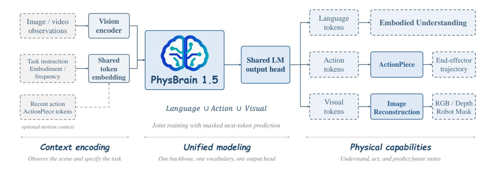

**Figure 2 PhysBrain 1.5 model architecture.** 사전 학습된 비전–언어 모델을 기반으로 PhysBrain 1.5는 공유된 백본, 토큰 임베딩, 출력 헤드를 통해 통합된 언어–행동–시각 어휘를 사용해 구현된 이해, 행동 생성, 시각 상태 예측을 공동으로 학습한다. 구현된 이해는 기초적인 시각-공간 인식, 공간 및 다중 시점 이해, 구현된 인지 및 추론, 공간 포인팅 및 활용성 이해, 시각적 궤적 추론을 포함한다. 행동 토큰은 ActionPiece에 의해 엔드-에펙터 궤적으로 디코딩되며, 선택적 행동 이력이 모션 컨텍스트를 제공한다. 시각 토큰은 Vision 디코더에 의해 미래 RGB 이미지, 깊이 맵, 로봇 마스크로 디코딩된다. 세 가지 작업군은 공유된 자기회귀 학습 목표 하에서 상호 보완적인 감독을 제공한다.

(pt, Rt)는 단계별로 누적되지 않는다. 물리 단위는 표준화되며 변위는 말뭉치 수준 정규화를 사용한다; 각 소스의 고유 좌표축은 그대로 유지된다.

우리는 ActionPiece 토크나이저 TAP [&#91;35&#93;](#page-19-4)를 사용해 이 궤적을 이산화한다. 이 토크나이저는 28.7백만 개의 16단계 엔드-에펙터 궤적 세그먼트(총 459.2백만 개의 행동 타임스텝)를 학습했다. 토크나이저는 외부 이산화 인터페이스로 512-토큰 행동 어휘를 제공한다. PhysBrain 1.5에서 사용되는 구성에서는 손목 궤적을 32개의 이산 행동 토큰 시퀀스로 인코딩한다. 동일한 ActionPiece 어휘와 코드북은 왼손목 및 오른손목 궤적에 모두 사용된다.

**동질적 행동 연속성.** 다른 소스의 행동 궤적이 동일한 10D 엔드에펙터 표현과 ActionPiece 어휘에 매핑되지만, 우리는 모든 구현체에 대해 단일 전역 표준화된 좌표 프레임이나 동작 규약을 강제하지 않는다. 서로 다른 데이터셋은 로봇, 카메라, 제어 규약이 크게 다르기 때문에 신뢰할 수 있는 전역 표준화는 비용이 많이 들고 구현체 간 확장하기 어렵다. 또한 일부 소스는 완전한 보정 메타데이터나 전역 프레임 정보를 갖추지 못해 추가 가정 없이는 해당 변환을 복원할 수 없다. 잠재적으로 신뢰할 수 없는 변환을 도입하기보다 각 소스의 고유 좌표 축을 보존한다. 따라서 같은 명목상의 행동 차원이라도 소스별로 로컬 축, 동작 스케일, 제어 주파수, 시간 패턴이 다를 수 있다.

이러한 이질성을 고려하여, 우리는 현재 관측 바로 앞의 행동을 로컬 모션 컨텍스트로 사용한다. 현재 시각 관측과 함께 최근 행동 이력이 암묵적 시스템 식별 신호를 제공하여 모델이 현재 구현체 또는 데이터 소스의 로컬 행동 규약, 동작 추세, 단기 반응 패턴을 추론할 수 있게 한다. 모든 소스를 전역 표준 행동 프레임으로 변환하도록 요구하기보다, 모델은 이 입력–모션 컨텍스트를 활용해 진행 중인 궤적을 자연스럽게 이어갈 수 있다.

이전 및 목표 행동 청크는 동일한 ActionPiece 토크나이저와 행동 어휘로 인코딩된다:

$$z^{-} = \mathcal{T}_{AP}(A^{-}), \qquad z^{+} = \mathcal{T}_{AP}(A^{+}), \qquad p_{\theta}(z^{+} \mid I, u, e, f, z^{-}),$$

(5)

여기서 A−와 A+는 각각 이전과 바로 뒤의 16단계 행동 청크를 나타내며, z−와 z+는 그에 대응하는 이산 행동 토큰 시퀀스이다. I는 현재 관측, u는 작업 지시, e는 로봇 구현체, f는 행동 주파수이며, $z^-$는 선택 사항이다. 이 공식은 행동 예측을 고립된 청크 회귀가 아니라 조건부 궤적 연속성으로 전환한다. 행동 이력은 로컬 모션 사전 정보를 제공해 행동 청크 경계에서 연속성을 유지하고 구현체별 동작 방향, 스케일, 리듬에 적응하도록 돕는다.

### 2.4 시각 기반 생성 (Visual-Foundation Generation)

우리는 미래 물리 상태를 RGB 이미지, 깊이 맵, 로봇 마스크의 공간적으로 정렬된 조합으로 모델링한다. 현재 RGB 관측과 작업 지시를 주면 PhysBrain 1.5는 미래 물리 상태 $S_{t+\Delta}$를 예측한다:

$S_{t+\Delta} = \left(X_{t+\Delta}^{\text{rgb}}, X_{t+\Delta}^{\text{depth}}, X_{t+\Delta}^{\text{mask}}\right),\tag{6}$

세 개의 타깃은 동일한 타임스탬프와 이미지 좌표계에 해당한다. 서로 다른 프레임 레이트를 가진 데이터셋의 경우, 타깃 프레임 오프셋은 지정된 예측 간격과 각 소스의 고유 프레임 레이트에서 결정된다.

공유된 이산 시각적 표현. 우리는 목표 해상도 $128 \times 128$에서 공유 VQ-VAE를 사용해 세 가지 모달리티를 모두 토크나이즈한다. RGB 이미지는 토크나이저의 입력 범위에 정규화되고; 깊이 맵은 선형적으로 [-1,1] 범위에 매핑되며, 로봇 마스크도 동일한 범위에 매핑된다. 단일 채널 깊이 맵과 마스크는 토크나이즈하기 전에 세 채널에 복제된다. 각 모달리티 $m \in \{\text{rgb, depth, mask}\}$에 대해 토크나이저는

$$Q_{t+\Delta}^{m} = \mathcal{T}_{VQ}(X_{t+\Delta}^{m}) \in \{1, \dots, K\}^{16 \times 16},$$

(7)

여기서 $K=16{,}384$는 코드북 크기이다. 공간 다운샘플링 비율이 8이므로 각 모달리티마다 256개의 이산 코드를 얻는다. 각 코드북 인덱스는 원자적인 VLM 토큰과 일대일 매핑된다. 두 개의 추가 토큰, <|future_joint_vq8_start|>와 <|future_joint_vq8_end|>,는 미래 상태 페이로드를 구분한다. 따라서 시각 어휘 $\mathcal{V}_{\text{vis}}$는 $K+2=16{,}386$개의 토큰을 포함한다.

**공간 정렬된 공동 직렬화**. $q_i^m$는 $Q_{t+\Delta}^m$의 행우선 순회에서 *i*번째 코드에 해당하는 VLM 토큰을 나타낸다. 우리는 각 공간 위치에서 RGB-깊이-마스크 순서로 세 가지 모달리티를 교차 삽입한다:

$$y^{\text{vis}} = [b_{\text{start}}, q_1^{\text{rgb}}, q_1^{\text{depth}}, q_1^{\text{mask}}, \dots, q_N^{\text{rgb}}, q_N^{\text{depth}}, q_N^{\text{mask}}, b_{\text{end}}], \tag{8}$$

$b_{\text{start}}$와 $b_{\text{end}}$는 두 개의 경계 토큰을 나타낸다. 시퀀스는 3N = 768개의 VQ 토큰과 두 개의 경계 토큰을 포함하여 총 770개의 토큰을 갖는다. 이 순서는 대응되는 공간 위치의 토큰을 서로 인접하게 배치하여, 자기 회귀 생성 과정에서 지역적인 교차 모달 컨텍스트를 제공한다.

모델은 공유 LM 출력 헤드를 통해 미래 상태 시퀀스를 자기 회귀적으로 생성한다. VLM 훈련 중에는 모달리티별 예측 헤드나 픽셀 공간 재구성 손실이 도입되지 않는다. 추론 시에는 생성된 페이로드를 코드북 인덱스로 다시 매핑하고, 세 개의 $16 \times 16$ 그리드로 디인터리브한다. 각 그리드는 동일한 동결된 VQ 디코더를 사용해 별도로 재구성되어 대응되는 RGB 이미지, 깊이 맵, 또는 로봇 마스크를 생성한다.

### 2.5 통합 어휘 및 학습 목표 (Unified Vocabulary and Training Objective)

우리는 Eq.(1)의 통합 어휘와 Eq.(2)의 자기 회귀 목표를 사용해 구현된 이해, 행동 생성, 시각 기반 생성 세 가지를 공동으로 훈련한다. 작업 형식은 요청된 출력을 지정하고, 손실 마스크는 해당 목표 토큰을 선택한다.

세 가지 목표는 공유 물리적 표현에 대해 보완적인 감독을 제공한다. 구현된 이해는 작업 의미와 공간 관계를 포착하고, 행동 생성은 엔드 이펙터 움직임을 모델링하며, 시각 기반 생성은 미래 장면 상태를 모델링한다. 공동 훈련은 이러한 신호를 동일한 백본에 통합하여 모델이 물리적 작업에 대한 설명과 직접적인 움직임 및 상태 목표 모두에서 학습할 수 있게 한다. 이는 토큰 생성 인터페이스를 공유하는 것 이상의 목표 통합 동기에 따른다.

| 단계 | 구성요소 | 감독 | 도메인 | 훈련 샘플 |
|--------------|-------------------------------------------------------|-------------------------------------------------------------------------------------------------------------|---------------------------------------------------------------------------------------|----------------------------------|
| 사전 훈련 | 지각 인간 행동 미래 상태 일반 | 캡션 생성, VQA, 공간 라벨 EEF 궤적 RGB, 깊이, 그리고 인간 마스크 지시 따르기 | 인간 비디오 인간 비디오 인간 비디오 멀티모달 데이터 | 24.3M 31.2M 26.8M 14.9M |
| Embodied SFT | 이해 행동 미래 상태 일반 | 언어 및 공간 반응 EEF 궤적 RGB, 깊이, 그리고 로봇 마스크 지시 따르기 | 멀티모달 데이터 인간/로봇/시뮬레이션 5.4M 로봇/시뮬레이션 멀티모달 데이터 | 6.61M 1.2M 1M |

**Table 1** 두 단계 훈련 데이터 구성. 물리 인식 사전 훈련 데이터는 인간 상호작용 비디오에서 구성되며; 구현된 SFT는 선별된 인간, 실제 로봇, 시뮬레이션 데이터를 결합한다. 두 단계 모두 일반 언어 및 시각-언어 지침 데이터를 포함한다.

## 3 데이터 (Data)

우리는 훈련 데이터를 두 단계로 구성한다: 물리 인식 사전 훈련과 구현된 감독 세부 조정(SFT). 두 단계 모두 인식 및 이해, 행동 생성, 미래 상태 예측에 대한 감독을 제공한다. 물리 인식 사전 훈련은 대규모 인간 상호작용 비디오에서 이 세 가지 감독을 도출한다. 구현된 SFT는 사전 훈련 데이터 구축 파이프라인을 재사용하여 실제 로봇 및 시뮬레이션 환경에서의 상호작용을 포함한 보다 다양한 데이터 소스를 통합하고, 고품질 데이터에 대한 추가 세부 조정을 수행한다. 이 데이터 설계는 환경 인식 및 이해, 행동 기반 상호작용, 물리 상태 변화를 연결함으로써 물리 루프 전반에 걸친 학습을 지원한다. Table [1](#page-6-2)는 각 단계에서 감독 유형별 훈련 데이터 양을 보고한다.

###  3.1 물리 인식 사전 훈련 데이터 (Physical-Aware Pre-training Data)

우리의 사전 훈련 코퍼스는 사람들이 과제를 인식하고, 환경에서 행동하며, 물리 상태를 변화시키는 방식을 드러내는 인간 상호작용 비디오로부터 구축된다. 우리는 Xperience-10M [&#91;39&#93;](#page-19-8), Egocentric-10K [&#91;40&#93;](#page-19-9), Ego4D [&#91;41&#93;](#page-19-10), EgoVerse [&#91;42&#93;](#page-19-11), EgoDex [&#91;43&#93;](#page-19-12), EgoLife [&#91;44&#93;](#page-19-13), 그리고 Ego-Exo4D [&#91;45&#93;](#page-19-14)를 포함한 두 개의 사내 코퍼스를 집계한다. **PhysBrain-Human** [&#91;38&#93;](#page-19-7)은 시각 중심 녹화본을 포함하며, 동기화된 외부 시점 녹화본이 포함된 시퀀스를 포함한다. **PhysBrain-Ego360** [&#91;37&#93;](#page-19-6)은 활동 수행 중에 기록된 전신 포즈, 손 동작, 과제 수준 음성 기록과 함께 주변 환경의 파노라마 영상을 제공한다. 이 소스들은 일상 활동, 도구 사용, 인간–물체 상호작용, 그리고 시각 중심, 외부 시점, 파노라마 시점 전반에 걸친 장기 과제를 포괄한다. 우리는 장기 녹화를 과제 및 행동 경계에서 분할하여 고수준 목표와 실행 과정을 포함하는 과제 일관성 있는 에피소드를 얻는다. 우리는 심한 모션 블러, 상당한 저노출 또는 과노출, 손상되거나 누락된 프레임, 또는 가려지거나 시야 밖에 있는 핵심 상호작용이 있는 저품질 에피소드를 제외한다. 선별된 소스 코퍼스는 약 30,000시간의 비디오를 포함한다. 이 코퍼스에서 우리는 아래에 설명된 세 가지 유형의 훈련 데이터를 구성한다.

####  3.1.1 물리 인식 데이터 (Physical Perception Data)

물리 인식 데이터는 인간 상호작용 비디오에서 파생된 구조화된 주석, 캡션, 질문-답변 쌍으로 구성된다. 전문화된 오픈소스 및 사내 모델은 샘플링된 프레임과 클립에서 구조화된 가짜 라벨을 생성한다. 이미지 수준 감독은 객체 탐지, 세분화, 깊이 추정, 가리기, 세기, 3D 객체 탐지를 포함한다. 비디오 수준 감독은 시간적 기반화, 시공간 기반화, 객체 추적을 포함한다. 동기화된 시각 중심, 외부 시점, 파노라마 녹화본은 시점, 규모, 가시성 변화에 따른 교차 시점 객체 대응 및 지칭 기반화를 추가로 지원한다.

우리는 이러한 구조화된 목표를 물리적으로 기반화된 캡션과 질문-답변으로 보완한다. 프레임 수준 캡션은 보이는 객체와 상호작용 관련 장면 속성을 설명한다; 세그먼트 수준 캡션은 세밀한 행동을 조작된 객체 및 관찰된 상태 변화와 정렬한다; 에피소드 수준 캡션은 환경, 과제 목표, 실행 진행을 요약한다. PhysBrain‑Ego360의 경우, 우리는 동기화된 음성을 결합한다

비디오 증거를 포함한 전사본을 사용하여 작업 설명과 시간적으로 기반된 단계별 캡션을 도출한다. 물리적 VQA 예시들은 작업 인식, 진행 평가, 행동 이해, 인간–물체 상호작용, 시간 순서, 관찰된 상태 변화를 탐구한다. 우리는 각 목표에 필요한 시간적 또는 다중 시점 증거를 보존하고, 소스 미디어나 지원 주석과 일치하지 않는 가짜 라벨, 캡션, 답변을 거부한다. 결과적으로 생성된 물리적 인식 코퍼스는 24.3M개의 학습 샘플을 포함한다.

#### **3.1.2 인간 행동 데이터 (Human Action Data)**

우리는 인간 상호작용 비디오에서 작업 실행과 정렬된 동작 궤적을 사용하여 인간 행동 데이터를 구축한다. Human-as-Humanoid 파이프라인[38](#page-19-7)을 이용해 인간 동작을 복원하고, 복원된 운동학 체인에서 손목 엔드 이펙터 궤적을 도출한다. 비디오와 동작 시퀀스 간의 시간적 대응은 이러한 궤적을 작업 설명 및 시각적 관찰과 연결하여 각 동작 세그먼트에 대한 작업 및 장면 맥락을 제공한다.

우리는 상호작용 비디오를 짧은 클립으로 나누고 연속적인 동작 궤적과 해당 관찰을 추출한다. 각 샘플은 행동 세그먼트, 이후 시각적 관찰, 그리고 행동의 연속 사이의 시간적 관계를 보존하여 연속적인 상호작용 과정을 포착한다. 우리는 포즈 복원 신뢰성, 비디오–궤적 정렬, 동작 타당성을 검사하고, 불안정한 재구성, 누락된 시간적 대응, 비현실적 동작을 가진 샘플을 거부한다. 결과적으로 생성된 인간 행동 코퍼스는 31.2M개의 학습 샘플을 포함한다.

#### **3.1.3 인간 상호작용 미래 상태 데이터 (Human-Interaction Future-State Data)**

우리는 인간 상호작용 비디오에서 상호작용 전의 장면 맥락과 이후 물리적 상태를 짝지어 미래 상태 데이터를 구축한다. 비디오를 짧은 클립으로 나누고 현재 관찰과 목표 미래 관찰을 선택하여 미래 상태 예측 샘플을 만든다. 행동 궤적과 연관된 상호작용 시퀀스의 경우, 행동 세그먼트와 이후 관찰 사이의 시간적 대응을 보존하여 상태 주석을 동일 상호작용 내의 동작과 연결한다.

각 미래 상태 대상은 공간적으로 정렬된 RGB 이미지, 깊이 맵, 그리고 인간 부위 분할 마스크로 구성된다. RGB 이미지는 목표 타임스탬프의 비디오 프레임에서 직접 취득된다. 상호작용하는 손과 팔을 포함하는 깊이 맵과 분할 마스크는 해당 인식 파이프라인에 의해 생성된다. 이 주석들은 각각 장면 외관, 깊이 구조, 그리고 상호작용에 관여한 인간 영역을 포착하며, 공통 타임스탬프에서 물리적 상태를 설명한다.

우리는 관찰 쌍의 시간적 오프셋, 이미지와 주석의 무결성, 깊이 맵과 마스크의 수치적 유효성, 그리고 모달리티 간 공간적 대응을 검증한다. 시간 불일치, 누락된 데이터, 또는 모달리티 간 일관성 없는 정렬을 가진 샘플은 폐기된다. 결과적으로 생성된 인간 상호작용 미래 상태 코퍼스는 26.8M개의 학습 샘플을 포함한다.

**General instruction data.** 일상 언어 및 시각-언어 지시 데이터는 사전 학습에 사용되며 14.9M 샘플로 구성된다. 언어 소스에는 FLAN Collection [46](#page-20-0), UltraChat [47](#page-20-1), OpenAssistant Conversations [48](#page-20-2), UltraData-SFT-2605의 선택된 하위 집합 [49](#page-20-3), MetaMathQA [50](#page-20-4), 그리고 Magicoder-OSS-Instruct [51](#page-20-5)가 포함된다. 시각-언어 소스에는 FineVision [52](#page-20-6), LLaVA-OneVision-1.5-Instruct-Data [53](#page-20-7), Cambrian-7M [54](#page-20-8), PixMo [3](#page-17-1), ShareGPT4Video [55](#page-20-9), 그리고 LLaVA-Video-178K [56](#page-20-10)가 포함된다. 여러 컬렉션이 중복된 공개 데이터를 포함하기 때문에, 기능 인식 샘플링 전에 교차 소스 중복 제거를 수행한다.

### **3.2 구현 기반 감독형 미세 조정 데이터**

구현 기반 SFT 코퍼스는 고품질 인간 상호작용 데이터, 실제 로봇 궤적, 시뮬레이션 상호작용을 결합한다. 이러한 소스에서 구현 기반 이해를 위한 언어 및 공간 주석, 행동 생성을 위한 엔드 이펙터 궤적, 그리고 미래 상태 예측을 위한 정렬된 시각 목표를 구성한다. 구현 기반 적응 중에 광범위한 언어 및 멀티모달 역량을 유지하기 위해, 혼합물에는 1M개의 고품질 일반 언어 및 시각-언어 지시 샘플도 포함된다.

| 능력 그룹 | 감독 | 대표적 출처 | 규모 |  |
|----------------------------------------------|---------------------------------------------------------------------------------------------------------------------------------|-----------------------------------------------------------------------------------------------------------------------------------------------------------------------------------------------------------------------------------------------------------------------------------------------------------------------------|-------|--|
| 기초 시각–공간 인식 | 계수, 상대 깊이 및 거리, 메트릭 거리, 공간 관계, 그리고 지역 3D 기하학 | TallyQA [57], DIW [58], VSR [59], COCO [60], ADE20K [61], Omni3D [62], Matterport3D [63], Argoverse 2 [64], and ScanNet [65] | 500K |  |
| 공간 및 다중 시점 이해 | 기하학적 관계, 장면 구조, 시점 추론, 교차 시점 대응, 그리고 3D 정신 모델링 | SSI-800K (SenseNova-SI) [66], SpatialLadder [67], SAT-Train [5], SpatialMQA [68], GRiD-3D [69], SpatialReasoner 훈련 데이터 [6], VSI-590K [7], VSI-Train-10K [70], SIMS-VSI-200K [71], MindCube-Train [72], 및 VST [73] | 2.36M |  |
| 체화된 추론 및 계획 | 작업 상태, 진행, 다음 행동, 절차적 순서, 실패 진단, 및 교정 행동 | RoboVQA-Train [11], HoloAssist [74], EgoPlan-IT [12], RoboFail [75], BridgeData V2 [76], AgiBot [77], VLABench [78], 및 인간 상호작용 코퍼스 | 1.65M |  |
| 근거화 및 가능성 | 객체 및 부품 위치 지정, 가리키기, 자유 공간 및 배치 근거화, 접촉 영역, 그리고 기능적 가능성 | RoboRefIt-Train [79], Objects365 [80], OpenImages [81], LVIS [82], Visual Genome [83], CoSyn-Point [84], PixMo-Points [3], Molmo2-MultiImagePoint [85], RefSpatial-Train [9], RoboPoint [8], RoboSpatial-Train [4], RoboAfford-Train [86], HANDAL [87], PACO [88], InstructPart [89], 그리고 ShareRobot [90] | 1.8M |  |
| 시각적 궤적 추론 | 이미지 공간 추적 및 경로지점 접근, 접촉, 운송, 및 배치 | FSD [91], ShareRobot [90], Open X-Embodiment [92], DROID [93], ManiSkill [94], RoboCasa [95], Molmo2-VideoPoint [85], MolmoPoint-TrackAny/TrackSyn [10], Ego4D [41], Egocentric-10K [40], EgoDex [43], PhysBrain-Ego360 [37], and PhysBrain-Human [38] | 300K |  |

**Table 2** 본체-이해 데이터의 구성을 나타낸다. 척도는 각 능력 그룹별 훈련 샘플 수를 보고한다.

#### **3.2.1 본체-이해 데이터 (Embodied Understanding Data)**

본체-이해 코퍼스는 표 [2,](#page-8-1)에 나열된 데이터셋을 주석 유형별로 그룹화하여 결합한다. 그룹 간에 원본 주석은 명령형 언어 또는 공간 목표로 변환된다. 필요에 따라 시계열, 다중 시점, 기하학적 증거를 보존하고, 좌표와 출력 형식을 표준화하며, 의미적 유효성, 참조 명확성, 기하학적 신뢰성, 미디어 무결성, 그리고 교차 소스 중복을 위해 예제를 필터링한다.

기초 인식 데이터는 원본 주석을 작업 지침과 텍스트 또는 공간 목표와 쌍으로 변환하여 명령 수행 샘플로 구성된다. 이 샘플들은 세기, 깊이 및 거리 판단, 공간 관계 이해, 객체 위치 지정 등을 다룬다. 작업에 따라 질문 응답, 캡션 작성, 구조화된 공간 예측 형태를 취하며, 객체 범주, 수치 범위, 답변 분포가 구축 시 균형을 이룬다. 공간 및 다중 시점 예시는 원본 이미지, 비디오, 카메라, 장면 구성을 그대로 유지하여 시점에 따라 달라지는 증거가 변환 중에 압축되지 않도록 한다. 추론 및 계획 데이터는 원본 클립과 시계열로 정렬된 프레임 시퀀스를 결합한다. 기반화 및 시각-경로 데이터는 점, 상자, 영역, 이미지 공간 웨이포인트에 대해 공유된 정규화된 공간 형식을 사용한다.

#### **3.2.2 본체-행동 데이터 (Embodied Action Data)**

본체-행동 코퍼스는 17개의 실제 로봇 및 시뮬레이션 소스와 고품질 인간 동작 궤적을 결합하여 구성한다. 이 데이터는 다양한 구현체, 시점, 작업, 동작 분포를 포괄한다. 표 [3,](#page-9-2)에 요약된 바와 같이 원시 컬렉션은 약 2,620시간의 실제 로봇 및 시뮬레이션 궤적과 500시간의 고품질 인간 동작 데이터를 포함한다.

소스 데이터셋은 동작 의미, 물리 단위, 시계열 샘플링 규칙이 다르다. 우리는 먼저 각 소스가 관측된 상태를 기록하는지, 명령된 목표를 기록하는지를 판단하고, 이 의미에 따라 동작 시퀀스를 추출한다. 물리 단위와 그리퍼 열–닫기 규칙을 표준화하면서 각 소스의 감시된 원래 좌표축은 그대로 유지한다. 인간 데이터의 경우, 사전 훈련 중에 사용된 Human-as-Humanoid 파이프라인 [&#91;38&#93;](#page-19-7)을 재사용하여 손목 궤적을 복구하고, 신뢰할 수 있는 포즈 복구 및 시계열 정렬이 있는 시퀀스를 보존한다. 이후 궤적을 시각 관찰 및 작업 설명과 동기화한다

| 소스 패밀리 | 데이터셋 | 스케일 |
|-----------------------|--------------------------------------------------------------------------------------------------------------------------------------------------------------------------------|---------|
| 양손 플랫폼 | OpenGalaxea [96], AgiBotWorld [77], GM100/CobotMagic [97], RoboTwin [98], 및 GR00T-X [99] | 987 h |
| 단일 팔 플랫폼 | DROID [93], FurnitureBench [100], FMB [101], Fractal/RT-1 [102], BC-Z [103], BridgeData V2 [76], Dobb-E [104], TACO Play [105, 106], 그리고 Berkeley Cable Routing [107] | 1,339 h |
| 시뮬레이션 벤치마크 | RoboCasa [95], LIBERO [108], 및 VLA-Arena [109] | 294 h |
| 인간 상호작용 | 선택된 고품질 인간 동작 궤적 | 500 h |

**Table 3** 감독 학습에 사용되는 구현-행동 데이터의 규모 및 구성. 이 말뭉치는 실제 로봇과 시뮬레이션 궤적을 500시간의 고품질 인간 동작 데이터와 결합한다.

각 동작 시퀀스에 대한 작업 및 장면 컨텍스트를 제공한다.

샘플링 속도가 낮은 선택된 소스에 대해, 우리는 연속 궤적을 재샘플링하여 시간 해상도를 향상시킨다. 재샘플링은 원본 샘플 앵커를 그대로 유지하면서 추가 후보 창을 도입하지 않아 소스 데이터셋의 상대적 샘플링 가중치를 보존한다. 우리는 잘못된 포즈, 회전, 타임스탬프, 미디어, 주석이 있는 샘플을 거부하고, FrameSkip의 동작-정보성 기준[&#91;110&#93;](#page-24-2)을 사용해 궤적을 추가로 필터링한다. 정보가 부족한 구간은 다운샘플링하고, 새로운 동작이나 상호작용 변화를 포함한 구간은 보존한다. 정지 구간은 작업 실행 중 의미 있는 휴식을 나타내도록 선택적으로 보존한다. 최종 샘플마다 작업 설명, 시각 관측, 구현 메타데이터, 행동 빈도, 시간 정렬된 동작 궤적이 포함된다. 모든 데이터 분할은 에피소드 수준에서 구성된다.

#### **3.2.3 구현된 미래 상태 데이터**

우리는 행동 말뭉치에 사용된 실제 로봇 및 시뮬레이션 궤적에서 구현된 미래 상태 데이터를 구축하며, 작업 설명과 현재 시각 관측을 이후 목표 프레임과 연결한다. 샘플링 속도와 기록 규약의 차이를 수용하기 위해 타임스탬프와 각 소스의 고유 프레임 속도를 사용해 시간 상관관계를 설정한다. 목표 프레임은 동일한 연속 상호작용 시퀀스에서 추출되어 해당 작업 컨텍스트와 정렬된다.

우리는 인간-상호작용 사전 훈련에 사용된 다중 모달 상태 주석 절차를 따라 각 목표 프레임에 대해 공간적으로 정렬된 RGB 이미지, 깊이 맵, 분할 마스크를 구성한다. RGB 이미지는 소스 궤적에서 직접 가져오며, 메트릭 z-깊이 맵은 MoGe-2[&#91;111&#93;](#page-24-3)을 사용해 생성하고, 로봇 본체 마스크는 RoboEngine[&#91;112&#93;](#page-24-4)으로 얻는다. 분할 대상은 로봇 본체를 포함하며, 사전 훈련 중 사용된 인간 손-팔 주석을 로봇 구현체로 확장한다. 이 주석은 각각 장면 외관, 공간 깊이, 로봇이 차지하는 영역을 포착하며, 동일한 이미지 좌표계에서 공통 타임스탬프의 물리적 상태를 설명한다.

우리는 목표 프레임과 주석의 완전성을 확인하고, 관측 쌍의 시간 오프셋과 깊이 맵 및 마스크의 수치 유효성을 검증하며, 모달리티 간 공간 상관관계를 확인한다. 데이터 누락, 시간 불일치, 주석 정렬 불일치가 있는 샘플은 폐기하여 보존된 RGB 이미지, 깊이 맵, 로봇 마스크가 일관된 미래 상태 목표를 형성하도록 한다. 결과적으로 생성된 구현된 미래 상태 말뭉치는 120만 개의 훈련 샘플을 포함한다.

## **4 훈련**

우리는 ms-swift[1](#page-9-3)와 Megatron-Core[&#91;113&#93;](#page-24-5) 백엔드를 사용해 PhysBrain 1.5를 훈련시키며, Qwen3-VL-Instruct(8B)를 기본 모델로 삼고, 섹션 [2.](#page-2-1)에 설명된 대로 행동 및 시각 상태 토큰으로 어휘를 확장한다. 훈련은 물리 인식 사전 훈련과 감독 학습 미세 조정의 두 단계로 진행된다.

1<https://github.com/modelscope/ms-swift>

Table 4 구현 이해에 대한 결과. 모든 결과는 0–100 척도로 보고되며, 값이 높을수록 성능이 우수함을 나타낸다. 폐쇄형 모델은 회색으로 표시되고 순위에서 제외된다. 진한 파란색 셀은 굵은 텍스트와 함께 가장 좋은 오픈소스 결과를, 연한 파란색 셀은 두 번째로 좋은 오픈소스 결과를 표시한다.

|  |  | Closed-Source Open-Source Models Models |  |  |  |  |  |  |  |  |  |  |  |
|------------------------------------------------------|------------------------------------------------------------------------------------------------------------------------------------------|--------------------------------------------------|----------------------------------------------------------------------------------------------------------------------------------------------------------------|------------------------------------------------|------------------------------------------------------------------------------------------|--------------------------------------------------------------------------------------------|------------------------------------------------------------------------------------------|--------------------------------------------------------------|--------------------------------------------------------------|------------------------------------------------------------------------|------------------------------------------------------------------------|--------------------------------------|------------------------------------------------------------------------------------------|
| Category | Benchmarks | Flash 생각. 3.6 최소 Gemini | 6 Astra 생각. GPT 낮음 | 생각. 5 Opus 낮음 Claude 적응. | Hy-EmbVLM-1.0 생각. 30A3B | Embodied-R1.5 8B | RynnBrain1.1 9B | RoboBrain2.5 8B | Embodied 생각. 7B MiMo | Nano 8B+8B Cosmos3 | ACE-Brain-0.5 8B | Qwen3-VL-Inst. 8B | 1.5 PhysBrain 8B |
| 기초 시각-공간 인지. | BLINK CV-Bench |  | 89.2 80.6 85.5 90.0 84.9 87.8 |  | 86.1 89.3 | 78.6 86.9 | 84.8 88.1 | 80.4 88.0 | 69.5 89.4 | 80.6 88.3 | 77.8 85.0 |  | 81.7 87.9 85.8 90.0 |
| 공간 및 멀티뷰 이해 | 3DSRBench EmbSpatial-Bench MindCube MMSI-Bench Q-Spatial-Bench RoboSpatial-Home SAT VSI-Bench ViewSpatial-Bench |  | 67.7 62.3 63.3 84.7 79.8 81.1 77.1 78.8 66.7 52.8 57.9 44.1 87.1 68.3 74.3 71.0 73.7 72.0 51.8 59.8 21.3 56.6 54.2 49.8 |  | 62.1 80.5 65.4 39.0 76.2 71.2 88.7 96.7 88.7 81.3 74.0 55.7 52.4 | 52.3 75.2 30.9 51.5 72.0 43.9 | 59.0 81.9 82.1 30.1 46.0 29.4 66.3 70.4 78.0 56.3 65.9 43.9 56.4 | 54.7 77.9 30.4 76.2 67.3 65.3 39.3 | 53.2 31.3 31.8 47.5 60.1 76.0 45.0 39.7 | 53.5 77.0 82.1 77.9 35.7 46.5 66.4 69.3 50.4 55.0 | 51.8 39.2 94.2 33.9 35.8 35.6 65.9 79.3 57.9 48.3 | 79.9 30.8 70.7 55.1 | 53.6 63.0 81.8 86.2 41.0 54.5 81.2 67.7 73.9 79.3 61.9 40.3 62.5 |
| Embodied 인지, 추론, 그리고 계획 | COSMOS EgoPlan-Bench2 ERQA ERQA-PLUS RoboVQA VLABench |  | 65.3 75.7 71.0 53.1 69.3 48.4 92.2 86.1 88.3 41.7 37.0 36.0 64.7 66.3 60.3 |  | 64.5 47.5 72.3 75.8 61.5 56.3 42.3 82.2 41.2 50.9 | 67.5 53.1 80.7 60.8 40.9 | 64.3 37.0 46.5 83.6 60.9 42.4 | 57.7 33.8 44.3 81.1 48.4 37.6 | 56.5 37.9 44.8 81.1 55.5 39.9 | 66.8 42.6 47.5 83.5 51.5 48.7 | 46.5 33.5 45.3 81.4 44.7 29.1 | 42.5 | 60.6 72.8 32.1 62.1 52.8 82.5 85.2 58.5 61.5 44.8 76.4 |
| 공간 근거화, 가리키기, 그리고 가능성 | Part-Affordance PIOBench PixMo-Points PointBench RefSpatial-Bench RoboAfford RoboRefit VABench-Point Where2Place |  | 64.7 55.0 78.1 80.9 79.7 71.6 74.8 75.2 56.7 69.6 71.9 68.6 76.4 78.0 56.3 83.4 84.6 82.3 85.9 85.1 83.5 60.7 65.3 64.7 73.4 76.9 69.0 |  | 62.8 62.6 55.8 47.4 75.8 82.5 | 83.4 61.5 65.3 61.1 64.5 45.5 76.9 86.1 60.5 75.7 15.8 65.4 75.0 72.7 | 40.5 64.8 29.9 55.2 63.2 59.9 74.0 81.9 | 24.7 62.3 57.3 61.7 71.7 82.8 10.6 72.0 | 61.9 56.2 51.5 51.6 40.0 75.5 47.7 63.9 | 33.3 64.3 62.8 52.8 71.8 81.1 71.8 86.2 53.2 74.4 | 36.3 60.4 60.5 65.6 53.7 63.0 53.3 84.6 5.3 56.0 | 61.5 43.6 66.8 46.3 64.7 | 56.4 84.0 53.7 68.3 62.2 64.3 50.9 80.4 81.3 89.6 65.2 72.1 |
| 시각 추적 및 Traj. 추론 | ShareRobot-Traj. VABench-VTrace |  | 82.8 83.1 81.9 84.2 91.6 88.9 |  | 84.5 | 84.0 87.5 92.3 86.6 |  | 79.3 85.2 69.0 85.4 | 82.1 | 80.9 88.3 | 82.1 82.7 | 78.2 84.4 | 84.9 89.8 |
| 전체 평균 |  |  | 73.0 73.3 67.9 |  | 66.0 | 64.9 | 63.1 | 58.2 | 57.4 | 62.3 | 59.0 |  | 59.5 72.5 |

두 번째 단계는 첫 번째 단계 체크포인트에서 초기화된다. 각 단계마다 동일한 하이퍼파라미터 구성을 사용해 한 에폭을 학습하며, 데이터 카테고리를 샘플 수 비율에 따라 섞는다(제3절에 보고된 비율). 두 단계는 통합 자기회귀 목표 하에 텍스트 생성, 액션-토큰 생성, 미래 시각 상태 생성을 공동으로 최적화한다.

두 단계 모두에서 β¹ = 0.9, β² = 0.95, ϵ = 10⁻⁸, 가중치 감쇠 0.1을 갖는 분산 Adam 옵티마이저를 사용한다. 각 단계에서 학습률은 첫 3%의 학습 단계 동안 2 × 10⁻⁵의 최고값까지 워밍업하고 이후 코사인 감소를 따른다. 최대 시퀀스 길이는 32,768 토큰이며, 토큰 활용도를 높이기 위해 시퀀스 패킹을 활성화한다. 패킹 후 전역 배치는 평균적으로 약 2K의 학습 샘플을 포함한다. 기울기 노름은 1.0으로 클리핑하고 bfloat16 정밀도로 학습한다.

## **5 평가 (Evaluation)**

구현된 행동은 재귀적인 물리 루프로 볼 수 있다: 에이전트는 2D 장면을 인지하고, 3D 공간 표현을 구성하며, 행동 전략을 계획하고, 목표 지점을 위치화하고, 동작 궤적을 생성하고, 행동을 실행하며, 결과 상태 전이를 관찰한다. 이 관점을 바탕으로 PhysBrain 1.5를 네 가지 보완적 관점에서 평가한다. 첫째, 첫 다섯 단계의 기반 능력은 5개 그룹(시각-공간 인식, 공간 및 다중 시점)으로 구성된 28개의 구현 벤치마크에서 평가된다.

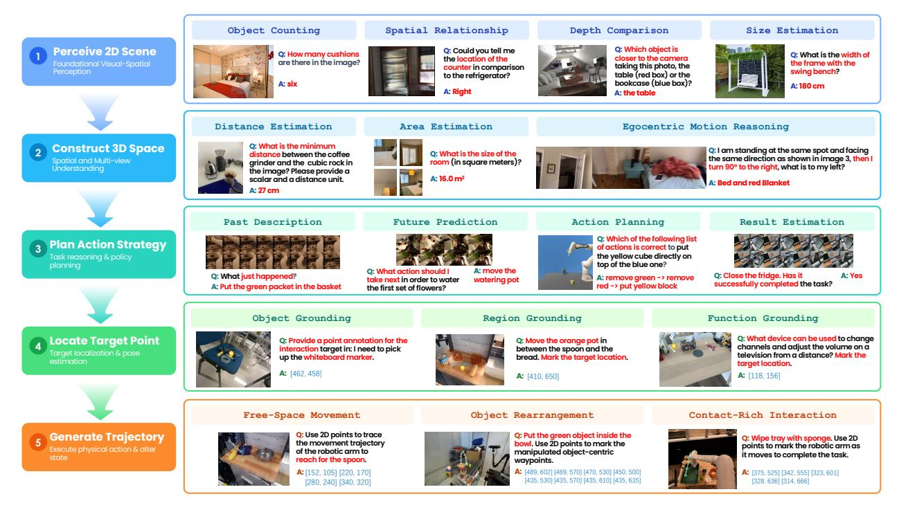

**Figure 3** PhysBrain 1.5를 사용한 구현 이해의 정성적 예시. 대표 사례는 시각-공간 인식, 3D 및 다중 시점 이해, 구현 추론 및 계획, 공간 기반 및 활용성, 시각 추적 및 궤적 추론을 보여준다. 응답은 언어 답변, 공간 좌표, 웨이포인트 시퀀스를 포함하며, 예측된 점과 궤적이 해당 관측에 겹쳐 표시된다.

이해, 구현 인지 및 계획, 공간 기반 및 활용성, 시각 추적 및 궤적 추론. 둘째, 모델의 광범위한 인식, 추론, 상식적 역량을 평가하기 위해 일반 다중모달 이해를 평가한다. 이는 구현 기술을 보완하고 다양한 물리 시나리오에서 구성적 일반화를 위한 기반을 제공한다. 또한 모델이 액션-궤적 토큰을 생성하고 미래 시각 상태를 예측하는 능력을 보여준다. 이는 물리 루프에서의 행동 실행 및 상태 전이와 대응한다. 이들 평가는 다중모달 인식과 구현 이해에서 계획, 행동 생성, 진화하는 물리 세계의 예측까지의 경로를 추적한다.

### 5.1 구현 이해 (Embodied Understanding)

#### 5.1.1 벤치마크 (Benchmarks)

우리는 28개의 벤치마크를 사용하여 구현된 이해를 평가한다. 이 벤치마크는 다섯 가지 상호 보완적인 능력 그룹으로 나뉜다. 기초 시각-공간 인식(Foundational Visual-Spatial Perception)은 BLINK [114]와 CV-Bench [54]를 사용하여 기본 시각 인식과 공간 구분을 평가한다. 공간 및 다중 시점 이해(Space and Multi-view Understanding)는 3DSRBench [115], EmbSpatial-Bench [116], MindCube [72], MMSI-Bench [117], Q-Spatial-Bench [118], RoboSpatial-Home [4], SAT [5], VSI-Bench [119], ViewSpatial-Bench [120]를 활용해 기하학, 공간 관계, 시점 변화, 교차 시점 추론을 평가한다. 구현된 인지, 추론 및 계획(Embodied Cognition, Reasoning and Planning)은 COSMOS [121], EgoPlan-Bench2 [122], ERQA [123], ERQA-PLUS [124], RoboVQA [11], VLABench [78]를 통해 목표 지향적 추론, 절차적 이해, 계획을 측정한다. 공간 기반화, 지시 및 활용성(Space Grounding, Pointing, and Affordance)은 Part-Affordance-2K [125], PIOBench S1 & S2 [126], PixMo-Points [3], PointBench [127], RefSpatial-Bench [9], RoboAfford [128], RoboRefit [79], VABench-Point [91], Where2Place [8]를 사용해 객체 위치 지정, 지시, 활용성 이해, 배치 추론을 평가한다. 마지막으로 시각 추적 및 궤적 추론(Visual Trace and Trajectory Reasoning)은 ShareRobot-Trajectory [90]와 VABench-Visual-Trace [91]를 통해 움직임 추적과 상호작용 궤적의 이해 및 예측을 검증한다. 벤치마크별 평가 프로토콜 및 구현 설정에 대한 자세한 내용은 부록 B.1에 제공된다. 이 벤치마크 모음은 구현된 의사결정에 필요한 지각,

공간적, 근거화, 추론, 그리고 계획 수립 능력은 구현된 의사결정에 필요하다.

#### **5.1.2 비교 모델**

우리는 PhysBrain 1.5를 대표적인 독점 모델과 비교한다. 여기에는 Gemini 3.6 Flash [&#91;129&#93;](#page-25-5), GPT 6 Astra [&#91;130&#93;](#page-25-6), Claude Opus 5 [&#91;131&#93;](#page-25-7)가 포함된다. 또한 Hy-Embodied-VLM-1.0 [&#91;26&#93;](#page-18-9), Embodied-R1.5 [&#91;30&#93;](#page-19-15), RynnBrain1.1 [&#91;27&#93;](#page-18-10), RoboBrain2.5 [&#91;29&#93;](#page-18-8), MiMo Embodied [&#91;28&#93;](#page-18-7), Cosmos3 Nano [&#91;34&#93;](#page-19-3), ACE-Brain-0.5 [&#91;31&#93;](#page-19-0) 등 강력한 오픈소스 구현형 MLLM을 포함한다. 또한 Qwen3-VL-Instruct (8B) [&#91;1&#93;](#page-17-0)를 범용 VLM 기준 모델로 포함한다. 서로 다른 연구가 동일 벤치마크에 대해 일관되지 않은 평가 지표를 사용할 수 있으므로, 보고된 점수는 항상 직접적으로 비교 가능하지 않다. 따라서 우리는 각 벤치마크마다 단일 표준 지표를 사용해 모든 비교 모델을 독립적으로 재평가한다. 그 결과, 표에 있는 일부 점수는 원 논문에 보고된 점수와 다를 수 있다. 모델의 공식 릴리스가 벤치마크별 입력 형식이나 권장 프롬프트를 명시하면 이를 따르며, 그렇지 않으면 기본 작업 프롬프트와 입력 템플릿을 사용한다. 모델 간 일관성을 위해 소스 이미지 해상도와 각 모델에 제공되는 샘플링된 비디오 프레임 수를 표준화하고, 내부 리사이징이나 다운샘플링을 포함한 고유 전처리 파이프라인은 그대로 유지한다. 비교 대상 대부분의 모델이 명시적인 사고 모드를 사용하지 않으므로, 독점 모델은 가장 낮은 공식 사고 설정을 사용해 평가한다: Gemini는 최소 사고, GPT는 낮은 사고, Claude는 낮은 노력의 적응형 사고를 사용한다. 공식 권장 사항에 따라 Hy-Embodied-VLM-1.0과 MiMo Embodied는 사고를 활성화하고, 나머지 모델은 사고 모드 없이 평가한다. 포인트-위치 지정 및 근거화 과제에서는 각 모델이 공식적으로 권장하는 포인트 출력 형식과 해당 파싱 절차를 채택한다.

#### **5.1.3 결과 및 분석**

PhysBrain 1.5는 물리 루프의 처음 다섯 단계에서 강력하고 균형 잡힌 구현 이해를 보여준다. Table [4,](#page-10-1)에 표시된 바와 같이, 이 모델은 평가된 구현 오픈소스 모델 중 가장 높은 전체 평균을 달성하며 72.5점을 기록하고 가장 강력한 오픈소스 기준 모델인 Hy-Embodied-VLM-1.0을 6.5점 차이로 앞선다. 14개의 벤치마크에서 1위를 차지하고 24개에서 상위 두 번째에 속한다. 또한 28개의 벤치마크에서 우리 기반 모델인 Qwen3-VL-Instruct (8B)를 모두 능가한다. 각 능력 범주 내에서 벤치마크 점수를 동일 가중치로 평균화하면, PhysBrain 1.5는 모든 다섯 범주에서 상위 두 개의 오픈소스 모델 중 하나로 순위를 매긴다. 이는 인지, 공간 추론, 계획, 기반화, 궤적 이해에서 광범위한 강점을 보여준다. 8B 규모임에도 불구하고, PhysBrain 1.5는 Gemini 3.6 Flash (73.0) 및 GPT-6-Astra (73.3)와 같은 세계 선도적인 독점 모델에 근접한 전체 점수를 기록하며, Claude Opus 5 (67.9)를 4.6점 차이로 앞서 구현 이해에서 경쟁력을 강조한다.

Figure [3](#page-11-2)는 물리 루프를 따라 조직된 대표 예시를 통해 이러한 능력을 보여준다. 장면 인식 단계에서 PhysBrain 1.5는 객체를 세고, 공간 관계를 추론하며, 상대 깊이를 비교하고, 물리적 치수를 추정한다. 3D 공간 이해로 나아가, 메트릭 거리와 방 영역을 추정하고, 시점 변화를 따른 자기 중심 공간 관계를 추론한다. 행동 계획을 위해 과거 행동을 해석하고, 다음 단계를 예측하며, 목표를 순서화된 행동으로 분해하고, 작업 완료를 평가한다. 작업 의도는 객체 지시, 배치 영역 위치화, 기능적 활용성 식별을 통해 실행 가능한 위치에 기반화된다. 마지막으로 모델은 자유 공간 이동, 객체 재배치, 닦기와 같은 접촉이 풍부한 상호작용을 위한 이미지 공간 웨이포인트를 생성한다. 이 예시들은 장면 이해에서 목표 지향적 상호작용으로 진행하기 위한 상호 보완적 능력을 보여준다. 추가 예시는 Appendix [B.4](#page-30-0)에서 확인할 수 있다.

### **5.2 일반 다중모달 이해 (General Multimodal Understanding)**

적절한 구현 모델은 전문화된 물리적 기술과 광범위한 다중모달 이해 및 상식적 추론을 결합해야 한다. 이러한 일반적인 능력은 관찰을 해석하고, 지시를 이해하며, 다양한 시나리오에서 사건을 작업 목표와 연결하는 맥락을 제공한다. 따라서 우리는 구현 평가를 일반 이미지 및 비디오 벤치마크 세트와 보완하여, Qwen3-VL-Instruct (8B) [&#91;1&#93;](#page-17-0)를 일반 목적 다중모달 성능의 기준으로 사용한다.

**Table 5 일반 다중모달 이해 결과 (I).** 결과는 광범위한 이미지 및 비디오 이해와 객체 환각에 대한 견고성을 다룬다. VideoMME는 추가 자막 없이 최대 128개의 샘플 프레임을 사용한다. MME는 원래 점수 척도에서 MME-P와 MME-C 하위 벤치마크 점수의 합계로 보고되며, 나머지 모든 점수는 백분율이다. 높은 값일수록 성능이 우수함을 나타낸다.

| 모델 | 크기 | MME | MMStar | RealWorldQA | VideoMME | MVBench | POPE (F1) |
|----------------|------|---------|--------|-------------|----------|---------|-----------|
| Qwen3-VL-Inst. | 8B | 2392.70 | 64.99 | 68.37 | 69.07 | 68.53 | 88.40 |
| PhysBrain 1.5 | 8B | 2330.07 | 65.60 | 69.41 | 68.22 | 66.07 | 89.49 |

**표 6 일반 다중모달 이해 결과 (II).** 결과는 다이어그램 및 차트 이해, 문서 및 장면 텍스트 읽기, 세밀한 시각 인식, 그리고 GUI 기반 정리를 포함한다. 모든 점수는 백분율이며, 값이 높을수록 성능이 우수함을 나타낸다.

| AI2D | ChartQA | DocVQA | TextVQA | V* | ScreenSpot |
|-------|---------|--------|---------|-------|----------------|
| 83.74 | 84.96 | 95.66 | 81.94 | 83.77 | 91.59 90.17 |
|  | 82.16 | 86.24 | 94.43 |  | 81.58 87.96 |

#### **5.2.1 평가 프로토콜 (Evaluation Protocol)**

우리는 일반 다중모달 이해를 위한 12개의 확립되고 널리 사용되는 벤치마크를 평가한다: MME [&#91;132&#93;](#page-25-8), MMStar [&#91;133&#93;](#page-25-9), RealWorldQA [&#91;134&#93;](#page-25-10), VideoMME [&#91;135&#93;](#page-25-11), MVBench [&#91;136&#93;](#page-25-12), POPE [&#91;137&#93;](#page-25-13), AI2D [&#91;138&#93;](#page-25-14), ChartQA [&#91;139&#93;](#page-25-15), DocVQA [&#91;140&#93;](#page-25-16), TextVQA [&#91;141&#93;](#page-26-0), V* [&#91;142&#93;](#page-26-1), 그리고 ScreenSpot [&#91;143&#93;](#page-26-2). 이 스위트는 광범위한 이미지 및 비디오 이해를 다루며, 객체 환각, 다이어그램 및 차트 추론, 문서 및 장면 텍스트 이해, 세밀한 시각적 인식, GUI 기반화 평가를 보완한다. 개별 벤치마크 범위와 작업 형식에 대한 설명은 부록 [B.2.](#page-28-1)에 제공된다.

우리는 lmms-eval [&#91;144&#93;](#page-26-3)을 사용하여 PhysBrain 1.5와 원본 Qwen3-VL-Instruct를 평가한다. 우리의 주요 비교는 동일한 작업별 프롬프트, 시각 전처리, 디코딩 설정 및 점수 매기기 절차를 두 모델 모두에 적용한 로컬 재평가 Qwen 기준선을 사용한다. Qwen3-VL에서 보고된 벤치마크의 경우, 가능한 한 로컬 구현이 허용하는 범위 내에서 공개된 레시피와 평가를 일치시킨다.[2](#page-13-3) Qwen 결과가 보고되지 않은 벤치마크의 경우, 기본 lmms-eval 작업 구성을 사용한다. 두 모델 모두에서 비디오 입력은 VideoMME에서 최대 128개의 샘플 프레임, MVBench에서 32개의 프레임을 포함한다. 완전한 디코딩, 시각 전처리, 프롬프트 및 답변 추출 설정은 부록 [B.2.](#page-28-1)에 제공된다.

#### **5.2.2 결과 및 분석 (Results and Analysis)**

PhysBrain 1.5는 강력한 체화 성능과 광범위한 다중모달 이해를 결합한다. 표 [5](#page-13-4)와 표 [6,](#page-13-4)에 나타난 바와 같이, 일반 평가 스위트 전반에 걸친 전체 성능은 8B Qwen3-VL-Instruct(기본 모델)와 유사하다. 그 기능은 전문 체화 벤치마크를 넘어 이미지 및 비디오 이해, 시각적 추론, 텍스트, 차트 및 다이어그램 해석까지 확장된다.

### **5.3 넘어 이해를 넘어: 행동 모델링 및 물리 세계 예측 (Beyond Understanding: Action Modeling and Physical-World Prediction)**

#### **5.3.1 행동 궤적 토큰 예측 (Action Trajectory Token Prediction)**

우리는 사후 학습된 모델에서 행동 궤적 예측을 검토한다. 현재 RGB 관측, 작업 지시, 그리고 이전 16단계 정답(ground-truth) 행동 청크를 주면, PhysBrain 1.5는 자기회귀적으로 다음 16단계의 행동 토큰을 생성하고, 이는 ActionPiece에 의해 엔드-에펙터 궤적으로 디코딩된다. Figure [4](#page-14-0)는 훈련 중에 보지 못한 테스트 에피소드에서 이미지 평면상의 예측 및 정답 위치를 시각화한다. 그림에 나타난 조작 과제 전반에서 예측은 참조 동작의 방향과 형태를 대체로 따르며, 물체 배치, 도구 사용, 양손 조작을 포함한 예시는 모델이 관찰된 장면과 작업 지침의 맥락에서 단기 동작을 어떻게 표현하는지를 보여준다.

2<https://github.com/QwenLM/Qwen3-VL/tree/main/evaluation>

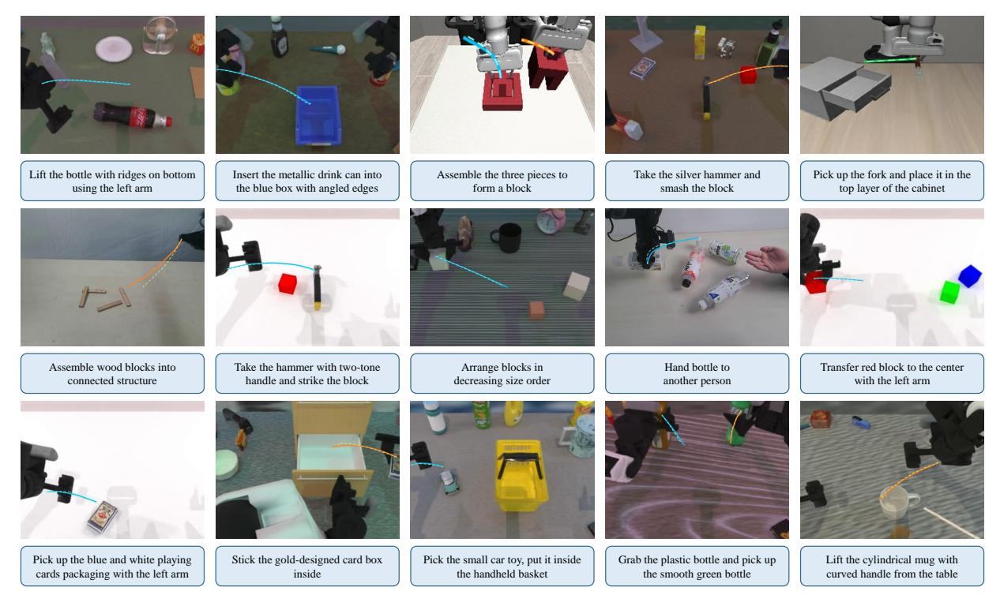

Figure 4는 보류된 에피소드에서의 행동 궤적 예측을 이미지 평면에 시각화한 것이다. 예측은 사후 훈련된 모델에 의해 생성된다. 작업 지시, 현재 이미지, 그리고 이전 행동 청크가 주어지면 PhysBrain 1.5는 요청된 손목(들)에 대해 다음 16개의 행동 단계를 예측한다. 예측된 및 실제 엔드 이펙터 위치는 이미지 평면에 투영되어 현재 관측에 겹쳐진다: 실선은 실제 궤적을, 점선은 예측 궤적을 나타낸다. 해당 작업 지시는 각 예시 아래에 표시된다. 모든 예시는 훈련 중에 보지 못한 테스트 에피소드에서 추출된다. 이 시각화는 실행된 로봇 롤아웃을 보고하는 대신 예측 궤적과 실제 궤적을 비교한다.

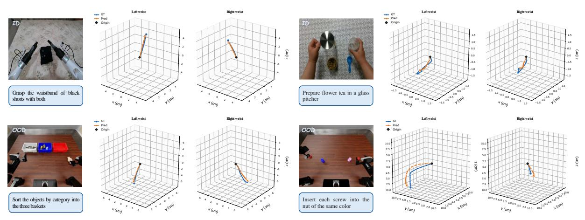

Figure 5는 ID 및 OOD 테스트 장면에서의 행동 궤적 예측을 3차원으로 시각화한 것이다. 예측은 사후 훈련된 모델에 의해 생성된다. 각 예시는 현재 관측과 작업 지시를 보여 주며, 왼쪽과 오른쪽 손목에 대한 실제(파랑) 및 예측(주황) 궤적을 함께 표시한다. 검은 다이아몬드는 궤적의 기원을 표시하고, 축은 센티미터 단위로 측정된다. x, y, z 축은 각 예시의 원본 로봇 행동 데이터의 좌표 규약을 따르며, 좌표계는 소스 간에 정렬되지 않는다. 상단 행은 in-distribution(ID) 예시를, 하단 행은 모델 훈련 코퍼스에서 제외된 RoboDojo의 out-of-distribution(OOD) 예시를 제시한다. 이 예시들은 훈련 분포 내외에서 예측 및 실제 움직임을 정성적으로 비교한다.

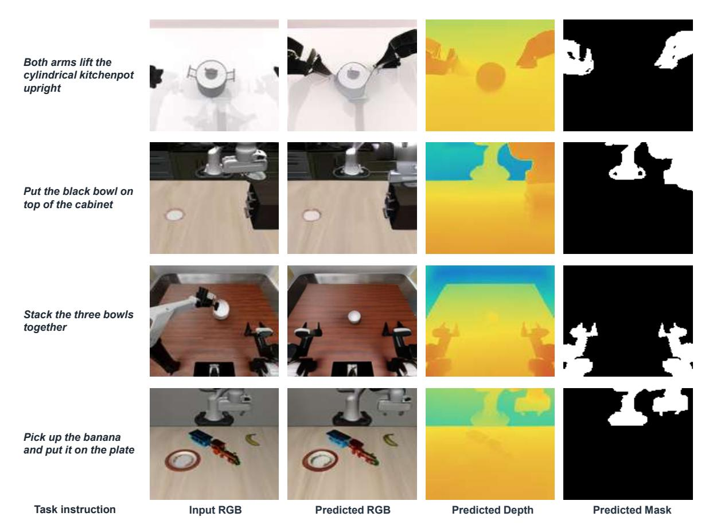

Figure 6은 다양한 로봇 구현체에서의 미래 시각 예측에 대한 정성적 결과를 보여준다. 각 행은 현재 RGB 관측과 예측된 미래 RGB 이미지, 깊이 맵, 로봇 마스크를 제시한다. 예시들은 1초 예측 지평을 사용한다. 모델은 주된 장면 레이아웃과 객체 정체성을 보존하면서 작업 일관성 있는 변화를 예측한다. 세 가지 모달리티에 걸친 예측은 공간적으로 일관되며, 미래 외관, 작업 공간 기하학, 로봇 점유를 동시에 포착한다.

Figure [5](#page-14-1)는 동일한 과거-조건 예측 프로토콜을 사용하여 ID 및 OOD 테스트 장면에서 예측 및 참조 손목 궤적을 3차원 좌표로 시각화한다. ID 예시들은 근사 선형 움직임과 곡선 경로를 모두 포착하며, RoboDojo 예시들은 훈련에서 제외된 데이터 소스로 비교를 확장한다. OOD 정렬 및 나사 삽입 예시에서 예측은 참조 궤적의 광범위한 움직임 경향을 재현하지만, 위치 편차는 여전히 보인다. 각 비교는 소스 행동 데이터의 좌표 규약을 유지하며, 소스 간 좌표 정렬은 수행되지 않는다. 이 예시들은 PhysBrain 1.5가 장면 이해를 넘어 공유된 자기 회귀 인터페이스를 통해 구조화된 동작 연속을 생성함을 보여준다. 증거는 관측된 행동 이력을 조건으로 한 오프라인 궤적 예측에 관한 것이며, 폐쇄 루프 실행이나 전체 작업 성공과는 관련이 없다.

#### **5.3.2 미래 시각 예측 (Future Visual Prediction)**

현재 RGB 관측과 작업 지시를 바탕으로 PhysBrain 1.5는 RGB 이미지, 깊이 맵, 로봇 마스크를 통해 미래 시각 상태를 예측한다. 그림 [6](#page-15-1)은 1초 예측 지평선에서 대표적인 예시를 제시한다. 이 예측들은 전체 장면 레이아웃을 보존하면서, 서로 다른 로봇 구현체와 시점에서 작업 진행에 일관된 그럴듯한 변화를 묘사한다. 냄비 들기 예시에서는 두 팔이 냄비 쪽으로 움직이며, 그 예측 위치가 대응되는 깊이 및 마스크 출력에 반영된다. 보다 일반적으로, 세 가지 모달리티는 미래 외관, 작업 공간 기하학, 로봇 구성을 공간적으로 일관된 방식으로 설명한다.

이 예시들은 PhysBrain 1.5가 현재 장면을 이해하는 것을 넘어 작업과 관련된 미래 상태를 예측하는 방식을 보여준다. 공유 어휘와 디코더를 통해 모델은 이러한 예측을 보완적인 시각적 모달리티로 표현하며, 물리적 상호작용 중 환경과 로봇이 어떻게 진화할 수 있는지를 동시에 모델링할 수 있는 능력을 시각화한다.

## **6 결론 (Conclusion)**

이 보고서에서는 에이전트가 환경을 관찰하고, 그 환경에 행동을 취하며, 그 결과 변화를 이용해 이후 행동을 안내하는 물리적 루프(physical loop)를 따라 PhysBrain 1.5를 소개한다. 이 모델은 공유된 자기회귀 백본(shared autoregressive backbone)을 통해 체현적 이해, 행동 생성, 미래 상태 예측을 지원하며, 언어 응답(language responses), 끝효과기 궤적, 다중모달 시각 상태(multimodal visual states)를 공통의 다음 토큰 예측 목표 아래 이산 토큰(discrete tokens)으로 표현한다. 물리 인식 사전 훈련(physical-aware pre-training)은 인간 상호작용 비디오(human interaction videos)와 일반 언어 및 시각-언어 데이터(general language and vision–language data)만으로 체현적 감독(embodied supervision)을 완전히 도출한다. 이후 지도 학습 미세 조정(supervised fine-tuning)은 인간, 실제 로봇, 시뮬레이션 상호작용 데이터(human, real-robot, and simulated interaction data)를 통합한다.

28개의 체현 이해 벤치마크에서, 우리 8B 모델은 평균 점수 72.5를 달성하여 오픈소스 최첨단을 새롭게 설정하고 주도적인 상용 시스템에 근접하며, 광범위한 멀티모달 이해 능력을 유지한다. 정성적 결과는 엔드 이펙터 궤적 예측과 미래 RGB 이미지, 깊이 맵, 로봇 마스크의 공간적으로 일관된 예측을 추가로 입증한다. 이러한 결과는 물리적 루프에 필요한 역량을 개발하기 위한 효과적인 경로로서 상호작용 경험에서 학습을 지원한다. 우리는 학습 데이터 양을 확장하고, 모달리티 범위를 확대하며, 더 풍부한 상호작용 경험을 통합할 예정이다.

# **References**

- [1] Shuai Bai 외. Qwen3-VL Technical Report. arXiv 사전 인쇄 arXiv:2511.21631, 2025. URL [https://arxiv.](https://arxiv.org/abs/2511.21631) [org/abs/2511.21631](https://arxiv.org/abs/2511.21631).
- [2] Jinguo Zhu, Weiyun Wang, Zhe Chen, Zhaoyang Liu, Shenglong Ye, Lixin Gu, Hao Tian, Yuchen Duan, Weijie Su, Jie Shao, et al. InternVL3: Open-Source 다중모달 모델을 위한 고급 훈련 및 테스트 시점 레시피 탐색. arXiv 사전 인쇄 arXiv:2504.10479, 2025. URL <https://arxiv.org/abs/2504.10479>.
- [3] Matt Deitke, Christopher Clark, Sangho Lee, Rohun Tripathi, Yue Yang, Jae Sung Park, Mohammadreza Salehi, Niklas Muennighoff, Kyle Lo, Luca Soldaini, et al. Molmo and PixMo: 최첨단 Vision-Language 모델을 위한 공개 가중치 및 공개 데이터. 2025 IEEE/CVF Computer Vision and Pattern Recognition (CVPR) 회의, 91–104쪽. IEEE, 2025.
- [4] Chan Hee Song, Valts Blukis, Jonathan Tremblay, Stephen Tyree, Yu Su, and Stan Birchfield. RoboSpatial: 로봇공학을 위한 2D 및 3D Vision-Language 모델에 공간 이해를 가르치기. 2025 IEEE/CVF Computer Vision and Pattern Recognition (CVPR) 회의, 15768–15780쪽. IEEE, 2025.
- [5] Arijit Ray, Jiafei Duan, Ellis L Brown II, Reuben Tan, Dina Bashkirova, Rose Hendrix, Kiana Ehsani, Aniruddha Kembhavi, Bryan A. Plummer, Ranjay Krishna, Kuo-Hao Zeng, and Kate Saenko. SAT: 다중모달 언어 모델을 위한 동적 공간 적성 훈련. 2025년 두 번째 Language Modeling 회의.
- [6] Wufei Ma, Yu-Cheng Chou, Qihao Liu, Xingrui Wang, Celso M de Melo, Jianwen Xie, and Alan Yuille. SpatialReasoner: 명시적이고 일반화 가능한 3D 공간 추론을 향해. 2025년 39번째 Neural Information Processing Systems 연례 회의.
- [7] Shusheng Yang, Jihan Yang, Pinzhi Huang, Ellis L Brown II, Zihao Yang, Yue Yu, Shengbang Tong, Zihan Zheng, Yifan Xu, Muhan Wang, Rob Fergus, Yann LeCun, Li Fei-Fei, and Saining Xie. Cambrian-S: 비디오에서 공간 초감지로 향해. 2026년 14번째 International Conference on Learning Representations.
- [8] Wentao Yuan, Jiafei Duan, Valts Blukis, Wilbert Pumacay, Ranjay Krishna, Adithyavairavan Murali, Arsalan Mousavian, and Dieter Fox. RoboPoint: 로봇공학을 위한 공간적 가능성 예측을 위한 Vision-Language 모델. arXiv 사전 인쇄 arXiv:2406.10721, 2024. URL <https://arxiv.org/abs/2406.10721>.
- [9] Enshen Zhou, Jingkun An, Cheng Chi, Yi Han, Shanyu Rong, Chi Zhang, Pengwei Wang, Zhongyuan Wang, Tiejun Huang, Lu Sheng, et al. RoboRefer: 로봇공학을 위한 Vision-Language 모델에서 공간 지시와 추론을 향해. Advances in Neural Information Processing Systems, 38:32209–32286, 2025.
- [10] Christopher Clark, Yue Yang, Jae Sung Park, Zixian Ma, Jieyu Zhang, Rohun Tripathi, Mohammadreza Salehi, Sangho Lee, Taira Anderson, Winson Han, et al. MolmoPoint: Grounding Tokens를 이용한 VLM의 향상된 포인팅. arXiv 사전 인쇄 arXiv:2603.28069, 2026. URL <https://arxiv.org/abs/2603.28069>.
- [11] Pierre Sermanet, Tianli Ding, Jeffrey Zhao, Fei Xia, Debidatta Dwibedi, Keerthana Gopalakrishnan, Christine Chan, Gabriel Dulac-Arnold, Sharath Maddineni, Nikhil J Joshi, et al. RoboVQA: 로봇공학을 위한 다중모달 장기 추론. 2024 IEEE International Conference on Robotics and Automation (ICRA), 645–652쪽. IEEE, 2024.
- [12] Yi Chen, Yuying Ge, Yixiao Ge, Mingyu Ding, Bohao Li, Rui Wang, Ruifeng Xu, Ying Shan, and Xihui Liu. EgoPlan-Bench: 인간 수준 계획을 위한 다중모달 대형 언어 모델 벤치마킹. arXiv 사전 인쇄 arXiv:2312.06722, 2023. URL <https://arxiv.org/abs/2312.06722>.
- [13] Tony Lee et al. RoboReward: 로봇공학을 위한 범용 Vision-Language 보상 모델. arXiv 사전 인쇄 arXiv:2601.00675, 2026. URL <https://arxiv.org/abs/2601.00675>.
- [14] Anthony Liang et al. Robometer: 궤적 비교를 통한 범용 로봇 보상 모델 확장. arXiv 사전 인쇄 arXiv:2603.02115, 2026. URL <https://arxiv.org/abs/2603.02115>.
- [15] Kevin Black, Noah Brown, Danny Driess, Adnan Esmail, Michael Equi, Chelsea Finn, Niccolo Fusai, Lachy Groom, Karol Hausman, Brian Ichter, et al. π0: 일반 로봇 제어를 위한 Vision-Language-Action 흐름 모델. arXiv 사전 인쇄 arXiv:2410.24164, 2024. URL <https://arxiv.org/abs/2410.24164>.
- [16] Physical Intelligence, Kevin Black, Noah Brown, James Darpinian, Karan Dhabalia, Danny Driess, et al. π0.5: 오픈 월드 일반화를 갖는 Vision-Language-Action 모델. arXiv 사전 인쇄 arXiv:2504.16054, 2025. URL <https://arxiv.org/abs/2504.16054>.

- [17] 물리적 지능, Bo Ai, Ali Amin, R. Aniceto, A. Balakrishna, G. Balke, K. Black, G. Bokinsky, S. Cao, T. Charbonnier, et al. π0.7: 새로운 능력의 출현을 가진 조정 가능한 범용 로봇 기반 모델. arXiv preprint arXiv:2604.15483, 2026. URL <https://arxiv.org/abs/2604.15483>
- [18] NVIDIA, Johan Bjorck, Fernando Castañeda, Nikita Cherniadev, Xingye Da, Runyu Ding, et al. GR00T N1: 일반형 휴머노이드 로봇을 위한 오픈 기반 모델. arXiv preprint arXiv:2503.14734, 2025. URL <https://arxiv.org/abs/2503.14734>
- [19] Qiuyue Wang, Mingsheng Li, Jian Guan, Jinhui Ye, Sicheng Xie, Yitao Liu, Junhao Chen, Zhixuan Liang, Jie Zhang, Xintong Hu, et al. Qwen-VLA: 작업, 환경, 로봇 구현 전반에 걸친 시각-언어-행동 모델링 통합. arXiv preprint arXiv:2605.30280, 2026. URL <https://arxiv.org/abs/2605.30280>
- [20] Seonghyeon Ye, Yunhao Ge, Kaiyuan Zheng, Shenyuan Gao, Sihyun Yu, George Kurian, et al. 세계 행동 모델은 제로샷 정책이다. arXiv preprint arXiv:2602.15922, 2026. URL [https://arxiv.org/abs/2602.](https://arxiv.org/abs/2602.15922) [15922](https://arxiv.org/abs/2602.15922)
- [21] Jie Zhang, Xiaoyue Chen, Anzhe Chen, Chenxu Lv, Deqing Li, Gengze Zhou, Hang Yin, Haoqi Yuan, Haoyang Li, Jiahao Li, et al. Qwen-RobotWorld Technical Report: 언어-조건화된 비디오 생성을 통한 구현된 세계 모델링 통합. arXiv preprint arXiv:2606.17030, 2026. URL [https://arxiv.org/abs/2606.](https://arxiv.org/abs/2606.17030) [17030](https://arxiv.org/abs/2606.17030)
- [22] Michael Ahn, Anthony Brohan, Noah Brown, Yevgen Chebotar, Omar Cortes, Byron David, Chelsea Finn, Chuyuan Fu, Karol Gopalakrishnan, Karol Hausman, et al. 내가 할 수 있는 대로, 내가 말하는 대로는 아니다: 로봇적 활용 가능성에 언어를 기반화. In Conference on Robot Learning, 2022.
- [23] Jacky Liang, Wenlong Huang, Fei Xia, Peng Xu, Karol Hausman, Brian Ichter, Pete Florence, and Andy Zeng. 정책으로서의 코드: 구현된 제어를 위한 언어 모델 프로그램. In IEEE International Conference on Robotics and Automation, pages 9493–9500, 2023.
- [24] Wenlong Huang, Chen Wang, Ruohan Zhang, Yunzhu Li, Jiajun Wu, and Li Fei-Fei. VoxPoser: 언어 모델을 활용한 로봇 조작을 위한 조합 가능한 3D 가치 지도. In Conference on Robot Learning, 2023.
- [25] Tencent Robotics X, HY Vision Team, Xumin Yu, Zuyan Liu, Ziyi Wang, He Zhang, Yongming Rao, Fangfu Liu, Yani Zhang, Ruowen Zhao, Oran Wang, Yves Liang, Haitao Lin, Minghui Wang, Yubo Dong, Kevin Cheng, Bolin Ni, Rui Huang, Han Hu, Zhengyou Zhang, Linus, and Shunyu Yao. HY-Embodied-0.5: 실제 세계 에이전트를 위한 구현된 기반 모델. arXiv preprint arXiv:2604.07430, 2026. URL [https://arxiv.org/abs/2604.](https://arxiv.org/abs/2604.07430) [07430](https://arxiv.org/abs/2604.07430)
- [26] Ziyi Wang, Xumin Yu, Yongming Rao, Yonggen Ling, Yunheng Li, Oran Wang, Mingqi Gao, Yuchen Zhou, Yves Liang, Zuyan Liu, Yani Zhang, Rui Huang, Xiaoran Xu, Bowen Yuan, Yifu Yuan, Xu Tan, He Zhang, Yufei Huang, Shenghao Zhang, Hongsheng Wu, Han Hu, and Zhengyou Zhang. Hy-Embodied-VLM-1.0: 효율적인 물리적 세계 에이전트. arXiv preprint arXiv:2607.12894, 2026. URL <https://arxiv.org/abs/2607.12894>
- [27] Kehan Li, Bohan Hou, Minghao Zhu, Tianyi Zhang, Zesen Cheng, Zhikai Wang, Sicong Leng, Xin Li, Xiao Lin, Biying Yao, Minghua Zeng, Jiangpin Liu, Ronghao Dang, Jiayan Guo, Siteng Huang, Haoyu Zhao, Heng Ping, Yaxi Zhao, Tong Zhao, Kexiang Wang, Tong Lu, Shengke Xue, Jiahao Tang, Yulei Wang, Zejing Wang, Jianwei Gao, Shijian Lu, Chengju Liu, Jianfei Yang, Mingxiu Chen, and Deli Zhao. RynnBrain 1.1: 보다 능력 있고 일반화 가능한 구현된 기반 모델을 향해. arXiv preprint arXiv:2607.17977, 2026. URL <https://arxiv.org/abs/2607.17977>
- [28] Xiaoshuai Hao, Lei Zhou, Zhijian Huang, Zhiwen Hou, Yingbo Tang, Lingfeng Zhang, Guang Li, Zheng Lu, Shuhuai Ren, Xianhui Meng, Yuchen Zhang, Jing Wu, Jinghui Lu, Chenxu Dang, Jiayi Guan, Jianhua Wu, Zhiyi Hou, Hanbing Li, Shumeng Xia, Mingliang Zhou, Yinan Zheng, Zihao Yue, Shuhao Gu, Hao Tian, Yuannan Shen, Jianwei Cui, Wen Zhang, Shaoqing Xu, Bing Wang, Haiyang Sun, Zeyu Zhu, Yuncheng Jiang, Zibin Guo, Chuhong Gong, Chaofan Zhang, Wenbo Ding, Kun Ma, Guang Chen, Rui Cai, Diyun Xiang, Heng Qu, Fuli Luo, Hangjun Ye, and Long Chen. MiMo-Embodied: X-Embodied 기반 모델 기술 보고서. arXiv preprint arXiv:2511.16518, 2025. URL <https://arxiv.org/abs/2511.16518>
- [29] Huajie Tan, Enshen Zhou, Zhiyu Li, Yijie Xu, Yuheng Ji, Xiansheng Chen, Cheng Chi, Pengwei Wang, Huizhu Jia, Yulong Ao, Mingyu Cao, Sixiang Chen, Zhe Li, Mengzhen Liu, Zixiao Wang, Shanyu Rong, Yaoxu Lyu, Zhongxia Zhao, Peterson Co, Yibo Li, Yi Han, Shaoxuan Xie, Guocai Yao, Songjing Wang, Leiduo Zhang, Xi Yang, Yance Jiao, Donghai Shi, Kunchang Xie, Shaokai Nie, Chunlei Men, Yonghua Lin, Zhongyuan Wang, Tiejun Huang, and Shanghang Zhang. RoboBrain 2.5: 시각에서 깊이, 마음에서 시간. arXiv preprint arXiv:2601.14352, 2026. URL <https://arxiv.org/abs/2601.14352>

- [30] Yifu Yuan, Yaoting Huang, Xianze Yao, Yutong Li, Shuoheng Zhang, Linqi Han, Pengyi Li, Jiangeng Sun, Wenting Jia, Zhao Zhang, Yuhao Liu, Ruihao Liao, Yucheng Hu, Qiyu Wu, Yuxiao Li, Zibin Dong, Fei Ni, Yan Zheng, Shuyang Gu, Yi Ma, Hongyao Tang, Han Hu, and Jianye Hao. Embodied-R1.5: Embodied Foundation Models를 통한 물리적 지능 진화. arXiv preprint arXiv:2606.11324, 2026. URL [https:](https://arxiv.org/abs/2606.11324) [//arxiv.org/abs/2606.11324](https://arxiv.org/abs/2606.11324).

- [31] ACE-Brain Team, Ziyang Gong, Haoming Gu, Zehang Luo, Tianyi Zhang, Tao Tao, Yixiao Chi, Zhe Liu, Lingsi Zhu, Jingyuan Liu, Anke Tang, Songze Li, Yilun Kong, Ningjing Liu, Tianyu Zhu, Yunpeng Qing, Shuang Luo, Xiang Liu, Shi Fu, Dawei Nie, Sixiang Liu, Zhexi Wen, Feng Pan, Xiaofeng Wang, Zhi Hou, Chunxiao Liu, Xue Yang, Junchi Yan, Hengshuang Zhao, Dacheng Tao, and Xiaogang Wang. ACE-Brain-0.5: 물리적 에이전시 AI를 위한 통합 Embodied Foundational Model. arXiv preprint arXiv:2607.04426, 2026. URL <https://arxiv.org/abs/2607.04426>.

- [32] Yuqi Wang, Xinghang Li, Wenxuan Wang, Junbo Zhang, Yingyan Li, Yuntao Chen, Xinlong Wang, and Zhaoxiang Zhang. 통합 Vision-Language-Action Model. arXiv preprint arXiv:2506.19850, 2025. URL <https://arxiv.org/abs/2506.19850>.

- [33] Jun Cen, Siteng Huang, Yuqian Yuan, Kehan Li, Hangjie Yuan, Chaohui Yu, Bohan Hou, Yuming Jiang, Jiayan Guo, Xin Li, Hao Luo, Fan Wang, Deli Zhao, and Hao Chen. RynnVLA-002: 통합 Vision-Language-Action 및 World Model. arXiv preprint arXiv:2511.17502, 2025. URL <https://arxiv.org/abs/2511.17502>.

- [34] NVIDIA. Cosmos 3: 물리적 AI를 위한 Omnimodal World Models. arXiv preprint arXiv:2606.02800, 2026. URL <https://arxiv.org/abs/2606.02800>.

- [35] DeepCybo Team. ActionPiece: autoregressive Vision-Language-Action 모델을 위한 action tokenization 재고, 2026. URL <https://deepcybo-physai.github.io/ActionPiece/>.

- [36] Shijie Lian, Bin Yu, Xiaopeng Lin, Changti Wu, Hang Yuan, Xiaolin Hu, Zhaolong Shen, Yuzhuo Miao, Haishan Liu, Yuxuan Tian, Yukun Shi, Cong Huang, and Kai Chen. PhysBrain 1.0 기술 보고서. arXiv preprint arXiv:2605.15298, 2026. URL <https://arxiv.org/abs/2605.15298>.

- [37] DeepCybo Team. Ego360: 물리적 지능을 위한 인간 경험의 파노라마 뷰, n.d. URL [https:](https://deepcybo-physai.github.io/Ego360-DeepCybo-Insta360/) [//deepcybo-physai.github.io/Ego360-DeepCybo-Insta360/](https://deepcybo-physai.github.io/Ego360-DeepCybo-Insta360/).

- [38] Xiaopeng Lin, Ruoqi Yang, Shijie Lian, Zhaolong Shen, Bin Yu, Changti Wu, Haibao Liu, Yuxiang Zhang, Hong Li, Qiyuan Su, Haochen Liu, Xuguo He, Yukun Shi, Cong Huang, Zhirui Zhang, Bojun Cheng, and Kai Chen. Human-as-Humanoid: Ego-Exo 인간 비디오와 인간 정렬 Embodiments를 통한 Zero-Shot Humanoid 학습 가능화. arXiv preprint arXiv:2606.32009, 2026. URL <https://arxiv.org/abs/2606.32009>.

- [39] Ropedia. Xperience-10M: 구조화된 3D/4D 주석을 갖춘 대규모 Egocentric Multimodal 데이터셋. Hugging Face dataset, 2026. URL <https://huggingface.co/datasets/ropedia-ai/xperience-10m>.

- [40] BuildAI. Egocentric-10k, 2025. URL <https://huggingface.co/datasets/builddotai/Egocentric-10K>.

- [41] Kristen Grauman, Andrew Westbury, Eugene Byrne, Zachary Chavis, Antonino Furnari, Rohit Girdhar, Jackson Hamburger, Hao Jiang, Miao Liu, Xingyu Liu, et al. Ego4D: 3,000시간의 Egocentric 비디오로 전 세계를 둘러보다. In 2022 IEEE/CVF Conference on Computer Vision and Pattern Recognition (CVPR), pages 18973–18990. IEEE, 2022. doi: 10.1109/CVPR52688.2022.01842.

- [42] Ryan Punamiya, Simar Kareer, Zeyi Liu, Josh Citron, Ri-Zhao Qiu, et al. EgoVerse: 전 세계에서 로봇 학습을 위한 Egocentric 인간 데이터셋. arXiv preprint arXiv:2604.07607, 2026. URL [https:](https://arxiv.org/abs/2604.07607) [//arxiv.org/abs/2604.07607](https://arxiv.org/abs/2604.07607).

- [43] Ryan Hoque, Peide Huang, David J. Yoon, Mouli Sivapurapu, and Jian Zhang. EgoDex: 대규모 Egocentric 비디오에서 정교한 조작 학습. CoRR, abs/2505.11709, 2025. doi: 10.48550/arXiv.2505.11709. URL <https://arxiv.org/abs/2505.11709>.

- [44] Jingkang Yang, Shuai Liu, Hongming Guo, Yuhao Dong, Xiamengwei Zhang, et al. EgoLife: Egocentric 라이프 어시스턴트로 향하다. arXiv preprint arXiv:2503.03803, 2025. URL <https://arxiv.org/abs/2503.03803>.

- [45] Kristen Grauman, Andrew Westbury, Lorenzo Torresani, Kris Kitani, Jitendra Malik, et al. Ego-Exo4D: 1인칭 및 3인칭 관점에서 숙련된 인간 활동 이해. arXiv preprint arXiv:2311.18259, 2023. URL <https://arxiv.org/abs/2311.18259>.

- [46] Shayne Longpre, Le Hou, Tu Vu, Albert Webson, Hyung Won Chung, Yi Tay, Denny Zhou, Quoc V. Le, Barret Zoph, Jason Wei, and Adam Roberts. The Flan Collection: 효과적인 지시 튜닝을 위한 데이터 및 방법 설계. arXiv preprint arXiv:2301.13688, 2023. URL <https://arxiv.org/abs/2301.13688>.

- [47] Ning Ding, Yulin Chen, Bokai Xu, Yujia Qin, Zhi Zheng, Shengding Hu, Zhiyuan Liu, Maosong Sun, and Bowen Zhou. 고품질 지시 대화를 확장하여 챗 언어 모델 강화. arXiv preprint arXiv:2305.14233, 2023. URL <https://arxiv.org/abs/2305.14233>.

- [48] Andreas Köpf, Yannic Kilcher, Dimitri von Rütte, Sotiris Anagnostidis, Zhi-Rui Tam, Keith Stevens, Abdullah Barhoum, Nguyen Minh Duc, Oliver Stanley, Richárd Nagyfi, Shahul ES, Sameer Suri, David Glushkov, Arnav Maguire, Christoph Schuhmann, Huu Nguyen, and Alexander Mattick. OpenAssistant Conversations – 대규모 언어 모델 정렬의 민주화. Advances in Neural Information Processing Systems, 36, 2023.

- [49] OpenBMB. Ultradata-SFT-2605, 2026. URL <https://huggingface.co/datasets/openbmb/UltraData-SFT-2605>.

- [50] Longhui Yu, Weisen Jiang, Han Shi, Jincheng Yu, Zhengying Liu, Yu Zhang, James T. Kwok, Zhenguo Li, Adrian Weller, and Weiyang Liu. MetaMath: 대규모 언어 모델을 위한 자체 수학 질문 부트스트랩. arXiv preprint arXiv:2309.12284, 2023. URL <https://arxiv.org/abs/2309.12284>.

- [51] Yuxiang Wei, Zhe Wang, Jiawei Liu, Yifeng Ding, and Lingming Zhang. Magicoder: OSS-Instruct로 코드 생성 강화. Proceedings of the 41st International Conference on Machine Learning, 2024.

- [52] Luis Wiedmann, Orr Zohar, Amir Mahla, Xiaohan Wang, Rui Li, Thibaud Frere, Leandro von Werra, Aritra Roy Gosthipaty, and Andrés Marafioti. FineVision: 공개 데이터만으로 충분하다. arXiv preprint arXiv:2510.17269, 2025. URL <https://arxiv.org/abs/2510.17269>.

- [53] Xiang An, Yin Xie, Kaicheng Yang, Wenkang Zhang, Xiuwei Zhao, Zheng Cheng, Yirui Wang, Songcen Xu, Changrui Chen, Chunsheng Wu, Huajie Tan, Chunyuan Li, Jing Yang, Jie Yu, Xiyao Wang, Bin Qin, Yumeng Wang, Zizhen Yan, Ziyong Feng, Ziwei Liu, Bo Li, and Jiankang Deng. LLaVA-OneVision-1.5: 민주화된 멀티모달 훈련을 위한 완전 개방형 프레임워크. arXiv preprint arXiv:2509.23661, 2025. URL <https://arxiv.org/abs/2509.23661>.

- [54] Shengbang Tong, Ellis Brown, Penghao Wu, Sanghyun Woo, Manoj Middepogu, Sai C Akula, Jihan Yang, Shusheng Yang, Adithya Iyer, Xichen Pan, et al. Cambrian-1: 완전 개방형, 비전 중심의 멀티모달 LLM 탐구. Advances in Neural Information Processing Systems, 37:87310–87356, 2024.

- [55] Lin Chen, Xilin Wei, Jinsong Li, Xiaoyi Dong, Pan Zhang, Yuhang Zang, Zehui Chen, Haodong Duan, Bin Lin, Zhenyu Tang, Yuan Li, Yu Qiao, Dahua Lin, Feng Zhao, and Jiaqi Wang. ShareGPT4Video: 더 나은 캡션으로 비디오 이해 및 생성 개선. arXiv preprint arXiv:2406.04325, 2024. URL <https://arxiv.org/abs/2406.04325>.

- [56] Yuanhan Zhang, Jinming Wu, Wei Li, Bo Li, Zejun Ma, Ziwei Liu, and Chunyuan Li. LLaVA-Video: 합성 데이터를 활용한 비디오 지시 튜닝. arXiv preprint arXiv:2410.02713, 2024. URL <https://arxiv.org/abs/2410.02713>.

- [57] Manoj Acharya, Kushal Kafle, and Christopher Kanan. TallyQA: 복잡한 카운팅 질문에 답하기. In The Thirty-Third AAAI Conference on Artificial Intelligence, pages 8076–8084. AAAI Press, 2019.

- [58] Weifeng Chen, Zhao Fu, Dawei Yang, and Jia Deng. Single-Image Depth Perception in the Wild. In Advances in Neural Information Processing Systems, pages 730–738, 2016.

- [59] Fangyu Liu, Guy Emerson, and Nigel Collier. Visual Spatial Reasoning. Transactions of the Association for Computational Linguistics, 11:635–651, 2023.

- [60] Tsung-Yi Lin, Michael Maire, Serge J. Belongie, James Hays, Pietro Perona, Deva Ramanan, Piotr Dollár, and C. Lawrence Zitnick. Microsoft COCO: Common Objects in Context. In European Conference on Computer Vision, pages 740–755. Springer, 2014.

- [61] Bolei Zhou, Hang Zhao, Xavier Puig, Sanja Fidler, Adela Barriuso, and Antonio Torralba. Scene Parsing Through ADE20K Dataset. In 2017 IEEE/CVF Conference on Computer Vision and Pattern Recognition (CVPR), pages 633–641. IEEE, 2017.

- [62] Garrick Brazil, Abhinav Kumar, Julian Straub, Nikhila Ravi, Justin Johnson, and Georgia Gkioxari. Omni3D: A Large Benchmark and Model for 3D Object Detection in the Wild. In 2023 IEEE/CVF Conference on Computer Vision and Pattern Recognition (CVPR), pages 13154–13164. IEEE, 2023.

- [63] Angel X. Chang, Angela Dai, Thomas A. Funkhouser, Maciej Halber, Matthias Nießner, Manolis Savva, Shuran Song, Andy Zeng, and Yinda Zhang. Matterport3D: 실내 환경에서 RGB-D 데이터로부터 학습하기. 2017년 국제 3D 비전 학회(3DV)에서, 667–676쪽. IEEE, 2017.
- [64] Benjamin Wilson, William Qi, Tanmay Agarwal, John Lambert, Jagjeet Singh, Siddhesh Khandelwal, Bowen Pan, Ratnesh Kumar, Andrew Hartnett, Jhony Kaesemodel Pontes, Deva Ramanan, Peter Carr, and James Hays. Argoverse 2: 자율 주행 인지 및 예측을 위한 차세대 데이터셋. 2021년 Neural Information Processing Systems 데이터셋 및 벤치마크 트랙 논문집에서.
- [65] Angela Dai, Angel X. Chang, Manolis Savva, Maciej Halber, Thomas A. Funkhouser, and Matthias Nießner. ScanNet: 실내 장면의 풍부하게 주석된 3D 재구성. 2017년 IEEE/CVF 컴퓨터 비전 및 패턴 인식 학회(CVPR)에서, 2432–2443쪽. IEEE, 2017.
- [66] Zhongang Cai, Ruisi Wang, Chenyang Gu, Fanyi Pu, Junxiang Xu, Yubo Wang, Wanqi Yin, Zhitao Yang, Chen Wei, Tongxi Zhou, et al. 멀티모달 기반 모델로 공간 지능 확장. IEEE/CVF 컴퓨터 비전 및 패턴 인식 학회 논문집에서, 7879–7890쪽, 2026.
- [67] Hongxing Li, Dingming Li, Zixuan Wang, Yuchen Yan, Hang Wu, Wenqi Zhang, Yongliang Shen, Weiming Lu, Jun Xiao, and Yueting Zhuang. SpatialLadder: 시각-언어 모델에서 공간 추론을 위한 점진적 훈련. 2026년 14번째 국제 학습 표현 학회(ICLR)에서.
- [68] Jingping Liu, Ziyan Liu, Zhedong Cen, Yan Zhou, Yinan Zou, Weiyan Zhang, Haiyun Jiang, and Tong Ruan. 멀티모달 대형 언어 모델이 공간 관계를 이해할 수 있는가? Association for Computational Linguistics(Association for Computational Linguistics) 63번째 연례 회의(Volume 1: Long Papers) 논문집에서, 620–632쪽, 2025.
- [69] Jae Hee Lee, Matthias Kerzel, Kyra Ahrens, Cornelius Weber, and Stefan Wermter. 내게 맞는 것이 아직 너에게 맞지 않는: 다중 작업 학습을 통한 상대 방향 정리를 위한 데이터셋. 2022년 31번째 국제 공동 인공지능 학회(IJCAI) 논문집에서, 1039–1045쪽.
- [70] Ellis Brown, Jihan Yang, Shusheng Yang, Rob Fergus, and Saining Xie. 벤치마크 설계자는 '테스트 세트에서 훈련'해야 활용 가능한 비시각적 단축키를 드러낼 수 있다. arXiv 사전 인쇄 arXiv:2511.04655, 2025. URL <https://arxiv.org/abs/2511.04655>.
- [71] Ellis Brown, Arijit Ray, Ranjay Krishna, Ross Girshick, Rob Fergus, and Saining Xie. SIMS-V: 공간 비디오 이해를 위한 시뮬레이션 지침 조정. arXiv 사전 인쇄 arXiv:2511.04668, 2025. URL [https:](https://arxiv.org/abs/2511.04668) [//arxiv.org/abs/2511.04668](https://arxiv.org/abs/2511.04668).
- [72] Qineng Wang, Baiqiao Yin, Pingyue Zhang, Jianshu Zhang, Kangrui Wang, Zihan Wang, Jieyu Zhang, Keshigeyan Chandrasegaran, Han Liu, Ranjay Krishna, Saining Xie, Jiajun Wu, Li Fei-Fei, and Manling Li. MindCube: 제한된 시점에서의 공간 정신 모델링. 2026년 국제 학습 표현 학회에서.
- [73] Rui Yang, Ziyu Zhu, Yanwei Li, Jingjia Huang, Shen Yan, Siyuan Zhou, Zhe Liu, Xiangtai Li, Shuangye Li, Wenqian Wang, Yi Lin, and Hengshuang Zhao. 시각 공간 조정. arXiv 사전 인쇄 arXiv:2511.05491, 2025. URL <https://arxiv.org/abs/2511.05491>.
- [74] Xin Wang, Taein Kwon, Mahdi Rad, Bowen Pan, Ishani Chakraborty, Sean Andrist, Dan Bohus, Ashley Feniello, Bugra Tekin, Felipe Vieira Frujeri, et al. HoloAssist: 실제 세계에서 상호작용 AI 어시스턴트를 위한 자가 중심 인간 상호작용 데이터셋. IEEE/CVF 국제 컴퓨터 비전 학회(ICCV) 논문집에서, 20270–20281쪽, 2023.
- [75] Zeyi Liu, Arpit Bahety, and Shuran Song. REFLECT: 실패 설명 및 교정을 위한 로봇 경험 요약. 2023년 7번째 로봇 학습 학회 논문집, 229권, 3468–3484쪽.
- [76] Homer Walke, Kevin Black, Abraham Lee, Moo Jin Kim, Max Du, Chongyi Zheng, Tony Zhao, Philippe Hansen-Estruch, Quan Vuong, Andre He, Vivek Myers, Kuan Fang, Chelsea Finn, and Sergey Levine. BridgeData V2: 대규모 로봇 학습을 위한 데이터셋. 2023년 로봇 학습 학회에서.
- [77] AgiBot-World Contributors, Qingwen Bu, Jisong Cai, Li Chen, et al. AgiBot World Colosseo: 확장 가능하고 지능적인 구현 시스템을 위한 대규모 조작 플랫폼. arXiv 사전 인쇄 arXiv:2503.06669, 2025. URL <https://arxiv.org/abs/2503.06669>.
- [78] Shiduo Zhang, Zhe Xu, Peiju Liu, Xiaopeng Yu, Yuan Li, Qinghui Gao, Zhaoye Fei, Zhangyue Yin, Zuxuan Wu, Yu-Gang Jiang, et al. VLABench: 장기 추론 과제를 갖는 언어 조건 로봇 조작을 위한 대규모 벤치마크. 2025년 IEEE/CVF 국제 컴퓨터 비전 학회에서, 11142–11152쪽. IEEE, 2025.

- [79] Yuhao Lu, Yixuan Fan, Beixing Deng, Fangfu Liu, Yali Li, and Shengjin Wang. VL-Grasp: 혼잡한 실내 장면에서 언어 지향 객체를 위한 6-DoF 인터랙티브 그랩 정책. In 2023 IEEE/RSJ International Conference on Intelligent Robots and Systems (IROS), pages 976–983. IEEE, 2023.
- [80] Shuai Shao, Zeming Li, Tianyuan Zhang, Chao Peng, Gang Yu, Xiangyu Zhang, Jing Li, and Jian Sun. Objects365: 대규모 고품질 객체 탐지 데이터셋. In 2019 IEEE/CVF International Conference on Computer Vision (ICCV), pages 8429–8438. IEEE, 2019.
- [81] Alina Kuznetsova, Hassan Rom, Neil Alldrin, Jasper R. R. Uijlings, Ivan Krasin, Jordi Pont-Tuset, Shahab Kamali, Stefan Popov, Matteo Malloci, Alexander Kolesnikov, Tom Duerig, and Vittorio Ferrari. The Open Images Dataset V4. International Journal of Computer Vision, 128(7):1956–1981, 2020. doi: 10.1007/s11263-020-01316-z.
- [82] Agrim Gupta, Piotr Dollár, and Ross B. Girshick. LVIS: 대용어집 인스턴스 세분화를 위한 데이터셋. In 2019 IEEE/CVF Conference on Computer Vision and Pattern Recognition (CVPR), pages 5356–5364. IEEE, 2019. doi: 10.1109/CVPR.2019.00550.
- [83] Ranjay Krishna, Yuke Zhu, Oliver Groth, Justin Johnson, Kenji Hata, Joshua Kravitz, Stephanie Chen, Yannis Kalantidis, Li-Jia Li, David A. Shamma, Michael S. Bernstein, and Li Fei-Fei. Visual Genome: 크라우드소싱된 밀집 이미지 주석을 이용한 언어와 시각의 연결. International Journal of Computer Vision, 123(1):32–73, 2017. doi: 10.1007/s11263-016-0981-7.
- [84] Yue Yang, Ajay Patel, Matt Deitke, Tanmay Gupta, Luca Weihs, Andrew Head, Mark Yatskar, Chris Callison-Burch, Ranjay Krishna, Aniruddha Kembhavi, et al. Scaling Text-Rich Image Understanding via Code-Guided Synthetic Multimodal Data Generation. arXiv preprint arXiv:2502.14846, 2025. URL [https://arxiv.org/abs/](https://arxiv.org/abs/2502.14846) [2502.14846](https://arxiv.org/abs/2502.14846).
- [85] Christopher Clark, Jieyu Zhang, Zixian Ma, Jae Sung Park, Mohammadreza Salehi, Rohun Tripathi, Sangho Lee, Zhongzheng Ren, Chris Dongjoo Kim, Yinuo Yang, Vincent Shao, Yue Yang, Weikai Huang, Ziqi Gao, Taira Anderson, Jianrui Zhang, Jitesh Jain, George Stoica, Winson Han, Ali Farhadi, and Ranjay Krishna. Molmo2: 비디오 이해 및 기반화를 위한 비전-언어 모델용 공개 가중치 및 데이터. arXiv preprint arXiv:2601.10611, 2026. URL <https://arxiv.org/abs/2601.10611>.
- [86] Yingbo Tang, Lingfeng Zhang, Shuyi Zhang, Yinuo Zhao, and Xiaoshuai Hao. Roboafford: 로봇 조작에서 객체 및 공간적 활용성 학습을 강화하기 위한 데이터셋 및 벤치마크. In Proceedings of the 33rd ACM International Conference on Multimedia, pages 12706–12713, 2025.
- [87] Andrew Guo, Bowen Wen, Jianhe Yuan, Jonathan Tremblay, Stephen Tyree, Jeffrey Smith, and Stan Birchfield. HANDAL: 포즈 주석, 활용성, 재구성을 포함한 실제 조작 가능한 객체 범주 데이터셋. CoRR, abs/2308.01477, 2023. doi: 10.48550/arXiv.2308.01477. URL [https://arxiv.org/abs/](https://arxiv.org/abs/2308.01477) [2308.01477](https://arxiv.org/abs/2308.01477).
- [88] Vignesh Ramanathan, Anmol Kalia, Vladan Petrovic, Yi Wen, Baixue Zheng, Baishan Guo, Rui Wang, Aaron Marquez, Rama Kovvuri, Abhishek Kadian, Amir Mousavi, Yiwen Song, Abhimanyu Dubey, and Dhruv Mahajan. PACO: 일반 객체의 부품 및 속성. In 2023 IEEE/CVF Conference on Computer Vision and Pattern Recognition (CVPR), pages 7141–7151. IEEE, 2023. doi: 10.1109/CVPR52729.2023.00690.
- [89] Zifu Wan, Yaqi Xie, Ce Zhang, Zhiqiu Lin, Zihan Wang, Simon Stepputtis, Deva Ramanan, and Katia P. Sycara. InstructPart: 지시 추론을 통한 작업 지향 부품 세분화. In Proceedings of the 63rd Annual Meeting of the Association for Computational Linguistics (ACL), pages 24202–24227, 2025.
- [90] Yuheng Ji, Huajie Tan, Jiayu Shi, Xiaoshuai Hao, Yuan Zhang, Hengyuan Zhang, Pengwei Wang, Mengdi Zhao, Yao Mu, Pengju An, et al. RoboBrain: 추상에서 구체로 로봇 조작을 위한 통합 뇌 모델. In 2025 IEEE/CVF Conference on Computer Vision and Pattern Recognition (CVPR), pages 1724–1734. IEEE, 2025.
- [91] Yifu Yuan, Haiqin Cui, Yibin Chen, Zibin Dong, Fei Ni, Longxin Kou, Jinyi Liu, Pengyi Li, YAN ZHENG, and Jianye HAO. From Seeing to Doing: 로봇 조작을 위한 추론과 의사결정 연결. In The Fourteenth International Conference on Learning Representations, 2026.
- [92] Open X-Embodiment Collaboration, Abhishek Padalkar, Acorn Pooley, Ajinkya Jain, Alex Bewley, Alexander Herzog, Alex Irpan, Alexander Khazatsky, Anant Rai, Anikait Singh, Anthony Brohan, et al. Open X-Embodiment: 로봇 학습 데이터셋 및 RT-X 모델. CoRR, abs/2310.08864, 2023. URL [https:](https://arxiv.org/abs/2310.08864) [//arxiv.org/abs/2310.08864](https://arxiv.org/abs/2310.08864).

- [93] Alexander Khazatsky, Karl Pertsch, Suraj Nair, Ashwin Balakrishna, Sudeep Dasari, Siddharth Karamcheti, Soroush Nasiriany, Mohan Kumar Srirama, Lawrence Yunliang Chen, Kirsty Ellis, 등. DROID: 대규모 실세계 로봇 조작 데이터셋. CoRR, abs/2403.12945, 2024. doi: 10.48550/arXiv.2403.12945. URL https://arxiv.org/abs/2403.12945.  
- [94] Tongzhou Mu, Zhan Ling, Fanbo Xiang, Derek Yang, Xuanlin Li, Stone Tao, Zhiao Huang, Zhiwei Jia, and Hao Su. ManiSkill: 대규모 시연을 통한 일반화 가능한 조작 기술 벤치마크. arXiv preprint arXiv:2107.14483, 2021. URL https://arxiv.org/abs/2107.14483.  
- [95] Soroush Nasiriany, Abhiram Maddukuri, Lance Zhang, Adeet Parikh, Aaron Lo, Abhishek Joshi, Ajay Mandlekar, and Yuke Zhu. RoboCasa: 일반 로봇을 위한 일상 작업의 대규모 시뮬레이션. In Robotics: Science and Systems, 2024.  
- [96] Tao Jiang, Tianyuan Yuan, Yicheng Liu, Chenhao Lu, Jianning Cui, Xiao Liu, Shuiqi Cheng, Jiyang Gao, Huazhe Xu, and Hang Zhao. Galaxea 오픈월드 데이터셋 및 G0 듀얼 시스템 VLA 모델. arXiv preprint arXiv:2509.00576, 2025. URL https://arxiv.org/abs/2509.00576.  
- [97] Robbyant. GM100: 다중 구현체 벤치마크, n.d. URL https://huggingface.co/datasets/robbyant/gm100 [gm100](https://huggingface.co/datasets/robbyant/gm100). Dataset. Accessed September 11, 2026.  
- [98] Yao Mu, Tianxing Chen, Zanxin Chen, Shijia Peng, Zhiqian Lan, Zeyu Gao, Zhixuan Liang, Qiaojun Yu, Yude Zou, Mingkun Xu, Lunkai Lin, Zhiqiang Xie, Mingyu Ding, and Ping Luo. RoboTwin: 생성적 디지털 트윈을 활용한 듀얼 암 로봇 벤치마크. arXiv preprint arXiv:2504.13059, 2025. URL https://arxiv.org/abs/2504.13059.  
- [99] NVIDIA. PhysicalAI-Robotics-GR00T-X-Embodiment-Sim, n.d. URL https://huggingface.co/datasets/nvidia/PhysicalAI-Robotics-GR00T-X-Embodiment-Sim [nvidia/PhysicalAI-Robotics-GR00T-X-Embodiment-Sim](https://huggingface.co/datasets/nvidia/PhysicalAI-Robotics-GR00T-X-Embodiment-Sim). Dataset. Accessed September 11, 2026.  
- [100] Minho Heo, Youngwoon Lee, Doohyun Lee, and Joseph J. Lim. FurnitureBench: 장기 복잡 조작을 위한 재현 가능한 실세계 벤치마크. In Robotics: Science and Systems, 2023.  
- [101] Jianlan Luo, Charles Xu, Fangchen Liu, Liam Tan, Zipeng Lin, Jeffrey Wu, Pieter Abbeel, and Sergey Levine. FMB: 일반화 가능한 로봇 학습을 위한 기능적 조작 벤치마크. arXiv preprint arXiv:2401.08553, 2024. URL https://arxiv.org/abs/2401.08553.  
- [102] Anthony Brohan, Noah Brown, Justice Carbajal, Yevgen Chebotar, Joseph Dabis, Chelsea Finn, Keerthana Gopalakrishnan, Karol Hausman, Alex Herzog, Jasmine Hsu, Julian Ibarz, Brian Ichter, Alex Irpan, Tomas Jackson, Sally Jesmonth, Nikhil Joshi, Ryan Julian, Dmitry Kalashnikov, Yuheng Kuang, Isabel Leal, Kuang-Huei Lee, Sergey Levine, Yao Lu, Utsav Malla, Deeksha Manjunath, Igor Mordatch, Ofir Nachum, Carolina Parada, Jodilyn Peralta, Emily Perez, Karl Pertsch, Jornell Quiambao, Kanishka Rao, Michael Ryoo, Grecia Salazar, Pannag Sanketi, Kevin Sayed, Jaspiar Singh, Sumedh Sontakke, Austin Stone, Clayton Tan, Huong Tran, Vincent Vanhoucke, Steve Vega, Quan Vuong, Fei Xia, Ted Xiao, Peng Xu, Sichun Xu, Tianhe Yu, and Brianna Zitkovich. RT-1: 대규모 실세계 제어를 위한 로보틱스 트랜스포머. In arXiv preprint arXiv:2212.06817, 2022.  
- [103] Eric Jang, Alex Irpan, Mohi Khansari, Daniel Kappler, Frederik Ebert, Corey Lynch, Sergey Levine, and Chelsea Finn. BC-Z: 로봇 모방 학습을 통한 제로샷 작업 일반화. In Proceedings of the 5th Conference on Robot Learning, 2022.  
- [104] Nur Muhammad Mahi Shafiullah, Anant Rai, Haritheja Etukuru, Yiqian Liu, Ishan Misra, Soumith Chintala, and Lerrel Pinto. 로봇을 집으로 가져오기. arXiv preprint arXiv:2311.16098, 2023. URL https://arxiv.org/abs/2311.16098.  
- [105] Erick Rosete-Beas, Oier Mees, Gabriel Kalweit, Joschka Boedecker, and Wolfram Burgard. 작업 불특정 오프라인 강화 학습을 위한 잠재 계획. In Proceedings of the 6th Conference on Robot Learning, pages 1838–1849, 2023.  
- [106] Oier Mees, Jessica Borja-Diaz, and Wolfram Burgard. 구조화되지 않은 데이터에서 시각적 활용성을 통한 언어 기반화. In IEEE International Conference on Robotics and Automation (ICRA), 2023.  
- [107] Jianlan Luo, Charles Xu, Xinyang Geng, Gilbert Feng, Kuan Fang, Liam Tan, Stefan Schaal, and Sergey Levine. 계층적 모방 학습을 통한 다단계 케이블 라우팅. arXiv preprint arXiv:2307.08927, 2023. URL https://arxiv.org/abs/2307.08927.

- [108] Bo Liu, Yifeng Zhu, Chongkai Gao, Yihao Feng, Qiang Liu, Yuke Zhu, and Peter Stone. LIBERO: 지속적 로봇 학습을 위한 지식 전이 벤치마킹. arXiv preprint arXiv:2306.03310, 2023. URL [https://arxiv.](https://arxiv.org/abs/2306.03310) [org/abs/2306.03310](https://arxiv.org/abs/2306.03310).
- [109] Borong Zhang, Jiahao Li, Jiachen Shen, Yuhao Zhang, Yishuai Cai, Lu Liu, Hailu Ji, Yuanpei Chen, Juntao Dai, Jiaming Ji, and Yaodong Yang. VLA-Arena: 비전-언어-행동 모델 벤치마킹을 위한 오픈소스 프레임워크. arXiv preprint arXiv:2512.22539, 2025. URL <https://arxiv.org/abs/2512.22539>.
- [110] Bin Yu, Shijie Lian, Xiaopeng Lin, Zhaolong Shen, Yuliang Wei, Changti Wu, Hang Yuan, Haishan Liu, Bailing Wang, Cong Huang, and Kai Chen. FrameSkip: VLA 훈련에서 적은 수지만 더 유익한 프레임으로부터 학습. arXiv preprint arXiv:2605.13757, 2026. URL <https://arxiv.org/abs/2605.13757>.
- [111] Ruicheng Wang, Sicheng Xu, Yue Dong, Yu Deng, Jianfeng Xiang, Zelong Lv, Guangzhong Sun, Xin Tong, and Jiaolong Yang. MoGe-2: 정밀한 단안 기하학과 메트릭 스케일 및 선명한 디테일. arXiv preprint arXiv:2507.02546, 2025. URL <https://arxiv.org/abs/2507.02546>.
- [112] Chengbo Yuan, Suraj Joshi, Shaoting Zhu, Hang Su, Hang Zhao, and Yang Gao. RoboEngine: 의미론적 로봇 분할 및 배경 생성과 함께 플러그 앤 플레이 로봇 데이터 증강. arXiv preprint arXiv:2503.18738, 2025. URL <https://arxiv.org/abs/2503.18738>.
- [113] Mohammad Shoeybi, Mostofa Patwary, Raul Puri, Patrick LeGresley, Jared Casper, and Bryan Catanzaro. Megatron-LM: 모델 병렬화를 이용한 다십억 파라미터 언어 모델 훈련. arXiv preprint arXiv:1909.08053, 2019. URL <https://arxiv.org/abs/1909.08053>.
- [114] Xingyu Fu, Yushi Hu, Bangzheng Li, Yu Feng, Haoyu Wang, Xudong Lin, Dan Roth, Noah A Smith, Wei-Chiu Ma, and Ranjay Krishna. BLINK: 다중모달 대형 언어 모델은 볼 수는 있지만 인지하지 못한다. In European Conference on Computer Vision, pages 148–166. Springer, 2024.
- [115] Wufei Ma, Haoyu Chen, Guofeng Zhang, Yu-Cheng Chou, Jieneng Chen, Celso De Melo, and Alan Yuille. 3DSRBench: 종합적인 3D 공간 추론 벤치마크. In 2025 IEEE/CVF International Conference on Computer Vision (ICCV), pages 6924–6934. IEEE, 2025.
- [116] Mengfei Du, Binhao Wu, Zejun Li, Xuan-Jing Huang, and Zhongyu Wei. EmbSpatial-Bench: 대형 비전-언어 모델을 이용한 구현된 과제의 공간 이해 벤치마킹. In Proceedings of the 62nd Annual Meeting of the Association for Computational Linguistics (Volume 2: Short Papers), pages 346–355, 2024.
- [117] Sihan Yang, Runsen Xu, Yiman Xie, Sizhe Yang, Mo Li, Jingli Lin, Chenming Zhu, Xiaochen Chen, Haodong Duan, Xiangyu Yue, Dahua Lin, Tai Wang, and Jiangmiao Pang. MMSI-Bench: 다중 이미지 공간 지능을 위한 벤치마크. In The Fourteenth International Conference on Learning Representations, 2026.
- [118] Yuan-Hong Liao, Rafid Mahmood, Sanja Fidler, and David Acuna. 참조 객체를 이용한 추론 경로가 대형 비전-언어 모델에서 정량적 공간 추론을 유도한다. In Proceedings of the 2024 Conference on Empirical Methods in Natural Language Processing, pages 17028–17047, 2024.
- [119] Jihan Yang, Shusheng Yang, Anjali W Gupta, Rilyn Han, Li Fei-Fei, and Saining Xie. 공간에서 사고하기: 다중모달 대형 언어 모델이 공간을 어떻게 보고, 기억하고, 회상하는가. In 2025 IEEE/CVF Conference on Computer Vision and Pattern Recognition (CVPR), pages 10632–10643. IEEE, 2025.
- [120] Dingming Li, Hongxing Li, Zixuan Wang, Yuchen Yan, Hang Zhang, Siqi Chen, Guiyang Hou, Shengpei Jiang, Wenqi Zhang, Yongliang Shen, et al. ViewSpatial-Bench: 비전-언어 모델에서 다중 관점 공간 위치 추정 평가. arXiv preprint arXiv:2505.21500, 2025. URL <https://arxiv.org/abs/2505.21500>.
- [121] NVIDIA, Alisson Azzolini, Junjie Bai, Hannah Brandon, Jiaxin Cao, Prithvijit Chattopadhyay, Huayu Chen, Jinju Chu, Yin Cui, Jenna Diamond, Yifan Ding, et al. Cosmos-Reason1: 물리적 공통 감각에서 구현된 추론으로. arXiv preprint arXiv:2503.15558, 2025. URL <https://arxiv.org/abs/2503.15558>.
- [122] Lu Qiu, Yi Chen, Yuying Ge, Yixiao Ge, Ying Shan, and Xihui Liu. EgoPlan-Bench2: 실제 세계 시나리오에서 다중모달 대형 언어 모델 계획을 위한 벤치마크. International Journal of Computer Vision, 134(5):222, 2026.
- [123] Gemini Robotics Team, Saminda Abeyruwan, Joshua Ainslie, Jean-Baptiste Alayrac, Montserrat Gonzalez Arenas, Travis Armstrong, Ashwin Balakrishna, Robert Baruch, Maria Bauza, Michiel Blokzijl, et al. Gemini Robotics: AI를 물리적 세계에 가져오기. arXiv preprint arXiv:2503.20020, 2025. URL [https://arxiv.](https://arxiv.org/abs/2503.20020) [org/abs/2503.20020](https://arxiv.org/abs/2503.20020).

- [124] Hong Yang과 Basura Fernando. ERQA-Plus: Embodied AI에서의 추론을 위한 진단 벤치마크. arXiv 사전 인쇄 arXiv:2606.17639, 2026. URL <https://arxiv.org/abs/2606.17639>.
- [125] Yifu Yuan, Haiqin Cui, Yaoting Huang, Yibin Chen, Fei Ni, Zibin Dong, Pengyi Li, Yan Zheng, Hongyao Tang, 그리고 Jianye Hao. Embodied-R1: 일반 로봇 조작을 위한 강화된 Embodied Reasoning. arXiv 사전 인쇄 arXiv:2508.13998, 2025. URL <https://arxiv.org/abs/2508.13998>.
- [126] Haotian Xue, Yunhao Ge, Yu Zeng, Zhaoshuo Li, Ming-Yu Liu, Yongxin Chen, 그리고 Jiaojiao Fan. Point-It-Out: 다단계 시각 기반 정착에서 Vision Language Models의 Embodied Reasoning 벤치마킹. arXiv 사전 인쇄 arXiv:2509.25794, 2025. URL <https://arxiv.org/abs/2509.25794>.
- [127] Long Cheng, Jiafei Duan, Yi Ru Wang, Haoquan Fang, Boyang Li, Yushan Huang, Elvis Wang, Ainaz Eftekhar, Jason Lee, Wentao Yuan, 등. PointArena: 언어 가이드 포인팅을 통한 다중모달 정착 탐사. arXiv 사전 인쇄 arXiv:2505.09990, 2025. URL <https://arxiv.org/abs/2505.09990>.
- [128] Xiaoshuai Hao, Yingbo Tang, Lingfeng Zhang, Yanbiao Ma, Yunfeng Diao, Ziyu Jia, Wenbo Ding, Hangjun Ye, 그리고 Long Chen. RoboAff++: 로봇 조작 및 탐색에서 다중모달 Affordance 학습을 위한 생성 AI 강화 데이터셋. arXiv 사전 인쇄 arXiv:2511.12436, 2025. URL [https://arxiv.org/abs/](https://arxiv.org/abs/2511.12436) [2511.12436](https://arxiv.org/abs/2511.12436).
- [129] Google DeepMind. Gemini 3.6 Flash: 모델 카드, 2026년 7월. URL [https://deepmind.google/models/](https://deepmind.google/models/model-cards/gemini-3-6-flash/) [model-cards/gemini-3-6-flash/](https://deepmind.google/models/model-cards/gemini-3-6-flash/).
- [130] OpenAI. GPT-6 Astra 시스템 카드, 2026년 9월. URL <https://deploymentsafety.openai.com/gpt-6-astra>.
- [131] Anthropic. Claude Opus 5 소개, 2026년 7월. URL <https://www.anthropic.com/news/claude-opus-5>.
- [132] Chaoyou Fu, Peixian Chen, Yunhang Shen, Yulei Qin, Mengdan Zhang, Xu Lin, Jinrui Yang, Xiawu Zheng, Ke Li, Xing Sun, 등. MME: 다중모달 대형 언어 모델을 위한 종합 평가 벤치마크. Advances in Neural Information Processing Systems, 38:162549–162567, 2025.
- [133] Lin Chen, Jinsong Li, Xiaoyi Dong, Pan Zhang, Yuhang Zang, Zehui Chen, Haodong Duan, Jiaqi Wang, Yu Qiao, Dahua Lin, 그리고 Feng Zhao. 대형 Vision-Language 모델을 평가하는 올바른 방법인가? In A. Globerson, L. Mackey, D. Belgrave, A. Fan, U. Paquet, J. Tomczak, 그리고 C. Zhang, 편집자, Advances in Neural Information Processing Systems, 37권, 27056–27087쪽. Curran Associates, Inc., 2024. doi: 10.52202/079017-0850.
- [134] xAI. Grok-1.5 Vision Preview, 2024. URL <https://x.ai/news/grok-1.5v>.
- [135] Chaoyou Fu, Yuhan Dai, Yongdong Luo, Lei Li, Shuhuai Ren, Renrui Zhang, Zihan Wang, Chenyu Zhou, Yunhang Shen, Mengdan Zhang, Peixian Chen, Yanwei Li, Shaohui Lin, Sirui Zhao, Ke Li, Tong Xu, Xiawu Zheng, Enhong Chen, Caifeng Shan, Ran He, 그리고 Xing Sun. Video-MME: 비디오 분석에서 다중모달 LLM의 최초 종합 평가 벤치마크. IEEE/CVF Conference on Computer Vision and Pattern Recognition (CVPR) 논문집, 24108–24118쪽, 2025년 6월.
- [136] Kunchang Li, Yali Wang, Yinan He, Yizhuo Li, Yi Wang, Yi Liu, Zun Wang, Jilan Xu, Guo Chen, Ping Luo, Limin Wang, 그리고 Yu Qiao. MVBench: 다중모달 비디오 이해를 위한 종합 벤치마크. IEEE/CVF Conference on Computer Vision and Pattern Recognition (CVPR) 논문집, 22195–22206쪽, 2024년 6월.
- [137] Yifan Li, Yifan Du, Kun Zhou, Jinpeng Wang, Xin Zhao, 그리고 Ji-Rong Wen. 대형 Vision-Language 모델에서 객체 환각 평가. 2023년 자연어 처리 실험적 방법 회의 논문집, 292–305쪽, 2023.
- [138] Aniruddha Kembhavi, Mike Salvato, Eric Kolve, Minjoon Seo, Hannaneh Hajishirzi, 그리고 Ali Farhadi. 다이어그램은 열 장의 이미지보다 가치가 있다. European conference on computer vision 논문집, 235–251쪽, Springer, 2016.
- [139] Ahmed Masry, Jia Qing Tan, Shafiq Joty, Enamul Hoque, 등. ChartQA: 시각 및 논리적 추론을 통한 차트에 대한 질문 응답 벤치마크. Computational Linguistics Association: ACL 2022 결과, 2263–2279쪽, 2022.
- [140] Minesh Mathew, Dimosthenis Karatzas, 그리고 C.V. Jawahar. DocVQA: 문서 이미지에 대한 VQA 데이터셋. IEEE/CVF Winter Conference on Applications of Computer Vision (WACV) 논문집, 2200–2209쪽, 2021년 1월.

- [141] Amanpreet Singh, Vivek Natarajan, Meet Shah, Yu Jiang, Xinlei Chen, Dhruv Batra, Devi Parikh, and Marcus Rohrbach. Towards VQA Models That Can Read. In Proceedings of the IEEE/CVF Conference on Computer Vision and Pattern Recognition (CVPR), June 2019.
- [142] Penghao Wu and Saining Xie. V\*: Guided Visual Search as a Core Mechanism in Multimodal LLMs. In Proceedings of the IEEE/CVF Conference on Computer Vision and Pattern Recognition (CVPR), pages 13084–13094, June 2024.
- [143] Kanzhi Cheng, Qiushi Sun, Yougang Chu, Fangzhi Xu, Li YanTao, Jianbing Zhang, and Zhiyong Wu. SeeClick: Harnessing GUI Grounding for Advanced Visual GUI Agents. In Proceedings of the 62nd Annual Meeting of the Association for Computational Linguistics (Volume 1: Long Papers), pages 9313–9332, 2024.
- [144] Kaichen Zhang, Bo Li, Peiyuan Zhang, Fanyi Pu, Joshua Adrian Cahyono, Kairui Hu, Shuai Liu, Yuanhan Zhang, Jingkang Yang, Chunyuan Li, and Ziwei Liu. LMMs-Eval: Reality Check on the Evaluation of Large Multimodal Models. arXiv preprint arXiv:2407.12772, 2024. URL <https://arxiv.org/abs/2407.12772>.

# **A 기여자 (A Contributor)**

기여자는 성을 기준으로 알파벳순으로 나열된다:

Yu Bin, Haipeng Cao, Zheng Chang, Kai Chen, Youning Chen, Kailin Deng, Yichao Du, Xiaotong Fu, Haoyang Ge, Yunlong Guo, Chenliu Hao, Jiyan He, Xuguo He, Yakun Hou, Kai Hu, Cong Huang, Tuopusen Huang, Yu Huang, Hong Li, Peize Li, Shijie Lian, Xiaopeng Lin, Yun Lin, Haibao Liu, Haochen Liu, Qiuzhi Liu, Shengcai Liu, Zhiqiang Liu, Tao Luo, Peng Ren, Shuo Ren, Chaoyi Ruan, Zhaolong Shen, Yukun Shi, Qiyuan Su, Yuxuan Tian, Yining Wang, Changti Wu, Hao Wu, Xueyin Xu, Ruoqi Yang, Zhaoyang Yang, Hang Yuan, Zhaoyang Zeng, Hanwen Zhang, Ruimeng Zhang, Yao Zhang, Yibo Zhang, Yuxiang Zhang, Zhirui Zhang, Ziyi Zhang, Zubin Zheng, Zishen Zhuang

# **B 평가 프로토콜 및 시각화 (B Evaluation Protocols and Visualizations)**

# **B.1 구현된 평가 프로토콜 및 메트릭 표준화 (B.1 Embodied Evaluation Protocols and Metric Standardization)**

### **B.1.1 프레임워크 및 프로토콜 정렬 (B.1.1 Framework and Protocol Alignment)**

EmbodiedEvalKit[3](#page-27-5)는 일관된 모델 인터페이스와 평가 워크플로우 하에서 구현된 인지, 공간 이해, 추론 및 계획을 위한 광범위한 벤치마크를 통합한 통합 평가 프레임워크이다. 우리는 ERQA, EgoPlan-Bench2, SAT, ShareRobot-Trajectory, VABench-Visual-Trace, BLINK, CV-Bench, VSI-Bench, EmbSpatial, COSMOS, RoboVQA, VLABench에 대해 각 벤치마크별 입력 프로토콜, 프롬프트 템플릿, 평가 메트릭을 그대로 재사용한다. RoboVQA의 경우, 원래 질문 구성과 평가 메트릭을 유지하면서 EmbodiedEvalKit에서 사용된 8프레임 설정 대신 공식 벤치마크가 제공하는 전체 16프레임 세트로 시각 입력을 확장하여 더 많은 시간적 맥락을 보존한다. ShareRobot-Trajectory와 VABench-Visual-Trace의 경우, EmbodiedEvalKit를 따라 정규화된 RMSE(NRMSE)를 계산하고 최종 점수로 100 − NRMSE를 보고하여 모든 벤치마크에서 높은 값이 일관되게 더 나은 성능을 나타내도록 한다. 위에서 언급한 RoboVQA 확장을 제외하고, 우리는 프레임워크에서 상속된 모든 벤치마크에 대해 EmbodiedEvalKit의 기본 시각 입력 구성을 유지한다. 여기에는 소스 이미지 해상도와 비디오 프레임 샘플링 프로토콜이 포함된다.

#### **B.1.2 통합 포인트-위치 지정 메트릭 (Unified Point-Localization Metric)**

우리는 10개의 포인트-위치 지정 및 그라운딩 벤치마크—Part-Affordance-2K, PIOBench S1 & S2, PixMo-Points, PointBench, RefSpatial-Bench, RoboAfford, RoboRefit, RoboSpatial-Home, VABench-Point, 그리고 Where2Place—에 대해 EmbodiedEvalKit의 입력 프로토콜과 프롬프트 템플릿을 따르지만, 통합된 평가 지표를 채택한다. 우리는 원래 구현이 이질적인 기준을 사용한다는 것을 관찰한다: 대부분은 유효한 타깃 영역 안에 들어가는 예측 포인트의 비율만을 측정하며, 이는 정밀도와 동일하다. 반면 다른 구현은 실제값 영역의 커버리지를 측정하며, 이는 재현율과 동일하다. 어느 기준만으로는 부적절한 평가가 이루어지며, 잘못된 예측과 누락된 타깃을 동시에 처벌하지 못한다. 따라서 우리는 모든 포인트-위치 지정 과제를 마이크로 평균 F1 점수를 사용해 평가한다. 이 점수는 위치 지정 정확도와 타깃 커버리지를 동시에 측정한다. 인스턴스 수준 주석이 제공될 때마다, 우리는 해당 타깃 마스크를 사용해 포인트의 유효성을 판단한다. 특히, RoboRefit의 원래 EmbodiedEvalKit 구현은 바운딩 박스 주석에 대해 예측을 평가하지만, 우리는 실제 타깃 객체 밖에 있는 포인트를 허용하지 않도록 수정된 인스턴스 마스크를 사용한다. 구체적으로, 샘플 i에 대해, Pbi를 예측 포인트 집합, Gi를 실제값 타깃 영역 집합이라고 두면, 유효한 예측 포인트의 수를 다음과 같이 정의한다

$$H_i = \sum_{p \in \widehat{\mathcal{P}}_i} \mathbf{1}[\exists g \in \mathcal{G}_i \text{ s.t. } p \in g],$$

(9)

예측이 최소 하나의 실제 대상 영역 안에 들어갈 때마다 유효한 것으로 간주된다. 대상 커버리지를 측정하기 위해, 우리는 유효한 일대일 매칭 집합 Mi ⊆ Pbi × Gi 를 구성한다. 여기서 (p, g) ∈ Mi

3<https://github.com/pickxiguapi/EmbodiedEvalKit>

단, $p \in g$ 인 경우에만, 그리고 각 예측 포인트와 대상 영역은 최대 한 번의 매칭에만 참여할 수 있다. 커버된 대상 수는 다음과 같다

$$M_i = |\mathcal{M}_i|. \tag{10}$$

멀티 인스턴스 샘플에 대해 PixMo-Points에서는 먼저 거리 기반 헝가리안 매칭을 사용하여 예측된 포인트와 주석된 대상 포인트 사이에 일대일 할당을 수행하고, 이후 각 할당된 예측을 해당 인스턴스 마스크와 검증한다. 전체 벤치마크에 걸쳐 해당 카운트를 집계하고 마이크로 평균 정밀도와 재현율을 다음과 같이 계산한다

$$P = \frac{\sum_{i} H_{i}}{\sum_{i} \left| \widehat{\mathcal{P}}_{i} \right|}, \qquad R = \frac{\sum_{i} M_{i}}{\sum_{i} \left| \mathcal{G}_{i} \right|}. \tag{11}$$

The final point-localization score is their harmonic mean:

$$F_1 = \frac{2PR}{P+R}. (12)$$

이 공식은 유효한 타깃 영역 내에 위치한 임의의 포인트를 허용하며, 임의의 주석 좌표를 재현할 필요가 없으며, 유효한 영역 밖의 예측과 커버되지 않은 실제 타깃을 모두 벌한다. 타깃이 없는 샘플의 경우, 명시적인 객체 없음 예측은 정답으로 처리되고, 반대로 예측된 좌표는 무효로 처리된다. PointBench 샘플이 특정 수의 포인트를 명시적으로 요구하는 경우, 우리는 벤치마크의 정확한 개수 제약을 추가로 유지한다: 개수가 잘못된 예측은 유효 매치를 제공하지 않는다. RoboSpatial-Home은 포인트-위치화와 이진 질문 유형을 모두 포함하므로, 우리는 포인트-위치화 하위 집합에 통합 F1 메트릭을 적용하고 이진 하위 집합에는 정확도를 유지한다. 이들의 결합 점수는 샘플 수 가중 평균으로 계산된다:

$$S_{\text{RoboSpatial}} = \frac{N_{\text{point}} F_{1,\text{point}} + N_{\text{binary}} A_{\text{binary}}}{N_{\text{point}} + N_{\text{binary}}},$$

(13)

여기서 $N_{\text{point}}$와 $N_{\text{binary}}$는 각각 포인트-위치 지정 샘플과 이진 샘플의 수를 나타내며, $A_{\text{binary}}$는 이진 하위 집합의 정확도를 나타낸다.

#### **B.1.3 추가 벤치마크 통합 (Additional Benchmark Integrations)**

남은 여섯 개의 벤치마크는 원본 EmbodiedEvalKit에 포함되지 않았으며, 각 공식 릴리스에서 통합하였다. ERQA-PLUS, ViewSpatial-Bench, MindCube, MMSI-Bench의 경우, 공개된 질문, 답변 선택지, 시각 입력 및 원래 순서를 그대로 보존하고 top‑1 정확도를 보고한다. 구체적으로 ERQA-PLUS의 전체 1,766문제 릴리스를 평가하고, ViewSpatial-Bench의 모든 5,712문제, MindCube TinyBench의 1,050문제 스플릿을 raw‑QA 설정에서 추가적인 인지지도나 추론 스캐폴드 없이, 그리고 표준 1,000문제 MMSI-Bench 프로토콜을 순환 답변 선택지 보강 없이 평가한다. 이 다중 선택 벤치마크의 경우, 공식 과제 정의를 유지하면서 최종 답변 지시를 공유 답변 전용 형식으로 표현한다. 3DSRBench의 경우, FlipEval‑증강 질문과 순환적으로 변형된 답변 선택지를 포함한 공식 릴리스 circular TSV를 사용한다. 예측은 기본 질문별로 그룹화되며, 그룹은 모든 순환 변형이 정확히 답변될 때만 정답으로 간주된다. 이는 공식 집계 절차를 따른다. Q‑Spatial‑Bench의 경우, QSpatial‑plus 스플릿에서 101개의 샘플을 평가하고, 공식 성공률 지표를 따른다. 이 지표는 예측 거리와 실제 거리를 공통 단위로 정규화하고, 실제 거리의 두 배 이내에 예측이 들어오면 성공으로 간주한다.

#### **B.2 일반 다중모달 평가 프로토콜 (General Multimodal Evaluation Protocol)**

일반 다중모달 스위트는 보완적인 과제 유형을 다룬다. MME는 시각 인지 및 인지 능력을 측정하고, MMStar는 다중모달 추론을 평가하며, RealWorldQA는 실제 장면에 대한 시각적 이해를 테스트한다. VideoMME와 MVBench는 비디오에서의 시간적 및 시공간적 추론을 평가한다. POPE는 객체 환각을 탐지하고, AI2D와 ChartQA는 다이어그램 및 차트에 대한 추론을 평가하며, DocVQA와 TextVQA는 자연 이미지에서 문서 및 텍스트 이해를 테스트한다. V*는 고해상도 이미지에서 세밀한 인식을 강조하고, ScreenSpot은 시각적 GUI 기반 정리를 평가한다.

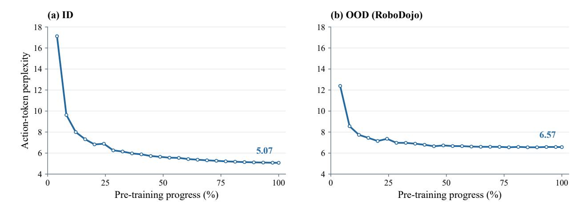

그림 7. 사전 훈련 중 액션-토큰 퍼플렉시티. PhysBrain 1.5 모델은 훈련에서 제외된 RoboDojo의 OOD 데이터와 ID 테스트 데이터를 평가한다. ID 테스트 에피소드는 훈련 에피소드와 겹치지 않는다.

#### **B.2.1 이미지 평가 (Image Evaluation)**

Qwen-aligned 이미지 프로필은 비생각 추론(non-thinking inference)을 사용하며, 최대 32,768개의 생성 토큰, 온도 0.7, top-p 0.8, top-k = 20, 반복 패널티 1.0, 존재 패널티 1.5, 시드 3407을 적용한다. 최대 이미지 면적은 4,014,080 픽셀이다. 최소 이미지 면적은 RealWorldQA의 경우 602,112 픽셀, 나머지 이미지 작업의 경우 200,704 픽셀이다.

ScreenSpot은 고정 0–1000 그리드상의 좌표를 사용하는 Qwen의 컴퓨터 사용 툴-콜 형식을 사용한다. RealWorldQA는 두 모델이 공유하는 고정 로컬 Qwen3 8B 모델 폴백을 이용한 규칙 기반 추출을 사용하며, 이는 Qwen의 원격 폴백 재판과 다르다. DocVQA와 TextVQA는 각각의 검증 세트를 사용한다.

#### **B.2.2 비디오 평가 (Video Evaluation)**

비디오 입력 및 시간 샘플링. 우리는 qwen-vl-utils에 구현된 Qwen3-VL 비디오 전처리 파이프라인을 사용하며, 타깃 샘플링 속도는 2 FPS이고 VideoMME는 클립당 최대 128 프레임, MVBench는 32 프레임을 사용한다. 두 모델 모두 동일한 벤치마크별 한계를 적용한다. 타깃 프레임 수는 클립 길이에서 결정되며, 사용 가능한 소스 프레임에 따라 최소 4 프레임이 기본값이다. 모델의 시간 인자를 맞추기 위해 2의 배수로 내림한다. 이후 프레임은 전체 입력 클립에서 균일하게 샘플링되며, 프레임 인덱스는 가장 가까운 정수로 반올림된다. 따라서 짧은 클립은 벤치마크 한계보다 적은 샘플링 프레임을 가질 수 있고, 프레임 한계에 도달하면 긴 클립의 효과적인 샘플링 속도는 감소한다. 프레임 인덱스와 소스 프레임률 메타데이터는 모델 프로세서에 전달되어 시간 정보를 보존한다.

**공간 전처리.** 샘플링된 프레임은 비큐빅 보간법으로 비율을 유지하면서 크기를 조정한다. 높이와 너비는 16픽셀 패치와 공간 병합 인자 2를 위해 32의 배수로 맞춘다. 설정된 최소 프레임 면적은 200,704 픽셀이다. 비디오 전처리는 자체 픽셀 예산을 적용한다: 기본 프레임당 상한선은 $768 \times 32^2 = 786,432$ 픽셀이며, 전체 비디오 예산에 의해 추가로 제한된다. 결과 해상도는 소스 종횡비와 비디오 예산에 따라 달라진다. 프레임은 qwen-vl-utils에서 한 번만 크기 조정되며, 이후 프로세서에서의 크기 조정은 비활성화된다.

작업 프로토콜 및 점수 매기기. VideoMME는 2,700개의 질문으로 구성된 전체 테스트 세트에서 평가되며, 짧은, 중간, 긴 비디오를 모두 포함한다. 점수는 전체 다지선다 정확도로 매겨진다. 우리는 추가 자막이나 오디오 입력이 없는 버전을 사용한다. MVBench는 20개의 하위 과제와 4,000개의 평가 예제를 포함하며, 비디오 릴리스에서 제공된 비디오 클립을 사용한다. 보고된 MVBench 점수는 20개 하위 과제의 정확도 평균(무가중 평균)이다. 두 벤치마크 모두 질문과 답변 옵션을 제공하고 옵션-문자 응답을 요청하며, 외부 LLM 판사가 없이 벤치마크별 답변 추출 규칙으로 점수를 매긴다.

#### **B.3** 행동 퍼플렉시 (Action Perplexity)

Figure 7은 8B 모델이 ID 테스트 데이터와 보류 중인 RoboDojo 코퍼스에서 사전 훈련 중에 행동 토큰 퍼플렉시를 추적한다. ID 테스트 세트는 훈련과 데이터 소스를 공유하지만 서로 다른 에피소드를 포함한다. 모든 RoboDojo 테스트 예제는 실제 행동 기록을 포함하며, RoboDojo 데이터는 훈련에서 제외된다. 최초 평가된 체크포인트부터 마지막까지 퍼플렉시는 ID 데이터에서 17.12에서 5.07로, RoboDojo에서는 12.39에서 6.57로 감소한다. 지역적 변동에도 불구하고 RoboDojo 퍼플렉시 역시 사전 훈련이 진행됨에 따라 전반적으로 하향 추세를 보이며, 훈련에서 제외된 데이터 소스에서 참조 행동 토큰 예측이 향상되었음을 나타낸다.

#### **B.4** 정성적 시각화 (Qualitative Visualizations)

본 부록은 PhysBrain 1.5의 세 가지 작업 범주(포인팅(그림 8), 궤적 포인트 생성(그림 9), 공간 관계 Q&A(그림 10, 11, 12, 13, 14))에 대한 정성적 시각화를 제시한다. 이 예시들은 평가에 사용된 28개의 구현 벤치마크 외부의 소스에서 가져온 것이며, 통합 구현 기반 모델이 더 넓은 시나리오에 일반화할 수 있는 능력을 보여준다.

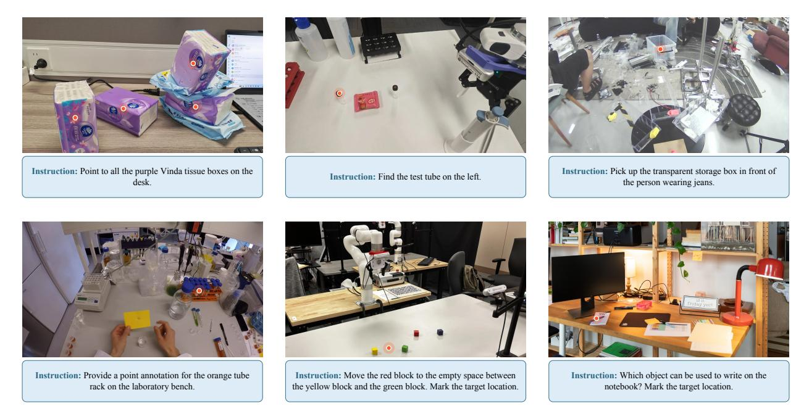

Figure 8 다양한 복잡한 시나리오에서의 객체 포인팅 예시.

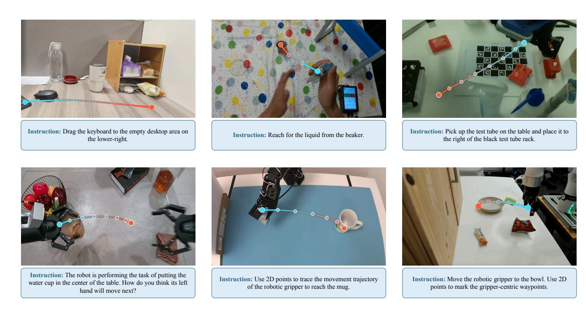

$\textbf{Figure 9} \ \ \text{목표 객체의 움직임 궤적을 행동 지침에 따라 예측하는 예시}.$

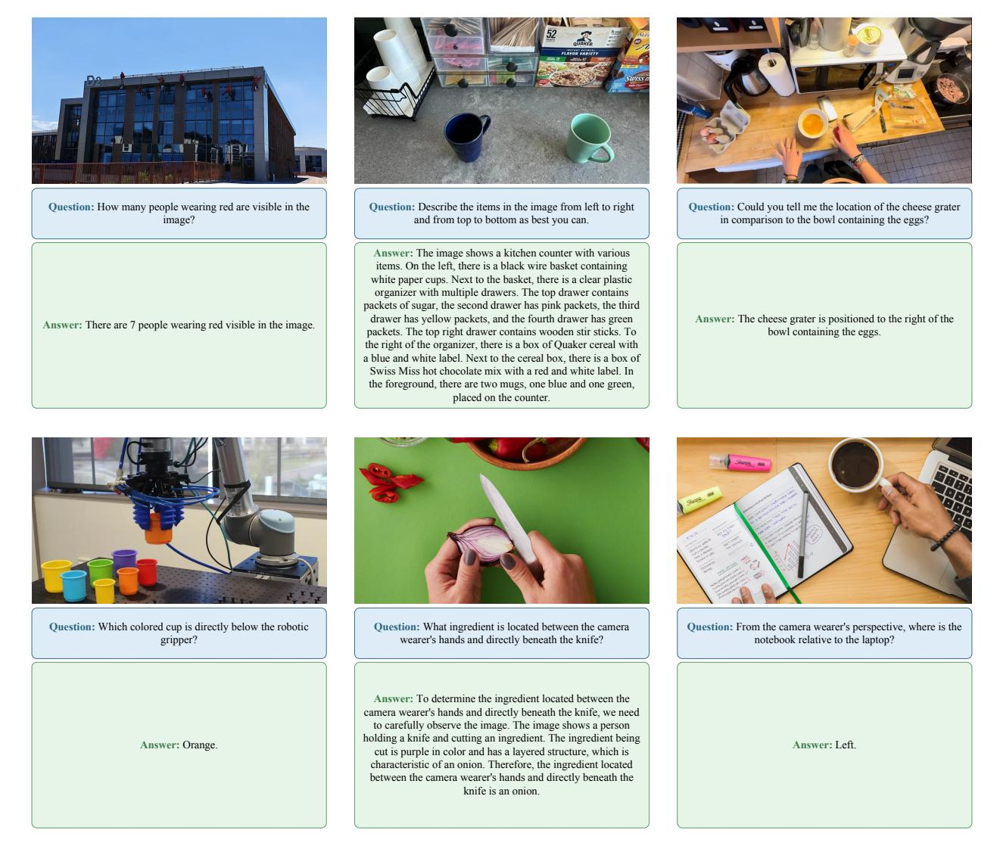

**Figure 10** 도전적인 공간 추론 질문에 대한 답변 예시.

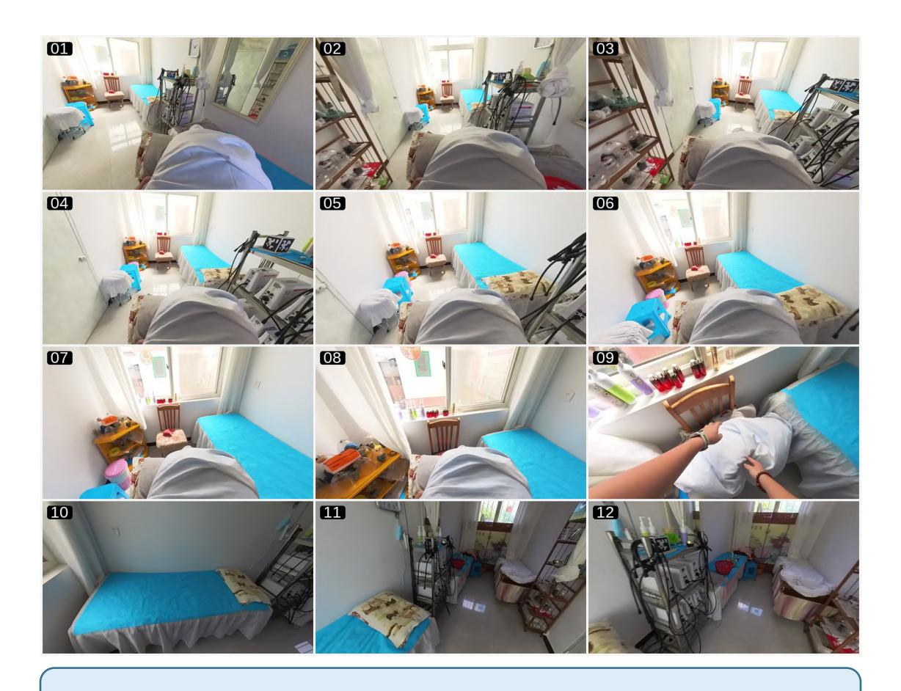

**Question:** 방에서 두 번째로 높은 선반의 높이는 얼마인가요? 답변 시 이유를 제시하십시오.

**Answer:** 방에서 두 번째로 높은 선반의 높이는 약 1.08미터입니다. 이 측정값은 두 선반의 상대 높이 비교에서 유도되었으며, 더 높은 선반은 약 1.50미터로 추정됩니다. 더 높은 선반의 높이에서 높이 차이(0.42미터)를 빼면 두 번째로 높은 선반의 추정 높이를 얻습니다.

**Figure 11** 다중 시점 관측이 있는 장면에서 객체 규모 추정의 예시.

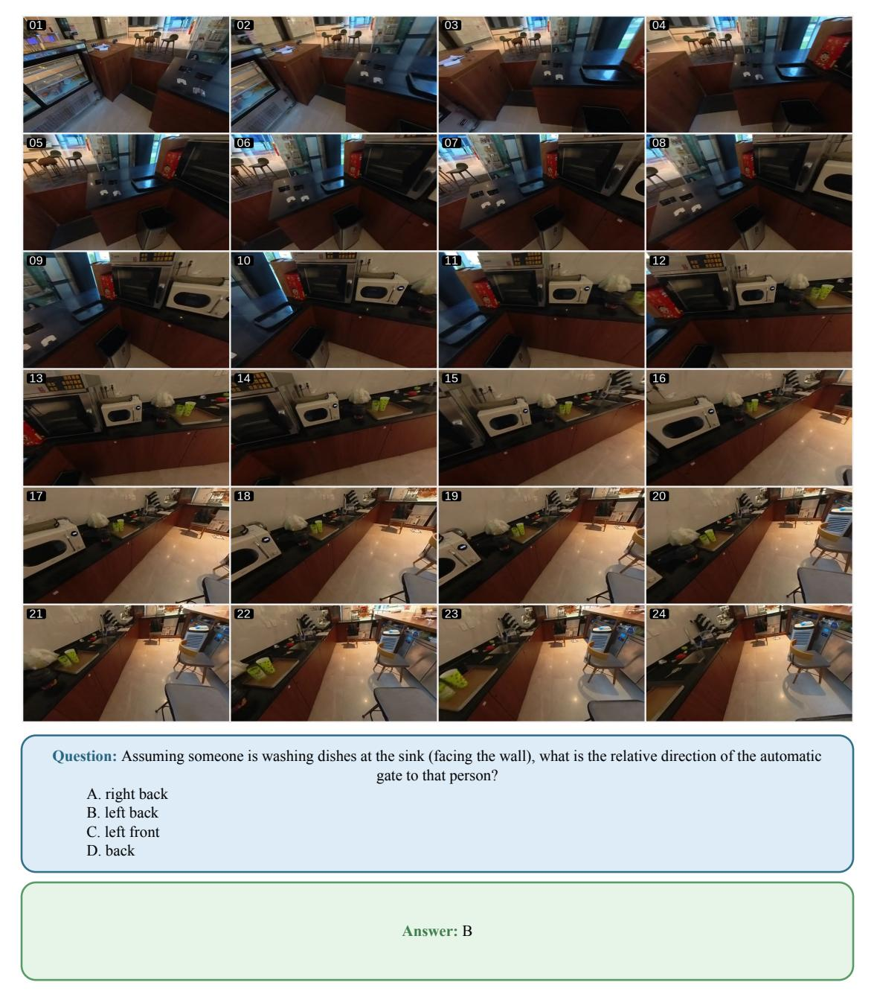

**Figure 12** 다중 시점 관측이 있는 장면에서 공간적 상상력과 방향성 추론의 예시.

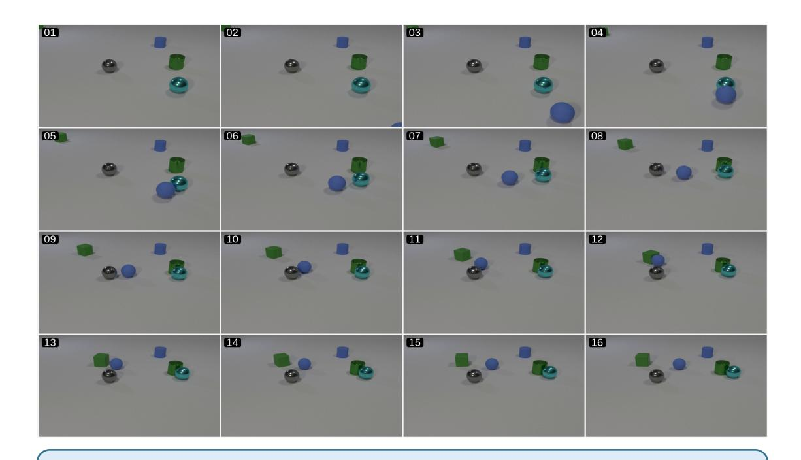

**Question:** 비디오에서 파란 공의 궤적과 다른 물체와의 공간적 관계가 어떻게 변하는지 설명하십시오.

**Answer:** 파란 공은 화면의 오른쪽 하단 모서리에서 시작해 장면 중앙으로 이동합니다. 점차 시안 구체에 접근해 결국 그 옆에 위치합니다. 이동 중에 파란 공은 녹색 원통과 파란 원통과 일정한 거리를 유지하며, 이 두 물체는 정지해 있습니다. 파란 공의 궤적은 부드럽고 직선적이며 방향에 급격한 변화가 없습니다.

**Figure 13** 짧은 비디오에서 객체 움직임 궤적 이해의 예시.

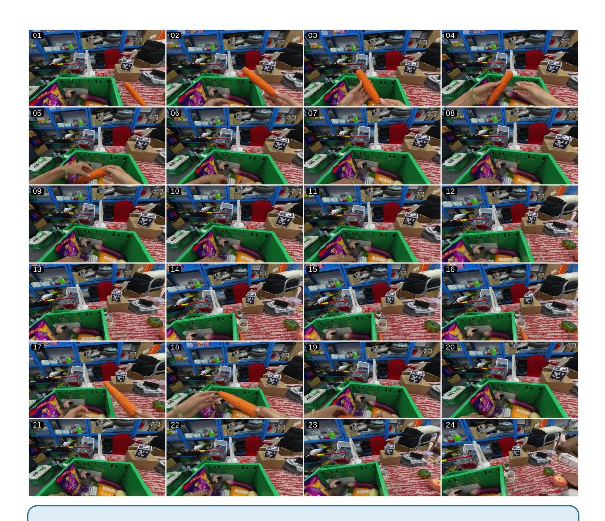

**Question:** 비디오에서 조작자인 당신이 테이블 위의 모든 물건을 녹색 저장함에 넣고, 그 후 저장함을 테이블에서 꺼내는 작업을 수행한다고 가정하십시오. 가장 가능성 높은 다음 행동은 무엇인가요?

**Answer:** 갈색 상자 위에 있는 흑백 체크무늬 큐브를 집어들어라.

**Figure 14** 비디오에 대한 미래 예측의 예시.

