# MaLiang-Harness: A Programmable Path to Image and Video Generation

- 원제: MaLiang-Harness: A Programmable Path to Image and Video Generation
- 원문: [https://arxiv.org/abs/2609.34309](https://arxiv.org/abs/2609.34309)
- PDF: [https://arxiv.org/pdf/2609.34309](https://arxiv.org/pdf/2609.34309)
- arXiv ID: `2609.34309`

---


# MaLiang-Harness: 이미지 및 비디오 생성의 프로그래머블 경로 (MaLiang-Harness: A Programmable Path to Image and Video Generation)

Haoyu Zhao1,2,† , Zihao Zhang1,<sup>2</sup> , Xudong Wang<sup>1</sup> , Jiaxi Gu<sup>3</sup> , Zuxuan Wu<sup>2</sup> , Yu‑Gang Jiang<sup>2</sup> , Shuicheng Yan<sup>1</sup>

<sup>1</sup>National University of Singapore <sup>2</sup>Fudan University <sup>3</sup>Tencent

# 초록 (Abstract)

실행 가능한 프로그램은 이미지와 비디오가 어떻게 구성되는지에 대해 명시적인 제어를 제공하지만, 실행 가능한 코드를 생성하는 것만이 시각 창작의 시작일 뿐이다. 프로그램은 요청된 구도, 외관 또는 움직임을 위반하면서도 올바르게 실행될 수 있다. 우리는 이 불일치를 프로그램-시각(P2V) 격차라고 정의하고, MLLM 기반 시각 생성 과정을 구성, 검사 및 수정의 지속적인 프로세스로 조직하는 통합 프레임워크인 MALIANG-HARNESS를 소개한다. 이 프레임워크의 핵심 설계는 진화하는 시각 프로그램, 그 구성 이력, 그리고 검증이 공통 수정 참조를 공유하도록 하는 것이다. 우리는 프로그램과 작업 컨텍스트를 보존하는 지속 가능한 실행 생성(Persistent Executable Generation, PEG) 상태를 정의한다. 추적 가능한 생성 프로세스(Traceable Generation Process, TGP)는 편집을 렌더링된 증거와 연결하고, 수정 인식 편집 및 검증(Revision-aware Editing and Verification, REV)은 복원을 지원하며 완료 전에 현재 수정을 확인한다. 이 메커니즘은 렌더링 백엔드 전반에 걸쳐 계획, 실행 및 시각 피드백을 조정한다. 우리는 MaLiang-IBench에서 11개의 강력한 폐쇄형 MLLM을, MaLiang-VBench에서 4개를 평가하여 생성 성공, 시각 품질 및 계산 비용을 측정한다. GPT-6-Astra는 두 벤치마크 모두에서 100% 생성 성공을 달성하며, 이미지 작업의 96.0%와 비디오 작업의 76.9%가 모든 품질 기준을 충족한다. 비교 결과는 일반 능력 점수와 시각 생성 성능 사이의 불일치를 드러내며, 유사한 점수를 받은 모델들이 시각 요구 사항을 만족시키는 능력에서 크게 차이난다. MaLiang-Harness는 MLLM이 실행 가능한 코드를 시각 결과로 변환하는 방식을 체계적으로 연구할 수 있는 기반을 제공하며, 프로그래머블 생성의 잠재력과 일반 벤치마크가 이 능력을 예측하는 한계를 모두 드러낸다. 프로젝트는 다음에서 이용 가능하다: [https://github.com/gulucaptain/MaLiang-Harness.](https://github.com/gulucaptain/MaLiang-Harness)

## 1 서론 (Introduction)

*\"그 아이디어는 예술을 만드는 기계가 된다.\"*

— Sol LeWitt

지난 십년간 고품질 이미지 및 비디오 생성의 발전은 주로 직접 시각 합성 패러다임을 따랐다. 생성적 적대 신경망(generative adversarial networks)부터 확산 및 흐름 기반 모델(diffusion- and flow-based models)까지, 이들 접근법은 시각 데이터의 분포를 학습하고 픽셀 또는 잠재 시각 표현(latent visual representations)을 직접 합성한다. 이 패러다임은 놀라운 성공을 거두었지만, 그 기저에 있는 생성 과정은 일반적으로 암시적이다. 반면, 멀티모달 대형 언어 모델(MLLMs)의 의미 이해, 추론, 코드 생성 능력이 빠르게 향상됨에 따라 이미지와 비디오 생성을 위한 프로그래머블 경로가 점점 실현 가능해지고 있다. 모델이 창의적 의도를 실행 가능한 시각 프로그램으로 표현하고, 렌더러가 이후에 이를 이미지 또는 비디오로 변환한다.

<sup>†</sup>Project lead.

<span id="page-1-0"></span>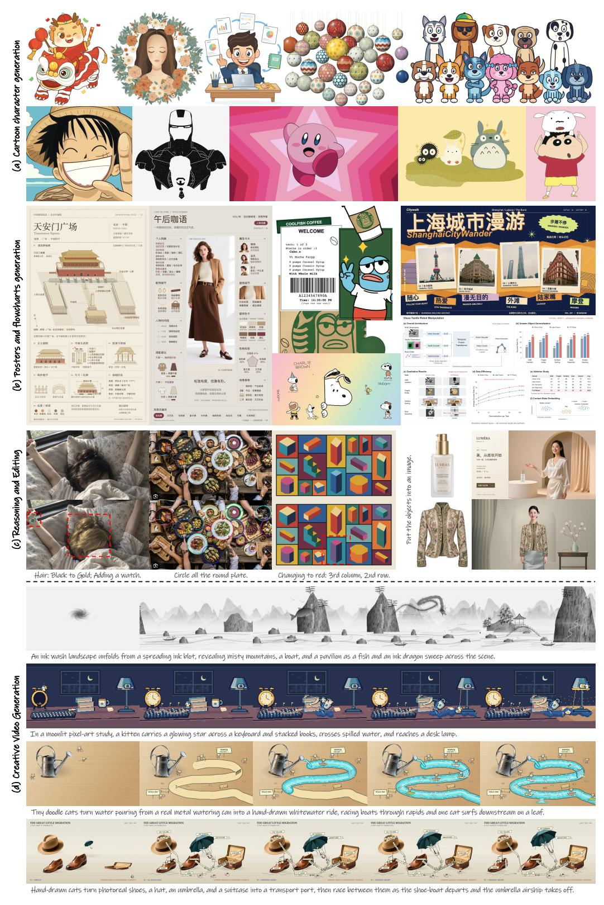

Figure 1: MaLiang-Harness는 이미지 및 비디오 생성을 위한 프로그래머블 경로를 탐구하며, 다양한 이미지 합성, 시각적 추론 및 편집, 그리고 창의적 비디오 생성을 가능하게 한다.

Table 1: 창의적 스타일 범위 및 생성 능력 비교. 우리는 MaLiang-Harness를 기존 이미지(T2I) 및 비디오(T2V) 생성 모델과 두 가지 차원에서 정성적으로 비교한다: 1) 선과 평면 예술, 2D 만화, 픽셀 아트, 스타일화된 3D, 혼합 매체 및 공예, 그리고 사진 같은 사실주의를 아우르는 창의적 스타일 범위; 2) 시각적 콘텐츠와 시공간 구조에 대한 제어 가능성, 생성된 예술작품의 편집 가능성, 그리고 창작 과정의 추적 가능성을 포함한 생성 능력. MaLiang-Harness는 실행 가능한 시각 프로그램을 통해 다양한 시각 스타일을 지원하며, 명시적 제어, 목표 지향 편집, 그리고 검증 가능한 구성 과정을 제공한다. ○ 지원됨. 부분적으로 지원됨. ○ 미확립.

|  |  | x | š | j | ò |  | ' |  |  | Û |
|-------|--------|------------------|---------------|--------------|----------------|------------------|--------------------|---------------------|-----------------|-------------------------|
| 타입 | 방법 | Line&Flat<br>아트 | 2D<br>만화 | Pixel<br>아트 | 스타일화된<br>3D | 혼합된<br>& 공예 | 사진<br>현실적인 | 제어<br>가능성 | 편집<br>가능성 | 프로세스<br>추적 가능성 |
|  | T2I | ○ | ○ | ○ | ○ | ○ | ○ | ○ | ○ | ○ |
| 이미지 | 우리의 | ○ | ○ | ○ | ○ | ○ |  | ○ | ○ | ○ |
| 비디오 | T2V | ○ | ○ | ○ | ○ | ○ | ○ | ○ | ○ | ○ |
|  | 우리의 | ○ | ○ | ○ | ○ | ○ |  | ○ | ○ | ○ |

그러나 프로그램이 올바르게 실행되더라도 사용자의 의도를 충족하지 못하는 이미지나 비디오를 생성할 수 있다. 객체가 잘못된 위치에 나타나거나 애니메이션 이벤트가 잘못된 시점에 발생할 수 있다. 우리는 프로그램 수준의 정확성과 시각적 요구사항 충족 사이의 이 불일치를 **프로그램-시각 격차**라고 부른다. 이 격차를 해소하려면 모델이 코드의 시각적 결과를 추론해야 한다. 초기 계획은 시각적 표현과 렌더링 백엔드 선택을 고려해야 한다. 코드가 실행되면 렌더링된 출력이 프로그램과 계획을 모두 수정할 근거를 제공한다. 이 과정은 반복 간에 작품을 보존해야 하며, 모델이 충족되지 않은 요구사항을 해결하면서 이전 버전에 대한 접근을 유지할 수 있도록 한다. 각 수정은 이전에 만족되었던 요구사항이 변경될 수 있으므로 새로운 시각적 평가를 요구한다. 이러한 요구는 창의적 의도를 실행 가능한 시각적 표현과 연결하고 시각적 피드백을 통해 작품에 대한 지속적인 제어를 지원하는 상태 기반 하네스를 동기화한다.

이러한 과제를 해결하기 위해 우리는 **MaLiang-Harness**를 도입한다. MaLiang-Harness는 창의적 의도를 여러 실행 가능한 시각적 표현과 연결하는 통합 인터페이스다. 이 인터페이스는 상태 관리, 렌더링, 그리고 수정 인식 검증을 위한 공통 프로토콜을 통해 프로그래머블 이미지 및 비디오 생성을 통합한다. 이 인터페이스를 통해 MLLM은 적절한 렌더링 백엔드를 선택하고 시각적 피드백을 통해 작품에 대한 명시적 제어를 수행한다. 코드는 공간적 구성을 비롯해 시간에 따른 움직임까지 시각적 콘텐츠가 어떻게 구성되는지를 직접 지정한다. 선택적 이미지 자산은 코드만으로 풍부한 외관을 표현하기 어려운 경우 이 프로그래밍 구조를 보완한다. 이미지와 비디오는 동일한 생성 프레임워크를 공유한다: 고정된 프로그램 수정에서 이미지는 지정된 콘텐츠 시간에 렌더링되고, 비디오는 프로그램에 인코딩된 시간적 행동을 샘플링한다. 표 [1](#page-2-0)은 창의적 스타일 범위와 기능적 역량을 요약한다.

또한 MaLiang-Harness는 MLLM이 코드를 계획하고 생성한 뒤 실행 결과와 시각적 피드백을 활용해 수정을 안내하는 루프 형태로 창작을 조직한다. 이 과정을 지원하는 세 가지 설계가 있다: 1) *Persistent Executable Generation (PEG) State*는 반복 간에 진화하는 작품의 실행 가능한 정의를 유지한다. 이 설계는 프로그램과 자산을 그들의 시공간 조직, 작업 요구사항, 현재 계획, 그리고 수정 인덱스와 함께 가져온다. 이를 통해 모델은 창작이 진행되는 동안 검사하고 수정할 수 있는 안정적인 객체를 갖게 된다. 2) *Traceable Generation Process (TGP)*는 명시적 프로그램과 기록된 연산을 통해 작품의 구성을 검사 가능하게 만든다. 중간 렌더링은 이러한 연산의 시각적 효과를 노출시켜 모델과 사용자가 관찰된 불일치를 그 원인이나 변화를 일으킨 구성 요소와 연결하도록 돕는다. 3) *Revision-aware Editing and Verification (REV)*는 모델이 현재 작업 요구사항을 유지하면서 이전 작품 내용을 새로운 수정으로 복원할 수 있게 한다. 관찰과 검증 결과는 특정 수정에 연결되며, 모든 커밋된 업데이트는 완료 전에 새로운 평가를 필요로 한다. 우리는 이러한 설계가 MLLM이 시각적 피드백을 진화하는 작품의 목표 수정으로 변환해 P2V 격차를 해소하도록 돕는다는 것을 입증한다.

우리는 MaLiang-IBench에서 11개의 MLLM을, MaLiang-VBench에서 4개의 MLLM을 평가한다. GPT-6-Astra [&#91;OpenAI,](#page-14-3) [2026b&#93;](#page-14-3)은 두 벤치마크 모두에서 100% 생성 성공률을 달성한다. 그 출력은 이미지 작업의 96.0%와 비디오 작업의 76.9%에서 모든 품질 기준을 충족하며, 이는 86.0%와 38.5%에 비해

<span id="page-3-0"></span>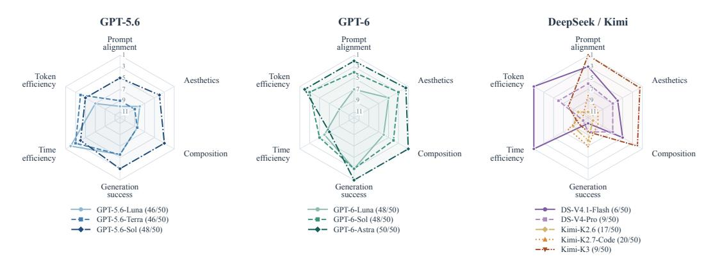

Figure 2: **MaLiang-IBench에서의 모델 순위**. 순위는 11개 모델을 기준으로 계산되며, 더 나은 순위는 중심에서 멀리 떨어져 있고, 동점은 평균화된다. GPT 모델은 92–100%의 생성 성공률을 달성하는 반면, DeepSeek과 Kimi는 12–40%이다. 평균 품질 점수는 성공적인 출력(괄호 안의 수치)을 사용한다. 비용 순위는 더 적은 시간과 토큰을 선호한다.

GPT-5.6-Sol. 이 비율은 각 벤치마크의 전체 작업 세트를 분모로 사용한다. 이 결과는 성공적인 실행과 시각적 요구사항 충족을 구분한다. Fig. 2는 MaLiang-IBench에서 시각적 품질, 생성 성공, 계산 비용을 기준으로 11개 모델을 비교하며, 이 차원에서 서로 다른 모델 순위를 보여준다. Fig. 1은 이미지 생성, 시각적 이해 및 편집, 비디오 생성 예시를 통해 이러한 비교를 보완한다.

우리의 주요 기여는 다음과 같다:

- 우리는 **Program-to-Visual (P2V) gap**을 프로그램 수준의 정확성과 시각적 요구사항 충족 사이의 불일치로 정의하고 소개한다. 이는 구성, 검사, 수정 과정을 통한 상태 기반 시각 프로그램 생성의 필요성을 부각시킨다.  
- 우리는 **MaLiang-Harness**를 도입한다. 이는 프로그래밍 가능한 이미지 및 비디오 생성을 위한 통합 프레임워크이다. Persistent Executable Generation(PEG) 상태, Traceable Generation Process(TGP), Revision-aware Editing and Verification(REV)은 지속적인 정제, 구성 이력 검사, 현재 출력의 검증을 지원한다.  
- 우리는 MaLiang-IBench에서 11개 MLLM, MaLiang-VBench에서 4개를 평가하여 생성 성공률, 시각적 품질, 계산 비용의 차이를 특성화한다. 공개 일반 능력 점수와의 비교를 통해 유사한 벤치마크 성능이 크게 다른 시각적 생성 결과와 일치할 수 있음을 보여준다.

## 2 관련 연구 (Related Work)

**이미지 및 비디오 생성.** 확산 모델은 학습된 노이즈 제거 과정을 통해 이미지를 합성한다 [Ho et al., 2020], 잠재 확산은 고해상도 합성 비용을 줄인다 [Rombach et al., 2022]. 흐름 매칭은 연속 생성 역학을 학습하기 위한 관련 프레임워크를 제공한다 [Lipman et al., 2022]. 비디오 확산 모델과 Stable Video Diffusion은 학습된 시각 합성을 시간적 콘텐츠에 확장한다 [Ho et al., 2022, Blattmann et al., 2023]. 이러한 접근 방식은 또한 명시적 조건화를 지원한다: 예를 들어 ControlNet은 에지와 깊이와 같은 입력을 통해 공간적 가이던스를 도입한다 [Zhang et al., 2023]. 우리의 초점은 시각적 콘텐츠가 구성되고 수정되는 표현 방식에 있다. MaLiang-Harness는 기하학과 시간적 행동을 검사하고 편집할 수 있는 실행 가능한 예술 작품을 유지한다.

**실행 가능한 시각 표현.** 기존 연구는 언어 모델과 실행 가능한 시각 표현을 연결하는 여러 방법을 제시한다. VISPROG는 시각적 추론 및 이미지 편집을 위한 모듈형 프로그램을 생성하며, 중간 결과를 검사 가능한 근거로 노출한다 [Gupta and Kembhavi, 2023]. Design2Code는 웹페이지 스크린샷을 렌더 가능한 구현으로 변환하는 번역을 평가한다 [Si et al., 2025]. 3차원 그래픽스에서는 BlenderAlchemy가 비전 기반 편집 생성기와 상태 평가기를 결합하여 사용자의 디자인 의도를 실현하는 편집을 탐색한다 [Huang et al., 2024]. 이 연구들은 프로그램이 시각적 이해를 매개할 수 있음을 보여준다.

<span id="page-4-0"></span>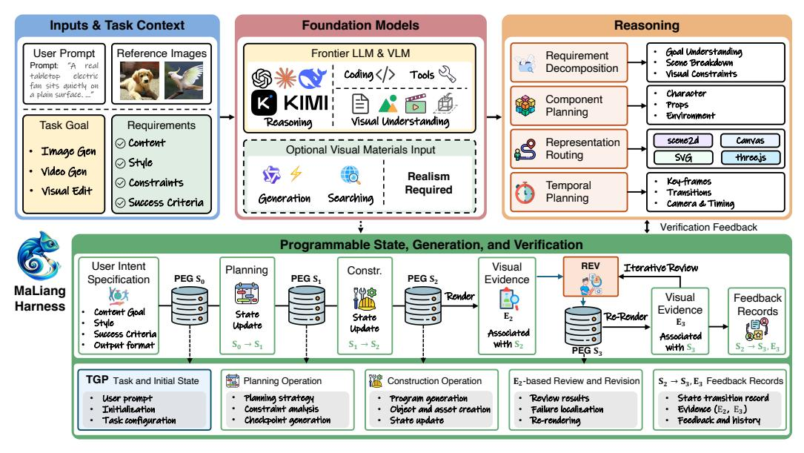

Figure 3: **이미지 및 비디오 생성을 위한 MaLiang-Harness 개요**. Persistent Executable Generation(PEG) 상태는 수정 간에 프로그램과 작업 컨텍스트를 유지한다. Traceable Generation Process(TGP)는 생성 작업을 상태 변화와 시각 결과에 연결한다. Revision-aware Editing and Verification(REV)은 과거 상태에서의 수정을 지원하고 동일 수정에서의 증거를 사용해 현재 출력을 평가한다.

구성. MaLiang-Harness는 이 전제에 기반하여 여러 렌더링 백엔드에 걸쳐 지속적인 예술품 상태를 중심으로 이미지와 비디오 생성을 조직한다.

**에이전트 하니스.** Code as Agent Harness는 추론, 행동, 상태 기반 실행을 위한 인프라로서의 코드에 대한 폭넓은 개요를 제공한다 [Ning et al., 2026]. Show-Harness는 의미적 인터페이스가 VLM 결정을 로봇 구현체 전반에 걸쳐 실행 가능한 행동으로 연결하는 방식을 보여준다 [Chen et al., 2026]. 시각적 생성 내에서 OmniHarness는 검증된 실행에서 재사용 가능한 상징적 정책을 학습하고 중간 피드백을 사용해 정제 및 복구를 수행한다 [Xu et al., 2026b]. MaLiang-Harness는 인터페이스와 피드백을 통해 실행 가능한 예술품을 관리하며, 시각적 구성을 편집 기록 및 개정별 증거와 연결한다.

## 3 MaLiang-Harness (MaLiang-Harness)

MaLiang-Harness는 MLLM이 프롬프트 p를 통합 생성 인터페이스를 통해 실행 가능한 시각적 프로그램으로 변환하는 대안 경로를 탐구한다. 이는 Fig. 3에 표시된 바와 같다. 이 프레임워크는 MLLM 계획 및 코드 생성을 사용해 표현력이 풍부한 시각적 구성을 만들고, 렌더러가 이를 이미지와 비디오로 변환하도록 한다. 이때 확산 또는 흐름 매칭 과정은 필요 없다. 시각적 피드백은 명시적 공간 및 시간 제어 하에 생성의 반복적 정제를 안내한다. 세심하게 설계된 지속 가능한 실행 가능한 생성 상태, 추적 가능한 생성 과정, 그리고 개정 인식 편집 및 검증은 각 연산을 연결되는 상태와 각 시각적 평가를 증거를 생성한 개정과 연결한다.

### <span id="page-4-1"></span>3.1 통합 프로그래밍식 시각적 생성 인터페이스 (Unified Programmatic Visual Generation Interface)

MaLiang-Harness는 렌더링 백엔드(예: Canvas, SVG, Scene2d, 또는 Three.js) 전반에 걸쳐 상태 검사와 프로그램 또는 자산 편집을 렌더링 및 요구 사항 검토와 함께 지원하는 공유 상호작용 프로토콜을 제공한다. 상태 업데이트는 수정되는 개정을 식별하고, 실행 결과와 렌더링 관측은 해당 개정과 연결된다. 각 백엔드는 자체 실행 가능한 표현을 유지하여, 하니스가 공통 생성 과정 내에서 드로잉 및 애니메이션 코드를 통해 시각적 콘텐츠를 표현할 수 있게 한다.

프롬프트 p와 출력 사양 $\omega$ 를 주면, MaLiang-Harness는 외관, 공간 구성, 시간 역학을 계획하고, 실행 가능한 표현과 호환되는 백엔드 b를 선택하며, 드로잉 및 애니메이션 코드를 생성한다. 프로그램은 사용자 제공 자산을 포함하거나, 원하는 외관을 코드로 구성하기 어려운 경우 이미지 생성 또는 검색을 통해 얻은 자산을 활용할 수 있다. 백엔드는 결과 표현을 이미지 또는 비디오로 렌더링하고, MLLM은 이를 작업 요구 사항과 비교 평가한다. 이후 코드 개정은 실행 성공뿐 아니라 관측된 시각적 불일치를 기반으로 한다.

**지속 가능한 실행 가능한 생성(PEG) 상태.** 하니스는 계획, 실행 및 개정을 위한 공통 참조를 제공하는 지속 가능한 실행 가능한 생성 상태를 유지한다. 개정 k에서 우리는 다음과 같이 정의한다:

$$S_k = (P_k, A_k, Z_k, C_k, k), \tag{1}$$

여기서 $P_k$는 백엔드 식별자와 함께 시각적 프로그램을 나타내며, $A_k$는 관련된 모든 자산을 포함한다. 프로그램과 자산의 내용은 콘텐츠 해시와 함께 보존되며, $\omega$는 출력 차원과 형식, 렌더링 시드, 그리고 적용 가능한 비디오 타이밍 매개변수를 지정한다. $Z_k$는 $P_k$에 포함된 명시적 장면 속성 또는 정의를 통해 공간적 구성과 시간적 역학을 설명하며, 별도로 유지되는 장면 표현이 필요하지 않다. 생성 컨텍스트 $C_k$는 p, $\omega$, 사용자 제공 요구사항, 그리고 현재 생성 계획을 보존한다. 계획 업데이트는 요구사항을 추가할 수 있지만 기존 요구사항을 제거하거나 약화시킬 수는 없다. 별도의 편집 작업에서 상속된 요구사항을 변경하려면 사용자의 새로운 지침을 인용해야 한다.

*초기 상태.* 초기 상태 $S_0$는 p와 $\omega$를 포함하며 실행 가능한 콘텐츠가 없을 수 있다. 이는 이후 편집을 통해 정제된다. 우리는 이 상태에 대한 업데이트와 시각적 렌더링을 구분한다:

$$S_{k+1} = \mathcal{E}(S_k, a_k), \qquad I_k(t) = \mathcal{R}_b(S_k, t; \omega), \tag{2}$$

$\mathcal{E}$는 입력을 검증하고 소스 리비전이 최신인지 확인한 뒤 편집 $a_k$를 커밋한다. 역사적 콘텐츠 복원을 포함한 모든 커밋은 실행 중에 아직 사용되지 않은 다음 리비전 인덱스를 받는다. 하네스는 이전 스냅샷을 보관하여 이후 생성이 실행 정의를 덮어쓰지 않고 이전 버전을 다시 방문할 수 있도록 한다.

<span id="page-5-1"></span>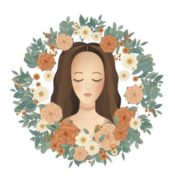

Figure 4: 코드 기반 이미지 합성 예시. "botanical portrait"는 이미지 자산이 없는 PEG 상태의 시각적 프로그램 $P_k$에서 렌더링된다. Algorithm 1은 프로그램이 Canvas 그리기 연산을 통해 기하학, 외관, 공간 구성을 어떻게 지정하는지 요약한다.

<span id="page-5-0"></span>Algorithm 1: T2I를 위한 생성된 Canvas 프로그램.

```
Require: 캔버스 1024 × 576, seed s
  1: \mathbf{c} \leftarrow (512, 288)
 2: R_{\ell} \leftarrow \text{PRNG}(\text{hash}(s, \ell)) 각 레이어 \ell 에 대해
 3: 캔버스를 흰색으로 채운다.
 4: for i = 0, \dots, 25 do
          \theta_i \leftarrow 2\pi i/26 + \epsilon_i, \quad r_i \leftarrow 167 + 18u_i
 5:
          \mathbf{p}_i \leftarrow \mathbf{c} + r_i(\cos\theta_i, \sin\theta_i)
          곡선 가지를 p_i 에 그린다; 잎과 정맥을 추가한다.
 7:
 8: end for
 9: 머리, 얼굴, 어깨를 위한 베지에 경로를 그린다.
10: 얼굴을 음영 처리한다; 닫힌 눈과 머리카락 가닥을 추가한다.
11: 미리 정의된 위치에 있는 각 장미에 대해
          for k = 0, \ldots, 4 do
12:
               n_k \leftarrow [8, 7, 6, 5, 4]_k
13:
               for j = 0, ..., n_k - 1 do
14:
                    \phi_{k,j} \leftarrow 2\pi j/n_k + \delta_{k,j}
15:
                    돌린 베지에 꽃잎을 각도 \phi_{k,i} 에 그린다.
17:
          end for
20: 데이지, 작은 꽃, 그리고 질감을 추가한다.
21: 생성이 완료되었다.
```

Renderable state. 렌더링 가능한 상태에서는 $\mathcal{R}_b$가 선택된 백엔드 b를 사용해 $\omega$ 하에서 콘텐츠 시간 t에 시각적 프로그램을 평가한다. 이미지는 지정된 시간에 대한 평가에 해당하며, 비디오는 동일한 표현에 인코딩된 시간적 진화를 샘플링하여 얻는다. 따라서 인덱스 k는 생성된 콘텐츠를 통한 진행이 아니라 생성 상태의 수정을 추적한다; 생성 계획의 업데이트는 렌더링된 출력을 바꾸지 않고 k를 앞당길 수 있다. Fig. 4

시각적 프로그램을 고정된 PEG 수정과 함께 렌더링된 출력과 매칭시켜, 실행 가능한 표현이 결과 이미지 구성을 어떻게 지정하는지 보여준다.

하네스는 각 커밋된 편집을 그 출처와 결과 리비전과 함께 기록하여, 운영 기록을 실행 가능한 상태의 진화와 연결한다. 렌더링된 관찰 및 검증 결과는 평가 대상 리비전에 연결되지만, 이 증거를 수집하는 것 자체가 새로운 PEG 리비전을 생성하지는 않는다. MLLM은 리비전별 증거와 $C_k$에 있는 요구사항을 함께 사용하여 이후 편집을 결정한다. 따라서 생성 상태는 TGP가 추적하는 구축 이력과 REV가 유지하는 시각적 평가를 위한 공유 리비전 참조를 제공한다.

### 3.2 추적 가능한 생성 과정 (Traceable Generation Process)

PEG 상태는 각 수정을 통해 실행 가능한 시각적 표현을 보존하지만, 추적 가능한 생성 과정(TGP)은 이 표현이 생성 연산을 통해 어떻게 구성되고 수정되는지를 기록한다. *j*-번째 기록된 연산에 대해, 하네스는 다음을 유지한다:

$$\\tau_{j} = (o_{j}, x_{j}, y_{j}, k_{j}^{-}, k_{j}^{+}), \\tag{3}$$

여기서 $o_j$는 실행된 연산을, $x_j$와 $y_j$는 그 입력 인수와 실행 결과(반환된 오류 포함)를, $k_j^-$와 $k_j^+$는 소스 및 결과 PEG 수정을 식별한다. 연산 인덱스 j는 수정 인덱스 k와 구분된다. 렌더링 및 검사와 같이 상태 업데이트를 커밋하지 않는 연산은 동일한 수정 인덱스를 유지한다. 해당 스냅샷을 비교하면 렌더링 백엔드 간에 공통 장면 표현이 필요 없이 시각적 프로그램과 관련 상태의 변화를 드러낸다.

하네스는 각 렌더링된 관측을 렌더러가 평가한 PEG(Program Execution Graph) 리비전과 연결하고 실제 출력, 샘플링된 타임스탬프, 그리고 크롭 사양을 보존한다. 이러한 기록은 설정된 시드(seed) 외에 사용자 정의 코드(custom code)가 비결정성(nondeterminism)을 도입하더라도 리뷰에 사용된 시각적 증거(visual evidence)를 식별한다. 예를 들어, 드로잉 함수(drawing function)나 모션 트래젝터리(motion trajectory)의 편집은 운영 이력(operation history)에서 찾을 수 있으며, 관련 리비전의 렌더링과 비교하여 공간 구성(spatial composition)이나 시간 역학(temporal dynamics)의 불일치를 조사할 수 있다. 렌더링(rendering)과 검사는 모든 편집을 따라야 할 필요가 없으므로, 실행된 수정(executed modification)과 시각적으로 검토된 리비전(visual inspected revision)은 트레이스(trace)에서 구분된다.

TGP는 성공적인 실행을 의도된 시각적 결과의 확인으로 간주하는 대신, 기록된 프로그램 변화를 개정별 시각적 증거와 연결함으로써 P2V 갭을 진단한다. 그 추적 가능성은 MLLM의 내부 추론이 아니라 명시적 생성 작업과 그 실행 결과에 관한 것이다. 이러한 작업-개정 및 증거-개정 연관성은 이후 검사 및 개정의 기초를 제공하며, 추가 편집 후 시각적 평가의 타당성은 REV에 의해 다뤄진다.

### 3.3 수정 버전 인식 편집 및 검증 (Revision-aware Editing and Verification)

<span id="page-6-0"></span>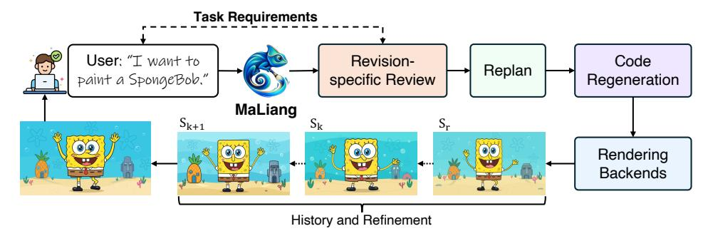

Figure 5: **수정 버전 인식 편집 및 검증.** 편집은 새로운 PEG 수정을 생성하고, 시각적 증거는 평가되는 수정을 연관시킨다. 과거 증거는 비교를 지원하며, 전달은 현재 수정을 검증해야 한다.

그림 5에 나타난 바와 같이, 수정 인식 편집 및 검증(REV)은 TGP에 의해 기록된 수정 연결 증거를 사용하여 PEG 상태에 대한 편집을 검증함으로써 생성 루프를 닫는다. 한 실행 내에서 $S_r$ ($r \le k$)에서 과거 내용을 복원하면 새로운 상태 $S_{k+1}$을 커밋하면서 현재 상태를 보존한다.

작업 요구사항; 추적은 복원된 수정 r을 기록한다. 별도의 편집 작업은 선택된 스냅샷에서 자체 수정 시퀀스를 초기화하고, 소스 실행 및 수정에 대한 링크를 보존하며, 새로운 사용자 지침을 $C_0$에 통합한다. 이후 편집은 TGP를 통해 추적 가능하다.

For each visual requirement  $h_i$  in  $C_k$ , REV maintains a review  $q_i = (k_i, E_i, v_i)$ , where  $E_i$  contains requirement-specific visual evidence from revision  $k_i$  and  $v_i \in \{\text{pass}, \text{fail}, \text{uncertain}\}$ . Full-frame renderings or spatial crops support appearance and composition checks, while temporal requirements use ordered samples spanning the specified interval at three or more distinct timestamps. Such samples support temporal assessment but do not establish continuity between frames. A review applies to the current state only when  $k_i = k$ . After each commit, even if only the plan changes, the current revision must be reviewed again and its checkpoints reapproved. Recording observations and reviews leaves k unchanged. Moreover, the current revision is ready for delivery only when the following conditions hold:

준비됨

$$(S_k)$$

= ExportOK $(S_k) \land$  CheckpointOK $(k)$   $\land \bigwedge_{h_i \in \mathcal{H}_k} [k_i = k \land E_i 
eq \emptyset \land v_i = pass],$  (4)

여기서 $\mathcal{H}_k$ 는 $C_k$ 에서 완료를 위해 필수로 표시된 시각적 및 시계열 요구사항을 포함한다. ExportOK 은 소스 파일과 자산이 존재하고 기록된 해시와 일치하는지 확인한다. 또한 적용 가능한 객체 및 이벤트 제약 조건을 검사하고 현재 수정의 내보내기가 $\omega$ 를 준수하는지 확인한다. 이러한 내보내기 검사는 형식, 차원 및 비디오 타이밍을 포함한다. 기획 단계에서 MLLM 은 모든 필수 요구사항을 체크포인트로 정리한다. CheckpointOK 은 현재 수정에 대해 모든 체크포인트가 필요한 검사를 통과하고 검토를 받았을 때 유지된다. 증거가 없거나 검토가 실패 또는 불확실로 표시된 경우 예산이 남아 있는 동안 추가 검사 또는 수정을 요구한다. 이 기준은 시각적 검증을 전달된 수정에 연결한다. MLLM 판결은 독자적 자기 평가로 남아 있으며, 독립적인 지각 품질 측정이 아니다.

## 4 실험 (Experiments)

### 4.1 실험 설정 (Experimental Setup)

**작업 및 모델.** 우리는 **MaLiang-Harness** 를 **MaLiang-IBench** 에서 50개의 텍스트-이미지 프롬프트와 **MaLiang-VBench** 에서 13개의 텍스트-비디오 프롬프트로 평가한다. 두 세트 모두 다양한 시각적 스타일을 다룬다. 우리는 DeepSeek [Xu et al., 2026a], Kimi [Team et al., 2026], 그리고 GPT [OpenAI, 2026a,b] 계열의 11개 모델을 MaLiang-IBench 에서, 그리고 4개 모델을 MaLiang-VBench 에서 평가한다. 각 모델은 MaLiang-Harness 를 통해 실행 가능한 시각 프로그램을 구성하고 정제한다.

**평가 지표.** 우리의 평가는 계산 비용과 생성 품질의 두 측면을 다룬다. 우리는 생성 성공, 실패, 그리고 토큰 예산 소진(토큰 한계)으로 인한 실패의 하위 집합을 보고한다. 성공은 하네스의 완료 검사를 통과하는 디코더 가능한 출력을 필요로 한다. (1) 계산 비용. 우리는 생성 시간, 모델 호출, 토큰 사용량을 보고한다. 누적 시간은 실패 시도와 재시도를 포함한다. *Time/Qualified* 는 모든 품질 기준을 충족하는 이미지 수로 이 시간을 정규화한다; *Time/Success* 는 성공적으로 생성된 비디오 수를 사용한다. DeepSeek-V4-Pro 는 시각적 피드백 없이 평가된다. (2) 생성 품질. 우리는 주로 GPT-6-Sol 을 판사로 사용한다. 그것은 프롬프트 정합성, 미학, 구성을 위한 5점 척도로 이미지 품질을 평가한다. 비디오 평가는 추가 기준으로 모션 일관성을 포함하고 각 성공 비디오에서 12개의 시계열 정렬된 프레임을 사용한다. 평균 이미지 품질 점수는 성공적인 생성에 대해서만 계산된다. 차원별 수치는 최소 4점을 획득한 샘플 수를 보고하며, *All Criteria* 는 세 개의 이미지 기준 또는 네 개의 비디오 기준을 모두 충족하는 샘플 수를 계산한다. 실패한 생성은 모든 품질 임계값 수에서 제외된다.

### 4.2 비교 (Comparisons)

**MaLiAng-IBench에 대한 정량적 결과.** 표 2와 3은 생성 성공과 시각적 요구사항 만족을 구분한다. GPT-5.6-Luna와 GPT-5.6-Terra는 각각 50개의 이미지 중 46개를 성공적으로 생성한다. 그러나 세 가지 품질 기준을 모두 만족하는 수는 Luna의 경우 22개, Terra의 경우 24개로 감소한다. GPT-6-Astra는 48개의 이미지가 모든 기준을 만족하며 100%의 생성 성공률을 달성한다. GPT-6-Sol과 GPT-6-Luna는 각각 46개와 44개의 과제에서 모든 기준을 만족한다. All successfully

<span id="page-8-0"></span>표 2: **MaLiAng-IBench에 대한 생성 성공 및 계산 비용.** "토큰 한계"는 실행이 할당된 토큰 예산을 소진하는 실패의 하위 집합을 나타내며, 이는 추론 정체와 무제한 에이전트 루프에 의해 발생할 수 있다. "오렌지/파랑"은 DeepSeek-V4.1-Flash에 비해 "높음/낮음" 값을 나타내며, 성공률이 다르기 때문에 "더 나은/나쁜" 성능을 의미하지 않는다.

|  |  | 작업 완료 | etion |  | <b>생성 시간</b> |  | 모델 사용량 |  |  |  |
|---------------------|---------------|-----------------------|--------------------------|------------------------|------------------------------|-------------------------|-----------------------|--------------------------|---------------------------|--|
| 모델 | 성공 ↑ (%) | 실패 ↓<br>(cases) | 토큰 한계 ↓<br>(cases) | 총 시간<br>(task-h) | 시간/자격 ↓ (min/image) | 시간/작업<br>(min/case) | 호출<br>(calls/case) | 입력 토큰<br>(k/case) | 출력 토큰<br>(k/case) |  |
| DeepSeek-V4.1-Flash | 12.0 | 44 | 5 | 2.71 | 27.15 | 1.91 | 2.48 | 100.8 | 24.2 |  |
| DeepSeek-V4-Pro | 18.0 | 41 | 3 | 6.42 | 48.12 | 7.36 | 4.50 | 198.9 | 39.6 |  |
| Kimi-K2.6 | 34.0 | 33 | 1 | 6.27 | 62.69 | 5.14 | 9.14 | 660.0 | 48.2 |  |
| Kimi-K2.7-Code | 40.0 | 30 | 1 | 5.97 | 29.84 | 3.59 | 12.94 | 1056.5 | 59.0 |  |
| Kimi-K3 | 18.0 | 41 | 0 | 5.23 | 34.88 | 5.89 | 2.82 | 308.9 | 17.8 |  |
| GPT-5.6-Luna | 92.0 | 4 | 0 | 1.65 | 4.49 | 1.98 | 11.10 | 271.6 | 9.3 |  |
| GPT-5.6-Terra | 92.0 | 4 | 0 | 1.73 | 4.32 | 2.07 | 8.32 | 186.0 | 8.0 |  |
| GPT-5.6-Sol | 96.0 | 2 | 1 | 2.35 | 3.28 | 2.82 | 6.98 | 209.2 | 13.1 |  |
| GPT-6-Luna | 96.0 | 2 | 0 | 3.61 | 4.92 | 3.27 | 14.70 | 459.2 | 16.4 |  |
| GPT-6-Sol | 96.0 | 2 | 0 | 2.70 | 3.52 | 3.24 | 7.42 | 180.1 | 10.2 |  |
| GPT-6-Astra | 100.0 | 0 | 0 | 2.96 | 3.70 | 3.55 | 6.34 | 142.0 | 8.1 |  |

Table 3: **MaLiAng-IBench에서의 시각적 품질.** 품질 수치는 5점 척도에서 최소 4점을 받은 샘플을 포함한다. 평균은 성공한 샘플만을 포함한다. 회색 셀은 DeepSeek 및 Kimi 결과를 표시하며, 이들의 낮은 성공률은 평균 품질 점수의 비교 가능성을 제한한다. 굵은 글씨는 가장 우수한 GPT 결과를 표시한다. "Blue/orange"는 GPT-5.6-Luna에 비해 "높음/낮음" 값을 나타낸다.

|  | 생성 | n 결과 | Qua | lity Threshold | 개수 | 평균 품질 점수 |  |  |  |
|---------------------|----------------------|---------------------------|---------------------|-------------------------|-----------------------|---------------------|-----------------------|------------------------|--|
| 모델 | 성공적 ↑ (cases) | 모든 기준 ↑<br>(cases) | 정렬 ↑ (cases) | 미학 ↑<br>(cases) | 구성 ↑ (cases) | 정렬 ↑ (1–5) | 미학 ↑<br>(1–5) | 구성 ↑<br>(1–5) |  |
| DeepSeek-V4.1-Flash | 6 | 6 | 6 | 6 | 6 | 4.33 | 4.00 | 4.17 |  |
| DeepSeek-V4-Pro | 9 | 8 | 8 | 8 | 9 | 4.11 | 3.89 | 4.11 |  |
| Kimi-K2.6 | 17 | 6 | 7 | 8 | 9 | 3.47 | 3.41 | 3.65 |  |
| Kimi-K2.7-Code | 20 | 12 | 13 | 13 | 13 | 3.75 | 3.60 | 3.70 |  |
| Kimi-K3 | 9 | 9 | 9 | 9 | 9 | 4.56 | 4.22 | 4.33 |  |
| GPT-5.6-Luna | 46 | 22 | 25 | 33 | 40 | 3.57 | 3.74 | 3.93 |  |
| GPT-5.6-Terra | 46 | 24 | 27 | 31 | 40 | 3.70 | 3.70 | 3.93 |  |
| GPT-5.6-Sol | 48 | 43 | 43 | 45 | 48 | 4.23 | 4.10 | 4.27 |  |
| GPT-6-Luna | 48 | 44 | 44 | 48 | 48 | 4.10 | 4.08 | 4.15 |  |
| GPT-6-Sol | 48 | 46 | 46 | 48 | 48 | 4.25 | 4.15 | 4.25 |  |
| GPT-6-Astra | 50 | 48 | 48 | 50 | 50 | 4.36 | 4.22 | 4.54 |  |

세 GPT-6 모델에서 생성된 이미지가 미학 및 구도 기준을 충족한다. 나머지 품질 실패는 프롬프트 준수와 관련이 있다. 이 패턴은 성공적인 생성만으로는 실행 가능한 시각 프로그램을 평가하기에 충분하지 않음을 보여준다.

평균 품질 점수는 성공한 작업 수와 함께 해석되어야 한다. DeepSeek과 Kimi는 6~20개의 이미지만 생성하므로, 이들의 평균은 MaLiang-IBench의 제한된 하위 집합을 설명한다. Kimi-K3의 정렬 점수 4.56은 단 9개의 이미지에 기반하며, 전체 평가 세트에 대해 우수한 성능을 입증하지 않는다. Astra는 GPT 모델 중 각 품질 차원에서 가장 높은 평균 점수를 획득한다. 비용 결과는 생성 시간과 모든 기준을 만족하는 이미지 수 사이의 트레이드오프를 드러낸다. GPT-5.6-Sol은 이미지당 3.28분에 43개의 적합한 이미지를 생성한다. Astra는 이미지당 3.70분에 48개의 이미지를 생성한다. 이 시간 추정치는 실패 및 재시도를 포함하므로, 품질 임계값을 충족하는 이미지를 얻는 비용을 반영한다.

MaLiang-IBench에서의 정성적 결과. Fig. 6은 평가된 모델 간 시각적 구현의 차이를 보여준다. 온실(마지막 행)과 로봇 앙상블(네 번째 행) 예시는 모델마다 피사체 규모, 장면 세부 사항, 개별 물체 묘사에서 차이를 드러낸다. 차(첫 번째 행)와 은행나무 잎(세 번째 행) 예시는 평면 카툰 캐릭터와 사실적인 재료의 통합을 추가로 탐구한다. Astra의 결과는 이러한 예시에서 표면 세부 사항과 조명 단서를 더욱 뚜렷하게 보여주며, 건축 보드는 주요 시야와 보조 고도, 건설 세부 사항을 결합한다. 이 선택된 예시들은 동일한 프롬프트가 어떻게 다른 구성을 이끌어내고 시각적 세부 수준을 달리할 수 있는지를 보여 주어 집계 점수를 보완한다.

MaLiang-VBench에 대한 정량적 결과.  
표 4와 5는 MaLiang-VBench에서 생성 성공과 품질 사이에 유사한 격차가 있음을 보여준다.  
Astra는 13개의 성공적인 생성 중 10개에서 모든 네 가지 품질 임계값을 충족한다.  
GPT-5.6-Sol은 7개의 성공적인 생성 중 5개에서 모든 임계값을 충족한다.  
Kimi-K2.6은 세 개의 작업을 완료하지만, 그 비디오 중 어느 것도 모든 기준을 충족하지 않는다.  
DeepSeek-

<span id="page-9-0"></span>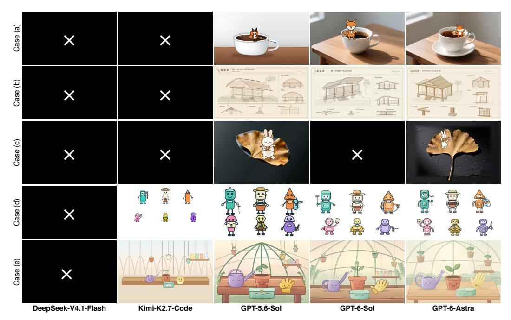

Figure 6: **MaLiang-IBench에서의 정성적 비교.** 행은 차가운 컵 위의 여우, 건축 개념 보드, 은행나무 잎 위의 토끼, 로봇 앙상블, 그리고 온실 일러스트를 보여준다. 열은 동일한 프롬프트 하에서 다섯 모델을 비교한다. 검은 배경 위의 흰색 $\times$는 실패한 실행을 나타낸다. 전체 프롬프트는 부록 6.4에 제공된다.

<span id="page-9-1"></span>Table 4: **MaLiang-VBench에서의 생성 성공률 및 계산 비용.** "Orange/blue"는 DeepSeek-V4.1-Flash에 비해 "higher/lower" 값을 나타내며, "Time/Success"는 Kimi-K2.6을 사용한다. "—"는 성공적인 생성이 없어서 정의되지 않은 비율을 나타낸다.

|  | Task Completion |  |  | Generation Time |  |  | Model Usage |  |  |
|---------------------------|-----------------|-----------------------|--------------------------|------------------------|----------------------------|-------------------------|-----------------------|--------------------------|---------------------------|
| Model | Success ↑ (%) | Failures ↓<br>(사례) | Token Limit ↓<br>(사례) | Total Time<br>(작업-h) | Time/Success ↓ (분/비디오) | Time/Task<br>(분/사례) | Calls<br>(호출/사례) | Input Tokens<br>(k/사례) | Output Tokens<br>(k/사례) |
| DeepSeek-V4.1-Flash (64K) | 0.0 | 13 | 5 | 1.47 | - | 6.77 | 6.38 | 560.5 | 84.2 |
| Kimi-K2.6 | 23.1 | 10 | 1 | 3.35 | 66.95 | 15.45 | 16.15 | 548.8 | 26.9 |
| GPT-5.6-Sol | 53.8 | 6 | 3 | 1.08 | 9.27 | 4.99 | 12.85 | 574.2 | 13.8 |
| GPT-6-Astra | 100.0 | 0 | 0 | 2.17 | 10.00 | 10.00 | 11.31 | 463.3 | 14.4 |

V4.1-Flash는 작업을 수행하지 못한다. 토큰 예산 소진은 DeepSeek의 13개 실패 중 5개와 Kimi의 10개 실패 중 1개를 설명하며, GPT-5.6‑Sol의 6개 실패 중 3개도 설명한다. 따라서 토큰 한계는 관찰된 실패의 일부만을 설명한다.

품질 결과는 외관만으로는 시간적 요구 사항 충족을 포착하지 못함을 나타낸다. 모든 13개의 Astra 비디오는 미학 임계값을 충족한다. 10개만이 운동 일관성 임계값을 충족하여, 운동이 Astra에 가장 제한적인 기준임을 보여준다. 모든 7개의 성공적인 GPT‑5.6‑Sol 비디오는 정렬 및 미학 임계값을 충족한다. 구성을 요구하고 운동 일관성을 요구하면 공동 수가 5개로 감소한다. Astra는 성공적인 비디오당 10.00분에 전체 작업을 완료한다. GPT‑5.6‑Sol은 성공적인 비디오당 9.27분이 필요하지만, 더 적은 작업을 완료한다. 비디오의 "Time/Success"는 성공적인 생성 수를 분모로 사용한다. 이미지의 "Time/Qualified"는 대신 모든 품질 임계값을 충족하는 샘플 수를 사용한다.

Qualitative results on MaLiang‑VBench. Fig. 11은 세 개의 선택된 비디오 작업의 시간적 진행을 비교한다. 사례 (a)에서 Astra는 아기 고양이가 키보드와 책을 램프 쪽으로 이동하면서 상세한 픽셀 아트 설정을 유지하지만, Kimi는 더 단순한 장면과 축소된 행동 시퀀스를 묘사한다. 사례 (b)에서는 Astra의 보다 상세한 설정과 눈에 띄는 라떼 아트 결과가 Kimi의 희박한 구도와 대조된다. 사례 (c)에서는 두 모델 모두 채널을 구축하고 물로 채우며 보트를 하류로 이동시키는 과정을 묘사하지만, 서로 다른 공간 배치를 사용한다. 이 예시들은 장면 세부 사항과 모델이 프롬프트에 명시된 행동 시퀀스를 구현하는 정도에서 차이를 강조한다.

<span id="page-10-0"></span>Table 5: MaLiang‑VBench 시각적 품질. 품질 수는 5점 척도에서 최소 4점을 획득한 샘플을 포함한다. 회색은 참조 결과를 나타낸다. 굵은 글씨는 평가 범위 제외 시 가장 좋은 GPT 결과를 표시한다. "Blue/orange"는 GPT‑5.6‑Sol보다 "높은/낮은" 수를 나타낸다.

|  |  | 생성 결과 |  | 평가 범위 |  |  |  |
|---------------------------|--------------|---------------------|-------------|---------------------|---------------|----------|-----------|
| 모델 | 성공적 ↑ | 모든 기준 ↑ | 정렬 ↑ | 미학 ↑ | 구성 ↑ | 움직임 ↑ | 평가됨 |
|  | (사례) | (사례) | (사례) | (사례) | (사례) | (사례) | (사례) |
| DeepSeek-V4.1-Flash (64K) | 0 | 0 | 0 | 0 | 0 | 0 | 0 |
| Kimi-K2.6 | 3 | 0 | 0 | 1 | 1 | 0 | 3 |
| GPT-5.6-Sol | 7 | 5 | 7 | 7 | 6 | 6 | 7 |
| GPT-6-Astra | 13 | 10 | 12 | 13 | 12 | 10 | 13 |

### 4.3 논의 (Discussion)

<span id="page-10-1"></span>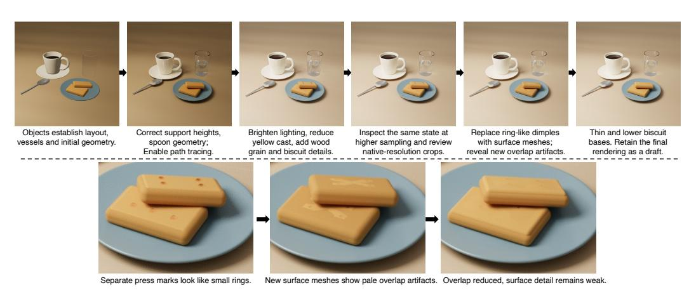

Figure 7: 반복적 정제(Iterative refinement)와 경로 추적 백엔드(path-tracing backend)를 사용한 정제. Top: GPT-6-Astra가 지오메트리(geometry), 조명(lighting), 재질(material), 샘플링 조정(sampling adjustments)을 통해 프로시저적 아침 식사 장면(procedural breakfast scene)을 수정한다. Bottom: 세부 크롭(detail crops)은 정제 과정에서 도입된 “비스킷” 표면 결함(biscuit surface artifacts)을 보여 주며, 지오메트리 보정(geometry corrections)에 의해 감소한다.

하네스가 사진과 같은 사실적인 콘텐츠를 생성할 수 있을까? 우리는 보다 사실적인 시각적 콘텐츠를 위해 두 가지 상호 보완적인 방향을 탐구한다: 렌더링 백엔드를 확장하고 기존 일러스트레이션의 브러시워크를 정제하는 것: *1) 보다 표현력 있는 렌더링 백엔드.* MaLiang-Harness는 공유 인터페이스를 통해 풍부한 재질 및 광전달 기능을 갖춘 렌더러를 통합할 수 있으며, Sec. [3.1.](#page-4-1) 에서 설명한 고수준 계획 및 생성 제어를 유지한다. Fig. [7](#page-10-1)은 구조화된 장면 기하학, 물리적 재질, 영역 조명을 지원하는 경로 추적 백엔드를 사용한 이 접근법을 보여준다. GPT-6-Astra는 생성된 이미지 자산 없이 프로시저적 아침 식사 정물화를 구성하고, 경로 추적 렌더링을 검사하기 전에 래스터 미리보기를 사용해 구성을 설정한다. 결과 장면은 재질에 따라 달라지는 반사, 유리 투과, 접촉 그림자를 나타낸다. 추가 편집은 객체 지지, 조명 및 표면 기하학을 조정하며, 최종 샘플 수를 512에서 1024로 증가시켜 가시적 노이즈를 감소시킨다. 이러한 정제는 또한 지역 편집이 새로운 시각적 결함을 도입할 수 있음을 드러낸다. 비스킷 크롭에서는 기하학적 변화가 겹침 결함을 만들고, 이후 개정이 이를 감소시킨다. PEG는 장면 수정을 보존하고, TGP와 REV는 변경 사항과 그 시각적 결과를 비교 및 교정 가능하도록 제공한다. 이 예시는 동일한 정제 과정 내에서 풍부한 렌더러를 통합하는 것을 보여주며, 인지적 현실감에 대한 기여를 확립하려면 통제된 비교가 여전히 필요하다.

*2) 하이퍼리얼리즘에서 영감을 받은 브러시워크 정제.* 상호 보완적인 접근은 하이퍼리얼리스트 회화에서 미세 브러시워크를 활용하는 것에 기반한다. 우리는 REV를 통해 적용된 명시적 정제 프롬프트가 기존 스타일화된 일러스트레이션을 캔버스 백엔드를 변경하지 않고 보다 사실적인 외관으로 이동시킬 수 있는지 검토한다. Fig. [8](#page-11-0)은 GPT-6-Astra가 그리기 루틴을 수정한 후 생성된 미리보기를 상속된 풍경과 비교한다. 전체 구도는 보존되지만, 잎사귀, 풀, 돌, 물, 목재는 더 작은 마크나 얇은 윤곽을 받는다. 그러나 이미지는 여전히 스타일화되어 있으며, 몇몇 영역은 기존 세부 정보를 잃는다: 풀 덮개가 덜 보이게 되고, 독특한 돌 표식과 산 텍스처가 약화된다. 미세한 획만으로는

<span id="page-11-0"></span>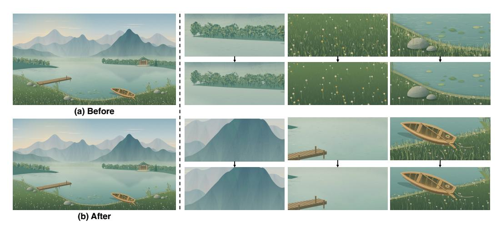

**프롬프트 기반 브러시워크 정제의 한계.** 왼쪽: GPT-6-Astra가 그리기 프로그램을 편집해 REV 내에서 더 미세한 브러시워크를 생성하기 전후의 Canvas 일러스트레이션. 오른쪽: 각 영역을 편집 전(상단)과 후(하단)로 보여주는 쌍으로 된 디테일 크롭. 미세한 마크는 사진과 같은 외관을 제공하지 않는다: 풀 덮개와 독특한 표면 질감이 여러 영역에서 대신 감소한다.

실제 묘사에 필요한 조정된 형태, 음영 및 질감을 회복한다. 이는 정제 지침을 코드 편집으로 변환할 때 의미 있는 시각적 세부 정보를 보존할 필요성을 강조한다.

<span id="page-11-1"></span>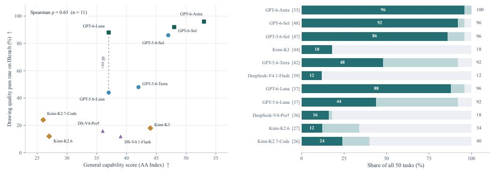

### (a) 일반적인 능력 및 그림 품질 (General capability and drawing quality)

### (b) 모델별 생성 결과 (Generation outcomes by model)

Figure 9: **일반 능력과 시각 프로그램 생성** on MaLiang-IBench. (a) 공개 AA 지능 지수 점수와 모든 50개 과제 중 시각 품질 기준을 모두 충족하는 비율. 점선은 두 Luna 모델 간의 **44% 포인트 격차**를 강조한다. (b) AA 점수(괄호) 순으로 정렬된 모델. 어두운 청록색, 연한 청록색, 회색은 각각 모든 기준 충족, 기준 미충족으로 성공한 생성, 실패를 나타낸다. 흰색 숫자는 품질 통과율을, 가장 오른쪽 숫자는 생성 성공율을 나타낸다. <sup>†</sup>공개 V4-Pro 점수는 체크포인트 0813을 사용한다.

일반 MLLM(멀티모달 대형 언어 모델) 능력이 시각 프로그램 생성 성능을 예측할 수 있을까? 우리는 공개된 Artificial Analysis (AA) Intelligence Index(인공지능 지수) 점수 [Artificial Analysis, 2026]와 MaLiang-IBench 결과를 비교함으로써 일반 모델 능력이 시각 프로그램 생성과 어떻게 관련되는지 살펴본다. 우리는 모델 페이지에 나열된 추론 구성에 대해 버전 4.3.2에서 표시된 정수 점수를 사용하며, 이는 2026년 9월 27일에 접근하였다. 이 지수는 지식, 추론, 코딩, 에이전트 작업의 평가를 집계한다. 드로잉 품질 합격률은 정렬, 미학, 구성을 만족하는 50개 작업 중 비율이며, 실패한 생성도 분모에 포함된다. 11개 모델 전반에서 두 측정치는 양의 순위 상관관계(Spearman  $\rho = 0.65$  in Fig. 9a)를 보인다. 그러나 일반 능력 점수는 시각 성능을 완전히 예측하지 못한다. GPT-5.6-Luna와 GPT-6-Luna는 표시된 지수 점수가 37이지만, 드로잉 품질 합격률은 각각 44%와 88%이다. Kimi-K3는 지수에서 44점을 기록했지만, 시각 기준을 만족하는 작업 비율은 18%에 불과하다. Fig. 9b는 완성도와 시각 품질을 구분한다: GPT-5.6-Luna와

#### (a) 렌더링된 'research-figure' 초안 (Rendered "research-figure" draft)

<span id="page-12-0"></span>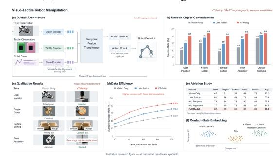

#### (b) 의사코드에서의 구성 추적 (Construction trace in pseudocode)

| Rec | uire: Figure brief $B$, 합성 데이터 $D$ |  |
|-----|-----------------------------------------------------------------|--------|
|  | 프로그램적 구성 |  |
| 1: | $S \leftarrow \text{InitCanvas}(2048, 1152)$ |  |
| 2: | $S$에서 아키텍처와 화살표를 그린다. | ⊳ a |
| 3: | $D$에서 막대를 그리다; 사진 셀을 예약한다. | ⊳b,c |
| 4: | 학습 곡선과 ablation 테이블을 그린다. | ⊳ d,e |
| 5: | 스키마틱 contact-state 클러스터를 그린다. | ⊳ f |
|  | 자산 생성 및 선택 |  |
| 6: | $L \leftarrow [2 \times 5, 2 \times 5, 3 \times 3, 2 \times 4]$ |  |
| 7: | for $k=1,\ldots,4$ do |  |
| 8: | $A_k \leftarrow \text{GenerateAssets}(B, L_k)$ |  |
| 9: | $A_k$를 사진 요구사항에 따라 검사한다. |  |
| 10: | 출처를 기록하고 다음 프롬프트를 수정한다. |  |
| 11: | end for |  |
| 12: | $A^* \leftarrow A_3$ $\triangleright$ choice in the | is run |
|  | 구성 및 검증 |  |
| 13: | $A^*$를 예약된 셀에 자르고 배치한다. |  |
| 14: | 코드를 사용해 라벨을 오버레이한다. |  |
| 15: | $I \leftarrow \text{Render}(S)$ |  |
| 16: | 전체 이미지를 검사하고 세부 크롭을 확인한다. |  |
| 17: | 해결되지 않은 사진 요구사항에 대한 공지를 추가한다. |  |
| 18: | $I \leftarrow \text{Render}(S)$ |  |
| 19: | $Q \leftarrow \text{Review}(I, B)$ |  |
| 20: | $I$를 PNG로 내보내고 $Q$ 아래에 초안 상태를 유지한다. |  |

Figure 10: **"연구 그림 사례"를 그 구성 과정으로 추적하기.** 왼쪽: 생성된 6패널 "연구-그림" 포스터. 오른쪽: 실행 추적에서 추출한 사례별 의사코드(주석 a-f는 렌더링된 이미지의 패널을 가리킴). 기록된 프로그램, 자산 생성 단계, 리뷰를 통해 개별 요소가 어떻게 구성되고 평가되었는지 추적할 수 있다.

GPT-5.6-Terra는 작업의 92%를 완수하지만, 44%와 48%만이 모든 품질 기준을 충족한다. 이러한 관찰은 일반 벤치마크 성능이 시각적 프로그램 생성의 요구 사항 중 일부만을 포착한다는 것을 시사한다. 시각적 프로그램 생성은 공간 및 외관 제약을 실행 가능한 표현으로 변환하고, 렌더링된 피드백을 사용해 수정을 안내해야 한다.

최종 이미지 외에 구성 과정이 무엇을 드러낼 수 있을까? MaLiang-Harness는 실행 가능한 프로그램, 자산 출처, 그리고 수정 기록을 통해 시각적 결과의 구성을 검토 가능하게 만든다. Fig. 10은 학술 논문의 '6패널 연구 일러스트레이션'과 그 기록된 구성 과정을 요약한 의사코드를 짝지어 보여준다. GPT-6-Astra는 사용자 제공 합성 데이터에서 레이아웃, 구조도, 라벨, 플롯을 지정하는 코드를 사용하면서 조작 예시를 위해 사진 스타일 자산을 생성한다. 추적은 서로 다른 연락 시트 레이아웃을 가진 네 번의 자산 생성 시도를 기록한다. 최종 구성은 세 번째 시도에서 얻은 크롭을 사용하며, 코드가 그 배치, 스케일링, 라벨을 제어한다. 구성 기록은 명시적 데이터와 지침에서 그려진 요소와 생성된 이미지를 사용해 조립된 요소를 구분한다. 이 구분은 최종 리뷰를 해석하는 데도 도움이 된다: 수치 플롯과 레이아웃은 통과하지만, 사진 예시는 만족스럽지 못해 결과를 초안으로 남긴다. 구성 단계와 수정별 평가를 연결함으로써 harness는 개별 요소가 어떻게 생성되었는지와 최종 이미지만으로는 드러나지 않는 미해결 요구 사항을 보여준다.

정제는 언제 정체되고 언제 멈춰야 할까? harness는 세 가지 잠재적 실패 모드를 직면한다: 계획이 작품을 진전시키지 못하는 추론 정체, 반복 편집이 요구 사항을 해결하지 못하는 의미적 라이브락, 그리고 계획과 도구 사용이 종료 없이 반복되는 무한 에이전시 루프. 정제는 지속적인 활동이 의미 있는 시각적 개선을 가져오지 않을 때 정체된다. PEG는 작업 상태를 보존하고, TGP와 REV는 검사, 비교, 복구를 지원하지만, 이 메커니즘은 효과적인 수정을 보장하지 않는다. Fig. 8에서 추가 검사는 토큰 예산이 소진되기 전에 교정 편집을 제공하지 못한다. 따라서 harness는 종료와 완성을 구분한다: 모델 호출, 도구 호출, 시간, 토큰 한계가 실행을 제한하고, 성공적인 최종화가 작업 완료를 표시하도록 요구한다.

## 5 결론 (Conclusion)

우리는 MaLiang-Harness를 제시했다, 이는 프로그램 수준의 정확성과 시각적 재현 사이의 Program-to-Visual (P2V) 격차를 동기로 한 프로그래머블 이미지 및 비디오 생성을 위한 통합 프레임워크이다.

<span id="page-13-0"></span>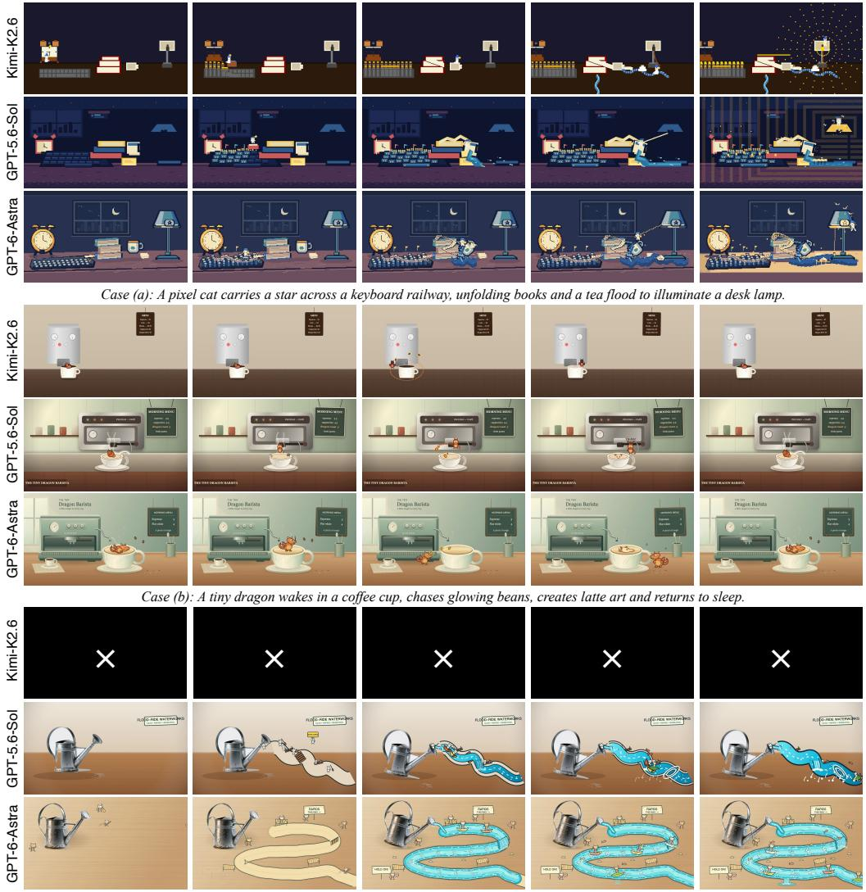

*Case (c): 드루들 고양이들이 물길을 만들고, 실제 물뿌리개를 기울이고, 그 결과 물결을 타는 보트를 운전한다.*

Figure 11: MaLiang-VBench에서의 정성적 비교. 그룹은 (a) Star Delivery, (b) The Tiny Dragon Barista, (c) Watering-Can Rafting을 보여준다. 각 모델 행은 왼쪽에서 오른쪽으로 시간 순서대로 균일하게 샘플링된 다섯 개의 프레임을 포함한다. 검은 배경에 흰색 ×는 실패한 실행을 나타낸다. 전체 프롬프트는 부록 [6.5.]에 제공된다.

요구사항 만족. 실행 가능한 상태를 유지하고, 구축 이력을 기록하며, 검증을 현재 버전과 연결함으로써, 프레임워크는 MLLM 기반 시각적 창작을 구축, 검사, 정제의 지속적인 프로세스로 조직한다. MaLiang-IBench에서 11개의 MLLM, MaLiAng-VBench에서 4개의 MLLM을 평가한 결과, 생성 성공률, 시각적 품질, 계산 비용에서 상당한 차이가 나타났다. 유사한 일반 역량 점수를 가진 모델이라도 시각적 결과가 크게 달라질 수 있어, 시각 프로그램 생성의 직접 평가가 필요함을 시사한다. 포토리얼리즘과 정지된 정제는 여전히 과제이다. 향후 연구에서는 보다 풍부한 렌더링 백엔드와 진행 상황 인식 정제 전략을 탐구하여 시각적 충실도와 생성 효율성을 개선할 예정이다.

# 참고문헌 (References)

- <span id="page-14-16"></span>인공지능 분석 (Artificial Analysis). AI의 독립적 분석: 사용 사례에 맞는 최적 모델과 공급자를 선택하기 위해 AI 환경을 이해한다, 2026. URL <https://artificialanalysis.ai/>
- <span id="page-14-5"></span>Andreas Blattmann, Tim Dockhorn, Sumith Kulal, Daniel Mendelevitch, Maciej Kilian, Dominik Lorenz, Yam Levi, Zion English, Vikram Voleti, Adam Letts, et al. 안정적인 비디오 디퓨전: 잠재 비디오 디퓨전 모델을 대규모 데이터셋에 확장. *arXiv 사전 인쇄물 arXiv:2311.15127*, 2023.
- <span id="page-14-11"></span>Yanzhe Chen, Zechen Bai, Zhijun Cao, Wenzheng Zeng, Kevin Qinghong Lin, Yiqi Lin, Guoqiang Liang, Kevin Yuchen Ma, Qiming Huang, and Mike Zheng Shou. Show-harness: VLM 에이전트만으로 로봇을 조종할 수 있다. *arXiv 사전 인쇄물 arXiv:2609.10522*, 2026.
- <span id="page-14-7"></span>Tanmay Gupta and Aniruddha Kembhavi. 시각적 프로그래밍: 훈련 없이 구성적 시각적 추론. In *2023 IEEE/CVF 컴퓨터 비전 및 패턴 인식 국제 회의 (CVPR)*, pages 14953–14962. IEEE, 2023.
- <span id="page-14-0"></span>Jonathan Ho, Ajay Jain, and Pieter Abbeel. 노이즈 제거 디퓨전 확률 모델. *신경 정보 처리 시스템의 발전 (Advances in neural information processing systems)*, 33:6840–6851, 2020.
- <span id="page-14-4"></span>Jonathan Ho, Tim Salimans, Alexey Gritsenko, William Chan, Mohammad Norouzi, and David J Fleet. 비디오 디퓨전 모델. *신경 정보 처리 시스템의 발전*, 35:8633–8646, 2022.
- <span id="page-14-9"></span>Ian Huang, Guandao Yang, and Leonidas Guibas. Blenderalchemy: 비전-언어 모델로 3D 그래픽 편집. In *유럽 컴퓨터 비전 회의*, pages 297–314. Springer, 2024.
- <span id="page-14-1"></span>Yaron Lipman, Ricky TQ Chen, Heli Ben-Hamu, Maximilian Nickel, and Matt Le. 생성 모델링을 위한 플로우 매칭. *arXiv 사전 인쇄물 arXiv:2210.02747*, 2022.
- <span id="page-14-10"></span>Xuying Ning, Katherine Tieu, Dongqi Fu, Tianxin Wei, Zihao Li, Yuanchen Bei, Jiaru Zou, Mengting Ai, Zhining Liu, Ting-Wei Li, et al. 코드를 에이전트 하네스로 활용. *arXiv 사전 인쇄물 arXiv:2605.18747*, 2026.
- <span id="page-14-15"></span>OpenAI. Gpt-5. 2026a. URL <https://openai.com/zh-Hans-CN/gpt-5/>
- <span id="page-14-3"></span>OpenAI. Gpt-6 astra: 새로운 세대의 지능. 2026b. URL [https://openai.com/](https://openai.com/zh-Hans-CN/index/gpt-6-astra/) [zh-Hans-CN/index/gpt-6-astra/](https://openai.com/zh-Hans-CN/index/gpt-6-astra/)
- <span id="page-14-2"></span>Robin Rombach, Andreas Blattmann, Dominik Lorenz, Patrick Esser, and Björn Ommer. 잠재 디퓨전 모델을 이용한 고해상도 이미지 합성. In *2022 IEEE/CVF 컴퓨터 비전 및 패턴 인식 국제 회의*, pages 10674–10685. IEEE, 2022.
- <span id="page-14-8"></span>Chenglei Si, Yanzhe Zhang, Ryan Li, Zhengyuan Yang, Ruibo Liu, and Diyi Yang. Design2code: 자동 프론트엔드 엔지니어링을 위한 멀티모달 코드 생성 벤치마킹. In *2025년 아메리카 대륙 국가 협회 컴퓨터 언어학 협회 인간 언어 기술 장(볼륨 1: 장문) 회의 논문집*, pages 3956–3974, 2025.
- <span id="page-14-14"></span>Kimi Team, Tongtong Bai, Yifan Bai, Yiping Bao, SH Cai, Yuan Cao, Ziwei Chai, Y Charles, HS Che, Cheng Chen, et al. Kimi k2.5: 시각적 에이전트 지능. *arXiv 사전 인쇄물 arXiv:2602.02276*, 2026.
- <span id="page-14-13"></span>Anyi Xu, Bangcai Lin, Bing Xue, Bingxuan Wang, Bingzheng Xu, Bochao Wu, Bowei Zhang, Chaofan Lin, Chen Dong, Chenchen Ling, et al. Deepseek-v4: 수백만 토큰 컨텍스트 지능을 향한 고효율성. *arXiv 사전 인쇄물 arXiv:2606.19348*, 2026a.
- <span id="page-14-12"></span>Xu Xu, Jinxiu Liu, Zhangbo Qiao, Jiaxing Lu, Xiangyu Zhang, Yubin Gu, Fangwei Ning, and Yan Shi. Omniharness: 상징적 정책 학습을 통한 일반화 가능한 시각적 생성 활용. *arXiv 사전 인쇄물 arXiv:2609.16057*, 2026b.
- <span id="page-14-6"></span>Lvmin Zhang, Anyi Rao, and Maneesh Agrawala. 텍스트-투-이미지 디퓨전 모델에 조건부 제어 추가. In *2023 IEEE/CVF 국제 컴퓨터 비전 회의 (ICCV)*, pages 3813–3824. IEEE, 2023.

## 6 부록 (Appendix)

본 부록은 확장된 구성 예시, 평가 및 집계 세부사항, 비교 플롯 계산, 그리고 정성적 예시에서 사용된 프롬프트를 제공한다.

### 6.1 절차적 구성 예시 (Procedural Construction Example)

Algorithm [2](#page-16-0)는 Fig. [4.](#page-5-1)의 식물 초상화 예시를 확장한다. 이 알고리즘은 전체 계획 및 정제 루프 대신 고정된 PEG 수정 내에서 그리기 작업을 요약한다. 프로그램은 배경, 원형 잎사귀, 초상화, 전경 꽃의 네 레이어로 이미지를 구축한다. 별도의 시드 생성기가 잎사귀, 초상화 질감, 꽃의 변화를 제어한다. 명명된 루틴은 기본 Canvas 작업을 추상화하며, 이미지 자산은 사용되지 않는다. Algorithm [1,](#page-5-0)과 마찬가지로 k는 이 알고리즘에서 꽃 레이어 인덱스를 나타내며, PEG 수정이 아니다.

### 6.2 평가 프로토콜 및 보고 세부사항 (Evaluation Protocol and Reporting Details)

작업 결과 및 품질 지표. MaLiang-IBench는 50개의 이미지 작업을, MaLiang-VBench는 13개의 비디오 작업을 포함한다. 작업은 출력이 디코더 가능하고 헌스의 완료 검사를 통과할 때 성공한다; 나머지 작업은 실패로 계산된다. *Token Limit*은 할당된 토큰 예산을 소진한 실패 하위 집합을 식별한다. 이러한 결과 범주는 이후 GPT-6-Sol에 의한 품질 평가와 구별된다. 이미지는 프롬프트 정합성, 미학, 구성을 위해 1에서 5까지 점수를 매긴다; 비디오는 추가로 모션-코히어런스 점수를 받는다. 각 차원의 임계값 카운트는 최소 4점을 획득한 성공 출력만 포함하며, *All Criteria*는 모든 임계값을 충족한 경우를 셈한다. 평균 품질 점수는 성공 출력만 사용한다. 성공률과 품질 통과율은 전체 작업 세트를 분모로 사용하므로, 실패 작업은 분자에 기여하지 않는다.

비디오 리뷰. 한 명의 리뷰어가 원본 프롬프트와 시간 순서대로 12개의 샘플 프레임을 사용해 네 모델의 23개 성공 비디오를 모두 평가했다. *Evaluated*는 검토된 비디오 수를 기록한다. DeepSeek의 0 품질 카운트는 성공 출력이 없음을 반영하며, 0 점수를 할당받지 않는다. 리뷰는 공식적으로 블라인드되지 않았다. 모션 코히어런스는 샘플 프레임에서 보이는 진행을 측정하며, 프레임별 유동성이나 짧은 중간 결함을 배제하지 않는다.

계산 비용. 누적 생성 시간은 실패 및 재시도를 포함한 기록된 시도 기간을 합산한 것이며, 병렬로 실행된 배치의 실제 벽시계 시간은 아니다. *Time/Qualified*는 세 가지 품질 임계값을 모두 충족하는 이미지 수로 누적 시간을 나눈 값이다. *Time/Success*는 성공 비디오 수로 누적 시간을 나눈 값이며, 성공이 없을 때는 정의되지 않는다. 입력 및 출력 토큰 수는 사용 기록에서 가져오며, 반복 입력 컨텍스트를 포함한다. 작업별 통계는 아래 집계 규칙을 따른다.

이미지 실행 구성 및 집계. MaLiang-IBench는 여러 배치, 재시도 및 과거 실행을 결합하며, 균일한 최초 시도 대신 사용한다. DeepSeek‑V4‑Pro는 시각적 피드백 없이 평가된다. GPT‑6‑Astra의 총계는 모든 50개의 프롬프트를 포함하며, 38개의 신규 작업에 39번 시도와 12개의 과거 실행을 결합한다. 신규 실행은 작업자 벽 시간을 사용하고, 과거 실행은 작업자 시작 없이 경과 생성 시간을 사용한다. Astra의 작업별 통계는 총계(재시도 포함)를 50으로 나눈 값이다. Kimi의 평균 호출 수도 50을 분모로 사용하지만, *Time/Task*는 성공 작업의 중앙값이며, 토큰 통계는 기록된 총계를 성공 작업 수로 나눈다. 따라서 동일한 이름의 비용 열이 항상 동일한 집계 규칙을 사용하지 않으므로 직접적인 효율성 비교가 제한된다.

비디오 실행 구성 및 집계. 보고된 MaLiang-VBench 결과는 모델 및 작업마다 한 번의 기록된 시도를 사용한다. 작업당 시간, 호출 수, 토큰 수는 13개의 시도 전체에서 평균된다. DeepSeek 결과는 64K 출력 토큰 제한을 적용한 완전 평가를 사용하며, 미완성 32K 배치는 제외된다. Astra 결과는 과거 실행을 사용한다. 총 시간은 신규 배치의 시도 벽 시간과 과거 실행의 실제 생성 시간을 합산한다. 예산, 타이밍 규칙, 실행 조건의 차이로 인해 비용 비교는 평가된 구성을 설명한다.

### <span id="page-16-0"></span>알고리즘 2 (Algorithm 2) 식물 초상화의 절차적 생성

Require: Canvas size W = 1024, H = 576; fixed seed s  
Ensure: Rendered RGB image I  
 1: C ← NEWCANVAS(W, H)  
 2: Rf , Rw, Rp ← SEEDEDGENERATORS(s,foliage, woman, flowers)  
                                                            ▷ 레이어 1: 흰색 배경  
 3: FILLRECTANGLE(C,(0, 0, W, H), white)  
                                                              ▷ 레이어 2: 원형 잎사귀  
 4: for i = 0 to 25 do  
 5: θ ← 2πi/26 + JITTER(Rf )  
 6: x, y ← BRANCHENDPOINTS((W/2, H/2), θ, Rf )  
 7: STROKEBEZIERBRANCH(C, x, y)  
 8: for each position along the branch do  
 9: DRAWGRADIENTLEAVES(C, Rf )  
10: DRAWLEAFVEINSANDGRAIN(C, Rf )  
11: end for  
12: end for  
13: DRAWBERRYSPRIGSANDADDITIONALLEAVES(C, Rf )  
                                                            ▷ 레이어 3: 여성 초상  
14: FILLBEZIERSHAPE(C, hair silhouette, brown gradient)  
15: FILLBEZIERSHAPE(C, neck and shoulders,skin gradient)  
16: FILLBEZIERSHAPE(C, face,skin gradient)  
17: ADDCLIPPEDSHADINGANDGRAIN(C, face, Rw)  
18: DRAWFACIALPATHS(C, brows, closed eyes, lashes, nose, lips)  
19: FILLBEZIERSHAPE(C, front hair locks, brown gradient)  
20: for d ∈ {left,right} do  
21: for j = 0 to 74 do  
22: STROKECLIPPEDHAIRSTRAND(C, d, j, Rw)  
23: end for  
24: end for  
                                                 ▷ 레이어 4: 꽃과 전경 세부  
25: for each prescribed rose position (x, y, r) do  
26: DRAWSEPALS(C, x, y, r)  
27: for k = 0 to 4 do  
28: n ← [8, 7, 6, 5, 4]k  
29: for j = 0 to n − 1 do  
30: DRAWROTATEDBEZIERPETAL(C, x, y, r, k, j, Rp)  
31: ADDPETALGRADIENTANDGRAIN(C, Rp)  
32: end for  
33: end for  
34: end for  
35: for each prescribed daisy or small-blossom position do  
36: DRAWRADIALPETALSANDCENTER(C, Rp)  
37: end for  
38: DRAWFOREGROUNDLEAVESANDBERRIES(C, Rp)  
39: I ← RASTERIZE(C)  
40: return I

### 6.3 비교 플롯 및 표 규칙 (Comparative Plots and Table Conventions)

레이더 순위. Fig. [2](#page-3-0)은 Tables [2](#page-8-0)와 [3:](#page-8-1)에서 평균 정렬, 미학, 구성 점수; 생성 성공률; 작업당 보고된 시간; 입력 및 출력 토큰 합계라는 여섯 가지 지표를 사용한다. 각 지표는 11개 모델 전체에서 순위를 매긴 뒤 패널로 그룹화된다. 품질과 성공 값이 높을수록 순위가 좋으며, 비용이 낮을수록 순위가 좋다. 보고된 값이 동일하면 평균 순위를 부여한다. 순위 r은 반경 (12 − r)/11에 매핑되어 순위 1을 외부 가장자리로 배치한다. 다각형 면적은 집계 성능 점수가 아니며, 반경 차이는 기저 지표의 차이가 아니라 순위 차이를 나타낸다. 범례 수는 성공을 나타낸다

출력. 작은 성공적인 하위 집합은 높은 품질 평균을 낼 수 있지만, 초기 실패는 비용을 줄일 수 있다; 위에서 설명한 집계 차이도 이 그림에 적용된다.

일반 능력 비교. 그림 [9](#page-11-1)은 버전 4.3.2에서 표시된 정수형 인공지능 지수(Artificial Analysis Intelligence Index) 점수를 사용하며, 2026년 9월 27일에 접근한 값으로, 공개 모델 페이지 [&#91;Artificial Analysis,](#page-14-16) [2026&#93;](#page-14-16)에 나열된 추론 구성에 대해 사용됩니다. 이미지 품질 통과율은 *All Criteria* 수를 50으로 나눈 값입니다. 이 비율과 지수 간의 Spearman 상관계수는 11개 모델에서 ρ = 0.65입니다. 공개 DeepSeek-V4-Pro 점수는 체크포인트 0813을 가리키며, 이는 우리가 평가한 체크포인트와의 대응이 검증되지 않았습니다; 이를 제외하면 ρ = 0.63이 됩니다. 공개 평가 설정은 우리 하네스에서 사용한 설정과 다를 수 있으므로, 이 분석은 모델 능력의 효과를 분리하기보다 연관성을 기술합니다.

수치 색상 스케일. 표 [2](#page-8-0)와 [4,](#page-9-1)에서 주황색과 파란색은 각각 DeepSeek-V4.1-Flash보다 높은 값과 낮은 값을 나타냅니다. 색상은 수치 차이를 인코딩하며, 지표 전반에 걸친 일관된 선호를 나타내지 않습니다. 상대 변화 강도는 p min(|x/b − 1|, 1)이며, 여기서 x는 보고된 값, b는 기준값입니다. DeepSeek는 성공적인 비디오가 없으므로, 비디오 성공률 강도는 대신 p |x − b|/100을 사용하며, x와 b는 백분율로 표현됩니다. 비디오 *Time/Success*는 Kimi-K2.6을 기준으로 합니다.

품질 표 하이라이트. 표 [3](#page-8-1)와 [5,](#page-10-0)에서 파란색과 주황색은 각각 GPT-5.6-Luna(이미지)와 GPT-5.6-Sol(비디오)에 대한 GPT 결과가 더 높은지 낮은지를 나타냅니다. 색상 강도는 위의 상대 변화 규칙을 따릅니다. DeepSeek와 Kimi는 품질 결과가 성공적인 작업이 적기 때문에 별도의 회색 스케일을 사용합니다; 더 어두운 회색은 각 기준 열 내에서 더 큰 값을 나타냅니다. 굵은 글씨는 설명적 *Evaluated* 열을 제외하고 가장 좋은 GPT 값을 식별합니다. 품질 임계값 카운트는 전체 작업 집합에 대한 카운트로서 비교 가능하며, 평균은 서로 다른 성공적 하위 집합을 설명합니다.

### <span id="page-17-0"></span>6.4 질적 이미지 비교를 위한 프롬프트 (Prompts for the Qualitative Image Comparisons)

아래 다섯 개의 프롬프트는 그림 [6.](#page-9-0)의 행 순서를 따르며, 중국어 프롬프트와 표시 텍스트는 영어로 번역되어 제시됩니다; 평가는 원문을 사용했습니다. 프롬프트 내용은 평가 프로토콜과 별도로 제시되며, 생성된 출력이 모든 요청된 속성을 만족한다는 의미는 아닙니다.

### 여우 화가가 차잔 위에 (Fox Painter on a Teacup.)

평면 2D 만화 여우 화가가 사실적인 흰색 도자기 차잔의 가장자리에 서 있습니다. 1536 × 864 가로형 PNG를 출력합니다. 차잔은 나무 테이블 위에서 중앙보다 약간 왼쪽에 배치하고, 유약에 자연스러운 하이라이트를 주며, 손잡이는 오른쪽에, 내부에는 어두운 차가 보이도록 합니다. 여우는 한 발에 붓을, 다른 발에 작은 팔레트를 들고, 손잡이에 짧은 파란색 호를 그립니다. 두 발은 관찰자에게 가장 가까운 가장자리에 놓여야 하며, 여우는 차 안에서 떠 있거나 서 있지 않아야 합니다.

여우를 단색 주황색 블록, 선명한 검은색 윤곽선, 흰색 주둥이로 렌더링하여 사실적인 도자기와 나무 결과 뚜렷한 대비를 만듭니다. 왼쪽에서 부드러운 창문 빛을 사용하고, 연한 회색 배경과 오른쪽에 음영 공간을 둡니다. 붓 끝은 손잡이를 닿아야 하며, 캐릭터는 전체 차잔보다 커서는 안 됩니다. 텍스트, 추가 캐릭터, 전체 장면을 둘러싼 프레임을 추가하지 마십시오.

### 산악 차집 개념 (Mountain Teahouse Concept.)

가상의 목재 차집을 위한 2048 × 1152 가로형 건축 설계 보드를 만들고, 제목을 "Mountain Teahouse"와 "MOUNTAIN TEAHOUSE"로 지정하며, 작은 "CONCEPT STUDY" 라벨을 추가합니다.

왼쪽에 넓은 메인 패널을, 오른쪽에 두 개의 패널이 있는 좁은 열을 사용합니다. 왼쪽 패널은 언덕에 돌 기둥 위에 세워진 세분의 축측도 차집을 보여줍니다: 하나의 곡선 기와 지붕, 개방형 앞 베란다, 네 개의 균일하게 배치된 앞 기둥, 뒤쪽에 미끄러지는 스크린, 그리고 전경으로 내려가는 짧은 계단이 있습니다. 건물 뒤에 작은 나무를 추가하되 지붕을 가리지 않도록 합니다.

상단 오른쪽 패널인 '전면도'는 네 개의 기둥, 지붕 곡선 및 중앙 계단을 반복한다. 하단 오른쪽 패널인 '절면'은 베란다와 폐쇄된 뒷방을 가로질러 지붕 라프터와 돌 지지대를 드러낸다. 하단 스트립에는 '지붕 연결부', '기둥 기초', '슬라이딩 스크린'이라는 세 개의 확대 세부 묘사가 있다. 리더 1–3을 사용하여 주요 뷰에서 이 특징들을 해당 세부 번호와 연결한다. 측정값이나 역사적 날짜를 추가하지 않는다.

섬세한 세피아 펜 선, 절제된 수채화 워시, 따뜻한 아이보리 종이, 얇은 이중선 테두리와 정돈된 격자를 사용한다. 이는 가상의 개념 문서 시트이며 사실적인 역사 조사 아님을 명시한다. 역사적 날짜, 엔지니어링 안전 주장, 읽을 수 없는 텍스트 단락을 발명하지 않는다. 요청된 정확한 짧은 라벨만 사용하고, 명확한 타이포그래피와 얇은 리더를 사용한다. 사진 렌더링, 밝은 네온 색상, 현대 차량은 사용하지 않는다. 하나의 정적 PNG를 출력한다.

### 토끼 바이올린 연주자 (Rabbit Violinist on a Ginkgo Leaf).

1536×1024 가로형 혼합 매체 일러스트를 그린다: 사실적인 황갈색 가시나무 잎이 젖은 어두운 슬레이트 위에 평평하게 놓여 있으며, 보이는 정맥, 구부러진 가장자리, 정확히 세 개의 투명한 이슬방울이 있다. 흰색 2D 만화 토끼가 잎의 넓은 윗부분에 서서 단순화된 작은 갈색 바이올린을 연주한다. 왼쪽 발은 바이올린 목을 잡고, 오른쪽 발은 활을 잡으며 활은 줄을 가로지른다. 토끼의 눈은 부드럽게 감겨 있다.

토끼와 바이올린은 명확한 갈색 윤곽선, 평면 색상, 최소한의 음영으로 렌더링한다; 잎, 이슬방울, 슬레이트는 사실적인 재질과 부드러운 측면 조명으로 렌더링한다. 토끼의 몸 높이는 잎 길이의 약 1/3이며, 발 아래에 작은 접촉 그림자가 있다. 배경은 조용하게 유지하고 다른 잎, 텍스트, 악보, 캐릭터는 포함하지 않는다. 정적 PNG를 출력한다.

### 정원 로봇 캐스트 (Garden Robot Cast).

2048×1152 가로형 로봇 캐스트 일러스트를 흰색 배경에 그리며, 정확히 6개의 원본 정원 로봇을 두 줄 세 개씩 배치한다. 후면 줄에서 좌에서 우로: 작은 삽을 들고 있는 높은 청록색 원통형 로봇; 사각형 머리를 가진 오프화이트 로봇으로, 넓은 챙의 정원 모자를 쓰고 빈 화분을 들고 있다; 그리고 삼각형 머리를 가진 주황색 로봇으로, 등 뒤에 연한 파란색 물탱크를 실어 들고 스프레이 호스를 들고 있다. 전면 줄에서 좌에서 우로: 텍스트 없는 씨앗 팩을 들고 있는 짧은 분홍색 로봇으로 둥근 머리를 가진; 사다리꼴 몸체를 가진 노란색 로봇으로, 양손에 묘목을 들고 있다; 그리고 타원형 몸체를 가진 보라색 로봇으로, 닫힌 일련의 가지치기 가위를 들고 있다.

모든 로봇은 두 눈, 두 팔, 두 다리를 가지고 있지만, 독특한 머리와 몸체 실루엣을 갖는다. 각 도구는 지정된 캐릭터에만 속한다. 후면 줄을 더 키우고 전면 줄을 더 낮게 하여 실루엣을 약간 차례대로 배치하되, 어떤 캐릭터의 얼굴, 손, 발도 가려지지 않도록 한다. 깔끔한 굵은 윤곽선, 평면 색상, 최소한의 음영, 어린이 애니메이션 스타일을 사용한다. 정원 배경, 텍스트, 로고, 추가 로봇, 흩어진 도구는 추가하지 않는다. PNG를 출력한다.

# 온실 화분 벤치 (Greenhouse Potting Bench).

온화한 1536×1024 가로형 어린이 책 일러스트를 온실 화분 벤치를 그린다. 주요 등장인물은 웃는 테라코타 화분에 묘목이 있고, 수줍은 라벤더 물뿌리개, 명랑한 노란색 정원 장갑, 졸린 민트-그린 씨앗 상자이다. 각각은 정확히 한 개의 얼굴을 가진다. 화분을 중앙에 배치하고, 물뿌리개를 왼쪽에 배치해 주둥이가 화분을 향하도록 하고, 장갑을 오른쪽에 놓으며, 닫힌 씨앗 상자를 벤치 앞쪽 가장자리에 둔다.

배경에 곡선형 온실 골조가 창백한 아침 하늘을 프레임한다. 세 개의 얼굴 없는 화분을 서로 다른 높이에 걸고, 빈 종자 팩이 들어 있는 짧은 선반을 보여준다. 물뿌리개 뚜껑과 묘목 사이에 몇 방울의 물이 매달려 있어 한 순간이 얼어붙은 듯한 느낌을 준다. 부드러운 피치, 세이지, 버터 옐로우, 크림 색상을 사용하고, 둥근 실루엣, 섬세한 윤곽선, 부드러운 음영을 적용한다. 모든 캐릭터를 인식 가능하게 유지하고 인간 정원사, 텍스트, 추가 인격화된 객체를 그리지 않는다. PNG를 출력한다.

추가 예시: 명시적 레이아웃 제약 조건. 본문에 있는 정성적 예시를 넘어, 다음 프롬프트는 객체 식별자, 정규화된 좌표, 치수, 색상 코드를 통해 공간 제약 조건을 지정하는 방법을 보여준다. 이러한 사양은 텍스트 프롬프트의 일부로 제공되며, MLLM에 의해 해석되어 실행 가능한 시각 프로그램을 구성한다.

2048×1152, 16:9 가로 레이아웃 제어 다이어그램을 그려 '뮤지엄 트리플릿 전시 보드'를 표시하고 정적 PNG를 출력한다. 아래에 명시된 색상 사각형과 ID만 그린다. 실제 포스터, 사람, 물체, 최종 복사본은 그리지 않는다.

모든 사각형 좌표는 [x, y, width, height] 형식으로 주어지며, 가로 및 세로 축은 실제 캔버스 너비와 높이를 사용해 독립적으로 0–1000 범위로 정규화된다. 실수로 정사각형 이미지를 만들거나 레이아웃을 재배치하거나 요소를 자동 정렬하지 말라. 윤곽선, 둥근 모서리, 그림자, 그라데이션이 없는 흰색 배경을 사용한다. 각 ID를 사각형 중앙에 명확한 검정색 산세리프체로 배치한다. 목록은 모든 사각형을 포함하며, 나열되지 않은 상위 컨테이너나 추가 범례는 없다.

색상 코딩: coral red #FF6B6B는 제목을 나타내며; sky blue #62CBE8는 주요 일러스트레이션 영역을 나타내며; magenta-purple #D86BDA는 사진 영역을 나타내며; golden yellow #F4C95D는 분석 영역을 나타내며; mint green #72C7A0는 색상 팔레트를 나타내며; lavender #A999E8는 라벨을 나타낸다.

| ID | [x, y, width, height] | 색상 |
|----|-----------------------|----------------|
| H1 | [30, 30, 650, 85] | 코랄 레드 |
| H2 | [730, 30, 240, 85] | 코랄 레드 |
| P1 | [30, 155, 260, 470] | 마젠타 퍼플 |
| T1 | [30, 645, 260, 45] | 라벤더 |
| M1 | [320, 155, 390, 330] | 스카이 블루 |
| D1 | [320, 515, 180, 110] | 골든 옐로우 |
| D2 | [530, 515, 180, 110] | 골든 옐로우 |
| T2 | [320, 645, 390, 45] | 라벤더 |
| P2 | [740, 155, 230, 210] | 마젠타 퍼플 |
| P3 | [740, 395, 230, 230] | 마젠타 퍼플 |
| T3 | [740, 645, 230, 45] | 라벤더 |
| S1 | [30, 735, 290, 150] | 스카이 블루 |
| S2 | [355, 735, 290, 150] | 스카이 블루 |
| S3 | [680, 735, 290, 150] | 스카이 블루 |
| F1 | [30, 925, 940, 40] | 라벤더 |

공간 관계: 가운데 열의 주요 이미지가 왼쪽과 오른쪽 열보다 넓으며; 오른쪽 열의 두 사진 영역은 높이가 다르고; 세 개의 하단 이미지 영역은 너비가 동일하며 그 사이에 흰색 간격이 있다.

정확히 15개의 사각형이 존재하고, 각 ID가 한 번씩만 나타나며, 모든 좌표와 색상이 정확하고 사각형이 겹치거나 캔버스를 벗어나지 않는지 확인한다. 지정되지 않은 모든 간격은 흰색으로 둔다. 연결선, 화살표, 좌표축, 테두리, 사진, 실제 텍스트 내용, 추가 색상 블록을 추가하지 않는다. SVG 또는 Canvas 코드만 사용하여 작업을 완료한다.

### <span id="page-19-0"></span>6.5 Prompts for the Qualitative Video Comparisons (6.5 질적 비디오 비교를 위한 프롬프트)

다음 프롬프트는 Star Delivery, The Tiny Dragon Barista, 그리고 Watering-Can Rafting에 해당하며, 그림 [11.](#page-13-0)에서 확인할 수 있다. Star Delivery는 프레젠테이션을 위해 중국어로 번역되었으며, 평가는 원본 중국어 문구를 사용했다. 나머지 두 프롬프트는 원래 영어로 작성되었다. 위에서 설명한 12프레임 품질 리뷰는 비교 그림에 표시된 각 모델의 다섯 개 균일 샘플 프레임과는 별개이다.

### Star Delivery: Lighting Up Desk City (스타 딜리버리: 데스크 시티를 밝히다)

픽셀 고양이는 알람 시계에서 내보낸 별을 잡고, 키보드 기차를 타고 책상 위를 달리며, 책 페이지를 따라 차가 만든 급류를 타고, 마지막으로 책상 램프의 끈을 이용해 별을 불이 꺼진 전구 안에 넣기 위해 높이까지 흔들어 올린다.

*핵심 동작 시퀀스:* 알람 시계가 별을 내보낸다 → 키보드 철도가 자라난다 → 카트가 가속한다 → 스페이스바가 발사한다 → 책 페이지가 펼쳐진다 → 차가 책상에 범람한다 → 종이 배가 급류를 타고 간다 → 끌어당기는 끈 스윙이 펼쳐진다 → 별빛이 전체 책상을 밝힌다.

*즉시 사용 가능한 프롬프트.* 픽셀 아트로만 구성된 상상력 넘치는 애니메이션을 만들고, 명확한 동작 진행과 16:9 비율의 풍경 구성을 갖춘다. 전체 세계는 일관되고 상세한 2D 픽셀 아트 스타일을 사용해야 하며, 캐릭터, 일상 물체, 배경, 액체, 연기, 조명, 입자 등 모든 요소는 명확히 인식 가능한 정사각형 픽셀로 구성되어야 한다. 균일한 픽셀 크기, 제한적이고 조화로운 팔레트, 단계적 윤곽, 깊이를 전달하기 위한 소량의 픽셀 디더링을 사용한다. 사진 실사 자산, 손그림 선, 3D 볼륨을 사용하지 않으며, 일반 비디오에 모자이크 필터를 단순히 적용하지 않는다.

장면은 밤의 책상이며, 약간 상승된 각도에서 측면을 바라보아 전체 무대를 볼 수 있다. 오래된 알람 시계가 왼쪽에 서 있고, 기계식 키보드가 전경을 차지하며, 두꺼운 책이 중간에 쌓여 있고, 차 한 잔과 스티키 노트 패드가 책 옆에 놓여 있으며, 불이 꺼진 책상 램프가 오른쪽에 서 있다. 이 물체들은 명확히 인식 가능한 일상 형태를 유지하지만 모두 픽셀 아트로 그려져 있다. 시작은 조용하고 명확히 정리되어 있어, 이후의 도로, 강, 동작을 위한 충분한 공간을 남긴다.

*첫 번째 시퀀스: 알람 시계가 열리고 별이 나타난다.* 알람 시계의 두 종이 갑자기 격렬하게 튀어오르며 정사각형 사운드 파동의 고리를 외부로 보낸다. 그 얼굴은 기계식 하치처럼 열려 금빛 노란 픽셀 별을 곡선 궤적을 따라 높은 공중으로 내보낸다. 흰색 픽셀 고양이가 파란 모자를 쓰고 시계 아래 작은 문에서 뛰어 나와 시계 다리를 빠르게 올라가며, 공중에서 별을 잡아 키보드 왼쪽 끝에 착지한다. 멀리 떨어진 불이 꺼진 책상 램프 내부에 빈 별 모양 소켓이 보이며, 고양이가 별을 전달해야 할 위치를 명확히 나타낸다.

*Second sequence: 키보드가 성장하는 철로가 된다.* 별빛이 키보드 위로 떨어지고, 키들은 작은 건물 행처럼 한 줄씩 길을 따라 올라간다. 사각형 트랙이 키 사이의 틈에서 조각조각 조립되어 책 쪽으로 확장된다. Enter 키가 올라가고, 그 아래에 네 개의 픽셀 휠이 자라며 고양이의 카트로 변신한다. 별을 잡은 고양이가 뛰어든다; 카트는 프레임 대부분을 가로질러 즉시 가속하며, 서로 다른 높이의 키 사이를 급격히 돌고, 내려가며, 그 다음 경사로를 올라간다. 트랙은 카트 앞쪽 짧은 거리에서 계속 조립되어 긴장감을 드러낸다: 도로는 카트가 달리기 직전에 막 나타난 것이다. 역 깃발과 창문은 카트가 지나간 뒤에 순차적으로 켜져, 그 경로를 따라 점진적으로 세계를 활성화한다.

*Third sequence: 스페이스바가 카트를 발사하고 책 페이지가 슬라이드로 펼쳐진다.* 카트가 키보드 끝에 도달해 스페이스바를 누른다. 스프링이 장착된 발사대처럼 스페이스바는 먼저 눈에 띄게 가라앉았다가 다시 튀어나와 카트와 고양이를 책 쪽으로 던진다. 이 두 물체 사이의 큰 도약을 즉시 순간이동이 아니라 명확한 이륙, 공중 궤적, 착륙으로 보여준다. 고양이가 공중에 있을 때, 상단 책이 갑자기 열리고, 그 페이지들이 하나씩 펼쳐져 스택을 감싸는 긴 슬라이드가 된다. 카트는 슬라이드에 착지해 아래로 질주하며, 굽을 돌리고 짧은 간격을 뛰어넘으며, 그 휠이 뒤에서 흔들리는 페이지를 끌어올린다. 책은 여전히 알아볼 수 있다; 그 페이지들은 단순히 미니어처 세계 안의 도로가 되었다.

*Fourth sequence: 차가 급류가 되고 스티키 노트가 종이 배로 접힌다.* 펼쳐진 책 표지가 찻잔 손잡이를 부딪힌다. 컵은 천천히 기울어지고, 그 뒤에 빛과 짙은 파란색 픽셀 블록으로 이루어진 흐름이 쏟아진다. 물은 먼저 책의 기초를 지나고, 그 다음에 책상 위를 가로질러 램프로 향해 급히 흐르며 원래의 육지 경로를 차단한다. 파도 꼭대기는 끊임없이 재배열되는 계단형 색 블록으로 구성되고, 튀는 물은 작은 사각형이 외부로 날아간다. 고양이가 슬라이드 끝에 도달하면, 물류가 스티키 노트를 들어 올려 공중에서 계속 접혀 종이 배가 된다. 고양이는 별을 잡은 채 뛰어든다; 카트는 둑에 남겨진다. 급류는 즉시 컵의 기초를 돌며 작은 폭포를 지나 책 사이를 내려가고, 큰 파도 위로 올라간다. 배는 명확한 잠수, 기울기, 공중 이동을 보여야 하며, 평평한 평면에서 일정 속도로 미끄러지는 것만은 아니다.

*Fifth sequence: 풀어 끌어당기는 줄 스윙이 별을 램프로 전달한다.* 종이 배가 램프 아래를 지나갈 때, 픽셀 풀어 끌어당기는 줄이 그림자에서 갑자기 내려와 세그먼트마다 조립된다. 고양이는 별을 가슴에 단단히 고정하고, 앞쪽(보우)에 올라가 파도 꼭대기에서 높이 뛰어올라 줄을 잡는다. 그 모멘텀은 줄을 넓은 진자 스윙으로 끌어당겨, 고양이가 낮은 지점을 통과해 프레임 상단에 거의 도달한다. 가장 높은 지점에서 줄을 놓고, 램프 조명등으로 명확한 호를 따라 날아가며, 양손으로 별을 전구의 별 모양 소켓에 밀어 넣는다. 잠시 멈추고, 전구가 갑자기 빛나게 한다.

*Ending: 전체 책상이 빛나는 미니어처 도시가 된다.* 따뜻한 노란 빛이 램프에서 책상 전역으로 퍼지며, 연속적인 픽셀 색 밴드가 선명한 가장자리를 갖고 부드러운 흐림 대신 나타난다. 빛이 닿는 곳마다 세계는 최종 조립을 마친다: 키보드 건물은 창문을 밝히고, 책 페이지 슬라이드 옆에 난간이 자라며, 찻잔 옆에 작은 부두가 조립되고, 스티키 노트는 램프 조명등을 지나가는 새로 접힌다. 이전에 격렬했던 강은 점차 정착하고, 종이 배는 정박한다. 고양이는 램프 조명등 가장자리에 앉아 다리를 흔들며, 자신이 밝힌 책상 도시를 바라본다.

애니메이션은 연속 공간 내에서의 동작을 기반으로 하여, 시청자가 캐릭터가 어디서 시작하고, 어떤 물체를 지나며, 어디로 가는지 항상 이해할 수 있도록 한다. 카메라는 안정적으로 유지하고 필요할 때만 가벼운 가로 추적을 사용한다. 빠른 컷이나 카메라 흔들림에 의존하지 않는다. 액션 클라이맥스는 발사, 미끄러짐, 서핑, 스윙에서 비롯되며, 창의성은 물체가 서로를 유발하는 데서 나온다. 새로운 구조는 픽셀 블록을 모으고, 프레임별로 조립하거나 기계적 전개, 종이 접기를 통해 나타나야 하며, 전체 구조가 서서히 나타나는 것을 피한다. 픽셀 그리드는 안정적으로 유지한다. 안티에일리어싱 가장자리, 모션 블러, 부드러운 그라디언트, 사실적인 물, 흐릿한 빛나는 가장자리 등을 도입하지 않으며, 게임 인터페이스, 점수, 자막, 컨트롤 버튼을 추가하지 않는다.

### 작은 용 바리스타 (The Tiny Dragon Barista.)

“The Tiny Dragon Barista”를 구축한다: 10초 길이의 루프형 아늑한 판타지 애니메이션으로, 전부 JavaScript Canvas 2D로 렌더링된다. 사운드, 이미지, 스프라이트 시트, 비디오 자산은 사용하지 않는다.

*스토리.* 현실적인 아침 카페 카운터 위에 장난스러운 손그림 판타지 요소가 겹쳐 있다. 에스프레소 머신 아래에 커피 컵이 놓여 있고, 컵 안에서 작은 주황색 드래곤이 고양이처럼 몸을 말고 잠들어 있다.

- 0.0–1.2초: 에스프레소 머신에서 김이 올라와 드래곤의 코를 간지럽힌다.  
- 1.2–2.5초: 드래곤이 작은 불꽃 한 방울을 재채기한다. 만화 텍스트: “pff!”  
- 2.5–4.0초: 불꽃이 실수로 떠 있는 세 개의 커피 콩을 점화시켜 빛나는 반딧불이로 변한다.  
- 4.0–5.8초: 드래곤이 카운터 위로 뛰어 올라 컵 주위를 원형으로 추격하며 손으로 그린 주황색 움직임 흔적을 남긴다.  
- 5.8–7.2초: 마지막 콩을 잡아 커피 거품에 한 번의 통제된 불꽃을 불어넣는다.  
- 7.2–8.5초: 거품이 완벽한 라떼아트 드래곤 얼굴로 변하고, 작은 드래곤은 자랑스럽게 양손을 엉덩이에 올린다.  
- 8.5–10.0초: 과도한 김이 폭발하며 드래곤이 컵 안으로 다시 뛰어들고 거품이 붕괴되어 원래의 잠든 자세가 돌아온다.

*모양.* 반현실적인 카페 정물 구도와 눈에 띄게 그려진 오버레이를 결합한다: 잉크로 그린 불꽃, 낙서 같은 김, 빛나는 콩, 과장된 만화 표현.

팔레트: 에스프레소 브라운, 크림, muted sage, terracotta 오렌지. 애니메이션 판타지 요소에만 굵은 어두운 갈색 윤곽선을 사용하고, 가구와 카운터는 부드러운 사실적인 음영을 사용한다.

### 세부 사항 (Details.)  

Add:

- 세라믹 컵에 결로가 생긴다,  
- 드래곤이 착지할 때 작은 부스러기가 움직인다,  
- 손으로 그린 불꽃 기호,  
- 매달린 메뉴가 부드럽게 흔들린다,  
- 김이 일시적인 낙서로 변한다: 별, 하트, 나선형.

*루프.* 드래곤은 프레임 0과 동일한 자세로 컵 안에 몸을 말고 마무리해야 한다.

### 물뿌리개 래프팅 (Watering-Can Rafting.)

진짜 금속 물뿌리개가 탁자 위에 놓여 있다. 작은 낙서 고양이들이 패들, 구명조끼, 표지판을 들고 도착해, 빠르게 채널, 댐, 작은 부두를 그린다. 한 고양이가 물뿌리개를 돌리면 물줄기가 갑자기 쏟아진다. 물이 흐르면서 그려진 채널이 살아 움직이며 우렁찬 낙서 강으로 변한다. 작은 보트가 나타나 물살에 띄워져 물살에 띄워져 고양이들을 돌진, 튀김, 낙하를 통해 운반한다. 흐름이 점점 강해져 급류, 폭포, 손으로 그린 선과 거품으로 만든 회전 소용돌이를 만든다. 더 많은 낙서 물고기가 물에서 튀어나오고, 보트가 위로 튕기며, 한 고양이가 거의 물에 빠지려 하고, 다른 고양이는 낙엽 위를 서핑하며 하류를 질주한다. 전체 장면은 진짜 물뿌리개와 생생하게 애니메이션된 낙서 화이트워터 세계를 혼합한 극적인 홍수 기반 놀이기구가 된다.

