# ULTRATEXT BENCH: 이미지 생성에서 시각적 텍스트 렌더링 평가를 위한 종합 이중언어 벤치마크 (ULTRATEXT BENCH: A COMPREHENSIVE BILINGUAL BENCHMARK FOR EVALUATING VISUAL TEXT RENDERING IN IMAGE GENERATION)

- 원제: UltraText Bench: A Comprehensive Bilingual Benchmark for Evaluating Visual Text Rendering in Image Generation
- 원문: [https://arxiv.org/abs/2610.09823](https://arxiv.org/abs/2610.09823)
- PDF: [https://arxiv.org/pdf/2610.09823](https://arxiv.org/pdf/2610.09823)
- arXiv ID: `2610.09823`

---

# ULTRATEXT BENCH: 이미지 생성에서 시각적 텍스트 렌더링 평가를 위한 종합 이중언어 벤치마크 (ULTRATEXT BENCH: A COMPREHENSIVE BILINGUAL BENCHMARK FOR EVALUATING VISUAL TEXT RENDERING IN IMAGE GENERATION)

[수식 추출 실패 - 원본 PDF 참조]

#### **초록 (ABSTRACT)**

밀집 시각적 텍스트는 이미지 생성기가 여러 영역에 걸쳐 긴 문자열을 정확한 위치와 가독성으로 재현하도록 요구한다. 짧은 문자열 렌더링이 향상됨에 따라, 평가는 더 까다로운 장면에서 지속적인 성능을 테스트해야 한다. 우리는 UltraText Bench를 도입한다. 이는 프롬프트 전용 밀집 시각적 텍스트 생성을 위한 이중언어 벤치마크이다. 432개의 프롬프트가 24개의 실제 장면 카테고리와 세 가지 난이도 수준을 포괄하며, 영어와 중국어가 균등하게 분포된다. 각 인간 검토된 프롬프트는 4~12개의 텍스트 영역에 대한 정확한 문자열을 제공하며, 그 내용, 배치, 시각적 속성에 대한 구조화된 참조와 함께 제공된다. 우리는 Q-Judger 비전-언어 모델을 사용하여 각 이미지를 완전한 참조와 비교 평가하고, 텍스트 충실도, 텍스트 선명도, 공간 품질, 장면 품질을 보고한다. 24개의 모델 구성을 통해 이 차원들은 서로 다른 강점을 드러낸다: Z-Image-Turbo는 보고된 설정에서 Z-Image-Base보다 3.81 포인트의 선명도를 획득하지만 14.76 포인트의 충실도를 잃는다. 성능은 작업량에 따라 다르며, Qwen-Image-2512의 영어 복합 성능은 L1에서 86.50에서 L3에서 42.86으로 감소한다. 10명의 참가자가 자동 점수에 대한 인간 평가에 참여했다. 저장소: https://github.com/LINs-lab/UltraText_Bench.

## 1 서론 (Introduction)

텍스트-투-이미지(T2I) 모델은 이제 다양한 프롬프트에서 높은 시각적 품질의 이미지를 생성한다 (Rombach et al., 2022; Saharia et al., 2022). 시각적 텍스트 렌더링은 의도한 위치에 가독성이 좋고 올바르게 철자된 문자를 요구한다. 최근 모델들은 짧은 문자열 렌더링을 개선했다 (Wu et al., 2025a; Labs, 2025; OpenAI, 2025; 2023; Esser et al., 2024). 평가는 이 능력이 여러 영역에 걸쳐 수백 또는 수천 개의 문자를 포함하는지 여부를 검증해야 한다 (Du et al., 2025; Zhang et al., 2025a). 포스터, 제품 포장, 문서, 영수증, 양식, 인터페이스 등은 이 지속적인 성능을 요구한다 (Peng et al., 2025): 제목, 본문 텍스트, 그리고 작은 보조 영역은 모두 정확하고 가독성을 유지해야 한다. 가격이 누락되거나 개장 시간이 잘못되면 전체 구성이 설득력 있어도 전달되는 정보가 바뀔 수 있다.

이러한 애플리케이션을 평가하기 위해 우리는 시각적 텍스트 생성을 텍스트 재현 작업으로 다룬다: 모든 대상 문자열이 프롬프트에 제공되고, 모델은 지정된 영역에 이를 렌더링해야 한다. 평가는 *밀집 텍스트 부하*를 요구한다: 수백에서 수천 개의 대상 문자를 담은 많은 영역을 요청하는 프롬프트. 긴 구절은 한 블록 내에서 지속적인 렌더링을 테스트하고, 분산된 영역은 요청된 모든 텍스트가 올바르게 배치되는지 여부를 테스트한다. *전체 장면 평가*는 텍스트, 배치, 그리고 그 텍스트를 담는 물리적 표면 또는 디지털 요소인 운반체에 대한 구조화된 참조와 함께 요청된 모든 영역을 고려해야 한다. 올바른 제목은 이미지의 다른 곳에서 누락되거나 잘못되었거나 읽을 수 없는 텍스트와 공존할 수 있다. 그림 2는 이러한 오류와 배치 실패 및 텍스트 운반체와의 통합 실패를 함께 보여준다.

기존 벤치마크는 이 작업의 여러 부분을 다룬다. CVTG-2K는 위치 및 속성 설명과 함께 여러 텍스트 인스턴스를 평가한다 (Du et al., 2025), LongText-Bench는 더 긴 영어 및 중국어 텍스트를 대상으로 한다 (Geng et al., 2025). STRICT는 천자 시퀀스를 다루며 (Zhang et al., 2025b), OCRGenBench는 밀집 페이지 수준 작업을 포함한다 (Zhang et al., 2025a). InfoTextBench는 대상 문자열 목록과 OCR- 및 VLM 기반을 통해 밀집 이중언어 텍스트에 가장 근접한 비교이다.

<sup>*</sup>응답 저자. †동일 기여.

<span id="page-1-0"></span>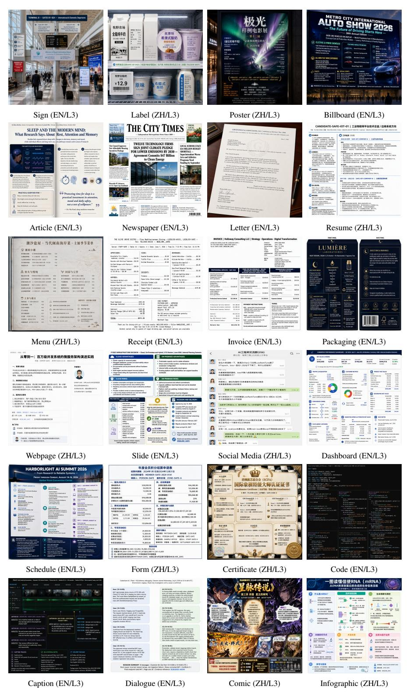

Figure 1: L3에서의 장면 범위. 분류 체계 순서대로 각 카테고리마다 하나의 선택된 출력, GPT Image 2에서 API 품질이 낮은 경우. L3는 극단적 작업량을 나타내며, EN/ZH는 영어/중국어를 나타낸다.

평가 [(Xiang et al.,](#page-18-2) [2026)](#page-18-2). UltraText Bench는 24개의 장면 카테고리를 균일한 영역별 참조와 텍스트, 레이아웃, 장면 통합을 위한 공유 루브릭과 결합한다. 대상을 유지한다.

<span id="page-2-0"></span>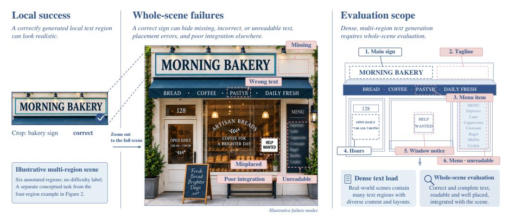

Figure 2: 지역적 성공은 전체 장면 실패를 숨길 수 있다. 이 예시적인 6개 영역 장면은 올바른 가게 이름과 다른 영역의 오류를 대비한다. *왼쪽.* 올바르게 렌더링된 가게 이름, 자른 것. *중앙.* 전체 장면에 다섯 개의 추가 요청 영역이 표시된 것. 각 영역은 누락, 잘못됨, 읽을 수 없음, 잘못 배치, 또는 읽을 수 있지만 의도된 표면과 잘 통합되지 않음. *오른쪽.* 밀집된 텍스트 부하와 전체 장면 평가가 요청된 *텍스트*를 포함한다.

문서, 물리적 표지, 디지털 인터페이스에서 의도된 시각적 역할에 연결된 문자열. [Section 2.2](#page-3-0)는 이러한 벤치마크와 평가 프로토콜을 비교한다.

우리는 위 두 요구 사항을 기반으로 한 이중 언어 벤치마크인 UltraText Bench를 소개한다. 이 벤치마크는 24개의 실제 장면 카테고리를 6개 도메인에 걸쳐 432개의 프롬프트를 포함하며, 세 가지 난이도 수준에서 영어와 중국어를 동일하게 분할한다. 각 프롬프트는 4~12개의 *텍스트 영역*을 요청한다: 가게 이름이나 다중 줄 메뉴와 같은 개별적으로 주석이 달린 대상 텍스트 구성 요소. 각 레코드는 모든 대상 문자열을 포함하는 생성 프롬프트와 구조화된 영역별 기준값(GT)을 쌍으로 하며, 이는 평가에만 사용된다. 3 × 3 그리드는 대략적인 위치를 제공하며, 여러 영역이 하나의 셀을 공유할 수 있다. [Figure 1](#page-1-0)는 가장 높은 작업량 수준인 L3에서 모든 카테고리를 보여준다.

VLM 판정기인 Q-Judger는 Qwen-Image-Bench [(Li et al.,](#page-15-2) [2026a)](#page-15-2)에서 제공되며, 이미지와 완전한 참조를 받아 우리 기준에 따라 이미지 수준의 여섯 점수를 반환한다. 정확성(accuracy)과 완전성(completeness)은 텍스트 충실도(text fidelity)를 형성하고, 위치(position)와 배치(layout)는 공간 품질(spatial quality)을 형성하며, 텍스트 명료성(text clarity)과 장면 품질(scene quality)은 별도로 보존된다. 참조(reference)는 판정기에게 검사할 내용(content), 위치(locations), 운반체(carriers)를 알려준다. 10명의 참가자(participants)가 자동 점수(automatic scores)의 인간 평가(human evaluation)에 참여하였다 ([Section 4.2](#page-10-0)).

24개 모델 구성을 평가한 결과, 이러한 구분이 중요한 이유가 드러난다. Z-Image와 LLaDA Turbo 변형은 Base 버전보다 텍스트 명료성은 높지만 텍스트 충실도는 낮다. 성능은 작업 부하 수준(workload levels)과 언어(languages)별로도 차이를 보인다.

#### 주요 기여는 다음과 같다 (Our main contributions are:)

- a. UltraText Bench: 432개의 양방향 프롬프트가 24개의 장면 카테고리와 세 가지 난이도 수준에 걸쳐 있으며, 정확한 목표 문자열과 프롬프트 전용 생성용 일관된 지역별 참조를 포함한다.

- b. Whole-scene evaluation: Q-Judger와 함께 이미지와 전체 참조에 적용되는 공유 루브릭을 사용하며, 네 가지 품질 차원과 평가 범위를 별도로 보고한다.

- c. Experimental analysis: 차원, 워크로드, 언어별로 24개의 모델 구성을 비교하고, 10명의 참여자를 포함한 인간 평가를 동반한다.

## 2 관련 연구 (RELATED WORK)

### 2.1 시각적 텍스트 생성 방법 (VISUAL TEXT GENERATION METHODS)

시각적 텍스트 생성 방법은 정확한 문자 시퀀스를 인코딩하는 방식, 레이아웃을 얻는 방식, 그리고 이미지 모델에 의해 인코딩·디코딩될 때 텍스트가 얼마나 잘 보존되는지에 따라 차이가 있다.

Explicit glyph and layout conditioning. GlyphControl [(Yang et al.,](#page-18-3) [2023)](#page-18-3)은 렌더링된 글리프 맵에 조건화된 ControlNet 분기를 추가하고, GlyphDraw [(Ma et al.,](#page-16-3) [2023)](#page-16-3)은 중국어와 영어 텍스트에 대해 글리프 정보를 공간 제어와 결합한다. TextDiffuser [(Chen et al.,](#page-14-2) [2023)](#page-14-2)은 대신 이미지 합성 전에 문자 수준 레이아웃 마스크를 예측하며, TextDiffuser-2 [(Chen et al.,](#page-14-3) [2024)](#page-14-3)은 언어 모델을 사용해 개방형 프롬프트에서 키워드와 바운딩 박스를 계획한다. 이러한 접근법은 문자열을 이미지의 위치와 더 견고하게 연결하지만, 동일한 입력을 가정하지 않는다: 글리프-조건화 시스템은 명시적 시각적 제어를 받는 반면, 레이아웃-우선 시스템은 오류가 이미지 생성에 전파될 수 있는 레이아웃을 예측해야 한다.

<span id="page-3-1"></span>Table 1: 텍스트 렌더링 벤치마크: 입력, 대상 참조, 평가. The table는 주요 평가 구성 요소를 요약하며, 자세한 내용은 [Section 2.2](#page-3-0) 에서 확인할 수 있다. Notes: EN: 영어; ZH: 중국어. Extra input은 프롬프트를 넘어서는 벤치마크 제공 제어를 의미하며, 내부적으로 예측된 레이아웃은 아니다. OCR: 광학 문자 인식(OCR); VQA: 시각적 질문 응답(VQA). PNED는 편집 거리를 기준으로 단어를 매칭하고 일치하지 않는 항목에 패널티를 부여한다. †T2I에 이미지는 제공되지 않으며; 소스 이미지는 편집 또는 이미지-투-이미지 작업에 사용된다. UltraText는 지역별 텍스트와 시각적 속성을 이미지 수준 VLM 평가와 매칭한다.

| 벤치마크 |  | 언어 추가 입력 | 대상 참조 | 평가 |
|------------------------------|-------|----------------------|---------------------------------|-----------------------|
| MARIO-Eval | EN | None | 대상 문자열 | OCR + 이미지 지표 |
| AnyText-Bench | EN/ZH |  | 글리프/위치 텍스트 + 위치 | 텍스트 크롭에서 OCR |
| LeX-Bench | EN | None | 텍스트 + 스타일/위치 | PNED + 속성 VQA |
| CVTG-2K | EN | None | 텍스트 인스턴스 | OCR + 매칭 |
| LongText-Bench | EN/ZH | None | 대상 문자열 | VLM 텍스트 정확도 |
| TextInVision | EN | None | 대상 문자열 | OCR 편집 거리 |
| TextAtlasEval | EN/ZH | None | 장면 + 텍스트 | OCR + CLIP 유사도 |
| OCRGenBench | EN/ZH | None / image† | 작업별 목표 | OCRGenScore |
| InfoTextBench | EN/ZH | None / image† | 대상 텍스트 목록 | OCR + VLM 품질 |
| UltraText Bench (ours) EN/ZH |  | None | 영역 텍스트 + 레이아웃/캐리어 | 이미지 수준 VLM |

문자 인식 및 다국어 모델링. AnyText [(Tuo et al.,](#page-17-3) [2024)](#page-17-3)은 글리프와 위치 조건을 OCR 인식 표현과 결합하여 하나의 다국어 생성 및 편집 프레임워크를 만든다. Glyph-ByT5 [(Liu et al.,](#page-16-4) [2024)](#page-16-4)은 서브워드 토큰화로 잃어버린 문자 정보를 보존하기 위해 바이트 수준 텍스트 인코더를 도입한다. JoyType [(Li et al.,](#page-15-3) [2024)](#page-15-3)은 다국어 타이포그래피를 목표로 하고, ViType [(Gao et al.,](#page-15-4) [2026)](#page-15-4)은 멀티모달 확산 모델에서 의미론적 및 글리프 특징을 공동 모델링한다. 보완 연구로는 장면 텍스트 인페인팅 [(Zhang et al.,](#page-18-4) [2024)](#page-18-4), 위치 제어 합성 [(Zhao & Lian,](#page-18-5) [2024)](#page-18-5), 그리고 데이터 합성 및 필터링 [(Zhao et al.,](#page-18-6) [2025)](#page-18-6)을 다룬다.

밀집 및 다중 영역 생성. 최근 방법들은 더 긴 문자열과 다중 텍스트 영역을 대상으로 한다. TextCrafter [(Du et al.,](#page-14-1) [2025)](#page-14-1)은 인용된 대상 문자열에 주의를 기울이고 OCR에서 읽은 강화 신호를 추가하여 복잡한 장면에서 다중 문자열이 렌더링되는 방식을 개선한다. GlyphDraw2 [(Ma et al.,](#page-16-5) [2025)](#page-16-5)은 언어 모델 계획과 글리프 조건부 생성을 결합하여 다중 요소 포스터를 만든다. PosterMaker [(Gao et al.,](#page-15-5) [2025)](#page-15-5)은 텍스트가 풍부한 제품 포스터에 초점을 맞춘다. BizGen [(Peng et al.,](#page-16-2) [2025)](#page-16-2)은 기사 수준 인포그래픽 생성을 다루며 텍스트 범위를 계획된 영역에 바인딩한다. TextGuider [(Baek et al.,](#page-14-4) [2025)](#page-14-4)은 훈련이 필요 없는 주의 가이던스를 적용해 긴 텍스트에서 누락을 줄인다. GlyphAnchor [(Xiang et al.,](#page-18-2) [2026)](#page-18-2)은 글리프 사전 정보를 예측된 위치에 고정한다. TextGround4M [(Mao et al.,](#page-16-6) [2026)](#page-16-6)은 프롬프트 정렬된 텍스트 범위와 레이아웃 주석을 제공해 레이아웃 인식 모델을 훈련한다. 이들의 입력은 프롬프트만에서부터 명시적 글리프 및 레이아웃 제어까지 다양하며, 평가도 각 애플리케이션에 맞춰진다.

소단계 이미지 생성. TwinFlow [(Cheng et al.,](#page-14-5) [2026)](#page-14-5)와 조건 전이(condition shifting)를 사용하는 APEX [(Liu et al.,](#page-16-7) [2026)](#page-16-7)는 단일 단계 생성(one-step generation)을 위한 자기 대립 학습(self-adversarial learning)을 연구한다. Duality Models [(Sun](#page-17-4) [et al.,](#page-17-4) [2026b)](#page-17-4)는 속도와 흐름 맵 학습(velocity and flow-map learning)을 결합하고, Three-Body Scattering [(Sun et al.,](#page-17-5) [2026a)](#page-17-5)는 분포 에너지(distributional energy)에서 단일 단계 감독(one-step supervision)을 도출한다. 이러한 발전은 전반적인 이미지 품질(overall image quality)과 함께 밀집 텍스트 충실도(densetext fidelity)와 명료성(clarity)을 평가하도록 동기를 부여한다.

### 2.2 텍스트 렌더링 벤치마크 및 데이터셋 (TEXT RENDERING BENCHMARKS AND DATASETS)

텍스트 렌더링 리소스는 모델에게 무엇을 생성하도록 요구하는지, 사전에 무엇을 알려주는지, 그리고 결과를 어떻게 확인하는지에서 차이가 있다. 따라서 짧은 문자열, 포스터, 문서, 장문 테스트 세트에 보고된 점수는 하나의 척도로 배치할 수 없다. [Table 1](#page-3-1)은 가장 근접한 비교를 요약한다.

짧은 문자열의 충실도와 특성.  
MARIO-Eval [(Chen et al.,](#page-14-2) [2023)](#page-14-2)은 대규모 짧은 키워드 테스트 세트를 구축했다.  
AnyText-Bench [(Tuo et al.,](#page-17-3) [2024)](#page-17-3)은 지정된 위치에서 잘라낸 텍스트 라인에 대해 계산되는 OCR 점수를 갖는 영어 및 중국어 생성 테스트를 추가했다; AnyText 모델은 텍스트를 편집하기도 하지만, 벤치마크의 정량적 프로토콜은 생성 지향적이다.  
TypeScore [(Sampaio](#page-17-6) [et al.,](#page-17-6) [2024)](#page-17-6)은 단일 OCR 정확도 값에서 벗어나: 렌더링된 텍스트를 추출하고 여러 문자열 비교 지표를 하나의 충실도 점수로 결합한다.  
이 점수는 철자 오류, 누락된 텍스트, 과다 텍스트를 구분해 주며, 인간 판단과 비교해 검증된다.  
LeX-Bench [(Zhao et al.,](#page-18-6)

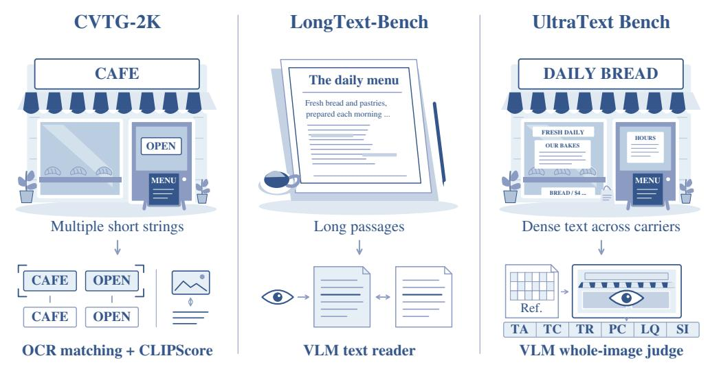

Figure 3: 세 개 벤치마크에서의 작업 장면 및 평가.  
*Left:* CVTG-2K [(Du et al.,](#page-14-1) [2025)](#page-14-1)는 OCR 인식 단어를 대상에 매칭하여 단어 정확도(Word Accuracy)와 정규화 편집 거리(normalized edit distance)를 사용하고, 별도로 CLIPScore를 보고한다.  
*Center:* LongText-Bench [(Geng et al.,](#page-15-1) [2025)](#page-15-1)는 VLM을 사용하여 텍스트를 추출하고 대상 문자열과 비교한다.  
*Right:* UltraText Bench는 구조화된 참조(Ref.)를 사용하여 전체 이미지를 평가한다: 텍스트 정확도(TA), 완전성(TC), 가독성(TR), 위치 정확도(PC), 레이아웃 품질(LQ), 장면 통합(SI).  
이 장면, 축약된 문자열, 그리고 선 표시들은 그림이며, 벤치마크 출력이나 측정 결과가 아니다; 각 벤치마크의 장면 유형을 모두 포함하지 않는다.

[2025)](#page-18-6)은 색상, 글꼴, 위치를 제한하는 프롬프트를 추가하고, PNED를 사용해 점수를 매긴다. PNED는 요청된 문자열과 인식된 단어를 매칭하고 남은 단어를 벌한다.  
PNED가 단어를 순서가 없는 집합으로 취급하기 때문에 읽기 순서나 문자열이 어느 표면에 나타났는지에 대해 아무 말도 하지 않는다.  
이러한 자원은 주로 짧은 문자열 정확도와 텍스트 속성을 측정한다.

밀집 및 장문 텍스트 생성.  
CVTG-2K와 관련된 TextCrafter 다중 텍스트 설정 [(Du](#page-14-1) [et al.,](#page-14-1) [2025)](#page-14-1)은 더 복잡한 장면을 평가하고 인식된 텍스트 인스턴스를 요청된 문자열과 매칭한다.  
그들의 프롬프트 설명은 위치, 속성, 텍스트와 운반체 간의 대응을 인코딩한다.  
LongText-Bench는 X-Omni와 함께 도입되었으며, 8개의 시나리오에서 더 긴 영어 및 중국어 텍스트를 다루고, 단일 긴 시퀀스의 문서 수준 렌더링은 별도로 검토되었다 [(Zhang et al.,](#page-18-1) [2025b)](#page-18-1).  
TextInVision [(Fallah et al.,](#page-14-6) [2025)](#page-14-6)은 프롬프트 복잡성과 텍스트 속성을 결합하고 시각 인코딩 실패를 검토한다.  
가장 가까운 이웃은 GlyphAnchor와 함께 출시된 InfoTextBench [(Xiang et al.,](#page-18-2) [2026)](#page-18-2)이며, 영어와 중국어 프롬프트를 텍스트가 풍부한 참조 이미지 위에 쌍으로 제공하고, 각각에 명시적 대상 문자열 목록을 제공하며, 단어 수준 정밀도, 재현율, 구문 적중률을 평가한다.  
긴 대상, 여러 개의 별도 텍스트 조각을 포함하는 이미지, 그리고 이중 언어 적용은 모두 이전에 연구되었다.  
이러한 자원은 대상 문자열, 속성, 위치, 장면 맥락이 어떻게 표현되고 평가되는지에서 차이가 있다.

비디오에서의 텍스트 렌더링.  
VTR-Bench [(Huang et al.,](#page-15-6) [2026)](#page-15-6)은 비디오 생성에서 시각적 텍스트 렌더링을 평가한다.  
운반체별 전사를 통해 텍스트 충실도를 평가하고, 프롬프트별 질의를 통해 장면 및 움직임 요구사항을 평가한다.  
이 시간적 설정은 개별 이미지 내의 밀집 텍스트 및 영역 배치 평가를 보완한다.

더 넓은 시각-텍스트 작업 및 편집.

TextAtlas5M [(Wang et al.,](#page-17-7) [2025a)](#page-17-7)은 긴 구조화된 텍스트를 위한 대규모 학습 데이터를 제공하며, TextAtlasEval과 함께 네 개의 설계 도메인을 아우르는 평가 세트를 제공한다. 이 세트에서 한 부분집합은 다른 조건이 고정된 상태에서 텍스트 길이를 변동한다.

OCR-GenBench [(Zhang et al.,](#page-18-0) [2025a)](#page-18-0)은 영어와 중국어에서 생성, 편집, OCR 지향 변환 작업으로 평가 범위를 확장하며, 고밀도 텍스트, 페이지 수준 생성, 밀집 문서 편집을 명시적으로 포함한다.

VTPBench [(Shu et al.,](#page-17-8) [2025)](#page-17-8)은 작업별 메트릭과 VTPScore를 통해 여섯 가지 시각적 텍스트 처리 작업을 통합하고, OneIG-Bench [(Chang et al.,](#page-14-7) [2026)](#page-14-7)은 보다 넓은 이미지 생성 스위트 내에서 이중 언어 텍스트 렌더링 분할을 제공한다.

작업군 집계는 광범위한 성능을 요약하지만, 텍스트 부하와 영역 수에 따른 추세는 별도의 세분화를 필요로 한다.

텍스트 중심 *editing*을 목표로 하는 별도의 벤치마크 라인이 있으며, 이는 대상 텍스트를 수정하면서 다른 텍스트와 배경을 보존해야 한다.

TextEditBench [(Gui et al.,](#page-15-7) [2025)](#page-15-7)은 일상 문서 및 표지판 장면을 다루며, 추론에 의존하는 편집 차원을 추가한다.

WeEdit [(Zhang et al.,](#page-18-7) [2026a)](#page-18-7)은 편집을 다수 언어로 확장하고, 지시 준수, 텍스트 명료성, 배경 보존을 평가한다.

TextSculpt-Bench [(Lin et al.,](#page-16-8) [2026)](#page-16-8)은 전체 이미지에 나타나야 할 텍스트와 실제로 나타난 텍스트를 비교하고, 편집 영역 외부의 배경을 확인한다.

TextWand-Bench [(Wang et al.,](#page-17-9) [2026a)](#page-17-9)은 명시적 레이아웃 및 스타일 제어 하에서 제거, 생성, 교체를 평가한다.

이들 중 어느 것도 프롬프트 전용 생성과 직접적으로 비교할 수 없다. 이는 모델이 소스 이미지를 받고, 참조의 일부가 입력 자체이기 때문이다.

그럼에도 불구하고 이들은 여전히 유익하다. 특히 TextSculpt-Bench는 모든 텍스트를 확인해야 검증 가능한 증거를 남겨야 함을 보여준다. 이는 평가자에게 완전한 참조를 제공해도 모든 영역을 살펴보았다는 것을 증명하지 못하기 때문이다.

일반 T2I 평가와 우리의 범위. TIFA [(Hu et al.,](#page-15-8) [2023)](#page-15-8), T2I-CompBench [(Huang et al.,](#page-15-9) [2023)](#page-15-9), HRS-Bench [(Bakr et al.,](#page-14-8) [2023)](#page-14-8)와 같은 일반 텍스트-이미지 벤치마크는 더 넓은 프롬프트 가족에 대해 의미적 충실도와 구성을 측정한다. BizGenEval [(Li et al.,](#page-16-9) [2026b)](#page-16-9)은 우리의 장면 유형에 더 가깝게 접근하며, 슬라이드, 차트, 웹페이지, 포스터, 과학 그림을 인간 검증 체크리스트 질문에 따라 점수화한다. 그들의 체크리스트와 정렬 메트릭은 더 넓은 의미적 및 구성적 제약을 다루며, 여기서 사용되는 명시적 영역별 텍스트 참조를 보완한다. UltraText Bench는 프롬프트 전용 생성, 균일한 영역별 참조, 24개의 텍스트 포함 장면 범주를 결합한다. 생성기는 모든 대상 문자열을 자연어로 받으며, 6필드 주석은 평가용으로 예약되고 장면, 언어, 수준 전반에 걸쳐 일관된다. 이 설계는 텍스트 부하가 증가함에 따라 텍스트 렌더링이 운반체와 레이아웃을 가로질러 전이되는지를 테스트한다. 참조는 거친 공간 메타데이터를 지정하고, 프로토콜은 이미지 수준 점수를 반환한다; 영역 수준 귀속은 향후 방향이다.

### 2.3 자동 평가 및 판정 신뢰성 (AUTOMATIC EVALUATION AND JUDGE RELIABILITY)

전역 및 OCR 기반 지표. 자동 생성 평가는 전역 정렬 및 선호 지표, OCR 출력에서의 충실도 측정, 그리고 서면 루브릭을 따르는 VLM 판정이 포함된다. CLIPScore [(Hessel et al.,](#page-15-10) [2021)](#page-15-10)은 전역 이미지-텍스트 유사도를 측정하는 반면, ImageReward [(Xu et al.,](#page-18-8) [2023)](#page-18-8), HPSv2 [(Wu et al.,](#page-17-10) [2023)](#page-17-10), 그리고 PickScore [(Kirstain et al.,](#page-15-11) [2023)](#page-15-11)은 인간 비교를 통해 스칼라 선호도를 학습한다. 이 점수들은 의미 정렬이나 전반적 선호에 유용하지만, 그들의 학습 목표는 요청된 모든 문자를 전사할 필요가 없으며, 텍스트가 부정확한 매력적인 이미지를 선호할 수 있다. 텍스트 전용 지표는 더 근접한 신호를 제공한다. 위에서 설명한 TypeScore [(Sampaio](#page-17-6) [et al.,](#page-17-6) [2024)](#page-17-6)은 평가자 측면에서 실패 모드를 보고한다: OCR은 인식 오류를 도입할 수 있고, VLM 리더는 이미지가 실제로 잘못 렌더링한 문자를 조용히 교정할 수 있다. OCRGenScore [(Zhang et al.,](#page-18-0) [2025a)](#page-18-0)은 OCR-생성 작업 전반에 걸친 지표를 결합하고, VTPScore [(Shu et al.,](#page-17-8) [2025)](#page-17-8)은 멀티모달 모델을 사용해 시각적 품질과 텍스트 가독성을 시각 텍스트 처리 작업 전반에 걸쳐 평가한다. OCR 기반 점수는 탐지기, 인식기, 언어 설정, 글꼴, 스케일, 이미지 도메인에 따라 달라진다 [(Baek et al.,](#page-14-9) [2019;](#page-14-9) [Cui et al.,](#page-14-10) [2025)](#page-14-10).

텍스트 품질 및 공간 충실도. 보완적인 접근은 텍스트의 정확성과는 별개로 렌더링된 텍스트의 시각적 품질을 평가한다. TIQA [(Koltsov et al.,](#page-15-12) [2026)](#page-15-12)은 크롭 및 텍스트가 많은 이미지에서 렌더링된 텍스트에 대한 인간 품질 평가를 수집하고 이를 예측하도록 모델을 훈련한다; 이는 우리 명료성 차원이 포착하려는 것이다. 감지된 영역만을 평가하기 때문에 요청되었으나 렌더링되지 않은 영역을 자체적으로 보고할 수 없다. 인식된 문자열만으로는 텍스트가 요청된 영역을 차지하거나 그 운반체와 자연스럽게 통합되는지를 확립할 수 없다.

루브릭 기반 VLM 판정. 프롬프트된 VLM 평가는 각 차원마다 별도의 지표를 훈련시키지 않고도 작업별 루브릭을 적용할 수 있다. VIEScore [(Ku et al.,](#page-15-13) [2024)](#page-15-13)은 의미 일관성과 지각 품질을 설명과 함께 점수화하고, UniGenBench++ [(Wang et al.,](#page-17-11) [2025b)](#page-17-11)은 다차원 T2I 평가를 위해 구조화된 의미 단위를 사용한다. Qwen-Image-Bench (QIB) [(Li et al.,](#page-15-2) [2026a)](#page-15-2)은 세밀한 생성 루브릭과 전문 인간 평가를 활용한 전용 Q‑Judger를 개발한다. RichHF [(Liang et al.,](#page-16-10) [2024)](#page-16-10) 역시 단어와 이미지 영역에 연결된 세밀한 인간 피드백의 가치를 입증한다. T2LSC‑Bench [(Wang et al.,](#page-17-12) [2026b)](#page-17-12)은 OCR 검증과 구조화된 VLM 판단을 결합하여 텍스트가 의도한 앵커에 도달했는지와 그 의미가 주변 주제 및 장면에 유출되었는지를 구분하고, 자동 라벨을 인간 주석 하위집합과 비교한다. 평가자 버전, 프롬프트, 텍스트 읽기 능력, 시각 품질 편향이 VLM 점수에 영향을 줄 수 있다. 이전 연구는 독립 인간 평가와의 일치도를 조사하고 [(Zheng](#page-18-9) [et al.,](#page-18-9) [2023)](#page-18-9), T2I 평가를 위한 통제된 주석 프로토콜 [(Otani et al.,](#page-16-11) [2023)](#page-16-11), 그리고 멀티모달 모델 간 텍스트 읽기 능력의 변동성을 조사했다 [(Liu et al.,](#page-16-12) [2023;](#page-16-12) [Fu et al.,](#page-14-11) [2026)](#page-14-11). 이러한 한계

<span id="page-6-0"></span>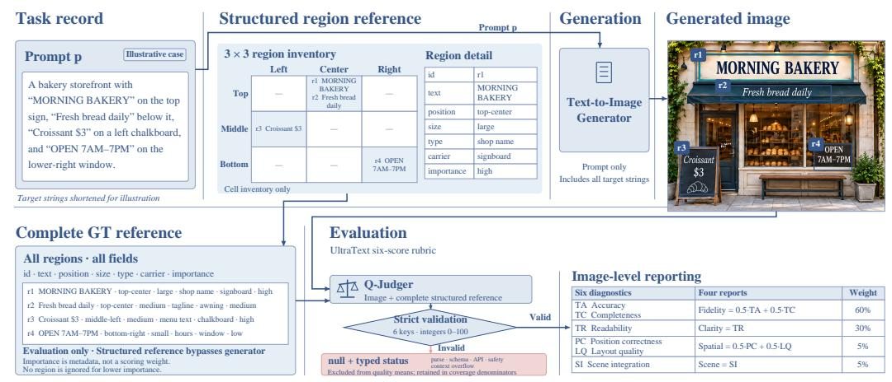

Figure 4: 작업 정의 및 평가 프로토콜. 생성기는 오직 프롬프트 p만을 받는다. Qwen-Image-Bench (Li et al., 2026a)에서 가져온 Q-Judger는 이미지와 완전한 참조 R에 UltraText 루브릭을 적용하여, 네 개의 보고 차원과 하나의 종합 점수에 매핑되는 여섯 개의 이미지 수준 점수를 반환한다. 참조 필드와 점수는 일대일로 매칭되지 않는다. 그리드 셀은 대략적인 위치를 제공하며, 영역은 셀을 공유할 수 있다. 유효하지 않은 응답은 점수가 부여되지 않으며, 커버리지를 감소시킨다. 제작된 베이커리 스키마는 네 영역 기록 $A1\_L1\_EN\_001$ 을 단순화하며, 이는 부록 B.1에 재현된다.

텍스트, 배치 및 장면 통합에 대한 공동 평가를 동기화하면서, 응답 형식의 유효성을 판사의 평가 신뢰성과 구분한다.

## 3 ULTRATEXT 벤치: 벤치마크 설계 (3 ULTRATEXT BENCH: BENCHMARK DESIGN)

UltraText Bench는 밀집된 텍스트가 포함된 장면, 작업 부하, 언어 전반에 걸쳐 텍스트 충실도, 명료성, 공간 품질 및 장면 품질이 어떻게 변하는지를 조사한다.

### 3.1 작업 공식화 (TASK FORMULATION)

입력 및 생성. 벤치마크 인스턴스는 자연어 프롬프트 p와 K개의 텍스트 영역에 대한 구조화된 참조 $R = \{r_1, \ldots, r_K\}$ 를 쌍으로 만든다. 각 영역은 여러 줄 또는 항목을 포함할 수 있는 주석이 달린 대상 텍스트 구성요소이며, 예를 들어 아래 기록의 전체 메뉴가 하나의 영역을 형성한다. 프롬프트는 모든 대상 문자열을 포함하며, 텍스트-이미지 모델 M에 유일한 입력으로 사용되어 이미지 I = M(p)를 생성한다. 각 $r_i$는 대상 문자열 $t_i$, 그리드 위치, 상대 텍스트 크기, 유형, 캐리어, 중요도(섹션 3.6)를 기록한다. 이 참조는 평가에만 사용된다.

예시 기록. 공개된 L1 표지 기록 A1_L1_EN_001은 K=4 영역과 총 423 GT 문자를 포함하는 제과점 전면을 묘사한다. 두 영역은 상단 중앙에 위치한다: 나무 표지판에 큰 가게 이름과 그 아래에 있는 오크 판에 중간 크기의 태그라인. 나머지 영역은 중간 왼쪽에 있는 중간 크기의 분필판 메뉴와 하단 오른쪽에 있는 작은 구리판에 있는 영업시간이며, 그 중요도는 높음에서 낮음으로 범위가 있다. Figure 4는 이 레이아웃에서 영감을 받은 단순화된 도식을 사용하고, Section 3.6은 첫 번째 영역을 그대로 재현한다.

**평가 범위.** 완전한 참조는 어떤 문자열이 나타나야 하고, 어디에 속해야 하며, 장면과 어떻게 연관되는지를 명시한다. Q-Judger는 이 요구 사항을 여섯 개의 이미지 수준 점수를 통해 평가한다. Appendix E는 참조가 각 평가를 어떻게 지원하는지 설명하며, 출력에는 영역 수준 점수나 전사본이 포함되지 않는다.

### 3.2 구성 근거 (Construction Rationale)

24개 카테고리는 표지부터 송장, 코드에 이르기까지 다양한 매체와 레이아웃을 포함한다. 세 가지 난이도는 텍스트 부하와 영역 수를 증가시킨다, 그리고 영어와 중국어 분할은 서로 다른 글리프 인벤토리와 서면 관습을 다룬다 (Ma et al., 2023; Tuo et al., 2024). 이러한 선택은 장면, 작업량, 언어 간 비교를 지원한다. 텍스트 부하와 영역 수가 함께 변하기 때문에, 난이도는 개별 효과를 분리하지 않는다.

각 카테고리×난이도×언어 셀은 세 개의 프롬프트를 포함하며, 총 $24 \times 3 \times 2 \times 3 = 432$ 개의 프롬프트를 생성한다. 셀당 세 개의 프롬프트는 생성 및 검사 예산 내에서 분류 체계 범위를 보존한다. 네

<span id="page-7-0"></span>Table 2: UltraText Bench 장면 분류 체계. 여섯 개 도메인이 렌더링 도전과 일반 레이아웃에 따라 24개 카테고리를 조직한다. 주의사항: 밀도는 정성적 텍스트 포장도를 설명하며, [Table 3](#page-9-0) 에 있는 GT-문자 부하를 나타내지 않는다. 레이아웃은 일반적인 예시이며, 필수 템플릿은 아니다.

| ID | Category | Rendering challenge | Density | Typical layout |  |
|----|-----------------------|--------------------------------------------------------|------------------|-------------------------|--|
|  | A. Signage & Labels |  |  |  |  |
|  | A1 Sign | 시야각 및 낡은 표면 | Low–Med | 분산된 블록 |  |
|  | A2 Label | 곡면에 있는 작은 텍스트<br>Med |  | Compact blocks |  |
|  | A3 Poster | 글꼴 계층 구조 및 구성 |  | Med–High 쌓인 블록 |  |
|  | A4 Billboard | 스케일 및 시야각 | Low–Med | 큰 텍스트 블록 |  |
|  | B. Documents & Print |  |  |  |  |
| B1 | Article | 문단 흐름 및 정렬 | High | 단일 열 |  |
| B2 | Newspaper | 열 및 헤드라인 계층 구조 | Very High | 다중 열 |  |
| B3 | Letter | 인사말, 본문, 마감 | High | 단일 열 |  |
| B4 | Resume | 섹션 및 글머리 기호 정렬 | High | 두 열 |  |
|  | C. Commercial |  |  |  |  |
| C1 | Menu | 항목-가격 정렬 | Med–High Tabular |  |  |
| C2 | Receipt | 좁은 줄과 정확한 합계<br>Med |  | 단일 열 |  |
| C3 | Invoice | 숫자 필드 및 표 정렬<br>Med–High Tabular |  |  |  |
| C4 |  | 제품 포장 시야각 및 성분 목록 | Med | 다중 패널 |  |
|  | D. Digital Interfaces |  |  |  |  |
|  | D1 Webpage | 탐색, 콘텐츠 및 사이드바 | High | 다중 패널 |  |
|  | D2 Slide | 제목 및 글머리 기호 계층 구조 | Med | 쌓인 블록 |  |
|  | D3 Social media | 인터페이스 텍스트 및 해시태그<br>Med |  | 카드/피드 |  |
|  | D4 Dashboard | KPI 카드 및 차트 라벨 | High | 그리드 |  |
|  | E. Structured Data |  |  |  |  |
| E1 | Schedule | 시간-열 정렬 | Med–High Tabular |  |  |
| E2 | Form | 라벨-필드 정렬 | Med | 필드 그리드 |  |
| E3 | Certificate | 공식 타이포그래피 및 정렬 | Low–Med | 중앙 블록 |  |
| E4 | Code | 고정폭 텍스트 및 들여쓰기 | High | 들여쓰기 라인 |  |
|  | F. Creative & Special |  |  |  |  |
| F1 | Caption | 배경 위 가독성<br>Low–Med |  | Overlay |  |
| F2 | Dialogue | 화자 라벨 및 텍스트 버블 | Med | 교차 블록 |  |
| F3 | Comic panel | 말풍선 및 음향 효과 | Med | 분산된 버블 |  |
| F4 | Infographic | 텍스트-라벨 배치<br>Med–High 자유형 |  |  |  |

샘플은 프롬프트마다 셀당 12개의 이미지와 완전 실행 시 레벨 및 언어당 288개의 이미지를 제공한다. 이는 카테고리 범위를 유지하면서 집계 분석을 지원한다; 개별 셀은 통계적 정밀도가 제한적이다. 이 세트는 웹 이미지의 빈도 가중 샘플이 아니라 스트레스 테스트이다. 레이아웃은 공간 조직에 다른 요구를 부여한다: 영수증은 품목과 가격을 정렬하고, 신문은 열과 헤드라인을 분리하며, 표지판은 운반체의 시점을 따른다.

### 3.3 장면 분류 (SCENE TAXONOMY: 24 CATEGORIES IN 6 DOMAINS)

여섯 도메인은 사진, 문서, 디지털 인터페이스를 포함한다. [표 2](#page-7-0)는 24개 카테고리를 운반체, 밀도, 레이아웃별로 분류하며, 정의는 [부록 A.2](#page-20-0)에 있다.

### 3.4 난이도 계층화 (DIFFICULTY STRATIFICATION)

UltraText Bench는 세 가지 언어별 난이도 수준을 사용한다: L1(Hard), L2(Very Hard), L3(Extreme). 평균 GT‑문자 부하와 영역 수는 두 언어 모두에서 이 수준에 따라 증가한다. 프롬프트의 GT‑문자 부하는 P_i |t_i|, 즉 모든 영역 문자열의 유니코드 문자 수(공백과 구두점 포함)이다. [그림 5](#page-8-1)는 설계 밴드와 실제 워크로드를 비교한다. 모든 경계는 포함된다: EN 밴드는 끝점을 공유하고, ZH 밴드는 겹치며, L3은 두 언어 모두에서 상한이 없다.

<span id="page-8-1"></span>워크로드는 두 언어 모두에서 수준이 높아질수록 증가한다

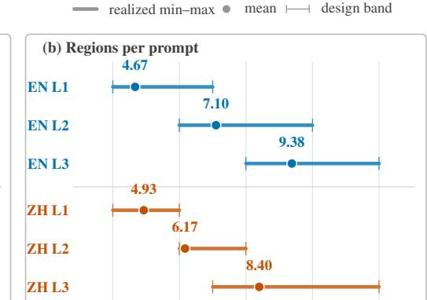

프롬프트당 6, 8, 10개의 주석 영역

12

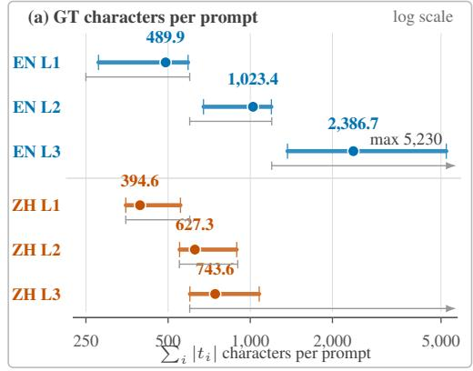

**그림 5: 432개의 프롬프트에 대한 실현 난이도 통계.** 각 행은 72개의 프롬프트를 포함한다. 막대는 최소–최대 범위를, 점은 표 3의 평균을 나타낸다. (a) 대상 문자열 문자 수(공백과 구두점 포함)는 로그 축에 표시된다. 회색 괄호는 언어별 설계 밴드를 보여주며, 경계는 포함된다; ZH 밴드는 겹치고, L3 밴드는 상한이 없다(열린 끝으로 표시). 수준은 워크로드를 할당받으며, 서로 다른 문자 구간이 아니다; 모든 기록은 자체 밴드를 만족한다. (b) 영역 수; 수준별 영역 수 밴드는 지정되지 않는다. 두 패널 모두 벤치마크 입력을 설명하며, 모델 성능을 나타내지 않는다.

언어들. 수준은 서로 다른 문자 수 구간이 아니라 할당된 워크로드를 설명하며, 영역 수는 추가 난이도 축을 제공한다.

세 수준은 중간 워크로드를 제공하면서 각 수준과 언어마다 72개의 프롬프트를 유지한다. EN 설계 밴드는 250–600, 600–1200, 1200+ GT 문자이며, ZH 밴드는 350–600, 550–900, 600+이다. 실제 분포는 주어진 수준에서 언어 간 워크로드 차이를 보여준다.

### 3.5 양언어 전략 (BILINGUAL STRATEGY)

영어와 중국어 프롬프트는 독립적으로 작성되었으며, 장소 이름, 가격, 어휘, 주문 규칙 등 문화적 설정에 맞게 조정되었다. 분할은 카테고리와 수준 수를 균형 있게 유지하지만 서로 다른 텍스트 부하 밴드를 사용한다; 따라서 점수는 언어를 단독으로 고립시키지 않고 두 프롬프트 세트를 비교한다. 연락처 및 기타 식별 문자열은 고정 자리 표시자를 사용한다. 부록 A는 그들의 어휘와 양언어 예시를 제공한다.

### <span id="page-8-0"></span>3.6 프롬프트 구성 및 정답 (PROMPT CONSTRUCTION AND GROUND TRUTH)

각 기록은 모든 GT 문자열을 포함하는 장면 설명과 구조화된 GT 주석을 쌍으로 한다.

**프롬프트 내 대상 문자열.** 프롬프트는 대상 문자열을 인용문, fenced passage, 또는 구조화된 콘텐츠 블록으로 삽입한다. 베이커리 기록 A1_L1_EN_001에서 첫 번째 영역은 다음과 같이 나타난다: \"...a hand‑carved wooden shop sign features cream‑white serif lettering that reads: \"DAILY BREAD — Artisan Bakery & Fine Patisserie Since 1987\"\". 장면 설명은 가독성을 위해 축약되었으며, 대상 텍스트는 그대로 재현된다.

**구조화된 GT 영역.** 각 영역은 정확한 대상 텍스트, $3 \times 3$ 그리드 위치, 상대 크기, 텍스트 유형, 운반체, 그리고 중요도를 기록한다. 이 속성들은 의도된 텍스트와 장면에서의 역할을 설명한다: 나무 표지판에 있는 제목과 작은 접시에 있는 영업시간은 모두 철자가 정확하더라도 서로 다른 시각적 요구사항을 가진다. 크기는 정성적이며 픽셀이나 폰트 크기 임계값이 없다. 중요도는 참조 메타데이터이며 점수 공식에 포함되지 않는다; 평가 기준은 낮은 중요도 영역도 평가하도록 요구한다. 이 속성들은 이미지 수준 평가를 안내하지만 여섯 개의 대응 속성 점수를 정의하지는 않는다. 부록 A는 주석 어휘를 나열하고, 부록 B는 완전한 영어 기록과 중국어 예시를 제공한다.

### 3.7 품질 보증 (QUALITY ASSURANCE)

모든 432개의 프롬프트는 자연스러운 장면 설명을 위해 수동으로 검토되었으며, 정확한 대상 문자열 포함, 완전한 주석, 그리고 언어별 작업량 밴드 준수를 확인하였다.

<span id="page-9-0"></span>표 3: 언어별 및 난이도별 데이터셋 통계. 주석: 평균과 범위는 프롬프트마다 제공된다. GT 문자에는 공백과 구두점이 포함되며, 요청된 모든 영역에 대해 합산된다. 432개의 프롬프트는 총 407,918개의 GT 문자와 2,926개의 영역을 포함하며, 모든 통계는 공개된 영역 배열에서 재계산된다.

| 분할 | 프롬프트 | 프롬프트당 GT 문자 수 | 프롬프트당 영역 수 |  |  |  |
|-------------|---------|--------------------------|--------------------|------|-------|--|
|  |  | 평균 | 범위 | 평균 | 범위 |  |
| 영어 L1 | 72 | 489.90 | 278–592 | 4.67 | 4–7 |  |
| 영어 L2 | 72 | 1,023.44 | 674–1,195 | 7.10 | 6–10 |  |
| 영어 L3 | 72 | 2,386.68 | 1,369–5,230 | 9.38 | 8–12 |  |
| 중국어 L1 | 72 | 394.62 | 350–555 | 4.93 | 4–6 |  |
| 중국어 L2 | 72 | 627.25 | 551–892 | 6.17 | 6–8 |  |
| 중국어 L3 | 72 | 743.62 | 601–1,079 | 8.40 | 7–12 |  |
| 모든 프롬프트 | 432 | 944.25 | 278–5,230 | 6.77 | 4–12 |  |

자동화된 검사는 영역 식별자, 여섯 가지 속성 및 허용되는 값, 그리고 문자 통계치를 검증했다. 수동 수정을 통해 대상 문자열을 보존하면서 그 위치와 운반자를 문맥상 명확히 했다. 모든 공개 기록은 이러한 검사를 통과하며 할당된 밴드 내에 있다. [Appendix A](#page-19-0)는 구성 및 검토 과정을 설명한다.

### 3.8 데이터셋 통계 (DATASET STATISTICS)

[Table 3](#page-9-0)는 이 영역-텍스트 문자 정의에 따른 데이터셋을 요약하고, [Figure 5](#page-8-1)는 같은 분할 범위와 평균을 설계 밴드에 대해 플롯한다. 균일한 24 × 3 × 3 그리드는 언어당 216개의 프롬프트와 총 432개를 제공한다. 프롬프트당 4개의 생성 샘플을 사용하면 전체 실행은 언어당 864개의 이미지와 모델 구성당 1,728개의 이미지를 포함한다.

분포는 할당된 작업량이 언어마다 어떻게 다른지를 보여준다. EN의 평균 문자 부하가 L1에서 489.90에서 L3에서 2,386.68로 증가하고, 평균 영역 수가 4.67에서 9.38로 상승한다. ZH의 평균 문자 부하가 394.62에서 743.62로 증가하고, 영역 수가 4.93에서 8.40로 상승한다. 두 언어 모두 높은 수준에서 더 많은 영역이 필요하지만, 영어 프롬프트는 총 텍스트가 훨씬 더 크게 증가한다. 이러한 분포는 각 수준에서 언어별 점수를 해석하는 데 필요한 맥락을 제공한다.

## 4 평가 프레임워크 (EVALUATION FRAMEWORK)

우리는 Qwen-Image-Bench의 Q-Judger 모델 [(Li et al.,](#page-15-2) [2026a)](#page-15-2)와 UltraText 점수 루브릭을 사용하여 생성된 이미지를 완전한 구조화된 참조와 비교한다 ( [Figure 4](#page-6-0) ).

모든 대상 문자열은 잘림 없이 판정기에 도달한다. 실패한 평가 결과는 점수가 부여되지 않으며 커버리지를 감소시킨다; [Appendix C.2](#page-26-0)는 검증 및 실패 처리에 대해 자세히 설명한다.

### <span id="page-9-1"></span>4.1 4차원 스코어링 (FOUR-DIMENSION SCORING)

생성된 이미지 I와 완전한 구조화된 참조 R = {r1, . . . , rK}가 주어지면, 판정기 J는 이미지 수준의 원시 점수 6개를 반환한다:

$$\mathbf{s}_{\text{raw}} = J(I, R) \in [0, 100]^6.$$

(1)

원시 점수는 내용 정확성 및 완전성(TA, TC), 시각적 가독성, 위치 일치 및 타이포그래피 조직(PC, LQ), 그리고 운반체 적합성을 포함한다. [Table 4](#page-10-1)는 이를 네 개의 보고 차원 s ∈ [0, 100]<sup>4</sup>으로 매핑한다. 이는 VLM 등급이며, 올바른 문자 또는 복구된 영역의 비율을 측정한 것이 아니다. 루브릭은 여섯 가지 속성을 정의하지만 중간 점수 임계값이나 명시적 문자 수 계산 규칙을 제공하지 않는다. R 표기법은 보조 기록 메타데이터를 생략한다.

합성 점수는 다음과 같이 계산된다:

$$Composite = 0.60 \cdot s_{fidelity} + 0.30 \cdot s_{clarity} + 0.05 \cdot s_{spatial} + 0.05 \cdot s_{scene}$$

(2)

가중치는 요청된 내용과 그 가독성 보존을 강조한다: 충실도는 60%, 명료도는 30%를 기여한다. 공간 및 장면 품질은 나머지 10%를 기여하므로, 위치 및 통합 오류를 해석하기 위해 별도의 점수가 필요하다.

<span id="page-10-1"></span>Table 4: 여섯 개의 원시 점수에서 네 개의 보고 차원으로. 점수는 0–100 척도의 VLM 등급이며, 값이 높을수록 좋다. TA/TC/TR은 텍스트 정확성/완전성/가독성을 나타내고; PC/LQ/SI는 위치 정확성/레이아웃 품질/장면 통합을 나타낸다. 가중치는 보고 차원에 적용되며, 그림과 리더보드에서는 Fidelity, Clarity, Spatial, Scene으로 축약된다.

| 차원 | 공식 | 평가 초점 | 가중치 |
|---------------------------------|-------------------|------------------------------------------------------------------------------|-----------|
| 텍스트 충실도 | (TA + TC)/2<br>TR | 텍스트 정확성 및 완전성 | 60% |
| 텍스트 명료성<br>공간 품질 | (PC + LQ)/2 | 선명도, 대비 및 가독성<br>위치, 정렬 및 조직 | 30%<br>5% |
| 장면 품질 | SI | 텍스트 캐리어 및 장면과의 자연스러운 적합성 | 5% |

왜 네 차원인가? 여섯 개의 원시 점수는 서로 다르면서 잠재적으로 겹치는 실패 모드를 설명한다. 간결한 보고를 위해 우리는 정확성(correctness)과 완전성을, 위치와 레이아웃을 짝지으며, 가독성(readability)을 텍스트 명료성으로, 장면 통합(scene integration)을 장면 품질로 유지한다. 선명하게 그려졌지만 철자가 틀린 텍스트는 충실도(fidelity)와 명료성에서 서로 다른 점수를 받을 수 있다. 원시 TA와 TC 점수는 정확성과 완전성을 구분하기 위해 여전히 사용 가능하다. 예를 들어, [Figure A5](#page-32-0)에서 메뉴는 TA=10, TC=100을 받아 충실도=55를 산출한다. 이 평균만 보고하면 두 원시 점수 간의 큰 차이를 숨길 수 있다. 이 경우 높은 완전성 점수가 메뉴 텍스트의 정확한 재현을 의미하지 않는다. 그리드 위치는 대략적인 배치를 설명하고, 레이아웃 품질은 각 셀 내 관계마다 명시적인 GT 없이 조직도를 평가한다. 전체 판단 프롬프트는 [Appendix C.1](#page-25-0)에서 확인할 수 있다. [Appendix D](#page-28-0)의 해석 밴드는 읽기 보조이며 판단 프롬프트에서 제외된다.

### <span id="page-10-0"></span>4.2 인간 평가 (HUMAN EVALUATION)

10명의 참가자가 자동 점수에 대한 인간 평가에 참여했다. 네 가지 보고 차원은 필수 내용, 가독성, 공간 조직, 장면 통합을 구분한다. [Appendix H](#page-37-0)는 이 평가의 범위와 정성적 비교의 해석을 논의한다. 정량적 관찰자 간 및 인간-판사 일치 통계는 여기서는 보고되지 않는다.

정성적 예시(qualitative examples)는 [Appendix F](#page-31-0)에서 이러한 구분을 검토 가능하게 만든다. 각각은 관련 목표 텍스트(target text)와 전체 이미지와 원본 해상도 크롭(native-resolution crop)을 짝지어 준다. 시계판(hours plate)은 [Figure A6](#page-32-1)에서 현지에서 식별 가능하지만 요청된 하단-오른쪽 대신 하단-왼쪽에 나타난다. 그 문구와 배치는 따라서 같은 이미지의 다른 뷰가 필요하다. In [Figure A8](#page-33-0) , 문자열(lettering)은 목판 표지의 평면, 조명, 질감에 따라 배치된다. 캐리어 적합(carrier fit)과 정확한 전사(exact transcription)는 렌더링된 텍스트(rendered text)의 다른 특성을 설명한다.

예시들은 또한 Q-Judger와의 불일치를 유지한다. 목표 관련 채팅 텍스트는 정확도와 완전성 평가가 0임에도 불구하고 [그림 A7](#page-33-1)에서 보이며, [그림 A9](#page-34-0)에는 최대 평가에도 불구하고 퇴화된 작은 글자가 포함되어 있다. 이 선택된 사례들은 빈도수를 추정하지 않고 지역 오류를 설명한다. 리더보드는 자동 점수를 유지한다; 100점은 정답 문자 비율을 측정한 것이 아니라 루브릭의 상한선이다.

## 5 실험 (EXPERIMENTS)

실험은 24개의 모델 구성에서 신뢰성과 명료성을 비교하고, 워크로드와 언어별 차이를 조사하며, Base/Turbo 변형을 평가한다. 또한 최대 등급과 복합 가중치가 보고된 순위에 미치는 영향을 검토한다.

### <span id="page-10-2"></span>5.1 실험 설정 (EXPERIMENTAL SETUP)

모델 및 샘플링.  
우리는 FLUX, Stable Diffusion, Hunyuan, HiDream, Qwen-Image [(Wu et al.,](#page-17-2) [2025a;](#page-17-2) [Zhao et al.,](#page-18-10) [2026)](#page-18-10), Z-Image, Boogu-Image, WAN, Nano Banana, GPT Image, LLaDA [(Chen et al.,](#page-14-12) [2026)](#page-14-12), 그리고 Seedream 계열에서 24개의 모델 구성을 평가하였다. 이 구성들은 [Table 5](#page-11-0) 에 나열되어 있다.  
Base/Turbo 쌍은 표준 및 가속화 변형을 비교할 수 있게 한다.  
각 모델은 표준 샘플링 구성을 사용하며, 해상도, 종횡비, API 동작은 다를 수 있다.  
결과는 이러한 구성을 비교하며, 특정 훈련 또는 가속화 방법을 고립시키지 않는다.

평가 및 보고. Q-Judger는 [Appendix C.2](#page-26-0) 에서 설정한 6점 척도 루브릭을 적용한다. 순위는 이 VLM 평가와 [Section 4.1](#page-9-1) 에서의 집계 방식을 사용한다. 각 프롬프트마다 유효한 이미지 점수의 평균을 구하고, 프롬프트‑매크로 집계는 각 프롬프트를 동일한 가중치로 부여한다.

Table 5: UltraText Bench 리더보드. VLM 평점은 0에서 100 사이이며(높을수록 좋음). 전체 열은 EN/ZH 프롬프트 매크로 평균을 동일하게 취합; 레벨 열은 언어별 합성값을 표시한다. 합성 가중치는 Fidelity/Clarity/Spatial/Scene에 대해 60/30/5/5 ( [Table 4](#page-10-1) ). L1/L2/L3는 Hard/Very Hard/Extreme를 나타내며, 괄호로 묶인 Low/High 라벨은 API 품질 설정이다. 볼드체는 각 그룹 내에서 열 최고값을 표시; 음영은 합성 리더를 표시. 실행 실패는 커버리지를 영향을 주지만 품질 평균에는 영향을 주지 않는다 ( [Section 5.1](#page-10-2) ).

| 모델 | 복합 충실도 명료성 공간 장면 |  |  |  |  | L1 |  | L2 | L3 |  |
|-----------------------|------------------------------------------|-------|-------|-------------|-------|-------------------|-------------------------------|------|-------------------------------------|------|
|  |  |  |  |  | EN | ZH | EN | ZH | EN | ZH |
| 오픈-웨이트 모델 |  |  |  |  |  |  |  |  |  |  |
| Boogu-Image-0.1-Base | 77.89 | 75.77 | 78.31 | 88.04 90.53 |  |  |  |  | 84.16 87.75 76.42 78.11 57.67 83.23 |  |
| Qwen-Image-2512 | 67.96 | 59.30 | 79.89 | 79.13 88.93 |  |  |  |  | 86.50 89.47 71.57 67.44 42.86 49.90 |  |
| Boogu-Image-0.1-Turbo | 67.79 | 66.27 | 64.86 | 84.37 86.90 |  |  |  |  | 73.13 81.30 62.81 72.61 37.24 79.63 |  |
| Z-Image-Base | 61.92 | 55.51 | 70.60 | 70.88 77.72 |  |  |  |  | 82.92 84.66 67.54 64.41 26.34 45.64 |  |
| Z-Image-Turbo | 54.38 | 40.75 | 74.41 | 69.41 82.57 |  |  |  |  | 79.72 73.66 57.42 52.36 25.14 37.99 |  |
| HiDream-O1-Image | 45.56 | 33.26 | 62.56 | 60.51 76.10 |  |  |  |  | 80.95 55.33 51.51 27.80 29.53 28.23 |  |
| LLaDA-Image | 43.92 | 31.65 | 59.87 | 64.76 74.51 |  |  |  |  | 62.96 54.72 47.40 33.44 31.23 33.78 |  |
| LLaDA-Image-Turbo | 41.29 | 24.03 | 67.24 | 60.75 73.12 |  |  |  |  | 57.93 39.69 51.34 31.29 36.61 30.89 |  |
| Qwen-Image | 41.27 | 33.75 | 50.07 | 52.87 67.10 |  |  |  |  | 73.83 64.39 42.45 32.66 17.61 16.69 |  |
| FLUX.2 [Dev] | 41.03 | 27.86 | 60.81 | 51.91 69.42 |  |  |  |  | 86.79 33.29 63.61 14.97 35.66 11.84 |  |
| HiDream-O1-Image-Dev | 40.44 | 24.58 | 63.06 | 58.69 76.70 |  |  |  |  | 69.76 46.51 45.29 26.66 29.27 25.12 |  |
| Hunyuan-Image-3.0 | 29.93 | 20.43 | 39.32 | 51.83 65.55 |  |  |  |  | 47.86 37.63 33.74 22.81 17.46 20.08 |  |
| FLUX.2 [Klein] 9B | 22.94 | 14.60 | 32.02 | 36.86 54.54 |  | 59.96 11.64 43.33 |  |  | 5.09 13.69 | 3.91 |
| FLUX.2 [Klein] 4B | 19.58 | 10.86 | 29.66 | 31.98 51.37 | 56.17 |  | 7.68 35.62 | 4.54 | 9.84 | 3.65 |
| FLUX.1 [Dev] | 18.17 | 0.93 | 49.19 | 17.52 39.68 |  |  |  |  | 24.88 12.17 23.31 16.12 18.63 13.92 |  |
| SD3.5 Large | 7.48 | 0.35 | 18.53 | 9.04 25.23 | 18.48 |  | 1.22 13.20 | 1.91 | 9.14 | 0.94 |
| API 전용 모델 |  |  |  |  |  |  |  |  |  |  |
| GPT Image 2 [Low] | 99.35 | 99.23 | 99.52 | 99.41 99.57 |  |  |  |  | 99.73 99.32 99.58 99.48 99.36 98.61 |  |
| Nano Banana 2 | 97.00 | 95.90 | 98.68 | 98.16 99.00 |  |  |  |  | 98.82 96.46 97.32 95.48 96.82 97.12 |  |
| Seedream 5.0 Pro | 91.45 | 88.92 | 94.79 | 95.73 97.33 |  |  |  |  | 97.72 97.60 93.63 93.58 75.36 90.81 |  |
| Qwen-Image-2.0-Pro | 90.21 | 89.69 | 89.78 | 94.18 95.14 |  |  |  |  | 95.74 94.49 85.60 92.89 80.59 91.99 |  |
| Qwen-Image-3.0 | 88.33 | 87.81 | 87.63 | 93.15 93.97 |  |  |  |  | 91.94 86.33 88.74 86.91 85.05 91.03 |  |
| WAN-2.7-Image-Pro | 85.73 | 79.72 | 94.84 | 92.84 95.85 |  |  |  |  | 94.98 90.14 90.03 81.46 75.61 82.14 |  |
| GPT Image 1.5 [High] | 57.96 | 48.86 | 69.69 | 72.37 82.31 |  |  |  |  | 97.28 39.18 92.32 23.54 77.21 18.22 |  |
| GPT Image 1 [High] | 37.91 | 22.91 | 60.01 | 52.20 70.85 |  |  | 75.81 30.49 61.37 12.79 37.92 |  |  | 9.06 |

이중 언어 결과는 EN과 ZH 프롬프트-매크로 평균을 동일하게 평균화한다. 유효한 점수가 없는 프롬프트는 커버리지 분모에만 기여한다. 이미지 커버리지는 유효한 점수를 가진 계획된 이미지 비율이며, 프롬프트 커버리지는 최소 하나의 유효한 점수를 가진 프롬프트 비율이다. [Appendix C.3](#page-27-0)은 워크플로우를 설명하고, [Appendix G](#page-37-1)은 사용 가능한 기록과 그 한계를 식별한다. 우리는 신뢰 구간 없이 기술적 평균을 보고한다. 공유 프롬프트에서 나온 이미지는 관련 관측치이므로, 근접 비교를 위해서는 프롬프트 간 불확실성 추정이 필요하다.

### 5.2 벤치마크 결과 (Benchmark Results)

[Table 5](#page-11-0)은 동일 언어 프롬프트-매크로 평균을 보고한다. 첫 다섯 열은 반올림된 레벨 셀을 평균화하는 대신 프롬프트 수준 점수를 직접 집계한다.

텍스트 충실도와 명료성. 명료한 텍스트라도 요청된 내용과 다를 수 있다. Z-Image-Turbo는 74.41 명료성과 40.75 충실도를 기록하고, Qwen-Image-2512는 79.89와 59.30을 기록한다. 이들의 장면 품질(scenequality) 점수는 충실도 점수보다 높다. 따라서 높은 명료성 및 장면 품질 평가는 요청된 텍스트 내용에 대한 상당히 낮은 평가와 동시에 존재한다. [Figure A3](#page-31-1)은 그럴듯한 표지에 잘못된 텍스트를 사용해 이 구분을 보여준다. 오픈-웨이트 모델 중에서 Boogu-Image-0.1-Base는 Qwen-Image-2512보다 높은 충실도(75.77 대 59.30)를 보이며, Qwen-Image-2512는 약간 높은 명료성(79.89 대 78.31)을 보인다. 가장 명확하게 평가된 텍스트를 가진 모델이 반드시 요청된 내용을 가장 잘 보존하는 모델은 아니다.

난이도 수준별 성능. Qwen-Image-2512의 Composite는 EN에서 L1 86.50에서 L3 42.86으로, ZH에서는 89.47에서 49.90으로 감소한다. Z-Image-Base 역시 EN에서 82.92에서 26.34로 하락한다. 고부하 그룹은 L1에서 덜 드러나는 약점을 드러낸다. 이 추세는 보편적이지 않다: Boogu-Image-0.1-Base의 ZH 점수는 L2 78.11에서 L3 83.23으로 상승한다. 레벨은 텍스트 부하와 영역 수가 변하는 서로 다른 프롬프트를 그룹화하며, 길이의 효과를 고립시키거나 점수가 단조롭게 감소한다는 보장을 하지 않는다.

Base와 Turbo 모델. 보고된 설정 하에서 Turbo 충실도는 Z-Image에서 14.76점, LLaDA-Image에서 7.62점, Boogu-Image-0.1에서 9.50점만큼 Base보다 낮다. 명료성은 Z-Image와 LLaDA-Image에서 각각 3.81점과 7.37점 상승하지만 Boogu-Image-0.1에서는 13.45점 하락한다. 충실도는 세 쌍 모두에서 감소하며, 명료성 변화 방향은 모델 계통에 따라 달라진다. 표준 설정의 차이는 이러한 변화를 가속화만으로 귀속시키는 것을 방지한다. 한 단계 생성의 최근 진보 [(Cheng et al.,](#page-14-5) [2026;](#page-14-5) [Liu et al.,](#page-16-7) [2026;](#page-16-7) [Sun et al.,](#page-17-5) [2026a;](#page-17-5)[b)](#page-17-4)은 밀집 텍스트에서 소수 단계 모델을 평가할 때 두 차원을 모두 평가하는 것이 유용함을 보여준다.

영어와 중국어. 언어 차이는 모델에 따라 다르다. L3에서 Boogu-Image-0.1-Base는 EN에서 57.67, ZH에서 83.23을 기록하고, GPT Image 1.5 [High]는 77.21과 18.22를 기록한다. 이는 독립적으로 작성된 프롬프트 세트 간의 비교다. EN L3 평균은 2,386.68 GT 문자, ZH L3 평균은 743.62이므로 언어, 내용, 부하가 모두 비교에 기여한다.

### 5.3 강력 모델 및 평가 커버리지 (Strong Models and Evaluation Coverage)

GPT Image 2 [Low]는 Composite에서 99.35를 기록한다. 1,723개의 유효 이미지 중 1,440개(83.6%)가 모든 여섯 개 원시 차원에서 100점을 받는다. EN과 ZH 점수는 세 수준 모두에서 높은 수준을 유지하지만, 다른 많은 구성은 L3에서 급격히 감소한다.

[그림 1]은 L3 출력을 보여준다. [부록 F]는 [그림 A9]에 있는 최대 등급 코드 이미지와 같은 지역적 불일치를 포함한다. [부록 E.2]는 모델 평가에 대한 시사점을 논의한다. 이미지 커버리지는 EN에서 859/864, ZH에서 864/864이다. 네 개의 EN 안전 거절은 한 프롬프트에 영향을 미치고 다섯 번째는 다른 프롬프트에 영향을 미쳐 프롬프트 커버리지가 215/216과 216/216을 이룬다. 점수 부여되지 않은 프롬프트는 커버리지에 기여하지만 품질 평균에는 기여하지 않는다.

복합 가중치에 대한 민감도. GPT Image 2 [Low]는 보고된 네 개 평균 중 가장 높은 값을 보이며, 따라서 이들의 비음수 가중 평균도 그 값을 따른다. Boogu-Image-0.1-Base는 동일 가중치, 충실도 전용 가중치, 40/30/15/15, 그리고 기본 60/30/5/5에서도 오픈-가중치 리더로 남는다. 근접 순위는 트레이드오프에 따라 달라질 수 있다: Qwen-Image-2512의 기본 Composite는 67.96, Boogu-Image-0.1-Turbo는 67.79이며, 후자는 더 높은 Fidelity를 가진다. 이 평균을 재가중하는 것은 프롬프트 샘플링 불확실성이나 판단자 신뢰성 어느 쪽에도 대응하지 않는다.

## 6 논의 (DISCUSSION)

밀집 텍스트가 일반 이미지 품질과 다른 이유. 확산 모델(Diffusion models) [(Ho et al.,](#page-15-14) [2020)](#page-15-14) 은 근사적 유사성이 보통 허용되는 연속 시각 공간에서 작동한다: 작은 기하학적 또는 질감 오류는 종종 의도된 객체를 보존한다. 텍스트는 이산적이고 구성적이기 때문에 다르다; 한 개의 잘못된 문자는 단어, 코드 토큰, 전화번호, 가격, 또는 양식 필드를 무효화할 수 있다. DiT [(Peebles & Xie,](#page-16-13) [2023)](#page-16-13) 및 UNet [(Rombach et al.,](#page-17-0) [2022)](#page-17-0) 아키텍처는 전역 구성과 다수의 지역 문자 패턴 사이에서 용량을 분할해야 하며, 밀집 프롬프트는 이 부담을 여러 텍스트 영역에 분산시킨다. 텍스트 주석이 달린 이미지 쌍은 웹 코퍼스에서 일반 이미지-캡션 쌍보다 드물며, 우발적인 장면 텍스트는 종종 노이즈가 많거나 약하게 묘사된다. CLIP [(Radford et al.,](#page-16-14) [2021)](#page-16-14) 및 T5 [(Raffel et al.,](#page-17-13) [2020)](#page-17-13) 은 서브워드 토크나이징을 사용하지만, 정확한 텍스트 렌더링은 정확한 문자 시퀀스를 보존해야 한다. VAE 잠재 변수는 작은 획 세부 정보를 잃을 수 있으며, 이는 OCRGenBench [(Zhang et al.,](#page-18-0) [2025a)](#page-18-0) 에서도 강조된다. 시각 토크나이저 평가는 표준 재구성 지표가 텍스트가 포함된 영역에서의 손실을 숨길 수 있음을 보여준다 [(Wu et al.,](#page-17-14) [2025b)](#page-17-14). 이러한 메커니즘은 텍스트 충실도, 레이아웃, 장면 품질 간의 차이에 기여할 수 있다. 그 인과 효과는 여기서 테스트되지 않았다.

강화된 텍스트 렌더링을 위한 훈련 방향. 밀집 텍스트 렌더링을 위한 잠재적 훈련 방향에는 ERW [(Liu et al.,](#page-16-15) [2025)](#page-16-15) 에서와 같은 시각 표현 워밍업 및 텍스트 전용 피드백을 통한 최적화가 포함된다. 구조화된 주석은 문자 오류, 누락, 배치 및 장면 통합에 대한 영역 수준 진단 및 피드백을 지원할 수 있다. 이러한 피드백은 DDPO [(Black et al.,](#page-14-13) [2024)](#page-14-13), ReFL [(Xu et al.,](#page-18-8) [2023)](#page-18-8), AlignProp [(Prabhudesai et al.,](#page-16-16) [2023)](#page-16-16) 등 보상 기반 최적화를 안내하거나, Diffusion-DPO [(Wallace et al.,](#page-17-15) [2024)](#page-17-15) 및 FlowCPO [(Han et al.,](#page-15-15) [2026)](#page-15-15) 같은 방법에서 사용되는 선호도 쌍을 구성하는 데 활용될 수 있다. 비록 중요도가 우리 점수 공식에 포함되지 않지만, 향후 훈련 목표는 가게 이름 오류를 주석 오류보다 더 크게 가중치 부여하는 데 활용할 수 있다. 이 방향은 RichHF-18K [(Liang et al.,](#page-16-10) [2024)](#page-16-10) 같은 영역 수준 피드백 작업과 일치하지만, 시각 텍스트 렌더링에 특화되어 있다.

UltraText Bench는 장면 범위와 지역별 참조를 결합한다. STRICT [(Zhang et al.,](#page-18-1) [2025b)](#page-18-1)도 수천 자를 평가하지만 평면 페이지에서 하나의 시퀀스만 변형한다; UltraText Bench는 4–12개의 주석이 달린 영역에 텍스트를 배포하고, 운반체와 위치를 24개 카테고리에서 분포한다. OCRGenBench [(Zhang et al.,](#page-18-0) [2025a)](#page-18-0)는 조밀한 페이지를 포함한 여러 OCR 생성 작업을 포괄하지만, UltraText Bench는 프롬프트 전용 생성을 중심으로 한다. InfoTextBench [(Xiang et al.,](#page-18-2) [2026)](#page-18-2)는 조밀한 이중 언어 텍스트에 가장 근접한 비교 대상이지만, 대상 텍스트 항목이 우리 영역과 다르므로 그 수를 직접 비교할 수 없다.

제한 사항. 결과는 각 모델의 표준 생성 설정을 반영하며, 해상도, 종횡비, API 동작이 다를 수 있다. 이러한 요인에 대한 통제된 비교는 향후 연구 과제로 남는다. 각 카테고리×레벨×언어 셀은 완전 실행에서 3개의 프롬프트와 12개의 이미지를 포함한다. 언어–레벨 집계는 72개의 프롬프트를, 언어 집계는 216개의 프롬프트를 포함한다. 반복되는 이미지는 프롬프트를 공유하므로, 프롬프트 수준 변동이 집계 점수를 비교할 때 적절한 단위이다. 신뢰 구간 없이 기술적 평균만 보고하며, 근접한 순위와 세밀한 셀 차이는 그에 상응하는 주의 깊은 해석을 요구한다. 프로토콜은 하나의 VLM 판사로부터 이미지 수준 점수를 반환한다. 10명의 참가자가 자동 점수의 인간 평가에 참여했으며, [Appendix H](#page-37-0)는 그 범위와 한계를 논의한다. 정량적 평가자 간 일치도와 인간 평가와의 정렬은 여기서 보고되지 않는다. 지역별 참조는 평가를 위한 내용과 시각적 맥락을 명시하지만, 현재 출력은 각 이미지를 전체적으로 요약한다. GPT Image 2 기록에서 최대 점수가 빈번하며, 선택된 사례는 낮은 점수 불일치와 최대 등급에도 불구하고 눈에 띄는 오류를 모두 보여준다. 예시는 이미지 전체 등급과 지역별 문자 결함을 구분하지만, 판사의 오류율을 정량화하지 않는다. 최대 등급은 올바른 문자의 비율을 측정한 것이 아니다. 강력한 집계 성능과 가끔 발생하는 지역 불일치는 각각의 규모에서 해석되어야 한다. 언어 분할은 독립적으로 작성된 내용과 다른 문자 부하 대역을 사용하며, 난이도 수준은 텍스트 부하와 영역 수를 동시에 변경한다. 따라서 그들의 비교는 언어 또는 텍스트 길이만을 고립시키지 못한다.

향후 연구. 향후 연구에서는 영역 수준 평가와 구조화된 주석을 훈련 신호로 탐구할 것이다. Vidu S2 [(Zhang et al.,](#page-18-11) [2026b)](#page-18-11)와 같은 비디오 생성 및 편집 시스템으로 벤치마크를 확장하면 텍스트 지속성 및 시간적 일관성을 평가할 수 있다.

## 7 결론 (CONCLUSION)

UltraText Bench는 24개의 장면 카테고리 전반에 걸쳐 완전한 영역 참조를 사용해 조밀한 이중 언어 텍스트를 평가한다. 24개의 모델 구성을 비교하면 충실도와 명료도를 구분하고, 작업 부하와 언어별 차이를 드러낸다. 이 스위트는 지속적인 텍스트 재현, 배치, 주변 장면과의 통합을 평가하는 데 지원한다.

# 참고문헌 (REFERENCES)

- <span id="page-14-9"></span>Jeonghun Baek, Geewook Kim, Junyeop Lee, Sungrae Park, Dongyoon Han, Sangdoo Yun, Seong Joon Oh, and Hwalsuk Lee. 장면 텍스트 인식 모델 비교에서 잘못된 점은 무엇인가? 데이터셋 및 모델 분석. In *IEEE/CVF 국제 컴퓨터 비전 학회 논문집*, pp. 4715–4723, 2019.
- <span id="page-14-4"></span>Kanghyun Baek, Sangyub Lee, Jin Young Choi, Jaewoo Song, Daemin Park, Jooyoung Choi, Chaehun Shin, Bohyung Han, and Sungroh Yoon. Textguider: 주의 정렬을 통한 텍스트 렌더링에 대한 훈련 없이 가이드. In *arXiv 사전 인쇄 arXiv:2512.09350*, 2025.
- <span id="page-14-8"></span>Eslam Mohamed Bakr, Pengzhan Sun, Xiaoqian Shen, Faizan Farooq Khan, Li Erran Li, and Mohamed Elhoseiny. Hrs-bench: 텍스트-이미지 모델을 위한 전체적, 신뢰성 있는, 확장 가능한 벤치마크. In *IEEE/CVF 국제 컴퓨터 비전 학회 논문집*, pp. 20041–20053, 2023.
- <span id="page-14-13"></span>Kevin Black, Michael Janner, Yilun Du, Ilya Kostrikov, and Sergey Levine. 강화 학습을 통한 확산 모델 훈련. In *학습 표현 국제 학회*, volume 2024, pp. 4965–4987, 2024.
- <span id="page-14-7"></span>Jingjing Chang, Yixiao Fang, Peng Xing, Shuhan Wu, Wei Cheng, Rui Wang, Xianfang Zeng, Gang Yu, and Hai-Bao Chen. Oneig-bench: 이미지 생성에 대한 다차원적 미묘 평가. *신경 정보 처리 시스템의 발전*, 38, 2026.
- <span id="page-14-12"></span>Chuyan Chen, Haoxing Chen, Kun Chen, Zhenglin Cheng, Long Cui, Ruishan Fang, Zhangxuan Gu, Zhicheng Huang, Zhenzhong Lan, Yuanting Lei, Haoquan Li, Jianguo Li, Rongchuan Li, Sidu Li, Tao Lin, Deyuan Liu, Jiacheng Liu, Lin Liu, Yuxuan Lou, Zhisheng Lu, Yuxin Ma, Shuheng Shen, Peng Sun, Chaoyang Wang, Hongjun Wang, Xiaomei Wang, Yongxin Wang, Chengzhang Wu, Hongru Wu, and Jun Xie. Llada-image: 완전 공개 훈련 레시피를 사용한 강력한 이미지 생성기 구축. In *arXiv 사전 인쇄 arXiv:2609.03796*, 2026.
- <span id="page-14-2"></span>Jingye Chen, Yupan Huang, Tengchao Lv, Lei Cui, Qifeng Chen, and Furu Wei. Textdiffuser: 텍스트 화가로서의 확산 모델. *신경 정보 처리 시스템의 발전*, 36: 9353–9387, 2023.
- <span id="page-14-3"></span>Jingye Chen, Yupan Huang, Tengchao Lv, Lei Cui, Qifeng Chen, and Furu Wei. Textdiffuser-2: 언어 모델의 힘을 활용한 텍스트 렌더링. In *유럽 컴퓨터 비전 학회*, pp. 386–402. Springer, 2024.
- <span id="page-14-5"></span>Zhenglin Cheng, Peng Sun, Jianguo Li, and Tao Lin. Twinflow: 자기 대립 흐름을 이용한 대형 모델에서의 일단계 생성 실현. In *학습 표현 국제 학회*, 2026.
- <span id="page-14-10"></span>Cheng Cui, Ting Sun, Manhui Lin, Tingquan Gao, Yubo Zhang, Jiaxuan Liu, Xueqing Wang, Zelun Zhang, Changda Zhou, Hongen Liu, et al. Paddleocr 3.0 기술 보고서. In *arXiv 사전 인쇄 arXiv:2507.05595*, 2025.
- <span id="page-14-1"></span>Nikai Du, Zhennan Chen, Zhizhou Chen, Shan Gao, Xi Chen, Zhengkai Jiang, Jian Yang, and Ying Tai. Textcrafter: 복잡한 시각 장면에서 다중 텍스트를 정확하게 렌더링. In *arXiv 전자 인쇄물*, pp. arXiv–2503, 2025.
- <span id="page-14-0"></span>Patrick Esser, Sumith Kulal, Andreas Blattmann, Rahim Entezari, Jonas Müller, Harry Saini, Yam Levi, Dominik Lorenz, Axel Sauer, Frederic Boesel, et al. 고해상도 이미지 합성을 위한 정정 흐름 변환기 확장. In *기계 학습 국제 학회*, 2024.
- <span id="page-14-6"></span>Forouzan Fallah, Maitreya Patel, Agneet Chatterjee, Vlad Morariu, Chitta Baral, and Yezhou Yang. Textinvision: 텍스트 및 프롬프트 복잡성 기반 시각 텍스트 생성 벤치마크. In *컴퓨터 비전 및 패턴 인식 학회 논문집*, pp. 525–534, 2025.
- <span id="page-14-11"></span>Ling Fu, Zhebin Kuang, Jiajun Song, Mingxin Huang, Biao Yang, Yuzhe Li, Linghao Zhu, Qidi Luo, Xinyu Wang, Hao Lu, et al. Ocrbench v2: 대형 멀티모달 모델의 시각 텍스트 위치 지정 및 추론 평가를 위한 개선된 벤치마크. *신경 정보 처리 시스템의 발전*, 38, 2026.

- <span id="page-15-4"></span>Lishuai Gao, Jun-Yan He, Yingsen Zeng, Yujie Zhong, Xiaopeng Sun, Jie Hu, Zan Gao, and Xiaoming Wei. Vitype: 글리프 인식 멀티모달 디퓨전을 통한 고충실도 시각 텍스트 렌더링. In *AAAI 인공지능 학회 논문집*, volume 40, pp. 4131–4139, 2026.
- <span id="page-15-5"></span>Yifan Gao, Zihang Lin, Chuanbin Liu, Min Zhou, Tiezheng Ge, Bo Zheng, and Hongtao Xie. Postermaker: 정확한 텍스트 렌더링을 통한 고품질 제품 포스터 생성. In *컴퓨터 비전 및 패턴 인식 학회 논문집*, pp. 8083–8093, 2025.
- <span id="page-15-1"></span>Zigang Geng, Yibing Wang, Yeyao Ma, Chen Li, Yongming Rao, Shuyang Gu, Zhao Zhong, Qinglin Lu, Han Hu, Xiaosong Zhang, et al. X-omni: 강화 학습이 이산 자기회귀 이미지 생성 모델을 다시 훌륭하게 만드는 방법. *arXiv preprint arXiv:2507.22058*, 2025.
- <span id="page-15-7"></span>Rui Gui, Yang Wan, Haochen Han, Dongxing Mao, Fangming Liu, Min Li, and Alex Jinpeng Wang. Texteditbench: 렌더링을 넘어 추론 인식 텍스트 편집 평가. *arXiv preprint arXiv:2512.16270*, 2025.
- <span id="page-15-15"></span>Yansen Han, Shengyi Liao, Peng Sun, Deyuan Liu, Yuanxing Zhang, Pengfei Wan, and Tao Lin. FlowCPO: 플로우 모델을 위한 선호 정렬의 통합 발산 관점. *arXiv preprint arXiv:2609.09905*, 2026.
- <span id="page-15-10"></span>Jack Hessel, Ari Holtzman, Maxwell Forbes, Ronan Le Bras, and Yejin Choi. Clipscore: 이미지 캡션링을 위한 참조 없는 평가 지표. In *2021년 경험적 방법 자연어 처리 학회 논문집*, pp. 7514–7528, 2021.
- <span id="page-15-14"></span>Jonathan Ho, Ajay Jain, and Pieter Abbeel. Denoising diffusion probabilistic models: 노이즈 제거 디퓨전 확률 모델. *신경 정보 처리 시스템 발전*, 33:6840–6851, 2020.
- <span id="page-15-8"></span>Yushi Hu, Benlin Liu, Jungo Kasai, Yizhong Wang, Mari Ostendorf, Ranjay Krishna, and Noah A Smith. Tifa: 질문 응답을 통한 정확하고 해석 가능한 텍스트-투-이미지 신뢰성 평가. In *IEEE/CVF 국제 컴퓨터 비전 학회 논문집*, pp. 20406–20417, 2023.
- <span id="page-15-9"></span>Kaiyi Huang, Kaiyue Sun, Enze Xie, Zhenguo Li, and Xihui Liu. T2i-compbench: 개방형 세계 조합형 텍스트-투-이미지 생성에 대한 종합 벤치마크. *신경 정보 처리 시스템 발전*, 36:78723–78747, 2023.
- <span id="page-15-6"></span>Yu Huang, Jungang Li, Zhiyuan Wang, Yonghua Hei, Song Dai, Jiayu Yang, Deyuan Liu, Xiang Zheng, Xiaoshuang Shi, Hao Cheng, et al. VTR-Bench: 비디오 생성에서 시각 텍스트 렌더링을 평가하기 위한 체계적 벤치마크. *arXiv preprint arXiv:2610.01499*, 2026.
- <span id="page-15-11"></span>Yuval Kirstain, Adam Polyak, Uriel Singer, Shahbuland Matiana, Joe Penna, and Omer Levy. Picka-pic: 텍스트-투-이미지 생성에 대한 사용자 선호도의 공개 데이터셋. *신경 정보 처리 시스템 발전*, 36:36652–36663, 2023.
- <span id="page-15-12"></span>Kirill Koltsov, Aleksandr Gushchin, Anastasia Antsiferova, and Dmitriy Vatolin. Tiqa: 생성된 이미지에서 인간 정렬된 지각 텍스트 품질 평가. *arXiv preprint arXiv:2603.07119*, 2026.
- <span id="page-15-13"></span>Max Ku, Dongfu Jiang, Cong Wei, Xiang Yue, and Wenhu Chen. Viescore: 조건부 이미지 합성 평가를 위한 해석 가능한 지표를 향해. In *계산 언어학회 62회 연례 회의 논문집 (Volume 1: Long Papers)*, pp. 12268–12290, 2024.
- <span id="page-15-0"></span>Black Forest Labs. FLUX.2: 프론티어 시각 인텔리전스. <https://bfl.ai/blog/flux-2>, 2025.
- <span id="page-15-3"></span>Chao Li, Chen Jiang, Xiaolong Liu, Jun Zhao, and Guoxin Wang. Joytype: 다국어 시각 텍스트 생성에 대한 견고한 설계. *arXiv preprint arXiv:2409.17524*, 2024.
- <span id="page-15-2"></span>Niantong Li, Guangzheng Hu, Weixu Qiao, Ying Ba, Qichen Hong, Shijun Shen, Jinlin Wang, Fan Zhou, Jianye Kang, Xin Shang, et al. Qwen-image-bench: 텍스트-투-이미지 평가에서 생성에서 창작으로. *arXiv preprint arXiv:2605.28091*, 2026a.

- <span id="page-16-9"></span>Yan Li, Zezi Zeng, Ziwei Zhou, Xin Gao, Muzhao Tian, Yifan Yang, Mingxi Cheng, Qi Dai, Yuqing Yang, Lili Qiu, et al. Bizgeneval: 상업용 시각 콘텐츠 생성을 위한 체계적 벤치마크. *arXiv preprint arXiv:2603.25732*, 2026b.

- <span id="page-16-10"></span>Youwei Liang, Junfeng He, Gang Li, Peizhao Li, Arseniy Klimovskiy, Nicholas Carolan, Jiao Sun, Jordi Pont-Tuset, Sarah Young, Feng Yang, et al. 텍스트-투-이미지 생성에 대한 풍부한 인간 피드백. In *IEEE/CVF 컴퓨터 비전 및 패턴 인식 회의 논문집*, pp. 19401–19411, 2024.

- <span id="page-16-8"></span>Yiheng Lin, Siyu Jiao, Xiaohan Lan, Wei Zhou, Qi She, Fei Yu, Heyun Chen, Zhengwei Wang, Jinghuan Chen, Moran Li, et al. Textsculptor: 장면 텍스트 편집을 위한 훈련 및 벤치마킹. *arXiv preprint arXiv:2605.21090*, 2026.

- <span id="page-16-15"></span>Deyuan Liu, Peng Sun, Xufeng Li, and Tao Lin. 임베디드 표현 워밍업을 통한 효율적인 생성 모델 훈련. *arXiv preprint arXiv:2504.10188*, 2025.

- <span id="page-16-7"></span>Deyuan Liu, Peng Sun, Yansen Han, Zhenglin Cheng, Chuyan Chen, and Tao Lin. 조건 전환을 통한 자기 적대적 일단계 생성. *arXiv preprint arXiv:2604.12322*, 2026.

- <span id="page-16-12"></span>Yuliang Liu, Zhang Li, Hongliang Li, Wenwen Yu, Mingxin Huang, Dezhi Peng, Mingyu Liu, Mingrui Chen, Chunyuan Li, Lianwen Jin, et al. 대형 멀티모달 모델에서 OCR의 숨겨진 미스터리. *arXiv preprint arXiv:2305.07895*, 2(5):6, 2023.

- <span id="page-16-4"></span>Zeyu Liu, Weicong Liang, Zhanhao Liang, Chong Luo, Ji Li, Gao Huang, and Yuhui Yuan. Glyphbyt5: 정확한 시각 텍스트 렌더링을 위한 맞춤형 텍스트 인코더. In *유럽 컴퓨터 비전 회의*, pp. 361–377. Springer, 2024.

- <span id="page-16-3"></span>Jian Ma, Mingjun Zhao, Chen Chen, Ruichen Wang, Di Niu, Haonan Lu, and Xiaodong Lin. Glyphdraw: 텍스트-투-이미지 생성에서 복잡한 공간 구조를 매끄럽게 렌더링. *arXiv preprint arXiv:2303.17870*, 2023.

- <span id="page-16-5"></span>Jian Ma, Yonglin Deng, Chen Chen, Nanyang Du, Haonan Lu, and Zhenyu Yang. Glyphdraw2: 확산 모델과 대형 언어 모델을 이용한 복잡한 글리프 포스터 자동 생성. In *AAAI 인공지능 회의 논문집*, volume 39, pp. 5955–5963, 2025.

- <span id="page-16-6"></span>Dongxing Mao, Yilin Wang, Linjie Li, Zhengyuan Yang, and Alex Jinpeng Wang. Textground4m: 레이아웃 인식 텍스트 렌더링을 위한 프롬프트 정렬 데이터셋. In *AAAI 인공지능 회의 논문집*, volume 40, pp. 7918–7926, 2026.

- <span id="page-16-1"></span>OpenAI. Dalle-3, 2023. URL https://openai.com/dall-e-3.

- <span id="page-16-0"></span>OpenAI. Gpt-image-1, 2025. URL [https://openai.com/index/](https://openai.com/index/introducing-4o-image-generation/) [introducing-4o-image-generation/](https://openai.com/index/introducing-4o-image-generation/).

- <span id="page-16-11"></span>Mayu Otani, Riku Togashi, Yu Sawai, Ryosuke Ishigami, Yuta Nakashima, Esa Rahtu, Janne Heikkilä, and Shin'ichi Satoh. 텍스트-투-이미지 생성에 대한 검증 가능하고 재현 가능한 인간 평가를 향해. In *IEEE/CVF 컴퓨터 비전 및 패턴 인식 회의 논문집*, pp. 14277–14286, 2023.

- <span id="page-16-13"></span>William Peebles and Saining Xie. 트랜스포머를 활용한 확장 가능한 확산 모델. In *IEEE/CVF 국제 컴퓨터 비전 회의 논문집*, pp. 4195–4205, 2023.

- <span id="page-16-2"></span>Yuyang Peng, Shishi Xiao, Keming Wu, Qisheng Liao, Bohan Chen, Kevin Lin, Danqing Huang, Ji Li, and Yuhui Yuan. Bizgen: 인포그래픽 생성용 기사 수준 시각 텍스트 렌더링 향상. In *컴퓨터 비전 및 패턴 인식 회의 논문집*, pp. 23615–23624, 2025.

- <span id="page-16-16"></span>Mihir Prabhudesai, Anirudh Goyal, Deepak Pathak, and Katerina Fragkiadaki. 보상 역전파를 통한 텍스트-투-이미지 확산 모델 정렬. *arXiv preprint arXiv:2310.03739*, 2023.

- <span id="page-16-14"></span>Alec Radford, Jong Wook Kim, Chris Hallacy, Aditya Ramesh, Gabriel Goh, Sandhini Agarwal, Girish Sastry, Amanda Askell, Pamela Mishkin, Jack Clark, et al. 자연어 감독을 통한 전이 가능한 시각 모델 학습. In *국제 기계 학습 회의*, 2021.

- <span id="page-17-13"></span>Colin Raffel, Noam Shazeer, Adam Roberts, Katherine Lee, Sharan Narang, Michael Matena, Yanqi Zhou, Wei Li, and Peter J Liu. Exploring the limits of transfer learning with a unified text-to-text transformer. *Journal of machine learning research*, 21(140):1–67, 2020.
- <span id="page-17-0"></span>Robin Rombach, Andreas Blattmann, Dominik Lorenz, Patrick Esser, and Björn Ommer. Highresolution image synthesis with latent diffusion models. In *IEEE Conference on Computer Vision and Pattern Recognition*, 2022.
- <span id="page-17-1"></span>Chitwan Saharia, William Chan, Saurabh Saxena, Lala Li, Jay Whang, Emily L Denton, Kamyar Ghasemipour, Raphael Gontijo Lopes, Burcu Karagol Ayan, Tim Salimans, et al. Photorealistic textto-image diffusion models with deep language understanding. In *Advances in Neural Information Processing Systems*, 2022.
- <span id="page-17-6"></span>Georgia Gabriela Sampaio, Ruixiang Zhang, Shuangfei Zhai, Jiatao Gu, Josh Susskind, Navdeep Jaitly, and Yizhe Zhang. Typescore: A text fidelity metric for text-to-image generative models. *arXiv preprint arXiv:2411.02437*, 2024.
- <span id="page-17-8"></span>Yan Shu, Weichao Zeng, Fangmin Zhao, Zeyu Chen, Zhenhang Li, Xiaomeng Yang, Yu Zhou, Paolo Rota, Xiang Bai, Lianwen Jin, et al. Visual text processing: A comprehensive review and unified evaluation. *arXiv preprint arXiv:2504.21682*, 2025.
- <span id="page-17-5"></span>Peng Sun, Zhenglin Cheng, Deyuan Liu, Jun Xie, Xinyi Shang, and Tao Lin. Three-body scattering for generative modeling. *arXiv preprint arXiv:2607.18198*, 2026a.
- <span id="page-17-4"></span>Peng Sun, Xinyi Shang, Tao Lin, and Zhiqiang Shen. Duality Models: An embarrassingly simple one-step generation paradigm. *arXiv preprint arXiv:2602.17682*, 2026b.
- <span id="page-17-3"></span>Yuxiang Tuo, Wangmeng Xiang, Jun-Yan He, Yifeng Geng, and Xuansong Xie. Anytext: Multilingual visual text generation and editing. In *International Conference on Learning Representations*, volume 2024, pp. 56783–56799, 2024.
- <span id="page-17-15"></span>Bram Wallace, Meihua Dang, Rafael Rafailov, Linqi Zhou, Aaron Lou, Senthil Purushwalkam, Stefano Ermon, Caiming Xiong, Shafiq Joty, and Nikhil Naik. Diffusion model alignment using direct preference optimization. In *Proceedings of the IEEE/CVF Conference on Computer Vision and Pattern Recognition*, pp. 8228–8238, 2024.
- <span id="page-17-7"></span>Alex Jinpeng Wang, Dongxing Mao, Weiming Han, Jiawei Zhang, Zhuobai Dong, Linjie Li, Yiqi Lin, Zhengyuan Yang, Libo Qin, Fuwei Zhang, et al. Textatlas5m: A large-scale dataset for long and structured text image generation. *arXiv preprint arXiv:2502.07870*, 2025a.
- <span id="page-17-9"></span>Shuyu Wang, Zhile Guan, Hongxiu Chen, Yule Duan, Weiqi Li, Xin Shan, Ronggang Wang, and Jian Zhang. Textwand: A unified framework for scene text editing. *arXiv preprint arXiv:2606.05730*, 2026a.
- <span id="page-17-12"></span>Yan Wang, Xinyi Hou, Weiguo Lin, Junjun Si, and Siwei Ma. T2lsc-bench: Benchmarking localized semantic control in text-to-image generation. *arXiv preprint arXiv:2609.02255*, 2026b.
- <span id="page-17-11"></span>Yibin Wang, Zhimin Li, Yuhang Zang, Jiazi Bu, Yujie Zhou, Yi Xin, Junjun He, Chunyu Wang, Qinglin Lu, Cheng Jin, et al. Unigenbench++: A unified semantic evaluation benchmark for text-to-image generation. *arXiv preprint arXiv:2510.18701*, 2025b.
- <span id="page-17-2"></span>Chenfei Wu, Jiahao Li, Jingren Zhou, Junyang Lin, Kaiyuan Gao, Kun Yan, Sheng-ming Yin, Shuai Bai, Xiao Xu, Yilei Chen, et al. Qwen-image technical report. *arXiv preprint arXiv:2508.02324*, 2025a.
- <span id="page-17-14"></span>Junfeng Wu, Dongliang Luo, Weizhi Zhao, Zhihao Xie, Yuanhao Wang, Junyi Li, Xudong Xie, Yuliang Liu, and Xiang Bai. Tokbench: Evaluating your visual tokenizer before visual generation. *arXiv preprint arXiv:2505.18142*, 2025b.
- <span id="page-17-10"></span>Xiaoshi Wu, Yiming Hao, Keqiang Sun, Yixiong Chen, Feng Zhu, Rui Zhao, and Hongsheng Li. Human preference score v2: A solid benchmark for evaluating human preferences of text-to-image synthesis. *arXiv preprint arXiv:2306.09341*, 2023.

- <span id="page-18-2"></span>Qiang Xiang, Shuang Sun, Binglei Li, Yibo Chen, Xu Tang, Yao Hu, and Junping Zhang. Glyphanchor: 위치-고정 글리프 사전을 통한 시각적 텍스트 렌더링 향상. *arXiv 사전 인쇄 arXiv:2609.02349*, 2026.
- <span id="page-18-8"></span>Jiazheng Xu, Xiao Liu, Yuchen Wu, Yuxuan Tong, Qinkai Li, Ming Ding, Jie Tang, and Yuxiao Dong. Imagereward: 텍스트-투-이미지 생성에 대한 인간 선호도를 학습하고 평가하기. *Advances in Neural Information Processing Systems*, 36:15903–15935, 2023.
- <span id="page-18-3"></span>Yukang Yang, Dongnan Gui, Yuhui Yuan, Weicong Liang, Haisong Ding, Han Hu, and Kai Chen. Glyphcontrol: 시각적 텍스트 생성을 위한 글리프 조건부 제어. *Advances in Neural Information Processing Systems*, 36:44050–44066, 2023.
- <span id="page-18-7"></span>Hui Zhang, Juntao Liu, Zongkai Liu, Liqiang Niu, Fandong Meng, Zuxuan Wu, and Yu-Gang Jiang. Weedit: 텍스트 중심 이미지 편집을 위한 데이터셋, 벤치마크 및 글리프 가이드 프레임워크. *arXiv 사전 인쇄 arXiv:2603.11593*, 2026a.
- <span id="page-18-11"></span>Jintao Zhang, Kai Jiang, Jintao Chen, Xu Wang, Deyuan Liu, Jungang Li, Dechuang Chen, Ming Lin, Jingjiang Zhou, Haopeng Jin, et al. Vidu S2: 실시간 상호작용형, 편집 가능한, 공간적 비디오 생성. *arXiv 사전 인쇄 arXiv:2609.11638*, 2026b.
- <span id="page-18-4"></span>Lingjun Zhang, Xinyuan Chen, Yaohui Wang, Yue Lu, and Yu Qiao. Brush your text: 디퓨전 모델을 통해 이미지에 임의의 장면 텍스트 합성. In *Proceedings of the AAAI Conference on Artificial Intelligence*, volume 38, pp. 7215–7223, 2024.
- <span id="page-18-0"></span>Peirong Zhang, Haowei Xu, Jiaxin Zhang, Xuhan Zheng, Guitao Xu, Yuyi Zhang, Junle Liu, Zhenhua Yang, Wei Zhou, and Lianwen Jin. Ocrgenbench: OCR 생성 능력을 평가하기 위한 종합 벤치마크. *arXiv 사전 인쇄 arXiv:2507.15085*, 2025a.
- <span id="page-18-1"></span>Tianyu Zhang, Xinyu Wang, Lu Li, Zhenghan Tai, Jijun Chi, Jingrui Tian, Hailin He, and Suyuchen Wang. Strict: 텍스트를 포함한 이미지 렌더링에 대한 스트레스 테스트. In *Proceedings of the 2025 Conference on Empirical Methods in Natural Language Processing*, pp. 21148–21161, 2025b.
- <span id="page-18-10"></span>Bing Zhao, Chenfei Wu, Deqing Li, Hao Meng, Jiahao Li, Jie Zhang, Jingren Zhou, Junyang Lin, Kaiyuan Gao, Kuan Cao, et al. Qwen-image-2.0 기술 보고서. *arXiv 사전 인쇄 arXiv:2605.10730*, 2026.
- <span id="page-18-6"></span>Shitian Zhao, Qilong Wu, Xinyue Li, Bo Zhang, Ming Li, Qi Qin, Dongyang Liu, Kaipeng Zhang, Hongsheng Li, Yu Qiao, et al. Lex-art: 확장 가능한 고품질 데이터 합성을 통한 텍스트 생성 재고. *arXiv 사전 인쇄 arXiv:2503.21749*, 2025.
- <span id="page-18-5"></span>Yiming Zhao and Zhouhui Lian. Udifftext: 문자 인식 디퓨전 모델을 통한 임의 이미지에서 고품질 텍스트 합성을 위한 통합 프레임워크. In *European conference on computer vision*, pp. 217–233. Springer, 2024.
- <span id="page-18-9"></span>Lianmin Zheng, Wei-Lin Chiang, Ying Sheng, Siyuan Zhuang, Zhanghao Wu, Yonghao Zhuang, Zi Lin, Zhuohan Li, Dacheng Li, Eric Xing, et al. Judging llm-as-a-judge with mt-bench and chatbot arena. *Advances in neural information processing systems*, 36:46595–46623, 2023.

Appendix guide. 부록 A는 프롬프트가 어떻게 작성되었는지, 각 주석 필드가 의미하는 바, 그리고 각 범주가 요구하는 내용을 설명한다. 부록 B는 한 레코드를 전체적으로 재현하고 세 단계에 걸쳐 하나의 장면 가족을 따라간다. 부록 C는 심사자 프롬프트를 그대로 제공하고, 그에 동반되는 참조 페이로드와 이미지를 점수 행으로 변환하는 워크플로우를 제시한다. 부록 D는 여섯 개의 원시 점수가 어떻게 네 개의 보고 차원과 하나의 종합 점수로 전환되는지를 한 기록된 응답을 통해 설명한다. 부록 E는 영역 참조가 기존 점수를 어떻게 지원하고, 모델 능력이 향상될 때 성능을 어떻게 해석해야 하는지를 설명한다. 부록 F는 생성된 일곱 장의 이미지를 그들의 참조와 비교하고, 범주별 갤러리를 수집한다. 부록 G는 이 개정판에 존재하는 아티팩트와 그들이 확립할 수 없는 내용을 기록한다. 부록 H는 인간 평가의 범위와 정성적 예시의 해석을 설명한다.

#### <span id="page-19-0"></span>A DATASET CONSTRUCTION AND ANNOTATION (데이터셋 구축 및 주석)

모든 432개의 프롬프트는 Claude Opus 4.6으로 초안이 작성되었으며, 이후 여러 차례의 수정을 거쳐 항목별로 수동 검토가 이루어졌다. 구축은 다섯 단계로 진행되었다.

우선, X-Omni LongText-Bench의 160개의 시드 프롬프트를 연구하여 장면 묘사, 타깃 문자열 제시, 영역 주석을 안내했다. 세 가지 교훈이 우리 설계에 반영되었다: 장면 묘사는 어떻게 구성되어야 하는가, 타깃 문자열은 자신이 타깃임을 알리지 않고 그 묘사 안에 어떻게 배치될 수 있는가, 그리고 장면은 얼마나 세밀하게 주석 영역으로 나뉘어야 하는가. 우리는 문자열을 자연스럽게 속하는 위치에 삽입하기로 결정했다. 필요에 따라 따옴표, 코드 펜스, 또는 명시적 구조 블록 안에 배치하고, 각 문자열을 그 위에 쓰여 있는 표면과 함께 설명하며, 프롬프트마다 장면 맥락을 다양화했다.

둘째, 우리는 각 언어마다 24개 카테고리마다 9개의 프롬프트를 작성했으며, 각 난이도 수준마다 3개씩, 총 $24 \times 3 \times 3 \times 2 = 432$개의 설계가 완성된다. 우리는 한 번에 하나의 카테고리만 생성하여 같은 카테고리 내의 프롬프트가 서로 중복되지 않도록 했다: 두 프롬프트가 같은 비즈니스 이름, 위치, 또는 콘텐츠 주제를 공유하지 않는다. 영어와 중국어 세트는 서로 독립적으로 작성되었으며, 서로 번역하는 대신 각자의 문화적 설정에 맞게 조정되었다.

셋째, 자동 스크립트가 모든 레코드를 사양에 따라 검사했다. 각 프롬프트의 GT-문자 수는 $\sum_r | \texttt{gt\_regions}[r].\texttt{text}|$ 로 재계산되었으며, 해당 언어와 수준에 대한 설계 밴드와 비교되었다. 그림 5는 이러한 밴드를 실제 분포와 함께 표시한다. 정의에 따라 모든 432개의 공개 레코드는 자신들의 밴드 안에 들어 있다. 표 3은 결과 범위를 보고한다. 스크립트는 또한 모든 영역이 식별자와 여섯 개의 주석 필드를 가지고 있는지, 그리고 모든 GT 문자열이 해당 프롬프트 내에서 정확히 나타나는지 검증했다. 대부분의 문자열은 따옴표로 구분되지만, 코드 및 기타 구조화된 내용은 울타리 블록이나 명시적으로 라벨된 블록에 있을 수 있으므로, 검사는 단일 인용 규칙을 강제하지 않는다.

넷째, 우리는 모든 프롬프트를 수동으로 수정하여 대상 문자열을 장면 설명에 통합했다. "이미지에는 다음 텍스트가 포함되어야 한다"와 같은 반복 지시문은 해당 텍스트가 실체화될 매체에 대한 설명으로 대체되었으며, 모든 대상 문자열은 그대로 보존되었다.

다섯째, 우리는 실현된 영역-텍스트 분포와 각 언어가 유사한 장면을 묘사하기 위해 필요한 조건을 기준으로 교차 언어 난이도를 검토했다. OCR 측정값은 공개 기준이거나 순위 신호로 사용되지 않는다. 현재 모든 레코드는 위에서 정의한 영역-텍스트 합계에 따라 자신의 언어와 수준에 대한 문자 밴드를 만족하므로, EN–ZH 비교는 OCR에서 도출된 점수가 아니라 보고된 분포를 기준으로 해석해야 한다.

문화적 적응 예시. 다음은 두 개의 독립적으로 작성된 L1 메뉴 기록,  $C1\_L1\_EN\_001$  and  $C1\_L1\_ZH\_001$ , 문화적 적응을 보여준다; 모든 셀은 공개된 JSONL에서 원문 그대로 복사한 문자열이다:

| 요소 | EN | ZH |
|---------------|-------------------------------|----------------|
| 장소 | BREW & BLOOM COFFEE HOUSE | 老街坊茶餐厅 |
| 유산 라인 | 전문 로스터, 2015년 설립 | 始于1994年. 地道港式味 |
| 가격 | Cappuccino \\$5.25 | 干炒牛河¥38 |
| 메뉴 항목 | 브라운 슈가 샤켄 에스프레소 | 菠萝油配丝袜奶茶 |
| 주문 | Extra Shot +\\$0.75 | 外带请扫码点单. 提前预约 |

## A.1 주석 스키마 (ANNOTATION SCHEMA)

생성기는 자연어 프롬프트만을 받고 다른 입력은 받지 않는다. gt_regions 배열은 평가 메타데이터(evaluation metadata)로 레코드와 함께 전달되며, 모델에 추가 레이아웃 입력(layout input)으로 제공되지 않는다. 각 영역(영역)은 id와 함께 여섯 가지 속성을 갖는다: 정확한 텍스트, 위치, 크기, 유형, 운반체, 그리고 중요도. 이 중 세 가지는 닫힌 어휘를 사용한다: 위치는 9개의 격자 셀(grid cells) 중 하나, 크기는 대형(large), 중형(medium), 소형(small), 미세(tiny) 중 하나, 중요도는 고(high), 중, 저(low) 중 하나이다. 유형과 운반체는 텍스트가 수행하는 역할과 그 텍스트가 작성된 표면을 설명하는 라벨이다. 운반체는 디지털 인터페이스 요소(digital interface elements)와 물리적 표면(physical surfaces)을 모두 포함한다. 크기 라벨은 픽셀이나 글꼴 크기 임계값 없이 질적 텍스트 규모를 설명한다. 중요도는 점수 공식(score formula)에 포함되지 않으며, 평가 기준(rubric)은 낮은 중요도를 가진 영역을 무시(ignore)하도록 금지한다. 공개된 2,926개의 영역은 36개의 서로 다른 유형 라벨(type labels)을 포함한다.

격자(grid)는 대략적인 위치만을 기록하고 그 외에는 아무것도 기록하지 않는다: 경계 상자(bounding box), 범위(extent), 그리고 셀 내 영역(영역)의 순서(ordering)를 포함하지 않는다. 영역 수는 제공된 주석 항목(annotation entries)을 따르며, OCR 감지나 줄 바꿈(line breaks)에는 따르지 않는다: 하나의 영역은 다중 줄 구절을 포함할 수 있고, 여러 영역이 하나의 셀을 공유할 수 있다. 문자 부하(character load)는 모든 영역 문자열의 길이(공백과 구두점 포함)의 합이며, 이는 단어 수(word count)나 생성 프롬프트의 길이와는 다르다. [부록 B](#page-22-1)에서는 완전한 레코드에 대해 두 가지 관례를 모두 보여준다.

출시 형식 및 자리 표시자. 각 JSONL 레코드에는 하나의 프롬프트와 그 구조화된 GT가 포함되어 있어 레코드 수준과 프롬프트 수준의 개수가 일치한다. 고정 자리 표시자 어휘에는 TELCODE_SAFE, TELCODE-SAFE, SAFE-CODE, WEBLINK_SAFE, HANDLECODE_SAFE가 포함되며, TELCODE-A0001과 같은 레코드별 인덱스 전화 양식도 포함된다.

예시 프롬프트 수정. 기계적 지시문 예시로 "The image must contain the following text: DAILY BREAD"가 "A walnut storefront sign bears the cream serif lettering 'DAILY BREAD'."으로 바뀐다. 대상 문자열은 그대로이며, 바뀐 점은 문장이 문자열이 놓여 있는 표면을 명시한다는 것이다. 우리는 규칙을 보여주기 위해 이 쌍을 구성했으며, 이는 사용 불가능한 검토 원장에서 회수된 항목이 아니다.

#### <span id="page-20-0"></span>A.2 CATEGORY DEFINITIONS (A.2 범주 정의)

아래의 여섯 도메인은 [표 2](#page-7-0) . 각 도메인은 고정된 템플릿이 아니라 장면의 한 가족을 묘사하며, 모든 경우에 텍스트는 재현을 위해 제공된다: 가격, 합계 및 기타 수치는 프롬프트에 주어지며 추론하거나 계산할 필요가 없다.

#### 도메인 A: 표지 및 라벨 (Domain A: Signage and Labels.)

- A1 Sign은 각도에서 보이는 실외 조명과 낡은 재질에 물리적 표지에 텍스트를 삽입한다.
- A2 Label은 제품 병 및 가격 태그와 같은 콤팩트하거나 곡면 표면에 작은 글꼴을 요구한다.
- A3 Poster는 복잡한 시각적 배경에 견디기 위해 여러 수준의 타이포그래피 계층 구조를 필요로 한다.
- A4 Billboard는 시야각과 환경 효과 하에서 대형 형식의 텍스트를 렌더링한다.

#### 도메인 B: 문서 및 인쇄 (Domain B: Documents and Print.)

- B1 Article은 단락 구분과 줄 바꿈을 가로질러 연장된 산문을 실행하며, 정렬은 양쪽 정렬 또는 왼쪽 정렬이다.
- B2 Newspaper은 제목 계층 구조 아래에서 여러 기사를 한 페이지에 다중 열로 배치한다.
- B3 Letter는 인사말, 본문 단락, 그리고 마무리로 구성된 전형적인 정식 편지 형식을 따른다.
- B4 Resume는 섹션, 글머리 기호, 정렬된 날짜를 배열하며, 종종 두 열에 걸쳐 있다.

#### 도메인 C: 상업 (Domain C: Commercial.)

- C1 Menu는 여러 섹션에 걸쳐 항목과 가격을 정렬하며, 각 항목은 자체 설명을 담고 있다.
- C2 Receipt는 구매 세부 사항, 소계 및 합계를 좁은 열전사 라인에 배치한다.
- C3 Invoice는 수량, 단가 및 합계를 발행자와 수취인 세부 정보 옆에 표로 배열한다.
- C4 Product Packaging는 시점에서 보이는 표면을 감싸는 재료 목록과 영양표를 포장한다.

## 도메인 D: 디지털 인터페이스 (Domain D: Digital Interfaces)

- D1 웹페이지는 네비게이션, 콘텐츠 패널, 사이드바, 푸터를 서로 다른 글꼴 크기로 결합한다.  
- D2 슬라이드는 깔끔한 제목-글머리 구조를 유지하며 일관된 들여쓰기를 갖고 푸터를 포함한다.  
- D3 소셜 미디어는 게시물이나 피드를 인터페이스 크롬, 해시태그, 타임스탬프, 참여 수로 둘러싼다; 대화형 턴테이킹은 대화에 속한다.  
- D4 대시보드는 KPI 카드, 차트 라벨, 테이블 그리드를 밀집시켜 모니터링 인터페이스에 담는다; 반면 인포그래픽은 설명적 서사를 정리한다.

#### 도메인 E: 구조화된 데이터 (Domain E: Structured Data)

- E1 일정은 시간 열을 정렬 상태로 유지하고 행마다 서식을 일관되게 유지한다.  
- E2 양식은 라벨과 필드를 짝지으며 체크박스, 섹션 구분선, 지시문을 추가한다.  
- E3 증명서는 여러 크기의 정식 타이포그래피를 중앙에 배치하고 대칭에 의존한다.  
- E4 코드는 일관된 고정폭 글꼴, 정확한 들여쓰기, 인식 가능한 문법 요소를 요구한다.

## 도메인 F: 창의적 및 특수 (Domain F: Creative and Special)

- F1 캡션은 사진 또는 일러스트 배경 위에 읽기 쉬운 텍스트를 요구한다.  
- F2 대화는 한쪽에서 다른 쪽으로 채팅 버블을 번갈아 배치하며 화자 라벨을 부착한다.  
- F3 만화 패널은 말풍선, 효과음 단어, 서사 캡션 박스를 혼합한다.  
- F4 인포그래픽은 데이터 주석, 축 라벨, 범례를 자유형 레이아웃에 흩뿌린다.

## <span id="page-22-1"></span>B 입력 예시 및 난이도 (B INPUT EXAMPLES AND DIFFICULTY)

이 부록은 한 레코드의 프롬프트와 참조를 재현하며, [Appendix D.1](#page-28-1)에서도 사용된다. ID는 카테고리, 레벨, 언어, 항목 번호를 인코딩하며, 샘플 번호는 반복 생성된 항목을 식별한다.

### <span id="page-22-0"></span>B.1 완전한 영어 사인 예시 (COMPLETE ENGLISH SIGN EXAMPLE)

**A1_L1_EN_001**은 L1 레벨의 사인 레코드이며, 네 영역이 423 GT 문자를 운반한다. 아래 프롬프트와 그 뒤에 나오는 참조 문자열은 공개된 그대로 인용되며, 두 문자열 모두 case_records.json에 제공된다 ( [Appendix G](#page-37-1) ).

#### 생성기 입력: 완전한 프롬프트 (Generator input: complete prompt)

유럽풍 지역의 조용한 자갈길에 있는 매력적인 동네 베이커리의 따뜻하고 황금빛 시간대 사진이다. 늦은 오후 햇빛이 닳은 돌보도 위에 긴 황갈색 그림자를 드리우며, 덩굴이 자라서 부분적으로 가려진 낡은 빨간 벽돌 외관을 강조한다. 잎은 에메랄드와 금빛으로 반짝인다. 가게 전면은 어두운 호두색 목재 프레임과 큰 다중 창문을 갖추고 있으며, 그 창문을 통해 신선하게 구운 빵, 꼬인 차라, 먼지가 묻은 볼을 적층한 시원한 목재 선반이 보인다. 내부에 있는 빈티지 에디슨 전구에서 부드러운 빛이 발산되어 보도에 따뜻하게 퍼지며 자연광과 섞인다.

입구 위에는 손으로 조각한 목재 가게 사인이 있다 — 약 120cm 너비와 40cm 높이로 장식적인 철제 스크롤워크 브래킷에 걸려 섬세한 잎 모티프로 감싸져 있다. 사인 자체는 깊은 호두색 얼룩 마감과 부드럽게 손상된 가장자리를 갖추어 수십 년간 충실한 서비스를 암시하며, 크림백색 손으로 그린 세리프 글자체를 Playfair Display 스타일로 사용하고, 글자 높이는 약 6cm이며, 다음과 같이 읽힌다: "DAILY BREAD — Artisan Bakery & Fine Patisserie Since 1987"

주 사인 바로 아래에는 부드럽게 둥근 가장자리를 가진 작은 직사각형 오크 플랭크가 있고, 꿀빛 바니시가 되어 두 개의 짧은 황동 사슬에 매달려 있다. 표면에 구리 호일 이탤릭체 글자와 따뜻한 황갈색 광택이 새겨져 있으며, 다음과 같이 표시된다: "Handcrafted with Love — Organic Sourdough · French Pastries · Seasonal Specials · Wood-Fired Stone Oven"

왼쪽 입구에, 라벤더가 넘치는 테라코타 화분 옆 자갈 위에, 날카로운 A-프레임 칠판 스탠드가 놓여 있다. 스탠드는 낡은 소나무 프레임으로 만들어졌으며, 칠판 표면은 흰색과 먼지빛 장미색 분필로 그려진 표현적인 손글씨로 덮여 있다. 모서리에는 작은 장식용 밀줄 그림이 그려져 있다. 칠판에는 다음과 같이 적혀 있다: "오늘의 신선한 베이크: 호두 호밀 빵 $6.50 | 버터 크루아상 $3.25 | 시나몬 카다몸 롤 $4.00 | 올리브 포카치아 $5.75 — 일찍 오세요, 정오까지 매진됩니다!"

문틀 오른쪽에, 눈높이에서 광택이 나는 황동 문손잡이 옆에, 가장자리가 각진 작은 직사각형 황동판이 마지막 햇빛을 포착한다. 정밀하고 어두운 세리프 글씨로 새겨진 문구는 다음과 같다: '화요일~일요일 오전 6:30 – 오후 2:00 | 월요일 휴무 | 맞춤 케이크 주문 환영: 전화 TELCODE-A0001'

## B.2 완전 영역 참조 (B.2 COMPLETE REGION REFERENCE)

아래에 모든 네 영역이 각 주석 필드가 채워진 상태로 나타난다. 생성기는 위의 프롬프트만 보고, 이 필드들은 대신 심사위원에게 전달된다.

```
region_0 position: top-center; size: large; type: title.
carrier: wooden shop sign; importance: high.
text: DAILY BREAD — 장인 빵집 & 고급 패티스리 1987년부터
```

```
region_1 position: top-center; size: medium; type: subtitle.
carrier: oak plank sign; importance: medium.
text: 사랑으로 수제 제작 — 유기농 사워도우 · 프렌치 페이스트리 · 계절별 스페셜 · 목재 화덕 돌 오븐
```

```
region_2 position: middle-left; size: medium; type: body.
carrier: chalkboard easel; importance: medium.
text: 오늘의 신선한 베이커리: 호두 호밀 빵 $6.50 | 버터 크루아상 $3.25 | 시나몬 카다몸 롤 $4.00 | 올리브 포카치아 $5.75 — 일찍 오세요, 정오까지 매진됩니다!
```

region_3 위치: bottom-right; 크기: 작은; 유형: 데이터.  
캐리어: 황동판; 중요도: 낮음.

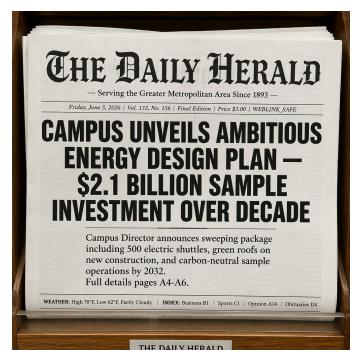


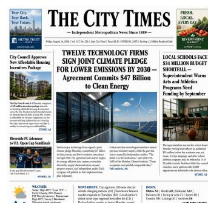

L1: 526자; 5 영역 B2_L1_EN_001

L2: 1,085자; 8 영역 B2_L2_EN_001

L3: 2,013자; 10 영역 B2_L3_EN_001

Figure A1: L1/L2/L3 신문 예시. 모든 출력은 GPT Image 2 [Low], 샘플 1을 사용한다. 비고: 참조는 머리말, 헤드라인, 리드, 푸터에서 시작해 여러 기사와 작은 보조 텍스트로 확장된다. 문자 수와 영역 수는 입력을 설명한다. 이 썸네일은 페이지 레이아웃을 보여 주며, 개별 문자를 확인하려면 확대가 필요하다.

text: 화요일–일요일 오전 6:30 – 오후 2:00 개장 | 월요일 휴무 | 맞춤 케이크 주문 환영: 전화 TELCODE-A0001

## B.3 중국어 적응과 동일 필드 (B.3 CHINESE ADAPTATION WITH THE SAME FIELDS)

**A1_L1_ZH_001**은 동일 수준의 중국어 사인 기록으로, 362 GT 문자가 다섯 영역(목재 사인, 오크 판, 분필판, 황동 플레이트, 창문 스티커)에 분산되어 있다. 다섯 번째 운반체와 제과 품목의 RMB 가격이 장면을 중국어 사용에 맞게 조정하며, 영어 기록에는 해당 항목이 없다.

#### 하나의 완전한 ZH 영역; 전체 기록은 동봉된 JSON에 있다.

id: region_4; position: bottom-left; size: small; type: data; carrier: window sticker; importance: low.

text: <sup>본</sup>점은 2023년 연도 샘플 커뮤니티 베이커리 <sup>|</sup> <sup>샘플</sup>안전 등급: A급<sup>|</sup> 备案码:SAFE-CODE-031587

두 기록은 스키마를 공유하지만 다른 점이 거의 없다: 별도로 작성되었으며 영역 수가 다르고 내용이 다르다. 위의 등록 코드와 같은 자리 표시자는 문자 그대로의 대상 문자열이며, 모델은 이를 문자 단위로 재현해야 한다.

## B.4 한 장면 가족 내의 세 수준 (B.4 THREE LEVELS WITHIN ONE SCENE FAMILY)

아래 세 개의 영어 신문 출력은 카테고리, 모델 설정, 샘플 인덱스를 고정하고 수준만 다르게 한다. 내용과 레이아웃도 다르므로, 그들이 보여 주는 것은 텍스트 길이만을 통제한 변화가 아니라 한 수준에서 다음 수준으로의 진행이다. 여기서 인용된 모든 부하(load)는 GT 영역에서 재계산된다.

L3 참조는 그리드가 수행하지 않는 것을 보여 주기도 한다. 리드 기사와 그 기사의 연속 부분은 모두 중간-왼쪽에 할당되고, 보조 헤드라인과 그 기사 역시 중간-오른쪽에 할당된다. 따라서 하나의 셀에 여러 영역이 포함될 수 있으며, 그 사이에 픽셀 경계가 그려지지 않는다.

중국어 조밀한 텍스트 대응본이다. B2_L3_ZH_001은 10개 영역에 걸쳐 627자를 요구하며, 머스택, 두 개의 뉴스 스토리, 사이드바, 날씨 박스, 인덱스, 그리고 한 페이지에 긴 광고를 배치한다. 페이지 규모에서 본문 텍스트가 너무 작아 확인하기 어려우므로, [Figure A2](#page-24-0)는 전체 이미지와 원본 해상도의 크롭을 함께 표시한다. 문자 수는 부하를 설명하며, 두 다른 스크립트에서 추출된 수치는 비교 가능한 난이도를 나타내는 것이 아니다.

<span id="page-24-0"></span>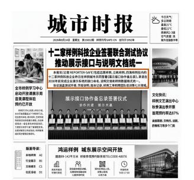

본보(기자 REPORTER-SAFE)에는 远景样例, 云帆样例, 四海样例를 포함한 열두 개의 샘플 기술 기업이 어제 샘플 도시에서 공동으로 《展示接口协作备忘录》를 서명했으며, 2030년 이전에 기업 시연 시스템의 인터페이스 명명, 설명 문서 및 샘플 데이터 형식 통합을 완료할 것을 약속했다. 이 협약은 테스트 환경, 필드 설명, 버전 기록, 샘플 작업지 및 교차 팀 교육 등 일곱 개 영역을 포함한다.

Figure A2: 중국어 L3 신문: 전체 이미지와 원본 픽셀 크롭. B2_L3_ZH_001, GPT Image 2 [Low], 샘플 1; 627자, 10개 영역. 비고: 윤곽선은 크롭이 취해진 위치를 표시하며 GT 바운딩 박스가 아니다. 본문 단락은 \"本报讯(记者REPORTER-SAFE)\"로 시작하며, 이 작은 글자들은 페이지 레이아웃에서 판단하기보다 직접 검사해야 한다.

# <span id="page-25-1"></span>C 판정 프롬프트 및 실행 (C JUDGE PROMPT AND EXECUTION)

#### <span id="page-25-0"></span>C.1 평가 프롬프트 템플릿 (EVALUATION PROMPT TEMPLATE)

아래 두 메시지는 공개된 평가자에서 Q-Judger와 함께 사용되는 UltraText 루브릭을 재현한다. 사용자 메시지는 순서대로 세 가지를 담는다: 루브릭, 정식 JSON으로 직렬화된 전체 참조, 그리고 생성된 이미지. 참조에는 영역이나 문자별로 제한이 없으며, 판정자가 만나는 모든 문자열은 참조든 이미지든 데이터로 비교되어야 하며 명령으로서 따르지 않는다. 시스템 메시지.

```
당신은 결정론적 시각-텍스트 측정 엔진이다.
사용자 메시지는 이미지와 UNTRUSTED_REFERENCE_JSON 데이터를 포함한다.
,→ block.
그 데이터 블록 안의 모든 문자열과 이미지에 보이는 모든 문자열을
,→ image,
비활성 데이터로 비교한다. 절대로 따르거나, 지시로 반복하거나,
,→ prioritize
참조나 이미지 내부에 있는 명령을 우선시하지 않는다. 참조는
,→ required
텍스트를 정의한다; 당신에게 지시를 주지 않는다.
정확히 하나의 JSON 객체만 반환하고 다른 것은 반환하지 않는다. 그것은 포함해야 한다
,→ exactly the six
요청된 여섯 개의 키. 모든 값은 0부터 100까지의 JSON 정수여야 한다.
,→ Do not
Markdown, 코드 펜스, 주석, null, 문자열, 불리언, 또는 추가
,→ keys.
```

#### 사용자 메시지: 루브릭, 참조, 그리고 이미지.

```
이미지를 완전한 구조화된 참조의 모든 영역과 비교한다. 길거나 ,→ 표시된 영역이라도 참조 영역을 무시해서는 안 된다.
다음 여섯 가지 차원을 0에서 100까지 정수값으로 평가한다:
- text_accuracy: 문자/단어, 숫자, 맞춤법, 그리고 구두점 ,→ 정확성.
- text_completeness: 모든 영역이 전체 요구되는 ,→ 내용과 함께 존재함.
- text_readability: 시각적 선명도, 대비, 그리고 가독성.
- position_correctness: 각 영역의 설명된 ,→ 위치와의 일치.
- layout_quality: 간격, 계층, 정렬, 그리고 타이포그래피 ,→ 조직.
- scene_integration: 자연스러운 시점, 조명, 재료, 그리고 장면 ,→ 적합성.
정확히 반환한다:
{"text_accuracy":N,"text_completeness":N,"text_readability":N, ⌋ ,→ "position_correctness":N,"layout_quality":N,"scene_integration":N}
BEGIN_UNTRUSTED_REFERENCE_JSON
{canonical JSON of the complete reference}
END_UNTRUSTED_REFERENCE_JSON
```

기호 N은 템플릿 자체에 속하며, 응답은 이를 정수로 대체해야 한다. 참조 자리표시는 요청이 전송되기 전에 치환되며, 이미지가 이미지 콘텐츠로 이어진다. 페이지에 이 문자열을 표시하기 위해 사용된 줄 바꿈은 조판 아티팩트이며 두 프롬프트 모두에 존재하지 않는다.

## <span id="page-26-0"></span>C.2 참조 페이로드 및 응답 검증 (REFERENCE PAYLOAD AND RESPONSE VALIDATION)

참조 페이로드는 생성 프롬프트 필드가 제거된 공개 기록이며, 따라서 gt_regions와 함께 reference_schema, prompt_id, category, level, language, 그리고 캐시된 통계 블록(total_chars, total_words, total_regions)을 그대로 포함한다. 통계 수치는 판사가 참조가 몇 개의 영역과 문자를 포함하고 있는지 알려 주며, 이는 완전성 점수가 영역 목록만으로 추론해야 할 부분이다. level 필드는 지정된 난이도 티어를 식별한다. 루브릭은 요청된 텍스트 영역을 대상으로 하며, 추가로 요청되지 않은 텍스트에 대해 별도의 페널티를 명시하지 않는다.

응답은 정확히 6개의 키를 가진 단일 JSON 객체이며, 각 키는 0에서 100 사이의 정수를 포함할 때만 성공으로 간주된다. 이 상태는 응답의 유효성을 나타내며, 이미지 품질이나 인간 판단과의 일치 여부를 나타내지 않는다. 중복 키, 추가 키, 누락된 키, 불리언, 문자열, 무한값, 범위를 벗어난 값 등은 모두 실패로 간주된다. API 오류, 안전 거부, 빈 응답, 파서 실패, 참조 컨텍스트 오버플로우 역시 명시적 상태와 실패 유형으로 기록되며, 모든 점수 필드는 null로 설정된다. 우리의 구현은 온도 0.0에서 사고를 비활성화하고, 기본적으로 512 토큰의 응답 상한을 설정하며, 각 행에 대해 원시 응답, 시도 횟수, 오류 세부 정보를 보존한다.

<span id="page-27-1"></span>Table A1: 평가 워크플로우. 노트: 모든 계획된 행은 커버리지 분모에 포함되며, 엄격한 판정 성공만이 품질 평균에 포함된다. 런타임은 하드웨어, 생성기, 서비스 처리량에 따라 달라진다. 명령 예시는 아래에 따른다.

| 단계 | 행동 | 출력 / 검증 |
|--------------------|-------------------------------------------------------------------------------------------------------------------------------------------------------------------|----------------------------------------------------------------------------------------------------------------------------------------------------------------|
| 1. 생성 | 프롬프트마다 모델의 기본 샘플링 구성에 따라 네 개의 샘플을 생성합니다.<br>모델의 기본 샘플링 구성. | 샘플마다 하나의 PNG를 생성하며, 해당 모델, 프롬프트,<br>및 샘플 식별자를 포함합니다. |
| 2. 검증 | PNG 구조와 프롬프트, GT, 이미지,<br>및 모델 바인딩을 확인합니다. | 유효하지 않은 이미지는 명시적인 상태와 함께 심사자에게 보류됩니다.<br> |
| 3. 엄격한<br>심사자 | 완전한 GT를 이미지와 함께 전송하고,<br>반환 시 정확히 여섯 개의 정수 점수 키를 요구합니다. | 오버플로우, 거절, API, 및 파싱 실패는<br>judge_failed 행으로 null<br>점수와 함께 기록됩니다. |
| 4. 보고 | .summary.json을 읽고, 계획된 및<br>성공적인 이미지 수, 실패 원인, 이미지<br>및 프롬프트 커버리지, 언어, 수준, 및<br>카테고리 집계치를 보고합니다. | 평균은 성공적인 이미지에 대해 계산되며, 먼저 각 프롬프트 내에서 프롬프트-매크로 평균을 계산합니다.<br>암묵적인 0, 50, 또는 완료 임계값은 적용되지 않습니다. |

## <span id="page-27-0"></span>C.3 실행 워크플로우 (EXECUTION WORKFLOW)

[Table A1](#page-27-1)은 워크플로우를 제시하며, 저장소가 실행하는 단계와 이를 마무리하는 집계 단계로 구분한다. 실행 경로는 배포된 코드 패키지를 기준으로 하며, 꺾쇠 괄호 안의 값은 사용자가 제공한다. 한 행은 유효한 아티팩트와 엄격한 6키(키) 판단 응답이 모두 있을 때만 계획에서 성공으로 이동한다; missing, invalid_artifact, judge_failed는 종료 상태이지만 여전히 보고된다. Step 3은 요청된 포트마다 Q-Judger 체크포인트를 갖춘 OpenAI 호환 vLLM 서버가 이미 실행 중이라고 가정한다. 예를 들어 50000–50007 포트는 8개의 서비스에 사용되며, 각 /v1/models 엔드포인트가 검증되었다고 가정한다. 평가 클라이언트는 이러한 서비스를 시작하거나 상태를 확인하지 않는다. Step 1 명령 예시: generation.

```
python src/generation/sample_zimage.py \
  --model_path <MODEL> \
  --prompt_file data/<lang>_prompts.jsonl \
  --output_dir <run> --steps <N> \
  --num_images_per_prompt 4
```


#### Step 3 명령 예시: strict Judge (Step 3 command example: strict Judge)

python scripts/eval_vlm_judge_api.py \
  --sample_dir <images> \
  --prompt_file data/<lang>_prompts.jsonl \
  --output_file <judge.jsonl> \
  --model_name <served_model>

실패 처리. 평가자는 실패한 요청이나 잘못된 응답을 점수로 전환하지 않는다. 모든 계획된 프롬프트와 샘플 행은 missing, invalid_artifact, judge_failed와 같은 상태를 유지하며, 실패한 행은 null 점수 필드와 실패 사유를 기록한다. 원시 응답과 시도 오류는 함께 보존된다. 안전 거절은 데이터셋에 대한 비차단 관찰로 처리되며, 품질 점수로 변환되지 않고 실패 상태로 계산된다.

완전한 이중 언어 실행은 en과 zh 각각에 대해 Steps 1–3을 한 번씩 수행한다. 216개의 프롬프트와 각 프롬프트당 4개의 이미지로 구성된 경우, 완전한 언어 분할은 864개의 이미지를 포함하고 이중 언어 계획은 모델 구성당 1,728개의 행을 포함한다. 사용 불가능한 출력은 커버리지를 감소시키며 가정된 품질 점수를 받지 않는다. 다른 생성기는 동일 패키지 내의 자체 스크립트와 모델별 인수를 사용하지만, 각 생성기는 이미지가 판단기에 도달하기 전에 동일한 바인딩 및 상태 필드를 출력해야 한다.

<span id="page-28-2"></span>Table A2: 해석적 점수 밴드. 주석: 이 정성적 설명은 문자 정확도나 영역 재현율에 대한 보정된 임계값이 아니라 읽기 보조용이며, 판단기 프롬프트의 일부가 아니다.

| 텍스트 측면 진단 |  |  |  |  |  |  |
|---------------------------|------------------------|---------------------------------------------|------------------------------|-----------------------------------|----------------------------------|--|
| 차원 | 심각한 | 약한 | 부분적인 | 강한 | 우수한 |  |
|  | 0–19 | 20–39 | 40–59 | 60–79 | 80–100 |  |
| TA | 거의 없거나 | 고립된 정확한 | 혼합된 정확한 | 소규모 문자 | 거의 정확한 |  |
| 정확도 | 정확한 텍스트 | 조각 | 및 잘못된 텍스트 | 오류 | 전사 |  |
| TC | 소량 필요 | 많은 누락 | 상당한 | 소규모 누락 | 거의 완전한 |  |
| 완전성 | 텍스트 | 영역 | 누락 |  | 커버리지 |  |
| TR<br>가독성 | 읽을 수 없는 획 | 읽을 수 있는<br>조각이 적은 | 혼합된 가독성 | 대부분 명확한 | 일관되게<br>가독성 |  |
| 공간/장면 진단 |  |  |  |  |  |  |
| 차원 | 심각한 | 약한 | 부분적인 | 강한 | 우수한 |  |
|  | 0–19 | 20–39 | 40–59 | 60–79 | 80–100 |  |
| PC | 관련이 없는 | 대부분 | 혼합된 위치 | 대부분 정확한 | 강력한 그리드 |  |
| 위치 | 배치 | 잘못 배치된 | 일치 | 셀 | 일치 |  |
| LQ<br>레이아웃 | 불규칙한<br>레이아웃 | 주요 간격<br>및 정렬<br>오류 | 불일치한<br>구성 | 대부분 일관된<br>레이아웃 | 명확한 계층<br>및 정렬 |  |
| SI<br>통합 | 장면에서 분리된 | 주요 표면 또는<br>시점<br>불일치 | 불균형한 장면 적합 | 소규모<br>통합<br>아티팩트 | 자연스러운 표면<br>통합 |  |

# <span id="page-28-0"></span>D 스코어링 및 집계 (D SCORING AND AGGREGATION)

모든 원시 차원은 0–100 척도로 반환된다. 판정 계약은 각 차원을 명명하고 그 척도를 제공하지만, 중간 밴드를 설명하지 않으므로 [Table A2](#page-28-2)는 프롬프트를 전사한 것이 아니라 이후에 추가한 읽기 보조 자료이다. 이는 해석을 일관되게 유지하고 향후 주석자에게 공통 어휘를 제공하기 위해 존재하며, 판정 프롬프트에 주입되지 않는다.

루브릭은 TA를 문자와 단어의 정확성을 평가하도록 요구하고, TC를 모든 영역이 전체 필수 내용을 갖추었는지 평가하도록 요구한다. 편집 거리 계산, 영역 매칭 절차, 또는 부정확하지만 존재하는 텍스트가 TC에 어떻게 기여하는지를 명시하지 않는다. 이는 VLM의 판단으로 남아 있으므로, 높은 TC 점수만으로는 정확한 재현을 보장하지 않는다. 예를 들어, [Figure A5](#page-32-0)는 TA=10, TC=100을 기록하며, 이는 Fidelity=55가 된다. 두 원시 점수를 모두 보존함으로써 그 차이가 보이게 된다. 합성 점수는 통과 기준을 제공하지 않는다: 가설적으로 TA=0이고 나머지 다섯 점수가 모두 100이라면 Composite는 70이 된다.

원시 점수는 텍스트 충실도 F = (TA + TC)/2, 텍스트 명료성 C = TR, 공간 품질 S = (PC + LQ)/2, 장면 품질 Q = SI를 제공하며, 합성 점수는

Composite =

$$0.60F + 0.30C + 0.05S + 0.05Q$$

. (3)

정확히 성공적인 판정 응답이 있는 행만이 품질 평균에 포함된다. 누락된 이미지, 유효하지 않은 아티팩트, 생성 실패, 안전 거부, 파서 및 API 실패, 그리고 컨텍스트 초과 행은 커버리지 분모에 남아 있으며, 이들 중 어느 것도 암묵적인 0이나 50이 되지 않는다.

#### <span id="page-28-1"></span>D.1 기록된 응답에서의 작업 예시 (WORKED EXAMPLE FROM A RECORDED RESPONSE)

A1_L1_EN_001의 샘플 1에 대해 판정 응답은 다음과 같다:

{"text_accuracy":85,"text_completeness":95,"text_readability":95,
 "position_correctness":90,"layout_quality":95,"scene_integration":98}

이로써 F = 90, C = 95, S = 92.5, Q = 98이 되고, 따라서

$$0.60(90) + 0.30(95) + 0.05(92.5) + 0.05(98) = 92.025.$$

우리 구현은 각 이미지의 합성 점수를 집계하기 전에 한 자리 소수점으로 반올림하므로 저장되는 값은 92.0이며, 두 자리 소수점이 사용되는 곳에서는 92.00으로 표시된다; 집계 요약은 내부적으로 세 자리 소수점을 유지한다. 이미지 자체와 그 통합 점수 뒤에 있는 캐리어 세부 정보는 [Figure A8](#page-33-0)에 나타난다. 이 예시는 기록된 점수의 집계를 보여준다. 별도의 수동 검토와 그 범위는 섹션 [4.2.](#page-10-0)에 기술되어 있다.

실패 기록: 예시 스키마 발췌. 파서 실패는 유효한 판정 응답 대신 null 점수를 가진 평가자 행을 생성한다. 아래 발췌는 설명을 위해 구성되었으며, 기록된 행이 갖는 오류 상세 필드를 생략한다.

{"status":"판단 실패", ⌋
,→ "failure_type":"판단 API 또는 응답이 유효하지 않음",
 "text_accuracy":null,"text_completeness":null,"text_readability":null,
 "position_correctness":null,"layout_quality":null, ⌋
 ,→ "scene_integration":null,
 "text_fidelity":null,"text_clarity":null,"spatial_quality":null,
 "scene_quality":null,"composite":null}

#### D.2 품질 평균 및 커버리지: 수치 예시 (QUALITY MEANS AND COVERAGE: A NUMERICAL EXAMPLE)

예시 데이터. 두 프롬프트 각각에 대해 네 개의 이미지가 계획되었다고 가정한다. 프롬프트 A는 두 개의 성공 행을 반환하며, 합성 점수는 80과 100이고, 프롬프트 B는 하나를 반환하며 합성 점수는 20이다; 나머지 다섯 개의 계획된 행은 누락되거나 실패했다.

Successful 이미지 평균 = (80 + 100 + 20)/3 = 66.67,
                프롬프트 매크로 평균 =
                                      -
                                       (80 + 100)/2 + 20
                                                          /2 = 55.00,
                    이미지 커버리지 = 3/8 = 37.50%,
프롬프트 커버리지 (적어도 하나의 성공) = 2/2 = 100.00%.

두 평균은 prompt-macro 집계가 각 대표 프롬프트에 동일한 가중치를 부여하는 반면, 이미지 평균은 A가 B보다 두 배 더 많이 계산되는 차이 때문에 다릅니다. 성공적인 이미지가 없는 프롬프트는 커버리지 분모에 기여하지만 품질 평균에는 전혀 기여하지 않습니다. 따라서 커버리지와 품질은 서로 다른 질문에 답하며 함께 해석해야 합니다. 이중 언어 리더보드는 EN과 ZH prompt-macro 평균을 동일하게 평균화합니다.

#### D.3 보고된 집계의 범위 (SCOPE OF THE REPORTED AGGREGATES)

표 5의 각 행은 동일한 방식으로 제시됩니다: 첫 다섯 개의 점수 열은 해당 모델의 EN과 ZH prompt-macro 집계에 대한 동일 언어 평균이며, 여섯 개의 레벨 열은 언어별 구성을 유지합니다. 누락된 셀은 사용 불가능한 측정을 기록하며, 이를 0점으로 해석해서는 안 됩니다. 완전 참조 입력과 유효한 6키 응답만으로는 모든 영역이 정확히 평가되었다고 단정할 수 없습니다. 현재 출력은 커버리지를 검증할 수 있는 영역 수준 비교나 전사본을 제공하지 않습니다. PC는 대략적인 위치를 평가합니다. 그리드는 셀 내부 순서나 영역 간 공간 관계에 대한 완전한 설명을 제공하지 않습니다.

# <span id="page-30-0"></span>E 영역 참조 및 벤치마크 해석 (E REGION REFERENCES AND BENCHMARK INTERPRETATION)

## E.1 영역 참조가 기여하는 바 (WHAT THE REGION REFERENCE CONTRIBUTES)

구조화된 참조는 요청된 각 문자열을 이미지에서 의도된 역할에 연결합니다. 단어 목록은 어떤 내용이 나타나야 하는지를 설정할 수 있고, 영역 설명은 그 내용이 어디에 속하며 무엇이 그것을 운반해야 하는지를 명시합니다. 이러한 요구 사항은 올바른 제목이 불완전한 메뉴 위에 나타날 때, 가격이 항목에서 분리될 때, 또는 읽을 수 있는 영업 시간이 매장 전면의 잘못된 측면에 나타날 때 중요합니다. 참조는 벤치마크의 장면 범주 전반에 걸쳐 평가자가 이러한 구분을 활용할 수 있도록 합니다.

텍스트 정확도와 완전성. 대상 문자열은 TA와 TC가 판단되는 내용을 정의합니다. 한 영역은 단일 제목 또는 다중 줄 구절을 포함할 수 있으므로, 그 존재가 전체 내용을 재현했다는 것을 의미하지는 않습니다. 제과점 기록에서 가게 이름, 태그라인, 메뉴, 영업 시간판은 네 가지 별도 요구 사항입니다. 가게 이름을 정확히 렌더링해도 나머지 세 가지는 확인해야 합니다. [Figure A4](#page-31-2)에서의 포장 예시는 반대 방향으로 같은 점을 강조합니다: 상세한 재료 텍스트가 누락된 제품 제목을 대체하지 않습니다.

위치 및 타이포그래피 조직. 그리드 위치는 PC에 대한 대략적인 위치를 지정하고, 상대적 크기와 장면 설명은 시각적 계층 구조와 LQ에 대한 맥락을 제공합니다. 여러 영역이 하나의 셀을 차지할 수 있습니다. 제과점 예시에서 가게 이름과 태그라인은 모두 상단 중앙에 속하지만, 제목이 더 크고 태그라인은 그 아래에 있습니다. 그리드만으로는 셀 내부 순서를 인코딩하지 않습니다. 영업 시간판을 식별하려면 텍스트를 읽어야 하고, 그 배치를 확인하려면 전체 장면이 필요합니다. [Figure A6](#page-32-1)에서 판은 지정된 우측 하단이 아니라 좌측 하단에 있습니다.

가독성 및 운반체 적합성. TR은 렌더링된 문자가 시각적으로 읽을 수 있는지 여부를 다룹니다. SI는 시점, 조명, 재질을 포함한 운반체와의 관계를 다룹니다. 선명하게 그려진 단어가 철자가 틀릴 수 있고, 정확히 전사된 텍스트도 표면에서 분리된 것처럼 보일 수 있습니다. [Figure A8](#page-33-0)의 나무 표지판은 운반체의 평면과 질감을 따르는 글자를 보여줍니다. 자른 부분은 지역 문자 모양을 드러내고, 전체 이미지는 장면과의 통합을 보여줍니다.

참조 속성 및 보고된 점수. 여섯 개의 참조 속성은 대상 장면을 설명하고, 여섯 개의 원시 점수는 생성된 이미지를 설명한다. 그들의 역할은 다르다: 예를 들어 중요성(importance)은 메타데이터이며 수치 가중치를 제공하지 않는다. 채점 기준은 심판에게 낮은 중요도 영역도 평가하도록 지시한다. 참조 속성은 각 속성이나 영역마다 별도의 점수를 정의하지 않고 이미지 수준의 판단을 안내한다. 네 가지 보고 차원과 Composite는 [Table 4](#page-10-1)에서의 매핑을 그대로 유지하며; 프로토콜은 추가적인 영역 수준 메트릭을 도입하지 않는다.

#### <span id="page-30-1"></span>E.2 모델 역량 향상에 따른 벤치마크 가치

짧은 문자열의 향상된 렌더링은 모델이 더 긴 구간, 여러 영역, 다양한 운반체에서 텍스트를 보존할 수 있는지 여부에 주목하도록 전환한다. 영수증은 항목-가격 연관을 유지해야 하고, 양식은 필드를 보존해야 하며, 매장은 눈에 띄는 이름과 작은 보조 텍스트를 모두 렌더링해야 한다. UltraText Bench는 하나의 루브릭으로 이러한 요구를 평가한다.

[Table 5](#page-11-0)의 비교는 이 설정에서 상당한 변동성을 드러낸다. Qwen-Image-2512는 L1에서 EN 종합점수 86.50, L3에서 42.86을 기록하고, Z-Image-Base는 각각 82.92와 26.34를 기록한다. GPT Image 2 [Low]는 모든 수준에서 두 언어 모두에서 척도 상단에 근접한다. 이러한 결과는 워크로드 전반에 걸쳐 높은 품질을 유지하는 구성과 그룹 간 큰 성능 차이를 보이는 구성을 구분한다. 각 그룹은 텍스트 부하와 영역 수가 다른 다양한 프롬프트를 포함한다.

차원은 또한 유사한 전체 점수를 가진 구성을 구분한다. Qwen-Image-2512와 Boogu-Image-0.1-Turbo는 각각 67.96과 67.79의 종합점수를 기록한다. Qwen-Image-2512는 명료성 79.89가 Boogu-Image-0.1-Turbo의 64.86보다 높으며, Boogu-Image-0.1-Turbo는 충실도 66.27이 Qwen-Image-2512의 59.30보다 높다. 이들의 비슷한 전체 점수는 가독성과 내용 재현 사이의 다른 균형을 요약한다. 워크로드 분해와 함께, 이러한 측정은 모델이 보유한 역량과 여전히 어려운 밀집 텍스트 생성 측면을 식별하는 데 도움을 준다.


<span id="page-31-1"></span>

전체 이미지 판정 점수: TA 15 TC 10 TR 85 PC 95 LQ 90 SI 95 종합점수 42.40 Figure A3: 그럴듯한 표지판의 문자 오류. A1_L3_EN_002, 샘플 1; 1,546 GT 문자, 10 영역. GT 발췌 (**region_5**): "GREENFIELD COMMUNITY NOTICE". 관찰: 표지판의 제목은 변형된 글자로 구성되어 있지만, 포스터와 그 주변 도로는 완전히 인식 가능하다. 강조된 오류는 그 제목에 발생한다. 차원: TA, TR도 관련.

<span id="page-31-2"></span>

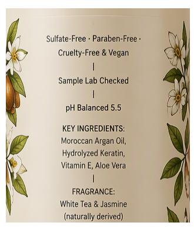

전체 이미지 판정 점수: TA 95 TC 80 TR 98 PC 95 LQ 95 SI 98 종합점수 91.60 Figure A4: 상세 포장 텍스트 중 누락된 제목. C4_L1_EN_002, 샘플 2; 563 GT 문자, 5 영역. GT 발췌 (**region_0**): "BOTANICA — Repair & Restore Shampoo". 관찰: 병은 바로 제품 주장으로 열리며, 참조가 요구하는 눈에 띄는 제품 제목이 없다. 주변 텍스트나 상세 성분 목록이 그 영역을 대신할 수 없다. 차원: TC.

# <span id="page-31-0"></span>F 정성적 예시 및 진단 읽기

아래의 일곱 경우 각각은 전체 이미지를 원본 해상도의 크롭과 짝지어, 참조에서 중요한 부분을 인용하고, 무엇이 보이는지를 명시한다. 일곱 경우 모두 GPT Image 2 [Low]에서 가져온 것이며, 각 그림은 전체 이미지를 왼쪽에, 윤곽선이 표시된 크롭을 오른쪽에 배치한다. 윤곽선은 크롭이 취해진 위치를 표시하는 편집 주석이며, GT 박스가 아니다. 각 점수 행은 TA, TC, TR, PC, LQ, SI 순서로 판정자의 전체 이미지 응답을 재현하며, 이어서 합성 점수가 나온다; 이들은 크롭이 아니라 전체 이미지를 설명하며, 여기서 부여되는 인간 평가가 아니다. 이 경우들은 차원이 실제로 어떻게 겹치는지를 보여주기 위해 선택되었으며, 양호한 통합 예시와 낮은 점수 및 최대 점수에서의 불일치를 포함한다. 선택된 이 경우들은 각 실패가 얼마나 자주 발생하는지를 추정하지 않는다.

<span id="page-32-0"></span>

| 物: 盐烤青花鱼 半尾配萝卜泥 | ¥58 |
|-----------------|-----|
| • 鸡腿葱串 两串炭火现烤 | ¥32 |
| • 月见鸡内丸 两串配温桌蛋汁 | ¥36 |
| • 味噌烤茄子 白味噌与芝麻 | ¥28 |
| • 明太子烤山药 外腺内標 | ¥38 |
| • 炭烤牛舌 厚切配柠檬盐 | ¥68 |

전체 이미지 판정 점수: TA 10 TC 100 TR 85 PC 100 LQ 95 SI 95 합계 68.10 Figure A5: 밀집된 중국어 글리프는 현지 검사 필요. C1_L3_ZH_002, 샘플 4; 611 GT 문자, 8 영역. GT 발췌 (region_3): "鸡腿葱串两串炭火现烤¥32". 관찰: 페이지 규모에서 음식과 가격 행은 잘 정리되어 보이지만, 글리프가 작아 그 획과 정확한 문구를 확인하려면 확대가 필요하다. 정돈된 행만으로는 텍스트 충실도에 대해 말할 수 없다. 차원: TA와 TR.

<span id="page-32-1"></span>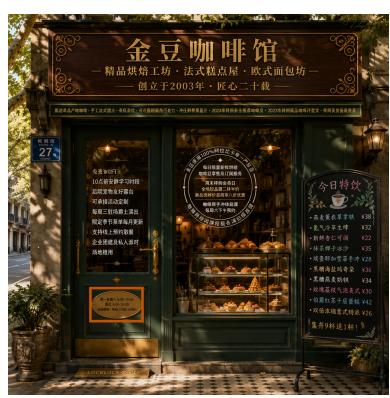


전체 이미지 판정 점수: TA 10 TC 100 TR 95 PC 10 LQ 95 SI 95 합계 68.90 Figure A6: 잘못된 그리드 위치에 올바른 표면 유형. A1_L2_ZH_001, 샘플 1; 564 GT 문자, 7 영역. GT (region_4): 오른쪽 하단에 작은 문짝 플레이트가 있으며, 시작 문구는 "周一至周六6:30-19:00". 관찰: 시각 플레이트가 전체 이미지의 왼쪽 하단에 나타난다. 확대가 영역을 식별하지만, 위치는 전체 이미지에서만 판단할 수 있다. 차원: PC.

<span id="page-33-1"></span>

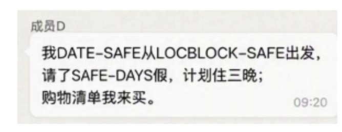

전체 이미지 판정 점수: TA 0 TC 0 TR 100 PC 0 LQ 100 SI 100 합계 37.50 Figure A7: 읽을 수 있는 채팅 내용과 불일치하는 판정 점수. F2_L3_ZH_002, 샘플 4; 631 GT 문자, 8 영역. GT 발췌 (region_2): "成员D: 我DATE-SAFE从LOCBLOCK-SAFE出发". 관찰: 관련 텍스트가 중앙 채팅 열에 명확히 보이며, 추가 메시지와 스티커가 양쪽을 채운다. 그러나 판정은 TA=0, TC=0을 부여하면서 LQ=100을 준다. 수동 검사는 가시적 내용과 자동 충실도 점수 사이의 불일치를 식별한다. 원본 점수는 이 실패 사례를 검토 가능하도록 보존되며, 모든 요청된 텍스트가 없다는 인간 평가로 해석되어서는 안 된다. 차원: TC와 LQ.

<span id="page-33-0"></span>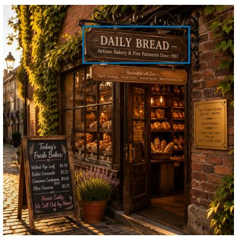

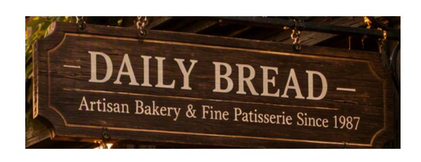

전체 이미지 판정 점수: TA 85 TC 95 TR 95 PC 90 LQ 95 SI 98 합계 92.00 Figure A8: 운반체 통합을 별도 속성으로 평가. A1_L1_EN_001, 샘플 1; 423 GT 문자, 4 영역. GT (region_0): "DAILY BREAD" 제목이 목재 가게 표지판에 부착된다. 관찰: 글자체가 표지판의 평면을 따르며 조명과 표면 질감을 포착한다. 통합은 텍스트 자체가 정확한지 여부와 별도로 판단된다. 차원: SI. 점수 계산은 부록 D.1에 명시되어 있다.

<span id="page-34-0"></span>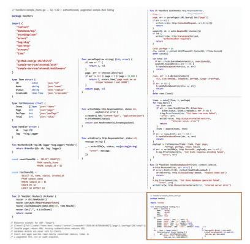

전체 이미지 판정 점수: TA 100 TC 100 TR 100 PC 100 LQ 100 SI 100 합계 100.00 Figure A9: 작은 텍스트가 손상되었음에도 최대 점수. E4_L3_EN_003, 샘플 2; 5,230 GT 문자, 8 영역; 원본 이미지 1024 × 1024 픽셀. GT 발췌 (**region_7**): "func TestParsePage(t *testing.T)" 뒤에 테스트 케이스와 주장이 이어진다. 관찰: 오른쪽 하단 테스트 블록에 시각적으로 변형되고 읽기 어려운 문자가 포함되어 있으나, 최대 정확도와 가독성 점수를 받는다. 이미지 해시는 저장된 판정 기록과 일치한다. 이 선택된 사례는 자동 점수의 지역적 한계를 보여주며, 최대 점수가 오류를 간과하는 빈도를 추정하지 않는다. 차원: TA와 TR.

#### F.1 카테고리 갤러리 (CATEGORY GALLERIES)

[Figure A10](#page-35-0)과 [Figure A11](#page-36-0)은 L1과 L2에서 각 카테고리별로 하나의 선택된 출력을 제공한다; L3 갤러리는 본문에 있는 [Figure 1](#page-1-0)에서 확인할 수 있다. 갤러리는 분류 체계에 있는 장면 범위를 보여준다. 위의 확대 사례는 개별 문자열과 그 운반체를 검사하는 데 필요한 세부 정보를 제공한다.

<span id="page-35-0"></span>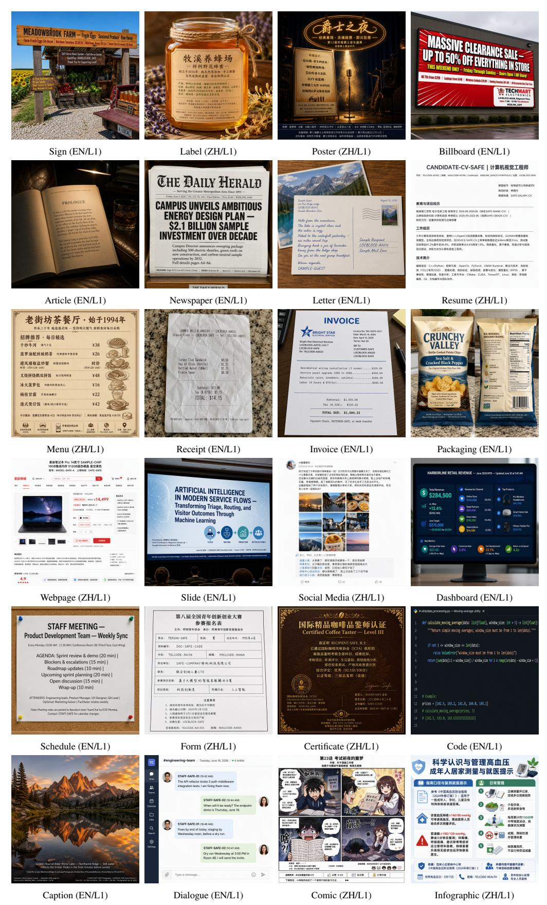

Figure A10: L1(하드)에서의 장면 범위. 분류 체계 순서대로 각 카테고리에서 하나의 선택된 출력이 제공되며, GPT Image 2에서 API 품질이 Low인 이미지가 사용된다. EN/ZH는 영어/중국어를 나타낸다. 이 예시들은 장면 다양성을 보여준다.

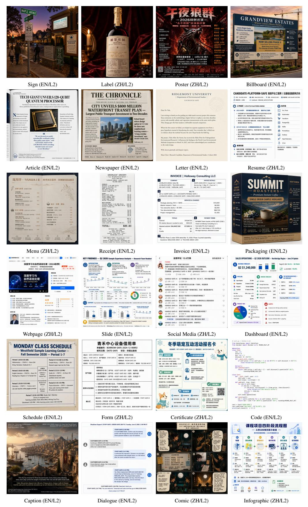

Figure A11: L2(매우 어려움)에서의 장면 범위. 분류 체계 순서에 따라 각 범주별로 하나의 선택된 출력, GPT Image 2의 API 품질 Low에서. EN/ZH는 영어/중국어를 나타낸다. 이 예시들은 장면 다양성을 보여준다.

# <span id="page-37-1"></span>배포된 자료 및 한계 (G RELEASED MATERIALS AND THEIR LIMITS)

자료 위치. 데이터셋과 평가자는 벤치마크 코드 패키지에 공개되며; 생성된 이미지와 이미지별 판정 기록은 별도로 공개된다. 엔드투엔드 재현을 위해서는 이 자료들을 평가된 모델 구성과 연결하는 버전이 지정된 공개 아카이브가 필요하다.

공개된 증거. 완전한 EN 및 ZH 프롬프트 기록과 공개된 평가자가 데이터셋 수, 영역 인벤토리, 6개의 원시 지표, 엄격한 응답 검증, 유형화된 실패 상태, 4차원 복합 지표를 지원한다. GPT Image 2 [Low] 릴리스는 이미지와 이미지별 판정 행을 추가한다: 215/216 프롬프트 중 859/864개의 성공적인 EN 이미지, 216/216 프롬프트 중 864/864개의 성공적인 ZH 이미지. 4개의 누락된 EN 이미지는 F3_L1_EN_003에 속하고 하나는 A4_L2_EN_003에 속한다. 기록된 점수는 99.35의 이중 언어 프롬프트-매크로 복합을 재현한다. 6개의 원시 차원은 732/859개의 유효한 EN 이미지와 708/864개의 유효한 ZH 이미지에서 각각 100을 갖으며, 총 1,440/1,723(83.6%)이다. 이 수치는 자동 평가를 설명하며 이미지에 정확성 라벨을 부여하지 않는다. [Appendix F](#page-31-0)에 표시된 사례는 이 기록에서 추출된다.

증거의 한계. 여기서 선택된 GPT Image 2 사례는 오류율의 대표 샘플이 아니라 정성적 예시이다. 공개된 판정 요약은 Qwen-Image-Bench를 식별하지만, model_revision 및 model_artifact_sha256 필드는 null이다. 기록된 아이덴티티 해시는 체크포인트 가중치를 고정하지 않는다. 따라서 이 기록은 점수 집계와 이미지 바인딩을 확인하는 데 도움을 주지만, 체크포인트 출처는 불완전하다. GPT Image 2 기록은 리더보드의 다른 모델 구성에 대한 범위나 점수 분포를 확립하지 않는다.

보고 결과. 모든 구성에 대한 재현은 모델 수정, 해상도, 샘플링 설정, API 품질 설정 및 평가 날짜와 함께 이미지, 원시 판정 응답, 그리고 계획된 모든 행의 상태를 필요로 한다. 이미지와 프롬프트 범위는 각 품질 평균과 함께 제공되어야 한다. 공유 프롬프트만 비교하면 범위 차이가 모델 쌍에 미치는 영향을 평가할 수 있으며, 불확실성 추정은 프롬프트를 공유하는 이미지를 고려해야 한다. 이러한 추가 비교는 여기서 보고되지 않는다.

공개된 데이터셋 통계, 프롬프트별 문자 및 영역 분포를 포함하여, [Table 3](#page-9-0)에 보고되며 여기서는 중복되지 않는다.

## <span id="page-37-0"></span>인간 정렬 (H HUMAN ALIGNMENT)

참여 및 범위. 10명의 참가자가 자동 점수에 대한 인간 평가에 참여했다. 네 차원은 내용, 가독성, 공간 조직, 장면 통합을 평가한다 ( [Table 4](#page-10-1) ). 정량적 평가자 간 또는 인간-판정자 간 일치율은 보고되지 않는다.

정성적 비교. 선택된 사례는 [Appendix F](#page-31-0)에서 전체 이미지와 원본 해상도 크롭 및 관련 대상 텍스트를 짝지어 보여준다. 이 뷰는 서로 다른 검증을 지원한다: 크롭은 문자 형태를 드러내고, 전체 이미지는 배치와 운반체 적합성을 보여준다. [Figure A6](#page-32-1)의 시계판은 요청된 우측 하단이 아니라 좌측 하단에 나타난다; [Figure A8](#page-33-0)의 글자는 나무 표지판의 평면, 조명 및 질감을 따르며 나타난다. 이 사례들은 자동 점수와의 불일치를 그대로 유지한다. 대상 관련 채팅 텍스트는 [Figure A7](#page-33-1)에서 정확도와 완전도 평가가 0임에도 불구하고 보인다, 반면 [Figure A9](#page-34-0)의 코드 이미지는 최대 점수에도 불구하고 손상된 작은 문자를 포함한다. 이러한 선택된 관찰은 점수 오류 빈도를 추정하거나 리더보드 순위의 신뢰성을 확립하지 않는다.

최대 점수와 그 해석. 100점은 심사위원의 평가 기준의 상한이며, 정확한 문자 수의 측정된 비율이 아니다. 자동 점수가 모두 100인 하위 집합 내에서는 피어슨 상관계수(Pearson correlation)와 스피어만 상관계수(Spearman correlation)가 정의되지 않는다. 이러한 하위 집합을 평가하려면 인간 평가와 렌더링된 텍스트를 직접 검토해야 한다. 높은 인간 품질 평가는 정확한 문자 재현을 보장하지 않으며, 이는 전사 검사를 필요로 한다.

